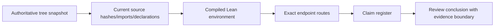

# Repository map

This map is generated from the authoritative tree-maker extract, current source hashes, and the compiled Lean environment.
It is a navigation and evidence map; it does not infer mathematical correspondence from reachability.

## Integrity

- Map validation: **passed**
- Authoritative tree: `D:\Research Lab\Jexposition\tree-maker\Define inteligence tree.md`
- Tree SHA-256: `476cc9257bf6f3a8259fe78110bdcd9df170b8e265dabb6aeb13e850aa522d17`
- Mapped Lean modules: `2790`
- Current Lean modules accounted for: `2790/2790`
- Unaccounted Lean modules: `0`
- Source declarations: `50191`
- Compiled environment nodes: `30721`
- Compiled environment edges: `227128`
- Exact source joins: `22958`
- Unmatched environment nodes: `7760`
- Ambiguous source matches: `3`
- Reachable `sorryAx` users: `0`

## How to read the map

1. **Tree layer:** confirms what the extracted repository inventory named at capture time.
2. **Source layer:** confirms current paths, hashes, imports, declarations, and symbol locations.
3. **Environment layer:** confirms declarations exported by the compiled Lean environment and exact route edges.
4. **Claim layer:** records whether a review claim is supported, conditional, or still open.

A route proves compiled reachability. It does not prove that an internal invariant is transported into the final field value.

## Module census

| Source area | Lean modules |
|---|---:|
| `ComparatorChallenges` | `2` |
| `Euler` | `1839` |
| `Euler.lean` | `1` |
| `NavierStokes.lean` | `1` |
| `NavierStokes/R3` | `110` |
| `NavierStokes/root` | `707` |
| `NavierStokesReview` | `130` |

## Selected endpoint routes

| Route | Reachable | Nodes |
|---|---:|---:|
| `NavierStokes.ActualCandidateAssembly.selected_witness` | `True` | `4` |
| `NavierStokes.DefectIncrementBounds.barMoment` | `True` | `17` |
| `NavierStokes.FiveRowRank.Debt` | `True` | `13` |
| `NavierStokes.FiveRowRank.FiveRows` | `True` | `19` |
| `NavierStokes.MeanRankUpdate.scaleDebt` | `True` | `14` |
| `NavierStokes.MixedPeriodicAssembly.periodicVelocity` | `True` | `4` |
| `NavierStokes.PositiveOrderMoments.Debt` | `True` | `12` |
| `NavierStokes.R3CompactCandidate.velocity` | `True` | `4` |
| `NavierStokesR3.ProblemStatement.CandidateProperties` | `True` | `2` |
| `NavierStokesR3.theorem_1_1` | `True` | `1` |

## Route ledger

### `NavierStokes.ActualCandidateAssembly.selected_witness`

1. `NavierStokesR3.theorem_1_1` — `NavierStokes/R3/Theorem.lean:46-51`; `sorryAx=False`
2. `NavierStokesR3.theorem_1_1_with_initial_rest` — `NavierStokes/R3/Theorem.lean:26-45`; `sorryAx=False`
3. `NavierStokesR3.ActualCandidate.selected_candidate_one_with_initial_rest` — `NavierStokes/R3/ActualCandidate.lean:143-155`; `sorryAx=False`
4. `NavierStokes.ActualCandidateAssembly.selected_witness` — `NavierStokes/ActualCandidateAssembly.lean:1177-1182`; `sorryAx=False`

### `NavierStokes.DefectIncrementBounds.barMoment`

1. `NavierStokesR3.theorem_1_1` — `NavierStokes/R3/Theorem.lean:46-51`; `sorryAx=False`
2. `NavierStokesR3.theorem_1_1_with_initial_rest` — `NavierStokes/R3/Theorem.lean:26-45`; `sorryAx=False`
3. `NavierStokesR3.ActualCandidate.selected_candidate_one_with_initial_rest` — `NavierStokes/R3/ActualCandidate.lean:143-155`; `sorryAx=False`
4. `NavierStokes.ActualCandidateAssembly.directStages` — `NavierStokes/ActualCandidateAssembly.lean:536-539`; `sorryAx=False`
5. `NavierStokes.ActualCandidateAssembly.directData` — `NavierStokes/ActualCandidateAssembly.lean:525-530`; `sorryAx=False`
6. `NavierStokes.ActualCandidateAssembly.meanCycleInput` — `NavierStokes/ActualCandidateAssembly.lean:483-491`; `sorryAx=False`
7. `NavierStokes.ActualCyclePreservation.state_waveData` — `NavierStokes/ActualCyclePreservation.lean:860-868`; `sorryAx=False`
8. `NavierStokes.ActualCyclePreservation.waveData_of_particular` — `NavierStokes/ActualCyclePreservation.lean:689-729`; `sorryAx=False`
9. `NavierStokes.ActualParticularMeanGain.postParticular_gain` — `NavierStokes/ActualParticularMeanGain.lean:138-159`; `sorryAx=False`
10. `NavierStokes.CorrectionStep.waveStage_mean_gain` — `NavierStokes/CorrectionStep.lean:9665-9729`; `sorryAx=False`
11. `NavierStokes.CorrectionStep.gaugeWaveStage_mean_from_covariance` — `NavierStokes/CorrectionStep.lean:7563-7614`; `sorryAx=False`
12. `NavierStokes.GaugeDebtIncrement.waveStage_debt_change_mem` — `NavierStokes/GaugeDebtIncrement.lean:423-447`; `sorryAx=False`
13. `NavierStokes.GaugeDebtIncrement.waveStage_debt_change_formula` — `NavierStokes/GaugeDebtIncrement.lean:387-422`; `sorryAx=False`
14. `NavierStokes.GaugeDebtIncrement.debt_sub_eq` — `NavierStokes/GaugeDebtIncrement.lean:206-233`; `sorryAx=False`
15. `NavierStokes.GaugeDebtIncrement.radialMoment_sub_on` — `NavierStokes/GaugeDebtIncrement.lean:175-180`; `sorryAx=False`
16. `NavierStokes.LocalRankDefect.barMoment_sub_on` — `NavierStokes/LocalRankDefect.lean:257-263`; `sorryAx=False`
17. `NavierStokes.DefectIncrementBounds.barMoment` — `NavierStokes/DefectIncrementBounds.lean:214-217`; `sorryAx=False`

### `NavierStokes.FiveRowRank.Debt`

1. `NavierStokesR3.theorem_1_1` — `NavierStokes/R3/Theorem.lean:46-51`; `sorryAx=False`
2. `NavierStokesR3.theorem_1_1_with_initial_rest` — `NavierStokes/R3/Theorem.lean:26-45`; `sorryAx=False`
3. `NavierStokesR3.ActualCandidate.selected_candidate_one_with_initial_rest` — `NavierStokes/R3/ActualCandidate.lean:143-155`; `sorryAx=False`
4. `NavierStokes.ActualCandidateAssembly.potentialStages` — `NavierStokes/ActualCandidateAssembly.lean:531-535`; `sorryAx=False`
5. `NavierStokes.ActualCandidateAssembly.initialPotential` — `NavierStokes/ActualCandidateAssembly.lean:36-38`; `sorryAx=False`
6. `NavierStokes.ActualCandidateConstruction.streamMeanStages` — `NavierStokes/ActualCandidateConstruction.lean:469-471`; `sorryAx=False`
7. `NavierStokes.ActualCandidateConstruction.streamNativeStages` — `NavierStokes/ActualCandidateConstruction.lean:464-468`; `sorryAx=False`
8. `NavierStokes.ActualMeanPhysicalData.initialRankScalar` — `NavierStokes/ActualMeanPhysicalData.lean:452-454`; `sorryAx=False`
9. `NavierStokes.VariableGaugeMean.rankPotential` — `NavierStokes/VariableGaugeMean.lean:565-570`; `sorryAx=False`
10. `NavierStokes.CorrectionState.rankDesiredAxial` — `NavierStokes/CorrectionState.lean:424-428`; `sorryAx=False`
11. `NavierStokes.MeanRankUpdate.desiredAxialFamily` — `NavierStokes/MeanRankUpdate.lean:259-263`; `sorryAx=False`
12. `NavierStokes.MeanRankUpdate.Debt` — `NavierStokes/MeanRankUpdate.lean:24-25`; `sorryAx=False`
13. `NavierStokes.FiveRowRank.Debt` — `NavierStokes/FiveRowRank.lean:22-24`; `sorryAx=False`

### `NavierStokes.FiveRowRank.FiveRows`

1. `NavierStokesR3.theorem_1_1` — `NavierStokes/R3/Theorem.lean:46-51`; `sorryAx=False`
2. `NavierStokesR3.theorem_1_1_with_initial_rest` — `NavierStokes/R3/Theorem.lean:26-45`; `sorryAx=False`
3. `NavierStokesR3.ActualCandidate.selected_candidate_one_with_initial_rest` — `NavierStokes/R3/ActualCandidate.lean:143-155`; `sorryAx=False`
4. `NavierStokes.ActualCandidateAssembly.directStages` — `NavierStokes/ActualCandidateAssembly.lean:536-539`; `sorryAx=False`
5. `NavierStokes.ActualCandidateAssembly.directData` — `NavierStokes/ActualCandidateAssembly.lean:525-530`; `sorryAx=False`
6. `NavierStokes.ActualCandidateAssembly.meanCycleInput` — `NavierStokes/ActualCandidateAssembly.lean:483-491`; `sorryAx=False`
7. `NavierStokes.ActualCyclePreservation.state_invariant` — `NavierStokes/ActualCyclePreservation.lean:835-839`; `sorryAx=False`
8. `NavierStokes.ActualCyclePreservation.state_runInvariant` — `NavierStokes/ActualCyclePreservation.lean:826-834`; `sorryAx=False`
9. `NavierStokes.ActualCyclePreservation.initial_runInvariant` — `NavierStokes/ActualCyclePreservation.lean:773-779`; `sorryAx=False`
10. `NavierStokes.ActualCyclePreservation.initial_invariant` — `NavierStokes/ActualCyclePreservation.lean:323-325`; `sorryAx=False`
11. `NavierStokes.ActualCoreSupport.initial_invariant` — `NavierStokes/ActualCoreSupport.lean:308-316`; `sorryAx=False`
12. `NavierStokes.ActualInitialization.initial_invariant` — `NavierStokes/ActualInitialization.lean:1427-1470`; `sorryAx=False`
13. `NavierStokes.ActualInitialization.initial_cumulative` — `NavierStokes/ActualInitialization.lean:1376-1378`; `sorryAx=False`
14. `NavierStokes.ActualInitialMean.initial_cumulative_bounds` — `NavierStokes/ActualInitialMean.lean:644-646`; `sorryAx=False`
15. `NavierStokes.ActualInitialMean.initial_bounds` — `NavierStokes/ActualInitialMean.lean:636-643`; `sorryAx=False`
16. `NavierStokes.ActualInitialMean.initial_bounds_of_primaryData` — `NavierStokes/ActualInitialMean.lean:503-535`; `sorryAx=False`
17. `NavierStokes.CorrectionInitialization.MovingInitialization.PrimaryMeanData.rank_zeroMasses` — `NavierStokes/CorrectionInitialization.lean:3662-3716`; `sorryAx=False`
18. `NavierStokes.LocalRankDefect.RankGeometry.preserve_masses` — `NavierStokes/LocalRankDefect.lean:788-810`; `sorryAx=False`
19. `NavierStokes.FiveRowRank.FiveRows` — `NavierStokes/FiveRowRank.lean:241-248`; `sorryAx=False`

### `NavierStokes.MeanRankUpdate.scaleDebt`

1. `NavierStokesR3.theorem_1_1` — `NavierStokes/R3/Theorem.lean:46-51`; `sorryAx=False`
2. `NavierStokesR3.theorem_1_1_with_initial_rest` — `NavierStokes/R3/Theorem.lean:26-45`; `sorryAx=False`
3. `NavierStokesR3.ActualCandidate.selected_candidate_one_with_initial_rest` — `NavierStokes/R3/ActualCandidate.lean:143-155`; `sorryAx=False`
4. `NavierStokes.ActualCandidateAssembly.selected_witness` — `NavierStokes/ActualCandidateAssembly.lean:1177-1182`; `sorryAx=False`
5. `NavierStokes.ActualCandidateAssembly.witness` — `NavierStokes/ActualCandidateAssembly.lean:1153-1164`; `sorryAx=False`
6. `NavierStokes.ActualCandidateAssembly.initialPotential_support` — `NavierStokes/ActualCandidateAssembly.lean:107-119`; `sorryAx=False`
7. `NavierStokes.ActualMeanStageData.initialRankSupport` — `NavierStokes/ActualMeanStageData.lean:332-334`; `sorryAx=False`
8. `NavierStokes.ActualMeanPhysicalData.initialRankFamily` — `NavierStokes/ActualMeanPhysicalData.lean:475-477`; `sorryAx=False`
9. `NavierStokes.ActualMeanPhysicalData.initialRank_overlap` — `NavierStokes/ActualMeanPhysicalData.lean:464-471`; `sorryAx=False`
10. `NavierStokes.ActualMeanPhysicalData.Atlas.rank_overlap` — `NavierStokes/ActualMeanPhysicalData.lean:390-412`; `sorryAx=False`
11. `NavierStokes.RankStateCoherence.rankPotential_on` — `NavierStokes/RankStateCoherence.lean:203-224`; `sorryAx=False`
12. `NavierStokes.RankStateCoherence.rankDesiredAxial_on` — `NavierStokes/RankStateCoherence.lean:188-202`; `sorryAx=False`
13. `NavierStokes.RankStateCoherence.RankOn.desiredAxial` — `NavierStokes/RankStateCoherence.lean:146-180`; `sorryAx=False`
14. `NavierStokes.MeanRankUpdate.scaleDebt` — `NavierStokes/MeanRankUpdate.lean:30-32`; `sorryAx=False`

### `NavierStokes.MixedPeriodicAssembly.periodicVelocity`

1. `NavierStokesR3.theorem_1_1` — `NavierStokes/R3/Theorem.lean:46-51`; `sorryAx=False`
2. `NavierStokesR3.theorem_1_1_with_initial_rest` — `NavierStokes/R3/Theorem.lean:26-45`; `sorryAx=False`
3. `NavierStokesR3.ActualCandidate.selected_candidate_one_with_initial_rest` — `NavierStokes/R3/ActualCandidate.lean:143-155`; `sorryAx=False`
4. `NavierStokes.MixedPeriodicAssembly.periodicVelocity` — `NavierStokes/MixedPeriodicAssembly.lean:36-39`; `sorryAx=False`

### `NavierStokes.PositiveOrderMoments.Debt`

1. `NavierStokesR3.theorem_1_1` — `NavierStokes/R3/Theorem.lean:46-51`; `sorryAx=False`
2. `NavierStokesR3.theorem_1_1_with_initial_rest` — `NavierStokes/R3/Theorem.lean:26-45`; `sorryAx=False`
3. `NavierStokesR3.ActualCandidate.selected_candidate_one_with_initial_rest` — `NavierStokes/R3/ActualCandidate.lean:143-155`; `sorryAx=False`
4. `NavierStokes.ActualCandidateAssembly.selected_witness` — `NavierStokes/ActualCandidateAssembly.lean:1177-1182`; `sorryAx=False`
5. `NavierStokes.ActualCandidateAssembly.witness` — `NavierStokes/ActualCandidateAssembly.lean:1153-1164`; `sorryAx=False`
6. `NavierStokes.GermCandidateAssembly.exists_candidate_witness_of_finite_stages` — `NavierStokes/GermCandidateAssembly.lean:164-274`; `sorryAx=False`
7. `NavierStokes.TailGaugePotential.finalPotential_awayExtensions` — `NavierStokes/TailGaugePotential.lean:453-463`; `sorryAx=False`
8. `NavierStokes.TailGaugePotential.realized_awayExtensions` — `NavierStokes/TailGaugePotential.lean:411-432`; `sorryAx=False`
9. `NavierStokes.ModulatedExterior.realized_exterior_coefficients` — `NavierStokes/ModulatedExterior.lean:226-241`; `sorryAx=False`
10. `NavierStokes.ModulatedExterior.realized_primitive_zero_all` — `NavierStokes/ModulatedExterior.lean:207-225`; `sorryAx=False`
11. `NavierStokes.AssembledSlowBase.extended_axial_primitive_zero` — `NavierStokes/AssembledSlowBase.lean:594-618`; `sorryAx=False`
12. `NavierStokes.PositiveOrderMoments.Debt` — `NavierStokes/PositiveOrderMoments.lean:23-24`; `sorryAx=False`

### `NavierStokes.R3CompactCandidate.velocity`

1. `NavierStokesR3.theorem_1_1` — `NavierStokes/R3/Theorem.lean:46-51`; `sorryAx=False`
2. `NavierStokesR3.theorem_1_1_with_initial_rest` — `NavierStokes/R3/Theorem.lean:26-45`; `sorryAx=False`
3. `NavierStokesR3.ActualCandidate.selected_candidate_one_with_initial_rest` — `NavierStokes/R3/ActualCandidate.lean:143-155`; `sorryAx=False`
4. `NavierStokes.R3CompactCandidate.velocity` — `NavierStokes/R3CompactCandidate.lean:201-203`; `sorryAx=False`

### `NavierStokesR3.ProblemStatement.CandidateProperties`

1. `NavierStokesR3.theorem_1_1` — `NavierStokes/R3/Theorem.lean:46-51`; `sorryAx=False`
2. `NavierStokesR3.ProblemStatement.CandidateProperties` — `NavierStokes/R3/ProblemStatement.lean:92-111`; `sorryAx=False`

### `NavierStokesR3.theorem_1_1`

1. `NavierStokesR3.theorem_1_1` — `NavierStokes/R3/Theorem.lean:46-51`; `sorryAx=False`

## Claim ledger

| ID | Status | Evidence boundary |
|---|---|---|
| `MAP-001` | `supported` | The captured environment reaches the selected endpoint declarations; this does not prove semantic transport. |
| `CTR-005` | `open` | Reachability is confirmed, but a zero-sorry equality transporting the named paper moments through the selected Cartesian field, periodisation, tsum, and radial observable remains required. |
| `CTR-012` | `conditional` | The selected force is residual-derived on the constructed path. Treating that as a literal CMI violation requires an explicit independent-data admissibility predicate; the existential formal endpoint is not thereby contradicted. |
| `CTR-032` | `supported` | The captured selected closure has no reachable sorryAx users. This is endpoint-scoped and is not a repository-wide zero-sorry assertion. |

## Complete module catalogue

The JSON map retains the full import and declaration records. The compact catalogue below gives every mapped Lean module its source location, declaration/import counts, key-symbol hits, and route membership.

| Module | Source | Declarations | Imports | Endpoint status | Route membership | Key symbols |
|---|---|---:|---:|---|---|---|
| `ComparatorChallenges.Euler` | `ComparatorChallenges/Euler.lean` | `13` | `1` | `not_in_selected_endpoint_environment` | — | — |
| `ComparatorChallenges.NavierStokes` | `ComparatorChallenges/NavierStokes.lean` | `18` | `1` | `not_in_selected_endpoint_environment` | — | — |
| `Euler` | `Euler.lean` | `0` | `1` | `not_in_selected_endpoint_environment` | — | — |
| `Euler.AllOrderCorrectionBudget` | `Euler/AllOrderCorrectionBudget.lean` | `2` | `1` | `not_in_selected_endpoint_environment` | — | — |
| `Euler.AllOrderCorrectionCoherence` | `Euler/AllOrderCorrectionCoherence.lean` | `1` | `1` | `not_in_selected_endpoint_environment` | — | — |
| `Euler.AllOrderCorrectionData` | `Euler/AllOrderCorrectionData.lean` | `7` | `2` | `not_in_selected_endpoint_environment` | — | — |
| `Euler.AllOrderCorrectionFamily` | `Euler/AllOrderCorrectionFamily.lean` | `7` | `1` | `not_in_selected_endpoint_environment` | — | — |
| `Euler.AllOrderCorrectionStability` | `Euler/AllOrderCorrectionStability.lean` | `1` | `2` | `not_in_selected_endpoint_environment` | — | — |
| `Euler.AllOrderDriftBudget` | `Euler/AllOrderDriftBudget.lean` | `2` | `3` | `not_in_selected_endpoint_environment` | — | — |
| `Euler.AllOrderDriftCorrection` | `Euler/AllOrderDriftCorrection.lean` | `30` | `4` | `not_in_selected_endpoint_environment` | — | — |
| `Euler.AllOrderDriftEquation` | `Euler/AllOrderDriftEquation.lean` | `9` | `3` | `not_in_selected_endpoint_environment` | — | — |
| `Euler.AllOrderDriftFieldDecomposition` | `Euler/AllOrderDriftFieldDecomposition.lean` | `6` | `3` | `not_in_selected_endpoint_environment` | — | — |
| `Euler.AllOrderDriftFinite` | `Euler/AllOrderDriftFinite.lean` | `4` | `2` | `not_in_selected_endpoint_environment` | — | — |
| `Euler.AllOrderDriftGraph` | `Euler/AllOrderDriftGraph.lean` | `9` | `2` | `not_in_selected_endpoint_environment` | — | — |
| `Euler.AllOrderDriftPointwiseBounds` | `Euler/AllOrderDriftPointwiseBounds.lean` | `4` | `3` | `not_in_selected_endpoint_environment` | — | — |
| `Euler.AllOrderDriftPressure` | `Euler/AllOrderDriftPressure.lean` | `25` | `2` | `not_in_selected_endpoint_environment` | — | — |
| `Euler.AllOrderDriftPressureBounds` | `Euler/AllOrderDriftPressureBounds.lean` | `15` | `3` | `not_in_selected_endpoint_environment` | — | — |
| `Euler.AllOrderDriftRadiusBounds` | `Euler/AllOrderDriftRadiusBounds.lean` | `12` | `2` | `not_in_selected_endpoint_environment` | — | — |
| `Euler.AllOrderDriftResidualBounds` | `Euler/AllOrderDriftResidualBounds.lean` | `7` | `1` | `not_in_selected_endpoint_environment` | — | — |
| `Euler.AllOrderLiftedCorrection` | `Euler/AllOrderLiftedCorrection.lean` | `9` | `2` | `not_in_selected_endpoint_environment` | — | — |
| `Euler.AllOrderPressureCoherence` | `Euler/AllOrderPressureCoherence.lean` | `9` | `2` | `not_in_selected_endpoint_environment` | — | — |
| `Euler.AllOrderSmoothPressure` | `Euler/AllOrderSmoothPressure.lean` | `4` | `2` | `not_in_selected_endpoint_environment` | — | — |
| `Euler.AngleMeanZeroPrimitive` | `Euler/AngleMeanZeroPrimitive.lean` | `10` | `3` | `not_in_selected_endpoint_environment` | — | — |
| `Euler.AnglePrimitiveBounds` | `Euler/AnglePrimitiveBounds.lean` | `2` | `1` | `not_in_selected_endpoint_environment` | — | — |
| `Euler.AnglePrimitiveKernel` | `Euler/AnglePrimitiveKernel.lean` | `1` | `1` | `not_in_selected_endpoint_environment` | — | — |
| `Euler.AnglePrimitiveMap` | `Euler/AnglePrimitiveMap.lean` | `2` | `1` | `not_in_selected_endpoint_environment` | — | — |
| `Euler.AnglePrimitiveParity` | `Euler/AnglePrimitiveParity.lean` | `2` | `1` | `not_in_selected_endpoint_environment` | — | — |
| `Euler.AnglePrimitiveSpatialRegularity` | `Euler/AnglePrimitiveSpatialRegularity.lean` | `5` | `2` | `not_in_selected_endpoint_environment` | — | — |
| `Euler.AnglePrimitiveTranslation` | `Euler/AnglePrimitiveTranslation.lean` | `1` | `1` | `not_in_selected_endpoint_environment` | — | — |
| `Euler.AsymmetricTransport` | `Euler/AsymmetricTransport.lean` | `6` | `2` | `not_in_selected_endpoint_environment` | — | — |
| `Euler.BaseEulerDatum` | `Euler/BaseEulerDatum.lean` | `18` | `3` | `not_in_selected_endpoint_environment` | — | — |
| `Euler.BaseEulerFlowL2` | `Euler/BaseEulerFlowL2.lean` | `24` | `4` | `not_in_selected_endpoint_environment` | — | — |
| `Euler.BaseEulerGevrey` | `Euler/BaseEulerGevrey.lean` | `21` | `2` | `not_in_selected_endpoint_environment` | — | — |
| `Euler.BaseEulerGuards` | `Euler/BaseEulerGuards.lean` | `13` | `3` | `not_in_selected_endpoint_environment` | — | — |
| `Euler.BaseEulerInput` | `Euler/BaseEulerInput.lean` | `15` | `2` | `not_in_selected_endpoint_environment` | — | — |
| `Euler.BaseEulerLabelData` | `Euler/BaseEulerLabelData.lean` | `7` | `2` | `not_in_selected_endpoint_environment` | — | — |
| `Euler.BaseEulerParent` | `Euler/BaseEulerParent.lean` | `17` | `3` | `not_in_selected_endpoint_environment` | — | — |
| `Euler.BaseEulerParity` | `Euler/BaseEulerParity.lean` | `1` | `2` | `not_in_selected_endpoint_environment` | — | — |
| `Euler.BaseEulerSign` | `Euler/BaseEulerSign.lean` | `4` | `2` | `not_in_selected_endpoint_environment` | — | — |
| `Euler.BaseEulerSobolev` | `Euler/BaseEulerSobolev.lean` | `2` | `3` | `not_in_selected_endpoint_environment` | — | — |
| `Euler.BaseEulerState` | `Euler/BaseEulerState.lean` | `26` | `2` | `not_in_selected_endpoint_environment` | — | — |
| `Euler.BaseEulerUniform` | `Euler/BaseEulerUniform.lean` | `13` | `1` | `not_in_selected_endpoint_environment` | — | — |
| `Euler.BaseFirstPacket` | `Euler/BaseFirstPacket.lean` | `4` | `3` | `not_in_selected_endpoint_environment` | — | — |
| `Euler.BaseFirstPacketChoice` | `Euler/BaseFirstPacketChoice.lean` | `6` | `4` | `not_in_selected_endpoint_environment` | — | — |
| `Euler.BaseFirstPacketChoiceNoOptions` | `Euler/BaseFirstPacketChoiceNoOptions.lean` | `7` | `4` | `not_in_selected_endpoint_environment` | — | — |
| `Euler.BaseFirstPacketEvolution` | `Euler/BaseFirstPacketEvolution.lean` | `3` | `3` | `not_in_selected_endpoint_environment` | — | — |
| `Euler.BaseFirstPacketEvolutionNoOptions` | `Euler/BaseFirstPacketEvolutionNoOptions.lean` | `3` | `3` | `not_in_selected_endpoint_environment` | — | — |
| `Euler.BaseFirstPacketFrame` | `Euler/BaseFirstPacketFrame.lean` | `3` | `1` | `not_in_selected_endpoint_environment` | — | — |
| `Euler.BaseFirstPacketScales` | `Euler/BaseFirstPacketScales.lean` | `8` | `4` | `not_in_selected_endpoint_environment` | — | — |
| `Euler.BaseFirstPacketSupport` | `Euler/BaseFirstPacketSupport.lean` | `6` | `2` | `not_in_selected_endpoint_environment` | — | — |
| `Euler.BaseInductionStage` | `Euler/BaseInductionStage.lean` | `4` | `2` | `not_in_selected_endpoint_environment` | — | — |
| `Euler.BaseInductionStageNoOptions` | `Euler/BaseInductionStageNoOptions.lean` | `4` | `2` | `not_in_selected_endpoint_environment` | — | — |
| `Euler.BaseLiteralFirstPacket` | `Euler/BaseLiteralFirstPacket.lean` | `18` | `3` | `not_in_selected_endpoint_environment` | — | — |
| `Euler.BasePacketFrameValues` | `Euler/BasePacketFrameValues.lean` | `7` | `3` | `not_in_selected_endpoint_environment` | — | — |
| `Euler.BasePacketFrequencyCost` | `Euler/BasePacketFrequencyCost.lean` | `6` | `2` | `not_in_selected_endpoint_environment` | — | — |
| `Euler.BasePacketLowBounds` | `Euler/BasePacketLowBounds.lean` | `5` | `2` | `not_in_selected_endpoint_environment` | — | — |
| `Euler.BasePacketSetup` | `Euler/BasePacketSetup.lean` | `25` | `2` | `not_in_selected_endpoint_environment` | — | — |
| `Euler.BasePacketUniformCosts` | `Euler/BasePacketUniformCosts.lean` | `3` | `3` | `not_in_selected_endpoint_environment` | — | — |
| `Euler.BasePressureCommutator` | `Euler/BasePressureCommutator.lean` | `8` | `1` | `not_in_selected_endpoint_environment` | — | — |
| `Euler.BaseSmoothState` | `Euler/BaseSmoothState.lean` | `1` | `2` | `not_in_selected_endpoint_environment` | — | — |
| `Euler.BaseStaticEuler` | `Euler/BaseStaticEuler.lean` | `17` | `5` | `not_in_selected_endpoint_environment` | — | — |
| `Euler.BaseTransportCommutator` | `Euler/BaseTransportCommutator.lean` | `8` | `1` | `not_in_selected_endpoint_environment` | — | — |
| `Euler.BaseTransportL2` | `Euler/BaseTransportL2.lean` | `5` | `2` | `not_in_selected_endpoint_environment` | — | — |
| `Euler.BaseWordMetric` | `Euler/BaseWordMetric.lean` | `7` | `1` | `not_in_selected_endpoint_environment` | — | — |
| `Euler.BoundedCoefficientJets` | `Euler/BoundedCoefficientJets.lean` | `5` | `2` | `not_in_selected_endpoint_environment` | — | — |
| `Euler.BoundedCoefficientSmooth` | `Euler/BoundedCoefficientSmooth.lean` | `9` | `1` | `not_in_selected_endpoint_environment` | — | — |
| `Euler.BoundedEvaluationDifferentiation` | `Euler/BoundedEvaluationDifferentiation.lean` | `1` | `3` | `not_in_selected_endpoint_environment` | — | — |
| `Euler.BoundedFieldCalculus` | `Euler/BoundedFieldCalculus.lean` | `16` | `2` | `not_in_selected_endpoint_environment` | — | — |
| `Euler.BoundedFieldForwardGenerator` | `Euler/BoundedFieldForwardGenerator.lean` | `6` | `3` | `not_in_selected_endpoint_environment` | — | — |
| `Euler.BoundedFieldGramGevrey` | `Euler/BoundedFieldGramGevrey.lean` | `4` | `4` | `not_in_selected_endpoint_environment` | — | — |
| `Euler.BoundedFieldGramInverse` | `Euler/BoundedFieldGramInverse.lean` | `13` | `2` | `not_in_selected_endpoint_environment` | — | — |
| `Euler.BoundedFieldMultilinear` | `Euler/BoundedFieldMultilinear.lean` | `5` | `2` | `not_in_selected_endpoint_environment` | — | — |
| `Euler.BoundedFieldPullback` | `Euler/BoundedFieldPullback.lean` | `6` | `2` | `not_in_selected_endpoint_environment` | — | — |
| `Euler.BoundedFieldTimeDerivative` | `Euler/BoundedFieldTimeDerivative.lean` | `2` | `2` | `not_in_selected_endpoint_environment` | — | — |
| `Euler.BoundedFlowContinuity` | `Euler/BoundedFlowContinuity.lean` | `9` | `1` | `not_in_selected_endpoint_environment` | — | — |
| `Euler.BoundedFlowPeriodicity` | `Euler/BoundedFlowPeriodicity.lean` | `1` | `1` | `not_in_selected_endpoint_environment` | — | — |
| `Euler.BoundedInverseGevrey` | `Euler/BoundedInverseGevrey.lean` | `1` | `1` | `not_in_selected_endpoint_environment` | — | — |
| `Euler.BoundedLipschitzFlow` | `Euler/BoundedLipschitzFlow.lean` | `10` | `1` | `not_in_selected_endpoint_environment` | — | — |
| `Euler.BoundedMildContinuation` | `Euler/BoundedMildContinuation.lean` | `3` | `1` | `not_in_selected_endpoint_environment` | — | — |
| `Euler.BoundedPathFamily` | `Euler/BoundedPathFamily.lean` | `4` | `1` | `not_in_selected_endpoint_environment` | — | — |
| `Euler.BoundedTensorCoordinates` | `Euler/BoundedTensorCoordinates.lean` | `9` | `2` | `not_in_selected_endpoint_environment` | — | — |
| `Euler.CanonicalGraphPotential` | `Euler/CanonicalGraphPotential.lean` | `6` | `2` | `not_in_selected_endpoint_environment` | — | — |
| `Euler.CanonicalPacketHorizons` | `Euler/CanonicalPacketHorizons.lean` | `4` | `1` | `not_in_selected_endpoint_environment` | — | — |
| `Euler.CanonicalVorticityConfinement` | `Euler/CanonicalVorticityConfinement.lean` | `6` | `4` | `not_in_selected_endpoint_environment` | — | — |
| `Euler.ChildParticleFieldBounds` | `Euler/ChildParticleFieldBounds.lean` | `50` | `2` | `not_in_selected_endpoint_environment` | — | — |
| `Euler.ChildParticleFieldTime` | `Euler/ChildParticleFieldTime.lean` | `7` | `2` | `not_in_selected_endpoint_environment` | — | — |
| `Euler.ChildParticleJacobian` | `Euler/ChildParticleJacobian.lean` | `2` | `2` | `not_in_selected_endpoint_environment` | — | — |
| `Euler.ChildParticleSourceBound` | `Euler/ChildParticleSourceBound.lean` | `3` | `2` | `not_in_selected_endpoint_environment` | — | — |
| `Euler.ChildParticleTime` | `Euler/ChildParticleTime.lean` | `8` | `1` | `not_in_selected_endpoint_environment` | — | — |
| `Euler.ClassicalBridge` | `Euler/ClassicalBridge.lean` | `4` | `2` | `not_in_selected_endpoint_environment` | — | — |
| `Euler.ClassicalDivergence` | `Euler/ClassicalDivergence.lean` | `1` | `1` | `not_in_selected_endpoint_environment` | — | — |
| `Euler.ClassicalPressureCurl` | `Euler/ClassicalPressureCurl.lean` | `5` | `1` | `not_in_selected_endpoint_environment` | — | — |
| `Euler.ClosedIntervalDerivativeExtension` | `Euler/ClosedIntervalDerivativeExtension.lean` | `6` | `3` | `not_in_selected_endpoint_environment` | — | — |
| `Euler.ClosedTranslationGraph` | `Euler/ClosedTranslationGraph.lean` | `5` | `1` | `not_in_selected_endpoint_environment` | — | — |
| `Euler.CoefficientCostMonotone` | `Euler/CoefficientCostMonotone.lean` | `9` | `3` | `not_in_selected_endpoint_environment` | — | — |
| `Euler.CoefficientJetPressureBounds` | `Euler/CoefficientJetPressureBounds.lean` | `11` | `1` | `not_in_selected_endpoint_environment` | — | — |
| `Euler.CoefficientPathBounds` | `Euler/CoefficientPathBounds.lean` | `7` | `3` | `not_in_selected_endpoint_environment` | — | — |
| `Euler.CoefficientPathOrbit` | `Euler/CoefficientPathOrbit.lean` | `8` | `1` | `not_in_selected_endpoint_environment` | — | — |
| `Euler.CoefficientPathPressureBounds` | `Euler/CoefficientPathPressureBounds.lean` | `3` | `3` | `not_in_selected_endpoint_environment` | — | — |
| `Euler.CoefficientPathSmooth` | `Euler/CoefficientPathSmooth.lean` | `6` | `3` | `not_in_selected_endpoint_environment` | — | — |
| `Euler.CoefficientPathSobolev` | `Euler/CoefficientPathSobolev.lean` | `6` | `2` | `not_in_selected_endpoint_environment` | — | — |
| `Euler.CoefficientPathWeightedBounds` | `Euler/CoefficientPathWeightedBounds.lean` | `6` | `3` | `not_in_selected_endpoint_environment` | — | — |
| `Euler.CoerciveEndpointBounds` | `Euler/CoerciveEndpointBounds.lean` | `9` | `1` | `not_in_selected_endpoint_environment` | — | — |
| `Euler.CommonPressureRepresentative` | `Euler/CommonPressureRepresentative.lean` | `9` | `2` | `not_in_selected_endpoint_environment` | — | — |
| `Euler.CompactCurlBounds` | `Euler/CompactCurlBounds.lean` | `1` | `2` | `not_in_selected_endpoint_environment` | — | — |
| `Euler.CompactParameterIntegral` | `Euler/CompactParameterIntegral.lean` | `5` | `4` | `not_in_selected_endpoint_environment` | — | — |
| `Euler.CompactPressurePairing` | `Euler/CompactPressurePairing.lean` | `2` | `1` | `not_in_selected_endpoint_environment` | — | — |
| `Euler.CompactProjectedEulerLaw` | `Euler/CompactProjectedEulerLaw.lean` | `3` | `3` | `not_in_selected_endpoint_environment` | — | — |
| `Euler.CompactProjectedPairing` | `Euler/CompactProjectedPairing.lean` | `5` | `1` | `not_in_selected_endpoint_environment` | — | — |
| `Euler.CompactSmoothBounds` | `Euler/CompactSmoothBounds.lean` | `3` | `3` | `not_in_selected_endpoint_environment` | — | — |
| `Euler.CompactSmoothL2Bounds` | `Euler/CompactSmoothL2Bounds.lean` | `1` | `2` | `not_in_selected_endpoint_environment` | — | — |
| `Euler.CompactSmoothTimeField` | `Euler/CompactSmoothTimeField.lean` | `5` | `4` | `not_in_selected_endpoint_environment` | — | — |
| `Euler.CompactSolenoidalDensity` | `Euler/CompactSolenoidalDensity.lean` | `16` | `1` | `not_in_selected_endpoint_environment` | — | — |
| `Euler.CompactSpatialJets` | `Euler/CompactSpatialJets.lean` | `6` | `2` | `not_in_selected_endpoint_environment` | — | — |
| `Euler.CompactSupportBoundedPath` | `Euler/CompactSupportBoundedPath.lean` | `3` | `2` | `not_in_selected_endpoint_environment` | — | — |
| `Euler.CompactVorticityContradiction` | `Euler/CompactVorticityContradiction.lean` | `1` | `2` | `not_in_selected_endpoint_environment` | — | — |
| `Euler.CompactVorticityTimeUpgrade` | `Euler/CompactVorticityTimeUpgrade.lean` | `9` | `6` | `not_in_selected_endpoint_environment` | — | — |
| `Euler.ComparatorEvolutionIdentification` | `Euler/ComparatorEvolutionIdentification.lean` | `4` | `4` | `not_in_selected_endpoint_environment` | — | — |
| `Euler.ComparatorIdentification` | `Euler/ComparatorIdentification.lean` | `2` | `2` | `not_in_selected_endpoint_environment` | — | — |
| `Euler.ComparatorLocalCompactVorticity` | `Euler/ComparatorLocalCompactVorticity.lean` | `5` | `7` | `not_in_selected_endpoint_environment` | — | — |
| `Euler.ComparatorLocalEvolution` | `Euler/ComparatorLocalEvolution.lean` | `4` | `7` | `not_in_selected_endpoint_environment` | — | — |
| `Euler.ComparatorMaximalFields` | `Euler/ComparatorMaximalFields.lean` | `17` | `2` | `not_in_selected_endpoint_environment` | — | — |
| `Euler.ComparatorMaximalSolution` | `Euler/ComparatorMaximalSolution.lean` | `11` | `2` | `not_in_selected_endpoint_environment` | — | — |
| `Euler.ComparatorSingularityNorms` | `Euler/ComparatorSingularityNorms.lean` | `4` | `2` | `not_in_selected_endpoint_environment` | — | — |
| `Euler.ComparatorSobolevEvolution` | `Euler/ComparatorSobolevEvolution.lean` | `12` | `2` | `not_in_selected_endpoint_environment` | — | — |
| `Euler.ComparatorTimeShift` | `Euler/ComparatorTimeShift.lean` | `1` | `2` | `not_in_selected_endpoint_environment` | — | — |
| `Euler.ComparatorTruncationFamily` | `Euler/ComparatorTruncationFamily.lean` | `5` | `4` | `not_in_selected_endpoint_environment` | — | — |
| `Euler.ComparatorUniformSpatialJets` | `Euler/ComparatorUniformSpatialJets.lean` | `5` | `2` | `not_in_selected_endpoint_environment` | — | — |
| `Euler.ConstantCorrectionData` | `Euler/ConstantCorrectionData.lean` | `15` | `2` | `not_in_selected_endpoint_environment` | — | — |
| `Euler.ConstantEulerGraph` | `Euler/ConstantEulerGraph.lean` | `19` | `4` | `not_in_selected_endpoint_environment` | — | — |
| `Euler.ContinuousAccelerationForcing` | `Euler/ContinuousAccelerationForcing.lean` | `3` | `1` | `not_in_selected_endpoint_environment` | — | — |
| `Euler.ContinuousAccelerationGevrey` | `Euler/ContinuousAccelerationGevrey.lean` | `3` | `3` | `not_in_selected_endpoint_environment` | — | — |
| `Euler.ContinuousAccelerationSobolev` | `Euler/ContinuousAccelerationSobolev.lean` | `2` | `3` | `not_in_selected_endpoint_environment` | — | — |
| `Euler.ContinuousBoundedTensor` | `Euler/ContinuousBoundedTensor.lean` | `13` | `2` | `not_in_selected_endpoint_environment` | — | — |
| `Euler.ContinuousForcingTimeLp` | `Euler/ContinuousForcingTimeLp.lean` | `2` | `2` | `not_in_selected_endpoint_environment` | — | — |
| `Euler.ContinuousForcingTranslation` | `Euler/ContinuousForcingTranslation.lean` | `7` | `3` | `not_in_selected_endpoint_environment` | — | — |
| `Euler.ContinuousGramAcceleration` | `Euler/ContinuousGramAcceleration.lean` | `4` | `1` | `not_in_selected_endpoint_environment` | — | — |
| `Euler.ContinuousGramGevrey` | `Euler/ContinuousGramGevrey.lean` | `5` | `3` | `not_in_selected_endpoint_environment` | — | — |
| `Euler.ContinuousGramPath` | `Euler/ContinuousGramPath.lean` | `10` | `3` | `not_in_selected_endpoint_environment` | — | — |
| `Euler.ContinuousGramSobolev` | `Euler/ContinuousGramSobolev.lean` | `1` | `2` | `not_in_selected_endpoint_environment` | — | — |
| `Euler.ContinuousInverseDerivative` | `Euler/ContinuousInverseDerivative.lean` | `1` | `1` | `not_in_selected_endpoint_environment` | — | — |
| `Euler.ContinuousPathCalculus` | `Euler/ContinuousPathCalculus.lean` | `7` | `2` | `not_in_selected_endpoint_environment` | — | — |
| `Euler.ContinuousPathComposition` | `Euler/ContinuousPathComposition.lean` | `10` | `2` | `not_in_selected_endpoint_environment` | — | — |
| `Euler.ContinuousSpatialFamily` | `Euler/ContinuousSpatialFamily.lean` | `21` | `2` | `not_in_selected_endpoint_environment` | — | — |
| `Euler.ContinuousTimeIntegral` | `Euler/ContinuousTimeIntegral.lean` | `12` | `1` | `not_in_selected_endpoint_environment` | — | — |
| `Euler.ContinuousTimeWeight` | `Euler/ContinuousTimeWeight.lean` | `9` | `1` | `not_in_selected_endpoint_environment` | — | — |
| `Euler.CorrectionAssemblyCommon` | `Euler/CorrectionAssemblyCommon.lean` | `12` | `3` | `not_in_selected_endpoint_environment` | — | — |
| `Euler.CorrectionAssemblyCompatibility` | `Euler/CorrectionAssemblyCompatibility.lean` | `4` | `1` | `not_in_selected_endpoint_environment` | — | — |
| `Euler.CorrectionAssemblyData` | `Euler/CorrectionAssemblyData.lean` | `5` | `2` | `not_in_selected_endpoint_environment` | — | — |
| `Euler.CorrectionAssemblyParity` | `Euler/CorrectionAssemblyParity.lean` | `10` | `2` | `not_in_selected_endpoint_environment` | — | — |
| `Euler.CorrectionAssemblyPressure` | `Euler/CorrectionAssemblyPressure.lean` | `11` | `2` | `not_in_selected_endpoint_environment` | — | — |
| `Euler.CorrectionAssemblyPressureParity` | `Euler/CorrectionAssemblyPressureParity.lean` | `7` | `2` | `not_in_selected_endpoint_environment` | — | — |
| `Euler.CorrectionAssemblyRealizations` | `Euler/CorrectionAssemblyRealizations.lean` | `4` | `1` | `not_in_selected_endpoint_environment` | — | — |
| `Euler.CorrectionAssemblyReconstruction` | `Euler/CorrectionAssemblyReconstruction.lean` | `12` | `3` | `not_in_selected_endpoint_environment` | — | — |
| `Euler.CorrectionAssemblySourceTower` | `Euler/CorrectionAssemblySourceTower.lean` | `10` | `2` | `not_in_selected_endpoint_environment` | — | — |
| `Euler.CorrectionAssemblyTime` | `Euler/CorrectionAssemblyTime.lean` | `6` | `3` | `not_in_selected_endpoint_environment` | — | — |
| `Euler.CorrectionBudgetRestriction` | `Euler/CorrectionBudgetRestriction.lean` | `4` | `2` | `not_in_selected_endpoint_environment` | — | — |
| `Euler.CorrectionContinuation` | `Euler/CorrectionContinuation.lean` | `2` | `2` | `not_in_selected_endpoint_environment` | — | — |
| `Euler.CorrectionDifference` | `Euler/CorrectionDifference.lean` | `5` | `2` | `not_in_selected_endpoint_environment` | — | — |
| `Euler.CorrectionDifferenceMetric` | `Euler/CorrectionDifferenceMetric.lean` | `1` | `2` | `not_in_selected_endpoint_environment` | — | — |
| `Euler.CorrectionDifferencePDE` | `Euler/CorrectionDifferencePDE.lean` | `4` | `2` | `not_in_selected_endpoint_environment` | — | — |
| `Euler.CorrectionEnergyBootstrap` | `Euler/CorrectionEnergyBootstrap.lean` | `2` | `1` | `not_in_selected_endpoint_environment` | — | — |
| `Euler.CorrectionEnergyBound` | `Euler/CorrectionEnergyBound.lean` | `4` | `3` | `not_in_selected_endpoint_environment` | — | — |
| `Euler.CorrectionEnergyData` | `Euler/CorrectionEnergyData.lean` | `10` | `3` | `not_in_selected_endpoint_environment` | — | — |
| `Euler.CorrectionEnergyMajorants` | `Euler/CorrectionEnergyMajorants.lean` | `11` | `2` | `not_in_selected_endpoint_environment` | — | — |
| `Euler.CorrectionEnergyRestriction` | `Euler/CorrectionEnergyRestriction.lean` | `3` | `1` | `not_in_selected_endpoint_environment` | — | — |
| `Euler.CorrectionEnergyScalar` | `Euler/CorrectionEnergyScalar.lean` | `4` | `2` | `not_in_selected_endpoint_environment` | — | — |
| `Euler.CorrectionEnergyTime` | `Euler/CorrectionEnergyTime.lean` | `8` | `5` | `not_in_selected_endpoint_environment` | — | — |
| `Euler.CorrectionFamilyCompactness` | `Euler/CorrectionFamilyCompactness.lean` | `3` | `3` | `not_in_selected_endpoint_environment` | — | — |
| `Euler.CorrectionLimitDerivative` | `Euler/CorrectionLimitDerivative.lean` | `1` | `4` | `not_in_selected_endpoint_environment` | — | — |
| `Euler.CorrectionLimitEquation` | `Euler/CorrectionLimitEquation.lean` | `1` | `8` | `not_in_selected_endpoint_environment` | — | — |
| `Euler.CorrectionLimitPathDerivative` | `Euler/CorrectionLimitPathDerivative.lean` | `1` | `5` | `not_in_selected_endpoint_environment` | — | — |
| `Euler.CorrectionLowerData` | `Euler/CorrectionLowerData.lean` | `6` | `2` | `not_in_selected_endpoint_environment` | — | — |
| `Euler.CorrectionMildEnergy` | `Euler/CorrectionMildEnergy.lean` | `2` | `3` | `not_in_selected_endpoint_environment` | — | — |
| `Euler.CorrectionMildEquation` | `Euler/CorrectionMildEquation.lean` | `1` | `2` | `not_in_selected_endpoint_environment` | — | — |
| `Euler.CorrectionOperators` | `Euler/CorrectionOperators.lean` | `9` | `3` | `not_in_selected_endpoint_environment` | — | — |
| `Euler.CorrectionParity` | `Euler/CorrectionParity.lean` | `10` | `2` | `not_in_selected_endpoint_environment` | — | — |
| `Euler.CorrectionResidualCancellation` | `Euler/CorrectionResidualCancellation.lean` | `8` | `1` | `not_in_selected_endpoint_environment` | — | — |
| `Euler.CorrectionSmoothTimeField` | `Euler/CorrectionSmoothTimeField.lean` | `5` | `4` | `not_in_selected_endpoint_environment` | — | — |
| `Euler.CorrectionSourceRestriction` | `Euler/CorrectionSourceRestriction.lean` | `3` | `2` | `not_in_selected_endpoint_environment` | — | — |
| `Euler.CorrectionStabilityBudget` | `Euler/CorrectionStabilityBudget.lean` | `7` | `1` | `not_in_selected_endpoint_environment` | — | — |
| `Euler.CorrectionStabilityConstants` | `Euler/CorrectionStabilityConstants.lean` | `8` | `1` | `not_in_selected_endpoint_environment` | — | — |
| `Euler.CorrectionTime` | `Euler/CorrectionTime.lean` | `7` | `3` | `not_in_selected_endpoint_environment` | — | — |
| `Euler.CorrectionTimeRestriction` | `Euler/CorrectionTimeRestriction.lean` | `4` | `1` | `not_in_selected_endpoint_environment` | — | — |
| `Euler.CorrectionViscosityStability` | `Euler/CorrectionViscosityStability.lean` | `1` | `1` | `not_in_selected_endpoint_environment` | — | — |
| `Euler.CurlMatrixSymmetry` | `Euler/CurlMatrixSymmetry.lean` | `1` | `2` | `not_in_selected_endpoint_environment` | — | — |
| `Euler.CurlSupport` | `Euler/CurlSupport.lean` | `1` | `1` | `not_in_selected_endpoint_environment` | — | — |
| `Euler.CurlTimeDerivative` | `Euler/CurlTimeDerivative.lean` | `10` | `2` | `not_in_selected_endpoint_environment` | — | — |
| `Euler.CurlTransportAlgebra` | `Euler/CurlTransportAlgebra.lean` | `7` | `2` | `not_in_selected_endpoint_environment` | — | — |
| `Euler.CylinderActionWords` | `Euler/CylinderActionWords.lean` | `9` | `4` | `not_in_selected_endpoint_environment` | — | — |
| `Euler.CylinderAngleAverage` | `Euler/CylinderAngleAverage.lean` | `19` | `2` | `not_in_selected_endpoint_environment` | — | — |
| `Euler.CylinderAngleAverageEvolution` | `Euler/CylinderAngleAverageEvolution.lean` | `7` | `4` | `not_in_selected_endpoint_environment` | — | — |
| `Euler.CylinderAngleAverageRepresentative` | `Euler/CylinderAngleAverageRepresentative.lean` | `8` | `2` | `not_in_selected_endpoint_environment` | — | — |
| `Euler.CylinderAngleAverageTime` | `Euler/CylinderAngleAverageTime.lean` | `3` | `2` | `not_in_selected_endpoint_environment` | — | — |
| `Euler.CylinderAngleEvolution` | `Euler/CylinderAngleEvolution.lean` | `6` | `3` | `not_in_selected_endpoint_environment` | — | — |
| `Euler.CylinderAnglePrimitive` | `Euler/CylinderAnglePrimitive.lean` | `14` | `2` | `not_in_selected_endpoint_environment` | — | — |
| `Euler.CylinderAngleRepresentative` | `Euler/CylinderAngleRepresentative.lean` | `6` | `3` | `not_in_selected_endpoint_environment` | — | — |
| `Euler.CylinderAngleWordBounds` | `Euler/CylinderAngleWordBounds.lean` | `8` | `3` | `not_in_selected_endpoint_environment` | — | — |
| `Euler.CylinderBoundedCover` | `Euler/CylinderBoundedCover.lean` | `11` | `2` | `not_in_selected_endpoint_environment` | — | — |
| `Euler.CylinderClassicalSolenoidal` | `Euler/CylinderClassicalSolenoidal.lean` | `2` | `1` | `not_in_selected_endpoint_environment` | — | — |
| `Euler.CylinderClassicalWordBounds` | `Euler/CylinderClassicalWordBounds.lean` | `11` | `1` | `not_in_selected_endpoint_environment` | — | — |
| `Euler.CylinderCompactBounds` | `Euler/CylinderCompactBounds.lean` | `7` | `2` | `not_in_selected_endpoint_environment` | — | — |
| `Euler.CylinderCompactTranslation` | `Euler/CylinderCompactTranslation.lean` | `14` | `4` | `not_in_selected_endpoint_environment` | — | — |
| `Euler.CylinderConstantMap` | `Euler/CylinderConstantMap.lean` | `9` | `2` | `not_in_selected_endpoint_environment` | — | — |
| `Euler.CylinderConstantMapBounds` | `Euler/CylinderConstantMapBounds.lean` | `1` | `1` | `not_in_selected_endpoint_environment` | — | — |
| `Euler.CylinderCorrectorMeanZero` | `Euler/CylinderCorrectorMeanZero.lean` | `8` | `3` | `not_in_selected_endpoint_environment` | — | — |
| `Euler.CylinderCoverDescent` | `Euler/CylinderCoverDescent.lean` | `15` | `1` | `not_in_selected_endpoint_environment` | — | — |
| `Euler.CylinderCoverTensor` | `Euler/CylinderCoverTensor.lean` | `3` | `1` | `not_in_selected_endpoint_environment` | — | — |
| `Euler.CylinderCoveringDerivative` | `Euler/CylinderCoveringDerivative.lean` | `4` | `1` | `not_in_selected_endpoint_environment` | — | — |
| `Euler.CylinderDescentJets` | `Euler/CylinderDescentJets.lean` | `11` | `1` | `not_in_selected_endpoint_environment` | — | — |
| `Euler.CylinderDirichletData` | `Euler/CylinderDirichletData.lean` | `24` | `3` | `not_in_selected_endpoint_environment` | — | — |
| `Euler.CylinderDirichletEquation` | `Euler/CylinderDirichletEquation.lean` | `4` | `2` | `not_in_selected_endpoint_environment` | — | — |
| `Euler.CylinderDirichletMean` | `Euler/CylinderDirichletMean.lean` | `14` | `3` | `not_in_selected_endpoint_environment` | — | — |
| `Euler.CylinderDirichletNaturality` | `Euler/CylinderDirichletNaturality.lean` | `7` | `4` | `not_in_selected_endpoint_environment` | — | — |
| `Euler.CylinderDirichletParity` | `Euler/CylinderDirichletParity.lean` | `8` | `3` | `not_in_selected_endpoint_environment` | — | — |
| `Euler.CylinderDirichletPhysicalBounds` | `Euler/CylinderDirichletPhysicalBounds.lean` | `2` | `8` | `not_in_selected_endpoint_environment` | — | — |
| `Euler.CylinderDirichletRegularity` | `Euler/CylinderDirichletRegularity.lean` | `10` | `2` | `not_in_selected_endpoint_environment` | — | — |
| `Euler.CylinderDirichletSobolev` | `Euler/CylinderDirichletSobolev.lean` | `5` | `4` | `not_in_selected_endpoint_environment` | — | — |
| `Euler.CylinderDirichletSupport` | `Euler/CylinderDirichletSupport.lean` | `16` | `1` | `not_in_selected_endpoint_environment` | — | — |
| `Euler.CylinderDirichletTimeBounds` | `Euler/CylinderDirichletTimeBounds.lean` | `3` | `6` | `not_in_selected_endpoint_environment` | — | — |
| `Euler.CylinderDirichletTranslation` | `Euler/CylinderDirichletTranslation.lean` | `13` | `2` | `not_in_selected_endpoint_environment` | — | — |
| `Euler.CylinderEndpointBounds` | `Euler/CylinderEndpointBounds.lean` | `4` | `1` | `not_in_selected_endpoint_environment` | — | — |
| `Euler.CylinderEndpointBudget` | `Euler/CylinderEndpointBudget.lean` | `8` | `2` | `not_in_selected_endpoint_environment` | — | — |
| `Euler.CylinderEndpointData` | `Euler/CylinderEndpointData.lean` | `15` | `2` | `not_in_selected_endpoint_environment` | — | — |
| `Euler.CylinderEndpointEquation` | `Euler/CylinderEndpointEquation.lean` | `4` | `2` | `not_in_selected_endpoint_environment` | — | — |
| `Euler.CylinderEndpointForcing` | `Euler/CylinderEndpointForcing.lean` | `10` | `2` | `not_in_selected_endpoint_environment` | — | — |
| `Euler.CylinderEndpointLabels` | `Euler/CylinderEndpointLabels.lean` | `12` | `2` | `not_in_selected_endpoint_environment` | — | — |
| `Euler.CylinderEndpointParity` | `Euler/CylinderEndpointParity.lean` | `5` | `2` | `not_in_selected_endpoint_environment` | — | — |
| `Euler.CylinderEndpointPointwise` | `Euler/CylinderEndpointPointwise.lean` | `13` | `6` | `not_in_selected_endpoint_environment` | — | — |
| `Euler.CylinderEndpointRegularity` | `Euler/CylinderEndpointRegularity.lean` | `7` | `3` | `not_in_selected_endpoint_environment` | — | — |
| `Euler.CylinderEndpointSupport` | `Euler/CylinderEndpointSupport.lean` | `12` | `3` | `not_in_selected_endpoint_environment` | — | — |
| `Euler.CylinderEndpointUnitBounds` | `Euler/CylinderEndpointUnitBounds.lean` | `6` | `2` | `not_in_selected_endpoint_environment` | — | — |
| `Euler.CylinderFieldReflection` | `Euler/CylinderFieldReflection.lean` | `11` | `3` | `not_in_selected_endpoint_environment` | — | — |
| `Euler.CylinderForwardParity` | `Euler/CylinderForwardParity.lean` | `3` | `4` | `not_in_selected_endpoint_environment` | — | — |
| `Euler.CylinderGradientEmbedding` | `Euler/CylinderGradientEmbedding.lean` | `7` | `2` | `not_in_selected_endpoint_environment` | — | — |
| `Euler.CylinderGraphAffine` | `Euler/CylinderGraphAffine.lean` | `3` | `1` | `not_in_selected_endpoint_environment` | — | — |
| `Euler.CylinderGraphDerivative` | `Euler/CylinderGraphDerivative.lean` | `1` | `1` | `not_in_selected_endpoint_environment` | — | — |
| `Euler.CylinderGraphGevrey` | `Euler/CylinderGraphGevrey.lean` | `6` | `3` | `not_in_selected_endpoint_environment` | — | — |
| `Euler.CylinderGraphPath` | `Euler/CylinderGraphPath.lean` | `5` | `1` | `not_in_selected_endpoint_environment` | — | — |
| `Euler.CylinderGraphRealization` | `Euler/CylinderGraphRealization.lean` | `6` | `2` | `not_in_selected_endpoint_environment` | — | — |
| `Euler.CylinderHeatEquation` | `Euler/CylinderHeatEquation.lean` | `11` | `2` | `not_in_selected_endpoint_environment` | — | — |
| `Euler.CylinderHeatLaplacian` | `Euler/CylinderHeatLaplacian.lean` | `9` | `1` | `not_in_selected_endpoint_environment` | — | — |
| `Euler.CylinderJetGraphTrace` | `Euler/CylinderJetGraphTrace.lean` | `6` | `2` | `not_in_selected_endpoint_environment` | — | — |
| `Euler.CylinderJetLp` | `Euler/CylinderJetLp.lean` | `6` | `2` | `not_in_selected_endpoint_environment` | — | — |
| `Euler.CylinderJetLpAlgebra` | `Euler/CylinderJetLpAlgebra.lean` | `5` | `1` | `not_in_selected_endpoint_environment` | — | — |
| `Euler.CylinderJetLpMap` | `Euler/CylinderJetLpMap.lean` | `6` | `2` | `not_in_selected_endpoint_environment` | — | — |
| `Euler.CylinderLocalSupport` | `Euler/CylinderLocalSupport.lean` | `6` | `3` | `not_in_selected_endpoint_environment` | — | — |
| `Euler.CylinderMeasureDescent` | `Euler/CylinderMeasureDescent.lean` | `8` | `3` | `not_in_selected_endpoint_environment` | — | — |
| `Euler.CylinderOrbitSobolev` | `Euler/CylinderOrbitSobolev.lean` | `8` | `1` | `not_in_selected_endpoint_environment` | — | — |
| `Euler.CylinderPathAdvection` | `Euler/CylinderPathAdvection.lean` | `7` | `4` | `not_in_selected_endpoint_environment` | — | — |
| `Euler.CylinderPathBilinear` | `Euler/CylinderPathBilinear.lean` | `12` | `2` | `not_in_selected_endpoint_environment` | — | — |
| `Euler.CylinderPathBilinearBounds` | `Euler/CylinderPathBilinearBounds.lean` | `2` | `3` | `not_in_selected_endpoint_environment` | — | — |
| `Euler.CylinderPathDerivativeProduct` | `Euler/CylinderPathDerivativeProduct.lean` | `4` | `1` | `not_in_selected_endpoint_environment` | — | — |
| `Euler.CylinderPathIntegral` | `Euler/CylinderPathIntegral.lean` | `3` | `2` | `not_in_selected_endpoint_environment` | — | — |
| `Euler.CylinderPathProduct` | `Euler/CylinderPathProduct.lean` | `9` | `3` | `not_in_selected_endpoint_environment` | — | — |
| `Euler.CylinderPathProductBounds` | `Euler/CylinderPathProductBounds.lean` | `6` | `3` | `not_in_selected_endpoint_environment` | — | — |
| `Euler.CylinderPathProductSupport` | `Euler/CylinderPathProductSupport.lean` | `6` | `2` | `not_in_selected_endpoint_environment` | — | — |
| `Euler.CylinderPathWords` | `Euler/CylinderPathWords.lean` | `14` | `1` | `not_in_selected_endpoint_environment` | — | — |
| `Euler.CylinderPeriodicFlow` | `Euler/CylinderPeriodicFlow.lean` | `11` | `2` | `not_in_selected_endpoint_environment` | — | — |
| `Euler.CylinderPhysicalTensor` | `Euler/CylinderPhysicalTensor.lean` | `9` | `2` | `not_in_selected_endpoint_environment` | — | — |
| `Euler.CylinderPhysicalTensorDifference` | `Euler/CylinderPhysicalTensorDifference.lean` | `2` | `1` | `not_in_selected_endpoint_environment` | — | — |
| `Euler.CylinderPhysicalTensorLp` | `Euler/CylinderPhysicalTensorLp.lean` | `5` | `1` | `not_in_selected_endpoint_environment` | — | — |
| `Euler.CylinderPotentialPath` | `Euler/CylinderPotentialPath.lean` | `8` | `4` | `not_in_selected_endpoint_environment` | — | — |
| `Euler.CylinderPotentialTime` | `Euler/CylinderPotentialTime.lean` | `5` | `3` | `not_in_selected_endpoint_environment` | — | — |
| `Euler.CylinderPotentialTimeWeight` | `Euler/CylinderPotentialTimeWeight.lean` | `3` | `2` | `not_in_selected_endpoint_environment` | — | — |
| `Euler.CylinderPotentialWeight` | `Euler/CylinderPotentialWeight.lean` | `8` | `3` | `not_in_selected_endpoint_environment` | — | — |
| `Euler.CylinderRawSupport` | `Euler/CylinderRawSupport.lean` | `3` | `2` | `not_in_selected_endpoint_environment` | — | — |
| `Euler.CylinderReflection` | `Euler/CylinderReflection.lean` | `10` | `1` | `not_in_selected_endpoint_environment` | — | — |
| `Euler.CylinderRetractRepresentative` | `Euler/CylinderRetractRepresentative.lean` | `8` | `2` | `not_in_selected_endpoint_environment` | — | — |
| `Euler.CylinderScalarAverage` | `Euler/CylinderScalarAverage.lean` | `1` | `2` | `not_in_selected_endpoint_environment` | — | — |
| `Euler.CylinderScalarClassical` | `Euler/CylinderScalarClassical.lean` | `8` | `2` | `not_in_selected_endpoint_environment` | — | — |
| `Euler.CylinderScalarParity` | `Euler/CylinderScalarParity.lean` | `1` | `2` | `not_in_selected_endpoint_environment` | — | — |
| `Euler.CylinderScalarPrimitive` | `Euler/CylinderScalarPrimitive.lean` | `18` | `2` | `not_in_selected_endpoint_environment` | — | — |
| `Euler.CylinderScalarRepresentative` | `Euler/CylinderScalarRepresentative.lean` | `3` | `4` | `not_in_selected_endpoint_environment` | — | — |
| `Euler.CylinderScalarTime` | `Euler/CylinderScalarTime.lean` | `6` | `2` | `not_in_selected_endpoint_environment` | — | — |
| `Euler.CylinderSliceRepresentatives` | `Euler/CylinderSliceRepresentatives.lean` | `2` | `1` | `not_in_selected_endpoint_environment` | — | — |
| `Euler.CylinderSlowCurl` | `Euler/CylinderSlowCurl.lean` | `9` | `3` | `not_in_selected_endpoint_environment` | — | — |
| `Euler.CylinderSlowCurlBounds` | `Euler/CylinderSlowCurlBounds.lean` | `1` | `1` | `not_in_selected_endpoint_environment` | — | — |
| `Euler.CylinderSlowCurlTime` | `Euler/CylinderSlowCurlTime.lean` | `5` | `2` | `not_in_selected_endpoint_environment` | — | — |
| `Euler.CylinderSlowCurlWeight` | `Euler/CylinderSlowCurlWeight.lean` | `6` | `2` | `not_in_selected_endpoint_environment` | — | — |
| `Euler.CylinderSmoothOrbit` | `Euler/CylinderSmoothOrbit.lean` | `12` | `3` | `not_in_selected_endpoint_environment` | — | — |
| `Euler.CylinderSmoothTimeField` | `Euler/CylinderSmoothTimeField.lean` | `5` | `3` | `not_in_selected_endpoint_environment` | — | — |
| `Euler.CylinderSobolevDensity` | `Euler/CylinderSobolevDensity.lean` | `7` | `1` | `not_in_selected_endpoint_environment` | — | — |
| `Euler.CylinderSobolevDerivatives` | `Euler/CylinderSobolevDerivatives.lean` | `11` | `1` | `not_in_selected_endpoint_environment` | — | — |
| `Euler.CylinderSobolevEmbedding` | `Euler/CylinderSobolevEmbedding.lean` | `4` | `2` | `not_in_selected_endpoint_environment` | — | — |
| `Euler.CylinderSobolevOperators` | `Euler/CylinderSobolevOperators.lean` | `18` | `1` | `not_in_selected_endpoint_environment` | — | — |
| `Euler.CylinderSobolevOrbit` | `Euler/CylinderSobolevOrbit.lean` | `6` | `2` | `not_in_selected_endpoint_environment` | — | — |
| `Euler.CylinderSobolevSpace` | `Euler/CylinderSobolevSpace.lean` | `21` | `2` | `not_in_selected_endpoint_environment` | — | — |
| `Euler.CylinderSobolevWordBounds` | `Euler/CylinderSobolevWordBounds.lean` | `8` | `2` | `not_in_selected_endpoint_environment` | — | — |
| `Euler.CylinderSpatialEmbedding` | `Euler/CylinderSpatialEmbedding.lean` | `12` | `3` | `not_in_selected_endpoint_environment` | — | — |
| `Euler.CylinderSpatialMean` | `Euler/CylinderSpatialMean.lean` | `8` | `3` | `not_in_selected_endpoint_environment` | — | — |
| `Euler.CylinderSpatialMeanPath` | `Euler/CylinderSpatialMeanPath.lean` | `7` | `2` | `not_in_selected_endpoint_environment` | — | — |
| `Euler.CylinderSpatialMeanRepresentative` | `Euler/CylinderSpatialMeanRepresentative.lean` | `6` | `2` | `not_in_selected_endpoint_environment` | — | — |
| `Euler.CylinderSpatialMeanTime` | `Euler/CylinderSpatialMeanTime.lean` | `4` | `4` | `not_in_selected_endpoint_environment` | — | — |
| `Euler.CylinderTerminalAmplitude` | `Euler/CylinderTerminalAmplitude.lean` | `2` | `3` | `not_in_selected_endpoint_environment` | — | — |
| `Euler.CylinderTimeGradient` | `Euler/CylinderTimeGradient.lean` | `7` | `1` | `not_in_selected_endpoint_environment` | — | — |
| `Euler.CylinderTimePrecomposition` | `Euler/CylinderTimePrecomposition.lean` | `5` | `2` | `not_in_selected_endpoint_environment` | — | — |
| `Euler.CylinderTimeRegularity` | `Euler/CylinderTimeRegularity.lean` | `7` | `2` | `not_in_selected_endpoint_environment` | — | — |
| `Euler.CylinderTimeWords` | `Euler/CylinderTimeWords.lean` | `3` | `3` | `not_in_selected_endpoint_environment` | — | — |
| `Euler.CylinderTranslationAdjoint` | `Euler/CylinderTranslationAdjoint.lean` | `2` | `2` | `not_in_selected_endpoint_environment` | — | — |
| `Euler.CylinderViscousEnergy` | `Euler/CylinderViscousEnergy.lean` | `3` | `1` | `not_in_selected_endpoint_environment` | — | — |
| `Euler.DeformationTimeInverse` | `Euler/DeformationTimeInverse.lean` | `5` | `2` | `not_in_selected_endpoint_environment` | — | — |
| `Euler.DevelopmentBridge` | `Euler/DevelopmentBridge.lean` | `4` | `3` | `not_in_selected_endpoint_environment` | — | — |
| `Euler.DirichletEndpointReduction` | `Euler/DirichletEndpointReduction.lean` | `17` | `2` | `not_in_selected_endpoint_environment` | — | — |
| `Euler.DivCurlRecovery` | `Euler/DivCurlRecovery.lean` | `16` | `3` | `not_in_selected_endpoint_environment` | — | — |
| `Euler.DivCurlTensorRecovery` | `Euler/DivCurlTensorRecovery.lean` | `8` | `6` | `not_in_selected_endpoint_environment` | — | — |
| `Euler.DivergenceFreeHeat` | `Euler/DivergenceFreeHeat.lean` | `11` | `2` | `not_in_selected_endpoint_environment` | — | — |
| `Euler.DriftCorrectionBootstrap` | `Euler/DriftCorrectionBootstrap.lean` | `1` | `2` | `not_in_selected_endpoint_environment` | — | — |
| `Euler.DriftCorrectionBudget` | `Euler/DriftCorrectionBudget.lean` | `3` | `2` | `not_in_selected_endpoint_environment` | — | — |
| `Euler.DriftCorrectionEnergyBound` | `Euler/DriftCorrectionEnergyBound.lean` | `2` | `2` | `not_in_selected_endpoint_environment` | — | — |
| `Euler.DriftCorrectionForcing` | `Euler/DriftCorrectionForcing.lean` | `5` | `2` | `not_in_selected_endpoint_environment` | — | — |
| `Euler.DriftCorrectionMildEnergy` | `Euler/DriftCorrectionMildEnergy.lean` | `1` | `3` | `not_in_selected_endpoint_environment` | — | — |
| `Euler.DriftEnergyConstants` | `Euler/DriftEnergyConstants.lean` | `2` | `1` | `not_in_selected_endpoint_environment` | — | — |
| `Euler.DriftEnergyMajorants` | `Euler/DriftEnergyMajorants.lean` | `3` | `3` | `not_in_selected_endpoint_environment` | — | — |
| `Euler.DriftGevreyInviscidEnergyCompactness` | `Euler/DriftGevreyInviscidEnergyCompactness.lean` | `1` | `4` | `not_in_selected_endpoint_environment` | — | — |
| `Euler.DriftGlobalGevreyCorrection` | `Euler/DriftGlobalGevreyCorrection.lean` | `1` | `3` | `not_in_selected_endpoint_environment` | — | — |
| `Euler.DriftGlobalInviscidGevrey` | `Euler/DriftGlobalInviscidGevrey.lean` | `1` | `3` | `not_in_selected_endpoint_environment` | — | — |
| `Euler.DriftMetricForcing` | `Euler/DriftMetricForcing.lean` | `1` | `2` | `not_in_selected_endpoint_environment` | — | — |
| `Euler.DriftNonlinearEstimate` | `Euler/DriftNonlinearEstimate.lean` | `3` | `2` | `not_in_selected_endpoint_environment` | — | — |
| `Euler.DriftPartialCorrectionBootstrap` | `Euler/DriftPartialCorrectionBootstrap.lean` | `1` | `3` | `not_in_selected_endpoint_environment` | — | — |
| `Euler.DriftPreservingTransport` | `Euler/DriftPreservingTransport.lean` | `2` | `2` | `not_in_selected_endpoint_environment` | — | — |
| `Euler.DriftViscousCorrectionFamily` | `Euler/DriftViscousCorrectionFamily.lean` | `1` | `2` | `not_in_selected_endpoint_environment` | — | — |
| `Euler.DuhamelDifferentiation` | `Euler/DuhamelDifferentiation.lean` | `12` | `3` | `not_in_selected_endpoint_environment` | — | — |
| `Euler.DuhamelEquation` | `Euler/DuhamelEquation.lean` | `5` | `1` | `not_in_selected_endpoint_environment` | — | — |
| `Euler.DuhamelPasting` | `Euler/DuhamelPasting.lean` | `4` | `2` | `not_in_selected_endpoint_environment` | — | — |
| `Euler.ElapsedTimePathGluing` | `Euler/ElapsedTimePathGluing.lean` | `9` | `2` | `not_in_selected_endpoint_environment` | — | — |
| `Euler.ElapsedTimePathNaturality` | `Euler/ElapsedTimePathNaturality.lean` | `4` | `2` | `not_in_selected_endpoint_environment` | — | — |
| `Euler.ElapsedTimePathWeight` | `Euler/ElapsedTimePathWeight.lean` | `10` | `4` | `not_in_selected_endpoint_environment` | — | — |
| `Euler.EnergyForcingIdentity` | `Euler/EnergyForcingIdentity.lean` | `4` | `2` | `not_in_selected_endpoint_environment` | — | — |
| `Euler.EnergyMetricPaths` | `Euler/EnergyMetricPaths.lean` | `7` | `4` | `not_in_selected_endpoint_environment` | — | — |
| `Euler.EnergyWordCoordinates` | `Euler/EnergyWordCoordinates.lean` | `9` | `3` | `not_in_selected_endpoint_environment` | — | — |
| `Euler.EulerC1Breakdown` | `Euler/EulerC1Breakdown.lean` | `34` | `3` | `not_in_selected_endpoint_environment` | — | — |
| `Euler.EulerC1Limsup` | `Euler/EulerC1Limsup.lean` | `12` | `3` | `not_in_selected_endpoint_environment` | — | — |
| `Euler.EulerCorrectionEquation` | `Euler/EulerCorrectionEquation.lean` | `5` | `2` | `not_in_selected_endpoint_environment` | — | — |
| `Euler.EulerCorrectionLocal` | `Euler/EulerCorrectionLocal.lean` | `6` | `3` | `not_in_selected_endpoint_environment` | — | — |
| `Euler.EulerFiniteLifespan` | `Euler/EulerFiniteLifespan.lean` | `6` | `3` | `not_in_selected_endpoint_environment` | — | — |
| `Euler.EulerProof` | `Euler/EulerProof.lean` | `1211` | `91` | `not_in_selected_endpoint_environment` | — | — |
| `Euler.EulerSingularity` | `Euler/EulerSingularity.lean` | `17` | `4` | `not_in_selected_endpoint_environment` | — | — |
| `Euler.EulerSpatialRescaling` | `Euler/EulerSpatialRescaling.lean` | `8` | `1` | `not_in_selected_endpoint_environment` | — | — |
| `Euler.EulerTimeRescaling` | `Euler/EulerTimeRescaling.lean` | `11` | `1` | `not_in_selected_endpoint_environment` | — | — |
| `Euler.EvolutionTimeShift` | `Euler/EvolutionTimeShift.lean` | `2` | `2` | `not_in_selected_endpoint_environment` | — | — |
| `Euler.ExactLiftedGraphPressure` | `Euler/ExactLiftedGraphPressure.lean` | `12` | `4` | `not_in_selected_endpoint_environment` | — | — |
| `Euler.ExactLiftedJointDifferentiability` | `Euler/ExactLiftedJointDifferentiability.lean` | `6` | `3` | `not_in_selected_endpoint_environment` | — | — |
| `Euler.ExactLiftedPointwise` | `Euler/ExactLiftedPointwise.lean` | `8` | `4` | `not_in_selected_endpoint_environment` | — | — |
| `Euler.ExternalScalarCommutator` | `Euler/ExternalScalarCommutator.lean` | `8` | `2` | `not_in_selected_endpoint_environment` | — | — |
| `Euler.ExternalTransportCommutator` | `Euler/ExternalTransportCommutator.lean` | `7` | `1` | `not_in_selected_endpoint_environment` | — | — |
| `Euler.FamilyNormTime` | `Euler/FamilyNormTime.lean` | `7` | `2` | `not_in_selected_endpoint_environment` | — | — |
| `Euler.FieldTowerAlgebra` | `Euler/FieldTowerAlgebra.lean` | `7` | `1` | `not_in_selected_endpoint_environment` | — | — |
| `Euler.FieldTowerCanonicalGraph` | `Euler/FieldTowerCanonicalGraph.lean` | `5` | `2` | `not_in_selected_endpoint_environment` | — | — |
| `Euler.FieldTowerGraph` | `Euler/FieldTowerGraph.lean` | `7` | `2` | `not_in_selected_endpoint_environment` | — | — |
| `Euler.FieldTowerGraphDerivative` | `Euler/FieldTowerGraphDerivative.lean` | `2` | `2` | `not_in_selected_endpoint_environment` | — | — |
| `Euler.FieldTowerGraphGevrey` | `Euler/FieldTowerGraphGevrey.lean` | `6` | `5` | `not_in_selected_endpoint_environment` | — | — |
| `Euler.FieldTowerJetLp` | `Euler/FieldTowerJetLp.lean` | `7` | `2` | `not_in_selected_endpoint_environment` | — | — |
| `Euler.FieldTowerPhysicalContinuity` | `Euler/FieldTowerPhysicalContinuity.lean` | `4` | `2` | `not_in_selected_endpoint_environment` | — | — |
| `Euler.FieldTowerPhysicalL2` | `Euler/FieldTowerPhysicalL2.lean` | `9` | `2` | `not_in_selected_endpoint_environment` | — | — |
| `Euler.FieldTowerPointwiseGevrey` | `Euler/FieldTowerPointwiseGevrey.lean` | `5` | `3` | `not_in_selected_endpoint_environment` | — | — |
| `Euler.FieldTowerRepresentative` | `Euler/FieldTowerRepresentative.lean` | `9` | `2` | `not_in_selected_endpoint_environment` | — | — |
| `Euler.FieldTowerSmoothTimeField` | `Euler/FieldTowerSmoothTimeField.lean` | `10` | `6` | `not_in_selected_endpoint_environment` | — | — |
| `Euler.FieldTowerTimeRestriction` | `Euler/FieldTowerTimeRestriction.lean` | `2` | `1` | `not_in_selected_endpoint_environment` | — | — |
| `Euler.FieldTowerVolumeSobolev` | `Euler/FieldTowerVolumeSobolev.lean` | `6` | `1` | `not_in_selected_endpoint_environment` | — | — |
| `Euler.FiniteEnergyTruncation` | `Euler/FiniteEnergyTruncation.lean` | `50` | `5` | `not_in_selected_endpoint_environment` | — | — |
| `Euler.FiniteGradeAlgebra` | `Euler/FiniteGradeAlgebra.lean` | `10` | `3` | `not_in_selected_endpoint_environment` | — | — |
| `Euler.FiniteGradeAssembly` | `Euler/FiniteGradeAssembly.lean` | `10` | `1` | `not_in_selected_endpoint_environment` | — | — |
| `Euler.FiniteGradeDiagonal` | `Euler/FiniteGradeDiagonal.lean` | `4` | `2` | `not_in_selected_endpoint_environment` | — | — |
| `Euler.FiniteGradeSupport` | `Euler/FiniteGradeSupport.lean` | `7` | `1` | `not_in_selected_endpoint_environment` | — | — |
| `Euler.FiniteGradeTriangular` | `Euler/FiniteGradeTriangular.lean` | `2` | `1` | `not_in_selected_endpoint_environment` | — | — |
| `Euler.FiniteIntervalFlow` | `Euler/FiniteIntervalFlow.lean` | `2` | `1` | `not_in_selected_endpoint_environment` | — | — |
| `Euler.FiniteMetricEnergy` | `Euler/FiniteMetricEnergy.lean` | `17` | `1` | `not_in_selected_endpoint_environment` | — | — |
| `Euler.FinitePathTensor` | `Euler/FinitePathTensor.lean` | `10` | `2` | `not_in_selected_endpoint_environment` | — | — |
| `Euler.FinitePathTensorIntegral` | `Euler/FinitePathTensorIntegral.lean` | `2` | `1` | `not_in_selected_endpoint_environment` | — | — |
| `Euler.FiniteQuadraticCauchy` | `Euler/FiniteQuadraticCauchy.lean` | `1` | `1` | `not_in_selected_endpoint_environment` | — | — |
| `Euler.FixedEndpointClassical` | `Euler/FixedEndpointClassical.lean` | `9` | `3` | `not_in_selected_endpoint_environment` | — | — |
| `Euler.FixedEndpointForcing` | `Euler/FixedEndpointForcing.lean` | `8` | `3` | `not_in_selected_endpoint_environment` | — | — |
| `Euler.FixedEndpointStrong` | `Euler/FixedEndpointStrong.lean` | `9` | `1` | `not_in_selected_endpoint_environment` | — | — |
| `Euler.FixedEvolutionNaturality` | `Euler/FixedEvolutionNaturality.lean` | `6` | `3` | `not_in_selected_endpoint_environment` | — | — |
| `Euler.FixedEvolutionRegularity` | `Euler/FixedEvolutionRegularity.lean` | `7` | `5` | `not_in_selected_endpoint_environment` | — | — |
| `Euler.FixedEvolutionSobolev` | `Euler/FixedEvolutionSobolev.lean` | `7` | `6` | `not_in_selected_endpoint_environment` | — | — |
| `Euler.FixedFrameNaturality` | `Euler/FixedFrameNaturality.lean` | `7` | `2` | `not_in_selected_endpoint_environment` | — | — |
| `Euler.FlowEscapeBound` | `Euler/FlowEscapeBound.lean` | `6` | `4` | `not_in_selected_endpoint_environment` | — | — |
| `Euler.FlowL2Transport` | `Euler/FlowL2Transport.lean` | `7` | `2` | `not_in_selected_endpoint_environment` | — | — |
| `Euler.FrameEndpointUniqueness` | `Euler/FrameEndpointUniqueness.lean` | `4` | `2` | `not_in_selected_endpoint_environment` | — | — |
| `Euler.FrameWronskian` | `Euler/FrameWronskian.lean` | `2` | `4` | `not_in_selected_endpoint_environment` | — | — |
| `Euler.FrozenEvolutionGevrey` | `Euler/FrozenEvolutionGevrey.lean` | `1` | `1` | `not_in_selected_endpoint_environment` | — | — |
| `Euler.FunctionalVelocity` | `Euler/FunctionalVelocity.lean` | `3` | `2` | `not_in_selected_endpoint_environment` | — | — |
| `Euler.GainedMildFormula` | `Euler/GainedMildFormula.lean` | `5` | `1` | `not_in_selected_endpoint_environment` | — | — |
| `Euler.GainedMildPasting` | `Euler/GainedMildPasting.lean` | `2` | `2` | `not_in_selected_endpoint_environment` | — | — |
| `Euler.GaussianCylinderHeat` | `Euler/GaussianCylinderHeat.lean` | `15` | `2` | `not_in_selected_endpoint_environment` | — | — |
| `Euler.GaussianHeatDerivative` | `Euler/GaussianHeatDerivative.lean` | `13` | `3` | `not_in_selected_endpoint_environment` | — | — |
| `Euler.GaussianHeatGenerator` | `Euler/GaussianHeatGenerator.lean` | `8` | `3` | `not_in_selected_endpoint_environment` | — | — |
| `Euler.GaussianHeatSmoothing` | `Euler/GaussianHeatSmoothing.lean` | `7` | `1` | `not_in_selected_endpoint_environment` | — | — |
| `Euler.GaussianHeatTotal` | `Euler/GaussianHeatTotal.lean` | `19` | `1` | `not_in_selected_endpoint_environment` | — | — |
| `Euler.GeneralCylinderAlgebra` | `Euler/GeneralCylinderAlgebra.lean` | `17` | `1` | `not_in_selected_endpoint_environment` | — | — |
| `Euler.GeneralRealCylinderAlgebra` | `Euler/GeneralRealCylinderAlgebra.lean` | `4` | `2` | `not_in_selected_endpoint_environment` | — | — |
| `Euler.GevreyBaseTransport` | `Euler/GevreyBaseTransport.lean` | `6` | `2` | `not_in_selected_endpoint_environment` | — | — |
| `Euler.GevreyCompactProduct` | `Euler/GevreyCompactProduct.lean` | `5` | `1` | `not_in_selected_endpoint_environment` | — | — |
| `Euler.GevreyComposition` | `Euler/GevreyComposition.lean` | `4` | `2` | `not_in_selected_endpoint_environment` | — | — |
| `Euler.GevreyCompositionLp` | `Euler/GevreyCompositionLp.lean` | `4` | `2` | `not_in_selected_endpoint_environment` | — | — |
| `Euler.GevreyCompositionPartitions` | `Euler/GevreyCompositionPartitions.lean` | `14` | `2` | `not_in_selected_endpoint_environment` | — | — |
| `Euler.GevreyContinuationNorm` | `Euler/GevreyContinuationNorm.lean` | `5` | `1` | `not_in_selected_endpoint_environment` | — | — |
| `Euler.GevreyCorrectionBound` | `Euler/GevreyCorrectionBound.lean` | `7` | `2` | `not_in_selected_endpoint_environment` | — | — |
| `Euler.GevreyCorrectionForcing` | `Euler/GevreyCorrectionForcing.lean` | `4` | `2` | `not_in_selected_endpoint_environment` | — | — |
| `Euler.GevreyCorrectionSourceBounds` | `Euler/GevreyCorrectionSourceBounds.lean` | `7` | `4` | `not_in_selected_endpoint_environment` | — | — |
| `Euler.GevreyCorrectionSplit` | `Euler/GevreyCorrectionSplit.lean` | `7` | `2` | `not_in_selected_endpoint_environment` | — | — |
| `Euler.GevreyDifferentiatedEquation` | `Euler/GevreyDifferentiatedEquation.lean` | `11` | `2` | `not_in_selected_endpoint_environment` | — | — |
| `Euler.GevreyEnergyCutoff` | `Euler/GevreyEnergyCutoff.lean` | `4` | `2` | `not_in_selected_endpoint_environment` | — | — |
| `Euler.GevreyEnergyLimit` | `Euler/GevreyEnergyLimit.lean` | `4` | `3` | `not_in_selected_endpoint_environment` | — | — |
| `Euler.GevreyEnergyPathLimit` | `Euler/GevreyEnergyPathLimit.lean` | `1` | `1` | `not_in_selected_endpoint_environment` | — | — |
| `Euler.GevreyFamilyCompactness` | `Euler/GevreyFamilyCompactness.lean` | `1` | `2` | `not_in_selected_endpoint_environment` | — | — |
| `Euler.GevreyFixedShift` | `Euler/GevreyFixedShift.lean` | `2` | `1` | `not_in_selected_endpoint_environment` | — | — |
| `Euler.GevreyFlowBootstrap` | `Euler/GevreyFlowBootstrap.lean` | `4` | `4` | `not_in_selected_endpoint_environment` | — | — |
| `Euler.GevreyFlowFinite` | `Euler/GevreyFlowFinite.lean` | `9` | `2` | `not_in_selected_endpoint_environment` | — | — |
| `Euler.GevreyFlowLpIntegration` | `Euler/GevreyFlowLpIntegration.lean` | `1` | `2` | `not_in_selected_endpoint_environment` | — | — |
| `Euler.GevreyForcingComponents` | `Euler/GevreyForcingComponents.lean` | `10` | `3` | `not_in_selected_endpoint_environment` | — | — |
| `Euler.GevreyGeneratingAlgebra` | `Euler/GevreyGeneratingAlgebra.lean` | `16` | `7` | `not_in_selected_endpoint_environment` | — | — |
| `Euler.GevreyGeneratingComposition` | `Euler/GevreyGeneratingComposition.lean` | `6` | `2` | `not_in_selected_endpoint_environment` | — | — |
| `Euler.GevreyGeneratingDerivatives` | `Euler/GevreyGeneratingDerivatives.lean` | `9` | `1` | `not_in_selected_endpoint_environment` | — | — |
| `Euler.GevreyGeneratingDerivativesNoOptions` | `Euler/GevreyGeneratingDerivativesNoOptions.lean` | `9` | `1` | `not_in_selected_endpoint_environment` | — | — |
| `Euler.GevreyGrowthBudget` | `Euler/GevreyGrowthBudget.lean` | `6` | `1` | `not_in_selected_endpoint_environment` | — | — |
| `Euler.GevreyGrowthCoefficient` | `Euler/GevreyGrowthCoefficient.lean` | `9` | `1` | `not_in_selected_endpoint_environment` | — | — |
| `Euler.GevreyInverseMap` | `Euler/GevreyInverseMap.lean` | `12` | `2` | `not_in_selected_endpoint_environment` | — | — |
| `Euler.GevreyInversePartitions` | `Euler/GevreyInversePartitions.lean` | `13` | `1` | `not_in_selected_endpoint_environment` | — | — |
| `Euler.GevreyInviscidEnergyCompactness` | `Euler/GevreyInviscidEnergyCompactness.lean` | `1` | `4` | `not_in_selected_endpoint_environment` | — | — |
| `Euler.GevreyJetCompositionLp` | `Euler/GevreyJetCompositionLp.lean` | `2` | `1` | `not_in_selected_endpoint_environment` | — | — |
| `Euler.GevreyLowNorms` | `Euler/GevreyLowNorms.lean` | `5` | `2` | `not_in_selected_endpoint_environment` | — | — |
| `Euler.GevreyMetricComparison` | `Euler/GevreyMetricComparison.lean` | `9` | `3` | `not_in_selected_endpoint_environment` | — | — |
| `Euler.GevreyMetricEstimate` | `Euler/GevreyMetricEstimate.lean` | `11` | `1` | `not_in_selected_endpoint_environment` | — | — |
| `Euler.GevreyMetricForcing` | `Euler/GevreyMetricForcing.lean` | `1` | `1` | `not_in_selected_endpoint_environment` | — | — |
| `Euler.GevreyNonlinearEstimate` | `Euler/GevreyNonlinearEstimate.lean` | `3` | `1` | `not_in_selected_endpoint_environment` | — | — |
| `Euler.GevreyOrderZero` | `Euler/GevreyOrderZero.lean` | `6` | `2` | `not_in_selected_endpoint_environment` | — | — |
| `Euler.GevreyPathNorm` | `Euler/GevreyPathNorm.lean` | `1` | `2` | `not_in_selected_endpoint_environment` | — | — |
| `Euler.GevreyPressureComplete` | `Euler/GevreyPressureComplete.lean` | `4` | `1` | `not_in_selected_endpoint_environment` | — | — |
| `Euler.GevreyPressureEnergy` | `Euler/GevreyPressureEnergy.lean` | `7` | `4` | `not_in_selected_endpoint_environment` | — | — |
| `Euler.GevreyPressureShifted` | `Euler/GevreyPressureShifted.lean` | `4` | `1` | `not_in_selected_endpoint_environment` | — | — |
| `Euler.GevreyPressureTransport` | `Euler/GevreyPressureTransport.lean` | `6` | `2` | `not_in_selected_endpoint_environment` | — | — |
| `Euler.GevreyProductLp` | `Euler/GevreyProductLp.lean` | `2` | `2` | `not_in_selected_endpoint_environment` | — | — |
| `Euler.GevreyRadiusReduction` | `Euler/GevreyRadiusReduction.lean` | `10` | `1` | `not_in_selected_endpoint_environment` | — | — |
| `Euler.GevreyRestriction` | `Euler/GevreyRestriction.lean` | `6` | `1` | `not_in_selected_endpoint_environment` | — | — |
| `Euler.GevreyStabilityBudget` | `Euler/GevreyStabilityBudget.lean` | `3` | `3` | `not_in_selected_endpoint_environment` | — | — |
| `Euler.GevreyTransportCommutator` | `Euler/GevreyTransportCommutator.lean` | `9` | `1` | `not_in_selected_endpoint_environment` | — | — |
| `Euler.GevreyUniformConstants` | `Euler/GevreyUniformConstants.lean` | `6` | `2` | `not_in_selected_endpoint_environment` | — | — |
| `Euler.GlobalGevreyCorrection` | `Euler/GlobalGevreyCorrection.lean` | `1` | `3` | `not_in_selected_endpoint_environment` | — | — |
| `Euler.GlobalInviscidGevrey` | `Euler/GlobalInviscidGevrey.lean` | `1` | `3` | `not_in_selected_endpoint_environment` | — | — |
| `Euler.GradientReflection` | `Euler/GradientReflection.lean` | `7` | `2` | `not_in_selected_endpoint_environment` | — | — |
| `Euler.GramNaturality` | `Euler/GramNaturality.lean` | `4` | `1` | `not_in_selected_endpoint_environment` | — | — |
| `Euler.GraphDivergence` | `Euler/GraphDivergence.lean` | `1` | `2` | `not_in_selected_endpoint_environment` | — | — |
| `Euler.GraphInvariantFlow` | `Euler/GraphInvariantFlow.lean` | `11` | `2` | `not_in_selected_endpoint_environment` | — | — |
| `Euler.GraphPressurePotential` | `Euler/GraphPressurePotential.lean` | `4` | `1` | `not_in_selected_endpoint_environment` | — | — |
| `Euler.GraphVelocityTrace` | `Euler/GraphVelocityTrace.lean` | `3` | `1` | `not_in_selected_endpoint_environment` | — | — |
| `Euler.H3CurlConvergence` | `Euler/H3CurlConvergence.lean` | `2` | `2` | `not_in_selected_endpoint_environment` | — | — |
| `Euler.H5CylinderAlgebra` | `Euler/H5CylinderAlgebra.lean` | `5` | `1` | `not_in_selected_endpoint_environment` | — | — |
| `Euler.H5RealCylinderAlgebra` | `Euler/H5RealCylinderAlgebra.lean` | `4` | `2` | `not_in_selected_endpoint_environment` | — | — |
| `Euler.H6NonlinearPressure` | `Euler/H6NonlinearPressure.lean` | `2` | `1` | `not_in_selected_endpoint_environment` | — | — |
| `Euler.H6NonlinearProduct` | `Euler/H6NonlinearProduct.lean` | `15` | `2` | `not_in_selected_endpoint_environment` | — | — |
| `Euler.H6Pressure` | `Euler/H6Pressure.lean` | `25` | `1` | `not_in_selected_endpoint_environment` | — | — |
| `Euler.H6PressureCommutator` | `Euler/H6PressureCommutator.lean` | `10` | `1` | `not_in_selected_endpoint_environment` | — | — |
| `Euler.H6PressureConstants` | `Euler/H6PressureConstants.lean` | `8` | `1` | `not_in_selected_endpoint_environment` | — | — |
| `Euler.H6PressureInverse` | `Euler/H6PressureInverse.lean` | `4` | `1` | `not_in_selected_endpoint_environment` | — | — |
| `Euler.H6TransportSource` | `Euler/H6TransportSource.lean` | `10` | `1` | `not_in_selected_endpoint_environment` | — | — |
| `Euler.HeatAllOrders` | `Euler/HeatAllOrders.lean` | `3` | `2` | `not_in_selected_endpoint_environment` | — | — |
| `Euler.HeatGradientEnergy` | `Euler/HeatGradientEnergy.lean` | `8` | `1` | `not_in_selected_endpoint_environment` | — | — |
| `Euler.HeatGradientIntegral` | `Euler/HeatGradientIntegral.lean` | `1` | `1` | `not_in_selected_endpoint_environment` | — | — |
| `Euler.HeatHessianEnergy` | `Euler/HeatHessianEnergy.lean` | `4` | `1` | `not_in_selected_endpoint_environment` | — | — |
| `Euler.HeatMaximalCauchy` | `Euler/HeatMaximalCauchy.lean` | `11` | `2` | `not_in_selected_endpoint_environment` | — | — |
| `Euler.HeatMaximalEstimate` | `Euler/HeatMaximalEstimate.lean` | `5` | `3` | `not_in_selected_endpoint_environment` | — | — |
| `Euler.HeatMaximalRegularity` | `Euler/HeatMaximalRegularity.lean` | `7` | `3` | `not_in_selected_endpoint_environment` | — | — |
| `Euler.HeatRegularizedPaths` | `Euler/HeatRegularizedPaths.lean` | `11` | `2` | `not_in_selected_endpoint_environment` | — | — |
| `Euler.HeatRestart` | `Euler/HeatRestart.lean` | `5` | `1` | `not_in_selected_endpoint_environment` | — | — |
| `Euler.HilbertCoerciveGevrey` | `Euler/HilbertCoerciveGevrey.lean` | `4` | `2` | `not_in_selected_endpoint_environment` | — | — |
| `Euler.HilbertCoerciveParameter` | `Euler/HilbertCoerciveParameter.lean` | `3` | `1` | `not_in_selected_endpoint_environment` | — | — |
| `Euler.HilbertCoerciveTransport` | `Euler/HilbertCoerciveTransport.lean` | `4` | `1` | `not_in_selected_endpoint_environment` | — | — |
| `Euler.HilbertProductSubspaceRetraction` | `Euler/HilbertProductSubspaceRetraction.lean` | `5` | `3` | `not_in_selected_endpoint_environment` | — | — |
| `Euler.HilbertQuadraticFlow` | `Euler/HilbertQuadraticFlow.lean` | `9` | `2` | `not_in_selected_endpoint_environment` | — | — |
| `Euler.InitialDataBridge` | `Euler/InitialDataBridge.lean` | `1` | `3` | `not_in_selected_endpoint_environment` | — | — |
| `Euler.InitialH1OperatorProduct` | `Euler/InitialH1OperatorProduct.lean` | `12` | `3` | `not_in_selected_endpoint_environment` | — | — |
| `Euler.InitialTimePrimitive` | `Euler/InitialTimePrimitive.lean` | `17` | `1` | `not_in_selected_endpoint_environment` | — | — |
| `Euler.InjectivePathDerivative` | `Euler/InjectivePathDerivative.lean` | `3` | `1` | `not_in_selected_endpoint_environment` | — | — |
| `Euler.InjectivePathDerivativeWithin` | `Euler/InjectivePathDerivativeWithin.lean` | `1` | `1` | `not_in_selected_endpoint_environment` | — | — |
| `Euler.IntegralEnergyBootstrap` | `Euler/IntegralEnergyBootstrap.lean` | `2` | `2` | `not_in_selected_endpoint_environment` | — | — |
| `Euler.IntegralPathLimit` | `Euler/IntegralPathLimit.lean` | `5` | `2` | `not_in_selected_endpoint_environment` | — | — |
| `Euler.IntervalPathConcatenation` | `Euler/IntervalPathConcatenation.lean` | `7` | `1` | `not_in_selected_endpoint_environment` | — | — |
| `Euler.InverseMapJetContinuity` | `Euler/InverseMapJetContinuity.lean` | `1` | `1` | `not_in_selected_endpoint_environment` | — | — |
| `Euler.InviscidCorrectionCompatibility` | `Euler/InviscidCorrectionCompatibility.lean` | `1` | `2` | `not_in_selected_endpoint_environment` | — | — |
| `Euler.InviscidCorrectionParity` | `Euler/InviscidCorrectionParity.lean` | `2` | `2` | `not_in_selected_endpoint_environment` | — | — |
| `Euler.InviscidCorrectionRestriction` | `Euler/InviscidCorrectionRestriction.lean` | `1` | `2` | `not_in_selected_endpoint_environment` | — | — |
| `Euler.InviscidCorrectionUniqueness` | `Euler/InviscidCorrectionUniqueness.lean` | `1` | `2` | `not_in_selected_endpoint_environment` | — | — |
| `Euler.InviscidDifferencePDE` | `Euler/InviscidDifferencePDE.lean` | `1` | `1` | `not_in_selected_endpoint_environment` | — | — |
| `Euler.InviscidSobolevEvolution` | `Euler/InviscidSobolevEvolution.lean` | `3` | `3` | `not_in_selected_endpoint_environment` | — | — |
| `Euler.IsometricActionCalculus` | `Euler/IsometricActionCalculus.lean` | `4` | `1` | `not_in_selected_endpoint_environment` | — | — |
| `Euler.IsometricActionDerivativeBound` | `Euler/IsometricActionDerivativeBound.lean` | `1` | `2` | `not_in_selected_endpoint_environment` | — | — |
| `Euler.IsometricActionWords` | `Euler/IsometricActionWords.lean` | `11` | `2` | `not_in_selected_endpoint_environment` | — | — |
| `Euler.LiftedSmoothTimeField` | `Euler/LiftedSmoothTimeField.lean` | `8` | `3` | `not_in_selected_endpoint_environment` | — | — |
| `Euler.LiftedSmoothTimeFieldBounds` | `Euler/LiftedSmoothTimeFieldBounds.lean` | `3` | `2` | `not_in_selected_endpoint_environment` | — | — |
| `Euler.LiftedTransportComponents` | `Euler/LiftedTransportComponents.lean` | `3` | `1` | `not_in_selected_endpoint_environment` | — | — |
| `Euler.LiftedTransportTrace` | `Euler/LiftedTransportTrace.lean` | `5` | `2` | `not_in_selected_endpoint_environment` | — | — |
| `Euler.LiftedVelocitySplit` | `Euler/LiftedVelocitySplit.lean` | `6` | `2` | `not_in_selected_endpoint_environment` | — | — |
| `Euler.LinearDuhamel` | `Euler/LinearDuhamel.lean` | `14` | `2` | `not_in_selected_endpoint_environment` | — | — |
| `Euler.LinearDuhamelFrozenGevrey` | `Euler/LinearDuhamelFrozenGevrey.lean` | `3` | `3` | `not_in_selected_endpoint_environment` | — | — |
| `Euler.LinearDuhamelFrozenOperator` | `Euler/LinearDuhamelFrozenOperator.lean` | `6` | `1` | `not_in_selected_endpoint_environment` | — | — |
| `Euler.LinearDuhamelGevrey` | `Euler/LinearDuhamelGevrey.lean` | `4` | `3` | `not_in_selected_endpoint_environment` | — | — |
| `Euler.LinearDuhamelNaturality` | `Euler/LinearDuhamelNaturality.lean` | `2` | `1` | `not_in_selected_endpoint_environment` | — | — |
| `Euler.LinearDuhamelOperator` | `Euler/LinearDuhamelOperator.lean` | `13` | `2` | `not_in_selected_endpoint_environment` | — | — |
| `Euler.LinearDuhamelParameter` | `Euler/LinearDuhamelParameter.lean` | `5` | `3` | `not_in_selected_endpoint_environment` | — | — |
| `Euler.LinearDuhamelSobolevGevrey` | `Euler/LinearDuhamelSobolevGevrey.lean` | `3` | `2` | `not_in_selected_endpoint_environment` | — | — |
| `Euler.LinearDuhamelSymmetry` | `Euler/LinearDuhamelSymmetry.lean` | `4` | `1` | `not_in_selected_endpoint_environment` | — | — |
| `Euler.LinearDuhamelWeighted` | `Euler/LinearDuhamelWeighted.lean` | `8` | `2` | `not_in_selected_endpoint_environment` | — | — |
| `Euler.LinearDuhamelWeightedNaturality` | `Euler/LinearDuhamelWeightedNaturality.lean` | `1` | `2` | `not_in_selected_endpoint_environment` | — | — |
| `Euler.LinearEvolutionDeterminant` | `Euler/LinearEvolutionDeterminant.lean` | `9` | `5` | `not_in_selected_endpoint_environment` | — | — |
| `Euler.LinearFundamentalExistence` | `Euler/LinearFundamentalExistence.lean` | `1` | `1` | `not_in_selected_endpoint_environment` | — | — |
| `Euler.LinearFundamentalPath` | `Euler/LinearFundamentalPath.lean` | `5` | `1` | `not_in_selected_endpoint_environment` | — | — |
| `Euler.LocalFlowTrap` | `Euler/LocalFlowTrap.lean` | `3` | `6` | `not_in_selected_endpoint_environment` | — | — |
| `Euler.LogarithmicCutoffOptimization` | `Euler/LogarithmicCutoffOptimization.lean` | `1` | `2` | `not_in_selected_endpoint_environment` | — | — |
| `Euler.LowerTransportSource` | `Euler/LowerTransportSource.lean` | `8` | `2` | `not_in_selected_endpoint_environment` | — | — |
| `Euler.LpBochnerRealization` | `Euler/LpBochnerRealization.lean` | `6` | `2` | `not_in_selected_endpoint_environment` | — | — |
| `Euler.LpCompactTranslation` | `Euler/LpCompactTranslation.lean` | `6` | `3` | `not_in_selected_endpoint_environment` | — | — |
| `Euler.LpCylinderCoefficientTime` | `Euler/LpCylinderCoefficientTime.lean` | `4` | `2` | `not_in_selected_endpoint_environment` | — | — |
| `Euler.LpCylinderCoefficientTimeInvestigation` | `Euler/LpCylinderCoefficientTimeInvestigation.lean` | `4` | `2` | `not_in_selected_endpoint_environment` | — | — |
| `Euler.LpCylinderCoefficients` | `Euler/LpCylinderCoefficients.lean` | `11` | `3` | `not_in_selected_endpoint_environment` | — | — |
| `Euler.LpCylinderFullTime` | `Euler/LpCylinderFullTime.lean` | `2` | `1` | `not_in_selected_endpoint_environment` | — | — |
| `Euler.LpCylinderNormalBounds` | `Euler/LpCylinderNormalBounds.lean` | `3` | `2` | `not_in_selected_endpoint_environment` | — | — |
| `Euler.LpCylinderOrbit` | `Euler/LpCylinderOrbit.lean` | `2` | `1` | `not_in_selected_endpoint_environment` | — | — |
| `Euler.LpCylinderPathBounds` | `Euler/LpCylinderPathBounds.lean` | `3` | `1` | `not_in_selected_endpoint_environment` | — | — |
| `Euler.LpCylinderPaths` | `Euler/LpCylinderPaths.lean` | `17` | `3` | `not_in_selected_endpoint_environment` | — | — |
| `Euler.LpCylinderRectangular` | `Euler/LpCylinderRectangular.lean` | `13` | `3` | `not_in_selected_endpoint_environment` | — | — |
| `Euler.LpCylinderRectangularRegularity` | `Euler/LpCylinderRectangularRegularity.lean` | `6` | `3` | `not_in_selected_endpoint_environment` | — | — |
| `Euler.LpCylinderRegularCoefficient` | `Euler/LpCylinderRegularCoefficient.lean` | `2` | `1` | `not_in_selected_endpoint_environment` | — | — |
| `Euler.LpCylinderRegularForward` | `Euler/LpCylinderRegularForward.lean` | `7` | `4` | `not_in_selected_endpoint_environment` | — | — |
| `Euler.LpCylinderRegularSobolev` | `Euler/LpCylinderRegularSobolev.lean` | `2` | `2` | `not_in_selected_endpoint_environment` | — | — |
| `Euler.LpCylinderSolutionTranslation` | `Euler/LpCylinderSolutionTranslation.lean` | `2` | `4` | `not_in_selected_endpoint_environment` | — | — |
| `Euler.LpCylinderTimeWeight` | `Euler/LpCylinderTimeWeight.lean` | `6` | `2` | `not_in_selected_endpoint_environment` | — | — |
| `Euler.LpCylinderTranslation` | `Euler/LpCylinderTranslation.lean` | `17` | `2` | `not_in_selected_endpoint_environment` | — | — |
| `Euler.LpCylinderUnweightedForward` | `Euler/LpCylinderUnweightedForward.lean` | `1` | `1` | `not_in_selected_endpoint_environment` | — | — |
| `Euler.LpDerivativeBundling` | `Euler/LpDerivativeBundling.lean` | `3` | `1` | `not_in_selected_endpoint_environment` | — | — |
| `Euler.LpDerivativeMap` | `Euler/LpDerivativeMap.lean` | `7` | `2` | `not_in_selected_endpoint_environment` | — | — |
| `Euler.LpDominatedConvergence` | `Euler/LpDominatedConvergence.lean` | `2` | `2` | `not_in_selected_endpoint_environment` | — | — |
| `Euler.LpDominatedDerivative` | `Euler/LpDominatedDerivative.lean` | `1` | `2` | `not_in_selected_endpoint_environment` | — | — |
| `Euler.LpFiniteTensorReconstruction` | `Euler/LpFiniteTensorReconstruction.lean` | `9` | `7` | `not_in_selected_endpoint_environment` | — | — |
| `Euler.LpMultilinearBundling` | `Euler/LpMultilinearBundling.lean` | `4` | `2` | `not_in_selected_endpoint_environment` | — | — |
| `Euler.LpOperatorField` | `Euler/LpOperatorField.lean` | `17` | `2` | `not_in_selected_endpoint_environment` | — | — |
| `Euler.LpOperatorFieldAlgebra` | `Euler/LpOperatorFieldAlgebra.lean` | `8` | `2` | `not_in_selected_endpoint_environment` | — | — |
| `Euler.LpOperatorFieldPath` | `Euler/LpOperatorFieldPath.lean` | `10` | `2` | `not_in_selected_endpoint_environment` | — | — |
| `Euler.LpParameterIntegral` | `Euler/LpParameterIntegral.lean` | `4` | `3` | `not_in_selected_endpoint_environment` | — | — |
| `Euler.LpPointwiseMultiplier` | `Euler/LpPointwiseMultiplier.lean` | `10` | `1` | `not_in_selected_endpoint_environment` | — | — |
| `Euler.LpSmoothApproximation` | `Euler/LpSmoothApproximation.lean` | `7` | `2` | `not_in_selected_endpoint_environment` | — | — |
| `Euler.LpSmoothCoefficientContinuity` | `Euler/LpSmoothCoefficientContinuity.lean` | `5` | `1` | `not_in_selected_endpoint_environment` | — | — |
| `Euler.LpSmoothCoefficientProduct` | `Euler/LpSmoothCoefficientProduct.lean` | `8` | `3` | `not_in_selected_endpoint_environment` | — | — |
| `Euler.LpSmoothFamily` | `Euler/LpSmoothFamily.lean` | `7` | `2` | `not_in_selected_endpoint_environment` | — | — |
| `Euler.LpSmoothFamilyJets` | `Euler/LpSmoothFamilyJets.lean` | `5` | `1` | `not_in_selected_endpoint_environment` | — | — |
| `Euler.LpSmoothField` | `Euler/LpSmoothField.lean` | `15` | `1` | `not_in_selected_endpoint_environment` | — | — |
| `Euler.LpSmoothFieldAlgebra` | `Euler/LpSmoothFieldAlgebra.lean` | `16` | `1` | `not_in_selected_endpoint_environment` | — | — |
| `Euler.LpSmoothFieldJets` | `Euler/LpSmoothFieldJets.lean` | `4` | `2` | `not_in_selected_endpoint_environment` | — | — |
| `Euler.LpSmoothJetField` | `Euler/LpSmoothJetField.lean` | `6` | `1` | `not_in_selected_endpoint_environment` | — | — |
| `Euler.LpSpatialCutoff` | `Euler/LpSpatialCutoff.lean` | `14` | `2` | `not_in_selected_endpoint_environment` | — | — |
| `Euler.LpSupportedConstructedEvolution` | `Euler/LpSupportedConstructedEvolution.lean` | `3` | `2` | `not_in_selected_endpoint_environment` | — | — |
| `Euler.LpSupportedEvolution` | `Euler/LpSupportedEvolution.lean` | `6` | `3` | `not_in_selected_endpoint_environment` | — | — |
| `Euler.LpSupportedMultiplier` | `Euler/LpSupportedMultiplier.lean` | `14` | `2` | `not_in_selected_endpoint_environment` | — | — |
| `Euler.LpSupportedSubspace` | `Euler/LpSupportedSubspace.lean` | `13` | `1` | `not_in_selected_endpoint_environment` | — | — |
| `Euler.LpSupportedTranslation` | `Euler/LpSupportedTranslation.lean` | `7` | `4` | `not_in_selected_endpoint_environment` | — | — |
| `Euler.LpTranslation` | `Euler/LpTranslation.lean` | `10` | `4` | `not_in_selected_endpoint_environment` | — | — |
| `Euler.MaximalTopCauchy` | `Euler/MaximalTopCauchy.lean` | `3` | `3` | `not_in_selected_endpoint_environment` | — | — |
| `Euler.MeanAccelerationGevrey` | `Euler/MeanAccelerationGevrey.lean` | `3` | `3` | `not_in_selected_endpoint_environment` | — | — |
| `Euler.MeanAccelerationSobolev` | `Euler/MeanAccelerationSobolev.lean` | `1` | `2` | `not_in_selected_endpoint_environment` | — | — |
| `Euler.MeanBoundaryCoercivity` | `Euler/MeanBoundaryCoercivity.lean` | `2` | `3` | `not_in_selected_endpoint_environment` | — | — |
| `Euler.MeanBoundaryDerivative` | `Euler/MeanBoundaryDerivative.lean` | `8` | `2` | `not_in_selected_endpoint_environment` | — | — |
| `Euler.MeanBoundaryDifference` | `Euler/MeanBoundaryDifference.lean` | `10` | `1` | `not_in_selected_endpoint_environment` | — | — |
| `Euler.MeanBoundaryFrechet` | `Euler/MeanBoundaryFrechet.lean` | `13` | `2` | `not_in_selected_endpoint_environment` | — | — |
| `Euler.MeanBoundaryGevrey` | `Euler/MeanBoundaryGevrey.lean` | `9` | `1` | `not_in_selected_endpoint_environment` | — | — |
| `Euler.MeanBoundaryIterated` | `Euler/MeanBoundaryIterated.lean` | `5` | `2` | `not_in_selected_endpoint_environment` | — | — |
| `Euler.MeanBoundaryLocalization` | `Euler/MeanBoundaryLocalization.lean` | `7` | `1` | `not_in_selected_endpoint_environment` | — | — |
| `Euler.MeanBoundaryMixed` | `Euler/MeanBoundaryMixed.lean` | `28` | `1` | `not_in_selected_endpoint_environment` | — | — |
| `Euler.MeanBoundaryOperator` | `Euler/MeanBoundaryOperator.lean` | `40` | `2` | `not_in_selected_endpoint_environment` | — | — |
| `Euler.MeanBoundaryPhysicalSupport` | `Euler/MeanBoundaryPhysicalSupport.lean` | `4` | `1` | `not_in_selected_endpoint_environment` | — | — |
| `Euler.MeanBoundaryReflection` | `Euler/MeanBoundaryReflection.lean` | `23` | `3` | `not_in_selected_endpoint_environment` | — | — |
| `Euler.MeanBoundaryTranslation` | `Euler/MeanBoundaryTranslation.lean` | `23` | `2` | `not_in_selected_endpoint_environment` | — | — |
| `Euler.MeanClassicalConstraints` | `Euler/MeanClassicalConstraints.lean` | `3` | `2` | `not_in_selected_endpoint_environment` | — | — |
| `Euler.MeanClassicalSpatialTime` | `Euler/MeanClassicalSpatialTime.lean` | `3` | `2` | `not_in_selected_endpoint_environment` | — | — |
| `Euler.MeanClassicalTime` | `Euler/MeanClassicalTime.lean` | `12` | `4` | `not_in_selected_endpoint_environment` | — | — |
| `Euler.MeanClassicalWordBounds` | `Euler/MeanClassicalWordBounds.lean` | `14` | `3` | `not_in_selected_endpoint_environment` | — | — |
| `Euler.MeanCoefficientFrame` | `Euler/MeanCoefficientFrame.lean` | `8` | `1` | `not_in_selected_endpoint_environment` | — | — |
| `Euler.MeanCoefficientMultipliers` | `Euler/MeanCoefficientMultipliers.lean` | `14` | `2` | `not_in_selected_endpoint_environment` | — | — |
| `Euler.MeanCoefficientPath` | `Euler/MeanCoefficientPath.lean` | `11` | `2` | `not_in_selected_endpoint_environment` | — | — |
| `Euler.MeanCoefficientPathJets` | `Euler/MeanCoefficientPathJets.lean` | `6` | `3` | `not_in_selected_endpoint_environment` | — | — |
| `Euler.MeanCoefficientSpatial` | `Euler/MeanCoefficientSpatial.lean` | `11` | `3` | `not_in_selected_endpoint_environment` | — | — |
| `Euler.MeanCoefficientTime` | `Euler/MeanCoefficientTime.lean` | `6` | `2` | `not_in_selected_endpoint_environment` | — | — |
| `Euler.MeanConcreteTranslation` | `Euler/MeanConcreteTranslation.lean` | `4` | `4` | `not_in_selected_endpoint_environment` | — | — |
| `Euler.MeanContinuousAcceleration` | `Euler/MeanContinuousAcceleration.lean` | `4` | `4` | `not_in_selected_endpoint_environment` | — | — |
| `Euler.MeanContinuousPhysical` | `Euler/MeanContinuousPhysical.lean` | `7` | `2` | `not_in_selected_endpoint_environment` | — | — |
| `Euler.MeanContinuousPressure` | `Euler/MeanContinuousPressure.lean` | `6` | `2` | `not_in_selected_endpoint_environment` | — | — |
| `Euler.MeanContinuousSobolev` | `Euler/MeanContinuousSobolev.lean` | `1` | `2` | `not_in_selected_endpoint_environment` | — | — |
| `Euler.MeanContinuousVelocity` | `Euler/MeanContinuousVelocity.lean` | `6` | `2` | `not_in_selected_endpoint_environment` | — | — |
| `Euler.MeanCoordinatePath` | `Euler/MeanCoordinatePath.lean` | `6` | `3` | `not_in_selected_endpoint_environment` | — | — |
| `Euler.MeanCurlIntegration` | `Euler/MeanCurlIntegration.lean` | `14` | `1` | `not_in_selected_endpoint_environment` | — | — |
| `Euler.MeanCurlTensor` | `Euler/MeanCurlTensor.lean` | `12` | `1` | `not_in_selected_endpoint_environment` | — | — |
| `Euler.MeanCutoffCurlBound` | `Euler/MeanCutoffCurlBound.lean` | `15` | `3` | `not_in_selected_endpoint_environment` | — | — |
| `Euler.MeanCutoffDifferenceBound` | `Euler/MeanCutoffDifferenceBound.lean` | `7` | `3` | `not_in_selected_endpoint_environment` | — | — |
| `Euler.MeanCutoffTaylor` | `Euler/MeanCutoffTaylor.lean` | `11` | `2` | `not_in_selected_endpoint_environment` | — | — |
| `Euler.MeanCylinderSolenoidal` | `Euler/MeanCylinderSolenoidal.lean` | `5` | `3` | `not_in_selected_endpoint_environment` | — | — |
| `Euler.MeanCylinderWordBounds` | `Euler/MeanCylinderWordBounds.lean` | `11` | `5` | `not_in_selected_endpoint_environment` | — | — |
| `Euler.MeanDisplacementRegularity` | `Euler/MeanDisplacementRegularity.lean` | `16` | `2` | `not_in_selected_endpoint_environment` | — | — |
| `Euler.MeanFixedCoefficientGevrey` | `Euler/MeanFixedCoefficientGevrey.lean` | `6` | `3` | `not_in_selected_endpoint_environment` | — | — |
| `Euler.MeanFixedCoefficientRegularity` | `Euler/MeanFixedCoefficientRegularity.lean` | `8` | `3` | `not_in_selected_endpoint_environment` | — | — |
| `Euler.MeanFixedFrameTransport` | `Euler/MeanFixedFrameTransport.lean` | `7` | `2` | `not_in_selected_endpoint_environment` | — | — |
| `Euler.MeanFixedReflection` | `Euler/MeanFixedReflection.lean` | `9` | `1` | `not_in_selected_endpoint_environment` | — | — |
| `Euler.MeanFixedSobolevGevrey` | `Euler/MeanFixedSobolevGevrey.lean` | `4` | `4` | `not_in_selected_endpoint_environment` | — | — |
| `Euler.MeanFixedSpaceInverse` | `Euler/MeanFixedSpaceInverse.lean` | `16` | `2` | `not_in_selected_endpoint_environment` | — | — |
| `Euler.MeanFixedTranslation` | `Euler/MeanFixedTranslation.lean` | `12` | `2` | `not_in_selected_endpoint_environment` | — | — |
| `Euler.MeanForcingTranslation` | `Euler/MeanForcingTranslation.lean` | `5` | `3` | `not_in_selected_endpoint_environment` | — | — |
| `Euler.MeanFormGevrey` | `Euler/MeanFormGevrey.lean` | `7` | `3` | `not_in_selected_endpoint_environment` | — | — |
| `Euler.MeanFrameCoefficients` | `Euler/MeanFrameCoefficients.lean` | `5` | `1` | `not_in_selected_endpoint_environment` | — | — |
| `Euler.MeanGradientTestSpace` | `Euler/MeanGradientTestSpace.lean` | `17` | `3` | `not_in_selected_endpoint_environment` | — | — |
| `Euler.MeanGramTranslation` | `Euler/MeanGramTranslation.lean` | `7` | `3` | `not_in_selected_endpoint_environment` | — | — |
| `Euler.MeanHarmonicComponents` | `Euler/MeanHarmonicComponents.lean` | `5` | `1` | `not_in_selected_endpoint_environment` | — | — |
| `Euler.MeanHarmonicCutoffEnergy` | `Euler/MeanHarmonicCutoffEnergy.lean` | `8` | `2` | `not_in_selected_endpoint_environment` | — | — |
| `Euler.MeanHarmonicDecomposition` | `Euler/MeanHarmonicDecomposition.lean` | `12` | `1` | `not_in_selected_endpoint_environment` | — | — |
| `Euler.MeanHarmonicDerivatives` | `Euler/MeanHarmonicDerivatives.lean` | `6` | `1` | `not_in_selected_endpoint_environment` | — | — |
| `Euler.MeanHarmonicEnergy` | `Euler/MeanHarmonicEnergy.lean` | `3` | `2` | `not_in_selected_endpoint_environment` | — | — |
| `Euler.MeanHarmonicH2` | `Euler/MeanHarmonicH2.lean` | `5` | `2` | `not_in_selected_endpoint_environment` | — | — |
| `Euler.MeanHarmonicInterior` | `Euler/MeanHarmonicInterior.lean` | `5` | `1` | `not_in_selected_endpoint_environment` | — | — |
| `Euler.MeanHarmonicInteriorEnergy` | `Euler/MeanHarmonicInteriorEnergy.lean` | `11` | `1` | `not_in_selected_endpoint_environment` | — | — |
| `Euler.MeanHarmonicLaplacian` | `Euler/MeanHarmonicLaplacian.lean` | `6` | `1` | `not_in_selected_endpoint_environment` | — | — |
| `Euler.MeanHarmonicScaling` | `Euler/MeanHarmonicScaling.lean` | `9` | `2` | `not_in_selected_endpoint_environment` | — | — |
| `Euler.MeanHarmonicSmallBall` | `Euler/MeanHarmonicSmallBall.lean` | `4` | `2` | `not_in_selected_endpoint_environment` | — | — |
| `Euler.MeanInteriorCutoffs` | `Euler/MeanInteriorCutoffs.lean` | `30` | `1` | `not_in_selected_endpoint_environment` | — | — |
| `Euler.MeanL2Scaling` | `Euler/MeanL2Scaling.lean` | `3` | `1` | `not_in_selected_endpoint_environment` | — | — |
| `Euler.MeanLocalL2Energy` | `Euler/MeanLocalL2Energy.lean` | `10` | `1` | `not_in_selected_endpoint_environment` | — | — |
| `Euler.MeanLocalizedQuadraticBound` | `Euler/MeanLocalizedQuadraticBound.lean` | `1` | `1` | `not_in_selected_endpoint_environment` | — | — |
| `Euler.MeanMollificationHarmonic` | `Euler/MeanMollificationHarmonic.lean` | `8` | `1` | `not_in_selected_endpoint_environment` | — | — |
| `Euler.MeanMollifierLimit` | `Euler/MeanMollifierLimit.lean` | `7` | `2` | `not_in_selected_endpoint_environment` | — | — |
| `Euler.MeanMomentumBoundary` | `Euler/MeanMomentumBoundary.lean` | `4` | `2` | `not_in_selected_endpoint_environment` | — | — |
| `Euler.MeanMomentumRegularity` | `Euler/MeanMomentumRegularity.lean` | `5` | `2` | `not_in_selected_endpoint_environment` | — | — |
| `Euler.MeanOperatorReflection` | `Euler/MeanOperatorReflection.lean` | `3` | `2` | `not_in_selected_endpoint_environment` | — | — |
| `Euler.MeanOperatorTranslation` | `Euler/MeanOperatorTranslation.lean` | `12` | `2` | `not_in_selected_endpoint_environment` | — | — |
| `Euler.MeanOrbitSmoothL2Field` | `Euler/MeanOrbitSmoothL2Field.lean` | `6` | `4` | `not_in_selected_endpoint_environment` | — | — |
| `Euler.MeanOrbitSobolev` | `Euler/MeanOrbitSobolev.lean` | `8` | `2` | `not_in_selected_endpoint_environment` | — | — |
| `Euler.MeanOrdinaryLift` | `Euler/MeanOrdinaryLift.lean` | `6` | `1` | `not_in_selected_endpoint_environment` | — | — |
| `Euler.MeanPacketAngularForcing` | `Euler/MeanPacketAngularForcing.lean` | `4` | `2` | `not_in_selected_endpoint_environment` | — | — |
| `Euler.MeanPacketBudget` | `Euler/MeanPacketBudget.lean` | `18` | `5` | `not_in_selected_endpoint_environment` | — | — |
| `Euler.MeanPacketConstraints` | `Euler/MeanPacketConstraints.lean` | `10` | `1` | `not_in_selected_endpoint_environment` | — | — |
| `Euler.MeanPacketContract` | `Euler/MeanPacketContract.lean` | `6` | `2` | `not_in_selected_endpoint_environment` | — | — |
| `Euler.MeanPacketCylinderFields` | `Euler/MeanPacketCylinderFields.lean` | `9` | `3` | `not_in_selected_endpoint_environment` | — | — |
| `Euler.MeanPacketData` | `Euler/MeanPacketData.lean` | `21` | `5` | `not_in_selected_endpoint_environment` | — | — |
| `Euler.MeanPacketEnvelopeBounds` | `Euler/MeanPacketEnvelopeBounds.lean` | `1` | `3` | `not_in_selected_endpoint_environment` | — | — |
| `Euler.MeanPacketEnvelopeBoundsNoOptions` | `Euler/MeanPacketEnvelopeBoundsNoOptions.lean` | `1` | `3` | `not_in_selected_endpoint_environment` | — | — |
| `Euler.MeanPacketForcing` | `Euler/MeanPacketForcing.lean` | `21` | `3` | `not_in_selected_endpoint_environment` | — | — |
| `Euler.MeanPacketForcingAlgebra` | `Euler/MeanPacketForcingAlgebra.lean` | `8` | `2` | `not_in_selected_endpoint_environment` | — | — |
| `Euler.MeanPacketForcingProduct` | `Euler/MeanPacketForcingProduct.lean` | `1` | `3` | `not_in_selected_endpoint_environment` | — | — |
| `Euler.MeanPacketHomogeneity` | `Euler/MeanPacketHomogeneity.lean` | `9` | `2` | `not_in_selected_endpoint_environment` | — | — |
| `Euler.MeanPacketInitialZero` | `Euler/MeanPacketInitialZero.lean` | `2` | `1` | `not_in_selected_endpoint_environment` | — | — |
| `Euler.MeanPacketJets` | `Euler/MeanPacketJets.lean` | `7` | `1` | `not_in_selected_endpoint_environment` | — | — |
| `Euler.MeanPacketNonlinearForcing` | `Euler/MeanPacketNonlinearForcing.lean` | `3` | `2` | `not_in_selected_endpoint_environment` | — | — |
| `Euler.MeanPacketOrbitForcing` | `Euler/MeanPacketOrbitForcing.lean` | `6` | `3` | `not_in_selected_endpoint_environment` | — | — |
| `Euler.MeanPacketParity` | `Euler/MeanPacketParity.lean` | `9` | `1` | `not_in_selected_endpoint_environment` | — | — |
| `Euler.MeanPacketPathEnvelope` | `Euler/MeanPacketPathEnvelope.lean` | `2` | `2` | `not_in_selected_endpoint_environment` | — | — |
| `Euler.MeanPacketPressureForcing` | `Euler/MeanPacketPressureForcing.lean` | `4` | `1` | `not_in_selected_endpoint_environment` | — | — |
| `Euler.MeanPacketProvider` | `Euler/MeanPacketProvider.lean` | `18` | `2` | `not_in_selected_endpoint_environment` | — | — |
| `Euler.MeanPacketReflection` | `Euler/MeanPacketReflection.lean` | `9` | `3` | `not_in_selected_endpoint_environment` | — | — |
| `Euler.MeanPacketSobolevData` | `Euler/MeanPacketSobolevData.lean` | `5` | `3` | `not_in_selected_endpoint_environment` | — | — |
| `Euler.MeanPacketZeroForcing` | `Euler/MeanPacketZeroForcing.lean` | `3` | `1` | `not_in_selected_endpoint_environment` | — | — |
| `Euler.MeanPathLpBlocks` | `Euler/MeanPathLpBlocks.lean` | `3` | `3` | `not_in_selected_endpoint_environment` | — | — |
| `Euler.MeanPathSpatialRepresentative` | `Euler/MeanPathSpatialRepresentative.lean` | `5` | `2` | `not_in_selected_endpoint_environment` | — | — |
| `Euler.MeanPathTimeDerivative` | `Euler/MeanPathTimeDerivative.lean` | `7` | `3` | `not_in_selected_endpoint_environment` | — | — |
| `Euler.MeanPhysicalTranslation` | `Euler/MeanPhysicalTranslation.lean` | `10` | `3` | `not_in_selected_endpoint_environment` | — | — |
| `Euler.MeanPointwiseGramTranslation` | `Euler/MeanPointwiseGramTranslation.lean` | `8` | `1` | `not_in_selected_endpoint_environment` | — | — |
| `Euler.MeanPressurePotential` | `Euler/MeanPressurePotential.lean` | `4` | `4` | `not_in_selected_endpoint_environment` | — | — |
| `Euler.MeanPressureRepresentative` | `Euler/MeanPressureRepresentative.lean` | `12` | `6` | `not_in_selected_endpoint_environment` | — | — |
| `Euler.MeanPressureSobolev` | `Euler/MeanPressureSobolev.lean` | `1` | `6` | `not_in_selected_endpoint_environment` | — | — |
| `Euler.MeanScalarMollification` | `Euler/MeanScalarMollification.lean` | `7` | `3` | `not_in_selected_endpoint_environment` | — | — |
| `Euler.MeanScalarProductDerivatives` | `Euler/MeanScalarProductDerivatives.lean` | `4` | `1` | `not_in_selected_endpoint_environment` | — | — |
| `Euler.MeanScalarSobolev` | `Euler/MeanScalarSobolev.lean` | `5` | `2` | `not_in_selected_endpoint_environment` | — | — |
| `Euler.MeanScaledBoundaryGevrey` | `Euler/MeanScaledBoundaryGevrey.lean` | `17` | `3` | `not_in_selected_endpoint_environment` | — | — |
| `Euler.MeanScaledCutoff` | `Euler/MeanScaledCutoff.lean` | `7` | `1` | `not_in_selected_endpoint_environment` | — | — |
| `Euler.MeanSmoothRepresentative` | `Euler/MeanSmoothRepresentative.lean` | `12` | `2` | `not_in_selected_endpoint_environment` | — | — |
| `Euler.MeanSobolevBoundedField` | `Euler/MeanSobolevBoundedField.lean` | `13` | `3` | `not_in_selected_endpoint_environment` | — | — |
| `Euler.MeanSolenoidalReflection` | `Euler/MeanSolenoidalReflection.lean` | `13` | `1` | `not_in_selected_endpoint_environment` | — | — |
| `Euler.MeanSolenoidalSpace` | `Euler/MeanSolenoidalSpace.lean` | `29` | `2` | `not_in_selected_endpoint_environment` | — | — |
| `Euler.MeanSolenoidalTranslation` | `Euler/MeanSolenoidalTranslation.lean` | `9` | `1` | `not_in_selected_endpoint_environment` | — | — |
| `Euler.MeanSourceFixedInverse` | `Euler/MeanSourceFixedInverse.lean` | `7` | `2` | `not_in_selected_endpoint_environment` | — | — |
| `Euler.MeanSourceGevrey` | `Euler/MeanSourceGevrey.lean` | `3` | `3` | `not_in_selected_endpoint_environment` | — | — |
| `Euler.MeanSourceOperatorRegularity` | `Euler/MeanSourceOperatorRegularity.lean` | `3` | `5` | `not_in_selected_endpoint_environment` | — | — |
| `Euler.MeanSourcePressureSobolev` | `Euler/MeanSourcePressureSobolev.lean` | `1` | `6` | `not_in_selected_endpoint_environment` | — | — |
| `Euler.MeanSourceSobolev` | `Euler/MeanSourceSobolev.lean` | `1` | `2` | `not_in_selected_endpoint_environment` | — | — |
| `Euler.MeanSourceSpatialRegularity` | `Euler/MeanSourceSpatialRegularity.lean` | `7` | `6` | `not_in_selected_endpoint_environment` | — | — |
| `Euler.MeanSourceStrongInverse` | `Euler/MeanSourceStrongInverse.lean` | `3` | `3` | `not_in_selected_endpoint_environment` | — | — |
| `Euler.MeanSourceStrongSobolev` | `Euler/MeanSourceStrongSobolev.lean` | `1` | `3` | `not_in_selected_endpoint_environment` | — | — |
| `Euler.MeanSourceTimeSobolev` | `Euler/MeanSourceTimeSobolev.lean` | `1` | `5` | `not_in_selected_endpoint_environment` | — | — |
| `Euler.MeanSourceVariationalInverse` | `Euler/MeanSourceVariationalInverse.lean` | `7` | `2` | `not_in_selected_endpoint_environment` | — | — |
| `Euler.MeanSpatialDerivative` | `Euler/MeanSpatialDerivative.lean` | `5` | `2` | `not_in_selected_endpoint_environment` | — | — |
| `Euler.MeanSpatialEvaluation` | `Euler/MeanSpatialEvaluation.lean` | `4` | `1` | `not_in_selected_endpoint_environment` | — | — |
| `Euler.MeanSpatialTimeDerivative` | `Euler/MeanSpatialTimeDerivative.lean` | `6` | `1` | `not_in_selected_endpoint_environment` | — | — |
| `Euler.MeanStrongContinuousGevrey` | `Euler/MeanStrongContinuousGevrey.lean` | `3` | `2` | `not_in_selected_endpoint_environment` | — | — |
| `Euler.MeanStrongCoordinates` | `Euler/MeanStrongCoordinates.lean` | `3` | `2` | `not_in_selected_endpoint_environment` | — | — |
| `Euler.MeanStrongEquation` | `Euler/MeanStrongEquation.lean` | `4` | `3` | `not_in_selected_endpoint_environment` | — | — |
| `Euler.MeanStrongEstimates` | `Euler/MeanStrongEstimates.lean` | `11` | `3` | `not_in_selected_endpoint_environment` | — | — |
| `Euler.MeanStrongGevrey` | `Euler/MeanStrongGevrey.lean` | `4` | `3` | `not_in_selected_endpoint_environment` | — | — |
| `Euler.MeanStrongInverse` | `Euler/MeanStrongInverse.lean` | `1` | `1` | `not_in_selected_endpoint_environment` | — | — |
| `Euler.MeanStrongSobolev` | `Euler/MeanStrongSobolev.lean` | `1` | `4` | `not_in_selected_endpoint_environment` | — | — |
| `Euler.MeanTimeContinuousTranslation` | `Euler/MeanTimeContinuousTranslation.lean` | `7` | `2` | `not_in_selected_endpoint_environment` | — | — |
| `Euler.MeanTimeReflection` | `Euler/MeanTimeReflection.lean` | `12` | `3` | `not_in_selected_endpoint_environment` | — | — |
| `Euler.MeanTimeSobolev` | `Euler/MeanTimeSobolev.lean` | `4` | `3` | `not_in_selected_endpoint_environment` | — | — |
| `Euler.MeanTimeTranslation` | `Euler/MeanTimeTranslation.lean` | `18` | `3` | `not_in_selected_endpoint_environment` | — | — |
| `Euler.MeanTranslatedGevrey` | `Euler/MeanTranslatedGevrey.lean` | `5` | `3` | `not_in_selected_endpoint_environment` | — | — |
| `Euler.MeanTranslatedInverse` | `Euler/MeanTranslatedInverse.lean` | `6` | `2` | `not_in_selected_endpoint_environment` | — | — |
| `Euler.MeanVariationalInverse` | `Euler/MeanVariationalInverse.lean` | `27` | `3` | `not_in_selected_endpoint_environment` | — | — |
| `Euler.MeanVariationalOperator` | `Euler/MeanVariationalOperator.lean` | `8` | `1` | `not_in_selected_endpoint_environment` | — | — |
| `Euler.MeanVectorIdentities` | `Euler/MeanVectorIdentities.lean` | `19` | `2` | `not_in_selected_endpoint_environment` | — | — |
| `Euler.MeanVelocityOperator` | `Euler/MeanVelocityOperator.lean` | `7` | `1` | `not_in_selected_endpoint_environment` | — | — |
| `Euler.MeanVelocityPressure` | `Euler/MeanVelocityPressure.lean` | `11` | `2` | `not_in_selected_endpoint_environment` | — | — |
| `Euler.MeanWeakCurl` | `Euler/MeanWeakCurl.lean` | `12` | `2` | `not_in_selected_endpoint_environment` | — | — |
| `Euler.MeanWeakHarmonicInterior` | `Euler/MeanWeakHarmonicInterior.lean` | `5` | `4` | `not_in_selected_endpoint_environment` | — | — |
| `Euler.MeanWeakHarmonicScaling` | `Euler/MeanWeakHarmonicScaling.lean` | `3` | `2` | `not_in_selected_endpoint_environment` | — | — |
| `Euler.MetricHeatEnergy` | `Euler/MetricHeatEnergy.lean` | `12` | `1` | `not_in_selected_endpoint_environment` | — | — |
| `Euler.MetricPathConvergence` | `Euler/MetricPathConvergence.lean` | `7` | `2` | `not_in_selected_endpoint_environment` | — | — |
| `Euler.MetricRootLimit` | `Euler/MetricRootLimit.lean` | `4` | `1` | `not_in_selected_endpoint_environment` | — | — |
| `Euler.MildEquationBridge` | `Euler/MildEquationBridge.lean` | `6` | `2` | `not_in_selected_endpoint_environment` | — | — |
| `Euler.MildMajorantEnergy` | `Euler/MildMajorantEnergy.lean` | `1` | `3` | `not_in_selected_endpoint_environment` | — | — |
| `Euler.MildTopWord` | `Euler/MildTopWord.lean` | `9` | `1` | `not_in_selected_endpoint_environment` | — | — |
| `Euler.MildWordEquation` | `Euler/MildWordEquation.lean` | `9` | `2` | `not_in_selected_endpoint_environment` | — | — |
| `Euler.MixedH5Product` | `Euler/MixedH5Product.lean` | `7` | `2` | `not_in_selected_endpoint_environment` | — | — |
| `Euler.MixedWordProduct` | `Euler/MixedWordProduct.lean` | `1` | `1` | `not_in_selected_endpoint_environment` | — | — |
| `Euler.MovingNormalProjection` | `Euler/MovingNormalProjection.lean` | `13` | `2` | `not_in_selected_endpoint_environment` | — | — |
| `Euler.NoIncomingVorticity` | `Euler/NoIncomingVorticity.lean` | `8` | `6` | `not_in_selected_endpoint_environment` | — | — |
| `Euler.NonlinearEnergyConstants` | `Euler/NonlinearEnergyConstants.lean` | `7` | `2` | `not_in_selected_endpoint_environment` | — | — |
| `Euler.NonlinearPressureLower` | `Euler/NonlinearPressureLower.lean` | `1` | `2` | `not_in_selected_endpoint_environment` | — | — |
| `Euler.NonnegativeImproperIntegral` | `Euler/NonnegativeImproperIntegral.lean` | `2` | `2` | `not_in_selected_endpoint_environment` | — | — |
| `Euler.NonnegativeLogConvex` | `Euler/NonnegativeLogConvex.lean` | `3` | `2` | `not_in_selected_endpoint_environment` | — | — |
| `Euler.NormalPacketFrequencyGuards` | `Euler/NormalPacketFrequencyGuards.lean` | `6` | `3` | `not_in_selected_endpoint_environment` | — | — |
| `Euler.OperatorGevreyCalculus` | `Euler/OperatorGevreyCalculus.lean` | `13` | `2` | `not_in_selected_endpoint_environment` | — | — |
| `Euler.OrdinaryAdvectionLimit` | `Euler/OrdinaryAdvectionLimit.lean` | `13` | `2` | `not_in_selected_endpoint_environment` | — | — |
| `Euler.OrdinaryBKMReduction` | `Euler/OrdinaryBKMReduction.lean` | `2` | `3` | `not_in_selected_endpoint_environment` | — | — |
| `Euler.OrdinaryCauchyInterpolation` | `Euler/OrdinaryCauchyInterpolation.lean` | `7` | `2` | `not_in_selected_endpoint_environment` | — | — |
| `Euler.OrdinaryEulerBKM` | `Euler/OrdinaryEulerBKM.lean` | `3` | `3` | `not_in_selected_endpoint_environment` | — | — |
| `Euler.OrdinaryEulerCauchy` | `Euler/OrdinaryEulerCauchy.lean` | `8` | `1` | `not_in_selected_endpoint_environment` | — | — |
| `Euler.OrdinaryEulerClassicalClass` | `Euler/OrdinaryEulerClassicalClass.lean` | `15` | `1` | `not_in_selected_endpoint_environment` | — | — |
| `Euler.OrdinaryEulerConcatenation` | `Euler/OrdinaryEulerConcatenation.lean` | `9` | `2` | `not_in_selected_endpoint_environment` | — | — |
| `Euler.OrdinaryEulerContinuation` | `Euler/OrdinaryEulerContinuation.lean` | `10` | `2` | `not_in_selected_endpoint_environment` | — | — |
| `Euler.OrdinaryEulerDifference` | `Euler/OrdinaryEulerDifference.lean` | `17` | `3` | `not_in_selected_endpoint_environment` | — | — |
| `Euler.OrdinaryEulerEndpoint` | `Euler/OrdinaryEulerEndpoint.lean` | `7` | `3` | `not_in_selected_endpoint_environment` | — | — |
| `Euler.OrdinaryEulerGradientControl` | `Euler/OrdinaryEulerGradientControl.lean` | `16` | `3` | `not_in_selected_endpoint_environment` | — | — |
| `Euler.OrdinaryEulerHigherEnergy` | `Euler/OrdinaryEulerHigherEnergy.lean` | `13` | `2` | `not_in_selected_endpoint_environment` | — | — |
| `Euler.OrdinaryEulerKineticEnergy` | `Euler/OrdinaryEulerKineticEnergy.lean` | `4` | `2` | `not_in_selected_endpoint_environment` | — | — |
| `Euler.OrdinaryEulerL2Stability` | `Euler/OrdinaryEulerL2Stability.lean` | `12` | `2` | `not_in_selected_endpoint_environment` | — | — |
| `Euler.OrdinaryEulerLifespan` | `Euler/OrdinaryEulerLifespan.lean` | `9` | `1` | `not_in_selected_endpoint_environment` | — | — |
| `Euler.OrdinaryEulerLimit` | `Euler/OrdinaryEulerLimit.lean` | `11` | `2` | `not_in_selected_endpoint_environment` | — | — |
| `Euler.OrdinaryEulerLocalCauchy` | `Euler/OrdinaryEulerLocalCauchy.lean` | `3` | `2` | `not_in_selected_endpoint_environment` | — | — |
| `Euler.OrdinaryEulerLocalExistence` | `Euler/OrdinaryEulerLocalExistence.lean` | `15` | `2` | `not_in_selected_endpoint_environment` | — | — |
| `Euler.OrdinaryEulerLogarithmicControl` | `Euler/OrdinaryEulerLogarithmicControl.lean` | `8` | `1` | `not_in_selected_endpoint_environment` | — | — |
| `Euler.OrdinaryEulerMaximal` | `Euler/OrdinaryEulerMaximal.lean` | `31` | `1` | `not_in_selected_endpoint_environment` | — | — |
| `Euler.OrdinaryEulerNontriviality` | `Euler/OrdinaryEulerNontriviality.lean` | `4` | `1` | `not_in_selected_endpoint_environment` | — | — |
| `Euler.OrdinaryEulerRescaling` | `Euler/OrdinaryEulerRescaling.lean` | `3` | `3` | `not_in_selected_endpoint_environment` | — | — |
| `Euler.OrdinaryEulerRestriction` | `Euler/OrdinaryEulerRestriction.lean` | `4` | `2` | `not_in_selected_endpoint_environment` | — | — |
| `Euler.OrdinaryEulerSobolevClass` | `Euler/OrdinaryEulerSobolevClass.lean` | `6` | `1` | `not_in_selected_endpoint_environment` | — | — |
| `Euler.OrdinaryEulerStability` | `Euler/OrdinaryEulerStability.lean` | `8` | `2` | `not_in_selected_endpoint_environment` | — | — |
| `Euler.OrdinaryEulerUniqueness` | `Euler/OrdinaryEulerUniqueness.lean` | `4` | `3` | `not_in_selected_endpoint_environment` | — | — |
| `Euler.OrdinaryEulerVaryingHorizon` | `Euler/OrdinaryEulerVaryingHorizon.lean` | `5` | `1` | `not_in_selected_endpoint_environment` | — | — |
| `Euler.OrdinaryEulerVorticity` | `Euler/OrdinaryEulerVorticity.lean` | `18` | `2` | `not_in_selected_endpoint_environment` | — | — |
| `Euler.OrdinaryFieldAlgebra` | `Euler/OrdinaryFieldAlgebra.lean` | `13` | `3` | `not_in_selected_endpoint_environment` | — | — |
| `Euler.OrdinaryFieldScaling` | `Euler/OrdinaryFieldScaling.lean` | `8` | `3` | `not_in_selected_endpoint_environment` | — | — |
| `Euler.OrdinaryGradientEnergy` | `Euler/OrdinaryGradientEnergy.lean` | `8` | `2` | `not_in_selected_endpoint_environment` | — | — |
| `Euler.OrdinaryGradientInterpolation` | `Euler/OrdinaryGradientInterpolation.lean` | `4` | `2` | `not_in_selected_endpoint_environment` | — | — |
| `Euler.OrdinaryGradientLimit` | `Euler/OrdinaryGradientLimit.lean` | `6` | `2` | `not_in_selected_endpoint_environment` | — | — |
| `Euler.OrdinaryGradientProducts` | `Euler/OrdinaryGradientProducts.lean` | `7` | `2` | `not_in_selected_endpoint_environment` | — | — |
| `Euler.OrdinaryGradientStability` | `Euler/OrdinaryGradientStability.lean` | `4` | `1` | `not_in_selected_endpoint_environment` | — | — |
| `Euler.OrdinaryH3Commutator` | `Euler/OrdinaryH3Commutator.lean` | `8` | `2` | `not_in_selected_endpoint_environment` | — | — |
| `Euler.OrdinaryH3Energy` | `Euler/OrdinaryH3Energy.lean` | `8` | `2` | `not_in_selected_endpoint_environment` | — | — |
| `Euler.OrdinaryH3Envelope` | `Euler/OrdinaryH3Envelope.lean` | `12` | `3` | `not_in_selected_endpoint_environment` | — | — |
| `Euler.OrdinaryH3Norms` | `Euler/OrdinaryH3Norms.lean` | `8` | `1` | `not_in_selected_endpoint_environment` | — | — |
| `Euler.OrdinaryH3Products` | `Euler/OrdinaryH3Products.lean` | `13` | `2` | `not_in_selected_endpoint_environment` | — | — |
| `Euler.OrdinaryHelmholtzField` | `Euler/OrdinaryHelmholtzField.lean` | `17` | `2` | `not_in_selected_endpoint_environment` | — | — |
| `Euler.OrdinaryL2Integration` | `Euler/OrdinaryL2Integration.lean` | `7` | `3` | `not_in_selected_endpoint_environment` | — | — |
| `Euler.OrdinaryLogarithmicGradient` | `Euler/OrdinaryLogarithmicGradient.lean` | `5` | `2` | `not_in_selected_endpoint_environment` | — | — |
| `Euler.OrdinaryMaximalVorticity` | `Euler/OrdinaryMaximalVorticity.lean` | `15` | `3` | `not_in_selected_endpoint_environment` | — | — |
| `Euler.OrdinaryMaximalVorticityIntegral` | `Euler/OrdinaryMaximalVorticityIntegral.lean` | `11` | `2` | `not_in_selected_endpoint_environment` | — | — |
| `Euler.OrdinaryMollifier` | `Euler/OrdinaryMollifier.lean` | `26` | `3` | `not_in_selected_endpoint_environment` | — | — |
| `Euler.OrdinaryPerturbedEnergy` | `Euler/OrdinaryPerturbedEnergy.lean` | `3` | `1` | `not_in_selected_endpoint_environment` | — | — |
| `Euler.OrdinaryPressureCancellation` | `Euler/OrdinaryPressureCancellation.lean` | `7` | `3` | `not_in_selected_endpoint_environment` | — | — |
| `Euler.OrdinaryQuadraticControl` | `Euler/OrdinaryQuadraticControl.lean` | `1` | `1` | `not_in_selected_endpoint_environment` | — | — |
| `Euler.OrdinaryQuadraticStability` | `Euler/OrdinaryQuadraticStability.lean` | `1` | `1` | `not_in_selected_endpoint_environment` | — | — |
| `Euler.OrdinaryRegularizationError` | `Euler/OrdinaryRegularizationError.lean` | `6` | `3` | `not_in_selected_endpoint_environment` | — | — |
| `Euler.OrdinaryRegularizedCauchy` | `Euler/OrdinaryRegularizedCauchy.lean` | `4` | `2` | `not_in_selected_endpoint_environment` | — | — |
| `Euler.OrdinaryRegularizedEnergy` | `Euler/OrdinaryRegularizedEnergy.lean` | `14` | `3` | `not_in_selected_endpoint_environment` | — | — |
| `Euler.OrdinaryRegularizedEquation` | `Euler/OrdinaryRegularizedEquation.lean` | `12` | `3` | `not_in_selected_endpoint_environment` | — | — |
| `Euler.OrdinaryRegularizedFlow` | `Euler/OrdinaryRegularizedFlow.lean` | `9` | `3` | `not_in_selected_endpoint_environment` | — | — |
| `Euler.OrdinaryRegularizer` | `Euler/OrdinaryRegularizer.lean` | `15` | `3` | `not_in_selected_endpoint_environment` | — | — |
| `Euler.OrdinarySmoothLimit` | `Euler/OrdinarySmoothLimit.lean` | `13` | `1` | `not_in_selected_endpoint_environment` | — | — |
| `Euler.OrdinarySmoothWords` | `Euler/OrdinarySmoothWords.lean` | `17` | `3` | `not_in_selected_endpoint_environment` | — | — |
| `Euler.OrdinarySmoothingOperator` | `Euler/OrdinarySmoothingOperator.lean` | `18` | `4` | `not_in_selected_endpoint_environment` | — | — |
| `Euler.OrdinarySobolevL4` | `Euler/OrdinarySobolevL4.lean` | `14` | `3` | `not_in_selected_endpoint_environment` | — | — |
| `Euler.OrdinarySobolevTower` | `Euler/OrdinarySobolevTower.lean` | `10` | `3` | `not_in_selected_endpoint_environment` | — | — |
| `Euler.OrdinaryStrongTime` | `Euler/OrdinaryStrongTime.lean` | `2` | `2` | `not_in_selected_endpoint_environment` | — | — |
| `Euler.OrdinaryTameEnergy` | `Euler/OrdinaryTameEnergy.lean` | `11` | `2` | `not_in_selected_endpoint_environment` | — | — |
| `Euler.OrdinaryTameProduct` | `Euler/OrdinaryTameProduct.lean` | `7` | `2` | `not_in_selected_endpoint_environment` | — | — |
| `Euler.OrdinaryTransportCancellation` | `Euler/OrdinaryTransportCancellation.lean` | `5` | `2` | `not_in_selected_endpoint_environment` | — | — |
| `Euler.OrdinaryVariableGronwall` | `Euler/OrdinaryVariableGronwall.lean` | `1` | `2` | `not_in_selected_endpoint_environment` | — | — |
| `Euler.OrdinaryVorticityCoordinates` | `Euler/OrdinaryVorticityCoordinates.lean` | `6` | `2` | `not_in_selected_endpoint_environment` | — | — |
| `Euler.OrdinaryWordBounds` | `Euler/OrdinaryWordBounds.lean` | `12` | `3` | `not_in_selected_endpoint_environment` | — | — |
| `Euler.OrdinaryWordConstraints` | `Euler/OrdinaryWordConstraints.lean` | `5` | `2` | `not_in_selected_endpoint_environment` | — | — |
| `Euler.OrdinaryWordInterpolation` | `Euler/OrdinaryWordInterpolation.lean` | `11` | `3` | `not_in_selected_endpoint_environment` | — | — |
| `Euler.OrdinaryWordTime` | `Euler/OrdinaryWordTime.lean` | `6` | `4` | `not_in_selected_endpoint_environment` | — | — |
| `Euler.PDEEnergyLimit` | `Euler/PDEEnergyLimit.lean` | `2` | `3` | `not_in_selected_endpoint_environment` | — | — |
| `Euler.PDEMajorantLimit` | `Euler/PDEMajorantLimit.lean` | `1` | `2` | `not_in_selected_endpoint_environment` | — | — |
| `Euler.PDESubintervalEnergyLimit` | `Euler/PDESubintervalEnergyLimit.lean` | `2` | `2` | `not_in_selected_endpoint_environment` | — | — |
| `Euler.PacketActivationConstructed` | `Euler/PacketActivationConstructed.lean` | `4` | `2` | `not_in_selected_endpoint_environment` | — | — |
| `Euler.PacketActivationData` | `Euler/PacketActivationData.lean` | `1` | `1` | `not_in_selected_endpoint_environment` | — | — |
| `Euler.PacketActivationFrame` | `Euler/PacketActivationFrame.lean` | `4` | `1` | `not_in_selected_endpoint_environment` | — | — |
| `Euler.PacketActivationHistory` | `Euler/PacketActivationHistory.lean` | `3` | `3` | `not_in_selected_endpoint_environment` | — | — |
| `Euler.PacketActivationInitial` | `Euler/PacketActivationInitial.lean` | `1` | `3` | `not_in_selected_endpoint_environment` | — | — |
| `Euler.PacketActivationLipschitz` | `Euler/PacketActivationLipschitz.lean` | `12` | `3` | `not_in_selected_endpoint_environment` | — | — |
| `Euler.PacketActivationNeighbor` | `Euler/PacketActivationNeighbor.lean` | `3` | `2` | `not_in_selected_endpoint_environment` | — | — |
| `Euler.PacketActivationRay` | `Euler/PacketActivationRay.lean` | `9` | `2` | `not_in_selected_endpoint_environment` | — | — |
| `Euler.PacketActivationScales` | `Euler/PacketActivationScales.lean` | `5` | `1` | `not_in_selected_endpoint_environment` | — | — |
| `Euler.PacketActivationSourceData` | `Euler/PacketActivationSourceData.lean` | `6` | `2` | `not_in_selected_endpoint_environment` | — | — |
| `Euler.PacketActualFrameEstimates` | `Euler/PacketActualFrameEstimates.lean` | `2` | `2` | `not_in_selected_endpoint_environment` | — | — |
| `Euler.PacketAmplitudeBounds` | `Euler/PacketAmplitudeBounds.lean` | `5` | `2` | `not_in_selected_endpoint_environment` | — | — |
| `Euler.PacketAngularPotential` | `Euler/PacketAngularPotential.lean` | `8` | `2` | `not_in_selected_endpoint_environment` | — | — |
| `Euler.PacketAngularPressureStepBound` | `Euler/PacketAngularPressureStepBound.lean` | `1` | `2` | `not_in_selected_endpoint_environment` | — | — |
| `Euler.PacketApproximationBounds` | `Euler/PacketApproximationBounds.lean` | `2` | `2` | `not_in_selected_endpoint_environment` | — | — |
| `Euler.PacketApproximationNormalization` | `Euler/PacketApproximationNormalization.lean` | `1` | `2` | `not_in_selected_endpoint_environment` | — | — |
| `Euler.PacketBaseGuardScales` | `Euler/PacketBaseGuardScales.lean` | `10` | `1` | `not_in_selected_endpoint_environment` | — | — |
| `Euler.PacketBeforeTargetSize` | `Euler/PacketBeforeTargetSize.lean` | `2` | `1` | `not_in_selected_endpoint_environment` | — | — |
| `Euler.PacketBudgetTimeChange` | `Euler/PacketBudgetTimeChange.lean` | `6` | `1` | `not_in_selected_endpoint_environment` | — | — |
| `Euler.PacketChildFieldMatch` | `Euler/PacketChildFieldMatch.lean` | `15` | `6` | `not_in_selected_endpoint_environment` | — | — |
| `Euler.PacketChildLowBounds` | `Euler/PacketChildLowBounds.lean` | `11` | `3` | `not_in_selected_endpoint_environment` | — | — |
| `Euler.PacketCoarseMajorant` | `Euler/PacketCoarseMajorant.lean` | `5` | `1` | `not_in_selected_endpoint_environment` | — | — |
| `Euler.PacketCoefficientLipschitz` | `Euler/PacketCoefficientLipschitz.lean` | `3` | `2` | `not_in_selected_endpoint_environment` | — | — |
| `Euler.PacketCoefficientMotion` | `Euler/PacketCoefficientMotion.lean` | `1` | `2` | `not_in_selected_endpoint_environment` | — | — |
| `Euler.PacketCoefficientTower` | `Euler/PacketCoefficientTower.lean` | `5` | `2` | `not_in_selected_endpoint_environment` | — | — |
| `Euler.PacketCoefficientTowerBounds` | `Euler/PacketCoefficientTowerBounds.lean` | `5` | `2` | `not_in_selected_endpoint_environment` | — | — |
| `Euler.PacketCofactorGevrey` | `Euler/PacketCofactorGevrey.lean` | `8` | `1` | `not_in_selected_endpoint_environment` | — | — |
| `Euler.PacketCofactorOperator` | `Euler/PacketCofactorOperator.lean` | `18` | `3` | `not_in_selected_endpoint_environment` | — | — |
| `Euler.PacketCommonRadius` | `Euler/PacketCommonRadius.lean` | `10` | `3` | `not_in_selected_endpoint_environment` | — | — |
| `Euler.PacketCommonScaleChoice` | `Euler/PacketCommonScaleChoice.lean` | `1` | `3` | `not_in_selected_endpoint_environment` | — | — |
| `Euler.PacketConstructedPiola` | `Euler/PacketConstructedPiola.lean` | `6` | `1` | `not_in_selected_endpoint_environment` | — | — |
| `Euler.PacketConstructedProfiles` | `Euler/PacketConstructedProfiles.lean` | `3` | `2` | `not_in_selected_endpoint_environment` | — | — |
| `Euler.PacketContinuousInverse` | `Euler/PacketContinuousInverse.lean` | `4` | `2` | `not_in_selected_endpoint_environment` | — | — |
| `Euler.PacketControlledPropagator` | `Euler/PacketControlledPropagator.lean` | `1` | `3` | `not_in_selected_endpoint_environment` | — | — |
| `Euler.PacketConvolutionBounds` | `Euler/PacketConvolutionBounds.lean` | `1` | `3` | `not_in_selected_endpoint_environment` | — | — |
| `Euler.PacketCoordinateJets` | `Euler/PacketCoordinateJets.lean` | `15` | `6` | `not_in_selected_endpoint_environment` | — | — |
| `Euler.PacketCoordinateResidual` | `Euler/PacketCoordinateResidual.lean` | `11` | `3` | `not_in_selected_endpoint_environment` | — | — |
| `Euler.PacketCoordinateSobolev` | `Euler/PacketCoordinateSobolev.lean` | `8` | `4` | `not_in_selected_endpoint_environment` | — | — |
| `Euler.PacketCorrectionCoefficientBudget` | `Euler/PacketCorrectionCoefficientBudget.lean` | `8` | `2` | `not_in_selected_endpoint_environment` | — | — |
| `Euler.PacketCorrectionCoefficientParity` | `Euler/PacketCorrectionCoefficientParity.lean` | `6` | `4` | `not_in_selected_endpoint_environment` | — | — |
| `Euler.PacketCorrectionConstants` | `Euler/PacketCorrectionConstants.lean` | `7` | `1` | `not_in_selected_endpoint_environment` | — | — |
| `Euler.PacketCorrectionGrowth` | `Euler/PacketCorrectionGrowth.lean` | `3` | `3` | `not_in_selected_endpoint_environment` | — | — |
| `Euler.PacketCorrectionMetric` | `Euler/PacketCorrectionMetric.lean` | `13` | `1` | `not_in_selected_endpoint_environment` | — | — |
| `Euler.PacketCorrectionMetricBounds` | `Euler/PacketCorrectionMetricBounds.lean` | `7` | `2` | `not_in_selected_endpoint_environment` | — | — |
| `Euler.PacketCorrectionMetricBudget` | `Euler/PacketCorrectionMetricBudget.lean` | `11` | `2` | `not_in_selected_endpoint_environment` | — | — |
| `Euler.PacketCorrectionMetricTime` | `Euler/PacketCorrectionMetricTime.lean` | `6` | `3` | `not_in_selected_endpoint_environment` | — | — |
| `Euler.PacketCorrectionOutputPolynomial` | `Euler/PacketCorrectionOutputPolynomial.lean` | `13` | `2` | `not_in_selected_endpoint_environment` | — | — |
| `Euler.PacketCorrectionPrimitiveBounds` | `Euler/PacketCorrectionPrimitiveBounds.lean` | `5` | `3` | `not_in_selected_endpoint_environment` | — | — |
| `Euler.PacketCorrectionPrimitivePolynomial` | `Euler/PacketCorrectionPrimitivePolynomial.lean` | `29` | `3` | `not_in_selected_endpoint_environment` | — | — |
| `Euler.PacketCorrectionRapidDecay` | `Euler/PacketCorrectionRapidDecay.lean` | `4` | `1` | `not_in_selected_endpoint_environment` | — | — |
| `Euler.PacketCorrectionScalar` | `Euler/PacketCorrectionScalar.lean` | `11` | `2` | `not_in_selected_endpoint_environment` | — | — |
| `Euler.PacketCorrectionSourceData` | `Euler/PacketCorrectionSourceData.lean` | `3` | `2` | `not_in_selected_endpoint_environment` | — | — |
| `Euler.PacketCrossProduct` | `Euler/PacketCrossProduct.lean` | `12` | `2` | `not_in_selected_endpoint_environment` | — | — |
| `Euler.PacketCurlCoordinates` | `Euler/PacketCurlCoordinates.lean` | `9` | `2` | `not_in_selected_endpoint_environment` | — | — |
| `Euler.PacketCurlTime` | `Euler/PacketCurlTime.lean` | `2` | `2` | `not_in_selected_endpoint_environment` | — | — |
| `Euler.PacketCurlTransport` | `Euler/PacketCurlTransport.lean` | `2` | `3` | `not_in_selected_endpoint_environment` | — | — |
| `Euler.PacketCylinderAngularRegularity` | `Euler/PacketCylinderAngularRegularity.lean` | `7` | `2` | `not_in_selected_endpoint_environment` | — | — |
| `Euler.PacketCylinderBoundTransfer` | `Euler/PacketCylinderBoundTransfer.lean` | `2` | `1` | `not_in_selected_endpoint_environment` | — | — |
| `Euler.PacketCylinderCoefficientBounds` | `Euler/PacketCylinderCoefficientBounds.lean` | `6` | `3` | `not_in_selected_endpoint_environment` | — | — |
| `Euler.PacketCylinderCoefficientData` | `Euler/PacketCylinderCoefficientData.lean` | `5` | `2` | `not_in_selected_endpoint_environment` | — | — |
| `Euler.PacketCylinderConvolution` | `Euler/PacketCylinderConvolution.lean` | `1` | `1` | `not_in_selected_endpoint_environment` | — | — |
| `Euler.PacketCylinderField` | `Euler/PacketCylinderField.lean` | `8` | `2` | `not_in_selected_endpoint_environment` | — | — |
| `Euler.PacketCylinderFieldAdvection` | `Euler/PacketCylinderFieldAdvection.lean` | `5` | `3` | `not_in_selected_endpoint_environment` | — | — |
| `Euler.PacketCylinderFieldAlgebra` | `Euler/PacketCylinderFieldAlgebra.lean` | `8` | `1` | `not_in_selected_endpoint_environment` | — | — |
| `Euler.PacketCylinderFieldAverage` | `Euler/PacketCylinderFieldAverage.lean` | `3` | `3` | `not_in_selected_endpoint_environment` | — | — |
| `Euler.PacketCylinderFieldBounds` | `Euler/PacketCylinderFieldBounds.lean` | `17` | `5` | `not_in_selected_endpoint_environment` | — | — |
| `Euler.PacketCylinderFieldProducts` | `Euler/PacketCylinderFieldProducts.lean` | `6` | `3` | `not_in_selected_endpoint_environment` | — | — |
| `Euler.PacketCylinderFieldSupport` | `Euler/PacketCylinderFieldSupport.lean` | `2` | `3` | `not_in_selected_endpoint_environment` | — | — |
| `Euler.PacketCylinderFieldUnique` | `Euler/PacketCylinderFieldUnique.lean` | `2` | `1` | `not_in_selected_endpoint_environment` | — | — |
| `Euler.PacketCylinderFieldWeight` | `Euler/PacketCylinderFieldWeight.lean` | `6` | `2` | `not_in_selected_endpoint_environment` | — | — |
| `Euler.PacketCylinderForcingParity` | `Euler/PacketCylinderForcingParity.lean` | `5` | `2` | `not_in_selected_endpoint_environment` | — | — |
| `Euler.PacketCylinderHighForcing` | `Euler/PacketCylinderHighForcing.lean` | `2` | `3` | `not_in_selected_endpoint_environment` | — | — |
| `Euler.PacketCylinderHighMean` | `Euler/PacketCylinderHighMean.lean` | `2` | `3` | `not_in_selected_endpoint_environment` | — | — |
| `Euler.PacketCylinderHighParity` | `Euler/PacketCylinderHighParity.lean` | `5` | `3` | `not_in_selected_endpoint_environment` | — | — |
| `Euler.PacketCylinderHighPartBounds` | `Euler/PacketCylinderHighPartBounds.lean` | `4` | `1` | `not_in_selected_endpoint_environment` | — | — |
| `Euler.PacketCylinderHighSupport` | `Euler/PacketCylinderHighSupport.lean` | `3` | `2` | `not_in_selected_endpoint_environment` | — | — |
| `Euler.PacketCylinderJetOperations` | `Euler/PacketCylinderJetOperations.lean` | `5` | `3` | `not_in_selected_endpoint_environment` | — | — |
| `Euler.PacketCylinderJetParity` | `Euler/PacketCylinderJetParity.lean` | `10` | `3` | `not_in_selected_endpoint_environment` | — | — |
| `Euler.PacketCylinderKnownForce` | `Euler/PacketCylinderKnownForce.lean` | `4` | `4` | `not_in_selected_endpoint_environment` | — | — |
| `Euler.PacketCylinderKnownJets` | `Euler/PacketCylinderKnownJets.lean` | `2` | `1` | `not_in_selected_endpoint_environment` | — | — |
| `Euler.PacketCylinderLinearTermBudget` | `Euler/PacketCylinderLinearTermBudget.lean` | `6` | `3` | `not_in_selected_endpoint_environment` | — | — |
| `Euler.PacketCylinderMeanParity` | `Euler/PacketCylinderMeanParity.lean` | `1` | `2` | `not_in_selected_endpoint_environment` | — | — |
| `Euler.PacketCylinderMeanSolenoidal` | `Euler/PacketCylinderMeanSolenoidal.lean` | `4` | `3` | `not_in_selected_endpoint_environment` | — | — |
| `Euler.PacketCylinderMeanStep` | `Euler/PacketCylinderMeanStep.lean` | `5` | `3` | `not_in_selected_endpoint_environment` | — | — |
| `Euler.PacketCylinderParity` | `Euler/PacketCylinderParity.lean` | `4` | `2` | `not_in_selected_endpoint_environment` | — | — |
| `Euler.PacketCylinderPiolaCorrector` | `Euler/PacketCylinderPiolaCorrector.lean` | `2` | `2` | `not_in_selected_endpoint_environment` | — | — |
| `Euler.PacketCylinderPiolaPair` | `Euler/PacketCylinderPiolaPair.lean` | `4` | `3` | `not_in_selected_endpoint_environment` | — | — |
| `Euler.PacketCylinderPrefixLocality` | `Euler/PacketCylinderPrefixLocality.lean` | `5` | `2` | `not_in_selected_endpoint_environment` | — | — |
| `Euler.PacketCylinderPressureLocality` | `Euler/PacketCylinderPressureLocality.lean` | `3` | `1` | `not_in_selected_endpoint_environment` | — | — |
| `Euler.PacketCylinderProfileChange` | `Euler/PacketCylinderProfileChange.lean` | `6` | `2` | `not_in_selected_endpoint_environment` | — | — |
| `Euler.PacketCylinderRecursiveAdmissibility` | `Euler/PacketCylinderRecursiveAdmissibility.lean` | `4` | `3` | `not_in_selected_endpoint_environment` | — | — |
| `Euler.PacketCylinderScalarGradient` | `Euler/PacketCylinderScalarGradient.lean` | `6` | `2` | `not_in_selected_endpoint_environment` | — | — |
| `Euler.PacketCylinderScalarGradientBounds` | `Euler/PacketCylinderScalarGradientBounds.lean` | `7` | `3` | `not_in_selected_endpoint_environment` | — | — |
| `Euler.PacketCylinderScalarGradientWeight` | `Euler/PacketCylinderScalarGradientWeight.lean` | `5` | `2` | `not_in_selected_endpoint_environment` | — | — |
| `Euler.PacketCylinderSpatialInvariance` | `Euler/PacketCylinderSpatialInvariance.lean` | `7` | `2` | `not_in_selected_endpoint_environment` | — | — |
| `Euler.PacketCylinderSpatialJet` | `Euler/PacketCylinderSpatialJet.lean` | `5` | `1` | `not_in_selected_endpoint_environment` | — | — |
| `Euler.PacketCylinderTermBudget` | `Euler/PacketCylinderTermBudget.lean` | `19` | `2` | `not_in_selected_endpoint_environment` | — | — |
| `Euler.PacketCylinderTimeParity` | `Euler/PacketCylinderTimeParity.lean` | `2` | `1` | `not_in_selected_endpoint_environment` | — | — |
| `Euler.PacketCylinderTimeUnique` | `Euler/PacketCylinderTimeUnique.lean` | `2` | `1` | `not_in_selected_endpoint_environment` | — | — |
| `Euler.PacketCylinderWeightedAdvection` | `Euler/PacketCylinderWeightedAdvection.lean` | `4` | `3` | `not_in_selected_endpoint_environment` | — | — |
| `Euler.PacketCylinderWeightedLinear` | `Euler/PacketCylinderWeightedLinear.lean` | `15` | `2` | `not_in_selected_endpoint_environment` | — | — |
| `Euler.PacketCylinderWeightedProduct` | `Euler/PacketCylinderWeightedProduct.lean` | `8` | `1` | `not_in_selected_endpoint_environment` | — | — |
| `Euler.PacketEarlyPhysical` | `Euler/PacketEarlyPhysical.lean` | `2` | `2` | `not_in_selected_endpoint_environment` | — | — |
| `Euler.PacketEulerianRegularity` | `Euler/PacketEulerianRegularity.lean` | `12` | `2` | `not_in_selected_endpoint_environment` | — | — |
| `Euler.PacketExactEulerianField` | `Euler/PacketExactEulerianField.lean` | `3` | `2` | `not_in_selected_endpoint_environment` | — | — |
| `Euler.PacketExactGlobalChoice` | `Euler/PacketExactGlobalChoice.lean` | `1` | `3` | `not_in_selected_endpoint_environment` | — | — |
| `Euler.PacketExactGlobalShear` | `Euler/PacketExactGlobalShear.lean` | `4` | `2` | `not_in_selected_endpoint_environment` | — | — |
| `Euler.PacketExactPhysicalDivergence` | `Euler/PacketExactPhysicalDivergence.lean` | `1` | `2` | `not_in_selected_endpoint_environment` | — | — |
| `Euler.PacketExactPhysicalEuler` | `Euler/PacketExactPhysicalEuler.lean` | `2` | `1` | `not_in_selected_endpoint_environment` | — | — |
| `Euler.PacketExactPhysicalMomentum` | `Euler/PacketExactPhysicalMomentum.lean` | `1` | `3` | `not_in_selected_endpoint_environment` | — | — |
| `Euler.PacketExactPressureError` | `Euler/PacketExactPressureError.lean` | `4` | `4` | `not_in_selected_endpoint_environment` | — | — |
| `Euler.PacketExactShearError` | `Euler/PacketExactShearError.lean` | `4` | `4` | `not_in_selected_endpoint_environment` | — | — |
| `Euler.PacketExactSourceEquation` | `Euler/PacketExactSourceEquation.lean` | `4` | `4` | `not_in_selected_endpoint_environment` | — | — |
| `Euler.PacketExponentialTail` | `Euler/PacketExponentialTail.lean` | `3` | `1` | `not_in_selected_endpoint_environment` | — | — |
| `Euler.PacketFieldDrift` | `Euler/PacketFieldDrift.lean` | `4` | `3` | `not_in_selected_endpoint_environment` | — | — |
| `Euler.PacketFieldGraphBounds` | `Euler/PacketFieldGraphBounds.lean` | `8` | `3` | `not_in_selected_endpoint_environment` | — | — |
| `Euler.PacketFieldJetLp` | `Euler/PacketFieldJetLp.lean` | `1` | `2` | `not_in_selected_endpoint_environment` | — | — |
| `Euler.PacketFieldMap` | `Euler/PacketFieldMap.lean` | `2` | `1` | `not_in_selected_endpoint_environment` | — | — |
| `Euler.PacketFieldParityAlgebra` | `Euler/PacketFieldParityAlgebra.lean` | `6` | `2` | `not_in_selected_endpoint_environment` | — | — |
| `Euler.PacketFieldPhysicalSobolev` | `Euler/PacketFieldPhysicalSobolev.lean` | `10` | `3` | `not_in_selected_endpoint_environment` | — | — |
| `Euler.PacketFieldSmoothTimeField` | `Euler/PacketFieldSmoothTimeField.lean` | `5` | `3` | `not_in_selected_endpoint_environment` | — | — |
| `Euler.PacketFieldSobolev` | `Euler/PacketFieldSobolev.lean` | `6` | `3` | `not_in_selected_endpoint_environment` | — | — |
| `Euler.PacketFieldSobolevBudget` | `Euler/PacketFieldSobolevBudget.lean` | `8` | `2` | `not_in_selected_endpoint_environment` | — | — |
| `Euler.PacketFieldTensorBounds` | `Euler/PacketFieldTensorBounds.lean` | `3` | `2` | `not_in_selected_endpoint_environment` | — | — |
| `Euler.PacketFieldTimeFreeze` | `Euler/PacketFieldTimeFreeze.lean` | `10` | `3` | `not_in_selected_endpoint_environment` | — | — |
| `Euler.PacketFieldTower` | `Euler/PacketFieldTower.lean` | `3` | `2` | `not_in_selected_endpoint_environment` | — | — |
| `Euler.PacketFiniteApproximationBounds` | `Euler/PacketFiniteApproximationBounds.lean` | `2` | `2` | `not_in_selected_endpoint_environment` | — | — |
| `Euler.PacketFiniteAssemblyBounds` | `Euler/PacketFiniteAssemblyBounds.lean` | `2` | `2` | `not_in_selected_endpoint_environment` | — | — |
| `Euler.PacketFiniteCoarseBounds` | `Euler/PacketFiniteCoarseBounds.lean` | `5` | `2` | `not_in_selected_endpoint_environment` | — | — |
| `Euler.PacketFiniteFieldAlgebra` | `Euler/PacketFiniteFieldAlgebra.lean` | `6` | `2` | `not_in_selected_endpoint_environment` | — | — |
| `Euler.PacketFiniteFrequencyBounds` | `Euler/PacketFiniteFrequencyBounds.lean` | `3` | `1` | `not_in_selected_endpoint_environment` | — | — |
| `Euler.PacketFiniteLifespan` | `Euler/PacketFiniteLifespan.lean` | `9` | `4` | `not_in_selected_endpoint_environment` | — | — |
| `Euler.PacketFiniteParity` | `Euler/PacketFiniteParity.lean` | `13` | `3` | `not_in_selected_endpoint_environment` | — | — |
| `Euler.PacketFiniteProfileBounds` | `Euler/PacketFiniteProfileBounds.lean` | `3` | `2` | `not_in_selected_endpoint_environment` | — | — |
| `Euler.PacketFiniteProfileFields` | `Euler/PacketFiniteProfileFields.lean` | `10` | `3` | `not_in_selected_endpoint_environment` | — | — |
| `Euler.PacketFiniteRemainderBounds` | `Euler/PacketFiniteRemainderBounds.lean` | `2` | `1` | `not_in_selected_endpoint_environment` | — | — |
| `Euler.PacketFiniteSumBounds` | `Euler/PacketFiniteSumBounds.lean` | `4` | `4` | `not_in_selected_endpoint_environment` | — | — |
| `Euler.PacketFiniteVelocityBounds` | `Euler/PacketFiniteVelocityBounds.lean` | `3` | `3` | `not_in_selected_endpoint_environment` | — | — |
| `Euler.PacketFirstLowBounds` | `Euler/PacketFirstLowBounds.lean` | `6` | `3` | `not_in_selected_endpoint_environment` | — | — |
| `Euler.PacketFirstPressureSign` | `Euler/PacketFirstPressureSign.lean` | `4` | `3` | `not_in_selected_endpoint_environment` | — | — |
| `Euler.PacketFirstStageSupport` | `Euler/PacketFirstStageSupport.lean` | `4` | `2` | `not_in_selected_endpoint_environment` | — | — |
| `Euler.PacketFiveCostGuards` | `Euler/PacketFiveCostGuards.lean` | `4` | `1` | `not_in_selected_endpoint_environment` | — | — |
| `Euler.PacketFiveCostPolynomial` | `Euler/PacketFiveCostPolynomial.lean` | `23` | `2` | `not_in_selected_endpoint_environment` | — | — |
| `Euler.PacketForcingBounds` | `Euler/PacketForcingBounds.lean` | `2` | `3` | `not_in_selected_endpoint_environment` | — | — |
| `Euler.PacketForwardApproximationBounds` | `Euler/PacketForwardApproximationBounds.lean` | `2` | `3` | `not_in_selected_endpoint_environment` | — | — |
| `Euler.PacketForwardCanonicalRadius` | `Euler/PacketForwardCanonicalRadius.lean` | `7` | `1` | `not_in_selected_endpoint_environment` | — | — |
| `Euler.PacketForwardChildLowBounds` | `Euler/PacketForwardChildLowBounds.lean` | `7` | `3` | `not_in_selected_endpoint_environment` | — | — |
| `Euler.PacketForwardCoefficientBudgets` | `Euler/PacketForwardCoefficientBudgets.lean` | `2` | `4` | `not_in_selected_endpoint_environment` | — | — |
| `Euler.PacketForwardCommonRadius` | `Euler/PacketForwardCommonRadius.lean` | `8` | `2` | `not_in_selected_endpoint_environment` | — | — |
| `Euler.PacketForwardExactFields` | `Euler/PacketForwardExactFields.lean` | `6` | `7` | `not_in_selected_endpoint_environment` | — | — |
| `Euler.PacketForwardExactPressureError` | `Euler/PacketForwardExactPressureError.lean` | `1` | `2` | `not_in_selected_endpoint_environment` | — | — |
| `Euler.PacketForwardFactorization` | `Euler/PacketForwardFactorization.lean` | `11` | `2` | `not_in_selected_endpoint_environment` | — | — |
| `Euler.PacketForwardForcedBounds` | `Euler/PacketForwardForcedBounds.lean` | `1` | `2` | `not_in_selected_endpoint_environment` | — | — |
| `Euler.PacketForwardGeometryAssembly` | `Euler/PacketForwardGeometryAssembly.lean` | `6` | `2` | `not_in_selected_endpoint_environment` | — | — |
| `Euler.PacketForwardGeometryData` | `Euler/PacketForwardGeometryData.lean` | `19` | `2` | `not_in_selected_endpoint_environment` | — | — |
| `Euler.PacketForwardGeometryLowBounds` | `Euler/PacketForwardGeometryLowBounds.lean` | `11` | `2` | `not_in_selected_endpoint_environment` | — | — |
| `Euler.PacketForwardGlobalShear` | `Euler/PacketForwardGlobalShear.lean` | `4` | `3` | `not_in_selected_endpoint_environment` | — | — |
| `Euler.PacketForwardHessianError` | `Euler/PacketForwardHessianError.lean` | `4` | `3` | `not_in_selected_endpoint_environment` | — | — |
| `Euler.PacketForwardInitialSupport` | `Euler/PacketForwardInitialSupport.lean` | `8` | `3` | `not_in_selected_endpoint_environment` | — | — |
| `Euler.PacketForwardInitializedAllOrderBudget` | `Euler/PacketForwardInitializedAllOrderBudget.lean` | `1` | `3` | `not_in_selected_endpoint_environment` | — | — |
| `Euler.PacketForwardInitializedBounds` | `Euler/PacketForwardInitializedBounds.lean` | `5` | `3` | `not_in_selected_endpoint_environment` | — | — |
| `Euler.PacketForwardInitializedChildShear` | `Euler/PacketForwardInitializedChildShear.lean` | `1` | `2` | `not_in_selected_endpoint_environment` | — | — |
| `Euler.PacketForwardInitializedCorrectionChoice` | `Euler/PacketForwardInitializedCorrectionChoice.lean` | `1` | `3` | `not_in_selected_endpoint_environment` | — | — |
| `Euler.PacketForwardInitializedCorrectionData` | `Euler/PacketForwardInitializedCorrectionData.lean` | `6` | `3` | `not_in_selected_endpoint_environment` | — | — |
| `Euler.PacketForwardInitializedCorrectionEstimates` | `Euler/PacketForwardInitializedCorrectionEstimates.lean` | `1` | `4` | `not_in_selected_endpoint_environment` | — | — |
| `Euler.PacketForwardInitializedCorrectionNorms` | `Euler/PacketForwardInitializedCorrectionNorms.lean` | `4` | `2` | `not_in_selected_endpoint_environment` | — | — |
| `Euler.PacketForwardInitializedCorrectionParity` | `Euler/PacketForwardInitializedCorrectionParity.lean` | `1` | `2` | `not_in_selected_endpoint_environment` | — | — |
| `Euler.PacketForwardInitializedExactLifted` | `Euler/PacketForwardInitializedExactLifted.lean` | `3` | `4` | `not_in_selected_endpoint_environment` | — | — |
| `Euler.PacketForwardInitializedFieldParity` | `Euler/PacketForwardInitializedFieldParity.lean` | `5` | `3` | `not_in_selected_endpoint_environment` | — | — |
| `Euler.PacketForwardInitializedFlowAndShear` | `Euler/PacketForwardInitializedFlowAndShear.lean` | `1` | `3` | `not_in_selected_endpoint_environment` | — | — |
| `Euler.PacketForwardInitializedFlowBounds` | `Euler/PacketForwardInitializedFlowBounds.lean` | `1` | `7` | `not_in_selected_endpoint_environment` | — | — |
| `Euler.PacketForwardInitializedPressure` | `Euler/PacketForwardInitializedPressure.lean` | `4` | `2` | `not_in_selected_endpoint_environment` | — | — |
| `Euler.PacketForwardInitializedProfiles` | `Euler/PacketForwardInitializedProfiles.lean` | `4` | `3` | `not_in_selected_endpoint_environment` | — | — |
| `Euler.PacketForwardInitializedProfilesParity` | `Euler/PacketForwardInitializedProfilesParity.lean` | `1` | `3` | `not_in_selected_endpoint_environment` | — | — |
| `Euler.PacketForwardInitializedResidualEquation` | `Euler/PacketForwardInitializedResidualEquation.lean` | `11` | `5` | `not_in_selected_endpoint_environment` | — | — |
| `Euler.PacketForwardInitializedSolenoidal` | `Euler/PacketForwardInitializedSolenoidal.lean` | `2` | `1` | `not_in_selected_endpoint_environment` | — | — |
| `Euler.PacketForwardInitializedSpatialBudget` | `Euler/PacketForwardInitializedSpatialBudget.lean` | `4` | `3` | `not_in_selected_endpoint_environment` | — | — |
| `Euler.PacketForwardInitializedTimeBounds` | `Euler/PacketForwardInitializedTimeBounds.lean` | `3` | `4` | `not_in_selected_endpoint_environment` | — | — |
| `Euler.PacketForwardOutputCosts` | `Euler/PacketForwardOutputCosts.lean` | `1` | `4` | `not_in_selected_endpoint_environment` | — | — |
| `Euler.PacketForwardPressureBudgets` | `Euler/PacketForwardPressureBudgets.lean` | `2` | `4` | `not_in_selected_endpoint_environment` | — | — |
| `Euler.PacketForwardPressureRemainder` | `Euler/PacketForwardPressureRemainder.lean` | `10` | `5` | `not_in_selected_endpoint_environment` | — | — |
| `Euler.PacketForwardPrimary` | `Euler/PacketForwardPrimary.lean` | `21` | `5` | `not_in_selected_endpoint_environment` | — | — |
| `Euler.PacketForwardPrimaryBounds` | `Euler/PacketForwardPrimaryBounds.lean` | `2` | `3` | `not_in_selected_endpoint_environment` | — | — |
| `Euler.PacketForwardPrimaryShear` | `Euler/PacketForwardPrimaryShear.lean` | `13` | `3` | `not_in_selected_endpoint_environment` | — | — |
| `Euler.PacketForwardRadiusPolynomial` | `Euler/PacketForwardRadiusPolynomial.lean` | `8` | `3` | `not_in_selected_endpoint_environment` | — | — |
| `Euler.PacketForwardRemainder` | `Euler/PacketForwardRemainder.lean` | `10` | `5` | `not_in_selected_endpoint_environment` | — | — |
| `Euler.PacketForwardResidualBounds` | `Euler/PacketForwardResidualBounds.lean` | `2` | `3` | `not_in_selected_endpoint_environment` | — | — |
| `Euler.PacketForwardScalarPressureGrade` | `Euler/PacketForwardScalarPressureGrade.lean` | `7` | `3` | `not_in_selected_endpoint_environment` | — | — |
| `Euler.PacketForwardStepBudget` | `Euler/PacketForwardStepBudget.lean` | `1` | `5` | `not_in_selected_endpoint_environment` | — | — |
| `Euler.PacketForwardSuccessor` | `Euler/PacketForwardSuccessor.lean` | `11` | `5` | `not_in_selected_endpoint_environment` | — | — |
| `Euler.PacketForwardUniformBudget` | `Euler/PacketForwardUniformBudget.lean` | `4` | `4` | `not_in_selected_endpoint_environment` | — | — |
| `Euler.PacketForwardUniformChild` | `Euler/PacketForwardUniformChild.lean` | `1` | `2` | `not_in_selected_endpoint_environment` | — | — |
| `Euler.PacketForwardUniformCosts` | `Euler/PacketForwardUniformCosts.lean` | `2` | `2` | `not_in_selected_endpoint_environment` | — | — |
| `Euler.PacketForwardUniformFlow` | `Euler/PacketForwardUniformFlow.lean` | `1` | `3` | `not_in_selected_endpoint_environment` | — | — |
| `Euler.PacketForwardUniformProfiles` | `Euler/PacketForwardUniformProfiles.lean` | `2` | `4` | `not_in_selected_endpoint_environment` | — | — |
| `Euler.PacketFrameCoefficients` | `Euler/PacketFrameCoefficients.lean` | `12` | `1` | `not_in_selected_endpoint_environment` | — | — |
| `Euler.PacketFrameRenewalAlgebra` | `Euler/PacketFrameRenewalAlgebra.lean` | `3` | `2` | `not_in_selected_endpoint_environment` | — | — |
| `Euler.PacketGeometryAssembly` | `Euler/PacketGeometryAssembly.lean` | `2` | `6` | `not_in_selected_endpoint_environment` | — | — |
| `Euler.PacketGeometryControlledGrowth` | `Euler/PacketGeometryControlledGrowth.lean` | `8` | `1` | `not_in_selected_endpoint_environment` | — | — |
| `Euler.PacketGeometryData` | `Euler/PacketGeometryData.lean` | `14` | `2` | `not_in_selected_endpoint_environment` | — | — |
| `Euler.PacketGeometryGuards` | `Euler/PacketGeometryGuards.lean` | `25` | `2` | `not_in_selected_endpoint_environment` | — | — |
| `Euler.PacketGeometryInitialAmplitude` | `Euler/PacketGeometryInitialAmplitude.lean` | `12` | `2` | `not_in_selected_endpoint_environment` | — | — |
| `Euler.PacketGeometryJoinedBudget` | `Euler/PacketGeometryJoinedBudget.lean` | `7` | `2` | `not_in_selected_endpoint_environment` | — | — |
| `Euler.PacketGeometryLowBounds` | `Euler/PacketGeometryLowBounds.lean` | `31` | `1` | `not_in_selected_endpoint_environment` | — | — |
| `Euler.PacketGeometryPressureCosts` | `Euler/PacketGeometryPressureCosts.lean` | `7` | `1` | `not_in_selected_endpoint_environment` | — | — |
| `Euler.PacketGeometryProfileEnvelope` | `Euler/PacketGeometryProfileEnvelope.lean` | `6` | `4` | `not_in_selected_endpoint_environment` | — | — |
| `Euler.PacketGeometrySourceGrowth` | `Euler/PacketGeometrySourceGrowth.lean` | `8` | `2` | `not_in_selected_endpoint_environment` | — | — |
| `Euler.PacketGevreyProfileChoice` | `Euler/PacketGevreyProfileChoice.lean` | `7` | `1` | `not_in_selected_endpoint_environment` | — | — |
| `Euler.PacketGradeAbsorption` | `Euler/PacketGradeAbsorption.lean` | `3` | `2` | `not_in_selected_endpoint_environment` | — | — |
| `Euler.PacketGraphFlowExplicitBounds` | `Euler/PacketGraphFlowExplicitBounds.lean` | `3` | `3` | `not_in_selected_endpoint_environment` | — | — |
| `Euler.PacketGraphFlowFieldBounds` | `Euler/PacketGraphFlowFieldBounds.lean` | `1` | `2` | `not_in_selected_endpoint_environment` | — | — |
| `Euler.PacketGraphFlowFrequency` | `Euler/PacketGraphFlowFrequency.lean` | `8` | `1` | `not_in_selected_endpoint_environment` | — | — |
| `Euler.PacketGraphFlowSupBounds` | `Euler/PacketGraphFlowSupBounds.lean` | `2` | `2` | `not_in_selected_endpoint_environment` | — | — |
| `Euler.PacketGraphHessian` | `Euler/PacketGraphHessian.lean` | `14` | `2` | `not_in_selected_endpoint_environment` | — | — |
| `Euler.PacketHorizonSize` | `Euler/PacketHorizonSize.lean` | `3` | `1` | `not_in_selected_endpoint_environment` | — | — |
| `Euler.PacketIdealSize` | `Euler/PacketIdealSize.lean` | `4` | `1` | `not_in_selected_endpoint_environment` | — | — |
| `Euler.PacketInductionScaleBounds` | `Euler/PacketInductionScaleBounds.lean` | `22` | `2` | `not_in_selected_endpoint_environment` | — | — |
| `Euler.PacketInductionScales` | `Euler/PacketInductionScales.lean` | `16` | `4` | `not_in_selected_endpoint_environment` | — | — |
| `Euler.PacketInductionStage` | `Euler/PacketInductionStage.lean` | `19` | `4` | `not_in_selected_endpoint_environment` | — | — |
| `Euler.PacketInfiniteConstruction` | `Euler/PacketInfiniteConstruction.lean` | `12` | `4` | `not_in_selected_endpoint_environment` | — | — |
| `Euler.PacketInitialAmplitude` | `Euler/PacketInitialAmplitude.lean` | `1` | `3` | `not_in_selected_endpoint_environment` | — | — |
| `Euler.PacketInitialBounds` | `Euler/PacketInitialBounds.lean` | `7` | `4` | `not_in_selected_endpoint_environment` | — | — |
| `Euler.PacketInitialCostPolynomial` | `Euler/PacketInitialCostPolynomial.lean` | `16` | `3` | `not_in_selected_endpoint_environment` | — | — |
| `Euler.PacketInitialDatumSupport` | `Euler/PacketInitialDatumSupport.lean` | `3` | `1` | `not_in_selected_endpoint_environment` | — | — |
| `Euler.PacketInitialExactLimit` | `Euler/PacketInitialExactLimit.lean` | `7` | `1` | `not_in_selected_endpoint_environment` | — | — |
| `Euler.PacketInitialFields` | `Euler/PacketInitialFields.lean` | `15` | `3` | `not_in_selected_endpoint_environment` | — | — |
| `Euler.PacketInitialGeometry` | `Euler/PacketInitialGeometry.lean` | `3` | `1` | `not_in_selected_endpoint_environment` | — | — |
| `Euler.PacketInitialInput` | `Euler/PacketInitialInput.lean` | `19` | `2` | `not_in_selected_endpoint_environment` | — | — |
| `Euler.PacketInitialPhysical` | `Euler/PacketInitialPhysical.lean` | `8` | `2` | `not_in_selected_endpoint_environment` | — | — |
| `Euler.PacketInitialPolynomialBounds` | `Euler/PacketInitialPolynomialBounds.lean` | `2` | `1` | `not_in_selected_endpoint_environment` | — | — |
| `Euler.PacketInitialScaleSummability` | `Euler/PacketInitialScaleSummability.lean` | `7` | `1` | `not_in_selected_endpoint_environment` | — | — |
| `Euler.PacketInitialSmoothFields` | `Euler/PacketInitialSmoothFields.lean` | `4` | `2` | `not_in_selected_endpoint_environment` | — | — |
| `Euler.PacketInitialSmoothLimit` | `Euler/PacketInitialSmoothLimit.lean` | `13` | `2` | `not_in_selected_endpoint_environment` | — | — |
| `Euler.PacketInitialSummability` | `Euler/PacketInitialSummability.lean` | `2` | `2` | `not_in_selected_endpoint_environment` | — | — |
| `Euler.PacketInitialSupport` | `Euler/PacketInitialSupport.lean` | `4` | `2` | `not_in_selected_endpoint_environment` | — | — |
| `Euler.PacketInitializedAllOrderBudget` | `Euler/PacketInitializedAllOrderBudget.lean` | `3` | `3` | `not_in_selected_endpoint_environment` | — | — |
| `Euler.PacketInitializedBounds` | `Euler/PacketInitializedBounds.lean` | `5` | `3` | `not_in_selected_endpoint_environment` | — | — |
| `Euler.PacketInitializedCanonicalRadius` | `Euler/PacketInitializedCanonicalRadius.lean` | `11` | `1` | `not_in_selected_endpoint_environment` | — | — |
| `Euler.PacketInitializedChildBounds` | `Euler/PacketInitializedChildBounds.lean` | `1` | `2` | `not_in_selected_endpoint_environment` | — | — |
| `Euler.PacketInitializedCorrectionBounds` | `Euler/PacketInitializedCorrectionBounds.lean` | `4` | `2` | `not_in_selected_endpoint_environment` | — | — |
| `Euler.PacketInitializedCorrectionChoice` | `Euler/PacketInitializedCorrectionChoice.lean` | `1` | `3` | `not_in_selected_endpoint_environment` | — | — |
| `Euler.PacketInitializedCorrectionData` | `Euler/PacketInitializedCorrectionData.lean` | `6` | `3` | `not_in_selected_endpoint_environment` | — | — |
| `Euler.PacketInitializedCorrectionEstimateChoice` | `Euler/PacketInitializedCorrectionEstimateChoice.lean` | `2` | `3` | `not_in_selected_endpoint_environment` | — | — |
| `Euler.PacketInitializedCorrectionNorms` | `Euler/PacketInitializedCorrectionNorms.lean` | `4` | `2` | `not_in_selected_endpoint_environment` | — | — |
| `Euler.PacketInitializedCorrectionParity` | `Euler/PacketInitializedCorrectionParity.lean` | `1` | `2` | `not_in_selected_endpoint_environment` | — | — |
| `Euler.PacketInitializedExactLifted` | `Euler/PacketInitializedExactLifted.lean` | `6` | `3` | `not_in_selected_endpoint_environment` | — | — |
| `Euler.PacketInitializedFieldParity` | `Euler/PacketInitializedFieldParity.lean` | `5` | `3` | `not_in_selected_endpoint_environment` | — | — |
| `Euler.PacketInitializedFlowAndShear` | `Euler/PacketInitializedFlowAndShear.lean` | `1` | `7` | `not_in_selected_endpoint_environment` | — | — |
| `Euler.PacketInitializedHessianChoice` | `Euler/PacketInitializedHessianChoice.lean` | `1` | `2` | `not_in_selected_endpoint_environment` | — | — |
| `Euler.PacketInitializedHessianError` | `Euler/PacketInitializedHessianError.lean` | `4` | `3` | `not_in_selected_endpoint_environment` | — | — |
| `Euler.PacketInitializedInitial` | `Euler/PacketInitializedInitial.lean` | `10` | `4` | `not_in_selected_endpoint_environment` | — | — |
| `Euler.PacketInitializedInitialExact` | `Euler/PacketInitializedInitialExact.lean` | `6` | `2` | `not_in_selected_endpoint_environment` | — | — |
| `Euler.PacketInitializedOutputCosts` | `Euler/PacketInitializedOutputCosts.lean` | `9` | `2` | `not_in_selected_endpoint_environment` | — | — |
| `Euler.PacketInitializedParameterBounds` | `Euler/PacketInitializedParameterBounds.lean` | `3` | `1` | `not_in_selected_endpoint_environment` | — | — |
| `Euler.PacketInitializedPhysicalChoice` | `Euler/PacketInitializedPhysicalChoice.lean` | `1` | `3` | `not_in_selected_endpoint_environment` | — | — |
| `Euler.PacketInitializedPhysicalFieldsChoice` | `Euler/PacketInitializedPhysicalFieldsChoice.lean` | `1` | `2` | `not_in_selected_endpoint_environment` | — | — |
| `Euler.PacketInitializedPointwiseChoice` | `Euler/PacketInitializedPointwiseChoice.lean` | `2` | `2` | `not_in_selected_endpoint_environment` | — | — |
| `Euler.PacketInitializedPressureBudgets` | `Euler/PacketInitializedPressureBudgets.lean` | `2` | `3` | `not_in_selected_endpoint_environment` | — | — |
| `Euler.PacketInitializedPressureRemainder` | `Euler/PacketInitializedPressureRemainder.lean` | `10` | `4` | `not_in_selected_endpoint_environment` | — | — |
| `Euler.PacketInitializedProfiles` | `Euler/PacketInitializedProfiles.lean` | `3` | `2` | `not_in_selected_endpoint_environment` | — | — |
| `Euler.PacketInitializedProfilesParity` | `Euler/PacketInitializedProfilesParity.lean` | `1` | `3` | `not_in_selected_endpoint_environment` | — | — |
| `Euler.PacketInitializedRadius` | `Euler/PacketInitializedRadius.lean` | `1` | `2` | `not_in_selected_endpoint_environment` | — | — |
| `Euler.PacketInitializedRadiusPolynomial` | `Euler/PacketInitializedRadiusPolynomial.lean` | `33` | `2` | `not_in_selected_endpoint_environment` | — | — |
| `Euler.PacketInitializedRemainder` | `Euler/PacketInitializedRemainder.lean` | `12` | `5` | `not_in_selected_endpoint_environment` | — | — |
| `Euler.PacketInitializedResidualEquation` | `Euler/PacketInitializedResidualEquation.lean` | `11` | `5` | `not_in_selected_endpoint_environment` | — | — |
| `Euler.PacketInitializedSolenoidal` | `Euler/PacketInitializedSolenoidal.lean` | `2` | `1` | `not_in_selected_endpoint_environment` | — | — |
| `Euler.PacketInitializedSpatialBudget` | `Euler/PacketInitializedSpatialBudget.lean` | `4` | `3` | `not_in_selected_endpoint_environment` | — | — |
| `Euler.PacketInitializedTimeBounds` | `Euler/PacketInitializedTimeBounds.lean` | `3` | `4` | `not_in_selected_endpoint_environment` | — | — |
| `Euler.PacketInitializedUniformBounds` | `Euler/PacketInitializedUniformBounds.lean` | `3` | `3` | `not_in_selected_endpoint_environment` | — | — |
| `Euler.PacketInitializedUniformBudget` | `Euler/PacketInitializedUniformBudget.lean` | `3` | `2` | `not_in_selected_endpoint_environment` | — | — |
| `Euler.PacketInitializedUniformChild` | `Euler/PacketInitializedUniformChild.lean` | `1` | `2` | `not_in_selected_endpoint_environment` | — | — |
| `Euler.PacketInitializedUniformCosts` | `Euler/PacketInitializedUniformCosts.lean` | `8` | `3` | `not_in_selected_endpoint_environment` | — | — |
| `Euler.PacketInitializedUniformFlow` | `Euler/PacketInitializedUniformFlow.lean` | `1` | `3` | `not_in_selected_endpoint_environment` | — | — |
| `Euler.PacketInverseFlowContinuity` | `Euler/PacketInverseFlowContinuity.lean` | `2` | `2` | `not_in_selected_endpoint_environment` | — | — |
| `Euler.PacketInverseFlowGevrey` | `Euler/PacketInverseFlowGevrey.lean` | `7` | `2` | `not_in_selected_endpoint_environment` | — | — |
| `Euler.PacketInverseFlowSobolevBound` | `Euler/PacketInverseFlowSobolevBound.lean` | `4` | `1` | `not_in_selected_endpoint_environment` | — | — |
| `Euler.PacketJetAssembly` | `Euler/PacketJetAssembly.lean` | `9` | `2` | `not_in_selected_endpoint_environment` | — | — |
| `Euler.PacketJoinedApproximationBounds` | `Euler/PacketJoinedApproximationBounds.lean` | `2` | `3` | `not_in_selected_endpoint_environment` | — | — |
| `Euler.PacketJoinedCoefficientBudgets` | `Euler/PacketJoinedCoefficientBudgets.lean` | `2` | `4` | `not_in_selected_endpoint_environment` | — | — |
| `Euler.PacketJoinedGradeBounds` | `Euler/PacketJoinedGradeBounds.lean` | `14` | `5` | `not_in_selected_endpoint_environment` | — | — |
| `Euler.PacketJoinedPressureAssembly` | `Euler/PacketJoinedPressureAssembly.lean` | `11` | `4` | `not_in_selected_endpoint_environment` | — | — |
| `Euler.PacketJoinedProfilesParity` | `Euler/PacketJoinedProfilesParity.lean` | `1` | `2` | `not_in_selected_endpoint_environment` | — | — |
| `Euler.PacketJoinedProfilesRegularity` | `Euler/PacketJoinedProfilesRegularity.lean` | `4` | `1` | `not_in_selected_endpoint_environment` | — | — |
| `Euler.PacketJoinedResidualBounds` | `Euler/PacketJoinedResidualBounds.lean` | `2` | `3` | `not_in_selected_endpoint_environment` | — | — |
| `Euler.PacketJoinedResidualFields` | `Euler/PacketJoinedResidualFields.lean` | `5` | `2` | `not_in_selected_endpoint_environment` | — | — |
| `Euler.PacketJoinedSourceConstraints` | `Euler/PacketJoinedSourceConstraints.lean` | `6` | `2` | `not_in_selected_endpoint_environment` | — | — |
| `Euler.PacketJoinedSourceEquations` | `Euler/PacketJoinedSourceEquations.lean` | `8` | `2` | `not_in_selected_endpoint_environment` | — | — |
| `Euler.PacketJoinedSourceOperators` | `Euler/PacketJoinedSourceOperators.lean` | `2` | `2` | `not_in_selected_endpoint_environment` | — | — |
| `Euler.PacketJoinedSourcePiola` | `Euler/PacketJoinedSourcePiola.lean` | `2` | `2` | `not_in_selected_endpoint_environment` | — | — |
| `Euler.PacketJoinedSourceProfiles` | `Euler/PacketJoinedSourceProfiles.lean` | `6` | `2` | `not_in_selected_endpoint_environment` | — | — |
| `Euler.PacketJoinedSourceRegularity` | `Euler/PacketJoinedSourceRegularity.lean` | `6` | `2` | `not_in_selected_endpoint_environment` | — | — |
| `Euler.PacketJoinedSourceResidual` | `Euler/PacketJoinedSourceResidual.lean` | `2` | `2` | `not_in_selected_endpoint_environment` | — | — |
| `Euler.PacketJoinedSourceSolenoidal` | `Euler/PacketJoinedSourceSolenoidal.lean` | `3` | `2` | `not_in_selected_endpoint_environment` | — | — |
| `Euler.PacketJoinedStepBudget` | `Euler/PacketJoinedStepBudget.lean` | `1` | `5` | `not_in_selected_endpoint_environment` | — | — |
| `Euler.PacketJoinedStepParity` | `Euler/PacketJoinedStepParity.lean` | `1` | `3` | `not_in_selected_endpoint_environment` | — | — |
| `Euler.PacketJoinedStepRegularity` | `Euler/PacketJoinedStepRegularity.lean` | `1` | `3` | `not_in_selected_endpoint_environment` | — | — |
| `Euler.PacketJoinedSuccessor` | `Euler/PacketJoinedSuccessor.lean` | `13` | `6` | `not_in_selected_endpoint_environment` | — | — |
| `Euler.PacketJoinedUniformProfiles` | `Euler/PacketJoinedUniformProfiles.lean` | `1` | `4` | `not_in_selected_endpoint_environment` | — | — |
| `Euler.PacketKnownDecomposition` | `Euler/PacketKnownDecomposition.lean` | `15` | `1` | `not_in_selected_endpoint_environment` | — | — |
| `Euler.PacketKnownGrade` | `Euler/PacketKnownGrade.lean` | `4` | `2` | `not_in_selected_endpoint_environment` | — | — |
| `Euler.PacketKnownPieceBounds` | `Euler/PacketKnownPieceBounds.lean` | `3` | `2` | `not_in_selected_endpoint_environment` | — | — |
| `Euler.PacketKnownPieceScales` | `Euler/PacketKnownPieceScales.lean` | `20` | `3` | `not_in_selected_endpoint_environment` | — | — |
| `Euler.PacketKnownPieces` | `Euler/PacketKnownPieces.lean` | `13` | `3` | `not_in_selected_endpoint_environment` | — | — |
| `Euler.PacketKnownTermBounds` | `Euler/PacketKnownTermBounds.lean` | `9` | `3` | `not_in_selected_endpoint_environment` | — | — |
| `Euler.PacketKnownTermFields` | `Euler/PacketKnownTermFields.lean` | `10` | `3` | `not_in_selected_endpoint_environment` | — | — |
| `Euler.PacketKnownTermProfiles` | `Euler/PacketKnownTermProfiles.lean` | `3` | `1` | `not_in_selected_endpoint_environment` | — | — |
| `Euler.PacketKnownTermScales` | `Euler/PacketKnownTermScales.lean` | `4` | `2` | `not_in_selected_endpoint_environment` | — | — |
| `Euler.PacketKnownTermSums` | `Euler/PacketKnownTermSums.lean` | `8` | `2` | `not_in_selected_endpoint_environment` | — | — |
| `Euler.PacketLiftedCoefficient` | `Euler/PacketLiftedCoefficient.lean` | `10` | `4` | `not_in_selected_endpoint_environment` | — | — |
| `Euler.PacketLiftedCoefficientBounds` | `Euler/PacketLiftedCoefficientBounds.lean` | `13` | `4` | `not_in_selected_endpoint_environment` | — | — |
| `Euler.PacketLiftedCurl` | `Euler/PacketLiftedCurl.lean` | `14` | `1` | `not_in_selected_endpoint_environment` | — | — |
| `Euler.PacketLiftedFlowData` | `Euler/PacketLiftedFlowData.lean` | `4` | `2` | `not_in_selected_endpoint_environment` | — | — |
| `Euler.PacketLiftedParity` | `Euler/PacketLiftedParity.lean` | `3` | `2` | `not_in_selected_endpoint_environment` | — | — |
| `Euler.PacketLiftedPiola` | `Euler/PacketLiftedPiola.lean` | `15` | `1` | `not_in_selected_endpoint_environment` | — | — |
| `Euler.PacketLiftedSmallness` | `Euler/PacketLiftedSmallness.lean` | `5` | `1` | `not_in_selected_endpoint_environment` | — | — |
| `Euler.PacketLiftedTimeBounds` | `Euler/PacketLiftedTimeBounds.lean` | `6` | `1` | `not_in_selected_endpoint_environment` | — | — |
| `Euler.PacketLinearCostAbsorption` | `Euler/PacketLinearCostAbsorption.lean` | `3` | `1` | `not_in_selected_endpoint_environment` | — | — |
| `Euler.PacketLowBoundPropagation` | `Euler/PacketLowBoundPropagation.lean` | `4` | `1` | `not_in_selected_endpoint_environment` | — | — |
| `Euler.PacketLowConstants` | `Euler/PacketLowConstants.lean` | `9` | `3` | `not_in_selected_endpoint_environment` | — | — |
| `Euler.PacketLowGrades` | `Euler/PacketLowGrades.lean` | `2` | `1` | `not_in_selected_endpoint_environment` | — | — |
| `Euler.PacketMajorantShift` | `Euler/PacketMajorantShift.lean` | `5` | `2` | `not_in_selected_endpoint_environment` | — | — |
| `Euler.PacketMaskedProductBounds` | `Euler/PacketMaskedProductBounds.lean` | `2` | `2` | `not_in_selected_endpoint_environment` | — | — |
| `Euler.PacketMatchingFamily` | `Euler/PacketMatchingFamily.lean` | `9` | `2` | `not_in_selected_endpoint_environment` | — | — |
| `Euler.PacketMatrixCoefficientAlgebra` | `Euler/PacketMatrixCoefficientAlgebra.lean` | `5` | `2` | `not_in_selected_endpoint_environment` | — | — |
| `Euler.PacketMatrixCoefficientGevrey` | `Euler/PacketMatrixCoefficientGevrey.lean` | `5` | `4` | `not_in_selected_endpoint_environment` | — | — |
| `Euler.PacketMatrixContinuity` | `Euler/PacketMatrixContinuity.lean` | `4` | `1` | `not_in_selected_endpoint_environment` | — | — |
| `Euler.PacketMatrixNormalization` | `Euler/PacketMatrixNormalization.lean` | `1` | `1` | `not_in_selected_endpoint_environment` | — | — |
| `Euler.PacketMeanGradeBounds` | `Euler/PacketMeanGradeBounds.lean` | `8` | `4` | `not_in_selected_endpoint_environment` | — | — |
| `Euler.PacketMeanPressureGradient` | `Euler/PacketMeanPressureGradient.lean` | `5` | `4` | `not_in_selected_endpoint_environment` | — | — |
| `Euler.PacketMeanPressureStepBound` | `Euler/PacketMeanPressureStepBound.lean` | `2` | `1` | `not_in_selected_endpoint_environment` | — | — |
| `Euler.PacketMomentumExpansion` | `Euler/PacketMomentumExpansion.lean` | `4` | `2` | `not_in_selected_endpoint_environment` | — | — |
| `Euler.PacketMovingFrame` | `Euler/PacketMovingFrame.lean` | `20` | `2` | `not_in_selected_endpoint_environment` | — | — |
| `Euler.PacketMovingRay` | `Euler/PacketMovingRay.lean` | `5` | `1` | `not_in_selected_endpoint_environment` | — | — |
| `Euler.PacketMovingVelocity` | `Euler/PacketMovingVelocity.lean` | `13` | `1` | `not_in_selected_endpoint_environment` | — | — |
| `Euler.PacketNeighborControlled` | `Euler/PacketNeighborControlled.lean` | `5` | `2` | `not_in_selected_endpoint_environment` | — | — |
| `Euler.PacketNeighborInitial` | `Euler/PacketNeighborInitial.lean` | `7` | `2` | `not_in_selected_endpoint_environment` | — | — |
| `Euler.PacketNeighborStability` | `Euler/PacketNeighborStability.lean` | `3` | `1` | `not_in_selected_endpoint_environment` | — | — |
| `Euler.PacketNestedHorizons` | `Euler/PacketNestedHorizons.lean` | `18` | `2` | `not_in_selected_endpoint_environment` | — | — |
| `Euler.PacketNormalDriftBounds` | `Euler/PacketNormalDriftBounds.lean` | `2` | `1` | `not_in_selected_endpoint_environment` | — | — |
| `Euler.PacketNormalTimeMap` | `Euler/PacketNormalTimeMap.lean` | `4` | `1` | `not_in_selected_endpoint_environment` | — | — |
| `Euler.PacketNormalizedPrimary` | `Euler/PacketNormalizedPrimary.lean` | `14` | `3` | `not_in_selected_endpoint_environment` | — | — |
| `Euler.PacketOrientedCoordinates` | `Euler/PacketOrientedCoordinates.lean` | `12` | `1` | `not_in_selected_endpoint_environment` | — | — |
| `Euler.PacketParameterEnvelope` | `Euler/PacketParameterEnvelope.lean` | `3` | `2` | `not_in_selected_endpoint_environment` | — | — |
| `Euler.PacketParentCoefficientBounds` | `Euler/PacketParentCoefficientBounds.lean` | `10` | `3` | `not_in_selected_endpoint_environment` | — | — |
| `Euler.PacketParentFlowDifferentiation` | `Euler/PacketParentFlowDifferentiation.lean` | `3` | `1` | `not_in_selected_endpoint_environment` | — | — |
| `Euler.PacketParentForwardBudget` | `Euler/PacketParentForwardBudget.lean` | `3` | `2` | `not_in_selected_endpoint_environment` | — | — |
| `Euler.PacketParentJacobiCoefficient` | `Euler/PacketParentJacobiCoefficient.lean` | `2` | `2` | `not_in_selected_endpoint_environment` | — | — |
| `Euler.PacketParentJoinedBudget` | `Euler/PacketParentJoinedBudget.lean` | `1` | `2` | `not_in_selected_endpoint_environment` | — | — |
| `Euler.PacketParentLabelBounds` | `Euler/PacketParentLabelBounds.lean` | `11` | `4` | `not_in_selected_endpoint_environment` | — | — |
| `Euler.PacketParentLabelBudgets` | `Euler/PacketParentLabelBudgets.lean` | `5` | `4` | `not_in_selected_endpoint_environment` | — | — |
| `Euler.PacketParentLabelCoefficients` | `Euler/PacketParentLabelCoefficients.lean` | `11` | `2` | `not_in_selected_endpoint_environment` | — | — |
| `Euler.PacketParentMeanBudget` | `Euler/PacketParentMeanBudget.lean` | `12` | `3` | `not_in_selected_endpoint_environment` | — | — |
| `Euler.PacketParentMeanCoercivity` | `Euler/PacketParentMeanCoercivity.lean` | `9` | `3` | `not_in_selected_endpoint_environment` | — | — |
| `Euler.PacketParentNormalBudget` | `Euler/PacketParentNormalBudget.lean` | `8` | `2` | `not_in_selected_endpoint_environment` | — | — |
| `Euler.PacketParentPhysicalBudgets` | `Euler/PacketParentPhysicalBudgets.lean` | `5` | `4` | `not_in_selected_endpoint_environment` | — | — |
| `Euler.PacketParentTransverseCosts` | `Euler/PacketParentTransverseCosts.lean` | `17` | `3` | `not_in_selected_endpoint_environment` | — | — |
| `Euler.PacketPeriodicPotential` | `Euler/PacketPeriodicPotential.lean` | `9` | `1` | `not_in_selected_endpoint_environment` | — | — |
| `Euler.PacketPhysicalCoefficients` | `Euler/PacketPhysicalCoefficients.lean` | `3` | `3` | `not_in_selected_endpoint_environment` | — | — |
| `Euler.PacketPhysicalCompression` | `Euler/PacketPhysicalCompression.lean` | `3` | `2` | `not_in_selected_endpoint_environment` | — | — |
| `Euler.PacketPhysicalCorrectionPotential` | `Euler/PacketPhysicalCorrectionPotential.lean` | `6` | `2` | `not_in_selected_endpoint_environment` | — | — |
| `Euler.PacketPhysicalCostPolynomial` | `Euler/PacketPhysicalCostPolynomial.lean` | `23` | `6` | `not_in_selected_endpoint_environment` | — | — |
| `Euler.PacketPhysicalEulerTransform` | `Euler/PacketPhysicalEulerTransform.lean` | `11` | `1` | `not_in_selected_endpoint_environment` | — | — |
| `Euler.PacketPhysicalFamily` | `Euler/PacketPhysicalFamily.lean` | `1` | `3` | `not_in_selected_endpoint_environment` | — | — |
| `Euler.PacketPhysicalFieldTower` | `Euler/PacketPhysicalFieldTower.lean` | `9` | `3` | `not_in_selected_endpoint_environment` | — | — |
| `Euler.PacketPhysicalFrameRenewal` | `Euler/PacketPhysicalFrameRenewal.lean` | `3` | `3` | `not_in_selected_endpoint_environment` | — | — |
| `Euler.PacketPhysicalFrequencyBounds` | `Euler/PacketPhysicalFrequencyBounds.lean` | `6` | `2` | `not_in_selected_endpoint_environment` | — | — |
| `Euler.PacketPhysicalGevrey` | `Euler/PacketPhysicalGevrey.lean` | `7` | `2` | `not_in_selected_endpoint_environment` | — | — |
| `Euler.PacketPhysicalLowBounds` | `Euler/PacketPhysicalLowBounds.lean` | `19` | `1` | `not_in_selected_endpoint_environment` | — | — |
| `Euler.PacketPhysicalNeighbor` | `Euler/PacketPhysicalNeighbor.lean` | `1` | `2` | `not_in_selected_endpoint_environment` | — | — |
| `Euler.PacketPhysicalNormBounds` | `Euler/PacketPhysicalNormBounds.lean` | `6` | `1` | `not_in_selected_endpoint_environment` | — | — |
| `Euler.PacketPhysicalPressureGevrey` | `Euler/PacketPhysicalPressureGevrey.lean` | `7` | `1` | `not_in_selected_endpoint_environment` | — | — |
| `Euler.PacketPhysicalPropagator` | `Euler/PacketPhysicalPropagator.lean` | `1` | `3` | `not_in_selected_endpoint_environment` | — | — |
| `Euler.PacketPhysicalSign` | `Euler/PacketPhysicalSign.lean` | `2` | `1` | `not_in_selected_endpoint_environment` | — | — |
| `Euler.PacketPhysicalSize` | `Euler/PacketPhysicalSize.lean` | `13` | `1` | `not_in_selected_endpoint_environment` | — | — |
| `Euler.PacketPhysicalStage` | `Euler/PacketPhysicalStage.lean` | `1` | `3` | `not_in_selected_endpoint_environment` | — | — |
| `Euler.PacketPiola` | `Euler/PacketPiola.lean` | `7` | `2` | `not_in_selected_endpoint_environment` | — | — |
| `Euler.PacketPiolaAlgebra` | `Euler/PacketPiolaAlgebra.lean` | `13` | `3` | `not_in_selected_endpoint_environment` | — | — |
| `Euler.PacketPiolaPair` | `Euler/PacketPiolaPair.lean` | `13` | `2` | `not_in_selected_endpoint_environment` | — | — |
| `Euler.PacketPointJets` | `Euler/PacketPointJets.lean` | `17` | `2` | `not_in_selected_endpoint_environment` | — | — |
| `Euler.PacketPotentialMultiplier` | `Euler/PacketPotentialMultiplier.lean` | `6` | `2` | `not_in_selected_endpoint_environment` | — | — |
| `Euler.PacketPotentialNormalMap` | `Euler/PacketPotentialNormalMap.lean` | `5` | `2` | `not_in_selected_endpoint_environment` | — | — |
| `Euler.PacketPotentialParity` | `Euler/PacketPotentialParity.lean` | `1` | `2` | `not_in_selected_endpoint_environment` | — | — |
| `Euler.PacketPotentialRegularity` | `Euler/PacketPotentialRegularity.lean` | `5` | `3` | `not_in_selected_endpoint_environment` | — | — |
| `Euler.PacketPressureCovector` | `Euler/PacketPressureCovector.lean` | `10` | `3` | `not_in_selected_endpoint_environment` | — | — |
| `Euler.PacketPressureFastBounds` | `Euler/PacketPressureFastBounds.lean` | `4` | `3` | `not_in_selected_endpoint_environment` | — | — |
| `Euler.PacketPressureFastHessian` | `Euler/PacketPressureFastHessian.lean` | `6` | `2` | `not_in_selected_endpoint_environment` | — | — |
| `Euler.PacketPressureJet` | `Euler/PacketPressureJet.lean` | `4` | `1` | `not_in_selected_endpoint_environment` | — | — |
| `Euler.PacketPressureRemainder` | `Euler/PacketPressureRemainder.lean` | `7` | `3` | `not_in_selected_endpoint_environment` | — | — |
| `Euler.PacketPressureScaleCosts` | `Euler/PacketPressureScaleCosts.lean` | `9` | `2` | `not_in_selected_endpoint_environment` | — | — |
| `Euler.PacketPressureSeries` | `Euler/PacketPressureSeries.lean` | `8` | `1` | `not_in_selected_endpoint_environment` | — | — |
| `Euler.PacketPressureSymmetry` | `Euler/PacketPressureSymmetry.lean` | `2` | `2` | `not_in_selected_endpoint_environment` | — | — |
| `Euler.PacketPressureWitness` | `Euler/PacketPressureWitness.lean` | `18` | `3` | `not_in_selected_endpoint_environment` | — | — |
| `Euler.PacketPrimaryCommonRadius` | `Euler/PacketPrimaryCommonRadius.lean` | `5` | `2` | `not_in_selected_endpoint_environment` | — | — |
| `Euler.PacketPrimaryDynamics` | `Euler/PacketPrimaryDynamics.lean` | `11` | `4` | `not_in_selected_endpoint_environment` | — | — |
| `Euler.PacketPrimaryFactorization` | `Euler/PacketPrimaryFactorization.lean` | `16` | `3` | `not_in_selected_endpoint_environment` | — | — |
| `Euler.PacketPrimaryFullShear` | `Euler/PacketPrimaryFullShear.lean` | `8` | `2` | `not_in_selected_endpoint_environment` | — | — |
| `Euler.PacketPrimaryGlobalShear` | `Euler/PacketPrimaryGlobalShear.lean` | `6` | `2` | `not_in_selected_endpoint_environment` | — | — |
| `Euler.PacketPrimaryGradeBounds` | `Euler/PacketPrimaryGradeBounds.lean` | `5` | `5` | `not_in_selected_endpoint_environment` | — | — |
| `Euler.PacketPrimaryParity` | `Euler/PacketPrimaryParity.lean` | `2` | `2` | `not_in_selected_endpoint_environment` | — | — |
| `Euler.PacketPrimaryPressureShear` | `Euler/PacketPrimaryPressureShear.lean` | `10` | `2` | `not_in_selected_endpoint_environment` | — | — |
| `Euler.PacketPrimaryRegularity` | `Euler/PacketPrimaryRegularity.lean` | `5` | `4` | `not_in_selected_endpoint_environment` | — | — |
| `Euler.PacketPrimaryScaling` | `Euler/PacketPrimaryScaling.lean` | `5` | `3` | `not_in_selected_endpoint_environment` | — | — |
| `Euler.PacketPrimaryShearIdentity` | `Euler/PacketPrimaryShearIdentity.lean` | `7` | `4` | `not_in_selected_endpoint_environment` | — | — |
| `Euler.PacketPrimarySourceParity` | `Euler/PacketPrimarySourceParity.lean` | `2` | `3` | `not_in_selected_endpoint_environment` | — | — |
| `Euler.PacketPrimarySourceRegularity` | `Euler/PacketPrimarySourceRegularity.lean` | `1` | `3` | `not_in_selected_endpoint_environment` | — | — |
| `Euler.PacketPrimaryUncut` | `Euler/PacketPrimaryUncut.lean` | `10` | `2` | `not_in_selected_endpoint_environment` | — | — |
| `Euler.PacketProfileBudget` | `Euler/PacketProfileBudget.lean` | `4` | `3` | `not_in_selected_endpoint_environment` | — | — |
| `Euler.PacketProfileBudgetTimeChange` | `Euler/PacketProfileBudgetTimeChange.lean` | `2` | `2` | `not_in_selected_endpoint_environment` | — | — |
| `Euler.PacketProfileBudgetTransport` | `Euler/PacketProfileBudgetTransport.lean` | `1` | `1` | `not_in_selected_endpoint_environment` | — | — |
| `Euler.PacketProfileCoarseBounds` | `Euler/PacketProfileCoarseBounds.lean` | `11` | `3` | `not_in_selected_endpoint_environment` | — | — |
| `Euler.PacketProfileEnvelope` | `Euler/PacketProfileEnvelope.lean` | `3` | `2` | `not_in_selected_endpoint_environment` | — | — |
| `Euler.PacketProfileParity` | `Euler/PacketProfileParity.lean` | `8` | `2` | `not_in_selected_endpoint_environment` | — | — |
| `Euler.PacketProfileRecursion` | `Euler/PacketProfileRecursion.lean` | `23` | `2` | `not_in_selected_endpoint_environment` | — | — |
| `Euler.PacketProfileRegularity` | `Euler/PacketProfileRegularity.lean` | `7` | `2` | `not_in_selected_endpoint_environment` | — | — |
| `Euler.PacketProfileStepParity` | `Euler/PacketProfileStepParity.lean` | `1` | `2` | `not_in_selected_endpoint_environment` | — | — |
| `Euler.PacketProfileStepRegularity` | `Euler/PacketProfileStepRegularity.lean` | `1` | `3` | `not_in_selected_endpoint_environment` | — | — |
| `Euler.PacketProfileTailEstimates` | `Euler/PacketProfileTailEstimates.lean` | `3` | `4` | `not_in_selected_endpoint_environment` | — | — |
| `Euler.PacketProfileTailGrade` | `Euler/PacketProfileTailGrade.lean` | `3` | `2` | `not_in_selected_endpoint_environment` | — | — |
| `Euler.PacketProfilesParity` | `Euler/PacketProfilesParity.lean` | `1` | `2` | `not_in_selected_endpoint_environment` | — | — |
| `Euler.PacketProfilesRegularity` | `Euler/PacketProfilesRegularity.lean` | `4` | `1` | `not_in_selected_endpoint_environment` | — | — |
| `Euler.PacketPropagationTime` | `Euler/PacketPropagationTime.lean` | `9` | `1` | `not_in_selected_endpoint_environment` | — | — |
| `Euler.PacketRadiusCostPolynomial` | `Euler/PacketRadiusCostPolynomial.lean` | `30` | `3` | `not_in_selected_endpoint_environment` | — | — |
| `Euler.PacketRecursionAlgebra` | `Euler/PacketRecursionAlgebra.lean` | `4` | `2` | `not_in_selected_endpoint_environment` | — | — |
| `Euler.PacketRecursiveBase` | `Euler/PacketRecursiveBase.lean` | `6` | `1` | `not_in_selected_endpoint_environment` | — | — |
| `Euler.PacketRecursiveCancellation` | `Euler/PacketRecursiveCancellation.lean` | `8` | `3` | `not_in_selected_endpoint_environment` | — | — |
| `Euler.PacketRecursiveForcing` | `Euler/PacketRecursiveForcing.lean` | `9` | `2` | `not_in_selected_endpoint_environment` | — | — |
| `Euler.PacketRecursiveResidual` | `Euler/PacketRecursiveResidual.lean` | `1` | `1` | `not_in_selected_endpoint_environment` | — | — |
| `Euler.PacketReferenceRatio` | `Euler/PacketReferenceRatio.lean` | `1` | `1` | `not_in_selected_endpoint_environment` | — | — |
| `Euler.PacketRemainderBounds` | `Euler/PacketRemainderBounds.lean` | `4` | `2` | `not_in_selected_endpoint_environment` | — | — |
| `Euler.PacketResidualGrades` | `Euler/PacketResidualGrades.lean` | `5` | `1` | `not_in_selected_endpoint_environment` | — | — |
| `Euler.PacketResidualTailActual` | `Euler/PacketResidualTailActual.lean` | `5` | `2` | `not_in_selected_endpoint_environment` | — | — |
| `Euler.PacketResidualTailDecomposition` | `Euler/PacketResidualTailDecomposition.lean` | `4` | `1` | `not_in_selected_endpoint_environment` | — | — |
| `Euler.PacketResidualTailFields` | `Euler/PacketResidualTailFields.lean` | `10` | `2` | `not_in_selected_endpoint_environment` | — | — |
| `Euler.PacketScalarPressureGrade` | `Euler/PacketScalarPressureGrade.lean` | `12` | `3` | `not_in_selected_endpoint_environment` | — | — |
| `Euler.PacketScalarPressureGradient` | `Euler/PacketScalarPressureGradient.lean` | `8` | `2` | `not_in_selected_endpoint_environment` | — | — |
| `Euler.PacketScalarUniqueness` | `Euler/PacketScalarUniqueness.lean` | `1` | `1` | `not_in_selected_endpoint_environment` | — | — |
| `Euler.PacketScaledRay` | `Euler/PacketScaledRay.lean` | `7` | `1` | `not_in_selected_endpoint_environment` | — | — |
| `Euler.PacketScaledVelocity` | `Euler/PacketScaledVelocity.lean` | `10` | `3` | `not_in_selected_endpoint_environment` | — | — |
| `Euler.PacketScaledVelocityAlgebra` | `Euler/PacketScaledVelocityAlgebra.lean` | `10` | `1` | `not_in_selected_endpoint_environment` | — | — |
| `Euler.PacketScaledVelocitySystem` | `Euler/PacketScaledVelocitySystem.lean` | `6` | `1` | `not_in_selected_endpoint_environment` | — | — |
| `Euler.PacketShearMotion` | `Euler/PacketShearMotion.lean` | `1` | `1` | `not_in_selected_endpoint_environment` | — | — |
| `Euler.PacketShiftArithmetic` | `Euler/PacketShiftArithmetic.lean` | `14` | `1` | `not_in_selected_endpoint_environment` | — | — |
| `Euler.PacketShiftArithmeticNoOptions` | `Euler/PacketShiftArithmeticNoOptions.lean` | `14` | `1` | `not_in_selected_endpoint_environment` | — | — |
| `Euler.PacketShiftedTimeGluing` | `Euler/PacketShiftedTimeGluing.lean` | `6` | `1` | `not_in_selected_endpoint_environment` | — | — |
| `Euler.PacketShortTimePhysicalGrowth` | `Euler/PacketShortTimePhysicalGrowth.lean` | `4` | `1` | `not_in_selected_endpoint_environment` | — | — |
| `Euler.PacketShortTimePropagator` | `Euler/PacketShortTimePropagator.lean` | `6` | `3` | `not_in_selected_endpoint_environment` | — | — |
| `Euler.PacketSizeComparison` | `Euler/PacketSizeComparison.lean` | `2` | `2` | `not_in_selected_endpoint_environment` | — | — |
| `Euler.PacketSlicedAssembly` | `Euler/PacketSlicedAssembly.lean` | `18` | `2` | `not_in_selected_endpoint_environment` | — | — |
| `Euler.PacketSlicedJets` | `Euler/PacketSlicedJets.lean` | `9` | `2` | `not_in_selected_endpoint_environment` | — | — |
| `Euler.PacketSlicedResidual` | `Euler/PacketSlicedResidual.lean` | `4` | `1` | `not_in_selected_endpoint_environment` | — | — |
| `Euler.PacketSourceCoefficientBudget` | `Euler/PacketSourceCoefficientBudget.lean` | `6` | `3` | `not_in_selected_endpoint_environment` | — | — |
| `Euler.PacketSourceCoefficientGevrey` | `Euler/PacketSourceCoefficientGevrey.lean` | `6` | `2` | `not_in_selected_endpoint_environment` | — | — |
| `Euler.PacketSourceCorrectionCoefficients` | `Euler/PacketSourceCorrectionCoefficients.lean` | `22` | `3` | `not_in_selected_endpoint_environment` | — | — |
| `Euler.PacketSourceEquations` | `Euler/PacketSourceEquations.lean` | `6` | `3` | `not_in_selected_endpoint_environment` | — | — |
| `Euler.PacketSourceFrequency` | `Euler/PacketSourceFrequency.lean` | `13` | `2` | `not_in_selected_endpoint_environment` | — | — |
| `Euler.PacketSourceGeometryAssembly` | `Euler/PacketSourceGeometryAssembly.lean` | `19` | `2` | `not_in_selected_endpoint_environment` | — | — |
| `Euler.PacketSourceGeometryData` | `Euler/PacketSourceGeometryData.lean` | `22` | `3` | `not_in_selected_endpoint_environment` | — | — |
| `Euler.PacketSourceGeometryGrowth` | `Euler/PacketSourceGeometryGrowth.lean` | `8` | `2` | `not_in_selected_endpoint_environment` | — | — |
| `Euler.PacketSourceInitialMean` | `Euler/PacketSourceInitialMean.lean` | `4` | `3` | `not_in_selected_endpoint_environment` | — | — |
| `Euler.PacketSourceMeanZero` | `Euler/PacketSourceMeanZero.lean` | `2` | `1` | `not_in_selected_endpoint_environment` | — | — |
| `Euler.PacketSourceOperators` | `Euler/PacketSourceOperators.lean` | `4` | `3` | `not_in_selected_endpoint_environment` | — | — |
| `Euler.PacketSourceParameterScales` | `Euler/PacketSourceParameterScales.lean` | `16` | `2` | `not_in_selected_endpoint_environment` | — | — |
| `Euler.PacketSourceParity` | `Euler/PacketSourceParity.lean` | `3` | `3` | `not_in_selected_endpoint_environment` | — | — |
| `Euler.PacketSourcePiola` | `Euler/PacketSourcePiola.lean` | `4` | `3` | `not_in_selected_endpoint_environment` | — | — |
| `Euler.PacketSourcePressureAssembly` | `Euler/PacketSourcePressureAssembly.lean` | `6` | `3` | `not_in_selected_endpoint_environment` | — | — |
| `Euler.PacketSourcePrimitiveBounds` | `Euler/PacketSourcePrimitiveBounds.lean` | `4` | `3` | `not_in_selected_endpoint_environment` | — | — |
| `Euler.PacketSourceProfiles` | `Euler/PacketSourceProfiles.lean` | `4` | `2` | `not_in_selected_endpoint_environment` | — | — |
| `Euler.PacketSourcePropagator` | `Euler/PacketSourcePropagator.lean` | `11` | `4` | `not_in_selected_endpoint_environment` | — | — |
| `Euler.PacketSourceRadiusPolynomial` | `Euler/PacketSourceRadiusPolynomial.lean` | `27` | `3` | `not_in_selected_endpoint_environment` | — | — |
| `Euler.PacketSourceRegularity` | `Euler/PacketSourceRegularity.lean` | `8` | `1` | `not_in_selected_endpoint_environment` | — | — |
| `Euler.PacketSourceResidual` | `Euler/PacketSourceResidual.lean` | `1` | `3` | `not_in_selected_endpoint_environment` | — | — |
| `Euler.PacketSourceResidualFields` | `Euler/PacketSourceResidualFields.lean` | `5` | `2` | `not_in_selected_endpoint_environment` | — | — |
| `Euler.PacketSourceScaleActual` | `Euler/PacketSourceScaleActual.lean` | `19` | `1` | `not_in_selected_endpoint_environment` | — | — |
| `Euler.PacketSourceScaleBounds` | `Euler/PacketSourceScaleBounds.lean` | `11` | `1` | `not_in_selected_endpoint_environment` | — | — |
| `Euler.PacketSourceScaleChoice` | `Euler/PacketSourceScaleChoice.lean` | `18` | `1` | `not_in_selected_endpoint_environment` | — | — |
| `Euler.PacketSourceScaleFromCosts` | `Euler/PacketSourceScaleFromCosts.lean` | `2` | `1` | `not_in_selected_endpoint_environment` | — | — |
| `Euler.PacketSourceScaleGuards` | `Euler/PacketSourceScaleGuards.lean` | `16` | `1` | `not_in_selected_endpoint_environment` | — | — |
| `Euler.PacketSourceScaleSequence` | `Euler/PacketSourceScaleSequence.lean` | `21` | `1` | `not_in_selected_endpoint_environment` | — | — |
| `Euler.PacketSourceScaleShift` | `Euler/PacketSourceScaleShift.lean` | `5` | `1` | `not_in_selected_endpoint_environment` | — | — |
| `Euler.PacketSourceSmoothField` | `Euler/PacketSourceSmoothField.lean` | `5` | `2` | `not_in_selected_endpoint_environment` | — | — |
| `Euler.PacketSourceSolenoidal` | `Euler/PacketSourceSolenoidal.lean` | `3` | `3` | `not_in_selected_endpoint_environment` | — | — |
| `Euler.PacketSourceUniformEnvelope` | `Euler/PacketSourceUniformEnvelope.lean` | `15` | `4` | `not_in_selected_endpoint_environment` | — | — |
| `Euler.PacketSourceVolumeSobolev` | `Euler/PacketSourceVolumeSobolev.lean` | `4` | `4` | `not_in_selected_endpoint_environment` | — | — |
| `Euler.PacketStageContradiction` | `Euler/PacketStageContradiction.lean` | `2` | `4` | `not_in_selected_endpoint_environment` | — | — |
| `Euler.PacketStageEstimates` | `Euler/PacketStageEstimates.lean` | `11` | `3` | `not_in_selected_endpoint_environment` | — | — |
| `Euler.PacketStageGeometry` | `Euler/PacketStageGeometry.lean` | `17` | `4` | `not_in_selected_endpoint_environment` | — | — |
| `Euler.PacketStageGrowth` | `Euler/PacketStageGrowth.lean` | `5` | `1` | `not_in_selected_endpoint_environment` | — | — |
| `Euler.PacketStageGuards` | `Euler/PacketStageGuards.lean` | `10` | `2` | `not_in_selected_endpoint_environment` | — | — |
| `Euler.PacketStageInitialLimit` | `Euler/PacketStageInitialLimit.lean` | `11` | `4` | `not_in_selected_endpoint_environment` | — | — |
| `Euler.PacketStageInputs` | `Euler/PacketStageInputs.lean` | `13` | `5` | `not_in_selected_endpoint_environment` | — | — |
| `Euler.PacketStageLocalExistence` | `Euler/PacketStageLocalExistence.lean` | `2` | `4` | `not_in_selected_endpoint_environment` | — | — |
| `Euler.PacketStageLowPropagation` | `Euler/PacketStageLowPropagation.lean` | `8` | `1` | `not_in_selected_endpoint_environment` | — | — |
| `Euler.PacketStagePhysicalBounds` | `Euler/PacketStagePhysicalBounds.lean` | `3` | `1` | `not_in_selected_endpoint_environment` | — | — |
| `Euler.PacketStageRestriction` | `Euler/PacketStageRestriction.lean` | `24` | `1` | `not_in_selected_endpoint_environment` | — | — |
| `Euler.PacketTailBase` | `Euler/PacketTailBase.lean` | `8` | `1` | `not_in_selected_endpoint_environment` | — | — |
| `Euler.PacketTailBound` | `Euler/PacketTailBound.lean` | `4` | `1` | `not_in_selected_endpoint_environment` | — | — |
| `Euler.PacketTailGradeBounds` | `Euler/PacketTailGradeBounds.lean` | `1` | `2` | `not_in_selected_endpoint_environment` | — | — |
| `Euler.PacketTailLinearBounds` | `Euler/PacketTailLinearBounds.lean` | `2` | `3` | `not_in_selected_endpoint_environment` | — | — |
| `Euler.PacketTailNonlinearBounds` | `Euler/PacketTailNonlinearBounds.lean` | `1` | `3` | `not_in_selected_endpoint_environment` | — | — |
| `Euler.PacketTailNormalization` | `Euler/PacketTailNormalization.lean` | `2` | `2` | `not_in_selected_endpoint_environment` | — | — |
| `Euler.PacketTailProductBounds` | `Euler/PacketTailProductBounds.lean` | `4` | `2` | `not_in_selected_endpoint_environment` | — | — |
| `Euler.PacketTailSumBounds` | `Euler/PacketTailSumBounds.lean` | `2` | `3` | `not_in_selected_endpoint_environment` | — | — |
| `Euler.PacketTangentInvariant` | `Euler/PacketTangentInvariant.lean` | `2` | `1` | `not_in_selected_endpoint_environment` | — | — |
| `Euler.PacketTangentNorm` | `Euler/PacketTangentNorm.lean` | `2` | `1` | `not_in_selected_endpoint_environment` | — | — |
| `Euler.PacketTargetAmplification` | `Euler/PacketTargetAmplification.lean` | `3` | `1` | `not_in_selected_endpoint_environment` | — | — |
| `Euler.PacketTerminalAdmissible` | `Euler/PacketTerminalAdmissible.lean` | `5` | `5` | `not_in_selected_endpoint_environment` | — | — |
| `Euler.PacketTerminalDatum` | `Euler/PacketTerminalDatum.lean` | `18` | `2` | `not_in_selected_endpoint_environment` | — | — |
| `Euler.PacketTerminalDatumBounds` | `Euler/PacketTerminalDatumBounds.lean` | `13` | `3` | `not_in_selected_endpoint_environment` | — | — |
| `Euler.PacketTerminalEnvelope` | `Euler/PacketTerminalEnvelope.lean` | `4` | `1` | `not_in_selected_endpoint_environment` | — | — |
| `Euler.PacketTerminalInitialData` | `Euler/PacketTerminalInitialData.lean` | `3` | `3` | `not_in_selected_endpoint_environment` | — | — |
| `Euler.PacketTerminalPrimaryBudget` | `Euler/PacketTerminalPrimaryBudget.lean` | `1` | `2` | `not_in_selected_endpoint_environment` | — | — |
| `Euler.PacketTerminalPrimaryFields` | `Euler/PacketTerminalPrimaryFields.lean` | `6` | `3` | `not_in_selected_endpoint_environment` | — | — |
| `Euler.PacketTimeAlgebra` | `Euler/PacketTimeAlgebra.lean` | `5` | `1` | `not_in_selected_endpoint_environment` | — | — |
| `Euler.PacketTimePathGluing` | `Euler/PacketTimePathGluing.lean` | `8` | `2` | `not_in_selected_endpoint_environment` | — | — |
| `Euler.PacketTimeProfileArithmetic` | `Euler/PacketTimeProfileArithmetic.lean` | `18` | `1` | `not_in_selected_endpoint_environment` | — | — |
| `Euler.PacketTimeProfiles` | `Euler/PacketTimeProfiles.lean` | `20` | `2` | `not_in_selected_endpoint_environment` | — | — |
| `Euler.PacketTimeWordGluing` | `Euler/PacketTimeWordGluing.lean` | `6` | `2` | `not_in_selected_endpoint_environment` | — | — |
| `Euler.PacketTriangular` | `Euler/PacketTriangular.lean` | `5` | `2` | `not_in_selected_endpoint_environment` | — | — |
| `Euler.PacketUniformFrequencyMargin` | `Euler/PacketUniformFrequencyMargin.lean` | `7` | `2` | `not_in_selected_endpoint_environment` | — | — |
| `Euler.PacketUniformFrequencyScales` | `Euler/PacketUniformFrequencyScales.lean` | `7` | `1` | `not_in_selected_endpoint_environment` | — | — |
| `Euler.PacketUniformInitialBounds` | `Euler/PacketUniformInitialBounds.lean` | `2` | `3` | `not_in_selected_endpoint_environment` | — | — |
| `Euler.PacketUniversalFrequency` | `Euler/PacketUniversalFrequency.lean` | `6` | `3` | `not_in_selected_endpoint_environment` | — | — |
| `Euler.PacketUnweightedAdvection` | `Euler/PacketUnweightedAdvection.lean` | `2` | `1` | `not_in_selected_endpoint_environment` | — | — |
| `Euler.PacketVelocityPropagator` | `Euler/PacketVelocityPropagator.lean` | `2` | `1` | `not_in_selected_endpoint_environment` | — | — |
| `Euler.PacketVolumeDivergence` | `Euler/PacketVolumeDivergence.lean` | `7` | `2` | `not_in_selected_endpoint_environment` | — | — |
| `Euler.PacketWeightedPhysicalErrors` | `Euler/PacketWeightedPhysicalErrors.lean` | `3` | `2` | `not_in_selected_endpoint_environment` | — | — |
| `Euler.PacketWithinRay` | `Euler/PacketWithinRay.lean` | `1` | `1` | `not_in_selected_endpoint_environment` | — | — |
| `Euler.PacketWithinStage` | `Euler/PacketWithinStage.lean` | `1` | `2` | `not_in_selected_endpoint_environment` | — | — |
| `Euler.ParameterNestedWordSum` | `Euler/ParameterNestedWordSum.lean` | `1` | `1` | `not_in_selected_endpoint_environment` | — | — |
| `Euler.ParameterSobolevAcceleration` | `Euler/ParameterSobolevAcceleration.lean` | `3` | `2` | `not_in_selected_endpoint_environment` | — | — |
| `Euler.ParameterSobolevBlocks` | `Euler/ParameterSobolevBlocks.lean` | `18` | `3` | `not_in_selected_endpoint_environment` | — | — |
| `Euler.ParameterSobolevCoefficient` | `Euler/ParameterSobolevCoefficient.lean` | `8` | `2` | `not_in_selected_endpoint_environment` | — | — |
| `Euler.ParameterSobolevCommutator` | `Euler/ParameterSobolevCommutator.lean` | `10` | `1` | `not_in_selected_endpoint_environment` | — | — |
| `Euler.ParameterSobolevCostMonotone` | `Euler/ParameterSobolevCostMonotone.lean` | `3` | `1` | `not_in_selected_endpoint_environment` | — | — |
| `Euler.ParameterSobolevFiniteSum` | `Euler/ParameterSobolevFiniteSum.lean` | `1` | `2` | `not_in_selected_endpoint_environment` | — | — |
| `Euler.ParameterSobolevGevrey` | `Euler/ParameterSobolevGevrey.lean` | `3` | `3` | `not_in_selected_endpoint_environment` | — | — |
| `Euler.ParameterSobolevGevreyAt` | `Euler/ParameterSobolevGevreyAt.lean` | `1` | `1` | `not_in_selected_endpoint_environment` | — | — |
| `Euler.ParameterSobolevInverse` | `Euler/ParameterSobolevInverse.lean` | `3` | `1` | `not_in_selected_endpoint_environment` | — | — |
| `Euler.ParameterSobolevLinear` | `Euler/ParameterSobolevLinear.lean` | `4` | `1` | `not_in_selected_endpoint_environment` | — | — |
| `Euler.ParameterSobolevLocal` | `Euler/ParameterSobolevLocal.lean` | `2` | `2` | `not_in_selected_endpoint_environment` | — | — |
| `Euler.ParameterSobolevOperations` | `Euler/ParameterSobolevOperations.lean` | `4` | `1` | `not_in_selected_endpoint_environment` | — | — |
| `Euler.ParameterSobolevPair` | `Euler/ParameterSobolevPair.lean` | `5` | `1` | `not_in_selected_endpoint_environment` | — | — |
| `Euler.ParameterSobolevProductAt` | `Euler/ParameterSobolevProductAt.lean` | `1` | `1` | `not_in_selected_endpoint_environment` | — | — |
| `Euler.ParameterSobolevProductGevrey` | `Euler/ParameterSobolevProductGevrey.lean` | `3` | `2` | `not_in_selected_endpoint_environment` | — | — |
| `Euler.ParameterSobolevScaling` | `Euler/ParameterSobolevScaling.lean` | `3` | `1` | `not_in_selected_endpoint_environment` | — | — |
| `Euler.ParameterSobolevTensorInverse` | `Euler/ParameterSobolevTensorInverse.lean` | `2` | `2` | `not_in_selected_endpoint_environment` | — | — |
| `Euler.ParameterWordCalculus` | `Euler/ParameterWordCalculus.lean` | `14` | `2` | `not_in_selected_endpoint_environment` | — | — |
| `Euler.ParameterWordGevrey` | `Euler/ParameterWordGevrey.lean` | `5` | `1` | `not_in_selected_endpoint_environment` | — | — |
| `Euler.ParameterWordHigher` | `Euler/ParameterWordHigher.lean` | `2` | `1` | `not_in_selected_endpoint_environment` | — | — |
| `Euler.ParameterWordInverse` | `Euler/ParameterWordInverse.lean` | `2` | `2` | `not_in_selected_endpoint_environment` | — | — |
| `Euler.ParameterWordLocal` | `Euler/ParameterWordLocal.lean` | `2` | `1` | `not_in_selected_endpoint_environment` | — | — |
| `Euler.ParameterWordProduct` | `Euler/ParameterWordProduct.lean` | `5` | `1` | `not_in_selected_endpoint_environment` | — | — |
| `Euler.ParameterWordRestriction` | `Euler/ParameterWordRestriction.lean` | `5` | `1` | `not_in_selected_endpoint_environment` | — | — |
| `Euler.ParentChildEulerMatch` | `Euler/ParentChildEulerMatch.lean` | `2` | `2` | `not_in_selected_endpoint_environment` | — | — |
| `Euler.ParentChoiceInitialSupport` | `Euler/ParentChoiceInitialSupport.lean` | `7` | `1` | `not_in_selected_endpoint_environment` | — | — |
| `Euler.ParentCoefficientPolynomial` | `Euler/ParentCoefficientPolynomial.lean` | `16` | `4` | `not_in_selected_endpoint_environment` | — | — |
| `Euler.ParentCorrectionCostEnvelope` | `Euler/ParentCorrectionCostEnvelope.lean` | `9` | `2` | `not_in_selected_endpoint_environment` | — | — |
| `Euler.ParentEulerChild` | `Euler/ParentEulerChild.lean` | `1` | `2` | `not_in_selected_endpoint_environment` | — | — |
| `Euler.ParentEulerEndpoints` | `Euler/ParentEulerEndpoints.lean` | `2` | `1` | `not_in_selected_endpoint_environment` | — | — |
| `Euler.ParentEulerLowBounds` | `Euler/ParentEulerLowBounds.lean` | `7` | `2` | `not_in_selected_endpoint_environment` | — | — |
| `Euler.ParentEulerParity` | `Euler/ParentEulerParity.lean` | `6` | `2` | `not_in_selected_endpoint_environment` | — | — |
| `Euler.ParentEulerSobolev` | `Euler/ParentEulerSobolev.lean` | `3` | `2` | `not_in_selected_endpoint_environment` | — | — |
| `Euler.ParentEulerSobolevChild` | `Euler/ParentEulerSobolevChild.lean` | `1` | `3` | `not_in_selected_endpoint_environment` | — | — |
| `Euler.ParentEulerState` | `Euler/ParentEulerState.lean` | `9` | `2` | `not_in_selected_endpoint_environment` | — | — |
| `Euler.ParentFirstPacketLowGuards` | `Euler/ParentFirstPacketLowGuards.lean` | `1` | `4` | `not_in_selected_endpoint_environment` | — | — |
| `Euler.ParentForwardGeometryGuards` | `Euler/ParentForwardGeometryGuards.lean` | `2` | `3` | `not_in_selected_endpoint_environment` | — | — |
| `Euler.ParentForwardGeometryInput` | `Euler/ParentForwardGeometryInput.lean` | `10` | `3` | `not_in_selected_endpoint_environment` | — | — |
| `Euler.ParentForwardInitialSupport` | `Euler/ParentForwardInitialSupport.lean` | `5` | `2` | `not_in_selected_endpoint_environment` | — | — |
| `Euler.ParentForwardNormalParameters` | `Euler/ParentForwardNormalParameters.lean` | `1` | `1` | `not_in_selected_endpoint_environment` | — | — |
| `Euler.ParentForwardRadiusPolynomial` | `Euler/ParentForwardRadiusPolynomial.lean` | `5` | `4` | `not_in_selected_endpoint_environment` | — | — |
| `Euler.ParentForwardUniformCosts` | `Euler/ParentForwardUniformCosts.lean` | `2` | `2` | `not_in_selected_endpoint_environment` | — | — |
| `Euler.ParentFrameReframe` | `Euler/ParentFrameReframe.lean` | `3` | `3` | `not_in_selected_endpoint_environment` | — | — |
| `Euler.ParentGeometryChoiceCenter` | `Euler/ParentGeometryChoiceCenter.lean` | `6` | `3` | `not_in_selected_endpoint_environment` | — | — |
| `Euler.ParentGeometryChoiceInitial` | `Euler/ParentGeometryChoiceInitial.lean` | `15` | `2` | `not_in_selected_endpoint_environment` | — | — |
| `Euler.ParentGeometryChoiceLow` | `Euler/ParentGeometryChoiceLow.lean` | `6` | `3` | `not_in_selected_endpoint_environment` | — | — |
| `Euler.ParentGeometryChoiceRenewal` | `Euler/ParentGeometryChoiceRenewal.lean` | `12` | `2` | `not_in_selected_endpoint_environment` | — | — |
| `Euler.ParentGeometryForwardChoice` | `Euler/ParentGeometryForwardChoice.lean` | `14` | `4` | `not_in_selected_endpoint_environment` | — | — |
| `Euler.ParentGeometryForwardChoiceNoOptions` | `Euler/ParentGeometryForwardChoiceNoOptions.lean` | `15` | `4` | `not_in_selected_endpoint_environment` | — | — |
| `Euler.ParentGeometryInitialBounds` | `Euler/ParentGeometryInitialBounds.lean` | `3` | `3` | `not_in_selected_endpoint_environment` | — | — |
| `Euler.ParentGeometryJoinedChoice` | `Euler/ParentGeometryJoinedChoice.lean` | `6` | `4` | `not_in_selected_endpoint_environment` | — | — |
| `Euler.ParentGeometryJoinedChoiceInvestigation` | `Euler/ParentGeometryJoinedChoiceInvestigation.lean` | `6` | `4` | `not_in_selected_endpoint_environment` | — | — |
| `Euler.ParentHistoryCostPolynomial` | `Euler/ParentHistoryCostPolynomial.lean` | `7` | `3` | `not_in_selected_endpoint_environment` | — | — |
| `Euler.ParentHistoryFrequencyGuard` | `Euler/ParentHistoryFrequencyGuard.lean` | `11` | `2` | `not_in_selected_endpoint_environment` | — | — |
| `Euler.ParentHomogeneousPacketLowBounds` | `Euler/ParentHomogeneousPacketLowBounds.lean` | `4` | `2` | `not_in_selected_endpoint_environment` | — | — |
| `Euler.ParentInitializedRadiusPolynomial` | `Euler/ParentInitializedRadiusPolynomial.lean` | `25` | `4` | `not_in_selected_endpoint_environment` | — | — |
| `Euler.ParentInitializedState` | `Euler/ParentInitializedState.lean` | `2` | `3` | `not_in_selected_endpoint_environment` | — | — |
| `Euler.ParentInitializedUniformCosts` | `Euler/ParentInitializedUniformCosts.lean` | `2` | `3` | `not_in_selected_endpoint_environment` | — | — |
| `Euler.ParentLagrangianEuler` | `Euler/ParentLagrangianEuler.lean` | `5` | `2` | `not_in_selected_endpoint_environment` | — | — |
| `Euler.ParentNeighborThreshold` | `Euler/ParentNeighborThreshold.lean` | `12` | `2` | `not_in_selected_endpoint_environment` | — | — |
| `Euler.ParentNormalPacketParameters` | `Euler/ParentNormalPacketParameters.lean` | `9` | `5` | `not_in_selected_endpoint_environment` | — | — |
| `Euler.ParentNormalizedEuler` | `Euler/ParentNormalizedEuler.lean` | `8` | `2` | `not_in_selected_endpoint_environment` | — | — |
| `Euler.ParentNormalizedGeometry` | `Euler/ParentNormalizedGeometry.lean` | `19` | `4` | `not_in_selected_endpoint_environment` | — | — |
| `Euler.ParentOrdinaryEvolution` | `Euler/ParentOrdinaryEvolution.lean` | `2` | `2` | `not_in_selected_endpoint_environment` | — | — |
| `Euler.ParentPacketBadRatioPolynomial` | `Euler/ParentPacketBadRatioPolynomial.lean` | `17` | `4` | `not_in_selected_endpoint_environment` | — | — |
| `Euler.ParentPacketChildChoice` | `Euler/ParentPacketChildChoice.lean` | `1` | `3` | `not_in_selected_endpoint_environment` | — | — |
| `Euler.ParentPacketChildLowGuards` | `Euler/ParentPacketChildLowGuards.lean` | `2` | `2` | `not_in_selected_endpoint_environment` | — | — |
| `Euler.ParentPacketCorrectionParity` | `Euler/ParentPacketCorrectionParity.lean` | `3` | `4` | `not_in_selected_endpoint_environment` | — | — |
| `Euler.ParentPacketExactDivergence` | `Euler/ParentPacketExactDivergence.lean` | `6` | `2` | `not_in_selected_endpoint_environment` | — | — |
| `Euler.ParentPacketExactEuler` | `Euler/ParentPacketExactEuler.lean` | `14` | `2` | `not_in_selected_endpoint_environment` | — | — |
| `Euler.ParentPacketExactPressure` | `Euler/ParentPacketExactPressure.lean` | `5` | `1` | `not_in_selected_endpoint_environment` | — | — |
| `Euler.ParentPacketForwardChildChoice` | `Euler/ParentPacketForwardChildChoice.lean` | `1` | `3` | `not_in_selected_endpoint_environment` | — | — |
| `Euler.ParentPacketForwardInput` | `Euler/ParentPacketForwardInput.lean` | `4` | `3` | `not_in_selected_endpoint_environment` | — | — |
| `Euler.ParentPacketFrames` | `Euler/ParentPacketFrames.lean` | `18` | `7` | `not_in_selected_endpoint_environment` | — | — |
| `Euler.ParentPacketGeometryFrame` | `Euler/ParentPacketGeometryFrame.lean` | `13` | `4` | `not_in_selected_endpoint_environment` | — | — |
| `Euler.ParentPacketGeometryGuards` | `Euler/ParentPacketGeometryGuards.lean` | `7` | `3` | `not_in_selected_endpoint_environment` | — | — |
| `Euler.ParentPacketGeometryInput` | `Euler/ParentPacketGeometryInput.lean` | `2` | `2` | `not_in_selected_endpoint_environment` | — | — |
| `Euler.ParentPacketHessianSymmetry` | `Euler/ParentPacketHessianSymmetry.lean` | `4` | `3` | `not_in_selected_endpoint_environment` | — | — |
| `Euler.ParentPacketHistoryLowBounds` | `Euler/ParentPacketHistoryLowBounds.lean` | `3` | `3` | `not_in_selected_endpoint_environment` | — | — |
| `Euler.ParentPacketHistoryNeighbor` | `Euler/ParentPacketHistoryNeighbor.lean` | `8` | `3` | `not_in_selected_endpoint_environment` | — | — |
| `Euler.ParentPacketHistoryPolynomial` | `Euler/ParentPacketHistoryPolynomial.lean` | `5` | `2` | `not_in_selected_endpoint_environment` | — | — |
| `Euler.ParentPacketInitialLowBounds` | `Euler/ParentPacketInitialLowBounds.lean` | `5` | `2` | `not_in_selected_endpoint_environment` | — | — |
| `Euler.ParentPacketJoinedInput` | `Euler/ParentPacketJoinedInput.lean` | `6` | `3` | `not_in_selected_endpoint_environment` | — | — |
| `Euler.ParentPacketLabelData` | `Euler/ParentPacketLabelData.lean` | `8` | `3` | `not_in_selected_endpoint_environment` | — | — |
| `Euler.ParentPacketNeighborBounds` | `Euler/ParentPacketNeighborBounds.lean` | `13` | `2` | `not_in_selected_endpoint_environment` | — | — |
| `Euler.ParentPacketNeighborPolynomial` | `Euler/ParentPacketNeighborPolynomial.lean` | `15` | `2` | `not_in_selected_endpoint_environment` | — | — |
| `Euler.ParentPacketNeighborScaleGuard` | `Euler/ParentPacketNeighborScaleGuard.lean` | `3` | `2` | `not_in_selected_endpoint_environment` | — | — |
| `Euler.ParentPacketParameterCaps` | `Euler/ParentPacketParameterCaps.lean` | `6` | `2` | `not_in_selected_endpoint_environment` | — | — |
| `Euler.ParentPacketParity` | `Euler/ParentPacketParity.lean` | `18` | `4` | `not_in_selected_endpoint_environment` | — | — |
| `Euler.ParentPacketPhysicalCoefficients` | `Euler/ParentPacketPhysicalCoefficients.lean` | `9` | `1` | `not_in_selected_endpoint_environment` | — | — |
| `Euler.ParentPacketPhysicalFrame` | `Euler/ParentPacketPhysicalFrame.lean` | `3` | `1` | `not_in_selected_endpoint_environment` | — | — |
| `Euler.ParentPacketPrimaryCenter` | `Euler/ParentPacketPrimaryCenter.lean` | `4` | `1` | `not_in_selected_endpoint_environment` | — | — |
| `Euler.ParentPacketRestriction` | `Euler/ParentPacketRestriction.lean` | `10` | `2` | `not_in_selected_endpoint_environment` | — | — |
| `Euler.ParentPacketScaledBounds` | `Euler/ParentPacketScaledBounds.lean` | `10` | `2` | `not_in_selected_endpoint_environment` | — | — |
| `Euler.ParentPacketSobolevFields` | `Euler/ParentPacketSobolevFields.lean` | `7` | `4` | `not_in_selected_endpoint_environment` | — | — |
| `Euler.ParentPacketSourceData` | `Euler/ParentPacketSourceData.lean` | `8` | `4` | `not_in_selected_endpoint_environment` | — | — |
| `Euler.ParentPacketStateGeometry` | `Euler/ParentPacketStateGeometry.lean` | `2` | `2` | `not_in_selected_endpoint_environment` | — | — |
| `Euler.ParentPacketStrainEvolution` | `Euler/ParentPacketStrainEvolution.lean` | `14` | `2` | `not_in_selected_endpoint_environment` | — | — |
| `Euler.ParentParticleInverse` | `Euler/ParentParticleInverse.lean` | `13` | `3` | `not_in_selected_endpoint_environment` | — | — |
| `Euler.ParentParticleRegularity` | `Euler/ParentParticleRegularity.lean` | `2` | `3` | `not_in_selected_endpoint_environment` | — | — |
| `Euler.ParentRenewalParameters` | `Euler/ParentRenewalParameters.lean` | `34` | `3` | `not_in_selected_endpoint_environment` | — | — |
| `Euler.ParentRenewalPrefix` | `Euler/ParentRenewalPrefix.lean` | `8` | `2` | `not_in_selected_endpoint_environment` | — | — |
| `Euler.ParentRenewalScaleApplication` | `Euler/ParentRenewalScaleApplication.lean` | `5` | `3` | `not_in_selected_endpoint_environment` | — | — |
| `Euler.ParentRenewalScaleCosts` | `Euler/ParentRenewalScaleCosts.lean` | `19` | `2` | `not_in_selected_endpoint_environment` | — | — |
| `Euler.ParentShortForwardRadius` | `Euler/ParentShortForwardRadius.lean` | `3` | `4` | `not_in_selected_endpoint_environment` | — | — |
| `Euler.ParentStageDirection` | `Euler/ParentStageDirection.lean` | `19` | `3` | `not_in_selected_endpoint_environment` | — | — |
| `Euler.ParentStageHorizon` | `Euler/ParentStageHorizon.lean` | `7` | `3` | `not_in_selected_endpoint_environment` | — | — |
| `Euler.ParentState` | `Euler/ParentState.lean` | `3` | `4` | `not_in_selected_endpoint_environment` | — | — |
| `Euler.ParentStateGeometry` | `Euler/ParentStateGeometry.lean` | `6` | `2` | `not_in_selected_endpoint_environment` | — | — |
| `Euler.ParentTargetRenewal` | `Euler/ParentTargetRenewal.lean` | `16` | `2` | `not_in_selected_endpoint_environment` | — | — |
| `Euler.ParentUniformForwardChild` | `Euler/ParentUniformForwardChild.lean` | `1` | `3` | `not_in_selected_endpoint_environment` | — | — |
| `Euler.ParentUniformJoinedChild` | `Euler/ParentUniformJoinedChild.lean` | `1` | `3` | `not_in_selected_endpoint_environment` | — | — |
| `Euler.PartialCorrectionBootstrap` | `Euler/PartialCorrectionBootstrap.lean` | `1` | `3` | `not_in_selected_endpoint_environment` | — | — |
| `Euler.PeriodicDerivativeMean` | `Euler/PeriodicDerivativeMean.lean` | `2` | `1` | `not_in_selected_endpoint_environment` | — | — |
| `Euler.PhysicalChildFields` | `Euler/PhysicalChildFields.lean` | `7` | `2` | `not_in_selected_endpoint_environment` | — | — |
| `Euler.PhysicalChildPacketMatch` | `Euler/PhysicalChildPacketMatch.lean` | `6` | `3` | `not_in_selected_endpoint_environment` | — | — |
| `Euler.PhysicalChildParent` | `Euler/PhysicalChildParent.lean` | `9` | `4` | `not_in_selected_endpoint_environment` | — | — |
| `Euler.PhysicalChildSourceBound` | `Euler/PhysicalChildSourceBound.lean` | `2` | `2` | `not_in_selected_endpoint_environment` | — | — |
| `Euler.PhysicalChildStructure` | `Euler/PhysicalChildStructure.lean` | `4` | `2` | `not_in_selected_endpoint_environment` | — | — |
| `Euler.PhysicalChildVelocity` | `Euler/PhysicalChildVelocity.lean` | `7` | `2` | `not_in_selected_endpoint_environment` | — | — |
| `Euler.PhysicalGraphFlowBounds` | `Euler/PhysicalGraphFlowBounds.lean` | `23` | `3` | `not_in_selected_endpoint_environment` | — | — |
| `Euler.PhysicalGraphFlowSupBounds` | `Euler/PhysicalGraphFlowSupBounds.lean` | `3` | `3` | `not_in_selected_endpoint_environment` | — | — |
| `Euler.PhysicalGraphGevrey` | `Euler/PhysicalGraphGevrey.lean` | `11` | `3` | `not_in_selected_endpoint_environment` | — | — |
| `Euler.PhysicalGraphTimeFields` | `Euler/PhysicalGraphTimeFields.lean` | `13` | `2` | `not_in_selected_endpoint_environment` | — | — |
| `Euler.PhysicalL2Scaling` | `Euler/PhysicalL2Scaling.lean` | `9` | `3` | `not_in_selected_endpoint_environment` | — | — |
| `Euler.PolynomialCostMajorant` | `Euler/PolynomialCostMajorant.lean` | `3` | `3` | `not_in_selected_endpoint_environment` | — | — |
| `Euler.PressureCommutatorWeights` | `Euler/PressureCommutatorWeights.lean` | `6` | `1` | `not_in_selected_endpoint_environment` | — | — |
| `Euler.ProjectedEnergyForcing` | `Euler/ProjectedEnergyForcing.lean` | `3` | `1` | `not_in_selected_endpoint_environment` | — | — |
| `Euler.ProjectedEulerPairing` | `Euler/ProjectedEulerPairing.lean` | `3` | `6` | `not_in_selected_endpoint_environment` | — | — |
| `Euler.ProjectedForcingFields` | `Euler/ProjectedForcingFields.lean` | `1` | `2` | `not_in_selected_endpoint_environment` | — | — |
| `Euler.QuadraticCauchy` | `Euler/QuadraticCauchy.lean` | `3` | `1` | `not_in_selected_endpoint_environment` | — | — |
| `Euler.QuadraticCoefficients` | `Euler/QuadraticCoefficients.lean` | `10` | `1` | `not_in_selected_endpoint_environment` | — | — |
| `Euler.QuadraticHeatConstraint` | `Euler/QuadraticHeatConstraint.lean` | `1` | `2` | `not_in_selected_endpoint_environment` | — | — |
| `Euler.QuadraticHeatLocal` | `Euler/QuadraticHeatLocal.lean` | `3` | `1` | `not_in_selected_endpoint_environment` | — | — |
| `Euler.QuadraticMildPasting` | `Euler/QuadraticMildPasting.lean` | `2` | `1` | `not_in_selected_endpoint_environment` | — | — |
| `Euler.QuadraticSource` | `Euler/QuadraticSource.lean` | `7` | `2` | `not_in_selected_endpoint_environment` | — | — |
| `Euler.QuadraticSourceLimit` | `Euler/QuadraticSourceLimit.lean` | `3` | `2` | `not_in_selected_endpoint_environment` | — | — |
| `Euler.RadialPotentialL2` | `Euler/RadialPotentialL2.lean` | `5` | `5` | `not_in_selected_endpoint_environment` | — | — |
| `Euler.RegularizedEnergyFamily` | `Euler/RegularizedEnergyFamily.lean` | `8` | `3` | `not_in_selected_endpoint_environment` | — | — |
| `Euler.RegularizedForcingRepresentative` | `Euler/RegularizedForcingRepresentative.lean` | `3` | `2` | `not_in_selected_endpoint_environment` | — | — |
| `Euler.RegularizedForcingWord` | `Euler/RegularizedForcingWord.lean` | `6` | `3` | `not_in_selected_endpoint_environment` | — | — |
| `Euler.RegularizedMetricPaths` | `Euler/RegularizedMetricPaths.lean` | `6` | `2` | `not_in_selected_endpoint_environment` | — | — |
| `Euler.RegularizedMildEquation` | `Euler/RegularizedMildEquation.lean` | `13` | `2` | `not_in_selected_endpoint_environment` | — | — |
| `Euler.RegularizedTopBlocks` | `Euler/RegularizedTopBlocks.lean` | `5` | `3` | `not_in_selected_endpoint_environment` | — | — |
| `Euler.RegularizedWordConvergence` | `Euler/RegularizedWordConvergence.lean` | `5` | `1` | `not_in_selected_endpoint_environment` | — | — |
| `Euler.RegularizedWordEquation` | `Euler/RegularizedWordEquation.lean` | `7` | `2` | `not_in_selected_endpoint_environment` | — | — |
| `Euler.RegularizedWordTime` | `Euler/RegularizedWordTime.lean` | `6` | `5` | `not_in_selected_endpoint_environment` | — | — |
| `Euler.ResolventCalculus` | `Euler/ResolventCalculus.lean` | `4` | `1` | `not_in_selected_endpoint_environment` | — | — |
| `Euler.ReversedVorticityTransport` | `Euler/ReversedVorticityTransport.lean` | `2` | `2` | `not_in_selected_endpoint_environment` | — | — |
| `Euler.ScalarEulerVorticity` | `Euler/ScalarEulerVorticity.lean` | `10` | `4` | `not_in_selected_endpoint_environment` | — | — |
| `Euler.SeparatingTimeDerivative` | `Euler/SeparatingTimeDerivative.lean` | `3` | `1` | `not_in_selected_endpoint_environment` | — | — |
| `Euler.ShortTimeLinearGrowth` | `Euler/ShortTimeLinearGrowth.lean` | `1` | `1` | `not_in_selected_endpoint_environment` | — | — |
| `Euler.SmallCorrectionBounds` | `Euler/SmallCorrectionBounds.lean` | `8` | `2` | `not_in_selected_endpoint_environment` | — | — |
| `Euler.SmallCorrectionBudget` | `Euler/SmallCorrectionBudget.lean` | `5` | `1` | `not_in_selected_endpoint_environment` | — | — |
| `Euler.SmallCorrectionParity` | `Euler/SmallCorrectionParity.lean` | `2` | `3` | `not_in_selected_endpoint_environment` | — | — |
| `Euler.SmallCorrectionResidual` | `Euler/SmallCorrectionResidual.lean` | `5` | `3` | `not_in_selected_endpoint_environment` | — | — |
| `Euler.SmallCorrectionScales` | `Euler/SmallCorrectionScales.lean` | `11` | `1` | `not_in_selected_endpoint_environment` | — | — |
| `Euler.SmoothBanachFlow` | `Euler/SmoothBanachFlow.lean` | `11` | `5` | `not_in_selected_endpoint_environment` | — | — |
| `Euler.SmoothCoefficientPath` | `Euler/SmoothCoefficientPath.lean` | `11` | `1` | `not_in_selected_endpoint_environment` | — | — |
| `Euler.SmoothCoefficientPathMap` | `Euler/SmoothCoefficientPathMap.lean` | `2` | `1` | `not_in_selected_endpoint_environment` | — | — |
| `Euler.SmoothCoefficientTimeRestriction` | `Euler/SmoothCoefficientTimeRestriction.lean` | `16` | `2` | `not_in_selected_endpoint_environment` | — | — |
| `Euler.SmoothCylinderAccelerationComposition` | `Euler/SmoothCylinderAccelerationComposition.lean` | `3` | `1` | `not_in_selected_endpoint_environment` | — | — |
| `Euler.SmoothCylinderAccelerationLp` | `Euler/SmoothCylinderAccelerationLp.lean` | `3` | `2` | `not_in_selected_endpoint_environment` | — | — |
| `Euler.SmoothCylinderComposition` | `Euler/SmoothCylinderComposition.lean` | `1` | `1` | `not_in_selected_endpoint_environment` | — | — |
| `Euler.SmoothCylinderFlow` | `Euler/SmoothCylinderFlow.lean` | `11` | `2` | `not_in_selected_endpoint_environment` | — | — |
| `Euler.SmoothCylinderGevrey` | `Euler/SmoothCylinderGevrey.lean` | `3` | `4` | `not_in_selected_endpoint_environment` | — | — |
| `Euler.SmoothCylinderJets` | `Euler/SmoothCylinderJets.lean` | `18` | `3` | `not_in_selected_endpoint_environment` | — | — |
| `Euler.SmoothEulerEvolution` | `Euler/SmoothEulerEvolution.lean` | `9` | `2` | `not_in_selected_endpoint_environment` | — | — |
| `Euler.SmoothFieldSobolevTime` | `Euler/SmoothFieldSobolevTime.lean` | `9` | `3` | `not_in_selected_endpoint_environment` | — | — |
| `Euler.SmoothFlowAcceleration` | `Euler/SmoothFlowAcceleration.lean` | `6` | `3` | `not_in_selected_endpoint_environment` | — | — |
| `Euler.SmoothFlowCoefficientPaths` | `Euler/SmoothFlowCoefficientPaths.lean` | `8` | `3` | `not_in_selected_endpoint_environment` | — | — |
| `Euler.SmoothFlowDeformation` | `Euler/SmoothFlowDeformation.lean` | `8` | `6` | `not_in_selected_endpoint_environment` | — | — |
| `Euler.SmoothFlowGevrey` | `Euler/SmoothFlowGevrey.lean` | `9` | `2` | `not_in_selected_endpoint_environment` | — | — |
| `Euler.SmoothFlowJacobian` | `Euler/SmoothFlowJacobian.lean` | `10` | `2` | `not_in_selected_endpoint_environment` | — | — |
| `Euler.SmoothFlowJets` | `Euler/SmoothFlowJets.lean` | `21` | `2` | `not_in_selected_endpoint_environment` | — | — |
| `Euler.SmoothFlowJoint` | `Euler/SmoothFlowJoint.lean` | `11` | `3` | `not_in_selected_endpoint_environment` | — | — |
| `Euler.SmoothFlowParity` | `Euler/SmoothFlowParity.lean` | `5` | `2` | `not_in_selected_endpoint_environment` | — | — |
| `Euler.SmoothFlowTimeGevrey` | `Euler/SmoothFlowTimeGevrey.lean` | `10` | `3` | `not_in_selected_endpoint_environment` | — | — |
| `Euler.SmoothFlowVolume` | `Euler/SmoothFlowVolume.lean` | `4` | `2` | `not_in_selected_endpoint_environment` | — | — |
| `Euler.SmoothGraphFlow` | `Euler/SmoothGraphFlow.lean` | `10` | `5` | `not_in_selected_endpoint_environment` | — | — |
| `Euler.SmoothImplicitLift` | `Euler/SmoothImplicitLift.lean` | `1` | `1` | `not_in_selected_endpoint_environment` | — | — |
| `Euler.SmoothInequalityTransfer` | `Euler/SmoothInequalityTransfer.lean` | `1` | `1` | `not_in_selected_endpoint_environment` | — | — |
| `Euler.SmoothL2ClassicalBounds` | `Euler/SmoothL2ClassicalBounds.lean` | `4` | `2` | `not_in_selected_endpoint_environment` | — | — |
| `Euler.SmoothL2CoefficientPath` | `Euler/SmoothL2CoefficientPath.lean` | `1` | `4` | `not_in_selected_endpoint_environment` | — | — |
| `Euler.SmoothL2Gevrey` | `Euler/SmoothL2Gevrey.lean` | `7` | `3` | `not_in_selected_endpoint_environment` | — | — |
| `Euler.SmoothL2GevreyCalculus` | `Euler/SmoothL2GevreyCalculus.lean` | `11` | `5` | `not_in_selected_endpoint_environment` | — | — |
| `Euler.SmoothL2ScalingContinuity` | `Euler/SmoothL2ScalingContinuity.lean` | `4` | `2` | `not_in_selected_endpoint_environment` | — | — |
| `Euler.SmoothL2Series` | `Euler/SmoothL2Series.lean` | `22` | `3` | `not_in_selected_endpoint_environment` | — | — |
| `Euler.SmoothPathJoint` | `Euler/SmoothPathJoint.lean` | `11` | `2` | `not_in_selected_endpoint_environment` | — | — |
| `Euler.SmoothPathSuperposition` | `Euler/SmoothPathSuperposition.lean` | `8` | `2` | `not_in_selected_endpoint_environment` | — | — |
| `Euler.SmoothPathTimeJets` | `Euler/SmoothPathTimeJets.lean` | `5` | `1` | `not_in_selected_endpoint_environment` | — | — |
| `Euler.SmoothPhysicalGraphFlow` | `Euler/SmoothPhysicalGraphFlow.lean` | `11` | `2` | `not_in_selected_endpoint_environment` | — | — |
| `Euler.SmoothScaledFlow` | `Euler/SmoothScaledFlow.lean` | `9` | `5` | `not_in_selected_endpoint_environment` | — | — |
| `Euler.SmoothTimeAmplitudeBounds` | `Euler/SmoothTimeAmplitudeBounds.lean` | `4` | `2` | `not_in_selected_endpoint_environment` | — | — |
| `Euler.SmoothTimeAmplitudeScaling` | `Euler/SmoothTimeAmplitudeScaling.lean` | `3` | `3` | `not_in_selected_endpoint_environment` | — | — |
| `Euler.SmoothTimeField` | `Euler/SmoothTimeField.lean` | `8` | `1` | `not_in_selected_endpoint_environment` | — | — |
| `Euler.SmoothTimeFieldAlgebra` | `Euler/SmoothTimeFieldAlgebra.lean` | `4` | `1` | `not_in_selected_endpoint_environment` | — | — |
| `Euler.SmoothTimeFieldBilinear` | `Euler/SmoothTimeFieldBilinear.lean` | `5` | `3` | `not_in_selected_endpoint_environment` | — | — |
| `Euler.SmoothTimeFieldChain` | `Euler/SmoothTimeFieldChain.lean` | `6` | `5` | `not_in_selected_endpoint_environment` | — | — |
| `Euler.SmoothTimeFieldComposition` | `Euler/SmoothTimeFieldComposition.lean` | `8` | `3` | `not_in_selected_endpoint_environment` | — | — |
| `Euler.SmoothTimeFieldDerivativeBounds` | `Euler/SmoothTimeFieldDerivativeBounds.lean` | `2` | `1` | `not_in_selected_endpoint_environment` | — | — |
| `Euler.SmoothTimeFieldFromPaths` | `Euler/SmoothTimeFieldFromPaths.lean` | `5` | `3` | `not_in_selected_endpoint_environment` | — | — |
| `Euler.SmoothTimeFieldJoint` | `Euler/SmoothTimeFieldJoint.lean` | `7` | `2` | `not_in_selected_endpoint_environment` | — | — |
| `Euler.SmoothTimeFieldLinear` | `Euler/SmoothTimeFieldLinear.lean` | `3` | `1` | `not_in_selected_endpoint_environment` | — | — |
| `Euler.SmoothTimeFieldOrdinary` | `Euler/SmoothTimeFieldOrdinary.lean` | `1` | `1` | `not_in_selected_endpoint_environment` | — | — |
| `Euler.SmoothTimeFieldParity` | `Euler/SmoothTimeFieldParity.lean` | `2` | `2` | `not_in_selected_endpoint_environment` | — | — |
| `Euler.SmoothTimeFieldPrecomp` | `Euler/SmoothTimeFieldPrecomp.lean` | `3` | `2` | `not_in_selected_endpoint_environment` | — | — |
| `Euler.SmoothTimeFieldRestriction` | `Euler/SmoothTimeFieldRestriction.lean` | `3` | `2` | `not_in_selected_endpoint_environment` | — | — |
| `Euler.SmoothTimeFieldSecondJoint` | `Euler/SmoothTimeFieldSecondJoint.lean` | `2` | `1` | `not_in_selected_endpoint_environment` | — | — |
| `Euler.SmoothTimeFieldTimeJets` | `Euler/SmoothTimeFieldTimeJets.lean` | `6` | `4` | `not_in_selected_endpoint_environment` | — | — |
| `Euler.SmoothTimeSuperposition` | `Euler/SmoothTimeSuperposition.lean` | `9` | `2` | `not_in_selected_endpoint_environment` | — | — |
| `Euler.SobolevBaseCommutator` | `Euler/SobolevBaseCommutator.lean` | `5` | `3` | `not_in_selected_endpoint_environment` | — | — |
| `Euler.SobolevCauchyInterpolation` | `Euler/SobolevCauchyInterpolation.lean` | `6` | `1` | `not_in_selected_endpoint_environment` | — | — |
| `Euler.SobolevCoefficientPressure` | `Euler/SobolevCoefficientPressure.lean` | `16` | `2` | `not_in_selected_endpoint_environment` | — | — |
| `Euler.SobolevCorrectionCompatibility` | `Euler/SobolevCorrectionCompatibility.lean` | `5` | `2` | `not_in_selected_endpoint_environment` | — | — |
| `Euler.SobolevDifferenceEnergy` | `Euler/SobolevDifferenceEnergy.lean` | `2` | `3` | `not_in_selected_endpoint_environment` | — | — |
| `Euler.SobolevDriftNorm` | `Euler/SobolevDriftNorm.lean` | `29` | `2` | `not_in_selected_endpoint_environment` | — | — |
| `Euler.SobolevDriftTransport` | `Euler/SobolevDriftTransport.lean` | `2` | `2` | `not_in_selected_endpoint_environment` | — | — |
| `Euler.SobolevEllipticBound` | `Euler/SobolevEllipticBound.lean` | `3` | `1` | `not_in_selected_endpoint_environment` | — | — |
| `Euler.SobolevEnergyPaths` | `Euler/SobolevEnergyPaths.lean` | `7` | `4` | `not_in_selected_endpoint_environment` | — | — |
| `Euler.SobolevGevreyOperators` | `Euler/SobolevGevreyOperators.lean` | `11` | `2` | `not_in_selected_endpoint_environment` | — | — |
| `Euler.SobolevGevreyProduct` | `Euler/SobolevGevreyProduct.lean` | `5` | `4` | `not_in_selected_endpoint_environment` | — | — |
| `Euler.SobolevHeat` | `Euler/SobolevHeat.lean` | `15` | `2` | `not_in_selected_endpoint_environment` | — | — |
| `Euler.SobolevHeatDerivativeCommutation` | `Euler/SobolevHeatDerivativeCommutation.lean` | `2` | `1` | `not_in_selected_endpoint_environment` | — | — |
| `Euler.SobolevHeatGenerator` | `Euler/SobolevHeatGenerator.lean` | `12` | `3` | `not_in_selected_endpoint_environment` | — | — |
| `Euler.SobolevHeatKernel` | `Euler/SobolevHeatKernel.lean` | `12` | `2` | `not_in_selected_endpoint_environment` | — | — |
| `Euler.SobolevHeatVolterra` | `Euler/SobolevHeatVolterra.lean` | `6` | `2` | `not_in_selected_endpoint_environment` | — | — |
| `Euler.SobolevInterpolation` | `Euler/SobolevInterpolation.lean` | `1` | `2` | `not_in_selected_endpoint_environment` | — | — |
| `Euler.SobolevJointEvaluation` | `Euler/SobolevJointEvaluation.lean` | `3` | `1` | `not_in_selected_endpoint_environment` | — | — |
| `Euler.SobolevL2Product` | `Euler/SobolevL2Product.lean` | `12` | `2` | `not_in_selected_endpoint_environment` | — | — |
| `Euler.SobolevL2Stability` | `Euler/SobolevL2Stability.lean` | `4` | `2` | `not_in_selected_endpoint_environment` | — | — |
| `Euler.SobolevLaplacian` | `Euler/SobolevLaplacian.lean` | `8` | `3` | `not_in_selected_endpoint_environment` | — | — |
| `Euler.SobolevMaximalRegularity` | `Euler/SobolevMaximalRegularity.lean` | `5` | `2` | `not_in_selected_endpoint_environment` | — | — |
| `Euler.SobolevMetricTransport` | `Euler/SobolevMetricTransport.lean` | `5` | `2` | `not_in_selected_endpoint_environment` | — | — |
| `Euler.SobolevNonlinearCompatibility` | `Euler/SobolevNonlinearCompatibility.lean` | `7` | `2` | `not_in_selected_endpoint_environment` | — | — |
| `Euler.SobolevOperatorCoordinates` | `Euler/SobolevOperatorCoordinates.lean` | `6` | `1` | `not_in_selected_endpoint_environment` | — | — |
| `Euler.SobolevParityOperators` | `Euler/SobolevParityOperators.lean` | `12` | `2` | `not_in_selected_endpoint_environment` | — | — |
| `Euler.SobolevPathInterpolation` | `Euler/SobolevPathInterpolation.lean` | `8` | `2` | `not_in_selected_endpoint_environment` | — | — |
| `Euler.SobolevPathLimits` | `Euler/SobolevPathLimits.lean` | `4` | `1` | `not_in_selected_endpoint_environment` | — | — |
| `Euler.SobolevPointEvaluation` | `Euler/SobolevPointEvaluation.lean` | `9` | `2` | `not_in_selected_endpoint_environment` | — | — |
| `Euler.SobolevPointMultiplication` | `Euler/SobolevPointMultiplication.lean` | `1` | `3` | `not_in_selected_endpoint_environment` | — | — |
| `Euler.SobolevPressureResolvent` | `Euler/SobolevPressureResolvent.lean` | `11` | `1` | `not_in_selected_endpoint_environment` | — | — |
| `Euler.SobolevPressureTime` | `Euler/SobolevPressureTime.lean` | `4` | `2` | `not_in_selected_endpoint_environment` | — | — |
| `Euler.SobolevProduct` | `Euler/SobolevProduct.lean` | `12` | `1` | `not_in_selected_endpoint_environment` | — | — |
| `Euler.SobolevProductApproximation` | `Euler/SobolevProductApproximation.lean` | `7` | `2` | `not_in_selected_endpoint_environment` | — | — |
| `Euler.SobolevProductJet` | `Euler/SobolevProductJet.lean` | `3` | `2` | `not_in_selected_endpoint_environment` | — | — |
| `Euler.SobolevReflection` | `Euler/SobolevReflection.lean` | `12` | `1` | `not_in_selected_endpoint_environment` | — | — |
| `Euler.SobolevRestriction` | `Euler/SobolevRestriction.lean` | `5` | `1` | `not_in_selected_endpoint_environment` | — | — |
| `Euler.SobolevSmoothApproximation` | `Euler/SobolevSmoothApproximation.lean` | `13` | `3` | `not_in_selected_endpoint_environment` | — | — |
| `Euler.SobolevSmoothProduct` | `Euler/SobolevSmoothProduct.lean` | `9` | `2` | `not_in_selected_endpoint_environment` | — | — |
| `Euler.SobolevSmoothing` | `Euler/SobolevSmoothing.lean` | `15` | `1` | `not_in_selected_endpoint_environment` | — | — |
| `Euler.SobolevSourceExponent` | `Euler/SobolevSourceExponent.lean` | `7` | `1` | `not_in_selected_endpoint_environment` | — | — |
| `Euler.SobolevTimeRegularization` | `Euler/SobolevTimeRegularization.lean` | `3` | `3` | `not_in_selected_endpoint_environment` | — | — |
| `Euler.SobolevTopBlocks` | `Euler/SobolevTopBlocks.lean` | `2` | `1` | `not_in_selected_endpoint_environment` | — | — |
| `Euler.SobolevTranslationDifferentiation` | `Euler/SobolevTranslationDifferentiation.lean` | `1` | `1` | `not_in_selected_endpoint_environment` | — | — |
| `Euler.SobolevTransport` | `Euler/SobolevTransport.lean` | `6` | `1` | `not_in_selected_endpoint_environment` | — | — |
| `Euler.SobolevTransportCommutator` | `Euler/SobolevTransportCommutator.lean` | `7` | `3` | `not_in_selected_endpoint_environment` | — | — |
| `Euler.SobolevTransportCompatibility` | `Euler/SobolevTransportCompatibility.lean` | `1` | `2` | `not_in_selected_endpoint_environment` | — | — |
| `Euler.SobolevViscousEnergy` | `Euler/SobolevViscousEnergy.lean` | `1` | `3` | `not_in_selected_endpoint_environment` | — | — |
| `Euler.SobolevWordBlockCoordinates` | `Euler/SobolevWordBlockCoordinates.lean` | `1` | `1` | `not_in_selected_endpoint_environment` | — | — |
| `Euler.SobolevWordBlocks` | `Euler/SobolevWordBlocks.lean` | `6` | `2` | `not_in_selected_endpoint_environment` | — | — |
| `Euler.SobolevWordConstraints` | `Euler/SobolevWordConstraints.lean` | `7` | `2` | `not_in_selected_endpoint_environment` | — | — |
| `Euler.SobolevWordLevel` | `Euler/SobolevWordLevel.lean` | `5` | `2` | `not_in_selected_endpoint_environment` | — | — |
| `Euler.SobolevWordValueIdentity` | `Euler/SobolevWordValueIdentity.lean` | `5` | `2` | `not_in_selected_endpoint_environment` | — | — |
| `Euler.Solution` | `Euler/Solution.lean` | `3` | `7` | `not_in_selected_endpoint_environment` | — | — |
| `Euler.SolutionDefinitions` | `Euler/SolutionDefinitions.lean` | `11` | `1` | `not_in_selected_endpoint_environment` | — | — |
| `Euler.SourceCylinderClassical` | `Euler/SourceCylinderClassical.lean` | `11` | `3` | `not_in_selected_endpoint_environment` | — | — |
| `Euler.SourceCylinderClassicalEquation` | `Euler/SourceCylinderClassicalEquation.lean` | `5` | `1` | `not_in_selected_endpoint_environment` | — | — |
| `Euler.SourceCylinderDerivativeBounds` | `Euler/SourceCylinderDerivativeBounds.lean` | `3` | `2` | `not_in_selected_endpoint_environment` | — | — |
| `Euler.SourceCylinderDerivativeWeight` | `Euler/SourceCylinderDerivativeWeight.lean` | `4` | `2` | `not_in_selected_endpoint_environment` | — | — |
| `Euler.SourceCylinderEquation` | `Euler/SourceCylinderEquation.lean` | `10` | `4` | `not_in_selected_endpoint_environment` | — | — |
| `Euler.SourceCylinderForcing` | `Euler/SourceCylinderForcing.lean` | `6` | `2` | `not_in_selected_endpoint_environment` | — | — |
| `Euler.SourceCylinderForward` | `Euler/SourceCylinderForward.lean` | `3` | `2` | `not_in_selected_endpoint_environment` | — | — |
| `Euler.SourceCylinderForwardSobolev` | `Euler/SourceCylinderForwardSobolev.lean` | `4` | `2` | `not_in_selected_endpoint_environment` | — | — |
| `Euler.SourceCylinderMeanZero` | `Euler/SourceCylinderMeanZero.lean` | `5` | `2` | `not_in_selected_endpoint_environment` | — | — |
| `Euler.SourceCylinderParity` | `Euler/SourceCylinderParity.lean` | `7` | `2` | `not_in_selected_endpoint_environment` | — | — |
| `Euler.SourceCylinderPressureField` | `Euler/SourceCylinderPressureField.lean` | `13` | `1` | `not_in_selected_endpoint_environment` | — | — |
| `Euler.SourceCylinderPressureMean` | `Euler/SourceCylinderPressureMean.lean` | `5` | `4` | `not_in_selected_endpoint_environment` | — | — |
| `Euler.SourceCylinderPressureRegularity` | `Euler/SourceCylinderPressureRegularity.lean` | `2` | `2` | `not_in_selected_endpoint_environment` | — | — |
| `Euler.SourceCylinderPressureSource` | `Euler/SourceCylinderPressureSource.lean` | `3` | `2` | `not_in_selected_endpoint_environment` | — | — |
| `Euler.SourceCylinderPressureWeight` | `Euler/SourceCylinderPressureWeight.lean` | `6` | `3` | `not_in_selected_endpoint_environment` | — | — |
| `Euler.SourceCylinderRegularity` | `Euler/SourceCylinderRegularity.lean` | `4` | `2` | `not_in_selected_endpoint_environment` | — | — |
| `Euler.SourceCylinderTimeBounds` | `Euler/SourceCylinderTimeBounds.lean` | `10` | `3` | `not_in_selected_endpoint_environment` | — | — |
| `Euler.SourceCylinderWeight` | `Euler/SourceCylinderWeight.lean` | `3` | `3` | `not_in_selected_endpoint_environment` | — | — |
| `Euler.SourceForwardCoefficient` | `Euler/SourceForwardCoefficient.lean` | `9` | `1` | `not_in_selected_endpoint_environment` | — | — |
| `Euler.SourceNormalCoefficient` | `Euler/SourceNormalCoefficient.lean` | `6` | `2` | `not_in_selected_endpoint_environment` | — | — |
| `Euler.SourceNormalResidualBounds` | `Euler/SourceNormalResidualBounds.lean` | `7` | `3` | `not_in_selected_endpoint_environment` | — | — |
| `Euler.SourcePotentialCoefficient` | `Euler/SourcePotentialCoefficient.lean` | `9` | `2` | `not_in_selected_endpoint_environment` | — | — |
| `Euler.SourcePotentialTime` | `Euler/SourcePotentialTime.lean` | `2` | `2` | `not_in_selected_endpoint_environment` | — | — |
| `Euler.SourcePotentialTimeCoefficient` | `Euler/SourcePotentialTimeCoefficient.lean` | `10` | `2` | `not_in_selected_endpoint_environment` | — | — |
| `Euler.SourcePotentialTimePath` | `Euler/SourcePotentialTimePath.lean` | `9` | `1` | `not_in_selected_endpoint_environment` | — | — |
| `Euler.SquaredMetricStability` | `Euler/SquaredMetricStability.lean` | `2` | `2` | `not_in_selected_endpoint_environment` | — | — |
| `Euler.StageDisplacementBound` | `Euler/StageDisplacementBound.lean` | `7` | `3` | `not_in_selected_endpoint_environment` | — | — |
| `Euler.StageDisplacementConfinement` | `Euler/StageDisplacementConfinement.lean` | `9` | `1` | `not_in_selected_endpoint_environment` | — | — |
| `Euler.StageInitialSupport` | `Euler/StageInitialSupport.lean` | `7` | `3` | `not_in_selected_endpoint_environment` | — | — |
| `Euler.StageVorticityConfinement` | `Euler/StageVorticityConfinement.lean` | `1` | `4` | `not_in_selected_endpoint_environment` | — | — |
| `Euler.StaticCylinderField` | `Euler/StaticCylinderField.lean` | `8` | `5` | `not_in_selected_endpoint_environment` | — | — |
| `Euler.StaticEulerCorrection` | `Euler/StaticEulerCorrection.lean` | `12` | `3` | `not_in_selected_endpoint_environment` | — | — |
| `Euler.StaticEulerForceField` | `Euler/StaticEulerForceField.lean` | `3` | `2` | `not_in_selected_endpoint_environment` | — | — |
| `Euler.StaticEulerGevrey` | `Euler/StaticEulerGevrey.lean` | `21` | `4` | `not_in_selected_endpoint_environment` | — | — |
| `Euler.StaticEulerParity` | `Euler/StaticEulerParity.lean` | `8` | `3` | `not_in_selected_endpoint_environment` | — | — |
| `Euler.StaticEulerRegularity` | `Euler/StaticEulerRegularity.lean` | `3` | `2` | `not_in_selected_endpoint_environment` | — | — |
| `Euler.StaticEulerSolution` | `Euler/StaticEulerSolution.lean` | `18` | `5` | `not_in_selected_endpoint_environment` | — | — |
| `Euler.StaticEulerTime` | `Euler/StaticEulerTime.lean` | `10` | `5` | `not_in_selected_endpoint_environment` | — | — |
| `Euler.StaticEulerWeightedBounds` | `Euler/StaticEulerWeightedBounds.lean` | `18` | `3` | `not_in_selected_endpoint_environment` | — | — |
| `Euler.StrongOperatorDerivative` | `Euler/StrongOperatorDerivative.lean` | `7` | `1` | `not_in_selected_endpoint_environment` | — | — |
| `Euler.TensorCoordinateEnergyBound` | `Euler/TensorCoordinateEnergyBound.lean` | `2` | `1` | `not_in_selected_endpoint_environment` | — | — |
| `Euler.TerminalLayerRamp` | `Euler/TerminalLayerRamp.lean` | `17` | `2` | `not_in_selected_endpoint_environment` | — | — |
| `Euler.TerminalProjectionTrial` | `Euler/TerminalProjectionTrial.lean` | `12` | `3` | `not_in_selected_endpoint_environment` | — | — |
| `Euler.TerminalTimePrimitive` | `Euler/TerminalTimePrimitive.lean` | `40` | `4` | `not_in_selected_endpoint_environment` | — | — |
| `Euler.TimeContinuousPrimitive` | `Euler/TimeContinuousPrimitive.lean` | `6` | `2` | `not_in_selected_endpoint_environment` | — | — |
| `Euler.TimeCorrectionRestriction` | `Euler/TimeCorrectionRestriction.lean` | `4` | `1` | `not_in_selected_endpoint_environment` | — | — |
| `Euler.TimeCorrectionSource` | `Euler/TimeCorrectionSource.lean` | `10` | `3` | `not_in_selected_endpoint_environment` | — | — |
| `Euler.TimeCorrectionStrongIdentity` | `Euler/TimeCorrectionStrongIdentity.lean` | `2` | `1` | `not_in_selected_endpoint_environment` | — | — |
| `Euler.TimeEndpointEnergyUniqueness` | `Euler/TimeEndpointEnergyUniqueness.lean` | `1` | `3` | `not_in_selected_endpoint_environment` | — | — |
| `Euler.TimeFamily` | `Euler/TimeFamily.lean` | `7` | `1` | `not_in_selected_endpoint_environment` | — | — |
| `Euler.TimeForcingRepresentative` | `Euler/TimeForcingRepresentative.lean` | `1` | `1` | `not_in_selected_endpoint_environment` | — | — |
| `Euler.TimeH1ContinuousDerivative` | `Euler/TimeH1ContinuousDerivative.lean` | `7` | `3` | `not_in_selected_endpoint_environment` | — | — |
| `Euler.TimeH1FieldProduct` | `Euler/TimeH1FieldProduct.lean` | `8` | `1` | `not_in_selected_endpoint_environment` | — | — |
| `Euler.TimeH1FrameTransport` | `Euler/TimeH1FrameTransport.lean` | `11` | `1` | `not_in_selected_endpoint_environment` | — | — |
| `Euler.TimeH1GeneratorBounds` | `Euler/TimeH1GeneratorBounds.lean` | `8` | `4` | `not_in_selected_endpoint_environment` | — | — |
| `Euler.TimeH1OperatorProduct` | `Euler/TimeH1OperatorProduct.lean` | `13` | `4` | `not_in_selected_endpoint_environment` | — | — |
| `Euler.TimeH1PointwiseBounds` | `Euler/TimeH1PointwiseBounds.lean` | `7` | `1` | `not_in_selected_endpoint_environment` | — | — |
| `Euler.TimeH1Reconstruction` | `Euler/TimeH1Reconstruction.lean` | `13` | `3` | `not_in_selected_endpoint_environment` | — | — |
| `Euler.TimeH1ReconstructionNaturality` | `Euler/TimeH1ReconstructionNaturality.lean` | `2` | `2` | `not_in_selected_endpoint_environment` | — | — |
| `Euler.TimeH1SobolevReconstruction` | `Euler/TimeH1SobolevReconstruction.lean` | `2` | `3` | `not_in_selected_endpoint_environment` | — | — |
| `Euler.TimeH1WeakPairing` | `Euler/TimeH1WeakPairing.lean` | `2` | `2` | `not_in_selected_endpoint_environment` | — | — |
| `Euler.TimeIntervalGlue` | `Euler/TimeIntervalGlue.lean` | `7` | `2` | `not_in_selected_endpoint_environment` | — | — |
| `Euler.TimeLp` | `Euler/TimeLp.lean` | `10` | `3` | `not_in_selected_endpoint_environment` | — | — |
| `Euler.TimeLpAccelerationForcing` | `Euler/TimeLpAccelerationForcing.lean` | `3` | `2` | `not_in_selected_endpoint_environment` | — | — |
| `Euler.TimeLpAccelerationSobolev` | `Euler/TimeLpAccelerationSobolev.lean` | `2` | `3` | `not_in_selected_endpoint_environment` | — | — |
| `Euler.TimeLpBoundedMap` | `Euler/TimeLpBoundedMap.lean` | `15` | `1` | `not_in_selected_endpoint_environment` | — | — |
| `Euler.TimeLpCoefficientGevrey` | `Euler/TimeLpCoefficientGevrey.lean` | `4` | `2` | `not_in_selected_endpoint_environment` | — | — |
| `Euler.TimeLpCoefficientMap` | `Euler/TimeLpCoefficientMap.lean` | `9` | `2` | `not_in_selected_endpoint_environment` | — | — |
| `Euler.TimeLpGramGevrey` | `Euler/TimeLpGramGevrey.lean` | `4` | `2` | `not_in_selected_endpoint_environment` | — | — |
| `Euler.TimeLpGramInverse` | `Euler/TimeLpGramInverse.lean` | `8` | `2` | `not_in_selected_endpoint_environment` | — | — |
| `Euler.TimeLpGramSobolev` | `Euler/TimeLpGramSobolev.lean` | `2` | `2` | `not_in_selected_endpoint_environment` | — | — |
| `Euler.TimeLpLinearity` | `Euler/TimeLpLinearity.lean` | `4` | `1` | `not_in_selected_endpoint_environment` | — | — |
| `Euler.TimeLpMap` | `Euler/TimeLpMap.lean` | `3` | `1` | `not_in_selected_endpoint_environment` | — | — |
| `Euler.TimeLpMultiplier` | `Euler/TimeLpMultiplier.lean` | `8` | `1` | `not_in_selected_endpoint_environment` | — | — |
| `Euler.TimeLpObservation` | `Euler/TimeLpObservation.lean` | `2` | `1` | `not_in_selected_endpoint_environment` | — | — |
| `Euler.TimeLpPairing` | `Euler/TimeLpPairing.lean` | `6` | `1` | `not_in_selected_endpoint_environment` | — | — |
| `Euler.TimeLpStrongContinuity` | `Euler/TimeLpStrongContinuity.lean` | `2` | `2` | `not_in_selected_endpoint_environment` | — | — |
| `Euler.TimeLpStrongOperators` | `Euler/TimeLpStrongOperators.lean` | `1` | `2` | `not_in_selected_endpoint_environment` | — | — |
| `Euler.TimeLpSubinterval` | `Euler/TimeLpSubinterval.lean` | `7` | `1` | `not_in_selected_endpoint_environment` | — | — |
| `Euler.TimeLpSubintervalBound` | `Euler/TimeLpSubintervalBound.lean` | `4` | `2` | `not_in_selected_endpoint_environment` | — | — |
| `Euler.TimePathApply` | `Euler/TimePathApply.lean` | `3` | `2` | `not_in_selected_endpoint_environment` | — | — |
| `Euler.TimePathGluing` | `Euler/TimePathGluing.lean` | `9` | `1` | `not_in_selected_endpoint_environment` | — | — |
| `Euler.TimeSobolevTransport` | `Euler/TimeSobolevTransport.lean` | `4` | `3` | `not_in_selected_endpoint_environment` | — | — |
| `Euler.TimeWeakBoundary` | `Euler/TimeWeakBoundary.lean` | `6` | `1` | `not_in_selected_endpoint_environment` | — | — |
| `Euler.TimeWeakDerivative` | `Euler/TimeWeakDerivative.lean` | `12` | `2` | `not_in_selected_endpoint_environment` | — | — |
| `Euler.TopBlockCauchy` | `Euler/TopBlockCauchy.lean` | `3` | `2` | `not_in_selected_endpoint_environment` | — | — |
| `Euler.TopBlockTimeNorm` | `Euler/TopBlockTimeNorm.lean` | `2` | `3` | `not_in_selected_endpoint_environment` | — | — |
| `Euler.TransportL2Bilinear` | `Euler/TransportL2Bilinear.lean` | `4` | `2` | `not_in_selected_endpoint_environment` | — | — |
| `Euler.TransportL2Time` | `Euler/TransportL2Time.lean` | `4` | `2` | `not_in_selected_endpoint_environment` | — | — |
| `Euler.TransverseActivationSelection` | `Euler/TransverseActivationSelection.lean` | `4` | `2` | `not_in_selected_endpoint_environment` | — | — |
| `Euler.TransverseActivationTrial` | `Euler/TransverseActivationTrial.lean` | `11` | `2` | `not_in_selected_endpoint_environment` | — | — |
| `Euler.TransverseBoundedFrame` | `Euler/TransverseBoundedFrame.lean` | `5` | `2` | `not_in_selected_endpoint_environment` | — | — |
| `Euler.TransverseBoundedGeometry` | `Euler/TransverseBoundedGeometry.lean` | `8` | `1` | `not_in_selected_endpoint_environment` | — | — |
| `Euler.TransverseCoefficientGevrey` | `Euler/TransverseCoefficientGevrey.lean` | `8` | `2` | `not_in_selected_endpoint_environment` | — | — |
| `Euler.TransverseCoordinateRegularity` | `Euler/TransverseCoordinateRegularity.lean` | `15` | `2` | `not_in_selected_endpoint_environment` | — | — |
| `Euler.TransverseEndpointBounds` | `Euler/TransverseEndpointBounds.lean` | `15` | `3` | `not_in_selected_endpoint_environment` | — | — |
| `Euler.TransverseEndpointCoordinates` | `Euler/TransverseEndpointCoordinates.lean` | `11` | `4` | `not_in_selected_endpoint_environment` | — | — |
| `Euler.TransverseEndpointDifference` | `Euler/TransverseEndpointDifference.lean` | `10` | `1` | `not_in_selected_endpoint_environment` | — | — |
| `Euler.TransverseEndpointDifferentiation` | `Euler/TransverseEndpointDifferentiation.lean` | `9` | `1` | `not_in_selected_endpoint_environment` | — | — |
| `Euler.TransverseEndpointEnergy` | `Euler/TransverseEndpointEnergy.lean` | `18` | `3` | `not_in_selected_endpoint_environment` | — | — |
| `Euler.TransverseEndpointEquation` | `Euler/TransverseEndpointEquation.lean` | `5` | `3` | `not_in_selected_endpoint_environment` | — | — |
| `Euler.TransverseEndpointGreen` | `Euler/TransverseEndpointGreen.lean` | `3` | `2` | `not_in_selected_endpoint_environment` | — | — |
| `Euler.TransverseEndpointMomentum` | `Euler/TransverseEndpointMomentum.lean` | `12` | `2` | `not_in_selected_endpoint_environment` | — | — |
| `Euler.TransverseEndpointParameter` | `Euler/TransverseEndpointParameter.lean` | `11` | `2` | `not_in_selected_endpoint_environment` | — | — |
| `Euler.TransverseEndpointUniqueness` | `Euler/TransverseEndpointUniqueness.lean` | `4` | `1` | `not_in_selected_endpoint_environment` | — | — |
| `Euler.TransverseEndpointVelocity` | `Euler/TransverseEndpointVelocity.lean` | `12` | `2` | `not_in_selected_endpoint_environment` | — | — |
| `Euler.TransverseFixedClassical` | `Euler/TransverseFixedClassical.lean` | `11` | `2` | `not_in_selected_endpoint_environment` | — | — |
| `Euler.TransverseFixedEndpoint` | `Euler/TransverseFixedEndpoint.lean` | `9` | `3` | `not_in_selected_endpoint_environment` | — | — |
| `Euler.TransverseFixedEvolution` | `Euler/TransverseFixedEvolution.lean` | `9` | `5` | `not_in_selected_endpoint_environment` | — | — |
| `Euler.TransverseFixedSobolev` | `Euler/TransverseFixedSobolev.lean` | `7` | `5` | `not_in_selected_endpoint_environment` | — | — |
| `Euler.TransverseFixedSpaceInverse` | `Euler/TransverseFixedSpaceInverse.lean` | `11` | `1` | `not_in_selected_endpoint_environment` | — | — |
| `Euler.TransverseFixedStrong` | `Euler/TransverseFixedStrong.lean` | `5` | `2` | `not_in_selected_endpoint_environment` | — | — |
| `Euler.TransverseForwardCoefficientGevrey` | `Euler/TransverseForwardCoefficientGevrey.lean` | `5` | `3` | `not_in_selected_endpoint_environment` | — | — |
| `Euler.TransverseForwardInverse` | `Euler/TransverseForwardInverse.lean` | `16` | `3` | `not_in_selected_endpoint_environment` | — | — |
| `Euler.TransverseForwardRegularity` | `Euler/TransverseForwardRegularity.lean` | `7` | `3` | `not_in_selected_endpoint_environment` | — | — |
| `Euler.TransverseFrameCoordinates` | `Euler/TransverseFrameCoordinates.lean` | `14` | `1` | `not_in_selected_endpoint_environment` | — | — |
| `Euler.TransverseGeneratorDifference` | `Euler/TransverseGeneratorDifference.lean` | `5` | `3` | `not_in_selected_endpoint_environment` | — | — |
| `Euler.TransverseGevreyInverse` | `Euler/TransverseGevreyInverse.lean` | `8` | `2` | `not_in_selected_endpoint_environment` | — | — |
| `Euler.TransverseGramInverse` | `Euler/TransverseGramInverse.lean` | `15` | `1` | `not_in_selected_endpoint_environment` | — | — |
| `Euler.TransverseGramPath` | `Euler/TransverseGramPath.lean` | `11` | `2` | `not_in_selected_endpoint_environment` | — | — |
| `Euler.TransverseHighSolveFields` | `Euler/TransverseHighSolveFields.lean` | `13` | `1` | `not_in_selected_endpoint_environment` | — | — |
| `Euler.TransverseHistoryBounds` | `Euler/TransverseHistoryBounds.lean` | `8` | `3` | `not_in_selected_endpoint_environment` | — | — |
| `Euler.TransverseHistoryLipschitz` | `Euler/TransverseHistoryLipschitz.lean` | `4` | `1` | `not_in_selected_endpoint_environment` | — | — |
| `Euler.TransverseHistoryParentCost` | `Euler/TransverseHistoryParentCost.lean` | `3` | `1` | `not_in_selected_endpoint_environment` | — | — |
| `Euler.TransverseHistoryPolynomialCost` | `Euler/TransverseHistoryPolynomialCost.lean` | `8` | `2` | `not_in_selected_endpoint_environment` | — | — |
| `Euler.TransverseInitialCoordinates` | `Euler/TransverseInitialCoordinates.lean` | `8` | `3` | `not_in_selected_endpoint_environment` | — | — |
| `Euler.TransverseInitialInverse` | `Euler/TransverseInitialInverse.lean` | `7` | `3` | `not_in_selected_endpoint_environment` | — | — |
| `Euler.TransverseMomentumRegularity` | `Euler/TransverseMomentumRegularity.lean` | `8` | `4` | `not_in_selected_endpoint_environment` | — | — |
| `Euler.TransverseNormalResidual` | `Euler/TransverseNormalResidual.lean` | `4` | `1` | `not_in_selected_endpoint_environment` | — | — |
| `Euler.TransversePacketAmplitude` | `Euler/TransversePacketAmplitude.lean` | `1` | `3` | `not_in_selected_endpoint_environment` | — | — |
| `Euler.TransversePacketBudget` | `Euler/TransversePacketBudget.lean` | `6` | `2` | `not_in_selected_endpoint_environment` | — | — |
| `Euler.TransversePacketCoefficientBounds` | `Euler/TransversePacketCoefficientBounds.lean` | `3` | `2` | `not_in_selected_endpoint_environment` | — | — |
| `Euler.TransversePacketCorrector` | `Euler/TransversePacketCorrector.lean` | `22` | `4` | `not_in_selected_endpoint_environment` | — | — |
| `Euler.TransversePacketCorrectorBounds` | `Euler/TransversePacketCorrectorBounds.lean` | `5` | `3` | `not_in_selected_endpoint_environment` | — | — |
| `Euler.TransversePacketCorrectorMean` | `Euler/TransversePacketCorrectorMean.lean` | `8` | `2` | `not_in_selected_endpoint_environment` | — | — |
| `Euler.TransversePacketCorrectorNoOptions` | `Euler/TransversePacketCorrectorNoOptions.lean` | `1` | `1` | `not_in_selected_endpoint_environment` | — | — |
| `Euler.TransversePacketCorrectorOperator` | `Euler/TransversePacketCorrectorOperator.lean` | `7` | `2` | `not_in_selected_endpoint_environment` | — | — |
| `Euler.TransversePacketCorrectorParity` | `Euler/TransversePacketCorrectorParity.lean` | `5` | `2` | `not_in_selected_endpoint_environment` | — | — |
| `Euler.TransversePacketCorrectorSupport` | `Euler/TransversePacketCorrectorSupport.lean` | `8` | `2` | `not_in_selected_endpoint_environment` | — | — |
| `Euler.TransversePacketCylinderFields` | `Euler/TransversePacketCylinderFields.lean` | `10` | `2` | `not_in_selected_endpoint_environment` | — | — |
| `Euler.TransversePacketData` | `Euler/TransversePacketData.lean` | `21` | `1` | `not_in_selected_endpoint_environment` | — | — |
| `Euler.TransversePacketEndpoint` | `Euler/TransversePacketEndpoint.lean` | `23` | `4` | `not_in_selected_endpoint_environment` | — | — |
| `Euler.TransversePacketEndpointPointwise` | `Euler/TransversePacketEndpointPointwise.lean` | `5` | `3` | `not_in_selected_endpoint_environment` | — | — |
| `Euler.TransversePacketForcing` | `Euler/TransversePacketForcing.lean` | `14` | `3` | `not_in_selected_endpoint_environment` | — | — |
| `Euler.TransversePacketForwardBounds` | `Euler/TransversePacketForwardBounds.lean` | `2` | `3` | `not_in_selected_endpoint_environment` | — | — |
| `Euler.TransversePacketForwardBudget` | `Euler/TransversePacketForwardBudget.lean` | `12` | `2` | `not_in_selected_endpoint_environment` | — | — |
| `Euler.TransversePacketForwardFullBounds` | `Euler/TransversePacketForwardFullBounds.lean` | `12` | `4` | `not_in_selected_endpoint_environment` | — | — |
| `Euler.TransversePacketForwardGradeBounds` | `Euler/TransversePacketForwardGradeBounds.lean` | `5` | `2` | `not_in_selected_endpoint_environment` | — | — |
| `Euler.TransversePacketForwardNorms` | `Euler/TransversePacketForwardNorms.lean` | `4` | `2` | `not_in_selected_endpoint_environment` | — | — |
| `Euler.TransversePacketHistory` | `Euler/TransversePacketHistory.lean` | `31` | `7` | `not_in_selected_endpoint_environment` | — | — |
| `Euler.TransversePacketHistoryBounds` | `Euler/TransversePacketHistoryBounds.lean` | `7` | `3` | `not_in_selected_endpoint_environment` | — | — |
| `Euler.TransversePacketHistoryData` | `Euler/TransversePacketHistoryData.lean` | `6` | `3` | `not_in_selected_endpoint_environment` | — | — |
| `Euler.TransversePacketHistoryParity` | `Euler/TransversePacketHistoryParity.lean` | `6` | `2` | `not_in_selected_endpoint_environment` | — | — |
| `Euler.TransversePacketHistoryPressure` | `Euler/TransversePacketHistoryPressure.lean` | `20` | `3` | `not_in_selected_endpoint_environment` | — | — |
| `Euler.TransversePacketHomogeneity` | `Euler/TransversePacketHomogeneity.lean` | `16` | `3` | `not_in_selected_endpoint_environment` | — | — |
| `Euler.TransversePacketInitial` | `Euler/TransversePacketInitial.lean` | `6` | `1` | `not_in_selected_endpoint_environment` | — | — |
| `Euler.TransversePacketInitialRepresentative` | `Euler/TransversePacketInitialRepresentative.lean` | `1` | `2` | `not_in_selected_endpoint_environment` | — | — |
| `Euler.TransversePacketIntervalData` | `Euler/TransversePacketIntervalData.lean` | `5` | `2` | `not_in_selected_endpoint_environment` | — | — |
| `Euler.TransversePacketIntervalForcing` | `Euler/TransversePacketIntervalForcing.lean` | `6` | `3` | `not_in_selected_endpoint_environment` | — | — |
| `Euler.TransversePacketJets` | `Euler/TransversePacketJets.lean` | `5` | `1` | `not_in_selected_endpoint_environment` | — | — |
| `Euler.TransversePacketJoinedBounds` | `Euler/TransversePacketJoinedBounds.lean` | `2` | `2` | `not_in_selected_endpoint_environment` | — | — |
| `Euler.TransversePacketJoinedCorrector` | `Euler/TransversePacketJoinedCorrector.lean` | `19` | `2` | `not_in_selected_endpoint_environment` | — | — |
| `Euler.TransversePacketJoinedCorrectorBounds` | `Euler/TransversePacketJoinedCorrectorBounds.lean` | `5` | `3` | `not_in_selected_endpoint_environment` | — | — |
| `Euler.TransversePacketJoinedCorrectorSupport` | `Euler/TransversePacketJoinedCorrectorSupport.lean` | `12` | `3` | `not_in_selected_endpoint_environment` | — | — |
| `Euler.TransversePacketJoinedEquation` | `Euler/TransversePacketJoinedEquation.lean` | `3` | `2` | `not_in_selected_endpoint_environment` | — | — |
| `Euler.TransversePacketJoinedField` | `Euler/TransversePacketJoinedField.lean` | `15` | `3` | `not_in_selected_endpoint_environment` | — | — |
| `Euler.TransversePacketJoinedFullBounds` | `Euler/TransversePacketJoinedFullBounds.lean` | `14` | `4` | `not_in_selected_endpoint_environment` | — | — |
| `Euler.TransversePacketJoinedParity` | `Euler/TransversePacketJoinedParity.lean` | `8` | `3` | `not_in_selected_endpoint_environment` | — | — |
| `Euler.TransversePacketJoinedPaths` | `Euler/TransversePacketJoinedPaths.lean` | `16` | `3` | `not_in_selected_endpoint_environment` | — | — |
| `Euler.TransversePacketJoinedPressure` | `Euler/TransversePacketJoinedPressure.lean` | `4` | `4` | `not_in_selected_endpoint_environment` | — | — |
| `Euler.TransversePacketJoinedProvider` | `Euler/TransversePacketJoinedProvider.lean` | `16` | `5` | `not_in_selected_endpoint_environment` | — | — |
| `Euler.TransversePacketJoinedSupport` | `Euler/TransversePacketJoinedSupport.lean` | `11` | `2` | `not_in_selected_endpoint_environment` | — | — |
| `Euler.TransversePacketJoinedUnitBounds` | `Euler/TransversePacketJoinedUnitBounds.lean` | `9` | `2` | `not_in_selected_endpoint_environment` | — | — |
| `Euler.TransversePacketLocalHistory` | `Euler/TransversePacketLocalHistory.lean` | `2` | `1` | `not_in_selected_endpoint_environment` | — | — |
| `Euler.TransversePacketMatching` | `Euler/TransversePacketMatching.lean` | `13` | `3` | `not_in_selected_endpoint_environment` | — | — |
| `Euler.TransversePacketNormalBudget` | `Euler/TransversePacketNormalBudget.lean` | `15` | `2` | `not_in_selected_endpoint_environment` | — | — |
| `Euler.TransversePacketPairAmplitude` | `Euler/TransversePacketPairAmplitude.lean` | `1` | `2` | `not_in_selected_endpoint_environment` | — | — |
| `Euler.TransversePacketParity` | `Euler/TransversePacketParity.lean` | `11` | `3` | `not_in_selected_endpoint_environment` | — | — |
| `Euler.TransversePacketPiolaData` | `Euler/TransversePacketPiolaData.lean` | `2` | `2` | `not_in_selected_endpoint_environment` | — | — |
| `Euler.TransversePacketPressureGradient` | `Euler/TransversePacketPressureGradient.lean` | `3` | `2` | `not_in_selected_endpoint_environment` | — | — |
| `Euler.TransversePacketPressureGradientBounds` | `Euler/TransversePacketPressureGradientBounds.lean` | `3` | `3` | `not_in_selected_endpoint_environment` | — | — |
| `Euler.TransversePacketPressureGradientProperties` | `Euler/TransversePacketPressureGradientProperties.lean` | `4` | `4` | `not_in_selected_endpoint_environment` | — | — |
| `Euler.TransversePacketPressureParity` | `Euler/TransversePacketPressureParity.lean` | `5` | `2` | `not_in_selected_endpoint_environment` | — | — |
| `Euler.TransversePacketPrimaryBounds` | `Euler/TransversePacketPrimaryBounds.lean` | `2` | `2` | `not_in_selected_endpoint_environment` | — | — |
| `Euler.TransversePacketPrimaryBudget` | `Euler/TransversePacketPrimaryBudget.lean` | `5` | `2` | `not_in_selected_endpoint_environment` | — | — |
| `Euler.TransversePacketPrimaryCorrector` | `Euler/TransversePacketPrimaryCorrector.lean` | `32` | `5` | `not_in_selected_endpoint_environment` | — | — |
| `Euler.TransversePacketPrimaryEquation` | `Euler/TransversePacketPrimaryEquation.lean` | `2` | `1` | `not_in_selected_endpoint_environment` | — | — |
| `Euler.TransversePacketPrimaryField` | `Euler/TransversePacketPrimaryField.lean` | `18` | `5` | `not_in_selected_endpoint_environment` | — | — |
| `Euler.TransversePacketPrimaryFullBounds` | `Euler/TransversePacketPrimaryFullBounds.lean` | `27` | `7` | `not_in_selected_endpoint_environment` | — | — |
| `Euler.TransversePacketPrimaryHistory` | `Euler/TransversePacketPrimaryHistory.lean` | `5` | `3` | `not_in_selected_endpoint_environment` | — | — |
| `Euler.TransversePacketPrimaryHomogeneity` | `Euler/TransversePacketPrimaryHomogeneity.lean` | `8` | `2` | `not_in_selected_endpoint_environment` | — | — |
| `Euler.TransversePacketPrimaryMatching` | `Euler/TransversePacketPrimaryMatching.lean` | `17` | `4` | `not_in_selected_endpoint_environment` | — | — |
| `Euler.TransversePacketPrimaryParity` | `Euler/TransversePacketPrimaryParity.lean` | `7` | `3` | `not_in_selected_endpoint_environment` | — | — |
| `Euler.TransversePacketPrimaryPaths` | `Euler/TransversePacketPrimaryPaths.lean` | `15` | `3` | `not_in_selected_endpoint_environment` | — | — |
| `Euler.TransversePacketPrimaryPressure` | `Euler/TransversePacketPrimaryPressure.lean` | `25` | `5` | `not_in_selected_endpoint_environment` | — | — |
| `Euler.TransversePacketPrimaryRadius` | `Euler/TransversePacketPrimaryRadius.lean` | `10` | `2` | `not_in_selected_endpoint_environment` | — | — |
| `Euler.TransversePacketPrimaryUnitBounds` | `Euler/TransversePacketPrimaryUnitBounds.lean` | `7` | `2` | `not_in_selected_endpoint_environment` | — | — |
| `Euler.TransversePacketProvider` | `Euler/TransversePacketProvider.lean` | `18` | `2` | `not_in_selected_endpoint_environment` | — | — |
| `Euler.TransversePacketRegularity` | `Euler/TransversePacketRegularity.lean` | `9` | `1` | `not_in_selected_endpoint_environment` | — | — |
| `Euler.TransversePacketTimeData` | `Euler/TransversePacketTimeData.lean` | `14` | `3` | `not_in_selected_endpoint_environment` | — | — |
| `Euler.TransversePacketTraceMatching` | `Euler/TransversePacketTraceMatching.lean` | `5` | `1` | `not_in_selected_endpoint_environment` | — | — |
| `Euler.TransverseParameterRegularity` | `Euler/TransverseParameterRegularity.lean` | `8` | `4` | `not_in_selected_endpoint_environment` | — | — |
| `Euler.TransverseSolutionHomogeneity` | `Euler/TransverseSolutionHomogeneity.lean` | `8` | `3` | `not_in_selected_endpoint_environment` | — | — |
| `Euler.TransverseSourceCoefficientPath` | `Euler/TransverseSourceCoefficientPath.lean` | `19` | `3` | `not_in_selected_endpoint_environment` | — | — |
| `Euler.TransverseSourceFrame` | `Euler/TransverseSourceFrame.lean` | `9` | `1` | `not_in_selected_endpoint_environment` | — | — |
| `Euler.TransverseStrongAlgebra` | `Euler/TransverseStrongAlgebra.lean` | `6` | `1` | `not_in_selected_endpoint_environment` | — | — |
| `Euler.TransverseStrongEquation` | `Euler/TransverseStrongEquation.lean` | `8` | `3` | `not_in_selected_endpoint_environment` | — | — |
| `Euler.TransverseStrongEstimates` | `Euler/TransverseStrongEstimates.lean` | `10` | `1` | `not_in_selected_endpoint_environment` | — | — |
| `Euler.TransverseVariationalInverse` | `Euler/TransverseVariationalInverse.lean` | `20` | `3` | `not_in_selected_endpoint_environment` | — | — |
| `Euler.TransverseVariationalOperator` | `Euler/TransverseVariationalOperator.lean` | `9` | `3` | `not_in_selected_endpoint_environment` | — | — |
| `Euler.TruncatedBackwardFlow` | `Euler/TruncatedBackwardFlow.lean` | `20` | `4` | `not_in_selected_endpoint_environment` | — | — |
| `Euler.TruncationFamily` | `Euler/TruncationFamily.lean` | `1` | `3` | `not_in_selected_endpoint_environment` | — | — |
| `Euler.TruncationFamilySmooth` | `Euler/TruncationFamilySmooth.lean` | `9` | `2` | `not_in_selected_endpoint_environment` | — | — |
| `Euler.UniformHeatLocal` | `Euler/UniformHeatLocal.lean` | `3` | `1` | `not_in_selected_endpoint_environment` | — | — |
| `Euler.UnshiftedPressure` | `Euler/UnshiftedPressure.lean` | `3` | `1` | `not_in_selected_endpoint_environment` | — | — |
| `Euler.UnshiftedProducts` | `Euler/UnshiftedProducts.lean` | `5` | `2` | `not_in_selected_endpoint_environment` | — | — |
| `Euler.ViscosityCauchy` | `Euler/ViscosityCauchy.lean` | `4` | `1` | `not_in_selected_endpoint_environment` | — | — |
| `Euler.ViscosityDefect` | `Euler/ViscosityDefect.lean` | `7` | `2` | `not_in_selected_endpoint_environment` | — | — |
| `Euler.ViscousCorrectionFamily` | `Euler/ViscousCorrectionFamily.lean` | `1` | `2` | `not_in_selected_endpoint_environment` | — | — |
| `Euler.ViscousPathDerivative` | `Euler/ViscousPathDerivative.lean` | `1` | `2` | `not_in_selected_endpoint_environment` | — | — |
| `Euler.ViscousSourcePathLimit` | `Euler/ViscousSourcePathLimit.lean` | `3` | `3` | `not_in_selected_endpoint_environment` | — | — |
| `Euler.VolterraConvolution` | `Euler/VolterraConvolution.lean` | `14` | `4` | `not_in_selected_endpoint_environment` | — | — |
| `Euler.VolterraFixedPoint` | `Euler/VolterraFixedPoint.lean` | `9` | `2` | `not_in_selected_endpoint_environment` | — | — |
| `Euler.VolterraUniqueness` | `Euler/VolterraUniqueness.lean` | `5` | `2` | `not_in_selected_endpoint_environment` | — | — |
| `Euler.VolumeSobolevComposition` | `Euler/VolumeSobolevComposition.lean` | `5` | `2` | `not_in_selected_endpoint_environment` | — | — |
| `Euler.VolumeSobolevPath` | `Euler/VolumeSobolevPath.lean` | `12` | `2` | `not_in_selected_endpoint_environment` | — | — |
| `Euler.VorticityTransport` | `Euler/VorticityTransport.lean` | `4` | `6` | `not_in_selected_endpoint_environment` | — | — |
| `Euler.WeakHilbertODE` | `Euler/WeakHilbertODE.lean` | `11` | `4` | `not_in_selected_endpoint_environment` | — | — |
| `Euler.WeakTimeContinuity` | `Euler/WeakTimeContinuity.lean` | `8` | `7` | `not_in_selected_endpoint_environment` | — | — |
| `Euler.WeightedCylinderEnergy` | `Euler/WeightedCylinderEnergy.lean` | `5` | `1` | `not_in_selected_endpoint_environment` | — | — |
| `Euler.WeightedForcingAlgebra` | `Euler/WeightedForcingAlgebra.lean` | `5` | `1` | `not_in_selected_endpoint_environment` | — | — |
| `Euler.WeightedForcingTime` | `Euler/WeightedForcingTime.lean` | `8` | `3` | `not_in_selected_endpoint_environment` | — | — |
| `Euler.WeightedRootLimit` | `Euler/WeightedRootLimit.lean` | `3` | `1` | `not_in_selected_endpoint_environment` | — | — |
| `Euler.WeightedSobolevEnergy` | `Euler/WeightedSobolevEnergy.lean` | `1` | `2` | `not_in_selected_endpoint_environment` | — | — |
| `Euler.WeightedSobolevMajorant` | `Euler/WeightedSobolevMajorant.lean` | `1` | `1` | `not_in_selected_endpoint_environment` | — | — |
| `Euler.WholeSpaceGaussian` | `Euler/WholeSpaceGaussian.lean` | `21` | `4` | `not_in_selected_endpoint_environment` | — | — |
| `Euler.WholeSpaceGaussianElliptic` | `Euler/WholeSpaceGaussianElliptic.lean` | `6` | `2` | `not_in_selected_endpoint_environment` | — | — |
| `Euler.WholeSpaceGaussianEvolution` | `Euler/WholeSpaceGaussianEvolution.lean` | `4` | `3` | `not_in_selected_endpoint_environment` | — | — |
| `Euler.WholeSpaceGaussianFields` | `Euler/WholeSpaceGaussianFields.lean` | `10` | `5` | `not_in_selected_endpoint_environment` | — | — |
| `Euler.WholeSpaceGaussianHigh` | `Euler/WholeSpaceGaussianHigh.lean` | `1` | `3` | `not_in_selected_endpoint_environment` | — | — |
| `Euler.WholeSpaceGaussianIntegration` | `Euler/WholeSpaceGaussianIntegration.lean` | `9` | `3` | `not_in_selected_endpoint_environment` | — | — |
| `Euler.WholeSpaceGaussianKernel` | `Euler/WholeSpaceGaussianKernel.lean` | `18` | `2` | `not_in_selected_endpoint_environment` | — | — |
| `Euler.WholeSpaceGaussianLow` | `Euler/WholeSpaceGaussianLow.lean` | `7` | `1` | `not_in_selected_endpoint_environment` | — | — |
| `Euler.WholeSpaceGaussianScale` | `Euler/WholeSpaceGaussianScale.lean` | `8` | `2` | `not_in_selected_endpoint_environment` | — | — |
| `Euler.WholeSpaceGaussianTimeKernel` | `Euler/WholeSpaceGaussianTimeKernel.lean` | `11` | `2` | `not_in_selected_endpoint_environment` | — | — |
| `Euler.WholeSpaceLogarithmic` | `Euler/WholeSpaceLogarithmic.lean` | `4` | `2` | `not_in_selected_endpoint_environment` | — | — |
| `Euler.WindowSource` | `Euler/WindowSource.lean` | `5` | `1` | `not_in_selected_endpoint_environment` | — | — |
| `NavierStokes` | `NavierStokes.lean` | `0` | `2` | `not_in_selected_endpoint_environment` | `NavierStokes.ActualCandidateAssembly.selected_witness`, `NavierStokes.DefectIncrementBounds.barMoment`, `NavierStokes.DefectIncrementBounds.barMoment`, `NavierStokes.DefectIncrementBounds.barMoment`, `NavierStokes.DefectIncrementBounds.barMoment`, `NavierStokes.DefectIncrementBounds.barMoment`, `NavierStokes.DefectIncrementBounds.barMoment`, `NavierStokes.DefectIncrementBounds.barMoment`, `NavierStokes.DefectIncrementBounds.barMoment`, `NavierStokes.DefectIncrementBounds.barMoment`, `NavierStokes.DefectIncrementBounds.barMoment`, `NavierStokes.DefectIncrementBounds.barMoment`, `NavierStokes.DefectIncrementBounds.barMoment`, `NavierStokes.DefectIncrementBounds.barMoment`, `NavierStokes.DefectIncrementBounds.barMoment`, `NavierStokes.FiveRowRank.Debt`, `NavierStokes.FiveRowRank.Debt`, `NavierStokes.FiveRowRank.Debt`, `NavierStokes.FiveRowRank.Debt`, `NavierStokes.FiveRowRank.Debt`, `NavierStokes.FiveRowRank.Debt`, `NavierStokes.FiveRowRank.Debt`, `NavierStokes.FiveRowRank.Debt`, `NavierStokes.FiveRowRank.Debt`, `NavierStokes.FiveRowRank.Debt`, `NavierStokes.FiveRowRank.FiveRows`, `NavierStokes.FiveRowRank.FiveRows`, `NavierStokes.FiveRowRank.FiveRows`, `NavierStokes.FiveRowRank.FiveRows`, `NavierStokes.FiveRowRank.FiveRows`, `NavierStokes.FiveRowRank.FiveRows`, `NavierStokes.FiveRowRank.FiveRows`, `NavierStokes.FiveRowRank.FiveRows`, `NavierStokes.FiveRowRank.FiveRows`, `NavierStokes.FiveRowRank.FiveRows`, `NavierStokes.FiveRowRank.FiveRows`, `NavierStokes.FiveRowRank.FiveRows`, `NavierStokes.FiveRowRank.FiveRows`, `NavierStokes.FiveRowRank.FiveRows`, `NavierStokes.FiveRowRank.FiveRows`, `NavierStokes.FiveRowRank.FiveRows`, `NavierStokes.MeanRankUpdate.scaleDebt`, `NavierStokes.MeanRankUpdate.scaleDebt`, `NavierStokes.MeanRankUpdate.scaleDebt`, `NavierStokes.MeanRankUpdate.scaleDebt`, `NavierStokes.MeanRankUpdate.scaleDebt`, `NavierStokes.MeanRankUpdate.scaleDebt`, `NavierStokes.MeanRankUpdate.scaleDebt`, `NavierStokes.MeanRankUpdate.scaleDebt`, `NavierStokes.MeanRankUpdate.scaleDebt`, `NavierStokes.MeanRankUpdate.scaleDebt`, `NavierStokes.MeanRankUpdate.scaleDebt`, `NavierStokes.MixedPeriodicAssembly.periodicVelocity`, `NavierStokes.PositiveOrderMoments.Debt`, `NavierStokes.PositiveOrderMoments.Debt`, `NavierStokes.PositiveOrderMoments.Debt`, `NavierStokes.PositiveOrderMoments.Debt`, `NavierStokes.PositiveOrderMoments.Debt`, `NavierStokes.PositiveOrderMoments.Debt`, `NavierStokes.PositiveOrderMoments.Debt`, `NavierStokes.PositiveOrderMoments.Debt`, `NavierStokes.PositiveOrderMoments.Debt`, `NavierStokes.R3CompactCandidate.velocity` | — |
| `NavierStokes.ActivationBounds` | `NavierStokes/ActivationBounds.lean` | `65` | `1` | `joined_to_selected_endpoint` | — | — |
| `NavierStokes.ActivationCone` | `NavierStokes/ActivationCone.lean` | `53` | `8` | `joined_to_selected_endpoint` | — | — |
| `NavierStokes.ActivationContinuation` | `NavierStokes/ActivationContinuation.lean` | `131` | `4` | `joined_to_selected_endpoint` | — | — |
| `NavierStokes.ActivationHolomorphic` | `NavierStokes/ActivationHolomorphic.lean` | `138` | `7` | `joined_to_selected_endpoint` | — | — |
| `NavierStokes.ActivationStocks` | `NavierStokes/ActivationStocks.lean` | `86` | `2` | `joined_to_selected_endpoint` | — | — |
| `NavierStokes.ActiveAnnulusWeight` | `NavierStokes/ActiveAnnulusWeight.lean` | `92` | `7` | `joined_to_selected_endpoint` | — | — |
| `NavierStokes.ActualBasePressureBounds` | `NavierStokes/ActualBasePressureBounds.lean` | `8` | `2` | `not_in_selected_endpoint_environment` | — | — |
| `NavierStokes.ActualBaseResidual` | `NavierStokes/ActualBaseResidual.lean` | `74` | `3` | `joined_to_selected_endpoint` | — | `navierStokesResidual` |
| `NavierStokes.ActualBaseVelocityBounds` | `NavierStokes/ActualBaseVelocityBounds.lean` | `52` | `4` | `joined_to_selected_endpoint` | — | — |
| `NavierStokes.ActualCandidateAssembly` | `NavierStokes/ActualCandidateAssembly.lean` | `103` | `15` | `joined_to_selected_endpoint` | `NavierStokes.ActualCandidateAssembly.selected_witness`, `NavierStokes.DefectIncrementBounds.barMoment`, `NavierStokes.DefectIncrementBounds.barMoment`, `NavierStokes.DefectIncrementBounds.barMoment`, `NavierStokes.FiveRowRank.Debt`, `NavierStokes.FiveRowRank.Debt`, `NavierStokes.FiveRowRank.FiveRows`, `NavierStokes.FiveRowRank.FiveRows`, `NavierStokes.FiveRowRank.FiveRows`, `NavierStokes.MeanRankUpdate.scaleDebt`, `NavierStokes.MeanRankUpdate.scaleDebt`, `NavierStokes.MeanRankUpdate.scaleDebt`, `NavierStokes.PositiveOrderMoments.Debt`, `NavierStokes.PositiveOrderMoments.Debt` | `selected_witness`, `selected_candidate`, `CandidateProperties`, `potentialStages`, `selectedPotentialStages`, `selectedDirectStages`, `pressure_support` |
| `NavierStokes.ActualCandidateConstruction` | `NavierStokes/ActualCandidateConstruction.lean` | `126` | `9` | `joined_to_selected_endpoint` | `NavierStokes.FiveRowRank.Debt`, `NavierStokes.FiveRowRank.Debt` | `navierStokesResidual` |
| `NavierStokes.ActualCarrierGeometry` | `NavierStokes/ActualCarrierGeometry.lean` | `29` | `2` | `joined_to_selected_endpoint` | — | — |
| `NavierStokes.ActualCarrierTransport` | `NavierStokes/ActualCarrierTransport.lean` | `6` | `2` | `joined_to_selected_endpoint` | — | — |
| `NavierStokes.ActualCarrierTransportBase` | `NavierStokes/ActualCarrierTransportBase.lean` | `42` | `1` | `joined_to_selected_endpoint` | — | — |
| `NavierStokes.ActualCopySliceRegularity` | `NavierStokes/ActualCopySliceRegularity.lean` | `17` | `3` | `joined_to_selected_endpoint` | — | — |
| `NavierStokes.ActualCoreSupport` | `NavierStokes/ActualCoreSupport.lean` | `28` | `1` | `joined_to_selected_endpoint` | `NavierStokes.FiveRowRank.FiveRows` | — |
| `NavierStokes.ActualCorrectionModels` | `NavierStokes/ActualCorrectionModels.lean` | `115` | `3` | `not_in_selected_endpoint_environment` | — | — |
| `NavierStokes.ActualCurrentCarrierJets` | `NavierStokes/ActualCurrentCarrierJets.lean` | `22` | `4` | `joined_to_selected_endpoint` | — | — |
| `NavierStokes.ActualCurrentParticularAssembly` | `NavierStokes/ActualCurrentParticularAssembly.lean` | `17` | `2` | `joined_to_selected_endpoint` | — | — |
| `NavierStokes.ActualCurrentParticularBounds` | `NavierStokes/ActualCurrentParticularBounds.lean` | `38` | `10` | `joined_to_selected_endpoint` | — | — |
| `NavierStokes.ActualCurrentParticularPhysical` | `NavierStokes/ActualCurrentParticularPhysical.lean` | `60` | `6` | `joined_to_selected_endpoint` | — | — |
| `NavierStokes.ActualCurrentWaveSupport` | `NavierStokes/ActualCurrentWaveSupport.lean` | `44` | `6` | `joined_to_selected_endpoint` | — | — |
| `NavierStokes.ActualCycleAssembly` | `NavierStokes/ActualCycleAssembly.lean` | `65` | `6` | `joined_to_selected_endpoint` | — | — |
| `NavierStokes.ActualCycleCoherence` | `NavierStokes/ActualCycleCoherence.lean` | `68` | `9` | `joined_to_selected_endpoint` | — | — |
| `NavierStokes.ActualCycleExcluded` | `NavierStokes/ActualCycleExcluded.lean` | `11` | `2` | `joined_to_selected_endpoint` | — | — |
| `NavierStokes.ActualCycleGeometry` | `NavierStokes/ActualCycleGeometry.lean` | `20` | `2` | `joined_to_selected_endpoint` | — | — |
| `NavierStokes.ActualCycleParameters` | `NavierStokes/ActualCycleParameters.lean` | `57` | `4` | `joined_to_selected_endpoint` | — | — |
| `NavierStokes.ActualCyclePeriodicity` | `NavierStokes/ActualCyclePeriodicity.lean` | `43` | `4` | `joined_to_selected_endpoint` | — | — |
| `NavierStokes.ActualCyclePreservation` | `NavierStokes/ActualCyclePreservation.lean` | `80` | `16` | `joined_to_selected_endpoint` | `NavierStokes.DefectIncrementBounds.barMoment`, `NavierStokes.DefectIncrementBounds.barMoment`, `NavierStokes.FiveRowRank.FiveRows`, `NavierStokes.FiveRowRank.FiveRows`, `NavierStokes.FiveRowRank.FiveRows`, `NavierStokes.FiveRowRank.FiveRows` | — |
| `NavierStokes.ActualCycleResidualBounds` | `NavierStokes/ActualCycleResidualBounds.lean` | `89` | `8` | `joined_to_selected_endpoint` | — | `navierStokesResidual` |
| `NavierStokes.ActualEndpointInputs` | `NavierStokes/ActualEndpointInputs.lean` | `13` | `6` | `joined_to_selected_endpoint` | — | `potentialStages` |
| `NavierStokes.ActualExteriorPrefix` | `NavierStokes/ActualExteriorPrefix.lean` | `14` | `4` | `joined_to_selected_endpoint` | — | — |
| `NavierStokes.ActualGaussianCoverage` | `NavierStokes/ActualGaussianCoverage.lean` | `88` | `2` | `joined_to_selected_endpoint` | — | — |
| `NavierStokes.ActualInitialCoherence` | `NavierStokes/ActualInitialCoherence.lean` | `74` | `6` | `joined_to_selected_endpoint` | — | — |
| `NavierStokes.ActualInitialExcluded` | `NavierStokes/ActualInitialExcluded.lean` | `99` | `12` | `joined_to_selected_endpoint` | — | `navierStokesResidual` |
| `NavierStokes.ActualInitialMean` | `NavierStokes/ActualInitialMean.lean` | `63` | `5` | `joined_to_selected_endpoint` | `NavierStokes.FiveRowRank.FiveRows`, `NavierStokes.FiveRowRank.FiveRows`, `NavierStokes.FiveRowRank.FiveRows` | — |
| `NavierStokes.ActualInitialMeanEquation` | `NavierStokes/ActualInitialMeanEquation.lean` | `47` | `2` | `joined_to_selected_endpoint` | — | — |
| `NavierStokes.ActualInitialization` | `NavierStokes/ActualInitialization.lean` | `154` | `9` | `joined_to_selected_endpoint` | `NavierStokes.FiveRowRank.FiveRows`, `NavierStokes.FiveRowRank.FiveRows` | — |
| `NavierStokes.ActualIntermediateDebtBounds` | `NavierStokes/ActualIntermediateDebtBounds.lean` | `11` | `2` | `joined_to_selected_endpoint` | — | — |
| `NavierStokes.ActualIterationLedger` | `NavierStokes/ActualIterationLedger.lean` | `65` | `2` | `joined_to_selected_endpoint` | — | `potentialStages` |
| `NavierStokes.ActualMeanExterior` | `NavierStokes/ActualMeanExterior.lean` | `18` | `2` | `joined_to_selected_endpoint` | — | — |
| `NavierStokes.ActualMeanPhysicalData` | `NavierStokes/ActualMeanPhysicalData.lean` | `144` | `6` | `joined_to_selected_endpoint` | `NavierStokes.FiveRowRank.Debt`, `NavierStokes.MeanRankUpdate.scaleDebt`, `NavierStokes.MeanRankUpdate.scaleDebt`, `NavierStokes.MeanRankUpdate.scaleDebt` | — |
| `NavierStokes.ActualMeanPotentialRealization` | `NavierStokes/ActualMeanPotentialRealization.lean` | `60` | `4` | `joined_to_selected_endpoint` | — | — |
| `NavierStokes.ActualMeanStageData` | `NavierStokes/ActualMeanStageData.lean` | `42` | `3` | `joined_to_selected_endpoint` | `NavierStokes.MeanRankUpdate.scaleDebt` | — |
| `NavierStokes.ActualParticularBackground` | `NavierStokes/ActualParticularBackground.lean` | `32` | `2` | `joined_to_selected_endpoint` | — | — |
| `NavierStokes.ActualParticularCoherence` | `NavierStokes/ActualParticularCoherence.lean` | `66` | `6` | `joined_to_selected_endpoint` | — | — |
| `NavierStokes.ActualParticularControl` | `NavierStokes/ActualParticularControl.lean` | `49` | `4` | `joined_to_selected_endpoint` | — | — |
| `NavierStokes.ActualParticularCycleData` | `NavierStokes/ActualParticularCycleData.lean` | `65` | `6` | `joined_to_selected_endpoint` | — | — |
| `NavierStokes.ActualParticularDynamics` | `NavierStokes/ActualParticularDynamics.lean` | `92` | `4` | `joined_to_selected_endpoint` | — | — |
| `NavierStokes.ActualParticularDynamicsNoOptions` | `NavierStokes/ActualParticularDynamicsNoOptions.lean` | `2` | `1` | `not_in_selected_endpoint_environment` | — | — |
| `NavierStokes.ActualParticularGaussian` | `NavierStokes/ActualParticularGaussian.lean` | `24` | `2` | `joined_to_selected_endpoint` | — | — |
| `NavierStokes.ActualParticularMeanGain` | `NavierStokes/ActualParticularMeanGain.lean` | `14` | `1` | `joined_to_selected_endpoint` | `NavierStokes.DefectIncrementBounds.barMoment` | — |
| `NavierStokes.ActualParticularPhysicalData` | `NavierStokes/ActualParticularPhysicalData.lean` | `150` | `7` | `not_in_selected_endpoint_environment` | — | `pressure_support` |
| `NavierStokes.ActualParticularPotentialCoherence` | `NavierStokes/ActualParticularPotentialCoherence.lean` | `17` | `1` | `joined_to_selected_endpoint` | — | — |
| `NavierStokes.ActualParticularRealization` | `NavierStokes/ActualParticularRealization.lean` | `60` | `2` | `joined_to_selected_endpoint` | — | — |
| `NavierStokes.ActualParticularStageControls` | `NavierStokes/ActualParticularStageControls.lean` | `142` | `8` | `joined_to_selected_endpoint` | — | — |
| `NavierStokes.ActualPeriodizedSignedRealization` | `NavierStokes/ActualPeriodizedSignedRealization.lean` | `85` | `2` | `joined_to_selected_endpoint` | — | — |
| `NavierStokes.ActualPhaseDefect` | `NavierStokes/ActualPhaseDefect.lean` | `47` | `1` | `joined_to_selected_endpoint` | — | — |
| `NavierStokes.ActualPhaseJetBounds` | `NavierStokes/ActualPhaseJetBounds.lean` | `47` | `3` | `joined_to_selected_endpoint` | — | — |
| `NavierStokes.ActualPhysicalPrefixFields` | `NavierStokes/ActualPhysicalPrefixFields.lean` | `42` | `4` | `joined_to_selected_endpoint` | — | — |
| `NavierStokes.ActualPhysicalStageBounds` | `NavierStokes/ActualPhysicalStageBounds.lean` | `63` | `4` | `joined_to_selected_endpoint` | — | `potentialStages` |
| `NavierStokes.ActualPolarCoverage` | `NavierStokes/ActualPolarCoverage.lean` | `27` | `2` | `joined_to_selected_endpoint` | — | — |
| `NavierStokes.ActualPrimaryBounds` | `NavierStokes/ActualPrimaryBounds.lean` | `143` | `4` | `joined_to_selected_endpoint` | — | `pressure_support` |
| `NavierStokes.ActualPrimaryCoherence` | `NavierStokes/ActualPrimaryCoherence.lean` | `174` | `3` | `joined_to_selected_endpoint` | — | `pressure_support` |
| `NavierStokes.ActualPrimaryCovariance` | `NavierStokes/ActualPrimaryCovariance.lean` | `116` | `2` | `joined_to_selected_endpoint` | — | — |
| `NavierStokes.ActualPrimaryDynamics` | `NavierStokes/ActualPrimaryDynamics.lean` | `86` | `3` | `joined_to_selected_endpoint` | — | — |
| `NavierStokes.ActualReferenceRebase` | `NavierStokes/ActualReferenceRebase.lean` | `86` | `4` | `joined_to_selected_endpoint` | — | — |
| `NavierStokes.ActualSeedPeriodicity` | `NavierStokes/ActualSeedPeriodicity.lean` | `9` | `2` | `joined_to_selected_endpoint` | — | — |
| `NavierStokes.ActualSignedCoherence` | `NavierStokes/ActualSignedCoherence.lean` | `54` | `4` | `joined_to_selected_endpoint` | — | — |
| `NavierStokes.ActualSignedCommonDynamics` | `NavierStokes/ActualSignedCommonDynamics.lean` | `31` | `3` | `joined_to_selected_endpoint` | — | — |
| `NavierStokes.ActualSignedControl` | `NavierStokes/ActualSignedControl.lean` | `51` | `3` | `joined_to_selected_endpoint` | — | — |
| `NavierStokes.ActualSignedCurrentSupport` | `NavierStokes/ActualSignedCurrentSupport.lean` | `24` | `2` | `joined_to_selected_endpoint` | — | — |
| `NavierStokes.ActualSignedDynamics` | `NavierStokes/ActualSignedDynamics.lean` | `16` | `1` | `joined_to_selected_endpoint` | — | — |
| `NavierStokes.ActualSignedExterior` | `NavierStokes/ActualSignedExterior.lean` | `45` | `4` | `joined_to_selected_endpoint` | — | — |
| `NavierStokes.ActualSignedFamilySupport` | `NavierStokes/ActualSignedFamilySupport.lean` | `15` | `1` | `joined_to_selected_endpoint` | — | `pressure_support` |
| `NavierStokes.ActualSignedGaussian` | `NavierStokes/ActualSignedGaussian.lean` | `20` | `4` | `joined_to_selected_endpoint` | — | — |
| `NavierStokes.ActualSignedGaussianCoherence` | `NavierStokes/ActualSignedGaussianCoherence.lean` | `10` | `1` | `joined_to_selected_endpoint` | — | — |
| `NavierStokes.ActualSignedGeometry` | `NavierStokes/ActualSignedGeometry.lean` | `122` | `4` | `joined_to_selected_endpoint` | — | — |
| `NavierStokes.ActualSignedMeanBinding` | `NavierStokes/ActualSignedMeanBinding.lean` | `66` | `6` | `joined_to_selected_endpoint` | — | — |
| `NavierStokes.ActualSignedNativeBounds` | `NavierStokes/ActualSignedNativeBounds.lean` | `54` | `4` | `joined_to_selected_endpoint` | — | — |
| `NavierStokes.ActualSignedNativeProfiles` | `NavierStokes/ActualSignedNativeProfiles.lean` | `22` | `1` | `joined_to_selected_endpoint` | — | — |
| `NavierStokes.ActualSignedNativeRegularity` | `NavierStokes/ActualSignedNativeRegularity.lean` | `32` | `5` | `joined_to_selected_endpoint` | — | — |
| `NavierStokes.ActualSignedOutputBounds` | `NavierStokes/ActualSignedOutputBounds.lean` | `24` | `2` | `joined_to_selected_endpoint` | — | — |
| `NavierStokes.ActualSignedPhysicalBinding` | `NavierStokes/ActualSignedPhysicalBinding.lean` | `82` | `5` | `joined_to_selected_endpoint` | — | — |
| `NavierStokes.ActualSignedPhysicalCoherence` | `NavierStokes/ActualSignedPhysicalCoherence.lean` | `45` | `9` | `joined_to_selected_endpoint` | — | — |
| `NavierStokes.ActualSignedPhysicalData` | `NavierStokes/ActualSignedPhysicalData.lean` | `166` | `5` | `joined_to_selected_endpoint` | — | `pressure_support` |
| `NavierStokes.ActualSignedPhysicalGeometry` | `NavierStokes/ActualSignedPhysicalGeometry.lean` | `15` | `3` | `joined_to_selected_endpoint` | — | — |
| `NavierStokes.ActualSignedPhysicalZeros` | `NavierStokes/ActualSignedPhysicalZeros.lean` | `25` | `3` | `joined_to_selected_endpoint` | — | — |
| `NavierStokes.ActualSignedPotentialCoherence` | `NavierStokes/ActualSignedPotentialCoherence.lean` | `39` | `1` | `joined_to_selected_endpoint` | — | — |
| `NavierStokes.ActualSignedReferenceGeometry` | `NavierStokes/ActualSignedReferenceGeometry.lean` | `10` | `1` | `joined_to_selected_endpoint` | — | — |
| `NavierStokes.ActualSignedStageControls` | `NavierStokes/ActualSignedStageControls.lean` | `126` | `8` | `joined_to_selected_endpoint` | — | — |
| `NavierStokes.ActualSignedUnmaskedBinding` | `NavierStokes/ActualSignedUnmaskedBinding.lean` | `23` | `2` | `joined_to_selected_endpoint` | — | — |
| `NavierStokes.ActualSignedUnmaskedBounds` | `NavierStokes/ActualSignedUnmaskedBounds.lean` | `36` | `2` | `joined_to_selected_endpoint` | — | — |
| `NavierStokes.ActualSignedWaveData` | `NavierStokes/ActualSignedWaveData.lean` | `60` | `10` | `joined_to_selected_endpoint` | — | `pressure_support` |
| `NavierStokes.ActualSlowAxis` | `NavierStokes/ActualSlowAxis.lean` | `47` | `3` | `joined_to_selected_endpoint` | — | — |
| `NavierStokes.ActualStageEstimates` | `NavierStokes/ActualStageEstimates.lean` | `26` | `5` | `joined_to_selected_endpoint` | — | — |
| `NavierStokes.ActualValidBandWaves` | `NavierStokes/ActualValidBandWaves.lean` | `31` | `9` | `joined_to_selected_endpoint` | — | — |
| `NavierStokes.ActualWaveCoefficientPeriodicity` | `NavierStokes/ActualWaveCoefficientPeriodicity.lean` | `20` | `2` | `joined_to_selected_endpoint` | — | — |
| `NavierStokes.ActualWaveRegularity` | `NavierStokes/ActualWaveRegularity.lean` | `69` | `2` | `joined_to_selected_endpoint` | — | — |
| `NavierStokes.ActualWaveRegularityData` | `NavierStokes/ActualWaveRegularityData.lean` | `114` | `4` | `joined_to_selected_endpoint` | — | — |
| `NavierStokes.AlignedProfileSpectralCone` | `NavierStokes/AlignedProfileSpectralCone.lean` | `41` | `2` | `joined_to_selected_endpoint` | — | — |
| `NavierStokes.AllBandBaseJets` | `NavierStokes/AllBandBaseJets.lean` | `21` | `1` | `joined_to_selected_endpoint` | — | — |
| `NavierStokes.AnalyticCoefficientBounds` | `NavierStokes/AnalyticCoefficientBounds.lean` | `32` | `5` | `joined_to_selected_endpoint` | — | — |
| `NavierStokes.AnalyticPrimitive` | `NavierStokes/AnalyticPrimitive.lean` | `24` | `7` | `joined_to_selected_endpoint` | — | — |
| `NavierStokes.AngularMomentReset` | `NavierStokes/AngularMomentReset.lean` | `94` | `5` | `joined_to_selected_endpoint` | — | — |
| `NavierStokes.AnnularAuxiliary` | `NavierStokes/AnnularAuxiliary.lean` | `15` | `2` | `joined_to_selected_endpoint` | — | — |
| `NavierStokes.AnnularEndpoint` | `NavierStokes/AnnularEndpoint.lean` | `49` | `3` | `joined_to_selected_endpoint` | — | `navierStokesResidual` |
| `NavierStokes.AppendixHeatResults` | `NavierStokes/AppendixHeatResults.lean` | `17` | `1` | `not_in_selected_endpoint_environment` | — | — |
| `NavierStokes.AppendixJoiningResults` | `NavierStokes/AppendixJoiningResults.lean` | `5` | `1` | `not_in_selected_endpoint_environment` | — | — |
| `NavierStokes.AssembledSlowBase` | `NavierStokes/AssembledSlowBase.lean` | `169` | `9` | `joined_to_selected_endpoint` | `NavierStokes.PositiveOrderMoments.Debt` | — |
| `NavierStokes.AxisAnalyticCoefficients` | `NavierStokes/AxisAnalyticCoefficients.lean` | `7` | `2` | `not_in_selected_endpoint_environment` | — | — |
| `NavierStokes.AxisAnalyticRadialSeries` | `NavierStokes/AxisAnalyticRadialSeries.lean` | `6` | `2` | `not_in_selected_endpoint_environment` | — | — |
| `NavierStokes.AxisCoefficientSpace` | `NavierStokes/AxisCoefficientSpace.lean` | `47` | `9` | `joined_to_selected_endpoint` | — | — |
| `NavierStokes.AxisContraction` | `NavierStokes/AxisContraction.lean` | `48` | `11` | `joined_to_selected_endpoint` | — | — |
| `NavierStokes.AxisEvaluation` | `NavierStokes/AxisEvaluation.lean` | `52` | `11` | `joined_to_selected_endpoint` | — | — |
| `NavierStokes.AxisEvaluationAlgebra` | `NavierStokes/AxisEvaluationAlgebra.lean` | `49` | `4` | `joined_to_selected_endpoint` | — | — |
| `NavierStokes.AxisHolomorphic` | `NavierStokes/AxisHolomorphic.lean` | `48` | `3` | `joined_to_selected_endpoint` | — | — |
| `NavierStokes.AxisHolomorphicJoint` | `NavierStokes/AxisHolomorphicJoint.lean` | `13` | `2` | `joined_to_selected_endpoint` | — | — |
| `NavierStokes.AxisInverseFactors` | `NavierStokes/AxisInverseFactors.lean` | `24` | `1` | `not_in_selected_endpoint_environment` | — | — |
| `NavierStokes.AxisJointAnalytic` | `NavierStokes/AxisJointAnalytic.lean` | `5` | `2` | `not_in_selected_endpoint_environment` | — | — |
| `NavierStokes.AxisModelBounds` | `NavierStokes/AxisModelBounds.lean` | `6` | `1` | `not_in_selected_endpoint_environment` | — | — |
| `NavierStokes.AxisOperators` | `NavierStokes/AxisOperators.lean` | `79` | `5` | `joined_to_selected_endpoint` | — | — |
| `NavierStokes.AxisPreservation` | `NavierStokes/AxisPreservation.lean` | `11` | `2` | `joined_to_selected_endpoint` | — | — |
| `NavierStokes.AxisProfile` | `NavierStokes/AxisProfile.lean` | `19` | `8` | `joined_to_selected_endpoint` | — | — |
| `NavierStokes.AxisReference` | `NavierStokes/AxisReference.lean` | `19` | `2` | `joined_to_selected_endpoint` | — | — |
| `NavierStokes.AxisResolvent` | `NavierStokes/AxisResolvent.lean` | `47` | `6` | `joined_to_selected_endpoint` | — | — |
| `NavierStokes.AxisRootPressureBounds` | `NavierStokes/AxisRootPressureBounds.lean` | `2` | `1` | `not_in_selected_endpoint_environment` | — | — |
| `NavierStokes.AxisSeries` | `NavierStokes/AxisSeries.lean` | `39` | `5` | `joined_to_selected_endpoint` | — | — |
| `NavierStokes.AxisSourceRegularity` | `NavierStokes/AxisSourceRegularity.lean` | `92` | `3` | `joined_to_selected_endpoint` | — | — |
| `NavierStokes.AxisTailRegularity` | `NavierStokes/AxisTailRegularity.lean` | `35` | `1` | `joined_to_selected_endpoint` | — | — |
| `NavierStokes.AxisWeightEstimates` | `NavierStokes/AxisWeightEstimates.lean` | `53` | `9` | `joined_to_selected_endpoint` | — | — |
| `NavierStokes.AxisymmetricFields` | `NavierStokes/AxisymmetricFields.lean` | `39` | `4` | `joined_to_selected_endpoint` | — | — |
| `NavierStokes.AxisymmetricResidual` | `NavierStokes/AxisymmetricResidual.lean` | `66` | `2` | `joined_to_selected_endpoint` | — | `navierStokesResidual` |
| `NavierStokes.AxisymmetricResidualGrouping` | `NavierStokes/AxisymmetricResidualGrouping.lean` | `15` | `1` | `joined_to_selected_endpoint` | — | — |
| `NavierStokes.BandReindexedSignedMeanGain` | `NavierStokes/BandReindexedSignedMeanGain.lean` | `7` | `1` | `not_in_selected_endpoint_environment` | — | — |
| `NavierStokes.BaseAngularGrowth` | `NavierStokes/BaseAngularGrowth.lean` | `9` | `1` | `not_in_selected_endpoint_environment` | — | — |
| `NavierStokes.BaseChartJets` | `NavierStokes/BaseChartJets.lean` | `69` | `5` | `joined_to_selected_endpoint` | — | — |
| `NavierStokes.BaseContextAssembly` | `NavierStokes/BaseContextAssembly.lean` | `93` | `8` | `joined_to_selected_endpoint` | — | — |
| `NavierStokes.BaseExterior` | `NavierStokes/BaseExterior.lean` | `74` | `5` | `joined_to_selected_endpoint` | — | `navierStokesResidual` |
| `NavierStokes.BasePhaseGeometry` | `NavierStokes/BasePhaseGeometry.lean` | `95` | `5` | `joined_to_selected_endpoint` | — | — |
| `NavierStokes.BasePrefixIdentity` | `NavierStokes/BasePrefixIdentity.lean` | `29` | `2` | `joined_to_selected_endpoint` | — | `navierStokesResidual` |
| `NavierStokes.BaseRadialJets` | `NavierStokes/BaseRadialJets.lean` | `27` | `3` | `joined_to_selected_endpoint` | — | — |
| `NavierStokes.BaseRankPatch` | `NavierStokes/BaseRankPatch.lean` | `31` | `4` | `joined_to_selected_endpoint` | — | `FiveRows` |
| `NavierStokes.BaseResidual` | `NavierStokes/BaseResidual.lean` | `203` | `9` | `joined_to_selected_endpoint` | — | `navierStokesResidual` |
| `NavierStokes.BaseStressClasses` | `NavierStokes/BaseStressClasses.lean` | `28` | `1` | `joined_to_selected_endpoint` | — | — |
| `NavierStokes.BaseWitnessClosure` | `NavierStokes/BaseWitnessClosure.lean` | `10` | `2` | `not_in_selected_endpoint_environment` | — | — |
| `NavierStokes.BlowupImplication` | `NavierStokes/BlowupImplication.lean` | `12` | `4` | `joined_to_selected_endpoint` | — | — |
| `NavierStokes.BorelExtension` | `NavierStokes/BorelExtension.lean` | `54` | `4` | `joined_to_selected_endpoint` | — | — |
| `NavierStokes.BoundaryAxisJets` | `NavierStokes/BoundaryAxisJets.lean` | `82` | `6` | `joined_to_selected_endpoint` | — | — |
| `NavierStokes.BoundaryCoordinates` | `NavierStokes/BoundaryCoordinates.lean` | `51` | `5` | `not_in_selected_endpoint_environment` | — | — |
| `NavierStokes.CandidateAssembly` | `NavierStokes/CandidateAssembly.lean` | `16` | `4` | `not_in_selected_endpoint_environment` | — | `CandidateProperties`, `navierStokesResidual` |
| `NavierStokes.CandidateConsequences` | `NavierStokes/CandidateConsequences.lean` | `16` | `5` | `joined_to_selected_endpoint` | — | `CandidateProperties` |
| `NavierStokes.CandidateFromLimits` | `NavierStokes/CandidateFromLimits.lean` | `18` | `3` | `joined_to_selected_endpoint` | — | `CandidateProperties`, `navierStokesResidual` |
| `NavierStokes.CartesianCopySource` | `NavierStokes/CartesianCopySource.lean` | `22` | `1` | `joined_to_selected_endpoint` | — | — |
| `NavierStokes.CauchyRestriction` | `NavierStokes/CauchyRestriction.lean` | `33` | `7` | `joined_to_selected_endpoint` | — | — |
| `NavierStokes.ChartScales` | `NavierStokes/ChartScales.lean` | `51` | `3` | `joined_to_selected_endpoint` | — | — |
| `NavierStokes.ClosedIntervalCk` | `NavierStokes/ClosedIntervalCk.lean` | `33` | `6` | `not_in_selected_endpoint_environment` | — | — |
| `NavierStokes.ClosedIntervalCkOperators` | `NavierStokes/ClosedIntervalCkOperators.lean` | `16` | `4` | `not_in_selected_endpoint_environment` | — | — |
| `NavierStokes.ClosedIntervalJetAlgebra` | `NavierStokes/ClosedIntervalJetAlgebra.lean` | `30` | `2` | `not_in_selected_endpoint_environment` | — | — |
| `NavierStokes.ClosedIntervalMomentRepair` | `NavierStokes/ClosedIntervalMomentRepair.lean` | `21` | `4` | `not_in_selected_endpoint_environment` | — | — |
| `NavierStokes.ClosedNativeWaveIdentities` | `NavierStokes/ClosedNativeWaveIdentities.lean` | `44` | `2` | `joined_to_selected_endpoint` | — | — |
| `NavierStokes.CommonBaseContext` | `NavierStokes/CommonBaseContext.lean` | `70` | `3` | `joined_to_selected_endpoint` | — | — |
| `NavierStokes.CommonCoverClass` | `NavierStokes/CommonCoverClass.lean` | `117` | `4` | `joined_to_selected_endpoint` | — | — |
| `NavierStokes.CommonCoverSolve` | `NavierStokes/CommonCoverSolve.lean` | `115` | `5` | `joined_to_selected_endpoint` | — | — |
| `NavierStokes.CommonCoverWithin` | `NavierStokes/CommonCoverWithin.lean` | `9` | `3` | `not_in_selected_endpoint_environment` | — | — |
| `NavierStokes.CompactForceDecay` | `NavierStokes/CompactForceDecay.lean` | `15` | `8` | `joined_to_selected_endpoint` | — | — |
| `NavierStokes.CompactHolomorphicFamily` | `NavierStokes/CompactHolomorphicFamily.lean` | `2` | `1` | `not_in_selected_endpoint_environment` | — | — |
| `NavierStokes.CompactSmoothFamily` | `NavierStokes/CompactSmoothFamily.lean` | `16` | `4` | `joined_to_selected_endpoint` | — | — |
| `NavierStokes.CompactSpatialForceDecay` | `NavierStokes/CompactSpatialForceDecay.lean` | `6` | `1` | `joined_to_selected_endpoint` | — | — |
| `NavierStokes.ComparatorBridge` | `NavierStokes/ComparatorBridge.lean` | `27` | `2` | `not_in_selected_endpoint_environment` | — | `navierStokesResidual` |
| `NavierStokes.ComparatorDefinitions` | `NavierStokes/ComparatorDefinitions.lean` | `16` | `1` | `not_in_selected_endpoint_environment` | — | — |
| `NavierStokes.ComparatorR3Bridge` | `NavierStokes/ComparatorR3Bridge.lean` | `4` | `1` | `not_in_selected_endpoint_environment` | — | `navierStokesResidual` |
| `NavierStokes.ComparatorR3Theorem` | `NavierStokes/ComparatorR3Theorem.lean` | `2` | `4` | `not_in_selected_endpoint_environment` | — | — |
| `NavierStokes.ComparatorSolution` | `NavierStokes/ComparatorSolution.lean` | `2` | `2` | `not_in_selected_endpoint_environment` | — | — |
| `NavierStokes.ComparatorTheorem` | `NavierStokes/ComparatorTheorem.lean` | `2` | `4` | `not_in_selected_endpoint_environment` | — | `CandidateProperties` |
| `NavierStokes.ConeAlgebra` | `NavierStokes/ConeAlgebra.lean` | `16` | `4` | `joined_to_selected_endpoint` | — | — |
| `NavierStokes.ConstructedSlowBase` | `NavierStokes/ConstructedSlowBase.lean` | `114` | `8` | `joined_to_selected_endpoint` | — | `navierStokesResidual` |
| `NavierStokes.CoordinateAlgebra` | `NavierStokes/CoordinateAlgebra.lean` | `37` | `4` | `joined_to_selected_endpoint` | — | — |
| `NavierStokes.CopyAngularInvariance` | `NavierStokes/CopyAngularInvariance.lean` | `56` | `3` | `joined_to_selected_endpoint` | — | — |
| `NavierStokes.CopySolveCompatibility` | `NavierStokes/CopySolveCompatibility.lean` | `69` | `1` | `joined_to_selected_endpoint` | — | — |
| `NavierStokes.CorrectedPressureBounds` | `NavierStokes/CorrectedPressureBounds.lean` | `63` | `2` | `joined_to_selected_endpoint` | — | — |
| `NavierStokes.CorrectedPulseAmplitude` | `NavierStokes/CorrectedPulseAmplitude.lean` | `41` | `2` | `joined_to_selected_endpoint` | — | — |
| `NavierStokes.CorrectionAnalyticStep` | `NavierStokes/CorrectionAnalyticStep.lean` | `23` | `5` | `joined_to_selected_endpoint` | — | — |
| `NavierStokes.CorrectionInitialization` | `NavierStokes/CorrectionInitialization.lean` | `390` | `31` | `joined_to_selected_endpoint` | `NavierStokes.FiveRowRank.FiveRows` | `barMoment` |
| `NavierStokes.CorrectionInitializationNoOptions` | `NavierStokes/CorrectionInitializationNoOptions.lean` | `390` | `31` | `not_in_selected_endpoint_environment` | — | `barMoment` |
| `NavierStokes.CorrectionState` | `NavierStokes/CorrectionState.lean` | `70` | `4` | `joined_to_selected_endpoint` | `NavierStokes.FiveRowRank.Debt` | `FiveRows` |
| `NavierStokes.CorrectionStep` | `NavierStokes/CorrectionStep.lean` | `560` | `46` | `joined_to_selected_endpoint` | `NavierStokes.DefectIncrementBounds.barMoment`, `NavierStokes.DefectIncrementBounds.barMoment` | `barMoment`, `navierStokesResidual` |
| `NavierStokes.Covariance` | `NavierStokes/Covariance.lean` | `20` | `7` | `joined_to_selected_endpoint` | — | — |
| `NavierStokes.CrossBasedMeanComposition` | `NavierStokes/CrossBasedMeanComposition.lean` | `14` | `2` | `joined_to_selected_endpoint` | — | — |
| `NavierStokes.CurlClassBounds` | `NavierStokes/CurlClassBounds.lean` | `71` | `7` | `joined_to_selected_endpoint` | — | — |
| `NavierStokes.CurlGeometry` | `NavierStokes/CurlGeometry.lean` | `20` | `6` | `not_in_selected_endpoint_environment` | — | — |
| `NavierStokes.CurrentModeGeometry` | `NavierStokes/CurrentModeGeometry.lean` | `12` | `2` | `joined_to_selected_endpoint` | — | — |
| `NavierStokes.CurrentParticularLabelBounds` | `NavierStokes/CurrentParticularLabelBounds.lean` | `28` | `2` | `joined_to_selected_endpoint` | — | — |
| `NavierStokes.CurrentParticularPhysicalCoherence` | `NavierStokes/CurrentParticularPhysicalCoherence.lean` | `3` | `2` | `joined_to_selected_endpoint` | — | — |
| `NavierStokes.CurrentPhysicalChartJets` | `NavierStokes/CurrentPhysicalChartJets.lean` | `31` | `4` | `joined_to_selected_endpoint` | — | — |
| `NavierStokes.CurrentPhysicalModeGerms` | `NavierStokes/CurrentPhysicalModeGerms.lean` | `17` | `3` | `joined_to_selected_endpoint` | — | — |
| `NavierStokes.CurrentPhysicalRadialClosure` | `NavierStokes/CurrentPhysicalRadialClosure.lean` | `6` | `1` | `not_in_selected_endpoint_environment` | — | — |
| `NavierStokes.CurrentSignedCurl` | `NavierStokes/CurrentSignedCurl.lean` | `31` | `4` | `joined_to_selected_endpoint` | — | — |
| `NavierStokes.CutStageEstimates` | `NavierStokes/CutStageEstimates.lean` | `38` | `3` | `joined_to_selected_endpoint` | — | — |
| `NavierStokes.CycleContinuationInvariant` | `NavierStokes/CycleContinuationInvariant.lean` | `57` | `3` | `not_in_selected_endpoint_environment` | — | — |
| `NavierStokes.CycleMeanEquation` | `NavierStokes/CycleMeanEquation.lean` | `43` | `2` | `not_in_selected_endpoint_environment` | — | — |
| `NavierStokes.CyclePhysicalPrefixes` | `NavierStokes/CyclePhysicalPrefixes.lean` | `55` | `4` | `joined_to_selected_endpoint` | — | `navierStokesResidual` |
| `NavierStokes.CycleStateCoherence` | `NavierStokes/CycleStateCoherence.lean` | `46` | `5` | `joined_to_selected_endpoint` | — | — |
| `NavierStokes.CylindricalResidual` | `NavierStokes/CylindricalResidual.lean` | `83` | `5` | `joined_to_selected_endpoint` | — | `navierStokesResidual` |
| `NavierStokes.DefectIncrementBounds` | `NavierStokes/DefectIncrementBounds.lean` | `100` | `4` | `joined_to_selected_endpoint` | `NavierStokes.DefectIncrementBounds.barMoment` | `barMoment`, `FiveRows` |
| `NavierStokes.DependentSignedPhysicalFamily` | `NavierStokes/DependentSignedPhysicalFamily.lean` | `47` | `1` | `joined_to_selected_endpoint` | — | — |
| `NavierStokes.DiagonalJetBounds` | `NavierStokes/DiagonalJetBounds.lean` | `15` | `2` | `joined_to_selected_endpoint` | — | — |
| `NavierStokes.DiagonalJetBoundsNoOptions` | `NavierStokes/DiagonalJetBoundsNoOptions.lean` | `15` | `2` | `not_in_selected_endpoint_environment` | — | — |
| `NavierStokes.DiagonalResidual` | `NavierStokes/DiagonalResidual.lean` | `19` | `2` | `joined_to_selected_endpoint` | — | `navierStokesResidual` |
| `NavierStokes.DiagonalScale` | `NavierStokes/DiagonalScale.lean` | `16` | `6` | `joined_to_selected_endpoint` | — | — |
| `NavierStokes.DiophantineGraph` | `NavierStokes/DiophantineGraph.lean` | `43` | `6` | `joined_to_selected_endpoint` | — | — |
| `NavierStokes.DirectAngularDiagonal` | `NavierStokes/DirectAngularDiagonal.lean` | `91` | `8` | `joined_to_selected_endpoint` | — | — |
| `NavierStokes.EdgeWeightJets` | `NavierStokes/EdgeWeightJets.lean` | `42` | `2` | `joined_to_selected_endpoint` | — | — |
| `NavierStokes.EndpointCoordinates` | `NavierStokes/EndpointCoordinates.lean` | `53` | `2` | `joined_to_selected_endpoint` | — | — |
| `NavierStokes.EndpointExtension` | `NavierStokes/EndpointExtension.lean` | `13` | `2` | `joined_to_selected_endpoint` | — | — |
| `NavierStokes.EndpointLimits` | `NavierStokes/EndpointLimits.lean` | `12` | `2` | `not_in_selected_endpoint_environment` | — | — |
| `NavierStokes.EntranceAlignedBase` | `NavierStokes/EntranceAlignedBase.lean` | `108` | `5` | `joined_to_selected_endpoint` | — | — |
| `NavierStokes.ErrorHarmonics` | `NavierStokes/ErrorHarmonics.lean` | `91` | `4` | `joined_to_selected_endpoint` | — | `navierStokesResidual` |
| `NavierStokes.EvenSmoothDescent` | `NavierStokes/EvenSmoothDescent.lean` | `53` | `6` | `joined_to_selected_endpoint` | — | — |
| `NavierStokes.ExponentLedger` | `NavierStokes/ExponentLedger.lean` | `53` | `4` | `joined_to_selected_endpoint` | — | — |
| `NavierStokes.ExponentialMomentMatrix` | `NavierStokes/ExponentialMomentMatrix.lean` | `5` | `1` | `not_in_selected_endpoint_environment` | — | — |
| `NavierStokes.ExtendedHeatDebts` | `NavierStokes/ExtendedHeatDebts.lean` | `129` | `2` | `joined_to_selected_endpoint` | — | — |
| `NavierStokes.ExtendedHeatedOutgoing` | `NavierStokes/ExtendedHeatedOutgoing.lean` | `105` | `2` | `joined_to_selected_endpoint` | — | — |
| `NavierStokes.FinalSlowBase` | `NavierStokes/FinalSlowBase.lean` | `91` | `3` | `joined_to_selected_endpoint` | — | `navierStokesResidual` |
| `NavierStokes.FiniteHeadClass` | `NavierStokes/FiniteHeadClass.lean` | `13` | `1` | `joined_to_selected_endpoint` | — | — |
| `NavierStokes.FirstOrderBaseEdge` | `NavierStokes/FirstOrderBaseEdge.lean` | `52` | `5` | `joined_to_selected_endpoint` | — | — |
| `NavierStokes.FiveProfileMoments` | `NavierStokes/FiveProfileMoments.lean` | `112` | `4` | `joined_to_selected_endpoint` | — | — |
| `NavierStokes.FiveRowRank` | `NavierStokes/FiveRowRank.lean` | `70` | `2` | `joined_to_selected_endpoint` | `NavierStokes.FiveRowRank.Debt`, `NavierStokes.FiveRowRank.FiveRows` | `FiveRows` |
| `NavierStokes.FlatCovariance` | `NavierStokes/FlatCovariance.lean` | `51` | `3` | `joined_to_selected_endpoint` | — | — |
| `NavierStokes.FlatCutoff` | `NavierStokes/FlatCutoff.lean` | `22` | `5` | `joined_to_selected_endpoint` | — | — |
| `NavierStokes.FlatDyadicExtension` | `NavierStokes/FlatDyadicExtension.lean` | `14` | `1` | `joined_to_selected_endpoint` | — | — |
| `NavierStokes.FlatKernelBounds` | `NavierStokes/FlatKernelBounds.lean` | `45` | `10` | `joined_to_selected_endpoint` | — | — |
| `NavierStokes.FlatPrimitive` | `NavierStokes/FlatPrimitive.lean` | `27` | `4` | `joined_to_selected_endpoint` | — | — |
| `NavierStokes.FlatPrimitiveFactor` | `NavierStokes/FlatPrimitiveFactor.lean` | `31` | `8` | `joined_to_selected_endpoint` | — | — |
| `NavierStokes.FlatPrimitivePaper` | `NavierStokes/FlatPrimitivePaper.lean` | `2` | `2` | `not_in_selected_endpoint_environment` | — | — |
| `NavierStokes.FlatZeroExtension` | `NavierStokes/FlatZeroExtension.lean` | `21` | `2` | `joined_to_selected_endpoint` | — | — |
| `NavierStokes.Flatness` | `NavierStokes/Flatness.lean` | `9` | `3` | `not_in_selected_endpoint_environment` | — | — |
| `NavierStokes.FourierAlias` | `NavierStokes/FourierAlias.lean` | `54` | `6` | `joined_to_selected_endpoint` | — | — |
| `NavierStokes.FuturePressureBounds` | `NavierStokes/FuturePressureBounds.lean` | `52` | `3` | `joined_to_selected_endpoint` | — | — |
| `NavierStokes.GaugeAliasDecay` | `NavierStokes/GaugeAliasDecay.lean` | `35` | `1` | `joined_to_selected_endpoint` | — | — |
| `NavierStokes.GaugeDebtIncrement` | `NavierStokes/GaugeDebtIncrement.lean` | `63` | `2` | `joined_to_selected_endpoint` | `NavierStokes.DefectIncrementBounds.barMoment`, `NavierStokes.DefectIncrementBounds.barMoment`, `NavierStokes.DefectIncrementBounds.barMoment`, `NavierStokes.DefectIncrementBounds.barMoment` | `barMoment` |
| `NavierStokes.GaugeExcludedBounds` | `NavierStokes/GaugeExcludedBounds.lean` | `20` | `3` | `joined_to_selected_endpoint` | — | — |
| `NavierStokes.GaugeMassPreservation` | `NavierStokes/GaugeMassPreservation.lean` | `18` | `1` | `joined_to_selected_endpoint` | — | — |
| `NavierStokes.GaugeMomentBalances` | `NavierStokes/GaugeMomentBalances.lean` | `60` | `3` | `joined_to_selected_endpoint` | — | `barMoment` |
| `NavierStokes.GaugeRadialResidualBounds` | `NavierStokes/GaugeRadialResidualBounds.lean` | `19` | `2` | `joined_to_selected_endpoint` | — | — |
| `NavierStokes.GaugeStateCoherence` | `NavierStokes/GaugeStateCoherence.lean` | `36` | `2` | `joined_to_selected_endpoint` | — | `pressure_support` |
| `NavierStokes.GaussianEnvelope` | `NavierStokes/GaussianEnvelope.lean` | `19` | `4` | `joined_to_selected_endpoint` | — | — |
| `NavierStokes.GaussianErrorNaturality` | `NavierStokes/GaussianErrorNaturality.lean` | `29` | `1` | `joined_to_selected_endpoint` | — | — |
| `NavierStokes.GaussianTailFlat` | `NavierStokes/GaussianTailFlat.lean` | `79` | `5` | `joined_to_selected_endpoint` | — | — |
| `NavierStokes.GenericAngularRecovery` | `NavierStokes/GenericAngularRecovery.lean` | `12` | `1` | `not_in_selected_endpoint_environment` | — | — |
| `NavierStokes.GenericDiagonalSchedule` | `NavierStokes/GenericDiagonalSchedule.lean` | `3` | `1` | `not_in_selected_endpoint_environment` | — | — |
| `NavierStokes.GenericDifferentialPolynomial` | `NavierStokes/GenericDifferentialPolynomial.lean` | `16` | `1` | `not_in_selected_endpoint_environment` | — | — |
| `NavierStokes.GenericEndpointExtension` | `NavierStokes/GenericEndpointExtension.lean` | `91` | `7` | `joined_to_selected_endpoint` | — | — |
| `NavierStokes.GenericFactorSupport` | `NavierStokes/GenericFactorSupport.lean` | `12` | `1` | `not_in_selected_endpoint_environment` | — | — |
| `NavierStokes.GenericJetRateAlgebra` | `NavierStokes/GenericJetRateAlgebra.lean` | `5` | `1` | `not_in_selected_endpoint_environment` | — | — |
| `NavierStokes.GenericRealization` | `NavierStokes/GenericRealization.lean` | `7` | `2` | `not_in_selected_endpoint_environment` | — | — |
| `NavierStokes.GenericRealizationBounds` | `NavierStokes/GenericRealizationBounds.lean` | `16` | `1` | `not_in_selected_endpoint_environment` | — | — |
| `NavierStokes.GenericSolenoidalRealization` | `NavierStokes/GenericSolenoidalRealization.lean` | `12` | `3` | `not_in_selected_endpoint_environment` | — | — |
| `NavierStokes.GenericSummationRealization` | `NavierStokes/GenericSummationRealization.lean` | `3` | `2` | `not_in_selected_endpoint_environment` | — | — |
| `NavierStokes.GenericSupportLocalCoefficients` | `NavierStokes/GenericSupportLocalCoefficients.lean` | `10` | `1` | `not_in_selected_endpoint_environment` | — | — |
| `NavierStokes.GenericSupportLocalSummation` | `NavierStokes/GenericSupportLocalSummation.lean` | `3` | `2` | `not_in_selected_endpoint_environment` | — | — |
| `NavierStokes.GenericSupportedPolynomial` | `NavierStokes/GenericSupportedPolynomial.lean` | `18` | `2` | `not_in_selected_endpoint_environment` | — | — |
| `NavierStokes.GenericTupleRealization` | `NavierStokes/GenericTupleRealization.lean` | `8` | `1` | `not_in_selected_endpoint_environment` | — | — |
| `NavierStokes.GenericTupleSupport` | `NavierStokes/GenericTupleSupport.lean` | `10` | `2` | `not_in_selected_endpoint_environment` | — | — |
| `NavierStokes.GenericVelocityRates` | `NavierStokes/GenericVelocityRates.lean` | `5` | `1` | `not_in_selected_endpoint_environment` | — | — |
| `NavierStokes.GermCandidateAssembly` | `NavierStokes/GermCandidateAssembly.lean` | `14` | `1` | `joined_to_selected_endpoint` | `NavierStokes.PositiveOrderMoments.Debt` | `CandidateProperties`, `potentialStages` |
| `NavierStokes.GermEndpointInputs` | `NavierStokes/GermEndpointInputs.lean` | `22` | `3` | `joined_to_selected_endpoint` | — | `potentialStages` |
| `NavierStokes.GlobalBaseError` | `NavierStokes/GlobalBaseError.lean` | `22` | `3` | `joined_to_selected_endpoint` | — | `navierStokesResidual` |
| `NavierStokes.GlobalSlowProfiles` | `NavierStokes/GlobalSlowProfiles.lean` | `181` | `5` | `joined_to_selected_endpoint` | — | — |
| `NavierStokes.GlobalStressSupport` | `NavierStokes/GlobalStressSupport.lean` | `50` | `1` | `joined_to_selected_endpoint` | — | — |
| `NavierStokes.GluedStageEstimates` | `NavierStokes/GluedStageEstimates.lean` | `52` | `6` | `joined_to_selected_endpoint` | — | — |
| `NavierStokes.GraphCalculus` | `NavierStokes/GraphCalculus.lean` | `33` | `4` | `joined_to_selected_endpoint` | — | — |
| `NavierStokes.GraphRestriction` | `NavierStokes/GraphRestriction.lean` | `17` | `4` | `not_in_selected_endpoint_environment` | — | — |
| `NavierStokes.GrowingMode` | `NavierStokes/GrowingMode.lean` | `16` | `5` | `joined_to_selected_endpoint` | — | — |
| `NavierStokes.HarmonicCalculus` | `NavierStokes/HarmonicCalculus.lean` | `55` | `4` | `joined_to_selected_endpoint` | — | — |
| `NavierStokes.HarmonicCovariance` | `NavierStokes/HarmonicCovariance.lean` | `9` | `3` | `joined_to_selected_endpoint` | — | — |
| `NavierStokes.HarmonicFields` | `NavierStokes/HarmonicFields.lean` | `86` | `4` | `joined_to_selected_endpoint` | — | — |
| `NavierStokes.HarmonicMeanInteraction` | `NavierStokes/HarmonicMeanInteraction.lean` | `48` | `2` | `joined_to_selected_endpoint` | — | — |
| `NavierStokes.HarmonicResidual` | `NavierStokes/HarmonicResidual.lean` | `165` | `3` | `joined_to_selected_endpoint` | — | — |
| `NavierStokes.HarmonicSourceSupport` | `NavierStokes/HarmonicSourceSupport.lean` | `73` | `1` | `joined_to_selected_endpoint` | — | — |
| `NavierStokes.HarmonicStructurePreservation` | `NavierStokes/HarmonicStructurePreservation.lean` | `17` | `1` | `not_in_selected_endpoint_environment` | — | — |
| `NavierStokes.HarmonicWaveInteraction` | `NavierStokes/HarmonicWaveInteraction.lean` | `87` | `1` | `joined_to_selected_endpoint` | — | — |
| `NavierStokes.HeatProfileExtension` | `NavierStokes/HeatProfileExtension.lean` | `38` | `3` | `joined_to_selected_endpoint` | — | — |
| `NavierStokes.HeatSwitchCone` | `NavierStokes/HeatSwitchCone.lean` | `115` | `4` | `joined_to_selected_endpoint` | — | — |
| `NavierStokes.HeatSwitchHistoryDerivatives` | `NavierStokes/HeatSwitchHistoryDerivatives.lean` | `28` | `1` | `joined_to_selected_endpoint` | — | — |
| `NavierStokes.HeatTailEdit` | `NavierStokes/HeatTailEdit.lean` | `76` | `4` | `joined_to_selected_endpoint` | — | — |
| `NavierStokes.HeatTailHistoryLimits` | `NavierStokes/HeatTailHistoryLimits.lean` | `81` | `3` | `joined_to_selected_endpoint` | — | — |
| `NavierStokes.HeatedOutgoing` | `NavierStokes/HeatedOutgoing.lean` | `100` | `3` | `joined_to_selected_endpoint` | — | — |
| `NavierStokes.HolomorphicFamily` | `NavierStokes/HolomorphicFamily.lean` | `30` | `2` | `joined_to_selected_endpoint` | — | — |
| `NavierStokes.HolomorphicFamilyAnalytic` | `NavierStokes/HolomorphicFamilyAnalytic.lean` | `7` | `3` | `not_in_selected_endpoint_environment` | — | — |
| `NavierStokes.InitialDyadicSource` | `NavierStokes/InitialDyadicSource.lean` | `74` | `2` | `not_in_selected_endpoint_environment` | — | — |
| `NavierStokes.InitialHarmonicContinuation` | `NavierStokes/InitialHarmonicContinuation.lean` | `159` | `4` | `not_in_selected_endpoint_environment` | — | `pressure_support` |
| `NavierStokes.InitialNativeRegularity` | `NavierStokes/InitialNativeRegularity.lean` | `25` | `2` | `joined_to_selected_endpoint` | — | — |
| `NavierStokes.InitialPhysicalData` | `NavierStokes/InitialPhysicalData.lean` | `230` | `9` | `joined_to_selected_endpoint` | — | `pressure_support` |
| `NavierStokes.InitializedPhysicalBackground` | `NavierStokes/InitializedPhysicalBackground.lean` | `20` | `3` | `joined_to_selected_endpoint` | — | `potentialStages` |
| `NavierStokes.IntegratedMeanBalances` | `NavierStokes/IntegratedMeanBalances.lean` | `106` | `5` | `joined_to_selected_endpoint` | — | — |
| `NavierStokes.IntervalCopyTransport` | `NavierStokes/IntervalCopyTransport.lean` | `23` | `1` | `joined_to_selected_endpoint` | — | — |
| `NavierStokes.JetBounds` | `NavierStokes/JetBounds.lean` | `27` | `7` | `joined_to_selected_endpoint` | — | — |
| `NavierStokes.JointODE` | `NavierStokes/JointODE.lean` | `16` | `1` | `joined_to_selected_endpoint` | — | — |
| `NavierStokes.JointResidualLimits` | `NavierStokes/JointResidualLimits.lean` | `33` | `2` | `joined_to_selected_endpoint` | — | — |
| `NavierStokes.LabelCounting` | `NavierStokes/LabelCounting.lean` | `22` | `5` | `not_in_selected_endpoint_environment` | — | — |
| `NavierStokes.LabelCountingFinite` | `NavierStokes/LabelCountingFinite.lean` | `15` | `2` | `not_in_selected_endpoint_environment` | — | — |
| `NavierStokes.LabelSumBounds` | `NavierStokes/LabelSumBounds.lean` | `85` | `3` | `joined_to_selected_endpoint` | — | — |
| `NavierStokes.LabelSupportPreservation` | `NavierStokes/LabelSupportPreservation.lean` | `27` | `2` | `joined_to_selected_endpoint` | — | — |
| `NavierStokes.LeadingStress` | `NavierStokes/LeadingStress.lean` | `49` | `5` | `joined_to_selected_endpoint` | — | `navierStokesResidual` |
| `NavierStokes.LeadingStressWeights` | `NavierStokes/LeadingStressWeights.lean` | `78` | `3` | `joined_to_selected_endpoint` | — | — |
| `NavierStokes.LiftedMeanResidual` | `NavierStokes/LiftedMeanResidual.lean` | `132` | `2` | `joined_to_selected_endpoint` | — | — |
| `NavierStokes.LinearWaveBounds` | `NavierStokes/LinearWaveBounds.lean` | `86` | `4` | `joined_to_selected_endpoint` | — | — |
| `NavierStokes.LinearWaveResidual` | `NavierStokes/LinearWaveResidual.lean` | `60` | `3` | `joined_to_selected_endpoint` | — | — |
| `NavierStokes.LocalAngularDiagonal` | `NavierStokes/LocalAngularDiagonal.lean` | `25` | `2` | `joined_to_selected_endpoint` | — | — |
| `NavierStokes.LocalAngularGrowth` | `NavierStokes/LocalAngularGrowth.lean` | `18` | `3` | `not_in_selected_endpoint_environment` | — | `selected_witness`, `selected_candidate`, `CandidateProperties`, `selectedPotentialStages`, `selectedDirectStages` |
| `NavierStokes.LocalAngularScalar` | `NavierStokes/LocalAngularScalar.lean` | `9` | `1` | `not_in_selected_endpoint_environment` | — | — |
| `NavierStokes.LocalAxisymmetricResidual` | `NavierStokes/LocalAxisymmetricResidual.lean` | `27` | `1` | `joined_to_selected_endpoint` | — | `navierStokesResidual` |
| `NavierStokes.LocalHeatExterior` | `NavierStokes/LocalHeatExterior.lean` | `14` | `1` | `not_in_selected_endpoint_environment` | — | — |
| `NavierStokes.LocalHeatFormula` | `NavierStokes/LocalHeatFormula.lean` | `15` | `2` | `not_in_selected_endpoint_environment` | — | — |
| `NavierStokes.LocalHeatPressure` | `NavierStokes/LocalHeatPressure.lean` | `7` | `2` | `not_in_selected_endpoint_environment` | — | — |
| `NavierStokes.LocalJetBounds` | `NavierStokes/LocalJetBounds.lean` | `4` | `4` | `not_in_selected_endpoint_environment` | — | — |
| `NavierStokes.LocalMeanPhysicalBounds` | `NavierStokes/LocalMeanPhysicalBounds.lean` | `19` | `1` | `joined_to_selected_endpoint` | — | — |
| `NavierStokes.LocalPaperDomain` | `NavierStokes/LocalPaperDomain.lean` | `11` | `1` | `not_in_selected_endpoint_environment` | — | — |
| `NavierStokes.LocalPaperHeat` | `NavierStokes/LocalPaperHeat.lean` | `5` | `3` | `not_in_selected_endpoint_environment` | — | — |
| `NavierStokes.LocalPaperTheorem` | `NavierStokes/LocalPaperTheorem.lean` | `9` | `7` | `not_in_selected_endpoint_environment` | — | `selectedPotentialStages`, `selectedDirectStages`, `navierStokesResidual` |
| `NavierStokes.LocalPhysicalCopyBounds` | `NavierStokes/LocalPhysicalCopyBounds.lean` | `47` | `2` | `joined_to_selected_endpoint` | — | — |
| `NavierStokes.LocalPotentialRebundle` | `NavierStokes/LocalPotentialRebundle.lean` | `25` | `3` | `not_in_selected_endpoint_environment` | — | `selectedPotentialStages`, `selectedDirectStages`, `navierStokesResidual` |
| `NavierStokes.LocalRankDefect` | `NavierStokes/LocalRankDefect.lean` | `97` | `2` | `joined_to_selected_endpoint` | `NavierStokes.DefectIncrementBounds.barMoment`, `NavierStokes.FiveRowRank.FiveRows` | `barMoment`, `FiveRows` |
| `NavierStokes.LocalResidualFlatness` | `NavierStokes/LocalResidualFlatness.lean` | `5` | `1` | `not_in_selected_endpoint_environment` | — | `selectedPotentialStages`, `selectedDirectStages`, `navierStokesResidual` |
| `NavierStokes.LocalResidualGrouping` | `NavierStokes/LocalResidualGrouping.lean` | `17` | `1` | `joined_to_selected_endpoint` | — | — |
| `NavierStokes.LocalScaleApproach` | `NavierStokes/LocalScaleApproach.lean` | `5` | `3` | `not_in_selected_endpoint_environment` | — | — |
| `NavierStokes.LocalScaleGeometry` | `NavierStokes/LocalScaleGeometry.lean` | `5` | `1` | `not_in_selected_endpoint_environment` | — | — |
| `NavierStokes.LocalScheduleAngular` | `NavierStokes/LocalScheduleAngular.lean` | `7` | `1` | `not_in_selected_endpoint_environment` | — | `selectedPotentialStages`, `selectedDirectStages` |
| `NavierStokes.LocalScheduleWitness` | `NavierStokes/LocalScheduleWitness.lean` | `9` | `2` | `not_in_selected_endpoint_environment` | — | `CandidateProperties`, `potentialStages`, `selectedPotentialStages`, `selectedDirectStages` |
| `NavierStokes.LocalSignedRequest` | `NavierStokes/LocalSignedRequest.lean` | `77` | `4` | `joined_to_selected_endpoint` | — | — |
| `NavierStokes.LocalizedCurlRealization` | `NavierStokes/LocalizedCurlRealization.lean` | `18` | `2` | `joined_to_selected_endpoint` | — | — |
| `NavierStokes.LocalizedGaussianBounds` | `NavierStokes/LocalizedGaussianBounds.lean` | `23` | `2` | `joined_to_selected_endpoint` | — | — |
| `NavierStokes.LocalizedMeanInteraction` | `NavierStokes/LocalizedMeanInteraction.lean` | `30` | `2` | `joined_to_selected_endpoint` | — | — |
| `NavierStokes.LocalizedMomentRepair` | `NavierStokes/LocalizedMomentRepair.lean` | `39` | `3` | `joined_to_selected_endpoint` | — | — |
| `NavierStokes.LocalizedWaveBounds` | `NavierStokes/LocalizedWaveBounds.lean` | `101` | `1` | `joined_to_selected_endpoint` | — | `pressure_support` |
| `NavierStokes.LoopMoments` | `NavierStokes/LoopMoments.lean` | `41` | `5` | `joined_to_selected_endpoint` | — | — |
| `NavierStokes.LoopVariance` | `NavierStokes/LoopVariance.lean` | `130` | `6` | `joined_to_selected_endpoint` | — | — |
| `NavierStokes.MatchingConeBounds` | `NavierStokes/MatchingConeBounds.lean` | `46` | `2` | `joined_to_selected_endpoint` | — | — |
| `NavierStokes.MatchingDebtBounds` | `NavierStokes/MatchingDebtBounds.lean` | `76` | `2` | `joined_to_selected_endpoint` | — | — |
| `NavierStokes.MaximalLifespan` | `NavierStokes/MaximalLifespan.lean` | `22` | `1` | `joined_to_selected_endpoint` | — | `CandidateProperties`, `navierStokesResidual` |
| `NavierStokes.MeanBoundsReindex` | `NavierStokes/MeanBoundsReindex.lean` | `27` | `2` | `joined_to_selected_endpoint` | — | — |
| `NavierStokes.MeanChartCompatibility` | `NavierStokes/MeanChartCompatibility.lean` | `113` | `2` | `joined_to_selected_endpoint` | — | `scaleDebt` |
| `NavierStokes.MeanIncrementBounds` | `NavierStokes/MeanIncrementBounds.lean` | `146` | `4` | `joined_to_selected_endpoint` | — | — |
| `NavierStokes.MeanLocalCoefficient` | `NavierStokes/MeanLocalCoefficient.lean` | `4` | `1` | `not_in_selected_endpoint_environment` | — | — |
| `NavierStokes.MeanLocalDefectBounds` | `NavierStokes/MeanLocalDefectBounds.lean` | `13` | `3` | `not_in_selected_endpoint_environment` | — | — |
| `NavierStokes.MeanMomentBounds` | `NavierStokes/MeanMomentBounds.lean` | `44` | `4` | `joined_to_selected_endpoint` | — | — |
| `NavierStokes.MeanRankUpdate` | `NavierStokes/MeanRankUpdate.lean` | `180` | `8` | `joined_to_selected_endpoint` | `NavierStokes.FiveRowRank.Debt`, `NavierStokes.FiveRowRank.Debt`, `NavierStokes.MeanRankUpdate.scaleDebt` | `FiveRows`, `scaleDebt` |
| `NavierStokes.MeanResidual` | `NavierStokes/MeanResidual.lean` | `145` | `2` | `not_in_selected_endpoint_environment` | — | `navierStokesResidual` |
| `NavierStokes.MeanStageContinuation` | `NavierStokes/MeanStageContinuation.lean` | `73` | `3` | `not_in_selected_endpoint_environment` | — | — |
| `NavierStokes.MeanStageRegularity` | `NavierStokes/MeanStageRegularity.lean` | `23` | `1` | `joined_to_selected_endpoint` | — | — |
| `NavierStokes.MeanStateRegularity` | `NavierStokes/MeanStateRegularity.lean` | `67` | `1` | `joined_to_selected_endpoint` | — | — |
| `NavierStokes.MixedAxisPreservation` | `NavierStokes/MixedAxisPreservation.lean` | `59` | `4` | `joined_to_selected_endpoint` | — | — |
| `NavierStokes.MixedCandidateAssembly` | `NavierStokes/MixedCandidateAssembly.lean` | `7` | `3` | `joined_to_selected_endpoint` | — | `potentialStages`, `navierStokesResidual` |
| `NavierStokes.MixedCandidateWitness` | `NavierStokes/MixedCandidateWitness.lean` | `2` | `2` | `joined_to_selected_endpoint` | — | `CandidateProperties`, `potentialStages` |
| `NavierStokes.MixedDiagonalExtensions` | `NavierStokes/MixedDiagonalExtensions.lean` | `14` | `3` | `joined_to_selected_endpoint` | — | — |
| `NavierStokes.MixedDiagonalResidual` | `NavierStokes/MixedDiagonalResidual.lean` | `13` | `4` | `joined_to_selected_endpoint` | — | `navierStokesResidual` |
| `NavierStokes.MixedDiagonalSchedule` | `NavierStokes/MixedDiagonalSchedule.lean` | `25` | `1` | `joined_to_selected_endpoint` | — | — |
| `NavierStokes.MixedFiniteBackground` | `NavierStokes/MixedFiniteBackground.lean` | `11` | `2` | `joined_to_selected_endpoint` | — | — |
| `NavierStokes.MixedPeriodicAssembly` | `NavierStokes/MixedPeriodicAssembly.lean` | `35` | `2` | `joined_to_selected_endpoint` | `NavierStokes.MixedPeriodicAssembly.periodicVelocity` | `CandidateProperties`, `navierStokesResidual` |
| `NavierStokes.ModeSolenoidalReindex` | `NavierStokes/ModeSolenoidalReindex.lean` | `7` | `2` | `joined_to_selected_endpoint` | — | — |
| `NavierStokes.ModulatedCone` | `NavierStokes/ModulatedCone.lean` | `61` | `5` | `joined_to_selected_endpoint` | — | — |
| `NavierStokes.ModulatedExterior` | `NavierStokes/ModulatedExterior.lean` | `37` | `2` | `joined_to_selected_endpoint` | `NavierStokes.PositiveOrderMoments.Debt`, `NavierStokes.PositiveOrderMoments.Debt` | `navierStokesResidual` |
| `NavierStokes.ModulatedHistories` | `NavierStokes/ModulatedHistories.lean` | `92` | `4` | `joined_to_selected_endpoint` | — | — |
| `NavierStokes.ModulatedProfileAssembly` | `NavierStokes/ModulatedProfileAssembly.lean` | `98` | `6` | `joined_to_selected_endpoint` | — | — |
| `NavierStokes.ModulatedProfileJetRates` | `NavierStokes/ModulatedProfileJetRates.lean` | `10` | `1` | `not_in_selected_endpoint_environment` | — | — |
| `NavierStokes.ModulatedStockBounds` | `NavierStokes/ModulatedStockBounds.lean` | `19` | `4` | `joined_to_selected_endpoint` | — | — |
| `NavierStokes.MomentRepair` | `NavierStokes/MomentRepair.lean` | `21` | `6` | `joined_to_selected_endpoint` | — | — |
| `NavierStokes.MomentRepairPicard` | `NavierStokes/MomentRepairPicard.lean` | `6` | `1` | `not_in_selected_endpoint_environment` | — | — |
| `NavierStokes.MomentRepairPicardConvergence` | `NavierStokes/MomentRepairPicardConvergence.lean` | `1` | `1` | `not_in_selected_endpoint_environment` | — | — |
| `NavierStokes.MovingFrameODE` | `NavierStokes/MovingFrameODE.lean` | `79` | `9` | `joined_to_selected_endpoint` | — | — |
| `NavierStokes.MovingMomentBounds` | `NavierStokes/MovingMomentBounds.lean` | `22` | `2` | `joined_to_selected_endpoint` | — | — |
| `NavierStokes.NativeBandExtension` | `NavierStokes/NativeBandExtension.lean` | `78` | `2` | `joined_to_selected_endpoint` | — | — |
| `NavierStokes.NativeCutoffJets` | `NavierStokes/NativeCutoffJets.lean` | `5` | `1` | `joined_to_selected_endpoint` | — | — |
| `NavierStokes.NativeDyadicRegularity` | `NavierStokes/NativeDyadicRegularity.lean` | `34` | `2` | `not_in_selected_endpoint_environment` | — | — |
| `NavierStokes.NativePrincipalEquations` | `NavierStokes/NativePrincipalEquations.lean` | `2` | `1` | `joined_to_selected_endpoint` | — | — |
| `NavierStokes.NaturalAxisBridge` | `NavierStokes/NaturalAxisBridge.lean` | `55` | `4` | `joined_to_selected_endpoint` | — | — |
| `NavierStokes.NaturalAxisCoefficients` | `NavierStokes/NaturalAxisCoefficients.lean` | `57` | `7` | `joined_to_selected_endpoint` | — | — |
| `NavierStokes.NaturalAxisData` | `NavierStokes/NaturalAxisData.lean` | `44` | `9` | `joined_to_selected_endpoint` | — | — |
| `NavierStokes.NaturalAxisJointAnalytic` | `NavierStokes/NaturalAxisJointAnalytic.lean` | `9` | `2` | `not_in_selected_endpoint_environment` | — | — |
| `NavierStokes.NaturalAxisRange` | `NavierStokes/NaturalAxisRange.lean` | `25` | `1` | `joined_to_selected_endpoint` | — | — |
| `NavierStokes.NaturalCoefficientBridge` | `NavierStokes/NaturalCoefficientBridge.lean` | `40` | `2` | `joined_to_selected_endpoint` | — | — |
| `NavierStokes.NaturalCore` | `NavierStokes/NaturalCore.lean` | `48` | `5` | `joined_to_selected_endpoint` | — | — |
| `NavierStokes.NaturalEntrance` | `NavierStokes/NaturalEntrance.lean` | `94` | `5` | `joined_to_selected_endpoint` | — | — |
| `NavierStokes.NaturalExitBounds` | `NavierStokes/NaturalExitBounds.lean` | `8` | `1` | `not_in_selected_endpoint_environment` | — | — |
| `NavierStokes.NaturalExitParameterJets` | `NavierStokes/NaturalExitParameterJets.lean` | `19` | `2` | `not_in_selected_endpoint_environment` | — | — |
| `NavierStokes.NaturalProfile` | `NavierStokes/NaturalProfile.lean` | `51` | `3` | `joined_to_selected_endpoint` | — | — |
| `NavierStokes.NilpotentVolterra` | `NavierStokes/NilpotentVolterra.lean` | `90` | `13` | `joined_to_selected_endpoint` | — | — |
| `NavierStokes.NominalConeAssembly` | `NavierStokes/NominalConeAssembly.lean` | `109` | `10` | `joined_to_selected_endpoint` | — | — |
| `NavierStokes.NominalProfile` | `NavierStokes/NominalProfile.lean` | `308` | `10` | `joined_to_selected_endpoint` | — | — |
| `NavierStokes.NormalScaling` | `NavierStokes/NormalScaling.lean` | `7` | `1` | `joined_to_selected_endpoint` | — | — |
| `NavierStokes.OffplaneCorrectionExtensions` | `NavierStokes/OffplaneCorrectionExtensions.lean` | `112` | `3` | `joined_to_selected_endpoint` | — | — |
| `NavierStokes.OffplaneJetExtensions` | `NavierStokes/OffplaneJetExtensions.lean` | `24` | `4` | `joined_to_selected_endpoint` | — | — |
| `NavierStokes.OscillatoryCurl` | `NavierStokes/OscillatoryCurl.lean` | `39` | `6` | `joined_to_selected_endpoint` | — | — |
| `NavierStokes.OutgoingCone` | `NavierStokes/OutgoingCone.lean` | `46` | `5` | `joined_to_selected_endpoint` | — | — |
| `NavierStokes.OutgoingDilation` | `NavierStokes/OutgoingDilation.lean` | `112` | `2` | `joined_to_selected_endpoint` | — | — |
| `NavierStokes.OutgoingEntranceCone` | `NavierStokes/OutgoingEntranceCone.lean` | `210` | `6` | `joined_to_selected_endpoint` | — | — |
| `NavierStokes.OutgoingHistories` | `NavierStokes/OutgoingHistories.lean` | `201` | `4` | `joined_to_selected_endpoint` | — | — |
| `NavierStokes.OutgoingNegativeSlopeCone` | `NavierStokes/OutgoingNegativeSlopeCone.lean` | `12` | `1` | `not_in_selected_endpoint_environment` | — | — |
| `NavierStokes.OutgoingProfile` | `NavierStokes/OutgoingProfile.lean` | `92` | `4` | `joined_to_selected_endpoint` | — | — |
| `NavierStokes.OutgoingPulseBounds` | `NavierStokes/OutgoingPulseBounds.lean` | `127` | `3` | `joined_to_selected_endpoint` | — | — |
| `NavierStokes.OutgoingSchedule` | `NavierStokes/OutgoingSchedule.lean` | `125` | `7` | `joined_to_selected_endpoint` | — | — |
| `NavierStokes.OutgoingTail` | `NavierStokes/OutgoingTail.lean` | `148` | `2` | `joined_to_selected_endpoint` | — | — |
| `NavierStokes.PaperAdditionalResults` | `NavierStokes/PaperAdditionalResults.lean` | `0` | `30` | `not_in_selected_endpoint_environment` | — | — |
| `NavierStokes.PaperLocalization` | `NavierStokes/PaperLocalization.lean` | `2` | `2` | `not_in_selected_endpoint_environment` | — | `CandidateProperties` |
| `NavierStokes.PaperResults` | `NavierStokes/PaperResults.lean` | `0` | `4` | `not_in_selected_endpoint_environment` | — | — |
| `NavierStokes.ParameterizedMomentRepair` | `NavierStokes/ParameterizedMomentRepair.lean` | `2` | `2` | `not_in_selected_endpoint_environment` | — | — |
| `NavierStokes.ParametricEvenDescent` | `NavierStokes/ParametricEvenDescent.lean` | `36` | `3` | `joined_to_selected_endpoint` | — | — |
| `NavierStokes.ParametricFlatFactor` | `NavierStokes/ParametricFlatFactor.lean` | `23` | `3` | `joined_to_selected_endpoint` | — | — |
| `NavierStokes.ParametricHeatTail` | `NavierStokes/ParametricHeatTail.lean` | `113` | `3` | `joined_to_selected_endpoint` | — | — |
| `NavierStokes.ParametricKernelBounds` | `NavierStokes/ParametricKernelBounds.lean` | `26` | `7` | `joined_to_selected_endpoint` | — | — |
| `NavierStokes.ParametricModulation` | `NavierStokes/ParametricModulation.lean` | `49` | `4` | `joined_to_selected_endpoint` | — | — |
| `NavierStokes.ParametricODE` | `NavierStokes/ParametricODE.lean` | `47` | `3` | `joined_to_selected_endpoint` | — | — |
| `NavierStokes.ParametricRadialExtension` | `NavierStokes/ParametricRadialExtension.lean` | `41` | `3` | `joined_to_selected_endpoint` | — | — |
| `NavierStokes.ParametricRephase` | `NavierStokes/ParametricRephase.lean` | `32` | `4` | `joined_to_selected_endpoint` | — | — |
| `NavierStokes.ParametricTerminalCompensation` | `NavierStokes/ParametricTerminalCompensation.lean` | `27` | `2` | `joined_to_selected_endpoint` | — | — |
| `NavierStokes.ParametricTorusInverse` | `NavierStokes/ParametricTorusInverse.lean` | `89` | `3` | `joined_to_selected_endpoint` | — | — |
| `NavierStokes.ParticularCopyBounds` | `NavierStokes/ParticularCopyBounds.lean` | `25` | `2` | `joined_to_selected_endpoint` | — | — |
| `NavierStokes.ParticularOneSided` | `NavierStokes/ParticularOneSided.lean` | `12` | `3` | `not_in_selected_endpoint_environment` | — | — |
| `NavierStokes.ParticularPaddedBackground` | `NavierStokes/ParticularPaddedBackground.lean` | `15` | `2` | `joined_to_selected_endpoint` | — | — |
| `NavierStokes.ParticularWaveAssembly` | `NavierStokes/ParticularWaveAssembly.lean` | `172` | `5` | `joined_to_selected_endpoint` | — | — |
| `NavierStokes.ParticularWaveBounds` | `NavierStokes/ParticularWaveBounds.lean` | `119` | `8` | `joined_to_selected_endpoint` | — | — |
| `NavierStokes.ParticularWithinBounds` | `NavierStokes/ParticularWithinBounds.lean` | `1` | `2` | `not_in_selected_endpoint_environment` | — | — |
| `NavierStokes.ParticularWithinPressure` | `NavierStokes/ParticularWithinPressure.lean` | `5` | `2` | `not_in_selected_endpoint_environment` | — | — |
| `NavierStokes.PartitionedCovariance` | `NavierStokes/PartitionedCovariance.lean` | `110` | `5` | `joined_to_selected_endpoint` | — | — |
| `NavierStokes.PastExtension` | `NavierStokes/PastExtension.lean` | `43` | `3` | `joined_to_selected_endpoint` | — | `navierStokesResidual` |
| `NavierStokes.PeriodicComparatorSolution` | `NavierStokes/PeriodicComparatorSolution.lean` | `1` | `2` | `not_in_selected_endpoint_environment` | — | — |
| `NavierStokes.PeriodicIntegration` | `NavierStokes/PeriodicIntegration.lean` | `33` | `6` | `joined_to_selected_endpoint` | — | — |
| `NavierStokes.PeriodicLocalization` | `NavierStokes/PeriodicLocalization.lean` | `28` | `10` | `joined_to_selected_endpoint` | — | — |
| `NavierStokes.PeriodicPaperComparator` | `NavierStokes/PeriodicPaperComparator.lean` | `3` | `2` | `not_in_selected_endpoint_environment` | — | `CandidateProperties` |
| `NavierStokes.PeriodicPaperScalingSupport` | `NavierStokes/PeriodicPaperScalingSupport.lean` | `4` | `3` | `not_in_selected_endpoint_environment` | — | `CandidateProperties`, `pressure_support` |
| `NavierStokes.PeriodicPaperSupport` | `NavierStokes/PeriodicPaperSupport.lean` | `11` | `3` | `not_in_selected_endpoint_environment` | — | — |
| `NavierStokes.PeriodicPaperTheorem` | `NavierStokes/PeriodicPaperTheorem.lean` | `7` | `7` | `not_in_selected_endpoint_environment` | — | `CandidateProperties`, `pressure_support`, `navierStokesResidual` |
| `NavierStokes.PeriodicPhaseAssembly` | `NavierStokes/PeriodicPhaseAssembly.lean` | `95` | `3` | `joined_to_selected_endpoint` | — | — |
| `NavierStokes.PeriodicResidualLimits` | `NavierStokes/PeriodicResidualLimits.lean` | `41` | `4` | `joined_to_selected_endpoint` | — | `CandidateProperties`, `navierStokesResidual` |
| `NavierStokes.PeriodicSobolev` | `NavierStokes/PeriodicSobolev.lean` | `35` | `4` | `joined_to_selected_endpoint` | — | `CandidateProperties` |
| `NavierStokes.PeriodicUniqueness` | `NavierStokes/PeriodicUniqueness.lean` | `56` | `11` | `joined_to_selected_endpoint` | — | `CandidateProperties`, `navierStokesResidual` |
| `NavierStokes.PeriodicViscosity` | `NavierStokes/PeriodicViscosity.lean` | `1` | `2` | `not_in_selected_endpoint_environment` | — | `navierStokesResidual` |
| `NavierStokes.PeriodicViscosityUniqueness` | `NavierStokes/PeriodicViscosityUniqueness.lean` | `6` | `3` | `not_in_selected_endpoint_environment` | — | `navierStokesResidual` |
| `NavierStokes.PeriodizeLatticeCover` | `NavierStokes/PeriodizeLatticeCover.lean` | `1` | `2` | `not_in_selected_endpoint_environment` | — | — |
| `NavierStokes.PeriodizePDE` | `NavierStokes/PeriodizePDE.lean` | `14` | `4` | `not_in_selected_endpoint_environment` | — | `navierStokesResidual` |
| `NavierStokes.PeriodizedWaveBounds` | `NavierStokes/PeriodizedWaveBounds.lean` | `126` | `3` | `joined_to_selected_endpoint` | — | `pressure_support` |
| `NavierStokes.PhaseCalculus` | `NavierStokes/PhaseCalculus.lean` | `40` | `11` | `joined_to_selected_endpoint` | — | — |
| `NavierStokes.PhaseEstimates` | `NavierStokes/PhaseEstimates.lean` | `78` | `4` | `joined_to_selected_endpoint` | — | — |
| `NavierStokes.PhaseJetBounds` | `NavierStokes/PhaseJetBounds.lean` | `74` | `2` | `joined_to_selected_endpoint` | — | — |
| `NavierStokes.PhysicalClassBounds` | `NavierStokes/PhysicalClassBounds.lean` | `51` | `4` | `joined_to_selected_endpoint` | — | — |
| `NavierStokes.PhysicalCoordinateBounds` | `NavierStokes/PhysicalCoordinateBounds.lean` | `72` | `3` | `joined_to_selected_endpoint` | — | — |
| `NavierStokes.PhysicalCopyBounds` | `NavierStokes/PhysicalCopyBounds.lean` | `48` | `2` | `joined_to_selected_endpoint` | — | — |
| `NavierStokes.PhysicalCurlCovariance` | `NavierStokes/PhysicalCurlCovariance.lean` | `83` | `4` | `joined_to_selected_endpoint` | — | — |
| `NavierStokes.PhysicalGraphBounds` | `NavierStokes/PhysicalGraphBounds.lean` | `123` | `12` | `joined_to_selected_endpoint` | — | — |
| `NavierStokes.PhysicalHeatCoordinates` | `NavierStokes/PhysicalHeatCoordinates.lean` | `14` | `2` | `joined_to_selected_endpoint` | — | — |
| `NavierStokes.PhysicalMeanDomain` | `NavierStokes/PhysicalMeanDomain.lean` | `114` | `4` | `joined_to_selected_endpoint` | — | — |
| `NavierStokes.PhysicalMeanJetBounds` | `NavierStokes/PhysicalMeanJetBounds.lean` | `63` | `3` | `joined_to_selected_endpoint` | — | — |
| `NavierStokes.PhysicalParticularWave` | `NavierStokes/PhysicalParticularWave.lean` | `138` | `5` | `joined_to_selected_endpoint` | — | — |
| `NavierStokes.PhysicalResidualBridge` | `NavierStokes/PhysicalResidualBridge.lean` | `60` | `4` | `joined_to_selected_endpoint` | — | `navierStokesResidual` |
| `NavierStokes.PhysicalResidualJetBounds` | `NavierStokes/PhysicalResidualJetBounds.lean` | `65` | `6` | `joined_to_selected_endpoint` | — | `navierStokesResidual` |
| `NavierStokes.PhysicalResidualNaturality` | `NavierStokes/PhysicalResidualNaturality.lean` | `102` | `2` | `joined_to_selected_endpoint` | — | — |
| `NavierStokes.PhysicalResidualTZ` | `NavierStokes/PhysicalResidualTZ.lean` | `62` | `2` | `joined_to_selected_endpoint` | — | `navierStokesResidual` |
| `NavierStokes.PhysicalSignedWave` | `NavierStokes/PhysicalSignedWave.lean` | `143` | `5` | `joined_to_selected_endpoint` | — | — |
| `NavierStokes.PhysicalStageBounds` | `NavierStokes/PhysicalStageBounds.lean` | `53` | `3` | `joined_to_selected_endpoint` | — | `potentialStages` |
| `NavierStokes.PhysicalStageSupport` | `NavierStokes/PhysicalStageSupport.lean` | `36` | `3` | `joined_to_selected_endpoint` | — | `potentialStages`, `pressure_support` |
| `NavierStokes.PhysicalWaveSum` | `NavierStokes/PhysicalWaveSum.lean` | `106` | `5` | `joined_to_selected_endpoint` | — | — |
| `NavierStokes.PolarCharts` | `NavierStokes/PolarCharts.lean` | `70` | `6` | `joined_to_selected_endpoint` | — | — |
| `NavierStokes.PositiveAxisDifferential` | `NavierStokes/PositiveAxisDifferential.lean` | `19` | `3` | `not_in_selected_endpoint_environment` | — | — |
| `NavierStokes.PositiveAxisExistence` | `NavierStokes/PositiveAxisExistence.lean` | `68` | `5` | `joined_to_selected_endpoint` | — | — |
| `NavierStokes.PositiveAxisSystem` | `NavierStokes/PositiveAxisSystem.lean` | `114` | `10` | `joined_to_selected_endpoint` | — | — |
| `NavierStokes.PositiveOrderMoments` | `NavierStokes/PositiveOrderMoments.lean` | `103` | `4` | `joined_to_selected_endpoint` | `NavierStokes.PositiveOrderMoments.Debt` | — |
| `NavierStokes.PositiveRepresentatives` | `NavierStokes/PositiveRepresentatives.lean` | `88` | `2` | `joined_to_selected_endpoint` | — | — |
| `NavierStokes.PositiveTimeCopyFamily` | `NavierStokes/PositiveTimeCopyFamily.lean` | `33` | `1` | `joined_to_selected_endpoint` | — | — |
| `NavierStokes.PositiveTimeSignedData` | `NavierStokes/PositiveTimeSignedData.lean` | `25` | `4` | `joined_to_selected_endpoint` | — | `pressure_support` |
| `NavierStokes.PositiveTimeSignedLocalization` | `NavierStokes/PositiveTimeSignedLocalization.lean` | `9` | `3` | `joined_to_selected_endpoint` | — | — |
| `NavierStokes.PowerMomentMatrix` | `NavierStokes/PowerMomentMatrix.lean` | `17` | `11` | `joined_to_selected_endpoint` | — | — |
| `NavierStokes.PreparedOutgoing` | `NavierStokes/PreparedOutgoing.lean` | `5` | `3` | `joined_to_selected_endpoint` | — | — |
| `NavierStokes.PressureDatum` | `NavierStokes/PressureDatum.lean` | `49` | `11` | `joined_to_selected_endpoint` | — | — |
| `NavierStokes.PressureStream` | `NavierStokes/PressureStream.lean` | `93` | `6` | `joined_to_selected_endpoint` | — | — |
| `NavierStokes.PrimaryCopyBounds` | `NavierStokes/PrimaryCopyBounds.lean` | `83` | `3` | `joined_to_selected_endpoint` | — | — |
| `NavierStokes.PrimaryCopyBridge` | `NavierStokes/PrimaryCopyBridge.lean` | `56` | `2` | `joined_to_selected_endpoint` | — | — |
| `NavierStokes.PrimaryCovarianceBounds` | `NavierStokes/PrimaryCovarianceBounds.lean` | `44` | `2` | `joined_to_selected_endpoint` | — | — |
| `NavierStokes.PrimaryFieldAssembly` | `NavierStokes/PrimaryFieldAssembly.lean` | `80` | `2` | `joined_to_selected_endpoint` | — | — |
| `NavierStokes.PrimaryGeometryAssembly` | `NavierStokes/PrimaryGeometryAssembly.lean` | `77` | `2` | `joined_to_selected_endpoint` | — | — |
| `NavierStokes.PrimaryMaterialDefect` | `NavierStokes/PrimaryMaterialDefect.lean` | `24` | `2` | `joined_to_selected_endpoint` | — | — |
| `NavierStokes.PrimaryODE` | `NavierStokes/PrimaryODE.lean` | `85` | `6` | `joined_to_selected_endpoint` | — | — |
| `NavierStokes.PrimaryPulseBounds` | `NavierStokes/PrimaryPulseBounds.lean` | `110` | `8` | `joined_to_selected_endpoint` | — | — |
| `NavierStokes.PrimaryRepresentatives` | `NavierStokes/PrimaryRepresentatives.lean` | `94` | `4` | `joined_to_selected_endpoint` | — | — |
| `NavierStokes.PrimaryResidualClass` | `NavierStokes/PrimaryResidualClass.lean` | `60` | `2` | `joined_to_selected_endpoint` | — | — |
| `NavierStokes.PrimaryTargetBounds` | `NavierStokes/PrimaryTargetBounds.lean` | `81` | `4` | `joined_to_selected_endpoint` | — | — |
| `NavierStokes.ProblemStatement` | `NavierStokes/ProblemStatement.lean` | `24` | `2` | `joined_to_selected_endpoint` | — | `CandidateProperties`, `navierStokesResidual` |
| `NavierStokes.ProfileHistories` | `NavierStokes/ProfileHistories.lean` | `95` | `8` | `joined_to_selected_endpoint` | — | — |
| `NavierStokes.ProfileSpectralCone` | `NavierStokes/ProfileSpectralCone.lean` | `30` | `4` | `joined_to_selected_endpoint` | — | — |
| `NavierStokes.PulseAmplitude` | `NavierStokes/PulseAmplitude.lean` | `157` | `9` | `joined_to_selected_endpoint` | — | — |
| `NavierStokes.PulseCone` | `NavierStokes/PulseCone.lean` | `150` | `5` | `joined_to_selected_endpoint` | — | — |
| `NavierStokes.PulseCovariance` | `NavierStokes/PulseCovariance.lean` | `89` | `6` | `joined_to_selected_endpoint` | — | — |
| `NavierStokes.PulseEnergyHistory` | `NavierStokes/PulseEnergyHistory.lean` | `27` | `2` | `joined_to_selected_endpoint` | — | — |
| `NavierStokes.PulseGrowth` | `NavierStokes/PulseGrowth.lean` | `24` | `4` | `joined_to_selected_endpoint` | — | — |
| `NavierStokes.PulseLag` | `NavierStokes/PulseLag.lean` | `68` | `5` | `joined_to_selected_endpoint` | — | — |
| `NavierStokes.QuadraticLinearization` | `NavierStokes/QuadraticLinearization.lean` | `1` | `2` | `not_in_selected_endpoint_environment` | — | — |
| `NavierStokes.R3` | `NavierStokes/R3.lean` | `0` | `2` | `not_in_selected_endpoint_environment` | — | — |
| `NavierStokes.R3.ActualCandidate` | `NavierStokes/R3/ActualCandidate.lean` | `11` | `3` | `joined_to_selected_endpoint` | — | `selected_witness`, `selected_candidate`, `CandidateProperties`, `pressure_support`, `navierStokesResidual` |
| `NavierStokes.R3.ActualPressureFlux` | `NavierStokes/R3/ActualPressureFlux.lean` | `3` | `2` | `joined_to_selected_endpoint` | — | — |
| `NavierStokes.R3.CandidateBreakdown` | `NavierStokes/R3/CandidateBreakdown.lean` | `4` | `1` | `joined_to_selected_endpoint` | — | `CandidateProperties` |
| `NavierStokes.R3.CompactComparisonBounds` | `NavierStokes/R3/CompactComparisonBounds.lean` | `9` | `3` | `joined_to_selected_endpoint` | — | — |
| `NavierStokes.R3.CompactEnergy` | `NavierStokes/R3/CompactEnergy.lean` | `29` | `5` | `joined_to_selected_endpoint` | — | `navierStokesResidual` |
| `NavierStokes.R3.CompactForceBound` | `NavierStokes/R3/CompactForceBound.lean` | `1` | `4` | `joined_to_selected_endpoint` | — | — |
| `NavierStokes.R3.CompactSchwartz` | `NavierStokes/R3/CompactSchwartz.lean` | `4` | `2` | `joined_to_selected_endpoint` | — | — |
| `NavierStokes.R3.CompactTimeIntegral` | `NavierStokes/R3/CompactTimeIntegral.lean` | `11` | `5` | `joined_to_selected_endpoint` | — | — |
| `NavierStokes.R3.ComparatorBridge` | `NavierStokes/R3/ComparatorBridge.lean` | `3` | `3` | `not_in_selected_endpoint_environment` | — | `CandidateProperties` |
| `NavierStokes.R3.ComparisonCutoffs` | `NavierStokes/R3/ComparisonCutoffs.lean` | `51` | `3` | `joined_to_selected_endpoint` | — | — |
| `NavierStokes.R3.ComparisonFiniteEnergy` | `NavierStokes/R3/ComparisonFiniteEnergy.lean` | `17` | `2` | `joined_to_selected_endpoint` | — | — |
| `NavierStokes.R3.ComparisonFourierSetup` | `NavierStokes/R3/ComparisonFourierSetup.lean` | `5` | `2` | `joined_to_selected_endpoint` | — | — |
| `NavierStokes.R3.ComparisonGronwall` | `NavierStokes/R3/ComparisonGronwall.lean` | `7` | `4` | `joined_to_selected_endpoint` | — | — |
| `NavierStokes.R3.ComparisonRateBound` | `NavierStokes/R3/ComparisonRateBound.lean` | `3` | `1` | `joined_to_selected_endpoint` | — | — |
| `NavierStokes.R3.ComparisonSetup` | `NavierStokes/R3/ComparisonSetup.lean` | `11` | `3` | `joined_to_selected_endpoint` | — | — |
| `NavierStokes.R3.ComparisonTimeAverages` | `NavierStokes/R3/ComparisonTimeAverages.lean` | `30` | `3` | `joined_to_selected_endpoint` | — | — |
| `NavierStokes.R3.ComparisonYoung` | `NavierStokes/R3/ComparisonYoung.lean` | `5` | `4` | `joined_to_selected_endpoint` | — | — |
| `NavierStokes.R3.ConservativeDifference` | `NavierStokes/R3/ConservativeDifference.lean` | `29` | `3` | `joined_to_selected_endpoint` | — | `navierStokesResidual` |
| `NavierStokes.R3.DelayedExtension` | `NavierStokes/R3/DelayedExtension.lean` | `11` | `2` | `not_in_selected_endpoint_environment` | — | — |
| `NavierStokes.R3.ForceL2Norm` | `NavierStokes/R3/ForceL2Norm.lean` | `11` | `2` | `not_in_selected_endpoint_environment` | — | — |
| `NavierStokes.R3.FourierConvolution` | `NavierStokes/R3/FourierConvolution.lean` | `5` | `1` | `joined_to_selected_endpoint` | — | — |
| `NavierStokes.R3.FourierSobolevWeights` | `NavierStokes/R3/FourierSobolevWeights.lean` | `18` | `1` | `joined_to_selected_endpoint` | — | — |
| `NavierStokes.R3.FourierTestDerivatives` | `NavierStokes/R3/FourierTestDerivatives.lean` | `4` | `1` | `joined_to_selected_endpoint` | — | — |
| `NavierStokes.R3.GaussianMoments` | `NavierStokes/R3/GaussianMoments.lean` | `5` | `2` | `not_in_selected_endpoint_environment` | — | — |
| `NavierStokes.R3.GradientOperator` | `NavierStokes/R3/GradientOperator.lean` | `5` | `1` | `joined_to_selected_endpoint` | — | — |
| `NavierStokes.R3.H3Approximation` | `NavierStokes/R3/H3Approximation.lean` | `8` | `3` | `not_in_selected_endpoint_environment` | — | — |
| `NavierStokes.R3.H3Blowup` | `NavierStokes/R3/H3Blowup.lean` | `4` | `2` | `not_in_selected_endpoint_environment` | — | `CandidateProperties` |
| `NavierStokes.R3.H3BoxIntegral` | `NavierStokes/R3/H3BoxIntegral.lean` | `5` | `2` | `not_in_selected_endpoint_environment` | — | — |
| `NavierStokes.R3.H3CandidateStrong` | `NavierStokes/R3/H3CandidateStrong.lean` | `8` | `3` | `not_in_selected_endpoint_environment` | — | `CandidateProperties`, `navierStokesResidual` |
| `NavierStokes.R3.H3CandidateUniqueness` | `NavierStokes/R3/H3CandidateUniqueness.lean` | `4` | `4` | `not_in_selected_endpoint_environment` | — | `CandidateProperties` |
| `NavierStokes.R3.H3CompactCurve` | `NavierStokes/R3/H3CompactCurve.lean` | `3` | `1` | `not_in_selected_endpoint_environment` | — | `CandidateProperties` |
| `NavierStokes.R3.H3CompactHelpers` | `NavierStokes/R3/H3CompactHelpers.lean` | `9` | `1` | `not_in_selected_endpoint_environment` | — | — |
| `NavierStokes.R3.H3Comparison` | `NavierStokes/R3/H3Comparison.lean` | `7` | `1` | `not_in_selected_endpoint_environment` | — | — |
| `NavierStokes.R3.H3Continuity` | `NavierStokes/R3/H3Continuity.lean` | `6` | `2` | `not_in_selected_endpoint_environment` | — | `CandidateProperties` |
| `NavierStokes.R3.H3Curve` | `NavierStokes/R3/H3Curve.lean` | `12` | `2` | `not_in_selected_endpoint_environment` | — | — |
| `NavierStokes.R3.H3Definitions` | `NavierStokes/R3/H3Definitions.lean` | `10` | `2` | `not_in_selected_endpoint_environment` | — | — |
| `NavierStokes.R3.H3DivCurlFourier` | `NavierStokes/R3/H3DivCurlFourier.lean` | `21` | `2` | `not_in_selected_endpoint_environment` | — | — |
| `NavierStokes.R3.H3Embedding` | `NavierStokes/R3/H3Embedding.lean` | `7` | `2` | `not_in_selected_endpoint_environment` | — | — |
| `NavierStokes.R3.H3Energy` | `NavierStokes/R3/H3Energy.lean` | `5` | `2` | `not_in_selected_endpoint_environment` | — | — |
| `NavierStokes.R3.H3MaximalLifespan` | `NavierStokes/R3/H3MaximalLifespan.lean` | `12` | `4` | `not_in_selected_endpoint_environment` | — | `CandidateProperties` |
| `NavierStokes.R3.H3Operations` | `NavierStokes/R3/H3Operations.lean` | `5` | `1` | `not_in_selected_endpoint_environment` | — | — |
| `NavierStokes.R3.H3PressureDistribution` | `NavierStokes/R3/H3PressureDistribution.lean` | `13` | `5` | `not_in_selected_endpoint_environment` | — | — |
| `NavierStokes.R3.H3PressureOrthogonality` | `NavierStokes/R3/H3PressureOrthogonality.lean` | `6` | `2` | `not_in_selected_endpoint_environment` | — | — |
| `NavierStokes.R3.H3Products` | `NavierStokes/R3/H3Products.lean` | `4` | `1` | `not_in_selected_endpoint_environment` | — | — |
| `NavierStokes.R3.H3StrongSolution` | `NavierStokes/R3/H3StrongSolution.lean` | `7` | `1` | `not_in_selected_endpoint_environment` | — | — |
| `NavierStokes.R3.H3Transport` | `NavierStokes/R3/H3Transport.lean` | `8` | `2` | `not_in_selected_endpoint_environment` | — | — |
| `NavierStokes.R3.H3UniformApproximation` | `NavierStokes/R3/H3UniformApproximation.lean` | `6` | `2` | `not_in_selected_endpoint_environment` | — | — |
| `NavierStokes.R3.H3WeakEmbedding` | `NavierStokes/R3/H3WeakEmbedding.lean` | `10` | `3` | `not_in_selected_endpoint_environment` | — | — |
| `NavierStokes.R3.H3WeakStrong` | `NavierStokes/R3/H3WeakStrong.lean` | `2` | `2` | `not_in_selected_endpoint_environment` | — | — |
| `NavierStokes.R3.HarmonicTestFunctionals` | `NavierStokes/R3/HarmonicTestFunctionals.lean` | `6` | `5` | `joined_to_selected_endpoint` | — | — |
| `NavierStokes.R3.HeatKernel` | `NavierStokes/R3/HeatKernel.lean` | `10` | `1` | `joined_to_selected_endpoint` | — | — |
| `NavierStokes.R3.HeatKernelCancellation` | `NavierStokes/R3/HeatKernelCancellation.lean` | `19` | `2` | `joined_to_selected_endpoint` | — | — |
| `NavierStokes.R3.HeatKernelCommutator` | `NavierStokes/R3/HeatKernelCommutator.lean` | `6` | `5` | `joined_to_selected_endpoint` | — | — |
| `NavierStokes.R3.HeatKernelFourier` | `NavierStokes/R3/HeatKernelFourier.lean` | `12` | `5` | `joined_to_selected_endpoint` | — | — |
| `NavierStokes.R3.HeatKernelFubini` | `NavierStokes/R3/HeatKernelFubini.lean` | `5` | `3` | `joined_to_selected_endpoint` | — | — |
| `NavierStokes.R3.HeatKernelPairedBound` | `NavierStokes/R3/HeatKernelPairedBound.lean` | `10` | `4` | `joined_to_selected_endpoint` | — | — |
| `NavierStokes.R3.HeatKernelTimeBound` | `NavierStokes/R3/HeatKernelTimeBound.lean` | `18` | `2` | `joined_to_selected_endpoint` | — | — |
| `NavierStokes.R3.HilbertFunctionalExtension` | `NavierStokes/R3/HilbertFunctionalExtension.lean` | `1` | `2` | `joined_to_selected_endpoint` | — | — |
| `NavierStokes.R3.IntegratedDissipation` | `NavierStokes/R3/IntegratedDissipation.lean` | `8` | `5` | `not_in_selected_endpoint_environment` | — | `CandidateProperties`, `navierStokesResidual` |
| `NavierStokes.R3.L2TimeDerivative` | `NavierStokes/R3/L2TimeDerivative.lean` | `2` | `5` | `not_in_selected_endpoint_environment` | — | — |
| `NavierStokes.R3.LocalizedDifferenceEnergy` | `NavierStokes/R3/LocalizedDifferenceEnergy.lean` | `12` | `4` | `joined_to_selected_endpoint` | — | `navierStokesResidual` |
| `NavierStokes.R3.LocalizedFluxEstimates` | `NavierStokes/R3/LocalizedFluxEstimates.lean` | `22` | `3` | `joined_to_selected_endpoint` | — | — |
| `NavierStokes.R3.LocalizedLaplacian` | `NavierStokes/R3/LocalizedLaplacian.lean` | `10` | `1` | `joined_to_selected_endpoint` | — | — |
| `NavierStokes.R3.LocalizedTensorBounds` | `NavierStokes/R3/LocalizedTensorBounds.lean` | `12` | `1` | `joined_to_selected_endpoint` | — | — |
| `NavierStokes.R3.LocalizedTransport` | `NavierStokes/R3/LocalizedTransport.lean` | `5` | `1` | `joined_to_selected_endpoint` | — | — |
| `NavierStokes.R3.LpNormTools` | `NavierStokes/R3/LpNormTools.lean` | `9` | `1` | `joined_to_selected_endpoint` | — | — |
| `NavierStokes.R3.PairedKernelBound` | `NavierStokes/R3/PairedKernelBound.lean` | `19` | `5` | `joined_to_selected_endpoint` | — | — |
| `NavierStokes.R3.ParabolicCalculus` | `NavierStokes/R3/ParabolicCalculus.lean` | `9` | `5` | `not_in_selected_endpoint_environment` | — | `CandidateProperties`, `navierStokesResidual` |
| `NavierStokes.R3.ParabolicDefinitions` | `NavierStokes/R3/ParabolicDefinitions.lean` | `7` | `2` | `not_in_selected_endpoint_environment` | — | — |
| `NavierStokes.R3.ParabolicEnergy` | `NavierStokes/R3/ParabolicEnergy.lean` | `2` | `1` | `not_in_selected_endpoint_environment` | — | — |
| `NavierStokes.R3.ParabolicScaling` | `NavierStokes/R3/ParabolicScaling.lean` | `10` | `3` | `not_in_selected_endpoint_environment` | — | `CandidateProperties`, `pressure_support` |
| `NavierStokes.R3.ParabolicSupport` | `NavierStokes/R3/ParabolicSupport.lean` | `3` | `1` | `not_in_selected_endpoint_environment` | — | — |
| `NavierStokes.R3.PositiveTimeForce` | `NavierStokes/R3/PositiveTimeForce.lean` | `10` | `2` | `joined_to_selected_endpoint` | — | — |
| `NavierStokes.R3.PressureFlux` | `NavierStokes/R3/PressureFlux.lean` | `45` | `7` | `joined_to_selected_endpoint` | — | — |
| `NavierStokes.R3.PressureFluxIdentity` | `NavierStokes/R3/PressureFluxIdentity.lean` | `11` | `4` | `joined_to_selected_endpoint` | — | — |
| `NavierStokes.R3.PressureFluxTest` | `NavierStokes/R3/PressureFluxTest.lean` | `24` | `2` | `joined_to_selected_endpoint` | — | — |
| `NavierStokes.R3.PressureFunctionals` | `NavierStokes/R3/PressureFunctionals.lean` | `17` | `3` | `joined_to_selected_endpoint` | — | — |
| `NavierStokes.R3.PressureRecovery` | `NavierStokes/R3/PressureRecovery.lean` | `23` | `8` | `joined_to_selected_endpoint` | — | `navierStokesResidual` |
| `NavierStokes.R3.PressureRecoveryHelpers` | `NavierStokes/R3/PressureRecoveryHelpers.lean` | `9` | `4` | `joined_to_selected_endpoint` | — | `navierStokesResidual` |
| `NavierStokes.R3.PressureTemporalIdentity` | `NavierStokes/R3/PressureTemporalIdentity.lean` | `9` | `2` | `joined_to_selected_endpoint` | — | `navierStokesResidual` |
| `NavierStokes.R3.PressureTestBounds` | `NavierStokes/R3/PressureTestBounds.lean` | `21` | `5` | `joined_to_selected_endpoint` | — | — |
| `NavierStokes.R3.ProblemStatement` | `NavierStokes/R3/ProblemStatement.lean` | `24` | `4` | `joined_to_selected_endpoint` | — | `CandidateProperties`, `pressure_support`, `navierStokesResidual` |
| `NavierStokes.R3.RadialKernelBounds` | `NavierStokes/R3/RadialKernelBounds.lean` | `18` | `4` | `joined_to_selected_endpoint` | — | — |
| `NavierStokes.R3.RieszHeatRepresentation` | `NavierStokes/R3/RieszHeatRepresentation.lean` | `10` | `3` | `joined_to_selected_endpoint` | — | — |
| `NavierStokes.R3.RieszL2Bounds` | `NavierStokes/R3/RieszL2Bounds.lean` | `8` | `4` | `joined_to_selected_endpoint` | — | — |
| `NavierStokes.R3.RieszLinearityDecay` | `NavierStokes/R3/RieszLinearityDecay.lean` | `7` | `2` | `joined_to_selected_endpoint` | — | — |
| `NavierStokes.R3.RieszPairing` | `NavierStokes/R3/RieszPairing.lean` | `8` | `2` | `joined_to_selected_endpoint` | — | — |
| `NavierStokes.R3.RieszSymbolRegularity` | `NavierStokes/R3/RieszSymbolRegularity.lean` | `14` | `1` | `joined_to_selected_endpoint` | — | — |
| `NavierStokes.R3.RieszTestOperators` | `NavierStokes/R3/RieszTestOperators.lean` | `20` | `6` | `joined_to_selected_endpoint` | — | — |
| `NavierStokes.R3.ScalarEnergyBound` | `NavierStokes/R3/ScalarEnergyBound.lean` | `3` | `4` | `joined_to_selected_endpoint` | — | — |
| `NavierStokes.R3.SchwartzCompactApproximation` | `NavierStokes/R3/SchwartzCompactApproximation.lean` | `18` | `2` | `joined_to_selected_endpoint` | — | — |
| `NavierStokes.R3.SchwartzParseval` | `NavierStokes/R3/SchwartzParseval.lean` | `8` | `1` | `joined_to_selected_endpoint` | — | — |
| `NavierStokes.R3.SharpEnergyBound` | `NavierStokes/R3/SharpEnergyBound.lean` | `2` | `3` | `not_in_selected_endpoint_environment` | — | — |
| `NavierStokes.R3.SmoothSobolevL6` | `NavierStokes/R3/SmoothSobolevL6.lean` | `5` | `3` | `joined_to_selected_endpoint` | — | — |
| `NavierStokes.R3.SpatialCauchySchwarz` | `NavierStokes/R3/SpatialCauchySchwarz.lean` | `1` | `2` | `not_in_selected_endpoint_environment` | — | — |
| `NavierStokes.R3.SpatialEnergyScaling` | `NavierStokes/R3/SpatialEnergyScaling.lean` | `3` | `2` | `joined_to_selected_endpoint` | — | — |
| `NavierStokes.R3.SpatialSupportScaling` | `NavierStokes/R3/SpatialSupportScaling.lean` | `4` | `1` | `joined_to_selected_endpoint` | — | — |
| `NavierStokes.R3.TemporalTestUniqueness` | `NavierStokes/R3/TemporalTestUniqueness.lean` | `3` | `2` | `joined_to_selected_endpoint` | — | — |
| `NavierStokes.R3.TestPressure` | `NavierStokes/R3/TestPressure.lean` | `1` | `1` | `not_in_selected_endpoint_environment` | — | — |
| `NavierStokes.R3.Theorem` | `NavierStokes/R3/Theorem.lean` | `6` | `4` | `joined_to_selected_endpoint` | — | `selected_candidate`, `CandidateProperties` |
| `NavierStokes.R3.ViscosityScaling` | `NavierStokes/R3/ViscosityScaling.lean` | `17` | `7` | `joined_to_selected_endpoint` | — | `CandidateProperties`, `pressure_support`, `navierStokesResidual` |
| `NavierStokes.R3.ViscousEnergyBalance` | `NavierStokes/R3/ViscousEnergyBalance.lean` | `5` | `1` | `not_in_selected_endpoint_environment` | — | `navierStokesResidual` |
| `NavierStokes.R3.ViscousUniqueness` | `NavierStokes/R3/ViscousUniqueness.lean` | `1` | `2` | `not_in_selected_endpoint_environment` | — | `CandidateProperties`, `navierStokesResidual` |
| `NavierStokes.R3.WeakFourierUniqueness` | `NavierStokes/R3/WeakFourierUniqueness.lean` | `4` | `3` | `joined_to_selected_endpoint` | — | — |
| `NavierStokes.R3.WeakTimeContinuity` | `NavierStokes/R3/WeakTimeContinuity.lean` | `12` | `4` | `joined_to_selected_endpoint` | — | — |
| `NavierStokes.R3.WeightedInterpolation` | `NavierStokes/R3/WeightedInterpolation.lean` | `11` | `2` | `joined_to_selected_endpoint` | — | — |
| `NavierStokes.R3.WeightedSobolev` | `NavierStokes/R3/WeightedSobolev.lean` | `22` | `5` | `joined_to_selected_endpoint` | — | — |
| `NavierStokes.R3.WholeSpaceComparisonClosure` | `NavierStokes/R3/WholeSpaceComparisonClosure.lean` | `2` | `3` | `joined_to_selected_endpoint` | — | `navierStokesResidual` |
| `NavierStokes.R3.WholeSpaceEnergyLimit` | `NavierStokes/R3/WholeSpaceEnergyLimit.lean` | `4` | `6` | `joined_to_selected_endpoint` | — | — |
| `NavierStokes.R3.WholeSpaceUniqueness` | `NavierStokes/R3/WholeSpaceUniqueness.lean` | `3` | `3` | `joined_to_selected_endpoint` | — | `CandidateProperties`, `navierStokesResidual` |
| `NavierStokes.R3AbsorbedBoundary` | `NavierStokes/R3AbsorbedBoundary.lean` | `1` | `2` | `not_in_selected_endpoint_environment` | — | — |
| `NavierStokes.R3ActualCandidate` | `NavierStokes/R3ActualCandidate.lean` | `1` | `2` | `not_in_selected_endpoint_environment` | — | `selected_witness` |
| `NavierStokes.R3CompactCandidate` | `NavierStokes/R3CompactCandidate.lean` | `30` | `2` | `joined_to_selected_endpoint` | `NavierStokes.R3CompactCandidate.velocity` | `selected_witness`, `CandidateProperties`, `pressure_support`, `navierStokesResidual` |
| `NavierStokes.R3CompactEnergy` | `NavierStokes/R3CompactEnergy.lean` | `16` | `2` | `not_in_selected_endpoint_environment` | — | — |
| `NavierStokes.R3CompactIntegration` | `NavierStokes/R3CompactIntegration.lean` | `9` | `2` | `not_in_selected_endpoint_environment` | — | — |
| `NavierStokes.R3CompactParametricIntegral` | `NavierStokes/R3CompactParametricIntegral.lean` | `6` | `2` | `not_in_selected_endpoint_environment` | — | — |
| `NavierStokes.R3ConvolutionYoung` | `NavierStokes/R3ConvolutionYoung.lean` | `24` | `2` | `not_in_selected_endpoint_environment` | — | — |
| `NavierStokes.R3CutoffSobolev` | `NavierStokes/R3CutoffSobolev.lean` | `25` | `3` | `not_in_selected_endpoint_environment` | — | — |
| `NavierStokes.R3CutoffTestFields` | `NavierStokes/R3CutoffTestFields.lean` | `9` | `3` | `not_in_selected_endpoint_environment` | — | — |
| `NavierStokes.R3DifferenceStress` | `NavierStokes/R3DifferenceStress.lean` | `6` | `2` | `not_in_selected_endpoint_environment` | — | `navierStokesResidual` |
| `NavierStokes.R3EnergyAbsorption` | `NavierStokes/R3EnergyAbsorption.lean` | `4` | `3` | `not_in_selected_endpoint_environment` | — | — |
| `NavierStokes.R3EnergyBoundary` | `NavierStokes/R3EnergyBoundary.lean` | `4` | `1` | `not_in_selected_endpoint_environment` | — | — |
| `NavierStokes.R3EnergyNorms` | `NavierStokes/R3EnergyNorms.lean` | `8` | `3` | `not_in_selected_endpoint_environment` | — | — |
| `NavierStokes.R3FiniteEnergyComparison` | `NavierStokes/R3FiniteEnergyComparison.lean` | `2` | `3` | `not_in_selected_endpoint_environment` | — | `navierStokesResidual` |
| `NavierStokes.R3GaussianPressure` | `NavierStokes/R3GaussianPressure.lean` | `21` | `3` | `not_in_selected_endpoint_environment` | — | — |
| `NavierStokes.R3HarmonicPressure` | `NavierStokes/R3HarmonicPressure.lean` | `8` | `2` | `not_in_selected_endpoint_environment` | — | — |
| `NavierStokes.R3LocalEnergyEvolution` | `NavierStokes/R3LocalEnergyEvolution.lean` | `4` | `3` | `not_in_selected_endpoint_environment` | — | `navierStokesResidual` |
| `NavierStokes.R3LocalizedEnergyLimit` | `NavierStokes/R3LocalizedEnergyLimit.lean` | `6` | `2` | `not_in_selected_endpoint_environment` | — | — |
| `NavierStokes.R3LocalizedPressure` | `NavierStokes/R3LocalizedPressure.lean` | `9` | `2` | `not_in_selected_endpoint_environment` | — | — |
| `NavierStokes.R3LocalizedPressureTests` | `NavierStokes/R3LocalizedPressureTests.lean` | `5` | `1` | `not_in_selected_endpoint_environment` | — | — |
| `NavierStokes.R3PhysicalPressureBound` | `NavierStokes/R3PhysicalPressureBound.lean` | `2` | `2` | `not_in_selected_endpoint_environment` | — | — |
| `NavierStokes.R3PositiveTests` | `NavierStokes/R3PositiveTests.lean` | `5` | `3` | `not_in_selected_endpoint_environment` | — | — |
| `NavierStokes.R3PressureCommutator` | `NavierStokes/R3PressureCommutator.lean` | `16` | `2` | `not_in_selected_endpoint_environment` | — | — |
| `NavierStokes.R3PressureCutoff` | `NavierStokes/R3PressureCutoff.lean` | `27` | `1` | `not_in_selected_endpoint_environment` | — | — |
| `NavierStokes.R3PressureFlux` | `NavierStokes/R3PressureFlux.lean` | `5` | `1` | `not_in_selected_endpoint_environment` | — | — |
| `NavierStokes.R3PressureFourier` | `NavierStokes/R3PressureFourier.lean` | `48` | `1` | `not_in_selected_endpoint_environment` | — | — |
| `NavierStokes.R3PressureKernel` | `NavierStokes/R3PressureKernel.lean` | `15` | `3` | `not_in_selected_endpoint_environment` | — | — |
| `NavierStokes.R3PressureNearKernel` | `NavierStokes/R3PressureNearKernel.lean` | `30` | `1` | `not_in_selected_endpoint_environment` | — | — |
| `NavierStokes.R3PressurePairing` | `NavierStokes/R3PressurePairing.lean` | `3` | `2` | `not_in_selected_endpoint_environment` | — | — |
| `NavierStokes.R3RieszApproximation` | `NavierStokes/R3RieszApproximation.lean` | `22` | `2` | `not_in_selected_endpoint_environment` | — | — |
| `NavierStokes.R3RieszKernel` | `NavierStokes/R3RieszKernel.lean` | `46` | `2` | `not_in_selected_endpoint_environment` | — | — |
| `NavierStokes.R3SmoothPressure` | `NavierStokes/R3SmoothPressure.lean` | `14` | `1` | `not_in_selected_endpoint_environment` | — | — |
| `NavierStokes.R3SpaceTime` | `NavierStokes/R3SpaceTime.lean` | `20` | `3` | `not_in_selected_endpoint_environment` | — | — |
| `NavierStokes.R3SpaceTimeApproximation` | `NavierStokes/R3SpaceTimeApproximation.lean` | `15` | `2` | `not_in_selected_endpoint_environment` | — | — |
| `NavierStokes.R3SpaceTimeCalculus` | `NavierStokes/R3SpaceTimeCalculus.lean` | `15` | `2` | `not_in_selected_endpoint_environment` | — | — |
| `NavierStokes.R3SpaceTimeHarmonic` | `NavierStokes/R3SpaceTimeHarmonic.lean` | `8` | `1` | `not_in_selected_endpoint_environment` | — | — |
| `NavierStokes.R3SpaceTimePressure` | `NavierStokes/R3SpaceTimePressure.lean` | `30` | `1` | `not_in_selected_endpoint_environment` | — | — |
| `NavierStokes.R3SpatialConvolution` | `NavierStokes/R3SpatialConvolution.lean` | `13` | `2` | `not_in_selected_endpoint_environment` | — | — |
| `NavierStokes.R3StressPressureEstimate` | `NavierStokes/R3StressPressureEstimate.lean` | `10` | `2` | `not_in_selected_endpoint_environment` | — | — |
| `NavierStokes.R3TimeLocalization` | `NavierStokes/R3TimeLocalization.lean` | `4` | `2` | `not_in_selected_endpoint_environment` | — | — |
| `NavierStokes.R3UniformBounds` | `NavierStokes/R3UniformBounds.lean` | `5` | `2` | `not_in_selected_endpoint_environment` | — | — |
| `NavierStokes.R3WeakPressure` | `NavierStokes/R3WeakPressure.lean` | `18` | `4` | `not_in_selected_endpoint_environment` | — | — |
| `NavierStokes.R3WeightedLp` | `NavierStokes/R3WeightedLp.lean` | `21` | `1` | `not_in_selected_endpoint_environment` | — | — |
| `NavierStokes.RadialAlias` | `NavierStokes/RadialAlias.lean` | `28` | `6` | `joined_to_selected_endpoint` | — | — |
| `NavierStokes.RadialFluxResidual` | `NavierStokes/RadialFluxResidual.lean` | `22` | `5` | `joined_to_selected_endpoint` | — | `navierStokesResidual` |
| `NavierStokes.RadialHeatProfile` | `NavierStokes/RadialHeatProfile.lean` | `79` | `4` | `joined_to_selected_endpoint` | — | — |
| `NavierStokes.RadialModulation` | `NavierStokes/RadialModulation.lean` | `41` | `12` | `joined_to_selected_endpoint` | — | — |
| `NavierStokes.RadialPrimitive` | `NavierStokes/RadialPrimitive.lean` | `29` | `7` | `not_in_selected_endpoint_environment` | — | — |
| `NavierStokes.RadialPullback` | `NavierStokes/RadialPullback.lean` | `83` | `2` | `joined_to_selected_endpoint` | — | — |
| `NavierStokes.RadialSchedule` | `NavierStokes/RadialSchedule.lean` | `34` | `8` | `joined_to_selected_endpoint` | — | — |
| `NavierStokes.RankStateBounds` | `NavierStokes/RankStateBounds.lean` | `19` | `1` | `joined_to_selected_endpoint` | — | — |
| `NavierStokes.RankStateCoherence` | `NavierStokes/RankStateCoherence.lean` | `21` | `4` | `joined_to_selected_endpoint` | `NavierStokes.MeanRankUpdate.scaleDebt`, `NavierStokes.MeanRankUpdate.scaleDebt`, `NavierStokes.MeanRankUpdate.scaleDebt` | `FiveRows`, `scaleDebt` |
| `NavierStokes.ReferenceBounds` | `NavierStokes/ReferenceBounds.lean` | `70` | `7` | `joined_to_selected_endpoint` | — | — |
| `NavierStokes.ReferenceEndpointRate` | `NavierStokes/ReferenceEndpointRate.lean` | `17` | `2` | `not_in_selected_endpoint_environment` | — | — |
| `NavierStokes.ReferenceJetBounds` | `NavierStokes/ReferenceJetBounds.lean` | `45` | `2` | `joined_to_selected_endpoint` | — | — |
| `NavierStokes.ReferencePath` | `NavierStokes/ReferencePath.lean` | `93` | `5` | `joined_to_selected_endpoint` | — | — |
| `NavierStokes.ReferenceUniformJets` | `NavierStokes/ReferenceUniformJets.lean` | `24` | `2` | `not_in_selected_endpoint_environment` | — | — |
| `NavierStokes.ReferenceUniformStocks` | `NavierStokes/ReferenceUniformStocks.lean` | `41` | `2` | `not_in_selected_endpoint_environment` | — | — |
| `NavierStokes.RegularSingularIntegral` | `NavierStokes/RegularSingularIntegral.lean` | `2` | `1` | `not_in_selected_endpoint_environment` | — | — |
| `NavierStokes.ReleaseMoments` | `NavierStokes/ReleaseMoments.lean` | `64` | `3` | `joined_to_selected_endpoint` | — | — |
| `NavierStokes.RenormalizedHeatMoment` | `NavierStokes/RenormalizedHeatMoment.lean` | `71` | `7` | `joined_to_selected_endpoint` | — | — |
| `NavierStokes.RepairConeBounds` | `NavierStokes/RepairConeBounds.lean` | `128` | `2` | `joined_to_selected_endpoint` | — | — |
| `NavierStokes.ReservedPatches` | `NavierStokes/ReservedPatches.lean` | `97` | `2` | `joined_to_selected_endpoint` | — | — |
| `NavierStokes.ResetEnergyBounds` | `NavierStokes/ResetEnergyBounds.lean` | `39` | `2` | `joined_to_selected_endpoint` | — | — |
| `NavierStokes.ResidualCalculus` | `NavierStokes/ResidualCalculus.lean` | `19` | `4` | `joined_to_selected_endpoint` | — | `navierStokesResidual` |
| `NavierStokes.ResidualPolarGraph` | `NavierStokes/ResidualPolarGraph.lean` | `16` | `2` | `joined_to_selected_endpoint` | — | — |
| `NavierStokes.ResidualRegularity` | `NavierStokes/ResidualRegularity.lean` | `30` | `3` | `joined_to_selected_endpoint` | — | `navierStokesResidual` |
| `NavierStokes.ResidualStability` | `NavierStokes/ResidualStability.lean` | `54` | `6` | `joined_to_selected_endpoint` | — | `navierStokesResidual` |
| `NavierStokes.ScalarParticularSupport` | `NavierStokes/ScalarParticularSupport.lean` | `7` | `1` | `joined_to_selected_endpoint` | — | — |
| `NavierStokes.ScaledActualParticularControl` | `NavierStokes/ScaledActualParticularControl.lean` | `45` | `2` | `joined_to_selected_endpoint` | — | — |
| `NavierStokes.ScaledParticularFrameJets` | `NavierStokes/ScaledParticularFrameJets.lean` | `23` | `1` | `joined_to_selected_endpoint` | — | — |
| `NavierStokes.ScaledTangentTransport` | `NavierStokes/ScaledTangentTransport.lean` | `26` | `2` | `joined_to_selected_endpoint` | — | — |
| `NavierStokes.Scaling` | `NavierStokes/Scaling.lean` | `25` | `8` | `joined_to_selected_endpoint` | — | — |
| `NavierStokes.SchedulePressure` | `NavierStokes/SchedulePressure.lean` | `34` | `4` | `joined_to_selected_endpoint` | — | — |
| `NavierStokes.ScheduledProfileChoice` | `NavierStokes/ScheduledProfileChoice.lean` | `6` | `2` | `joined_to_selected_endpoint` | — | — |
| `NavierStokes.SchwartzCompactApproximation` | `NavierStokes/SchwartzCompactApproximation.lean` | `22` | `2` | `not_in_selected_endpoint_environment` | — | — |
| `NavierStokes.SeedConePaper` | `NavierStokes/SeedConePaper.lean` | `8` | `1` | `not_in_selected_endpoint_environment` | — | — |
| `NavierStokes.SeedHandbackJets` | `NavierStokes/SeedHandbackJets.lean` | `40` | `3` | `not_in_selected_endpoint_environment` | — | — |
| `NavierStokes.ShapeTransition` | `NavierStokes/ShapeTransition.lean` | `141` | `6` | `joined_to_selected_endpoint` | — | — |
| `NavierStokes.ShapedWaitBounds` | `NavierStokes/ShapedWaitBounds.lean` | `95` | `1` | `joined_to_selected_endpoint` | — | — |
| `NavierStokes.SharpActualStageBounds` | `NavierStokes/SharpActualStageBounds.lean` | `5` | `2` | `not_in_selected_endpoint_environment` | — | `potentialStages` |
| `NavierStokes.SharpCommonGraphJets` | `NavierStokes/SharpCommonGraphJets.lean` | `1` | `2` | `not_in_selected_endpoint_environment` | — | — |
| `NavierStokes.SharpCurrentModeJets` | `NavierStokes/SharpCurrentModeJets.lean` | `8` | `1` | `not_in_selected_endpoint_environment` | — | — |
| `NavierStokes.SharpCurrentParticularBounds` | `NavierStokes/SharpCurrentParticularBounds.lean` | `5` | `3` | `not_in_selected_endpoint_environment` | — | — |
| `NavierStokes.SharpCurrentPhysicalPhase` | `NavierStokes/SharpCurrentPhysicalPhase.lean` | `21` | `3` | `not_in_selected_endpoint_environment` | — | — |
| `NavierStokes.SharpGeometricModeJets` | `NavierStokes/SharpGeometricModeJets.lean` | `3` | `2` | `not_in_selected_endpoint_environment` | — | — |
| `NavierStokes.SharpGluedStageBounds` | `NavierStokes/SharpGluedStageBounds.lean` | `11` | `4` | `not_in_selected_endpoint_environment` | — | — |
| `NavierStokes.SharpGraphBounds` | `NavierStokes/SharpGraphBounds.lean` | `6` | `1` | `not_in_selected_endpoint_environment` | — | — |
| `NavierStokes.SharpLogWeights` | `NavierStokes/SharpLogWeights.lean` | `2` | `1` | `not_in_selected_endpoint_environment` | — | — |
| `NavierStokes.SharpMeanJetBounds` | `NavierStokes/SharpMeanJetBounds.lean` | `8` | `2` | `not_in_selected_endpoint_environment` | — | — |
| `NavierStokes.SharpMeanStageBounds` | `NavierStokes/SharpMeanStageBounds.lean` | `7` | `2` | `not_in_selected_endpoint_environment` | — | — |
| `NavierStokes.SharpParticularGluing` | `NavierStokes/SharpParticularGluing.lean` | `4` | `2` | `not_in_selected_endpoint_environment` | — | — |
| `NavierStokes.SharpParticularStageBounds` | `NavierStokes/SharpParticularStageBounds.lean` | `9` | `3` | `not_in_selected_endpoint_environment` | — | `potentialStages` |
| `NavierStokes.SharpPhaseJetAlgebra` | `NavierStokes/SharpPhaseJetAlgebra.lean` | `5` | `1` | `not_in_selected_endpoint_environment` | — | — |
| `NavierStokes.SharpPhysicalCarrier` | `NavierStokes/SharpPhysicalCarrier.lean` | `5` | `1` | `not_in_selected_endpoint_environment` | — | — |
| `NavierStokes.SharpPhysicalCopyBounds` | `NavierStokes/SharpPhysicalCopyBounds.lean` | `4` | `2` | `not_in_selected_endpoint_environment` | — | — |
| `NavierStokes.SharpPhysicalLogBounds` | `NavierStokes/SharpPhysicalLogBounds.lean` | `9` | `1` | `not_in_selected_endpoint_environment` | — | — |
| `NavierStokes.SharpPhysicalLoss` | `NavierStokes/SharpPhysicalLoss.lean` | `4` | `1` | `not_in_selected_endpoint_environment` | — | — |
| `NavierStokes.SharpPhysicalPhase` | `NavierStokes/SharpPhysicalPhase.lean` | `20` | `2` | `not_in_selected_endpoint_environment` | — | — |
| `NavierStokes.SharpWaveStageBounds` | `NavierStokes/SharpWaveStageBounds.lean` | `9` | `2` | `not_in_selected_endpoint_environment` | — | — |
| `NavierStokes.SignedCopyBounds` | `NavierStokes/SignedCopyBounds.lean` | `42` | `3` | `joined_to_selected_endpoint` | — | — |
| `NavierStokes.SignedCovariance` | `NavierStokes/SignedCovariance.lean` | `70` | `4` | `joined_to_selected_endpoint` | — | — |
| `NavierStokes.SignedCrossDefectClass` | `NavierStokes/SignedCrossDefectClass.lean` | `10` | `2` | `joined_to_selected_endpoint` | — | — |
| `NavierStokes.SignedMeanGain` | `NavierStokes/SignedMeanGain.lean` | `97` | `3` | `joined_to_selected_endpoint` | — | — |
| `NavierStokes.SignedPhysicalSumCalculus` | `NavierStokes/SignedPhysicalSumCalculus.lean` | `4` | `2` | `joined_to_selected_endpoint` | — | — |
| `NavierStokes.SignedRequestContinuation` | `NavierStokes/SignedRequestContinuation.lean` | `100` | `1` | `not_in_selected_endpoint_environment` | — | `pressure_support` |
| `NavierStokes.SignedStressPrimitive` | `NavierStokes/SignedStressPrimitive.lean` | `137` | `3` | `joined_to_selected_endpoint` | — | — |
| `NavierStokes.SignedWaveUpdate` | `NavierStokes/SignedWaveUpdate.lean` | `97` | `7` | `joined_to_selected_endpoint` | — | — |
| `NavierStokes.SimilarityApproach` | `NavierStokes/SimilarityApproach.lean` | `7` | `2` | `joined_to_selected_endpoint` | — | — |
| `NavierStokes.SimilarityCoordinates` | `NavierStokes/SimilarityCoordinates.lean` | `48` | `6` | `joined_to_selected_endpoint` | — | — |
| `NavierStokes.SimilarityHomogeneity` | `NavierStokes/SimilarityHomogeneity.lean` | `53` | `2` | `joined_to_selected_endpoint` | — | — |
| `NavierStokes.SimilarityProfile` | `NavierStokes/SimilarityProfile.lean` | `51` | `2` | `joined_to_selected_endpoint` | — | — |
| `NavierStokes.SlotColoring` | `NavierStokes/SlotColoring.lean` | `59` | `10` | `joined_to_selected_endpoint` | — | — |
| `NavierStokes.SlotGeometry` | `NavierStokes/SlotGeometry.lean` | `46` | `10` | `joined_to_selected_endpoint` | — | — |
| `NavierStokes.SlowBaseEndpoint` | `NavierStokes/SlowBaseEndpoint.lean` | `41` | `6` | `joined_to_selected_endpoint` | — | — |
| `NavierStokes.SlowBorelBase` | `NavierStokes/SlowBorelBase.lean` | `124` | `7` | `joined_to_selected_endpoint` | — | — |
| `NavierStokes.SlowDivergence` | `NavierStokes/SlowDivergence.lean` | `12` | `2` | `joined_to_selected_endpoint` | — | — |
| `NavierStokes.SlowExpansionResidual` | `NavierStokes/SlowExpansionResidual.lean` | `89` | `6` | `joined_to_selected_endpoint` | — | `navierStokesResidual` |
| `NavierStokes.SlowFirstOrderEdge` | `NavierStokes/SlowFirstOrderEdge.lean` | `70` | `1` | `joined_to_selected_endpoint` | — | — |
| `NavierStokes.SlowRecursion` | `NavierStokes/SlowRecursion.lean` | `119` | `3` | `joined_to_selected_endpoint` | — | — |
| `NavierStokes.SlowResidualMatching` | `NavierStokes/SlowResidualMatching.lean` | `117` | `6` | `joined_to_selected_endpoint` | — | `navierStokesResidual` |
| `NavierStokes.SlowStressSupport` | `NavierStokes/SlowStressSupport.lean` | `109` | `4` | `joined_to_selected_endpoint` | — | — |
| `NavierStokes.SmoothCovariance` | `NavierStokes/SmoothCovariance.lean` | `35` | `4` | `joined_to_selected_endpoint` | — | — |
| `NavierStokes.SmoothCutoffs` | `NavierStokes/SmoothCutoffs.lean` | `47` | `9` | `joined_to_selected_endpoint` | — | — |
| `NavierStokes.SmoothExponentialMomentMatrix` | `NavierStokes/SmoothExponentialMomentMatrix.lean` | `8` | `2` | `not_in_selected_endpoint_environment` | — | — |
| `NavierStokes.SmoothFamilyTorusInverse` | `NavierStokes/SmoothFamilyTorusInverse.lean` | `106` | `3` | `joined_to_selected_endpoint` | — | — |
| `NavierStokes.SmoothFourierData` | `NavierStokes/SmoothFourierData.lean` | `64` | `7` | `joined_to_selected_endpoint` | — | — |
| `NavierStokes.SmoothLoop` | `NavierStokes/SmoothLoop.lean` | `78` | `6` | `joined_to_selected_endpoint` | — | — |
| `NavierStokes.SmoothMomentRepair` | `NavierStokes/SmoothMomentRepair.lean` | `16` | `7` | `joined_to_selected_endpoint` | — | — |
| `NavierStokes.SmoothParameterIntegral` | `NavierStokes/SmoothParameterIntegral.lean` | `20` | `4` | `joined_to_selected_endpoint` | — | — |
| `NavierStokes.SmoothPathFamily` | `NavierStokes/SmoothPathFamily.lean` | `17` | `4` | `joined_to_selected_endpoint` | — | — |
| `NavierStokes.SmoothPowerMomentMatrix` | `NavierStokes/SmoothPowerMomentMatrix.lean` | `12` | `4` | `not_in_selected_endpoint_environment` | — | — |
| `NavierStokes.SmoothQuadraticBranch` | `NavierStokes/SmoothQuadraticBranch.lean` | `5` | `2` | `not_in_selected_endpoint_environment` | — | — |
| `NavierStokes.SolenoidalDiagonal` | `NavierStokes/SolenoidalDiagonal.lean` | `28` | `5` | `joined_to_selected_endpoint` | — | — |
| `NavierStokes.SpacetimeEndpoint` | `NavierStokes/SpacetimeEndpoint.lean` | `30` | `4` | `joined_to_selected_endpoint` | — | — |
| `NavierStokes.SpacetimeGluing` | `NavierStokes/SpacetimeGluing.lean` | `40` | `5` | `joined_to_selected_endpoint` | — | — |
| `NavierStokes.SpatialBorelExtension` | `NavierStokes/SpatialBorelExtension.lean` | `69` | `6` | `joined_to_selected_endpoint` | — | — |
| `NavierStokes.SpatialCurl` | `NavierStokes/SpatialCurl.lean` | `28` | `5` | `joined_to_selected_endpoint` | — | — |
| `NavierStokes.SpatialLocalization` | `NavierStokes/SpatialLocalization.lean` | `94` | `5` | `joined_to_selected_endpoint` | — | `navierStokesResidual` |
| `NavierStokes.SquaredPartition` | `NavierStokes/SquaredPartition.lean` | `103` | `8` | `joined_to_selected_endpoint` | — | — |
| `NavierStokes.StateMomentBalances` | `NavierStokes/StateMomentBalances.lean` | `101` | `5` | `joined_to_selected_endpoint` | — | `barMoment` |
| `NavierStokes.StateReindex` | `NavierStokes/StateReindex.lean` | `107` | `3` | `joined_to_selected_endpoint` | — | — |
| `NavierStokes.StressActivation` | `NavierStokes/StressActivation.lean` | `142` | `7` | `joined_to_selected_endpoint` | — | — |
| `NavierStokes.StressAlgebra` | `NavierStokes/StressAlgebra.lean` | `24` | `5` | `joined_to_selected_endpoint` | — | — |
| `NavierStokes.SubcoverPeriodicity` | `NavierStokes/SubcoverPeriodicity.lean` | `25` | `1` | `not_in_selected_endpoint_environment` | — | — |
| `NavierStokes.SupportedActualContext` | `NavierStokes/SupportedActualContext.lean` | `30` | `2` | `not_in_selected_endpoint_environment` | — | `pressure_support` |
| `NavierStokes.SupportedParameterExtension` | `NavierStokes/SupportedParameterExtension.lean` | `42` | `2` | `not_in_selected_endpoint_environment` | — | — |
| `NavierStokes.TailCone` | `NavierStokes/TailCone.lean` | `140` | `8` | `joined_to_selected_endpoint` | — | — |
| `NavierStokes.TailEnergyBounds` | `NavierStokes/TailEnergyBounds.lean` | `61` | `4` | `joined_to_selected_endpoint` | — | — |
| `NavierStokes.TailGaugePotential` | `NavierStokes/TailGaugePotential.lean` | `45` | `3` | `joined_to_selected_endpoint` | `NavierStokes.PositiveOrderMoments.Debt`, `NavierStokes.PositiveOrderMoments.Debt` | — |
| `NavierStokes.TangentODE` | `NavierStokes/TangentODE.lean` | `29` | `4` | `joined_to_selected_endpoint` | — | — |
| `NavierStokes.TangentProjection` | `NavierStokes/TangentProjection.lean` | `17` | `7` | `joined_to_selected_endpoint` | — | — |
| `NavierStokes.TemporalMeanUpdate` | `NavierStokes/TemporalMeanUpdate.lean` | `116` | `6` | `joined_to_selected_endpoint` | — | — |
| `NavierStokes.TemporalStateCoherence` | `NavierStokes/TemporalStateCoherence.lean` | `31` | `2` | `joined_to_selected_endpoint` | — | — |
| `NavierStokes.TerminalCompensation` | `NavierStokes/TerminalCompensation.lean` | `95` | `3` | `joined_to_selected_endpoint` | — | — |
| `NavierStokes.TerminalCone` | `NavierStokes/TerminalCone.lean` | `56` | `2` | `joined_to_selected_endpoint` | — | — |
| `NavierStokes.TerminalEdgeFactor` | `NavierStokes/TerminalEdgeFactor.lean` | `235` | `7` | `joined_to_selected_endpoint` | — | — |
| `NavierStokes.TerminalEdgePaper` | `NavierStokes/TerminalEdgePaper.lean` | `1` | `1` | `not_in_selected_endpoint_environment` | — | — |
| `NavierStokes.TerminalHistoryBridge` | `NavierStokes/TerminalHistoryBridge.lean` | `109` | `7` | `joined_to_selected_endpoint` | — | — |
| `NavierStokes.TerminalPressure` | `NavierStokes/TerminalPressure.lean` | `105` | `4` | `joined_to_selected_endpoint` | — | `navierStokesResidual` |
| `NavierStokes.TerminalStress` | `NavierStokes/TerminalStress.lean` | `92` | `5` | `joined_to_selected_endpoint` | — | `navierStokesResidual` |
| `NavierStokes.TimeLocalization` | `NavierStokes/TimeLocalization.lean` | `24` | `3` | `joined_to_selected_endpoint` | — | `navierStokesResidual` |
| `NavierStokes.TorusAverages` | `NavierStokes/TorusAverages.lean` | `71` | `8` | `joined_to_selected_endpoint` | — | — |
| `NavierStokes.TorusCoverDegree` | `NavierStokes/TorusCoverDegree.lean` | `33` | `2` | `not_in_selected_endpoint_environment` | — | — |
| `NavierStokes.TorusCoverLattice` | `NavierStokes/TorusCoverLattice.lean` | `14` | `3` | `not_in_selected_endpoint_environment` | — | — |
| `NavierStokes.TorusInverse` | `NavierStokes/TorusInverse.lean` | `92` | `6` | `joined_to_selected_endpoint` | — | — |
| `NavierStokes.TorusMeanRequestRebase` | `NavierStokes/TorusMeanRequestRebase.lean` | `26` | `2` | `joined_to_selected_endpoint` | — | — |
| `NavierStokes.TransitionRamp` | `NavierStokes/TransitionRamp.lean` | `167` | `3` | `joined_to_selected_endpoint` | — | — |
| `NavierStokes.TransportPrimitive` | `NavierStokes/TransportPrimitive.lean` | `88` | `6` | `joined_to_selected_endpoint` | — | — |
| `NavierStokes.TrueConeLoop` | `NavierStokes/TrueConeLoop.lean` | `78` | `5` | `joined_to_selected_endpoint` | — | — |
| `NavierStokes.TrueConeLoopPaper` | `NavierStokes/TrueConeLoopPaper.lean` | `2` | `3` | `not_in_selected_endpoint_environment` | — | — |
| `NavierStokes.UniformAngularReset` | `NavierStokes/UniformAngularReset.lean` | `113` | `7` | `joined_to_selected_endpoint` | — | — |
| `NavierStokes.UniformBlockBounds` | `NavierStokes/UniformBlockBounds.lean` | `21` | `5` | `joined_to_selected_endpoint` | — | — |
| `NavierStokes.UniformCone` | `NavierStokes/UniformCone.lean` | `15` | `3` | `joined_to_selected_endpoint` | — | — |
| `NavierStokes.UniformFourierAlias` | `NavierStokes/UniformFourierAlias.lean` | `100` | `4` | `joined_to_selected_endpoint` | — | — |
| `NavierStokes.UniformHarmonicInteraction` | `NavierStokes/UniformHarmonicInteraction.lean` | `19` | `2` | `joined_to_selected_endpoint` | — | — |
| `NavierStokes.UniformPrimaryWeights` | `NavierStokes/UniformPrimaryWeights.lean` | `51` | `3` | `joined_to_selected_endpoint` | — | — |
| `NavierStokes.UniformQuadraticBranch` | `NavierStokes/UniformQuadraticBranch.lean` | `4` | `2` | `not_in_selected_endpoint_environment` | — | — |
| `NavierStokes.ValidBandGluing` | `NavierStokes/ValidBandGluing.lean` | `24` | `1` | `joined_to_selected_endpoint` | — | — |
| `NavierStokes.ValidDyadicBandCover` | `NavierStokes/ValidDyadicBandCover.lean` | `18` | `4` | `joined_to_selected_endpoint` | — | — |
| `NavierStokes.VariableGaugeMean` | `NavierStokes/VariableGaugeMean.lean` | `190` | `3` | `joined_to_selected_endpoint` | `NavierStokes.FiveRowRank.Debt` | — |
| `NavierStokes.ViscousPropagator` | `NavierStokes/ViscousPropagator.lean` | `29` | `7` | `joined_to_selected_endpoint` | — | — |
| `NavierStokes.VolterraAnalyticBounds` | `NavierStokes/VolterraAnalyticBounds.lean` | `52` | `12` | `joined_to_selected_endpoint` | — | — |
| `NavierStokes.VolterraParity` | `NavierStokes/VolterraParity.lean` | `65` | `3` | `joined_to_selected_endpoint` | — | — |
| `NavierStokes.VolterraRegularity` | `NavierStokes/VolterraRegularity.lean` | `47` | `6` | `joined_to_selected_endpoint` | — | — |
| `NavierStokes.WaveDataReindex` | `NavierStokes/WaveDataReindex.lean` | `13` | `1` | `not_in_selected_endpoint_environment` | — | — |
| `NavierStokes.WaveEdgeExtension` | `NavierStokes/WaveEdgeExtension.lean` | `67` | `4` | `joined_to_selected_endpoint` | — | — |
| `NavierStokes.WaveEnvelopeTransport` | `NavierStokes/WaveEnvelopeTransport.lean` | `38` | `2` | `joined_to_selected_endpoint` | — | — |
| `NavierStokes.WaveInteractionBounds` | `NavierStokes/WaveInteractionBounds.lean` | `96` | `4` | `joined_to_selected_endpoint` | — | — |
| `NavierStokes.WaveStageContinuation` | `NavierStokes/WaveStageContinuation.lean` | `162` | `3` | `not_in_selected_endpoint_environment` | — | — |
| `NavierStokes.WaveStateRegularity` | `NavierStokes/WaveStateRegularity.lean` | `28` | `2` | `joined_to_selected_endpoint` | — | — |
| `NavierStokes.WeightedClasses` | `NavierStokes/WeightedClasses.lean` | `45` | `3` | `joined_to_selected_endpoint` | — | — |
| `NavierStokes.WeightedODEJets` | `NavierStokes/WeightedODEJets.lean` | `32` | `3` | `joined_to_selected_endpoint` | — | — |
| `NavierStokes.WeightedQuotients` | `NavierStokes/WeightedQuotients.lean` | `58` | `6` | `joined_to_selected_endpoint` | — | — |
| `NavierStokes.WeightedRadialPrimitive` | `NavierStokes/WeightedRadialPrimitive.lean` | `74` | `11` | `joined_to_selected_endpoint` | — | — |
| `NavierStokes.WholeDomainActualStageBounds` | `NavierStokes/WholeDomainActualStageBounds.lean` | `7` | `2` | `not_in_selected_endpoint_environment` | — | `potentialStages`, `navierStokesResidual` |
| `NavierStokes.WholeDomainBaseBounds` | `NavierStokes/WholeDomainBaseBounds.lean` | `10` | `3` | `not_in_selected_endpoint_environment` | — | — |
| `NavierStokes.WholeDomainCompactBounds` | `NavierStokes/WholeDomainCompactBounds.lean` | `4` | `3` | `not_in_selected_endpoint_environment` | — | `navierStokesResidual` |
| `NavierStokes.WholeDomainHeatBounds` | `NavierStokes/WholeDomainHeatBounds.lean` | `6` | `2` | `not_in_selected_endpoint_environment` | — | — |
| `NavierStokes.WholeDomainHeatCompact` | `NavierStokes/WholeDomainHeatCompact.lean` | `6` | `1` | `not_in_selected_endpoint_environment` | — | — |
| `NavierStokes.WholeDomainHeatGeometry` | `NavierStokes/WholeDomainHeatGeometry.lean` | `11` | `2` | `not_in_selected_endpoint_environment` | — | — |
| `NavierStokes.WholeDomainHeatScaling` | `NavierStokes/WholeDomainHeatScaling.lean` | `5` | `1` | `not_in_selected_endpoint_environment` | — | — |
| `NavierStokes.WholeDomainInitializationBounds` | `NavierStokes/WholeDomainInitializationBounds.lean` | `14` | `2` | `not_in_selected_endpoint_environment` | — | `potentialStages` |
| `NavierStokes.WholeDomainPhysicalCompact` | `NavierStokes/WholeDomainPhysicalCompact.lean` | `2` | `2` | `not_in_selected_endpoint_environment` | — | — |
| `NavierStokes.WholeDomainPhysicalStageTheorem` | `NavierStokes/WholeDomainPhysicalStageTheorem.lean` | `15` | `4` | `not_in_selected_endpoint_environment` | — | `potentialStages`, `navierStokesResidual` |
| `NavierStokes.WholeDomainPrefixBounds` | `NavierStokes/WholeDomainPrefixBounds.lean` | `3` | `2` | `not_in_selected_endpoint_environment` | — | — |
| `NavierStokes.WholeDomainStageBounds` | `NavierStokes/WholeDomainStageBounds.lean` | `9` | `4` | `not_in_selected_endpoint_environment` | — | — |
| `NavierStokes.WithinJointODE` | `NavierStokes/WithinJointODE.lean` | `5` | `2` | `not_in_selected_endpoint_environment` | — | — |
| `NavierStokes.WithinPathFamily` | `NavierStokes/WithinPathFamily.lean` | `4` | `1` | `not_in_selected_endpoint_environment` | — | — |
| `NavierStokes.ZerothStressIdentity` | `NavierStokes/ZerothStressIdentity.lean` | `22` | `2` | `joined_to_selected_endpoint` | — | — |
| `NavierStokesReview.src.audit.EnvironmentApiCheck` | `NavierStokesReview/src/audit/EnvironmentApiCheck.lean` | `0` | `1` | `not_in_selected_endpoint_environment` | — | — |
| `NavierStokesReview.src.audit.EnvironmentDependencyExport` | `NavierStokesReview/src/audit/EnvironmentDependencyExport.lean` | `5` | `1` | `not_in_selected_endpoint_environment` | — | — |
| `NavierStokesReview.src.audit.RepositoryAdmissionAudit` | `NavierStokesReview/src/audit/RepositoryAdmissionAudit.lean` | `1` | `2` | `not_in_selected_endpoint_environment` | — | — |
| `NavierStokesReview.src.audit.SameDatumAxiomAudit` | `NavierStokesReview/src/audit/SameDatumAxiomAudit.lean` | `0` | `2` | `not_in_selected_endpoint_environment` | — | `selected_candidate` |
| `NavierStokesReview.src.audit.SelectedActivePairReachability` | `NavierStokesReview/src/audit/SelectedActivePairReachability.lean` | `2` | `1` | `not_in_selected_endpoint_environment` | — | — |
| `NavierStokesReview.src.audit.WholeSpaceAxiomAudit` | `NavierStokesReview/src/audit/WholeSpaceAxiomAudit.lean` | `0` | `3` | `not_in_selected_endpoint_environment` | — | — |
| `NavierStokesReview.src.audit.agent_check_axioms` | `NavierStokesReview/src/audit/agent_check_axioms.lean` | `0` | `1` | `not_in_selected_endpoint_environment` | — | — |
| `NavierStokesReview.src.audit.lean32-preflight.Main` | `NavierStokesReview/src/audit/lean32-preflight/Main.lean` | `0` | `1` | `not_in_selected_endpoint_environment` | — | — |
| `NavierStokesReview.src.completions.CorrectionInvariantScope` | `NavierStokesReview/src/completions/CorrectionInvariantScope.lean` | `5` | `1` | `not_in_selected_endpoint_environment` | — | `barMoment`, `FiveRows` |
| `NavierStokesReview.src.completions.MeanRankUpdateAudit` | `NavierStokesReview/src/completions/MeanRankUpdateAudit.lean` | `3` | `1` | `not_in_selected_endpoint_environment` | — | `FiveRows`, `scaleDebt` |
| `NavierStokesReview.src.completions.PeriodicGlobalIntegral` | `NavierStokesReview/src/completions/PeriodicGlobalIntegral.lean` | `3` | `2` | `not_in_selected_endpoint_environment` | — | `barMoment` |
| `NavierStokesReview.src.completions.PeriodicRadialSupportObstruction` | `NavierStokesReview/src/completions/PeriodicRadialSupportObstruction.lean` | `2` | `2` | `not_in_selected_endpoint_environment` | — | `barMoment` |
| `NavierStokesReview.src.completions.SelectedAngularComponentFormula` | `NavierStokesReview/src/completions/SelectedAngularComponentFormula.lean` | `1` | `1` | `not_in_selected_endpoint_environment` | — | — |
| `NavierStokesReview.src.completions.SelectedAtlasDomainBoundary` | `NavierStokesReview/src/completions/SelectedAtlasDomainBoundary.lean` | `1` | `1` | `not_in_selected_endpoint_environment` | — | — |
| `NavierStokesReview.src.completions.SelectedAtlasPhysicalErasure` | `NavierStokesReview/src/completions/SelectedAtlasPhysicalErasure.lean` | `1` | `1` | `not_in_selected_endpoint_environment` | — | `barMoment` |
| `NavierStokesReview.src.completions.SelectedBarMomentInterface` | `NavierStokesReview/src/completions/SelectedBarMomentInterface.lean` | `5` | `2` | `not_in_selected_endpoint_environment` | — | `selected_witness`, `selectedPotentialStages`, `barMoment` |
| `NavierStokesReview.src.completions.SelectedBaseProfileTransport` | `NavierStokesReview/src/completions/SelectedBaseProfileTransport.lean` | `2` | `1` | `not_in_selected_endpoint_environment` | — | — |
| `NavierStokesReview.src.completions.SelectedCartesianRadialGate` | `NavierStokesReview/src/completions/SelectedCartesianRadialGate.lean` | `1` | `1` | `not_in_selected_endpoint_environment` | — | `barMoment` |
| `NavierStokesReview.src.completions.SelectedCutStageCurlScope` | `NavierStokesReview/src/completions/SelectedCutStageCurlScope.lean` | `2` | `2` | `not_in_selected_endpoint_environment` | — | `selectedPotentialStages` |
| `NavierStokesReview.src.completions.SelectedCutoffCurlCommutator` | `NavierStokesReview/src/completions/SelectedCutoffCurlCommutator.lean` | `1` | `1` | `not_in_selected_endpoint_environment` | — | — |
| `NavierStokesReview.src.completions.SelectedCycleMasses` | `NavierStokesReview/src/completions/SelectedCycleMasses.lean` | `1` | `2` | `not_in_selected_endpoint_environment` | — | — |
| `NavierStokesReview.src.completions.SelectedCycleMomentTransport` | `NavierStokesReview/src/completions/SelectedCycleMomentTransport.lean` | `7` | `2` | `not_in_selected_endpoint_environment` | — | `barMoment` |
| `NavierStokesReview.src.completions.SelectedCylindricalComponentTransport` | `NavierStokesReview/src/completions/SelectedCylindricalComponentTransport.lean` | `2` | `1` | `not_in_selected_endpoint_environment` | — | `barMoment` |
| `NavierStokesReview.src.completions.SelectedDirectAtlasScalarRepresentative` | `NavierStokesReview/src/completions/SelectedDirectAtlasScalarRepresentative.lean` | `7` | `1` | `not_in_selected_endpoint_environment` | — | `selectedDirectStages`, `barMoment` |
| `NavierStokesReview.src.completions.SelectedDirectNativePrefixMoment` | `NavierStokesReview/src/completions/SelectedDirectNativePrefixMoment.lean` | `3` | `2` | `not_in_selected_endpoint_environment` | — | `barMoment` |
| `NavierStokesReview.src.completions.SelectedDirectPrefixField` | `NavierStokesReview/src/completions/SelectedDirectPrefixField.lean` | `3` | `1` | `not_in_selected_endpoint_environment` | — | `selectedDirectStages`, `barMoment` |
| `NavierStokesReview.src.completions.SelectedDirectRadialMomentBridge` | `NavierStokesReview/src/completions/SelectedDirectRadialMomentBridge.lean` | `4` | `2` | `not_in_selected_endpoint_environment` | — | `selectedDirectStages`, `barMoment` |
| `NavierStokesReview.src.completions.SelectedDirectStageMomentTransport` | `NavierStokesReview/src/completions/SelectedDirectStageMomentTransport.lean` | `4` | `3` | `not_in_selected_endpoint_environment` | — | `barMoment` |
| `NavierStokesReview.src.completions.SelectedFieldFinitePrefix` | `NavierStokesReview/src/completions/SelectedFieldFinitePrefix.lean` | `3` | `1` | `not_in_selected_endpoint_environment` | — | `selected_witness`, `selectedPotentialStages`, `selectedDirectStages`, `barMoment` |
| `NavierStokesReview.src.completions.SelectedFiniteCutoffEndpoint` | `NavierStokesReview/src/completions/SelectedFiniteCutoffEndpoint.lean` | `2` | `2` | `not_in_selected_endpoint_environment` | — | — |
| `NavierStokesReview.src.completions.SelectedMixedProductionBarMoment` | `NavierStokesReview/src/completions/SelectedMixedProductionBarMoment.lean` | `5` | `2` | `not_in_selected_endpoint_environment` | — | `selected_witness`, `barMoment` |
| `NavierStokesReview.src.completions.SelectedMixedProductionBarMomentLinearity` | `NavierStokesReview/src/completions/SelectedMixedProductionBarMomentLinearity.lean` | `3` | `2` | `not_in_selected_endpoint_environment` | — | `barMoment` |
| `NavierStokesReview.src.completions.SelectedMixedProductionBranchSplit` | `NavierStokesReview/src/completions/SelectedMixedProductionBranchSplit.lean` | `4` | `1` | `not_in_selected_endpoint_environment` | — | `barMoment` |
| `NavierStokesReview.src.completions.SelectedMixedProductionRadialComponent` | `NavierStokesReview/src/completions/SelectedMixedProductionRadialComponent.lean` | `3` | `2` | `not_in_selected_endpoint_environment` | — | `selectedDirectStages`, `barMoment` |
| `NavierStokesReview.src.completions.SelectedMixedProductionTorusAverage` | `NavierStokesReview/src/completions/SelectedMixedProductionTorusAverage.lean` | `2` | `1` | `not_in_selected_endpoint_environment` | — | `barMoment` |
| `NavierStokesReview.src.completions.SelectedMixedRadialPeriodicity` | `NavierStokesReview/src/completions/SelectedMixedRadialPeriodicity.lean` | `2` | `1` | `not_in_selected_endpoint_environment` | — | `barMoment` |
| `NavierStokesReview.src.completions.SelectedMixedRadialSupportObstruction` | `NavierStokesReview/src/completions/SelectedMixedRadialSupportObstruction.lean` | `3` | `2` | `not_in_selected_endpoint_environment` | — | `barMoment` |
| `NavierStokesReview.src.completions.SelectedMixedVelocityDecomposition` | `NavierStokesReview/src/completions/SelectedMixedVelocityDecomposition.lean` | `3` | `1` | `not_in_selected_endpoint_environment` | — | `selectedPotentialStages`, `selectedDirectStages` |
| `NavierStokesReview.src.completions.SelectedMixedVelocityFinitePrefix` | `NavierStokesReview/src/completions/SelectedMixedVelocityFinitePrefix.lean` | `1` | `2` | `not_in_selected_endpoint_environment` | — | `selectedPotentialStages`, `selectedDirectStages` |
| `NavierStokesReview.src.completions.SelectedPhysicalComponentTransport` | `NavierStokesReview/src/completions/SelectedPhysicalComponentTransport.lean` | `3` | `2` | `not_in_selected_endpoint_environment` | — | `selectedDirectStages`, `barMoment` |
| `NavierStokesReview.src.completions.SelectedPhysicalPointTransport` | `NavierStokesReview/src/completions/SelectedPhysicalPointTransport.lean` | `3` | `2` | `not_in_selected_endpoint_environment` | — | `barMoment` |
| `NavierStokesReview.src.completions.SelectedPotentialChartComponent` | `NavierStokesReview/src/completions/SelectedPotentialChartComponent.lean` | `5` | `1` | `not_in_selected_endpoint_environment` | — | `potentialStages`, `selectedPotentialStages`, `barMoment` |
| `NavierStokesReview.src.completions.SelectedPotentialPrefixCurlExpansion` | `NavierStokesReview/src/completions/SelectedPotentialPrefixCurlExpansion.lean` | `1` | `1` | `not_in_selected_endpoint_environment` | — | `selectedPotentialStages`, `selectedDirectStages` |
| `NavierStokesReview.src.completions.SelectedPotentialProductionBarMomentSection` | `NavierStokesReview/src/completions/SelectedPotentialProductionBarMomentSection.lean` | `7` | `2` | `not_in_selected_endpoint_environment` | — | `barMoment` |
| `NavierStokesReview.src.completions.SelectedPotentialProductionFinitePrefix` | `NavierStokesReview/src/completions/SelectedPotentialProductionFinitePrefix.lean` | `9` | `3` | `not_in_selected_endpoint_environment` | — | `selectedPotentialStages`, `barMoment` |
| `NavierStokesReview.src.completions.SelectedPotentialProductionProductRule` | `NavierStokesReview/src/completions/SelectedPotentialProductionProductRule.lean` | `2` | `2` | `not_in_selected_endpoint_environment` | — | `selectedPotentialStages` |
| `NavierStokesReview.src.completions.SelectedPotentialProductionRadialScalar` | `NavierStokesReview/src/completions/SelectedPotentialProductionRadialScalar.lean` | `4` | `3` | `not_in_selected_endpoint_environment` | — | `selected_witness`, `selectedPotentialStages`, `selectedDirectStages`, `barMoment` |
| `NavierStokesReview.src.completions.SelectedPotentialProductionTorusAverage` | `NavierStokesReview/src/completions/SelectedPotentialProductionTorusAverage.lean` | `2` | `1` | `not_in_selected_endpoint_environment` | — | `barMoment` |
| `NavierStokesReview.src.completions.SelectedPotentialProductionTsumScope` | `NavierStokesReview/src/completions/SelectedPotentialProductionTsumScope.lean` | `1` | `1` | `not_in_selected_endpoint_environment` | — | `selectedPotentialStages`, `barMoment` |
| `NavierStokesReview.src.completions.SelectedPotentialStageChartTransport` | `NavierStokesReview/src/completions/SelectedPotentialStageChartTransport.lean` | `1` | `1` | `not_in_selected_endpoint_environment` | — | `selectedPotentialStages` |
| `NavierStokesReview.src.completions.SelectedPotentialStagewiseCurlOnPhysicalDomain` | `NavierStokesReview/src/completions/SelectedPotentialStagewiseCurlOnPhysicalDomain.lean` | `1` | `1` | `not_in_selected_endpoint_environment` | — | `selectedPotentialStages`, `selectedDirectStages` |
| `NavierStokesReview.src.completions.SelectedProductionDirectAtlasPullback` | `NavierStokesReview/src/completions/SelectedProductionDirectAtlasPullback.lean` | `2` | `1` | `not_in_selected_endpoint_environment` | — | `selectedDirectStages` |
| `NavierStokesReview.src.completions.SelectedProductionDirectCutoff` | `NavierStokesReview/src/completions/SelectedProductionDirectCutoff.lean` | `2` | `1` | `not_in_selected_endpoint_environment` | — | `selectedPotentialStages`, `selectedDirectStages`, `barMoment` |
| `NavierStokesReview.src.completions.SelectedProductionDirectPrefixCutoff` | `NavierStokesReview/src/completions/SelectedProductionDirectPrefixCutoff.lean` | `3` | `4` | `not_in_selected_endpoint_environment` | — | `selectedDirectStages` |
| `NavierStokesReview.src.completions.SelectedProductionDirectScalarGate` | `NavierStokesReview/src/completions/SelectedProductionDirectScalarGate.lean` | `2` | `2` | `not_in_selected_endpoint_environment` | — | `selectedDirectStages` |
| `NavierStokesReview.src.completions.SelectedR3PackagingBoundary` | `NavierStokesReview/src/completions/SelectedR3PackagingBoundary.lean` | `4` | `2` | `not_in_selected_endpoint_environment` | — | `selected_candidate`, `CandidateProperties` |
| `NavierStokesReview.src.completions.SelectedRadialAxisBoundary` | `NavierStokesReview/src/completions/SelectedRadialAxisBoundary.lean` | `2` | `1` | `not_in_selected_endpoint_environment` | — | `selectedDirectStages` |
| `NavierStokesReview.src.completions.SelectedRadialSectionComponent` | `NavierStokesReview/src/completions/SelectedRadialSectionComponent.lean` | `2` | `2` | `not_in_selected_endpoint_environment` | — | `selectedDirectStages` |
| `NavierStokesReview.src.completions.SelectedScalarSamplingNonuniqueness` | `NavierStokesReview/src/completions/SelectedScalarSamplingNonuniqueness.lean` | `5` | `2` | `not_in_selected_endpoint_environment` | — | `barMoment` |
| `NavierStokesReview.src.completions.SelectedStreamCurlChartTransport` | `NavierStokesReview/src/completions/SelectedStreamCurlChartTransport.lean` | `1` | `1` | `not_in_selected_endpoint_environment` | — | `barMoment` |
| `NavierStokesReview.src.completions.SelectedStreamRankScope` | `NavierStokesReview/src/completions/SelectedStreamRankScope.lean` | `2` | `1` | `not_in_selected_endpoint_environment` | — | `barMoment` |
| `NavierStokesReview.src.completions.SelectedSupportPredicateScope` | `NavierStokesReview/src/completions/SelectedSupportPredicateScope.lean` | `6` | `2` | `not_in_selected_endpoint_environment` | — | — |
| `NavierStokesReview.src.completions.SelectedTorusLiftImageScope` | `NavierStokesReview/src/completions/SelectedTorusLiftImageScope.lean` | `13` | `2` | `not_in_selected_endpoint_environment` | — | — |
| `NavierStokesReview.src.extensions.CompactFixedForcePerturbation` | `NavierStokesReview/src/extensions/CompactFixedForcePerturbation.lean` | `31` | `5` | `not_in_selected_endpoint_environment` | — | `selected_witness`, `selected_candidate`, `CandidateProperties`, `potentialStages`, `navierStokesResidual` |
| `NavierStokesReview.src.extensions.EndpointContractNonImplication` | `NavierStokesReview/src/extensions/EndpointContractNonImplication.lean` | `1` | `1` | `not_in_selected_endpoint_environment` | — | `selected_candidate`, `CandidateProperties` |
| `NavierStokesReview.src.extensions.FixedForcePerturbationCompletion` | `NavierStokesReview/src/extensions/FixedForcePerturbationCompletion.lean` | `4` | `2` | `not_in_selected_endpoint_environment` | — | `navierStokesResidual` |
| `NavierStokesReview.src.extensions.SameDatumFixedForcePerturbation` | `NavierStokesReview/src/extensions/SameDatumFixedForcePerturbation.lean` | `15` | `1` | `not_in_selected_endpoint_environment` | — | `selected_candidate`, `CandidateProperties`, `navierStokesResidual` |
| `NavierStokesReview.src.extensions.SelectedEndpointMomentTransportObstruction` | `NavierStokesReview/src/extensions/SelectedEndpointMomentTransportObstruction.lean` | `4` | `2` | `not_in_selected_endpoint_environment` | — | `selected_witness` |
| `NavierStokesReview.src.extensions.SelectedResidualProvenance` | `NavierStokesReview/src/extensions/SelectedResidualProvenance.lean` | `1` | `1` | `not_in_selected_endpoint_environment` | — | `selected_candidate`, `CandidateProperties`, `navierStokesResidual` |
| `NavierStokesReview.src.external-semantic.Adapter` | `NavierStokesReview/src/external-semantic/Adapter.lean` | `4` | `2` | `not_in_selected_endpoint_environment` | — | — |
| `NavierStokesReview.src.external-semantic.ClaySpec` | `NavierStokesReview/src/external-semantic/ClaySpec.lean` | `39` | `1` | `not_in_selected_endpoint_environment` | — | — |
| `NavierStokesReview.src.external-semantic.Gap` | `NavierStokesReview/src/external-semantic/Gap.lean` | `47` | `2` | `not_in_selected_endpoint_environment` | — | — |
| `NavierStokesReview.src.external_semantic.FixedForcePerturbationStability` | `NavierStokesReview/src/external_semantic/FixedForcePerturbationStability.lean` | `4` | `1` | `not_in_selected_endpoint_environment` | — | `selected_candidate`, `CandidateProperties`, `navierStokesResidual` |
| `NavierStokesReview.src.probes.ActivePairEmptyBranchProbe` | `NavierStokesReview/src/probes/ActivePairEmptyBranchProbe.lean` | `1` | `1` | `not_in_selected_endpoint_environment` | — | — |
| `NavierStokesReview.src.probes.ActualCandidateAssemblyIsolationProbe` | `NavierStokesReview/src/probes/ActualCandidateAssemblyIsolationProbe.lean` | `1` | `2` | `not_in_selected_endpoint_environment` | — | `selected_witness`, `selected_candidate`, `CandidateProperties` |
| `NavierStokesReview.src.probes.AnalyticObjectionsProbe` | `NavierStokesReview/src/probes/AnalyticObjectionsProbe.lean` | `3` | `3` | `not_in_selected_endpoint_environment` | — | `selected_candidate`, `CandidateProperties`, `pressure_support` |
| `NavierStokesReview.src.probes.AxiomProbe` | `NavierStokesReview/src/probes/AxiomProbe.lean` | `0` | `2` | `not_in_selected_endpoint_environment` | — | — |
| `NavierStokesReview.src.probes.BaseProfileCoreAsymptoticsProbe` | `NavierStokesReview/src/probes/BaseProfileCoreAsymptoticsProbe.lean` | `0` | `4` | `not_in_selected_endpoint_environment` | — | — |
| `NavierStokesReview.src.probes.CMIForceBridgeProbe` | `NavierStokesReview/src/probes/CMIForceBridgeProbe.lean` | `0` | `1` | `not_in_selected_endpoint_environment` | — | — |
| `NavierStokesReview.src.probes.CMIQuantifierProbe` | `NavierStokesReview/src/probes/CMIQuantifierProbe.lean` | `2` | `1` | `not_in_selected_endpoint_environment` | — | — |
| `NavierStokesReview.src.probes.DerivedFilterAudit` | `NavierStokesReview/src/probes/DerivedFilterAudit.lean` | `0` | `1` | `not_in_selected_endpoint_environment` | — | — |
| `NavierStokesReview.src.probes.EulerAxiomProbe` | `NavierStokesReview/src/probes/EulerAxiomProbe.lean` | `0` | `1` | `not_in_selected_endpoint_environment` | — | — |
| `NavierStokesReview.src.probes.FilterNonVacuityAudit` | `NavierStokesReview/src/probes/FilterNonVacuityAudit.lean` | `2` | `3` | `not_in_selected_endpoint_environment` | — | — |
| `NavierStokesReview.src.probes.FiveRowCollisionBoundaryProbe` | `NavierStokesReview/src/probes/FiveRowCollisionBoundaryProbe.lean` | `4` | `2` | `not_in_selected_endpoint_environment` | — | `selected_witness`, `FiveRows` |
| `NavierStokesReview.src.probes.FiveRowPositiveOrderBridgeProbe` | `NavierStokesReview/src/probes/FiveRowPositiveOrderBridgeProbe.lean` | `4` | `2` | `not_in_selected_endpoint_environment` | — | — |
| `NavierStokesReview.src.probes.FiveRowsStructureProbe` | `NavierStokesReview/src/probes/FiveRowsStructureProbe.lean` | `4` | `1` | `not_in_selected_endpoint_environment` | — | `FiveRows` |
| `NavierStokesReview.src.probes.ForceActivityProbe` | `NavierStokesReview/src/probes/ForceActivityProbe.lean` | `3` | `2` | `not_in_selected_endpoint_environment` | — | — |
| `NavierStokesReview.src.probes.GlobalTransportBridgeProbe` | `NavierStokesReview/src/probes/GlobalTransportBridgeProbe.lean` | `2` | `2` | `not_in_selected_endpoint_environment` | — | `selected_candidate`, `CandidateProperties` |
| `NavierStokesReview.src.probes.HeadlineAxiomProbe` | `NavierStokesReview/src/probes/HeadlineAxiomProbe.lean` | `0` | `1` | `not_in_selected_endpoint_environment` | — | — |
| `NavierStokesReview.src.probes.IndependentDataPerturbationProbe` | `NavierStokesReview/src/probes/IndependentDataPerturbationProbe.lean` | `6` | `4` | `not_in_selected_endpoint_environment` | — | `navierStokesResidual` |
| `NavierStokesReview.src.probes.IntermediateAxiomProbe` | `NavierStokesReview/src/probes/IntermediateAxiomProbe.lean` | `0` | `5` | `not_in_selected_endpoint_environment` | — | — |
| `NavierStokesReview.src.probes.JetRateVacuityProbe` | `NavierStokesReview/src/probes/JetRateVacuityProbe.lean` | `0` | `1` | `not_in_selected_endpoint_environment` | — | — |
| `NavierStokesReview.src.probes.MainAxiomProbe` | `NavierStokesReview/src/probes/MainAxiomProbe.lean` | `0` | `1` | `not_in_selected_endpoint_environment` | — | — |
| `NavierStokesReview.src.probes.ManifoldDimensionalReductionProbe` | `NavierStokesReview/src/probes/ManifoldDimensionalReductionProbe.lean` | `4` | `2` | `not_in_selected_endpoint_environment` | — | — |
| `NavierStokesReview.src.probes.MirrorForceSymmetryProbe` | `NavierStokesReview/src/probes/MirrorForceSymmetryProbe.lean` | `4` | `2` | `not_in_selected_endpoint_environment` | — | `navierStokesResidual` |
| `NavierStokesReview.src.probes.MomentBridgeObstructionProbe` | `NavierStokesReview/src/probes/MomentBridgeObstructionProbe.lean` | `5` | `2` | `not_in_selected_endpoint_environment` | — | — |
| `NavierStokesReview.src.probes.MomentCoordinateMismatchProbe` | `NavierStokesReview/src/probes/MomentCoordinateMismatchProbe.lean` | `2` | `2` | `not_in_selected_endpoint_environment` | — | — |
| `NavierStokesReview.src.probes.MomentInitializationProbe` | `NavierStokesReview/src/probes/MomentInitializationProbe.lean` | `1` | `1` | `not_in_selected_endpoint_environment` | — | — |
| `NavierStokesReview.src.probes.MovingFieldRowNonImplicationProbe` | `NavierStokesReview/src/probes/MovingFieldRowNonImplicationProbe.lean` | `1` | `3` | `not_in_selected_endpoint_environment` | — | `FiveRows` |
| `NavierStokesReview.src.probes.OpenPastNeBotProbe` | `NavierStokesReview/src/probes/OpenPastNeBotProbe.lean` | `0` | `1` | `not_in_selected_endpoint_environment` | — | — |
| `NavierStokesReview.src.probes.OriginPastNeBotProbe` | `NavierStokesReview/src/probes/OriginPastNeBotProbe.lean` | `0` | `2` | `not_in_selected_endpoint_environment` | — | — |
| `NavierStokesReview.src.probes.PreExportAxiomProbe` | `NavierStokesReview/src/probes/PreExportAxiomProbe.lean` | `0` | `4` | `not_in_selected_endpoint_environment` | — | — |
| `NavierStokesReview.src.probes.PressureRecoveryAbsolutePremiseProbe` | `NavierStokesReview/src/probes/PressureRecoveryAbsolutePremiseProbe.lean` | `1` | `1` | `not_in_selected_endpoint_environment` | — | `navierStokesResidual` |
| `NavierStokesReview.src.probes.PressureRecoveryInfrastructureProbe` | `NavierStokesReview/src/probes/PressureRecoveryInfrastructureProbe.lean` | `1` | `4` | `not_in_selected_endpoint_environment` | — | — |
| `NavierStokesReview.src.probes.PressureResidualNonCancellationProbe` | `NavierStokesReview/src/probes/PressureResidualNonCancellationProbe.lean` | `3` | `1` | `not_in_selected_endpoint_environment` | — | `navierStokesResidual` |
| `NavierStokesReview.src.probes.R3ComparisonPremiseProbe` | `NavierStokesReview/src/probes/R3ComparisonPremiseProbe.lean` | `1` | `1` | `not_in_selected_endpoint_environment` | — | — |
| `NavierStokesReview.src.probes.ResidualFlatnessCompatibilityProbe` | `NavierStokesReview/src/probes/ResidualFlatnessCompatibilityProbe.lean` | `2` | `2` | `not_in_selected_endpoint_environment` | — | — |
| `NavierStokesReview.src.probes.SelectedBaseMomentCompatibilityProbe` | `NavierStokesReview/src/probes/SelectedBaseMomentCompatibilityProbe.lean` | `2` | `3` | `not_in_selected_endpoint_environment` | — | — |
| `NavierStokesReview.src.probes.SelectedBudgetProbe` | `NavierStokesReview/src/probes/SelectedBudgetProbe.lean` | `3` | `1` | `not_in_selected_endpoint_environment` | — | — |
| `NavierStokesReview.src.probes.SelectedDependencyAxiomProbe` | `NavierStokesReview/src/probes/SelectedDependencyAxiomProbe.lean` | `0` | `3` | `not_in_selected_endpoint_environment` | — | `selected_witness` |
| `NavierStokesReview.src.probes.SelectedDivergenceAudit` | `NavierStokesReview/src/probes/SelectedDivergenceAudit.lean` | `1` | `2` | `not_in_selected_endpoint_environment` | — | `selected_candidate`, `CandidateProperties`, `selectedPotentialStages` |
| `NavierStokesReview.src.probes.SelectedForceOriginCompositionProbe` | `NavierStokesReview/src/probes/SelectedForceOriginCompositionProbe.lean` | `2` | `2` | `not_in_selected_endpoint_environment` | — | `selected_witness`, `CandidateProperties`, `potentialStages`, `selectedPotentialStages`, `selectedDirectStages`, `navierStokesResidual` |
| `NavierStokesReview.src.probes.SelectedImportClosureProbe` | `NavierStokesReview/src/probes/SelectedImportClosureProbe.lean` | `0` | `1` | `not_in_selected_endpoint_environment` | — | — |
| `NavierStokesReview.src.probes.SelectedLabelConstructionProbe` | `NavierStokesReview/src/probes/SelectedLabelConstructionProbe.lean` | `8` | `4` | `not_in_selected_endpoint_environment` | — | — |
| `NavierStokesReview.src.probes.SelectedLabelInhabitabilityProbe` | `NavierStokesReview/src/probes/SelectedLabelInhabitabilityProbe.lean` | `5` | `2` | `not_in_selected_endpoint_environment` | — | `selectedPotentialStages` |
| `NavierStokesReview.src.probes.SelectedMomentBridgeAudit` | `NavierStokesReview/src/probes/SelectedMomentBridgeAudit.lean` | `0` | `3` | `not_in_selected_endpoint_environment` | — | `selected_witness`, `potentialStages`, `selectedPotentialStages`, `selectedDirectStages`, `FiveRows` |
| `NavierStokesReview.src.probes.SelectedPhysicalDataMomentInterfaceProbe` | `NavierStokesReview/src/probes/SelectedPhysicalDataMomentInterfaceProbe.lean` | `3` | `2` | `not_in_selected_endpoint_environment` | — | `potentialStages` |
| `NavierStokesReview.src.probes.SelectedResidualLowerBoundObstructionProbe` | `NavierStokesReview/src/probes/SelectedResidualLowerBoundObstructionProbe.lean` | `3` | `1` | `not_in_selected_endpoint_environment` | — | — |
| `NavierStokesReview.src.probes.SelectedWitnessAttackBoundaryProbe` | `NavierStokesReview/src/probes/SelectedWitnessAttackBoundaryProbe.lean` | `3` | `2` | `not_in_selected_endpoint_environment` | — | `selected_witness` |
| `NavierStokesReview.src.probes.SelectedWitnessEndpointResidualProbe` | `NavierStokesReview/src/probes/SelectedWitnessEndpointResidualProbe.lean` | `6` | `2` | `not_in_selected_endpoint_environment` | — | `selected_witness`, `CandidateProperties`, `potentialStages`, `selectedPotentialStages`, `selectedDirectStages`, `navierStokesResidual` |
| `NavierStokesReview.src.probes.SelectedWitnessInhabitationProbe` | `NavierStokesReview/src/probes/SelectedWitnessInhabitationProbe.lean` | `4` | `3` | `not_in_selected_endpoint_environment` | — | `selected_witness` |
| `NavierStokesReview.src.probes.SelectedWitnessPathProbe` | `NavierStokesReview/src/probes/SelectedWitnessPathProbe.lean` | `3` | `3` | `not_in_selected_endpoint_environment` | — | `selected_witness`, `CandidateProperties` |
| `NavierStokesReview.src.probes.SemanticTransportPressureProbe` | `NavierStokesReview/src/probes/SemanticTransportPressureProbe.lean` | `3` | `4` | `not_in_selected_endpoint_environment` | — | `FiveRows` |
| `NavierStokesReview.src.probes.StageEstimatesMomentBlindnessProbe` | `NavierStokesReview/src/probes/StageEstimatesMomentBlindnessProbe.lean` | `9` | `1` | `not_in_selected_endpoint_environment` | — | `navierStokesResidual` |
| `NavierStokesReview.src.probes.StateRealizationAxisExclusionProbe` | `NavierStokesReview/src/probes/StateRealizationAxisExclusionProbe.lean` | `2` | `1` | `not_in_selected_endpoint_environment` | — | — |
| `NavierStokesReview.src.probes.StructuralDualityMirrorProbe` | `NavierStokesReview/src/probes/StructuralDualityMirrorProbe.lean` | `6` | `2` | `not_in_selected_endpoint_environment` | — | `navierStokesResidual` |
| `NavierStokesReview.src.probes.TemporalPatchingDiscontinuityProbe` | `NavierStokesReview/src/probes/TemporalPatchingDiscontinuityProbe.lean` | `5` | `3` | `not_in_selected_endpoint_environment` | — | — |
| `NavierStokesReview.src.probes.agent_moment_bridge` | `NavierStokesReview/src/probes/agent_moment_bridge.lean` | `1` | `3` | `not_in_selected_endpoint_environment` | — | — |
| `NavierStokesReview.src.probes.agent_reachability` | `NavierStokesReview/src/probes/agent_reachability.lean` | `1` | `2` | `not_in_selected_endpoint_environment` | — | — |
| `NavierStokesReview.src.refutations.CTR005ProfileTailCollisionScope` | `NavierStokesReview/src/refutations/CTR005ProfileTailCollisionScope.lean` | `4` | `5` | `not_in_selected_endpoint_environment` | — | `barMoment`, `FiveRows` |

## Per-module evidence cards

<code>ComparatorChallenges.Euler</code>

- Source: `ComparatorChallenges/Euler.lean`
- SHA-256: `fc943d55794962ec2df62fefb316c4e3bf068c175247ef12747a03ee5dc179bb`
- Lines: `186`
- Endpoint compilation status: `not_in_selected_endpoint_environment`
- Source flags: `{"admit_token": false, "axiom_declaration": false, "sorry_token": true, "unsafe": false}`
- Imports: `Mathlib`
- Resolved project imports: `none`
- External imports: `Mathlib`
- Missing project imports: `none`
- Endpoint-joined declarations: `0`

Declarations:

- `def Euler.divergence` — lines `48-53`
- `structure Euler.InitialVelocityCondition` — lines `54-58`
- `structure Euler.InitialVelocityConditionDecay` — lines `59-64`
- `structure Euler.EulerExistenceAndSmoothness` — lines `65-76`
- `structure Euler.EulerExistenceAndSmoothnessR3` — lines `77-84`
- `theorem Euler.euler_breakdown_R3` — lines `85-113`
- `def Euler.toL2` — lines `114-120`
- `structure Euler.SobolevSmoothOn` — lines `121-135`
- `structure Euler.EulerSobolevExistenceAndSmoothnessR3On` — lines `136-150`
- `def Euler.vorticity` — lines `151-156`
- `def Euler.velocityC1Norm` — lines `157-160`
- `def Euler.vorticityNorm` — lines `161-169`
- `theorem Euler.exists_compact_smooth_euler_singularity` — lines `170-186`

<code>ComparatorChallenges.NavierStokes</code>

- Source: `ComparatorChallenges/NavierStokes.lean`
- SHA-256: `2f81f812237135d56db34771d218cb6e9df37775619f98692608950671e70381`
- Lines: `286`
- Endpoint compilation status: `not_in_selected_endpoint_environment`
- Source flags: `{"admit_token": false, "axiom_declaration": false, "sorry_token": true, "unsafe": false}`
- Imports: `Mathlib`
- Resolved project imports: `none`
- External imports: `Mathlib`
- Missing project imports: `none`
- Endpoint-joined declarations: `0`

Declarations:

- `def NavierStokes.Comparator.divergence` — lines `81-87`
- `theorem NavierStokes.Comparator.divergence_of_not_differentiableAt` — lines `88-93`
- `theorem NavierStokes.Comparator.divergence_zero` — lines `94-98`
- `theorem NavierStokes.Comparator.divergence_const` — lines `99-103`
- `theorem NavierStokes.Comparator.divergence_add` — lines `104-110`
- `theorem NavierStokes.Comparator.divergence_smul` — lines `111-120`
- `def NavierStokes.Comparator.IsOnePeriodic` — lines `121-133`
- `structure NavierStokes.Comparator.InitialVelocityCondition` — lines `134-149`
- `structure NavierStokes.Comparator.InitialVelocityConditionDecay` — lines `150-163`
- `structure NavierStokes.Comparator.InitialVelocityConditionPeriodic` — lines `164-174`
- `structure NavierStokes.Comparator.ForceCondition` — lines `175-184`
- `structure NavierStokes.Comparator.ForceConditionDecay` — lines `185-199`
- `structure NavierStokes.Comparator.ForceConditionPeriodic` — lines `200-216`
- `structure NavierStokes.Comparator.NavierStokesExistenceAndSmoothness` — lines `217-244`
- `structure NavierStokes.Comparator.NavierStokesExistenceAndSmoothnessRn` — lines `245-261`
- `structure NavierStokes.Comparator.NavierStokesExistenceAndSmoothnessPeriodic` — lines `262-272`
- `theorem NavierStokes.Comparator.navier_stokes_breakdown_R3` — lines `273-279`
- `theorem NavierStokes.Comparator.navier_stokes_breakdown_periodic` — lines `280-286`

<code>Euler</code>

- Source: `Euler.lean`
- SHA-256: `aa9a61b6446b746ee313755fae88799097e01350010016831a1a81bb1746afb3`
- Lines: `1`
- Endpoint compilation status: `not_in_selected_endpoint_environment`
- Source flags: `{"admit_token": false, "axiom_declaration": false, "sorry_token": false, "unsafe": false}`
- Imports: `Euler.EulerSingularity`
- Resolved project imports: `Euler.EulerSingularity`
- External imports: `none`
- Missing project imports: `none`
- Endpoint-joined declarations: `0`

Declarations:

<code>Euler.AllOrderCorrectionBudget</code>

- Source: `Euler/AllOrderCorrectionBudget.lean`
- SHA-256: `ee43f85ba7845cfc864d79b3ef49c7c323565b7786e903f611891d561bd118a9`
- Lines: `81`
- Endpoint compilation status: `not_in_selected_endpoint_environment`
- Source flags: `{"admit_token": false, "axiom_declaration": false, "sorry_token": false, "unsafe": false}`
- Imports: `Euler.AllOrderCorrectionCoherence`
- Resolved project imports: `Euler.AllOrderCorrectionCoherence`
- External imports: `none`
- Missing project imports: `none`
- Endpoint-joined declarations: `0`

Declarations:

- `structure EulerAllOrderCorrectionBudget.Budget` — lines `18-52`
- `theorem EulerAllOrderCorrectionBudget.finite_exists` — lines `53-81`

<code>Euler.AllOrderCorrectionCoherence</code>

- Source: `Euler/AllOrderCorrectionCoherence.lean`
- SHA-256: `a77bd94d37c93415a1e1d09f4094fc7bddafbd4d5fd523904de274eb4823031c`
- Lines: `27`
- Endpoint compilation status: `not_in_selected_endpoint_environment`
- Source flags: `{"admit_token": false, "axiom_declaration": false, "sorry_token": false, "unsafe": false}`
- Imports: `Euler.AllOrderCorrectionData`
- Resolved project imports: `Euler.AllOrderCorrectionData`
- External imports: `none`
- Missing project imports: `none`
- Endpoint-joined declarations: `0`

Declarations:

- `theorem EulerAllOrderCorrectionData.Data.lower_twice` — lines `14-27`

<code>Euler.AllOrderCorrectionData</code>

- Source: `Euler/AllOrderCorrectionData.lean`
- SHA-256: `7e6b37f5c46baa4d61658e750c3d62001cc0123bcb72f38641f713f01c90aac9`
- Lines: `122`
- Endpoint compilation status: `not_in_selected_endpoint_environment`
- Source flags: `{"admit_token": false, "axiom_declaration": false, "sorry_token": false, "unsafe": false}`
- Imports: `Euler.GlobalInviscidGevrey, Euler.InviscidCorrectionCompatibility`
- Resolved project imports: `Euler.GlobalInviscidGevrey, Euler.InviscidCorrectionCompatibility`
- External imports: `none`
- Missing project imports: `none`
- Endpoint-joined declarations: `0`

Declarations:

- `structure EulerAllOrderCorrectionData.CoefficientTower` — lines `18-26`
- `structure EulerAllOrderCorrectionData.FieldTower` — lines `27-35`
- `theorem EulerAllOrderCorrectionData.FieldTower.truncate` — lines `36-45`
- `structure EulerAllOrderCorrectionData.Data` — lines `46-74`
- `def EulerAllOrderCorrectionData.Data.atOrder` — lines `75-89`
- `theorem EulerAllOrderCorrectionData.Data.lower_atOrder` — lines `90-99`
- `def EulerAllOrderCorrectionData.Data.metricBudget` — lines `100-122`

<code>Euler.AllOrderCorrectionFamily</code>

- Source: `Euler/AllOrderCorrectionFamily.lean`
- SHA-256: `cedceb3d3da7996af8067861484a6dad48059a6327d95eddf45ff6d15a7079dd`
- Lines: `81`
- Endpoint compilation status: `not_in_selected_endpoint_environment`
- Source flags: `{"admit_token": false, "axiom_declaration": false, "sorry_token": false, "unsafe": false}`
- Imports: `Euler.AllOrderCorrectionStability`
- Resolved project imports: `Euler.AllOrderCorrectionStability`
- External imports: `none`
- Missing project imports: `none`
- Endpoint-joined declarations: `0`

Declarations:

- `def EulerAllOrderCorrectionFamily.solution` — lines `18-22`
- `theorem EulerAllOrderCorrectionFamily.solution_initial` — lines `23-27`
- `theorem EulerAllOrderCorrectionFamily.solution_divergence` — lines `28-33`
- `theorem EulerAllOrderCorrectionFamily.solution_energy` — lines `34-40`
- `theorem EulerAllOrderCorrectionFamily.solution_hasDerivAt` — lines `41-48`
- `theorem EulerAllOrderCorrectionFamily.solution_compatible` — lines `49-74`
- `theorem EulerAllOrderCorrectionFamily.solution_value_succ` — lines `75-81`

<code>Euler.AllOrderCorrectionStability</code>

- Source: `Euler/AllOrderCorrectionStability.lean`
- SHA-256: `50ea6059399c7aded943a4fffec292782a540e73ef4222763d57ab42666ca769`
- Lines: `44`
- Endpoint compilation status: `not_in_selected_endpoint_environment`
- Source flags: `{"admit_token": false, "axiom_declaration": false, "sorry_token": false, "unsafe": false}`
- Imports: `Euler.AllOrderCorrectionBudget, Euler.GevreyStabilityBudget`
- Resolved project imports: `Euler.AllOrderCorrectionBudget, Euler.GevreyStabilityBudget`
- External imports: `none`
- Missing project imports: `none`
- Endpoint-joined declarations: `0`

Declarations:

- `def EulerAllOrderCorrectionBudget.stabilityBudget` — lines `17-44`

<code>Euler.AllOrderDriftBudget</code>

- Source: `Euler/AllOrderDriftBudget.lean`
- SHA-256: `ac1554ec5ec15fa69d8aef68b77cab652e865ec5a714c1f81c16e346247d374d`
- Lines: `62`
- Endpoint compilation status: `not_in_selected_endpoint_environment`
- Source flags: `{"admit_token": false, "axiom_declaration": false, "sorry_token": false, "unsafe": false}`
- Imports: `Euler.AllOrderCorrectionCoherence, Euler.DriftCorrectionBudget, Euler.CorrectionAssemblyData`
- Resolved project imports: `Euler.AllOrderCorrectionCoherence, Euler.DriftCorrectionBudget, Euler.CorrectionAssemblyData`
- External imports: `none`
- Missing project imports: `none`
- Endpoint-joined declarations: `0`

Declarations:

- `structure EulerAllOrderDriftCorrection.Budget` — lines `19-54`
- `def EulerAllOrderDriftCorrection.Budget.comparisonData` — lines `55-62`

<code>Euler.AllOrderDriftCorrection</code>

- Source: `Euler/AllOrderDriftCorrection.lean`
- SHA-256: `b173179c4f4d0d0d98c18b55c5a2ff1ae0aa794f12dc5250b33d05654fb954cb`
- Lines: `281`
- Endpoint compilation status: `not_in_selected_endpoint_environment`
- Source flags: `{"admit_token": false, "axiom_declaration": false, "sorry_token": false, "unsafe": false}`
- Imports: `Euler.AllOrderDriftFinite, Euler.CorrectionAssemblyRealizations, Euler.CorrectionAssemblyTime, Euler.CorrectionAssemblyParity`
- Resolved project imports: `Euler.AllOrderDriftFinite, Euler.CorrectionAssemblyRealizations, Euler.CorrectionAssemblyTime, Euler.CorrectionAssemblyParity`
- External imports: `none`
- Missing project imports: `none`
- Endpoint-joined declarations: `0`

Declarations:

- `theorem EulerAllOrderDriftCorrection.Budget.solution_compatible` — lines `37-42`
- `def EulerAllOrderDriftCorrection.Budget.commonPath` — lines `43-46`
- `theorem EulerAllOrderDriftCorrection.Budget.solution_value_common` — lines `47-52`
- `theorem EulerAllOrderDriftCorrection.Budget.commonPath_initial` — lines `53-57`
- `theorem EulerAllOrderDriftCorrection.Budget.commonPath_divergence` — lines `58-62`
- `theorem EulerAllOrderDriftCorrection.Budget.commonPath_hasDerivAt` — lines `63-71`
- `def EulerAllOrderDriftCorrection.Budget.commonJet` — lines `72-76`
- `def EulerAllOrderDriftCorrection.Budget.fieldTower` — lines `77-80`
- `theorem EulerAllOrderDriftCorrection.Budget.fieldTower_field` — lines `81-84`
- `theorem EulerAllOrderDriftCorrection.Budget.fieldTower_initial` — lines `85-95`
- `theorem EulerAllOrderDriftCorrection.Budget.solution_eq_realization` — lines `96-101`
- `theorem EulerAllOrderDriftCorrection.Budget.fieldTower_energy` — lines `102-114`
- `theorem EulerAllOrderDriftCorrection.Budget.solution_sobolev_hasDerivAt` — lines `115-125`
- `theorem EulerAllOrderDriftCorrection.Budget.fieldTower_hasDerivAt` — lines `126-143`
- `theorem EulerAllOrderDriftCorrection.Budget.fieldTower_hasDerivAt_pressure` — lines `144-155`
- `def EulerAllOrderDriftCorrection.Budget.pointField` — lines `156-160`
- `theorem EulerAllOrderDriftCorrection.Budget.pointField_ae` — lines `161-166`
- `theorem EulerAllOrderDriftCorrection.Budget.pointField_initial` — lines `167-174`
- `theorem EulerAllOrderDriftCorrection.Budget.pointField_joint_continuous` — lines `175-179`
- `theorem EulerAllOrderDriftCorrection.Budget.pointField_smooth` — lines `180-185`
- `theorem EulerAllOrderDriftCorrection.Budget.pointField_divergence` — lines `186-192`
- `theorem EulerAllOrderDriftCorrection.Budget.commonPath_odd` — lines `193-198`
- `theorem EulerAllOrderDriftCorrection.Budget.fieldTower_odd` — lines `199-205`
- `theorem EulerAllOrderDriftCorrection.Budget.pointField_odd` — lines `206-211`
- `def EulerAllOrderDriftCorrection.Budget.pointTimeDerivative` — lines `212-216`
- `theorem EulerAllOrderDriftCorrection.Budget.pointTimeDerivative_joint_continuous` — lines `217-221`
- `theorem EulerAllOrderDriftCorrection.Budget.pointTimeDerivative_eq_pressure` — lines `222-228`
- `theorem EulerAllOrderDriftCorrection.Budget.pointField_hasDerivAt` — lines `229-235`
- `theorem EulerAllOrderDriftCorrection.Budget.pointField_hasDerivAt_pressure` — lines `236-247`
- `theorem EulerAllOrderDriftCorrection.exists_smooth_lifted_correction` — lines `248-281`

<code>Euler.AllOrderDriftEquation</code>

- Source: `Euler/AllOrderDriftEquation.lean`
- SHA-256: `c0dddc90f3b5e699a9a7546f61e826ce742990ef93212231a86e2e530df05367`
- Lines: `168`
- Endpoint compilation status: `not_in_selected_endpoint_environment`
- Source flags: `{"admit_token": false, "axiom_declaration": false, "sorry_token": false, "unsafe": false}`
- Imports: `Euler.AllOrderDriftCorrection, Euler.AllOrderDriftPressure, Euler.CorrectionResidualCancellation`
- Resolved project imports: `Euler.AllOrderDriftCorrection, Euler.AllOrderDriftPressure, Euler.CorrectionResidualCancellation`
- External imports: `none`
- Missing project imports: `none`
- Endpoint-joined declarations: `0`

Declarations:

- `structure EulerAllOrderDriftCorrection.ApproximationResidual` — lines `33-47`
- `def EulerAllOrderDriftCorrection.Budget.correctedFieldTower` — lines `48-59`
- `def EulerAllOrderDriftCorrection.Budget.correctedPressureTower` — lines `60-70`
- `theorem EulerAllOrderDriftCorrection.Budget.correctedFieldTower_initial` — lines `71-78`
- `theorem EulerAllOrderDriftCorrection.Budget.correctedFieldTower_divergence` — lines `79-85`
- `theorem EulerAllOrderDriftCorrection.Budget.correctedPressureTower_gradient` — lines `86-93`
- `theorem EulerAllOrderDriftCorrection.Budget.correctedFieldTower_error_energy` — lines `94-118`
- `theorem EulerAllOrderDriftCorrection.Budget.correctedFieldTower_hasDerivAt` — lines `119-140`
- `theorem EulerAllOrderDriftCorrection.exists_exact_lifted_solution` — lines `141-168`

<code>Euler.AllOrderDriftFieldDecomposition</code>

- Source: `Euler/AllOrderDriftFieldDecomposition.lean`
- SHA-256: `b68b84355d4c5934e4943db0976a8f4abba30c2203c17c4c1e046c49cd1489d5`
- Lines: `49`
- Endpoint compilation status: `not_in_selected_endpoint_environment`
- Source flags: `{"admit_token": false, "axiom_declaration": false, "sorry_token": false, "unsafe": false}`
- Imports: `Euler.AllOrderDriftGraph, Euler.FieldTowerAlgebra, Euler.PacketInitializedExactLifted`
- Resolved project imports: `Euler.AllOrderDriftGraph, Euler.FieldTowerAlgebra, Euler.PacketInitializedExactLifted`
- External imports: `none`
- Missing project imports: `none`
- Endpoint-joined declarations: `0`

Declarations:

- `theorem EulerAllOrderDriftCorrection.Budget.correctedFieldTower_eq` — lines `18-20`
- `theorem EulerAllOrderDriftCorrection.Budget.correctedPressureTower_eq` — lines `21-23`
- `theorem EulerAllOrderDriftCorrection.Budget.correctedFieldTower_pointField` — lines `24-29`
- `theorem EulerAllOrderDriftCorrection.Budget.correctedPressureTower_pointField` — lines `30-36`
- `theorem EulerAllOrderDriftCorrection.exactPacketOfResidual_velocity_pointField` — lines `37-42`
- `theorem EulerAllOrderDriftCorrection.exactPacketOfResidual_pressure_pointField` — lines `43-49`

<code>Euler.AllOrderDriftFinite</code>

- Source: `Euler/AllOrderDriftFinite.lean`
- SHA-256: `a5c824e398da44bd1c3954a972c427cbb9cfb3c763d0f8788d1d8a1828092d3c`
- Lines: `70`
- Endpoint compilation status: `not_in_selected_endpoint_environment`
- Source flags: `{"admit_token": false, "axiom_declaration": false, "sorry_token": false, "unsafe": false}`
- Imports: `Euler.AllOrderDriftBudget, Euler.DriftGlobalInviscidGevrey`
- Resolved project imports: `Euler.AllOrderDriftBudget, Euler.DriftGlobalInviscidGevrey`
- External imports: `none`
- Missing project imports: `none`
- Endpoint-joined declarations: `0`

Declarations:

- `theorem EulerAllOrderDriftCorrection.finite_exists` — lines `19-49`
- `def EulerAllOrderDriftCorrection.Budget.solution` — lines `50-54`
- `theorem EulerAllOrderDriftCorrection.Budget.solution_energy` — lines `55-62`
- `def EulerAllOrderDriftCorrection.Budget.family` — lines `63-70`

<code>Euler.AllOrderDriftGraph</code>

- Source: `Euler/AllOrderDriftGraph.lean`
- SHA-256: `dfd206b2bc4c8cf00cdefe198bf0dbc6dc519c516bf9187697c1d7a0ef02be0f`
- Lines: `72`
- Endpoint compilation status: `not_in_selected_endpoint_environment`
- Source flags: `{"admit_token": false, "axiom_declaration": false, "sorry_token": false, "unsafe": false}`
- Imports: `Euler.FieldTowerCanonicalGraph, Euler.CorrectionAssemblySourceTower`
- Resolved project imports: `Euler.FieldTowerCanonicalGraph, Euler.CorrectionAssemblySourceTower`
- External imports: `none`
- Missing project imports: `none`
- Endpoint-joined declarations: `0`

Declarations:

- `def EulerAllOrderDriftCorrection.Budget.graphCorrectionWordPath` — lines `20-23`
- `def EulerAllOrderDriftCorrection.Budget.graphTimeDerivativeWordPath` — lines `24-27`
- `def EulerAllOrderDriftCorrection.Budget.graphPressureWordPath` — lines `28-31`
- `theorem EulerAllOrderDriftCorrection.Budget.correctionTower_pointField` — lines `32-36`
- `theorem EulerAllOrderDriftCorrection.Budget.pressureTower_pointField` — lines `37-41`
- `theorem EulerAllOrderDriftCorrection.Budget.graphCorrectionWordPath_ae` — lines `42-48`
- `theorem EulerAllOrderDriftCorrection.Budget.graphPressureWordPath_ae` — lines `49-55`
- `theorem EulerAllOrderDriftCorrection.Budget.graphCorrectionWordPath_hasDerivAt` — lines `56-63`
- `theorem EulerAllOrderDriftCorrection.Budget.graphCorrectionWordPath_initial` — lines `64-72`

<code>Euler.AllOrderDriftPointwiseBounds</code>

- Source: `Euler/AllOrderDriftPointwiseBounds.lean`
- SHA-256: `331a6680421d35fa0ea6299fa176d64240dc0e137c28f2e58298b93dd8618cc1`
- Lines: `55`
- Endpoint compilation status: `not_in_selected_endpoint_environment`
- Source flags: `{"admit_token": false, "axiom_declaration": false, "sorry_token": false, "unsafe": false}`
- Imports: `Euler.AllOrderDriftGraph, Euler.AllOrderDriftPressureBounds, Euler.FieldTowerPointwiseGevrey`
- Resolved project imports: `Euler.AllOrderDriftGraph, Euler.AllOrderDriftPressureBounds, Euler.FieldTowerPointwiseGevrey`
- External imports: `none`
- Missing project imports: `none`
- Endpoint-joined declarations: `0`

Declarations:

- `theorem EulerAllOrderDriftCorrection.Budget.timeDerivativeTower_pointField` — lines `21-28`
- `theorem EulerAllOrderDriftCorrection.Budget.pointField_wordSum_bound` — lines `29-36`
- `theorem EulerAllOrderDriftCorrection.Budget.pointPressure_wordSum_bound` — lines `37-45`
- `theorem EulerAllOrderDriftCorrection.Budget.pointTimeDerivative_wordSum_bound` — lines `46-55`

<code>Euler.AllOrderDriftPressure</code>

- Source: `Euler/AllOrderDriftPressure.lean`
- SHA-256: `79d8c18afa87108dda9d603d9416f48232a128388620196a038d3e37e0f2e049`
- Lines: `192`
- Endpoint compilation status: `not_in_selected_endpoint_environment`
- Source flags: `{"admit_token": false, "axiom_declaration": false, "sorry_token": false, "unsafe": false}`
- Imports: `Euler.AllOrderDriftFinite, Euler.CorrectionAssemblyPressureParity`
- Resolved project imports: `Euler.AllOrderDriftFinite, Euler.CorrectionAssemblyPressureParity`
- External imports: `none`
- Missing project imports: `none`
- Endpoint-joined declarations: `0`

Declarations:

- `def EulerAllOrderDriftCorrection.Budget.commonPressure` — lines `20-24`
- `theorem EulerAllOrderDriftCorrection.Budget.signedPressurePath_value_common` — lines `25-31`
- `theorem EulerAllOrderDriftCorrection.Budget.commonPressure_gradient` — lines `32-36`
- `def EulerAllOrderDriftCorrection.Budget.pressureTower` — lines `37-40`
- `theorem EulerAllOrderDriftCorrection.Budget.pressureTower_value` — lines `41-47`
- `theorem EulerAllOrderDriftCorrection.Budget.pressure_eq_realization` — lines `48-55`
- `def EulerAllOrderDriftCorrection.Budget.pointPressure` — lines `56-60`
- `theorem EulerAllOrderDriftCorrection.Budget.pointPressure_ae` — lines `61-66`
- `theorem EulerAllOrderDriftCorrection.Budget.pointPressure_joint_continuous` — lines `67-71`
- `theorem EulerAllOrderDriftCorrection.Budget.pointPressure_smooth` — lines `72-77`
- `def EulerAllOrderDriftCorrection.Budget.graphPressure` — lines `78-82`
- `theorem EulerAllOrderDriftCorrection.Budget.graphPressure_joint_continuous` — lines `83-87`
- `theorem EulerAllOrderDriftCorrection.Budget.graphPressure_has_potential` — lines `88-94`
- `def EulerAllOrderDriftCorrection.Budget.normalizedGraphPotential` — lines `95-99`
- `theorem EulerAllOrderDriftCorrection.Budget.normalizedGraphPotential_zero` — lines `100-104`
- `theorem EulerAllOrderDriftCorrection.Budget.normalizedGraphPotential_joint_continuous` — lines `105-109`
- `theorem EulerAllOrderDriftCorrection.Budget.normalizedGraphPotential_smooth` — lines `110-115`
- `theorem EulerAllOrderDriftCorrection.Budget.normalizedGraphPotential_gradient` — lines `116-122`
- `theorem EulerAllOrderDriftCorrection.Budget.normalizedGraphPotential_unique` — lines `123-130`
- `theorem EulerAllOrderDriftCorrection.Budget.commonPressure_odd` — lines `131-136`
- `theorem EulerAllOrderDriftCorrection.Budget.pointPressure_odd` — lines `137-142`
- `theorem EulerAllOrderDriftCorrection.Budget.graphPressure_odd` — lines `143-148`
- `theorem EulerAllOrderDriftCorrection.Budget.normalizedGraphPotential_even` — lines `149-156`
- `theorem EulerAllOrderDriftCorrection.exists_normalized_pressure` — lines `157-173`
- `theorem EulerAllOrderDriftCorrection.exists_odd_normalized_pressure` — lines `174-192`

<code>Euler.AllOrderDriftPressureBounds</code>

- Source: `Euler/AllOrderDriftPressureBounds.lean`
- SHA-256: `e58b0552f2e4aa5416a39d63aed1329719e956adc03b339af5d1bc355aff67eb`
- Lines: `195`
- Endpoint compilation status: `not_in_selected_endpoint_environment`
- Source flags: `{"admit_token": false, "axiom_declaration": false, "sorry_token": false, "unsafe": false}`
- Imports: `Euler.AllOrderDriftRadiusBounds, Euler.CorrectionAssemblySourceTower, Euler.GevreyCorrectionSourceBounds`
- Resolved project imports: `Euler.AllOrderDriftRadiusBounds, Euler.CorrectionAssemblySourceTower, Euler.GevreyCorrectionSourceBounds`
- External imports: `none`
- Missing project imports: `none`
- Endpoint-joined declarations: `0`

Declarations:

- `theorem EulerGevreyCorrectionSourceBounds.sourceBound_scaling` — lines `18-41`
- `def EulerAllOrderDriftCorrection.Budget.sourceSize` — lines `42-47`
- `def EulerAllOrderDriftCorrection.Budget.baseCorrectionSize` — lines `48-51`
- `def EulerAllOrderDriftCorrection.Budget.sourceCost` — lines `52-56`
- `def EulerAllOrderDriftCorrection.Budget.pressureCost` — lines `57-59`
- `def EulerAllOrderDriftCorrection.Budget.timeDerivativeCost` — lines `60-62`
- `theorem EulerAllOrderDriftCorrection.Budget.baseCorrectionSize_nonneg` — lines `63-66`
- `theorem EulerAllOrderDriftCorrection.Budget.sourceSize_le_delta` — lines `67-82`
- `theorem EulerAllOrderDriftCorrection.Budget.sourceCost_nonneg` — lines `83-89`
- `theorem EulerAllOrderDriftCorrection.tower_weightedNorm_eq` — lines `90-98`
- `theorem EulerAllOrderDriftCorrection.Budget.rawSourceTower_reducedNorm` — lines `99-122`
- `theorem EulerAllOrderDriftCorrection.Budget.pressureTower_reducedNorm` — lines `123-147`
- `theorem EulerAllOrderDriftCorrection.Budget.timeDerivativeTower_reducedNorm` — lines `148-171`
- `theorem EulerAllOrderDriftCorrection.Budget.pressureTower_reducedNorm_delta` — lines `172-183`
- `theorem EulerAllOrderDriftCorrection.Budget.timeDerivativeTower_reducedNorm_delta` — lines `184-195`

<code>Euler.AllOrderDriftRadiusBounds</code>

- Source: `Euler/AllOrderDriftRadiusBounds.lean`
- SHA-256: `fc3f5ded8acd119354b91ab2ae1a1460b2606f4314362f09e288d9cd508d26d7`
- Lines: `139`
- Endpoint compilation status: `not_in_selected_endpoint_environment`
- Source flags: `{"admit_token": false, "axiom_declaration": false, "sorry_token": false, "unsafe": false}`
- Imports: `Euler.AllOrderDriftCorrection, Euler.GevreyRadiusReduction`
- Resolved project imports: `Euler.AllOrderDriftCorrection, Euler.GevreyRadiusReduction`
- External imports: `none`
- Missing project imports: `none`
- Endpoint-joined declarations: `0`

Declarations:

- `def EulerAllOrderDriftCorrection.Budget.reducedRadius` — lines `18-20`
- `def EulerAllOrderDriftCorrection.Budget.correctionSize` — lines `21-23`
- `theorem EulerAllOrderDriftCorrection.Budget.growth_pos` — lines `24-27`
- `theorem EulerAllOrderDriftCorrection.Budget.radius_bounds` — lines `28-38`
- `theorem EulerAllOrderDriftCorrection.Budget.reducedRadius_pos` — lines `39-41`
- `theorem EulerAllOrderDriftCorrection.Budget.reducedRadius_le_half` — lines `42-47`
- `theorem EulerAllOrderDriftCorrection.Budget.correctionSize_nonneg` — lines `48-55`
- `theorem EulerAllOrderDriftCorrection.Budget.fieldTower_weightedNorm_residual` — lines `56-73`
- `theorem EulerAllOrderDriftCorrection.Budget.fieldTower_weightedNorm_delta` — lines `74-92`
- `theorem EulerAllOrderDriftCorrection.Budget.fieldTower_reducedNorm` — lines `93-105`
- `theorem EulerAllOrderDriftCorrection.Budget.fieldTower_reducedDerivativeNorm` — lines `106-129`
- `theorem EulerAllOrderDriftCorrection.Budget.residual_le_delta` — lines `130-139`

<code>Euler.AllOrderDriftResidualBounds</code>

- Source: `Euler/AllOrderDriftResidualBounds.lean`
- SHA-256: `3cd6de7ddcc33219b0a2a0553910bd95e09dfee871cefa5b0b6076bfa102599d`
- Lines: `151`
- Endpoint compilation status: `not_in_selected_endpoint_environment`
- Source flags: `{"admit_token": false, "axiom_declaration": false, "sorry_token": false, "unsafe": false}`
- Imports: `Euler.AllOrderDriftPressureBounds`
- Resolved project imports: `Euler.AllOrderDriftPressureBounds`
- External imports: `none`
- Missing project imports: `none`
- Endpoint-joined declarations: `0`

Declarations:

- `def EulerAllOrderDriftCorrection.Budget.residualEnvelope` — lines `17-20`
- `theorem EulerAllOrderDriftCorrection.Budget.residualEnvelope_nonneg` — lines `21-27`
- `theorem EulerAllOrderDriftCorrection.Budget.residualEnvelope_le_target` — lines `28-38`
- `theorem EulerAllOrderDriftCorrection.Budget.fieldTower_reducedNorms_residual` — lines `39-74`
- `def EulerAllOrderDriftCorrection.Budget.residualSourceCost` — lines `75-79`
- `theorem EulerAllOrderDriftCorrection.sourceBound_residual` — lines `80-108`
- `theorem EulerAllOrderDriftCorrection.Budget.pressure_time_reducedNorms_residual` — lines `109-151`

<code>Euler.AllOrderLiftedCorrection</code>

- Source: `Euler/AllOrderLiftedCorrection.lean`
- SHA-256: `08ea131cd18d3099d80e15b5d3a83651d9840b16a860d5d270056d0758cc6501`
- Lines: `95`
- Endpoint compilation status: `not_in_selected_endpoint_environment`
- Source flags: `{"admit_token": false, "axiom_declaration": false, "sorry_token": false, "unsafe": false}`
- Imports: `Euler.AllOrderCorrectionFamily, Euler.ClassicalDivergence`
- Resolved project imports: `Euler.AllOrderCorrectionFamily, Euler.ClassicalDivergence`
- External imports: `none`
- Missing project imports: `none`
- Endpoint-joined declarations: `0`

Declarations:

- `theorem EulerAllOrderLiftedCorrection.solution_value_base` — lines `20-27`
- `def EulerAllOrderLiftedCorrection.commonPath` — lines `28-32`
- `theorem EulerAllOrderLiftedCorrection.solution_value_common` — lines `33-38`
- `theorem EulerAllOrderLiftedCorrection.commonPath_initial` — lines `39-45`
- `theorem EulerAllOrderLiftedCorrection.commonPath_divergence` — lines `46-50`
- `def EulerAllOrderLiftedCorrection.commonJet` — lines `51-57`
- `theorem EulerAllOrderLiftedCorrection.commonPath_energy` — lines `58-64`
- `theorem EulerAllOrderLiftedCorrection.commonPath_hasDerivAt` — lines `65-73`
- `theorem EulerAllOrderLiftedCorrection.exists_smooth_lifted_correction` — lines `74-95`

<code>Euler.AllOrderPressureCoherence</code>

- Source: `Euler/AllOrderPressureCoherence.lean`
- SHA-256: `6ea6cd466dc4639d8541f0c92654c41ffc59c99ee1b5df56a5b265bd1c1d48c9`
- Lines: `88`
- Endpoint compilation status: `not_in_selected_endpoint_environment`
- Source flags: `{"admit_token": false, "axiom_declaration": false, "sorry_token": false, "unsafe": false}`
- Imports: `Euler.AllOrderLiftedCorrection, Euler.CorrectionSourceRestriction`
- Resolved project imports: `Euler.AllOrderLiftedCorrection, Euler.CorrectionSourceRestriction`
- External imports: `none`
- Missing project imports: `none`
- Endpoint-joined declarations: `0`

Declarations:

- `def EulerAllOrderPressureCoherence.rawSourcePath` — lines `19-23`
- `def EulerAllOrderPressureCoherence.signedPressurePath` — lines `24-28`
- `theorem EulerAllOrderPressureCoherence.rawSourcePath_truncate` — lines `29-44`
- `theorem EulerAllOrderPressureCoherence.rawSourcePath_value_succ` — lines `45-51`
- `theorem EulerAllOrderPressureCoherence.signedPressurePath_value_succ` — lines `52-63`
- `theorem EulerAllOrderPressureCoherence.signedPressurePath_value_base` — lines `64-72`
- `def EulerAllOrderPressureCoherence.commonPressure` — lines `73-77`
- `theorem EulerAllOrderPressureCoherence.signedPressurePath_value_common` — lines `78-83`
- `theorem EulerAllOrderPressureCoherence.commonPressure_gradient` — lines `84-88`

<code>Euler.AllOrderSmoothPressure</code>

- Source: `Euler/AllOrderSmoothPressure.lean`
- SHA-256: `ff9cbb758d24d08a59e395aad26a13b9f7582ecf451cd3669730c9d01bf47a34`
- Lines: `62`
- Endpoint compilation status: `not_in_selected_endpoint_environment`
- Source flags: `{"admit_token": false, "axiom_declaration": false, "sorry_token": false, "unsafe": false}`
- Imports: `Euler.AllOrderPressureCoherence, Euler.GraphPressurePotential`
- Resolved project imports: `Euler.AllOrderPressureCoherence, Euler.GraphPressurePotential`
- External imports: `none`
- Missing project imports: `none`
- Endpoint-joined declarations: `0`

Declarations:

- `def EulerAllOrderSmoothPressure.pressureJet` — lines `20-26`
- `theorem EulerAllOrderSmoothPressure.commonPath_pressure_equation` — lines `27-37`
- `theorem EulerAllOrderSmoothPressure.exists_smooth_signed_pressure` — lines `38-48`
- `theorem EulerAllOrderSmoothPressure.exists_smooth_pressure_graph` — lines `49-62`

<code>Euler.AngleMeanZeroPrimitive</code>

- Source: `Euler/AngleMeanZeroPrimitive.lean`
- SHA-256: `eab2d2b7f492213c18fd885d5edef27a1823309658d317217008c23102316a21`
- Lines: `101`
- Endpoint compilation status: `not_in_selected_endpoint_environment`
- Source flags: `{"admit_token": false, "axiom_declaration": false, "sorry_token": false, "unsafe": false}`
- Imports: `Euler.TerminalTimePrimitive, Mathlib.MeasureTheory.Integral.IntervalIntegral.Periodic, Mathlib.Analysis.Calculus.MeanValue`
- Resolved project imports: `Euler.TerminalTimePrimitive`
- External imports: `Mathlib.MeasureTheory.Integral.IntervalIntegral.Periodic, Mathlib.Analysis.Calculus.MeanValue`
- Missing project imports: `none`
- Endpoint-joined declarations: `0`

Declarations:

- `def EulerAngleMeanZeroPrimitive.rawPrimitive` — lines `22-24`
- `def EulerAngleMeanZeroPrimitive.primitive` — lines `25-28`
- `theorem EulerAngleMeanZeroPrimitive.rawPrimitive_hasDerivAt` — lines `29-34`
- `theorem EulerAngleMeanZeroPrimitive.rawPrimitive_continuous` — lines `35-39`
- `theorem EulerAngleMeanZeroPrimitive.primitive_hasDerivAt` — lines `40-44`
- `theorem EulerAngleMeanZeroPrimitive.primitive_continuous` — lines `45-50`
- `theorem EulerAngleMeanZeroPrimitive.rawPrimitive_periodic` — lines `51-60`
- `theorem EulerAngleMeanZeroPrimitive.primitive_periodic` — lines `61-67`
- `theorem EulerAngleMeanZeroPrimitive.primitive_mean_zero` — lines `68-75`
- `theorem EulerAngleMeanZeroPrimitive.primitive_unique` — lines `76-101`

<code>Euler.AnglePrimitiveBounds</code>

- Source: `Euler/AnglePrimitiveBounds.lean`
- SHA-256: `ded474851691b8bb6d2712377b64365e7fc2ba8cb4aae42621a8624af3b700cb`
- Lines: `42`
- Endpoint compilation status: `not_in_selected_endpoint_environment`
- Source flags: `{"admit_token": false, "axiom_declaration": false, "sorry_token": false, "unsafe": false}`
- Imports: `Euler.AngleMeanZeroPrimitive`
- Resolved project imports: `Euler.AngleMeanZeroPrimitive`
- External imports: `none`
- Missing project imports: `none`
- Endpoint-joined declarations: `0`

Declarations:

- `theorem EulerAngleMeanZeroPrimitive.rawPrimitive_bound` — lines `14-24`
- `theorem EulerAngleMeanZeroPrimitive.primitive_bound` — lines `25-42`

<code>Euler.AnglePrimitiveKernel</code>

- Source: `Euler/AnglePrimitiveKernel.lean`
- SHA-256: `21e9f7e95ac36db698c1b4ae8444414d52374a26ff1ae691bd5d1652bbc027f0`
- Lines: `42`
- Endpoint compilation status: `not_in_selected_endpoint_environment`
- Source flags: `{"admit_token": false, "axiom_declaration": false, "sorry_token": false, "unsafe": false}`
- Imports: `Euler.AnglePrimitiveTranslation`
- Resolved project imports: `Euler.AnglePrimitiveTranslation`
- External imports: `none`
- Missing project imports: `none`
- Endpoint-joined declarations: `0`

Declarations:

- `theorem EulerAngleMeanZeroPrimitive.primitive_eq_translation_kernel` — lines `14-42`

<code>Euler.AnglePrimitiveMap</code>

- Source: `Euler/AnglePrimitiveMap.lean`
- SHA-256: `775441a850e2099f032a3dafe5c2ccf3eb94a06a4d588564d3629904e85debd4`
- Lines: `25`
- Endpoint compilation status: `not_in_selected_endpoint_environment`
- Source flags: `{"admit_token": false, "axiom_declaration": false, "sorry_token": false, "unsafe": false}`
- Imports: `Euler.AngleMeanZeroPrimitive`
- Resolved project imports: `Euler.AngleMeanZeroPrimitive`
- External imports: `none`
- Missing project imports: `none`
- Endpoint-joined declarations: `0`

Declarations:

- `theorem EulerAngleMeanZeroPrimitive.rawPrimitive_map` — lines `14-17`
- `theorem EulerAngleMeanZeroPrimitive.primitive_map` — lines `18-25`

<code>Euler.AnglePrimitiveParity</code>

- Source: `Euler/AnglePrimitiveParity.lean`
- SHA-256: `98e0bf2aec97c91a8577e74159ae818e424a4743a4159161cd5a5388ee7a79a9`
- Lines: `34`
- Endpoint compilation status: `not_in_selected_endpoint_environment`
- Source flags: `{"admit_token": false, "axiom_declaration": false, "sorry_token": false, "unsafe": false}`
- Imports: `Euler.AnglePrimitiveTranslation`
- Resolved project imports: `Euler.AnglePrimitiveTranslation`
- External imports: `none`
- Missing project imports: `none`
- Endpoint-joined declarations: `0`

Declarations:

- `theorem EulerAngleMeanZeroPrimitive.primitive_neg` — lines `14-20`
- `theorem EulerAngleMeanZeroPrimitive.primitive_reflection` — lines `21-34`

<code>Euler.AnglePrimitiveSpatialRegularity</code>

- Source: `Euler/AnglePrimitiveSpatialRegularity.lean`
- SHA-256: `fd72e622c81b9533de655f93fa1e6deffa653eb16a6fa813a5dc11ac5e986c7c`
- Lines: `69`
- Endpoint compilation status: `not_in_selected_endpoint_environment`
- Source flags: `{"admit_token": false, "axiom_declaration": false, "sorry_token": false, "unsafe": false}`
- Imports: `Euler.CompactParameterIntegral, Euler.AngleMeanZeroPrimitive`
- Resolved project imports: `Euler.CompactParameterIntegral, Euler.AngleMeanZeroPrimitive`
- External imports: `none`
- Missing project imports: `none`
- Endpoint-joined declarations: `0`

Declarations:

- `theorem EulerAngleMeanZeroPrimitive.rawPrimitive_fixed_interval` — lines `18-24`
- `theorem EulerAngleMeanZeroPrimitive.rawPrimitive_joint_contDiff` — lines `25-31`
- `theorem EulerAngleMeanZeroPrimitive.primitive_joint_contDiff` — lines `32-43`
- `theorem EulerAngleMeanZeroPrimitive.rawPrimitive_joint_continuous` — lines `44-56`
- `theorem EulerAngleMeanZeroPrimitive.primitive_joint_continuous` — lines `57-69`

<code>Euler.AnglePrimitiveTranslation</code>

- Source: `Euler/AnglePrimitiveTranslation.lean`
- SHA-256: `0c8fcdc512319c64fdcc3962fa26e06bee6244562adc2eb4c634ae15e726eae1`
- Lines: `26`
- Endpoint compilation status: `not_in_selected_endpoint_environment`
- Source flags: `{"admit_token": false, "axiom_declaration": false, "sorry_token": false, "unsafe": false}`
- Imports: `Euler.AngleMeanZeroPrimitive`
- Resolved project imports: `Euler.AngleMeanZeroPrimitive`
- External imports: `none`
- Missing project imports: `none`
- Endpoint-joined declarations: `0`

Declarations:

- `theorem EulerAngleMeanZeroPrimitive.primitive_translate` — lines `13-26`

<code>Euler.AsymmetricTransport</code>

- Source: `Euler/AsymmetricTransport.lean`
- SHA-256: `2125b36e166b9a8b18f485ed8a479ab30e1eb9749c1e22b99adfc76233c0ab3c`
- Lines: `73`
- Endpoint compilation status: `not_in_selected_endpoint_environment`
- Source flags: `{"admit_token": false, "axiom_declaration": false, "sorry_token": false, "unsafe": false}`
- Imports: `Euler.SobolevTransport, Euler.GevreyOrderZero`
- Resolved project imports: `Euler.SobolevTransport, Euler.GevreyOrderZero`
- External imports: `none`
- Missing project imports: `none`
- Endpoint-joined declarations: `0`

Declarations:

- `def EulerAsymmetricTransport.asymmetricTransport` — lines `20-26`
- `theorem EulerAsymmetricTransport.asymmetricTransport_apply` — lines `27-35`
- `theorem EulerAsymmetricTransport.asymmetricTransport_eq` — lines `36-42`
- `theorem EulerAsymmetricTransport.asymmetricTransport_eq_background` — lines `43-50`
- `theorem EulerAsymmetricTransport.asymmetricTransport_bound` — lines `51-62`
- `theorem EulerAsymmetricTransport.asymmetricTransport_norm` — lines `63-73`

<code>Euler.BaseEulerDatum</code>

- Source: `Euler/BaseEulerDatum.lean`
- SHA-256: `d262b61758ca327d702a6802de037a2c28ad52c1c304295ff98c632fb2a365d6`
- Lines: `103`
- Endpoint compilation status: `not_in_selected_endpoint_environment`
- Source flags: `{"admit_token": false, "axiom_declaration": false, "sorry_token": false, "unsafe": false}`
- Imports: `Euler.GevreyCompactProduct, Euler.PacketPotentialRegularity, Euler.MeanSolenoidalSpace`
- Resolved project imports: `Euler.GevreyCompactProduct, Euler.PacketPotentialRegularity, Euler.MeanSolenoidalSpace`
- External imports: `none`
- Missing project imports: `none`
- Endpoint-joined declarations: `0`

Declarations:

- `def EulerBaseDatum.potential` — lines `16-18`
- `theorem EulerBaseDatum.potential_smooth` — lines `19-22`
- `theorem EulerBaseDatum.potential_support` — lines `23-26`
- `def EulerBaseDatum.velocity` — lines `27-28`
- `theorem EulerBaseDatum.velocity_smooth` — lines `29-31`
- `theorem EulerBaseDatum.velocity_support` — lines `32-35`
- `theorem EulerBaseDatum.velocity_compact` — lines `36-39`
- `theorem EulerBaseDatum.velocity_divergence` — lines `40-42`
- `theorem EulerBaseDatum.velocity_odd` — lines `43-47`
- `theorem EulerBaseDatum.velocity_plateau` — lines `48-56`
- `theorem EulerBaseDatum.velocity_fderiv_plateau` — lines `57-65`
- `def EulerBaseDatum.field` — lines `66-71`
- `theorem EulerBaseDatum.velocity_memLp` — lines `72-74`
- `theorem EulerBaseDatum.field_solenoidal` — lines `75-78`
- `def EulerBaseDatum.linear` — lines `79-84`
- `theorem EulerBaseDatum.linear_trace` — lines `85-88`
- `theorem EulerBaseDatum.linear_norm` — lines `89-98`
- `theorem EulerBaseDatum.linear_q` — lines `99-103`

<code>Euler.BaseEulerFlowL2</code>

- Source: `Euler/BaseEulerFlowL2.lean`
- SHA-256: `268c52f6b47b755d49689bf4e4f19b0016b3519ee7229dc78d73899f421a4c03`
- Lines: `230`
- Endpoint compilation status: `not_in_selected_endpoint_environment`
- Source flags: `{"admit_token": false, "axiom_declaration": false, "sorry_token": false, "unsafe": false}`
- Imports: `Euler.BaseEulerParent, Euler.SmoothL2GevreyCalculus, Euler.LpParameterIntegral, Euler.SmoothTimeFieldTimeJets`
- Resolved project imports: `Euler.BaseEulerParent, Euler.SmoothL2GevreyCalculus, Euler.LpParameterIntegral, Euler.SmoothTimeFieldTimeJets`
- External imports: `none`
- Missing project imports: `none`
- Endpoint-joined declarations: `0`

Declarations:

- `structure EulerBaseEulerParent.L2Data` — lines `23-42`
- `def EulerBaseEulerParent.L2Data.velocityRadius` — lines `43-44`
- `theorem EulerBaseEulerParent.L2Data.velocityRadius_nonneg` — lines `45-52`
- `def EulerBaseEulerParent.L2Data.velocityField` — lines `53-63`
- `theorem EulerBaseEulerParent.L2Data.velocityField_bound` — lines `64-68`
- `theorem EulerBaseEulerParent.L2Data.velocityField_apply` — lines `69-74`
- `theorem EulerBaseEulerParent.L2Data.velocityField_jet` — lines `75-81`
- `theorem EulerBaseEulerParent.L2Data.displacement_jet_integral` — lines `82-102`
- `theorem EulerBaseEulerParent.L2Data.displacement_memLp_and_bound` — lines `103-138`
- `def EulerBaseEulerParent.L2Data.displacementField` — lines `139-143`
- `theorem EulerBaseEulerParent.L2Data.displacementField_bound` — lines `144-149`
- `def EulerBaseEulerParent.L2Data.accelerationSourceRadius` — lines `150-151`
- `theorem EulerBaseEulerParent.L2Data.accelerationSourceRadius_nonneg` — lines `152-158`
- `theorem EulerBaseEulerParent.L2Data.field_derivative_bound` — lines `159-166`
- `def EulerBaseEulerParent.L2Data.accelerationProduct` — lines `167-174`
- `def EulerBaseEulerParent.L2Data.accelerationSource` — lines `175-177`
- `def EulerBaseEulerParent.L2Data.accelerationAmplitude` — lines `178-179`
- `theorem EulerBaseEulerParent.L2Data.accelerationAmplitude_nonneg` — lines `180-187`
- `theorem EulerBaseEulerParent.L2Data.accelerationSource_bound` — lines `188-194`
- `def EulerBaseEulerParent.L2Data.accelerationRadius` — lines `195-196`
- `theorem EulerBaseEulerParent.L2Data.accelerationRadius_nonneg` — lines `197-204`
- `def EulerBaseEulerParent.L2Data.accelerationField` — lines `205-216`
- `theorem EulerBaseEulerParent.L2Data.accelerationField_bound` — lines `217-221`
- `theorem EulerBaseEulerParent.L2Data.accelerationField_apply` — lines `222-230`

<code>Euler.BaseEulerGevrey</code>

- Source: `Euler/BaseEulerGevrey.lean`
- SHA-256: `89bdfe6166964959b9a1a5f808d4f11754b286779a5ddf458926659ed9898f1c`
- Lines: `164`
- Endpoint compilation status: `not_in_selected_endpoint_environment`
- Source flags: `{"admit_token": false, "axiom_declaration": false, "sorry_token": false, "unsafe": false}`
- Imports: `Euler.BaseEulerDatum, Euler.CompactSmoothL2Bounds`
- Resolved project imports: `Euler.BaseEulerDatum, Euler.CompactSmoothL2Bounds`
- External imports: `none`
- Missing project imports: `none`
- Endpoint-joined declarations: `0`

Declarations:

- `theorem EulerBaseDatum.coordinate_norm_le` — lines `16-21`
- `theorem EulerBaseDatum.coordinate_bound_on_ball` — lines `22-27`
- `theorem EulerBaseDatum.linear_coordinate_bound_on_ball` — lines `28-37`
- `theorem EulerBaseDatum.linearPotential_bound` — lines `38-65`
- `def EulerBaseDatum.cutoffAmplitude` — lines `66-67`
- `theorem EulerBaseDatum.cutoffAmplitude_nonneg` — lines `68-69`
- `def EulerBaseDatum.potentialAmplitude` — lines `70-71`
- `theorem EulerBaseDatum.potentialAmplitude_nonneg` — lines `72-75`
- `theorem EulerBaseDatum.potential_bound` — lines `76-83`
- `def EulerBaseDatum.vectorPotential` — lines `84-90`
- `theorem EulerBaseDatum.vectorPotential_smooth` — lines `91-93`
- `def EulerBaseDatum.coordinateEmbedding` — lines `94-96`
- `theorem EulerBaseDatum.coordinateEmbedding_norm` — lines `97-102`
- `theorem EulerBaseDatum.vectorPotential_bound` — lines `103-120`
- `theorem EulerBaseDatum.velocity_eq_curlOperator` — lines `121-130`
- `def EulerBaseDatum.velocityAmplitude` — lines `131-133`
- `theorem EulerBaseDatum.velocityAmplitude_nonneg` — lines `134-139`
- `theorem EulerBaseDatum.velocity_sup_bound` — lines `140-153`
- `def EulerBaseDatum.volumeFactor` — lines `154-155`
- `theorem EulerBaseDatum.volumeFactor_nonneg` — lines `156-157`
- `theorem EulerBaseDatum.field_jet_bound` — lines `158-164`

<code>Euler.BaseEulerGuards</code>

- Source: `Euler/BaseEulerGuards.lean`
- SHA-256: `145133bf5e7d2bfa107590932a1b8f7d5906af5319be6cae94f8bd9b51c531ff`
- Lines: `134`
- Endpoint compilation status: `not_in_selected_endpoint_environment`
- Source flags: `{"admit_token": false, "axiom_declaration": false, "sorry_token": false, "unsafe": false}`
- Imports: `Euler.ParentPacketScaledBounds, Euler.ParentPacketRestriction, Euler.PacketFirstPressureSign`
- Resolved project imports: `Euler.ParentPacketScaledBounds, Euler.ParentPacketRestriction, Euler.PacketFirstPressureSign`
- External imports: `none`
- Missing project imports: `none`
- Endpoint-joined declarations: `0`

Declarations:

- `def EulerBaseEulerGuards.coefficientCost` — lines `17-18`
- `theorem EulerBaseEulerGuards.coefficientCost_nonneg` — lines `19-22`
- `def EulerBaseEulerGuards.guardTime` — lines `23-26`
- `theorem EulerBaseEulerGuards.guardTime_pos` — lines `27-34`
- `theorem EulerBaseEulerGuards.guardTime_le` — lines `35-36`
- `theorem EulerBaseEulerGuards.guardTime_le_one` — lines `37-39`
- `theorem EulerBaseEulerGuards.guardTime_small` — lines `40-61`
- `theorem EulerBaseEulerGuards.inner_bounds_of_norm` — lines `62-78`
- `theorem EulerBaseEulerGuards.strain_norm` — lines `79-84`
- `theorem EulerBaseEulerGuards.curvature_norm` — lines `85-90`
- `theorem EulerBaseEulerGuards.initialStrain_norm` — lines `91-99`
- `def EulerBaseEulerGuards.lowBoundsOn` — lines `100-128`
- `def EulerBaseEulerGuards.lowBounds` — lines `129-134`

<code>Euler.BaseEulerInput</code>

- Source: `Euler/BaseEulerInput.lean`
- SHA-256: `59b82d76c9e36fae3323d4190ab92c7efedd93bbf44574750558b83c95df32ad`
- Lines: `90`
- Endpoint compilation status: `not_in_selected_endpoint_environment`
- Source flags: `{"admit_token": false, "axiom_declaration": false, "sorry_token": false, "unsafe": false}`
- Imports: `Euler.BaseStaticEuler, Euler.BaseEulerUniform`
- Resolved project imports: `Euler.BaseStaticEuler, Euler.BaseEulerUniform`
- External imports: `none`
- Missing project imports: `none`
- Endpoint-joined declarations: `0`

Declarations:

- `def EulerBaseDatum.solutionTime` — lines `16-18`
- `theorem EulerBaseDatum.solutionTime_pos` — lines `19-21`
- `def EulerBaseDatum.solutionLabelConstant` — lines `22-26`
- `def EulerBaseDatum.solutionParent` — lines `27-31`
- `def EulerBaseDatum.solutionLabelData` — lines `32-36`
- `def EulerBaseDatum.solutionInverse` — lines `37-41`
- `def EulerBaseDatum.solutionEvolution` — lines `42-46`
- `theorem EulerBaseDatum.solutionParent_time` — lines `47-48`
- `theorem EulerBaseDatum.solutionLabelData_constant` — lines `49-51`
- `theorem EulerBaseDatum.solutionOddData` — lines `52-56`
- `theorem EulerBaseDatum.solution_initial_velocity` — lines `57-63`
- `theorem EulerBaseDatum.solution_initial_gradient` — lines `64-72`
- `theorem EulerBaseDatum.solution_initial_support` — lines `73-81`
- `theorem EulerBaseDatum.solution_origin_fixed` — lines `82-86`
- `theorem EulerBaseDatum.solutionLabelConstant_one` — lines `87-90`

<code>Euler.BaseEulerLabelData</code>

- Source: `Euler/BaseEulerLabelData.lean`
- SHA-256: `b69e66c20760916a437694e22a204783587e8e6afde652c1a19506abc8d8b5e1`
- Lines: `82`
- Endpoint compilation status: `not_in_selected_endpoint_environment`
- Source flags: `{"admit_token": false, "axiom_declaration": false, "sorry_token": false, "unsafe": false}`
- Imports: `Euler.BaseEulerFlowL2, Euler.ParentPacketLabelData`
- Resolved project imports: `Euler.BaseEulerFlowL2, Euler.ParentPacketLabelData`
- External imports: `none`
- Missing project imports: `none`
- Endpoint-joined declarations: `0`

Declarations:

- `def EulerBaseEulerParent.L2Data.labelCost` — lines `16-22`
- `theorem EulerBaseEulerParent.L2Data.costs_nonneg` — lines `23-36`
- `theorem EulerBaseEulerParent.L2Data.labelCost_one` — lines `37-41`
- `theorem EulerBaseEulerParent.L2Data.displacement_labelBound` — lines `42-50`
- `theorem EulerBaseEulerParent.L2Data.velocity_labelBound` — lines `51-58`
- `theorem EulerBaseEulerParent.L2Data.acceleration_labelBound` — lines `59-67`
- `def EulerBaseEulerParent.L2Data.labelData` — lines `68-82`

<code>Euler.BaseEulerParent</code>

- Source: `Euler/BaseEulerParent.lean`
- SHA-256: `38f25ad32860e22515d74a5346b848747bb720add489fc7da05276e06d156444`
- Lines: `178`
- Endpoint compilation status: `not_in_selected_endpoint_environment`
- Source flags: `{"admit_token": false, "axiom_declaration": false, "sorry_token": false, "unsafe": false}`
- Imports: `Euler.ParentParticleInverse, Euler.SmoothFlowDeformation, Euler.SmoothTimeFieldRestriction`
- Resolved project imports: `Euler.ParentParticleInverse, Euler.SmoothFlowDeformation, Euler.SmoothTimeFieldRestriction`
- External imports: `none`
- Missing project imports: `none`
- Endpoint-joined declarations: `0`

Declarations:

- `structure EulerBaseEulerParent.Input` — lines `22-39`
- `def EulerBaseEulerParent.Input.displacement` — lines `40-42`
- `def EulerBaseEulerParent.Input.velocity` — lines `43-45`
- `def EulerBaseEulerParent.Input.acceleration` — lines `46-65`
- `theorem EulerBaseEulerParent.Input.displacement_time` — lines `66-73`
- `theorem EulerBaseEulerParent.Input.velocity_time` — lines `74-83`
- `theorem EulerBaseEulerParent.Input.displacement_initial` — lines `84-86`
- `theorem EulerBaseEulerParent.Input.displacement_det` — lines `87-94`
- `def EulerBaseEulerParent.Input.parent` — lines `95-110`
- `theorem EulerBaseEulerParent.Input.parent_position` — lines `111-117`
- `def EulerBaseEulerParent.Input.particleInverse` — lines `118-131`
- `theorem EulerBaseEulerParent.Input.parent_velocity` — lines `132-140`
- `def EulerBaseEulerParent.horizon` — lines `141-142`
- `theorem EulerBaseEulerParent.horizon_pos` — lines `143-148`
- `theorem EulerBaseEulerParent.horizon_le` — lines `149-150`
- `theorem EulerBaseEulerParent.horizon_small` — lines `151-158`
- `def EulerBaseEulerParent.ofInterval` — lines `159-178`

<code>Euler.BaseEulerParity</code>

- Source: `Euler/BaseEulerParity.lean`
- SHA-256: `3c0c9971758a67fd40e1ec9f663fbbc370df70a3ff10335d8c39031f9f099cf2`
- Lines: `23`
- Endpoint compilation status: `not_in_selected_endpoint_environment`
- Source flags: `{"admit_token": false, "axiom_declaration": false, "sorry_token": false, "unsafe": false}`
- Imports: `Euler.BaseEulerParent, Euler.ParentPacketParity`
- Resolved project imports: `Euler.BaseEulerParent, Euler.ParentPacketParity`
- External imports: `none`
- Missing project imports: `none`
- Endpoint-joined declarations: `0`

Declarations:

- `theorem EulerBaseEulerParent.Input.oddData` — lines `15-23`

<code>Euler.BaseEulerSign</code>

- Source: `Euler/BaseEulerSign.lean`
- SHA-256: `d8c61586149bc3ba6fb3de854f7f654ecb99f66135533bf5de2526346d72b2b5`
- Lines: `81`
- Endpoint compilation status: `not_in_selected_endpoint_environment`
- Source flags: `{"admit_token": false, "axiom_declaration": false, "sorry_token": false, "unsafe": false}`
- Imports: `Euler.BaseEulerGuards, Euler.ParentPacketStrainEvolution`
- Resolved project imports: `Euler.BaseEulerGuards, Euler.ParentPacketStrainEvolution`
- External imports: `none`
- Missing project imports: `none`
- Endpoint-joined declarations: `0`

Declarations:

- `theorem EulerBaseEulerGuards.source_normal_initial` — lines `22-30`
- `theorem EulerBaseEulerGuards.source_frame_initial` — lines `31-35`
- `theorem EulerBaseEulerGuards.source_numerator_pos` — lines `36-60`
- `theorem EulerBaseEulerGuards.source_numerator_pos_on` — lines `61-81`

<code>Euler.BaseEulerSobolev</code>

- Source: `Euler/BaseEulerSobolev.lean`
- SHA-256: `484ec3a422b9d5498867872de6e15240a9e57365d2ec3815f76ad11f3ef2bfca`
- Lines: `43`
- Endpoint compilation status: `not_in_selected_endpoint_environment`
- Source flags: `{"admit_token": false, "axiom_declaration": false, "sorry_token": false, "unsafe": false}`
- Imports: `Euler.BaseEulerInput, Euler.StaticEulerForceField, Euler.ParentEulerSobolev`
- Resolved project imports: `Euler.BaseEulerInput, Euler.StaticEulerForceField, Euler.ParentEulerSobolev`
- External imports: `none`
- Missing project imports: `none`
- Endpoint-joined declarations: `0`

Declarations:

- `def EulerStaticEuler.baseSobolevData` — lines `19-36`
- `def EulerBaseDatum.solutionSobolevData` — lines `37-43`

<code>Euler.BaseEulerState</code>

- Source: `Euler/BaseEulerState.lean`
- SHA-256: `5605fc5997804ccc7460f13ce51a65092b04746a2c0e97c61434748b0e6bc650`
- Lines: `148`
- Endpoint compilation status: `not_in_selected_endpoint_environment`
- Source flags: `{"admit_token": false, "axiom_declaration": false, "sorry_token": false, "unsafe": false}`
- Imports: `Euler.BaseEulerSobolev, Euler.BaseEulerSign`
- Resolved project imports: `Euler.BaseEulerSobolev, Euler.BaseEulerSign`
- External imports: `none`
- Missing project imports: `none`
- Endpoint-joined declarations: `0`

Declarations:

- `def EulerBaseDatum.initialTime` — lines `15-16`
- `theorem EulerBaseDatum.initialTime_pos` — lines `17-19`
- `theorem EulerBaseDatum.initialTime_le` — lines `20-21`
- `theorem EulerBaseDatum.initialTime_le_one` — lines `22-23`
- `def EulerBaseDatum.initialCoefficientCost` — lines `24-25`
- `theorem EulerBaseDatum.initialCoefficientCost_nonneg` — lines `26-27`
- `theorem EulerBaseDatum.initialTime_small` — lines `28-34`
- `def EulerBaseDatum.initialParent` — lines `35-37`
- `def EulerBaseDatum.initialLabelData` — lines `38-40`
- `def EulerBaseDatum.initialInverse` — lines `41-43`
- `def EulerBaseDatum.initialEvolution` — lines `44-46`
- `def EulerBaseDatum.initialSobolevData` — lines `47-49`
- `theorem EulerBaseDatum.initialOddData` — lines `50-52`
- `def EulerBaseDatum.initialLowBounds` — lines `53-55`
- `theorem EulerBaseDatum.initialLowBounds_values` — lines `56-63`
- `theorem EulerBaseDatum.initialParent_time` — lines `64-65`
- `theorem EulerBaseDatum.initialLabelData_constant` — lines `66-68`
- `theorem EulerBaseDatum.initial_velocity` — lines `69-73`
- `theorem EulerBaseDatum.initial_velocity_support` — lines `74-79`
- `theorem EulerBaseDatum.solution_initialStrain` — lines `80-88`
- `theorem EulerBaseDatum.initialStrain_plateau` — lines `89-95`
- `theorem EulerBaseDatum.initial_strain_bound` — lines `96-99`
- `theorem EulerBaseDatum.initial_curvature_bound` — lines `100-103`
- `theorem EulerBaseDatum.initial_origin_fixed` — lines `104-113`
- `theorem EulerBaseDatum.initial_pressure_numerator` — lines `114-132`
- `theorem EulerBaseDatum.initial_pressure_numerator_on_support` — lines `133-148`

<code>Euler.BaseEulerUniform</code>

- Source: `Euler/BaseEulerUniform.lean`
- SHA-256: `f4f71d8d6aae21548d3760bf55aafaccdfdbba45b57e660124a1a0ab0e4a3e4f`
- Lines: `88`
- Endpoint compilation status: `not_in_selected_endpoint_environment`
- Source flags: `{"admit_token": false, "axiom_declaration": false, "sorry_token": false, "unsafe": false}`
- Imports: `Euler.BaseEulerGevrey`
- Resolved project imports: `Euler.BaseEulerGevrey`
- External imports: `none`
- Missing project imports: `none`
- Endpoint-joined declarations: `0`

Declarations:

- `def EulerBaseDatum.uniformAmplitude` — lines `14-15`
- `theorem EulerBaseDatum.uniformAmplitude_pos` — lines `16-20`
- `theorem EulerBaseDatum.velocityAmplitude_le_uniform` — lines `21-30`
- `theorem EulerBaseDatum.velocity_uniform_sup` — lines `31-35`
- `def EulerBaseDatum.uniformL2Amplitude` — lines `36-37`
- `theorem EulerBaseDatum.uniformL2Amplitude_nonneg` — lines `38-40`
- `theorem EulerBaseDatum.field_uniform_jet` — lines `41-46`
- `def EulerBaseDatum.uniformLabelBound` — lines `47-50`
- `theorem EulerBaseDatum.uniformLabelBound_one` — lines `51-57`
- `theorem EulerBaseDatum.field_uniform_label` — lines `58-69`
- `theorem EulerBaseDatum.field_uniform_Hq` — lines `70-78`
- `theorem EulerBaseDatum.beta_bound` — lines `79-83`
- `theorem EulerBaseDatum.initial_gradient` — lines `84-88`

<code>Euler.BaseFirstPacket</code>

- Source: `Euler/BaseFirstPacket.lean`
- SHA-256: `386207615d08236935b212d3fc10c126e1367e2b26461815e2ea2b2cfabf3bf1`
- Lines: `78`
- Endpoint compilation status: `not_in_selected_endpoint_environment`
- Source flags: `{"admit_token": false, "axiom_declaration": false, "sorry_token": false, "unsafe": false}`
- Imports: `Euler.BasePacketLowBounds, Euler.ParentInitializedState, Euler.ParentFirstPacketLowGuards`
- Resolved project imports: `Euler.BasePacketLowBounds, Euler.ParentInitializedState, Euler.ParentFirstPacketLowGuards`
- External imports: `none`
- Missing project imports: `none`
- Endpoint-joined declarations: `0`

Declarations:

- `def EulerBaseDatum.firstPacketMeanData` — lines `20-23`
- `theorem EulerBaseDatum.firstPacketAgreement` — lines `24-43`
- `def EulerBaseDatum.firstPacketState` — lines `44-53`
- `def EulerBaseDatum.firstPacketLowBounds` — lines `54-78`

<code>Euler.BaseFirstPacketChoice</code>

- Source: `Euler/BaseFirstPacketChoice.lean`
- SHA-256: `dcecc4d34746f64d55f611e43e92e586435a6060261619df978448131ecb3c16`
- Lines: `109`
- Endpoint compilation status: `not_in_selected_endpoint_environment`
- Source flags: `{"admit_token": false, "axiom_declaration": false, "sorry_token": false, "unsafe": false}`
- Imports: `Euler.BaseFirstPacket, Euler.ParentForwardInitialSupport, Euler.BasePacketUniformCosts, Euler.ParentUniformForwardChild`
- Resolved project imports: `Euler.BaseFirstPacket, Euler.ParentForwardInitialSupport, Euler.BasePacketUniformCosts, Euler.ParentUniformForwardChild`
- External imports: `none`
- Missing project imports: `none`
- Endpoint-joined declarations: `0`

Declarations:

- `structure EulerBaseDatum.FirstPacketChoice` — lines `27-53`
- `theorem EulerBaseDatum.exists_firstPacketChoice` — lines `54-89`
- `def EulerBaseDatum.FirstPacketChoice.parent` — lines `90-92`
- `def EulerBaseDatum.FirstPacketChoice.state` — lines `93-96`
- `theorem EulerBaseDatum.FirstPacketChoice.state_label_constant` — lines `97-98`
- `def EulerBaseDatum.FirstPacketChoice.lowBounds` — lines `99-109`

<code>Euler.BaseFirstPacketChoiceNoOptions</code>

- Source: `Euler/BaseFirstPacketChoiceNoOptions.lean`
- SHA-256: `5b01f4e38be0d1daed7cbc3a34f409822f130806b6d8f0a849ee0dca10fbfafb`
- Lines: `145`
- Endpoint compilation status: `not_in_selected_endpoint_environment`
- Source flags: `{"admit_token": false, "axiom_declaration": false, "sorry_token": false, "unsafe": false}`
- Imports: `Euler.BaseFirstPacket, Euler.ParentForwardInitialSupport, Euler.BasePacketUniformCosts, Euler.ParentUniformForwardChild`
- Resolved project imports: `Euler.BaseFirstPacket, Euler.ParentForwardInitialSupport, Euler.BasePacketUniformCosts, Euler.ParentUniformForwardChild`
- External imports: `none`
- Missing project imports: `none`
- Endpoint-joined declarations: `0`

Declarations:

- `structure avoids` — lines `18-62`
- `structure also.EulerBaseDatum.NoOptions.FirstPacketChoice` — lines `63-89`
- `theorem also.EulerBaseDatum.NoOptions.exists_firstPacketChoice` — lines `90-125`
- `def also.EulerBaseDatum.NoOptions.FirstPacketChoice.parent` — lines `126-128`
- `def also.EulerBaseDatum.NoOptions.FirstPacketChoice.state` — lines `129-132`
- `theorem also.EulerBaseDatum.NoOptions.FirstPacketChoice.state_label_constant` — lines `133-134`
- `def also.EulerBaseDatum.NoOptions.FirstPacketChoice.lowBounds` — lines `135-145`

<code>Euler.BaseFirstPacketEvolution</code>

- Source: `Euler/BaseFirstPacketEvolution.lean`
- SHA-256: `13c90b7cc5529ef25665111042a65f95166f758fd23e8e55ed45b5e897ea4c38`
- Lines: `126`
- Endpoint compilation status: `not_in_selected_endpoint_environment`
- Source flags: `{"admit_token": false, "axiom_declaration": false, "sorry_token": false, "unsafe": false}`
- Imports: `Euler.BaseFirstPacketChoice, Euler.BasePacketFrameValues, Euler.ParentPacketStateGeometry`
- Resolved project imports: `Euler.BaseFirstPacketChoice, Euler.BasePacketFrameValues, Euler.ParentPacketStateGeometry`
- External imports: `none`
- Missing project imports: `none`
- Endpoint-joined declarations: `0`

Declarations:

- `theorem EulerParentPacketFrames.SmoothState.forwardChild_center_error` — lines `25-73`
- `theorem EulerBaseDatum.FirstPacketChoice.physical_bounds` — lines `74-104`
- `theorem EulerBaseDatum.FirstPacketChoice.center_error` — lines `105-126`

<code>Euler.BaseFirstPacketEvolutionNoOptions</code>

- Source: `Euler/BaseFirstPacketEvolutionNoOptions.lean`
- SHA-256: `2c0d1fba85a2a65600601d9db17d593a0b2df012bedaba49cb0dde5bdfd429cc`
- Lines: `159`
- Endpoint compilation status: `not_in_selected_endpoint_environment`
- Source flags: `{"admit_token": false, "axiom_declaration": false, "sorry_token": false, "unsafe": false}`
- Imports: `Euler.BaseFirstPacketChoice, Euler.BasePacketFrameValues, Euler.ParentPacketStateGeometry`
- Resolved project imports: `Euler.BaseFirstPacketChoice, Euler.BasePacketFrameValues, Euler.ParentPacketStateGeometry`
- External imports: `none`
- Missing project imports: `none`
- Endpoint-joined declarations: `0`

Declarations:

- `theorem EulerParentPacketFrames.SmoothState.forwardChild_center_error_noOptions` — lines `58-106`
- `theorem EulerBaseDatum.FirstPacketChoice.physical_bounds_noOptions` — lines `107-137`
- `theorem EulerBaseDatum.FirstPacketChoice.center_error_noOptions` — lines `138-159`

<code>Euler.BaseFirstPacketFrame</code>

- Source: `Euler/BaseFirstPacketFrame.lean`
- SHA-256: `665b9a011b69ee0e76c0d0ade512eaf22611bb4e23db11bf296cfc12db83b084`
- Lines: `50`
- Endpoint compilation status: `not_in_selected_endpoint_environment`
- Source flags: `{"admit_token": false, "axiom_declaration": false, "sorry_token": false, "unsafe": false}`
- Imports: `Euler.BaseFirstPacketEvolution`
- Resolved project imports: `Euler.BaseFirstPacketEvolution`
- External imports: `none`
- Missing project imports: `none`
- Endpoint-joined declarations: `0`

Declarations:

- `def EulerBaseDatum.FirstPacketChoice.initialFrame` — lines `22-34`
- `theorem EulerBaseDatum.FirstPacketChoice.initialFrame_parameters` — lines `35-45`
- `theorem EulerBaseDatum.FirstPacketChoice.initialFrame_costs` — lines `46-50`

<code>Euler.BaseFirstPacketScales</code>

- Source: `Euler/BaseFirstPacketScales.lean`
- SHA-256: `b4849ac0dbefda7c8b4ce203914edc281c5480310e05b68e088985500ab31485`
- Lines: `106`
- Endpoint compilation status: `not_in_selected_endpoint_environment`
- Source flags: `{"admit_token": false, "axiom_declaration": false, "sorry_token": false, "unsafe": false}`
- Imports: `Euler.BasePacketFrequencyCost, Euler.PacketUniversalFrequency, Euler.PacketLowConstants, Euler.PacketLowBoundPropagation`
- Resolved project imports: `Euler.BasePacketFrequencyCost, Euler.PacketUniversalFrequency, Euler.PacketLowConstants, Euler.PacketLowBoundPropagation`
- External imports: `none`
- Missing project imports: `none`
- Endpoint-joined declarations: `0`

Declarations:

- `def EulerBaseDatum.literalInitialError` — lines `18-19`
- `def EulerBaseDatum.literalInitialPressureCost` — lines `20-22`
- `theorem EulerBaseDatum.literalInitialError_nonneg` — lines `23-25`
- `theorem EulerBaseDatum.literalInitialError_tendsto_zero` — lines `26-30`
- `theorem EulerBaseDatum.literalInitialPressureCost_tendsto_zero` — lines `31-42`
- `theorem EulerBaseDatum.literal_radius_frequency_bound` — lines `43-52`
- `structure EulerBaseDatum.FirstScaleGuards` — lines `53-69`
- `theorem EulerBaseDatum.eventually_firstScaleGuards` — lines `70-106`

<code>Euler.BaseFirstPacketSupport</code>

- Source: `Euler/BaseFirstPacketSupport.lean`
- SHA-256: `1496e756439aa19552505ca2646383ac23d99307d46ce51cf8a9daabe70883de`
- Lines: `82`
- Endpoint compilation status: `not_in_selected_endpoint_environment`
- Source flags: `{"admit_token": false, "axiom_declaration": false, "sorry_token": false, "unsafe": false}`
- Imports: `Euler.ParentChoiceInitialSupport, Euler.BaseInductionStage`
- Resolved project imports: `Euler.ParentChoiceInitialSupport, Euler.BaseInductionStage`
- External imports: `none`
- Missing project imports: `none`
- Endpoint-joined declarations: `0`

Declarations:

- `theorem EulerBaseDatum.packetBase_initial_support` — lines `15-36`
- `theorem EulerBaseDatum.FirstPacketChoice.initial_support` — lines `37-52`
- `theorem EulerBaseDatum.FirstPacketChoice.initial_compact` — lines `53-64`
- `theorem EulerPacketInductionScales.Scales.firstStage_initial_support` — lines `65-68`
- `theorem EulerPacketInductionScales.Scales.firstStage_initial_compact` — lines `69-72`
- `theorem EulerPacketInductionScales.Scales.firstStage_initial_field_support` — lines `73-82`

<code>Euler.BaseInductionStage</code>

- Source: `Euler/BaseInductionStage.lean`
- SHA-256: `f49a6b8bfee75e2e2c2dbf3a931dbc2e9d82092ef9ceaf137f8fb0c9165963ec`
- Lines: `104`
- Endpoint compilation status: `not_in_selected_endpoint_environment`
- Source flags: `{"admit_token": false, "axiom_declaration": false, "sorry_token": false, "unsafe": false}`
- Imports: `Euler.PacketInductionStage, Euler.BaseLiteralFirstPacket`
- Resolved project imports: `Euler.PacketInductionStage, Euler.BaseLiteralFirstPacket`
- External imports: `none`
- Missing project imports: `none`
- Endpoint-joined declarations: `0`

Declarations:

- `def EulerPacketInductionScales.Scales.firstStage` — lines `22-95`
- `theorem EulerPacketInductionScales.Scales.firstStage_time` — lines `96-97`
- `theorem EulerPacketInductionScales.Scales.firstStage_horizon` — lines `98-99`
- `theorem EulerPacketInductionScales.Scales.firstStage_coupling` — lines `100-104`

<code>Euler.BaseInductionStageNoOptions</code>

- Source: `Euler/BaseInductionStageNoOptions.lean`
- SHA-256: `9fa348e73b0257a1b69b8d0d8166465cd0471414bdc319d0d109b559bce017d2`
- Lines: `130`
- Endpoint compilation status: `not_in_selected_endpoint_environment`
- Source flags: `{"admit_token": false, "axiom_declaration": false, "sorry_token": false, "unsafe": false}`
- Imports: `Euler.PacketInductionStage, Euler.BaseLiteralFirstPacket`
- Resolved project imports: `Euler.PacketInductionStage, Euler.BaseLiteralFirstPacket`
- External imports: `none`
- Missing project imports: `none`
- Endpoint-joined declarations: `0`

Declarations:

- `def EulerPacketInductionScales.Scales.firstStage_noOptions` — lines `48-121`
- `theorem EulerPacketInductionScales.Scales.firstStage_noOptions_time` — lines `122-123`
- `theorem EulerPacketInductionScales.Scales.firstStage_noOptions_horizon` — lines `124-125`
- `theorem EulerPacketInductionScales.Scales.firstStage_noOptions_coupling` — lines `126-130`

<code>Euler.BaseLiteralFirstPacket</code>

- Source: `Euler/BaseLiteralFirstPacket.lean`
- SHA-256: `513b6b0a5519da85e7bb369b9f42a2f629d1f758dac8214c6f9be6f4bf2a6cb7`
- Lines: `87`
- Endpoint compilation status: `not_in_selected_endpoint_environment`
- Source flags: `{"admit_token": false, "axiom_declaration": false, "sorry_token": false, "unsafe": false}`
- Imports: `Euler.BaseFirstPacketChoice, Euler.BaseFirstPacketScales, Euler.PacketSourceScaleSequence`
- Resolved project imports: `Euler.BaseFirstPacketChoice, Euler.BaseFirstPacketScales, Euler.PacketSourceScaleSequence`
- External imports: `none`
- Missing project imports: `none`
- Endpoint-joined declarations: `0`

Declarations:

- `theorem EulerBaseDatum.FirstScaleGuards.x_pos` — lines `19-20`
- `theorem EulerBaseDatum.FirstScaleGuards.tilt_bound` — lines `21-24`
- `theorem EulerBaseDatum.FirstScaleGuards.core_pos` — lines `25-26`
- `theorem EulerBaseDatum.FirstScaleGuards.core_one` — lines `27-28`
- `theorem EulerBaseDatum.FirstScaleGuards.time_pos` — lines `29-30`
- `theorem EulerBaseDatum.FirstScaleGuards.spike_pos` — lines `31-32`
- `theorem EulerBaseDatum.FirstScaleGuards.spike_one` — lines `33-34`
- `theorem EulerBaseDatum.FirstScaleGuards.shear_pos` — lines `35-37`
- `theorem EulerBaseDatum.FirstScaleGuards.nextRadius_pos` — lines `38-39`
- `theorem EulerBaseDatum.FirstScaleGuards.nextRadius_one` — lines `40-45`
- `def EulerBaseDatum.FirstScaleGuards.packet` — lines `46-56`
- `def EulerBaseDatum.FirstScaleGuards.parent` — lines `57-58`
- `def EulerBaseDatum.FirstScaleGuards.state` — lines `59-60`
- `theorem EulerBaseDatum.FirstScaleGuards.state_label` — lines `61-63`
- `theorem EulerBaseDatum.FirstScaleGuards.parent_time` — lines `64-65`
- `theorem EulerBaseDatum.FirstScaleGuards.parent_scale` — lines `66-67`
- `def EulerBaseDatum.FirstScaleGuards.lowBounds` — lines `68-75`
- `theorem EulerBaseDatum.FirstScaleGuards.lowBounds_values` — lines `76-87`

<code>Euler.BasePacketFrameValues</code>

- Source: `Euler/BasePacketFrameValues.lean`
- SHA-256: `566613c901f50f66cdb81a473ec61969728dff7f04da854830aaa2fd4619f766`
- Lines: `87`
- Endpoint compilation status: `not_in_selected_endpoint_environment`
- Source flags: `{"admit_token": false, "axiom_declaration": false, "sorry_token": false, "unsafe": false}`
- Imports: `Euler.BasePacketSetup, Euler.ParentStateGeometry, Euler.ParentEulerLowBounds`
- Resolved project imports: `Euler.BasePacketSetup, Euler.ParentStateGeometry, Euler.ParentEulerLowBounds`
- External imports: `none`
- Missing project imports: `none`
- Endpoint-joined declarations: `0`

Declarations:

- `theorem EulerBaseDatum.first_basis_cross` — lines `16-19`
- `theorem EulerBaseDatum.first_normalizedCoupling` — lines `20-24`
- `theorem EulerBaseDatum.first_normalizedTilt` — lines `25-35`
- `theorem EulerBaseDatum.packetBase_centerStrain_initial` — lines `36-52`
- `theorem EulerBaseDatum.packetBase_sourceNormal_initial` — lines `53-60`
- `theorem EulerBaseDatum.packetBase_sourceVelocity_initial` — lines `61-70`
- `theorem EulerBaseDatum.first_frame_parameters` — lines `71-87`

<code>Euler.BasePacketFrequencyCost</code>

- Source: `Euler/BasePacketFrequencyCost.lean`
- SHA-256: `a4ef7ea2686c16005e97c007eb441e860dc3eaee35701578213cb5f66106b154`
- Lines: `87`
- Endpoint compilation status: `not_in_selected_endpoint_environment`
- Source flags: `{"admit_token": false, "axiom_declaration": false, "sorry_token": false, "unsafe": false}`
- Imports: `Euler.BasePacketUniformCosts, Euler.PacketBaseGuardScales`
- Resolved project imports: `Euler.BasePacketUniformCosts, Euler.PacketBaseGuardScales`
- External imports: `none`
- Missing project imports: `none`
- Endpoint-joined declarations: `0`

Declarations:

- `theorem EulerBaseDatum.firstParameterSize_literal` — lines `13-37`
- `def EulerBaseDatum.firstFrequencyConstant` — lines `38-38`
- `def EulerBaseDatum.firstFrequencyPower` — lines `39-40`
- `theorem EulerBaseDatum.firstFrequencyConstant_pos` — lines `41-45`
- `theorem EulerBaseDatum.first_frequency_cost_bound` — lines `46-64`
- `theorem EulerBaseDatum.first_frequency_guard_eventually` — lines `65-87`

<code>Euler.BasePacketLowBounds</code>

- Source: `Euler/BasePacketLowBounds.lean`
- SHA-256: `ad4d0bfd1e0bc3375cf8547c2d912cf19eafc28de94672887cae18a088a2cf9c`
- Lines: `69`
- Endpoint compilation status: `not_in_selected_endpoint_environment`
- Source flags: `{"admit_token": false, "axiom_declaration": false, "sorry_token": false, "unsafe": false}`
- Imports: `Euler.BasePacketSetup, Euler.ParentHomogeneousPacketLowBounds`
- Resolved project imports: `Euler.BasePacketSetup, Euler.ParentHomogeneousPacketLowBounds`
- External imports: `none`
- Missing project imports: `none`
- Endpoint-joined declarations: `0`

Declarations:

- `def EulerBaseDatum.firstPacketData` — lines `17-20`
- `theorem EulerBaseDatum.firstPacket_primary_size` — lines `21-39`
- `theorem EulerBaseDatum.firstPacket_primary_flux` — lines `40-49`
- `theorem EulerBaseDatum.packetBase_physical_strain` — lines `50-55`
- `theorem EulerBaseDatum.packetBase_physical_force` — lines `56-69`

<code>Euler.BasePacketSetup</code>

- Source: `Euler/BasePacketSetup.lean`
- SHA-256: `7d521db3ca0a1cba00c33358058cad9f2f83b573e9adaedb0dcbdccd787cdc17`
- Lines: `142`
- Endpoint compilation status: `not_in_selected_endpoint_environment`
- Source flags: `{"admit_token": false, "axiom_declaration": false, "sorry_token": false, "unsafe": false}`
- Imports: `Euler.BaseSmoothState, Euler.ParentPacketForwardInput`
- Resolved project imports: `Euler.BaseSmoothState, Euler.ParentPacketForwardInput`
- External imports: `none`
- Missing project imports: `none`
- Endpoint-joined declarations: `0`

Declarations:

- `def EulerPacketSupport.support` — lines `13-14`
- `theorem EulerPacketSupport.compact` — lines `15-16`
- `theorem EulerPacketSupport.subset_halfBall` — lines `17-18`
- `theorem EulerPacketSupport.symmetric` — lines `19-28`
- `theorem EulerPacketSupport.norm_lt` — lines `29-38`
- `def EulerBaseDatum.firstNormal` — lines `39-40`
- `theorem EulerBaseDatum.firstNormal_unit` — lines `41-42`
- `abbrev EulerBaseDatum.FirstPlane` — lines `43-44`
- `def EulerBaseDatum.firstFrame` — lines `45-46`
- `def EulerBaseDatum.firstCoordinate` — lines `47-50`
- `theorem EulerBaseDatum.firstCoordinate_map` — lines `51-52`
- `theorem EulerBaseDatum.firstCoordinate_norm` — lines `53-59`
- `def EulerBaseDatum.packetBaseParent` — lines `60-62`
- `def EulerBaseDatum.packetBaseState` — lines `63-65`
- `def EulerBaseDatum.packetBaseLowBounds` — lines `66-68`
- `theorem EulerBaseDatum.packetBase_label_constant` — lines `69-71`
- `theorem EulerBaseDatum.packetBase_boundary_zero` — lines `72-75`
- `theorem EulerBaseDatum.packetBase_short` — lines `76-80`
- `theorem EulerBaseDatum.packetBase_sign_short` — lines `81-87`
- `theorem EulerBaseDatum.packetBase_strain_bound` — lines `88-93`
- `theorem EulerBaseDatum.packetBase_curvature_bound` — lines `94-99`
- `theorem EulerBaseDatum.packetBase_initialStrain` — lines `100-108`
- `def EulerBaseDatum.firstPacketInputs` — lines `109-123`
- `theorem EulerBaseDatum.firstPacketInputs_growth` — lines `124-126`
- `theorem EulerBaseDatum.firstPacket_pressure_numerator` — lines `127-142`

<code>Euler.BasePacketUniformCosts</code>

- Source: `Euler/BasePacketUniformCosts.lean`
- SHA-256: `3301c8a2581fef4d3ef22b4b0d8989d7a3934a143b573914f8509f4980a6ce22`
- Lines: `70`
- Endpoint compilation status: `not_in_selected_endpoint_environment`
- Source flags: `{"admit_token": false, "axiom_declaration": false, "sorry_token": false, "unsafe": false}`
- Imports: `Euler.ParentShortForwardRadius, Euler.PacketSourceUniformEnvelope, Euler.BasePacketSetup`
- Resolved project imports: `Euler.ParentShortForwardRadius, Euler.PacketSourceUniformEnvelope, Euler.BasePacketSetup`
- External imports: `none`
- Missing project imports: `none`
- Endpoint-joined declarations: `0`

Declarations:

- `def EulerBaseDatum.firstParameterSize` — lines `16-18`
- `theorem EulerBaseDatum.firstParameterSize_bounds` — lines `19-39`
- `theorem EulerBaseDatum.firstPacket_uniform_primitives` — lines `40-70`

<code>Euler.BasePressureCommutator</code>

- Source: `Euler/BasePressureCommutator.lean`
- SHA-256: `293a66ce44877a5d3fe73229c5f8ed4d41b9723cb7e349538848ce755039ed1a`
- Lines: `96`
- Endpoint compilation status: `not_in_selected_endpoint_environment`
- Source flags: `{"admit_token": false, "axiom_declaration": false, "sorry_token": false, "unsafe": false}`
- Imports: `Euler.GevreyCorrectionSplit`
- Resolved project imports: `Euler.GevreyCorrectionSplit`
- External imports: `none`
- Missing project imports: `none`
- Endpoint-joined declarations: `0`

Declarations:

- `def EulerBasePressureCommutator.baseCoefficientSum` — lines `16-20`
- `theorem EulerBasePressureCommutator.baseCoefficientSum_nonneg` — lines `21-25`
- `theorem EulerBasePressureCommutator.pressure_level_le_five` — lines `26-34`
- `theorem EulerBasePressureCommutator.base_order_bound` — lines `35-60`
- `theorem EulerBasePressureCommutator.base_sum_bound` — lines `61-69`
- `def EulerBasePressureCommutator.basePressureBlock` — lines `70-76`
- `theorem EulerBasePressureCommutator.basePressureBlock_bound` — lines `77-84`
- `theorem EulerBasePressureCommutator.basePressure_weighted_bound` — lines `85-96`

<code>Euler.BaseSmoothState</code>

- Source: `Euler/BaseSmoothState.lean`
- SHA-256: `72427edab8edd57fe875ab23823f6c0541e804b0985c44c210e50173e3053e05`
- Lines: `22`
- Endpoint compilation status: `not_in_selected_endpoint_environment`
- Source flags: `{"admit_token": false, "axiom_declaration": false, "sorry_token": false, "unsafe": false}`
- Imports: `Euler.BaseEulerState, Euler.ParentState`
- Resolved project imports: `Euler.BaseEulerState, Euler.ParentState`
- External imports: `none`
- Missing project imports: `none`
- Endpoint-joined declarations: `0`

Declarations:

- `def EulerBaseDatum.initialState` — lines `14-22`

<code>Euler.BaseStaticEuler</code>

- Source: `Euler/BaseStaticEuler.lean`
- SHA-256: `f27a037c1e56b2bedc925a3242b8b2fc52a32df0240691d2b87c37bcbc8fdc3f`
- Lines: `158`
- Endpoint compilation status: `not_in_selected_endpoint_environment`
- Source flags: `{"admit_token": false, "axiom_declaration": false, "sorry_token": false, "unsafe": false}`
- Imports: `Euler.StaticEulerGevrey, Euler.StaticEulerParity, Euler.BaseEulerLabelData, Euler.BaseEulerParity, Euler.ParentEulerState`
- Resolved project imports: `Euler.StaticEulerGevrey, Euler.StaticEulerParity, Euler.BaseEulerLabelData, Euler.BaseEulerParity, Euler.ParentEulerState`
- External imports: `none`
- Missing project imports: `none`
- Endpoint-joined declarations: `0`

Declarations:

- `def EulerStaticEuler.baseTime` — lines `22-25`
- `theorem EulerStaticEuler.baseTime_pos` — lines `26-30`
- `theorem EulerStaticEuler.baseTime_le` — lines `31-34`
- `def EulerStaticEuler.baseInclusion` — lines `35-38`
- `def EulerStaticEuler.baseLabelConstant` — lines `39-54`
- `def EulerStaticEuler.baseInput` — lines `55-69`
- `theorem EulerStaticEuler.baseInput_field` — lines `70-74`
- `def EulerStaticEuler.baseL2Data` — lines `75-96`
- `def EulerStaticEuler.baseParent` — lines `97-98`
- `def EulerStaticEuler.baseLabelData` — lines `99-101`
- `theorem EulerStaticEuler.baseLabelData_constant` — lines `102-105`
- `theorem EulerStaticEuler.baseLabelConstant_one` — lines `106-108`
- `def EulerStaticEuler.baseInverse` — lines `109-111`
- `theorem EulerStaticEuler.baseParent_velocity_match` — lines `112-118`
- `def EulerStaticEuler.baseEvolution` — lines `119-138`
- `theorem EulerStaticEuler.baseParent_initial_velocity` — lines `139-150`
- `theorem EulerStaticEuler.baseOddData` — lines `151-158`

<code>Euler.BaseTransportCommutator</code>

- Source: `Euler/BaseTransportCommutator.lean`
- SHA-256: `e24eb1e4b517004019574dd9b5077885befefd506ab51afb2c4df77b46e40182`
- Lines: `113`
- Endpoint compilation status: `not_in_selected_endpoint_environment`
- Source flags: `{"admit_token": false, "axiom_declaration": false, "sorry_token": false, "unsafe": false}`
- Imports: `Euler.MixedWordProduct`
- Resolved project imports: `Euler.MixedWordProduct`
- External imports: `none`
- Missing project imports: `none`
- Endpoint-joined declarations: `0`

Declarations:

- `def EulerBaseTransportCommutator.gradientFiveNorm` — lines `17-20`
- `theorem EulerBaseTransportCommutator.gradientFiveNorm_nonneg` — lines `21-24`
- `theorem EulerBaseTransportCommutator.derivative_le_gradientFiveNorm` — lines `25-31`
- `theorem EulerBaseTransportCommutator.derivative_memLp_five` — lines `32-40`
- `def EulerBaseTransportCommutator.scalarCommutator` — lines `41-47`
- `theorem EulerBaseTransportCommutator.scalarCommutator_recurrence` — lines `48-69`
- `theorem EulerBaseTransportCommutator.mixed_scalarCommutator_bound` — lines `70-101`
- `theorem EulerBaseTransportCommutator.scalarCommutator_bound` — lines `102-113`

<code>Euler.BaseTransportL2</code>

- Source: `Euler/BaseTransportL2.lean`
- SHA-256: `7678cbc153ce08fd73b5dfe0d216f23f490cde880efd02da6c6bf1041901f8e2`
- Lines: `82`
- Endpoint compilation status: `not_in_selected_endpoint_environment`
- Source flags: `{"admit_token": false, "axiom_declaration": false, "sorry_token": false, "unsafe": false}`
- Imports: `Euler.SobolevTransportCommutator, Euler.LowerTransportSource`
- Resolved project imports: `Euler.SobolevTransportCommutator, Euler.LowerTransportSource`
- External imports: `none`
- Missing project imports: `none`
- Endpoint-joined declarations: `0`

Declarations:

- `def EulerBaseTransportL2.baseTransportConstant` — lines `18-19`
- `theorem EulerBaseTransportL2.baseTransportConstant_nonneg` — lines `20-23`
- `theorem EulerBaseTransportL2.gradientFive_le_six` — lines `24-29`
- `theorem EulerBaseTransportL2.fieldL2_sum_le` — lines `30-41`
- `theorem EulerBaseTransportL2.transport_base_L2` — lines `42-82`

<code>Euler.BaseWordMetric</code>

- Source: `Euler/BaseWordMetric.lean`
- SHA-256: `983e539c6adad43b1eb434de6495df1baa77fd8654288591592e4de742a3605b`
- Lines: `62`
- Endpoint compilation status: `not_in_selected_endpoint_environment`
- Source flags: `{"admit_token": false, "axiom_declaration": false, "sorry_token": false, "unsafe": false}`
- Imports: `Euler.FiniteMetricEnergy`
- Resolved project imports: `Euler.FiniteMetricEnergy`
- External imports: `none`
- Missing project imports: `none`
- Endpoint-joined declarations: `0`

Declarations:

- `abbrev EulerBaseWordMetric.BaseWord` — lines `13-17`
- `def EulerBaseWordMetric.baseWordValues` — lines `18-21`
- `theorem EulerBaseWordMetric.sum_baseWordValues_norm` — lines `22-29`
- `theorem EulerBaseWordMetric.card_baseWord` — lines `30-34`
- `def EulerBaseWordMetric.baseWordMetricNorm` — lines `35-38`
- `theorem EulerBaseWordMetric.sobolevNorm_le_baseWordMetric` — lines `39-53`
- `theorem EulerBaseWordMetric.baseWordMetric_le_sobolevNorm` — lines `54-62`

<code>Euler.BoundedCoefficientJets</code>

- Source: `Euler/BoundedCoefficientJets.lean`
- SHA-256: `c59e63b3cb1c10bb4df49aecaca7e64316962d4fb8a0aa41942a82fa37b642f4`
- Lines: `72`
- Endpoint compilation status: `not_in_selected_endpoint_environment`
- Source flags: `{"admit_token": false, "axiom_declaration": false, "sorry_token": false, "unsafe": false}`
- Imports: `Euler.BoundedCoefficientSmooth, Mathlib.Analysis.Calculus.ContDiff.Bounds`
- Resolved project imports: `Euler.BoundedCoefficientSmooth`
- External imports: `Mathlib.Analysis.Calculus.ContDiff.Bounds`
- Missing project imports: `none`
- Endpoint-joined declarations: `0`

Declarations:

- `theorem EulerMeanCoefficients.BoundedSmoothField.iteratedFDeriv_translation_apply` — lines `18-32`
- `theorem EulerMeanCoefficients.BoundedSmoothField.norm_iteratedFDeriv_translation_le` — lines `33-51`
- `theorem EulerMeanCoefficients.multiplierMap_norm_le_one` — lines `52-55`
- `theorem EulerMeanCoefficients.multiplierTranslation_contDiff` — lines `56-60`
- `theorem EulerMeanCoefficients.norm_iteratedFDeriv_multiplierTranslation_le` — lines `61-72`

<code>Euler.BoundedCoefficientSmooth</code>

- Source: `Euler/BoundedCoefficientSmooth.lean`
- SHA-256: `7fadd75db829902acf92b52c3f84a382dff049e6fcb539feeba08bc98a1b2921`
- Lines: `101`
- Endpoint compilation status: `not_in_selected_endpoint_environment`
- Source flags: `{"admit_token": false, "axiom_declaration": false, "sorry_token": false, "unsafe": false}`
- Imports: `Euler.MeanCoefficientSpatial`
- Resolved project imports: `Euler.MeanCoefficientSpatial`
- External imports: `none`
- Missing project imports: `none`
- Endpoint-joined declarations: `0`

Declarations:

- `theorem EulerMeanCoefficients.fieldDerivativeMap_norm_le` — lines `16-19`
- `def EulerMeanCoefficients.derivativeBundlingLinear` — lines `20-36`
- `def EulerMeanCoefficients.derivativeBundling` — lines `37-47`
- `structure EulerMeanCoefficients.BoundedSmoothField` — lines `48-54`
- `def EulerMeanCoefficients.BoundedSmoothField.derivative` — lines `55-66`
- `theorem EulerMeanCoefficients.BoundedSmoothField.translation_hasFDerivAt` — lines `67-75`
- `theorem EulerMeanCoefficients.BoundedSmoothField.translation_fderiv` — lines `76-79`
- `theorem EulerMeanCoefficients.BoundedSmoothField.translation_contDiff_nat_aux` — lines `80-95`
- `theorem EulerMeanCoefficients.BoundedSmoothField.translation_contDiff` — lines `96-101`

<code>Euler.BoundedEvaluationDifferentiation</code>

- Source: `Euler/BoundedEvaluationDifferentiation.lean`
- SHA-256: `af310bd4ed88af68b08e535339d2f241087c183f303692b3cf634466db3430b2`
- Lines: `70`
- Endpoint compilation status: `not_in_selected_endpoint_environment`
- Source flags: `{"admit_token": false, "axiom_declaration": false, "sorry_token": false, "unsafe": false}`
- Imports: `Mathlib.Analysis.Calculus.FDeriv.Prod, Mathlib.Analysis.Calculus.Deriv.Basic, Mathlib.Analysis.Asymptotics.Lemmas`
- Resolved project imports: `none`
- External imports: `Mathlib.Analysis.Calculus.FDeriv.Prod, Mathlib.Analysis.Calculus.Deriv.Basic, Mathlib.Analysis.Asymptotics.Lemmas`
- Missing project imports: `none`
- Endpoint-joined declarations: `0`

Declarations:

- `theorem EulerBoundedEvaluation.hasFDerivAt` — lines `21-70`

<code>Euler.BoundedFieldCalculus</code>

- Source: `Euler/BoundedFieldCalculus.lean`
- SHA-256: `7b4ee3251ec026431fb3ae7d9339648c1d3ddc956132b3e9e53e80661b599a17`
- Lines: `258`
- Endpoint compilation status: `not_in_selected_endpoint_environment`
- Source flags: `{"admit_token": false, "axiom_declaration": false, "sorry_token": false, "unsafe": false}`
- Imports: `Euler.ContinuousPathComposition, Mathlib.Topology.ContinuousMap.Bounded.Normed`
- Resolved project imports: `Euler.ContinuousPathComposition`
- External imports: `Mathlib.Topology.ContinuousMap.Bounded.Normed`
- Missing project imports: `none`
- Endpoint-joined declarations: `0`

Declarations:

- `def EulerBoundedFieldCalculus.bilinearValue` — lines `41-50`
- `theorem EulerBoundedFieldCalculus.bilinearValue_norm` — lines `51-55`
- `def EulerBoundedFieldCalculus.bilinearLinear` — lines `56-80`
- `def EulerBoundedFieldCalculus.bilinearMap` — lines `81-86`
- `theorem EulerBoundedFieldCalculus.bilinearMap_norm` — lines `87-90`
- `theorem EulerBoundedFieldCalculus.postcomposition_norm` — lines `91-122`
- `def EulerBoundedFieldCalculus.compositionMap` — lines `123-125`
- `theorem EulerBoundedFieldCalculus.compositionMap_norm` — lines `126-145`
- `def EulerBoundedFieldCalculus.pathCompositionMap` — lines `146-155`
- `theorem EulerBoundedFieldCalculus.pathCompositionMap_norm` — lines `156-172`
- `theorem EulerBoundedFieldCalculus.pathComposition_contDiff` — lines `173-181`
- `theorem EulerBoundedFieldCalculus.pathComposition_bound` — lines `182-211`
- `def EulerBoundedFieldCalculus.adjointMap` — lines `212-216`
- `theorem EulerBoundedFieldCalculus.adjointMap_norm` — lines `217-236`
- `def EulerBoundedFieldCalculus.pathAdjointMap` — lines `237-243`
- `theorem EulerBoundedFieldCalculus.pathAdjointMap_norm` — lines `244-258`

<code>Euler.BoundedFieldForwardGenerator</code>

- Source: `Euler/BoundedFieldForwardGenerator.lean`
- SHA-256: `990eb26a9ef0bcd492e402091bc348a77a246a6fcc2aefbdce1db0fd4956100f`
- Lines: `126`
- Endpoint compilation status: `not_in_selected_endpoint_environment`
- Source flags: `{"admit_token": false, "axiom_declaration": false, "sorry_token": false, "unsafe": false}`
- Imports: `Euler.BoundedFieldGramGevrey, Euler.TransverseForwardCoefficientGevrey, Euler.MeanCoefficientPathJets`
- Resolved project imports: `Euler.BoundedFieldGramGevrey, Euler.TransverseForwardCoefficientGevrey, Euler.MeanCoefficientPathJets`
- External imports: `none`
- Missing project imports: `none`
- Endpoint-joined declarations: `0`

Declarations:

- `def EulerBoundedFieldForwardGenerator.leftInversePath` — lines `47-51`
- `def EulerBoundedFieldForwardGenerator.generatorPath` — lines `52-67`
- `theorem EulerBoundedFieldForwardGenerator.leftInversePath_contDiff` — lines `68-73`
- `theorem EulerBoundedFieldForwardGenerator.generatorPath_contDiff` — lines `74-89`
- `theorem EulerBoundedFieldForwardGenerator.leftInversePath_bound` — lines `90-106`
- `theorem EulerBoundedFieldForwardGenerator.generatorPath_bound` — lines `107-126`

<code>Euler.BoundedFieldGramGevrey</code>

- Source: `Euler/BoundedFieldGramGevrey.lean`
- SHA-256: `37439de6815b9ec2dda88a4f62e3cc80737790267ca656dcd8ed72e34a70bcd2`
- Lines: `134`
- Endpoint compilation status: `not_in_selected_endpoint_environment`
- Source flags: `{"admit_token": false, "axiom_declaration": false, "sorry_token": false, "unsafe": false}`
- Imports: `Euler.BoundedFieldGramInverse, Euler.BoundedInverseGevrey, Euler.TimeLpGramGevrey, Euler.GevreyFixedShift`
- Resolved project imports: `Euler.BoundedFieldGramInverse, Euler.BoundedInverseGevrey, Euler.TimeLpGramGevrey, Euler.GevreyFixedShift`
- External imports: `none`
- Missing project imports: `none`
- Endpoint-joined declarations: `0`

Declarations:

- `theorem EulerBoundedFieldGramInverse.gramPath_bound` — lines `41-54`
- `theorem EulerBoundedFieldGramInverse.cost_bounds` — lines `55-69`
- `theorem EulerBoundedFieldGramInverse.inversePath_gevrey` — lines `70-124`
- `theorem EulerBoundedFieldGramInverse.inversePath_coefficient_bound` — lines `125-134`

<code>Euler.BoundedFieldGramInverse</code>

- Source: `Euler/BoundedFieldGramInverse.lean`
- SHA-256: `0bec11727700be40693d3fd9af4afb7fcf0c0b2ed3274e06518670563a02d055`
- Lines: `172`
- Endpoint compilation status: `not_in_selected_endpoint_environment`
- Source flags: `{"admit_token": false, "axiom_declaration": false, "sorry_token": false, "unsafe": false}`
- Imports: `Euler.BoundedFieldCalculus, Euler.HilbertCoerciveParameter`
- Resolved project imports: `Euler.BoundedFieldCalculus, Euler.HilbertCoerciveParameter`
- External imports: `none`
- Missing project imports: `none`
- Endpoint-joined declarations: `0`

Declarations:

- `def EulerBoundedFieldGramInverse.gramField` — lines `40-48`
- `theorem EulerBoundedFieldGramInverse.inverseField_continuous` — lines `49-63`
- `def EulerBoundedFieldGramInverse.inverseField` — lines `64-69`
- `theorem EulerBoundedFieldGramInverse.inverseField_norm` — lines `70-73`
- `def EulerBoundedFieldGramInverse.gramFieldUnit` — lines `74-90`
- `theorem EulerBoundedFieldGramInverse.inverseField_eq_ringInverse` — lines `91-103`
- `def EulerBoundedFieldGramInverse.gramPath` — lines `104-109`
- `def EulerBoundedFieldGramInverse.inversePath` — lines `110-125`
- `theorem EulerBoundedFieldGramInverse.inversePath_norm` — lines `126-132`
- `def EulerBoundedFieldGramInverse.gramPathUnit` — lines `133-146`
- `theorem EulerBoundedFieldGramInverse.inversePath_eq_ringInverse` — lines `147-154`
- `theorem EulerBoundedFieldGramInverse.gramPath_contDiff` — lines `155-159`
- `theorem EulerBoundedFieldGramInverse.inversePath_contDiff` — lines `160-172`

<code>Euler.BoundedFieldMultilinear</code>

- Source: `Euler/BoundedFieldMultilinear.lean`
- SHA-256: `3a4f402cf712e6aa1a6b63e79f37b685384adb28305075f317da328a5a815012`
- Lines: `87`
- Endpoint compilation status: `not_in_selected_endpoint_environment`
- Source flags: `{"admit_token": false, "axiom_declaration": false, "sorry_token": false, "unsafe": false}`
- Imports: `Euler.BoundedFieldCalculus, Mathlib.Analysis.Normed.Module.Multilinear.Basic`
- Resolved project imports: `Euler.BoundedFieldCalculus`
- External imports: `Mathlib.Analysis.Normed.Module.Multilinear.Basic`
- Missing project imports: `none`
- Endpoint-joined declarations: `0`

Declarations:

- `def EulerBoundedFieldCalculus.multilinearValue` — lines `23-35`
- `theorem EulerBoundedFieldCalculus.multilinearValue_norm` — lines `36-41`
- `def EulerBoundedFieldCalculus.multilinearAlgebra` — lines `42-74`
- `def EulerBoundedFieldCalculus.multilinearMap` — lines `75-82`
- `theorem EulerBoundedFieldCalculus.multilinearMap_norm` — lines `83-87`

<code>Euler.BoundedFieldPullback</code>

- Source: `Euler/BoundedFieldPullback.lean`
- SHA-256: `aff6a46ebadedc07a5309814c14301894d970c338bed8331978fda3c465120a9`
- Lines: `98`
- Endpoint compilation status: `not_in_selected_endpoint_environment`
- Source flags: `{"admit_token": false, "axiom_declaration": false, "sorry_token": false, "unsafe": false}`
- Imports: `Euler.SmoothTimeField, Mathlib.Analysis.Calculus.MeanValue`
- Resolved project imports: `Euler.SmoothTimeField`
- External imports: `Mathlib.Analysis.Calculus.MeanValue`
- Missing project imports: `none`
- Endpoint-joined declarations: `0`

Declarations:

- `def EulerBoundedFieldPullback.pullback` — lines `16-23`
- `theorem EulerBoundedFieldPullback.pullback_norm` — lines `24-27`
- `theorem EulerBoundedFieldPullback.pullback_sub_norm` — lines `28-46`
- `theorem EulerBoundedFieldPullback.continuous_pullback` — lines `47-62`
- `def EulerBoundedFieldPullback.pathPullback` — lines `63-85`
- `theorem SmoothTimeField.jet_lipschitz` — lines `86-98`

<code>Euler.BoundedFieldTimeDerivative</code>

- Source: `Euler/BoundedFieldTimeDerivative.lean`
- SHA-256: `d78c8c420517b7e379356b65b4b18c0deeaf8c2d6e8da3e19ca409a56f780f2e`
- Lines: `62`
- Endpoint compilation status: `not_in_selected_endpoint_environment`
- Source flags: `{"admit_token": false, "axiom_declaration": false, "sorry_token": false, "unsafe": false}`
- Imports: `Euler.ContinuousTimeIntegral, Mathlib.Topology.ContinuousMap.Bounded.Normed`
- Resolved project imports: `Euler.ContinuousTimeIntegral`
- External imports: `Mathlib.Topology.ContinuousMap.Bounded.Normed`
- Missing project imports: `none`
- Endpoint-joined declarations: `0`

Declarations:

- `theorem EulerBoundedFieldTimeDerivative.integral_eq_sub` — lines `24-47`
- `theorem EulerBoundedFieldTimeDerivative.hasDerivWithinAt` — lines `48-62`

<code>Euler.BoundedFlowContinuity</code>

- Source: `Euler/BoundedFlowContinuity.lean`
- SHA-256: `2c8ea98f2d622c88551a5e4a3f52aaa878506a509ac49840d4eacae558c3ba01`
- Lines: `98`
- Endpoint compilation status: `not_in_selected_endpoint_environment`
- Source flags: `{"admit_token": false, "axiom_declaration": false, "sorry_token": false, "unsafe": false}`
- Imports: `Euler.BoundedLipschitzFlow`
- Resolved project imports: `Euler.BoundedLipschitzFlow`
- External imports: `none`
- Missing project imports: `none`
- Endpoint-joined declarations: `0`

Declarations:

- `theorem EulerBoundedLipschitzFlow.Data.flow_distance` — lines `17-37`
- `theorem EulerBoundedLipschitzFlow.Data.flow_joint_continuous` — lines `38-57`
- `def EulerBoundedLipschitzFlow.Data.flowHomeomorph` — lines `58-67`
- `def EulerBoundedLipschitzFlow.Data.forward` — lines `68-69`
- `def EulerBoundedLipschitzFlow.Data.backward` — lines `70-81`
- `theorem EulerBoundedLipschitzFlow.Data.forward_hasDerivAt` — lines `82-85`
- `theorem EulerBoundedLipschitzFlow.Data.forward_joint_continuous` — lines `86-88`
- `theorem EulerBoundedLipschitzFlow.Data.backward_joint_continuous` — lines `89-92`
- `theorem EulerBoundedLipschitzFlow.Data.forward_displacement` — lines `93-98`

<code>Euler.BoundedFlowPeriodicity</code>

- Source: `Euler/BoundedFlowPeriodicity.lean`
- SHA-256: `717119445ea357bae9f714459b373e9d10b26909781417a6de11ace0aa0cb1bc`
- Lines: `20`
- Endpoint compilation status: `not_in_selected_endpoint_environment`
- Source flags: `{"admit_token": false, "axiom_declaration": false, "sorry_token": false, "unsafe": false}`
- Imports: `Euler.BoundedFlowContinuity`
- Resolved project imports: `Euler.BoundedFlowContinuity`
- External imports: `none`
- Missing project imports: `none`
- Endpoint-joined declarations: `0`

Declarations:

- `theorem EulerBoundedLipschitzFlow.Data.flow_add_eq` — lines `13-20`

<code>Euler.BoundedInverseGevrey</code>

- Source: `Euler/BoundedInverseGevrey.lean`
- SHA-256: `d1c79ec84cc78490c988b44f38daf78b871a3cdf1de4cc4369842316d691f489`
- Lines: `67`
- Endpoint compilation status: `not_in_selected_endpoint_environment`
- Source flags: `{"admit_token": false, "axiom_declaration": false, "sorry_token": false, "unsafe": false}`
- Imports: `Euler.HilbertCoerciveGevrey`
- Resolved project imports: `Euler.HilbertCoerciveGevrey`
- External imports: `none`
- Missing project imports: `none`
- Endpoint-joined declarations: `0`

Declarations:

- `theorem EulerBoundedInverseGevrey.solution_gevrey` — lines `23-67`

<code>Euler.BoundedLipschitzFlow</code>

- Source: `Euler/BoundedLipschitzFlow.lean`
- SHA-256: `e3482e38b0e328671239201f94ba02cfb8d64c45eeeab67d03028b7399a1dd6d`
- Lines: `125`
- Endpoint compilation status: `not_in_selected_endpoint_environment`
- Source flags: `{"admit_token": false, "axiom_declaration": false, "sorry_token": false, "unsafe": false}`
- Imports: `Euler.EulerProof`
- Resolved project imports: `Euler.EulerProof`
- External imports: `none`
- Missing project imports: `none`
- Endpoint-joined declarations: `0`

Declarations:

- `structure EulerBoundedLipschitzFlow.Data` — lines `21-32`
- `theorem EulerBoundedLipschitzFlow.Data.curve_exists` — lines `33-43`
- `def EulerBoundedLipschitzFlow.Data.flow` — lines `44-48`
- `theorem EulerBoundedLipschitzFlow.Data.flow_hasDerivAt` — lines `49-52`
- `theorem EulerBoundedLipschitzFlow.Data.flow_continuous_time` — lines `53-55`
- `theorem EulerBoundedLipschitzFlow.Data.flow_unique` — lines `56-64`
- `theorem EulerBoundedLipschitzFlow.Data.flow_cocycle` — lines `65-74`
- `theorem EulerBoundedLipschitzFlow.Data.flow_lipschitz_time` — lines `75-84`
- `theorem EulerBoundedLipschitzFlow.Data.trajectory_distance` — lines `85-115`
- `theorem EulerBoundedLipschitzFlow.Data.flow_distance_initial` — lines `116-125`

<code>Euler.BoundedMildContinuation</code>

- Source: `Euler/BoundedMildContinuation.lean`
- SHA-256: `f1bfc052598828df303e9ddc2c45700c423a76a353d29d5651ec97206d33916a`
- Lines: `83`
- Endpoint compilation status: `not_in_selected_endpoint_environment`
- Source flags: `{"admit_token": false, "axiom_declaration": false, "sorry_token": false, "unsafe": false}`
- Imports: `Euler.QuadraticMildPasting`
- Resolved project imports: `Euler.QuadraticMildPasting`
- External imports: `none`
- Missing project imports: `none`
- Endpoint-joined declarations: `0`

Declarations:

- `theorem EulerBoundedMildContinuation.advance_time_eq` — lines `14-20`
- `theorem EulerBoundedMildContinuation.advance_grid` — lines `21-38`
- `theorem EulerBoundedMildContinuation.exists_global_mild_of_bound` — lines `39-83`

<code>Euler.BoundedPathFamily</code>

- Source: `Euler/BoundedPathFamily.lean`
- SHA-256: `38f7d57336dc19dd72f9c9d734ba0beae534fa02f175ecd33e6ae61f7cc583f7`
- Lines: `58`
- Endpoint compilation status: `not_in_selected_endpoint_environment`
- Source flags: `{"admit_token": false, "axiom_declaration": false, "sorry_token": false, "unsafe": false}`
- Imports: `Euler.ContinuousTimeIntegral`
- Resolved project imports: `Euler.ContinuousTimeIntegral`
- External imports: `none`
- Missing project imports: `none`
- Endpoint-joined declarations: `0`

Declarations:

- `def EulerBoundedPathFamily.boundedSlice` — lines `23-27`
- `theorem EulerBoundedPathFamily.boundedSlice_lipschitz` — lines `28-44`
- `def EulerBoundedPathFamily.boundedPath` — lines `45-51`
- `theorem EulerBoundedPathFamily.boundedPath_norm` — lines `52-58`

<code>Euler.BoundedTensorCoordinates</code>

- Source: `Euler/BoundedTensorCoordinates.lean`
- SHA-256: `ee282d8ed684c988ce503ac415ffeb590494791eee6ad7b27300da833d8d01ea`
- Lines: `107`
- Endpoint compilation status: `not_in_selected_endpoint_environment`
- Source flags: `{"admit_token": false, "axiom_declaration": false, "sorry_token": false, "unsafe": false}`
- Imports: `Euler.ContinuousBoundedTensor, Euler.SmoothTimeField`
- Resolved project imports: `Euler.ContinuousBoundedTensor, Euler.SmoothTimeField`
- External imports: `none`
- Missing project imports: `none`
- Endpoint-joined declarations: `0`

Declarations:

- `def EulerBoundedTensorCoordinates.coordinates` — lines `26-31`
- `theorem EulerBoundedTensorCoordinates.coordinates_injective` — lines `32-39`
- `def EulerBoundedTensorCoordinates.reassembly` — lines `40-44`
- `theorem EulerBoundedTensorCoordinates.reassembly_coordinates` — lines `45-49`
- `def EulerBoundedTensorCoordinates.tupleBounded` — lines `50-57`
- `theorem EulerBoundedTensorCoordinates.tupleBounded_apply` — lines `58-63`
- `def EulerBoundedTensorCoordinates.coordinatePath` — lines `64-73`
- `theorem EulerBoundedTensorCoordinates.coordinatePath_eq` — lines `74-96`
- `def SmoothTimeField.ofCoordinateJets` — lines `97-107`

<code>Euler.CanonicalGraphPotential</code>

- Source: `Euler/CanonicalGraphPotential.lean`
- SHA-256: `2e6b631ae43bd7bb3fcbd6cf5426d5ab117f8f1281626fbac90101680d8c27bc`
- Lines: `68`
- Endpoint compilation status: `not_in_selected_endpoint_environment`
- Source flags: `{"admit_token": false, "axiom_declaration": false, "sorry_token": false, "unsafe": false}`
- Imports: `Euler.GraphPressurePotential, Mathlib.MeasureTheory.Integral.Bochner.Set`
- Resolved project imports: `Euler.GraphPressurePotential`
- External imports: `Mathlib.MeasureTheory.Integral.Bochner.Set`
- Missing project imports: `none`
- Endpoint-joined declarations: `0`

Declarations:

- `def EulerCanonicalGraphPotential.radialPotential` — lines `14-17`
- `theorem EulerCanonicalGraphPotential.radialPotential_zero` — lines `18-21`
- `theorem EulerCanonicalGraphPotential.radialPotential_eq_sub` — lines `22-34`
- `theorem EulerCanonicalGraphPotential.radialPotential_smooth` — lines `35-43`
- `theorem EulerCanonicalGraphPotential.radialPotential_gradient` — lines `44-52`
- `theorem EulerCanonicalGraphPotential.radialPotential_joint_continuous` — lines `53-68`

<code>Euler.CanonicalPacketHorizons</code>

- Source: `Euler/CanonicalPacketHorizons.lean`
- SHA-256: `b4ee3867d04902d3205f2891ede38a005742874d6003a6f98d8802885f521d4a`
- Lines: `88`
- Endpoint compilation status: `not_in_selected_endpoint_environment`
- Source flags: `{"admit_token": false, "axiom_declaration": false, "sorry_token": false, "unsafe": false}`
- Imports: `Euler.PacketFiniteLifespan`
- Resolved project imports: `Euler.PacketFiniteLifespan`
- External imports: `none`
- Missing project imports: `none`
- Endpoint-joined declarations: `0`

Declarations:

- `theorem EulerPacketInduction.packets_horizon_succ` — lines `21-28`
- `theorem EulerPacketInduction.packets_horizon_antitone` — lines `29-34`
- `theorem EulerPacketInduction.initialDatum_no_packet_horizon` — lines `35-81`
- `theorem EulerPacketInduction.lifespan_le_packet_horizon` — lines `82-88`

<code>Euler.CanonicalVorticityConfinement</code>

- Source: `Euler/CanonicalVorticityConfinement.lean`
- SHA-256: `6d62b8f7e5a491c17c64340916ebb8092c1bf4e716cdff87155a4440bba0cf72`
- Lines: `84`
- Endpoint compilation status: `not_in_selected_endpoint_environment`
- Source flags: `{"admit_token": false, "axiom_declaration": false, "sorry_token": false, "unsafe": false}`
- Imports: `Euler.CanonicalPacketHorizons, Euler.StageVorticityConfinement, Euler.H3CurlConvergence, Euler.OrdinaryEulerMaximal`
- Resolved project imports: `Euler.CanonicalPacketHorizons, Euler.StageVorticityConfinement, Euler.H3CurlConvergence, Euler.OrdinaryEulerMaximal`
- External imports: `none`
- Missing project imports: `none`
- Endpoint-joined declarations: `0`

Declarations:

- `def EulerPacketInduction.canonicalVorticityBall` — lines `22-24`
- `theorem EulerPacketInduction.canonicalVorticityBall_compact` — lines `25-27`
- `theorem EulerPacketInduction.evolution_vorticity_support` — lines `28-68`
- `theorem EulerPacketInduction.canonical_vorticity_support` — lines `69-74`
- `theorem EulerPacketInduction.canonical_vorticity_eq_zero_outside` — lines `75-78`
- `theorem EulerPacketInduction.canonical_vorticity_hasCompactSupport` — lines `79-84`

<code>Euler.ChildParticleFieldBounds</code>

- Source: `Euler/ChildParticleFieldBounds.lean`
- SHA-256: `7b1e4bee7ed8fbd0a7dd199c8ce762349ac860ebcaebac902cefc65b34e1ef67`
- Lines: `259`
- Endpoint compilation status: `not_in_selected_endpoint_environment`
- Source flags: `{"admit_token": false, "axiom_declaration": false, "sorry_token": false, "unsafe": false}`
- Imports: `Euler.SmoothL2ClassicalBounds, Euler.SmoothL2GevreyCalculus`
- Resolved project imports: `Euler.SmoothL2ClassicalBounds, Euler.SmoothL2GevreyCalculus`
- External imports: `none`
- Missing project imports: `none`
- Endpoint-joined declarations: `0`

Declarations:

- `structure EulerChildParticleFieldBounds.Data` — lines `17-43`
- `def EulerChildParticleFieldBounds.Data.inner` — lines `44-44`
- `def EulerChildParticleFieldBounds.Data.compositionRadius` — lines `45-45`
- `def EulerChildParticleFieldBounds.Data.radius` — lines `46-46`
- `def EulerChildParticleFieldBounds.Data.firstAmplitude` — lines `47-47`
- `def EulerChildParticleFieldBounds.Data.secondAmplitude` — lines `48-48`
- `def EulerChildParticleFieldBounds.Data.amplitude` — lines `49-50`
- `theorem EulerChildParticleFieldBounds.Data.K_nonneg` — lines `51-51`
- `theorem EulerChildParticleFieldBounds.Data.amp_nonneg` — lines `52-52`
- `theorem EulerChildParticleFieldBounds.Data.rad_nonneg` — lines `53-53`
- `theorem EulerChildParticleFieldBounds.Data.compositionRadius_nonneg` — lines `54-58`
- `theorem EulerChildParticleFieldBounds.Data.radius_nonneg` — lines `59-60`
- `theorem EulerChildParticleFieldBounds.Data.rad_le_radius` — lines `61-62`
- `theorem EulerChildParticleFieldBounds.Data.firstAmplitude_nonneg` — lines `63-64`
- `theorem EulerChildParticleFieldBounds.Data.secondAmplitude_nonneg` — lines `65-66`
- `theorem EulerChildParticleFieldBounds.Data.amplitude_nonneg` — lines `67-74`
- `theorem EulerChildParticleFieldBounds.Data.compositionRadius_le_radius` — lines `75-83`
- `theorem EulerChildParticleFieldBounds.Data.inner_smooth` — lines `84-84`
- `theorem EulerChildParticleFieldBounds.Data.inner_positive` — lines `85-89`
- `def EulerChildParticleFieldBounds.Data.parentComposed` — lines `90-94`
- `theorem EulerChildParticleFieldBounds.Data.parentComposed_bound` — lines `95-102`
- `def EulerChildParticleFieldBounds.Data.firstCoefficient` — lines `103-104`
- `def EulerChildParticleFieldBounds.Data.secondCoefficient` — lines `105-107`
- `theorem EulerChildParticleFieldBounds.Data.firstCoefficient_smooth` — lines `108-109`
- `theorem EulerChildParticleFieldBounds.Data.secondCoefficient_smooth` — lines `110-112`
- `theorem EulerChildParticleFieldBounds.Data.firstCoefficient_bound` — lines `113-122`
- `theorem EulerChildParticleFieldBounds.Data.secondCoefficient_bound` — lines `123-136`
- `theorem EulerChildParticleFieldBounds.Data.velocity_bound_radius` — lines `137-138`
- `theorem EulerChildParticleFieldBounds.Data.acceleration_bound_radius` — lines `139-140`
- `theorem EulerChildParticleFieldBounds.Data.displacement_bound_radius` — lines `141-142`
- `theorem EulerChildParticleFieldBounds.Data.velocity_sup_radius` — lines `143-145`
- `def EulerChildParticleFieldBounds.Data.firstTerm` — lines `146-150`
- `theorem EulerChildParticleFieldBounds.Data.firstTerm_bound` — lines `151-156`
- `def EulerChildParticleFieldBounds.Data.quadraticCoefficient` — lines `157-159`
- `theorem EulerChildParticleFieldBounds.Data.quadraticCoefficient_smooth` — lines `160-162`
- `theorem EulerChildParticleFieldBounds.Data.quadraticCoefficient_bound` — lines `163-168`
- `def EulerChildParticleFieldBounds.Data.quadraticTerm` — lines `169-174`
- `theorem EulerChildParticleFieldBounds.Data.quadraticTerm_bound` — lines `175-184`
- `def EulerChildParticleFieldBounds.Data.accelerationTerm` — lines `185-189`
- `theorem EulerChildParticleFieldBounds.Data.accelerationTerm_bound` — lines `190-195`
- `def EulerChildParticleFieldBounds.Data.childDisplacement` — lines `196-197`
- `def EulerChildParticleFieldBounds.Data.childVelocity` — lines `198-200`
- `def EulerChildParticleFieldBounds.Data.childAcceleration` — lines `201-206`
- `theorem EulerChildParticleFieldBounds.Data.childDisplacement_bound` — lines `207-214`
- `theorem EulerChildParticleFieldBounds.Data.childVelocity_bound` — lines `215-223`
- `theorem EulerChildParticleFieldBounds.Data.childAcceleration_bound` — lines `224-235`
- `theorem EulerChildParticleFieldBounds.Data.childDisplacement_apply` — lines `236-238`
- `theorem EulerChildParticleFieldBounds.Data.childVelocity_apply` — lines `239-242`
- `theorem EulerChildParticleFieldBounds.Data.childAcceleration_apply` — lines `243-249`
- `theorem EulerChildParticleFieldBounds.Data.child_label_bounds` — lines `250-259`

<code>Euler.ChildParticleFieldTime</code>

- Source: `Euler/ChildParticleFieldTime.lean`
- SHA-256: `2ea080211df29d1aa421f95b97f75a9396bc27127fc5029f20710b0c79684c0e`
- Lines: `107`
- Endpoint compilation status: `not_in_selected_endpoint_environment`
- Source flags: `{"admit_token": false, "axiom_declaration": false, "sorry_token": false, "unsafe": false}`
- Imports: `Euler.ChildParticleTime, Euler.ChildParticleFieldBounds`
- Resolved project imports: `Euler.ChildParticleTime, Euler.ChildParticleFieldBounds`
- External imports: `none`
- Missing project imports: `none`
- Endpoint-joined declarations: `0`

Declarations:

- `structure EulerChildParticleTime.Representation` — lines `17-33`
- `theorem EulerChildParticleTime.Representation.childDisplacement` — lines `34-38`
- `theorem EulerChildParticleTime.Representation.childVelocity` — lines `39-45`
- `theorem EulerChildParticleTime.Representation.childAcceleration` — lines `46-57`
- `theorem EulerChildParticleTime.Representation.displacement_hasDerivWithinAt` — lines `58-70`
- `theorem EulerChildParticleTime.Representation.velocity_hasDerivWithinAt` — lines `71-85`
- `theorem EulerChildParticleTime.Representation.composition_hasDerivWithinAt` — lines `86-107`

<code>Euler.ChildParticleJacobian</code>

- Source: `Euler/ChildParticleJacobian.lean`
- SHA-256: `913286e5e833f0d2130ec94445e935a9296ca721017a261be328fadafe9b3443`
- Lines: `42`
- Endpoint compilation status: `not_in_selected_endpoint_environment`
- Source flags: `{"admit_token": false, "axiom_declaration": false, "sorry_token": false, "unsafe": false}`
- Imports: `Euler.ChildParticleTime, Mathlib.LinearAlgebra.Determinant`
- Resolved project imports: `Euler.ChildParticleTime`
- External imports: `Mathlib.LinearAlgebra.Determinant`
- Missing project imports: `none`
- Endpoint-joined declarations: `0`

Declarations:

- `theorem EulerChildParticleTime.displacement_jacobian` — lines `13-26`
- `theorem EulerChildParticleTime.displacement_det_one` — lines `27-42`

<code>Euler.ChildParticleSourceBound</code>

- Source: `Euler/ChildParticleSourceBound.lean`
- SHA-256: `6d7f5811866fb89e9dba3ec1a16b5405df21bec4143f80ce095e9a29e4122355`
- Lines: `77`
- Endpoint compilation status: `not_in_selected_endpoint_environment`
- Source flags: `{"admit_token": false, "axiom_declaration": false, "sorry_token": false, "unsafe": false}`
- Imports: `Euler.ChildParticleFieldBounds, Euler.SobolevSourceExponent`
- Resolved project imports: `Euler.ChildParticleFieldBounds, Euler.SobolevSourceExponent`
- External imports: `none`
- Missing project imports: `none`
- Endpoint-joined declarations: `0`

Declarations:

- `theorem EulerChildParticleFieldBounds.Data.amplitude_le_power` — lines `16-42`
- `theorem EulerChildParticleFieldBounds.Data.radius_le_power` — lines `43-64`
- `theorem EulerChildParticleFieldBounds.Data.source_physical_label_bound` — lines `65-77`

<code>Euler.ChildParticleTime</code>

- Source: `Euler/ChildParticleTime.lean`
- SHA-256: `77a4a7667b0d99ec84fa0d1951f819b11cc141937abf4db4231861144ce9dd8c`
- Lines: `97`
- Endpoint compilation status: `not_in_selected_endpoint_environment`
- Source flags: `{"admit_token": false, "axiom_declaration": false, "sorry_token": false, "unsafe": false}`
- Imports: `Euler.SmoothTimeFieldChain`
- Resolved project imports: `Euler.SmoothTimeFieldChain`
- External imports: `none`
- Missing project imports: `none`
- Endpoint-joined declarations: `0`

Declarations:

- `def EulerChildParticleTime.firstTerm` — lines `17-19`
- `def EulerChildParticleTime.secondTerm` — lines `20-22`
- `def EulerChildParticleTime.displacement` — lines `23-25`
- `def EulerChildParticleTime.velocity` — lines `26-28`
- `def EulerChildParticleTime.acceleration` — lines `29-62`
- `theorem EulerChildParticleTime.map_composition` — lines `63-73`
- `theorem EulerChildParticleTime.displacement_time` — lines `74-83`
- `theorem EulerChildParticleTime.velocity_time` — lines `84-97`

<code>Euler.ClassicalBridge</code>

- Source: `Euler/ClassicalBridge.lean`
- SHA-256: `836ba0d749ce5e8bd04b69d18ba4bc85829e4a1248a95fa8c4da80c4e99817c1`
- Lines: `49`
- Endpoint compilation status: `not_in_selected_endpoint_environment`
- Source flags: `{"admit_token": false, "axiom_declaration": false, "sorry_token": false, "unsafe": false}`
- Imports: `Euler.SolutionDefinitions, Mathlib.Analysis.Calculus.ContDiff.Operations`
- Resolved project imports: `Euler.SolutionDefinitions`
- External imports: `Mathlib.Analysis.Calculus.ContDiff.Operations`
- Missing project imports: `none`
- Endpoint-joined declarations: `0`

Declarations:

- `theorem Euler.EulerExistenceAndSmoothnessR3.velocity_contDiff` — lines `21-24`
- `theorem Euler.EulerExistenceAndSmoothnessR3.pressure_contDiff` — lines `25-28`
- `theorem Euler.EulerExistenceAndSmoothnessR3.velocity_memLp` — lines `29-32`
- `theorem Euler.EulerExistenceAndSmoothnessR3.pointwise_euler` — lines `33-49`

<code>Euler.ClassicalDivergence</code>

- Source: `Euler/ClassicalDivergence.lean`
- SHA-256: `6210294481a28397a05e0a3b126d0ca6f8189d55a64eb5c961a0141a9dd965fd`
- Lines: `66`
- Endpoint compilation status: `not_in_selected_endpoint_environment`
- Source flags: `{"admit_token": false, "axiom_declaration": false, "sorry_token": false, "unsafe": false}`
- Imports: `Euler.ClassicalPressureCurl`
- Resolved project imports: `Euler.ClassicalPressureCurl`
- External imports: `none`
- Missing project imports: `none`
- Endpoint-joined declarations: `0`

Declarations:

- `theorem EulerClassicalDivergence.divergenceFree_classical_divergence_zero` — lines `16-66`

<code>Euler.ClassicalPressureCurl</code>

- Source: `Euler/ClassicalPressureCurl.lean`
- SHA-256: `6fba9bcb3aa31b8c93a1f13bba913579feb8de92f6ee3dc7d1786a7292d8aeaf`
- Lines: `215`
- Endpoint compilation status: `not_in_selected_endpoint_environment`
- Source flags: `{"admit_token": false, "axiom_declaration": false, "sorry_token": false, "unsafe": false}`
- Imports: `Euler.EulerProof`
- Resolved project imports: `Euler.EulerProof`
- External imports: `none`
- Missing project imports: `none`
- Endpoint-joined declarations: `0`

Declarations:

- `theorem EulerClassicalPressureCurl.fieldDerivative_mul` — lines `22-32`
- `theorem EulerClassicalPressureCurl.scalar_product_integrable` — lines `33-40`
- `theorem EulerClassicalPressureCurl.scalar_integration_by_parts_test` — lines `41-127`
- `theorem EulerClassicalPressureCurl.smooth_eq_zero_of_compact_test_integrals` — lines `128-161`
- `theorem EulerClassicalPressureCurl.gradientSpace_classical_curl_zero` — lines `162-215`

<code>Euler.ClosedIntervalDerivativeExtension</code>

- Source: `Euler/ClosedIntervalDerivativeExtension.lean`
- SHA-256: `e91c6670069781ef333fdc61a400557acab938dd350330c166454a7ad47763ad`
- Lines: `74`
- Endpoint compilation status: `not_in_selected_endpoint_environment`
- Source flags: `{"admit_token": false, "axiom_declaration": false, "sorry_token": false, "unsafe": false}`
- Imports: `Mathlib.Analysis.Calculus.Deriv.Add, Mathlib.Analysis.Calculus.Deriv.Mul, Mathlib.Topology.Order.OrderClosed`
- Resolved project imports: `none`
- External imports: `Mathlib.Analysis.Calculus.Deriv.Add, Mathlib.Analysis.Calculus.Deriv.Mul, Mathlib.Topology.Order.OrderClosed`
- Missing project imports: `none`
- Endpoint-joined declarations: `0`

Declarations:

- `def EulerClosedIntervalDerivativeExtension.affineExtension` — lines `20-22`
- `theorem EulerClosedIntervalDerivativeExtension.affineExtension_eq` — lines `23-26`
- `theorem EulerClosedIntervalDerivativeExtension.affineExtension_eq_left` — lines `27-32`
- `theorem EulerClosedIntervalDerivativeExtension.affineExtension_eq_right` — lines `33-40`
- `theorem EulerClosedIntervalDerivativeExtension.affineExtension_hasDerivAt` — lines `41-65`
- `theorem EulerClosedIntervalDerivativeExtension.exists_extension` — lines `66-74`

<code>Euler.ClosedTranslationGraph</code>

- Source: `Euler/ClosedTranslationGraph.lean`
- SHA-256: `556e0e5072ec40e02f42cd2b18c5b55547f4a5637ec830562de985356ed73d52`
- Lines: `86`
- Endpoint compilation status: `not_in_selected_endpoint_environment`
- Source flags: `{"admit_token": false, "axiom_declaration": false, "sorry_token": false, "unsafe": false}`
- Imports: `Euler.EulerProof`
- Resolved project imports: `Euler.EulerProof`
- External imports: `none`
- Missing project imports: `none`
- Endpoint-joined declarations: `0`

Declarations:

- `theorem EulerClosedTranslationGraph.translationPath_add` — lines `16-20`
- `theorem EulerClosedTranslationGraph.translation_hasDerivAt_all` — lines `21-39`
- `theorem EulerClosedTranslationGraph.translation_orbits_tendstoUniformly` — lines `40-52`
- `def EulerClosedTranslationGraph.translationDerivativeGraph` — lines `53-67`
- `theorem EulerClosedTranslationGraph.translationDerivativeGraph_closed` — lines `68-86`

<code>Euler.CoefficientCostMonotone</code>

- Source: `Euler/CoefficientCostMonotone.lean`
- SHA-256: `fd826480d91ac9911ba213ba02f78d51e9c8ccf3b653f75eed9004496b468eaa`
- Lines: `92`
- Endpoint compilation status: `not_in_selected_endpoint_environment`
- Source flags: `{"admit_token": false, "axiom_declaration": false, "sorry_token": false, "unsafe": false}`
- Imports: `Euler.ParameterSobolevCostMonotone, Euler.CoefficientJetPressureBounds, Euler.PolynomialCostMajorant`
- Resolved project imports: `Euler.ParameterSobolevCostMonotone, Euler.CoefficientJetPressureBounds, Euler.PolynomialCostMajorant`
- External imports: `none`
- Missing project imports: `none`
- Endpoint-joined declarations: `0`

Declarations:

- `theorem EulerParameterWordGevrey.sobolevCoefficientAmplitude_mono_all` — lines `14-31`
- `def EulerParameterWordGevrey.coefficientPolynomial` — lines `32-34`
- `theorem EulerParameterWordGevrey.coefficientPolynomial_eval` — lines `35-48`
- `theorem EulerCoefficientJetPressureBounds.productCost_mono` — lines `49-55`
- `theorem EulerCoefficientJetPressureBounds.pressureCost_mono` — lines `56-69`
- `def EulerCoefficientJetPressureBounds.productPolynomial` — lines `70-73`
- `def EulerCoefficientJetPressureBounds.pressurePolynomial` — lines `74-77`
- `theorem EulerCoefficientJetPressureBounds.productPolynomial_eval` — lines `78-84`
- `theorem EulerCoefficientJetPressureBounds.pressurePolynomial_eval` — lines `85-92`

<code>Euler.CoefficientJetPressureBounds</code>

- Source: `Euler/CoefficientJetPressureBounds.lean`
- SHA-256: `bf35f220dfde3bd2f042a896799ead756a67fc153a1caf33a4e89d9b0abf9ac4`
- Lines: `136`
- Endpoint compilation status: `not_in_selected_endpoint_environment`
- Source flags: `{"admit_token": false, "axiom_declaration": false, "sorry_token": false, "unsafe": false}`
- Imports: `Euler.H6Pressure`
- Resolved project imports: `Euler.H6Pressure`
- External imports: `none`
- Missing project imports: `none`
- Endpoint-joined declarations: `0`

Declarations:

- `def EulerCoefficientJetPressureBounds.productCost` — lines `15-18`
- `def EulerCoefficientJetPressureBounds.pressureCost` — lines `19-22`
- `theorem EulerCoefficientJetPressureBounds.productCost_nonneg` — lines `23-27`
- `theorem EulerCoefficientJetPressureBounds.pressureCost_nonneg` — lines `28-38`
- `def EulerCoefficientJetPressureBounds.TreeBound` — lines `39-44`
- `theorem EulerCoefficientJetPressureBounds.TreeBound.root` — lines `45-51`
- `theorem EulerCoefficientJetPressureBounds.treeBound_of_levels` — lines `52-68`
- `theorem EulerCoefficientJetPressureBounds.TreeBound.truncate` — lines `69-79`
- `theorem EulerCoefficientJetPressureBounds.TreeBound.restrict` — lines `80-94`
- `theorem EulerCoefficientJetPressureBounds.TreeBound.productConstant_le` — lines `95-110`
- `theorem EulerCoefficientJetPressureBounds.TreeBound.pressureConstant_le` — lines `111-136`

<code>Euler.CoefficientPathBounds</code>

- Source: `Euler/CoefficientPathBounds.lean`
- SHA-256: `096dc7ae55bf0dcc40b1656a008df600a2b05703300e022e27e37b505d5d6d03`
- Lines: `105`
- Endpoint compilation status: `not_in_selected_endpoint_environment`
- Source flags: `{"admit_token": false, "axiom_declaration": false, "sorry_token": false, "unsafe": false}`
- Imports: `Euler.CoefficientPathSmooth, Euler.ParameterSobolevCoefficient, Euler.H6Pressure`
- Resolved project imports: `Euler.CoefficientPathSmooth, Euler.ParameterSobolevCoefficient, Euler.H6Pressure`
- External imports: `none`
- Missing project imports: `none`
- Endpoint-joined declarations: `0`

Declarations:

- `def EulerCoefficientPath.coefficientDirections` — lines `24-25`
- `theorem EulerCoefficientPath.coefficientDirections_norm` — lines `26-29`
- `theorem EulerCoefficientPath.translateCoefficientPath_zero` — lines `30-47`
- `theorem EulerCoefficientPath.coefficientJet_boundLevel_le_words` — lines `48-79`
- `theorem EulerCoefficientPath.coefficientJet_boundLevel_le_tensor` — lines `80-86`
- `theorem EulerCoefficientPath.coefficientJet_block_le_words` — lines `87-95`
- `theorem EulerCoefficientPath.coefficientJet_block_bound` — lines `96-105`

<code>Euler.CoefficientPathOrbit</code>

- Source: `Euler/CoefficientPathOrbit.lean`
- SHA-256: `b7efa128fe8c1c3e5899418f8074b73e59f5dcede97f04b48adefb35dcb67cda`
- Lines: `100`
- Endpoint compilation status: `not_in_selected_endpoint_environment`
- Source flags: `{"admit_token": false, "axiom_declaration": false, "sorry_token": false, "unsafe": false}`
- Imports: `Euler.MeanCoefficientPathJets`
- Resolved project imports: `Euler.MeanCoefficientPathJets`
- External imports: `none`
- Missing project imports: `none`
- Endpoint-joined declarations: `0`

Declarations:

- `theorem EulerMeanCoefficients.coefficientOrbit_smooth` — lines `21-30`
- `theorem EulerMeanCoefficients.coefficientOrbit_iteratedFDeriv_apply` — lines `31-46`
- `theorem EulerMeanCoefficients.coefficientOrbit_fderiv_apply` — lines `47-55`
- `def EulerMeanCoefficients.orbitDerivativePath` — lines `56-58`
- `theorem EulerMeanCoefficients.orbitDerivativePath_apply` — lines `59-64`
- `theorem EulerMeanCoefficients.orbitDerivativePath_translation` — lines `65-75`
- `theorem EulerMeanCoefficients.orbitDerivativePath_orbit` — lines `76-86`
- `theorem EulerMeanCoefficients.coefficientOrbit_norm_iteratedFDeriv_le` — lines `87-100`

<code>Euler.CoefficientPathPressureBounds</code>

- Source: `Euler/CoefficientPathPressureBounds.lean`
- SHA-256: `6d2be7d65ebce9645e92882632d946bb54eab33fce405b3556852f86e5ef82b2`
- Lines: `58`
- Endpoint compilation status: `not_in_selected_endpoint_environment`
- Source flags: `{"admit_token": false, "axiom_declaration": false, "sorry_token": false, "unsafe": false}`
- Imports: `Euler.CoefficientPathWeightedBounds, Euler.CoefficientJetPressureBounds, Euler.H6PressureConstants`
- Resolved project imports: `Euler.CoefficientPathWeightedBounds, Euler.CoefficientJetPressureBounds, Euler.H6PressureConstants`
- External imports: `none`
- Missing project imports: `none`
- Endpoint-joined declarations: `0`

Declarations:

- `theorem EulerCoefficientPath.boundLevel_le_block_zero` — lines `20-41`
- `theorem EulerCoefficientPath.coefficientJet_base_bound` — lines `42-47`
- `theorem EulerCoefficientPath.coefficientJet_restrictedPressure_bound` — lines `48-58`

<code>Euler.CoefficientPathSmooth</code>

- Source: `Euler/CoefficientPathSmooth.lean`
- SHA-256: `e28a1b7320e2f556539eac57f8f4eedd3c5bd4e925c9b05f42066b5b37637510`
- Lines: `131`
- Endpoint compilation status: `not_in_selected_endpoint_environment`
- Source flags: `{"admit_token": false, "axiom_declaration": false, "sorry_token": false, "unsafe": false}`
- Imports: `Euler.CoefficientPathOrbit, Euler.LpCylinderRectangular, Euler.AllOrderCorrectionData`
- Resolved project imports: `Euler.CoefficientPathOrbit, Euler.LpCylinderRectangular, Euler.AllOrderCorrectionData`
- External imports: `none`
- Missing project imports: `none`
- Endpoint-joined declarations: `0`

Declarations:

- `theorem EulerCoefficientPath.cylinder_norm_iteratedFDeriv_le` — lines `26-48`
- `theorem EulerCoefficientPath.cylinder_fieldDerivative` — lines `49-78`
- `def EulerCoefficientPath.smoothCoefficient` — lines `79-98`
- `def EulerCoefficientPath.coefficientJet` — lines `99-115`
- `theorem EulerCoefficientPath.smoothCoefficient_operator` — lines `116-125`
- `theorem EulerCoefficientPath.smoothCoefficient_operator_continuous` — lines `126-131`

<code>Euler.CoefficientPathSobolev</code>

- Source: `Euler/CoefficientPathSobolev.lean`
- SHA-256: `5eb8e5c6658dc49aa1424fade71779b652a15a6b8e9aecf34e315d7ea4666107`
- Lines: `98`
- Endpoint compilation status: `not_in_selected_endpoint_environment`
- Source flags: `{"admit_token": false, "axiom_declaration": false, "sorry_token": false, "unsafe": false}`
- Imports: `Euler.CoefficientPathSmooth, Euler.SobolevOperatorCoordinates`
- Resolved project imports: `Euler.CoefficientPathSmooth, Euler.SobolevOperatorCoordinates`
- External imports: `none`
- Missing project imports: `none`
- Endpoint-joined declarations: `0`

Declarations:

- `def EulerCoefficientPath.sobolevOperator` — lines `28-35`
- `theorem EulerCoefficientPath.sobolevOperator_value_comp` — lines `36-42`
- `theorem EulerCoefficientPath.sobolevOperator_derivative` — lines `43-63`
- `theorem EulerCoefficientPath.sobolevOperator_derivative_comp` — lines `64-72`
- `theorem EulerCoefficientPath.sobolevOperator_continuous_aux` — lines `73-93`
- `theorem EulerCoefficientPath.sobolevOperator_continuous` — lines `94-98`

<code>Euler.CoefficientPathWeightedBounds</code>

- Source: `Euler/CoefficientPathWeightedBounds.lean`
- SHA-256: `9c418f8d87a4635938181bb865de3fa9f115cac9ebfa1ec28f5bf1b003dea3bd`
- Lines: `88`
- Endpoint compilation status: `not_in_selected_endpoint_environment`
- Source flags: `{"admit_token": false, "axiom_declaration": false, "sorry_token": false, "unsafe": false}`
- Imports: `Euler.CoefficientPathBounds, Euler.SobolevGevreyOperators, Euler.PacketTailBound`
- Resolved project imports: `Euler.CoefficientPathBounds, Euler.SobolevGevreyOperators, Euler.PacketTailBound`
- External imports: `none`
- Missing project imports: `none`
- Endpoint-joined declarations: `0`

Declarations:

- `def EulerCoefficientPath.normalizedCoefficientRadius` — lines `21-23`
- `theorem EulerCoefficientPath.normalizedCoefficientRadius_nonneg` — lines `24-27`
- `theorem EulerCoefficientPath.amplitude_majorant_le_normalized` — lines `28-47`
- `theorem EulerCoefficientPath.coefficientJet_block_normalized` — lines `48-57`
- `theorem EulerCoefficientPath.weight_majorant_zero` — lines `58-63`
- `theorem EulerCoefficientPath.coefficientJet_weighted_bound` — lines `64-88`

<code>Euler.CoerciveEndpointBounds</code>

- Source: `Euler/CoerciveEndpointBounds.lean`
- SHA-256: `eb7de9bf0caa3c429e961c70fd8e9cbccd2877b3ae82e51da7dfa5abace4f229`
- Lines: `148`
- Endpoint compilation status: `not_in_selected_endpoint_environment`
- Source flags: `{"admit_token": false, "axiom_declaration": false, "sorry_token": false, "unsafe": false}`
- Imports: `Euler.EulerProof`
- Resolved project imports: `Euler.EulerProof`
- External imports: `none`
- Missing project imports: `none`
- Endpoint-joined declarations: `0`

Declarations:

- `theorem EulerCoerciveEndpointBounds.norm_comp_sub_le` — lines `24-33`
- `def EulerCoerciveEndpointBounds.correctionOperator` — lines `34-36`
- `def EulerCoerciveEndpointBounds.endpointOperator` — lines `37-39`
- `theorem EulerCoerciveEndpointBounds.correctionOperator_norm_le` — lines `40-54`
- `theorem EulerCoerciveEndpointBounds.correctionOperator_sub_norm_le` — lines `55-91`
- `theorem EulerCoerciveEndpointBounds.endpointOperator_norm_le` — lines `92-101`
- `theorem EulerCoerciveEndpointBounds.endpointOperator_sub_norm_le` — lines `102-128`
- `def EulerCoerciveEndpointBounds.formOperator` — lines `129-131`
- `theorem EulerCoerciveEndpointBounds.formOperator_sub_norm_le` — lines `132-148`

<code>Euler.CommonPressureRepresentative</code>

- Source: `Euler/CommonPressureRepresentative.lean`
- SHA-256: `1ad0065c4b8c93bd0f55ae27bdba46ae603956d0fcf9805ed3d4fe7536922d16`
- Lines: `88`
- Endpoint compilation status: `not_in_selected_endpoint_environment`
- Source flags: `{"admit_token": false, "axiom_declaration": false, "sorry_token": false, "unsafe": false}`
- Imports: `Euler.AllOrderSmoothPressure, Euler.SobolevJointEvaluation`
- Resolved project imports: `Euler.AllOrderSmoothPressure, Euler.SobolevJointEvaluation`
- External imports: `none`
- Missing project imports: `none`
- Endpoint-joined declarations: `0`

Declarations:

- `def EulerCommonPressureRepresentative.pointPressure` — lines `19-24`
- `theorem EulerCommonPressureRepresentative.pointPressure_ae` — lines `25-32`
- `theorem EulerCommonPressureRepresentative.pointPressure_joint_continuous` — lines `33-40`
- `theorem EulerCommonPressureRepresentative.pointPressure_continuous` — lines `41-47`
- `theorem EulerCommonPressureRepresentative.pointPressure_smooth` — lines `48-59`
- `theorem EulerCommonPressureRepresentative.cylinderGraph_continuous` — lines `60-66`
- `def EulerCommonPressureRepresentative.graphPressure` — lines `67-71`
- `theorem EulerCommonPressureRepresentative.graphPressure_joint_continuous` — lines `72-78`
- `theorem EulerCommonPressureRepresentative.graphPressure_has_potential` — lines `79-88`

<code>Euler.CompactCurlBounds</code>

- Source: `Euler/CompactCurlBounds.lean`
- SHA-256: `dbac1040b89a9567ae29df93722e0e671d7c2bf0bbfabcd966f6e5fe5f99e7cc`
- Lines: `32`
- Endpoint compilation status: `not_in_selected_endpoint_environment`
- Source flags: `{"admit_token": false, "axiom_declaration": false, "sorry_token": false, "unsafe": false}`
- Imports: `Euler.CompactSmoothBounds, Euler.CurlTimeDerivative`
- Resolved project imports: `Euler.CompactSmoothBounds, Euler.CurlTimeDerivative`
- External imports: `none`
- Missing project imports: `none`
- Endpoint-joined declarations: `0`

Declarations:

- `theorem Euler.EulerExistenceAndSmoothnessR3.vorticity_bounded_on_compact` — lines `19-32`

<code>Euler.CompactParameterIntegral</code>

- Source: `Euler/CompactParameterIntegral.lean`
- SHA-256: `fd186d11cf10d428ce2ec56378e75b8c20052aea59816fa8d686791ef5f6bdf2`
- Lines: `74`
- Endpoint compilation status: `not_in_selected_endpoint_environment`
- Source flags: `{"admit_token": false, "axiom_declaration": false, "sorry_token": false, "unsafe": false}`
- Imports: `Mathlib.Analysis.Calculus.ParametricIntegral, Mathlib.Analysis.Calculus.ContDiff.Operations, Mathlib.MeasureTheory.Integral.Bochner.Set, Mathlib.Analysis.Normed.Group.Bounded`
- Resolved project imports: `none`
- External imports: `Mathlib.Analysis.Calculus.ParametricIntegral, Mathlib.Analysis.Calculus.ContDiff.Operations, Mathlib.MeasureTheory.Integral.Bochner.Set, Mathlib.Analysis.Normed.Group.Bounded`
- Missing project imports: `none`
- Endpoint-joined declarations: `0`

Declarations:

- `def EulerCompactParameterIntegral.parameterDerivative` — lines `20-23`
- `theorem EulerCompactParameterIntegral.parameterDerivative_contDiff` — lines `24-28`
- `theorem EulerCompactParameterIntegral.integral_hasFDerivAt` — lines `29-52`
- `theorem EulerCompactParameterIntegral.integral_contDiff_finite` — lines `53-69`
- `theorem EulerCompactParameterIntegral.integral_contDiff` — lines `70-74`

<code>Euler.CompactPressurePairing</code>

- Source: `Euler/CompactPressurePairing.lean`
- SHA-256: `43e3a8eb516d4d819315b7eb53d10a775e1761ef99d6232861e9d4440a595f58`
- Lines: `72`
- Endpoint compilation status: `not_in_selected_endpoint_environment`
- Source flags: `{"admit_token": false, "axiom_declaration": false, "sorry_token": false, "unsafe": false}`
- Imports: `Euler.MeanWeakCurl`
- Resolved project imports: `Euler.MeanWeakCurl`
- External imports: `none`
- Missing project imports: `none`
- Endpoint-joined declarations: `0`

Declarations:

- `theorem EulerComparatorPressure.compact_vector_gradient_integration_by_parts` — lines `19-63`
- `theorem EulerComparatorPressure.compact_solenoidal_pressure_pairing_zero` — lines `64-72`

<code>Euler.CompactProjectedEulerLaw</code>

- Source: `Euler/CompactProjectedEulerLaw.lean`
- SHA-256: `c04551411b22e775e3be46046184da0dbe3d9682c4882931ced201a47a23e871`
- Lines: `68`
- Endpoint compilation status: `not_in_selected_endpoint_environment`
- Source flags: `{"admit_token": false, "axiom_declaration": false, "sorry_token": false, "unsafe": false}`
- Imports: `Euler.ProjectedEulerPairing, Euler.CompactProjectedPairing, Euler.CompactSolenoidalDensity`
- Resolved project imports: `Euler.ProjectedEulerPairing, Euler.CompactProjectedPairing, Euler.CompactSolenoidalDensity`
- External imports: `none`
- Missing project imports: `none`
- Endpoint-joined declarations: `0`

Declarations:

- `theorem Euler.ComparatorBridge.inner_smoothField_eq_integral` — lines `21-31`
- `theorem Euler.ComparatorBridge.comparator_compact_rep_pairing_hasDerivAt` — lines `32-54`
- `theorem Euler.ComparatorBridge.comparator_projected_pairing_hasDerivAt` — lines `55-68`

<code>Euler.CompactProjectedPairing</code>

- Source: `Euler/CompactProjectedPairing.lean`
- SHA-256: `a9056a12679b8224665d63e511745a6c21dad4c06405ca67f9aca788a6a6fc9d`
- Lines: `67`
- Endpoint compilation status: `not_in_selected_endpoint_environment`
- Source flags: `{"admit_token": false, "axiom_declaration": false, "sorry_token": false, "unsafe": false}`
- Imports: `Euler.OrdinaryHelmholtzField`
- Resolved project imports: `Euler.OrdinaryHelmholtzField`
- External imports: `none`
- Missing project imports: `none`
- Endpoint-joined declarations: `0`

Declarations:

- `theorem EulerCompactProjectedPairing.inner_solenoidalProjection` — lines `22-29`
- `theorem EulerCompactProjectedPairing.inner_projectedRhs` — lines `30-36`
- `theorem EulerCompactProjectedPairing.inner_projectedRhs_eq_integral` — lines `37-48`
- `theorem EulerCompactProjectedPairing.smooth_inner_projectedRhs_eq_integral` — lines `49-57`
- `theorem EulerCompactProjectedPairing.compact_inner_projectedRhs_eq_integral` — lines `58-67`

<code>Euler.CompactSmoothBounds</code>

- Source: `Euler/CompactSmoothBounds.lean`
- SHA-256: `baad677d9a5c20fb22a9b0107e6ed6ff15bb5fba228515747bd5e57b54a58983`
- Lines: `50`
- Endpoint compilation status: `not_in_selected_endpoint_environment`
- Source flags: `{"admit_token": false, "axiom_declaration": false, "sorry_token": false, "unsafe": false}`
- Imports: `Euler.ClassicalBridge, Mathlib.Analysis.Calculus.TangentCone.Prod, Mathlib.Analysis.Normed.Group.Bounded`
- Resolved project imports: `Euler.ClassicalBridge`
- External imports: `Mathlib.Analysis.Calculus.TangentCone.Prod, Mathlib.Analysis.Normed.Group.Bounded`
- Missing project imports: `none`
- Endpoint-joined declarations: `0`

Declarations:

- `theorem Euler.EulerExistenceAndSmoothnessR3.spatial_fderiv_eq_within` — lines `22-31`
- `theorem Euler.EulerExistenceAndSmoothnessR3.spatial_fderiv_continuousOn` — lines `32-40`
- `theorem Euler.EulerExistenceAndSmoothnessR3.spatial_fderiv_bounded_on_compact` — lines `41-50`

<code>Euler.CompactSmoothL2Bounds</code>

- Source: `Euler/CompactSmoothL2Bounds.lean`
- SHA-256: `f29f3ecb4691b13309868701b13f8a0c622d6b2edda53e37c49047e242721d21`
- Lines: `32`
- Endpoint compilation status: `not_in_selected_endpoint_environment`
- Source flags: `{"admit_token": false, "axiom_declaration": false, "sorry_token": false, "unsafe": false}`
- Imports: `Euler.SmoothL2GevreyCalculus, Euler.MeanCutoffDifferenceBound`
- Resolved project imports: `Euler.SmoothL2GevreyCalculus, Euler.MeanCutoffDifferenceBound`
- External imports: `none`
- Missing project imports: `none`
- Endpoint-joined declarations: `0`

Declarations:

- `theorem EulerLpTranslation.SmoothL2Field.hasJetBound_of_support_sup` — lines `15-32`

<code>Euler.CompactSmoothTimeField</code>

- Source: `Euler/CompactSmoothTimeField.lean`
- SHA-256: `5d10735957b4508f1ea4e2ec27fe97c53407e670c6defb407227aadc550dc1b6`
- Lines: `158`
- Endpoint compilation status: `not_in_selected_endpoint_environment`
- Source flags: `{"admit_token": false, "axiom_declaration": false, "sorry_token": false, "unsafe": false}`
- Imports: `Euler.SmoothTimeField, Euler.CompactSupportBoundedPath, Mathlib.Analysis.Calculus.ContDiff.Comp, Mathlib.Analysis.Calculus.TangentCone.Prod`
- Resolved project imports: `Euler.SmoothTimeField, Euler.CompactSupportBoundedPath`
- External imports: `Mathlib.Analysis.Calculus.ContDiff.Comp, Mathlib.Analysis.Calculus.TangentCone.Prod`
- Missing project imports: `none`
- Endpoint-joined declarations: `0`

Declarations:

- `theorem EulerCompactSmoothTimeField.contDiffOn_spatial_fderiv` — lines `25-42`
- `theorem EulerCompactSmoothTimeField.contDiffOn_spatial_jet` — lines `43-67`
- `def SmoothTimeField.reparametrize` — lines `68-94`
- `def SmoothTimeField.ofCompactSupportJets` — lines `95-124`
- `def SmoothTimeField.ofContDiffOnCompactSupport` — lines `125-158`

<code>Euler.CompactSolenoidalDensity</code>

- Source: `Euler/CompactSolenoidalDensity.lean`
- SHA-256: `6069dcc4ed8f052cb7ffd902b6f82c952d51b088cb40d255998f282fc0e9d3ea`
- Lines: `192`
- Endpoint compilation status: `not_in_selected_endpoint_environment`
- Source flags: `{"admit_token": false, "axiom_declaration": false, "sorry_token": false, "unsafe": false}`
- Imports: `Euler.MeanWeakHarmonicScaling`
- Resolved project imports: `Euler.MeanWeakHarmonicScaling`
- External imports: `none`
- Missing project imports: `none`
- Endpoint-joined declarations: `0`

Declarations:

- `theorem Euler.ComparatorBridge.weakHarmonicOn_univ_eq_zero` — lines `21-51`
- `def Euler.ComparatorBridge.compactCurlMap` — lines `52-74`
- `def Euler.ComparatorBridge.compactCurlGenerators` — lines `75-78`
- `def Euler.ComparatorBridge.compactCurlSpace` — lines `79-81`
- `theorem Euler.ComparatorBridge.compactCurlSpace_closed` — lines `82-86`
- `theorem Euler.ComparatorBridge.compactCurl_mem_solenoidal` — lines `87-90`
- `theorem Euler.ComparatorBridge.compactCurl_mem` — lines `91-94`
- `theorem Euler.ComparatorBridge.compactCurlSpace_le_solenoidal` — lines `95-102`
- `theorem Euler.ComparatorBridge.weakHarmonicOn_univ_of_compactCurl_pairing_zero` — lines `103-114`
- `theorem Euler.ComparatorBridge.compactCurlSpace_eq_solenoidal` — lines `115-128`
- `theorem Euler.ComparatorBridge.closure_compactCurlGenerators` — lines `129-140`
- `def Euler.ComparatorBridge.compactSolenoidalTests` — lines `141-144`
- `theorem Euler.ComparatorBridge.compactSolenoidalTests_representation` — lines `145-155`
- `theorem Euler.ComparatorBridge.compactSolenoidalTests_testValue` — lines `156-163`
- `theorem Euler.ComparatorBridge.compactSolenoidalTests_dense` — lines `164-182`
- `theorem Euler.ComparatorBridge.solenoidal_eq_zero_of_compact_test_pairing_zero` — lines `183-192`

<code>Euler.CompactSpatialJets</code>

- Source: `Euler/CompactSpatialJets.lean`
- SHA-256: `a6a6330cb388d5ab734aa670b2a1cb4b455ffb98862af65c0f8f47746bd7d5ab`
- Lines: `113`
- Endpoint compilation status: `not_in_selected_endpoint_environment`
- Source flags: `{"admit_token": false, "axiom_declaration": false, "sorry_token": false, "unsafe": false}`
- Imports: `Euler.DivCurlRecovery, Mathlib.Analysis.Normed.Group.Bounded`
- Resolved project imports: `Euler.DivCurlRecovery`
- External imports: `Mathlib.Analysis.Normed.Group.Bounded`
- Missing project imports: `none`
- Endpoint-joined declarations: `0`

Declarations:

- `theorem EulerComparatorRecovery.joint_scalar_partialDerivative_contDiffOn` — lines `14-38`
- `theorem EulerComparatorRecovery.joint_wordDerivative_contDiffOn` — lines `39-47`
- `theorem EulerComparatorRecovery.joint_scalar_laplacian_contDiffOn` — lines `48-63`
- `theorem EulerComparatorRecovery.tsupport_wordDerivative_subset` — lines `64-70`
- `theorem EulerComparatorRecovery.uniform_energy_of_compact_support` — lines `71-93`
- `theorem EulerComparatorRecovery.wordDerivative_energy_uniform_of_compact_support` — lines `94-113`

<code>Euler.CompactSupportBoundedPath</code>

- Source: `Euler/CompactSupportBoundedPath.lean`
- SHA-256: `fe8913bd67d429246409b7da330d1f49effbd031e3ccb73f7f4e5cfcad74e545`
- Lines: `72`
- Endpoint compilation status: `not_in_selected_endpoint_environment`
- Source flags: `{"admit_token": false, "axiom_declaration": false, "sorry_token": false, "unsafe": false}`
- Imports: `Mathlib.Topology.ContinuousMap.Bounded.Normed, Mathlib.Topology.UniformSpace.HeineCantor`
- Resolved project imports: `none`
- External imports: `Mathlib.Topology.ContinuousMap.Bounded.Normed, Mathlib.Topology.UniformSpace.HeineCantor`
- Missing project imports: `none`
- Endpoint-joined declarations: `0`

Declarations:

- `def EulerComparator.boundedOfCompactSupport` — lines `18-28`
- `theorem EulerComparator.continuous_boundedOfCompactSupport` — lines `29-58`
- `def EulerComparator.compactSupportBoundedPath` — lines `59-72`

<code>Euler.CompactVorticityContradiction</code>

- Source: `Euler/CompactVorticityContradiction.lean`
- SHA-256: `0b64691882e594338a4c240df2a91e9cc01ec1056213ea7690a70e54505353a9`
- Lines: `41`
- Endpoint compilation status: `not_in_selected_endpoint_environment`
- Source flags: `{"admit_token": false, "axiom_declaration": false, "sorry_token": false, "unsafe": false}`
- Imports: `Euler.CompactCurlBounds, Euler.OrdinaryEulerBKM`
- Resolved project imports: `Euler.CompactCurlBounds, Euler.OrdinaryEulerBKM`
- External imports: `none`
- Missing project imports: `none`
- Endpoint-joined declarations: `0`

Declarations:

- `theorem Euler.ComparatorBridge.finiteLifespan_contradiction_of_compact_vorticity` — lines `18-41`

<code>Euler.CompactVorticityTimeUpgrade</code>

- Source: `Euler/CompactVorticityTimeUpgrade.lean`
- SHA-256: `1cf4f04bc05f69bda3cda65e38968fed6eb92f37675cccef60edcb7cef17a1a4`
- Lines: `200`
- Endpoint compilation status: `not_in_selected_endpoint_environment`
- Source flags: `{"admit_token": false, "axiom_declaration": false, "sorry_token": false, "unsafe": false}`
- Imports: `Euler.OrdinaryEulerClassicalClass, Euler.OrdinaryCauchyInterpolation, Euler.OrdinaryAdvectionLimit, Euler.WeakHilbertODE, Euler.WeakTimeContinuity, Euler.DevelopmentBridge`
- Resolved project imports: `Euler.OrdinaryEulerClassicalClass, Euler.OrdinaryCauchyInterpolation, Euler.OrdinaryAdvectionLimit, Euler.WeakHilbertODE, Euler.WeakTimeContinuity, Euler.DevelopmentBridge`
- External imports: `none`
- Missing project imports: `none`
- Endpoint-joined declarations: `0`

Declarations:

- `theorem Euler.ComparatorBridge.comparator_weak_pairings_continuous` — lines `29-45`
- `theorem Euler.ComparatorBridge.comparator_velocity_mem_solenoidal` — lines `46-58`
- `theorem Euler.ComparatorBridge.tensorNorm_fieldSub_le` — lines `59-64`
- `theorem Euler.ComparatorBridge.jetLp_norm_le_tensorNorm` — lines `65-70`
- `theorem Euler.ComparatorBridge.tensorNorm_uniform_of_jetLp_uniform` — lines `71-82`
- `theorem Euler.ComparatorBridge.jetLp_continuous_of_toLp_continuous` — lines `83-111`
- `theorem Euler.ComparatorBridge.projectedRhs_norm_le_of_tensorNorm_le` — lines `112-128`
- `theorem Euler.ComparatorBridge.projectedRhs_uniform_bound` — lines `129-143`
- `theorem Euler.ComparatorBridge.isSmoothScalarEuler_of_weak_projectedEquation` — lines `144-200`

<code>Euler.ComparatorEvolutionIdentification</code>

- Source: `Euler/ComparatorEvolutionIdentification.lean`
- SHA-256: `d3d67f3585c31221329a16e9caf0dda648a5d5de3f8c02a58fdc17be260c99b9`
- Lines: `131`
- Endpoint compilation status: `not_in_selected_endpoint_environment`
- Source flags: `{"admit_token": false, "axiom_declaration": false, "sorry_token": false, "unsafe": false}`
- Imports: `Euler.ComparatorTimeShift, Euler.EvolutionTimeShift, Euler.OrdinaryEulerUniqueness, Mathlib.Topology.Order.IntermediateValue`
- Resolved project imports: `Euler.ComparatorTimeShift, Euler.EvolutionTimeShift, Euler.OrdinaryEulerUniqueness`
- External imports: `Mathlib.Topology.Order.IntermediateValue`
- Missing project imports: `none`
- Endpoint-joined declarations: `0`

Declarations:

- `def Euler.ComparatorBridge.HasLocalEvolutionAtCompactCurl` — lines `30-36`
- `def Euler.ComparatorBridge.CompactCurlLocalUpgrade` — lines `37-42`
- `theorem Euler.ComparatorBridge.hasLocalEvolutionAtCompactCurl_of_upgrade` — lines `43-51`
- `theorem Euler.ComparatorBridge.evolution_field_eq_of_local_evolution` — lines `52-131`

<code>Euler.ComparatorIdentification</code>

- Source: `Euler/ComparatorIdentification.lean`
- SHA-256: `1398e2b4ad957b44236ae34151d64156cce3b106940926f900015fa38c53d0b1`
- Lines: `46`
- Endpoint compilation status: `not_in_selected_endpoint_environment`
- Source flags: `{"admit_token": false, "axiom_declaration": false, "sorry_token": false, "unsafe": false}`
- Imports: `Euler.ComparatorEvolutionIdentification, Euler.OrdinaryEulerMaximal`
- Resolved project imports: `Euler.ComparatorEvolutionIdentification, Euler.OrdinaryEulerMaximal`
- External imports: `none`
- Missing project imports: `none`
- Endpoint-joined declarations: `0`

Declarations:

- `theorem Euler.ComparatorBridge.maximalVelocity_eq_of_local_evolution` — lines `17-37`
- `theorem Euler.ComparatorBridge.maximalVelocity_eq_of_compactCurlLocalUpgrade` — lines `38-46`

<code>Euler.ComparatorLocalCompactVorticity</code>

- Source: `Euler/ComparatorLocalCompactVorticity.lean`
- SHA-256: `5d176d3824e04397ecda4cadf9423df1b21fc69728f76d685f526fac370027bd`
- Lines: `182`
- Endpoint compilation status: `not_in_selected_endpoint_environment`
- Source flags: `{"admit_token": false, "axiom_declaration": false, "sorry_token": false, "unsafe": false}`
- Imports: `Euler.ScalarEulerVorticity, Euler.NoIncomingVorticity, Euler.ReversedVorticityTransport, Euler.TruncationFamily, Euler.TruncatedBackwardFlow, Euler.LocalFlowTrap, Euler.ComparatorTruncationFamily`
- Resolved project imports: `Euler.ScalarEulerVorticity, Euler.NoIncomingVorticity, Euler.ReversedVorticityTransport, Euler.TruncationFamily, Euler.TruncatedBackwardFlow, Euler.LocalFlowTrap, Euler.ComparatorTruncationFamily`
- External imports: `none`
- Missing project imports: `none`
- Endpoint-joined declarations: `0`

Declarations:

- `theorem Euler.EulerExistenceAndSmoothnessR3.exists_local_trapping_constants` — lines `32-61`
- `theorem Euler.EulerExistenceAndSmoothnessR3.truncation_realField_agrees` — lines `62-72`
- `def Euler.EulerExistenceAndSmoothnessR3.locallyTrappedBackwardFlows` — lines `73-158`
- `theorem Euler.EulerExistenceAndSmoothnessR3.local_compact_vorticity_of_truncationFamily` — lines `159-176`
- `theorem Euler.EulerExistenceAndSmoothnessR3.local_compact_vorticity` — lines `177-182`

<code>Euler.ComparatorLocalEvolution</code>

- Source: `Euler/ComparatorLocalEvolution.lean`
- SHA-256: `39b5860922e1e661dd4c5980222abef621fba4e5642eeea0f186c6647ad7b762`
- Lines: `99`
- Endpoint compilation status: `not_in_selected_endpoint_environment`
- Source flags: `{"admit_token": false, "axiom_declaration": false, "sorry_token": false, "unsafe": false}`
- Imports: `Euler.ComparatorEvolutionIdentification, Euler.ComparatorLocalCompactVorticity, Euler.ComparatorTruncationFamily, Euler.ComparatorUniformSpatialJets, Euler.DivCurlTensorRecovery, Euler.CompactVorticityTimeUpgrade, Euler.CompactProjectedEulerLaw`
- Resolved project imports: `Euler.ComparatorEvolutionIdentification, Euler.ComparatorLocalCompactVorticity, Euler.ComparatorTruncationFamily, Euler.ComparatorUniformSpatialJets, Euler.DivCurlTensorRecovery, Euler.CompactVorticityTimeUpgrade, Euler.CompactProjectedEulerLaw`
- External imports: `none`
- Missing project imports: `none`
- Endpoint-joined declarations: `0`

Declarations:

- `def Euler.ComparatorBridge.recoveredVelocity` — lines `31-48`
- `theorem Euler.ComparatorBridge.recoveredVelocity_jetLp_uniform` — lines `49-63`
- `theorem Euler.ComparatorBridge.exists_evolution_of_commonCompactCurl` — lines `64-90`
- `theorem Euler.ComparatorBridge.compactCurlLocalUpgrade` — lines `91-99`

<code>Euler.ComparatorMaximalFields</code>

- Source: `Euler/ComparatorMaximalFields.lean`
- SHA-256: `7af8a0ee280b0f5692e7bafd257a193715c2c59556999e732acf816e85928d02`
- Lines: `128`
- Endpoint compilation status: `not_in_selected_endpoint_environment`
- Source flags: `{"admit_token": false, "axiom_declaration": false, "sorry_token": false, "unsafe": false}`
- Imports: `Euler.ComparatorSingularityNorms, Euler.OrdinaryEulerKineticEnergy`
- Resolved project imports: `Euler.ComparatorSingularityNorms, Euler.OrdinaryEulerKineticEnergy`
- External imports: `none`
- Missing project imports: `none`
- Endpoint-joined declarations: `0`

Declarations:

- `def Euler.ComparatorBridge.maximalVelocityExtension` — lines `17-19`
- `def Euler.ComparatorBridge.maximalPressureExtension` — lines `20-22`
- `theorem Euler.ComparatorBridge.maximalVelocityExtension_eq` — lines `23-27`
- `theorem Euler.ComparatorBridge.maximalPressureExtension_eq` — lines `28-32`
- `theorem Euler.ComparatorBridge.maximalVelocityExtension_initial` — lines `33-35`
- `theorem Euler.ComparatorBridge.maximalVelocityExtension_memLp` — lines `36-40`
- `theorem Euler.ComparatorBridge.maximalVelocityExtension_divergence` — lines `41-45`
- `theorem Euler.ComparatorBridge.velocityC1Norm_maximal` — lines `46-51`
- `theorem Euler.ComparatorBridge.vorticityNorm_maximal` — lines `52-57`
- `theorem Euler.ComparatorBridge.vorticityNorm_maximal_density` — lines `58-63`
- `theorem Euler.ComparatorBridge.maximalField_kineticEnergy` — lines `64-69`
- `theorem Euler.ComparatorBridge.maximalVelocityExtension_energy` — lines `70-81`
- `theorem Euler.ComparatorBridge.maximalVelocityExtension_bounded_energy` — lines `82-89`
- `theorem Euler.ComparatorBridge.maximalVelocityExtension_c1_locally_bounded` — lines `90-102`
- `theorem Euler.ComparatorBridge.maximalVelocityExtension_vorticity_locally_integrable` — lines `103-116`
- `theorem Euler.ComparatorBridge.maximalVelocityExtension_c1_limsup` — lines `117-122`
- `theorem Euler.ComparatorBridge.maximalVelocityExtension_vorticity_integral` — lines `123-128`

<code>Euler.ComparatorMaximalSolution</code>

- Source: `Euler/ComparatorMaximalSolution.lean`
- SHA-256: `0ce93bdd4ad7e3249ed8e249fdf52d87f6c45feb49cdaff6cdbf4992c0f7e2f9`
- Lines: `113`
- Endpoint compilation status: `not_in_selected_endpoint_environment`
- Source flags: `{"admit_token": false, "axiom_declaration": false, "sorry_token": false, "unsafe": false}`
- Imports: `Euler.ComparatorSobolevEvolution, Euler.ComparatorMaximalFields`
- Resolved project imports: `Euler.ComparatorSobolevEvolution, Euler.ComparatorMaximalFields`
- External imports: `none`
- Missing project imports: `none`
- Endpoint-joined declarations: `0`

Declarations:

- `def Euler.ComparatorBridge.maximalDerivativeField` — lines `17-19`
- `theorem Euler.ComparatorBridge.maximalDerivativeField_eq_evolution` — lines `20-26`
- `theorem Euler.ComparatorBridge.maximalDerivativeField_jet_continuous` — lines `27-33`
- `def Euler.ComparatorBridge.maximalDerivativeExtension` — lines `34-36`
- `theorem Euler.ComparatorBridge.maximalDerivativeExtension_eq` — lines `37-41`
- `theorem Euler.ComparatorBridge.maximalVelocityExtension_eq_evolution` — lines `42-47`
- `theorem Euler.ComparatorBridge.maximalVelocityExtension_sobolevSmooth` — lines `48-52`
- `theorem Euler.ComparatorBridge.maximalDerivativeExtension_sobolevSmooth` — lines `53-57`
- `theorem Euler.ComparatorBridge.maximalVelocityExtension_hasDerivAt` — lines `58-81`
- `theorem Euler.ComparatorBridge.maximal_sobolevSolution` — lines `82-106`
- `theorem Euler.ComparatorBridge.maximal_sobolev_existence_iff` — lines `107-113`

<code>Euler.ComparatorSingularityNorms</code>

- Source: `Euler/ComparatorSingularityNorms.lean`
- SHA-256: `9c63e39f04b73f5e58f3f55ef58b557aef9bf4535d3841f8ad2735c65d9b5a17`
- Lines: `46`
- Endpoint compilation status: `not_in_selected_endpoint_environment`
- Source flags: `{"admit_token": false, "axiom_declaration": false, "sorry_token": false, "unsafe": false}`
- Imports: `Euler.SolutionDefinitions, Euler.EulerSingularity`
- Resolved project imports: `Euler.SolutionDefinitions, Euler.EulerSingularity`
- External imports: `none`
- Missing project imports: `none`
- Endpoint-joined declarations: `0`

Declarations:

- `theorem Euler.ComparatorBridge.vorticity_eq_vectorCurl` — lines `16-20`
- `theorem Euler.ComparatorBridge.iSup_ofReal_norm_boundedContinuousFunction` — lines `21-26`
- `theorem Euler.ComparatorBridge.velocityC1Norm_eq` — lines `27-37`
- `theorem Euler.ComparatorBridge.vorticityNorm_eq` — lines `38-46`

<code>Euler.ComparatorSobolevEvolution</code>

- Source: `Euler/ComparatorSobolevEvolution.lean`
- SHA-256: `985629789fd5b66c38ec03a0ab2f00e2ac8f62a7e3c535a93e7afc4f502eae3f`
- Lines: `161`
- Endpoint compilation status: `not_in_selected_endpoint_environment`
- Source flags: `{"admit_token": false, "axiom_declaration": false, "sorry_token": false, "unsafe": false}`
- Imports: `Euler.SolutionDefinitions, Euler.EulerSingularity`
- Resolved project imports: `Euler.SolutionDefinitions, Euler.EulerSingularity`
- External imports: `none`
- Missing project imports: `none`
- Endpoint-joined declarations: `0`

Declarations:

- `theorem Euler.ComparatorBridge.toL2_field` — lines `15-17`
- `theorem Euler.ComparatorBridge.toL2_jet` — lines `18-21`
- `theorem Euler.ComparatorBridge.sobolevSmoothOn_of_path` — lines `22-58`
- `def Euler.SobolevSmoothOn.field` — lines `59-63`
- `theorem Euler.SobolevSmoothOn.field_toLp` — lines `64-66`
- `theorem Euler.SobolevSmoothOn.field_jetLp` — lines `67-70`
- `theorem Euler.SobolevSmoothOn.field_continuous` — lines `71-78`
- `theorem Euler.ComparatorBridge.hasScalarEulerEvolution_of_sobolev` — lines `79-102`
- `def Euler.ComparatorBridge.evolutionVelocity` — lines `103-105`
- `def Euler.ComparatorBridge.evolutionPressure` — lines `106-108`
- `theorem Euler.ComparatorBridge.evolution_sobolevSolution` — lines `109-150`
- `theorem Euler.ComparatorBridge.exists_sobolevSolution_iff` — lines `151-161`

<code>Euler.ComparatorTimeShift</code>

- Source: `Euler/ComparatorTimeShift.lean`
- SHA-256: `5300b83e2e2cbe34b350187c9a0503e40a437174382494df643b1063b836067d`
- Lines: `55`
- Endpoint compilation status: `not_in_selected_endpoint_environment`
- Source flags: `{"admit_token": false, "axiom_declaration": false, "sorry_token": false, "unsafe": false}`
- Imports: `Euler.ClassicalBridge, Mathlib.Analysis.Calculus.Deriv.Add`
- Resolved project imports: `Euler.ClassicalBridge`
- External imports: `Mathlib.Analysis.Calculus.Deriv.Add`
- Missing project imports: `none`
- Endpoint-joined declarations: `0`

Declarations:

- `theorem Euler.EulerExistenceAndSmoothnessR3.shiftTime` — lines `19-55`

<code>Euler.ComparatorTruncationFamily</code>

- Source: `Euler/ComparatorTruncationFamily.lean`
- SHA-256: `448c09601ffbfc0aed53b812d2f643585d32ff140017a3b1d7fac43419cf6a8a`
- Lines: `105`
- Endpoint compilation status: `not_in_selected_endpoint_environment`
- Source flags: `{"admit_token": false, "axiom_declaration": false, "sorry_token": false, "unsafe": false}`
- Imports: `Euler.ClassicalBridge, Euler.TruncationFamily, Euler.TruncationFamilySmooth, Euler.CompactSmoothTimeField`
- Resolved project imports: `Euler.ClassicalBridge, Euler.TruncationFamily, Euler.TruncationFamilySmooth, Euler.CompactSmoothTimeField`
- External imports: `none`
- Missing project imports: `none`
- Endpoint-joined declarations: `0`

Declarations:

- `def Euler.ComparatorBridge.unitSqrtTime` — lines `19-35`
- `def Euler.EulerExistenceAndSmoothnessR3.finiteEnergyTruncationSquareTimeField` — lines `36-47`
- `def Euler.EulerExistenceAndSmoothnessR3.finiteEnergyTruncationTimeField` — lines `48-58`
- `theorem Euler.EulerExistenceAndSmoothnessR3.finiteEnergyTruncationTimeField_field` — lines `59-68`
- `def Euler.EulerExistenceAndSmoothnessR3.finiteEnergyTruncationFamily` — lines `69-105`

<code>Euler.ComparatorUniformSpatialJets</code>

- Source: `Euler/ComparatorUniformSpatialJets.lean`
- SHA-256: `e0e4b3832ca45f325787b8c656eae58ce5388da49a2c3607756b3d58aa4b9e9f`
- Lines: `96`
- Endpoint compilation status: `not_in_selected_endpoint_environment`
- Source flags: `{"admit_token": false, "axiom_declaration": false, "sorry_token": false, "unsafe": false}`
- Imports: `Euler.CompactSpatialJets, Euler.ScalarEulerVorticity`
- Resolved project imports: `Euler.CompactSpatialJets, Euler.ScalarEulerVorticity`
- External imports: `none`
- Missing project imports: `none`
- Endpoint-joined declarations: `0`

Declarations:

- `theorem Euler.EulerExistenceAndSmoothnessR3.velocity_laplacian_eq_neg_curl_curl` — lines `25-36`
- `theorem Euler.EulerExistenceAndSmoothnessR3.velocity_laplacian_tsupport_subset` — lines `37-43`
- `theorem Euler.EulerExistenceAndSmoothnessR3.velocity_laplacian_component_joint_contDiffOn` — lines `44-55`
- `theorem Euler.EulerExistenceAndSmoothnessR3.laplacian_component_word_energy_uniform_of_commonCompactCurl` — lines `56-71`
- `theorem Euler.EulerExistenceAndSmoothnessR3.component_word_energy_uniform_of_commonCompactCurl` — lines `72-96`

<code>Euler.ConstantCorrectionData</code>

- Source: `Euler/ConstantCorrectionData.lean`
- SHA-256: `d4c2b9cd91b2e7c776789d4be4205f6db21d177e48f6d9e3b95945dc47af9acc`
- Lines: `169`
- Endpoint compilation status: `not_in_selected_endpoint_environment`
- Source flags: `{"admit_token": false, "axiom_declaration": false, "sorry_token": false, "unsafe": false}`
- Imports: `Euler.AllOrderDriftBudget, Euler.GevreyUniformConstants`
- Resolved project imports: `Euler.AllOrderDriftBudget, Euler.GevreyUniformConstants`
- External imports: `none`
- Missing project imports: `none`
- Endpoint-joined declarations: `0`

Declarations:

- `def EulerConstantCorrection.coefficient` — lines `29-42`
- `def EulerConstantCorrection.jet` — lines `43-51`
- `theorem EulerConstantCorrection.jet_boundLevel` — lines `52-64`
- `theorem EulerConstantCorrection.jet_zero_coefficientBlock` — lines `65-69`
- `theorem EulerConstantCorrection.jet_positive_coefficientBlock` — lines `70-77`
- `theorem EulerConstantCorrection.jet_zero_weightedCoefficient` — lines `78-81`
- `theorem EulerConstantCorrection.coefficient_operator_id` — lines `82-89`
- `theorem EulerConstantCorrection.coefficient_operator_zero` — lines `90-98`
- `def EulerConstantCorrection.tower` — lines `99-103`
- `def EulerConstantCorrection.data` — lines `104-122`
- `def EulerConstantCorrection.metricBudget` — lines `123-145`
- `def EulerConstantCorrection.pressureBound` — lines `146-147`
- `theorem EulerConstantCorrection.pressureBound_one_le` — lines `148-151`
- `theorem EulerConstantCorrection.identity_base` — lines `152-159`
- `theorem EulerConstantCorrection.identity_pressure` — lines `160-169`

<code>Euler.ConstantEulerGraph</code>

- Source: `Euler/ConstantEulerGraph.lean`
- SHA-256: `3aeff9153c2a937c2c712545a6dd277371b54e583720d3f404bd9377bfe4dfe3`
- Lines: `133`
- Endpoint compilation status: `not_in_selected_endpoint_environment`
- Source flags: `{"admit_token": false, "axiom_declaration": false, "sorry_token": false, "unsafe": false}`
- Imports: `Euler.ConstantCorrectionData, Euler.ExactLiftedGraphPressure, Euler.FieldTowerPhysicalContinuity, Euler.LpSmoothField`
- Resolved project imports: `Euler.ConstantCorrectionData, Euler.ExactLiftedGraphPressure, Euler.FieldTowerPhysicalContinuity, Euler.LpSmoothField`
- External imports: `none`
- Missing project imports: `none`
- Endpoint-joined declarations: `0`

Declarations:

- `def EulerConstantEuler.inclusion` — lines `25-32`
- `def EulerConstantEuler.velocity` — lines `33-33`
- `def EulerConstantEuler.pressure` — lines `34-34`
- `def EulerConstantEuler.force` — lines `35-36`
- `theorem EulerConstantEuler.velocity_hasFDerivAt` — lines `37-44`
- `theorem EulerConstantEuler.velocity_joint_continuous` — lines `45-53`
- `theorem EulerConstantEuler.force_joint_continuous` — lines `54-62`
- `theorem EulerConstantEuler.pressure_joint_continuous` — lines `63-70`
- `theorem EulerConstantEuler.pressure_smooth` — lines `71-73`
- `theorem EulerConstantEuler.pressure_gradient` — lines `74-78`
- `theorem EulerConstantEuler.pressure_zero` — lines `79-81`
- `theorem EulerConstantEuler.velocity_divergence` — lines `82-88`
- `theorem EulerConstantEuler.momentum` — lines `89-100`
- `def EulerConstantEuler.field` — lines `101-105`
- `theorem EulerConstantEuler.field_apply` — lines `106-111`
- `theorem EulerConstantEuler.field_jetLp` — lines `112-116`
- `theorem EulerConstantEuler.field_jetLp_continuous` — lines `117-120`
- `theorem EulerConstantEuler.velocity_smooth` — lines `121-126`
- `theorem EulerConstantEuler.force_smooth` — lines `127-133`

<code>Euler.ContinuousAccelerationForcing</code>

- Source: `Euler/ContinuousAccelerationForcing.lean`
- SHA-256: `c01e3c0028aa54da5ef8930f084a4534c872a784a7a2c4422eed3167e84ba13b`
- Lines: `68`
- Endpoint compilation status: `not_in_selected_endpoint_environment`
- Source flags: `{"admit_token": false, "axiom_declaration": false, "sorry_token": false, "unsafe": false}`
- Imports: `Euler.ContinuousPathComposition`
- Resolved project imports: `Euler.ContinuousPathComposition`
- External imports: `none`
- Missing project imports: `none`
- Endpoint-joined declarations: `0`

Declarations:

- `def EulerContinuousAccelerationForcing.forcing` — lines `26-29`
- `theorem EulerContinuousAccelerationForcing.forcing_contDiff` — lines `30-36`
- `theorem EulerContinuousAccelerationForcing.forcing_bound` — lines `37-68`

<code>Euler.ContinuousAccelerationGevrey</code>

- Source: `Euler/ContinuousAccelerationGevrey.lean`
- SHA-256: `b4ee059c87ec813f1725380fa0e5d4a9a269ff78a248dca2fff3381414a85a1f`
- Lines: `81`
- Endpoint compilation status: `not_in_selected_endpoint_environment`
- Source flags: `{"admit_token": false, "axiom_declaration": false, "sorry_token": false, "unsafe": false}`
- Imports: `Euler.ContinuousGramAcceleration, Euler.ContinuousGramGevrey, Euler.ContinuousAccelerationForcing`
- Resolved project imports: `Euler.ContinuousGramAcceleration, Euler.ContinuousGramGevrey, Euler.ContinuousAccelerationForcing`
- External imports: `none`
- Missing project imports: `none`
- Endpoint-joined declarations: `0`

Declarations:

- `theorem EulerContinuousAccelerationGevrey.acceleration_eq_solve` — lines `32-40`
- `theorem EulerContinuousAccelerationGevrey.acceleration_contDiff` — lines `41-51`
- `theorem EulerContinuousAccelerationGevrey.acceleration_gevrey` — lines `52-81`

<code>Euler.ContinuousAccelerationSobolev</code>

- Source: `Euler/ContinuousAccelerationSobolev.lean`
- SHA-256: `0578a9761e6144f4bbe489c0101f561589d73322f71766f483b930f92879d824`
- Lines: `80`
- Endpoint compilation status: `not_in_selected_endpoint_environment`
- Source flags: `{"admit_token": false, "axiom_declaration": false, "sorry_token": false, "unsafe": false}`
- Imports: `Euler.ContinuousAccelerationGevrey, Euler.ContinuousGramSobolev, Euler.ParameterSobolevAcceleration`
- Resolved project imports: `Euler.ContinuousAccelerationGevrey, Euler.ContinuousGramSobolev, Euler.ParameterSobolevAcceleration`
- External imports: `none`
- Missing project imports: `none`
- Endpoint-joined declarations: `0`

Declarations:

- `theorem EulerContinuousAccelerationSobolev.forcing_block_bound` — lines `26-51`
- `theorem EulerContinuousAccelerationSobolev.acceleration_block_bound` — lines `52-80`

<code>Euler.ContinuousBoundedTensor</code>

- Source: `Euler/ContinuousBoundedTensor.lean`
- SHA-256: `33ef2dfbe3469e73e3e3a8d1848f16ad2637a5cf36abbd530720ad0b7ce663d8`
- Lines: `163`
- Endpoint compilation status: `not_in_selected_endpoint_environment`
- Source flags: `{"admit_token": false, "axiom_declaration": false, "sorry_token": false, "unsafe": false}`
- Imports: `Euler.FinitePathTensor, Mathlib.Topology.ContinuousMap.Bounded.Normed`
- Resolved project imports: `Euler.FinitePathTensor`
- External imports: `Mathlib.Topology.ContinuousMap.Bounded.Normed`
- Missing project imports: `none`
- Endpoint-joined declarations: `0`

Declarations:

- `def EulerContinuousBoundedTensor.coordinates` — lines `26-32`
- `theorem EulerContinuousBoundedTensor.coordinates_injective` — lines `33-40`
- `def EulerContinuousBoundedTensor.reassembly` — lines `41-44`
- `theorem EulerContinuousBoundedTensor.reassembly_coordinates` — lines `45-49`
- `def EulerContinuousBoundedTensor.tupleBounded` — lines `50-57`
- `theorem EulerContinuousBoundedTensor.tupleBounded_apply` — lines `58-63`
- `def EulerContinuousBoundedTensor.tensorPath` — lines `64-73`
- `theorem EulerContinuousBoundedTensor.tensorPath_eq` — lines `74-96`
- `theorem EulerContinuousBoundedTensor.tensorPath_norm_le` — lines `97-107`
- `def EulerContinuousBoundedTensor.tensorPathLinear` — lines `108-129`
- `def EulerContinuousBoundedTensor.tensorPathMap` — lines `130-142`
- `theorem EulerContinuousBoundedTensor.tensorPathMap_norm_le` — lines `143-149`
- `theorem EulerContinuousBoundedTensor.tensorPath_iteratedFDeriv` — lines `150-163`

<code>Euler.ContinuousForcingTimeLp</code>

- Source: `Euler/ContinuousForcingTimeLp.lean`
- SHA-256: `59d90c2a3cfac13a9fd8c39cf70f34c5d81cdb52577b307c21d0ba9a99fa1b0e`
- Lines: `40`
- Endpoint compilation status: `not_in_selected_endpoint_environment`
- Source flags: `{"admit_token": false, "axiom_declaration": false, "sorry_token": false, "unsafe": false}`
- Imports: `Euler.ContinuousForcingTranslation, Euler.MeanForcingTranslation`
- Resolved project imports: `Euler.ContinuousForcingTranslation, Euler.MeanForcingTranslation`
- External imports: `none`
- Missing project imports: `none`
- Endpoint-joined declarations: `0`

Declarations:

- `theorem EulerContinuousForcing.spatialJets_memLp` — lines `20-29`
- `theorem EulerContinuousForcing.forcing_representation` — lines `30-40`

<code>Euler.ContinuousForcingTranslation</code>

- Source: `Euler/ContinuousForcingTranslation.lean`
- SHA-256: `efc896476974b9dffc91a0ecfc626296295a4d835b3d8dcd25bdeaf3be480560`
- Lines: `87`
- Endpoint compilation status: `not_in_selected_endpoint_environment`
- Source flags: `{"admit_token": false, "axiom_declaration": false, "sorry_token": false, "unsafe": false}`
- Imports: `Euler.ContinuousSpatialFamily, Euler.LpSmoothFieldJets, Euler.MeanTimeContinuousTranslation`
- Resolved project imports: `Euler.ContinuousSpatialFamily, Euler.LpSmoothFieldJets, Euler.MeanTimeContinuousTranslation`
- External imports: `none`
- Missing project imports: `none`
- Endpoint-joined declarations: `0`

Declarations:

- `def EulerContinuousForcing.translate` — lines `25-36`
- `def EulerContinuousForcing.spatialJetPath` — lines `37-41`
- `def EulerContinuousForcing.orbitJetPath` — lines `42-47`
- `theorem EulerContinuousForcing.orbitJetPath_eq` — lines `48-57`
- `def EulerContinuousForcing.forcingFamily` — lines `58-77`
- `theorem EulerContinuousForcing.forcing_translation_contDiff` — lines `78-82`
- `theorem EulerContinuousForcing.forcing_translation_jet_bound` — lines `83-87`

<code>Euler.ContinuousGramAcceleration</code>

- Source: `Euler/ContinuousGramAcceleration.lean`
- SHA-256: `1e551aebcba5d6e2e1aa25785a9ad49bab83c2e9f382a424824adc84ce105cf5`
- Lines: `94`
- Endpoint compilation status: `not_in_selected_endpoint_environment`
- Source flags: `{"admit_token": false, "axiom_declaration": false, "sorry_token": false, "unsafe": false}`
- Imports: `Euler.TransverseStrongEstimates`
- Resolved project imports: `Euler.TransverseStrongEstimates`
- External imports: `none`
- Missing project imports: `none`
- Endpoint-joined declarations: `0`

Declarations:

- `def EulerContinuousGramAcceleration.accelerationPath` — lines `27-40`
- `theorem EulerContinuousGramAcceleration.accelerationPath_equation` — lines `41-47`
- `theorem EulerContinuousGramAcceleration.accelerationPath_norm` — lines `48-80`
- `theorem EulerContinuousGramAcceleration.accelerationPath_ae` — lines `81-94`

<code>Euler.ContinuousGramGevrey</code>

- Source: `Euler/ContinuousGramGevrey.lean`
- SHA-256: `c0143f2e9461970d6cf2e625ed8af6d937c166c0a6e3fd09aac1341f1f9a43a9`
- Lines: `148`
- Endpoint compilation status: `not_in_selected_endpoint_environment`
- Source flags: `{"admit_token": false, "axiom_declaration": false, "sorry_token": false, "unsafe": false}`
- Imports: `Euler.ContinuousGramPath, Euler.BoundedInverseGevrey, Euler.TimeLpGramGevrey`
- Resolved project imports: `Euler.ContinuousGramPath, Euler.BoundedInverseGevrey, Euler.TimeLpGramGevrey`
- External imports: `none`
- Missing project imports: `none`
- Endpoint-joined declarations: `0`

Declarations:

- `theorem EulerContinuousGramGevrey.cost_bounds` — lines `23-46`
- `def EulerContinuousGramGevrey.leftMultiplicationMap` — lines `47-53`
- `theorem EulerContinuousGramGevrey.leftMultiplicationMap_norm` — lines `54-74`
- `theorem EulerContinuousGramGevrey.inversePath_gevrey` — lines `75-123`
- `theorem EulerContinuousGramGevrey.solution_gevrey` — lines `124-148`

<code>Euler.ContinuousGramPath</code>

- Source: `Euler/ContinuousGramPath.lean`
- SHA-256: `a62036b33d2737b4c8ba8c4cfb60a153a54135702ecc40e82cbe41234c0d8d0d`
- Lines: `122`
- Endpoint compilation status: `not_in_selected_endpoint_environment`
- Source flags: `{"admit_token": false, "axiom_declaration": false, "sorry_token": false, "unsafe": false}`
- Imports: `Euler.ContinuousPathComposition, Euler.TransverseGramPath, Euler.TransverseStrongEstimates`
- Resolved project imports: `Euler.ContinuousPathComposition, Euler.TransverseGramPath, Euler.TransverseStrongEstimates`
- External imports: `none`
- Missing project imports: `none`
- Endpoint-joined declarations: `0`

Declarations:

- `def EulerContinuousGramPath.gramPathUnit` — lines `31-47`
- `theorem EulerContinuousGramPath.gramInversePath_eq_ringInverse` — lines `48-52`
- `def EulerContinuousGramPath.solve` — lines `53-56`
- `theorem EulerContinuousGramPath.solve_equation` — lines `57-63`
- `theorem EulerContinuousGramPath.solve_left_inverse` — lines `64-70`
- `theorem EulerContinuousGramPath.solve_norm` — lines `71-76`
- `theorem EulerContinuousGramPath.gramPath_contDiff` — lines `77-81`
- `theorem EulerContinuousGramPath.gramInversePath_contDiff` — lines `82-95`
- `theorem EulerContinuousGramPath.solve_contDiff` — lines `96-103`
- `theorem EulerContinuousGramPath.gramPath_bound` — lines `104-122`

<code>Euler.ContinuousGramSobolev</code>

- Source: `Euler/ContinuousGramSobolev.lean`
- SHA-256: `f5255776e6e3fc58f7334e1124ddcbf25454a6f42fa40208b3ade98fb1c9b494`
- Lines: `49`
- Endpoint compilation status: `not_in_selected_endpoint_environment`
- Source flags: `{"admit_token": false, "axiom_declaration": false, "sorry_token": false, "unsafe": false}`
- Imports: `Euler.ContinuousGramGevrey, Euler.TimeLpGramSobolev`
- Resolved project imports: `Euler.ContinuousGramGevrey, Euler.TimeLpGramSobolev`
- External imports: `none`
- Missing project imports: `none`
- Endpoint-joined declarations: `0`

Declarations:

- `theorem EulerContinuousGramSobolev.solution_block_gevrey` — lines `21-49`

<code>Euler.ContinuousInverseDerivative</code>

- Source: `Euler/ContinuousInverseDerivative.lean`
- SHA-256: `5802c417e542e7402a8b1bce7fe057b7c7d3ed28d2dc0e33d21e9ca881e5a12b`
- Lines: `27`
- Endpoint compilation status: `not_in_selected_endpoint_environment`
- Source flags: `{"admit_token": false, "axiom_declaration": false, "sorry_token": false, "unsafe": false}`
- Imports: `Mathlib.Analysis.Calculus.FDeriv.OfCompLeft`
- Resolved project imports: `none`
- External imports: `Mathlib.Analysis.Calculus.FDeriv.OfCompLeft`
- Missing project imports: `none`
- Endpoint-joined declarations: `0`

Declarations:

- `theorem EulerContinuousInverseDerivative.hasFDerivAt_inverse` — lines `17-27`

<code>Euler.ContinuousPathCalculus</code>

- Source: `Euler/ContinuousPathCalculus.lean`
- SHA-256: `af996d223088c52752a750ceff74a70a78a28fbc561242f165bd72a593d7283a`
- Lines: `103`
- Endpoint compilation status: `not_in_selected_endpoint_environment`
- Source flags: `{"admit_token": false, "axiom_declaration": false, "sorry_token": false, "unsafe": false}`
- Imports: `Euler.ContinuousTimeIntegral, Euler.OperatorGevreyCalculus`
- Resolved project imports: `Euler.ContinuousTimeIntegral, Euler.OperatorGevreyCalculus`
- External imports: `none`
- Missing project imports: `none`
- Endpoint-joined declarations: `0`

Declarations:

- `def EulerContinuousPathCalculus.coefficientLinear` — lines `36-51`
- `def EulerContinuousPathCalculus.coefficientMap` — lines `52-61`
- `theorem EulerContinuousPathCalculus.coefficientMap_norm` — lines `62-69`
- `theorem EulerContinuousPathCalculus.contDiff_multiplier` — lines `70-77`
- `theorem EulerContinuousPathCalculus.multiplier_bound` — lines `78-85`
- `theorem EulerContinuousPathCalculus.contDiff_apply` — lines `86-91`
- `theorem EulerContinuousPathCalculus.apply_bound` — lines `92-103`

<code>Euler.ContinuousPathComposition</code>

- Source: `Euler/ContinuousPathComposition.lean`
- SHA-256: `b959730fcc7ece372083657b1ed52aa96be41ee6b04817cd2703d94f2545b4af`
- Lines: `152`
- Endpoint compilation status: `not_in_selected_endpoint_environment`
- Source flags: `{"admit_token": false, "axiom_declaration": false, "sorry_token": false, "unsafe": false}`
- Imports: `Euler.ContinuousPathCalculus, Euler.TransverseGramInverse`
- Resolved project imports: `Euler.ContinuousPathCalculus, Euler.TransverseGramInverse`
- External imports: `none`
- Missing project imports: `none`
- Endpoint-joined declarations: `0`

Declarations:

- `theorem EulerContinuousPathComposition.postcomposition_norm` — lines `47-56`
- `def EulerContinuousPathComposition.compositionLift` — lines `57-60`
- `theorem EulerContinuousPathComposition.compositionLift_norm` — lines `61-64`
- `def EulerContinuousPathComposition.compose` — lines `65-73`
- `theorem EulerContinuousPathComposition.contDiff_compose` — lines `74-84`
- `theorem EulerContinuousPathComposition.compose_bound` — lines `85-120`
- `def EulerContinuousPathComposition.adjointMap` — lines `121-127`
- `theorem EulerContinuousPathComposition.adjointMap_norm` — lines `128-136`
- `theorem EulerContinuousPathComposition.contDiff_adjoint` — lines `137-143`
- `theorem EulerContinuousPathComposition.adjoint_bound` — lines `144-152`

<code>Euler.ContinuousSpatialFamily</code>

- Source: `Euler/ContinuousSpatialFamily.lean`
- SHA-256: `91fbbf8e5d6e6b817cc5aad36ade3f02c31eb398eadf50caeebd7481fb032aae`
- Lines: `239`
- Endpoint compilation status: `not_in_selected_endpoint_environment`
- Source flags: `{"admit_token": false, "axiom_declaration": false, "sorry_token": false, "unsafe": false}`
- Imports: `Euler.MeanCutoffTaylor, Euler.ContinuousPathComposition`
- Resolved project imports: `Euler.MeanCutoffTaylor, Euler.ContinuousPathComposition`
- External imports: `none`
- Missing project imports: `none`
- Endpoint-joined declarations: `0`

Declarations:

- `def EulerContinuousSpatialFamily.direction` — lines `36-38`
- `theorem EulerContinuousSpatialFamily.direction_norm_le` — lines `39-45`
- `def EulerContinuousSpatialFamily.derivativeLinear` — lines `46-50`
- `def EulerContinuousSpatialFamily.derivativeMap` — lines `51-58`
- `theorem EulerContinuousSpatialFamily.derivativeMap_norm_le` — lines `59-61`
- `def EulerContinuousSpatialFamily.derivativeBundlingLinear` — lines `62-66`
- `def EulerContinuousSpatialFamily.derivativeBundling` — lines `67-73`
- `theorem EulerContinuousSpatialFamily.derivativeBundling_norm_le_one` — lines `74-83`
- `structure EulerContinuousSpatialFamily.SpatialFamily` — lines `84-107`
- `def EulerContinuousSpatialFamily.SpatialFamily.derivativeField` — lines `108-111`
- `theorem EulerContinuousSpatialFamily.SpatialFamily.derivativeField_eq` — lines `112-120`
- `def EulerContinuousSpatialFamily.SpatialFamily.derivativeJet` — lines `121-125`
- `theorem EulerContinuousSpatialFamily.SpatialFamily.derivativeJet_eq` — lines `126-131`
- `def EulerContinuousSpatialFamily.SpatialFamily.derivative` — lines `132-155`
- `theorem EulerContinuousSpatialFamily.SpatialFamily.taylor_bound` — lines `156-169`
- `theorem EulerContinuousSpatialFamily.SpatialFamily.hasFDerivAt_field` — lines `170-185`
- `theorem EulerContinuousSpatialFamily.SpatialFamily.fderiv_field` — lines `186-189`
- `theorem EulerContinuousSpatialFamily.SpatialFamily.contDiff_field_aux` — lines `190-207`
- `theorem EulerContinuousSpatialFamily.SpatialFamily.contDiff_field` — lines `208-210`
- `theorem EulerContinuousSpatialFamily.SpatialFamily.norm_iteratedFDeriv_field_aux` — lines `211-232`
- `theorem EulerContinuousSpatialFamily.SpatialFamily.norm_iteratedFDeriv_field_le` — lines `233-239`

<code>Euler.ContinuousTimeIntegral</code>

- Source: `Euler/ContinuousTimeIntegral.lean`
- SHA-256: `3511c40e6c4f746d6baa4b0b97e8679cc8047edd26ea7f5c7a38c5e77d1fe54d`
- Lines: `134`
- Endpoint compilation status: `not_in_selected_endpoint_environment`
- Source flags: `{"admit_token": false, "axiom_declaration": false, "sorry_token": false, "unsafe": false}`
- Imports: `Euler.TimeH1OperatorProduct`
- Resolved project imports: `Euler.TimeH1OperatorProduct`
- External imports: `none`
- Missing project imports: `none`
- Endpoint-joined declarations: `0`

Declarations:

- `def EulerContinuousTimeIntegral.multiplierLinear` — lines `24-29`
- `theorem EulerContinuousTimeIntegral.multiplierLinear_bound` — lines `30-37`
- `def EulerContinuousTimeIntegral.multiplier` — lines `38-44`
- `theorem EulerContinuousTimeIntegral.multiplier_norm` — lines `45-52`
- `def EulerContinuousTimeIntegral.realIntegral` — lines `53-56`
- `theorem EulerContinuousTimeIntegral.realIntegral_hasDerivAt` — lines `57-63`
- `def EulerContinuousTimeIntegral.integralLinear` — lines `64-76`
- `theorem EulerContinuousTimeIntegral.integralLinear_bound` — lines `77-87`
- `def EulerContinuousTimeIntegral.integral` — lines `88-94`
- `theorem EulerContinuousTimeIntegral.integral_norm` — lines `95-104`
- `theorem EulerContinuousTimeIntegral.integral_hasDerivWithinAt` — lines `105-114`
- `theorem EulerContinuousTimeIntegral.eq_initial_add_integral` — lines `115-134`

<code>Euler.ContinuousTimeWeight</code>

- Source: `Euler/ContinuousTimeWeight.lean`
- SHA-256: `c3b42602a5663462aff36419748075917ce157d5a1b081f9a2dc5b4fc79114c1`
- Lines: `82`
- Endpoint compilation status: `not_in_selected_endpoint_environment`
- Source flags: `{"admit_token": false, "axiom_declaration": false, "sorry_token": false, "unsafe": false}`
- Imports: `Euler.ContinuousTimeIntegral`
- Resolved project imports: `Euler.ContinuousTimeIntegral`
- External imports: `none`
- Missing project imports: `none`
- Endpoint-joined declarations: `0`

Declarations:

- `def EulerContinuousTimeWeight.weight` — lines `22-29`
- `def EulerContinuousTimeWeight.reciprocal` — lines `30-33`
- `def EulerContinuousTimeWeight.normalize` — lines `34-40`
- `theorem EulerContinuousTimeWeight.normalize_weight` — lines `41-46`
- `theorem EulerContinuousTimeWeight.weight_normalize` — lines `47-52`
- `theorem EulerContinuousTimeWeight.weight_pointwise_bound` — lines `53-58`
- `theorem EulerContinuousTimeWeight.normalize_norm_le` — lines `59-69`
- `theorem EulerContinuousTimeWeight.normalize_multiplier` — lines `70-76`
- `theorem EulerContinuousTimeWeight.weight_multiplier` — lines `77-82`

<code>Euler.CorrectionAssemblyCommon</code>

- Source: `Euler/CorrectionAssemblyCommon.lean`
- SHA-256: `f66fc40cc168c67a27219db28723d8cddf0b647be8ba8e276871fcdf72e021de`
- Lines: `109`
- Endpoint compilation status: `not_in_selected_endpoint_environment`
- Source flags: `{"admit_token": false, "axiom_declaration": false, "sorry_token": false, "unsafe": false}`
- Imports: `Euler.CorrectionAssemblyCompatibility, Euler.ClassicalDivergence, Euler.SobolevJointEvaluation`
- Resolved project imports: `Euler.CorrectionAssemblyCompatibility, Euler.ClassicalDivergence, Euler.SobolevJointEvaluation`
- External imports: `none`
- Missing project imports: `none`
- Endpoint-joined declarations: `0`

Declarations:

- `def EulerCorrectionAssembly.FiniteFamily.commonPath` — lines `22-25`
- `theorem EulerCorrectionAssembly.FiniteFamily.value_common` — lines `26-31`
- `theorem EulerCorrectionAssembly.FiniteFamily.commonPath_initial` — lines `32-38`
- `theorem EulerCorrectionAssembly.FiniteFamily.commonPath_divergence` — lines `39-43`
- `def EulerCorrectionAssembly.FiniteFamily.commonJet` — lines `44-50`
- `theorem EulerCorrectionAssembly.FiniteFamily.commonPath_hasDerivAt` — lines `51-59`
- `theorem EulerCorrectionAssembly.FiniteFamily.realizes_common` — lines `60-72`
- `def EulerCorrectionAssembly.FiniteFamily.pointField` — lines `73-77`
- `theorem EulerCorrectionAssembly.FiniteFamily.pointField_ae` — lines `78-82`
- `theorem EulerCorrectionAssembly.FiniteFamily.pointField_joint_continuous` — lines `83-89`
- `theorem EulerCorrectionAssembly.FiniteFamily.pointField_smooth` — lines `90-100`
- `theorem EulerCorrectionAssembly.FiniteFamily.pointField_divergence` — lines `101-109`

<code>Euler.CorrectionAssemblyCompatibility</code>

- Source: `Euler/CorrectionAssemblyCompatibility.lean`
- SHA-256: `b3a2c3c3e645a4610a059ef58332a3f0a7f01d5176b01b08132686b12169804f`
- Lines: `80`
- Endpoint compilation status: `not_in_selected_endpoint_environment`
- Source flags: `{"admit_token": false, "axiom_declaration": false, "sorry_token": false, "unsafe": false}`
- Imports: `Euler.CorrectionAssemblyData`
- Resolved project imports: `Euler.CorrectionAssemblyData`
- External imports: `none`
- Missing project imports: `none`
- Endpoint-joined declarations: `0`

Declarations:

- `theorem EulerCorrectionAssembly.FiniteFamily.compatible` — lines `18-42`
- `theorem EulerCorrectionAssembly.FiniteFamily.value_succ` — lines `43-49`
- `theorem EulerCorrectionAssembly.FiniteFamily.value_base` — lines `50-58`
- `theorem EulerCorrectionAssembly.FiniteFamily.unique_at_order` — lines `59-80`

<code>Euler.CorrectionAssemblyData</code>

- Source: `Euler/CorrectionAssemblyData.lean`
- SHA-256: `76252e202dfdba21a40b040a0691deb1a7ba2644d432ab67c6d000b06113cbf8`
- Lines: `94`
- Endpoint compilation status: `not_in_selected_endpoint_environment`
- Source flags: `{"admit_token": false, "axiom_declaration": false, "sorry_token": false, "unsafe": false}`
- Imports: `Euler.AllOrderCorrectionData, Euler.GevreyStabilityBudget`
- Resolved project imports: `Euler.AllOrderCorrectionData, Euler.GevreyStabilityBudget`
- External imports: `none`
- Missing project imports: `none`
- Endpoint-joined declarations: `0`

Declarations:

- `def EulerCorrectionAssembly.stabilityBudgetOfBase` — lines `18-48`
- `structure EulerCorrectionAssembly.ComparisonData` — lines `49-59`
- `def EulerCorrectionAssembly.ComparisonData.stabilityBudget` — lines `60-65`
- `structure EulerCorrectionAssembly.FiniteFamily` — lines `66-80`
- `def EulerCorrectionAssembly.finiteFamilyOfExists` — lines `81-94`

<code>Euler.CorrectionAssemblyParity</code>

- Source: `Euler/CorrectionAssemblyParity.lean`
- SHA-256: `a38b3acd2ed6d06e566529daaac85e9b2f8f876eb4167538adc48f6a0dd9d8ed`
- Lines: `130`
- Endpoint compilation status: `not_in_selected_endpoint_environment`
- Source flags: `{"admit_token": false, "axiom_declaration": false, "sorry_token": false, "unsafe": false}`
- Imports: `Euler.InviscidCorrectionParity, Euler.CorrectionAssemblyRealizations`
- Resolved project imports: `Euler.InviscidCorrectionParity, Euler.CorrectionAssemblyRealizations`
- External imports: `none`
- Missing project imports: `none`
- Endpoint-joined declarations: `0`

Declarations:

- `structure EulerCorrectionAssembly.ParityData` — lines `20-35`
- `theorem EulerCorrectionAssembly.fieldTower_realization_odd` — lines `36-43`
- `theorem EulerCorrectionAssembly.FiniteFamily.solution_odd` — lines `44-59`
- `theorem EulerCorrectionAssembly.FiniteFamily.commonPath_odd` — lines `60-67`
- `theorem EulerCorrectionAssembly.continuous_representative_odd` — lines `68-83`
- `theorem EulerCorrectionAssembly.FiniteFamily.pointField_odd` — lines `84-94`
- `theorem EulerCorrectionAssembly.FiniteFamily.signedPressurePath_odd` — lines `95-106`
- `theorem EulerCorrectionAssembly.FiniteFamily.commonPressure_odd` — lines `107-114`
- `theorem EulerCorrectionAssembly.FiniteFamily.fieldTower_odd` — lines `115-122`
- `theorem EulerCorrectionAssembly.FiniteFamily.pressureTower_odd` — lines `123-130`

<code>Euler.CorrectionAssemblyPressure</code>

- Source: `Euler/CorrectionAssemblyPressure.lean`
- SHA-256: `0405c74fb85eb99bcb17021c27c863cde673e1b8e6ddd9083f2a6426e5d37b65`
- Lines: `105`
- Endpoint compilation status: `not_in_selected_endpoint_environment`
- Source flags: `{"admit_token": false, "axiom_declaration": false, "sorry_token": false, "unsafe": false}`
- Imports: `Euler.CorrectionAssemblyCommon, Euler.CorrectionSourceRestriction`
- Resolved project imports: `Euler.CorrectionAssemblyCommon, Euler.CorrectionSourceRestriction`
- External imports: `none`
- Missing project imports: `none`
- Endpoint-joined declarations: `0`

Declarations:

- `def EulerCorrectionAssembly.FiniteFamily.rawSourcePath` — lines `19-23`
- `def EulerCorrectionAssembly.FiniteFamily.signedPressurePath` — lines `24-28`
- `theorem EulerCorrectionAssembly.FiniteFamily.rawSourcePath_truncate` — lines `29-44`
- `theorem EulerCorrectionAssembly.FiniteFamily.rawSourcePath_value_succ` — lines `45-51`
- `theorem EulerCorrectionAssembly.FiniteFamily.signedPressurePath_value_succ` — lines `52-63`
- `theorem EulerCorrectionAssembly.FiniteFamily.signedPressurePath_value_base` — lines `64-72`
- `def EulerCorrectionAssembly.FiniteFamily.commonPressure` — lines `73-76`
- `theorem EulerCorrectionAssembly.FiniteFamily.signedPressurePath_value_common` — lines `77-82`
- `theorem EulerCorrectionAssembly.FiniteFamily.commonPressure_gradient` — lines `83-87`
- `def EulerCorrectionAssembly.FiniteFamily.pressureJet` — lines `88-94`
- `theorem EulerCorrectionAssembly.FiniteFamily.commonPath_pressure_equation` — lines `95-105`

<code>Euler.CorrectionAssemblyPressureParity</code>

- Source: `Euler/CorrectionAssemblyPressureParity.lean`
- SHA-256: `e83bdd76d397758e80783af82fe9d986ea955fb818d19539b544fc467b7017b7`
- Lines: `89`
- Endpoint compilation status: `not_in_selected_endpoint_environment`
- Source flags: `{"admit_token": false, "axiom_declaration": false, "sorry_token": false, "unsafe": false}`
- Imports: `Euler.CorrectionAssemblyParity, Euler.CorrectionAssemblyReconstruction`
- Resolved project imports: `Euler.CorrectionAssemblyParity, Euler.CorrectionAssemblyReconstruction`
- External imports: `none`
- Missing project imports: `none`
- Endpoint-joined declarations: `0`

Declarations:

- `theorem EulerGraphPressurePotential.cylinderGraph_neg` — lines `13-24`
- `theorem EulerCanonicalGraphPotential.radialPotential_even` — lines `25-42`
- `theorem EulerCorrectionAssembly.FiniteFamily.pointPressure_odd` — lines `43-52`
- `theorem EulerCorrectionAssembly.FiniteFamily.graphPressure_odd` — lines `53-61`
- `theorem EulerCorrectionAssembly.FiniteFamily.normalizedGraphPotential_even` — lines `62-70`
- `theorem EulerCorrectionAssembly.FiniteFamily.normalizedGraphPotential_eq_sub` — lines `71-80`
- `theorem EulerCorrectionAssembly.FiniteFamily.normalizedGraphPotential_unique` — lines `81-89`

<code>Euler.CorrectionAssemblyRealizations</code>

- Source: `Euler/CorrectionAssemblyRealizations.lean`
- SHA-256: `4a2e73742bd16b7b9f89ebbe04b92566c494de12ae31850f584c362d3873fc30`
- Lines: `50`
- Endpoint compilation status: `not_in_selected_endpoint_environment`
- Source flags: `{"admit_token": false, "axiom_declaration": false, "sorry_token": false, "unsafe": false}`
- Imports: `Euler.CorrectionAssemblyPressure`
- Resolved project imports: `Euler.CorrectionAssemblyPressure`
- External imports: `none`
- Missing project imports: `none`
- Endpoint-joined declarations: `0`

Declarations:

- `def EulerCorrectionAssembly.FiniteFamily.fieldTower` — lines `15-22`
- `def EulerCorrectionAssembly.FiniteFamily.pressureTower` — lines `23-30`
- `theorem EulerCorrectionAssembly.FiniteFamily.solution_eq_realization` — lines `31-40`
- `theorem EulerCorrectionAssembly.FiniteFamily.signedPressurePath_eq_realization` — lines `41-50`

<code>Euler.CorrectionAssemblyReconstruction</code>

- Source: `Euler/CorrectionAssemblyReconstruction.lean`
- SHA-256: `8880fe2fd57501da0d9ac39e733797aae00de1a1051d07a46154cfc03f4e8879`
- Lines: `105`
- Endpoint compilation status: `not_in_selected_endpoint_environment`
- Source flags: `{"admit_token": false, "axiom_declaration": false, "sorry_token": false, "unsafe": false}`
- Imports: `Euler.CorrectionAssemblyPressure, Euler.CanonicalGraphPotential, Euler.CommonPressureRepresentative`
- Resolved project imports: `Euler.CorrectionAssemblyPressure, Euler.CanonicalGraphPotential, Euler.CommonPressureRepresentative`
- External imports: `none`
- Missing project imports: `none`
- Endpoint-joined declarations: `0`

Declarations:

- `def EulerCorrectionAssembly.FiniteFamily.pointPressure` — lines `21-26`
- `theorem EulerCorrectionAssembly.FiniteFamily.pointPressure_ae` — lines `27-33`
- `theorem EulerCorrectionAssembly.FiniteFamily.pointPressure_joint_continuous` — lines `34-40`
- `theorem EulerCorrectionAssembly.FiniteFamily.pointPressure_smooth` — lines `41-51`
- `def EulerCorrectionAssembly.FiniteFamily.graphPressure` — lines `52-56`
- `theorem EulerCorrectionAssembly.FiniteFamily.graphPressure_joint_continuous` — lines `57-63`
- `theorem EulerCorrectionAssembly.FiniteFamily.graphPressure_has_potential` — lines `64-72`
- `def EulerCorrectionAssembly.FiniteFamily.normalizedGraphPotential` — lines `73-77`
- `theorem EulerCorrectionAssembly.FiniteFamily.normalizedGraphPotential_zero` — lines `78-82`
- `theorem EulerCorrectionAssembly.FiniteFamily.normalizedGraphPotential_joint_continuous` — lines `83-87`
- `theorem EulerCorrectionAssembly.FiniteFamily.normalizedGraphPotential_smooth` — lines `88-95`
- `theorem EulerCorrectionAssembly.FiniteFamily.normalizedGraphPotential_gradient` — lines `96-105`

<code>Euler.CorrectionAssemblySourceTower</code>

- Source: `Euler/CorrectionAssemblySourceTower.lean`
- SHA-256: `8815fc5167a9c03c1c17e5a1bdbad5a396a8fe7bd4a286ba80c8d27fef66e890`
- Lines: `115`
- Endpoint compilation status: `not_in_selected_endpoint_environment`
- Source flags: `{"admit_token": false, "axiom_declaration": false, "sorry_token": false, "unsafe": false}`
- Imports: `Euler.AllOrderDriftCorrection, Euler.AllOrderDriftPressure`
- Resolved project imports: `Euler.AllOrderDriftCorrection, Euler.AllOrderDriftPressure`
- External imports: `none`
- Missing project imports: `none`
- Endpoint-joined declarations: `0`

Declarations:

- `theorem EulerCorrectionAssembly.FiniteFamily.rawSourcePath_value_base` — lines `19-27`
- `def EulerCorrectionAssembly.FiniteFamily.rawSourceTower` — lines `28-35`
- `theorem EulerCorrectionAssembly.FiniteFamily.rawSourcePath_eq_realization` — lines `36-44`
- `def EulerCorrectionAssembly.FiniteFamily.timeDerivativeTower` — lines `45-63`
- `theorem EulerCorrectionAssembly.FiniteFamily.source_eq_timeDerivativeTower` — lines `64-84`
- `def EulerAllOrderDriftCorrection.Budget.rawSourceTower` — lines `85-87`
- `def EulerAllOrderDriftCorrection.Budget.timeDerivativeTower` — lines `88-90`
- `theorem EulerAllOrderDriftCorrection.Budget.rawSource_eq_realization` — lines `91-97`
- `theorem EulerAllOrderDriftCorrection.Budget.source_eq_timeDerivativeTower` — lines `98-107`
- `theorem EulerAllOrderDriftCorrection.Budget.fieldTower_hasDerivAt_timeDerivativeTower` — lines `108-115`

<code>Euler.CorrectionAssemblyTime</code>

- Source: `Euler/CorrectionAssemblyTime.lean`
- SHA-256: `dbccedaf4e43d87d29c685a72018977031677e18c6b22ed086009f5c798c912f`
- Lines: `71`
- Endpoint compilation status: `not_in_selected_endpoint_environment`
- Source flags: `{"admit_token": false, "axiom_declaration": false, "sorry_token": false, "unsafe": false}`
- Imports: `Euler.CorrectionAssemblyReconstruction, Euler.InviscidSobolevEvolution, Euler.SobolevPointMultiplication`
- Resolved project imports: `Euler.CorrectionAssemblyReconstruction, Euler.InviscidSobolevEvolution, Euler.SobolevPointMultiplication`
- External imports: `none`
- Missing project imports: `none`
- Endpoint-joined declarations: `0`

Declarations:

- `def EulerCorrectionAssembly.FiniteFamily.pointRawSource` — lines `20-25`
- `def EulerCorrectionAssembly.FiniteFamily.pointTimeDerivative` — lines `26-31`
- `theorem EulerCorrectionAssembly.FiniteFamily.pointTimeDerivative_joint_continuous` — lines `32-38`
- `theorem EulerCorrectionAssembly.FiniteFamily.pointTimeDerivative_eq_pressure` — lines `39-50`
- `theorem EulerCorrectionAssembly.FiniteFamily.pointField_hasDerivAt` — lines `51-62`
- `theorem EulerCorrectionAssembly.FiniteFamily.pointField_hasDerivAt_pressure` — lines `63-71`

<code>Euler.CorrectionBudgetRestriction</code>

- Source: `Euler/CorrectionBudgetRestriction.lean`
- SHA-256: `391e9ef3608180914316cc4a4450b3d2d2c502e0ddd70088251f1bf363c59b58`
- Lines: `94`
- Endpoint compilation status: `not_in_selected_endpoint_environment`
- Source flags: `{"admit_token": false, "axiom_declaration": false, "sorry_token": false, "unsafe": false}`
- Imports: `Euler.CorrectionEnergyData, Euler.CorrectionTimeRestriction`
- Resolved project imports: `Euler.CorrectionEnergyData, Euler.CorrectionTimeRestriction`
- External imports: `none`
- Missing project imports: `none`
- Endpoint-joined declarations: `0`

Declarations:

- `theorem EulerCorrectionBudgetRestriction.extend_restriction_eq` — lines `14-22`
- `theorem EulerCorrectionBudgetRestriction.hasDerivAt_restriction` — lines `23-37`
- `def EulerCorrectionBudgetRestriction.SpatialBudget.restrict` — lines `38-70`
- `def EulerCorrectionBudgetRestriction.MetricBudget.restrict` — lines `71-94`

<code>Euler.CorrectionContinuation</code>

- Source: `Euler/CorrectionContinuation.lean`
- SHA-256: `b7546cbf0d66fc22b530ffeb54e152f028619b0404a607417e1e6e621bee1219`
- Lines: `46`
- Endpoint compilation status: `not_in_selected_endpoint_environment`
- Source flags: `{"admit_token": false, "axiom_declaration": false, "sorry_token": false, "unsafe": false}`
- Imports: `Euler.BoundedMildContinuation, Euler.CorrectionTimeRestriction`
- Resolved project imports: `Euler.BoundedMildContinuation, Euler.CorrectionTimeRestriction`
- External imports: `none`
- Missing project imports: `none`
- Endpoint-joined declarations: `0`

Declarations:

- `theorem EulerCorrectionContinuation.correction_mild_divergenceFree` — lines `17-31`
- `theorem EulerCorrectionContinuation.exists_global_correction_of_bound` — lines `32-46`

<code>Euler.CorrectionDifference</code>

- Source: `Euler/CorrectionDifference.lean`
- SHA-256: `2e5adf2d73e856f086ba85d94b2745e60fbead0f5e67fd1d1ee30bc1a8cffd67`
- Lines: `111`
- Endpoint compilation status: `not_in_selected_endpoint_environment`
- Source flags: `{"admit_token": false, "axiom_declaration": false, "sorry_token": false, "unsafe": false}`
- Imports: `Euler.SobolevL2Stability, Euler.GevreyCorrectionSplit`
- Resolved project imports: `Euler.SobolevL2Stability, Euler.GevreyCorrectionSplit`
- External imports: `none`
- Missing project imports: `none`
- Endpoint-joined declarations: `0`

Declarations:

- `def EulerCorrectionDifference.differenceRemainder` — lines `18-29`
- `theorem EulerCorrectionDifference.rawSource_sub` — lines `30-48`
- `theorem EulerCorrectionDifference.algebraic_norm` — lines `49-62`
- `theorem EulerCorrectionDifference.algebraic_reverse_norm` — lines `63-76`
- `theorem EulerCorrectionDifference.differenceRemainder_norm` — lines `77-111`

<code>Euler.CorrectionDifferenceMetric</code>

- Source: `Euler/CorrectionDifferenceMetric.lean`
- SHA-256: `40e04d67c9e7748a7c3ff79215436057d974bb25d46dce1a2583cf33509257eb`
- Lines: `126`
- Endpoint compilation status: `not_in_selected_endpoint_environment`
- Source flags: `{"admit_token": false, "axiom_declaration": false, "sorry_token": false, "unsafe": false}`
- Imports: `Euler.CorrectionDifferencePDE, Euler.SobolevDifferenceEnergy`
- Resolved project imports: `Euler.CorrectionDifferencePDE, Euler.SobolevDifferenceEnergy`
- External imports: `none`
- Missing project imports: `none`
- Endpoint-joined declarations: `0`

Declarations:

- `theorem EulerCorrectionDifferenceMetric.difference_metric_deriv_bound` — lines `25-126`

<code>Euler.CorrectionDifferencePDE</code>

- Source: `Euler/CorrectionDifferencePDE.lean`
- SHA-256: `abdacf53e56bd497e14feaac09b9b891197b0ca8764bcf9ca95252ffd4238153`
- Lines: `77`
- Endpoint compilation status: `not_in_selected_endpoint_environment`
- Source flags: `{"admit_token": false, "axiom_declaration": false, "sorry_token": false, "unsafe": false}`
- Imports: `Euler.CorrectionDifference, Euler.CorrectionMildEquation`
- Resolved project imports: `Euler.CorrectionDifference, Euler.CorrectionMildEquation`
- External imports: `none`
- Missing project imports: `none`
- Endpoint-joined declarations: `0`

Declarations:

- `def EulerCorrectionDifferencePDE.differenceRhs` — lines `23-33`
- `theorem EulerCorrectionDifferencePDE.vector_difference_identity` — lines `34-42`
- `theorem EulerCorrectionDifferencePDE.differenceRhs_eq_sub` — lines `43-63`
- `theorem EulerCorrectionDifferencePDE.correction_difference_hasDerivAt` — lines `64-77`

<code>Euler.CorrectionEnergyBootstrap</code>

- Source: `Euler/CorrectionEnergyBootstrap.lean`
- SHA-256: `47e2b77bc1e864f9df68ff932257020e0e82d33ed30c55c09bf5cefbc6306b39`
- Lines: `106`
- Endpoint compilation status: `not_in_selected_endpoint_environment`
- Source flags: `{"admit_token": false, "axiom_declaration": false, "sorry_token": false, "unsafe": false}`
- Imports: `Euler.CorrectionEnergyScalar`
- Resolved project imports: `Euler.CorrectionEnergyScalar`
- External imports: `none`
- Missing project imports: `none`
- Endpoint-joined declarations: `0`

Declarations:

- `theorem EulerCorrectionEnergyBootstrap.raise_energy_constant` — lines `17-27`
- `theorem EulerCorrectionEnergyBootstrap.correction_mild_bootstrap` — lines `28-106`

<code>Euler.CorrectionEnergyBound</code>

- Source: `Euler/CorrectionEnergyBound.lean`
- SHA-256: `9842b675fd0a2a56456175494f4343269542b51689c798e64fbaf28608b879ae`
- Lines: `117`
- Endpoint compilation status: `not_in_selected_endpoint_environment`
- Source flags: `{"admit_token": false, "axiom_declaration": false, "sorry_token": false, "unsafe": false}`
- Imports: `Euler.CorrectionEnergyTime, Euler.EnergyMetricPaths, Euler.GevreyMetricForcing`
- Resolved project imports: `Euler.CorrectionEnergyTime, Euler.EnergyMetricPaths, Euler.GevreyMetricForcing`
- External imports: `none`
- Missing project imports: `none`
- Endpoint-joined declarations: `0`

Declarations:

- `def EulerCorrectionEnergyBound.forcingPolynomial` — lines `27-34`
- `theorem EulerCorrectionEnergyBound.correctionArray_bound` — lines `35-68`
- `def EulerCorrectionEnergyBound.forcingBoundPath` — lines `69-81`
- `theorem EulerCorrectionEnergyBound.weightedCorrectionForcing_bound` — lines `82-117`

<code>Euler.CorrectionEnergyData</code>

- Source: `Euler/CorrectionEnergyData.lean`
- SHA-256: `284110c7f77ae554eab45ab713ff1526780b921439436e9ac420c87ee4dbc34a`
- Lines: `175`
- Endpoint compilation status: `not_in_selected_endpoint_environment`
- Source flags: `{"admit_token": false, "axiom_declaration": false, "sorry_token": false, "unsafe": false}`
- Imports: `Euler.CorrectionEnergyBound, Euler.GevreyGrowthBudget, Euler.NonlinearEnergyConstants`
- Resolved project imports: `Euler.CorrectionEnergyBound, Euler.GevreyGrowthBudget, Euler.NonlinearEnergyConstants`
- External imports: `none`
- Missing project imports: `none`
- Endpoint-joined declarations: `0`

Declarations:

- `structure EulerCorrectionEnergyData.SpatialBudget` — lines `21-78`
- `structure EulerCorrectionEnergyData.MetricBudget` — lines `79-119`
- `def EulerCorrectionEnergyData.baseMetricJet` — lines `120-125`
- `def EulerCorrectionEnergyData.MetricBudget.operatorPath` — lines `126-130`
- `theorem EulerCorrectionEnergyData.MetricBudget.operator_coercive` — lines `131-137`
- `theorem EulerCorrectionEnergyData.SpatialBudget.base_bound` — lines `138-146`
- `def EulerCorrectionEnergyData.MetricBudget.growth0` — lines `147-151`
- `def EulerCorrectionEnergyData.MetricBudget.growth1` — lines `152-156`
- `def EulerCorrectionEnergyData.MetricBudget.multiplier` — lines `157-160`
- `theorem EulerCorrectionEnergyData.MetricBudget.constants_nonneg` — lines `161-175`

<code>Euler.CorrectionEnergyMajorants</code>

- Source: `Euler/CorrectionEnergyMajorants.lean`
- SHA-256: `02125d0aca1c79b14ae9c0883b0214efd1aeeee6462f1855e5829a450dd07826`
- Lines: `124`
- Endpoint compilation status: `not_in_selected_endpoint_environment`
- Source flags: `{"admit_token": false, "axiom_declaration": false, "sorry_token": false, "unsafe": false}`
- Imports: `Euler.CorrectionEnergyData, Euler.TimeLpSubintervalBound`
- Resolved project imports: `Euler.CorrectionEnergyData, Euler.TimeLpSubintervalBound`
- External imports: `none`
- Missing project imports: `none`
- Endpoint-joined declarations: `0`

Declarations:

- `theorem EulerCorrectionEnergyMajorants.energy_nonneg` — lines `20-28`
- `theorem EulerCorrectionEnergyMajorants.loss_nonneg` — lines `29-37`
- `theorem EulerCorrectionEnergyMajorants.velocity_bound` — lines `38-52`
- `theorem EulerCorrectionEnergyMajorants.velocity_divergenceFree` — lines `53-61`
- `def EulerCorrectionEnergyMajorants.growthPath` — lines `62-69`
- `def EulerCorrectionEnergyMajorants.radiusLossPath` — lines `70-73`
- `def EulerCorrectionEnergyMajorants.forcingMajorant` — lines `74-81`
- `theorem EulerCorrectionEnergyMajorants.growthPath_bound` — lines `82-93`
- `theorem EulerCorrectionEnergyMajorants.forcingMajorant_bound` — lines `94-108`
- `def EulerCorrectionEnergyMajorants.combinedConstant` — lines `109-115`
- `theorem EulerCorrectionEnergyMajorants.combinedConstant_pos` — lines `116-124`

<code>Euler.CorrectionEnergyRestriction</code>

- Source: `Euler/CorrectionEnergyRestriction.lean`
- SHA-256: `cf8ddeeccbf85c86bff0d52fba838c0b2fd2a069a91af7066bbbb1d78f2b74cf`
- Lines: `73`
- Endpoint compilation status: `not_in_selected_endpoint_environment`
- Source flags: `{"admit_token": false, "axiom_declaration": false, "sorry_token": false, "unsafe": false}`
- Imports: `Euler.CorrectionLowerData`
- Resolved project imports: `Euler.CorrectionLowerData`
- External imports: `none`
- Missing project imports: `none`
- Endpoint-joined declarations: `0`

Declarations:

- `theorem EulerCorrectionEnergyRestriction.rawTime_restriction` — lines `18-37`
- `theorem EulerCorrectionEnergyRestriction.sourceTime_restriction` — lines `38-55`
- `theorem EulerCorrectionEnergyRestriction.signedPressureTime_restriction` — lines `56-73`

<code>Euler.CorrectionEnergyScalar</code>

- Source: `Euler/CorrectionEnergyScalar.lean`
- SHA-256: `f1cba311f4a40267ce71f82fb70be6bf2a8506d37eb2220db6a7c7042dacf3f1`
- Lines: `73`
- Endpoint compilation status: `not_in_selected_endpoint_environment`
- Source flags: `{"admit_token": false, "axiom_declaration": false, "sorry_token": false, "unsafe": false}`
- Imports: `Euler.CorrectionMildEnergy, Euler.IntegralEnergyBootstrap`
- Resolved project imports: `Euler.CorrectionMildEnergy, Euler.IntegralEnergyBootstrap`
- External imports: `none`
- Missing project imports: `none`
- Endpoint-joined declarations: `0`

Declarations:

- `theorem EulerCorrectionEnergyScalar.correctionRhs_bound` — lines `20-37`
- `theorem EulerCorrectionEnergyScalar.energyNorm_zero` — lines `38-49`
- `theorem EulerCorrectionEnergyScalar.zero_mild_trace` — lines `50-58`
- `theorem EulerCorrectionEnergyScalar.affine_radius_derivative` — lines `59-73`

<code>Euler.CorrectionEnergyTime</code>

- Source: `Euler/CorrectionEnergyTime.lean`
- SHA-256: `cf18cfab117de97f133a27877edb5e0f5e40472dbfbe8d81c12454c839dc3abb`
- Lines: `143`
- Endpoint compilation status: `not_in_selected_endpoint_environment`
- Source flags: `{"admit_token": false, "axiom_declaration": false, "sorry_token": false, "unsafe": false}`
- Imports: `Euler.ProjectedForcingFields, Euler.RegularizedForcingRepresentative, Euler.SobolevWordValueIdentity, Euler.TimeCorrectionStrongIdentity, Euler.RegularizedMetricPaths`
- Resolved project imports: `Euler.ProjectedForcingFields, Euler.RegularizedForcingRepresentative, Euler.SobolevWordValueIdentity, Euler.TimeCorrectionStrongIdentity, Euler.RegularizedMetricPaths`
- External imports: `none`
- Missing project imports: `none`
- Endpoint-joined declarations: `0`

Declarations:

- `def EulerCorrectionEnergyTime.velocityPath` — lines `32-36`
- `def EulerCorrectionEnergyTime.lowerOrderPath` — lines `37-43`
- `def EulerCorrectionEnergyTime.rawTime` — lines `44-53`
- `def EulerCorrectionEnergyTime.sourceTime` — lines `54-61`
- `def EulerCorrectionEnergyTime.signedPressureTime` — lines `62-69`
- `def EulerCorrectionEnergyTime.weightedCorrectionForcing` — lines `70-81`
- `def EulerCorrectionEnergyTime.correctionArray` — lines `82-96`
- `theorem EulerCorrectionEnergyTime.weightedCorrectionForcing_ae` — lines `97-143`

<code>Euler.CorrectionFamilyCompactness</code>

- Source: `Euler/CorrectionFamilyCompactness.lean`
- SHA-256: `6d9f22e1206806f31143df4421bf7cc7b07b1fbc3c7678c578b5bddc2b8e398b`
- Lines: `68`
- Endpoint compilation status: `not_in_selected_endpoint_environment`
- Source flags: `{"admit_token": false, "axiom_declaration": false, "sorry_token": false, "unsafe": false}`
- Imports: `Euler.ViscosityCauchy, Euler.SobolevCauchyInterpolation, Euler.SobolevPathLimits`
- Resolved project imports: `Euler.ViscosityCauchy, Euler.SobolevCauchyInterpolation, Euler.SobolevPathLimits`
- External imports: `none`
- Missing project imports: `none`
- Endpoint-joined declarations: `0`

Declarations:

- `theorem EulerCorrectionFamilyCompactness.restrict_eq_truncate` — lines `24-30`
- `theorem EulerCorrectionFamilyCompactness.exists_limit_with_constraints` — lines `31-51`
- `theorem EulerCorrectionFamilyCompactness.exists_correction_family_limit` — lines `52-68`

<code>Euler.CorrectionLimitDerivative</code>

- Source: `Euler/CorrectionLimitDerivative.lean`
- SHA-256: `a513af16724882452b8f4df0f00e1b5f10d739a99301e856c454ec208761c810`
- Lines: `52`
- Endpoint compilation status: `not_in_selected_endpoint_environment`
- Source flags: `{"admit_token": false, "axiom_declaration": false, "sorry_token": false, "unsafe": false}`
- Imports: `Euler.CorrectionSourceRestriction, Euler.QuadraticSourceLimit, Euler.ViscosityDefect, Euler.ViscosityCauchy`
- Resolved project imports: `Euler.CorrectionSourceRestriction, Euler.QuadraticSourceLimit, Euler.ViscosityDefect, Euler.ViscosityCauchy`
- External imports: `none`
- Missing project imports: `none`
- Endpoint-joined declarations: `0`

Declarations:

- `theorem EulerCorrectionLimitDerivative.lower_mild_value_derivative` — lines `27-52`

<code>Euler.CorrectionLimitEquation</code>

- Source: `Euler/CorrectionLimitEquation.lean`
- SHA-256: `f502e32a5fdc2a196e0d8397aae645129aec1d62ed389cfd37e5fc3024dc34ca`
- Lines: `75`
- Endpoint compilation status: `not_in_selected_endpoint_environment`
- Source flags: `{"admit_token": false, "axiom_declaration": false, "sorry_token": false, "unsafe": false}`
- Imports: `Euler.CorrectionSourceRestriction, Euler.QuadraticSourceLimit, Euler.IntegralPathLimit, Euler.SobolevPathLimits, Euler.ViscosityDefect, Euler.CorrectionLimitPathDerivative, Euler.ViscousPathDerivative, Euler.ViscousSourcePathLimit`
- Resolved project imports: `Euler.CorrectionSourceRestriction, Euler.QuadraticSourceLimit, Euler.IntegralPathLimit, Euler.SobolevPathLimits, Euler.ViscosityDefect, Euler.CorrectionLimitPathDerivative, Euler.ViscousPathDerivative, Euler.ViscousSourcePathLimit`
- External imports: `none`
- Missing project imports: `none`
- Endpoint-joined declarations: `0`

Declarations:

- `theorem EulerCorrectionLimitEquation.correction_limit_equation` — lines `34-75`

<code>Euler.CorrectionLimitPathDerivative</code>

- Source: `Euler/CorrectionLimitPathDerivative.lean`
- SHA-256: `738aad63993b0069660efa91ae4c3c9225782cb1b24d3feb73b5fe0d242deb82`
- Lines: `49`
- Endpoint compilation status: `not_in_selected_endpoint_environment`
- Source flags: `{"admit_token": false, "axiom_declaration": false, "sorry_token": false, "unsafe": false}`
- Imports: `Euler.CorrectionLimitDerivative, Euler.ViscousPathDerivative, Euler.QuadraticSourceLimit, Euler.ViscosityDefect, Euler.ViscosityCauchy`
- Resolved project imports: `Euler.CorrectionLimitDerivative, Euler.ViscousPathDerivative, Euler.QuadraticSourceLimit, Euler.ViscosityDefect, Euler.ViscosityCauchy`
- External imports: `none`
- Missing project imports: `none`
- Endpoint-joined declarations: `0`

Declarations:

- `theorem EulerCorrectionLimitPathDerivative.lower_mild_path_derivative` — lines `28-49`

<code>Euler.CorrectionLowerData</code>

- Source: `Euler/CorrectionLowerData.lean`
- SHA-256: `9c399434247482efd3d09094bd9f85afcf61bed2e804d568a00eb6fee78d03d1`
- Lines: `89`
- Endpoint compilation status: `not_in_selected_endpoint_environment`
- Source flags: `{"admit_token": false, "axiom_declaration": false, "sorry_token": false, "unsafe": false}`
- Imports: `Euler.CorrectionEnergyTime, Euler.GevreyCorrectionSplit`
- Resolved project imports: `Euler.CorrectionEnergyTime, Euler.GevreyCorrectionSplit`
- External imports: `none`
- Missing project imports: `none`
- Endpoint-joined declarations: `0`

Declarations:

- `def EulerCorrectionLowerData.lowerData` — lines `24-45`
- `def EulerCorrectionLowerData.rawPath` — lines `46-53`
- `def EulerCorrectionLowerData.forcingPath` — lines `54-59`
- `def EulerCorrectionLowerData.pressurePath` — lines `60-66`
- `theorem EulerCorrectionLowerData.rawPath_lower` — lines `67-82`
- `theorem EulerCorrectionLowerData.pressurePath_gradient` — lines `83-89`

<code>Euler.CorrectionMildEnergy</code>

- Source: `Euler/CorrectionMildEnergy.lean`
- SHA-256: `8f26dc3dcb20d08764204855de6137d36b3af1b9edaf1febb96bccefdc586a9f`
- Lines: `84`
- Endpoint compilation status: `not_in_selected_endpoint_environment`
- Source flags: `{"admit_token": false, "axiom_declaration": false, "sorry_token": false, "unsafe": false}`
- Imports: `Euler.CorrectionEnergyMajorants, Euler.CorrectionEnergyRestriction, Euler.MildMajorantEnergy`
- Resolved project imports: `Euler.CorrectionEnergyMajorants, Euler.CorrectionEnergyRestriction, Euler.MildMajorantEnergy`
- External imports: `none`
- Missing project imports: `none`
- Endpoint-joined declarations: `0`

Declarations:

- `def EulerCorrectionMildEnergy.correctionRhs` — lines `21-31`
- `theorem EulerCorrectionMildEnergy.correction_mild_integral` — lines `32-84`

<code>Euler.CorrectionMildEquation</code>

- Source: `Euler/CorrectionMildEquation.lean`
- SHA-256: `49084eebe962d02b942ba0b6636e8e7dacfa93258e79406e6d398f83b14407c8`
- Lines: `38`
- Endpoint compilation status: `not_in_selected_endpoint_environment`
- Source flags: `{"admit_token": false, "axiom_declaration": false, "sorry_token": false, "unsafe": false}`
- Imports: `Euler.CorrectionContinuation, Euler.EulerCorrectionEquation`
- Resolved project imports: `Euler.CorrectionContinuation, Euler.EulerCorrectionEquation`
- External imports: `none`
- Missing project imports: `none`
- Endpoint-joined declarations: `0`

Declarations:

- `theorem EulerCorrectionContinuation.correction_mild_hasDerivAt` — lines `17-38`

<code>Euler.CorrectionOperators</code>

- Source: `Euler/CorrectionOperators.lean`
- SHA-256: `60a6ae5305665ad75fd6aa97f44d928c302bd644e979feeaea996db0d2102267`
- Lines: `115`
- Endpoint compilation status: `not_in_selected_endpoint_environment`
- Source flags: `{"admit_token": false, "axiom_declaration": false, "sorry_token": false, "unsafe": false}`
- Imports: `Euler.SobolevTransport, Euler.SobolevCoefficientPressure, Euler.QuadraticCoefficients`
- Resolved project imports: `Euler.SobolevTransport, Euler.SobolevCoefficientPressure, Euler.QuadraticCoefficients`
- External imports: `none`
- Missing project imports: `none`
- Endpoint-joined declarations: `0`

Declarations:

- `def EulerCorrectionOperators.postcompose` — lines `20-26`
- `def EulerCorrectionOperators.linearize` — lines `27-33`
- `theorem EulerCorrectionOperators.quadratic_correction_identity` — lines `34-39`
- `theorem EulerCorrectionOperators.linearize_continuous` — lines `40-54`
- `def EulerCorrectionOperators.coordinateProduct` — lines `55-65`
- `def EulerCorrectionOperators.algebraicBilinear` — lines `66-70`
- `theorem EulerCorrectionOperators.algebraicBilinear_apply` — lines `71-77`
- `def EulerCorrectionOperators.eulerBilinear` — lines `78-84`
- `theorem EulerCorrectionOperators.algebraicBilinear_ae` — lines `85-115`

<code>Euler.CorrectionParity</code>

- Source: `Euler/CorrectionParity.lean`
- SHA-256: `4113d004fe9dfc4d9935fa3b1f2052825be38a5f6bd682a3d5de2860869fd661`
- Lines: `156`
- Endpoint compilation status: `not_in_selected_endpoint_environment`
- Source flags: `{"admit_token": false, "axiom_declaration": false, "sorry_token": false, "unsafe": false}`
- Imports: `Euler.SobolevParityOperators, Euler.EulerCorrectionEquation`
- Resolved project imports: `Euler.SobolevParityOperators, Euler.EulerCorrectionEquation`
- External imports: `none`
- Missing project imports: `none`
- Endpoint-joined declarations: `0`

Declarations:

- `theorem EulerCorrectionParity.linearized_source_equivariant` — lines `19-33`
- `theorem EulerCorrectionParity.value_oddReflection` — lines `34-39`
- `theorem EulerCorrectionParity.oddReflection_fixed_of_ae` — lines `40-53`
- `theorem EulerCorrectionParity.truncate_oddReflection` — lines `54-60`
- `theorem EulerCorrectionParity.coefficient_oddReflection` — lines `61-69`
- `theorem EulerCorrectionParity.pressure_oddReflection` — lines `70-80`
- `theorem EulerCorrectionParity.projectedSource_oddReflection` — lines `81-92`
- `theorem EulerCorrectionParity.rawSource_oddReflection` — lines `93-117`
- `theorem EulerCorrectionParity.correction_pressure_oddReflection` — lines `118-137`
- `theorem EulerCorrectionParity.correction_source_oddReflection` — lines `138-156`

<code>Euler.CorrectionResidualCancellation</code>

- Source: `Euler/CorrectionResidualCancellation.lean`
- SHA-256: `1395c3b9dcdb90faf5d191df89a937a6239a9c0245b73d6445143b1e7475355c`
- Lines: `106`
- Endpoint compilation status: `not_in_selected_endpoint_environment`
- Source flags: `{"admit_token": false, "axiom_declaration": false, "sorry_token": false, "unsafe": false}`
- Imports: `Euler.InviscidSobolevEvolution`
- Resolved project imports: `Euler.InviscidSobolevEvolution`
- External imports: `none`
- Missing project imports: `none`
- Endpoint-joined declarations: `0`

Declarations:

- `def EulerCorrectionResidualCancellation.nonlinearity` — lines `22-28`
- `theorem EulerCorrectionResidualCancellation.rawSource_eq_residual_increment` — lines `29-42`
- `theorem EulerCorrectionResidualCancellation.residual_cancellation` — lines `43-55`
- `def EulerCorrectionResidualCancellation.correctedPath` — lines `56-60`
- `theorem EulerCorrectionResidualCancellation.correctedPath_initial` — lines `61-68`
- `theorem EulerCorrectionResidualCancellation.correctedPath_divergenceFree` — lines `69-77`
- `theorem EulerCorrectionResidualCancellation.corrected_pressure_mem_gradient` — lines `78-85`
- `theorem EulerCorrectionResidualCancellation.correctedPath_hasDerivAt` — lines `86-106`

<code>Euler.CorrectionSmoothTimeField</code>

- Source: `Euler/CorrectionSmoothTimeField.lean`
- SHA-256: `93316d9635e333301690cf28444900131b45b323fc0f1709c9a81897b2a1450e`
- Lines: `63`
- Endpoint compilation status: `not_in_selected_endpoint_environment`
- Source flags: `{"admit_token": false, "axiom_declaration": false, "sorry_token": false, "unsafe": false}`
- Imports: `Euler.FieldTowerSmoothTimeField, Euler.AllOrderDriftPressureBounds, Euler.SmoothTimeFieldAlgebra, Euler.LiftedSmoothTimeField`
- Resolved project imports: `Euler.FieldTowerSmoothTimeField, Euler.AllOrderDriftPressureBounds, Euler.SmoothTimeFieldAlgebra, Euler.LiftedSmoothTimeField`
- External imports: `none`
- Missing project imports: `none`
- Endpoint-joined declarations: `0`

Declarations:

- `def EulerAllOrderDriftCorrection.Budget.correctionCoefficient` — lines `28-31`
- `def EulerAllOrderDriftCorrection.Budget.correctionDerivativeCoefficient` — lines `32-35`
- `theorem EulerAllOrderDriftCorrection.Budget.correctionCoefficient_timeDerivative` — lines `36-41`
- `theorem EulerAllOrderDriftCorrection.Budget.correctionCoefficient_jet_bound` — lines `42-50`
- `theorem EulerAllOrderDriftCorrection.Budget.correctionDerivativeCoefficient_jet_bound` — lines `51-63`

<code>Euler.CorrectionSourceRestriction</code>

- Source: `Euler/CorrectionSourceRestriction.lean`
- SHA-256: `72c93bdffb8e7a0e10a614f223602282144127baaa7759c070106e385a0206d2`
- Lines: `76`
- Endpoint compilation status: `not_in_selected_endpoint_environment`
- Source flags: `{"admit_token": false, "axiom_declaration": false, "sorry_token": false, "unsafe": false}`
- Imports: `Euler.CorrectionLowerData, Euler.SobolevCorrectionCompatibility`
- Resolved project imports: `Euler.CorrectionLowerData, Euler.SobolevCorrectionCompatibility`
- External imports: `none`
- Missing project imports: `none`
- Endpoint-joined declarations: `0`

Declarations:

- `theorem EulerCorrectionSourceRestriction.truncate_transport` — lines `19-30`
- `theorem EulerCorrectionSourceRestriction.truncate_rawSource` — lines `31-53`
- `theorem EulerCorrectionSourceRestriction.truncate_source` — lines `54-76`

<code>Euler.CorrectionStabilityBudget</code>

- Source: `Euler/CorrectionStabilityBudget.lean`
- SHA-256: `e632c16610b6b5e58177bc15037a43c9fb57cf574b74f5e929b097eea169009e`
- Lines: `98`
- Endpoint compilation status: `not_in_selected_endpoint_environment`
- Source flags: `{"admit_token": false, "axiom_declaration": false, "sorry_token": false, "unsafe": false}`
- Imports: `Euler.CorrectionDifferenceMetric`
- Resolved project imports: `Euler.CorrectionDifferenceMetric`
- External imports: `none`
- Missing project imports: `none`
- Endpoint-joined declarations: `0`

Declarations:

- `structure EulerCorrectionStabilityBudget.StabilityBudget` — lines `16-57`
- `def EulerCorrectionStabilityBudget.StabilityBudget.operatorPath` — lines `58-62`
- `def EulerCorrectionStabilityBudget.StabilityBudget.growth` — lines `63-68`
- `def EulerCorrectionStabilityBudget.StabilityBudget.comparisonConstant` — lines `69-73`
- `theorem EulerCorrectionStabilityBudget.StabilityBudget.nonneg` — lines `74-84`
- `theorem EulerCorrectionStabilityBudget.StabilityBudget.growth_nonneg` — lines `85-93`
- `theorem EulerCorrectionStabilityBudget.StabilityBudget.comparisonConstant_nonneg` — lines `94-98`

<code>Euler.CorrectionStabilityConstants</code>

- Source: `Euler/CorrectionStabilityConstants.lean`
- SHA-256: `7d1819db436235d8149a31f42b4ba93bb5334a4d9f69ecd46d67a36165af5c3e`
- Lines: `73`
- Endpoint compilation status: `not_in_selected_endpoint_environment`
- Source flags: `{"admit_token": false, "axiom_declaration": false, "sorry_token": false, "unsafe": false}`
- Imports: `Euler.CorrectionDifference`
- Resolved project imports: `Euler.CorrectionDifference`
- External imports: `none`
- Missing project imports: `none`
- Endpoint-joined declarations: `0`

Declarations:

- `def EulerCorrectionStabilityConstants.lowerConstant` — lines `14-17`
- `def EulerCorrectionStabilityConstants.velocityBound` — lines `18-21`
- `def EulerCorrectionStabilityConstants.growthConstant` — lines `22-25`
- `def EulerCorrectionStabilityConstants.defectConstant` — lines `26-30`
- `theorem EulerCorrectionStabilityConstants.lowerConstant_nonneg` — lines `31-38`
- `theorem EulerCorrectionStabilityConstants.velocityBound_nonneg` — lines `39-43`
- `theorem EulerCorrectionStabilityConstants.differenceRemainder_uniform` — lines `44-68`
- `theorem EulerCorrectionStabilityConstants.growthConstant_nonneg` — lines `69-73`

<code>Euler.CorrectionTime</code>

- Source: `Euler/CorrectionTime.lean`
- SHA-256: `bbd2b97a50a5c6d2291b5d4364d97d15ddf687c1e70eb7f985b91576be43a2ff`
- Lines: `119`
- Endpoint compilation status: `not_in_selected_endpoint_environment`
- Source flags: `{"admit_token": false, "axiom_declaration": false, "sorry_token": false, "unsafe": false}`
- Imports: `Euler.CorrectionOperators, Euler.SobolevPressureTime, Euler.QuadraticHeatLocal`
- Resolved project imports: `Euler.CorrectionOperators, Euler.SobolevPressureTime, Euler.QuadraticHeatLocal`
- External imports: `none`
- Missing project imports: `none`
- Endpoint-joined declarations: `0`

Declarations:

- `theorem EulerCorrectionOperators.postcompose_continuous` — lines `20-31`
- `theorem EulerCorrectionOperators.algebraicBilinear_continuous` — lines `32-39`
- `theorem EulerCorrectionOperators.eulerBilinear_continuous` — lines `40-47`
- `def EulerCorrectionOperators.pressureProjectionPath` — lines `48-58`
- `def EulerCorrectionOperators.correctionCoefficients` — lines `59-78`
- `theorem EulerCorrectionOperators.correction_source_identity` — lines `79-102`
- `theorem EulerCorrectionOperators.correction_source_gradient_zero` — lines `103-119`

<code>Euler.CorrectionTimeRestriction</code>

- Source: `Euler/CorrectionTimeRestriction.lean`
- SHA-256: `111fd8efedac0613d13f8a616c7c9e0f9a9c79f575bee190b024d9c3f0f3be99`
- Lines: `55`
- Endpoint compilation status: `not_in_selected_endpoint_environment`
- Source flags: `{"admit_token": false, "axiom_declaration": false, "sorry_token": false, "unsafe": false}`
- Imports: `Euler.EulerCorrectionLocal`
- Resolved project imports: `Euler.EulerCorrectionLocal`
- External imports: `none`
- Missing project imports: `none`
- Endpoint-joined declarations: `0`

Declarations:

- `def EulerCorrectionOperators.CoefficientPath.comp` — lines `16-22`
- `def EulerCorrectionOperators.CorrectionData.comp` — lines `23-38`
- `theorem EulerCorrectionOperators.CorrectionData.comp_source` — lines `39-45`
- `theorem EulerCorrectionOperators.CorrectionData.comp_quadraticDuhamel` — lines `46-55`

<code>Euler.CorrectionViscosityStability</code>

- Source: `Euler/CorrectionViscosityStability.lean`
- SHA-256: `0ff7872cb58e212828c8fbbaeb20e35e057e957c1f7e4bfef1f75e7b1954f7c3`
- Lines: `101`
- Endpoint compilation status: `not_in_selected_endpoint_environment`
- Source flags: `{"admit_token": false, "axiom_declaration": false, "sorry_token": false, "unsafe": false}`
- Imports: `Euler.CorrectionStabilityBudget`
- Resolved project imports: `Euler.CorrectionStabilityBudget`
- External imports: `none`
- Missing project imports: `none`
- Endpoint-joined declarations: `0`

Declarations:

- `theorem EulerCorrectionViscosityStability.correction_viscosity_pointwise` — lines `24-101`

<code>Euler.CurlMatrixSymmetry</code>

- Source: `Euler/CurlMatrixSymmetry.lean`
- SHA-256: `9617a9ca0a27d6142dd1f77cce615f18decb97235997c56c4c33c1883d3079ce`
- Lines: `52`
- Endpoint compilation status: `not_in_selected_endpoint_environment`
- Source flags: `{"admit_token": false, "axiom_declaration": false, "sorry_token": false, "unsafe": false}`
- Imports: `Euler.MeanBoundaryOperator, Mathlib.Analysis.InnerProductSpace.Symmetric`
- Resolved project imports: `Euler.MeanBoundaryOperator`
- External imports: `Mathlib.Analysis.InnerProductSpace.Symmetric`
- Missing project imports: `none`
- Endpoint-joined declarations: `0`

Declarations:

- `theorem EulerMeanBoundary.curlMatrix_eq_zero_iff_isSymmetric` — lines `12-52`

<code>Euler.CurlSupport</code>

- Source: `Euler/CurlSupport.lean`
- SHA-256: `46b147607344dd18614b29934a3819512ce82ff2f049d5acc353cad31d7ee0c8`
- Lines: `20`
- Endpoint compilation status: `not_in_selected_endpoint_environment`
- Source flags: `{"admit_token": false, "axiom_declaration": false, "sorry_token": false, "unsafe": false}`
- Imports: `Euler.MeanBoundaryOperator`
- Resolved project imports: `Euler.MeanBoundaryOperator`
- External imports: `none`
- Missing project imports: `none`
- Endpoint-joined declarations: `0`

Declarations:

- `theorem EulerMeanCutoffCurl.tsupport_vectorCurl_subset` — lines `10-20`

<code>Euler.CurlTimeDerivative</code>

- Source: `Euler/CurlTimeDerivative.lean`
- SHA-256: `98e477940a179223ab150cfa7a911ad95884047d72ca86dcbb23a0d7e053a54e`
- Lines: `190`
- Endpoint compilation status: `not_in_selected_endpoint_environment`
- Source flags: `{"admit_token": false, "axiom_declaration": false, "sorry_token": false, "unsafe": false}`
- Imports: `Euler.MeanBoundaryOperator, Mathlib.Analysis.Calculus.FDeriv.Symmetric`
- Resolved project imports: `Euler.MeanBoundaryOperator`
- External imports: `Mathlib.Analysis.Calculus.FDeriv.Symmetric`
- Missing project imports: `none`
- Endpoint-joined declarations: `0`

Declarations:

- `theorem Euler.ComparatorBridge.fderiv_spatial_slice` — lines `14-24`
- `theorem Euler.ComparatorBridge.deriv_time_slice` — lines `25-32`
- `theorem Euler.ComparatorBridge.spatial_fderiv_hasDerivAt` — lines `33-74`
- `theorem Euler.ComparatorBridge.time_deriv_differentiableAt` — lines `75-84`
- `def Euler.ComparatorBridge.curlMatrixCLM` — lines `85-95`
- `theorem Euler.ComparatorBridge.vectorCurl_hasDerivAt` — lines `96-112`
- `theorem Euler.ComparatorBridge.joint_vectorCurl_contDiffAt` — lines `113-134`
- `theorem Euler.ComparatorBridge.joint_vectorCurl_fderiv_apply` — lines `135-155`
- `theorem Euler.ComparatorBridge.joint_spatial_fderiv_contDiffOn` — lines `156-178`
- `theorem Euler.ComparatorBridge.joint_vectorCurl_contDiffOn` — lines `179-190`

<code>Euler.CurlTransportAlgebra</code>

- Source: `Euler/CurlTransportAlgebra.lean`
- SHA-256: `e6c59793d1ac1459e706d3afe02f4ed838bdc99c97ac94bae7788d0425fa3c64`
- Lines: `123`
- Endpoint compilation status: `not_in_selected_endpoint_environment`
- Source flags: `{"admit_token": false, "axiom_declaration": false, "sorry_token": false, "unsafe": false}`
- Imports: `Euler.MeanVectorIdentities, Euler.MeanScalarProductDerivatives`
- Resolved project imports: `Euler.MeanVectorIdentities, Euler.MeanScalarProductDerivatives`
- External imports: `none`
- Missing project imports: `none`
- Endpoint-joined declarations: `0`

Declarations:

- `theorem EulerComparatorCurlTransport.fderiv_apply_coordinate_sum` — lines `14-28`
- `theorem EulerComparatorCurlTransport.vectorCurl_convection` — lines `29-84`
- `theorem EulerComparatorCurlTransport.vectorCurl_convection_of_divergence_zero` — lines `85-91`
- `theorem EulerComparatorCurlTransport.vectorCurl_gradient_zero` — lines `92-97`
- `theorem EulerComparatorCurlTransport.vectorCurl_neg` — lines `98-101`
- `theorem EulerComparatorCurlTransport.vectorCurl_sub` — lines `102-108`
- `theorem EulerComparatorCurlTransport.vectorCurl_euler_rhs` — lines `109-123`

<code>Euler.CylinderActionWords</code>

- Source: `Euler/CylinderActionWords.lean`
- SHA-256: `c76c9ba7e2ccf1375e6fc32de89a57e88fc01e9b4160b39e40ea396be7f625a5`
- Lines: `113`
- Endpoint compilation status: `not_in_selected_endpoint_environment`
- Source flags: `{"admit_token": false, "axiom_declaration": false, "sorry_token": false, "unsafe": false}`
- Imports: `Euler.IsometricActionWords, Euler.LpCylinderOrbit, Euler.CylinderTranslationAdjoint, Euler.MeanPathLpBlocks`
- Resolved project imports: `Euler.IsometricActionWords, Euler.LpCylinderOrbit, Euler.CylinderTranslationAdjoint, Euler.MeanPathLpBlocks`
- External imports: `none`
- Missing project imports: `none`
- Endpoint-joined declarations: `0`

Declarations:

- `theorem EulerLpCylinderTranslation.pathTranslate_norm_map` — lines `22-34`
- `def EulerLpCylinderTranslation.pathTranslateIsometry` — lines `35-38`
- `theorem EulerLpCylinderTranslation.path_block_constant` — lines `39-48`
- `def EulerLpCylinderTranslation.timeTranslateIsometry` — lines `49-52`
- `theorem EulerLpCylinderTranslation.timeTranslateIsometry_add` — lines `53-64`
- `theorem EulerLpCylinderTranslation.timeTranslateIsometry_zero` — lines `65-72`
- `theorem EulerLpCylinderTranslation.time_block_constant` — lines `73-83`
- `theorem EulerLpCylinderTranslation.pathLp_orbit_contDiff` — lines `84-96`
- `theorem EulerLpCylinderTranslation.pathLp_block_le` — lines `97-113`

<code>Euler.CylinderAngleAverage</code>

- Source: `Euler/CylinderAngleAverage.lean`
- SHA-256: `a5958d40394848d10c728f10bd7021980f6031a02e37968db81b9819f7babea0`
- Lines: `214`
- Endpoint compilation status: `not_in_selected_endpoint_environment`
- Source flags: `{"admit_token": false, "axiom_declaration": false, "sorry_token": false, "unsafe": false}`
- Imports: `Euler.LpCylinderRectangular, Mathlib.MeasureTheory.Integral.IntervalIntegral.Basic`
- Resolved project imports: `Euler.LpCylinderRectangular`
- External imports: `Mathlib.MeasureTheory.Integral.IntervalIntegral.Basic`
- Missing project imports: `none`
- Endpoint-joined declarations: `0`

Declarations:

- `def EulerCylinderAngleAverage.angleCurve` — lines `21-24`
- `theorem EulerCylinderAngleAverage.angleCurve_continuous` — lines `25-27`
- `def EulerCylinderAngleAverage.averageIntegral` — lines `28-31`
- `theorem EulerCylinderAngleAverage.averageIntegral_add` — lines `32-44`
- `theorem EulerCylinderAngleAverage.averageIntegral_smul` — lines `45-55`
- `theorem EulerCylinderAngleAverage.averageIntegral_norm` — lines `56-68`
- `def EulerCylinderAngleAverage.averageLinear` — lines `69-74`
- `def EulerCylinderAngleAverage.average` — lines `75-84`
- `theorem EulerCylinderAngleAverage.average_norm` — lines `85-89`
- `theorem EulerCylinderAngleAverage.average_translation` — lines `90-105`
- `def EulerCylinderAngleAverage.pathAverage` — lines `106-113`
- `theorem EulerCylinderAngleAverage.pathAverage_norm` — lines `114-122`
- `theorem EulerCylinderAngleAverage.pathAverage_translation` — lines `123-136`
- `theorem EulerCylinderAngleAverage.average_intertwines` — lines `137-156`
- `theorem EulerCylinderAngleAverage.average_fullOperator` — lines `157-164`
- `theorem EulerCylinderAngleAverage.pathAverage_fullMultiplier` — lines `165-179`
- `theorem EulerCylinderAngleAverage.average_mem` — lines `180-198`
- `def EulerCylinderAngleAverage.supportedAverage` — lines `199-205`
- `theorem EulerCylinderAngleAverage.supportedAverage_norm` — lines `206-214`

<code>Euler.CylinderAngleAverageEvolution</code>

- Source: `Euler/CylinderAngleAverageEvolution.lean`
- SHA-256: `e63a770fdc81855d01234cf9b15569f51af5fa172920f6774502ca60f9e38394`
- Lines: `111`
- Endpoint compilation status: `not_in_selected_endpoint_environment`
- Source flags: `{"admit_token": false, "axiom_declaration": false, "sorry_token": false, "unsafe": false}`
- Imports: `Euler.CylinderAngleAverage, Euler.LpCylinderCoefficientTime, Euler.LinearDuhamelNaturality, Euler.LinearDuhamelOperator`
- Resolved project imports: `Euler.CylinderAngleAverage, Euler.LpCylinderCoefficientTime, Euler.LinearDuhamelNaturality, Euler.LinearDuhamelOperator`
- External imports: `none`
- Missing project imports: `none`
- Endpoint-joined declarations: `0`

Declarations:

- `theorem EulerCylinderAngleAverage.supportedAverage_operator` — lines `25-45`
- `def EulerCylinderAngleAverage.supportedPathAverage` — lines `46-53`
- `theorem EulerCylinderAngleAverage.include_supportedPathAverage` — lines `54-56`
- `theorem EulerCylinderAngleAverage.supportedPathAverage_norm` — lines `57-74`
- `theorem EulerCylinderAngleAverage.solution_average` — lines `75-85`
- `theorem EulerCylinderAngleAverage.solution_average_zero` — lines `86-100`
- `theorem EulerCylinderAngleAverage.solution_full_average_zero` — lines `101-111`

<code>Euler.CylinderAngleAverageRepresentative</code>

- Source: `Euler/CylinderAngleAverageRepresentative.lean`
- SHA-256: `e1b3e8dcbff89499e447dcb96db80ff802741f2c3f9884248ddb186a5212cfc7`
- Lines: `100`
- Endpoint compilation status: `not_in_selected_endpoint_environment`
- Source flags: `{"admit_token": false, "axiom_declaration": false, "sorry_token": false, "unsafe": false}`
- Imports: `Euler.CylinderAngleAverage, Euler.CylinderAngleRepresentative`
- Resolved project imports: `Euler.CylinderAngleAverage, Euler.CylinderAngleRepresentative`
- External imports: `none`
- Missing project imports: `none`
- Endpoint-joined declarations: `0`

Declarations:

- `theorem EulerCylinderAngleAverage.average_full_translation` — lines `16-21`
- `def EulerCylinderAngleAverage.sobolevAverage` — lines `22-24`
- `theorem EulerCylinderAngleAverage.sobolevAverage_norm` — lines `25-27`
- `theorem EulerCylinderAngleAverage.sobolevAngleCurve_continuous` — lines `28-31`
- `theorem EulerCylinderAngleAverage.sobolevAverage_eq_integral` — lines `32-42`
- `theorem EulerCylinderAngleAverage.pointEvaluation_average_kernel` — lines `43-54`
- `theorem EulerCylinderAngleAverage.pointEvaluation_average_mean` — lines `55-71`
- `theorem EulerCylinderAngleAverage.average_eq_zero_iff` — lines `72-100`

<code>Euler.CylinderAngleAverageTime</code>

- Source: `Euler/CylinderAngleAverageTime.lean`
- SHA-256: `fd8de954ae6c40778d6de90926fbd9e00f6289a9e16ebae86eff40f32819678b`
- Lines: `46`
- Endpoint compilation status: `not_in_selected_endpoint_environment`
- Source flags: `{"admit_token": false, "axiom_declaration": false, "sorry_token": false, "unsafe": false}`
- Imports: `Euler.CylinderAngleAverageRepresentative, Euler.CylinderTimeRegularity`
- Resolved project imports: `Euler.CylinderAngleAverageRepresentative, Euler.CylinderTimeRegularity`
- External imports: `none`
- Missing project imports: `none`
- Endpoint-joined declarations: `0`

Declarations:

- `theorem EulerCylinderAngleAverage.pointField_mean_zero_iff` — lines `18-26`
- `theorem EulerCylinderAngleAverage.pathAverage_eq_zero_iff` — lines `27-39`
- `theorem EulerCylinderAngleAverage.pathAverage_orbit_contDiff` — lines `40-46`

<code>Euler.CylinderAngleEvolution</code>

- Source: `Euler/CylinderAngleEvolution.lean`
- SHA-256: `384890ef99bdfc01d623e2c9a1d94320ae70af941b28afc0eabd4287adc137fa`
- Lines: `90`
- Endpoint compilation status: `not_in_selected_endpoint_environment`
- Source flags: `{"admit_token": false, "axiom_declaration": false, "sorry_token": false, "unsafe": false}`
- Imports: `Euler.CylinderAngleRepresentative, Euler.CylinderAngleWordBounds, Euler.CylinderTimeRegularity`
- Resolved project imports: `Euler.CylinderAngleRepresentative, Euler.CylinderAngleWordBounds, Euler.CylinderTimeRegularity`
- External imports: `none`
- Missing project imports: `none`
- Endpoint-joined declarations: `0`

Declarations:

- `theorem EulerCylinderAnglePrimitive.pathPrimitive_translation` — lines `20-25`
- `theorem EulerCylinderAnglePrimitive.pathPrimitive_orbit_contDiff` — lines `26-31`
- `theorem EulerCylinderAnglePrimitive.primitive_sobolevPath` — lines `32-42`
- `theorem EulerCylinderAnglePrimitive.pointField_primitive_formula` — lines `43-65`
- `theorem EulerCylinderAnglePrimitive.pathPrimitive_time_derivative` — lines `66-72`
- `theorem EulerCylinderAnglePrimitive.classicalPrimitive_time_derivative` — lines `73-90`

<code>Euler.CylinderAnglePrimitive</code>

- Source: `Euler/CylinderAnglePrimitive.lean`
- SHA-256: `f335d73336a1a10a7e6eb26e1105f98df8a3ec2502213e69a7682a886bcdc3b8`
- Lines: `104`
- Endpoint compilation status: `not_in_selected_endpoint_environment`
- Source flags: `{"admit_token": false, "axiom_declaration": false, "sorry_token": false, "unsafe": false}`
- Imports: `Euler.CylinderSobolevOperators, Mathlib.MeasureTheory.Integral.IntervalIntegral.Basic`
- Resolved project imports: `Euler.CylinderSobolevOperators`
- External imports: `Mathlib.MeasureTheory.Integral.IntervalIntegral.Basic`
- Missing project imports: `none`
- Endpoint-joined declarations: `0`

Declarations:

- `def EulerCylinderAnglePrimitive.angleShift` — lines `15-17`
- `theorem EulerCylinderAnglePrimitive.angleShift_continuous` — lines `18-20`
- `def EulerCylinderAnglePrimitive.kernelCurve` — lines `21-23`
- `theorem EulerCylinderAnglePrimitive.kernelCurve_continuous` — lines `24-26`
- `def EulerCylinderAnglePrimitive.kernelIntegral` — lines `27-28`
- `theorem EulerCylinderAnglePrimitive.kernelIntegral_add` — lines `29-40`
- `theorem EulerCylinderAnglePrimitive.kernelIntegral_smul` — lines `41-51`
- `theorem EulerCylinderAnglePrimitive.kernelIntegral_norm` — lines `52-67`
- `def EulerCylinderAnglePrimitive.primitiveLinear` — lines `68-72`
- `def EulerCylinderAnglePrimitive.primitive` — lines `73-77`
- `theorem EulerCylinderAnglePrimitive.primitive_norm` — lines `78-81`
- `theorem EulerCylinderAnglePrimitive.primitive_translation` — lines `82-97`
- `def EulerCylinderAnglePrimitive.sobolevPrimitive` — lines `98-100`
- `theorem EulerCylinderAnglePrimitive.sobolevPrimitive_norm` — lines `101-104`

<code>Euler.CylinderAngleRepresentative</code>

- Source: `Euler/CylinderAngleRepresentative.lean`
- SHA-256: `1f24b0b667943b268ec766136b4c1a09e384d16c7f4078fb4eeac4d02614c5ff`
- Lines: `91`
- Endpoint compilation status: `not_in_selected_endpoint_environment`
- Source flags: `{"admit_token": false, "axiom_declaration": false, "sorry_token": false, "unsafe": false}`
- Imports: `Euler.CylinderAnglePrimitive, Euler.AnglePrimitiveKernel, Euler.SobolevPointEvaluation`
- Resolved project imports: `Euler.CylinderAnglePrimitive, Euler.AnglePrimitiveKernel, Euler.SobolevPointEvaluation`
- External imports: `none`
- Missing project imports: `none`
- Endpoint-joined declarations: `0`

Declarations:

- `theorem EulerCylinderAnglePrimitive.sobolevKernel_continuous` — lines `16-20`
- `theorem EulerCylinderAnglePrimitive.sobolevPrimitive_eq_integral` — lines `21-30`
- `theorem EulerCylinderAnglePrimitive.pointEvaluation_translation` — lines `31-40`
- `theorem EulerCylinderAnglePrimitive.pointEvaluation_primitive_kernel` — lines `41-54`
- `theorem EulerCylinderAnglePrimitive.pointEvaluation_primitive_classical` — lines `55-72`
- `theorem EulerCylinderAnglePrimitive.primitive_ae_classical` — lines `73-91`

<code>Euler.CylinderAngleWordBounds</code>

- Source: `Euler/CylinderAngleWordBounds.lean`
- SHA-256: `c76948dd0d61a0de3aa54a3a5a4237b517cbbe0065ebb3f2f6bf33d5a1ebfe38`
- Lines: `82`
- Endpoint compilation status: `not_in_selected_endpoint_environment`
- Source flags: `{"admit_token": false, "axiom_declaration": false, "sorry_token": false, "unsafe": false}`
- Imports: `Euler.CylinderAnglePrimitive, Euler.ParameterSobolevProductGevrey, Euler.LpCylinderOrbit`
- Resolved project imports: `Euler.CylinderAnglePrimitive, Euler.ParameterSobolevProductGevrey, Euler.LpCylinderOrbit`
- External imports: `none`
- Missing project imports: `none`
- Endpoint-joined declarations: `0`

Declarations:

- `theorem EulerCylinderAnglePrimitive.primitive_hasDerivWithinAt` — lines `17-21`
- `theorem EulerCylinderAnglePrimitive.primitive_mixed_translation` — lines `22-27`
- `theorem EulerCylinderAnglePrimitive.primitive_block_bound` — lines `28-33`
- `theorem EulerCylinderAnglePrimitive.primitive_block_majorant` — lines `34-48`
- `def EulerCylinderAnglePrimitive.pathPrimitive` — lines `49-55`
- `theorem EulerCylinderAnglePrimitive.pathPrimitive_norm` — lines `56-65`
- `theorem EulerCylinderAnglePrimitive.pathPrimitive_block_bound` — lines `66-73`
- `theorem EulerCylinderAnglePrimitive.pathPrimitive_block_majorant` — lines `74-82`

<code>Euler.CylinderBoundedCover</code>

- Source: `Euler/CylinderBoundedCover.lean`
- SHA-256: `9b9fdd986d2c2965d838c1219a9495da45f0f5964a2679d7ec9cd55fb02a4420`
- Lines: `132`
- Endpoint compilation status: `not_in_selected_endpoint_environment`
- Source flags: `{"admit_token": false, "axiom_declaration": false, "sorry_token": false, "unsafe": false}`
- Imports: `Euler.CylinderSobolevWordBounds, Euler.SobolevJointEvaluation`
- Resolved project imports: `Euler.CylinderSobolevWordBounds, Euler.SobolevJointEvaluation`
- External imports: `none`
- Missing project imports: `none`
- Endpoint-joined declarations: `0`

Declarations:

- `def EulerCylinderBoundedCover.cover` — lines `24-34`
- `theorem EulerCylinderBoundedCover.cover_norm_le` — lines `35-41`
- `def EulerCylinderBoundedCover.coverLinear` — lines `42-52`
- `def EulerCylinderBoundedCover.coverMap` — lines `53-57`
- `theorem EulerCylinderBoundedCover.coverMap_norm_le` — lines `58-68`
- `def EulerCylinderBoundedCover.coverPathMap` — lines `69-71`
- `theorem EulerCylinderBoundedCover.coverPathMap_norm_le` — lines `72-81`
- `def EulerCylinderBoundedCover.coverPath` — lines `82-90`
- `def EulerCylinderBoundedCover.coverOrbit` — lines `91-95`
- `theorem EulerCylinderBoundedCover.coverOrbit_contDiff` — lines `96-102`
- `theorem EulerCylinderBoundedCover.coverOrbit_apply` — lines `103-132`

<code>Euler.CylinderClassicalSolenoidal</code>

- Source: `Euler/CylinderClassicalSolenoidal.lean`
- SHA-256: `dc532d78bf484e55a622725b27a90c1f5920d1b514d85d7ed16ad462a2c49a66`
- Lines: `98`
- Endpoint compilation status: `not_in_selected_endpoint_environment`
- Source flags: `{"admit_token": false, "axiom_declaration": false, "sorry_token": false, "unsafe": false}`
- Imports: `Euler.ClassicalDivergence`
- Resolved project imports: `Euler.ClassicalDivergence`
- External imports: `none`
- Missing project imports: `none`
- Endpoint-joined declarations: `0`

Declarations:

- `theorem EulerCylinderClassicalSolenoidal.mem_of_test_integral` — lines `16-40`
- `theorem EulerCylinderClassicalSolenoidal.mem_of_classical` — lines `41-98`

<code>Euler.CylinderClassicalWordBounds</code>

- Source: `Euler/CylinderClassicalWordBounds.lean`
- SHA-256: `616fbd27adf002e3f838033ce4cb1c970656691900140225431f066a363c58ad`
- Lines: `138`
- Endpoint compilation status: `not_in_selected_endpoint_environment`
- Source flags: `{"admit_token": false, "axiom_declaration": false, "sorry_token": false, "unsafe": false}`
- Imports: `Euler.CylinderOrbitSobolev`
- Resolved project imports: `Euler.CylinderOrbitSobolev`
- External imports: `none`
- Missing project imports: `none`
- Endpoint-joined declarations: `0`

Declarations:

- `def EulerCylinderSmoothOrbit.strongWord` — lines `23-29`
- `theorem EulerCylinderSmoothOrbit.strongWord_snoc` — lines `30-39`
- `theorem EulerCylinderSmoothOrbit.strongWord_translation` — lines `40-58`
- `theorem EulerCylinderSmoothOrbit.strongWord_smooth` — lines `59-68`
- `theorem EulerCylinderSmoothOrbit.strongWord_ae` — lines `69-78`
- `theorem EulerCylinderSmoothOrbit.representative_strongWord` — lines `79-89`
- `theorem EulerCylinderSmoothOrbit.classicalWord_memLp` — lines `90-95`
- `theorem EulerCylinderSmoothOrbit.classicalBaseSize_eq` — lines `96-103`
- `def EulerCylinderSmoothOrbit.classicalBlockSize` — lines `104-108`
- `theorem EulerCylinderSmoothOrbit.classicalBlockSize_eq` — lines `109-121`
- `theorem EulerCylinderSmoothOrbit.path_classicalBlockSize_le` — lines `122-138`

<code>Euler.CylinderCompactBounds</code>

- Source: `Euler/CylinderCompactBounds.lean`
- SHA-256: `f2da6a85508e7da5a72d9229fd611cb0d62a57fb1e86989996a0a892909b69ce`
- Lines: `117`
- Endpoint compilation status: `not_in_selected_endpoint_environment`
- Source flags: `{"admit_token": false, "axiom_declaration": false, "sorry_token": false, "unsafe": false}`
- Imports: `Euler.CylinderCompactTranslation, Euler.ParameterSobolevCoefficient`
- Resolved project imports: `Euler.CylinderCompactTranslation, Euler.ParameterSobolevCoefficient`
- External imports: `none`
- Missing project imports: `none`
- Endpoint-joined declarations: `0`

Declarations:

- `def EulerCylinderCompact.supportMass` — lines `24-32`
- `theorem EulerCylinderCompact.CompactField.derivative_support` — lines `33-38`
- `theorem EulerCylinderCompact.CompactField.toLp_norm_le` — lines `39-51`
- `theorem EulerCylinderCompact.CompactField.norm_iteratedFDeriv_translation_aux` — lines `52-81`
- `theorem EulerCylinderCompact.CompactField.norm_iteratedFDeriv_translation_le` — lines `82-88`
- `theorem EulerCylinderCompact.CompactField.translation_gevrey` — lines `89-96`
- `theorem EulerCylinderCompact.CompactField.translation_block_bound` — lines `97-117`

<code>Euler.CylinderCompactTranslation</code>

- Source: `Euler/CylinderCompactTranslation.lean`
- SHA-256: `6427cd94ca62f03f709eb41f17ae824ef3bbdd8742924f0a6893a84808c124b9`
- Lines: `171`
- Endpoint compilation status: `not_in_selected_endpoint_environment`
- Source flags: `{"admit_token": false, "axiom_declaration": false, "sorry_token": false, "unsafe": false}`
- Imports: `Euler.LpCylinderTranslation, Euler.LpDominatedDerivative, Euler.IsometricActionCalculus, Mathlib.Analysis.Calculus.MeanValue`
- Resolved project imports: `Euler.LpCylinderTranslation, Euler.LpDominatedDerivative, Euler.IsometricActionCalculus`
- External imports: `Mathlib.Analysis.Calculus.MeanValue`
- Missing project imports: `none`
- Endpoint-joined declarations: `0`

Declarations:

- `structure EulerCylinderCompact.CompactField` — lines `28-37`
- `theorem EulerCylinderCompact.CompactField.continuous` — lines `38-40`
- `def EulerCylinderCompact.CompactField.toLp` — lines `41-43`
- `theorem EulerCylinderCompact.CompactField.toLp_ae` — lines `44-46`
- `def EulerCylinderCompact.CompactField.derivative` — lines `47-52`
- `theorem EulerCylinderCompact.CompactField.derivative_bound` — lines `53-63`
- `theorem EulerCylinderCompact.CompactField.translation_support` — lines `64-81`
- `theorem EulerCylinderCompact.CompactField.increment_bound` — lines `82-102`
- `theorem EulerCylinderCompact.CompactField.hasFDerivAt_zero` — lines `103-123`
- `theorem EulerCylinderCompact.CompactField.derivativeMap_translation` — lines `124-136`
- `theorem EulerCylinderCompact.CompactField.translation_hasFDerivAt` — lines `137-143`
- `theorem EulerCylinderCompact.CompactField.translation_fderiv` — lines `144-148`
- `theorem EulerCylinderCompact.CompactField.translation_contDiff_aux` — lines `149-165`
- `theorem EulerCylinderCompact.CompactField.translation_contDiff` — lines `166-171`

<code>Euler.CylinderConstantMap</code>

- Source: `Euler/CylinderConstantMap.lean`
- SHA-256: `03a5f442a1856bd8b956825bb8626d44c5d25a1da3fbcba634d309a6bd024882`
- Lines: `84`
- Endpoint compilation status: `not_in_selected_endpoint_environment`
- Source flags: `{"admit_token": false, "axiom_declaration": false, "sorry_token": false, "unsafe": false}`
- Imports: `Euler.LpCylinderTranslation, Euler.ParameterSobolevLinear`
- Resolved project imports: `Euler.LpCylinderTranslation, Euler.ParameterSobolevLinear`
- External imports: `none`
- Missing project imports: `none`
- Endpoint-joined declarations: `0`

Declarations:

- `def EulerCylinderConstantMap.map` — lines `18-20`
- `theorem EulerCylinderConstantMap.map_ae` — lines `21-23`
- `theorem EulerCylinderConstantMap.map_norm` — lines `24-25`
- `theorem EulerCylinderConstantMap.map_comp` — lines `26-40`
- `theorem EulerCylinderConstantMap.map_translation` — lines `41-51`
- `def EulerCylinderConstantMap.pathMap` — lines `52-58`
- `theorem EulerCylinderConstantMap.pathMap_norm` — lines `59-68`
- `theorem EulerCylinderConstantMap.pathMap_translation` — lines `69-74`
- `theorem EulerCylinderConstantMap.pathMap_orbit_contDiff` — lines `75-84`

<code>Euler.CylinderConstantMapBounds</code>

- Source: `Euler/CylinderConstantMapBounds.lean`
- SHA-256: `6cbd1f3caff5b5b08461581eb0558f4d6932f93cf8f24fcdadbfbb5827d445cd`
- Lines: `33`
- Endpoint compilation status: `not_in_selected_endpoint_environment`
- Source flags: `{"admit_token": false, "axiom_declaration": false, "sorry_token": false, "unsafe": false}`
- Imports: `Euler.CylinderConstantMap`
- Resolved project imports: `Euler.CylinderConstantMap`
- External imports: `none`
- Missing project imports: `none`
- Endpoint-joined declarations: `0`

Declarations:

- `theorem EulerCylinderConstantMap.pathMap_block_bound` — lines `18-33`

<code>Euler.CylinderCorrectorMeanZero</code>

- Source: `Euler/CylinderCorrectorMeanZero.lean`
- SHA-256: `a89076a867491958583309476ff5fb6c45344ca0be9662ebed6f2e38956a3dea`
- Lines: `81`
- Endpoint compilation status: `not_in_selected_endpoint_environment`
- Source flags: `{"admit_token": false, "axiom_declaration": false, "sorry_token": false, "unsafe": false}`
- Imports: `Euler.CylinderSlowCurl, Euler.CylinderPotentialPath, Euler.CylinderAngleAverageTime`
- Resolved project imports: `Euler.CylinderSlowCurl, Euler.CylinderPotentialPath, Euler.CylinderAngleAverageTime`
- External imports: `none`
- Missing project imports: `none`
- Endpoint-joined declarations: `0`

Declarations:

- `theorem EulerCylinderCorrectorMeanZero.average_primitive` — lines `19-30`
- `theorem EulerCylinderCorrectorMeanZero.pathAverage_primitive` — lines `31-36`
- `theorem EulerCylinderCorrectorMeanZero.derivativePath_zero` — lines `37-43`
- `theorem EulerCylinderCorrectorMeanZero.pathAverage_derivativePath` — lines `44-54`
- `theorem EulerCylinderCorrectorMeanZero.pathAverage_potentialPath` — lines `55-59`
- `theorem EulerCylinderCorrectorMeanZero.potentialPath_mean_zero` — lines `60-65`
- `theorem EulerCylinderCorrectorMeanZero.pathAverage_slowCurl` — lines `66-75`
- `theorem EulerCylinderCorrectorMeanZero.slowCurl_mean_zero` — lines `76-81`

<code>Euler.CylinderCoverDescent</code>

- Source: `Euler/CylinderCoverDescent.lean`
- SHA-256: `1e4c6539142be5853f532e26698caa863ad751040c9b8edb3ef3f7aace204acd`
- Lines: `114`
- Endpoint compilation status: `not_in_selected_endpoint_environment`
- Source flags: `{"admit_token": false, "axiom_declaration": false, "sorry_token": false, "unsafe": false}`
- Imports: `Euler.CylinderMeasureDescent`
- Resolved project imports: `Euler.CylinderMeasureDescent`
- External imports: `none`
- Missing project imports: `none`
- Endpoint-joined declarations: `0`

Declarations:

- `def EulerCylinderCoverDescent.sectionPoint` — lines `14-16`
- `theorem EulerCylinderCoverDescent.coveringMap_sectionPoint` — lines `17-19`
- `theorem EulerCylinderCoverDescent.sectionPoint_measurable` — lines `20-23`
- `def EulerCylinderCoverDescent.descend` — lines `24-25`
- `theorem EulerCylinderCoverDescent.descend_cover` — lines `26-30`
- `theorem EulerCylinderCoverDescent.descend_measurable` — lines `31-33`
- `theorem EulerCylinderCoverDescent.descend_continuous` — lines `34-41`
- `theorem EulerCylinderCoverDescent.descend_joint_continuous` — lines `42-54`
- `theorem EulerCylinderCoverDescent.fiber_constant_of_deck` — lines `55-69`
- `def EulerCylinderCoverDescent.descendMap` — lines `70-78`
- `theorem EulerCylinderCoverDescent.map_fiber_constant` — lines `79-87`
- `theorem EulerCylinderCoverDescent.descendMap_cover` — lines `88-92`
- `theorem EulerCylinderCoverDescent.descendMap_continuous` — lines `93-97`
- `theorem EulerCylinderCoverDescent.descendMap_measurePreserving` — lines `98-104`
- `theorem EulerCylinderCoverDescent.descendMap_leftInverse` — lines `105-114`

<code>Euler.CylinderCoverTensor</code>

- Source: `Euler/CylinderCoverTensor.lean`
- SHA-256: `33e6ba9d90b3281dddc4d5ec4db8df6d0c0ecbd8d684d172e2950f1a3d5a9143`
- Lines: `70`
- Endpoint compilation status: `not_in_selected_endpoint_environment`
- Source flags: `{"admit_token": false, "axiom_declaration": false, "sorry_token": false, "unsafe": false}`
- Imports: `Euler.CylinderCoveringDerivative`
- Resolved project imports: `Euler.CylinderCoveringDerivative`
- External imports: `none`
- Missing project imports: `none`
- Endpoint-joined declarations: `0`

Declarations:

- `theorem EulerCylinderSmoothOrbit.coverField_eq_euclidean` — lines `18-26`
- `theorem EulerCylinderSmoothOrbit.coverField_word` — lines `27-47`
- `theorem EulerCylinderSmoothOrbit.coverField_tensor_norm_le` — lines `48-70`

<code>Euler.CylinderCoveringDerivative</code>

- Source: `Euler/CylinderCoveringDerivative.lean`
- SHA-256: `91d781d3c613ad53806d7db74437e7465834f9aa9c88cf419b454a0261c34555`
- Lines: `47`
- Endpoint compilation status: `not_in_selected_endpoint_environment`
- Source flags: `{"admit_token": false, "axiom_declaration": false, "sorry_token": false, "unsafe": false}`
- Imports: `Euler.CylinderTimeRegularity`
- Resolved project imports: `Euler.CylinderTimeRegularity`
- External imports: `none`
- Missing project imports: `none`
- Endpoint-joined declarations: `0`

Declarations:

- `theorem EulerCylinderSmoothOrbit.coverField_eq_local` — lines `17-22`
- `theorem EulerCylinderSmoothOrbit.coverField_fderiv` — lines `23-29`
- `theorem EulerCylinderSmoothOrbit.coverField_contDiff` — lines `30-37`
- `theorem EulerCylinderSmoothOrbit.coverField_spatial_fderiv` — lines `38-47`

<code>Euler.CylinderDescentJets</code>

- Source: `Euler/CylinderDescentJets.lean`
- SHA-256: `2144c2ab85f981a0babd30c492db64eb0e8226fc9b73c6adf57b102dab5d5a58`
- Lines: `112`
- Endpoint compilation status: `not_in_selected_endpoint_environment`
- Source flags: `{"admit_token": false, "axiom_declaration": false, "sorry_token": false, "unsafe": false}`
- Imports: `Euler.CylinderCoverDescent`
- Resolved project imports: `Euler.CylinderCoverDescent`
- External imports: `none`
- Missing project imports: `none`
- Endpoint-joined declarations: `0`

Declarations:

- `theorem EulerCylinderCoverDescent.iteratedFDeriv_deck` — lines `21-30`
- `def EulerCylinderCoverDescent.jetSeries` — lines `31-34`
- `theorem EulerCylinderCoverDescent.jetSeries_cover` — lines `35-40`
- `theorem EulerCylinderCoverDescent.localFieldLift_descend_cover` — lines `41-50`
- `theorem EulerCylinderCoverDescent.descend_smooth` — lines `51-57`
- `theorem EulerCylinderCoverDescent.jetSeries_eq_local` — lines `58-63`
- `theorem EulerCylinderCoverDescent.jetSeries_joint_continuous` — lines `64-74`
- `theorem EulerCylinderCoverDescent.descend_comp_map` — lines `75-81`
- `theorem EulerCylinderCoverDescent.jetSeries_comp` — lines `82-93`
- `theorem EulerCylinderCoverDescent.comp_deck` — lines `94-101`
- `theorem EulerCylinderCoverDescent.local_jet_comp` — lines `102-112`

<code>Euler.CylinderDirichletData</code>

- Source: `Euler/CylinderDirichletData.lean`
- SHA-256: `7f66ba6578bf96bb4e281738e0d5834f38c114763f21165fdf01a3be52ba9628`
- Lines: `195`
- Endpoint compilation status: `not_in_selected_endpoint_environment`
- Source flags: `{"admit_token": false, "axiom_declaration": false, "sorry_token": false, "unsafe": false}`
- Imports: `Euler.LpOperatorFieldAlgebra, Euler.LpCylinderFullTime, Euler.TransverseFixedClassical`
- Resolved project imports: `Euler.LpOperatorFieldAlgebra, Euler.LpCylinderFullTime, Euler.TransverseFixedClassical`
- External imports: `none`
- Missing project imports: `none`
- Endpoint-joined declarations: `0`

Declarations:

- `structure EulerCylinderDirichlet.Coefficients` — lines `30-56`
- `def EulerCylinderDirichlet.Coefficients.frame` — lines `57-57`
- `def EulerCylinderDirichlet.Coefficients.frameDerivative` — lines `58-58`
- `def EulerCylinderDirichlet.Coefficients.frameSecond` — lines `59-59`
- `def EulerCylinderDirichlet.Coefficients.hessian` — lines `60-62`
- `theorem EulerCylinderDirichlet.Coefficients.frame_lower` — lines `63-68`
- `theorem EulerCylinderDirichlet.Coefficients.frame_derivative` — lines `69-74`
- `theorem EulerCylinderDirichlet.Coefficients.frame_second_derivative` — lines `75-80`
- `theorem EulerCylinderDirichlet.Coefficients.frame_equation` — lines `81-86`
- `theorem EulerCylinderDirichlet.Coefficients.hessian_upper` — lines `87-93`
- `def EulerCylinderDirichlet.Coefficients.coordinateSolver` — lines `94-99`
- `def EulerCylinderDirichlet.Coefficients.velocityLp` — lines `100-105`
- `def EulerCylinderDirichlet.Coefficients.accelerationLp` — lines `106-111`
- `def EulerCylinderDirichlet.Coefficients.velocityPath` — lines `112-117`
- `def EulerCylinderDirichlet.Coefficients.accelerationPath` — lines `118-123`
- `def EulerCylinderDirichlet.Coefficients.displacementPath` — lines `124-129`
- `def EulerCylinderDirichlet.Coefficients.physicalVelocity` — lines `130-135`
- `def EulerCylinderDirichlet.Coefficients.physicalDerivative` — lines `136-141`
- `theorem EulerCylinderDirichlet.Coefficients.displacement_initial` — lines `142-148`
- `theorem EulerCylinderDirichlet.Coefficients.displacement_terminal` — lines `149-155`
- `theorem EulerCylinderDirichlet.Coefficients.velocity_hasDerivWithinAt` — lines `156-164`
- `theorem EulerCylinderDirichlet.Coefficients.displacement_hasDerivWithinAt` — lines `165-173`
- `theorem EulerCylinderDirichlet.Coefficients.physicalVelocity_hasDerivWithinAt` — lines `174-184`
- `theorem EulerCylinderDirichlet.Coefficients.projected_equation` — lines `185-195`

<code>Euler.CylinderDirichletEquation</code>

- Source: `Euler/CylinderDirichletEquation.lean`
- SHA-256: `f34f8c5b69c957212400dfa42682a78d7e8a3b3ed4ba142c8578d9b5d3980c13`
- Lines: `99`
- Endpoint compilation status: `not_in_selected_endpoint_environment`
- Source flags: `{"admit_token": false, "axiom_declaration": false, "sorry_token": false, "unsafe": false}`
- Imports: `Euler.CylinderDirichletMean, Euler.TransverseNormalResidual`
- Resolved project imports: `Euler.CylinderDirichletMean, Euler.TransverseNormalResidual`
- External imports: `none`
- Missing project imports: `none`
- Endpoint-joined declarations: `0`

Declarations:

- `theorem EulerCylinderDirichlet.Coefficients.coordinate_equation_ae` — lines `28-62`
- `theorem EulerCylinderDirichlet.Coefficients.physicalVelocity_ae` — lines `63-67`
- `theorem EulerCylinderDirichlet.Coefficients.physicalDerivative_ae` — lines `68-81`
- `theorem EulerCylinderDirichlet.Coefficients.physical_balance_ae` — lines `82-99`

<code>Euler.CylinderDirichletMean</code>

- Source: `Euler/CylinderDirichletMean.lean`
- SHA-256: `df78fb360e8bc58a1cd73322d185716f3dae285eaec2db271102a7434b9de4ef`
- Lines: `161`
- Endpoint compilation status: `not_in_selected_endpoint_environment`
- Source flags: `{"admit_token": false, "axiom_declaration": false, "sorry_token": false, "unsafe": false}`
- Imports: `Euler.CylinderDirichletNaturality, Euler.CylinderAngleAverage, Euler.TimeLpLinearity`
- Resolved project imports: `Euler.CylinderDirichletNaturality, Euler.CylinderAngleAverage, Euler.TimeLpLinearity`
- External imports: `none`
- Missing project imports: `none`
- Endpoint-joined declarations: `0`

Declarations:

- `theorem EulerLpCylinderRectangular.fullOperatorMap_adjoint` — lines `27-32`
- `theorem EulerLpCylinderRectangular.average_fullOperator_back` — lines `33-64`
- `theorem EulerCylinderDirichlet.Coefficients.velocityPath_average` — lines `65-73`
- `theorem EulerCylinderDirichlet.Coefficients.accelerationPath_average` — lines `74-82`
- `theorem EulerCylinderDirichlet.Coefficients.physicalVelocity_average` — lines `83-91`
- `theorem EulerCylinderDirichlet.Coefficients.physicalDerivative_average` — lines `92-100`
- `theorem EulerCylinderDirichlet.Coefficients.accelerationPath_zero` — lines `101-109`
- `theorem EulerCylinderDirichlet.Coefficients.physicalVelocity_zero` — lines `110-116`
- `theorem EulerCylinderDirichlet.Coefficients.physicalDerivative_zero` — lines `117-128`
- `theorem EulerCylinderDirichlet.Coefficients.averagedPath_zero` — lines `129-134`
- `theorem EulerCylinderDirichlet.Coefficients.velocityPath_mean_zero` — lines `135-146`
- `theorem EulerCylinderDirichlet.Coefficients.accelerationPath_mean_zero` — lines `147-151`
- `theorem EulerCylinderDirichlet.Coefficients.physicalVelocity_mean_zero` — lines `152-156`
- `theorem EulerCylinderDirichlet.Coefficients.physicalDerivative_mean_zero` — lines `157-161`

<code>Euler.CylinderDirichletNaturality</code>

- Source: `Euler/CylinderDirichletNaturality.lean`
- SHA-256: `29b85bec9b3e99da431f2cd7e8a13bea83fd435e23c394411fa97f7894673f7c`
- Lines: `101`
- Endpoint compilation status: `not_in_selected_endpoint_environment`
- Source flags: `{"admit_token": false, "axiom_declaration": false, "sorry_token": false, "unsafe": false}`
- Imports: `Euler.CylinderDirichletData, Euler.FixedEvolutionNaturality, Euler.GramNaturality, Euler.CylinderTranslationAdjoint`
- Resolved project imports: `Euler.CylinderDirichletData, Euler.FixedEvolutionNaturality, Euler.GramNaturality, Euler.CylinderTranslationAdjoint`
- External imports: `none`
- Missing project imports: `none`
- Endpoint-joined declarations: `0`

Declarations:

- `theorem EulerCylinderDirichlet.Coefficients.velocityLp_intertwines` — lines `38-46`
- `theorem EulerCylinderDirichlet.Coefficients.accelerationLp_intertwines` — lines `47-55`
- `theorem EulerCylinderDirichlet.Coefficients.velocityPath_intertwines` — lines `56-64`
- `theorem EulerCylinderDirichlet.Coefficients.continuousVelocity_intertwines` — lines `65-70`
- `theorem EulerCylinderDirichlet.Coefficients.accelerationPath_intertwines` — lines `71-82`
- `theorem EulerCylinderDirichlet.Coefficients.physicalVelocity_intertwines` — lines `83-90`
- `theorem EulerCylinderDirichlet.Coefficients.physicalDerivative_intertwines` — lines `91-101`

<code>Euler.CylinderDirichletParity</code>

- Source: `Euler/CylinderDirichletParity.lean`
- SHA-256: `268b63eae6b89510faf5bda6715dfc95b0aab623dc66129b7ccd3e152de5f2aa`
- Lines: `124`
- Endpoint compilation status: `not_in_selected_endpoint_environment`
- Source flags: `{"admit_token": false, "axiom_declaration": false, "sorry_token": false, "unsafe": false}`
- Imports: `Euler.CylinderDirichletNaturality, Euler.CylinderFieldReflection, Euler.TimeLpLinearity`
- Resolved project imports: `Euler.CylinderDirichletNaturality, Euler.CylinderFieldReflection, Euler.TimeLpLinearity`
- External imports: `none`
- Missing project imports: `none`
- Endpoint-joined declarations: `0`

Declarations:

- `theorem EulerCylinderFieldReflection.reflection_adjoint` — lines `22-50`
- `theorem EulerCylinderDirichlet.Coefficients.continuousVelocity_reflection` — lines `51-65`
- `theorem EulerCylinderDirichlet.Coefficients.accelerationPath_reflection` — lines `66-80`
- `theorem EulerCylinderDirichlet.Coefficients.accelerationPath_neg` — lines `81-91`
- `theorem EulerCylinderDirichlet.Coefficients.velocityPath_odd` — lines `92-101`
- `theorem EulerCylinderDirichlet.Coefficients.accelerationPath_odd` — lines `102-107`
- `theorem EulerCylinderDirichlet.Coefficients.physicalVelocity_odd` — lines `108-114`
- `theorem EulerCylinderDirichlet.Coefficients.physicalDerivative_odd` — lines `115-124`

<code>Euler.CylinderDirichletPhysicalBounds</code>

- Source: `Euler/CylinderDirichletPhysicalBounds.lean`
- SHA-256: `65c431aefcc9b260afba3bd0941671381264b3a8d0327bc49d5f332c87c51820`
- Lines: `135`
- Endpoint compilation status: `not_in_selected_endpoint_environment`
- Source flags: `{"admit_token": false, "axiom_declaration": false, "sorry_token": false, "unsafe": false}`
- Imports: `Euler.CylinderDirichletRegularity, Euler.CylinderActionWords, Euler.LpCylinderPathBounds, Euler.TransverseFixedSobolev, Euler.FixedEvolutionSobolev, Euler.CylinderDirichletSobolev, Euler.CylinderDirichletTimeBounds, Euler.LpCylinderRectangularRegularity`
- Resolved project imports: `Euler.CylinderDirichletRegularity, Euler.CylinderActionWords, Euler.LpCylinderPathBounds, Euler.TransverseFixedSobolev, Euler.FixedEvolutionSobolev, Euler.CylinderDirichletSobolev, Euler.CylinderDirichletTimeBounds, Euler.LpCylinderRectangularRegularity`
- External imports: `none`
- Missing project imports: `none`
- Endpoint-joined declarations: `0`

Declarations:

- `theorem EulerCylinderDirichlet.Coefficients.physicalVelocity_block_bound` — lines `66-88`
- `theorem EulerCylinderDirichlet.Coefficients.physicalDerivative_block_bound` — lines `89-135`

<code>Euler.CylinderDirichletRegularity</code>

- Source: `Euler/CylinderDirichletRegularity.lean`
- SHA-256: `17ded07598463f90e97430c8d7dc894ccd8a70845e3d7cb78ba248badbeffd36`
- Lines: `184`
- Endpoint compilation status: `not_in_selected_endpoint_environment`
- Source flags: `{"admit_token": false, "axiom_declaration": false, "sorry_token": false, "unsafe": false}`
- Imports: `Euler.CylinderDirichletTranslation, Euler.FixedEvolutionRegularity`
- Resolved project imports: `Euler.CylinderDirichletTranslation, Euler.FixedEvolutionRegularity`
- External imports: `none`
- Missing project imports: `none`
- Endpoint-joined declarations: `0`

Declarations:

- `theorem EulerCylinderDirichlet.Coefficients.frameOrbit_contDiff` — lines `41-46`
- `theorem EulerCylinderDirichlet.Coefficients.frameDerivativeOrbit_contDiff` — lines `47-52`
- `theorem EulerCylinderDirichlet.Coefficients.hessianOrbit_contDiff` — lines `53-57`
- `theorem EulerCylinderDirichlet.Coefficients.accelerationLp_translation` — lines `58-71`
- `theorem EulerCylinderDirichlet.Coefficients.velocityLp_orbit_contDiff` — lines `72-91`
- `theorem EulerCylinderDirichlet.Coefficients.accelerationLp_orbit_contDiff` — lines `92-111`
- `theorem EulerCylinderDirichlet.Coefficients.velocityPath_orbit_contDiff` — lines `112-129`
- `theorem EulerCylinderDirichlet.Coefficients.accelerationPath_orbit_contDiff` — lines `130-147`
- `theorem EulerCylinderDirichlet.Coefficients.physicalVelocity_orbit_contDiff` — lines `148-165`
- `theorem EulerCylinderDirichlet.Coefficients.physicalDerivative_orbit_contDiff` — lines `166-184`

<code>Euler.CylinderDirichletSobolev</code>

- Source: `Euler/CylinderDirichletSobolev.lean`
- SHA-256: `0cff37ad05f5393a48e279eb5051689b92f7e62ccec014dace1e8412d81a822b`
- Lines: `127`
- Endpoint compilation status: `not_in_selected_endpoint_environment`
- Source flags: `{"admit_token": false, "axiom_declaration": false, "sorry_token": false, "unsafe": false}`
- Imports: `Euler.CylinderDirichletRegularity, Euler.CylinderActionWords, Euler.LpCylinderPathBounds, Euler.TransverseFixedSobolev`
- Resolved project imports: `Euler.CylinderDirichletRegularity, Euler.CylinderActionWords, Euler.LpCylinderPathBounds, Euler.TransverseFixedSobolev`
- External imports: `none`
- Missing project imports: `none`
- Endpoint-joined declarations: `0`

Declarations:

- `theorem EulerCylinderDirichlet.Coefficients.frameOrbit_bound` — lines `44-49`
- `theorem EulerCylinderDirichlet.Coefficients.frameDerivativeOrbit_bound` — lines `50-55`
- `theorem EulerCylinderDirichlet.Coefficients.hessianOrbit_bound` — lines `56-76`
- `theorem EulerCylinderDirichlet.Coefficients.velocityLp_block_bound` — lines `77-110`
- `theorem EulerCylinderDirichlet.Coefficients.continuous_velocityLp_block_bound` — lines `111-127`

<code>Euler.CylinderDirichletSupport</code>

- Source: `Euler/CylinderDirichletSupport.lean`
- SHA-256: `3fec90f137964231ef455890363716e6cdf396bff07a39775968965d2d20dea1`
- Lines: `149`
- Endpoint compilation status: `not_in_selected_endpoint_environment`
- Source flags: `{"admit_token": false, "axiom_declaration": false, "sorry_token": false, "unsafe": false}`
- Imports: `Euler.CylinderDirichletNaturality`
- Resolved project imports: `Euler.CylinderDirichletNaturality`
- External imports: `none`
- Missing project imports: `none`
- Endpoint-joined declarations: `0`

Declarations:

- `def EulerLpCylinderTranslation.spatialCutoff` — lines `16-18`
- `theorem EulerLpCylinderTranslation.spatialCutoff_norm` — lines `19-24`
- `theorem EulerLpCylinderTranslation.spatialCutoff_fix` — lines `25-28`
- `theorem EulerLpCylinderTranslation.spatialCutoff_adjoint` — lines `29-35`
- `theorem EulerLpCylinderTranslation.spatialCutoff_path_fix` — lines `36-56`
- `theorem EulerCylinderDirichlet.Coefficients.frame_cutoff` — lines `57-62`
- `theorem EulerCylinderDirichlet.Coefficients.frameDerivative_cutoff` — lines `63-68`
- `theorem EulerCylinderDirichlet.Coefficients.hessian_cutoff` — lines `69-73`
- `theorem EulerCylinderDirichlet.Coefficients.frame_cutoff_back` — lines `74-79`
- `theorem EulerCylinderDirichlet.Coefficients.frameDerivative_cutoff_back` — lines `80-85`
- `theorem EulerCylinderDirichlet.Coefficients.velocityLp_cutoff` — lines `86-93`
- `theorem EulerCylinderDirichlet.Coefficients.velocityPath_cutoff` — lines `94-105`
- `theorem EulerCylinderDirichlet.Coefficients.velocityPath_supported` — lines `106-116`
- `theorem EulerCylinderDirichlet.Coefficients.accelerationPath_supported` — lines `117-127`
- `theorem EulerCylinderDirichlet.Coefficients.physicalVelocity_supported` — lines `128-138`
- `theorem EulerCylinderDirichlet.Coefficients.physicalDerivative_supported` — lines `139-149`

<code>Euler.CylinderDirichletTimeBounds</code>

- Source: `Euler/CylinderDirichletTimeBounds.lean`
- SHA-256: `eaa405785425ce09392fc46c69dc2c48e6e94af8c1a22b69c6fcf177c0f73450`
- Lines: `163`
- Endpoint compilation status: `not_in_selected_endpoint_environment`
- Source flags: `{"admit_token": false, "axiom_declaration": false, "sorry_token": false, "unsafe": false}`
- Imports: `Euler.CylinderDirichletRegularity, Euler.CylinderActionWords, Euler.LpCylinderPathBounds, Euler.TransverseFixedSobolev, Euler.FixedEvolutionSobolev, Euler.CylinderDirichletSobolev`
- Resolved project imports: `Euler.CylinderDirichletRegularity, Euler.CylinderActionWords, Euler.LpCylinderPathBounds, Euler.TransverseFixedSobolev, Euler.FixedEvolutionSobolev, Euler.CylinderDirichletSobolev`
- External imports: `none`
- Missing project imports: `none`
- Endpoint-joined declarations: `0`

Declarations:

- `theorem EulerCylinderDirichlet.Coefficients.accelerationLp_block_bound` — lines `64-96`
- `theorem EulerCylinderDirichlet.Coefficients.continuousVelocity_block_bound` — lines `97-129`
- `theorem EulerCylinderDirichlet.Coefficients.accelerationPath_block_bound` — lines `130-163`

<code>Euler.CylinderDirichletTranslation</code>

- Source: `Euler/CylinderDirichletTranslation.lean`
- SHA-256: `15c169d91a2e6669c373a876de577e34203c7a80e72cad606bfa6fd31b9bf116`
- Lines: `138`
- Endpoint compilation status: `not_in_selected_endpoint_environment`
- Source flags: `{"admit_token": false, "axiom_declaration": false, "sorry_token": false, "unsafe": false}`
- Imports: `Euler.CylinderDirichletNaturality, Euler.MeanCoefficientPath`
- Resolved project imports: `Euler.CylinderDirichletNaturality, Euler.MeanCoefficientPath`
- External imports: `none`
- Missing project imports: `none`
- Endpoint-joined declarations: `0`

Declarations:

- `theorem EulerLpCylinderRectangular.fullOperator_translation_back` — lines `17-44`
- `def EulerCylinderDirichlet.Coefficients.shifted` — lines `45-64`
- `theorem EulerCylinderDirichlet.Coefficients.shifted_frame` — lines `65-69`
- `theorem EulerCylinderDirichlet.Coefficients.shifted_frameDerivative` — lines `70-74`
- `theorem EulerCylinderDirichlet.Coefficients.shifted_hessian` — lines `75-78`
- `theorem EulerCylinderDirichlet.Coefficients.shifted_frame_back` — lines `79-83`
- `theorem EulerCylinderDirichlet.Coefficients.shifted_frameDerivative_back` — lines `84-88`
- `theorem EulerCylinderDirichlet.Coefficients.velocityLp_translation` — lines `89-96`
- `theorem EulerCylinderDirichlet.Coefficients.velocityPath_translation` — lines `97-104`
- `theorem EulerCylinderDirichlet.Coefficients.continuousVelocity_translation` — lines `105-113`
- `theorem EulerCylinderDirichlet.Coefficients.accelerationPath_translation` — lines `114-121`
- `theorem EulerCylinderDirichlet.Coefficients.physicalVelocity_translation` — lines `122-129`
- `theorem EulerCylinderDirichlet.Coefficients.physicalDerivative_translation` — lines `130-138`

<code>Euler.CylinderEndpointBounds</code>

- Source: `Euler/CylinderEndpointBounds.lean`
- SHA-256: `73506d3ea3f414e9c33d09b1ec3d5be7ba3e7ddc74cd1a395feac1f9315cbe19`
- Lines: `70`
- Endpoint compilation status: `not_in_selected_endpoint_environment`
- Source flags: `{"admit_token": false, "axiom_declaration": false, "sorry_token": false, "unsafe": false}`
- Imports: `Euler.CylinderEndpointUnitBounds`
- Resolved project imports: `Euler.CylinderEndpointUnitBounds`
- External imports: `none`
- Missing project imports: `none`
- Endpoint-joined declarations: `0`

Declarations:

- `theorem EulerCylinderDirichlet.Coefficients.EndpointBudget.coordinate_bound` — lines `29-38`
- `theorem EulerCylinderDirichlet.Coefficients.EndpointBudget.acceleration_bound` — lines `39-49`
- `theorem EulerCylinderDirichlet.Coefficients.EndpointBudget.velocity_bound` — lines `50-59`
- `theorem EulerCylinderDirichlet.Coefficients.EndpointBudget.derivative_bound` — lines `60-70`

<code>Euler.CylinderEndpointBudget</code>

- Source: `Euler/CylinderEndpointBudget.lean`
- SHA-256: `57514f9647272e0f7ec13a0b0e5af6f27307295ccca354a20610126d0cda7beb`
- Lines: `75`
- Endpoint compilation status: `not_in_selected_endpoint_environment`
- Source flags: `{"admit_token": false, "axiom_declaration": false, "sorry_token": false, "unsafe": false}`
- Imports: `Euler.CylinderEndpointRegularity, Euler.CylinderDirichletPhysicalBounds`
- Resolved project imports: `Euler.CylinderEndpointRegularity, Euler.CylinderDirichletPhysicalBounds`
- External imports: `none`
- Missing project imports: `none`
- Endpoint-joined declarations: `0`

Declarations:

- `def EulerCylinderDirichlet.Coefficients.endpointForcingCost` — lines `19-25`
- `structure EulerCylinderDirichlet.Coefficients.EndpointBudget` — lines `26-55`
- `theorem EulerCylinderDirichlet.Coefficients.EndpointBudget.forcingCost_nonneg` — lines `56-60`
- `theorem EulerCylinderDirichlet.Coefficients.EndpointBudget.radius_bounds` — lines `61-65`
- `def EulerCylinderDirichlet.Coefficients.EndpointBudget.coordinateCost` — lines `66-66`
- `def EulerCylinderDirichlet.Coefficients.EndpointBudget.velocityCost` — lines `67-67`
- `def EulerCylinderDirichlet.Coefficients.EndpointBudget.derivativeCost` — lines `68-70`
- `theorem EulerCylinderDirichlet.Coefficients.EndpointBudget.coordinateCost_nonneg` — lines `71-75`

<code>Euler.CylinderEndpointData</code>

- Source: `Euler/CylinderEndpointData.lean`
- SHA-256: `b41c0f2511481a28fba57b39a79c3af8d9189032940234cd53ed572d85effd6f`
- Lines: `162`
- Endpoint compilation status: `not_in_selected_endpoint_environment`
- Source flags: `{"admit_token": false, "axiom_declaration": false, "sorry_token": false, "unsafe": false}`
- Imports: `Euler.CylinderDirichletData, Euler.FixedEndpointStrong`
- Resolved project imports: `Euler.CylinderDirichletData, Euler.FixedEndpointStrong`
- External imports: `none`
- Missing project imports: `none`
- Endpoint-joined declarations: `0`

Declarations:

- `def EulerCylinderDirichlet.Coefficients.endpointCorrection` — lines `31-38`
- `def EulerCylinderDirichlet.Coefficients.endpointSlope` — lines `39-44`
- `def EulerCylinderDirichlet.Coefficients.endpointDisplacement` — lines `45-48`
- `def EulerCylinderDirichlet.Coefficients.endpointCoordinate` — lines `49-54`
- `def EulerCylinderDirichlet.Coefficients.endpointAcceleration` — lines `55-60`
- `def EulerCylinderDirichlet.Coefficients.endpointVelocity` — lines `61-64`
- `def EulerCylinderDirichlet.Coefficients.endpointDerivative` — lines `65-68`
- `theorem EulerCylinderDirichlet.Coefficients.endpointDisplacement_initial` — lines `69-72`
- `theorem EulerCylinderDirichlet.Coefficients.endpointDisplacement_terminal` — lines `73-86`
- `theorem EulerCylinderDirichlet.Coefficients.endpointCoordinate_eq` — lines `87-102`
- `theorem EulerCylinderDirichlet.Coefficients.endpointCoordinate_ae` — lines `103-116`
- `theorem EulerCylinderDirichlet.Coefficients.endpointDisplacement_hasDerivWithinAt` — lines `117-131`
- `theorem EulerCylinderDirichlet.Coefficients.endpointCoordinate_hasDerivWithinAt` — lines `132-140`
- `theorem EulerCylinderDirichlet.Coefficients.endpointVelocity_hasDerivWithinAt` — lines `141-153`
- `theorem EulerCylinderDirichlet.Coefficients.endpoint_projected_equation` — lines `154-162`

<code>Euler.CylinderEndpointEquation</code>

- Source: `Euler/CylinderEndpointEquation.lean`
- SHA-256: `ee2d04ff0cf76c63795323162f5509a106ace96f0b6adeab311eb5ae768bc903`
- Lines: `89`
- Endpoint compilation status: `not_in_selected_endpoint_environment`
- Source flags: `{"admit_token": false, "axiom_declaration": false, "sorry_token": false, "unsafe": false}`
- Imports: `Euler.CylinderEndpointData, Euler.CylinderDirichletEquation`
- Resolved project imports: `Euler.CylinderEndpointData, Euler.CylinderDirichletEquation`
- External imports: `none`
- Missing project imports: `none`
- Endpoint-joined declarations: `0`

Declarations:

- `theorem EulerCylinderDirichlet.Coefficients.endpoint_coordinate_equation_ae` — lines `24-53`
- `theorem EulerCylinderDirichlet.Coefficients.endpointVelocity_ae` — lines `54-58`
- `theorem EulerCylinderDirichlet.Coefficients.endpointDerivative_ae` — lines `59-69`
- `theorem EulerCylinderDirichlet.Coefficients.endpoint_physical_balance_ae` — lines `70-89`

<code>Euler.CylinderEndpointForcing</code>

- Source: `Euler/CylinderEndpointForcing.lean`
- SHA-256: `b5e8d031b0eb3b005de505fa090cbd89e971398afe39f4f7c045b04af2750093`
- Lines: `131`
- Endpoint compilation status: `not_in_selected_endpoint_environment`
- Source flags: `{"admit_token": false, "axiom_declaration": false, "sorry_token": false, "unsafe": false}`
- Imports: `Euler.CylinderEndpointData, Euler.FixedEndpointForcing`
- Resolved project imports: `Euler.CylinderEndpointData, Euler.FixedEndpointForcing`
- External imports: `none`
- Missing project imports: `none`
- Endpoint-joined declarations: `0`

Declarations:

- `def EulerCylinderDirichlet.Coefficients.endpointForcing` — lines `28-31`
- `theorem EulerCylinderDirichlet.Coefficients.endpointForcing_apply` — lines `32-35`
- `theorem EulerCylinderDirichlet.Coefficients.endpointCorrection_eq_forced` — lines `36-42`
- `theorem EulerCylinderDirichlet.Coefficients.endpointSlope_eq_const_sub` — lines `43-50`
- `theorem EulerCylinderDirichlet.Coefficients.endpointDisplacement_eq_affine_sub` — lines `51-64`
- `theorem EulerCylinderDirichlet.Coefficients.endpointCoordinate_eq_const_sub` — lines `65-82`
- `theorem EulerCylinderDirichlet.Coefficients.endpointCoordinate_eq_forced` — lines `83-89`
- `theorem EulerCylinderDirichlet.Coefficients.endpointAcceleration_eq_forced` — lines `90-105`
- `theorem EulerCylinderDirichlet.Coefficients.endpointVelocity_eq_forced` — lines `106-116`
- `theorem EulerCylinderDirichlet.Coefficients.endpointDerivative_eq_forced` — lines `117-131`

<code>Euler.CylinderEndpointLabels</code>

- Source: `Euler/CylinderEndpointLabels.lean`
- SHA-256: `13a65361f834f379420b6245e1f3e4bc4bf337e214b30e352d254478f324b778`
- Lines: `70`
- Endpoint compilation status: `not_in_selected_endpoint_environment`
- Source flags: `{"admit_token": false, "axiom_declaration": false, "sorry_token": false, "unsafe": false}`
- Imports: `Euler.CylinderEndpointData, Euler.TransverseSourceCoefficientPath`
- Resolved project imports: `Euler.CylinderEndpointData, Euler.TransverseSourceCoefficientPath`
- External imports: `none`
- Missing project imports: `none`
- Endpoint-joined declarations: `0`

Declarations:

- `def EulerCylinderDirichlet.Coefficients.labelFrame` — lines `19-19`
- `def EulerCylinderDirichlet.Coefficients.labelFrameDerivative` — lines `20-20`
- `def EulerCylinderDirichlet.Coefficients.labelFrameSecond` — lines `21-21`
- `def EulerCylinderDirichlet.Coefficients.labelHessian` — lines `22-24`
- `theorem EulerCylinderDirichlet.Coefficients.labelFrame_lower` — lines `25-28`
- `theorem EulerCylinderDirichlet.Coefficients.labelFrame_derivative` — lines `29-36`
- `theorem EulerCylinderDirichlet.Coefficients.labelFrame_second_derivative` — lines `37-44`
- `theorem EulerCylinderDirichlet.Coefficients.labelFrame_equation` — lines `45-51`
- `theorem EulerCylinderDirichlet.Coefficients.labelHessian_upper` — lines `52-56`
- `def EulerCylinderDirichlet.Coefficients.labelCoordinate` — lines `57-61`
- `def EulerCylinderDirichlet.Coefficients.labelVelocity` — lines `62-66`
- `theorem EulerCylinderDirichlet.Coefficients.labelVelocity_apply` — lines `67-70`

<code>Euler.CylinderEndpointParity</code>

- Source: `Euler/CylinderEndpointParity.lean`
- SHA-256: `3b7d88cc34d8d7b18ead4b034b1434444128bb4d1b94695edac6fd1a73d943e1`
- Lines: `58`
- Endpoint compilation status: `not_in_selected_endpoint_environment`
- Source flags: `{"admit_token": false, "axiom_declaration": false, "sorry_token": false, "unsafe": false}`
- Imports: `Euler.CylinderEndpointForcing, Euler.CylinderDirichletParity`
- Resolved project imports: `Euler.CylinderEndpointForcing, Euler.CylinderDirichletParity`
- External imports: `none`
- Missing project imports: `none`
- Endpoint-joined declarations: `0`

Declarations:

- `theorem EulerCylinderDirichlet.Coefficients.endpointForcing_odd` — lines `24-31`
- `theorem EulerCylinderDirichlet.Coefficients.endpointCoordinate_odd` — lines `32-37`
- `theorem EulerCylinderDirichlet.Coefficients.endpointAcceleration_odd` — lines `38-42`
- `theorem EulerCylinderDirichlet.Coefficients.endpointVelocity_odd` — lines `43-48`
- `theorem EulerCylinderDirichlet.Coefficients.endpointDerivative_odd` — lines `49-58`

<code>Euler.CylinderEndpointPointwise</code>

- Source: `Euler/CylinderEndpointPointwise.lean`
- SHA-256: `39a786a2fbc7034821894477bde13398e07237269a07a46145f47b6901f0a9ea`
- Lines: `175`
- Endpoint compilation status: `not_in_selected_endpoint_environment`
- Source flags: `{"admit_token": false, "axiom_declaration": false, "sorry_token": false, "unsafe": false}`
- Imports: `Euler.CylinderEndpointLabels, Euler.CylinderEndpointRegularity, Euler.CylinderEndpointEquation, Euler.CylinderRetractRepresentative, Euler.CylinderPathIntegral, Euler.FixedEndpointClassical`
- Resolved project imports: `Euler.CylinderEndpointLabels, Euler.CylinderEndpointRegularity, Euler.CylinderEndpointEquation, Euler.CylinderRetractRepresentative, Euler.CylinderPathIntegral, Euler.FixedEndpointClassical`
- External imports: `none`
- Missing project imports: `none`
- Endpoint-joined declarations: `0`

Declarations:

- `theorem EulerCylinderDirichlet.Coefficients.endpointDisplacement_orbit_contDiff` — lines `34-40`
- `def EulerCylinderDirichlet.Coefficients.endpointPointDisplacement` — lines `41-44`
- `def EulerCylinderDirichlet.Coefficients.endpointPointCoordinate` — lines `45-48`
- `def EulerCylinderDirichlet.Coefficients.endpointPointAcceleration` — lines `49-52`
- `theorem EulerCylinderDirichlet.Coefficients.endpointPointDisplacement_hasDerivWithinAt` — lines `53-62`
- `theorem EulerCylinderDirichlet.Coefficients.endpointPointCoordinate_hasDerivWithinAt` — lines `63-75`
- `theorem EulerCylinderDirichlet.Coefficients.endpointPointCoordinate_ae` — lines `76-82`
- `theorem EulerCylinderDirichlet.Coefficients.endpointPointAcceleration_ae` — lines `83-89`
- `theorem EulerCylinderDirichlet.Coefficients.endpointPointDisplacement_initial` — lines `90-98`
- `theorem EulerCylinderDirichlet.Coefficients.endpointPointDisplacement_terminal` — lines `99-108`
- `theorem EulerCylinderDirichlet.Coefficients.endpointPoint_projected_equation` — lines `109-134`
- `theorem EulerCylinderDirichlet.Coefficients.endpointPointCoordinate_eq_label` — lines `135-152`
- `theorem EulerCylinderDirichlet.Coefficients.endpointVelocity_pointwise` — lines `153-175`

<code>Euler.CylinderEndpointRegularity</code>

- Source: `Euler/CylinderEndpointRegularity.lean`
- SHA-256: `5ebf84d1dd428396ef649e203004ba872bb36b7c610eedc57853fd699950aad9`
- Lines: `103`
- Endpoint compilation status: `not_in_selected_endpoint_environment`
- Source flags: `{"admit_token": false, "axiom_declaration": false, "sorry_token": false, "unsafe": false}`
- Imports: `Euler.CylinderEndpointForcing, Euler.CylinderDirichletRegularity, Euler.LpCylinderRectangularRegularity`
- Resolved project imports: `Euler.CylinderEndpointForcing, Euler.CylinderDirichletRegularity, Euler.LpCylinderRectangularRegularity`
- External imports: `none`
- Missing project imports: `none`
- Endpoint-joined declarations: `0`

Declarations:

- `theorem EulerLpCylinderTranslation.constantPath_orbit_contDiff` — lines `22-51`
- `theorem EulerCylinderDirichlet.Coefficients.endpointConstant_orbit_contDiff` — lines `52-59`
- `theorem EulerCylinderDirichlet.Coefficients.endpointForcing_orbit_contDiff` — lines `60-70`
- `theorem EulerCylinderDirichlet.Coefficients.endpointCoordinate_orbit_contDiff` — lines `71-78`
- `theorem EulerCylinderDirichlet.Coefficients.endpointAcceleration_orbit_contDiff` — lines `79-85`
- `theorem EulerCylinderDirichlet.Coefficients.endpointVelocity_orbit_contDiff` — lines `86-91`
- `theorem EulerCylinderDirichlet.Coefficients.endpointDerivative_orbit_contDiff` — lines `92-103`

<code>Euler.CylinderEndpointSupport</code>

- Source: `Euler/CylinderEndpointSupport.lean`
- SHA-256: `e464a63fd0b7c0d8128845a3e6c8d1501728ce51a51d3d3bf983c968eae284d9`
- Lines: `113`
- Endpoint compilation status: `not_in_selected_endpoint_environment`
- Source flags: `{"admit_token": false, "axiom_declaration": false, "sorry_token": false, "unsafe": false}`
- Imports: `Euler.CylinderEndpointForcing, Euler.CylinderDirichletSupport, Euler.CylinderDirichletMean`
- Resolved project imports: `Euler.CylinderEndpointForcing, Euler.CylinderDirichletSupport, Euler.CylinderDirichletMean`
- External imports: `none`
- Missing project imports: `none`
- Endpoint-joined declarations: `0`

Declarations:

- `theorem EulerCylinderDirichlet.Coefficients.frame_supported` — lines `29-34`
- `theorem EulerCylinderDirichlet.Coefficients.frameDerivative_supported` — lines `35-44`
- `theorem EulerCylinderDirichlet.Coefficients.endpointForcing_supported` — lines `45-50`
- `theorem EulerCylinderDirichlet.Coefficients.endpointCoordinate_supported` — lines `51-57`
- `theorem EulerCylinderDirichlet.Coefficients.endpointAcceleration_supported` — lines `58-64`
- `theorem EulerCylinderDirichlet.Coefficients.endpointVelocity_supported` — lines `65-68`
- `theorem EulerCylinderDirichlet.Coefficients.endpointDerivative_supported` — lines `69-82`
- `theorem EulerCylinderDirichlet.Coefficients.endpointForcing_mean_zero` — lines `83-87`
- `theorem EulerCylinderDirichlet.Coefficients.endpointCoordinate_mean_zero` — lines `88-92`
- `theorem EulerCylinderDirichlet.Coefficients.endpointAcceleration_mean_zero` — lines `93-97`
- `theorem EulerCylinderDirichlet.Coefficients.endpointVelocity_mean_zero` — lines `98-102`
- `theorem EulerCylinderDirichlet.Coefficients.endpointDerivative_mean_zero` — lines `103-113`

<code>Euler.CylinderEndpointUnitBounds</code>

- Source: `Euler/CylinderEndpointUnitBounds.lean`
- SHA-256: `9b35021d060e37152d96b74b22220aaef0df3559104c8cab4d8404c837e7f7bd`
- Lines: `148`
- Endpoint compilation status: `not_in_selected_endpoint_environment`
- Source flags: `{"admit_token": false, "axiom_declaration": false, "sorry_token": false, "unsafe": false}`
- Imports: `Euler.CylinderEndpointBudget, Euler.CylinderTerminalAmplitude`
- Resolved project imports: `Euler.CylinderEndpointBudget, Euler.CylinderTerminalAmplitude`
- External imports: `none`
- Missing project imports: `none`
- Endpoint-joined declarations: `0`

Declarations:

- `theorem EulerCylinderDirichlet.Coefficients.EndpointBudget.constant_unit_bound` — lines `30-46`
- `theorem EulerCylinderDirichlet.Coefficients.EndpointBudget.forcing_unit_bound` — lines `47-66`
- `theorem EulerCylinderDirichlet.Coefficients.EndpointBudget.coordinate_unit_bound` — lines `67-86`
- `theorem EulerCylinderDirichlet.Coefficients.EndpointBudget.acceleration_unit_bound` — lines `87-109`
- `theorem EulerCylinderDirichlet.Coefficients.EndpointBudget.velocity_unit_bound` — lines `110-119`
- `theorem EulerCylinderDirichlet.Coefficients.EndpointBudget.derivative_unit_bound` — lines `120-148`

<code>Euler.CylinderFieldReflection</code>

- Source: `Euler/CylinderFieldReflection.lean`
- SHA-256: `6607204ddfc16ff5803c4ef6cdb6c45cbf3535ec568eaa8248883869e3160198`
- Lines: `138`
- Endpoint compilation status: `not_in_selected_endpoint_environment`
- Source flags: `{"admit_token": false, "axiom_declaration": false, "sorry_token": false, "unsafe": false}`
- Imports: `Euler.CylinderReflection, Euler.LpCylinderRectangular, Euler.ClassicalPressureCurl`
- Resolved project imports: `Euler.CylinderReflection, Euler.LpCylinderRectangular, Euler.ClassicalPressureCurl`
- External imports: `none`
- Missing project imports: `none`
- Endpoint-joined declarations: `0`

Declarations:

- `def EulerCylinderFieldReflection.reflection` — lines `21-24`
- `theorem EulerCylinderFieldReflection.reflection_ae` — lines `25-28`
- `theorem EulerCylinderFieldReflection.reflection_involutive` — lines `29-35`
- `theorem EulerCylinderFieldReflection.reflection_of_representative` — lines `36-44`
- `theorem EulerCylinderFieldReflection.representative_of_reflection` — lines `45-58`
- `def EulerCylinderFieldReflection.pathReflection` — lines `59-72`
- `theorem EulerCylinderFieldReflection.reflection_fullOperator` — lines `73-93`
- `theorem EulerCylinderFieldReflection.reflection_mem` — lines `94-105`
- `def EulerCylinderFieldReflection.supportedReflection` — lines `106-114`
- `def EulerCylinderFieldReflection.supportedPathReflection` — lines `115-129`
- `theorem EulerCylinderFieldReflection.supportedReflection_operator` — lines `130-138`

<code>Euler.CylinderForwardParity</code>

- Source: `Euler/CylinderForwardParity.lean`
- SHA-256: `67fd20f1748d551969047ad7aa5a0f39b4768009b38b65acd1d787b73bd332bd`
- Lines: `57`
- Endpoint compilation status: `not_in_selected_endpoint_environment`
- Source flags: `{"admit_token": false, "axiom_declaration": false, "sorry_token": false, "unsafe": false}`
- Imports: `Euler.CylinderFieldReflection, Euler.LpCylinderCoefficientTime, Euler.LinearDuhamelNaturality, Euler.LinearDuhamelSymmetry`
- Resolved project imports: `Euler.CylinderFieldReflection, Euler.LpCylinderCoefficientTime, Euler.LinearDuhamelNaturality, Euler.LinearDuhamelSymmetry`
- External imports: `none`
- Missing project imports: `none`
- Endpoint-joined declarations: `0`

Declarations:

- `theorem EulerCylinderForwardParity.solution_reflection` — lines `24-34`
- `theorem EulerCylinderForwardParity.solution_reflection_neg` — lines `35-47`
- `theorem EulerCylinderForwardParity.solution_full_reflection_neg` — lines `48-57`

<code>Euler.CylinderGradientEmbedding</code>

- Source: `Euler/CylinderGradientEmbedding.lean`
- SHA-256: `ace56dd1941cdf25ec8f1793949916d621fbe694991aaa49d6804e16165b70f6`
- Lines: `85`
- Endpoint compilation status: `not_in_selected_endpoint_environment`
- Source flags: `{"admit_token": false, "axiom_declaration": false, "sorry_token": false, "unsafe": false}`
- Imports: `Euler.CylinderSpatialEmbedding, Euler.MeanSolenoidalSpace`
- Resolved project imports: `Euler.CylinderSpatialEmbedding, Euler.MeanSolenoidalSpace`
- External imports: `none`
- Missing project imports: `none`
- Endpoint-joined declarations: `0`

Declarations:

- `def EulerCylinderSpatialEmbedding.scalarLift` — lines `18-19`
- `theorem EulerCylinderSpatialEmbedding.scalarLift_compact` — lines `20-27`
- `theorem EulerCylinderSpatialEmbedding.scalarLift_smooth` — lines `28-31`
- `theorem EulerCylinderSpatialEmbedding.gradient_component` — lines `32-37`
- `theorem EulerCylinderSpatialEmbedding.scalarLift_gradient` — lines `38-55`
- `theorem EulerCylinderSpatialEmbedding.smul_embedding_gradient_mem` — lines `56-78`
- `theorem EulerCylinderSpatialEmbedding.embedding_gradient_mem` — lines `79-85`

<code>Euler.CylinderGraphAffine</code>

- Source: `Euler/CylinderGraphAffine.lean`
- SHA-256: `94603ce82394614f0f5009342092864f65ec81f502908e0392a5ecaa52e967ba`
- Lines: `60`
- Endpoint compilation status: `not_in_selected_endpoint_environment`
- Source flags: `{"admit_token": false, "axiom_declaration": false, "sorry_token": false, "unsafe": false}`
- Imports: `Euler.CylinderGraphRealization`
- Resolved project imports: `Euler.CylinderGraphRealization`
- External imports: `none`
- Missing project imports: `none`
- Endpoint-joined declarations: `0`

Declarations:

- `theorem EulerCylinderGraphTrace.affine_representative_ae` — lines `14-26`
- `theorem EulerCylinderGraphTrace.affine_fieldDerivative` — lines `27-37`
- `theorem EulerCylinderGraphTrace.graph_affine_norm_sq_le` — lines `38-60`

<code>Euler.CylinderGraphDerivative</code>

- Source: `Euler/CylinderGraphDerivative.lean`
- SHA-256: `e819a14c28482ac66736f67bdf4005639dac036a911accb71142d9daf85ba6cd`
- Lines: `57`
- Endpoint compilation status: `not_in_selected_endpoint_environment`
- Source flags: `{"admit_token": false, "axiom_declaration": false, "sorry_token": false, "unsafe": false}`
- Imports: `Euler.CylinderGraphAffine`
- Resolved project imports: `Euler.CylinderGraphAffine`
- External imports: `none`
- Missing project imports: `none`
- Endpoint-joined declarations: `0`

Declarations:

- `theorem EulerCylinderGraphTrace.graph_hasDerivWithinAt` — lines `16-57`

<code>Euler.CylinderGraphGevrey</code>

- Source: `Euler/CylinderGraphGevrey.lean`
- SHA-256: `53236c68a4c7da70ae40bab488b648e0d9d19192b7322122a21f4a2261767c24`
- Lines: `111`
- Endpoint compilation status: `not_in_selected_endpoint_environment`
- Source flags: `{"admit_token": false, "axiom_declaration": false, "sorry_token": false, "unsafe": false}`
- Imports: `Euler.CylinderJetGraphTrace, Euler.CylinderPhysicalTensor, Euler.GevreyFixedShift`
- Resolved project imports: `Euler.CylinderJetGraphTrace, Euler.CylinderPhysicalTensor, Euler.GevreyFixedShift`
- External imports: `none`
- Missing project imports: `none`
- Endpoint-joined declarations: `0`

Declarations:

- `def EulerCylinderGraphGevrey.graphFactor` — lines `19-20`
- `theorem EulerCylinderGraphGevrey.graphFactor_nonneg` — lines `21-25`
- `theorem EulerCylinderGraphGevrey.norm_graph_derivative_le` — lines `26-40`
- `theorem EulerCylinderGraphGevrey.graph_sup_bound` — lines `41-55`
- `theorem EulerCylinderGraphGevrey.graph_evaluated_tensor_bound` — lines `56-84`
- `theorem EulerCylinderGraphGevrey.graph_Lp_bound` — lines `85-111`

<code>Euler.CylinderGraphPath</code>

- Source: `Euler/CylinderGraphPath.lean`
- SHA-256: `f7890bae9a7ee30d246c2cfbaba04a4dc0da8531d14a6a14effa84589c6e174d`
- Lines: `73`
- Endpoint compilation status: `not_in_selected_endpoint_environment`
- Source flags: `{"admit_token": false, "axiom_declaration": false, "sorry_token": false, "unsafe": false}`
- Imports: `Euler.CylinderGraphRealization`
- Resolved project imports: `Euler.CylinderGraphRealization`
- External imports: `none`
- Missing project imports: `none`
- Endpoint-joined declarations: `0`

Declarations:

- `def EulerCylinderGraphTrace.graphPathValue` — lines `23-25`
- `theorem EulerCylinderGraphTrace.graphPathValue_ae` — lines `26-30`
- `theorem EulerCylinderGraphTrace.graphPathValue_sub_norm_sq_le` — lines `31-48`
- `theorem EulerCylinderGraphTrace.graphPathValue_continuous` — lines `49-68`
- `def EulerCylinderGraphTrace.graphPath` — lines `69-73`

<code>Euler.CylinderGraphRealization</code>

- Source: `Euler/CylinderGraphRealization.lean`
- SHA-256: `6cde0a81e5b79a8e8bdd66dc5fd271cb164b0e419885a998ba12d75df292be16`
- Lines: `67`
- Endpoint compilation status: `not_in_selected_endpoint_environment`
- Source flags: `{"admit_token": false, "axiom_declaration": false, "sorry_token": false, "unsafe": false}`
- Imports: `Euler.CylinderPathWords, Euler.LpBochnerRealization`
- Resolved project imports: `Euler.CylinderPathWords, Euler.LpBochnerRealization`
- External imports: `none`
- Missing project imports: `none`
- Endpoint-joined declarations: `0`

Declarations:

- `theorem EulerCylinderGraphTrace.norm_sq_of_ae` — lines `18-33`
- `theorem EulerCylinderGraphTrace.graph_memLp_of_representatives` — lines `34-40`
- `def EulerCylinderGraphTrace.graphRealization` — lines `41-43`
- `theorem EulerCylinderGraphTrace.graphRealization_ae` — lines `44-50`
- `theorem EulerCylinderGraphTrace.graph_norm_sq_le` — lines `51-60`
- `theorem EulerCylinderGraphTrace.graphRealization_norm_sq_le` — lines `61-67`

<code>Euler.CylinderHeatEquation</code>

- Source: `Euler/CylinderHeatEquation.lean`
- SHA-256: `de187e171ddd012b6ee53571e9d1ea74966e1117aa74abfc558b492a04d0bb87`
- Lines: `137`
- Endpoint compilation status: `not_in_selected_endpoint_environment`
- Source flags: `{"admit_token": false, "axiom_declaration": false, "sorry_token": false, "unsafe": false}`
- Imports: `Euler.StrongOperatorDerivative, Euler.MetricHeatEnergy`
- Resolved project imports: `Euler.StrongOperatorDerivative, Euler.MetricHeatEnergy`
- External imports: `none`
- Missing project imports: `none`
- Endpoint-joined declarations: `0`

Declarations:

- `def EulerGaussianCylinderHeat.realHeatList` — lines `17-21`
- `theorem EulerGaussianCylinderHeat.realHeatList_eq` — lines `22-30`
- `theorem EulerGaussianCylinderHeat.realLineHeat_add` — lines `31-34`
- `theorem EulerGaussianCylinderHeat.realLineHeat_smul` — lines `35-38`
- `theorem EulerGaussianCylinderHeat.realHeatList_add` — lines `39-44`
- `theorem EulerGaussianCylinderHeat.realHeatList_smul` — lines `45-62`
- `theorem EulerGaussianCylinderHeat.realHeatList_eq_toNNReal` — lines `63-71`
- `theorem EulerGaussianCylinderHeat.realHeatList_continuous` — lines `72-77`
- `theorem EulerGaussianCylinderHeat.realHeatList_strongDerivative` — lines `78-88`
- `theorem EulerGaussianCylinderHeat.realHeatList_generator_pos` — lines `89-118`
- `theorem EulerGaussianCylinderHeat.realHeatList_generator_zero` — lines `119-137`

<code>Euler.CylinderHeatLaplacian</code>

- Source: `Euler/CylinderHeatLaplacian.lean`
- SHA-256: `47b28f84abdd05e5b0364235942c6b16fc82186d6640e3ac07536e6d9a3f19f0`
- Lines: `102`
- Endpoint compilation status: `not_in_selected_endpoint_environment`
- Source flags: `{"admit_token": false, "axiom_declaration": false, "sorry_token": false, "unsafe": false}`
- Imports: `Euler.CylinderHeatEquation`
- Resolved project imports: `Euler.CylinderHeatEquation`
- External imports: `none`
- Missing project imports: `none`
- Endpoint-joined declarations: `0`

Declarations:

- `def EulerGaussianCylinderHeat.cylinderHeatJet` — lines `16-21`
- `theorem EulerGaussianCylinderHeat.cylinderHeatJet_word` — lines `22-27`
- `theorem EulerGaussianCylinderHeat.cylinderHeatJet_laplacian` — lines `28-32`
- `def EulerGaussianCylinderHeat.realCylinderHeat` — lines `33-34`
- `theorem EulerGaussianCylinderHeat.realCylinderHeat_apply` — lines `35-39`
- `theorem EulerGaussianCylinderHeat.realCylinderHeat_generator_pos` — lines `40-66`
- `theorem EulerGaussianCylinderHeat.realCylinderHeat_generator_zero` — lines `67-84`
- `def EulerGaussianCylinderHeat.viscousCylinderHeat` — lines `85-87`
- `theorem EulerGaussianCylinderHeat.viscousCylinderHeat_equation` — lines `88-102`

<code>Euler.CylinderJetGraphTrace</code>

- Source: `Euler/CylinderJetGraphTrace.lean`
- SHA-256: `9dbfc106bbf4cb2e4d8e14bc8b2bb35ccc34cda8eeb5ec23363729fd5bc6df64`
- Lines: `107`
- Endpoint compilation status: `not_in_selected_endpoint_environment`
- Source flags: `{"admit_token": false, "axiom_declaration": false, "sorry_token": false, "unsafe": false}`
- Imports: `Euler.CylinderDescentJets, Euler.LpParameterIntegral`
- Resolved project imports: `Euler.CylinderDescentJets, Euler.LpParameterIntegral`
- External imports: `none`
- Missing project imports: `none`
- Endpoint-joined declarations: `0`

Declarations:

- `theorem EulerCylinderJetGraphTrace.fieldDerivative_descend` — lines `22-29`
- `theorem EulerCylinderJetGraphTrace.jetSeries_smooth` — lines `30-35`
- `theorem EulerCylinderJetGraphTrace.angularJet_bound` — lines `36-46`
- `theorem EulerCylinderJetGraphTrace.angularJet_memLp_and_bound` — lines `47-61`
- `theorem EulerCylinderJetGraphTrace.graph_norm_bound` — lines `62-93`
- `theorem EulerCylinderJetGraphTrace.jet_graph_memLp_and_bound` — lines `94-107`

<code>Euler.CylinderJetLp</code>

- Source: `Euler/CylinderJetLp.lean`
- SHA-256: `02ffb7c537ad4a144255af4414f30a9c414ec92d2537d58ef026c84bcf8e7b9e`
- Lines: `93`
- Endpoint compilation status: `not_in_selected_endpoint_environment`
- Source flags: `{"admit_token": false, "axiom_declaration": false, "sorry_token": false, "unsafe": false}`
- Imports: `Euler.CylinderCoverTensor, Euler.CylinderDescentJets`
- Resolved project imports: `Euler.CylinderCoverTensor, Euler.CylinderDescentJets`
- External imports: `none`
- Missing project imports: `none`
- Endpoint-joined declarations: `0`

Declarations:

- `theorem EulerCylinderJetLp.cover_periodic` — lines `20-23`
- `def EulerCylinderJetLp.tensor` — lines `24-26`
- `theorem EulerCylinderJetLp.tensor_continuous` — lines `27-33`
- `theorem EulerCylinderJetLp.tensor_norm_le` — lines `34-40`
- `theorem EulerCylinderJetLp.tensor_memLp` — lines `41-53`
- `theorem EulerCylinderJetLp.tensor_eLpNorm_le` — lines `54-93`

<code>Euler.CylinderJetLpAlgebra</code>

- Source: `Euler/CylinderJetLpAlgebra.lean`
- SHA-256: `f302984a9c4ce978c8a0ec2f11f33fd05d5f4494e8cdd2c82e1e404342d21fcc`
- Lines: `95`
- Endpoint compilation status: `not_in_selected_endpoint_environment`
- Source flags: `{"admit_token": false, "axiom_declaration": false, "sorry_token": false, "unsafe": false}`
- Imports: `Euler.CylinderJetLpMap`
- Resolved project imports: `Euler.CylinderJetLpMap`
- External imports: `none`
- Missing project imports: `none`
- Endpoint-joined declarations: `0`

Declarations:

- `theorem EulerCylinderJetLp.tensor_add` — lines `22-28`
- `theorem EulerCylinderJetLp.tensor_add_memLp` — lines `29-39`
- `theorem EulerCylinderJetLp.tensor_add_norm_le` — lines `40-59`
- `theorem EulerCylinderJetLp.tensor_transport_norm_le_full` — lines `60-69`
- `theorem EulerCylinderJetLp.tensor_transport_add_norm_le` — lines `70-95`

<code>Euler.CylinderJetLpMap</code>

- Source: `Euler/CylinderJetLpMap.lean`
- SHA-256: `d44008d7c98b5803aec0d49c3a8502ca65be570e10a5273862ed0663d07958bd`
- Lines: `112`
- Endpoint compilation status: `not_in_selected_endpoint_environment`
- Source flags: `{"admit_token": false, "axiom_declaration": false, "sorry_token": false, "unsafe": false}`
- Imports: `Euler.CylinderJetLp, Euler.LiftedSmoothTimeField`
- Resolved project imports: `Euler.CylinderJetLp, Euler.LiftedSmoothTimeField`
- External imports: `none`
- Missing project imports: `none`
- Endpoint-joined declarations: `0`

Declarations:

- `theorem EulerCylinderJetLp.tensor_map` — lines `22-27`
- `theorem EulerCylinderJetLp.tensor_map_memLp` — lines `28-37`
- `theorem EulerCylinderJetLp.tensor_map_norm_le` — lines `38-58`
- `theorem EulerCylinderJetLp.normal_smooth` — lines `59-63`
- `theorem EulerCylinderJetLp.tensor_transport_split` — lines `64-79`
- `theorem EulerCylinderJetLp.tensor_transport_norm_le` — lines `80-112`

<code>Euler.CylinderLocalSupport</code>

- Source: `Euler/CylinderLocalSupport.lean`
- SHA-256: `15a95e056bec2b1a62f67716c7355fc9dafc026366d8fa885d906e51f3ee58ee`
- Lines: `100`
- Endpoint compilation status: `not_in_selected_endpoint_environment`
- Source flags: `{"admit_token": false, "axiom_declaration": false, "sorry_token": false, "unsafe": false}`
- Imports: `Euler.CylinderSlowCurl, Euler.CylinderPotentialPath, Euler.CylinderRawSupport`
- Resolved project imports: `Euler.CylinderSlowCurl, Euler.CylinderPotentialPath, Euler.CylinderRawSupport`
- External imports: `none`
- Missing project imports: `none`
- Endpoint-joined declarations: `0`

Declarations:

- `theorem EulerCylinderLocalSupport.primitive_supported` — lines `25-46`
- `theorem EulerCylinderLocalSupport.fieldFDeriv_zero_outside` — lines `47-63`
- `theorem EulerCylinderLocalSupport.pointField_zero_outside` — lines `64-70`
- `theorem EulerCylinderLocalSupport.derivativePath_supported` — lines `71-81`
- `theorem EulerCylinderLocalSupport.potentialPath_supported` — lines `82-88`
- `theorem EulerCylinderLocalSupport.slowCurlPath_supported` — lines `89-100`

<code>Euler.CylinderMeasureDescent</code>

- Source: `Euler/CylinderMeasureDescent.lean`
- SHA-256: `2f6222d02661f848a380fa412f38b62464d257119c821e3f86db3a04106b366f`
- Lines: `112`
- Endpoint compilation status: `not_in_selected_endpoint_environment`
- Source flags: `{"admit_token": false, "axiom_declaration": false, "sorry_token": false, "unsafe": false}`
- Imports: `Euler.EulerProof, Mathlib.MeasureTheory.Group.FundamentalDomain, Mathlib.MeasureTheory.Integral.IntervalIntegral.Periodic`
- Resolved project imports: `Euler.EulerProof`
- External imports: `Mathlib.MeasureTheory.Group.FundamentalDomain, Mathlib.MeasureTheory.Integral.IntervalIntegral.Periodic`
- Missing project imports: `none`
- Endpoint-joined declarations: `0`

Declarations:

- `theorem EulerCylinderMeasureDescent.deck_apply` — lines `32-44`
- `theorem EulerCylinderMeasureDescent.coveringMap_deck` — lines `45-49`
- `def EulerCylinderMeasureDescent.strip` — lines `50-52`
- `theorem EulerCylinderMeasureDescent.strip_measurable` — lines `53-54`
- `theorem EulerCylinderMeasureDescent.strip_fundamental` — lines `55-63`
- `theorem EulerCylinderMeasureDescent.coveringMap_measurePreserving` — lines `64-74`
- `theorem EulerCylinderMeasureDescent.quotient_set_measure` — lines `75-80`
- `theorem EulerCylinderMeasureDescent.measurePreserving_of_cover` — lines `81-112`

<code>Euler.CylinderOrbitSobolev</code>

- Source: `Euler/CylinderOrbitSobolev.lean`
- SHA-256: `0f97357e5f5b96e09985de56aaf6ec6e9b9775be7730cab368db5c50197f3008`
- Lines: `123`
- Endpoint compilation status: `not_in_selected_endpoint_environment`
- Source flags: `{"admit_token": false, "axiom_declaration": false, "sorry_token": false, "unsafe": false}`
- Imports: `Euler.CylinderSmoothOrbit`
- Resolved project imports: `Euler.CylinderSmoothOrbit`
- External imports: `none`
- Missing project imports: `none`
- Endpoint-joined declarations: `0`

Declarations:

- `theorem EulerCylinderSmoothOrbit.iteratedFDeriv_orbitDerivative` — lines `23-39`
- `theorem EulerCylinderSmoothOrbit.spatialJet_word` — lines `40-60`
- `theorem EulerCylinderSmoothOrbit.sobolev_coordinate` — lines `61-67`
- `theorem EulerCylinderSmoothOrbit.sobolev_norm_le_baseSize` — lines `68-81`
- `theorem EulerCylinderSmoothOrbit.path_evaluation_smooth` — lines `82-88`
- `theorem EulerCylinderSmoothOrbit.path_word_evaluation` — lines `89-98`
- `theorem EulerCylinderSmoothOrbit.path_sobolev_continuous` — lines `99-113`
- `def EulerCylinderSmoothOrbit.sobolevPath` — lines `114-123`

<code>Euler.CylinderPathAdvection</code>

- Source: `Euler/CylinderPathAdvection.lean`
- SHA-256: `9924de8966c72877ce59da48b94f979b406a85bce7f4d3dc2a8bec9801d1eb87`
- Lines: `96`
- Endpoint compilation status: `not_in_selected_endpoint_environment`
- Source flags: `{"admit_token": false, "axiom_declaration": false, "sorry_token": false, "unsafe": false}`
- Imports: `Euler.CylinderPathBilinear, Euler.CylinderPathDerivativeProduct, Euler.CylinderTimeGradient, Euler.ParameterSobolevFiniteSum`
- Resolved project imports: `Euler.CylinderPathBilinear, Euler.CylinderPathDerivativeProduct, Euler.CylinderTimeGradient, Euler.ParameterSobolevFiniteSum`
- External imports: `none`
- Missing project imports: `none`
- Endpoint-joined declarations: `0`

Declarations:

- `theorem EulerCylinderPathProduct.sum_spatial_components` — lines `17-21`
- `theorem EulerCylinderPathProduct.spatial_advection_components` — lines `22-31`
- `def EulerCylinderPathProduct.advectionPath` — lines `32-34`
- `theorem EulerCylinderPathProduct.advectionPath_orbit` — lines `35-40`
- `theorem EulerCylinderPathProduct.advectionPath_ae` — lines `41-61`
- `theorem EulerCylinderPathProduct.pointField_advectionPath` — lines `62-74`
- `theorem EulerCylinderPathProduct.advectionPath_majorant` — lines `75-96`

<code>Euler.CylinderPathBilinear</code>

- Source: `Euler/CylinderPathBilinear.lean`
- SHA-256: `c1a1ef27870da2b8bcb92e4dc4c7d6e0894917f59b3b6592dd3a7d50c750e273`
- Lines: `92`
- Endpoint compilation status: `not_in_selected_endpoint_environment`
- Source flags: `{"admit_token": false, "axiom_declaration": false, "sorry_token": false, "unsafe": false}`
- Imports: `Euler.CylinderPathProduct, Euler.CylinderConstantMap`
- Resolved project imports: `Euler.CylinderPathProduct, Euler.CylinderConstantMap`
- External imports: `none`
- Missing project imports: `none`
- Endpoint-joined declarations: `0`

Declarations:

- `def EulerCylinderPathProduct.component` — lines `15-16`
- `theorem EulerCylinderPathProduct.component_norm` — lines `17-22`
- `def EulerCylinderPathProduct.basisVector` — lines `23-24`
- `theorem EulerCylinderPathProduct.sum_components` — lines `25-28`
- `theorem EulerCylinderPathProduct.bilinear_components` — lines `29-38`
- `def EulerCylinderPathProduct.bilinearTerm` — lines `39-42`
- `theorem EulerCylinderPathProduct.bilinearTerm_orbit` — lines `43-48`
- `def EulerCylinderPathProduct.bilinearProductPath` — lines `49-50`
- `theorem EulerCylinderPathProduct.bilinearProductPath_orbit` — lines `51-55`
- `theorem EulerCylinderPathProduct.bilinearTerm_ae` — lines `56-63`
- `theorem EulerCylinderPathProduct.bilinearProductPath_ae` — lines `64-79`
- `theorem EulerCylinderPathProduct.pointField_bilinearProductPath` — lines `80-92`

<code>Euler.CylinderPathBilinearBounds</code>

- Source: `Euler/CylinderPathBilinearBounds.lean`
- SHA-256: `91af7fde87a79f0551911345d30a77e507085657695f38b3fe8598313c318cd9`
- Lines: `80`
- Endpoint compilation status: `not_in_selected_endpoint_environment`
- Source flags: `{"admit_token": false, "axiom_declaration": false, "sorry_token": false, "unsafe": false}`
- Imports: `Euler.CylinderPathBilinear, Euler.CylinderPathProductBounds, Euler.ParameterSobolevFiniteSum`
- Resolved project imports: `Euler.CylinderPathBilinear, Euler.CylinderPathProductBounds, Euler.ParameterSobolevFiniteSum`
- External imports: `none`
- Missing project imports: `none`
- Endpoint-joined declarations: `0`

Declarations:

- `theorem EulerCylinderPathProduct.pathMap_block_le` — lines `23-43`
- `theorem EulerCylinderPathProduct.bilinearProductPath_majorant` — lines `44-80`

<code>Euler.CylinderPathDerivativeProduct</code>

- Source: `Euler/CylinderPathDerivativeProduct.lean`
- SHA-256: `0489bd4cef0bfc3343b51467613563667c0dda73ae58b2daf1f491c4082bf673`
- Lines: `58`
- Endpoint compilation status: `not_in_selected_endpoint_environment`
- Source flags: `{"admit_token": false, "axiom_declaration": false, "sorry_token": false, "unsafe": false}`
- Imports: `Euler.CylinderPathProductBounds`
- Resolved project imports: `Euler.CylinderPathProductBounds`
- External imports: `none`
- Missing project imports: `none`
- Endpoint-joined declarations: `0`

Declarations:

- `def EulerCylinderPathProduct.scalarDerivativeProductPath` — lines `21-23`
- `theorem EulerCylinderPathProduct.scalarDerivativeProductPath_orbit` — lines `24-28`
- `theorem EulerCylinderPathProduct.pointField_scalarDerivativeProductPath` — lines `29-39`
- `theorem EulerCylinderPathProduct.scalarDerivativeProductPath_majorant` — lines `40-58`

<code>Euler.CylinderPathIntegral</code>

- Source: `Euler/CylinderPathIntegral.lean`
- SHA-256: `b41fca961c45a37379fc9a45b61eff434877b6c69a15b6d825593d152529bdd9`
- Lines: `48`
- Endpoint compilation status: `not_in_selected_endpoint_environment`
- Source flags: `{"admit_token": false, "axiom_declaration": false, "sorry_token": false, "unsafe": false}`
- Imports: `Euler.LpCylinderTranslation, Euler.ContinuousTimeIntegral`
- Resolved project imports: `Euler.LpCylinderTranslation, Euler.ContinuousTimeIntegral`
- External imports: `none`
- Missing project imports: `none`
- Endpoint-joined declarations: `0`

Declarations:

- `theorem EulerCylinderPathIntegral.integral_translate` — lines `18-23`
- `theorem EulerCylinderPathIntegral.integral_orbit_contDiff` — lines `24-31`
- `theorem EulerCylinderPathIntegral.orbit_contDiff_of_derivative` — lines `32-48`

<code>Euler.CylinderPathProduct</code>

- Source: `Euler/CylinderPathProduct.lean`
- SHA-256: `023e7bbf7d7508c7841b9e807e87847a6fe4e11bf980ddc8981f397c814d4aa5`
- Lines: `126`
- Endpoint compilation status: `not_in_selected_endpoint_environment`
- Source flags: `{"admit_token": false, "axiom_declaration": false, "sorry_token": false, "unsafe": false}`
- Imports: `Euler.CylinderSobolevOrbit, Euler.SobolevProduct, Euler.ContinuousPathComposition`
- Resolved project imports: `Euler.CylinderSobolevOrbit, Euler.SobolevProduct, Euler.ContinuousPathComposition`
- External imports: `none`
- Missing project imports: `none`
- Endpoint-joined declarations: `0`

Declarations:

- `def EulerCylinderPathProduct.pathBilinear` — lines `42-47`
- `theorem EulerCylinderPathProduct.pathBilinear_norm` — lines `48-52`
- `theorem EulerCylinderPathProduct.contDiff_pathBilinear` — lines `53-67`
- `def EulerCylinderPathProduct.scalarProductPath` — lines `68-72`
- `theorem EulerCylinderPathProduct.scalarProductPath_apply` — lines `73-79`
- `theorem EulerCylinderPathProduct.scalarProductPath_orbit_formula` — lines `80-94`
- `theorem EulerCylinderPathProduct.scalarProductPath_orbit` — lines `95-105`
- `theorem EulerCylinderPathProduct.scalarProductPath_ae` — lines `106-114`
- `theorem EulerCylinderPathProduct.pointField_scalarProductPath` — lines `115-126`

<code>Euler.CylinderPathProductBounds</code>

- Source: `Euler/CylinderPathProductBounds.lean`
- SHA-256: `8105ce791143c6e1a4594b07d8498dc2d99b7ccc7bbe00f6620002edfcd7feee`
- Lines: `120`
- Endpoint compilation status: `not_in_selected_endpoint_environment`
- Source flags: `{"admit_token": false, "axiom_declaration": false, "sorry_token": false, "unsafe": false}`
- Imports: `Euler.CylinderPathProduct, Euler.CylinderSobolevWordBounds, Euler.OperatorGevreyCalculus`
- Resolved project imports: `Euler.CylinderPathProduct, Euler.CylinderSobolevWordBounds, Euler.OperatorGevreyCalculus`
- External imports: `none`
- Missing project imports: `none`
- Endpoint-joined declarations: `0`

Declarations:

- `theorem EulerCylinderPathProduct.scalarProductPath_sobolevOrbit` — lines `34-47`
- `def EulerCylinderPathProduct.productBlockConstant` — lines `48-50`
- `theorem EulerCylinderPathProduct.productBlockConstant_nonneg` — lines `51-53`
- `theorem EulerCylinderPathProduct.productH6PathBilinear_norm` — lines `54-61`
- `theorem EulerCylinderPathProduct.scalarProductPath_block_bound` — lines `62-100`
- `theorem EulerCylinderPathProduct.scalarProductPath_majorant` — lines `101-120`

<code>Euler.CylinderPathProductSupport</code>

- Source: `Euler/CylinderPathProductSupport.lean`
- SHA-256: `12a2448dfc311fcf5096520b18c088e09060ca7526278982297bd7d75305c934`
- Lines: `85`
- Endpoint compilation status: `not_in_selected_endpoint_environment`
- Source flags: `{"admit_token": false, "axiom_declaration": false, "sorry_token": false, "unsafe": false}`
- Imports: `Euler.CylinderPathAdvection, Euler.LpCylinderPaths`
- Resolved project imports: `Euler.CylinderPathAdvection, Euler.LpCylinderPaths`
- External imports: `none`
- Missing project imports: `none`
- Endpoint-joined declarations: `0`

Declarations:

- `def EulerCylinderPathProduct.supportedPath` — lines `19-34`
- `theorem EulerCylinderPathProduct.scalarProductPath_supported_left` — lines `35-45`
- `theorem EulerCylinderPathProduct.scalarProductPath_supported_right` — lines `46-56`
- `theorem EulerCylinderPathProduct.bilinearProductPath_supported_left` — lines `57-67`
- `theorem EulerCylinderPathProduct.scalarDerivativeProductPath_supported` — lines `68-73`
- `theorem EulerCylinderPathProduct.advectionPath_supported` — lines `74-85`

<code>Euler.CylinderPathWords</code>

- Source: `Euler/CylinderPathWords.lean`
- SHA-256: `86490c4a06334c0b7bd3af2135415786b34f2989bd6175e4a08ef8889b164415`
- Lines: `139`
- Endpoint compilation status: `not_in_selected_endpoint_environment`
- Source flags: `{"admit_token": false, "axiom_declaration": false, "sorry_token": false, "unsafe": false}`
- Imports: `Euler.CylinderTimeWords`
- Resolved project imports: `Euler.CylinderTimeWords`
- External imports: `none`
- Missing project imports: `none`
- Endpoint-joined declarations: `0`

Declarations:

- `def EulerCylinderSmoothOrbit.wordPath` — lines `19-25`
- `theorem EulerCylinderSmoothOrbit.wordPath_apply` — lines `26-30`
- `theorem EulerCylinderSmoothOrbit.wordPath_translation` — lines `31-42`
- `theorem EulerCylinderSmoothOrbit.wordPath_orbit` — lines `43-47`
- `theorem EulerCylinderSmoothOrbit.wordPath_ae` — lines `48-54`
- `theorem EulerCylinderSmoothOrbit.pointField_wordPath` — lines `55-64`
- `theorem EulerCylinderSmoothOrbit.wordPath_eq_sobolev` — lines `65-71`
- `def EulerCylinderSmoothOrbit.derivativePath` — lines `72-74`
- `theorem EulerCylinderSmoothOrbit.derivativePath_translation` — lines `75-84`
- `theorem EulerCylinderSmoothOrbit.derivativePath_orbit` — lines `85-88`
- `theorem EulerCylinderSmoothOrbit.pointField_derivativePath` — lines `89-95`
- `theorem EulerCylinderSmoothOrbit.derivativePath_block_bound` — lines `96-110`
- `theorem EulerCylinderSmoothOrbit.derivativePath_majorant` — lines `111-125`
- `theorem EulerCylinderSmoothOrbit.wordPath_hasDerivWithinAt` — lines `126-139`

<code>Euler.CylinderPeriodicFlow</code>

- Source: `Euler/CylinderPeriodicFlow.lean`
- SHA-256: `3d4bd8963f7ec4f03b031f355d1cc498bb4d0a56efa8b9ad29e6cc754e13c7a8`
- Lines: `83`
- Endpoint compilation status: `not_in_selected_endpoint_environment`
- Source flags: `{"admit_token": false, "axiom_declaration": false, "sorry_token": false, "unsafe": false}`
- Imports: `Euler.CylinderCoverDescent, Euler.BoundedFlowPeriodicity`
- Resolved project imports: `Euler.CylinderCoverDescent, Euler.BoundedFlowPeriodicity`
- External imports: `none`
- Missing project imports: `none`
- Endpoint-joined declarations: `0`

Declarations:

- `theorem EulerCylinderPeriodicFlow.flow_deck` — lines `19-28`
- `def EulerCylinderPeriodicFlow.flow` — lines `29-31`
- `theorem EulerCylinderPeriodicFlow.flow_cover` — lines `32-36`
- `theorem EulerCylinderPeriodicFlow.flow_continuous` — lines `37-40`
- `theorem EulerCylinderPeriodicFlow.flow_initial` — lines `41-45`
- `theorem EulerCylinderPeriodicFlow.flow_inverse` — lines `46-50`
- `theorem EulerCylinderPeriodicFlow.flow_cocycle` — lines `51-55`
- `def EulerCylinderPeriodicFlow.flowHomeomorph` — lines `56-64`
- `theorem EulerCylinderPeriodicFlow.forward_joint_continuous` — lines `65-71`
- `theorem EulerCylinderPeriodicFlow.backward_joint_continuous` — lines `72-78`
- `theorem EulerCylinderPeriodicFlow.flow_measurePreserving` — lines `79-83`

<code>Euler.CylinderPhysicalTensor</code>

- Source: `Euler/CylinderPhysicalTensor.lean`
- SHA-256: `85505fcecf240a1add124ab93122cb382ff16f492b3efc89a692011fe6533547`
- Lines: `93`
- Endpoint compilation status: `not_in_selected_endpoint_environment`
- Source flags: `{"admit_token": false, "axiom_declaration": false, "sorry_token": false, "unsafe": false}`
- Imports: `Euler.CylinderGraphRealization, Euler.GraphPressurePotential`
- Resolved project imports: `Euler.CylinderGraphRealization, Euler.GraphPressurePotential`
- External imports: `none`
- Missing project imports: `none`
- Endpoint-joined declarations: `0`

Declarations:

- `def EulerCylinderPhysicalTensor.graphCoordinates` — lines `17-23`
- `def EulerCylinderPhysicalTensor.frequencyFactor` — lines `24-26`
- `theorem EulerCylinderPhysicalTensor.frequencyFactor_nonneg` — lines `27-30`
- `theorem EulerCylinderPhysicalTensor.graphMap_norm_le` — lines `31-42`
- `theorem EulerCylinderPhysicalTensor.graphCoordinates_norm_le` — lines `43-49`
- `def EulerCylinderPhysicalTensor.physicalField` — lines `50-53`
- `theorem EulerCylinderPhysicalTensor.physicalField_eq_euclidean` — lines `54-60`
- `theorem EulerCylinderPhysicalTensor.physicalField_contDiff` — lines `61-67`
- `theorem EulerCylinderPhysicalTensor.physicalTensor_norm_le` — lines `68-93`

<code>Euler.CylinderPhysicalTensorDifference</code>

- Source: `Euler/CylinderPhysicalTensorDifference.lean`
- SHA-256: `b86c5f7f2238aeb8ba4a67e1aff4cff869c30440e54bc295bedf6a3f8df63f51`
- Lines: `56`
- Endpoint compilation status: `not_in_selected_endpoint_environment`
- Source flags: `{"admit_token": false, "axiom_declaration": false, "sorry_token": false, "unsafe": false}`
- Imports: `Euler.CylinderPhysicalTensorLp`
- Resolved project imports: `Euler.CylinderPhysicalTensorLp`
- External imports: `none`
- Missing project imports: `none`
- Endpoint-joined declarations: `0`

Declarations:

- `theorem EulerCylinderPhysicalTensor.physicalTensor_norm_le_of_ae` — lines `16-29`
- `theorem EulerCylinderPhysicalTensor.physicalTensor_difference_norm_le` — lines `30-56`

<code>Euler.CylinderPhysicalTensorLp</code>

- Source: `Euler/CylinderPhysicalTensorLp.lean`
- SHA-256: `409b9d680e765626a02a728799532c3e5bfed75c67fe0d19d8a5224cb121a7ab`
- Lines: `91`
- Endpoint compilation status: `not_in_selected_endpoint_environment`
- Source flags: `{"admit_token": false, "axiom_declaration": false, "sorry_token": false, "unsafe": false}`
- Imports: `Euler.CylinderPhysicalTensor`
- Resolved project imports: `Euler.CylinderPhysicalTensor`
- External imports: `none`
- Missing project imports: `none`
- Endpoint-joined declarations: `0`

Declarations:

- `theorem EulerCylinderPhysicalTensor.graphWord_memLp` — lines `22-26`
- `theorem EulerCylinderPhysicalTensor.physicalTensor_memLp` — lines `27-40`
- `def EulerCylinderPhysicalTensor.physicalTensorLp` — lines `41-43`
- `theorem EulerCylinderPhysicalTensor.physicalTensorLp_ae` — lines `44-48`
- `theorem EulerCylinderPhysicalTensor.physicalTensorLp_norm_le` — lines `49-91`

<code>Euler.CylinderPotentialPath</code>

- Source: `Euler/CylinderPotentialPath.lean`
- SHA-256: `0c10a6a84644330fc9f31c51a40887e501414e8bc5435a7b4a917876ca684ba5`
- Lines: `113`
- Endpoint compilation status: `not_in_selected_endpoint_environment`
- Source flags: `{"admit_token": false, "axiom_declaration": false, "sorry_token": false, "unsafe": false}`
- Imports: `Euler.CylinderAngleEvolution, Euler.LpCylinderRectangularRegularity, Euler.PacketPeriodicPotential, Euler.AnglePrimitiveMap`
- Resolved project imports: `Euler.CylinderAngleEvolution, Euler.LpCylinderRectangularRegularity, Euler.PacketPeriodicPotential, Euler.AnglePrimitiveMap`
- External imports: `none`
- Missing project imports: `none`
- Endpoint-joined declarations: `0`

Declarations:

- `def EulerCylinderPotential.potentialPath` — lines `24-26`
- `theorem EulerCylinderPotential.potentialPath_orbit` — lines `27-30`
- `def EulerCylinderPotential.potentialField` — lines `31-33`
- `theorem EulerCylinderPotential.potentialPath_ae` — lines `34-42`
- `theorem EulerCylinderPotential.potentialField_formula` — lines `43-61`
- `theorem EulerCylinderPotential.potentialField_source_formula` — lines `62-74`
- `theorem EulerCylinderPotential.potentialField_eq_periodic` — lines `75-93`
- `theorem EulerCylinderPotential.potentialPath_block_bound` — lines `94-113`

<code>Euler.CylinderPotentialTime</code>

- Source: `Euler/CylinderPotentialTime.lean`
- SHA-256: `45bdadd6542ea5c7017a0a98c8b77ef7bb799c9293358a0cc9a47a99049ca8c9`
- Lines: `78`
- Endpoint compilation status: `not_in_selected_endpoint_environment`
- Source flags: `{"admit_token": false, "axiom_declaration": false, "sorry_token": false, "unsafe": false}`
- Imports: `Euler.CylinderPotentialPath, Euler.LpCylinderFullTime, Euler.PacketCurlTime`
- Resolved project imports: `Euler.CylinderPotentialPath, Euler.LpCylinderFullTime, Euler.PacketCurlTime`
- External imports: `none`
- Missing project imports: `none`
- Endpoint-joined declarations: `0`

Declarations:

- `def EulerCylinderPotential.potentialDerivative` — lines `25-28`
- `theorem EulerCylinderPotential.potentialDerivative_orbit` — lines `29-46`
- `theorem EulerCylinderPotential.potentialPath_hasDerivWithinAt` — lines `47-52`
- `theorem EulerCylinderPotential.potentialField_hasDerivWithinAt` — lines `53-61`
- `theorem EulerCylinderPotential.potentialCurl_hasDerivWithinAt` — lines `62-78`

<code>Euler.CylinderPotentialTimeWeight</code>

- Source: `Euler/CylinderPotentialTimeWeight.lean`
- SHA-256: `0b6c466c9aa5e43c54c1c256dcc6f6a55f0962bc90b14d8e6422b1f58fe161b4`
- Lines: `87`
- Endpoint compilation status: `not_in_selected_endpoint_environment`
- Source flags: `{"admit_token": false, "axiom_declaration": false, "sorry_token": false, "unsafe": false}`
- Imports: `Euler.CylinderPotentialTime, Euler.CylinderPotentialWeight`
- Resolved project imports: `Euler.CylinderPotentialTime, Euler.CylinderPotentialWeight`
- External imports: `none`
- Missing project imports: `none`
- Endpoint-joined declarations: `0`

Declarations:

- `theorem EulerCylinderPotential.potentialDerivative_block_bound` — lines `29-55`
- `theorem EulerCylinderPotential.potentialDerivative_normalize` — lines `56-64`
- `theorem EulerCylinderPotential.normalized_potentialDerivative_block_bound` — lines `65-87`

<code>Euler.CylinderPotentialWeight</code>

- Source: `Euler/CylinderPotentialWeight.lean`
- SHA-256: `1537da7782a93c6cde21b13fc6201c95fe7250dc29112b9bf9a3baff261ebfb9`
- Lines: `87`
- Endpoint compilation status: `not_in_selected_endpoint_environment`
- Source flags: `{"admit_token": false, "axiom_declaration": false, "sorry_token": false, "unsafe": false}`
- Imports: `Euler.CylinderPotentialPath, Euler.CylinderPathWords, Euler.LpCylinderTimeWeight`
- Resolved project imports: `Euler.CylinderPotentialPath, Euler.CylinderPathWords, Euler.LpCylinderTimeWeight`
- External imports: `none`
- Missing project imports: `none`
- Endpoint-joined declarations: `0`

Declarations:

- `theorem EulerCylinderPotential.weighted_orbit` — lines `26-33`
- `theorem EulerCylinderPotential.wordPath_weight` — lines `34-44`
- `theorem EulerCylinderPotential.derivativePath_weight` — lines `45-48`
- `theorem EulerCylinderPotential.pathPrimitive_weight` — lines `49-55`
- `theorem EulerCylinderPotential.fullMultiplier_weight` — lines `56-61`
- `theorem EulerCylinderPotential.potentialPath_weight` — lines `62-65`
- `theorem EulerCylinderPotential.potentialPath_normalize` — lines `66-70`
- `theorem EulerCylinderPotential.normalized_potentialPath_block_bound` — lines `71-87`

<code>Euler.CylinderRawSupport</code>

- Source: `Euler/CylinderRawSupport.lean`
- SHA-256: `703ab1bafd83a708ce396c74fbebcee08b0b7795682d996fccbb94204474b9ca`
- Lines: `51`
- Endpoint compilation status: `not_in_selected_endpoint_environment`
- Source flags: `{"admit_token": false, "axiom_declaration": false, "sorry_token": false, "unsafe": false}`
- Imports: `Euler.CylinderSmoothOrbit, Euler.LpCylinderPaths`
- Resolved project imports: `Euler.CylinderSmoothOrbit, Euler.LpCylinderPaths`
- External imports: `none`
- Missing project imports: `none`
- Endpoint-joined declarations: `0`

Declarations:

- `theorem EulerCylinderSmoothOrbit.representative_zero_outside` — lines `16-29`
- `theorem EulerCylinderSmoothOrbit.representative_tsupport_subset` — lines `30-38`
- `theorem EulerCylinderSmoothOrbit.representative_hasCompactSupport` — lines `39-51`

<code>Euler.CylinderReflection</code>

- Source: `Euler/CylinderReflection.lean`
- SHA-256: `e64d2dc3ddaecb504223c388beac43f1333462e414534833a00ba2ad538a46a2`
- Lines: `113`
- Endpoint compilation status: `not_in_selected_endpoint_environment`
- Source flags: `{"admit_token": false, "axiom_declaration": false, "sorry_token": false, "unsafe": false}`
- Imports: `Euler.CylinderSobolevDerivatives`
- Resolved project imports: `Euler.CylinderSobolevDerivatives`
- External imports: `none`
- Missing project imports: `none`
- Endpoint-joined declarations: `0`

Declarations:

- `theorem EulerCylinderReflection.measurePreserving_reflection` — lines `15-20`
- `def EulerCylinderReflection.reflection` — lines `21-24`
- `theorem EulerCylinderReflection.reflection_ae` — lines `25-37`
- `theorem EulerCylinderReflection.reflection_norm` — lines `38-41`
- `theorem EulerCylinderReflection.reflection_translation` — lines `42-60`
- `theorem EulerCylinderReflection.reflection_hasDerivAt` — lines `61-76`
- `def EulerCylinderReflection.reflectedTest` — lines `77-80`
- `theorem EulerCylinderReflection.localLift_reflected` — lines `81-87`
- `theorem EulerCylinderReflection.smoothCompactTest_reflected` — lines `88-97`
- `theorem EulerCylinderReflection.liftedGradient_reflected` — lines `98-113`

<code>Euler.CylinderRetractRepresentative</code>

- Source: `Euler/CylinderRetractRepresentative.lean`
- SHA-256: `24853b507a696f02a80cfbda35c205a95ecda7e29a7131b65916393bce81f07e`
- Lines: `85`
- Endpoint compilation status: `not_in_selected_endpoint_environment`
- Source flags: `{"admit_token": false, "axiom_declaration": false, "sorry_token": false, "unsafe": false}`
- Imports: `Euler.CylinderConstantMap, Euler.CylinderTimeRegularity`
- Resolved project imports: `Euler.CylinderConstantMap, Euler.CylinderTimeRegularity`
- External imports: `none`
- Missing project imports: `none`
- Endpoint-joined declarations: `0`

Declarations:

- `def EulerCylinderRetractRepresentative.pointField` — lines `26-28`
- `theorem EulerCylinderRetractRepresentative.pointField_joint_continuous` — lines `29-33`
- `theorem EulerCylinderRetractRepresentative.pointField_smooth` — lines `34-38`
- `theorem EulerCylinderRetractRepresentative.pointField_continuous` — lines `39-41`
- `def EulerCylinderRetractRepresentative.pointPath` — lines `42-47`
- `theorem EulerCylinderRetractRepresentative.pointField_ae` — lines `48-55`
- `theorem EulerCylinderRetractRepresentative.pointField_eq` — lines `56-71`
- `theorem EulerCylinderRetractRepresentative.pointPath_hasDerivWithinAt` — lines `72-85`

<code>Euler.CylinderScalarAverage</code>

- Source: `Euler/CylinderScalarAverage.lean`
- SHA-256: `2e04062fe9a63405acdf865eee287addb24a46c4626892603df23cec955a820e`
- Lines: `43`
- Endpoint compilation status: `not_in_selected_endpoint_environment`
- Source flags: `{"admit_token": false, "axiom_declaration": false, "sorry_token": false, "unsafe": false}`
- Imports: `Euler.CylinderScalarRepresentative, Euler.CylinderAngleAverageRepresentative`
- Resolved project imports: `Euler.CylinderScalarRepresentative, Euler.CylinderAngleAverageRepresentative`
- External imports: `none`
- Missing project imports: `none`
- Endpoint-joined declarations: `0`

Declarations:

- `theorem EulerCylinderScalarPrimitive.scalar_mean_zero` — lines `19-43`

<code>Euler.CylinderScalarClassical</code>

- Source: `Euler/CylinderScalarClassical.lean`
- SHA-256: `affbc5691887da2bb64b3735d14ef8cdab9e4d80a4374530e33d0caae98f9d75`
- Lines: `87`
- Endpoint compilation status: `not_in_selected_endpoint_environment`
- Source flags: `{"admit_token": false, "axiom_declaration": false, "sorry_token": false, "unsafe": false}`
- Imports: `Euler.AnglePrimitiveSpatialRegularity, Euler.CylinderTimeRegularity`
- Resolved project imports: `Euler.AnglePrimitiveSpatialRegularity, Euler.CylinderTimeRegularity`
- External imports: `none`
- Missing project imports: `none`
- Endpoint-joined declarations: `0`

Declarations:

- `theorem EulerCylinderScalarPrimitive.scalarAngle_periodic` — lines `17-22`
- `def EulerCylinderScalarPrimitive.classicalPrimitive` — lines `23-28`
- `theorem EulerCylinderScalarPrimitive.classicalPrimitive_cover` — lines `29-35`
- `theorem EulerCylinderScalarPrimitive.classicalPrimitive_angle` — lines `36-45`
- `theorem EulerCylinderScalarPrimitive.classicalPrimitive_mean_zero` — lines `46-52`
- `theorem EulerCylinderScalarPrimitive.classicalPrimitive_smooth` — lines `53-71`
- `theorem EulerCylinderScalarPrimitive.classicalPrimitive_continuous` — lines `72-78`
- `theorem EulerCylinderScalarPrimitive.classicalPrimitive_zero` — lines `79-87`

<code>Euler.CylinderScalarParity</code>

- Source: `Euler/CylinderScalarParity.lean`
- SHA-256: `03796b8bbe698f4413e184c6c27d76e6b8ececc7d43422ffcebbde458cf6bf17`
- Lines: `30`
- Endpoint compilation status: `not_in_selected_endpoint_environment`
- Source flags: `{"admit_token": false, "axiom_declaration": false, "sorry_token": false, "unsafe": false}`
- Imports: `Euler.CylinderScalarClassical, Euler.AnglePrimitiveParity`
- Resolved project imports: `Euler.CylinderScalarClassical, Euler.AnglePrimitiveParity`
- External imports: `none`
- Missing project imports: `none`
- Endpoint-joined declarations: `0`

Declarations:

- `theorem EulerCylinderScalarPrimitive.classicalPrimitive_joint_even` — lines `15-30`

<code>Euler.CylinderScalarPrimitive</code>

- Source: `Euler/CylinderScalarPrimitive.lean`
- SHA-256: `e632a3167c507f06af679ee98dee8c9fa4a7e658915bd3d4d783b2443a54d859`
- Lines: `131`
- Endpoint compilation status: `not_in_selected_endpoint_environment`
- Source flags: `{"admit_token": false, "axiom_declaration": false, "sorry_token": false, "unsafe": false}`
- Imports: `Euler.CylinderConstantMap, Euler.CylinderAnglePrimitive`
- Resolved project imports: `Euler.CylinderConstantMap, Euler.CylinderAnglePrimitive`
- External imports: `none`
- Missing project imports: `none`
- Endpoint-joined declarations: `0`

Declarations:

- `def EulerCylinderScalarPrimitive.unitVector` — lines `20-21`
- `theorem EulerCylinderScalarPrimitive.unitVector_norm` — lines `22-23`
- `def EulerCylinderScalarPrimitive.scalarEmbed` — lines `24-24`
- `def EulerCylinderScalarPrimitive.scalarProject` — lines `25-26`
- `theorem EulerCylinderScalarPrimitive.scalarEmbed_norm` — lines `27-29`
- `theorem EulerCylinderScalarPrimitive.scalarProject_norm` — lines `30-38`
- `def EulerCylinderScalarPrimitive.embed` — lines `39-39`
- `def EulerCylinderScalarPrimitive.project` — lines `40-41`
- `theorem EulerCylinderScalarPrimitive.embed_norm` — lines `42-44`
- `theorem EulerCylinderScalarPrimitive.project_norm` — lines `45-47`
- `def EulerCylinderScalarPrimitive.primitive` — lines `48-50`
- `theorem EulerCylinderScalarPrimitive.primitive_norm` — lines `51-65`
- `theorem EulerCylinderScalarPrimitive.primitive_translation` — lines `66-86`
- `def EulerCylinderScalarPrimitive.pathPrimitive` — lines `87-89`
- `theorem EulerCylinderScalarPrimitive.pathPrimitive_norm` — lines `90-100`
- `theorem EulerCylinderScalarPrimitive.pathPrimitive_translation` — lines `101-106`
- `theorem EulerCylinderScalarPrimitive.pathPrimitive_orbit_contDiff` — lines `107-115`
- `theorem EulerCylinderScalarPrimitive.pathPrimitive_block_le` — lines `116-131`

<code>Euler.CylinderScalarRepresentative</code>

- Source: `Euler/CylinderScalarRepresentative.lean`
- SHA-256: `27da7abddf36619c8aa8b13628f52c3c34ba36b566a0d9c1eeab6164034369ed`
- Lines: `76`
- Endpoint compilation status: `not_in_selected_endpoint_environment`
- Source flags: `{"admit_token": false, "axiom_declaration": false, "sorry_token": false, "unsafe": false}`
- Imports: `Euler.CylinderScalarPrimitive, Euler.CylinderScalarClassical, Euler.CylinderAngleRepresentative, Euler.AnglePrimitiveMap`
- Resolved project imports: `Euler.CylinderScalarPrimitive, Euler.CylinderScalarClassical, Euler.CylinderAngleRepresentative, Euler.AnglePrimitiveMap`
- External imports: `none`
- Missing project imports: `none`
- Endpoint-joined declarations: `0`

Declarations:

- `theorem EulerCylinderScalarPrimitive.embed_smooth` — lines `24-33`
- `theorem EulerCylinderScalarPrimitive.primitive_ae_classical` — lines `34-66`
- `theorem EulerCylinderScalarPrimitive.primitive_ae_constructed` — lines `67-76`

<code>Euler.CylinderScalarTime</code>

- Source: `Euler/CylinderScalarTime.lean`
- SHA-256: `adc6b2a0a1c5514152d1daa4ac211648e37f60e3c8d17d478563b59d299853c0`
- Lines: `57`
- Endpoint compilation status: `not_in_selected_endpoint_environment`
- Source flags: `{"admit_token": false, "axiom_declaration": false, "sorry_token": false, "unsafe": false}`
- Imports: `Euler.CylinderScalarPrimitive, Euler.CylinderTimeRegularity`
- Resolved project imports: `Euler.CylinderScalarPrimitive, Euler.CylinderTimeRegularity`
- External imports: `none`
- Missing project imports: `none`
- Endpoint-joined declarations: `0`

Declarations:

- `def EulerCylinderScalarPrimitive.scalarPointField` — lines `21-24`
- `theorem EulerCylinderScalarPrimitive.scalarPointField_joint_continuous` — lines `25-30`
- `theorem EulerCylinderScalarPrimitive.scalarPointField_smooth` — lines `31-36`
- `theorem EulerCylinderScalarPrimitive.scalarPointField_continuous` — lines `37-40`
- `theorem EulerCylinderScalarPrimitive.scalarPointField_ae` — lines `41-50`
- `theorem EulerCylinderScalarPrimitive.scalarPointField_eq` — lines `51-57`

<code>Euler.CylinderSliceRepresentatives</code>

- Source: `Euler/CylinderSliceRepresentatives.lean`
- SHA-256: `672290615e5376660ad5b888507caece59d1940d93737635ad965f146658183a`
- Lines: `36`
- Endpoint compilation status: `not_in_selected_endpoint_environment`
- Source flags: `{"admit_token": false, "axiom_declaration": false, "sorry_token": false, "unsafe": false}`
- Imports: `Euler.CylinderScalarTime`
- Resolved project imports: `Euler.CylinderScalarTime`
- External imports: `none`
- Missing project imports: `none`
- Endpoint-joined declarations: `0`

Declarations:

- `theorem EulerCylinderSmoothOrbit.pointField_eq_of_slice_eq` — lines `17-26`
- `theorem EulerCylinderSmoothOrbit.scalarPointField_eq_of_slice_eq` — lines `27-36`

<code>Euler.CylinderSlowCurl</code>

- Source: `Euler/CylinderSlowCurl.lean`
- SHA-256: `1dd91111a043c041b0a8190908667091c70a8078e1f98f00a7cb4bc6a1bf7cc0`
- Lines: `109`
- Endpoint compilation status: `not_in_selected_endpoint_environment`
- Source flags: `{"admit_token": false, "axiom_declaration": false, "sorry_token": false, "unsafe": false}`
- Imports: `Euler.CylinderPathWords, Euler.CylinderTimeGradient, Euler.PacketCurlCoordinates`
- Resolved project imports: `Euler.CylinderPathWords, Euler.CylinderTimeGradient, Euler.PacketCurlCoordinates`
- External imports: `none`
- Missing project imports: `none`
- Endpoint-joined declarations: `0`

Declarations:

- `def EulerCylinderSlowCurl.term` — lines `38-41`
- `theorem EulerCylinderSlowCurl.term_orbit` — lines `42-46`
- `def EulerCylinderSlowCurl.path` — lines `47-49`
- `theorem EulerCylinderSlowCurl.path_orbit` — lines `50-54`
- `theorem EulerCylinderSlowCurl.term_ae` — lines `55-65`
- `theorem EulerCylinderSlowCurl.path_ae` — lines `66-79`
- `def EulerCylinderSlowCurl.field` — lines `80-83`
- `theorem EulerCylinderSlowCurl.field_formula` — lines `84-100`
- `theorem EulerCylinderSlowCurl.field_eq_liftedSlowCurl` — lines `101-109`

<code>Euler.CylinderSlowCurlBounds</code>

- Source: `Euler/CylinderSlowCurlBounds.lean`
- SHA-256: `8ade11d9421ef1e4b8e58477b059003105a7e605d2efc17a62e2b0a23417298f`
- Lines: `74`
- Endpoint compilation status: `not_in_selected_endpoint_environment`
- Source flags: `{"admit_token": false, "axiom_declaration": false, "sorry_token": false, "unsafe": false}`
- Imports: `Euler.CylinderSlowCurl`
- Resolved project imports: `Euler.CylinderSlowCurl`
- External imports: `none`
- Missing project imports: `none`
- Endpoint-joined declarations: `0`

Declarations:

- `theorem EulerCylinderSlowCurl.path_block_bound` — lines `39-74`

<code>Euler.CylinderSlowCurlTime</code>

- Source: `Euler/CylinderSlowCurlTime.lean`
- SHA-256: `dd5abeb11a47df5b2d45b4c73bd032339fbfb6f9ba83506a6c5f2c9fd537db78`
- Lines: `100`
- Endpoint compilation status: `not_in_selected_endpoint_environment`
- Source flags: `{"admit_token": false, "axiom_declaration": false, "sorry_token": false, "unsafe": false}`
- Imports: `Euler.CylinderSlowCurlBounds, Euler.LpCylinderFullTime`
- Resolved project imports: `Euler.CylinderSlowCurlBounds, Euler.LpCylinderFullTime`
- External imports: `none`
- Missing project imports: `none`
- Endpoint-joined declarations: `0`

Declarations:

- `def EulerCylinderSlowCurl.derivative` — lines `24-26`
- `theorem EulerCylinderSlowCurl.derivative_orbit` — lines `27-43`
- `theorem EulerCylinderSlowCurl.path_hasDerivWithinAt` — lines `44-61`
- `theorem EulerCylinderSlowCurl.field_hasDerivWithinAt` — lines `62-71`
- `theorem EulerCylinderSlowCurl.derivative_block_bound` — lines `72-100`

<code>Euler.CylinderSlowCurlWeight</code>

- Source: `Euler/CylinderSlowCurlWeight.lean`
- SHA-256: `e8356a21afc29fdf3258e5567538954a195e68bfb9846fc200285c9f5d14e178`
- Lines: `106`
- Endpoint compilation status: `not_in_selected_endpoint_environment`
- Source flags: `{"admit_token": false, "axiom_declaration": false, "sorry_token": false, "unsafe": false}`
- Imports: `Euler.CylinderSlowCurlTime, Euler.CylinderPotentialWeight`
- Resolved project imports: `Euler.CylinderSlowCurlTime, Euler.CylinderPotentialWeight`
- External imports: `none`
- Missing project imports: `none`
- Endpoint-joined declarations: `0`

Declarations:

- `theorem EulerCylinderSlowCurl.term_weight` — lines `30-34`
- `theorem EulerCylinderSlowCurl.path_weight` — lines `35-40`
- `theorem EulerCylinderSlowCurl.path_normalize` — lines `41-46`
- `theorem EulerCylinderSlowCurl.normalized_path_block_bound` — lines `47-74`
- `theorem EulerCylinderSlowCurl.derivative_normalize` — lines `75-82`
- `theorem EulerCylinderSlowCurl.normalized_derivative_block_bound` — lines `83-106`

<code>Euler.CylinderSmoothOrbit</code>

- Source: `Euler/CylinderSmoothOrbit.lean`
- SHA-256: `c6b0e020c12ae6923c7e49b6264689e0c129ba43f2710f829ac005c358a1b201`
- Lines: `118`
- Endpoint compilation status: `not_in_selected_endpoint_environment`
- Source flags: `{"admit_token": false, "axiom_declaration": false, "sorry_token": false, "unsafe": false}`
- Imports: `Euler.LpCylinderOrbit, Euler.IsometricActionCalculus, Euler.SobolevJointEvaluation`
- Resolved project imports: `Euler.LpCylinderOrbit, Euler.IsometricActionCalculus, Euler.SobolevJointEvaluation`
- External imports: `none`
- Missing project imports: `none`
- Endpoint-joined declarations: `0`

Declarations:

- `abbrev EulerCylinderSmoothOrbit.SmoothOrbit` — lines `26-29`
- `def EulerCylinderSmoothOrbit.orbitDerivative` — lines `30-33`
- `theorem EulerCylinderSmoothOrbit.orbitDerivative_translation` — lines `34-42`
- `theorem EulerCylinderSmoothOrbit.orbitDerivative_smooth` — lines `43-52`
- `theorem EulerCylinderSmoothOrbit.orbitDerivative_hasDerivAt` — lines `53-62`
- `def EulerCylinderSmoothOrbit.spatialJet` — lines `63-73`
- `theorem EulerCylinderSmoothOrbit.spatialJet_norm` — lines `74-92`
- `def EulerCylinderSmoothOrbit.sobolev` — lines `93-99`
- `theorem EulerCylinderSmoothOrbit.exists_smooth_representative` — lines `100-106`
- `def EulerCylinderSmoothOrbit.representative` — lines `107-109`
- `theorem EulerCylinderSmoothOrbit.representative_smooth` — lines `110-113`
- `theorem EulerCylinderSmoothOrbit.representative_ae` — lines `114-118`

<code>Euler.CylinderSmoothTimeField</code>

- Source: `Euler/CylinderSmoothTimeField.lean`
- SHA-256: `f69852588519b5b14969dd9f15397d21c06ed5dcdc54858e5fed9f83fd87e771`
- Lines: `71`
- Endpoint compilation status: `not_in_selected_endpoint_environment`
- Source flags: `{"admit_token": false, "axiom_declaration": false, "sorry_token": false, "unsafe": false}`
- Imports: `Euler.CylinderBoundedCover, Euler.ContinuousBoundedTensor, Euler.SmoothTimeFieldJoint`
- Resolved project imports: `Euler.CylinderBoundedCover, Euler.ContinuousBoundedTensor, Euler.SmoothTimeFieldJoint`
- External imports: `none`
- Missing project imports: `none`
- Endpoint-joined declarations: `0`

Declarations:

- `def EulerCylinderSmoothTimeField.coverJet` — lines `30-32`
- `theorem EulerCylinderSmoothTimeField.coverJet_eq` — lines `33-40`
- `theorem EulerCylinderSmoothTimeField.coverPath_smooth` — lines `41-50`
- `def EulerCylinderSmoothTimeField.ofPath` — lines `51-59`
- `theorem EulerCylinderSmoothTimeField.ofPath_jet_norm_le` — lines `60-71`

<code>Euler.CylinderSobolevDensity</code>

- Source: `Euler/CylinderSobolevDensity.lean`
- SHA-256: `ee257e3608d985bef972d2bf75b73f1ec910727595410aceb77e7a7c2f5ddb96`
- Lines: `65`
- Endpoint compilation status: `not_in_selected_endpoint_environment`
- Source flags: `{"admit_token": false, "axiom_declaration": false, "sorry_token": false, "unsafe": false}`
- Imports: `Euler.CylinderSobolevOperators`
- Resolved project imports: `Euler.CylinderSobolevOperators`
- External imports: `none`
- Missing project imports: `none`
- Endpoint-joined declarations: `0`

Declarations:

- `def EulerCylinderSobolevSpace.sobolevMollifier` — lines `16-21`
- `theorem EulerCylinderSobolevSpace.sobolevMollifier_apply` — lines `22-25`
- `theorem EulerCylinderSobolevSpace.sobolevMollifier_bound` — lines `26-31`
- `theorem EulerCylinderSobolevSpace.sobolevMollifier_tendsto` — lines `32-39`
- `theorem EulerCylinderSobolevSpace.sobolevMollifier_representative` — lines `40-45`
- `theorem EulerCylinderSobolevSpace.sobolevMollifier_word_ae` — lines `46-54`
- `theorem EulerCylinderSobolevSpace.smooth_representatives_dense` — lines `55-65`

<code>Euler.CylinderSobolevDerivatives</code>

- Source: `Euler/CylinderSobolevDerivatives.lean`
- SHA-256: `28c711aab746c7c9706eda4dbb8ebc3ec5dd4545bbf41b7752561bf372f93cd5`
- Lines: `103`
- Endpoint compilation status: `not_in_selected_endpoint_environment`
- Source flags: `{"admit_token": false, "axiom_declaration": false, "sorry_token": false, "unsafe": false}`
- Imports: `Euler.CylinderSobolevOperators`
- Resolved project imports: `Euler.CylinderSobolevOperators`
- External imports: `none`
- Missing project imports: `none`
- Endpoint-joined declarations: `0`

Declarations:

- `def EulerCylinderSobolevSpace.truncateIndex` — lines `13-16`
- `def EulerCylinderSobolevSpace.derivativeIndex` — lines `17-22`
- `def EulerCylinderSobolevSpace.truncateOperator` — lines `23-32`
- `def EulerCylinderSobolevSpace.derivativeOperator` — lines `33-49`
- `theorem EulerCylinderSobolevSpace.truncateOperator_apply` — lines `50-54`
- `theorem EulerCylinderSobolevSpace.derivativeOperator_apply` — lines `55-59`
- `theorem EulerCylinderSobolevSpace.truncateOperator_bound` — lines `60-67`
- `theorem EulerCylinderSobolevSpace.derivativeOperator_bound` — lines `68-76`
- `theorem EulerCylinderSobolevSpace.value_truncateOperator` — lines `77-80`
- `theorem EulerCylinderSobolevSpace.derivativeOperator_hasDerivAt` — lines `81-94`
- `theorem EulerCylinderSobolevSpace.derivativeOperator_translation` — lines `95-103`

<code>Euler.CylinderSobolevEmbedding</code>

- Source: `Euler/CylinderSobolevEmbedding.lean`
- SHA-256: `fbbc7d323f9ff1a2f19ce8b7b4826c5c0499b9789ec5eb1697be838138b6fbed`
- Lines: `68`
- Endpoint compilation status: `not_in_selected_endpoint_environment`
- Source flags: `{"admit_token": false, "axiom_declaration": false, "sorry_token": false, "unsafe": false}`
- Imports: `Euler.CylinderSobolevDensity, Euler.H6NonlinearProduct`
- Resolved project imports: `Euler.CylinderSobolevDensity, Euler.H6NonlinearProduct`
- External imports: `none`
- Missing project imports: `none`
- Endpoint-joined declarations: `0`

Declarations:

- `def EulerCylinderSobolevSpace.sobolevEmbeddingConstant` — lines `18-20`
- `theorem EulerCylinderSobolevSpace.sobolevEmbeddingConstant_nonneg` — lines `21-24`
- `theorem EulerCylinderSobolevSpace.mollifier_pointwise_bound` — lines `25-54`
- `theorem EulerCylinderSobolevSpace.value_ae_bound` — lines `55-68`

<code>Euler.CylinderSobolevOperators</code>

- Source: `Euler/CylinderSobolevOperators.lean`
- SHA-256: `bffbda7e5a52b9772c2a53d78fa683cf4f4a127db46b4ef2d71685c4b90c1510`
- Lines: `145`
- Endpoint compilation status: `not_in_selected_endpoint_environment`
- Source flags: `{"admit_token": false, "axiom_declaration": false, "sorry_token": false, "unsafe": false}`
- Imports: `Euler.CylinderSobolevSpace`
- Resolved project imports: `Euler.CylinderSobolevSpace`
- External imports: `none`
- Missing project imports: `none`
- Endpoint-joined declarations: `0`

Declarations:

- `def EulerCylinderSobolevSpace.arrayOperator` — lines `16-19`
- `def EulerCylinderSobolevSpace.valueOperator` — lines `20-23`
- `def EulerCylinderSobolevSpace.wordOperator` — lines `24-27`
- `theorem EulerCylinderSobolevSpace.word_norm_le` — lines `28-31`
- `theorem EulerCylinderSobolevSpace.value_norm_le` — lines `32-35`
- `def EulerCylinderSobolevSpace.sumNorm` — lines `36-38`
- `theorem EulerCylinderSobolevSpace.norm_le_sumNorm` — lines `39-45`
- `theorem EulerCylinderSobolevSpace.sumNorm_le_card_norm` — lines `46-52`
- `theorem EulerCylinderSobolevSpace.sumNorm_eq_jet` — lines `53-67`
- `def EulerCylinderSobolevSpace.liftOperator` — lines `68-84`
- `theorem EulerCylinderSobolevSpace.liftOperator_apply` — lines `85-90`
- `theorem EulerCylinderSobolevSpace.liftOperator_bound` — lines `91-99`
- `theorem EulerCylinderSobolevSpace.norm_liftOperator_le` — lines `100-106`
- `theorem EulerCylinderSobolevSpace.value_liftOperator` — lines `107-111`
- `theorem EulerCylinderSobolevSpace.translations_commute` — lines `112-116`
- `def EulerCylinderSobolevSpace.sobolevTranslation` — lines `117-120`
- `theorem EulerCylinderSobolevSpace.sobolevTranslation_norm` — lines `121-137`
- `theorem EulerCylinderSobolevSpace.sobolevTranslation_continuous` — lines `138-145`

<code>Euler.CylinderSobolevOrbit</code>

- Source: `Euler/CylinderSobolevOrbit.lean`
- SHA-256: `5b1f061a66e8a71cf11747e5e4551f6eb81567751c8b15a35eee89daf5f8c5cf`
- Lines: `84`
- Endpoint compilation status: `not_in_selected_endpoint_environment`
- Source flags: `{"admit_token": false, "axiom_declaration": false, "sorry_token": false, "unsafe": false}`
- Imports: `Euler.CylinderPathWords, Euler.HilbertProductSubspaceRetraction`
- Resolved project imports: `Euler.CylinderPathWords, Euler.HilbertProductSubspaceRetraction`
- External imports: `none`
- Missing project imports: `none`
- Endpoint-joined declarations: `0`

Declarations:

- `def EulerCylinderSmoothOrbit.sobolevPathTranslate` — lines `23-26`
- `def EulerCylinderSmoothOrbit.sobolevOrbit` — lines `27-37`
- `theorem EulerCylinderSmoothOrbit.sobolevOrbit_coordinate` — lines `38-49`
- `def EulerCylinderSmoothOrbit.assembleSobolevPath` — lines `50-53`
- `theorem EulerCylinderSmoothOrbit.sobolevOrbit_eq_assemble` — lines `54-70`
- `theorem EulerCylinderSmoothOrbit.sobolevOrbit_contDiff` — lines `71-84`

<code>Euler.CylinderSobolevSpace</code>

- Source: `Euler/CylinderSobolevSpace.lean`
- SHA-256: `14deb8308280fb8904229254f792f7c8942173dd4195f58db2a9f367d30025fb`
- Lines: `145`
- Endpoint compilation status: `not_in_selected_endpoint_environment`
- Source flags: `{"admit_token": false, "axiom_declaration": false, "sorry_token": false, "unsafe": false}`
- Imports: `Euler.ClosedTranslationGraph, Mathlib.Topology.Algebra.Module.ClosedSubmodule`
- Resolved project imports: `Euler.ClosedTranslationGraph`
- External imports: `Mathlib.Topology.Algebra.Module.ClosedSubmodule`
- Missing project imports: `none`
- Endpoint-joined declarations: `0`

Declarations:

- `abbrev EulerCylinderSobolevSpace.SobolevWord` — lines `15-17`
- `abbrev EulerCylinderSobolevSpace.SobolevEdge` — lines `18-20`
- `def EulerCylinderSobolevSpace.emptyWord` — lines `21-23`
- `def EulerCylinderSobolevSpace.edgeParent` — lines `24-27`
- `def EulerCylinderSobolevSpace.edgeChild` — lines `28-33`
- `def EulerCylinderSobolevSpace.closedDerivativeGraph` — lines `34-38`
- `def EulerCylinderSobolevSpace.edgeEvaluation` — lines `39-43`
- `def EulerCylinderSobolevSpace.sobolevSubspace` — lines `44-48`
- `abbrev EulerCylinderSobolevSpace.SobolevSpace` — lines `49-59`
- `theorem EulerCylinderSobolevSpace.sobolev_complete` — lines `60-62`
- `def EulerCylinderSobolevSpace.value` — lines `63-65`
- `def EulerCylinderSobolevSpace.word` — lines `66-69`
- `theorem EulerCylinderSobolevSpace.word_hasDerivAt` — lines `70-77`
- `def EulerCylinderSobolevSpace.ofJet` — lines `78-86`
- `theorem EulerCylinderSobolevSpace.value_ofJet` — lines `87-90`
- `theorem EulerCylinderSobolevSpace.word_has_jet` — lines `91-103`
- `def EulerCylinderSobolevSpace.toJet` — lines `104-107`
- `theorem EulerCylinderSobolevSpace.jet_word_eq` — lines `108-123`
- `theorem EulerCylinderSobolevSpace.toJet_word` — lines `124-127`
- `theorem EulerCylinderSobolevSpace.value_injective` — lines `128-140`
- `theorem EulerCylinderSobolevSpace.ofJet_toJet` — lines `141-145`

<code>Euler.CylinderSobolevWordBounds</code>

- Source: `Euler/CylinderSobolevWordBounds.lean`
- SHA-256: `d447ce888cd0cd110cd278991882aad7305dc43e21c8e4418e2283a7bfba6a98`
- Lines: `104`
- Endpoint compilation status: `not_in_selected_endpoint_environment`
- Source flags: `{"admit_token": false, "axiom_declaration": false, "sorry_token": false, "unsafe": false}`
- Imports: `Euler.CylinderSobolevOrbit, Euler.ParameterNestedWordSum`
- Resolved project imports: `Euler.CylinderSobolevOrbit, Euler.ParameterNestedWordSum`
- External imports: `none`
- Missing project imports: `none`
- Endpoint-joined declarations: `0`

Declarations:

- `def EulerCylinderSmoothOrbit.pathWordOperator` — lines `23-26`
- `theorem EulerCylinderSmoothOrbit.pathWordOperator_norm_le` — lines `27-32`
- `theorem EulerCylinderSmoothOrbit.path_norm_le_sum_words` — lines `33-42`
- `theorem EulerCylinderSmoothOrbit.pathWordOperator_sobolevOrbit` — lines `43-50`
- `theorem EulerCylinderSmoothOrbit.sobolevOrbit_word_coordinate` — lines `51-61`
- `theorem EulerCylinderSmoothOrbit.sum_sobolev_word_levels` — lines `62-74`
- `theorem EulerCylinderSmoothOrbit.sobolevOrbit_wordSum_le_block` — lines `75-88`
- `theorem EulerCylinderSmoothOrbit.block_le_card_sobolevOrbit_wordSum` — lines `89-104`

<code>Euler.CylinderSpatialEmbedding</code>

- Source: `Euler/CylinderSpatialEmbedding.lean`
- SHA-256: `e62509fec8a4340038d43cf761ce04781deb4fdb980bfdf7194b78a8c33e4e61`
- Lines: `111`
- Endpoint compilation status: `not_in_selected_endpoint_environment`
- Source flags: `{"admit_token": false, "axiom_declaration": false, "sorry_token": false, "unsafe": false}`
- Imports: `Euler.LpCylinderTranslation, Euler.LpBochnerRealization, Mathlib.MeasureTheory.Function.LpSeminorm.Prod`
- Resolved project imports: `Euler.LpCylinderTranslation, Euler.LpBochnerRealization`
- External imports: `Mathlib.MeasureTheory.Function.LpSeminorm.Prod`
- Missing project imports: `none`
- Endpoint-joined declarations: `0`

Declarations:

- `abbrev EulerCylinderSpatialEmbedding.SpatialL2` — lines `16-22`
- `theorem EulerCylinderSpatialEmbedding.lifted_memLp` — lines `23-26`
- `def EulerCylinderSpatialEmbedding.lift` — lines `27-30`
- `theorem EulerCylinderSpatialEmbedding.lift_ae` — lines `31-35`
- `theorem EulerCylinderSpatialEmbedding.lift_add` — lines `36-47`
- `theorem EulerCylinderSpatialEmbedding.lift_smul` — lines `48-60`
- `theorem EulerCylinderSpatialEmbedding.lift_norm_sq` — lines `61-78`
- `theorem EulerCylinderSpatialEmbedding.lift_norm_le` — lines `79-83`
- `def EulerCylinderSpatialEmbedding.embeddingLinear` — lines `84-88`
- `def EulerCylinderSpatialEmbedding.embedding` — lines `89-93`
- `theorem EulerCylinderSpatialEmbedding.embedding_norm` — lines `94-102`
- `theorem EulerCylinderSpatialEmbedding.embedding_inner` — lines `103-111`

<code>Euler.CylinderSpatialMean</code>

- Source: `Euler/CylinderSpatialMean.lean`
- SHA-256: `3e906788a8a6974932df04b90cf05cc249bb216a25848daca2444369ee937eeb`
- Lines: `88`
- Endpoint compilation status: `not_in_selected_endpoint_environment`
- Source flags: `{"admit_token": false, "axiom_declaration": false, "sorry_token": false, "unsafe": false}`
- Imports: `Euler.CylinderSpatialEmbedding, Euler.CylinderAngleAverage, Mathlib.Analysis.InnerProductSpace.Adjoint`
- Resolved project imports: `Euler.CylinderSpatialEmbedding, Euler.CylinderAngleAverage`
- External imports: `Mathlib.Analysis.InnerProductSpace.Adjoint`
- Missing project imports: `none`
- Endpoint-joined declarations: `0`

Declarations:

- `theorem EulerCylinderSpatialMean.embedding_translate` — lines `18-32`
- `def EulerCylinderSpatialMean.mean` — lines `33-37`
- `theorem EulerCylinderSpatialMean.mean_norm` — lines `38-43`
- `theorem EulerCylinderSpatialMean.mean_embedding` — lines `44-50`
- `theorem EulerCylinderSpatialMean.cylinder_translation_inner` — lines `51-57`
- `theorem EulerCylinderSpatialMean.spatial_translation_inner` — lines `58-65`
- `theorem EulerCylinderSpatialMean.mean_translate` — lines `66-76`
- `theorem EulerCylinderSpatialMean.mean_average` — lines `77-88`

<code>Euler.CylinderSpatialMeanPath</code>

- Source: `Euler/CylinderSpatialMeanPath.lean`
- SHA-256: `8a91fc1f02535228e041077ca15d165512d101fa933325a1bd3474044932b5f7`
- Lines: `80`
- Endpoint compilation status: `not_in_selected_endpoint_environment`
- Source flags: `{"admit_token": false, "axiom_declaration": false, "sorry_token": false, "unsafe": false}`
- Imports: `Euler.CylinderSpatialMean, Euler.ParameterSobolevProductGevrey`
- Resolved project imports: `Euler.CylinderSpatialMean, Euler.ParameterSobolevProductGevrey`
- External imports: `none`
- Missing project imports: `none`
- Endpoint-joined declarations: `0`

Declarations:

- `def EulerCylinderSpatialMean.pathMean` — lines `25-31`
- `def EulerCylinderSpatialMean.spatialPathTranslation` — lines `32-35`
- `theorem EulerCylinderSpatialMean.pathMean_translation` — lines `36-41`
- `theorem EulerCylinderSpatialMean.pathMean_norm` — lines `42-52`
- `theorem EulerCylinderSpatialMean.pathMean_orbit_contDiff` — lines `53-61`
- `theorem EulerCylinderSpatialMean.pathMean_block_bound` — lines `62-69`
- `theorem EulerCylinderSpatialMean.pathMean_block_majorant` — lines `70-80`

<code>Euler.CylinderSpatialMeanRepresentative</code>

- Source: `Euler/CylinderSpatialMeanRepresentative.lean`
- SHA-256: `fb5a9cd5ac5b821542ffe4ad52badaca6a3b7f94e22ff8a788755f7185ab8289`
- Lines: `81`
- Endpoint compilation status: `not_in_selected_endpoint_environment`
- Source flags: `{"admit_token": false, "axiom_declaration": false, "sorry_token": false, "unsafe": false}`
- Imports: `Euler.CylinderSpatialMean, Euler.CylinderAngleAverageRepresentative`
- Resolved project imports: `Euler.CylinderSpatialMean, Euler.CylinderAngleAverageRepresentative`
- External imports: `none`
- Missing project imports: `none`
- Endpoint-joined declarations: `0`

Declarations:

- `theorem EulerCylinderSpatialMean.continuous_memLp_of_lift` — lines `17-29`
- `def EulerCylinderSpatialMean.rawMean` — lines `30-37`
- `theorem EulerCylinderSpatialMean.rawMean_continuous` — lines `38-45`
- `theorem EulerCylinderSpatialMean.average_ae_rawMean` — lines `46-58`
- `theorem EulerCylinderSpatialMean.rawMean_memLp` — lines `59-63`
- `theorem EulerCylinderSpatialMean.mean_ae_rawMean` — lines `64-81`

<code>Euler.CylinderSpatialMeanTime</code>

- Source: `Euler/CylinderSpatialMeanTime.lean`
- SHA-256: `41db9fb158a68bce8dd4776cf85eebacd748dfe2fd976bc1da6c9383bcd77386`
- Lines: `51`
- Endpoint compilation status: `not_in_selected_endpoint_environment`
- Source flags: `{"admit_token": false, "axiom_declaration": false, "sorry_token": false, "unsafe": false}`
- Imports: `Euler.CylinderSpatialMeanPath, Euler.CylinderSpatialMeanRepresentative, Euler.CylinderTimeRegularity, Euler.MeanSmoothRepresentative`
- Resolved project imports: `Euler.CylinderSpatialMeanPath, Euler.CylinderSpatialMeanRepresentative, Euler.CylinderTimeRegularity, Euler.MeanSmoothRepresentative`
- External imports: `none`
- Missing project imports: `none`
- Endpoint-joined declarations: `0`

Declarations:

- `theorem EulerCylinderSpatialMean.pathMean_pointField_ae` — lines `24-30`
- `theorem EulerCylinderSpatialMean.mean_slice_orbit` — lines `31-36`
- `theorem EulerCylinderSpatialMean.mean_pointField_eq` — lines `37-45`
- `theorem EulerCylinderSpatialMean.rawMean_pointField_contDiff` — lines `46-51`

<code>Euler.CylinderTerminalAmplitude</code>

- Source: `Euler/CylinderTerminalAmplitude.lean`
- SHA-256: `d8176876185aa9f99215328176907fa21b2549aaeaa9bce672d9ca9c90ea8df7`
- Lines: `76`
- Endpoint compilation status: `not_in_selected_endpoint_environment`
- Source flags: `{"admit_token": false, "axiom_declaration": false, "sorry_token": false, "unsafe": false}`
- Imports: `Euler.CylinderEndpointRegularity, Euler.ParameterSobolevScaling, Euler.ParameterSobolevLinear`
- Resolved project imports: `Euler.CylinderEndpointRegularity, Euler.ParameterSobolevScaling, Euler.ParameterSobolevLinear`
- External imports: `none`
- Missing project imports: `none`
- Endpoint-joined declarations: `0`

Declarations:

- `theorem EulerLpCylinderTranslation.constantPath_block_le` — lines `24-39`
- `theorem EulerLpCylinderTranslation.terminal_amplitude_bound` — lines `40-76`

<code>Euler.CylinderTimeGradient</code>

- Source: `Euler/CylinderTimeGradient.lean`
- SHA-256: `7c5989c5d2d21543e10400f8e46b919279ff81280c6574da1a16f1e796b8e719`
- Lines: `78`
- Endpoint compilation status: `not_in_selected_endpoint_environment`
- Source flags: `{"admit_token": false, "axiom_declaration": false, "sorry_token": false, "unsafe": false}`
- Imports: `Euler.CylinderTimeWords`
- Resolved project imports: `Euler.CylinderTimeWords`
- External imports: `none`
- Missing project imports: `none`
- Endpoint-joined declarations: `0`

Declarations:

- `def EulerCylinderSmoothOrbit.tangentCoordinate` — lines `14-16`
- `def EulerCylinderSmoothOrbit.fromCoordinates` — lines `17-20`
- `theorem EulerCylinderSmoothOrbit.fromCoordinates_apply` — lines `21-24`
- `theorem EulerCylinderSmoothOrbit.tangent_sum_coordinates` — lines `25-34`
- `theorem EulerCylinderSmoothOrbit.fromCoordinates_eq` — lines `35-46`
- `theorem EulerCylinderSmoothOrbit.pointField_fderiv_joint_continuous` — lines `47-63`
- `theorem EulerCylinderSmoothOrbit.pointField_fderiv_hasDerivWithinAt` — lines `64-78`

<code>Euler.CylinderTimePrecomposition</code>

- Source: `Euler/CylinderTimePrecomposition.lean`
- SHA-256: `a15cb7f66e637881b7ec5069b8b9ff871c3f467da67fade79b47b31b2204c39b`
- Lines: `66`
- Endpoint compilation status: `not_in_selected_endpoint_environment`
- Source flags: `{"admit_token": false, "axiom_declaration": false, "sorry_token": false, "unsafe": false}`
- Imports: `Euler.CylinderScalarTime, Euler.ParameterSobolevLinear`
- Resolved project imports: `Euler.CylinderScalarTime, Euler.ParameterSobolevLinear`
- External imports: `none`
- Missing project imports: `none`
- Endpoint-joined declarations: `0`

Declarations:

- `theorem EulerLpCylinderTranslation.timeComp_orbit_contDiff` — lines `22-26`
- `theorem EulerLpCylinderTranslation.timeComp_norm` — lines `27-35`
- `theorem EulerLpCylinderTranslation.timeComp_block_le` — lines `36-46`
- `theorem EulerLpCylinderTranslation.pointField_timeComp` — lines `47-55`
- `theorem EulerLpCylinderTranslation.scalarPointField_timeComp` — lines `56-66`

<code>Euler.CylinderTimeRegularity</code>

- Source: `Euler/CylinderTimeRegularity.lean`
- SHA-256: `77e741dbeb52b9b0c750e16e53dd73f82cdf5f5e49b3afa647befdb26999d87e`
- Lines: `94`
- Endpoint compilation status: `not_in_selected_endpoint_environment`
- Source flags: `{"admit_token": false, "axiom_declaration": false, "sorry_token": false, "unsafe": false}`
- Imports: `Euler.CylinderOrbitSobolev, Euler.InjectivePathDerivativeWithin`
- Resolved project imports: `Euler.CylinderOrbitSobolev, Euler.InjectivePathDerivativeWithin`
- External imports: `none`
- Missing project imports: `none`
- Endpoint-joined declarations: `0`

Declarations:

- `def EulerCylinderSmoothOrbit.pointField` — lines `26-31`
- `theorem EulerCylinderSmoothOrbit.pointField_joint_continuous` — lines `32-37`
- `theorem EulerCylinderSmoothOrbit.pointField_eq_representative` — lines `38-46`
- `theorem EulerCylinderSmoothOrbit.pointField_smooth` — lines `47-54`
- `theorem EulerCylinderSmoothOrbit.pointField_ae` — lines `55-69`
- `theorem EulerCylinderSmoothOrbit.sobolevPath_hasDerivWithinAt` — lines `70-84`
- `theorem EulerCylinderSmoothOrbit.pointField_hasDerivWithinAt` — lines `85-94`

<code>Euler.CylinderTimeWords</code>

- Source: `Euler/CylinderTimeWords.lean`
- SHA-256: `2e08f08dcceae6d1d1201fbc652b2f7ed74bf7c5f97fd7f1fe691fdc547cd0df`
- Lines: `69`
- Endpoint compilation status: `not_in_selected_endpoint_environment`
- Source flags: `{"admit_token": false, "axiom_declaration": false, "sorry_token": false, "unsafe": false}`
- Imports: `Euler.CylinderTimeRegularity, Euler.CylinderClassicalWordBounds, Euler.SobolevWordBlocks`
- Resolved project imports: `Euler.CylinderTimeRegularity, Euler.CylinderClassicalWordBounds, Euler.SobolevWordBlocks`
- External imports: `none`
- Missing project imports: `none`
- Endpoint-joined declarations: `0`

Declarations:

- `theorem EulerCylinderSmoothOrbit.pointField_word_eq_evaluation` — lines `19-34`
- `theorem EulerCylinderSmoothOrbit.pointField_word_joint_continuous` — lines `35-51`
- `theorem EulerCylinderSmoothOrbit.pointField_word_hasDerivWithinAt` — lines `52-69`

<code>Euler.CylinderTranslationAdjoint</code>

- Source: `Euler/CylinderTranslationAdjoint.lean`
- SHA-256: `e44f295eec37e3c2f9347ce9d6775a9bbd300b882eec970dca46f93b40c30855`
- Lines: `47`
- Endpoint compilation status: `not_in_selected_endpoint_environment`
- Source flags: `{"admit_token": false, "axiom_declaration": false, "sorry_token": false, "unsafe": false}`
- Imports: `Euler.LpCylinderTranslation, Euler.TimeLpBoundedMap`
- Resolved project imports: `Euler.LpCylinderTranslation, Euler.TimeLpBoundedMap`
- External imports: `none`
- Missing project imports: `none`
- Endpoint-joined declarations: `0`

Declarations:

- `theorem EulerLpCylinderTranslation.translate_adjoint` — lines `15-36`
- `theorem EulerTimeLpBoundedMap.pathLp_timeLift` — lines `37-47`

<code>Euler.CylinderViscousEnergy</code>

- Source: `Euler/CylinderViscousEnergy.lean`
- SHA-256: `f280746dcd34188d2c66c4276801c4268deb8d8d6b1fc066dd11b2880138c83f`
- Lines: `88`
- Endpoint compilation status: `not_in_selected_endpoint_environment`
- Source flags: `{"admit_token": false, "axiom_declaration": false, "sorry_token": false, "unsafe": false}`
- Imports: `Euler.FiniteMetricEnergy`
- Resolved project imports: `Euler.FiniteMetricEnergy`
- External imports: `none`
- Missing project imports: `none`
- Endpoint-joined declarations: `0`

Declarations:

- `def EulerCylinderViscousEnergy.heatEnergyConstant` — lines `17-20`
- `def EulerCylinderViscousEnergy.transportEnergyConstant` — lines `21-24`
- `theorem EulerCylinderViscousEnergy.finite_cylinder_viscous_energy` — lines `25-88`

<code>Euler.DeformationTimeInverse</code>

- Source: `Euler/DeformationTimeInverse.lean`
- SHA-256: `7548b554e9b0177a62e04e93a78b6da510211f6121dee7a7fd8091414cb25b84`
- Lines: `64`
- Endpoint compilation status: `not_in_selected_endpoint_environment`
- Source flags: `{"admit_token": false, "axiom_declaration": false, "sorry_token": false, "unsafe": false}`
- Imports: `Euler.PacketNormalTimeMap, Mathlib.Analysis.Calculus.FDeriv.Mul`
- Resolved project imports: `Euler.PacketNormalTimeMap`
- External imports: `Mathlib.Analysis.Calculus.FDeriv.Mul`
- Missing project imports: `none`
- Endpoint-joined declarations: `0`

Declarations:

- `def EulerDeformationTime.inverseUnit` — lines `15-22`
- `theorem EulerDeformationTime.inverse_hasDerivWithinAt` — lines `23-36`
- `theorem EulerDeformationTime.inverse_strain_hasDerivWithinAt` — lines `37-45`
- `def EulerDeformationTime.adjointVector` — lines `46-51`
- `theorem EulerDeformationTime.normal_hasDerivWithinAt` — lines `52-64`

<code>Euler.DevelopmentBridge</code>

- Source: `Euler/DevelopmentBridge.lean`
- SHA-256: `643e8d6255c2d2d7f446bc572626b24d4a2d62d599a2ee6541f37f9c331e2403`
- Lines: `56`
- Endpoint compilation status: `not_in_selected_endpoint_environment`
- Source flags: `{"admit_token": false, "axiom_declaration": false, "sorry_token": false, "unsafe": false}`
- Imports: `Euler.ClassicalBridge, Euler.InitialDataBridge, Euler.LpSmoothField`
- Resolved project imports: `Euler.ClassicalBridge, Euler.InitialDataBridge, Euler.LpSmoothField`
- External imports: `none`
- Missing project imports: `none`
- Endpoint-joined declarations: `0`

Declarations:

- `theorem Euler.ComparatorBridge.divergence_eq_development` — lines `24-26`
- `theorem Euler.ComparatorBridge.admissible_initial_data` — lines `27-32`
- `theorem Euler.ComparatorBridge.exists_smoothL2Field_iff` — lines `33-46`
- `def Euler.ComparatorBridge.velocityField` — lines `47-56`

<code>Euler.DirichletEndpointReduction</code>

- Source: `Euler/DirichletEndpointReduction.lean`
- SHA-256: `8d80f90cc86c58db73fefc7dbea496b52e29a8892de1c4f54bb287bdcdebe08d`
- Lines: `149`
- Endpoint compilation status: `not_in_selected_endpoint_environment`
- Source flags: `{"admit_token": false, "axiom_declaration": false, "sorry_token": false, "unsafe": false}`
- Imports: `Euler.EulerProof, Mathlib.Analysis.InnerProductSpace.Positive`
- Resolved project imports: `Euler.EulerProof`
- External imports: `Mathlib.Analysis.InnerProductSpace.Positive`
- Missing project imports: `none`
- Endpoint-joined declarations: `0`

Declarations:

- `def EulerDirichletEndpointReduction.correction` — lines `25-28`
- `def EulerDirichletEndpointReduction.stationaryPart` — lines `29-31`
- `theorem EulerDirichletEndpointReduction.stationaryPart_eq` — lines `32-34`
- `theorem EulerDirichletEndpointReduction.correction_equation` — lines `35-43`
- `theorem EulerDirichletEndpointReduction.stationaryPart_orthogonal` — lines `44-47`
- `theorem EulerDirichletEndpointReduction.stationaryPart_sub_mem` — lines `48-54`
- `theorem EulerDirichletEndpointReduction.stationaryPart_subspace` — lines `55-62`
- `theorem EulerDirichletEndpointReduction.stationaryPart_eq_of_sub_mem` — lines `63-70`
- `theorem EulerDirichletEndpointReduction.energy_split` — lines `71-85`
- `theorem EulerDirichletEndpointReduction.stationaryPart_minimizes` — lines `86-98`
- `def EulerDirichletEndpointReduction.endpointExtension` — lines `99-102`
- `def EulerDirichletEndpointReduction.endpointOperator` — lines `103-106`
- `theorem EulerDirichletEndpointReduction.endpointOperator_inner` — lines `107-112`
- `theorem EulerDirichletEndpointReduction.endpointOperator_positive` — lines `113-119`
- `theorem EulerDirichletEndpointReduction.endpointOperator_trial_bound` — lines `120-126`
- `theorem EulerDirichletEndpointReduction.positive_norm_le_of_quadratic` — lines `127-141`
- `theorem EulerDirichletEndpointReduction.endpointOperator_norm_le` — lines `142-149`

<code>Euler.DivCurlRecovery</code>

- Source: `Euler/DivCurlRecovery.lean`
- SHA-256: `54e4e0bb537dc33577873a16a99bb3ee83c9e655b4e6174fb845f94e8436f2a4`
- Lines: `367`
- Endpoint compilation status: `not_in_selected_endpoint_environment`
- Source flags: `{"admit_token": false, "axiom_declaration": false, "sorry_token": false, "unsafe": false}`
- Imports: `Euler.MeanHarmonicCutoffEnergy, Euler.MeanVectorIdentities, Euler.LpSpatialCutoff`
- Resolved project imports: `Euler.MeanHarmonicCutoffEnergy, Euler.MeanVectorIdentities, Euler.LpSpatialCutoff`
- External imports: `none`
- Missing project imports: `none`
- Endpoint-joined declarations: `0`

Declarations:

- `theorem EulerComparatorRecovery.integrable_and_integral_le_of_nonnegative_limit` — lines `24-52`
- `theorem EulerComparatorRecovery.localized_dirichlet_identity` — lines `53-77`
- `theorem EulerComparatorRecovery.scalar_laplacian_smooth` — lines `78-86`
- `theorem EulerComparatorRecovery.gradient_energy_recovery` — lines `87-152`
- `theorem EulerComparatorRecovery.exists_gradient_energy_bound` — lines `153-165`
- `theorem EulerComparatorRecovery.gradient_memLp_of_laplacian_compact` — lines `166-173`
- `theorem EulerComparatorRecovery.exists_gradient_energy_square_bound` — lines `174-197`
- `theorem EulerComparatorRecovery.laplacian_compact_of_curl_compact` — lines `198-212`
- `theorem EulerComparatorRecovery.laplacian_wordDerivative` — lines `213-225`
- `theorem EulerComparatorRecovery.wordDerivative_compact` — lines `226-233`
- `theorem EulerComparatorRecovery.wordDerivative_memLp_of_laplacian_compact` — lines `234-252`
- `def EulerComparatorRecovery.wordEnergyBound` — lines `253-257`
- `theorem EulerComparatorRecovery.wordDerivative_energy_le` — lines `258-290`
- `theorem EulerComparatorRecovery.wordDerivative_energy_uniform` — lines `291-316`
- `theorem EulerComparatorRecovery.component_wordDerivative_memLp` — lines `317-334`
- `theorem EulerComparatorRecovery.component_wordDerivative_energy_uniform` — lines `335-367`

<code>Euler.DivCurlTensorRecovery</code>

- Source: `Euler/DivCurlTensorRecovery.lean`
- SHA-256: `0b7cf80e30dfc01177291007deeb72d3bcfbdf570902e03421d24deaf2983b4e`
- Lines: `154`
- Endpoint compilation status: `not_in_selected_endpoint_environment`
- Source flags: `{"admit_token": false, "axiom_declaration": false, "sorry_token": false, "unsafe": false}`
- Imports: `Euler.DivCurlRecovery, Euler.LpFiniteTensorReconstruction, Euler.LpSmoothField, Mathlib.MeasureTheory.SpecificCodomains.WithLp, Euler.TensorCoordinateEnergyBound, Euler.LpBochnerRealization`
- Resolved project imports: `Euler.DivCurlRecovery, Euler.LpFiniteTensorReconstruction, Euler.LpSmoothField, Euler.TensorCoordinateEnergyBound, Euler.LpBochnerRealization`
- External imports: `Mathlib.MeasureTheory.SpecificCodomains.WithLp`
- Missing project imports: `none`
- Endpoint-joined declarations: `0`

Declarations:

- `theorem EulerComparatorRecovery.iteratedFDeriv_coordinate_word` — lines `23-40`
- `theorem EulerComparatorRecovery.iteratedFDeriv_component` — lines `41-48`
- `theorem EulerComparatorRecovery.iteratedFDeriv_coordinate_memLp` — lines `49-65`
- `theorem EulerComparatorRecovery.iteratedFDeriv_memLp_of_curl_compact` — lines `66-78`
- `def EulerComparatorRecovery.smoothL2Field_of_curl_compact` — lines `79-88`
- `theorem EulerComparatorRecovery.tensor_integral_norm_sq_le_coordinate_energy` — lines `89-116`
- `theorem EulerComparatorRecovery.jetLp_norm_sq_eq_integral` — lines `117-125`
- `theorem EulerComparatorRecovery.jetLp_norm_uniform_of_coordinate_energy` — lines `126-154`

<code>Euler.DivergenceFreeHeat</code>

- Source: `Euler/DivergenceFreeHeat.lean`
- SHA-256: `59bb462b942dfecee7f803c15c4deb9786fee63feea458bf32bb7423d803eeca`
- Lines: `133`
- Endpoint compilation status: `not_in_selected_endpoint_environment`
- Source flags: `{"admit_token": false, "axiom_declaration": false, "sorry_token": false, "unsafe": false}`
- Imports: `Euler.SobolevHeatVolterra, Euler.SobolevPressureResolvent`
- Resolved project imports: `Euler.SobolevHeatVolterra, Euler.SobolevPressureResolvent`
- External imports: `none`
- Missing project imports: `none`
- Endpoint-joined declarations: `0`

Declarations:

- `theorem EulerDivergenceFreeHeat.gradientProjection_lineHeat` — lines `17-26`
- `theorem EulerDivergenceFreeHeat.gradientProjection_heatList` — lines `27-35`
- `theorem EulerDivergenceFreeHeat.gradientProjection_cylinderHeat` — lines `36-41`
- `def EulerDivergenceFreeHeat.gradientEvaluation` — lines `42-46`
- `theorem EulerDivergenceFreeHeat.gradientEvaluation_apply` — lines `47-50`
- `theorem EulerDivergenceFreeHeat.gradientEvaluation_zero_iff` — lines `51-62`
- `theorem EulerDivergenceFreeHeat.gradientEvaluation_heat` — lines `63-68`
- `theorem EulerDivergenceFreeHeat.heatGain_preserves_gradient_zero` — lines `69-77`
- `theorem EulerDivergenceFreeHeat.heatKernel_preserves_gradient_zero` — lines `78-86`
- `theorem EulerDivergenceFreeHeat.heatConvolution_preserves_gradient_zero` — lines `87-109`
- `theorem EulerDivergenceFreeHeat.mild_solution_preserves_gradient_zero` — lines `110-133`

<code>Euler.DriftCorrectionBootstrap</code>

- Source: `Euler/DriftCorrectionBootstrap.lean`
- SHA-256: `aa11fa031c6b89d7b96263745d255640ccc400886dd1db66664e993dcbb6e1bc`
- Lines: `100`
- Endpoint compilation status: `not_in_selected_endpoint_environment`
- Source flags: `{"admit_token": false, "axiom_declaration": false, "sorry_token": false, "unsafe": false}`
- Imports: `Euler.DriftCorrectionMildEnergy, Euler.CorrectionEnergyBootstrap`
- Resolved project imports: `Euler.DriftCorrectionMildEnergy, Euler.CorrectionEnergyBootstrap`
- External imports: `none`
- Missing project imports: `none`
- Endpoint-joined declarations: `0`

Declarations:

- `theorem EulerDriftCorrectionBootstrap.correction_mild_bootstrap` — lines `22-100`

<code>Euler.DriftCorrectionBudget</code>

- Source: `Euler/DriftCorrectionBudget.lean`
- SHA-256: `8284ba06458ffa45a4d32368e6be3e2ed17cbc1a84fbd2c39e0d1468f9cec34d`
- Lines: `58`
- Endpoint compilation status: `not_in_selected_endpoint_environment`
- Source flags: `{"admit_token": false, "axiom_declaration": false, "sorry_token": false, "unsafe": false}`
- Imports: `Euler.CorrectionBudgetRestriction, Euler.SobolevDriftNorm`
- Resolved project imports: `Euler.CorrectionBudgetRestriction, Euler.SobolevDriftNorm`
- External imports: `none`
- Missing project imports: `none`
- Endpoint-joined declarations: `0`

Declarations:

- `structure EulerDriftCorrectionBudget.Budget` — lines `17-30`
- `def EulerDriftCorrectionBudget.Budget.restrict` — lines `31-41`
- `theorem EulerDriftCorrectionBudget.Budget.total_drift_bound` — lines `42-58`

<code>Euler.DriftCorrectionEnergyBound</code>

- Source: `Euler/DriftCorrectionEnergyBound.lean`
- SHA-256: `eb8af0bca452c7b5ef954e09c25872c5792cc21315d0fc0301ada3850a38bcb1`
- Lines: `78`
- Endpoint compilation status: `not_in_selected_endpoint_environment`
- Source flags: `{"admit_token": false, "axiom_declaration": false, "sorry_token": false, "unsafe": false}`
- Imports: `Euler.DriftMetricForcing, Euler.DriftEnergyMajorants`
- Resolved project imports: `Euler.DriftMetricForcing, Euler.DriftEnergyMajorants`
- External imports: `none`
- Missing project imports: `none`
- Endpoint-joined declarations: `0`

Declarations:

- `theorem EulerDriftCorrectionEnergyBound.correctionArray_bound` — lines `25-59`
- `theorem EulerDriftCorrectionEnergyBound.weightedCorrectionForcing_bound` — lines `60-78`

<code>Euler.DriftCorrectionForcing</code>

- Source: `Euler/DriftCorrectionForcing.lean`
- SHA-256: `9bc43e4340571dfac3d21b1ea9e1a0d69530cac659686b44fc1576fca7503d39`
- Lines: `164`
- Endpoint compilation status: `not_in_selected_endpoint_environment`
- Source flags: `{"admit_token": false, "axiom_declaration": false, "sorry_token": false, "unsafe": false}`
- Imports: `Euler.SobolevDriftTransport, Euler.GevreyCorrectionBound`
- Resolved project imports: `Euler.SobolevDriftTransport, Euler.GevreyCorrectionBound`
- External imports: `none`
- Missing project imports: `none`
- Endpoint-joined declarations: `0`

Declarations:

- `theorem EulerDriftCorrectionForcing.nonlinear_externalPressure_bound` — lines `22-41`
- `theorem EulerDriftCorrectionForcing.nonlinear_externalPressure_bound_all` — lines `42-59`
- `theorem EulerDriftCorrectionForcing.correctionForcing_raw_bound` — lines `60-88`
- `theorem EulerDriftCorrectionForcing.correctionForcing_bound` — lines `89-120`
- `theorem EulerDriftCorrectionForcing.correctionForcing_uniform_bound` — lines `121-164`

<code>Euler.DriftCorrectionMildEnergy</code>

- Source: `Euler/DriftCorrectionMildEnergy.lean`
- SHA-256: `1a6c44a25be6fe566846dd015ca0df2c44370f8b420d6ba54e6c5b22f7ab41eb`
- Lines: `75`
- Endpoint compilation status: `not_in_selected_endpoint_environment`
- Source flags: `{"admit_token": false, "axiom_declaration": false, "sorry_token": false, "unsafe": false}`
- Imports: `Euler.DriftCorrectionEnergyBound, Euler.CorrectionEnergyRestriction, Euler.MildMajorantEnergy`
- Resolved project imports: `Euler.DriftCorrectionEnergyBound, Euler.CorrectionEnergyRestriction, Euler.MildMajorantEnergy`
- External imports: `none`
- Missing project imports: `none`
- Endpoint-joined declarations: `0`

Declarations:

- `theorem EulerDriftCorrectionMildEnergy.correction_mild_integral` — lines `23-75`

<code>Euler.DriftEnergyConstants</code>

- Source: `Euler/DriftEnergyConstants.lean`
- SHA-256: `955a84f557a571a4411d6ab29fe173f9b1f74e2ed9aac1d6a9d9f71f377497e0`
- Lines: `51`
- Endpoint compilation status: `not_in_selected_endpoint_environment`
- Source flags: `{"admit_token": false, "axiom_declaration": false, "sorry_token": false, "unsafe": false}`
- Imports: `Euler.NonlinearEnergyConstants`
- Resolved project imports: `Euler.NonlinearEnergyConstants`
- External imports: `none`
- Missing project imports: `none`
- Endpoint-joined declarations: `0`

Declarations:

- `def EulerDriftEnergyConstants.forcingPolynomial` — lines `15-21`
- `theorem EulerDriftEnergyConstants.actual_scalar_bound` — lines `22-51`

<code>Euler.DriftEnergyMajorants</code>

- Source: `Euler/DriftEnergyMajorants.lean`
- SHA-256: `1051c8ae8bd0abb2a4713d34c631e3e41f25178f10fb2a1cce77a73040a06e79`
- Lines: `76`
- Endpoint compilation status: `not_in_selected_endpoint_environment`
- Source flags: `{"admit_token": false, "axiom_declaration": false, "sorry_token": false, "unsafe": false}`
- Imports: `Euler.CorrectionEnergyScalar, Euler.DriftCorrectionBudget, Euler.DriftEnergyConstants`
- Resolved project imports: `Euler.CorrectionEnergyScalar, Euler.DriftCorrectionBudget, Euler.DriftEnergyConstants`
- External imports: `none`
- Missing project imports: `none`
- Endpoint-joined declarations: `0`

Declarations:

- `def EulerDriftEnergyMajorants.forcingMajorant` — lines `20-36`
- `def EulerDriftEnergyMajorants.correctionRhs` — lines `37-50`
- `theorem EulerDriftEnergyMajorants.correctionRhs_bound` — lines `51-76`

<code>Euler.DriftGevreyInviscidEnergyCompactness</code>

- Source: `Euler/DriftGevreyInviscidEnergyCompactness.lean`
- SHA-256: `0cee54190118068000aa83ce27e104c5bd55019a9a5bb9e22014722a55337cb2`
- Lines: `94`
- Endpoint compilation status: `not_in_selected_endpoint_environment`
- Source flags: `{"admit_token": false, "axiom_declaration": false, "sorry_token": false, "unsafe": false}`
- Imports: `Euler.DriftViscousCorrectionFamily, Euler.GevreyStabilityBudget, Euler.GevreyFamilyCompactness, Euler.GevreyEnergyPathLimit`
- Resolved project imports: `Euler.DriftViscousCorrectionFamily, Euler.GevreyStabilityBudget, Euler.GevreyFamilyCompactness, Euler.GevreyEnergyPathLimit`
- External imports: `none`
- Missing project imports: `none`
- Endpoint-joined declarations: `0`

Declarations:

- `theorem EulerDriftGevreyInviscidEnergyCompactness.exists_gevrey_inviscid_energy_limit` — lines `28-94`

<code>Euler.DriftGlobalGevreyCorrection</code>

- Source: `Euler/DriftGlobalGevreyCorrection.lean`
- SHA-256: `aebae91747be8298806f6d02039aa63f995634b47e5271005305254ed8cf0521`
- Lines: `82`
- Endpoint compilation status: `not_in_selected_endpoint_environment`
- Source flags: `{"admit_token": false, "axiom_declaration": false, "sorry_token": false, "unsafe": false}`
- Imports: `Euler.DriftPartialCorrectionBootstrap, Euler.GevreyPathNorm, Euler.CorrectionMildEquation`
- Resolved project imports: `Euler.DriftPartialCorrectionBootstrap, Euler.GevreyPathNorm, Euler.CorrectionMildEquation`
- External imports: `none`
- Missing project imports: `none`
- Endpoint-joined declarations: `0`

Declarations:

- `theorem EulerDriftGlobalGevreyCorrection.exists_global_gevrey_correction` — lines `23-82`

<code>Euler.DriftGlobalInviscidGevrey</code>

- Source: `Euler/DriftGlobalInviscidGevrey.lean`
- SHA-256: `1ba3efc569903999b538c6f5362adc88be26a3ae23b7f060a40a0e1cff9fa467`
- Lines: `69`
- Endpoint compilation status: `not_in_selected_endpoint_environment`
- Source flags: `{"admit_token": false, "axiom_declaration": false, "sorry_token": false, "unsafe": false}`
- Imports: `Euler.DriftGevreyInviscidEnergyCompactness, Euler.CorrectionLimitEquation, Euler.InviscidSobolevEvolution`
- Resolved project imports: `Euler.DriftGevreyInviscidEnergyCompactness, Euler.CorrectionLimitEquation, Euler.InviscidSobolevEvolution`
- External imports: `none`
- Missing project imports: `none`
- Endpoint-joined declarations: `0`

Declarations:

- `theorem EulerDriftGlobalInviscidGevrey.exists_global_inviscid_gevrey_PDE` — lines `21-69`

<code>Euler.DriftMetricForcing</code>

- Source: `Euler/DriftMetricForcing.lean`
- SHA-256: `d6bd40e95a380632f8d9ceab157b13343185b72d1144b7092c51d1cede90f50d`
- Lines: `86`
- Endpoint compilation status: `not_in_selected_endpoint_environment`
- Source flags: `{"admit_token": false, "axiom_declaration": false, "sorry_token": false, "unsafe": false}`
- Imports: `Euler.DriftNonlinearEstimate, Euler.DriftEnergyConstants`
- Resolved project imports: `Euler.DriftNonlinearEstimate, Euler.DriftEnergyConstants`
- External imports: `none`
- Missing project imports: `none`
- Endpoint-joined declarations: `0`

Declarations:

- `theorem EulerDriftMetricForcing.correctionForcing_metric` — lines `19-86`

<code>Euler.DriftNonlinearEstimate</code>

- Source: `Euler/DriftNonlinearEstimate.lean`
- SHA-256: `5fcaf88e1db9ac577ecbb6b0a84cc62d370300ec8a755c6536048fce389fb7db`
- Lines: `109`
- Endpoint compilation status: `not_in_selected_endpoint_environment`
- Source flags: `{"admit_token": false, "axiom_declaration": false, "sorry_token": false, "unsafe": false}`
- Imports: `Euler.DriftCorrectionForcing, Euler.GevreyNonlinearEstimate`
- Resolved project imports: `Euler.DriftCorrectionForcing, Euler.GevreyNonlinearEstimate`
- External imports: `none`
- Missing project imports: `none`
- Endpoint-joined declarations: `0`

Declarations:

- `theorem EulerDriftNonlinearEstimate.drift_loss_absorption` — lines `17-32`
- `theorem EulerDriftNonlinearEstimate.polynomial_assembly` — lines `33-44`
- `theorem EulerDriftNonlinearEstimate.correctionForcing_polynomial` — lines `45-109`

<code>Euler.DriftPartialCorrectionBootstrap</code>

- Source: `Euler/DriftPartialCorrectionBootstrap.lean`
- SHA-256: `6a8a451bbff7beaf9f1c0541e2dca44c0775ff0ea45b7a4055ac93712da148f5`
- Lines: `71`
- Endpoint compilation status: `not_in_selected_endpoint_environment`
- Source flags: `{"admit_token": false, "axiom_declaration": false, "sorry_token": false, "unsafe": false}`
- Imports: `Euler.DriftCorrectionBootstrap, Euler.CorrectionBudgetRestriction, Euler.CorrectionContinuation`
- Resolved project imports: `Euler.DriftCorrectionBootstrap, Euler.CorrectionBudgetRestriction, Euler.CorrectionContinuation`
- External imports: `none`
- Missing project imports: `none`
- Endpoint-joined declarations: `0`

Declarations:

- `theorem EulerDriftPartialCorrectionBootstrap.partial_correction_bootstrap` — lines `22-71`

<code>Euler.DriftPreservingTransport</code>

- Source: `Euler/DriftPreservingTransport.lean`
- SHA-256: `0f841f63a5545be422a881152041b4770f2c38d03a67ec3ed214a87d7f8419a4`
- Lines: `91`
- Endpoint compilation status: `not_in_selected_endpoint_environment`
- Source flags: `{"admit_token": false, "axiom_declaration": false, "sorry_token": false, "unsafe": false}`
- Imports: `Euler.GevreyTransportCommutator, Euler.GevreyPressureShifted`
- Resolved project imports: `Euler.GevreyTransportCommutator, Euler.GevreyPressureShifted`
- External imports: `none`
- Missing project imports: `none`
- Endpoint-joined declarations: `0`

Declarations:

- `theorem EulerDriftPreservingTransport.weightedCommutator_drift_smooth` — lines `21-51`
- `theorem EulerDriftPreservingTransport.transportPressure_shifted_drift_smooth` — lines `52-91`

<code>Euler.DriftViscousCorrectionFamily</code>

- Source: `Euler/DriftViscousCorrectionFamily.lean`
- SHA-256: `55d4ca190f93be1b270d3fe13aa36fdfe4c6eaf3ec7f5a87ed8adbc19ae25f44`
- Lines: `55`
- Endpoint compilation status: `not_in_selected_endpoint_environment`
- Source flags: `{"admit_token": false, "axiom_declaration": false, "sorry_token": false, "unsafe": false}`
- Imports: `Euler.DriftGlobalGevreyCorrection, Euler.ViscosityDefect`
- Resolved project imports: `Euler.DriftGlobalGevreyCorrection, Euler.ViscosityDefect`
- External imports: `none`
- Missing project imports: `none`
- Endpoint-joined declarations: `0`

Declarations:

- `theorem EulerDriftViscousCorrectionFamily.exists_viscous_correction_family` — lines `20-55`

<code>Euler.DuhamelDifferentiation</code>

- Source: `Euler/DuhamelDifferentiation.lean`
- SHA-256: `caaf82f1dbe6b0798823658eb49696380e5716ab63cf7378c82ed76db62e30c7`
- Lines: `145`
- Endpoint compilation status: `not_in_selected_endpoint_environment`
- Source flags: `{"admit_token": false, "axiom_declaration": false, "sorry_token": false, "unsafe": false}`
- Imports: `Euler.SobolevHeatGenerator, Euler.VolterraConvolution, Mathlib.Analysis.Calculus.ParametricIntegral`
- Resolved project imports: `Euler.SobolevHeatGenerator, Euler.VolterraConvolution`
- External imports: `Mathlib.Analysis.Calculus.ParametricIntegral`
- Missing project imports: `none`
- Endpoint-joined declarations: `0`

Declarations:

- `theorem EulerDuhamelDifferentiation.heatFlow_joint_continuous` — lines `18-27`
- `theorem EulerDuhamelDifferentiation.heatFlow_nonpositive` — lines `28-32`
- `theorem EulerDuhamelDifferentiation.heatFlow_value_hasDerivAt_negative` — lines `33-40`
- `theorem EulerDuhamelDifferentiation.shiftedHeat_continuous` — lines `41-50`
- `def EulerDuhamelDifferentiation.duhamel` — lines `51-55`
- `def EulerDuhamelDifferentiation.fullDuhamel` — lines `56-60`
- `theorem EulerDuhamelDifferentiation.fullDuhamel_value` — lines `61-71`
- `def EulerDuhamelDifferentiation.derivativeIntegrand` — lines `72-77`
- `theorem EulerDuhamelDifferentiation.derivativeIntegrand_measurable` — lines `78-86`
- `theorem EulerDuhamelDifferentiation.shiftedHeat_value_lipschitz` — lines `87-99`
- `theorem EulerDuhamelDifferentiation.shiftedHeat_value_hasDerivAt` — lines `100-113`
- `theorem EulerDuhamelDifferentiation.fullDuhamel_value_hasDerivAt` — lines `114-145`

<code>Euler.DuhamelEquation</code>

- Source: `Euler/DuhamelEquation.lean`
- SHA-256: `bcd2253dff241aaec031e9549e6abfef29a8f28925684c5f93d92a10605d988c`
- Lines: `92`
- Endpoint compilation status: `not_in_selected_endpoint_environment`
- Source flags: `{"admit_token": false, "axiom_declaration": false, "sorry_token": false, "unsafe": false}`
- Imports: `Euler.DuhamelDifferentiation`
- Resolved project imports: `Euler.DuhamelDifferentiation`
- External imports: `none`
- Missing project imports: `none`
- Endpoint-joined declarations: `0`

Declarations:

- `theorem EulerDuhamelDifferentiation.duhamel_eq_full_sub_tail` — lines `16-30`
- `theorem EulerDuhamelDifferentiation.source_tail_value_hasDerivAt` — lines `31-47`
- `theorem EulerDuhamelDifferentiation.derivativeIntegral_eq_laplacian` — lines `48-62`
- `theorem EulerDuhamelDifferentiation.duhamel_value_hasDerivAt` — lines `63-79`
- `theorem EulerDuhamelDifferentiation.inhomogeneous_heat_value_hasDerivAt` — lines `80-92`

<code>Euler.DuhamelPasting</code>

- Source: `Euler/DuhamelPasting.lean`
- SHA-256: `51332c961495fc5422d38d8ab8d9365d00a6162ddee35817bc264a0f0b796fec`
- Lines: `94`
- Endpoint compilation status: `not_in_selected_endpoint_environment`
- Source flags: `{"admit_token": false, "axiom_declaration": false, "sorry_token": false, "unsafe": false}`
- Imports: `Euler.TimePathGluing, Euler.HeatRestart`
- Resolved project imports: `Euler.TimePathGluing, Euler.HeatRestart`
- External imports: `none`
- Missing project imports: `none`
- Endpoint-joined declarations: `0`

Declarations:

- `theorem EulerDuhamelPasting.duhamel_congr_initial` — lines `17-28`
- `theorem EulerDuhamelPasting.inhomogeneous_restart_shifted` — lines `29-41`
- `theorem EulerDuhamelPasting.shifted_source_integral` — lines `42-54`
- `theorem EulerDuhamelPasting.glue_ordinary_mild` — lines `55-94`

<code>Euler.ElapsedTimePathGluing</code>

- Source: `Euler/ElapsedTimePathGluing.lean`
- SHA-256: `40aa587dcf768365f39850917d3762b7bf595dfc6832b8c3ef20ef7d5d053d3c`
- Lines: `142`
- Endpoint compilation status: `not_in_selected_endpoint_environment`
- Source flags: `{"admit_token": false, "axiom_declaration": false, "sorry_token": false, "unsafe": false}`
- Imports: `Euler.PacketMatchingFamily, Euler.PacketShiftedTimeGluing`
- Resolved project imports: `Euler.PacketMatchingFamily, Euler.PacketShiftedTimeGluing`
- External imports: `none`
- Missing project imports: `none`
- Endpoint-joined declarations: `0`

Declarations:

- `def EulerElapsedTimePathGluing.pair` — lines `27-31`
- `def EulerElapsedTimePathGluing.join` — lines `32-33`
- `theorem EulerElapsedTimePathGluing.join_eq_projection` — lines `34-42`
- `theorem EulerElapsedTimePathGluing.join_extend` — lines `43-57`
- `theorem EulerElapsedTimePathGluing.join_left` — lines `58-63`
- `theorem EulerElapsedTimePathGluing.join_right` — lines `64-75`
- `theorem EulerElapsedTimePathGluing.join_hasDerivWithinAt` — lines `76-118`
- `theorem EulerElapsedTimePathGluing.join_contDiff` — lines `119-127`
- `theorem EulerElapsedTimePathGluing.join_block_bound` — lines `128-142`

<code>Euler.ElapsedTimePathNaturality</code>

- Source: `Euler/ElapsedTimePathNaturality.lean`
- SHA-256: `6bc51769961de82120af63966eb8b067641a004bd7a97389e0f49f64084cb63d`
- Lines: `78`
- Endpoint compilation status: `not_in_selected_endpoint_environment`
- Source flags: `{"admit_token": false, "axiom_declaration": false, "sorry_token": false, "unsafe": false}`
- Imports: `Euler.ElapsedTimePathGluing, Euler.LpCylinderPaths`
- Resolved project imports: `Euler.ElapsedTimePathGluing, Euler.LpCylinderPaths`
- External imports: `none`
- Missing project imports: `none`
- Endpoint-joined declarations: `0`

Declarations:

- `theorem EulerElapsedTimePathGluing.join_map` — lines `22-46`
- `theorem EulerLpCylinderTranslation.join_translation` — lines `47-56`
- `theorem EulerLpCylinderTranslation.join_orbit_contDiff` — lines `57-66`
- `theorem EulerLpCylinderTranslation.join_orbit_block` — lines `67-78`

<code>Euler.ElapsedTimePathWeight</code>

- Source: `Euler/ElapsedTimePathWeight.lean`
- SHA-256: `342dd4b8c8c4ce01076f5528efc7751628e62cb85580c01726731018e9427d08`
- Lines: `143`
- Endpoint compilation status: `not_in_selected_endpoint_environment`
- Source flags: `{"admit_token": false, "axiom_declaration": false, "sorry_token": false, "unsafe": false}`
- Imports: `Euler.ElapsedTimePathNaturality, Euler.CylinderTimePrecomposition, Euler.SmoothCoefficientTimeRestriction, Euler.LpCylinderTimeWeight`
- Resolved project imports: `Euler.ElapsedTimePathNaturality, Euler.CylinderTimePrecomposition, Euler.SmoothCoefficientTimeRestriction, Euler.LpCylinderTimeWeight`
- External imports: `none`
- Missing project imports: `none`
- Endpoint-joined declarations: `0`

Declarations:

- `def EulerElapsedTimePathGluing.profile` — lines `27-29`
- `theorem EulerElapsedTimePathGluing.profile_left` — lines `30-33`
- `theorem EulerElapsedTimePathGluing.profile_right` — lines `34-38`
- `theorem EulerElapsedTimePathGluing.profile_pos` — lines `39-52`
- `theorem EulerElapsedTimePathGluing.normalize_match` — lines `53-58`
- `theorem EulerElapsedTimePathGluing.normalize_join` — lines `59-79`
- `theorem EulerElapsedTimePathGluing.normalize_initial` — lines `80-88`
- `theorem EulerElapsedTimePathGluing.normalize_tail` — lines `89-113`
- `theorem EulerLpCylinderTranslation.normalize_orbit_contDiff` — lines `114-124`
- `theorem EulerLpCylinderTranslation.normalized_join_block` — lines `125-143`

<code>Euler.EnergyForcingIdentity</code>

- Source: `Euler/EnergyForcingIdentity.lean`
- SHA-256: `b162b449cf5bd0fdab9d363591a90bce88de673320f321a319db542eddfe0d3c`
- Lines: `79`
- Endpoint compilation status: `not_in_selected_endpoint_environment`
- Source flags: `{"admit_token": false, "axiom_declaration": false, "sorry_token": false, "unsafe": false}`
- Imports: `Euler.EnergyWordCoordinates, Euler.TransportL2Time`
- Resolved project imports: `Euler.EnergyWordCoordinates, Euler.TransportL2Time`
- External imports: `none`
- Missing project imports: `none`
- Endpoint-joined declarations: `0`

Declarations:

- `theorem EulerEnergyForcingIdentity.transportOperator_of_value_eq` — lines `19-26`
- `theorem EulerEnergyForcingIdentity.metric_topTransport` — lines `27-40`
- `theorem EulerEnergyForcingIdentity.energyValues_neg` — lines `41-46`
- `theorem EulerEnergyForcingIdentity.forcing_word_telescope` — lines `47-79`

<code>Euler.EnergyMetricPaths</code>

- Source: `Euler/EnergyMetricPaths.lean`
- SHA-256: `e3ca58285f8ccb99bb2f3f18628c9c01bada445fc32e50c9f59fd733fdeefd77`
- Lines: `88`
- Endpoint compilation status: `not_in_selected_endpoint_environment`
- Source flags: `{"admit_token": false, "axiom_declaration": false, "sorry_token": false, "unsafe": false}`
- Imports: `Euler.EnergyWordCoordinates, Euler.GevreyMetricEstimate, Euler.RegularizedMetricPaths, Euler.SobolevWordValueIdentity`
- Resolved project imports: `Euler.EnergyWordCoordinates, Euler.GevreyMetricEstimate, Euler.RegularizedMetricPaths, Euler.SobolevWordValueIdentity`
- External imports: `none`
- Missing project imports: `none`
- Endpoint-joined declarations: `0`

Declarations:

- `def EulerEnergyMetricPaths.energyPath` — lines `21-27`
- `def EulerEnergyMetricPaths.lossPath` — lines `28-34`
- `theorem EulerEnergyMetricPaths.energyPath_apply` — lines `35-44`
- `theorem EulerEnergyMetricPaths.lossPath_apply` — lines `45-54`
- `theorem EulerEnergyMetricPaths.energyNorm_of_value_eq` — lines `55-63`
- `theorem EulerEnergyMetricPaths.energyLoss_of_value_eq` — lines `64-72`
- `theorem EulerEnergyMetricPaths.maximal_metric_paths` — lines `73-88`

<code>Euler.EnergyWordCoordinates</code>

- Source: `Euler/EnergyWordCoordinates.lean`
- SHA-256: `598164948a14f96712aaf4be42fc4e64be0b2864afcb2459d5cc1d283ed977c8`
- Lines: `84`
- Endpoint compilation status: `not_in_selected_endpoint_environment`
- Source flags: `{"admit_token": false, "axiom_declaration": false, "sorry_token": false, "unsafe": false}`
- Imports: `Euler.GevreyDifferentiatedEquation, Euler.RegularizedEnergyFamily, Euler.SobolevWordBlockCoordinates`
- Resolved project imports: `Euler.GevreyDifferentiatedEquation, Euler.RegularizedEnergyFamily, Euler.SobolevWordBlockCoordinates`
- External imports: `none`
- Missing project imports: `none`
- Endpoint-joined declarations: `0`

Declarations:

- `theorem EulerEnergyWordCoordinates.wordAtLevel_word` — lines `18-26`
- `theorem EulerEnergyWordCoordinates.boundedWordBlock_eq_wordAtLevel` — lines `27-30`
- `theorem EulerEnergyWordCoordinates.wordAtLevel_comp` — lines `31-39`
- `def EulerEnergyWordCoordinates.energyLength` — lines `40-42`
- `def EulerEnergyWordCoordinates.energyWord` — lines `43-46`
- `theorem EulerEnergyWordCoordinates.energyLength_le` — lines `47-54`
- `theorem EulerEnergyWordCoordinates.energyValues_eq_word` — lines `55-64`
- `theorem EulerEnergyWordCoordinates.energyValueFamily_eq` — lines `65-75`
- `theorem EulerEnergyWordCoordinates.topTransport_block` — lines `76-84`

<code>Euler.EulerC1Breakdown</code>

- Source: `Euler/EulerC1Breakdown.lean`
- SHA-256: `c21183d9daec02e4ac684f7e046341dd83c996690607126e775d854e8dcc9822`
- Lines: `152`
- Endpoint compilation status: `not_in_selected_endpoint_environment`
- Source flags: `{"admit_token": false, "axiom_declaration": false, "sorry_token": false, "unsafe": false}`
- Imports: `Euler.EulerFiniteLifespan, Euler.OrdinaryEulerMaximal, Euler.OrdinaryEulerContinuation`
- Resolved project imports: `Euler.EulerFiniteLifespan, Euler.OrdinaryEulerMaximal, Euler.OrdinaryEulerContinuation`
- External imports: `none`
- Missing project imports: `none`
- Endpoint-joined declarations: `0`

Declarations:

- `def EulerOrdinarySobolev.FiniteLifespan.maximalVelocityNorm` — lines `20-21`
- `def EulerOrdinarySobolev.FiniteLifespan.maximalGradientNorm` — lines `22-23`
- `def EulerOrdinarySobolev.FiniteLifespan.maximalC1Norm` — lines `24-25`
- `theorem EulerOrdinarySobolev.FiniteLifespan.maximalVelocityNorm_nonneg` — lines `26-27`
- `theorem EulerOrdinarySobolev.FiniteLifespan.maximalGradientNorm_nonneg` — lines `28-29`
- `theorem EulerOrdinarySobolev.FiniteLifespan.maximalVelocityNorm_le_iff` — lines `30-34`
- `theorem EulerOrdinarySobolev.FiniteLifespan.maximalGradientNorm_le_iff` — lines `35-40`
- `theorem EulerOrdinarySobolev.FiniteLifespan.maximalVelocityNorm_continuous` — lines `41-43`
- `theorem EulerOrdinarySobolev.FiniteLifespan.maximalGradientNorm_continuous` — lines `44-47`
- `theorem EulerOrdinarySobolev.FiniteLifespan.maximalC1Norm_continuous` — lines `48-50`
- `theorem EulerOrdinarySobolev.FiniteLifespan.maximalGradientNorm_eq_evolution` — lines `51-57`
- `theorem EulerOrdinarySobolev.FiniteLifespan.maximalVelocity_gradient_unbounded_near_endpoint` — lines `58-63`
- `theorem EulerOrdinarySobolev.FiniteLifespan.maximalGradientNorm_unbounded_near_endpoint` — lines `64-68`
- `theorem EulerOrdinarySobolev.FiniteLifespan.maximalC1Norm_unbounded_near_endpoint` — lines `69-81`
- `abbrev EulerPacketInduction.MaximalTime` — lines `82-83`
- `def EulerPacketInduction.maximalVelocity` — lines `84-85`
- `def EulerPacketInduction.maximalPressure` — lines `86-87`
- `def EulerPacketInduction.maximalVelocityNorm` — lines `88-89`
- `def EulerPacketInduction.maximalGradientNorm` — lines `90-91`
- `def EulerPacketInduction.maximalC1Norm` — lines `92-93`
- `theorem EulerPacketInduction.initialDatum_no_endpoint` — lines `94-97`
- `theorem EulerPacketInduction.maximalVelocity_initial` — lines `98-100`
- `theorem EulerPacketInduction.maximalVelocity_smooth` — lines `101-103`
- `theorem EulerPacketInduction.maximalVelocity_joint_continuous` — lines `104-107`
- `theorem EulerPacketInduction.maximalVelocity_divergence` — lines `108-110`
- `theorem EulerPacketInduction.maximalPressure_spec` — lines `111-115`
- `theorem EulerPacketInduction.maximalGradientNorm_spec` — lines `116-119`
- `theorem EulerPacketInduction.maximalVelocityNorm_spec` — lines `120-123`
- `theorem EulerPacketInduction.maximalGradientNorm_continuous` — lines `124-126`
- `theorem EulerPacketInduction.maximalC1Norm_continuous` — lines `127-129`
- `theorem EulerPacketInduction.pointwiseGradient_unbounded_near_maximal_time` — lines `130-134`
- `theorem EulerPacketInduction.gradient_unbounded_near_maximal_time` — lines `135-139`
- `theorem EulerPacketInduction.c1_unbounded_near_maximal_time` — lines `140-143`
- `theorem EulerPacketInduction.initialDatum_c1_breakdown` — lines `144-152`

<code>Euler.EulerC1Limsup</code>

- Source: `Euler/EulerC1Limsup.lean`
- SHA-256: `687145f98aaf7600dbe666583fe47f60cb7ecdd378e0dcbe05bf947e1ccca8c2`
- Lines: `92`
- Endpoint compilation status: `not_in_selected_endpoint_environment`
- Source flags: `{"admit_token": false, "axiom_declaration": false, "sorry_token": false, "unsafe": false}`
- Imports: `Euler.EulerC1Breakdown, Mathlib.Topology.Order.AtTopBotIxx, Mathlib.Order.Filter.ENNReal`
- Resolved project imports: `Euler.EulerC1Breakdown`
- External imports: `Mathlib.Topology.Order.AtTopBotIxx, Mathlib.Order.Filter.ENNReal`
- Missing project imports: `none`
- Endpoint-joined declarations: `0`

Declarations:

- `def EulerOrdinarySobolev.FiniteLifespan.endpointFilter` — lines `18-20`
- `theorem EulerOrdinarySobolev.FiniteLifespan.endpointFilter_eq_atTop` — lines `21-24`
- `theorem EulerOrdinarySobolev.FiniteLifespan.map_time_atTop` — lines `25-29`
- `theorem EulerOrdinarySobolev.FiniteLifespan.endpointFilter_neBot` — lines `30-34`
- `theorem EulerOrdinarySobolev.FiniteLifespan.time_tendsto_endpoint` — lines `35-40`
- `theorem EulerOrdinarySobolev.FiniteLifespan.ofReal_limsup_eq_top_of_unbounded` — lines `41-53`
- `theorem EulerOrdinarySobolev.FiniteLifespan.maximalGradientNorm_limsup` — lines `54-59`
- `theorem EulerOrdinarySobolev.FiniteLifespan.maximalC1Norm_limsup` — lines `60-65`
- `theorem EulerOrdinarySobolev.FiniteLifespan.maximalC1Norm_limsup_atTop` — lines `66-77`
- `theorem EulerPacketInduction.maximalTime_map_atTop` — lines `78-81`
- `theorem EulerPacketInduction.maximalGradientNorm_limsup` — lines `82-86`
- `theorem EulerPacketInduction.maximalC1Norm_limsup` — lines `87-92`

<code>Euler.EulerCorrectionEquation</code>

- Source: `Euler/EulerCorrectionEquation.lean`
- SHA-256: `5f6ea1c94ab6d047ce260418a247e5c4ee33820866ee703f81fb9893724fd35b`
- Lines: `86`
- Endpoint compilation status: `not_in_selected_endpoint_environment`
- Source flags: `{"admit_token": false, "axiom_declaration": false, "sorry_token": false, "unsafe": false}`
- Imports: `Euler.EulerCorrectionLocal, Euler.MildEquationBridge`
- Resolved project imports: `Euler.EulerCorrectionLocal, Euler.MildEquationBridge`
- External imports: `none`
- Missing project imports: `none`
- Endpoint-joined declarations: `0`

Declarations:

- `def EulerCorrectionOperators.CorrectionData.rawSource` — lines `22-27`
- `def EulerCorrectionOperators.CorrectionData.pressure` — lines `28-33`
- `theorem EulerCorrectionOperators.CorrectionData.pressure_mem_gradient` — lines `34-42`
- `theorem EulerCorrectionOperators.CorrectionData.source_value` — lines `43-60`
- `theorem EulerCorrectionOperators.exists_local_euler_correction_PDE` — lines `61-86`

<code>Euler.EulerCorrectionLocal</code>

- Source: `Euler/EulerCorrectionLocal.lean`
- SHA-256: `e20d3cd9b5dc85ca8283155dc6148989af6a2a660d5ea7e49f393cee62ecefa0`
- Lines: `78`
- Endpoint compilation status: `not_in_selected_endpoint_environment`
- Source flags: `{"admit_token": false, "axiom_declaration": false, "sorry_token": false, "unsafe": false}`
- Imports: `Euler.CorrectionTime, Euler.QuadraticHeatConstraint, Euler.LiftedTransportComponents`
- Resolved project imports: `Euler.CorrectionTime, Euler.QuadraticHeatConstraint, Euler.LiftedTransportComponents`
- External imports: `none`
- Missing project imports: `none`
- Endpoint-joined declarations: `0`

Declarations:

- `structure EulerCorrectionOperators.CoefficientPath` — lines `22-27`
- `def EulerCorrectionOperators.CoefficientPath.operatorPath` — lines `28-32`
- `structure EulerCorrectionOperators.CorrectionData` — lines `33-47`
- `def EulerCorrectionOperators.CorrectionData.coefficients` — lines `48-56`
- `theorem EulerCorrectionOperators.CorrectionData.source_gradient_zero` — lines `57-65`
- `theorem EulerCorrectionOperators.exists_local_euler_correction` — lines `66-78`

<code>Euler.EulerFiniteLifespan</code>

- Source: `Euler/EulerFiniteLifespan.lean`
- SHA-256: `b72ffbd4a06fe8f3168f154a9e66083e45a62ae723b977bbf68ebd120066b9f7`
- Lines: `52`
- Endpoint compilation status: `not_in_selected_endpoint_environment`
- Source flags: `{"admit_token": false, "axiom_declaration": false, "sorry_token": false, "unsafe": false}`
- Imports: `Euler.PacketFiniteLifespan, Euler.PacketFirstStageSupport, Euler.PacketInitialDatumSupport`
- Resolved project imports: `Euler.PacketFiniteLifespan, Euler.PacketFirstStageSupport, Euler.PacketInitialDatumSupport`
- External imports: `none`
- Missing project imports: `none`
- Endpoint-joined declarations: `0`

Declarations:

- `theorem EulerPacketInduction.initialDatum_support` — lines `17-20`
- `theorem EulerPacketInduction.initialDatum_compact` — lines `21-23`
- `theorem EulerPacketInduction.lifespan_le_one` — lines `24-26`
- `def EulerPacketInduction.HasSmoothEulerSolution` — lines `27-30`
- `theorem EulerPacketInduction.hasSmoothEulerSolution_iff` — lines `31-38`
- `theorem EulerPacketInduction.exists_compact_smooth_finite_lifespan` — lines `39-52`

<code>Euler.EulerProof</code>

- Source: `Euler/EulerProof.lean`
- SHA-256: `984e46e90aa982c4588b14929b0b7da19ca270b33fe6a77ee04ed85aeb29f5ad`
- Lines: `20755`
- Endpoint compilation status: `not_in_selected_endpoint_environment`
- Source flags: `{"admit_token": false, "axiom_declaration": false, "sorry_token": false, "unsafe": false}`
- Imports: `Mathlib.Data.Nat.Choose.Sum, Mathlib.Data.Nat.Choose.Cast, Mathlib.Data.Real.Basic, Mathlib.Tactic, Mathlib.Analysis.Calculus.UniformLimitsDeriv, Mathlib.Analysis.Calculus.ContDiff.Operations, Mathlib.Tactic.Choose, Mathlib.Tactic.FieldSimp, Mathlib.Tactic.Positivity, Mathlib.Tactic.Ring, Mathlib.Analysis.InnerProductSpace.LaxMilgram, Mathlib.Analysis.InnerProductSpace.Projection.Basic, Mathlib.Analysis.Calculus.Deriv.Comp, Mathlib.Analysis.Calculus.Deriv.Mul, Mathlib.Analysis.Calculus.FDeriv.Mul, Mathlib.Tactic.Abel, Mathlib.Analysis.InnerProductSpace.PiL2, Mathlib.MeasureTheory.Function.L2Space, Mathlib.MeasureTheory.Group.Prod, Mathlib.MeasureTheory.Integral.IntervalIntegral.Periodic, Mathlib.MeasureTheory.Measure.Haar.InnerProductSpace, Mathlib.MeasureTheory.Function.StronglyMeasurable.Lemmas, Mathlib.Analysis.InnerProductSpace.Calculus, Mathlib.Analysis.Calculus.FDeriv.Symmetric, Mathlib.Analysis.Calculus.MeanValue, Mathlib.Analysis.Calculus.Deriv.Slope, Mathlib.MeasureTheory.Function.LpSpace.Indicator, Mathlib.Analysis.Calculus.BumpFunction.InnerProduct, Mathlib.MeasureTheory.Integral.DominatedConvergence, Mathlib.Analysis.SpecialFunctions.Sqrt, Mathlib.Analysis.Calculus.SmoothSeries, Mathlib.Analysis.Normed.Operator.Bilinear, Mathlib.LinearAlgebra.Trace, Mathlib.MeasureTheory.Function.L1Space.Integrable, Mathlib.Analysis.Distribution.Sobolev, Mathlib.MeasureTheory.Function.Holder, Mathlib.Analysis.SpecialFunctions.JapaneseBracket, Mathlib.Analysis.Fourier.Convolution, Mathlib.MeasureTheory.Integral.MeanInequalities, Mathlib.Analysis.SpecialFunctions.Pow.Integral, Mathlib.Analysis.Calculus.IteratedDeriv.Lemmas, Mathlib.Algebra.Order.Chebyshev, Mathlib.MeasureTheory.Constructions.Pi, Mathlib.MeasureTheory.Function.ConvergenceInMeasure, Mathlib.MeasureTheory.Function.LpSpace.ContinuousCompMeasurePreserving, Mathlib.Analysis.Calculus.BumpFunction.Convolution, Mathlib.Analysis.Calculus.ContDiff.Convolution, Mathlib.MeasureTheory.Function.AEEqOfIntegral, Mathlib.Topology.MetricSpace.Cauchy, Mathlib.Analysis.SpecialFunctions.Integrals.Basic, Mathlib.MeasureTheory.Integral.IntervalIntegral.FundThmCalculus, Mathlib.Analysis.InnerProductSpace.Continuous, Mathlib.Tactic.Linarith, Mathlib.Analysis.InnerProductSpace.Positive, Mathlib.Algebra.QuadraticDiscriminant, Mathlib.Tactic.NormNum, Mathlib.Analysis.Calculus.Gradient.Basic, Mathlib.Analysis.Calculus.Deriv.Prod, Mathlib.Analysis.Calculus.FDeriv.Add, Mathlib.Analysis.InnerProductSpace.Adjoint, Mathlib.Analysis.Calculus.FDeriv.WithLp, Mathlib.Analysis.Complex.Liouville, Mathlib.Analysis.SpecialFunctions.SmoothTransition, Mathlib.Analysis.Calculus.ContDiff.RestrictScalars, Mathlib.Analysis.Calculus.ContDiff.Bounds, Mathlib.Analysis.SpecialFunctions.Trigonometric.ArctanDeriv, Mathlib.Analysis.ODE.Gronwall, Mathlib.Analysis.SpecialFunctions.Pow.Real, Mathlib.Algebra.Order.BigOperators.Group.Finset, Mathlib.Algebra.BigOperators.Ring.Finset, Mathlib.Analysis.Calculus.Deriv.Pow, Mathlib.Analysis.Calculus.Deriv.Add, Mathlib.MeasureTheory.Integral.CurveIntegral.Poincare, Mathlib.Analysis.Normed.Group.Bounded, Mathlib.LinearAlgebra.Matrix.Determinant.Basic, Mathlib.LinearAlgebra.Matrix.Trace, Mathlib.MeasureTheory.Function.Jacobian, Mathlib.MeasureTheory.Integral.Prod, Mathlib.Analysis.Calculus.FDeriv.Prod, Mathlib.Tactic.Module, Mathlib.Analysis.Calculus.Deriv.Inv, Mathlib.Data.Matrix.Mul, Mathlib.Analysis.Calculus.Deriv.MeanValue, Mathlib.Analysis.SpecialFunctions.Trigonometric.DerivHyp, Mathlib.Analysis.ODE.PicardLindelof, Mathlib.Analysis.ODE.ExistUnique, Mathlib.Analysis.SpecificLimits.Normed, Mathlib.Analysis.SpecialFunctions.Exp, Mathlib.Analysis.SpecialFunctions.Log.Basic, Mathlib.Data.Fin.VecNotation, Mathlib.Analysis.SpecialFunctions.Pow.Asymptotics`
- Resolved project imports: `none`
- External imports: `Mathlib.Data.Nat.Choose.Sum, Mathlib.Data.Nat.Choose.Cast, Mathlib.Data.Real.Basic, Mathlib.Tactic, Mathlib.Analysis.Calculus.UniformLimitsDeriv, Mathlib.Analysis.Calculus.ContDiff.Operations, Mathlib.Tactic.Choose, Mathlib.Tactic.FieldSimp, Mathlib.Tactic.Positivity, Mathlib.Tactic.Ring, Mathlib.Analysis.InnerProductSpace.LaxMilgram, Mathlib.Analysis.InnerProductSpace.Projection.Basic, Mathlib.Analysis.Calculus.Deriv.Comp, Mathlib.Analysis.Calculus.Deriv.Mul, Mathlib.Analysis.Calculus.FDeriv.Mul, Mathlib.Tactic.Abel, Mathlib.Analysis.InnerProductSpace.PiL2, Mathlib.MeasureTheory.Function.L2Space, Mathlib.MeasureTheory.Group.Prod, Mathlib.MeasureTheory.Integral.IntervalIntegral.Periodic, Mathlib.MeasureTheory.Measure.Haar.InnerProductSpace, Mathlib.MeasureTheory.Function.StronglyMeasurable.Lemmas, Mathlib.Analysis.InnerProductSpace.Calculus, Mathlib.Analysis.Calculus.FDeriv.Symmetric, Mathlib.Analysis.Calculus.MeanValue, Mathlib.Analysis.Calculus.Deriv.Slope, Mathlib.MeasureTheory.Function.LpSpace.Indicator, Mathlib.Analysis.Calculus.BumpFunction.InnerProduct, Mathlib.MeasureTheory.Integral.DominatedConvergence, Mathlib.Analysis.SpecialFunctions.Sqrt, Mathlib.Analysis.Calculus.SmoothSeries, Mathlib.Analysis.Normed.Operator.Bilinear, Mathlib.LinearAlgebra.Trace, Mathlib.MeasureTheory.Function.L1Space.Integrable, Mathlib.Analysis.Distribution.Sobolev, Mathlib.MeasureTheory.Function.Holder, Mathlib.Analysis.SpecialFunctions.JapaneseBracket, Mathlib.Analysis.Fourier.Convolution, Mathlib.MeasureTheory.Integral.MeanInequalities, Mathlib.Analysis.SpecialFunctions.Pow.Integral, Mathlib.Analysis.Calculus.IteratedDeriv.Lemmas, Mathlib.Algebra.Order.Chebyshev, Mathlib.MeasureTheory.Constructions.Pi, Mathlib.MeasureTheory.Function.ConvergenceInMeasure, Mathlib.MeasureTheory.Function.LpSpace.ContinuousCompMeasurePreserving, Mathlib.Analysis.Calculus.BumpFunction.Convolution, Mathlib.Analysis.Calculus.ContDiff.Convolution, Mathlib.MeasureTheory.Function.AEEqOfIntegral, Mathlib.Topology.MetricSpace.Cauchy, Mathlib.Analysis.SpecialFunctions.Integrals.Basic, Mathlib.MeasureTheory.Integral.IntervalIntegral.FundThmCalculus, Mathlib.Analysis.InnerProductSpace.Continuous, Mathlib.Tactic.Linarith, Mathlib.Analysis.InnerProductSpace.Positive, Mathlib.Algebra.QuadraticDiscriminant, Mathlib.Tactic.NormNum, Mathlib.Analysis.Calculus.Gradient.Basic, Mathlib.Analysis.Calculus.Deriv.Prod, Mathlib.Analysis.Calculus.FDeriv.Add, Mathlib.Analysis.InnerProductSpace.Adjoint, Mathlib.Analysis.Calculus.FDeriv.WithLp, Mathlib.Analysis.Complex.Liouville, Mathlib.Analysis.SpecialFunctions.SmoothTransition, Mathlib.Analysis.Calculus.ContDiff.RestrictScalars, Mathlib.Analysis.Calculus.ContDiff.Bounds, Mathlib.Analysis.SpecialFunctions.Trigonometric.ArctanDeriv, Mathlib.Analysis.ODE.Gronwall, Mathlib.Analysis.SpecialFunctions.Pow.Real, Mathlib.Algebra.Order.BigOperators.Group.Finset, Mathlib.Algebra.BigOperators.Ring.Finset, Mathlib.Analysis.Calculus.Deriv.Pow, Mathlib.Analysis.Calculus.Deriv.Add, Mathlib.MeasureTheory.Integral.CurveIntegral.Poincare, Mathlib.Analysis.Normed.Group.Bounded, Mathlib.LinearAlgebra.Matrix.Determinant.Basic, Mathlib.LinearAlgebra.Matrix.Trace, Mathlib.MeasureTheory.Function.Jacobian, Mathlib.MeasureTheory.Integral.Prod, Mathlib.Analysis.Calculus.FDeriv.Prod, Mathlib.Tactic.Module, Mathlib.Analysis.Calculus.Deriv.Inv, Mathlib.Data.Matrix.Mul, Mathlib.Analysis.Calculus.Deriv.MeanValue, Mathlib.Analysis.SpecialFunctions.Trigonometric.DerivHyp, Mathlib.Analysis.ODE.PicardLindelof, Mathlib.Analysis.ODE.ExistUnique, Mathlib.Analysis.SpecificLimits.Normed, Mathlib.Analysis.SpecialFunctions.Exp, Mathlib.Analysis.SpecialFunctions.Log.Basic, Mathlib.Data.Fin.VecNotation, Mathlib.Analysis.SpecialFunctions.Pow.Asymptotics`
- Missing project imports: `none`
- Endpoint-joined declarations: `0`

Declarations:

- `theorem EulerGevrey.le_choose_of_interior` — lines `108-125`
- `theorem EulerGevrey.sum_inv_choose_le_three` — lines `126-149`
- `theorem EulerGevrey.choose_le_shifted` — lines `150-161`
- `theorem EulerGevrey.choose_ratio_le_inv` — lines `162-171`
- `theorem EulerGevrey.shifted_factorial_kernel_le` — lines `172-195`
- `def EulerGevrey.majorant` — lines `196-198`
- `theorem EulerGevrey.majorant_nonneg` — lines `199-204`
- `theorem EulerGevrey.majorant_product_term` — lines `205-225`
- `theorem EulerGevrey.majorant_convolution` — lines `226-242`
- `theorem EulerGevrey.majorant_product_term_le` — lines `243-254`
- `theorem EulerGevrey.majorant_shift_le` — lines `255-268`
- `theorem EulerGevrey.geometric_tail_le_two_mul` — lines `269-284`
- `theorem EulerGevrey.majorant_coefficient_term` — lines `285-308`
- `theorem EulerGevrey.triangular_inverse_majorant` — lines `309-365`
- `theorem EulerGevrey.triangular_inverse_polynomial_radius` — lines `366-386`
- `theorem EulerGevrey.sequence_product_majorant` — lines `387-427`
- `theorem EulerSmoothUniformLimit.contDiff_of_derivative_tower` — lines `428-451`
- `theorem EulerSmoothUniformLimit.contDiff_of_uniform_derivative_limits` — lines `452-464`
- `theorem EulerSmoothUniformLimit.exists_smooth_limit_of_uniform_cauchy_tower` — lines `465-495`
- `def EulerPacketWeights.weight` — lines `496-498`
- `theorem EulerPacketWeights.weight_pos` — lines `499-502`
- `theorem EulerPacketWeights.factorial_cast_ne_zero` — lines `503-506`
- `theorem EulerPacketWeights.choose_add_lower` — lines `507-513`
- `theorem EulerPacketWeights.shifted_source_ratio` — lines `514-528`
- `theorem EulerPacketWeights.external_commutator_ratio` — lines `529-540`
- `theorem EulerPacketWeights.shifted_source_ratio_le_one` — lines `541-551`
- `theorem EulerPacketWeights.external_commutator_ratio_le` — lines `552-583`
- `def EulerCoerciveProjection.operatorBilinear` — lines `584-586`
- `lemma EulerCoerciveProjection.operatorBilinear_coercive` — lines `587-598`
- `def EulerCoerciveProjection.coerciveEquiv` — lines `599-603`
- `theorem EulerCoerciveProjection.coerciveEquiv_apply` — lines `604-611`
- `def EulerCoerciveProjection.coerciveInverse` — lines `612-616`
- `theorem EulerCoerciveProjection.operator_inverse_apply` — lines `617-624`
- `theorem EulerCoerciveProjection.inverse_operator_apply` — lines `625-631`
- `theorem EulerCoerciveProjection.coerciveInverse_apply_norm_le` — lines `632-650`
- `theorem EulerCoerciveProjection.coerciveInverse_norm_le` — lines `651-657`
- `theorem EulerCoerciveProjection.coerciveInverse_resolvent` — lines `658-669`
- `theorem EulerCoerciveProjection.coerciveInverse_norm_sub_le` — lines `670-698`
- `def EulerCoerciveProjection.projectedOperator` — lines `699-701`
- `theorem EulerCoerciveProjection.projectedOperator_inner` — lines `702-705`
- `theorem EulerCoerciveProjection.projectedOperator_coercive` — lines `706-712`
- `def EulerCoerciveProjection.projectedInverse` — lines `713-717`
- `theorem EulerCoerciveProjection.projectedOperator_inverse_apply` — lines `718-722`
- `theorem EulerCoerciveProjection.projectedInverse_norm_le` — lines `723-728`
- `theorem EulerCoerciveProjection.projectedOperator_sub` — lines `729-733`
- `theorem EulerCoerciveProjection.projectedOperator_norm_le` — lines `734-742`
- `theorem EulerCoerciveProjection.projectedInverse_norm_sub_le` — lines `743-760`
- `def EulerCoerciveProjection.pressureSolver` — lines `761-764`
- `theorem EulerCoerciveProjection.pressureSolver_equation` — lines `765-770`
- `theorem EulerCoerciveProjection.pressureSolver_apply_norm_le` — lines `771-782`
- `theorem EulerCoerciveProjection.existsUnique_projected_solution` — lines `783-798`
- `theorem EulerCoerciveProjection.closed_subspace_inverse` — lines `799-825`
- `def EulerInverseRegularity.differenceQuotient` — lines `826-829`
- `def EulerInverseRegularity.commutator` — lines `830-832`
- `def EulerInverseRegularity.iteratedRingCommutator` — lines `833-836`
- `theorem EulerInverseRegularity.mul_iteratedRingCommutator` — lines `837-843`
- `theorem EulerInverseRegularity.iterated_operator_leibniz` — lines `844-867`
- `theorem EulerInverseRegularity.inverse_commutator_apply` — lines `868-877`
- `theorem EulerInverseRegularity.inverse_commutator_norm_le` — lines `878-886`
- `theorem EulerInverseRegularity.inverse_iterated_commutator_apply` — lines `887-906`
- `theorem EulerInverseRegularity.inverse_iterated_commutator_norm_le` — lines `907-932`
- `theorem EulerInverseRegularity.differenceQuotient_commutator` — lines `933-941`
- `theorem EulerInverseRegularity.inverse_differenceQuotient_norm_le` — lines `942-949`
- `theorem EulerInverseRegularity.coerciveInverse_eq_mapInverse` — lines `950-962`
- `theorem EulerInverseRegularity.coerciveInverse_eq_ringInverse` — lines `963-969`
- `theorem EulerInverseRegularity.contDiff_coerciveInverse` — lines `970-989`
- `theorem EulerInverseRegularity.hasDerivAt_coerciveInverse` — lines `990-1010`
- `theorem EulerInverseRegularity.hasDerivAt_coerciveSolution` — lines `1011-1026`
- `theorem EulerInverseRegularity.contDiff_projectedOperator` — lines `1027-1032`
- `theorem EulerInverseRegularity.hasDerivAt_projectedOperator` — lines `1033-1040`
- `theorem EulerInverseRegularity.contDiff_projectedInverse` — lines `1041-1049`
- `theorem EulerInverseRegularity.hasDerivAt_projectedInverse` — lines `1050-1082`
- `abbrev EulerLiftedGradientSpace.Vector3` — lines `1083-1084`
- `abbrev EulerLiftedGradientSpace.LiftDomain` — lines `1085-1086`
- `abbrev EulerLiftedGradientSpace.LiftTangent` — lines `1087-1091`
- `def EulerLiftedGradientSpace.liftMeasure` — lines `1092-1099`
- `abbrev EulerLiftedGradientSpace.LiftL2` — lines `1100-1102`
- `def EulerLiftedGradientSpace.localLift` — lines `1103-1106`
- `def EulerLiftedGradientSpace.coveringMap` — lines `1107-1110`
- `theorem EulerLiftedGradientSpace.coveringMap_isOpenQuotient` — lines `1111-1114`
- `theorem EulerLiftedGradientSpace.localLift_cover` — lines `1115-1120`
- `theorem EulerLiftedGradientSpace.fderiv_localLift_cover` — lines `1121-1126`
- `def EulerLiftedGradientSpace.liftedGradient` — lines `1127-1133`
- `theorem EulerLiftedGradientSpace.liftedGradient_continuous` — lines `1134-1153`
- `theorem EulerLiftedGradientSpace.liftedGradient_zero_of_notMem_tsupport` — lines `1154-1172`
- `theorem EulerLiftedGradientSpace.liftedGradient_hasCompactSupport` — lines `1173-1178`
- `theorem EulerLiftedGradientSpace.liftedGradient_memLp` — lines `1179-1185`
- `def EulerLiftedGradientSpace.translatedTest` — lines `1186-1190`
- `theorem EulerLiftedGradientSpace.localLift_translated` — lines `1191-1199`
- `theorem EulerLiftedGradientSpace.smoothCompactTest_translated` — lines `1200-1209`
- `theorem EulerLiftedGradientSpace.liftedGradient_translated` — lines `1210-1215`
- `theorem EulerLiftedGradientSpace.measurePreserving_translation` — lines `1216-1222`
- `def EulerLiftedGradientSpace.translation` — lines `1223-1226`
- `theorem EulerLiftedGradientSpace.translation_ae` — lines `1227-1230`
- `theorem EulerLiftedGradientSpace.translation_norm` — lines `1231-1234`
- `theorem EulerLiftedGradientSpace.translation_add` — lines `1235-1243`
- `theorem EulerLiftedGradientSpace.translation_zero` — lines `1244-1249`
- `def EulerLiftedGradientSpace.testGradientLp` — lines `1250-1253`
- `theorem EulerLiftedGradientSpace.testGradientLp_ae` — lines `1254-1258`
- `theorem EulerLiftedGradientSpace.testGradientLp_mem_generators` — lines `1259-1264`
- `def EulerLiftedGradientSpace.gradientSpace` — lines `1265-1267`
- `theorem EulerLiftedGradientSpace.gradientSpace_closed` — lines `1268-1276`
- `def EulerLiftedGradientSpace.gradientProjection` — lines `1277-1280`
- `theorem EulerLiftedGradientSpace.gradientProjection_norm_le` — lines `1281-1284`
- `theorem EulerLiftedGradientSpace.gradientProjection_apply_norm_le` — lines `1285-1288`
- `theorem EulerLiftedGradientSpace.testGradient_mem` — lines `1289-1293`
- `theorem EulerLiftedGradientSpace.gradientGenerators_translated` — lines `1294-1302`
- `theorem EulerLiftedGradientSpace.gradientSpace_translation_mem` — lines `1303-1315`
- `theorem EulerLiftedGradientSpace.gradientSpace_map_translation` — lines `1316-1327`
- `theorem EulerLiftedGradientSpace.gradientProjection_translation` — lines `1328-1339`
- `def EulerLiftedGradientSpace.divergenceFreeSpace` — lines `1340-1343`
- `theorem EulerLiftedGradientSpace.pressure_pairing_zero` — lines `1344-1347`
- `theorem EulerLiftedGradientSpace.testGradient_pairing_zero` — lines `1348-1353`
- `theorem EulerLiftedGradientSpace.weak_divergence_test_integral` — lines `1354-1388`
- `theorem EulerLiftedPressure.coefficientApply_memLp` — lines `1389-1399`
- `def EulerLiftedPressure.coefficientApply` — lines `1400-1403`
- `theorem EulerLiftedPressure.coefficientApply_ae` — lines `1404-1409`
- `def EulerLiftedPressure.coefficientLinearMap` — lines `1410-1430`
- `theorem EulerLiftedPressure.coefficientApply_norm_le` — lines `1431-1440`
- `def EulerLiftedPressure.coefficientOperator` — lines `1441-1445`
- `theorem EulerLiftedPressure.coefficientOperator_ae` — lines `1446-1450`
- `theorem EulerLiftedPressure.coefficientOperator_norm_le` — lines `1451-1457`
- `theorem EulerLiftedPressure.coefficientOperator_coercive` — lines `1458-1468`
- `theorem EulerLiftedPressure.coefficientOperator_comp_apply` — lines `1469-1480`
- `theorem EulerLiftedPressure.coefficientOperator_inner_swap` — lines `1481-1497`
- `theorem EulerLiftedPressure.existsUnique_lifted_pressure` — lines `1498-1510`
- `theorem EulerLiftedPressure.exists_lifted_pressure_with_bound` — lines `1511-1529`
- `theorem EulerLiftedPressure.metric_pressure_cancellation` — lines `1530-1567`
- `def EulerMetricTransport.localFieldLift` — lines `1568-1575`
- `theorem EulerMetricTransport.localFieldLift_cover` — lines `1576-1582`
- `theorem EulerMetricTransport.fderiv_localFieldLift_cover` — lines `1583-1588`
- `theorem EulerMetricTransport.smoothField_continuous` — lines `1589-1598`
- `theorem EulerMetricTransport.localFDeriv_continuous` — lines `1599-1612`
- `def EulerMetricTransport.coordinateDirection` — lines `1613-1616`
- `def EulerMetricTransport.transportDirection` — lines `1617-1620`
- `def EulerMetricTransport.vectorOfLinear` — lines `1621-1623`
- `theorem EulerMetricTransport.coordinateDirections_sum` — lines `1624-1644`
- `theorem EulerMetricTransport.vectorOfLinear_inner` — lines `1645-1651`
- `theorem EulerMetricTransport.liftedGradient_eq_vectorOfLinear` — lines `1652-1667`
- `def EulerMetricTransport.metricEnergy` — lines `1668-1672`
- `theorem EulerMetricTransport.metricEnergy_compact` — lines `1673-1682`
- `theorem EulerMetricTransport.metricEnergy_smooth` — lines `1683-1690`
- `theorem EulerMetricTransport.metricEnergy_fderiv` — lines `1691-1719`
- `theorem EulerMetricTransport.metricEnergy_gradient_transport` — lines `1720-1734`
- `theorem EulerMetricTransport.metric_transport_zero` — lines `1735-1753`
- `def EulerMetricTransport.transportFlux` — lines `1754-1760`
- `theorem EulerMetricTransport.transportFlux_inner` — lines `1761-1770`
- `theorem EulerMetricTransport.transportFlux_continuous` — lines `1771-1784`
- `theorem EulerMetricTransport.transportFlux_compact` — lines `1785-1796`
- `theorem EulerMetricTransport.compact_pairing_integrable` — lines `1797-1804`
- `theorem EulerMetricTransport.metric_transport_integrable` — lines `1805-1817`
- `theorem EulerMetricTransport.metric_transport_by_parts` — lines `1818-1847`
- `theorem EulerMetricTransport.transportDirection_norm_le` — lines `1848-1856`
- `theorem EulerMetricTransport.metric_transport_bound` — lines `1857-1902`
- `theorem EulerMetricTransport.metric_transport_L2_bound` — lines `1903-1946`
- `def EulerTransportDerivatives.directionalDerivative` — lines `1947-1949`
- `def EulerTransportDerivatives.transport` — lines `1950-1951`
- `theorem EulerTransportDerivatives.directionalDerivative_smooth` — lines `1952-1955`
- `theorem EulerTransportDerivatives.transport_smooth` — lines `1956-1959`
- `theorem EulerTransportDerivatives.directional_transport_commutator` — lines `1960-1981`
- `theorem EulerTransportDerivatives.directional_transport_commutator_norm` — lines `1982-1998`
- `def EulerTransportDerivatives.fieldDerivative` — lines `1999-2002`
- `def EulerTransportDerivatives.fieldTransport` — lines `2003-2007`
- `theorem EulerTransportDerivatives.localFieldLift_shift` — lines `2008-2014`
- `theorem EulerTransportDerivatives.fderiv_localFieldLift_shift` — lines `2015-2021`
- `theorem EulerTransportDerivatives.localFieldLift_fieldDerivative` — lines `2022-2029`
- `theorem EulerTransportDerivatives.localFieldLift_fieldTransport` — lines `2030-2037`
- `theorem EulerTransportDerivatives.fieldDerivative_smooth` — lines `2038-2043`
- `theorem EulerTransportDerivatives.fieldTransport_smooth` — lines `2044-2051`
- `theorem EulerTransportDerivatives.field_transport_commutator` — lines `2052-2064`
- `theorem EulerTransportDerivatives.field_transport_commutator_norm` — lines `2065-2119`
- `theorem EulerPressureSpatialRegularity.coefficientOperator_remainder_norm` — lines `2120-2146`
- `theorem EulerPressureSpatialRegularity.uniform_derivative_remainder` — lines `2147-2167`
- `theorem EulerPressureSpatialRegularity.coefficientOperator_hasDerivAt` — lines `2168-2208`
- `theorem EulerPressureSpatialRegularity.directionalDerivative_line_lipschitz` — lines `2209-2244`
- `def EulerPressureSpatialRegularity.translatedCoefficient` — lines `2245-2247`
- `theorem EulerPressureSpatialRegularity.translatedCoefficient_measurable` — lines `2248-2254`
- `def EulerPressureSpatialRegularity.translationPath` — lines `2255-2259`
- `theorem EulerPressureSpatialRegularity.translationPath_zero` — lines `2260-2263`
- `def EulerPressureSpatialRegularity.translatedCoefficientDerivative` — lines `2264-2268`
- `theorem EulerPressureSpatialRegularity.translatedCoefficient_path` — lines `2269-2274`
- `theorem EulerPressureSpatialRegularity.translatedCoefficient_hasDerivAt` — lines `2275-2284`
- `theorem EulerPressureSpatialRegularity.translatedCoefficientDerivative_measurable` — lines `2285-2294`
- `theorem EulerPressureSpatialRegularity.translatedCoefficientDerivative_bound` — lines `2295-2303`
- `theorem EulerPressureSpatialRegularity.translatedCoefficientDerivative_lipschitz` — lines `2304-2313`
- `theorem EulerPressureSpatialRegularity.coefficientOperator_translation` — lines `2314-2332`
- `def EulerPressureSpatialRegularity.liftedPressure` — lines `2333-2340`
- `theorem EulerPressureSpatialRegularity.liftedPressure_mem` — lines `2341-2349`
- `theorem EulerPressureSpatialRegularity.liftedPressure_equation` — lines `2350-2361`
- `theorem EulerPressureSpatialRegularity.liftedPressure_unique` — lines `2362-2383`
- `theorem EulerPressureSpatialRegularity.liftedPressure_translation` — lines `2384-2401`
- `theorem EulerPressureSpatialRegularity.liftedPressure_hasDerivAt` — lines `2402-2436`
- `theorem EulerPressureSpatialRegularity.pressure_translation_hasDerivAt` — lines `2437-2484`
- `theorem EulerPressureSpatialRegularity.pressure_translation_derivative_norm` — lines `2485-2558`
- `def EulerLiftedWeakDerivative.fieldFDeriv` — lines `2559-2562`
- `theorem EulerLiftedWeakDerivative.localFieldLift_fieldFDeriv` — lines `2563-2568`
- `theorem EulerLiftedWeakDerivative.fieldFDeriv_smooth` — lines `2569-2575`
- `theorem EulerLiftedWeakDerivative.fieldFDeriv_zero_outside` — lines `2576-2591`
- `theorem EulerLiftedWeakDerivative.fieldFDeriv_compact` — lines `2592-2596`
- `theorem EulerLiftedWeakDerivative.fieldDerivative_compact` — lines `2597-2606`
- `theorem EulerLiftedWeakDerivative.fieldDerivative_memLp` — lines `2607-2613`
- `theorem EulerLiftedWeakDerivative.compact_smooth_second_derivative_bound` — lines `2614-2632`
- `theorem EulerLiftedWeakDerivative.translationPath_continuous` — lines `2633-2637`
- `theorem EulerLiftedWeakDerivative.translationPath_add` — lines `2638-2642`
- `theorem EulerLiftedWeakDerivative.translationPath_neg` — lines `2643-2646`
- `theorem EulerLiftedWeakDerivative.translation_pairing` — lines `2647-2652`
- `theorem EulerLiftedWeakDerivative.compact_translation_support` — lines `2653-2672`
- `def EulerLiftedWeakDerivative.smoothFieldLp` — lines `2673-2676`
- `theorem EulerLiftedWeakDerivative.smoothFieldLp_ae` — lines `2677-2682`
- `def EulerLiftedWeakDerivative.derivativeFieldLp` — lines `2683-2686`
- `theorem EulerLiftedWeakDerivative.derivativeFieldLp_ae` — lines `2687-2692`
- `theorem EulerLiftedWeakDerivative.field_translation_remainder` — lines `2693-2716`
- `theorem EulerLiftedWeakDerivative.smoothFieldLp_translation_hasDerivAt` — lines `2717-2783`
- `theorem EulerLiftedWeakDerivative.translation_derivative_pairing` — lines `2784-2807`
- `theorem EulerLiftedWeakDerivative.strong_translation_derivative_weak` — lines `2808-2830`
- `theorem EulerLiftedWeakDerivative.divergenceFree_translation_mem` — lines `2831-2837`
- `theorem EulerLiftedWeakDerivative.divergenceFree_translation_derivative` — lines `2838-2848`
- `theorem EulerLiftedWeakDerivative.pressure_has_weak_derivative` — lines `2849-2928`
- `structure EulerSpatialSobolevInverse.SmoothCoefficient` — lines `2929-2946`
- `theorem EulerSpatialSobolevInverse.SmoothCoefficient.measurable` — lines `2947-2951`
- `def EulerSpatialSobolevInverse.SmoothCoefficient.operator` — lines `2952-2954`
- `theorem EulerSpatialSobolevInverse.SmoothCoefficient.operator_ae` — lines `2955-2958`
- `theorem EulerSpatialSobolevInverse.SmoothCoefficient.operator_norm` — lines `2959-2963`
- `def EulerSpatialSobolevInverse.SmoothCoefficient.pressure` — lines `2964-2968`
- `theorem EulerSpatialSobolevInverse.SmoothCoefficient.pressure_norm` — lines `2969-2974`
- `theorem EulerSpatialSobolevInverse.SmoothCoefficient.derivative_operator_eq` — lines `2975-2992`
- `theorem EulerSpatialSobolevInverse.SmoothCoefficient.operator_translation_hasDerivAt` — lines `2993-3011`
- `theorem EulerSpatialSobolevInverse.SmoothCoefficient.product_hasDerivAt` — lines `3012-3047`
- `theorem EulerSpatialSobolevInverse.SmoothCoefficient.pressure_hasDerivAt` — lines `3048-3063`
- `inductive EulerSpatialSobolevInverse.SpatialJet` — lines `3064-3072`
- `inductive EulerSpatialSobolevInverse.CoefficientJet` — lines `3073-3085`
- `def EulerSpatialSobolevInverse.SpatialJet.truncate` — lines `3086-3092`
- `def EulerSpatialSobolevInverse.SpatialJet.sobolevNorm` — lines `3093-3097`
- `theorem EulerSpatialSobolevInverse.SpatialJet.nonneg` — lines `3098-3104`
- `theorem EulerSpatialSobolevInverse.SpatialJet.value_norm_le` — lines `3105-3111`
- `theorem EulerSpatialSobolevInverse.SpatialJet.truncate_norm_le` — lines `3112-3121`
- `theorem EulerSpatialSobolevInverse.SpatialJet.lower_norm_le` — lines `3122-3130`
- `def EulerSpatialSobolevInverse.SpatialJet.add` — lines `3131-3140`
- `def EulerSpatialSobolevInverse.SpatialJet.sub` — lines `3141-3149`
- `theorem EulerSpatialSobolevInverse.SpatialJet.add_norm_le` — lines `3150-3165`
- `theorem EulerSpatialSobolevInverse.SpatialJet.sub_norm_le` — lines `3166-3188`
- `def EulerSpatialSobolevInverse.CoefficientJet.truncate` — lines `3189-3195`
- `def EulerSpatialSobolevInverse.CoefficientJet.productConstant` — lines `3196-3204`
- `theorem EulerSpatialSobolevInverse.CoefficientJet.productConstant_nonneg` — lines `3205-3222`
- `def EulerSpatialSobolevInverse.SpatialJet.multiply` — lines `3223-3234`
- `theorem EulerSpatialSobolevInverse.SpatialJet.multiply_norm_le` — lines `3235-3282`
- `def EulerSpatialSobolevInverse.CoefficientJet.pressureConstant` — lines `3283-3293`
- `theorem EulerSpatialSobolevInverse.CoefficientJet.pressureConstant_nonneg` — lines `3294-3314`
- `def EulerSpatialSobolevInverse.SpatialJet.solvePressure` — lines `3315-3332`
- `theorem EulerSpatialSobolevInverse.SpatialJet.solvePressure_norm_le` — lines `3333-3392`
- `def EulerSpatialSobolevInverse.SpatialJet.word` — lines `3393-3401`
- `theorem EulerSpatialSobolevInverse.SpatialJet.word_zero` — lines `3402-3405`
- `theorem EulerSpatialSobolevInverse.SpatialJet.word_succ` — lines `3406-3412`
- `theorem EulerSpatialSobolevInverse.SpatialJet.word_hasDerivAt` — lines `3413-3436`
- `def EulerSpatialSobolevInverse.SpatialJet.wordSnocEquiv` — lines `3437-3443`
- `theorem EulerSpatialSobolevInverse.SpatialJet.sum_word_succ` — lines `3444-3457`
- `theorem EulerSpatialSobolevInverse.SpatialJet.sobolevNorm_eq_sum_words` — lines `3458-3497`
- `def EulerLiftedCurl.scalarEmbedding` — lines `3498-3501`
- `theorem EulerLiftedCurl.scalarEmbedding_inner` — lines `3502-3506`
- `theorem EulerLiftedCurl.fieldDerivative_linear` — lines `3507-3517`
- `theorem EulerLiftedCurl.scalar_embedding_smooth` — lines `3518-3523`
- `theorem EulerLiftedCurl.scalar_embedding_compact` — lines `3524-3532`
- `theorem EulerLiftedCurl.scalar_integration_by_parts` — lines `3533-3567`
- `theorem EulerLiftedCurl.fieldDerivatives_commute` — lines `3568-3585`
- `def EulerLiftedCurl.curlTest` — lines `3586-3591`
- `theorem EulerLiftedCurl.curlTest_smooth` — lines `3592-3598`
- `theorem EulerLiftedCurl.curlTest_compact` — lines `3599-3610`
- `theorem EulerLiftedCurl.vector_curlTest_inner` — lines `3611-3618`
- `theorem EulerLiftedCurl.liftedGradient_component` — lines `3619-3624`
- `theorem EulerLiftedCurl.scalar_derivative_product_integrable` — lines `3625-3634`
- `theorem EulerLiftedCurl.test_gradient_curl_integral` — lines `3635-3659`
- `def EulerLiftedCurl.curlTestLp` — lines `3660-3664`
- `theorem EulerLiftedCurl.curlTestLp_ae` — lines `3665-3670`
- `theorem EulerLiftedCurl.generator_curl_pairing` — lines `3671-3682`
- `theorem EulerLiftedCurl.gradient_curl_pairing` — lines `3683-3702`
- `theorem EulerLiftedCurl.gradientSpace_weak_curl_zero` — lines `3703-3734`
- `def EulerNoncompactTransport.spatialBump` — lines `3735-3741`
- `def EulerNoncompactTransport.cutoffScale` — lines `3742-3744`
- `def EulerNoncompactTransport.spatialCutoff` — lines `3745-3748`
- `theorem EulerNoncompactTransport.cutoffScale_pos` — lines `3749-3752`
- `theorem EulerNoncompactTransport.cutoffScale_le_one` — lines `3753-3756`
- `theorem EulerNoncompactTransport.cutoffScale_tendsto` — lines `3757-3760`
- `theorem EulerNoncompactTransport.spatialCutoff_bounds` — lines `3761-3765`
- `theorem EulerNoncompactTransport.spatialCutoff_smooth` — lines `3766-3770`
- `theorem EulerNoncompactTransport.spatialCutoff_tendsto` — lines `3771-3777`
- `theorem EulerNoncompactTransport.spatialCutoff_compact` — lines `3778-3793`
- `theorem EulerNoncompactTransport.spatialCutoff_fderiv` — lines `3794-3808`
- `theorem EulerNoncompactTransport.spatialCutoff_derivative_bound` — lines `3809-3827`
- `theorem EulerNoncompactTransport.spatialCutoff_derivative_tendsto` — lines `3828-3836`
- `theorem EulerNoncompactTransport.cutoff_product_transport` — lines `3837-3851`
- `theorem EulerNoncompactTransport.weak_divergence_integral_noncompact` — lines `3852-3920`
- `theorem EulerNoncompactTransport.metric_transport_noncompact_by_parts` — lines `3921-3946`
- `theorem EulerNoncompactTransport.aestronglyMeasurable_apply` — lines `3947-3955`
- `theorem EulerNoncompactTransport.metricEnergy_integrable` — lines `3956-3975`
- `theorem EulerNoncompactTransport.transportDirection_aestronglyMeasurable` — lines `3976-3981`
- `theorem EulerNoncompactTransport.metricTransport_integrable` — lines `3982-4008`
- `theorem EulerNoncompactTransport.metricCorrection_pointwise_bound` — lines `4009-4029`
- `theorem EulerNoncompactTransport.metricCorrection_integrable` — lines `4030-4046`
- `theorem EulerNoncompactTransport.metric_transport_H1_bound` — lines `4047-4086`
- `theorem EulerNoncompactTransport.metric_transport_L2_H1_bound` — lines `4087-4119`
- `theorem EulerMetricEnergyEvolution.metric_energy_hasDerivAt` — lines `4120-4131`
- `theorem EulerMetricEnergyEvolution.metric_energy_evolution` — lines `4132-4145`
- `theorem EulerMetricEnergyEvolution.energy_derivative_bound` — lines `4146-4161`
- `theorem EulerMetricEnergyEvolution.regularized_metric_norm_hasDerivAt` — lines `4162-4174`
- `theorem EulerMetricEnergyEvolution.regularized_metric_norm_evolution` — lines `4175-4232`
- `theorem EulerLiftedMetricEvolution.liftedTransport_memLp` — lines `4233-4252`
- `def EulerLiftedMetricEvolution.liftedTransport` — lines `4253-4258`
- `theorem EulerLiftedMetricEvolution.liftedTransport_ae` — lines `4259-4268`
- `theorem EulerLiftedMetricEvolution.metric_transport_inner_eq` — lines `4269-4285`
- `theorem EulerLiftedMetricEvolution.metric_transport_inner_bound` — lines `4286-4304`
- `def EulerLiftedMetricEvolution.metricFamily` — lines `4305-4310`
- `theorem EulerLiftedMetricEvolution.lifted_regularized_energy_evolution` — lines `4311-4375`
- `theorem EulerRepresentativeMetricEvolution.liftedTransport_memLp` — lines `4376-4395`
- `def EulerRepresentativeMetricEvolution.liftedTransport` — lines `4396-4401`
- `theorem EulerRepresentativeMetricEvolution.liftedTransport_ae` — lines `4402-4411`
- `theorem EulerRepresentativeMetricEvolution.metric_transport_inner_eq` — lines `4412-4429`
- `theorem EulerRepresentativeMetricEvolution.metric_transport_inner_bound` — lines `4430-4459`
- `def EulerRepresentativeMetricEvolution.metricFamily` — lines `4460-4465`
- `theorem EulerRepresentativeMetricEvolution.lifted_regularized_energy_evolution` — lines `4466-4532`
- `theorem EulerPressureJetIdentities.gradientSpace_translation_derivative` — lines `4533-4548`
- `theorem EulerPressureJetIdentities.SpatialJet.word_unique` — lines `4549-4563`
- `theorem EulerPressureJetIdentities.SpatialJet.word_mem_gradientSpace` — lines `4564-4576`
- `theorem EulerPressureJetIdentities.SpatialJet.word_mem_divergenceFreeSpace` — lines `4577-4589`
- `def EulerPressureJetIdentities.SpatialJet.map` — lines `4590-4600`
- `theorem EulerPressureJetIdentities.SpatialJet.map_word` — lines `4601-4614`
- `theorem EulerPressureJetIdentities.SpatialJet.pressure_word_projected_equation` — lines `4615-4635`
- `theorem EulerPressureJetIdentities.SpatialJet.pressure_word_inverse` — lines `4636-4657`
- `theorem EulerPressureJetIdentities.SpatialJet.pressure_word_norm_le` — lines `4658-4696`
- `def EulerJetProductBounds.levelNorm` — lines `4697-4705`
- `def EulerJetProductBounds.boundLevel` — lines `4706-4715`
- `theorem EulerJetProductBounds.levelNorm_nonneg` — lines `4716-4727`
- `theorem EulerJetProductBounds.boundLevel_nonneg` — lines `4728-4739`
- `theorem EulerJetProductBounds.levelNorm_eq_words` — lines `4740-4750`
- `theorem EulerJetProductBounds.levelNorm_truncate` — lines `4751-4768`
- `theorem EulerJetProductBounds.boundLevel_truncate` — lines `4769-4785`
- `theorem EulerJetProductBounds.levelNorm_add_le` — lines `4786-4802`
- `def EulerJetProductBounds.leibnizConvolution` — lines `4803-4805`
- `theorem EulerJetProductBounds.leibnizConvolution_succ` — lines `4806-4817`
- `theorem EulerJetProductBounds.leibnizConvolution_congr` — lines `4818-4825`
- `theorem EulerJetProductBounds.sum_leibnizConvolution_right` — lines `4826-4831`
- `theorem EulerJetProductBounds.sum_leibnizConvolution_left` — lines `4832-4840`
- `theorem EulerJetProductBounds.multiply_levelNorm_le` — lines `4841-4893`
- `theorem EulerJetProductBounds.word_add` — lines `4894-4910`
- `def EulerJetProductBounds.commutatorConvolution` — lines `4911-4913`
- `theorem EulerJetProductBounds.commutatorConvolution_eq_sum` — lines `4914-4919`
- `theorem EulerJetProductBounds.commutatorConvolution_congr` — lines `4920-4925`
- `theorem EulerJetProductBounds.commutatorConvolution_succ` — lines `4926-4932`
- `theorem EulerJetProductBounds.sum_commutatorConvolution_right` — lines `4933-4939`
- `def EulerJetProductBounds.commutatorLevel` — lines `4940-4944`
- `theorem EulerJetProductBounds.sum_word_snoc` — lines `4945-4951`
- `theorem EulerJetProductBounds.multiply_word_snoc` — lines `4952-4971`
- `theorem EulerJetProductBounds.commutatorLevel_succ_le` — lines `4972-5004`
- `theorem EulerJetProductBounds.commutatorLevel_le` — lines `5005-5056`
- `theorem EulerJetProductBounds.pressure_level_recurrence` — lines `5057-5082`
- `theorem EulerJetProductBounds.levelNorm_eq_zero_of_lt` — lines `5083-5119`
- `theorem EulerPressureGevrey.pressure_gevrey_majorant` — lines `5120-5169`
- `theorem EulerPressureGevrey.pressure_word_sum_majorant` — lines `5170-5201`
- `abbrev EulerSmoothLimit.Space` — lines `5202-5204`
- `def EulerSmoothLimit.coordinateTrace` — lines `5205-5209`
- `theorem EulerSmoothLimit.coordinateTrace_eq_linearTrace` — lines `5210-5215`
- `def EulerSmoothLimit.divergence` — lines `5216-5218`
- `theorem EulerSmoothLimit.divergence_eq_coordinate_sum` — lines `5219-5223`
- `theorem EulerSmoothLimit.divergence_eq_trace` — lines `5224-5228`
- `theorem EulerSmoothLimit.summable_values` — lines `5229-5237`
- `theorem EulerSmoothLimit.uniform_convergence` — lines `5238-5247`
- `theorem EulerSmoothLimit.contDiff_sum` — lines `5248-5254`
- `theorem EulerSmoothLimit.iterated_derivative_sum` — lines `5255-5261`
- `theorem EulerSmoothLimit.uniform_derivative_convergence` — lines `5262-5270`
- `theorem EulerSmoothLimit.tsupport_sum_subset` — lines `5271-5283`
- `theorem EulerSmoothLimit.compactSupport_sum` — lines `5284-5289`
- `theorem EulerSmoothLimit.divergence_sum` — lines `5290-5304`
- `theorem EulerSmoothLimit.divergence_free_sum` — lines `5305-5314`
- `theorem EulerSmoothLimit.memLp_sum` — lines `5315-5323`
- `theorem EulerSmoothLimit.memLp_iterated_derivative_sum` — lines `5324-5334`
- `theorem EulerSmoothLimit.finite_energy_sum` — lines `5335-5342`
- `theorem EulerSmoothLimit.odd_sum` — lines `5343-5352`
- `theorem EulerSmoothLimit.smooth_compact_solenoidal_limit` — lines `5353-5393`
- `abbrev EulerSobolev.Domain` — lines `5394-5396`
- `def EulerSobolev.besselWeight` — lines `5397-5399`
- `theorem EulerSobolev.besselWeight_temperate` — lines `5400-5403`
- `theorem EulerSobolev.besselWeight_pos` — lines `5404-5407`
- `theorem EulerSobolev.besselWeight_neg_mul` — lines `5408-5414`
- `theorem EulerSobolev.besselWeight_add` — lines `5415-5422`
- `theorem EulerSobolev.besselWeight_mul_norm_le` — lines `5423-5434`
- `theorem EulerSobolev.reciprocal_weight_memLp` — lines `5435-5450`
- `def EulerSobolev.reciprocalWeightLp` — lines `5451-5455`
- `def EulerSobolev.embeddingConstant` — lines `5456-5461`
- `def EulerSobolev.weightedFourier` — lines `5462-5466`
- `theorem EulerSobolev.weightedFourier_apply` — lines `5467-5471`
- `def EulerSobolev.sobolevNorm` — lines `5472-5475`
- `theorem EulerSobolev.norm_apply_le_fourier_L1` — lines `5476-5485`
- `theorem EulerSobolev.fourier_L1_le_sobolevNorm` — lines `5486-5504`
- `theorem EulerSobolev.norm_apply_le_sobolevNorm` — lines `5505-5513`
- `theorem EulerSobolev.fourier_lineDeriv_norm_le` — lines `5514-5528`
- `theorem EulerSobolev.weightedFourier_lineDeriv_norm_le` — lines `5529-5546`
- `theorem EulerSobolev.sobolevNorm_lineDeriv_le` — lines `5547-5557`
- `theorem EulerSobolev.sobolevNorm_iteratedLineDeriv_le` — lines `5558-5581`
- `theorem EulerSobolev.iteratedFDeriv_norm_le_sobolevNorm` — lines `5582-5599`
- `def EulerSobolev.complexify` — lines `5600-5609`
- `def EulerSobolev.complexifySchwartz` — lines `5610-5614`
- `def EulerSobolev.realSobolevNorm` — lines `5615-5617`
- `theorem EulerSobolev.complexifySchwartz_iteratedFDeriv_norm` — lines `5618-5624`
- `theorem EulerSobolev.real_iteratedFDeriv_norm_le_sobolevNorm` — lines `5625-5632`
- `theorem EulerSobolev.real_three_dimensional_sobolev` — lines `5633-5640`
- `theorem EulerSobolev.real_four_dimensional_sobolev` — lines `5641-5648`
- `def EulerSobolev.compactSobolevNorm` — lines `5649-5652`
- `theorem EulerSobolev.compact_iteratedFDeriv_norm_le` — lines `5653-5666`
- `theorem EulerSobolev.smooth_compact_solenoidal_limit_of_sobolev` — lines `5667-5699`
- `theorem EulerSobolevProducts.sobolevNorm_zero` — lines `5700-5706`
- `theorem EulerSobolevProducts.besselWeight_mono` — lines `5707-5711`
- `theorem EulerSobolevProducts.sobolevNorm_mono` — lines `5712-5723`
- `def EulerSobolevProducts.directional` — lines `5724-5726`
- `theorem EulerSobolevProducts.directional_eq_iteratedDeriv` — lines `5727-5741`
- `def EulerSobolevProducts.product` — lines `5742-5747`
- `theorem EulerSobolevProducts.directional_product` — lines `5748-5761`
- `theorem EulerSobolevProducts.directional_L2_le` — lines `5762-5767`
- `theorem EulerSobolevProducts.besselWeight_six_le_pure_six` — lines `5768-5784`
- `theorem EulerSobolevProducts.fourier_directional_norm` — lines `5785-5803`
- `def EulerSobolevProducts.normLp` — lines `5804-5807`
- `theorem EulerSobolevProducts.norm_normLp` — lines `5808-5811`
- `theorem EulerSobolevProducts.coe_normLp` — lines `5812-5815`
- `theorem EulerSobolevProducts.normLp_le_sum` — lines `5816-5834`
- `theorem EulerSobolevProducts.sobolevNorm_six_le_pure_derivatives` — lines `5835-5874`
- `theorem EulerSobolevProducts.product_L2_le_of_sup` — lines `5875-5881`
- `theorem EulerSobolevProducts.directional_sup_le_H6` — lines `5882-5902`
- `theorem EulerSobolevProducts.directional_L2_le_H6` — lines `5903-5917`
- `theorem EulerSobolevProducts.product_directional_L2_le_left` — lines `5918-5934`
- `theorem EulerSobolevProducts.product_directional_L2_le` — lines `5935-5950`
- `theorem EulerSobolevProducts.directional_product_L2_le` — lines `5951-5982`
- `theorem EulerSobolevProducts.sobolevNorm_six_product` — lines `5983-6016`
- `theorem EulerSobolevProducts.four_dimensional_H6_algebra` — lines `6017-6040`
- `theorem EulerSobolevTransport.directional_sup_le_H5` — lines `6041-6061`
- `theorem EulerSobolevTransport.directional_L2_le_H5` — lines `6062-6075`
- `theorem EulerSobolevTransport.product_directional_L2_H5_left` — lines `6076-6092`
- `theorem EulerSobolevTransport.product_directional_L2_H5` — lines `6093-6109`
- `def EulerSobolevTransport.commutator` — lines `6110-6113`
- `theorem EulerSobolevTransport.directional_succ_right` — lines `6114-6117`
- `theorem EulerSobolevTransport.commutator_expansion` — lines `6118-6129`
- `theorem EulerSobolevTransport.sum_choose_successors_le` — lines `6130-6141`
- `theorem EulerSobolevTransport.transport_commutator_L2` — lines `6142-6191`
- `theorem EulerSobolevDerivativeNorm.norm_le_sum_coordinates` — lines `6192-6201`
- `theorem EulerSobolevDerivativeNorm.multilinear_norm_le_coordinate_sum` — lines `6202-6234`
- `theorem EulerSobolevDerivativeNorm.besselWeight_one_le_coordinate_sum` — lines `6235-6243`
- `theorem EulerSobolevDerivativeNorm.besselWeight_three_le_pure_three` — lines `6244-6262`
- `theorem EulerSobolevDerivativeNorm.sobolevNorm_three_le_pure_derivatives` — lines `6263-6303`
- `theorem EulerSobolevDerivativeNorm.pointwise_le_L2_third_derivatives` — lines `6304-6329`
- `def EulerCylinderCoordinates.coordinateLinearEquiv` — lines `6330-6352`
- `def EulerCylinderCoordinates.coordinateEquiv` — lines `6353-6362`
- `theorem EulerCylinderCoordinates.coordinateEquiv_measurePreserving` — lines `6363-6376`
- `def EulerCylinderCoordinates.fundamentalMeasure` — lines `6377-6380`
- `theorem EulerCylinderCoordinates.covering_fundamental_measurePreserving` — lines `6381-6385`
- `def EulerCylinderCoordinates.euclideanCover` — lines `6386-6389`
- `def EulerCylinderCoordinates.stripMeasure` — lines `6390-6393`
- `theorem EulerCylinderCoordinates.coordinateEquiv_fundamental_measurePreserving` — lines `6394-6406`
- `theorem EulerCylinderCoordinates.euclideanCover_fundamental_measurePreserving` — lines `6407-6412`
- `theorem EulerCylinderCoordinates.eLpNorm_cover` — lines `6413-6420`
- `theorem EulerCylinderCoordinates.memLp_cover` — lines `6421-6427`
- `def EulerCylinderCoordinates.chartMeasure` — lines `6428-6430`
- `theorem EulerCylinderCoordinates.chartSupport_cover` — lines `6431-6456`
- `theorem EulerCylinderCoordinates.chartSupport_measure_le` — lines `6457-6461`
- `theorem EulerCylinderCoordinates.euclideanCover_chart_measurePreserving` — lines `6462-6471`
- `theorem EulerCylinderCoordinates.eLpNorm_cover_chart` — lines `6472-6481`
- `theorem EulerCylinderCoordinates.eLpNorm_localized_le` — lines `6482-6495`
- `theorem EulerCylinderCoordinates.localized_L2_le` — lines `6496-6525`
- `def EulerCylinderSobolev.standardDirection` — lines `6526-6548`
- `def EulerCylinderSobolev.iteratedFieldDerivative` — lines `6549-6563`
- `def EulerCylinderSobolev.liftSobolevNorm` — lines `6564-6568`
- `theorem EulerCylinderSobolev.iteratedFieldDerivative_smooth` — lines `6569-6577`
- `def EulerCylinderSobolev.euclideanLift` — lines `6578-6580`
- `theorem EulerCylinderSobolev.euclideanLift_smooth` — lines `6581-6585`
- `theorem EulerCylinderSobolev.euclideanLift_zero` — lines `6586-6591`
- `theorem EulerCylinderSobolev.euclideanLift_fieldDerivative` — lines `6592-6606`
- `theorem EulerCylinderSobolev.euclideanLift_iteratedFieldDerivative` — lines `6607-6625`
- `theorem EulerCylinderSobolev.euclideanLift_tensor_norm_le` — lines `6626-6633`
- `def EulerCylinderSobolev.wordMagnitude` — lines `6634-6636`
- `theorem EulerCylinderSobolev.wordMagnitude_nonneg` — lines `6637-6640`
- `def EulerCylinderSobolev.totalMagnitude` — lines `6641-6643`
- `theorem EulerCylinderSobolev.totalMagnitude_nonneg` — lines `6644-6647`
- `theorem EulerCylinderSobolev.wordMagnitude_le_total` — lines `6648-6660`
- `def EulerCylinderSobolev.translated` — lines `6661-6663`
- `theorem EulerCylinderSobolev.eLpNorm_translated` — lines `6664-6668`
- `theorem EulerCylinderSobolev.memLp_translated` — lines `6669-6676`
- `theorem EulerCylinderSobolev.euclideanLift_eq_translated_cover` — lines `6677-6684`
- `theorem EulerCylinderSobolev.wordMagnitude_memLp` — lines `6685-6689`
- `theorem EulerCylinderSobolev.eLpNorm_wordMagnitude_le` — lines `6690-6702`
- `theorem EulerCylinderSobolev.totalMagnitude_memLp` — lines `6703-6708`
- `theorem EulerCylinderSobolev.totalMagnitude_L2_le` — lines `6709-6743`
- `def EulerCylinderSobolev.localBump` — lines `6744-6749`
- `theorem EulerCylinderSobolev.localBump_smooth` — lines `6750-6751`
- `theorem EulerCylinderSobolev.localBump_zero` — lines `6752-6755`
- `theorem EulerCylinderSobolev.localBump_support` — lines `6756-6762`
- `def EulerCylinderSobolev.bumpSchwartz` — lines `6763-6766`
- `def EulerCylinderSobolev.bumpBound` — lines `6767-6769`
- `theorem EulerCylinderSobolev.localBump_derivative_bound` — lines `6770-6774`
- `def EulerCylinderSobolev.bumpCoefficient` — lines `6775-6778`
- `def EulerCylinderSobolev.localized` — lines `6779-6787`
- `theorem EulerCylinderSobolev.localized_zero` — lines `6788-6792`
- `theorem EulerCylinderSobolev.localized_tsupport` — lines `6793-6799`
- `theorem EulerCylinderSobolev.localized_tensor_norm_le` — lines `6800-6828`
- `theorem EulerCylinderSobolev.directional_localized_support` — lines `6829-6842`
- `theorem EulerCylinderSobolev.localized_directional_L2_le` — lines `6843-6871`
- `theorem EulerCylinderSobolev.liftSobolevNorm_nonneg` — lines `6872-6875`
- `theorem EulerCylinderSobolev.liftSobolevNorm_mono` — lines `6876-6883`
- `def EulerCylinderSobolev.cylinderEmbeddingConstant` — lines `6884-6887`
- `theorem EulerCylinderSobolev.cylinderEmbeddingConstant_nonneg` — lines `6888-6893`
- `theorem EulerCylinderSobolev.cylinder_pointwise_le_H3` — lines `6894-6926`
- `theorem EulerCylinderSobolev.iteratedFieldDerivative_comp_exists` — lines `6927-6937`
- `theorem EulerCylinderSobolev.word_L2_le_liftSobolevNorm` — lines `6938-6956`
- `theorem EulerCylinderSobolev.word_memLp` — lines `6957-6966`
- `theorem EulerCylinderSobolev.word_H3_le_H6` — lines `6967-6989`
- `theorem EulerCylinderSobolev.cylinder_word_pointwise_le_H6` — lines `6990-7018`
- `def EulerCylinderAlgebra.lowDerivativeConstant` — lines `7019-7020`
- `theorem EulerCylinderAlgebra.lowDerivativeConstant_nonneg` — lines `7021-7023`
- `theorem EulerCylinderAlgebra.tensor_low_le_H6` — lines `7024-7045`
- `theorem EulerCylinderAlgebra.tensor_le_totalMagnitude` — lines `7046-7053`
- `def EulerCylinderAlgebra.productEnvelope` — lines `7054-7057`
- `theorem EulerCylinderAlgebra.productEnvelope_nonneg` — lines `7058-7063`
- `theorem EulerCylinderAlgebra.product_smooth` — lines `7064-7068`
- `theorem EulerCylinderAlgebra.product_tensor_term_le` — lines `7069-7100`
- `theorem EulerCylinderAlgebra.product_word_pointwise_le` — lines `7101-7142`
- `theorem EulerCylinderAlgebra.productEnvelope_memLp` — lines `7143-7151`
- `theorem EulerCylinderAlgebra.productEnvelope_L2_le` — lines `7152-7172`
- `theorem EulerCylinderAlgebra.product_word_memLp` — lines `7173-7189`
- `theorem EulerCylinderAlgebra.product_word_L2_le` — lines `7190-7216`
- `theorem EulerCylinderAlgebra.cylinder_H6_algebra` — lines `7217-7262`
- `theorem EulerRealCylinder.fieldDerivative_postcomp` — lines `7263-7269`
- `theorem EulerRealCylinder.iteratedFieldDerivative_postcomp` — lines `7270-7282`
- `def EulerRealCylinder.complexField` — lines `7283-7285`
- `theorem EulerRealCylinder.complexField_smooth` — lines `7286-7290`
- `theorem EulerRealCylinder.complexField_word` — lines `7291-7298`
- `theorem EulerRealCylinder.complexField_eLpNorm` — lines `7299-7304`
- `theorem EulerRealCylinder.complexField_memLp` — lines `7305-7308`
- `theorem EulerRealCylinder.complexField_sobolevNorm` — lines `7309-7319`
- `theorem EulerRealCylinder.real_cylinder_pointwise_le_H3` — lines `7320-7330`
- `theorem EulerRealCylinder.real_cylinder_H6_algebra` — lines `7331-7372`
- `theorem EulerVectorCylinder.postcomp_smooth` — lines `7373-7376`
- `theorem EulerVectorCylinder.postcomp_word_memLp` — lines `7377-7384`
- `theorem EulerVectorCylinder.postcomp_sobolevNorm_le` — lines `7385-7403`
- `def EulerVectorCylinder.coordinate` — lines `7404-7405`
- `theorem EulerVectorCylinder.coordinate_norm_le` — lines `7406-7412`
- `theorem EulerVectorCylinder.vector_cylinder_pointwise_le_H3` — lines `7413-7430`
- `theorem EulerVectorCylinder.coordinate_word` — lines `7431-7436`
- `theorem EulerVectorCylinder.vector_eLpNorm_le_sum_coordinates` — lines `7437-7453`
- `theorem EulerVectorCylinder.vector_word_L2_le_sum_coordinates` — lines `7454-7476`
- `theorem EulerVectorCylinder.vector_sobolevNorm_le_sum_coordinates` — lines `7477-7498`
- `theorem EulerVectorCylinder.real_product_word_memLp` — lines `7499-7520`
- `theorem EulerVectorCylinder.coordinate_smul` — lines `7521-7526`
- `theorem EulerVectorCylinder.cylinder_H6_scalar_vector_product` — lines `7527-7574`
- `def EulerCylinderTransport.pureFieldDerivative` — lines `7575-7584`
- `theorem EulerCylinderTransport.pureFieldDerivative_succ_right` — lines `7585-7593`
- `theorem EulerCylinderTransport.pureFieldDerivative_eq_iteratedDeriv` — lines `7594-7607`
- `theorem EulerCylinderTransport.pureFieldDerivative_product` — lines `7608-7632`
- `def EulerCylinderTransport.coordinateCommutator` — lines `7633-7635`
- `theorem EulerCylinderTransport.coordinateCommutator_expansion` — lines `7636-7651`
- `theorem EulerCylinderTransport.word_H3_le_H5` — lines `7652-7670`
- `theorem EulerCylinderTransport.pureFieldDerivative_le_H5` — lines `7671-7685`
- `def EulerCylinderTransport.commutatorEnvelope` — lines `7686-7689`
- `theorem EulerCylinderTransport.commutatorEnvelope_nonneg` — lines `7690-7695`
- `theorem EulerCylinderTransport.pureFieldDerivative_le_total` — lines `7696-7703`
- `theorem EulerCylinderTransport.pure_product_le_envelope` — lines `7704-7731`
- `theorem EulerCylinderTransport.coordinateCommutator_pointwise_le` — lines `7732-7773`
- `theorem EulerCylinderTransport.commutatorEnvelope_memLp` — lines `7774-7782`
- `theorem EulerCylinderTransport.commutatorEnvelope_L2_le` — lines `7783-7803`
- `theorem EulerCylinderTransport.coordinateCommutator_smooth` — lines `7804-7812`
- `theorem EulerCylinderTransport.coordinateCommutator_memLp` — lines `7813-7828`
- `theorem EulerCylinderTransport.cylinder_transport_commutator_L2` — lines `7829-7876`
- `theorem EulerCompactSmoothJet.iteratedFieldDerivative_compact` — lines `7877-7885`
- `theorem EulerCompactSmoothJet.iteratedFieldDerivative_init_last` — lines `7886-7900`
- `theorem EulerCompactSmoothJet.translation_hasDerivAt_smoothFieldLp` — lines `7901-7910`
- `def EulerCompactSmoothJet.compactSmoothJet` — lines `7911-7921`
- `theorem EulerCompactSmoothJet.smoothFieldLp_congr` — lines `7922-7930`
- `theorem EulerCompactSmoothJet.compactSmoothJet_word` — lines `7931-7947`
- `theorem EulerCompactSmoothJet.compactSmoothJet_word_norm` — lines `7948-7956`
- `theorem EulerCompactSmoothJet.compactSmoothJet_sobolevNorm` — lines `7957-7982`
- `def EulerSmoothSobolev.pureDerivative` — lines `7983-7986`
- `theorem EulerSmoothSobolev.fourier_pureDerivative_norm` — lines `7987-8005`
- `def EulerSmoothSobolev.normLp` — lines `8006-8010`
- `theorem EulerSmoothSobolev.norm_normLp` — lines `8011-8015`
- `theorem EulerSmoothSobolev.coe_normLp` — lines `8016-8020`
- `theorem EulerSmoothSobolev.normLp_le_sum` — lines `8021-8039`
- `theorem EulerSmoothSobolev.sobolevNorm_two_le_pure_derivatives` — lines `8040-8080`
- `theorem EulerSmoothSobolev.pointwise_le_L2_second_derivatives` — lines `8081-8090`
- `def EulerSmoothSobolev.tensorSobolevNorm` — lines `8091-8094`
- `theorem EulerSmoothSobolev.tensorSobolevNorm_nonneg` — lines `8095-8098`
- `theorem EulerSmoothSobolev.tensorSobolevNorm_mono` — lines `8099-8103`
- `def EulerSmoothSobolev.derivativeMagnitude` — lines `8104-8107`
- `theorem EulerSmoothSobolev.derivativeMagnitude_nonneg` — lines `8108-8111`
- `theorem EulerSmoothSobolev.derivativeMagnitude_memLp` — lines `8112-8117`
- `theorem EulerSmoothSobolev.derivativeMagnitude_L2_le` — lines `8118-8136`
- `def EulerSmoothSobolev.unitBump` — lines `8137-8143`
- `def EulerSmoothSobolev.unitBumpSchwartz` — lines `8144-8147`
- `def EulerSmoothSobolev.unitBumpBound` — lines `8148-8151`
- `def EulerSmoothSobolev.unitBumpCoefficient` — lines `8152-8155`
- `def EulerSmoothSobolev.localize` — lines `8156-8164`
- `theorem EulerSmoothSobolev.localize_zero` — lines `8165-8170`
- `theorem EulerSmoothSobolev.localize_tensor_bound` — lines `8171-8194`
- `theorem EulerSmoothSobolev.localize_pureDerivative_L2_le` — lines `8195-8226`
- `def EulerSmoothSobolev.smoothEmbeddingConstant` — lines `8227-8230`
- `theorem EulerSmoothSobolev.smoothEmbeddingConstant_nonneg` — lines `8231-8236`
- `theorem EulerSmoothSobolev.smooth_pointwise_le_H2` — lines `8237-8259`
- `def EulerSmoothSobolev.coordinateDerivative` — lines `8260-8263`
- `theorem EulerSmoothSobolev.coordinateDerivative_smooth` — lines `8264-8268`
- `theorem EulerSmoothSobolev.coordinateDerivative_tensor_bound` — lines `8269-8288`
- `theorem EulerSmoothSobolev.coordinateDerivative_tensor_memLp` — lines `8289-8295`
- `theorem EulerSmoothSobolev.coordinateDerivative_H2_le_H3` — lines `8296-8313`
- `theorem EulerSmoothSobolev.linear_norm_le_coordinate_sum` — lines `8314-8332`
- `theorem EulerSmoothSobolev.smooth_fderiv_le_H3` — lines `8333-8348`
- `def EulerSmoothSobolev.realTensorSobolevNorm` — lines `8349-8351`
- `theorem EulerSmoothSobolev.complexification_tensor_norm` — lines `8352-8356`
- `theorem EulerSmoothSobolev.complexification_tensor_memLp` — lines `8357-8365`
- `theorem EulerSmoothSobolev.complexification_sobolevNorm` — lines `8366-8374`
- `theorem EulerSmoothSobolev.real_smooth_fderiv_le_H3` — lines `8375-8404`
- `theorem EulerStrongSmoothJet.lp_derivative_ae` — lines `8405-8431`
- `theorem EulerStrongSmoothJet.pointwise_translation_hasDerivAt` — lines `8432-8442`
- `theorem EulerStrongSmoothJet.translation_derivative_ae` — lines `8443-8458`
- `theorem EulerStrongSmoothJet.jet_word_ae` — lines `8459-8474`
- `theorem EulerStrongSmoothJet.jet_classical_memLp` — lines `8475-8482`
- `theorem EulerStrongSmoothJet.jet_sobolevNorm_eq` — lines `8483-8513`
- `def EulerMixedCylinderTransport.listDerivative` — lines `8514-8518`
- `def EulerMixedCylinderTransport.listWord` — lines `8519-8526`
- `theorem EulerMixedCylinderTransport.listDerivative_eq_word` — lines `8527-8534`
- `theorem EulerMixedCylinderTransport.listDerivative_smooth` — lines `8535-8540`
- `theorem EulerMixedCylinderTransport.listDerivative_append` — lines `8541-8546`
- `theorem EulerMixedCylinderTransport.fieldDerivative_add` — lines `8547-8555`
- `theorem EulerMixedCylinderTransport.fieldDerivative_sub` — lines `8556-8564`
- `theorem EulerMixedCylinderTransport.fieldDerivative_mul` — lines `8565-8580`
- `theorem EulerMixedCylinderTransport.listDerivative_add` — lines `8581-8591`
- `theorem EulerMixedCylinderTransport.listDerivative_zero` — lines `8592-8601`
- `def EulerMixedCylinderTransport.mixedCommutator` — lines `8602-8604`
- `theorem EulerMixedCylinderTransport.mixedCommutator_smooth` — lines `8605-8612`
- `theorem EulerMixedCylinderTransport.mixedCommutator_cons` — lines `8613-8630`
- `theorem EulerMixedCylinderTransport.word_pointwise_le_H5` — lines `8631-8644`
- `theorem EulerMixedCylinderTransport.tensor_list_le_total` — lines `8645-8669`
- `theorem EulerMixedCylinderTransport.tensor_list_low_le_H5` — lines `8670-8695`
- `def EulerMixedCylinderTransport.mixedProductConstant` — lines `8696-8698`
- `theorem EulerMixedCylinderTransport.mixedProductConstant_nonneg` — lines `8699-8703`
- `theorem EulerMixedCylinderTransport.tensor_list_product_term_le` — lines `8704-8733`
- `theorem EulerMixedCylinderTransport.list_product_pointwise_le` — lines `8734-8781`
- `def EulerMixedCylinderTransport.gradientSobolevNorm` — lines `8782-8785`
- `def EulerMixedCylinderTransport.gradientMagnitude` — lines `8786-8788`
- `theorem EulerMixedCylinderTransport.gradientSobolevNorm_nonneg` — lines `8789-8792`
- `theorem EulerMixedCylinderTransport.gradientMagnitude_nonneg` — lines `8793-8796`
- `def EulerMixedCylinderTransport.mixedEnvelope` — lines `8797-8799`
- `theorem EulerMixedCylinderTransport.mixedEnvelope_nonneg` — lines `8800-8804`
- `theorem EulerMixedCylinderTransport.commutatorEnvelope_le_mixed` — lines `8805-8816`
- `theorem EulerMixedCylinderTransport.prefixed_commutator_pointwise_le` — lines `8817-8851`
- `theorem EulerMixedCylinderTransport.gradientMagnitude_memLp` — lines `8852-8857`
- `theorem EulerMixedCylinderTransport.gradientMagnitude_L2_le` — lines `8858-8882`
- `theorem EulerMixedCylinderTransport.mixedEnvelope_memLp` — lines `8883-8890`
- `theorem EulerMixedCylinderTransport.mixedEnvelope_L2_le` — lines `8891-8909`
- `theorem EulerMixedCylinderTransport.mixedCommutator_pointwise_le` — lines `8910-8925`
- `theorem EulerMixedCylinderTransport.mixedCommutator_memLp` — lines `8926-8940`
- `theorem EulerMixedCylinderTransport.mixed_transport_commutator_L2` — lines `8941-8966`
- `theorem EulerMixedCylinderTransport.listDerivative_ofFn` — lines `8967-8975`
- `theorem EulerMixedCylinderTransport.word_transport_commutator_L2` — lines `8976-9004`
- `theorem EulerCylinderGradient.vector_word_pointwise_le_H6` — lines `9005-9020`
- `theorem EulerCylinderGradient.tangent_coordinate_norm_le` — lines `9021-9028`
- `theorem EulerCylinderGradient.linear_norm_le_standard_sum` — lines `9029-9051`
- `theorem EulerCylinderGradient.fieldFDeriv_norm_le_standard_sum` — lines `9052-9056`
- `theorem EulerCylinderGradient.fieldFDeriv_memLp_of_coordinates` — lines `9057-9069`
- `theorem EulerCylinderGradient.fieldFDeriv_L2_le_coordinate_sum` — lines `9070-9109`
- `def EulerRealMixedTransport.realGradientSobolevNorm` — lines `9110-9112`
- `theorem EulerRealMixedTransport.realGradientSobolevNorm_nonneg` — lines `9113-9116`
- `theorem EulerRealMixedTransport.complexField_fieldDerivative` — lines `9117-9122`
- `theorem EulerRealMixedTransport.complexField_gradientSobolevNorm` — lines `9123-9131`
- `theorem EulerRealMixedTransport.complexField_mul` — lines `9132-9137`
- `theorem EulerRealMixedTransport.complexField_sub` — lines `9138-9143`
- `theorem EulerRealMixedTransport.complexField_commutator` — lines `9144-9153`
- `theorem EulerRealMixedTransport.real_word_transport_commutator_L2` — lines `9154-9181`
- `theorem EulerRealMixedTransport.real_word_commutator_memLp` — lines `9182-9214`
- `def EulerRealMixedTransport.vectorCommutator` — lines `9215-9220`
- `theorem EulerRealMixedTransport.coordinate_vectorCommutator` — lines `9221-9235`
- `theorem EulerRealMixedTransport.vector_word_transport_commutator_L2` — lines `9236-9267`
- `theorem EulerRealMixedTransport.vector_word_commutator_memLp` — lines `9268-9306`
- `theorem EulerCylinderMollifier.translation_continuous` — lines `9307-9319`
- `theorem EulerCylinderMollifier.euclideanCover_continuous` — lines `9320-9323`
- `theorem EulerCylinderMollifier.euclideanCover_add` — lines `9324-9328`
- `theorem EulerCylinderMollifier.euclideanCover_zero` — lines `9329-9332`
- `def EulerCylinderMollifier.orbit` — lines `9333-9335`
- `theorem EulerCylinderMollifier.orbit_continuous` — lines `9336-9339`
- `theorem EulerCylinderMollifier.orbit_zero` — lines `9340-9342`
- `theorem EulerCylinderMollifier.orbit_norm` — lines `9343-9346`
- `def EulerCylinderMollifier.mollifierBump` — lines `9347-9353`
- `def EulerCylinderMollifier.mollifierKernel` — lines `9354-9355`
- `theorem EulerCylinderMollifier.mollifierKernel_smooth` — lines `9356-9358`
- `theorem EulerCylinderMollifier.mollifierKernel_compact` — lines `9359-9361`
- `theorem EulerCylinderMollifier.mollifierKernel_nonneg` — lines `9362-9364`
- `theorem EulerCylinderMollifier.mollifierKernel_integral` — lines `9365-9368`
- `def EulerCylinderMollifier.smoothOrbit` — lines `9369-9372`
- `def EulerCylinderMollifier.mollify` — lines `9373-9374`
- `theorem EulerCylinderMollifier.smoothOrbit_contDiff` — lines `9375-9379`
- `theorem EulerCylinderMollifier.mollify_tendsto` — lines `9380-9387`
- `theorem EulerCylinderMollifier.mollify_eq_integral` — lines `9388-9391`
- `theorem EulerCylinderMollifier.kernel_orbit_integrable` — lines `9392-9397`
- `theorem EulerCylinderMollifier.mollify_norm_le` — lines `9398-9408`
- `theorem EulerCylinderMollifier.mollify_add` — lines `9409-9413`
- `theorem EulerCylinderMollifier.mollify_smul` — lines `9414-9420`
- `def EulerCylinderMollifier.mollifierLinearMap` — lines `9421-9426`
- `def EulerCylinderMollifier.mollifierOperator` — lines `9427-9431`
- `theorem EulerCylinderMollifier.mollifierOperator_apply` — lines `9432-9434`
- `theorem EulerCylinderMollifier.mollifierOperator_norm_le` — lines `9435-9440`
- `theorem EulerCylinderMollifier.mollify_translation` — lines `9441-9454`
- `def EulerCylinderMollifier.mollifyJet` — lines `9455-9460`
- `theorem EulerCylinderMollifier.mollifyJet_word` — lines `9461-9467`
- `theorem EulerCylinderMollifier.mollifyJet_word_tendsto` — lines `9468-9473`
- `theorem EulerCylinderMollifier.sub_word` — lines `9474-9490`
- `theorem EulerCylinderMollifier.mollifyJet_sobolevNorm_tendsto` — lines `9491-9505`
- `theorem EulerCylinderMollifier.smoothOrbit_eq_orbit_mollify` — lines `9506-9523`
- `theorem EulerCylinderMollifier.mollify_orbit_contDiff` — lines `9524-9533`
- `theorem EulerCylinderMollifier.mollify_diagonal_sequence` — lines `9534-9575`
- `def EulerSetIntegralL2.setIntegralL2` — lines `9576-9579`
- `theorem EulerSetIntegralL2.setIntegralL2_apply` — lines `9580-9593`
- `theorem EulerSetIntegralL2.setIntegral_integral_L2` — lines `9594-9608`
- `theorem EulerSetIntegralL2.euclideanCover_neg` — lines `9609-9612`
- `theorem EulerSetIntegralL2.mollify_setIntegral` — lines `9613-9646`
- `theorem EulerCoverMollification.euclideanCover_add` — lines `9647-9651`
- `theorem EulerCoverMollification.euclideanCover_sub` — lines `9652-9656`
- `theorem EulerCoverMollification.euclideanCover_surjective` — lines `9657-9666`
- `theorem EulerCoverMollification.locallyIntegrable_cover` — lines `9667-9693`
- `def EulerCoverMollification.coverConvolution` — lines `9694-9697`
- `def EulerCoverMollification.cylinderConvolution` — lines `9698-9702`
- `theorem EulerCoverMollification.cylinderConvolution_cover` — lines `9703-9712`
- `theorem EulerCoverMollification.coverConvolution_smooth` — lines `9713-9719`
- `theorem EulerCoverMollification.cylinderConvolution_smooth` — lines `9720-9734`
- `theorem EulerCoverMollification.coverConvolution_periodic` — lines `9735-9746`
- `theorem EulerCoverMollification.ae_coverConvolution_tendsto` — lines `9747-9771`
- `theorem EulerCoverMollificationFubini.finite_set_integral_norm_le` — lines `9772-9790`
- `theorem EulerCoverMollificationFubini.euclideanCover_continuous` — lines `9791-9794`
- `theorem EulerCoverMollificationFubini.kernel_integrable_prod` — lines `9795-9833`
- `theorem EulerCoverMollificationFubini.cylinderConvolution_integrableOn` — lines `9834-9839`
- `theorem EulerCoverMollificationFubini.setIntegral_cylinderConvolution` — lines `9840-9852`
- `theorem EulerCoverMollificationFubini.ae_eq_cylinderConvolution_of_setIntegrals` — lines `9853-9884`
- `def EulerMollifierRepresentative.smoothMollifier` — lines `9885-9888`
- `theorem EulerMollifierRepresentative.mollify_ae_smoothMollifier` — lines `9889-9897`
- `theorem EulerMollifierRepresentative.smoothMollifier_smooth` — lines `9898-9902`
- `theorem EulerMollifierRepresentative.smoothMollifier_word_ae` — lines `9903-9911`
- `theorem EulerMollifierRepresentative.smoothMollifier_word_memLp` — lines `9912-9917`
- `theorem EulerMollifierRepresentative.smoothMollifier_sobolevNorm` — lines `9918-9942`
- `theorem EulerMollifierUniform.word_H3_le_higher` — lines `9943-9962`
- `theorem EulerMollifierUniform.jet_word_pointwise_bound` — lines `9963-9981`
- `theorem EulerMollifierUniform.fieldDerivative_sub` — lines `9982-9992`
- `theorem EulerMollifierUniform.word_sub` — lines `9993-10007`
- `theorem EulerMollifierUniform.jet_word_difference_bound` — lines `10008-10026`
- `theorem EulerMollifierUniform.jet_sub_triangle` — lines `10027-10043`
- `theorem EulerMollifierUniform.smoothMollifier_word_uniformCauchy` — lines `10044-10078`
- `theorem EulerMollifierUniform.exists_smoothMollifier_word_uniform_limit` — lines `10079-10091`
- `theorem EulerMollifierUniform.smoothMollifier_word_limit_ae` — lines `10092-10109`
- `theorem EulerMollifierUniform.exists_continuous_representative` — lines `10110-10139`
- `theorem EulerMollifierTensors.tensor_difference_le_word_sum` — lines `10140-10157`
- `theorem EulerMollifierTensors.tensor_uniformCauchy_of_words` — lines `10158-10208`
- `theorem EulerSmoothTensorLimit.exists_smooth_limit` — lines `10209-10232`
- `theorem EulerSmoothTensorLimit.cylinder_smooth_of_uniformCauchy_words` — lines `10233-10279`
- `theorem EulerSmoothPressureRepresentative.exists_smooth_representative` — lines `10280-10298`
- `theorem EulerSmoothPressureRepresentative.exists_smooth_pressure` — lines `10299-10321`
- `theorem EulerTerminalEnergy.integral_sq_le_length_mul` — lines `10322-10345`
- `theorem EulerTerminalEnergy.norm_integral_sq_le_length_mul` — lines `10346-10353`
- `theorem EulerTerminalEnergy.terminal_trace` — lines `10354-10364`
- `theorem EulerTerminalEnergy.terminal_poincare` — lines `10365-10397`
- `theorem EulerTerminalEnergy.localized_boundary_lower_bound` — lines `10398-10410`
- `theorem EulerTerminalEnergy.mean_form_coercive` — lines `10411-10456`
- `theorem EulerIntervalTrace.norm_sub_sq_le_interval_energy` — lines `10457-10479`
- `theorem EulerIntervalTrace.pointwise_H1_trace` — lines `10480-10527`
- `theorem EulerDNSelection.positive_cross_sq_le` — lines `10528-10545`
- `theorem EulerDNSelection.select_endpoint` — lines `10546-10638`
- `theorem EulerDNSelection.select_endpoint_scaled` — lines `10639-10671`
- `theorem EulerDNSelection.select_endpoint_hilbert` — lines `10672-10737`
- `def EulerLagrangian.momentumResidual` — lines `10738-10741`
- `theorem EulerLagrangian.material_derivative` — lines `10742-10747`
- `theorem EulerLagrangian.gradient_add` — lines `10748-10754`
- `theorem EulerLagrangian.momentum_perturbation` — lines `10755-10769`
- `theorem EulerLagrangian.euler_perturbation_along_flow` — lines `10770-10786`
- `theorem EulerLagrangian.deformation_acceleration` — lines `10787-10796`
- `theorem EulerLagrangian.derivative_pullback_inverse` — lines `10797-10804`
- `theorem EulerLagrangian.gradient_pullback` — lines `10805-10813`
- `theorem EulerLagrangian.gradient_pullback_inverse` — lines `10814-10835`
- `def EulerVectorCalculus.partialDerivative` — lines `10836-10839`
- `def EulerVectorCalculus.curl` — lines `10840-10848`
- `theorem EulerVectorCalculus.contDiff_partialDerivative` — lines `10849-10852`
- `theorem EulerVectorCalculus.contDiff_curl` — lines `10853-10858`
- `theorem EulerVectorCalculus.partialDerivative_comm` — lines `10859-10872`
- `theorem EulerVectorCalculus.fderiv_coordinate` — lines `10873-10881`
- `theorem EulerVectorCalculus.divergence_curl` — lines `10882-10913`
- `theorem EulerVectorCalculus.tsupport_curl_subset` — lines `10914-10927`
- `theorem EulerVectorCalculus.hasCompactSupport_curl` — lines `10928-10932`
- `theorem EulerVectorCalculus.partialDerivative_odd_of_even` — lines `10933-10945`
- `theorem EulerVectorCalculus.odd_curl_of_even` — lines `10946-10954`
- `def EulerVectorCalculus.linearPotential` — lines `10955-10957`
- `theorem EulerVectorCalculus.contDiff_linearPotential` — lines `10958-10964`
- `theorem EulerVectorCalculus.linearPotential_even` — lines `10965-10968`
- `theorem EulerVectorCalculus.partialDerivative_linearPotential` — lines `10969-10986`
- `theorem EulerVectorCalculus.curl_linearPotential` — lines `10987-11002`
- `theorem EulerVectorCalculus.curl_linearPotential_of_trace_zero` — lines `11003-11007`
- `theorem EulerVectorCalculus.curl_congr_nhds` — lines `11008-11015`
- `theorem EulerVectorCalculus.compact_solenoidal_extension` — lines `11016-11060`
- `def EulerGevreyCutoff.complexFlat` — lines `11061-11062`
- `theorem EulerGevreyCutoff.real_part_inv_lower_bound` — lines `11063-11083`
- `theorem EulerGevreyCutoff.complexFlat_differentiableAt` — lines `11084-11087`
- `theorem EulerGevreyCutoff.complexFlat_disc_bound` — lines `11088-11093`
- `theorem EulerGevreyCutoff.factorial_decay` — lines `11094-11102`
- `theorem EulerGevreyCutoff.complexFlat_gevrey_bound` — lines `11103-11134`
- `theorem EulerGevreyCutoff.iteratedDeriv_real_restriction` — lines `11135-11155`
- `theorem EulerGevreyCutoff.polynomial_glue_flat` — lines `11156-11167`
- `theorem EulerGevreyCutoff.expNegInvGlue_gevrey_bound` — lines `11168-11187`
- `def EulerGevreyCutoff.rawBump` — lines `11188-11189`
- `theorem EulerGevreyCutoff.rawBump_contDiff` — lines `11190-11193`
- `theorem EulerGevreyCutoff.rawBump_nonneg` — lines `11194-11196`
- `theorem EulerGevreyCutoff.rawBump_even` — lines `11197-11200`
- `theorem EulerGevreyCutoff.rawBump_pos_zero` — lines `11201-11203`
- `theorem EulerGevreyCutoff.rawBump_support` — lines `11204-11214`
- `theorem EulerGevreyCutoff.rawBump_compactSupport` — lines `11215-11217`
- `theorem EulerGevreyCutoff.rawBump_gevrey_bound` — lines `11218-11236`
- `def EulerGevreyCutoff.bumpMass` — lines `11237-11238`
- `theorem EulerGevreyCutoff.bumpMass_pos` — lines `11239-11246`
- `def EulerGevreyCutoff.transition` — lines `11247-11248`
- `theorem EulerGevreyCutoff.transition_hasDerivAt` — lines `11249-11254`
- `theorem EulerGevreyCutoff.transition_deriv` — lines `11255-11257`
- `theorem EulerGevreyCutoff.transition_contDiff` — lines `11258-11262`
- `theorem EulerGevreyCutoff.rawBump_eq_zero_of_le` — lines `11263-11265`
- `theorem EulerGevreyCutoff.rawBump_eq_zero_of_ge` — lines `11266-11268`
- `theorem EulerGevreyCutoff.transition_zero_of_le` — lines `11269-11278`
- `theorem EulerGevreyCutoff.transition_one_of_ge` — lines `11279-11290`
- `theorem EulerGevreyCutoff.transition_monotone` — lines `11291-11296`
- `theorem EulerGevreyCutoff.transition_mem_unitInterval` — lines `11297-11307`
- `theorem EulerGevreyCutoff.transition_gevrey_bound` — lines `11308-11350`
- `theorem EulerGevreyFunctions.product_bound` — lines `11351-11363`
- `theorem EulerGevreyFunctions.linear_composition_bound` — lines `11364-11379`
- `theorem EulerGevreyFunctions.affine_composition_bound` — lines `11380-11388`
- `theorem EulerGevreyFunctions.finite_product_bound` — lines `11389-11426`
- `theorem EulerGevreyInverse.reciprocal_derivative_recurrence` — lines `11427-11447`
- `theorem EulerGevreyInverse.reciprocal_gevrey_shift` — lines `11448-11484`
- `theorem EulerGevreyInverse.shift_one_bound` — lines `11485-11504`
- `theorem EulerGevreyInverse.reciprocal_gevrey` — lines `11505-11528`
- `def EulerSpatialCutoffs.normalizedBump` — lines `11529-11530`
- `theorem EulerSpatialCutoffs.normalizedBump_contDiff` — lines `11531-11533`
- `theorem EulerSpatialCutoffs.normalizedBump_zero` — lines `11534-11536`
- `theorem EulerSpatialCutoffs.normalizedBump_even` — lines `11537-11539`
- `theorem EulerSpatialCutoffs.normalizedBump_nonneg` — lines `11540-11542`
- `theorem EulerSpatialCutoffs.normalizedBump_gevrey` — lines `11543-11553`
- `def EulerSpatialCutoffs.outerWindow` — lines `11554-11555`
- `theorem EulerSpatialCutoffs.outerWindow_contDiff` — lines `11556-11559`
- `theorem EulerSpatialCutoffs.outerWindow_even` — lines `11560-11562`
- `theorem EulerSpatialCutoffs.outerWindow_one` — lines `11563-11567`
- `theorem EulerSpatialCutoffs.outerWindow_zero` — lines `11568-11572`
- `theorem EulerSpatialCutoffs.outerWindow_gevrey` — lines `11573-11603`
- `def EulerSpatialCutoffs.tensorCutoff` — lines `11604-11605`
- `theorem EulerSpatialCutoffs.tensorCutoff_contDiff` — lines `11606-11613`
- `theorem EulerSpatialCutoffs.tensorCutoff_even` — lines `11614-11617`
- `theorem EulerSpatialCutoffs.tensorCutoff_gevrey` — lines `11618-11641`
- `def EulerSpatialCutoffs.innerCutoff` — lines `11642-11644`
- `def EulerSpatialCutoffs.outerCutoff` — lines `11645-11646`
- `theorem EulerSpatialCutoffs.innerCutoff_contDiff` — lines `11647-11649`
- `theorem EulerSpatialCutoffs.outerCutoff_contDiff` — lines `11650-11652`
- `theorem EulerSpatialCutoffs.innerCutoff_even` — lines `11653-11655`
- `theorem EulerSpatialCutoffs.outerCutoff_even` — lines `11656-11658`
- `theorem EulerSpatialCutoffs.innerCutoff_nonneg` — lines `11659-11662`
- `theorem EulerSpatialCutoffs.innerCutoff_zero` — lines `11663-11665`
- `theorem EulerSpatialCutoffs.outerCutoff_one` — lines `11666-11672`
- `theorem EulerSpatialCutoffs.innerCutoff_gevrey` — lines `11673-11681`
- `theorem EulerSpatialCutoffs.outerCutoff_gevrey` — lines `11682-11690`
- `theorem EulerSpatialCutoffs.cube_closed` — lines `11691-11696`
- `theorem EulerSpatialCutoffs.norm_sq_le_of_mem_cube` — lines `11697-11707`
- `theorem EulerSpatialCutoffs.tensorCutoff_support` — lines `11708-11718`
- `theorem EulerSpatialCutoffs.innerCutoff_support` — lines `11719-11727`
- `theorem EulerSpatialCutoffs.outerCutoff_support` — lines `11728-11737`
- `theorem EulerSpatialCutoffs.innerCutoff_compactSupport` — lines `11738-11741`
- `theorem EulerSpatialCutoffs.outerCutoff_compactSupport` — lines `11742-11757`
- `def EulerPeriodicProfile.profile` — lines `11758-11760`
- `def EulerPeriodicProfile.denominator` — lines `11761-11762`
- `theorem EulerPeriodicProfile.first_denominator_pos` — lines `11763-11765`
- `theorem EulerPeriodicProfile.denominator_lower` — lines `11766-11770`
- `theorem EulerPeriodicProfile.denominator_pos` — lines `11771-11773`
- `theorem EulerPeriodicProfile.profile_contDiff` — lines `11774-11778`
- `theorem EulerPeriodicProfile.profile_odd` — lines `11779-11781`
- `theorem EulerPeriodicProfile.profile_periodic` — lines `11782-11785`
- `theorem EulerPeriodicProfile.profile_hasDerivAt` — lines `11786-11813`
- `theorem EulerPeriodicProfile.profile_deriv` — lines `11814-11817`
- `theorem EulerPeriodicProfile.profile_deriv_zero` — lines `11818-11824`
- `theorem EulerPeriodicProfile.profile_deriv_lower` — lines `11825-11830`
- `theorem EulerPeriodicProfile.profile_deriv_upper` — lines `11831-11838`
- `theorem EulerPeriodicProfile.profile_mean_zero` — lines `11839-11845`
- `theorem EulerPeriodicProfile.denominator_contDiff` — lines `11846-11848`
- `theorem EulerPeriodicProfile.denominator_derivative_bound` — lines `11849-11869`
- `theorem EulerPeriodicProfile.denominator_inverse_bound` — lines `11870-11886`
- `def EulerPeriodicProfile.numerator` — lines `11887-11888`
- `theorem EulerPeriodicProfile.numerator_contDiff` — lines `11889-11891`
- `theorem EulerPeriodicProfile.numerator_derivative_bound` — lines `11892-11912`
- `theorem EulerPeriodicProfile.profile_gevrey` — lines `11913-11979`
- `def EulerAnglePartition.partition` — lines `11980-11981`
- `theorem EulerAnglePartition.partition_contDiff` — lines `11982-11985`
- `theorem EulerAnglePartition.partition_nonneg` — lines `11986-11988`
- `theorem EulerAnglePartition.partition_support` — lines `11989-12002`
- `theorem EulerAnglePartition.partition_compactSupport` — lines `12003-12005`
- `theorem EulerAnglePartition.seven_translate_identity` — lines `12006-12013`
- `theorem EulerAnglePartition.seven_translate_partition` — lines `12014-12033`
- `theorem EulerEnergyBootstrap.radius_bounds` — lines `12034-12048`
- `theorem EulerEnergyBootstrap.shrinking_radius_cancels_loss` — lines `12049-12066`
- `theorem EulerEnergyBootstrap.close_energy_estimate` — lines `12067-12121`
- `theorem EulerEnergyBootstrap.quadratic_stability` — lines `12122-12149`
- `theorem EulerEnergyParameters.exponential_error_small` — lines `12150-12159`
- `theorem EulerEnergyParameters.radius_budget` — lines `12160-12170`
- `theorem EulerEnergyParameters.residual_beats_amplification` — lines `12171-12188`
- `theorem EulerEnergyParameters.frequency_transport_budget` — lines `12189-12205`
- `theorem EulerEnergyParameters.source_coefficient_bound` — lines `12206-12211`
- `theorem EulerEnergyParameters.source_residual_budget` — lines `12212-12233`
- `theorem EulerWeightedConvolution.triangular_sum_le_product` — lines `12234-12269`
- `theorem EulerWeightedConvolution.external_commutator_term` — lines `12270-12282`
- `theorem EulerWeightedConvolution.external_commutator_sum` — lines `12283-12315`
- `theorem EulerWeightedConvolution.shifted_triangular_sum_le_product` — lines `12316-12347`
- `theorem EulerWeightedConvolution.shifted_source_term` — lines `12348-12360`
- `theorem EulerWeightedConvolution.shifted_source_sum` — lines `12361-12393`
- `theorem EulerWeightedEnergy.weight_hasDerivAt` — lines `12394-12407`
- `theorem EulerWeightedEnergy.finite_weighted_energy_hasDerivAt` — lines `12408-12438`
- `def EulerGraphPullback.graphMap` — lines `12439-12442`
- `def EulerGraphPullback.liftedDirection` — lines `12443-12445`
- `theorem EulerGraphPullback.graphMap_apply` — lines `12446-12447`
- `theorem EulerGraphPullback.liftedDirection_apply` — lines `12448-12450`
- `theorem EulerGraphPullback.graph_direction_identity` — lines `12451-12455`
- `theorem EulerGraphPullback.graph_fderiv` — lines `12456-12466`
- `theorem EulerGraphPullback.smooth_gradient_potential` — lines `12467-12491`
- `theorem EulerGraphPullback.lifted_closed_field_has_graph_potential` — lines `12492-12521`
- `theorem EulerBreakdownCriterion.no_escape_near_compact_trajectory` — lines `12522-12544`
- `theorem EulerBreakdownCriterion.no_gradient_escape_under_C1_comparison` — lines `12545-12570`
- `theorem EulerSobolevBreakdown.no_gradient_escape_from_sobolev_energy` — lines `12571-12626`
- `theorem EulerDeformationVolume.determinant_hasDerivAt` — lines `12627-12641`
- `theorem EulerDeformationVolume.determinant_eq_one` — lines `12642-12662`
- `theorem EulerDeformationVolume.measurePreserving_of_det_one` — lines `12663-12694`
- `theorem EulerCylinderGraphTrace.angular_hasDerivAt` — lines `12695-12709`
- `theorem EulerCylinderGraphTrace.cylinder_pointwise_trace` — lines `12710-12743`
- `theorem EulerCylinderGraphTrace.graph_memLp_and_energy_bound` — lines `12744-12786`
- `def EulerLiftedEulerAlgebra.parameterProjection` — lines `12787-12791`
- `def EulerLiftedEulerAlgebra.liftedVelocity` — lines `12792-12796`
- `theorem EulerLiftedEulerAlgebra.liftedVelocity_fderiv` — lines `12797-12817`
- `theorem EulerLiftedEulerAlgebra.lifted_euler_residual` — lines `12818-12849`
- `theorem EulerWeightedPressure.lower_triangle_sum_le_product` — lines `12850-12885`
- `theorem EulerWeightedPressure.geometric_lower_triangle` — lines `12886-12898`
- `theorem EulerWeightedPressure.shifted_weight_kernel` — lines `12899-12913`
- `theorem EulerWeightedPressure.shifted_weighted_inverse` — lines `12914-12970`
- `theorem EulerWeightedPressure.pressure_shifted_weighted_bound` — lines `12971-13015`
- `theorem EulerPacketAlgebra.pairing_conserved` — lines `13016-13042`
- `theorem EulerPacketAlgebra.scalar_equation` — lines `13043-13064`
- `theorem EulerPacketAlgebra.inversion_equation` — lines `13065-13107`
- `theorem EulerPacketGrowth.eventually_nonneg_right` — lines `13108-13124`
- `theorem EulerPacketGrowth.pair_nonneg_of_strict_boundary` — lines `13125-13154`
- `theorem EulerPacketGrowth.cooperative_nonneg_of_bounded` — lines `13155-13211`
- `theorem EulerPacketGrowth.cooperative_nonneg` — lines `13212-13226`
- `theorem EulerPacketGrowth.cosh_lower_of_flux_system` — lines `13227-13285`
- `theorem EulerPacketGrowth.equation30_cosh_lower` — lines `13286-13325`
- `theorem EulerPacketGrowth.equation30_positive` — lines `13326-13347`
- `theorem EulerPacketGrowth.exp_quarter_le_cosh` — lines `13348-13366`
- `theorem EulerPacketGrowth.equation30_endpoint_exponential` — lines `13367-13396`
- `theorem EulerPacketGrowth.flux_lower_initial` — lines `13397-13421`
- `theorem EulerPacketGrowth.inversion_positive` — lines `13422-13474`
- `theorem EulerPacketGrowth.riccati_upper_bound` — lines `13475-13509`
- `theorem EulerPacketGrowth.equation30_second_derivative` — lines `13510-13531`
- `theorem EulerPacketGrowth.equation30_log_derivative_upper` — lines `13532-13570`
- `theorem EulerPacketGrowth.riccati_le_four` — lines `13571-13590`
- `theorem EulerPacketGrowth.riccati_tracking` — lines `13591-13647`
- `theorem EulerPacketGrowth.riccati_tracking_after_layer` — lines `13648-13671`
- `def EulerPacketGrowth.riccatiRoot` — lines `13672-13675`
- `def EulerPacketGrowth.riccatiRootDeriv` — lines `13676-13679`
- `theorem EulerPacketGrowth.hasDerivAt_riccatiRoot` — lines `13680-13696`
- `theorem EulerPacketGrowth.riccatiRoot_bounds` — lines `13697-13715`
- `theorem EulerPacketGrowth.riccatiRootDeriv_bounds` — lines `13716-13736`
- `def EulerPacketGrowth.invertedRiccati` — lines `13737-13744`
- `theorem EulerPacketGrowth.inverted_riccati_squared_error` — lines `13745-13836`
- `theorem EulerPacketGrowth.inversion_second_derivative` — lines `13837-13855`
- `theorem EulerPacketGrowth.hasDerivAt_inverted_logderivative` — lines `13856-13876`
- `theorem EulerPacketGrowth.inversion_riccati_error` — lines `13877-13928`
- `def EulerPacketGrowth.invertedScalar` — lines `13929-13932`
- `def EulerPacketGrowth.invertedScalarDeriv` — lines `13933-13937`
- `theorem EulerPacketGrowth.invertedScalar_equations` — lines `13938-13966`
- `theorem EulerPacketGrowth.invertedScalar_initial_bound` — lines `13967-13999`
- `theorem EulerPacketGrowth.equation30_inverted_riccati_error` — lines `14000-14027`
- `theorem EulerPacketGrowth.flux_wronskian_constant` — lines `14028-14047`
- `theorem EulerPacketGrowth.quotient_derivative_of_flux` — lines `14048-14068`
- `theorem EulerPacketGrowth.reduction_of_order` — lines `14069-14106`
- `theorem EulerPacketGrowth.invertedScalar_positive` — lines `14107-14135`
- `theorem EulerPacketGrowth.equation30_post_inversion_lower` — lines `14136-14160`
- `theorem EulerPacketGrowth.equation30_global_positive` — lines `14161-14184`
- `theorem EulerPacketGrowth.equation30_reduction_of_order` — lines `14185-14211`
- `theorem EulerPacketGrowth.equation30_zero_slope_prefix_upper` — lines `14212-14255`
- `theorem EulerPacketGrowth.equation30_reduction_integral_one_lower` — lines `14256-14307`
- `theorem EulerPacketGrowth.equation30_reduction_integral_lower` — lines `14308-14341`
- `theorem EulerPacketGrowth.equation30_slope_uniform_lower` — lines `14342-14370`
- `theorem EulerPacketGrowth.equation30_prefix_monotone` — lines `14371-14391`
- `theorem EulerPacketGrowth.invertedScalar_antitone` — lines `14392-14414`
- `theorem EulerPacketGrowth.equation30_weighted_monotone` — lines `14415-14449`
- `theorem EulerPacketGrowth.equation30_relative_ratio` — lines `14450-14482`
- `theorem EulerPacketGrowth.equation30_hasDerivAt_logderivative` — lines `14483-14497`
- `theorem EulerPacketGrowth.equation30_post_inversion_positive_derivative` — lines `14498-14527`
- `theorem EulerPacketGrowth.equation30_zero_slope_logderivative_bound` — lines `14528-14588`
- `theorem EulerPacketGrowth.reduction_of_order_relative` — lines `14589-14612`
- `theorem EulerPacketGrowth.reduction_of_order_derivative_relative` — lines `14613-14629`
- `theorem EulerPacketGrowth.relative_reduction_integral_bound` — lines `14630-14666`
- `theorem EulerPacketGrowth.relative_propagator_bound` — lines `14667-14764`
- `theorem EulerPacketGrowth.equation30_relative_propagator` — lines `14765-14801`
- `theorem EulerPacketGrowth.inverted_riccati_le_four` — lines `14802-14828`
- `theorem EulerPacketGrowth.inversion_riccati_range` — lines `14829-14867`
- `theorem EulerPacketGrowth.equation30_inverted_riccati_range` — lines `14868-14895`
- `def EulerPacketGrowth.idealFrameNumerator` — lines `14896-14899`
- `def EulerPacketGrowth.idealFrameDenominator` — lines `14900-14903`
- `theorem EulerPacketGrowth.ideal_frame_identities` — lines `14904-14912`
- `theorem EulerPacketGrowth.ideal_frame_bounds` — lines `14913-14999`
- `theorem EulerPacketGrowth.equation30_ideal_frame_bounds` — lines `15000-15021`
- `theorem EulerPacketGrowth.ideal_target_compression` — lines `15022-15049`
- `theorem EulerPacketPerturbation.integral_absorb` — lines `15050-15078`
- `theorem EulerPacketPerturbation.relative_integral_absorb` — lines `15079-15100`
- `theorem EulerPacketPerturbation.forced_wronskian_derivative` — lines `15101-15112`
- `theorem EulerPacketPerturbation.forced_wronskian_integral` — lines `15113-15139`
- `theorem EulerPacketPerturbation.forced_variation_of_constants` — lines `15140-15170`
- `def EulerPacketPerturbation.kernel11` — lines `15171-15174`
- `def EulerPacketPerturbation.kernel12` — lines `15175-15178`
- `def EulerPacketPerturbation.kernel21` — lines `15179-15182`
- `def EulerPacketPerturbation.kernel22` — lines `15183-15187`
- `theorem EulerPacketPerturbation.forced_kernel_formula` — lines `15188-15238`
- `theorem EulerPacketPerturbation.linear_combination_solution` — lines `15239-15256`
- `theorem EulerPacketPerturbation.equation30_kernel_bound` — lines `15257-15311`
- `theorem EulerPacketPerturbation.two_column_bound` — lines `15312-15323`
- `theorem EulerPacketPerturbation.kernel_integral_bound` — lines `15324-15374`
- `theorem EulerPacketPerturbation.equation30_forced_bound` — lines `15375-15446`
- `theorem EulerPacketPerturbation.continuousOn_of_flux` — lines `15447-15457`
- `theorem EulerPacketPerturbation.equation30_perturbed_bound` — lines `15458-15534`
- `theorem EulerPacketPerturbation.equation30_perturbed_difference_bound` — lines `15535-15617`
- `theorem EulerPacketPerturbation.equation30_relative_error_order29` — lines `15618-15676`
- `def EulerPacketRay.norm3` — lines `15677-15679`
- `theorem EulerPacketRay.triangular_ray_formula` — lines `15680-15732`
- `theorem EulerPacketRay.triangular_ray_kernel_bound` — lines `15733-15760`
- `theorem EulerPacketRay.triangular_ray_forced_bound` — lines `15761-15826`
- `theorem EulerPacketRay.triangular_ray_perturbed_bound` — lines `15827-15871`
- `theorem EulerPacketRay.triangular_ray_difference_bound` — lines `15872-15933`
- `def EulerPacketRay.idealRayEntry` — lines `15934-15936`
- `theorem EulerPacketRay.three_term_bound` — lines `15937-15951`
- `theorem EulerPacketRay.ray_closeness_of_coefficient_error` — lines `15952-16035`
- `def EulerPacketRay.frameSkew` — lines `16036-16041`
- `def EulerPacketRay.parentEntry` — lines `16042-16045`
- `def EulerPacketRay.rayScale` — lines `16046-16049`
- `def EulerPacketRay.scaledRayEntry` — lines `16050-16053`
- `def EulerPacketRay.normalizedRayEntry` — lines `16054-16065`
- `theorem EulerPacketRay.scaled_ray_entry_identity` — lines `16066-16080`
- `theorem EulerPacketRay.normalized_ray_entry_error` — lines `16081-16131`
- `theorem EulerPacketRay.scaled_ray_entry_error` — lines `16132-16142`
- `theorem EulerPacketRay.abs_product_difference` — lines `16143-16158`
- `def EulerPacketRay.velocityThird` — lines `16159-16161`
- `def EulerPacketRay.rayDenominator` — lines `16162-16165`
- `theorem EulerPacketRay.ray_geometric_bounds` — lines `16166-16243`
- `def EulerPacketRay.normalizedVelocityEntry` — lines `16244-16255`
- `def EulerPacketRay.idealVelocityEntry` — lines `16256-16260`
- `def EulerPacketRay.scaledVelocityEntry` — lines `16261-16264`
- `theorem EulerPacketRay.scaled_velocity_entry_identity` — lines `16265-16276`
- `theorem EulerPacketRay.normalized_velocity_entry_error` — lines `16277-16321`
- `def EulerPacketRay.velocityNumerator` — lines `16322-16326`
- `theorem EulerPacketRay.velocity_numerator_error` — lines `16327-16398`
- `def EulerPacketRay.normalizedUnprojectedEntry` — lines `16399-16408`
- `def EulerPacketRay.idealUnprojectedEntry` — lines `16409-16412`
- `theorem EulerPacketRay.scaled_unprojected_entry_identity` — lines `16413-16428`
- `theorem EulerPacketRay.normalized_unprojected_entry_error` — lines `16429-16480`
- `theorem EulerPacketRay.quotient_difference_bound` — lines `16481-16501`
- `theorem EulerPacketRay.velocity_projection_error` — lines `16502-16563`
- `def EulerPacketRay.velocityFirstRhs` — lines `16564-16570`
- `def EulerPacketRay.velocitySecondRhs` — lines `16571-16578`
- `theorem EulerPacketRay.velocity_rhs_error` — lines `16579-16697`
- `def EulerPacketBridge.idealVelocityFirst` — lines `16698-16703`
- `theorem EulerPacketBridge.velocity_scalar_flux` — lines `16704-16721`
- `theorem EulerPacketBridge.continuousOn_idealVelocityFirst` — lines `16722-16733`
- `theorem EulerPacketBridge.velocity_relative_error_order29` — lines `16734-16795`
- `theorem EulerPacketBridge.ray_controlled_velocity_error` — lines `16796-16853`
- `theorem EulerPacketBridge.continuousOn_velocity_rhs` — lines `16854-16886`
- `theorem EulerPacketBridge.controlled_velocity_relative_error` — lines `16887-16971`
- `theorem EulerPacketFrameStability.inverted_logarithmic_identity` — lines `16972-16984`
- `theorem EulerPacketFrameStability.equation30_primary_logderivative_bound` — lines `16985-17033`
- `theorem EulerPacketFrameStability.equation30_ideal_numerator_positive` — lines `17034-17067`
- `theorem EulerPacketFrameStability.relative_state_error_consequences` — lines `17068-17102`
- `theorem EulerPacketFrameStability.equation30_relative_state_consequences` — lines `17103-17136`
- `theorem EulerPacketFrameStability.pressure_ratio_error` — lines `17137-17168`
- `theorem EulerPacketFrameStability.equation30_pressure_sign_stable` — lines `17169-17213`
- `theorem EulerPacketFrameStability.third_ratio_error` — lines `17214-17268`
- `def EulerPacketFrameStability.rowAction` — lines `17269-17272`
- `theorem EulerPacketFrameStability.normalized_action_error` — lines `17273-17312`
- `def EulerPacketFrameStability.frameCrossNumerator` — lines `17313-17316`
- `def EulerPacketFrameStability.idealCrossNumerator` — lines `17317-17320`
- `theorem EulerPacketFrameStability.frame_cross_numerator_error` — lines `17321-17403`
- `theorem EulerPacketFrameStability.frame_cross_error_from_matrix` — lines `17404-17452`
- `def EulerPacketFrameStability.velocityDirectionNormSq` — lines `17453-17454`
- `theorem EulerPacketFrameStability.velocity_direction_norm_bound` — lines `17455-17488`
- `theorem EulerPacketFrameRenewal.sqrt_unit_error` — lines `17489-17498`
- `theorem EulerPacketFrameRenewal.sqrt_ray_error` — lines `17499-17517`
- `theorem EulerPacketFrameRenewal.expansion_quotient_error` — lines `17518-17545`
- `theorem EulerPacketFrameRenewal.quotient_error_half_denominator` — lines `17546-17571`
- `theorem EulerPacketFrameRenewal.coupling_quotient_error` — lines `17572-17610`
- `theorem EulerPacketFrameRenewal.ideal_frame_absolute_bounds` — lines `17611-17648`
- `theorem EulerPacketFrameRenewal.target_sqrt_identity` — lines `17649-17655`
- `theorem EulerPacketFrameRenewal.equation30_target_ideal_quantities` — lines `17656-17720`
- `theorem EulerPacketFrameRenewal.perturbed_target_compression` — lines `17721-17770`
- `def EulerPacketFrameRenewal.quadraticForm3` — lines `17771-17775`
- `theorem EulerPacketFrameRenewal.quadratic_form_bound` — lines `17776-17807`
- `theorem EulerPacketFrameRenewal.parent_ray_compression` — lines `17808-17828`
- `def EulerPacketFrameRenewal.idealTargetPressure` — lines `17829-17833`
- `def EulerPacketFrameRenewal.idealTargetCross` — lines `17834-17839`
- `theorem EulerPacketFrameRenewal.equation30_target_frame_renewal` — lines `17840-17903`
- `theorem EulerPacketFrameQuantitative.scaled_power_le` — lines `17904-17912`
- `theorem EulerPacketFrameQuantitative.frame_error_polynomial_bounds` — lines `17913-18002`
- `theorem EulerPacketFrameQuantitative.frame_renewal_order40` — lines `18003-18146`
- `def EulerPacketExistence.extendCurve` — lines `18147-18149`
- `theorem EulerPacketExistence.continuous_extendCurve` — lines `18150-18152`
- `theorem EulerPacketExistence.extendCurve_of_mem` — lines `18153-18160`
- `theorem EulerPacketExistence.continuous_comp_extendCurve` — lines `18161-18168`
- `def EulerPacketExistence.picardStep` — lines `18169-18173`
- `theorem EulerPacketExistence.picardStep_apply` — lines `18174-18180`
- `theorem EulerPacketExistence.picard_iterate_point_bound` — lines `18181-18214`
- `theorem EulerPacketExistence.picard_iterate_bound` — lines `18215-18225`
- `theorem EulerPacketExistence.exists_picard_fixed_point` — lines `18226-18239`
- `theorem EulerPacketExistence.exists_solution_on_compact_interval` — lines `18240-18263`
- `theorem EulerPacketExistence.exists_global_solution` — lines `18264-18312`
- `def EulerPacketExistence.scalarCoefficientA` — lines `18313-18316`
- `def EulerPacketExistence.scalarCoefficientB` — lines `18317-18320`
- `def EulerPacketExistence.scalarVectorField` — lines `18321-18323`
- `theorem EulerPacketExistence.scalar_coefficient_bounds` — lines `18324-18353`
- `theorem EulerPacketExistence.continuous_scalarVectorField` — lines `18354-18358`
- `theorem EulerPacketExistence.lipschitz_scalarVectorField` — lines `18359-18389`
- `theorem EulerPacketExistence.equation30_exists_global` — lines `18390-18419`
- `theorem EulerPacketExistence.equation30_exists_growing_primary` — lines `18420-18449`
- `theorem EulerPacketExistence.equation30_exists_fundamental_system` — lines `18450-18478`
- `def EulerPacketStage.stabilityConstant` — lines `18479-18480`
- `theorem EulerPacketStage.stabilityConstant_ge` — lines `18481-18487`
- `theorem EulerPacketStage.controlled_stage_references` — lines `18488-18565`
- `theorem EulerPacketStage.early_forward_exponential_suppression` — lines `18566-18689`
- `theorem EulerPacketCoefficientControl.motion_displacement_bound` — lines `18690-18704`
- `theorem EulerPacketCoefficientControl.multiplicative_motion_bound` — lines `18705-18731`
- `theorem EulerPacketCoefficientControl.normalized_motion_errors` — lines `18732-18831`
- `theorem EulerPacketCoefficientControl.raw_frame_matrix_errors` — lines `18832-18872`
- `theorem EulerPacketTargetCompression.target_compression_order40` — lines `18873-18933`
- `theorem EulerPacketTargetCompression.full_target_compression_negative` — lines `18934-18964`
- `theorem EulerScale.quadratic_growth_pos` — lines `18965-18976`
- `theorem EulerScale.stage_inv_tendsto_zero` — lines `18977-18983`
- `theorem EulerScale.polynomial_over_growth_summable` — lines `18984-19013`
- `theorem EulerScale.exp_neg_le_reciprocal` — lines `19014-19019`
- `theorem EulerScale.exponential_decay_summable` — lines `19020-19036`
- `theorem EulerScale.exponential_decay_real_power_summable` — lines `19037-19054`
- `theorem EulerScale.abs_log_growth_le` — lines `19055-19086`
- `theorem EulerScale.polynomial_log_over_growth_summable` — lines `19087-19101`
- `theorem EulerScale.polynomial_log_over_growth_tendsto_zero` — lines `19102-19120`
- `theorem EulerScale.polynomial_stage_log_over_growth_summable` — lines `19121-19139`
- `theorem EulerScale.stage_sq_div_real_power_tendsto_zero` — lines `19140-19157`
- `theorem EulerScale.stage_sq_div_predecessor_power_tendsto_zero` — lines `19158-19185`
- `theorem EulerScale.log_sum_exp_bounds` — lines `19186-19210`
- `theorem EulerScale.log_sum_exp_mul_tendsto_zero` — lines `19211-19229`
- `theorem EulerScale.quadratic_growth_one_le` — lines `19230-19245`
- `def EulerScale.sourceParameterExponent` — lines `19246-19256`
- `def EulerScale.sourceParameterAggregate` — lines `19257-19259`
- `theorem EulerScale.sourceParameterExponent_nonneg` — lines `19260-19285`
- `theorem EulerScale.sourceParameterExponent_relative_tendsto_zero` — lines `19286-19357`
- `theorem EulerScale.sourceParameterAggregate_eq` — lines `19358-19378`
- `theorem EulerScale.source_parameters_separated` — lines `19379-19401`
- `theorem EulerScale.perturbed_exponential_decay_summable` — lines `19402-19421`
- `theorem EulerScale.initial_increment_majorants_summable` — lines `19422-19488`
- `theorem EulerPacketScaleGeometry.activation_time_bounds` — lines `19489-19528`
- `theorem EulerPacketScaleGeometry.nested_horizon_of_width_ratio` — lines `19529-19535`
- `theorem EulerPacketScaleGeometry.stage_power_div_predecessor_power_tendsto_zero` — lines `19536-19562`
- `theorem EulerPacketScaleGeometry.polynomial_exponential_decay_summable` — lines `19563-19591`
- `theorem EulerPacketScaleGeometry.stage_div_shifted_tendsto_one` — lines `19592-19610`
- `theorem EulerPacketScaleGeometry.stage_rpow_div_shifted_power_tendsto_zero` — lines `19611-19632`
- `theorem EulerPacketScaleGeometry.polynomial_log_relative_tendsto_zero` — lines `19633-19684`
- `theorem EulerPacketScaleGeometry.source_scale_exponential_summable` — lines `19685-19724`
- `def EulerPacketSourceScales.sourceTheta` — lines `19725-19728`
- `def EulerPacketSourceScales.sourceEpsilon` — lines `19729-19732`
- `def EulerPacketSourceScales.sourceOlderGradient` — lines `19733-19736`
- `def EulerPacketSourceScales.sourcePriorError` — lines `19737-19740`
- `def EulerPacketSourceScales.sourceNeighborError` — lines `19741-19746`
- `def EulerPacketSourceScales.sourceCoefficientError` — lines `19747-19751`
- `theorem EulerPacketSourceScales.sourceTheta_bounds` — lines `19752-19768`
- `theorem EulerPacketSourceScales.polynomial_source_scale_summable` — lines `19769-19784`
- `theorem EulerPacketSourceScales.source_neighbor_error_summable` — lines `19785-19823`
- `theorem EulerPacketSourceScales.theta_weighted_source_exponential_summable` — lines `19824-19846`
- `theorem EulerPacketSourceScales.source_prior_error_summable` — lines `19847-19876`
- `theorem EulerPacketSourceScales.source_shear_gradient_bound` — lines `19877-19917`
- `theorem EulerPacketSourceScales.source_shear_error_summable` — lines `19918-19941`
- `theorem EulerPacketSourceScales.source_coefficient_error_summable` — lines `19942-19956`
- `theorem EulerPacketSourceScales.source_coefficient_error_eventually_small` — lines `19957-19983`
- `theorem EulerPacketSourceTime.preceding_scale_identities` — lines `19984-19993`
- `theorem EulerPacketSourceTime.epsilon_of_shear_bound` — lines `19994-20003`
- `def EulerPacketSourceTime.sourceTimeWidth` — lines `20004-20008`
- `def EulerPacketSourceTime.sourceNextTimeWidth` — lines `20009-20013`
- `def EulerPacketSourceTime.sourceTimeRatio` — lines `20014-20019`
- `theorem EulerPacketSourceTime.source_time_ratio_identity` — lines `20020-20032`
- `theorem EulerPacketSourceTime.source_time_ratio_summable` — lines `20033-20056`
- `theorem EulerPacketSourceTime.source_time_width_eventually_contracts` — lines `20057-20070`
- `theorem EulerPacketSourceTime.source_extra_time_bound` — lines `20071-20106`
- `theorem EulerPacketSourceTime.source_extra_time_summable` — lines `20107-20134`
- `theorem EulerPacketSourceTime.source_parent_shear_square_ratio_summable` — lines `20135-20149`
- `theorem EulerPacketSourceTime.source_good_interval_cost_summable` — lines `20150-20187`
- `theorem EulerPacketBaseScales.base_power_decay` — lines `20188-20202`
- `theorem EulerPacketBaseScales.base_exponential_decay` — lines `20203-20217`
- `theorem EulerPacketBaseScales.first_stage_coefficient_error_tendsto_zero` — lines `20218-20237`
- `theorem EulerPacketBaseScales.second_stage_shear_error_tendsto_zero` — lines `20238-20256`
- `theorem EulerPacketBaseScales.base_horizon_tendsto_zero` — lines `20257-20264`
- `theorem EulerPacketBaseScales.base_core_volume_cost_tendsto_zero` — lines `20265-20291`
- `theorem EulerPacketUniformScaleSums.polynomial_scale_doubles` — lines `20292-20321`
- `theorem EulerPacketUniformScaleSums.polynomial_scale_geometric_lower` — lines `20322-20336`
- `theorem EulerPacketUniformScaleSums.stage_count_le_two_pow` — lines `20337-20347`
- `theorem EulerPacketUniformScaleSums.source_exponential_geometric_majorant` — lines `20348-20368`
- `theorem EulerPacketUniformScaleSums.source_exponential_tsum_bound` — lines `20369-20389`
- `theorem EulerPacketUniformScaleSums.source_exponential_bound_tendsto_zero` — lines `20390-20421`
- `theorem EulerPacketUniformLogBounds.polynomial_log_bound` — lines `20422-20447`
- `theorem EulerPacketUniformLogBounds.polynomial_logs_uniformly_absorbed` — lines `20448-20518`
- `theorem EulerPacketUniformScaleChoice.exists_uniform_stage_choice` — lines `20519-20542`
- `theorem EulerPacketUniformScaleChoice.uniform_source_exponent_bound` — lines `20543-20577`
- `theorem EulerPacketUniformScaleChoice.uniform_source_cost_tsum_bound` — lines `20578-20602`
- `theorem EulerPacketUniformScaleChoice.source_uniform_small_sum_choice` — lines `20603-20643`
- `theorem EulerPacketFiniteScaleChoice.finite_source_uniform_small_sum_choice` — lines `20644-20704`
- `theorem EulerPacketScaleActivation.source_activation_ode_guards` — lines `20705-20736`
- `theorem EulerPacketScaleActivation.source_activation_within_horizon` — lines `20737-20755`

<code>Euler.EulerSingularity</code>

- Source: `Euler/EulerSingularity.lean`
- SHA-256: `75b07e2064480ce861ab6a8408a9ef8de56756476c2c35ea2b6a804d6f7b2c22`
- Lines: `153`
- Endpoint compilation status: `not_in_selected_endpoint_environment`
- Source flags: `{"admit_token": false, "axiom_declaration": false, "sorry_token": false, "unsafe": false}`
- Imports: `Euler.EulerC1Limsup, Euler.OrdinaryEulerBKM, Euler.OrdinaryEulerClassicalClass, Euler.OrdinaryEulerNontriviality`
- Resolved project imports: `Euler.EulerC1Limsup, Euler.OrdinaryEulerBKM, Euler.OrdinaryEulerClassicalClass, Euler.OrdinaryEulerNontriviality`
- External imports: `none`
- Missing project imports: `none`
- Endpoint-joined declarations: `0`

Declarations:

- `def EulerOrdinarySobolev.HasScalarEulerEvolution` — lines `29-32`
- `theorem EulerOrdinarySobolev.hasScalarEulerEvolution_iff` — lines `33-47`
- `theorem EulerOrdinarySobolev.FiniteLifespan.hasEulerEvolution_iff` — lines `48-60`
- `theorem EulerOrdinarySobolev.FiniteLifespan.hasScalarEulerEvolution_iff` — lines `61-73`
- `def EulerPacketInduction.maximalVorticityNorm` — lines `74-75`
- `def EulerPacketInduction.maximalVorticityDensity` — lines `76-77`
- `def EulerPacketInduction.maximalVorticityIntegral` — lines `78-79`
- `theorem EulerPacketInduction.maximalVorticityNorm_spec` — lines `80-83`
- `theorem EulerPacketInduction.maximalVorticityDensity_spec` — lines `84-87`
- `theorem EulerPacketInduction.maximalVorticityIntegral_spec` — lines `88-91`
- `theorem EulerPacketInduction.initialDatum_nonzero` — lines `92-93`
- `theorem EulerPacketInduction.initialDatum_existence_iff` — lines `94-97`
- `theorem EulerPacketInduction.initialDatum_scalar_existence_iff` — lines `98-101`
- `theorem EulerPacketInduction.maximalVorticityIntegral_tendsto` — lines `102-108`
- `theorem EulerPacketInduction.maximalVorticity_integral_infinite` — lines `109-114`
- `theorem EulerPacketInduction.initialDatum_singularity` — lines `115-132`
- `theorem EulerPacketInduction.exists_compact_smooth_euler_singularity` — lines `133-153`

<code>Euler.EulerSpatialRescaling</code>

- Source: `Euler/EulerSpatialRescaling.lean`
- SHA-256: `d3110dabb29cca0229917094669e0394b4c81b5d569a54b69cea2431f7497fe2`
- Lines: `83`
- Endpoint compilation status: `not_in_selected_endpoint_environment`
- Source flags: `{"admit_token": false, "axiom_declaration": false, "sorry_token": false, "unsafe": false}`
- Imports: `Euler.PacketPhysicalEulerTransform`
- Resolved project imports: `Euler.PacketPhysicalEulerTransform`
- External imports: `none`
- Missing project imports: `none`
- Endpoint-joined declarations: `0`

Declarations:

- `def EulerSpatialRescaling.coordinates` — lines `14-20`
- `def EulerSpatialRescaling.velocity` — lines `21-23`
- `def EulerSpatialRescaling.pressure` — lines `24-27`
- `theorem EulerSpatialRescaling.velocity_hasFDerivAt` — lines `28-34`
- `theorem EulerSpatialRescaling.pressure_gradient` — lines `35-47`
- `theorem EulerSpatialRescaling.momentumResidual_eq` — lines `48-61`
- `theorem EulerSpatialRescaling.momentumResidual_zero` — lines `62-70`
- `theorem EulerSpatialRescaling.spatial_derivative` — lines `71-83`

<code>Euler.EulerTimeRescaling</code>

- Source: `Euler/EulerTimeRescaling.lean`
- SHA-256: `6d37bff5834b537e5d99ca47a33ba47e90bcd63ad2c38d3232bb5c42558e7302`
- Lines: `88`
- Endpoint compilation status: `not_in_selected_endpoint_environment`
- Source flags: `{"admit_token": false, "axiom_declaration": false, "sorry_token": false, "unsafe": false}`
- Imports: `Euler.EulerSpatialRescaling`
- Resolved project imports: `Euler.EulerSpatialRescaling`
- External imports: `none`
- Missing project imports: `none`
- Endpoint-joined declarations: `0`

Declarations:

- `def EulerTimeRescaling.coordinates` — lines `14-20`
- `def EulerTimeRescaling.velocity` — lines `21-23`
- `def EulerTimeRescaling.pressure` — lines `24-27`
- `theorem EulerTimeRescaling.velocity_hasFDerivAt` — lines `28-33`
- `theorem EulerTimeRescaling.pressure_gradient` — lines `34-45`
- `theorem EulerTimeRescaling.momentumResidual_eq` — lines `46-59`
- `theorem EulerTimeRescaling.momentumResidual_zero` — lines `60-67`
- `theorem EulerTimeRescaling.spatial_derivative` — lines `68-73`
- `def EulerTimeRescaling.timeMap` — lines `74-77`
- `theorem EulerTimeRescaling.timeMap_initial` — lines `78-82`
- `theorem EulerTimeRescaling.scaled_time_interior` — lines `83-88`

<code>Euler.EvolutionTimeShift</code>

- Source: `Euler/EvolutionTimeShift.lean`
- SHA-256: `87135a34895dc0e08d9430b32201039ff8be57155d41446a25980847e63dcfe0`
- Lines: `72`
- Endpoint compilation status: `not_in_selected_endpoint_environment`
- Source flags: `{"admit_token": false, "axiom_declaration": false, "sorry_token": false, "unsafe": false}`
- Imports: `Euler.OrdinaryEulerDifference, Mathlib.Analysis.Calculus.Deriv.Shift`
- Resolved project imports: `Euler.OrdinaryEulerDifference`
- External imports: `Mathlib.Analysis.Calculus.Deriv.Shift`
- Missing project imports: `none`
- Endpoint-joined declarations: `0`

Declarations:

- `def EulerOrdinarySobolev.shiftTimeMap` — lines `15-28`
- `def EulerOrdinarySobolev.Evolution.shiftTime` — lines `29-72`

<code>Euler.ExactLiftedGraphPressure</code>

- Source: `Euler/ExactLiftedGraphPressure.lean`
- SHA-256: `84b9ac72a64f4b5c2d2616054a25e491dcf7b39b9a9b019faaa494492aab28a2`
- Lines: `84`
- Endpoint compilation status: `not_in_selected_endpoint_environment`
- Source flags: `{"admit_token": false, "axiom_declaration": false, "sorry_token": false, "unsafe": false}`
- Imports: `Euler.ExactLiftedJointDifferentiability, Euler.CanonicalGraphPotential, Euler.CommonPressureRepresentative, Euler.GraphDivergence`
- Resolved project imports: `Euler.ExactLiftedJointDifferentiability, Euler.CanonicalGraphPotential, Euler.CommonPressureRepresentative, Euler.GraphDivergence`
- External imports: `none`
- Missing project imports: `none`
- Endpoint-joined declarations: `0`

Declarations:

- `def EulerAllOrderDriftCorrection.ExactLiftedPacket.graphPressure` — lines `20-22`
- `theorem EulerAllOrderDriftCorrection.ExactLiftedPacket.graphPressure_joint_continuous` — lines `23-28`
- `theorem EulerAllOrderDriftCorrection.ExactLiftedPacket.graphPressure_has_potential` — lines `29-35`
- `def EulerAllOrderDriftCorrection.ExactLiftedPacket.graphPotential` — lines `36-38`
- `theorem EulerAllOrderDriftCorrection.ExactLiftedPacket.graphPotential_zero` — lines `39-41`
- `theorem EulerAllOrderDriftCorrection.ExactLiftedPacket.graphPotential_joint_continuous` — lines `42-45`
- `theorem EulerAllOrderDriftCorrection.ExactLiftedPacket.graphPotential_smooth` — lines `46-51`
- `theorem EulerAllOrderDriftCorrection.ExactLiftedPacket.graphPotential_gradient` — lines `52-59`
- `def EulerAllOrderDriftCorrection.ExactLiftedPacket.rawGraphPotential` — lines `60-62`
- `theorem EulerAllOrderDriftCorrection.ExactLiftedPacket.rawGraphPotential_smooth` — lines `63-67`
- `theorem EulerAllOrderDriftCorrection.ExactLiftedPacket.rawGraphPotential_gradient` — lines `68-74`
- `theorem EulerAllOrderDriftCorrection.ExactLiftedPacket.graphVelocity_divergence` — lines `75-84`

<code>Euler.ExactLiftedJointDifferentiability</code>

- Source: `Euler/ExactLiftedJointDifferentiability.lean`
- SHA-256: `f75f8e3ed09c6bc4cc9fe30c179994b5fc0e2f854882a7b485bf3e46075b884f`
- Lines: `104`
- Endpoint compilation status: `not_in_selected_endpoint_environment`
- Source flags: `{"admit_token": false, "axiom_declaration": false, "sorry_token": false, "unsafe": false}`
- Imports: `Euler.ExactLiftedPointwise, Euler.BoundedEvaluationDifferentiation, Euler.CylinderCoveringDerivative`
- Resolved project imports: `Euler.ExactLiftedPointwise, Euler.BoundedEvaluationDifferentiation, Euler.CylinderCoveringDerivative`
- External imports: `none`
- Missing project imports: `none`
- Endpoint-joined declarations: `0`

Declarations:

- `def EulerAllOrderCorrectionData.FieldTower.rawField` — lines `20-22`
- `theorem EulerAllOrderCorrectionData.FieldTower.rawField_hasFDerivAt` — lines `23-53`
- `def EulerAllOrderDriftCorrection.ExactLiftedPacket.rawVelocity` — lines `54-54`
- `def EulerAllOrderDriftCorrection.ExactLiftedPacket.rawPressure` — lines `55-56`
- `theorem EulerAllOrderDriftCorrection.ExactLiftedPacket.rawVelocity_hasFDerivAt` — lines `57-89`
- `theorem EulerAllOrderDriftCorrection.ExactLiftedPacket.raw_normalized_equation` — lines `90-104`

<code>Euler.ExactLiftedPointwise</code>

- Source: `Euler/ExactLiftedPointwise.lean`
- SHA-256: `aeb2ba6ae4f274626f46abe4941eedb9f72fb952c6a0ccab20490367693211a9`
- Lines: `144`
- Endpoint compilation status: `not_in_selected_endpoint_environment`
- Source flags: `{"admit_token": false, "axiom_declaration": false, "sorry_token": false, "unsafe": false}`
- Imports: `Euler.PacketInitializedExactLifted, Euler.FieldTowerRepresentative, Euler.SobolevPointMultiplication, Euler.LiftedTransportComponents`
- Resolved project imports: `Euler.PacketInitializedExactLifted, Euler.FieldTowerRepresentative, Euler.SobolevPointMultiplication, Euler.LiftedTransportComponents`
- External imports: `none`
- Missing project imports: `none`
- Endpoint-joined declarations: `0`

Declarations:

- `theorem EulerAllOrderDriftCorrection.coefficient_value_ae` — lines `23-32`
- `def EulerAllOrderDriftCorrection.pointNonlinearity` — lines `33-39`
- `theorem EulerAllOrderDriftCorrection.pointNonlinearity_continuous` — lines `40-54`
- `theorem EulerAllOrderDriftCorrection.nonlinearity_value_ae` — lines `55-93`
- `theorem EulerAllOrderDriftCorrection.pointEvaluation_nonlinearity` — lines `94-106`
- `def EulerAllOrderDriftCorrection.ExactLiftedPacket.pointTimeDerivative` — lines `107-111`
- `theorem EulerAllOrderDriftCorrection.ExactLiftedPacket.pointField_hasDerivAt` — lines `112-131`
- `theorem EulerAllOrderDriftCorrection.ExactLiftedPacket.pointwise_equation` — lines `132-144`

<code>Euler.ExternalScalarCommutator</code>

- Source: `Euler/ExternalScalarCommutator.lean`
- SHA-256: `4775ce32327e0f49f297d748caab3b05e30ce9a45f43c4831a95ba04699b89d8`
- Lines: `136`
- Endpoint compilation status: `not_in_selected_endpoint_environment`
- Source flags: `{"admit_token": false, "axiom_declaration": false, "sorry_token": false, "unsafe": false}`
- Imports: `Euler.BaseTransportCommutator, Euler.H6TransportSource`
- Resolved project imports: `Euler.BaseTransportCommutator, Euler.H6TransportSource`
- External imports: `none`
- Missing project imports: `none`
- Endpoint-joined declarations: `0`

Declarations:

- `theorem EulerExternalScalarCommutator.fieldDerivative_sub` — lines `21-29`
- `theorem EulerExternalScalarCommutator.word_sub` — lines `30-43`
- `theorem EulerExternalScalarCommutator.scalarCommutator_smooth` — lines `44-51`
- `theorem EulerExternalScalarCommutator.scalarCommutator_all_memLp` — lines `52-68`
- `def EulerExternalScalarCommutator.commutatorH6Norm` — lines `69-71`
- `theorem EulerExternalScalarCommutator.commutatorH6Norm_nonneg` — lines `72-79`
- `theorem EulerExternalScalarCommutator.commutatorH6Norm_succ_le` — lines `80-107`
- `theorem EulerExternalScalarCommutator.commutatorH6Norm_bound` — lines `108-136`

<code>Euler.ExternalTransportCommutator</code>

- Source: `Euler/ExternalTransportCommutator.lean`
- SHA-256: `6a2256cff50be2baf5ce65330f0b6afe6cc68afd21519d0c05fc8d783800cb30`
- Lines: `141`
- Endpoint compilation status: `not_in_selected_endpoint_environment`
- Source flags: `{"admit_token": false, "axiom_declaration": false, "sorry_token": false, "unsafe": false}`
- Imports: `Euler.ExternalScalarCommutator`
- Resolved project imports: `Euler.ExternalScalarCommutator`
- External imports: `none`
- Missing project imports: `none`
- Endpoint-joined declarations: `0`

Declarations:

- `theorem EulerExternalTransportCommutator.word_derivative_comm` — lines `18-30`
- `def EulerExternalTransportCommutator.transportCommutator` — lines `31-37`
- `theorem EulerExternalTransportCommutator.transportCommutator_eq_sum` — lines `38-53`
- `def EulerExternalTransportCommutator.transportCommutatorNorm` — lines `54-57`
- `theorem EulerExternalTransportCommutator.commutatorConvolution_mono_left` — lines `58-65`
- `theorem EulerExternalTransportCommutator.transportCommutatorNorm_bound` — lines `66-109`
- `theorem EulerExternalTransportCommutator.transportCommutator_weighted_bound` — lines `110-141`

<code>Euler.FamilyNormTime</code>

- Source: `Euler/FamilyNormTime.lean`
- SHA-256: `bebcd51ecc55c3ef4616b8ff1ce031b6c214b139dca729d103489f43f7921a1e`
- Lines: `62`
- Endpoint compilation status: `not_in_selected_endpoint_environment`
- Source flags: `{"admit_token": false, "axiom_declaration": false, "sorry_token": false, "unsafe": false}`
- Imports: `Euler.FiniteMetricEnergy, Euler.TimeLp`
- Resolved project imports: `Euler.FiniteMetricEnergy, Euler.TimeLp`
- External imports: `none`
- Missing project imports: `none`
- Endpoint-joined declarations: `0`

Declarations:

- `def EulerFamilyNormTime.familyHilbertMap` — lines `16-19`
- `theorem EulerFamilyNormTime.familyNorm_eq_piLp` — lines `20-24`
- `theorem EulerFamilyNormTime.familyNorm_lipschitz` — lines `25-30`
- `def EulerFamilyNormTime.familyNormTime` — lines `31-34`
- `theorem EulerFamilyNormTime.familyNormTime_ae` — lines `35-39`
- `theorem EulerFamilyNormTime.familyNormTime_tendsto` — lines `40-45`
- `theorem EulerFamilyNormTime.integral_familyNorm_tendsto` — lines `46-62`

<code>Euler.FieldTowerAlgebra</code>

- Source: `Euler/FieldTowerAlgebra.lean`
- SHA-256: `96bedc35c0a7bab1f5fba60a69eec983f29acf158d911fb54ee2780a31f7d5ae`
- Lines: `73`
- Endpoint compilation status: `not_in_selected_endpoint_environment`
- Source flags: `{"admit_token": false, "axiom_declaration": false, "sorry_token": false, "unsafe": false}`
- Imports: `Euler.FieldTowerRepresentative`
- Resolved project imports: `Euler.FieldTowerRepresentative`
- External imports: `none`
- Missing project imports: `none`
- Endpoint-joined declarations: `0`

Declarations:

- `def EulerAllOrderCorrectionData.FieldTower.add` — lines `15-22`
- `def EulerAllOrderCorrectionData.FieldTower.smul` — lines `23-30`
- `theorem EulerAllOrderCorrectionData.FieldTower.add_pointField` — lines `31-39`
- `theorem EulerAllOrderCorrectionData.FieldTower.smul_pointField` — lines `40-46`
- `def EulerAllOrderCorrectionData.FieldTower.multiply` — lines `47-57`
- `theorem EulerAllOrderCorrectionData.FieldTower.multiply_field` — lines `58-62`
- `theorem EulerAllOrderCorrectionData.FieldTower.multiply_pointField` — lines `63-73`

<code>Euler.FieldTowerCanonicalGraph</code>

- Source: `Euler/FieldTowerCanonicalGraph.lean`
- SHA-256: `405050c9735c1d5cbdd71770f22fd319774bd8a83762d66f84e0e8e814845d91`
- Lines: `55`
- Endpoint compilation status: `not_in_selected_endpoint_environment`
- Source flags: `{"admit_token": false, "axiom_declaration": false, "sorry_token": false, "unsafe": false}`
- Imports: `Euler.FieldTowerGraphDerivative, Euler.FieldTowerTimeRestriction`
- Resolved project imports: `Euler.FieldTowerGraphDerivative, Euler.FieldTowerTimeRestriction`
- External imports: `none`
- Missing project imports: `none`
- Endpoint-joined declarations: `0`

Declarations:

- `def EulerAllOrderCorrectionData.FieldTower.canonicalGraphWordPath` — lines `19-22`
- `theorem EulerAllOrderCorrectionData.FieldTower.canonicalGraphWordPath_ae` — lines `23-27`
- `theorem EulerAllOrderCorrectionData.FieldTower.canonicalGraphWordPath_norm_sq_le` — lines `28-33`
- `theorem EulerAllOrderCorrectionData.FieldTower.canonicalGraphWordPath_norm_sq_le_high` — lines `34-43`
- `theorem EulerAllOrderCorrectionData.FieldTower.canonicalGraphWordPath_hasDerivAt` — lines `44-55`

<code>Euler.FieldTowerGraph</code>

- Source: `Euler/FieldTowerGraph.lean`
- SHA-256: `ed07f6c7c7e49dae901bb69ec529e72319ebc2645389b84eef7fbcec9289e933`
- Lines: `98`
- Endpoint compilation status: `not_in_selected_endpoint_environment`
- Source flags: `{"admit_token": false, "axiom_declaration": false, "sorry_token": false, "unsafe": false}`
- Imports: `Euler.CylinderGraphPath, Euler.AllOrderCorrectionData`
- Resolved project imports: `Euler.CylinderGraphPath, Euler.AllOrderCorrectionData`
- External imports: `none`
- Missing project imports: `none`
- Endpoint-joined declarations: `0`

Declarations:

- `def EulerAllOrderCorrectionData.FieldTower.derivativeWordPath` — lines `20-29`
- `theorem EulerAllOrderCorrectionData.FieldTower.derivativeWordPath_ae` — lines `30-39`
- `theorem EulerAllOrderCorrectionData.FieldTower.derivativeWordPath_norm_le` — lines `40-49`
- `theorem EulerAllOrderCorrectionData.FieldTower.graphWord_angular_ae` — lines `50-59`
- `def EulerAllOrderCorrectionData.FieldTower.graphWordPath` — lines `60-69`
- `theorem EulerAllOrderCorrectionData.FieldTower.graphWordPath_ae` — lines `70-74`
- `theorem EulerAllOrderCorrectionData.FieldTower.graphWordPath_norm_sq_le` — lines `75-98`

<code>Euler.FieldTowerGraphDerivative</code>

- Source: `Euler/FieldTowerGraphDerivative.lean`
- SHA-256: `05d55f9ef3256c029a29c73be1f19c68c2ea1282016bd893a91900797c443bfd`
- Lines: `62`
- Endpoint compilation status: `not_in_selected_endpoint_environment`
- Source flags: `{"admit_token": false, "axiom_declaration": false, "sorry_token": false, "unsafe": false}`
- Imports: `Euler.FieldTowerGraph, Euler.CylinderGraphDerivative`
- Resolved project imports: `Euler.FieldTowerGraph, Euler.CylinderGraphDerivative`
- External imports: `none`
- Missing project imports: `none`
- Endpoint-joined declarations: `0`

Declarations:

- `theorem EulerAllOrderCorrectionData.FieldTower.graphWordPath_hasDerivWithinAt` — lines `25-52`
- `theorem EulerAllOrderCorrectionData.FieldTower.graphWordPath_hasDerivAt` — lines `53-62`

<code>Euler.FieldTowerGraphGevrey</code>

- Source: `Euler/FieldTowerGraphGevrey.lean`
- SHA-256: `f1874da30759c0ddf2187fd01e9267c0af287124a2085857c854102cf7be4461`
- Lines: `102`
- Endpoint compilation status: `not_in_selected_endpoint_environment`
- Source flags: `{"admit_token": false, "axiom_declaration": false, "sorry_token": false, "unsafe": false}`
- Imports: `Euler.FieldTowerJetLp, Euler.FieldTowerPhysicalContinuity, Euler.PhysicalGraphGevrey, Euler.SmoothTimeFieldPrecomp, Euler.LiftedSmoothTimeField`
- Resolved project imports: `Euler.FieldTowerJetLp, Euler.FieldTowerPhysicalContinuity, Euler.PhysicalGraphGevrey, Euler.SmoothTimeFieldPrecomp, Euler.LiftedSmoothTimeField`
- External imports: `none`
- Missing project imports: `none`
- Endpoint-joined declarations: `0`

Declarations:

- `def EulerAllOrderCorrectionData.FieldTower.zeroGraphField` — lines `38-42`
- `def EulerAllOrderCorrectionData.FieldTower.zeroGraphCoefficient` — lines `43-55`
- `theorem EulerAllOrderCorrectionData.FieldTower.zeroGraphField_jetLp` — lines `56-60`
- `theorem EulerAllOrderCorrectionData.FieldTower.zeroGraphField_jetLp_continuous` — lines `61-69`
- `theorem EulerAllOrderCorrectionData.FieldTower.zeroGraphCoefficient_bound` — lines `70-81`
- `theorem EulerAllOrderCorrectionData.FieldTower.zeroGraphField_bound` — lines `82-102`

<code>Euler.FieldTowerJetLp</code>

- Source: `Euler/FieldTowerJetLp.lean`
- SHA-256: `855a20323e5898653c18eb71915ce0baddf05943fc80d7ed876aa14ff3ca78b7`
- Lines: `82`
- Endpoint compilation status: `not_in_selected_endpoint_environment`
- Source flags: `{"admit_token": false, "axiom_declaration": false, "sorry_token": false, "unsafe": false}`
- Imports: `Euler.CylinderJetLp, Euler.FieldTowerSmoothTimeField`
- Resolved project imports: `Euler.CylinderJetLp, Euler.FieldTowerSmoothTimeField`
- External imports: `none`
- Missing project imports: `none`
- Endpoint-joined declarations: `0`

Declarations:

- `theorem EulerAllOrderCorrectionData.FieldTower.pointField_word_ae` — lines `21-30`
- `theorem EulerAllOrderCorrectionData.FieldTower.pointField_word_memLp` — lines `31-35`
- `theorem EulerAllOrderCorrectionData.FieldTower.pointField_word_norm` — lines `36-41`
- `theorem EulerAllOrderCorrectionData.FieldTower.coverTensor_memLp` — lines `42-46`
- `theorem EulerAllOrderCorrectionData.FieldTower.coverTensor_norm_le_level` — lines `47-53`
- `theorem EulerAllOrderCorrectionData.FieldTower.coverTensor_weighted` — lines `54-77`
- `theorem EulerAllOrderCorrectionData.FieldTower.toSmoothTimeField_jetSeries` — lines `78-82`

<code>Euler.FieldTowerPhysicalContinuity</code>

- Source: `Euler/FieldTowerPhysicalContinuity.lean`
- SHA-256: `417698ac877d3a8b56fc657e6a7353883fc8836431a42986808d4cf6001bebcb`
- Lines: `59`
- Endpoint compilation status: `not_in_selected_endpoint_environment`
- Source flags: `{"admit_token": false, "axiom_declaration": false, "sorry_token": false, "unsafe": false}`
- Imports: `Euler.FieldTowerPhysicalL2, Euler.CylinderPhysicalTensorDifference`
- Resolved project imports: `Euler.FieldTowerPhysicalL2, Euler.CylinderPhysicalTensorDifference`
- External imports: `none`
- Missing project imports: `none`
- Endpoint-joined declarations: `0`

Declarations:

- `theorem EulerAllOrderCorrectionData.FieldTower.physicalTensorValue_sub_norm_le` — lines `19-32`
- `theorem EulerAllOrderCorrectionData.FieldTower.physicalTensorValue_continuous` — lines `33-49`
- `def EulerAllOrderCorrectionData.FieldTower.physicalTensorPath` — lines `50-53`
- `theorem EulerAllOrderCorrectionData.FieldTower.physicalTensorPath_ae` — lines `54-59`

<code>Euler.FieldTowerPhysicalL2</code>

- Source: `Euler/FieldTowerPhysicalL2.lean`
- SHA-256: `f06e29367b5df640322647b4fbd2279a0c0b6e951ff51fbbe052e87cfc7c544a`
- Lines: `88`
- Endpoint compilation status: `not_in_selected_endpoint_environment`
- Source flags: `{"admit_token": false, "axiom_declaration": false, "sorry_token": false, "unsafe": false}`
- Imports: `Euler.FieldTowerCanonicalGraph, Euler.CylinderPhysicalTensorLp`
- Resolved project imports: `Euler.FieldTowerCanonicalGraph, Euler.CylinderPhysicalTensorLp`
- External imports: `none`
- Missing project imports: `none`
- Endpoint-joined declarations: `0`

Declarations:

- `def EulerCylinderPhysicalTensor.physicalPhase` — lines `14-16`
- `theorem EulerCylinderPhysicalTensor.physicalPhase_continuous` — lines `17-20`
- `theorem EulerCylinderPhysicalTensor.frequencyFactor_le_linear` — lines `21-40`
- `def EulerAllOrderCorrectionData.FieldTower.physicalPointField` — lines `41-43`
- `theorem EulerAllOrderCorrectionData.FieldTower.physicalPointField_smooth` — lines `44-47`
- `theorem EulerAllOrderCorrectionData.FieldTower.physicalTensor_memLp` — lines `48-53`
- `def EulerAllOrderCorrectionData.FieldTower.physicalTensorValue` — lines `54-59`
- `theorem EulerAllOrderCorrectionData.FieldTower.physicalTensorValue_ae` — lines `60-64`
- `theorem EulerAllOrderCorrectionData.FieldTower.physicalTensorValue_norm_le` — lines `65-88`

<code>Euler.FieldTowerPointwiseGevrey</code>

- Source: `Euler/FieldTowerPointwiseGevrey.lean`
- SHA-256: `68216219a064f296f7adf95fee7edf1758286de1007c27c9a82916ee9ca2adfd`
- Lines: `104`
- Endpoint compilation status: `not_in_selected_endpoint_environment`
- Source flags: `{"admit_token": false, "axiom_declaration": false, "sorry_token": false, "unsafe": false}`
- Imports: `Euler.FieldTowerRepresentative, Euler.SobolevWordLevel, Euler.GevreyRadiusReduction`
- Resolved project imports: `Euler.FieldTowerRepresentative, Euler.SobolevWordLevel, Euler.GevreyRadiusReduction`
- External imports: `none`
- Missing project imports: `none`
- Endpoint-joined declarations: `0`

Declarations:

- `theorem EulerAllOrderCorrectionData.FieldTower.pointField_wordAtLevel` — lines `22-35`
- `theorem EulerAllOrderCorrectionData.FieldTower.pointField_wordSum_le_block` — lines `36-62`
- `theorem EulerAllOrderCorrectionData.FieldTower.pointField_wordSum_weighted` — lines `63-80`
- `theorem EulerAllOrderCorrectionData.FieldTower.pointField_wordSum_gevrey` — lines `81-94`
- `theorem EulerAllOrderCorrectionData.FieldTower.pointField_word_gevrey` — lines `95-104`

<code>Euler.FieldTowerRepresentative</code>

- Source: `Euler/FieldTowerRepresentative.lean`
- SHA-256: `442e4359f2d349a549a1839a141a64d48bf4f5f6505e0ed68175cb02a377b032`
- Lines: `66`
- Endpoint compilation status: `not_in_selected_endpoint_environment`
- Source flags: `{"admit_token": false, "axiom_declaration": false, "sorry_token": false, "unsafe": false}`
- Imports: `Euler.AllOrderCorrectionData, Euler.SobolevJointEvaluation`
- Resolved project imports: `Euler.AllOrderCorrectionData, Euler.SobolevJointEvaluation`
- External imports: `none`
- Missing project imports: `none`
- Endpoint-joined declarations: `0`

Declarations:

- `def EulerAllOrderCorrectionData.FieldTower.spatialJet` — lines `19-22`
- `def EulerAllOrderCorrectionData.FieldTower.pointField` — lines `23-25`
- `theorem EulerAllOrderCorrectionData.FieldTower.pointField_ae` — lines `26-31`
- `theorem EulerAllOrderCorrectionData.FieldTower.pointField_joint_continuous` — lines `32-34`
- `theorem EulerAllOrderCorrectionData.FieldTower.pointField_unique` — lines `35-41`
- `theorem EulerAllOrderCorrectionData.FieldTower.pointField_smooth` — lines `42-47`
- `theorem EulerAllOrderCorrectionData.FieldTower.restrict_realization` — lines `48-52`
- `theorem EulerAllOrderCorrectionData.FieldTower.pointField_eq_high` — lines `53-57`
- `theorem EulerAllOrderCorrectionData.FieldTower.pointField_hasDerivWithinAt` — lines `58-66`

<code>Euler.FieldTowerSmoothTimeField</code>

- Source: `Euler/FieldTowerSmoothTimeField.lean`
- SHA-256: `5a402aa465d05b8fbdbf26f660673e8bb9be9b49f08cf7b7c8eec5e4b658dae6`
- Lines: `153`
- Endpoint compilation status: `not_in_selected_endpoint_environment`
- Source flags: `{"admit_token": false, "axiom_declaration": false, "sorry_token": false, "unsafe": false}`
- Imports: `Euler.CylinderBoundedCover, Euler.CylinderCoverTensor, Euler.BoundedTensorCoordinates, Euler.FieldTowerPointwiseGevrey, Euler.SmoothTimeFieldJoint, Euler.InjectivePathDerivativeWithin`
- Resolved project imports: `Euler.CylinderBoundedCover, Euler.CylinderCoverTensor, Euler.BoundedTensorCoordinates, Euler.FieldTowerPointwiseGevrey, Euler.SmoothTimeFieldJoint, Euler.InjectivePathDerivativeWithin`
- External imports: `none`
- Missing project imports: `none`
- Endpoint-joined declarations: `0`

Declarations:

- `def EulerAllOrderCorrectionData.FieldTower.coverBasis` — lines `24-42`
- `def EulerAllOrderCorrectionData.FieldTower.boundedCover` — lines `43-48`
- `def EulerAllOrderCorrectionData.FieldTower.boundedWord` — lines `49-52`
- `theorem EulerAllOrderCorrectionData.FieldTower.boundedWord_apply` — lines `53-60`
- `theorem EulerAllOrderCorrectionData.FieldTower.boundedWord_tensor` — lines `61-68`
- `def EulerAllOrderCorrectionData.FieldTower.toSmoothTimeField` — lines `69-76`
- `theorem EulerAllOrderCorrectionData.FieldTower.toSmoothTimeField_timeDerivative` — lines `77-84`
- `theorem EulerAllOrderCorrectionData.FieldTower.toSmoothTimeField_timeDerivative_of_interior` — lines `85-122`
- `theorem EulerAllOrderCorrectionData.FieldTower.toSmoothTimeField_jet_norm_le` — lines `123-133`
- `theorem EulerAllOrderCorrectionData.FieldTower.toSmoothTimeField_jet_weighted` — lines `134-153`

<code>Euler.FieldTowerTimeRestriction</code>

- Source: `Euler/FieldTowerTimeRestriction.lean`
- SHA-256: `15fd01c59f4110f11c1a83a255a2379b68410f584e1fe120636dafde5966fde4`
- Lines: `51`
- Endpoint compilation status: `not_in_selected_endpoint_environment`
- Source flags: `{"admit_token": false, "axiom_declaration": false, "sorry_token": false, "unsafe": false}`
- Imports: `Euler.FieldTowerRepresentative`
- Resolved project imports: `Euler.FieldTowerRepresentative`
- External imports: `none`
- Missing project imports: `none`
- Endpoint-joined declarations: `0`

Declarations:

- `theorem EulerAllOrderCorrectionData.FieldTower.realization_hasDerivWithinAt_of_le` — lines `20-35`
- `theorem EulerAllOrderCorrectionData.FieldTower.realization_hasDerivAt_of_le` — lines `36-51`

<code>Euler.FieldTowerVolumeSobolev</code>

- Source: `Euler/FieldTowerVolumeSobolev.lean`
- SHA-256: `cb21f98ca13fb37f7d92a9917c7dc6fc75233a24f4ed6d194d6342566d54498d`
- Lines: `92`
- Endpoint compilation status: `not_in_selected_endpoint_environment`
- Source flags: `{"admit_token": false, "axiom_declaration": false, "sorry_token": false, "unsafe": false}`
- Imports: `Euler.VolumeSobolevPath`
- Resolved project imports: `Euler.VolumeSobolevPath`
- External imports: `none`
- Missing project imports: `none`
- Endpoint-joined declarations: `0`

Declarations:

- `theorem EulerVolumeSobolevPath.tensorPath_norm_le` — lines `21-63`
- `def EulerAllOrderCorrectionData.FieldTower.volumePointField` — lines `64-66`
- `def EulerAllOrderCorrectionData.FieldTower.volumeTensorPath` — lines `67-70`
- `theorem EulerAllOrderCorrectionData.FieldTower.volumePointField_smooth` — lines `71-74`
- `theorem EulerAllOrderCorrectionData.FieldTower.volumeTensorPath_ae` — lines `75-81`
- `theorem EulerAllOrderCorrectionData.FieldTower.volumeTensorPath_norm_le` — lines `82-92`

<code>Euler.FiniteEnergyTruncation</code>

- Source: `Euler/FiniteEnergyTruncation.lean`
- SHA-256: `69ea864582aa67f591861b55a4cb30141b8940bed393b06c1f40ef468037daa9`
- Lines: `494`
- Endpoint compilation status: `not_in_selected_endpoint_environment`
- Source flags: `{"admit_token": false, "axiom_declaration": false, "sorry_token": false, "unsafe": false}`
- Imports: `Euler.EulerProof, Euler.CompactParameterIntegral, Euler.MeanCutoffCurlBound, Euler.RadialPotentialL2, Mathlib.MeasureTheory.Integral.IntervalIntegral.FundThmCalculus`
- Resolved project imports: `Euler.EulerProof, Euler.CompactParameterIntegral, Euler.MeanCutoffCurlBound, Euler.RadialPotentialL2`
- External imports: `Mathlib.MeasureTheory.Integral.IntervalIntegral.FundThmCalculus`
- Missing project imports: `none`
- Endpoint-joined declarations: `0`

Declarations:

- `def Euler.ComparatorBridge.negativeCrossPotential` — lines `25-27`
- `theorem Euler.ComparatorBridge.negativeCrossPotential_smooth` — lines `28-34`
- `theorem Euler.ComparatorBridge.partialDerivative_negativeCrossPotential` — lines `35-53`
- `theorem Euler.ComparatorBridge.curl_negativeCrossPotential` — lines `54-72`
- `def Euler.ComparatorBridge.radialAverage` — lines `73-76`
- `theorem Euler.ComparatorBridge.radialIntegrand_smooth` — lines `77-80`
- `theorem Euler.ComparatorBridge.radialAverage_smooth` — lines `81-85`
- `theorem Euler.ComparatorBridge.radialIntegrand_parameterDerivative` — lines `86-104`
- `theorem Euler.ComparatorBridge.fderiv_radialAverage` — lines `105-114`
- `theorem Euler.ComparatorBridge.radialDerivative_continuous` — lines `115-120`
- `theorem Euler.ComparatorBridge.divergence_radialAverage` — lines `121-135`
- `theorem Euler.ComparatorBridge.radialAverage_radial_identity` — lines `136-178`
- `def Euler.ComparatorBridge.radialPotential` — lines `179-181`
- `theorem Euler.ComparatorBridge.radialPotential_smooth` — lines `182-186`
- `theorem Euler.ComparatorBridge.curl_radialPotential` — lines `187-195`
- `def Euler.ComparatorBridge.potentialTruncation` — lines `196-198`
- `theorem Euler.ComparatorBridge.potentialTruncation_smooth` — lines `199-203`
- `theorem Euler.ComparatorBridge.potentialTruncation_divergence` — lines `204-208`
- `theorem Euler.ComparatorBridge.potentialTruncation_support` — lines `209-213`
- `theorem Euler.ComparatorBridge.potentialTruncation_compact` — lines `214-217`
- `theorem Euler.ComparatorBridge.potentialTruncation_eq` — lines `218-228`
- `theorem Euler.ComparatorBridge.exists_compact_solenoidal_truncation` — lines `229-242`
- `theorem Euler.ComparatorBridge.partialDerivative_mul` — lines `243-249`
- `theorem Euler.ComparatorBridge.curl_mul_apply` — lines `250-258`
- `theorem Euler.ComparatorBridge.norm_radialPotential_le` — lines `259-271`
- `theorem Euler.ComparatorBridge.potentialTruncation_error_bound` — lines `272-303`
- `theorem Euler.ComparatorBridge.potentialTruncation_norm_bound` — lines `304-319`
- `theorem Euler.ComparatorBridge.potentialTruncation_energy_bound` — lines `320-359`
- `def Euler.ComparatorBridge.scaledCutoff` — lines `360-361`
- `theorem Euler.ComparatorBridge.scaledCutoff_smooth` — lines `362-365`
- `theorem Euler.ComparatorBridge.scaledCutoff_compact` — lines `366-369`
- `theorem Euler.ComparatorBridge.scaledCutoff_derivative_position_bound` — lines `370-386`
- `theorem Euler.ComparatorBridge.exists_derivative_position_bound` — lines `387-398`
- `def Euler.ComparatorBridge.unitTruncationBump` — lines `399-401`
- `def Euler.ComparatorBridge.truncationCutoff` — lines `402-403`
- `theorem Euler.ComparatorBridge.truncationCutoff_smooth` — lines `404-406`
- `theorem Euler.ComparatorBridge.truncationCutoff_norm_le` — lines `407-411`
- `theorem Euler.ComparatorBridge.truncationCutoff_compact` — lines `412-415`
- `theorem Euler.ComparatorBridge.truncationCutoff_support` — lines `416-429`
- `theorem Euler.ComparatorBridge.truncationCutoff_eventually_one` — lines `430-441`
- `def Euler.ComparatorBridge.finiteEnergyTruncation` — lines `442-444`
- `theorem Euler.ComparatorBridge.finiteEnergyTruncation_smooth` — lines `445-449`
- `theorem Euler.ComparatorBridge.finiteEnergyTruncation_divergence` — lines `450-454`
- `theorem Euler.ComparatorBridge.finiteEnergyTruncation_compact` — lines `455-458`
- `theorem Euler.ComparatorBridge.finiteEnergyTruncation_support` — lines `459-462`
- `theorem Euler.ComparatorBridge.finiteEnergyTruncation_eq` — lines `463-468`
- `theorem Euler.ComparatorBridge.unitTruncationBump_derivative_bound` — lines `469-473`
- `def Euler.ComparatorBridge.truncationEnergyConstant` — lines `474-475`
- `theorem Euler.ComparatorBridge.truncationEnergyConstant_nonneg` — lines `476-481`
- `theorem Euler.ComparatorBridge.finiteEnergyTruncation_energy_bound` — lines `482-494`

<code>Euler.FiniteGradeAlgebra</code>

- Source: `Euler/FiniteGradeAlgebra.lean`
- SHA-256: `90e404f1d8b5d15ad25fc3ac6896608b228fe9cb740cd52e2bf063821431efd8`
- Lines: `109`
- Endpoint compilation status: `not_in_selected_endpoint_environment`
- Source flags: `{"admit_token": false, "axiom_declaration": false, "sorry_token": false, "unsafe": false}`
- Imports: `Mathlib.Algebra.BigOperators.Intervals, Mathlib.Algebra.Module.LinearMap.Basic, Mathlib.Tactic`
- Resolved project imports: `none`
- External imports: `Mathlib.Algebra.BigOperators.Intervals, Mathlib.Algebra.Module.LinearMap.Basic, Mathlib.Tactic`
- Missing project imports: `none`
- Endpoint-joined declarations: `0`

Declarations:

- `def EulerFiniteGrades.evaluate` — lines `16-18`
- `def EulerFiniteGrades.truncate` — lines `19-20`
- `def EulerFiniteGrades.convolution` — lines `21-23`
- `theorem EulerFiniteGrades.evaluate_add` — lines `24-27`
- `theorem EulerFiniteGrades.map_evaluate` — lines `28-32`
- `theorem EulerFiniteGrades.bilinear_evaluate` — lines `33-60`
- `theorem EulerFiniteGrades.convolution_above` — lines `61-73`
- `theorem EulerFiniteGrades.convolution_zero` — lines `74-86`
- `theorem EulerFiniteGrades.inverse_evaluate` — lines `87-97`
- `theorem EulerFiniteGrades.evaluate_eq_tail` — lines `98-109`

<code>Euler.FiniteGradeAssembly</code>

- Source: `Euler/FiniteGradeAssembly.lean`
- SHA-256: `6244f5ed5d94f44c42fdd41f695a43281e1c49942c586f95e8408a27f0fc5390`
- Lines: `76`
- Endpoint compilation status: `not_in_selected_endpoint_environment`
- Source flags: `{"admit_token": false, "axiom_declaration": false, "sorry_token": false, "unsafe": false}`
- Imports: `Euler.FiniteGradeSupport`
- Resolved project imports: `Euler.FiniteGradeSupport`
- External imports: `none`
- Missing project imports: `none`
- Endpoint-joined declarations: `0`

Declarations:

- `def EulerFiniteGrades.shiftUp` — lines `13-16`
- `def EulerFiniteGrades.assemble` — lines `17-19`
- `theorem EulerFiniteGrades.evaluate_shiftUp` — lines `20-28`
- `theorem EulerFiniteGrades.evaluate_assemble` — lines `29-33`
- `theorem EulerFiniteGrades.evaluate_from_one` — lines `34-40`
- `theorem EulerFiniteGrades.evaluate_assemble_from_one` — lines `41-51`
- `theorem EulerFiniteGrades.assemble_zero` — lines `52-56`
- `theorem EulerFiniteGrades.assemble_interior` — lines `57-63`
- `theorem EulerFiniteGrades.assemble_last` — lines `64-69`
- `theorem EulerFiniteGrades.assemble_above` — lines `70-76`

<code>Euler.FiniteGradeDiagonal</code>

- Source: `Euler/FiniteGradeDiagonal.lean`
- SHA-256: `28952ce53358654f2fbcf943274f77d07382adc3eab87104a4f52c6e8c81a689`
- Lines: `46`
- Endpoint compilation status: `not_in_selected_endpoint_environment`
- Source flags: `{"admit_token": false, "axiom_declaration": false, "sorry_token": false, "unsafe": false}`
- Imports: `Euler.FiniteGradeAlgebra, Mathlib.Algebra.BigOperators.NatAntidiagonal`
- Resolved project imports: `Euler.FiniteGradeAlgebra`
- External imports: `Mathlib.Algebra.BigOperators.NatAntidiagonal`
- Missing project imports: `none`
- Endpoint-joined declarations: `0`

Declarations:

- `theorem EulerFiniteGrades.bounded_pairs_eq_antidiagonal` — lines `15-23`
- `theorem EulerFiniteGrades.convolution_eq_antidiagonal` — lines `24-29`
- `theorem EulerFiniteGrades.convolution_eq_range` — lines `30-36`
- `theorem EulerFiniteGrades.convolution_congr_below` — lines `37-46`

<code>Euler.FiniteGradeSupport</code>

- Source: `Euler/FiniteGradeSupport.lean`
- SHA-256: `51d9ae66c6ae8e94f8d951672a8aeb5e298a6fcf67ee4fa1bb9dc1089f0335b0`
- Lines: `63`
- Endpoint compilation status: `not_in_selected_endpoint_environment`
- Source flags: `{"admit_token": false, "axiom_declaration": false, "sorry_token": false, "unsafe": false}`
- Imports: `Euler.FiniteGradeAlgebra`
- Resolved project imports: `Euler.FiniteGradeAlgebra`
- External imports: `none`
- Missing project imports: `none`
- Endpoint-joined declarations: `0`

Declarations:

- `theorem EulerFiniteGrades.evaluate_extend` — lines `21-30`
- `theorem EulerFiniteGrades.evaluate_truncate` — lines `31-36`
- `theorem EulerFiniteGrades.evaluate_truncate_extend` — lines `37-41`
- `def EulerFiniteGrades.shiftDown` — lines `42-44`
- `theorem EulerFiniteGrades.shiftDown_above` — lines `45-47`
- `theorem EulerFiniteGrades.inverse_evaluate_shiftDown` — lines `48-56`
- `theorem EulerFiniteGrades.inverse_evaluate_shiftDown_extend` — lines `57-63`

<code>Euler.FiniteGradeTriangular</code>

- Source: `Euler/FiniteGradeTriangular.lean`
- SHA-256: `06b715a29bb5522c991ec2c522d0d77a5f8d145417520b46df6e3c5703677bba`
- Lines: `61`
- Endpoint compilation status: `not_in_selected_endpoint_environment`
- Source flags: `{"admit_token": false, "axiom_declaration": false, "sorry_token": false, "unsafe": false}`
- Imports: `Euler.FiniteGradeDiagonal`
- Resolved project imports: `Euler.FiniteGradeDiagonal`
- External imports: `none`
- Missing project imports: `none`
- Endpoint-joined declarations: `0`

Declarations:

- `theorem EulerFiniteGrades.convolution_strict_congr` — lines `15-29`
- `theorem EulerFiniteGrades.convolution_next_delta` — lines `30-61`

<code>Euler.FiniteIntervalFlow</code>

- Source: `Euler/FiniteIntervalFlow.lean`
- SHA-256: `139301572fae46f92426d28ed16b9a4b44cbd5341aee3275d49af107f6c34235`
- Lines: `59`
- Endpoint compilation status: `not_in_selected_endpoint_environment`
- Source flags: `{"admit_token": false, "axiom_declaration": false, "sorry_token": false, "unsafe": false}`
- Imports: `Euler.BoundedFlowContinuity`
- Resolved project imports: `Euler.BoundedFlowContinuity`
- External imports: `none`
- Missing project imports: `none`
- Endpoint-joined declarations: `0`

Declarations:

- `def EulerBoundedLipschitzFlow.ofTimeInterval` — lines `17-38`
- `theorem EulerBoundedLipschitzFlow.exists_flow_and_inverse` — lines `39-59`

<code>Euler.FiniteMetricEnergy</code>

- Source: `Euler/FiniteMetricEnergy.lean`
- SHA-256: `4f4eea64a1c1f4ad53d6c2e9390e321d2c4fa875ab3d44cfce949c105970a0cc`
- Lines: `183`
- Endpoint compilation status: `not_in_selected_endpoint_environment`
- Source flags: `{"admit_token": false, "axiom_declaration": false, "sorry_token": false, "unsafe": false}`
- Imports: `Euler.MetricHeatEnergy`
- Resolved project imports: `Euler.MetricHeatEnergy`
- External imports: `none`
- Missing project imports: `none`
- Endpoint-joined declarations: `0`

Declarations:

- `def EulerFiniteMetricEnergy.familySquaredNorm` — lines `15-17`
- `def EulerFiniteMetricEnergy.familyNorm` — lines `18-20`
- `def EulerFiniteMetricEnergy.familyEnergy` — lines `21-23`
- `def EulerFiniteMetricEnergy.familyMetricNorm` — lines `24-26`
- `theorem EulerFiniteMetricEnergy.familySquaredNorm_nonneg` — lines `27-30`
- `theorem EulerFiniteMetricEnergy.familyNorm_nonneg` — lines `31-33`
- `theorem EulerFiniteMetricEnergy.familyNorm_sq` — lines `34-38`
- `theorem EulerFiniteMetricEnergy.family_cauchy_schwarz` — lines `39-44`
- `theorem EulerFiniteMetricEnergy.familyNorm_le_sum_norm` — lines `45-51`
- `theorem EulerFiniteMetricEnergy.sum_norm_le_card_sqrt_familyNorm` — lines `52-57`
- `theorem EulerFiniteMetricEnergy.familyEnergy_coercive` — lines `58-64`
- `theorem EulerFiniteMetricEnergy.familyEnergy_upper` — lines `65-77`
- `theorem EulerFiniteMetricEnergy.familyMetricNorm_lower` — lines `78-91`
- `theorem EulerFiniteMetricEnergy.familyMetricNorm_upper` — lines `92-97`
- `theorem EulerFiniteMetricEnergy.family_energy_hasDerivAt` — lines `98-111`
- `theorem EulerFiniteMetricEnergy.family_energy_derivative_bound` — lines `112-135`
- `theorem EulerFiniteMetricEnergy.family_regularized_energy_evolution` — lines `136-183`

<code>Euler.FinitePathTensor</code>

- Source: `Euler/FinitePathTensor.lean`
- SHA-256: `951377041ff5427f83b59683ff8ac13443ec26276e613ddc4f5ad72e6597d361`
- Lines: `108`
- Endpoint compilation status: `not_in_selected_endpoint_environment`
- Source flags: `{"admit_token": false, "axiom_declaration": false, "sorry_token": false, "unsafe": false}`
- Imports: `Euler.LpFiniteTensorReconstruction, Euler.ContinuousTimeIntegral`
- Resolved project imports: `Euler.LpFiniteTensorReconstruction, Euler.ContinuousTimeIntegral`
- External imports: `none`
- Missing project imports: `none`
- Endpoint-joined declarations: `0`

Declarations:

- `def EulerFinitePathTensor.coordinates` — lines `20-26`
- `theorem EulerFinitePathTensor.coordinates_injective` — lines `27-34`
- `def EulerFinitePathTensor.reassembly` — lines `35-38`
- `theorem EulerFinitePathTensor.reassembly_coordinates` — lines `39-43`
- `def EulerFinitePathTensor.tensorPath` — lines `44-49`
- `theorem EulerFinitePathTensor.tensorPath_eq` — lines `50-61`
- `theorem EulerFinitePathTensor.tensorPath_norm_le` — lines `62-70`
- `def EulerFinitePathTensor.tensorPathLinear` — lines `71-87`
- `def EulerFinitePathTensor.tensorPathMap` — lines `88-98`
- `theorem EulerFinitePathTensor.tensorPath_iteratedFDeriv` — lines `99-108`

<code>Euler.FinitePathTensorIntegral</code>

- Source: `Euler/FinitePathTensorIntegral.lean`
- SHA-256: `a0feef4408fe5115cc09773f8d2cb8c8e4f8b3862e632120c09069ed57788157`
- Lines: `51`
- Endpoint compilation status: `not_in_selected_endpoint_environment`
- Source flags: `{"admit_token": false, "axiom_declaration": false, "sorry_token": false, "unsafe": false}`
- Imports: `Euler.FinitePathTensor`
- Resolved project imports: `Euler.FinitePathTensor`
- External imports: `none`
- Missing project imports: `none`
- Endpoint-joined declarations: `0`

Declarations:

- `theorem EulerFinitePathTensor.tensorPath_const` — lines `18-28`
- `theorem EulerFinitePathTensor.tensorPath_integral` — lines `29-51`

<code>Euler.FiniteQuadraticCauchy</code>

- Source: `Euler/FiniteQuadraticCauchy.lean`
- SHA-256: `c49ac70ac1f195ed9d713c58ce9982c65cc9feaf3b2d9dc567bd17241c39ab18`
- Lines: `30`
- Endpoint compilation status: `not_in_selected_endpoint_environment`
- Source flags: `{"admit_token": false, "axiom_declaration": false, "sorry_token": false, "unsafe": false}`
- Imports: `Euler.QuadraticCauchy`
- Resolved project imports: `Euler.QuadraticCauchy`
- External imports: `none`
- Missing project imports: `none`
- Endpoint-joined declarations: `0`

Declarations:

- `theorem EulerQuadraticCauchy.cauchy_of_finite_quadratic_bound` — lines `10-30`

<code>Euler.FixedEndpointClassical</code>

- Source: `Euler/FixedEndpointClassical.lean`
- SHA-256: `b1e8d8394fae2975aba038560295c073d4fa5fddfaa6b3cd66685fc4c64e8fe7`
- Lines: `126`
- Endpoint compilation status: `not_in_selected_endpoint_environment`
- Source flags: `{"admit_token": false, "axiom_declaration": false, "sorry_token": false, "unsafe": false}`
- Imports: `Euler.FixedEndpointStrong, Euler.FrameEndpointUniqueness, Euler.TimeH1ContinuousDerivative`
- Resolved project imports: `Euler.FixedEndpointStrong, Euler.FrameEndpointUniqueness, Euler.TimeH1ContinuousDerivative`
- External imports: `none`
- Missing project imports: `none`
- Endpoint-joined declarations: `0`

Declarations:

- `def EulerFixedEndpointClassical.displacement` — lines `33-35`
- `def EulerFixedEndpointClassical.acceleration` — lines `36-39`
- `theorem EulerFixedEndpointClassical.displacement_initial` — lines `40-43`
- `theorem EulerFixedEndpointClassical.displacement_terminal` — lines `44-60`
- `theorem EulerFixedEndpointClassical.velocity_ae` — lines `61-72`
- `theorem EulerFixedEndpointClassical.displacement_hasDerivWithinAt` — lines `73-89`
- `theorem EulerFixedEndpointClassical.velocity_hasDerivWithinAt` — lines `90-96`
- `theorem EulerFixedEndpointClassical.projected_equation` — lines `97-105`
- `theorem EulerFixedEndpointClassical.unique` — lines `106-126`

<code>Euler.FixedEndpointForcing</code>

- Source: `Euler/FixedEndpointForcing.lean`
- SHA-256: `9cd2cfc91e519bdf8780f39f0962aefe3e211dbd059ff1192fdb2985561f8be3`
- Lines: `155`
- Endpoint compilation status: `not_in_selected_endpoint_environment`
- Source flags: `{"admit_token": false, "axiom_declaration": false, "sorry_token": false, "unsafe": false}`
- Imports: `Euler.FixedEndpointStrong, Euler.TimeH1WeakPairing, Euler.TransverseFixedClassical`
- Resolved project imports: `Euler.FixedEndpointStrong, Euler.TimeH1WeakPairing, Euler.TransverseFixedClassical`
- External imports: `none`
- Missing project imports: `none`
- Endpoint-joined declarations: `0`

Declarations:

- `def EulerFixedEndpointForcing.affineVelocity` — lines `33-38`
- `def EulerFixedEndpointForcing.affineAcceleration` — lines `39-45`
- `def EulerFixedEndpointForcing.affineForcing` — lines `46-50`
- `theorem EulerFixedEndpointForcing.affineTrial_eq_pathLp` — lines `51-72`
- `theorem EulerFixedEndpointForcing.affineVelocity_hasDerivWithinAt` — lines `73-92`
- `theorem EulerFixedEndpointForcing.affineAcceleration_add_potential` — lines `93-116`
- `theorem EulerFixedEndpointForcing.affine_energy_pairing` — lines `117-142`
- `theorem EulerFixedEndpointForcing.correction_eq_forced` — lines `143-155`

<code>Euler.FixedEndpointStrong</code>

- Source: `Euler/FixedEndpointStrong.lean`
- SHA-256: `e71d69a904883cb93114dab9fc044d6cc71623bf24ce594473a781f4cb4d3900`
- Lines: `207`
- Endpoint compilation status: `not_in_selected_endpoint_environment`
- Source flags: `{"admit_token": false, "axiom_declaration": false, "sorry_token": false, "unsafe": false}`
- Imports: `Euler.TransverseEndpointCoordinates`
- Resolved project imports: `Euler.TransverseEndpointCoordinates`
- External imports: `none`
- Missing project imports: `none`
- Endpoint-joined declarations: `0`

Declarations:

- `theorem EulerFixedEndpointStrong.fixedEndpointDerivative_weak` — lines `42-66`
- `theorem EulerFixedEndpointStrong.coordinateSlope_range` — lines `67-76`
- `theorem EulerFixedEndpointStrong.coordinateSlope_ae` — lines `77-95`
- `theorem EulerFixedEndpointStrong.coordinate_equation` — lines `96-112`
- `theorem EulerFixedEndpointStrong.coordinateSlope_h1` — lines `113-158`
- `theorem EulerFixedEndpointStrong.continuousCoordinateVelocity_eq` — lines `159-167`
- `theorem EulerFixedEndpointStrong.historyVelocity_eq` — lines `168-176`
- `theorem EulerFixedEndpointStrong.continuousCoordinateVelocity_hasDerivWithinAt_generator` — lines `177-192`
- `theorem EulerFixedEndpointStrong.continuousCoordinateVelocity_eq_forward` — lines `193-207`

<code>Euler.FixedEvolutionNaturality</code>

- Source: `Euler/FixedEvolutionNaturality.lean`
- SHA-256: `7f0b66f685c00272d1c338e12c640d6a2ee42e55021e6dda87d96015a7bfe192`
- Lines: `129`
- Endpoint compilation status: `not_in_selected_endpoint_environment`
- Source flags: `{"admit_token": false, "axiom_declaration": false, "sorry_token": false, "unsafe": false}`
- Imports: `Euler.FixedFrameNaturality, Euler.TransverseFixedEvolution, Euler.TimeH1ReconstructionNaturality`
- Resolved project imports: `Euler.FixedFrameNaturality, Euler.TransverseFixedEvolution, Euler.TimeH1ReconstructionNaturality`
- External imports: `none`
- Missing project imports: `none`
- Endpoint-joined declarations: `0`

Declarations:

- `theorem EulerFixedFrameNaturality.adjointMultiplier_intertwines` — lines `30-41`
- `theorem EulerFixedFrameNaturality.gramOperator_intertwines` — lines `42-53`
- `theorem EulerFixedFrameNaturality.gramSolver_intertwines` — lines `54-89`
- `theorem EulerFixedFrameNaturality.velocityLp_intertwines` — lines `90-99`
- `theorem EulerFixedFrameNaturality.accelerationLp_intertwines` — lines `100-115`
- `theorem EulerFixedFrameNaturality.velocityPath_intertwines` — lines `116-129`

<code>Euler.FixedEvolutionRegularity</code>

- Source: `Euler/FixedEvolutionRegularity.lean`
- SHA-256: `97c779a50c95dac9010858f191fe6b14d6a6bb319085f95f71345f9d9d06cd75`
- Lines: `94`
- Endpoint compilation status: `not_in_selected_endpoint_environment`
- Source flags: `{"admit_token": false, "axiom_declaration": false, "sorry_token": false, "unsafe": false}`
- Imports: `Euler.TransverseFixedClassical, Euler.TransverseParameterRegularity, Euler.TimeLpAccelerationForcing, Euler.ContinuousAccelerationGevrey, Euler.TimeLpLinearity`
- Resolved project imports: `Euler.TransverseFixedClassical, Euler.TransverseParameterRegularity, Euler.TimeLpAccelerationForcing, Euler.ContinuousAccelerationGevrey, Euler.TimeLpLinearity`
- External imports: `none`
- Missing project imports: `none`
- Endpoint-joined declarations: `0`

Declarations:

- `theorem EulerTransverseFixedEvolution.velocityLp_contDiff` — lines `39-44`
- `theorem EulerTransverseFixedEvolution.accelerationLp_contDiff` — lines `45-55`
- `theorem EulerTransverseFixedEvolution.velocityPath_contDiff` — lines `56-63`
- `theorem EulerTransverseFixedEvolution.continuousVelocity_contDiff` — lines `64-71`
- `theorem EulerTransverseFixedEvolution.classicalAcceleration_contDiff` — lines `72-79`
- `theorem EulerTransverseFixedEvolution.physicalVelocity_contDiff` — lines `80-85`
- `theorem EulerTransverseFixedEvolution.physicalDerivative_contDiff` — lines `86-94`

<code>Euler.FixedEvolutionSobolev</code>

- Source: `Euler/FixedEvolutionSobolev.lean`
- SHA-256: `3f244b714c924a19c40d51325e3ac024894909dedf98cb030625675ff25a7799`
- Lines: `156`
- Endpoint compilation status: `not_in_selected_endpoint_environment`
- Source flags: `{"admit_token": false, "axiom_declaration": false, "sorry_token": false, "unsafe": false}`
- Imports: `Euler.TransverseFixedSobolev, Euler.TimeLpAccelerationSobolev, Euler.TimeH1SobolevReconstruction, Euler.ContinuousAccelerationSobolev, Euler.MeanPathLpBlocks, Euler.PacketMajorantShift`
- Resolved project imports: `Euler.TransverseFixedSobolev, Euler.TimeLpAccelerationSobolev, Euler.TimeH1SobolevReconstruction, Euler.ContinuousAccelerationSobolev, Euler.MeanPathLpBlocks, Euler.PacketMajorantShift`
- External imports: `none`
- Missing project imports: `none`
- Endpoint-joined declarations: `0`

Declarations:

- `def EulerFixedEvolutionSobolev.traceCost` — lines `27-28`
- `theorem EulerFixedEvolutionSobolev.traceCost_nonneg` — lines `29-32`
- `theorem EulerFixedEvolutionSobolev.weak_radius_bounds` — lines `33-65`
- `theorem EulerFixedEvolutionSobolev.accelerationLp_block_gevrey` — lines `66-85`
- `theorem EulerFixedEvolutionSobolev.velocityPath_block_gevrey` — lines `86-115`
- `theorem EulerFixedEvolutionSobolev.continuousVelocity_block_gevrey` — lines `116-134`
- `theorem EulerFixedEvolutionSobolev.classicalAcceleration_block_gevrey` — lines `135-156`

<code>Euler.FixedFrameNaturality</code>

- Source: `Euler/FixedFrameNaturality.lean`
- SHA-256: `f85832c0ba14d5b99b1ee25cd31975e9ca05756bbbc3cb1353acb649e116d903`
- Lines: `119`
- Endpoint compilation status: `not_in_selected_endpoint_environment`
- Source flags: `{"admit_token": false, "axiom_declaration": false, "sorry_token": false, "unsafe": false}`
- Imports: `Euler.TransverseFixedSpaceInverse, Euler.TimeLpBoundedMap`
- Resolved project imports: `Euler.TransverseFixedSpaceInverse, Euler.TimeLpBoundedMap`
- External imports: `none`
- Missing project imports: `none`
- Endpoint-joined declarations: `0`

Declarations:

- `def EulerFixedFrameNaturality.zeroTraceMap` — lines `28-38`
- `theorem EulerFixedFrameNaturality.zeroTraceMap_norm` — lines `39-44`
- `theorem EulerFixedFrameNaturality.timeMultiplier_intertwines` — lines `45-55`
- `theorem EulerFixedFrameNaturality.productDerivative_intertwines` — lines `56-67`
- `theorem EulerFixedFrameNaturality.fixedDerivative_intertwines` — lines `68-75`
- `theorem EulerFixedFrameNaturality.fixedPrimitive_intertwines` — lines `76-88`
- `theorem EulerFixedFrameNaturality.fixedFrameSolver_intertwines` — lines `89-119`

<code>Euler.FlowEscapeBound</code>

- Source: `Euler/FlowEscapeBound.lean`
- SHA-256: `296384d5f4628c468041eb95bfe84b65715f445bc08858b3da6c976fd8c86235`
- Lines: `206`
- Endpoint compilation status: `not_in_selected_endpoint_environment`
- Source flags: `{"admit_token": false, "axiom_declaration": false, "sorry_token": false, "unsafe": false}`
- Imports: `Mathlib.MeasureTheory.Integral.Bochner.Basic, Mathlib.MeasureTheory.Function.L2Space, Mathlib.MeasureTheory.Integral.IntervalIntegral.FundThmCalculus, Mathlib.MeasureTheory.Integral.Prod`
- Resolved project imports: `none`
- External imports: `Mathlib.MeasureTheory.Integral.Bochner.Basic, Mathlib.MeasureTheory.Function.L2Space, Mathlib.MeasureTheory.Integral.IntervalIntegral.FundThmCalculus, Mathlib.MeasureTheory.Integral.Prod`
- Missing project imports: `none`
- Endpoint-joined declarations: `0`

Declarations:

- `theorem Euler.ComparatorBridge.norm_integral_sq_le_action` — lines `26-46`
- `theorem Euler.ComparatorBridge.curve_displacement_sq_le_action` — lines `47-69`
- `theorem Euler.ComparatorBridge.curve_escape_sq_le_action` — lines `70-98`
- `theorem Euler.ComparatorBridge.flow_action_integrable_and_bound` — lines `99-141`
- `theorem Euler.ComparatorBridge.escape_measure_le_of_action` — lines `142-170`
- `theorem Euler.ComparatorBridge.flow_escape_measure_le` — lines `171-206`

<code>Euler.FlowL2Transport</code>

- Source: `Euler/FlowL2Transport.lean`
- SHA-256: `4c91b37ed3df7500935c8909b2d4dc2ebdd01ae27a9c0dc7ad8f22949b391310`
- Lines: `75`
- Endpoint compilation status: `not_in_selected_endpoint_environment`
- Source flags: `{"admit_token": false, "axiom_declaration": false, "sorry_token": false, "unsafe": false}`
- Imports: `Euler.FieldTowerPhysicalContinuity, Mathlib.MeasureTheory.Function.LpSpace.ContinuousCompMeasurePreserving`
- Resolved project imports: `Euler.FieldTowerPhysicalContinuity`
- External imports: `Mathlib.MeasureTheory.Function.LpSpace.ContinuousCompMeasurePreserving`
- Missing project imports: `none`
- Endpoint-joined declarations: `0`

Declarations:

- `def EulerFlowL2Transport.inverseHomeomorph` — lines `13-22`
- `theorem EulerFlowL2Transport.inverse_measurePreserving` — lines `23-42`
- `def EulerFlowL2Transport.inversePath` — lines `43-46`
- `theorem EulerFlowL2Transport.inversePath_measurePreserving` — lines `47-53`
- `def EulerFlowL2Transport.transportPath` — lines `54-61`
- `theorem EulerFlowL2Transport.transportPath_norm` — lines `62-66`
- `theorem EulerFlowL2Transport.transportPath_ae` — lines `67-75`

<code>Euler.FrameEndpointUniqueness</code>

- Source: `Euler/FrameEndpointUniqueness.lean`
- SHA-256: `a1f834b189475c12ddb5155fdbc7021a6ff506b6198b7dcd54519fcd24fbfd93`
- Lines: `135`
- Endpoint compilation status: `not_in_selected_endpoint_environment`
- Source flags: `{"admit_token": false, "axiom_declaration": false, "sorry_token": false, "unsafe": false}`
- Imports: `Euler.TimeEndpointEnergyUniqueness, Euler.TransverseGramInverse`
- Resolved project imports: `Euler.TimeEndpointEnergyUniqueness, Euler.TransverseGramInverse`
- External imports: `none`
- Missing project imports: `none`
- Endpoint-joined declarations: `0`

Declarations:

- `def EulerFrameEndpointUniqueness.applyPath` — lines `21-25`
- `theorem EulerFrameEndpointUniqueness.applyPath_hasDerivWithinAt` — lines `26-39`
- `theorem EulerFrameEndpointUniqueness.zero_of_projected_equation` — lines `40-99`
- `theorem EulerFrameEndpointUniqueness.unique_of_projected_equation` — lines `100-135`

<code>Euler.FrameWronskian</code>

- Source: `Euler/FrameWronskian.lean`
- SHA-256: `d512ef23c3098eb601374e49d9eb8ac2da74dba2e71d070bb3d5f4c4b45ad12b`
- Lines: `68`
- Endpoint compilation status: `not_in_selected_endpoint_environment`
- Source flags: `{"admit_token": false, "axiom_declaration": false, "sorry_token": false, "unsafe": false}`
- Imports: `Mathlib.Analysis.InnerProductSpace.Calculus, Mathlib.Analysis.InnerProductSpace.Symmetric, Mathlib.Analysis.Calculus.MeanValue, Mathlib.Analysis.Calculus.Deriv.Mul`
- Resolved project imports: `none`
- External imports: `Mathlib.Analysis.InnerProductSpace.Calculus, Mathlib.Analysis.InnerProductSpace.Symmetric, Mathlib.Analysis.Calculus.MeanValue, Mathlib.Analysis.Calculus.Deriv.Mul`
- Missing project imports: `none`
- Endpoint-joined declarations: `0`

Declarations:

- `theorem Euler.ComparatorBridge.frame_wronskian_constant` — lines `19-48`
- `theorem Euler.ComparatorBridge.strain_symmetric_of_frame_wronskian` — lines `49-68`

<code>Euler.FrozenEvolutionGevrey</code>

- Source: `Euler/FrozenEvolutionGevrey.lean`
- SHA-256: `5ac69c4e8c1232eea171c5919e901db37c98717e79f48a760da6ffff84e7c6f8`
- Lines: `65`
- Endpoint compilation status: `not_in_selected_endpoint_environment`
- Source flags: `{"admit_token": false, "axiom_declaration": false, "sorry_token": false, "unsafe": false}`
- Imports: `Euler.HilbertCoerciveGevrey`
- Resolved project imports: `Euler.HilbertCoerciveGevrey`
- External imports: `none`
- Missing project imports: `none`
- Endpoint-joined declarations: `0`

Declarations:

- `theorem EulerFrozenEvolutionGevrey.derivative_recurrence` — lines `23-65`

<code>Euler.FunctionalVelocity</code>

- Source: `Euler/FunctionalVelocity.lean`
- SHA-256: `a520ff65ab74550e40b2ef24314e652448b444ad0c3ae1af57ae52c35409eb24`
- Lines: `59`
- Endpoint compilation status: `not_in_selected_endpoint_environment`
- Source flags: `{"admit_token": false, "axiom_declaration": false, "sorry_token": false, "unsafe": false}`
- Imports: `Euler.ExternalTransportCommutator, Euler.LiftedTransportComponents`
- Resolved project imports: `Euler.ExternalTransportCommutator, Euler.LiftedTransportComponents`
- External imports: `none`
- Missing project imports: `none`
- Endpoint-joined declarations: `0`

Declarations:

- `def EulerFunctionalVelocity.velocityMap` — lines `15-23`
- `theorem EulerFunctionalVelocity.wordSobolevNorm_coordinates` — lines `24-42`
- `theorem EulerFunctionalVelocity.velocityMap_word_bound` — lines `43-59`

<code>Euler.GainedMildFormula</code>

- Source: `Euler/GainedMildFormula.lean`
- SHA-256: `f5e133252148c33da7b9b4073195c631fba37566b88bee1357a2a3fc3fd58631`
- Lines: `71`
- Endpoint compilation status: `not_in_selected_endpoint_environment`
- Source flags: `{"admit_token": false, "axiom_declaration": false, "sorry_token": false, "unsafe": false}`
- Imports: `Euler.MildEquationBridge`
- Resolved project imports: `Euler.MildEquationBridge`
- External imports: `none`
- Missing project imports: `none`
- Endpoint-joined declarations: `0`

Declarations:

- `theorem EulerGainedMildFormula.truncate_injective` — lines `16-21`
- `def EulerGainedMildFormula.mildPath` — lines `22-31`
- `theorem EulerGainedMildFormula.mildPath_apply` — lines `32-43`
- `theorem EulerGainedMildFormula.mildPath_truncate` — lines `44-53`
- `theorem EulerGainedMildFormula.gained_mild_iff` — lines `54-71`

<code>Euler.GainedMildPasting</code>

- Source: `Euler/GainedMildPasting.lean`
- SHA-256: `57c4889b56717dce4eed9f002192cbe35b6de21fe8db5e35684bd20021891582`
- Lines: `58`
- Endpoint compilation status: `not_in_selected_endpoint_environment`
- Source flags: `{"admit_token": false, "axiom_declaration": false, "sorry_token": false, "unsafe": false}`
- Imports: `Euler.GainedMildFormula, Euler.DuhamelPasting`
- Resolved project imports: `Euler.GainedMildFormula, Euler.DuhamelPasting`
- External imports: `none`
- Missing project imports: `none`
- Endpoint-joined declarations: `0`

Declarations:

- `theorem EulerGainedMildPasting.gluePath_map_apply` — lines `15-29`
- `theorem EulerGainedMildPasting.glue_gained_mild` — lines `30-58`

<code>Euler.GaussianCylinderHeat</code>

- Source: `Euler/GaussianCylinderHeat.lean`
- SHA-256: `7e17e163f37fee31357e8ebf4a2afe5437cbda1e2eabc5cd4fda7f8dad6e5a9e`
- Lines: `159`
- Endpoint compilation status: `not_in_selected_endpoint_environment`
- Source flags: `{"admit_token": false, "axiom_declaration": false, "sorry_token": false, "unsafe": false}`
- Imports: `Euler.EulerProof, Mathlib.Probability.Distributions.Gaussian.Real`
- Resolved project imports: `Euler.EulerProof`
- External imports: `Mathlib.Probability.Distributions.Gaussian.Real`
- Missing project imports: `none`
- Endpoint-joined declarations: `0`

Declarations:

- `def EulerGaussianCylinderHeat.lineOrbit` — lines `17-19`
- `theorem EulerGaussianCylinderHeat.lineOrbit_continuous` — lines `20-29`
- `theorem EulerGaussianCylinderHeat.lineOrbit_integrable` — lines `30-35`
- `def EulerGaussianCylinderHeat.lineHeat` — lines `36-42`
- `theorem EulerGaussianCylinderHeat.lineHeat_norm_le` — lines `43-48`
- `theorem EulerGaussianCylinderHeat.lineHeat_add` — lines `49-53`
- `theorem EulerGaussianCylinderHeat.lineHeat_smul` — lines `54-58`
- `def EulerGaussianCylinderHeat.lineHeatOperator` — lines `59-68`
- `theorem EulerGaussianCylinderHeat.lineHeatOperator_norm_le` — lines `69-72`
- `theorem EulerGaussianCylinderHeat.lineHeat_translation` — lines `73-84`
- `theorem EulerGaussianCylinderHeat.jointOrbit_integrable` — lines `85-92`
- `theorem EulerGaussianCylinderHeat.lineHeat_semigroup` — lines `93-117`
- `theorem EulerGaussianCylinderHeat.lineHeat_commute` — lines `118-127`
- `theorem EulerGaussianCylinderHeat.lineHeat_eq_standardGaussian` — lines `128-143`
- `theorem EulerGaussianCylinderHeat.lineHeat_continuous` — lines `144-159`

<code>Euler.GaussianHeatDerivative</code>

- Source: `Euler/GaussianHeatDerivative.lean`
- SHA-256: `618bb5459b83599483c33315d7eb855fe97a7c0f14a118641a884f9b61041970`
- Lines: `158`
- Endpoint compilation status: `not_in_selected_endpoint_environment`
- Source flags: `{"admit_token": false, "axiom_declaration": false, "sorry_token": false, "unsafe": false}`
- Imports: `Euler.GaussianCylinderHeat, Euler.ClosedTranslationGraph, Mathlib.MeasureTheory.Integral.IntegralEqImproper`
- Resolved project imports: `Euler.GaussianCylinderHeat, Euler.ClosedTranslationGraph`
- External imports: `Mathlib.MeasureTheory.Integral.IntegralEqImproper`
- Missing project imports: `none`
- Endpoint-joined declarations: `0`

Declarations:

- `theorem EulerGaussianCylinderHeat.kernelOrbit_integrable` — lines `19-28`
- `theorem EulerGaussianCylinderHeat.gaussianPDF_hasDerivAt` — lines `29-40`
- `theorem EulerGaussianCylinderHeat.gaussianMomentKernel_integrable` — lines `41-56`
- `def EulerGaussianCylinderHeat.gaussianAbsMoment` — lines `57-58`
- `theorem EulerGaussianCylinderHeat.gaussianAbsMoment_nonneg` — lines `59-61`
- `theorem EulerGaussianCylinderHeat.gaussianId_integrable` — lines `62-65`
- `theorem EulerGaussianCylinderHeat.gaussianAbsMoment_scale` — lines `66-78`
- `theorem EulerGaussianCylinderHeat.gaussianMomentOrbit_integrable` — lines `79-88`
- `def EulerGaussianCylinderHeat.lineHeatDerivative` — lines `89-91`
- `theorem EulerGaussianCylinderHeat.lineHeatDerivative_norm_le` — lines `92-103`
- `theorem EulerGaussianCylinderHeat.lineHeatDerivative_smoothing_bound` — lines `104-116`
- `theorem EulerGaussianCylinderHeat.lineHeat_strongDerivative` — lines `117-130`
- `theorem EulerGaussianCylinderHeat.lineHeat_derivative_identity` — lines `131-158`

<code>Euler.GaussianHeatGenerator</code>

- Source: `Euler/GaussianHeatGenerator.lean`
- SHA-256: `086e9d9e41cbe4a8ec7838dd8e5feede0155b56179ca1b380169c7c88e6cfff9`
- Lines: `148`
- Endpoint compilation status: `not_in_selected_endpoint_environment`
- Source flags: `{"admit_token": false, "axiom_declaration": false, "sorry_token": false, "unsafe": false}`
- Imports: `Euler.GaussianHeatTotal, Mathlib.Analysis.Calculus.ParametricIntegral, Mathlib.Analysis.Calculus.FDeriv.Extend`
- Resolved project imports: `Euler.GaussianHeatTotal`
- External imports: `Mathlib.Analysis.Calculus.ParametricIntegral, Mathlib.Analysis.Calculus.FDeriv.Extend`
- Missing project imports: `none`
- Endpoint-joined declarations: `0`

Declarations:

- `def EulerGaussianCylinderHeat.realLineHeat` — lines `18-20`
- `theorem EulerGaussianCylinderHeat.realLineHeat_eq` — lines `21-28`
- `theorem EulerGaussianCylinderHeat.realLineHeat_continuous` — lines `29-40`
- `theorem EulerGaussianCylinderHeat.scaledOrbit_hasDerivAt` — lines `41-54`
- `theorem EulerGaussianCylinderHeat.realLineHeat_hasDerivAt_moment` — lines `55-90`
- `theorem EulerGaussianCylinderHeat.varianceMoment_eq_half_derivative` — lines `91-120`
- `theorem EulerGaussianCylinderHeat.realLineHeat_generator_pos` — lines `121-131`
- `theorem EulerGaussianCylinderHeat.realLineHeat_generator_zero` — lines `132-148`

<code>Euler.GaussianHeatSmoothing</code>

- Source: `Euler/GaussianHeatSmoothing.lean`
- SHA-256: `d046fb66298eb024744a95b21baa905c28e397db9f7ef134560f3c3639fdfc00`
- Lines: `99`
- Endpoint compilation status: `not_in_selected_endpoint_environment`
- Source flags: `{"admit_token": false, "axiom_declaration": false, "sorry_token": false, "unsafe": false}`
- Imports: `Euler.GaussianHeatDerivative`
- Resolved project imports: `Euler.GaussianHeatDerivative`
- External imports: `none`
- Missing project imports: `none`
- Endpoint-joined declarations: `0`

Declarations:

- `theorem EulerGaussianCylinderHeat.lineHeatDerivative_add` — lines `16-24`
- `theorem EulerGaussianCylinderHeat.lineHeatDerivative_smul` — lines `25-34`
- `def EulerGaussianCylinderHeat.lineHeatDerivativeOperator` — lines `35-45`
- `theorem EulerGaussianCylinderHeat.mollify_lineOrbit_differentiable` — lines `46-57`
- `theorem EulerGaussianCylinderHeat.lineHeat_hasDerivAt` — lines `58-75`
- `theorem EulerGaussianCylinderHeat.lineHeat_one_derivative` — lines `76-83`
- `theorem EulerGaussianCylinderHeat.lineHeatDerivative_translation` — lines `84-99`

<code>Euler.GaussianHeatTotal</code>

- Source: `Euler/GaussianHeatTotal.lean`
- SHA-256: `d670113e2ebc1aeee8a5a4ebed4b7368cf00e20ae2b87bb722c07c488ba862e1`
- Lines: `161`
- Endpoint compilation status: `not_in_selected_endpoint_environment`
- Source flags: `{"admit_token": false, "axiom_declaration": false, "sorry_token": false, "unsafe": false}`
- Imports: `Euler.GaussianHeatSmoothing`
- Resolved project imports: `Euler.GaussianHeatSmoothing`
- External imports: `none`
- Missing project imports: `none`
- Endpoint-joined declarations: `0`

Declarations:

- `def EulerGaussianCylinderHeat.heatList` — lines `16-20`
- `theorem EulerGaussianCylinderHeat.heatList_norm_le` — lines `21-26`
- `theorem EulerGaussianCylinderHeat.heatList_add` — lines `27-32`
- `theorem EulerGaussianCylinderHeat.heatList_smul` — lines `33-38`
- `def EulerGaussianCylinderHeat.heatListOperator` — lines `39-48`
- `theorem EulerGaussianCylinderHeat.heatList_translation` — lines `49-55`
- `theorem EulerGaussianCylinderHeat.heatList_lineHeat_commute` — lines `56-69`
- `theorem EulerGaussianCylinderHeat.heatList_semigroup` — lines `70-77`
- `theorem EulerGaussianCylinderHeat.lineHeat_dist_le` — lines `78-84`
- `theorem EulerGaussianCylinderHeat.lineHeat_joint_continuous` — lines `85-103`
- `theorem EulerGaussianCylinderHeat.heatList_continuous` — lines `104-110`
- `theorem EulerGaussianCylinderHeat.heatList_one_derivative` — lines `111-129`
- `def EulerGaussianCylinderHeat.cylinderDirections` — lines `130-132`
- `def EulerGaussianCylinderHeat.cylinderHeat` — lines `133-135`
- `theorem EulerGaussianCylinderHeat.cylinderHeat_norm_le` — lines `136-141`
- `theorem EulerGaussianCylinderHeat.cylinderHeat_semigroup` — lines `142-145`
- `theorem EulerGaussianCylinderHeat.cylinderHeat_continuous` — lines `146-148`
- `theorem EulerGaussianCylinderHeat.cylinderHeat_translation` — lines `149-153`
- `theorem EulerGaussianCylinderHeat.cylinderHeat_one_derivative` — lines `154-161`

<code>Euler.GeneralCylinderAlgebra</code>

- Source: `Euler/GeneralCylinderAlgebra.lean`
- SHA-256: `b6e6a5517a91daad44c4e4257d844b4c8bb0a473163494faf1ef229aa08afd21`
- Lines: `263`
- Endpoint compilation status: `not_in_selected_endpoint_environment`
- Source flags: `{"admit_token": false, "axiom_declaration": false, "sorry_token": false, "unsafe": false}`
- Imports: `Euler.EulerProof`
- Resolved project imports: `Euler.EulerProof`
- External imports: `none`
- Missing project imports: `none`
- Endpoint-joined declarations: `0`

Declarations:

- `def EulerGeneralCylinderAlgebra.lowDerivativeConstant` — lines `16-18`
- `theorem EulerGeneralCylinderAlgebra.lowDerivativeConstant_nonneg` — lines `19-22`
- `theorem EulerGeneralCylinderAlgebra.word_H3_le_Hq` — lines `23-42`
- `theorem EulerGeneralCylinderAlgebra.word_pointwise_le_Hq` — lines `43-55`
- `theorem EulerGeneralCylinderAlgebra.tensor_low_le_Hq` — lines `56-75`
- `theorem EulerGeneralCylinderAlgebra.tensor_le_totalMagnitude` — lines `76-83`
- `def EulerGeneralCylinderAlgebra.productEnvelope` — lines `84-88`
- `theorem EulerGeneralCylinderAlgebra.productEnvelope_nonneg` — lines `89-94`
- `theorem EulerGeneralCylinderAlgebra.product_tensor_term_le` — lines `95-122`
- `theorem EulerGeneralCylinderAlgebra.product_word_pointwise_le` — lines `123-162`
- `theorem EulerGeneralCylinderAlgebra.productEnvelope_memLp` — lines `163-170`
- `theorem EulerGeneralCylinderAlgebra.productEnvelope_L2_le` — lines `171-188`
- `theorem EulerGeneralCylinderAlgebra.product_word_memLp` — lines `189-203`
- `theorem EulerGeneralCylinderAlgebra.product_word_L2_le` — lines `204-229`
- `def EulerGeneralCylinderAlgebra.algebraConstant` — lines `230-233`
- `theorem EulerGeneralCylinderAlgebra.algebraConstant_nonneg` — lines `234-239`
- `theorem EulerGeneralCylinderAlgebra.cylinder_Hq_algebra` — lines `240-263`

<code>Euler.GeneralRealCylinderAlgebra</code>

- Source: `Euler/GeneralRealCylinderAlgebra.lean`
- SHA-256: `a43384d258ecebbe111d782df3c20620faa53902d8bc82a8e34b43991f359075`
- Lines: `109`
- Endpoint compilation status: `not_in_selected_endpoint_environment`
- Source flags: `{"admit_token": false, "axiom_declaration": false, "sorry_token": false, "unsafe": false}`
- Imports: `Euler.GeneralCylinderAlgebra, Mathlib.MeasureTheory.SpecificCodomains.WithLp`
- Resolved project imports: `Euler.GeneralCylinderAlgebra`
- External imports: `Mathlib.MeasureTheory.SpecificCodomains.WithLp`
- Missing project imports: `none`
- Endpoint-joined declarations: `0`

Declarations:

- `theorem EulerGeneralCylinderAlgebra.real_cylinder_Hq_algebra` — lines `17-35`
- `theorem EulerGeneralCylinderAlgebra.real_product_word_memLp` — lines `36-57`
- `theorem EulerGeneralCylinderAlgebra.scalar_vector_product_word_memLp` — lines `58-78`
- `theorem EulerGeneralCylinderAlgebra.cylinder_Hq_scalar_vector_product` — lines `79-109`

<code>Euler.GevreyBaseTransport</code>

- Source: `Euler/GevreyBaseTransport.lean`
- SHA-256: `59ef0f19c9a24dc1a3c1e1dc9366949a765b74d5441d79584de95b9c94f4d522`
- Lines: `95`
- Endpoint compilation status: `not_in_selected_endpoint_environment`
- Source flags: `{"admit_token": false, "axiom_declaration": false, "sorry_token": false, "unsafe": false}`
- Imports: `Euler.SobolevBaseCommutator, Euler.GevreyLowNorms`
- Resolved project imports: `Euler.SobolevBaseCommutator, Euler.GevreyLowNorms`
- External imports: `none`
- Missing project imports: `none`
- Endpoint-joined declarations: `0`

Declarations:

- `theorem EulerGevreyBaseTransport.restrict_wordAtLevel` — lines `18-24`
- `theorem EulerGevreyBaseTransport.sumNorm_restrict_le_weighted` — lines `25-37`
- `theorem EulerGevreyBaseTransport.weighted_word_sums` — lines `38-49`
- `def EulerGevreyBaseTransport.baseTransportForcing` — lines `50-57`
- `theorem EulerGevreyBaseTransport.baseTransportForcing_family_bound` — lines `58-76`
- `theorem EulerGevreyBaseTransport.baseTransportForcing_weighted_bound` — lines `77-95`

<code>Euler.GevreyCompactProduct</code>

- Source: `Euler/GevreyCompactProduct.lean`
- SHA-256: `73e4a5753ba484eaaa680633d56356d0112d17a14efc33c5b7d2c0ead0e94208`
- Lines: `67`
- Endpoint compilation status: `not_in_selected_endpoint_environment`
- Source flags: `{"admit_token": false, "axiom_declaration": false, "sorry_token": false, "unsafe": false}`
- Imports: `Euler.SmoothL2GevreyCalculus`
- Resolved project imports: `Euler.SmoothL2GevreyCalculus`
- External imports: `none`
- Missing project imports: `none`
- Endpoint-joined declarations: `0`

Declarations:

- `theorem EulerGevreyFunctions.product_bound_at` — lines `16-27`
- `theorem EulerGevreyFunctions.majorant_one_le` — lines `28-32`
- `theorem EulerGevreyFunctions.id_bound_on_ball` — lines `33-44`
- `theorem EulerGevreyFunctions.linear_bound_on_ball` — lines `45-51`
- `theorem EulerGevreyFunctions.compact_product_bound` — lines `52-67`

<code>Euler.GevreyComposition</code>

- Source: `Euler/GevreyComposition.lean`
- SHA-256: `078eae8752599850966e5e9a0d9f14f6f8ca5a030150586148b295612795ee8b`
- Lines: `104`
- Endpoint compilation status: `not_in_selected_endpoint_environment`
- Source flags: `{"admit_token": false, "axiom_declaration": false, "sorry_token": false, "unsafe": false}`
- Imports: `Euler.GevreyCompositionPartitions, Mathlib.Analysis.Calculus.ContDiff.Comp`
- Resolved project imports: `Euler.GevreyCompositionPartitions`
- External imports: `Mathlib.Analysis.Calculus.ContDiff.Comp`
- Missing project imports: `none`
- Endpoint-joined declarations: `0`

Declarations:

- `lemma EulerGevreyComposition.partition_bound_factorization` — lines `24-36`
- `theorem EulerGevreyComposition.norm_taylorComp_le` — lines `37-72`
- `theorem EulerGevreyComposition.norm_iteratedFDeriv_comp_gevrey_at` — lines `73-88`
- `theorem EulerGevreyComposition.norm_iteratedFDeriv_comp_gevrey` — lines `89-104`

<code>Euler.GevreyCompositionLp</code>

- Source: `Euler/GevreyCompositionLp.lean`
- SHA-256: `0206d9c3b946bda02470af94f12c07875db0e31dbb8c89b87b4076d168906563`
- Lines: `131`
- Endpoint compilation status: `not_in_selected_endpoint_environment`
- Source flags: `{"admit_token": false, "axiom_declaration": false, "sorry_token": false, "unsafe": false}`
- Imports: `Euler.GevreyComposition, Euler.VolumeSobolevComposition`
- Resolved project imports: `Euler.GevreyComposition, Euler.VolumeSobolevComposition`
- External imports: `none`
- Missing project imports: `none`
- Endpoint-joined declarations: `0`

Declarations:

- `def EulerGevreyCompositionLp.innerPartitionBound` — lines `22-24`
- `lemma EulerGevreyCompositionLp.innerPartitionBound_nonneg` — lines `25-29`
- `theorem EulerGevreyCompositionLp.composition_partition_bound` — lines `30-56`
- `theorem EulerGevreyCompositionLp.composition_memLp_and_bound` — lines `57-131`

<code>Euler.GevreyCompositionPartitions</code>

- Source: `Euler/GevreyCompositionPartitions.lean`
- SHA-256: `98edc77b92b1cddf4355b9bf5c09f85ecc2c824aa0ad1fd6b1dca5a198715efd`
- Lines: `144`
- Endpoint compilation status: `not_in_selected_endpoint_environment`
- Source flags: `{"admit_token": false, "axiom_declaration": false, "sorry_token": false, "unsafe": false}`
- Imports: `Mathlib.Analysis.Calculus.ContDiff.FaaDiBruno, Mathlib.Tactic`
- Resolved project imports: `none`
- External imports: `Mathlib.Analysis.Calculus.ContDiff.FaaDiBruno, Mathlib.Tactic`
- Missing project imports: `none`
- Endpoint-joined declarations: `0`

Declarations:

- `lemma EulerGevreyComposition.sum_partSize` — lines `21-25`
- `lemma EulerGevreyComposition.sum_partSize_real` — lines `26-29`
- `lemma EulerGevreyComposition.sum_partSize_succ_sq_le` — lines `30-43`
- `def EulerGevreyComposition.factorialProduct` — lines `44-46`
- `def EulerGevreyComposition.partitionWeight` — lines `47-49`
- `def EulerGevreyComposition.partitionSum` — lines `50-52`
- `lemma EulerGevreyComposition.partitionWeight_nonneg` — lines `53-57`
- `lemma EulerGevreyComposition.factorialProduct_extendLeft` — lines `58-65`
- `lemma EulerGevreyComposition.factorialProduct_extendMiddle` — lines `66-83`
- `lemma EulerGevreyComposition.partitionWeight_extendLeft` — lines `84-91`
- `lemma EulerGevreyComposition.partitionWeight_extendMiddle` — lines `92-98`
- `lemma EulerGevreyComposition.partitionSum_succ` — lines `99-112`
- `lemma EulerGevreyComposition.partitionSum_succ_le` — lines `113-127`
- `theorem EulerGevreyComposition.partitionSum_le` — lines `128-144`

<code>Euler.GevreyContinuationNorm</code>

- Source: `Euler/GevreyContinuationNorm.lean`
- SHA-256: `f46e4fcff4f6049fd996a4f50a7793df85576df80340aa55d8084010965c3ed4`
- Lines: `78`
- Endpoint compilation status: `not_in_selected_endpoint_environment`
- Source flags: `{"admit_token": false, "axiom_declaration": false, "sorry_token": false, "unsafe": false}`
- Imports: `Euler.GevreyMetricEstimate`
- Resolved project imports: `Euler.GevreyMetricEstimate`
- External imports: `none`
- Missing project imports: `none`
- Endpoint-joined declarations: `0`

Declarations:

- `theorem EulerGevreyContinuationNorm.weight_lower` — lines `13-24`
- `theorem EulerGevreyContinuationNorm.word_le_level` — lines `25-33`
- `theorem EulerGevreyContinuationNorm.level_le_block` — lines `34-46`
- `theorem EulerGevreyContinuationNorm.norm_le_weighted` — lines `47-69`
- `theorem EulerGevreyContinuationNorm.norm_le_metric` — lines `70-78`

<code>Euler.GevreyCorrectionBound</code>

- Source: `Euler/GevreyCorrectionBound.lean`
- SHA-256: `7ea7db55bf09221d0bd2216433eeda5d1f405faf814a3b3917859cde06b89dd1`
- Lines: `92`
- Endpoint compilation status: `not_in_selected_endpoint_environment`
- Source flags: `{"admit_token": false, "axiom_declaration": false, "sorry_token": false, "unsafe": false}`
- Imports: `Euler.GevreyUniformConstants, Euler.GevreyRestriction`
- Resolved project imports: `Euler.GevreyUniformConstants, Euler.GevreyRestriction`
- External imports: `none`
- Missing project imports: `none`
- Endpoint-joined declarations: `0`

Declarations:

- `def EulerGevreyCorrectionBound.sourceConstant` — lines `19-21`
- `def EulerGevreyCorrectionBound.transportConstant` — lines `22-25`
- `def EulerGevreyCorrectionBound.lossConstant` — lines `26-28`
- `theorem EulerGevreyCorrectionBound.sourceConstant_nonneg` — lines `29-32`
- `theorem EulerGevreyCorrectionBound.transportConstant_nonneg` — lines `33-38`
- `theorem EulerGevreyCorrectionBound.lossConstant_nonneg` — lines `39-42`
- `theorem EulerGevreyCorrectionBound.correctionForcing_uniform_bound` — lines `43-92`

<code>Euler.GevreyCorrectionForcing</code>

- Source: `Euler/GevreyCorrectionForcing.lean`
- SHA-256: `b6b3b06cb2eed1808b77e6eef70246f7022e42f407c8d276f909f8a311478b19`
- Lines: `106`
- Endpoint compilation status: `not_in_selected_endpoint_environment`
- Source flags: `{"admit_token": false, "axiom_declaration": false, "sorry_token": false, "unsafe": false}`
- Imports: `Euler.GevreyForcingComponents, Euler.GevreyPressureComplete`
- Resolved project imports: `Euler.GevreyForcingComponents, Euler.GevreyPressureComplete`
- External imports: `none`
- Missing project imports: `none`
- Endpoint-joined declarations: `0`

Declarations:

- `def EulerGevreyCorrectionForcing.correctionForcing` — lines `21-31`
- `theorem EulerGevreyCorrectionForcing.forcing_seven_le` — lines `32-45`
- `theorem EulerGevreyCorrectionForcing.correctionForcing_raw_bound` — lines `46-74`
- `theorem EulerGevreyCorrectionForcing.correctionForcing_bound` — lines `75-106`

<code>Euler.GevreyCorrectionSourceBounds</code>

- Source: `Euler/GevreyCorrectionSourceBounds.lean`
- SHA-256: `a710d6b464cc23a60f0e67dac7549ea819306685badefac11b84cfb2d3e7d419`
- Lines: `170`
- Endpoint compilation status: `not_in_selected_endpoint_environment`
- Source flags: `{"admit_token": false, "axiom_declaration": false, "sorry_token": false, "unsafe": false}`
- Imports: `Euler.GevreyNonlinearEstimate, Euler.GevreyRadiusReduction, Euler.CorrectionEnergyData, Euler.InviscidSobolevEvolution`
- Resolved project imports: `Euler.GevreyNonlinearEstimate, Euler.GevreyRadiusReduction, Euler.CorrectionEnergyData, Euler.InviscidSobolevEvolution`
- External imports: `none`
- Missing project imports: `none`
- Endpoint-joined declarations: `0`

Declarations:

- `def EulerGevreyCorrectionSourceBounds.sourceBound` — lines `21-25`
- `theorem EulerGevreyCorrectionSourceBounds.sourceBound_nonneg` — lines `26-35`
- `theorem EulerGevreyCorrectionSourceBounds.weightedNorm_transport` — lines `36-56`
- `theorem EulerGevreyCorrectionSourceBounds.rawSource_smallerRadius_bound` — lines `57-114`
- `theorem EulerGevreyCorrectionSourceBounds.pressure_smallerRadius_bound` — lines `115-134`
- `theorem EulerGevreyCorrectionSourceBounds.metric_smallerRadius_bound` — lines `135-149`
- `theorem EulerGevreyCorrectionSourceBounds.timeSource_smallerRadius_bound` — lines `150-170`

<code>Euler.GevreyCorrectionSplit</code>

- Source: `Euler/GevreyCorrectionSplit.lean`
- SHA-256: `4ec4b64389ecb435bb3ba8d008b2528007c218385525ca28eb4a4dd9a71f8019`
- Lines: `141`
- Endpoint compilation status: `not_in_selected_endpoint_environment`
- Source flags: `{"admit_token": false, "axiom_declaration": false, "sorry_token": false, "unsafe": false}`
- Imports: `Euler.GevreyOrderZero, Euler.EulerCorrectionEquation`
- Resolved project imports: `Euler.GevreyOrderZero, Euler.EulerCorrectionEquation`
- External imports: `none`
- Missing project imports: `none`
- Endpoint-joined declarations: `0`

Declarations:

- `theorem EulerGevreyOrderZero.algebraicAt_eq` — lines `24-32`
- `theorem EulerGevreyOrderZero.backgroundDrift_eq` — lines `33-41`
- `theorem EulerGevreyOrderZero.correction_split_identity` — lines `42-67`
- `theorem EulerGevreyOrderZero.weightedNorm_neg` — lines `68-84`
- `theorem EulerGevreyOrderZero.orderZeroPressure_bound` — lines `85-112`
- `theorem EulerGevreyOrderZero.correctionData_rawSource_split` — lines `113-125`
- `theorem EulerGevreyOrderZero.correctionData_pressure_split` — lines `126-141`

<code>Euler.GevreyDifferentiatedEquation</code>

- Source: `Euler/GevreyDifferentiatedEquation.lean`
- SHA-256: `2a7cfc2636f96f42dccc2ccef661f71e5567f22aff236ef4a9c51693c647f905`
- Lines: `193`
- Endpoint compilation status: `not_in_selected_endpoint_environment`
- Source flags: `{"admit_token": false, "axiom_declaration": false, "sorry_token": false, "unsafe": false}`
- Imports: `Euler.GevreyCorrectionForcing, Euler.SobolevNonlinearCompatibility`
- Resolved project imports: `Euler.GevreyCorrectionForcing, Euler.SobolevNonlinearCompatibility`
- External imports: `none`
- Missing project imports: `none`
- Endpoint-joined declarations: `0`

Declarations:

- `def EulerGevreyDifferentiatedEquation.energyWordOperator` — lines `22-28`
- `theorem EulerGevreyDifferentiatedEquation.energyWordOperator_apply` — lines `29-41`
- `theorem EulerGevreyDifferentiatedEquation.energyValues_add` — lines `42-47`
- `theorem EulerGevreyDifferentiatedEquation.energyValues_sub` — lines `48-53`
- `def EulerGevreyDifferentiatedEquation.topTransport` — lines `54-62`
- `theorem EulerGevreyDifferentiatedEquation.transport_telescope` — lines `63-98`
- `theorem EulerGevreyDifferentiatedEquation.coefficient_word` — lines `99-106`
- `theorem EulerGevreyDifferentiatedEquation.externalPressure_as_difference` — lines `107-132`
- `theorem EulerGevreyDifferentiatedEquation.basePressure_as_difference` — lines `133-146`
- `theorem EulerGevreyDifferentiatedEquation.pressure_telescope` — lines `147-169`
- `theorem EulerGevreyDifferentiatedEquation.correction_differentiated_identity` — lines `170-193`

<code>Euler.GevreyEnergyCutoff</code>

- Source: `Euler/GevreyEnergyCutoff.lean`
- SHA-256: `f1798522536e8d5a314c8d501eae2febd012be6d6f3a84c6b2b638f28e379724`
- Lines: `57`
- Endpoint compilation status: `not_in_selected_endpoint_environment`
- Source flags: `{"admit_token": false, "axiom_declaration": false, "sorry_token": false, "unsafe": false}`
- Imports: `Euler.GevreyEnergyLimit, Euler.EnergyWordCoordinates`
- Resolved project imports: `Euler.GevreyEnergyLimit, Euler.EnergyWordCoordinates`
- External imports: `none`
- Missing project imports: `none`
- Endpoint-joined declarations: `0`

Declarations:

- `def EulerGevreyEnergyCutoff.externalWordInclusion` — lines `15-18`
- `theorem EulerGevreyEnergyCutoff.externalWordInclusion_injective` — lines `19-35`
- `theorem EulerGevreyEnergyCutoff.energyValues_inclusion` — lines `36-44`
- `theorem EulerGevreyEnergyCutoff.energyNorm_cutoff_mono` — lines `45-57`

<code>Euler.GevreyEnergyLimit</code>

- Source: `Euler/GevreyEnergyLimit.lean`
- SHA-256: `de7bb88114c5ef013d80c25a0732628c49b1ee1dae1224d12853829d854cc76e`
- Lines: `59`
- Endpoint compilation status: `not_in_selected_endpoint_environment`
- Source flags: `{"admit_token": false, "axiom_declaration": false, "sorry_token": false, "unsafe": false}`
- Imports: `Euler.GevreyRestriction, Euler.GevreyMetricEstimate, Euler.MetricPathConvergence`
- Resolved project imports: `Euler.GevreyRestriction, Euler.GevreyMetricEstimate, Euler.MetricPathConvergence`
- External imports: `none`
- Missing project imports: `none`
- Endpoint-joined declarations: `0`

Declarations:

- `theorem EulerGevreyEnergyLimit.energyValues_continuous` — lines `19-28`
- `theorem EulerGevreyEnergyLimit.energyNorm_continuous` — lines `29-39`
- `theorem EulerGevreyEnergyLimit.energyNorm_restrict` — lines `40-47`
- `theorem EulerGevreyEnergyLimit.energyNorm_limit_bound` — lines `48-59`

<code>Euler.GevreyEnergyPathLimit</code>

- Source: `Euler/GevreyEnergyPathLimit.lean`
- SHA-256: `31ec093d07652daf2118164fa7e77bbcf2a17d5262bd11583dab5746989560fd`
- Lines: `33`
- Endpoint compilation status: `not_in_selected_endpoint_environment`
- Source flags: `{"admit_token": false, "axiom_declaration": false, "sorry_token": false, "unsafe": false}`
- Imports: `Euler.GevreyEnergyCutoff`
- Resolved project imports: `Euler.GevreyEnergyCutoff`
- External imports: `none`
- Missing project imports: `none`
- Endpoint-joined declarations: `0`

Declarations:

- `theorem EulerGevreyEnergyPathLimit.energyNorm_path_limit_bound` — lines `16-33`

<code>Euler.GevreyFamilyCompactness</code>

- Source: `Euler/GevreyFamilyCompactness.lean`
- SHA-256: `84b227ec5f80608532e44dcdeee7c783f604c1ee47e735d240aa8097fa21f9a2`
- Lines: `46`
- Endpoint compilation status: `not_in_selected_endpoint_environment`
- Source flags: `{"admit_token": false, "axiom_declaration": false, "sorry_token": false, "unsafe": false}`
- Imports: `Euler.GevreyStabilityBudget, Euler.CorrectionFamilyCompactness`
- Resolved project imports: `Euler.GevreyStabilityBudget, Euler.CorrectionFamilyCompactness`
- External imports: `none`
- Missing project imports: `none`
- Endpoint-joined declarations: `0`

Declarations:

- `theorem EulerGevreyFamilyCompactness.exists_limit_of_gevrey_family` — lines `18-46`

<code>Euler.GevreyFixedShift</code>

- Source: `Euler/GevreyFixedShift.lean`
- SHA-256: `e686db9476d2592d1e91891ea4d919681948b228037e43d0a595b0be25af3f34`
- Lines: `39`
- Endpoint compilation status: `not_in_selected_endpoint_environment`
- Source flags: `{"admit_token": false, "axiom_declaration": false, "sorry_token": false, "unsafe": false}`
- Imports: `Euler.OperatorGevreyCalculus`
- Resolved project imports: `Euler.OperatorGevreyCalculus`
- External imports: `none`
- Missing project imports: `none`
- Endpoint-joined declarations: `0`

Declarations:

- `theorem EulerGevrey.succ_le_two_pow_real` — lines `14-21`
- `theorem EulerGevrey.majorant_one_le_radius_four` — lines `22-39`

<code>Euler.GevreyFlowBootstrap</code>

- Source: `Euler/GevreyFlowBootstrap.lean`
- SHA-256: `9bd48a111667d1c3c7b6b851a08cd1f6a0498e69b3c552f8aa31b186d7936104`
- Lines: `110`
- Endpoint compilation status: `not_in_selected_endpoint_environment`
- Source flags: `{"admit_token": false, "axiom_declaration": false, "sorry_token": false, "unsafe": false}`
- Imports: `Mathlib.Topology.Order.IntermediateValue, Mathlib.Topology.Order.Compact, Mathlib.MeasureTheory.Integral.IntervalIntegral.Basic, Mathlib.Tactic`
- Resolved project imports: `none`
- External imports: `Mathlib.Topology.Order.IntermediateValue, Mathlib.Topology.Order.Compact, Mathlib.MeasureTheory.Integral.IntervalIntegral.Basic, Mathlib.Tactic`
- Missing project imports: `none`
- Endpoint-joined declarations: `0`

Declarations:

- `theorem EulerGevreyFlowBootstrap.continuous_barrier` — lines `20-56`
- `def EulerGevreyFlowBootstrap.rationalRate` — lines `57-58`
- `theorem EulerGevreyFlowBootstrap.rationalRate_le` — lines `59-67`
- `theorem EulerGevreyFlowBootstrap.rational_integral_bootstrap` — lines `68-110`

<code>Euler.GevreyFlowFinite</code>

- Source: `Euler/GevreyFlowFinite.lean`
- SHA-256: `05f6d937e88a6e73964f98092975d4b9abc8dbf9215c09cbdae956588321ec31`
- Lines: `200`
- Endpoint compilation status: `not_in_selected_endpoint_environment`
- Source flags: `{"admit_token": false, "axiom_declaration": false, "sorry_token": false, "unsafe": false}`
- Imports: `Euler.GevreyGeneratingDerivatives, Mathlib.MeasureTheory.Integral.IntervalIntegral.FundThmCalculus`
- Resolved project imports: `Euler.GevreyGeneratingDerivatives`
- External imports: `Mathlib.MeasureTheory.Integral.IntervalIntegral.FundThmCalculus`
- Missing project imports: `none`
- Endpoint-joined declarations: `0`

Declarations:

- `theorem EulerGevreyFlowFinite.derivativeSum_continuousOn` — lines `23-29`
- `theorem EulerGevreyFlowFinite.derivativeSum_zero` — lines `30-33`
- `theorem EulerGevreyFlowFinite.derivative_term_le_sum` — lines `34-42`
- `theorem EulerGevreyFlowFinite.derivativeSum_le_integral` — lines `43-66`
- `theorem EulerGevreyFlowFinite.flow_generating_sum_bound` — lines `67-120`
- `theorem EulerGevreyFlowFinite.derivative_bound_of_generating_sum` — lines `121-133`
- `theorem EulerGevreyFlowFinite.jet_integral_of_hasDerivWithinAt` — lines `134-152`
- `theorem EulerGevreyFlowFinite.flow_generating_sum_bound_of_jet_derivative` — lines `153-175`
- `theorem EulerGevreyFlowFinite.flow_positive_derivative_bound` — lines `176-200`

<code>Euler.GevreyFlowLpIntegration</code>

- Source: `Euler/GevreyFlowLpIntegration.lean`
- SHA-256: `a74a39be9964de4310e82e98edc241695bc37d8cc72934d855c6c673c7be05a3`
- Lines: `53`
- Endpoint compilation status: `not_in_selected_endpoint_environment`
- Source flags: `{"admit_token": false, "axiom_declaration": false, "sorry_token": false, "unsafe": false}`
- Imports: `Euler.GevreyJetCompositionLp, Euler.LpParameterIntegral`
- Resolved project imports: `Euler.GevreyJetCompositionLp, Euler.LpParameterIntegral`
- External imports: `none`
- Missing project imports: `none`
- Endpoint-joined declarations: `0`

Declarations:

- `theorem EulerGevreyFlowLpIntegration.integrated_composition_bound` — lines `22-53`

<code>Euler.GevreyForcingComponents</code>

- Source: `Euler/GevreyForcingComponents.lean`
- SHA-256: `8d1da4721f492d7a9f537dbc0c6a5dca0450dab9301a0ff77cffe2b8035a2b25`
- Lines: `122`
- Endpoint compilation status: `not_in_selected_endpoint_environment`
- Source flags: `{"admit_token": false, "axiom_declaration": false, "sorry_token": false, "unsafe": false}`
- Imports: `Euler.GevreyBaseTransport, Euler.GevreyPressureEnergy, Euler.WeightedForcingAlgebra`
- Resolved project imports: `Euler.GevreyBaseTransport, Euler.GevreyPressureEnergy, Euler.WeightedForcingAlgebra`
- External imports: `none`
- Missing project imports: `none`
- Endpoint-joined declarations: `0`

Declarations:

- `theorem EulerGevreyForcingComponents.forcing_le_jetSum` — lines `20-30`
- `theorem EulerGevreyForcingComponents.sourceForcing_weighted_bound` — lines `31-46`
- `def EulerGevreyForcingComponents.externalTransportForcing` — lines `47-52`
- `theorem EulerGevreyForcingComponents.externalTransportForcing_bound` — lines `53-63`
- `def EulerGevreyForcingComponents.externalPressureForcing` — lines `64-69`
- `theorem EulerGevreyForcingComponents.externalPressureForcing_bound` — lines `70-86`
- `theorem EulerGevreyForcingComponents.sobolevSize_order_zero` — lines `87-91`
- `def EulerGevreyForcingComponents.basePressureForcing` — lines `92-99`
- `theorem EulerGevreyForcingComponents.basePressureForcing_family_bound` — lines `100-112`
- `theorem EulerGevreyForcingComponents.basePressureForcing_bound` — lines `113-122`

<code>Euler.GevreyGeneratingAlgebra</code>

- Source: `Euler/GevreyGeneratingAlgebra.lean`
- SHA-256: `e65cc82bf57966ca2e0b0b91e08a9088dd834dcbc6a10c6fcc376eda4f87b673`
- Lines: `177`
- Endpoint compilation status: `not_in_selected_endpoint_environment`
- Source flags: `{"admit_token": false, "axiom_declaration": false, "sorry_token": false, "unsafe": false}`
- Imports: `Euler.GevreyCompositionPartitions, Mathlib.Analysis.Calculus.IteratedDeriv.FaaDiBruno, Mathlib.Analysis.Calculus.IteratedDeriv.Lemmas, Mathlib.Analysis.Calculus.Deriv.Polynomial, Mathlib.Analysis.Calculus.ContDiff.Polynomial, Mathlib.Algebra.Polynomial.Eval.Degree, Mathlib.Algebra.Order.Field.GeomSum`
- Resolved project imports: `Euler.GevreyCompositionPartitions`
- External imports: `Mathlib.Analysis.Calculus.IteratedDeriv.FaaDiBruno, Mathlib.Analysis.Calculus.IteratedDeriv.Lemmas, Mathlib.Analysis.Calculus.Deriv.Polynomial, Mathlib.Analysis.Calculus.ContDiff.Polynomial, Mathlib.Algebra.Polynomial.Eval.Degree, Mathlib.Algebra.Order.Field.GeomSum`
- Missing project imports: `none`
- Endpoint-joined declarations: `0`

Declarations:

- `lemma EulerGevreyGeneratingAlgebra.factorialProduct_nonneg` — lines `22-27`
- `theorem EulerGevreyGeneratingAlgebra.partition_factorial_le` — lines `28-65`
- `theorem EulerGevreyGeneratingAlgebra.polynomial_iteratedDeriv` — lines `66-76`
- `theorem EulerGevreyGeneratingAlgebra.polynomial_iteratedDeriv_zero` — lines `77-82`
- `theorem EulerGevreyGeneratingAlgebra.polynomial_contDiff` — lines `83-91`
- `theorem EulerGevreyGeneratingAlgebra.comp_coefficient` — lines `92-108`
- `def EulerGevreyGeneratingAlgebra.jetPolynomial` — lines `109-111`
- `theorem EulerGevreyGeneratingAlgebra.jetPolynomial_coeff` — lines `112-119`
- `theorem EulerGevreyGeneratingAlgebra.jetPolynomial_coeff_of_mem` — lines `120-123`
- `theorem EulerGevreyGeneratingAlgebra.jetPolynomial_eval` — lines `124-127`
- `def EulerGevreyGeneratingAlgebra.NonnegativeCoefficients` — lines `128-129`
- `theorem EulerGevreyGeneratingAlgebra.jetPolynomial_nonnegative` — lines `130-138`
- `theorem EulerGevreyGeneratingAlgebra.nonnegative_mul` — lines `139-144`
- `theorem EulerGevreyGeneratingAlgebra.nonnegative_pow` — lines `145-150`
- `theorem EulerGevreyGeneratingAlgebra.nonnegative_comp` — lines `151-160`
- `theorem EulerGevreyGeneratingAlgebra.coefficient_sum_le_eval` — lines `161-177`

<code>Euler.GevreyGeneratingComposition</code>

- Source: `Euler/GevreyGeneratingComposition.lean`
- SHA-256: `138b486d43d79b1699de27c1d060f12f5b67b4c02928d37e26b1c30e3743f401`
- Lines: `146`
- Endpoint compilation status: `not_in_selected_endpoint_environment`
- Source flags: `{"admit_token": false, "axiom_declaration": false, "sorry_token": false, "unsafe": false}`
- Imports: `Euler.GevreyGeneratingAlgebra, Euler.GevreyFlowBootstrap`
- Resolved project imports: `Euler.GevreyGeneratingAlgebra, Euler.GevreyFlowBootstrap`
- External imports: `none`
- Missing project imports: `none`
- Endpoint-joined declarations: `0`

Declarations:

- `theorem EulerGevreyGeneratingComposition.norm_taylorComp_le_coefficient` — lines `22-63`
- `theorem EulerGevreyGeneratingComposition.generating_sum_le_polynomial` — lines `64-97`
- `def EulerGevreyGeneratingComposition.normalizedJet` — lines `98-100`
- `def EulerGevreyGeneratingComposition.generatingSum` — lines `101-103`
- `theorem EulerGevreyGeneratingComposition.generatingSum_nonneg` — lines `104-109`
- `theorem EulerGevreyGeneratingComposition.generatingSum_taylorComp_le` — lines `110-146`

<code>Euler.GevreyGeneratingDerivatives</code>

- Source: `Euler/GevreyGeneratingDerivatives.lean`
- SHA-256: `82a669e66d67e83e73e01834c2090140b9115616bda5359a514cbf12b48904ea`
- Lines: `130`
- Endpoint compilation status: `not_in_selected_endpoint_environment`
- Source flags: `{"admit_token": false, "axiom_declaration": false, "sorry_token": false, "unsafe": false}`
- Imports: `Euler.GevreyGeneratingComposition`
- Resolved project imports: `Euler.GevreyGeneratingComposition`
- External imports: `none`
- Missing project imports: `none`
- Endpoint-joined declarations: `0`

Declarations:

- `def EulerGevreyGeneratingDerivatives.derivativeSum` — lines `21-23`
- `theorem EulerGevreyGeneratingDerivatives.derivativeSum_nonneg` — lines `24-27`
- `theorem EulerGevreyGeneratingDerivatives.derivativeSum_add_le` — lines `28-42`
- `theorem EulerGevreyGeneratingDerivatives.norm_iteratedFDeriv_id_le` — lines `43-57`
- `theorem EulerGevreyGeneratingDerivatives.derivativeSum_id_le` — lines `58-81`
- `theorem EulerGevreyGeneratingDerivatives.derivativeSum_id_add_le` — lines `82-87`
- `theorem EulerGevreyGeneratingDerivatives.derivativeSum_comp_le` — lines `88-106`
- `theorem EulerGevreyGeneratingDerivatives.rational_fraction_mono` — lines `107-115`
- `theorem EulerGevreyGeneratingDerivatives.derivativeSum_comp_id_add_le` — lines `116-130`

<code>Euler.GevreyGeneratingDerivativesNoOptions</code>

- Source: `Euler/GevreyGeneratingDerivativesNoOptions.lean`
- SHA-256: `0a6035ed9d2d5d7f44fb9cac2b4a454134e9377cb65b27f54383db58370bd3be`
- Lines: `152`
- Endpoint compilation status: `not_in_selected_endpoint_environment`
- Source flags: `{"admit_token": false, "axiom_declaration": false, "sorry_token": false, "unsafe": false}`
- Imports: `Euler.GevreyGeneratingComposition`
- Resolved project imports: `Euler.GevreyGeneratingComposition`
- External imports: `none`
- Missing project imports: `none`
- Endpoint-joined declarations: `0`

Declarations:

- `def so.EulerGevreyGeneratingDerivativesNoOptions.derivativeSum` — lines `42-44`
- `theorem so.EulerGevreyGeneratingDerivativesNoOptions.derivativeSum_nonneg` — lines `45-48`
- `theorem so.EulerGevreyGeneratingDerivativesNoOptions.derivativeSum_add_le` — lines `49-63`
- `theorem so.EulerGevreyGeneratingDerivativesNoOptions.norm_iteratedFDeriv_id_le` — lines `64-78`
- `theorem so.EulerGevreyGeneratingDerivativesNoOptions.derivativeSum_id_le` — lines `79-102`
- `theorem so.EulerGevreyGeneratingDerivativesNoOptions.derivativeSum_id_add_le` — lines `103-108`
- `theorem so.EulerGevreyGeneratingDerivativesNoOptions.derivativeSum_comp_le` — lines `109-127`
- `theorem so.EulerGevreyGeneratingDerivativesNoOptions.rational_fraction_mono` — lines `128-136`
- `theorem so.EulerGevreyGeneratingDerivativesNoOptions.derivativeSum_comp_id_add_le` — lines `137-152`

<code>Euler.GevreyGrowthBudget</code>

- Source: `Euler/GevreyGrowthBudget.lean`
- SHA-256: `8ed2a79d8ca63173347ee0c21f28e9805bb22e344a84ff8cc63923433f00bcbd`
- Lines: `65`
- Endpoint compilation status: `not_in_selected_endpoint_environment`
- Source flags: `{"admit_token": false, "axiom_declaration": false, "sorry_token": false, "unsafe": false}`
- Imports: `Euler.GevreyGrowthCoefficient`
- Resolved project imports: `Euler.GevreyGrowthCoefficient`
- External imports: `none`
- Missing project imports: `none`
- Endpoint-joined declarations: `0`

Declarations:

- `def EulerGevreyGrowthCoefficient.growthBudgetBase` — lines `13-15`
- `def EulerGevreyGrowthCoefficient.growthBudgetSlope` — lines `16-20`
- `theorem EulerGevreyGrowthCoefficient.growthBase_budget` — lines `21-33`
- `theorem EulerGevreyGrowthCoefficient.growthSlope_budget` — lines `34-43`
- `theorem EulerGevreyGrowthCoefficient.viscousGrowth_budget` — lines `44-53`
- `theorem EulerGevreyGrowthCoefficient.viscousGrowth_fixed_metric` — lines `54-65`

<code>Euler.GevreyGrowthCoefficient</code>

- Source: `Euler/GevreyGrowthCoefficient.lean`
- SHA-256: `fe2844092f26ef2e678993c980f465c8c06babfc76a1f44c1f8aa9c6f5da9c25`
- Lines: `83`
- Endpoint compilation status: `not_in_selected_endpoint_environment`
- Source flags: `{"admit_token": false, "axiom_declaration": false, "sorry_token": false, "unsafe": false}`
- Imports: `Euler.GevreyMetricEstimate`
- Resolved project imports: `Euler.GevreyMetricEstimate`
- External imports: `none`
- Missing project imports: `none`
- Endpoint-joined declarations: `0`

Declarations:

- `def EulerGevreyGrowthCoefficient.growthBase` — lines `16-19`
- `def EulerGevreyGrowthCoefficient.growthSlope` — lines `20-22`
- `theorem EulerGevreyGrowthCoefficient.growthBase_nonneg` — lines `23-28`
- `theorem EulerGevreyGrowthCoefficient.growthSlope_nonneg` — lines `29-34`
- `theorem EulerGevreyGrowthCoefficient.viscousGrowth_uniform` — lines `35-45`
- `theorem EulerGevreyGrowthCoefficient.metricVelocityBound_continuous` — lines `46-50`
- `theorem EulerGevreyGrowthCoefficient.metricVelocityBound_coe` — lines `51-56`
- `theorem EulerGevreyGrowthCoefficient.viscousGrowth_metric` — lines `57-66`
- `theorem EulerGevreyGrowthCoefficient.absorb_scalar_coefficients` — lines `67-83`

<code>Euler.GevreyInverseMap</code>

- Source: `Euler/GevreyInverseMap.lean`
- SHA-256: `9ac02b121f5376db6ee528539a0af55c9ee3e339c3751c2a73615e4048a55e33`
- Lines: `237`
- Endpoint compilation status: `not_in_selected_endpoint_environment`
- Source flags: `{"admit_token": false, "axiom_declaration": false, "sorry_token": false, "unsafe": false}`
- Imports: `Euler.GevreyComposition, Euler.GevreyInversePartitions`
- Resolved project imports: `Euler.GevreyComposition, Euler.GevreyInversePartitions`
- External imports: `none`
- Missing project imports: `none`
- Endpoint-joined declarations: `0`

Declarations:

- `lemma EulerGevreyComposition.predecessor_partition_bound_factorization` — lines `24-34`
- `theorem EulerGevreyComposition.norm_taylorComp_predecessor_le` — lines `35-71`
- `theorem EulerGevreyComposition.norm_iteratedFDeriv_comp_predecessor_at` — lines `72-85`
- `def EulerGevreyComposition.inverseMapRadius` — lines `86-87`
- `lemma EulerGevreyComposition.inverseMapRadius_ge_one` — lines `88-92`
- `lemma EulerGevreyComposition.inverseMapRadius_pos` — lines `93-97`
- `theorem EulerGevreyComposition.norm_iteratedFDeriv_of_fderiv_eq_comp` — lines `98-148`
- `theorem EulerGevreyComposition.positive_jets_of_fderiv_eq_comp` — lines `149-170`
- `theorem EulerGevreyComposition.contDiff_of_fderiv_eq_comp` — lines `171-187`
- `theorem EulerGevreyComposition.fderiv_eq_inverse_field` — lines `188-204`
- `theorem EulerGevreyComposition.norm_iteratedFDeriv_inverseMap` — lines `205-221`
- `theorem EulerGevreyComposition.norm_iteratedFDeriv_comp_of_fderiv_eq_comp` — lines `222-237`

<code>Euler.GevreyInversePartitions</code>

- Source: `Euler/GevreyInversePartitions.lean`
- SHA-256: `384c4aaaac33c179932634eb93fe053b754b862ec5ee1de875d2d4390d023892`
- Lines: `159`
- Endpoint compilation status: `not_in_selected_endpoint_environment`
- Source flags: `{"admit_token": false, "axiom_declaration": false, "sorry_token": false, "unsafe": false}`
- Imports: `Euler.GevreyCompositionPartitions`
- Resolved project imports: `Euler.GevreyCompositionPartitions`
- External imports: `none`
- Missing project imports: `none`
- Endpoint-joined declarations: `0`

Declarations:

- `lemma EulerGevreyComposition.partSize_add_length_le` — lines `20-31`
- `lemma EulerGevreyComposition.sum_partSize_sq_le` — lines `32-45`
- `def EulerGevreyComposition.predecessorFactorialProduct` — lines `46-48`
- `def EulerGevreyComposition.predecessorPartitionWeight` — lines `49-51`
- `def EulerGevreyComposition.predecessorPartitionSum` — lines `52-54`
- `lemma EulerGevreyComposition.predecessorPartitionWeight_nonneg` — lines `55-59`
- `lemma EulerGevreyComposition.predecessorFactorialProduct_extendLeft` — lines `60-67`
- `lemma EulerGevreyComposition.predecessorFactorialProduct_extendMiddle` — lines `68-87`
- `lemma EulerGevreyComposition.predecessorPartitionWeight_extendLeft` — lines `88-95`
- `lemma EulerGevreyComposition.predecessorPartitionWeight_extendMiddle` — lines `96-103`
- `lemma EulerGevreyComposition.predecessorPartitionSum_succ` — lines `104-118`
- `lemma EulerGevreyComposition.predecessorPartitionSum_succ_le` — lines `119-137`
- `theorem EulerGevreyComposition.predecessorPartitionSum_le` — lines `138-159`

<code>Euler.GevreyInviscidEnergyCompactness</code>

- Source: `Euler/GevreyInviscidEnergyCompactness.lean`
- SHA-256: `2d2570674f0e7391d4d5e056a014114ef89bb3bc259ba93ebe26d501bfebfbb8`
- Lines: `94`
- Endpoint compilation status: `not_in_selected_endpoint_environment`
- Source flags: `{"admit_token": false, "axiom_declaration": false, "sorry_token": false, "unsafe": false}`
- Imports: `Euler.ViscousCorrectionFamily, Euler.GevreyStabilityBudget, Euler.GevreyFamilyCompactness, Euler.GevreyEnergyPathLimit`
- Resolved project imports: `Euler.ViscousCorrectionFamily, Euler.GevreyStabilityBudget, Euler.GevreyFamilyCompactness, Euler.GevreyEnergyPathLimit`
- External imports: `none`
- Missing project imports: `none`
- Endpoint-joined declarations: `0`

Declarations:

- `theorem EulerGevreyInviscidEnergyCompactness.exists_gevrey_inviscid_energy_limit` — lines `28-94`

<code>Euler.GevreyJetCompositionLp</code>

- Source: `Euler/GevreyJetCompositionLp.lean`
- SHA-256: `40facb40264634e807a82b021e425f143462c443be0e3e76d10076e10979734e`
- Lines: `108`
- Endpoint compilation status: `not_in_selected_endpoint_environment`
- Source flags: `{"admit_token": false, "axiom_declaration": false, "sorry_token": false, "unsafe": false}`
- Imports: `Euler.GevreyCompositionLp`
- Resolved project imports: `Euler.GevreyCompositionLp`
- External imports: `none`
- Missing project imports: `none`
- Endpoint-joined declarations: `0`

Declarations:

- `theorem EulerGevreyJetCompositionLp.taylorComp_partition_bound` — lines `21-38`
- `theorem EulerGevreyJetCompositionLp.composition_memLp_and_bound` — lines `39-108`

<code>Euler.GevreyLowNorms</code>

- Source: `Euler/GevreyLowNorms.lean`
- SHA-256: `0c17be2be6f9b01cfc264614d1379438a9e35b00a40a5fb67c031dd80660514d`
- Lines: `77`
- Endpoint compilation status: `not_in_selected_endpoint_environment`
- Source flags: `{"admit_token": false, "axiom_declaration": false, "sorry_token": false, "unsafe": false}`
- Imports: `Euler.GevreyTransportCommutator, Euler.GevreyMetricComparison`
- Resolved project imports: `Euler.GevreyTransportCommutator, Euler.GevreyMetricComparison`
- External imports: `none`
- Missing project imports: `none`
- Endpoint-joined declarations: `0`

Declarations:

- `theorem EulerGevreyLowNorms.weightedNorm_mono` — lines `19-27`
- `theorem EulerGevreyLowNorms.restrict_norm_le_weighted` — lines `28-44`
- `theorem EulerGevreyLowNorms.value_ae_weighted` — lines `45-54`
- `theorem EulerGevreyLowNorms.metricLoss_eq` — lines `55-63`
- `theorem EulerGevreyLowNorms.weightedLoss_metric_lower` — lines `64-77`

<code>Euler.GevreyMetricComparison</code>

- Source: `Euler/GevreyMetricComparison.lean`
- SHA-256: `b7810fe4296c78e92514ba182d23bfcd599b619df2758f3dc03a52bcf4c3a6d4`
- Lines: `94`
- Endpoint compilation status: `not_in_selected_endpoint_environment`
- Source flags: `{"admit_token": false, "axiom_declaration": false, "sorry_token": false, "unsafe": false}`
- Imports: `Euler.SobolevGevreyOperators, Euler.BaseWordMetric, Euler.WeightedCylinderEnergy`
- Resolved project imports: `Euler.SobolevGevreyOperators, Euler.BaseWordMetric, Euler.WeightedCylinderEnergy`
- External imports: `none`
- Missing project imports: `none`
- Endpoint-joined declarations: `0`

Declarations:

- `abbrev EulerGevreyMetricComparison.ExternalWord` — lines `19-21`
- `def EulerGevreyMetricComparison.energyValues` — lines `22-26`
- `theorem EulerGevreyMetricComparison.blockNorm_baseWords` — lines `27-35`
- `theorem EulerGevreyMetricComparison.blockNorm_metric_lower` — lines `36-46`
- `theorem EulerGevreyMetricComparison.blockNorm_metric_upper` — lines `47-55`
- `theorem EulerGevreyMetricComparison.metricSum_eq` — lines `56-64`
- `theorem EulerGevreyMetricComparison.weightedNorm_metric_lower` — lines `65-77`
- `theorem EulerGevreyMetricComparison.weightedNorm_metric_upper` — lines `78-89`
- `theorem EulerGevreyMetricComparison.card_baseWord_six` — lines `90-94`

<code>Euler.GevreyMetricEstimate</code>

- Source: `Euler/GevreyMetricEstimate.lean`
- SHA-256: `11c00d168f76045b5a94cfff37454514274b6d3c91a5b7f78bcd7ce74d26ab3f`
- Lines: `105`
- Endpoint compilation status: `not_in_selected_endpoint_environment`
- Source flags: `{"admit_token": false, "axiom_declaration": false, "sorry_token": false, "unsafe": false}`
- Imports: `Euler.GevreyNonlinearEstimate`
- Resolved project imports: `Euler.GevreyNonlinearEstimate`
- External imports: `none`
- Missing project imports: `none`
- Endpoint-joined declarations: `0`

Declarations:

- `def EulerGevreyMetricEstimate.energyNorm` — lines `17-21`
- `def EulerGevreyMetricEstimate.energyLoss` — lines `22-26`
- `def EulerGevreyMetricEstimate.metricAmplification` — lines `27-28`
- `theorem EulerGevreyMetricEstimate.energyNorm_nonneg` — lines `29-32`
- `theorem EulerGevreyMetricEstimate.energyLoss_nonneg` — lines `33-37`
- `theorem EulerGevreyMetricEstimate.metricAmplification_one_le` — lines `38-42`
- `theorem EulerGevreyMetricEstimate.weightedNorm_le_energy` — lines `43-54`
- `theorem EulerGevreyMetricEstimate.weightedLoss_le_energy` — lines `55-66`
- `theorem EulerGevreyMetricEstimate.metric_polynomial_conversion` — lines `67-89`
- `def EulerGevreyMetricEstimate.metricVelocityBound` — lines `90-93`
- `theorem EulerGevreyMetricEstimate.velocity_ae_metric` — lines `94-105`

<code>Euler.GevreyMetricForcing</code>

- Source: `Euler/GevreyMetricForcing.lean`
- SHA-256: `099f81d7ebdc2200d72840a4ed42f1c618f65487d8676e0df1430efe4040a6d1`
- Lines: `84`
- Endpoint compilation status: `not_in_selected_endpoint_environment`
- Source flags: `{"admit_token": false, "axiom_declaration": false, "sorry_token": false, "unsafe": false}`
- Imports: `Euler.GevreyMetricEstimate`
- Resolved project imports: `Euler.GevreyMetricEstimate`
- External imports: `none`
- Missing project imports: `none`
- Endpoint-joined declarations: `0`

Declarations:

- `theorem EulerGevreyMetricEstimate.correctionForcing_metric` — lines `18-84`

<code>Euler.GevreyNonlinearEstimate</code>

- Source: `Euler/GevreyNonlinearEstimate.lean`
- SHA-256: `a06e62f012f8391e9fc74fbbc082a55ad573dea212e2c35c92c8511833b68c11`
- Lines: `112`
- Endpoint compilation status: `not_in_selected_endpoint_environment`
- Source flags: `{"admit_token": false, "axiom_declaration": false, "sorry_token": false, "unsafe": false}`
- Imports: `Euler.GevreyCorrectionBound`
- Resolved project imports: `Euler.GevreyCorrectionBound`
- External imports: `none`
- Missing project imports: `none`
- Endpoint-joined declarations: `0`

Declarations:

- `theorem EulerGevreyNonlinearEstimate.orderZeroSource_uniform` — lines `18-51`
- `theorem EulerGevreyNonlinearEstimate.polynomial_assembly` — lines `52-63`
- `theorem EulerGevreyNonlinearEstimate.correctionForcing_polynomial` — lines `64-112`

<code>Euler.GevreyOrderZero</code>

- Source: `Euler/GevreyOrderZero.lean`
- SHA-256: `040d00abb63d41b731f02bf934ae5f9e3d014fc28eb6e7de78a4069748b4340e`
- Lines: `117`
- Endpoint compilation status: `not_in_selected_endpoint_environment`
- Source flags: `{"admit_token": false, "axiom_declaration": false, "sorry_token": false, "unsafe": false}`
- Imports: `Euler.SobolevGevreyOperators, Euler.CorrectionOperators`
- Resolved project imports: `Euler.SobolevGevreyOperators, Euler.CorrectionOperators`
- External imports: `none`
- Missing project imports: `none`
- Endpoint-joined declarations: `0`

Declarations:

- `def EulerGevreyOrderZero.algebraicAt` — lines `21-26`
- `def EulerGevreyOrderZero.backgroundDrift` — lines `27-32`
- `theorem EulerGevreyOrderZero.algebraicAt_bound` — lines `33-52`
- `theorem EulerGevreyOrderZero.backgroundDrift_bound` — lines `53-66`
- `def EulerGevreyOrderZero.orderZeroSource` — lines `67-76`
- `theorem EulerGevreyOrderZero.orderZeroSource_bound` — lines `77-117`

<code>Euler.GevreyPathNorm</code>

- Source: `Euler/GevreyPathNorm.lean`
- SHA-256: `193616b815d5cb08b03beb80c08419ac592e39e14311c18cb8db27a2f9493c0d`
- Lines: `34`
- Endpoint compilation status: `not_in_selected_endpoint_environment`
- Source flags: `{"admit_token": false, "axiom_declaration": false, "sorry_token": false, "unsafe": false}`
- Imports: `Euler.GevreyContinuationNorm, Euler.EnergyMetricPaths`
- Resolved project imports: `Euler.GevreyContinuationNorm, Euler.EnergyMetricPaths`
- External imports: `none`
- Missing project imports: `none`
- Endpoint-joined declarations: `0`

Declarations:

- `theorem EulerGevreyPathNorm.norm_le_of_energy_bound` — lines `17-34`

<code>Euler.GevreyPressureComplete</code>

- Source: `Euler/GevreyPressureComplete.lean`
- SHA-256: `decd21cab9ef8bcaf17d775d6340aa97ea706111e7fd2c45a8791152198bb9f8`
- Lines: `88`
- Endpoint compilation status: `not_in_selected_endpoint_environment`
- Source flags: `{"admit_token": false, "axiom_declaration": false, "sorry_token": false, "unsafe": false}`
- Imports: `Euler.GevreyPressureEnergy`
- Resolved project imports: `Euler.GevreyPressureEnergy`
- External imports: `none`
- Missing project imports: `none`
- Endpoint-joined declarations: `0`

Declarations:

- `theorem EulerGevreyPressureEnergy.coefficientBlock_mono` — lines `18-27`
- `theorem EulerGevreyPressureEnergy.nonlinear_externalPressure_bound_all` — lines `28-44`
- `theorem EulerGevreyPressureEnergy.nonlinear_basePressure_bound` — lines `45-65`
- `theorem EulerGevreyPressureEnergy.source_pressure_commutators` — lines `66-88`

<code>Euler.GevreyPressureEnergy</code>

- Source: `Euler/GevreyPressureEnergy.lean`
- SHA-256: `ab6501514ad1fbf674056e54846c11cc1c85fe84fe3b6217dbee13842d8d307c`
- Lines: `91`
- Endpoint compilation status: `not_in_selected_endpoint_environment`
- Source flags: `{"admit_token": false, "axiom_declaration": false, "sorry_token": false, "unsafe": false}`
- Imports: `Euler.GevreyPressureShifted, Euler.GevreyLowNorms, Euler.BasePressureCommutator, Euler.PressureCommutatorWeights`
- Resolved project imports: `Euler.GevreyPressureShifted, Euler.GevreyLowNorms, Euler.BasePressureCommutator, Euler.PressureCommutatorWeights`
- External imports: `none`
- Missing project imports: `none`
- Endpoint-joined declarations: `0`

Declarations:

- `def EulerGevreyPressureEnergy.externalPressureNorm` — lines `20-25`
- `def EulerGevreyPressureEnergy.basePressureNorm` — lines `26-31`
- `theorem EulerGevreyPressureEnergy.externalPressureNorm_unshifted` — lines `32-45`
- `theorem EulerGevreyPressureEnergy.externalPressureNorm_shifted` — lines `46-55`
- `theorem EulerGevreyPressureEnergy.basePressureNorm_lower` — lines `56-62`
- `theorem EulerGevreyPressureEnergy.basePressureNorm_unshifted` — lines `63-71`
- `theorem EulerGevreyPressureEnergy.nonlinear_externalPressure_bound` — lines `72-91`

<code>Euler.GevreyPressureShifted</code>

- Source: `Euler/GevreyPressureShifted.lean`
- SHA-256: `78ac1dd77e66dd9f3360625a424c6eb7c40539fa39f365f84b65c5c8c763dff8`
- Lines: `114`
- Endpoint compilation status: `not_in_selected_endpoint_environment`
- Source flags: `{"admit_token": false, "axiom_declaration": false, "sorry_token": false, "unsafe": false}`
- Imports: `Euler.GevreyPressureTransport`
- Resolved project imports: `Euler.GevreyPressureTransport`
- External imports: `none`
- Missing project imports: `none`
- Endpoint-joined declarations: `0`

Declarations:

- `def EulerGevreyPressureTransport.shiftedPressureNorm` — lines `22-25`
- `theorem EulerGevreyPressureTransport.continuous_shiftedPressureNorm` — lines `26-32`
- `theorem EulerGevreyPressureTransport.transportPressure_shifted_smooth` — lines `33-75`
- `theorem EulerGevreyPressureTransport.transportPressure_shifted` — lines `76-114`

<code>Euler.GevreyPressureTransport</code>

- Source: `Euler/GevreyPressureTransport.lean`
- SHA-256: `61b7c42d91dd14dd0655a0fd36818f014a6120683e33d9090aa48db7e1656e69`
- Lines: `144`
- Endpoint compilation status: `not_in_selected_endpoint_environment`
- Source flags: `{"admit_token": false, "axiom_declaration": false, "sorry_token": false, "unsafe": false}`
- Imports: `Euler.GevreyTransportCommutator, Euler.NonlinearPressureLower`
- Resolved project imports: `Euler.GevreyTransportCommutator, Euler.NonlinearPressureLower`
- External imports: `none`
- Missing project imports: `none`
- Endpoint-joined declarations: `0`

Declarations:

- `theorem EulerGevreyPressureTransport.pressure_block_eq` — lines `23-32`
- `def EulerGevreyPressureTransport.transportPressure` — lines `33-41`
- `theorem EulerGevreyPressureTransport.transportPressure_continuous` — lines `42-51`
- `theorem EulerGevreyPressureTransport.velocityMap_weighted_bound` — lines `52-63`
- `theorem EulerGevreyPressureTransport.transportPressure_lower_smooth` — lines `64-107`
- `theorem EulerGevreyPressureTransport.transportPressure_lower` — lines `108-144`

<code>Euler.GevreyProductLp</code>

- Source: `Euler/GevreyProductLp.lean`
- SHA-256: `d280febce48c921bd5013600b01c8808c7ccaa0dccd4d41838df4e5a2af4a3c3`
- Lines: `86`
- Endpoint compilation status: `not_in_selected_endpoint_environment`
- Source flags: `{"admit_token": false, "axiom_declaration": false, "sorry_token": false, "unsafe": false}`
- Imports: `Euler.GevreyCompositionLp, Euler.OperatorGevreyCalculus`
- Resolved project imports: `Euler.GevreyCompositionLp, Euler.OperatorGevreyCalculus`
- External imports: `none`
- Missing project imports: `none`
- Endpoint-joined declarations: `0`

Declarations:

- `theorem EulerGevreyProductLp.finite_domination` — lines `21-38`
- `theorem EulerGevreyProductLp.clm_apply_memLp_and_bound` — lines `39-86`

<code>Euler.GevreyRadiusReduction</code>

- Source: `Euler/GevreyRadiusReduction.lean`
- SHA-256: `349ee34445cb5789ea909da36efaa2507ca4db382f19b0e1169f3f618f56e1f3`
- Lines: `135`
- Endpoint compilation status: `not_in_selected_endpoint_environment`
- Source flags: `{"admit_token": false, "axiom_declaration": false, "sorry_token": false, "unsafe": false}`
- Imports: `Euler.GevreyRestriction`
- Resolved project imports: `Euler.GevreyRestriction`
- External imports: `none`
- Missing project imports: `none`
- Endpoint-joined declarations: `0`

Declarations:

- `theorem EulerGevreyRadiusReduction.weight_mono_radius` — lines `16-19`
- `theorem EulerGevreyRadiusReduction.weightedNorm_mono_radius` — lines `20-26`
- `theorem EulerGevreyRadiusReduction.weightedCoefficient_mono_radius` — lines `27-33`
- `theorem EulerGevreyRadiusReduction.weightedNorm_mono_cutoff` — lines `34-40`
- `theorem EulerGevreyRadiusReduction.weightedCoefficient_mono_cutoff` — lines `41-48`
- `theorem EulerGevreyRadiusReduction.weightedNorm_unique` — lines `49-59`
- `theorem EulerGevreyRadiusReduction.derivative_block_sum` — lines `60-72`
- `theorem EulerGevreyRadiusReduction.successor_square_le_four_two_pow` — lines `73-91`
- `theorem EulerGevreyRadiusReduction.weight_half_le_shift` — lines `92-108`
- `theorem EulerGevreyRadiusReduction.weightedNorm_derivative_half` — lines `109-135`

<code>Euler.GevreyRestriction</code>

- Source: `Euler/GevreyRestriction.lean`
- SHA-256: `577e94d9d1ffe9f3392ee2c08e1905fcee6e435e702d86a1a5e86677c72f7774`
- Lines: `66`
- Endpoint compilation status: `not_in_selected_endpoint_environment`
- Source flags: `{"admit_token": false, "axiom_declaration": false, "sorry_token": false, "unsafe": false}`
- Imports: `Euler.GevreyDifferentiatedEquation`
- Resolved project imports: `Euler.GevreyDifferentiatedEquation`
- External imports: `none`
- Missing project imports: `none`
- Endpoint-joined declarations: `0`

Declarations:

- `theorem EulerGevreyRestriction.weightedNorm_restrict` — lines `16-25`
- `theorem EulerGevreyRestriction.weightedLoss_restrict` — lines `26-35`
- `theorem EulerGevreyRestriction.wordAtLevel_restrict` — lines `36-43`
- `theorem EulerGevreyRestriction.energyValues_restrict` — lines `44-54`
- `theorem EulerGevreyRestriction.weightedNorm_truncate` — lines `55-60`
- `theorem EulerGevreyRestriction.weightedLoss_truncate` — lines `61-66`

<code>Euler.GevreyStabilityBudget</code>

- Source: `Euler/GevreyStabilityBudget.lean`
- SHA-256: `9c888cce0611489391f561fc24d72d2b2b2d66677d7b01e0bb3e0995cf8b18f2`
- Lines: `81`
- Endpoint compilation status: `not_in_selected_endpoint_environment`
- Source flags: `{"admit_token": false, "axiom_declaration": false, "sorry_token": false, "unsafe": false}`
- Imports: `Euler.ViscosityCauchy, Euler.CorrectionEnergyData, Euler.CorrectionLowerData`
- Resolved project imports: `Euler.ViscosityCauchy, Euler.CorrectionEnergyData, Euler.CorrectionLowerData`
- External imports: `none`
- Missing project imports: `none`
- Endpoint-joined declarations: `0`

Declarations:

- `theorem EulerGevreyStabilityBudget.coefficient_bound_le_block` — lines `21-35`
- `theorem EulerGevreyStabilityBudget.coefficient_bound_le_weighted` — lines `36-47`
- `def EulerGevreyStabilityBudget.stabilityBudgetLower` — lines `48-81`

<code>Euler.GevreyTransportCommutator</code>

- Source: `Euler/GevreyTransportCommutator.lean`
- SHA-256: `ac3b15a29bccf246e958fbf4c185a83d01789d9a5879e7ad91064abee4929264`
- Lines: `144`
- Endpoint compilation status: `not_in_selected_endpoint_environment`
- Source flags: `{"admit_token": false, "axiom_declaration": false, "sorry_token": false, "unsafe": false}`
- Imports: `Euler.SobolevTransportCommutator`
- Resolved project imports: `Euler.SobolevTransportCommutator`
- External imports: `none`
- Missing project imports: `none`
- Endpoint-joined declarations: `0`

Declarations:

- `def EulerSobolevTransportCommutator.weightedLoss` — lines `22-24`
- `theorem EulerSobolevTransportCommutator.weightedLoss_nonneg` — lines `25-29`
- `theorem EulerSobolevTransportCommutator.continuous_weightedLoss` — lines `30-36`
- `theorem EulerSobolevTransportCommutator.weightedNorm_eq_classical` — lines `37-46`
- `theorem EulerSobolevTransportCommutator.weightedLoss_eq_classical` — lines `47-56`
- `def EulerSobolevTransportCommutator.weightedCommutatorNorm` — lines `57-63`
- `theorem EulerSobolevTransportCommutator.continuous_weightedCommutatorNorm` — lines `64-76`
- `theorem EulerSobolevTransportCommutator.weightedCommutator_smooth_bound` — lines `77-116`
- `theorem EulerSobolevTransportCommutator.weightedCommutator_bound` — lines `117-144`

<code>Euler.GevreyUniformConstants</code>

- Source: `Euler/GevreyUniformConstants.lean`
- SHA-256: `23ef69236e2bf8a0915f4a9738ce5954e529e678f8efaa89019eec3552fa54e6`
- Lines: `94`
- Endpoint compilation status: `not_in_selected_endpoint_environment`
- Source flags: `{"admit_token": false, "axiom_declaration": false, "sorry_token": false, "unsafe": false}`
- Imports: `Euler.GevreyCorrectionForcing, Euler.H6PressureConstants`
- Resolved project imports: `Euler.GevreyCorrectionForcing, Euler.H6PressureConstants`
- External imports: `none`
- Missing project imports: `none`
- Endpoint-joined declarations: `0`

Declarations:

- `theorem EulerGevreyUniformConstants.coefficientBlock_zero_le` — lines `18-29`
- `theorem EulerGevreyUniformConstants.weightedCoefficient_le` — lines `30-46`
- `theorem EulerGevreyUniformConstants.weightedCoefficient_uniform` — lines `47-58`
- `theorem EulerGevreyUniformConstants.baseCoefficientSum_le` — lines `59-66`
- `theorem EulerGevreyUniformConstants.pressureConstant_le_six` — lines `67-77`
- `theorem EulerGevreyUniformConstants.fixed_pressure_constants` — lines `78-94`

<code>Euler.GlobalGevreyCorrection</code>

- Source: `Euler/GlobalGevreyCorrection.lean`
- SHA-256: `834bb96775f60c7e52fdbf644c3a3252eac8eebe45cdbb87e20ee736e6606050`
- Lines: `81`
- Endpoint compilation status: `not_in_selected_endpoint_environment`
- Source flags: `{"admit_token": false, "axiom_declaration": false, "sorry_token": false, "unsafe": false}`
- Imports: `Euler.PartialCorrectionBootstrap, Euler.GevreyPathNorm, Euler.CorrectionMildEquation`
- Resolved project imports: `Euler.PartialCorrectionBootstrap, Euler.GevreyPathNorm, Euler.CorrectionMildEquation`
- External imports: `none`
- Missing project imports: `none`
- Endpoint-joined declarations: `0`

Declarations:

- `theorem EulerGlobalGevreyCorrection.exists_global_gevrey_correction` — lines `22-81`

<code>Euler.GlobalInviscidGevrey</code>

- Source: `Euler/GlobalInviscidGevrey.lean`
- SHA-256: `3cea0b64fb50afbb469687db2ea7c57749abea1e9d88f892f6da12fb0005344c`
- Lines: `69`
- Endpoint compilation status: `not_in_selected_endpoint_environment`
- Source flags: `{"admit_token": false, "axiom_declaration": false, "sorry_token": false, "unsafe": false}`
- Imports: `Euler.GevreyInviscidEnergyCompactness, Euler.CorrectionLimitEquation, Euler.InviscidSobolevEvolution`
- Resolved project imports: `Euler.GevreyInviscidEnergyCompactness, Euler.CorrectionLimitEquation, Euler.InviscidSobolevEvolution`
- External imports: `none`
- Missing project imports: `none`
- Endpoint-joined declarations: `0`

Declarations:

- `theorem EulerGlobalInviscidGevrey.exists_global_inviscid_gevrey_PDE` — lines `21-69`

<code>Euler.GradientReflection</code>

- Source: `Euler/GradientReflection.lean`
- SHA-256: `d69d192d6315ac197b64bd8ac1335e93223a09e04a870fcebc93837b61f92e99`
- Lines: `109`
- Endpoint compilation status: `not_in_selected_endpoint_environment`
- Source flags: `{"admit_token": false, "axiom_declaration": false, "sorry_token": false, "unsafe": false}`
- Imports: `Euler.CylinderReflection, Euler.SobolevCoefficientPressure`
- Resolved project imports: `Euler.CylinderReflection, Euler.SobolevCoefficientPressure`
- External imports: `none`
- Missing project imports: `none`
- Endpoint-joined declarations: `0`

Declarations:

- `theorem EulerGradientReflection.reflection_testGradient` — lines `18-33`
- `theorem EulerGradientReflection.gradientSpace_reflection_mem` — lines `34-53`
- `theorem EulerGradientReflection.gradientSpace_map_reflection` — lines `54-62`
- `theorem EulerGradientReflection.gradientProjection_reflection` — lines `63-72`
- `theorem EulerGradientReflection.divergenceFreeSpace_reflection_mem` — lines `73-81`
- `theorem EulerGradientReflection.coefficientOperator_reflection` — lines `82-92`
- `theorem EulerGradientReflection.pressure_reflection` — lines `93-109`

<code>Euler.GramNaturality</code>

- Source: `Euler/GramNaturality.lean`
- SHA-256: `e990a59d06f8785c16d4845904047ce968583556256fa49c796d74bf01805fbd`
- Lines: `62`
- Endpoint compilation status: `not_in_selected_endpoint_environment`
- Source flags: `{"admit_token": false, "axiom_declaration": false, "sorry_token": false, "unsafe": false}`
- Imports: `Euler.TransverseGramInverse`
- Resolved project imports: `Euler.TransverseGramInverse`
- External imports: `none`
- Missing project imports: `none`
- Endpoint-joined declarations: `0`

Declarations:

- `theorem EulerGramNaturality.adjoint_intertwines` — lines `17-25`
- `theorem EulerGramNaturality.gram_intertwines` — lines `26-34`
- `theorem EulerGramNaturality.gramInverse_intertwines` — lines `35-49`
- `theorem EulerGramNaturality.acceleration_intertwines` — lines `50-62`

<code>Euler.GraphDivergence</code>

- Source: `Euler/GraphDivergence.lean`
- SHA-256: `6e5db3f1ee866e4d37c62e3ebe3ff4533c7c03f6608c3377f9125743892b607f`
- Lines: `48`
- Endpoint compilation status: `not_in_selected_endpoint_environment`
- Source flags: `{"admit_token": false, "axiom_declaration": false, "sorry_token": false, "unsafe": false}`
- Imports: `Euler.ClassicalDivergence, Euler.GraphPressurePotential`
- Resolved project imports: `Euler.ClassicalDivergence, Euler.GraphPressurePotential`
- External imports: `none`
- Missing project imports: `none`
- Endpoint-joined declarations: `0`

Declarations:

- `theorem EulerGraphDivergence.divergenceFree_graph` — lines `18-48`

<code>Euler.GraphInvariantFlow</code>

- Source: `Euler/GraphInvariantFlow.lean`
- SHA-256: `1745017464243f6d8e4552af7ad942a572803d8eefb99acd5ea38a0b993a6979`
- Lines: `90`
- Endpoint compilation status: `not_in_selected_endpoint_environment`
- Source flags: `{"admit_token": false, "axiom_declaration": false, "sorry_token": false, "unsafe": false}`
- Imports: `Euler.BoundedFlowContinuity, Euler.EulerProof`
- Resolved project imports: `Euler.BoundedFlowContinuity, Euler.EulerProof`
- External imports: `none`
- Missing project imports: `none`
- Endpoint-joined declarations: `0`

Declarations:

- `def EulerGraphInvariantFlow.graphLinear` — lines `14-19`
- `def EulerGraphInvariantFlow.graphConstraint` — lines `20-28`
- `theorem EulerGraphInvariantFlow.graphConstraint_transport` — lines `29-38`
- `theorem EulerGraphInvariantFlow.graphConstraint_flow` — lines `39-48`
- `def EulerGraphInvariantFlow.graphFlow` — lines `49-51`
- `theorem EulerGraphInvariantFlow.graphFlow_invariant` — lines `52-63`
- `theorem EulerGraphInvariantFlow.graphFlow_inverse` — lines `64-70`
- `theorem EulerGraphInvariantFlow.graphFlow_hasDerivAt` — lines `71-76`
- `theorem EulerGraphInvariantFlow.graphFlow_continuous` — lines `77-79`
- `theorem EulerGraphInvariantFlow.graphFlow_forward_joint_continuous` — lines `80-84`
- `theorem EulerGraphInvariantFlow.graphFlow_backward_joint_continuous` — lines `85-90`

<code>Euler.GraphPressurePotential</code>

- Source: `Euler/GraphPressurePotential.lean`
- SHA-256: `c4a819108ba5f181b821c5227a6f8969d87ed908bfdfc12a5aa0e82192b11a2e`
- Lines: `79`
- Endpoint compilation status: `not_in_selected_endpoint_environment`
- Source flags: `{"admit_token": false, "axiom_declaration": false, "sorry_token": false, "unsafe": false}`
- Imports: `Euler.ClassicalPressureCurl`
- Resolved project imports: `Euler.ClassicalPressureCurl`
- External imports: `none`
- Missing project imports: `none`
- Endpoint-joined declarations: `0`

Declarations:

- `def EulerGraphPressurePotential.cylinderGraph` — lines `17-21`
- `theorem EulerGraphPressurePotential.lifted_symmetry_of_coordinates` — lines `22-39`
- `theorem EulerGraphPressurePotential.gradientSpace_has_graph_potential` — lines `40-62`
- `theorem EulerGraphPressurePotential.coercive_pressure_has_graph_potential` — lines `63-79`

<code>Euler.GraphVelocityTrace</code>

- Source: `Euler/GraphVelocityTrace.lean`
- SHA-256: `83c8be6088fec3f150ef14d358cdfc893563eebabf9591ec44d1450147f60d4a`
- Lines: `49`
- Endpoint compilation status: `not_in_selected_endpoint_environment`
- Source flags: `{"admit_token": false, "axiom_declaration": false, "sorry_token": false, "unsafe": false}`
- Imports: `Euler.GraphInvariantFlow`
- Resolved project imports: `Euler.GraphInvariantFlow`
- External imports: `none`
- Missing project imports: `none`
- Endpoint-joined declarations: `0`

Declarations:

- `def EulerGraphInvariantFlow.graphVelocity` — lines `15-16`
- `theorem EulerGraphInvariantFlow.graphVelocity_trace` — lines `17-40`
- `theorem EulerGraphInvariantFlow.graphVelocity_trace_zero` — lines `41-49`

<code>Euler.H3CurlConvergence</code>

- Source: `Euler/H3CurlConvergence.lean`
- SHA-256: `0391b923b7f696d63fc29d21d90d93c54e440f8be18e9bb951feeb2ffd40eb71`
- Lines: `70`
- Endpoint compilation status: `not_in_selected_endpoint_environment`
- Source flags: `{"admit_token": false, "axiom_declaration": false, "sorry_token": false, "unsafe": false}`
- Imports: `Euler.OrdinaryEulerStability, Euler.MeanBoundaryOperator`
- Resolved project imports: `Euler.OrdinaryEulerStability, Euler.MeanBoundaryOperator`
- External imports: `none`
- Missing project imports: `none`
- Endpoint-joined declarations: `0`

Declarations:

- `theorem EulerOrdinarySobolev.Evolution.sampled_h3_tendsto_of_initial_h3` — lines `17-34`
- `theorem EulerOrdinarySobolev.Evolution.curl_tendsto_of_initial_h3` — lines `35-70`

<code>Euler.H5CylinderAlgebra</code>

- Source: `Euler/H5CylinderAlgebra.lean`
- SHA-256: `5bfa7ea45f5451c2b3fde154c66b1ecaeebc14a2e4164dc67b7517df9cf30d98`
- Lines: `153`
- Endpoint compilation status: `not_in_selected_endpoint_environment`
- Source flags: `{"admit_token": false, "axiom_declaration": false, "sorry_token": false, "unsafe": false}`
- Imports: `Euler.GeneralRealCylinderAlgebra`
- Resolved project imports: `Euler.GeneralRealCylinderAlgebra`
- External imports: `none`
- Missing project imports: `none`
- Endpoint-joined declarations: `0`

Declarations:

- `theorem EulerH5CylinderAlgebra.product_tensor_term_le` — lines `16-44`
- `theorem EulerH5CylinderAlgebra.product_word_pointwise_le` — lines `45-85`
- `theorem EulerH5CylinderAlgebra.product_word_memLp` — lines `86-101`
- `theorem EulerH5CylinderAlgebra.product_word_L2_le` — lines `102-128`
- `theorem EulerH5CylinderAlgebra.cylinder_Hq_algebra` — lines `129-153`

<code>Euler.H5RealCylinderAlgebra</code>

- Source: `Euler/H5RealCylinderAlgebra.lean`
- SHA-256: `a5da4c826a3a74ceee6eff2e9eb0b5008eb4e9c95290ab16e087ef4a0c444dda`
- Lines: `109`
- Endpoint compilation status: `not_in_selected_endpoint_environment`
- Source flags: `{"admit_token": false, "axiom_declaration": false, "sorry_token": false, "unsafe": false}`
- Imports: `Euler.H5CylinderAlgebra, Mathlib.MeasureTheory.SpecificCodomains.WithLp`
- Resolved project imports: `Euler.H5CylinderAlgebra`
- External imports: `Mathlib.MeasureTheory.SpecificCodomains.WithLp`
- Missing project imports: `none`
- Endpoint-joined declarations: `0`

Declarations:

- `theorem EulerH5CylinderAlgebra.real_cylinder_Hq_algebra` — lines `17-35`
- `theorem EulerH5CylinderAlgebra.real_product_word_memLp` — lines `36-57`
- `theorem EulerH5CylinderAlgebra.scalar_vector_product_word_memLp` — lines `58-78`
- `theorem EulerH5CylinderAlgebra.cylinder_Hq_scalar_vector_product` — lines `79-109`

<code>Euler.H6NonlinearPressure</code>

- Source: `Euler/H6NonlinearPressure.lean`
- SHA-256: `09e6ac2744c749cb6df568aa59a185d0ec92d2fd8ae2a38f9b15424f1d5d95c5`
- Lines: `72`
- Endpoint compilation status: `not_in_selected_endpoint_environment`
- Source flags: `{"admit_token": false, "axiom_declaration": false, "sorry_token": false, "unsafe": false}`
- Imports: `Euler.H6TransportSource`
- Resolved project imports: `Euler.H6TransportSource`
- External imports: `none`
- Missing project imports: `none`
- Endpoint-joined declarations: `0`

Declarations:

- `theorem EulerH6Nonlinear.blockNorm_eq_classical` — lines `17-33`
- `theorem EulerH6Nonlinear.nonlinear_pressure_shifted_bound` — lines `34-72`

<code>Euler.H6NonlinearProduct</code>

- Source: `Euler/H6NonlinearProduct.lean`
- SHA-256: `278a1b65805b3c0c453609d1f3042682c428d4082e877d3ffe2d15cbe0d541ad`
- Lines: `241`
- Endpoint compilation status: `not_in_selected_endpoint_environment`
- Source flags: `{"admit_token": false, "axiom_declaration": false, "sorry_token": false, "unsafe": false}`
- Imports: `Euler.H6PressureConstants, Mathlib.MeasureTheory.SpecificCodomains.WithLp`
- Resolved project imports: `Euler.H6PressureConstants`
- External imports: `Mathlib.MeasureTheory.SpecificCodomains.WithLp`
- Missing project imports: `none`
- Endpoint-joined declarations: `0`

Declarations:

- `theorem EulerH6Nonlinear.fieldDerivative_add` — lines `21-30`
- `theorem EulerH6Nonlinear.word_add` — lines `31-43`
- `theorem EulerH6Nonlinear.word_init_last` — lines `44-57`
- `theorem EulerH6Nonlinear.derivative_all_memLp` — lines `58-69`
- `theorem EulerH6Nonlinear.word_all_memLp` — lines `70-78`
- `theorem EulerH6Nonlinear.sobolev_add_le` — lines `79-101`
- `def EulerH6Nonlinear.wordSobolevNorm` — lines `102-104`
- `theorem EulerH6Nonlinear.wordSobolevNorm_nonneg` — lines `105-111`
- `theorem EulerH6Nonlinear.wordSobolevNorm_succ` — lines `112-126`
- `theorem EulerH6Nonlinear.wordSobolevNorm_add_le` — lines `127-145`
- `theorem EulerH6Nonlinear.fieldDerivative_smul` — lines `146-159`
- `theorem EulerH6Nonlinear.product_all_memLp` — lines `160-190`
- `def EulerH6Nonlinear.productConstant` — lines `191-192`
- `theorem EulerH6Nonlinear.productConstant_nonneg` — lines `193-196`
- `theorem EulerH6Nonlinear.product_wordSobolevNorm_bound` — lines `197-241`

<code>Euler.H6Pressure</code>

- Source: `Euler/H6Pressure.lean`
- SHA-256: `e7f2a3f468c5306462b3315e4ec3402d52a59ab60f3a6253d5ef65bfb09ab966`
- Lines: `368`
- Endpoint compilation status: `not_in_selected_endpoint_environment`
- Source flags: `{"admit_token": false, "axiom_declaration": false, "sorry_token": false, "unsafe": false}`
- Imports: `Euler.EulerProof`
- Resolved project imports: `Euler.EulerProof`
- External imports: `none`
- Missing project imports: `none`
- Endpoint-joined declarations: `0`

Declarations:

- `def EulerH6Pressure.SpatialJet.restrict` — lines `21-29`
- `theorem EulerH6Pressure.SpatialJet.norm_unique` — lines `30-43`
- `def EulerH6Pressure.SpatialJet.wordJet` — lines `44-58`
- `def EulerH6Pressure.sobolevSize` — lines `59-63`
- `theorem EulerH6Pressure.sobolevSize_eq` — lines `64-71`
- `def EulerH6Pressure.blockNorm` — lines `72-76`
- `def EulerH6Pressure.coefficientBlock` — lines `77-85`
- `def EulerH6Pressure.CoefficientJet.restrict` — lines `86-99`
- `def EulerH6Pressure.SpatialJet.derivativeJet` — lines `100-110`
- `theorem EulerH6Pressure.sobolevSize_nonneg` — lines `111-118`
- `theorem EulerH6Pressure.sobolevSize_add_le` — lines `119-126`
- `theorem EulerH6Pressure.sobolevSize_sub_le` — lines `127-134`
- `theorem EulerH6Pressure.blockNorm_nonneg` — lines `135-139`
- `theorem EulerH6Pressure.coefficientBlock_nonneg` — lines `140-145`
- `theorem EulerH6Pressure.blockNorm_truncate` — lines `146-153`
- `theorem EulerH6Pressure.coefficientBlock_truncate` — lines `154-162`
- `theorem EulerH6Pressure.blockNorm_succ` — lines `163-175`
- `theorem EulerH6Pressure.coefficientBlock_succ` — lines `176-186`
- `theorem EulerH6Pressure.blockNorm_zero_eq_size` — lines `187-201`
- `theorem EulerH6Pressure.blockNorm_eq_word_sizes` — lines `202-227`
- `theorem EulerH6Pressure.triangle_sum_le_product` — lines `228-266`
- `theorem EulerH6Pressure.base_convolution_bound` — lines `267-289`
- `theorem EulerH6Pressure.blockNorm_add_le` — lines `290-298`
- `theorem EulerH6Pressure.multiply_base_block_bound` — lines `299-312`
- `theorem EulerH6Pressure.multiply_blockNorm_bound` — lines `313-368`

<code>Euler.H6PressureCommutator</code>

- Source: `Euler/H6PressureCommutator.lean`
- SHA-256: `9ca7f73fb54e3191e464b4f53715c99d55388923b6ebab472d23c54a2340f519`
- Lines: `169`
- Endpoint compilation status: `not_in_selected_endpoint_environment`
- Source flags: `{"admit_token": false, "axiom_declaration": false, "sorry_token": false, "unsafe": false}`
- Imports: `Euler.H6Pressure`
- Resolved project imports: `Euler.H6Pressure`
- External imports: `none`
- Missing project imports: `none`
- Endpoint-joined declarations: `0`

Declarations:

- `def EulerH6Pressure.zeroJet` — lines `16-20`
- `theorem EulerH6Pressure.zeroJet_norm` — lines `21-26`
- `theorem EulerH6Pressure.sobolevSize_zero` — lines `27-32`
- `def EulerH6Pressure.commutatorJet` — lines `33-43`
- `def EulerH6Pressure.commutatorBlock` — lines `44-49`
- `theorem EulerH6Pressure.commutatorBlock_zero` — lines `50-54`
- `theorem EulerH6Pressure.commutatorBlock_nonneg` — lines `55-60`
- `theorem EulerH6Pressure.commutatorBlock_truncate` — lines `61-73`
- `theorem EulerH6Pressure.commutatorBlock_succ_le` — lines `74-111`
- `theorem EulerH6Pressure.commutatorBlock_bound` — lines `112-169`

<code>Euler.H6PressureConstants</code>

- Source: `Euler/H6PressureConstants.lean`
- SHA-256: `9035596b4b05633c8e0fa01689076009ac659c58227c292375d93ff95176fce8`
- Lines: `195`
- Endpoint compilation status: `not_in_selected_endpoint_environment`
- Source flags: `{"admit_token": false, "axiom_declaration": false, "sorry_token": false, "unsafe": false}`
- Imports: `Euler.H6PressureInverse`
- Resolved project imports: `Euler.H6PressureInverse`
- External imports: `none`
- Missing project imports: `none`
- Endpoint-joined declarations: `0`

Declarations:

- `theorem EulerH6Pressure.coefficient_restrict_level` — lines `16-40`
- `theorem EulerH6Pressure.coefficient_child_levels` — lines `41-54`
- `theorem EulerH6Pressure.productConstant_polynomial` — lines `55-87`
- `theorem EulerH6Pressure.succ_le_three_pow` — lines `88-93`
- `theorem EulerH6Pressure.inverse_majorant_dominates` — lines `94-107`
- `theorem EulerH6Pressure.inverse_majorant_step` — lines `108-121`
- `theorem EulerH6Pressure.pressureConstant_polynomial` — lines `122-170`
- `theorem EulerH6Pressure.pressure_shifted_Hq_polynomial_bound` — lines `171-195`

<code>Euler.H6PressureInverse</code>

- Source: `Euler/H6PressureInverse.lean`
- SHA-256: `c7cbd2d605f739153e971dcd000fe5e63f660d4a0e4466af06bcffe5bd0e440b`
- Lines: `127`
- Endpoint compilation status: `not_in_selected_endpoint_environment`
- Source flags: `{"admit_token": false, "axiom_declaration": false, "sorry_token": false, "unsafe": false}`
- Imports: `Euler.H6PressureCommutator`
- Resolved project imports: `Euler.H6PressureCommutator`
- External imports: `none`
- Missing project imports: `none`
- Endpoint-joined declarations: `0`

Declarations:

- `theorem EulerH6Pressure.pressure_sobolevSize_bound` — lines `16-28`
- `theorem EulerH6Pressure.pressure_block_inverse` — lines `29-71`
- `theorem EulerH6Pressure.pressure_block_recurrence` — lines `72-104`
- `theorem EulerH6Pressure.pressure_shifted_Hq_bound` — lines `105-127`

<code>Euler.H6TransportSource</code>

- Source: `Euler/H6TransportSource.lean`
- SHA-256: `1bc6435e9922a04aed5776a16015a85426cbaee63ff1af18b47094edcd6589b6`
- Lines: `205`
- Endpoint compilation status: `not_in_selected_endpoint_environment`
- Source flags: `{"admit_token": false, "axiom_declaration": false, "sorry_token": false, "unsafe": false}`
- Imports: `Euler.H6NonlinearProduct`
- Resolved project imports: `Euler.H6NonlinearProduct`
- External imports: `none`
- Missing project imports: `none`
- Endpoint-joined declarations: `0`

Declarations:

- `theorem EulerH6Nonlinear.word_zero` — lines `20-34`
- `theorem EulerH6Nonlinear.smooth_sum` — lines `35-46`
- `theorem EulerH6Nonlinear.word_sum` — lines `47-60`
- `theorem EulerH6Nonlinear.sum_all_memLp` — lines `61-70`
- `theorem EulerH6Nonlinear.wordSobolevNorm_sum_le` — lines `71-94`
- `theorem EulerH6Nonlinear.wordSobolevNorm_postcomp_le` — lines `95-107`
- `def EulerH6Nonlinear.transportField` — lines `108-111`
- `theorem EulerH6Nonlinear.transport_all_memLp` — lines `112-128`
- `theorem EulerH6Nonlinear.transport_wordSobolevNorm_bound` — lines `129-168`
- `theorem EulerH6Nonlinear.transport_shifted_weighted_bound` — lines `169-205`

<code>Euler.HeatAllOrders</code>

- Source: `Euler/HeatAllOrders.lean`
- SHA-256: `bf151ab650b1db50c0e6641bfe2e2c9a5236c94e88696b3980e5d3350967098a`
- Lines: `53`
- Endpoint compilation status: `not_in_selected_endpoint_environment`
- Source flags: `{"admit_token": false, "axiom_declaration": false, "sorry_token": false, "unsafe": false}`
- Imports: `Euler.SobolevSmoothApproximation, Euler.SobolevSmoothProduct`
- Resolved project imports: `Euler.SobolevSmoothApproximation, Euler.SobolevSmoothProduct`
- External imports: `none`
- Missing project imports: `none`
- Endpoint-joined declarations: `0`

Declarations:

- `theorem EulerSobolevHeat.cylinderHeat_all_orders` — lines `18-28`
- `theorem EulerSobolevHeat.mollified_heat_all_memLp` — lines `29-38`
- `theorem EulerSobolevHeat.smoothApprox_representative_all` — lines `39-53`

<code>Euler.HeatGradientEnergy</code>

- Source: `Euler/HeatGradientEnergy.lean`
- SHA-256: `56494f3c884b23ccd343d71690d2c84ef84324f01887ab2034ab0190f7ebfd2e`
- Lines: `111`
- Endpoint compilation status: `not_in_selected_endpoint_environment`
- Source flags: `{"admit_token": false, "axiom_declaration": false, "sorry_token": false, "unsafe": false}`
- Imports: `Euler.SobolevLaplacian`
- Resolved project imports: `Euler.SobolevLaplacian`
- External imports: `none`
- Missing project imports: `none`
- Endpoint-joined declarations: `0`

Declarations:

- `def EulerHeatGradientEnergy.gradientEnergy` — lines `17-20`
- `theorem EulerHeatGradientEnergy.gradientEnergy_nonneg` — lines `21-24`
- `theorem EulerHeatGradientEnergy.gradientEnergy_continuous` — lines `25-30`
- `theorem EulerHeatGradientEnergy.gradient_pairing` — lines `31-51`
- `theorem EulerHeatGradientEnergy.gradient_energy_hasDerivAt` — lines `52-67`
- `theorem EulerHeatGradientEnergy.viscosity_young` — lines `68-76`
- `theorem EulerHeatGradientEnergy.heat_gradient_energy_hasDerivAt` — lines `77-95`
- `theorem EulerHeatGradientEnergy.heat_gradient_energy_bound` — lines `96-111`

<code>Euler.HeatGradientIntegral</code>

- Source: `Euler/HeatGradientIntegral.lean`
- SHA-256: `248aa2c63a2eaf3642882c5db3237b6d0f7e2bca0c6749c9b60a33ddd40b4dfa`
- Lines: `55`
- Endpoint compilation status: `not_in_selected_endpoint_environment`
- Source flags: `{"admit_token": false, "axiom_declaration": false, "sorry_token": false, "unsafe": false}`
- Imports: `Euler.HeatGradientEnergy`
- Resolved project imports: `Euler.HeatGradientEnergy`
- External imports: `none`
- Missing project imports: `none`
- Endpoint-joined declarations: `0`

Declarations:

- `theorem EulerHeatGradientEnergy.heat_laplacian_integral_bound` — lines `16-55`

<code>Euler.HeatHessianEnergy</code>

- Source: `Euler/HeatHessianEnergy.lean`
- SHA-256: `29769c5ebd91bc853790965d9eba5335df1b6dcaa7efdccca48f194450fbeae9`
- Lines: `65`
- Endpoint compilation status: `not_in_selected_endpoint_environment`
- Source flags: `{"admit_token": false, "axiom_declaration": false, "sorry_token": false, "unsafe": false}`
- Imports: `Euler.HeatGradientEnergy`
- Resolved project imports: `Euler.HeatGradientEnergy`
- External imports: `none`
- Missing project imports: `none`
- Endpoint-joined declarations: `0`

Declarations:

- `def EulerHeatGradientEnergy.hessianEnergy` — lines `15-19`
- `theorem EulerHeatGradientEnergy.hessian_row_identity` — lines `20-39`
- `theorem EulerHeatGradientEnergy.laplacian_gradient_pairing` — lines `40-52`
- `theorem EulerHeatGradientEnergy.hessianEnergy_eq_laplacian` — lines `53-65`

<code>Euler.HeatMaximalCauchy</code>

- Source: `Euler/HeatMaximalCauchy.lean`
- SHA-256: `8626404051b531e57d0113f050bf17087188f332cd3c9dd8844021009a4bff58`
- Lines: `148`
- Endpoint compilation status: `not_in_selected_endpoint_environment`
- Source flags: `{"admit_token": false, "axiom_declaration": false, "sorry_token": false, "unsafe": false}`
- Imports: `Euler.HeatMaximalEstimate, Euler.QuadraticCauchy`
- Resolved project imports: `Euler.HeatMaximalEstimate, Euler.QuadraticCauchy`
- External imports: `none`
- Missing project imports: `none`
- Endpoint-joined declarations: `0`

Declarations:

- `theorem EulerHeatMaximalCauchy.linear_heat_rhs_sub` — lines `17-23`
- `theorem EulerHeatMaximalCauchy.first_derivative_difference` — lines `24-55`
- `def EulerHeatMaximalCauchy.lowerPath` — lines `56-60`
- `def EulerHeatMaximalCauchy.higherTime` — lines `61-65`
- `def EulerHeatMaximalCauchy.sourceTime` — lines `66-70`
- `theorem EulerHeatMaximalCauchy.lowerPath_sub` — lines `71-75`
- `theorem EulerHeatMaximalCauchy.higherTime_sub` — lines `76-81`
- `theorem EulerHeatMaximalCauchy.sourceTime_sub` — lines `82-87`
- `theorem EulerHeatMaximalCauchy.heat_H2_difference_bound` — lines `88-105`
- `theorem EulerHeatMaximalCauchy.heat_H2_cauchy` — lines `106-131`
- `theorem EulerHeatMaximalCauchy.exists_heat_H2_limit` — lines `132-148`

<code>Euler.HeatMaximalEstimate</code>

- Source: `Euler/HeatMaximalEstimate.lean`
- SHA-256: `b4facf14f35ddae698b243db2e52526380aac1a843f2db0f1443ebeb20b1e6b2`
- Lines: `99`
- Endpoint compilation status: `not_in_selected_endpoint_environment`
- Source flags: `{"admit_token": false, "axiom_declaration": false, "sorry_token": false, "unsafe": false}`
- Imports: `Euler.HeatGradientIntegral, Euler.SobolevEllipticBound, Euler.TimeLp`
- Resolved project imports: `Euler.HeatGradientIntegral, Euler.SobolevEllipticBound, Euler.TimeLp`
- External imports: `none`
- Missing project imports: `none`
- Endpoint-joined declarations: `0`

Declarations:

- `theorem EulerHeatMaximalEstimate.gradientEnergy_bound` — lines `19-28`
- `theorem EulerHeatMaximalEstimate.integral_le_constant_add` — lines `29-39`
- `theorem EulerHeatMaximalEstimate.path_H2_point_bound` — lines `40-51`
- `theorem EulerHeatMaximalEstimate.time_H2_elliptic_bound` — lines `52-64`
- `theorem EulerHeatMaximalEstimate.heat_time_H2_bound` — lines `65-99`

<code>Euler.HeatMaximalRegularity</code>

- Source: `Euler/HeatMaximalRegularity.lean`
- SHA-256: `2717927462f218f28ea5ab129ed49c1698a035c99da3f11f0f32065f95bf98ab`
- Lines: `117`
- Endpoint compilation status: `not_in_selected_endpoint_environment`
- Source flags: `{"admit_token": false, "axiom_declaration": false, "sorry_token": false, "unsafe": false}`
- Imports: `Euler.HeatMaximalCauchy, Euler.RegularizedMildEquation, Euler.TimeLpMap`
- Resolved project imports: `Euler.HeatMaximalCauchy, Euler.RegularizedMildEquation, Euler.TimeLpMap`
- External imports: `none`
- Missing project imports: `none`
- Endpoint-joined declarations: `0`

Declarations:

- `theorem EulerHeatMaximalRegularity.regularized_mild_cauchy` — lines `19-32`
- `theorem EulerHeatMaximalRegularity.regularized_limit_restriction` — lines `33-49`
- `theorem EulerHeatMaximalRegularity.regularized_limit_bound` — lines `50-72`
- `theorem EulerHeatMaximalRegularity.exists_H2_time_limit` — lines `73-77`
- `theorem EulerHeatMaximalRegularity.exists_regularized_mild_limit` — lines `78-91`
- `theorem EulerHeatMaximalRegularity.viscous_mild_maximal_regularity` — lines `92-105`
- `theorem EulerHeatMaximalRegularity.viscous_mild_ae_H2` — lines `106-117`

<code>Euler.HeatRegularizedPaths</code>

- Source: `Euler/HeatRegularizedPaths.lean`
- SHA-256: `6c193470a73d5b1ed6afb0437bedd722fe5939627022eb75bcfc74e70bf76a99`
- Lines: `88`
- Endpoint compilation status: `not_in_selected_endpoint_environment`
- Source flags: `{"admit_token": false, "axiom_declaration": false, "sorry_token": false, "unsafe": false}`
- Imports: `Euler.HeatRestart, Euler.SobolevSmoothApproximation`
- Resolved project imports: `Euler.HeatRestart, Euler.SobolevSmoothApproximation`
- External imports: `none`
- Missing project imports: `none`
- Endpoint-joined declarations: `0`

Declarations:

- `def EulerHeatRegularizedPaths.heatRegularizer` — lines `17-20`
- `def EulerHeatRegularizedPaths.regularizerVariance` — lines `21-23`
- `theorem EulerHeatRegularizedPaths.regularizerVariance_tendsto` — lines `24-29`
- `theorem EulerHeatRegularizedPaths.heatRegularizer_value` — lines `30-34`
- `theorem EulerHeatRegularizedPaths.restrict_heatRegularizer` — lines `35-40`
- `theorem EulerHeatRegularizedPaths.heatRegularizer_heat` — lines `41-48`
- `def EulerHeatRegularizedPaths.pathHeat` — lines `49-52`
- `theorem EulerHeatRegularizedPaths.pathHeat_continuous` — lines `53-61`
- `def EulerHeatRegularizedPaths.regularizedPath` — lines `62-65`
- `theorem EulerHeatRegularizedPaths.regularizedPath_tendsto` — lines `66-81`
- `theorem EulerHeatRegularizedPaths.heatRegularizer_truncate` — lines `82-88`

<code>Euler.HeatRestart</code>

- Source: `Euler/HeatRestart.lean`
- SHA-256: `d075749711bbb693a1becca5ee63c8b19abda92ceeddf1e50f2ee5efd812749f`
- Lines: `80`
- Endpoint compilation status: `not_in_selected_endpoint_environment`
- Source flags: `{"admit_token": false, "axiom_declaration": false, "sorry_token": false, "unsafe": false}`
- Imports: `Euler.MildWordEquation`
- Resolved project imports: `Euler.MildWordEquation`
- External imports: `none`
- Missing project imports: `none`
- Endpoint-joined declarations: `0`

Declarations:

- `theorem EulerHeatRestart.heatFlow_semigroup` — lines `16-25`
- `theorem EulerHeatRestart.heatFlow_duhamel_history` — lines `26-40`
- `theorem EulerHeatRestart.duhamel_restart` — lines `41-50`
- `theorem EulerHeatRestart.inhomogeneous_heat_restart` — lines `51-60`
- `theorem EulerHeatRestart.duhamel_restart_shifted` — lines `61-80`

<code>Euler.HilbertCoerciveGevrey</code>

- Source: `Euler/HilbertCoerciveGevrey.lean`
- SHA-256: `b678f25552cfb25e7a6b12dd2d554e149dc478bfa76058b13b8b166f615cc939`
- Lines: `184`
- Endpoint compilation status: `not_in_selected_endpoint_environment`
- Source flags: `{"admit_token": false, "axiom_declaration": false, "sorry_token": false, "unsafe": false}`
- Imports: `Euler.HilbertCoerciveParameter, Mathlib.Analysis.Calculus.ContDiff.Bounds`
- Resolved project imports: `Euler.HilbertCoerciveParameter`
- External imports: `Mathlib.Analysis.Calculus.ContDiff.Bounds`
- Missing project imports: `none`
- Endpoint-joined declarations: `0`

Declarations:

- `theorem EulerHilbertCoerciveGevrey.derivative_recurrence` — lines `29-76`
- `theorem EulerHilbertCoerciveGevrey.coerciveSolution_derivative_recurrence` — lines `77-97`
- `theorem EulerHilbertCoerciveGevrey.coerciveSolution_gevrey` — lines `98-134`
- `theorem EulerHilbertCoerciveGevrey.coerciveSolution_gevrey_amplitudes` — lines `135-184`

<code>Euler.HilbertCoerciveParameter</code>

- Source: `Euler/HilbertCoerciveParameter.lean`
- SHA-256: `a078c4f8de1f3a91fd76f418d360b3edc6c16a82c351d8950a515f5abaf204e0`
- Lines: `75`
- Endpoint compilation status: `not_in_selected_endpoint_environment`
- Source flags: `{"admit_token": false, "axiom_declaration": false, "sorry_token": false, "unsafe": false}`
- Imports: `Euler.TransverseVariationalOperator`
- Resolved project imports: `Euler.TransverseVariationalOperator`
- External imports: `none`
- Missing project imports: `none`
- Endpoint-joined declarations: `0`

Declarations:

- `theorem EulerHilbertCoerciveParameter.contDiff_coerciveInverse_variable` — lines `23-43`
- `theorem EulerHilbertCoerciveParameter.hasDerivAt_coerciveInverse_variable` — lines `44-66`
- `theorem EulerHilbertCoerciveParameter.contDiff_coerciveSolution_variable` — lines `67-75`

<code>Euler.HilbertCoerciveTransport</code>

- Source: `Euler/HilbertCoerciveTransport.lean`
- SHA-256: `5c5f34689446550d02b4e6288db6ec3528fa71b18325e320db9c372d728ea073`
- Lines: `45`
- Endpoint compilation status: `not_in_selected_endpoint_environment`
- Source flags: `{"admit_token": false, "axiom_declaration": false, "sorry_token": false, "unsafe": false}`
- Imports: `Euler.TransverseVariationalOperator`
- Resolved project imports: `Euler.TransverseVariationalOperator`
- External imports: `none`
- Missing project imports: `none`
- Endpoint-joined declarations: `0`

Declarations:

- `def EulerHilbertCoerciveTransport.transportedOperator` — lines `21-24`
- `theorem EulerHilbertCoerciveTransport.transportedOperator_inner` — lines `25-29`
- `theorem EulerHilbertCoerciveTransport.transportedOperator_coercive` — lines `30-41`
- `theorem EulerHilbertCoerciveTransport.transported_forcing_inner` — lines `42-45`

<code>Euler.HilbertProductSubspaceRetraction</code>

- Source: `Euler/HilbertProductSubspaceRetraction.lean`
- SHA-256: `0d6bf7913c38d9ee8ce0e9294f43683e6455df0f778f71f1d56a8e571cb51581`
- Lines: `68`
- Endpoint compilation status: `not_in_selected_endpoint_environment`
- Source flags: `{"admit_token": false, "axiom_declaration": false, "sorry_token": false, "unsafe": false}`
- Imports: `Mathlib.Analysis.InnerProductSpace.PiL2, Mathlib.Topology.Algebra.Module.ClosedSubmodule, Mathlib.Topology.ContinuousMap.Algebra`
- Resolved project imports: `none`
- External imports: `Mathlib.Analysis.InnerProductSpace.PiL2, Mathlib.Topology.Algebra.Module.ClosedSubmodule, Mathlib.Topology.ContinuousMap.Algebra`
- Missing project imports: `none`
- Endpoint-joined declarations: `0`

Declarations:

- `def EulerHilbertProductSubspace.hilbertEquiv` — lines `20-22`
- `def EulerHilbertProductSubspace.hilbertSubspace` — lines `23-25`
- `def EulerHilbertProductSubspace.restriction` — lines `26-30`
- `def EulerHilbertProductSubspace.retraction` — lines `31-53`
- `def EulerHilbertProductSubspace.packPaths` — lines `54-68`

<code>Euler.HilbertQuadraticFlow</code>

- Source: `Euler/HilbertQuadraticFlow.lean`
- SHA-256: `1a680ab54cbca2af89cce9464560721a26bb5bdb86d93e1e503b12a3d0a06994`
- Lines: `128`
- Endpoint compilation status: `not_in_selected_endpoint_environment`
- Source flags: `{"admit_token": false, "axiom_declaration": false, "sorry_token": false, "unsafe": false}`
- Imports: `Euler.BoundedLipschitzFlow, Mathlib.Analysis.InnerProductSpace.Calculus`
- Resolved project imports: `Euler.BoundedLipschitzFlow`
- External imports: `Mathlib.Analysis.InnerProductSpace.Calculus`
- Missing project imports: `none`
- Endpoint-joined declarations: `0`

Declarations:

- `def EulerHilbertQuadraticFlow.radial` — lines `20-21`
- `theorem EulerHilbertQuadraticFlow.radial_norm` — lines `22-25`
- `theorem EulerHilbertQuadraticFlow.radial_sub_norm` — lines `26-57`
- `theorem EulerHilbertQuadraticFlow.radial_lipschitz` — lines `58-60`
- `def EulerHilbertQuadraticFlow.normalized` — lines `61-62`
- `theorem EulerHilbertQuadraticFlow.bilinear_bound` — lines `63-66`
- `theorem EulerHilbertQuadraticFlow.normalized_lipschitz` — lines `67-86`
- `theorem EulerHilbertQuadraticFlow.normalized_eq` — lines `87-96`
- `theorem EulerHilbertQuadraticFlow.exists_global_quadratic` — lines `97-128`

<code>Euler.InitialDataBridge</code>

- Source: `Euler/InitialDataBridge.lean`
- SHA-256: `f55ed9479c81c90a4a6919f65788048c0b3908d7f792f5031d60dd9815c7843c`
- Lines: `32`
- Endpoint compilation status: `not_in_selected_endpoint_environment`
- Source flags: `{"admit_token": false, "axiom_declaration": false, "sorry_token": false, "unsafe": false}`
- Imports: `Euler.SolutionDefinitions, Mathlib.Analysis.Distribution.SchwartzSpace.Basic, Mathlib.Analysis.SpecialFunctions.Pow.Continuity`
- Resolved project imports: `Euler.SolutionDefinitions`
- External imports: `Mathlib.Analysis.Distribution.SchwartzSpace.Basic, Mathlib.Analysis.SpecialFunctions.Pow.Continuity`
- Missing project imports: `none`
- Endpoint-joined declarations: `0`

Declarations:

- `theorem Euler.initialVelocityConditionDecay_of_compact` — lines `16-32`

<code>Euler.InitialH1OperatorProduct</code>

- Source: `Euler/InitialH1OperatorProduct.lean`
- SHA-256: `84ed31215dac71ff710069b4d9fc920ae226d59c1e1af609b511f62ba7edd98d`
- Lines: `126`
- Endpoint compilation status: `not_in_selected_endpoint_environment`
- Source flags: `{"admit_token": false, "axiom_declaration": false, "sorry_token": false, "unsafe": false}`
- Imports: `Euler.InitialTimePrimitive, Euler.TimeH1FieldProduct, Euler.TimeWeakDerivative`
- Resolved project imports: `Euler.InitialTimePrimitive, Euler.TimeH1FieldProduct, Euler.TimeWeakDerivative`
- External imports: `none`
- Missing project imports: `none`
- Endpoint-joined declarations: `0`

Declarations:

- `theorem EulerInitialTimePrimitive.eq_initialRealPrimitive_of_ac_hasDerivAt_ae` — lines `23-40`
- `theorem EulerInitialTimePrimitive.initialPrimitiveTimeLp_eq_primitive_of_trace_zero` — lines `41-51`
- `def EulerInitialTimePrimitive.initialProductDerivative` — lines `52-54`
- `def EulerInitialTimePrimitive.initialProductPrimitive` — lines `55-58`
- `theorem EulerInitialTimePrimitive.initialProductDerivative_ae` — lines `59-71`
- `theorem EulerInitialTimePrimitive.initialProductPrimitive_absolutelyContinuous` — lines `72-78`
- `theorem EulerInitialTimePrimitive.initialProductPrimitive_hasDerivAt_ae` — lines `79-86`
- `theorem EulerInitialTimePrimitive.initialPrimitive_initialProductDerivative` — lines `87-98`
- `theorem EulerInitialTimePrimitive.initialProductDerivative_eq_product_of_trace_zero` — lines `99-106`
- `def EulerInitialTimePrimitive.constantFieldOperator` — lines `107-110`
- `theorem EulerInitialTimePrimitive.constantFieldOperator_ae` — lines `111-114`
- `theorem EulerInitialTimePrimitive.initialPrimitive_constantFieldOperator` — lines `115-126`

<code>Euler.InitialTimePrimitive</code>

- Source: `Euler/InitialTimePrimitive.lean`
- SHA-256: `b129446808cff927bb8c4a493e33b0710b5dd6e17e1900c14c62f4454a379019`
- Lines: `155`
- Endpoint compilation status: `not_in_selected_endpoint_environment`
- Source flags: `{"admit_token": false, "axiom_declaration": false, "sorry_token": false, "unsafe": false}`
- Imports: `Euler.TerminalTimePrimitive`
- Resolved project imports: `Euler.TerminalTimePrimitive`
- External imports: `none`
- Missing project imports: `none`
- Endpoint-joined declarations: `0`

Declarations:

- `def EulerInitialTimePrimitive.initialRealPrimitive` — lines `18-20`
- `theorem EulerInitialTimePrimitive.initialRealPrimitive_eq_integral` — lines `21-27`
- `theorem EulerInitialTimePrimitive.initialRealPrimitive_continuous` — lines `28-31`
- `theorem EulerInitialTimePrimitive.initialRealPrimitive_absolutelyContinuous` — lines `32-36`
- `theorem EulerInitialTimePrimitive.initialRealPrimitive_hasDerivAt_ae` — lines `37-43`
- `theorem EulerInitialTimePrimitive.initialRealPrimitive_norm_sq_le` — lines `44-58`
- `theorem EulerInitialTimePrimitive.initialRealPrimitive_norm_le` — lines `59-66`
- `def EulerInitialTimePrimitive.initialPath` — lines `67-70`
- `theorem EulerInitialTimePrimitive.initialPath_add` — lines `71-80`
- `theorem EulerInitialTimePrimitive.initialPath_smul` — lines `81-88`
- `theorem EulerInitialTimePrimitive.initialPath_norm_le` — lines `89-97`
- `def EulerInitialTimePrimitive.initialPrimitive` — lines `98-114`
- `theorem EulerInitialTimePrimitive.initialPrimitive_eq_terminal_sub` — lines `115-118`
- `def EulerInitialTimePrimitive.initialPrimitiveTimeLp` — lines `119-121`
- `theorem EulerInitialTimePrimitive.initialPrimitiveTimeLp_ae` — lines `122-132`
- `theorem EulerInitialTimePrimitive.initialPrimitive_poincare` — lines `133-143`
- `theorem EulerInitialTimePrimitive.initialPrimitiveTimeLp_norm_sq_le` — lines `144-155`

<code>Euler.InjectivePathDerivative</code>

- Source: `Euler/InjectivePathDerivative.lean`
- SHA-256: `6d2e7111adf2da17adee5d4ad84b958c090179567416cc90a5846f4b67a770e4`
- Lines: `42`
- Endpoint compilation status: `not_in_selected_endpoint_environment`
- Source flags: `{"admit_token": false, "axiom_declaration": false, "sorry_token": false, "unsafe": false}`
- Imports: `Euler.IntegralPathLimit`
- Resolved project imports: `Euler.IntegralPathLimit`
- External imports: `none`
- Missing project imports: `none`
- Endpoint-joined declarations: `0`

Declarations:

- `theorem EulerInjectivePathDerivative.map_pathIntegral` — lines `16-22`
- `theorem EulerInjectivePathDerivative.integral_equation_of_injective_map` — lines `23-33`
- `theorem EulerInjectivePathDerivative.hasDerivAt_of_injective_map` — lines `34-42`

<code>Euler.InjectivePathDerivativeWithin</code>

- Source: `Euler/InjectivePathDerivativeWithin.lean`
- SHA-256: `52c06b3a1be160cd761c5df831e9116ae888b1abc73ac5651d915b5810bb3c9c`
- Lines: `31`
- Endpoint compilation status: `not_in_selected_endpoint_environment`
- Source flags: `{"admit_token": false, "axiom_declaration": false, "sorry_token": false, "unsafe": false}`
- Imports: `Euler.InjectivePathDerivative`
- Resolved project imports: `Euler.InjectivePathDerivative`
- External imports: `none`
- Missing project imports: `none`
- Endpoint-joined declarations: `0`

Declarations:

- `theorem EulerInjectivePathDerivative.hasDerivWithinAt_of_injective_map` — lines `15-31`

<code>Euler.IntegralEnergyBootstrap</code>

- Source: `Euler/IntegralEnergyBootstrap.lean`
- SHA-256: `6db72477479a97534fd7bb2400698938aeb2a2b7df8c4c417dc670debca171e8`
- Lines: `99`
- Endpoint compilation status: `not_in_selected_endpoint_environment`
- Source flags: `{"admit_token": false, "axiom_declaration": false, "sorry_token": false, "unsafe": false}`
- Imports: `Euler.EulerProof, Mathlib.Topology.Order.ProjIcc`
- Resolved project imports: `Euler.EulerProof`
- External imports: `Mathlib.Topology.Order.ProjIcc`
- Missing project imports: `none`
- Endpoint-joined declarations: `0`

Declarations:

- `theorem EulerIntegralEnergyBootstrap.liminf_slope_le_of_integral` — lines `15-44`
- `theorem EulerIntegralEnergyBootstrap.close_integral_energy_estimate` — lines `45-99`

<code>Euler.IntegralPathLimit</code>

- Source: `Euler/IntegralPathLimit.lean`
- SHA-256: `e83c9c4d8418ffcf9aa8373356f2c7dad109eab3f7e903ce568d151d6353ce3b`
- Lines: `79`
- Endpoint compilation status: `not_in_selected_endpoint_environment`
- Source flags: `{"admit_token": false, "axiom_declaration": false, "sorry_token": false, "unsafe": false}`
- Imports: `Euler.VolterraConvolution, Mathlib.MeasureTheory.Integral.IntervalIntegral.FundThmCalculus`
- Resolved project imports: `Euler.VolterraConvolution`
- External imports: `Mathlib.MeasureTheory.Integral.IntervalIntegral.FundThmCalculus`
- Missing project imports: `none`
- Endpoint-joined declarations: `0`

Declarations:

- `def EulerIntegralPathLimit.pathIntegralOperator` — lines `16-32`
- `theorem EulerIntegralPathLimit.pathIntegralOperator_apply` — lines `33-38`
- `theorem EulerIntegralPathLimit.integral_equation_of_hasDerivAt` — lines `39-54`
- `theorem EulerIntegralPathLimit.integral_equation_limit` — lines `55-66`
- `theorem EulerIntegralPathLimit.hasDerivAt_of_integral_equation` — lines `67-79`

<code>Euler.IntervalPathConcatenation</code>

- Source: `Euler/IntervalPathConcatenation.lean`
- SHA-256: `b0d9143bbe5df92c8f3f2322cdf87a7ce787b5e89a64fb37aa030aff6ce158a8`
- Lines: `119`
- Endpoint compilation status: `not_in_selected_endpoint_environment`
- Source flags: `{"admit_token": false, "axiom_declaration": false, "sorry_token": false, "unsafe": false}`
- Imports: `Euler.ContinuousTimeIntegral`
- Resolved project imports: `Euler.ContinuousTimeIntegral`
- External imports: `none`
- Missing project imports: `none`
- Endpoint-joined declarations: `0`

Declarations:

- `def EulerIntervalConcatenation.join` — lines `13-19`
- `theorem EulerIntervalConcatenation.join_left` — lines `20-22`
- `theorem EulerIntervalConcatenation.join_right` — lines `23-32`
- `theorem EulerIntervalConcatenation.map_join` — lines `33-38`
- `theorem EulerIntervalConcatenation.join_continuous` — lines `39-65`
- `theorem EulerIntervalConcatenation.join_hasDerivAt_seam` — lines `66-92`
- `theorem EulerIntervalConcatenation.join_hasDerivAt` — lines `93-119`

<code>Euler.InverseMapJetContinuity</code>

- Source: `Euler/InverseMapJetContinuity.lean`
- SHA-256: `9fce5ab68d4d8ad46f0629e206c64a8f20a21b0711e2e6aa6c4753b74d11991e`
- Lines: `73`
- Endpoint compilation status: `not_in_selected_endpoint_environment`
- Source flags: `{"admit_token": false, "axiom_declaration": false, "sorry_token": false, "unsafe": false}`
- Imports: `Euler.GevreyInverseMap`
- Resolved project imports: `Euler.GevreyInverseMap`
- External imports: `none`
- Missing project imports: `none`
- Endpoint-joined declarations: `0`

Declarations:

- `theorem EulerGevreyComposition.continuous_iteratedFDeriv_of_fderiv_eq_comp` — lines `24-73`

<code>Euler.InviscidCorrectionCompatibility</code>

- Source: `Euler/InviscidCorrectionCompatibility.lean`
- SHA-256: `bb3d1a721cf39d07e16f4e28aadb0dd8ef5c22fb5abef386010725ebddd4d325`
- Lines: `50`
- Endpoint compilation status: `not_in_selected_endpoint_environment`
- Source flags: `{"admit_token": false, "axiom_declaration": false, "sorry_token": false, "unsafe": false}`
- Imports: `Euler.InviscidCorrectionRestriction, Euler.InviscidCorrectionUniqueness`
- Resolved project imports: `Euler.InviscidCorrectionRestriction, Euler.InviscidCorrectionUniqueness`
- External imports: `none`
- Missing project imports: `none`
- Endpoint-joined declarations: `0`

Declarations:

- `theorem EulerInviscidCorrectionCompatibility.inviscid_corrections_compatible` — lines `18-50`

<code>Euler.InviscidCorrectionParity</code>

- Source: `Euler/InviscidCorrectionParity.lean`
- SHA-256: `0d263ba1056d0dfef621790e0806c40133b5a56421a9141fef9dd3ca93742f8a`
- Lines: `81`
- Endpoint compilation status: `not_in_selected_endpoint_environment`
- Source flags: `{"admit_token": false, "axiom_declaration": false, "sorry_token": false, "unsafe": false}`
- Imports: `Euler.CorrectionParity, Euler.InviscidCorrectionUniqueness`
- Resolved project imports: `Euler.CorrectionParity, Euler.InviscidCorrectionUniqueness`
- External imports: `none`
- Missing project imports: `none`
- Endpoint-joined declarations: `0`

Declarations:

- `theorem EulerInviscidCorrectionParity.inviscid_correction_odd` — lines `26-68`
- `theorem EulerInviscidCorrectionParity.inviscid_correction_pressure_odd` — lines `69-81`

<code>Euler.InviscidCorrectionRestriction</code>

- Source: `Euler/InviscidCorrectionRestriction.lean`
- SHA-256: `63e0fe4c37fe6e1e03b71e3800ef134ed1782c9ee0163aa174574e8998c2c17b`
- Lines: `41`
- Endpoint compilation status: `not_in_selected_endpoint_environment`
- Source flags: `{"admit_token": false, "axiom_declaration": false, "sorry_token": false, "unsafe": false}`
- Imports: `Euler.CorrectionSourceRestriction, Euler.InviscidCorrectionUniqueness`
- Resolved project imports: `Euler.CorrectionSourceRestriction, Euler.InviscidCorrectionUniqueness`
- External imports: `none`
- Missing project imports: `none`
- Endpoint-joined declarations: `0`

Declarations:

- `theorem EulerInviscidCorrectionRestriction.inviscid_equation_restrict` — lines `18-41`

<code>Euler.InviscidCorrectionUniqueness</code>

- Source: `Euler/InviscidCorrectionUniqueness.lean`
- SHA-256: `e9f843df5bf109c1ae6037314632ca43185e73ec4e6d3c32eeec394d659857b3`
- Lines: `101`
- Endpoint compilation status: `not_in_selected_endpoint_environment`
- Source flags: `{"admit_token": false, "axiom_declaration": false, "sorry_token": false, "unsafe": false}`
- Imports: `Euler.CorrectionStabilityBudget, Euler.InviscidDifferencePDE`
- Resolved project imports: `Euler.CorrectionStabilityBudget, Euler.InviscidDifferencePDE`
- External imports: `none`
- Missing project imports: `none`
- Endpoint-joined declarations: `0`

Declarations:

- `theorem EulerInviscidCorrectionUniqueness.inviscid_correction_unique` — lines `25-101`

<code>Euler.InviscidDifferencePDE</code>

- Source: `Euler/InviscidDifferencePDE.lean`
- SHA-256: `cccd66f090f821049104488015a8819670668b2f87317d2341ca841808146fe5`
- Lines: `34`
- Endpoint compilation status: `not_in_selected_endpoint_environment`
- Source flags: `{"admit_token": false, "axiom_declaration": false, "sorry_token": false, "unsafe": false}`
- Imports: `Euler.CorrectionDifferencePDE`
- Resolved project imports: `Euler.CorrectionDifferencePDE`
- External imports: `none`
- Missing project imports: `none`
- Endpoint-joined declarations: `0`

Declarations:

- `theorem EulerInviscidDifferencePDE.inviscid_difference_hasDerivAt` — lines `15-34`

<code>Euler.InviscidSobolevEvolution</code>

- Source: `Euler/InviscidSobolevEvolution.lean`
- SHA-256: `550cc6a8bce260481c4aa0191b3f32c39acaff885a5ad90da2000a3add86cb8a`
- Lines: `73`
- Endpoint compilation status: `not_in_selected_endpoint_environment`
- Source flags: `{"admit_token": false, "axiom_declaration": false, "sorry_token": false, "unsafe": false}`
- Imports: `Euler.InjectivePathDerivative, Euler.QuadraticSourceLimit, Euler.EulerCorrectionEquation`
- Resolved project imports: `Euler.InjectivePathDerivative, Euler.QuadraticSourceLimit, Euler.EulerCorrectionEquation`
- External imports: `none`
- Missing project imports: `none`
- Endpoint-joined declarations: `0`

Declarations:

- `theorem EulerInviscidSobolevEvolution.sobolev_hasDerivAt` — lines `24-47`
- `theorem EulerInviscidSobolevEvolution.CorrectionData.source_sobolev` — lines `48-59`
- `theorem EulerInviscidSobolevEvolution.correction_sobolev_hasDerivAt` — lines `60-73`

<code>Euler.IsometricActionCalculus</code>

- Source: `Euler/IsometricActionCalculus.lean`
- SHA-256: `dd5324167788310b2ea2ad561477462416e596c21311f666885fd4baaa2cbd85`
- Lines: `75`
- Endpoint compilation status: `not_in_selected_endpoint_environment`
- Source flags: `{"admit_token": false, "axiom_declaration": false, "sorry_token": false, "unsafe": false}`
- Imports: `Mathlib.Analysis.Calculus.UniformLimitsDeriv`
- Resolved project imports: `none`
- External imports: `Mathlib.Analysis.Calculus.UniformLimitsDeriv`
- Missing project imports: `none`
- Endpoint-joined declarations: `0`

Declarations:

- `theorem EulerIsometricAction.hasFDerivAt_all` — lines `16-34`
- `theorem EulerIsometricAction.orbits_tendstoUniformly` — lines `35-43`
- `theorem EulerIsometricAction.derivatives_tendstoUniformly` — lines `44-60`
- `theorem EulerIsometricAction.hasFDerivAt_limit` — lines `61-75`

<code>Euler.IsometricActionDerivativeBound</code>

- Source: `Euler/IsometricActionDerivativeBound.lean`
- SHA-256: `f9247f810ca5e01abbef8cb8041ee2cc3428969c1f61de5940fe36bf7eba1410`
- Lines: `28`
- Endpoint compilation status: `not_in_selected_endpoint_environment`
- Source flags: `{"admit_token": false, "axiom_declaration": false, "sorry_token": false, "unsafe": false}`
- Imports: `Euler.IsometricActionCalculus, Mathlib.Analysis.Calculus.MeanValue`
- Resolved project imports: `Euler.IsometricActionCalculus`
- External imports: `Mathlib.Analysis.Calculus.MeanValue`
- Missing project imports: `none`
- Endpoint-joined declarations: `0`

Declarations:

- `theorem EulerIsometricAction.norm_sub_le_of_hasFDerivAt` — lines `14-28`

<code>Euler.IsometricActionWords</code>

- Source: `Euler/IsometricActionWords.lean`
- SHA-256: `472a18570d21334dd7ebfeca4e675b6133f9eb3ae7cdbdf2e8574ca8654eae13`
- Lines: `123`
- Endpoint compilation status: `not_in_selected_endpoint_environment`
- Source flags: `{"admit_token": false, "axiom_declaration": false, "sorry_token": false, "unsafe": false}`
- Imports: `Euler.IsometricActionCalculus, Euler.ParameterSobolevBlocks`
- Resolved project imports: `Euler.IsometricActionCalculus, Euler.ParameterSobolevBlocks`
- External imports: `none`
- Missing project imports: `none`
- Endpoint-joined declarations: `0`

Declarations:

- `def EulerIsometricAction.derivativeAtZero` — lines `25-27`
- `theorem EulerIsometricAction.derivativeAtZero_translation` — lines `28-34`
- `theorem EulerIsometricAction.derivativeAtZero_smooth` — lines `35-42`
- `def EulerIsometricAction.wordAtZero` — lines `43-46`
- `theorem EulerIsometricAction.wordAtZero_zero` — lines `47-51`
- `theorem EulerIsometricAction.wordAtZero_snoc` — lines `52-62`
- `theorem EulerIsometricAction.wordAtZero_translation` — lines `63-79`
- `theorem EulerIsometricAction.wordAtZero_smooth` — lines `80-90`
- `theorem EulerIsometricAction.wordSum_orbit_constant` — lines `91-100`
- `theorem EulerIsometricAction.baseSize_orbit_constant` — lines `101-109`
- `theorem EulerIsometricAction.block_orbit_constant` — lines `110-123`

<code>Euler.LiftedSmoothTimeField</code>

- Source: `Euler/LiftedSmoothTimeField.lean`
- SHA-256: `156a5373f53688f3354367364d9934c59fa5aaadb4ea4f7203956c036220110e`
- Lines: `107`
- Endpoint compilation status: `not_in_selected_endpoint_environment`
- Source flags: `{"admit_token": false, "axiom_declaration": false, "sorry_token": false, "unsafe": false}`
- Imports: `Euler.SmoothTimeFieldLinear, Euler.LiftedTransportTrace, Euler.PacketNormalDriftBounds`
- Resolved project imports: `Euler.SmoothTimeFieldLinear, Euler.LiftedTransportTrace, Euler.PacketNormalDriftBounds`
- External imports: `none`
- Missing project imports: `none`
- Endpoint-joined declarations: `0`

Declarations:

- `def EulerLiftedSmoothTimeField.angularInjection` — lines `17-19`
- `theorem EulerLiftedSmoothTimeField.angularInjection_norm` — lines `20-26`
- `theorem EulerLiftedSmoothTimeField.spatialInjection_norm` — lines `27-31`
- `theorem EulerLiftedSmoothTimeField.transportLinear_split` — lines `32-40`
- `theorem EulerLiftedSmoothTimeField.transport_tensor_norm` — lines `41-79`
- `def EulerLiftedSmoothTimeField.lift` — lines `80-85`
- `theorem EulerLiftedSmoothTimeField.lift_jet_norm_le` — lines `86-99`
- `theorem EulerLiftedSmoothTimeField.lift_jet_norm_le_full` — lines `100-107`

<code>Euler.LiftedSmoothTimeFieldBounds</code>

- Source: `Euler/LiftedSmoothTimeFieldBounds.lean`
- SHA-256: `e8a496c4c3b3fc0cfcdf5d8b68fe1db286d0431558ba4186c11932fb5c1d6090`
- Lines: `80`
- Endpoint compilation status: `not_in_selected_endpoint_environment`
- Source flags: `{"admit_token": false, "axiom_declaration": false, "sorry_token": false, "unsafe": false}`
- Imports: `Euler.LiftedSmoothTimeField, Euler.SmoothTimeFieldAlgebra`
- Resolved project imports: `Euler.LiftedSmoothTimeField, Euler.SmoothTimeFieldAlgebra`
- External imports: `none`
- Missing project imports: `none`
- Endpoint-joined declarations: `0`

Declarations:

- `theorem EulerLiftedSmoothTimeField.lift_add_jet_norm_le` — lines `28-41`
- `theorem EulerLiftedSmoothTimeField.lift_add_jet_bound` — lines `42-56`
- `theorem EulerLiftedSmoothTimeField.lift_add_inverse_scale_bound` — lines `57-80`

<code>Euler.LiftedTransportComponents</code>

- Source: `Euler/LiftedTransportComponents.lean`
- SHA-256: `f697b5c9c69192ac98da5203e0864589bda889485b76383fde407ac48ed361a5`
- Lines: `50`
- Endpoint compilation status: `not_in_selected_endpoint_environment`
- Source flags: `{"admit_token": false, "axiom_declaration": false, "sorry_token": false, "unsafe": false}`
- Imports: `Euler.SobolevTransport`
- Resolved project imports: `Euler.SobolevTransport`
- External imports: `none`
- Missing project imports: `none`
- Endpoint-joined declarations: `0`

Declarations:

- `def EulerSobolevTransport.velocityComponents` — lines `13-16`
- `theorem EulerSobolevTransport.velocityComponents_norm` — lines `17-25`
- `theorem EulerSobolevTransport.velocityComponents_direction` — lines `26-50`

<code>Euler.LiftedTransportTrace</code>

- Source: `Euler/LiftedTransportTrace.lean`
- SHA-256: `edc571afb4cfd6e428b2c07e5692a556650749c0d9328a8c9d91de64e59301b7`
- Lines: `70`
- Endpoint compilation status: `not_in_selected_endpoint_environment`
- Source flags: `{"admit_token": false, "axiom_declaration": false, "sorry_token": false, "unsafe": false}`
- Imports: `Euler.ClassicalDivergence, Euler.FieldTowerRepresentative`
- Resolved project imports: `Euler.ClassicalDivergence, Euler.FieldTowerRepresentative`
- External imports: `none`
- Missing project imports: `none`
- Endpoint-joined declarations: `0`

Declarations:

- `def EulerLiftedTransportTrace.transportLinear` — lines `15-26`
- `theorem EulerLiftedTransportTrace.trace_transportLinear` — lines `27-39`
- `def EulerLiftedTransportTrace.coverVelocity` — lines `40-42`
- `theorem EulerLiftedTransportTrace.coverVelocity_trace` — lines `43-61`
- `theorem EulerLiftedTransportTrace.coverVelocity_trace_zero` — lines `62-70`

<code>Euler.LiftedVelocitySplit</code>

- Source: `Euler/LiftedVelocitySplit.lean`
- SHA-256: `ce52962ffc8d42a0fb0dfec19c72d1d43c114615b057ead1d376c67a24afd205`
- Lines: `89`
- Endpoint compilation status: `not_in_selected_endpoint_environment`
- Source flags: `{"admit_token": false, "axiom_declaration": false, "sorry_token": false, "unsafe": false}`
- Imports: `Euler.SobolevDriftNorm, Euler.PacketCylinderFieldAdvection`
- Resolved project imports: `Euler.SobolevDriftNorm, Euler.PacketCylinderFieldAdvection`
- External imports: `none`
- Missing project imports: `none`
- Endpoint-joined declarations: `0`

Declarations:

- `def EulerLiftedVelocitySplit.spatialVelocityMap` — lines `16-18`
- `def EulerLiftedVelocitySplit.normalVelocityMap` — lines `19-21`
- `theorem EulerLiftedVelocitySplit.spatialVelocityMap_norm` — lines `22-39`
- `theorem EulerLiftedVelocitySplit.normalVelocityMap_norm` — lines `40-45`
- `theorem EulerLiftedVelocitySplit.velocityMap_split` — lines `46-59`
- `theorem EulerLiftedVelocitySplit.velocityMap_L2_bound` — lines `60-89`

<code>Euler.LinearDuhamel</code>

- Source: `Euler/LinearDuhamel.lean`
- SHA-256: `9c7f6b67529eaedd771fb76d797b654951ff1c0d4c64ebff10e7602d15558ce1`
- Lines: `217`
- Endpoint compilation status: `not_in_selected_endpoint_environment`
- Source flags: `{"admit_token": false, "axiom_declaration": false, "sorry_token": false, "unsafe": false}`
- Imports: `Euler.TimeH1OperatorProduct, Mathlib.Analysis.Calculus.FDeriv.Mul`
- Resolved project imports: `Euler.TimeH1OperatorProduct`
- External imports: `Mathlib.Analysis.Calculus.FDeriv.Mul`
- Missing project imports: `none`
- Endpoint-joined declarations: `0`

Declarations:

- `structure EulerLinearDuhamel.Evolution` — lines `27-39`
- `def EulerLinearDuhamel.Evolution.unit` — lines `40-47`
- `theorem EulerLinearDuhamel.Evolution.backward_eq_inverse` — lines `48-52`
- `theorem EulerLinearDuhamel.Evolution.backward_derivative` — lines `53-74`
- `def EulerLinearDuhamel.Evolution.propagator` — lines `75-83`
- `def EulerLinearDuhamel.Evolution.transformedForcing` — lines `84-88`
- `theorem EulerLinearDuhamel.Evolution.transformedForcing_continuous` — lines `89-93`
- `def EulerLinearDuhamel.Evolution.solutionReal` — lines `94-98`
- `theorem EulerLinearDuhamel.Evolution.solutionReal_continuous` — lines `99-105`
- `def EulerLinearDuhamel.Evolution.solution` — lines `106-118`
- `theorem EulerLinearDuhamel.Evolution.solution_derivative` — lines `119-140`
- `theorem EulerLinearDuhamel.Evolution.solution_duhamel` — lines `141-153`
- `theorem EulerLinearDuhamel.Evolution.solution_unique` — lines `154-185`
- `theorem EulerLinearDuhamel.Evolution.solution_profile_bound` — lines `186-217`

<code>Euler.LinearDuhamelFrozenGevrey</code>

- Source: `Euler/LinearDuhamelFrozenGevrey.lean`
- SHA-256: `844d52b1f2114864a02da7ce2ec70778cf717de3900495f4cc41677524bb9029`
- Lines: `98`
- Endpoint compilation status: `not_in_selected_endpoint_environment`
- Source flags: `{"admit_token": false, "axiom_declaration": false, "sorry_token": false, "unsafe": false}`
- Imports: `Euler.LinearDuhamelFrozenOperator, Euler.ParameterSobolevCoefficient, Euler.ParameterSobolevLinear`
- Resolved project imports: `Euler.LinearDuhamelFrozenOperator, Euler.ParameterSobolevCoefficient, Euler.ParameterSobolevLinear`
- External imports: `none`
- Missing project imports: `none`
- Endpoint-joined declarations: `0`

Declarations:

- `def EulerLinearDuhamel.frozenAmplitude` — lines `38-40`
- `theorem EulerLinearDuhamel.frozenOperator_bound` — lines `41-73`
- `theorem EulerLinearDuhamel.frozenForcing_block_bound` — lines `74-98`

<code>Euler.LinearDuhamelFrozenOperator</code>

- Source: `Euler/LinearDuhamelFrozenOperator.lean`
- SHA-256: `6defcb8a6588aa5ae0073eca9af283ccfa1a68f8d8e3c7775c9f5a584a05609c`
- Lines: `77`
- Endpoint compilation status: `not_in_selected_endpoint_environment`
- Source flags: `{"admit_token": false, "axiom_declaration": false, "sorry_token": false, "unsafe": false}`
- Imports: `Euler.LinearDuhamelGevrey`
- Resolved project imports: `Euler.LinearDuhamelGevrey`
- External imports: `none`
- Missing project imports: `none`
- Endpoint-joined declarations: `0`

Declarations:

- `def EulerLinearDuhamel.frozenOperator` — lines `37-40`
- `def EulerLinearDuhamel.frozenForcing` — lines `41-45`
- `theorem EulerLinearDuhamel.frozenOperator_self` — lines `46-51`
- `theorem EulerLinearDuhamel.frozenOperator_equation` — lines `52-65`
- `theorem EulerLinearDuhamel.frozenOperator_contDiff` — lines `66-70`
- `theorem EulerLinearDuhamel.frozenForcing_contDiff` — lines `71-77`

<code>Euler.LinearDuhamelGevrey</code>

- Source: `Euler/LinearDuhamelGevrey.lean`
- SHA-256: `6a8e11349a96a3780d62169d20e2fe997ef1aa1c9773aa24737e7f6d086c612e`
- Lines: `154`
- Endpoint compilation status: `not_in_selected_endpoint_environment`
- Source flags: `{"admit_token": false, "axiom_declaration": false, "sorry_token": false, "unsafe": false}`
- Imports: `Euler.LinearDuhamelParameter, Euler.LinearDuhamelWeighted, Euler.FrozenEvolutionGevrey`
- Resolved project imports: `Euler.LinearDuhamelParameter, Euler.LinearDuhamelWeighted, Euler.FrozenEvolutionGevrey`
- External imports: `none`
- Missing project imports: `none`
- Endpoint-joined declarations: `0`

Declarations:

- `theorem EulerLinearDuhamel.weightedSolution_contDiff` — lines `40-54`
- `theorem EulerLinearDuhamel.weightedSolution_derivative_recurrence` — lines `55-82`
- `def EulerLinearDuhamel.forwardCost` — lines `83-86`
- `theorem EulerLinearDuhamel.weightedSolution_gevrey` — lines `87-154`

<code>Euler.LinearDuhamelNaturality</code>

- Source: `Euler/LinearDuhamelNaturality.lean`
- SHA-256: `f4486826f3399ebabe364d5f746b22e9ab39b16768a8629977b606d579fdd557`
- Lines: `58`
- Endpoint compilation status: `not_in_selected_endpoint_environment`
- Source flags: `{"admit_token": false, "axiom_declaration": false, "sorry_token": false, "unsafe": false}`
- Imports: `Euler.LinearDuhamel`
- Resolved project imports: `Euler.LinearDuhamel`
- External imports: `none`
- Missing project imports: `none`
- Endpoint-joined declarations: `0`

Declarations:

- `theorem EulerLinearDuhamel.Evolution.solution_map` — lines `33-51`
- `theorem EulerLinearDuhamel.Evolution.solution_map_apply` — lines `52-58`

<code>Euler.LinearDuhamelOperator</code>

- Source: `Euler/LinearDuhamelOperator.lean`
- SHA-256: `4413e76bbb4b9fbbae2b2458c69ae2d3f6c3ca78a5c3316266f736dd321fbce5`
- Lines: `159`
- Endpoint compilation status: `not_in_selected_endpoint_environment`
- Source flags: `{"admit_token": false, "axiom_declaration": false, "sorry_token": false, "unsafe": false}`
- Imports: `Euler.LinearDuhamel, Euler.ContinuousTimeIntegral`
- Resolved project imports: `Euler.LinearDuhamel, Euler.ContinuousTimeIntegral`
- External imports: `none`
- Missing project imports: `none`
- Endpoint-joined declarations: `0`

Declarations:

- `def EulerLinearDuhamel.Evolution.forcingOperator` — lines `29-32`
- `def EulerLinearDuhamel.Evolution.initialOperator` — lines `33-37`
- `theorem EulerLinearDuhamel.Evolution.forcingOperator_eq` — lines `38-45`
- `theorem EulerLinearDuhamel.Evolution.solution_eq_operators` — lines `46-55`
- `theorem EulerLinearDuhamel.Evolution.forcingOperator_profile_bound` — lines `56-67`
- `theorem EulerLinearDuhamel.Evolution.initialOperator_profile_bound` — lines `68-76`
- `theorem EulerLinearDuhamel.Evolution.solution_integral` — lines `77-93`
- `def EulerLinearDuhamel.volterraOperator` — lines `94-102`
- `def EulerLinearDuhamel.Evolution.volterraInverse` — lines `103-106`
- `theorem EulerLinearDuhamel.Evolution.volterra_operator_inverse` — lines `107-120`
- `theorem EulerLinearDuhamel.Evolution.volterraOperator_injective` — lines `121-146`
- `theorem EulerLinearDuhamel.Evolution.volterra_inverse_operator` — lines `147-152`
- `def EulerLinearDuhamel.Evolution.volterraEquiv` — lines `153-159`

<code>Euler.LinearDuhamelParameter</code>

- Source: `Euler/LinearDuhamelParameter.lean`
- SHA-256: `d2c630c7a3ad3668b7014744a1fdb77db8154412d4dfb395607d81afacde1ea5`
- Lines: `97`
- Endpoint compilation status: `not_in_selected_endpoint_environment`
- Source flags: `{"admit_token": false, "axiom_declaration": false, "sorry_token": false, "unsafe": false}`
- Imports: `Euler.LinearDuhamelOperator, Euler.ContinuousPathCalculus, Mathlib.Analysis.Calculus.ContDiff.Operations`
- Resolved project imports: `Euler.LinearDuhamelOperator, Euler.ContinuousPathCalculus`
- External imports: `Mathlib.Analysis.Calculus.ContDiff.Operations`
- Missing project imports: `none`
- Endpoint-joined declarations: `0`

Declarations:

- `theorem EulerLinearDuhamel.Evolution.volterraInverse_eq_mapInverse` — lines `30-38`
- `theorem EulerLinearDuhamel.Evolution.solution_eq_volterraInverse` — lines `39-62`
- `theorem EulerLinearDuhamel.volterraOperator_contDiff` — lines `63-68`
- `theorem EulerLinearDuhamel.volterraInverse_contDiff` — lines `69-83`
- `theorem EulerLinearDuhamel.solution_contDiff` — lines `84-97`

<code>Euler.LinearDuhamelSobolevGevrey</code>

- Source: `Euler/LinearDuhamelSobolevGevrey.lean`
- SHA-256: `92bfab21df57af03f50e5b31b12e6c8df7ebc6974db0d0b7b5a20812b876cb65`
- Lines: `107`
- Endpoint compilation status: `not_in_selected_endpoint_environment`
- Source flags: `{"admit_token": false, "axiom_declaration": false, "sorry_token": false, "unsafe": false}`
- Imports: `Euler.LinearDuhamelFrozenGevrey, Euler.ParameterSobolevGevreyAt`
- Resolved project imports: `Euler.LinearDuhamelFrozenGevrey, Euler.ParameterSobolevGevreyAt`
- External imports: `none`
- Missing project imports: `none`
- Endpoint-joined declarations: `0`

Declarations:

- `def EulerLinearDuhamel.forwardSobolevAmplitude` — lines `23-26`
- `def EulerLinearDuhamel.forwardSobolevCost` — lines `27-50`
- `theorem EulerLinearDuhamel.weightedSolution_block_gevrey_at` — lines `51-107`

<code>Euler.LinearDuhamelSymmetry</code>

- Source: `Euler/LinearDuhamelSymmetry.lean`
- SHA-256: `55d3e4be236c1718dff1d0febb2df257e02b46aae888caebffc7023945c9512d`
- Lines: `75`
- Endpoint compilation status: `not_in_selected_endpoint_environment`
- Source flags: `{"admit_token": false, "axiom_declaration": false, "sorry_token": false, "unsafe": false}`
- Imports: `Euler.LinearDuhamelWeighted`
- Resolved project imports: `Euler.LinearDuhamelWeighted`
- External imports: `none`
- Missing project imports: `none`
- Endpoint-joined declarations: `0`

Declarations:

- `theorem EulerLinearDuhamel.Evolution.solution_independent` — lines `23-29`
- `theorem EulerLinearDuhamel.Evolution.solution_neg` — lines `30-45`
- `theorem EulerLinearDuhamel.solution_odd_under` — lines `46-63`
- `theorem EulerLinearDuhamel.solution_support_subset` — lines `64-75`

<code>Euler.LinearDuhamelWeighted</code>

- Source: `Euler/LinearDuhamelWeighted.lean`
- SHA-256: `22b316979911033cc41370d80c53f67fc1cb75f8e2f6fc0871d95469eb48901f`
- Lines: `109`
- Endpoint compilation status: `not_in_selected_endpoint_environment`
- Source flags: `{"admit_token": false, "axiom_declaration": false, "sorry_token": false, "unsafe": false}`
- Imports: `Euler.LinearDuhamelOperator, Euler.ContinuousTimeWeight`
- Resolved project imports: `Euler.LinearDuhamelOperator, Euler.ContinuousTimeWeight`
- External imports: `none`
- Missing project imports: `none`
- Endpoint-joined declarations: `0`

Declarations:

- `def EulerLinearDuhamel.Evolution.weightedInitial` — lines `29-32`
- `def EulerLinearDuhamel.Evolution.weightedForcing` — lines `33-37`
- `theorem EulerLinearDuhamel.Evolution.weightedInitial_norm` — lines `38-48`
- `theorem EulerLinearDuhamel.Evolution.weightedForcing_norm` — lines `49-63`
- `def EulerLinearDuhamel.Evolution.weightedSolution` — lines `64-67`
- `theorem EulerLinearDuhamel.Evolution.weightedSolution_eq` — lines `68-76`
- `theorem EulerLinearDuhamel.Evolution.frozen_solution` — lines `77-91`
- `theorem EulerLinearDuhamel.Evolution.weighted_frozen_solution` — lines `92-109`

<code>Euler.LinearDuhamelWeightedNaturality</code>

- Source: `Euler/LinearDuhamelWeightedNaturality.lean`
- SHA-256: `85aaa22bc8d0067c8dc9d4ffbc12a0ebd00748727a3be533c52c43e2f64638a1`
- Lines: `42`
- Endpoint compilation status: `not_in_selected_endpoint_environment`
- Source flags: `{"admit_token": false, "axiom_declaration": false, "sorry_token": false, "unsafe": false}`
- Imports: `Euler.LinearDuhamelNaturality, Euler.LinearDuhamelWeighted`
- Resolved project imports: `Euler.LinearDuhamelNaturality, Euler.LinearDuhamelWeighted`
- External imports: `none`
- Missing project imports: `none`
- Endpoint-joined declarations: `0`

Declarations:

- `theorem EulerLinearDuhamel.Evolution.weightedSolution_map` — lines `24-42`

<code>Euler.LinearEvolutionDeterminant</code>

- Source: `Euler/LinearEvolutionDeterminant.lean`
- SHA-256: `b43540ee02b35e362372fb1481f682e48083a5b5e16fe73dbb1712058679591d`
- Lines: `128`
- Endpoint compilation status: `not_in_selected_endpoint_environment`
- Source flags: `{"admit_token": false, "axiom_declaration": false, "sorry_token": false, "unsafe": false}`
- Imports: `Euler.LinearFundamentalPath, Mathlib.Analysis.Calculus.FDeriv.Analytic, Mathlib.Topology.Instances.Matrix, Mathlib.Analysis.Normed.Module.FiniteDimension, Mathlib.Analysis.Matrix.Normed`
- Resolved project imports: `Euler.LinearFundamentalPath`
- External imports: `Mathlib.Analysis.Calculus.FDeriv.Analytic, Mathlib.Topology.Instances.Matrix, Mathlib.Analysis.Normed.Module.FiniteDimension, Mathlib.Analysis.Matrix.Normed`
- Missing project imports: `none`
- Endpoint-joined declarations: `0`

Declarations:

- `def EulerLinearEvolutionDeterminant.determinantRows` — lines `18-22`
- `theorem EulerLinearEvolutionDeterminant.matrixJacobi` — lines `23-48`
- `def EulerLinearEvolutionDeterminant.operatorCoordinates` — lines `49-53`
- `theorem EulerLinearEvolutionDeterminant.operatorCoordinates_comp` — lines `54-58`
- `theorem EulerLinearEvolutionDeterminant.operatorCoordinates_det` — lines `59-62`
- `theorem EulerLinearEvolutionDeterminant.operatorCoordinates_trace` — lines `63-67`
- `theorem EulerLinearEvolutionDeterminant.operatorJacobi` — lines `68-94`
- `theorem EulerLinearDuhamel.Evolution.det_forward_eq_initial` — lines `95-119`
- `theorem EulerLinearDuhamel.constructedEvolution_det_one` — lines `120-128`

<code>Euler.LinearFundamentalExistence</code>

- Source: `Euler/LinearFundamentalExistence.lean`
- SHA-256: `aa5b37d2d8e1df13572e181e8e0ab24921ac9d454024e5513962c7e9c50812b5`
- Lines: `92`
- Endpoint compilation status: `not_in_selected_endpoint_environment`
- Source flags: `{"admit_token": false, "axiom_declaration": false, "sorry_token": false, "unsafe": false}`
- Imports: `Euler.LinearDuhamel`
- Resolved project imports: `Euler.LinearDuhamel`
- External imports: `none`
- Missing project imports: `none`
- Endpoint-joined declarations: `0`

Declarations:

- `theorem EulerLinearFundamentalExistence.exists_fundamental` — lines `23-92`

<code>Euler.LinearFundamentalPath</code>

- Source: `Euler/LinearFundamentalPath.lean`
- SHA-256: `b83596c32eda5e4799242bf544fa91f59619c77897ae60a1ee96c7e96b101a88`
- Lines: `84`
- Endpoint compilation status: `not_in_selected_endpoint_environment`
- Source flags: `{"admit_token": false, "axiom_declaration": false, "sorry_token": false, "unsafe": false}`
- Imports: `Euler.LinearFundamentalExistence`
- Resolved project imports: `Euler.LinearFundamentalExistence`
- External imports: `none`
- Missing project imports: `none`
- Endpoint-joined declarations: `0`

Declarations:

- `structure EulerLinearFundamentalExistence.FundamentalPath` — lines `22-32`
- `theorem EulerLinearFundamentalExistence.nonempty_fundamentalPath` — lines `33-58`
- `def EulerLinearFundamentalExistence.fundamentalPath` — lines `59-71`
- `def EulerLinearDuhamel.constructedEvolution` — lines `72-79`
- `theorem EulerLinearDuhamel.constructedEvolution_initial` — lines `80-84`

<code>Euler.LocalFlowTrap</code>

- Source: `Euler/LocalFlowTrap.lean`
- SHA-256: `73b1f991e34ed5bf1cfde57bdb8d69dcdf3d4ba0a310f29f344ed34d1b8f116a`
- Lines: `109`
- Endpoint compilation status: `not_in_selected_endpoint_environment`
- Source flags: `{"admit_token": false, "axiom_declaration": false, "sorry_token": false, "unsafe": false}`
- Imports: `Mathlib.Analysis.Calculus.MeanValue, Mathlib.Analysis.Normed.Group.Bounded, Mathlib.Topology.Instances.ENNReal.Lemmas, Mathlib.Tactic.FieldSimp, Mathlib.Tactic.Linarith, Mathlib.Tactic.Positivity`
- Resolved project imports: `none`
- External imports: `Mathlib.Analysis.Calculus.MeanValue, Mathlib.Analysis.Normed.Group.Bounded, Mathlib.Topology.Instances.ENNReal.Lemmas, Mathlib.Tactic.FieldSimp, Mathlib.Tactic.Linarith, Mathlib.Tactic.Positivity`
- Missing project imports: `none`
- Endpoint-joined declarations: `0`

Declarations:

- `theorem EulerComparatorLocalFlow.norm_sub_le_mul_of_hasDerivAt_Ioo` — lines `19-37`
- `theorem EulerComparatorLocalFlow.norm_lt_of_local_speed_bound` — lines `38-80`
- `theorem EulerComparatorLocalFlow.exists_local_speed_budget` — lines `81-109`

<code>Euler.LogarithmicCutoffOptimization</code>

- Source: `Euler/LogarithmicCutoffOptimization.lean`
- SHA-256: `8c86a68005e49921355e013b84e57c5b6633da60e9434059d8aaeae30c580687`
- Lines: `47`
- Endpoint compilation status: `not_in_selected_endpoint_environment`
- Source flags: `{"admit_token": false, "axiom_declaration": false, "sorry_token": false, "unsafe": false}`
- Imports: `Mathlib.Analysis.SpecialFunctions.Pow.Real, Mathlib.Tactic`
- Resolved project imports: `none`
- External imports: `Mathlib.Analysis.SpecialFunctions.Pow.Real, Mathlib.Tactic`
- Missing project imports: `none`
- Endpoint-joined declarations: `0`

Declarations:

- `theorem EulerLogarithmicCutoff.optimize` — lines `13-47`

<code>Euler.LowerTransportSource</code>

- Source: `Euler/LowerTransportSource.lean`
- SHA-256: `e9cab9648da1ce78580fbb382728610a79c7456d1204726cbcec9b70f7627d00`
- Lines: `181`
- Endpoint compilation status: `not_in_selected_endpoint_environment`
- Source flags: `{"admit_token": false, "axiom_declaration": false, "sorry_token": false, "unsafe": false}`
- Imports: `Euler.H5RealCylinderAlgebra, Euler.ExternalTransportCommutator`
- Resolved project imports: `Euler.H5RealCylinderAlgebra, Euler.ExternalTransportCommutator`
- External imports: `none`
- Missing project imports: `none`
- Endpoint-joined declarations: `0`

Declarations:

- `def EulerH6Nonlinear.lowerProductConstant` — lines `18-19`
- `theorem EulerH6Nonlinear.lowerProductConstant_nonneg` — lines `20-23`
- `theorem EulerH6Nonlinear.product_wordH5Norm_bound` — lines `24-69`
- `theorem EulerH6Nonlinear.derivative_H5_le_H6` — lines `70-88`
- `theorem EulerH6Nonlinear.lower_word_shift_le` — lines `89-110`
- `theorem EulerH6Nonlinear.wordSobolevNorm_mono` — lines `111-116`
- `theorem EulerH6Nonlinear.transport_wordH5Norm_bound` — lines `117-156`
- `theorem EulerH6Nonlinear.transport_lower_no_loss` — lines `157-181`

<code>Euler.LpBochnerRealization</code>

- Source: `Euler/LpBochnerRealization.lean`
- SHA-256: `df4a08797a6179ef4c92247adc5fd66e5efd9ce7dc425c3084e61aea563ccf85`
- Lines: `88`
- Endpoint compilation status: `not_in_selected_endpoint_environment`
- Source flags: `{"admit_token": false, "axiom_declaration": false, "sorry_token": false, "unsafe": false}`
- Imports: `Mathlib.MeasureTheory.Function.L2Space, Mathlib.MeasureTheory.Integral.Prod`
- Resolved project imports: `none`
- External imports: `Mathlib.MeasureTheory.Function.L2Space, Mathlib.MeasureTheory.Integral.Prod`
- Missing project imports: `none`
- Endpoint-joined declarations: `0`

Declarations:

- `theorem EulerLpBochnerRealization.norm_sq_eq_integral` — lines `20-27`
- `theorem EulerLpBochnerRealization.fiber_integral` — lines `28-38`
- `theorem EulerLpBochnerRealization.field_memLp` — lines `39-56`
- `def EulerLpBochnerRealization.realization` — lines `57-61`
- `theorem EulerLpBochnerRealization.realization_ae` — lines `62-70`
- `theorem EulerLpBochnerRealization.realization_norm` — lines `71-88`

<code>Euler.LpCompactTranslation</code>

- Source: `Euler/LpCompactTranslation.lean`
- SHA-256: `089fa724c16082f7164b71eb9e07c81df887817d2bf59b014c28f52981741299`
- Lines: `94`
- Endpoint compilation status: `not_in_selected_endpoint_environment`
- Source flags: `{"admit_token": false, "axiom_declaration": false, "sorry_token": false, "unsafe": false}`
- Imports: `Euler.LpTranslation, Euler.LpDominatedDerivative, Mathlib.Analysis.Calculus.MeanValue`
- Resolved project imports: `Euler.LpTranslation, Euler.LpDominatedDerivative`
- External imports: `Mathlib.Analysis.Calculus.MeanValue`
- Missing project imports: `none`
- Endpoint-joined declarations: `0`

Declarations:

- `def EulerLpTranslation.compactField` — lines `17-19`
- `def EulerLpTranslation.compactDerivative` — lines `20-24`
- `theorem EulerLpTranslation.compactField_ae` — lines `25-27`
- `theorem EulerLpTranslation.compactDerivative_ae` — lines `28-31`
- `theorem EulerLpTranslation.compact_increment_bound` — lines `32-69`
- `theorem EulerLpTranslation.compactField_hasFDerivAt` — lines `70-94`

<code>Euler.LpCylinderCoefficientTime</code>

- Source: `Euler/LpCylinderCoefficientTime.lean`
- SHA-256: `f8cf5ae3ea00074c47b81abe3c6c1059c6fbd79a97d44d95927742a1ba22238e`
- Lines: `107`
- Endpoint compilation status: `not_in_selected_endpoint_environment`
- Source flags: `{"admit_token": false, "axiom_declaration": false, "sorry_token": false, "unsafe": false}`
- Imports: `Euler.LpCylinderRectangular, Euler.LpCylinderCoefficients`
- Resolved project imports: `Euler.LpCylinderRectangular, Euler.LpCylinderCoefficients`
- External imports: `none`
- Missing project imports: `none`
- Endpoint-joined declarations: `0`

Declarations:

- `theorem EulerLpCylinderRectangular.supportedOperator_eq_square` — lines `29-40`
- `theorem EulerLpCylinderRectangular.supportedPath_eq_square` — lines `41-72`
- `theorem EulerLpCylinderRectangular.supportedPath_hasDerivWithinAt` — lines `73-91`
- `theorem EulerLpCylinderRectangular.supportedProduct_hasDerivWithinAt` — lines `92-107`

<code>Euler.LpCylinderCoefficientTimeInvestigation</code>

- Source: `Euler/LpCylinderCoefficientTimeInvestigation.lean`
- SHA-256: `32d31100109779b07ca833ff9e8c31e1f015ace0f67eb5cccc141b5fa18f59cd`
- Lines: `148`
- Endpoint compilation status: `not_in_selected_endpoint_environment`
- Source flags: `{"admit_token": false, "axiom_declaration": false, "sorry_token": false, "unsafe": false}`
- Imports: `Euler.LpCylinderRectangular, Euler.LpCylinderCoefficients`
- Resolved project imports: `Euler.LpCylinderRectangular, Euler.LpCylinderCoefficients`
- External imports: `none`
- Missing project imports: `none`
- Endpoint-joined declarations: `0`

Declarations:

- `theorem EulerLpCylinderRectangular.CoefficientTimeInvestigation.supportedOperator_eq_square` — lines `70-81`
- `theorem EulerLpCylinderRectangular.CoefficientTimeInvestigation.supportedPath_eq_square` — lines `82-113`
- `theorem EulerLpCylinderRectangular.CoefficientTimeInvestigation.supportedPath_hasDerivWithinAt` — lines `114-132`
- `theorem EulerLpCylinderRectangular.CoefficientTimeInvestigation.supportedProduct_hasDerivWithinAt` — lines `133-148`

<code>Euler.LpCylinderCoefficients</code>

- Source: `Euler/LpCylinderCoefficients.lean`
- SHA-256: `cd81cce41a431f12714583fe9f2267c3782934b6ae350e4a6f42abb3f1914a01`
- Lines: `186`
- Endpoint compilation status: `not_in_selected_endpoint_environment`
- Source flags: `{"admit_token": false, "axiom_declaration": false, "sorry_token": false, "unsafe": false}`
- Imports: `Euler.LpCylinderPaths, Euler.LpSupportedConstructedEvolution, Euler.MeanCoefficientPathJets`
- Resolved project imports: `Euler.LpCylinderPaths, Euler.LpSupportedConstructedEvolution, Euler.MeanCoefficientPathJets`
- External imports: `none`
- Missing project imports: `none`
- Endpoint-joined declarations: `0`

Declarations:

- `def EulerLpCylinderCoefficients.liftedOperator` — lines `41-45`
- `theorem EulerLpCylinderCoefficients.operator_intertwines` — lines `46-69`
- `def EulerLpCylinderCoefficients.liftedOperatorPath` — lines `70-76`
- `theorem EulerLpCylinderCoefficients.liftedOperatorPath_norm` — lines `77-85`
- `def EulerLpCylinderCoefficients.liftedOperatorPathLinear` — lines `86-100`
- `def EulerLpCylinderCoefficients.liftedOperatorPathMap` — lines `101-112`
- `theorem EulerLpCylinderCoefficients.liftedOperatorPathMap_norm` — lines `113-120`
- `theorem EulerLpCylinderCoefficients.mixedOperator_contDiff` — lines `121-131`
- `theorem EulerLpCylinderCoefficients.mixedOperator_bound` — lines `132-158`
- `def EulerLpCylinderCoefficients.constructedEvolution` — lines `159-170`
- `theorem EulerLpCylinderCoefficients.constructedEvolution_propagator_norm` — lines `171-186`

<code>Euler.LpCylinderFullTime</code>

- Source: `Euler/LpCylinderFullTime.lean`
- SHA-256: `3b542fde5aa30fcb2928277e7246801ad78db1ab7ec3b0b0ed224f72fdd576b2`
- Lines: `70`
- Endpoint compilation status: `not_in_selected_endpoint_environment`
- Source flags: `{"admit_token": false, "axiom_declaration": false, "sorry_token": false, "unsafe": false}`
- Imports: `Euler.LpCylinderCoefficientTime`
- Resolved project imports: `Euler.LpCylinderCoefficientTime`
- External imports: `none`
- Missing project imports: `none`
- Endpoint-joined declarations: `0`

Declarations:

- `theorem EulerLpCylinderRectangular.fullPath_hasDerivWithinAt` — lines `35-49`
- `theorem EulerLpCylinderRectangular.fullProduct_hasDerivWithinAt` — lines `50-70`

<code>Euler.LpCylinderNormalBounds</code>

- Source: `Euler/LpCylinderNormalBounds.lean`
- SHA-256: `7363ce84e57429a792578eabaa81b03db233e5689ce153816ee9b784a673b187`
- Lines: `77`
- Endpoint compilation status: `not_in_selected_endpoint_environment`
- Source flags: `{"admit_token": false, "axiom_declaration": false, "sorry_token": false, "unsafe": false}`
- Imports: `Euler.LpCylinderRectangularRegularity, Euler.ParameterSobolevOperations`
- Resolved project imports: `Euler.LpCylinderRectangularRegularity, Euler.ParameterSobolevOperations`
- External imports: `none`
- Missing project imports: `none`
- Endpoint-joined declarations: `0`

Declarations:

- `def EulerLpCylinderRectangular.normalResidualPath` — lines `21-23`
- `theorem EulerLpCylinderRectangular.normalResidualPath_contDiff` — lines `24-34`
- `theorem EulerLpCylinderRectangular.normalResidualPath_block_bound` — lines `35-77`

<code>Euler.LpCylinderOrbit</code>

- Source: `Euler/LpCylinderOrbit.lean`
- SHA-256: `131b3a2c137712cc9d2c2ac98cebec45afd08f4b680d016566758d43ed880db0`
- Lines: `51`
- Endpoint compilation status: `not_in_selected_endpoint_environment`
- Source flags: `{"admit_token": false, "axiom_declaration": false, "sorry_token": false, "unsafe": false}`
- Imports: `Euler.LpCylinderPaths`
- Resolved project imports: `Euler.LpCylinderPaths`
- External imports: `none`
- Missing project imports: `none`
- Endpoint-joined declarations: `0`

Declarations:

- `theorem EulerLpCylinderTranslation.pathTranslate_add` — lines `24-30`
- `theorem EulerLpCylinderTranslation.pathOrbit_contDiff_of_zero` — lines `31-51`

<code>Euler.LpCylinderPathBounds</code>

- Source: `Euler/LpCylinderPathBounds.lean`
- SHA-256: `c807498139e56477be833533f9b967ffe65e99f221a35bce079d1ca6637323de`
- Lines: `64`
- Endpoint compilation status: `not_in_selected_endpoint_environment`
- Source flags: `{"admit_token": false, "axiom_declaration": false, "sorry_token": false, "unsafe": false}`
- Imports: `Euler.LpCylinderRectangularRegularity`
- Resolved project imports: `Euler.LpCylinderRectangularRegularity`
- External imports: `none`
- Missing project imports: `none`
- Endpoint-joined declarations: `0`

Declarations:

- `def EulerLpCylinderRectangular.mixedOperatorPath` — lines `33-35`
- `theorem EulerLpCylinderRectangular.mixedOperatorPath_contDiff` — lines `36-42`
- `theorem EulerLpCylinderRectangular.mixedOperatorPath_bound` — lines `43-64`

<code>Euler.LpCylinderPaths</code>

- Source: `Euler/LpCylinderPaths.lean`
- SHA-256: `0c6fd3cf98fe259f2d1815f22d4841468731416f0c5272b043fa70c8030f123f`
- Lines: `182`
- Endpoint compilation status: `not_in_selected_endpoint_environment`
- Source flags: `{"admit_token": false, "axiom_declaration": false, "sorry_token": false, "unsafe": false}`
- Imports: `Euler.LpCylinderTranslation, Euler.ParameterSobolevLinear, Euler.ParameterSobolevLocal`
- Resolved project imports: `Euler.LpCylinderTranslation, Euler.ParameterSobolevLinear, Euler.ParameterSobolevLocal`
- External imports: `none`
- Missing project imports: `none`
- Endpoint-joined declarations: `0`

Declarations:

- `abbrev EulerLpCylinderPaths.Supported` — lines `24-41`
- `def EulerLpCylinderPaths.includePath` — lines `42-45`
- `def EulerLpCylinderPaths.projectPath` — lines `46-57`
- `theorem EulerLpCylinderPaths.includePath_norm` — lines `58-66`
- `theorem EulerLpCylinderPaths.projectPath_norm` — lines `67-76`
- `theorem EulerLpCylinderPaths.project_include` — lines `77-83`
- `def EulerLpCylinderPaths.translatedData` — lines `84-87`
- `def EulerLpCylinderPaths.translatedForcing` — lines `88-92`
- `theorem EulerLpCylinderPaths.translatedData_eq_intoLarger` — lines `93-100`
- `theorem EulerLpCylinderPaths.translatedForcing_eq_intoLarger` — lines `101-110`
- `theorem EulerLpCylinderPaths.translatedData_contDiff` — lines `111-117`
- `theorem EulerLpCylinderPaths.norm_iteratedFDeriv_translatedData_le` — lines `118-127`
- `theorem EulerLpCylinderPaths.translatedForcing_contDiff` — lines `128-134`
- `theorem EulerLpCylinderPaths.norm_iteratedFDeriv_translatedForcing_le` — lines `135-149`
- `theorem EulerLpCylinderPaths.translatedData_block_le` — lines `150-161`
- `theorem EulerLpCylinderPaths.translatedForcing_block_le` — lines `162-173`
- `theorem EulerLpCylinderPaths.includePath_block_le` — lines `174-182`

<code>Euler.LpCylinderRectangular</code>

- Source: `Euler/LpCylinderRectangular.lean`
- SHA-256: `0d220f0184fc715bd246a31979097933e66da9a0cb912c68af4603b8699cc62b`
- Lines: `194`
- Endpoint compilation status: `not_in_selected_endpoint_environment`
- Source flags: `{"admit_token": false, "axiom_declaration": false, "sorry_token": false, "unsafe": false}`
- Imports: `Euler.LpCylinderPaths, Euler.LpOperatorFieldPath, Euler.ContinuousPathCalculus`
- Resolved project imports: `Euler.LpCylinderPaths, Euler.LpOperatorFieldPath, Euler.ContinuousPathCalculus`
- External imports: `none`
- Missing project imports: `none`
- Endpoint-joined declarations: `0`

Declarations:

- `def EulerLpCylinderRectangular.fullOperatorMap` — lines `53-59`
- `theorem EulerLpCylinderRectangular.fullOperatorMap_norm` — lines `60-68`
- `def EulerLpCylinderRectangular.fullPathMap` — lines `69-76`
- `theorem EulerLpCylinderRectangular.fullPathMap_norm` — lines `77-87`
- `def EulerLpCylinderRectangular.fullMultiplierMap` — lines `88-96`
- `theorem EulerLpCylinderRectangular.fullMultiplierMap_norm` — lines `97-113`
- `theorem EulerLpCylinderRectangular.fullOperator_translation` — lines `114-131`
- `theorem EulerLpCylinderRectangular.fullMultiplier_translation` — lines `132-157`
- `def EulerLpCylinderRectangular.supportedOperatorMap` — lines `158-166`
- `theorem EulerLpCylinderRectangular.supportedOperatorMap_norm` — lines `167-174`
- `def EulerLpCylinderRectangular.supportedPathMap` — lines `175-178`
- `def EulerLpCylinderRectangular.supportedMultiplierMap` — lines `179-188`
- `theorem EulerLpCylinderRectangular.include_supportedMultiplier` — lines `189-194`

<code>Euler.LpCylinderRectangularRegularity</code>

- Source: `Euler/LpCylinderRectangularRegularity.lean`
- SHA-256: `1c852c16f63fbbdf3e217236e7fe674c1b4980b956c146383a067c89809c94d5`
- Lines: `127`
- Endpoint compilation status: `not_in_selected_endpoint_environment`
- Source flags: `{"admit_token": false, "axiom_declaration": false, "sorry_token": false, "unsafe": false}`
- Imports: `Euler.LpCylinderRectangular, Euler.ParameterSobolevProductAt, Euler.ParameterSobolevCoefficient`
- Resolved project imports: `Euler.LpCylinderRectangular, Euler.ParameterSobolevProductAt, Euler.ParameterSobolevCoefficient`
- External imports: `none`
- Missing project imports: `none`
- Endpoint-joined declarations: `0`

Declarations:

- `def EulerLpCylinderRectangular.mixedMultiplier` — lines `48-51`
- `theorem EulerLpCylinderRectangular.mixedMultiplier_contDiff` — lines `52-59`
- `theorem EulerLpCylinderRectangular.mixedMultiplier_bound` — lines `60-82`
- `theorem EulerLpCylinderRectangular.product_orbit_contDiff` — lines `83-94`
- `theorem EulerLpCylinderRectangular.product_orbit_block_bound` — lines `95-118`
- `theorem EulerLpCylinderRectangular.supported_product_orbit_contDiff` — lines `119-127`

<code>Euler.LpCylinderRegularCoefficient</code>

- Source: `Euler/LpCylinderRegularCoefficient.lean`
- SHA-256: `334a7353fe9279bd79661e6eec2cafe330c6e9ed5a73df28a4301ee6e2ee1ffb`
- Lines: `63`
- Endpoint compilation status: `not_in_selected_endpoint_environment`
- Source flags: `{"admit_token": false, "axiom_declaration": false, "sorry_token": false, "unsafe": false}`
- Imports: `Euler.LpCylinderCoefficients`
- Resolved project imports: `Euler.LpCylinderCoefficients`
- External imports: `none`
- Missing project imports: `none`
- Endpoint-joined declarations: `0`

Declarations:

- `theorem EulerLpCylinderCoefficients.mixedCoefficient_contDiff` — lines `32-41`
- `theorem EulerLpCylinderCoefficients.mixedCoefficient_bound` — lines `42-63`

<code>Euler.LpCylinderRegularForward</code>

- Source: `Euler/LpCylinderRegularForward.lean`
- SHA-256: `dd2f1ca8686103439fe6e63856c309d843461e231f7114d32d316d01417040b2`
- Lines: `128`
- Endpoint compilation status: `not_in_selected_endpoint_environment`
- Source flags: `{"admit_token": false, "axiom_declaration": false, "sorry_token": false, "unsafe": false}`
- Imports: `Euler.LpCylinderSolutionTranslation, Euler.LpCylinderRegularCoefficient, Euler.LpCylinderOrbit, Euler.LinearDuhamelGevrey`
- Resolved project imports: `Euler.LpCylinderSolutionTranslation, Euler.LpCylinderRegularCoefficient, Euler.LpCylinderOrbit, Euler.LinearDuhamelGevrey`
- External imports: `none`
- Missing project imports: `none`
- Endpoint-joined declarations: `0`

Declarations:

- `def EulerLpCylinderRegularForward.coefficientFamily` — lines `47-51`
- `def EulerLpCylinderRegularForward.evolutionFamily` — lines `52-55`
- `def EulerLpCylinderRegularForward.solutionFamily` — lines `56-63`
- `theorem EulerLpCylinderRegularForward.solutionFamily_contDiff` — lines `64-74`
- `theorem EulerLpCylinderRegularForward.evolutionFamily_propagator_zero` — lines `75-91`
- `theorem EulerLpCylinderRegularForward.solutionFamily_translation_eventually` — lines `92-108`
- `theorem EulerLpCylinderRegularForward.source_solution_contDiff` — lines `109-128`

<code>Euler.LpCylinderRegularSobolev</code>

- Source: `Euler/LpCylinderRegularSobolev.lean`
- SHA-256: `11b03d0c00cc2e12fc1ef99be703b9847c045714ff8eb44fce378bfcdc2f751b`
- Lines: `112`
- Endpoint compilation status: `not_in_selected_endpoint_environment`
- Source flags: `{"admit_token": false, "axiom_declaration": false, "sorry_token": false, "unsafe": false}`
- Imports: `Euler.LpCylinderRegularForward, Euler.LinearDuhamelSobolevGevrey`
- Resolved project imports: `Euler.LpCylinderRegularForward, Euler.LinearDuhamelSobolevGevrey`
- External imports: `none`
- Missing project imports: `none`
- Endpoint-joined declarations: `0`

Declarations:

- `theorem EulerLpCylinderRegularForward.solutionFamily_block_bound` — lines `49-79`
- `theorem EulerLpCylinderRegularForward.source_forward_block_bound` — lines `80-112`

<code>Euler.LpCylinderSolutionTranslation</code>

- Source: `Euler/LpCylinderSolutionTranslation.lean`
- SHA-256: `230f66280caf8e003df102197924581efb63e2c95e97b09cd46178ad76be5c6a`
- Lines: `95`
- Endpoint compilation status: `not_in_selected_endpoint_environment`
- Source flags: `{"admit_token": false, "axiom_declaration": false, "sorry_token": false, "unsafe": false}`
- Imports: `Euler.LpCylinderCoefficients, Euler.LinearDuhamelNaturality, Euler.LinearDuhamelWeighted, Euler.LinearDuhamelWeightedNaturality`
- Resolved project imports: `Euler.LpCylinderCoefficients, Euler.LinearDuhamelNaturality, Euler.LinearDuhamelWeighted, Euler.LinearDuhamelWeightedNaturality`
- External imports: `none`
- Missing project imports: `none`
- Endpoint-joined declarations: `0`

Declarations:

- `theorem EulerLpCylinderSolutionTranslation.weighted_solution_translation` — lines `47-77`
- `theorem EulerLpCylinderSolutionTranslation.weighted_solution_translation_eventually` — lines `78-95`

<code>Euler.LpCylinderTimeWeight</code>

- Source: `Euler/LpCylinderTimeWeight.lean`
- SHA-256: `f08c825e2e5111b52570bfc524839eb024e8755453126b624e3ba8c03adae2b7`
- Lines: `50`
- Endpoint compilation status: `not_in_selected_endpoint_environment`
- Source flags: `{"admit_token": false, "axiom_declaration": false, "sorry_token": false, "unsafe": false}`
- Imports: `Euler.LpCylinderRectangular, Euler.ContinuousTimeWeight`
- Resolved project imports: `Euler.LpCylinderRectangular, Euler.ContinuousTimeWeight`
- External imports: `none`
- Missing project imports: `none`
- Endpoint-joined declarations: `0`

Declarations:

- `theorem EulerLpCylinderRectangular.supportedMultiplier_weight` — lines `20-27`
- `theorem EulerLpCylinderRectangular.supportedMultiplier_normalize` — lines `28-33`
- `theorem EulerLpCylinderRectangular.include_weight` — lines `34-36`
- `theorem EulerLpCylinderRectangular.include_normalize` — lines `37-39`
- `theorem EulerLpCylinderRectangular.translate_weight` — lines `40-45`
- `theorem EulerLpCylinderRectangular.translate_normalize` — lines `46-50`

<code>Euler.LpCylinderTranslation</code>

- Source: `Euler/LpCylinderTranslation.lean`
- SHA-256: `5e529b94604f2a96411f8d8eff0e1f640d329ca41bb8909d173fae6e86d69b75`
- Lines: `180`
- Endpoint compilation status: `not_in_selected_endpoint_environment`
- Source flags: `{"admit_token": false, "axiom_declaration": false, "sorry_token": false, "unsafe": false}`
- Imports: `Euler.LpSupportedTranslation, Mathlib.MeasureTheory.Function.LpSpace.ContinuousCompMeasurePreserving`
- Resolved project imports: `Euler.LpSupportedTranslation`
- External imports: `Mathlib.MeasureTheory.Function.LpSpace.ContinuousCompMeasurePreserving`
- Missing project imports: `none`
- Endpoint-joined declarations: `0`

Declarations:

- `abbrev EulerLpCylinderTranslation.CylinderL2` — lines `23-29`
- `def EulerLpCylinderTranslation.translate` — lines `30-33`
- `theorem EulerLpCylinderTranslation.translate_ae` — lines `34-43`
- `theorem EulerLpCylinderTranslation.coveringMap_add` — lines `44-49`
- `theorem EulerLpCylinderTranslation.translate_add` — lines `50-58`
- `theorem EulerLpCylinderTranslation.translate_continuous` — lines `59-70`
- `def EulerLpCylinderTranslation.pathTranslate` — lines `71-77`
- `theorem EulerLpCylinderTranslation.pathTranslate_norm` — lines `78-94`
- `def EulerLpCylinderTranslation.fieldLift` — lines `95-102`
- `theorem EulerLpCylinderTranslation.fieldLift_norm` — lines `103-113`
- `def EulerLpCylinderTranslation.fieldPathLift` — lines `114-121`
- `theorem EulerLpCylinderTranslation.fieldPathLift_norm` — lines `122-134`
- `def EulerLpCylinderTranslation.spatialSet` — lines `135-137`
- `theorem EulerLpCylinderTranslation.spatialSet_measurable` — lines `138-145`
- `theorem EulerLpCylinderTranslation.translate_mem` — lines `146-161`
- `def EulerLpCylinderTranslation.intoLarger` — lines `162-174`
- `theorem EulerLpCylinderTranslation.compact_support_mixed_margin` — lines `175-180`

<code>Euler.LpCylinderUnweightedForward</code>

- Source: `Euler/LpCylinderUnweightedForward.lean`
- SHA-256: `2720b371e845081e125f6bdb9aff14e7b1eae4889d657cf2c4953ad617c3453d`
- Lines: `49`
- Endpoint compilation status: `not_in_selected_endpoint_environment`
- Source flags: `{"admit_token": false, "axiom_declaration": false, "sorry_token": false, "unsafe": false}`
- Imports: `Euler.LpCylinderRegularForward`
- Resolved project imports: `Euler.LpCylinderRegularForward`
- External imports: `none`
- Missing project imports: `none`
- Endpoint-joined declarations: `0`

Declarations:

- `theorem EulerLpCylinderRegularForward.unweighted_solution_contDiff` — lines `24-49`

<code>Euler.LpDerivativeBundling</code>

- Source: `Euler/LpDerivativeBundling.lean`
- SHA-256: `fa60bcfd5881f2ed267f63baf85304ecc7cbc25b7443c5117c59d4528df26405`
- Lines: `43`
- Endpoint compilation status: `not_in_selected_endpoint_environment`
- Source flags: `{"admit_token": false, "axiom_declaration": false, "sorry_token": false, "unsafe": false}`
- Imports: `Euler.LpDerivativeMap`
- Resolved project imports: `Euler.LpDerivativeMap`
- External imports: `none`
- Missing project imports: `none`
- Endpoint-joined declarations: `0`

Declarations:

- `def EulerLpDerivative.bundlingLinear` — lines `17-27`
- `def EulerLpDerivative.derivativeBundling` — lines `28-37`
- `theorem EulerLpDerivative.derivativeBundling_norm_le_one` — lines `38-43`

<code>Euler.LpDerivativeMap</code>

- Source: `Euler/LpDerivativeMap.lean`
- SHA-256: `2836fa106095e83e90522fa53afd771afb997ae5c1207629eea5511aa3ffdeac`
- Lines: `61`
- Endpoint compilation status: `not_in_selected_endpoint_environment`
- Source flags: `{"admit_token": false, "axiom_declaration": false, "sorry_token": false, "unsafe": false}`
- Imports: `Euler.MeanSolenoidalSpace, Mathlib.MeasureTheory.Function.ContinuousMapDense`
- Resolved project imports: `Euler.MeanSolenoidalSpace`
- External imports: `Mathlib.MeasureTheory.Function.ContinuousMapDense`
- Missing project imports: `none`
- Endpoint-joined declarations: `0`

Declarations:

- `def EulerLpDerivative.applyDerivative` — lines `17-19`
- `theorem EulerLpDerivative.applyDerivative_ae` — lines `20-23`
- `theorem EulerLpDerivative.applyDerivative_norm_le` — lines `24-31`
- `def EulerLpDerivative.derivativeLinear` — lines `32-51`
- `def EulerLpDerivative.derivativeMap` — lines `52-54`
- `theorem EulerLpDerivative.derivativeMap_ae` — lines `55-57`
- `theorem EulerLpDerivative.derivativeMap_norm_le` — lines `58-61`

<code>Euler.LpDominatedConvergence</code>

- Source: `Euler/LpDominatedConvergence.lean`
- SHA-256: `24d6103b5a4afcaae9dccaf79c796c97d0f7d1874dc7b43cb124bbb381ef1f02`
- Lines: `61`
- Endpoint compilation status: `not_in_selected_endpoint_environment`
- Source flags: `{"admit_token": false, "axiom_declaration": false, "sorry_token": false, "unsafe": false}`
- Imports: `Euler.LpDerivativeMap, Mathlib.MeasureTheory.Integral.DominatedConvergence`
- Resolved project imports: `Euler.LpDerivativeMap`
- External imports: `Mathlib.MeasureTheory.Integral.DominatedConvergence`
- Missing project imports: `none`
- Endpoint-joined declarations: `0`

Declarations:

- `theorem EulerLpConvergence.norm_sq_eq_integral` — lines `15-22`
- `theorem EulerLpConvergence.tendsto_of_dominated` — lines `23-61`

<code>Euler.LpDominatedDerivative</code>

- Source: `Euler/LpDominatedDerivative.lean`
- SHA-256: `f54b6629771232ce043305d921fa7d97bdf1f41854b64c9d2824b1faba08654c`
- Lines: `65`
- Endpoint compilation status: `not_in_selected_endpoint_environment`
- Source flags: `{"admit_token": false, "axiom_declaration": false, "sorry_token": false, "unsafe": false}`
- Imports: `Euler.LpDominatedConvergence, Euler.LpDerivativeBundling`
- Resolved project imports: `Euler.LpDominatedConvergence, Euler.LpDerivativeBundling`
- External imports: `none`
- Missing project imports: `none`
- Endpoint-joined declarations: `0`

Declarations:

- `theorem EulerLpDerivative.hasFDerivAt_of_dominated` — lines `20-65`

<code>Euler.LpFiniteTensorReconstruction</code>

- Source: `Euler/LpFiniteTensorReconstruction.lean`
- SHA-256: `e9d60230d1f680b8599119a732865121d57961107d3bf13946d943d6552287c2`
- Lines: `113`
- Endpoint compilation status: `not_in_selected_endpoint_environment`
- Source flags: `{"admit_token": false, "axiom_declaration": false, "sorry_token": false, "unsafe": false}`
- Imports: `Euler.LpMultilinearBundling, Mathlib.LinearAlgebra.Multilinear.Basis, Mathlib.LinearAlgebra.Basis.VectorSpace, Mathlib.Analysis.InnerProductSpace.PiL2, Mathlib.Analysis.Normed.Module.FiniteDimension, Mathlib.MeasureTheory.SpecificCodomains.Pi, Euler.EulerProof`
- Resolved project imports: `Euler.LpMultilinearBundling, Euler.EulerProof`
- External imports: `Mathlib.LinearAlgebra.Multilinear.Basis, Mathlib.LinearAlgebra.Basis.VectorSpace, Mathlib.Analysis.InnerProductSpace.PiL2, Mathlib.Analysis.Normed.Module.FiniteDimension, Mathlib.MeasureTheory.SpecificCodomains.Pi`
- Missing project imports: `none`
- Endpoint-joined declarations: `0`

Declarations:

- `def EulerLpFiniteTensor.tupleLp` — lines `31-35`
- `theorem EulerLpFiniteTensor.tupleLp_ae` — lines `36-54`
- `def EulerLpFiniteTensor.direction` — lines `55-56`
- `def EulerLpFiniteTensor.tensorCoordinates` — lines `57-64`
- `theorem EulerLpFiniteTensor.tensorCoordinates_injective` — lines `65-78`
- `def EulerLpFiniteTensor.tensorReassembly` — lines `79-87`
- `def EulerLpFiniteTensor.tensorLpReassembly` — lines `88-91`
- `theorem EulerLpFiniteTensor.tensorLpReassembly_ae` — lines `92-102`
- `theorem EulerLpFiniteTensor.tensorLpReassembly_eq_ae` — lines `103-113`

<code>Euler.LpMultilinearBundling</code>

- Source: `Euler/LpMultilinearBundling.lean`
- SHA-256: `7c157b46d65d5909d5b4477fa8f447c041eb69eed11fc91f25c5294a5bd94579`
- Lines: `51`
- Endpoint compilation status: `not_in_selected_endpoint_environment`
- Source flags: `{"admit_token": false, "axiom_declaration": false, "sorry_token": false, "unsafe": false}`
- Imports: `Euler.LpDerivativeBundling, Mathlib.Analysis.Normed.Module.Multilinear.Basic`
- Resolved project imports: `Euler.LpDerivativeBundling`
- External imports: `Mathlib.Analysis.Normed.Module.Multilinear.Basic`
- Missing project imports: `none`
- Endpoint-joined declarations: `0`

Declarations:

- `def EulerLpDerivative.multilinearBundling` — lines `18-27`
- `theorem EulerLpDerivative.multilinearBundling_ae` — lines `28-34`
- `theorem EulerLpDerivative.multilinearBundling_apply_norm_le` — lines `35-44`
- `theorem EulerLpDerivative.multilinearBundling_norm_le_one` — lines `45-51`

<code>Euler.LpOperatorField</code>

- Source: `Euler/LpOperatorField.lean`
- SHA-256: `be427353c679436d02e7c2afe85e7338ef3da4c33f98000b032d78e4424b904a`
- Lines: `186`
- Endpoint compilation status: `not_in_selected_endpoint_environment`
- Source flags: `{"admit_token": false, "axiom_declaration": false, "sorry_token": false, "unsafe": false}`
- Imports: `Euler.LpSupportedSubspace, Mathlib.Topology.ContinuousMap.Bounded.Normed`
- Resolved project imports: `Euler.LpSupportedSubspace`
- External imports: `Mathlib.Topology.ContinuousMap.Bounded.Normed`
- Missing project imports: `none`
- Endpoint-joined declarations: `0`

Declarations:

- `theorem EulerLpOperatorField.apply_memLp` — lines `36-44`
- `def EulerLpOperatorField.applyField` — lines `45-47`
- `theorem EulerLpOperatorField.applyField_ae` — lines `48-50`
- `def EulerLpOperatorField.fullLinear` — lines `51-66`
- `theorem EulerLpOperatorField.applyField_norm` — lines `67-75`
- `def EulerLpOperatorField.full` — lines `76-78`
- `theorem EulerLpOperatorField.full_ae` — lines `79-81`
- `theorem EulerLpOperatorField.full_norm` — lines `82-84`
- `theorem EulerLpOperatorField.full_add` — lines `85-95`
- `theorem EulerLpOperatorField.full_smul` — lines `96-106`
- `def EulerLpOperatorField.fullMap` — lines `107-115`
- `theorem EulerLpOperatorField.fullMap_norm` — lines `116-133`
- `theorem EulerLpOperatorField.full_mem` — lines `134-141`
- `def EulerLpOperatorField.supported` — lines `142-146`
- `theorem EulerLpOperatorField.supported_ae` — lines `147-151`
- `theorem EulerLpOperatorField.supported_norm` — lines `152-165`
- `theorem EulerLpOperatorField.supported_norm_sq_lower` — lines `166-186`

<code>Euler.LpOperatorFieldAlgebra</code>

- Source: `Euler/LpOperatorFieldAlgebra.lean`
- SHA-256: `06891d44d7112aaf10cb207198f94ffc611e5e638ff17726deb655110f1b4ccd`
- Lines: `150`
- Endpoint compilation status: `not_in_selected_endpoint_environment`
- Source flags: `{"admit_token": false, "axiom_declaration": false, "sorry_token": false, "unsafe": false}`
- Imports: `Euler.LpOperatorFieldPath, Euler.BoundedFieldCalculus`
- Resolved project imports: `Euler.LpOperatorFieldPath, Euler.BoundedFieldCalculus`
- External imports: `none`
- Missing project imports: `none`
- Endpoint-joined declarations: `0`

Declarations:

- `theorem EulerLpOperatorField.full_comp` — lines `32-42`
- `theorem EulerLpOperatorField.full_neg` — lines `43-47`
- `theorem EulerLpOperatorField.full_eq_neg_comp` — lines `48-67`
- `theorem EulerLpOperatorField.full_norm_sq_lower` — lines `68-83`
- `theorem EulerLpOperatorField.full_quadratic_upper` — lines `84-94`
- `theorem EulerLpOperatorField.full_cutoff` — lines `95-110`
- `theorem EulerLpOperatorField.full_adjoint` — lines `111-134`
- `theorem EulerLpSupportedSubspace.cutoffOperator_adjoint` — lines `135-150`

<code>Euler.LpOperatorFieldPath</code>

- Source: `Euler/LpOperatorFieldPath.lean`
- SHA-256: `029e5969a3208a6a58611566d5ca998e15368eee1e13c1833612ef20c79051a7`
- Lines: `156`
- Endpoint compilation status: `not_in_selected_endpoint_environment`
- Source flags: `{"admit_token": false, "axiom_declaration": false, "sorry_token": false, "unsafe": false}`
- Imports: `Euler.LpOperatorField, Euler.BoundedFieldTimeDerivative`
- Resolved project imports: `Euler.LpOperatorField, Euler.BoundedFieldTimeDerivative`
- External imports: `none`
- Missing project imports: `none`
- Endpoint-joined declarations: `0`

Declarations:

- `theorem EulerLpOperatorField.supported_add` — lines `41-49`
- `theorem EulerLpOperatorField.supported_smul` — lines `50-59`
- `def EulerLpOperatorField.supportedLinear` — lines `60-66`
- `def EulerLpOperatorField.supportedMap` — lines `67-76`
- `theorem EulerLpOperatorField.supportedMap_norm` — lines `77-85`
- `def EulerLpOperatorField.supportedPathMap` — lines `86-93`
- `theorem EulerLpOperatorField.supportedPathMap_norm` — lines `94-104`
- `theorem EulerLpOperatorField.supportedPath_lower` — lines `105-117`
- `theorem EulerLpOperatorField.supportedPath_hasDerivWithinAt` — lines `118-141`
- `theorem EulerLpOperatorField.supported_quadratic_upper` — lines `142-156`

<code>Euler.LpParameterIntegral</code>

- Source: `Euler/LpParameterIntegral.lean`
- SHA-256: `60835906b6fa43234a190953a4053b5b99ad28b04e545270d59d034d1d6828a9`
- Lines: `129`
- Endpoint compilation status: `not_in_selected_endpoint_environment`
- Source flags: `{"admit_token": false, "axiom_declaration": false, "sorry_token": false, "unsafe": false}`
- Imports: `Euler.LpBochnerRealization, Mathlib.MeasureTheory.Integral.Bochner.Basic, Mathlib.MeasureTheory.Integral.IntervalIntegral.Basic`
- Resolved project imports: `Euler.LpBochnerRealization`
- External imports: `Mathlib.MeasureTheory.Integral.Bochner.Basic, Mathlib.MeasureTheory.Integral.IntervalIntegral.Basic`
- Missing project imports: `none`
- Endpoint-joined declarations: `0`

Declarations:

- `theorem EulerLpParameterIntegral.integral_norm_sq_eq` — lines `20-29`
- `theorem EulerLpParameterIntegral.norm_integral_sq_le` — lines `30-51`
- `theorem EulerLpParameterIntegral.integral_memLp_and_bound` — lines `52-107`
- `theorem EulerLpParameterIntegral.intervalIntegral_memLp_and_bound` — lines `108-129`

<code>Euler.LpPointwiseMultiplier</code>

- Source: `Euler/LpPointwiseMultiplier.lean`
- SHA-256: `28980d1057b56bc07ecce76ed7d2ebcc55087c0dbd08ca65468a53253b5bfbe2`
- Lines: `125`
- Endpoint compilation status: `not_in_selected_endpoint_environment`
- Source flags: `{"admit_token": false, "axiom_declaration": false, "sorry_token": false, "unsafe": false}`
- Imports: `Euler.LpDominatedConvergence`
- Resolved project imports: `Euler.LpDominatedConvergence`
- External imports: `none`
- Missing project imports: `none`
- Endpoint-joined declarations: `0`

Declarations:

- `theorem EulerLpPointwiseMultiplier.apply_memLp` — lines `21-27`
- `def EulerLpPointwiseMultiplier.applyLp` — lines `28-30`
- `theorem EulerLpPointwiseMultiplier.applyLp_ae` — lines `31-34`
- `theorem EulerLpPointwiseMultiplier.applyLp_norm_le` — lines `35-42`
- `def EulerLpPointwiseMultiplier.linear` — lines `43-60`
- `def EulerLpPointwiseMultiplier.operator` — lines `61-63`
- `theorem EulerLpPointwiseMultiplier.operator_ae` — lines `64-67`
- `theorem EulerLpPointwiseMultiplier.operator_bound` — lines `68-75`
- `theorem EulerLpPointwiseMultiplier.operator_strongly_continuous` — lines `76-99`
- `theorem EulerLpPointwiseMultiplier.operator_path_continuous` — lines `100-125`

<code>Euler.LpSmoothApproximation</code>

- Source: `Euler/LpSmoothApproximation.lean`
- SHA-256: `7cddc816500537afe5e0935e53000738cb5e60e8444c4474114239396f4aacef`
- Lines: `86`
- Endpoint compilation status: `not_in_selected_endpoint_environment`
- Source flags: `{"admit_token": false, "axiom_declaration": false, "sorry_token": false, "unsafe": false}`
- Imports: `Euler.LpSpatialCutoff, Euler.LpDerivativeBundling`
- Resolved project imports: `Euler.LpSpatialCutoff, Euler.LpDerivativeBundling`
- External imports: `none`
- Missing project imports: `none`
- Endpoint-joined declarations: `0`

Declarations:

- `def EulerLpTranslation.cutoffLp` — lines `15-17`
- `def EulerLpTranslation.cutoffDerivativeLp` — lines `18-21`
- `theorem EulerLpTranslation.cutoffLp_ae` — lines `22-25`
- `theorem EulerLpTranslation.cutoffDerivativeLp_ae` — lines `26-29`
- `theorem EulerLpTranslation.cutoffLp_tendsto` — lines `30-43`
- `theorem EulerLpTranslation.cutoffDerivativeLp_tendsto` — lines `44-72`
- `theorem EulerLpTranslation.smooth_hasFDerivAt` — lines `73-86`

<code>Euler.LpSmoothCoefficientContinuity</code>

- Source: `Euler/LpSmoothCoefficientContinuity.lean`
- SHA-256: `96c4869bd61e161d2378519b44b767fd1709e02d7a3163db8363c4ec67227cf3`
- Lines: `100`
- Endpoint compilation status: `not_in_selected_endpoint_environment`
- Source flags: `{"admit_token": false, "axiom_declaration": false, "sorry_token": false, "unsafe": false}`
- Imports: `Euler.LpSmoothCoefficientProduct`
- Resolved project imports: `Euler.LpSmoothCoefficientProduct`
- External imports: `none`
- Missing project imports: `none`
- Endpoint-joined declarations: `0`

Declarations:

- `theorem EulerLpSmoothCoefficientProduct.jetLp_zero_from_value` — lines `24-34`
- `theorem EulerLpSmoothCoefficientProduct.jetLp_succ_from_derivative` — lines `35-48`
- `theorem EulerLpSmoothCoefficientProduct.continuous_product_value` — lines `49-59`
- `theorem EulerLpSmoothCoefficientProduct.continuous_product_jet_aux` — lines `60-94`
- `theorem EulerLpSmoothCoefficientProduct.continuous_product_jet` — lines `95-100`

<code>Euler.LpSmoothCoefficientProduct</code>

- Source: `Euler/LpSmoothCoefficientProduct.lean`
- SHA-256: `91cb53989902c1e864d1e5b7ff1a5697558bf3cbfdb15f0e00d1a58b7addceb4`
- Lines: `106`
- Endpoint compilation status: `not_in_selected_endpoint_environment`
- Source flags: `{"admit_token": false, "axiom_declaration": false, "sorry_token": false, "unsafe": false}`
- Imports: `Euler.LpSmoothFieldAlgebra, Euler.SmoothCoefficientPathMap, Euler.LpOperatorField`
- Resolved project imports: `Euler.LpSmoothFieldAlgebra, Euler.SmoothCoefficientPathMap, Euler.LpOperatorField`
- External imports: `none`
- Missing project imports: `none`
- Endpoint-joined declarations: `0`

Declarations:

- `theorem EulerLpSmoothCoefficientProduct.product_memLp` — lines `26-49`
- `def EulerLpSmoothCoefficientProduct.product` — lines `50-58`
- `theorem EulerLpSmoothCoefficientProduct.product_toLp` — lines `59-66`
- `def EulerLpSmoothCoefficientProduct.leftDerivative` — lines `67-70`
- `def EulerLpSmoothCoefficientProduct.rightDerivative` — lines `71-74`
- `theorem EulerLpSmoothCoefficientProduct.product_derivative_field` — lines `75-92`
- `theorem EulerLpSmoothCoefficientProduct.jetLp_congr` — lines `93-98`
- `theorem EulerLpSmoothCoefficientProduct.product_derivative_jetLp` — lines `99-106`

<code>Euler.LpSmoothFamily</code>

- Source: `Euler/LpSmoothFamily.lean`
- SHA-256: `3d32204b9601642e7fad9b62fddd615060e8c09caf1ec38016c101a149a555ad`
- Lines: `97`
- Endpoint compilation status: `not_in_selected_endpoint_environment`
- Source flags: `{"admit_token": false, "axiom_declaration": false, "sorry_token": false, "unsafe": false}`
- Imports: `Euler.LpDominatedDerivative, Mathlib.Analysis.Calculus.MeanValue`
- Resolved project imports: `Euler.LpDominatedDerivative`
- External imports: `Mathlib.Analysis.Calculus.MeanValue`
- Missing project imports: `none`
- Endpoint-joined declarations: `0`

Declarations:

- `structure EulerLpSmoothFamily.SmoothFamily` — lines `21-33`
- `def EulerLpSmoothFamily.SmoothFamily.value` — lines `34-37`
- `theorem EulerLpSmoothFamily.SmoothFamily.value_ae` — lines `38-44`
- `def EulerLpSmoothFamily.SmoothFamily.derivative` — lines `45-61`
- `theorem EulerLpSmoothFamily.SmoothFamily.bound_nonneg` — lines `62-64`
- `theorem EulerLpSmoothFamily.SmoothFamily.hasFDerivAt_value` — lines `65-90`
- `theorem EulerLpSmoothFamily.SmoothFamily.fderiv_value` — lines `91-97`

<code>Euler.LpSmoothFamilyJets</code>

- Source: `Euler/LpSmoothFamilyJets.lean`
- SHA-256: `4f768060aacd78fc5557e01f451b1f8b923343153d6dbfecec6f710cd3bce634`
- Lines: `71`
- Endpoint compilation status: `not_in_selected_endpoint_environment`
- Source flags: `{"admit_token": false, "axiom_declaration": false, "sorry_token": false, "unsafe": false}`
- Imports: `Euler.LpSmoothFamily`
- Resolved project imports: `Euler.LpSmoothFamily`
- External imports: `none`
- Missing project imports: `none`
- Endpoint-joined declarations: `0`

Declarations:

- `theorem EulerLpSmoothFamily.SmoothFamily.contDiff_value_nat_aux` — lines `19-36`
- `theorem EulerLpSmoothFamily.SmoothFamily.contDiff_value` — lines `37-39`
- `theorem EulerLpSmoothFamily.SmoothFamily.norm_value_le` — lines `40-46`
- `theorem EulerLpSmoothFamily.SmoothFamily.norm_iteratedFDeriv_value_aux` — lines `47-67`
- `theorem EulerLpSmoothFamily.SmoothFamily.norm_iteratedFDeriv_value_le` — lines `68-71`

<code>Euler.LpSmoothField</code>

- Source: `Euler/LpSmoothField.lean`
- SHA-256: `5027d2c9b034c2d943f57e4f680a427d528af8c4805379c62135e1d4334e07a0`
- Lines: `125`
- Endpoint compilation status: `not_in_selected_endpoint_environment`
- Source flags: `{"admit_token": false, "axiom_declaration": false, "sorry_token": false, "unsafe": false}`
- Imports: `Euler.LpSmoothApproximation`
- Resolved project imports: `Euler.LpSmoothApproximation`
- External imports: `none`
- Missing project imports: `none`
- Endpoint-joined declarations: `0`

Declarations:

- `theorem EulerLpTranslation.derivativeMap_translation` — lines `17-30`
- `structure EulerLpTranslation.SmoothL2Field` — lines `31-37`
- `theorem EulerLpTranslation.SmoothL2Field.memLp` — lines `38-41`
- `def EulerLpTranslation.SmoothL2Field.toLp` — lines `42-43`
- `theorem EulerLpTranslation.SmoothL2Field.toLp_ae` — lines `44-45`
- `def EulerLpTranslation.SmoothL2Field.jetLp` — lines `46-48`
- `def EulerLpTranslation.SmoothL2Field.derivative` — lines `49-55`
- `theorem EulerLpTranslation.SmoothL2Field.translation_hasFDerivAt` — lines `56-62`
- `theorem EulerLpTranslation.SmoothL2Field.translation_fderiv` — lines `63-67`
- `theorem EulerLpTranslation.SmoothL2Field.translation_contDiff_nat_aux` — lines `68-84`
- `theorem EulerLpTranslation.SmoothL2Field.translation_contDiff` — lines `85-88`
- `theorem EulerLpTranslation.SmoothL2Field.norm_jetLp_zero` — lines `89-93`
- `theorem EulerLpTranslation.SmoothL2Field.norm_derivative_jetLp` — lines `94-99`
- `theorem EulerLpTranslation.SmoothL2Field.norm_iteratedFDeriv_translation_aux` — lines `100-118`
- `theorem EulerLpTranslation.SmoothL2Field.norm_iteratedFDeriv_translation_le` — lines `119-125`

<code>Euler.LpSmoothFieldAlgebra</code>

- Source: `Euler/LpSmoothFieldAlgebra.lean`
- SHA-256: `8e03fbd67c11c7363b2957943c0fed55058897b8a965d2b90342e7693792206d`
- Lines: `153`
- Endpoint compilation status: `not_in_selected_endpoint_environment`
- Source flags: `{"admit_token": false, "axiom_declaration": false, "sorry_token": false, "unsafe": false}`
- Imports: `Euler.LpSmoothFieldJets`
- Resolved project imports: `Euler.LpSmoothFieldJets`
- External imports: `none`
- Missing project imports: `none`
- Endpoint-joined declarations: `0`

Declarations:

- `def EulerLpTranslation.SmoothL2Field.jetPostcompose` — lines `20-23`
- `def EulerLpTranslation.SmoothL2Field.mapField` — lines `24-32`
- `theorem EulerLpTranslation.SmoothL2Field.toLp_mapField` — lines `33-38`
- `theorem EulerLpTranslation.SmoothL2Field.jetLp_mapField` — lines `39-46`
- `def EulerLpTranslation.SmoothL2Field.addField` — lines `47-56`
- `theorem EulerLpTranslation.SmoothL2Field.toLp_addField` — lines `57-62`
- `theorem EulerLpTranslation.SmoothL2Field.jetLp_addField` — lines `63-71`
- `def EulerLpTranslation.SmoothL2Field.zeroField` — lines `72-78`
- `theorem EulerLpTranslation.SmoothL2Field.jetLp_derivative` — lines `79-93`
- `def EulerLpTranslation.SmoothL2Field.directionalField` — lines `94-99`
- `theorem EulerLpTranslation.SmoothL2Field.toLp_eq_jet_zero` — lines `100-110`
- `theorem EulerLpTranslation.SmoothL2Field.continuous_toLp` — lines `111-118`
- `theorem EulerLpTranslation.SmoothL2Field.continuous_jetLp_mapField` — lines `119-127`
- `theorem EulerLpTranslation.SmoothL2Field.continuous_jetLp_addField` — lines `128-137`
- `theorem EulerLpTranslation.SmoothL2Field.continuous_jetLp_derivative` — lines `138-146`
- `theorem EulerLpTranslation.SmoothL2Field.continuous_jetLp_directionalField` — lines `147-153`

<code>Euler.LpSmoothFieldJets</code>

- Source: `Euler/LpSmoothFieldJets.lean`
- SHA-256: `3d4a4d056245d52a00e13337a574a326de58094994235b7b63de4ca988086c27`
- Lines: `74`
- Endpoint compilation status: `not_in_selected_endpoint_environment`
- Source flags: `{"admit_token": false, "axiom_declaration": false, "sorry_token": false, "unsafe": false}`
- Imports: `Euler.LpSmoothField, Euler.LpMultilinearBundling`
- Resolved project imports: `Euler.LpSmoothField, Euler.LpMultilinearBundling`
- External imports: `none`
- Missing project imports: `none`
- Endpoint-joined declarations: `0`

Declarations:

- `theorem EulerLpTranslation.SmoothL2Field.jetLp_ae` — lines `18-20`
- `theorem EulerLpTranslation.SmoothL2Field.iteratedFDeriv_translation_ae_aux` — lines `21-53`
- `theorem EulerLpTranslation.SmoothL2Field.iteratedFDeriv_translation_ae` — lines `54-60`
- `theorem EulerLpTranslation.SmoothL2Field.iteratedFDeriv_translation_eq` — lines `61-74`

<code>Euler.LpSmoothJetField</code>

- Source: `Euler/LpSmoothJetField.lean`
- SHA-256: `dd7f8519c91f850945e6df30a06b1be350d55b34d1cdad56ed29caca0b8cb0a5`
- Lines: `108`
- Endpoint compilation status: `not_in_selected_endpoint_environment`
- Source flags: `{"admit_token": false, "axiom_declaration": false, "sorry_token": false, "unsafe": false}`
- Imports: `Euler.LpSmoothFieldAlgebra`
- Resolved project imports: `Euler.LpSmoothFieldAlgebra`
- External imports: `none`
- Missing project imports: `none`
- Endpoint-joined declarations: `0`

Declarations:

- `def EulerLpTranslation.SmoothL2Field.jetFieldAux` — lines `14-25`
- `def EulerLpTranslation.SmoothL2Field.jetField` — lines `26-40`
- `theorem EulerLpTranslation.SmoothL2Field.jetField_field_aux` — lines `41-61`
- `theorem EulerLpTranslation.SmoothL2Field.jetField_toLp` — lines `62-69`
- `theorem EulerLpTranslation.SmoothL2Field.continuous_jetField_jet_aux` — lines `70-102`
- `theorem EulerLpTranslation.SmoothL2Field.continuous_jetField_jet` — lines `103-108`

<code>Euler.LpSpatialCutoff</code>

- Source: `Euler/LpSpatialCutoff.lean`
- SHA-256: `345f3db43096a04ae64698c09ecb92814dd4d9f183155f996d705442c4289b04`
- Lines: `88`
- Endpoint compilation status: `not_in_selected_endpoint_environment`
- Source flags: `{"admit_token": false, "axiom_declaration": false, "sorry_token": false, "unsafe": false}`
- Imports: `Euler.LpCompactTranslation, Euler.LpDominatedConvergence`
- Resolved project imports: `Euler.LpCompactTranslation, Euler.LpDominatedConvergence`
- External imports: `none`
- Missing project imports: `none`
- Endpoint-joined declarations: `0`

Declarations:

- `def EulerLpTranslation.cutoff` — lines `13-14`
- `theorem EulerLpTranslation.cutoff_smooth` — lines `15-17`
- `theorem EulerLpTranslation.cutoff_compact` — lines `18-20`
- `theorem EulerLpTranslation.cutoff_bounds` — lines `21-23`
- `theorem EulerLpTranslation.cutoff_sub_one_norm` — lines `24-27`
- `theorem EulerLpTranslation.cutoff_tendsto` — lines `28-32`
- `theorem EulerLpTranslation.cutoff_derivative_bound` — lines `33-53`
- `theorem EulerLpTranslation.cutoff_derivative_tendsto` — lines `54-61`
- `def EulerLpTranslation.cutoffField` — lines `62-63`
- `theorem EulerLpTranslation.cutoffField_smooth` — lines `64-66`
- `theorem EulerLpTranslation.cutoffField_compact` — lines `67-69`
- `theorem EulerLpTranslation.cutoffField_fderiv` — lines `70-74`
- `theorem EulerLpTranslation.cutoffField_tendsto` — lines `75-78`
- `theorem EulerLpTranslation.cutoffField_fderiv_tendsto` — lines `79-88`

<code>Euler.LpSupportedConstructedEvolution</code>

- Source: `Euler/LpSupportedConstructedEvolution.lean`
- SHA-256: `58ab7fa5473e00ce85416ce28f7691a0f33a078c966e2697ddd98181d9371d45`
- Lines: `74`
- Endpoint compilation status: `not_in_selected_endpoint_environment`
- Source flags: `{"admit_token": false, "axiom_declaration": false, "sorry_token": false, "unsafe": false}`
- Imports: `Euler.LpSupportedEvolution, Euler.LinearFundamentalPath`
- Resolved project imports: `Euler.LpSupportedEvolution, Euler.LinearFundamentalPath`
- External imports: `none`
- Missing project imports: `none`
- Endpoint-joined declarations: `0`

Declarations:

- `theorem EulerLpSupportedConstructedEvolution.fundamental_pointwise_derivative` — lines `35-49`
- `def EulerLpSupportedConstructedEvolution.constructedSupportedEvolution` — lines `50-59`
- `theorem EulerLpSupportedConstructedEvolution.constructedSupportedEvolution_propagator_norm` — lines `60-74`

<code>Euler.LpSupportedEvolution</code>

- Source: `Euler/LpSupportedEvolution.lean`
- SHA-256: `8dfc6937fe78cfedbada7b365373d91f9a2fc8ddb7782c468e7a9d04243d2c00`
- Lines: `156`
- Endpoint compilation status: `not_in_selected_endpoint_environment`
- Source flags: `{"admit_token": false, "axiom_declaration": false, "sorry_token": false, "unsafe": false}`
- Imports: `Euler.LpSupportedMultiplier, Euler.BoundedFieldTimeDerivative, Euler.LinearDuhamel`
- Resolved project imports: `Euler.LpSupportedMultiplier, Euler.BoundedFieldTimeDerivative, Euler.LinearDuhamel`
- External imports: `none`
- Missing project imports: `none`
- Endpoint-joined declarations: `0`

Declarations:

- `def EulerLpSupportedEvolution.operatorPath` — lines `42-50`
- `theorem EulerLpSupportedEvolution.operatorPath_hasDerivWithinAt` — lines `51-84`
- `def EulerLpSupportedEvolution.liftEvolution` — lines `85-115`
- `theorem EulerLpSupportedEvolution.liftEvolution_propagator_norm` — lines `116-127`
- `theorem EulerLpSupportedEvolution.liftedSolution_profile_bound` — lines `128-141`
- `theorem EulerLpSupportedEvolution.liftedSolution_hasDerivWithinAt` — lines `142-156`

<code>Euler.LpSupportedMultiplier</code>

- Source: `Euler/LpSupportedMultiplier.lean`
- SHA-256: `f0a1bc7e52ebd31e05db3e8c266694e8622ca75bb8b29a4264d6e87b36c2523c`
- Lines: `159`
- Endpoint compilation status: `not_in_selected_endpoint_environment`
- Source flags: `{"admit_token": false, "axiom_declaration": false, "sorry_token": false, "unsafe": false}`
- Imports: `Euler.LpSupportedSubspace, Mathlib.Topology.ContinuousMap.Bounded.Normed`
- Resolved project imports: `Euler.LpSupportedSubspace`
- External imports: `Mathlib.Topology.ContinuousMap.Bounded.Normed`
- Missing project imports: `none`
- Endpoint-joined declarations: `0`

Declarations:

- `abbrev EulerLpSupportedMultiplier.Field` — lines `27-29`
- `def EulerLpSupportedMultiplier.full` — lines `30-33`
- `theorem EulerLpSupportedMultiplier.full_ae` — lines `34-38`
- `theorem EulerLpSupportedMultiplier.full_mem` — lines `39-46`
- `def EulerLpSupportedMultiplier.operator` — lines `47-52`
- `theorem EulerLpSupportedMultiplier.operator_ae` — lines `53-57`
- `theorem EulerLpSupportedMultiplier.operator_apply_norm_le` — lines `58-71`
- `theorem EulerLpSupportedMultiplier.operator_norm_le` — lines `72-76`
- `theorem EulerLpSupportedMultiplier.operator_congr_on` — lines `77-91`
- `theorem EulerLpSupportedMultiplier.operator_add` — lines `92-106`
- `theorem EulerLpSupportedMultiplier.operator_smul` — lines `107-120`
- `theorem EulerLpSupportedMultiplier.operator_mul` — lines `121-133`
- `theorem EulerLpSupportedMultiplier.operator_one` — lines `134-143`
- `def EulerLpSupportedMultiplier.operatorMap` — lines `144-159`

<code>Euler.LpSupportedSubspace</code>

- Source: `Euler/LpSupportedSubspace.lean`
- SHA-256: `3f9a34263d21010f2dba7ef3be045c267093c456bdcbfeb672974a3b6ea1df97`
- Lines: `131`
- Endpoint compilation status: `not_in_selected_endpoint_environment`
- Source flags: `{"admit_token": false, "axiom_declaration": false, "sorry_token": false, "unsafe": false}`
- Imports: `Euler.EulerProof`
- Resolved project imports: `Euler.EulerProof`
- External imports: `none`
- Missing project imports: `none`
- Endpoint-joined declarations: `0`

Declarations:

- `def EulerLpSupportedSubspace.cutoff` — lines `23-27`
- `theorem EulerLpSupportedSubspace.cutoff_ae` — lines `28-32`
- `theorem EulerLpSupportedSubspace.cutoff_norm` — lines `33-42`
- `def EulerLpSupportedSubspace.cutoffLinear` — lines `43-65`
- `def EulerLpSupportedSubspace.cutoffOperator` — lines `66-71`
- `def EulerLpSupportedSubspace.supportedSpace` — lines `72-75`
- `theorem EulerLpSupportedSubspace.mem_supportedSpace_iff` — lines `76-81`
- `theorem EulerLpSupportedSubspace.mem_supportedSpace_ae` — lines `82-101`
- `theorem EulerLpSupportedSubspace.supportedSpace_closed` — lines `102-108`
- `theorem EulerLpSupportedSubspace.cutoff_mem` — lines `109-114`
- `def EulerLpSupportedSubspace.projection` — lines `115-118`
- `theorem EulerLpSupportedSubspace.projection_norm` — lines `119-125`
- `theorem EulerLpSupportedSubspace.projection_supported` — lines `126-131`

<code>Euler.LpSupportedTranslation</code>

- Source: `Euler/LpSupportedTranslation.lean`
- SHA-256: `7e416151919968061d9c91a94e5834b567bb78f36ece0c1b7c4f321e02659717`
- Lines: `92`
- Endpoint compilation status: `not_in_selected_endpoint_environment`
- Source flags: `{"admit_token": false, "axiom_declaration": false, "sorry_token": false, "unsafe": false}`
- Imports: `Euler.LpSupportedMultiplier, Euler.LpTranslation, Euler.MeanCoefficientPath, Mathlib.Topology.MetricSpace.Thickening`
- Resolved project imports: `Euler.LpSupportedMultiplier, Euler.LpTranslation, Euler.MeanCoefficientPath`
- External imports: `Mathlib.Topology.MetricSpace.Thickening`
- Missing project imports: `none`
- Endpoint-joined declarations: `0`

Declarations:

- `def EulerLpSupportedTranslation.shiftedSet` — lines `27-29`
- `theorem EulerLpSupportedTranslation.shiftedSet_measurable` — lines `30-33`
- `theorem EulerLpSupportedTranslation.translation_mem` — lines `34-47`
- `def EulerLpSupportedTranslation.intoLarger` — lines `48-59`
- `def EulerLpSupportedTranslation.translatedField` — lines `60-63`
- `theorem EulerLpSupportedTranslation.operator_intertwines` — lines `64-81`
- `theorem EulerLpSupportedTranslation.compact_support_translation_margin` — lines `82-92`

<code>Euler.LpTranslation</code>

- Source: `Euler/LpTranslation.lean`
- SHA-256: `e382df3dab5d8371f18f716af86a264e90c53f8e75f63abfd33316b5f2963ace`
- Lines: `79`
- Endpoint compilation status: `not_in_selected_endpoint_environment`
- Source flags: `{"admit_token": false, "axiom_declaration": false, "sorry_token": false, "unsafe": false}`
- Imports: `Euler.LpDerivativeMap, Mathlib.MeasureTheory.Function.LpSpace.ContinuousCompMeasurePreserving, Mathlib.Analysis.Calculus.UniformLimitsDeriv, Euler.IsometricActionCalculus`
- Resolved project imports: `Euler.LpDerivativeMap, Euler.IsometricActionCalculus`
- External imports: `Mathlib.MeasureTheory.Function.LpSpace.ContinuousCompMeasurePreserving, Mathlib.Analysis.Calculus.UniformLimitsDeriv`
- Missing project imports: `none`
- Endpoint-joined declarations: `0`

Declarations:

- `abbrev EulerLpTranslation.L2Space` — lines `18-19`
- `def EulerLpTranslation.translation` — lines `20-22`
- `theorem EulerLpTranslation.translation_ae` — lines `23-31`
- `theorem EulerLpTranslation.translation_add` — lines `32-39`
- `theorem EulerLpTranslation.translation_continuous` — lines `40-46`
- `theorem EulerLpTranslation.translation_norm_le` — lines `47-52`
- `theorem EulerLpTranslation.translation_hasFDerivAt_all` — lines `53-58`
- `theorem EulerLpTranslation.translation_orbits_tendstoUniformly` — lines `59-63`
- `theorem EulerLpTranslation.translation_derivatives_tendstoUniformly` — lines `64-71`
- `theorem EulerLpTranslation.translation_hasFDerivAt_limit` — lines `72-79`

<code>Euler.MaximalTopCauchy</code>

- Source: `Euler/MaximalTopCauchy.lean`
- SHA-256: `c95baaddcaa7806b3a518a1f8d1f8fa2ecbece8df9fa4bc911131bdd5db46f33`
- Lines: `61`
- Endpoint compilation status: `not_in_selected_endpoint_environment`
- Source flags: `{"admit_token": false, "axiom_declaration": false, "sorry_token": false, "unsafe": false}`
- Imports: `Euler.HeatMaximalRegularity, Euler.RegularizedTopBlocks, Euler.TopBlockCauchy`
- Resolved project imports: `Euler.HeatMaximalRegularity, Euler.RegularizedTopBlocks, Euler.TopBlockCauchy`
- External imports: `none`
- Missing project imports: `none`
- Endpoint-joined declarations: `0`

Declarations:

- `theorem EulerMaximalTopCauchy.top_blocks_norm_sq_original` — lines `20-30`
- `theorem EulerMaximalTopCauchy.maximalApproximation_word_cauchy` — lines `31-47`
- `theorem EulerMaximalTopCauchy.maximalApproximation_cauchy` — lines `48-61`

<code>Euler.MeanAccelerationGevrey</code>

- Source: `Euler/MeanAccelerationGevrey.lean`
- SHA-256: `0336e0bc5bb40f59db7523892b3969c425dfb3e2103401a99c428dc62b686503`
- Lines: `119`
- Endpoint compilation status: `not_in_selected_endpoint_environment`
- Source flags: `{"admit_token": false, "axiom_declaration": false, "sorry_token": false, "unsafe": false}`
- Imports: `Euler.MeanGramTranslation, Euler.MeanFixedCoefficientGevrey, Euler.TimeLpAccelerationForcing`
- Resolved project imports: `Euler.MeanGramTranslation, Euler.MeanFixedCoefficientGevrey, Euler.TimeLpAccelerationForcing`
- External imports: `none`
- Missing project imports: `none`
- Endpoint-joined declarations: `0`

Declarations:

- `theorem EulerMeanAccelerationGevrey.meanAcceleration_orbit_eq` — lines `44-55`
- `theorem EulerMeanAccelerationGevrey.meanAcceleration_translation_contDiff` — lines `56-76`
- `theorem EulerMeanAccelerationGevrey.meanAcceleration_translation_gevrey` — lines `77-119`

<code>Euler.MeanAccelerationSobolev</code>

- Source: `Euler/MeanAccelerationSobolev.lean`
- SHA-256: `6ed7a7c8900da34f93342931322030c8b53e85d3ecc6bd608b2b93d5961de363`
- Lines: `71`
- Endpoint compilation status: `not_in_selected_endpoint_environment`
- Source flags: `{"admit_token": false, "axiom_declaration": false, "sorry_token": false, "unsafe": false}`
- Imports: `Euler.MeanAccelerationGevrey, Euler.TimeLpAccelerationSobolev`
- Resolved project imports: `Euler.MeanAccelerationGevrey, Euler.TimeLpAccelerationSobolev`
- External imports: `none`
- Missing project imports: `none`
- Endpoint-joined declarations: `0`

Declarations:

- `theorem EulerMeanAccelerationSobolev.meanAcceleration_translation_block_gevrey` — lines `34-71`

<code>Euler.MeanBoundaryCoercivity</code>

- Source: `Euler/MeanBoundaryCoercivity.lean`
- SHA-256: `e77adcdafe498477bdd298741e106b78fdb3a2af60591014b1a594d239318f5d`
- Lines: `60`
- Endpoint compilation status: `not_in_selected_endpoint_environment`
- Source flags: `{"admit_token": false, "axiom_declaration": false, "sorry_token": false, "unsafe": false}`
- Imports: `Euler.MeanBoundaryLocalization, Euler.MeanLocalizedQuadraticBound, Euler.MeanScaledCutoff`
- Resolved project imports: `Euler.MeanBoundaryLocalization, Euler.MeanLocalizedQuadraticBound, Euler.MeanScaledCutoff`
- External imports: `none`
- Missing project imports: `none`
- Endpoint-joined declarations: `0`

Declarations:

- `theorem EulerMeanHarmonic.mean_boundary_lower_bound` — lines `16-36`
- `theorem EulerMeanHarmonic.scaled_mean_boundary_lower_bound` — lines `37-60`

<code>Euler.MeanBoundaryDerivative</code>

- Source: `Euler/MeanBoundaryDerivative.lean`
- SHA-256: `f565758731f05005b7df970b2d218866a1b123e9afc947af0451a7375f26b1d0`
- Lines: `123`
- Endpoint compilation status: `not_in_selected_endpoint_environment`
- Source flags: `{"admit_token": false, "axiom_declaration": false, "sorry_token": false, "unsafe": false}`
- Imports: `Euler.MeanCutoffTaylor, Mathlib.Analysis.Calculus.Deriv.Slope`
- Resolved project imports: `Euler.MeanCutoffTaylor`
- External imports: `Mathlib.Analysis.Calculus.Deriv.Slope`
- Missing project imports: `none`
- Endpoint-joined declarations: `0`

Declarations:

- `theorem EulerMeanBoundary.cutoffCurl_differenceError` — lines `23-28`
- `theorem EulerMeanBoundary.Cutoff.exists_taylor_controls` — lines `29-43`
- `theorem EulerMeanBoundary.cutoffCurl_hasDerivAt_zero` — lines `44-67`
- `theorem EulerMeanBoundary.weakPotential_differenceError` — lines `68-79`
- `theorem EulerMeanBoundary.weakPotential_operatorNorm_le` — lines `80-85`
- `theorem EulerMeanBoundary.weakPotential_hasDerivAt_zero` — lines `86-110`
- `theorem EulerMeanBoundary.mixedBoundaryOperator_hasDerivAt_zero` — lines `111-117`
- `theorem EulerMeanBoundary.mixedBoundaryOperator_derivative_norm_le` — lines `118-123`

<code>Euler.MeanBoundaryDifference</code>

- Source: `Euler/MeanBoundaryDifference.lean`
- SHA-256: `bd80e526bac1cd9945c026e9bbb504bb041850249922cfb5412e0957072b2371`
- Lines: `107`
- Endpoint compilation status: `not_in_selected_endpoint_environment`
- Source flags: `{"admit_token": false, "axiom_declaration": false, "sorry_token": false, "unsafe": false}`
- Imports: `Euler.MeanBoundaryTranslation`
- Resolved project imports: `Euler.MeanBoundaryTranslation`
- External imports: `none`
- Missing project imports: `none`
- Endpoint-joined declarations: `0`

Declarations:

- `theorem EulerMeanBoundary.lpNorm_translated` — lines `13-21`
- `theorem EulerMeanBoundary.cutoffBound_translate` — lines `22-33`
- `def EulerMeanBoundary.spatialDifference` — lines `34-36`
- `theorem EulerMeanBoundary.spatialDifference_apply` — lines `37-39`
- `def EulerMeanBoundary.Cutoff.differenceQuotient` — lines `40-42`
- `theorem EulerMeanBoundary.Cutoff.differenceQuotient_field` — lines `43-45`
- `theorem EulerMeanBoundary.spatialDifference_commutator` — lines `46-55`
- `theorem EulerMeanBoundary.mixedBoundaryOperator_differenceCommutator` — lines `56-67`
- `theorem EulerMeanBoundary.mixedBoundaryOperator_differenceCommutator_norm_le` — lines `68-98`
- `theorem EulerMeanBoundary.mixedBoundaryOperator_differenceCommutator_norm_le_invariant` — lines `99-107`

<code>Euler.MeanBoundaryFrechet</code>

- Source: `Euler/MeanBoundaryFrechet.lean`
- SHA-256: `0f859237656d0efe83174aaa50151e2d75cafaa032a772da783ff478d007889e`
- Lines: `156`
- Endpoint compilation status: `not_in_selected_endpoint_environment`
- Source flags: `{"admit_token": false, "axiom_declaration": false, "sorry_token": false, "unsafe": false}`
- Imports: `Euler.MeanBoundaryDerivative, Mathlib.Analysis.Calculus.ContDiff.FiniteDimension`
- Resolved project imports: `Euler.MeanBoundaryDerivative`
- External imports: `Mathlib.Analysis.Calculus.ContDiff.FiniteDimension`
- Missing project imports: `none`
- Endpoint-joined declarations: `0`

Declarations:

- `theorem EulerMeanBoundary.Cutoff.translate_add` — lines `13-20`
- `theorem EulerMeanBoundary.Cutoff.directional_translate` — lines `21-27`
- `theorem EulerMeanBoundary.Cutoff.directional_add` — lines `28-32`
- `theorem EulerMeanBoundary.Cutoff.directional_smul` — lines `33-42`
- `def EulerMeanBoundary.cutoffDirectionalMap` — lines `43-55`
- `theorem EulerMeanBoundary.cutoffOperation_differenceError` — lines `56-64`
- `theorem EulerMeanBoundary.cutoffOperation_hasFDerivAt` — lines `65-100`
- `theorem EulerMeanBoundary.cutoffOperation_contDiff` — lines `101-126`
- `theorem EulerMeanBoundary.cutoffCurl_hasFDerivAt` — lines `127-133`
- `theorem EulerMeanBoundary.weakPotential_hasFDerivAt` — lines `134-139`
- `theorem EulerMeanBoundary.cutoffCurl_contDiff` — lines `140-144`
- `theorem EulerMeanBoundary.weakPotential_contDiff` — lines `145-150`
- `theorem EulerMeanBoundary.mixedBoundaryOperator_contDiff` — lines `151-156`

<code>Euler.MeanBoundaryGevrey</code>

- Source: `Euler/MeanBoundaryGevrey.lean`
- SHA-256: `30d917315df47b3410db43ce8b123549bcf5500307a3490f713f84757745fb52`
- Lines: `141`
- Endpoint compilation status: `not_in_selected_endpoint_environment`
- Source flags: `{"admit_token": false, "axiom_declaration": false, "sorry_token": false, "unsafe": false}`
- Imports: `Euler.MeanBoundaryIterated`
- Resolved project imports: `Euler.MeanBoundaryIterated`
- External imports: `none`
- Missing project imports: `none`
- Endpoint-joined declarations: `0`

Declarations:

- `theorem EulerMeanBoundary.majorant_four_radius` — lines `14-20`
- `theorem EulerMeanBoundary.majorant_next_four_radius` — lines `21-34`
- `def EulerMeanBoundary.cutoffGevreyAmplitude` — lines `35-39`
- `theorem EulerMeanBoundary.cutoffGevreyAmplitude_nonneg` — lines `40-49`
- `theorem EulerMeanBoundary.cutoffOperation_gevrey` — lines `50-79`
- `theorem EulerMeanBoundary.cutoffCurl_gevrey` — lines `80-88`
- `theorem EulerMeanBoundary.weakPotential_gevrey` — lines `89-98`
- `theorem EulerMeanBoundary.mixedBoundaryOperator_iteratedFDeriv_le` — lines `99-114`
- `theorem EulerMeanBoundary.mixedBoundaryOperator_gevrey` — lines `115-141`

<code>Euler.MeanBoundaryIterated</code>

- Source: `Euler/MeanBoundaryIterated.lean`
- SHA-256: `74be2337868dc687006bd9068456e9258b3bebfaf2ef2de5b1024eb04ea48da7`
- Lines: `128`
- Endpoint compilation status: `not_in_selected_endpoint_environment`
- Source flags: `{"admit_token": false, "axiom_declaration": false, "sorry_token": false, "unsafe": false}`
- Imports: `Euler.MeanBoundaryFrechet, Mathlib.Analysis.Calculus.ContDiff.Bounds`
- Resolved project imports: `Euler.MeanBoundaryFrechet`
- External imports: `Mathlib.Analysis.Calculus.ContDiff.Bounds`
- Missing project imports: `none`
- Endpoint-joined declarations: `0`

Declarations:

- `theorem EulerMeanBoundary.Cutoff.norm_iteratedFDeriv_directional` — lines `16-28`
- `theorem EulerMeanBoundary.cutoffOperation_iteratedFDeriv_succ` — lines `29-52`
- `theorem EulerMeanBoundary.cutoffOperation_iteratedFDeriv_bound` — lines `53-105`
- `theorem EulerMeanBoundary.cutoffCurl_iteratedFDeriv_bound` — lines `106-116`
- `theorem EulerMeanBoundary.weakPotential_iteratedFDeriv_bound` — lines `117-128`

<code>Euler.MeanBoundaryLocalization</code>

- Source: `Euler/MeanBoundaryLocalization.lean`
- SHA-256: `9396fa32f0f7ce45b70260f1a23d6b6a6ccf28c597e44213939c4d72a75c25de`
- Lines: `91`
- Endpoint compilation status: `not_in_selected_endpoint_environment`
- Source flags: `{"admit_token": false, "axiom_declaration": false, "sorry_token": false, "unsafe": false}`
- Imports: `Euler.MeanWeakHarmonicScaling`
- Resolved project imports: `Euler.MeanWeakHarmonicScaling`
- External imports: `none`
- Missing project imports: `none`
- Endpoint-joined declarations: `0`

Declarations:

- `def EulerMeanHarmonic.boundaryLocalizationC1` — lines `12-12`
- `def EulerMeanHarmonic.boundaryLocalizationC2` — lines `13-14`
- `theorem EulerMeanHarmonic.boundaryLocalizationC1_nonneg` — lines `15-19`
- `theorem EulerMeanHarmonic.boundaryLocalizationC2_nonneg` — lines `20-23`
- `theorem EulerMeanHarmonic.norm_sub_sq_le_twice_L2` — lines `24-32`
- `theorem EulerMeanHarmonic.boundary_localization` — lines `33-80`
- `theorem EulerMeanHarmonic.boundary_localization_form` — lines `81-91`

<code>Euler.MeanBoundaryMixed</code>

- Source: `Euler/MeanBoundaryMixed.lean`
- SHA-256: `f971719611a4c7ef93b1b7a4f23f445d27f06a5fb44a4bf3302d9281bce44a48`
- Lines: `198`
- Endpoint compilation status: `not_in_selected_endpoint_environment`
- Source flags: `{"admit_token": false, "axiom_declaration": false, "sorry_token": false, "unsafe": false}`
- Imports: `Euler.MeanBoundaryOperator`
- Resolved project imports: `Euler.MeanBoundaryOperator`
- External imports: `none`
- Missing project imports: `none`
- Endpoint-joined declarations: `0`

Declarations:

- `def EulerMeanBoundary.Cutoff.add` — lines `19-21`
- `def EulerMeanBoundary.Cutoff.scale` — lines `22-25`
- `def EulerMeanBoundary.Cutoff.sub` — lines `26-28`
- `def EulerMeanBoundary.Cutoff.translate` — lines `29-32`
- `def EulerMeanBoundary.Cutoff.derivative` — lines `33-36`
- `theorem EulerMeanBoundary.testCurl_cutoff_add` — lines `37-55`
- `theorem EulerMeanBoundary.testCurl_cutoff_scale` — lines `56-71`
- `theorem EulerMeanBoundary.cutoffCurl_add` — lines `72-84`
- `theorem EulerMeanBoundary.cutoffCurl_scale` — lines `85-97`
- `theorem EulerMeanBoundary.cutoffCurl_sub` — lines `98-109`
- `theorem EulerMeanBoundary.weakPotential_add` — lines `110-113`
- `theorem EulerMeanBoundary.weakPotential_scale` — lines `114-117`
- `theorem EulerMeanBoundary.weakPotential_sub` — lines `118-130`
- `def EulerMeanBoundary.mixedBoundaryOperator` — lines `131-133`
- `theorem EulerMeanBoundary.mixedBoundaryOperator_diagonal` — lines `134-136`
- `theorem EulerMeanBoundary.mixedBoundaryOperator_norm_le` — lines `137-144`
- `theorem EulerMeanBoundary.mixedBoundaryOperator_pairing` — lines `145-148`
- `theorem EulerMeanBoundary.mixedBoundaryOperator_adjoint` — lines `149-153`
- `theorem EulerMeanBoundary.mixedBoundaryOperator_solenoidal` — lines `154-156`
- `theorem EulerMeanBoundary.mixedBoundaryOperator_supported` — lines `157-159`
- `theorem EulerMeanBoundary.mixedBoundaryOperator_add_left` — lines `160-163`
- `theorem EulerMeanBoundary.mixedBoundaryOperator_add_right` — lines `164-167`
- `theorem EulerMeanBoundary.mixedBoundaryOperator_scale_left` — lines `168-171`
- `theorem EulerMeanBoundary.mixedBoundaryOperator_scale_right` — lines `172-175`
- `theorem EulerMeanBoundary.mixedBoundaryOperator_sub_left` — lines `176-179`
- `theorem EulerMeanBoundary.mixedBoundaryOperator_sub_right` — lines `180-184`
- `theorem EulerMeanBoundary.mixedBoundaryOperator_difference` — lines `185-190`
- `theorem EulerMeanBoundary.mixedBoundaryOperator_difference_norm_le` — lines `191-198`

<code>Euler.MeanBoundaryOperator</code>

- Source: `Euler/MeanBoundaryOperator.lean`
- SHA-256: `0a3e9569015784324c4f1f22791486dd09debcb2d78c19a30b273afaf9174b94`
- Lines: `296`
- Endpoint compilation status: `not_in_selected_endpoint_environment`
- Source flags: `{"admit_token": false, "axiom_declaration": false, "sorry_token": false, "unsafe": false}`
- Imports: `Euler.MeanGradientTestSpace, Mathlib.MeasureTheory.Integral.Bochner.Set`
- Resolved project imports: `Euler.MeanGradientTestSpace`
- External imports: `Mathlib.MeasureTheory.Integral.Bochner.Set`
- Missing project imports: `none`
- Endpoint-joined declarations: `0`

Declarations:

- `structure EulerMeanBoundary.Cutoff` — lines `16-21`
- `def EulerMeanBoundary.curlMatrix` — lines `22-26`
- `theorem EulerMeanBoundary.vectorCurl_eq_matrix` — lines `27-31`
- `theorem EulerMeanBoundary.curlMatrix_add` — lines `32-37`
- `theorem EulerMeanBoundary.curlMatrix_smul` — lines `38-43`
- `theorem EulerMeanBoundary.vectorCurl_add` — lines `44-51`
- `theorem EulerMeanBoundary.vectorCurl_smul` — lines `52-58`
- `theorem EulerMeanBoundary.testCurl_memLp` — lines `59-63`
- `def EulerMeanBoundary.testCurl` — lines `64-65`
- `theorem EulerMeanBoundary.testCurl_ae` — lines `66-69`
- `theorem EulerMeanBoundary.testCurl_add` — lines `70-88`
- `theorem EulerMeanBoundary.testCurl_smul` — lines `89-105`
- `def EulerMeanBoundary.testCurlLinear` — lines `106-111`
- `def EulerMeanBoundary.cutoffBound` — lines `112-115`
- `theorem EulerMeanBoundary.cutoffBound_nonneg` — lines `116-120`
- `theorem EulerMeanBoundary.testCurl_bound` — lines `121-140`
- `def EulerMeanBoundary.cutoffCurl` — lines `141-143`
- `theorem EulerMeanBoundary.cutoffCurl_on_test` — lines `144-147`
- `theorem EulerMeanBoundary.cutoffCurl_norm_le` — lines `148-151`
- `def EulerMeanBoundary.weakPotential` — lines `152-154`
- `theorem EulerMeanBoundary.weakPotential_pairing` — lines `155-162`
- `theorem EulerMeanBoundary.weakPotential_norm_le` — lines `163-171`
- `theorem EulerMeanBoundary.weakPotential_unique` — lines `172-183`
- `theorem EulerMeanBoundary.existsUnique_weakPotential` — lines `184-189`
- `def EulerMeanBoundary.boundaryOperator` — lines `190-191`
- `theorem EulerMeanBoundary.boundaryOperator_pairing` — lines `192-196`
- `theorem EulerMeanBoundary.boundaryOperator_positive` — lines `197-201`
- `theorem EulerMeanBoundary.boundaryOperator_energy` — lines `202-205`
- `theorem EulerMeanBoundary.boundaryOperator_norm_le` — lines `206-214`
- `theorem EulerMeanBoundary.testCurl_solenoidal` — lines `215-220`
- `theorem EulerMeanBoundary.cutoffCurl_solenoidal` — lines `221-228`
- `theorem EulerMeanBoundary.boundaryOperator_solenoidal` — lines `229-233`
- `def EulerMeanBoundary.supportedSpace` — lines `234-236`
- `theorem EulerMeanBoundary.supportedSpace_closed` — lines `237-239`
- `theorem EulerMeanBoundary.mem_supportedSpace_iff` — lines `240-255`
- `theorem EulerMeanBoundary.testCurl_supported` — lines `256-268`
- `theorem EulerMeanBoundary.cutoffCurl_supported` — lines `269-276`
- `theorem EulerMeanBoundary.boundaryOperator_supported` — lines `277-281`
- `theorem EulerMeanBoundary.boundaryOperator_zero_off_support` — lines `282-286`
- `theorem EulerMeanBoundary.boundaryOperator_symmetric` — lines `287-296`

<code>Euler.MeanBoundaryPhysicalSupport</code>

- Source: `Euler/MeanBoundaryPhysicalSupport.lean`
- SHA-256: `687f32cb9ef77fe817dd0c70f72ce64121c35dba09e3d7ab8294023da1cf5d3f`
- Lines: `62`
- Endpoint compilation status: `not_in_selected_endpoint_environment`
- Source flags: `{"admit_token": false, "axiom_declaration": false, "sorry_token": false, "unsafe": false}`
- Imports: `Euler.MeanScaledCutoff`
- Resolved project imports: `Euler.MeanScaledCutoff`
- External imports: `none`
- Missing project imports: `none`
- Endpoint-joined declarations: `0`

Declarations:

- `theorem EulerMeanBoundary.scaledBoundary_zero_outside` — lines `11-20`
- `theorem EulerMeanBoundary.scaledBoundary_multiple_zero_outside` — lines `21-30`
- `theorem EulerMeanBoundary.scaledBoundary_continuous_support` — lines `31-49`
- `theorem EulerMeanBoundary.scaledBoundary_continuous_compact` — lines `50-62`

<code>Euler.MeanBoundaryReflection</code>

- Source: `Euler/MeanBoundaryReflection.lean`
- SHA-256: `d3bc537d982c4270cd65830087618ad35b0fe0bee3958d7c4ea99f0d73d247a4`
- Lines: `166`
- Endpoint compilation status: `not_in_selected_endpoint_environment`
- Source flags: `{"admit_token": false, "axiom_declaration": false, "sorry_token": false, "unsafe": false}`
- Imports: `Euler.MeanBoundaryMixed, Euler.MeanSolenoidalReflection, Euler.MeanScaledCutoff`
- Resolved project imports: `Euler.MeanBoundaryMixed, Euler.MeanSolenoidalReflection, Euler.MeanScaledCutoff`
- External imports: `none`
- Missing project imports: `none`
- Endpoint-joined declarations: `0`

Declarations:

- `def EulerMeanBoundary.Cutoff.reflect` — lines `20-23`
- `theorem EulerMeanBoundary.Cutoff.reflect_reflect` — lines `24-28`
- `theorem EulerMeanBoundary.Cutoff.reflect_eq_of_even` — lines `29-31`
- `def EulerMeanBoundary.l2ReflectionEquiv` — lines `32-34`
- `def EulerMeanBoundary.gradientReflection` — lines `35-37`
- `theorem EulerMeanBoundary.gradientReflection_apply` — lines `38-40`
- `theorem EulerMeanBoundary.gradientReflection_involutive` — lines `41-45`
- `def EulerMeanBoundary.reflectedTest` — lines `46-49`
- `theorem EulerMeanBoundary.testGradient_reflected` — lines `50-63`
- `theorem EulerMeanBoundary.gradientReflection_homogeneous` — lines `64-74`
- `def EulerMeanBoundary.homogeneousReflection` — lines `75-80`
- `theorem EulerMeanBoundary.homogeneousReflection_coe` — lines `81-83`
- `theorem EulerMeanBoundary.homogeneousReflection_involutive` — lines `84-88`
- `theorem EulerMeanBoundary.homogeneousReflection_test` — lines `89-93`
- `theorem EulerMeanBoundary.homogeneousReflection_inner_shift` — lines `94-100`
- `theorem EulerMeanBoundary.vectorCurl_neg_reflect` — lines `101-106`
- `theorem EulerMeanBoundary.testCurl_reflected` — lines `107-118`
- `theorem EulerMeanBoundary.cutoffCurl_reflection` — lines `119-128`
- `theorem EulerMeanBoundary.weakPotential_reflection` — lines `129-143`
- `theorem EulerMeanBoundary.mixedBoundaryOperator_reflection` — lines `144-150`
- `theorem EulerMeanBoundary.boundaryOperator_reflection` — lines `151-154`
- `theorem EulerMeanBoundary.boundaryOperator_reflection_of_even` — lines `155-160`
- `theorem EulerMeanBoundary.scaledBoundaryOperator_reflection` — lines `161-166`

<code>Euler.MeanBoundaryTranslation</code>

- Source: `Euler/MeanBoundaryTranslation.lean`
- SHA-256: `4fce081700a0cfaf79819d5722eabf7f86fa7e473cc99ad0147b4b10880de7dd`
- Lines: `184`
- Endpoint compilation status: `not_in_selected_endpoint_environment`
- Source flags: `{"admit_token": false, "axiom_declaration": false, "sorry_token": false, "unsafe": false}`
- Imports: `Euler.MeanBoundaryMixed, Euler.MeanSolenoidalTranslation`
- Resolved project imports: `Euler.MeanBoundaryMixed, Euler.MeanSolenoidalTranslation`
- External imports: `none`
- Missing project imports: `none`
- Endpoint-joined declarations: `0`

Declarations:

- `def EulerMeanBoundary.l2TranslationEquiv` — lines `14-17`
- `theorem EulerMeanBoundary.l2TranslationEquiv_apply` — lines `18-19`
- `def EulerMeanBoundary.gradientTranslation` — lines `20-22`
- `theorem EulerMeanBoundary.gradientTranslation_apply` — lines `23-25`
- `theorem EulerMeanBoundary.gradientTranslation_add` — lines `26-30`
- `theorem EulerMeanBoundary.gradientTranslation_zero` — lines `31-34`
- `def EulerMeanBoundary.translatedTest` — lines `35-38`
- `theorem EulerMeanBoundary.testGradient_translated` — lines `39-52`
- `theorem EulerMeanBoundary.gradientTranslation_homogeneous` — lines `53-63`
- `def EulerMeanBoundary.homogeneousTranslation` — lines `64-69`
- `theorem EulerMeanBoundary.homogeneousTranslation_coe` — lines `70-72`
- `theorem EulerMeanBoundary.homogeneousTranslation_add` — lines `73-77`
- `theorem EulerMeanBoundary.homogeneousTranslation_zero` — lines `78-81`
- `theorem EulerMeanBoundary.homogeneousTranslation_test` — lines `82-86`
- `theorem EulerMeanBoundary.homogeneousTranslation_inner_shift` — lines `87-94`
- `theorem EulerMeanBoundary.vectorCurl_translated` — lines `95-102`
- `theorem EulerMeanBoundary.testCurl_translated` — lines `103-112`
- `theorem EulerMeanBoundary.cutoffCurl_translation` — lines `113-122`
- `theorem EulerMeanBoundary.weakPotential_translation` — lines `123-137`
- `theorem EulerMeanBoundary.mixedBoundaryOperator_translation` — lines `138-145`
- `def EulerMeanBoundary.translationCommutator` — lines `146-149`
- `theorem EulerMeanBoundary.mixedBoundaryOperator_translationCommutator` — lines `150-162`
- `theorem EulerMeanBoundary.mixedBoundaryOperator_translationCommutator_norm_le` — lines `163-184`

<code>Euler.MeanClassicalConstraints</code>

- Source: `Euler/MeanClassicalConstraints.lean`
- SHA-256: `e5efdcbcd10cdd28bd7d420b76abeade55fcdf75e01be7a516363207fc190213`
- Lines: `51`
- Endpoint compilation status: `not_in_selected_endpoint_environment`
- Source flags: `{"admit_token": false, "axiom_declaration": false, "sorry_token": false, "unsafe": false}`
- Imports: `Euler.MeanPressurePotential, Euler.MeanSmoothRepresentative`
- Resolved project imports: `Euler.MeanPressurePotential, Euler.MeanSmoothRepresentative`
- External imports: `none`
- Missing project imports: `none`
- Endpoint-joined declarations: `0`

Declarations:

- `theorem EulerMeanClassical.solenoidal_representative_divergence` — lines `14-37`
- `theorem EulerMeanClassical.representative_divergence` — lines `38-43`
- `theorem EulerMeanClassical.representative_pressure` — lines `44-51`

<code>Euler.MeanClassicalSpatialTime</code>

- Source: `Euler/MeanClassicalSpatialTime.lean`
- SHA-256: `432f7b30dc00bf59a3f9584c79fb9240259780d9fec3b946300f28d1c27455d7`
- Lines: `112`
- Endpoint compilation status: `not_in_selected_endpoint_environment`
- Source flags: `{"admit_token": false, "axiom_declaration": false, "sorry_token": false, "unsafe": false}`
- Imports: `Euler.MeanContinuousPhysical, Euler.MeanPathTimeDerivative`
- Resolved project imports: `Euler.MeanContinuousPhysical, Euler.MeanPathTimeDerivative`
- External imports: `none`
- Missing project imports: `none`
- Endpoint-joined declarations: `0`

Declarations:

- `theorem EulerMeanClassicalSpatialTime.exists_classical_pair` — lines `23-66`
- `theorem EulerMeanVariationalInverse.StrongMeanEvolution.continuousVelocity_hasDerivWithinAt` — lines `67-81`
- `theorem EulerMeanVariationalInverse.StrongMeanEvolution.exists_classical_spatial_pair` — lines `82-112`

<code>Euler.MeanClassicalTime</code>

- Source: `Euler/MeanClassicalTime.lean`
- SHA-256: `b6015ac8024e473e6045ec9e3a309428372b83adac43ec43163a4ed9cfd82953`
- Lines: `164`
- Endpoint compilation status: `not_in_selected_endpoint_environment`
- Source flags: `{"admit_token": false, "axiom_declaration": false, "sorry_token": false, "unsafe": false}`
- Imports: `Euler.MeanStrongEstimates, Euler.ContinuousGramAcceleration, Euler.TimeH1ContinuousDerivative, Euler.TimeH1Reconstruction`
- Resolved project imports: `Euler.MeanStrongEstimates, Euler.ContinuousGramAcceleration, Euler.TimeH1ContinuousDerivative, Euler.TimeH1Reconstruction`
- External imports: `none`
- Missing project imports: `none`
- Endpoint-joined declarations: `0`

Declarations:

- `def EulerMeanVariationalInverse.StrongMeanEvolution.coordinateVelocityPath` — lines `35-44`
- `theorem EulerMeanVariationalInverse.StrongMeanEvolution.coordinateVelocityPath_ae` — lines `45-52`
- `theorem EulerMeanVariationalInverse.StrongMeanEvolution.coordinateVelocityPath_norm` — lines `53-63`
- `theorem EulerMeanVariationalInverse.StrongMeanEvolution.gram_equation_ae` — lines `64-80`
- `def EulerMeanVariationalInverse.StrongMeanEvolution.classicalAcceleration` — lines `81-85`
- `theorem EulerMeanVariationalInverse.StrongMeanEvolution.classicalAcceleration_norm` — lines `86-101`
- `theorem EulerMeanVariationalInverse.StrongMeanEvolution.classicalAcceleration_ae` — lines `102-109`
- `theorem EulerMeanVariationalInverse.StrongMeanEvolution.velocity_hasDerivWithinAt` — lines `110-118`
- `def EulerMeanVariationalInverse.StrongMeanEvolution.classicalPhysicalDerivative` — lines `119-126`
- `theorem EulerMeanVariationalInverse.StrongMeanEvolution.classicalPhysicalDerivative_ae` — lines `127-138`
- `theorem EulerMeanVariationalInverse.StrongMeanEvolution.physical_hasDerivWithinAt` — lines `139-151`
- `theorem EulerMeanVariationalInverse.StrongMeanEvolution.classicalPhysicalDerivative_norm` — lines `152-164`

<code>Euler.MeanClassicalWordBounds</code>

- Source: `Euler/MeanClassicalWordBounds.lean`
- SHA-256: `1334ced074c8db2d31c773ba2dbef355518af3d1595cb8ba272008dc31952f56`
- Lines: `167`
- Endpoint compilation status: `not_in_selected_endpoint_environment`
- Source flags: `{"admit_token": false, "axiom_declaration": false, "sorry_token": false, "unsafe": false}`
- Imports: `Euler.MeanSpatialDerivative, Euler.MeanTimeContinuousTranslation, Euler.ParameterSobolevLinear`
- Resolved project imports: `Euler.MeanSpatialDerivative, Euler.MeanTimeContinuousTranslation, Euler.ParameterSobolevLinear`
- External imports: `none`
- Missing project imports: `none`
- Endpoint-joined declarations: `0`

Declarations:

- `def EulerMeanClassicalWordBounds.ordinaryWord` — lines `26-33`
- `theorem EulerMeanClassicalWordBounds.ordinaryWord_snoc` — lines `34-44`
- `theorem EulerMeanClassicalWordBounds.ordinaryWord_translation` — lines `45-63`
- `theorem EulerMeanClassicalWordBounds.ordinaryWord_smooth` — lines `64-72`
- `theorem EulerMeanClassicalWordBounds.representative_congr` — lines `73-79`
- `theorem EulerMeanClassicalWordBounds.representative_word` — lines `80-101`
- `theorem EulerMeanClassicalWordBounds.ordinaryWord_ae` — lines `102-108`
- `theorem EulerMeanClassicalWordBounds.classicalWord_memLp` — lines `109-114`
- `def EulerMeanClassicalWordBounds.classicalWordLp` — lines `115-128`
- `def EulerMeanClassicalWordBounds.classicalBaseSize` — lines `129-131`
- `theorem EulerMeanClassicalWordBounds.classicalBaseSize_eq` — lines `132-137`
- `def EulerMeanClassicalWordBounds.classicalBlockSize` — lines `138-142`
- `theorem EulerMeanClassicalWordBounds.classicalBlockSize_eq` — lines `143-153`
- `theorem EulerMeanClassicalWordBounds.path_classicalBlockSize_le` — lines `154-167`

<code>Euler.MeanCoefficientFrame</code>

- Source: `Euler/MeanCoefficientFrame.lean`
- SHA-256: `93943823fed43d012407996b09ffce35b2c6dfcdbe9907cd5018dbd9a43ea36b`
- Lines: `80`
- Endpoint compilation status: `not_in_selected_endpoint_environment`
- Source flags: `{"admit_token": false, "axiom_declaration": false, "sorry_token": false, "unsafe": false}`
- Imports: `Euler.MeanCoefficientTime`
- Resolved project imports: `Euler.MeanCoefficientTime`
- External imports: `none`
- Missing project imports: `none`
- Endpoint-joined declarations: `0`

Declarations:

- `def EulerMeanCoefficients.adjointField` — lines `16-22`
- `theorem EulerMeanCoefficients.multiplier_adjointField` — lines `23-25`
- `theorem EulerMeanCoefficients.operatorPath_comp` — lines `26-35`
- `theorem EulerMeanCoefficients.operatorPath_neg_comp` — lines `36-48`
- `theorem EulerMeanCoefficients.operatorPath_identity_at` — lines `49-56`
- `theorem EulerMeanCoefficients.operatorPath_initial_coefficient` — lines `57-66`
- `theorem EulerMeanCoefficients.operatorPath_norm_le` — lines `67-72`
- `theorem EulerMeanCoefficients.operatorPath_norm_le_of_pointwise` — lines `73-80`

<code>Euler.MeanCoefficientMultipliers</code>

- Source: `Euler/MeanCoefficientMultipliers.lean`
- SHA-256: `76aa7656802f4980f2b2c5d5638a1170d408c387158e219e6e0a7a972d1dae56`
- Lines: `119`
- Endpoint compilation status: `not_in_selected_endpoint_environment`
- Source flags: `{"admit_token": false, "axiom_declaration": false, "sorry_token": false, "unsafe": false}`
- Imports: `Euler.MeanSolenoidalSpace, Mathlib.Topology.ContinuousMap.Bounded.Normed`
- Resolved project imports: `Euler.MeanSolenoidalSpace`
- External imports: `Mathlib.Topology.ContinuousMap.Bounded.Normed`
- Missing project imports: `none`
- Endpoint-joined declarations: `0`

Declarations:

- `abbrev EulerMeanCoefficients.Field` — lines `13-14`
- `def EulerMeanCoefficients.multiplier` — lines `15-17`
- `theorem EulerMeanCoefficients.multiplier_ae` — lines `18-21`
- `theorem EulerMeanCoefficients.multiplier_norm_le` — lines `22-24`
- `theorem EulerMeanCoefficients.multiplier_add` — lines `25-36`
- `theorem EulerMeanCoefficients.multiplier_smul` — lines `37-48`
- `def EulerMeanCoefficients.multiplierLinear` — lines `49-54`
- `def EulerMeanCoefficients.multiplierMap` — lines `55-62`
- `theorem EulerMeanCoefficients.multiplier_one` — lines `63-69`
- `theorem EulerMeanCoefficients.multiplier_mul` — lines `70-80`
- `theorem EulerMeanCoefficients.multiplier_inverse` — lines `81-86`
- `theorem EulerMeanCoefficients.multiplier_adjoint` — lines `87-98`
- `theorem EulerMeanCoefficients.multiplier_eq_coefficientOperator` — lines `99-107`
- `theorem EulerMeanCoefficients.multiplier_quadratic_upper` — lines `108-119`

<code>Euler.MeanCoefficientPath</code>

- Source: `Euler/MeanCoefficientPath.lean`
- SHA-256: `1180cf0932d736dadfd6f60299328c90b56333b21e4c0504ed62f134a78ad824`
- Lines: `126`
- Endpoint compilation status: `not_in_selected_endpoint_environment`
- Source flags: `{"admit_token": false, "axiom_declaration": false, "sorry_token": false, "unsafe": false}`
- Imports: `Euler.BoundedCoefficientSmooth, Euler.MeanCoefficientTime`
- Resolved project imports: `Euler.BoundedCoefficientSmooth, Euler.MeanCoefficientTime`
- External imports: `none`
- Missing project imports: `none`
- Endpoint-joined declarations: `0`

Declarations:

- `def EulerMeanCoefficients.translateCoefficientPath` — lines `23-30`
- `def EulerMeanCoefficients.pathDirection` — lines `31-38`
- `theorem EulerMeanCoefficients.pathDirection_norm_le` — lines `39-45`
- `def EulerMeanCoefficients.pathDerivativeLinear` — lines `46-51`
- `def EulerMeanCoefficients.pathDerivativeMap` — lines `52-60`
- `theorem EulerMeanCoefficients.pathDerivativeMap_norm_le` — lines `61-64`
- `def EulerMeanCoefficients.pathDerivativeBundlingLinear` — lines `65-70`
- `def EulerMeanCoefficients.pathDerivativeBundling` — lines `71-78`
- `theorem EulerMeanCoefficients.translateCoefficientPath_taylor` — lines `79-91`
- `theorem EulerMeanCoefficients.translateCoefficientPath_hasFDerivAt` — lines `92-119`
- `abbrev EulerMeanCoefficients.translatedPath` — lines `120-126`

<code>Euler.MeanCoefficientPathJets</code>

- Source: `Euler/MeanCoefficientPathJets.lean`
- SHA-256: `4fd9d52e0918ee9bddee2190a6a668b7e5ae50f76568f21373bf2b20cead7fd0`
- Lines: `91`
- Endpoint compilation status: `not_in_selected_endpoint_environment`
- Source flags: `{"admit_token": false, "axiom_declaration": false, "sorry_token": false, "unsafe": false}`
- Imports: `Euler.SmoothCoefficientPath, Euler.BoundedCoefficientJets, Euler.MeanCoefficientFrame`
- Resolved project imports: `Euler.SmoothCoefficientPath, Euler.BoundedCoefficientJets, Euler.MeanCoefficientFrame`
- External imports: `none`
- Missing project imports: `none`
- Endpoint-joined declarations: `0`

Declarations:

- `theorem EulerMeanCoefficients.SmoothCoefficientPath.iteratedFDeriv_translation_apply` — lines `22-37`
- `theorem EulerMeanCoefficients.SmoothCoefficientPath.norm_iteratedFDeriv_translation_le` — lines `38-58`
- `def EulerMeanCoefficients.operatorPathMap` — lines `59-65`
- `theorem EulerMeanCoefficients.operatorPathMap_norm_le_one` — lines `66-70`
- `theorem EulerMeanCoefficients.operatorPathTranslation_contDiff` — lines `71-78`
- `theorem EulerMeanCoefficients.norm_iteratedFDeriv_operatorPathTranslation_le` — lines `79-91`

<code>Euler.MeanCoefficientSpatial</code>

- Source: `Euler/MeanCoefficientSpatial.lean`
- SHA-256: `2c689b9e0e0729365eda0b78093544aca37d7425e7bdcba20c8621090e34dc79`
- Lines: `122`
- Endpoint compilation status: `not_in_selected_endpoint_environment`
- Source flags: `{"admit_token": false, "axiom_declaration": false, "sorry_token": false, "unsafe": false}`
- Imports: `Euler.MeanCoefficientMultipliers, Euler.MeanSolenoidalTranslation, Euler.MeanCutoffTaylor`
- Resolved project imports: `Euler.MeanCoefficientMultipliers, Euler.MeanSolenoidalTranslation, Euler.MeanCutoffTaylor`
- External imports: `none`
- Missing project imports: `none`
- Endpoint-joined declarations: `0`

Declarations:

- `def EulerMeanCoefficients.translated` — lines `18-27`
- `theorem EulerMeanCoefficients.translated_add` — lines `28-32`
- `theorem EulerMeanCoefficients.translated_norm_le` — lines `33-37`
- `def EulerMeanCoefficients.boundedDerivative` — lines `38-43`
- `def EulerMeanCoefficients.fieldDirection` — lines `44-52`
- `theorem EulerMeanCoefficients.fieldDirection_norm_le` — lines `53-59`
- `def EulerMeanCoefficients.fieldDerivativeLinear` — lines `60-64`
- `def EulerMeanCoefficients.fieldDerivativeMap` — lines `65-72`
- `theorem EulerMeanCoefficients.translated_taylor_bound` — lines `73-89`
- `theorem EulerMeanCoefficients.translated_hasFDerivAt` — lines `90-112`
- `theorem EulerMeanCoefficients.multiplier_translation` — lines `113-122`

<code>Euler.MeanCoefficientTime</code>

- Source: `Euler/MeanCoefficientTime.lean`
- SHA-256: `28eb732deac91c47bfcad98c331023966abb0dbdb81191b82e41a27c9f059fdb`
- Lines: `105`
- Endpoint compilation status: `not_in_selected_endpoint_environment`
- Source flags: `{"admit_token": false, "axiom_declaration": false, "sorry_token": false, "unsafe": false}`
- Imports: `Euler.MeanCoefficientMultipliers, Euler.TimeH1OperatorProduct`
- Resolved project imports: `Euler.MeanCoefficientMultipliers, Euler.TimeH1OperatorProduct`
- External imports: `none`
- Missing project imports: `none`
- Endpoint-joined declarations: `0`

Declarations:

- `def EulerMeanCoefficients.operatorPath` — lines `22-25`
- `theorem EulerMeanCoefficients.field_integral_eq_sub` — lines `26-54`
- `theorem EulerMeanCoefficients.field_hasDerivWithinAt` — lines `55-70`
- `theorem EulerMeanCoefficients.operatorPath_hasDerivWithinAt` — lines `71-92`
- `theorem EulerMeanCoefficients.operatorPath_inverse` — lines `93-98`
- `theorem EulerMeanCoefficients.operatorPath_quadratic_upper` — lines `99-105`

<code>Euler.MeanConcreteTranslation</code>

- Source: `Euler/MeanConcreteTranslation.lean`
- SHA-256: `ec2f405eb506810085ab3f523a6d2da26bce02fe090ed87dd97c57a61054f734`
- Lines: `54`
- Endpoint compilation status: `not_in_selected_endpoint_environment`
- Source flags: `{"admit_token": false, "axiom_declaration": false, "sorry_token": false, "unsafe": false}`
- Imports: `Euler.MeanOperatorTranslation, Euler.MeanCoefficientSpatial, Euler.MeanCoefficientPath, Euler.MeanBoundaryTranslation`
- Resolved project imports: `Euler.MeanOperatorTranslation, Euler.MeanCoefficientSpatial, Euler.MeanCoefficientPath, Euler.MeanBoundaryTranslation`
- External imports: `none`
- Missing project imports: `none`
- Endpoint-joined declarations: `0`

Declarations:

- `theorem EulerMeanOperatorTranslation.translateOperator_multiplier` — lines `23-31`
- `theorem EulerMeanOperatorTranslation.translatePath_operatorPath` — lines `32-39`
- `theorem EulerMeanOperatorTranslation.translateOperator_mixedBoundary` — lines `40-49`
- `theorem EulerMeanOperatorTranslation.translateOperator_boundary` — lines `50-54`

<code>Euler.MeanContinuousAcceleration</code>

- Source: `Euler/MeanContinuousAcceleration.lean`
- SHA-256: `dd1abe2ebb584f585eb5df59d761b41675fad38468b94d031871d5b01c888d6e`
- Lines: `109`
- Endpoint compilation status: `not_in_selected_endpoint_environment`
- Source flags: `{"admit_token": false, "axiom_declaration": false, "sorry_token": false, "unsafe": false}`
- Imports: `Euler.MeanPointwiseGramTranslation, Euler.MeanCoordinatePath, Euler.MeanFixedCoefficientGevrey, Euler.ContinuousAccelerationGevrey`
- Resolved project imports: `Euler.MeanPointwiseGramTranslation, Euler.MeanCoordinatePath, Euler.MeanFixedCoefficientGevrey, Euler.ContinuousAccelerationGevrey`
- External imports: `none`
- Missing project imports: `none`
- Endpoint-joined declarations: `0`

Declarations:

- `def EulerMeanContinuousAcceleration.meanAccelerationPath` — lines `43-46`
- `theorem EulerMeanContinuousAcceleration.meanAccelerationPath_orbit_eq` — lines `47-58`
- `theorem EulerMeanContinuousAcceleration.meanAccelerationPath_translation_contDiff` — lines `59-77`
- `theorem EulerMeanContinuousAcceleration.meanAccelerationPath_translation_gevrey` — lines `78-109`

<code>Euler.MeanContinuousPhysical</code>

- Source: `Euler/MeanContinuousPhysical.lean`
- SHA-256: `0ffdef1935388f4a796a29d467ca19a28c0bb3afa240bc3fdd3c7e1446d632da`
- Lines: `162`
- Endpoint compilation status: `not_in_selected_endpoint_environment`
- Source flags: `{"admit_token": false, "axiom_declaration": false, "sorry_token": false, "unsafe": false}`
- Imports: `Euler.MeanContinuousAcceleration, Euler.MeanPhysicalTranslation`
- Resolved project imports: `Euler.MeanContinuousAcceleration, Euler.MeanPhysicalTranslation`
- External imports: `none`
- Missing project imports: `none`
- Endpoint-joined declarations: `0`

Declarations:

- `theorem EulerMeanContinuousPhysical.framePathApply_orbit_eq` — lines `37-45`
- `theorem EulerMeanContinuousPhysical.framePathApply_translation_contDiff` — lines `46-55`
- `theorem EulerMeanContinuousPhysical.framePathApply_translation_gevrey` — lines `56-91`
- `theorem EulerMeanVariationalInverse.StrongMeanEvolution.classicalPhysicalDerivative_eq_products` — lines `92-100`
- `theorem EulerMeanVariationalInverse.StrongMeanEvolution.classicalAcceleration_translation_contDiff` — lines `101-109`
- `theorem EulerMeanVariationalInverse.StrongMeanEvolution.classicalPhysicalDerivative_translation_contDiff` — lines `110-128`
- `theorem EulerMeanVariationalInverse.StrongMeanEvolution.classicalPhysicalDerivative_translation_gevrey` — lines `129-162`

<code>Euler.MeanContinuousPressure</code>

- Source: `Euler/MeanContinuousPressure.lean`
- SHA-256: `d72e09c85cc5057e98829444518a79279020c6d2909de6361821d614b8871948`
- Lines: `141`
- Endpoint compilation status: `not_in_selected_endpoint_environment`
- Source flags: `{"admit_token": false, "axiom_declaration": false, "sorry_token": false, "unsafe": false}`
- Imports: `Euler.MeanTimeSobolev, Euler.ParameterSobolevOperations`
- Resolved project imports: `Euler.MeanTimeSobolev, Euler.ParameterSobolevOperations`
- External imports: `none`
- Missing project imports: `none`
- Endpoint-joined declarations: `0`

Declarations:

- `def EulerMeanVariationalInverse.StrongMeanEvolution.pressurePath` — lines `33-38`
- `theorem EulerMeanVariationalInverse.StrongMeanEvolution.pressurePath_gradient` — lines `39-58`
- `theorem EulerMeanVariationalInverse.StrongMeanEvolution.pressurePath_equation` — lines `59-76`
- `theorem EulerMeanVariationalInverse.StrongMeanEvolution.pressurePath_orbit_eq` — lines `77-87`
- `theorem EulerMeanVariationalInverse.StrongMeanEvolution.pressurePath_translation_contDiff` — lines `88-99`
- `theorem EulerMeanVariationalInverse.StrongMeanEvolution.pressurePath_translation_block_gevrey` — lines `100-141`

<code>Euler.MeanContinuousSobolev</code>

- Source: `Euler/MeanContinuousSobolev.lean`
- SHA-256: `d3581b5601730cd71695a7a1e5f49d69e2883514baca5a609afd80e53d68c091`
- Lines: `73`
- Endpoint compilation status: `not_in_selected_endpoint_environment`
- Source flags: `{"admit_token": false, "axiom_declaration": false, "sorry_token": false, "unsafe": false}`
- Imports: `Euler.MeanContinuousAcceleration, Euler.ContinuousAccelerationSobolev`
- Resolved project imports: `Euler.MeanContinuousAcceleration, Euler.ContinuousAccelerationSobolev`
- External imports: `none`
- Missing project imports: `none`
- Endpoint-joined declarations: `0`

Declarations:

- `theorem EulerMeanContinuousSobolev.meanAccelerationPath_translation_block_gevrey` — lines `41-73`

<code>Euler.MeanContinuousVelocity</code>

- Source: `Euler/MeanContinuousVelocity.lean`
- SHA-256: `f12c90254e2b7e66a474ebda5a329acc376bd9911476e53ed5048cd7cb4c8ff5`
- Lines: `97`
- Endpoint compilation status: `not_in_selected_endpoint_environment`
- Source flags: `{"admit_token": false, "axiom_declaration": false, "sorry_token": false, "unsafe": false}`
- Imports: `Euler.MeanVelocityPressure, Euler.MeanTimeContinuousTranslation`
- Resolved project imports: `Euler.MeanVelocityPressure, Euler.MeanTimeContinuousTranslation`
- External imports: `none`
- Missing project imports: `none`
- Endpoint-joined declarations: `0`

Declarations:

- `def EulerMeanVariationalInverse.StrongMeanEvolution.continuousVelocity` — lines `27-30`
- `theorem EulerMeanVariationalInverse.StrongMeanEvolution.continuousVelocity_eq_physicalPath` — lines `31-39`
- `theorem EulerMeanVariationalInverse.StrongMeanEvolution.continuousVelocity_translation_contDiff` — lines `40-46`
- `theorem EulerMeanVariationalInverse.StrongMeanEvolution.physicalPath_translation_contDiff` — lines `47-62`
- `theorem EulerMeanVariationalInverse.StrongMeanEvolution.continuousVelocity_translation_gevrey` — lines `63-75`
- `theorem EulerMeanVariationalInverse.StrongMeanEvolution.physicalPath_translation_gevrey` — lines `76-97`

<code>Euler.MeanCoordinatePath</code>

- Source: `Euler/MeanCoordinatePath.lean`
- SHA-256: `3df64e35133e608f000229a485b6de485ce43c35cd5dd7021270b534fb82c429`
- Lines: `92`
- Endpoint compilation status: `not_in_selected_endpoint_environment`
- Source flags: `{"admit_token": false, "axiom_declaration": false, "sorry_token": false, "unsafe": false}`
- Imports: `Euler.MeanClassicalTime, Euler.MeanStrongGevrey, Euler.TimeH1ReconstructionNaturality`
- Resolved project imports: `Euler.MeanClassicalTime, Euler.MeanStrongGevrey, Euler.TimeH1ReconstructionNaturality`
- External imports: `none`
- Missing project imports: `none`
- Endpoint-joined declarations: `0`

Declarations:

- `def EulerMeanCoordinatePath.coordinatePathTranslation` — lines `22-29`
- `theorem EulerMeanCoordinatePath.reconstruction_translation` — lines `30-50`
- `theorem EulerMeanVariationalInverse.StrongMeanEvolution.coordinateVelocityPath_eq_reconstruction` — lines `51-57`
- `theorem EulerMeanVariationalInverse.StrongMeanEvolution.coordinateVelocityPath_orbit_eq` — lines `58-66`
- `theorem EulerMeanVariationalInverse.StrongMeanEvolution.coordinateVelocityPath_translation_contDiff` — lines `67-76`
- `theorem EulerMeanVariationalInverse.StrongMeanEvolution.coordinateVelocityPath_translation_gevrey` — lines `77-92`

<code>Euler.MeanCurlIntegration</code>

- Source: `Euler/MeanCurlIntegration.lean`
- SHA-256: `cfec1e06bfcd8bf0d87bf30c77d572e115e4be44e5e26ab8f25f545032bd435d`
- Lines: `177`
- Endpoint compilation status: `not_in_selected_endpoint_environment`
- Source flags: `{"admit_token": false, "axiom_declaration": false, "sorry_token": false, "unsafe": false}`
- Imports: `Euler.MeanVectorIdentities`
- Resolved project imports: `Euler.MeanVectorIdentities`
- External imports: `none`
- Missing project imports: `none`
- Endpoint-joined declarations: `0`

Declarations:

- `def EulerMeanCurlIntegration.partialTest` — lines `14-17`
- `theorem EulerMeanCurlIntegration.test_memLp` — lines `18-20`
- `def EulerMeanCurlIntegration.testValue` — lines `21-22`
- `theorem EulerMeanCurlIntegration.testValue_ae` — lines `23-25`
- `theorem EulerMeanCurlIntegration.test_inner_integrable` — lines `26-30`
- `theorem EulerMeanCurlIntegration.test_inner_eq_integral` — lines `31-37`
- `theorem EulerMeanCurlIntegration.directional_integration_by_parts` — lines `38-51`
- `theorem EulerMeanCurlIntegration.testGradient_pairing` — lines `52-81`
- `theorem EulerMeanCurlIntegration.scalar_partial_ibp` — lines `82-97`
- `theorem EulerMeanCurlIntegration.integral_three_sub` — lines `98-109`
- `theorem EulerMeanCurlIntegration.integral_curl_selfadjoint` — lines `110-152`
- `theorem EulerMeanCurlIntegration.curlTensor_test_eq` — lines `153-157`
- `theorem EulerMeanCurlIntegration.test_gradient_curl_pairing` — lines `158-167`
- `theorem EulerMeanCurlIntegration.homogeneous_curl_pairing` — lines `168-177`

<code>Euler.MeanCurlTensor</code>

- Source: `Euler/MeanCurlTensor.lean`
- SHA-256: `9004dbe5101a7fb24c74d0950b524bedc920da6dd950edc0e79b07fcb8697bb4`
- Lines: `97`
- Endpoint compilation status: `not_in_selected_endpoint_environment`
- Source flags: `{"admit_token": false, "axiom_declaration": false, "sorry_token": false, "unsafe": false}`
- Imports: `Euler.MeanBoundaryOperator`
- Resolved project imports: `Euler.MeanBoundaryOperator`
- External imports: `none`
- Missing project imports: `none`
- Endpoint-joined declarations: `0`

Declarations:

- `def EulerMeanCurlTensor.coordinateInsertion` — lines `13-15`
- `theorem EulerMeanCurlTensor.coordinateInsertion_norm_le` — lines `16-20`
- `def EulerMeanCurlTensor.coordinateL2` — lines `21-23`
- `theorem EulerMeanCurlTensor.coordinateL2_ae` — lines `24-27`
- `theorem EulerMeanCurlTensor.coordinateL2_apply_norm_le` — lines `28-32`
- `def EulerMeanCurlTensor.curlTensor` — lines `33-37`
- `theorem EulerMeanCurlTensor.curlTensor_apply` — lines `38-43`
- `theorem EulerMeanCurlTensor.curlTensor_norm_le` — lines `44-56`
- `theorem EulerMeanCurlTensor.curlTensor_ae` — lines `57-78`
- `theorem EulerMeanCurlTensor.curlTensor_test_ae` — lines `79-89`
- `def EulerMeanCurlTensor.harmonicPart` — lines `90-92`
- `theorem EulerMeanCurlTensor.harmonicPart_norm_le` — lines `93-97`

<code>Euler.MeanCutoffCurlBound</code>

- Source: `Euler/MeanCutoffCurlBound.lean`
- SHA-256: `43849cff607bf1879bd22dea66ecfd3103f5aaf9db25597a98d52684d1ef6adb`
- Lines: `215`
- Endpoint compilation status: `not_in_selected_endpoint_environment`
- Source flags: `{"admit_token": false, "axiom_declaration": false, "sorry_token": false, "unsafe": false}`
- Imports: `Euler.EulerProof, Mathlib.Analysis.FunctionalSpaces.SobolevInequality, Mathlib.MeasureTheory.Function.LpSeminorm.LpNorm`
- Resolved project imports: `Euler.EulerProof`
- External imports: `Mathlib.Analysis.FunctionalSpaces.SobolevInequality, Mathlib.MeasureTheory.Function.LpSeminorm.LpNorm`
- Missing project imports: `none`
- Endpoint-joined declarations: `0`

Declarations:

- `def EulerMeanCutoffCurl.vectorCurl` — lines `16-19`
- `def EulerMeanCutoffCurl.sobolevConstant` — lines `20-23`
- `theorem EulerMeanCutoffCurl.homogeneous_sobolev` — lines `24-37`
- `theorem EulerMeanCutoffCurl.norm_le_sum_coordinates` — lines `38-47`
- `theorem EulerMeanCutoffCurl.norm_vectorCurl_le` — lines `48-64`
- `theorem EulerMeanCutoffCurl.norm_cutoff_curl_le` — lines `65-75`
- `theorem EulerMeanCutoffCurl.lpNorm_norm_mul_le` — lines `76-90`
- `theorem EulerMeanCutoffCurl.vectorCurl_memLp` — lines `91-101`
- `theorem EulerMeanCutoffCurl.cutoff_curl_lpNorm_le` — lines `102-145`
- `theorem EulerMeanCutoffCurl.norm_gradient_eq_fderiv` — lines `146-150`
- `theorem EulerMeanCutoffCurl.lpNorm_gradient_eq_fderiv` — lines `151-160`
- `def EulerMeanCutoffCurl.cutoffCurlConstant` — lines `161-162`
- `theorem EulerMeanCutoffCurl.cutoffCurlConstant_pos` — lines `163-167`
- `theorem EulerMeanCutoffCurl.cutoff_curl_bound` — lines `168-184`
- `theorem EulerMeanCutoffCurl.integral_cutoff_curl_bound` — lines `185-215`

<code>Euler.MeanCutoffDifferenceBound</code>

- Source: `Euler/MeanCutoffDifferenceBound.lean`
- SHA-256: `6fa1d992ad1956a25579eec1aa92848007430948a08a1b26723b58e37287df73`
- Lines: `146`
- Endpoint compilation status: `not_in_selected_endpoint_environment`
- Source flags: `{"admit_token": false, "axiom_declaration": false, "sorry_token": false, "unsafe": false}`
- Imports: `Euler.MeanBoundaryDifference, Mathlib.Analysis.Calculus.MeanValue, Mathlib.MeasureTheory.Function.LpSeminorm.Indicator`
- Resolved project imports: `Euler.MeanBoundaryDifference`
- External imports: `Mathlib.Analysis.Calculus.MeanValue, Mathlib.MeasureTheory.Function.LpSeminorm.Indicator`
- Missing project imports: `none`
- Endpoint-joined declarations: `0`

Declarations:

- `theorem EulerMeanBoundary.lpNorm_le_bound_volume` — lines `15-38`
- `theorem EulerMeanBoundary.norm_differenceQuotient_le` — lines `39-56`
- `theorem EulerMeanBoundary.differenceQuotient_fderiv` — lines `57-68`
- `theorem EulerMeanBoundary.differenceQuotient_support` — lines `69-94`
- `def EulerMeanBoundary.cutoffDifferenceConstant` — lines `95-99`
- `theorem EulerMeanBoundary.cutoffBound_differenceQuotient` — lines `100-139`
- `theorem EulerMeanBoundary.cutoffDifferenceConstant_nonneg` — lines `140-146`

<code>Euler.MeanCutoffTaylor</code>

- Source: `Euler/MeanCutoffTaylor.lean`
- SHA-256: `af0353f47ba326f448802dccd853f82b6b35393fe09df9c777a8dd9daa06f906`
- Lines: `154`
- Endpoint compilation status: `not_in_selected_endpoint_environment`
- Source flags: `{"admit_token": false, "axiom_declaration": false, "sorry_token": false, "unsafe": false}`
- Imports: `Euler.MeanCutoffDifferenceBound, Mathlib.Analysis.Calculus.FDeriv.Symmetric`
- Resolved project imports: `Euler.MeanCutoffDifferenceBound`
- External imports: `Mathlib.Analysis.Calculus.FDeriv.Symmetric`
- Missing project imports: `none`
- Endpoint-joined declarations: `0`

Declarations:

- `theorem EulerMeanBoundary.norm_linearization_remainder_le` — lines `20-41`
- `theorem EulerMeanBoundary.norm_differenceQuotient_remainder_le` — lines `42-57`
- `def EulerMeanBoundary.Cutoff.directional` — lines `58-62`
- `theorem EulerMeanBoundary.Cutoff.directional_fderiv` — lines `63-72`
- `theorem EulerMeanBoundary.Cutoff.directional_support` — lines `73-75`
- `theorem EulerMeanBoundary.Cutoff.sub_support` — lines `76-87`
- `theorem EulerMeanBoundary.cutoffBound_le_of_support` — lines `88-106`
- `def EulerMeanBoundary.Cutoff.differenceError` — lines `107-109`
- `theorem EulerMeanBoundary.Cutoff.differenceError_support` — lines `110-120`
- `theorem EulerMeanBoundary.Cutoff.differenceError_fderiv` — lines `121-131`
- `theorem EulerMeanBoundary.cutoffBound_differenceError` — lines `132-154`

<code>Euler.MeanCylinderSolenoidal</code>

- Source: `Euler/MeanCylinderSolenoidal.lean`
- SHA-256: `69a8e6e23df578f3a720a99a8681a2721e295921fc1a2bad88645192a6b9c5db`
- Lines: `67`
- Endpoint compilation status: `not_in_selected_endpoint_environment`
- Source flags: `{"admit_token": false, "axiom_declaration": false, "sorry_token": false, "unsafe": false}`
- Imports: `Euler.CylinderClassicalSolenoidal, Euler.CylinderSpatialEmbedding, Euler.MeanClassicalConstraints`
- Resolved project imports: `Euler.CylinderClassicalSolenoidal, Euler.CylinderSpatialEmbedding, Euler.MeanClassicalConstraints`
- External imports: `none`
- Missing project imports: `none`
- Endpoint-joined declarations: `0`

Declarations:

- `theorem EulerMeanCylinderSolenoidal.fieldDerivative_spatial` — lines `19-33`
- `theorem EulerMeanCylinderSolenoidal.lift_classical_divergence` — lines `34-42`
- `theorem EulerMeanCylinderSolenoidal.embedding_representative` — lines `43-51`
- `theorem EulerMeanCylinderSolenoidal.embedding_mem` — lines `52-61`
- `theorem EulerMeanCylinderSolenoidal.embedding_mem_of_smooth_orbit` — lines `62-67`

<code>Euler.MeanCylinderWordBounds</code>

- Source: `Euler/MeanCylinderWordBounds.lean`
- SHA-256: `df0009b28e0162c0fb8e48ddba7dd863930e12458dab0277404997c03a61dba1`
- Lines: `134`
- Endpoint compilation status: `not_in_selected_endpoint_environment`
- Source flags: `{"admit_token": false, "axiom_declaration": false, "sorry_token": false, "unsafe": false}`
- Imports: `Euler.MeanPacketCylinderFields, Euler.CylinderSpatialMeanPath, Euler.ParameterWordRestriction, Euler.CylinderActionWords, Euler.PacketCylinderFieldBounds`
- Resolved project imports: `Euler.MeanPacketCylinderFields, Euler.CylinderSpatialMeanPath, Euler.ParameterWordRestriction, Euler.CylinderActionWords, Euler.PacketCylinderFieldBounds`
- External imports: `none`
- Missing project imports: `none`
- Endpoint-joined declarations: `0`

Declarations:

- `def EulerMeanPacketProvider.spatialDirection` — lines `23-24`
- `theorem EulerMeanPacketProvider.spatialDirection_norm` — lines `25-34`
- `theorem EulerMeanPacketProvider.spatialEmbeddingPath_norm` — lines `35-42`
- `theorem EulerMeanPacketProvider.pathMean_spatialEmbeddingPath` — lines `43-48`
- `theorem EulerMeanPacketProvider.spatialEmbeddingPath_block_le` — lines `49-68`
- `theorem EulerMeanPacketProvider.ordinaryPath_block_le` — lines `69-86`
- `theorem EulerMeanPacketProvider.ordinaryPath_majorant` — lines `87-100`
- `theorem EulerMeanPacketProvider.spatialEmbeddingPath_majorant` — lines `101-111`
- `theorem EulerMeanPacketProvider.embedding_mean_norm_product` — lines `112-121`
- `theorem EulerMeanPacketProvider.Forcing.ordinary_word_bound` — lines `122-127`
- `theorem EulerMeanPacketProvider.Forcing.toCylinderField_word_bound` — lines `128-134`

<code>Euler.MeanDisplacementRegularity</code>

- Source: `Euler/MeanDisplacementRegularity.lean`
- SHA-256: `ffceb50b71d3c88864e4599b9eb0cb5422ff7c694578180c7d71a5932130e535`
- Lines: `165`
- Endpoint compilation status: `not_in_selected_endpoint_environment`
- Source flags: `{"admit_token": false, "axiom_declaration": false, "sorry_token": false, "unsafe": false}`
- Imports: `Euler.MeanVariationalInverse, Euler.TimeH1OperatorProduct`
- Resolved project imports: `Euler.MeanVariationalInverse, Euler.TimeH1OperatorProduct`
- External imports: `none`
- Missing project imports: `none`
- Endpoint-joined declarations: `0`

Declarations:

- `def EulerMeanVariationalInverse.labelDerivative` — lines `27-30`
- `def EulerMeanVariationalInverse.labelPath` — lines `31-34`
- `theorem EulerMeanVariationalInverse.labelPath_solenoidal` — lines `35-44`
- `theorem EulerMeanVariationalInverse.labelPath_absolutelyContinuous` — lines `45-50`
- `theorem EulerMeanVariationalInverse.labelPath_hasDerivAt_ae` — lines `51-57`
- `theorem EulerMeanVariationalInverse.labelPath_eq_realPrimitive` — lines `58-65`
- `theorem EulerMeanVariationalInverse.labelDerivative_solenoidal_ae` — lines `66-83`
- `theorem EulerMeanVariationalInverse.labelDerivative_norm_le` — lines `84-89`
- `theorem EulerMeanVariationalInverse.labelDerivative_norm_sq_le` — lines `90-100`
- `def EulerMeanVariationalInverse.solenoidalFrame` — lines `101-105`
- `theorem EulerMeanVariationalInverse.solenoidalFrame_hasDerivWithinAt` — lines `106-124`
- `theorem EulerMeanVariationalInverse.productDerivative_mem_mean` — lines `125-135`
- `def EulerMeanVariationalInverse.meanTestMap` — lines `136-145`
- `theorem EulerMeanVariationalInverse.meanTestMap_primitive` — lines `146-152`
- `theorem EulerMeanVariationalInverse.meanTestMap_trace` — lines `153-159`
- `theorem EulerMeanVariationalInverse.meanTestMap_trace_zero` — lines `160-165`

<code>Euler.MeanFixedCoefficientGevrey</code>

- Source: `Euler/MeanFixedCoefficientGevrey.lean`
- SHA-256: `bc05a34a098ee0a5602ff41fe2da41cff77798e49ac47f2335125f5b77dd688c`
- Lines: `142`
- Endpoint compilation status: `not_in_selected_endpoint_environment`
- Source flags: `{"admit_token": false, "axiom_declaration": false, "sorry_token": false, "unsafe": false}`
- Imports: `Euler.MeanFixedCoefficientRegularity, Euler.TimeLpCoefficientGevrey, Euler.MeanFormGevrey`
- Resolved project imports: `Euler.MeanFixedCoefficientRegularity, Euler.TimeLpCoefficientGevrey, Euler.MeanFormGevrey`
- External imports: `none`
- Missing project imports: `none`
- Endpoint-joined declarations: `0`

Declarations:

- `theorem EulerMeanFixedCoefficientGevrey.scalar_bound` — lines `32-43`
- `theorem EulerMeanFixedCoefficientGevrey.baseAmplitude_time_bound` — lines `44-62`
- `theorem EulerMeanFixedCoefficientGevrey.solenoidalFrame_bound` — lines `63-71`
- `theorem EulerMeanFixedCoefficientGevrey.fixedMeanDerivative_bound` — lines `72-85`
- `theorem EulerMeanFixedCoefficientGevrey.fixedMeanOperator_bound` — lines `86-121`
- `theorem EulerMeanFixedCoefficientGevrey.fixedMeanForcing_bound` — lines `122-142`

<code>Euler.MeanFixedCoefficientRegularity</code>

- Source: `Euler/MeanFixedCoefficientRegularity.lean`
- SHA-256: `d61520da8d431bd26e6d0593cd33dcaae979511ce5cceef1befe4f63564d086c`
- Lines: `101`
- Endpoint compilation status: `not_in_selected_endpoint_environment`
- Source flags: `{"admit_token": false, "axiom_declaration": false, "sorry_token": false, "unsafe": false}`
- Imports: `Euler.MeanFixedSpaceInverse, Euler.MeanStrongEstimates, Euler.TimeLpCoefficientMap`
- Resolved project imports: `Euler.MeanFixedSpaceInverse, Euler.MeanStrongEstimates, Euler.TimeLpCoefficientMap`
- External imports: `none`
- Missing project imports: `none`
- Endpoint-joined declarations: `0`

Declarations:

- `def EulerMeanFixedCoefficientRegularity.frameRestriction` — lines `35-38`
- `def EulerMeanFixedCoefficientRegularity.framePathRestriction` — lines `39-46`
- `theorem EulerMeanFixedCoefficientRegularity.framePathRestriction_norm` — lines `47-57`
- `theorem EulerMeanFixedCoefficientRegularity.contDiff_solenoidalFrame` — lines `58-66`
- `theorem EulerMeanFixedCoefficientRegularity.contDiff_fixedMeanDerivative` — lines `67-73`
- `theorem EulerMeanFixedCoefficientRegularity.contDiff_fixedMeanPrimitive` — lines `74-78`
- `theorem EulerMeanFixedCoefficientRegularity.contDiff_fixedMeanTrace` — lines `79-84`
- `theorem EulerMeanFixedCoefficientRegularity.contDiff_fixedMeanOperator` — lines `85-101`

<code>Euler.MeanFixedFrameTransport</code>

- Source: `Euler/MeanFixedFrameTransport.lean`
- SHA-256: `d491c9c08e28dc4b378795e2949f4bd8fe24ed984feab906982055db9cb6b210`
- Lines: `90`
- Endpoint compilation status: `not_in_selected_endpoint_environment`
- Source flags: `{"admit_token": false, "axiom_declaration": false, "sorry_token": false, "unsafe": false}`
- Imports: `Euler.MeanFrameCoefficients, Euler.TimeH1FrameTransport`
- Resolved project imports: `Euler.MeanFrameCoefficients, Euler.TimeH1FrameTransport`
- External imports: `none`
- Missing project imports: `none`
- Endpoint-joined declarations: `0`

Declarations:

- `def EulerMeanVariationalInverse.meanBackward` — lines `29-40`
- `theorem EulerMeanVariationalInverse.meanBackward_forward` — lines `41-47`
- `theorem EulerMeanVariationalInverse.meanForward_backward` — lines `48-58`
- `def EulerMeanVariationalInverse.meanTransportEquiv` — lines `59-72`
- `def EulerMeanVariationalInverse.meanTransportCost` — lines `73-77`
- `theorem EulerMeanVariationalInverse.meanTransportCost_pos` — lines `78-82`
- `theorem EulerMeanVariationalInverse.meanForward_norm_sq_lower` — lines `83-90`

<code>Euler.MeanFixedReflection</code>

- Source: `Euler/MeanFixedReflection.lean`
- SHA-256: `fad68b53b5c1ccdeba8e8375237a40846fa8e102ee688d9875b4bbaed91263bb`
- Lines: `144`
- Endpoint compilation status: `not_in_selected_endpoint_environment`
- Source flags: `{"admit_token": false, "axiom_declaration": false, "sorry_token": false, "unsafe": false}`
- Imports: `Euler.MeanOperatorReflection`
- Resolved project imports: `Euler.MeanOperatorReflection`
- External imports: `none`
- Missing project imports: `none`
- Endpoint-joined declarations: `0`

Declarations:

- `theorem EulerMeanFixedReflection.fixedMeanDerivative_reflection` — lines `35-47`
- `theorem EulerMeanFixedReflection.fixedMeanPrimitive_reflection` — lines `48-54`
- `theorem EulerMeanFixedReflection.fixedMeanTrace_reflection` — lines `55-61`
- `theorem EulerMeanFixedReflection.boundaryCoefficient_reflection` — lines `62-66`
- `theorem EulerMeanFixedReflection.fixedMeanForm_reflection` — lines `67-86`
- `theorem EulerMeanFixedReflection.eq_of_reflected_pairing` — lines `87-96`
- `theorem EulerMeanFixedReflection.fixedMeanOperator_reflection` — lines `97-105`
- `theorem EulerMeanFixedReflection.fixedMeanPrimitive_adjoint_reflection` — lines `106-120`
- `theorem EulerMeanFixedReflection.coerciveSolution_reflection` — lines `121-144`

<code>Euler.MeanFixedSobolevGevrey</code>

- Source: `Euler/MeanFixedSobolevGevrey.lean`
- SHA-256: `a038cef0fd3964af22337a66bd9cefd121db28ab234557547172868e82451ee6`
- Lines: `170`
- Endpoint compilation status: `not_in_selected_endpoint_environment`
- Source flags: `{"admit_token": false, "axiom_declaration": false, "sorry_token": false, "unsafe": false}`
- Imports: `Euler.MeanTranslatedGevrey, Euler.ParameterSobolevGevrey, Euler.ParameterSobolevCoefficient, Euler.ParameterSobolevProductGevrey`
- Resolved project imports: `Euler.MeanTranslatedGevrey, Euler.ParameterSobolevGevrey, Euler.ParameterSobolevCoefficient, Euler.ParameterSobolevProductGevrey`
- External imports: `none`
- Missing project imports: `none`
- Endpoint-joined declarations: `0`

Declarations:

- `def EulerMeanFixedSobolevGevrey.operatorBlockAmplitude` — lines `36-40`
- `def EulerMeanFixedSobolevGevrey.forcingBlockAmplitude` — lines `41-46`
- `theorem EulerMeanFixedSobolevGevrey.forcingOperator_bound` — lines `47-84`
- `theorem EulerMeanFixedSobolevGevrey.solution_translation_block_gevrey` — lines `85-170`

<code>Euler.MeanFixedSpaceInverse</code>

- Source: `Euler/MeanFixedSpaceInverse.lean`
- SHA-256: `59c69cdc0852ef8d0b8ab4edd661ba0a28486fab80d64dd72c6c8934d4e27a5a`
- Lines: `210`
- Endpoint compilation status: `not_in_selected_endpoint_environment`
- Source flags: `{"admit_token": false, "axiom_declaration": false, "sorry_token": false, "unsafe": false}`
- Imports: `Euler.MeanFixedFrameTransport, Euler.HilbertCoerciveTransport`
- Resolved project imports: `Euler.MeanFixedFrameTransport, Euler.HilbertCoerciveTransport`
- External imports: `none`
- Missing project imports: `none`
- Endpoint-joined declarations: `0`

Declarations:

- `theorem EulerMeanFixedSpaceInverse.coercive_forcing_inner` — lines `31-38`
- `theorem EulerMeanFixedSpaceInverse.coercive_forcing_unique` — lines `39-55`
- `def EulerMeanFixedSpaceInverse.fixedMeanDerivative` — lines `56-59`
- `def EulerMeanFixedSpaceInverse.fixedMeanPrimitive` — lines `60-63`
- `def EulerMeanFixedSpaceInverse.fixedMeanTrace` — lines `64-67`
- `def EulerMeanFixedSpaceInverse.fixedMeanOperator` — lines `68-72`
- `theorem EulerMeanFixedSpaceInverse.fixedMeanOperator_inner` — lines `73-90`
- `def EulerMeanFixedSpaceInverse.fixedMeanCoercivity` — lines `91-94`
- `theorem EulerMeanFixedSpaceInverse.fixedMeanCoercivity_pos` — lines `95-107`
- `theorem EulerMeanFixedSpaceInverse.fixedMeanOperator_coercive` — lines `108-133`
- `def EulerMeanFixedSpaceInverse.fixedMeanInverse` — lines `134-139`
- `def EulerMeanFixedSpaceInverse.fixedMeanSolver` — lines `140-144`
- `theorem EulerMeanFixedSpaceInverse.fixedMeanInverse_norm` — lines `145-152`
- `theorem EulerMeanFixedSpaceInverse.fixedMeanSolver_weak` — lines `153-166`
- `theorem EulerMeanFixedSpaceInverse.fixedMeanSolver_unique` — lines `167-180`
- `theorem EulerMeanFixedSpaceInverse.fixedMeanSolver_eq_mean` — lines `181-210`

<code>Euler.MeanFixedTranslation</code>

- Source: `Euler/MeanFixedTranslation.lean`
- SHA-256: `39614c6caf6e13ff3a6a9cd91a39a6629c061237889864cdccbaaec4257f66b7`
- Lines: `145`
- Endpoint compilation status: `not_in_selected_endpoint_environment`
- Source flags: `{"admit_token": false, "axiom_declaration": false, "sorry_token": false, "unsafe": false}`
- Imports: `Euler.MeanOperatorTranslation, Euler.MeanFixedSpaceInverse`
- Resolved project imports: `Euler.MeanOperatorTranslation, Euler.MeanFixedSpaceInverse`
- External imports: `none`
- Missing project imports: `none`
- Endpoint-joined declarations: `0`

Declarations:

- `def EulerMeanFixedTranslation.translatedMeanOperator` — lines `33-37`
- `def EulerMeanFixedTranslation.translatedMeanPrimitive` — lines `38-41`
- `theorem EulerMeanFixedTranslation.fixedMeanDerivative_translate` — lines `42-47`
- `theorem EulerMeanFixedTranslation.fixedMeanPrimitive_translate` — lines `48-54`
- `theorem EulerMeanFixedTranslation.fixedMeanTrace_translate` — lines `55-61`
- `theorem EulerMeanFixedTranslation.boundaryCoefficient_translate` — lines `62-67`
- `theorem EulerMeanFixedTranslation.fixedMeanForm_translate` — lines `68-90`
- `theorem EulerMeanFixedTranslation.timeSolenoidalTranslation_neg_cancel` — lines `91-97`
- `theorem EulerMeanFixedTranslation.eq_of_translated_pairing` — lines `98-108`
- `theorem EulerMeanFixedTranslation.fixedMeanOperator_translate` — lines `109-117`
- `theorem EulerMeanFixedTranslation.translatedMeanOperator_coercive` — lines `118-131`
- `theorem EulerMeanFixedTranslation.fixedMeanPrimitive_adjoint_translate` — lines `132-145`

<code>Euler.MeanForcingTranslation</code>

- Source: `Euler/MeanForcingTranslation.lean`
- SHA-256: `80a070355be9c3c31c7d6f023e2e4b3344f2c8d108179ebcad858630a9e0cabd`
- Lines: `78`
- Endpoint compilation status: `not_in_selected_endpoint_environment`
- Source flags: `{"admit_token": false, "axiom_declaration": false, "sorry_token": false, "unsafe": false}`
- Imports: `Euler.LpSmoothFieldJets, Euler.LpSmoothFamilyJets, Euler.MeanTimeTranslation`
- Resolved project imports: `Euler.LpSmoothFieldJets, Euler.LpSmoothFamilyJets, Euler.MeanTimeTranslation`
- External imports: `none`
- Missing project imports: `none`
- Endpoint-joined declarations: `0`

Declarations:

- `theorem EulerMeanForcing.orbitJet_memLp` — lines `18-25`
- `def EulerMeanForcing.forcingFamily` — lines `26-40`
- `theorem EulerMeanForcing.forcingFamily_value_eq` — lines `41-52`
- `theorem EulerMeanForcing.forcing_translation_contDiff` — lines `53-62`
- `theorem EulerMeanForcing.forcing_translation_jet_bound` — lines `63-78`

<code>Euler.MeanFormGevrey</code>

- Source: `Euler/MeanFormGevrey.lean`
- SHA-256: `b5d9c66d69adb082a46bfe76769fd343d134a2f16f355a3557bf3589fea27fcf`
- Lines: `141`
- Endpoint compilation status: `not_in_selected_endpoint_environment`
- Source flags: `{"admit_token": false, "axiom_declaration": false, "sorry_token": false, "unsafe": false}`
- Imports: `Euler.MeanVariationalOperator, Euler.HilbertCoerciveTransport, Euler.OperatorGevreyCalculus`
- Resolved project imports: `Euler.MeanVariationalOperator, Euler.HilbertCoerciveTransport, Euler.OperatorGevreyCalculus`
- External imports: `none`
- Missing project imports: `none`
- Endpoint-joined declarations: `0`

Declarations:

- `theorem EulerMeanFormGevrey.meanOperator_contDiff` — lines `32-37`
- `def EulerMeanFormGevrey.baseAmplitude` — lines `38-40`
- `theorem EulerMeanFormGevrey.baseAmplitude_nonneg` — lines `41-44`
- `theorem EulerMeanFormGevrey.meanOperator_bound` — lines `45-81`
- `theorem EulerMeanFormGevrey.pullbackMeanOperator_contDiff` — lines `82-88`
- `theorem EulerMeanFormGevrey.pullbackMeanOperator_bound` — lines `89-118`
- `theorem EulerMeanFormGevrey.pullbackMeanForcing_bound` — lines `119-141`

<code>Euler.MeanFrameCoefficients</code>

- Source: `Euler/MeanFrameCoefficients.lean`
- SHA-256: `23c3b2dbe6745e63c02454197193ebffe2d050ccb59233339f9749c357f8fbc2`
- Lines: `70`
- Endpoint compilation status: `not_in_selected_endpoint_environment`
- Source flags: `{"admit_token": false, "axiom_declaration": false, "sorry_token": false, "unsafe": false}`
- Imports: `Euler.MeanDisplacementRegularity`
- Resolved project imports: `Euler.MeanDisplacementRegularity`
- External imports: `none`
- Missing project imports: `none`
- Endpoint-joined declarations: `0`

Declarations:

- `def EulerMeanVariationalInverse.meanFrameCoercivity` — lines `21-22`
- `theorem EulerMeanVariationalInverse.meanFrameCoercivity_pos` — lines `23-27`
- `theorem EulerMeanVariationalInverse.solenoidalFrame_lower` — lines `28-50`
- `theorem EulerMeanVariationalInverse.meanPrimitive_in_frame_range` — lines `51-60`
- `theorem EulerMeanVariationalInverse.solenoidalFrame_ode` — lines `61-70`

<code>Euler.MeanGradientTestSpace</code>

- Source: `Euler/MeanGradientTestSpace.lean`
- SHA-256: `cda02eb81f2a49c515903aa472457add84c7fc2c3af817db2a70ffbd7f5ff60a`
- Lines: `137`
- Endpoint compilation status: `not_in_selected_endpoint_environment`
- Source flags: `{"admit_token": false, "axiom_declaration": false, "sorry_token": false, "unsafe": false}`
- Imports: `Euler.MeanCutoffCurlBound, Euler.MeanSolenoidalSpace, Mathlib.Analysis.Normed.Operator.Extend`
- Resolved project imports: `Euler.MeanCutoffCurlBound, Euler.MeanSolenoidalSpace`
- External imports: `Mathlib.Analysis.Normed.Operator.Extend`
- Missing project imports: `none`
- Endpoint-joined declarations: `0`

Declarations:

- `def EulerMeanGradientTest.testSpace` — lines `15-22`
- `abbrev EulerMeanGradientTest.Test` — lines `23-24`
- `theorem EulerMeanGradientTest.Test.smooth` — lines `25-26`
- `theorem EulerMeanGradientTest.Test.compact` — lines `27-28`
- `theorem EulerMeanGradientTest.Test.column_memLp` — lines `29-34`
- `def EulerMeanGradientTest.derivativeColumn` — lines `35-37`
- `theorem EulerMeanGradientTest.derivativeColumn_ae` — lines `38-42`
- `theorem EulerMeanGradientTest.derivativeColumn_add` — lines `43-55`
- `theorem EulerMeanGradientTest.derivativeColumn_smul` — lines `56-67`
- `abbrev EulerMeanGradientTest.GradientTensor` — lines `68-70`
- `def EulerMeanGradientTest.testGradient` — lines `71-75`
- `theorem EulerMeanGradientTest.testGradient_apply` — lines `76-79`
- `theorem EulerMeanGradientTest.opNorm_le_sum_columns` — lines `80-101`
- `theorem EulerMeanGradientTest.lpNorm_fderiv_le_gradient` — lines `102-122`
- `def EulerMeanGradientTest.homogeneousSpace` — lines `123-127`
- `def EulerMeanGradientTest.homogeneousGradient` — lines `128-131`
- `theorem EulerMeanGradientTest.homogeneousGradient_dense` — lines `132-137`

<code>Euler.MeanGramTranslation</code>

- Source: `Euler/MeanGramTranslation.lean`
- SHA-256: `dbcdcbf2dcda2c38b10f2cf973088a1e7ec0395f5135f62b8ce3c84d18ec2099`
- Lines: `164`
- Endpoint compilation status: `not_in_selected_endpoint_environment`
- Source flags: `{"admit_token": false, "axiom_declaration": false, "sorry_token": false, "unsafe": false}`
- Imports: `Euler.MeanFixedTranslation, Euler.TimeLpGramInverse, Euler.MeanStrongCoordinates`
- Resolved project imports: `Euler.MeanFixedTranslation, Euler.TimeLpGramInverse, Euler.MeanStrongCoordinates`
- External imports: `none`
- Missing project imports: `none`
- Endpoint-joined declarations: `0`

Declarations:

- `theorem EulerMeanGramTranslation.translatedFrame_lower` — lines `37-47`
- `theorem EulerMeanGramTranslation.frameMultiplier_adjoint_translate` — lines `48-64`
- `theorem EulerMeanGramTranslation.gramOperator_translate` — lines `65-75`
- `theorem EulerMeanGramTranslation.gramSolver_translate` — lines `76-96`
- `def EulerMeanGramTranslation.meanAcceleration` — lines `97-104`
- `theorem EulerMeanGramTranslation.meanAcceleration_translate` — lines `105-143`
- `theorem EulerMeanVariationalInverse.StrongMeanEvolution.acceleration_eq_meanAcceleration` — lines `144-164`

<code>Euler.MeanHarmonicComponents</code>

- Source: `Euler/MeanHarmonicComponents.lean`
- SHA-256: `91da5e95d33d31d29b37654454fd720e5d464127e4962eb04d77515df3abe6ce`
- Lines: `68`
- Endpoint compilation status: `not_in_selected_endpoint_environment`
- Source flags: `{"admit_token": false, "axiom_declaration": false, "sorry_token": false, "unsafe": false}`
- Imports: `Euler.MeanMollifierLimit`
- Resolved project imports: `Euler.MeanMollifierLimit`
- External imports: `none`
- Missing project imports: `none`
- Endpoint-joined declarations: `0`

Declarations:

- `theorem EulerMeanHarmonic.scalar_component_memLp` — lines `12-15`
- `theorem EulerMeanHarmonic.laplacian_scalar_smul_vector` — lines `16-22`
- `theorem EulerMeanHarmonic.scalarWeakHarmonicOn_of_vector_tests` — lines `23-43`
- `theorem EulerMeanHarmonic.sum_component_energy` — lines `44-54`
- `theorem EulerMeanHarmonic.ae_vector_bound_of_component_bounds` — lines `55-68`

<code>Euler.MeanHarmonicCutoffEnergy</code>

- Source: `Euler/MeanHarmonicCutoffEnergy.lean`
- SHA-256: `7d8724b3b95b0984c101ec34723c9f327d662d134e81cecdee8a200d24f151bf`
- Lines: `84`
- Endpoint compilation status: `not_in_selected_endpoint_environment`
- Source flags: `{"admit_token": false, "axiom_declaration": false, "sorry_token": false, "unsafe": false}`
- Imports: `Euler.MeanHarmonicDerivatives, Euler.MeanScalarSobolev`
- Resolved project imports: `Euler.MeanHarmonicDerivatives, Euler.MeanScalarSobolev`
- External imports: `none`
- Missing project imports: `none`
- Endpoint-joined declarations: `0`

Declarations:

- `theorem EulerMeanHarmonic.integrable_weighted_square` — lines `14-20`
- `theorem EulerMeanHarmonic.integrable_weighted_gradient_square` — lines `21-28`
- `theorem EulerMeanHarmonic.integrable_square_gradient_cutoff` — lines `29-36`
- `theorem EulerMeanHarmonic.gradient_eq_zero_off_support` — lines `37-40`
- `theorem EulerMeanHarmonic.cutoff_gradient_majorant` — lines `41-49`
- `theorem EulerMeanHarmonic.cutoff_square_majorant` — lines `50-58`
- `theorem EulerMeanHarmonic.partialDerivative_sq_le_gradient_sq` — lines `59-66`
- `theorem EulerMeanHarmonic.caccioppoli_weighted_bound` — lines `67-84`

<code>Euler.MeanHarmonicDecomposition</code>

- Source: `Euler/MeanHarmonicDecomposition.lean`
- SHA-256: `8b5b2c04615daeac4241cbc81f61c5282974a9197a019d1e8a757a19872c7fe6`
- Lines: `113`
- Endpoint compilation status: `not_in_selected_endpoint_environment`
- Source flags: `{"admit_token": false, "axiom_declaration": false, "sorry_token": false, "unsafe": false}`
- Imports: `Euler.MeanCurlIntegration`
- Resolved project imports: `Euler.MeanCurlIntegration`
- External imports: `none`
- Missing project imports: `none`
- Endpoint-joined declarations: `0`

Declarations:

- `def EulerMeanHarmonic.WeakHarmonicOn` — lines `18-21`
- `theorem EulerMeanHarmonic.l2_test_pairing` — lines `22-28`
- `def EulerMeanHarmonic.divergenceGradient` — lines `29-32`
- `theorem EulerMeanHarmonic.divergenceGradient_ae` — lines `33-36`
- `theorem EulerMeanHarmonic.divergenceGradient_mem` — lines `37-39`
- `theorem EulerMeanHarmonic.testValue_curlcurl` — lines `40-51`
- `theorem EulerMeanHarmonic.solenoidal_curlcurl_pairing` — lines `52-59`
- `theorem EulerMeanHarmonic.cutoff_curlTest_eq` — lines `60-72`
- `theorem EulerMeanHarmonic.homogeneous_curl_solenoidal` — lines `73-82`
- `theorem EulerMeanHarmonic.harmonicPart_solenoidal` — lines `83-86`
- `theorem EulerMeanHarmonic.weakHarmonicOn_sub_harmonicPart` — lines `87-105`
- `theorem EulerMeanHarmonic.exists_weak_harmonic_decomposition` — lines `106-113`

<code>Euler.MeanHarmonicDerivatives</code>

- Source: `Euler/MeanHarmonicDerivatives.lean`
- SHA-256: `a08a82374faa38f1556422ed0c0a8fa65a1ff52a7186ec0352d9345a3e61e7c6`
- Lines: `69`
- Endpoint compilation status: `not_in_selected_endpoint_environment`
- Source flags: `{"admit_token": false, "axiom_declaration": false, "sorry_token": false, "unsafe": false}`
- Imports: `Euler.MeanHarmonicLaplacian`
- Resolved project imports: `Euler.MeanHarmonicLaplacian`
- External imports: `none`
- Missing project imports: `none`
- Endpoint-joined declarations: `0`

Declarations:

- `theorem EulerMeanHarmonic.partialDerivative_sum` — lines `12-20`
- `theorem EulerMeanHarmonic.laplacian_partialDerivative` — lines `21-38`
- `theorem EulerMeanHarmonic.partialDerivative_harmonic_on` — lines `39-50`
- `def EulerMeanHarmonic.wordDerivative` — lines `51-54`
- `theorem EulerMeanHarmonic.wordDerivative_smooth` — lines `55-60`
- `theorem EulerMeanHarmonic.wordDerivative_harmonic_on` — lines `61-69`

<code>Euler.MeanHarmonicEnergy</code>

- Source: `Euler/MeanHarmonicEnergy.lean`
- SHA-256: `3098573da219bde1d353d1ffff8b2e9461cd9bc96a5381d17d1e20bee9572509`
- Lines: `86`
- Endpoint compilation status: `not_in_selected_endpoint_environment`
- Source flags: `{"admit_token": false, "axiom_declaration": false, "sorry_token": false, "unsafe": false}`
- Imports: `Euler.MeanSolenoidalSpace, Mathlib.Analysis.InnerProductSpace.Harmonic.Basic`
- Resolved project imports: `Euler.MeanSolenoidalSpace`
- External imports: `Mathlib.Analysis.InnerProductSpace.Harmonic.Basic`
- Missing project imports: `none`
- Endpoint-joined declarations: `0`

Declarations:

- `theorem EulerMeanHarmonic.gradient_mul` — lines `20-31`
- `theorem EulerMeanHarmonic.localized_gradient_identity` — lines `32-47`
- `theorem EulerMeanHarmonic.caccioppoli_identity` — lines `48-86`

<code>Euler.MeanHarmonicH2</code>

- Source: `Euler/MeanHarmonicH2.lean`
- SHA-256: `953d1d4203a406d61047add069f016b4399f9cd74e09b14fcc19194a8524c60f`
- Lines: `106`
- Endpoint compilation status: `not_in_selected_endpoint_environment`
- Source flags: `{"admit_token": false, "axiom_declaration": false, "sorry_token": false, "unsafe": false}`
- Imports: `Euler.MeanHarmonicInteriorEnergy, Euler.MeanScalarProductDerivatives`
- Resolved project imports: `Euler.MeanHarmonicInteriorEnergy, Euler.MeanScalarProductDerivatives`
- External imports: `none`
- Missing project imports: `none`
- Endpoint-joined declarations: `0`

Declarations:

- `theorem EulerMeanHarmonic.localized_second_pointwise` — lines `13-52`
- `def EulerMeanHarmonic.interiorSecondEnergyConstant` — lines `53-56`
- `theorem EulerMeanHarmonic.interiorSecondEnergyConstant_nonneg` — lines `57-60`
- `theorem EulerMeanHarmonic.localized_second_memLp` — lines `61-70`
- `theorem EulerMeanHarmonic.localized_second_energy_le` — lines `71-106`

<code>Euler.MeanHarmonicInterior</code>

- Source: `Euler/MeanHarmonicInterior.lean`
- SHA-256: `564b376ca0950512dce896241596d69f578beba9b12f079a6b7a9f696cbee2f1`
- Lines: `77`
- Endpoint compilation status: `not_in_selected_endpoint_environment`
- Source flags: `{"admit_token": false, "axiom_declaration": false, "sorry_token": false, "unsafe": false}`
- Imports: `Euler.MeanHarmonicH2`
- Resolved project imports: `Euler.MeanHarmonicH2`
- External imports: `none`
- Missing project imports: `none`
- Endpoint-joined declarations: `0`

Declarations:

- `theorem EulerMeanHarmonic.localized_second_norm_le` — lines `19-27`
- `theorem EulerMeanHarmonic.localized_norm_le` — lines `28-39`
- `def EulerMeanHarmonic.harmonicInteriorConstant` — lines `40-43`
- `theorem EulerMeanHarmonic.harmonicInteriorConstant_nonneg` — lines `44-48`
- `theorem EulerMeanHarmonic.harmonic_pointwise_halfBall` — lines `49-77`

<code>Euler.MeanHarmonicInteriorEnergy</code>

- Source: `Euler/MeanHarmonicInteriorEnergy.lean`
- SHA-256: `27d6baa7fa95f03fe2367538b324b27aed5442cbdee4bda44ddc322456476861`
- Lines: `78`
- Endpoint compilation status: `not_in_selected_endpoint_environment`
- Source flags: `{"admit_token": false, "axiom_declaration": false, "sorry_token": false, "unsafe": false}`
- Imports: `Euler.MeanInteriorCutoffs`
- Resolved project imports: `Euler.MeanInteriorCutoffs`
- External imports: `none`
- Missing project imports: `none`
- Endpoint-joined declarations: `0`

Declarations:

- `def EulerMeanHarmonic.outerDerivativeBound` — lines `12-12`
- `def EulerMeanHarmonic.middleDerivativeBound` — lines `13-13`
- `def EulerMeanHarmonic.innerDerivativeBound` — lines `14-14`
- `def EulerMeanHarmonic.innerSecondBound` — lines `15-16`
- `theorem EulerMeanHarmonic.outer_bound_nonneg` — lines `17-18`
- `theorem EulerMeanHarmonic.middle_bound_nonneg` — lines `19-20`
- `theorem EulerMeanHarmonic.inner_bound_nonneg` — lines `21-22`
- `theorem EulerMeanHarmonic.inner_second_nonneg` — lines `23-25`
- `theorem EulerMeanHarmonic.outer_gradient_energy_le` — lines `26-40`
- `theorem EulerMeanHarmonic.outer_partial_energy_le` — lines `41-55`
- `theorem EulerMeanHarmonic.middle_second_energy_le` — lines `56-78`

<code>Euler.MeanHarmonicLaplacian</code>

- Source: `Euler/MeanHarmonicLaplacian.lean`
- SHA-256: `3989bc26e04e500fa342db211def2c709aee6364152d82764f908570c0229275`
- Lines: `96`
- Endpoint compilation status: `not_in_selected_endpoint_environment`
- Source flags: `{"admit_token": false, "axiom_declaration": false, "sorry_token": false, "unsafe": false}`
- Imports: `Euler.MeanHarmonicEnergy`
- Resolved project imports: `Euler.MeanHarmonicEnergy`
- External imports: `none`
- Missing project imports: `none`
- Endpoint-joined declarations: `0`

Declarations:

- `theorem EulerMeanHarmonic.gradient_coordinate` — lines `13-17`
- `theorem EulerMeanHarmonic.laplacian_eq_coordinate_sum` — lines `18-32`
- `theorem EulerMeanHarmonic.divergence_gradient_eq_laplacian` — lines `33-44`
- `theorem EulerMeanHarmonic.caccioppoli_identity_of_laplacian` — lines `45-51`
- `theorem EulerMeanHarmonic.norm_sub_sq_le_twice` — lines `52-60`
- `theorem EulerMeanHarmonic.caccioppoli_bound` — lines `61-96`

<code>Euler.MeanHarmonicScaling</code>

- Source: `Euler/MeanHarmonicScaling.lean`
- SHA-256: `e00dd2fc105d7b90d2e7cc3859e4b6b8955f44e46c58a3288670e8bdcd25600b`
- Lines: `78`
- Endpoint compilation status: `not_in_selected_endpoint_environment`
- Source flags: `{"admit_token": false, "axiom_declaration": false, "sorry_token": false, "unsafe": false}`
- Imports: `Euler.MeanHarmonicSmallBall, Mathlib.MeasureTheory.Measure.Haar.NormedSpace`
- Resolved project imports: `Euler.MeanHarmonicSmallBall`
- External imports: `Mathlib.MeasureTheory.Measure.Haar.NormedSpace`
- Missing project imports: `none`
- Endpoint-joined declarations: `0`

Declarations:

- `theorem EulerMeanHarmonic.laplacian_comp_const_smul` — lines `13-19`
- `def EulerMeanHarmonic.halfScale` — lines `20-21`
- `theorem EulerMeanHarmonic.halfScale_smooth` — lines `22-25`
- `theorem EulerMeanHarmonic.halfScale_memLp` — lines `26-31`
- `theorem EulerMeanHarmonic.halfScale_energy` — lines `32-40`
- `theorem EulerMeanHarmonic.halfScale_harmonic` — lines `41-52`
- `def EulerMeanHarmonic.harmonicQuarterBallConstant` — lines `53-54`
- `theorem EulerMeanHarmonic.harmonicQuarterBallConstant_nonneg` — lines `55-59`
- `theorem EulerMeanHarmonic.harmonic_pointwise_quarterBall_sq` — lines `60-78`

<code>Euler.MeanHarmonicSmallBall</code>

- Source: `Euler/MeanHarmonicSmallBall.lean`
- SHA-256: `a4c60367492f55a3e5de799dd13178035a4f92ce8a0093bb1753b2adc6228aef`
- Lines: `54`
- Endpoint compilation status: `not_in_selected_endpoint_environment`
- Source flags: `{"admit_token": false, "axiom_declaration": false, "sorry_token": false, "unsafe": false}`
- Imports: `Euler.MeanHarmonicInterior, Mathlib.MeasureTheory.Measure.Lebesgue.VolumeOfBalls`
- Resolved project imports: `Euler.MeanHarmonicInterior`
- External imports: `Mathlib.MeasureTheory.Measure.Lebesgue.VolumeOfBalls`
- Missing project imports: `none`
- Endpoint-joined declarations: `0`

Declarations:

- `def EulerMeanHarmonic.harmonicSmallBallConstant` — lines `13-15`
- `theorem EulerMeanHarmonic.harmonicSmallBallConstant_nonneg` — lines `16-19`
- `theorem EulerMeanHarmonic.volume_ball_toReal` — lines `20-25`
- `theorem EulerMeanHarmonic.harmonic_smallBall_energy` — lines `26-54`

<code>Euler.MeanInteriorCutoffs</code>

- Source: `Euler/MeanInteriorCutoffs.lean`
- SHA-256: `6b7c45c1d3ff346c38c034a61563f971ae0d97081f5d40c0d9fb29f59ed9b7a3`
- Lines: `108`
- Endpoint compilation status: `not_in_selected_endpoint_environment`
- Source flags: `{"admit_token": false, "axiom_declaration": false, "sorry_token": false, "unsafe": false}`
- Imports: `Euler.MeanHarmonicCutoffEnergy`
- Resolved project imports: `Euler.MeanHarmonicCutoffEnergy`
- External imports: `none`
- Missing project imports: `none`
- Endpoint-joined declarations: `0`

Declarations:

- `theorem EulerMeanHarmonic.derivative_bound_exists` — lines `12-15`
- `def EulerMeanHarmonic.derivativeBound` — lines `16-19`
- `theorem EulerMeanHarmonic.one_le_derivativeBound` — lines `20-22`
- `theorem EulerMeanHarmonic.norm_iteratedFDeriv_le_derivativeBound` — lines `23-27`
- `theorem EulerMeanHarmonic.norm_gradient_le_derivativeBound` — lines `28-33`
- `theorem EulerMeanHarmonic.abs_secondPartial_le_derivativeBound` — lines `34-43`
- `def EulerMeanHarmonic.innerBump` — lines `44-44`
- `def EulerMeanHarmonic.middleBump` — lines `45-45`
- `def EulerMeanHarmonic.outerBump` — lines `46-47`
- `def EulerMeanHarmonic.innerCutoff` — lines `48-48`
- `def EulerMeanHarmonic.middleCutoff` — lines `49-49`
- `def EulerMeanHarmonic.outerCutoff` — lines `50-51`
- `theorem EulerMeanHarmonic.inner_smooth` — lines `52-52`
- `theorem EulerMeanHarmonic.middle_smooth` — lines `53-53`
- `theorem EulerMeanHarmonic.outer_smooth` — lines `54-54`
- `theorem EulerMeanHarmonic.inner_compact` — lines `55-55`
- `theorem EulerMeanHarmonic.middle_compact` — lines `56-56`
- `theorem EulerMeanHarmonic.outer_compact` — lines `57-58`
- `theorem EulerMeanHarmonic.inner_support` — lines `59-60`
- `theorem EulerMeanHarmonic.middle_support` — lines `61-62`
- `theorem EulerMeanHarmonic.outer_support` — lines `63-65`
- `theorem EulerMeanHarmonic.abs_inner_le_one` — lines `66-69`
- `theorem EulerMeanHarmonic.abs_middle_le_one` — lines `70-73`
- `theorem EulerMeanHarmonic.abs_outer_le_one` — lines `74-78`
- `theorem EulerMeanHarmonic.inner_one_on_halfBall` — lines `79-81`
- `theorem EulerMeanHarmonic.middle_one_on_inner_support` — lines `82-87`
- `theorem EulerMeanHarmonic.outer_one_on_middle_support` — lines `88-93`
- `theorem EulerMeanHarmonic.outer_one_on_inner_support` — lines `94-99`
- `theorem EulerMeanHarmonic.outer_support_unitBall` — lines `100-103`
- `theorem EulerMeanHarmonic.middle_support_unitBall` — lines `104-108`

<code>Euler.MeanL2Scaling</code>

- Source: `Euler/MeanL2Scaling.lean`
- SHA-256: `8a1e9cc1e4f51839f30eb73a64ed199fab9411ad2f63e830ec9d4866ac43685c`
- Lines: `70`
- Endpoint compilation status: `not_in_selected_endpoint_environment`
- Source flags: `{"admit_token": false, "axiom_declaration": false, "sorry_token": false, "unsafe": false}`
- Imports: `Euler.MeanMollifierLimit`
- Resolved project imports: `Euler.MeanMollifierLimit`
- External imports: `none`
- Missing project imports: `none`
- Endpoint-joined declarations: `0`

Declarations:

- `theorem EulerMeanHarmonic.memLp_dilation` — lines `12-20`
- `theorem EulerMeanHarmonic.lpNorm_dilation_sq` — lines `21-30`
- `theorem EulerMeanHarmonic.scalarWeakHarmonicOn_dilation` — lines `31-70`

<code>Euler.MeanLocalL2Energy</code>

- Source: `Euler/MeanLocalL2Energy.lean`
- SHA-256: `a55d797140b54a1b9109069f96293e1e4a9f5f855e657115a33c6a336c715d11`
- Lines: `74`
- Endpoint compilation status: `not_in_selected_endpoint_environment`
- Source flags: `{"admit_token": false, "axiom_declaration": false, "sorry_token": false, "unsafe": false}`
- Imports: `Euler.MeanHarmonicSmallBall`
- Resolved project imports: `Euler.MeanHarmonicSmallBall`
- External imports: `none`
- Missing project imports: `none`
- Endpoint-joined declarations: `0`

Declarations:

- `def EulerMeanHarmonic.localL2Energy` — lines `11-12`
- `theorem EulerMeanHarmonic.lpNorm_coe_L2` — lines `13-15`
- `theorem EulerMeanHarmonic.integrable_norm_sq_L2` — lines `16-18`
- `theorem EulerMeanHarmonic.integral_norm_sq_L2` — lines `19-21`
- `theorem EulerMeanHarmonic.localL2Energy_nonneg` — lines `22-24`
- `theorem EulerMeanHarmonic.localL2Energy_le` — lines `25-29`
- `theorem EulerMeanHarmonic.norm_add_sq_le_twice` — lines `30-37`
- `theorem EulerMeanHarmonic.localL2Energy_add_le` — lines `38-52`
- `theorem EulerMeanHarmonic.localL2Energy_le_of_decomposition` — lines `53-59`
- `theorem EulerMeanHarmonic.localL2Energy_ball_le_of_ae_bound` — lines `60-74`

<code>Euler.MeanLocalizedQuadraticBound</code>

- Source: `Euler/MeanLocalizedQuadraticBound.lean`
- SHA-256: `548f8451af6a3095dfbc20172016f4650b02ceb7a165ad4178599b06e980b30b`
- Lines: `41`
- Endpoint compilation status: `not_in_selected_endpoint_environment`
- Source flags: `{"admit_token": false, "axiom_declaration": false, "sorry_token": false, "unsafe": false}`
- Imports: `Euler.MeanLocalL2Energy`
- Resolved project imports: `Euler.MeanLocalL2Energy`
- External imports: `none`
- Missing project imports: `none`
- Endpoint-joined declarations: `0`

Declarations:

- `theorem EulerMeanHarmonic.localized_coefficient_lower` — lines `12-41`

<code>Euler.MeanMollificationHarmonic</code>

- Source: `Euler/MeanMollificationHarmonic.lean`
- SHA-256: `ee142d4da7ff97cc6f77a4f388629991167f0405047dbbea8ede6a1c30130e88`
- Lines: `120`
- Endpoint compilation status: `not_in_selected_endpoint_environment`
- Source flags: `{"admit_token": false, "axiom_declaration": false, "sorry_token": false, "unsafe": false}`
- Imports: `Euler.MeanMollifierLimit`
- Resolved project imports: `Euler.MeanMollifierLimit`
- External imports: `none`
- Missing project imports: `none`
- Endpoint-joined declarations: `0`

Declarations:

- `theorem EulerMeanHarmonic.partialDerivative_convolution_right` — lines `12-24`
- `theorem EulerMeanHarmonic.laplacian_convolution_right` — lines `25-46`
- `theorem EulerMeanHarmonic.laplacian_comp_add_left` — lines `47-53`
- `theorem EulerMeanHarmonic.laplacian_comp_const_sub` — lines `54-61`
- `theorem EulerMeanHarmonic.convolution_harmonic_at` — lines `62-75`
- `theorem EulerMeanHarmonic.normed_reflected_support` — lines `76-87`
- `theorem EulerMeanHarmonic.scalarMollification_harmonic` — lines `88-113`
- `theorem EulerMeanHarmonic.interiorMollifier_harmonic` — lines `114-120`

<code>Euler.MeanMollifierLimit</code>

- Source: `Euler/MeanMollifierLimit.lean`
- SHA-256: `aaac2a2c54ff6ffcf241c86b76bfb8a14561ce4895b45ab2ceeacd2336773b8e`
- Lines: `58`
- Endpoint compilation status: `not_in_selected_endpoint_environment`
- Source flags: `{"admit_token": false, "axiom_declaration": false, "sorry_token": false, "unsafe": false}`
- Imports: `Euler.MeanScalarMollification, Euler.MeanHarmonicScaling`
- Resolved project imports: `Euler.MeanScalarMollification, Euler.MeanHarmonicScaling`
- External imports: `none`
- Missing project imports: `none`
- Endpoint-joined declarations: `0`

Declarations:

- `def EulerMeanHarmonic.ScalarWeakHarmonicOn` — lines `14-17`
- `def EulerMeanHarmonic.interiorMollifier` — lines `18-25`
- `theorem EulerMeanHarmonic.interiorMollifier_rOut_le` — lines `26-30`
- `theorem EulerMeanHarmonic.interiorMollifier_rOut_tendsto` — lines `31-34`
- `theorem EulerMeanHarmonic.interiorMollifier_shape` — lines `35-41`
- `theorem EulerMeanHarmonic.scalarMollification_ae_tendsto` — lines `42-49`
- `theorem EulerMeanHarmonic.ae_bound_of_scalarMollification_bound` — lines `50-58`

<code>Euler.MeanMomentumBoundary</code>

- Source: `Euler/MeanMomentumBoundary.lean`
- SHA-256: `a2ab114790662c2c5230e9684582c5308a8a385d01ffd85ef1433829209d9efa`
- Lines: `137`
- Endpoint compilation status: `not_in_selected_endpoint_environment`
- Source flags: `{"admit_token": false, "axiom_declaration": false, "sorry_token": false, "unsafe": false}`
- Imports: `Euler.MeanMomentumRegularity, Euler.TimeWeakBoundary`
- Resolved project imports: `Euler.MeanMomentumRegularity, Euler.TimeWeakBoundary`
- External imports: `none`
- Missing project imports: `none`
- Endpoint-joined declarations: `0`

Declarations:

- `def EulerMeanVariationalInverse.meanBoundaryFlux` — lines `33-39`
- `theorem EulerMeanVariationalInverse.meanMomentum_full_weak` — lines `40-86`
- `theorem EulerMeanVariationalInverse.meanMomentum_with_initial` — lines `87-113`
- `theorem EulerMeanVariationalInverse.meanSolver_momentum_with_initial` — lines `114-137`

<code>Euler.MeanMomentumRegularity</code>

- Source: `Euler/MeanMomentumRegularity.lean`
- SHA-256: `d9d5617ff1514e013bc6ca8f954858ea02c0a7d947006444ae53680fd3ac9917`
- Lines: `123`
- Endpoint compilation status: `not_in_selected_endpoint_environment`
- Source flags: `{"admit_token": false, "axiom_declaration": false, "sorry_token": false, "unsafe": false}`
- Imports: `Euler.MeanDisplacementRegularity, Euler.TransverseMomentumRegularity`
- Resolved project imports: `Euler.MeanDisplacementRegularity, Euler.TransverseMomentumRegularity`
- External imports: `none`
- Missing project imports: `none`
- Endpoint-joined declarations: `0`

Declarations:

- `theorem EulerMeanVariationalInverse.solenoidalFrame_adjoint` — lines `26-37`
- `theorem EulerMeanVariationalInverse.meanMomentum_ae` — lines `38-49`
- `theorem EulerMeanVariationalInverse.meanMomentum_weak` — lines `50-74`
- `theorem EulerMeanVariationalInverse.meanMomentum_ac` — lines `75-100`
- `theorem EulerMeanVariationalInverse.meanSolver_momentum_ac` — lines `101-123`

<code>Euler.MeanOperatorReflection</code>

- Source: `Euler/MeanOperatorReflection.lean`
- SHA-256: `d212b51f6c79a19a604f4714d9c14c559b29ff788de963a12150193f787d43d8`
- Lines: `60`
- Endpoint compilation status: `not_in_selected_endpoint_environment`
- Source flags: `{"admit_token": false, "axiom_declaration": false, "sorry_token": false, "unsafe": false}`
- Imports: `Euler.MeanTimeReflection, Euler.MeanFixedSpaceInverse`
- Resolved project imports: `Euler.MeanTimeReflection, Euler.MeanFixedSpaceInverse`
- External imports: `none`
- Missing project imports: `none`
- Endpoint-joined declarations: `0`

Declarations:

- `def EulerMeanFixedReflection.ReflectionInvariant` — lines `30-32`
- `theorem EulerMeanFixedReflection.timeMultiplier_reflection` — lines `33-43`
- `theorem EulerMeanFixedReflection.frameMultiplier_reflection` — lines `44-60`

<code>Euler.MeanOperatorTranslation</code>

- Source: `Euler/MeanOperatorTranslation.lean`
- SHA-256: `a999868bf81051fca51d27a36ec15c39075fa977252e8e8014d5dfa7c7429294`
- Lines: `134`
- Endpoint compilation status: `not_in_selected_endpoint_environment`
- Source flags: `{"admit_token": false, "axiom_declaration": false, "sorry_token": false, "unsafe": false}`
- Imports: `Euler.MeanTimeTranslation, Euler.MeanDisplacementRegularity`
- Resolved project imports: `Euler.MeanTimeTranslation, Euler.MeanDisplacementRegularity`
- External imports: `none`
- Missing project imports: `none`
- Endpoint-joined declarations: `0`

Declarations:

- `def EulerMeanOperatorTranslation.translateOperator` — lines `22-29`
- `theorem EulerMeanOperatorTranslation.translateOperator_translation` — lines `30-38`
- `theorem EulerMeanOperatorTranslation.translateOperator_add` — lines `39-44`
- `theorem EulerMeanOperatorTranslation.translateOperator_smul` — lines `45-50`
- `theorem EulerMeanOperatorTranslation.translateOperator_neg_cancel` — lines `51-56`
- `theorem EulerMeanOperatorTranslation.translateOperator_norm_le` — lines `57-65`
- `theorem EulerMeanOperatorTranslation.translateOperator_norm` — lines `66-72`
- `def EulerMeanOperatorTranslation.translatePath` — lines `73-81`
- `theorem EulerMeanOperatorTranslation.translatePath_norm_le` — lines `82-88`
- `theorem EulerMeanOperatorTranslation.timeMultiplier_translate` — lines `89-101`
- `theorem EulerMeanOperatorTranslation.frameMultiplier_translate` — lines `102-118`
- `theorem EulerMeanOperatorTranslation.frameDerivative_translate` — lines `119-134`

<code>Euler.MeanOrbitSmoothL2Field</code>

- Source: `Euler/MeanOrbitSmoothL2Field.lean`
- SHA-256: `b2a257603cf5110056e6a6ada7a710c40f30928731a59a79c7e56ef2e381fd76`
- Lines: `84`
- Endpoint compilation status: `not_in_selected_endpoint_environment`
- Source flags: `{"admit_token": false, "axiom_declaration": false, "sorry_token": false, "unsafe": false}`
- Imports: `Euler.LpFiniteTensorReconstruction, Euler.MeanClassicalWordBounds, Euler.MeanPathSpatialRepresentative, Euler.LpSmoothFieldAlgebra`
- Resolved project imports: `Euler.LpFiniteTensorReconstruction, Euler.MeanClassicalWordBounds, Euler.MeanPathSpatialRepresentative, Euler.LpSmoothFieldAlgebra`
- External imports: `none`
- Missing project imports: `none`
- Endpoint-joined declarations: `0`

Declarations:

- `def EulerMeanSmoothRepresentative.orbitTensorLp` — lines `25-27`
- `theorem EulerMeanSmoothRepresentative.orbitTensorLp_ae` — lines `28-35`
- `theorem EulerMeanSmoothRepresentative.representative_iteratedFDeriv_memLp` — lines `36-40`
- `def EulerMeanSmoothRepresentative.smoothL2Field` — lines `41-59`
- `theorem EulerMeanSmoothRepresentative.orbitTensorLp_continuous` — lines `60-66`
- `theorem EulerMeanSmoothRepresentative.smoothL2Field_path_jet_continuous` — lines `67-84`

<code>Euler.MeanOrbitSobolev</code>

- Source: `Euler/MeanOrbitSobolev.lean`
- SHA-256: `c84289932c0a55df293dfc655b6ae3941fe9a423a174f30a86a8510ba0166f04`
- Lines: `118`
- Endpoint compilation status: `not_in_selected_endpoint_environment`
- Source flags: `{"admit_token": false, "axiom_declaration": false, "sorry_token": false, "unsafe": false}`
- Imports: `Euler.MeanSmoothRepresentative, Euler.SobolevJointEvaluation`
- Resolved project imports: `Euler.MeanSmoothRepresentative, Euler.SobolevJointEvaluation`
- External imports: `none`
- Missing project imports: `none`
- Endpoint-joined declarations: `0`

Declarations:

- `def EulerMeanSmoothRepresentative.coordinateTuple` — lines `19-21`
- `theorem EulerMeanSmoothRepresentative.coordinateTuple_norm_le` — lines `22-31`
- `theorem EulerMeanSmoothRepresentative.iteratedFDeriv_orbitDerivative` — lines `32-49`
- `theorem EulerMeanSmoothRepresentative.ordinarySpatialJet_word` — lines `50-70`
- `def EulerMeanSmoothRepresentative.ordinarySobolev` — lines `71-76`
- `theorem EulerMeanSmoothRepresentative.ordinarySobolev_coordinate` — lines `77-84`
- `theorem EulerMeanSmoothRepresentative.ordinarySobolev_norm_le` — lines `85-99`
- `theorem EulerMeanSmoothRepresentative.ordinarySobolev_continuous` — lines `100-118`

<code>Euler.MeanOrdinaryLift</code>

- Source: `Euler/MeanOrdinaryLift.lean`
- SHA-256: `3b9e213c261860d90af60b9bf6ed2bacfaf328d679607ec1a78307c56dca3b73`
- Lines: `69`
- Endpoint compilation status: `not_in_selected_endpoint_environment`
- Source flags: `{"admit_token": false, "axiom_declaration": false, "sorry_token": false, "unsafe": false}`
- Imports: `Euler.MeanTimeTranslation`
- Resolved project imports: `Euler.MeanTimeTranslation`
- External imports: `none`
- Missing project imports: `none`
- Endpoint-joined declarations: `0`

Declarations:

- `theorem EulerMeanOrdinaryLift.ordinaryProjection_measurePreserving` — lines `19-23`
- `def EulerMeanOrdinaryLift.ordinaryLift` — lines `24-26`
- `theorem EulerMeanOrdinaryLift.ordinaryLift_ae` — lines `27-31`
- `theorem EulerMeanOrdinaryLift.ordinaryLift_translation` — lines `32-44`
- `theorem EulerMeanOrdinaryLift.smooth_angle_slice` — lines `45-52`
- `theorem EulerMeanOrdinaryLift.exists_smooth_of_lift` — lines `53-69`

<code>Euler.MeanPacketAngularForcing</code>

- Source: `Euler/MeanPacketAngularForcing.lean`
- SHA-256: `6129bc9921817de7d1b4e91d1c1d746fe9d567c1923aaa0b20fecec020f583a4`
- Lines: `55`
- Endpoint compilation status: `not_in_selected_endpoint_environment`
- Source flags: `{"admit_token": false, "axiom_declaration": false, "sorry_token": false, "unsafe": false}`
- Imports: `Euler.MeanPacketOrbitForcing, Euler.CylinderSpatialMeanTime`
- Resolved project imports: `Euler.MeanPacketOrbitForcing, Euler.CylinderSpatialMeanTime`
- External imports: `none`
- Missing project imports: `none`
- Endpoint-joined declarations: `0`

Declarations:

- `def EulerMeanPacketProvider.angularMeanRaw` — lines `27-30`
- `theorem EulerMeanPacketProvider.angularMean_orbit` — lines `31-36`
- `def EulerMeanPacketProvider.angularMeanForcing` — lines `37-42`
- `def EulerMeanPacketProvider.angularMeanForcing_of_raw` — lines `43-55`

<code>Euler.MeanPacketBudget</code>

- Source: `Euler/MeanPacketBudget.lean`
- SHA-256: `921432f03b82479d0cc291b33a6b7a4fa75432964f66d40f5220bdd7815e48bc`
- Lines: `183`
- Endpoint compilation status: `not_in_selected_endpoint_environment`
- Source flags: `{"admit_token": false, "axiom_declaration": false, "sorry_token": false, "unsafe": false}`
- Imports: `Euler.MeanCylinderWordBounds, Euler.MeanPacketPathEnvelope, Euler.MeanPacketPressureForcing, Euler.MeanPacketJets, Euler.PacketCylinderCoefficientBounds`
- Resolved project imports: `Euler.MeanCylinderWordBounds, Euler.MeanPacketPathEnvelope, Euler.MeanPacketPressureForcing, Euler.MeanPacketJets, Euler.PacketCylinderCoefficientBounds`
- External imports: `none`
- Missing project imports: `none`
- Endpoint-joined declarations: `0`

Declarations:

- `structure EulerMeanPacketProvider.Budget` — lines `26-29`
- `def EulerMeanPacketProvider.Data.frameCoefficient` — lines `30-40`
- `def EulerMeanPacketProvider.Forcing.pressureForceCylinderField` — lines `41-45`
- `def EulerMeanPacketProvider.Forcing.pressureGradientCylinderField` — lines `46-56`
- `theorem EulerMeanPacketProvider.Forcing.restore_cylinder_word_bound` — lines `57-74`
- `def EulerMeanPacketProvider.Budget.velocityCost` — lines `75-75`
- `def EulerMeanPacketProvider.Budget.derivativeCost` — lines `76-76`
- `def EulerMeanPacketProvider.Budget.pressureForceCost` — lines `77-77`
- `def EulerMeanPacketProvider.Budget.pressureGradientCost` — lines `78-79`
- `theorem EulerMeanPacketProvider.Budget.coefficient_radius_nonneg` — lines `80-82`
- `theorem EulerMeanPacketProvider.Budget.radius_bounds` — lines `83-88`
- `theorem EulerMeanPacketProvider.Budget.costs_nonneg` — lines `89-104`
- `theorem EulerMeanPacketProvider.Budget.frameCoefficient_bound` — lines `105-113`
- `theorem EulerMeanPacketProvider.Budget.physical_word_bounds` — lines `114-131`
- `theorem EulerMeanPacketProvider.Budget.word_bounds` — lines `132-150`
- `theorem EulerMeanPacketProvider.Budget.word_bounds_of_field` — lines `151-160`
- `theorem EulerMeanPacketProvider.Budget.three_shift_bounds` — lines `161-171`
- `theorem EulerMeanPacketProvider.Budget.grade_profile_bounds` — lines `172-183`

<code>Euler.MeanPacketConstraints</code>

- Source: `Euler/MeanPacketConstraints.lean`
- SHA-256: `d6ad12029c5833ec1a01ef739a800fd0d1407f39592f89a8d1e5f9e5f3446cb3`
- Lines: `124`
- Endpoint compilation status: `not_in_selected_endpoint_environment`
- Source flags: `{"admit_token": false, "axiom_declaration": false, "sorry_token": false, "unsafe": false}`
- Imports: `Euler.MeanPacketProvider`
- Resolved project imports: `Euler.MeanPacketProvider`
- External imports: `none`
- Missing project imports: `none`
- Endpoint-joined declarations: `0`

Declarations:

- `def EulerMeanPacketProvider.Forcing.coordinateOrdinaryPath` — lines `25-31`
- `theorem EulerMeanPacketProvider.Forcing.coordinateOrdinaryPath_orbit` — lines `32-40`
- `theorem EulerMeanPacketProvider.Forcing.inverse_velocityPath` — lines `41-50`
- `theorem EulerMeanPacketProvider.Forcing.inverse_vector_eq_coordinate` — lines `51-69`
- `theorem EulerMeanPacketProvider.Forcing.inverse_vector_divergence` — lines `70-79`
- `theorem EulerMeanPacketProvider.Forcing.inverse_vector_smooth` — lines `80-88`
- `theorem EulerMeanPacketProvider.Forcing.initial_vector_ae` — lines `89-102`
- `theorem EulerMeanPacketProvider.Forcing.initial_vector_support` — lines `103-109`
- `theorem EulerMeanPacketProvider.Forcing.initial_vector_compact` — lines `110-116`
- `theorem EulerMeanPacketProvider.Forcing.vector_joint_continuous` — lines `117-124`

<code>Euler.MeanPacketContract</code>

- Source: `Euler/MeanPacketContract.lean`
- SHA-256: `6c08fa7c579eef6a09bb39de22b2b3547001f5224b54ef36365ddc043c4ad657`
- Lines: `49`
- Endpoint compilation status: `not_in_selected_endpoint_environment`
- Source flags: `{"admit_token": false, "axiom_declaration": false, "sorry_token": false, "unsafe": false}`
- Imports: `Euler.MeanPacketJets, Euler.MeanPacketParity`
- Resolved project imports: `Euler.MeanPacketJets, Euler.MeanPacketParity`
- External imports: `none`
- Missing project imports: `none`
- Endpoint-joined declarations: `0`

Declarations:

- `theorem EulerMeanPacketProvider.meanSolve_angle_independent` — lines `16-22`
- `theorem EulerMeanPacketProvider.meanSolve_divergence` — lines `23-27`
- `theorem EulerMeanPacketProvider.meanSolve_initial_support` — lines `28-32`
- `theorem EulerMeanPacketProvider.meanSolve_initial_compact` — lines `33-37`
- `theorem EulerMeanPacketProvider.meanSolve_joint_continuous` — lines `38-42`
- `theorem EulerMeanPacketProvider.meanSolve_angle_jets` — lines `43-49`

<code>Euler.MeanPacketCylinderFields</code>

- Source: `Euler/MeanPacketCylinderFields.lean`
- SHA-256: `32693f8682d1b12a9b8f103b6f8b276baacb45ca4e3f1467ff1bf026094f8492`
- Lines: `97`
- Endpoint compilation status: `not_in_selected_endpoint_environment`
- Source flags: `{"admit_token": false, "axiom_declaration": false, "sorry_token": false, "unsafe": false}`
- Imports: `Euler.MeanPacketOrbitForcing, Euler.PacketCylinderFieldAlgebra, Euler.CylinderSpatialMean`
- Resolved project imports: `Euler.MeanPacketOrbitForcing, Euler.PacketCylinderFieldAlgebra, Euler.CylinderSpatialMean`
- External imports: `none`
- Missing project imports: `none`
- Endpoint-joined declarations: `0`

Declarations:

- `def EulerMeanPacketProvider.spatialEmbeddingPath` — lines `30-35`
- `theorem EulerMeanPacketProvider.spatialEmbeddingPath_translation` — lines `36-42`
- `theorem EulerMeanPacketProvider.spatialEmbeddingPath_orbit` — lines `43-49`
- `theorem EulerMeanPacketProvider.spatialEmbeddingPath_time` — lines `50-62`
- `def EulerMeanPacketProvider.Forcing.toCylinderField` — lines `63-80`
- `def EulerMeanPacketProvider.Forcing.vectorCylinderField` — lines `81-82`
- `def EulerMeanPacketProvider.Forcing.vectorDerivativeCylinderField` — lines `83-85`
- `theorem EulerMeanPacketProvider.Forcing.vectorCylinderField_time` — lines `86-91`
- `def EulerMeanPacketProvider.meanSolveCylinderField` — lines `92-97`

<code>Euler.MeanPacketData</code>

- Source: `Euler/MeanPacketData.lean`
- SHA-256: `3e143eadb26b30dfc68da20b1b671b93891702d19aa8cc9cb135d504b59124d4`
- Lines: `139`
- Endpoint compilation status: `not_in_selected_endpoint_environment`
- Source flags: `{"admit_token": false, "axiom_declaration": false, "sorry_token": false, "unsafe": false}`
- Imports: `Euler.MeanSourceStrongInverse, Euler.MeanSourceSpatialRegularity, Euler.MeanPressureRepresentative, Euler.ContinuousForcingTimeLp, Euler.TimeLpLinearity`
- Resolved project imports: `Euler.MeanSourceStrongInverse, Euler.MeanSourceSpatialRegularity, Euler.MeanPressureRepresentative, Euler.ContinuousForcingTimeLp, Euler.TimeLpLinearity`
- External imports: `none`
- Missing project imports: `none`
- Endpoint-joined declarations: `0`

Declarations:

- `structure EulerMeanPacketProvider.Data` — lines `25-69`
- `abbrev EulerMeanPacketProvider.Data.opF` — lines `70-70`
- `abbrev EulerMeanPacketProvider.Data.opF` — lines `71-71`
- `abbrev EulerMeanPacketProvider.Data.opF` — lines `72-72`
- `abbrev EulerMeanPacketProvider.Data.opM` — lines `73-73`
- `abbrev EulerMeanPacketProvider.Data.opH` — lines `74-74`
- `abbrev EulerMeanPacketProvider.Data.opInv` — lines `75-76`
- `theorem EulerMeanPacketProvider.Data.opInv_left` — lines `77-79`
- `theorem EulerMeanPacketProvider.Data.opInv_right` — lines `80-82`
- `theorem EulerMeanPacketProvider.Data.opInv_initial` — lines `83-85`
- `theorem EulerMeanPacketProvider.Data.opF_time` — lines `86-89`
- `theorem EulerMeanPacketProvider.Data.opF` — lines `90-93`
- `theorem EulerMeanPacketProvider.Data.opF` — lines `94-99`
- `theorem EulerMeanPacketProvider.Data.opF` — lines `100-105`
- `theorem EulerMeanPacketProvider.Data.opStrain_eq` — lines `106-108`
- `theorem EulerMeanPacketProvider.Data.opCurvature_upper` — lines `109-112`
- `def EulerMeanPacketProvider.Data.solver` — lines `113-119`
- `def EulerMeanPacketProvider.Data.evolution` — lines `120-129`
- `abbrev EulerMeanPacketProvider.Data.frameLower` — lines `130-131`
- `theorem EulerMeanPacketProvider.Data.frameLower_pos` — lines `132-133`
- `theorem EulerMeanPacketProvider.Data.frame_lower` — lines `134-139`

<code>Euler.MeanPacketEnvelopeBounds</code>

- Source: `Euler/MeanPacketEnvelopeBounds.lean`
- SHA-256: `d88765f217fc704afcafd2242453f393cc791da2afcd3f33e72360a367d0c210`
- Lines: `99`
- Endpoint compilation status: `not_in_selected_endpoint_environment`
- Source flags: `{"admit_token": false, "axiom_declaration": false, "sorry_token": false, "unsafe": false}`
- Imports: `Euler.MeanPacketZeroForcing, Euler.MeanPacketSobolevData, Euler.ParameterSobolevScaling`
- Resolved project imports: `Euler.MeanPacketZeroForcing, Euler.MeanPacketSobolevData, Euler.ParameterSobolevScaling`
- External imports: `none`
- Missing project imports: `none`
- Endpoint-joined declarations: `0`

Declarations:

- `theorem EulerMeanPacketProvider.SobolevData.envelope_bounds` — lines `27-99`

<code>Euler.MeanPacketEnvelopeBoundsNoOptions</code>

- Source: `Euler/MeanPacketEnvelopeBoundsNoOptions.lean`
- SHA-256: `2b8c828549ddd4116e57f51c14247770a448ef1fdc6734b21a06b4647f19d15b`
- Lines: `117`
- Endpoint compilation status: `not_in_selected_endpoint_environment`
- Source flags: `{"admit_token": false, "axiom_declaration": false, "sorry_token": false, "unsafe": false}`
- Imports: `Euler.MeanPacketZeroForcing, Euler.MeanPacketSobolevData, Euler.ParameterSobolevScaling`
- Resolved project imports: `Euler.MeanPacketZeroForcing, Euler.MeanPacketSobolevData, Euler.ParameterSobolevScaling`
- External imports: `none`
- Missing project imports: `none`
- Endpoint-joined declarations: `0`

Declarations:

- `theorem EulerMeanPacketProvider.SobolevData.envelope_bounds_noOptions` — lines `46-117`

<code>Euler.MeanPacketForcing</code>

- Source: `Euler/MeanPacketForcing.lean`
- SHA-256: `fa71c6dfffff39eb830f770eb3e021b5445ec6bd5b128c90f23849a10d167328`
- Lines: `119`
- Endpoint compilation status: `not_in_selected_endpoint_environment`
- Source flags: `{"admit_token": false, "axiom_declaration": false, "sorry_token": false, "unsafe": false}`
- Imports: `Euler.MeanPacketData, Euler.PacketProfileRecursion, Euler.MeanClassicalSpatialTime`
- Resolved project imports: `Euler.MeanPacketData, Euler.PacketProfileRecursion, Euler.MeanClassicalSpatialTime`
- External imports: `none`
- Missing project imports: `none`
- Endpoint-joined declarations: `0`

Declarations:

- `structure EulerMeanPacketProvider.Forcing` — lines `24-34`
- `theorem EulerMeanPacketProvider.Data.opF_orbit` — lines `35-37`
- `theorem EulerMeanPacketProvider.Data.opF` — lines `38-40`
- `theorem EulerMeanPacketProvider.Data.opF_initial` — lines `41-54`
- `def EulerMeanPacketProvider.Forcing.lp` — lines `55-56`
- `theorem EulerMeanPacketProvider.Forcing.lp_rep` — lines `57-59`
- `theorem EulerMeanPacketProvider.Forcing.lp_orbit` — lines `60-64`
- `theorem EulerMeanPacketProvider.Forcing.path_orbit` — lines `65-68`
- `abbrev EulerMeanPacketProvider.Forcing.solution` — lines `69-71`
- `theorem EulerMeanPacketProvider.Forcing.coordinate_orbit` — lines `72-79`
- `theorem EulerMeanPacketProvider.Forcing.acceleration_orbit` — lines `80-84`
- `theorem EulerMeanPacketProvider.Forcing.coordinatePath_orbit` — lines `85-88`
- `abbrev EulerMeanPacketProvider.Forcing.velocityPath` — lines `89-89`
- `abbrev EulerMeanPacketProvider.Forcing.accelerationPath` — lines `90-90`
- `abbrev EulerMeanPacketProvider.Forcing.derivativePath` — lines `91-91`
- `abbrev EulerMeanPacketProvider.Forcing.pressureForcePath` — lines `92-93`
- `theorem EulerMeanPacketProvider.Forcing.velocityPath_orbit` — lines `94-99`
- `theorem EulerMeanPacketProvider.Forcing.accelerationPath_orbit` — lines `100-103`
- `theorem EulerMeanPacketProvider.Forcing.derivativePath_orbit` — lines `104-107`
- `theorem EulerMeanPacketProvider.Forcing.pressureForcePath_orbit` — lines `108-111`
- `theorem EulerMeanPacketProvider.Forcing.velocityPath_time` — lines `112-119`

<code>Euler.MeanPacketForcingAlgebra</code>

- Source: `Euler/MeanPacketForcingAlgebra.lean`
- SHA-256: `5f0b93a5bf5f201573c16f774dba7d68f75b3ed33a1fd918414ea33710fa3ef1`
- Lines: `80`
- Endpoint compilation status: `not_in_selected_endpoint_environment`
- Source flags: `{"admit_token": false, "axiom_declaration": false, "sorry_token": false, "unsafe": false}`
- Imports: `Euler.MeanPacketForcing, Euler.LpSmoothFieldAlgebra`
- Resolved project imports: `Euler.MeanPacketForcing, Euler.LpSmoothFieldAlgebra`
- External imports: `none`
- Missing project imports: `none`
- Endpoint-joined declarations: `0`

Declarations:

- `def EulerMeanPacketProvider.Forcing.ofSlices` — lines `26-34`
- `def EulerMeanPacketProvider.Forcing.zero` — lines `35-37`
- `def EulerMeanPacketProvider.Forcing.add` — lines `38-44`
- `def EulerMeanPacketProvider.Forcing.map` — lines `45-49`
- `def EulerMeanPacketProvider.Forcing.smul` — lines `50-52`
- `def EulerMeanPacketProvider.Forcing.neg` — lines `53-55`
- `def EulerMeanPacketProvider.Forcing.spatialDerivative` — lines `56-68`
- `theorem EulerMeanPacketProvider.admissible_finset_sum` — lines `69-80`

<code>Euler.MeanPacketForcingProduct</code>

- Source: `Euler/MeanPacketForcingProduct.lean`
- SHA-256: `a9bfab64733e201866ebc2673b9d001bd10d2092311a34c5700349ba71f279de`
- Lines: `26`
- Endpoint compilation status: `not_in_selected_endpoint_environment`
- Source flags: `{"admit_token": false, "axiom_declaration": false, "sorry_token": false, "unsafe": false}`
- Imports: `Euler.MeanPacketForcingAlgebra, Euler.MeanPacketProvider, Euler.LpSmoothCoefficientContinuity`
- Resolved project imports: `Euler.MeanPacketForcingAlgebra, Euler.MeanPacketProvider, Euler.LpSmoothCoefficientContinuity`
- External imports: `none`
- Missing project imports: `none`
- Endpoint-joined declarations: `0`

Declarations:

- `def EulerMeanPacketProvider.Forcing.multiply` — lines `18-26`

<code>Euler.MeanPacketHomogeneity</code>

- Source: `Euler/MeanPacketHomogeneity.lean`
- SHA-256: `1cff3b8d07954b1808bc510b090ec270911803a5aef9db63033fa1f890c48f64`
- Lines: `121`
- Endpoint compilation status: `not_in_selected_endpoint_environment`
- Source flags: `{"admit_token": false, "axiom_declaration": false, "sorry_token": false, "unsafe": false}`
- Imports: `Euler.MeanPacketOrbitForcing, Euler.MeanPacketReflection`
- Resolved project imports: `Euler.MeanPacketOrbitForcing, Euler.MeanPacketReflection`
- External imports: `none`
- Missing project imports: `none`
- Endpoint-joined declarations: `0`

Declarations:

- `theorem EulerMeanPacketProvider.Forcing.path_ae_raw` — lines `23-34`
- `theorem EulerMeanPacketProvider.Forcing.path_smul` — lines `35-42`
- `theorem EulerMeanPacketProvider.Forcing.lp_smul` — lines `43-46`
- `theorem EulerMeanPacketProvider.Forcing.velocityLp_smul` — lines `47-54`
- `theorem EulerMeanPacketProvider.Forcing.coordinate_velocity_smul` — lines `55-68`
- `theorem EulerMeanPacketProvider.Forcing.coordinateVelocityPath_smul` — lines `69-74`
- `theorem EulerMeanPacketProvider.Forcing.velocityPath_smul` — lines `75-83`
- `theorem EulerMeanPacketProvider.Forcing.derivativePath_smul` — lines `84-98`
- `theorem EulerMeanPacketProvider.Forcing.pressureForcePath_smul` — lines `99-121`

<code>Euler.MeanPacketInitialZero</code>

- Source: `Euler/MeanPacketInitialZero.lean`
- SHA-256: `b7c0114e5232854f2f250f97b42db59a2840387d2737fbaf46023c11205bcff2`
- Lines: `40`
- Endpoint compilation status: `not_in_selected_endpoint_environment`
- Source flags: `{"admit_token": false, "axiom_declaration": false, "sorry_token": false, "unsafe": false}`
- Imports: `Euler.MeanPacketContract`
- Resolved project imports: `Euler.MeanPacketContract`
- External imports: `none`
- Missing project imports: `none`
- Endpoint-joined declarations: `0`

Declarations:

- `theorem EulerMeanPacketProvider.Forcing.vector_initial_zero` — lines `18-33`
- `theorem EulerMeanPacketProvider.meanSolve_zero_initial` — lines `34-40`

<code>Euler.MeanPacketJets</code>

- Source: `Euler/MeanPacketJets.lean`
- SHA-256: `933f89f99903ba84d7d8aa16311036e360e13cd58ea3655ace28c88ea0bdf0c5`
- Lines: `95`
- Endpoint compilation status: `not_in_selected_endpoint_environment`
- Source flags: `{"admit_token": false, "axiom_declaration": false, "sorry_token": false, "unsafe": false}`
- Imports: `Euler.MeanPacketConstraints`
- Resolved project imports: `Euler.MeanPacketConstraints`
- External imports: `none`
- Missing project imports: `none`
- Endpoint-joined declarations: `0`

Declarations:

- `theorem EulerMeanPacketProvider.pressureJet_spatial_derivative` — lines `14-27`
- `theorem EulerMeanPacketProvider.slowPressure_pressureJet` — lines `28-40`
- `theorem EulerMeanPacketProvider.Forcing.slicedJet_time` — lines `41-47`
- `theorem EulerMeanPacketProvider.Forcing.jet_equation` — lines `48-57`
- `theorem EulerMeanPacketProvider.Forcing.vector_angle_jet` — lines `58-69`
- `theorem EulerMeanPacketProvider.Forcing.scalar_angle_jet` — lines `70-86`
- `theorem EulerMeanPacketProvider.meanSolve_jet_equation` — lines `87-95`

<code>Euler.MeanPacketNonlinearForcing</code>

- Source: `Euler/MeanPacketNonlinearForcing.lean`
- SHA-256: `cba02a1c869ae635313245e985d95884765dd6de4882531d560c0818c324b601`
- Lines: `51`
- Endpoint compilation status: `not_in_selected_endpoint_environment`
- Source flags: `{"admit_token": false, "axiom_declaration": false, "sorry_token": false, "unsafe": false}`
- Imports: `Euler.MeanPacketForcingProduct, Euler.SmoothL2CoefficientPath`
- Resolved project imports: `Euler.MeanPacketForcingProduct, Euler.SmoothL2CoefficientPath`
- External imports: `none`
- Missing project imports: `none`
- Endpoint-joined declarations: `0`

Declarations:

- `def EulerMeanPacketProvider.Forcing.congr` — lines `25-33`
- `def EulerMeanPacketProvider.Forcing.bilinear` — lines `34-44`
- `theorem EulerMeanPacketProvider.admissible_bilinear` — lines `45-51`

<code>Euler.MeanPacketOrbitForcing</code>

- Source: `Euler/MeanPacketOrbitForcing.lean`
- SHA-256: `53e21856b8e572f0be2c7d09fadb8fddc21605397ec507a620b6d7ec37dcde46`
- Lines: `66`
- Endpoint compilation status: `not_in_selected_endpoint_environment`
- Source flags: `{"admit_token": false, "axiom_declaration": false, "sorry_token": false, "unsafe": false}`
- Imports: `Euler.MeanOrbitSmoothL2Field, Euler.MeanPacketNonlinearForcing, Euler.MeanPacketProvider`
- Resolved project imports: `Euler.MeanOrbitSmoothL2Field, Euler.MeanPacketNonlinearForcing, Euler.MeanPacketProvider`
- External imports: `none`
- Missing project imports: `none`
- Endpoint-joined declarations: `0`

Declarations:

- `def EulerMeanPacketProvider.Forcing.ofOrbitPath` — lines `27-41`
- `def EulerMeanPacketProvider.Forcing.vectorForcing` — lines `42-46`
- `def EulerMeanPacketProvider.Forcing.vectorDerivativeForcing` — lines `47-50`
- `def EulerMeanPacketProvider.Forcing.pressureForce` — lines `51-54`
- `def EulerMeanPacketProvider.Forcing.pressureForceForcing` — lines `55-60`
- `theorem EulerMeanPacketProvider.meanSolve_admissible` — lines `61-66`

<code>Euler.MeanPacketParity</code>

- Source: `Euler/MeanPacketParity.lean`
- SHA-256: `0280ad10689a0278c06726f7cdd30ccc769b430baa496c0157f109dccdb4f77c`
- Lines: `124`
- Endpoint compilation status: `not_in_selected_endpoint_environment`
- Source flags: `{"admit_token": false, "axiom_declaration": false, "sorry_token": false, "unsafe": false}`
- Imports: `Euler.MeanPacketReflection`
- Resolved project imports: `Euler.MeanPacketReflection`
- External imports: `none`
- Missing project imports: `none`
- Endpoint-joined declarations: `0`

Declarations:

- `theorem EulerMeanPacketProvider.representative_odd_of_reflection` — lines `17-36`
- `theorem EulerMeanPacketProvider.Forcing.velocityPath_reflection` — lines `37-51`
- `theorem EulerMeanPacketProvider.Forcing.vector_odd` — lines `52-59`
- `theorem EulerMeanPacketProvider.Forcing.vectorDerivative_odd` — lines `60-70`
- `theorem EulerMeanPacketProvider.Forcing.pressureRepresentative_equation` — lines `71-81`
- `theorem EulerMeanPacketProvider.Forcing.pressureRepresentative_odd` — lines `82-95`
- `theorem EulerMeanPacketProvider.Forcing.scalar_even` — lines `96-107`
- `theorem EulerMeanPacketProvider.meanSolve_odd` — lines `108-115`
- `theorem EulerMeanPacketProvider.meanSolve_even` — lines `116-124`

<code>Euler.MeanPacketPathEnvelope</code>

- Source: `Euler/MeanPacketPathEnvelope.lean`
- SHA-256: `ec4420b9af94458e9967d923e42dd043dd1065a4060da88faef1f642448c3d19`
- Lines: `48`
- Endpoint compilation status: `not_in_selected_endpoint_environment`
- Source flags: `{"admit_token": false, "axiom_declaration": false, "sorry_token": false, "unsafe": false}`
- Imports: `Euler.MeanPacketEnvelopeBounds, Euler.MeanPathLpBlocks`
- Resolved project imports: `Euler.MeanPacketEnvelopeBounds, Euler.MeanPathLpBlocks`
- External imports: `none`
- Missing project imports: `none`
- Endpoint-joined declarations: `0`

Declarations:

- `theorem EulerMeanPacketProvider.SobolevData.radius_nonneg` — lines `16-23`
- `theorem EulerMeanPacketProvider.SobolevData.path_envelope_bounds` — lines `24-48`

<code>Euler.MeanPacketPressureForcing</code>

- Source: `Euler/MeanPacketPressureForcing.lean`
- SHA-256: `07ca1ab07c6d10d251bd6a2dcdaff6929773d2389f80fc0d09270cfc6dd2607d`
- Lines: `41`
- Endpoint compilation status: `not_in_selected_endpoint_environment`
- Source flags: `{"admit_token": false, "axiom_declaration": false, "sorry_token": false, "unsafe": false}`
- Imports: `Euler.MeanPacketOrbitForcing`
- Resolved project imports: `Euler.MeanPacketOrbitForcing`
- External imports: `none`
- Missing project imports: `none`
- Endpoint-joined declarations: `0`

Declarations:

- `def EulerMeanPacketProvider.Forcing.scalarGradient` — lines `14-16`
- `theorem EulerMeanPacketProvider.Forcing.scalarGradient_eq` — lines `17-23`
- `def EulerMeanPacketProvider.Forcing.scalarGradientForcing` — lines `24-32`
- `theorem EulerMeanPacketProvider.Forcing.physicalGradient_eq` — lines `33-41`

<code>Euler.MeanPacketProvider</code>

- Source: `Euler/MeanPacketProvider.lean`
- SHA-256: `cca6b5f269898408e7e6274d6aaab16ea96325c34d3af17e9de49479141afbc6`
- Lines: `143`
- Endpoint compilation status: `not_in_selected_endpoint_environment`
- Source flags: `{"admit_token": false, "axiom_declaration": false, "sorry_token": false, "unsafe": false}`
- Imports: `Euler.MeanPacketForcing, Euler.MeanPathTimeDerivative`
- Resolved project imports: `Euler.MeanPacketForcing, Euler.MeanPathTimeDerivative`
- External imports: `none`
- Missing project imports: `none`
- Endpoint-joined declarations: `0`

Declarations:

- `def EulerMeanPacketProvider.Data.clamp` — lines `28-32`
- `def EulerMeanPacketProvider.Data.inverseFrame` — lines `33-35`
- `def EulerMeanPacketProvider.Data.strain` — lines `36-45`
- `def EulerMeanPacketProvider.Forcing.vector` — lines `46-49`
- `def EulerMeanPacketProvider.Forcing.vectorDerivative` — lines `50-53`
- `def EulerMeanPacketProvider.Forcing.scalar` — lines `54-59`
- `theorem EulerMeanPacketProvider.Forcing.forcingRepresentative_eq` — lines `60-69`
- `theorem EulerMeanPacketProvider.Forcing.vector_angle_independent` — lines `70-72`
- `theorem EulerMeanPacketProvider.Forcing.scalar_angle_independent` — lines `73-75`
- `theorem EulerMeanPacketProvider.Forcing.scalar_normalized` — lines `76-80`
- `theorem EulerMeanPacketProvider.Forcing.vector_spatial_smooth` — lines `81-83`
- `theorem EulerMeanPacketProvider.Forcing.vectorDerivative_spatial_smooth` — lines `84-87`
- `theorem EulerMeanPacketProvider.Forcing.scalar_spatial_smooth` — lines `88-92`
- `theorem EulerMeanPacketProvider.Forcing.vector_hasDerivWithinAt` — lines `93-101`
- `theorem EulerMeanPacketProvider.Forcing.equation` — lines `102-114`
- `def EulerMeanPacketProvider.meanSolve` — lines `115-121`
- `theorem EulerMeanPacketProvider.meanSolve_of_admissible` — lines `122-126`
- `theorem EulerMeanPacketProvider.meanSolve_contract` — lines `127-143`

<code>Euler.MeanPacketReflection</code>

- Source: `Euler/MeanPacketReflection.lean`
- SHA-256: `77bcba87cf4bbbf4539e8f9436c91d94f66e00d3f9ef627d87cef8b7a8315591`
- Lines: `131`
- Endpoint compilation status: `not_in_selected_endpoint_environment`
- Source flags: `{"admit_token": false, "axiom_declaration": false, "sorry_token": false, "unsafe": false}`
- Imports: `Euler.MeanPacketConstraints, Euler.MeanFixedReflection, Euler.MeanBoundaryReflection`
- Resolved project imports: `Euler.MeanPacketConstraints, Euler.MeanFixedReflection, Euler.MeanBoundaryReflection`
- External imports: `none`
- Missing project imports: `none`
- Endpoint-joined declarations: `0`

Declarations:

- `structure EulerMeanPacketProvider.EvenData` — lines `26-33`
- `theorem EulerMeanPacketProvider.multiplier_reflection_of_even` — lines `34-47`
- `def EulerMeanPacketProvider.Data.coordinateSolver` — lines `48-53`
- `theorem EulerMeanPacketProvider.Data.coordinateSolver_reflection` — lines `54-75`
- `theorem EulerMeanPacketProvider.Forcing.velocityLp_eq_coordinateSolver` — lines `76-84`
- `theorem EulerMeanPacketProvider.Forcing.path_reflection` — lines `85-95`
- `theorem EulerMeanPacketProvider.Forcing.lp_reflection` — lines `96-104`
- `theorem EulerMeanPacketProvider.Forcing.velocityLp_reflection` — lines `105-114`
- `theorem EulerMeanPacketProvider.Forcing.coordinate_velocity_reflection` — lines `115-131`

<code>Euler.MeanPacketSobolevData</code>

- Source: `Euler/MeanPacketSobolevData.lean`
- SHA-256: `10a635aae1c9326d6e948e34166092d12139adffa3cc75316ec1ec9d59795ae9`
- Lines: `116`
- Endpoint compilation status: `not_in_selected_endpoint_environment`
- Source flags: `{"admit_token": false, "axiom_declaration": false, "sorry_token": false, "unsafe": false}`
- Imports: `Euler.MeanPacketOrbitForcing, Euler.MeanSourceTimeSobolev, Euler.MeanSourcePressureSobolev`
- Resolved project imports: `Euler.MeanPacketOrbitForcing, Euler.MeanSourceTimeSobolev, Euler.MeanSourcePressureSobolev`
- External imports: `none`
- Missing project imports: `none`
- Endpoint-joined declarations: `0`

Declarations:

- `structure EulerMeanPacketProvider.SobolevData` — lines `24-68`
- `def EulerMeanPacketProvider.SobolevData.velocityAmplitude` — lines `69-71`
- `def EulerMeanPacketProvider.SobolevData.derivativeAmplitude` — lines `72-75`
- `def EulerMeanPacketProvider.SobolevData.pressureAmplitude` — lines `76-80`
- `theorem EulerMeanPacketProvider.SobolevData.normalized_bounds` — lines `81-116`

<code>Euler.MeanPacketZeroForcing</code>

- Source: `Euler/MeanPacketZeroForcing.lean`
- SHA-256: `c2ce9116a10863baad9f1d697a99c6b6146918eb25d6068e738818491c989752`
- Lines: `39`
- Endpoint compilation status: `not_in_selected_endpoint_environment`
- Source flags: `{"admit_token": false, "axiom_declaration": false, "sorry_token": false, "unsafe": false}`
- Imports: `Euler.MeanPacketHomogeneity`
- Resolved project imports: `Euler.MeanPacketHomogeneity`
- External imports: `none`
- Missing project imports: `none`
- Endpoint-joined declarations: `0`

Declarations:

- `theorem EulerMeanPacketProvider.Forcing.raw_zero_of_path_zero` — lines `13-24`
- `theorem EulerMeanPacketProvider.Forcing.paths_zero_of_raw_zero` — lines `25-34`
- `theorem EulerMeanPacketProvider.Forcing.paths_zero_of_path_zero` — lines `35-39`

<code>Euler.MeanPathLpBlocks</code>

- Source: `Euler/MeanPathLpBlocks.lean`
- SHA-256: `65b92de63d9a7fe1fbe04c6a157b82dad39dc5c612a22d4f22e84f77d6d78dfb`
- Lines: `47`
- Endpoint compilation status: `not_in_selected_endpoint_environment`
- Source flags: `{"admit_token": false, "axiom_declaration": false, "sorry_token": false, "unsafe": false}`
- Imports: `Euler.MeanTimeContinuousTranslation, Euler.TimeLpLinearity, Euler.ParameterSobolevLinear`
- Resolved project imports: `Euler.MeanTimeContinuousTranslation, Euler.TimeLpLinearity, Euler.ParameterSobolevLinear`
- External imports: `none`
- Missing project imports: `none`
- Endpoint-joined declarations: `0`

Declarations:

- `theorem EulerMeanTimeContinuousTranslation.pathLpOperator_norm_sqrt` — lines `15-24`
- `theorem EulerMeanTimeContinuousTranslation.timeTranslation_pathLp` — lines `25-30`
- `theorem EulerMeanTimeContinuousTranslation.pathLp_block_le` — lines `31-47`

<code>Euler.MeanPathSpatialRepresentative</code>

- Source: `Euler/MeanPathSpatialRepresentative.lean`
- SHA-256: `cf8e7bcc37dff61fae7f8f503decc81ddbc93b39c56e38319f89b763c3252a70`
- Lines: `69`
- Endpoint compilation status: `not_in_selected_endpoint_environment`
- Source flags: `{"admit_token": false, "axiom_declaration": false, "sorry_token": false, "unsafe": false}`
- Imports: `Euler.MeanSpatialEvaluation, Euler.MeanTimeContinuousTranslation`
- Resolved project imports: `Euler.MeanSpatialEvaluation, Euler.MeanTimeContinuousTranslation`
- External imports: `none`
- Missing project imports: `none`
- Endpoint-joined declarations: `0`

Declarations:

- `theorem EulerMeanSmoothRepresentative.path_orbit_tensor_evaluation` — lines `19-28`
- `theorem EulerMeanSmoothRepresentative.ordinarySobolev_path_continuous` — lines `29-42`
- `theorem EulerMeanSmoothRepresentative.path_representative_joint_continuous` — lines `43-55`
- `theorem EulerMeanSmoothRepresentative.path_representative_smooth` — lines `56-61`
- `theorem EulerMeanSmoothRepresentative.path_representative_ae` — lines `62-69`

<code>Euler.MeanPathTimeDerivative</code>

- Source: `Euler/MeanPathTimeDerivative.lean`
- SHA-256: `ce41632818f36d837925f98b9b09f4d2a85cb8a37d1e1f7dab64b74a72e14e6e`
- Lines: `148`
- Endpoint compilation status: `not_in_selected_endpoint_environment`
- Source flags: `{"admit_token": false, "axiom_declaration": false, "sorry_token": false, "unsafe": false}`
- Imports: `Euler.MeanPathSpatialRepresentative, Euler.MeanSpatialTimeDerivative, Euler.ContinuousTimeIntegral`
- Resolved project imports: `Euler.MeanPathSpatialRepresentative, Euler.MeanSpatialTimeDerivative, Euler.ContinuousTimeIntegral`
- External imports: `none`
- Missing project imports: `none`
- Endpoint-joined declarations: `0`

Declarations:

- `def EulerMeanPathTimeDerivative.initialValueMap` — lines `33-43`
- `theorem EulerMeanPathTimeDerivative.path_integral_identity` — lines `44-64`
- `theorem EulerMeanPathTimeDerivative.spatialJetPath_integral_identity` — lines `65-88`
- `theorem EulerMeanPathTimeDerivative.spatialJetPath_hasDerivWithinAt` — lines `89-104`
- `theorem EulerMeanPathTimeDerivative.hasDerivWithinAt_submodule_iff` — lines `105-115`
- `theorem EulerMeanPathTimeDerivative.ordinarySobolev_hasDerivWithinAt` — lines `116-134`
- `theorem EulerMeanPathTimeDerivative.representative_hasDerivWithinAt` — lines `135-148`

<code>Euler.MeanPhysicalTranslation</code>

- Source: `Euler/MeanPhysicalTranslation.lean`
- SHA-256: `81519c0d310ac1bb61d1f82924f993c4ce71e58c20cdb66b81030b4015731adf`
- Lines: `186`
- Endpoint compilation status: `not_in_selected_endpoint_environment`
- Source flags: `{"admit_token": false, "axiom_declaration": false, "sorry_token": false, "unsafe": false}`
- Imports: `Euler.MeanOperatorTranslation, Euler.MeanStrongEstimates, Euler.MeanFixedCoefficientGevrey`
- Resolved project imports: `Euler.MeanOperatorTranslation, Euler.MeanStrongEstimates, Euler.MeanFixedCoefficientGevrey`
- External imports: `none`
- Missing project imports: `none`
- Endpoint-joined declarations: `0`

Declarations:

- `theorem EulerMeanPhysicalTranslation.frameApply_orbit_eq` — lines `38-45`
- `theorem EulerMeanPhysicalTranslation.frameApply_translation_contDiff` — lines `46-58`
- `theorem EulerMeanPhysicalTranslation.frameApply_translation_gevrey` — lines `59-96`
- `theorem EulerMeanVariationalInverse.StrongMeanEvolution.velocityDerivative_orbit_eq` — lines `97-102`
- `theorem EulerMeanVariationalInverse.StrongMeanEvolution.pressureResidual_orbit_eq` — lines `103-116`
- `theorem EulerMeanVariationalInverse.StrongMeanEvolution.velocityField_translation_contDiff` — lines `117-123`
- `theorem EulerMeanVariationalInverse.StrongMeanEvolution.velocityDerivative_translation_contDiff` — lines `124-134`
- `theorem EulerMeanVariationalInverse.StrongMeanEvolution.pressureResidual_translation_contDiff` — lines `135-146`
- `theorem EulerMeanVariationalInverse.StrongMeanEvolution.velocityField_translation_gevrey` — lines `147-158`
- `theorem EulerMeanVariationalInverse.StrongMeanEvolution.velocityDerivative_translation_gevrey` — lines `159-186`

<code>Euler.MeanPointwiseGramTranslation</code>

- Source: `Euler/MeanPointwiseGramTranslation.lean`
- SHA-256: `20cfc5a4742e7910cb06b6351d098c84c8ea80a974e23238c80d8931c8ee32f0`
- Lines: `98`
- Endpoint compilation status: `not_in_selected_endpoint_environment`
- Source flags: `{"admit_token": false, "axiom_declaration": false, "sorry_token": false, "unsafe": false}`
- Imports: `Euler.MeanGramTranslation`
- Resolved project imports: `Euler.MeanGramTranslation`
- External imports: `none`
- Missing project imports: `none`
- Endpoint-joined declarations: `0`

Declarations:

- `theorem EulerMeanPointwiseGramTranslation.eq_of_translated_inner` — lines `18-24`
- `theorem EulerMeanPointwiseGramTranslation.frame_translation` — lines `25-29`
- `theorem EulerMeanPointwiseGramTranslation.frameAdjoint_translation` — lines `30-41`
- `theorem EulerMeanPointwiseGramTranslation.gram_translation` — lines `42-48`
- `theorem EulerMeanPointwiseGramTranslation.translated_lower` — lines `49-57`
- `theorem EulerMeanPointwiseGramTranslation.gramInverse_translation` — lines `58-72`
- `def EulerMeanPointwiseGramTranslation.acceleration` — lines `73-79`
- `theorem EulerMeanPointwiseGramTranslation.acceleration_translation` — lines `80-98`

<code>Euler.MeanPressurePotential</code>

- Source: `Euler/MeanPressurePotential.lean`
- SHA-256: `d0780dfee9c31978646c2a8d43daa616dd3aacf7f535306ce39760ad396e905e`
- Lines: `63`
- Endpoint compilation status: `not_in_selected_endpoint_environment`
- Source flags: `{"admit_token": false, "axiom_declaration": false, "sorry_token": false, "unsafe": false}`
- Imports: `Euler.MeanWeakCurl, Euler.CanonicalGraphPotential, Euler.MeanCoefficientMultipliers, Mathlib.LinearAlgebra.BilinearForm.Properties`
- Resolved project imports: `Euler.MeanWeakCurl, Euler.CanonicalGraphPotential, Euler.MeanCoefficientMultipliers`
- External imports: `Mathlib.LinearAlgebra.BilinearForm.Properties`
- Missing project imports: `none`
- Endpoint-joined declarations: `0`

Declarations:

- `theorem EulerMeanPressure.symmetry_of_coordinates` — lines `16-30`
- `theorem EulerMeanPressure.gradientSpace_has_potential` — lines `31-39`
- `theorem EulerMeanPressure.gradientSpace_radial_potential` — lines `40-48`
- `theorem EulerMeanPressure.weighted_pressure_has_potential` — lines `49-63`

<code>Euler.MeanPressureRepresentative</code>

- Source: `Euler/MeanPressureRepresentative.lean`
- SHA-256: `8dad149b03bdc71dddf389a93a271bbb75a7277a8a35cd8a43fce377802ac6c8`
- Lines: `158`
- Endpoint compilation status: `not_in_selected_endpoint_environment`
- Source flags: `{"admit_token": false, "axiom_declaration": false, "sorry_token": false, "unsafe": false}`
- Imports: `Euler.MeanContinuousPressure, Euler.MeanClassicalConstraints, Euler.MeanCoefficientFrame, Euler.SmoothCoefficientPath, Euler.MeanPathSpatialRepresentative, Euler.MeanClassicalWordBounds`
- Resolved project imports: `Euler.MeanContinuousPressure, Euler.MeanClassicalConstraints, Euler.MeanCoefficientFrame, Euler.SmoothCoefficientPath, Euler.MeanPathSpatialRepresentative, Euler.MeanClassicalWordBounds`
- External imports: `none`
- Missing project imports: `none`
- Endpoint-joined declarations: `0`

Declarations:

- `def EulerMeanScalarPressure.pathRepresentative` — lines `29-33`
- `theorem EulerMeanScalarPressure.pathRepresentative_smooth` — lines `34-37`
- `theorem EulerMeanScalarPressure.pathRepresentative_ae` — lines `38-41`
- `theorem EulerMeanScalarPressure.pathRepresentative_continuous` — lines `42-47`
- `theorem EulerMeanScalarPressure.representative_equation` — lines `48-68`
- `theorem EulerMeanScalarPressure.pathRepresentative_equation` — lines `69-95`
- `def EulerMeanScalarPressure.pressureScalar` — lines `96-100`
- `theorem EulerMeanScalarPressure.pressureScalar_spec` — lines `101-113`
- `def EulerMeanScalarPressure.pressureProfile` — lines `114-116`
- `theorem EulerMeanScalarPressure.pressureProfile_angle_derivative` — lines `117-122`
- `theorem EulerMeanScalarPressure.pressureScalar_physicalGradient` — lines `123-134`
- `theorem EulerMeanScalarPressure.pressureScalar_equation` — lines `135-158`

<code>Euler.MeanPressureSobolev</code>

- Source: `Euler/MeanPressureSobolev.lean`
- SHA-256: `f07c2bc3c433ac616e35714cf1bdf31f4f239c0274617715b2e0ef787fb3885e`
- Lines: `114`
- Endpoint compilation status: `not_in_selected_endpoint_environment`
- Source flags: `{"admit_token": false, "axiom_declaration": false, "sorry_token": false, "unsafe": false}`
- Imports: `Euler.MeanStrongSobolev, Euler.MeanContinuousPressure, Euler.MeanTimeSobolev, Euler.MeanAccelerationSobolev, Euler.MeanClassicalSpatialTime, Euler.MeanStrongContinuousGevrey`
- Resolved project imports: `Euler.MeanStrongSobolev, Euler.MeanContinuousPressure, Euler.MeanTimeSobolev, Euler.MeanAccelerationSobolev, Euler.MeanClassicalSpatialTime, Euler.MeanStrongContinuousGevrey`
- External imports: `none`
- Missing project imports: `none`
- Endpoint-joined declarations: `0`

Declarations:

- `theorem EulerMeanVariationalInverse.StrongMeanEvolution.pressure_time_block_bounds` — lines `34-114`

<code>Euler.MeanScalarMollification</code>

- Source: `Euler/MeanScalarMollification.lean`
- SHA-256: `77bd4efdc27f368ccc6c2b99df0f1c61196a6f6448c8160e1efc8cf917d4f51a`
- Lines: `95`
- Endpoint compilation status: `not_in_selected_endpoint_environment`
- Source flags: `{"admit_token": false, "axiom_declaration": false, "sorry_token": false, "unsafe": false}`
- Imports: `Euler.MeanHarmonicSmallBall, Mathlib.Analysis.Calculus.BumpFunction.Convolution, Mathlib.Analysis.Calculus.ContDiff.Convolution`
- Resolved project imports: `Euler.MeanHarmonicSmallBall`
- External imports: `Mathlib.Analysis.Calculus.BumpFunction.Convolution, Mathlib.Analysis.Calculus.ContDiff.Convolution`
- Missing project imports: `none`
- Endpoint-joined declarations: `0`

Declarations:

- `def EulerMeanHarmonic.scalarMollification` — lines `14-16`
- `theorem EulerMeanHarmonic.scalarMollification_smooth` — lines `17-23`
- `theorem EulerMeanHarmonic.scalarMollification_sq_le` — lines `24-52`
- `theorem EulerMeanHarmonic.scalarMollification_sq_integrable` — lines `53-65`
- `theorem EulerMeanHarmonic.scalarMollification_memLp` — lines `66-72`
- `theorem EulerMeanHarmonic.scalarMollification_energy_le` — lines `73-89`
- `theorem EulerMeanHarmonic.scalarMollification_norm_le` — lines `90-95`

<code>Euler.MeanScalarProductDerivatives</code>

- Source: `Euler/MeanScalarProductDerivatives.lean`
- SHA-256: `276be748519d1df34a22eb3f55c9ebef21a56a9d3644e5595c9b3d6217bf4727`
- Lines: `54`
- Endpoint compilation status: `not_in_selected_endpoint_environment`
- Source flags: `{"admit_token": false, "axiom_declaration": false, "sorry_token": false, "unsafe": false}`
- Imports: `Euler.MeanHarmonicLaplacian`
- Resolved project imports: `Euler.MeanHarmonicLaplacian`
- External imports: `none`
- Missing project imports: `none`
- Endpoint-joined declarations: `0`

Declarations:

- `theorem EulerMeanHarmonic.partialDerivative_add` — lines `12-18`
- `theorem EulerMeanHarmonic.partialDerivative_mul` — lines `19-24`
- `theorem EulerMeanHarmonic.secondPartial_mul` — lines `25-50`
- `theorem EulerMeanHarmonic.sq_add_three_le` — lines `51-54`

<code>Euler.MeanScalarSobolev</code>

- Source: `Euler/MeanScalarSobolev.lean`
- SHA-256: `e2bcfe5d79bb14bb704cffc4f79b99f5c58677f152071f58b2724ff5ccbf2f9e`
- Lines: `86`
- Endpoint compilation status: `not_in_selected_endpoint_environment`
- Source flags: `{"admit_token": false, "axiom_declaration": false, "sorry_token": false, "unsafe": false}`
- Imports: `Euler.MeanHarmonicLaplacian, Mathlib.MeasureTheory.Function.LpSeminorm.LpNorm`
- Resolved project imports: `Euler.MeanHarmonicLaplacian`
- External imports: `Mathlib.MeasureTheory.Function.LpSeminorm.LpNorm`
- Missing project imports: `none`
- Endpoint-joined declarations: `0`

Declarations:

- `theorem EulerMeanHarmonic.partialDerivative_twice` — lines `14-25`
- `theorem EulerMeanHarmonic.complex_eLpNorm_toReal` — lines `26-34`
- `theorem EulerMeanHarmonic.scalar_pointwise_le_H2` — lines `35-71`
- `theorem EulerMeanHarmonic.lpNorm_sq_eq_integral_norm_sq` — lines `72-81`
- `theorem EulerMeanHarmonic.lpNorm_sq_eq_integral_sq` — lines `82-86`

<code>Euler.MeanScaledBoundaryGevrey</code>

- Source: `Euler/MeanScaledBoundaryGevrey.lean`
- SHA-256: `3991d1089e100d0a20e7043482d6f968d3fae91f99ee7981af4e851de6b9dff7`
- Lines: `134`
- Endpoint compilation status: `not_in_selected_endpoint_environment`
- Source flags: `{"admit_token": false, "axiom_declaration": false, "sorry_token": false, "unsafe": false}`
- Imports: `Euler.MeanBoundaryGevrey, Euler.MeanScaledCutoff, Mathlib.MeasureTheory.Measure.Lebesgue.VolumeOfBalls`
- Resolved project imports: `Euler.MeanBoundaryGevrey, Euler.MeanScaledCutoff`
- External imports: `Mathlib.MeasureTheory.Measure.Lebesgue.VolumeOfBalls`
- Missing project imports: `none`
- Endpoint-joined declarations: `0`

Declarations:

- `def EulerMeanBoundary.cutoffUnitBallFactor` — lines `15-16`
- `theorem EulerMeanBoundary.cutoffUnitBallFactor_nonneg` — lines `17-20`
- `theorem EulerMeanBoundary.closedBall_volume_oneThird` — lines `21-27`
- `def EulerMeanBoundary.scaledCutoffGevreySize` — lines `28-29`
- `theorem EulerMeanBoundary.scaledCutoffGevreySize_nonneg` — lines `30-34`
- `theorem EulerMeanBoundary.scaledCutoff_scaledRadiusGevrey` — lines `35-48`
- `theorem EulerMeanBoundary.scaledCutoff_support_ball` — lines `49-59`
- `def EulerMeanBoundary.scaledCutoffOperatorAmplitude` — lines `60-62`
- `theorem EulerMeanBoundary.scaledCutoffOperatorAmplitude_nonneg` — lines `63-69`
- `theorem EulerMeanBoundary.scaledCutoff_amplitude` — lines `70-77`
- `theorem EulerMeanBoundary.scaled_majorant_le` — lines `78-84`
- `theorem EulerMeanBoundary.scaledCutoffCurl_gevrey` — lines `85-95`
- `theorem EulerMeanBoundary.scaledWeakPotential_gevrey` — lines `96-106`
- `def EulerMeanBoundary.scaledBoundaryOperatorAmplitude` — lines `107-108`
- `theorem EulerMeanBoundary.scaledBoundaryOperatorAmplitude_nonneg` — lines `109-113`
- `theorem EulerMeanBoundary.scaledBoundaryOperator_contDiff` — lines `114-118`
- `theorem EulerMeanBoundary.scaledBoundaryOperator_gevrey` — lines `119-134`

<code>Euler.MeanScaledCutoff</code>

- Source: `Euler/MeanScaledCutoff.lean`
- SHA-256: `b043bc803e439fa924f856a65a10135c552fba8902a40cedd45e548424875bb4`
- Lines: `71`
- Endpoint compilation status: `not_in_selected_endpoint_environment`
- Source flags: `{"admit_token": false, "axiom_declaration": false, "sorry_token": false, "unsafe": false}`
- Imports: `Euler.MeanBoundaryOperator`
- Resolved project imports: `Euler.MeanBoundaryOperator`
- External imports: `none`
- Missing project imports: `none`
- Endpoint-joined declarations: `0`

Declarations:

- `def EulerMeanBoundary.scaledCutoff` — lines `12-16`
- `theorem EulerMeanBoundary.scaledCutoff_one` — lines `17-19`
- `theorem EulerMeanBoundary.scaledCutoff_one_on_ball` — lines `20-28`
- `theorem EulerMeanBoundary.scaledCutoff_support` — lines `29-37`
- `theorem EulerMeanBoundary.scaledCutoff_even` — lines `38-43`
- `theorem EulerMeanBoundary.physical_ball_eq` — lines `44-57`
- `theorem EulerMeanBoundary.scaledCutoff_gevrey` — lines `58-71`

<code>Euler.MeanSmoothRepresentative</code>

- Source: `Euler/MeanSmoothRepresentative.lean`
- SHA-256: `81ed125dc9dc2509c9433d11df5799dff3c51b2e847cc9dcd253112d67258a50`
- Lines: `103`
- Endpoint compilation status: `not_in_selected_endpoint_environment`
- Source flags: `{"admit_token": false, "axiom_declaration": false, "sorry_token": false, "unsafe": false}`
- Imports: `Euler.MeanOrdinaryLift, Euler.IsometricActionCalculus`
- Resolved project imports: `Euler.MeanOrdinaryLift, Euler.IsometricActionCalculus`
- External imports: `none`
- Missing project imports: `none`
- Endpoint-joined declarations: `0`

Declarations:

- `abbrev EulerMeanSmoothRepresentative.SmoothOrbit` — lines `19-21`
- `def EulerMeanSmoothRepresentative.orbitDerivative` — lines `22-25`
- `theorem EulerMeanSmoothRepresentative.orbitDerivative_translation` — lines `26-35`
- `theorem EulerMeanSmoothRepresentative.orbitDerivative_smooth` — lines `36-44`
- `theorem EulerMeanSmoothRepresentative.orbitDerivative_hasDerivAt` — lines `45-52`
- `theorem EulerMeanSmoothRepresentative.ordinaryLift_hasDerivAt` — lines `53-67`
- `def EulerMeanSmoothRepresentative.ordinarySpatialJet` — lines `68-78`
- `theorem EulerMeanSmoothRepresentative.exists_smooth_representative` — lines `79-85`
- `def EulerMeanSmoothRepresentative.representative` — lines `86-88`
- `theorem EulerMeanSmoothRepresentative.representative_smooth` — lines `89-92`
- `theorem EulerMeanSmoothRepresentative.representative_ae` — lines `93-96`
- `theorem EulerMeanSmoothRepresentative.representative_unique` — lines `97-103`

<code>Euler.MeanSobolevBoundedField</code>

- Source: `Euler/MeanSobolevBoundedField.lean`
- SHA-256: `c5ff505c0be8265d6507a6c70f4a4b3fbe1b5dbca665fbe0ba8dba5d1de3baea`
- Lines: `125`
- Endpoint compilation status: `not_in_selected_endpoint_environment`
- Source flags: `{"admit_token": false, "axiom_declaration": false, "sorry_token": false, "unsafe": false}`
- Imports: `Euler.MeanSpatialEvaluation, Euler.LpSmoothFieldAlgebra, Mathlib.Analysis.Normed.Module.FiniteDimension`
- Resolved project imports: `Euler.MeanSpatialEvaluation, Euler.LpSmoothFieldAlgebra`
- External imports: `Mathlib.Analysis.Normed.Module.FiniteDimension`
- Missing project imports: `none`
- Endpoint-joined declarations: `0`

Declarations:

- `def EulerMeanSobolevBoundedField.sobolevField` — lines `26-31`
- `theorem EulerMeanSobolevBoundedField.sobolevField_norm` — lines `32-36`
- `def EulerMeanSobolevBoundedField.sobolevLinear` — lines `37-48`
- `def EulerMeanSobolevBoundedField.sobolevMap` — lines `49-51`
- `def EulerMeanSobolevBoundedField.spaceField` — lines `52-59`
- `theorem EulerMeanSobolevBoundedField.continuous_spaceField` — lines `60-74`
- `def EulerMeanSobolevBoundedField.scalarEmbedding` — lines `75-77`
- `def EulerMeanSobolevBoundedField.scalarField` — lines `78-87`
- `theorem EulerMeanSobolevBoundedField.continuous_scalarField` — lines `88-96`
- `def EulerMeanSobolevBoundedField.coordinate` — lines `97-99`
- `def EulerMeanSobolevBoundedField.coordinateVector` — lines `100-103`
- `def EulerMeanSobolevBoundedField.finiteField` — lines `104-115`
- `theorem EulerMeanSobolevBoundedField.continuous_finiteField` — lines `116-125`

<code>Euler.MeanSolenoidalReflection</code>

- Source: `Euler/MeanSolenoidalReflection.lean`
- SHA-256: `d65148022370f74ba115e13b108775fc724b345757b01b58f0f078bc917881a9`
- Lines: `115`
- Endpoint compilation status: `not_in_selected_endpoint_environment`
- Source flags: `{"admit_token": false, "axiom_declaration": false, "sorry_token": false, "unsafe": false}`
- Imports: `Euler.MeanSolenoidalTranslation`
- Resolved project imports: `Euler.MeanSolenoidalTranslation`
- External imports: `none`
- Missing project imports: `none`
- Endpoint-joined declarations: `0`

Declarations:

- `theorem EulerMeanSolenoidal.measurePreserving_reflection` — lines `17-20`
- `def EulerMeanSolenoidal.reflection` — lines `21-23`
- `theorem EulerMeanSolenoidal.reflection_ae` — lines `24-32`
- `theorem EulerMeanSolenoidal.reflection_norm` — lines `33-34`
- `theorem EulerMeanSolenoidal.reflection_inner_shift` — lines `35-40`
- `theorem EulerMeanSolenoidal.fderiv_neg_reflect` — lines `41-52`
- `theorem EulerMeanSolenoidal.gradient_neg_reflect` — lines `53-56`
- `theorem EulerMeanSolenoidal.reflected_generator` — lines `57-65`
- `theorem EulerMeanSolenoidal.reflection_gradient_mem` — lines `66-76`
- `theorem EulerMeanSolenoidal.reflection_solenoidal_mem` — lines `77-85`
- `theorem EulerMeanSolenoidal.solenoidalSpace_map_reflection` — lines `86-94`
- `theorem EulerMeanSolenoidal.solenoidalProjection_reflection` — lines `95-102`
- `theorem EulerMeanSolenoidal.reflection_translation` — lines `103-115`

<code>Euler.MeanSolenoidalSpace</code>

- Source: `Euler/MeanSolenoidalSpace.lean`
- SHA-256: `556475f9551a1223d13d89d655d07d896667d425c8b6926e72b947103b798cf7`
- Lines: `260`
- Endpoint compilation status: `not_in_selected_endpoint_environment`
- Source flags: `{"admit_token": false, "axiom_declaration": false, "sorry_token": false, "unsafe": false}`
- Imports: `Euler.EulerProof, Mathlib.Analysis.Calculus.LineDeriv.IntegrationByParts`
- Resolved project imports: `Euler.EulerProof`
- External imports: `Mathlib.Analysis.Calculus.LineDeriv.IntegrationByParts`
- Missing project imports: `none`
- Endpoint-joined declarations: `0`

Declarations:

- `abbrev EulerMeanSolenoidal.L2` — lines `22-23`
- `theorem EulerMeanSolenoidal.contDiff_gradient` — lines `24-28`
- `theorem EulerMeanSolenoidal.compactSupport_gradient` — lines `29-32`
- `theorem EulerMeanSolenoidal.gradient_memLp` — lines `33-37`
- `def EulerMeanSolenoidal.testGradient` — lines `38-41`
- `theorem EulerMeanSolenoidal.testGradient_ae` — lines `42-45`
- `def EulerMeanSolenoidal.gradientGenerators` — lines `46-49`
- `def EulerMeanSolenoidal.gradientSpace` — lines `50-52`
- `theorem EulerMeanSolenoidal.gradientSpace_closed` — lines `53-57`
- `def EulerMeanSolenoidal.solenoidalSpace` — lines `58-62`
- `theorem EulerMeanSolenoidal.testGradient_mem` — lines `63-67`
- `theorem EulerMeanSolenoidal.weak_divergence_test` — lines `68-78`
- `theorem EulerMeanSolenoidal.mem_solenoidal_iff` — lines `79-103`
- `def EulerMeanSolenoidal.solenoidalProjection` — lines `104-105`
- `theorem EulerMeanSolenoidal.solenoidalProjection_mem` — lines `106-108`
- `theorem EulerMeanSolenoidal.solenoidalProjection_norm_le` — lines `109-111`
- `theorem EulerMeanSolenoidal.solenoidalProjection_apply_norm_le` — lines `112-114`
- `theorem EulerMeanSolenoidal.solenoidal_orthogonal` — lines `115-118`
- `theorem EulerMeanSolenoidal.sub_solenoidalProjection_mem_gradient` — lines `119-123`
- `theorem EulerMeanSolenoidal.solenoidalProjection_eq_zero_iff` — lines `124-128`
- `theorem EulerMeanSolenoidal.pressure_pairing_zero` — lines `129-136`
- `theorem EulerMeanSolenoidal.gradient_test_integration_by_parts` — lines `137-186`
- `theorem EulerMeanSolenoidal.smooth_mem_solenoidal` — lines `187-200`
- `theorem EulerMeanSolenoidal.curl_mem_solenoidal` — lines `201-217`
- `def EulerMeanSolenoidal.metricInverse` — lines `218-221`
- `theorem EulerMeanSolenoidal.metricInverse_equation` — lines `222-228`
- `theorem EulerMeanSolenoidal.metricInverse_norm_le` — lines `229-235`
- `theorem EulerMeanSolenoidal.existsUnique_metric_solution` — lines `236-243`
- `theorem EulerMeanSolenoidal.metric_solution_residual_gradient` — lines `244-260`

<code>Euler.MeanSolenoidalTranslation</code>

- Source: `Euler/MeanSolenoidalTranslation.lean`
- SHA-256: `117a93a37472050de42ef9335faf9272182f58350b3687ca0ae39e47cc845c6a`
- Lines: `94`
- Endpoint compilation status: `not_in_selected_endpoint_environment`
- Source flags: `{"admit_token": false, "axiom_declaration": false, "sorry_token": false, "unsafe": false}`
- Imports: `Euler.MeanSolenoidalSpace`
- Resolved project imports: `Euler.MeanSolenoidalSpace`
- External imports: `none`
- Missing project imports: `none`
- Endpoint-joined declarations: `0`

Declarations:

- `def EulerMeanSolenoidal.translation` — lines `18-21`
- `theorem EulerMeanSolenoidal.translation_ae` — lines `22-25`
- `theorem EulerMeanSolenoidal.translation_add` — lines `26-38`
- `theorem EulerMeanSolenoidal.gradient_translated` — lines `39-42`
- `theorem EulerMeanSolenoidal.translated_generator` — lines `43-52`
- `theorem EulerMeanSolenoidal.translation_gradient_mem` — lines `53-63`
- `theorem EulerMeanSolenoidal.translation_solenoidal_mem` — lines `64-73`
- `theorem EulerMeanSolenoidal.solenoidalSpace_map_translation` — lines `74-84`
- `theorem EulerMeanSolenoidal.solenoidalProjection_translation` — lines `85-94`

<code>Euler.MeanSourceFixedInverse</code>

- Source: `Euler/MeanSourceFixedInverse.lean`
- SHA-256: `88d174b7e9b4193571ec8ab948b5ad5413c7c54269f54624e52e73713d109f59`
- Lines: `112`
- Endpoint compilation status: `not_in_selected_endpoint_environment`
- Source flags: `{"admit_token": false, "axiom_declaration": false, "sorry_token": false, "unsafe": false}`
- Imports: `Euler.MeanSourceVariationalInverse, Euler.MeanSourceOperatorRegularity`
- Resolved project imports: `Euler.MeanSourceVariationalInverse, Euler.MeanSourceOperatorRegularity`
- External imports: `none`
- Missing project imports: `none`
- Endpoint-joined declarations: `0`

Declarations:

- `def EulerMeanSourceFixedInverse.sourceFixedForm` — lines `48-52`
- `def EulerMeanSourceFixedInverse.sourceFixedCoercivity` — lines `53-56`
- `theorem EulerMeanSourceFixedInverse.sourceFixedCoercivity_pos` — lines `57-61`
- `theorem EulerMeanSourceFixedInverse.sourceFixedForm_coercive` — lines `62-73`
- `def EulerMeanSourceFixedInverse.sourceCoordinateSolver` — lines `74-81`
- `theorem EulerMeanSourceFixedInverse.sourceCoordinateSolver_eq_mean` — lines `82-101`
- `theorem EulerMeanSourceFixedInverse.sourceCoordinateSolver_translation_contDiff` — lines `102-112`

<code>Euler.MeanSourceGevrey</code>

- Source: `Euler/MeanSourceGevrey.lean`
- SHA-256: `7821bd5a398f5f24decaebd0128a575bd321e72c5b8dd8cfecba5fd9d0f2fac3`
- Lines: `116`
- Endpoint compilation status: `not_in_selected_endpoint_environment`
- Source flags: `{"admit_token": false, "axiom_declaration": false, "sorry_token": false, "unsafe": false}`
- Imports: `Euler.MeanSourceFixedInverse, Euler.MeanTranslatedGevrey, Euler.MeanScaledBoundaryGevrey`
- Resolved project imports: `Euler.MeanSourceFixedInverse, Euler.MeanTranslatedGevrey, Euler.MeanScaledBoundaryGevrey`
- External imports: `none`
- Missing project imports: `none`
- Endpoint-joined declarations: `0`

Declarations:

- `theorem EulerMeanSourceGevrey.translatedPath_bound` — lines `26-36`
- `theorem EulerMeanSourceGevrey.translatedMultiplier_bound` — lines `37-64`
- `theorem EulerMeanSourceGevrey.sourceCoordinateSolver_translation_gevrey` — lines `65-116`

<code>Euler.MeanSourceOperatorRegularity</code>

- Source: `Euler/MeanSourceOperatorRegularity.lean`
- SHA-256: `1d2ca1475783bb9b147096ea30005bf4bd2b569550b2ed9ec9ffd335ef4d1330`
- Lines: `81`
- Endpoint compilation status: `not_in_selected_endpoint_environment`
- Source flags: `{"admit_token": false, "axiom_declaration": false, "sorry_token": false, "unsafe": false}`
- Imports: `Euler.MeanConcreteTranslation, Euler.MeanCoefficientPathJets, Euler.MeanBoundaryFrechet, Euler.MeanFixedCoefficientRegularity, Euler.MeanTranslatedInverse`
- Resolved project imports: `Euler.MeanConcreteTranslation, Euler.MeanCoefficientPathJets, Euler.MeanBoundaryFrechet, Euler.MeanFixedCoefficientRegularity, Euler.MeanTranslatedInverse`
- External imports: `none`
- Missing project imports: `none`
- Endpoint-joined declarations: `0`

Declarations:

- `theorem EulerMeanSourceOperatorRegularity.translatedSourceOperator_contDiff` — lines `38-55`
- `theorem EulerMeanSourceOperatorRegularity.translatedSourcePrimitive_contDiff` — lines `56-66`
- `theorem EulerMeanSourceOperatorRegularity.sourceSolution_translation_contDiff` — lines `67-81`

<code>Euler.MeanSourcePressureSobolev</code>

- Source: `Euler/MeanSourcePressureSobolev.lean`
- SHA-256: `307d1ec477c422fd5e7414853aa07256c7f2fceb0b71a4aade57291d7500bb07`
- Lines: `115`
- Endpoint compilation status: `not_in_selected_endpoint_environment`
- Source flags: `{"admit_token": false, "axiom_declaration": false, "sorry_token": false, "unsafe": false}`
- Imports: `Euler.MeanSourceSpatialRegularity, Euler.MeanStrongGevrey, Euler.MeanSourceSobolev, Euler.MeanSourceStrongSobolev, Euler.MeanStrongSobolev, Euler.MeanPressureSobolev`
- Resolved project imports: `Euler.MeanSourceSpatialRegularity, Euler.MeanStrongGevrey, Euler.MeanSourceSobolev, Euler.MeanSourceStrongSobolev, Euler.MeanStrongSobolev, Euler.MeanPressureSobolev`
- External imports: `none`
- Missing project imports: `none`
- Endpoint-joined declarations: `0`

Declarations:

- `theorem EulerMeanSourcePressureSobolev.source_pressure_block_bounds` — lines `76-115`

<code>Euler.MeanSourceSobolev</code>

- Source: `Euler/MeanSourceSobolev.lean`
- SHA-256: `bceaee2fc58f382d50e78aaa7d0c591825118d2ca5e8f55a28a31e9199cad5d4`
- Lines: `99`
- Endpoint compilation status: `not_in_selected_endpoint_environment`
- Source flags: `{"admit_token": false, "axiom_declaration": false, "sorry_token": false, "unsafe": false}`
- Imports: `Euler.MeanSourceGevrey, Euler.MeanFixedSobolevGevrey`
- Resolved project imports: `Euler.MeanSourceGevrey, Euler.MeanFixedSobolevGevrey`
- External imports: `none`
- Missing project imports: `none`
- Endpoint-joined declarations: `0`

Declarations:

- `theorem EulerMeanSourceSobolev.sourceCoordinateSolver_translation_block_gevrey` — lines `45-99`

<code>Euler.MeanSourceSpatialRegularity</code>

- Source: `Euler/MeanSourceSpatialRegularity.lean`
- SHA-256: `441eb273af76d31b66299d66cc49da713a2f8324ff2af7bce4cea50d0fff667a`
- Lines: `145`
- Endpoint compilation status: `not_in_selected_endpoint_environment`
- Source flags: `{"admit_token": false, "axiom_declaration": false, "sorry_token": false, "unsafe": false}`
- Imports: `Euler.MeanSourceGevrey, Euler.MeanSourceStrongInverse, Euler.MeanAccelerationGevrey, Euler.MeanPhysicalTranslation, Euler.MeanContinuousVelocity, Euler.MeanSmoothRepresentative`
- Resolved project imports: `Euler.MeanSourceGevrey, Euler.MeanSourceStrongInverse, Euler.MeanAccelerationGevrey, Euler.MeanPhysicalTranslation, Euler.MeanContinuousVelocity, Euler.MeanSmoothRepresentative`
- External imports: `none`
- Missing project imports: `none`
- Endpoint-joined declarations: `0`

Declarations:

- `theorem EulerMeanSourceSpatialRegularity.velocity_eq_sourceCoordinates` — lines `54-66`
- `theorem EulerMeanSourceSpatialRegularity.velocity_translation_contDiff` — lines `67-82`
- `theorem EulerMeanSourceSpatialRegularity.acceleration_translation_contDiff` — lines `83-102`
- `theorem EulerMeanSourceSpatialRegularity.physical_translation_contDiff` — lines `103-120`
- `theorem EulerMeanSourceSpatialRegularity.continuousVelocity_translation_contDiff` — lines `121-129`
- `theorem EulerMeanSourceSpatialRegularity.physicalPath_translation_contDiff` — lines `130-137`
- `theorem EulerMeanSourceSpatialRegularity.physicalPath_smooth_representative` — lines `138-145`

<code>Euler.MeanSourceStrongInverse</code>

- Source: `Euler/MeanSourceStrongInverse.lean`
- SHA-256: `a0885296cdaa56e49d82a79cc476c2a05819667b552e2529069d785fc8ebe89d`
- Lines: `66`
- Endpoint compilation status: `not_in_selected_endpoint_environment`
- Source flags: `{"admit_token": false, "axiom_declaration": false, "sorry_token": false, "unsafe": false}`
- Imports: `Euler.MeanSourceVariationalInverse, Euler.MeanStrongInverse, Euler.MeanBoundaryPhysicalSupport`
- Resolved project imports: `Euler.MeanSourceVariationalInverse, Euler.MeanStrongInverse, Euler.MeanBoundaryPhysicalSupport`
- External imports: `none`
- Missing project imports: `none`
- Endpoint-joined declarations: `0`

Declarations:

- `theorem EulerMeanSourceInverse.sourceMeanSolver_strong` — lines `18-47`
- `theorem EulerMeanSourceInverse.sourceStrong_initial_ae_support` — lines `48-56`
- `theorem EulerMeanSourceInverse.sourceStrong_initial_compact` — lines `57-66`

<code>Euler.MeanSourceStrongSobolev</code>

- Source: `Euler/MeanSourceStrongSobolev.lean`
- SHA-256: `9f57003c7f0c2712af55ebd23ba3e8b3bfa2c1d18007c0298c8a46f8028a8e6f`
- Lines: `86`
- Endpoint compilation status: `not_in_selected_endpoint_environment`
- Source flags: `{"admit_token": false, "axiom_declaration": false, "sorry_token": false, "unsafe": false}`
- Imports: `Euler.MeanSourceSpatialRegularity, Euler.MeanStrongGevrey, Euler.MeanSourceSobolev`
- Resolved project imports: `Euler.MeanSourceSpatialRegularity, Euler.MeanStrongGevrey, Euler.MeanSourceSobolev`
- External imports: `none`
- Missing project imports: `none`
- Endpoint-joined declarations: `0`

Declarations:

- `theorem EulerMeanSourceStrongSobolev.velocity_translation_block_gevrey` — lines `72-86`

<code>Euler.MeanSourceTimeSobolev</code>

- Source: `Euler/MeanSourceTimeSobolev.lean`
- SHA-256: `9e7f15a8f737f06c9bed27a3aadc850a5e17aeab41b1072ab8efb53c3c82a7c9`
- Lines: `119`
- Endpoint compilation status: `not_in_selected_endpoint_environment`
- Source flags: `{"admit_token": false, "axiom_declaration": false, "sorry_token": false, "unsafe": false}`
- Imports: `Euler.MeanSourceSpatialRegularity, Euler.MeanStrongGevrey, Euler.MeanSourceSobolev, Euler.MeanSourceStrongSobolev, Euler.MeanStrongSobolev`
- Resolved project imports: `Euler.MeanSourceSpatialRegularity, Euler.MeanStrongGevrey, Euler.MeanSourceSobolev, Euler.MeanSourceStrongSobolev, Euler.MeanStrongSobolev`
- External imports: `none`
- Missing project imports: `none`
- Endpoint-joined declarations: `0`

Declarations:

- `theorem EulerMeanSourceTimeSobolev.source_strong_time_block_bounds` — lines `77-119`

<code>Euler.MeanSourceVariationalInverse</code>

- Source: `Euler/MeanSourceVariationalInverse.lean`
- SHA-256: `547c110039face650882b518561502553d625fe881ca317137d7595eb2c728ff`
- Lines: `96`
- Endpoint compilation status: `not_in_selected_endpoint_environment`
- Source flags: `{"admit_token": false, "axiom_declaration": false, "sorry_token": false, "unsafe": false}`
- Imports: `Euler.MeanBoundaryCoercivity, Euler.MeanVariationalInverse`
- Resolved project imports: `Euler.MeanBoundaryCoercivity, Euler.MeanVariationalInverse`
- External imports: `none`
- Missing project imports: `none`
- Endpoint-joined declarations: `0`

Declarations:

- `def EulerMeanSourceInverse.effectiveNegativeBound` — lines `18-20`
- `theorem EulerMeanSourceInverse.effectiveNegativeBound_nonneg` — lines `21-27`
- `theorem EulerMeanSourceInverse.source_smallness` — lines `28-49`
- `def EulerMeanSourceInverse.sourceMeanSolver` — lines `50-56`
- `theorem EulerMeanSourceInverse.sourceMeanSolver_norm` — lines `57-66`
- `theorem EulerMeanSourceInverse.sourceMeanSolver_weak` — lines `67-82`
- `theorem EulerMeanSourceInverse.existsUnique_source_mean_weak_solution` — lines `83-96`

<code>Euler.MeanSpatialDerivative</code>

- Source: `Euler/MeanSpatialDerivative.lean`
- SHA-256: `cafc71f085fe7e7d03748fab33954350ade074b941f43b27ac636daa0eabea2e`
- Lines: `68`
- Endpoint compilation status: `not_in_selected_endpoint_environment`
- Source flags: `{"admit_token": false, "axiom_declaration": false, "sorry_token": false, "unsafe": false}`
- Imports: `Euler.MeanSpatialEvaluation, Euler.MeanGradientTestSpace`
- Resolved project imports: `Euler.MeanSpatialEvaluation, Euler.MeanGradientTestSpace`
- External imports: `none`
- Missing project imports: `none`
- Endpoint-joined declarations: `0`

Declarations:

- `theorem EulerMeanSmoothRepresentative.representative_pointwise_translation_hasDerivAt` — lines `15-25`
- `theorem EulerMeanSmoothRepresentative.orbitDerivative_ae_fderiv` — lines `26-40`
- `theorem EulerMeanSmoothRepresentative.fderiv_representative_apply` — lines `41-49`
- `theorem EulerMeanSmoothRepresentative.representative_directional_memLp` — lines `50-54`
- `theorem EulerMeanSmoothRepresentative.representative_fderiv_memLp` — lines `55-68`

<code>Euler.MeanSpatialEvaluation</code>

- Source: `Euler/MeanSpatialEvaluation.lean`
- SHA-256: `2b1055376e312a5dd43335089d019e05c58161d08583eb8177ba2211775c14b8`
- Lines: `55`
- Endpoint compilation status: `not_in_selected_endpoint_environment`
- Source flags: `{"admit_token": false, "axiom_declaration": false, "sorry_token": false, "unsafe": false}`
- Imports: `Euler.MeanOrbitSobolev`
- Resolved project imports: `Euler.MeanOrbitSobolev`
- External imports: `none`
- Missing project imports: `none`
- Endpoint-joined declarations: `0`

Declarations:

- `theorem EulerMeanSmoothRepresentative.ordinaryLift_representative_ae` — lines `15-21`
- `theorem EulerMeanSmoothRepresentative.pointEvaluation_ordinary` — lines `22-30`
- `theorem EulerMeanSmoothRepresentative.representative_bound` — lines `31-42`
- `theorem EulerMeanSmoothRepresentative.representative_joint_continuous` — lines `43-55`

<code>Euler.MeanSpatialTimeDerivative</code>

- Source: `Euler/MeanSpatialTimeDerivative.lean`
- SHA-256: `06c4d17ff64a5a98086fdb25f1852740298a88450505545f1e415a42815571f2`
- Lines: `88`
- Endpoint compilation status: `not_in_selected_endpoint_environment`
- Source flags: `{"admit_token": false, "axiom_declaration": false, "sorry_token": false, "unsafe": false}`
- Imports: `Euler.MeanSpatialEvaluation`
- Resolved project imports: `Euler.MeanSpatialEvaluation`
- External imports: `none`
- Missing project imports: `none`
- Endpoint-joined declarations: `0`

Declarations:

- `theorem EulerMeanSmoothRepresentative.hasDerivAt_submodule_iff` — lines `16-21`
- `theorem EulerMeanSmoothRepresentative.hasDerivWithinAt_submodule_iff` — lines `22-28`
- `theorem EulerMeanSmoothRepresentative.ordinarySobolev_hasDerivAt` — lines `29-45`
- `theorem EulerMeanSmoothRepresentative.ordinarySobolev_hasDerivWithinAt` — lines `46-64`
- `theorem EulerMeanSmoothRepresentative.representative_hasDerivAt` — lines `65-75`
- `theorem EulerMeanSmoothRepresentative.representative_hasDerivWithinAt` — lines `76-88`

<code>Euler.MeanStrongContinuousGevrey</code>

- Source: `Euler/MeanStrongContinuousGevrey.lean`
- SHA-256: `5b5f382a937376b673097a69aeb487655205ddc4b057258c554c74c60595f192`
- Lines: `110`
- Endpoint compilation status: `not_in_selected_endpoint_environment`
- Source flags: `{"admit_token": false, "axiom_declaration": false, "sorry_token": false, "unsafe": false}`
- Imports: `Euler.MeanContinuousPhysical, Euler.MeanStrongGevrey`
- Resolved project imports: `Euler.MeanContinuousPhysical, Euler.MeanStrongGevrey`
- External imports: `none`
- Missing project imports: `none`
- Endpoint-joined declarations: `0`

Declarations:

- `def EulerMeanStrongContinuousGevrey.coordinateTraceCost` — lines `19-20`
- `theorem EulerMeanStrongContinuousGevrey.coordinateTraceCost_nonneg` — lines `21-45`
- `theorem EulerMeanVariationalInverse.StrongMeanEvolution.continuous_strong_spatial_gevrey` — lines `46-110`

<code>Euler.MeanStrongCoordinates</code>

- Source: `Euler/MeanStrongCoordinates.lean`
- SHA-256: `aa3218be2e300e7998518c7621cd0aaeeaac54a332de52cafe9c36787814380b`
- Lines: `71`
- Endpoint compilation status: `not_in_selected_endpoint_environment`
- Source flags: `{"admit_token": false, "axiom_declaration": false, "sorry_token": false, "unsafe": false}`
- Imports: `Euler.MeanStrongEstimates, Euler.MeanFixedFrameTransport`
- Resolved project imports: `Euler.MeanStrongEstimates, Euler.MeanFixedFrameTransport`
- External imports: `none`
- Missing project imports: `none`
- Endpoint-joined declarations: `0`

Declarations:

- `theorem EulerMeanVariationalInverse.StrongMeanEvolution.terminalPrimitive_velocityLp` — lines `26-35`
- `theorem EulerMeanVariationalInverse.StrongMeanEvolution.productDerivative_velocityLp` — lines `36-56`
- `theorem EulerMeanVariationalInverse.StrongMeanEvolution.velocityLp_eq_meanBackward` — lines `57-71`

<code>Euler.MeanStrongEquation</code>

- Source: `Euler/MeanStrongEquation.lean`
- SHA-256: `14bcc3bbfd15d59ace96ae46909a1761ba74c00dcfbc63367e1b6c4f54bf0404`
- Lines: `185`
- Endpoint compilation status: `not_in_selected_endpoint_environment`
- Source flags: `{"admit_token": false, "axiom_declaration": false, "sorry_token": false, "unsafe": false}`
- Imports: `Euler.MeanFrameCoefficients, Euler.MeanMomentumBoundary, Euler.TransverseStrongEquation`
- Resolved project imports: `Euler.MeanFrameCoefficients, Euler.MeanMomentumBoundary, Euler.TransverseStrongEquation`
- External imports: `none`
- Missing project imports: `none`
- Endpoint-joined declarations: `0`

Declarations:

- `structure EulerMeanVariationalInverse.StrongMeanEvolution` — lines `26-49`
- `theorem EulerMeanVariationalInverse.initial_momentum_cancellation` — lines `50-73`
- `theorem EulerMeanVariationalInverse.ordinary_projected_equation` — lines `74-90`
- `theorem EulerMeanVariationalInverse.meanWeakSolution_strong` — lines `91-185`

<code>Euler.MeanStrongEstimates</code>

- Source: `Euler/MeanStrongEstimates.lean`
- SHA-256: `4c6f67b82acf095ed16ee7e942b70615134fa44a176d80c3a4a163fb231a00c0`
- Lines: `188`
- Endpoint compilation status: `not_in_selected_endpoint_environment`
- Source flags: `{"admit_token": false, "axiom_declaration": false, "sorry_token": false, "unsafe": false}`
- Imports: `Euler.MeanVelocityOperator, Euler.TransverseStrongEstimates, Euler.TimeH1PointwiseBounds`
- Resolved project imports: `Euler.MeanVelocityOperator, Euler.TransverseStrongEstimates, Euler.TimeH1PointwiseBounds`
- External imports: `none`
- Missing project imports: `none`
- Endpoint-joined declarations: `0`

Declarations:

- `theorem EulerMeanVariationalInverse.solenoidalFrame_norm_le` — lines `30-39`
- `theorem EulerMeanVariationalInverse.gram_equation_of_ordinary` — lines `40-49`
- `theorem EulerMeanVariationalInverse.norm_sub_sub_two_smul` — lines `50-64`
- `theorem EulerMeanVariationalInverse.StrongMeanEvolution.velocityLp_norm_le` — lines `65-79`
- `theorem EulerMeanVariationalInverse.StrongMeanEvolution.velocityField_norm` — lines `80-90`
- `theorem EulerMeanVariationalInverse.StrongMeanEvolution.velocityLp_norm_from_input` — lines `91-100`
- `theorem EulerMeanVariationalInverse.StrongMeanEvolution.acceleration_norm` — lines `101-125`
- `theorem EulerMeanVariationalInverse.StrongMeanEvolution.velocityDerivative_norm` — lines `126-134`
- `theorem EulerMeanVariationalInverse.StrongMeanEvolution.pressureResidual_norm` — lines `135-154`
- `theorem EulerMeanVariationalInverse.StrongMeanEvolution.initialPhysicalVelocity_norm` — lines `155-175`
- `theorem EulerMeanVariationalInverse.StrongMeanEvolution.physicalPath_norm_uniform` — lines `176-188`

<code>Euler.MeanStrongGevrey</code>

- Source: `Euler/MeanStrongGevrey.lean`
- SHA-256: `b4625f52d01aecd4937ca0254a7498efe9f1531eee002abb1bf41987f345004e`
- Lines: `131`
- Endpoint compilation status: `not_in_selected_endpoint_environment`
- Source flags: `{"admit_token": false, "axiom_declaration": false, "sorry_token": false, "unsafe": false}`
- Imports: `Euler.MeanAccelerationGevrey, Euler.MeanPhysicalTranslation, Euler.MeanContinuousVelocity`
- Resolved project imports: `Euler.MeanAccelerationGevrey, Euler.MeanPhysicalTranslation, Euler.MeanContinuousVelocity`
- External imports: `none`
- Missing project imports: `none`
- Endpoint-joined declarations: `0`

Declarations:

- `theorem EulerMeanStrongGevrey.majorant_shift_mono` — lines `21-44`
- `theorem EulerMeanVariationalInverse.StrongMeanEvolution.acceleration_orbit_contDiff` — lines `45-74`
- `theorem EulerMeanVariationalInverse.StrongMeanEvolution.spatial_gevrey_bounds` — lines `75-115`
- `theorem EulerMeanVariationalInverse.StrongMeanEvolution.continuousVelocity_spatial_gevrey` — lines `116-131`

<code>Euler.MeanStrongInverse</code>

- Source: `Euler/MeanStrongInverse.lean`
- SHA-256: `153b6d12746401e7b8781d1699ab4466255c7d617388681389d5c36dcf71665f`
- Lines: `45`
- Endpoint compilation status: `not_in_selected_endpoint_environment`
- Source flags: `{"admit_token": false, "axiom_declaration": false, "sorry_token": false, "unsafe": false}`
- Imports: `Euler.MeanStrongEquation`
- Resolved project imports: `Euler.MeanStrongEquation`
- External imports: `none`
- Missing project imports: `none`
- Endpoint-joined declarations: `0`

Declarations:

- `theorem EulerMeanVariationalInverse.meanSolver_strong` — lines `21-45`

<code>Euler.MeanStrongSobolev</code>

- Source: `Euler/MeanStrongSobolev.lean`
- SHA-256: `948f5ca07902fa0a24fa02c449416abbaf4af4e01119d017036e3b9cec5b1658`
- Lines: `120`
- Endpoint compilation status: `not_in_selected_endpoint_environment`
- Source flags: `{"admit_token": false, "axiom_declaration": false, "sorry_token": false, "unsafe": false}`
- Imports: `Euler.MeanTimeSobolev, Euler.MeanAccelerationSobolev, Euler.MeanClassicalSpatialTime, Euler.MeanStrongContinuousGevrey`
- Resolved project imports: `Euler.MeanTimeSobolev, Euler.MeanAccelerationSobolev, Euler.MeanClassicalSpatialTime, Euler.MeanStrongContinuousGevrey`
- External imports: `none`
- Missing project imports: `none`
- Endpoint-joined declarations: `0`

Declarations:

- `theorem EulerMeanVariationalInverse.StrongMeanEvolution.strong_time_block_bounds` — lines `33-120`

<code>Euler.MeanTimeContinuousTranslation</code>

- Source: `Euler/MeanTimeContinuousTranslation.lean`
- SHA-256: `d7cbb380e42be307cd0f2f5bca9400085478282209812586397eebe0b35b63ca`
- Lines: `104`
- Endpoint compilation status: `not_in_selected_endpoint_environment`
- Source flags: `{"admit_token": false, "axiom_declaration": false, "sorry_token": false, "unsafe": false}`
- Imports: `Euler.MeanTimeTranslation, Euler.TimeH1ReconstructionNaturality`
- Resolved project imports: `Euler.MeanTimeTranslation, Euler.TimeH1ReconstructionNaturality`
- External imports: `none`
- Missing project imports: `none`
- Endpoint-joined declarations: `0`

Declarations:

- `def EulerMeanTimeContinuousTranslation.pathTranslation` — lines `25-34`
- `theorem EulerMeanTimeContinuousTranslation.pathTranslation_reconstruction` — lines `35-43`
- `theorem EulerMeanTimeContinuousTranslation.reconstruction_translation_contDiff` — lines `44-57`
- `theorem EulerMeanTimeContinuousTranslation.reconstruction_translation_gevrey` — lines `58-76`
- `theorem EulerMeanTimeContinuousTranslation.evaluation_norm_le` — lines `77-83`
- `theorem EulerMeanTimeContinuousTranslation.pathTranslation_evaluation_contDiff` — lines `84-93`
- `theorem EulerMeanTimeContinuousTranslation.pathTranslation_evaluation_gevrey` — lines `94-104`

<code>Euler.MeanTimeReflection</code>

- Source: `Euler/MeanTimeReflection.lean`
- SHA-256: `c80c7f36ba1d68a953701f1e683eae7bc764faca4bf8c5424b12421a2c9a807d`
- Lines: `90`
- Endpoint compilation status: `not_in_selected_endpoint_environment`
- Source flags: `{"admit_token": false, "axiom_declaration": false, "sorry_token": false, "unsafe": false}`
- Imports: `Euler.MeanSolenoidalReflection, Euler.MeanTimeTranslation, Euler.TimeH1ReconstructionNaturality`
- Resolved project imports: `Euler.MeanSolenoidalReflection, Euler.MeanTimeTranslation, Euler.TimeH1ReconstructionNaturality`
- External imports: `none`
- Missing project imports: `none`
- Endpoint-joined declarations: `0`

Declarations:

- `def EulerMeanTimeReflection.solenoidalReflection` — lines `15-26`
- `def EulerMeanTimeReflection.timeReflection` — lines `27-29`
- `def EulerMeanTimeReflection.timeSolenoidalReflection` — lines `30-33`
- `theorem EulerMeanTimeReflection.timeReflection_ae` — lines `34-37`
- `theorem EulerMeanTimeReflection.timeSolenoidalReflection_ae` — lines `38-54`
- `theorem EulerMeanTimeReflection.timeReflection_inner_shift` — lines `55-60`
- `theorem EulerMeanTimeReflection.timeSolenoidalReflection_inner_shift` — lines `61-67`
- `theorem EulerMeanTimeReflection.timeReflection_realPrimitive` — lines `68-71`
- `theorem EulerMeanTimeReflection.timeSolenoidalReflection_realPrimitive` — lines `72-75`
- `theorem EulerMeanTimeReflection.timeReflection_initialTrace` — lines `76-79`
- `theorem EulerMeanTimeReflection.timeReflection_primitiveTimeLp` — lines `80-83`
- `theorem EulerMeanTimeReflection.timeSolenoidalReflection_primitiveTimeLp` — lines `84-90`

<code>Euler.MeanTimeSobolev</code>

- Source: `Euler/MeanTimeSobolev.lean`
- SHA-256: `d5540858676a298511388bc5f9d3d68b41f595fa272fac49649dc2ed50f137c2`
- Lines: `145`
- Endpoint compilation status: `not_in_selected_endpoint_environment`
- Source flags: `{"admit_token": false, "axiom_declaration": false, "sorry_token": false, "unsafe": false}`
- Imports: `Euler.MeanContinuousPhysical, Euler.MeanContinuousSobolev, Euler.TimeH1SobolevReconstruction`
- Resolved project imports: `Euler.MeanContinuousPhysical, Euler.MeanContinuousSobolev, Euler.TimeH1SobolevReconstruction`
- External imports: `none`
- Missing project imports: `none`
- Endpoint-joined declarations: `0`

Declarations:

- `theorem EulerMeanTimeSobolev.framePathApply_translation_block_gevrey` — lines `35-78`
- `theorem EulerMeanVariationalInverse.StrongMeanEvolution.coordinateVelocityPath_translation_block_gevrey` — lines `79-95`
- `theorem EulerMeanVariationalInverse.StrongMeanEvolution.continuousVelocity_eq_frame` — lines `96-107`
- `theorem EulerMeanVariationalInverse.StrongMeanEvolution.classicalPhysicalDerivative_translation_block_gevrey` — lines `108-145`

<code>Euler.MeanTimeTranslation</code>

- Source: `Euler/MeanTimeTranslation.lean`
- SHA-256: `8307c2dfd1ada2aded82a8f78299a7fac55859ade9029d8d1e1f921786dcd7ca`
- Lines: `135`
- Endpoint compilation status: `not_in_selected_endpoint_environment`
- Source flags: `{"admit_token": false, "axiom_declaration": false, "sorry_token": false, "unsafe": false}`
- Imports: `Euler.TimeLpStrongContinuity, Euler.MeanSolenoidalTranslation, Mathlib.MeasureTheory.Function.LpSpace.ContinuousCompMeasurePreserving`
- Resolved project imports: `Euler.TimeLpStrongContinuity, Euler.MeanSolenoidalTranslation`
- External imports: `Mathlib.MeasureTheory.Function.LpSpace.ContinuousCompMeasurePreserving`
- Missing project imports: `none`
- Endpoint-joined declarations: `0`

Declarations:

- `def EulerMeanTimeTranslation.solenoidalTranslation` — lines `21-28`
- `theorem EulerMeanTimeTranslation.solenoidalTranslation_add` — lines `29-36`
- `theorem EulerMeanTimeTranslation.translation_continuous` — lines `37-44`
- `theorem EulerMeanTimeTranslation.solenoidalTranslation_continuous` — lines `45-49`
- `def EulerMeanTimeTranslation.timeTranslation` — lines `50-53`
- `def EulerMeanTimeTranslation.timeSolenoidalTranslation` — lines `54-57`
- `theorem EulerMeanTimeTranslation.timeTranslation_ae` — lines `58-61`
- `theorem EulerMeanTimeTranslation.timeSolenoidalTranslation_ae` — lines `62-65`
- `theorem EulerMeanTimeTranslation.timeTranslation_add` — lines `66-77`
- `theorem EulerMeanTimeTranslation.timeSolenoidalTranslation_add` — lines `78-93`
- `theorem EulerMeanTimeTranslation.timeTranslation_continuous` — lines `94-99`
- `theorem EulerMeanTimeTranslation.timeSolenoidalTranslation_continuous` — lines `100-104`
- `theorem EulerMeanTimeTranslation.timeTranslation_realPrimitive` — lines `105-108`
- `theorem EulerMeanTimeTranslation.timeSolenoidalTranslation_realPrimitive` — lines `109-114`
- `theorem EulerMeanTimeTranslation.timeTranslation_initialTrace` — lines `115-118`
- `theorem EulerMeanTimeTranslation.timeSolenoidalTranslation_initialTrace` — lines `119-124`
- `theorem EulerMeanTimeTranslation.timeTranslation_primitiveTimeLp` — lines `125-128`
- `theorem EulerMeanTimeTranslation.timeSolenoidalTranslation_primitiveTimeLp` — lines `129-135`

<code>Euler.MeanTranslatedGevrey</code>

- Source: `Euler/MeanTranslatedGevrey.lean`
- SHA-256: `f98fe48c6fc45aae9e90468136a321afe50a78d4dfaf92aeb99ba72531f8090d`
- Lines: `122`
- Endpoint compilation status: `not_in_selected_endpoint_environment`
- Source flags: `{"admit_token": false, "axiom_declaration": false, "sorry_token": false, "unsafe": false}`
- Imports: `Euler.MeanTranslatedInverse, Euler.MeanFixedCoefficientGevrey, Euler.HilbertCoerciveGevrey`
- Resolved project imports: `Euler.MeanTranslatedInverse, Euler.MeanFixedCoefficientGevrey, Euler.HilbertCoerciveGevrey`
- External imports: `none`
- Missing project imports: `none`
- Endpoint-joined declarations: `0`

Declarations:

- `def EulerMeanTranslatedGevrey.operatorAmplitude` — lines `34-37`
- `def EulerMeanTranslatedGevrey.forcingAmplitude` — lines `38-39`
- `theorem EulerMeanTranslatedGevrey.operatorAmplitude_nonneg` — lines `40-43`
- `theorem EulerMeanTranslatedGevrey.forcingAmplitude_nonneg` — lines `44-54`
- `theorem EulerMeanTranslatedGevrey.solution_translation_gevrey` — lines `55-122`

<code>Euler.MeanTranslatedInverse</code>

- Source: `Euler/MeanTranslatedInverse.lean`
- SHA-256: `a8e462bd3653848258becee97cf94752ff6b15aa70adddd506ceb184202ad50c`
- Lines: `105`
- Endpoint compilation status: `not_in_selected_endpoint_environment`
- Source flags: `{"admit_token": false, "axiom_declaration": false, "sorry_token": false, "unsafe": false}`
- Imports: `Euler.MeanFixedTranslation, Euler.HilbertCoerciveParameter`
- Resolved project imports: `Euler.MeanFixedTranslation, Euler.HilbertCoerciveParameter`
- External imports: `none`
- Missing project imports: `none`
- Endpoint-joined declarations: `0`

Declarations:

- `def EulerMeanTranslatedInverse.translatedMeanInverse` — lines `37-41`
- `def EulerMeanTranslatedInverse.translatedMeanSolver` — lines `42-46`
- `theorem EulerMeanTranslatedInverse.translatedMeanInverse_covariance` — lines `47-61`
- `theorem EulerMeanTranslatedInverse.translatedMeanSolver_covariance` — lines `62-74`
- `theorem EulerMeanTranslatedInverse.translatedMeanInverse_norm` — lines `75-81`
- `theorem EulerMeanTranslatedInverse.solution_translation_contDiff` — lines `82-105`

<code>Euler.MeanVariationalInverse</code>

- Source: `Euler/MeanVariationalInverse.lean`
- SHA-256: `00ca4f36cc29f4e6b405d2d34ca874aa27d5d7bb6bfcc1e84ba193267b1e879c`
- Lines: `331`
- Endpoint compilation status: `not_in_selected_endpoint_environment`
- Source flags: `{"admit_token": false, "axiom_declaration": false, "sorry_token": false, "unsafe": false}`
- Imports: `Euler.TerminalTimePrimitive, Euler.MeanSolenoidalSpace, Euler.MeanVariationalOperator`
- Resolved project imports: `Euler.TerminalTimePrimitive, Euler.MeanSolenoidalSpace, Euler.MeanVariationalOperator`
- External imports: `none`
- Missing project imports: `none`
- Endpoint-joined declarations: `0`

Declarations:

- `def EulerMeanVariationalInverse.meanDerivatives` — lines `31-45`
- `theorem EulerMeanVariationalInverse.derivative_mem_of_ac` — lines `46-57`
- `theorem EulerMeanVariationalInverse.meanDerivatives_closed` — lines `58-74`
- `def EulerMeanVariationalInverse.meanPrimitive` — lines `75-80`
- `def EulerMeanVariationalInverse.meanTrace` — lines `81-86`
- `theorem EulerMeanVariationalInverse.meanPrimitive_norm_sq` — lines `87-92`
- `theorem EulerMeanVariationalInverse.meanTrace_norm_sq` — lines `93-98`
- `theorem EulerMeanVariationalInverse.meanTrace_mem` — lines `99-107`
- `theorem EulerMeanVariationalInverse.meanTrace_boundary` — lines `108-120`
- `theorem EulerMeanVariationalInverse.meanPrimitive_norm_le` — lines `121-133`
- `theorem EulerMeanVariationalInverse.meanPrimitive_ae` — lines `134-139`
- `theorem EulerMeanVariationalInverse.meanPotential_inner_eq_integral` — lines `140-154`
- `theorem EulerMeanVariationalInverse.meanForcing_inner_eq_integral` — lines `155-166`
- `theorem EulerMeanVariationalInverse.weak_integral_of_weak` — lines `167-202`
- `def EulerMeanVariationalInverse.meanSolver` — lines `203-210`
- `def EulerMeanVariationalInverse.meanEta` — lines `211-215`
- `def EulerMeanVariationalInverse.meanDisplacement` — lines `216-221`
- `theorem EulerMeanVariationalInverse.meanDisplacement_solenoidal` — lines `222-227`
- `theorem EulerMeanVariationalInverse.meanEta_terminal` — lines `228-233`
- `theorem EulerMeanVariationalInverse.meanDisplacement_terminal` — lines `234-240`
- `theorem EulerMeanVariationalInverse.meanEta_hasDerivAt_ae` — lines `241-249`
- `theorem EulerMeanVariationalInverse.meanEta_absolutelyContinuous` — lines `250-256`
- `theorem EulerMeanVariationalInverse.meanSolver_weak` — lines `257-272`
- `theorem EulerMeanVariationalInverse.meanSolver_norm` — lines `273-285`
- `theorem EulerMeanVariationalInverse.meanSolver_weak_integral` — lines `286-298`
- `theorem EulerMeanVariationalInverse.meanSolver_unique` — lines `299-319`
- `theorem EulerMeanVariationalInverse.existsUnique_mean_weak_solution` — lines `320-331`

<code>Euler.MeanVariationalOperator</code>

- Source: `Euler/MeanVariationalOperator.lean`
- SHA-256: `26c18c23b3c293dd23be9acda6ac2d0d2155ca438863ba4568180098ae5ce1f6`
- Lines: `105`
- Endpoint compilation status: `not_in_selected_endpoint_environment`
- Source flags: `{"admit_token": false, "axiom_declaration": false, "sorry_token": false, "unsafe": false}`
- Imports: `Euler.TransverseVariationalOperator`
- Resolved project imports: `Euler.TransverseVariationalOperator`
- External imports: `none`
- Missing project imports: `none`
- Endpoint-joined declarations: `0`

Declarations:

- `def EulerMeanVariationalOperator.meanOperator` — lines `24-28`
- `theorem EulerMeanVariationalOperator.meanOperator_inner` — lines `29-46`
- `theorem EulerMeanVariationalOperator.meanOperator_coercive` — lines `47-55`
- `def EulerMeanVariationalOperator.meanSolver` — lines `56-60`
- `theorem EulerMeanVariationalOperator.meanSolver_weak` — lines `61-71`
- `theorem EulerMeanVariationalOperator.meanSolver_unique` — lines `72-83`
- `theorem EulerMeanVariationalOperator.meanSolver_norm` — lines `84-97`
- `theorem EulerMeanVariationalOperator.existsUnique_mean_solution` — lines `98-105`

<code>Euler.MeanVectorIdentities</code>

- Source: `Euler/MeanVectorIdentities.lean`
- SHA-256: `fdaf0649a959cc1d24b5ab78017e2274552b08dda0cbcf849925e03c67593fec`
- Lines: `173`
- Endpoint compilation status: `not_in_selected_endpoint_environment`
- Source flags: `{"admit_token": false, "axiom_declaration": false, "sorry_token": false, "unsafe": false}`
- Imports: `Euler.MeanCurlTensor, Euler.MeanHarmonicDerivatives`
- Resolved project imports: `Euler.MeanCurlTensor, Euler.MeanHarmonicDerivatives`
- External imports: `none`
- Missing project imports: `none`
- Endpoint-joined declarations: `0`

Declarations:

- `def EulerMeanVectorIdentities.vectorPartial` — lines `14-16`
- `theorem EulerMeanVectorIdentities.vectorPartial_smooth` — lines `17-20`
- `theorem EulerMeanVectorIdentities.vectorPartial_compact` — lines `21-23`
- `theorem EulerMeanVectorIdentities.vectorPartial_apply` — lines `24-29`
- `theorem EulerMeanVectorIdentities.vector_laplacian_coordinate` — lines `30-35`
- `theorem EulerMeanVectorIdentities.vector_laplacian_eq_sum` — lines `36-50`
- `theorem EulerMeanVectorIdentities.vector_laplacian_smooth` — lines `51-55`
- `theorem EulerMeanVectorIdentities.vector_laplacian_compact` — lines `56-63`
- `theorem EulerMeanVectorIdentities.vectorCurl_smooth` — lines `64-66`
- `theorem EulerMeanVectorIdentities.vectorCurl_support` — lines `67-70`
- `theorem EulerMeanVectorIdentities.vectorCurl_compact` — lines `71-74`
- `def EulerMeanVectorIdentities.curlTest` — lines `75-77`
- `def EulerMeanVectorIdentities.laplacianTest` — lines `78-81`
- `theorem EulerMeanVectorIdentities.divergence_coordinate_sum` — lines `82-90`
- `theorem EulerMeanVectorIdentities.divergence_smooth` — lines `91-95`
- `theorem EulerMeanVectorIdentities.partialDerivative_sub` — lines `96-104`
- `theorem EulerMeanVectorIdentities.vectorCurl_vectorCurl` — lines `105-145`
- `theorem EulerMeanVectorIdentities.divergence_compact` — lines `146-156`
- `theorem EulerMeanVectorIdentities.laplacian_vectorCurl` — lines `157-173`

<code>Euler.MeanVelocityOperator</code>

- Source: `Euler/MeanVelocityOperator.lean`
- SHA-256: `a3780a981694496bafc5ff36bb901e319b6734fcc697149bc6d1e7cfa498c435`
- Lines: `136`
- Endpoint compilation status: `not_in_selected_endpoint_environment`
- Source flags: `{"admit_token": false, "axiom_declaration": false, "sorry_token": false, "unsafe": false}`
- Imports: `Euler.MeanVelocityPressure`
- Resolved project imports: `Euler.MeanVelocityPressure`
- External imports: `none`
- Missing project imports: `none`
- Endpoint-joined declarations: `0`

Declarations:

- `def EulerMeanVariationalInverse.meanVelocityMap` — lines `23-28`
- `theorem EulerMeanVariationalInverse.meanVelocityMap_ae` — lines `29-42`
- `theorem EulerMeanVariationalInverse.meanVelocityMap_apply_norm` — lines `43-72`
- `theorem EulerMeanVariationalInverse.StrongMeanEvolution.kinetic_ae` — lines `73-96`
- `theorem EulerMeanVariationalInverse.StrongMeanEvolution.velocityField_eq_meanVelocityMap` — lines `97-122`
- `def EulerMeanVariationalInverse.meanVelocitySolver` — lines `123-127`
- `theorem EulerMeanVariationalInverse.meanVelocitySolver_norm` — lines `128-136`

<code>Euler.MeanVelocityPressure</code>

- Source: `Euler/MeanVelocityPressure.lean`
- SHA-256: `c8dfc9cace5c7b930909d0eb243014d43745825a19e76281e50181c823686dff`
- Lines: `133`
- Endpoint compilation status: `not_in_selected_endpoint_environment`
- Source flags: `{"admit_token": false, "axiom_declaration": false, "sorry_token": false, "unsafe": false}`
- Imports: `Euler.MeanStrongInverse, Euler.TimeH1FieldProduct`
- Resolved project imports: `Euler.MeanStrongInverse, Euler.TimeH1FieldProduct`
- External imports: `none`
- Missing project imports: `none`
- Endpoint-joined declarations: `0`

Declarations:

- `def EulerMeanVariationalInverse.StrongMeanEvolution.velocityField` — lines `26-29`
- `def EulerMeanVariationalInverse.StrongMeanEvolution.physicalPath` — lines `30-32`
- `def EulerMeanVariationalInverse.StrongMeanEvolution.velocityDerivative` — lines `33-37`
- `theorem EulerMeanVariationalInverse.StrongMeanEvolution.physical_h1` — lines `38-48`
- `theorem EulerMeanVariationalInverse.StrongMeanEvolution.inversePhysicalPath_solenoidal` — lines `49-56`
- `def EulerMeanVariationalInverse.StrongMeanEvolution.pressureResidual` — lines `57-61`
- `theorem EulerMeanVariationalInverse.StrongMeanEvolution.pressureResidual_ae` — lines `62-83`
- `theorem EulerMeanVariationalInverse.StrongMeanEvolution.pressureResidual_gradient_ae` — lines `84-100`
- `theorem EulerMeanVariationalInverse.StrongMeanEvolution.movingVelocityField_eq` — lines `101-112`
- `theorem EulerMeanVariationalInverse.StrongMeanEvolution.velocity_evolution` — lines `113-125`
- `theorem EulerMeanVariationalInverse.StrongMeanEvolution.physicalPath_initial` — lines `126-133`

<code>Euler.MeanWeakCurl</code>

- Source: `Euler/MeanWeakCurl.lean`
- SHA-256: `b08794483116aa16d3c784ebad96833753146955a31abe08e0be849dbe0c00ad`
- Lines: `154`
- Endpoint compilation status: `not_in_selected_endpoint_environment`
- Source flags: `{"admit_token": false, "axiom_declaration": false, "sorry_token": false, "unsafe": false}`
- Imports: `Euler.MeanSolenoidalSpace, Mathlib.Analysis.Distribution.AEEqOfIntegralContDiff`
- Resolved project imports: `Euler.MeanSolenoidalSpace`
- External imports: `Mathlib.Analysis.Distribution.AEEqOfIntegralContDiff`
- Missing project imports: `none`
- Endpoint-joined declarations: `0`

Declarations:

- `theorem EulerMeanPressure.scalar_test_ibp` — lines `14-32`
- `def EulerMeanPressure.skewTest` — lines `33-36`
- `theorem EulerMeanPressure.skewTest_smooth` — lines `37-41`
- `theorem EulerMeanPressure.skewTest_compact` — lines `42-48`
- `theorem EulerMeanPressure.skewTest_inner` — lines `49-54`
- `theorem EulerMeanPressure.gradient_coordinate` — lines `55-59`
- `theorem EulerMeanPressure.gradient_skewTest_integral` — lines `60-75`
- `def EulerMeanPressure.skewTestLp` — lines `76-80`
- `theorem EulerMeanPressure.skewTestLp_ae` — lines `81-84`
- `theorem EulerMeanPressure.skewTestLp_solenoidal` — lines `85-97`
- `theorem EulerMeanPressure.gradientSpace_weak_curl_zero` — lines `98-108`
- `theorem EulerMeanPressure.gradientSpace_classical_curl_zero` — lines `109-154`

<code>Euler.MeanWeakHarmonicInterior</code>

- Source: `Euler/MeanWeakHarmonicInterior.lean`
- SHA-256: `a81990d3ef3cca71fb78c3aff37b994cc95545b0689242319872e8e6869f7948`
- Lines: `67`
- Endpoint compilation status: `not_in_selected_endpoint_environment`
- Source flags: `{"admit_token": false, "axiom_declaration": false, "sorry_token": false, "unsafe": false}`
- Imports: `Euler.MeanHarmonicDecomposition, Euler.MeanMollificationHarmonic, Euler.MeanHarmonicComponents, Euler.MeanLocalL2Energy`
- Resolved project imports: `Euler.MeanHarmonicDecomposition, Euler.MeanMollificationHarmonic, Euler.MeanHarmonicComponents, Euler.MeanLocalL2Energy`
- External imports: `none`
- Missing project imports: `none`
- Endpoint-joined declarations: `0`

Declarations:

- `theorem EulerMeanHarmonic.weakScalarHarmonic_pointwise` — lines `15-32`
- `theorem EulerMeanHarmonic.weakHarmonic_pointwise` — lines `33-42`
- `def EulerMeanHarmonic.weakHarmonicSmallBallConstant` — lines `43-44`
- `theorem EulerMeanHarmonic.weakHarmonicSmallBallConstant_nonneg` — lines `45-49`
- `theorem EulerMeanHarmonic.weakHarmonic_smallBall_energy` — lines `50-67`

<code>Euler.MeanWeakHarmonicScaling</code>

- Source: `Euler/MeanWeakHarmonicScaling.lean`
- SHA-256: `f7f7c7c6c04a3dcfc8b7a9c5ffb27ab1625a3b062eb2e2daa9cbeea456cff4de`
- Lines: `66`
- Endpoint compilation status: `not_in_selected_endpoint_environment`
- Source flags: `{"admit_token": false, "axiom_declaration": false, "sorry_token": false, "unsafe": false}`
- Imports: `Euler.MeanWeakHarmonicInterior, Euler.MeanL2Scaling`
- Resolved project imports: `Euler.MeanWeakHarmonicInterior, Euler.MeanL2Scaling`
- External imports: `none`
- Missing project imports: `none`
- Endpoint-joined declarations: `0`

Declarations:

- `theorem EulerMeanHarmonic.weakScalarHarmonic_pointwise_scaled` — lines `12-32`
- `theorem EulerMeanHarmonic.weakHarmonic_pointwise_scaled` — lines `33-44`
- `theorem EulerMeanHarmonic.weakHarmonic_scaled_smallBall_energy` — lines `45-66`

<code>Euler.MetricHeatEnergy</code>

- Source: `Euler/MetricHeatEnergy.lean`
- SHA-256: `c6f11d8bf2f6534b5a414d44b8300f84415b6cc78ffba03918d701b3f92dffd9`
- Lines: `207`
- Endpoint compilation status: `not_in_selected_endpoint_environment`
- Source flags: `{"admit_token": false, "axiom_declaration": false, "sorry_token": false, "unsafe": false}`
- Imports: `Euler.EulerProof`
- Resolved project imports: `Euler.EulerProof`
- External imports: `none`
- Missing project imports: `none`
- Endpoint-joined declarations: `0`

Declarations:

- `def EulerMetricHeatEnergy.directionalCoefficientOperator` — lines `17-24`
- `theorem EulerMetricHeatEnergy.directionalCoefficientOperator_bound` — lines `25-37`
- `theorem EulerMetricHeatEnergy.metric_product_hasDerivAt` — lines `38-72`
- `theorem EulerMetricHeatEnergy.metric_second_derivative_identity` — lines `73-86`
- `theorem EulerMetricHeatEnergy.metric_cross_young` — lines `87-99`
- `theorem EulerMetricHeatEnergy.metric_second_derivative_bound` — lines `100-122`
- `theorem EulerMetricHeatEnergy.standardDirection_norm` — lines `123-126`
- `def EulerMetricHeatEnergy.jetLaplacian` — lines `127-130`
- `theorem EulerMetricHeatEnergy.metric_heat_bound` — lines `131-163`
- `def EulerMetricHeatEnergy.classicalLaplacian` — lines `164-168`
- `theorem EulerMetricHeatEnergy.jetLaplacian_ae` — lines `169-188`
- `theorem EulerMetricHeatEnergy.classical_metric_heat_bound` — lines `189-207`

<code>Euler.MetricPathConvergence</code>

- Source: `Euler/MetricPathConvergence.lean`
- SHA-256: `445ecf36449d79d169b2d182a75f936f421d399c74dce70a6044d615bd30f364`
- Lines: `69`
- Endpoint compilation status: `not_in_selected_endpoint_environment`
- Source flags: `{"admit_token": false, "axiom_declaration": false, "sorry_token": false, "unsafe": false}`
- Imports: `Euler.WeightedCylinderEnergy, Euler.TimeLp`
- Resolved project imports: `Euler.WeightedCylinderEnergy, Euler.TimeLp`
- External imports: `none`
- Missing project imports: `none`
- Endpoint-joined declarations: `0`

Declarations:

- `theorem EulerMetricPathConvergence.familyMetricNorm_continuous` — lines `17-26`
- `def EulerMetricPathConvergence.metricPath` — lines `27-32`
- `theorem EulerMetricPathConvergence.metricPath_continuous` — lines `33-39`
- `theorem EulerMetricPathConvergence.metricPath_tendsto` — lines `40-46`
- `def EulerMetricPathConvergence.weightedMetricPath` — lines `47-52`
- `theorem EulerMetricPathConvergence.weightedMetricPath_apply` — lines `53-59`
- `theorem EulerMetricPathConvergence.weightedMetricPath_tendsto` — lines `60-69`

<code>Euler.MetricRootLimit</code>

- Source: `Euler/MetricRootLimit.lean`
- SHA-256: `3afe1ca9897b47d34d15f345daa14ec2cc4b8528b8c5811950c8e4cdab979d31`
- Lines: `125`
- Endpoint compilation status: `not_in_selected_endpoint_environment`
- Source flags: `{"admit_token": false, "axiom_declaration": false, "sorry_token": false, "unsafe": false}`
- Imports: `Euler.CylinderViscousEnergy`
- Resolved project imports: `Euler.CylinderViscousEnergy`
- External imports: `none`
- Missing project imports: `none`
- Endpoint-joined declarations: `0`

Declarations:

- `theorem EulerMetricRootLimit.regularized_root_le` — lines `13-21`
- `theorem EulerMetricRootLimit.regularized_root_tendsto` — lines `22-29`
- `theorem EulerMetricRootLimit.root_integral_limit` — lines `30-72`
- `theorem EulerMetricRootLimit.family_energy_integral_bound` — lines `73-125`

<code>Euler.MildEquationBridge</code>

- Source: `Euler/MildEquationBridge.lean`
- SHA-256: `38fa16a0f5c0852959f623ddc3831c4511d1b3d1357c098b64cee4ce978db815`
- Lines: `132`
- Endpoint compilation status: `not_in_selected_endpoint_environment`
- Source flags: `{"admit_token": false, "axiom_declaration": false, "sorry_token": false, "unsafe": false}`
- Imports: `Euler.DuhamelEquation, Euler.SobolevHeatVolterra`
- Resolved project imports: `Euler.DuhamelEquation, Euler.SobolevHeatVolterra`
- External imports: `none`
- Missing project imports: `none`
- Endpoint-joined declarations: `0`

Declarations:

- `theorem EulerMildEquationBridge.truncate_heatOperator` — lines `17-23`
- `theorem EulerMildEquationBridge.laplacian_truncate` — lines `24-30`
- `theorem EulerMildEquationBridge.truncate_heatKernel` — lines `31-43`
- `theorem EulerMildEquationBridge.truncate_heatConvolution` — lines `44-75`
- `theorem EulerMildEquationBridge.ordinary_mild_hasDerivAt` — lines `76-95`
- `theorem EulerMildEquationBridge.viscous_mild_hasDerivAt` — lines `96-132`

<code>Euler.MildMajorantEnergy</code>

- Source: `Euler/MildMajorantEnergy.lean`
- SHA-256: `95d25cbb0f4eaf62dab6517a860e4e4db3ed5ff82e091f529ce3b36575bf41a7`
- Lines: `125`
- Endpoint compilation status: `not_in_selected_endpoint_environment`
- Source flags: `{"admit_token": false, "axiom_declaration": false, "sorry_token": false, "unsafe": false}`
- Imports: `Euler.PDEMajorantLimit, Euler.RegularizedMetricPaths, Euler.SobolevMaximalRegularity`
- Resolved project imports: `Euler.PDEMajorantLimit, Euler.RegularizedMetricPaths, Euler.SobolevMaximalRegularity`
- External imports: `none`
- Missing project imports: `none`
- Endpoint-joined declarations: `0`

Declarations:

- `theorem EulerMildMajorantEnergy.mild_majorized_energy_subinterval` — lines `24-125`

<code>Euler.MildTopWord</code>

- Source: `Euler/MildTopWord.lean`
- SHA-256: `00a77d26a7a6073b70c083d5a3b32b70fbcb01a71c669011a237c208c3387664`
- Lines: `128`
- Endpoint compilation status: `not_in_selected_endpoint_environment`
- Source flags: `{"admit_token": false, "axiom_declaration": false, "sorry_token": false, "unsafe": false}`
- Imports: `Euler.MildWordEquation`
- Resolved project imports: `Euler.MildWordEquation`
- External imports: `none`
- Missing project imports: `none`
- Endpoint-joined declarations: `0`

Declarations:

- `theorem EulerMildTopWord.truncate_mild_integral` — lines `17-29`
- `theorem EulerMildTopWord.mild_of_truncated_formula` — lines `30-45`
- `def EulerMildTopWord.boundedWordBlock` — lines `46-50`
- `theorem EulerMildTopWord.boundedWordBlock_value` — lines `51-58`
- `theorem EulerMildTopWord.boundedWordBlock_heat` — lines `59-67`
- `theorem EulerMildTopWord.boundedWordBlock_truncate` — lines `68-75`
- `theorem EulerMildTopWord.truncated_formula` — lines `76-88`
- `theorem EulerMildTopWord.top_word_truncated` — lines `89-109`
- `theorem EulerMildTopWord.top_word_mild` — lines `110-128`

<code>Euler.MildWordEquation</code>

- Source: `Euler/MildWordEquation.lean`
- SHA-256: `9695f00db467d9eab7673e0400d4ae963f583a78505008779da0fb3a535f8dea`
- Lines: `133`
- Endpoint compilation status: `not_in_selected_endpoint_environment`
- Source flags: `{"admit_token": false, "axiom_declaration": false, "sorry_token": false, "unsafe": false}`
- Imports: `Euler.MildEquationBridge, Euler.SobolevWordBlocks`
- Resolved project imports: `Euler.MildEquationBridge, Euler.SobolevWordBlocks`
- External imports: `none`
- Missing project imports: `none`
- Endpoint-joined declarations: `0`

Declarations:

- `def EulerMildWordEquation.mapPath` — lines `18-22`
- `theorem EulerMildWordEquation.map_duhamel` — lines `23-33`
- `theorem EulerMildWordEquation.viscous_mild_truncated_formula` — lines `34-58`
- `theorem EulerMildWordEquation.viscous_mild_block_hasDerivAt` — lines `59-86`
- `def EulerMildWordEquation.availableWordBlock` — lines `87-91`
- `theorem EulerMildWordEquation.availableWordBlock_value` — lines `92-99`
- `theorem EulerMildWordEquation.availableWordBlock_heat` — lines `100-108`
- `theorem EulerMildWordEquation.word_truncate_coordinate` — lines `109-113`
- `theorem EulerMildWordEquation.viscous_mild_word_hasDerivAt` — lines `114-133`

<code>Euler.MixedH5Product</code>

- Source: `Euler/MixedH5Product.lean`
- SHA-256: `bae1f4256c8f24016fee55753474c82040f1acb3b07b602f7f46eac85c84c966`
- Lines: `110`
- Endpoint compilation status: `not_in_selected_endpoint_environment`
- Source flags: `{"admit_token": false, "axiom_declaration": false, "sorry_token": false, "unsafe": false}`
- Imports: `Euler.H5RealCylinderAlgebra, Euler.H6NonlinearProduct`
- Resolved project imports: `Euler.H5RealCylinderAlgebra, Euler.H6NonlinearProduct`
- External imports: `none`
- Missing project imports: `none`
- Endpoint-joined declarations: `0`

Declarations:

- `def EulerMixedH5Product.mixedConstant` — lines `17-18`
- `theorem EulerMixedH5Product.mixedConstant_nonneg` — lines `19-23`
- `theorem EulerMixedH5Product.scalar_word_pointwise` — lines `24-39`
- `theorem EulerMixedH5Product.vector_word_pointwise` — lines `40-52`
- `theorem EulerMixedH5Product.memLp_norm_of_domination` — lines `53-66`
- `theorem EulerMixedH5Product.mixed_product_bound` — lines `67-101`
- `theorem EulerMixedH5Product.fieldL2_add_le` — lines `102-110`

<code>Euler.MixedWordProduct</code>

- Source: `Euler/MixedWordProduct.lean`
- SHA-256: `6c416e3f28b80512bc00e476ff7611eefd52cf2caf75ce8a799c2ead92ffc659`
- Lines: `58`
- Endpoint compilation status: `not_in_selected_endpoint_environment`
- Source flags: `{"admit_token": false, "axiom_declaration": false, "sorry_token": false, "unsafe": false}`
- Imports: `Euler.MixedH5Product`
- Resolved project imports: `Euler.MixedH5Product`
- External imports: `none`
- Missing project imports: `none`
- Endpoint-joined declarations: `0`

Declarations:

- `theorem EulerMixedH5Product.mixed_outer_product_bound` — lines `16-58`

<code>Euler.MovingNormalProjection</code>

- Source: `Euler/MovingNormalProjection.lean`
- SHA-256: `db909282b8f28fb59fd3fdc082ff6b8bbfb70febdd9e2725a917bcc15edabb74`
- Lines: `169`
- Endpoint compilation status: `not_in_selected_endpoint_environment`
- Source flags: `{"admit_token": false, "axiom_declaration": false, "sorry_token": false, "unsafe": false}`
- Imports: `Euler.TransverseEndpointEnergy, Mathlib.Analysis.InnerProductSpace.Calculus`
- Resolved project imports: `Euler.TransverseEndpointEnergy`
- External imports: `Mathlib.Analysis.InnerProductSpace.Calculus`
- Missing project imports: `none`
- Endpoint-joined declarations: `0`

Declarations:

- `def EulerMovingNormalProjection.normalProjection` — lines `28-30`
- `theorem EulerMovingNormalProjection.normalProjection_apply` — lines `31-35`
- `theorem EulerMovingNormalProjection.normalProjection_tangent` — lines `36-42`
- `theorem EulerMovingNormalProjection.normalProjection_fixed` — lines `43-46`
- `theorem EulerMovingNormalProjection.normalProjection_norm_sq` — lines `47-56`
- `theorem EulerMovingNormalProjection.normalProjection_norm_le` — lines `57-64`
- `def EulerMovingNormalProjection.normalProjectionDerivative` — lines `65-69`
- `theorem EulerMovingNormalProjection.normalProjection_hasDerivAt` — lines `70-87`
- `theorem EulerMovingNormalProjection.normalProjection_hasDerivWithinAt` — lines `88-106`
- `theorem EulerMovingNormalProjection.normalProjection_continuous` — lines `107-114`
- `theorem EulerMovingNormalProjection.normalProjectionDerivative_continuous` — lines `115-128`
- `theorem EulerMovingNormalProjection.normalProjectionDerivative_norm_le` — lines `129-158`
- `theorem EulerMovingNormalProjection.normalProjectionDerivative_ray_bound` — lines `159-169`

<code>Euler.NoIncomingVorticity</code>

- Source: `Euler/NoIncomingVorticity.lean`
- SHA-256: `5d9a0451c420bb4db80dd4e3138567d8ade52186732228b600f15b30ad1202bf`
- Lines: `154`
- Endpoint compilation status: `not_in_selected_endpoint_environment`
- Source flags: `{"admit_token": false, "axiom_declaration": false, "sorry_token": false, "unsafe": false}`
- Imports: `Euler.FlowEscapeBound, Mathlib.MeasureTheory.Measure.Haar.InnerProductSpace, Mathlib.MeasureTheory.Measure.OpenPos, Mathlib.Analysis.InnerProductSpace.PiL2, Mathlib.Topology.Algebra.Order.Field, Mathlib.Tactic`
- Resolved project imports: `Euler.FlowEscapeBound`
- External imports: `Mathlib.MeasureTheory.Measure.Haar.InnerProductSpace, Mathlib.MeasureTheory.Measure.OpenPos, Mathlib.Analysis.InnerProductSpace.PiL2, Mathlib.Topology.Algebra.Order.Field, Mathlib.Tactic`
- Missing project imports: `none`
- Endpoint-joined declarations: `0`

Declarations:

- `theorem Euler.ComparatorBridge.positive_volume_set_of_nonzero_outside` — lines `28-47`
- `structure Euler.ComparatorBridge.BackwardVorticityFlows` — lines `48-78`
- `theorem Euler.ComparatorBridge.BackwardVorticityFlows.escapes` — lines `79-93`
- `theorem Euler.ComparatorBridge.BackwardVorticityFlows.measure_nonzero_outside_le` — lines `94-113`
- `theorem Euler.ComparatorBridge.BackwardVorticityFlows.measure_nonzero_outside_eq_zero` — lines `114-130`
- `theorem Euler.ComparatorBridge.BackwardVorticityFlows.zero_outside` — lines `131-141`
- `theorem Euler.ComparatorBridge.BackwardVorticityFlows.support_subset_closedBall` — lines `142-147`
- `theorem Euler.ComparatorBridge.BackwardVorticityFlows.hasCompactSupport` — lines `148-154`

<code>Euler.NonlinearEnergyConstants</code>

- Source: `Euler/NonlinearEnergyConstants.lean`
- SHA-256: `1840ab362f14796da7da89f40103493c0786b84f6de54ca2ec2e952e159ad933`
- Lines: `81`
- Endpoint compilation status: `not_in_selected_endpoint_environment`
- Source flags: `{"admit_token": false, "axiom_declaration": false, "sorry_token": false, "unsafe": false}`
- Imports: `Euler.CorrectionEnergyBound, Euler.GevreyGrowthCoefficient`
- Resolved project imports: `Euler.CorrectionEnergyBound, Euler.GevreyGrowthCoefficient`
- External imports: `none`
- Missing project imports: `none`
- Endpoint-joined declarations: `0`

Declarations:

- `def EulerNonlinearEnergyConstants.linearCoefficient` — lines `16-20`
- `def EulerNonlinearEnergyConstants.quadraticCoefficient` — lines `21-24`
- `def EulerNonlinearEnergyConstants.lossCoefficient` — lines `25-27`
- `def EulerNonlinearEnergyConstants.energyConstant` — lines `28-32`
- `theorem EulerNonlinearEnergyConstants.coefficients_nonneg` — lines `33-47`
- `theorem EulerNonlinearEnergyConstants.energyConstant_pos` — lines `48-57`
- `theorem EulerNonlinearEnergyConstants.actual_scalar_bound` — lines `58-81`

<code>Euler.NonlinearPressureLower</code>

- Source: `Euler/NonlinearPressureLower.lean`
- SHA-256: `0c8a3870c220b20cb928981774158cafc5f1ffc0545c37d075adac0c4720ba2b`
- Lines: `57`
- Endpoint compilation status: `not_in_selected_endpoint_environment`
- Source flags: `{"admit_token": false, "axiom_declaration": false, "sorry_token": false, "unsafe": false}`
- Imports: `Euler.UnshiftedProducts, Euler.H6NonlinearPressure`
- Resolved project imports: `Euler.UnshiftedProducts, Euler.H6NonlinearPressure`
- External imports: `none`
- Missing project imports: `none`
- Endpoint-joined declarations: `0`

Declarations:

- `theorem EulerH6Nonlinear.nonlinear_pressure_lower_bound` — lines `18-57`

<code>Euler.NonnegativeImproperIntegral</code>

- Source: `Euler/NonnegativeImproperIntegral.lean`
- SHA-256: `6fe778cfa59d68a4741f3a5e00f97ea841282ca2c6046b427640201431b5a2c0`
- Lines: `39`
- Endpoint compilation status: `not_in_selected_endpoint_environment`
- Source flags: `{"admit_token": false, "axiom_declaration": false, "sorry_token": false, "unsafe": false}`
- Imports: `Mathlib.MeasureTheory.Integral.IntervalIntegral.Basic, Mathlib.MeasureTheory.Integral.Bochner.Set`
- Resolved project imports: `none`
- External imports: `Mathlib.MeasureTheory.Integral.IntervalIntegral.Basic, Mathlib.MeasureTheory.Integral.Bochner.Set`
- Missing project imports: `none`
- Endpoint-joined declarations: `0`

Declarations:

- `theorem EulerNonnegativeImproperIntegral.ofReal_partial_le_lintegral` — lines `16-25`
- `theorem EulerNonnegativeImproperIntegral.lintegral_eq_top_of_unbounded_partials` — lines `26-39`

<code>Euler.NonnegativeLogConvex</code>

- Source: `Euler/NonnegativeLogConvex.lean`
- SHA-256: `46135a8dcba176f325ecb8838109581bc53464762b55b3b3d0b45c7d6a2f5fa3`
- Lines: `51`
- Endpoint compilation status: `not_in_selected_endpoint_environment`
- Source flags: `{"admit_token": false, "axiom_declaration": false, "sorry_token": false, "unsafe": false}`
- Imports: `Mathlib.Analysis.SpecialFunctions.Pow.Real, Mathlib.Tactic`
- Resolved project imports: `none`
- External imports: `Mathlib.Analysis.SpecialFunctions.Pow.Real, Mathlib.Tactic`
- Missing project imports: `none`
- Endpoint-joined declarations: `0`

Declarations:

- `theorem EulerNonnegativeLogConvex.cross` — lines `15-36`
- `theorem EulerNonnegativeLogConvex.pair` — lines `37-45`
- `theorem EulerNonnegativeLogConvex.between` — lines `46-51`

<code>Euler.NormalPacketFrequencyGuards</code>

- Source: `Euler/NormalPacketFrequencyGuards.lean`
- SHA-256: `55c80c153ba05dfd5ac97c5d60008b3d7c000dfa8b328f1f77555cfc0a37079f`
- Lines: `84`
- Endpoint compilation status: `not_in_selected_endpoint_environment`
- Source flags: `{"admit_token": false, "axiom_declaration": false, "sorry_token": false, "unsafe": false}`
- Imports: `Euler.ParentNormalPacketParameters, Euler.PacketInitialScaleSummability, Euler.PacketUniversalFrequency`
- Resolved project imports: `Euler.ParentNormalPacketParameters, Euler.PacketInitialScaleSummability, Euler.PacketUniversalFrequency`
- External imports: `none`
- Missing project imports: `none`
- Endpoint-joined declarations: `0`

Declarations:

- `theorem EulerNormalPacketParameters.sourceConstant_one` — lines `16-22`
- `theorem EulerNormalPacketParameters.exponential_le_envelope` — lines `23-35`
- `theorem EulerNormalPacketParameters.envelope_one` — lines `36-40`
- `theorem EulerNormalPacketParameters.envelope_le_smallPower` — lines `41-52`
- `theorem EulerNormalPacketParameters.support_inverse_le_envelope` — lines `53-65`
- `theorem EulerNormalPacketParameters.secondary_frequency_guards` — lines `66-84`

<code>Euler.OperatorGevreyCalculus</code>

- Source: `Euler/OperatorGevreyCalculus.lean`
- SHA-256: `123a02645efc1b89aece6765829bec5b2bf0fd5b8dbaf3d982e6fed137eb0e0b`
- Lines: `185`
- Endpoint compilation status: `not_in_selected_endpoint_environment`
- Source flags: `{"admit_token": false, "axiom_declaration": false, "sorry_token": false, "unsafe": false}`
- Imports: `Euler.HilbertCoerciveGevrey, Euler.TransverseGramInverse`
- Resolved project imports: `Euler.HilbertCoerciveGevrey, Euler.TransverseGramInverse`
- External imports: `none`
- Missing project imports: `none`
- Endpoint-joined declarations: `0`

Declarations:

- `theorem EulerOperatorGevreyCalculus.majorant_radius_mono` — lines `21-32`
- `theorem EulerOperatorGevreyCalculus.const_bound` — lines `33-43`
- `theorem EulerOperatorGevreyCalculus.linear_bound` — lines `44-52`
- `theorem EulerOperatorGevreyCalculus.contraction_bound` — lines `53-64`
- `theorem EulerOperatorGevreyCalculus.bilinear_bound` — lines `65-80`
- `theorem EulerOperatorGevreyCalculus.clm_apply_bound` — lines `81-92`
- `theorem EulerOperatorGevreyCalculus.clm_comp_bound` — lines `93-104`
- `theorem EulerOperatorGevreyCalculus.add_bound` — lines `105-114`
- `theorem EulerOperatorGevreyCalculus.sub_bound` — lines `115-125`
- `theorem EulerOperatorGevreyCalculus.clm_comp_const_right_bound` — lines `126-139`
- `theorem EulerOperatorGevreyCalculus.clm_comp_const_left_bound` — lines `140-153`
- `theorem EulerOperatorGevreyCalculus.neg_bound` — lines `154-169`
- `theorem EulerOperatorGevreyCalculus.adjoint_bound` — lines `170-185`

<code>Euler.OrdinaryAdvectionLimit</code>

- Source: `Euler/OrdinaryAdvectionLimit.lean`
- SHA-256: `e74a52291ecc68b80e419683065ded66b93af03277229076401a488e28d6c6cf`
- Lines: `150`
- Endpoint compilation status: `not_in_selected_endpoint_environment`
- Source flags: `{"admit_token": false, "axiom_declaration": false, "sorry_token": false, "unsafe": false}`
- Imports: `Euler.OrdinarySmoothLimit, Euler.OrdinaryHelmholtzField`
- Resolved project imports: `Euler.OrdinarySmoothLimit, Euler.OrdinaryHelmholtzField`
- External imports: `none`
- Missing project imports: `none`
- Endpoint-joined declarations: `0`

Declarations:

- `theorem EulerOrdinarySobolev.jetLp_fieldSub` — lines `17-27`
- `theorem EulerOrdinarySobolev.advection_difference` — lines `28-38`
- `theorem EulerOrdinarySobolev.advection_norm_velocity` — lines `39-47`
- `theorem EulerOrdinarySobolev.advection_sub_norm` — lines `48-60`
- `def EulerOrdinarySobolev.advectionPath` — lines `61-64`
- `def EulerOrdinarySobolev.projectedRhsPath` — lines `65-68`
- `def EulerOrdinarySobolev.pressurePath` — lines `69-72`
- `theorem EulerOrdinarySobolev.projectedRhsPath_eq` — lines `73-80`
- `theorem EulerOrdinarySobolev.pressurePath_eq` — lines `81-88`
- `theorem EulerOrdinarySobolev.advectionPath_sub_norm` — lines `89-107`
- `theorem EulerOrdinarySobolev.SmoothLimitData.advectionPath_convergence` — lines `108-134`
- `theorem EulerOrdinarySobolev.SmoothLimitData.projectedRhsPath_convergence` — lines `135-141`
- `theorem EulerOrdinarySobolev.SmoothLimitData.pressurePath_convergence` — lines `142-150`

<code>Euler.OrdinaryBKMReduction</code>

- Source: `Euler/OrdinaryBKMReduction.lean`
- SHA-256: `dbc74f968c9e5b6c700d0f61a944bb281bc87c8da2c0502b280dbbb5dfa5f06a`
- Lines: `48`
- Endpoint compilation status: `not_in_selected_endpoint_environment`
- Source flags: `{"admit_token": false, "axiom_declaration": false, "sorry_token": false, "unsafe": false}`
- Imports: `Euler.OrdinaryEulerLogarithmicControl, Euler.OrdinaryEulerVorticity, Euler.OrdinaryEulerContinuation`
- Resolved project imports: `Euler.OrdinaryEulerLogarithmicControl, Euler.OrdinaryEulerVorticity, Euler.OrdinaryEulerContinuation`
- External imports: `none`
- Missing project imports: `none`
- Endpoint-joined declarations: `0`

Declarations:

- `theorem EulerOrdinarySobolev.Evolution.gradientIntegral_of_vorticity_bound` — lines `23-33`
- `theorem EulerOrdinarySobolev.FiniteLifespan.vorticity_unbounded_of_logarithmic` — lines `34-48`

<code>Euler.OrdinaryCauchyInterpolation</code>

- Source: `Euler/OrdinaryCauchyInterpolation.lean`
- SHA-256: `30afa2add0c37029acbe2f1da1fd23790619f33abec750a83e9c53f0ee0ae232`
- Lines: `100`
- Endpoint compilation status: `not_in_selected_endpoint_environment`
- Source flags: `{"admit_token": false, "axiom_declaration": false, "sorry_token": false, "unsafe": false}`
- Imports: `Euler.OrdinaryEulerHigherEnergy, Euler.SobolevCauchyInterpolation`
- Resolved project imports: `Euler.OrdinaryEulerHigherEnergy, Euler.SobolevCauchyInterpolation`
- External imports: `none`
- Missing project imports: `none`
- Endpoint-joined declarations: `0`

Declarations:

- `theorem EulerOrdinarySobolev.wordMaximum_zero` — lines `19-23`
- `theorem EulerOrdinarySobolev.tensorNorm_interpolate_zero` — lines `24-39`
- `theorem EulerOrdinarySobolev.ordinarySobolev_norm_le_tensor` — lines `40-48`
- `def EulerOrdinarySobolev.fieldPath` — lines `49-52`
- `theorem EulerOrdinarySobolev.sobolevPath_norm_le_tensor` — lines `53-59`
- `theorem EulerOrdinarySobolev.sobolevPath_cauchy_of_l2` — lines `60-90`
- `theorem EulerOrdinarySobolev.exists_sobolevPath_limit` — lines `91-100`

<code>Euler.OrdinaryEulerBKM</code>

- Source: `Euler/OrdinaryEulerBKM.lean`
- SHA-256: `b090901f6ef3361c7b4898c042ffa88ab7087bcdeb05ca439543bdf8da86aa52`
- Lines: `39`
- Endpoint compilation status: `not_in_selected_endpoint_environment`
- Source flags: `{"admit_token": false, "axiom_declaration": false, "sorry_token": false, "unsafe": false}`
- Imports: `Euler.OrdinaryLogarithmicGradient, Euler.OrdinaryBKMReduction, Euler.OrdinaryMaximalVorticityIntegral`
- Resolved project imports: `Euler.OrdinaryLogarithmicGradient, Euler.OrdinaryBKMReduction, Euler.OrdinaryMaximalVorticityIntegral`
- External imports: `none`
- Missing project imports: `none`
- Endpoint-joined declarations: `0`

Declarations:

- `theorem EulerOrdinarySobolev.FiniteLifespan.vorticityIntegral_unbounded` — lines `20-27`
- `theorem EulerOrdinarySobolev.FiniteLifespan.vorticityIntegral_tendsto_atTop` — lines `28-34`
- `theorem EulerOrdinarySobolev.FiniteLifespan.vorticity_lintegral_eq_top` — lines `35-39`

<code>Euler.OrdinaryEulerCauchy</code>

- Source: `Euler/OrdinaryEulerCauchy.lean`
- SHA-256: `0323d9895ed58f1860592f9090ad4dd144d265ed341e92d3458d6a4432a0e57b`
- Lines: `123`
- Endpoint compilation status: `not_in_selected_endpoint_environment`
- Source flags: `{"admit_token": false, "axiom_declaration": false, "sorry_token": false, "unsafe": false}`
- Imports: `Euler.OrdinaryEulerLimit`
- Resolved project imports: `Euler.OrdinaryEulerLimit`
- External imports: `none`
- Missing project imports: `none`
- Endpoint-joined declarations: `0`

Declarations:

- `theorem EulerOrdinarySobolev.wordEnergy_le_tensorNorm` — lines `15-34`
- `theorem EulerOrdinarySobolev.Evolution.fieldPath_eq_velocityPath` — lines `35-40`
- `theorem EulerOrdinarySobolev.Evolution.gradient_le_h3` — lines `41-49`
- `theorem EulerOrdinarySobolev.Evolution.cauchyPath_of_initial` — lines `50-69`
- `theorem EulerOrdinarySobolev.Evolution.all_order_bounds_of_h3` — lines `70-96`
- `def EulerOrdinarySobolev.limitEvolutionOfH3` — lines `97-103`
- `theorem EulerOrdinarySobolev.limitEvolutionOfH3_convergence` — lines `104-113`
- `theorem EulerOrdinarySobolev.limitEvolutionOfH3_initial` — lines `114-123`

<code>Euler.OrdinaryEulerClassicalClass</code>

- Source: `Euler/OrdinaryEulerClassicalClass.lean`
- SHA-256: `033f457b4520049dea23109292c48af381d14de6e12ef24dbc7cd5f8b550e93b`
- Lines: `276`
- Endpoint compilation status: `not_in_selected_endpoint_environment`
- Source flags: `{"admit_token": false, "axiom_declaration": false, "sorry_token": false, "unsafe": false}`
- Imports: `Euler.OrdinaryEulerSobolevClass`
- Resolved project imports: `Euler.OrdinaryEulerSobolevClass`
- External imports: `none`
- Missing project imports: `none`
- Endpoint-joined declarations: `0`

Declarations:

- `def EulerOrdinarySobolev.scalarEulerForce` — lines `24-26`
- `theorem EulerOrdinarySobolev.scalarEulerForce_field` — lines `27-30`
- `theorem EulerOrdinarySobolev.scalarEulerForce_continuous` — lines `31-40`
- `theorem EulerOrdinarySobolev.isSmoothProjectedEuler_of_scalarEuler` — lines `41-81`
- `def EulerOrdinarySobolev.evolutionOfScalarEuler` — lines `82-112`
- `theorem EulerOrdinarySobolev.evolutionOfScalarEuler_velocity` — lines `113-116`
- `theorem EulerOrdinarySobolev.evolutionOfScalarEuler_derivative` — lines `117-131`
- `theorem EulerOrdinarySobolev.evolutionOfScalarEuler_pressureForce` — lines `132-149`
- `theorem EulerOrdinarySobolev.evolutionOfScalarEuler_scalarPressure` — lines `150-167`
- `theorem EulerOrdinarySobolev.l2_timeDerivative_of_sobolev` — lines `168-193`
- `def EulerOrdinarySobolev.IsSmoothScalarEuler` — lines `194-207`
- `theorem EulerOrdinarySobolev.isSmoothScalarEuler_of_sobolev` — lines `208-228`
- `theorem EulerOrdinarySobolev.SobolevTower.isSmoothScalarEuler` — lines `229-244`
- `theorem EulerOrdinarySobolev.scalarEuler_iff_projected` — lines `245-270`
- `theorem EulerOrdinarySobolev.exists_evolution_iff_scalar` — lines `271-276`

<code>Euler.OrdinaryEulerConcatenation</code>

- Source: `Euler/OrdinaryEulerConcatenation.lean`
- SHA-256: `af1460b0f007e78fd3f60d14932ab0708c2d5aedf0fa4cb5f3af1553222bcf23`
- Lines: `115`
- Endpoint compilation status: `not_in_selected_endpoint_environment`
- Source flags: `{"admit_token": false, "axiom_declaration": false, "sorry_token": false, "unsafe": false}`
- Imports: `Euler.IntervalPathConcatenation, Euler.OrdinaryEulerLifespan`
- Resolved project imports: `Euler.IntervalPathConcatenation, Euler.OrdinaryEulerLifespan`
- External imports: `none`
- Missing project imports: `none`
- Endpoint-joined declarations: `0`

Declarations:

- `def EulerOrdinarySobolev.Evolution.joinedVelocity` — lines `19-21`
- `theorem EulerOrdinarySobolev.Evolution.joinedVelocity_continuous` — lines `22-36`
- `theorem EulerOrdinarySobolev.Evolution.velocity_toLp_hasDerivWithinAt_projected` — lines `37-44`
- `theorem EulerOrdinarySobolev.Evolution.joinedVelocity_derivative` — lines `45-65`
- `theorem EulerOrdinarySobolev.Evolution.joinedVelocity_solenoidal` — lines `66-72`
- `def EulerOrdinarySobolev.Evolution.concatenate` — lines `73-90`
- `theorem EulerOrdinarySobolev.Evolution.concatenate_initial` — lines `91-97`
- `theorem EulerOrdinarySobolev.Evolution.concatenate_left` — lines `98-105`
- `theorem EulerOrdinarySobolev.Evolution.concatenate_right` — lines `106-115`

<code>Euler.OrdinaryEulerContinuation</code>

- Source: `Euler/OrdinaryEulerContinuation.lean`
- SHA-256: `ba310ce7544ab10f41a8e21d6bb20f901f416e7d98c59628081c6d05098f2cf4`
- Lines: `136`
- Endpoint compilation status: `not_in_selected_endpoint_environment`
- Source flags: `{"admit_token": false, "axiom_declaration": false, "sorry_token": false, "unsafe": false}`
- Imports: `Euler.OrdinaryEulerLocalExistence, Euler.OrdinaryEulerConcatenation`
- Resolved project imports: `Euler.OrdinaryEulerLocalExistence, Euler.OrdinaryEulerConcatenation`
- External imports: `none`
- Missing project imports: `none`
- Endpoint-joined declarations: `0`

Declarations:

- `theorem EulerOrdinarySobolev.Evolution.exists_extension` — lines `20-34`
- `theorem EulerOrdinarySobolev.Evolution.gradientIntegral_mono` — lines `35-42`
- `theorem EulerOrdinarySobolev.HasEulerEvolution.extend` — lines `43-52`
- `theorem EulerOrdinarySobolev.FiniteLifespan.no_endpoint` — lines `53-57`
- `theorem EulerOrdinarySobolev.FiniteLifespan.gradientIntegral_unbounded` — lines `58-64`
- `theorem EulerOrdinarySobolev.FiniteLifespan.gradient_unbounded` — lines `65-76`
- `theorem EulerOrdinarySobolev.FiniteLifespan.evolution_agrees_at` — lines `77-85`
- `theorem EulerOrdinarySobolev.FiniteLifespan.gradient_unbounded_near_endpoint` — lines `86-106`
- `theorem EulerOrdinarySobolev.FiniteLifespan.gradientIntegral_agrees` — lines `107-123`
- `theorem EulerOrdinarySobolev.FiniteLifespan.gradientIntegral_eventually_large` — lines `124-136`

<code>Euler.OrdinaryEulerDifference</code>

- Source: `Euler/OrdinaryEulerDifference.lean`
- SHA-256: `c0fc10514274d44fb8bc97c80e074cff2c05ccc68283be6f62c6831350297462`
- Lines: `150`
- Endpoint compilation status: `not_in_selected_endpoint_environment`
- Source flags: `{"admit_token": false, "axiom_declaration": false, "sorry_token": false, "unsafe": false}`
- Imports: `Euler.OrdinaryH3Energy, Euler.OrdinaryWordTime, Euler.SmoothEulerEvolution`
- Resolved project imports: `Euler.OrdinaryH3Energy, Euler.OrdinaryWordTime, Euler.SmoothEulerEvolution`
- External imports: `none`
- Missing project imports: `none`
- Endpoint-joined declarations: `0`

Declarations:

- `structure EulerOrdinarySobolev.Evolution` — lines `21-33`
- `def EulerOrdinarySobolev.evolutionOfClassical` — lines `34-55`
- `theorem EulerOrdinarySobolev.continuous_jet_fieldSub` — lines `56-67`
- `def EulerOrdinarySobolev.Evolution.derivative` — lines `68-70`
- `theorem EulerOrdinarySobolev.Evolution.derivative_field` — lines `71-75`
- `theorem EulerOrdinarySobolev.Evolution.derivative_continuous` — lines `76-80`
- `def EulerOrdinarySobolev.Evolution.difference` — lines `81-83`
- `def EulerOrdinarySobolev.Evolution.pressureDifference` — lines `84-86`
- `def EulerOrdinarySobolev.Evolution.differenceDerivative` — lines `87-89`
- `theorem EulerOrdinarySobolev.Evolution.difference_continuous` — lines `90-93`
- `theorem EulerOrdinarySobolev.Evolution.differenceDerivative_continuous` — lines `94-97`
- `theorem EulerOrdinarySobolev.Evolution.differenceDerivative_eq` — lines `98-110`
- `theorem EulerOrdinarySobolev.Evolution.difference_time_law` — lines `111-119`
- `def EulerOrdinarySobolev.Evolution.energyPath` — lines `120-122`
- `def EulerOrdinarySobolev.Evolution.energyDerivative` — lines `123-125`
- `theorem EulerOrdinarySobolev.Evolution.energy_hasDerivWithinAt` — lines `126-131`
- `theorem EulerOrdinarySobolev.Evolution.energyDerivative_bound` — lines `132-150`

<code>Euler.OrdinaryEulerEndpoint</code>

- Source: `Euler/OrdinaryEulerEndpoint.lean`
- SHA-256: `17f68cdaf075d7a517d86a7900279d7b0207779ab2efd1cb159665d8f14a6bef`
- Lines: `102`
- Endpoint compilation status: `not_in_selected_endpoint_environment`
- Source flags: `{"admit_token": false, "axiom_declaration": false, "sorry_token": false, "unsafe": false}`
- Imports: `Euler.OrdinaryEulerRescaling, Euler.OrdinaryEulerUniqueness, Euler.OrdinaryGradientLimit`
- Resolved project imports: `Euler.OrdinaryEulerRescaling, Euler.OrdinaryEulerUniqueness, Euler.OrdinaryGradientLimit`
- External imports: `none`
- Missing project imports: `none`
- Endpoint-joined declarations: `0`

Declarations:

- `def EulerOrdinarySobolev.endpointScale` — lines `18-19`
- `theorem EulerOrdinarySobolev.endpointScale_pos` — lines `20-25`
- `theorem EulerOrdinarySobolev.endpointScale_lt_one` — lines `26-30`
- `theorem EulerOrdinarySobolev.endpointScale_tendsto` — lines `31-38`
- `theorem EulerOrdinarySobolev.exists_smooth_endpoint` — lines `39-74`
- `theorem EulerOrdinarySobolev.endpoint_matches_partial` — lines `75-88`
- `theorem EulerOrdinarySobolev.exists_smooth_endpoint_extension` — lines `89-102`

<code>Euler.OrdinaryEulerGradientControl</code>

- Source: `Euler/OrdinaryEulerGradientControl.lean`
- SHA-256: `2c0b99bd0433f67bafa7349ff69192b025fb8531beab990b091f9a7982c7b2f4`
- Lines: `143`
- Endpoint compilation status: `not_in_selected_endpoint_environment`
- Source flags: `{"admit_token": false, "axiom_declaration": false, "sorry_token": false, "unsafe": false}`
- Imports: `Euler.OrdinaryGradientEnergy, Euler.OrdinaryVariableGronwall, Euler.OrdinaryEulerHigherEnergy`
- Resolved project imports: `Euler.OrdinaryGradientEnergy, Euler.OrdinaryVariableGronwall, Euler.OrdinaryEulerHigherEnergy`
- External imports: `none`
- Missing project imports: `none`
- Endpoint-joined declarations: `0`

Declarations:

- `def EulerOrdinarySobolev.Evolution.gradientNormPath` — lines `20-24`
- `theorem EulerOrdinarySobolev.Evolution.gradientNormPath_nonneg` — lines `25-29`
- `theorem EulerOrdinarySobolev.Evolution.gradientNormPath_le_iff` — lines `30-36`
- `theorem EulerOrdinarySobolev.Evolution.pointwise_gradient_le` — lines `37-40`
- `def EulerOrdinarySobolev.Evolution.gradientIntegral` — lines `41-43`
- `theorem EulerOrdinarySobolev.Evolution.gradientIntegral_nonneg` — lines `44-48`
- `theorem EulerOrdinarySobolev.Evolution.gradientIntegral_le_const` — lines `49-59`
- `theorem EulerOrdinarySobolev.Evolution.integerEnergyDerivative_gradient` — lines `60-67`
- `theorem EulerOrdinarySobolev.Evolution.h3_energy_gradientIntegral` — lines `68-89`
- `theorem EulerOrdinarySobolev.Evolution.h3_energy_gradient_bound` — lines `90-99`
- `def EulerOrdinarySobolev.Evolution.gradientH3Bound` — lines `100-102`
- `theorem EulerOrdinarySobolev.Evolution.wordBound_of_gradientIntegral` — lines `103-113`
- `theorem EulerOrdinarySobolev.Evolution.h3_tensorNorm_of_gradientIntegral` — lines `114-118`
- `theorem EulerOrdinarySobolev.Evolution.higher_energy_of_gradientIntegral` — lines `119-124`
- `theorem EulerOrdinarySobolev.Evolution.higher_tensorNorm_of_gradientIntegral` — lines `125-131`
- `theorem EulerOrdinarySobolev.Evolution.higher_tensorNorm_of_gradientBound` — lines `132-143`

<code>Euler.OrdinaryEulerHigherEnergy</code>

- Source: `Euler/OrdinaryEulerHigherEnergy.lean`
- SHA-256: `3b79aa53a1d35216effbb5cfc810614b54355aff045f7e32313a4d21a6cf1492`
- Lines: `110`
- Endpoint compilation status: `not_in_selected_endpoint_environment`
- Source flags: `{"admit_token": false, "axiom_declaration": false, "sorry_token": false, "unsafe": false}`
- Imports: `Euler.OrdinaryTameEnergy, Euler.OrdinaryEulerL2Stability`
- Resolved project imports: `Euler.OrdinaryTameEnergy, Euler.OrdinaryEulerL2Stability`
- External imports: `none`
- Missing project imports: `none`
- Endpoint-joined declarations: `0`

Declarations:

- `def EulerOrdinarySobolev.wordCount` — lines `17-18`
- `theorem EulerOrdinarySobolev.wordCount_nonneg` — lines `19-20`
- `theorem EulerOrdinarySobolev.tensorNorm_le_wordCount` — lines `21-27`
- `theorem EulerOrdinarySobolev.tensorNorm_le_energy` — lines `28-35`
- `def EulerOrdinarySobolev.Evolution.integerEnergyPath` — lines `36-38`
- `def EulerOrdinarySobolev.Evolution.integerEnergyDerivative` — lines `39-41`
- `theorem EulerOrdinarySobolev.Evolution.derivative_eq_eulerRhs` — lines `42-47`
- `theorem EulerOrdinarySobolev.Evolution.integerEnergy_hasDerivWithinAt` — lines `48-55`
- `theorem EulerOrdinarySobolev.Evolution.integerEnergyDerivative_bound` — lines `56-63`
- `theorem EulerOrdinarySobolev.Evolution.integer_energy_bound` — lines `64-83`
- `theorem EulerOrdinarySobolev.Evolution.integer_energy_uniform` — lines `84-93`
- `theorem EulerOrdinarySobolev.Evolution.tensorNorm_uniform` — lines `94-100`
- `theorem EulerOrdinarySobolev.Evolution.higher_energy_of_h3` — lines `101-110`

<code>Euler.OrdinaryEulerKineticEnergy</code>

- Source: `Euler/OrdinaryEulerKineticEnergy.lean`
- SHA-256: `e680368a73adc7829ef4f317b83ac579944b2bdaad3ee3cdae5f49646e687b14`
- Lines: `46`
- Endpoint compilation status: `not_in_selected_endpoint_environment`
- Source flags: `{"admit_token": false, "axiom_declaration": false, "sorry_token": false, "unsafe": false}`
- Imports: `Euler.OrdinaryEulerGradientControl, Euler.OrdinaryHelmholtzField`
- Resolved project imports: `Euler.OrdinaryEulerGradientControl, Euler.OrdinaryHelmholtzField`
- External imports: `none`
- Missing project imports: `none`
- Endpoint-joined declarations: `0`

Declarations:

- `theorem EulerOrdinarySobolev.Evolution.velocity_derivative_inner_zero` — lines `17-25`
- `theorem EulerOrdinarySobolev.Evolution.kineticEnergy_hasDerivWithinAt` — lines `26-32`
- `theorem EulerOrdinarySobolev.Evolution.kineticEnergy_conserved` — lines `33-40`
- `theorem EulerOrdinarySobolev.Evolution.velocity_norm_conserved` — lines `41-46`

<code>Euler.OrdinaryEulerL2Stability</code>

- Source: `Euler/OrdinaryEulerL2Stability.lean`
- SHA-256: `bb6f9abb6157497b7139bffab36ebb6579748a8e86cb5954f71e854f89ab818e`
- Lines: `161`
- Endpoint compilation status: `not_in_selected_endpoint_environment`
- Source flags: `{"admit_token": false, "axiom_declaration": false, "sorry_token": false, "unsafe": false}`
- Imports: `Euler.OrdinaryEulerStability, Mathlib.Analysis.ODE.Gronwall`
- Resolved project imports: `Euler.OrdinaryEulerStability`
- External imports: `Mathlib.Analysis.ODE.Gronwall`
- Missing project imports: `none`
- Endpoint-joined declarations: `0`

Declarations:

- `theorem EulerOrdinarySobolev.advection_norm_gradient` — lines `18-26`
- `theorem EulerOrdinarySobolev.differenceRhs_l2_bound` — lines `27-45`
- `theorem EulerOrdinarySobolev.linear_stability_within` — lines `46-60`
- `def EulerOrdinarySobolev.Evolution.velocityPath` — lines `61-67`
- `def EulerOrdinarySobolev.Evolution.l2EnergyPath` — lines `68-74`
- `def EulerOrdinarySobolev.Evolution.l2EnergyDerivative` — lines `75-77`
- `theorem EulerOrdinarySobolev.Evolution.l2Energy_hasDerivWithinAt` — lines `78-89`
- `theorem EulerOrdinarySobolev.Evolution.l2EnergyDerivative_bound` — lines `90-106`
- `theorem EulerOrdinarySobolev.Evolution.l2_energy_bound` — lines `107-126`
- `theorem EulerOrdinarySobolev.Evolution.l2_stability` — lines `127-135`
- `theorem EulerOrdinarySobolev.Evolution.velocityPath_norm_sub_le` — lines `136-147`
- `theorem EulerOrdinarySobolev.Evolution.l2_stability_of_h3` — lines `148-161`

<code>Euler.OrdinaryEulerLifespan</code>

- Source: `Euler/OrdinaryEulerLifespan.lean`
- SHA-256: `e83804913c573c39165f4e9f332a7394f31b88f00ae6735424e5c6c4b253a9eb`
- Lines: `86`
- Endpoint compilation status: `not_in_selected_endpoint_environment`
- Source flags: `{"admit_token": false, "axiom_declaration": false, "sorry_token": false, "unsafe": false}`
- Imports: `Euler.OrdinaryEulerEndpoint`
- Resolved project imports: `Euler.OrdinaryEulerEndpoint`
- External imports: `none`
- Missing project imports: `none`
- Endpoint-joined declarations: `0`

Declarations:

- `def EulerOrdinarySobolev.HasEulerEvolution` — lines `13-15`
- `theorem EulerOrdinarySobolev.HasEulerEvolution.restrict` — lines `16-21`
- `theorem EulerOrdinarySobolev.HasEulerEvolution.lt_of_failure` — lines `22-28`
- `structure EulerOrdinarySobolev.FiniteLifespan` — lines `29-34`
- `theorem EulerOrdinarySobolev.exists_finite_lifespan` — lines `35-59`
- `def EulerOrdinarySobolev.FiniteLifespan.evolution` — lines `60-62`
- `theorem EulerOrdinarySobolev.FiniteLifespan.evolution_initial` — lines `63-66`
- `theorem EulerOrdinarySobolev.FiniteLifespan.evolution_agrees` — lines `67-76`
- `theorem EulerOrdinarySobolev.FiniteLifespan.endpoint_of_bounded_gradient` — lines `77-86`

<code>Euler.OrdinaryEulerLimit</code>

- Source: `Euler/OrdinaryEulerLimit.lean`
- SHA-256: `9f86a40f3540e320cbeec03c0011167a690e18df4a561b65ff8a4518d6e31ef5`
- Lines: `124`
- Endpoint compilation status: `not_in_selected_endpoint_environment`
- Source flags: `{"admit_token": false, "axiom_declaration": false, "sorry_token": false, "unsafe": false}`
- Imports: `Euler.OrdinaryAdvectionLimit, Euler.OrdinaryStrongTime`
- Resolved project imports: `Euler.OrdinaryAdvectionLimit, Euler.OrdinaryStrongTime`
- External imports: `none`
- Missing project imports: `none`
- Endpoint-joined declarations: `0`

Declarations:

- `theorem EulerOrdinarySobolev.SmoothLimitData.field_mem_solenoidal` — lines `23-26`
- `theorem EulerOrdinarySobolev.SmoothLimitData.field_integral_equation` — lines `27-42`
- `theorem EulerOrdinarySobolev.SmoothLimitData.field_hasDerivWithinAt` — lines `43-54`
- `def EulerOrdinarySobolev.SmoothLimitData.toEvolution` — lines `55-78`
- `def EulerOrdinarySobolev.eulerLimitData` — lines `79-84`
- `def EulerOrdinarySobolev.limitEvolution` — lines `85-89`
- `theorem EulerOrdinarySobolev.limitEvolution_jet_convergence` — lines `90-97`
- `theorem EulerOrdinarySobolev.limitEvolution_initial` — lines `98-104`
- `theorem EulerOrdinarySobolev.limitEvolution_bound` — lines `105-113`
- `def EulerOrdinarySobolev.Evolution.scalarPressure` — lines `114-116`
- `theorem EulerOrdinarySobolev.Evolution.scalarPressure_spec` — lines `117-124`

<code>Euler.OrdinaryEulerLocalCauchy</code>

- Source: `Euler/OrdinaryEulerLocalCauchy.lean`
- SHA-256: `5eeb4e3256573e7c508d54d55df53e4acb7ac18cbf30d08e37d6c31967aa5ea9`
- Lines: `84`
- Endpoint compilation status: `not_in_selected_endpoint_environment`
- Source flags: `{"admit_token": false, "axiom_declaration": false, "sorry_token": false, "unsafe": false}`
- Imports: `Euler.OrdinaryEulerCauchy, Euler.OrdinaryEulerRestriction`
- Resolved project imports: `Euler.OrdinaryEulerCauchy, Euler.OrdinaryEulerRestriction`
- External imports: `none`
- Missing project imports: `none`
- Endpoint-joined declarations: `0`

Declarations:

- `theorem EulerOrdinarySobolev.tensorNorm_le_sub_add` — lines `16-29`
- `theorem EulerOrdinarySobolev.Evolution.short_uniform_h3` — lines `30-64`
- `theorem EulerOrdinarySobolev.exists_local_evolution_of_cauchy` — lines `65-84`

<code>Euler.OrdinaryEulerLocalExistence</code>

- Source: `Euler/OrdinaryEulerLocalExistence.lean`
- SHA-256: `240d8694fbe27581caaaaf75d20b3bf8a141d7494510a96412491e637058784c`
- Lines: `157`
- Endpoint compilation status: `not_in_selected_endpoint_environment`
- Source flags: `{"admit_token": false, "axiom_declaration": false, "sorry_token": false, "unsafe": false}`
- Imports: `Euler.OrdinaryRegularizedCauchy, Euler.OrdinaryEulerLimit`
- Resolved project imports: `Euler.OrdinaryRegularizedCauchy, Euler.OrdinaryEulerLimit`
- External imports: `none`
- Missing project imports: `none`
- Endpoint-joined declarations: `0`

Declarations:

- `def EulerOrdinarySobolev.RegularizedEvolution.derivativePath` — lines `22-23`
- `theorem EulerOrdinarySobolev.RegularizedEvolution.integral_equation` — lines `24-38`
- `theorem EulerOrdinarySobolev.SmoothLimitData.regularized_solenoidal` — lines `39-42`
- `theorem EulerOrdinarySobolev.SmoothLimitData.regularized_derivative_convergence` — lines `43-64`
- `theorem EulerOrdinarySobolev.SmoothLimitData.regularized_integral_equation` — lines `65-76`
- `theorem EulerOrdinarySobolev.SmoothLimitData.regularized_time` — lines `77-88`
- `def EulerOrdinarySobolev.SmoothLimitData.regularizedEvolution` — lines `89-109`
- `def EulerOrdinarySobolev.regularizedSolution` — lines `110-113`
- `theorem EulerOrdinarySobolev.regularizedSolution_initial` — lines `114-117`
- `theorem EulerOrdinarySobolev.regularizedSolution_bounds` — lines `118-123`
- `theorem EulerOrdinarySobolev.regularizedSolution_cauchy` — lines `124-132`
- `def EulerOrdinarySobolev.localLimit` — lines `133-138`
- `def EulerOrdinarySobolev.localEvolution` — lines `139-144`
- `theorem EulerOrdinarySobolev.localEvolution_initial` — lines `145-151`
- `theorem EulerOrdinarySobolev.exists_local_evolution` — lines `152-157`

<code>Euler.OrdinaryEulerLogarithmicControl</code>

- Source: `Euler/OrdinaryEulerLogarithmicControl.lean`
- SHA-256: `adf268a1d0300f93db98fd13b0fbc6ce8c0b0edd7f888598d1aa9ab9fc900476`
- Lines: `151`
- Endpoint compilation status: `not_in_selected_endpoint_environment`
- Source flags: `{"admit_token": false, "axiom_declaration": false, "sorry_token": false, "unsafe": false}`
- Imports: `Euler.OrdinaryEulerKineticEnergy`
- Resolved project imports: `Euler.OrdinaryEulerKineticEnergy`
- External imports: `none`
- Missing project imports: `none`
- Endpoint-joined declarations: `0`

Declarations:

- `def EulerOrdinarySobolev.logEnergyBase` — lines `14-16`
- `theorem EulerOrdinarySobolev.logEnergyBase_pos` — lines `17-19`
- `def EulerOrdinarySobolev.logarithmicGronwallConstant` — lines `20-22`
- `theorem EulerOrdinarySobolev.logarithmicGronwallConstant_nonneg` — lines `23-31`
- `theorem EulerOrdinarySobolev.Evolution.logarithmic_h3_bound` — lines `32-75`
- `theorem EulerOrdinarySobolev.Evolution.gradient_logarithmic_envelope` — lines `76-108`
- `theorem EulerOrdinarySobolev.Evolution.gradientIntegral_logarithmic_bound` — lines `109-140`
- `theorem EulerOrdinarySobolev.Evolution.gradientIntegral_logarithmic_uniform` — lines `141-151`

<code>Euler.OrdinaryEulerMaximal</code>

- Source: `Euler/OrdinaryEulerMaximal.lean`
- SHA-256: `6ec8dacdc7e0038ee4b441039e3d42954a334309de0e06fb746926a3f457ab1e`
- Lines: `212`
- Endpoint compilation status: `not_in_selected_endpoint_environment`
- Source flags: `{"admit_token": false, "axiom_declaration": false, "sorry_token": false, "unsafe": false}`
- Imports: `Euler.OrdinaryEulerLifespan`
- Resolved project imports: `Euler.OrdinaryEulerLifespan`
- External imports: `none`
- Missing project imports: `none`
- Endpoint-joined declarations: `0`

Declarations:

- `abbrev EulerOrdinarySobolev.FiniteLifespan.Time` — lines `17-18`
- `def EulerOrdinarySobolev.FiniteLifespan.initialTime` — lines `19-20`
- `def EulerOrdinarySobolev.FiniteLifespan.intermediateHorizon` — lines `21-22`
- `theorem EulerOrdinarySobolev.FiniteLifespan.intermediateHorizon_pos` — lines `23-28`
- `theorem EulerOrdinarySobolev.FiniteLifespan.time_lt_intermediateHorizon` — lines `29-34`
- `theorem EulerOrdinarySobolev.FiniteLifespan.intermediateHorizon_lt` — lines `35-39`
- `def EulerOrdinarySobolev.FiniteLifespan.intermediateTime` — lines `40-42`
- `def EulerOrdinarySobolev.FiniteLifespan.shorterTime` — lines `43-45`
- `def EulerOrdinarySobolev.FiniteLifespan.maximalField` — lines `46-49`
- `def EulerOrdinarySobolev.FiniteLifespan.maximalPressureField` — lines `50-53`
- `theorem EulerOrdinarySobolev.FiniteLifespan.maximalFields_eq_evolution` — lines `54-68`
- `theorem EulerOrdinarySobolev.FiniteLifespan.maximalField_eq_evolution` — lines `69-73`
- `theorem EulerOrdinarySobolev.FiniteLifespan.maximalPressureField_eq_evolution` — lines `74-80`
- `theorem EulerOrdinarySobolev.FiniteLifespan.continuous_of_shorter_restrictions` — lines `81-100`
- `theorem EulerOrdinarySobolev.FiniteLifespan.maximalField_jet_continuous` — lines `101-112`
- `theorem EulerOrdinarySobolev.FiniteLifespan.maximalPressureField_jet_continuous` — lines `113-124`
- `theorem EulerOrdinarySobolev.FiniteLifespan.maximalField_initial` — lines `125-128`
- `theorem EulerOrdinarySobolev.FiniteLifespan.maximalField_solenoidal` — lines `129-132`
- `theorem EulerOrdinarySobolev.FiniteLifespan.maximalPressureField_gradient` — lines `133-137`
- `def EulerOrdinarySobolev.FiniteLifespan.maximalVelocity` — lines `138-139`
- `def EulerOrdinarySobolev.FiniteLifespan.maximalPressure` — lines `140-142`
- `theorem EulerOrdinarySobolev.FiniteLifespan.maximalVelocity_eq_evolution` — lines `143-147`
- `theorem EulerOrdinarySobolev.FiniteLifespan.maximalPressure_eq_evolution` — lines `148-153`
- `theorem EulerOrdinarySobolev.FiniteLifespan.maximalVelocity_initial` — lines `154-156`
- `theorem EulerOrdinarySobolev.FiniteLifespan.maximalVelocity_smooth` — lines `157-159`
- `theorem EulerOrdinarySobolev.FiniteLifespan.maximalVelocity_joint_continuous` — lines `160-168`
- `theorem EulerOrdinarySobolev.FiniteLifespan.maximalPressureField_joint_continuous` — lines `169-176`
- `theorem EulerOrdinarySobolev.FiniteLifespan.maximalVelocity_divergence` — lines `177-181`
- `theorem EulerOrdinarySobolev.FiniteLifespan.maximalPressure_spec` — lines `182-189`
- `theorem EulerOrdinarySobolev.FiniteLifespan.maximal_restriction_is_evolution` — lines `190-199`
- `theorem EulerOrdinarySobolev.FiniteLifespan.maximalVelocity_time_law` — lines `200-212`

<code>Euler.OrdinaryEulerNontriviality</code>

- Source: `Euler/OrdinaryEulerNontriviality.lean`
- SHA-256: `e51a098470ca46bc1ffcf774b459ba9140296ddd3e4307a26b4bbc82e34fb382`
- Lines: `55`
- Endpoint compilation status: `not_in_selected_endpoint_environment`
- Source flags: `{"admit_token": false, "axiom_declaration": false, "sorry_token": false, "unsafe": false}`
- Imports: `Euler.OrdinaryEulerContinuation`
- Resolved project imports: `Euler.OrdinaryEulerContinuation`
- External imports: `none`
- Missing project imports: `none`
- Endpoint-joined declarations: `0`

Declarations:

- `theorem EulerOrdinarySobolev.zeroField_toLp` — lines `13-20`
- `def EulerOrdinarySobolev.zeroEvolution` — lines `21-37`
- `theorem EulerOrdinarySobolev.zero_has_euler` — lines `38-46`
- `theorem EulerOrdinarySobolev.FiniteLifespan.initial_nonzero` — lines `47-55`

<code>Euler.OrdinaryEulerRescaling</code>

- Source: `Euler/OrdinaryEulerRescaling.lean`
- SHA-256: `15f15eeae1a670e1a6156fc403a579c6b7cc546a1d5ac3e6e677b97bc082fe24`
- Lines: `91`
- Endpoint compilation status: `not_in_selected_endpoint_environment`
- Source flags: `{"admit_token": false, "axiom_declaration": false, "sorry_token": false, "unsafe": false}`
- Imports: `Euler.OrdinaryFieldScaling, Euler.OrdinaryEulerGradientControl, Euler.OrdinaryEulerRestriction`
- Resolved project imports: `Euler.OrdinaryFieldScaling, Euler.OrdinaryEulerGradientControl, Euler.OrdinaryEulerRestriction`
- External imports: `none`
- Missing project imports: `none`
- Endpoint-joined declarations: `0`

Declarations:

- `def EulerOrdinarySobolev.scaleTimeMap` — lines `16-28`
- `def EulerOrdinarySobolev.Evolution.rescale` — lines `29-80`
- `theorem EulerOrdinarySobolev.Evolution.rescale_initial` — lines `81-91`

<code>Euler.OrdinaryEulerRestriction</code>

- Source: `Euler/OrdinaryEulerRestriction.lean`
- SHA-256: `2ca53cce1e7ab20f77736b6e15574f6beda40f2e88829d05f1de75238dfab853`
- Lines: `44`
- Endpoint compilation status: `not_in_selected_endpoint_environment`
- Source flags: `{"admit_token": false, "axiom_declaration": false, "sorry_token": false, "unsafe": false}`
- Imports: `Euler.OrdinaryEulerStability, Euler.SmoothCoefficientTimeRestriction`
- Resolved project imports: `Euler.OrdinaryEulerStability, Euler.SmoothCoefficientTimeRestriction`
- External imports: `none`
- Missing project imports: `none`
- Endpoint-joined declarations: `0`

Declarations:

- `def EulerOrdinarySobolev.Evolution.restrictTime` — lines `18-33`
- `theorem EulerOrdinarySobolev.Evolution.restrictTime_velocity` — lines `34-36`
- `theorem EulerOrdinarySobolev.Evolution.restrictTime_initial` — lines `37-39`
- `theorem EulerOrdinarySobolev.Evolution.restrictTime_referenceWordBound` — lines `40-44`

<code>Euler.OrdinaryEulerSobolevClass</code>

- Source: `Euler/OrdinaryEulerSobolevClass.lean`
- SHA-256: `6de99a9c4d3a12e1a44d50a214a5ba96d1b0ebbc66c6bb932f09ad6cbc2bc590`
- Lines: `73`
- Endpoint compilation status: `not_in_selected_endpoint_environment`
- Source flags: `{"admit_token": false, "axiom_declaration": false, "sorry_token": false, "unsafe": false}`
- Imports: `Euler.OrdinaryEulerConcatenation`
- Resolved project imports: `Euler.OrdinaryEulerConcatenation`
- External imports: `none`
- Missing project imports: `none`
- Endpoint-joined declarations: `0`

Declarations:

- `def EulerOrdinarySobolev.IsSmoothProjectedEuler` — lines `17-23`
- `def EulerOrdinarySobolev.evolutionOfProjectedEquation` — lines `24-36`
- `theorem EulerOrdinarySobolev.Evolution.isSmoothProjectedEuler` — lines `37-43`
- `theorem EulerOrdinarySobolev.exists_evolution_iff_projected` — lines `44-52`
- `theorem EulerOrdinarySobolev.Evolution.sobolevTimeDerivative` — lines `53-62`
- `theorem EulerOrdinarySobolev.Evolution.sobolevSolutionClass` — lines `63-73`

<code>Euler.OrdinaryEulerStability</code>

- Source: `Euler/OrdinaryEulerStability.lean`
- SHA-256: `069058ae96c3c6efd3ea7ec11fdea2ef8e7bac827edfc6f40ad532643567fc83`
- Lines: `105`
- Endpoint compilation status: `not_in_selected_endpoint_environment`
- Source flags: `{"admit_token": false, "axiom_declaration": false, "sorry_token": false, "unsafe": false}`
- Imports: `Euler.OrdinaryH3Envelope, Euler.SmoothL2CoefficientPath`
- Resolved project imports: `Euler.OrdinaryH3Envelope, Euler.SmoothL2CoefficientPath`
- External imports: `none`
- Missing project imports: `none`
- Endpoint-joined declarations: `0`

Declarations:

- `def EulerOrdinarySobolev.Evolution.referenceNormPath` — lines `17-22`
- `def EulerOrdinarySobolev.Evolution.referenceSize` — lines `23-24`
- `theorem EulerOrdinarySobolev.Evolution.referenceSize_nonneg` — lines `25-26`
- `theorem EulerOrdinarySobolev.Evolution.referenceWordBound` — lines `27-34`
- `theorem EulerOrdinarySobolev.Evolution.gradient_continuous` — lines `35-48`
- `theorem EulerOrdinarySobolev.Evolution.eventually_h3_bound` — lines `49-63`
- `theorem EulerOrdinarySobolev.Evolution.sampled_h3_tendsto_zero` — lines `64-73`
- `theorem EulerOrdinarySobolev.Evolution.no_gradient_escape` — lines `74-105`

<code>Euler.OrdinaryEulerUniqueness</code>

- Source: `Euler/OrdinaryEulerUniqueness.lean`
- SHA-256: `78bb9f41ffcb8cc2cdbaf274e64f1a4542d1a3afcaadc4f486e485931c12d601`
- Lines: `47`
- Endpoint compilation status: `not_in_selected_endpoint_environment`
- Source flags: `{"admit_token": false, "axiom_declaration": false, "sorry_token": false, "unsafe": false}`
- Imports: `Euler.OrdinaryGradientStability, Euler.OrdinaryHelmholtzField, Euler.OrdinaryEulerRestriction`
- Resolved project imports: `Euler.OrdinaryGradientStability, Euler.OrdinaryHelmholtzField, Euler.OrdinaryEulerRestriction`
- External imports: `none`
- Missing project imports: `none`
- Endpoint-joined declarations: `0`

Declarations:

- `theorem EulerOrdinarySobolev.smoothField_eq_of_toLp_eq` — lines `15-23`
- `theorem EulerOrdinarySobolev.Evolution.velocity_eq_of_initial` — lines `24-31`
- `theorem EulerOrdinarySobolev.Evolution.pressure_eq_projected` — lines `32-39`
- `theorem EulerOrdinarySobolev.Evolution.pressure_eq_of_initial` — lines `40-47`

<code>Euler.OrdinaryEulerVaryingHorizon</code>

- Source: `Euler/OrdinaryEulerVaryingHorizon.lean`
- SHA-256: `4d3cbaacac18f374502d932677f7170d9783ce0bb237482cb1f1b2276fa26763`
- Lines: `109`
- Endpoint compilation status: `not_in_selected_endpoint_environment`
- Source flags: `{"admit_token": false, "axiom_declaration": false, "sorry_token": false, "unsafe": false}`
- Imports: `Euler.OrdinaryEulerRestriction`
- Resolved project imports: `Euler.OrdinaryEulerRestriction`
- External imports: `none`
- Missing project imports: `none`
- Endpoint-joined declarations: `0`

Declarations:

- `theorem EulerOrdinarySobolev.Evolution.restricted_exponential_le` — lines `21-27`
- `theorem EulerOrdinarySobolev.Evolution.eventually_h3_bound_varying` — lines `28-49`
- `theorem EulerOrdinarySobolev.Evolution.sampled_h3_tendsto_zero_varying` — lines `50-60`
- `theorem EulerOrdinarySobolev.Evolution.no_gradient_escape_varying` — lines `61-95`
- `theorem EulerOrdinarySobolev.Evolution.no_gradient_escape_of_initial_tendsto_varying` — lines `96-109`

<code>Euler.OrdinaryEulerVorticity</code>

- Source: `Euler/OrdinaryEulerVorticity.lean`
- SHA-256: `20357f34a1d1e0c39a905eec78135d8a43d067f3008e0031e9a4354afb7f09a9`
- Lines: `104`
- Endpoint compilation status: `not_in_selected_endpoint_environment`
- Source flags: `{"admit_token": false, "axiom_declaration": false, "sorry_token": false, "unsafe": false}`
- Imports: `Euler.OrdinaryEulerGradientControl, Euler.PacketPotentialRegularity`
- Resolved project imports: `Euler.OrdinaryEulerGradientControl, Euler.PacketPotentialRegularity`
- External imports: `none`
- Missing project imports: `none`
- Endpoint-joined declarations: `0`

Declarations:

- `def EulerOrdinarySobolev.vorticityField` — lines `17-19`
- `theorem EulerOrdinarySobolev.vorticityField_apply` — lines `20-23`
- `theorem EulerOrdinarySobolev.vorticityField_continuous` — lines `24-29`
- `def EulerOrdinarySobolev.vorticityNorm` — lines `30-31`
- `theorem EulerOrdinarySobolev.vorticityNorm_nonneg` — lines `32-33`
- `theorem EulerOrdinarySobolev.vorticityNorm_le_iff` — lines `34-39`
- `theorem EulerOrdinarySobolev.vorticityNorm_continuous` — lines `40-48`
- `def EulerOrdinarySobolev.Evolution.vorticityNormPath` — lines `49-51`
- `theorem EulerOrdinarySobolev.Evolution.vorticityNormPath_nonneg` — lines `52-54`
- `theorem EulerOrdinarySobolev.Evolution.vorticityNormPath_le_iff` — lines `55-58`
- `theorem EulerOrdinarySobolev.Evolution.pointwise_vorticity_le` — lines `59-62`
- `def EulerOrdinarySobolev.Evolution.vorticityIntegral` — lines `63-64`
- `theorem EulerOrdinarySobolev.Evolution.vorticityIntegral_nonneg` — lines `65-68`
- `theorem EulerOrdinarySobolev.Evolution.vorticityIntegral_initial` — lines `69-71`
- `theorem EulerOrdinarySobolev.Evolution.vorticityIntegral_continuous` — lines `72-77`
- `theorem EulerOrdinarySobolev.Evolution.vorticityIntegral_mono` — lines `78-83`
- `theorem EulerOrdinarySobolev.Evolution.vorticityIntegral_le_const` — lines `84-94`
- `theorem EulerOrdinarySobolev.Evolution.vorticityNormPath_le_gradient` — lines `95-104`

<code>Euler.OrdinaryFieldAlgebra</code>

- Source: `Euler/OrdinaryFieldAlgebra.lean`
- SHA-256: `90780ae6b6a604bb855d0aa2e503741ef9df25c6e44dd4796d6d4f29a17f12c1`
- Lines: `130`
- Endpoint compilation status: `not_in_selected_endpoint_environment`
- Source flags: `{"admit_token": false, "axiom_declaration": false, "sorry_token": false, "unsafe": false}`
- Imports: `Euler.OrdinarySmoothWords, Euler.SmoothL2CoefficientPath, Euler.LpSmoothCoefficientProduct`
- Resolved project imports: `Euler.OrdinarySmoothWords, Euler.SmoothL2CoefficientPath, Euler.LpSmoothCoefficientProduct`
- External imports: `none`
- Missing project imports: `none`
- Endpoint-joined declarations: `0`

Declarations:

- `def EulerOrdinarySobolev.sumField` — lines `18-29`
- `theorem EulerOrdinarySobolev.toLp_sumField` — lines `30-39`
- `theorem EulerOrdinarySobolev.wordField_sum` — lines `40-50`
- `def EulerOrdinarySobolev.fieldNeg` — lines `51-55`
- `def EulerOrdinarySobolev.fieldSub` — lines `56-61`
- `theorem EulerOrdinarySobolev.toLp_fieldNeg` — lines `62-66`
- `theorem EulerOrdinarySobolev.toLp_fieldSub` — lines `67-69`
- `def EulerOrdinarySobolev.scalarProduct` — lines `70-77`
- `theorem EulerOrdinarySobolev.scalarProduct_directional` — lines `78-92`
- `theorem EulerOrdinarySobolev.scalarProduct_norm_left` — lines `93-100`
- `theorem EulerOrdinarySobolev.scalarProduct_norm_right` — lines `101-108`
- `def EulerOrdinarySobolev.coordinateProduct` — lines `109-117`
- `def EulerOrdinarySobolev.advectionField` — lines `118-130`

<code>Euler.OrdinaryFieldScaling</code>

- Source: `Euler/OrdinaryFieldScaling.lean`
- SHA-256: `ec6306c9676dfcbb995140803911c63474f17dd52cc5f7ce70a8104f80c0eb1f`
- Lines: `62`
- Endpoint compilation status: `not_in_selected_endpoint_environment`
- Source flags: `{"admit_token": false, "axiom_declaration": false, "sorry_token": false, "unsafe": false}`
- Imports: `Euler.OrdinaryFieldAlgebra, Euler.OrdinaryWordBounds, Euler.OrdinaryH3Norms`
- Resolved project imports: `Euler.OrdinaryFieldAlgebra, Euler.OrdinaryWordBounds, Euler.OrdinaryH3Norms`
- External imports: `none`
- Missing project imports: `none`
- Endpoint-joined declarations: `0`

Declarations:

- `def EulerOrdinarySobolev.scaleField` — lines `18-23`
- `theorem EulerOrdinarySobolev.scaleField_toLp` — lines `24-29`
- `theorem EulerOrdinarySobolev.scaleField_jetLp` — lines `30-38`
- `theorem EulerOrdinarySobolev.scaleField_fderiv` — lines `39-42`
- `theorem EulerOrdinarySobolev.scaleField_one` — lines `43-46`
- `theorem EulerOrdinarySobolev.scaleField_continuous` — lines `47-52`
- `theorem EulerOrdinarySobolev.tensorNorm_scaleField` — lines `53-56`
- `theorem EulerOrdinarySobolev.tensorNorm_scaleField_le` — lines `57-62`

<code>Euler.OrdinaryGradientEnergy</code>

- Source: `Euler/OrdinaryGradientEnergy.lean`
- SHA-256: `04aae6a977f0bfd8ac16300dabff64c0dca3cead0ce9292be11d665abace8641`
- Lines: `116`
- Endpoint compilation status: `not_in_selected_endpoint_environment`
- Source flags: `{"admit_token": false, "axiom_declaration": false, "sorry_token": false, "unsafe": false}`
- Imports: `Euler.OrdinaryGradientProducts, Euler.OrdinaryTameEnergy`
- Resolved project imports: `Euler.OrdinaryGradientProducts, Euler.OrdinaryTameEnergy`
- External imports: `none`
- Missing project imports: `none`
- Endpoint-joined declarations: `0`

Declarations:

- `theorem EulerOrdinarySobolev.gradientSup_advection_outer` — lines `15-30`
- `theorem EulerOrdinarySobolev.gradient_transportCommutator_word` — lines `31-52`
- `theorem EulerOrdinarySobolev.gradient_transportCommutator` — lines `53-59`
- `def EulerOrdinarySobolev.gradientEnergyConstant` — lines `60-61`
- `theorem EulerOrdinarySobolev.gradientEnergyConstant_nonneg` — lines `62-64`
- `theorem EulerOrdinarySobolev.gradientEnergyConstant_eq` — lines `65-67`
- `theorem EulerOrdinarySobolev.eulerRhs_word_gradient` — lines `68-91`
- `theorem EulerOrdinarySobolev.h3_energy_gradient` — lines `92-116`

<code>Euler.OrdinaryGradientInterpolation</code>

- Source: `Euler/OrdinaryGradientInterpolation.lean`
- SHA-256: `3f3dfb17057d13c06303b3b0a1377b0048c71d1399af1b283013c88b409b7709`
- Lines: `90`
- Endpoint compilation status: `not_in_selected_endpoint_environment`
- Source flags: `{"admit_token": false, "axiom_declaration": false, "sorry_token": false, "unsafe": false}`
- Imports: `Euler.OrdinaryL2Integration, Euler.OrdinaryFieldAlgebra`
- Resolved project imports: `Euler.OrdinaryL2Integration, Euler.OrdinaryFieldAlgebra`
- External imports: `none`
- Missing project imports: `none`
- Endpoint-joined declarations: `0`

Declarations:

- `theorem EulerOrdinarySobolev.scalarProduct_norm_square` — lines `16-24`
- `theorem EulerOrdinarySobolev.directional_square_identity` — lines `25-52`
- `theorem EulerOrdinarySobolev.directional_square_norm` — lines `53-78`
- `theorem EulerOrdinarySobolev.scalarProduct_norm_of_square_bounds` — lines `79-90`

<code>Euler.OrdinaryGradientLimit</code>

- Source: `Euler/OrdinaryGradientLimit.lean`
- SHA-256: `153ac0365b399852a377f2a2943916631eb2193f6880e062ed530cd38271c8c2`
- Lines: `90`
- Endpoint compilation status: `not_in_selected_endpoint_environment`
- Source flags: `{"admit_token": false, "axiom_declaration": false, "sorry_token": false, "unsafe": false}`
- Imports: `Euler.OrdinaryGradientStability, Euler.OrdinaryEulerCauchy`
- Resolved project imports: `Euler.OrdinaryGradientStability, Euler.OrdinaryEulerCauchy`
- External imports: `none`
- Missing project imports: `none`
- Endpoint-joined declarations: `0`

Declarations:

- `def EulerOrdinarySobolev.gradientTensorBound` — lines `16-22`
- `theorem EulerOrdinarySobolev.Evolution.h3_tensorNorm_gradient_uniform` — lines `23-34`
- `theorem EulerOrdinarySobolev.Evolution.cauchyPath_of_initial_gradient` — lines `35-53`
- `def EulerOrdinarySobolev.limitEvolutionOfGradientIntegral` — lines `54-63`
- `theorem EulerOrdinarySobolev.limitEvolutionOfGradientIntegral_convergence` — lines `64-76`
- `theorem EulerOrdinarySobolev.limitEvolutionOfGradientIntegral_initial` — lines `77-90`

<code>Euler.OrdinaryGradientProducts</code>

- Source: `Euler/OrdinaryGradientProducts.lean`
- SHA-256: `de6fd6d93742734f2ac52507638fa5cf7bc03aa6f35b16b70a4907286bb8ddc4`
- Lines: `139`
- Endpoint compilation status: `not_in_selected_endpoint_environment`
- Source flags: `{"admit_token": false, "axiom_declaration": false, "sorry_token": false, "unsafe": false}`
- Imports: `Euler.OrdinaryGradientInterpolation, Euler.OrdinaryH3Products`
- Resolved project imports: `Euler.OrdinaryGradientInterpolation, Euler.OrdinaryH3Products`
- External imports: `none`
- Missing project imports: `none`
- Endpoint-joined declarations: `0`

Declarations:

- `theorem EulerOrdinarySobolev.firstWord_pointwise_gradient` — lines `14-20`
- `theorem EulerOrdinarySobolev.secondWord_square_gradient` — lines `21-41`
- `theorem EulerOrdinarySobolev.scalar_secondWord_product_gradient` — lines `42-52`
- `theorem EulerOrdinarySobolev.norm_le_sum_coordinates` — lines `53-61`
- `theorem EulerOrdinarySobolev.secondWord_product_gradient` — lines `62-90`
- `theorem EulerOrdinarySobolev.coordinateProduct_gradient` — lines `91-119`
- `theorem EulerOrdinarySobolev.gradient_tame_outer_product` — lines `120-139`

<code>Euler.OrdinaryGradientStability</code>

- Source: `Euler/OrdinaryGradientStability.lean`
- SHA-256: `530c71f596957576a426486a300cc17d7eb0f8a7f996f0e0b3fe82b10942acba`
- Lines: `74`
- Endpoint compilation status: `not_in_selected_endpoint_environment`
- Source flags: `{"admit_token": false, "axiom_declaration": false, "sorry_token": false, "unsafe": false}`
- Imports: `Euler.OrdinaryEulerGradientControl`
- Resolved project imports: `Euler.OrdinaryEulerGradientControl`
- External imports: `none`
- Missing project imports: `none`
- Endpoint-joined declarations: `0`

Declarations:

- `theorem EulerOrdinarySobolev.Evolution.l2EnergyDerivative_gradient` — lines `18-33`
- `theorem EulerOrdinarySobolev.Evolution.l2_energy_gradientIntegral` — lines `34-53`
- `theorem EulerOrdinarySobolev.Evolution.l2_stability_gradientIntegral` — lines `54-62`
- `theorem EulerOrdinarySobolev.Evolution.velocityPath_norm_sub_le_gradientIntegral` — lines `63-74`

<code>Euler.OrdinaryH3Commutator</code>

- Source: `Euler/OrdinaryH3Commutator.lean`
- SHA-256: `120f687f1108ee3d1b39d2334c612afd7e07b647497a1bc079b27c5a11c4d57f`
- Lines: `104`
- Endpoint compilation status: `not_in_selected_endpoint_environment`
- Source flags: `{"admit_token": false, "axiom_declaration": false, "sorry_token": false, "unsafe": false}`
- Imports: `Euler.OrdinaryH3Products, Euler.OrdinaryTransportCancellation`
- Resolved project imports: `Euler.OrdinaryH3Products, Euler.OrdinaryTransportCancellation`
- External imports: `none`
- Missing project imports: `none`
- Endpoint-joined declarations: `0`

Declarations:

- `theorem EulerOrdinarySobolev.advection_directional` — lines `14-24`
- `def EulerOrdinarySobolev.transportCommutator` — lines `25-27`
- `theorem EulerOrdinarySobolev.transportCommutator_zero` — lines `28-31`
- `theorem EulerOrdinarySobolev.transportCommutator_snoc` — lines `32-42`
- `theorem EulerOrdinarySobolev.gradient_advection_outer` — lines `43-58`
- `theorem EulerOrdinarySobolev.source_advection_outer` — lines `59-74`
- `theorem EulerOrdinarySobolev.transportCommutator_word_bound` — lines `75-96`
- `theorem EulerOrdinarySobolev.transportCommutator_bound` — lines `97-104`

<code>Euler.OrdinaryH3Energy</code>

- Source: `Euler/OrdinaryH3Energy.lean`
- SHA-256: `e1c2a20f8b8e36a11f3854add2cabe2252f3e9dfc5f5f0ad27f6507bd571f89d`
- Lines: `132`
- Endpoint compilation status: `not_in_selected_endpoint_environment`
- Source flags: `{"admit_token": false, "axiom_declaration": false, "sorry_token": false, "unsafe": false}`
- Imports: `Euler.OrdinaryH3Commutator, Euler.OrdinaryWordConstraints`
- Resolved project imports: `Euler.OrdinaryH3Commutator, Euler.OrdinaryWordConstraints`
- External imports: `none`
- Missing project imports: `none`
- Endpoint-joined declarations: `0`

Declarations:

- `theorem EulerOrdinarySobolev.wordField_neg` — lines `16-18`
- `theorem EulerOrdinarySobolev.wordBound_add` — lines `19-24`
- `def EulerOrdinarySobolev.differenceRhs` — lines `25-27`
- `theorem EulerOrdinarySobolev.differenceRhs_field` — lines `28-33`
- `theorem EulerOrdinarySobolev.differenceRhs_pairing` — lines `34-52`
- `theorem EulerOrdinarySobolev.differenceRhs_word_bound` — lines `53-104`
- `def EulerOrdinarySobolev.energyProduction` — lines `105-107`
- `theorem EulerOrdinarySobolev.difference_energy_bound` — lines `108-132`

<code>Euler.OrdinaryH3Envelope</code>

- Source: `Euler/OrdinaryH3Envelope.lean`
- SHA-256: `dfd13e12a0eaac1d4acaa6a11893b8ae725556010cf7652cf923b7f51aa6ace7`
- Lines: `145`
- Endpoint compilation status: `not_in_selected_endpoint_environment`
- Source flags: `{"admit_token": false, "axiom_declaration": false, "sorry_token": false, "unsafe": false}`
- Imports: `Euler.OrdinaryEulerDifference, Euler.OrdinaryH3Norms, Euler.OrdinaryQuadraticStability`
- Resolved project imports: `Euler.OrdinaryEulerDifference, Euler.OrdinaryH3Norms, Euler.OrdinaryQuadraticStability`
- External imports: `none`
- Missing project imports: `none`
- Endpoint-joined declarations: `0`

Declarations:

- `def EulerOrdinarySobolev.stabilityConstant` — lines `17-18`
- `theorem EulerOrdinarySobolev.stabilityConstant_pos` — lines `19-23`
- `theorem EulerOrdinarySobolev.regularized_energy_bound` — lines `24-59`
- `def EulerOrdinarySobolev.Evolution.normEnvelope` — lines `60-63`
- `def EulerOrdinarySobolev.Evolution.envelopeDerivative` — lines `64-66`
- `theorem EulerOrdinarySobolev.Evolution.energyPath_nonneg` — lines `67-69`
- `theorem EulerOrdinarySobolev.Evolution.normEnvelope_nonneg` — lines `70-74`
- `theorem EulerOrdinarySobolev.Evolution.normEnvelope_hasDerivWithinAt` — lines `75-91`
- `theorem EulerOrdinarySobolev.Evolution.envelopeDerivative_bound` — lines `92-98`
- `theorem EulerOrdinarySobolev.Evolution.normEnvelope_majorizes` — lines `99-104`
- `theorem EulerOrdinarySobolev.Evolution.normEnvelope_initial` — lines `105-118`
- `theorem EulerOrdinarySobolev.Evolution.h3_stability` — lines `119-145`

<code>Euler.OrdinaryH3Norms</code>

- Source: `Euler/OrdinaryH3Norms.lean`
- SHA-256: `63193ee591051cc7fdf4d43ca9c2500a449c02d7a3239a37e97d479613eb08e5`
- Lines: `57`
- Endpoint compilation status: `not_in_selected_endpoint_environment`
- Source flags: `{"admit_token": false, "axiom_declaration": false, "sorry_token": false, "unsafe": false}`
- Imports: `Euler.OrdinaryWordBounds`
- Resolved project imports: `Euler.OrdinaryWordBounds`
- External imports: `none`
- Missing project imports: `none`
- Endpoint-joined declarations: `0`

Declarations:

- `def EulerOrdinarySobolev.tensorNorm` — lines `12-13`
- `theorem EulerOrdinarySobolev.tensorNorm_eq` — lines `14-17`
- `theorem EulerOrdinarySobolev.tensorNorm_nonneg` — lines `18-20`
- `theorem EulerOrdinarySobolev.wordBound_tensorNorm` — lines `21-25`
- `theorem EulerOrdinarySobolev.tensorNorm_three_le` — lines `26-32`
- `theorem EulerOrdinarySobolev.tensorNorm_le_sqrt_energy` — lines `33-36`
- `theorem EulerOrdinarySobolev.energy_le_tensorNorm_sq` — lines `37-48`
- `theorem EulerOrdinarySobolev.sqrt_energy_le_tensorNorm` — lines `49-57`

<code>Euler.OrdinaryH3Products</code>

- Source: `Euler/OrdinaryH3Products.lean`
- SHA-256: `b5c2219f31868904f89c9315b7901c3fd1e243a772947b3206831ffabda0d837`
- Lines: `171`
- Endpoint compilation status: `not_in_selected_endpoint_environment`
- Source flags: `{"admit_token": false, "axiom_declaration": false, "sorry_token": false, "unsafe": false}`
- Imports: `Euler.OrdinaryWordBounds, Euler.OrdinaryFieldAlgebra`
- Resolved project imports: `Euler.OrdinaryWordBounds, Euler.OrdinaryFieldAlgebra`
- External imports: `none`
- Missing project imports: `none`
- Endpoint-joined declarations: `0`

Declarations:

- `def EulerOrdinarySobolev.h3ProductConstant` — lines `16-18`
- `theorem EulerOrdinarySobolev.h3ProductConstant_nonneg` — lines `19-23`
- `theorem EulerOrdinarySobolev.h3ProductConstant_left` — lines `24-27`
- `theorem EulerOrdinarySobolev.h3ProductConstant_middle` — lines `28-31`
- `theorem EulerOrdinarySobolev.scalarProduct_h1_bound` — lines `32-47`
- `theorem EulerOrdinarySobolev.coordinateProduct_h2_left` — lines `48-61`
- `theorem EulerOrdinarySobolev.coordinateProduct_h2_right` — lines `62-75`
- `theorem EulerOrdinarySobolev.coordinateProduct_h1` — lines `76-96`
- `theorem EulerOrdinarySobolev.coordinateProduct_mixed` — lines `97-112`
- `theorem EulerOrdinarySobolev.coordinateProduct_directional` — lines `113-123`
- `theorem EulerOrdinarySobolev.word_coordinateProduct_recurrence` — lines `124-132`
- `theorem EulerOrdinarySobolev.gradient_outer_product` — lines `133-151`
- `theorem EulerOrdinarySobolev.source_outer_product` — lines `152-171`

<code>Euler.OrdinaryHelmholtzField</code>

- Source: `Euler/OrdinaryHelmholtzField.lean`
- SHA-256: `f7b49dd0b012422f9a7f6ab804b6b6e61833dc296dce2ac9bc2919ae3489dfce`
- Lines: `156`
- Endpoint compilation status: `not_in_selected_endpoint_environment`
- Source flags: `{"admit_token": false, "axiom_declaration": false, "sorry_token": false, "unsafe": false}`
- Imports: `Euler.OrdinarySobolevTower, Euler.ContinuousTimeIntegral`
- Resolved project imports: `Euler.OrdinarySobolevTower, Euler.ContinuousTimeIntegral`
- External imports: `none`
- Missing project imports: `none`
- Endpoint-joined declarations: `0`

Declarations:

- `def EulerOrdinarySobolev.solenoidalField` — lines `18-23`
- `theorem EulerOrdinarySobolev.solenoidalField_word` — lines `24-28`
- `theorem EulerOrdinarySobolev.jetLp_eq_word_reassembly` — lines `29-38`
- `theorem EulerOrdinarySobolev.solenoidalField_continuous` — lines `39-49`
- `theorem EulerOrdinarySobolev.advectionField_continuous` — lines `50-59`
- `def EulerOrdinarySobolev.pressureField` — lines `60-62`
- `def EulerOrdinarySobolev.projectedRhs` — lines `63-73`
- `theorem EulerOrdinarySobolev.pressureField_mem_gradient` — lines `74-77`
- `theorem EulerOrdinarySobolev.projectedRhs_field` — lines `78-82`
- `theorem EulerOrdinarySobolev.pressureField_continuous` — lines `83-88`
- `theorem EulerOrdinarySobolev.projectedRhs_continuous` — lines `89-97`
- `theorem EulerOrdinarySobolev.Evolution.velocityPath_extend` — lines `98-101`
- `theorem EulerOrdinarySobolev.Evolution.velocityPath_hasDerivWithinAt` — lines `102-109`
- `theorem EulerOrdinarySobolev.Evolution.derivative_mem_solenoidal` — lines `110-124`
- `theorem EulerOrdinarySobolev.Evolution.derivative_toLp_projected` — lines `125-135`
- `def EulerOrdinarySobolev.Evolution.projectedPath` — lines `136-138`
- `theorem EulerOrdinarySobolev.Evolution.velocity_integral_equation` — lines `139-156`

<code>Euler.OrdinaryL2Integration</code>

- Source: `Euler/OrdinaryL2Integration.lean`
- SHA-256: `6b5436b5d91db01cbb9c0957df51a20e40de38d6f164797645d5e656cb0e66fc`
- Lines: `113`
- Endpoint compilation status: `not_in_selected_endpoint_environment`
- Source flags: `{"admit_token": false, "axiom_declaration": false, "sorry_token": false, "unsafe": false}`
- Imports: `Euler.LpSmoothFieldAlgebra, Euler.MeanVectorIdentities, Euler.OrdinarySobolevL4`
- Resolved project imports: `Euler.LpSmoothFieldAlgebra, Euler.MeanVectorIdentities, Euler.OrdinarySobolevL4`
- External imports: `none`
- Missing project imports: `none`
- Endpoint-joined declarations: `0`

Declarations:

- `theorem EulerOrdinarySobolev.field_inner_integrable` — lines `20-25`
- `theorem EulerOrdinarySobolev.field_inner` — lines `26-32`
- `theorem EulerOrdinarySobolev.field_directional_ibp` — lines `33-45`
- `theorem EulerOrdinarySobolev.field_directional_inner` — lines `46-51`
- `theorem EulerOrdinarySobolev.field_zero_of_toLp_zero` — lines `52-55`
- `theorem EulerOrdinarySobolev.field_zero_of_derivative_zero` — lines `56-71`
- `theorem EulerOrdinarySobolev.field_zero_of_laplacian_zero` — lines `72-113`

<code>Euler.OrdinaryLogarithmicGradient</code>

- Source: `Euler/OrdinaryLogarithmicGradient.lean`
- SHA-256: `a666c23660033096a9933d94c0c2680a12b6511af8b6976f3299ae9c72fc1314`
- Lines: `70`
- Endpoint compilation status: `not_in_selected_endpoint_environment`
- Source flags: `{"admit_token": false, "axiom_declaration": false, "sorry_token": false, "unsafe": false}`
- Imports: `Euler.WholeSpaceLogarithmic, Euler.OrdinaryVorticityCoordinates`
- Resolved project imports: `Euler.WholeSpaceLogarithmic, Euler.OrdinaryVorticityCoordinates`
- External imports: `none`
- Missing project imports: `none`
- Endpoint-joined declarations: `0`

Declarations:

- `def EulerOrdinarySobolev.logarithmicGradientConstant` — lines `19-20`
- `theorem EulerOrdinarySobolev.logarithmicGradientConstant_pos` — lines `21-23`
- `theorem EulerOrdinarySobolev.logarithmicGradientConstant_nonneg` — lines `24-28`
- `theorem EulerOrdinarySobolev.logarithmic_gradient_bound` — lines `29-62`
- `theorem EulerOrdinarySobolev.logarithmic_gradient_bound_solenoidal` — lines `63-70`

<code>Euler.OrdinaryMaximalVorticity</code>

- Source: `Euler/OrdinaryMaximalVorticity.lean`
- SHA-256: `4edd62ccf595555a83d67b18225b2b8b9673489b5bbd6e96c86cad24b8fbf211`
- Lines: `135`
- Endpoint compilation status: `not_in_selected_endpoint_environment`
- Source flags: `{"admit_token": false, "axiom_declaration": false, "sorry_token": false, "unsafe": false}`
- Imports: `Euler.OrdinaryEulerVorticity, Euler.OrdinaryEulerContinuation, Euler.OrdinaryEulerMaximal`
- Resolved project imports: `Euler.OrdinaryEulerVorticity, Euler.OrdinaryEulerContinuation, Euler.OrdinaryEulerMaximal`
- External imports: `none`
- Missing project imports: `none`
- Endpoint-joined declarations: `0`

Declarations:

- `theorem EulerOrdinarySobolev.FiniteLifespan.vorticityIntegral_agrees` — lines `20-34`
- `theorem EulerOrdinarySobolev.FiniteLifespan.vorticityIntegral_agrees_at` — lines `35-43`
- `def EulerOrdinarySobolev.FiniteLifespan.maximalVorticityNorm` — lines `44-45`
- `theorem EulerOrdinarySobolev.FiniteLifespan.maximalVorticityNorm_nonneg` — lines `46-48`
- `theorem EulerOrdinarySobolev.FiniteLifespan.maximalVorticityNorm_le_iff` — lines `49-52`
- `theorem EulerOrdinarySobolev.FiniteLifespan.maximalVorticityNorm_continuous` — lines `53-55`
- `theorem EulerOrdinarySobolev.FiniteLifespan.maximalVorticityNorm_eq_evolution` — lines `56-62`
- `def EulerOrdinarySobolev.FiniteLifespan.maximalVorticityIntegral` — lines `63-66`
- `theorem EulerOrdinarySobolev.FiniteLifespan.maximalVorticityIntegral_eq_evolution` — lines `67-75`
- `theorem EulerOrdinarySobolev.FiniteLifespan.maximalVorticityIntegral_nonneg` — lines `76-79`
- `theorem EulerOrdinarySobolev.FiniteLifespan.maximalVorticityIntegral_initial` — lines `80-83`
- `theorem EulerOrdinarySobolev.FiniteLifespan.maximalVorticityIntegral_continuous` — lines `84-92`
- `theorem EulerOrdinarySobolev.FiniteLifespan.maximalVorticityIntegral_mono` — lines `93-106`
- `theorem EulerOrdinarySobolev.FiniteLifespan.vorticityIntegral_eventually_large_of_unbounded` — lines `107-120`
- `theorem EulerOrdinarySobolev.FiniteLifespan.maximalVorticityIntegral_tendsto_atTop` — lines `121-135`

<code>Euler.OrdinaryMaximalVorticityIntegral</code>

- Source: `Euler/OrdinaryMaximalVorticityIntegral.lean`
- SHA-256: `884b40b8784b98396949abd30a289ed4a6326bdec76496d385536b47a523d630`
- Lines: `107`
- Endpoint compilation status: `not_in_selected_endpoint_environment`
- Source flags: `{"admit_token": false, "axiom_declaration": false, "sorry_token": false, "unsafe": false}`
- Imports: `Euler.OrdinaryMaximalVorticity, Euler.NonnegativeImproperIntegral`
- Resolved project imports: `Euler.OrdinaryMaximalVorticity, Euler.NonnegativeImproperIntegral`
- External imports: `none`
- Missing project imports: `none`
- Endpoint-joined declarations: `0`

Declarations:

- `def EulerOrdinarySobolev.FiniteLifespan.maximalVorticityDensity` — lines `22-25`
- `theorem EulerOrdinarySobolev.FiniteLifespan.maximalVorticityDensity_nonneg` — lines `26-32`
- `theorem EulerOrdinarySobolev.FiniteLifespan.maximalVorticityDensity_measurable` — lines `33-36`
- `theorem EulerOrdinarySobolev.FiniteLifespan.maximalVorticityDensity_eq` — lines `37-41`
- `theorem EulerOrdinarySobolev.FiniteLifespan.maximalVorticityDensity_le_iff` — lines `42-46`
- `theorem EulerOrdinarySobolev.FiniteLifespan.maximalVorticityDensity_eq_evolution` — lines `47-54`
- `theorem EulerOrdinarySobolev.FiniteLifespan.maximalVorticityDensity_continuousOn` — lines `55-66`
- `theorem EulerOrdinarySobolev.FiniteLifespan.maximalVorticityDensity_intervalIntegrable` — lines `67-70`
- `theorem EulerOrdinarySobolev.FiniteLifespan.maximalVorticityDensity_integral_eq_evolution` — lines `71-84`
- `theorem EulerOrdinarySobolev.FiniteLifespan.maximalVorticityDensity_integral_eq` — lines `85-91`
- `theorem EulerOrdinarySobolev.FiniteLifespan.maximalVorticity_lintegral_eq_top` — lines `92-107`

<code>Euler.OrdinaryMollifier</code>

- Source: `Euler/OrdinaryMollifier.lean`
- SHA-256: `e9052da25df941afea8f44f8bd90078117effda7d590b549c667a3c3ca7c13b1`
- Lines: `164`
- Endpoint compilation status: `not_in_selected_endpoint_environment`
- Source flags: `{"admit_token": false, "axiom_declaration": false, "sorry_token": false, "unsafe": false}`
- Imports: `Euler.MeanTimeTranslation, Euler.LpSmoothField, Euler.IsometricActionDerivativeBound`
- Resolved project imports: `Euler.MeanTimeTranslation, Euler.LpSmoothField, Euler.IsometricActionDerivativeBound`
- External imports: `none`
- Missing project imports: `none`
- Endpoint-joined declarations: `0`

Declarations:

- `def EulerOrdinaryMollifier.bump` — lines `15-20`
- `def EulerOrdinaryMollifier.kernel` — lines `21-22`
- `theorem EulerOrdinaryMollifier.kernel_smooth` — lines `23-23`
- `theorem EulerOrdinaryMollifier.kernel_compact` — lines `24-24`
- `theorem EulerOrdinaryMollifier.kernel_nonneg` — lines `25-25`
- `theorem EulerOrdinaryMollifier.kernel_integral` — lines `26-26`
- `theorem EulerOrdinaryMollifier.kernel_integrable` — lines `27-27`
- `theorem EulerOrdinaryMollifier.kernel_neg` — lines `28-29`
- `def EulerOrdinaryMollifier.smoothOrbit` — lines `30-32`
- `def EulerOrdinaryMollifier.mollify` — lines `33-34`
- `theorem EulerOrdinaryMollifier.smoothOrbit_contDiff` — lines `35-38`
- `theorem EulerOrdinaryMollifier.mollify_tendsto` — lines `39-45`
- `theorem EulerOrdinaryMollifier.mollify_eq_integral` — lines `46-49`
- `theorem EulerOrdinaryMollifier.kernel_orbit_integrable` — lines `50-55`
- `theorem EulerOrdinaryMollifier.mollify_norm_le` — lines `56-63`
- `theorem EulerOrdinaryMollifier.mollify_add` — lines `64-67`
- `theorem EulerOrdinaryMollifier.mollify_smul` — lines `68-72`
- `def EulerOrdinaryMollifier.mollifierLinear` — lines `73-77`
- `def EulerOrdinaryMollifier.mollifier` — lines `78-84`
- `theorem EulerOrdinaryMollifier.mollify_translation` — lines `85-95`
- `theorem EulerOrdinaryMollifier.smoothOrbit_eq` — lines `96-106`
- `theorem EulerOrdinaryMollifier.mollify_smooth` — lines `107-111`
- `theorem EulerOrdinaryMollifier.translation_inner_shift` — lines `112-118`
- `theorem EulerOrdinaryMollifier.mollify_symmetric` — lines `119-130`
- `theorem EulerOrdinaryMollifier.translation_increment` — lines `131-138`
- `theorem EulerOrdinaryMollifier.mollify_error` — lines `139-164`

<code>Euler.OrdinaryPerturbedEnergy</code>

- Source: `Euler/OrdinaryPerturbedEnergy.lean`
- SHA-256: `b2a8f8ab0a6e0c5b75be982190496a6828c8b47b784f68322e10f650cad43881`
- Lines: `81`
- Endpoint compilation status: `not_in_selected_endpoint_environment`
- Source flags: `{"admit_token": false, "axiom_declaration": false, "sorry_token": false, "unsafe": false}`
- Imports: `Euler.OrdinaryRegularizationError`
- Resolved project imports: `Euler.OrdinaryRegularizationError`
- External imports: `none`
- Missing project imports: `none`
- Endpoint-joined declarations: `0`

Declarations:

- `theorem EulerOrdinarySobolev.projected_difference_energy` — lines `15-46`
- `theorem EulerOrdinarySobolev.perturbed_difference_energy` — lines `47-65`
- `theorem EulerOrdinarySobolev.forced_linear_zero_bound` — lines `66-81`

<code>Euler.OrdinaryPressureCancellation</code>

- Source: `Euler/OrdinaryPressureCancellation.lean`
- SHA-256: `c58623d4495ab725e58483e145664c01d5601e9c7531d7bad0ce96a2ffbcd3b3`
- Lines: `120`
- Endpoint compilation status: `not_in_selected_endpoint_environment`
- Source flags: `{"admit_token": false, "axiom_declaration": false, "sorry_token": false, "unsafe": false}`
- Imports: `Euler.OrdinaryL2Integration, Euler.MeanOrbitSmoothL2Field, Euler.MeanClassicalConstraints`
- Resolved project imports: `Euler.OrdinaryL2Integration, Euler.MeanOrbitSmoothL2Field, Euler.MeanClassicalConstraints`
- External imports: `none`
- Missing project imports: `none`
- Endpoint-joined declarations: `0`

Declarations:

- `theorem EulerOrdinarySobolev.solenoidal_orbit` — lines `20-28`
- `theorem EulerOrdinarySobolev.curl_zero_of_symmetric` — lines `29-40`
- `theorem EulerOrdinarySobolev.gradient_mem_of_symmetric` — lines `41-83`
- `theorem EulerOrdinarySobolev.gradient_mem` — lines `84-97`
- `theorem EulerOrdinarySobolev.gradient_pairing_zero` — lines `98-103`
- `theorem EulerOrdinarySobolev.potential_smooth` — lines `104-114`
- `theorem EulerOrdinarySobolev.gradient_pairing_zero_of_differentiable` — lines `115-120`

<code>Euler.OrdinaryQuadraticControl</code>

- Source: `Euler/OrdinaryQuadraticControl.lean`
- SHA-256: `c23a3ea1e4f81d9957e7fdf75b7a812ead94fd40b0e5d83d9c70353daa50be2e`
- Lines: `52`
- Endpoint compilation status: `not_in_selected_endpoint_environment`
- Source flags: `{"admit_token": false, "axiom_declaration": false, "sorry_token": false, "unsafe": false}`
- Imports: `Euler.OrdinaryEulerL2Stability`
- Resolved project imports: `Euler.OrdinaryEulerL2Stability`
- External imports: `none`
- Missing project imports: `none`
- Endpoint-joined declarations: `0`

Declarations:

- `theorem EulerOrdinarySobolev.quadratic_energy_bound` — lines `12-52`

<code>Euler.OrdinaryQuadraticStability</code>

- Source: `Euler/OrdinaryQuadraticStability.lean`
- SHA-256: `adeb371fa90494b7f0ad84a89d475970944631eda4b740b79aa8f13b0a500f2c`
- Lines: `46`
- Endpoint compilation status: `not_in_selected_endpoint_environment`
- Source flags: `{"admit_token": false, "axiom_declaration": false, "sorry_token": false, "unsafe": false}`
- Imports: `Euler.EulerProof`
- Resolved project imports: `Euler.EulerProof`
- External imports: `none`
- Missing project imports: `none`
- Endpoint-joined declarations: `0`

Declarations:

- `theorem EulerOrdinarySobolev.quadratic_stability_within` — lines `11-46`

<code>Euler.OrdinaryRegularizationError</code>

- Source: `Euler/OrdinaryRegularizationError.lean`
- SHA-256: `113584e3e0438a3be27aa3a7818803534646c7e9b5e5bc50b04198c2b2e8589c`
- Lines: `90`
- Endpoint compilation status: `not_in_selected_endpoint_environment`
- Source flags: `{"admit_token": false, "axiom_declaration": false, "sorry_token": false, "unsafe": false}`
- Imports: `Euler.OrdinaryRegularizer, Euler.OrdinaryRegularizedFlow, Euler.OrdinaryH3Commutator`
- Resolved project imports: `Euler.OrdinaryRegularizer, Euler.OrdinaryRegularizedFlow, Euler.OrdinaryH3Commutator`
- External imports: `none`
- Missing project imports: `none`
- Endpoint-joined declarations: `0`

Declarations:

- `theorem EulerOrdinarySobolev.regularizer_error_words` — lines `17-28`
- `theorem EulerOrdinarySobolev.wordBound_gradient` — lines `29-35`
- `theorem EulerOrdinarySobolev.advection_low_words` — lines `36-44`
- `def EulerOrdinarySobolev.regularizationCost` — lines `45-46`
- `theorem EulerOrdinarySobolev.regularizationCost_nonneg` — lines `47-52`
- `theorem EulerOrdinarySobolev.regularized_rhs_error` — lines `53-90`

<code>Euler.OrdinaryRegularizedCauchy</code>

- Source: `Euler/OrdinaryRegularizedCauchy.lean`
- SHA-256: `7a5ff60c5eeacca0b57f7499e81acb2c1da31e87c9b4e352cf910ac69425325d`
- Lines: `91`
- Endpoint compilation status: `not_in_selected_endpoint_environment`
- Source flags: `{"admit_token": false, "axiom_declaration": false, "sorry_token": false, "unsafe": false}`
- Imports: `Euler.OrdinaryPerturbedEnergy, Euler.OrdinaryRegularizedEnergy`
- Resolved project imports: `Euler.OrdinaryPerturbedEnergy, Euler.OrdinaryRegularizedEnergy`
- External imports: `none`
- Missing project imports: `none`
- Endpoint-joined declarations: `0`

Declarations:

- `def EulerOrdinarySobolev.regularizedComparisonCost` — lines `16-18`
- `theorem EulerOrdinarySobolev.regularizedComparisonCost_nonneg` — lines `19-21`
- `theorem EulerOrdinarySobolev.regularized_l2_comparison` — lines `22-71`
- `theorem EulerOrdinarySobolev.regularized_cauchy` — lines `72-91`

<code>Euler.OrdinaryRegularizedEnergy</code>

- Source: `Euler/OrdinaryRegularizedEnergy.lean`
- SHA-256: `b9ee4ec14bba59f32478a13dcc61d90e924f28ab6629056a3b3ad18114973f7d`
- Lines: `170`
- Endpoint compilation status: `not_in_selected_endpoint_environment`
- Source flags: `{"admit_token": false, "axiom_declaration": false, "sorry_token": false, "unsafe": false}`
- Imports: `Euler.OrdinaryRegularizedFlow, Euler.OrdinaryQuadraticControl, Euler.OrdinaryEulerHigherEnergy`
- Resolved project imports: `Euler.OrdinaryRegularizedFlow, Euler.OrdinaryQuadraticControl, Euler.OrdinaryEulerHigherEnergy`
- External imports: `none`
- Missing project imports: `none`
- Endpoint-joined declarations: `0`

Declarations:

- `theorem EulerOrdinarySobolev.SmoothingOperator.rhs_pairing` — lines `22-27`
- `theorem EulerOrdinarySobolev.SmoothingOperator.rhs_energy` — lines `28-56`
- `def EulerOrdinarySobolev.RegularizedEvolution.energy` — lines `57-59`
- `def EulerOrdinarySobolev.RegularizedEvolution.energyDerivative` — lines `60-62`
- `theorem EulerOrdinarySobolev.RegularizedEvolution.energy_time` — lines `63-69`
- `theorem EulerOrdinarySobolev.RegularizedEvolution.energy_tame` — lines `70-74`
- `theorem EulerOrdinarySobolev.RegularizedEvolution.energy_quadratic` — lines `75-87`
- `theorem EulerOrdinarySobolev.RegularizedEvolution.short_energy` — lines `88-99`
- `theorem EulerOrdinarySobolev.RegularizedEvolution.energy_uniform` — lines `100-124`
- `def EulerOrdinarySobolev.regularizedTime` — lines `125-127`
- `theorem EulerOrdinarySobolev.regularizedTime_pos` — lines `128-133`
- `def EulerOrdinarySobolev.regularizedH3` — lines `134-135`
- `theorem EulerOrdinarySobolev.regularized_h3` — lines `136-152`
- `theorem EulerOrdinarySobolev.regularized_all_order` — lines `153-170`

<code>Euler.OrdinaryRegularizedEquation</code>

- Source: `Euler/OrdinaryRegularizedEquation.lean`
- SHA-256: `6d675711df3d589178a2d1e02e374dbfe98977d422c583934d192feeb9779e2d`
- Lines: `103`
- Endpoint compilation status: `not_in_selected_endpoint_environment`
- Source flags: `{"admit_token": false, "axiom_declaration": false, "sorry_token": false, "unsafe": false}`
- Imports: `Euler.OrdinarySmoothingOperator, Euler.OrdinaryAdvectionLimit, Euler.HilbertQuadraticFlow`
- Resolved project imports: `Euler.OrdinarySmoothingOperator, Euler.OrdinaryAdvectionLimit, Euler.HilbertQuadraticFlow`
- External imports: `none`
- Missing project imports: `none`
- Endpoint-joined declarations: `0`

Declarations:

- `theorem EulerOrdinarySobolev.advection_add_left` — lines `18-22`
- `theorem EulerOrdinarySobolev.advection_add_right` — lines `23-30`
- `theorem EulerOrdinarySobolev.advection_smul_left` — lines `31-35`
- `theorem EulerOrdinarySobolev.advection_smul_right` — lines `36-45`
- `def EulerOrdinarySobolev.SmoothingOperator.advectionLinear` — lines `46-64`
- `def EulerOrdinarySobolev.SmoothingOperator.advectionCost` — lines `65-66`
- `theorem EulerOrdinarySobolev.SmoothingOperator.advectionLinear_bound` — lines `67-76`
- `def EulerOrdinarySobolev.SmoothingOperator.advection` — lines `77-82`
- `def EulerOrdinarySobolev.SmoothingOperator.quadratic` — lines `83-88`
- `theorem EulerOrdinarySobolev.SmoothingOperator.field_divergence` — lines `89-92`
- `theorem EulerOrdinarySobolev.SmoothingOperator.quadratic_energy` — lines `93-96`
- `theorem EulerOrdinarySobolev.SmoothingOperator.exists_global` — lines `97-103`

<code>Euler.OrdinaryRegularizedFlow</code>

- Source: `Euler/OrdinaryRegularizedFlow.lean`
- SHA-256: `37f5e6c08a71f510eebfa187f62457f8ef5063a0fef58c2c2d748fb1978ed294`
- Lines: `119`
- Endpoint compilation status: `not_in_selected_endpoint_environment`
- Source flags: `{"admit_token": false, "axiom_declaration": false, "sorry_token": false, "unsafe": false}`
- Imports: `Euler.OrdinaryRegularizedEquation, Euler.OrdinaryStrongTime, Euler.ContinuousTimeIntegral`
- Resolved project imports: `Euler.OrdinaryRegularizedEquation, Euler.OrdinaryStrongTime, Euler.ContinuousTimeIntegral`
- External imports: `none`
- Missing project imports: `none`
- Endpoint-joined declarations: `0`

Declarations:

- `def EulerOrdinarySobolev.SmoothingOperator.rhs` — lines `21-23`
- `theorem EulerOrdinarySobolev.SmoothingOperator.rhs_toLp` — lines `24-26`
- `theorem EulerOrdinarySobolev.SmoothingOperator.rhs_continuous` — lines `27-34`
- `structure EulerOrdinarySobolev.RegularizedEvolution` — lines `35-46`
- `def EulerOrdinarySobolev.RegularizedEvolution.derivative` — lines `47-48`
- `theorem EulerOrdinarySobolev.RegularizedEvolution.derivative_continuous` — lines `49-51`
- `theorem EulerOrdinarySobolev.RegularizedEvolution.pointwise_time` — lines `52-59`
- `theorem EulerOrdinarySobolev.RegularizedEvolution.l2_time` — lines `60-74`
- `theorem EulerOrdinarySobolev.SmoothingOperator.exists_smooth` — lines `75-119`

<code>Euler.OrdinaryRegularizer</code>

- Source: `Euler/OrdinaryRegularizer.lean`
- SHA-256: `bdd48f7304f2ed012f699d07789b1925f232d478c0048c4bd3aeefcd97efd06d`
- Lines: `102`
- Endpoint compilation status: `not_in_selected_endpoint_environment`
- Source flags: `{"admit_token": false, "axiom_declaration": false, "sorry_token": false, "unsafe": false}`
- Imports: `Euler.OrdinaryMollifier, Euler.OrdinarySmoothingOperator, Euler.OrdinaryHelmholtzField`
- Resolved project imports: `Euler.OrdinaryMollifier, Euler.OrdinarySmoothingOperator, Euler.OrdinaryHelmholtzField`
- External imports: `none`
- Missing project imports: `none`
- Endpoint-joined declarations: `0`

Declarations:

- `theorem EulerOrdinarySobolev.projection_inner` — lines `17-20`
- `theorem EulerOrdinarySobolev.projection_idempotent` — lines `21-24`
- `def EulerOrdinarySobolev.regularizerMap` — lines `25-30`
- `theorem EulerOrdinarySobolev.regularizerMap_translation` — lines `31-35`
- `theorem EulerOrdinarySobolev.regularizerMap_smooth` — lines `36-39`
- `theorem EulerOrdinarySobolev.regularizerMap_symmetric` — lines `40-43`
- `theorem EulerOrdinarySobolev.regularizerMap_contract` — lines `44-47`
- `def EulerOrdinarySobolev.regularizer` — lines `48-55`
- `theorem EulerOrdinarySobolev.regularizer_tendsto` — lines `56-62`
- `theorem EulerOrdinarySobolev.regularizer_error` — lines `63-75`
- `theorem EulerOrdinarySobolev.solenoidalField_wordBound` — lines `76-81`
- `def EulerOrdinarySobolev.regularizerError` — lines `82-83`
- `theorem EulerOrdinarySobolev.regularizerError_nonneg` — lines `84-86`
- `theorem EulerOrdinarySobolev.regularizerError_tendsto` — lines `87-90`
- `theorem EulerOrdinarySobolev.regularizer_error_wordBound` — lines `91-102`

<code>Euler.OrdinarySmoothLimit</code>

- Source: `Euler/OrdinarySmoothLimit.lean`
- SHA-256: `505acc55471d950f03d144bfed4f2b6db0563d996f2ed89ebb3604838ba62ebd`
- Lines: `119`
- Endpoint compilation status: `not_in_selected_endpoint_environment`
- Source flags: `{"admit_token": false, "axiom_declaration": false, "sorry_token": false, "unsafe": false}`
- Imports: `Euler.OrdinarySobolevTower`
- Resolved project imports: `Euler.OrdinarySobolevTower`
- External imports: `none`
- Missing project imports: `none`
- Endpoint-joined declarations: `0`

Declarations:

- `def EulerOrdinarySobolev.jetPath` — lines `22-26`
- `structure EulerOrdinarySobolev.SmoothLimitData` — lines `27-33`
- `theorem EulerOrdinarySobolev.nonempty_smoothLimitData` — lines `34-61`
- `def EulerOrdinarySobolev.smoothLimitData` — lines `62-73`
- `abbrev EulerOrdinarySobolev.SmoothLimitData.field` — lines `74-75`
- `theorem EulerOrdinarySobolev.SmoothLimitData.field_continuous` — lines `76-78`
- `theorem EulerOrdinarySobolev.SmoothLimitData.fieldPath_eq` — lines `79-82`
- `theorem EulerOrdinarySobolev.SmoothLimitData.fieldPath_convergence` — lines `83-87`
- `theorem EulerOrdinarySobolev.SmoothLimitData.jetPath_convergence` — lines `88-100`
- `theorem EulerOrdinarySobolev.SmoothLimitData.jet_convergence` — lines `101-104`
- `theorem EulerOrdinarySobolev.SmoothLimitData.toLp_convergence` — lines `105-108`
- `theorem EulerOrdinarySobolev.SmoothLimitData.tensorNorm_convergence` — lines `109-112`
- `theorem EulerOrdinarySobolev.SmoothLimitData.tensorNorm_bound` — lines `113-119`

<code>Euler.OrdinarySmoothWords</code>

- Source: `Euler/OrdinarySmoothWords.lean`
- SHA-256: `e5741782924108b22a63bb3946e6576fd8704fc5dd91a61e1e9bfc8535adfd4b`
- Lines: `139`
- Endpoint compilation status: `not_in_selected_endpoint_environment`
- Source flags: `{"admit_token": false, "axiom_declaration": false, "sorry_token": false, "unsafe": false}`
- Imports: `Euler.LpSmoothFieldAlgebra, Euler.ParameterWordHigher, Euler.SmoothL2Gevrey`
- Resolved project imports: `Euler.LpSmoothFieldAlgebra, Euler.ParameterWordHigher, Euler.SmoothL2Gevrey`
- External imports: `none`
- Missing project imports: `none`
- Endpoint-joined declarations: `0`

Declarations:

- `def EulerOrdinarySobolev.axis` — lines `17-24`
- `theorem EulerOrdinarySobolev.field_ext` — lines `25-30`
- `def EulerOrdinarySobolev.wordField` — lines `31-42`
- `theorem EulerOrdinarySobolev.wordField_field` — lines `43-57`
- `theorem EulerOrdinarySobolev.wordField_snoc` — lines `58-64`
- `theorem EulerOrdinarySobolev.wordField_map` — lines `65-72`
- `theorem EulerOrdinarySobolev.wordField_add` — lines `73-79`
- `theorem EulerOrdinarySobolev.wordField_toLp_norm_le` — lines `80-90`
- `def EulerOrdinarySobolev.wordSize` — lines `91-93`
- `def EulerOrdinarySobolev.wordEnergy` — lines `94-96`
- `def EulerOrdinarySobolev.WordBound` — lines `97-99`
- `theorem EulerOrdinarySobolev.wordEnergy_nonneg` — lines `100-102`
- `theorem EulerOrdinarySobolev.word_norm_sq_le_energy` — lines `103-108`
- `theorem EulerOrdinarySobolev.wordBound_sqrt_energy` — lines `109-114`
- `theorem EulerOrdinarySobolev.wordBound_wordField` — lines `115-128`
- `theorem EulerOrdinarySobolev.field_norm` — lines `129-132`
- `theorem EulerOrdinarySobolev.mapField_norm_le` — lines `133-139`

<code>Euler.OrdinarySmoothingOperator</code>

- Source: `Euler/OrdinarySmoothingOperator.lean`
- SHA-256: `7a7586670495f78558b4cced123b90a399c57f3b318c1568673a582978c1ab92`
- Lines: `140`
- Endpoint compilation status: `not_in_selected_endpoint_environment`
- Source flags: `{"admit_token": false, "axiom_declaration": false, "sorry_token": false, "unsafe": false}`
- Imports: `Euler.OrdinarySobolevTower, Euler.OrdinaryEulerUniqueness, Euler.OrdinaryFieldScaling, Mathlib.Analysis.Normed.Operator.Banach`
- Resolved project imports: `Euler.OrdinarySobolevTower, Euler.OrdinaryEulerUniqueness, Euler.OrdinaryFieldScaling`
- External imports: `Mathlib.Analysis.Normed.Operator.Banach`
- Missing project imports: `none`
- Endpoint-joined declarations: `0`

Declarations:

- `structure EulerOrdinarySobolev.SmoothingOperator` — lines `22-34`
- `def EulerOrdinarySobolev.SmoothingOperator.field` — lines `35-38`
- `theorem EulerOrdinarySobolev.SmoothingOperator.valueOperator_ordinary` — lines `39-42`
- `def EulerOrdinarySobolev.SmoothingOperator.liftLinear` — lines `43-60`
- `def EulerOrdinarySobolev.SmoothingOperator.lift` — lines `61-76`
- `def EulerOrdinarySobolev.SmoothingOperator.jetMap` — lines `77-79`
- `theorem EulerOrdinarySobolev.SmoothingOperator.field_jetLp` — lines `80-84`
- `theorem EulerOrdinarySobolev.SmoothingOperator.field_jet_continuous` — lines `85-90`
- `theorem EulerOrdinarySobolev.SmoothingOperator.field_jet_norm` — lines `91-95`
- `theorem EulerOrdinarySobolev.SmoothingOperator.field_add` — lines `96-99`
- `theorem EulerOrdinarySobolev.SmoothingOperator.field_smul` — lines `100-103`
- `theorem EulerOrdinarySobolev.SmoothingOperator.field_word` — lines `104-110`
- `theorem EulerOrdinarySobolev.SmoothingOperator.field_word_norm` — lines `111-115`
- `theorem EulerOrdinarySobolev.SmoothingOperator.field_wordBound` — lines `116-119`
- `theorem EulerOrdinarySobolev.SmoothingOperator.field_energy_le` — lines `120-124`
- `def EulerOrdinarySobolev.SmoothingOperator.pointwiseCost` — lines `125-126`
- `theorem EulerOrdinarySobolev.SmoothingOperator.pointwiseCost_nonneg` — lines `127-130`
- `theorem EulerOrdinarySobolev.SmoothingOperator.field_pointwise` — lines `131-140`

<code>Euler.OrdinarySobolevL4</code>

- Source: `Euler/OrdinarySobolevL4.lean`
- SHA-256: `6b9e108f2d9af5fcd74def1e21057d8fd6f9ce387a3481dbbad69a1f4dd42ba4`
- Lines: `197`
- Endpoint compilation status: `not_in_selected_endpoint_environment`
- Source flags: `{"admit_token": false, "axiom_declaration": false, "sorry_token": false, "unsafe": false}`
- Imports: `Euler.LpSmoothApproximation, Euler.MeanCutoffCurlBound, Mathlib.MeasureTheory.Function.LpSpace.Complete`
- Resolved project imports: `Euler.LpSmoothApproximation, Euler.MeanCutoffCurlBound`
- External imports: `Mathlib.MeasureTheory.Function.LpSpace.Complete`
- Missing project imports: `none`
- Endpoint-joined declarations: `0`

Declarations:

- `theorem EulerOrdinarySobolev.eLpNorm_six_le` — lines `18-47`
- `theorem EulerOrdinarySobolev.memLp_six` — lines `48-51`
- `theorem EulerOrdinarySobolev.norm_six_le` — lines `52-61`
- `theorem EulerOrdinarySobolev.cube_memLp` — lines `62-71`
- `theorem EulerOrdinarySobolev.cube_norm` — lines `72-78`
- `theorem EulerOrdinarySobolev.square_domination` — lines `79-87`
- `theorem EulerOrdinarySobolev.square_memLp` — lines `88-96`
- `theorem EulerOrdinarySobolev.square_norm_scaled` — lines `97-112`
- `theorem EulerOrdinarySobolev.square_norm_le_two` — lines `113-129`
- `theorem EulerOrdinarySobolev.memLp_four` — lines `130-140`
- `theorem EulerOrdinarySobolev.norm_four_sq` — lines `141-147`
- `theorem EulerOrdinarySobolev.norm_four_le_two` — lines `148-156`
- `theorem EulerOrdinarySobolev.smooth_four_bound` — lines `157-169`
- `theorem EulerOrdinarySobolev.smooth_product_h1` — lines `170-197`

<code>Euler.OrdinarySobolevTower</code>

- Source: `Euler/OrdinarySobolevTower.lean`
- SHA-256: `e2abead292d203b3f35cc101b83a841a8f1d2078e6b34a716ef3b61b24468c18`
- Lines: `103`
- Endpoint compilation status: `not_in_selected_endpoint_environment`
- Source flags: `{"admit_token": false, "axiom_declaration": false, "sorry_token": false, "unsafe": false}`
- Imports: `Euler.OrdinaryCauchyInterpolation, Euler.FieldTowerGraphGevrey, Euler.LpFiniteTensorReconstruction`
- Resolved project imports: `Euler.OrdinaryCauchyInterpolation, Euler.FieldTowerGraphGevrey, Euler.LpFiniteTensorReconstruction`
- External imports: `none`
- Missing project imports: `none`
- Endpoint-joined declarations: `0`

Declarations:

- `structure EulerOrdinarySobolev.SobolevTower` — lines `23-31`
- `def EulerOrdinarySobolev.SobolevTower.cylinder` — lines `32-36`
- `def EulerOrdinarySobolev.SobolevTower.smoothField` — lines `37-38`
- `theorem EulerOrdinarySobolev.SobolevTower.smoothField_toLp` — lines `39-57`
- `theorem EulerOrdinarySobolev.SobolevTower.smoothField_jet_continuous` — lines `58-60`
- `theorem EulerOrdinarySobolev.SobolevTower.smoothField_realization` — lines `61-65`
- `theorem EulerOrdinarySobolev.SobolevTower.smoothField_path` — lines `66-72`
- `def EulerOrdinarySobolev.ordinaryTensorOperator` — lines `73-77`
- `theorem EulerOrdinarySobolev.ordinaryTensorOperator_apply` — lines `78-96`
- `theorem EulerOrdinarySobolev.SobolevTower.tensorOperator_realization` — lines `97-103`

<code>Euler.OrdinaryStrongTime</code>

- Source: `Euler/OrdinaryStrongTime.lean`
- SHA-256: `d8528607a8480daf52150532e4d8043888252f40665deecf5c85e3c43efb5074`
- Lines: `62`
- Endpoint compilation status: `not_in_selected_endpoint_environment`
- Source flags: `{"admit_token": false, "axiom_declaration": false, "sorry_token": false, "unsafe": false}`
- Imports: `Euler.OrdinarySobolevTower, Euler.InjectivePathDerivativeWithin`
- Resolved project imports: `Euler.OrdinarySobolevTower, Euler.InjectivePathDerivativeWithin`
- External imports: `none`
- Missing project imports: `none`
- Endpoint-joined declarations: `0`

Declarations:

- `theorem EulerOrdinarySobolev.sobolev_derivative_of_l2` — lines `28-47`
- `theorem EulerOrdinarySobolev.pointwise_derivative_of_l2` — lines `48-62`

<code>Euler.OrdinaryTameEnergy</code>

- Source: `Euler/OrdinaryTameEnergy.lean`
- SHA-256: `e17f71d703474ebc16a674016b20baae1239f81fb63d95a423d0ba939ab460a3`
- Lines: `146`
- Endpoint compilation status: `not_in_selected_endpoint_environment`
- Source flags: `{"admit_token": false, "axiom_declaration": false, "sorry_token": false, "unsafe": false}`
- Imports: `Euler.OrdinaryTameProduct, Euler.OrdinaryH3Energy`
- Resolved project imports: `Euler.OrdinaryTameProduct, Euler.OrdinaryH3Energy`
- External imports: `none`
- Missing project imports: `none`
- Endpoint-joined declarations: `0`

Declarations:

- `theorem EulerOrdinarySobolev.tame_advection_outer` — lines `16-31`
- `theorem EulerOrdinarySobolev.tame_transportCommutator_word` — lines `32-53`
- `theorem EulerOrdinarySobolev.tame_transportCommutator` — lines `54-61`
- `def EulerOrdinarySobolev.eulerRhs` — lines `62-64`
- `theorem EulerOrdinarySobolev.eulerRhs_field` — lines `65-69`
- `theorem EulerOrdinarySobolev.eulerRhs_pairing` — lines `70-85`
- `def EulerOrdinarySobolev.tameEnergyConstant` — lines `86-88`
- `theorem EulerOrdinarySobolev.tameEnergyConstant_nonneg` — lines `89-92`
- `def EulerOrdinarySobolev.integerEnergyProduction` — lines `93-96`
- `theorem EulerOrdinarySobolev.eulerRhs_word_tame` — lines `97-122`
- `theorem EulerOrdinarySobolev.integer_energy_tame` — lines `123-146`

<code>Euler.OrdinaryTameProduct</code>

- Source: `Euler/OrdinaryTameProduct.lean`
- SHA-256: `4b0cee5cb63825237a77e7cae3cc30e2ce94ba96769ef131b0462d1688a2d56d`
- Lines: `102`
- Endpoint compilation status: `not_in_selected_endpoint_environment`
- Source flags: `{"admit_token": false, "axiom_declaration": false, "sorry_token": false, "unsafe": false}`
- Imports: `Euler.OrdinaryWordInterpolation, Euler.OrdinaryH3Products`
- Resolved project imports: `Euler.OrdinaryWordInterpolation, Euler.OrdinaryH3Products`
- External imports: `none`
- Missing project imports: `none`
- Endpoint-joined declarations: `0`

Declarations:

- `def EulerOrdinarySobolev.wordPointBound` — lines `17-19`
- `theorem EulerOrdinarySobolev.wordPointBound_nonneg` — lines `20-23`
- `theorem EulerOrdinarySobolev.wordPointBound_product` — lines `24-40`
- `theorem EulerOrdinarySobolev.coordinateProduct_word_left` — lines `41-50`
- `theorem EulerOrdinarySobolev.coordinateProduct_word_right` — lines `51-62`
- `theorem EulerOrdinarySobolev.coordinateProduct_tame` — lines `63-82`
- `theorem EulerOrdinarySobolev.tame_outer_product` — lines `83-102`

<code>Euler.OrdinaryTransportCancellation</code>

- Source: `Euler/OrdinaryTransportCancellation.lean`
- SHA-256: `8e01286bfe59ecbb5e8501c91dc63cad628808d25c3ae149d02c1fac2c82ff14`
- Lines: `66`
- Endpoint compilation status: `not_in_selected_endpoint_environment`
- Source flags: `{"admit_token": false, "axiom_declaration": false, "sorry_token": false, "unsafe": false}`
- Imports: `Euler.OrdinaryFieldAlgebra, Euler.OrdinaryL2Integration`
- Resolved project imports: `Euler.OrdinaryFieldAlgebra, Euler.OrdinaryL2Integration`
- External imports: `none`
- Missing project imports: `none`
- Endpoint-joined declarations: `0`

Declarations:

- `theorem EulerOrdinarySobolev.field_toLp_zero` — lines `15-19`
- `theorem EulerOrdinarySobolev.scalarProduct_inner_shift` — lines `20-28`
- `theorem EulerOrdinarySobolev.scalar_transport_pair` — lines `29-35`
- `theorem EulerOrdinarySobolev.coordinate_directional_field` — lines `36-41`
- `theorem EulerOrdinarySobolev.advection_inner_zero` — lines `42-66`

<code>Euler.OrdinaryVariableGronwall</code>

- Source: `Euler/OrdinaryVariableGronwall.lean`
- SHA-256: `fd93fba5287dccb595eb83eb38361ab1b4e71c2aac4909be2b167a51b0ce2276`
- Lines: `55`
- Endpoint compilation status: `not_in_selected_endpoint_environment`
- Source flags: `{"admit_token": false, "axiom_declaration": false, "sorry_token": false, "unsafe": false}`
- Imports: `Euler.OrdinaryEulerL2Stability, Euler.ContinuousTimeIntegral`
- Resolved project imports: `Euler.OrdinaryEulerL2Stability, Euler.ContinuousTimeIntegral`
- External imports: `none`
- Missing project imports: `none`
- Endpoint-joined declarations: `0`

Declarations:

- `theorem EulerOrdinarySobolev.variable_linear_stability` — lines `14-55`

<code>Euler.OrdinaryVorticityCoordinates</code>

- Source: `Euler/OrdinaryVorticityCoordinates.lean`
- SHA-256: `1e52bbb55a961c4df4e7407d6094cea7df9825c202b41e178c9dab129509d84e`
- Lines: `92`
- Endpoint compilation status: `not_in_selected_endpoint_environment`
- Source flags: `{"admit_token": false, "axiom_declaration": false, "sorry_token": false, "unsafe": false}`
- Imports: `Euler.OrdinaryEulerVorticity, Euler.MeanVectorIdentities`
- Resolved project imports: `Euler.OrdinaryEulerVorticity, Euler.MeanVectorIdentities`
- External imports: `none`
- Missing project imports: `none`
- Endpoint-joined declarations: `0`

Declarations:

- `def EulerOrdinarySobolev.componentField` — lines `16-21`
- `theorem EulerOrdinarySobolev.componentField_toLp_norm` — lines `22-26`
- `theorem EulerOrdinarySobolev.componentField_jetLp_norm` — lines `27-39`
- `theorem EulerOrdinarySobolev.componentField_partial` — lines `40-43`
- `theorem EulerOrdinarySobolev.componentField_laplacian` — lines `44-65`
- `theorem EulerOrdinarySobolev.operator_norm_le_of_entries` — lines `66-92`

<code>Euler.OrdinaryWordBounds</code>

- Source: `Euler/OrdinaryWordBounds.lean`
- SHA-256: `7d7a933d63093502399d39ab86b5b5ba641bdd87f60e5b3f5e5901231c716200`
- Lines: `97`
- Endpoint compilation status: `not_in_selected_endpoint_environment`
- Source flags: `{"admit_token": false, "axiom_declaration": false, "sorry_token": false, "unsafe": false}`
- Imports: `Euler.OrdinarySmoothWords, Euler.OrdinarySobolevL4, Euler.GevreyProductLp`
- Resolved project imports: `Euler.OrdinarySmoothWords, Euler.OrdinarySobolevL4, Euler.GevreyProductLp`
- External imports: `none`
- Missing project imports: `none`
- Endpoint-joined declarations: `0`

Declarations:

- `theorem EulerOrdinarySobolev.jet_norm_le_word_sum` — lines `19-31`
- `theorem EulerOrdinarySobolev.wordBound_mono` — lines `32-35`
- `theorem EulerOrdinarySobolev.wordBound_nonneg` — lines `36-39`
- `theorem EulerOrdinarySobolev.wordBound_jet_norm` — lines `40-46`
- `theorem EulerOrdinarySobolev.wordBound_toLp` — lines `47-50`
- `theorem EulerOrdinarySobolev.wordBound_derivative` — lines `51-55`
- `theorem EulerOrdinarySobolev.wordBound_map` — lines `56-63`
- `theorem EulerOrdinarySobolev.field_lpNorm` — lines `64-66`
- `theorem EulerOrdinarySobolev.real_pointwise_H2` — lines `67-75`
- `theorem EulerOrdinarySobolev.wordBound_pointwise` — lines `76-85`
- `theorem EulerOrdinarySobolev.norm_coordinate_le` — lines `86-91`
- `theorem EulerOrdinarySobolev.wordBound_coordinate` — lines `92-97`

<code>Euler.OrdinaryWordConstraints</code>

- Source: `Euler/OrdinaryWordConstraints.lean`
- SHA-256: `17ae3c30a9507e40275a6b1e7f56d2e39d9f63845610f6c369fa7c5576884386`
- Lines: `55`
- Endpoint compilation status: `not_in_selected_endpoint_environment`
- Source flags: `{"admit_token": false, "axiom_declaration": false, "sorry_token": false, "unsafe": false}`
- Imports: `Euler.OrdinarySmoothWords, Euler.OrdinaryPressureCancellation`
- Resolved project imports: `Euler.OrdinarySmoothWords, Euler.OrdinaryPressureCancellation`
- External imports: `none`
- Missing project imports: `none`
- Endpoint-joined declarations: `0`

Declarations:

- `theorem EulerOrdinarySobolev.word_toLp_eq_orbit` — lines `15-23`
- `theorem EulerOrdinarySobolev.projection_word` — lines `24-31`
- `theorem EulerOrdinarySobolev.word_solenoidal` — lines `32-39`
- `theorem EulerOrdinarySobolev.word_gradient` — lines `40-48`
- `theorem EulerOrdinarySobolev.word_pressure_pairing_zero` — lines `49-55`

<code>Euler.OrdinaryWordInterpolation</code>

- Source: `Euler/OrdinaryWordInterpolation.lean`
- SHA-256: `186020726c27ad052782a8da1e25b271c0326ab069218e395c4662cdeaddc54d`
- Lines: `114`
- Endpoint compilation status: `not_in_selected_endpoint_environment`
- Source flags: `{"admit_token": false, "axiom_declaration": false, "sorry_token": false, "unsafe": false}`
- Imports: `Euler.OrdinaryWordBounds, Euler.OrdinaryL2Integration, Euler.NonnegativeLogConvex`
- Resolved project imports: `Euler.OrdinaryWordBounds, Euler.OrdinaryL2Integration, Euler.NonnegativeLogConvex`
- External imports: `none`
- Missing project imports: `none`
- Endpoint-joined declarations: `0`

Declarations:

- `def EulerOrdinarySobolev.wordMaximum` — lines `17-19`
- `theorem EulerOrdinarySobolev.word_norm_le_maximum` — lines `20-23`
- `theorem EulerOrdinarySobolev.wordMaximum_nonneg` — lines `24-26`
- `theorem EulerOrdinarySobolev.wordMaximum_le` — lines `27-30`
- `theorem EulerOrdinarySobolev.wordMaximum_logconvex` — lines `31-51`
- `theorem EulerOrdinarySobolev.wordMaximum_product_le` — lines `52-74`
- `theorem EulerOrdinarySobolev.wordMaximum_directional` — lines `75-81`
- `theorem EulerOrdinarySobolev.wordMaximum_wordField` — lines `82-91`
- `theorem EulerOrdinarySobolev.jet_norm_le_wordMaximum` — lines `92-99`
- `theorem EulerOrdinarySobolev.wordField_jet_maximum` — lines `100-105`
- `theorem EulerOrdinarySobolev.wordField_pointwise_maximum` — lines `106-114`

<code>Euler.OrdinaryWordTime</code>

- Source: `Euler/OrdinaryWordTime.lean`
- SHA-256: `9d504b20506326615421ae44349a514a769aa7f05c911d569b33d728082b2778`
- Lines: `99`
- Endpoint compilation status: `not_in_selected_endpoint_environment`
- Source flags: `{"admit_token": false, "axiom_declaration": false, "sorry_token": false, "unsafe": false}`
- Imports: `Euler.OrdinaryWordConstraints, Euler.SmoothFieldSobolevTime, Euler.CylinderSobolevOperators, Mathlib.Analysis.InnerProductSpace.Calculus`
- Resolved project imports: `Euler.OrdinaryWordConstraints, Euler.SmoothFieldSobolevTime, Euler.CylinderSobolevOperators`
- External imports: `Mathlib.Analysis.InnerProductSpace.Calculus`
- Missing project imports: `none`
- Endpoint-joined declarations: `0`

Declarations:

- `def EulerOrdinarySobolev.ordinaryWordOperator` — lines `21-25`
- `theorem EulerOrdinarySobolev.ordinaryWordOperator_apply` — lines `26-46`
- `def EulerOrdinarySobolev.ordinaryWordPath` — lines `47-57`
- `theorem EulerOrdinarySobolev.wordEnergy_continuous` — lines `58-77`
- `theorem EulerOrdinarySobolev.ordinaryWord_hasDerivWithinAt` — lines `78-86`
- `theorem EulerOrdinarySobolev.wordEnergy_hasDerivWithinAt` — lines `87-99`

<code>Euler.PDEEnergyLimit</code>

- Source: `Euler/PDEEnergyLimit.lean`
- SHA-256: `38d1a9ef64b1ff31b23f0a8f1cf8e7cc4380e110d20ab1c820af04a7c0421ad7`
- Lines: `100`
- Endpoint compilation status: `not_in_selected_endpoint_environment`
- Source flags: `{"admit_token": false, "axiom_declaration": false, "sorry_token": false, "unsafe": false}`
- Imports: `Euler.WeightedSobolevEnergy, Euler.TimeLpPairing, Euler.SobolevEnergyPaths`
- Resolved project imports: `Euler.WeightedSobolevEnergy, Euler.TimeLpPairing, Euler.SobolevEnergyPaths`
- External imports: `none`
- Missing project imports: `none`
- Endpoint-joined declarations: `0`

Declarations:

- `theorem EulerPDEEnergyLimit.integral_eq_three_paths` — lines `18-34`
- `theorem EulerPDEEnergyLimit.weighted_pde_energy_limit` — lines `35-100`

<code>Euler.PDEMajorantLimit</code>

- Source: `Euler/PDEMajorantLimit.lean`
- SHA-256: `f2ce5fab601955414e521110be8364db17d47eb97fbedd51afcba754cb212d73`
- Lines: `97`
- Endpoint compilation status: `not_in_selected_endpoint_environment`
- Source flags: `{"admit_token": false, "axiom_declaration": false, "sorry_token": false, "unsafe": false}`
- Imports: `Euler.PDESubintervalEnergyLimit, Euler.WeightedSobolevMajorant`
- Resolved project imports: `Euler.PDESubintervalEnergyLimit, Euler.WeightedSobolevMajorant`
- External imports: `none`
- Missing project imports: `none`
- Endpoint-joined declarations: `0`

Declarations:

- `theorem EulerPDEMajorantLimit.weighted_pde_majorized_subinterval_limit` — lines `21-97`

<code>Euler.PDESubintervalEnergyLimit</code>

- Source: `Euler/PDESubintervalEnergyLimit.lean`
- SHA-256: `acee8c1b7589d907990a1c1b26f471d21b71a4b455bf15db2d72ba994b0feed8`
- Lines: `118`
- Endpoint compilation status: `not_in_selected_endpoint_environment`
- Source flags: `{"admit_token": false, "axiom_declaration": false, "sorry_token": false, "unsafe": false}`
- Imports: `Euler.PDEEnergyLimit, Euler.TimeLpSubinterval`
- Resolved project imports: `Euler.PDEEnergyLimit, Euler.TimeLpSubinterval`
- External imports: `none`
- Missing project imports: `none`
- Endpoint-joined declarations: `0`

Declarations:

- `theorem EulerPDESubintervalEnergyLimit.integral_eq_three_subinterval_paths` — lines `17-39`
- `theorem EulerPDESubintervalEnergyLimit.weighted_pde_energy_subinterval_limit` — lines `40-118`

<code>Euler.PacketActivationConstructed</code>

- Source: `Euler/PacketActivationConstructed.lean`
- SHA-256: `d54c858509a0af5bb774dbdcbd818a560895431c401b71564f1337d14f8b8c61`
- Lines: `70`
- Endpoint compilation status: `not_in_selected_endpoint_environment`
- Source flags: `{"admit_token": false, "axiom_declaration": false, "sorry_token": false, "unsafe": false}`
- Imports: `Euler.PacketActivationInitial, Euler.PacketActivationSourceData`
- Resolved project imports: `Euler.PacketActivationInitial, Euler.PacketActivationSourceData`
- External imports: `none`
- Missing project imports: `none`
- Endpoint-joined declarations: `0`

Declarations:

- `theorem EulerPacketActivationHistory.activation_cross_ne_zero` — lines `17-29`
- `def EulerPacketActivationHistory.activatedData` — lines `30-36`
- `def EulerPacketActivationHistory.activatedHistory` — lines `37-43`
- `theorem EulerPacketActivationHistory.constructed_initial_matching` — lines `44-70`

<code>Euler.PacketActivationData</code>

- Source: `Euler/PacketActivationData.lean`
- SHA-256: `1c978ee4a6937cfa9c4723dd8b6d1e6c13f6a4e7daab690fed9ef5d114b9cd98`
- Lines: `110`
- Endpoint compilation status: `not_in_selected_endpoint_environment`
- Source flags: `{"admit_token": false, "axiom_declaration": false, "sorry_token": false, "unsafe": false}`
- Imports: `Euler.PacketActivationHistory`
- Resolved project imports: `Euler.PacketActivationHistory`
- External imports: `none`
- Missing project imports: `none`
- Endpoint-joined declarations: `0`

Declarations:

- `theorem EulerPacketActivationHistory.select_history_coordinate` — lines `23-110`

<code>Euler.PacketActivationFrame</code>

- Source: `Euler/PacketActivationFrame.lean`
- SHA-256: `b932ac4eff1bdd3b3d2bb2e2cf8c62903cd9cb05a661669aa3dd98e521dade8a`
- Lines: `90`
- Endpoint compilation status: `not_in_selected_endpoint_environment`
- Source flags: `{"admit_token": false, "axiom_declaration": false, "sorry_token": false, "unsafe": false}`
- Imports: `Euler.PacketActivationData`
- Resolved project imports: `Euler.PacketActivationData`
- External imports: `none`
- Missing project imports: `none`
- Endpoint-joined declarations: `0`

Declarations:

- `theorem EulerPacketActivationHistory.terminalPerturbation_compression` — lines `17-29`
- `theorem EulerPacketActivationHistory.terminalPerturbation_norm_le` — lines `30-45`
- `theorem EulerPacketActivationHistory.terminalPerturbation_diagonal` — lines `46-57`
- `theorem EulerPacketActivationHistory.select_physical_history_coordinate` — lines `58-90`

<code>Euler.PacketActivationHistory</code>

- Source: `Euler/PacketActivationHistory.lean`
- SHA-256: `73921b617a52302c55590fb30f41848ca67fce92c19e8efb13628a42255d9178`
- Lines: `99`
- Endpoint compilation status: `not_in_selected_endpoint_environment`
- Source flags: `{"admit_token": false, "axiom_declaration": false, "sorry_token": false, "unsafe": false}`
- Imports: `Euler.PacketPrimaryUncut, Euler.TransverseActivationSelection, Euler.TransverseEndpointUniqueness`
- Resolved project imports: `Euler.PacketPrimaryUncut, Euler.TransverseActivationSelection, Euler.TransverseEndpointUniqueness`
- External imports: `none`
- Missing project imports: `none`
- Endpoint-joined declarations: `0`

Declarations:

- `def EulerPacketActivationHistory.stationaryDerivative` — lines `24-28`
- `def EulerPacketActivationHistory.stationaryCorrectedVelocity` — lines `29-36`
- `theorem EulerPacketActivationHistory.history_eq_stationary_of_terminal` — lines `37-99`

<code>Euler.PacketActivationInitial</code>

- Source: `Euler/PacketActivationInitial.lean`
- SHA-256: `a333e98d2502a9e66c015774423a2113ffa988efbc7d531f90c44642b3656723`
- Lines: `79`
- Endpoint compilation status: `not_in_selected_endpoint_environment`
- Source flags: `{"admit_token": false, "axiom_declaration": false, "sorry_token": false, "unsafe": false}`
- Imports: `Euler.PacketActivationFrame, Euler.PacketActivationRay, Euler.PacketPrimaryUncut`
- Resolved project imports: `Euler.PacketActivationFrame, Euler.PacketActivationRay, Euler.PacketPrimaryUncut`
- External imports: `none`
- Missing project imports: `none`
- Endpoint-joined declarations: `0`

Declarations:

- `theorem EulerPacketActivationHistory.exists_activated_primary` — lines `22-79`

<code>Euler.PacketActivationLipschitz</code>

- Source: `Euler/PacketActivationLipschitz.lean`
- SHA-256: `6002dc15133f1d9f3d8d244b48a06d300eb7c7c3c0a773c41952cb24cf033467`
- Lines: `150`
- Endpoint compilation status: `not_in_selected_endpoint_environment`
- Source flags: `{"admit_token": false, "axiom_declaration": false, "sorry_token": false, "unsafe": false}`
- Imports: `Euler.PacketPrimaryUncut, Euler.PacketNeighborInitial, Euler.PacketCoefficientLipschitz`
- Resolved project imports: `Euler.PacketPrimaryUncut, Euler.PacketNeighborInitial, Euler.PacketCoefficientLipschitz`
- External imports: `none`
- Missing project imports: `none`
- Endpoint-joined declarations: `0`

Declarations:

- `theorem EulerPacketActivationHistory.transport_polynomial_mono` — lines `19-46`
- `def EulerPacketActivationHistory.historyTransportCost` — lines `47-50`
- `def EulerPacketActivationHistory.historyLabelSizeCost` — lines `51-55`
- `def EulerPacketActivationHistory.historyLabelDifferenceCost` — lines `56-62`
- `theorem EulerPacketActivationHistory.historyTransportCost_nonneg` — lines `63-69`
- `theorem EulerPacketActivationHistory.label_transportCost_le` — lines `70-83`
- `theorem EulerPacketActivationHistory.label_derivative_size` — lines `84-90`
- `theorem EulerPacketActivationHistory.label_energy_size` — lines `91-95`
- `theorem EulerPacketActivationHistory.historyLabelDifferenceCost_nonneg` — lines `96-108`
- `theorem EulerPacketActivationHistory.labelVelocity_norm` — lines `109-121`
- `theorem EulerPacketActivationHistory.labelVelocity_difference` — lines `122-142`
- `theorem EulerPacketActivationHistory.labelVelocity_point_difference` — lines `143-150`

<code>Euler.PacketActivationNeighbor</code>

- Source: `Euler/PacketActivationNeighbor.lean`
- SHA-256: `8bd2826ab2bd48e138fa982badeda37fd0c65a0141e49b8e0642be032fbb7a24`
- Lines: `76`
- Endpoint compilation status: `not_in_selected_endpoint_environment`
- Source flags: `{"admit_token": false, "axiom_declaration": false, "sorry_token": false, "unsafe": false}`
- Imports: `Euler.PacketActivationInitial, Euler.PacketActivationLipschitz`
- Resolved project imports: `Euler.PacketActivationInitial, Euler.PacketActivationLipschitz`
- External imports: `none`
- Missing project imports: `none`
- Endpoint-joined declarations: `0`

Declarations:

- `theorem EulerPacketActivationHistory.uncutVelocity_activation_difference` — lines `21-30`
- `theorem EulerPacketActivationHistory.actual_scaled_velocity_initial_error` — lines `31-49`
- `theorem EulerPacketActivationHistory.actual_scaled_ray_initial_error` — lines `50-76`

<code>Euler.PacketActivationRay</code>

- Source: `Euler/PacketActivationRay.lean`
- SHA-256: `1d17ffcf6c5b47332a7e6b3cf33feccaac4c6c4276a2a0bb4941fde2feac65bd`
- Lines: `77`
- Endpoint compilation status: `not_in_selected_endpoint_environment`
- Source flags: `{"admit_token": false, "axiom_declaration": false, "sorry_token": false, "unsafe": false}`
- Imports: `Euler.PacketInitialGeometry, Euler.PacketPrimaryDynamics`
- Resolved project imports: `Euler.PacketInitialGeometry, Euler.PacketPrimaryDynamics`
- External imports: `none`
- Missing project imports: `none`
- Endpoint-joined declarations: `0`

Declarations:

- `def EulerPacketMovingFrame.activationDirection` — lines `15-17`
- `def EulerPacketMovingFrame.activationRayScale` — lines `18-20`
- `theorem EulerPacketMovingFrame.inverse_adjoint_forward_adjoint` — lines `21-30`
- `theorem EulerPacketMovingFrame.forward_adjoint_ne_zero` — lines `31-37`
- `theorem EulerPacketMovingFrame.activationDirection_unit` — lines `38-40`
- `theorem EulerPacketMovingFrame.activationRayScale_pos` — lines `41-43`
- `theorem EulerPacketMovingFrame.activationDirection_transport` — lines `44-50`
- `theorem EulerPacketMovingFrame.actual_normal_of_activation_choice` — lines `51-57`
- `theorem EulerPacketMovingFrame.actual_activation_scaled_ray` — lines `58-77`

<code>Euler.PacketActivationScales</code>

- Source: `Euler/PacketActivationScales.lean`
- SHA-256: `39775e088636e2e1b015d75429caec2cc1b666d7961c2e6994bc614a9582dc07`
- Lines: `62`
- Endpoint compilation status: `not_in_selected_endpoint_environment`
- Source flags: `{"admit_token": false, "axiom_declaration": false, "sorry_token": false, "unsafe": false}`
- Imports: `Euler.PacketGeometryData`
- Resolved project imports: `Euler.PacketGeometryData`
- External imports: `none`
- Missing project imports: `none`
- Endpoint-joined declarations: `0`

Declarations:

- `theorem EulerPacketMovingFrame.activation_coupling_match` — lines `14-19`
- `theorem EulerPacketMovingFrame.activation_tilt_match` — lines `20-32`
- `theorem EulerPacketMovingFrame.activation_shear_match` — lines `33-43`
- `theorem EulerPacketMovingFrame.activation_horizon_exact` — lines `44-49`
- `theorem EulerPacketMovingFrame.activation_horizon_maps` — lines `50-62`

<code>Euler.PacketActivationSourceData</code>

- Source: `Euler/PacketActivationSourceData.lean`
- SHA-256: `0a20d1b906cd6ea01dbcbf8664b1cddd7ba397b63516d5953aa885e10b497fdd`
- Lines: `83`
- Endpoint compilation status: `not_in_selected_endpoint_environment`
- Source flags: `{"admit_token": false, "axiom_declaration": false, "sorry_token": false, "unsafe": false}`
- Imports: `Euler.PacketActivationRay, Euler.TransversePacketHistoryData`
- Resolved project imports: `Euler.PacketActivationRay, Euler.TransversePacketHistoryData`
- External imports: `none`
- Missing project imports: `none`
- Endpoint-joined declarations: `0`

Declarations:

- `def EulerTransversePacketProvider.Data.reframe` — lines `17-33`
- `def EulerTransversePacketProvider.HistoryData.reframe` — lines `34-42`
- `def EulerTransversePacketProvider.Data.activation` — lines `43-47`
- `theorem EulerTransversePacketProvider.Data.activation_normal` — lines `48-51`
- `def EulerTransversePacketProvider.HistoryData.activation` — lines `52-55`
- `theorem EulerTransversePacketProvider.Data.activationRayScale_bounds` — lines `56-83`

<code>Euler.PacketActualFrameEstimates</code>

- Source: `Euler/PacketActualFrameEstimates.lean`
- SHA-256: `80ae4504c98e05fa71c10256ff710a653c9706c70c8278416aded3f54b1e9e0e`
- Lines: `77`
- Endpoint compilation status: `not_in_selected_endpoint_environment`
- Source flags: `{"admit_token": false, "axiom_declaration": false, "sorry_token": false, "unsafe": false}`
- Imports: `Euler.PacketPhysicalFrameRenewal, Euler.PacketScaledVelocitySystem`
- Resolved project imports: `Euler.PacketPhysicalFrameRenewal, Euler.PacketScaledVelocitySystem`
- External imports: `none`
- Missing project imports: `none`
- Endpoint-joined declarations: `0`

Declarations:

- `theorem EulerPacketMovingFrame.thirdRatio_from_pairing` — lines `18-25`
- `theorem EulerPacketMovingFrame.physical_frame_renewal_order40` — lines `26-77`

<code>Euler.PacketAmplitudeBounds</code>

- Source: `Euler/PacketAmplitudeBounds.lean`
- SHA-256: `3a100944c860815267196571f8f65d52c8eb5f315fbd7f36be22d2b2ee9c759f`
- Lines: `73`
- Endpoint compilation status: `not_in_selected_endpoint_environment`
- Source flags: `{"admit_token": false, "axiom_declaration": false, "sorry_token": false, "unsafe": false}`
- Imports: `Euler.PacketHorizonSize, Euler.PacketTargetAmplification`
- Resolved project imports: `Euler.PacketHorizonSize, Euler.PacketTargetAmplification`
- External imports: `none`
- Missing project imports: `none`
- Endpoint-joined declarations: `0`

Declarations:

- `def EulerPacketMovingFrame.primaryAmplitude` — lines `13-15`
- `theorem EulerPacketMovingFrame.primaryAmplitude_nonneg` — lines `16-20`
- `theorem EulerPacketMovingFrame.primaryAmplitude_target_identity` — lines `21-26`
- `theorem EulerPacketMovingFrame.primaryAmplitude_exponential_bound` — lines `27-35`
- `theorem EulerPacketMovingFrame.primaryAmplitude_profile_bound` — lines `36-73`

<code>Euler.PacketAngularPotential</code>

- Source: `Euler/PacketAngularPotential.lean`
- SHA-256: `8e0604a080072e739190792ff60efd4469c33e77a98f3380e2c5ee9c8c320c09`
- Lines: `63`
- Endpoint compilation status: `not_in_selected_endpoint_environment`
- Source flags: `{"admit_token": false, "axiom_declaration": false, "sorry_token": false, "unsafe": false}`
- Imports: `Euler.PacketCrossProduct, Euler.AnglePrimitiveBounds`
- Resolved project imports: `Euler.PacketCrossProduct, Euler.AnglePrimitiveBounds`
- External imports: `none`
- Missing project imports: `none`
- Endpoint-joined declarations: `0`

Declarations:

- `def EulerPacketAngularPotential.potential` — lines `13-15`
- `theorem EulerPacketAngularPotential.potential_hasDerivAt` — lines `16-21`
- `theorem EulerPacketAngularPotential.cross_deriv_potential` — lines `22-27`
- `theorem EulerPacketAngularPotential.potential_periodic` — lines `28-37`
- `theorem EulerPacketAngularPotential.potential_mean_zero` — lines `38-41`
- `theorem EulerPacketAngularPotential.potential_zero` — lines `42-47`
- `theorem EulerPacketAngularPotential.potential_vanishes` — lines `48-53`
- `theorem EulerPacketAngularPotential.potential_bound` — lines `54-63`

<code>Euler.PacketAngularPressureStepBound</code>

- Source: `Euler/PacketAngularPressureStepBound.lean`
- SHA-256: `db2a690d7970f54de51f60b2f745d521b8944012fc047353918d234ab0bedcdd`
- Lines: `95`
- Endpoint compilation status: `not_in_selected_endpoint_environment`
- Source flags: `{"admit_token": false, "axiom_declaration": false, "sorry_token": false, "unsafe": false}`
- Imports: `Euler.PacketScalarPressureGrade, Euler.PacketJoinedStepBudget`
- Resolved project imports: `Euler.PacketScalarPressureGrade, Euler.PacketJoinedStepBudget`
- External imports: `none`
- Missing project imports: `none`
- Endpoint-joined declarations: `0`

Declarations:

- `theorem EulerPacketCylinderField.ProfileBudget.angularPressure_step_exists` — lines `15-95`

<code>Euler.PacketApproximationBounds</code>

- Source: `Euler/PacketApproximationBounds.lean`
- SHA-256: `63d406e1b357aa353698b7dc947c25e75afe14ab844db55dbdd5f890e8fd08cb`
- Lines: `55`
- Endpoint compilation status: `not_in_selected_endpoint_environment`
- Source flags: `{"admit_token": false, "axiom_declaration": false, "sorry_token": false, "unsafe": false}`
- Imports: `Euler.PacketFiniteApproximationBounds, Euler.PacketApproximationNormalization`
- Resolved project imports: `Euler.PacketFiniteApproximationBounds, Euler.PacketApproximationNormalization`
- External imports: `none`
- Missing project imports: `none`
- Endpoint-joined declarations: `0`

Declarations:

- `theorem EulerPacketCylinderField.ProfileRegularity.normalizedVelocity_bound` — lines `23-39`
- `theorem EulerPacketCylinderField.ProfileRegularity.normalizedVelocityTimeTerm_bound` — lines `40-55`

<code>Euler.PacketApproximationNormalization</code>

- Source: `Euler/PacketApproximationNormalization.lean`
- SHA-256: `e0164f1d9b586af8861b92f59a8b798b49f8a454bf0ac50346dfa19908a98b0e`
- Lines: `32`
- Endpoint compilation status: `not_in_selected_endpoint_environment`
- Source flags: `{"admit_token": false, "axiom_declaration": false, "sorry_token": false, "unsafe": false}`
- Imports: `Euler.PacketTailNormalization, Euler.PacketFiniteFrequencyBounds`
- Resolved project imports: `Euler.PacketTailNormalization, Euler.PacketFiniteFrequencyBounds`
- External imports: `none`
- Missing project imports: `none`
- Endpoint-joined declarations: `0`

Declarations:

- `theorem EulerPacketCylinderField.CoefficientBudget.normalized_approximation_bound` — lines `15-32`

<code>Euler.PacketBaseGuardScales</code>

- Source: `Euler/PacketBaseGuardScales.lean`
- SHA-256: `d825712335bbf3c84f0f8141ec303148600fef6e091fadfb0625e453ba42cafc`
- Lines: `79`
- Endpoint compilation status: `not_in_selected_endpoint_environment`
- Source flags: `{"admit_token": false, "axiom_declaration": false, "sorry_token": false, "unsafe": false}`
- Imports: `Euler.PacketSourceScaleSequence`
- Resolved project imports: `Euler.PacketSourceScaleSequence`
- External imports: `none`
- Missing project imports: `none`
- Endpoint-joined declarations: `0`

Declarations:

- `def EulerPacketBaseGuardScales.baseHorizon` — lines `14-15`
- `def EulerPacketBaseGuardScales.baseRadius` — lines `16-17`
- `def EulerPacketBaseGuardScales.baseGuardCost` — lines `18-21`
- `theorem EulerPacketBaseGuardScales.baseHorizon_pos` — lines `22-27`
- `theorem EulerPacketBaseGuardScales.baseRadius_pos` — lines `28-29`
- `theorem EulerPacketBaseGuardScales.baseHorizon_eq_timeWidth` — lines `30-41`
- `theorem EulerPacketBaseGuardScales.baseHorizon_tendsto_zero` — lines `42-46`
- `theorem EulerPacketBaseGuardScales.baseRadius_tendsto_zero` — lines `47-49`
- `theorem EulerPacketBaseGuardScales.baseGuardCost_tendsto_zero` — lines `50-64`
- `theorem EulerPacketBaseGuardScales.eventually_base_guards` — lines `65-79`

<code>Euler.PacketBeforeTargetSize</code>

- Source: `Euler/PacketBeforeTargetSize.lean`
- SHA-256: `34ef7e275ca4d50aa780a9e6fe449ff61c6a04ec5746230f7227df607f2dc6aa`
- Lines: `102`
- Endpoint compilation status: `not_in_selected_endpoint_environment`
- Source flags: `{"admit_token": false, "axiom_declaration": false, "sorry_token": false, "unsafe": false}`
- Imports: `Euler.PacketSizeComparison`
- Resolved project imports: `Euler.PacketSizeComparison`
- External imports: `none`
- Missing project imports: `none`
- Endpoint-joined declarations: `0`

Declarations:

- `theorem EulerPacketMovingFrame.physical_ideal_size_comparison_order40` — lines `16-59`
- `theorem EulerPacketMovingFrame.physical_before_target_size_bound` — lines `60-102`

<code>Euler.PacketBudgetTimeChange</code>

- Source: `Euler/PacketBudgetTimeChange.lean`
- SHA-256: `7f4eecdc03960e54fc4270ba0f8f761fdef0a64aaedc523605ad2a98a7452e7d`
- Lines: `78`
- Endpoint compilation status: `not_in_selected_endpoint_environment`
- Source flags: `{"admit_token": false, "axiom_declaration": false, "sorry_token": false, "unsafe": false}`
- Imports: `Euler.PacketProfileBudget`
- Resolved project imports: `Euler.PacketProfileBudget`
- External imports: `none`
- Missing project imports: `none`
- Endpoint-joined declarations: `0`

Declarations:

- `def EulerPacketCylinderField.timeProfileChange` — lines `11-13`
- `theorem EulerPacketCylinderField.timeProfileChange_pos` — lines `14-28`
- `theorem EulerPacketCylinderField.Field.WordBound.changeTime` — lines `29-33`
- `theorem EulerPacketCylinderField.Field.WordBound.normalized_profile_eq` — lines `34-41`
- `theorem EulerPacketCylinderField.Field.WordBound.normalized_changeTime` — lines `42-59`
- `def EulerPacketTimeProfile.Scales.changeTime` — lines `60-78`

<code>Euler.PacketChildFieldMatch</code>

- Source: `Euler/PacketChildFieldMatch.lean`
- SHA-256: `b4fa69044c2853dee68f89b30bee94319876ced08ceceb1e629e9963951f8f47`
- Lines: `208`
- Endpoint compilation status: `not_in_selected_endpoint_environment`
- Source flags: `{"admit_token": false, "axiom_declaration": false, "sorry_token": false, "unsafe": false}`
- Imports: `Euler.PacketPhysicalLowBounds, Euler.ParentPacketExactPressure, Euler.ParentParticleInverse, Euler.ParentPacketHistoryLowBounds, Euler.PacketExactShearError, Euler.PacketExactPressureError`
- Resolved project imports: `Euler.PacketPhysicalLowBounds, Euler.ParentPacketExactPressure, Euler.ParentParticleInverse, Euler.ParentPacketHistoryLowBounds, Euler.PacketExactShearError, Euler.PacketExactPressureError`
- External imports: `none`
- Missing project imports: `none`
- Endpoint-joined declarations: `0`

Declarations:

- `def EulerPacketPhysicalLowBounds.addVelocity` — lines `19-21`
- `def EulerPacketPhysicalLowBounds.addPressure` — lines `22-24`
- `theorem EulerPacketPhysicalLowBounds.addVelocity_fderiv` — lines `25-34`
- `theorem EulerPacketPhysicalLowBounds.addPressure_gradient` — lines `35-45`
- `theorem EulerPacketPhysicalLowBounds.addPressure_hessian` — lines `46-78`
- `def EulerParentPacketFrames.Parent.normalizedPacketVelocity` — lines `79-83`
- `def EulerParentPacketFrames.Parent.normalizedPacketPressure` — lines `84-87`
- `theorem EulerParentPacketFrames.Parent.normalizedPacketVelocity_smooth` — lines `88-97`
- `theorem EulerParentPacketFrames.Parent.normalizedPacketPressure_smooth` — lines `98-105`
- `theorem EulerParentPacketFrames.Parent.exactPacketVelocity_eq_addVelocity` — lines `106-123`
- `theorem EulerParentPacketFrames.Parent.exactPacketPressure_eq_addPressure` — lines `124-138`
- `theorem EulerParentPacketFrames.Parent.exactPacketVelocity_fderiv` — lines `139-152`
- `theorem EulerParentPacketFrames.Parent.exactPacketPressure_hessian` — lines `153-189`
- `theorem EulerParentPacketFrames.Parent.normalizedPacketVelocity_initialized` — lines `190-198`
- `theorem EulerParentPacketFrames.Parent.normalizedPacketPressure_initialized` — lines `199-208`

<code>Euler.PacketChildLowBounds</code>

- Source: `Euler/PacketChildLowBounds.lean`
- SHA-256: `1e329428c0b7b823fca06b51a077eefef3851799d6a83bbfa10f81b28d7474cb`
- Lines: `238`
- Endpoint compilation status: `not_in_selected_endpoint_environment`
- Source flags: `{"admit_token": false, "axiom_declaration": false, "sorry_token": false, "unsafe": false}`
- Imports: `Euler.PacketChildFieldMatch, Euler.PacketGeometryLowBounds, Euler.ParentEulerState`
- Resolved project imports: `Euler.PacketChildFieldMatch, Euler.PacketGeometryLowBounds, Euler.ParentEulerState`
- External imports: `none`
- Missing project imports: `none`
- Endpoint-joined declarations: `0`

Declarations:

- `theorem EulerPacketPhysicalLowBounds.pressureTerm_eq_coefficient` — lines `22-44`
- `theorem EulerParentPacketFrames.Evolution.strain_at_normalized_inverse` — lines `45-54`
- `theorem EulerParentPacketFrames.Evolution.pressure_hessian_eq_force` — lines `55-58`
- `theorem EulerParentPacketFrames.Evolution.force_quadratic_upper_of_lowBounds` — lines `59-76`
- `theorem EulerParentPacketFrames.Evolution.exactPacket_derivative_split` — lines `77-100`
- `def EulerParentPacketFrames.Evolution.SourceErrors` — lines `101-113`
- `theorem EulerParentPacketFrames.Evolution.imply` — lines `114-114`
- `theorem EulerParentPacketFrames.Evolution.sourceErrors_of_global` — lines `115-132`
- `theorem EulerParentPacketFrames.Evolution.exactPacket_good_low_bounds` — lines `133-167`
- `theorem EulerParentPacketFrames.Evolution.exactPacket_bad_low_bounds` — lines `168-204`
- `theorem EulerParentPacketFrames.Evolution.exactPacket_whole_horizon_low_bounds` — lines `205-238`

<code>Euler.PacketCoarseMajorant</code>

- Source: `Euler/PacketCoarseMajorant.lean`
- SHA-256: `ed15bdf13a3293880db60c198a676d0b469371d05e4352399dd5f0793d40ab4e`
- Lines: `53`
- Endpoint compilation status: `not_in_selected_endpoint_environment`
- Source flags: `{"admit_token": false, "axiom_declaration": false, "sorry_token": false, "unsafe": false}`
- Imports: `Euler.PacketMajorantShift`
- Resolved project imports: `Euler.PacketMajorantShift`
- External imports: `none`
- Missing project imports: `none`
- Endpoint-joined declarations: `0`

Declarations:

- `def EulerPacketCoarseMajorant.gradeBase` — lines `11-12`
- `theorem EulerPacketCoarseMajorant.gradeBase_nonneg` — lines `13-16`
- `theorem EulerPacketCoarseMajorant.gradeBase_ge_one` — lines `17-22`
- `theorem EulerPacketCoarseMajorant.factorial_le_grade_power` — lines `23-29`
- `theorem EulerPacketCoarseMajorant.majorant_grade_bound` — lines `30-53`

<code>Euler.PacketCoefficientLipschitz</code>

- Source: `Euler/PacketCoefficientLipschitz.lean`
- SHA-256: `7dc2dc7005ef19c4b695183173b6f80f04d2e3d4ba1d5a6ef10c7b1587eb4277`
- Lines: `52`
- Endpoint compilation status: `not_in_selected_endpoint_environment`
- Source flags: `{"admit_token": false, "axiom_declaration": false, "sorry_token": false, "unsafe": false}`
- Imports: `Euler.TransverseSourceCoefficientPath, Mathlib.Analysis.Calculus.MeanValue`
- Resolved project imports: `Euler.TransverseSourceCoefficientPath`
- External imports: `Mathlib.Analysis.Calculus.MeanValue`
- Missing project imports: `none`
- Endpoint-joined declarations: `0`

Declarations:

- `theorem EulerPacketActivationHistory.coefficient_label_norm` — lines `28-33`
- `theorem EulerPacketActivationHistory.coefficient_difference` — lines `34-42`
- `theorem EulerPacketActivationHistory.coefficient_label_difference` — lines `43-52`

<code>Euler.PacketCoefficientMotion</code>

- Source: `Euler/PacketCoefficientMotion.lean`
- SHA-256: `8ecea9f5611ab6bc40477a3725f64d17b32b343422ac536eba5ef514e7bbae42`
- Lines: `74`
- Endpoint compilation status: `not_in_selected_endpoint_environment`
- Source flags: `{"admit_token": false, "axiom_declaration": false, "sorry_token": false, "unsafe": false}`
- Imports: `Euler.EulerProof, Euler.ClosedIntervalDerivativeExtension`
- Resolved project imports: `Euler.EulerProof, Euler.ClosedIntervalDerivativeExtension`
- External imports: `none`
- Missing project imports: `none`
- Endpoint-joined declarations: `0`

Declarations:

- `theorem EulerPacketMovingFrame.normalized_motion_errors_within` — lines `15-74`

<code>Euler.PacketCoefficientTower</code>

- Source: `Euler/PacketCoefficientTower.lean`
- SHA-256: `2382eb1d4c4e7678051a38fccf8c45c161630dca6184eddcb9d9783c64eda42b`
- Lines: `48`
- Endpoint compilation status: `not_in_selected_endpoint_environment`
- Source flags: `{"admit_token": false, "axiom_declaration": false, "sorry_token": false, "unsafe": false}`
- Imports: `Euler.PacketCylinderCoefficientData, Euler.CoefficientPathSobolev`
- Resolved project imports: `Euler.PacketCylinderCoefficientData, Euler.CoefficientPathSobolev`
- External imports: `none`
- Missing project imports: `none`
- Endpoint-joined declarations: `0`

Declarations:

- `def EulerPacketCylinderField.MatrixCoefficient.toCoefficientTower` — lines `17-26`
- `theorem EulerPacketCylinderField.MatrixCoefficient.toCoefficientTower_raw` — lines `27-31`
- `theorem EulerPacketCylinderField.MatrixCoefficient.toCoefficientTower_operator` — lines `32-36`
- `theorem EulerPacketCylinderField.MatrixCoefficient.toCoefficientTower_operator_continuous` — lines `37-40`
- `theorem EulerPacketCylinderField.MatrixCoefficient.toCoefficientTower_sobolev_value` — lines `41-48`

<code>Euler.PacketCoefficientTowerBounds</code>

- Source: `Euler/PacketCoefficientTowerBounds.lean`
- SHA-256: `d8daa9ca2ee4daaa4afae5600c2a06e1b5c05716ea4841a73b3a35769a07b535`
- Lines: `47`
- Endpoint compilation status: `not_in_selected_endpoint_environment`
- Source flags: `{"admit_token": false, "axiom_declaration": false, "sorry_token": false, "unsafe": false}`
- Imports: `Euler.PacketCoefficientTower, Euler.CoefficientPathPressureBounds`
- Resolved project imports: `Euler.PacketCoefficientTower, Euler.CoefficientPathPressureBounds`
- External imports: `none`
- Missing project imports: `none`
- Endpoint-joined declarations: `0`

Declarations:

- `theorem EulerPacketCylinderField.MatrixCoefficient.toCoefficientTower_block_bound` — lines `21-25`
- `theorem EulerPacketCylinderField.MatrixCoefficient.toCoefficientTower_base_bound` — lines `26-29`
- `theorem EulerPacketCylinderField.MatrixCoefficient.toCoefficientTower_normalized_block` — lines `30-34`
- `theorem EulerPacketCylinderField.MatrixCoefficient.toCoefficientTower_weighted_bound` — lines `35-40`
- `theorem EulerPacketCylinderField.MatrixCoefficient.toCoefficientTower_pressure_bound` — lines `41-47`

<code>Euler.PacketCofactorGevrey</code>

- Source: `Euler/PacketCofactorGevrey.lean`
- SHA-256: `57d9d6b1cf7ef9ae1dce9127914359705740303ab27d4f377d6594ec0a865100`
- Lines: `126`
- Endpoint compilation status: `not_in_selected_endpoint_environment`
- Source flags: `{"admit_token": false, "axiom_declaration": false, "sorry_token": false, "unsafe": false}`
- Imports: `Euler.PacketCofactorOperator`
- Resolved project imports: `Euler.PacketCofactorOperator`
- External imports: `none`
- Missing project imports: `none`
- Endpoint-joined declarations: `0`

Declarations:

- `theorem EulerPacketCofactor.adjugate_contDiff` — lines `23-26`
- `theorem EulerPacketCofactor.adjugate_bound` — lines `27-48`
- `theorem EulerPacketCofactor.inverse_contDiff` — lines `49-56`
- `theorem EulerPacketCofactor.inverse_bound` — lines `57-68`
- `theorem EulerPacketCofactor.recovered_strain_eq` — lines `69-81`
- `theorem EulerPacketCofactor.recovered_curvature_eq` — lines `82-93`
- `theorem EulerPacketCofactor.strain_bound` — lines `94-108`
- `theorem EulerPacketCofactor.curvature_bound` — lines `109-126`

<code>Euler.PacketCofactorOperator</code>

- Source: `Euler/PacketCofactorOperator.lean`
- SHA-256: `822c7a861af7fbe3ce88b52a006b42f30cb62a7c98952f26e9be29d79db4e928`
- Lines: `151`
- Endpoint compilation status: `not_in_selected_endpoint_environment`
- Source flags: `{"admit_token": false, "axiom_declaration": false, "sorry_token": false, "unsafe": false}`
- Imports: `Euler.PacketPiolaAlgebra, Euler.PacketPotentialMultiplier, Euler.OperatorGevreyCalculus`
- Resolved project imports: `Euler.PacketPiolaAlgebra, Euler.PacketPotentialMultiplier, Euler.OperatorGevreyCalculus`
- External imports: `none`
- Missing project imports: `none`
- Endpoint-joined declarations: `0`

Declarations:

- `abbrev EulerPacketCofactor.EndSpace` — lines `17-25`
- `def EulerPacketCofactor.basis` — lines `26-30`
- `def EulerPacketCofactor.rowLinear` — lines `31-43`
- `theorem EulerPacketCofactor.rowLinear_norm` — lines `44-50`
- `def EulerPacketCofactor.rowOperator` — lines `51-56`
- `theorem EulerPacketCofactor.rowOperator_norm` — lines `57-59`
- `def EulerPacketCofactor.cofactorValue` — lines `60-64`
- `def EulerPacketCofactor.cofactorLinear` — lines `65-84`
- `theorem EulerPacketCofactor.cofactorValue_norm` — lines `85-100`
- `def EulerPacketCofactor.cofactorBilinear` — lines `101-105`
- `theorem EulerPacketCofactor.cofactorBilinear_norm` — lines `106-108`
- `def EulerPacketCofactor.adjugate` — lines `109-110`
- `theorem EulerPacketCofactor.adjugate_norm` — lines `111-114`
- `theorem EulerPacketCofactor.operatorMatrix_adjugate` — lines `115-122`
- `theorem EulerPacketCofactor.operatorMatrix_injective` — lines `123-129`
- `theorem EulerPacketCofactor.adjugate_comp` — lines `130-135`
- `theorem EulerPacketCofactor.comp_adjugate` — lines `136-141`
- `theorem EulerPacketCofactor.inverse_eq_adjugate` — lines `142-151`

<code>Euler.PacketCommonRadius</code>

- Source: `Euler/PacketCommonRadius.lean`
- SHA-256: `adb849c7b53c735732aa6a66329f59db974f58915755e38b0564366a44682633`
- Lines: `193`
- Endpoint compilation status: `not_in_selected_endpoint_environment`
- Source flags: `{"admit_token": false, "axiom_declaration": false, "sorry_token": false, "unsafe": false}`
- Imports: `Euler.PacketJoinedGradeBounds, Euler.PacketMeanGradeBounds, Euler.PacketCylinderTermBudget`
- Resolved project imports: `Euler.PacketJoinedGradeBounds, Euler.PacketMeanGradeBounds, Euler.PacketCylinderTermBudget`
- External imports: `none`
- Missing project imports: `none`
- Endpoint-joined declarations: `0`

Declarations:

- `def EulerMeanPacketProvider.Budget.enlargeRadius` — lines `16-44`
- `def EulerTransversePacketJoin.Budget.enlargeRadius` — lines `45-65`
- `def EulerTransversePacketJoin.NormalBudget.enlargeRadius` — lines `66-89`
- `theorem EulerMeanPacketProvider.Budget.GradeGuards.enlargeRadius` — lines `90-105`
- `theorem EulerTransversePacketJoin.Budget.GradeGuards.enlargeRadius` — lines `106-115`
- `theorem EulerPacketCylinderField.Field.WordBound.mono_radius` — lines `116-137`
- `def EulerPacketCommonRadius.commonRadius` — lines `138-143`
- `theorem EulerPacketCommonRadius.commonRadius_bounds` — lines `144-171`
- `theorem EulerPacketCommonRadius.commonRadius_guards` — lines `172-184`
- `theorem EulerPacketCommonRadius.exists_common_radius` — lines `185-193`

<code>Euler.PacketCommonScaleChoice</code>

- Source: `Euler/PacketCommonScaleChoice.lean`
- SHA-256: `38b2bb1daa9db8db15c4e90ff4a607dc86cb94c034517940ad2203e0f5785313`
- Lines: `78`
- Endpoint compilation status: `not_in_selected_endpoint_environment`
- Source flags: `{"admit_token": false, "axiom_declaration": false, "sorry_token": false, "unsafe": false}`
- Imports: `Euler.PacketSourceScaleFromCosts, Euler.PacketPressureSeries, Euler.PacketUniformFrequencyScales`
- Resolved project imports: `Euler.PacketSourceScaleFromCosts, Euler.PacketPressureSeries, Euler.PacketUniformFrequencyScales`
- External imports: `none`
- Missing project imports: `none`
- Endpoint-joined declarations: `0`

Declarations:

- `theorem EulerPacketCommonScaleChoice.exists_common_guards` — lines `18-78`

<code>Euler.PacketConstructedPiola</code>

- Source: `Euler/PacketConstructedPiola.lean`
- SHA-256: `34606f7f59a6ddc5f8c034ee0893609f52029a6d82d18352e69664993838ca40`
- Lines: `62`
- Endpoint compilation status: `not_in_selected_endpoint_environment`
- Source flags: `{"admit_token": false, "axiom_declaration": false, "sorry_token": false, "unsafe": false}`
- Imports: `Euler.PacketPeriodicPotential`
- Resolved project imports: `Euler.PacketPeriodicPotential`
- External imports: `none`
- Missing project imports: `none`
- Endpoint-joined declarations: `0`

Declarations:

- `def EulerPacketConstructedPiola.normal` — lines `14-16`
- `theorem EulerPacketConstructedPiola.normal_ne_zero` — lines `17-27`
- `def EulerPacketConstructedPiola.corrector` — lines `28-37`
- `def EulerPacketConstructedPiola.pairLp` — lines `38-42`
- `theorem EulerPacketConstructedPiola.pairLp_mem` — lines `43-49`
- `theorem EulerPacketConstructedPiola.pairLp_ae` — lines `50-62`

<code>Euler.PacketConstructedProfiles</code>

- Source: `Euler/PacketConstructedProfiles.lean`
- SHA-256: `448439418c3cebf9d2535653b80e06cf27899edcf4b3738b2d145ba0c5db628d`
- Lines: `44`
- Endpoint compilation status: `not_in_selected_endpoint_environment`
- Source flags: `{"admit_token": false, "axiom_declaration": false, "sorry_token": false, "unsafe": false}`
- Imports: `Euler.PacketProfilesRegularity, Euler.PacketPrimaryRegularity`
- Resolved project imports: `Euler.PacketProfilesRegularity, Euler.PacketPrimaryRegularity`
- External imports: `none`
- Missing project imports: `none`
- Endpoint-joined declarations: `0`

Declarations:

- `def EulerPacketCylinderField.constructedProfileWitness` — lines `27-31`
- `def EulerPacketCylinderField.constructed_meanForcing` — lines `32-37`
- `def EulerPacketCylinderField.constructed_highForcing` — lines `38-44`

<code>Euler.PacketContinuousInverse</code>

- Source: `Euler/PacketContinuousInverse.lean`
- SHA-256: `7593645f406299c69fd1a07b316852c4acd59b5868497e83b7b374bb083b1259`
- Lines: `46`
- Endpoint compilation status: `not_in_selected_endpoint_environment`
- Source flags: `{"admit_token": false, "axiom_declaration": false, "sorry_token": false, "unsafe": false}`
- Imports: `Euler.ContinuousInverseDerivative, Euler.PacketInverseFlowContinuity`
- Resolved project imports: `Euler.ContinuousInverseDerivative, Euler.PacketInverseFlowContinuity`
- External imports: `none`
- Missing project imports: `none`
- Endpoint-joined declarations: `0`

Declarations:

- `theorem EulerPacketInverseFlowGevrey.continuousInverse_hasFDerivAt` — lines `24-30`
- `theorem EulerPacketInverseFlowGevrey.continuousInverse_differentiable` — lines `31-35`
- `theorem EulerPacketInverseFlowGevrey.continuousInverse_contDiff` — lines `36-39`
- `theorem EulerPacketInverseFlowGevrey.continuousInverse_jet_continuous` — lines `40-46`

<code>Euler.PacketControlledPropagator</code>

- Source: `Euler/PacketControlledPropagator.lean`
- SHA-256: `d1c7e8b310db5f5d0c18b53f388ab9c7d14f37c95c0c97aa58e4cf9b04b03634`
- Lines: `78`
- Endpoint compilation status: `not_in_selected_endpoint_environment`
- Source flags: `{"admit_token": false, "axiom_declaration": false, "sorry_token": false, "unsafe": false}`
- Imports: `Euler.PacketNeighborControlled, Euler.PacketReferenceRatio, Euler.PacketVelocityPropagator`
- Resolved project imports: `Euler.PacketNeighborControlled, Euler.PacketReferenceRatio, Euler.PacketVelocityPropagator`
- External imports: `none`
- Missing project imports: `none`
- Endpoint-joined declarations: `0`

Declarations:

- `theorem EulerPacketMovingFrame.controlled_velocity_propagator_within` — lines `16-78`

<code>Euler.PacketConvolutionBounds</code>

- Source: `Euler/PacketConvolutionBounds.lean`
- SHA-256: `247ce2a6e5324e6959892cb1df4f70f6846c501ec32c568ebd7efd6dd168265b`
- Lines: `48`
- Endpoint compilation status: `not_in_selected_endpoint_environment`
- Source flags: `{"admit_token": false, "axiom_declaration": false, "sorry_token": false, "unsafe": false}`
- Imports: `Euler.PacketCylinderConvolution, Euler.PacketCylinderHighPartBounds, Euler.PacketCylinderBoundTransfer`
- Resolved project imports: `Euler.PacketCylinderConvolution, Euler.PacketCylinderHighPartBounds, Euler.PacketCylinderBoundTransfer`
- External imports: `none`
- Missing project imports: `none`
- Endpoint-joined declarations: `0`

Declarations:

- `theorem EulerPacketCylinderField.Field.wordBound_convolution` — lines `15-48`

<code>Euler.PacketCoordinateJets</code>

- Source: `Euler/PacketCoordinateJets.lean`
- SHA-256: `56eabb47a8cb2cedc09809aae3d5729d452238eaa1b87cae421bc20b180ef1ab`
- Lines: `137`
- Endpoint compilation status: `not_in_selected_endpoint_environment`
- Source flags: `{"admit_token": false, "axiom_declaration": false, "sorry_token": false, "unsafe": false}`
- Imports: `Euler.PacketSourceCorrectionCoefficients, Euler.TransversePacketTimeData, Euler.PacketCylinderFieldAlgebra, Euler.PacketSlicedResidual, Euler.LpCylinderFullTime, Euler.CylinderPathBilinear`
- Resolved project imports: `Euler.PacketSourceCorrectionCoefficients, Euler.TransversePacketTimeData, Euler.PacketCylinderFieldAlgebra, Euler.PacketSlicedResidual, Euler.LpCylinderFullTime, Euler.CylinderPathBilinear`
- External imports: `none`
- Missing project imports: `none`
- Endpoint-joined declarations: `0`

Declarations:

- `def EulerPacketCoordinates.coordinate` — lines `28-30`
- `def EulerPacketCoordinates.inverseTime` — lines `31-33`
- `def EulerPacketCoordinates.inverseTimeCoefficient` — lines `34-38`
- `def EulerPacketCoordinates.coordinateTime` — lines `39-41`
- `theorem EulerPacketCoordinates.coordinateTime_formula` — lines `42-48`
- `theorem EulerPacketCoordinates.frame_coordinate` — lines `49-52`
- `theorem EulerPacketCoordinates.reconstruct` — lines `53-56`
- `theorem EulerPacketCoordinates.normal_coordinate` — lines `57-62`
- `theorem EulerPacketCoordinates.coordinate_hasDerivWithinAt` — lines `63-72`
- `theorem EulerPacketCoordinates.coordinate_derivWithin` — lines `73-86`
- `def EulerPacketCoordinates.coordinateField` — lines `87-89`
- `def EulerPacketCoordinates.coordinateTimeField` — lines `90-92`
- `theorem EulerPacketCoordinates.coordinateField_time` — lines `93-100`
- `theorem EulerPacketCoordinates.coordinate_smooth` — lines `101-105`
- `theorem EulerPacketCoordinates.normalized_spatial_derivative` — lines `106-137`

<code>Euler.PacketCoordinateResidual</code>

- Source: `Euler/PacketCoordinateResidual.lean`
- SHA-256: `af8af76b22e9c387b16a99c322440dec47dc934456d8d3f07a2c2d70302413a4`
- Lines: `183`
- Endpoint compilation status: `not_in_selected_endpoint_environment`
- Source flags: `{"admit_token": false, "axiom_declaration": false, "sorry_token": false, "unsafe": false}`
- Imports: `Euler.PacketCoordinateJets, Euler.PacketCylinderPressureLocality, Mathlib.Tactic.Module`
- Resolved project imports: `Euler.PacketCoordinateJets, Euler.PacketCylinderPressureLocality`
- External imports: `Mathlib.Tactic.Module`
- Missing project imports: `none`
- Endpoint-joined declarations: `0`

Declarations:

- `def EulerPacketCoordinates.transport` — lines `25-27`
- `def EulerPacketCoordinates.algebraic` — lines `28-30`
- `def EulerPacketCoordinates.coordinatePressure` — lines `31-33`
- `def EulerPacketCoordinates.liftedPressure` — lines `34-36`
- `theorem EulerPacketCoordinates.transport_formula` — lines `37-45`
- `theorem EulerPacketCoordinates.algebraic_formula` — lines `46-63`
- `theorem EulerPacketCoordinates.normalized_pressure` — lines `64-76`
- `theorem EulerPacketCoordinates.coordinatePressure_eq_lifted` — lines `77-95`
- `theorem EulerPacketCoordinates.normalized_linear` — lines `96-113`
- `theorem EulerPacketCoordinates.normalized_nonlinear` — lines `114-162`
- `theorem EulerPacketCoordinates.normalized_residual` — lines `163-183`

<code>Euler.PacketCoordinateSobolev</code>

- Source: `Euler/PacketCoordinateSobolev.lean`
- SHA-256: `24d84b7facb1b45b683ab2de5bb8fb827a87c3cbd2b72c8dd8cb52e2100368d0`
- Lines: `197`
- Endpoint compilation status: `not_in_selected_endpoint_environment`
- Source flags: `{"admit_token": false, "axiom_declaration": false, "sorry_token": false, "unsafe": false}`
- Imports: `Euler.PacketCoordinateResidual, Euler.PacketCorrectionSourceData, Euler.CorrectionResidualCancellation, Euler.LiftedTransportComponents`
- Resolved project imports: `Euler.PacketCoordinateResidual, Euler.PacketCorrectionSourceData, Euler.CorrectionResidualCancellation, Euler.LiftedTransportComponents`
- External imports: `none`
- Missing project imports: `none`
- Endpoint-joined declarations: `0`

Declarations:

- `theorem EulerPacketCoordinates.coefficient_value_ae` — lines `28-38`
- `theorem EulerPacketCoordinates.transport_value_ae` — lines `39-61`
- `def EulerPacketCoordinates.normalizedResidual` — lines `62-65`
- `theorem EulerPacketCoordinates.nonlinearity_value_ae` — lines `66-110`
- `def EulerPacketCoordinates.coordinateData` — lines `111-114`
- `theorem EulerPacketCoordinates.sobolev_residual_identity` — lines `115-163`
- `theorem EulerPacketCoordinates.approximation_hasDerivWithinAt` — lines `164-183`
- `theorem EulerPacketCoordinates.approximation_hasDerivAt` — lines `184-197`

<code>Euler.PacketCorrectionCoefficientBudget</code>

- Source: `Euler/PacketCorrectionCoefficientBudget.lean`
- SHA-256: `681be31db202f75a8b29bf04e3efe0311a4c633b392e009c1bfdd36d22e11188`
- Lines: `145`
- Endpoint compilation status: `not_in_selected_endpoint_environment`
- Source flags: `{"admit_token": false, "axiom_declaration": false, "sorry_token": false, "unsafe": false}`
- Imports: `Euler.PacketSourceCoefficientGevrey, Euler.PacketCoefficientTowerBounds`
- Resolved project imports: `Euler.PacketSourceCoefficientGevrey, Euler.PacketCoefficientTowerBounds`
- External imports: `none`
- Missing project imports: `none`
- Endpoint-joined declarations: `0`

Declarations:

- `structure EulerPacketCorrectionCoefficients.CorrectionCoefficientBudget` — lines `24-49`
- `def EulerPacketCorrectionCoefficients.correctionMetricEnvelope` — lines `50-52`
- `def EulerPacketCorrectionCoefficients.correctionLinearEnvelope` — lines `53-55`
- `def EulerPacketCorrectionCoefficients.correctionQuadraticEnvelope` — lines `56-58`
- `def EulerPacketCorrectionCoefficients.correctionCoefficientRadius` — lines `59-62`
- `def EulerPacketCorrectionCoefficients.correctionPressureEnvelope` — lines `63-66`
- `theorem EulerPacketCorrectionCoefficients.series_radius_small` — lines `67-85`
- `def EulerPacketCorrectionCoefficients.correctionCoefficientBudget` — lines `86-145`

<code>Euler.PacketCorrectionCoefficientParity</code>

- Source: `Euler/PacketCorrectionCoefficientParity.lean`
- SHA-256: `fbb85c6e9e13c8449066838ea637f816e874ab4ea42cc7f0dc68037ed6e05144`
- Lines: `79`
- Endpoint compilation status: `not_in_selected_endpoint_environment`
- Source flags: `{"admit_token": false, "axiom_declaration": false, "sorry_token": false, "unsafe": false}`
- Imports: `Euler.PacketCorrectionSourceData, Euler.TransversePacketParity, Euler.CorrectionAssemblyParity, Euler.PacketCylinderJetParity`
- Resolved project imports: `Euler.PacketCorrectionSourceData, Euler.TransversePacketParity, Euler.CorrectionAssemblyParity, Euler.PacketCylinderJetParity`
- External imports: `none`
- Missing project imports: `none`
- Endpoint-joined declarations: `0`

Declarations:

- `theorem EulerPacketCorrectionCoefficients.fderiv_neg_of_even` — lines `17-32`
- `theorem EulerPacketCorrectionCoefficients.frameTime_even` — lines `33-41`
- `theorem EulerPacketCorrectionCoefficients.metricTower_even` — lines `42-47`
- `theorem EulerPacketCorrectionCoefficients.linearTower_even` — lines `48-53`
- `theorem EulerPacketCorrectionCoefficients.quadraticTower_odd` — lines `54-62`
- `theorem EulerPacketCorrectionCoefficients.correctionParityData` — lines `63-79`

<code>Euler.PacketCorrectionConstants</code>

- Source: `Euler/PacketCorrectionConstants.lean`
- SHA-256: `e10dd9b0f1352c2e9724b5f40fd4448704b6133f1a0e7b69781a65365130885e`
- Lines: `44`
- Endpoint compilation status: `not_in_selected_endpoint_environment`
- Source flags: `{"admit_token": false, "axiom_declaration": false, "sorry_token": false, "unsafe": false}`
- Imports: `Euler.PacketFiniteCoarseBounds`
- Resolved project imports: `Euler.PacketFiniteCoarseBounds`
- External imports: `none`
- Missing project imports: `none`
- Endpoint-joined declarations: `0`

Declarations:

- `def EulerPacketCorrectionConstants.velocity` — lines `11-13`
- `def EulerPacketCorrectionConstants.normal` — lines `14-15`
- `def EulerPacketCorrectionConstants.drift` — lines `16-17`
- `theorem EulerPacketCorrectionConstants.velocity_nonneg` — lines `18-24`
- `theorem EulerPacketCorrectionConstants.normal_nonneg` — lines `25-30`
- `theorem EulerPacketCorrectionConstants.drift_nonneg` — lines `31-37`
- `theorem EulerPacketCorrectionConstants.drift_div_frequency` — lines `38-44`

<code>Euler.PacketCorrectionGrowth</code>

- Source: `Euler/PacketCorrectionGrowth.lean`
- SHA-256: `32c420b434f951e6b17ece951a5c11561508e79262ec24ff686bca9294a26927`
- Lines: `46`
- Endpoint compilation status: `not_in_selected_endpoint_environment`
- Source flags: `{"admit_token": false, "axiom_declaration": false, "sorry_token": false, "unsafe": false}`
- Imports: `Euler.PacketCorrectionMetricBudget, Euler.PacketCorrectionCoefficientBudget, Euler.CorrectionEnergyMajorants`
- Resolved project imports: `Euler.PacketCorrectionMetricBudget, Euler.PacketCorrectionCoefficientBudget, Euler.CorrectionEnergyMajorants`
- External imports: `none`
- Missing project imports: `none`
- Endpoint-joined declarations: `0`

Declarations:

- `def EulerPacketCorrectionCoefficients.growthCoefficient` — lines `20-28`
- `theorem EulerPacketCorrectionCoefficients.growthCoefficient_eq` — lines `29-36`
- `theorem EulerPacketCorrectionCoefficients.growthCoefficient_pos` — lines `37-46`

<code>Euler.PacketCorrectionMetric</code>

- Source: `Euler/PacketCorrectionMetric.lean`
- SHA-256: `b8b74a4f577a984a30908f2e900c992d96cf905d12a8a02bceabe5aaaf2963fe`
- Lines: `114`
- Endpoint compilation status: `not_in_selected_endpoint_environment`
- Source flags: `{"admit_token": false, "axiom_declaration": false, "sorry_token": false, "unsafe": false}`
- Imports: `Euler.PacketSourceCorrectionCoefficients`
- Resolved project imports: `Euler.PacketSourceCorrectionCoefficients`
- External imports: `none`
- Missing project imports: `none`
- Endpoint-joined declarations: `0`

Declarations:

- `theorem EulerPacketCorrectionCoefficients.norm_sq_lower_of_inverse` — lines `13-31`
- `theorem EulerPacketCorrectionCoefficients.frame_adjoint_inverse` — lines `32-37`
- `theorem EulerPacketCorrectionCoefficients.inverse_adjoint_frame` — lines `38-43`
- `theorem EulerPacketCorrectionCoefficients.metric_inner` — lines `44-49`
- `theorem EulerPacketCorrectionCoefficients.inverseMetric_inner` — lines `50-55`
- `theorem EulerPacketCorrectionCoefficients.metric_coercive` — lines `56-62`
- `theorem EulerPacketCorrectionCoefficients.inverseMetric_coercive` — lines `63-68`
- `theorem EulerPacketCorrectionCoefficients.inverseMetric_inverse` — lines `69-74`
- `theorem EulerPacketCorrectionCoefficients.metric_inverseMetric` — lines `75-80`
- `theorem EulerPacketCorrectionCoefficients.metric_symmetric` — lines `81-91`
- `theorem EulerPacketCorrectionCoefficients.inverseMetric_symmetric` — lines `92-103`
- `theorem EulerPacketCorrectionCoefficients.metricTower_coercive` — lines `104-107`
- `theorem EulerPacketCorrectionCoefficients.inverseMetricTower_inverse` — lines `108-114`

<code>Euler.PacketCorrectionMetricBounds</code>

- Source: `Euler/PacketCorrectionMetricBounds.lean`
- SHA-256: `07b49a53e02494b79320ad42ab87e9670c2125f29c4869bdc06946a3fe109146`
- Lines: `71`
- Endpoint compilation status: `not_in_selected_endpoint_environment`
- Source flags: `{"admit_token": false, "axiom_declaration": false, "sorry_token": false, "unsafe": false}`
- Imports: `Euler.PacketCorrectionMetricBudget, Euler.PacketSourceCoefficientGevrey`
- Resolved project imports: `Euler.PacketCorrectionMetricBudget, Euler.PacketSourceCoefficientGevrey`
- External imports: `none`
- Missing project imports: `none`
- Endpoint-joined declarations: `0`

Declarations:

- `theorem EulerPacketCorrectionCoefficients.inverseMetricCoefficient_bound` — lines `22-29`
- `theorem EulerPacketCorrectionCoefficients.inverseMetricFirstBound_le_source` — lines `30-35`
- `theorem EulerPacketCorrectionCoefficients.framePath_norm_le_source` — lines `36-44`
- `theorem EulerPacketCorrectionCoefficients.frameTimePath_norm_le_source` — lines `45-53`
- `theorem EulerPacketCorrectionCoefficients.inverseMetricBound_le_source` — lines `54-58`
- `theorem EulerPacketCorrectionCoefficients.inverseMetricTimeBound_le_source` — lines `59-65`
- `theorem EulerPacketCorrectionCoefficients.sourceMetricBudget_first_le_source` — lines `66-71`

<code>Euler.PacketCorrectionMetricBudget</code>

- Source: `Euler/PacketCorrectionMetricBudget.lean`
- SHA-256: `107c5c5c6e6ba8b91621d7904423610b3f4f5c9f6f3cf38c5c94b9c7fa26d283`
- Lines: `143`
- Endpoint compilation status: `not_in_selected_endpoint_environment`
- Source flags: `{"admit_token": false, "axiom_declaration": false, "sorry_token": false, "unsafe": false}`
- Imports: `Euler.PacketCorrectionSourceData, Euler.PacketCorrectionMetricTime`
- Resolved project imports: `Euler.PacketCorrectionSourceData, Euler.PacketCorrectionMetricTime`
- External imports: `none`
- Missing project imports: `none`
- Endpoint-joined declarations: `0`

Declarations:

- `theorem EulerPacketCorrectionCoefficients.inverseMetric_operatorPath_eq` — lines `27-33`
- `theorem EulerPacketCorrectionCoefficients.inverseMetric_operator_hasDerivAt` — lines `34-43`
- `def EulerPacketCorrectionCoefficients.inverseMetricBound` — lines `44-45`
- `def EulerPacketCorrectionCoefficients.inverseMetricFirstBound` — lines `46-48`
- `def EulerPacketCorrectionCoefficients.inverseMetricTimeBound` — lines `49-50`
- `theorem EulerPacketCorrectionCoefficients.inverseMetricBound_le` — lines `51-66`
- `theorem EulerPacketCorrectionCoefficients.inverseMetricTimeBound_le` — lines `67-92`
- `def EulerPacketCorrectionCoefficients.sourceMetricBudget` — lines `93-114`
- `def EulerPacketCorrectionCoefficients.sourceMetricBudgetOfFields` — lines `115-132`
- `theorem EulerPacketCorrectionCoefficients.sourceMetricBudget_bound_le` — lines `133-137`
- `theorem EulerPacketCorrectionCoefficients.sourceMetricBudget_time_le` — lines `138-143`

<code>Euler.PacketCorrectionMetricTime</code>

- Source: `Euler/PacketCorrectionMetricTime.lean`
- SHA-256: `6fa4625857cadf8a308688107be6df14172d8cdeea652b89bf8e408a03adfb86`
- Lines: `80`
- Endpoint compilation status: `not_in_selected_endpoint_environment`
- Source flags: `{"admit_token": false, "axiom_declaration": false, "sorry_token": false, "unsafe": false}`
- Imports: `Euler.PacketCorrectionMetric, Euler.TransverseGramPath, Euler.LpCylinderFullTime`
- Resolved project imports: `Euler.PacketCorrectionMetric, Euler.TransverseGramPath, Euler.LpCylinderFullTime`
- External imports: `none`
- Missing project imports: `none`
- Endpoint-joined declarations: `0`

Declarations:

- `def EulerPacketCorrectionCoefficients.rawInverseMetricTime` — lines `25-28`
- `def EulerPacketCorrectionCoefficients.inverseMetricTimeCoefficient` — lines `29-37`
- `theorem EulerPacketCorrectionCoefficients.inverseMetric_field_hasDerivWithinAt` — lines `38-62`
- `def EulerPacketCorrectionCoefficients.inverseMetricDerivativePath` — lines `63-65`
- `theorem EulerPacketCorrectionCoefficients.inverseMetric_operator_hasDerivWithinAt` — lines `66-72`
- `theorem EulerPacketCorrectionCoefficients.inverseMetricDerivativePath_norm` — lines `73-80`

<code>Euler.PacketCorrectionOutputPolynomial</code>

- Source: `Euler/PacketCorrectionOutputPolynomial.lean`
- SHA-256: `6fb05f74ccd2bcc7eb73e1f3cea2c36603c10a453011798f5e0a0226e30c8485`
- Lines: `139`
- Endpoint compilation status: `not_in_selected_endpoint_environment`
- Source flags: `{"admit_token": false, "axiom_declaration": false, "sorry_token": false, "unsafe": false}`
- Imports: `Euler.PacketInitializedCorrectionBounds, Euler.PacketFiveCostPolynomial`
- Resolved project imports: `Euler.PacketInitializedCorrectionBounds, Euler.PacketFiveCostPolynomial`
- External imports: `none`
- Missing project imports: `none`
- Endpoint-joined declarations: `0`

Declarations:

- `def EulerPacketCorrectionOutput.baseEnvelope` — lines `17-18`
- `def EulerPacketCorrectionOutput.sourceEnvelope` — lines `19-22`
- `def EulerPacketCorrectionOutput.outputEnvelope` — lines `23-25`
- `def EulerPacketCorrectionOutput.outputPolynomial` — lines `26-34`
- `theorem EulerPacketCorrectionOutput.outputPolynomial_eval` — lines `35-40`
- `def EulerPacketCorrectionOutput.outputConstant` — lines `41-41`
- `def EulerPacketCorrectionOutput.outputPower` — lines `42-43`
- `theorem EulerPacketCorrectionOutput.outputConstant_pos` — lines `44-45`
- `theorem EulerPacketCorrectionOutput.outputEnvelope_power` — lines `46-50`
- `theorem EulerPacketCorrectionOutput.output_components` — lines `51-67`
- `theorem EulerPacketCorrectionOutput.correctionBase_nonneg` — lines `68-71`
- `theorem EulerPacketCorrectionOutput.correctionSourceCost_nonneg` — lines `72-80`
- `theorem EulerPacketCorrectionOutput.correction_output_bound` — lines `81-139`

<code>Euler.PacketCorrectionPrimitiveBounds</code>

- Source: `Euler/PacketCorrectionPrimitiveBounds.lean`
- SHA-256: `c261d5aa9da54fd47771aa5ac1042a394049cc686a4e84624c4be92e5d1f3898`
- Lines: `153`
- Endpoint compilation status: `not_in_selected_endpoint_environment`
- Source flags: `{"admit_token": false, "axiom_declaration": false, "sorry_token": false, "unsafe": false}`
- Imports: `Euler.PacketCorrectionPrimitivePolynomial, Euler.PacketCorrectionMetricBounds, Euler.PacketParentCoefficientBounds`
- Resolved project imports: `Euler.PacketCorrectionPrimitivePolynomial, Euler.PacketCorrectionMetricBounds, Euler.PacketParentCoefficientBounds`
- External imports: `none`
- Missing project imports: `none`
- Endpoint-joined declarations: `0`

Declarations:

- `theorem EulerPacketCorrectionPrimitive.correction_envelopes` — lines `17-78`
- `structure EulerPacketCorrectionPrimitive.CorrectionBounds` — lines `79-89`
- `theorem EulerPacketCorrectionPrimitive.CorrectionBounds.mono` — lines `90-101`
- `theorem EulerPacketCorrectionPrimitive.correctionBudget_bounds` — lines `102-140`
- `theorem EulerPacketCylinderField.CoefficientBudget.primitive_bound` — lines `141-153`

<code>Euler.PacketCorrectionPrimitivePolynomial</code>

- Source: `Euler/PacketCorrectionPrimitivePolynomial.lean`
- SHA-256: `1f9fb2f9ded377fa5e775631094933f2565ed05de5c72bca1329352d7412832b`
- Lines: `128`
- Endpoint compilation status: `not_in_selected_endpoint_environment`
- Source flags: `{"admit_token": false, "axiom_declaration": false, "sorry_token": false, "unsafe": false}`
- Imports: `Euler.CoefficientCostMonotone, Euler.PacketCorrectionCoefficientBudget, Euler.PacketCylinderTermBudget`
- Resolved project imports: `Euler.CoefficientCostMonotone, Euler.PacketCorrectionCoefficientBudget, Euler.PacketCylinderTermBudget`
- External imports: `none`
- Missing project imports: `none`
- Endpoint-joined declarations: `0`

Declarations:

- `def EulerPacketCorrectionPrimitive.metricEnvelope` — lines `15-15`
- `def EulerPacketCorrectionPrimitive.linearEnvelope` — lines `16-16`
- `def EulerPacketCorrectionPrimitive.quadraticEnvelope` — lines `17-17`
- `def EulerPacketCorrectionPrimitive.radiusEnvelope` — lines `18-18`
- `def EulerPacketCorrectionPrimitive.pressureEnvelope` — lines `19-21`
- `def EulerPacketCorrectionPrimitive.multiplierEnvelope` — lines `22-22`
- `def EulerPacketCorrectionPrimitive.termEnvelope` — lines `23-24`
- `def EulerPacketCorrectionPrimitive.primitiveEnvelope` — lines `25-29`
- `def EulerPacketCorrectionPrimitive.metricPolynomial` — lines `30-31`
- `def EulerPacketCorrectionPrimitive.linearPolynomial` — lines `32-33`
- `def EulerPacketCorrectionPrimitive.quadraticPolynomial` — lines `34-35`
- `def EulerPacketCorrectionPrimitive.radiusPolynomial` — lines `36-37`
- `def EulerPacketCorrectionPrimitive.pressurePolynomialEnvelope` — lines `38-40`
- `def EulerPacketCorrectionPrimitive.multiplierPolynomial` — lines `41-42`
- `def EulerPacketCorrectionPrimitive.termPolynomial` — lines `43-44`
- `def EulerPacketCorrectionPrimitive.primitivePolynomial` — lines `45-50`
- `theorem EulerPacketCorrectionPrimitive.metricPolynomial_eval` — lines `51-54`
- `theorem EulerPacketCorrectionPrimitive.linearPolynomial_eval` — lines `55-58`
- `theorem EulerPacketCorrectionPrimitive.quadraticPolynomial_eval` — lines `59-62`
- `theorem EulerPacketCorrectionPrimitive.radiusPolynomial_eval` — lines `63-66`
- `theorem EulerPacketCorrectionPrimitive.pressurePolynomialEnvelope_eval` — lines `67-72`
- `theorem EulerPacketCorrectionPrimitive.multiplierPolynomial_eval` — lines `73-76`
- `theorem EulerPacketCorrectionPrimitive.termPolynomial_eval` — lines `77-80`
- `theorem EulerPacketCorrectionPrimitive.primitivePolynomial_eval` — lines `81-87`
- `def EulerPacketCorrectionPrimitive.primitiveConstant` — lines `88-88`
- `def EulerPacketCorrectionPrimitive.primitivePower` — lines `89-90`
- `theorem EulerPacketCorrectionPrimitive.primitiveConstant_pos` — lines `91-92`
- `theorem EulerPacketCorrectionPrimitive.primitiveEnvelope_power` — lines `93-97`
- `theorem EulerPacketCorrectionPrimitive.primitive_components` — lines `98-128`

<code>Euler.PacketCorrectionRapidDecay</code>

- Source: `Euler/PacketCorrectionRapidDecay.lean`
- SHA-256: `cf5916069885c594c5dfa4d209f497c0561b96838efa7faf136710768b6c6a19`
- Lines: `60`
- Endpoint compilation status: `not_in_selected_endpoint_environment`
- Source flags: `{"admit_token": false, "axiom_declaration": false, "sorry_token": false, "unsafe": false}`
- Imports: `Euler.PacketSourceFrequency`
- Resolved project imports: `Euler.PacketSourceFrequency`
- External imports: `none`
- Missing project imports: `none`
- Endpoint-joined declarations: `0`

Declarations:

- `theorem EulerPacketSourceFrequency.sqrt_expansion_eq` — lines `12-19`
- `theorem EulerPacketSourceFrequency.delta_mul_rpow_tendsto_zero` — lines `20-34`
- `theorem EulerPacketSourceFrequency.correction_eventually_lt_inverse_power` — lines `35-47`
- `theorem EulerPacketSourceFrequency.correction_with_power_loss_eventually` — lines `48-60`

<code>Euler.PacketCorrectionScalar</code>

- Source: `Euler/PacketCorrectionScalar.lean`
- SHA-256: `d04ad97648bd3fcc0bf1666f60e6f3e1e12965df8da73eb738465deb35512ee2`
- Lines: `92`
- Endpoint compilation status: `not_in_selected_endpoint_environment`
- Source flags: `{"admit_token": false, "axiom_declaration": false, "sorry_token": false, "unsafe": false}`
- Imports: `Euler.PacketCorrectionConstants, Mathlib.Analysis.Real.Sqrt`
- Resolved project imports: `Euler.PacketCorrectionConstants`
- External imports: `Mathlib.Analysis.Real.Sqrt`
- Missing project imports: `none`
- Endpoint-joined declarations: `0`

Declarations:

- `def EulerPacketCorrectionScalar.delta` — lines `13-14`
- `def EulerPacketCorrectionScalar.residual` — lines `15-16`
- `def EulerPacketCorrectionScalar.initialRadius` — lines `17-18`
- `theorem EulerPacketCorrectionScalar.delta_pos` — lines `19-20`
- `theorem EulerPacketCorrectionScalar.delta_le_one` — lines `21-23`
- `theorem EulerPacketCorrectionScalar.residual_pos` — lines `24-28`
- `theorem EulerPacketCorrectionScalar.initialRadius_bounds` — lines `29-45`
- `theorem EulerPacketCorrectionScalar.residual_small` — lines `46-63`
- `theorem EulerPacketCorrectionScalar.radius_decay` — lines `64-76`
- `def EulerPacketCorrectionScalar.radius` — lines `77-80`
- `theorem EulerPacketCorrectionScalar.radius_bounds` — lines `81-92`

<code>Euler.PacketCorrectionSourceData</code>

- Source: `Euler/PacketCorrectionSourceData.lean`
- SHA-256: `19e8eb85b602df0fb65368501855fc985c3564cf253d3311ce5433b4110e8901`
- Lines: `63`
- Endpoint compilation status: `not_in_selected_endpoint_environment`
- Source flags: `{"admit_token": false, "axiom_declaration": false, "sorry_token": false, "unsafe": false}`
- Imports: `Euler.PacketCorrectionMetric, Euler.PacketFieldTower`
- Resolved project imports: `Euler.PacketCorrectionMetric, Euler.PacketFieldTower`
- External imports: `none`
- Missing project imports: `none`
- Endpoint-joined declarations: `0`

Declarations:

- `def EulerPacketCorrectionCoefficients.correctionData` — lines `17-32`
- `def EulerPacketCorrectionCoefficients.correctionDataOfFields` — lines `33-54`
- `theorem EulerPacketCorrectionCoefficients.correctionData_quadratic` — lines `55-63`

<code>Euler.PacketCrossProduct</code>

- Source: `Euler/PacketCrossProduct.lean`
- SHA-256: `aa23fccb261ba08f297236ed3fee23c563e237901185e1b365b3bde0a8cf6704`
- Lines: `60`
- Endpoint compilation status: `not_in_selected_endpoint_environment`
- Source flags: `{"admit_token": false, "axiom_declaration": false, "sorry_token": false, "unsafe": false}`
- Imports: `Euler.EulerProof, Mathlib.Geometry.Euclidean.Angle.Unoriented.CrossProduct`
- Resolved project imports: `Euler.EulerProof`
- External imports: `Mathlib.Geometry.Euclidean.Angle.Unoriented.CrossProduct`
- Missing project imports: `none`
- Endpoint-joined declarations: `0`

Declarations:

- `def EulerPacketCrossProduct.cross` — lines `12-13`
- `theorem EulerPacketCrossProduct.cross_norm_le` — lines `14-18`
- `def EulerPacketCrossProduct.crossLinear` — lines `19-23`
- `def EulerPacketCrossProduct.crossLeft` — lines `24-26`
- `theorem EulerPacketCrossProduct.crossLeft_apply` — lines `27-28`
- `theorem EulerPacketCrossProduct.crossLeft_norm_le` — lines `29-31`
- `theorem EulerPacketCrossProduct.dot_eq_inner` — lines `32-35`
- `theorem EulerPacketCrossProduct.cross_cross` — lines `36-40`
- `theorem EulerPacketCrossProduct.cross_negative_normalized` — lines `41-49`
- `def EulerPacketCrossProduct.potentialMultiplier` — lines `50-52`
- `theorem EulerPacketCrossProduct.potentialMultiplier_apply` — lines `53-55`
- `theorem EulerPacketCrossProduct.cross_potentialMultiplier` — lines `56-60`

<code>Euler.PacketCurlCoordinates</code>

- Source: `Euler/PacketCurlCoordinates.lean`
- SHA-256: `af5f3e3df203f7c932e1088f568fc666b56be1a18c34708c28f0e82c3633816a`
- Lines: `125`
- Endpoint compilation status: `not_in_selected_endpoint_environment`
- Source flags: `{"admit_token": false, "axiom_declaration": false, "sorry_token": false, "unsafe": false}`
- Imports: `Euler.PacketPotentialRegularity, Euler.LpCylinderRectangularRegularity`
- Resolved project imports: `Euler.PacketPotentialRegularity, Euler.LpCylinderRectangularRegularity`
- External imports: `none`
- Missing project imports: `none`
- Endpoint-joined declarations: `0`

Declarations:

- `def EulerPacketPiola.curlCoefficient` — lines `18-25`
- `theorem EulerPacketPiola.curlCoefficient_norm` — lines `26-35`
- `theorem EulerPacketPiola.slowDerivative_coordinates` — lines `36-56`
- `theorem EulerPacketPiola.curlMatrix_coordinates` — lines `57-70`
- `def EulerPacketPiola.curlCoefficientPath` — lines `71-79`
- `theorem EulerPacketPiola.curlCoefficientPath_norm` — lines `80-92`
- `theorem EulerPacketPiola.curlCoefficientPath_translation` — lines `93-102`
- `theorem EulerPacketPiola.curlCoefficientPath_orbit` — lines `103-111`
- `theorem EulerPacketPiola.curlCoefficientPath_bound` — lines `112-125`

<code>Euler.PacketCurlTime</code>

- Source: `Euler/PacketCurlTime.lean`
- SHA-256: `8f159b198050b0484abbdf628d9b725ada899a2a9b161b39e66747b0f425410e`
- Lines: `57`
- Endpoint compilation status: `not_in_selected_endpoint_environment`
- Source flags: `{"admit_token": false, "axiom_declaration": false, "sorry_token": false, "unsafe": false}`
- Imports: `Euler.CylinderTimeGradient, Euler.PacketPotentialRegularity`
- Resolved project imports: `Euler.CylinderTimeGradient, Euler.PacketPotentialRegularity`
- External imports: `none`
- Missing project imports: `none`
- Endpoint-joined declarations: `0`

Declarations:

- `theorem EulerPacketPiola.matrixSlowCurl_hasDerivWithinAt` — lines `24-43`
- `theorem EulerPacketPiola.liftedSlowCurl_hasDerivWithinAt` — lines `44-57`

<code>Euler.PacketCurlTransport</code>

- Source: `Euler/PacketCurlTransport.lean`
- SHA-256: `e55651a46125dfe57386a302f82251fd4dd581a0e7893e3a4124b0f0be39df5d`
- Lines: `67`
- Endpoint compilation status: `not_in_selected_endpoint_environment`
- Source flags: `{"admit_token": false, "axiom_declaration": false, "sorry_token": false, "unsafe": false}`
- Imports: `Euler.FrameWronskian, Euler.CurlMatrixSymmetry, Euler.PacketPressureSymmetry`
- Resolved project imports: `Euler.FrameWronskian, Euler.CurlMatrixSymmetry, Euler.PacketPressureSymmetry`
- External imports: `none`
- Missing project imports: `none`
- Endpoint-joined declarations: `0`

Declarations:

- `theorem EulerParentPacketFrames.Evolution.strain_symmetric_along_label` — lines `20-50`
- `theorem EulerParentPacketFrames.Evolution.curl_eq_zero_along_position` — lines `51-67`

<code>Euler.PacketCylinderAngularRegularity</code>

- Source: `Euler/PacketCylinderAngularRegularity.lean`
- SHA-256: `63276d69f934abf840a1104b1a55e134f2c831ddd960f6682c3abb9947e6aba8`
- Lines: `83`
- Endpoint compilation status: `not_in_selected_endpoint_environment`
- Source flags: `{"admit_token": false, "axiom_declaration": false, "sorry_token": false, "unsafe": false}`
- Imports: `Euler.PacketCylinderFieldAverage, Euler.PacketCylinderJetOperations`
- Resolved project imports: `Euler.PacketCylinderFieldAverage, Euler.PacketCylinderJetOperations`
- External imports: `none`
- Missing project imports: `none`
- Endpoint-joined declarations: `0`

Declarations:

- `theorem EulerPacketCylinderField.Field.raw_periodic` — lines `19-25`
- `theorem EulerPacketCylinderField.Field.raw_angle_continuous` — lines `26-30`
- `theorem EulerPacketCylinderField.Field.raw_angle_hasDerivAt` — lines `31-38`
- `theorem EulerPacketCylinderField.Field.raw_angle_derivative_continuous` — lines `39-44`
- `theorem EulerPacketCylinderField.Field.raw_angle_derivative_integral` — lines `45-50`
- `theorem EulerPacketCylinderField.Field.subtract_mean_integral` — lines `51-64`
- `theorem EulerPacketCylinderField.mean_primary_integral_zero` — lines `65-83`

<code>Euler.PacketCylinderBoundTransfer</code>

- Source: `Euler/PacketCylinderBoundTransfer.lean`
- SHA-256: `5bbaeee83220990e9009b591e06090418074777e8e9ec6847605f5dbb8ca7c40`
- Lines: `30`
- Endpoint compilation status: `not_in_selected_endpoint_environment`
- Source flags: `{"admit_token": false, "axiom_declaration": false, "sorry_token": false, "unsafe": false}`
- Imports: `Euler.PacketCylinderWeightedLinear`
- Resolved project imports: `Euler.PacketCylinderWeightedLinear`
- External imports: `none`
- Missing project imports: `none`
- Endpoint-joined declarations: `0`

Declarations:

- `theorem EulerPacketCylinderField.Field.WordBound.of_raw_eq` — lines `14-18`
- `theorem EulerPacketCylinderField.Field.WordBound.normalized_of_raw_eq` — lines `19-30`

<code>Euler.PacketCylinderCoefficientBounds</code>

- Source: `Euler/PacketCylinderCoefficientBounds.lean`
- SHA-256: `335ea8e104b2967ba830f8b15582e5d5ce117305c4be631aadb65bdd24907a59`
- Lines: `107`
- Endpoint compilation status: `not_in_selected_endpoint_environment`
- Source flags: `{"admit_token": false, "axiom_declaration": false, "sorry_token": false, "unsafe": false}`
- Imports: `Euler.PacketCylinderCoefficientData, Euler.PacketCylinderFieldAdvection, Euler.BoundedFieldCalculus`
- Resolved project imports: `Euler.PacketCylinderCoefficientData, Euler.PacketCylinderFieldAdvection, Euler.BoundedFieldCalculus`
- External imports: `none`
- Missing project imports: `none`
- Endpoint-joined declarations: `0`

Declarations:

- `theorem EulerPacketCylinderField.mapped_derivative_le` — lines `16-25`
- `theorem EulerPacketCylinderField.normalComponentMap_norm` — lines `26-34`
- `theorem EulerPacketCylinderField.mapCoefficientPath_norm_le` — lines `35-51`
- `def EulerPacketCylinderField.VectorCoefficient.normalMatrix` — lines `52-56`
- `theorem EulerPacketCylinderField.VectorCoefficient.normalMatrix_bound` — lines `57-79`
- `theorem EulerPacketCylinderField.MatrixCoefficient.adjoint_bound` — lines `80-107`

<code>Euler.PacketCylinderCoefficientData</code>

- Source: `Euler/PacketCylinderCoefficientData.lean`
- SHA-256: `718b7479872a3a8b83396d1e3454af7f11d6309345cafcb8aac72c17054113d1`
- Lines: `64`
- Endpoint compilation status: `not_in_selected_endpoint_environment`
- Source flags: `{"admit_token": false, "axiom_declaration": false, "sorry_token": false, "unsafe": false}`
- Imports: `Euler.PacketCylinderFieldProducts, Euler.BoundedFieldCalculus`
- Resolved project imports: `Euler.PacketCylinderFieldProducts, Euler.BoundedFieldCalculus`
- External imports: `none`
- Missing project imports: `none`
- Endpoint-joined declarations: `0`

Declarations:

- `structure EulerPacketCylinderField.MatrixCoefficient` — lines `19-23`
- `structure EulerPacketCylinderField.VectorCoefficient` — lines `24-32`
- `def EulerPacketCylinderField.MatrixCoefficient.multiply` — lines `33-36`
- `def EulerPacketCylinderField.MatrixCoefficient.adjoint` — lines `37-56`
- `structure EulerPacketCylinderField.CoefficientData` — lines `57-64`

<code>Euler.PacketCylinderConvolution</code>

- Source: `Euler/PacketCylinderConvolution.lean`
- SHA-256: `eb81f03012683a3c39f7c62fd0134a8e892cace3228e9fd708022c4b49f3b379`
- Lines: `27`
- Endpoint compilation status: `not_in_selected_endpoint_environment`
- Source flags: `{"admit_token": false, "axiom_declaration": false, "sorry_token": false, "unsafe": false}`
- Imports: `Euler.PacketCylinderFieldAlgebra`
- Resolved project imports: `Euler.PacketCylinderFieldAlgebra`
- External imports: `none`
- Missing project imports: `none`
- Endpoint-joined declarations: `0`

Declarations:

- `def EulerPacketCylinderField.Field.convolution` — lines `14-27`

<code>Euler.PacketCylinderField</code>

- Source: `Euler/PacketCylinderField.lean`
- SHA-256: `283dd1fa2c6ceab90df9a4aae0c094aa78d112845cd8a47d39de85c75e1aba0f`
- Lines: `82`
- Endpoint compilation status: `not_in_selected_endpoint_environment`
- Source flags: `{"admit_token": false, "axiom_declaration": false, "sorry_token": false, "unsafe": false}`
- Imports: `Euler.CylinderCoveringDerivative, Euler.PacketProfileRecursion`
- Resolved project imports: `Euler.CylinderCoveringDerivative, Euler.PacketProfileRecursion`
- External imports: `none`
- Missing project imports: `none`
- Endpoint-joined declarations: `0`

Declarations:

- `structure EulerPacketCylinderField.Field` — lines `21-29`
- `def EulerPacketCylinderField.TimeDerivative` — lines `30-38`
- `theorem EulerPacketCylinderField.Field.raw_smooth` — lines `39-46`
- `theorem EulerPacketCylinderField.Field.raw_fderiv` — lines `47-54`
- `theorem EulerPacketCylinderField.Field.slicedJet_spatial` — lines `55-59`
- `theorem EulerPacketCylinderField.Field.slicedJet_angular` — lines `60-64`
- `theorem EulerPacketCylinderField.Field.raw_hasDerivWithinAt` — lines `65-74`
- `theorem EulerPacketCylinderField.Field.slicedJet_temporal` — lines `75-82`

<code>Euler.PacketCylinderFieldAdvection</code>

- Source: `Euler/PacketCylinderFieldAdvection.lean`
- SHA-256: `fbf7f0120f04dbc13e8ba9de2286c2a096aeed968ace5f7a564ea505455448c6`
- Lines: `82`
- Endpoint compilation status: `not_in_selected_endpoint_environment`
- Source flags: `{"admit_token": false, "axiom_declaration": false, "sorry_token": false, "unsafe": false}`
- Imports: `Euler.PacketCylinderFieldProducts, Euler.CylinderScalarPrimitive, Euler.SmoothCoefficientPath`
- Resolved project imports: `Euler.PacketCylinderFieldProducts, Euler.CylinderScalarPrimitive, Euler.SmoothCoefficientPath`
- External imports: `none`
- Missing project imports: `none`
- Endpoint-joined declarations: `0`

Declarations:

- `def EulerPacketCylinderField.normalComponentMap` — lines `25-37`
- `def EulerPacketCylinderField.normalComponentPath` — lines `38-40`
- `theorem EulerPacketCylinderField.normalComponentPath_orbit` — lines `41-59`
- `def EulerPacketCylinderField.Field.spatialTransport` — lines `60-68`
- `def EulerPacketCylinderField.Field.angularTransport` — lines `69-82`

<code>Euler.PacketCylinderFieldAlgebra</code>

- Source: `Euler/PacketCylinderFieldAlgebra.lean`
- SHA-256: `71861e2e1fed211912e6911e74e483770aaf033bacc52e60a24872d687f618d2`
- Lines: `102`
- Endpoint compilation status: `not_in_selected_endpoint_environment`
- Source flags: `{"admit_token": false, "axiom_declaration": false, "sorry_token": false, "unsafe": false}`
- Imports: `Euler.PacketCylinderField`
- Resolved project imports: `Euler.PacketCylinderField`
- External imports: `none`
- Missing project imports: `none`
- Endpoint-joined declarations: `0`

Declarations:

- `def EulerPacketCylinderField.Field.ofLifted` — lines `16-28`
- `def EulerPacketCylinderField.Field.congr` — lines `29-35`
- `def EulerPacketCylinderField.Field.zero` — lines `36-41`
- `def EulerPacketCylinderField.Field.add` — lines `42-52`
- `def EulerPacketCylinderField.Field.neg` — lines `53-61`
- `def EulerPacketCylinderField.Field.sub` — lines `62-64`
- `def EulerPacketCylinderField.Field.smul` — lines `65-74`
- `def EulerPacketCylinderField.Field.finsetSum` — lines `75-102`

<code>Euler.PacketCylinderFieldAverage</code>

- Source: `Euler/PacketCylinderFieldAverage.lean`
- SHA-256: `4a14f2c2f03db1ea6dfdee9c671906542b4d39262b9ac9b099822459e34103f5`
- Lines: `52`
- Endpoint compilation status: `not_in_selected_endpoint_environment`
- Source flags: `{"admit_token": false, "axiom_declaration": false, "sorry_token": false, "unsafe": false}`
- Imports: `Euler.PacketCylinderFieldAlgebra, Euler.MeanPacketAngularForcing, Euler.CylinderAngleAverageTime`
- Resolved project imports: `Euler.PacketCylinderFieldAlgebra, Euler.MeanPacketAngularForcing, Euler.CylinderAngleAverageTime`
- External imports: `none`
- Missing project imports: `none`
- Endpoint-joined declarations: `0`

Declarations:

- `def EulerPacketCylinderField.Field.angleMean` — lines `20-39`
- `def EulerPacketCylinderField.Field.highPart` — lines `40-46`
- `def EulerPacketCylinderField.Field.meanForcing` — lines `47-52`

<code>Euler.PacketCylinderFieldBounds</code>

- Source: `Euler/PacketCylinderFieldBounds.lean`
- SHA-256: `1a7aa16af779d002ba230214539f5d10244ba5d444b4e961e7980fb63dba8934`
- Lines: `141`
- Endpoint compilation status: `not_in_selected_endpoint_environment`
- Source flags: `{"admit_token": false, "axiom_declaration": false, "sorry_token": false, "unsafe": false}`
- Imports: `Euler.PacketCylinderFieldUnique, Euler.PacketCylinderJetOperations, Euler.CylinderPathBilinearBounds, Euler.CylinderConstantMapBounds, Euler.PacketMajorantShift`
- Resolved project imports: `Euler.PacketCylinderFieldUnique, Euler.PacketCylinderJetOperations, Euler.CylinderPathBilinearBounds, Euler.CylinderConstantMapBounds, Euler.PacketMajorantShift`
- External imports: `none`
- Missing project imports: `none`
- Endpoint-joined declarations: `0`

Declarations:

- `def EulerPacketCylinderField.Field.WordBound` — lines `21-26`
- `theorem EulerPacketCylinderField.Field.WordBound.transfer` — lines `27-31`
- `theorem EulerPacketCylinderField.Field.WordBound.congr` — lines `32-35`
- `theorem EulerPacketCylinderField.Field.WordBound.mono_amplitude` — lines `36-39`
- `theorem EulerPacketCylinderField.Field.WordBound.mono_shift` — lines `40-43`
- `theorem EulerPacketCylinderField.Field.wordBound_zero` — lines `44-49`
- `theorem EulerPacketCylinderField.Field.WordBound.add` — lines `50-57`
- `theorem EulerPacketCylinderField.Field.WordBound.sub` — lines `58-75`
- `theorem EulerPacketCylinderField.Field.WordBound.smul` — lines `76-83`
- `theorem EulerPacketCylinderField.Field.WordBound.neg` — lines `84-90`
- `theorem EulerPacketCylinderField.Field.WordBound.derivative` — lines `91-94`
- `theorem EulerPacketCylinderField.Field.WordBound.map` — lines `95-100`
- `theorem EulerPacketCylinderField.Field.wordBound_finsetSum` — lines `101-114`
- `theorem EulerPacketCylinderField.Field.WordBound.scalarProduct` — lines `115-119`
- `theorem EulerPacketCylinderField.Field.WordBound.bilinear` — lines `120-124`
- `theorem EulerPacketCylinderField.Field.WordBound.spatialTransport` — lines `125-129`
- `theorem EulerPacketCylinderField.Field.WordBound.multiply` — lines `130-141`

<code>Euler.PacketCylinderFieldProducts</code>

- Source: `Euler/PacketCylinderFieldProducts.lean`
- SHA-256: `7e677aee6077a384680f7e94393f400ac8a05d63549c4355ecb93c8b6e829386`
- Lines: `88`
- Endpoint compilation status: `not_in_selected_endpoint_environment`
- Source flags: `{"admit_token": false, "axiom_declaration": false, "sorry_token": false, "unsafe": false}`
- Imports: `Euler.PacketCylinderFieldAlgebra, Euler.CylinderPathAdvection, Euler.LpCylinderRectangularRegularity`
- Resolved project imports: `Euler.PacketCylinderFieldAlgebra, Euler.CylinderPathAdvection, Euler.LpCylinderRectangularRegularity`
- External imports: `none`
- Missing project imports: `none`
- Endpoint-joined declarations: `0`

Declarations:

- `def EulerPacketCylinderField.Field.map` — lines `19-29`
- `def EulerPacketCylinderField.Field.derivative` — lines `30-37`
- `def EulerPacketCylinderField.Field.scalarProduct` — lines `38-45`
- `def EulerPacketCylinderField.Field.bilinear` — lines `46-54`
- `def EulerPacketCylinderField.Field.advection` — lines `55-72`
- `def EulerPacketCylinderField.Field.multiply` — lines `73-88`

<code>Euler.PacketCylinderFieldSupport</code>

- Source: `Euler/PacketCylinderFieldSupport.lean`
- SHA-256: `89756d01b8f6f92acdf04d6da5db70dbae96cb1219185386fda4ef0981a6111c`
- Lines: `36`
- Endpoint compilation status: `not_in_selected_endpoint_environment`
- Source flags: `{"admit_token": false, "axiom_declaration": false, "sorry_token": false, "unsafe": false}`
- Imports: `Euler.PacketCylinderField, Euler.CylinderPathProductSupport, Euler.CylinderLocalSupport`
- Resolved project imports: `Euler.PacketCylinderField, Euler.CylinderPathProductSupport, Euler.CylinderLocalSupport`
- External imports: `none`
- Missing project imports: `none`
- Endpoint-joined declarations: `0`

Declarations:

- `theorem EulerPacketCylinderField.Field.supported_of_raw_zero` — lines `17-27`
- `theorem EulerPacketCylinderField.Field.raw_zero_of_supported` — lines `28-36`

<code>Euler.PacketCylinderFieldUnique</code>

- Source: `Euler/PacketCylinderFieldUnique.lean`
- SHA-256: `e00dadcd5e3970d87e8534ead046da105b098b326478b514ec7b9996212cb66f`
- Lines: `29`
- Endpoint compilation status: `not_in_selected_endpoint_environment`
- Source flags: `{"admit_token": false, "axiom_declaration": false, "sorry_token": false, "unsafe": false}`
- Imports: `Euler.PacketCylinderFieldAlgebra`
- Resolved project imports: `Euler.PacketCylinderFieldAlgebra`
- External imports: `none`
- Missing project imports: `none`
- Endpoint-joined declarations: `0`

Declarations:

- `theorem EulerPacketCylinderField.Field.path_eq_of_same_raw` — lines `14-23`
- `theorem EulerPacketCylinderField.Field.path_eq_of_raw_eq` — lines `24-29`

<code>Euler.PacketCylinderFieldWeight</code>

- Source: `Euler/PacketCylinderFieldWeight.lean`
- SHA-256: `04b271cf30c0c58e0d145421fab557b86782da81f3c4cbe69044b4811eeed98e`
- Lines: `80`
- Endpoint compilation status: `not_in_selected_endpoint_environment`
- Source flags: `{"admit_token": false, "axiom_declaration": false, "sorry_token": false, "unsafe": false}`
- Imports: `Euler.PacketCylinderFieldBounds, Euler.CylinderPotentialWeight`
- Resolved project imports: `Euler.PacketCylinderFieldBounds, Euler.CylinderPotentialWeight`
- External imports: `none`
- Missing project imports: `none`
- Endpoint-joined declarations: `0`

Declarations:

- `theorem EulerContinuousTimeWeight.weight_norm_of_pointwise` — lines `12-33`
- `def EulerPacketCylinderField.Field.weighted` — lines `34-44`
- `def EulerPacketCylinderField.Field.normalized` — lines `45-54`
- `theorem EulerPacketCylinderField.Field.derivative_weighted_path` — lines `55-58`
- `theorem EulerPacketCylinderField.Field.derivative_normalized_path` — lines `59-65`
- `theorem EulerPacketCylinderField.Field.WordBound.weighted` — lines `66-80`

<code>Euler.PacketCylinderForcingParity</code>

- Source: `Euler/PacketCylinderForcingParity.lean`
- SHA-256: `812ff48834047dcf0c6c2d038a97522bf69d0caa9c59d543dd09e2b20a62334f`
- Lines: `89`
- Endpoint compilation status: `not_in_selected_endpoint_environment`
- Source flags: `{"admit_token": false, "axiom_declaration": false, "sorry_token": false, "unsafe": false}`
- Imports: `Euler.PacketCylinderMeanParity, Euler.PacketCylinderKnownForce`
- Resolved project imports: `Euler.PacketCylinderMeanParity, Euler.PacketCylinderKnownForce`
- External imports: `none`
- Missing project imports: `none`
- Endpoint-joined declarations: `0`

Declarations:

- `structure EulerPacketCylinderField.PrefixOdd` — lines `12-16`
- `theorem EulerPacketCylinderField.JointOdd.convolution` — lines `17-33`
- `theorem EulerPacketCylinderField.PrefixOdd.knownJet_value_odd` — lines `34-50`
- `theorem EulerPacketCylinderField.PrefixFields.nonlinear_odd` — lines `51-61`
- `theorem EulerPacketCylinderField.PrefixFields.knownForce_odd` — lines `62-89`

<code>Euler.PacketCylinderHighForcing</code>

- Source: `Euler/PacketCylinderHighForcing.lean`
- SHA-256: `3fc8d2c46977cdbb3211a93a53c5ac5bdc8f704bb9294483bb19b5b133248eb2`
- Lines: `39`
- Endpoint compilation status: `not_in_selected_endpoint_environment`
- Source flags: `{"admit_token": false, "axiom_declaration": false, "sorry_token": false, "unsafe": false}`
- Imports: `Euler.PacketCylinderFieldSupport, Euler.PacketCylinderHighMean, Euler.TransversePacketForcing`
- Resolved project imports: `Euler.PacketCylinderFieldSupport, Euler.PacketCylinderHighMean, Euler.TransversePacketForcing`
- External imports: `none`
- Missing project imports: `none`
- Endpoint-joined declarations: `0`

Declarations:

- `def EulerPacketCylinderField.Field.transverseForcing` — lines `19-30`
- `def EulerPacketCylinderField.Field.transverseForcingOfRaw` — lines `31-39`

<code>Euler.PacketCylinderHighMean</code>

- Source: `Euler/PacketCylinderHighMean.lean`
- SHA-256: `d5ea1aa822b0222a59311e2363036e978b675952c7eba9ec5aee2c5499a7d1d3`
- Lines: `62`
- Endpoint compilation status: `not_in_selected_endpoint_environment`
- Source flags: `{"admit_token": false, "axiom_declaration": false, "sorry_token": false, "unsafe": false}`
- Imports: `Euler.PacketCylinderKnownForce, Euler.PacketCylinderAngularRegularity, Euler.CylinderAngleAverageTime`
- Resolved project imports: `Euler.PacketCylinderKnownForce, Euler.PacketCylinderAngularRegularity, Euler.CylinderAngleAverageTime`
- External imports: `none`
- Missing project imports: `none`
- Endpoint-joined declarations: `0`

Declarations:

- `theorem EulerPacketCylinderField.Field.average_zero_of_raw_integral` — lines `16-27`
- `theorem EulerPacketCylinderField.PrefixFields.highForce_mean_zero` — lines `28-62`

<code>Euler.PacketCylinderHighParity</code>

- Source: `Euler/PacketCylinderHighParity.lean`
- SHA-256: `85148a42db06127e842d7affac03db2c5dfe29b1fa5b998ead99b6e10f273c48`
- Lines: `76`
- Endpoint compilation status: `not_in_selected_endpoint_environment`
- Source flags: `{"admit_token": false, "axiom_declaration": false, "sorry_token": false, "unsafe": false}`
- Imports: `Euler.PacketCylinderForcingParity, Euler.PacketCylinderMeanStep, Euler.MeanPacketParity`
- Resolved project imports: `Euler.PacketCylinderForcingParity, Euler.PacketCylinderMeanStep, Euler.MeanPacketParity`
- External imports: `none`
- Missing project imports: `none`
- Endpoint-joined declarations: `0`

Declarations:

- `structure EulerPacketCylinderField.CoefficientEven` — lines `13-19`
- `theorem EulerPacketCylinderField.PrefixFields.meanForce_odd` — lines `20-30`
- `theorem EulerPacketCylinderField.PrefixFields.highForce_odd` — lines `31-46`
- `theorem EulerPacketCylinderField.PrefixFields.actualMean_odd` — lines `47-62`
- `theorem EulerPacketCylinderField.PrefixFields.actualHighForce_odd` — lines `63-76`

<code>Euler.PacketCylinderHighPartBounds</code>

- Source: `Euler/PacketCylinderHighPartBounds.lean`
- SHA-256: `2143914b6f482c1833d3f7ce1bc73dcc9403a82a27733f482db961c464844ebb`
- Lines: `49`
- Endpoint compilation status: `not_in_selected_endpoint_environment`
- Source flags: `{"admit_token": false, "axiom_declaration": false, "sorry_token": false, "unsafe": false}`
- Imports: `Euler.PacketCylinderWeightedLinear`
- Resolved project imports: `Euler.PacketCylinderWeightedLinear`
- External imports: `none`
- Missing project imports: `none`
- Endpoint-joined declarations: `0`

Declarations:

- `theorem EulerPacketCylinderField.Field.wordBound_of_zero` — lines `19-25`
- `theorem EulerPacketCylinderField.Field.wordBound_normalized_of_zero` — lines `26-36`
- `theorem EulerPacketCylinderField.Field.WordBound.highPart` — lines `37-41`
- `theorem EulerPacketCylinderField.Field.WordBound.normalized_highPart` — lines `42-49`

<code>Euler.PacketCylinderHighSupport</code>

- Source: `Euler/PacketCylinderHighSupport.lean`
- SHA-256: `b312d632b15a2137ac009b02774176613c307dedfc8e8db6b392a9a10c02266c`
- Lines: `90`
- Endpoint compilation status: `not_in_selected_endpoint_environment`
- Source flags: `{"admit_token": false, "axiom_declaration": false, "sorry_token": false, "unsafe": false}`
- Imports: `Euler.PacketCylinderPrefixLocality, Euler.PacketCylinderKnownForce`
- Resolved project imports: `Euler.PacketCylinderPrefixLocality, Euler.PacketCylinderKnownForce`
- External imports: `none`
- Missing project imports: `none`
- Endpoint-joined declarations: `0`

Declarations:

- `theorem EulerPacketCylinderField.Field.timeDerivative_zero_outside` — lines `20-34`
- `theorem EulerPacketCylinderField.PrefixFields.knownForce_angleIndependent` — lines `35-60`
- `theorem EulerPacketCylinderField.PrefixFields.highForce_zero_outside` — lines `61-90`

<code>Euler.PacketCylinderJetOperations</code>

- Source: `Euler/PacketCylinderJetOperations.lean`
- SHA-256: `2343dfa0b0c4f69808766ea4054a9d83b7ebdbed2117d2f5330daadf9712838b`
- Lines: `66`
- Endpoint compilation status: `not_in_selected_endpoint_environment`
- Source flags: `{"admit_token": false, "axiom_declaration": false, "sorry_token": false, "unsafe": false}`
- Imports: `Euler.PacketCylinderSpatialJet, Euler.PacketCylinderFieldAdvection, Euler.PacketCylinderCoefficientData`
- Resolved project imports: `Euler.PacketCylinderSpatialJet, Euler.PacketCylinderFieldAdvection, Euler.PacketCylinderCoefficientData`
- External imports: `none`
- Missing project imports: `none`
- Endpoint-joined declarations: `0`

Declarations:

- `def EulerPacketCylinderField.SpatialJetField.slowAdvection` — lines `19-27`
- `def EulerPacketCylinderField.SpatialJetField.fastAdvection` — lines `28-41`
- `def EulerPacketCylinderField.pressureGradient` — lines `42-48`
- `def EulerPacketCylinderField.Field.slowPressure` — lines `49-54`
- `def EulerPacketCylinderField.Field.linearPart` — lines `55-66`

<code>Euler.PacketCylinderJetParity</code>

- Source: `Euler/PacketCylinderJetParity.lean`
- SHA-256: `49454e2656109655adb7e92ae43bba36fd2b15de2cd168eaa151913dbd888152`
- Lines: `105`
- Endpoint compilation status: `not_in_selected_endpoint_environment`
- Source flags: `{"admit_token": false, "axiom_declaration": false, "sorry_token": false, "unsafe": false}`
- Imports: `Euler.PacketCylinderKnownJets, Euler.PacketCylinderJetOperations, Euler.PacketCylinderTimeParity`
- Resolved project imports: `Euler.PacketCylinderKnownJets, Euler.PacketCylinderJetOperations, Euler.PacketCylinderTimeParity`
- External imports: `none`
- Missing project imports: `none`
- Endpoint-joined declarations: `0`

Declarations:

- `abbrev EulerPacketCylinderField.JointOdd` — lines `15-21`
- `theorem EulerPacketCylinderField.JointOdd.zero` — lines `22-25`
- `theorem EulerPacketCylinderField.JointOdd.add` — lines `26-29`
- `theorem EulerPacketCylinderField.JointOdd.neg` — lines `30-33`
- `theorem EulerPacketCylinderField.JointOdd.sub` — lines `34-36`
- `theorem EulerPacketCylinderField.JointOdd.congr` — lines `37-45`
- `theorem EulerPacketCylinderField.Field.raw_fderiv_even_of_odd` — lines `46-68`
- `theorem EulerPacketCylinderField.SpatialJetField.spatial_even_of_value_odd` — lines `69-77`
- `theorem EulerPacketCylinderField.SpatialJetField.slowAdvection_odd` — lines `78-92`
- `theorem EulerPacketCylinderField.SpatialJetField.fastAdvection_odd` — lines `93-105`

<code>Euler.PacketCylinderKnownForce</code>

- Source: `Euler/PacketCylinderKnownForce.lean`
- SHA-256: `329795db178a487161558ffc0b98438475e1b9479822b4abdc0d1a80098cb760`
- Lines: `70`
- Endpoint compilation status: `not_in_selected_endpoint_environment`
- Source flags: `{"admit_token": false, "axiom_declaration": false, "sorry_token": false, "unsafe": false}`
- Imports: `Euler.PacketCylinderKnownJets, Euler.PacketCylinderJetOperations, Euler.PacketCylinderConvolution, Euler.PacketCylinderFieldAverage`
- Resolved project imports: `Euler.PacketCylinderKnownJets, Euler.PacketCylinderJetOperations, Euler.PacketCylinderConvolution, Euler.PacketCylinderFieldAverage`
- External imports: `none`
- Missing project imports: `none`
- Endpoint-joined declarations: `0`

Declarations:

- `def EulerPacketCylinderField.PrefixFields.nonlinear` — lines `23-34`
- `def EulerPacketCylinderField.PrefixFields.knownForce` — lines `35-45`
- `def EulerPacketCylinderField.PrefixFields.meanForce` — lines `46-55`
- `def EulerPacketCylinderField.PrefixFields.highForce` — lines `56-70`

<code>Euler.PacketCylinderKnownJets</code>

- Source: `Euler/PacketCylinderKnownJets.lean`
- SHA-256: `fb3857c2a204571e5c5d8e4963971be332816c7ef5674e2a6822478babe313a6`
- Lines: `43`
- Endpoint compilation status: `not_in_selected_endpoint_environment`
- Source flags: `{"admit_token": false, "axiom_declaration": false, "sorry_token": false, "unsafe": false}`
- Imports: `Euler.PacketCylinderSpatialJet`
- Resolved project imports: `Euler.PacketCylinderSpatialJet`
- External imports: `none`
- Missing project imports: `none`
- Endpoint-joined declarations: `0`

Declarations:

- `structure EulerPacketCylinderField.PrefixFields` — lines `11-18`
- `def EulerPacketCylinderField.PrefixFields.knownJet` — lines `19-43`

<code>Euler.PacketCylinderLinearTermBudget</code>

- Source: `Euler/PacketCylinderLinearTermBudget.lean`
- SHA-256: `fe7da7f7d1a7a261f6fa3ad6a59c7b72e06172f977afb6ea7fe8d80a501c8393`
- Lines: `64`
- Endpoint compilation status: `not_in_selected_endpoint_environment`
- Source flags: `{"admit_token": false, "axiom_declaration": false, "sorry_token": false, "unsafe": false}`
- Imports: `Euler.PacketCylinderTermBudget, Euler.PacketTimeProfiles, Euler.PacketCylinderBoundTransfer`
- Resolved project imports: `Euler.PacketCylinderTermBudget, Euler.PacketTimeProfiles, Euler.PacketCylinderBoundTransfer`
- External imports: `none`
- Missing project imports: `none`
- Endpoint-joined declarations: `0`

Declarations:

- `theorem EulerPacketCylinderField.CoefficientBudget.slowCost_le` — lines `17-21`
- `theorem EulerPacketCylinderField.CoefficientBudget.fastCost_le` — lines `22-23`
- `theorem EulerPacketCylinderField.CoefficientBudget.linearCost_le` — lines `24-28`
- `theorem EulerPacketCylinderField.CoefficientBudget.multiplierCost_le` — lines `29-36`
- `theorem EulerPacketCylinderField.CoefficientBudget.previousLinear_bound` — lines `37-51`
- `theorem EulerPacketCylinderField.CoefficientBudget.previousPressure_bound` — lines `52-64`

<code>Euler.PacketCylinderMeanParity</code>

- Source: `Euler/PacketCylinderMeanParity.lean`
- SHA-256: `7b2c326275015e19ffd97e29fee6848c82dd46f9a96eeeac396a59ed08e483bf`
- Lines: `28`
- Endpoint compilation status: `not_in_selected_endpoint_environment`
- Source flags: `{"admit_token": false, "axiom_declaration": false, "sorry_token": false, "unsafe": false}`
- Imports: `Euler.PacketCylinderJetParity, Euler.PacketCylinderAngularRegularity`
- Resolved project imports: `Euler.PacketCylinderJetParity, Euler.PacketCylinderAngularRegularity`
- External imports: `none`
- Missing project imports: `none`
- Endpoint-joined declarations: `0`

Declarations:

- `theorem EulerPacketCylinderField.Field.angleMean_odd` — lines `15-28`

<code>Euler.PacketCylinderMeanSolenoidal</code>

- Source: `Euler/PacketCylinderMeanSolenoidal.lean`
- SHA-256: `431b5525fe85d834e471ebd927e77bc9614f76e827c032ce82dc246e9ba0e57e`
- Lines: `88`
- Endpoint compilation status: `not_in_selected_endpoint_environment`
- Source flags: `{"admit_token": false, "axiom_declaration": false, "sorry_token": false, "unsafe": false}`
- Imports: `Euler.MeanCylinderSolenoidal, Euler.PacketSourceEquations, Euler.PacketSourceRegularity`
- Resolved project imports: `Euler.MeanCylinderSolenoidal, Euler.PacketSourceEquations, Euler.PacketSourceRegularity`
- External imports: `none`
- Missing project imports: `none`
- Endpoint-joined declarations: `0`

Declarations:

- `theorem EulerPacketCylinderField.Field.mem_divergenceFree_of_angleIndependent` — lines `16-39`
- `def EulerPacketCylinderField.sourceMeanPullbackField` — lines `40-46`
- `theorem EulerPacketCylinderField.sourceMeanPullback_divergence` — lines `47-77`
- `theorem EulerPacketCylinderField.sourceMeanPullbackField_mem` — lines `78-88`

<code>Euler.PacketCylinderMeanStep</code>

- Source: `Euler/PacketCylinderMeanStep.lean`
- SHA-256: `2b6d961b98e124f6c375591811457204d5bce3cd2f7674010512b5e50c516e70`
- Lines: `67`
- Endpoint compilation status: `not_in_selected_endpoint_environment`
- Source flags: `{"admit_token": false, "axiom_declaration": false, "sorry_token": false, "unsafe": false}`
- Imports: `Euler.PacketCylinderHighMean, Euler.MeanPacketCylinderFields, Euler.MeanPacketContract`
- Resolved project imports: `Euler.PacketCylinderHighMean, Euler.MeanPacketCylinderFields, Euler.MeanPacketContract`
- External imports: `none`
- Missing project imports: `none`
- Endpoint-joined declarations: `0`

Declarations:

- `def EulerPacketCylinderField.PrefixFields.meanForcing` — lines `16-23`
- `def EulerPacketCylinderField.PrefixFields.meanResultField` — lines `24-32`
- `theorem EulerPacketCylinderField.PrefixFields.meanResult_angleIndependent` — lines `33-45`
- `def EulerPacketCylinderField.PrefixFields.actualHighForce` — lines `46-54`
- `theorem EulerPacketCylinderField.PrefixFields.actualHighForce_mean_zero` — lines `55-67`

<code>Euler.PacketCylinderParity</code>

- Source: `Euler/PacketCylinderParity.lean`
- SHA-256: `aa4afdb7f8970ba11034de8ae3ea1e8b17469156af2c71733eb4c6ca0257e06a`
- Lines: `47`
- Endpoint compilation status: `not_in_selected_endpoint_environment`
- Source flags: `{"admit_token": false, "axiom_declaration": false, "sorry_token": false, "unsafe": false}`
- Imports: `Euler.PacketCylinderField, Euler.CylinderFieldReflection`
- Resolved project imports: `Euler.PacketCylinderField, Euler.CylinderFieldReflection`
- External imports: `none`
- Missing project imports: `none`
- Endpoint-joined declarations: `0`

Declarations:

- `theorem EulerPacketCylinderField.Field.reflection_eq_of_raw_parity` — lines `15-25`
- `theorem EulerPacketCylinderField.Field.raw_parity_of_reflection` — lines `26-34`
- `theorem EulerPacketCylinderField.Field.reflection_neg_of_raw_odd` — lines `35-40`
- `theorem EulerPacketCylinderField.Field.raw_odd_of_reflection_neg` — lines `41-47`

<code>Euler.PacketCylinderPiolaCorrector</code>

- Source: `Euler/PacketCylinderPiolaCorrector.lean`
- SHA-256: `385b5d6cd161e1c22a5e35791919e3a7219d2921442e8fe103d0fbe3cba61c12`
- Lines: `54`
- Endpoint compilation status: `not_in_selected_endpoint_environment`
- Source flags: `{"admit_token": false, "axiom_declaration": false, "sorry_token": false, "unsafe": false}`
- Imports: `Euler.TransversePacketPiolaData, Euler.PacketCylinderField`
- Resolved project imports: `Euler.TransversePacketPiolaData, Euler.PacketCylinderField`
- External imports: `none`
- Missing project imports: `none`
- Endpoint-joined declarations: `0`

Declarations:

- `theorem EulerPacketCylinderField.rawMean_pointField` — lines `19-26`
- `theorem EulerPacketCylinderField.rawCorrector_eq_lifted` — lines `27-54`

<code>Euler.PacketCylinderPiolaPair</code>

- Source: `Euler/PacketCylinderPiolaPair.lean`
- SHA-256: `42719d19ab41fc43862b31d7dca837fc4ef8bf110389608e3fa58aa0cf906d5f`
- Lines: `89`
- Endpoint compilation status: `not_in_selected_endpoint_environment`
- Source flags: `{"admit_token": false, "axiom_declaration": false, "sorry_token": false, "unsafe": false}`
- Imports: `Euler.PacketCylinderPiolaCorrector, Euler.PacketCylinderCoefficientData, Euler.PacketCylinderFieldSupport`
- Resolved project imports: `Euler.PacketCylinderPiolaCorrector, Euler.PacketCylinderCoefficientData, Euler.PacketCylinderFieldSupport`
- External imports: `none`
- Missing project imports: `none`
- Endpoint-joined declarations: `0`

Declarations:

- `def EulerPacketCylinderField.packetInverseCoefficient` — lines `20-25`
- `def EulerPacketCylinderField.piolaPairRaw` — lines `26-28`
- `def EulerPacketCylinderField.piolaPairField` — lines `29-33`
- `theorem EulerPacketCylinderField.piolaPairField_mem` — lines `34-89`

<code>Euler.PacketCylinderPrefixLocality</code>

- Source: `Euler/PacketCylinderPrefixLocality.lean`
- SHA-256: `02ab25a726a210d34e5df8734fd8af368e2c5845e9fc734460e82d5a5e6f8eee`
- Lines: `91`
- Endpoint compilation status: `not_in_selected_endpoint_environment`
- Source flags: `{"admit_token": false, "axiom_declaration": false, "sorry_token": false, "unsafe": false}`
- Imports: `Euler.PacketCylinderSpatialInvariance, Euler.PacketCylinderCoefficientData`
- Resolved project imports: `Euler.PacketCylinderSpatialInvariance, Euler.PacketCylinderCoefficientData`
- External imports: `none`
- Missing project imports: `none`
- Endpoint-joined declarations: `0`

Declarations:

- `structure EulerPacketCylinderField.PrefixLocality` — lines `12-21`
- `theorem EulerPacketCylinderField.PrefixFields.knownJet_angleIndependent` — lines `22-42`
- `theorem EulerPacketCylinderField.AngleIndependentJet.slowAdvection` — lines `43-50`
- `theorem EulerPacketCylinderField.AngleIndependentJet.fastAdvection_zero` — lines `51-56`
- `theorem EulerPacketCylinderField.PrefixFields.nonlinear_angleIndependent` — lines `57-91`

<code>Euler.PacketCylinderPressureLocality</code>

- Source: `Euler/PacketCylinderPressureLocality.lean`
- SHA-256: `303545e8ec3952bfdcad7326e7a617c577ce92daa738616a566b430e9cd23738`
- Lines: `55`
- Endpoint compilation status: `not_in_selected_endpoint_environment`
- Source flags: `{"admit_token": false, "axiom_declaration": false, "sorry_token": false, "unsafe": false}`
- Imports: `Euler.PacketCylinderScalarGradient`
- Resolved project imports: `Euler.PacketCylinderScalarGradient`
- External imports: `none`
- Missing project imports: `none`
- Endpoint-joined declarations: `0`

Declarations:

- `theorem EulerPacketCylinderField.pressureGradient_eq_spatialDual` — lines `13-22`
- `theorem EulerPacketCylinderField.pressureGradient_zero_outside` — lines `23-35`
- `theorem EulerPacketCylinderField.pressureGradient_odd` — lines `36-55`

<code>Euler.PacketCylinderProfileChange</code>

- Source: `Euler/PacketCylinderProfileChange.lean`
- SHA-256: `9a9aa80057347febae285c61ac125be1e06d99d9c0d99b12fb7024dc0fab7854`
- Lines: `73`
- Endpoint compilation status: `not_in_selected_endpoint_environment`
- Source flags: `{"admit_token": false, "axiom_declaration": false, "sorry_token": false, "unsafe": false}`
- Imports: `Euler.PacketCylinderWeightedLinear, Euler.PacketGradeAbsorption`
- Resolved project imports: `Euler.PacketCylinderWeightedLinear, Euler.PacketGradeAbsorption`
- External imports: `none`
- Missing project imports: `none`
- Endpoint-joined declarations: `0`

Declarations:

- `def EulerPacketCylinderField.profileRatio` — lines `14-20`
- `theorem EulerPacketCylinderField.profileRatio_abs_le` — lines `21-32`
- `theorem EulerPacketCylinderField.Field.normalized_changeProfile_path` — lines `33-46`
- `theorem EulerPacketCylinderField.Field.WordBound.changeProfile` — lines `47-54`
- `theorem EulerPacketCylinderField.Field.WordBound.enlargeProfile` — lines `55-60`
- `theorem EulerPacketCylinderField.Field.wordBound_normalized_finset_absorb` — lines `61-73`

<code>Euler.PacketCylinderRecursiveAdmissibility</code>

- Source: `Euler/PacketCylinderRecursiveAdmissibility.lean`
- SHA-256: `6077863a318700c89e7ebcf1edb7f1ec609ddffa2ea4674c759c560540d49cd5`
- Lines: `54`
- Endpoint compilation status: `not_in_selected_endpoint_environment`
- Source flags: `{"admit_token": false, "axiom_declaration": false, "sorry_token": false, "unsafe": false}`
- Imports: `Euler.PacketCylinderMeanStep, Euler.PacketCylinderHighSupport, Euler.PacketCylinderHighForcing`
- Resolved project imports: `Euler.PacketCylinderMeanStep, Euler.PacketCylinderHighSupport, Euler.PacketCylinderHighForcing`
- External imports: `none`
- Missing project imports: `none`
- Endpoint-joined declarations: `0`

Declarations:

- `def EulerPacketCylinderField.Field.changeTime` — lines `15-17`
- `theorem EulerPacketCylinderField.Field.changeTime_derivative` — lines `18-24`
- `def EulerPacketCylinderField.Field.transverseForcingOfRawTime` — lines `25-40`
- `def EulerPacketCylinderField.PrefixFields.highForcing` — lines `41-54`

<code>Euler.PacketCylinderScalarGradient</code>

- Source: `Euler/PacketCylinderScalarGradient.lean`
- SHA-256: `5c6d53974baf40e5c66960bfda30e1d5a90c50de66937f58f0150878a727bb15`
- Lines: `84`
- Endpoint compilation status: `not_in_selected_endpoint_environment`
- Source flags: `{"admit_token": false, "axiom_declaration": false, "sorry_token": false, "unsafe": false}`
- Imports: `Euler.PacketCylinderJetOperations, Euler.CylinderScalarTime`
- Resolved project imports: `Euler.PacketCylinderJetOperations, Euler.CylinderScalarTime`
- External imports: `none`
- Missing project imports: `none`
- Endpoint-joined declarations: `0`

Declarations:

- `def EulerPacketCylinderField.gradientComponent` — lines `16-18`
- `theorem EulerPacketCylinderField.gradientComponent_norm` — lines `19-23`
- `theorem EulerPacketCylinderField.gradient_eq_sum` — lines `24-44`
- `def EulerPacketCylinderField.scalarEmbeddingField` — lines `45-54`
- `theorem EulerPacketCylinderField.scalarRaw_smooth` — lines `55-63`
- `def EulerPacketCylinderField.scalarGradientField` — lines `64-84`

<code>Euler.PacketCylinderScalarGradientBounds</code>

- Source: `Euler/PacketCylinderScalarGradientBounds.lean`
- SHA-256: `f6e3eae5f23a036cc8b05bb1891de95413afc8f8997baeb269e49aacaa84f467`
- Lines: `111`
- Endpoint compilation status: `not_in_selected_endpoint_environment`
- Source flags: `{"admit_token": false, "axiom_declaration": false, "sorry_token": false, "unsafe": false}`
- Imports: `Euler.PacketCylinderScalarGradient, Euler.CylinderConstantMapBounds, Euler.ParameterSobolevFiniteSum`
- Resolved project imports: `Euler.PacketCylinderScalarGradient, Euler.CylinderConstantMapBounds, Euler.ParameterSobolevFiniteSum`
- External imports: `none`
- Missing project imports: `none`
- Endpoint-joined declarations: `0`

Declarations:

- `def EulerPacketCylinderField.scalarGradientPath` — lines `24-27`
- `theorem EulerPacketCylinderField.scalarGradientPath_orbit` — lines `28-35`
- `theorem EulerPacketCylinderField.scalarGradientPath_block_bound` — lines `36-70`
- `theorem EulerPacketCylinderField.scalarGradientPath_majorant` — lines `71-91`
- `theorem EulerPacketCylinderField.scalarGradientField_path` — lines `92-94`
- `theorem EulerPacketCylinderField.scalarGradientField_block_bound` — lines `95-100`
- `theorem EulerPacketCylinderField.scalarGradientField_majorant` — lines `101-111`

<code>Euler.PacketCylinderScalarGradientWeight</code>

- Source: `Euler/PacketCylinderScalarGradientWeight.lean`
- SHA-256: `74c66802382c08c543e14c204c05f0810534778939595ed343191c4e3c17e020`
- Lines: `69`
- Endpoint compilation status: `not_in_selected_endpoint_environment`
- Source flags: `{"admit_token": false, "axiom_declaration": false, "sorry_token": false, "unsafe": false}`
- Imports: `Euler.PacketCylinderScalarGradientBounds, Euler.CylinderPotentialWeight`
- Resolved project imports: `Euler.PacketCylinderScalarGradientBounds, Euler.CylinderPotentialWeight`
- External imports: `none`
- Missing project imports: `none`
- Endpoint-joined declarations: `0`

Declarations:

- `theorem EulerPacketCylinderField.pathMap_timeWeight` — lines `20-32`
- `theorem EulerPacketCylinderField.scalarWeightedOrbit` — lines `33-41`
- `theorem EulerPacketCylinderField.scalarGradientPath_weight` — lines `42-51`
- `theorem EulerPacketCylinderField.scalarGradientPath_normalize` — lines `52-56`
- `theorem EulerPacketCylinderField.scalarGradientPath_normalized_majorant` — lines `57-69`

<code>Euler.PacketCylinderSpatialInvariance</code>

- Source: `Euler/PacketCylinderSpatialInvariance.lean`
- SHA-256: `6d8ce53949de13b59a96275b09102201d3d39d883c5002376f9ce387df71df47`
- Lines: `94`
- Endpoint compilation status: `not_in_selected_endpoint_environment`
- Source flags: `{"admit_token": false, "axiom_declaration": false, "sorry_token": false, "unsafe": false}`
- Imports: `Euler.PacketCylinderFieldSupport, Euler.PacketCylinderKnownJets`
- Resolved project imports: `Euler.PacketCylinderFieldSupport, Euler.PacketCylinderKnownJets`
- External imports: `none`
- Missing project imports: `none`
- Endpoint-joined declarations: `0`

Declarations:

- `structure EulerPacketCylinderField.AngleIndependentJet` — lines `14-20`
- `theorem EulerPacketCylinderField.AngleIndependentJet.zero` — lines `21-25`
- `theorem EulerPacketCylinderField.AngleIndependentJet.add` — lines `26-42`
- `theorem EulerPacketCylinderField.raw_fderiv_zero_outside` — lines `43-53`
- `theorem EulerPacketCylinderField.slicedJet_angleIndependent_of_support` — lines `54-66`
- `theorem EulerPacketCylinderField.Field.raw_fderiv_of_angleIndependent` — lines `67-80`
- `theorem EulerPacketCylinderField.Field.slicedJet_angleIndependent` — lines `81-94`

<code>Euler.PacketCylinderSpatialJet</code>

- Source: `Euler/PacketCylinderSpatialJet.lean`
- SHA-256: `fac1e574fc4a4ef847a8f1d820b99f2e9311af8f3b03eca49c72735c1ec57164`
- Lines: `65`
- Endpoint compilation status: `not_in_selected_endpoint_environment`
- Source flags: `{"admit_token": false, "axiom_declaration": false, "sorry_token": false, "unsafe": false}`
- Imports: `Euler.PacketCylinderFieldAlgebra`
- Resolved project imports: `Euler.PacketCylinderFieldAlgebra`
- External imports: `none`
- Missing project imports: `none`
- Endpoint-joined declarations: `0`

Declarations:

- `structure EulerPacketCylinderField.SpatialJetField` — lines `17-27`
- `def EulerPacketCylinderField.SpatialJetField.ofField` — lines `28-36`
- `def EulerPacketCylinderField.SpatialJetField.zero` — lines `37-42`
- `def EulerPacketCylinderField.SpatialJetField.congr` — lines `43-49`
- `def EulerPacketCylinderField.SpatialJetField.add` — lines `50-65`

<code>Euler.PacketCylinderTermBudget</code>

- Source: `Euler/PacketCylinderTermBudget.lean`
- SHA-256: `206f70b4c83c9dd300a450425b121db55422ffb6aa116a03b2a8959a6f29a76d`
- Lines: `121`
- Endpoint compilation status: `not_in_selected_endpoint_environment`
- Source flags: `{"admit_token": false, "axiom_declaration": false, "sorry_token": false, "unsafe": false}`
- Imports: `Euler.PacketCylinderWeightedAdvection, Euler.PacketCylinderHighPartBounds`
- Resolved project imports: `Euler.PacketCylinderWeightedAdvection, Euler.PacketCylinderHighPartBounds`
- External imports: `none`
- Missing project imports: `none`
- Endpoint-joined declarations: `0`

Declarations:

- `structure EulerPacketCylinderField.CoefficientBudget` — lines `16-31`
- `def EulerPacketCylinderField.CoefficientBudget.multiplierCost` — lines `32-32`
- `def EulerPacketCylinderField.CoefficientBudget.slowCost` — lines `33-33`
- `def EulerPacketCylinderField.CoefficientBudget.fastCost` — lines `34-34`
- `def EulerPacketCylinderField.CoefficientBudget.linearCost` — lines `35-35`
- `def EulerPacketCylinderField.CoefficientBudget.termCost` — lines `36-38`
- `theorem EulerPacketCylinderField.CoefficientBudget.multiplierCost_nonneg` — lines `39-42`
- `theorem EulerPacketCylinderField.CoefficientBudget.slowCost_nonneg` — lines `43-45`
- `theorem EulerPacketCylinderField.CoefficientBudget.fastCost_nonneg` — lines `46-48`
- `theorem EulerPacketCylinderField.CoefficientBudget.fastCost_le_slowCost` — lines `49-55`
- `theorem EulerPacketCylinderField.CoefficientBudget.linearCost_nonneg` — lines `56-57`
- `theorem EulerPacketCylinderField.CoefficientBudget.termCost_nonneg` — lines `58-63`
- `theorem EulerPacketCylinderField.CoefficientBudget.one_le_termCost` — lines `64-69`
- `theorem EulerPacketCylinderField.CoefficientBudget.twice_slowCost_le` — lines `70-74`
- `theorem EulerPacketCylinderField.CoefficientBudget.twice_fastCost_le` — lines `75-77`
- `theorem EulerPacketCylinderField.CoefficientBudget.twice_linearCost_le` — lines `78-82`
- `theorem EulerPacketCylinderField.CoefficientBudget.twice_multiplierCost_le` — lines `83-91`
- `theorem EulerPacketCylinderField.CoefficientBudget.slow_bound` — lines `92-105`
- `theorem EulerPacketCylinderField.CoefficientBudget.fast_bound` — lines `106-121`

<code>Euler.PacketCylinderTimeParity</code>

- Source: `Euler/PacketCylinderTimeParity.lean`
- SHA-256: `0d8e8f69c82fe2480ae319ae82a8251a859c08300ba7bc6316895e59d41a4897`
- Lines: `30`
- Endpoint compilation status: `not_in_selected_endpoint_environment`
- Source flags: `{"admit_token": false, "axiom_declaration": false, "sorry_token": false, "unsafe": false}`
- Imports: `Euler.PacketCylinderParity`
- Resolved project imports: `Euler.PacketCylinderParity`
- External imports: `none`
- Missing project imports: `none`
- Endpoint-joined declarations: `0`

Declarations:

- `theorem EulerPacketCylinderField.Field.timeDerivative_parity` — lines `14-23`
- `theorem EulerPacketCylinderField.Field.timeDerivative_odd` — lines `24-30`

<code>Euler.PacketCylinderTimeUnique</code>

- Source: `Euler/PacketCylinderTimeUnique.lean`
- SHA-256: `9d537cad9199ecfc0fff83927ab00e7dac03303ca09d44a3d482e6d3484459df`
- Lines: `20`
- Endpoint compilation status: `not_in_selected_endpoint_environment`
- Source flags: `{"admit_token": false, "axiom_declaration": false, "sorry_token": false, "unsafe": false}`
- Imports: `Euler.PacketCylinderBoundTransfer`
- Resolved project imports: `Euler.PacketCylinderBoundTransfer`
- External imports: `none`
- Missing project imports: `none`
- Endpoint-joined declarations: `0`

Declarations:

- `theorem EulerPacketCylinderField.TimeDerivative.raw_eq` — lines `13-16`
- `theorem EulerPacketCylinderField.TimeDerivative.path_eq` — lines `17-20`

<code>Euler.PacketCylinderWeightedAdvection</code>

- Source: `Euler/PacketCylinderWeightedAdvection.lean`
- SHA-256: `38834d97ffc97d0f9869e6a4730ea056d56289fd67d11d9d73140c8028e0ead6`
- Lines: `105`
- Endpoint compilation status: `not_in_selected_endpoint_environment`
- Source flags: `{"admit_token": false, "axiom_declaration": false, "sorry_token": false, "unsafe": false}`
- Imports: `Euler.PacketCylinderWeightedProduct, Euler.PacketCylinderWeightedLinear, Euler.PacketCylinderCoefficientBounds`
- Resolved project imports: `Euler.PacketCylinderWeightedProduct, Euler.PacketCylinderWeightedLinear, Euler.PacketCylinderCoefficientBounds`
- External imports: `none`
- Missing project imports: `none`
- Endpoint-joined declarations: `0`

Declarations:

- `theorem EulerPacketCylinderField.SpatialJetField.slowAdvection_normalized_bound` — lines `23-42`
- `theorem EulerPacketCylinderField.SpatialJetField.fastAdvection_normalized_bound` — lines `43-73`
- `theorem EulerPacketCylinderField.Field.WordBound.normalized_slowPressure` — lines `74-86`
- `theorem EulerPacketCylinderField.Field.WordBound.normalized_linearPart` — lines `87-105`

<code>Euler.PacketCylinderWeightedLinear</code>

- Source: `Euler/PacketCylinderWeightedLinear.lean`
- SHA-256: `990c38c32141556f603747ba3b56ac4c5760e0411b2886aebe2ff3e9e45165f0`
- Lines: `121`
- Endpoint compilation status: `not_in_selected_endpoint_environment`
- Source flags: `{"admit_token": false, "axiom_declaration": false, "sorry_token": false, "unsafe": false}`
- Imports: `Euler.PacketCylinderFieldWeight, Euler.PacketCylinderFieldAverage`
- Resolved project imports: `Euler.PacketCylinderFieldWeight, Euler.PacketCylinderFieldAverage`
- External imports: `none`
- Missing project imports: `none`
- Endpoint-joined declarations: `0`

Declarations:

- `theorem EulerPacketCylinderField.Field.WordBound.of_path_eq` — lines `19-26`
- `theorem EulerPacketCylinderField.Field.normalized_add_path` — lines `27-30`
- `theorem EulerPacketCylinderField.Field.normalized_sub_path` — lines `31-35`
- `theorem EulerPacketCylinderField.Field.normalized_neg_path` — lines `36-38`
- `theorem EulerPacketCylinderField.Field.normalized_multiply_path` — lines `39-43`
- `theorem EulerPacketCylinderField.Field.normalized_finsetSum_path` — lines `44-52`
- `theorem EulerPacketCylinderField.Field.WordBound.normalized_add` — lines `53-58`
- `theorem EulerPacketCylinderField.Field.WordBound.normalized_sub` — lines `59-64`
- `theorem EulerPacketCylinderField.Field.WordBound.normalized_neg` — lines `65-69`
- `theorem EulerPacketCylinderField.Field.WordBound.normalized_derivative` — lines `70-74`
- `theorem EulerPacketCylinderField.Field.WordBound.normalized_multiply` — lines `75-85`
- `theorem EulerPacketCylinderField.Field.wordBound_normalized_finsetSum` — lines `86-92`
- `theorem EulerPacketCylinderField.Field.WordBound.angleMean` — lines `93-107`
- `theorem EulerPacketCylinderField.Field.normalized_angleMean_path` — lines `108-115`
- `theorem EulerPacketCylinderField.Field.WordBound.normalized_angleMean` — lines `116-121`

<code>Euler.PacketCylinderWeightedProduct</code>

- Source: `Euler/PacketCylinderWeightedProduct.lean`
- SHA-256: `8e6bfe7199ab423365fdc773cdee0a3cc5952b257cacbc3323dec0d851d3366f`
- Lines: `123`
- Endpoint compilation status: `not_in_selected_endpoint_environment`
- Source flags: `{"admit_token": false, "axiom_declaration": false, "sorry_token": false, "unsafe": false}`
- Imports: `Euler.PacketCylinderFieldWeight`
- Resolved project imports: `Euler.PacketCylinderFieldWeight`
- External imports: `none`
- Missing project imports: `none`
- Endpoint-joined declarations: `0`

Declarations:

- `def EulerPacketCylinderField.productProfileRatio` — lines `13-20`
- `theorem EulerPacketCylinderField.productProfileRatio_abs_le` — lines `21-33`
- `theorem EulerPacketCylinderField.Field.normalized_bilinear_path` — lines `34-47`
- `theorem EulerPacketCylinderField.Field.normalized_scalarProduct_path` — lines `48-61`
- `theorem EulerPacketCylinderField.Field.normalized_spatialTransport_path` — lines `62-85`
- `theorem EulerPacketCylinderField.Field.WordBound.normalized_bilinear` — lines `86-97`
- `theorem EulerPacketCylinderField.Field.WordBound.normalized_scalarProduct` — lines `98-109`
- `theorem EulerPacketCylinderField.Field.WordBound.normalized_spatialTransport` — lines `110-123`

<code>Euler.PacketEarlyPhysical</code>

- Source: `Euler/PacketEarlyPhysical.lean`
- SHA-256: `a09f8ff90fef873136d83a3ecd7f8c4ba46962f5daf5c98345a34228c46e2720`
- Lines: `121`
- Endpoint compilation status: `not_in_selected_endpoint_environment`
- Source flags: `{"admit_token": false, "axiom_declaration": false, "sorry_token": false, "unsafe": false}`
- Imports: `Euler.PacketPhysicalNormBounds, Euler.PacketPhysicalFamily`
- Resolved project imports: `Euler.PacketPhysicalNormBounds, Euler.PacketPhysicalFamily`
- External imports: `none`
- Missing project imports: `none`
- Endpoint-joined declarations: `0`

Declarations:

- `theorem EulerPacketMovingFrame.early_neighbor_state_bound` — lines `17-51`
- `theorem EulerPacketMovingFrame.early_physical_size_suppression` — lines `52-121`

<code>Euler.PacketEulerianRegularity</code>

- Source: `Euler/PacketEulerianRegularity.lean`
- SHA-256: `696210b0eec545453b595d79b47dfd47120872e7e15dedf1119ab4da0caaec83`
- Lines: `94`
- Endpoint compilation status: `not_in_selected_endpoint_environment`
- Source flags: `{"admit_token": false, "axiom_declaration": false, "sorry_token": false, "unsafe": false}`
- Imports: `Euler.PacketSourceSmoothField, Euler.PacketPhysicalFieldTower`
- Resolved project imports: `Euler.PacketSourceSmoothField, Euler.PacketPhysicalFieldTower`
- External imports: `none`
- Missing project imports: `none`
- Endpoint-joined declarations: `0`

Declarations:

- `def EulerPacketPhysicalField.pressureForceTower` — lines `20-22`
- `theorem EulerPacketPhysicalField.pressureForceTower_pointField` — lines `23-39`
- `def EulerPacketPhysicalField.eulerianSmoothField` — lines `40-43`
- `theorem EulerPacketPhysicalField.eulerianSmoothField_apply` — lines `44-48`
- `theorem EulerPacketPhysicalField.eulerianSmoothField_jetLp_continuous` — lines `49-54`
- `def EulerPacketPhysicalField.eulerianCoefficientPath` — lines `55-58`
- `theorem EulerPacketPhysicalField.eulerianCoefficientPath_apply` — lines `59-65`
- `def EulerPacketPhysicalField.pressureForceSmoothField` — lines `66-69`
- `theorem EulerPacketPhysicalField.pressureForceSmoothField_apply` — lines `70-75`
- `theorem EulerPacketPhysicalField.pressureForceSmoothField_jetLp_continuous` — lines `76-81`
- `def EulerPacketPhysicalField.pressureForceCoefficientPath` — lines `82-85`
- `theorem EulerPacketPhysicalField.pressureForceCoefficientPath_apply` — lines `86-94`

<code>Euler.PacketExactEulerianField</code>

- Source: `Euler/PacketExactEulerianField.lean`
- SHA-256: `228e88f9aa1046ee5329a7ea88ffa29c6bb4af4b37ce2ebdaf22b5fdd33f0637`
- Lines: `71`
- Endpoint compilation status: `not_in_selected_endpoint_environment`
- Source flags: `{"admit_token": false, "axiom_declaration": false, "sorry_token": false, "unsafe": false}`
- Imports: `Euler.PacketExactPhysicalEuler, Euler.PacketEulerianRegularity`
- Resolved project imports: `Euler.PacketExactPhysicalEuler, Euler.PacketEulerianRegularity`
- External imports: `none`
- Missing project imports: `none`
- Endpoint-joined declarations: `0`

Declarations:

- `theorem EulerPacketPhysicalTransform.exact_physicalVelocity_eq` — lines `22-38`
- `theorem EulerPacketPhysicalTransform.exact_physicalPressure_gradient` — lines `39-57`
- `theorem EulerPacketPhysicalTransform.exact_physicalPressure_smooth` — lines `58-71`

<code>Euler.PacketExactGlobalChoice</code>

- Source: `Euler/PacketExactGlobalChoice.lean`
- SHA-256: `fdb8e41bd073d71c67987cd3828aae630ef37590e4d9982924cf706f45b2e44c`
- Lines: `105`
- Endpoint compilation status: `not_in_selected_endpoint_environment`
- Source flags: `{"admit_token": false, "axiom_declaration": false, "sorry_token": false, "unsafe": false}`
- Imports: `Euler.PacketExactGlobalShear, Euler.PacketExactPressureError, Euler.PacketInitializedHessianChoice`
- Resolved project imports: `Euler.PacketExactGlobalShear, Euler.PacketExactPressureError, Euler.PacketInitializedHessianChoice`
- External imports: `none`
- Missing project imports: `none`
- Endpoint-joined declarations: `0`

Declarations:

- `theorem EulerPacketTerminalDatum.initialized_exact_global_shear_hessian_eventually` — lines `39-105`

<code>Euler.PacketExactGlobalShear</code>

- Source: `Euler/PacketExactGlobalShear.lean`
- SHA-256: `ab7ae483de23ae3509864ab8c28eaa5b9f43f8d85eb42af9f5467a2caabd4256`
- Lines: `140`
- Endpoint compilation status: `not_in_selected_endpoint_environment`
- Source flags: `{"admit_token": false, "axiom_declaration": false, "sorry_token": false, "unsafe": false}`
- Imports: `Euler.PacketPrimaryGlobalShear, Euler.PacketExactShearError`
- Resolved project imports: `Euler.PacketPrimaryGlobalShear, Euler.PacketExactShearError`
- External imports: `none`
- Missing project imports: `none`
- Endpoint-joined declarations: `0`

Declarations:

- `def EulerPacketTerminalDatum.initializedGlobalShearCost` — lines `21-45`
- `theorem EulerPacketTerminalDatum.initializedPrimary_global_bound` — lines `46-61`
- `theorem EulerPacketTerminalDatum.initializedVelocity_global_gradient_error` — lines `62-117`
- `theorem EulerPacketTerminalDatum.initializedExactPhysicalVelocity_global_gradient_error` — lines `118-140`

<code>Euler.PacketExactPhysicalDivergence</code>

- Source: `Euler/PacketExactPhysicalDivergence.lean`
- SHA-256: `8a91e5d59c1d5262327dcdaeb993f8b4f75f762434579c039b1cef3f19e6f2b3`
- Lines: `68`
- Endpoint compilation status: `not_in_selected_endpoint_environment`
- Source flags: `{"admit_token": false, "axiom_declaration": false, "sorry_token": false, "unsafe": false}`
- Imports: `Euler.PacketExactPhysicalMomentum, Euler.PacketVolumeDivergence`
- Resolved project imports: `Euler.PacketExactPhysicalMomentum, Euler.PacketVolumeDivergence`
- External imports: `none`
- Missing project imports: `none`
- Endpoint-joined declarations: `0`

Declarations:

- `theorem EulerPacketPhysicalTransform.exact_source_divergence` — lines `23-68`

<code>Euler.PacketExactPhysicalEuler</code>

- Source: `Euler/PacketExactPhysicalEuler.lean`
- SHA-256: `c4b3a12ff4b20d3b5af62bbd14fc9d4dd7014895033ce76c27b2d91438fc98d9`
- Lines: `89`
- Endpoint compilation status: `not_in_selected_endpoint_environment`
- Source flags: `{"admit_token": false, "axiom_declaration": false, "sorry_token": false, "unsafe": false}`
- Imports: `Euler.PacketExactPhysicalDivergence`
- Resolved project imports: `Euler.PacketExactPhysicalDivergence`
- External imports: `none`
- Missing project imports: `none`
- Endpoint-joined declarations: `0`

Declarations:

- `theorem EulerPacketPhysicalTransform.exact_source_velocity_differentiableAt` — lines `21-46`
- `theorem EulerPacketPhysicalTransform.exact_source_euler` — lines `47-89`

<code>Euler.PacketExactPhysicalMomentum</code>

- Source: `Euler/PacketExactPhysicalMomentum.lean`
- SHA-256: `5d062609fdda6162f2fa395d5be7b167bca921e042f1228a2cb3e88eb9cbe855`
- Lines: `63`
- Endpoint compilation status: `not_in_selected_endpoint_environment`
- Source flags: `{"admit_token": false, "axiom_declaration": false, "sorry_token": false, "unsafe": false}`
- Imports: `Euler.PacketExactSourceEquation, Euler.ExactLiftedGraphPressure, Euler.PacketParentFlowDifferentiation`
- Resolved project imports: `Euler.PacketExactSourceEquation, Euler.ExactLiftedGraphPressure, Euler.PacketParentFlowDifferentiation`
- External imports: `none`
- Missing project imports: `none`
- Endpoint-joined declarations: `0`

Declarations:

- `theorem EulerPacketPhysicalTransform.exact_source_momentum` — lines `27-63`

<code>Euler.PacketExactPressureError</code>

- Source: `Euler/PacketExactPressureError.lean`
- SHA-256: `138ebaf628d5e2d37ca5150fd1b2ef8cd72c22ba2f56b5f2425d345437d69c72`
- Lines: `137`
- Endpoint compilation status: `not_in_selected_endpoint_environment`
- Source flags: `{"admit_token": false, "axiom_declaration": false, "sorry_token": false, "unsafe": false}`
- Imports: `Euler.PacketInitializedHessianError, Euler.AllOrderDriftFieldDecomposition, Euler.ExactLiftedGraphPressure, Euler.PacketPhysicalCorrectionPotential`
- Resolved project imports: `Euler.PacketInitializedHessianError, Euler.AllOrderDriftFieldDecomposition, Euler.ExactLiftedGraphPressure, Euler.PacketPhysicalCorrectionPotential`
- External imports: `none`
- Missing project imports: `none`
- Endpoint-joined declarations: `0`

Declarations:

- `def EulerPacketTerminalDatum.initializedExactPhysicalPressure` — lines `33-40`
- `theorem EulerPacketTerminalDatum.initializedExactPhysicalPressure_gradient` — lines `41-79`
- `theorem EulerPacketTerminalDatum.initializedExactPhysicalPressure_hessian` — lines `80-116`
- `theorem EulerPacketTerminalDatum.initializedExactPhysicalPressure_hessian_error` — lines `117-137`

<code>Euler.PacketExactShearError</code>

- Source: `Euler/PacketExactShearError.lean`
- SHA-256: `8cf377db359ba41a5b6f41a11a2ede17d2b7684937756978d7c1e1074f16bcf0`
- Lines: `118`
- Endpoint compilation status: `not_in_selected_endpoint_environment`
- Source flags: `{"admit_token": false, "axiom_declaration": false, "sorry_token": false, "unsafe": false}`
- Imports: `Euler.PacketInitializedRemainder, Euler.PacketPrimaryDynamics, Euler.AllOrderDriftFieldDecomposition, Euler.PacketPhysicalGevrey`
- Resolved project imports: `Euler.PacketInitializedRemainder, Euler.PacketPrimaryDynamics, Euler.AllOrderDriftFieldDecomposition, Euler.PacketPhysicalGevrey`
- External imports: `none`
- Missing project imports: `none`
- Endpoint-joined declarations: `0`

Declarations:

- `def EulerPacketTerminalDatum.initializedExactPhysicalVelocity` — lines `31-37`
- `theorem EulerPacketTerminalDatum.initializedExactPhysicalVelocity_eq` — lines `38-59`
- `theorem EulerPacketTerminalDatum.initializedExactPhysicalVelocity_fderiv` — lines `60-98`
- `theorem EulerPacketTerminalDatum.initializedExactPhysicalVelocity_gradient_error` — lines `99-118`

<code>Euler.PacketExactSourceEquation</code>

- Source: `Euler/PacketExactSourceEquation.lean`
- SHA-256: `98541b052ad5712099bce860646854e408d4735d5420479aee98df3bbe326a92`
- Lines: `101`
- Endpoint compilation status: `not_in_selected_endpoint_environment`
- Source flags: `{"admit_token": false, "axiom_declaration": false, "sorry_token": false, "unsafe": false}`
- Imports: `Euler.ExactLiftedJointDifferentiability, Euler.PacketCorrectionSourceData, Euler.PacketCoordinateResidual, Euler.TransversePacketPiolaData`
- Resolved project imports: `Euler.ExactLiftedJointDifferentiability, Euler.PacketCorrectionSourceData, Euler.PacketCoordinateResidual, Euler.TransversePacketPiolaData`
- External imports: `none`
- Missing project imports: `none`
- Endpoint-joined declarations: `0`

Declarations:

- `theorem EulerPacketPhysicalTransform.source_frame_time` — lines `19-34`
- `theorem EulerPacketPhysicalTransform.source_frame_spatial` — lines `35-62`
- `theorem EulerAllOrderDriftCorrection.ExactLiftedPacket.source_equation` — lines `63-81`
- `theorem EulerAllOrderDriftCorrection.ExactLiftedPacket.source_equation_of_frame` — lines `82-101`

<code>Euler.PacketExponentialTail</code>

- Source: `Euler/PacketExponentialTail.lean`
- SHA-256: `fd13b67254e18ca5ba11e47aa7411d5d3ec48bd5d313d7d333dc417c030b6820`
- Lines: `69`
- Endpoint compilation status: `not_in_selected_endpoint_environment`
- Source flags: `{"admit_token": false, "axiom_declaration": false, "sorry_token": false, "unsafe": false}`
- Imports: `Euler.PacketTailBound`
- Resolved project imports: `Euler.PacketTailBound`
- External imports: `none`
- Missing project imports: `none`
- Endpoint-joined declarations: `0`

Declarations:

- `theorem EulerPacketTailBound.grade_ratio_le_decay` — lines `11-18`
- `theorem EulerPacketTailBound.grade_ratio_le_half` — lines `19-32`
- `theorem EulerPacketTailBound.normalized_tail_exponential` — lines `33-69`

<code>Euler.PacketFieldDrift</code>

- Source: `Euler/PacketFieldDrift.lean`
- SHA-256: `f7135bcd8bf3c4ddabb6d05421095c110442e98e9f2b8bf879befef75b68c560`
- Lines: `73`
- Endpoint compilation status: `not_in_selected_endpoint_environment`
- Source flags: `{"admit_token": false, "axiom_declaration": false, "sorry_token": false, "unsafe": false}`
- Imports: `Euler.PacketFieldMap, Euler.PacketFieldSobolevBudget, Euler.LiftedVelocitySplit`
- Resolved project imports: `Euler.PacketFieldMap, Euler.PacketFieldSobolevBudget, Euler.LiftedVelocitySplit`
- External imports: `none`
- Missing project imports: `none`
- Endpoint-joined declarations: `0`

Declarations:

- `theorem EulerPacketCylinderField.Field.toFieldTower_driftLevel_le` — lines `19-29`
- `theorem EulerPacketCylinderField.Field.toFieldTower_driftBlock_le` — lines `30-40`
- `theorem EulerPacketCylinderField.Field.toFieldTower_weightedDrift_le` — lines `41-58`
- `theorem EulerPacketCylinderField.Field.WordBound.toFieldTower_weightedDrift_le_two` — lines `59-73`

<code>Euler.PacketFieldGraphBounds</code>

- Source: `Euler/PacketFieldGraphBounds.lean`
- SHA-256: `cd144ee98a390d13b6089b1bb9a2130ec4d7cc88d95a56af79d4f3b9fefdb613`
- Lines: `83`
- Endpoint compilation status: `not_in_selected_endpoint_environment`
- Source flags: `{"admit_token": false, "axiom_declaration": false, "sorry_token": false, "unsafe": false}`
- Imports: `Euler.PacketFieldSobolev, Euler.FieldTowerPointwiseGevrey, Euler.CylinderPhysicalTensor`
- Resolved project imports: `Euler.PacketFieldSobolev, Euler.FieldTowerPointwiseGevrey, Euler.CylinderPhysicalTensor`
- External imports: `none`
- Missing project imports: `none`
- Endpoint-joined declarations: `0`

Declarations:

- `theorem EulerPacketCylinderField.Field.toFieldTower_pointField_raw` — lines `20-26`
- `theorem EulerPacketCylinderField.Field.raw_graph_eq_pointField` — lines `27-33`
- `theorem EulerPacketCylinderField.Field.raw_graph_contDiff` — lines `34-40`
- `theorem EulerPacketCylinderField.Field.WordBound.pointField_wordSum_le` — lines `41-49`
- `theorem EulerPacketCylinderField.Field.WordBound.raw_graph_tensor_le` — lines `50-58`
- `theorem EulerPacketCylinderField.Field.WordBound.raw_graph_norm_le` — lines `59-63`
- `theorem EulerPacketCylinderField.Field.WordBound.raw_graph_fderiv_le` — lines `64-71`
- `theorem EulerPacketCylinderField.Field.WordBound.raw_physical_fderiv_le` — lines `72-83`

<code>Euler.PacketFieldJetLp</code>

- Source: `Euler/PacketFieldJetLp.lean`
- SHA-256: `cb7db0ddb5cbf6a1c49ab7938de039452f8337a96b06da3c0e46aa07b8895d6d`
- Lines: `36`
- Endpoint compilation status: `not_in_selected_endpoint_environment`
- Source flags: `{"admit_token": false, "axiom_declaration": false, "sorry_token": false, "unsafe": false}`
- Imports: `Euler.FieldTowerJetLp, Euler.PacketFieldSobolev`
- Resolved project imports: `Euler.FieldTowerJetLp, Euler.PacketFieldSobolev`
- External imports: `none`
- Missing project imports: `none`
- Endpoint-joined declarations: `0`

Declarations:

- `theorem EulerPacketCylinderField.Field.WordBound.coverTensor_bound` — lines `20-36`

<code>Euler.PacketFieldMap</code>

- Source: `Euler/PacketFieldMap.lean`
- SHA-256: `ab82599ff7fa0f1ad1a25d19c8b741ead54682f098ce14d9c0f83541df3dd863`
- Lines: `38`
- Endpoint compilation status: `not_in_selected_endpoint_environment`
- Source flags: `{"admit_token": false, "axiom_declaration": false, "sorry_token": false, "unsafe": false}`
- Imports: `Euler.PacketFieldSobolev`
- Resolved project imports: `Euler.PacketFieldSobolev`
- External imports: `none`
- Missing project imports: `none`
- Endpoint-joined declarations: `0`

Declarations:

- `theorem EulerPacketCylinderField.Field.toFieldTower_word_eq` — lines `16-23`
- `theorem EulerPacketCylinderField.Field.toFieldTower_word_map` — lines `24-38`

<code>Euler.PacketFieldParityAlgebra</code>

- Source: `Euler/PacketFieldParityAlgebra.lean`
- SHA-256: `d0b27d987ad8d361197d6fd712c2c590eaac1a89840c210ac69bf6460609d629`
- Lines: `42`
- Endpoint compilation status: `not_in_selected_endpoint_environment`
- Source flags: `{"admit_token": false, "axiom_declaration": false, "sorry_token": false, "unsafe": false}`
- Imports: `Euler.PacketFiniteParity, Euler.PacketCylinderRecursiveAdmissibility`
- Resolved project imports: `Euler.PacketFiniteParity, Euler.PacketCylinderRecursiveAdmissibility`
- External imports: `none`
- Missing project imports: `none`
- Endpoint-joined declarations: `0`

Declarations:

- `abbrev EulerPacketCylinderField.Field.ReflectionOdd` — lines `16-18`
- `theorem EulerPacketCylinderField.Field.reflectionOdd_of_raw` — lines `19-21`
- `theorem EulerPacketCylinderField.Field.ReflectionOdd.raw_odd` — lines `22-24`
- `theorem EulerPacketCylinderField.Field.ReflectionOdd.smul` — lines `25-30`
- `theorem EulerPacketCylinderField.Field.ReflectionOdd.changeTime` — lines `31-35`
- `theorem EulerPacketCylinderField.Field.ReflectionOdd.multiply` — lines `36-42`

<code>Euler.PacketFieldPhysicalSobolev</code>

- Source: `Euler/PacketFieldPhysicalSobolev.lean`
- SHA-256: `a77d1108be2022e529d7d1c15707cffaa69c4163cdd8708e92a428c4c994caba`
- Lines: `144`
- Endpoint compilation status: `not_in_selected_endpoint_environment`
- Source flags: `{"admit_token": false, "axiom_declaration": false, "sorry_token": false, "unsafe": false}`
- Imports: `Euler.PacketFieldGraphBounds, Euler.FieldTowerPhysicalL2, Euler.PhysicalL2Scaling`
- Resolved project imports: `Euler.PacketFieldGraphBounds, Euler.FieldTowerPhysicalL2, Euler.PhysicalL2Scaling`
- External imports: `none`
- Missing project imports: `none`
- Endpoint-joined declarations: `0`

Declarations:

- `def EulerPhysicalL2Scaling.derivativeSum` — lines `18-21`
- `def EulerPhysicalL2Scaling.jetPolynomial` — lines `22-24`
- `theorem EulerPhysicalL2Scaling.jetPolynomial_nonneg` — lines `25-29`
- `def EulerPhysicalL2Scaling.physicalDerivativeCost` — lines `30-32`
- `theorem EulerPhysicalL2Scaling.physicalDerivativeCost_nonneg` — lines `33-51`
- `theorem EulerPacketCylinderField.Field.WordBound.slice_word_le` — lines `52-70`
- `theorem EulerPacketCylinderField.Field.WordBound.tower_norm_le_polynomial` — lines `71-81`
- `theorem EulerPacketCylinderField.Field.raw_graph_tensor_memLp` — lines `82-87`
- `theorem EulerPacketCylinderField.Field.WordBound.raw_graph_tensor_lpNorm_le` — lines `88-103`
- `theorem EulerPacketCylinderField.Field.WordBound.scaled_graph_derivativeSum_le` — lines `104-144`

<code>Euler.PacketFieldSmoothTimeField</code>

- Source: `Euler/PacketFieldSmoothTimeField.lean`
- SHA-256: `6b191a9f89e5cd88ba4bef1de4c7ceaf8064e117469f22356e995c23418e69ea`
- Lines: `60`
- Endpoint compilation status: `not_in_selected_endpoint_environment`
- Source flags: `{"admit_token": false, "axiom_declaration": false, "sorry_token": false, "unsafe": false}`
- Imports: `Euler.CylinderSmoothTimeField, Euler.PacketFieldTensorBounds, Euler.SmoothTimeFieldAlgebra`
- Resolved project imports: `Euler.CylinderSmoothTimeField, Euler.PacketFieldTensorBounds, Euler.SmoothTimeFieldAlgebra`
- External imports: `none`
- Missing project imports: `none`
- Endpoint-joined declarations: `0`

Declarations:

- `def EulerPacketCylinderField.Field.toSmoothTimeField` — lines `28-30`
- `theorem EulerPacketCylinderField.Field.toSmoothTimeField_apply` — lines `31-33`
- `theorem EulerPacketCylinderField.Field.toSmoothTimeField_timeDerivative` — lines `34-39`
- `theorem EulerPacketCylinderField.Field.toSmoothTimeField_map_jet` — lines `40-45`
- `theorem EulerPacketCylinderField.Field.WordBound.toSmoothTimeField_jet_bound` — lines `46-60`

<code>Euler.PacketFieldSobolev</code>

- Source: `Euler/PacketFieldSobolev.lean`
- SHA-256: `f30bf00e140e030c97119ea1578133f378dd81f254d4d42125c5a0a01411d911`
- Lines: `86`
- Endpoint compilation status: `not_in_selected_endpoint_environment`
- Source flags: `{"admit_token": false, "axiom_declaration": false, "sorry_token": false, "unsafe": false}`
- Imports: `Euler.PacketFieldTower, Euler.PacketCylinderFieldBounds, Euler.SobolevGevreyOperators`
- Resolved project imports: `Euler.PacketFieldTower, Euler.PacketCylinderFieldBounds, Euler.SobolevGevreyOperators`
- External imports: `none`
- Missing project imports: `none`
- Endpoint-joined declarations: `0`

Declarations:

- `theorem EulerPacketCylinderField.Field.toFieldTower_derivative` — lines `19-26`
- `theorem EulerPacketCylinderField.Field.toFieldTower_derivative_path` — lines `27-33`
- `theorem EulerPacketCylinderField.Field.toFieldTower_levelNorm_eq` — lines `34-44`
- `theorem EulerPacketCylinderField.Field.toFieldTower_blockNorm_eq` — lines `45-54`
- `theorem EulerPacketCylinderField.Field.toFieldTower_blockNorm_le` — lines `55-64`
- `theorem EulerPacketCylinderField.Field.toFieldTower_derivative_block_sum_le` — lines `65-86`

<code>Euler.PacketFieldSobolevBudget</code>

- Source: `Euler/PacketFieldSobolevBudget.lean`
- SHA-256: `09297f26db12e57a6c07514f3e27474fa4dc52146c486581c41519cfc21907fe`
- Lines: `120`
- Endpoint compilation status: `not_in_selected_endpoint_environment`
- Source flags: `{"admit_token": false, "axiom_declaration": false, "sorry_token": false, "unsafe": false}`
- Imports: `Euler.PacketFieldSobolev, Euler.PacketTailBound`
- Resolved project imports: `Euler.PacketFieldSobolev, Euler.PacketTailBound`
- External imports: `none`
- Missing project imports: `none`
- Endpoint-joined declarations: `0`

Declarations:

- `theorem EulerPacketCylinderField.Field.WordBound.toFieldTower_weightedNorm_le` — lines `18-34`
- `theorem EulerPacketCylinderField.Field.WordBound.toFieldTower_weightedDerivativeNorm_le` — lines `35-60`
- `theorem EulerPacketCylinderField.Field.weight_majorant_zero` — lines `61-66`
- `theorem EulerPacketCylinderField.Field.weight_majorant_one` — lines `67-74`
- `theorem EulerPacketCylinderField.Field.half_square_sum_identity` — lines `75-85`
- `theorem EulerPacketCylinderField.Field.square_geometric_le_twelve` — lines `86-96`
- `theorem EulerPacketCylinderField.Field.WordBound.toFieldTower_weightedNorm_le_two` — lines `97-107`
- `theorem EulerPacketCylinderField.Field.WordBound.toFieldTower_weightedDerivativeNorm_le_twelve` — lines `108-120`

<code>Euler.PacketFieldTensorBounds</code>

- Source: `Euler/PacketFieldTensorBounds.lean`
- SHA-256: `8ad4f10162fc3601ff5ac66042f2b237a969d3be52b45d2d7070bab63875ad3c`
- Lines: `66`
- Endpoint compilation status: `not_in_selected_endpoint_environment`
- Source flags: `{"admit_token": false, "axiom_declaration": false, "sorry_token": false, "unsafe": false}`
- Imports: `Euler.PacketFieldGraphBounds, Euler.PacketCylinderScalarGradient`
- Resolved project imports: `Euler.PacketFieldGraphBounds, Euler.PacketCylinderScalarGradient`
- External imports: `none`
- Missing project imports: `none`
- Endpoint-joined declarations: `0`

Declarations:

- `theorem EulerPacketCylinderField.Field.raw_eq_euclidean` — lines `20-32`
- `theorem EulerPacketCylinderField.Field.WordBound.raw_tensor_le` — lines `33-58`
- `theorem EulerPacketCylinderField.Field.WordBound.raw_fderiv_le` — lines `59-66`

<code>Euler.PacketFieldTimeFreeze</code>

- Source: `Euler/PacketFieldTimeFreeze.lean`
- SHA-256: `ae821a1fde0c0d9052d74d36621d2570a73fe25485cba1f69540b15d13d98123`
- Lines: `124`
- Endpoint compilation status: `not_in_selected_endpoint_environment`
- Source flags: `{"admit_token": false, "axiom_declaration": false, "sorry_token": false, "unsafe": false}`
- Imports: `Euler.PacketCylinderBoundTransfer, Euler.PacketCylinderFieldWeight, Euler.PacketProfileBudget`
- Resolved project imports: `Euler.PacketCylinderBoundTransfer, Euler.PacketCylinderFieldWeight, Euler.PacketProfileBudget`
- External imports: `none`
- Missing project imports: `none`
- Endpoint-joined declarations: `0`

Declarations:

- `def EulerContinuousTimeFreeze.freezePath` — lines `19-24`
- `theorem EulerContinuousTimeFreeze.freezePath_norm` — lines `25-42`
- `theorem EulerPacketCylinderField.Field.freezePath_translate` — lines `43-49`
- `def EulerPacketCylinderField.Field.freeze` — lines `50-66`
- `theorem EulerPacketCylinderField.Field.WordBound.freeze` — lines `67-85`
- `theorem EulerPacketCylinderField.Field.freeze_normalized_restore` — lines `86-93`
- `theorem EulerPacketCylinderField.Field.WordBound.freeze_normalized` — lines `94-111`
- `theorem EulerPacketCylinderField.ProfileBudget.high_freeze` — lines `112-115`
- `theorem EulerPacketCylinderField.ProfileBudget.corrector_freeze` — lines `116-119`
- `theorem EulerPacketCylinderField.ProfileBudget.mean_freeze` — lines `120-124`

<code>Euler.PacketFieldTower</code>

- Source: `Euler/PacketFieldTower.lean`
- SHA-256: `75cd0527055d7981806b26a508ae23e8627b52ac89d5f40d3c61e31ee85de0c1`
- Lines: `47`
- Endpoint compilation status: `not_in_selected_endpoint_environment`
- Source flags: `{"admit_token": false, "axiom_declaration": false, "sorry_token": false, "unsafe": false}`
- Imports: `Euler.PacketCylinderFieldProducts, Euler.AllOrderCorrectionData`
- Resolved project imports: `Euler.PacketCylinderFieldProducts, Euler.AllOrderCorrectionData`
- External imports: `none`
- Missing project imports: `none`
- Endpoint-joined declarations: `0`

Declarations:

- `def EulerPacketCylinderField.Field.toFieldTower` — lines `18-32`
- `theorem EulerPacketCylinderField.Field.toFieldTower_value_ae` — lines `33-40`
- `theorem EulerPacketCylinderField.Field.toFieldTower_hasDerivWithinAt` — lines `41-47`

<code>Euler.PacketFiniteApproximationBounds</code>

- Source: `Euler/PacketFiniteApproximationBounds.lean`
- SHA-256: `f1b706e7ba6ee3d5b60cb3475e0c66c826fb923fe2a89230edb575732dbbdfb3`
- Lines: `63`
- Endpoint compilation status: `not_in_selected_endpoint_environment`
- Source flags: `{"admit_token": false, "axiom_declaration": false, "sorry_token": false, "unsafe": false}`
- Imports: `Euler.PacketFiniteCoarseBounds, Euler.PacketFiniteSumBounds`
- Resolved project imports: `Euler.PacketFiniteCoarseBounds, Euler.PacketFiniteSumBounds`
- External imports: `none`
- Missing project imports: `none`
- Endpoint-joined declarations: `0`

Declarations:

- `theorem EulerPacketCylinderField.ProfileRegularity.velocity_bound` — lines `21-40`
- `theorem EulerPacketCylinderField.ProfileRegularity.velocityDerivative_bound` — lines `41-63`

<code>Euler.PacketFiniteAssemblyBounds</code>

- Source: `Euler/PacketFiniteAssemblyBounds.lean`
- SHA-256: `de01a553f33def1a9c768157851da0bbf0b7fb406acf881cca5931f82f6240e2`
- Lines: `46`
- Endpoint compilation status: `not_in_selected_endpoint_environment`
- Source flags: `{"admit_token": false, "axiom_declaration": false, "sorry_token": false, "unsafe": false}`
- Imports: `Euler.PacketFiniteFieldAlgebra, Euler.PacketProfileCoarseBounds`
- Resolved project imports: `Euler.PacketFiniteFieldAlgebra, Euler.PacketProfileCoarseBounds`
- External imports: `none`
- Missing project imports: `none`
- Endpoint-joined declarations: `0`

Declarations:

- `theorem EulerPacketCylinderField.Field.wordBound_truncateFamily` — lines `14-24`
- `theorem EulerPacketCylinderField.Field.wordBound_assembleFamily` — lines `25-46`

<code>Euler.PacketFiniteCoarseBounds</code>

- Source: `Euler/PacketFiniteCoarseBounds.lean`
- SHA-256: `a73f6407f956a36158bc8cf5a8bf8d20a875cb63991d8d761e33af777148878f`
- Lines: `56`
- Endpoint compilation status: `not_in_selected_endpoint_environment`
- Source flags: `{"admit_token": false, "axiom_declaration": false, "sorry_token": false, "unsafe": false}`
- Imports: `Euler.PacketFiniteProfileBounds, Euler.PacketTailBase`
- Resolved project imports: `Euler.PacketFiniteProfileBounds, Euler.PacketTailBase`
- External imports: `none`
- Missing project imports: `none`
- Endpoint-joined declarations: `0`

Declarations:

- `def EulerPacketCylinderField.fixedVelocityGradeCost` — lines `12-14`
- `theorem EulerPacketCylinderField.fixedVelocityGradeCost_nonneg` — lines `15-25`
- `theorem EulerPacketCylinderField.Field.WordBound.split_fixed_shift` — lines `26-31`
- `theorem EulerPacketCylinderField.Field.WordBound.fixed_velocity_grade` — lines `32-36`
- `theorem EulerPacketCylinderField.Field.WordBound.coarse_velocity_grade` — lines `37-56`

<code>Euler.PacketFiniteFieldAlgebra</code>

- Source: `Euler/PacketFiniteFieldAlgebra.lean`
- SHA-256: `33f87dded699a40c9ce36c7521cebd10560e56106e2d30c4d03ea35fa429a721`
- Lines: `67`
- Endpoint compilation status: `not_in_selected_endpoint_environment`
- Source flags: `{"admit_token": false, "axiom_declaration": false, "sorry_token": false, "unsafe": false}`
- Imports: `Euler.PacketTimeAlgebra, Euler.PacketJetAssembly`
- Resolved project imports: `Euler.PacketTimeAlgebra, Euler.PacketJetAssembly`
- External imports: `none`
- Missing project imports: `none`
- Endpoint-joined declarations: `0`

Declarations:

- `def EulerPacketCylinderField.Field.truncateFamily` — lines `16-21`
- `def EulerPacketCylinderField.Field.assembleFamily` — lines `22-27`
- `def EulerPacketCylinderField.Field.evaluateFamily` — lines `28-38`
- `theorem EulerPacketCylinderField.TimeDerivative.truncateFamily` — lines `39-48`
- `theorem EulerPacketCylinderField.TimeDerivative.assembleFamily` — lines `49-58`
- `theorem EulerPacketCylinderField.TimeDerivative.evaluateFamily` — lines `59-67`

<code>Euler.PacketFiniteFrequencyBounds</code>

- Source: `Euler/PacketFiniteFrequencyBounds.lean`
- SHA-256: `7ead197204f7f2b491cc9d3cdf47e9d985aa1e42dd71688779c84ec812293b04`
- Lines: `36`
- Endpoint compilation status: `not_in_selected_endpoint_environment`
- Source flags: `{"admit_token": false, "axiom_declaration": false, "sorry_token": false, "unsafe": false}`
- Imports: `Euler.PacketExponentialTail`
- Resolved project imports: `Euler.PacketExponentialTail`
- External imports: `none`
- Missing project imports: `none`
- Endpoint-joined declarations: `0`

Declarations:

- `theorem EulerPacketFiniteFrequency.fourth_power_le_frequency` — lines `8-16`
- `theorem EulerPacketFiniteFrequency.normalized_low_high_le` — lines `17-27`
- `theorem EulerPacketFiniteFrequency.remainder_low_high_le` — lines `28-36`

<code>Euler.PacketFiniteLifespan</code>

- Source: `Euler/PacketFiniteLifespan.lean`
- SHA-256: `e7956b67f1b5510d08fe97bdc2c69cfa0cc88006cbb2e4493d2fbf0c4dda11fb`
- Lines: `60`
- Endpoint compilation status: `not_in_selected_endpoint_environment`
- Source flags: `{"admit_token": false, "axiom_declaration": false, "sorry_token": false, "unsafe": false}`
- Imports: `Euler.PacketInfiniteConstruction, Euler.PacketStageInitialLimit, Euler.PacketStageLocalExistence, Euler.OrdinaryEulerLifespan`
- Resolved project imports: `Euler.PacketInfiniteConstruction, Euler.PacketStageInitialLimit, Euler.PacketStageLocalExistence, Euler.OrdinaryEulerLifespan`
- External imports: `none`
- Missing project imports: `none`
- Endpoint-joined declarations: `0`

Declarations:

- `def EulerPacketInduction.initialDatum` — lines `18-19`
- `theorem EulerPacketInduction.initialDatum_Hm` — lines `20-26`
- `theorem EulerPacketInduction.initialDatum_local` — lines `27-30`
- `theorem EulerPacketInduction.initialDatum_no_base` — lines `31-37`
- `theorem EulerPacketInduction.initialDatum_solenoidal` — lines `38-41`
- `theorem EulerPacketInduction.initialDatum_divergence` — lines `42-45`
- `theorem EulerPacketInduction.initialDatum_finite_lifespan` — lines `46-53`
- `def EulerPacketInduction.lifespan` — lines `54-55`
- `theorem EulerPacketInduction.lifespan_le_base` — lines `56-60`

<code>Euler.PacketFiniteParity</code>

- Source: `Euler/PacketFiniteParity.lean`
- SHA-256: `ce3023c4622de0649973e5e83d43a554c7260da2980888d5df4dbcb6f3c9ff79`
- Lines: `149`
- Endpoint compilation status: `not_in_selected_endpoint_environment`
- Source flags: `{"admit_token": false, "axiom_declaration": false, "sorry_token": false, "unsafe": false}`
- Imports: `Euler.PacketResidualTailFields, Euler.PacketProfileParity, Euler.PacketFiniteProfileFields`
- Resolved project imports: `Euler.PacketResidualTailFields, Euler.PacketProfileParity, Euler.PacketFiniteProfileFields`
- External imports: `none`
- Missing project imports: `none`
- Endpoint-joined declarations: `0`

Declarations:

- `theorem EulerPacketCylinderField.JointOdd.smul` — lines `19-23`
- `theorem EulerPacketCylinderField.JointOdd.sum` — lines `24-29`
- `theorem EulerPacketCylinderField.JointOdd.matrix_apply` — lines `30-36`
- `theorem EulerPacketCylinderField.JointOdd.truncate` — lines `37-45`
- `theorem EulerPacketCylinderField.JointOdd.assemble` — lines `46-54`
- `theorem EulerPacketCylinderField.JointOdd.fieldSum` — lines `55-63`
- `theorem EulerPacketCylinderField.Field.linearPart_odd` — lines `64-75`
- `theorem EulerPacketCylinderField.slowPressure_odd` — lines `76-86`
- `theorem EulerPacketCylinderField.PrefixFields.nonlinearGrade_odd` — lines `87-101`
- `theorem EulerPacketCylinderField.ProfileParity.assembledVelocity_odd` — lines `102-105`
- `theorem EulerPacketCylinderField.ProfileParity.velocity_odd` — lines `106-119`
- `theorem EulerPacketCylinderField.ProfileRegularity.recursiveTail_odd` — lines `120-142`
- `theorem EulerPacketCylinderField.ProfileRegularity.residualTail_odd` — lines `143-149`

<code>Euler.PacketFiniteProfileBounds</code>

- Source: `Euler/PacketFiniteProfileBounds.lean`
- SHA-256: `fc2f54cf12f3f54f12ac739a663c65446ccf3fa00031007f028f5ea4b31cac91`
- Lines: `90`
- Endpoint compilation status: `not_in_selected_endpoint_environment`
- Source flags: `{"admit_token": false, "axiom_declaration": false, "sorry_token": false, "unsafe": false}`
- Imports: `Euler.PacketFiniteProfileFields, Euler.PacketFiniteAssemblyBounds`
- Resolved project imports: `Euler.PacketFiniteProfileFields, Euler.PacketFiniteAssemblyBounds`
- External imports: `none`
- Missing project imports: `none`
- Endpoint-joined declarations: `0`

Declarations:

- `theorem EulerPacketCylinderField.rawTimeDerivative_zero` — lines `12-25`
- `theorem EulerPacketCylinderField.ProfileRegularity.velocityGrade_bound` — lines `26-51`
- `theorem EulerPacketCylinderField.ProfileRegularity.velocityGradeDerivative_bound` — lines `52-90`

<code>Euler.PacketFiniteProfileFields</code>

- Source: `Euler/PacketFiniteProfileFields.lean`
- SHA-256: `e57269c716ae976e0c975bda01f48242a65234f61eb324a16b400203491e4963`
- Lines: `68`
- Endpoint compilation status: `not_in_selected_endpoint_environment`
- Source flags: `{"admit_token": false, "axiom_declaration": false, "sorry_token": false, "unsafe": false}`
- Imports: `Euler.PacketFiniteFieldAlgebra, Euler.PacketProfileRegularity, Euler.PacketRecursiveCancellation`
- Resolved project imports: `Euler.PacketFiniteFieldAlgebra, Euler.PacketProfileRegularity, Euler.PacketRecursiveCancellation`
- External imports: `none`
- Missing project imports: `none`
- Endpoint-joined declarations: `0`

Declarations:

- `def EulerPacketCylinderField.rawTimeDerivative` — lines `13-17`
- `def EulerPacketCylinderField.Field.timeDerivativeField` — lines `18-23`
- `theorem EulerPacketCylinderField.Field.timeDerivativeField_time` — lines `24-32`
- `def EulerPacketCylinderField.ProfileRegularity.velocityGradeField` — lines `33-36`
- `def EulerPacketCylinderField.ProfileRegularity.velocityTimeCoefficients` — lines `37-40`
- `def EulerPacketCylinderField.ProfileRegularity.velocityGradeDerivativeField` — lines `41-49`
- `theorem EulerPacketCylinderField.ProfileRegularity.velocityGrade_time` — lines `50-55`
- `def EulerPacketCylinderField.ProfileRegularity.velocityField` — lines `56-58`
- `def EulerPacketCylinderField.ProfileRegularity.velocityDerivativeField` — lines `59-62`
- `theorem EulerPacketCylinderField.ProfileRegularity.velocityField_time` — lines `63-68`

<code>Euler.PacketFiniteRemainderBounds</code>

- Source: `Euler/PacketFiniteRemainderBounds.lean`
- SHA-256: `b27781d563990ff1cbe6d7fb7d69c1fcb333f9b2c31be479712806fac36af121`
- Lines: `61`
- Endpoint compilation status: `not_in_selected_endpoint_environment`
- Source flags: `{"admit_token": false, "axiom_declaration": false, "sorry_token": false, "unsafe": false}`
- Imports: `Euler.PacketFiniteSumBounds`
- Resolved project imports: `Euler.PacketFiniteSumBounds`
- External imports: `none`
- Missing project imports: `none`
- Endpoint-joined declarations: `0`

Declarations:

- `def EulerPacketCylinderField.Field.evaluateRemainder` — lines `13-25`
- `theorem EulerPacketCylinderField.Field.wordBound_evaluateRemainder` — lines `26-61`

<code>Euler.PacketFiniteSumBounds</code>

- Source: `Euler/PacketFiniteSumBounds.lean`
- SHA-256: `025ffb71886086a2a1f92a3f749e9e9edd3affbdca4b38bc46530893a305deed`
- Lines: `84`
- Endpoint compilation status: `not_in_selected_endpoint_environment`
- Source flags: `{"admit_token": false, "axiom_declaration": false, "sorry_token": false, "unsafe": false}`
- Imports: `Euler.PacketFiniteFieldAlgebra, Euler.PacketCylinderBoundTransfer, Euler.PacketCylinderHighPartBounds, Euler.PacketTailBound`
- Resolved project imports: `Euler.PacketFiniteFieldAlgebra, Euler.PacketCylinderBoundTransfer, Euler.PacketCylinderHighPartBounds, Euler.PacketTailBound`
- External imports: `none`
- Missing project imports: `none`
- Endpoint-joined declarations: `0`

Declarations:

- `theorem EulerPacketCylinderField.weighted_low_high_sum_le` — lines `14-39`
- `def EulerPacketCylinderField.lowHighEnvelope` — lines `40-46`
- `theorem EulerPacketCylinderField.Field.wordBound_evaluateFamily` — lines `47-55`
- `theorem EulerPacketCylinderField.Field.wordBound_evaluate_low_high` — lines `56-84`

<code>Euler.PacketFiniteVelocityBounds</code>

- Source: `Euler/PacketFiniteVelocityBounds.lean`
- SHA-256: `5594dd402be4cb8d556972f9f725ceafeac165c0f71c597fb3558e831f4cc613`
- Lines: `62`
- Endpoint compilation status: `not_in_selected_endpoint_environment`
- Source flags: `{"admit_token": false, "axiom_declaration": false, "sorry_token": false, "unsafe": false}`
- Imports: `Euler.PacketKnownPieceBounds, Euler.PacketProfileCoarseBounds, Euler.PacketCylinderBoundTransfer`
- Resolved project imports: `Euler.PacketKnownPieceBounds, Euler.PacketProfileCoarseBounds, Euler.PacketCylinderBoundTransfer`
- External imports: `none`
- Missing project imports: `none`
- Endpoint-joined declarations: `0`

Declarations:

- `theorem EulerPacketCylinderField.KnownPiece.profile_le_coarse` — lines `14-27`
- `theorem EulerPacketCylinderField.PrefixBound.piece_unnormalized` — lines `28-34`
- `theorem EulerPacketCylinderField.PrefixBound.knownJet_bound` — lines `35-62`

<code>Euler.PacketFirstLowBounds</code>

- Source: `Euler/PacketFirstLowBounds.lean`
- SHA-256: `2003fad547c59f8637075787a63c3d26bb2cf70ea42a6b75a5a49dfddf55affb`
- Lines: `89`
- Endpoint compilation status: `not_in_selected_endpoint_environment`
- Source flags: `{"admit_token": false, "axiom_declaration": false, "sorry_token": false, "unsafe": false}`
- Imports: `Euler.PacketForwardGeometryLowBounds, Euler.PacketShortTimePhysicalGrowth, Euler.TransversePacketTimeData`
- Resolved project imports: `Euler.PacketForwardGeometryLowBounds, Euler.PacketShortTimePhysicalGrowth, Euler.TransversePacketTimeData`
- External imports: `none`
- Missing project imports: `none`
- Endpoint-joined declarations: `0`

Declarations:

- `def EulerPacketFirstLowBounds.firstRatio` — lines `17-18`
- `theorem EulerPacketFirstLowBounds.firstRatio_pos` — lines `19-26`
- `theorem EulerPacketFirstLowBounds.normal_norm_le_two` — lines `27-45`
- `theorem EulerPacketFirstLowBounds.uncut_norm_le_two` — lines `46-63`
- `theorem EulerPacketFirstLowBounds.primary_size_le` — lines `64-78`
- `theorem EulerPacketFirstLowBounds.primary_flux_nonneg` — lines `79-89`

<code>Euler.PacketFirstPressureSign</code>

- Source: `Euler/PacketFirstPressureSign.lean`
- SHA-256: `283abb1f7af5958cf475f96b9441f48e56be359af2fbfe6cf0c167fbc3e9ff54`
- Lines: `143`
- Endpoint compilation status: `not_in_selected_endpoint_environment`
- Source flags: `{"admit_token": false, "axiom_declaration": false, "sorry_token": false, "unsafe": false}`
- Imports: `Euler.PacketShortTimePhysicalGrowth, Euler.PacketForwardFactorization, Euler.TransversePacketTimeData`
- Resolved project imports: `Euler.PacketShortTimePhysicalGrowth, Euler.PacketForwardFactorization, Euler.TransversePacketTimeData`
- External imports: `none`
- Missing project imports: `none`
- Endpoint-joined declarations: `0`

Declarations:

- `def EulerPacketFirstPressureSign.firstSignRate` — lines `17-18`
- `theorem EulerPacketFirstPressureSign.numerator_derivative_bound` — lines `19-58`
- `theorem EulerPacketFirstPressureSign.uncut_numerator_variation` — lines `59-134`
- `theorem EulerPacketFirstPressureSign.uncut_numerator_pos` — lines `135-143`

<code>Euler.PacketFirstStageSupport</code>

- Source: `Euler/PacketFirstStageSupport.lean`
- SHA-256: `e70c2027effbc740e0508834803cee050897acade8e8097a4501df519406802f`
- Lines: `57`
- Endpoint compilation status: `not_in_selected_endpoint_environment`
- Source flags: `{"admit_token": false, "axiom_declaration": false, "sorry_token": false, "unsafe": false}`
- Imports: `Euler.BaseFirstPacketSupport, Euler.PacketForwardSuccessor`
- Resolved project imports: `Euler.BaseFirstPacketSupport, Euler.PacketForwardSuccessor`
- External imports: `none`
- Missing project imports: `none`
- Endpoint-joined declarations: `0`

Declarations:

- `theorem EulerPacketInduction.Stage.forwardNext_initial_support` — lines `18-25`
- `theorem EulerPacketInduction.Stage.forwardNext_initial_field_support` — lines `26-46`
- `theorem EulerPacketInductionScales.Scales.firstForwardStage_initial_support` — lines `47-51`
- `theorem EulerPacketInductionScales.Scales.firstForwardStage_initial_field_support` — lines `52-57`

<code>Euler.PacketFiveCostGuards</code>

- Source: `Euler/PacketFiveCostGuards.lean`
- SHA-256: `cbe136790a7eea9ef657eefe9b7f1e92a6994d8fdbeb1af8e94662b022d930d4`
- Lines: `104`
- Endpoint compilation status: `not_in_selected_endpoint_environment`
- Source flags: `{"admit_token": false, "axiom_declaration": false, "sorry_token": false, "unsafe": false}`
- Imports: `Euler.PacketFiveCostPolynomial`
- Resolved project imports: `Euler.PacketFiveCostPolynomial`
- External imports: `none`
- Missing project imports: `none`
- Endpoint-joined declarations: `0`

Declarations:

- `theorem EulerPacketFiveCost.growthEnvelope_nonneg` — lines `17-27`
- `theorem EulerPacketFiveCost.fiveEnvelope_components` — lines `28-55`
- `theorem EulerPacketFiveCost.five_costs_bound` — lines `56-92`
- `theorem EulerPacketFiveCost.frequency_guards` — lines `93-104`

<code>Euler.PacketFiveCostPolynomial</code>

- Source: `Euler/PacketFiveCostPolynomial.lean`
- SHA-256: `15c461fee7ee704179a5e081e10e72d2bab53478aacd14110a13cd5f7a28c50a`
- Lines: `189`
- Endpoint compilation status: `not_in_selected_endpoint_environment`
- Source flags: `{"admit_token": false, "axiom_declaration": false, "sorry_token": false, "unsafe": false}`
- Imports: `Euler.PacketInitializedAllOrderBudget, Euler.PolynomialCostMajorant`
- Resolved project imports: `Euler.PacketInitializedAllOrderBudget, Euler.PolynomialCostMajorant`
- External imports: `none`
- Missing project imports: `none`
- Endpoint-joined declarations: `0`

Declarations:

- `def EulerPacketFiveCost.rawGrowth` — lines `28-38`
- `def EulerPacketFiveCost.growthEnvelope` — lines `39-41`
- `def EulerPacketFiveCost.inverseRadiusEnvelope` — lines `42-43`
- `def EulerPacketFiveCost.fiveEnvelope` — lines `44-48`
- `def EulerPacketFiveCost.gradePolynomial` — lines `49-52`
- `def EulerPacketFiveCost.velocityPolynomial` — lines `53-55`
- `def EulerPacketFiveCost.driftPolynomial` — lines `56-58`
- `def EulerPacketFiveCost.growthPolynomial` — lines `59-74`
- `def EulerPacketFiveCost.fivePolynomial` — lines `75-82`
- `theorem EulerPacketFiveCost.gradePolynomial_eval` — lines `83-90`
- `theorem EulerPacketFiveCost.velocityPolynomial_eval` — lines `91-96`
- `theorem EulerPacketFiveCost.driftPolynomial_eval` — lines `97-102`
- `theorem EulerPacketFiveCost.growthPolynomial_eval` — lines `103-109`
- `theorem EulerPacketFiveCost.fivePolynomial_eval` — lines `110-115`
- `def EulerPacketFiveCost.costConstant` — lines `116-116`
- `def EulerPacketFiveCost.costPower` — lines `117-118`
- `theorem EulerPacketFiveCost.costConstant_pos` — lines `119-120`
- `theorem EulerPacketFiveCost.fiveEnvelope_power` — lines `121-125`
- `theorem EulerPacketFiveCost.velocity_mono` — lines `126-131`
- `theorem EulerPacketFiveCost.drift_mono` — lines `132-139`
- `theorem EulerPacketFiveCost.rawGrowth_mono` — lines `140-161`
- `theorem EulerPacketFiveCost.growth_eq_raw` — lines `162-170`
- `theorem EulerPacketFiveCost.growth_le_envelope` — lines `171-189`

<code>Euler.PacketForcingBounds</code>

- Source: `Euler/PacketForcingBounds.lean`
- SHA-256: `46209b5903a42ab9e7facc4631152276cc047e4d87b5d4d2937e937ade64dcde`
- Lines: `118`
- Endpoint compilation status: `not_in_selected_endpoint_environment`
- Source flags: `{"admit_token": false, "axiom_declaration": false, "sorry_token": false, "unsafe": false}`
- Imports: `Euler.PacketKnownTermBounds, Euler.PacketKnownTermSums, Mathlib.Algebra.BigOperators.Option`
- Resolved project imports: `Euler.PacketKnownTermBounds, Euler.PacketKnownTermSums`
- External imports: `Mathlib.Algebra.BigOperators.Option`
- Missing project imports: `none`
- Endpoint-joined declarations: `0`

Declarations:

- `theorem EulerPacketCylinderField.PrefixBound.meanForce_bound` — lines `33-56`
- `theorem EulerPacketCylinderField.PrefixBound.highForce_bound` — lines `57-118`

<code>Euler.PacketForwardApproximationBounds</code>

- Source: `Euler/PacketForwardApproximationBounds.lean`
- SHA-256: `3dd8bd34f10295a70bceec62c66cca6b28c5498c578ec441ace9a0090ecf1590`
- Lines: `72`
- Endpoint compilation status: `not_in_selected_endpoint_environment`
- Source flags: `{"admit_token": false, "axiom_declaration": false, "sorry_token": false, "unsafe": false}`
- Imports: `Euler.PacketForwardUniformProfiles, Euler.PacketSourceSolenoidal, Euler.PacketNormalDriftBounds`
- Resolved project imports: `Euler.PacketForwardUniformProfiles, Euler.PacketSourceSolenoidal, Euler.PacketNormalDriftBounds`
- External imports: `none`
- Missing project imports: `none`
- Endpoint-joined declarations: `0`

Declarations:

- `theorem EulerPacketCylinderField.forwardPacket_normalized_bound` — lines `32-46`
- `theorem EulerPacketCylinderField.forwardPacket_normal_bound` — lines `47-72`

<code>Euler.PacketForwardCanonicalRadius</code>

- Source: `Euler/PacketForwardCanonicalRadius.lean`
- SHA-256: `aff9da0c3a62d37222b93c8d109e885be85424291839c4877185bb7487830381`
- Lines: `59`
- Endpoint compilation status: `not_in_selected_endpoint_environment`
- Source flags: `{"admit_token": false, "axiom_declaration": false, "sorry_token": false, "unsafe": false}`
- Imports: `Euler.PacketForwardRadiusPolynomial`
- Resolved project imports: `Euler.PacketForwardRadiusPolynomial`
- External imports: `none`
- Missing project imports: `none`
- Endpoint-joined declarations: `0`

Declarations:

- `abbrev EulerPacketTerminalDatum.forwardInitializedRadius` — lines `21-22`
- `theorem EulerPacketTerminalDatum.forward_le_initializedRadius` — lines `23-25`
- `theorem EulerPacketTerminalDatum.mean_le_forwardInitializedRadius` — lines `26-28`
- `def EulerPacketTerminalDatum.forwardInitializedLinearBudget` — lines `29-32`
- `def EulerPacketTerminalDatum.forwardInitializedNormalBudget` — lines `33-37`
- `def EulerPacketTerminalDatum.forwardInitializedMeanBudget` — lines `38-42`
- `theorem EulerPacketTerminalDatum.forwardInitializedRadius_guards` — lines `43-59`

<code>Euler.PacketForwardChildLowBounds</code>

- Source: `Euler/PacketForwardChildLowBounds.lean`
- SHA-256: `8ceda2d0370dccd39fb3f913814bbfeb2b8ba103ece9f5d6277a703d71bbf5d4`
- Lines: `196`
- Endpoint compilation status: `not_in_selected_endpoint_environment`
- Source flags: `{"admit_token": false, "axiom_declaration": false, "sorry_token": false, "unsafe": false}`
- Imports: `Euler.PacketChildLowBounds, Euler.PacketForwardGeometryLowBounds, Euler.PacketForwardPrimaryShear`
- Resolved project imports: `Euler.PacketChildLowBounds, Euler.PacketForwardGeometryLowBounds, Euler.PacketForwardPrimaryShear`
- External imports: `none`
- Missing project imports: `none`
- Endpoint-joined declarations: `0`

Declarations:

- `theorem EulerPacketPhysicalLowBounds.forwardPressureTerm_eq_coefficient` — lines `20-58`
- `def EulerParentPacketFrames.Evolution.ForwardSourceErrors` — lines `59-71`
- `theorem EulerParentPacketFrames.Evolution.imply` — lines `72-72`
- `theorem EulerParentPacketFrames.Evolution.forwardSourceErrors_of_global` — lines `73-90`
- `theorem EulerParentPacketFrames.Evolution.exactForwardPacket_good_low_bounds` — lines `91-125`
- `theorem EulerParentPacketFrames.Evolution.exactForwardPacket_early_low_bounds` — lines `126-162`
- `theorem EulerParentPacketFrames.Evolution.exactForwardPacket_whole_horizon_low_bounds` — lines `163-196`

<code>Euler.PacketForwardCoefficientBudgets</code>

- Source: `Euler/PacketForwardCoefficientBudgets.lean`
- SHA-256: `65fc6aa3ce7e4963a7123576436e0f450f6d3a0d342213255375467d62d0150f`
- Lines: `48`
- Endpoint compilation status: `not_in_selected_endpoint_environment`
- Source flags: `{"admit_token": false, "axiom_declaration": false, "sorry_token": false, "unsafe": false}`
- Imports: `Euler.PacketCorrectionCoefficientBudget, Euler.PacketSourceCoefficientBudget, Euler.TransversePacketForwardBudget, Euler.TransversePacketNormalBudget`
- Resolved project imports: `Euler.PacketCorrectionCoefficientBudget, Euler.PacketSourceCoefficientBudget, Euler.TransversePacketForwardBudget, Euler.TransversePacketNormalBudget`
- External imports: `none`
- Missing project imports: `none`
- Endpoint-joined declarations: `0`

Declarations:

- `def EulerPacketCylinderField.forwardCoefficientBudget` — lines `19-34`
- `def EulerTransversePacketForward.Budget.correctionCoefficients` — lines `35-48`

<code>Euler.PacketForwardCommonRadius</code>

- Source: `Euler/PacketForwardCommonRadius.lean`
- SHA-256: `d2516cebeb711e05356b5f372a695703df5e6b60825255b4abc4023182d4360d`
- Lines: `120`
- Endpoint compilation status: `not_in_selected_endpoint_environment`
- Source flags: `{"admit_token": false, "axiom_declaration": false, "sorry_token": false, "unsafe": false}`
- Imports: `Euler.TransversePacketForwardGradeBounds, Euler.PacketCommonRadius`
- Resolved project imports: `Euler.TransversePacketForwardGradeBounds, Euler.PacketCommonRadius`
- External imports: `none`
- Missing project imports: `none`
- Endpoint-joined declarations: `0`

Declarations:

- `def EulerTransversePacketForward.Budget.gradeRadius` — lines `19-22`
- `theorem EulerTransversePacketForward.Budget.gradeRadius_bounds` — lines `23-36`
- `theorem EulerTransversePacketForward.Budget.gradeRadius_guards` — lines `37-44`
- `theorem EulerTransversePacketForward.Budget.exists_grade_radius` — lines `45-63`
- `def EulerPacketForwardCommonRadius.commonRadius` — lines `64-68`
- `theorem EulerPacketForwardCommonRadius.commonRadius_bounds` — lines `69-93`
- `theorem EulerPacketForwardCommonRadius.commonRadius_guards` — lines `94-108`
- `theorem EulerPacketForwardCommonRadius.exists_common_radius` — lines `109-120`

<code>Euler.PacketForwardExactFields</code>

- Source: `Euler/PacketForwardExactFields.lean`
- SHA-256: `cc5458082192eba614901a89eb0b7b43877be6f5be3de3b419de5abdf9702057`
- Lines: `155`
- Endpoint compilation status: `not_in_selected_endpoint_environment`
- Source flags: `{"admit_token": false, "axiom_declaration": false, "sorry_token": false, "unsafe": false}`
- Imports: `Euler.PacketForwardInitializedExactLifted, Euler.ExactLiftedGraphPressure, Euler.PacketPhysicalCorrectionPotential, Euler.PacketPressureCovector, Euler.PacketFieldGraphBounds, Euler.AllOrderDriftFieldDecomposition, Euler.PacketPhysicalGevrey`
- Resolved project imports: `Euler.PacketForwardInitializedExactLifted, Euler.ExactLiftedGraphPressure, Euler.PacketPhysicalCorrectionPotential, Euler.PacketPressureCovector, Euler.PacketFieldGraphBounds, Euler.AllOrderDriftFieldDecomposition, Euler.PacketPhysicalGevrey`
- External imports: `none`
- Missing project imports: `none`
- Endpoint-joined declarations: `0`

Declarations:

- `def EulerPacketTerminalDatum.forwardInitializedExactPhysicalVelocity` — lines `34-40`
- `theorem EulerPacketTerminalDatum.forwardInitializedExactPhysicalVelocity_eq` — lines `41-62`
- `theorem EulerPacketTerminalDatum.forwardInitializedExactPhysicalVelocity_fderiv` — lines `63-85`
- `def EulerPacketTerminalDatum.forwardInitializedExactPhysicalPressure` — lines `86-93`
- `theorem EulerPacketTerminalDatum.forwardInitializedExactPhysicalPressure_gradient` — lines `94-132`
- `theorem EulerPacketTerminalDatum.forwardInitializedExactPhysicalPressure_hessian` — lines `133-155`

<code>Euler.PacketForwardExactPressureError</code>

- Source: `Euler/PacketForwardExactPressureError.lean`
- SHA-256: `0282ff43476be9a00bddacabec3013f9de7958e478f952047e07c7992176c683`
- Lines: `68`
- Endpoint compilation status: `not_in_selected_endpoint_environment`
- Source flags: `{"admit_token": false, "axiom_declaration": false, "sorry_token": false, "unsafe": false}`
- Imports: `Euler.PacketForwardHessianError, Euler.PacketForwardExactFields`
- Resolved project imports: `Euler.PacketForwardHessianError, Euler.PacketForwardExactFields`
- External imports: `none`
- Missing project imports: `none`
- Endpoint-joined declarations: `0`

Declarations:

- `theorem EulerPacketTerminalDatum.forwardInitializedExactPhysicalPressure_hessian_error` — lines `48-68`

<code>Euler.PacketForwardFactorization</code>

- Source: `Euler/PacketForwardFactorization.lean`
- SHA-256: `bfded7df96483d5d0636d61700c8cac0aa943ce928abc30b9f5b6c5f33e30221`
- Lines: `140`
- Endpoint compilation status: `not_in_selected_endpoint_environment`
- Source flags: `{"admit_token": false, "axiom_declaration": false, "sorry_token": false, "unsafe": false}`
- Imports: `Euler.PacketForwardPrimary, Euler.PacketPrimaryUncut`
- Resolved project imports: `Euler.PacketForwardPrimary, Euler.PacketPrimaryUncut`
- External imports: `none`
- Missing project imports: `none`
- Endpoint-joined declarations: `0`

Declarations:

- `theorem EulerPacketForwardFactorization.scalar_angle` — lines `26-49`
- `theorem EulerPacketForwardFactorization.vector_homogeneous_time` — lines `50-64`
- `def EulerPacketForwardFactorization.uncutVelocity` — lines `65-67`
- `def EulerPacketForwardFactorization.canonicalVelocity` — lines `68-70`
- `theorem EulerPacketForwardFactorization.uncutVelocity_initial` — lines `71-75`
- `theorem EulerPacketForwardFactorization.uncutVelocity_equation` — lines `76-81`
- `theorem EulerPacketForwardFactorization.uncutVelocity_tangent` — lines `82-85`
- `theorem EulerPacketForwardFactorization.homogeneous_unique` — lines `86-97`
- `theorem EulerPacketForwardFactorization.vector_initial` — lines `98-107`
- `theorem EulerPacketForwardFactorization.vector_factorization` — lines `108-125`
- `theorem EulerPacketForwardFactorization.uncutVelocity_ne_zero` — lines `126-140`

<code>Euler.PacketForwardForcedBounds</code>

- Source: `Euler/PacketForwardForcedBounds.lean`
- SHA-256: `7bf4135c7bfaae3da32c1b4cc4189efe2e2310eabb2b414db5d5763eeac7c33b`
- Lines: `50`
- Endpoint compilation status: `not_in_selected_endpoint_environment`
- Source flags: `{"admit_token": false, "axiom_declaration": false, "sorry_token": false, "unsafe": false}`
- Imports: `Euler.TransversePacketForwardGradeBounds, Euler.TransversePacketInitial`
- Resolved project imports: `Euler.TransversePacketForwardGradeBounds, Euler.TransversePacketInitial`
- External imports: `none`
- Missing project imports: `none`
- Endpoint-joined declarations: `0`

Declarations:

- `theorem EulerTransversePacketForward.Budget.forced_grade_bounds` — lines `28-50`

<code>Euler.PacketForwardGeometryAssembly</code>

- Source: `Euler/PacketForwardGeometryAssembly.lean`
- SHA-256: `e5eaf6457f5931676ceb6b175b96ab61f0730c10d1be83d584cd39222baf1363`
- Lines: `145`
- Endpoint compilation status: `not_in_selected_endpoint_environment`
- Source flags: `{"admit_token": false, "axiom_declaration": false, "sorry_token": false, "unsafe": false}`
- Imports: `Euler.PacketForwardGeometryData, Euler.PacketGeometrySourceGrowth`
- Resolved project imports: `Euler.PacketForwardGeometryData, Euler.PacketGeometrySourceGrowth`
- External imports: `none`
- Missing project imports: `none`
- Endpoint-joined declarations: `0`

Declarations:

- `theorem EulerPacketSourceGeometry.ForwardGuards.error_le_scaled_error` — lines `20-26`
- `def EulerPacketSourceGeometry.ForwardGuards.geometryData` — lines `27-104`
- `theorem EulerPacketSourceGeometry.ForwardGuards.source_interval` — lines `105-110`
- `theorem EulerPacketSourceGeometry.ForwardGuards.source_horizon` — lines `111-116`
- `theorem EulerPacketSourceGeometry.ForwardGuards.exists_geometry_and_growth` — lines `117-135`
- `theorem EulerPacketSourceGeometry.ForwardGuards.halfBall_physicalGrowth` — lines `136-145`

<code>Euler.PacketForwardGeometryData</code>

- Source: `Euler/PacketForwardGeometryData.lean`
- SHA-256: `f97c9f76117077d512d02795d4fb872fc4447215f54bd2c96c3df8e4ed4850ba`
- Lines: `169`
- Endpoint compilation status: `not_in_selected_endpoint_environment`
- Source flags: `{"admit_token": false, "axiom_declaration": false, "sorry_token": false, "unsafe": false}`
- Imports: `Euler.PacketSourceGeometryAssembly, Euler.PacketForwardFactorization`
- Resolved project imports: `Euler.PacketSourceGeometryAssembly, Euler.PacketForwardFactorization`
- External imports: `none`
- Missing project imports: `none`
- Endpoint-joined declarations: `0`

Declarations:

- `def EulerPacketSourceGeometry.ParentFrame.forwardError` — lines `20-22`
- `structure EulerPacketSourceGeometry.ForwardGuards` — lines `23-50`
- `theorem EulerPacketSourceGeometry.ForwardGuards.a_pos` — lines `51-53`
- `theorem EulerPacketSourceGeometry.ForwardGuards.epsilon_pos` — lines `54-56`
- `theorem EulerPacketSourceGeometry.ForwardGuards.error_nonneg` — lines `57-59`
- `def EulerPacketSourceGeometry.ForwardGuards.initialCoordinate` — lines `60-64`
- `theorem EulerPacketSourceGeometry.ForwardGuards.initialCoordinate_map` — lines `65-67`
- `theorem EulerPacketSourceGeometry.ForwardGuards.initialCoordinate_norm` — lines `68-73`
- `theorem EulerPacketSourceGeometry.ForwardGuards.initialCoordinate_ne_zero` — lines `74-80`
- `theorem EulerPacketSourceGeometry.ForwardGuards.initial_inverse` — lines `81-88`
- `theorem EulerPacketSourceGeometry.ForwardGuards.initial_normal` — lines `89-95`
- `def EulerPacketSourceGeometry.ForwardGuards.sourceVelocity` — lines `96-98`
- `theorem EulerPacketSourceGeometry.ForwardGuards.initial_velocity` — lines `99-103`
- `theorem EulerPacketSourceGeometry.ForwardGuards.sourceVelocity_equation` — lines `104-116`
- `theorem EulerPacketSourceGeometry.ForwardGuards.sourceRay_equation` — lines `117-125`
- `theorem EulerPacketSourceGeometry.ForwardGuards.initial_tangent` — lines `126-131`
- `theorem EulerPacketSourceGeometry.ForwardGuards.scaled_ray_initial` — lines `132-137`
- `theorem EulerPacketSourceGeometry.ForwardGuards.scaled_velocity_initial` — lines `138-151`
- `theorem EulerPacketSourceGeometry.ForwardGuards.sourceError_bound` — lines `152-169`

<code>Euler.PacketForwardGeometryLowBounds</code>

- Source: `Euler/PacketForwardGeometryLowBounds.lean`
- SHA-256: `60bb3e850c57590e466e705bca1f154c0ec055233529fca5623523b9ae915d26`
- Lines: `128`
- Endpoint compilation status: `not_in_selected_endpoint_environment`
- Source flags: `{"admit_token": false, "axiom_declaration": false, "sorry_token": false, "unsafe": false}`
- Imports: `Euler.PacketForwardGeometryAssembly, Euler.PacketGeometryLowBounds`
- Resolved project imports: `Euler.PacketForwardGeometryAssembly, Euler.PacketGeometryLowBounds`
- External imports: `none`
- Missing project imports: `none`
- Endpoint-joined declarations: `0`

Declarations:

- `def EulerPacketSourceGeometry.ForwardGuards.lowGeometry` — lines `20-22`
- `def EulerPacketSourceGeometry.ForwardGuards.primaryAmplitude` — lines `23-24`
- `theorem EulerPacketSourceGeometry.ForwardGuards.primaryAmplitude_nonneg` — lines `25-27`
- `def EulerPacketSourceGeometry.ForwardGuards.earlyRatio` — lines `28-31`
- `theorem EulerPacketSourceGeometry.ForwardGuards.earlyRatio_nonneg` — lines `32-37`
- `theorem EulerPacketSourceGeometry.ForwardGuards.scaledTime_mem` — lines `38-50`
- `theorem EulerPacketSourceGeometry.ForwardGuards.lowGeometry_size` — lines `51-57`
- `theorem EulerPacketSourceGeometry.ForwardGuards.cutoff_amplitude_size` — lines `58-63`
- `theorem EulerPacketSourceGeometry.ForwardGuards.good_primary_size` — lines `64-87`
- `theorem EulerPacketSourceGeometry.ForwardGuards.good_primary_flux` — lines `88-104`
- `theorem EulerPacketSourceGeometry.ForwardGuards.early_primary_size` — lines `105-128`

<code>Euler.PacketForwardGlobalShear</code>

- Source: `Euler/PacketForwardGlobalShear.lean`
- SHA-256: `0790bad15e21da71892b1518bcf33aa997c6a166c84f785781fdc3afd993aae5`
- Lines: `139`
- Endpoint compilation status: `not_in_selected_endpoint_environment`
- Source flags: `{"admit_token": false, "axiom_declaration": false, "sorry_token": false, "unsafe": false}`
- Imports: `Euler.PacketForwardPrimaryShear, Euler.PacketForwardRemainder, Euler.PacketForwardExactFields`
- Resolved project imports: `Euler.PacketForwardPrimaryShear, Euler.PacketForwardRemainder, Euler.PacketForwardExactFields`
- External imports: `none`
- Missing project imports: `none`
- Endpoint-joined declarations: `0`

Declarations:

- `def EulerPacketTerminalDatum.forwardInitializedGlobalShearCost` — lines `22-44`
- `theorem EulerPacketTerminalDatum.forwardInitializedPrimary_global_bound` — lines `45-60`
- `theorem EulerPacketTerminalDatum.forwardInitializedVelocity_global_gradient_error` — lines `61-116`
- `theorem EulerPacketTerminalDatum.forwardInitializedExactPhysicalVelocity_global_gradient_error` — lines `117-139`

<code>Euler.PacketForwardHessianError</code>

- Source: `Euler/PacketForwardHessianError.lean`
- SHA-256: `33f8f3348372a6b0aaa3144513dfd4e72aba875f64a59ee15d1e45db98ac4c35`
- Lines: `135`
- Endpoint compilation status: `not_in_selected_endpoint_environment`
- Source flags: `{"admit_token": false, "axiom_declaration": false, "sorry_token": false, "unsafe": false}`
- Imports: `Euler.PacketForwardPressureRemainder, Euler.PacketPressureFastBounds, Euler.PacketForwardPrimaryShear`
- Resolved project imports: `Euler.PacketForwardPressureRemainder, Euler.PacketPressureFastBounds, Euler.PacketForwardPrimaryShear`
- External imports: `none`
- Missing project imports: `none`
- Endpoint-joined declarations: `0`

Declarations:

- `def EulerPacketTerminalDatum.forwardInitializedPressureHessianCost` — lines `24-32`
- `theorem EulerPacketTerminalDatum.forwardInitializedAngularPressure_smooth` — lines `33-40`
- `theorem EulerPacketTerminalDatum.forwardInitializedAngularPressure_second` — lines `41-65`
- `theorem EulerPacketTerminalDatum.forwardInitializedPressure_hessian_bound` — lines `66-135`

<code>Euler.PacketForwardInitialSupport</code>

- Source: `Euler/PacketForwardInitialSupport.lean`
- SHA-256: `7600557571905b9f6a93bd84996acbd245f25bd2b309eac86ffe8dfe59752390`
- Lines: `96`
- Endpoint compilation status: `not_in_selected_endpoint_environment`
- Source flags: `{"admit_token": false, "axiom_declaration": false, "sorry_token": false, "unsafe": false}`
- Imports: `Euler.PacketForwardExactFields, Euler.PacketInitialSupport, Euler.PacketSourceInitialMean`
- Resolved project imports: `Euler.PacketForwardExactFields, Euler.PacketInitialSupport, Euler.PacketSourceInitialMean`
- External imports: `none`
- Missing project imports: `none`
- Endpoint-joined declarations: `0`

Declarations:

- `def EulerPacketTerminalDatum.forwardInitializedInitialHigh` — lines `22-25`
- `def EulerPacketTerminalDatum.forwardInitializedInitialMean` — lines `26-30`
- `theorem EulerPacketTerminalDatum.forwardInitializedInitialHigh_support` — lines `31-40`
- `theorem EulerPacketTerminalDatum.forwardInitializedInitialMean_zero` — lines `41-54`
- `theorem EulerPacketTerminalDatum.forwardInitializedInitial_split` — lines `55-71`
- `theorem EulerPacketTerminalDatum.forwardInitializedExactPhysicalVelocity_initial` — lines `72-78`
- `theorem EulerPacketTerminalDatum.forwardInitializedExactPhysicalVelocity_initial_split` — lines `79-87`
- `theorem EulerPacketTerminalDatum.forwardInitializedExactPhysicalVelocity_initial_support` — lines `88-96`

<code>Euler.PacketForwardInitializedAllOrderBudget</code>

- Source: `Euler/PacketForwardInitializedAllOrderBudget.lean`
- SHA-256: `2bd4f593ee350f5a4f9b10b9c69abb79ff6ea01fbef60b17353821a2975edba0`
- Lines: `116`
- Endpoint compilation status: `not_in_selected_endpoint_environment`
- Source flags: `{"admit_token": false, "axiom_declaration": false, "sorry_token": false, "unsafe": false}`
- Imports: `Euler.PacketForwardInitializedSpatialBudget, Euler.PacketForwardInitializedSolenoidal, Euler.PacketSourceFrequency`
- Resolved project imports: `Euler.PacketForwardInitializedSpatialBudget, Euler.PacketForwardInitializedSolenoidal, Euler.PacketSourceFrequency`
- External imports: `none`
- Missing project imports: `none`
- Endpoint-joined declarations: `0`

Declarations:

- `def EulerPacketTerminalDatum.forwardInitializedAllOrderBudget` — lines `45-116`

<code>Euler.PacketForwardInitializedBounds</code>

- Source: `Euler/PacketForwardInitializedBounds.lean`
- SHA-256: `06801360b084f4cce570f05fbae066e8e866bccffc613767371a574ca5bf5a7f`
- Lines: `80`
- Endpoint compilation status: `not_in_selected_endpoint_environment`
- Source flags: `{"admit_token": false, "axiom_declaration": false, "sorry_token": false, "unsafe": false}`
- Imports: `Euler.PacketForwardInitializedProfiles, Euler.PacketForwardResidualBounds, Euler.PacketForwardApproximationBounds`
- Resolved project imports: `Euler.PacketForwardInitializedProfiles, Euler.PacketForwardResidualBounds, Euler.PacketForwardApproximationBounds`
- External imports: `none`
- Missing project imports: `none`
- Endpoint-joined declarations: `0`

Declarations:

- `def EulerPacketTerminalDatum.forwardInitializedPacketField` — lines `22-25`
- `def EulerPacketTerminalDatum.forwardInitializedResidualField` — lines `26-46`
- `theorem EulerPacketTerminalDatum.forwardInitializedPacket_normalized_bound` — lines `47-56`
- `theorem EulerPacketTerminalDatum.forwardInitializedPacket_normal_bound` — lines `57-66`
- `theorem EulerPacketTerminalDatum.forwardInitializedResidual_normalized_bound` — lines `67-80`

<code>Euler.PacketForwardInitializedChildShear</code>

- Source: `Euler/PacketForwardInitializedChildShear.lean`
- SHA-256: `9a8d66511652953ab45576cf0ae376207a4ca0e4d548957f94ae0576b9cf70ad`
- Lines: `104`
- Endpoint compilation status: `not_in_selected_endpoint_environment`
- Source flags: `{"admit_token": false, "axiom_declaration": false, "sorry_token": false, "unsafe": false}`
- Imports: `Euler.PacketForwardInitializedFlowAndShear, Euler.PhysicalChildSourceBound`
- Resolved project imports: `Euler.PacketForwardInitializedFlowAndShear, Euler.PhysicalChildSourceBound`
- External imports: `none`
- Missing project imports: `none`
- Endpoint-joined declarations: `0`

Declarations:

- `theorem EulerPacketTerminalDatum.forwardInitialized_child_label_and_shear_eventually` — lines `46-104`

<code>Euler.PacketForwardInitializedCorrectionChoice</code>

- Source: `Euler/PacketForwardInitializedCorrectionChoice.lean`
- SHA-256: `798a41efb1012fed9bdaf8ac606e7c86b8fc6674137779589b4f20b7a7c23c04`
- Lines: `78`
- Endpoint compilation status: `not_in_selected_endpoint_environment`
- Source flags: `{"admit_token": false, "axiom_declaration": false, "sorry_token": false, "unsafe": false}`
- Imports: `Euler.PacketForwardInitializedAllOrderBudget, Euler.PacketForwardCommonRadius, Euler.PacketForwardCoefficientBudgets`
- Resolved project imports: `Euler.PacketForwardInitializedAllOrderBudget, Euler.PacketForwardCommonRadius, Euler.PacketForwardCoefficientBudgets`
- External imports: `none`
- Missing project imports: `none`
- Endpoint-joined declarations: `0`

Declarations:

- `theorem EulerPacketTerminalDatum.forwardInitialized_correction_budgets_eventually` — lines `34-78`

<code>Euler.PacketForwardInitializedCorrectionData</code>

- Source: `Euler/PacketForwardInitializedCorrectionData.lean`
- SHA-256: `d7658757b4aa44498734ae5ab893819cc7e9dde79b7ff8b4eb73404b971dc6a6`
- Lines: `79`
- Endpoint compilation status: `not_in_selected_endpoint_environment`
- Source flags: `{"admit_token": false, "axiom_declaration": false, "sorry_token": false, "unsafe": false}`
- Imports: `Euler.PacketForwardInitializedBounds, Euler.PacketCorrectionSourceData, Euler.PacketCorrectionConstants`
- Resolved project imports: `Euler.PacketForwardInitializedBounds, Euler.PacketCorrectionSourceData, Euler.PacketCorrectionConstants`
- External imports: `none`
- Missing project imports: `none`
- Endpoint-joined declarations: `0`

Declarations:

- `def EulerPacketTerminalDatum.forwardInitializedNormalizedField` — lines `22-24`
- `def EulerPacketTerminalDatum.forwardInitializedNormalizedResidualField` — lines `25-30`
- `def EulerPacketTerminalDatum.forwardInitializedCorrectionData` — lines `31-54`
- `theorem EulerPacketTerminalDatum.forwardInitializedNormalizedField_bound` — lines `55-61`
- `theorem EulerPacketTerminalDatum.forwardInitializedNormalizedField_normal_bound` — lines `62-69`
- `theorem EulerPacketTerminalDatum.forwardInitializedNormalizedResidualField_bound` — lines `70-79`

<code>Euler.PacketForwardInitializedCorrectionEstimates</code>

- Source: `Euler/PacketForwardInitializedCorrectionEstimates.lean`
- SHA-256: `b2979746b31b84f07855129d736f19ac6818f6a05d50605416582fc166ba15c1`
- Lines: `118`
- Endpoint compilation status: `not_in_selected_endpoint_environment`
- Source flags: `{"admit_token": false, "axiom_declaration": false, "sorry_token": false, "unsafe": false}`
- Imports: `Euler.PacketForwardInitializedAllOrderBudget, Euler.PacketInitializedCorrectionBounds, Euler.PacketForwardCommonRadius, Euler.PacketForwardCoefficientBudgets`
- Resolved project imports: `Euler.PacketForwardInitializedAllOrderBudget, Euler.PacketInitializedCorrectionBounds, Euler.PacketForwardCommonRadius, Euler.PacketForwardCoefficientBudgets`
- External imports: `none`
- Missing project imports: `none`
- Endpoint-joined declarations: `0`

Declarations:

- `theorem EulerPacketTerminalDatum.forwardInitialized_correction_estimates_eventually` — lines `35-118`

<code>Euler.PacketForwardInitializedCorrectionNorms</code>

- Source: `Euler/PacketForwardInitializedCorrectionNorms.lean`
- SHA-256: `0d8db41de80a844df12010705aa65a8b80313b9d46dfb414fce663c1d816c959`
- Lines: `90`
- Endpoint compilation status: `not_in_selected_endpoint_environment`
- Source flags: `{"admit_token": false, "axiom_declaration": false, "sorry_token": false, "unsafe": false}`
- Imports: `Euler.PacketForwardInitializedCorrectionData, Euler.PacketFieldDrift`
- Resolved project imports: `Euler.PacketForwardInitializedCorrectionData, Euler.PacketFieldDrift`
- External imports: `none`
- Missing project imports: `none`
- Endpoint-joined declarations: `0`

Declarations:

- `theorem EulerPacketTerminalDatum.forwardInitializedCorrection_background` — lines `39-49`
- `theorem EulerPacketTerminalDatum.forwardInitializedCorrection_background_derivative` — lines `50-60`
- `theorem EulerPacketTerminalDatum.forwardInitializedCorrection_drift` — lines `61-77`
- `theorem EulerPacketTerminalDatum.forwardInitializedCorrection_residual` — lines `78-90`

<code>Euler.PacketForwardInitializedCorrectionParity</code>

- Source: `Euler/PacketForwardInitializedCorrectionParity.lean`
- SHA-256: `226b8cfcb7387be2232681f1a822d868e0c38454f0e8ce25aab143e55f87e745`
- Lines: `48`
- Endpoint compilation status: `not_in_selected_endpoint_environment`
- Source flags: `{"admit_token": false, "axiom_declaration": false, "sorry_token": false, "unsafe": false}`
- Imports: `Euler.PacketForwardInitializedFieldParity, Euler.PacketCorrectionCoefficientParity`
- Resolved project imports: `Euler.PacketForwardInitializedFieldParity, Euler.PacketCorrectionCoefficientParity`
- External imports: `none`
- Missing project imports: `none`
- Endpoint-joined declarations: `0`

Declarations:

- `theorem EulerPacketTerminalDatum.forwardInitializedCorrectionParityData` — lines `20-48`

<code>Euler.PacketForwardInitializedExactLifted</code>

- Source: `Euler/PacketForwardInitializedExactLifted.lean`
- SHA-256: `a8c68022fb6057ce4be802222a2624678d3977f31afe7ac10ee462b2f9d58c19`
- Lines: `76`
- Endpoint compilation status: `not_in_selected_endpoint_environment`
- Source flags: `{"admit_token": false, "axiom_declaration": false, "sorry_token": false, "unsafe": false}`
- Imports: `Euler.PacketInitializedExactLifted, Euler.PacketForwardInitializedResidualEquation, Euler.PacketForwardInitializedCorrectionChoice, Euler.PacketForwardInitializedCorrectionParity`
- Resolved project imports: `Euler.PacketInitializedExactLifted, Euler.PacketForwardInitializedResidualEquation, Euler.PacketForwardInitializedCorrectionChoice, Euler.PacketForwardInitializedCorrectionParity`
- External imports: `none`
- Missing project imports: `none`
- Endpoint-joined declarations: `0`

Declarations:

- `def EulerPacketTerminalDatum.forwardInitializedExactPacket` — lines `23-31`
- `theorem EulerPacketTerminalDatum.forwardInitializedExactPacket_velocity_odd` — lines `32-51`
- `theorem EulerPacketTerminalDatum.forwardInitialized_exact_lifted_packets_eventually` — lines `52-76`

<code>Euler.PacketForwardInitializedFieldParity</code>

- Source: `Euler/PacketForwardInitializedFieldParity.lean`
- SHA-256: `91d9ded16b9e4f3868b6373851c6d303346abc71e00ba82333e54df2fdf4dd58`
- Lines: `73`
- Endpoint compilation status: `not_in_selected_endpoint_environment`
- Source flags: `{"admit_token": false, "axiom_declaration": false, "sorry_token": false, "unsafe": false}`
- Imports: `Euler.PacketForwardInitializedCorrectionData, Euler.PacketForwardInitializedProfilesParity, Euler.PacketFieldParityAlgebra`
- Resolved project imports: `Euler.PacketForwardInitializedCorrectionData, Euler.PacketForwardInitializedProfilesParity, Euler.PacketFieldParityAlgebra`
- External imports: `none`
- Missing project imports: `none`
- Endpoint-joined declarations: `0`

Declarations:

- `theorem EulerPacketTerminalDatum.forwardInitializedVelocity_odd` — lines `27-33`
- `theorem EulerPacketTerminalDatum.forwardInitializedPacketField_odd` — lines `34-40`
- `theorem EulerPacketTerminalDatum.forwardInitializedNormalizedField_odd` — lines `41-45`
- `theorem EulerPacketTerminalDatum.forwardInitializedResidualField_odd` — lines `46-63`
- `theorem EulerPacketTerminalDatum.forwardInitializedNormalizedResidualField_odd` — lines `64-73`

<code>Euler.PacketForwardInitializedFlowAndShear</code>

- Source: `Euler/PacketForwardInitializedFlowAndShear.lean`
- SHA-256: `2b3efa32bece023a03486df1a95d898042268447ba9ec0fb0189861334345eb2`
- Lines: `129`
- Endpoint compilation status: `not_in_selected_endpoint_environment`
- Source flags: `{"admit_token": false, "axiom_declaration": false, "sorry_token": false, "unsafe": false}`
- Imports: `Euler.PacketForwardInitializedFlowBounds, Euler.PacketForwardGlobalShear, Euler.PacketForwardExactPressureError`
- Resolved project imports: `Euler.PacketForwardInitializedFlowBounds, Euler.PacketForwardGlobalShear, Euler.PacketForwardExactPressureError`
- External imports: `none`
- Missing project imports: `none`
- Endpoint-joined declarations: `0`

Declarations:

- `theorem EulerPacketTerminalDatum.forwardInitialized_flow_and_shear_eventually` — lines `41-129`

<code>Euler.PacketForwardInitializedFlowBounds</code>

- Source: `Euler/PacketForwardInitializedFlowBounds.lean`
- SHA-256: `3434915a8d97ee9cedd1c118779beaae84f9abc357d0304c18707e26d26f092f`
- Lines: `191`
- Endpoint compilation status: `not_in_selected_endpoint_environment`
- Source flags: `{"admit_token": false, "axiom_declaration": false, "sorry_token": false, "unsafe": false}`
- Imports: `Euler.PacketLiftedFlowData, Euler.PacketWeightedPhysicalErrors, Euler.PacketGraphFlowFieldBounds, Euler.PacketGraphFlowSupBounds, Euler.PacketForwardInitializedCorrectionEstimates, Euler.PacketForwardInitializedTimeBounds, Euler.PacketLiftedSmallness`
- Resolved project imports: `Euler.PacketLiftedFlowData, Euler.PacketWeightedPhysicalErrors, Euler.PacketGraphFlowFieldBounds, Euler.PacketGraphFlowSupBounds, Euler.PacketForwardInitializedCorrectionEstimates, Euler.PacketForwardInitializedTimeBounds, Euler.PacketLiftedSmallness`
- External imports: `none`
- Missing project imports: `none`
- Endpoint-joined declarations: `0`

Declarations:

- `theorem EulerPacketTerminalDatum.forwardInitialized_flow_and_correction_eventually` — lines `45-191`

<code>Euler.PacketForwardInitializedPressure</code>

- Source: `Euler/PacketForwardInitializedPressure.lean`
- SHA-256: `8489cd160f0d1e2be02eaef44fbcdced455dd02f3eaca7867d4b8011cbe513b5`
- Lines: `39`
- Endpoint compilation status: `not_in_selected_endpoint_environment`
- Source flags: `{"admit_token": false, "axiom_declaration": false, "sorry_token": false, "unsafe": false}`
- Imports: `Euler.PacketSourcePressureAssembly, Euler.PacketForwardInitializedProfiles`
- Resolved project imports: `Euler.PacketSourcePressureAssembly, Euler.PacketForwardInitializedProfiles`
- External imports: `none`
- Missing project imports: `none`
- Endpoint-joined declarations: `0`

Declarations:

- `def EulerPacketTerminalDatum.forwardInitializedPressure` — lines `19-21`
- `def EulerPacketTerminalDatum.forwardInitializedPressureWitness` — lines `22-26`
- `def EulerPacketTerminalDatum.forwardInitializedCoordinatePressureField` — lines `27-32`
- `theorem EulerPacketTerminalDatum.forwardInitializedCoordinatePressureField_mem` — lines `33-39`

<code>Euler.PacketForwardInitializedProfiles</code>

- Source: `Euler/PacketForwardInitializedProfiles.lean`
- SHA-256: `4ef3996ddfd62444fb0bd078b684990ab9142110cf0e10f083a5562cd10e907b`
- Lines: `58`
- Endpoint compilation status: `not_in_selected_endpoint_environment`
- Source flags: `{"admit_token": false, "axiom_declaration": false, "sorry_token": false, "unsafe": false}`
- Imports: `Euler.PacketForwardUniformProfiles, Euler.PacketForwardPrimaryBounds, Euler.PacketProfileBudgetTimeChange`
- Resolved project imports: `Euler.PacketForwardUniformProfiles, Euler.PacketForwardPrimaryBounds, Euler.PacketProfileBudgetTimeChange`
- External imports: `none`
- Missing project imports: `none`
- Endpoint-joined declarations: `0`

Declarations:

- `def EulerPacketTerminalDatum.forwardInitializedProfiles` — lines `21-23`
- `def EulerPacketTerminalDatum.forwardInitializedProfileWitness` — lines `24-40`
- `theorem EulerPacketTerminalDatum.forwardInitialized_primary_budget` — lines `41-51`
- `theorem EulerPacketTerminalDatum.forwardInitialized_profile_budgets` — lines `52-58`

<code>Euler.PacketForwardInitializedProfilesParity</code>

- Source: `Euler/PacketForwardInitializedProfilesParity.lean`
- SHA-256: `74faef536a20008934973e9715243af4cebdb1c9d69d7be959a99be1a0372600`
- Lines: `33`
- Endpoint compilation status: `not_in_selected_endpoint_environment`
- Source flags: `{"admit_token": false, "axiom_declaration": false, "sorry_token": false, "unsafe": false}`
- Imports: `Euler.PacketForwardInitializedProfiles, Euler.PacketSourceParity, Euler.PacketTerminalAdmissible`
- Resolved project imports: `Euler.PacketForwardInitializedProfiles, Euler.PacketSourceParity, Euler.PacketTerminalAdmissible`
- External imports: `none`
- Missing project imports: `none`
- Endpoint-joined declarations: `0`

Declarations:

- `theorem EulerPacketTerminalDatum.forwardInitializedProfiles_parity` — lines `22-33`

<code>Euler.PacketForwardInitializedResidualEquation</code>

- Source: `Euler/PacketForwardInitializedResidualEquation.lean`
- SHA-256: `fa193023d3054b4abe84f8b9332319908f33a95cc172e2ab5c2b4a0fefd06d23`
- Lines: `135`
- Endpoint compilation status: `not_in_selected_endpoint_environment`
- Source flags: `{"admit_token": false, "axiom_declaration": false, "sorry_token": false, "unsafe": false}`
- Imports: `Euler.PacketForwardInitializedPressure, Euler.PacketForwardInitializedCorrectionData, Euler.PacketCoordinateSobolev, Euler.PacketFiniteProfileFields, Euler.AllOrderDriftEquation`
- Resolved project imports: `Euler.PacketForwardInitializedPressure, Euler.PacketForwardInitializedCorrectionData, Euler.PacketCoordinateSobolev, Euler.PacketFiniteProfileFields, Euler.AllOrderDriftEquation`
- External imports: `none`
- Missing project imports: `none`
- Endpoint-joined declarations: `0`

Declarations:

- `theorem EulerPacketCylinderField.Field.toFieldTower_eq_of_path_eq_forward` — lines `18-40`
- `def EulerPacketTerminalDatum.forwardInitializedVelocity` — lines `41-43`
- `def EulerPacketTerminalDatum.forwardInitializedVelocityField` — lines `44-48`
- `def EulerPacketTerminalDatum.forwardInitializedVelocityDerivative` — lines `49-52`
- `def EulerPacketTerminalDatum.forwardInitializedVelocityDerivativeField` — lines `53-57`
- `theorem EulerPacketTerminalDatum.forwardInitializedVelocityField_time` — lines `58-67`
- `theorem EulerPacketTerminalDatum.forwardInitializedNormalizedField_path_eq` — lines `68-72`
- `theorem EulerPacketTerminalDatum.forwardInitializedNormalizedField_tower_eq` — lines `73-78`
- `def EulerPacketTerminalDatum.forwardInitializedCoordinateResidualField` — lines `79-99`
- `theorem EulerPacketTerminalDatum.forwardInitializedCorrectionData_eq_coordinate` — lines `100-112`
- `def EulerPacketTerminalDatum.forwardInitializedApproximationResidual` — lines `113-135`

<code>Euler.PacketForwardInitializedSolenoidal</code>

- Source: `Euler/PacketForwardInitializedSolenoidal.lean`
- SHA-256: `568455c919b1775e424ba446faefa496eaebb29a86da3c7b75617352d3c5beec`
- Lines: `49`
- Endpoint compilation status: `not_in_selected_endpoint_environment`
- Source flags: `{"admit_token": false, "axiom_declaration": false, "sorry_token": false, "unsafe": false}`
- Imports: `Euler.PacketForwardInitializedCorrectionData`
- Resolved project imports: `Euler.PacketForwardInitializedCorrectionData`
- External imports: `none`
- Missing project imports: `none`
- Endpoint-joined declarations: `0`

Declarations:

- `theorem EulerPacketTerminalDatum.forwardInitializedPacketField_mem` — lines `23-32`
- `theorem EulerPacketTerminalDatum.forwardInitializedCorrectionData_divergence` — lines `33-49`

<code>Euler.PacketForwardInitializedSpatialBudget</code>

- Source: `Euler/PacketForwardInitializedSpatialBudget.lean`
- SHA-256: `f3b2ce759cf9aeb30542f442d32b854d7da44620b252df90883d65142bdecdaf`
- Lines: `122`
- Endpoint compilation status: `not_in_selected_endpoint_environment`
- Source flags: `{"admit_token": false, "axiom_declaration": false, "sorry_token": false, "unsafe": false}`
- Imports: `Euler.PacketForwardInitializedCorrectionNorms, Euler.PacketCorrectionGrowth, Euler.AllOrderDriftBudget`
- Resolved project imports: `Euler.PacketForwardInitializedCorrectionNorms, Euler.PacketCorrectionGrowth, Euler.AllOrderDriftBudget`
- External imports: `none`
- Missing project imports: `none`
- Endpoint-joined declarations: `0`

Declarations:

- `def EulerPacketTerminalDatum.forwardInitializedMetricBudget` — lines `25-54`
- `def EulerPacketTerminalDatum.forwardInitializedSpatialBudget` — lines `55-98`
- `def EulerPacketTerminalDatum.forwardInitializedDriftBudget` — lines `99-112`
- `theorem EulerPacketTerminalDatum.forwardInitializedDriftBudget_growth` — lines `113-122`

<code>Euler.PacketForwardInitializedTimeBounds</code>

- Source: `Euler/PacketForwardInitializedTimeBounds.lean`
- SHA-256: `32c131e49659d6d9fe44f433a4eb2b1167f1781bec7fb3c56c9e8fc246795348`
- Lines: `105`
- Endpoint compilation status: `not_in_selected_endpoint_environment`
- Source flags: `{"admit_token": false, "axiom_declaration": false, "sorry_token": false, "unsafe": false}`
- Imports: `Euler.PacketMatrixNormalization, Euler.PacketForwardInitializedResidualEquation, Euler.PacketForwardCommonRadius, Euler.PacketSourceFrequency`
- Resolved project imports: `Euler.PacketMatrixNormalization, Euler.PacketForwardInitializedResidualEquation, Euler.PacketForwardCommonRadius, Euler.PacketSourceFrequency`
- External imports: `none`
- Missing project imports: `none`
- Endpoint-joined declarations: `0`

Declarations:

- `def EulerPacketTerminalDatum.forwardInitializedNormalizedDerivativeField` — lines `27-31`
- `theorem EulerPacketTerminalDatum.forwardInitializedNormalizedField_time` — lines `32-61`
- `theorem EulerPacketTerminalDatum.forwardInitializedNormalizedDerivativeField_bound` — lines `62-105`

<code>Euler.PacketForwardOutputCosts</code>

- Source: `Euler/PacketForwardOutputCosts.lean`
- SHA-256: `3f8424719c16144d94a41927e4825ad2cb96ca26dd98a4728c606db3df1b554b`
- Lines: `125`
- Endpoint compilation status: `not_in_selected_endpoint_environment`
- Source flags: `{"admit_token": false, "axiom_declaration": false, "sorry_token": false, "unsafe": false}`
- Imports: `Euler.PacketForwardUniformBudget, Euler.PacketInitializedOutputCosts, Euler.PacketForwardGlobalShear, Euler.PacketForwardHessianError`
- Resolved project imports: `Euler.PacketForwardUniformBudget, Euler.PacketInitializedOutputCosts, Euler.PacketForwardGlobalShear, Euler.PacketForwardHessianError`
- External imports: `none`
- Missing project imports: `none`
- Endpoint-joined declarations: `0`

Declarations:

- `theorem EulerPacketInitializedOutputCost.forward_output_costs` — lines `26-125`

<code>Euler.PacketForwardPressureBudgets</code>

- Source: `Euler/PacketForwardPressureBudgets.lean`
- SHA-256: `257d865052496570433ce7cb4b7770002250ba3b70dfbeec0dabc86ac0846abb`
- Lines: `214`
- Endpoint compilation status: `not_in_selected_endpoint_environment`
- Source flags: `{"admit_token": false, "axiom_declaration": false, "sorry_token": false, "unsafe": false}`
- Imports: `Euler.PacketForwardScalarPressureGrade, Euler.PacketForwardStepBudget, Euler.PacketInitializedPressureBudgets, Euler.PacketForwardInitializedProfiles`
- Resolved project imports: `Euler.PacketForwardScalarPressureGrade, Euler.PacketForwardStepBudget, Euler.PacketInitializedPressureBudgets, Euler.PacketForwardInitializedProfiles`
- External imports: `none`
- Missing project imports: `none`
- Endpoint-joined declarations: `0`

Declarations:

- `theorem EulerPacketCylinderField.ProfileBudget.forwardAngularPressure_step_exists` — lines `17-122`
- `theorem EulerPacketTerminalDatum.forwardInitializedPressureBudget_exists` — lines `123-214`

<code>Euler.PacketForwardPressureRemainder</code>

- Source: `Euler/PacketForwardPressureRemainder.lean`
- SHA-256: `608b6628f5ef7dbe99fe98bd95d5be8756c6d50b493876969421beeb9e327a62`
- Lines: `155`
- Endpoint compilation status: `not_in_selected_endpoint_environment`
- Source flags: `{"admit_token": false, "axiom_declaration": false, "sorry_token": false, "unsafe": false}`
- Imports: `Euler.PacketPressureRemainder, Euler.PacketForwardRemainder, Euler.PacketForwardPressureBudgets, Euler.PacketForwardInitializedPressure, Euler.PacketPressureFastHessian`
- Resolved project imports: `Euler.PacketPressureRemainder, Euler.PacketForwardRemainder, Euler.PacketForwardPressureBudgets, Euler.PacketForwardInitializedPressure, Euler.PacketPressureFastHessian`
- External imports: `none`
- Missing project imports: `none`
- Endpoint-joined declarations: `0`

Declarations:

- `theorem EulerPacketTerminalDatum.forwardInitializedProfiles_one_highPressure` — lines `26-31`
- `theorem EulerPacketTerminalDatum.forwardInitializedProfiles_one_meanPressure` — lines `32-36`
- `def EulerPacketTerminalDatum.forwardInitializedAngularPressure` — lines `37-39`
- `def EulerPacketTerminalDatum.forwardInitializedCovectorRemainder` — lines `40-43`
- `theorem EulerPacketTerminalDatum.forwardInitializedPressure_gradient_decomposition` — lines `44-103`
- `def EulerPacketTerminalDatum.forwardInitializedPressureBudget` — lines `104-107`
- `def EulerPacketTerminalDatum.forwardInitializedAngularPressureField` — lines `108-113`
- `theorem EulerPacketTerminalDatum.forwardInitializedAngularPressure_bound` — lines `114-130`
- `def EulerPacketTerminalDatum.forwardInitializedCovectorRemainderField` — lines `131-140`
- `theorem EulerPacketTerminalDatum.forwardInitializedCovectorRemainder_bound` — lines `141-155`

<code>Euler.PacketForwardPrimary</code>

- Source: `Euler/PacketForwardPrimary.lean`
- SHA-256: `c4a1d9310aaccc03d50f2011e9414534fe45ce06aaaff8be56f42af2d3c2986d`
- Lines: `138`
- Endpoint compilation status: `not_in_selected_endpoint_environment`
- Source flags: `{"admit_token": false, "axiom_declaration": false, "sorry_token": false, "unsafe": false}`
- Imports: `Euler.PacketPrimaryRegularity, Euler.PacketPrimaryParity, Euler.PacketTerminalEnvelope, Euler.TransversePacketJets, Euler.TransversePacketInitialRepresentative`
- Resolved project imports: `Euler.PacketPrimaryRegularity, Euler.PacketPrimaryParity, Euler.PacketTerminalEnvelope, Euler.TransversePacketJets, Euler.TransversePacketInitialRepresentative`
- External imports: `none`
- Missing project imports: `none`
- Endpoint-joined declarations: `0`

Declarations:

- `abbrev EulerPacketForwardPrimary.forcing` — lines `26-26`
- `abbrev EulerPacketForwardPrimary.vector` — lines `27-27`
- `abbrev EulerPacketForwardPrimary.scalar` — lines `28-28`
- `abbrev EulerPacketForwardPrimary.derivative` — lines `29-31`
- `theorem EulerPacketForwardPrimary.forcing_path_zero` — lines `32-37`
- `def EulerPacketForwardPrimary.profile` — lines `38-39`
- `def EulerPacketForwardPrimary.regularity` — lines `40-43`
- `theorem EulerPacketForwardPrimary.equation` — lines `44-48`
- `theorem EulerPacketForwardPrimary.tangent` — lines `49-52`
- `theorem EulerPacketForwardPrimary.mean_zero` — lines `53-56`
- `theorem EulerPacketForwardPrimary.pressure_smooth` — lines `57-59`
- `theorem EulerPacketForwardPrimary.parity` — lines `60-81`
- `def EulerPacketTerminalDatum.forwardPrimary` — lines `82-84`
- `def EulerPacketTerminalDatum.forwardPrimaryRegularity` — lines `85-88`
- `theorem EulerPacketTerminalDatum.forwardPrimary_equation` — lines `89-95`
- `theorem EulerPacketTerminalDatum.forwardPrimary_tangent` — lines `96-99`
- `theorem EulerPacketTerminalDatum.forwardPrimary_mean_zero` — lines `100-103`
- `theorem EulerPacketTerminalDatum.forwardPrimary_parity` — lines `104-111`
- `theorem EulerPacketTerminalDatum.forwardPrimary_initial` — lines `112-120`
- `theorem EulerPacketTerminalDatum.forwardPrimary_initial_angular` — lines `121-131`
- `theorem EulerPacketTerminalDatum.forwardPrimary_initial_angular_norm` — lines `132-138`

<code>Euler.PacketForwardPrimaryBounds</code>

- Source: `Euler/PacketForwardPrimaryBounds.lean`
- SHA-256: `db2517e8c50751dd26014dd4b31072ee4205a388535757573ab2c1600580257d`
- Lines: `95`
- Endpoint compilation status: `not_in_selected_endpoint_environment`
- Source flags: `{"admit_token": false, "axiom_declaration": false, "sorry_token": false, "unsafe": false}`
- Imports: `Euler.PacketForwardPrimary, Euler.TransversePacketForwardGradeBounds, Euler.PacketProfileBudget`
- Resolved project imports: `Euler.PacketForwardPrimary, Euler.TransversePacketForwardGradeBounds, Euler.PacketProfileBudget`
- External imports: `none`
- Missing project imports: `none`
- Endpoint-joined declarations: `0`

Declarations:

- `theorem EulerTransversePacketForward.Budget.primary_profile_budget` — lines `28-85`
- `theorem EulerPacketTerminalDatum.forwardPrimary_profile_budget` — lines `86-95`

<code>Euler.PacketForwardPrimaryShear</code>

- Source: `Euler/PacketForwardPrimaryShear.lean`
- SHA-256: `c474d059854e40ffaf00bccdc7c21e19ff1c941378c63399fb56e3432ba952ce`
- Lines: `166`
- Endpoint compilation status: `not_in_selected_endpoint_environment`
- Source flags: `{"admit_token": false, "axiom_declaration": false, "sorry_token": false, "unsafe": false}`
- Imports: `Euler.PacketForwardFactorization, Euler.PacketPrimaryGlobalShear, Euler.PacketPrimaryPressureShear`
- Resolved project imports: `Euler.PacketForwardFactorization, Euler.PacketPrimaryGlobalShear, Euler.PacketPrimaryPressureShear`
- External imports: `none`
- Missing project imports: `none`
- Endpoint-joined declarations: `0`

Declarations:

- `theorem EulerPacketForwardShear.angular_fderiv` — lines `25-43`
- `theorem EulerPacketForwardShear.global_gradient` — lines `44-66`
- `theorem EulerPacketForwardShear.global_gradient_bound` — lines `67-92`
- `def EulerPacketForwardShear.pressureCoefficient` — lines `93-96`
- `theorem EulerPacketForwardShear.scalar_hasDerivAt` — lines `97-104`
- `theorem EulerPacketForwardShear.scalar_deriv` — lines `105-109`
- `theorem EulerPacketForwardShear.scalar_deriv_hasDerivAt` — lines `110-117`
- `theorem EulerPacketForwardShear.scalar_second_deriv` — lines `118-122`
- `theorem EulerPacketForwardShear.scalar_second_deriv_zero` — lines `123-127`
- `def EulerPacketForwardShear.physicalPressure` — lines `128-130`
- `def EulerPacketForwardShear.hessianRemainder` — lines `131-135`
- `theorem EulerPacketForwardShear.physicalPressure_hessian` — lines `136-153`
- `theorem EulerPacketForwardShear.physicalPressure_hessian_of_inverse` — lines `154-166`

<code>Euler.PacketForwardRadiusPolynomial</code>

- Source: `Euler/PacketForwardRadiusPolynomial.lean`
- SHA-256: `a1cb3f21a7f8b0f498a3f94b79b9cbe2b77cc19e22ead6bd1a70536ee015fce2`
- Lines: `193`
- Endpoint compilation status: `not_in_selected_endpoint_environment`
- Source flags: `{"admit_token": false, "axiom_declaration": false, "sorry_token": false, "unsafe": false}`
- Imports: `Euler.PacketSourceRadiusPolynomial, Euler.PacketForwardCommonRadius, Euler.PacketParentForwardBudget`
- Resolved project imports: `Euler.PacketSourceRadiusPolynomial, Euler.PacketForwardCommonRadius, Euler.PacketParentForwardBudget`
- External imports: `none`
- Missing project imports: `none`
- Endpoint-joined declarations: `0`

Declarations:

- `theorem EulerPacketForwardRadius.source_radius_le` — lines `17-62`
- `theorem EulerPacketForwardRadius.inverse_nonneg` — lines `63-66`
- `theorem EulerPacketForwardRadius.common_le` — lines `67-82`
- `theorem EulerPacketForwardRadius.grade_sum_le` — lines `83-109`
- `def EulerPacketForwardRadius.canonicalRadius` — lines `110-113`
- `structure EulerPacketForwardRadius.RadiusPrimitives` — lines `114-136`
- `theorem EulerPacketForwardRadius.canonicalRadius_le_envelope` — lines `137-187`
- `theorem EulerPacketForwardRadius.canonicalRadius_power` — lines `188-193`

<code>Euler.PacketForwardRemainder</code>

- Source: `Euler/PacketForwardRemainder.lean`
- SHA-256: `0abb9e19e21089c9444428eaa37eadd7b5a66a7e4cfc9d500a1a02095902f443`
- Lines: `135`
- Endpoint compilation status: `not_in_selected_endpoint_environment`
- Source flags: `{"admit_token": false, "axiom_declaration": false, "sorry_token": false, "unsafe": false}`
- Imports: `Euler.PacketForwardInitializedResidualEquation, Euler.PacketRemainderBounds, Euler.PacketForwardPrimaryShear, Euler.PacketFieldGraphBounds, Euler.FieldTowerPhysicalL2`
- Resolved project imports: `Euler.PacketForwardInitializedResidualEquation, Euler.PacketRemainderBounds, Euler.PacketForwardPrimaryShear, Euler.PacketFieldGraphBounds, Euler.FieldTowerPhysicalL2`
- External imports: `none`
- Missing project imports: `none`
- Endpoint-joined declarations: `0`

Declarations:

- `theorem EulerPacketTerminalDatum.forwardInitializedProfiles_zero` — lines `27-29`
- `theorem EulerPacketTerminalDatum.forwardInitializedProfiles_one_high` — lines `30-35`
- `theorem EulerPacketTerminalDatum.forwardInitializedProfiles_one_mean` — lines `36-40`
- `def EulerPacketTerminalDatum.forwardInitializedPrimaryRemainder` — lines `41-44`
- `def EulerPacketTerminalDatum.forwardInitializedPrimaryRemainderField` — lines `45-67`
- `theorem EulerPacketTerminalDatum.forwardInitializedPrimaryRemainder_bound` — lines `68-80`
- `theorem EulerPacketTerminalDatum.forwardInitializedPrimaryRemainder_physical_norm` — lines `81-90`
- `theorem EulerPacketTerminalDatum.forwardInitializedPrimaryRemainder_physical_fderiv` — lines `91-104`
- `def EulerPacketTerminalDatum.forwardInitializedRemainderDerivativeCost` — lines `105-108`
- `theorem EulerPacketTerminalDatum.forwardInitializedPrimaryRemainder_physical_fderiv_inv` — lines `109-135`

<code>Euler.PacketForwardResidualBounds</code>

- Source: `Euler/PacketForwardResidualBounds.lean`
- SHA-256: `5165f6046f2d63578f3a771fd9efe2c53e6787215bf5249f091d237a5de9fe03`
- Lines: `63`
- Endpoint compilation status: `not_in_selected_endpoint_environment`
- Source flags: `{"admit_token": false, "axiom_declaration": false, "sorry_token": false, "unsafe": false}`
- Imports: `Euler.PacketForwardUniformProfiles, Euler.PacketSourceResidualFields, Euler.PacketProfileTailEstimates`
- Resolved project imports: `Euler.PacketForwardUniformProfiles, Euler.PacketSourceResidualFields, Euler.PacketProfileTailEstimates`
- External imports: `none`
- Missing project imports: `none`
- Endpoint-joined declarations: `0`

Declarations:

- `theorem EulerPacketCylinderField.forwardTailSum_normalized_bound` — lines `31-49`
- `theorem EulerPacketCylinderField.forwardResidual_normalized_bound` — lines `50-63`

<code>Euler.PacketForwardScalarPressureGrade</code>

- Source: `Euler/PacketForwardScalarPressureGrade.lean`
- SHA-256: `8a6171235ed78d6c2022dd9223b6401b331b5c04a71288fa69a2daad3001e6a8`
- Lines: `136`
- Endpoint compilation status: `not_in_selected_endpoint_environment`
- Source flags: `{"admit_token": false, "axiom_declaration": false, "sorry_token": false, "unsafe": false}`
- Imports: `Euler.PacketScalarPressureGrade, Euler.PacketForwardPrimaryBounds, Euler.PacketForwardForcedBounds`
- Resolved project imports: `Euler.PacketScalarPressureGrade, Euler.PacketForwardPrimaryBounds, Euler.PacketForwardForcedBounds`
- External imports: `none`
- Missing project imports: `none`
- Endpoint-joined declarations: `0`

Declarations:

- `def EulerTransversePacketForward.scalarField` — lines `23-27`
- `def EulerTransversePacketForward.angularField` — lines `28-38`
- `theorem EulerTransversePacketForward.Budget.scalar_grade_bound_pred` — lines `39-59`
- `theorem EulerTransversePacketForward.Budget.angular_grade_bound` — lines `60-75`
- `theorem EulerTransversePacketForward.Budget.scalar_grade_bound` — lines `76-87`
- `theorem EulerTransversePacketForward.Budget.forced_scalar_and_angular_grade_bound` — lines `88-111`
- `theorem EulerTransversePacketForward.Budget.primary_scalar_and_angular_grade_bound` — lines `112-136`

<code>Euler.PacketForwardStepBudget</code>

- Source: `Euler/PacketForwardStepBudget.lean`
- SHA-256: `de710c72135cb024b837f081e472638724e73e74b382960898b41f4987cd7ef2`
- Lines: `145`
- Endpoint compilation status: `not_in_selected_endpoint_environment`
- Source flags: `{"admit_token": false, "axiom_declaration": false, "sorry_token": false, "unsafe": false}`
- Imports: `Euler.PacketBudgetTimeChange, Euler.PacketForcingBounds, Euler.PacketForwardForcedBounds, Euler.PacketMeanGradeBounds, Euler.TransverseHighSolveFields`
- Resolved project imports: `Euler.PacketBudgetTimeChange, Euler.PacketForcingBounds, Euler.PacketForwardForcedBounds, Euler.PacketMeanGradeBounds, Euler.TransverseHighSolveFields`
- External imports: `none`
- Missing project imports: `none`
- Endpoint-joined declarations: `0`

Declarations:

- `theorem EulerPacketCylinderField.ProfileBudget.forwardStep` — lines `16-145`

<code>Euler.PacketForwardSuccessor</code>

- Source: `Euler/PacketForwardSuccessor.lean`
- SHA-256: `ae5c8884de8808adabed385a62d8ebd8e0d4621e06083503e7dc5163e658abbc`
- Lines: `176`
- Endpoint compilation status: `not_in_selected_endpoint_environment`
- Source flags: `{"admit_token": false, "axiom_declaration": false, "sorry_token": false, "unsafe": false}`
- Imports: `Euler.PacketStageInputs, Euler.PacketStageEstimates, Euler.PacketStagePhysicalBounds, Euler.ParentGeometryChoiceLow, Euler.ParentGeometryChoiceRenewal`
- Resolved project imports: `Euler.PacketStageInputs, Euler.PacketStageEstimates, Euler.PacketStagePhysicalBounds, Euler.ParentGeometryChoiceLow, Euler.ParentGeometryChoiceRenewal`
- External imports: `none`
- Missing project imports: `none`
- Endpoint-joined declarations: `0`

Declarations:

- `abbrev EulerPacketInduction.Stage.ForwardChoice` — lines `30-31`
- `def EulerPacketInduction.Stage.chooseForward` — lines `32-39`
- `def EulerPacketInduction.Stage.forwardParent` — lines `40-41`
- `def EulerPacketInduction.Stage.forwardState` — lines `42-44`
- `theorem EulerPacketInduction.Stage.forward_smallness` — lines `45-62`
- `def EulerPacketInduction.Stage.forwardLow` — lines `63-67`
- `def EulerPacketInduction.Stage.forwardRenewal` — lines `68-77`
- `theorem EulerPacketInduction.Stage.forwardRenewal_matches` — lines `78-88`
- `def EulerPacketInduction.Stage.forwardNextFrame` — lines `89-91`
- `def EulerPacketInduction.Stage.forwardNext` — lines `92-173`
- `theorem EulerPacketInduction.Stage.forwardNext_time` — lines `174-176`

<code>Euler.PacketForwardUniformBudget</code>

- Source: `Euler/PacketForwardUniformBudget.lean`
- SHA-256: `f779e60ccb132f0423153bdae2194c6e8815aca00bff9dde929b6ccaa5080432`
- Lines: `118`
- Endpoint compilation status: `not_in_selected_endpoint_environment`
- Source flags: `{"admit_token": false, "axiom_declaration": false, "sorry_token": false, "unsafe": false}`
- Imports: `Euler.PacketForwardUniformCosts, Euler.PacketForwardInitializedAllOrderBudget, Euler.PacketInitializedUniformBounds, Euler.PacketProfileEnvelope`
- Resolved project imports: `Euler.PacketForwardUniformCosts, Euler.PacketForwardInitializedAllOrderBudget, Euler.PacketInitializedUniformBounds, Euler.PacketProfileEnvelope`
- External imports: `none`
- Missing project imports: `none`
- Endpoint-joined declarations: `0`

Declarations:

- `def EulerPacketTerminalDatum.forwardUniformBudget` — lines `39-61`
- `theorem EulerPacketTerminalDatum.forwardUniformBudget_delta` — lines `62-65`
- `theorem EulerPacketTerminalDatum.forwardUniformBudget_initialRadius` — lines `66-78`
- `theorem EulerPacketTerminalDatum.forwardUniformBudget_weighted` — lines `79-118`

<code>Euler.PacketForwardUniformChild</code>

- Source: `Euler/PacketForwardUniformChild.lean`
- SHA-256: `2c5b86f2034e847f311724a807ac0998873c304a5d51958ae098e70cd59a8572`
- Lines: `122`
- Endpoint compilation status: `not_in_selected_endpoint_environment`
- Source flags: `{"admit_token": false, "axiom_declaration": false, "sorry_token": false, "unsafe": false}`
- Imports: `Euler.PacketForwardUniformFlow, Euler.PhysicalChildSourceBound`
- Resolved project imports: `Euler.PacketForwardUniformFlow, Euler.PhysicalChildSourceBound`
- External imports: `none`
- Missing project imports: `none`
- Endpoint-joined declarations: `0`

Declarations:

- `theorem EulerPacketTerminalDatum.forward_uniform_child_label_bounds` — lines `57-122`

<code>Euler.PacketForwardUniformCosts</code>

- Source: `Euler/PacketForwardUniformCosts.lean`
- SHA-256: `e977a1ee47cb02ad50b5183e08ef4d00e172cb027fa3dc1c51cca7624af9a5c7`
- Lines: `62`
- Endpoint compilation status: `not_in_selected_endpoint_environment`
- Source flags: `{"admit_token": false, "axiom_declaration": false, "sorry_token": false, "unsafe": false}`
- Imports: `Euler.PacketForwardCanonicalRadius, Euler.PacketInitializedParameterBounds`
- Resolved project imports: `Euler.PacketForwardCanonicalRadius, Euler.PacketInitializedParameterBounds`
- External imports: `none`
- Missing project imports: `none`
- Endpoint-joined declarations: `0`

Declarations:

- `theorem EulerPacketInitializedCost.forward_actual_parameters` — lines `24-38`
- `theorem EulerPacketInitializedCost.forward_five_costs_bound` — lines `39-62`

<code>Euler.PacketForwardUniformFlow</code>

- Source: `Euler/PacketForwardUniformFlow.lean`
- SHA-256: `3ef0d6b76b08831cd92511e60573fbffe23da1fa0998184d5e7515e767554ba9`
- Lines: `235`
- Endpoint compilation status: `not_in_selected_endpoint_environment`
- Source flags: `{"admit_token": false, "axiom_declaration": false, "sorry_token": false, "unsafe": false}`
- Imports: `Euler.PacketForwardOutputCosts, Euler.PacketGraphFlowExplicitBounds, Euler.PacketForwardInitializedFlowAndShear`
- Resolved project imports: `Euler.PacketForwardOutputCosts, Euler.PacketGraphFlowExplicitBounds, Euler.PacketForwardInitializedFlowAndShear`
- External imports: `none`
- Missing project imports: `none`
- Endpoint-joined declarations: `0`

Declarations:

- `theorem EulerPacketTerminalDatum.forward_uniform_flow_and_shear` — lines `50-235`

<code>Euler.PacketForwardUniformProfiles</code>

- Source: `Euler/PacketForwardUniformProfiles.lean`
- SHA-256: `0d0e6ac0a3440ad10ad5f55c616c6da5a08b3f9f546c11ee74cf4af3f4a18cbd`
- Lines: `73`
- Endpoint compilation status: `not_in_selected_endpoint_environment`
- Source flags: `{"admit_token": false, "axiom_declaration": false, "sorry_token": false, "unsafe": false}`
- Imports: `Euler.PacketForwardStepBudget, Euler.PacketProfileBudgetTransport, Euler.PacketGevreyProfileChoice, Euler.PacketSourceMeanZero`
- Resolved project imports: `Euler.PacketForwardStepBudget, Euler.PacketProfileBudgetTransport, Euler.PacketGevreyProfileChoice, Euler.PacketSourceMeanZero`
- External imports: `none`
- Missing project imports: `none`
- Endpoint-joined declarations: `0`

Declarations:

- `def EulerPacketCylinderField.forwardSourcePrimaryWitness` — lines `21-39`
- `theorem EulerPacketCylinderField.forwardSource_profile_budgets` — lines `40-73`

<code>Euler.PacketFrameCoefficients</code>

- Source: `Euler/PacketFrameCoefficients.lean`
- SHA-256: `c2679355c8c696e3d155cb7433d772cf92b5a545180b325cc284a75933606a7b`
- Lines: `171`
- Endpoint compilation status: `not_in_selected_endpoint_environment`
- Source flags: `{"admit_token": false, "axiom_declaration": false, "sorry_token": false, "unsafe": false}`
- Imports: `Euler.PacketMovingFrame`
- Resolved project imports: `Euler.PacketMovingFrame`
- External imports: `none`
- Missing project imports: `none`
- Endpoint-joined declarations: `0`

Declarations:

- `theorem EulerPacketMovingFrame.abs_inner_map_le` — lines `17-22`
- `theorem EulerPacketMovingFrame.frameMatrix_abs_le` — lines `23-29`
- `theorem EulerPacketMovingFrame.frameMatrix_parent` — lines `30-44`
- `theorem EulerPacketMovingFrame.rayRate_norm_le` — lines `45-53`
- `theorem EulerPacketMovingFrame.velocityRate_norm_le` — lines `54-65`
- `theorem EulerPacketMovingFrame.frameRate_norm_le` — lines `66-81`
- `def EulerPacketMovingFrame.frameMatrixRate` — lines `82-85`
- `theorem EulerPacketMovingFrame.frameMatrix_hasDerivWithinAt` — lines `86-98`
- `theorem EulerPacketMovingFrame.frameMatrixRate_abs_le` — lines `99-121`
- `def EulerPacketMovingFrame.primaryShear` — lines `122-125`
- `theorem EulerPacketMovingFrame.primaryShear_hasDerivWithinAt` — lines `126-152`
- `theorem EulerPacketMovingFrame.primaryShear_rate_bound` — lines `153-171`

<code>Euler.PacketFrameRenewalAlgebra</code>

- Source: `Euler/PacketFrameRenewalAlgebra.lean`
- SHA-256: `313fd70a2da849ac89163cd6d439de124dafd5657b5e03a33c67bd45584c9d3b`
- Lines: `43`
- Endpoint compilation status: `not_in_selected_endpoint_environment`
- Source flags: `{"admit_token": false, "axiom_declaration": false, "sorry_token": false, "unsafe": false}`
- Imports: `Euler.PacketScaledVelocityAlgebra, Mathlib.LinearAlgebra.CrossProduct`
- Resolved project imports: `Euler.PacketScaledVelocityAlgebra`
- External imports: `Mathlib.LinearAlgebra.CrossProduct`
- Missing project imports: `none`
- Endpoint-joined declarations: `0`

Declarations:

- `theorem EulerPacketMovingFrame.velocityNumerator_homogeneous` — lines `13-19`
- `theorem EulerPacketMovingFrame.scaling_cross_flux` — lines `20-34`
- `theorem EulerPacketMovingFrame.scaling_pressure_ratio` — lines `35-43`

<code>Euler.PacketGeometryAssembly</code>

- Source: `Euler/PacketGeometryAssembly.lean`
- SHA-256: `4adf89c6dc3efa423dbd08e3e720a7c873854e28c37d597433c5a1cec2716e31`
- Lines: `217`
- Endpoint compilation status: `not_in_selected_endpoint_environment`
- Source flags: `{"admit_token": false, "axiom_declaration": false, "sorry_token": false, "unsafe": false}`
- Imports: `Euler.PacketGeometryGuards, Euler.PacketPhysicalSign, Euler.PacketPhysicalCompression, Euler.PacketEarlyPhysical, Euler.PacketPhysicalPropagator, Euler.PacketPropagationTime`
- Resolved project imports: `Euler.PacketGeometryGuards, Euler.PacketPhysicalSign, Euler.PacketPhysicalCompression, Euler.PacketEarlyPhysical, Euler.PacketPhysicalPropagator, Euler.PacketPropagationTime`
- External imports: `none`
- Missing project imports: `none`
- Endpoint-joined declarations: `0`

Declarations:

- `structure EulerPacketMovingFrame.PhysicalGeometryConclusion` — lines `21-66`
- `theorem EulerPacketMovingFrame.PhysicalGeometryData.exists_geometry` — lines `67-217`

<code>Euler.PacketGeometryControlledGrowth</code>

- Source: `Euler/PacketGeometryControlledGrowth.lean`
- SHA-256: `d0789874b17d0507b4b8752260b145684e55e3e0c50119fe37bd9af48d2d3413`
- Lines: `122`
- Endpoint compilation status: `not_in_selected_endpoint_environment`
- Source flags: `{"admit_token": false, "axiom_declaration": false, "sorry_token": false, "unsafe": false}`
- Imports: `Euler.PacketForwardGeometryLowBounds`
- Resolved project imports: `Euler.PacketForwardGeometryLowBounds`
- External imports: `none`
- Missing project imports: `none`
- Endpoint-joined declarations: `0`

Declarations:

- `theorem EulerPacketGeometrySourceGrowth.growthProfile_amplitude_bound` — lines `17-38`
- `theorem EulerPacketGeometryLowBounds.amplitude_pos` — lines `39-58`
- `theorem EulerPacketSourceGeometry.Guards.primaryAmplitude_pos` — lines `59-62`
- `theorem EulerPacketSourceGeometry.Guards.primaryAmplitude_exponential` — lines `63-67`
- `theorem EulerPacketSourceGeometry.Guards.halfBall_controlledGrowth` — lines `68-93`
- `theorem EulerPacketSourceGeometry.ForwardGuards.primaryAmplitude_pos` — lines `94-97`
- `theorem EulerPacketSourceGeometry.ForwardGuards.primaryAmplitude_exponential` — lines `98-105`
- `theorem EulerPacketSourceGeometry.ForwardGuards.halfBall_controlledGrowth` — lines `106-122`

<code>Euler.PacketGeometryData</code>

- Source: `Euler/PacketGeometryData.lean`
- SHA-256: `34796fe6f77bf6ba225fdcbefc35cccc421410b132b45cb641760ff0dbdb255b`
- Lines: `129`
- Endpoint compilation status: `not_in_selected_endpoint_environment`
- Source flags: `{"admit_token": false, "axiom_declaration": false, "sorry_token": false, "unsafe": false}`
- Imports: `Euler.PacketPhysicalFamily, Euler.PacketAmplitudeBounds`
- Resolved project imports: `Euler.PacketPhysicalFamily, Euler.PacketAmplitudeBounds`
- External imports: `none`
- Missing project imports: `none`
- Endpoint-joined declarations: `0`

Declarations:

- `structure EulerPacketMovingFrame.PhysicalGeometryData` — lines `16-89`
- `def EulerPacketMovingFrame.PhysicalGeometryData.error` — lines `90-91`
- `def EulerPacketMovingFrame.PhysicalGeometryData.target` — lines `92-93`
- `def EulerPacketMovingFrame.PhysicalGeometryData.time` — lines `94-95`
- `def EulerPacketMovingFrame.PhysicalGeometryData.targetTime` — lines `96-97`
- `def EulerPacketMovingFrame.PhysicalGeometryData.ray` — lines `98-100`
- `def EulerPacketMovingFrame.PhysicalGeometryData.velocity` — lines `101-103`
- `def EulerPacketMovingFrame.PhysicalGeometryData.size` — lines `104-106`
- `def EulerPacketMovingFrame.PhysicalGeometryData.targetSize` — lines `107-108`
- `def EulerPacketMovingFrame.PhysicalGeometryData.amplitude` — lines `109-111`
- `def EulerPacketMovingFrame.PhysicalGeometryData.nextCoupling` — lines `112-115`
- `def EulerPacketMovingFrame.PhysicalGeometryData.nextTilt` — lines `116-119`
- `def EulerPacketMovingFrame.PhysicalGeometryData.nextCompression` — lines `120-123`
- `def EulerPacketMovingFrame.PhysicalGeometryData.targetShear` — lines `124-129`

<code>Euler.PacketGeometryGuards</code>

- Source: `Euler/PacketGeometryGuards.lean`
- SHA-256: `a16b9eeb8d186f9b95adea4684c471dda305dbd7a3fc8d910a1b2845de0daee3`
- Lines: `150`
- Endpoint compilation status: `not_in_selected_endpoint_environment`
- Source flags: `{"admit_token": false, "axiom_declaration": false, "sorry_token": false, "unsafe": false}`
- Imports: `Euler.PacketGeometryData, Euler.PacketShearMotion`
- Resolved project imports: `Euler.PacketGeometryData, Euler.PacketShearMotion`
- External imports: `none`
- Missing project imports: `none`
- Endpoint-joined declarations: `0`

Declarations:

- `theorem EulerPacketMovingFrame.PhysicalGeometryData.a_pos` — lines `15-15`
- `theorem EulerPacketMovingFrame.PhysicalGeometryData.Theta_pos` — lines `16-16`
- `theorem EulerPacketMovingFrame.PhysicalGeometryData.error_nonneg` — lines `17-18`
- `theorem EulerPacketMovingFrame.PhysicalGeometryData.target_from_sigma` — lines `19-25`
- `theorem EulerPacketMovingFrame.PhysicalGeometryData.target_one` — lines `26-29`
- `theorem EulerPacketMovingFrame.PhysicalGeometryData.target_pos` — lines `30-30`
- `theorem EulerPacketMovingFrame.PhysicalGeometryData.horizon_one` — lines `31-31`
- `theorem EulerPacketMovingFrame.PhysicalGeometryData.horizon_pos` — lines `32-32`
- `theorem EulerPacketMovingFrame.PhysicalGeometryData.target_le_Theta` — lines `33-34`
- `theorem EulerPacketMovingFrame.PhysicalGeometryData.sigma_Theta` — lines `35-38`
- `theorem EulerPacketMovingFrame.PhysicalGeometryData.target_scale` — lines `39-45`
- `theorem EulerPacketMovingFrame.PhysicalGeometryData.time_mem` — lines `46-48`
- `theorem EulerPacketMovingFrame.PhysicalGeometryData.target_time_mem` — lines `49-51`
- `theorem EulerPacketMovingFrame.PhysicalGeometryData.error_le_half` — lines `52-60`
- `theorem EulerPacketMovingFrame.PhysicalGeometryData.error_le_one` — lines `61-62`
- `theorem EulerPacketMovingFrame.PhysicalGeometryData.epsilon_le_error` — lines `63-71`
- `theorem EulerPacketMovingFrame.PhysicalGeometryData.epsilon_le_one` — lines `72-73`
- `theorem EulerPacketMovingFrame.PhysicalGeometryData.ray_error_small` — lines `74-81`
- `theorem EulerPacketMovingFrame.PhysicalGeometryData.relative_error_small` — lines `82-89`
- `theorem EulerPacketMovingFrame.PhysicalGeometryData.scalar_error_small` — lines `90-100`
- `theorem EulerPacketMovingFrame.PhysicalGeometryData.propagator_small` — lines `101-108`
- `theorem EulerPacketMovingFrame.PhysicalGeometryData.action_error` — lines `109-117`
- `theorem EulerPacketMovingFrame.PhysicalGeometryData.target_shear_lower` — lines `118-130`
- `theorem EulerPacketMovingFrame.PhysicalGeometryData.target_shear_pos` — lines `131-133`
- `theorem EulerPacketMovingFrame.PhysicalGeometryData.compression_domination` — lines `134-150`

<code>Euler.PacketGeometryInitialAmplitude</code>

- Source: `Euler/PacketGeometryInitialAmplitude.lean`
- SHA-256: `ce8473baf077431e897029073bfe27dfe9b24709d693bed96e5658ccbc820525`
- Lines: `120`
- Endpoint compilation status: `not_in_selected_endpoint_environment`
- Source flags: `{"admit_token": false, "axiom_declaration": false, "sorry_token": false, "unsafe": false}`
- Imports: `Euler.PacketSourceUniformEnvelope, Euler.PacketPressureScaleCosts`
- Resolved project imports: `Euler.PacketSourceUniformEnvelope, Euler.PacketPressureScaleCosts`
- External imports: `none`
- Missing project imports: `none`
- Endpoint-joined declarations: `0`

Declarations:

- `def EulerPacketInitialAmplitude.envelope` — lines `13-13`
- `def EulerPacketInitialAmplitude.polynomial` — lines `14-14`
- `def EulerPacketInitialAmplitude.constant` — lines `15-15`
- `def EulerPacketInitialAmplitude.degree` — lines `16-17`
- `theorem EulerPacketInitialAmplitude.constant_pos` — lines `18-19`
- `theorem EulerPacketInitialAmplitude.polynomial_eval` — lines `20-23`
- `theorem EulerPacketInitialAmplitude.envelope_bound` — lines `24-27`
- `theorem EulerPacketInitialAmplitude.horizon_le_cost` — lines `28-47`
- `theorem EulerPacketSourceGeometry.Guards.primaryAmplitude_polynomial` — lines `48-80`
- `theorem EulerPacketSourceGeometry.Guards.horizon_le_growthCost` — lines `81-94`
- `theorem EulerPacketSourceGeometry.ForwardGuards.primaryAmplitude_polynomial` — lines `95-115`
- `theorem EulerPacketSourceGeometry.ForwardGuards.horizon_le_growthCost` — lines `116-120`

<code>Euler.PacketGeometryJoinedBudget</code>

- Source: `Euler/PacketGeometryJoinedBudget.lean`
- SHA-256: `8da82ce3d67f651421b024e0b75c05905eb502dc3e8f17b988f6b7de6d55cdd0`
- Lines: `70`
- Endpoint compilation status: `not_in_selected_endpoint_environment`
- Source flags: `{"admit_token": false, "axiom_declaration": false, "sorry_token": false, "unsafe": false}`
- Imports: `Euler.PacketGeometryControlledGrowth, Euler.PacketParentPhysicalBudgets`
- Resolved project imports: `Euler.PacketGeometryControlledGrowth, Euler.PacketParentPhysicalBudgets`
- External imports: `none`
- Missing project imports: `none`
- Endpoint-joined declarations: `0`

Declarations:

- `def EulerPacketSourceGeometry.Guards.sourceGrowthProfile` — lines `21-23`
- `theorem EulerPacketSourceGeometry.Guards.sourceGrowthProfile_positive` — lines `24-26`
- `theorem EulerPacketSourceGeometry.Guards.sourceGrowthProfile_initial` — lines `27-30`
- `theorem EulerPacketSourceGeometry.Guards.sourceGrowthProfile_propagator` — lines `31-35`
- `theorem EulerPacketSourceGeometry.Guards.sourceGrowthProfile_amplitude` — lines `36-40`
- `theorem EulerPacketSourceGeometry.Guards.primaryAmplitude_bound` — lines `41-45`
- `def EulerPacketSourceGeometry.Guards.joinedBudget` — lines `46-70`

<code>Euler.PacketGeometryLowBounds</code>

- Source: `Euler/PacketGeometryLowBounds.lean`
- SHA-256: `ba509c1fc4b29bf1e4fcba64990853ac80ec6b8598d06f3025d051317724957c`
- Lines: `280`
- Endpoint compilation status: `not_in_selected_endpoint_environment`
- Source flags: `{"admit_token": false, "axiom_declaration": false, "sorry_token": false, "unsafe": false}`
- Imports: `Euler.PacketSourceGeometryGrowth`
- Resolved project imports: `Euler.PacketSourceGeometryGrowth`
- External imports: `none`
- Missing project imports: `none`
- Endpoint-joined declarations: `0`

Declarations:

- `def EulerPacketGeometryLowBounds.cutoffBound` — lines `14-15`
- `theorem EulerPacketGeometryLowBounds.cutoffBound_pos` — lines `16-19`
- `theorem EulerPacketGeometryLowBounds.cutoff_le` — lines `20-26`
- `def EulerPacketGeometryLowBounds.goodRatio` — lines `27-28`
- `theorem EulerPacketGeometryLowBounds.goodRatio_pos` — lines `29-32`
- `theorem EulerPacketGeometryLowBounds.amplitude_size_of_ratio` — lines `33-42`
- `theorem EulerPacketGeometryLowBounds.good_amplitude_size` — lines `43-51`
- `theorem EulerPacketGeometryLowBounds.early_amplitude_size` — lines `52-57`
- `theorem EulerPacketGeometryLowBounds.amplitude_nonneg` — lines `58-61`
- `theorem EulerPacketGeometryLowBounds.good_flux` — lines `62-79`
- `def EulerPacketSourceGeometry.Guards.lowGeometry` — lines `80-82`
- `def EulerPacketSourceGeometry.Guards.primaryAmplitude` — lines `83-84`
- `theorem EulerPacketSourceGeometry.Guards.primaryAmplitude_nonneg` — lines `85-87`
- `def EulerPacketSourceGeometry.Guards.earlyRatio` — lines `88-91`
- `theorem EulerPacketSourceGeometry.Guards.earlyRatio_nonneg` — lines `92-97`
- `theorem EulerPacketSourceGeometry.Guards.scaledTime_upper` — lines `98-106`
- `theorem EulerPacketSourceGeometry.Guards.lowGeometry_size` — lines `107-113`
- `theorem EulerPacketSourceGeometry.Guards.cutoff_amplitude_size` — lines `114-120`
- `theorem EulerPacketSourceGeometry.Guards.good_primary_size` — lines `121-145`
- `theorem EulerPacketSourceGeometry.Guards.good_primary_flux` — lines `146-163`
- `theorem EulerPacketSourceGeometry.Guards.early_primary_size` — lines `164-189`
- `def EulerPacketSourceGeometry.Guards.historySizeCost` — lines `190-192`
- `theorem EulerPacketSourceGeometry.Guards.historySizeCost_nonneg` — lines `193-198`
- `def EulerPacketSourceGeometry.Guards.historyRatio` — lines `199-202`
- `theorem EulerPacketSourceGeometry.Guards.historyRatio_nonneg` — lines `203-206`
- `def EulerPacketSourceGeometry.Guards.badRatio` — lines `207-208`
- `theorem EulerPacketSourceGeometry.Guards.badRatio_nonneg` — lines `209-211`
- `theorem EulerPacketSourceGeometry.Guards.badRatio_formula` — lines `212-217`
- `theorem EulerPacketSourceGeometry.Guards.history_uncut_size` — lines `218-241`
- `theorem EulerPacketSourceGeometry.Guards.history_primary_size` — lines `242-263`
- `theorem EulerPacketSourceGeometry.Guards.bad_primary_size` — lines `264-280`

<code>Euler.PacketGeometryPressureCosts</code>

- Source: `Euler/PacketGeometryPressureCosts.lean`
- SHA-256: `fefac771bd83df0cce636ecf56d2c6d5f7bf2558904553b207cb26eda9115bc5`
- Lines: `150`
- Endpoint compilation status: `not_in_selected_endpoint_environment`
- Source flags: `{"admit_token": false, "axiom_declaration": false, "sorry_token": false, "unsafe": false}`
- Imports: `Euler.PacketPressureScaleCosts`
- Resolved project imports: `Euler.PacketPressureScaleCosts`
- External imports: `none`
- Missing project imports: `none`
- Endpoint-joined declarations: `0`

Declarations:

- `theorem EulerParentPacketFrames.LabelData.joined_bad_pressure_cost_bound` — lines `36-55`
- `theorem EulerParentPacketFrames.LabelData.joined_upper_pressure_cost_bound` — lines `56-68`
- `theorem EulerParentPacketFrames.LabelData.joined_initial_gradient_cost_bound` — lines `69-90`
- `theorem EulerPacketSourceGeometry.ForwardGuards.earlyRatio_bound` — lines `91-113`
- `theorem EulerPacketSourceGeometry.ForwardGuards.bad_pressure_cost_bound` — lines `114-127`
- `theorem EulerPacketSourceGeometry.ForwardGuards.upper_pressure_cost_bound` — lines `128-140`
- `theorem EulerPacketSourceGeometry.ForwardGuards.initial_gradient_cost_bound` — lines `141-150`

<code>Euler.PacketGeometryProfileEnvelope</code>

- Source: `Euler/PacketGeometryProfileEnvelope.lean`
- SHA-256: `a073df1d21d337f09faa528f6a3be9b0954190333508b22f592fbd27cceea43e`
- Lines: `104`
- Endpoint compilation status: `not_in_selected_endpoint_environment`
- Source flags: `{"admit_token": false, "axiom_declaration": false, "sorry_token": false, "unsafe": false}`
- Imports: `Euler.PacketGeometryJoinedBudget, Euler.ParentForwardGeometryInput, Euler.PacketProfileEnvelope, Euler.PacketParentCoefficientBounds`
- Resolved project imports: `Euler.PacketGeometryJoinedBudget, Euler.ParentForwardGeometryInput, Euler.PacketProfileEnvelope, Euler.PacketParentCoefficientBounds`
- External imports: `none`
- Missing project imports: `none`
- Endpoint-joined declarations: `0`

Declarations:

- `theorem EulerPacketSourceGeometry.ParentFrame.rayScale_inv_le_frameBound` — lines `19-39`
- `theorem EulerPacketSourceGeometry.Guards.sourceGrowthProfile_amplitude_frame` — lines `40-51`
- `theorem EulerPacketSourceGeometry.Guards.budget_fullProfile_amplitude` — lines `52-70`
- `theorem EulerPacketSourceGeometry.Guards.budget_H0_bound` — lines `71-90`
- `theorem EulerPacketSourceGeometry.ForwardGuards.budget_profile_amplitude` — lines `91-96`
- `theorem EulerPacketSourceGeometry.ForwardGuards.budget_H0_bound` — lines `97-104`

<code>Euler.PacketGeometrySourceGrowth</code>

- Source: `Euler/PacketGeometrySourceGrowth.lean`
- SHA-256: `baff380cc1c00c7bf0bd44b6e84747e62e41c4bbf88b5c6fef5944c7a9deddcf`
- Lines: `104`
- Endpoint compilation status: `not_in_selected_endpoint_environment`
- Source flags: `{"admit_token": false, "axiom_declaration": false, "sorry_token": false, "unsafe": false}`
- Imports: `Euler.PacketGeometryAssembly, Euler.PacketSourcePropagator`
- Resolved project imports: `Euler.PacketGeometryAssembly, Euler.PacketSourcePropagator`
- External imports: `none`
- Missing project imports: `none`
- Endpoint-joined declarations: `0`

Declarations:

- `def EulerPacketGeometrySourceGrowth.growthProfile` — lines `20-25`
- `theorem EulerPacketGeometrySourceGrowth.growthProfile_eq_physical` — lines `26-29`
- `theorem EulerPacketGeometrySourceGrowth.growthProfile_initial` — lines `30-33`
- `theorem EulerPacketGeometrySourceGrowth.growthProfile_pos` — lines `34-40`
- `def EulerPacketGeometrySourceGrowth.growthConstant` — lines `41-42`
- `theorem EulerPacketGeometrySourceGrowth.growthConstant_pos` — lines `43-46`
- `theorem EulerPacketGeometrySourceGrowth.physicalGrowth_of_geometry` — lines `47-89`
- `theorem EulerPacketGeometrySourceGrowth.exists_growth_of_geometry` — lines `90-104`

<code>Euler.PacketGevreyProfileChoice</code>

- Source: `Euler/PacketGevreyProfileChoice.lean`
- SHA-256: `a354cd1a99160103d8f1a0ad1e2b543978051d0f0b85521c149306f7b789c7b9`
- Lines: `57`
- Endpoint compilation status: `not_in_selected_endpoint_environment`
- Source flags: `{"admit_token": false, "axiom_declaration": false, "sorry_token": false, "unsafe": false}`
- Imports: `Euler.PacketBudgetTimeChange`
- Resolved project imports: `Euler.PacketBudgetTimeChange`
- External imports: `none`
- Missing project imports: `none`
- Endpoint-joined declarations: `0`

Declarations:

- `theorem EulerPacketCylinderField.timeProfileChange_smul` — lines `11-21`
- `theorem EulerPacketTimeProfile.Scales.high_eq_smul_growth` — lines `22-28`
- `theorem EulerPacketTimeProfile.Scales.high_timeProfile_eq` — lines `29-34`
- `def EulerPacketTimeProfile.Scales.ofTimeProfile` — lines `35-39`
- `theorem EulerPacketTimeProfile.Scales.ofTimeProfile_growth` — lines `40-45`
- `theorem EulerPacketTimeProfile.Scales.ofTimeProfile_high` — lines `46-52`
- `theorem EulerPacketTimeProfile.Scales.gradeFactor_pos` — lines `53-57`

<code>Euler.PacketGradeAbsorption</code>

- Source: `Euler/PacketGradeAbsorption.lean`
- SHA-256: `7fed21c6aeb958e9e1fbb2028eaa6c6984f8e6f67cc4b94d9a928f5a27a8f93f`
- Lines: `55`
- Endpoint compilation status: `not_in_selected_endpoint_environment`
- Source flags: `{"admit_token": false, "axiom_declaration": false, "sorry_token": false, "unsafe": false}`
- Imports: `Euler.PacketCylinderFieldBounds, Euler.PacketShiftArithmetic`
- Resolved project imports: `Euler.PacketCylinderFieldBounds, Euler.PacketShiftArithmetic`
- External imports: `none`
- Missing project imports: `none`
- Endpoint-joined declarations: `0`

Declarations:

- `theorem EulerGevrey.finite_cost_absorbed` — lines `8-28`
- `theorem EulerPacketCylinderField.Field.wordBound_finset_absorb` — lines `29-48`
- `theorem EulerPacketShiftArithmetic.padded_grade_count` — lines `49-55`

<code>Euler.PacketGraphFlowExplicitBounds</code>

- Source: `Euler/PacketGraphFlowExplicitBounds.lean`
- SHA-256: `4e49093ab1f8d8270266443081503c7dbce08a7e04b1c9ef35edf582b7d366a3`
- Lines: `132`
- Endpoint compilation status: `not_in_selected_endpoint_environment`
- Source flags: `{"admit_token": false, "axiom_declaration": false, "sorry_token": false, "unsafe": false}`
- Imports: `Euler.PacketGraphFlowFieldBounds, Euler.PacketGraphFlowSupBounds, Euler.PacketUniformFrequencyMargin`
- Resolved project imports: `Euler.PacketGraphFlowFieldBounds, Euler.PacketGraphFlowSupBounds, Euler.PacketUniformFrequencyMargin`
- External imports: `none`
- Missing project imports: `none`
- Endpoint-joined declarations: `0`

Declarations:

- `theorem EulerPacketGraphFlowFrequency.physical_bounds_of_costs` — lines `14-45`
- `theorem EulerPhysicalGraphFlowBounds.data_field_bounds_explicit` — lines `46-89`
- `theorem EulerPhysicalGraphFlowBounds.data_sup_bounds_explicit` — lines `90-132`

<code>Euler.PacketGraphFlowFieldBounds</code>

- Source: `Euler/PacketGraphFlowFieldBounds.lean`
- SHA-256: `328cafc031e791d41e7543b2522a26bb198ddb1b3cf71540f151eadba70deabd`
- Lines: `69`
- Endpoint compilation status: `not_in_selected_endpoint_environment`
- Source flags: `{"admit_token": false, "axiom_declaration": false, "sorry_token": false, "unsafe": false}`
- Imports: `Euler.PhysicalGraphFlowBounds, Euler.PacketGraphFlowFrequency`
- Resolved project imports: `Euler.PhysicalGraphFlowBounds, Euler.PacketGraphFlowFrequency`
- External imports: `none`
- Missing project imports: `none`
- Endpoint-joined declarations: `0`

Declarations:

- `theorem EulerPhysicalGraphFlowBounds.data_field_bounds_eventually` — lines `18-69`

<code>Euler.PacketGraphFlowFrequency</code>

- Source: `Euler/PacketGraphFlowFrequency.lean`
- SHA-256: `06294bb9c5b5c4a91a0f1a721913a6aa42db9ca5bf0fc688a65bf820a0f0a411`
- Lines: `168`
- Endpoint compilation status: `not_in_selected_endpoint_environment`
- Source flags: `{"admit_token": false, "axiom_declaration": false, "sorry_token": false, "unsafe": false}`
- Imports: `Euler.SmoothFlowTimeGevrey`
- Resolved project imports: `Euler.SmoothFlowTimeGevrey`
- External imports: `none`
- Missing project imports: `none`
- Endpoint-joined declarations: `0`

Declarations:

- `def EulerPacketGraphFlowFrequency.inputExponent` — lines `14-15`
- `theorem EulerPacketGraphFlowFrequency.inputExponent_pos` — lines `16-19`
- `theorem EulerPacketGraphFlowFrequency.inputExponent_le_quarter` — lines `20-21`
- `theorem EulerPacketGraphFlowFrequency.six_inputExponent_le` — lines `22-26`
- `theorem EulerPacketGraphFlowFrequency.flow_radius_polynomial` — lines `27-50`
- `theorem EulerPacketGraphFlowFrequency.physical_polynomial_bounds` — lines `51-99`
- `theorem EulerPacketGraphFlowFrequency.physical_bounds_of_power` — lines `100-146`
- `theorem EulerPacketGraphFlowFrequency.physical_bounds_eventually` — lines `147-168`

<code>Euler.PacketGraphFlowSupBounds</code>

- Source: `Euler/PacketGraphFlowSupBounds.lean`
- SHA-256: `63a0a5185f837d3fcd8f601de567309551087ede6e98c6da01cbed2162b8f7e1`
- Lines: `70`
- Endpoint compilation status: `not_in_selected_endpoint_environment`
- Source flags: `{"admit_token": false, "axiom_declaration": false, "sorry_token": false, "unsafe": false}`
- Imports: `Euler.PhysicalGraphFlowSupBounds, Euler.PacketGraphFlowFrequency`
- Resolved project imports: `Euler.PhysicalGraphFlowSupBounds, Euler.PacketGraphFlowFrequency`
- External imports: `none`
- Missing project imports: `none`
- Endpoint-joined declarations: `0`

Declarations:

- `theorem EulerPhysicalGraphFlowBounds.radius_le_flowRadius` — lines `15-23`
- `theorem EulerPhysicalGraphFlowBounds.data_sup_bounds_eventually` — lines `24-70`

<code>Euler.PacketGraphHessian</code>

- Source: `Euler/PacketGraphHessian.lean`
- SHA-256: `7beadea73b43d8b6a7d826a8bb39b8dac1b3386bfa7bf8109a5e7b6e5388378e`
- Lines: `172`
- Endpoint compilation status: `not_in_selected_endpoint_environment`
- Source flags: `{"admit_token": false, "axiom_declaration": false, "sorry_token": false, "unsafe": false}`
- Imports: `Euler.PacketContinuousInverse, Euler.PacketCylinderPressureLocality`
- Resolved project imports: `Euler.PacketContinuousInverse, Euler.PacketCylinderPressureLocality`
- External imports: `none`
- Missing project imports: `none`
- Endpoint-joined declarations: `0`

Declarations:

- `def EulerPacketGraphHessian.spatialGradient` — lines `16-18`
- `def EulerPacketGraphHessian.angularDerivative` — lines `19-21`
- `theorem EulerPacketGraphHessian.spatialGradient_contDiff` — lines `22-26`
- `theorem EulerPacketGraphHessian.angularDerivative_contDiff` — lines `27-30`
- `theorem EulerPacketGraphHessian.angularDerivative_eq_deriv` — lines `31-36`
- `theorem EulerPacketGraphHessian.angularSecond_eq_deriv` — lines `37-45`
- `theorem EulerPacketGraphHessian.graph_decomposition` — lines `46-49`
- `theorem EulerPacketGraphHessian.gradient_graph` — lines `50-64`
- `theorem EulerPacketGraphHessian.gradient_physical` — lines `65-82`
- `def EulerPacketGraphHessian.transportedNormal` — lines `83-85`
- `def EulerPacketGraphHessian.slowForce` — lines `86-89`
- `def EulerPacketGraphHessian.lowerHessian` — lines `90-96`
- `theorem EulerPacketGraphHessian.hessian_physical` — lines `97-152`
- `theorem EulerPacketGraphHessian.lowerHessian_norm_le` — lines `153-172`

<code>Euler.PacketHorizonSize</code>

- Source: `Euler/PacketHorizonSize.lean`
- SHA-256: `b08b428ab64c8d63b1131d500ed85eb7bd59f4f365919403ec995ffda1df9e59`
- Lines: `131`
- Endpoint compilation status: `not_in_selected_endpoint_environment`
- Source flags: `{"admit_token": false, "axiom_declaration": false, "sorry_token": false, "unsafe": false}`
- Imports: `Euler.PacketBeforeTargetSize`
- Resolved project imports: `Euler.PacketBeforeTargetSize`
- External imports: `none`
- Missing project imports: `none`
- Endpoint-joined declarations: `0`

Declarations:

- `theorem EulerPacketMovingFrame.equation30_short_size_comparison` — lines `16-68`
- `theorem EulerPacketMovingFrame.equation30_horizon_size_comparison` — lines `69-86`
- `theorem EulerPacketMovingFrame.physical_horizon_size_bound` — lines `87-131`

<code>Euler.PacketIdealSize</code>

- Source: `Euler/PacketIdealSize.lean`
- SHA-256: `bf663b87222800d1617f9befbe1bc9bcc7a297d547c7b719e318e2bd0cddaf73`
- Lines: `89`
- Endpoint compilation status: `not_in_selected_endpoint_environment`
- Source flags: `{"admit_token": false, "axiom_declaration": false, "sorry_token": false, "unsafe": false}`
- Imports: `Euler.EulerProof`
- Resolved project imports: `Euler.EulerProof`
- External imports: `none`
- Missing project imports: `none`
- Endpoint-joined declarations: `0`

Declarations:

- `def EulerPacketMovingFrame.idealPrimarySize` — lines `15-17`
- `theorem EulerPacketMovingFrame.quadratic_weight_sqrt` — lines `18-25`
- `theorem EulerPacketMovingFrame.equation30_polynomial_size_monotone` — lines `26-72`
- `theorem EulerPacketMovingFrame.equation30_ideal_size_comparison` — lines `73-89`

<code>Euler.PacketInductionScaleBounds</code>

- Source: `Euler/PacketInductionScaleBounds.lean`
- SHA-256: `34bec6a1ac21141c0decd9923af11edfba567ac0f553b03b6f1dfe4953e7da20`
- Lines: `122`
- Endpoint compilation status: `not_in_selected_endpoint_environment`
- Source flags: `{"admit_token": false, "axiom_declaration": false, "sorry_token": false, "unsafe": false}`
- Imports: `Euler.PacketInductionScales, Euler.PacketLowBoundPropagation`
- Resolved project imports: `Euler.PacketInductionScales, Euler.PacketLowBoundPropagation`
- External imports: `none`
- Missing project imports: `none`
- Endpoint-joined declarations: `0`

Declarations:

- `theorem EulerPacketInductionScales.Scales.x_one` — lines `19-19`
- `theorem EulerPacketInductionScales.Scales.x_pos` — lines `20-20`
- `theorem EulerPacketInductionScales.Scales.j_one` — lines `21-22`
- `theorem EulerPacketInductionScales.Scales.sequence_one` — lines `23-26`
- `theorem EulerPacketInductionScales.Scales.previousShear_one` — lines `27-29`
- `theorem EulerPacketInductionScales.Scales.shear_one` — lines `30-31`
- `theorem EulerPacketInductionScales.Scales.spike_pos` — lines `32-33`
- `theorem EulerPacketInductionScales.Scales.spike_one` — lines `34-39`
- `theorem EulerPacketInductionScales.Scales.support_pos` — lines `40-41`
- `theorem EulerPacketInductionScales.Scales.support_one` — lines `42-47`
- `theorem EulerPacketInductionScales.Scales.previousFrequency_one` — lines `48-52`
- `theorem EulerPacketInductionScales.Scales.priorError_nonneg` — lines `53-55`
- `theorem EulerPacketInductionScales.Scales.priorError_one` — lines `56-60`
- `theorem EulerPacketInductionScales.Scales.shear_separation` — lines `61-68`
- `theorem EulerPacketInductionScales.Scales.olderShear_le` — lines `69-77`
- `theorem EulerPacketInductionScales.Scales.frequency_cost` — lines `78-81`
- `theorem EulerPacketInductionScales.Scales.source_frequency` — lines `82-86`
- `theorem EulerPacketInductionScales.Scales.secondary_frequency` — lines `87-94`
- `theorem EulerPacketInductionScales.Scales.initial_partial_sum` — lines `95-97`
- `theorem EulerPacketInductionScales.Scales.pressure_partial_sum` — lines `98-100`
- `theorem EulerPacketInductionScales.Scales.activation_small` — lines `101-110`
- `theorem EulerPacketInductionScales.Scales.localized_guard` — lines `111-122`

<code>Euler.PacketInductionScales</code>

- Source: `Euler/PacketInductionScales.lean`
- SHA-256: `2b691333158dfa6d6e3d15be62d19d15b7fabc7c293a22ca4d525e0ce5c1fca9`
- Lines: `221`
- Endpoint compilation status: `not_in_selected_endpoint_environment`
- Source flags: `{"admit_token": false, "axiom_declaration": false, "sorry_token": false, "unsafe": false}`
- Imports: `Euler.BaseFirstPacketScales, Euler.NormalPacketFrequencyGuards, Euler.ParentRenewalPrefix, Euler.ParentRenewalScaleCosts`
- Resolved project imports: `Euler.BaseFirstPacketScales, Euler.NormalPacketFrequencyGuards, Euler.ParentRenewalPrefix, Euler.ParentRenewalScaleCosts`
- External imports: `none`
- Missing project imports: `none`
- Endpoint-joined declarations: `0`

Declarations:

- `def EulerPacketInductionScales.geometryConstant` — lines `22-23`
- `theorem EulerPacketInductionScales.geometryConstant_one` — lines `24-28`
- `def EulerPacketInductionScales.activationMargin` — lines `29-31`
- `theorem EulerPacketInductionScales.activationMargin_pos` — lines `32-35`
- `theorem EulerPacketInductionScales.activationMargin_small` — lines `36-44`
- `def EulerPacketInductionScales.correctionCostSpec` — lines `45-61`
- `theorem EulerPacketInductionScales.correctionCost_eq` — lines `62-69`
- `def EulerPacketInductionScales.extraCost` — lines `70-74`
- `def EulerPacketInductionScales.initialIncrement` — lines `75-78`
- `def EulerPacketInductionScales.pressureIncrement` — lines `79-82`
- `structure EulerPacketInductionScales.Scales` — lines `83-113`
- `theorem EulerPacketInductionScales.exists_base_power` — lines `114-122`
- `theorem EulerPacketInductionScales.exists_scales` — lines `123-198`
- `theorem EulerPacketInductionScales.Scales.initial_series` — lines `199-204`
- `theorem EulerPacketInductionScales.Scales.pressure_series` — lines `205-210`
- `theorem EulerPacketInductionScales.Scales.stage` — lines `211-221`

<code>Euler.PacketInductionStage</code>

- Source: `Euler/PacketInductionStage.lean`
- SHA-256: `433f37e05a19dbf9c93f092014cbd9f53879acbbfd6edb6069c6db6b6f811806`
- Lines: `145`
- Endpoint compilation status: `not_in_selected_endpoint_environment`
- Source flags: `{"admit_token": false, "axiom_declaration": false, "sorry_token": false, "unsafe": false}`
- Imports: `Euler.PacketInductionScaleBounds, Euler.ParentStageHorizon, Euler.ParentStageDirection, Euler.BaseFirstPacketFrame`
- Resolved project imports: `Euler.PacketInductionScaleBounds, Euler.ParentStageHorizon, Euler.ParentStageDirection, Euler.BaseFirstPacketFrame`
- External imports: `none`
- Missing project imports: `none`
- Endpoint-joined declarations: `0`

Declarations:

- `def EulerPacketInduction.frameData` — lines `20-22`
- `structure EulerPacketInduction.Stage` — lines `23-60`
- `theorem EulerPacketInduction.Stage.coupling_bounds` — lines `61-63`
- `theorem EulerPacketInduction.Stage.coupling_pos` — lines `64-65`
- `theorem EulerPacketInduction.Stage.sigma_nonneg` — lines `66-67`
- `theorem EulerPacketInduction.Stage.sigma_pos` — lines `68-74`
- `theorem EulerPacketInduction.Stage.time_lt` — lines `75-78`
- `theorem EulerPacketInduction.Stage.time_one` — lines `79-80`
- `theorem EulerPacketInduction.Stage.horizon_lower` — lines `81-90`
- `theorem EulerPacketInduction.Stage.horizon_reciprocal` — lines `91-95`
- `theorem EulerPacketInduction.Stage.time_pos` — lines `96-98`
- `theorem EulerPacketInduction.Stage.time_reciprocal` — lines `99-103`
- `theorem EulerPacketInduction.Stage.exterior_cap` — lines `104-109`
- `theorem EulerPacketInduction.Stage.core_cap` — lines `110-115`
- `theorem EulerPacketInduction.Stage.pressure_cap` — lines `116-122`
- `theorem EulerPacketInduction.Stage.source_stage` — lines `123-126`
- `theorem EulerPacketInduction.Stage.normalized_sigma` — lines `127-132`
- `theorem EulerPacketInduction.Stage.strain_bound` — lines `133-137`
- `theorem EulerPacketInduction.Stage.curvature_bound` — lines `138-145`

<code>Euler.PacketInfiniteConstruction</code>

- Source: `Euler/PacketInfiniteConstruction.lean`
- SHA-256: `5d30c18e358b05ce5bcb56f2a0b03c6282ec8b6b7e08668ab1673d73032e2ebf`
- Lines: `77`
- Endpoint compilation status: `not_in_selected_endpoint_environment`
- Source flags: `{"admit_token": false, "axiom_declaration": false, "sorry_token": false, "unsafe": false}`
- Imports: `Euler.BaseInductionStage, Euler.PacketForwardSuccessor, Euler.PacketJoinedSuccessor, Euler.PacketStageGrowth`
- Resolved project imports: `Euler.BaseInductionStage, Euler.PacketForwardSuccessor, Euler.PacketJoinedSuccessor, Euler.PacketStageGrowth`
- External imports: `none`
- Missing project imports: `none`
- Endpoint-joined declarations: `0`

Declarations:

- `def EulerPacketInduction.Stage.successor` — lines `21-26`
- `theorem EulerPacketInduction.Stage.successor_time` — lines `27-38`
- `def EulerPacketInduction.stages` — lines `39-42`
- `theorem EulerPacketInduction.stages_zero` — lines `43-44`
- `theorem EulerPacketInduction.stages_succ` — lines `45-47`
- `theorem EulerPacketInduction.stages_time` — lines `48-51`
- `theorem EulerPacketInduction.stages_initial_step` — lines `52-60`
- `theorem EulerPacketInduction.stages_gradient_atTop` — lines `61-64`
- `abbrev EulerPacketInduction.ConstructionScales` — lines `65-67`
- `def EulerPacketInduction.constructionScales` — lines `68-71`
- `def EulerPacketInduction.packets` — lines `72-73`
- `theorem EulerPacketInduction.packets_gradient_atTop` — lines `74-77`

<code>Euler.PacketInitialAmplitude</code>

- Source: `Euler/PacketInitialAmplitude.lean`
- SHA-256: `c4d0259481a7728ba60c01f85aadeee73576dec1c8d8e599780bcc082adf09f2`
- Lines: `74`
- Endpoint compilation status: `not_in_selected_endpoint_environment`
- Source flags: `{"admit_token": false, "axiom_declaration": false, "sorry_token": false, "unsafe": false}`
- Imports: `Euler.TransversePacketPrimaryHomogeneity, Euler.ParameterSobolevScaling, Euler.ElapsedTimePathWeight`
- Resolved project imports: `Euler.TransversePacketPrimaryHomogeneity, Euler.ParameterSobolevScaling, Euler.ElapsedTimePathWeight`
- External imports: `none`
- Missing project imports: `none`
- Endpoint-joined declarations: `0`

Declarations:

- `theorem EulerTransversePacketProvider.initial_amplitude_bound` — lines `20-74`

<code>Euler.PacketInitialBounds</code>

- Source: `Euler/PacketInitialBounds.lean`
- SHA-256: `b190667bb460133238e67d6853c2c4870e4c6a8e37dc64333c65bd0f2eaefbe4`
- Lines: `167`
- Endpoint compilation status: `not_in_selected_endpoint_environment`
- Source flags: `{"admit_token": false, "axiom_declaration": false, "sorry_token": false, "unsafe": false}`
- Imports: `Euler.PacketInitialFields, Euler.PacketFiniteCoarseBounds, Euler.PacketFiniteSumBounds, Euler.PacketFiniteFrequencyBounds`
- Resolved project imports: `Euler.PacketInitialFields, Euler.PacketFiniteCoarseBounds, Euler.PacketFiniteSumBounds, Euler.PacketFiniteFrequencyBounds`
- External imports: `none`
- Missing project imports: `none`
- Endpoint-joined declarations: `0`

Declarations:

- `theorem EulerPacketCylinderField.Field.WordBound.normalize_amplitude` — lines `19-23`
- `theorem EulerPacketCylinderField.Field.WordBound.restore_amplitude` — lines `24-32`
- `theorem EulerPacketCylinderField.Field.wordBound_evaluate_low_high_scaled` — lines `33-76`
- `theorem EulerPacketInitial.highGrade_bound` — lines `77-112`
- `theorem EulerPacketInitial.meanGrade_bound` — lines `113-128`
- `theorem EulerPacketInitial.high_bound` — lines `129-149`
- `theorem EulerPacketInitial.mean_bound` — lines `150-167`

<code>Euler.PacketInitialCostPolynomial</code>

- Source: `Euler/PacketInitialCostPolynomial.lean`
- SHA-256: `90b96717c26e467a7e2e3e5e4ec7b3ac5743a001e0d271f4cbb65930d3173c73`
- Lines: `116`
- Endpoint compilation status: `not_in_selected_endpoint_environment`
- Source flags: `{"admit_token": false, "axiom_declaration": false, "sorry_token": false, "unsafe": false}`
- Imports: `Euler.PacketInitializedInitial, Euler.PacketInitializedParameterBounds, Euler.PacketSourceUniformEnvelope`
- Resolved project imports: `Euler.PacketInitializedInitial, Euler.PacketInitializedParameterBounds, Euler.PacketSourceUniformEnvelope`
- External imports: `none`
- Missing project imports: `none`
- Endpoint-joined declarations: `0`

Declarations:

- `def EulerPacketInitialCost.jetPolynomialMap` — lines `16-18`
- `theorem EulerPacketInitialCost.jetPolynomialMap_eval` — lines `19-23`
- `def EulerPacketInitialCost.physicalPolynomial` — lines `24-27`
- `theorem EulerPacketInitialCost.physicalPolynomial_eval` — lines `28-32`
- `theorem EulerPacketInitialCost.jetPolynomial_mono` — lines `33-39`
- `theorem EulerPacketInitialCost.physicalDerivativeCost_mono` — lines `40-52`
- `def EulerPacketInitialCost.envelope` — lines `53-55`
- `def EulerPacketInitialCost.polynomial` — lines `56-59`
- `theorem EulerPacketInitialCost.polynomial_eval` — lines `60-66`
- `theorem EulerPacketInitialCost.costs_le_envelope` — lines `67-92`
- `def EulerPacketInitialCost.sourcePolynomial` — lines `93-96`
- `def EulerPacketInitialCost.sourceConstant` — lines `97-97`
- `def EulerPacketInitialCost.sourcePower` — lines `98-99`
- `theorem EulerPacketInitialCost.sourceConstant_pos` — lines `100-101`
- `theorem EulerPacketInitialCost.sourcePolynomial_eval` — lines `102-109`
- `theorem EulerPacketInitialCost.source_bound` — lines `110-116`

<code>Euler.PacketInitialDatumSupport</code>

- Source: `Euler/PacketInitialDatumSupport.lean`
- SHA-256: `baf504b920d0c17727da4ed6ee68e25fc9f2f610eff1f92aa90c8fca666cb57c`
- Lines: `49`
- Endpoint compilation status: `not_in_selected_endpoint_environment`
- Source flags: `{"admit_token": false, "axiom_declaration": false, "sorry_token": false, "unsafe": false}`
- Imports: `Euler.PacketStageInitialLimit`
- Resolved project imports: `Euler.PacketStageInitialLimit`
- External imports: `none`
- Missing project imports: `none`
- Endpoint-joined declarations: `0`

Declarations:

- `theorem EulerPacketInduction.Stage.initialDataLimit_support` — lines `18-34`
- `theorem EulerPacketInduction.Stage.initialDataLimit_compact` — lines `35-40`
- `theorem EulerPacketInduction.Stage.initialDataLimit_support_of_physical` — lines `41-49`

<code>Euler.PacketInitialExactLimit</code>

- Source: `Euler/PacketInitialExactLimit.lean`
- SHA-256: `f97cb2241eb849ff780c25fa07fc4dfe2f5078556a6e1c0385805b6f19bbd217`
- Lines: `74`
- Endpoint compilation status: `not_in_selected_endpoint_environment`
- Source flags: `{"admit_token": false, "axiom_declaration": false, "sorry_token": false, "unsafe": false}`
- Imports: `Euler.PacketInitialSmoothLimit`
- Resolved project imports: `Euler.PacketInitialSmoothLimit`
- External imports: `none`
- Missing project imports: `none`
- Endpoint-joined declarations: `0`

Declarations:

- `abbrev EulerPacketInitial.Input.correctionBudget` — lines `20-24`
- `def EulerPacketInitial.Input.exactInitial` — lines `25-31`
- `theorem EulerPacketInitial.Input.exactInitial_eq` — lines `32-41`
- `def EulerPacketInitial.exactPartial` — lines `42-44`
- `theorem EulerPacketInitial.exactPartial_eq` — lines `45-61`
- `theorem EulerPacketInitial.selectedQ_initial_Hm` — lines `62-66`
- `theorem EulerPacketInitial.selectedQ_fullInitial_Hm` — lines `67-74`

<code>Euler.PacketInitialFields</code>

- Source: `Euler/PacketInitialFields.lean`
- SHA-256: `7a44318a6027df666fdb2a65f378a1944a7c7dd95db907cab7185a9a360caad0`
- Lines: `113`
- Endpoint compilation status: `not_in_selected_endpoint_environment`
- Source flags: `{"admit_token": false, "axiom_declaration": false, "sorry_token": false, "unsafe": false}`
- Imports: `Euler.PacketFieldTimeFreeze, Euler.PacketFiniteProfileFields, Euler.PacketFiniteAssemblyBounds`
- Resolved project imports: `Euler.PacketFieldTimeFreeze, Euler.PacketFiniteProfileFields, Euler.PacketFiniteAssemblyBounds`
- External imports: `none`
- Missing project imports: `none`
- Endpoint-joined declarations: `0`

Declarations:

- `def EulerPacketInitial.timeSlice` — lines `17-18`
- `def EulerPacketInitial.highGrade` — lines `19-21`
- `def EulerPacketInitial.meanGrade` — lines `22-24`
- `def EulerPacketInitial.high` — lines `25-27`
- `def EulerPacketInitial.mean` — lines `28-30`
- `theorem EulerPacketInitial.high_eq` — lines `31-38`
- `theorem EulerPacketInitial.mean_eq` — lines `39-45`
- `theorem EulerPacketInitial.packet_split` — lines `46-58`
- `def EulerPacketInitial.highGradeField` — lines `59-63`
- `def EulerPacketInitial.meanGradeField` — lines `64-67`
- `def EulerPacketInitial.highField` — lines `68-71`
- `def EulerPacketInitial.meanField` — lines `72-75`
- `theorem EulerPacketInitial.high_zero_outside` — lines `76-91`
- `theorem EulerPacketInitial.mean_angle` — lines `92-101`
- `theorem EulerPacketInitial.mean_zero_outside` — lines `102-113`

<code>Euler.PacketInitialGeometry</code>

- Source: `Euler/PacketInitialGeometry.lean`
- SHA-256: `e8b93e4bf583c636a480f650a95013cfccea6c91208d4508b6cb0a03980c169e`
- Lines: `53`
- Endpoint compilation status: `not_in_selected_endpoint_environment`
- Source flags: `{"admit_token": false, "axiom_declaration": false, "sorry_token": false, "unsafe": false}`
- Imports: `Euler.PacketScaledVelocity`
- Resolved project imports: `Euler.PacketScaledVelocity`
- External imports: `none`
- Missing project imports: `none`
- Endpoint-joined declarations: `0`

Declarations:

- `theorem EulerPacketMovingFrame.scaledRay_initial` — lines `13-29`
- `theorem EulerPacketMovingFrame.activation_scaled_velocity` — lines `30-46`
- `theorem EulerPacketMovingFrame.activation_tangent_pairing` — lines `47-53`

<code>Euler.PacketInitialInput</code>

- Source: `Euler/PacketInitialInput.lean`
- SHA-256: `d5f8f2e1cc6c527988fdc26fad2d71ab5fab7e239c5c3129bf96b86e15edd172`
- Lines: `130`
- Endpoint compilation status: `not_in_selected_endpoint_environment`
- Source flags: `{"admit_token": false, "axiom_declaration": false, "sorry_token": false, "unsafe": false}`
- Imports: `Euler.ParentGeometryInitialBounds, Euler.PacketInitialSmoothFields`
- Resolved project imports: `Euler.ParentGeometryInitialBounds, Euler.PacketInitialSmoothFields`
- External imports: `none`
- Missing project imports: `none`
- Endpoint-joined declarations: `0`

Declarations:

- `structure EulerPacketInitial.Input` — lines `16-48`
- `abbrev EulerPacketInitial.Input.data` — lines `49-49`
- `abbrev EulerPacketInitial.Input.meanData` — lines `50-50`
- `abbrev EulerPacketInitial.Input.history` — lines `51-54`
- `def EulerPacketInitial.Input.parameterSize` — lines `55-58`
- `def EulerPacketInitial.Input.alpha` — lines `59-60`
- `theorem EulerPacketInitial.Input.alpha_pos` — lines `61-62`
- `def EulerPacketInitial.Input.frequencyGuard` — lines `63-64`
- `def EulerPacketInitial.Input.high` — lines `65-68`
- `def EulerPacketInitial.Input.mean` — lines `69-72`
- `def EulerPacketInitial.Input.highField` — lines `73-76`
- `def EulerPacketInitial.Input.meanField` — lines `77-80`
- `theorem EulerPacketInitial.Input.highField_field` — lines `81-81`
- `theorem EulerPacketInitial.Input.meanField_field` — lines `82-83`
- `theorem EulerPacketInitial.Input.parameterSize_one` — lines `84-90`
- `theorem EulerPacketInitial.Input.initial_bounds` — lines `91-106`
- `theorem EulerPacketInitial.Input.initial_support` — lines `107-114`
- `abbrev EulerPacketInitial.Input.agreement` — lines `115-117`
- `theorem EulerPacketInitial.Input.sameQ_initial` — lines `118-130`

<code>Euler.PacketInitialPhysical</code>

- Source: `Euler/PacketInitialPhysical.lean`
- SHA-256: `8aa968959157d489be58747914e1f8da9aae669d04b7ae638358f039ff8ba045`
- Lines: `100`
- Endpoint compilation status: `not_in_selected_endpoint_environment`
- Source flags: `{"admit_token": false, "axiom_declaration": false, "sorry_token": false, "unsafe": false}`
- Imports: `Euler.PacketInitialBounds, Euler.PacketFieldPhysicalSobolev`
- Resolved project imports: `Euler.PacketInitialBounds, Euler.PacketFieldPhysicalSobolev`
- External imports: `none`
- Missing project imports: `none`
- Endpoint-joined declarations: `0`

Declarations:

- `def EulerPacketInitial.highCost` — lines `16-16`
- `def EulerPacketInitial.meanCost` — lines `17-18`
- `theorem EulerPacketInitial.highCost_nonneg` — lines `19-24`
- `theorem EulerPacketInitial.meanCost_nonneg` — lines `25-40`
- `theorem EulerPacketInitial.high_frequency_bound` — lines `41-59`
- `theorem EulerPacketInitial.mean_frequency_bound` — lines `60-70`
- `theorem EulerPacketInitial.high_physical_bound` — lines `71-82`
- `theorem EulerPacketInitial.mean_physical_bound` — lines `83-100`

<code>Euler.PacketInitialPolynomialBounds</code>

- Source: `Euler/PacketInitialPolynomialBounds.lean`
- SHA-256: `973499c2ebd836ef541e929cf6446827079ff2069b8b68d1095a8183f203bd27`
- Lines: `59`
- Endpoint compilation status: `not_in_selected_endpoint_environment`
- Source flags: `{"admit_token": false, "axiom_declaration": false, "sorry_token": false, "unsafe": false}`
- Imports: `Euler.PacketUniformInitialBounds`
- Resolved project imports: `Euler.PacketUniformInitialBounds`
- External imports: `none`
- Missing project imports: `none`
- Endpoint-joined declarations: `0`

Declarations:

- `theorem EulerPacketUniformSource.initial_frequency_guard` — lines `10-45`
- `theorem EulerPacketTerminalDatum.initialized_initial_polynomial_bounds` — lines `46-59`

<code>Euler.PacketInitialScaleSummability</code>

- Source: `Euler/PacketInitialScaleSummability.lean`
- SHA-256: `12b2b1e9d8fb9dcac0a2bb4034149e6955ca340aeaf003b75c7ec7360bdd0269`
- Lines: `111`
- Endpoint compilation status: `not_in_selected_endpoint_environment`
- Source flags: `{"admit_token": false, "axiom_declaration": false, "sorry_token": false, "unsafe": false}`
- Imports: `Euler.PacketSourceParameterScales`
- Resolved project imports: `Euler.PacketSourceParameterScales`
- External imports: `none`
- Missing project imports: `none`
- Endpoint-joined declarations: `0`

Declarations:

- `def EulerPacketInitialScale.highMajorant` — lines `14-17`
- `def EulerPacketInitialScale.meanMajorant` — lines `18-21`
- `theorem EulerPacketInitialScale.high_expansion` — lines `22-32`
- `theorem EulerPacketInitialScale.mean_expansion` — lines `33-45`
- `theorem EulerPacketInitialScale.current_real_power_le_previous` — lines `46-58`
- `theorem EulerPacketInitialScale.high_summable` — lines `59-88`
- `theorem EulerPacketInitialScale.mean_summable` — lines `89-111`

<code>Euler.PacketInitialSmoothFields</code>

- Source: `Euler/PacketInitialSmoothFields.lean`
- SHA-256: `828515a1ad860383fe1c1ceea80459e723546245d71a2acc021566fb89decd7d`
- Lines: `46`
- Endpoint compilation status: `not_in_selected_endpoint_environment`
- Source flags: `{"admit_token": false, "axiom_declaration": false, "sorry_token": false, "unsafe": false}`
- Imports: `Euler.PacketInitializedInitialExact, Euler.LpSmoothField`
- Resolved project imports: `Euler.PacketInitializedInitialExact, Euler.LpSmoothField`
- External imports: `none`
- Missing project imports: `none`
- Endpoint-joined declarations: `0`

Declarations:

- `def EulerPacketTerminalDatum.initializedInitialHighField` — lines `20-28`
- `def EulerPacketTerminalDatum.initializedInitialMeanField` — lines `29-37`
- `theorem EulerPacketTerminalDatum.initializedInitialHighField_field` — lines `38-41`
- `theorem EulerPacketTerminalDatum.initializedInitialMeanField_field` — lines `42-46`

<code>Euler.PacketInitialSmoothLimit</code>

- Source: `Euler/PacketInitialSmoothLimit.lean`
- SHA-256: `d540ab8658bdf87fc494f2cd9f51ff8639d3455e41dd9e78b41fe618dc7b70a7`
- Lines: `99`
- Endpoint compilation status: `not_in_selected_endpoint_environment`
- Source flags: `{"admit_token": false, "axiom_declaration": false, "sorry_token": false, "unsafe": false}`
- Imports: `Euler.PacketInitialSummability, Euler.SmoothL2Series`
- Resolved project imports: `Euler.PacketInitialSummability, Euler.SmoothL2Series`
- External imports: `none`
- Missing project imports: `none`
- Endpoint-joined declarations: `0`

Declarations:

- `def EulerPacketInitial.Input.increment` — lines `21-22`
- `theorem EulerPacketInitial.Input.increment_field` — lines `23-24`
- `theorem EulerPacketInitial.Input.increment_norm_le` — lines `25-29`
- `theorem EulerPacketInitial.Input.increment_support` — lines `30-47`
- `theorem EulerPacketInitial.actual_increment_summable` — lines `48-54`
- `def EulerPacketInitial.initialPartial` — lines `55-57`
- `theorem EulerPacketInitial.initialPartial_field` — lines `58-62`
- `def EulerPacketInitial.initialLimit` — lines `63-68`
- `theorem EulerPacketInitial.initialLimit_Hm` — lines `69-74`
- `theorem EulerPacketInitial.initialLimit_support` — lines `75-79`
- `theorem EulerPacketInitial.initialLimit_compact` — lines `80-83`
- `def EulerPacketInitial.fullInitialLimit` — lines `84-85`
- `theorem EulerPacketInitial.fullInitialLimit_Hm` — lines `86-99`

<code>Euler.PacketInitialSummability</code>

- Source: `Euler/PacketInitialSummability.lean`
- SHA-256: `2629053f28d4f1c4ac39566172b87b19c4d29fac6a796388008194dacdf20a51`
- Lines: `66`
- Endpoint compilation status: `not_in_selected_endpoint_environment`
- Source flags: `{"admit_token": false, "axiom_declaration": false, "sorry_token": false, "unsafe": false}`
- Imports: `Euler.PacketInitialInput, Euler.PacketInitialScaleSummability`
- Resolved project imports: `Euler.PacketInitialInput, Euler.PacketInitialScaleSummability`
- External imports: `none`
- Missing project imports: `none`
- Endpoint-joined declarations: `0`

Declarations:

- `theorem EulerPacketInitial.actual_high_summable` — lines `26-47`
- `theorem EulerPacketInitial.actual_mean_summable` — lines `48-66`

<code>Euler.PacketInitialSupport</code>

- Source: `Euler/PacketInitialSupport.lean`
- SHA-256: `362c3d48f8977be40afa8c3ada4611869196dabb406e6cb12fe1016fa104701f`
- Lines: `82`
- Endpoint compilation status: `not_in_selected_endpoint_environment`
- Source flags: `{"admit_token": false, "axiom_declaration": false, "sorry_token": false, "unsafe": false}`
- Imports: `Euler.PacketInitialFields, Euler.PhysicalL2Scaling`
- Resolved project imports: `Euler.PacketInitialFields, Euler.PhysicalL2Scaling`
- External imports: `none`
- Missing project imports: `none`
- Endpoint-joined declarations: `0`

Declarations:

- `theorem EulerPhysicalL2Scaling.support_in_ball_of_zero` — lines `16-23`
- `theorem EulerPhysicalL2Scaling.scale_support` — lines `24-47`
- `theorem EulerPacketInitial.high_scaled_support` — lines `48-62`
- `theorem EulerPacketInitial.mean_scaled_support` — lines `63-82`

<code>Euler.PacketInitializedAllOrderBudget</code>

- Source: `Euler/PacketInitializedAllOrderBudget.lean`
- SHA-256: `4190cd8cffe4a2bdea6e38d384bb85f4c6f58064a07fd803d68a52d723d74f8e`
- Lines: `134`
- Endpoint compilation status: `not_in_selected_endpoint_environment`
- Source flags: `{"admit_token": false, "axiom_declaration": false, "sorry_token": false, "unsafe": false}`
- Imports: `Euler.PacketInitializedSpatialBudget, Euler.PacketInitializedSolenoidal, Euler.PacketSourceFrequency`
- Resolved project imports: `Euler.PacketInitializedSpatialBudget, Euler.PacketInitializedSolenoidal, Euler.PacketSourceFrequency`
- External imports: `none`
- Missing project imports: `none`
- Endpoint-joined declarations: `0`

Declarations:

- `def EulerPacketCorrectionConstants.growth` — lines `19-21`
- `theorem EulerPacketCorrectionConstants.growth_pos` — lines `22-63`
- `def EulerPacketTerminalDatum.initializedAllOrderBudget` — lines `64-134`

<code>Euler.PacketInitializedBounds</code>

- Source: `Euler/PacketInitializedBounds.lean`
- SHA-256: `ed706d4cd6d69861d0625bb948c1ef2ace45124a28566ae2781c8d2a6e3d8c01`
- Lines: `100`
- Endpoint compilation status: `not_in_selected_endpoint_environment`
- Source flags: `{"admit_token": false, "axiom_declaration": false, "sorry_token": false, "unsafe": false}`
- Imports: `Euler.PacketInitializedProfiles, Euler.PacketJoinedResidualBounds, Euler.PacketJoinedApproximationBounds`
- Resolved project imports: `Euler.PacketInitializedProfiles, Euler.PacketJoinedResidualBounds, Euler.PacketJoinedApproximationBounds`
- External imports: `none`
- Missing project imports: `none`
- Endpoint-joined declarations: `0`

Declarations:

- `def EulerPacketTerminalDatum.initializedPacketField` — lines `24-28`
- `def EulerPacketTerminalDatum.initializedResidualField` — lines `29-56`
- `theorem EulerPacketTerminalDatum.initializedPacket_normalized_bound` — lines `57-68`
- `theorem EulerPacketTerminalDatum.initializedPacket_normal_bound` — lines `69-80`
- `theorem EulerPacketTerminalDatum.initializedResidual_normalized_bound` — lines `81-100`

<code>Euler.PacketInitializedCanonicalRadius</code>

- Source: `Euler/PacketInitializedCanonicalRadius.lean`
- SHA-256: `24dcf726f6d7049dafbd8a238e809c5ff4bd009092b9f4d6ff3528b318899411`
- Lines: `92`
- Endpoint compilation status: `not_in_selected_endpoint_environment`
- Source flags: `{"admit_token": false, "axiom_declaration": false, "sorry_token": false, "unsafe": false}`
- Imports: `Euler.PacketInitializedRadius`
- Resolved project imports: `Euler.PacketInitializedRadius`
- External imports: `none`
- Missing project imports: `none`
- Endpoint-joined declarations: `0`

Declarations:

- `abbrev EulerPacketTerminalDatum.primaryRadiusBudget` — lines `23-24`
- `abbrev EulerPacketTerminalDatum.primaryRadiusNormal` — lines `25-27`
- `abbrev EulerPacketTerminalDatum.primaryRadiusPrimary` — lines `28-29`
- `def EulerPacketTerminalDatum.initializedRadius` — lines `30-35`
- `theorem EulerPacketTerminalDatum.primary_le_initializedRadius` — lines `36-41`
- `theorem EulerPacketTerminalDatum.mean_le_initializedRadius` — lines `42-45`
- `def EulerPacketTerminalDatum.initializedJoinedBudget` — lines `46-49`
- `theorem EulerPacketTerminalDatum.initializedPrimaryBudget` — lines `50-54`
- `def EulerPacketTerminalDatum.initializedNormalBudget` — lines `55-59`
- `def EulerPacketTerminalDatum.initializedMeanBudget` — lines `60-71`
- `theorem EulerPacketTerminalDatum.initializedRadius_guards` — lines `72-92`

<code>Euler.PacketInitializedChildBounds</code>

- Source: `Euler/PacketInitializedChildBounds.lean`
- SHA-256: `e2ea38a60b7ae95e8fa2e10463994235651ae06d5be86853030404f1b717e1a5`
- Lines: `106`
- Endpoint compilation status: `not_in_selected_endpoint_environment`
- Source flags: `{"admit_token": false, "axiom_declaration": false, "sorry_token": false, "unsafe": false}`
- Imports: `Euler.PacketInitializedFlowAndShear, Euler.PhysicalChildSourceBound`
- Resolved project imports: `Euler.PacketInitializedFlowAndShear, Euler.PhysicalChildSourceBound`
- External imports: `none`
- Missing project imports: `none`
- Endpoint-joined declarations: `0`

Declarations:

- `theorem EulerPacketTerminalDatum.initialized_child_label_bounds_eventually` — lines `48-106`

<code>Euler.PacketInitializedCorrectionBounds</code>

- Source: `Euler/PacketInitializedCorrectionBounds.lean`
- SHA-256: `6053afd4b3c62080eaa44273990486440997a50b3c44ec9dce92d9c130c3887b`
- Lines: `30`
- Endpoint compilation status: `not_in_selected_endpoint_environment`
- Source flags: `{"admit_token": false, "axiom_declaration": false, "sorry_token": false, "unsafe": false}`
- Imports: `Euler.PacketInitializedAllOrderBudget, Euler.AllOrderDriftResidualBounds`
- Resolved project imports: `Euler.PacketInitializedAllOrderBudget, Euler.AllOrderDriftResidualBounds`
- External imports: `none`
- Missing project imports: `none`
- Endpoint-joined declarations: `0`

Declarations:

- `def EulerPacketCorrectionConstants.correctionBase` — lines `18-19`
- `def EulerPacketCorrectionConstants.correctionSourceCost` — lines `20-23`
- `def EulerPacketCorrectionConstants.correctionPressureCost` — lines `24-25`
- `def EulerPacketCorrectionConstants.correctionTimeCost` — lines `26-30`

<code>Euler.PacketInitializedCorrectionChoice</code>

- Source: `Euler/PacketInitializedCorrectionChoice.lean`
- SHA-256: `3ea55770f9ff57c55eac527168379e7b3cc218531eb46ed514cb63afe117498d`
- Lines: `74`
- Endpoint compilation status: `not_in_selected_endpoint_environment`
- Source flags: `{"admit_token": false, "axiom_declaration": false, "sorry_token": false, "unsafe": false}`
- Imports: `Euler.PacketInitializedAllOrderBudget, Euler.PacketInitializedRadius, Euler.PacketJoinedCoefficientBudgets`
- Resolved project imports: `Euler.PacketInitializedAllOrderBudget, Euler.PacketInitializedRadius, Euler.PacketJoinedCoefficientBudgets`
- External imports: `none`
- Missing project imports: `none`
- Endpoint-joined declarations: `0`

Declarations:

- `theorem EulerPacketTerminalDatum.initialized_correction_budgets_eventually` — lines `37-74`

<code>Euler.PacketInitializedCorrectionData</code>

- Source: `Euler/PacketInitializedCorrectionData.lean`
- SHA-256: `5f3fabd4e612bcc683776ccdcd9ea1d61a1927a1523d26c05e798578755faca8`
- Lines: `81`
- Endpoint compilation status: `not_in_selected_endpoint_environment`
- Source flags: `{"admit_token": false, "axiom_declaration": false, "sorry_token": false, "unsafe": false}`
- Imports: `Euler.PacketInitializedBounds, Euler.PacketCorrectionSourceData, Euler.PacketCorrectionConstants`
- Resolved project imports: `Euler.PacketInitializedBounds, Euler.PacketCorrectionSourceData, Euler.PacketCorrectionConstants`
- External imports: `none`
- Missing project imports: `none`
- Endpoint-joined declarations: `0`

Declarations:

- `def EulerPacketTerminalDatum.initializedNormalizedField` — lines `23-25`
- `def EulerPacketTerminalDatum.initializedNormalizedResidualField` — lines `26-31`
- `def EulerPacketTerminalDatum.initializedCorrectionData` — lines `32-56`
- `theorem EulerPacketTerminalDatum.initializedNormalizedField_bound` — lines `57-63`
- `theorem EulerPacketTerminalDatum.initializedNormalizedField_normal_bound` — lines `64-71`
- `theorem EulerPacketTerminalDatum.initializedNormalizedResidualField_bound` — lines `72-81`

<code>Euler.PacketInitializedCorrectionEstimateChoice</code>

- Source: `Euler/PacketInitializedCorrectionEstimateChoice.lean`
- SHA-256: `6a9ac5e0033f889f5d62a64f63cc9bc1f3f0863b6a59500f676ff312a0d643fb`
- Lines: `143`
- Endpoint compilation status: `not_in_selected_endpoint_environment`
- Source flags: `{"admit_token": false, "axiom_declaration": false, "sorry_token": false, "unsafe": false}`
- Imports: `Euler.PacketInitializedCorrectionChoice, Euler.PacketInitializedCorrectionBounds, Euler.PacketCorrectionRapidDecay`
- Resolved project imports: `Euler.PacketInitializedCorrectionChoice, Euler.PacketInitializedCorrectionBounds, Euler.PacketCorrectionRapidDecay`
- External imports: `none`
- Missing project imports: `none`
- Endpoint-joined declarations: `0`

Declarations:

- `theorem EulerPacketTerminalDatum.initialized_correction_estimates_eventually` — lines `38-114`
- `theorem EulerPacketTerminalDatum.initialized_correction_with_power_loss_eventually` — lines `115-143`

<code>Euler.PacketInitializedCorrectionNorms</code>

- Source: `Euler/PacketInitializedCorrectionNorms.lean`
- SHA-256: `2665d5c9c99affd2604ee3d4886733174b195ffc90d880ba2dfb86fcff10a5fe`
- Lines: `92`
- Endpoint compilation status: `not_in_selected_endpoint_environment`
- Source flags: `{"admit_token": false, "axiom_declaration": false, "sorry_token": false, "unsafe": false}`
- Imports: `Euler.PacketInitializedCorrectionData, Euler.PacketFieldDrift`
- Resolved project imports: `Euler.PacketInitializedCorrectionData, Euler.PacketFieldDrift`
- External imports: `none`
- Missing project imports: `none`
- Endpoint-joined declarations: `0`

Declarations:

- `theorem EulerPacketTerminalDatum.initializedCorrection_background` — lines `41-51`
- `theorem EulerPacketTerminalDatum.initializedCorrection_background_derivative` — lines `52-62`
- `theorem EulerPacketTerminalDatum.initializedCorrection_drift` — lines `63-79`
- `theorem EulerPacketTerminalDatum.initializedCorrection_residual` — lines `80-92`

<code>Euler.PacketInitializedCorrectionParity</code>

- Source: `Euler/PacketInitializedCorrectionParity.lean`
- SHA-256: `37303dacb0aa22dad2214cff91573554a8ed470ee37851939f3da4f96d18738a`
- Lines: `50`
- Endpoint compilation status: `not_in_selected_endpoint_environment`
- Source flags: `{"admit_token": false, "axiom_declaration": false, "sorry_token": false, "unsafe": false}`
- Imports: `Euler.PacketInitializedFieldParity, Euler.PacketCorrectionCoefficientParity`
- Resolved project imports: `Euler.PacketInitializedFieldParity, Euler.PacketCorrectionCoefficientParity`
- External imports: `none`
- Missing project imports: `none`
- Endpoint-joined declarations: `0`

Declarations:

- `theorem EulerPacketTerminalDatum.initializedCorrectionParityData` — lines `21-50`

<code>Euler.PacketInitializedExactLifted</code>

- Source: `Euler/PacketInitializedExactLifted.lean`
- SHA-256: `dbbabe1849656fde91d81ddff1ec6c118c95a1066c21bb7ef27c08c8a5e086d5`
- Lines: `129`
- Endpoint compilation status: `not_in_selected_endpoint_environment`
- Source flags: `{"admit_token": false, "axiom_declaration": false, "sorry_token": false, "unsafe": false}`
- Imports: `Euler.PacketInitializedResidualEquation, Euler.PacketInitializedCorrectionChoice, Euler.PacketInitializedCorrectionParity`
- Resolved project imports: `Euler.PacketInitializedResidualEquation, Euler.PacketInitializedCorrectionChoice, Euler.PacketInitializedCorrectionParity`
- External imports: `none`
- Missing project imports: `none`
- Endpoint-joined declarations: `0`

Declarations:

- `structure EulerAllOrderDriftCorrection.ExactLiftedPacket` — lines `20-41`
- `def EulerAllOrderDriftCorrection.exactPacketOfResidual` — lines `42-51`
- `theorem EulerAllOrderDriftCorrection.exactPacketOfResidual_velocity_odd` — lines `52-74`
- `def EulerPacketTerminalDatum.initializedExactPacket` — lines `75-83`
- `theorem EulerPacketTerminalDatum.initializedExactPacket_velocity_odd` — lines `84-104`
- `theorem EulerPacketTerminalDatum.initialized_exact_lifted_packets_eventually` — lines `105-129`

<code>Euler.PacketInitializedFieldParity</code>

- Source: `Euler/PacketInitializedFieldParity.lean`
- SHA-256: `3d20dbd2d3b073f9daa1eab1a3f91ee8cc1beb8231917d3fb58b8bd2f933427a`
- Lines: `75`
- Endpoint compilation status: `not_in_selected_endpoint_environment`
- Source flags: `{"admit_token": false, "axiom_declaration": false, "sorry_token": false, "unsafe": false}`
- Imports: `Euler.PacketInitializedCorrectionData, Euler.PacketInitializedProfilesParity, Euler.PacketFieldParityAlgebra`
- Resolved project imports: `Euler.PacketInitializedCorrectionData, Euler.PacketInitializedProfilesParity, Euler.PacketFieldParityAlgebra`
- External imports: `none`
- Missing project imports: `none`
- Endpoint-joined declarations: `0`

Declarations:

- `theorem EulerPacketTerminalDatum.initializedVelocity_odd` — lines `29-35`
- `theorem EulerPacketTerminalDatum.initializedPacketField_odd` — lines `36-42`
- `theorem EulerPacketTerminalDatum.initializedNormalizedField_odd` — lines `43-47`
- `theorem EulerPacketTerminalDatum.initializedResidualField_odd` — lines `48-65`
- `theorem EulerPacketTerminalDatum.initializedNormalizedResidualField_odd` — lines `66-75`

<code>Euler.PacketInitializedFlowAndShear</code>

- Source: `Euler/PacketInitializedFlowAndShear.lean`
- SHA-256: `dce2216794152aae8306b7129fe02496f5d20ff0c0c77b73662dd90e11c573d5`
- Lines: `211`
- Endpoint compilation status: `not_in_selected_endpoint_environment`
- Source flags: `{"admit_token": false, "axiom_declaration": false, "sorry_token": false, "unsafe": false}`
- Imports: `Euler.PacketLiftedFlowData, Euler.PacketWeightedPhysicalErrors, Euler.PacketGraphFlowFieldBounds, Euler.PacketGraphFlowSupBounds, Euler.PacketExactGlobalChoice, Euler.PacketInitializedTimeBounds, Euler.PacketLiftedSmallness`
- Resolved project imports: `Euler.PacketLiftedFlowData, Euler.PacketWeightedPhysicalErrors, Euler.PacketGraphFlowFieldBounds, Euler.PacketGraphFlowSupBounds, Euler.PacketExactGlobalChoice, Euler.PacketInitializedTimeBounds, Euler.PacketLiftedSmallness`
- External imports: `none`
- Missing project imports: `none`
- Endpoint-joined declarations: `0`

Declarations:

- `theorem EulerPacketTerminalDatum.initialized_flow_and_shear_eventually` — lines `47-211`

<code>Euler.PacketInitializedHessianChoice</code>

- Source: `Euler/PacketInitializedHessianChoice.lean`
- SHA-256: `cb08ae9ebe94e2ad6a512940d6350d5bfe0d6ee9ce83e653392aa24c61551542`
- Lines: `69`
- Endpoint compilation status: `not_in_selected_endpoint_environment`
- Source flags: `{"admit_token": false, "axiom_declaration": false, "sorry_token": false, "unsafe": false}`
- Imports: `Euler.PacketInitializedPhysicalFieldsChoice, Euler.PacketPhysicalCorrectionPotential`
- Resolved project imports: `Euler.PacketInitializedPhysicalFieldsChoice, Euler.PacketPhysicalCorrectionPotential`
- External imports: `none`
- Missing project imports: `none`
- Endpoint-joined declarations: `0`

Declarations:

- `theorem EulerPacketTerminalDatum.initialized_correction_gradient_hessian_eventually` — lines `36-69`

<code>Euler.PacketInitializedHessianError</code>

- Source: `Euler/PacketInitializedHessianError.lean`
- SHA-256: `d409272b00fb1acdb0e4b51bbc5dc6a404a0099f45b76640e472a855c5f3af97`
- Lines: `137`
- Endpoint compilation status: `not_in_selected_endpoint_environment`
- Source flags: `{"admit_token": false, "axiom_declaration": false, "sorry_token": false, "unsafe": false}`
- Imports: `Euler.PacketInitializedPressureRemainder, Euler.PacketPressureFastBounds, Euler.PacketPrimaryPressureShear`
- Resolved project imports: `Euler.PacketInitializedPressureRemainder, Euler.PacketPressureFastBounds, Euler.PacketPrimaryPressureShear`
- External imports: `none`
- Missing project imports: `none`
- Endpoint-joined declarations: `0`

Declarations:

- `def EulerPacketTerminalDatum.initializedPressureHessianCost` — lines `24-33`
- `theorem EulerPacketTerminalDatum.initializedAngularPressure_smooth` — lines `34-41`
- `theorem EulerPacketTerminalDatum.initializedAngularPressure_second` — lines `42-67`
- `theorem EulerPacketTerminalDatum.initializedPressure_hessian_bound` — lines `68-137`

<code>Euler.PacketInitializedInitial</code>

- Source: `Euler/PacketInitializedInitial.lean`
- SHA-256: `9755601423d34340251ab013f6c61fbd6ae86be6bf187109a75edc8003a59ba5`
- Lines: `144`
- Endpoint compilation status: `not_in_selected_endpoint_environment`
- Source flags: `{"admit_token": false, "axiom_declaration": false, "sorry_token": false, "unsafe": false}`
- Imports: `Euler.PacketInitializedRemainder, Euler.PacketInitialPhysical, Euler.PacketInitialSupport, Euler.PacketSourceInitialMean`
- Resolved project imports: `Euler.PacketInitializedRemainder, Euler.PacketInitialPhysical, Euler.PacketInitialSupport, Euler.PacketSourceInitialMean`
- External imports: `none`
- Missing project imports: `none`
- Endpoint-joined declarations: `0`

Declarations:

- `theorem EulerPacketCylinderField.timeProfileChange_initial` — lines `15-34`
- `def EulerPacketTerminalDatum.initializedInitialHigh` — lines `35-38`
- `def EulerPacketTerminalDatum.initializedInitialMean` — lines `39-43`
- `theorem EulerPacketTerminalDatum.initializedInitialHigh_support` — lines `44-53`
- `theorem EulerPacketTerminalDatum.initializedInitialMean_support` — lines `54-64`
- `theorem EulerPacketTerminalDatum.initializedInitial_common_support` — lines `65-73`
- `theorem EulerPacketTerminalDatum.initializedInitialMean_zero` — lines `74-104`
- `theorem EulerPacketTerminalDatum.initialized_growth_initial` — lines `105-113`
- `theorem EulerPacketTerminalDatum.initializedInitialHigh_Hm` — lines `114-128`
- `theorem EulerPacketTerminalDatum.initializedInitialMean_Hm` — lines `129-144`

<code>Euler.PacketInitializedInitialExact</code>

- Source: `Euler/PacketInitializedInitialExact.lean`
- SHA-256: `c9bb1e5e987240841d87258f26298262b448b179a56c9b1b448229358c43b697`
- Lines: `82`
- Endpoint compilation status: `not_in_selected_endpoint_environment`
- Source flags: `{"admit_token": false, "axiom_declaration": false, "sorry_token": false, "unsafe": false}`
- Imports: `Euler.PacketInitializedInitial, Euler.PacketExactShearError`
- Resolved project imports: `Euler.PacketInitializedInitial, Euler.PacketExactShearError`
- External imports: `none`
- Missing project imports: `none`
- Endpoint-joined declarations: `0`

Declarations:

- `theorem EulerPacketTerminalDatum.initializedInitial_split` — lines `22-35`
- `theorem EulerPacketTerminalDatum.initializedInitialHigh_memLp` — lines `36-44`
- `theorem EulerPacketTerminalDatum.initializedInitialMean_memLp` — lines `45-53`
- `theorem EulerPacketTerminalDatum.initializedInitial_compact` — lines `54-65`
- `theorem EulerPacketTerminalDatum.initializedExactPhysicalVelocity_initial` — lines `66-72`
- `theorem EulerPacketTerminalDatum.initializedExactPhysicalVelocity_initial_split` — lines `73-82`

<code>Euler.PacketInitializedOutputCosts</code>

- Source: `Euler/PacketInitializedOutputCosts.lean`
- SHA-256: `feae80be908cb3243a9372caecee819fe08a189b2abbdfd8731b15092d4ac249`
- Lines: `163`
- Endpoint compilation status: `not_in_selected_endpoint_environment`
- Source flags: `{"admit_token": false, "axiom_declaration": false, "sorry_token": false, "unsafe": false}`
- Imports: `Euler.PacketInitializedUniformBounds, Euler.PacketPhysicalCostPolynomial`
- Resolved project imports: `Euler.PacketInitializedUniformBounds, Euler.PacketPhysicalCostPolynomial`
- External imports: `none`
- Missing project imports: `none`
- Endpoint-joined declarations: `0`

Declarations:

- `def EulerPacketInitializedOutputCost.envelope` — lines `16-19`
- `def EulerPacketInitializedOutputCost.polynomial` — lines `20-25`
- `def EulerPacketInitializedOutputCost.uniformConstant` — lines `26-26`
- `def EulerPacketInitializedOutputCost.uniformPower` — lines `27-28`
- `theorem EulerPacketInitializedOutputCost.uniformConstant_pos` — lines `29-30`
- `theorem EulerPacketInitializedOutputCost.polynomial_eval` — lines `31-37`
- `theorem EulerPacketInitializedOutputCost.envelope_bound` — lines `38-41`
- `theorem EulerPacketInitializedOutputCost.envelope_components` — lines `42-64`
- `theorem EulerPacketInitializedOutputCost.actual_output_costs` — lines `65-163`

<code>Euler.PacketInitializedParameterBounds</code>

- Source: `Euler/PacketInitializedParameterBounds.lean`
- SHA-256: `89fe0df4fa4dbef4ca8c57f3431c4689442ec153329f08ab7bc069299271b2df`
- Lines: `96`
- Endpoint compilation status: `not_in_selected_endpoint_environment`
- Source flags: `{"admit_token": false, "axiom_declaration": false, "sorry_token": false, "unsafe": false}`
- Imports: `Euler.PacketInitializedUniformCosts`
- Resolved project imports: `Euler.PacketInitializedUniformCosts`
- External imports: `none`
- Missing project imports: `none`
- Endpoint-joined declarations: `0`

Declarations:

- `theorem EulerPacketInitializedCost.envelope_bounds` — lines `13-36`
- `theorem EulerPacketInitializedCost.actual_parameters` — lines `37-67`
- `theorem EulerPacketRadiusPolynomial.RadiusPrimitives.mono` — lines `68-96`

<code>Euler.PacketInitializedPhysicalChoice</code>

- Source: `Euler/PacketInitializedPhysicalChoice.lean`
- SHA-256: `51ac5b3dd571ca82d74280bdbd493733e200d0760ffff2b1911b874e4f1c10b9`
- Lines: `89`
- Endpoint compilation status: `not_in_selected_endpoint_environment`
- Source flags: `{"admit_token": false, "axiom_declaration": false, "sorry_token": false, "unsafe": false}`
- Imports: `Euler.PacketInitializedPointwiseChoice, Euler.PacketPhysicalFrequencyBounds, Euler.PacketContinuousInverse`
- Resolved project imports: `Euler.PacketInitializedPointwiseChoice, Euler.PacketPhysicalFrequencyBounds, Euler.PacketContinuousInverse`
- External imports: `none`
- Missing project imports: `none`
- Endpoint-joined declarations: `0`

Declarations:

- `theorem EulerPacketTerminalDatum.initialized_correction_physical_derivatives_eventually` — lines `40-89`

<code>Euler.PacketInitializedPhysicalFieldsChoice</code>

- Source: `Euler/PacketInitializedPhysicalFieldsChoice.lean`
- SHA-256: `07d647c6c09187632e4c8e5b6fe552121db7e5089b3e2905715a456cc050a667`
- Lines: `102`
- Endpoint compilation status: `not_in_selected_endpoint_environment`
- Source flags: `{"admit_token": false, "axiom_declaration": false, "sorry_token": false, "unsafe": false}`
- Imports: `Euler.PacketInitializedPhysicalChoice, Euler.PacketPhysicalPressureGevrey`
- Resolved project imports: `Euler.PacketInitializedPhysicalChoice, Euler.PacketPhysicalPressureGevrey`
- External imports: `none`
- Missing project imports: `none`
- Endpoint-joined declarations: `0`

Declarations:

- `theorem EulerPacketTerminalDatum.initialized_correction_physical_fields_eventually` — lines `39-102`

<code>Euler.PacketInitializedPointwiseChoice</code>

- Source: `Euler/PacketInitializedPointwiseChoice.lean`
- SHA-256: `ff2801dddac297a9f36a5ed6acb34c6c2aa93674fc7d786dd07730bba34ba492`
- Lines: `120`
- Endpoint compilation status: `not_in_selected_endpoint_environment`
- Source flags: `{"admit_token": false, "axiom_declaration": false, "sorry_token": false, "unsafe": false}`
- Imports: `Euler.PacketInitializedCorrectionEstimateChoice, Euler.AllOrderDriftPointwiseBounds`
- Resolved project imports: `Euler.PacketInitializedCorrectionEstimateChoice, Euler.AllOrderDriftPointwiseBounds`
- External imports: `none`
- Missing project imports: `none`
- Endpoint-joined declarations: `0`

Declarations:

- `theorem EulerPacketTerminalDatum.initialized_correction_pointwise_eventually` — lines `37-84`
- `theorem EulerPacketTerminalDatum.initialized_correction_pointwise_power_loss_eventually` — lines `85-120`

<code>Euler.PacketInitializedPressureBudgets</code>

- Source: `Euler/PacketInitializedPressureBudgets.lean`
- SHA-256: `1121a18bce490f53dafe55ceedbdaeed5bed01674cb5a7005ac687f78c4c14c4`
- Lines: `141`
- Endpoint compilation status: `not_in_selected_endpoint_environment`
- Source flags: `{"admit_token": false, "axiom_declaration": false, "sorry_token": false, "unsafe": false}`
- Imports: `Euler.PacketAngularPressureStepBound, Euler.PacketMeanPressureStepBound, Euler.PacketInitializedProfiles`
- Resolved project imports: `Euler.PacketAngularPressureStepBound, Euler.PacketMeanPressureStepBound, Euler.PacketInitializedProfiles`
- External imports: `none`
- Missing project imports: `none`
- Endpoint-joined declarations: `0`

Declarations:

- `structure EulerPacketCylinderField.PressureBudget` — lines `15-50`
- `theorem EulerPacketTerminalDatum.initializedPressureBudget_exists` — lines `51-141`

<code>Euler.PacketInitializedPressureRemainder</code>

- Source: `Euler/PacketInitializedPressureRemainder.lean`
- SHA-256: `3faa9703f11f9f4b9390767f5160f531925c604c89654f0b082136b38b567009`
- Lines: `157`
- Endpoint compilation status: `not_in_selected_endpoint_environment`
- Source flags: `{"admit_token": false, "axiom_declaration": false, "sorry_token": false, "unsafe": false}`
- Imports: `Euler.PacketPressureRemainder, Euler.PacketInitializedRemainder, Euler.PacketJoinedPressureAssembly, Euler.PacketPressureFastHessian`
- Resolved project imports: `Euler.PacketPressureRemainder, Euler.PacketInitializedRemainder, Euler.PacketJoinedPressureAssembly, Euler.PacketPressureFastHessian`
- External imports: `none`
- Missing project imports: `none`
- Endpoint-joined declarations: `0`

Declarations:

- `theorem EulerPacketTerminalDatum.initializedProfiles_one_highPressure` — lines `26-31`
- `theorem EulerPacketTerminalDatum.initializedProfiles_one_meanPressure` — lines `32-36`
- `def EulerPacketTerminalDatum.initializedAngularPressure` — lines `37-39`
- `def EulerPacketTerminalDatum.initializedCovectorRemainder` — lines `40-43`
- `theorem EulerPacketTerminalDatum.initializedPressure_gradient_decomposition` — lines `44-105`
- `def EulerPacketTerminalDatum.initializedPressureBudget` — lines `106-109`
- `def EulerPacketTerminalDatum.initializedAngularPressureField` — lines `110-115`
- `theorem EulerPacketTerminalDatum.initializedAngularPressure_bound` — lines `116-132`
- `def EulerPacketTerminalDatum.initializedCovectorRemainderField` — lines `133-142`
- `theorem EulerPacketTerminalDatum.initializedCovectorRemainder_bound` — lines `143-157`

<code>Euler.PacketInitializedProfiles</code>

- Source: `Euler/PacketInitializedProfiles.lean`
- SHA-256: `77dbc604b69211edbce15b4c21a2241d7c720af51e1833be8c1aa86a11b26bee`
- Lines: `53`
- Endpoint compilation status: `not_in_selected_endpoint_environment`
- Source flags: `{"admit_token": false, "axiom_declaration": false, "sorry_token": false, "unsafe": false}`
- Imports: `Euler.PacketTerminalPrimaryBudget, Euler.PacketJoinedUniformProfiles`
- Resolved project imports: `Euler.PacketTerminalPrimaryBudget, Euler.PacketJoinedUniformProfiles`
- External imports: `none`
- Missing project imports: `none`
- Endpoint-joined declarations: `0`

Declarations:

- `def EulerPacketTerminalDatum.initializedProfiles` — lines `19-22`
- `def EulerPacketTerminalDatum.initializedProfileWitness` — lines `23-44`
- `theorem EulerPacketTerminalDatum.initialized_profile_budgets` — lines `45-53`

<code>Euler.PacketInitializedProfilesParity</code>

- Source: `Euler/PacketInitializedProfilesParity.lean`
- SHA-256: `fdbd23cecf8c1889404a0be805995453cae2a835acc7e515bda99745c8e658d5`
- Lines: `39`
- Endpoint compilation status: `not_in_selected_endpoint_environment`
- Source flags: `{"admit_token": false, "axiom_declaration": false, "sorry_token": false, "unsafe": false}`
- Imports: `Euler.PacketInitializedProfiles, Euler.PacketPrimarySourceParity, Euler.PacketJoinedSourceProfiles`
- Resolved project imports: `Euler.PacketInitializedProfiles, Euler.PacketPrimarySourceParity, Euler.PacketJoinedSourceProfiles`
- External imports: `none`
- Missing project imports: `none`
- Endpoint-joined declarations: `0`

Declarations:

- `theorem EulerPacketTerminalDatum.initializedProfiles_parity` — lines `22-39`

<code>Euler.PacketInitializedRadius</code>

- Source: `Euler/PacketInitializedRadius.lean`
- SHA-256: `1e12d07d40dc925dc232b4026e68c661cb867976858cd1c0f5f01bbac3c0dc5f`
- Lines: `55`
- Endpoint compilation status: `not_in_selected_endpoint_environment`
- Source flags: `{"admit_token": false, "axiom_declaration": false, "sorry_token": false, "unsafe": false}`
- Imports: `Euler.PacketPrimaryCommonRadius, Euler.PacketCommonRadius`
- Resolved project imports: `Euler.PacketPrimaryCommonRadius, Euler.PacketCommonRadius`
- External imports: `none`
- Missing project imports: `none`
- Endpoint-joined declarations: `0`

Declarations:

- `theorem EulerPacketTerminalDatum.exists_initialized_budgets` — lines `27-55`

<code>Euler.PacketInitializedRadiusPolynomial</code>

- Source: `Euler/PacketInitializedRadiusPolynomial.lean`
- SHA-256: `78200a4416243383a038109d0d4bdb50912569721703c2f90f0300e9dd6774cd`
- Lines: `627`
- Endpoint compilation status: `not_in_selected_endpoint_environment`
- Source flags: `{"admit_token": false, "axiom_declaration": false, "sorry_token": false, "unsafe": false}`
- Imports: `Euler.PacketRadiusCostPolynomial, Euler.PacketParentMeanBudget`
- Resolved project imports: `Euler.PacketRadiusCostPolynomial, Euler.PacketParentMeanBudget`
- External imports: `none`
- Missing project imports: `none`
- Endpoint-joined declarations: `0`

Declarations:

- `theorem EulerPacketRadiusPolynomial.coefficientRadius_eq` — lines `21-24`
- `theorem EulerPacketRadiusPolynomial.coeff_nonneg` — lines `25-27`
- `theorem EulerPacketRadiusPolynomial.weakEnvelope_nonneg` — lines `28-33`
- `theorem EulerPacketRadiusPolynomial.strongEnvelope_nonneg` — lines `34-38`
- `theorem EulerPacketRadiusPolynomial.forwardEnvelope_nonneg` — lines `39-44`
- `theorem EulerPacketRadiusPolynomial.requiredEnvelope_nonneg` — lines `45-57`
- `theorem EulerPacketRadiusPolynomial.joined_inverseRadius_nonneg` — lines `58-68`
- `theorem EulerPacketRadiusPolynomial.endpointForcing_le` — lines `69-78`
- `theorem EulerPacketRadiusPolynomial.primary_weak_le` — lines `79-133`
- `theorem EulerPacketRadiusPolynomial.primary_gram_le` — lines `134-164`
- `theorem EulerPacketRadiusPolynomial.primary_forward_le` — lines `165-206`
- `theorem EulerPacketRadiusPolynomial.requiredEnvelope_bounds` — lines `207-221`
- `theorem EulerPacketRadiusPolynomial.jetRadius_le` — lines `222-228`
- `theorem EulerPacketRadiusPolynomial.primary_required_le` — lines `229-258`
- `theorem EulerPacketRadiusPolynomial.physicalEnvelope_nonneg` — lines `259-265`
- `theorem EulerPacketRadiusPolynomial.commonEnvelope_nonneg` — lines `266-271`
- `theorem EulerPacketRadiusPolynomial.normalEnvelope_nonneg` — lines `272-274`
- `theorem EulerPacketRadiusPolynomial.pressureEnvelope_nonneg` — lines `275-281`
- `theorem EulerPacketRadiusPolynomial.gradeEnvelope_nonneg` — lines `282-289`
- `theorem EulerPacketRadiusPolynomial.meanEnvelope_nonneg` — lines `290-294`
- `theorem EulerPacketRadiusPolynomial.physicalCost_le` — lines `295-328`
- `theorem EulerPacketRadiusPolynomial.joined_common_le` — lines `329-352`
- `theorem EulerPacketRadiusPolynomial.primary_common_le` — lines `353-380`
- `theorem EulerPacketRadiusPolynomial.normal_block_le` — lines `381-397`
- `theorem EulerPacketRadiusPolynomial.pressureCost_le` — lines `398-417`
- `theorem EulerPacketRadiusPolynomial.joined_grade_sum_le` — lines `418-438`
- `theorem EulerPacketRadiusPolynomial.primary_grade_sum_le` — lines `439-460`
- `theorem EulerPacketRadiusPolynomial.mean_costs_le` — lines `461-486`
- `theorem EulerPacketRadiusPolynomial.terminalEnvelope_nonneg` — lines `487-495`
- `theorem EulerPacketRadiusPolynomial.terminal_cost_le` — lines `496-536`
- `structure EulerPacketRadiusPolynomial.RadiusPrimitives` — lines `537-563`
- `theorem EulerPacketRadiusPolynomial.initializedRadius_le_envelope` — lines `564-621`
- `theorem EulerPacketRadiusPolynomial.initializedRadius_power` — lines `622-627`

<code>Euler.PacketInitializedRemainder</code>

- Source: `Euler/PacketInitializedRemainder.lean`
- SHA-256: `ce47e203b3d8168cce796ed98218f0f5811f247e6e99f12ee936a13a5397015e`
- Lines: `193`
- Endpoint compilation status: `not_in_selected_endpoint_environment`
- Source flags: `{"admit_token": false, "axiom_declaration": false, "sorry_token": false, "unsafe": false}`
- Imports: `Euler.PacketInitializedResidualEquation, Euler.PacketRemainderBounds, Euler.PacketPrimaryScaling, Euler.PacketFieldGraphBounds, Euler.FieldTowerPhysicalL2`
- Resolved project imports: `Euler.PacketInitializedResidualEquation, Euler.PacketRemainderBounds, Euler.PacketPrimaryScaling, Euler.PacketFieldGraphBounds, Euler.FieldTowerPhysicalL2`
- External imports: `none`
- Missing project imports: `none`
- Endpoint-joined declarations: `0`

Declarations:

- `theorem EulerPacketTerminalDatum.initializedProfiles_zero` — lines `28-30`
- `theorem EulerPacketTerminalDatum.initializedProfiles_one_high` — lines `31-36`
- `theorem EulerPacketTerminalDatum.initializedProfiles_one_mean` — lines `37-41`
- `def EulerPacketTerminalDatum.initializedPrimaryRemainder` — lines `42-45`
- `def EulerPacketTerminalDatum.initializedPrimaryRemainderField` — lines `46-56`
- `theorem EulerPacketTerminalDatum.initializedVelocity_gradient_split` — lines `57-103`
- `theorem EulerPacketTerminalDatum.initializedPrimaryRemainder_bound` — lines `104-116`
- `theorem EulerPacketTerminalDatum.initializedPrimaryRemainder_physical_norm` — lines `117-126`
- `theorem EulerPacketTerminalDatum.initializedPrimaryRemainder_physical_fderiv` — lines `127-140`
- `def EulerPacketTerminalDatum.initializedRemainderDerivativeCost` — lines `141-144`
- `theorem EulerPacketTerminalDatum.initializedPrimaryRemainder_physical_fderiv_inv` — lines `145-172`
- `theorem EulerPacketTerminalDatum.initializedVelocity_gradient_error` — lines `173-193`

<code>Euler.PacketInitializedResidualEquation</code>

- Source: `Euler/PacketInitializedResidualEquation.lean`
- SHA-256: `b3aea0f5b0799aa5fe994fe0f040707544f27ce62baa04cbcd0c2cb9fa0c779f`
- Lines: `136`
- Endpoint compilation status: `not_in_selected_endpoint_environment`
- Source flags: `{"admit_token": false, "axiom_declaration": false, "sorry_token": false, "unsafe": false}`
- Imports: `Euler.PacketJoinedPressureAssembly, Euler.PacketInitializedCorrectionData, Euler.PacketCoordinateSobolev, Euler.PacketFiniteProfileFields, Euler.AllOrderDriftEquation`
- Resolved project imports: `Euler.PacketJoinedPressureAssembly, Euler.PacketInitializedCorrectionData, Euler.PacketCoordinateSobolev, Euler.PacketFiniteProfileFields, Euler.AllOrderDriftEquation`
- External imports: `none`
- Missing project imports: `none`
- Endpoint-joined declarations: `0`

Declarations:

- `theorem EulerPacketCylinderField.Field.toFieldTower_eq_of_path_eq` — lines `18-41`
- `def EulerPacketTerminalDatum.initializedVelocity` — lines `42-44`
- `def EulerPacketTerminalDatum.initializedVelocityField` — lines `45-49`
- `def EulerPacketTerminalDatum.initializedVelocityDerivative` — lines `50-53`
- `def EulerPacketTerminalDatum.initializedVelocityDerivativeField` — lines `54-58`
- `theorem EulerPacketTerminalDatum.initializedVelocityField_time` — lines `59-68`
- `theorem EulerPacketTerminalDatum.initializedNormalizedField_path_eq` — lines `69-73`
- `theorem EulerPacketTerminalDatum.initializedNormalizedField_tower_eq` — lines `74-79`
- `def EulerPacketTerminalDatum.initializedCoordinateResidualField` — lines `80-100`
- `theorem EulerPacketTerminalDatum.initializedCorrectionData_eq_coordinate` — lines `101-113`
- `def EulerPacketTerminalDatum.initializedApproximationResidual` — lines `114-136`

<code>Euler.PacketInitializedSolenoidal</code>

- Source: `Euler/PacketInitializedSolenoidal.lean`
- SHA-256: `3593560c0453f8247834a25d99c09fbef8ca1795bb299c891b9e2a588c0b26cf`
- Lines: `55`
- Endpoint compilation status: `not_in_selected_endpoint_environment`
- Source flags: `{"admit_token": false, "axiom_declaration": false, "sorry_token": false, "unsafe": false}`
- Imports: `Euler.PacketInitializedCorrectionData`
- Resolved project imports: `Euler.PacketInitializedCorrectionData`
- External imports: `none`
- Missing project imports: `none`
- Endpoint-joined declarations: `0`

Declarations:

- `theorem EulerPacketTerminalDatum.initializedPacketField_mem` — lines `24-38`
- `theorem EulerPacketTerminalDatum.initializedCorrectionData_divergence` — lines `39-55`

<code>Euler.PacketInitializedSpatialBudget</code>

- Source: `Euler/PacketInitializedSpatialBudget.lean`
- SHA-256: `73a03b64f54c05457add8ad64b645d1907b36b83fdbea5e7cbb9f37dcd5daa1a`
- Lines: `124`
- Endpoint compilation status: `not_in_selected_endpoint_environment`
- Source flags: `{"admit_token": false, "axiom_declaration": false, "sorry_token": false, "unsafe": false}`
- Imports: `Euler.PacketInitializedCorrectionNorms, Euler.PacketCorrectionGrowth, Euler.AllOrderDriftBudget`
- Resolved project imports: `Euler.PacketInitializedCorrectionNorms, Euler.PacketCorrectionGrowth, Euler.AllOrderDriftBudget`
- External imports: `none`
- Missing project imports: `none`
- Endpoint-joined declarations: `0`

Declarations:

- `def EulerPacketTerminalDatum.initializedMetricBudget` — lines `26-56`
- `def EulerPacketTerminalDatum.initializedSpatialBudget` — lines `57-100`
- `def EulerPacketTerminalDatum.initializedDriftBudget` — lines `101-114`
- `theorem EulerPacketTerminalDatum.initializedDriftBudget_growth` — lines `115-124`

<code>Euler.PacketInitializedTimeBounds</code>

- Source: `Euler/PacketInitializedTimeBounds.lean`
- SHA-256: `540a9ef5e7da3fabb21bcd894d898a03414c1e0496914d7a36652b26e0308753`
- Lines: `107`
- Endpoint compilation status: `not_in_selected_endpoint_environment`
- Source flags: `{"admit_token": false, "axiom_declaration": false, "sorry_token": false, "unsafe": false}`
- Imports: `Euler.PacketMatrixNormalization, Euler.PacketInitializedResidualEquation, Euler.PacketInitializedRadius, Euler.PacketSourceFrequency`
- Resolved project imports: `Euler.PacketMatrixNormalization, Euler.PacketInitializedResidualEquation, Euler.PacketInitializedRadius, Euler.PacketSourceFrequency`
- External imports: `none`
- Missing project imports: `none`
- Endpoint-joined declarations: `0`

Declarations:

- `def EulerPacketTerminalDatum.initializedNormalizedDerivativeField` — lines `28-32`
- `theorem EulerPacketTerminalDatum.initializedNormalizedField_time` — lines `33-63`
- `theorem EulerPacketTerminalDatum.initializedNormalizedDerivativeField_bound` — lines `64-107`

<code>Euler.PacketInitializedUniformBounds</code>

- Source: `Euler/PacketInitializedUniformBounds.lean`
- SHA-256: `6473f12a7ed3f575e73376f62f32be0598615719400ac149bddf41a3bb06cfdc`
- Lines: `93`
- Endpoint compilation status: `not_in_selected_endpoint_environment`
- Source flags: `{"admit_token": false, "axiom_declaration": false, "sorry_token": false, "unsafe": false}`
- Imports: `Euler.PacketInitializedUniformBudget, Euler.PacketInitializedParameterBounds, Euler.PacketCorrectionOutputPolynomial`
- Resolved project imports: `Euler.PacketInitializedUniformBudget, Euler.PacketInitializedParameterBounds, Euler.PacketCorrectionOutputPolynomial`
- External imports: `none`
- Missing project imports: `none`
- Endpoint-joined declarations: `0`

Declarations:

- `def EulerPacketInitializedCost.weightSize` — lines `14-15`
- `theorem EulerPacketInitializedCost.weightSize_pos` — lines `16-54`
- `theorem EulerPacketTerminalDatum.initializedUniformBudget_weighted` — lines `55-93`

<code>Euler.PacketInitializedUniformBudget</code>

- Source: `Euler/PacketInitializedUniformBudget.lean`
- SHA-256: `48a35b37518a9ac9cca208b828d7fda9f9cc701ae12d76af4c832f5ff9012aab`
- Lines: `74`
- Endpoint compilation status: `not_in_selected_endpoint_environment`
- Source flags: `{"admit_token": false, "axiom_declaration": false, "sorry_token": false, "unsafe": false}`
- Imports: `Euler.PacketInitializedUniformCosts, Euler.PacketProfileEnvelope`
- Resolved project imports: `Euler.PacketInitializedUniformCosts, Euler.PacketProfileEnvelope`
- External imports: `none`
- Missing project imports: `none`
- Endpoint-joined declarations: `0`

Declarations:

- `def EulerPacketTerminalDatum.initializedUniformBudget` — lines `39-62`
- `theorem EulerPacketTerminalDatum.initializedUniformBudget_delta` — lines `63-66`
- `theorem EulerPacketTerminalDatum.initializedUniformBudget_initialRadius` — lines `67-74`

<code>Euler.PacketInitializedUniformChild</code>

- Source: `Euler/PacketInitializedUniformChild.lean`
- SHA-256: `b90cbdabef7e1b329ec33f2aa10661a4f8fca26dfdbf9de92e9c001ac10b975d`
- Lines: `124`
- Endpoint compilation status: `not_in_selected_endpoint_environment`
- Source flags: `{"admit_token": false, "axiom_declaration": false, "sorry_token": false, "unsafe": false}`
- Imports: `Euler.PacketInitializedUniformFlow, Euler.PhysicalChildSourceBound`
- Resolved project imports: `Euler.PacketInitializedUniformFlow, Euler.PhysicalChildSourceBound`
- External imports: `none`
- Missing project imports: `none`
- Endpoint-joined declarations: `0`

Declarations:

- `theorem EulerPacketTerminalDatum.initialized_uniform_child_label_bounds` — lines `59-124`

<code>Euler.PacketInitializedUniformCosts</code>

- Source: `Euler/PacketInitializedUniformCosts.lean`
- SHA-256: `0dfd40960c3854138086e3cd1bc974823a9fa120564465579729ee00bef09195`
- Lines: `95`
- Endpoint compilation status: `not_in_selected_endpoint_environment`
- Source flags: `{"admit_token": false, "axiom_declaration": false, "sorry_token": false, "unsafe": false}`
- Imports: `Euler.PacketInitializedRadiusPolynomial, Euler.PacketSourcePrimitiveBounds, Euler.PacketFiveCostGuards`
- Resolved project imports: `Euler.PacketInitializedRadiusPolynomial, Euler.PacketSourcePrimitiveBounds, Euler.PacketFiveCostGuards`
- External imports: `none`
- Missing project imports: `none`
- Endpoint-joined declarations: `0`

Declarations:

- `def EulerPacketInitializedCost.envelope` — lines `16-18`
- `def EulerPacketInitializedCost.polynomial` — lines `19-23`
- `def EulerPacketInitializedCost.uniformConstant` — lines `24-24`
- `def EulerPacketInitializedCost.uniformPower` — lines `25-26`
- `theorem EulerPacketInitializedCost.uniformConstant_pos` — lines `27-28`
- `theorem EulerPacketInitializedCost.polynomial_eval` — lines `29-36`
- `theorem EulerPacketInitializedCost.envelope_bound` — lines `37-52`
- `theorem EulerPacketInitializedCost.initialized_five_costs_bound` — lines `53-95`

<code>Euler.PacketInitializedUniformFlow</code>

- Source: `Euler/PacketInitializedUniformFlow.lean`
- SHA-256: `a70035f34a98954b8f0afb315e04e7c6f5f8abd5c1b3d007e73df8ae4e08cc0a`
- Lines: `238`
- Endpoint compilation status: `not_in_selected_endpoint_environment`
- Source flags: `{"admit_token": false, "axiom_declaration": false, "sorry_token": false, "unsafe": false}`
- Imports: `Euler.PacketInitializedOutputCosts, Euler.PacketGraphFlowExplicitBounds, Euler.PacketInitializedFlowAndShear`
- Resolved project imports: `Euler.PacketInitializedOutputCosts, Euler.PacketGraphFlowExplicitBounds, Euler.PacketInitializedFlowAndShear`
- External imports: `none`
- Missing project imports: `none`
- Endpoint-joined declarations: `0`

Declarations:

- `theorem EulerPacketTerminalDatum.initialized_uniform_flow_and_shear` — lines `52-238`

<code>Euler.PacketInverseFlowContinuity</code>

- Source: `Euler/PacketInverseFlowContinuity.lean`
- SHA-256: `7ef6e1ea13ef6d3ff166c58e17462eddf7e4e6d8335438af0dc94ba42e8513c1`
- Lines: `58`
- Endpoint compilation status: `not_in_selected_endpoint_environment`
- Source flags: `{"admit_token": false, "axiom_declaration": false, "sorry_token": false, "unsafe": false}`
- Imports: `Euler.InverseMapJetContinuity, Euler.PacketInverseFlowGevrey`
- Resolved project imports: `Euler.InverseMapJetContinuity, Euler.PacketInverseFlowGevrey`
- External imports: `none`
- Missing project imports: `none`
- Endpoint-joined declarations: `0`

Declarations:

- `theorem EulerMeanCoefficients.SmoothCoefficientPath.jet_joint_continuous` — lines `20-49`
- `theorem EulerPacketInverseFlowGevrey.inverseFlow_jet_continuous` — lines `50-58`

<code>Euler.PacketInverseFlowGevrey</code>

- Source: `Euler/PacketInverseFlowGevrey.lean`
- SHA-256: `ed6a3ea89a743b54f31cc0cdf376478e60dbbacb48c02a6aab0aa30dd92b0f53`
- Lines: `90`
- Endpoint compilation status: `not_in_selected_endpoint_environment`
- Source flags: `{"admit_token": false, "axiom_declaration": false, "sorry_token": false, "unsafe": false}`
- Imports: `Euler.GevreyInverseMap, Euler.PacketParentCoefficientBounds`
- Resolved project imports: `Euler.GevreyInverseMap, Euler.PacketParentCoefficientBounds`
- External imports: `none`
- Missing project imports: `none`
- Endpoint-joined declarations: `0`

Declarations:

- `theorem EulerPacketInverseFlowGevrey.inverseFlow_fderiv` — lines `29-37`
- `theorem EulerPacketInverseFlowGevrey.inverseFlow_contDiff` — lines `38-41`
- `def EulerPacketInverseFlowGevrey.sourceInverseRadius` — lines `42-43`
- `lemma EulerPacketInverseFlowGevrey.sourceInverseRadius_eq` — lines `44-48`
- `lemma EulerPacketInverseFlowGevrey.sourceInverseRadius_pos` — lines `49-59`
- `theorem EulerPacketInverseFlowGevrey.inverseFlow_gevrey` — lines `60-73`
- `theorem EulerPacketInverseFlowGevrey.pullback_gevrey` — lines `74-90`

<code>Euler.PacketInverseFlowSobolevBound</code>

- Source: `Euler/PacketInverseFlowSobolevBound.lean`
- SHA-256: `a2a954724b150f2d534a9f9b1c4a413023be39f8df90201d137b8cf839f61135`
- Lines: `61`
- Endpoint compilation status: `not_in_selected_endpoint_environment`
- Source flags: `{"admit_token": false, "axiom_declaration": false, "sorry_token": false, "unsafe": false}`
- Imports: `Euler.PacketInverseFlowGevrey`
- Resolved project imports: `Euler.PacketInverseFlowGevrey`
- External imports: `none`
- Missing project imports: `none`
- Endpoint-joined declarations: `0`

Declarations:

- `def EulerPacketInverseFlowGevrey.finiteOrderConstant` — lines `13-15`
- `theorem EulerPacketInverseFlowGevrey.sourceInverseRadius_one_le` — lines `16-21`
- `theorem EulerPacketInverseFlowGevrey.finiteOrderConstant_one_le` — lines `22-40`
- `theorem EulerPacketInverseFlowGevrey.inverseFlow_finiteOrderBound` — lines `41-61`

<code>Euler.PacketJetAssembly</code>

- Source: `Euler/PacketJetAssembly.lean`
- SHA-256: `43d9cfa8f2c9892fcf889e0f7ea5ec4aacb8c8742667c17c0b0a82f7f4832cf0`
- Lines: `75`
- Endpoint compilation status: `not_in_selected_endpoint_environment`
- Source flags: `{"admit_token": false, "axiom_declaration": false, "sorry_token": false, "unsafe": false}`
- Imports: `Euler.PacketPointJets, Euler.FiniteGradeAssembly`
- Resolved project imports: `Euler.PacketPointJets, Euler.FiniteGradeAssembly`
- External imports: `none`
- Missing project imports: `none`
- Endpoint-joined declarations: `0`

Declarations:

- `theorem EulerPacketPointJets.jet_zero` — lines `14-16`
- `theorem EulerPacketPointJets.jet_add` — lines `17-21`
- `theorem EulerPacketPointJets.jet_truncate` — lines `22-28`
- `theorem EulerPacketPointJets.jet_shiftUp` — lines `29-34`
- `theorem EulerPacketPointJets.differentiableAt_truncate` — lines `35-42`
- `theorem EulerPacketPointJets.differentiableAt_shiftUp` — lines `43-49`
- `theorem EulerPacketPointJets.jet_assemble` — lines `50-59`
- `theorem EulerPacketPointJets.differentiableAt_assemble` — lines `60-66`
- `theorem EulerPacketPointJets.fieldSum_assemble_from_one` — lines `67-75`

<code>Euler.PacketJoinedApproximationBounds</code>

- Source: `Euler/PacketJoinedApproximationBounds.lean`
- SHA-256: `eb022c636a6ec2090636787e593693432c1d97821430a3464a5029abc9765cd9`
- Lines: `77`
- Endpoint compilation status: `not_in_selected_endpoint_environment`
- Source flags: `{"admit_token": false, "axiom_declaration": false, "sorry_token": false, "unsafe": false}`
- Imports: `Euler.PacketJoinedUniformProfiles, Euler.PacketJoinedSourceSolenoidal, Euler.PacketNormalDriftBounds`
- Resolved project imports: `Euler.PacketJoinedUniformProfiles, Euler.PacketJoinedSourceSolenoidal, Euler.PacketNormalDriftBounds`
- External imports: `none`
- Missing project imports: `none`
- Endpoint-joined declarations: `0`

Declarations:

- `theorem EulerPacketCylinderField.joinedPacket_normalized_bound` — lines `36-50`
- `theorem EulerPacketCylinderField.joinedPacket_normal_bound` — lines `51-77`

<code>Euler.PacketJoinedCoefficientBudgets</code>

- Source: `Euler/PacketJoinedCoefficientBudgets.lean`
- SHA-256: `d669c3864c2d084112a866db8b8cde7beb6eeaa83defef421c72b90b32404250`
- Lines: `54`
- Endpoint compilation status: `not_in_selected_endpoint_environment`
- Source flags: `{"admit_token": false, "axiom_declaration": false, "sorry_token": false, "unsafe": false}`
- Imports: `Euler.PacketCorrectionCoefficientBudget, Euler.PacketSourceCoefficientBudget, Euler.PacketJoinedSourceOperators, Euler.TransversePacketNormalBudget`
- Resolved project imports: `Euler.PacketCorrectionCoefficientBudget, Euler.PacketSourceCoefficientBudget, Euler.PacketJoinedSourceOperators, Euler.TransversePacketNormalBudget`
- External imports: `none`
- Missing project imports: `none`
- Endpoint-joined declarations: `0`

Declarations:

- `def EulerPacketCylinderField.joinedCoefficientBudget` — lines `20-40`
- `def EulerTransversePacketJoin.Budget.correctionCoefficients` — lines `41-54`

<code>Euler.PacketJoinedGradeBounds</code>

- Source: `Euler/PacketJoinedGradeBounds.lean`
- SHA-256: `b05ff485c412d635a43d583a3883e2652afeab22aec4858acf9abe97e6f7bc46`
- Lines: `175`
- Endpoint compilation status: `not_in_selected_endpoint_environment`
- Source flags: `{"admit_token": false, "axiom_declaration": false, "sorry_token": false, "unsafe": false}`
- Imports: `Euler.TransversePacketJoinedFullBounds, Euler.TransversePacketParity, Euler.PacketLinearCostAbsorption, Euler.PacketCylinderProfileChange, Euler.PacketCylinderBoundTransfer`
- Resolved project imports: `Euler.TransversePacketJoinedFullBounds, Euler.TransversePacketParity, Euler.PacketLinearCostAbsorption, Euler.PacketCylinderProfileChange, Euler.PacketCylinderBoundTransfer`
- External imports: `none`
- Missing project imports: `none`
- Endpoint-joined declarations: `0`

Declarations:

- `theorem EulerPacketCylinderField.smul_profile_pos` — lines `17-26`
- `theorem EulerPacketCylinderField.Field.WordBound.unscale_profile` — lines `27-31`
- `theorem EulerPacketCylinderField.Field.WordBound.scale_profile` — lines `32-57`
- `theorem EulerTransversePacketJoin.Budget.pressureAmplitude_nonneg` — lines `58-69`
- `theorem EulerTransversePacketJoin.Budget.correctorAmplitude_nonneg` — lines `70-75`
- `theorem EulerTransversePacketJoin.Budget.correctorTimeAmplitude_nonneg` — lines `76-83`
- `structure EulerTransversePacketJoin.Budget.GradeGuards` — lines `84-89`
- `theorem EulerTransversePacketJoin.Budget.grade_shift_room` — lines `90-104`
- `theorem EulerTransversePacketJoin.Budget.grade_bounds` — lines `105-149`
- `theorem EulerTransversePacketJoin.Budget.vector_grade_bound` — lines `150-154`
- `theorem EulerTransversePacketJoin.Budget.derivative_grade_bound` — lines `155-159`
- `theorem EulerTransversePacketJoin.Budget.corrector_grade_bound` — lines `160-164`
- `theorem EulerTransversePacketJoin.Budget.corrector_derivative_grade_bound` — lines `165-169`
- `theorem EulerTransversePacketJoin.Budget.pressure_gradient_grade_bound` — lines `170-175`

<code>Euler.PacketJoinedPressureAssembly</code>

- Source: `Euler/PacketJoinedPressureAssembly.lean`
- SHA-256: `a51c18198244055f1d98262a5727f44142dc2efd3b40f0c51e263bef09bb8cf1`
- Lines: `174`
- Endpoint compilation status: `not_in_selected_endpoint_environment`
- Source flags: `{"admit_token": false, "axiom_declaration": false, "sorry_token": false, "unsafe": false}`
- Imports: `Euler.PacketMeanPressureGradient, Euler.PacketInitializedProfiles, Euler.PacketJoinedSourceResidual, Euler.TransversePacketJoinedSupport`
- Resolved project imports: `Euler.PacketMeanPressureGradient, Euler.PacketInitializedProfiles, Euler.PacketJoinedSourceResidual, Euler.TransversePacketJoinedSupport`
- External imports: `none`
- Missing project imports: `none`
- Endpoint-joined declarations: `0`

Declarations:

- `def EulerTransversePacketPrimary.pressureGradientWitness` — lines `21-39`
- `def EulerTransversePacketJoin.pressureGradientWitness` — lines `40-60`
- `def EulerPacketCylinderField.joinedSource_highPressureWitness_step` — lines `61-77`
- `def EulerPacketCylinderField.joinedSource_meanPressureWitness_step` — lines `78-92`
- `def EulerPacketCylinderField.joinedSource_highPressureWitness` — lines `93-106`
- `def EulerPacketCylinderField.joinedSource_meanPressureWitness` — lines `107-120`
- `def EulerPacketCylinderField.joinedPressureWitness` — lines `121-145`
- `def EulerPacketTerminalDatum.initializedPressure` — lines `146-150`
- `def EulerPacketTerminalDatum.initializedPressureWitness` — lines `151-161`
- `def EulerPacketTerminalDatum.initializedCoordinatePressureField` — lines `162-167`
- `theorem EulerPacketTerminalDatum.initializedCoordinatePressureField_mem` — lines `168-174`

<code>Euler.PacketJoinedProfilesParity</code>

- Source: `Euler/PacketJoinedProfilesParity.lean`
- SHA-256: `ddcc00ec461ca2d761582399594fe835f1556fb03eb5eb7972610df9ecb228b3`
- Lines: `48`
- Endpoint compilation status: `not_in_selected_endpoint_environment`
- Source flags: `{"admit_token": false, "axiom_declaration": false, "sorry_token": false, "unsafe": false}`
- Imports: `Euler.PacketJoinedProfilesRegularity, Euler.PacketJoinedStepParity`
- Resolved project imports: `Euler.PacketJoinedProfilesRegularity, Euler.PacketJoinedStepParity`
- External imports: `none`
- Missing project imports: `none`
- Endpoint-joined declarations: `0`

Declarations:

- `theorem EulerPacketCylinderField.joined_profiles_parity` — lines `30-48`

<code>Euler.PacketJoinedProfilesRegularity</code>

- Source: `Euler/PacketJoinedProfilesRegularity.lean`
- SHA-256: `a660dde5c61b771ed8c868e99da4ac9d7e81fa95b8b22834edbd3f329f269fa5`
- Lines: `62`
- Endpoint compilation status: `not_in_selected_endpoint_environment`
- Source flags: `{"admit_token": false, "axiom_declaration": false, "sorry_token": false, "unsafe": false}`
- Imports: `Euler.PacketJoinedStepRegularity`
- Resolved project imports: `Euler.PacketJoinedStepRegularity`
- External imports: `none`
- Missing project imports: `none`
- Endpoint-joined declarations: `0`

Declarations:

- `theorem EulerPacketCylinderField.joined_profiles_regular` — lines `23-40`
- `def EulerPacketCylinderField.joinedProfileWitness` — lines `41-44`
- `def EulerPacketCylinderField.joined_profiles_meanForcing` — lines `45-52`
- `def EulerPacketCylinderField.joined_profiles_highForcing` — lines `53-62`

<code>Euler.PacketJoinedResidualBounds</code>

- Source: `Euler/PacketJoinedResidualBounds.lean`
- SHA-256: `63a9ab29357b6fe2b3cb3a8ced81a4ee43697eab3b30b86520c7d117cd65b534`
- Lines: `84`
- Endpoint compilation status: `not_in_selected_endpoint_environment`
- Source flags: `{"admit_token": false, "axiom_declaration": false, "sorry_token": false, "unsafe": false}`
- Imports: `Euler.PacketJoinedUniformProfiles, Euler.PacketJoinedResidualFields, Euler.PacketProfileTailEstimates`
- Resolved project imports: `Euler.PacketJoinedUniformProfiles, Euler.PacketJoinedResidualFields, Euler.PacketProfileTailEstimates`
- External imports: `none`
- Missing project imports: `none`
- Endpoint-joined declarations: `0`

Declarations:

- `theorem EulerPacketCylinderField.joinedTailSum_normalized_bound` — lines `37-59`
- `theorem EulerPacketCylinderField.joinedResidual_normalized_bound` — lines `60-84`

<code>Euler.PacketJoinedResidualFields</code>

- Source: `Euler/PacketJoinedResidualFields.lean`
- SHA-256: `b548609dcb61fc142cb61f8a889d10b53ad20174219d2193fc83a56251e7053e`
- Lines: `71`
- Endpoint compilation status: `not_in_selected_endpoint_environment`
- Source flags: `{"admit_token": false, "axiom_declaration": false, "sorry_token": false, "unsafe": false}`
- Imports: `Euler.PacketResidualTailActual, Euler.PacketJoinedSourceResidual`
- Resolved project imports: `Euler.PacketResidualTailActual, Euler.PacketJoinedSourceResidual`
- External imports: `none`
- Missing project imports: `none`
- Endpoint-joined declarations: `0`

Declarations:

- `def EulerPacketCylinderField.joinedTailGradeField` — lines `20-26`
- `def EulerPacketCylinderField.joinedLiteralTailGradeField` — lines `27-37`
- `theorem EulerPacketCylinderField.joinedLiteralTailGradeField_path` — lines `38-41`
- `def EulerPacketCylinderField.joinedTailSumField` — lines `42-50`
- `def EulerPacketCylinderField.joinedResidualField` — lines `51-71`

<code>Euler.PacketJoinedSourceConstraints</code>

- Source: `Euler/PacketJoinedSourceConstraints.lean`
- SHA-256: `53253caa3af2d2d9b5069e29341b28a74fa38f224cb14608e614360150085cc8`
- Lines: `115`
- Endpoint compilation status: `not_in_selected_endpoint_environment`
- Source flags: `{"admit_token": false, "axiom_declaration": false, "sorry_token": false, "unsafe": false}`
- Imports: `Euler.PacketJoinedSourceEquations, Euler.PacketCylinderMeanSolenoidal`
- Resolved project imports: `Euler.PacketJoinedSourceEquations, Euler.PacketCylinderMeanSolenoidal`
- External imports: `none`
- Missing project imports: `none`
- Endpoint-joined declarations: `0`

Declarations:

- `theorem EulerPacketCylinderField.joinedSource_corrector_eq` — lines `20-30`
- `theorem EulerPacketCylinderField.joinedSource_high_mean_zero` — lines `31-52`
- `theorem EulerPacketCylinderField.joinedSource_high_tangent_all` — lines `53-63`
- `def EulerPacketCylinderField.joinedMeanPullbackField` — lines `64-70`
- `theorem EulerPacketCylinderField.joinedMeanPullback_divergence` — lines `71-102`
- `theorem EulerPacketCylinderField.joinedMeanPullbackField_mem` — lines `103-115`

<code>Euler.PacketJoinedSourceEquations</code>

- Source: `Euler/PacketJoinedSourceEquations.lean`
- SHA-256: `aa91d392cfe96a16221db7999b1f50be231d559e43a68ab585a17d0690a0fa97`
- Lines: `149`
- Endpoint compilation status: `not_in_selected_endpoint_environment`
- Source flags: `{"admit_token": false, "axiom_declaration": false, "sorry_token": false, "unsafe": false}`
- Imports: `Euler.PacketJoinedSourceProfiles, Euler.PacketSourceEquations`
- Resolved project imports: `Euler.PacketJoinedSourceProfiles, Euler.PacketSourceEquations`
- External imports: `none`
- Missing project imports: `none`
- Endpoint-joined declarations: `0`

Declarations:

- `theorem EulerPacketCylinderField.joinedInverse_eq_mean` — lines `20-26`
- `theorem EulerPacketCylinderField.joinedStrain_eq_mean` — lines `27-34`
- `theorem EulerPacketCylinderField.joinedSource_mean_equation` — lines `35-52`
- `theorem EulerPacketCylinderField.joinedSource_high_equation` — lines `53-81`
- `theorem EulerPacketCylinderField.joinedSource_high_tangent` — lines `82-100`
- `theorem EulerPacketCylinderField.joinedSource_highPressure_smooth` — lines `101-117`
- `theorem EulerPacketCylinderField.joinedSource_meanPressure_smooth` — lines `118-133`
- `theorem EulerPacketCylinderField.joinedSource_meanPressure_angle` — lines `134-149`

<code>Euler.PacketJoinedSourceOperators</code>

- Source: `Euler/PacketJoinedSourceOperators.lean`
- SHA-256: `c13b83d6044d2e312697fa8d6503cdfad363e0d21c22d3beaf42d5d0d22d4396`
- Lines: `36`
- Endpoint compilation status: `not_in_selected_endpoint_environment`
- Source flags: `{"admit_token": false, "axiom_declaration": false, "sorry_token": false, "unsafe": false}`
- Imports: `Euler.PacketSourceOperators, Euler.TransversePacketJoinedProvider`
- Resolved project imports: `Euler.PacketSourceOperators, Euler.TransversePacketJoinedProvider`
- External imports: `none`
- Missing project imports: `none`
- Endpoint-joined declarations: `0`

Declarations:

- `def EulerPacketCylinderField.joinedSourceOperators` — lines `18-27`
- `def EulerPacketCylinderField.joinedSourceCoefficientData` — lines `28-36`

<code>Euler.PacketJoinedSourcePiola</code>

- Source: `Euler/PacketJoinedSourcePiola.lean`
- SHA-256: `725712e24c47805065c5e00b7348ed923ca951ac5e992b20734ec78bc4721209`
- Lines: `72`
- Endpoint compilation status: `not_in_selected_endpoint_environment`
- Source flags: `{"admit_token": false, "axiom_declaration": false, "sorry_token": false, "unsafe": false}`
- Imports: `Euler.PacketJoinedSourceConstraints, Euler.PacketSourcePiola`
- Resolved project imports: `Euler.PacketJoinedSourceConstraints, Euler.PacketSourcePiola`
- External imports: `none`
- Missing project imports: `none`
- Endpoint-joined declarations: `0`

Declarations:

- `def EulerPacketCylinderField.joinedPairField` — lines `21-28`
- `theorem EulerPacketCylinderField.joinedPairField_mem` — lines `29-72`

<code>Euler.PacketJoinedSourceProfiles</code>

- Source: `Euler/PacketJoinedSourceProfiles.lean`
- SHA-256: `143332e096b19cefd8a55c403a78624a23b5ab11f8aba16777105107cbe6463d`
- Lines: `66`
- Endpoint compilation status: `not_in_selected_endpoint_environment`
- Source flags: `{"admit_token": false, "axiom_declaration": false, "sorry_token": false, "unsafe": false}`
- Imports: `Euler.PacketJoinedSourceOperators, Euler.PacketJoinedProfilesParity`
- Resolved project imports: `Euler.PacketJoinedSourceOperators, Euler.PacketJoinedProfilesParity`
- External imports: `none`
- Missing project imports: `none`
- Endpoint-joined declarations: `0`

Declarations:

- `def EulerPacketCylinderField.joinedSourceProfiles` — lines `23-25`
- `def EulerPacketCylinderField.joinedSourceProfileWitness` — lines `26-30`
- `def EulerPacketCylinderField.joinedSource_meanForcing` — lines `31-37`
- `def EulerPacketCylinderField.joinedSource_highForcing` — lines `38-44`
- `theorem EulerPacketCylinderField.joinedSourceCoefficientEven` — lines `45-53`
- `theorem EulerPacketCylinderField.joinedSourceProfiles_parity` — lines `54-66`

<code>Euler.PacketJoinedSourceRegularity</code>

- Source: `Euler/PacketJoinedSourceRegularity.lean`
- SHA-256: `59c858572ee5192154c7ab12433749e427dcffefd2a435326ee9224b624b3bcf`
- Lines: `91`
- Endpoint compilation status: `not_in_selected_endpoint_environment`
- Source flags: `{"admit_token": false, "axiom_declaration": false, "sorry_token": false, "unsafe": false}`
- Imports: `Euler.PacketJoinedSourceEquations, Euler.PacketSourceRegularity`
- Resolved project imports: `Euler.PacketJoinedSourceEquations, Euler.PacketSourceRegularity`
- External imports: `none`
- Missing project imports: `none`
- Endpoint-joined declarations: `0`

Declarations:

- `theorem EulerPacketCylinderField.joinedSource_high_slice` — lines `21-27`
- `theorem EulerPacketCylinderField.joinedSource_mean_slice` — lines `28-34`
- `theorem EulerPacketCylinderField.joinedSource_corrector_slice` — lines `35-41`
- `theorem EulerPacketCylinderField.joinedSource_highPressure_smooth_all` — lines `42-57`
- `theorem EulerPacketCylinderField.joinedSource_meanPressure_smooth_all` — lines `58-73`
- `theorem EulerPacketCylinderField.joinedSource_meanPressure_angle_all` — lines `74-91`

<code>Euler.PacketJoinedSourceResidual</code>

- Source: `Euler/PacketJoinedSourceResidual.lean`
- SHA-256: `4b1534a9acfced16a25ca143b76fdab4f48b4c671041ec47f5e4bbb42314b320`
- Lines: `76`
- Endpoint compilation status: `not_in_selected_endpoint_environment`
- Source flags: `{"admit_token": false, "axiom_declaration": false, "sorry_token": false, "unsafe": false}`
- Imports: `Euler.PacketJoinedSourceRegularity, Euler.PacketRecursiveResidual`
- Resolved project imports: `Euler.PacketJoinedSourceRegularity, Euler.PacketRecursiveResidual`
- External imports: `none`
- Missing project imports: `none`
- Endpoint-joined declarations: `0`

Declarations:

- `abbrev EulerPacketCylinderField.joinedPrimaryProfiles` — lines `24-28`
- `theorem EulerPacketCylinderField.joinedSource_residual_tail` — lines `29-76`

<code>Euler.PacketJoinedSourceSolenoidal</code>

- Source: `Euler/PacketJoinedSourceSolenoidal.lean`
- SHA-256: `6c2ee448e1be63ca8ee97a2a4047196b1cd9f7656dc10f4d620496213c06fe82`
- Lines: `82`
- Endpoint compilation status: `not_in_selected_endpoint_environment`
- Source flags: `{"admit_token": false, "axiom_declaration": false, "sorry_token": false, "unsafe": false}`
- Imports: `Euler.PacketJoinedSourcePiola, Euler.PacketJetAssembly`
- Resolved project imports: `Euler.PacketJoinedSourcePiola, Euler.PacketJetAssembly`
- External imports: `none`
- Missing project imports: `none`
- Endpoint-joined declarations: `0`

Declarations:

- `def EulerPacketCylinderField.joinedPacketPullbackField` — lines `21-50`
- `theorem EulerPacketCylinderField.joinedPacketPullbackField_path` — lines `51-55`
- `theorem EulerPacketCylinderField.joinedPacketPullbackField_mem` — lines `56-82`

<code>Euler.PacketJoinedStepBudget</code>

- Source: `Euler/PacketJoinedStepBudget.lean`
- SHA-256: `759d778c40e73a24cf8ab1a6d0455d40d6baeb1f7c71861f315261bf5703f919`
- Lines: `146`
- Endpoint compilation status: `not_in_selected_endpoint_environment`
- Source flags: `{"admit_token": false, "axiom_declaration": false, "sorry_token": false, "unsafe": false}`
- Imports: `Euler.PacketBudgetTimeChange, Euler.PacketForcingBounds, Euler.PacketJoinedGradeBounds, Euler.PacketMeanGradeBounds, Euler.TransversePacketJoinedProvider`
- Resolved project imports: `Euler.PacketBudgetTimeChange, Euler.PacketForcingBounds, Euler.PacketJoinedGradeBounds, Euler.PacketMeanGradeBounds, Euler.TransversePacketJoinedProvider`
- External imports: `none`
- Missing project imports: `none`
- Endpoint-joined declarations: `0`

Declarations:

- `theorem EulerPacketCylinderField.ProfileBudget.joinedStep` — lines `16-146`

<code>Euler.PacketJoinedStepParity</code>

- Source: `Euler/PacketJoinedStepParity.lean`
- SHA-256: `e99582d50e4fd2b2dd63e6e459462e3c9913eac31593cc959d253527d727c919`
- Lines: `91`
- Endpoint compilation status: `not_in_selected_endpoint_environment`
- Source flags: `{"admit_token": false, "axiom_declaration": false, "sorry_token": false, "unsafe": false}`
- Imports: `Euler.PacketProfileParity, Euler.TransversePacketJoinedProvider, Euler.PacketCylinderPressureLocality`
- Resolved project imports: `Euler.PacketProfileParity, Euler.TransversePacketJoinedProvider, Euler.PacketCylinderPressureLocality`
- External imports: `none`
- Missing project imports: `none`
- Endpoint-joined declarations: `0`

Declarations:

- `theorem EulerPacketCylinderField.ProfileParity.joinedStep` — lines `31-91`

<code>Euler.PacketJoinedStepRegularity</code>

- Source: `Euler/PacketJoinedStepRegularity.lean`
- SHA-256: `e29b520320a3e0d6e5d2c70d12256454715a31e9937a7f0285f1c16d92ab19a8`
- Lines: `101`
- Endpoint compilation status: `not_in_selected_endpoint_environment`
- Source flags: `{"admit_token": false, "axiom_declaration": false, "sorry_token": false, "unsafe": false}`
- Imports: `Euler.PacketProfileRegularity, Euler.TransversePacketJoinedProvider, Euler.PacketCylinderPressureLocality`
- Resolved project imports: `Euler.PacketProfileRegularity, Euler.TransversePacketJoinedProvider, Euler.PacketCylinderPressureLocality`
- External imports: `none`
- Missing project imports: `none`
- Endpoint-joined declarations: `0`

Declarations:

- `def EulerPacketCylinderField.ProfileRegularity.joinedStep` — lines `24-101`

<code>Euler.PacketJoinedSuccessor</code>

- Source: `Euler/PacketJoinedSuccessor.lean`
- SHA-256: `9bdb35f58c47e3c1416ebaa4f2f718be92499133a07ab31834875b5bc8a19075`
- Lines: `195`
- Endpoint compilation status: `not_in_selected_endpoint_environment`
- Source flags: `{"admit_token": false, "axiom_declaration": false, "sorry_token": false, "unsafe": false}`
- Imports: `Euler.PacketStageInputs, Euler.PacketStageEstimates, Euler.PacketStagePhysicalBounds, Euler.ParentGeometryChoiceLow, Euler.ParentGeometryChoiceRenewal, Euler.ParentGeometryChoiceInitial`
- Resolved project imports: `Euler.PacketStageInputs, Euler.PacketStageEstimates, Euler.PacketStagePhysicalBounds, Euler.ParentGeometryChoiceLow, Euler.ParentGeometryChoiceRenewal, Euler.ParentGeometryChoiceInitial`
- External imports: `none`
- Missing project imports: `none`
- Endpoint-joined declarations: `0`

Declarations:

- `abbrev EulerPacketInduction.Stage.JoinedChoice` — lines `33-35`
- `def EulerPacketInduction.Stage.chooseJoined` — lines `36-43`
- `def EulerPacketInduction.Stage.joinedParent` — lines `44-45`
- `def EulerPacketInduction.Stage.joinedState` — lines `46-49`
- `theorem EulerPacketInduction.Stage.joined_smallness` — lines `50-68`
- `def EulerPacketInduction.Stage.joinedLow` — lines `69-73`
- `def EulerPacketInduction.Stage.joinedRenewal` — lines `74-83`
- `theorem EulerPacketInduction.Stage.joinedRenewal_matches` — lines `84-93`
- `def EulerPacketInduction.Stage.joinedNextFrame` — lines `94-96`
- `def EulerPacketInduction.Stage.joinedNext` — lines `97-180`
- `theorem EulerPacketInduction.Stage.joinedNext_time` — lines `181-182`
- `theorem EulerPacketInduction.Stage.joinedNext_initial_increment` — lines `183-188`
- `theorem EulerPacketInduction.Stage.joinedNext_initial_velocity` — lines `189-195`

<code>Euler.PacketJoinedUniformProfiles</code>

- Source: `Euler/PacketJoinedUniformProfiles.lean`
- SHA-256: `834ac1e733f16b253893443165d2f48732946f01db8a18399222c062335da25b`
- Lines: `76`
- Endpoint compilation status: `not_in_selected_endpoint_environment`
- Source flags: `{"admit_token": false, "axiom_declaration": false, "sorry_token": false, "unsafe": false}`
- Imports: `Euler.PacketJoinedStepBudget, Euler.PacketProfileBudgetTransport, Euler.PacketGevreyProfileChoice, Euler.PacketJoinedSourceConstraints`
- Resolved project imports: `Euler.PacketJoinedStepBudget, Euler.PacketProfileBudgetTransport, Euler.PacketGevreyProfileChoice, Euler.PacketJoinedSourceConstraints`
- External imports: `none`
- Missing project imports: `none`
- Endpoint-joined declarations: `0`

Declarations:

- `theorem EulerPacketCylinderField.joinedSource_profile_budgets` — lines `39-76`

<code>Euler.PacketKnownDecomposition</code>

- Source: `Euler/PacketKnownDecomposition.lean`
- SHA-256: `4a5d1773ae8889beeee9962ce9b2094848236e69f959adae0a435df638639bf3`
- Lines: `174`
- Endpoint compilation status: `not_in_selected_endpoint_environment`
- Source flags: `{"admit_token": false, "axiom_declaration": false, "sorry_token": false, "unsafe": false}`
- Imports: `Euler.PacketKnownPieces`
- Resolved project imports: `Euler.PacketKnownPieces`
- External imports: `none`
- Missing project imports: `none`
- Endpoint-joined declarations: `0`

Declarations:

- `theorem EulerPacketCylinderField.sum_knownPiece` — lines `14-20`
- `inductive EulerPacketCylinderField.KnownTerm` — lines `21-30`
- `theorem EulerPacketCylinderField.card_knownTerm` — lines `31-32`
- `theorem EulerPacketCylinderField.sum_knownTerm` — lines `33-46`
- `def EulerPacketCylinderField.KnownTerm.raw` — lines `47-65`
- `def EulerPacketCylinderField.KnownTerm.zeroMean` — lines `66-71`
- `def EulerPacketCylinderField.KnownTerm.meanOnly` — lines `72-78`
- `abbrev EulerPacketCylinderField.KnownTermIndex` — lines `79-80`
- `def EulerPacketCylinderField.knownTermIndices` — lines `81-83`
- `theorem EulerPacketCylinderField.knownTermIndices_card` — lines `84-93`
- `theorem EulerPacketCylinderField.knownTermIndices_card_room` — lines `94-99`
- `theorem EulerPacketCylinderField.sum_knownTerm_raw` — lines `100-116`
- `theorem EulerPacketCylinderField.convolution_sum_pieces` — lines `117-130`
- `theorem EulerPacketCylinderField.fast_pieces_reduced` — lines `131-157`
- `theorem EulerPacketCylinderField.knownForce_eq_term_sum` — lines `158-174`

<code>Euler.PacketKnownGrade</code>

- Source: `Euler/PacketKnownGrade.lean`
- SHA-256: `92957d3a2023fc283b45f7ac283d8f5867ade78ed8ed60b0b58488fe330b1bc7`
- Lines: `47`
- Endpoint compilation status: `not_in_selected_endpoint_environment`
- Source flags: `{"admit_token": false, "axiom_declaration": false, "sorry_token": false, "unsafe": false}`
- Imports: `Euler.PacketTriangular, Euler.PeriodicDerivativeMean`
- Resolved project imports: `Euler.PacketTriangular, Euler.PeriodicDerivativeMean`
- External imports: `none`
- Missing project imports: `none`
- Endpoint-joined declarations: `0`

Declarations:

- `def EulerPacketPointJets.history` — lines `12-15`
- `theorem EulerPacketPointJets.history_congr` — lines `16-23`
- `theorem EulerPacketPointJets.nonlinearGrade_eq_history` — lines `24-39`
- `theorem EulerPacketPointJets.mean_primary_interaction_zero` — lines `40-47`

<code>Euler.PacketKnownPieceBounds</code>

- Source: `Euler/PacketKnownPieceBounds.lean`
- SHA-256: `cd30e2819a4dd5e85971e0792207f7f7858ec8930224b1b086dd34521254244f`
- Lines: `72`
- Endpoint compilation status: `not_in_selected_endpoint_environment`
- Source flags: `{"admit_token": false, "axiom_declaration": false, "sorry_token": false, "unsafe": false}`
- Imports: `Euler.PacketKnownPieceScales, Euler.PacketCylinderHighPartBounds`
- Resolved project imports: `Euler.PacketKnownPieceScales, Euler.PacketCylinderHighPartBounds`
- External imports: `none`
- Missing project imports: `none`
- Endpoint-joined declarations: `0`

Declarations:

- `structure EulerPacketCylinderField.PrefixBound` — lines `15-30`
- `theorem EulerPacketCylinderField.PrefixBound.piece` — lines `31-66`
- `theorem EulerPacketCylinderField.PrefixBound.pieceJet` — lines `67-72`

<code>Euler.PacketKnownPieceScales</code>

- Source: `Euler/PacketKnownPieceScales.lean`
- SHA-256: `efdd814bdebde5889d7c1f4620c33ec2510f44d3cec9db63ed17bf33ed2d99a1`
- Lines: `143`
- Endpoint compilation status: `not_in_selected_endpoint_environment`
- Source flags: `{"admit_token": false, "axiom_declaration": false, "sorry_token": false, "unsafe": false}`
- Imports: `Euler.PacketKnownPieces, Euler.PacketTimeProfiles, Euler.PacketShiftArithmetic`
- Resolved project imports: `Euler.PacketKnownPieces, Euler.PacketTimeProfiles, Euler.PacketShiftArithmetic`
- External imports: `none`
- Missing project imports: `none`
- Endpoint-joined declarations: `0`

Declarations:

- `def EulerPacketCylinderField.KnownPiece.shift` — lines `13-20`
- `def EulerPacketCylinderField.KnownPiece.profile` — lines `21-26`
- `def EulerPacketCylinderField.KnownPiece.envelope` — lines `27-31`
- `theorem EulerPacketCylinderField.KnownPiece.profile_pos` — lines `32-35`
- `theorem EulerPacketCylinderField.KnownPiece.envelope_pos` — lines `36-39`
- `theorem EulerPacketCylinderField.KnownPiece.profile_le_envelope` — lines `40-46`
- `theorem EulerPacketCylinderField.KnownPiece.profile_le_high` — lines `47-53`
- `theorem EulerPacketCylinderField.KnownPiece.active_one_le` — lines `54-56`
- `theorem EulerPacketCylinderField.KnownPiece.shift_le_high` — lines `57-59`
- `theorem EulerPacketCylinderField.KnownPiece.slow_shift_room` — lines `60-67`
- `theorem EulerPacketCylinderField.KnownPiece.slow_shift_room_high` — lines `68-72`
- `theorem EulerPacketCylinderField.KnownPiece.fast_mean_shift_room` — lines `73-80`
- `theorem EulerPacketCylinderField.KnownPiece.fast_corrector_shift_room` — lines `81-88`
- `theorem EulerPacketCylinderField.KnownPiece.envelope_slow_mean` — lines `89-98`
- `theorem EulerPacketCylinderField.KnownPiece.envelope_slow_high` — lines `99-109`
- `theorem EulerPacketCylinderField.KnownPiece.slow_profile_mean` — lines `110-116`
- `theorem EulerPacketCylinderField.KnownPiece.slow_profile_high` — lines `117-124`
- `theorem EulerPacketCylinderField.KnownPiece.fast_mean_profile_high` — lines `125-130`
- `theorem EulerPacketCylinderField.KnownPiece.fast_corrector_profile_mean` — lines `131-136`
- `theorem EulerPacketCylinderField.KnownPiece.fast_corrector_profile_high` — lines `137-143`

<code>Euler.PacketKnownPieces</code>

- Source: `Euler/PacketKnownPieces.lean`
- SHA-256: `1ad5fe55d27fb71b42a51459a855f7b774b162c5ad8582eb0823c41fca3d86bf`
- Lines: `132`
- Endpoint compilation status: `not_in_selected_endpoint_environment`
- Source flags: `{"admit_token": false, "axiom_declaration": false, "sorry_token": false, "unsafe": false}`
- Imports: `Euler.PacketCylinderKnownForce, Euler.PacketCylinderSpatialInvariance, Euler.PacketSlicedAssembly`
- Resolved project imports: `Euler.PacketCylinderKnownForce, Euler.PacketCylinderSpatialInvariance, Euler.PacketSlicedAssembly`
- External imports: `none`
- Missing project imports: `none`
- Endpoint-joined declarations: `0`

Declarations:

- `inductive EulerPacketCylinderField.KnownPiece` — lines `14-25`
- `def EulerPacketCylinderField.KnownPiece.active` — lines `26-34`
- `def EulerPacketCylinderField.KnownPiece.profileIndex` — lines `35-39`
- `def EulerPacketCylinderField.KnownPiece.raw` — lines `40-47`
- `def EulerPacketCylinderField.KnownPiece.jet` — lines `48-51`
- `theorem EulerPacketCylinderField.KnownPiece.jet_zero_of_inactive` — lines `52-56`
- `theorem EulerPacketCylinderField.KnownPiece.active_profile_lt` — lines `57-62`
- `theorem EulerPacketCylinderField.knownJets_eq_pieces` — lines `63-89`
- `def EulerPacketCylinderField.PrefixFields.piece` — lines `90-102`
- `def EulerPacketCylinderField.PrefixFields.pieceJet` — lines `103-106`
- `theorem EulerPacketCylinderField.KnownPiece.high_tangent` — lines `107-115`
- `theorem EulerPacketCylinderField.KnownPiece.mean_angle` — lines `116-124`
- `theorem EulerPacketCylinderField.PrefixFields.meanPiece_angleIndependent` — lines `125-132`

<code>Euler.PacketKnownTermBounds</code>

- Source: `Euler/PacketKnownTermBounds.lean`
- SHA-256: `8125e8b2ace5a898f54d0c21ca6370ccfedaa5e9ca7f5fc7b7dc6c61e09dcdef`
- Lines: `169`
- Endpoint compilation status: `not_in_selected_endpoint_environment`
- Source flags: `{"admit_token": false, "axiom_declaration": false, "sorry_token": false, "unsafe": false}`
- Imports: `Euler.PacketKnownTermFields, Euler.PacketKnownTermProfiles, Euler.PacketMaskedProductBounds`
- Resolved project imports: `Euler.PacketKnownTermFields, Euler.PacketKnownTermProfiles, Euler.PacketMaskedProductBounds`
- External imports: `none`
- Missing project imports: `none`
- Endpoint-joined declarations: `0`

Declarations:

- `def EulerPacketCylinderField.KnownTerm.amplitude` — lines `18-24`
- `theorem EulerPacketCylinderField.KnownTerm.amplitude_nonneg` — lines `25-31`
- `theorem EulerPacketCylinderField.KnownTerm.twice_amplitude_le` — lines `32-39`
- `theorem EulerPacketCylinderField.KnownTerm.amplitude_le` — lines `40-44`
- `def EulerPacketCylinderField.KnownTerm.meanBudgetShift` — lines `45-46`
- `theorem EulerPacketCylinderField.KnownTerm.meanBudgetShift_lt` — lines `47-73`
- `theorem EulerPacketCylinderField.PrefixBound.raw_term_bound` — lines `74-126`
- `theorem EulerPacketCylinderField.PrefixBound.mean_term_bound` — lines `127-145`
- `theorem EulerPacketCylinderField.PrefixBound.high_term_bound` — lines `146-169`

<code>Euler.PacketKnownTermFields</code>

- Source: `Euler/PacketKnownTermFields.lean`
- SHA-256: `573e6185bf798131108d66cf836da531472bc0ba8e08752afec6462a1e6c97f9`
- Lines: `166`
- Endpoint compilation status: `not_in_selected_endpoint_environment`
- Source flags: `{"admit_token": false, "axiom_declaration": false, "sorry_token": false, "unsafe": false}`
- Imports: `Euler.PacketKnownDecomposition, Euler.PacketCylinderAngularRegularity, Euler.PacketCylinderPrefixLocality`
- Resolved project imports: `Euler.PacketKnownDecomposition, Euler.PacketCylinderAngularRegularity, Euler.PacketCylinderPrefixLocality`
- External imports: `none`
- Missing project imports: `none`
- Endpoint-joined declarations: `0`

Declarations:

- `def EulerPacketCylinderField.PrefixFields.termField` — lines `15-57`
- `theorem EulerPacketCylinderField.KnownTerm.integral_zero_of_zeroMean` — lines `58-76`
- `theorem EulerPacketCylinderField.KnownTerm.angleIndependent_of_meanOnly` — lines `77-96`
- `theorem EulerPacketCylinderField.angleMean_eq_of_angleIndependent` — lines `97-107`
- `def EulerPacketCylinderField.KnownTerm.meanRaw` — lines `108-110`
- `def EulerPacketCylinderField.KnownTerm.highRaw` — lines `111-114`
- `theorem EulerPacketCylinderField.KnownTerm.meanRaw_eq` — lines `115-124`
- `theorem EulerPacketCylinderField.KnownTerm.highRaw_eq` — lines `125-140`
- `def EulerPacketCylinderField.PrefixFields.meanTermField` — lines `141-151`
- `def EulerPacketCylinderField.PrefixFields.highTermField` — lines `152-166`

<code>Euler.PacketKnownTermProfiles</code>

- Source: `Euler/PacketKnownTermProfiles.lean`
- SHA-256: `7f66668606a1e95ef4a8493ed88b62908d745b2a79fb7c2d9f34202477247674`
- Lines: `72`
- Endpoint compilation status: `not_in_selected_endpoint_environment`
- Source flags: `{"admit_token": false, "axiom_declaration": false, "sorry_token": false, "unsafe": false}`
- Imports: `Euler.PacketKnownTermScales`
- Resolved project imports: `Euler.PacketKnownTermScales`
- External imports: `none`
- Missing project imports: `none`
- Endpoint-joined declarations: `0`

Declarations:

- `def EulerPacketCylinderField.KnownTerm.ProfileFits` — lines `11-24`
- `theorem EulerPacketCylinderField.KnownTerm.mean_profile_fits` — lines `25-43`
- `theorem EulerPacketCylinderField.KnownTerm.high_profile_fits` — lines `44-72`

<code>Euler.PacketKnownTermScales</code>

- Source: `Euler/PacketKnownTermScales.lean`
- SHA-256: `824a304b5c7cb4db2fb9933fa799d6906548bc5a6baf2d045d6d6f4835bfd1fd`
- Lines: `75`
- Endpoint compilation status: `not_in_selected_endpoint_environment`
- Source flags: `{"admit_token": false, "axiom_declaration": false, "sorry_token": false, "unsafe": false}`
- Imports: `Euler.PacketKnownDecomposition, Euler.PacketKnownPieceScales`
- Resolved project imports: `Euler.PacketKnownDecomposition, Euler.PacketKnownPieceScales`
- External imports: `none`
- Missing project imports: `none`
- Endpoint-joined declarations: `0`

Declarations:

- `def EulerPacketCylinderField.KnownTerm.budgetShift` — lines `10-26`
- `theorem EulerPacketCylinderField.KnownTerm.previous_shift_lt` — lines `27-30`
- `theorem EulerPacketCylinderField.KnownTerm.budgetShift_lt_mean` — lines `31-60`
- `theorem EulerPacketCylinderField.KnownTerm.budgetShift_lt_high` — lines `61-75`

<code>Euler.PacketKnownTermSums</code>

- Source: `Euler/PacketKnownTermSums.lean`
- SHA-256: `5224c4c9f4aae2e515b2c52978c000f7e9f99a5fffecec8771fb6e0315eed1c7`
- Lines: `145`
- Endpoint compilation status: `not_in_selected_endpoint_environment`
- Source flags: `{"admit_token": false, "axiom_declaration": false, "sorry_token": false, "unsafe": false}`
- Imports: `Euler.PacketKnownTermFields, Euler.PacketCylinderFieldUnique`
- Resolved project imports: `Euler.PacketKnownTermFields, Euler.PacketCylinderFieldUnique`
- External imports: `none`
- Missing project imports: `none`
- Endpoint-joined declarations: `0`

Declarations:

- `theorem EulerPacketCylinderField.angleMean_congr_at` — lines `18-26`
- `theorem EulerPacketCylinderField.angleMean_neg_finsetSum` — lines `27-37`
- `theorem EulerPacketCylinderField.PrefixFields.knownForce_decomposition` — lines `38-62`
- `theorem EulerPacketCylinderField.PrefixFields.meanForce_decomposition` — lines `63-82`
- `theorem EulerPacketCylinderField.PrefixFields.highForce_decomposition` — lines `83-101`
- `theorem EulerPacketCylinderField.PrefixFields.knownForce_term_path` — lines `102-114`
- `theorem EulerPacketCylinderField.PrefixFields.meanForce_term_path` — lines `115-127`
- `theorem EulerPacketCylinderField.PrefixFields.highForce_term_path` — lines `128-145`

<code>Euler.PacketLiftedCoefficient</code>

- Source: `Euler/PacketLiftedCoefficient.lean`
- SHA-256: `b11695d090752bcf02b28b8603b061886cbc6296ffc0d4105a454e7a2d8a2fcb`
- Lines: `93`
- Endpoint compilation status: `not_in_selected_endpoint_environment`
- Source flags: `{"admit_token": false, "axiom_declaration": false, "sorry_token": false, "unsafe": false}`
- Imports: `Euler.PacketFieldSmoothTimeField, Euler.CorrectionSmoothTimeField, Euler.AllOrderDriftFieldDecomposition, Euler.CylinderJetLp`
- Resolved project imports: `Euler.PacketFieldSmoothTimeField, Euler.CorrectionSmoothTimeField, Euler.AllOrderDriftFieldDecomposition, Euler.CylinderJetLp`
- External imports: `none`
- Missing project imports: `none`
- Endpoint-joined declarations: `0`

Declarations:

- `def EulerAllOrderDriftCorrection.Budget.packetCoefficient` — lines `23-26`
- `def EulerAllOrderDriftCorrection.Budget.packetDerivativeCoefficient` — lines `27-30`
- `def EulerAllOrderDriftCorrection.Budget.liftedPacketCoefficient` — lines `31-34`
- `def EulerAllOrderDriftCorrection.Budget.liftedPacketDerivativeCoefficient` — lines `35-38`
- `theorem EulerAllOrderDriftCorrection.Budget.packetCoefficient_eq_corrected` — lines `39-49`
- `theorem EulerAllOrderDriftCorrection.Budget.liftedPacketCoefficient_eq_corrected` — lines `50-56`
- `theorem EulerAllOrderDriftCorrection.Budget.packetCoefficient_timeDerivative` — lines `57-62`
- `theorem EulerAllOrderDriftCorrection.Budget.liftedPacketCoefficient_timeDerivative` — lines `63-68`
- `theorem EulerAllOrderDriftCorrection.Budget.liftedPacketCoefficient_periodic` — lines `69-80`
- `theorem EulerAllOrderDriftCorrection.Budget.liftedPacketCoefficient_trace` — lines `81-93`

<code>Euler.PacketLiftedCoefficientBounds</code>

- Source: `Euler/PacketLiftedCoefficientBounds.lean`
- SHA-256: `0beba583492b7bf16b5aec58a2d82fa9d81f8bcb88abd2c460f2ac274527bb3a`
- Lines: `203`
- Endpoint compilation status: `not_in_selected_endpoint_environment`
- Source flags: `{"admit_token": false, "axiom_declaration": false, "sorry_token": false, "unsafe": false}`
- Imports: `Euler.PacketLiftedCoefficient, Euler.LiftedSmoothTimeFieldBounds, Euler.PacketFieldJetLp, Euler.CylinderJetLpAlgebra`
- Resolved project imports: `Euler.PacketLiftedCoefficient, Euler.LiftedSmoothTimeFieldBounds, Euler.PacketFieldJetLp, Euler.CylinderJetLpAlgebra`
- External imports: `none`
- Missing project imports: `none`
- Endpoint-joined declarations: `0`

Declarations:

- `def EulerAllOrderDriftCorrection.liftedInputConstant` — lines `21-22`
- `def EulerAllOrderDriftCorrection.liftedInputRadius` — lines `23-25`
- `theorem EulerAllOrderDriftCorrection.liftedInputConstant_one_le` — lines `26-30`
- `theorem EulerAllOrderDriftCorrection.liftedInputConstant_embedding_le` — lines `31-35`
- `theorem EulerAllOrderDriftCorrection.liftedInputRadius_pos` — lines `36-40`
- `theorem EulerAllOrderDriftCorrection.liftedInputRadius_packet` — lines `41-46`
- `theorem EulerAllOrderDriftCorrection.liftedInputRadius_error` — lines `47-52`
- `theorem EulerAllOrderDriftCorrection.jet_envelope_mono` — lines `53-75`
- `theorem EulerAllOrderDriftCorrection.pointField_map` — lines `76-87`
- `theorem EulerAllOrderDriftCorrection.Budget.liftedPacketCoefficient_jetSeries` — lines `88-98`
- `theorem EulerAllOrderDriftCorrection.Budget.liftedPacketCoefficient_memLp` — lines `99-106`
- `theorem EulerAllOrderDriftCorrection.Budget.liftedPacketCoefficient_jet_bound` — lines `107-149`
- `theorem EulerAllOrderDriftCorrection.Budget.liftedPacketCoefficient_L2_bound` — lines `150-203`

<code>Euler.PacketLiftedCurl</code>

- Source: `Euler/PacketLiftedCurl.lean`
- SHA-256: `e458cd7051c1275b1f5352c0967db8d76dfe9c96319c6a90d0557e8ee4b5ae64`
- Lines: `190`
- Endpoint compilation status: `not_in_selected_endpoint_environment`
- Source flags: `{"admit_token": false, "axiom_declaration": false, "sorry_token": false, "unsafe": false}`
- Imports: `Euler.PacketPiola`
- Resolved project imports: `Euler.PacketPiola`
- External imports: `none`
- Missing project imports: `none`
- Endpoint-joined declarations: `0`

Declarations:

- `theorem EulerPacketPiola.liftedDirection_coordinate` — lines `22-27`
- `def EulerPacketPiola.liftedCurl` — lines `28-31`
- `theorem EulerPacketPiola.liftedCurl_component` — lines `32-39`
- `theorem EulerPacketPiola.component_smooth` — lines `40-44`
- `theorem EulerPacketPiola.liftedCurl_component_scalar` — lines `45-55`
- `theorem EulerPacketPiola.liftedCurl_eq_tests` — lines `56-81`
- `theorem EulerPacketPiola.liftedCurl_smooth` — lines `82-89`
- `theorem EulerPacketPiola.scalar_fieldDerivative_sub` — lines `90-99`
- `theorem EulerPacketPiola.fieldDerivative_liftedCurl_component` — lines `100-120`
- `theorem EulerPacketPiola.lifted_divergence_curl` — lines `121-147`
- `theorem EulerPacketPiola.component_compact` — lines `148-154`
- `def EulerPacketPiola.liftedCurlLp` — lines `155-161`
- `theorem EulerPacketPiola.liftedCurlLp_ae` — lines `162-179`
- `theorem EulerPacketPiola.liftedCurlLp_mem` — lines `180-190`

<code>Euler.PacketLiftedFlowData</code>

- Source: `Euler/PacketLiftedFlowData.lean`
- SHA-256: `b7e08ae292c077ed3ee68806f3d803549f0e209590df2741abdf6d5572f3c48a`
- Lines: `96`
- Endpoint compilation status: `not_in_selected_endpoint_environment`
- Source flags: `{"admit_token": false, "axiom_declaration": false, "sorry_token": false, "unsafe": false}`
- Imports: `Euler.PhysicalGraphFlowBounds, Euler.PacketLiftedTimeBounds`
- Resolved project imports: `Euler.PhysicalGraphFlowBounds, Euler.PacketLiftedTimeBounds`
- External imports: `none`
- Missing project imports: `none`
- Endpoint-joined declarations: `0`

Declarations:

- `def EulerAllOrderDriftCorrection.physicalInputRadius` — lines `17-19`
- `def EulerAllOrderDriftCorrection.physicalInputSize` — lines `20-22`
- `theorem EulerAllOrderDriftCorrection.envelope_radius_mono` — lines `23-31`
- `def EulerAllOrderDriftCorrection.Budget.physicalFlowData` — lines `32-96`

<code>Euler.PacketLiftedParity</code>

- Source: `Euler/PacketLiftedParity.lean`
- SHA-256: `e3986f930652afaf1ff983a4027021b538ff3d729a51bb3339f3d89a0b304e06`
- Lines: `51`
- Endpoint compilation status: `not_in_selected_endpoint_environment`
- Source flags: `{"admit_token": false, "axiom_declaration": false, "sorry_token": false, "unsafe": false}`
- Imports: `Euler.PacketLiftedCoefficient, Euler.PacketInitializedExactLifted`
- Resolved project imports: `Euler.PacketLiftedCoefficient, Euler.PacketInitializedExactLifted`
- External imports: `none`
- Missing project imports: `none`
- Endpoint-joined declarations: `0`

Declarations:

- `theorem EulerAllOrderCorrectionData.FieldTower.pointField_odd` — lines `16-32`
- `theorem EulerAllOrderDriftCorrection.Budget.correctedFieldTower_odd` — lines `33-38`
- `theorem EulerAllOrderDriftCorrection.Budget.liftedPacketCoefficient_odd` — lines `39-51`

<code>Euler.PacketLiftedPiola</code>

- Source: `Euler/PacketLiftedPiola.lean`
- SHA-256: `0d37bd6ab0970b0dfc08b4818d9246b241f7d7d80196f706ee313d6a1ad6932b`
- Lines: `194`
- Endpoint compilation status: `not_in_selected_endpoint_environment`
- Source flags: `{"admit_token": false, "axiom_declaration": false, "sorry_token": false, "unsafe": false}`
- Imports: `Euler.PacketLiftedCurl`
- Resolved project imports: `Euler.PacketLiftedCurl`
- External imports: `none`
- Missing project imports: `none`
- Endpoint-joined declarations: `0`

Declarations:

- `theorem EulerPacketPiola.realAdjoint_apply` — lines `24-26`
- `def EulerPacketPiola.coveringCurl` — lines `27-30`
- `def EulerPacketPiola.coveringPullbackCovector` — lines `31-35`
- `theorem EulerPacketPiola.coveringCurl_pullback` — lines `36-73`
- `theorem EulerPacketPiola.covering_piola_curl` — lines `74-87`
- `def EulerPacketPiola.liftedPullbackCovector` — lines `88-91`
- `def EulerPacketPiola.transformedLiftedCurl` — lines `92-98`
- `theorem EulerPacketPiola.localFieldLift_pullbackCovector` — lines `99-107`
- `theorem EulerPacketPiola.lifted_piola_curl` — lines `108-126`
- `theorem EulerPacketPiola.liftedPullbackCovector_smooth` — lines `127-136`
- `theorem EulerPacketPiola.liftedPullbackCovector_compact` — lines `137-146`
- `theorem EulerPacketPiola.lifted_divergence_piola_curl` — lines `147-163`
- `def EulerPacketPiola.piolaLiftedCurlLp` — lines `164-171`
- `theorem EulerPacketPiola.piolaLiftedCurlLp_ae` — lines `172-185`
- `theorem EulerPacketPiola.piolaLiftedCurlLp_mem` — lines `186-194`

<code>Euler.PacketLiftedSmallness</code>

- Source: `Euler/PacketLiftedSmallness.lean`
- SHA-256: `2d6045866f4a2fc5c7a3037b5d498ae028813ad564b5545349387888d42cfb7d`
- Lines: `60`
- Endpoint compilation status: `not_in_selected_endpoint_environment`
- Source flags: `{"admit_token": false, "axiom_declaration": false, "sorry_token": false, "unsafe": false}`
- Imports: `Euler.PacketCorrectionRapidDecay`
- Resolved project imports: `Euler.PacketCorrectionRapidDecay`
- External imports: `none`
- Missing project imports: `none`
- Endpoint-joined declarations: `0`

Declarations:

- `def EulerPacketSourceFrequency.liftedAmplitude` — lines `14-15`
- `theorem EulerPacketSourceFrequency.fixed_div_eventually_le_inverse_half` — lines `16-27`
- `theorem EulerPacketSourceFrequency.liftedAmplitude_nonneg` — lines `28-32`
- `theorem EulerPacketSourceFrequency.liftedAmplitude_eventually_le_inverse_half` — lines `33-39`
- `theorem EulerPacketSourceFrequency.liftedAmplitude_small_eventually` — lines `40-60`

<code>Euler.PacketLiftedTimeBounds</code>

- Source: `Euler/PacketLiftedTimeBounds.lean`
- SHA-256: `f5c72c6f9e9151612425838591a717f599cf4f6b9b4ca8f774c9a45041fa0671`
- Lines: `159`
- Endpoint compilation status: `not_in_selected_endpoint_environment`
- Source flags: `{"admit_token": false, "axiom_declaration": false, "sorry_token": false, "unsafe": false}`
- Imports: `Euler.PacketLiftedCoefficientBounds`
- Resolved project imports: `Euler.PacketLiftedCoefficientBounds`
- External imports: `none`
- Missing project imports: `none`
- Endpoint-joined declarations: `0`

Declarations:

- `theorem EulerAllOrderDriftCorrection.time_envelope_mono` — lines `34-39`
- `theorem EulerAllOrderDriftCorrection.Budget.liftedPacketDerivativeCoefficient_periodic` — lines `40-51`
- `theorem EulerAllOrderDriftCorrection.Budget.liftedPacketDerivativeCoefficient_jetSeries` — lines `52-73`
- `theorem EulerAllOrderDriftCorrection.Budget.liftedPacketDerivativeCoefficient_memLp` — lines `74-86`
- `theorem EulerAllOrderDriftCorrection.Budget.liftedPacketDerivativeCoefficient_jet_bound` — lines `87-119`
- `theorem EulerAllOrderDriftCorrection.Budget.liftedPacketDerivativeCoefficient_L2_bound` — lines `120-159`

<code>Euler.PacketLinearCostAbsorption</code>

- Source: `Euler/PacketLinearCostAbsorption.lean`
- SHA-256: `deb9bb85a86ae3d1cd7a24518c9d1c3ede878c9dbc61dfec261ecb18fb35ceb4`
- Lines: `32`
- Endpoint compilation status: `not_in_selected_endpoint_environment`
- Source flags: `{"admit_token": false, "axiom_declaration": false, "sorry_token": false, "unsafe": false}`
- Imports: `Euler.PacketGradeAbsorption`
- Resolved project imports: `Euler.PacketGradeAbsorption`
- External imports: `none`
- Missing project imports: `none`
- Endpoint-joined declarations: `0`

Declarations:

- `theorem EulerGevrey.amplitude_absorbed` — lines `7-22`
- `theorem EulerPacketCylinderField.Field.WordBound.absorb_amplitude` — lines `23-27`
- `theorem EulerPacketCylinderField.Field.WordBound.absorb_amplitude_to` — lines `28-32`

<code>Euler.PacketLowBoundPropagation</code>

- Source: `Euler/PacketLowBoundPropagation.lean`
- SHA-256: `3d6c7617761d17a8eafd1727d7dbd780414bbb16eaa337ba45cc1e64f0dfc060`
- Lines: `64`
- Endpoint compilation status: `not_in_selected_endpoint_environment`
- Source flags: `{"admit_token": false, "axiom_declaration": false, "sorry_token": false, "unsafe": false}`
- Imports: `Euler.PacketBaseGuardScales`
- Resolved project imports: `Euler.PacketBaseGuardScales`
- External imports: `none`
- Missing project imports: `none`
- Endpoint-joined declarations: `0`

Declarations:

- `theorem EulerPacketLowBoundPropagation.gradient_bound` — lines `12-23`
- `theorem EulerPacketLowBoundPropagation.hessian_bound` — lines `24-40`
- `theorem EulerPacketLowBoundPropagation.localized_cost_le` — lines `41-53`
- `theorem EulerPacketLowBoundPropagation.localized_guard` — lines `54-64`

<code>Euler.PacketLowConstants</code>

- Source: `Euler/PacketLowConstants.lean`
- SHA-256: `f66903c20a4b6fb7517533c33b4f8ceb1ff2090c189e87f37014a01c7e789557`
- Lines: `61`
- Endpoint compilation status: `not_in_selected_endpoint_environment`
- Source flags: `{"admit_token": false, "axiom_declaration": false, "sorry_token": false, "unsafe": false}`
- Imports: `Euler.BasePacketSetup, Euler.PacketFirstLowBounds, Euler.PacketGeometryLowBounds`
- Resolved project imports: `Euler.BasePacketSetup, Euler.PacketFirstLowBounds, Euler.PacketGeometryLowBounds`
- External imports: `none`
- Missing project imports: `none`
- Endpoint-joined declarations: `0`

Declarations:

- `def EulerPacketLowConstants.gradientConstant` — lines `14-14`
- `def EulerPacketLowConstants.hessianConstant` — lines `15-15`
- `def EulerPacketLowConstants.frameConstant` — lines `16-17`
- `theorem EulerPacketLowConstants.gradient_properties` — lines `18-25`
- `theorem EulerPacketLowConstants.gradient_nonneg` — lines `26-27`
- `theorem EulerPacketLowConstants.hessian_properties` — lines `28-42`
- `theorem EulerPacketLowConstants.hessian_nonneg` — lines `43-44`
- `theorem EulerPacketLowConstants.frame_properties` — lines `45-51`
- `theorem EulerPacketLowConstants.initial_bounds` — lines `52-61`

<code>Euler.PacketLowGrades</code>

- Source: `Euler/PacketLowGrades.lean`
- SHA-256: `033c60728d219314c1da1e2ec5b458bcbf43097bd9b387e36b3f6d0d53e56a4b`
- Lines: `43`
- Endpoint compilation status: `not_in_selected_endpoint_environment`
- Source flags: `{"admit_token": false, "axiom_declaration": false, "sorry_token": false, "unsafe": false}`
- Imports: `Euler.PacketMomentumExpansion`
- Resolved project imports: `Euler.PacketMomentumExpansion`
- External imports: `none`
- Missing project imports: `none`
- Endpoint-joined declarations: `0`

Declarations:

- `theorem EulerPacketResidual.coefficient_eq_diagonal` — lines `14-32`
- `theorem EulerPacketPointJets.momentumGrade_eq_diagonal` — lines `33-43`

<code>Euler.PacketMajorantShift</code>

- Source: `Euler/PacketMajorantShift.lean`
- SHA-256: `b0810cbbd433a9b11d5087c65231303393628401537107e38fad9f7854eb3a06`
- Lines: `69`
- Endpoint compilation status: `not_in_selected_endpoint_environment`
- Source flags: `{"admit_token": false, "axiom_declaration": false, "sorry_token": false, "unsafe": false}`
- Imports: `Euler.EulerProof, Mathlib.Data.Nat.Choose.Bounds`
- Resolved project imports: `Euler.EulerProof`
- External imports: `Mathlib.Data.Nat.Choose.Bounds`
- Missing project imports: `none`
- Endpoint-joined declarations: `0`

Declarations:

- `theorem EulerGevrey.majorant_succ_identity` — lines `8-13`
- `theorem EulerGevrey.majorant_mono_shift` — lines `14-23`
- `theorem EulerGevrey.linear_grade_cost_absorbed` — lines `24-41`
- `theorem EulerGevrey.factorial_sum_split` — lines `42-50`
- `theorem EulerGevrey.majorant_coarse_split` — lines `51-69`

<code>Euler.PacketMaskedProductBounds</code>

- Source: `Euler/PacketMaskedProductBounds.lean`
- SHA-256: `11a8e9ffc59389e0ddcda9bdd11b227507bf7192b4c6f9f533439be5bdfd630a`
- Lines: `79`
- Endpoint compilation status: `not_in_selected_endpoint_environment`
- Source flags: `{"admit_token": false, "axiom_declaration": false, "sorry_token": false, "unsafe": false}`
- Imports: `Euler.PacketKnownPieceBounds, Euler.PacketCylinderLinearTermBudget`
- Resolved project imports: `Euler.PacketKnownPieceBounds, Euler.PacketCylinderLinearTermBudget`
- External imports: `none`
- Missing project imports: `none`
- Endpoint-joined declarations: `0`

Declarations:

- `theorem EulerPacketCylinderField.PrefixBound.maskedSlow_bound` — lines `19-48`
- `theorem EulerPacketCylinderField.PrefixBound.maskedFast_bound` — lines `49-79`

<code>Euler.PacketMatchingFamily</code>

- Source: `Euler/PacketMatchingFamily.lean`
- SHA-256: `0a0fd5ee4648de9050bc1a43860e625c8e9563a53bb83f9498067c900ac4f522`
- Lines: `108`
- Endpoint compilation status: `not_in_selected_endpoint_environment`
- Source flags: `{"admit_token": false, "axiom_declaration": false, "sorry_token": false, "unsafe": false}`
- Imports: `Euler.PacketTimeWordGluing, Euler.ParameterSobolevCoefficient`
- Resolved project imports: `Euler.PacketTimeWordGluing, Euler.ParameterSobolevCoefficient`
- External imports: `none`
- Missing project imports: `none`
- Endpoint-joined declarations: `0`

Declarations:

- `def EulerPacketTimePathGluing.repairPair` — lines `23-27`
- `theorem EulerPacketTimePathGluing.repairPair_mem` — lines `28-33`
- `def EulerPacketTimePathGluing.matchingProjection` — lines `34-38`
- `theorem EulerPacketTimePathGluing.matchingProjection_value` — lines `39-47`
- `def EulerPacketTimePathGluing.matchingFamily` — lines `48-52`
- `theorem EulerPacketTimePathGluing.matchingFamily_contDiff` — lines `53-60`
- `theorem EulerPacketTimePathGluing.wordSum_subtype` — lines `61-72`
- `theorem EulerPacketTimePathGluing.wordSum_pair_le` — lines `73-88`
- `theorem EulerPacketTimePathGluing.matchingFamily_glue_block` — lines `89-108`

<code>Euler.PacketMatrixCoefficientAlgebra</code>

- Source: `Euler/PacketMatrixCoefficientAlgebra.lean`
- SHA-256: `ce65244c4f4b567c411aaf6c4f65ecdf62c8f838b8458e176708ae5932070f6e`
- Lines: `84`
- Endpoint compilation status: `not_in_selected_endpoint_environment`
- Source flags: `{"admit_token": false, "axiom_declaration": false, "sorry_token": false, "unsafe": false}`
- Imports: `Euler.PacketCylinderCoefficientData, Euler.CoefficientPathOrbit`
- Resolved project imports: `Euler.PacketCylinderCoefficientData, Euler.CoefficientPathOrbit`
- External imports: `none`
- Missing project imports: `none`
- Endpoint-joined declarations: `0`

Declarations:

- `def EulerPacketCylinderField.MatrixCoefficient.comp` — lines `22-37`
- `def EulerPacketCylinderField.MatrixCoefficient.add` — lines `38-50`
- `def EulerPacketCylinderField.MatrixCoefficient.smul` — lines `51-62`
- `def EulerPacketCylinderField.MatrixCoefficient.spatialDerivative` — lines `63-78`
- `theorem EulerPacketCylinderField.MatrixCoefficient.spatialDerivative_path_apply` — lines `79-84`

<code>Euler.PacketMatrixCoefficientGevrey</code>

- Source: `Euler/PacketMatrixCoefficientGevrey.lean`
- SHA-256: `5f345acf8c79a17896980997491c80c82da768fe475eb83124df82ebbca54fd8`
- Lines: `95`
- Endpoint compilation status: `not_in_selected_endpoint_environment`
- Source flags: `{"admit_token": false, "axiom_declaration": false, "sorry_token": false, "unsafe": false}`
- Imports: `Euler.PacketMatrixCoefficientAlgebra, Euler.PacketCylinderCoefficientBounds, Euler.GevreyFixedShift, Euler.MeanCoefficientPathJets`
- Resolved project imports: `Euler.PacketMatrixCoefficientAlgebra, Euler.PacketCylinderCoefficientBounds, Euler.GevreyFixedShift, Euler.MeanCoefficientPathJets`
- External imports: `none`
- Missing project imports: `none`
- Endpoint-joined declarations: `0`

Declarations:

- `theorem EulerPacketCylinderField.MatrixCoefficient.comp_bound` — lines `25-45`
- `theorem EulerPacketCylinderField.MatrixCoefficient.smul_bound` — lines `46-60`
- `theorem EulerPacketCylinderField.MatrixCoefficient.spatialDerivative_norm_le` — lines `61-73`
- `theorem EulerPacketCylinderField.MatrixCoefficient.spatialDerivative_bound` — lines `74-87`
- `theorem EulerPacketCylinderField.MatrixCoefficient.bound_mono_radius` — lines `88-95`

<code>Euler.PacketMatrixContinuity</code>

- Source: `Euler/PacketMatrixContinuity.lean`
- SHA-256: `8dcc65b3f134c21eef48653ca57be7544ea822455d23f37704b0ecdf29232548`
- Lines: `52`
- Endpoint compilation status: `not_in_selected_endpoint_environment`
- Source flags: `{"admit_token": false, "axiom_declaration": false, "sorry_token": false, "unsafe": false}`
- Imports: `Euler.PacketPhysicalCoefficients`
- Resolved project imports: `Euler.PacketPhysicalCoefficients`
- External imports: `none`
- Missing project imports: `none`
- Endpoint-joined declarations: `0`

Declarations:

- `theorem EulerPacketMovingFrame.rescaledFrame_continuousOn` — lines `12-29`
- `theorem EulerPacketMovingFrame.frameSkew_continuousOn` — lines `30-36`
- `theorem EulerPacketMovingFrame.scaledRayEntry_continuousOn` — lines `37-44`
- `theorem EulerPacketMovingFrame.scaledVelocityEntry_continuousOn` — lines `45-52`

<code>Euler.PacketMatrixNormalization</code>

- Source: `Euler/PacketMatrixNormalization.lean`
- SHA-256: `0cd98d1392afa6d2810bfcabad6d22675d1956ca87d2745d3429ac3ec728cb4e`
- Lines: `40`
- Endpoint compilation status: `not_in_selected_endpoint_environment`
- Source flags: `{"admit_token": false, "axiom_declaration": false, "sorry_token": false, "unsafe": false}`
- Imports: `Euler.PacketApproximationNormalization`
- Resolved project imports: `Euler.PacketApproximationNormalization`
- External imports: `none`
- Missing project imports: `none`
- Endpoint-joined declarations: `0`

Declarations:

- `theorem EulerPacketCylinderField.MatrixCoefficient.normalized_approximation_bound` — lines `20-40`

<code>Euler.PacketMeanGradeBounds</code>

- Source: `Euler/PacketMeanGradeBounds.lean`
- SHA-256: `ccb7cad01b0ed2f730d5974c160bda10d2ef2ef51eadbcb6d7fd8eec2b437803`
- Lines: `110`
- Endpoint compilation status: `not_in_selected_endpoint_environment`
- Source flags: `{"admit_token": false, "axiom_declaration": false, "sorry_token": false, "unsafe": false}`
- Imports: `Euler.MeanPacketBudget, Euler.PacketTimeProfiles, Euler.PacketLinearCostAbsorption, Euler.PacketCylinderBoundTransfer`
- Resolved project imports: `Euler.MeanPacketBudget, Euler.PacketTimeProfiles, Euler.PacketLinearCostAbsorption, Euler.PacketCylinderBoundTransfer`
- External imports: `none`
- Missing project imports: `none`
- Endpoint-joined declarations: `0`

Declarations:

- `theorem EulerPacketCylinderField.Field.normalized_const_path` — lines `19-27`
- `theorem EulerPacketCylinderField.Field.WordBound.normalize_const` — lines `28-36`
- `theorem EulerPacketCylinderField.Field.WordBound.of_normalized_const` — lines `37-57`
- `structure EulerMeanPacketProvider.Budget.GradeGuards` — lines `58-72`
- `theorem EulerMeanPacketProvider.Budget.grade_bounds` — lines `73-97`
- `theorem EulerMeanPacketProvider.Budget.vector_grade_bound` — lines `98-101`
- `theorem EulerMeanPacketProvider.Budget.derivative_grade_bound` — lines `102-105`
- `theorem EulerMeanPacketProvider.Budget.pressure_gradient_grade_bound` — lines `106-110`

<code>Euler.PacketMeanPressureGradient</code>

- Source: `Euler/PacketMeanPressureGradient.lean`
- SHA-256: `5b7105e0a5e35fb9d0a4b40e6dd41a99aeec5f5097559fb764b1cb7fbaa32621`
- Lines: `67`
- Endpoint compilation status: `not_in_selected_endpoint_environment`
- Source flags: `{"admit_token": false, "axiom_declaration": false, "sorry_token": false, "unsafe": false}`
- Imports: `Euler.PacketPressureWitness, Euler.MeanPacketPressureForcing, Euler.MeanPacketCylinderFields, Euler.MeanPacketJets`
- Resolved project imports: `Euler.PacketPressureWitness, Euler.MeanPacketPressureForcing, Euler.MeanPacketCylinderFields, Euler.MeanPacketJets`
- External imports: `none`
- Missing project imports: `none`
- Endpoint-joined declarations: `0`

Declarations:

- `theorem EulerMeanPacketProvider.Forcing.path_ae_raw_zeroAngle` — lines `20-27`
- `theorem EulerMeanPacketProvider.Forcing.scalarGradient_path_eq` — lines `28-42`
- `theorem EulerMeanPacketProvider.Forcing.scalarGradient_path_mem` — lines `43-47`
- `theorem EulerMeanPacketProvider.Forcing.pressureGradient_eq_scalarGradient` — lines `48-56`
- `def EulerMeanPacketProvider.Forcing.pressureGradientWitness` — lines `57-67`

<code>Euler.PacketMeanPressureStepBound</code>

- Source: `Euler/PacketMeanPressureStepBound.lean`
- SHA-256: `8832c1223f78ddea40abd2e6a579bb3dc5678f6fec6750ebbc75ca66e37559b6`
- Lines: `65`
- Endpoint compilation status: `not_in_selected_endpoint_environment`
- Source flags: `{"admit_token": false, "axiom_declaration": false, "sorry_token": false, "unsafe": false}`
- Imports: `Euler.PacketJoinedStepBudget`
- Resolved project imports: `Euler.PacketJoinedStepBudget`
- External imports: `none`
- Missing project imports: `none`
- Endpoint-joined declarations: `0`

Declarations:

- `theorem EulerPacketCylinderField.ProfileBudget.meanPressure_step_exists` — lines `29-59`
- `theorem EulerPacketCylinderField.ProfileBudget.meanPressure_step_bound` — lines `60-65`

<code>Euler.PacketMomentumExpansion</code>

- Source: `Euler/PacketMomentumExpansion.lean`
- SHA-256: `56b7eaa74e06adf3f7b49d5472c758a843e3e263d13b0531083908896a571cfd`
- Lines: `63`
- Endpoint compilation status: `not_in_selected_endpoint_environment`
- Source flags: `{"admit_token": false, "axiom_declaration": false, "sorry_token": false, "unsafe": false}`
- Imports: `Euler.PacketPointJets, Euler.FiniteGradeDiagonal`
- Resolved project imports: `Euler.PacketPointJets, Euler.FiniteGradeDiagonal`
- External imports: `none`
- Missing project imports: `none`
- Endpoint-joined declarations: `0`

Declarations:

- `def EulerPacketPointJets.momentumGrade` — lines `12-17`
- `theorem EulerPacketPointJets.momentum_fieldSum_eq` — lines `18-31`
- `theorem EulerPacketPointJets.momentum_fieldSum_tail` — lines `32-47`
- `theorem EulerPacketPointJets.norm_momentum_fieldSum_le` — lines `48-63`

<code>Euler.PacketMovingFrame</code>

- Source: `Euler/PacketMovingFrame.lean`
- SHA-256: `f4186389e530f8e43bfe706497994f2973253de84b0a8f426cbd21f845ccb503`
- Lines: `212`
- Endpoint compilation status: `not_in_selected_endpoint_environment`
- Source flags: `{"admit_token": false, "axiom_declaration": false, "sorry_token": false, "unsafe": false}`
- Imports: `Euler.PacketNormalizedPrimary, Mathlib.LinearAlgebra.FiniteDimensional.Lemmas`
- Resolved project imports: `Euler.PacketNormalizedPrimary`
- External imports: `Mathlib.LinearAlgebra.FiniteDimensional.Lemmas`
- Missing project imports: `none`
- Endpoint-joined declarations: `0`

Declarations:

- `def EulerPacketMovingFrame.crossBilinear` — lines `18-31`
- `theorem EulerPacketMovingFrame.crossBilinear_apply` — lines `32-33`
- `theorem EulerPacketMovingFrame.cross_hasDerivAt` — lines `34-39`
- `theorem EulerPacketMovingFrame.cross_hasDerivWithinAt` — lines `40-45`
- `theorem EulerPacketMovingFrame.inner_cross_first` — lines `46-49`
- `theorem EulerPacketMovingFrame.inner_cross_second` — lines `50-53`
- `theorem EulerPacketMovingFrame.inner_cross_cross` — lines `54-58`
- `theorem EulerPacketMovingFrame.inner_cross_exchange_first` — lines `59-63`
- `theorem EulerPacketMovingFrame.inner_cross_exchange_last` — lines `64-69`
- `def EulerPacketMovingFrame.frame` — lines `70-71`
- `def EulerPacketMovingFrame.frameRate` — lines `72-75`
- `def EulerPacketMovingFrame.frameMatrix` — lines `76-78`
- `theorem EulerPacketMovingFrame.frame_orthonormal` — lines `79-100`
- `def EulerPacketMovingFrame.frameBasis` — lines `101-107`
- `theorem EulerPacketMovingFrame.frameBasis_apply` — lines `108-113`
- `theorem EulerPacketMovingFrame.frameRate_skew` — lines `114-170`
- `def EulerPacketMovingFrame.normalizedFrame` — lines `171-172`
- `theorem EulerPacketMovingFrame.normalizedFrame_hasDerivAt` — lines `173-185`
- `theorem EulerPacketMovingFrame.normalizedFrame_hasDerivWithinAt` — lines `186-201`
- `theorem EulerPacketMovingFrame.normalizedFrame_skew` — lines `202-212`

<code>Euler.PacketMovingRay</code>

- Source: `Euler/PacketMovingRay.lean`
- SHA-256: `1f18617e0569ec69dcbfbe9a42cc593b10d58b1e026b9369fb877eb6201ecd82`
- Lines: `72`
- Endpoint compilation status: `not_in_selected_endpoint_environment`
- Source flags: `{"admit_token": false, "axiom_declaration": false, "sorry_token": false, "unsafe": false}`
- Imports: `Euler.PacketMovingFrame`
- Resolved project imports: `Euler.PacketMovingFrame`
- External imports: `none`
- Missing project imports: `none`
- Endpoint-joined declarations: `0`

Declarations:

- `theorem EulerPacketMovingFrame.frame_inner_expand` — lines `12-24`
- `theorem EulerPacketMovingFrame.movingRayRate_identity` — lines `25-35`
- `def EulerPacketMovingFrame.movingRay` — lines `36-40`
- `theorem EulerPacketMovingFrame.movingRay_hasDerivAt` — lines `41-56`
- `theorem EulerPacketMovingFrame.movingRay_hasDerivWithinAt` — lines `57-72`

<code>Euler.PacketMovingVelocity</code>

- Source: `Euler/PacketMovingVelocity.lean`
- SHA-256: `00c22ae01ef78eea240b5a94794e23bbde50d464b7625562fa5b93650b11c167`
- Lines: `106`
- Endpoint compilation status: `not_in_selected_endpoint_environment`
- Source flags: `{"admit_token": false, "axiom_declaration": false, "sorry_token": false, "unsafe": false}`
- Imports: `Euler.PacketMovingRay`
- Resolved project imports: `Euler.PacketMovingRay`
- External imports: `none`
- Missing project imports: `none`
- Endpoint-joined declarations: `0`

Declarations:

- `theorem EulerPacketMovingFrame.frameSkew_antisymm` — lines `12-15`
- `theorem EulerPacketMovingFrame.frameMatrix_adjoint` — lines `16-20`
- `theorem EulerPacketMovingFrame.frame_action` — lines `21-31`
- `theorem EulerPacketMovingFrame.frame_norm_sq` — lines `32-36`
- `theorem EulerPacketMovingFrame.frame_flux` — lines `37-43`
- `theorem EulerPacketMovingFrame.movingVelocityRate_identity` — lines `44-53`
- `def EulerPacketMovingFrame.movingVelocity` — lines `54-56`
- `def EulerPacketMovingFrame.movingFlux` — lines `57-60`
- `def EulerPacketMovingFrame.movingDenominator` — lines `61-63`
- `theorem EulerPacketMovingFrame.movingFlux_eq` — lines `64-69`
- `theorem EulerPacketMovingFrame.movingDenominator_eq` — lines `70-75`
- `theorem EulerPacketMovingFrame.moving_pairing` — lines `76-83`
- `theorem EulerPacketMovingFrame.movingVelocity_hasDerivWithinAt` — lines `84-106`

<code>Euler.PacketNeighborControlled</code>

- Source: `Euler/PacketNeighborControlled.lean`
- SHA-256: `2047549152347a4bfd859c6ccf4e1d1ed39ef716f91e6d2fb89dd2d7c089f8fa`
- Lines: `235`
- Endpoint compilation status: `not_in_selected_endpoint_environment`
- Source flags: `{"admit_token": false, "axiom_declaration": false, "sorry_token": false, "unsafe": false}`
- Imports: `Euler.PacketNeighborStability, Euler.PacketWithinRay`
- Resolved project imports: `Euler.PacketNeighborStability, Euler.PacketWithinRay`
- External imports: `none`
- Missing project imports: `none`
- Endpoint-joined declarations: `0`

Declarations:

- `theorem EulerPacketMovingFrame.ray_controlled_velocity_error_within` — lines `19-76`
- `theorem EulerPacketMovingFrame.controlled_neighbor_relative_error_within` — lines `77-153`
- `def EulerPacketMovingFrame.neighborStabilityConstant` — lines `154-155`
- `theorem EulerPacketMovingFrame.neighborStabilityConstant_ge` — lines `156-160`
- `theorem EulerPacketMovingFrame.controlled_neighbor_stage_references_within` — lines `161-235`

<code>Euler.PacketNeighborInitial</code>

- Source: `Euler/PacketNeighborInitial.lean`
- SHA-256: `91dc4c6ae77d78fcc9ad02e905f1328f30c371c2cc8a6d5b084413094290856d`
- Lines: `140`
- Endpoint compilation status: `not_in_selected_endpoint_environment`
- Source flags: `{"admit_token": false, "axiom_declaration": false, "sorry_token": false, "unsafe": false}`
- Imports: `Euler.PacketInitialGeometry, Euler.TransverseHistoryLipschitz`
- Resolved project imports: `Euler.PacketInitialGeometry, Euler.TransverseHistoryLipschitz`
- External imports: `none`
- Missing project imports: `none`
- Endpoint-joined declarations: `0`

Declarations:

- `theorem EulerPacketMovingFrame.frame_pair_difference_le` — lines `20-39`
- `theorem EulerPacketMovingFrame.scaledVelocity_initial_difference_le` — lines `40-48`
- `theorem EulerPacketMovingFrame.scaled_inner_difference_le` — lines `49-55`
- `theorem EulerPacketMovingFrame.scaledRay_initial_difference_le` — lines `56-78`
- `theorem EulerPacketMovingFrame.scaledRay_initial_error` — lines `79-93`
- `theorem EulerPacketMovingFrame.frame_pair_operator_difference_le` — lines `94-119`
- `theorem EulerPacketMovingFrame.history_scaled_pair_difference_le` — lines `120-140`

<code>Euler.PacketNeighborStability</code>

- Source: `Euler/PacketNeighborStability.lean`
- SHA-256: `03e5e73357f4d14a7a3962a62a7d46f24a6dad367f16aeed9efe6de57faff4f7`
- Lines: `124`
- Endpoint compilation status: `not_in_selected_endpoint_environment`
- Source flags: `{"admit_token": false, "axiom_declaration": false, "sorry_token": false, "unsafe": false}`
- Imports: `Euler.PacketWithinStage`
- Resolved project imports: `Euler.PacketWithinStage`
- External imports: `none`
- Missing project imports: `none`
- Endpoint-joined declarations: `0`

Declarations:

- `theorem EulerPacketMovingFrame.velocity_difference_bound` — lines `17-72`
- `theorem EulerPacketMovingFrame.velocity_difference_bound_within` — lines `73-109`
- `theorem EulerPacketMovingFrame.neighbor_initial_error_bound` — lines `110-124`

<code>Euler.PacketNestedHorizons</code>

- Source: `Euler/PacketNestedHorizons.lean`
- SHA-256: `4ab87705bc88b2c84f21ed259e9c47a49c12a1a48d429b67b810709d4bb076cf`
- Lines: `136`
- Endpoint compilation status: `not_in_selected_endpoint_environment`
- Source flags: `{"admit_token": false, "axiom_declaration": false, "sorry_token": false, "unsafe": false}`
- Imports: `Euler.PacketBaseGuardScales, Euler.PacketSourceScaleGuards`
- Resolved project imports: `Euler.PacketBaseGuardScales, Euler.PacketSourceScaleGuards`
- External imports: `none`
- Missing project imports: `none`
- Endpoint-joined declarations: `0`

Declarations:

- `def EulerPacketNestedHorizons.stepLength` — lines `15-17`
- `def EulerPacketNestedHorizons.activationTime` — lines `18-20`
- `def EulerPacketNestedHorizons.horizonTime` — lines `21-26`
- `theorem EulerPacketNestedHorizons.activationTime_succ` — lines `27-40`
- `theorem EulerPacketNestedHorizons.stepLength_bounds` — lines `41-48`
- `theorem EulerPacketNestedHorizons.stepLength_pos` — lines `49-53`
- `theorem EulerPacketNestedHorizons.activationTime_strictMono` — lines `54-60`
- `theorem EulerPacketNestedHorizons.activationTime_nonneg` — lines `61-65`
- `theorem EulerPacketNestedHorizons.activationTime_pos` — lines `66-70`
- `theorem EulerPacketNestedHorizons.horizonTime_pos` — lines `71-76`
- `theorem EulerPacketNestedHorizons.activationTime_lt_horizon` — lines `77-81`
- `theorem EulerPacketNestedHorizons.horizonTime_succ_le` — lines `82-89`
- `theorem EulerPacketNestedHorizons.horizonTime_antitone` — lines `90-95`
- `theorem EulerPacketNestedHorizons.horizonTime_le_base` — lines `96-101`
- `theorem EulerPacketNestedHorizons.activationTime_lower` — lines `102-110`
- `theorem EulerPacketNestedHorizons.common_positive_interval` — lines `111-120`
- `theorem EulerPacketNestedHorizons.reciprocal_horizon_le` — lines `121-128`
- `theorem EulerPacketNestedHorizons.reciprocal_activation_le` — lines `129-136`

<code>Euler.PacketNormalDriftBounds</code>

- Source: `Euler/PacketNormalDriftBounds.lean`
- SHA-256: `709a73aabf43ac1abd97fcf66a856445551e130990644e2caefcfcdffafe2249`
- Lines: `53`
- Endpoint compilation status: `not_in_selected_endpoint_environment`
- Source flags: `{"admit_token": false, "axiom_declaration": false, "sorry_token": false, "unsafe": false}`
- Imports: `Euler.PacketRemainderBounds`
- Resolved project imports: `Euler.PacketRemainderBounds`
- External imports: `none`
- Missing project imports: `none`
- Endpoint-joined declarations: `0`

Declarations:

- `theorem EulerPacketCylinderField.normalComponentMap_norm_le` — lines `12-27`
- `theorem EulerPacketCylinderField.ProfileRegularity.normalizedNormal_bound` — lines `28-53`

<code>Euler.PacketNormalTimeMap</code>

- Source: `Euler/PacketNormalTimeMap.lean`
- SHA-256: `8ef4350b77b6a46518731a2f3b71f1778d57a479a4c04d4f25dca36dba5d46fc`
- Lines: `51`
- Endpoint compilation status: `not_in_selected_endpoint_environment`
- Source flags: `{"admit_token": false, "axiom_declaration": false, "sorry_token": false, "unsafe": false}`
- Imports: `Euler.PacketPotentialNormalMap`
- Resolved project imports: `Euler.PacketPotentialNormalMap`
- External imports: `none`
- Missing project imports: `none`
- Endpoint-joined declarations: `0`

Declarations:

- `def EulerPacketCrossProduct.normalTimeMap` — lines `12-14`
- `theorem EulerPacketCrossProduct.normalTimeMap_apply` — lines `15-31`
- `theorem EulerPacketCrossProduct.normalTimeMap_vector` — lines `32-42`
- `theorem EulerPacketCrossProduct.normalTimeMap_potential` — lines `43-51`

<code>Euler.PacketNormalizedPrimary</code>

- Source: `Euler/PacketNormalizedPrimary.lean`
- SHA-256: `b7401aff52126c127e3ba234c55c20aa83ce6f63b81b5a8cb750383588671ad0`
- Lines: `140`
- Endpoint compilation status: `not_in_selected_endpoint_environment`
- Source flags: `{"admit_token": false, "axiom_declaration": false, "sorry_token": false, "unsafe": false}`
- Imports: `Euler.PacketCrossProduct, Mathlib.Analysis.InnerProductSpace.Calculus, Mathlib.Analysis.SpecialFunctions.Sqrt`
- Resolved project imports: `Euler.PacketCrossProduct`
- External imports: `Mathlib.Analysis.InnerProductSpace.Calculus, Mathlib.Analysis.SpecialFunctions.Sqrt`
- Missing project imports: `none`
- Endpoint-joined declarations: `0`

Declarations:

- `def EulerPacketNormalizedPrimary.unit` — lines `19-20`
- `theorem EulerPacketNormalizedPrimary.unit_norm` — lines `21-24`
- `theorem EulerPacketNormalizedPrimary.unit_inner_self` — lines `25-28`
- `theorem EulerPacketNormalizedPrimary.unit_inner_zero` — lines `29-31`
- `theorem EulerPacketNormalizedPrimary.norm_hasDerivAt` — lines `32-43`
- `theorem EulerPacketNormalizedPrimary.unit_hasDerivAt` — lines `44-56`
- `theorem EulerPacketNormalizedPrimary.norm_hasDerivWithinAt` — lines `57-68`
- `theorem EulerPacketNormalizedPrimary.unit_hasDerivWithinAt` — lines `69-83`
- `def EulerPacketNormalizedPrimary.rayRate` — lines `84-85`
- `def EulerPacketNormalizedPrimary.velocityRate` — lines `86-88`
- `theorem EulerPacketNormalizedPrimary.normalized_ray_hasDerivAt` — lines `89-100`
- `theorem EulerPacketNormalizedPrimary.normalized_velocity_hasDerivAt` — lines `101-113`
- `theorem EulerPacketNormalizedPrimary.normalized_ray_hasDerivWithinAt` — lines `114-125`
- `theorem EulerPacketNormalizedPrimary.normalized_velocity_hasDerivWithinAt` — lines `126-140`

<code>Euler.PacketOrientedCoordinates</code>

- Source: `Euler/PacketOrientedCoordinates.lean`
- SHA-256: `083cd9e5e6d59062ddf1885e7d1bb71cea02e4a7a9b521305f8ca9dc49d49470`
- Lines: `84`
- Endpoint compilation status: `not_in_selected_endpoint_environment`
- Source flags: `{"admit_token": false, "axiom_declaration": false, "sorry_token": false, "unsafe": false}`
- Imports: `Euler.PacketMovingVelocity`
- Resolved project imports: `Euler.PacketMovingVelocity`
- External imports: `none`
- Missing project imports: `none`
- Endpoint-joined declarations: `0`

Declarations:

- `def EulerPacketMovingFrame.frameCoordinates` — lines `12-13`
- `def EulerPacketMovingFrame.frameVector` — lines `14-16`
- `theorem EulerPacketMovingFrame.frameVector_coordinates` — lines `17-24`
- `theorem EulerPacketMovingFrame.cross_add_left` — lines `25-28`
- `theorem EulerPacketMovingFrame.cross_add_right` — lines `29-31`
- `theorem EulerPacketMovingFrame.cross_smul_left` — lines `32-35`
- `theorem EulerPacketMovingFrame.cross_smul_right` — lines `36-38`
- `theorem EulerPacketMovingFrame.cross_same` — lines `39-41`
- `theorem EulerPacketMovingFrame.cross_swap` — lines `42-44`
- `theorem EulerPacketMovingFrame.cross_frameVector` — lines `45-63`
- `theorem EulerPacketMovingFrame.frameVector_inner` — lines `64-71`
- `theorem EulerPacketMovingFrame.cross_inner_coordinates` — lines `72-84`

<code>Euler.PacketParameterEnvelope</code>

- Source: `Euler/PacketParameterEnvelope.lean`
- SHA-256: `49fca80112e068071dc1f11315952300e694a44a903a6b7d0cc5d004a219f2c2`
- Lines: `103`
- Endpoint compilation status: `not_in_selected_endpoint_environment`
- Source flags: `{"admit_token": false, "axiom_declaration": false, "sorry_token": false, "unsafe": false}`
- Imports: `Euler.PacketSourceParameterScales, Euler.ParentInitializedRadiusPolynomial`
- Resolved project imports: `Euler.PacketSourceParameterScales, Euler.ParentInitializedRadiusPolynomial`
- External imports: `none`
- Missing project imports: `none`
- Endpoint-joined declarations: `0`

Declarations:

- `def EulerPacketParameterEnvelope.constant` — lines `16-17`
- `theorem EulerPacketParameterEnvelope.constant_pos` — lines `18-22`
- `theorem EulerPacketParameterEnvelope.source_size_le` — lines `23-103`

<code>Euler.PacketParentCoefficientBounds</code>

- Source: `Euler/PacketParentCoefficientBounds.lean`
- SHA-256: `dc818738e98bb89fc4e0f60a414c94fedeb85628b85c33404066f65ae8dd6ed8`
- Lines: `118`
- Endpoint compilation status: `not_in_selected_endpoint_environment`
- Source flags: `{"admit_token": false, "axiom_declaration": false, "sorry_token": false, "unsafe": false}`
- Imports: `Euler.PacketCofactorGevrey, Euler.MeanCoefficientPathJets, Euler.TransversePacketData`
- Resolved project imports: `Euler.PacketCofactorGevrey, Euler.MeanCoefficientPathJets, Euler.TransversePacketData`
- External imports: `none`
- Missing project imports: `none`
- Endpoint-joined declarations: `0`

Declarations:

- `theorem EulerPacketCofactor.coefficientPath_norm_le` — lines `25-28`
- `theorem EulerPacketCofactor.coefficientPath_norm_le_of_gevrey` — lines `29-37`
- `theorem EulerPacketCofactor.coefficientInverse_norm_le` — lines `38-51`
- `theorem EulerPacketCofactor.coefficientInverse_bound` — lines `52-62`
- `theorem EulerPacketCofactor.coefficientStrain_bound` — lines `63-73`
- `theorem EulerPacketCofactor.coefficientCurvature_bound` — lines `74-93`
- `theorem EulerTransversePacketProvider.Data.inverseBound_le_of_frame` — lines `94-99`
- `theorem EulerTransversePacketProvider.Data.frameBound_le_of_frame` — lines `100-104`
- `theorem EulerTransversePacketProvider.Data.frameLower_inv_le_of_frame` — lines `105-111`
- `theorem EulerTransversePacketProvider.Data.normalLower_inv_le_of_frame` — lines `112-118`

<code>Euler.PacketParentFlowDifferentiation</code>

- Source: `Euler/PacketParentFlowDifferentiation.lean`
- SHA-256: `bb70879e8dc256c3c2292e99ab0adc6390ec64ab698fe386a2e07795ca4675cf`
- Lines: `104`
- Endpoint compilation status: `not_in_selected_endpoint_environment`
- Source flags: `{"admit_token": false, "axiom_declaration": false, "sorry_token": false, "unsafe": false}`
- Imports: `Euler.PacketPhysicalEulerTransform`
- Resolved project imports: `Euler.PacketPhysicalEulerTransform`
- External imports: `none`
- Missing project imports: `none`
- Endpoint-joined declarations: `0`

Declarations:

- `theorem EulerPacketPhysicalTransform.flow_time_derivative_eq` — lines `17-25`
- `theorem EulerPacketPhysicalTransform.parent_frame_time` — lines `26-61`
- `theorem EulerPacketPhysicalTransform.physical_euler_momentum_of_flow` — lines `62-104`

<code>Euler.PacketParentForwardBudget</code>

- Source: `Euler/PacketParentForwardBudget.lean`
- SHA-256: `84e90b54153ce1cc076aeb2b7e51f822ccbe374b464ee3d40c4876a93eb56417`
- Lines: `103`
- Endpoint compilation status: `not_in_selected_endpoint_environment`
- Source flags: `{"admit_token": false, "axiom_declaration": false, "sorry_token": false, "unsafe": false}`
- Imports: `Euler.PacketParentTransverseCosts, Euler.TransversePacketForwardBudget`
- Resolved project imports: `Euler.PacketParentTransverseCosts, Euler.TransversePacketForwardBudget`
- External imports: `none`
- Missing project imports: `none`
- Endpoint-joined declarations: `0`

Declarations:

- `def EulerPacketParentForwardBudget.radius` — lines `18-22`
- `theorem EulerPacketParentForwardBudget.radius_guards` — lines `23-46`
- `def EulerPacketParentForwardBudget.sourceForwardBudget` — lines `47-103`

<code>Euler.PacketParentJacobiCoefficient</code>

- Source: `Euler/PacketParentJacobiCoefficient.lean`
- SHA-256: `f291ea66dbed8b2b2b115ccd1ebe9d234c675b842a24962a8e0fbc4564ed6a20`
- Lines: `45`
- Endpoint compilation status: `not_in_selected_endpoint_environment`
- Source flags: `{"admit_token": false, "axiom_declaration": false, "sorry_token": false, "unsafe": false}`
- Imports: `Euler.PacketParentCoefficientBounds, Euler.TransversePacketHistoryData`
- Resolved project imports: `Euler.PacketParentCoefficientBounds, Euler.TransversePacketHistoryData`
- External imports: `none`
- Missing project imports: `none`
- Endpoint-joined declarations: `0`

Declarations:

- `theorem EulerTransversePacketProvider.HistoryData.second_eq_jacobi` — lines `25-33`
- `theorem EulerTransversePacketProvider.HistoryData.curvature_bound_of_second` — lines `34-45`

<code>Euler.PacketParentJoinedBudget</code>

- Source: `Euler/PacketParentJoinedBudget.lean`
- SHA-256: `7355f4938a2b6bf8cc4700bee8b3d14c048a62d8f880147716684b73ff53dfa2`
- Lines: `128`
- Endpoint compilation status: `not_in_selected_endpoint_environment`
- Source flags: `{"admit_token": false, "axiom_declaration": false, "sorry_token": false, "unsafe": false}`
- Imports: `Euler.PacketParentTransverseCosts, Euler.PacketParentJacobiCoefficient`
- Resolved project imports: `Euler.PacketParentTransverseCosts, Euler.PacketParentJacobiCoefficient`
- External imports: `none`
- Missing project imports: `none`
- Endpoint-joined declarations: `0`

Declarations:

- `def EulerPacketParentJoinedBudget.sourceJoinedBudget` — lines `27-128`

<code>Euler.PacketParentLabelBounds</code>

- Source: `Euler/PacketParentLabelBounds.lean`
- SHA-256: `337e9dce118270e1fb6cce4fcf38cbd04b310ae9496ff23cb85b563849f998aa`
- Lines: `131`
- Endpoint compilation status: `not_in_selected_endpoint_environment`
- Source flags: `{"admit_token": false, "axiom_declaration": false, "sorry_token": false, "unsafe": false}`
- Imports: `Euler.MeanClassicalWordBounds, Euler.LpSmoothField, Euler.GevreyFixedShift, Euler.ParameterSobolevCoefficient`
- Resolved project imports: `Euler.MeanClassicalWordBounds, Euler.LpSmoothField, Euler.GevreyFixedShift, Euler.ParameterSobolevCoefficient`
- External imports: `none`
- Missing project imports: `none`
- Endpoint-joined declarations: `0`

Declarations:

- `def EulerPacketParentLabelBounds.direction` — lines `22-23`
- `def EulerPacketParentLabelBounds.embeddingCost` — lines `24-25`
- `theorem EulerPacketParentLabelBounds.embeddingCost_nonneg` — lines `26-28`
- `theorem EulerPacketParentLabelBounds.tensor_le_wordSum` — lines `29-33`
- `theorem EulerPacketParentLabelBounds.representative_norm_le_base` — lines `34-44`
- `theorem EulerPacketParentLabelBounds.representative_tensor_le_block` — lines `45-64`
- `theorem EulerPacketParentLabelBounds.field_tensor_le_block` — lines `65-73`
- `theorem EulerPacketParentLabelBounds.field_tensor_gevrey` — lines `74-84`
- `theorem EulerPacketParentLabelBounds.gradient_gevrey` — lines `85-98`
- `theorem EulerPacketParentLabelBounds.gradient_scaled_gevrey` — lines `99-117`
- `theorem EulerPacketParentLabelBounds.deformation_scaled_gevrey` — lines `118-131`

<code>Euler.PacketParentLabelBudgets</code>

- Source: `Euler/PacketParentLabelBudgets.lean`
- SHA-256: `038a6b4fb9b24233ca8a77b8052c8e693cceb62d186cc38f69e7e90e8afb1a87`
- Lines: `103`
- Endpoint compilation status: `not_in_selected_endpoint_environment`
- Source flags: `{"admit_token": false, "axiom_declaration": false, "sorry_token": false, "unsafe": false}`
- Imports: `Euler.PacketParentLabelCoefficients, Euler.PacketParentNormalBudget, Euler.PacketParentMeanBudget, Euler.SmoothL2CoefficientPath`
- Resolved project imports: `Euler.PacketParentLabelCoefficients, Euler.PacketParentNormalBudget, Euler.PacketParentMeanBudget, Euler.SmoothL2CoefficientPath`
- External imports: `none`
- Missing project imports: `none`
- Endpoint-joined declarations: `0`

Declarations:

- `def EulerPacketParentLabelBounds.HasLabelBound` — lines `20-25`
- `theorem EulerPacketParentLabelBounds.coefficient_gradient_bound` — lines `26-37`
- `theorem EulerPacketParentLabelBounds.coefficient_deformation_bound` — lines `38-60`
- `def EulerPacketParentLabelBudgets.normalBudget` — lines `61-79`
- `def EulerPacketParentLabelBudgets.meanBudget` — lines `80-103`

<code>Euler.PacketParentLabelCoefficients</code>

- Source: `Euler/PacketParentLabelCoefficients.lean`
- SHA-256: `0a5a73e06fac1d18810c58d86e15485c996f78e09880500ef110f2e3249dc42e`
- Lines: `76`
- Endpoint compilation status: `not_in_selected_endpoint_environment`
- Source flags: `{"admit_token": false, "axiom_declaration": false, "sorry_token": false, "unsafe": false}`
- Imports: `Euler.PacketParentLabelBounds, Euler.PacketParentCoefficientBounds`
- Resolved project imports: `Euler.PacketParentLabelBounds, Euler.PacketParentCoefficientBounds`
- External imports: `none`
- Missing project imports: `none`
- Endpoint-joined declarations: `0`

Declarations:

- `def EulerPacketParentLabelBounds.coefficientRadius` — lines `17-17`
- `def EulerPacketParentLabelBounds.gradientAmplitude` — lines `18-18`
- `def EulerPacketParentLabelBounds.frameAmplitude` — lines `19-20`
- `theorem EulerPacketParentLabelBounds.coefficientRadius_lower` — lines `21-21`
- `theorem EulerPacketParentLabelBounds.coefficientRadius_nonneg` — lines `22-23`
- `theorem EulerPacketParentLabelBounds.gradientAmplitude_nonneg` — lines `24-25`
- `theorem EulerPacketParentLabelBounds.frameAmplitude_nonneg` — lines `26-29`
- `theorem EulerPacketParentLabelBounds.labelScaling_norm_le` — lines `30-34`
- `theorem EulerPacketParentLabelBounds.source_block_bound` — lines `35-45`
- `theorem EulerPacketParentLabelBounds.source_gradient_bound` — lines `46-61`
- `theorem EulerPacketParentLabelBounds.source_deformation_bound` — lines `62-76`

<code>Euler.PacketParentMeanBudget</code>

- Source: `Euler/PacketParentMeanBudget.lean`
- SHA-256: `24efbc0b125e989e108274ffaaa2921ea98cfeeec7fbe70946b516cc584816b2`
- Lines: `185`
- Endpoint compilation status: `not_in_selected_endpoint_environment`
- Source flags: `{"admit_token": false, "axiom_declaration": false, "sorry_token": false, "unsafe": false}`
- Imports: `Euler.PacketParentMeanCoercivity, Euler.ParameterSobolevCostMonotone, Euler.MeanPacketBudget`
- Resolved project imports: `Euler.PacketParentMeanCoercivity, Euler.ParameterSobolevCostMonotone, Euler.MeanPacketBudget`
- External imports: `none`
- Missing project imports: `none`
- Endpoint-joined declarations: `0`

Declarations:

- `def EulerPacketParentMeanBudget.curvatureAmplitude` — lines `18-19`
- `def EulerPacketParentMeanBudget.operatorCost` — lines `20-23`
- `def EulerPacketParentMeanBudget.forcingCost` — lines `24-26`
- `def EulerPacketParentMeanBudget.weakCost` — lines `27-30`
- `def EulerPacketParentMeanBudget.gramCost` — lines `31-34`
- `def EulerPacketParentMeanBudget.radius` — lines `35-38`
- `theorem EulerPacketParentMeanBudget.operatorCost_nonneg` — lines `39-46`
- `theorem EulerPacketParentMeanBudget.forcingCost_nonneg` — lines `47-53`
- `theorem EulerPacketParentMeanBudget.weakCost_one_le` — lines `54-63`
- `theorem EulerPacketParentMeanBudget.gramCost_nonneg` — lines `64-73`
- `theorem EulerPacketParentMeanBudget.radius_guards` — lines `74-98`
- `def EulerPacketParentMeanBudget.sourceMeanBudget` — lines `99-185`

<code>Euler.PacketParentMeanCoercivity</code>

- Source: `Euler/PacketParentMeanCoercivity.lean`
- SHA-256: `511eac88b3593c9f998d8f695825122a1da46e736bebef19a16a25d302a3677a`
- Lines: `86`
- Endpoint compilation status: `not_in_selected_endpoint_environment`
- Source flags: `{"admit_token": false, "axiom_declaration": false, "sorry_token": false, "unsafe": false}`
- Imports: `Euler.PacketParentCoefficientBounds, Euler.MeanPacketData, Euler.MeanStrongEstimates`
- Resolved project imports: `Euler.PacketParentCoefficientBounds, Euler.MeanPacketData, Euler.MeanStrongEstimates`
- External imports: `none`
- Missing project imports: `none`
- Endpoint-joined declarations: `0`

Declarations:

- `def EulerPacketParentMeanCoercivity.gramInverseEnvelope` — lines `21-22`
- `def EulerPacketParentMeanCoercivity.transportEnvelope` — lines `23-25`
- `def EulerPacketParentMeanCoercivity.inverseEnvelope` — lines `26-27`
- `theorem EulerPacketParentMeanCoercivity.transportEnvelope_nonneg` — lines `28-30`
- `theorem EulerPacketParentMeanCoercivity.inverseEnvelope_nonneg` — lines `31-40`
- `theorem EulerPacketParentMeanCoercivity.inverseOperator_norm` — lines `41-45`
- `theorem EulerPacketParentMeanCoercivity.gramInverse_bound` — lines `46-52`
- `theorem EulerPacketParentMeanCoercivity.transport_bound` — lines `53-75`
- `theorem EulerPacketParentMeanCoercivity.sourceInverse_bound` — lines `76-86`

<code>Euler.PacketParentNormalBudget</code>

- Source: `Euler/PacketParentNormalBudget.lean`
- SHA-256: `fc63b41af3c5f18be7692eb0aac43d07465bd1143c8212c700970a9fd809766d`
- Lines: `78`
- Endpoint compilation status: `not_in_selected_endpoint_environment`
- Source flags: `{"admit_token": false, "axiom_declaration": false, "sorry_token": false, "unsafe": false}`
- Imports: `Euler.PacketParentCoefficientBounds, Euler.TransversePacketNormalBudget`
- Resolved project imports: `Euler.PacketParentCoefficientBounds, Euler.TransversePacketNormalBudget`
- External imports: `none`
- Missing project imports: `none`
- Endpoint-joined declarations: `0`

Declarations:

- `def EulerPacketParentNormalBudget.amplitude` — lines `15-16`
- `def EulerPacketParentNormalBudget.inverseRadius` — lines `17-19`
- `def EulerPacketParentNormalBudget.radius` — lines `20-21`
- `theorem EulerPacketParentNormalBudget.amplitude_nonneg` — lines `22-25`
- `theorem EulerPacketParentNormalBudget.inverseRadius_nonneg` — lines `26-29`
- `theorem EulerPacketParentNormalBudget.radius_nonneg` — lines `30-42`
- `theorem EulerPacketParentNormalBudget.inverse_guard` — lines `43-55`
- `def EulerPacketParentNormalBudget.sourceNormalBudget` — lines `56-78`

<code>Euler.PacketParentPhysicalBudgets</code>

- Source: `Euler/PacketParentPhysicalBudgets.lean`
- SHA-256: `56b0f9df09de03a4fcc50e0314cb0164abcea017cd11e49cb3f90a78be7d5fc4`
- Lines: `108`
- Endpoint compilation status: `not_in_selected_endpoint_environment`
- Source flags: `{"admit_token": false, "axiom_declaration": false, "sorry_token": false, "unsafe": false}`
- Imports: `Euler.PacketParentLabelBudgets, Euler.PacketParentJoinedBudget, Euler.PacketParentForwardBudget, Euler.PacketSourcePropagator`
- Resolved project imports: `Euler.PacketParentLabelBudgets, Euler.PacketParentJoinedBudget, Euler.PacketParentForwardBudget, Euler.PacketSourcePropagator`
- External imports: `none`
- Missing project imports: `none`
- Endpoint-joined declarations: `0`

Declarations:

- `def EulerPacketParentPhysicalBudgets.halfBall` — lines `22-23`
- `def EulerPacketParentPhysicalBudgets.physicalCost` — lines `24-25`
- `theorem EulerPacketParentPhysicalBudgets.physicalCost_nonneg` — lines `26-32`
- `def EulerPacketParentPhysicalBudgets.forwardBudget` — lines `33-64`
- `def EulerPacketParentPhysicalBudgets.joinedBudget` — lines `65-108`

<code>Euler.PacketParentTransverseCosts</code>

- Source: `Euler/PacketParentTransverseCosts.lean`
- SHA-256: `b646a4fb4fb3473cbaf1d364f14abba926bb02cf91162865acbffcedfd2957e2`
- Lines: `178`
- Endpoint compilation status: `not_in_selected_endpoint_environment`
- Source flags: `{"admit_token": false, "axiom_declaration": false, "sorry_token": false, "unsafe": false}`
- Imports: `Euler.PacketParentMeanCoercivity, Euler.ParameterSobolevCostMonotone, Euler.TransversePacketBudget`
- Resolved project imports: `Euler.PacketParentMeanCoercivity, Euler.ParameterSobolevCostMonotone, Euler.TransversePacketBudget`
- External imports: `none`
- Missing project imports: `none`
- Endpoint-joined declarations: `0`

Declarations:

- `def EulerPacketParentTransverseCosts.curvatureAmplitude` — lines `19-20`
- `def EulerPacketParentTransverseCosts.historyCost` — lines `21-25`
- `def EulerPacketParentTransverseCosts.accelerationCost` — lines `26-29`
- `def EulerPacketParentTransverseCosts.inverseRadius` — lines `30-32`
- `def EulerPacketParentTransverseCosts.forwardCost` — lines `33-37`
- `def EulerPacketParentTransverseCosts.radius` — lines `38-43`
- `theorem EulerPacketParentTransverseCosts.inverseCost_le` — lines `44-57`
- `theorem EulerPacketParentTransverseCosts.historyCost_nonneg` — lines `58-68`
- `theorem EulerPacketParentTransverseCosts.accelerationCost_nonneg` — lines `69-78`
- `theorem EulerPacketParentTransverseCosts.inverseRadius_nonneg` — lines `79-82`
- `theorem EulerPacketParentTransverseCosts.forwardCost_nonneg` — lines `83-96`
- `theorem EulerPacketParentTransverseCosts.historyCost_bound` — lines `97-107`
- `theorem EulerPacketParentTransverseCosts.accelerationCost_bound` — lines `108-119`
- `theorem EulerPacketParentTransverseCosts.inverseRadius_bound` — lines `120-127`
- `theorem EulerPacketParentTransverseCosts.traceCost_le` — lines `128-135`
- `theorem EulerPacketParentTransverseCosts.forwardCost_bound` — lines `136-149`
- `theorem EulerPacketParentTransverseCosts.radius_guards` — lines `150-178`

<code>Euler.PacketPeriodicPotential</code>

- Source: `Euler/PacketPeriodicPotential.lean`
- SHA-256: `97e3275c13b1552cf13a24f60507525a45a6f0fe103250fe1b14c7212fd27a34`
- Lines: `123`
- Endpoint compilation status: `not_in_selected_endpoint_environment`
- Source flags: `{"admit_token": false, "axiom_declaration": false, "sorry_token": false, "unsafe": false}`
- Imports: `Euler.PacketPotentialRegularity`
- Resolved project imports: `Euler.PacketPotentialRegularity`
- External imports: `none`
- Missing project imports: `none`
- Endpoint-joined declarations: `0`

Declarations:

- `theorem EulerPacketPeriodicPotential.liftIco_eq_periodicLift` — lines `16-22`
- `def EulerPacketPeriodicPotential.field` — lines `23-26`
- `theorem EulerPacketPeriodicPotential.angle_periodic` — lines `27-32`
- `theorem EulerPacketPeriodicPotential.field_cover` — lines `33-46`
- `theorem EulerPacketPeriodicPotential.field_smooth` — lines `47-66`
- `theorem EulerPacketPeriodicPotential.field_continuous` — lines `67-73`
- `theorem EulerPacketPeriodicPotential.field_vanishes` — lines `74-82`
- `theorem EulerPacketPeriodicPotential.field_compact` — lines `83-96`
- `theorem EulerPacketPeriodicPotential.field_angle_derivative` — lines `97-123`

<code>Euler.PacketPhysicalCoefficients</code>

- Source: `Euler/PacketPhysicalCoefficients.lean`
- SHA-256: `72af3f9fda310a406893cc7e9d26fa376c9ec4f17384ea868e069fec1688bc5c`
- Lines: `143`
- Endpoint compilation status: `not_in_selected_endpoint_environment`
- Source flags: `{"admit_token": false, "axiom_declaration": false, "sorry_token": false, "unsafe": false}`
- Imports: `Euler.PacketFrameCoefficients, Euler.PacketCoefficientMotion, Euler.PacketScaledRay`
- Resolved project imports: `Euler.PacketFrameCoefficients, Euler.PacketCoefficientMotion, Euler.PacketScaledRay`
- External imports: `none`
- Missing project imports: `none`
- Endpoint-joined declarations: `0`

Declarations:

- `def EulerPacketMovingFrame.rescaledFrame` — lines `19-23`
- `def EulerPacketMovingFrame.rescaledShear` — lines `24-29`
- `theorem EulerPacketMovingFrame.physical_matrix_errors` — lines `30-143`

<code>Euler.PacketPhysicalCompression</code>

- Source: `Euler/PacketPhysicalCompression.lean`
- SHA-256: `7a94a8680e6a30a0e3a22a1573654aca5b710c46e1a6a44e9634458e4e390326`
- Lines: `95`
- Endpoint compilation status: `not_in_selected_endpoint_environment`
- Source flags: `{"admit_token": false, "axiom_declaration": false, "sorry_token": false, "unsafe": false}`
- Imports: `Euler.PacketPhysicalSize, Euler.PacketFrameCoefficients`
- Resolved project imports: `Euler.PacketPhysicalSize, Euler.PacketFrameCoefficients`
- External imports: `none`
- Missing project imports: `none`
- Endpoint-joined declarations: `0`

Declarations:

- `theorem EulerPacketMovingFrame.normalizedCompression_eq` — lines `14-46`
- `theorem EulerPacketMovingFrame.physical_parent_compression` — lines `47-67`
- `theorem EulerPacketMovingFrame.physical_target_compression` — lines `68-95`

<code>Euler.PacketPhysicalCorrectionPotential</code>

- Source: `Euler/PacketPhysicalCorrectionPotential.lean`
- SHA-256: `94262fd1128b53255477bdb0b39c2cfd8f2f793a291e48783b5a2744c7ecbe8c`
- Lines: `77`
- Endpoint compilation status: `not_in_selected_endpoint_environment`
- Source flags: `{"admit_token": false, "axiom_declaration": false, "sorry_token": false, "unsafe": false}`
- Imports: `Euler.PacketContinuousInverse, Euler.AllOrderDriftPressure`
- Resolved project imports: `Euler.PacketContinuousInverse, Euler.AllOrderDriftPressure`
- External imports: `none`
- Missing project imports: `none`
- Endpoint-joined declarations: `0`

Declarations:

- `def EulerAllOrderDriftCorrection.Budget.physicalPotential` — lines `20-23`
- `theorem EulerAllOrderDriftCorrection.Budget.physicalPotential_joint_continuous` — lines `24-40`
- `theorem EulerAllOrderDriftCorrection.Budget.physicalPotential_smooth` — lines `41-47`
- `theorem EulerAllOrderDriftCorrection.Budget.physicalPotential_gradient` — lines `48-58`
- `theorem EulerAllOrderDriftCorrection.Budget.physicalPotential_gradient_jet` — lines `59-68`
- `theorem EulerAllOrderDriftCorrection.Budget.physicalPotential_hessian_norm` — lines `69-77`

<code>Euler.PacketPhysicalCostPolynomial</code>

- Source: `Euler/PacketPhysicalCostPolynomial.lean`
- SHA-256: `9520f64fe721ca1b260484ad7bee57c0af8c34cac386b14e0b7145d81d2e47b3`
- Lines: `189`
- Endpoint compilation status: `not_in_selected_endpoint_environment`
- Source flags: `{"admit_token": false, "axiom_declaration": false, "sorry_token": false, "unsafe": false}`
- Imports: `Euler.PacketCorrectionOutputPolynomial, Euler.PacketInitializedRadiusPolynomial, Euler.PacketWeightedPhysicalErrors, Euler.PacketExactGlobalShear, Euler.PacketInitializedHessianError, Euler.PacketLiftedFlowData`
- Resolved project imports: `Euler.PacketCorrectionOutputPolynomial, Euler.PacketInitializedRadiusPolynomial, Euler.PacketWeightedPhysicalErrors, Euler.PacketExactGlobalShear, Euler.PacketInitializedHessianError, Euler.PacketLiftedFlowData`
- External imports: `none`
- Missing project imports: `none`
- Endpoint-joined declarations: `0`

Declarations:

- `def EulerPacketPhysicalCost.coordinateCost` — lines `23-24`
- `def EulerPacketPhysicalCost.physicalEnvelope` — lines `25-27`
- `def EulerPacketPhysicalCost.shearEnvelope` — lines `28-31`
- `def EulerPacketPhysicalCost.hessianEnvelope` — lines `32-35`
- `def EulerPacketPhysicalCost.timeEnvelope` — lines `36-39`
- `def EulerPacketPhysicalCost.radiusEnvelope` — lines `40-41`
- `def EulerPacketPhysicalCost.velocityInputEnvelope` — lines `42-42`
- `def EulerPacketPhysicalCost.errorInputEnvelope` — lines `43-43`
- `def EulerPacketPhysicalCost.timeInputEnvelope` — lines `44-44`
- `def EulerPacketPhysicalCost.weightedErrorEnvelope` — lines `45-48`
- `def EulerPacketPhysicalCost.extraEnvelope` — lines `49-52`
- `def EulerPacketPhysicalCost.extraPolynomial` — lines `53-70`
- `theorem EulerPacketPhysicalCost.extraPolynomial_eval` — lines `71-80`
- `def EulerPacketPhysicalCost.extraConstant` — lines `81-81`
- `def EulerPacketPhysicalCost.extraPower` — lines `82-83`
- `theorem EulerPacketPhysicalCost.extraConstant_pos` — lines `84-85`
- `theorem EulerPacketPhysicalCost.extraEnvelope_power` — lines `86-89`
- `theorem EulerPacketPhysicalCost.physicalEnvelope_nonneg` — lines `90-95`
- `theorem EulerPacketPhysicalCost.extra_components` — lines `96-123`
- `theorem EulerPacketPhysicalCost.gradeCost_mono` — lines `124-133`
- `theorem EulerPacketPhysicalCost.physicalFixedCost_one_le` — lines `134-144`
- `theorem EulerPacketPhysicalCost.shearCost_le` — lines `145-164`
- `theorem EulerPacketPhysicalCost.hessianCost_le` — lines `165-189`

<code>Euler.PacketPhysicalEulerTransform</code>

- Source: `Euler/PacketPhysicalEulerTransform.lean`
- SHA-256: `4bc2ba04f36bf82067e164072ffa6f5db249ca5a3c8ba7555af26f1f6d361c4a`
- Lines: `180`
- Endpoint compilation status: `not_in_selected_endpoint_environment`
- Source flags: `{"admit_token": false, "axiom_declaration": false, "sorry_token": false, "unsafe": false}`
- Imports: `Euler.EulerProof`
- Resolved project imports: `Euler.EulerProof`
- External imports: `none`
- Missing project imports: `none`
- Endpoint-joined declarations: `0`

Declarations:

- `def EulerPacketPhysicalTransform.spaceTimeGraph` — lines `15-17`
- `theorem EulerPacketPhysicalTransform.spaceTimeGraph_apply` — lines `18-20`
- `def EulerPacketPhysicalTransform.graphVelocity` — lines `21-24`
- `theorem EulerPacketPhysicalTransform.graphVelocity_hasFDerivAt` — lines `25-33`
- `theorem EulerPacketPhysicalTransform.graphVelocity_fderiv` — lines `34-45`
- `theorem EulerPacketPhysicalTransform.graph_residual_identity` — lines `46-77`
- `theorem EulerPacketPhysicalTransform.euler_residual_of_pullback` — lines `78-114`
- `def EulerPacketPhysicalTransform.inverseCoordinates` — lines `115-116`
- `def EulerPacketPhysicalTransform.physicalVelocity` — lines `117-120`
- `def EulerPacketPhysicalTransform.physicalPressure` — lines `121-126`
- `theorem EulerPacketPhysicalTransform.physical_euler_momentum` — lines `127-180`

<code>Euler.PacketPhysicalFamily</code>

- Source: `Euler/PacketPhysicalFamily.lean`
- SHA-256: `ea70a6bb491a4d689dca4df7493b3308c32f43aa1801953ce0cb20e9cf6c9683`
- Lines: `148`
- Endpoint compilation status: `not_in_selected_endpoint_environment`
- Source flags: `{"admit_token": false, "axiom_declaration": false, "sorry_token": false, "unsafe": false}`
- Imports: `Euler.PacketPhysicalNeighbor, Euler.PacketBeforeTargetSize, Euler.PacketScalarUniqueness`
- Resolved project imports: `Euler.PacketPhysicalNeighbor, Euler.PacketBeforeTargetSize, Euler.PacketScalarUniqueness`
- External imports: `none`
- Missing project imports: `none`
- Endpoint-joined declarations: `0`

Declarations:

- `theorem EulerPacketMovingFrame.physical_family_amplification_and_size` — lines `19-148`

<code>Euler.PacketPhysicalFieldTower</code>

- Source: `Euler/PacketPhysicalFieldTower.lean`
- SHA-256: `550928d568f7a364d731a9492da30166cba56320bff5041e6dc94ac9e5a4177d`
- Lines: `78`
- Endpoint compilation status: `not_in_selected_endpoint_environment`
- Source flags: `{"admit_token": false, "axiom_declaration": false, "sorry_token": false, "unsafe": false}`
- Imports: `Euler.FieldTowerAlgebra, Euler.FlowL2Transport, Euler.PacketSourceCorrectionCoefficients`
- Resolved project imports: `Euler.FieldTowerAlgebra, Euler.FlowL2Transport, Euler.PacketSourceCorrectionCoefficients`
- External imports: `none`
- Missing project imports: `none`
- Endpoint-joined declarations: `0`

Declarations:

- `def EulerPacketPhysicalField.reconstructedTower` — lines `21-23`
- `theorem EulerPacketPhysicalField.reconstructedTower_pointField` — lines `24-29`
- `def EulerPacketPhysicalField.graphPath` — lines `30-33`
- `theorem EulerPacketPhysicalField.graphPath_ae` — lines `34-41`
- `def EulerPacketPhysicalField.graphTensorPath` — lines `42-45`
- `theorem EulerPacketPhysicalField.graphTensorPath_ae` — lines `46-63`
- `def EulerPacketPhysicalField.eulerianPath` — lines `64-66`
- `theorem EulerPacketPhysicalField.eulerianPath_ae` — lines `67-73`
- `theorem EulerPacketPhysicalField.eulerianPath_norm` — lines `74-78`

<code>Euler.PacketPhysicalFrameRenewal</code>

- Source: `Euler/PacketPhysicalFrameRenewal.lean`
- SHA-256: `67716cdcf7e5fc1a87ef493cb2486d0b64ae4c356c31f19254d30b580409e7c2`
- Lines: `148`
- Endpoint compilation status: `not_in_selected_endpoint_environment`
- Source flags: `{"admit_token": false, "axiom_declaration": false, "sorry_token": false, "unsafe": false}`
- Imports: `Euler.PacketPhysicalSize, Euler.PacketOrientedCoordinates, Euler.PacketFrameRenewalAlgebra`
- Resolved project imports: `Euler.PacketPhysicalSize, Euler.PacketOrientedCoordinates, Euler.PacketFrameRenewalAlgebra`
- External imports: `none`
- Missing project imports: `none`
- Endpoint-joined declarations: `0`

Declarations:

- `theorem EulerPacketMovingFrame.physical_pressure_ratio` — lines `19-33`
- `theorem EulerPacketMovingFrame.physical_cross_ratio` — lines `34-80`
- `theorem EulerPacketMovingFrame.physical_frame_formulas` — lines `81-148`

<code>Euler.PacketPhysicalFrequencyBounds</code>

- Source: `Euler/PacketPhysicalFrequencyBounds.lean`
- SHA-256: `14c29c27536aef8242079da9585c51db734fad007c50774a51d858da5b7d0d38`
- Lines: `93`
- Endpoint compilation status: `not_in_selected_endpoint_environment`
- Source flags: `{"admit_token": false, "axiom_declaration": false, "sorry_token": false, "unsafe": false}`
- Imports: `Euler.PacketPhysicalGevrey, Euler.FieldTowerPhysicalL2`
- Resolved project imports: `Euler.PacketPhysicalGevrey, Euler.FieldTowerPhysicalL2`
- External imports: `none`
- Missing project imports: `none`
- Endpoint-joined declarations: `0`

Declarations:

- `def EulerPacketPhysicalGevrey.physicalRadiusCost` — lines `19-22`
- `theorem EulerPacketPhysicalGevrey.physicalRadiusCost_nonneg` — lines `23-28`
- `theorem EulerPacketPhysicalGevrey.physicalRadius_le_linear` — lines `29-48`
- `def EulerPacketPhysicalGevrey.physicalFixedCost` — lines `49-51`
- `theorem EulerPacketPhysicalGevrey.physicalFixedCost_nonneg` — lines `52-72`
- `theorem EulerPacketPhysicalGevrey.physicalReconstruction_power_bound` — lines `73-93`

<code>Euler.PacketPhysicalGevrey</code>

- Source: `Euler/PacketPhysicalGevrey.lean`
- SHA-256: `a4d2a655279cf708e27cad7d73bb0b2fde7f8ada192f18fe788c8131e225da7d`
- Lines: `100`
- Endpoint compilation status: `not_in_selected_endpoint_environment`
- Source flags: `{"admit_token": false, "axiom_declaration": false, "sorry_token": false, "unsafe": false}`
- Imports: `Euler.PacketInverseFlowGevrey, Euler.CylinderPhysicalTensor`
- Resolved project imports: `Euler.PacketInverseFlowGevrey, Euler.CylinderPhysicalTensor`
- External imports: `none`
- Missing project imports: `none`
- Endpoint-joined declarations: `0`

Declarations:

- `theorem EulerCylinderPhysicalTensor.physicalField_gevrey` — lines `15-38`
- `def EulerPacketPhysicalGevrey.graphReconstruction` — lines `39-42`
- `theorem EulerPacketPhysicalGevrey.graphReconstruction_contDiff` — lines `43-53`
- `theorem EulerPacketPhysicalGevrey.graphReconstruction_gevrey` — lines `54-81`
- `def EulerPacketPhysicalGevrey.physicalReconstruction` — lines `82-84`
- `def EulerPacketPhysicalGevrey.physicalRadius` — lines `85-88`
- `theorem EulerPacketPhysicalGevrey.physicalReconstruction_gevrey` — lines `89-100`

<code>Euler.PacketPhysicalLowBounds</code>

- Source: `Euler/PacketPhysicalLowBounds.lean`
- SHA-256: `856e9e0b709b1ac15e14ce98f4c03cffada19c04d2f11badb6766cfa27935436`
- Lines: `199`
- Endpoint compilation status: `not_in_selected_endpoint_environment`
- Source flags: `{"admit_token": false, "axiom_declaration": false, "sorry_token": false, "unsafe": false}`
- Imports: `Euler.PacketPrimaryPressureShear`
- Resolved project imports: `Euler.PacketPrimaryPressureShear`
- External imports: `none`
- Missing project imports: `none`
- Endpoint-joined declarations: `0`

Declarations:

- `abbrev EulerPacketPhysicalLowBounds.Matrix` — lines `14-15`
- `def EulerPacketPhysicalLowBounds.shearTerm` — lines `16-18`
- `def EulerPacketPhysicalLowBounds.pressureTerm` — lines `19-21`
- `theorem EulerPacketPhysicalLowBounds.profile_deriv_abs` — lines `22-28`
- `theorem EulerPacketPhysicalLowBounds.flux_abs_le` — lines `29-36`
- `theorem EulerPacketPhysicalLowBounds.quadratic_le_norm` — lines `37-42`
- `theorem EulerPacketPhysicalLowBounds.shearTerm_norm` — lines `43-47`
- `theorem EulerPacketPhysicalLowBounds.pressureTerm_norm` — lines `48-56`
- `theorem EulerPacketPhysicalLowBounds.shearTerm_norm_le` — lines `57-64`
- `theorem EulerPacketPhysicalLowBounds.pressureTerm_norm_le` — lines `65-73`
- `theorem EulerPacketPhysicalLowBounds.pressureTerm_quadratic` — lines `74-79`
- `theorem EulerPacketPhysicalLowBounds.normal_projection_quadratic_le` — lines `80-89`
- `theorem EulerPacketPhysicalLowBounds.pressureTerm_nonpos` — lines `90-96`
- `theorem EulerPacketPhysicalLowBounds.pressureTerm_upper_flux` — lines `97-106`
- `theorem EulerPacketPhysicalLowBounds.pressureTerm_upper` — lines `107-116`
- `theorem EulerPacketPhysicalLowBounds.norm_of_remainder` — lines `117-122`
- `theorem EulerPacketPhysicalLowBounds.quadratic_of_remainder` — lines `123-138`
- `theorem EulerPacketPhysicalLowBounds.good_step_bounds` — lines `139-170`
- `theorem EulerPacketPhysicalLowBounds.absolute_step_bounds` — lines `171-199`

<code>Euler.PacketPhysicalNeighbor</code>

- Source: `Euler/PacketPhysicalNeighbor.lean`
- SHA-256: `ad3651c9c5b5e92664e33528616da54c547bd6ce1a434197184e8896bb03ffe0`
- Lines: `159`
- Endpoint compilation status: `not_in_selected_endpoint_environment`
- Source flags: `{"admit_token": false, "axiom_declaration": false, "sorry_token": false, "unsafe": false}`
- Imports: `Euler.PacketPhysicalStage, Euler.PacketNeighborControlled`
- Resolved project imports: `Euler.PacketPhysicalStage, Euler.PacketNeighborControlled`
- External imports: `none`
- Missing project imports: `none`
- Endpoint-joined declarations: `0`

Declarations:

- `theorem EulerPacketMovingFrame.physical_neighbor_stage_references` — lines `19-159`

<code>Euler.PacketPhysicalNormBounds</code>

- Source: `Euler/PacketPhysicalNormBounds.lean`
- SHA-256: `6d634485b921a0c6f2baf46d261b5dfbe93fa6988cd0c3febf66c9dcb8ee91d2`
- Lines: `136`
- Endpoint compilation status: `not_in_selected_endpoint_environment`
- Source flags: `{"admit_token": false, "axiom_declaration": false, "sorry_token": false, "unsafe": false}`
- Imports: `Euler.PacketPhysicalFrameRenewal`
- Resolved project imports: `Euler.PacketPhysicalFrameRenewal`
- External imports: `none`
- Missing project imports: `none`
- Endpoint-joined declarations: `0`

Declarations:

- `theorem EulerPacketMovingFrame.frame_coordinate_abs_le_norm` — lines `12-17`
- `theorem EulerPacketMovingFrame.norm_le_frame_norm3` — lines `18-30`
- `theorem EulerPacketMovingFrame.scaledRay_norm_le_norm3` — lines `31-50`
- `theorem EulerPacketMovingFrame.scaledVelocity_norm_le_norm3` — lines `51-70`
- `theorem EulerPacketMovingFrame.physical_size_ge_second` — lines `71-98`
- `theorem EulerPacketMovingFrame.physical_size_le_scaled_state` — lines `99-136`

<code>Euler.PacketPhysicalPressureGevrey</code>

- Source: `Euler/PacketPhysicalPressureGevrey.lean`
- SHA-256: `70e48e7a5748f6790db06ef986a998b116f0e289e53ca10433f0451b0154e49c`
- Lines: `111`
- Endpoint compilation status: `not_in_selected_endpoint_environment`
- Source flags: `{"admit_token": false, "axiom_declaration": false, "sorry_token": false, "unsafe": false}`
- Imports: `Euler.PacketPhysicalFrequencyBounds`
- Resolved project imports: `Euler.PacketPhysicalFrequencyBounds`
- External imports: `none`
- Missing project imports: `none`
- Endpoint-joined declarations: `0`

Declarations:

- `def EulerPacketPhysicalGevrey.graphPressureForce` — lines `21-24`
- `theorem EulerPacketPhysicalGevrey.graphPressureForce_contDiff` — lines `25-37`
- `theorem EulerPacketPhysicalGevrey.inverseTranspose_gevrey` — lines `38-44`
- `theorem EulerPacketPhysicalGevrey.graphPressureForce_gevrey` — lines `45-74`
- `def EulerPacketPhysicalGevrey.physicalPressureForce` — lines `75-78`
- `theorem EulerPacketPhysicalGevrey.physicalPressureForce_gevrey` — lines `79-90`
- `theorem EulerPacketPhysicalGevrey.physicalPressureForce_power_bound` — lines `91-111`

<code>Euler.PacketPhysicalPropagator</code>

- Source: `Euler/PacketPhysicalPropagator.lean`
- SHA-256: `c1abb03c06d8ff127bb4ddbecabe838058d6c4b44ae216d135300982eb77f506`
- Lines: `184`
- Endpoint compilation status: `not_in_selected_endpoint_environment`
- Source flags: `{"admit_token": false, "axiom_declaration": false, "sorry_token": false, "unsafe": false}`
- Imports: `Euler.PacketPhysicalStage, Euler.PacketControlledPropagator, Euler.PacketTangentNorm`
- Resolved project imports: `Euler.PacketPhysicalStage, Euler.PacketControlledPropagator, Euler.PacketTangentNorm`
- External imports: `none`
- Missing project imports: `none`
- Endpoint-joined declarations: `0`

Declarations:

- `theorem EulerPacketMovingFrame.physical_tangent_propagator` — lines `19-184`

<code>Euler.PacketPhysicalSign</code>

- Source: `Euler/PacketPhysicalSign.lean`
- SHA-256: `ba8d7b1a28481c3b3eb882b2f5c00f37bf6865c8c0e4fbece270a7c0469ec25f`
- Lines: `140`
- Endpoint compilation status: `not_in_selected_endpoint_environment`
- Source flags: `{"admit_token": false, "axiom_declaration": false, "sorry_token": false, "unsafe": false}`
- Imports: `Euler.PacketActualFrameEstimates`
- Resolved project imports: `Euler.PacketActualFrameEstimates`
- External imports: `none`
- Missing project imports: `none`
- Endpoint-joined declarations: `0`

Declarations:

- `theorem EulerPacketMovingFrame.controlled_pressure_ratio_lower` — lines `17-97`
- `theorem EulerPacketMovingFrame.physical_pressure_positive_order40` — lines `98-140`

<code>Euler.PacketPhysicalSize</code>

- Source: `Euler/PacketPhysicalSize.lean`
- SHA-256: `ccf2fbecd143c384bf63e9619e89995cdd689b7bf42a84b50c00ff5f9148fe77`
- Lines: `126`
- Endpoint compilation status: `not_in_selected_endpoint_environment`
- Source flags: `{"admit_token": false, "axiom_declaration": false, "sorry_token": false, "unsafe": false}`
- Imports: `Euler.PacketScaledVelocity`
- Resolved project imports: `Euler.PacketScaledVelocity`
- External imports: `none`
- Missing project imports: `none`
- Endpoint-joined declarations: `0`

Declarations:

- `def EulerPacketMovingFrame.velocityDenominator` — lines `17-18`
- `theorem EulerPacketMovingFrame.velocityDenominator_pos` — lines `19-22`
- `def EulerPacketMovingFrame.normalizedCoupling` — lines `23-25`
- `def EulerPacketMovingFrame.normalizedTilt` — lines `26-28`
- `theorem EulerPacketMovingFrame.normalizedCoupling_eq` — lines `29-34`
- `theorem EulerPacketMovingFrame.cross_smul_smul` — lines `35-40`
- `theorem EulerPacketMovingFrame.normalizedTilt_eq` — lines `41-49`
- `theorem EulerPacketMovingFrame.scaledRay_norm_sq` — lines `50-59`
- `theorem EulerPacketMovingFrame.scaledRay_norm` — lines `60-71`
- `theorem EulerPacketMovingFrame.scaledVelocity_norm_sq` — lines `72-83`
- `theorem EulerPacketMovingFrame.scaledVelocity_norm_ratio_sq` — lines `84-95`
- `theorem EulerPacketMovingFrame.scaledVelocity_norm_ratio` — lines `96-110`
- `theorem EulerPacketMovingFrame.physical_primary_size` — lines `111-126`

<code>Euler.PacketPhysicalStage</code>

- Source: `Euler/PacketPhysicalStage.lean`
- SHA-256: `447d95ea762b27334825dece8d995dae86c0ac235a09336bc54662605c3ce4fc`
- Lines: `150`
- Endpoint compilation status: `not_in_selected_endpoint_environment`
- Source flags: `{"admit_token": false, "axiom_declaration": false, "sorry_token": false, "unsafe": false}`
- Imports: `Euler.PacketMatrixContinuity, Euler.PacketWithinRay, Euler.PacketTangentInvariant`
- Resolved project imports: `Euler.PacketMatrixContinuity, Euler.PacketWithinRay, Euler.PacketTangentInvariant`
- External imports: `none`
- Missing project imports: `none`
- Endpoint-joined declarations: `0`

Declarations:

- `theorem EulerPacketMovingFrame.physical_stage_references` — lines `20-150`

<code>Euler.PacketPiola</code>

- Source: `Euler/PacketPiola.lean`
- SHA-256: `d3f1e443e37d0fbd392541e77bfec6c3ec5be955878b08d76b968495e50c47af`
- Lines: `92`
- Endpoint compilation status: `not_in_selected_endpoint_environment`
- Source flags: `{"admit_token": false, "axiom_declaration": false, "sorry_token": false, "unsafe": false}`
- Imports: `Euler.PacketPiolaAlgebra, Euler.TransverseGramInverse`
- Resolved project imports: `Euler.PacketPiolaAlgebra, Euler.TransverseGramInverse`
- External imports: `none`
- Missing project imports: `none`
- Endpoint-joined declarations: `0`

Declarations:

- `theorem EulerPacketPiola.adjoint_apply_coordinate` — lines `22-27`
- `def EulerPacketPiola.pullbackCovector` — lines `28-31`
- `theorem EulerPacketPiola.curl_pullbackCovector` — lines `32-55`
- `def EulerPacketPiola.transformedCurl` — lines `56-59`
- `theorem EulerPacketPiola.piola_curl` — lines `60-69`
- `theorem EulerPacketPiola.pullbackCovector_smooth` — lines `70-76`
- `theorem EulerPacketPiola.divergence_piola_curl` — lines `77-92`

<code>Euler.PacketPiolaAlgebra</code>

- Source: `Euler/PacketPiolaAlgebra.lean`
- SHA-256: `128c1ae155647edcd2f34bab88245b1847264984db6ae69c425fee52f463dd9b`
- Lines: `122`
- Endpoint compilation status: `not_in_selected_endpoint_environment`
- Source flags: `{"admit_token": false, "axiom_declaration": false, "sorry_token": false, "unsafe": false}`
- Imports: `Euler.MeanBoundaryOperator, Euler.PacketCrossProduct, Mathlib.LinearAlgebra.Matrix.Adjugate`
- Resolved project imports: `Euler.MeanBoundaryOperator, Euler.PacketCrossProduct`
- External imports: `Mathlib.LinearAlgebra.Matrix.Adjugate`
- Missing project imports: `none`
- Endpoint-joined declarations: `0`

Declarations:

- `abbrev EulerPacketPiola.Mat3` — lines `17-18`
- `def EulerPacketPiola.matrixAntisym` — lines `19-22`
- `theorem EulerPacketPiola.matrixAntisym_congruence` — lines `23-31`
- `def EulerPacketPiola.operatorMatrix` — lines `32-34`
- `theorem EulerPacketPiola.operatorMatrix_apply` — lines `35-48`
- `theorem EulerPacketPiola.operatorMatrix_comp` — lines `49-53`
- `theorem EulerPacketPiola.operatorMatrix_id` — lines `54-57`
- `theorem EulerPacketPiola.operatorMatrix_adjoint` — lines `58-64`
- `theorem EulerPacketPiola.matrixAntisym_operator` — lines `65-69`
- `theorem EulerPacketPiola.operatorMatrix_inverse` — lines `70-76`
- `theorem EulerPacketPiola.adjugate_operatorMatrix` — lines `77-92`
- `theorem EulerPacketPiola.curlMatrix_congruence` — lines `93-109`
- `theorem EulerPacketPiola.curlMatrix_piola` — lines `110-122`

<code>Euler.PacketPiolaPair</code>

- Source: `Euler/PacketPiolaPair.lean`
- SHA-256: `77ae3c8678817b3520eaf9b4f2e039d5548ec87a9e465bd3e099277086e29cb3`
- Lines: `183`
- Endpoint compilation status: `not_in_selected_endpoint_environment`
- Source flags: `{"admit_token": false, "axiom_declaration": false, "sorry_token": false, "unsafe": false}`
- Imports: `Euler.PacketLiftedPiola, Euler.PacketAngularPotential`
- Resolved project imports: `Euler.PacketLiftedPiola, Euler.PacketAngularPotential`
- External imports: `none`
- Missing project imports: `none`
- Endpoint-joined declarations: `0`

Declarations:

- `theorem EulerPacketPiola.curlMatrix_rankOne` — lines `21-28`
- `theorem EulerPacketPiola.curl_lifted_split` — lines `29-47`
- `def EulerPacketPiola.coveringSlowCurl` — lines `48-52`
- `def EulerPacketPiola.coveringPotential` — lines `53-57`
- `theorem EulerPacketPiola.coveringPotential_angle_derivative` — lines `58-73`
- `theorem EulerPacketPiola.coveringPotential_pair_piola` — lines `74-94`
- `def EulerPacketPiola.liftedSlowCurl` — lines `95-99`
- `theorem EulerPacketPiola.transformedLiftedCurl_split` — lines `100-109`
- `theorem EulerPacketPiola.lifted_pair_piola` — lines `110-126`
- `theorem EulerPacketPiola.weighted_lifted_pair_piola` — lines `127-145`
- `def EulerPacketPiola.piolaPairLp` — lines `146-150`
- `theorem EulerPacketPiola.piolaPairLp_mem` — lines `151-157`
- `theorem EulerPacketPiola.piolaPairLp_ae` — lines `158-183`

<code>Euler.PacketPointJets</code>

- Source: `Euler/PacketPointJets.lean`
- SHA-256: `2add168d19cc11a45f07099bf99af5a0517664829d408656984d151e551c02a0`
- Lines: `112`
- Endpoint compilation status: `not_in_selected_endpoint_environment`
- Source flags: `{"admit_token": false, "axiom_declaration": false, "sorry_token": false, "unsafe": false}`
- Imports: `Euler.EulerProof, Euler.PacketResidualGrades`
- Resolved project imports: `Euler.EulerProof, Euler.PacketResidualGrades`
- External imports: `none`
- Missing project imports: `none`
- Endpoint-joined declarations: `0`

Declarations:

- `abbrev EulerPacketPointJets.Domain` — lines `14-14`
- `abbrev EulerPacketPointJets.Jet` — lines `15-15`
- `abbrev EulerPacketPointJets.VectorJet` — lines `16-16`
- `abbrev EulerPacketPointJets.ScalarJet` — lines `17-18`
- `def EulerPacketPointJets.timeDirection` — lines `19-19`
- `def EulerPacketPointJets.angleDirection` — lines `20-21`
- `def EulerPacketPointJets.spatialInjection` — lines `22-24`
- `def EulerPacketPointJets.jet` — lines `25-27`
- `def EulerPacketPointJets.linearPart` — lines `28-32`
- `def EulerPacketPointJets.slowPressure` — lines `33-37`
- `def EulerPacketPointJets.fastPressure` — lines `38-42`
- `def EulerPacketPointJets.slowAdvection` — lines `43-56`
- `def EulerPacketPointJets.fastAdvection` — lines `57-70`
- `def EulerPacketPointJets.fieldSum` — lines `71-75`
- `theorem EulerPacketPointJets.jet_fieldSum` — lines `76-97`
- `def EulerPacketPointJets.momentumResidual` — lines `98-102`
- `theorem EulerPacketPointJets.momentumResidual_formula` — lines `103-112`

<code>Euler.PacketPotentialMultiplier</code>

- Source: `Euler/PacketPotentialMultiplier.lean`
- SHA-256: `294b5a0a8a3a2b8c32a1285770b1c9d303d99161396b9e9e546229434e70fae7`
- Lines: `72`
- Endpoint compilation status: `not_in_selected_endpoint_environment`
- Source flags: `{"admit_token": false, "axiom_declaration": false, "sorry_token": false, "unsafe": false}`
- Imports: `Euler.PacketCrossProduct, Mathlib.Analysis.Calculus.ContDiff.Operations`
- Resolved project imports: `Euler.PacketCrossProduct`
- External imports: `Mathlib.Analysis.Calculus.ContDiff.Operations`
- Missing project imports: `none`
- Endpoint-joined declarations: `0`

Declarations:

- `def EulerPacketCrossProduct.crossOperatorLinear` — lines `22-32`
- `def EulerPacketCrossProduct.crossOperator` — lines `33-39`
- `theorem EulerPacketCrossProduct.potentialMultiplier_eq_inner` — lines `40-46`
- `theorem EulerPacketCrossProduct.potentialMultiplier_contDiff` — lines `47-54`
- `def EulerPacketCrossProduct.potentialMultiplierDerivative` — lines `55-58`
- `theorem EulerPacketCrossProduct.potentialMultiplier_hasDerivWithinAt` — lines `59-72`

<code>Euler.PacketPotentialNormalMap</code>

- Source: `Euler/PacketPotentialNormalMap.lean`
- SHA-256: `e75fe293fd5421c6d3e2c39715432d1bc36195f5990b2d10ddb023eb1de1f12b`
- Lines: `47`
- Endpoint compilation status: `not_in_selected_endpoint_environment`
- Source flags: `{"admit_token": false, "axiom_declaration": false, "sorry_token": false, "unsafe": false}`
- Imports: `Euler.PacketPotentialMultiplier, Euler.TransverseGramInverse`
- Resolved project imports: `Euler.PacketPotentialMultiplier, Euler.TransverseGramInverse`
- External imports: `none`
- Missing project imports: `none`
- Endpoint-joined declarations: `0`

Declarations:

- `def EulerPacketCrossProduct.normalVector` — lines `12-16`
- `def EulerPacketCrossProduct.normalPotentialMap` — lines `17-22`
- `theorem EulerPacketCrossProduct.normalPotentialMap_norm` — lines `23-29`
- `theorem EulerPacketCrossProduct.normalVector_eq` — lines `30-37`
- `theorem EulerPacketCrossProduct.normalPotentialMap_eq` — lines `38-47`

<code>Euler.PacketPotentialParity</code>

- Source: `Euler/PacketPotentialParity.lean`
- SHA-256: `a8a72ceb2c96138d0af5782486c3d92e4bcfaa5beb1a5f0e6685e511331657fe`
- Lines: `34`
- Endpoint compilation status: `not_in_selected_endpoint_environment`
- Source flags: `{"admit_token": false, "axiom_declaration": false, "sorry_token": false, "unsafe": false}`
- Imports: `Euler.PacketAngularPotential, Euler.AnglePrimitiveParity`
- Resolved project imports: `Euler.PacketAngularPotential, Euler.AnglePrimitiveParity`
- External imports: `none`
- Missing project imports: `none`
- Endpoint-joined declarations: `0`

Declarations:

- `theorem EulerPacketAngularPotential.potential_joint_even` — lines `12-34`

<code>Euler.PacketPotentialRegularity</code>

- Source: `Euler/PacketPotentialRegularity.lean`
- SHA-256: `d4e38765e7078445af97145996f4e85c4fe732261b98b4b78d600025259508c8`
- Lines: `63`
- Endpoint compilation status: `not_in_selected_endpoint_environment`
- Source flags: `{"admit_token": false, "axiom_declaration": false, "sorry_token": false, "unsafe": false}`
- Imports: `Euler.PacketPotentialMultiplier, Euler.PacketPiolaPair, Euler.AnglePrimitiveSpatialRegularity`
- Resolved project imports: `Euler.PacketPotentialMultiplier, Euler.PacketPiolaPair, Euler.AnglePrimitiveSpatialRegularity`
- External imports: `none`
- Missing project imports: `none`
- Endpoint-joined declarations: `0`

Declarations:

- `def EulerPacketPiola.curlLinear` — lines `16-20`
- `def EulerPacketPiola.curlOperator` — lines `21-24`
- `theorem EulerPacketPiola.coveringPotential_contDiff` — lines `25-33`
- `theorem EulerPacketPiola.coveringSlowCurl_contDiff` — lines `34-45`
- `theorem EulerPacketPiola.smooth_coveringPotential_pair_piola` — lines `46-63`

<code>Euler.PacketPressureCovector</code>

- Source: `Euler/PacketPressureCovector.lean`
- SHA-256: `4e82ed56b6dcbebf99beb42b1acb6873070293cd701fea41b52e86d8487a02d6`
- Lines: `105`
- Endpoint compilation status: `not_in_selected_endpoint_environment`
- Source flags: `{"admit_token": false, "axiom_declaration": false, "sorry_token": false, "unsafe": false}`
- Imports: `Euler.PacketPressureWitness, Euler.PacketGraphHessian, Euler.PacketRecursiveCancellation`
- Resolved project imports: `Euler.PacketPressureWitness, Euler.PacketGraphHessian, Euler.PacketRecursiveCancellation`
- External imports: `none`
- Missing project imports: `none`
- Endpoint-joined declarations: `0`

Declarations:

- `def EulerPacketPressure.angularPressure` — lines `17-19`
- `def EulerPacketPressure.covector` — lines `20-22`
- `def EulerPacketPressure.covectorGrades` — lines `23-26`
- `def EulerPacketPressure.gradientLinear` — lines `27-31`
- `theorem EulerPacketPressure.gradientLinear_jet` — lines `32-34`
- `theorem EulerPacketPressure.fieldSum_assemble` — lines `35-40`
- `theorem EulerPacketPressure.pressureJet_finite` — lines `41-56`
- `theorem EulerPacketPressure.covector_finite` — lines `57-84`
- `theorem EulerPacketPressure.gradient_graph_covector` — lines `85-92`
- `theorem EulerPacketPressure.gradient_physical_covector` — lines `93-105`

<code>Euler.PacketPressureFastBounds</code>

- Source: `Euler/PacketPressureFastBounds.lean`
- SHA-256: `e14715918dc256773d741f449d3adc4fd863e3a657a82700429ab81ef76fe62d`
- Lines: `102`
- Endpoint compilation status: `not_in_selected_endpoint_environment`
- Source flags: `{"admit_token": false, "axiom_declaration": false, "sorry_token": false, "unsafe": false}`
- Imports: `Euler.PacketPressureFastHessian, Euler.PacketPhysicalPressureGevrey, Euler.TransversePacketNormalBudget`
- Resolved project imports: `Euler.PacketPressureFastHessian, Euler.PacketPhysicalPressureGevrey, Euler.TransversePacketNormalBudget`
- External imports: `none`
- Missing project imports: `none`
- Endpoint-joined declarations: `0`

Declarations:

- `def EulerPacketGraphHessian.fastHessianCost` — lines `22-24`
- `theorem EulerPacketGraphHessian.fastHessianRemainder_bound` — lines `25-66`
- `def EulerPacketGraphHessian.physicalCovector` — lines `67-70`
- `theorem EulerPacketGraphHessian.physicalCovector_error_bound` — lines `71-102`

<code>Euler.PacketPressureFastHessian</code>

- Source: `Euler/PacketPressureFastHessian.lean`
- SHA-256: `97550b0a358d006f544c0f282b88a1c83004226c17f2270b268be4293ca63dbe`
- Lines: `79`
- Endpoint compilation status: `not_in_selected_endpoint_environment`
- Source flags: `{"admit_token": false, "axiom_declaration": false, "sorry_token": false, "unsafe": false}`
- Imports: `Euler.PacketGraphHessian, Euler.PacketFieldTensorBounds`
- Resolved project imports: `Euler.PacketGraphHessian, Euler.PacketFieldTensorBounds`
- External imports: `none`
- Missing project imports: `none`
- Endpoint-joined declarations: `0`

Declarations:

- `def EulerPacketGraphHessian.fastForce` — lines `15-18`
- `def EulerPacketGraphHessian.fastHessianRemainder` — lines `19-24`
- `theorem EulerPacketGraphHessian.fastForce_hasFDerivAt` — lines `25-48`
- `theorem EulerPacketGraphHessian.fastHessianRemainder_norm_le` — lines `49-65`
- `theorem EulerPacketGraphHessian.norm_fderiv_smul_unit` — lines `66-70`
- `theorem EulerPacketGraphHessian.norm_fderiv_clm_apply_le` — lines `71-79`

<code>Euler.PacketPressureJet</code>

- Source: `Euler/PacketPressureJet.lean`
- SHA-256: `24941663984d345a778f4c82fe941f674e8949778203ad5691000a9f706eb76e`
- Lines: `44`
- Endpoint compilation status: `not_in_selected_endpoint_environment`
- Source flags: `{"admit_token": false, "axiom_declaration": false, "sorry_token": false, "unsafe": false}`
- Imports: `Euler.PacketSlicedJets`
- Resolved project imports: `Euler.PacketSlicedJets`
- External imports: `none`
- Missing project imports: `none`
- Endpoint-joined declarations: `0`

Declarations:

- `def EulerPacketPointJets.pressureJet` — lines `12-14`
- `theorem EulerPacketPointJets.pressureJet_space` — lines `15-18`
- `theorem EulerPacketPointJets.pressureJet_angle` — lines `19-22`
- `theorem EulerPacketPointJets.pressureJet_fieldSum` — lines `23-44`

<code>Euler.PacketPressureRemainder</code>

- Source: `Euler/PacketPressureRemainder.lean`
- SHA-256: `538be40d944eecd4bab1cef56a6afe90a9e8067274a58bf2217f2ab0d44874de`
- Lines: `110`
- Endpoint compilation status: `not_in_selected_endpoint_environment`
- Source flags: `{"admit_token": false, "axiom_declaration": false, "sorry_token": false, "unsafe": false}`
- Imports: `Euler.PacketInitializedPressureBudgets, Euler.PacketPressureCovector, Euler.PacketRemainderBounds`
- Resolved project imports: `Euler.PacketInitializedPressureBudgets, Euler.PacketPressureCovector, Euler.PacketRemainderBounds`
- External imports: `none`
- Missing project imports: `none`
- Endpoint-joined declarations: `0`

Declarations:

- `def EulerPacketPressure.covectorGradeField` — lines `23-32`
- `theorem EulerPacketPressure.covectorGrade_bound` — lines `33-64`
- `theorem EulerPacketPressure.covectorGrades_zero` — lines `65-71`
- `theorem EulerPacketPressure.covectorGrades_one` — lines `72-78`
- `def EulerPacketPressure.covectorRemainder` — lines `79-81`
- `def EulerPacketPressure.covectorRemainderField` — lines `82-88`
- `theorem EulerPacketPressure.covectorRemainder_bound` — lines `89-110`

<code>Euler.PacketPressureScaleCosts</code>

- Source: `Euler/PacketPressureScaleCosts.lean`
- SHA-256: `d5d306565bb3f333b2f15b48c256274664852a0c09d9766accdd2ec96908cf29`
- Lines: `173`
- Endpoint compilation status: `not_in_selected_endpoint_environment`
- Source flags: `{"admit_token": false, "axiom_declaration": false, "sorry_token": false, "unsafe": false}`
- Imports: `Euler.ParentPacketBadRatioPolynomial, Euler.PacketSourceScaleGuards`
- Resolved project imports: `Euler.ParentPacketBadRatioPolynomial, Euler.PacketSourceScaleGuards`
- External imports: `none`
- Missing project imports: `none`
- Endpoint-joined declarations: `0`

Declarations:

- `def EulerPacketPressureScale.badCoefficient` — lines `17-19`
- `theorem EulerPacketPressureScale.badCoefficient_pos` — lines `20-24`
- `def EulerPacketPressureScale.badCost` — lines `25-28`
- `def EulerPacketPressureScale.badCostSpec` — lines `29-46`
- `theorem EulerPacketPressureScale.sigma_exponential_bound` — lines `47-52`
- `theorem EulerPacketPressureScale.parameter_sum_le` — lines `53-59`
- `theorem EulerPacketPressureScale.badCost_bound` — lines `60-123`
- `theorem EulerPacketPressureScale.goodCost_bound` — lines `124-140`
- `theorem EulerPacketPressureScale.parameters_le_source_exponential` — lines `141-173`

<code>Euler.PacketPressureSeries</code>

- Source: `Euler/PacketPressureSeries.lean`
- SHA-256: `8161a5c400949b949bc2881d60edd1267b20c7606119d1a27fd5b37429dd25a9`
- Lines: `129`
- Endpoint compilation status: `not_in_selected_endpoint_environment`
- Source flags: `{"admit_token": false, "axiom_declaration": false, "sorry_token": false, "unsafe": false}`
- Imports: `Euler.PacketGeometryPressureCosts`
- Resolved project imports: `Euler.PacketGeometryPressureCosts`
- External imports: `none`
- Missing project imports: `none`
- Endpoint-joined declarations: `0`

Declarations:

- `def EulerPacketPressureScale.goodCostSpec` — lines `15-31`
- `theorem EulerPacketPressureScale.goodCost_le_spec` — lines `32-44`
- `theorem EulerPacketPressureScale.add_series` — lines `45-50`
- `theorem EulerPacketPressureScale.finite_sum_le` — lines `51-54`
- `theorem EulerPacketPressureScale.upper_increment_series` — lines `55-63`
- `theorem EulerPacketPressureScale.initial_increment_series` — lines `64-72`
- `theorem EulerPacketPressureScale.uniform_choice` — lines `73-107`
- `theorem EulerPacketPressureScale.literal_uniform_choice` — lines `108-129`

<code>Euler.PacketPressureSymmetry</code>

- Source: `Euler/PacketPressureSymmetry.lean`
- SHA-256: `324ba37a35d93045c2f766bc3ac0dfd4f07d51f7348a9e0e50714cc3a3e23db0`
- Lines: `36`
- Endpoint compilation status: `not_in_selected_endpoint_environment`
- Source flags: `{"admit_token": false, "axiom_declaration": false, "sorry_token": false, "unsafe": false}`
- Imports: `Euler.ParentEulerState, Euler.ParentPacketHessianSymmetry`
- Resolved project imports: `Euler.ParentEulerState, Euler.ParentPacketHessianSymmetry`
- External imports: `none`
- Missing project imports: `none`
- Endpoint-joined declarations: `0`

Declarations:

- `theorem EulerParentPacketFrames.Evolution.pressure_contDiff` — lines `17-27`
- `theorem EulerParentPacketFrames.Evolution.curvature_symmetric` — lines `28-36`

<code>Euler.PacketPressureWitness</code>

- Source: `Euler/PacketPressureWitness.lean`
- SHA-256: `98ab4957684a8a66566a1f1f9f8ba8154309aa4f6403de8e165c4d8c593036d9`
- Lines: `177`
- Endpoint compilation status: `not_in_selected_endpoint_environment`
- Source flags: `{"admit_token": false, "axiom_declaration": false, "sorry_token": false, "unsafe": false}`
- Imports: `Euler.PacketScalarPressureGradient, Euler.PacketFiniteFieldAlgebra, Euler.PacketSlicedAssembly`
- Resolved project imports: `Euler.PacketScalarPressureGradient, Euler.PacketFiniteFieldAlgebra, Euler.PacketSlicedAssembly`
- External imports: `none`
- Missing project imports: `none`
- Endpoint-joined declarations: `0`

Declarations:

- `theorem EulerPacketPressure.rawGradient_component` — lines `18-32`
- `theorem EulerPacketPressure.rawGradient_zero` — lines `33-36`
- `theorem EulerPacketPressure.rawGradient_add` — lines `37-46`
- `theorem EulerPacketPressure.rawGradient_smul` — lines `47-55`
- `theorem EulerPacketPressure.rawGradient_sum` — lines `56-67`
- `structure EulerPacketPressure.GradientWitness` — lines `68-76`
- `def EulerPacketPressure.GradientWitness.congr` — lines `77-78`
- `def EulerPacketPressure.GradientWitness.changeTime` — lines `79-81`
- `def EulerPacketPressure.GradientWitness.zero` — lines `82-86`
- `def EulerPacketPressure.GradientWitness.add` — lines `87-94`
- `def EulerPacketPressure.GradientWitness.smul` — lines `95-100`
- `def EulerPacketPressure.GradientWitness.finsetSum` — lines `101-116`
- `def EulerPacketPressure.GradientWitness.truncateFamily` — lines `117-123`
- `def EulerPacketPressure.GradientWitness.assembleFamily` — lines `124-130`
- `def EulerPacketPressure.GradientWitness.evaluateFamily` — lines `131-137`
- `def EulerPacketPressure.GradientWitness.compact` — lines `138-161`
- `def EulerPacketCoordinates.pressureField` — lines `162-171`
- `theorem EulerPacketCoordinates.pressureField_mem` — lines `172-177`

<code>Euler.PacketPrimaryCommonRadius</code>

- Source: `Euler/PacketPrimaryCommonRadius.lean`
- SHA-256: `0c865fa6947f76de7782257f7a57b61e4f4007c261b371f43f4598aa9ad806aa`
- Lines: `67`
- Endpoint compilation status: `not_in_selected_endpoint_environment`
- Source flags: `{"admit_token": false, "axiom_declaration": false, "sorry_token": false, "unsafe": false}`
- Imports: `Euler.PacketPrimaryGradeBounds, Euler.TransversePacketPrimaryRadius`
- Resolved project imports: `Euler.PacketPrimaryGradeBounds, Euler.TransversePacketPrimaryRadius`
- External imports: `none`
- Missing project imports: `none`
- Endpoint-joined declarations: `0`

Declarations:

- `def EulerTransversePacketPrimary.Budget.gradeRadius` — lines `22-25`
- `theorem EulerTransversePacketPrimary.Budget.gradeRadius_bounds` — lines `26-39`
- `theorem EulerTransversePacketPrimary.Budget.gradeRadius_guards` — lines `40-50`
- `theorem EulerTransversePacketPrimary.Budget.exists_grade_radius` — lines `51-60`
- `theorem EulerTransversePacketPrimary.Budget.GradeGuards.enlargeRadius` — lines `61-67`

<code>Euler.PacketPrimaryDynamics</code>

- Source: `Euler/PacketPrimaryDynamics.lean`
- SHA-256: `ed17bb61fbdeda9417ef1ee8094a3962404d80e802f63166b7775b6974a45d35`
- Lines: `187`
- Endpoint compilation status: `not_in_selected_endpoint_environment`
- Source flags: `{"admit_token": false, "axiom_declaration": false, "sorry_token": false, "unsafe": false}`
- Imports: `Euler.PacketPrimaryFactorization, Euler.PacketPrimaryScaling, Euler.FixedEndpointClassical, Euler.TransversePacketTimeData`
- Resolved project imports: `Euler.PacketPrimaryFactorization, Euler.PacketPrimaryScaling, Euler.FixedEndpointClassical, Euler.TransversePacketTimeData`
- External imports: `none`
- Missing project imports: `none`
- Endpoint-joined declarations: `0`

Declarations:

- `theorem EulerLinearDuhamel.Evolution.homogeneous_zero_at` — lines `20-55`
- `theorem EulerCylinderDirichlet.Coefficients.labelVelocity_exists_ne_zero` — lines `56-113`
- `theorem EulerPacketPrimaryFactorization.canonicalNormal_equation` — lines `114-119`
- `theorem EulerPacketPrimaryFactorization.canonicalVelocity_tangent` — lines `120-127`
- `theorem EulerPacketPrimaryFactorization.canonicalVelocity_equation` — lines `128-134`
- `theorem EulerPacketPrimaryFactorization.canonicalVelocity_ne_zero` — lines `135-146`
- `theorem EulerPacketPrimaryFactorization.canonicalVelocity_center_ne_zero` — lines `147-150`
- `theorem EulerPacketPrimaryFactorization.canonical_size_pos` — lines `151-155`
- `def EulerPacketPrimaryFactorization.canonicalVelocityPath` — lines `156-161`
- `theorem EulerPacketPrimaryFactorization.canonical_amplitude_pos` — lines `162-168`
- `theorem EulerPacketPrimaryFactorization.scaled_terminal_target_shear` — lines `169-187`

<code>Euler.PacketPrimaryFactorization</code>

- Source: `Euler/PacketPrimaryFactorization.lean`
- SHA-256: `01d272eb4c52dce4164f3c23f02966e078da5240097e6da389708d1f17be5273`
- Lines: `192`
- Endpoint compilation status: `not_in_selected_endpoint_environment`
- Source flags: `{"admit_token": false, "axiom_declaration": false, "sorry_token": false, "unsafe": false}`
- Imports: `Euler.TransversePacketPrimaryPressure, Euler.TransversePacketPrimaryHistory, Euler.LinearFundamentalPath`
- Resolved project imports: `Euler.TransversePacketPrimaryPressure, Euler.TransversePacketPrimaryHistory, Euler.LinearFundamentalPath`
- External imports: `none`
- Missing project imports: `none`
- Endpoint-joined declarations: `0`

Declarations:

- `def EulerPacketPrimaryFactorization.physicalGenerator` — lines `24-39`
- `theorem EulerPacketPrimaryFactorization.physicalGenerator_apply` — lines `40-51`
- `theorem EulerPacketPrimaryFactorization.vector_homogeneous_time` — lines `52-73`
- `theorem EulerPacketPrimaryFactorization.homogeneous_unique` — lines `74-85`
- `theorem EulerPacketPrimaryFactorization.angular_proportional` — lines `86-108`
- `def EulerPacketPrimaryFactorization.referenceValue` — lines `109-110`
- `theorem EulerPacketPrimaryFactorization.referenceValue_pos` — lines `111-116`
- `def EulerPacketPrimaryFactorization.envelopedVelocity` — lines `117-121`
- `theorem EulerPacketPrimaryFactorization.vector_factorization` — lines `122-132`
- `theorem EulerPacketPrimaryFactorization.envelopedVelocity_history` — lines `133-142`
- `theorem EulerPacketPrimaryFactorization.envelopedVelocity_homogeneous_time` — lines `143-154`
- `theorem EulerPacketPrimaryFactorization.envelopedVelocity_independent_profile` — lines `155-167`
- `def EulerPacketPrimaryFactorization.canonicalVelocity` — lines `168-171`
- `theorem EulerPacketPrimaryFactorization.vector_factorization_canonical` — lines `172-179`
- `theorem EulerPacketPrimaryFactorization.canonicalVelocity_history` — lines `180-184`
- `theorem EulerPacketPrimaryFactorization.canonicalVelocity_homogeneous_time` — lines `185-192`

<code>Euler.PacketPrimaryFullShear</code>

- Source: `Euler/PacketPrimaryFullShear.lean`
- SHA-256: `4be4ec70347337daeccaa67c071bf605868374ba69cc19ffc579e710ade6708e`
- Lines: `140`
- Endpoint compilation status: `not_in_selected_endpoint_environment`
- Source flags: `{"admit_token": false, "axiom_declaration": false, "sorry_token": false, "unsafe": false}`
- Imports: `Euler.PacketPrimaryFactorization, Euler.PacketPrimaryShearIdentity`
- Resolved project imports: `Euler.PacketPrimaryFactorization, Euler.PacketPrimaryShearIdentity`
- External imports: `none`
- Missing project imports: `none`
- Endpoint-joined declarations: `0`

Declarations:

- `def EulerPacketPrimaryShear.fullWave` — lines `22-24`
- `theorem EulerPacketPrimaryShear.fullWave_hasFDerivAt` — lines `25-56`
- `theorem EulerPacketPrimaryShear.fullWave_physical_hasFDerivAt` — lines `57-79`
- `theorem EulerPacketPrimaryShear.fullWave_physical_norm` — lines `80-91`
- `theorem EulerPacketPrimaryShear.fullWave_physical_normalized_gradient` — lines `92-102`
- `theorem EulerPacketPrimaryShear.fullWave_physical_canonical_gradient` — lines `103-112`
- `theorem EulerPacketPrimaryShear.fullWave_physical_canonical_norm` — lines `113-125`
- `theorem EulerPacketPrimaryShear.fullWave_target_shear` — lines `126-140`

<code>Euler.PacketPrimaryGlobalShear</code>

- Source: `Euler/PacketPrimaryGlobalShear.lean`
- SHA-256: `c341f6d67b4b673cb2c8e489a69c5a10ad77667eeb6356fca7417990a5b91a3b`
- Lines: `127`
- Endpoint compilation status: `not_in_selected_endpoint_environment`
- Source flags: `{"admit_token": false, "axiom_declaration": false, "sorry_token": false, "unsafe": false}`
- Imports: `Euler.PacketPrimaryScaling, Euler.PacketPressureFastHessian`
- Resolved project imports: `Euler.PacketPrimaryScaling, Euler.PacketPressureFastHessian`
- External imports: `none`
- Missing project imports: `none`
- Endpoint-joined declarations: `0`

Declarations:

- `def EulerPacketPrimaryShear.slowGraphDerivative` — lines `19-22`
- `theorem EulerPacketPrimaryShear.graph_vector_hasFDerivAt` — lines `23-38`
- `theorem EulerPacketPrimaryShear.slowGraphDerivative_norm_le` — lines `39-55`
- `theorem EulerPacketPrimaryShear.scaled_terminal_angular_fderiv` — lines `56-77`
- `theorem EulerPacketPrimaryShear.scaled_terminal_global_gradient` — lines `78-99`
- `theorem EulerPacketPrimaryShear.scaled_terminal_global_gradient_bound` — lines `100-127`

<code>Euler.PacketPrimaryGradeBounds</code>

- Source: `Euler/PacketPrimaryGradeBounds.lean`
- SHA-256: `6b13f3281ef656f7f8b015c1d08c8e3c1ebfe8b05b1a9d005265fe8ae396a5c1`
- Lines: `158`
- Endpoint compilation status: `not_in_selected_endpoint_environment`
- Source flags: `{"admit_token": false, "axiom_declaration": false, "sorry_token": false, "unsafe": false}`
- Imports: `Euler.TransversePacketPrimaryFullBounds, Euler.PacketPrimarySourceRegularity, Euler.PacketJoinedGradeBounds, Euler.PacketProfileBudget, Euler.PacketTerminalEnvelope`
- Resolved project imports: `Euler.TransversePacketPrimaryFullBounds, Euler.PacketPrimarySourceRegularity, Euler.PacketJoinedGradeBounds, Euler.PacketProfileBudget, Euler.PacketTerminalEnvelope`
- External imports: `none`
- Missing project imports: `none`
- Endpoint-joined declarations: `0`

Declarations:

- `structure EulerTransversePacketPrimary.Budget.GradeGuards` — lines `29-41`
- `theorem EulerTransversePacketPrimary.Budget.grade_fields` — lines `42-88`
- `theorem EulerTransversePacketPrimary.Budget.profile_budget` — lines `89-139`
- `theorem EulerPacketTerminalDatum.scaled_initialData_bound` — lines `140-150`
- `theorem EulerPacketTerminalDatum.primary_profile_budget` — lines `151-158`

<code>Euler.PacketPrimaryParity</code>

- Source: `Euler/PacketPrimaryParity.lean`
- SHA-256: `a487d3264c002914d427f11115f53b981e5027b4b54e0ed1bb66a88c5aeb9072`
- Lines: `47`
- Endpoint compilation status: `not_in_selected_endpoint_environment`
- Source flags: `{"admit_token": false, "axiom_declaration": false, "sorry_token": false, "unsafe": false}`
- Imports: `Euler.PacketProfileParity, Euler.PacketPrimaryRegularity`
- Resolved project imports: `Euler.PacketProfileParity, Euler.PacketPrimaryRegularity`
- External imports: `none`
- Missing project imports: `none`
- Endpoint-joined declarations: `0`

Declarations:

- `theorem EulerPacketCylinderField.ProfileParity.primary` — lines `17-36`
- `theorem EulerPacketCylinderField.homogeneousPrimaryParity` — lines `37-47`

<code>Euler.PacketPrimaryPressureShear</code>

- Source: `Euler/PacketPrimaryPressureShear.lean`
- SHA-256: `b0c5a38add37092eb4488eef553ec85eba30dbdc18b4ff92574623026efccc29`
- Lines: `113`
- Endpoint compilation status: `not_in_selected_endpoint_environment`
- Source flags: `{"admit_token": false, "axiom_declaration": false, "sorry_token": false, "unsafe": false}`
- Imports: `Euler.PacketPrimaryScaling, Euler.PacketGraphHessian`
- Resolved project imports: `Euler.PacketPrimaryScaling, Euler.PacketGraphHessian`
- External imports: `none`
- Missing project imports: `none`
- Endpoint-joined declarations: `0`

Declarations:

- `def EulerPacketPrimaryPressure.coefficient` — lines `23-26`
- `theorem EulerPacketPrimaryPressure.scalar_hasDerivAt` — lines `27-46`
- `theorem EulerPacketPrimaryPressure.scalar_deriv` — lines `47-51`
- `theorem EulerPacketPrimaryPressure.scalar_deriv_hasDerivAt` — lines `52-59`
- `theorem EulerPacketPrimaryPressure.scalar_second_deriv` — lines `60-65`
- `theorem EulerPacketPrimaryPressure.scalar_second_deriv_zero` — lines `66-71`
- `def EulerPacketPrimaryPressure.physicalPressure` — lines `72-75`
- `def EulerPacketPrimaryPressure.hessianRemainder` — lines `76-82`
- `theorem EulerPacketPrimaryPressure.physicalPressure_hessian` — lines `83-100`
- `theorem EulerPacketPrimaryPressure.physicalPressure_hessian_of_inverse` — lines `101-113`

<code>Euler.PacketPrimaryRegularity</code>

- Source: `Euler/PacketPrimaryRegularity.lean`
- SHA-256: `3981d2f2b6dc4b6c9e5fc0ef4023fcd598123101d8b2394b3b1208c109133441`
- Lines: `67`
- Endpoint compilation status: `not_in_selected_endpoint_environment`
- Source flags: `{"admit_token": false, "axiom_declaration": false, "sorry_token": false, "unsafe": false}`
- Imports: `Euler.PacketProfileRegularity, Euler.PacketRecursiveBase, Euler.TransversePacketPressureGradientProperties, Euler.TransversePacketCorrectorOperator`
- Resolved project imports: `Euler.PacketProfileRegularity, Euler.PacketRecursiveBase, Euler.TransversePacketPressureGradientProperties, Euler.TransversePacketCorrectorOperator`
- External imports: `none`
- Missing project imports: `none`
- Endpoint-joined declarations: `0`

Declarations:

- `def EulerPacketCylinderField.ProfileRegularity.changeTime` — lines `16-24`
- `def EulerPacketCylinderField.ProfileRegularity.primary` — lines `25-52`
- `def EulerPacketCylinderField.homogeneousForcing` — lines `53-56`
- `def EulerPacketCylinderField.homogeneousPrimary` — lines `57-60`
- `def EulerPacketCylinderField.homogeneousPrimaryRegularity` — lines `61-67`

<code>Euler.PacketPrimaryScaling</code>

- Source: `Euler/PacketPrimaryScaling.lean`
- SHA-256: `7cdd0553318d9cf71c35907ae3ea8a056759302b3ebb922f4d399e8c89f0bee6`
- Lines: `82`
- Endpoint compilation status: `not_in_selected_endpoint_environment`
- Source flags: `{"admit_token": false, "axiom_declaration": false, "sorry_token": false, "unsafe": false}`
- Imports: `Euler.PacketPrimaryFullShear, Euler.TransversePacketPrimaryHomogeneity, Euler.PacketCylinderFieldAlgebra`
- Resolved project imports: `Euler.PacketPrimaryFullShear, Euler.TransversePacketPrimaryHomogeneity, Euler.PacketCylinderFieldAlgebra`
- External imports: `none`
- Missing project imports: `none`
- Endpoint-joined declarations: `0`

Declarations:

- `theorem EulerPacketTerminalDatum.terminal_smul` — lines `18-27`
- `theorem EulerPacketTerminalDatum.initialData_value_smul` — lines `28-48`
- `theorem EulerPacketPrimaryShear.vector_terminal_smul` — lines `49-59`
- `theorem EulerPacketPrimaryShear.scaled_terminal_wave_eq` — lines `60-68`
- `theorem EulerPacketPrimaryShear.scaled_terminal_physical_gradient` — lines `69-82`

<code>Euler.PacketPrimaryShearIdentity</code>

- Source: `Euler/PacketPrimaryShearIdentity.lean`
- SHA-256: `3e031a3a6c43568a9a8366772782063f0ac1b12b0eb926a4e5df552752a9818c`
- Lines: `143`
- Endpoint compilation status: `not_in_selected_endpoint_environment`
- Source flags: `{"admit_token": false, "axiom_declaration": false, "sorry_token": false, "unsafe": false}`
- Imports: `Euler.TransversePacketPrimaryHistory, Euler.TransversePacketPiolaData, Euler.PacketFrameCoefficients, Euler.PacketPhysicalEulerTransform`
- Resolved project imports: `Euler.TransversePacketPrimaryHistory, Euler.TransversePacketPiolaData, Euler.PacketFrameCoefficients, Euler.PacketPhysicalEulerTransform`
- External imports: `none`
- Missing project imports: `none`
- Endpoint-joined declarations: `0`

Declarations:

- `theorem EulerPacketPrimaryShear.zero_slice_hasFDerivAt` — lines `20-44`
- `theorem EulerPacketPrimaryShear.zero_phase_graph_hasFDerivAt` — lines `45-61`
- `theorem EulerPacketPrimaryShear.rankOne_normalized` — lines `62-76`
- `def EulerPacketPrimaryShear.historyWave` — lines `77-79`
- `theorem EulerPacketPrimaryShear.historyWave_hasFDerivAt` — lines `80-108`
- `theorem EulerPacketPrimaryShear.historyWave_physical_hasFDerivAt` — lines `109-132`
- `theorem EulerPacketPrimaryShear.historyWave_physical_norm` — lines `133-143`

<code>Euler.PacketPrimarySourceParity</code>

- Source: `Euler/PacketPrimarySourceParity.lean`
- SHA-256: `b8fc2792c7e065101ff20c3716bef6b75f989a53bda5fa24eeb74dffb2acd306`
- Lines: `69`
- Endpoint compilation status: `not_in_selected_endpoint_environment`
- Source flags: `{"admit_token": false, "axiom_declaration": false, "sorry_token": false, "unsafe": false}`
- Imports: `Euler.PacketPrimarySourceRegularity, Euler.PacketProfileParity, Euler.PacketTerminalInitialData`
- Resolved project imports: `Euler.PacketPrimarySourceRegularity, Euler.PacketProfileParity, Euler.PacketTerminalInitialData`
- External imports: `none`
- Missing project imports: `none`
- Endpoint-joined declarations: `0`

Declarations:

- `theorem EulerTransversePacketPrimary.profileParity` — lines `29-61`
- `theorem EulerPacketTerminalDatum.primary_profile_parity` — lines `62-69`

<code>Euler.PacketPrimarySourceRegularity</code>

- Source: `Euler/PacketPrimarySourceRegularity.lean`
- SHA-256: `57351a358adfcf8d052e07a9a7c0bb24b46b9f68c6f36cf0e58b2195d18870ea`
- Lines: `47`
- Endpoint compilation status: `not_in_selected_endpoint_environment`
- Source flags: `{"admit_token": false, "axiom_declaration": false, "sorry_token": false, "unsafe": false}`
- Imports: `Euler.TransversePacketPrimaryPressure, Euler.TransversePacketPrimaryCorrector, Euler.PacketPrimaryRegularity`
- Resolved project imports: `Euler.TransversePacketPrimaryPressure, Euler.TransversePacketPrimaryCorrector, Euler.PacketPrimaryRegularity`
- External imports: `none`
- Missing project imports: `none`
- Endpoint-joined declarations: `0`

Declarations:

- `def EulerTransversePacketPrimary.profileRegularity` — lines `22-47`

<code>Euler.PacketPrimaryUncut</code>

- Source: `Euler/PacketPrimaryUncut.lean`
- SHA-256: `0aa0d2cb50a7f8b7551e09982a63b18e2af4a3ed96cf627b2f3a49cb4411d139`
- Lines: `164`
- Endpoint compilation status: `not_in_selected_endpoint_environment`
- Source flags: `{"admit_token": false, "axiom_declaration": false, "sorry_token": false, "unsafe": false}`
- Imports: `Euler.PacketPrimaryDynamics, Euler.PacketSourcePropagator`
- Resolved project imports: `Euler.PacketPrimaryDynamics, Euler.PacketSourcePropagator`
- External imports: `none`
- Missing project imports: `none`
- Endpoint-joined declarations: `0`

Declarations:

- `theorem EulerPacketPrimaryFactorization.physical_homogeneous_unique` — lines `21-32`
- `theorem EulerPacketPrimaryFactorization.historyVelocity_homogeneous` — lines `33-76`
- `def EulerPacketPrimaryFactorization.uncutVelocity` — lines `77-80`
- `theorem EulerPacketPrimaryFactorization.uncutVelocity_initial` — lines `81-87`
- `theorem EulerPacketPrimaryFactorization.uncutVelocity_equation` — lines `88-93`
- `theorem EulerPacketPrimaryFactorization.uncutVelocity_tangent` — lines `94-97`
- `theorem EulerPacketPrimaryFactorization.uncutVelocity_history` — lines `98-129`
- `theorem EulerPacketPrimaryFactorization.canonicalVelocity_eq_cutoff_uncut` — lines `130-142`
- `theorem EulerPacketPrimaryFactorization.uncutVelocity_ne_zero` — lines `143-154`
- `theorem EulerPacketPrimaryFactorization.vector_uncut_factorization` — lines `155-164`

<code>Euler.PacketProfileBudget</code>

- Source: `Euler/PacketProfileBudget.lean`
- SHA-256: `c9344590c16a25bf5dd8a70c65b67fc937de339ecdc8a69332d69cb83802767a`
- Lines: `62`
- Endpoint compilation status: `not_in_selected_endpoint_environment`
- Source flags: `{"admit_token": false, "axiom_declaration": false, "sorry_token": false, "unsafe": false}`
- Imports: `Euler.PacketProfileRegularity, Euler.PacketKnownPieceBounds, Euler.PacketCylinderTimeUnique`
- Resolved project imports: `Euler.PacketProfileRegularity, Euler.PacketKnownPieceBounds, Euler.PacketCylinderTimeUnique`
- External imports: `none`
- Missing project imports: `none`
- Endpoint-joined declarations: `0`

Declarations:

- `structure EulerPacketCylinderField.ProfileBudget` — lines `15-25`
- `theorem EulerPacketCylinderField.Field.normalized_wordBound_congr` — lines `26-38`
- `theorem EulerPacketCylinderField.ProfileBudget.prefixBound` — lines `39-46`
- `theorem EulerPacketCylinderField.ProfileBudget.transfer` — lines `47-62`

<code>Euler.PacketProfileBudgetTimeChange</code>

- Source: `Euler/PacketProfileBudgetTimeChange.lean`
- SHA-256: `c2ef4b2779e8f231d929739d2aac8c15f0e8e77daeeba59c166a384d14d4e8da`
- Lines: `31`
- Endpoint compilation status: `not_in_selected_endpoint_environment`
- Source flags: `{"admit_token": false, "axiom_declaration": false, "sorry_token": false, "unsafe": false}`
- Imports: `Euler.PacketBudgetTimeChange, Euler.PacketPrimaryRegularity`
- Resolved project imports: `Euler.PacketBudgetTimeChange, Euler.PacketPrimaryRegularity`
- External imports: `none`
- Missing project imports: `none`
- Endpoint-joined declarations: `0`

Declarations:

- `theorem EulerPacketCylinderField.ProfileBudget.changeTime` — lines `12-25`
- `theorem EulerPacketTimeProfile.Scales.growth_changeTime` — lines `26-31`

<code>Euler.PacketProfileBudgetTransport</code>

- Source: `Euler/PacketProfileBudgetTransport.lean`
- SHA-256: `851332d0e208bf90dd7b325487eb503995c1a704baba1a94a84d0ed8d33942ab`
- Lines: `18`
- Endpoint compilation status: `not_in_selected_endpoint_environment`
- Source flags: `{"admit_token": false, "axiom_declaration": false, "sorry_token": false, "unsafe": false}`
- Imports: `Euler.PacketProfileBudget`
- Resolved project imports: `Euler.PacketProfileBudget`
- External imports: `none`
- Missing project imports: `none`
- Endpoint-joined declarations: `0`

Declarations:

- `theorem EulerPacketCylinderField.ProfileBudget.of_profile_eq` — lines `13-18`

<code>Euler.PacketProfileCoarseBounds</code>

- Source: `Euler/PacketProfileCoarseBounds.lean`
- SHA-256: `4bc68ae1961d1738e8bdfa738c50e5f8d3333cc97731fff8ce053107efe5b40b`
- Lines: `91`
- Endpoint compilation status: `not_in_selected_endpoint_environment`
- Source flags: `{"admit_token": false, "axiom_declaration": false, "sorry_token": false, "unsafe": false}`
- Imports: `Euler.PacketProfileBudget, Euler.PacketMeanGradeBounds, Euler.PacketCoarseMajorant`
- Resolved project imports: `Euler.PacketProfileBudget, Euler.PacketMeanGradeBounds, Euler.PacketCoarseMajorant`
- External imports: `none`
- Missing project imports: `none`
- Endpoint-joined declarations: `0`

Declarations:

- `theorem EulerPacketCylinderField.Field.WordBound.remove_profile` — lines `16-24`
- `theorem EulerPacketCylinderField.Field.WordBound.coarse_grade` — lines `25-37`
- `theorem EulerPacketTimeProfile.Scales.mean_le_coarse` — lines `38-40`
- `theorem EulerPacketTimeProfile.Scales.high_le_coarse` — lines `41-60`
- `theorem EulerPacketCylinderField.ProfileBudget.high_unnormalized` — lines `61-64`
- `theorem EulerPacketCylinderField.ProfileBudget.highDerivative_unnormalized` — lines `65-69`
- `theorem EulerPacketCylinderField.ProfileBudget.mean_unnormalized` — lines `70-73`
- `theorem EulerPacketCylinderField.ProfileBudget.meanDerivative_unnormalized` — lines `74-77`
- `theorem EulerPacketCylinderField.ProfileBudget.corrector_unnormalized` — lines `78-81`
- `theorem EulerPacketCylinderField.ProfileBudget.correctorDerivative_unnormalized` — lines `82-86`
- `theorem EulerPacketCylinderField.ProfileBudget.pressure_unnormalized` — lines `87-91`

<code>Euler.PacketProfileEnvelope</code>

- Source: `Euler/PacketProfileEnvelope.lean`
- SHA-256: `2da8ae18398b55e12c022fe150ece6dfeca3d71a5cfe7853caaf6bc243d0ad2a`
- Lines: `45`
- Endpoint compilation status: `not_in_selected_endpoint_environment`
- Source flags: `{"admit_token": false, "axiom_declaration": false, "sorry_token": false, "unsafe": false}`
- Imports: `Euler.PacketGevreyProfileChoice, Euler.ElapsedTimePathWeight`
- Resolved project imports: `Euler.PacketGevreyProfileChoice, Euler.ElapsedTimePathWeight`
- External imports: `none`
- Missing project imports: `none`
- Endpoint-joined declarations: `0`

Declarations:

- `theorem EulerPacketTimeProfile.Scales.ofGrowth_H0_le` — lines `13-20`
- `theorem EulerPacketTimeProfile.Scales.ofTimeProfile_H0_le` — lines `21-33`
- `theorem EulerElapsedTimePathGluing.smul_profile_le` — lines `34-45`

<code>Euler.PacketProfileParity</code>

- Source: `Euler/PacketProfileParity.lean`
- SHA-256: `f07d979366035c71c03fdb3d2455322509f7aeb06b7923985f49c1687f0c9d98`
- Lines: `66`
- Endpoint compilation status: `not_in_selected_endpoint_environment`
- Source flags: `{"admit_token": false, "axiom_declaration": false, "sorry_token": false, "unsafe": false}`
- Imports: `Euler.PacketCylinderHighParity, Euler.PacketProfileRegularity`
- Resolved project imports: `Euler.PacketCylinderHighParity, Euler.PacketProfileRegularity`
- External imports: `none`
- Missing project imports: `none`
- Endpoint-joined declarations: `0`

Declarations:

- `structure EulerPacketCylinderField.ProfileParity` — lines `12-21`
- `theorem EulerPacketCylinderField.ProfileParity.zero` — lines `22-33`
- `theorem EulerPacketCylinderField.ProfileParity.prefixOdd` — lines `34-39`
- `theorem EulerPacketCylinderField.ProfileParity.changeTime` — lines `40-49`
- `theorem EulerPacketCylinderField.ProfileParity.highDerivative_odd` — lines `50-52`
- `theorem EulerPacketCylinderField.ProfileParity.meanDerivative_odd` — lines `53-55`
- `theorem EulerPacketCylinderField.ProfileParity.correctorDerivative_odd` — lines `56-60`
- `theorem EulerPacketCylinderField.JointOdd.changeTime` — lines `61-66`

<code>Euler.PacketProfileRecursion</code>

- Source: `Euler/PacketProfileRecursion.lean`
- SHA-256: `b7240d9d54feeafa89afcae72ebb5a17507938f7b4467076e0962661c957669f`
- Lines: `148`
- Endpoint compilation status: `not_in_selected_endpoint_environment`
- Source flags: `{"admit_token": false, "axiom_declaration": false, "sorry_token": false, "unsafe": false}`
- Imports: `Euler.PacketSlicedResidual, Euler.PacketKnownGrade`
- Resolved project imports: `Euler.PacketSlicedResidual, Euler.PacketKnownGrade`
- External imports: `none`
- Missing project imports: `none`
- Endpoint-joined declarations: `0`

Declarations:

- `abbrev EulerPacketProfileRecursion.VectorField` — lines `17-17`
- `abbrev EulerPacketProfileRecursion.ScalarField` — lines `18-19`
- `structure EulerPacketProfileRecursion.Profile` — lines `20-28`
- `structure EulerPacketProfileRecursion.Operators` — lines `29-39`
- `def EulerPacketProfileRecursion.angleMean` — lines `40-43`
- `def EulerPacketProfileRecursion.velocityJet` — lines `44-47`
- `def EulerPacketProfileRecursion.knownJets` — lines `48-51`
- `def EulerPacketProfileRecursion.knownForce` — lines `52-56`
- `def EulerPacketProfileRecursion.meanForce` — lines `57-59`
- `def EulerPacketProfileRecursion.meanResult` — lines `60-63`
- `def EulerPacketProfileRecursion.highForce` — lines `64-68`
- `def EulerPacketProfileRecursion.step` — lines `69-73`
- `theorem EulerPacketProfileRecursion.velocityJet_congr` — lines `74-80`
- `theorem EulerPacketProfileRecursion.knownJets_congr` — lines `81-86`
- `theorem EulerPacketProfileRecursion.knownForce_congr` — lines `87-93`
- `theorem EulerPacketProfileRecursion.step_congr` — lines `94-102`
- `def EulerPacketProfileRecursion.recursionStep` — lines `103-108`
- `def EulerPacketProfileRecursion.profiles` — lines `109-111`
- `theorem EulerPacketProfileRecursion.profiles_unfold` — lines `112-124`
- `theorem EulerPacketProfileRecursion.profiles_step` — lines `125-132`
- `theorem EulerPacketProfileRecursion.profiles_mean` — lines `133-137`
- `theorem EulerPacketProfileRecursion.profiles_high` — lines `138-142`
- `theorem EulerPacketProfileRecursion.profiles_corrector` — lines `143-148`

<code>Euler.PacketProfileRegularity</code>

- Source: `Euler/PacketProfileRegularity.lean`
- SHA-256: `7beb8ce766e387ba177a619f2824a5c3ddc6ebfec282468ba380451ffb33bade`
- Lines: `89`
- Endpoint compilation status: `not_in_selected_endpoint_environment`
- Source flags: `{"admit_token": false, "axiom_declaration": false, "sorry_token": false, "unsafe": false}`
- Imports: `Euler.PacketCylinderRecursiveAdmissibility, Euler.PacketSlicedAssembly`
- Resolved project imports: `Euler.PacketCylinderRecursiveAdmissibility, Euler.PacketSlicedAssembly`
- External imports: `none`
- Missing project imports: `none`
- Endpoint-joined declarations: `0`

Declarations:

- `theorem EulerPacketCylinderField.Field.zero_time` — lines `14-18`
- `theorem EulerPacketCylinderField.raw_zero_changeTime` — lines `19-24`
- `structure EulerPacketCylinderField.ProfileRegularity` — lines `25-49`
- `def EulerPacketCylinderField.ProfileRegularity.congr` — lines `50-51`
- `def EulerPacketCylinderField.ProfileRegularity.zero` — lines `52-75`
- `def EulerPacketCylinderField.ProfileRegularity.prefixFields` — lines `76-81`
- `theorem EulerPacketCylinderField.ProfileRegularity.prefixLocality` — lines `82-89`

<code>Euler.PacketProfileStepParity</code>

- Source: `Euler/PacketProfileStepParity.lean`
- SHA-256: `5f25e21866f0a87479e77491382285701ec5c83d9635a5e149fa925f31b12f35`
- Lines: `88`
- Endpoint compilation status: `not_in_selected_endpoint_environment`
- Source flags: `{"admit_token": false, "axiom_declaration": false, "sorry_token": false, "unsafe": false}`
- Imports: `Euler.PacketProfileParity, Euler.TransversePacketPressureGradientProperties`
- Resolved project imports: `Euler.PacketProfileParity, Euler.TransversePacketPressureGradientProperties`
- External imports: `none`
- Missing project imports: `none`
- Endpoint-joined declarations: `0`

Declarations:

- `theorem EulerPacketCylinderField.ProfileParity.step` — lines `29-88`

<code>Euler.PacketProfileStepRegularity</code>

- Source: `Euler/PacketProfileStepRegularity.lean`
- SHA-256: `73bb985b610fba08b8a039fb7e873089503e9fdd7b61fdcce86d0c107bae9990`
- Lines: `95`
- Endpoint compilation status: `not_in_selected_endpoint_environment`
- Source flags: `{"admit_token": false, "axiom_declaration": false, "sorry_token": false, "unsafe": false}`
- Imports: `Euler.PacketProfileRegularity, Euler.TransverseHighSolveFields, Euler.TransversePacketPressureGradientProperties`
- Resolved project imports: `Euler.PacketProfileRegularity, Euler.TransverseHighSolveFields, Euler.TransversePacketPressureGradientProperties`
- External imports: `none`
- Missing project imports: `none`
- Endpoint-joined declarations: `0`

Declarations:

- `def EulerPacketCylinderField.ProfileRegularity.step` — lines `24-95`

<code>Euler.PacketProfileTailEstimates</code>

- Source: `Euler/PacketProfileTailEstimates.lean`
- SHA-256: `d766a30b4fd9e23edabf99f04aaa83a34ba98318b3fa53e1b27c570d75185c94`
- Lines: `64`
- Endpoint compilation status: `not_in_selected_endpoint_environment`
- Source flags: `{"admit_token": false, "axiom_declaration": false, "sorry_token": false, "unsafe": false}`
- Imports: `Euler.PacketProfileTailGrade, Euler.PacketTailBase, Euler.PacketTailSumBounds, Euler.PacketTailNormalization`
- Resolved project imports: `Euler.PacketProfileTailGrade, Euler.PacketTailBase, Euler.PacketTailSumBounds, Euler.PacketTailNormalization`
- External imports: `none`
- Missing project imports: `none`
- Endpoint-joined declarations: `0`

Declarations:

- `theorem EulerPacketCylinderField.ProfileRegularity.tail_grade_coarse_bound` — lines `20-32`
- `theorem EulerPacketCylinderField.ProfileRegularity.tail_sum_bound` — lines `33-45`
- `theorem EulerPacketCylinderField.ProfileRegularity.normalized_tail_bound` — lines `46-64`

<code>Euler.PacketProfileTailGrade</code>

- Source: `Euler/PacketProfileTailGrade.lean`
- SHA-256: `d0b8b1c6bff39f03bac72f5ec45b9b5893ce7f4f7b671e3551bb3e9bc3c35915`
- Lines: `45`
- Endpoint compilation status: `not_in_selected_endpoint_environment`
- Source flags: `{"admit_token": false, "axiom_declaration": false, "sorry_token": false, "unsafe": false}`
- Imports: `Euler.PacketTailGradeBounds, Euler.PacketResidualTailActual`
- Resolved project imports: `Euler.PacketTailGradeBounds, Euler.PacketResidualTailActual`
- External imports: `none`
- Missing project imports: `none`
- Endpoint-joined declarations: `0`

Declarations:

- `theorem EulerPacketCylinderField.ProfileRegularity.prefixThrough_bound` — lines `17-25`
- `theorem EulerPacketCylinderField.ProfileRegularity.tail_grade_bound` — lines `26-35`
- `theorem EulerPacketCylinderField.ProfileRegularity.literal_tail_grade_bound` — lines `36-45`

<code>Euler.PacketProfilesParity</code>

- Source: `Euler/PacketProfilesParity.lean`
- SHA-256: `44bb9e3dee15a075b7fdb0a962154ea9b20859b3249c112c9a00d64ee8adab19`
- Lines: `47`
- Endpoint compilation status: `not_in_selected_endpoint_environment`
- Source flags: `{"admit_token": false, "axiom_declaration": false, "sorry_token": false, "unsafe": false}`
- Imports: `Euler.PacketProfileStepParity, Euler.PacketProfilesRegularity`
- Resolved project imports: `Euler.PacketProfileStepParity, Euler.PacketProfilesRegularity`
- External imports: `none`
- Missing project imports: `none`
- Endpoint-joined declarations: `0`

Declarations:

- `theorem EulerPacketCylinderField.profiles_parity` — lines `30-47`

<code>Euler.PacketProfilesRegularity</code>

- Source: `Euler/PacketProfilesRegularity.lean`
- SHA-256: `922409b8f7f4dfee4bc16db5a5564b24242b1e15d247ff45d68fab9528062026`
- Lines: `67`
- Endpoint compilation status: `not_in_selected_endpoint_environment`
- Source flags: `{"admit_token": false, "axiom_declaration": false, "sorry_token": false, "unsafe": false}`
- Imports: `Euler.PacketProfileStepRegularity`
- Resolved project imports: `Euler.PacketProfileStepRegularity`
- External imports: `none`
- Missing project imports: `none`
- Endpoint-joined declarations: `0`

Declarations:

- `theorem EulerPacketCylinderField.profiles_regular` — lines `27-44`
- `def EulerPacketCylinderField.profileWitness` — lines `45-48`
- `def EulerPacketCylinderField.profiles_meanForcing` — lines `49-57`
- `def EulerPacketCylinderField.profiles_highForcing` — lines `58-67`

<code>Euler.PacketPropagationTime</code>

- Source: `Euler/PacketPropagationTime.lean`
- SHA-256: `9dfa4d0eac3acd728456809c79515732b9e9c07ce76a3f6c1a2d77e22d3a479d`
- Lines: `75`
- Endpoint compilation status: `not_in_selected_endpoint_environment`
- Source flags: `{"admit_token": false, "axiom_declaration": false, "sorry_token": false, "unsafe": false}`
- Imports: `Euler.PacketScaledRay`
- Resolved project imports: `Euler.PacketScaledRay`
- External imports: `none`
- Missing project imports: `none`
- Endpoint-joined declarations: `0`

Declarations:

- `def EulerPacketMovingFrame.scaledTime` — lines `12-13`
- `def EulerPacketMovingFrame.physicalProfile` — lines `14-15`
- `theorem EulerPacketMovingFrame.physicalTime_scaledTime` — lines `16-21`
- `theorem EulerPacketMovingFrame.scaledTime_physicalTime` — lines `22-27`
- `theorem EulerPacketMovingFrame.scaledTime_strictMono` — lines `28-32`
- `theorem EulerPacketMovingFrame.scaledTime_mem` — lines `33-42`
- `theorem EulerPacketMovingFrame.physicalProfile_continuousOn` — lines `43-51`
- `theorem EulerPacketMovingFrame.physicalProfile_positive` — lines `52-59`
- `theorem EulerPacketMovingFrame.physical_propagation_of_scaled` — lines `60-75`

<code>Euler.PacketRadiusCostPolynomial</code>

- Source: `Euler/PacketRadiusCostPolynomial.lean`
- SHA-256: `6689456102cc14d2ee133d42debf1bfb0d2594ea92fd4be19820d9eea9d652b1`
- Lines: `152`
- Endpoint compilation status: `not_in_selected_endpoint_environment`
- Source flags: `{"admit_token": false, "axiom_declaration": false, "sorry_token": false, "unsafe": false}`
- Imports: `Euler.CoefficientCostMonotone, Euler.PacketInitializedCanonicalRadius, Euler.PacketParentTransverseCosts`
- Resolved project imports: `Euler.CoefficientCostMonotone, Euler.PacketInitializedCanonicalRadius, Euler.PacketParentTransverseCosts`
- External imports: `none`
- Missing project imports: `none`
- Endpoint-joined declarations: `0`

Declarations:

- `def EulerParameterWordGevrey.inversePolynomial` — lines `14-17`
- `theorem EulerParameterWordGevrey.inversePolynomial_eval` — lines `18-24`
- `def EulerParameterWordGevrey.inverseBlockPolynomial` — lines `25-27`
- `theorem EulerParameterWordGevrey.inverseBlockPolynomial_eval` — lines `28-33`
- `theorem EulerParameterWordGevrey.inverseBlockCost_mono_all` — lines `34-45`
- `theorem EulerParameterWordGevrey.inverseBlockCost_one_le` — lines `46-59`
- `abbrev EulerPacketRadiusPolynomial.coeff` — lines `60-60`
- `abbrev EulerPacketRadiusPolynomial.coeffPoly` — lines `61-62`
- `def EulerPacketRadiusPolynomial.inverseEnvelope` — lines `63-63`
- `def EulerPacketRadiusPolynomial.formEnvelope` — lines `64-64`
- `def EulerPacketRadiusPolynomial.endpointEnvelope` — lines `65-66`
- `def EulerPacketRadiusPolynomial.weakEnvelope` — lines `67-70`
- `def EulerPacketRadiusPolynomial.strongEnvelope` — lines `71-74`
- `def EulerPacketRadiusPolynomial.forwardEnvelope` — lines `75-78`
- `def EulerPacketRadiusPolynomial.jetEnvelope` — lines `79-80`
- `def EulerPacketRadiusPolynomial.requiredEnvelope` — lines `81-84`
- `def EulerPacketRadiusPolynomial.physicalEnvelope` — lines `85-88`
- `def EulerPacketRadiusPolynomial.commonEnvelope` — lines `89-91`
- `def EulerPacketRadiusPolynomial.normalEnvelope` — lines `92-93`
- `def EulerPacketRadiusPolynomial.pressureEnvelope` — lines `94-96`
- `def EulerPacketRadiusPolynomial.gradeEnvelope` — lines `97-100`
- `def EulerPacketRadiusPolynomial.meanEnvelope` — lines `101-104`
- `def EulerPacketRadiusPolynomial.terminalEnvelope` — lines `105-107`
- `def EulerPacketRadiusPolynomial.radiusEnvelope` — lines `108-110`
- `def EulerPacketRadiusPolynomial.radiusPolynomial` — lines `111-131`
- `theorem EulerPacketRadiusPolynomial.radiusPolynomial_eval` — lines `132-141`
- `def EulerPacketRadiusPolynomial.radiusConstant` — lines `142-142`
- `def EulerPacketRadiusPolynomial.radiusPower` — lines `143-144`
- `theorem EulerPacketRadiusPolynomial.radiusConstant_pos` — lines `145-146`
- `theorem EulerPacketRadiusPolynomial.radiusEnvelope_power` — lines `147-152`

<code>Euler.PacketRecursionAlgebra</code>

- Source: `Euler/PacketRecursionAlgebra.lean`
- SHA-256: `f3f89b37d3366eb99b263921cc444dae40c11c119b974bf9e9c6064c12b8c44d`
- Lines: `65`
- Endpoint compilation status: `not_in_selected_endpoint_environment`
- Source flags: `{"admit_token": false, "axiom_declaration": false, "sorry_token": false, "unsafe": false}`
- Imports: `Euler.PacketLowGrades, Euler.FiniteGradeAssembly`
- Resolved project imports: `Euler.PacketLowGrades, Euler.FiniteGradeAssembly`
- External imports: `none`
- Missing project imports: `none`
- Endpoint-joined declarations: `0`

Declarations:

- `theorem EulerPacketResidual.assembled_fast_pressure` — lines `15-24`
- `theorem EulerPacketResidual.coefficient_assembled` — lines `25-43`
- `theorem EulerPacketResidual.coefficient_assembled_eq_zero` — lines `44-57`
- `theorem EulerPacketResidual.coefficient_zero_grade` — lines `58-65`

<code>Euler.PacketRecursiveBase</code>

- Source: `Euler/PacketRecursiveBase.lean`
- SHA-256: `82e9d1a783245bfd9ca652c3da3a5fe14cab62eeb66f206743d92788300014d4`
- Lines: `85`
- Endpoint compilation status: `not_in_selected_endpoint_environment`
- Source flags: `{"admit_token": false, "axiom_declaration": false, "sorry_token": false, "unsafe": false}`
- Imports: `Euler.PacketRecursiveCancellation`
- Resolved project imports: `Euler.PacketRecursiveCancellation`
- External imports: `none`
- Missing project imports: `none`
- Endpoint-joined declarations: `0`

Declarations:

- `def EulerPacketProfileRecursion.primaryProfile` — lines `11-13`
- `theorem EulerPacketProfileRecursion.assembledJets_zero` — lines `14-20`
- `theorem EulerPacketProfileRecursion.pressureJets_zero` — lines `21-27`
- `theorem EulerPacketProfileRecursion.recursiveGrade_zero` — lines `28-38`
- `theorem EulerPacketProfileRecursion.nonlinearGrade_one` — lines `39-46`
- `theorem EulerPacketProfileRecursion.recursiveGrade_one` — lines `47-85`

<code>Euler.PacketRecursiveCancellation</code>

- Source: `Euler/PacketRecursiveCancellation.lean`
- SHA-256: `bd7f1ee7759ffe94bc8226d80a78e5a5a06e04cc892011a99dbaf15dc80deddf`
- Lines: `87`
- Endpoint compilation status: `not_in_selected_endpoint_environment`
- Source flags: `{"admit_token": false, "axiom_declaration": false, "sorry_token": false, "unsafe": false}`
- Imports: `Euler.PacketRecursiveForcing, Euler.PacketSlicedAssembly, Euler.PacketRecursionAlgebra`
- Resolved project imports: `Euler.PacketRecursiveForcing, Euler.PacketSlicedAssembly, Euler.PacketRecursionAlgebra`
- External imports: `none`
- Missing project imports: `none`
- Endpoint-joined declarations: `0`

Declarations:

- `def EulerPacketProfileRecursion.assembledVelocity` — lines `13-15`
- `def EulerPacketProfileRecursion.assembledPressure` — lines `16-18`
- `def EulerPacketProfileRecursion.pressureJets` — lines `19-21`
- `def EulerPacketProfileRecursion.recursiveGrade` — lines `22-26`
- `theorem EulerPacketProfileRecursion.slicedJet_assembledVelocity` — lines `27-39`
- `theorem EulerPacketProfileRecursion.pressureJet_assembledPressure` — lines `40-46`
- `theorem EulerPacketProfileRecursion.recursiveGrade_eq_actual` — lines `47-61`
- `theorem EulerPacketProfileRecursion.recursiveGrade_eq_zero` — lines `62-87`

<code>Euler.PacketRecursiveForcing</code>

- Source: `Euler/PacketRecursiveForcing.lean`
- SHA-256: `adb5495949ce612c7da848013056f6e88cf797e3cbf694bc34c84393088220d0`
- Lines: `117`
- Endpoint compilation status: `not_in_selected_endpoint_environment`
- Source flags: `{"admit_token": false, "axiom_declaration": false, "sorry_token": false, "unsafe": false}`
- Imports: `Euler.PacketProfileRecursion, Euler.FiniteGradeAssembly`
- Resolved project imports: `Euler.PacketProfileRecursion, Euler.FiniteGradeAssembly`
- External imports: `none`
- Missing project imports: `none`
- Endpoint-joined declarations: `0`

Declarations:

- `theorem EulerPacketProfileRecursion.slicedJet_zero` — lines `18-21`
- `def EulerPacketProfileRecursion.assembledJets` — lines `22-25`
- `theorem EulerPacketProfileRecursion.assembledJets_eq_velocityJet` — lines `26-37`
- `theorem EulerPacketProfileRecursion.velocityJet_primary` — lines `38-43`
- `theorem EulerPacketProfileRecursion.nonlinearGrade_cutoff` — lines `44-51`
- `theorem EulerPacketProfileRecursion.assembled_nonlinear_eq_known` — lines `52-79`
- `def EulerPacketProfileRecursion.fullForce` — lines `80-84`
- `theorem EulerPacketProfileRecursion.knownForce_sub_interaction` — lines `85-94`
- `theorem EulerPacketProfileRecursion.recursive_forces_sum` — lines `95-117`

<code>Euler.PacketRecursiveResidual</code>

- Source: `Euler/PacketRecursiveResidual.lean`
- SHA-256: `adc227a1cf8d57205448f633698f6646ef95544c66ae3a7590fa421987cf02f2`
- Lines: `76`
- Endpoint compilation status: `not_in_selected_endpoint_environment`
- Source flags: `{"admit_token": false, "axiom_declaration": false, "sorry_token": false, "unsafe": false}`
- Imports: `Euler.PacketRecursiveBase`
- Resolved project imports: `Euler.PacketRecursiveBase`
- External imports: `none`
- Missing project imports: `none`
- Endpoint-joined declarations: `0`

Declarations:

- `theorem EulerPacketProfileRecursion.recursive_residual_tail` — lines `13-76`

<code>Euler.PacketReferenceRatio</code>

- Source: `Euler/PacketReferenceRatio.lean`
- SHA-256: `7af2a408da07ce6c375ceaef794ca886674c7008298d7f3d5075082ee1660c8d`
- Lines: `50`
- Endpoint compilation status: `not_in_selected_endpoint_environment`
- Source flags: `{"admit_token": false, "axiom_declaration": false, "sorry_token": false, "unsafe": false}`
- Imports: `Euler.EulerProof`
- Resolved project imports: `Euler.EulerProof`
- External imports: `none`
- Missing project imports: `none`
- Endpoint-joined declarations: `0`

Declarations:

- `theorem EulerPacketMovingFrame.equation30_slope_ratio_dominates` — lines `12-50`

<code>Euler.PacketRemainderBounds</code>

- Source: `Euler/PacketRemainderBounds.lean`
- SHA-256: `3bf23369976bb3b71fce610fc1aa0adbfde0cd0c72aa39d463045398859f83c3`
- Lines: `74`
- Endpoint compilation status: `not_in_selected_endpoint_environment`
- Source flags: `{"admit_token": false, "axiom_declaration": false, "sorry_token": false, "unsafe": false}`
- Imports: `Euler.PacketApproximationBounds, Euler.PacketFiniteRemainderBounds`
- Resolved project imports: `Euler.PacketApproximationBounds, Euler.PacketFiniteRemainderBounds`
- External imports: `none`
- Missing project imports: `none`
- Endpoint-joined declarations: `0`

Declarations:

- `theorem EulerPacketCylinderField.ProfileRegularity.assembledVelocity_one` — lines `16-22`
- `def EulerPacketCylinderField.ProfileRegularity.primaryRemainderField` — lines `23-34`
- `theorem EulerPacketCylinderField.ProfileRegularity.primaryRemainder_bound` — lines `35-58`
- `theorem EulerPacketCylinderField.ProfileRegularity.normalizedRemainder_bound` — lines `59-74`

<code>Euler.PacketResidualGrades</code>

- Source: `Euler/PacketResidualGrades.lean`
- SHA-256: `ebecb5a436a0e62eacea8003585f5737fe61205637800df39cfdd39f22f2df70`
- Lines: `66`
- Endpoint compilation status: `not_in_selected_endpoint_environment`
- Source flags: `{"admit_token": false, "axiom_declaration": false, "sorry_token": false, "unsafe": false}`
- Imports: `Euler.FiniteGradeSupport`
- Resolved project imports: `Euler.FiniteGradeSupport`
- External imports: `none`
- Missing project imports: `none`
- Endpoint-joined declarations: `0`

Declarations:

- `def EulerPacketResidual.residual` — lines `18-22`
- `def EulerPacketResidual.coefficient` — lines `23-29`
- `theorem EulerPacketResidual.residual_eq_evaluate` — lines `30-45`
- `theorem EulerPacketResidual.residual_eq_tail` — lines `46-55`
- `theorem EulerPacketResidual.packet_residual_eq_tail` — lines `56-66`

<code>Euler.PacketResidualTailActual</code>

- Source: `Euler/PacketResidualTailActual.lean`
- SHA-256: `83666bc26edac7846d5dc0e671f2c45d2b89d49f4cbff38609e85e920cff5d27`
- Lines: `98`
- Endpoint compilation status: `not_in_selected_endpoint_environment`
- Source flags: `{"admit_token": false, "axiom_declaration": false, "sorry_token": false, "unsafe": false}`
- Imports: `Euler.PacketResidualTailFields, Euler.PacketSourceRegularity`
- Resolved project imports: `Euler.PacketResidualTailFields, Euler.PacketSourceRegularity`
- External imports: `none`
- Missing project imports: `none`
- Endpoint-joined declarations: `0`

Declarations:

- `theorem EulerPacketProfileRecursion.slicedJet_assembledVelocity_finite` — lines `16-29`
- `theorem EulerPacketProfileRecursion.slicedMomentumGrade_tail_eq_recursive` — lines `30-52`
- `theorem EulerPacketProfileRecursion.slicedMomentumGrade_tail` — lines `53-74`
- `def EulerPacketCylinderField.ProfileRegularity.literalTailGradeField` — lines `75-92`
- `theorem EulerPacketCylinderField.ProfileRegularity.literalTailGradeField_path` — lines `93-98`

<code>Euler.PacketResidualTailDecomposition</code>

- Source: `Euler/PacketResidualTailDecomposition.lean`
- SHA-256: `8c7b08e7c92fd369af352d4730e5b0ca9413b889140ff19a0b7288adc553ddb3`
- Lines: `100`
- Endpoint compilation status: `not_in_selected_endpoint_environment`
- Source flags: `{"admit_token": false, "axiom_declaration": false, "sorry_token": false, "unsafe": false}`
- Imports: `Euler.PacketRecursiveCancellation`
- Resolved project imports: `Euler.PacketRecursiveCancellation`
- External imports: `none`
- Missing project imports: `none`
- Endpoint-joined declarations: `0`

Declarations:

- `theorem EulerFiniteGrades.shiftDown_convolution_eq` — lines `14-29`
- `theorem EulerPacketResidual.coefficient_assembled_tail` — lines `30-61`
- `theorem EulerPacketProfileRecursion.assembledJets_eq_known` — lines `62-76`
- `theorem EulerPacketProfileRecursion.recursiveGrade_tail` — lines `77-100`

<code>Euler.PacketResidualTailFields</code>

- Source: `Euler/PacketResidualTailFields.lean`
- SHA-256: `82cee63217d091d4b073d7e9ae8210f2c6cd157f2ddb89099c9c2f2a149d8360`
- Lines: `107`
- Endpoint compilation status: `not_in_selected_endpoint_environment`
- Source flags: `{"admit_token": false, "axiom_declaration": false, "sorry_token": false, "unsafe": false}`
- Imports: `Euler.PacketResidualTailDecomposition, Euler.PacketProfileRegularity`
- Resolved project imports: `Euler.PacketResidualTailDecomposition, Euler.PacketProfileRegularity`
- External imports: `none`
- Missing project imports: `none`
- Endpoint-joined declarations: `0`

Declarations:

- `def EulerPacketCylinderField.PrefixFields.tailNonlinearField` — lines `14-26`
- `def EulerPacketCylinderField.PrefixFields.tailLinearField` — lines `27-40`
- `def EulerPacketCylinderField.PrefixFields.tailGradeField` — lines `41-50`
- `theorem EulerPacketCylinderField.PrefixFields.tailGradeField_path` — lines `51-59`
- `def EulerPacketCylinderField.tailGrades` — lines `60-61`
- `theorem EulerPacketCylinderField.tailGrades_card` — lines `62-65`
- `def EulerPacketCylinderField.PrefixFields.tailSumField` — lines `66-87`
- `def EulerPacketCylinderField.ProfileRegularity.prefixThrough` — lines `88-91`
- `def EulerPacketCylinderField.ProfileRegularity.tailGradeField` — lines `92-98`
- `def EulerPacketCylinderField.ProfileRegularity.tailSumField` — lines `99-107`

<code>Euler.PacketScalarPressureGrade</code>

- Source: `Euler/PacketScalarPressureGrade.lean`
- SHA-256: `1be5ab647d49de2c0e585436a6d021eae4c451c3b93c4ecf3c9421bf60948220`
- Lines: `224`
- Endpoint compilation status: `not_in_selected_endpoint_environment`
- Source flags: `{"admit_token": false, "axiom_declaration": false, "sorry_token": false, "unsafe": false}`
- Imports: `Euler.PacketPrimaryGradeBounds, Euler.PacketCylinderScalarGradientWeight, Euler.PacketScalarPressureGradient`
- Resolved project imports: `Euler.PacketPrimaryGradeBounds, Euler.PacketCylinderScalarGradientWeight, Euler.PacketScalarPressureGradient`
- External imports: `none`
- Missing project imports: `none`
- Endpoint-joined declarations: `0`

Declarations:

- `theorem EulerPacketCylinderField.scalarEmbeddingField_normalized_bound` — lines `25-44`
- `theorem EulerPacketCylinderField.angularGradientField_normalized_bound` — lines `45-76`
- `def EulerTransversePacketJoin.scalarField` — lines `77-82`
- `theorem EulerTransversePacketJoin.Budget.scalar_grade_bound_pred` — lines `83-110`
- `def EulerTransversePacketJoin.angularField` — lines `111-117`
- `theorem EulerTransversePacketJoin.Budget.angular_grade_bound` — lines `118-134`
- `theorem EulerTransversePacketJoin.Budget.scalar_grade_bound` — lines `135-162`
- `def EulerTransversePacketPrimary.scalarField` — lines `163-168`
- `theorem EulerTransversePacketPrimary.Budget.scalar_grade_bound_pred` — lines `169-189`
- `def EulerTransversePacketPrimary.angularField` — lines `190-196`
- `theorem EulerTransversePacketPrimary.Budget.angular_grade_bound` — lines `197-211`
- `theorem EulerTransversePacketPrimary.Budget.scalar_grade_bound` — lines `212-224`

<code>Euler.PacketScalarPressureGradient</code>

- Source: `Euler/PacketScalarPressureGradient.lean`
- SHA-256: `dd5525a096432ebffa0d82fd39087638737e33da467017157f4ff9c29cc65215`
- Lines: `123`
- Endpoint compilation status: `not_in_selected_endpoint_environment`
- Source flags: `{"admit_token": false, "axiom_declaration": false, "sorry_token": false, "unsafe": false}`
- Imports: `Euler.PacketCoordinateResidual, Euler.CylinderGradientEmbedding`
- Resolved project imports: `Euler.PacketCoordinateResidual, Euler.CylinderGradientEmbedding`
- External imports: `none`
- Missing project imports: `none`
- Endpoint-joined declarations: `0`

Declarations:

- `def EulerPacketPressure.rawGradient` — lines `20-23`
- `theorem EulerPacketPressure.rawGradient_cover` — lines `24-49`
- `def EulerPacketPressure.angularGradientField` — lines `50-60`
- `def EulerPacketPressure.liftedGradientField` — lines `61-64`
- `theorem EulerPacketPressure.scalarPointField_compact` — lines `65-75`
- `theorem EulerPacketPressure.liftedGradientField_mem` — lines `76-106`
- `def EulerPacketCoordinates.compactPressureField` — lines `107-115`
- `theorem EulerPacketCoordinates.compactPressureField_mem` — lines `116-123`

<code>Euler.PacketScalarUniqueness</code>

- Source: `Euler/PacketScalarUniqueness.lean`
- SHA-256: `3a484f138f43ffa868dc680e487d93197a8292c8c4dec33f1604cb04450a7efb`
- Lines: `50`
- Endpoint compilation status: `not_in_selected_endpoint_environment`
- Source flags: `{"admit_token": false, "axiom_declaration": false, "sorry_token": false, "unsafe": false}`
- Imports: `Euler.EulerProof`
- Resolved project imports: `Euler.EulerProof`
- External imports: `none`
- Missing project imports: `none`
- Endpoint-joined declarations: `0`

Declarations:

- `theorem EulerPacketMovingFrame.equation30_state_eq_of_initial` — lines `15-50`

<code>Euler.PacketScaledRay</code>

- Source: `Euler/PacketScaledRay.lean`
- SHA-256: `8bdb93b7e4a55b16440be294b07293b7653d118d7fa0dfa5fa222de2cbf857c1`
- Lines: `82`
- Endpoint compilation status: `not_in_selected_endpoint_environment`
- Source flags: `{"admit_token": false, "axiom_declaration": false, "sorry_token": false, "unsafe": false}`
- Imports: `Euler.PacketMovingRay`
- Resolved project imports: `Euler.PacketMovingRay`
- External imports: `none`
- Missing project imports: `none`
- Endpoint-joined declarations: `0`

Declarations:

- `def EulerPacketMovingFrame.physicalTime` — lines `12-13`
- `theorem EulerPacketMovingFrame.physicalTime_hasDerivAt` — lines `14-18`
- `theorem EulerPacketMovingFrame.rayScale_ne_zero` — lines `19-24`
- `theorem EulerPacketMovingFrame.scaledRayRate_algebra` — lines `25-34`
- `def EulerPacketMovingFrame.scaledRay` — lines `35-39`
- `theorem EulerPacketMovingFrame.scaledRay_hasDerivAt` — lines `40-60`
- `theorem EulerPacketMovingFrame.scaledRay_hasDerivWithinAt` — lines `61-82`

<code>Euler.PacketScaledVelocity</code>

- Source: `Euler/PacketScaledVelocity.lean`
- SHA-256: `d3cd6c3285722f1b0caa771726757c4661bc1b27a96f4e569f4a830cd08e69a4`
- Lines: `115`
- Endpoint compilation status: `not_in_selected_endpoint_environment`
- Source flags: `{"admit_token": false, "axiom_declaration": false, "sorry_token": false, "unsafe": false}`
- Imports: `Euler.PacketScaledRay, Euler.PacketMovingVelocity, Euler.PacketScaledVelocityAlgebra`
- Resolved project imports: `Euler.PacketScaledRay, Euler.PacketMovingVelocity, Euler.PacketScaledVelocityAlgebra`
- External imports: `none`
- Missing project imports: `none`
- Endpoint-joined declarations: `0`

Declarations:

- `def EulerPacketMovingFrame.scaledVelocity` — lines `18-20`
- `theorem EulerPacketMovingFrame.scaledRay_restore` — lines `21-26`
- `theorem EulerPacketMovingFrame.scaledVelocity_restore` — lines `27-32`
- `def EulerPacketMovingFrame.scaledAction` — lines `33-35`
- `def EulerPacketMovingFrame.scaledTransport` — lines `36-39`
- `theorem EulerPacketMovingFrame.movingDenominator_scaling` — lines `40-48`
- `theorem EulerPacketMovingFrame.movingFlux_scaling` — lines `49-60`
- `theorem EulerPacketMovingFrame.scaled_pairing_zero` — lines `61-74`
- `theorem EulerPacketMovingFrame.scaled_denominator_ne_zero` — lines `75-89`
- `theorem EulerPacketMovingFrame.scaledVelocity_hasDerivWithinAt` — lines `90-115`

<code>Euler.PacketScaledVelocityAlgebra</code>

- Source: `Euler/PacketScaledVelocityAlgebra.lean`
- SHA-256: `65a1cc458ecf69c5211149d7089b3cff6c114d612d85665290b79b6d673770c9`
- Lines: `75`
- Endpoint compilation status: `not_in_selected_endpoint_environment`
- Source flags: `{"admit_token": false, "axiom_declaration": false, "sorry_token": false, "unsafe": false}`
- Imports: `Euler.EulerProof`
- Resolved project imports: `Euler.EulerProof`
- External imports: `none`
- Missing project imports: `none`
- Endpoint-joined declarations: `0`

Declarations:

- `def EulerPacketMovingFrame.velocityScale` — lines `12-13`
- `theorem EulerPacketMovingFrame.velocityScale_ne_zero` — lines `14-19`
- `theorem EulerPacketMovingFrame.scaling_denominator` — lines `20-25`
- `theorem EulerPacketMovingFrame.scaling_flux` — lines `26-35`
- `theorem EulerPacketMovingFrame.scaling_pairing` — lines `36-41`
- `theorem EulerPacketMovingFrame.scaling_velocity_rate` — lines `42-52`
- `def EulerPacketMovingFrame.scaledVelocityRhs` — lines `53-57`
- `theorem EulerPacketMovingFrame.thirdVelocity_of_pairing` — lines `58-64`
- `theorem EulerPacketMovingFrame.scaledVelocityRhs_first` — lines `65-69`
- `theorem EulerPacketMovingFrame.scaledVelocityRhs_second` — lines `70-75`

<code>Euler.PacketScaledVelocitySystem</code>

- Source: `Euler/PacketScaledVelocitySystem.lean`
- SHA-256: `036a73417cd97b9a3023ab640b40922b8c81ca44507611374c1c9b6bb884bc24`
- Lines: `114`
- Endpoint compilation status: `not_in_selected_endpoint_environment`
- Source flags: `{"admit_token": false, "axiom_declaration": false, "sorry_token": false, "unsafe": false}`
- Imports: `Euler.PacketScaledVelocity`
- Resolved project imports: `Euler.PacketScaledVelocity`
- External imports: `none`
- Missing project imports: `none`
- Endpoint-joined declarations: `0`

Declarations:

- `def EulerPacketMovingFrame.firstTwoRows` — lines `18-20`
- `theorem EulerPacketMovingFrame.velocityFirstRhs_firstTwoRows` — lines `21-26`
- `theorem EulerPacketMovingFrame.velocitySecondRhs_firstTwoRows` — lines `27-34`
- `theorem EulerPacketMovingFrame.velocity_rhs_error_firstTwo` — lines `35-59`
- `theorem EulerPacketMovingFrame.scaledVelocity_firstTwo_hasDerivWithinAt` — lines `60-95`
- `theorem EulerPacketMovingFrame.velocity_scalar_flux_within` — lines `96-114`

<code>Euler.PacketShearMotion</code>

- Source: `Euler/PacketShearMotion.lean`
- SHA-256: `ac2d569a7f2efa4da7a0798d7cbcdb18ac3560a2137d1f300980a1e278fbf2db`
- Lines: `105`
- Endpoint compilation status: `not_in_selected_endpoint_environment`
- Source flags: `{"admit_token": false, "axiom_declaration": false, "sorry_token": false, "unsafe": false}`
- Imports: `Euler.PacketPhysicalCoefficients`
- Resolved project imports: `Euler.PacketPhysicalCoefficients`
- External imports: `none`
- Missing project imports: `none`
- Endpoint-joined declarations: `0`

Declarations:

- `theorem EulerPacketMovingFrame.physical_shear_motion_bound` — lines `13-105`

<code>Euler.PacketShiftArithmetic</code>

- Source: `Euler/PacketShiftArithmetic.lean`
- SHA-256: `5cb9e4c93c8939b78d050822a62e887f32aa2dcd35ae78264242d2ec7fe5bd90`
- Lines: `60`
- Endpoint compilation status: `not_in_selected_endpoint_environment`
- Source flags: `{"admit_token": false, "axiom_declaration": false, "sorry_token": false, "unsafe": false}`
- Imports: `Euler.EulerProof`
- Resolved project imports: `Euler.EulerProof`
- External imports: `none`
- Missing project imports: `none`
- Endpoint-joined declarations: `0`

Declarations:

- `def EulerPacketShiftArithmetic.highShift` — lines `8-8`
- `def EulerPacketShiftArithmetic.meanShift` — lines `9-9`
- `def EulerPacketShiftArithmetic.highForceShift` — lines `10-10`
- `def EulerPacketShiftArithmetic.meanForceShift` — lines `11-12`
- `theorem EulerPacketShiftArithmetic.primary_shift` — lines `13-14`
- `theorem EulerPacketShiftArithmetic.slow_high_high_room` — lines `15-19`
- `theorem EulerPacketShiftArithmetic.slow_mean_high_room` — lines `20-24`
- `theorem EulerPacketShiftArithmetic.slow_mean_mean_room` — lines `25-29`
- `theorem EulerPacketShiftArithmetic.fast_mean_high_room` — lines `30-34`
- `theorem EulerPacketShiftArithmetic.fast_corrector_high_room` — lines `35-39`
- `theorem EulerPacketShiftArithmetic.fast_corrector_corrector_room` — lines `40-45`
- `theorem EulerPacketShiftArithmetic.previous_linear_room` — lines `46-50`
- `theorem EulerPacketShiftArithmetic.mean_force_le_high_force` — lines `51-54`
- `theorem EulerPacketShiftArithmetic.force_shift_dominates_grade` — lines `55-60`

<code>Euler.PacketShiftArithmeticNoOptions</code>

- Source: `Euler/PacketShiftArithmeticNoOptions.lean`
- SHA-256: `7c850dd8b140b6408ec861cace87576d0a4b8acf13f2fe1c3331b2a197ef6948`
- Lines: `73`
- Endpoint compilation status: `not_in_selected_endpoint_environment`
- Source flags: `{"admit_token": false, "axiom_declaration": false, "sorry_token": false, "unsafe": false}`
- Imports: `Euler.EulerProof`
- Resolved project imports: `Euler.EulerProof`
- External imports: `none`
- Missing project imports: `none`
- Endpoint-joined declarations: `0`

Declarations:

- `def EulerPacketShiftArithmeticNoOptions.highShift` — lines `21-21`
- `def EulerPacketShiftArithmeticNoOptions.meanShift` — lines `22-22`
- `def EulerPacketShiftArithmeticNoOptions.highForceShift` — lines `23-23`
- `def EulerPacketShiftArithmeticNoOptions.meanForceShift` — lines `24-25`
- `theorem EulerPacketShiftArithmeticNoOptions.primary_shift` — lines `26-27`
- `theorem EulerPacketShiftArithmeticNoOptions.slow_high_high_room` — lines `28-32`
- `theorem EulerPacketShiftArithmeticNoOptions.slow_mean_high_room` — lines `33-37`
- `theorem EulerPacketShiftArithmeticNoOptions.slow_mean_mean_room` — lines `38-42`
- `theorem EulerPacketShiftArithmeticNoOptions.fast_mean_high_room` — lines `43-47`
- `theorem EulerPacketShiftArithmeticNoOptions.fast_corrector_high_room` — lines `48-52`
- `theorem EulerPacketShiftArithmeticNoOptions.fast_corrector_corrector_room` — lines `53-58`
- `theorem EulerPacketShiftArithmeticNoOptions.previous_linear_room` — lines `59-63`
- `theorem EulerPacketShiftArithmeticNoOptions.mean_force_le_high_force` — lines `64-67`
- `theorem EulerPacketShiftArithmeticNoOptions.force_shift_dominates_grade` — lines `68-73`

<code>Euler.PacketShiftedTimeGluing</code>

- Source: `Euler/PacketShiftedTimeGluing.lean`
- SHA-256: `d4e78c7037272b4956516ac6cf1654ea40b6d387f8b3fb3d0f4b0e5427ccc35f`
- Lines: `47`
- Endpoint compilation status: `not_in_selected_endpoint_environment`
- Source flags: `{"admit_token": false, "axiom_declaration": false, "sorry_token": false, "unsafe": false}`
- Imports: `Euler.PacketTimeWordGluing`
- Resolved project imports: `Euler.PacketTimeWordGluing`
- External imports: `none`
- Missing project imports: `none`
- Endpoint-joined declarations: `0`

Declarations:

- `def EulerPacketTimePathGluing.elapsedTime` — lines `17-20`
- `def EulerPacketTimePathGluing.shiftPath` — lines `21-23`
- `theorem EulerPacketTimePathGluing.shiftPath_apply` — lines `24-26`
- `theorem EulerPacketTimePathGluing.shiftPath_norm_le_one` — lines `27-34`
- `theorem EulerPacketTimePathGluing.shiftPath_initial` — lines `35-39`
- `theorem EulerPacketTimePathGluing.shiftPath_block_bound` — lines `40-47`

<code>Euler.PacketShortTimePhysicalGrowth</code>

- Source: `Euler/PacketShortTimePhysicalGrowth.lean`
- SHA-256: `9df7726ae63784263a0718d627e24a72317338e1f0791bebeefc71c8f06bcde4`
- Lines: `85`
- Endpoint compilation status: `not_in_selected_endpoint_environment`
- Source flags: `{"admit_token": false, "axiom_declaration": false, "sorry_token": false, "unsafe": false}`
- Imports: `Euler.PacketShortTimePropagator`
- Resolved project imports: `Euler.PacketShortTimePropagator`
- External imports: `none`
- Missing project imports: `none`
- Endpoint-joined declarations: `0`

Declarations:

- `theorem EulerPacketSourcePropagator.normal_reflection_norm` — lines `15-32`
- `theorem EulerPacketSourcePropagator.physicalRhs_norm` — lines `33-39`
- `theorem EulerPacketSourcePropagator.physicalGrowth_one_of_short` — lines `40-59`
- `def EulerPacketSourcePropagator.shortPhysicalForwardBudget` — lines `60-85`

<code>Euler.PacketShortTimePropagator</code>

- Source: `Euler/PacketShortTimePropagator.lean`
- SHA-256: `53859cde55f087a60e9388b8d5fd1185466774a5f0f6b8b14e0b653cb64d46ea`
- Lines: `120`
- Endpoint compilation status: `not_in_selected_endpoint_environment`
- Source flags: `{"admit_token": false, "axiom_declaration": false, "sorry_token": false, "unsafe": false}`
- Imports: `Euler.ShortTimeLinearGrowth, Euler.PacketSourcePropagator, Euler.PacketParentForwardBudget`
- Resolved project imports: `Euler.ShortTimeLinearGrowth, Euler.PacketSourcePropagator, Euler.PacketParentForwardBudget`
- External imports: `none`
- Missing project imports: `none`
- Endpoint-joined declarations: `0`

Declarations:

- `def EulerPacketSourcePropagator.shortTimeRate` — lines `24-25`
- `theorem EulerPacketSourcePropagator.shortTimeRate_nonneg` — lines `26-32`
- `theorem EulerPacketSourcePropagator.sourceGenerator_norm_le` — lines `33-61`
- `theorem EulerPacketSourcePropagator.propagator_norm_le_two` — lines `62-84`
- `theorem EulerPacketSourcePropagator.propagator_norm_le_two_of_deformation` — lines `85-97`
- `def EulerPacketSourcePropagator.shortTimeForwardBudget` — lines `98-120`

<code>Euler.PacketSizeComparison</code>

- Source: `Euler/PacketSizeComparison.lean`
- SHA-256: `07ab6b2b4a9e23fcb85c94c4886dcd935842372f84a9c6cd9db0135f42a97b64`
- Lines: `113`
- Endpoint compilation status: `not_in_selected_endpoint_environment`
- Source flags: `{"admit_token": false, "axiom_declaration": false, "sorry_token": false, "unsafe": false}`
- Imports: `Euler.PacketActualFrameEstimates, Euler.PacketIdealSize`
- Resolved project imports: `Euler.PacketActualFrameEstimates, Euler.PacketIdealSize`
- External imports: `none`
- Missing project imports: `none`
- Endpoint-joined declarations: `0`

Declarations:

- `theorem EulerPacketMovingFrame.scalar_size_comparison` — lines `14-44`
- `theorem EulerPacketMovingFrame.physical_size_comparison_order40` — lines `45-113`

<code>Euler.PacketSlicedAssembly</code>

- Source: `Euler/PacketSlicedAssembly.lean`
- SHA-256: `e405f9b33e92ac0269b239e065d9b65a6a02404e738d6e761a4cfa2e5c4f528f`
- Lines: `148`
- Endpoint compilation status: `not_in_selected_endpoint_environment`
- Source flags: `{"admit_token": false, "axiom_declaration": false, "sorry_token": false, "unsafe": false}`
- Imports: `Euler.PacketPressureJet, Euler.FiniteGradeAssembly`
- Resolved project imports: `Euler.PacketPressureJet, Euler.FiniteGradeAssembly`
- External imports: `none`
- Missing project imports: `none`
- Endpoint-joined declarations: `0`

Declarations:

- `def EulerPacketPointJets.SliceDifferentiable` — lines `14-17`
- `theorem EulerPacketPointJets.SliceDifferentiable.add` — lines `18-21`
- `theorem EulerPacketPointJets.sliceDifferentiable_zero` — lines `22-25`
- `theorem EulerPacketPointJets.joinDerivative_add` — lines `26-32`
- `theorem EulerPacketPointJets.slicedJet_add` — lines `33-38`
- `theorem EulerPacketPointJets.slicedJet_zero'` — lines `39-41`
- `theorem EulerPacketPointJets.sliceDifferentiable_truncate` — lines `42-48`
- `theorem EulerPacketPointJets.slicedJet_truncate` — lines `49-54`
- `theorem EulerPacketPointJets.sliceDifferentiable_shiftUp` — lines `55-61`
- `theorem EulerPacketPointJets.slicedJet_shiftUp` — lines `62-67`
- `theorem EulerPacketPointJets.slicedJet_assemble` — lines `68-77`
- `theorem EulerPacketPointJets.sliceDifferentiable_assemble` — lines `78-83`
- `theorem EulerPacketPointJets.pressureJet_zero` — lines `84-86`
- `theorem EulerPacketPointJets.pressureJet_add` — lines `87-94`
- `theorem EulerPacketPointJets.pressureJet_truncate` — lines `95-100`
- `theorem EulerPacketPointJets.pressureJet_shiftUp` — lines `101-106`
- `theorem EulerPacketPointJets.pressureJet_assemble` — lines `107-128`
- `theorem EulerPacketPointJets.spatialDifferentiable_assemble` — lines `129-148`

<code>Euler.PacketSlicedJets</code>

- Source: `Euler/PacketSlicedJets.lean`
- SHA-256: `b15b27815518f91e588dc131d2331ac78ab4a5e859b0ae59acbd6cca41695fae`
- Lines: `86`
- Endpoint compilation status: `not_in_selected_endpoint_environment`
- Source flags: `{"admit_token": false, "axiom_declaration": false, "sorry_token": false, "unsafe": false}`
- Imports: `Euler.PacketPointJets, Mathlib.Analysis.Calculus.Deriv.Add`
- Resolved project imports: `Euler.PacketPointJets`
- External imports: `Mathlib.Analysis.Calculus.Deriv.Add`
- Missing project imports: `none`
- Endpoint-joined declarations: `0`

Declarations:

- `abbrev EulerPacketPointJets.SpatialDomain` — lines `16-19`
- `def EulerPacketPointJets.joinDerivative` — lines `20-23`
- `theorem EulerPacketPointJets.joinDerivative_apply` — lines `24-26`
- `def EulerPacketPointJets.slicedJet` — lines `27-30`
- `theorem EulerPacketPointJets.slicedJet_time` — lines `31-36`
- `theorem EulerPacketPointJets.slicedJet_space` — lines `37-40`
- `theorem EulerPacketPointJets.slicedJet_angle` — lines `41-45`
- `theorem EulerPacketPointJets.slicedJet_time_eq` — lines `46-50`
- `theorem EulerPacketPointJets.slicedJet_fieldSum` — lines `51-86`

<code>Euler.PacketSlicedResidual</code>

- Source: `Euler/PacketSlicedResidual.lean`
- SHA-256: `b6106fbaf9e8d01531393c3ac95519bea722ec33d30706e9d08e7c914b2608df`
- Lines: `59`
- Endpoint compilation status: `not_in_selected_endpoint_environment`
- Source flags: `{"admit_token": false, "axiom_declaration": false, "sorry_token": false, "unsafe": false}`
- Imports: `Euler.PacketPressureJet`
- Resolved project imports: `Euler.PacketPressureJet`
- External imports: `none`
- Missing project imports: `none`
- Endpoint-joined declarations: `0`

Declarations:

- `def EulerPacketPointJets.slicedMomentumResidual` — lines `11-17`
- `def EulerPacketPointJets.slicedMomentumGrade` — lines `18-23`
- `theorem EulerPacketPointJets.slicedMomentum_fieldSum_eq` — lines `24-40`
- `theorem EulerPacketPointJets.slicedMomentum_fieldSum_tail` — lines `41-59`

<code>Euler.PacketSourceCoefficientBudget</code>

- Source: `Euler/PacketSourceCoefficientBudget.lean`
- SHA-256: `617e31de1b347f1392caafaa020e0a3637ad38ad4b0d6aa476bad9bb9423ea56`
- Lines: `113`
- Endpoint compilation status: `not_in_selected_endpoint_environment`
- Source flags: `{"admit_token": false, "axiom_declaration": false, "sorry_token": false, "unsafe": false}`
- Imports: `Euler.PacketCylinderTermBudget, Euler.PacketSourceOperators, Euler.MeanCoefficientPathJets`
- Resolved project imports: `Euler.PacketCylinderTermBudget, Euler.PacketSourceOperators, Euler.MeanCoefficientPathJets`
- External imports: `none`
- Missing project imports: `none`
- Endpoint-joined declarations: `0`

Declarations:

- `theorem EulerPacketCylinderField.MatrixCoefficient.path_eq_of_raw_eq` — lines `17-27`
- `theorem EulerPacketCylinderField.VectorCoefficient.path_eq_of_raw_eq` — lines `28-39`
- `def EulerPacketCylinderField.CoefficientBudget.of_raw_eq` — lines `40-62`
- `theorem EulerPacketCylinderField.MatrixCoefficient.changeTime_translation_bound` — lines `63-70`
- `theorem EulerPacketCylinderField.VectorCoefficient.changeTime_translation_bound` — lines `71-86`
- `def EulerPacketCylinderField.sourceCoefficientBudget` — lines `87-113`

<code>Euler.PacketSourceCoefficientGevrey</code>

- Source: `Euler/PacketSourceCoefficientGevrey.lean`
- SHA-256: `eb2bb999444f7be868f6acd495ccf79453a1eeade4665dcddda80c9b0e2e491e`
- Lines: `88`
- Endpoint compilation status: `not_in_selected_endpoint_environment`
- Source flags: `{"admit_token": false, "axiom_declaration": false, "sorry_token": false, "unsafe": false}`
- Imports: `Euler.PacketSourceCorrectionCoefficients, Euler.PacketMatrixCoefficientGevrey`
- Resolved project imports: `Euler.PacketSourceCorrectionCoefficients, Euler.PacketMatrixCoefficientGevrey`
- External imports: `none`
- Missing project imports: `none`
- Endpoint-joined declarations: `0`

Declarations:

- `theorem EulerPacketCorrectionCoefficients.frameCoefficient_bound` — lines `24-29`
- `theorem EulerPacketCorrectionCoefficients.frameTimeCoefficient_bound` — lines `30-35`
- `theorem EulerPacketCorrectionCoefficients.inverseCoefficient_bound` — lines `36-41`
- `theorem EulerPacketCorrectionCoefficients.metricCoefficient_bound` — lines `42-51`
- `theorem EulerPacketCorrectionCoefficients.linearCoefficient_bound` — lines `52-68`
- `theorem EulerPacketCorrectionCoefficients.quadraticCoefficient_bound` — lines `69-88`

<code>Euler.PacketSourceCorrectionCoefficients</code>

- Source: `Euler/PacketSourceCorrectionCoefficients.lean`
- SHA-256: `9dfaede0dcb4007c06c8630ac5a504314ec75ae8c3f8d4140b975a0f7c5a288e`
- Lines: `136`
- Endpoint compilation status: `not_in_selected_endpoint_environment`
- Source flags: `{"admit_token": false, "axiom_declaration": false, "sorry_token": false, "unsafe": false}`
- Imports: `Euler.PacketCoefficientTower, Euler.PacketMatrixCoefficientAlgebra, Euler.TransversePacketForcing`
- Resolved project imports: `Euler.PacketCoefficientTower, Euler.PacketMatrixCoefficientAlgebra, Euler.TransversePacketForcing`
- External imports: `none`
- Missing project imports: `none`
- Endpoint-joined declarations: `0`

Declarations:

- `def EulerPacketCorrectionCoefficients.rawFrame` — lines `20-22`
- `def EulerPacketCorrectionCoefficients.rawFrameTime` — lines `23-25`
- `def EulerPacketCorrectionCoefficients.rawInverse` — lines `26-28`
- `def EulerPacketCorrectionCoefficients.frameCoefficient` — lines `29-33`
- `def EulerPacketCorrectionCoefficients.frameTimeCoefficient` — lines `34-38`
- `def EulerPacketCorrectionCoefficients.inverseCoefficient` — lines `39-43`
- `def EulerPacketCorrectionCoefficients.rawMetric` — lines `44-46`
- `def EulerPacketCorrectionCoefficients.rawInverseMetric` — lines `47-49`
- `def EulerPacketCorrectionCoefficients.rawLinear` — lines `50-52`
- `def EulerPacketCorrectionCoefficients.rawQuadratic` — lines `53-57`
- `def EulerPacketCorrectionCoefficients.metricCoefficient` — lines `58-60`
- `def EulerPacketCorrectionCoefficients.inverseMetricCoefficient` — lines `61-63`
- `def EulerPacketCorrectionCoefficients.linearCoefficient` — lines `64-66`
- `def EulerPacketCorrectionCoefficients.quadraticCoefficient` — lines `67-82`
- `theorem EulerPacketCorrectionCoefficients.quadraticCoefficient_apply` — lines `83-95`
- `def EulerPacketCorrectionCoefficients.metricTower` — lines `96-98`
- `def EulerPacketCorrectionCoefficients.inverseMetricTower` — lines `99-101`
- `def EulerPacketCorrectionCoefficients.linearTower` — lines `102-104`
- `def EulerPacketCorrectionCoefficients.quadraticTower` — lines `105-119`
- `theorem EulerPacketCorrectionCoefficients.quadraticTower_apply` — lines `120-127`
- `theorem EulerPacketCorrectionCoefficients.metricTower_continuous` — lines `128-131`
- `theorem EulerPacketCorrectionCoefficients.inverseMetricTower_continuous` — lines `132-136`

<code>Euler.PacketSourceEquations</code>

- Source: `Euler/PacketSourceEquations.lean`
- SHA-256: `4fe118ebad195e86006bcd6f535a6aa2c475d68804e27d2ac1e53f759fc2d066`
- Lines: `102`
- Endpoint compilation status: `not_in_selected_endpoint_environment`
- Source flags: `{"admit_token": false, "axiom_declaration": false, "sorry_token": false, "unsafe": false}`
- Imports: `Euler.PacketSourceProfiles, Euler.TransversePacketJets, Euler.MeanPacketJets`
- Resolved project imports: `Euler.PacketSourceProfiles, Euler.TransversePacketJets, Euler.MeanPacketJets`
- External imports: `none`
- Missing project imports: `none`
- Endpoint-joined declarations: `0`

Declarations:

- `structure EulerPacketCylinderField.SourceCoefficientAgreement` — lines `16-24`
- `theorem EulerPacketCylinderField.sourceInverse_eq_mean` — lines `25-31`
- `theorem EulerPacketCylinderField.sourceStrain_eq_mean` — lines `32-39`
- `theorem EulerPacketCylinderField.source_mean_equation` — lines `40-55`
- `theorem EulerPacketCylinderField.source_high_equation` — lines `56-84`
- `theorem EulerPacketCylinderField.source_primary_equation` — lines `85-102`

<code>Euler.PacketSourceFrequency</code>

- Source: `Euler/PacketSourceFrequency.lean`
- SHA-256: `c75e29a24a1afdfb8e6ab8c76c3780b1f43b80d81a752d1dbc10b7d70a3d7cb3`
- Lines: `103`
- Endpoint compilation status: `not_in_selected_endpoint_environment`
- Source flags: `{"admit_token": false, "axiom_declaration": false, "sorry_token": false, "unsafe": false}`
- Imports: `Euler.PacketCorrectionScalar, Mathlib.Analysis.SpecialFunctions.Pow.Asymptotics`
- Resolved project imports: `Euler.PacketCorrectionScalar`
- External imports: `Mathlib.Analysis.SpecialFunctions.Pow.Asymptotics`
- Missing project imports: `none`
- Endpoint-joined declarations: `0`

Declarations:

- `def EulerPacketSourceFrequency.theta` — lines `13-13`
- `def EulerPacketSourceFrequency.expansion` — lines `14-14`
- `def EulerPacketSourceFrequency.truncation` — lines `15-15`
- `def EulerPacketSourceFrequency.smallPower` — lines `16-17`
- `theorem EulerPacketSourceFrequency.expansion_pos` — lines `18-20`
- `theorem EulerPacketSourceFrequency.truncation_bounds` — lines `21-27`
- `theorem EulerPacketSourceFrequency.smallPower_le_expansion` — lines `28-30`
- `theorem EulerPacketSourceFrequency.smallPower_le_frequency` — lines `31-34`
- `theorem EulerPacketSourceFrequency.smallPower_le_gradeCap` — lines `35-37`
- `theorem EulerPacketSourceFrequency.tailBase_frequency` — lines `38-56`
- `theorem EulerPacketSourceFrequency.smallPower_le_exp_sqrt` — lines `57-69`
- `theorem EulerPacketSourceFrequency.correction_guards` — lines `70-89`
- `theorem EulerPacketSourceFrequency.fixed_costs_eventually` — lines `90-103`

<code>Euler.PacketSourceGeometryAssembly</code>

- Source: `Euler/PacketSourceGeometryAssembly.lean`
- SHA-256: `0210d2813ab94a28e2b2e49a1402ca65ff338699ebc2807b98cacf10290c3d2b`
- Lines: `245`
- Endpoint compilation status: `not_in_selected_endpoint_environment`
- Source flags: `{"admit_token": false, "axiom_declaration": false, "sorry_token": false, "unsafe": false}`
- Imports: `Euler.PacketSourceGeometryData, Euler.PacketActivationNeighbor`
- Resolved project imports: `Euler.PacketSourceGeometryData, Euler.PacketActivationNeighbor`
- External imports: `none`
- Missing project imports: `none`
- Endpoint-joined declarations: `0`

Declarations:

- `def EulerPacketSourceGeometry.sourceMatrix` — lines `20-20`
- `def EulerPacketSourceGeometry.sourceRay` — lines `21-22`
- `theorem EulerPacketSourceGeometry.sourceMatrix_continuous` — lines `23-29`
- `def EulerPacketSourceGeometry.ParentFrame.sourceError` — lines `30-36`
- `def EulerPacketSourceGeometry.Guards.sourceVelocity` — lines `37-40`
- `theorem EulerPacketSourceGeometry.Guards.sourceRay_equation` — lines `41-50`
- `theorem EulerPacketSourceGeometry.Guards.sourceVelocity_equation` — lines `51-63`
- `theorem EulerPacketSourceGeometry.Guards.source_initial_tangent` — lines `64-68`
- `theorem EulerPacketSourceGeometry.Guards.sourceVelocity_ne_zero` — lines `69-72`
- `theorem EulerPacketSourceGeometry.Guards.neighbor_components` — lines `73-91`
- `theorem EulerPacketSourceGeometry.Guards.radius_cost_le_error` — lines `92-97`
- `theorem EulerPacketSourceGeometry.Guards.sourceError_bound` — lines `98-113`
- `theorem EulerPacketSourceGeometry.Guards.source_velocity_initial_error` — lines `114-134`
- `theorem EulerPacketSourceGeometry.Guards.source_ray_initial_error` — lines `135-151`
- `theorem EulerPacketSourceGeometry.Guards.error_le_scaled_error` — lines `152-161`
- `def EulerPacketSourceGeometry.Guards.geometryData` — lines `162-231`
- `theorem EulerPacketSourceGeometry.Guards.geometryData_matrix` — lines `232-235`
- `theorem EulerPacketSourceGeometry.Guards.geometryData_ray` — lines `236-239`
- `theorem EulerPacketSourceGeometry.Guards.geometryData_velocity` — lines `240-245`

<code>Euler.PacketSourceGeometryData</code>

- Source: `Euler/PacketSourceGeometryData.lean`
- SHA-256: `72bab8a0df6cca418eae841e9d5a3beade97568415d48ff6aa51142577264e68`
- Lines: `200`
- Endpoint compilation status: `not_in_selected_endpoint_environment`
- Source flags: `{"admit_token": false, "axiom_declaration": false, "sorry_token": false, "unsafe": false}`
- Imports: `Euler.PacketActivationConstructed, Euler.PacketActivationLipschitz, Euler.PacketActivationScales`
- Resolved project imports: `Euler.PacketActivationConstructed, Euler.PacketActivationLipschitz, Euler.PacketActivationScales`
- External imports: `none`
- Missing project imports: `none`
- Endpoint-joined declarations: `0`

Declarations:

- `structure EulerPacketSourceGeometry.ParentFrame` — lines `25-52`
- `def EulerPacketSourceGeometry.ParentFrame.a` — lines `53-53`
- `def EulerPacketSourceGeometry.ParentFrame.sigma` — lines `54-54`
- `def EulerPacketSourceGeometry.ParentFrame.shear` — lines `55-55`
- `def EulerPacketSourceGeometry.ParentFrame.epsilon` — lines `56-56`
- `def EulerPacketSourceGeometry.ParentFrame.horizon` — lines `57-57`
- `def EulerPacketSourceGeometry.ParentFrame.rayScale` — lines `58-60`
- `def EulerPacketSourceGeometry.ParentFrame.terminalBound` — lines `61-66`
- `def EulerPacketSourceGeometry.ParentFrame.neighborCost` — lines `67-71`
- `def EulerPacketSourceGeometry.ParentFrame.totalError` — lines `72-81`
- `structure EulerPacketSourceGeometry.Guards` — lines `82-125`
- `theorem EulerPacketSourceGeometry.Guards.a_pos` — lines `126-129`
- `theorem EulerPacketSourceGeometry.Guards.epsilon_pos` — lines `130-132`
- `theorem EulerPacketSourceGeometry.Guards.rayScale_pos` — lines `133-138`
- `theorem EulerPacketSourceGeometry.Guards.terminalBound_nonneg` — lines `139-143`
- `theorem EulerPacketSourceGeometry.Guards.neighborCost_nonneg` — lines `144-152`
- `theorem EulerPacketSourceGeometry.Guards.totalError_nonneg` — lines `153-156`
- `theorem EulerPacketSourceGeometry.Guards.activation_perturbation` — lines `157-171`
- `theorem EulerPacketSourceGeometry.Guards.selection` — lines `172-187`
- `def EulerPacketSourceGeometry.Guards.terminal` — lines `188-188`
- `def EulerPacketSourceGeometry.Guards.slope` — lines `189-190`
- `theorem EulerPacketSourceGeometry.Guards.terminal_properties` — lines `191-200`

<code>Euler.PacketSourceGeometryGrowth</code>

- Source: `Euler/PacketSourceGeometryGrowth.lean`
- SHA-256: `a9112e832b2f87e85dbf922d19b0f4863e3275ed53a6a9246252e14053a29eae`
- Lines: `95`
- Endpoint compilation status: `not_in_selected_endpoint_environment`
- Source flags: `{"admit_token": false, "axiom_declaration": false, "sorry_token": false, "unsafe": false}`
- Imports: `Euler.PacketSourceGeometryAssembly, Euler.PacketGeometrySourceGrowth`
- Resolved project imports: `Euler.PacketSourceGeometryAssembly, Euler.PacketGeometrySourceGrowth`
- External imports: `none`
- Missing project imports: `none`
- Endpoint-joined declarations: `0`

Declarations:

- `theorem EulerPacketSourceGeometry.Guards.source_interval` — lines `21-28`
- `theorem EulerPacketSourceGeometry.Guards.source_horizon` — lines `29-36`
- `theorem EulerPacketSourceGeometry.Guards.source_strain` — lines `37-45`
- `theorem EulerPacketSourceGeometry.Guards.source_normal` — lines `46-54`
- `theorem EulerPacketSourceGeometry.Guards.exists_geometry_and_growth` — lines `55-72`
- `theorem EulerPacketSourceGeometry.Guards.exists_physicalGrowth` — lines `73-80`
- `theorem EulerPacketSourceGeometry.Guards.halfBall_physicalGrowth` — lines `81-90`
- `theorem EulerPacketSourceGeometry.Guards.growth_constant_pos` — lines `91-95`

<code>Euler.PacketSourceInitialMean</code>

- Source: `Euler/PacketSourceInitialMean.lean`
- SHA-256: `877a8f3a579fcd516a474c3a62c3568c6c80a5312ca4fcfbd0af05a40168c17e`
- Lines: `115`
- Endpoint compilation status: `not_in_selected_endpoint_environment`
- Source flags: `{"admit_token": false, "axiom_declaration": false, "sorry_token": false, "unsafe": false}`
- Imports: `Euler.PacketJoinedSourceProfiles, Euler.PacketSourceProfiles, Euler.MeanPacketInitialZero`
- Resolved project imports: `Euler.PacketJoinedSourceProfiles, Euler.PacketSourceProfiles, Euler.MeanPacketInitialZero`
- External imports: `none`
- Missing project imports: `none`
- Endpoint-joined declarations: `0`

Declarations:

- `theorem EulerPacketCylinderField.joinedSource_mean_initial_support` — lines `27-48`
- `theorem EulerPacketCylinderField.joinedSource_mean_initial_zero` — lines `49-74`
- `theorem EulerPacketCylinderField.source_mean_initial_support` — lines `75-95`
- `theorem EulerPacketCylinderField.source_mean_initial_zero` — lines `96-115`

<code>Euler.PacketSourceMeanZero</code>

- Source: `Euler/PacketSourceMeanZero.lean`
- SHA-256: `bc872897eca77094d1b600ab6af493e6625c301ab5cbe79f146a4e6097409e39`
- Lines: `51`
- Endpoint compilation status: `not_in_selected_endpoint_environment`
- Source flags: `{"admit_token": false, "axiom_declaration": false, "sorry_token": false, "unsafe": false}`
- Imports: `Euler.PacketSourceRegularity`
- Resolved project imports: `Euler.PacketSourceRegularity`
- External imports: `none`
- Missing project imports: `none`
- Endpoint-joined declarations: `0`

Declarations:

- `theorem EulerPacketCylinderField.source_high_mean_zero` — lines `17-40`
- `theorem EulerPacketCylinderField.source_corrector_eq` — lines `41-51`

<code>Euler.PacketSourceOperators</code>

- Source: `Euler/PacketSourceOperators.lean`
- SHA-256: `da656c59e48b3d3d3bf444f887cec24eb5ac05e3c01c80afa64df07952a54882`
- Lines: `56`
- Endpoint compilation status: `not_in_selected_endpoint_environment`
- Source flags: `{"admit_token": false, "axiom_declaration": false, "sorry_token": false, "unsafe": false}`
- Imports: `Euler.PacketCylinderCoefficientData, Euler.MeanPacketProvider, Euler.TransversePacketCorrectorOperator`
- Resolved project imports: `Euler.PacketCylinderCoefficientData, Euler.MeanPacketProvider, Euler.TransversePacketCorrectorOperator`
- External imports: `none`
- Missing project imports: `none`
- Endpoint-joined declarations: `0`

Declarations:

- `def EulerPacketCylinderField.MatrixCoefficient.changeTime` — lines `13-15`
- `def EulerPacketCylinderField.VectorCoefficient.changeTime` — lines `16-23`
- `def EulerPacketCylinderField.sourceOperators` — lines `24-34`
- `def EulerPacketCylinderField.sourceCoefficientData` — lines `35-56`

<code>Euler.PacketSourceParameterScales</code>

- Source: `Euler/PacketSourceParameterScales.lean`
- SHA-256: `d8549e7f63e020bb6904913af692793fbc8a940953db01fdf1908f084235b692`
- Lines: `132`
- Endpoint compilation status: `not_in_selected_endpoint_environment`
- Source flags: `{"admit_token": false, "axiom_declaration": false, "sorry_token": false, "unsafe": false}`
- Imports: `Euler.PacketUniformFrequencyScales, Euler.PacketBaseGuardScales`
- Resolved project imports: `Euler.PacketUniformFrequencyScales, Euler.PacketBaseGuardScales`
- External imports: `none`
- Missing project imports: `none`
- Endpoint-joined declarations: `0`

Declarations:

- `def EulerPacketSourceParameterScales.predecessorExponent` — lines `15-17`
- `def EulerPacketSourceParameterScales.polynomialFactor` — lines `18-20`
- `theorem EulerPacketSourceParameterScales.sequence_one_le` — lines `21-24`
- `theorem EulerPacketSourceParameterScales.sequence_initial_le` — lines `25-33`
- `theorem EulerPacketSourceParameterScales.predecessorExponent_nonneg` — lines `34-39`
- `theorem EulerPacketSourceParameterScales.exponential_one_le` — lines `40-43`
- `theorem EulerPacketSourceParameterScales.polynomialFactor_one` — lines `44-49`
- `theorem EulerPacketSourceParameterScales.monomial_le_polynomialFactor` — lines `50-57`
- `theorem EulerPacketSourceParameterScales.predecessor_power_le` — lines `58-64`
- `theorem EulerPacketSourceParameterScales.current_power_le` — lines `65-73`
- `theorem EulerPacketSourceParameterScales.previousFrequency_power_le` — lines `74-87`
- `theorem EulerPacketSourceParameterScales.previousShear_le_exponential` — lines `88-93`
- `theorem EulerPacketSourceParameterScales.shear_le_exponential` — lines `94-97`
- `theorem EulerPacketSourceParameterScales.spike_inverse_le_exponential` — lines `98-106`
- `theorem EulerPacketSourceParameterScales.base_inverse_time_le` — lines `107-122`
- `theorem EulerPacketSourceParameterScales.inverse_time_le_factor` — lines `123-132`

<code>Euler.PacketSourceParity</code>

- Source: `Euler/PacketSourceParity.lean`
- SHA-256: `40130a83b82f22f5f30e73d5fc1422b0e951ef5c57190d6a3c93fb9e1f4fb165`
- Lines: `56`
- Endpoint compilation status: `not_in_selected_endpoint_environment`
- Source flags: `{"admit_token": false, "axiom_declaration": false, "sorry_token": false, "unsafe": false}`
- Imports: `Euler.PacketSourceProfiles, Euler.PacketProfilesParity, Euler.PacketPrimaryParity`
- Resolved project imports: `Euler.PacketSourceProfiles, Euler.PacketProfilesParity, Euler.PacketPrimaryParity`
- External imports: `none`
- Missing project imports: `none`
- Endpoint-joined declarations: `0`

Declarations:

- `theorem EulerPacketCylinderField.sourceCoefficientEven` — lines `19-26`
- `theorem EulerPacketCylinderField.sourceProfiles_parity` — lines `27-40`
- `theorem EulerPacketCylinderField.sourceProfiles_time_derivatives_odd` — lines `41-56`

<code>Euler.PacketSourcePiola</code>

- Source: `Euler/PacketSourcePiola.lean`
- SHA-256: `8e7a0eedaa2dfb277500307bd9155a28e171596c898915769730d3ecb03755d3`
- Lines: `73`
- Endpoint compilation status: `not_in_selected_endpoint_environment`
- Source flags: `{"admit_token": false, "axiom_declaration": false, "sorry_token": false, "unsafe": false}`
- Imports: `Euler.PacketCylinderPiolaPair, Euler.PacketSourceMeanZero, Euler.PacketCylinderFieldUnique`
- Resolved project imports: `Euler.PacketCylinderPiolaPair, Euler.PacketSourceMeanZero, Euler.PacketCylinderFieldUnique`
- External imports: `none`
- Missing project imports: `none`
- Endpoint-joined declarations: `0`

Declarations:

- `theorem EulerPacketCylinderField.Field.changeTime_apply` — lines `15-25`
- `def EulerPacketCylinderField.sourceTime` — lines `26-28`
- `def EulerPacketCylinderField.sourcePairField` — lines `29-36`
- `theorem EulerPacketCylinderField.sourcePairField_mem` — lines `37-73`

<code>Euler.PacketSourcePressureAssembly</code>

- Source: `Euler/PacketSourcePressureAssembly.lean`
- SHA-256: `b2222275a1794ae25c2c0348b3d3dd7d9f481c0ab47a0e8b77ecd67cb4103cb2`
- Lines: `94`
- Endpoint compilation status: `not_in_selected_endpoint_environment`
- Source flags: `{"admit_token": false, "axiom_declaration": false, "sorry_token": false, "unsafe": false}`
- Imports: `Euler.PacketMeanPressureGradient, Euler.PacketSourceProfiles, Euler.TransversePacketPressureGradient`
- Resolved project imports: `Euler.PacketMeanPressureGradient, Euler.PacketSourceProfiles, Euler.TransversePacketPressureGradient`
- External imports: `none`
- Missing project imports: `none`
- Endpoint-joined declarations: `0`

Declarations:

- `def EulerTransversePacketProvider.Forcing.pressureGradientWitness` — lines `19-36`
- `def EulerPacketCylinderField.source_highPressureWitness_step` — lines `37-49`
- `def EulerPacketCylinderField.source_meanPressureWitness_step` — lines `50-62`
- `def EulerPacketCylinderField.source_highPressureWitness` — lines `63-74`
- `def EulerPacketCylinderField.source_meanPressureWitness` — lines `75-86`
- `def EulerPacketCylinderField.sourcePressureWitness` — lines `87-94`

<code>Euler.PacketSourcePrimitiveBounds</code>

- Source: `Euler/PacketSourcePrimitiveBounds.lean`
- SHA-256: `57db8b0206b82316e3ad9b642124eeb74cc5eaa4f2187c63f3fb7507cb397a7a`
- Lines: `69`
- Endpoint compilation status: `not_in_selected_endpoint_environment`
- Source flags: `{"admit_token": false, "axiom_declaration": false, "sorry_token": false, "unsafe": false}`
- Imports: `Euler.PacketCorrectionPrimitiveBounds, Euler.PacketJoinedCoefficientBudgets, Euler.PacketForwardCoefficientBudgets`
- Resolved project imports: `Euler.PacketCorrectionPrimitiveBounds, Euler.PacketJoinedCoefficientBudgets, Euler.PacketForwardCoefficientBudgets`
- External imports: `none`
- Missing project imports: `none`
- Endpoint-joined declarations: `0`

Declarations:

- `theorem EulerTransversePacketJoin.Budget.correctionCoefficients_primitive_bound` — lines `20-31`
- `theorem EulerTransversePacketJoin.Budget.correctionCoefficients_primitive_power` — lines `32-49`
- `theorem EulerTransversePacketForward.Budget.correctionCoefficients_primitive_bound` — lines `50-61`
- `theorem EulerTransversePacketForward.Budget.correctionCoefficients_primitive_power` — lines `62-69`

<code>Euler.PacketSourceProfiles</code>

- Source: `Euler/PacketSourceProfiles.lean`
- SHA-256: `d33015db4f84512afe050d241d31d7971fc4898b0fe1be7ac5983c002c3bb4ab`
- Lines: `40`
- Endpoint compilation status: `not_in_selected_endpoint_environment`
- Source flags: `{"admit_token": false, "axiom_declaration": false, "sorry_token": false, "unsafe": false}`
- Imports: `Euler.PacketConstructedProfiles, Euler.PacketSourceOperators`
- Resolved project imports: `Euler.PacketConstructedProfiles, Euler.PacketSourceOperators`
- External imports: `none`
- Missing project imports: `none`
- Endpoint-joined declarations: `0`

Declarations:

- `def EulerPacketCylinderField.sourceProfiles` — lines `23-25`
- `def EulerPacketCylinderField.sourceProfileWitness` — lines `26-29`
- `def EulerPacketCylinderField.source_meanForcing` — lines `30-34`
- `def EulerPacketCylinderField.source_highForcing` — lines `35-40`

<code>Euler.PacketSourcePropagator</code>

- Source: `Euler/PacketSourcePropagator.lean`
- SHA-256: `c816dc25376384b5bddb860630ec3206c76bc86367587c48eaa705bf833bc40e`
- Lines: `182`
- Endpoint compilation status: `not_in_selected_endpoint_environment`
- Source flags: `{"admit_token": false, "axiom_declaration": false, "sorry_token": false, "unsafe": false}`
- Imports: `Euler.PacketParentCoefficientBounds, Euler.SourceForwardCoefficient, Euler.LpSupportedConstructedEvolution, Euler.TransverseNormalResidual`
- Resolved project imports: `Euler.PacketParentCoefficientBounds, Euler.SourceForwardCoefficient, Euler.LpSupportedConstructedEvolution, Euler.TransverseNormalResidual`
- External imports: `none`
- Missing project imports: `none`
- Endpoint-joined declarations: `0`

Declarations:

- `abbrev EulerPacketSourcePropagator.fundamental` — lines `36-38`
- `def EulerPacketSourcePropagator.propagator` — lines `39-41`
- `def EulerPacketSourcePropagator.coordinate` — lines `42-44`
- `def EulerPacketSourcePropagator.physical` — lines `45-47`
- `def EulerPacketSourcePropagator.physicalRhs` — lines `48-64`
- `theorem EulerPacketSourcePropagator.physical_tangent` — lines `65-69`
- `theorem EulerPacketSourcePropagator.coordinate_hasDerivWithinAt` — lines `70-83`
- `theorem EulerPacketSourcePropagator.physical_hasDerivWithinAt` — lines `84-118`
- `def EulerPacketSourcePropagator.PhysicalGrowth` — lines `119-126`
- `theorem EulerPacketSourcePropagator.propagator_bound_of_physical` — lines `127-164`
- `theorem EulerPacketSourcePropagator.propagator_bound_of_deformation` — lines `165-182`

<code>Euler.PacketSourceRadiusPolynomial</code>

- Source: `Euler/PacketSourceRadiusPolynomial.lean`
- SHA-256: `0e2351ad64209b91aaf4c8b3465eb5c126b78d815132bd2561d3e1c64bc955f6`
- Lines: `350`
- Endpoint compilation status: `not_in_selected_endpoint_environment`
- Source flags: `{"admit_token": false, "axiom_declaration": false, "sorry_token": false, "unsafe": false}`
- Imports: `Euler.PacketInitializedRadiusPolynomial, Euler.PacketParentMeanBudget, Euler.ParentCoefficientPolynomial`
- Resolved project imports: `Euler.PacketInitializedRadiusPolynomial, Euler.PacketParentMeanBudget, Euler.ParentCoefficientPolynomial`
- External imports: `none`
- Missing project imports: `none`
- Endpoint-joined declarations: `0`

Declarations:

- `def EulerPacketSourceRadius.forcingEnvelope` — lines `20-20`
- `def EulerPacketSourceRadius.accelerationEnvelope` — lines `21-21`
- `def EulerPacketSourceRadius.operatorEnvelope` — lines `22-22`
- `def EulerPacketSourceRadius.projectedEnvelope` — lines `23-24`
- `def EulerPacketSourceRadius.primitiveLift` — lines `25-28`
- `def EulerPacketSourceRadius.sourceRadiusEnvelope` — lines `29-32`
- `theorem EulerPacketSourceRadius.primitiveLift_bounds` — lines `33-49`
- `theorem EulerPacketSourceRadius.coeff_self_lower` — lines `50-61`
- `theorem EulerPacketSourceRadius.weakEnvelope_lower_inputs` — lines `62-83`
- `theorem EulerPacketSourceRadius.block_le_weak` — lines `84-92`
- `theorem EulerPacketSourceRadius.form_scalar_le` — lines `93-100`
- `theorem EulerPacketSourceRadius.forcing_scalar_le` — lines `101-110`
- `theorem EulerPacketSourceRadius.acceleration_scalar_le` — lines `111-122`
- `theorem EulerPacketSourceRadius.operator_scalar_le` — lines `123-134`
- `theorem EulerPacketSourceRadius.projected_scalar_le` — lines `135-144`
- `theorem EulerPacketSourceRadius.forward_scalar_le` — lines `145-173`
- `theorem EulerPacketSourceRadius.joined_radius_le` — lines `174-243`
- `theorem EulerPacketSourceRadius.mean_radius_le` — lines `244-299`
- `theorem EulerPacketSourceRadius.le_sourceRadiusEnvelope` — lines `300-310`
- `def EulerPacketSourceRadius.primitivePolynomial` — lines `311-317`
- `theorem EulerPacketSourceRadius.primitivePolynomial_eval` — lines `318-323`
- `def EulerPacketSourceRadius.sourceRadiusPolynomial` — lines `324-332`
- `theorem EulerPacketSourceRadius.sourceRadiusPolynomial_eval` — lines `333-339`
- `def EulerPacketSourceRadius.sourceRadiusConstant` — lines `340-340`
- `def EulerPacketSourceRadius.sourceRadiusPower` — lines `341-342`
- `theorem EulerPacketSourceRadius.sourceRadiusConstant_pos` — lines `343-344`
- `theorem EulerPacketSourceRadius.sourceRadiusEnvelope_power` — lines `345-350`

<code>Euler.PacketSourceRegularity</code>

- Source: `Euler/PacketSourceRegularity.lean`
- SHA-256: `55e881b7639eaee0c4d156101caf1815f7d9d491c6c656d648c9cb81e1afc1f7`
- Lines: `140`
- Endpoint compilation status: `not_in_selected_endpoint_environment`
- Source flags: `{"admit_token": false, "axiom_declaration": false, "sorry_token": false, "unsafe": false}`
- Imports: `Euler.PacketSourceProfiles`
- Resolved project imports: `Euler.PacketSourceProfiles`
- External imports: `none`
- Missing project imports: `none`
- Endpoint-joined declarations: `0`

Declarations:

- `theorem EulerPacketCylinderField.Field.sliceDifferentiable` — lines `12-24`
- `theorem EulerPacketCylinderField.source_high_slice` — lines `25-30`
- `theorem EulerPacketCylinderField.source_mean_slice` — lines `31-36`
- `theorem EulerPacketCylinderField.source_corrector_slice` — lines `37-42`
- `theorem EulerPacketCylinderField.source_highPressure_smooth` — lines `43-66`
- `theorem EulerPacketCylinderField.source_meanPressure_smooth` — lines `67-91`
- `theorem EulerPacketCylinderField.source_meanPressure_angle` — lines `92-117`
- `theorem EulerPacketCylinderField.source_high_tangent` — lines `118-140`

<code>Euler.PacketSourceResidual</code>

- Source: `Euler/PacketSourceResidual.lean`
- SHA-256: `45c355e59a229e7985467794fd05ea99c320791ac107e2bde6a22cb49bb476c0`
- Lines: `62`
- Endpoint compilation status: `not_in_selected_endpoint_environment`
- Source flags: `{"admit_token": false, "axiom_declaration": false, "sorry_token": false, "unsafe": false}`
- Imports: `Euler.PacketSourceRegularity, Euler.PacketSourceEquations, Euler.PacketRecursiveResidual`
- Resolved project imports: `Euler.PacketSourceRegularity, Euler.PacketSourceEquations, Euler.PacketRecursiveResidual`
- External imports: `none`
- Missing project imports: `none`
- Endpoint-joined declarations: `0`

Declarations:

- `theorem EulerPacketCylinderField.source_residual_tail` — lines `24-62`

<code>Euler.PacketSourceResidualFields</code>

- Source: `Euler/PacketSourceResidualFields.lean`
- SHA-256: `ac4b8ccab3c2cfdff27a6d4668aa44345a9f6d9da25e54f690b196454a84b46f`
- Lines: `59`
- Endpoint compilation status: `not_in_selected_endpoint_environment`
- Source flags: `{"admit_token": false, "axiom_declaration": false, "sorry_token": false, "unsafe": false}`
- Imports: `Euler.PacketResidualTailActual, Euler.PacketSourceResidual`
- Resolved project imports: `Euler.PacketResidualTailActual, Euler.PacketSourceResidual`
- External imports: `none`
- Missing project imports: `none`
- Endpoint-joined declarations: `0`

Declarations:

- `def EulerPacketCylinderField.sourceTailGradeField` — lines `19-25`
- `def EulerPacketCylinderField.sourceLiteralTailGradeField` — lines `26-36`
- `theorem EulerPacketCylinderField.sourceLiteralTailGradeField_path` — lines `37-40`
- `def EulerPacketCylinderField.sourceTailSumField` — lines `41-47`
- `def EulerPacketCylinderField.sourceResidualField` — lines `48-59`

<code>Euler.PacketSourceScaleActual</code>

- Source: `Euler/PacketSourceScaleActual.lean`
- SHA-256: `85bdec29144165ff3446cbbff3e2663db72e4bb7a8450b78af6041909915c572`
- Lines: `283`
- Endpoint compilation status: `not_in_selected_endpoint_environment`
- Source flags: `{"admit_token": false, "axiom_declaration": false, "sorry_token": false, "unsafe": false}`
- Imports: `Euler.PacketSourceScaleSequence`
- Resolved project imports: `Euler.PacketSourceScaleSequence`
- External imports: `none`
- Missing project imports: `none`
- Endpoint-joined declarations: `0`

Declarations:

- `def EulerPacketSourceScaleActual.epsilon` — lines `20-21`
- `def EulerPacketSourceScaleActual.priorError` — lines `22-23`
- `def EulerPacketSourceScaleActual.neighborError` — lines `24-26`
- `def EulerPacketSourceScaleActual.geometryError` — lines `27-30`
- `def EulerPacketSourceScaleActual.baseErrorCost` — lines `31-34`
- `def EulerPacketSourceScaleActual.geometryErrorCost` — lines `35-37`
- `theorem EulerPacketSourceScaleActual.epsilon_succ_le` — lines `38-47`
- `theorem EulerPacketSourceScaleActual.epsilon_zero_le` — lines `48-59`
- `theorem EulerPacketSourceScaleActual.priorError_succ_eq` — lines `60-67`
- `theorem EulerPacketSourceScaleActual.priorError_zero_eq` — lines `68-74`
- `theorem EulerPacketSourceScaleActual.neighborError_le` — lines `75-95`
- `theorem EulerPacketSourceScaleActual.geometryError_nonneg` — lines `96-102`
- `theorem EulerPacketSourceScaleActual.geometryError_succ_le` — lines `103-127`
- `theorem EulerPacketSourceScaleActual.geometryError_zero_le` — lines `128-151`
- `theorem EulerPacketSourceScaleActual.geometryErrorCost_bound` — lines `152-179`
- `theorem EulerPacketSourceScaleActual.baseErrorCost_nonneg` — lines `180-186`
- `theorem EulerPacketSourceScaleActual.baseErrorCost_tendsto_zero` — lines `187-216`
- `structure EulerPacketSourceScaleActual.ActualBounds` — lines `217-226`
- `theorem EulerPacketSourceScaleActual.actual_uniform_choice` — lines `227-283`

<code>Euler.PacketSourceScaleBounds</code>

- Source: `Euler/PacketSourceScaleBounds.lean`
- SHA-256: `385dcc53988a73a36b452105be94cceebffab4ca20d18b24ee4cbd0a2d702909`
- Lines: `171`
- Endpoint compilation status: `not_in_selected_endpoint_environment`
- Source flags: `{"admit_token": false, "axiom_declaration": false, "sorry_token": false, "unsafe": false}`
- Imports: `Euler.EulerProof`
- Resolved project imports: `Euler.EulerProof`
- External imports: `none`
- Missing project imports: `none`
- Endpoint-joined declarations: `0`

Declarations:

- `def EulerPacketSourceScaleBounds.monomialCost` — lines `16-20`
- `theorem EulerPacketSourceScaleBounds.monomialCost_nonneg` — lines `21-26`
- `theorem EulerPacketSourceScaleBounds.monomialCost_eq_exp` — lines `27-36`
- `theorem EulerPacketSourceScaleBounds.theta_weighted_monomial_bound` — lines `37-49`
- `theorem EulerPacketSourceScaleBounds.sourcePriorError_bound` — lines `50-61`
- `theorem EulerPacketSourceScaleBounds.sourceNeighborError_bound` — lines `62-77`
- `theorem EulerPacketSourceScaleBounds.sourceCoefficientError_bound` — lines `78-119`
- `theorem EulerPacketSourceScaleBounds.sourceExtraTime_bound` — lines `120-131`
- `theorem EulerPacketSourceScaleBounds.sourceTimeRatio_bound` — lines `132-147`
- `theorem EulerPacketSourceScaleBounds.sourceParentSquareRatio_eq` — lines `148-155`
- `theorem EulerPacketSourceScaleBounds.sourceGoodCost_bound` — lines `156-171`

<code>Euler.PacketSourceScaleChoice</code>

- Source: `Euler/PacketSourceScaleChoice.lean`
- SHA-256: `805390cc59342daa4b40b7743efe55cd3478e65633228404f82bc0bd7db34e59`
- Lines: `246`
- Endpoint compilation status: `not_in_selected_endpoint_environment`
- Source flags: `{"admit_token": false, "axiom_declaration": false, "sorry_token": false, "unsafe": false}`
- Imports: `Euler.PacketSourceScaleBounds`
- Resolved project imports: `Euler.PacketSourceScaleBounds`
- External imports: `none`
- Missing project imports: `none`
- Endpoint-joined declarations: `0`

Declarations:

- `structure EulerPacketSourceScaleChoice.CostSpec` — lines `18-34`
- `def EulerPacketSourceScaleChoice.CostSpec.cost` — lines `35-39`
- `theorem EulerPacketSourceScaleChoice.finite_uniform_choice` — lines `40-75`
- `inductive EulerPacketSourceScaleChoice.SourceCost` — lines `76-83`
- `def EulerPacketSourceScaleChoice.sourceCostSpec` — lines `84-120`
- `structure EulerPacketSourceScaleChoice.SmallSeries` — lines `121-125`
- `theorem EulerPacketSourceScaleChoice.SmallSeries.term_le` — lines `126-128`
- `theorem EulerPacketSourceScaleChoice.SmallSeries.weaken` — lines `129-131`
- `theorem EulerPacketSourceScaleChoice.SmallSeries.mono` — lines `132-136`
- `def EulerPacketSourceScaleChoice.coefficientCost` — lines `137-139`
- `def EulerPacketSourceScaleChoice.extraTimeCost` — lines `140-143`
- `def EulerPacketSourceScaleChoice.parentSquareRatio` — lines `144-146`
- `def EulerPacketSourceScaleChoice.goodCost` — lines `147-150`
- `structure EulerPacketSourceScaleChoice.UniformBounds` — lines `151-161`
- `theorem EulerPacketSourceScaleChoice.source_uniform_choice` — lines `162-225`
- `def EulerPacketSourceScaleChoice.scaleSequence` — lines `226-231`
- `theorem EulerPacketSourceScaleChoice.scaleSequence_succ` — lines `232-236`
- `theorem EulerPacketSourceScaleChoice.explicit_sequence_uniform_choice` — lines `237-246`

<code>Euler.PacketSourceScaleFromCosts</code>

- Source: `Euler/PacketSourceScaleFromCosts.lean`
- SHA-256: `559b6feefc1cde017dd99e2d61410e015ccddb1df341c30475b8cca1fc6500b6`
- Lines: `103`
- Endpoint compilation status: `not_in_selected_endpoint_environment`
- Source flags: `{"admit_token": false, "axiom_declaration": false, "sorry_token": false, "unsafe": false}`
- Imports: `Euler.PacketSourceScaleActual`
- Resolved project imports: `Euler.PacketSourceScaleActual`
- External imports: `none`
- Missing project imports: `none`
- Endpoint-joined declarations: `0`

Declarations:

- `theorem EulerPacketSourceScaleChoice.uniformBounds_of_costs` — lines `13-63`
- `theorem EulerPacketSourceScaleChoice.actualBounds_of_uniform` — lines `64-103`

<code>Euler.PacketSourceScaleGuards</code>

- Source: `Euler/PacketSourceScaleGuards.lean`
- SHA-256: `b0423e8b4f817c580fa62cc7622ebf3bc86c39cc64d1337a46bd916fab1986b4`
- Lines: `271`
- Endpoint compilation status: `not_in_selected_endpoint_environment`
- Source flags: `{"admit_token": false, "axiom_declaration": false, "sorry_token": false, "unsafe": false}`
- Imports: `Euler.PacketSourceScaleActual`
- Resolved project imports: `Euler.PacketSourceScaleActual`
- External imports: `none`
- Missing project imports: `none`
- Endpoint-joined declarations: `0`

Declarations:

- `theorem EulerPacketSourceScaleGuards.actualTimeRatio_le` — lines `16-24`
- `theorem EulerPacketSourceScaleGuards.actualExtraTime_le` — lines `25-34`
- `theorem EulerPacketSourceScaleGuards.actualParentRatio_le` — lines `35-46`
- `theorem EulerPacketSourceScaleGuards.actualGoodCost_le` — lines `47-52`
- `def EulerPacketSourceScaleGuards.actualExtraTime` — lines `53-55`
- `theorem EulerPacketSourceScaleGuards.actualExtraTime_small` — lines `56-68`
- `theorem EulerPacketSourceScaleGuards.actualWidths_contract` — lines `69-76`
- `theorem EulerPacketSourceScaleGuards.coefficient_small` — lines `77-90`
- `theorem EulerPacketSourceScaleGuards.compression_of_error_small` — lines `91-103`
- `theorem EulerPacketSourceScaleGuards.scaleSequence_ge_initial` — lines `104-112`
- `def EulerPacketSourceScaleGuards.targetTime` — lines `113-114`
- `def EulerPacketSourceScaleGuards.horizon` — lines `115-116`
- `structure EulerPacketSourceScaleGuards.StageGuards` — lines `117-133`
- `theorem EulerPacketSourceScaleGuards.stage_guards` — lines `134-211`
- `theorem EulerPacketSourceScaleGuards.exists_guarded_sequence` — lines `212-240`
- `theorem EulerPacketSourceScaleGuards.parameter_packet_bound_eventually` — lines `241-271`

<code>Euler.PacketSourceScaleSequence</code>

- Source: `Euler/PacketSourceScaleSequence.lean`
- SHA-256: `b29dcffeba4dcacb5ab898d7b020eea067cb84ebd2a0bc624b46614fb1bbef56`
- Lines: `182`
- Endpoint compilation status: `not_in_selected_endpoint_environment`
- Source flags: `{"admit_token": false, "axiom_declaration": false, "sorry_token": false, "unsafe": false}`
- Imports: `Euler.PacketSourceScaleChoice`
- Resolved project imports: `Euler.PacketSourceScaleChoice`
- External imports: `none`
- Missing project imports: `none`
- Endpoint-joined declarations: `0`

Declarations:

- `def EulerPacketSourceScaleSequence.shear` — lines `18-20`
- `def EulerPacketSourceScaleSequence.frequency` — lines `21-23`
- `def EulerPacketSourceScaleSequence.spike` — lines `24-26`
- `def EulerPacketSourceScaleSequence.supportScale` — lines `27-29`
- `def EulerPacketSourceScaleSequence.previousShear` — lines `30-33`
- `def EulerPacketSourceScaleSequence.previousFrequency` — lines `34-37`
- `def EulerPacketSourceScaleSequence.olderShear` — lines `38-41`
- `def EulerPacketSourceScaleSequence.timeWidth` — lines `42-44`
- `theorem EulerPacketSourceScaleSequence.previousShear_pos` — lines `45-50`
- `theorem EulerPacketSourceScaleSequence.previousFrequency_pos` — lines `51-56`
- `theorem EulerPacketSourceScaleSequence.previousShear_succ_eq` — lines `57-65`
- `theorem EulerPacketSourceScaleSequence.previousFrequency_succ_eq` — lines `66-74`
- `theorem EulerPacketSourceScaleSequence.olderShear_succ_succ_eq` — lines `75-87`
- `theorem EulerPacketSourceScaleSequence.eventually_pow_le_exp` — lines `88-100`
- `theorem EulerPacketSourceScaleSequence.previousShear_le_normal` — lines `101-107`
- `theorem EulerPacketSourceScaleSequence.previousFrequency_le_normal` — lines `108-114`
- `theorem EulerPacketSourceScaleSequence.olderShear_le_normal` — lines `115-140`
- `theorem EulerPacketSourceScaleSequence.timeWidth_pos` — lines `141-146`
- `theorem EulerPacketSourceScaleSequence.timeWidth_succ_eq` — lines `147-158`
- `theorem EulerPacketSourceScaleSequence.sourceTimeWidth_eq` — lines `159-171`
- `theorem EulerPacketSourceScaleSequence.sourceTimeWidth_le` — lines `172-182`

<code>Euler.PacketSourceScaleShift</code>

- Source: `Euler/PacketSourceScaleShift.lean`
- SHA-256: `aca4a64b4d26c55435fbe22a2c5fa7111fbea3b3dfbd8ff5a53bcbbfec2e05ee`
- Lines: `38`
- Endpoint compilation status: `not_in_selected_endpoint_environment`
- Source flags: `{"admit_token": false, "axiom_declaration": false, "sorry_token": false, "unsafe": false}`
- Imports: `Euler.PacketSourceParameterScales`
- Resolved project imports: `Euler.PacketSourceParameterScales`
- External imports: `none`
- Missing project imports: `none`
- Endpoint-joined declarations: `0`

Declarations:

- `theorem EulerPacketSourceScaleSequence.scaleSequence_shift` — lines `12-18`
- `theorem EulerPacketSourceScaleSequence.frequency_shift` — lines `19-22`
- `theorem EulerPacketSourceScaleSequence.supportScale_shift` — lines `23-26`
- `theorem EulerPacketSourceScaleSequence.spike_shift` — lines `27-30`
- `theorem EulerPacketSourceScaleSequence.parameterEnvelope_shift` — lines `31-38`

<code>Euler.PacketSourceSmoothField</code>

- Source: `Euler/PacketSourceSmoothField.lean`
- SHA-256: `80b575bf2cb1d9487179c9e10aa3be1075b62ee616da1fba2fd88f8ee4be13f8`
- Lines: `61`
- Endpoint compilation status: `not_in_selected_endpoint_environment`
- Source flags: `{"admit_token": false, "axiom_declaration": false, "sorry_token": false, "unsafe": false}`
- Imports: `Euler.PacketSourceVolumeSobolev, Euler.SmoothL2CoefficientPath`
- Resolved project imports: `Euler.PacketSourceVolumeSobolev, Euler.SmoothL2CoefficientPath`
- External imports: `none`
- Missing project imports: `none`
- Endpoint-joined declarations: `0`

Declarations:

- `def EulerPacketSourceVolumeSobolev.smoothField` — lines `31-38`
- `theorem EulerPacketSourceVolumeSobolev.smoothField_jetLp` — lines `39-45`
- `theorem EulerPacketSourceVolumeSobolev.smoothField_jetLp_continuous` — lines `46-50`
- `def EulerPacketSourceVolumeSobolev.smoothCoefficientPath` — lines `51-55`
- `theorem EulerPacketSourceVolumeSobolev.smoothCoefficientPath_apply` — lines `56-61`

<code>Euler.PacketSourceSolenoidal</code>

- Source: `Euler/PacketSourceSolenoidal.lean`
- SHA-256: `033eef2bc0db4aaf1a0118d217ff119cb34e2d092b9e357f6631b09a89748a55`
- Lines: `80`
- Endpoint compilation status: `not_in_selected_endpoint_environment`
- Source flags: `{"admit_token": false, "axiom_declaration": false, "sorry_token": false, "unsafe": false}`
- Imports: `Euler.PacketSourcePiola, Euler.PacketCylinderMeanSolenoidal, Euler.PacketJetAssembly`
- Resolved project imports: `Euler.PacketSourcePiola, Euler.PacketCylinderMeanSolenoidal, Euler.PacketJetAssembly`
- External imports: `none`
- Missing project imports: `none`
- Endpoint-joined declarations: `0`

Declarations:

- `def EulerPacketCylinderField.sourcePacketPullbackField` — lines `25-54`
- `theorem EulerPacketCylinderField.sourcePacketPullbackField_path` — lines `55-59`
- `theorem EulerPacketCylinderField.sourcePacketPullbackField_mem` — lines `60-80`

<code>Euler.PacketSourceUniformEnvelope</code>

- Source: `Euler/PacketSourceUniformEnvelope.lean`
- SHA-256: `9efcf2564d72dc4191eda03a23feebe60af6d4d43aeb0381b920eb2f0af0f126`
- Lines: `174`
- Endpoint compilation status: `not_in_selected_endpoint_environment`
- Source flags: `{"admit_token": false, "axiom_declaration": false, "sorry_token": false, "unsafe": false}`
- Imports: `Euler.ParentInitializedRadiusPolynomial, Euler.PacketGeometryProfileEnvelope, Euler.PacketInitializedOutputCosts, Euler.PacketForwardRadiusPolynomial`
- Resolved project imports: `Euler.ParentInitializedRadiusPolynomial, Euler.PacketGeometryProfileEnvelope, Euler.PacketInitializedOutputCosts, Euler.PacketForwardRadiusPolynomial`
- External imports: `none`
- Missing project imports: `none`
- Endpoint-joined declarations: `0`

Declarations:

- `def EulerPacketUniformSource.profileEnvelope` — lines `15-17`
- `def EulerPacketUniformSource.profilePolynomial` — lines `18-20`
- `theorem EulerPacketUniformSource.profilePolynomial_eval` — lines `21-24`
- `theorem EulerPacketUniformSource.sourceEnvelope_one` — lines `25-28`
- `theorem EulerPacketUniformSource.profileEnvelope_bounds` — lines `29-38`
- `theorem EulerPacketUniformSource.profile_amplitude_le` — lines `39-49`
- `def EulerPacketUniformSource.frequencyPolynomial` — lines `50-53`
- `def EulerPacketUniformSource.frequencyConstant` — lines `54-54`
- `def EulerPacketUniformSource.frequencyPower` — lines `55-56`
- `theorem EulerPacketUniformSource.frequencyConstant_pos` — lines `57-58`
- `theorem EulerPacketUniformSource.frequencyPolynomial_eval` — lines `59-65`
- `theorem EulerPacketUniformSource.frequency_bound` — lines `66-94`
- `theorem EulerPacketSourceGeometry.Guards.source_uniform_primitives` — lines `95-118`
- `theorem EulerPacketForwardRadius.RadiusPrimitives.mono` — lines `119-163`
- `theorem EulerPacketSourceGeometry.ForwardGuards.source_uniform_primitives` — lines `164-174`

<code>Euler.PacketSourceVolumeSobolev</code>

- Source: `Euler/PacketSourceVolumeSobolev.lean`
- SHA-256: `8f3a5d158caa97e83fc83338968a3fddae7e9acd69128a7fcf25acf922d22a50`
- Lines: `73`
- Endpoint compilation status: `not_in_selected_endpoint_environment`
- Source flags: `{"admit_token": false, "axiom_declaration": false, "sorry_token": false, "unsafe": false}`
- Imports: `Euler.FieldTowerVolumeSobolev, Euler.PacketInverseFlowSobolevBound, Euler.PacketContinuousInverse, Euler.PacketVolumeDivergence`
- Resolved project imports: `Euler.FieldTowerVolumeSobolev, Euler.PacketInverseFlowSobolevBound, Euler.PacketContinuousInverse, Euler.PacketVolumeDivergence`
- External imports: `none`
- Missing project imports: `none`
- Endpoint-joined declarations: `0`

Declarations:

- `theorem EulerPacketSourceVolumeSobolev.inversePath_volume` — lines `33-39`
- `def EulerPacketSourceVolumeSobolev.tensorPath` — lines `40-48`
- `theorem EulerPacketSourceVolumeSobolev.tensorPath_ae` — lines `49-60`
- `theorem EulerPacketSourceVolumeSobolev.tensorPath_norm_le` — lines `61-73`

<code>Euler.PacketStageContradiction</code>

- Source: `Euler/PacketStageContradiction.lean`
- SHA-256: `8eea69e2e8ffc4a506042b5e14a71e4a1b63e7b711aa753c1e28b8f883ae8376`
- Lines: `73`
- Endpoint compilation status: `not_in_selected_endpoint_environment`
- Source flags: `{"admit_token": false, "axiom_declaration": false, "sorry_token": false, "unsafe": false}`
- Imports: `Euler.PacketStageGrowth, Euler.ParentOrdinaryEvolution, Euler.OrdinaryEulerVaryingHorizon, Euler.SmoothL2Series`
- Resolved project imports: `Euler.PacketStageGrowth, Euler.ParentOrdinaryEvolution, Euler.OrdinaryEulerVaryingHorizon, Euler.SmoothL2Series`
- External imports: `none`
- Missing project imports: `none`
- Endpoint-joined declarations: `0`

Declarations:

- `theorem EulerPacketInduction.Stage.false_of_evolution` — lines `25-66`
- `theorem EulerPacketInduction.Stage.no_euler_evolution_of_initial_H3` — lines `67-73`

<code>Euler.PacketStageEstimates</code>

- Source: `Euler/PacketStageEstimates.lean`
- SHA-256: `311096889e47d109757b9b38159725dda7af3b11b2b5735b19d9e6fb8fc7f382`
- Lines: `143`
- Endpoint compilation status: `not_in_selected_endpoint_environment`
- Source flags: `{"admit_token": false, "axiom_declaration": false, "sorry_token": false, "unsafe": false}`
- Imports: `Euler.PacketStageGuards, Euler.ParentRenewalScaleApplication, Euler.PacketStageLowPropagation`
- Resolved project imports: `Euler.PacketStageGuards, Euler.ParentRenewalScaleApplication, Euler.PacketStageLowPropagation`
- External imports: `none`
- Missing project imports: `none`
- Endpoint-joined declarations: `0`

Declarations:

- `theorem EulerPacketInduction.Stage.joined_horizon_bound` — lines `27-32`
- `theorem EulerPacketInduction.Stage.history_inverse_shear` — lines `33-36`
- `theorem EulerPacketInduction.Stage.joined_bad_cost` — lines `37-48`
- `theorem EulerPacketInduction.Stage.joined_initial_cost` — lines `49-59`
- `theorem EulerPacketInduction.Stage.joined_pressure_cost` — lines `60-76`
- `theorem EulerPacketInduction.Stage.joined_renewal_errors` — lines `77-96`
- `theorem EulerPacketInduction.Stage.forward_horizon_bound` — lines `97-100`
- `theorem EulerPacketInduction.Stage.forward_bad_cost` — lines `101-110`
- `theorem EulerPacketInduction.Stage.forward_initial_cost` — lines `111-121`
- `theorem EulerPacketInduction.Stage.forward_pressure_cost` — lines `122-131`
- `theorem EulerPacketInduction.Stage.forward_renewal_errors` — lines `132-143`

<code>Euler.PacketStageGeometry</code>

- Source: `Euler/PacketStageGeometry.lean`
- SHA-256: `cd2f234bf4abf090dbe0ee5d000fee3ab3062fd4fa11732a1c699014b378892f`
- Lines: `206`
- Endpoint compilation status: `not_in_selected_endpoint_environment`
- Source flags: `{"admit_token": false, "axiom_declaration": false, "sorry_token": false, "unsafe": false}`
- Imports: `Euler.PacketStageRestriction, Euler.ParentNeighborThreshold, Euler.ParentPacketGeometryGuards, Euler.ParentForwardGeometryGuards`
- Resolved project imports: `Euler.PacketStageRestriction, Euler.ParentNeighborThreshold, Euler.ParentPacketGeometryGuards, Euler.ParentForwardGeometryGuards`
- External imports: `none`
- Missing project imports: `none`
- Endpoint-joined declarations: `0`

Declarations:

- `theorem EulerParentPacketFrames.Evolution.pressure_smooth` — lines `18-39`
- `def EulerPacketSourceGeometry.ParentFrame.changeActivation` — lines `40-60`
- `theorem EulerPacketInductionScales.Scales.previousShear_monotone` — lines `61-68`
- `theorem EulerPacketInductionScales.Scales.previousShear_double_base` — lines `69-94`
- `theorem EulerPacketInduction.Stage.history_layer` — lines `95-101`
- `def EulerPacketInduction.Stage.joinedNormal` — lines `102-104`
- `theorem EulerPacketInduction.Stage.joinedNormal_unit` — lines `105-107`
- `def EulerPacketInduction.Stage.joinedData` — lines `108-110`
- `def EulerPacketInduction.Stage.joinedFrame` — lines `111-113`
- `def EulerPacketInduction.Stage.joinedHistory` — lines `114-136`
- `theorem EulerPacketInduction.Stage.joined_history_strain` — lines `137-148`
- `theorem EulerPacketInduction.Stage.joined_history_hessian` — lines `149-167`
- `def EulerPacketInduction.Stage.zeroFrame` — lines `168-170`
- `def EulerPacketInduction.Stage.forwardNormal` — lines `171-172`
- `theorem EulerPacketInduction.Stage.forwardNormal_unit` — lines `173-175`
- `def EulerPacketInduction.Stage.forwardData` — lines `176-177`
- `def EulerPacketInduction.Stage.forwardFrame` — lines `178-206`

<code>Euler.PacketStageGrowth</code>

- Source: `Euler/PacketStageGrowth.lean`
- SHA-256: `af8beb4e667900065b241b7d236cb82a7e061aa6a4b62985a75ea7ca977d82cd`
- Lines: `95`
- Endpoint compilation status: `not_in_selected_endpoint_environment`
- Source flags: `{"admit_token": false, "axiom_declaration": false, "sorry_token": false, "unsafe": false}`
- Imports: `Euler.PacketInductionStage`
- Resolved project imports: `Euler.PacketInductionStage`
- External imports: `none`
- Missing project imports: `none`
- Endpoint-joined declarations: `0`

Declarations:

- `theorem EulerPacketInductionScales.activationMargin_le_half` — lines `12-24`
- `theorem EulerPacketInductionScales.Scales.previousShear_ge_index` — lines `25-48`
- `def EulerPacketInduction.Stage.activationGradient` — lines `49-51`
- `theorem EulerPacketInduction.Stage.gradient_lower` — lines `52-82`
- `theorem EulerPacketInduction.Stage.gradient_atTop` — lines `83-95`

<code>Euler.PacketStageGuards</code>

- Source: `Euler/PacketStageGuards.lean`
- SHA-256: `f138767019fdd748c5309f1fe2ddfe5532fa1532fdb93c166ada6e924c29b181`
- Lines: `154`
- Endpoint compilation status: `not_in_selected_endpoint_environment`
- Source flags: `{"admit_token": false, "axiom_declaration": false, "sorry_token": false, "unsafe": false}`
- Imports: `Euler.PacketStageGeometry, Euler.PacketForwardGeometryLowBounds`
- Resolved project imports: `Euler.PacketStageGeometry, Euler.PacketForwardGeometryLowBounds`
- External imports: `none`
- Missing project imports: `none`
- Endpoint-joined declarations: `0`

Declarations:

- `theorem EulerPacketInduction.Stage.joined_neighbor` — lines `26-47`
- `def EulerPacketInduction.Stage.joinedGuards` — lines `48-77`
- `theorem EulerPacketInduction.Stage.joined_source_neighbor` — lines `78-89`
- `def EulerPacketInduction.Stage.joinedGeometry` — lines `90-92`
- `theorem EulerPacketInduction.Stage.joinedGeometry_targetTime` — lines `93-108`
- `theorem EulerPacketInduction.Stage.forward_neighbor` — lines `109-114`
- `def EulerPacketInduction.Stage.forwardGuards` — lines `115-131`
- `theorem EulerPacketInduction.Stage.forward_source_neighbor` — lines `132-139`
- `def EulerPacketInduction.Stage.forwardGeometry` — lines `140-142`
- `theorem EulerPacketInduction.Stage.forwardGeometry_targetTime` — lines `143-154`

<code>Euler.PacketStageInitialLimit</code>

- Source: `Euler/PacketStageInitialLimit.lean`
- SHA-256: `a8f43014f6ae0e258eec24368261fba42b35ea480e4dc5b06be9c8cb63d8b507`
- Lines: `114`
- Endpoint compilation status: `not_in_selected_endpoint_environment`
- Source flags: `{"admit_token": false, "axiom_declaration": false, "sorry_token": false, "unsafe": false}`
- Imports: `Euler.PacketStageInputs, Euler.PacketSourceScaleShift, Euler.PacketInitialSmoothLimit, Euler.PacketStageContradiction`
- Resolved project imports: `Euler.PacketStageInputs, Euler.PacketSourceScaleShift, Euler.PacketInitialSmoothLimit, Euler.PacketStageContradiction`
- External imports: `none`
- Missing project imports: `none`
- Endpoint-joined declarations: `0`

Declarations:

- `def EulerPacketInduction.Stage.initialTailInput` — lines `24-31`
- `theorem EulerPacketInduction.Stage.initialTail_parameter` — lines `32-36`
- `theorem EulerPacketInduction.Stage.initialTail_scale` — lines `37-40`
- `theorem EulerPacketInduction.Stage.initialTail_sigma` — lines `41-44`
- `theorem EulerPacketInduction.Stage.initialTail_four` — lines `45-48`
- `theorem EulerPacketInduction.Stage.initialTail_frequency` — lines `49-52`
- `def EulerPacketInduction.Stage.initialBase` — lines `53-54`
- `def EulerPacketInduction.Stage.initialDataLimit` — lines `55-68`
- `theorem EulerPacketInduction.Stage.initial_velocity_partial` — lines `69-83`
- `theorem EulerPacketInduction.Stage.initialDataLimit_Hm` — lines `84-105`
- `theorem EulerPacketInduction.Stage.initialDataLimit_no_euler` — lines `106-114`

<code>Euler.PacketStageInputs</code>

- Source: `Euler/PacketStageInputs.lean`
- SHA-256: `5b0e99b46ce9c2be1f8698f6c4825f0285bed93f21fabb4c07baaefa7a1eda17`
- Lines: `169`
- Endpoint compilation status: `not_in_selected_endpoint_environment`
- Source flags: `{"admit_token": false, "axiom_declaration": false, "sorry_token": false, "unsafe": false}`
- Imports: `Euler.PacketStageGuards, Euler.PacketStagePhysicalBounds, Euler.ParentGeometryForwardChoice, Euler.PacketInitialInput, Euler.ParentForwardNormalParameters`
- Resolved project imports: `Euler.PacketStageGuards, Euler.PacketStagePhysicalBounds, Euler.ParentGeometryForwardChoice, Euler.PacketInitialInput, Euler.ParentForwardNormalParameters`
- External imports: `none`
- Missing project imports: `none`
- Endpoint-joined declarations: `0`

Declarations:

- `theorem EulerParentPacketFrames.GeometryForwardInput.parameterSize_one` — lines `16-40`
- `def EulerPacketInduction.Stage.joinedInput` — lines `41-75`
- `theorem EulerPacketInduction.Stage.joinedInput_parameterSize` — lines `76-88`
- `theorem EulerPacketInduction.Stage.joinedInput_frequency` — lines `89-92`
- `theorem EulerPacketInduction.Stage.joinedInput_targetTime` — lines `93-96`
- `theorem EulerPacketInduction.Stage.joinedInput_sigma_bound` — lines `97-102`
- `theorem EulerPacketInduction.Stage.joinedInput_scale` — lines `103-111`
- `def EulerPacketInduction.Stage.forwardInput` — lines `112-140`
- `theorem EulerPacketInduction.Stage.forwardInput_parameterSize` — lines `141-152`
- `theorem EulerPacketInduction.Stage.forwardInput_frequency` — lines `153-155`
- `theorem EulerPacketInduction.Stage.forwardInput_targetTime` — lines `156-159`
- `theorem EulerPacketInduction.Stage.forwardInput_sigma_bound` — lines `160-164`
- `theorem EulerPacketInduction.Stage.forwardInput_scale` — lines `165-169`

<code>Euler.PacketStageLocalExistence</code>

- Source: `Euler/PacketStageLocalExistence.lean`
- SHA-256: `3054b8a169e31b700ebceef328b66b488d76f88709841b7e648b5912b453b22d`
- Lines: `86`
- Endpoint compilation status: `not_in_selected_endpoint_environment`
- Source flags: `{"admit_token": false, "axiom_declaration": false, "sorry_token": false, "unsafe": false}`
- Imports: `Euler.PacketInductionStage, Euler.ParentOrdinaryEvolution, Euler.OrdinaryEulerLocalCauchy, Euler.SmoothL2Series`
- Resolved project imports: `Euler.PacketInductionStage, Euler.ParentOrdinaryEvolution, Euler.OrdinaryEulerLocalCauchy, Euler.SmoothL2Series`
- External imports: `none`
- Missing project imports: `none`
- Endpoint-joined declarations: `0`

Declarations:

- `theorem EulerOrdinarySobolev.tensorNorm_sub_triangle` — lines `16-38`
- `theorem EulerPacketInduction.Stage.exists_local_evolution` — lines `39-86`

<code>Euler.PacketStageLowPropagation</code>

- Source: `Euler/PacketStageLowPropagation.lean`
- SHA-256: `0a33edd74839188af4ed1999caff83f79e190c66cc6903da14e78ccf6cba7d2b`
- Lines: `137`
- Endpoint compilation status: `not_in_selected_endpoint_environment`
- Source flags: `{"admit_token": false, "axiom_declaration": false, "sorry_token": false, "unsafe": false}`
- Imports: `Euler.PacketInductionStage`
- Resolved project imports: `Euler.PacketInductionStage`
- External imports: `none`
- Missing project imports: `none`
- Endpoint-joined declarations: `0`

Declarations:

- `theorem EulerPacketInduction.Stage.initial_step_bound` — lines `18-23`
- `theorem EulerPacketInduction.Stage.pressure_step_bound` — lines `24-29`
- `theorem EulerPacketInduction.Stage.next_localized` — lines `30-49`
- `theorem EulerPacketInduction.Stage.ratio_absorption` — lines `50-80`
- `theorem EulerPacketInduction.Stage.next_frame_bounds` — lines `81-101`
- `theorem EulerPacketInduction.Stage.coupling_step` — lines `102-111`
- `theorem EulerPacketInduction.Stage.tilt_step` — lines `112-126`
- `theorem EulerParentPacketFrames.RenewalAtTarget.background_compression_of_error_le_one` — lines `127-137`

<code>Euler.PacketStagePhysicalBounds</code>

- Source: `Euler/PacketStagePhysicalBounds.lean`
- SHA-256: `12b13f7fd5e0b0fd2f9c619f22f3e7dbf66c0cc63412b4e73110f186db1fbc49`
- Lines: `32`
- Endpoint compilation status: `not_in_selected_endpoint_environment`
- Source flags: `{"admit_token": false, "axiom_declaration": false, "sorry_token": false, "unsafe": false}`
- Imports: `Euler.PacketStageRestriction`
- Resolved project imports: `Euler.PacketStageRestriction`
- External imports: `none`
- Missing project imports: `none`
- Endpoint-joined declarations: `0`

Declarations:

- `theorem EulerPacketInduction.Stage.restricted_gradient_bound` — lines `15-19`
- `theorem EulerPacketInduction.Stage.restricted_hessian_bound` — lines `20-24`
- `theorem EulerPacketInduction.Stage.restricted_horizon_reciprocal` — lines `25-32`

<code>Euler.PacketStageRestriction</code>

- Source: `Euler/PacketStageRestriction.lean`
- SHA-256: `8b84587af88cead7e501cda3903293ed85d1de3a94b34cd5b7e65b854f21931e`
- Lines: `135`
- Endpoint compilation status: `not_in_selected_endpoint_environment`
- Source flags: `{"admit_token": false, "axiom_declaration": false, "sorry_token": false, "unsafe": false}`
- Imports: `Euler.PacketInductionStage`
- Resolved project imports: `Euler.PacketInductionStage`
- External imports: `none`
- Missing project imports: `none`
- Endpoint-joined declarations: `0`

Declarations:

- `def EulerPacketInduction.Stage.step` — lines `18-20`
- `def EulerPacketInduction.Stage.nextTime` — lines `21-22`
- `def EulerPacketInduction.Stage.nextHorizon` — lines `23-24`
- `theorem EulerPacketInduction.Stage.step_bounds` — lines `25-30`
- `theorem EulerPacketInduction.Stage.step_pos` — lines `31-33`
- `theorem EulerPacketInduction.Stage.time_lt_nextTime` — lines `34-35`
- `theorem EulerPacketInduction.Stage.nextTime_pos` — lines `36-37`
- `theorem EulerPacketInduction.Stage.nextTime_lt_nextHorizon` — lines `38-40`
- `theorem EulerPacketInduction.Stage.time_lt_nextHorizon` — lines `41-43`
- `theorem EulerPacketInduction.Stage.nextHorizon_pos` — lines `44-46`
- `theorem EulerPacketInduction.Stage.nextHorizon_lt` — lines `47-54`
- `theorem EulerPacketInduction.Stage.nextHorizon_le` — lines `55-56`
- `theorem EulerPacketInduction.Stage.nextHorizon_le_base` — lines `57-59`
- `theorem EulerPacketInduction.Stage.nextHorizon_one` — lines `60-61`
- `theorem EulerPacketInduction.Stage.nextTime_lower` — lines `62-71`
- `theorem EulerPacketInduction.Stage.nextHorizon_common` — lines `72-74`
- `theorem EulerPacketInduction.Stage.physical_target_eq_nextTime` — lines `75-81`
- `def EulerPacketInduction.Stage.restrictedParent` — lines `82-84`
- `def EulerPacketInduction.Stage.restrictedState` — lines `85-87`
- `def EulerPacketInduction.Stage.restrictedLow` — lines `88-90`
- `def EulerPacketInduction.Stage.restrictedFrame` — lines `91-110`
- `theorem EulerPacketInduction.Stage.restrictedFrame_horizon` — lines `111-118`
- `theorem EulerPacketInduction.Stage.restricted_strain_bound` — lines `119-126`
- `theorem EulerPacketInduction.Stage.restricted_curvature_bound` — lines `127-135`

<code>Euler.PacketTailBase</code>

- Source: `Euler/PacketTailBase.lean`
- SHA-256: `8f4fddd4f5852bd30896f2a33914d085601e62386eb6c7bfbefe19ad53703de9`
- Lines: `92`
- Endpoint compilation status: `not_in_selected_endpoint_environment`
- Source flags: `{"admit_token": false, "axiom_declaration": false, "sorry_token": false, "unsafe": false}`
- Imports: `Euler.PacketCoarseMajorant`
- Resolved project imports: `Euler.PacketCoarseMajorant`
- External imports: `none`
- Missing project imports: `none`
- Endpoint-joined declarations: `0`

Declarations:

- `def EulerPacketCoarseMajorant.tailBase` — lines `9-11`
- `theorem EulerPacketCoarseMajorant.tailBase_nonneg` — lines `12-16`
- `theorem EulerPacketCoarseMajorant.tailBase_ge_one` — lines `17-26`
- `theorem EulerPacketCoarseMajorant.tailBase_absorption` — lines `27-55`
- `def EulerPacketCoarseMajorant.tailPolynomialConstant` — lines `56-58`
- `theorem EulerPacketCoarseMajorant.tailPolynomialConstant_nonneg` — lines `59-63`
- `theorem EulerPacketCoarseMajorant.gradeBase_polynomial` — lines `64-69`
- `theorem EulerPacketCoarseMajorant.tailBase_polynomial_bound` — lines `70-92`

<code>Euler.PacketTailBound</code>

- Source: `Euler/PacketTailBound.lean`
- SHA-256: `c8212b31fbb4a36f32e4af10e333bfc9b9027daf10a75d6490ab9ae44eaa77b9`
- Lines: `73`
- Endpoint compilation status: `not_in_selected_endpoint_environment`
- Source flags: `{"admit_token": false, "axiom_declaration": false, "sorry_token": false, "unsafe": false}`
- Imports: `Euler.PacketMomentumExpansion`
- Resolved project imports: `Euler.PacketMomentumExpansion`
- External imports: `none`
- Missing project imports: `none`
- Endpoint-joined declarations: `0`

Declarations:

- `theorem EulerPacketTailBound.sum_geometric_le_two` — lines `11-21`
- `theorem EulerPacketTailBound.sum_geometric_Ico_le` — lines `22-32`
- `theorem EulerPacketTailBound.finite_tail_norm_le` — lines `33-53`
- `theorem EulerPacketTailBound.normalized_tail_norm_le` — lines `54-73`

<code>Euler.PacketTailGradeBounds</code>

- Source: `Euler/PacketTailGradeBounds.lean`
- SHA-256: `ed168b938d7125305a10e06a4f2684c21f900c7e6bbf3fc3bedd438964c0a78f`
- Lines: `40`
- Endpoint compilation status: `not_in_selected_endpoint_environment`
- Source flags: `{"admit_token": false, "axiom_declaration": false, "sorry_token": false, "unsafe": false}`
- Imports: `Euler.PacketTailLinearBounds, Euler.PacketTailNonlinearBounds`
- Resolved project imports: `Euler.PacketTailLinearBounds, Euler.PacketTailNonlinearBounds`
- External imports: `none`
- Missing project imports: `none`
- Endpoint-joined declarations: `0`

Declarations:

- `theorem EulerPacketCylinderField.PrefixBound.tail_grade_bound` — lines `20-40`

<code>Euler.PacketTailLinearBounds</code>

- Source: `Euler/PacketTailLinearBounds.lean`
- SHA-256: `b6e9e8a39e5887951aa977a40d7221663383010e8559cada3f330716736cba90`
- Lines: `74`
- Endpoint compilation status: `not_in_selected_endpoint_environment`
- Source flags: `{"admit_token": false, "axiom_declaration": false, "sorry_token": false, "unsafe": false}`
- Imports: `Euler.PacketResidualTailFields, Euler.PacketFiniteVelocityBounds, Euler.PacketCylinderLinearTermBudget`
- Resolved project imports: `Euler.PacketResidualTailFields, Euler.PacketFiniteVelocityBounds, Euler.PacketCylinderLinearTermBudget`
- External imports: `none`
- Missing project imports: `none`
- Endpoint-joined declarations: `0`

Declarations:

- `theorem EulerPacketCylinderField.CoefficientBudget.linear_and_pressure_le` — lines `14-29`
- `theorem EulerPacketCylinderField.PrefixBound.tail_linear_bound` — lines `30-74`

<code>Euler.PacketTailNonlinearBounds</code>

- Source: `Euler/PacketTailNonlinearBounds.lean`
- SHA-256: `e00efe6bc3e82f4f151b1a7e93217a5c82138c6c8d261339bb760e826d48abc8`
- Lines: `48`
- Endpoint compilation status: `not_in_selected_endpoint_environment`
- Source flags: `{"admit_token": false, "axiom_declaration": false, "sorry_token": false, "unsafe": false}`
- Imports: `Euler.PacketResidualTailFields, Euler.PacketTailProductBounds, Euler.PacketConvolutionBounds`
- Resolved project imports: `Euler.PacketResidualTailFields, Euler.PacketTailProductBounds, Euler.PacketConvolutionBounds`
- External imports: `none`
- Missing project imports: `none`
- Endpoint-joined declarations: `0`

Declarations:

- `theorem EulerPacketCylinderField.PrefixBound.tail_nonlinear_bound` — lines `21-48`

<code>Euler.PacketTailNormalization</code>

- Source: `Euler/PacketTailNormalization.lean`
- SHA-256: `bc0dbe9ff9bca05adf77e02ad568fdec7139af47573a903e3443a066f68a5857`
- Lines: `41`
- Endpoint compilation status: `not_in_selected_endpoint_environment`
- Source flags: `{"admit_token": false, "axiom_declaration": false, "sorry_token": false, "unsafe": false}`
- Imports: `Euler.PacketCylinderLinearTermBudget, Euler.PacketExponentialTail`
- Resolved project imports: `Euler.PacketCylinderLinearTermBudget, Euler.PacketExponentialTail`
- External imports: `none`
- Missing project imports: `none`
- Endpoint-joined declarations: `0`

Declarations:

- `theorem EulerPacketCylinderField.CoefficientBudget.normalized_inverse_bound` — lines `15-22`
- `theorem EulerPacketCylinderField.CoefficientBudget.normalized_tail_exponential` — lines `23-41`

<code>Euler.PacketTailProductBounds</code>

- Source: `Euler/PacketTailProductBounds.lean`
- SHA-256: `bf56b4ea661305992919445c02438a6987209646e9c41007f2442b134373186f`
- Lines: `76`
- Endpoint compilation status: `not_in_selected_endpoint_environment`
- Source flags: `{"admit_token": false, "axiom_declaration": false, "sorry_token": false, "unsafe": false}`
- Imports: `Euler.PacketFiniteVelocityBounds, Euler.PacketUnweightedAdvection`
- Resolved project imports: `Euler.PacketFiniteVelocityBounds, Euler.PacketUnweightedAdvection`
- External imports: `none`
- Missing project imports: `none`
- Endpoint-joined declarations: `0`

Declarations:

- `theorem EulerPacketCylinderField.tail_product_amplitude` — lines `13-24`
- `theorem EulerPacketCylinderField.tail_product_shift` — lines `25-38`
- `theorem EulerPacketCylinderField.PrefixBound.tail_slow_product_bound` — lines `39-56`
- `theorem EulerPacketCylinderField.PrefixBound.tail_fast_product_bound` — lines `57-76`

<code>Euler.PacketTailSumBounds</code>

- Source: `Euler/PacketTailSumBounds.lean`
- SHA-256: `e12059a09b16cd49a682fa2f97d2dccab8369edc92302c898d2b218a4e70c417`
- Lines: `56`
- Endpoint compilation status: `not_in_selected_endpoint_environment`
- Source flags: `{"admit_token": false, "axiom_declaration": false, "sorry_token": false, "unsafe": false}`
- Imports: `Euler.PacketResidualTailFields, Euler.PacketCylinderBoundTransfer, Euler.PacketTailBound`
- Resolved project imports: `Euler.PacketResidualTailFields, Euler.PacketCylinderBoundTransfer, Euler.PacketTailBound`
- External imports: `none`
- Missing project imports: `none`
- Endpoint-joined declarations: `0`

Declarations:

- `theorem EulerPacketCylinderField.weighted_tail_sum_le` — lines `13-28`
- `theorem EulerPacketCylinderField.PrefixFields.tailSum_bound_of_grades` — lines `29-56`

<code>Euler.PacketTangentInvariant</code>

- Source: `Euler/PacketTangentInvariant.lean`
- SHA-256: `2620469f4990b9e02e8fd4106b34f785a386857dac9be13bacb3f9081442847a`
- Lines: `48`
- Endpoint compilation status: `not_in_selected_endpoint_environment`
- Source flags: `{"admit_token": false, "axiom_declaration": false, "sorry_token": false, "unsafe": false}`
- Imports: `Euler.PacketScaledRay`
- Resolved project imports: `Euler.PacketScaledRay`
- External imports: `none`
- Missing project imports: `none`
- Endpoint-joined declarations: `0`

Declarations:

- `theorem EulerPacketMovingFrame.tangentPairing_hasDerivWithinAt` — lines `12-23`
- `theorem EulerPacketMovingFrame.rescaled_tangentPairing_zero` — lines `24-48`

<code>Euler.PacketTangentNorm</code>

- Source: `Euler/PacketTangentNorm.lean`
- SHA-256: `5ced06c2de1954edf110a302a7a689b268d3e76b1bef1847b855b9fa595b9e04`
- Lines: `66`
- Endpoint compilation status: `not_in_selected_endpoint_environment`
- Source flags: `{"admit_token": false, "axiom_declaration": false, "sorry_token": false, "unsafe": false}`
- Imports: `Euler.PacketPhysicalNormBounds`
- Resolved project imports: `Euler.PacketPhysicalNormBounds`
- External imports: `none`
- Missing project imports: `none`
- Endpoint-joined declarations: `0`

Declarations:

- `theorem EulerPacketMovingFrame.scaled_pair_le_physical_norm` — lines `12-37`
- `theorem EulerPacketMovingFrame.physical_velocity_le_scaled_state` — lines `38-66`

<code>Euler.PacketTargetAmplification</code>

- Source: `Euler/PacketTargetAmplification.lean`
- SHA-256: `5d52e524adac54422931be25aa28a6fa5d22c969093aff50a6b866bd75dc5e9d`
- Lines: `97`
- Endpoint compilation status: `not_in_selected_endpoint_environment`
- Source flags: `{"admit_token": false, "axiom_declaration": false, "sorry_token": false, "unsafe": false}`
- Imports: `Euler.PacketPhysicalNormBounds`
- Resolved project imports: `Euler.PacketPhysicalNormBounds`
- External imports: `none`
- Missing project imports: `none`
- Endpoint-joined declarations: `0`

Declarations:

- `theorem EulerPacketMovingFrame.equation30_target_exp_le` — lines `15-40`
- `theorem EulerPacketMovingFrame.physical_target_exponential_lower` — lines `41-74`
- `theorem EulerPacketMovingFrame.ratio_bound_from_target_growth` — lines `75-97`

<code>Euler.PacketTerminalAdmissible</code>

- Source: `Euler/PacketTerminalAdmissible.lean`
- SHA-256: `458b9f01dafeb40fd20d284b7144d734b73dde6a2e560a6b38e93ba8137389ac`
- Lines: `74`
- Endpoint compilation status: `not_in_selected_endpoint_environment`
- Source flags: `{"admit_token": false, "axiom_declaration": false, "sorry_token": false, "unsafe": false}`
- Imports: `Euler.PacketTerminalDatum, Euler.CylinderAngleAverageRepresentative, Euler.CylinderScalarPrimitive, Euler.CylinderSmoothOrbit, Euler.CylinderFieldReflection`
- Resolved project imports: `Euler.PacketTerminalDatum, Euler.CylinderAngleAverageRepresentative, Euler.CylinderScalarPrimitive, Euler.CylinderSmoothOrbit, Euler.CylinderFieldReflection`
- External imports: `none`
- Missing project imports: `none`
- Endpoint-joined declarations: `0`

Declarations:

- `theorem EulerPacketTerminalDatum.terminal_map` — lines `19-28`
- `theorem EulerPacketTerminalDatum.terminal_vector_average` — lines `29-43`
- `theorem EulerPacketTerminalDatum.terminal_average_zero` — lines `44-56`
- `theorem EulerPacketTerminalDatum.terminal_supported` — lines `57-66`
- `theorem EulerPacketTerminalDatum.terminal_reflection` — lines `67-74`

<code>Euler.PacketTerminalDatum</code>

- Source: `Euler/PacketTerminalDatum.lean`
- SHA-256: `b05f6672a9b1bff6599a23d717304d958669479681ee558f19125b78187596cb`
- Lines: `118`
- Endpoint compilation status: `not_in_selected_endpoint_environment`
- Source flags: `{"admit_token": false, "axiom_declaration": false, "sorry_token": false, "unsafe": false}`
- Imports: `Euler.CylinderCompactTranslation, Euler.PacketPeriodicPotential`
- Resolved project imports: `Euler.CylinderCompactTranslation, Euler.PacketPeriodicPotential`
- External imports: `none`
- Missing project imports: `none`
- Endpoint-joined declarations: `0`

Declarations:

- `abbrev EulerPacketTerminalDatum.period` — lines `19-22`
- `def EulerPacketTerminalDatum.scalarField` — lines `23-25`
- `def EulerPacketTerminalDatum.field` — lines `26-37`
- `theorem EulerPacketTerminalDatum.local_scalarField` — lines `38-44`
- `theorem EulerPacketTerminalDatum.scalarField_smooth` — lines `45-52`
- `theorem EulerPacketTerminalDatum.field_smooth` — lines `53-57`
- `def EulerPacketTerminalDatum.supportSet` — lines `58-59`
- `theorem EulerPacketTerminalDatum.supportSet_compact` — lines `60-62`
- `theorem EulerPacketTerminalDatum.field_zero_outside` — lines `63-67`
- `theorem EulerPacketTerminalDatum.field_support` — lines `68-75`
- `theorem EulerPacketTerminalDatum.field_compact` — lines `76-79`
- `def EulerPacketTerminalDatum.compactField` — lines `80-85`
- `def EulerPacketTerminalDatum.terminal` — lines `86-88`
- `theorem EulerPacketTerminalDatum.terminal_ae` — lines `89-92`
- `theorem EulerPacketTerminalDatum.terminal_orbit_contDiff` — lines `93-97`
- `theorem EulerPacketTerminalDatum.field_odd` — lines `98-105`
- `theorem EulerPacketTerminalDatum.profile_integral_zero` — lines `106-111`
- `theorem EulerPacketTerminalDatum.field_integral_zero` — lines `112-118`

<code>Euler.PacketTerminalDatumBounds</code>

- Source: `Euler/PacketTerminalDatumBounds.lean`
- SHA-256: `2d064d0078ffde1ac1b86867576fb5087e91c634d143827dc440846ec6cb9d7f`
- Lines: `123`
- Endpoint compilation status: `not_in_selected_endpoint_environment`
- Source flags: `{"admit_token": false, "axiom_declaration": false, "sorry_token": false, "unsafe": false}`
- Imports: `Euler.PacketTerminalDatum, Euler.CylinderCompactBounds, Euler.OperatorGevreyCalculus`
- Resolved project imports: `Euler.PacketTerminalDatum, Euler.CylinderCompactBounds, Euler.OperatorGevreyCalculus`
- External imports: `none`
- Missing project imports: `none`
- Endpoint-joined declarations: `0`

Declarations:

- `def EulerPacketTerminalDatum.jetRadius` — lines `22-23`
- `def EulerPacketTerminalDatum.scalarJetCost` — lines `24-25`
- `theorem EulerPacketTerminalDatum.jetRadius_nonneg` — lines `26-29`
- `theorem EulerPacketTerminalDatum.scalarJetCost_nonneg` — lines `30-34`
- `theorem EulerPacketTerminalDatum.cutoffLift_bound` — lines `35-51`
- `theorem EulerPacketTerminalDatum.scalarField_jet_bound` — lines `52-81`
- `theorem EulerPacketTerminalDatum.field_jet_bound` — lines `82-93`
- `def EulerPacketTerminalDatum.terminalMass` — lines `94-95`
- `theorem EulerPacketTerminalDatum.terminalMass_nonneg` — lines `96-97`
- `theorem EulerPacketTerminalDatum.terminal_jet_bound` — lines `98-104`
- `def EulerPacketTerminalDatum.wordRadius` — lines `105-107`
- `def EulerPacketTerminalDatum.wordCost` — lines `108-110`
- `theorem EulerPacketTerminalDatum.terminal_block_bound` — lines `111-123`

<code>Euler.PacketTerminalEnvelope</code>

- Source: `Euler/PacketTerminalEnvelope.lean`
- SHA-256: `97cd8f701de1a0280eaf2c420974d429f5277b9ee8a4643ab8755d1090beb657`
- Lines: `45`
- Endpoint compilation status: `not_in_selected_endpoint_environment`
- Source flags: `{"admit_token": false, "axiom_declaration": false, "sorry_token": false, "unsafe": false}`
- Imports: `Euler.PacketTerminalInitialData`
- Resolved project imports: `Euler.PacketTerminalInitialData`
- External imports: `none`
- Missing project imports: `none`
- Endpoint-joined declarations: `0`

Declarations:

- `theorem EulerPacketTerminalDatum.wordRadius_nonneg` — lines `15-17`
- `theorem EulerPacketTerminalDatum.wordCost_nonneg` — lines `18-28`
- `theorem EulerPacketTerminalDatum.initialData_word_bound` — lines `29-36`
- `theorem EulerPacketTerminalDatum.initialData_common_radius` — lines `37-45`

<code>Euler.PacketTerminalInitialData</code>

- Source: `Euler/PacketTerminalInitialData.lean`
- SHA-256: `36f29ba384a1c65d49b7eaa5b610769fe0aab514fad1897a3316954bd174f38e`
- Lines: `37`
- Endpoint compilation status: `not_in_selected_endpoint_environment`
- Source flags: `{"admit_token": false, "axiom_declaration": false, "sorry_token": false, "unsafe": false}`
- Imports: `Euler.PacketTerminalAdmissible, Euler.PacketTerminalDatumBounds, Euler.TransversePacketForcing`
- Resolved project imports: `Euler.PacketTerminalAdmissible, Euler.PacketTerminalDatumBounds, Euler.TransversePacketForcing`
- External imports: `none`
- Missing project imports: `none`
- Endpoint-joined declarations: `0`

Declarations:

- `def EulerPacketTerminalDatum.initialData` — lines `20-24`
- `theorem EulerPacketTerminalDatum.initialData_value` — lines `25-27`
- `theorem EulerPacketTerminalDatum.initialData_bound` — lines `28-37`

<code>Euler.PacketTerminalPrimaryBudget</code>

- Source: `Euler/PacketTerminalPrimaryBudget.lean`
- SHA-256: `50bd0539cdf492f266637b7a67652641fee759986b23dd706d8f75a587eb59c2`
- Lines: `38`
- Endpoint compilation status: `not_in_selected_endpoint_environment`
- Source flags: `{"admit_token": false, "axiom_declaration": false, "sorry_token": false, "unsafe": false}`
- Imports: `Euler.PacketTerminalPrimaryFields, Euler.PacketPrimaryGradeBounds`
- Resolved project imports: `Euler.PacketTerminalPrimaryFields, Euler.PacketPrimaryGradeBounds`
- External imports: `none`
- Missing project imports: `none`
- Endpoint-joined declarations: `0`

Declarations:

- `theorem EulerPacketTerminalDatum.joinedTerminalPrimary_budget` — lines `27-38`

<code>Euler.PacketTerminalPrimaryFields</code>

- Source: `Euler/PacketTerminalPrimaryFields.lean`
- SHA-256: `4c6e08a904ff3dd35b863a5be315e173bfff8306a2342f60bd403c931bef782d`
- Lines: `61`
- Endpoint compilation status: `not_in_selected_endpoint_environment`
- Source flags: `{"admit_token": false, "axiom_declaration": false, "sorry_token": false, "unsafe": false}`
- Imports: `Euler.PacketPrimarySourceRegularity, Euler.PacketJoinedSourceOperators, Euler.PacketProfileBudgetTimeChange`
- Resolved project imports: `Euler.PacketPrimarySourceRegularity, Euler.PacketJoinedSourceOperators, Euler.PacketProfileBudgetTimeChange`
- External imports: `none`
- Missing project imports: `none`
- Endpoint-joined declarations: `0`

Declarations:

- `def EulerPacketCylinderField.joinedTerminalPrimary` — lines `21-25`
- `def EulerPacketCylinderField.joinedTerminalPrimaryWitness` — lines `26-30`
- `theorem EulerPacketCylinderField.joinedTerminalPrimary_mean` — lines `31-33`
- `theorem EulerPacketCylinderField.joinedTerminalPrimary_tangent` — lines `34-38`
- `theorem EulerPacketCylinderField.joinedTerminalPrimary_pressure_smooth` — lines `39-44`
- `theorem EulerPacketCylinderField.joinedTerminalPrimary_equation` — lines `45-61`

<code>Euler.PacketTimeAlgebra</code>

- Source: `Euler/PacketTimeAlgebra.lean`
- SHA-256: `4cd74990dddf2f13a4375e974a93af2942cef8ccc8b549dd920a35be8f2f0263`
- Lines: `47`
- Endpoint compilation status: `not_in_selected_endpoint_environment`
- Source flags: `{"admit_token": false, "axiom_declaration": false, "sorry_token": false, "unsafe": false}`
- Imports: `Euler.PacketCylinderFieldAlgebra`
- Resolved project imports: `Euler.PacketCylinderFieldAlgebra`
- External imports: `none`
- Missing project imports: `none`
- Endpoint-joined declarations: `0`

Declarations:

- `theorem EulerPacketCylinderField.TimeDerivative.zero` — lines `16-19`
- `theorem EulerPacketCylinderField.TimeDerivative.add` — lines `20-24`
- `theorem EulerPacketCylinderField.TimeDerivative.smul` — lines `25-29`
- `theorem EulerPacketCylinderField.TimeDerivative.finsetSum` — lines `30-40`
- `theorem EulerPacketCylinderField.TimeDerivative.of_path_eq` — lines `41-47`

<code>Euler.PacketTimePathGluing</code>

- Source: `Euler/PacketTimePathGluing.lean`
- SHA-256: `3710f5fb6954453053ebc2b2caba7d80949d268c1798dc34a0e64f5b6b4cb27e`
- Lines: `80`
- Endpoint compilation status: `not_in_selected_endpoint_environment`
- Source flags: `{"admit_token": false, "axiom_declaration": false, "sorry_token": false, "unsafe": false}`
- Imports: `Euler.TimeIntervalGlue, Euler.ParameterWordCalculus`
- Resolved project imports: `Euler.TimeIntervalGlue, Euler.ParameterWordCalculus`
- External imports: `none`
- Missing project imports: `none`
- Endpoint-joined declarations: `0`

Declarations:

- `abbrev EulerPacketTimePathGluing.Pair` — lines `17-19`
- `def EulerPacketTimePathGluing.mismatch` — lines `20-25`
- `abbrev EulerPacketTimePathGluing.Matching` — lines `26-28`
- `theorem EulerPacketTimePathGluing.matching_values` — lines `29-34`
- `def EulerPacketTimePathGluing.gluePath` — lines `35-44`
- `theorem EulerPacketTimePathGluing.gluePath_norm_le` — lines `45-56`
- `def EulerPacketTimePathGluing.glueOperator` — lines `57-72`
- `theorem EulerPacketTimePathGluing.glueOperator_norm_le_one` — lines `73-80`

<code>Euler.PacketTimeProfileArithmetic</code>

- Source: `Euler/PacketTimeProfileArithmetic.lean`
- SHA-256: `271085b9939e08d344260872f124a8555908f82e203c58958b60950bcda1bb7a`
- Lines: `118`
- Endpoint compilation status: `not_in_selected_endpoint_environment`
- Source flags: `{"admit_token": false, "axiom_declaration": false, "sorry_token": false, "unsafe": false}`
- Imports: `Euler.PacketCylinderWeightedProduct`
- Resolved project imports: `Euler.PacketCylinderWeightedProduct`
- External imports: `none`
- Missing project imports: `none`
- Endpoint-joined declarations: `0`

Declarations:

- `def EulerPacketTimeProfile.meanScale` — lines `7-7`
- `def EulerPacketTimeProfile.highScale` — lines `8-9`
- `theorem EulerPacketTimeProfile.meanScale_pos` — lines `10-10`
- `theorem EulerPacketTimeProfile.highScale_pos` — lines `11-13`
- `theorem EulerPacketTimeProfile.meanScale_mono` — lines `14-17`
- `theorem EulerPacketTimeProfile.highScale_mono` — lines `18-21`
- `theorem EulerPacketTimeProfile.meanScale_slow_identity` — lines `22-28`
- `theorem EulerPacketTimeProfile.slow_mean_mean` — lines `29-38`
- `theorem EulerPacketTimeProfile.slow_high_high_mean` — lines `39-50`
- `theorem EulerPacketTimeProfile.slow_high_high_high` — lines `51-63`
- `theorem EulerPacketTimeProfile.slow_mean_high_high` — lines `64-69`
- `theorem EulerPacketTimeProfile.slow_mean_high_mean` — lines `70-81`
- `theorem EulerPacketTimeProfile.fast_mean_high` — lines `82-90`
- `theorem EulerPacketTimeProfile.fast_corrector_high_mean` — lines `91-95`
- `theorem EulerPacketTimeProfile.fast_corrector_high_high` — lines `96-100`
- `theorem EulerPacketTimeProfile.fast_corrector_corrector_mean` — lines `101-106`
- `theorem EulerPacketTimeProfile.fast_corrector_corrector_high` — lines `107-112`
- `theorem EulerPacketTimeProfile.previous_linear_mean` — lines `113-118`

<code>Euler.PacketTimeProfiles</code>

- Source: `Euler/PacketTimeProfiles.lean`
- SHA-256: `6d02b09f67ba0c393ebe82efbee57070387cb54129f40e147696c13187a32618`
- Lines: `103`
- Endpoint compilation status: `not_in_selected_endpoint_environment`
- Source flags: `{"admit_token": false, "axiom_declaration": false, "sorry_token": false, "unsafe": false}`
- Imports: `Euler.PacketTimeProfileArithmetic, Euler.PacketCylinderProfileChange`
- Resolved project imports: `Euler.PacketTimeProfileArithmetic, Euler.PacketCylinderProfileChange`
- External imports: `none`
- Missing project imports: `none`
- Endpoint-joined declarations: `0`

Declarations:

- `structure EulerPacketTimeProfile.Scales` — lines `14-25`
- `def EulerPacketTimeProfile.Scales.ofGrowth` — lines `26-35`
- `def EulerPacketTimeProfile.Scales.mean` — lines `36-36`
- `def EulerPacketTimeProfile.Scales.high` — lines `37-41`
- `theorem EulerPacketTimeProfile.Scales.H0_pos` — lines `42-42`
- `theorem EulerPacketTimeProfile.Scales.mean_pos` — lines `43-43`
- `theorem EulerPacketTimeProfile.Scales.high_pos` — lines `44-46`
- `theorem EulerPacketTimeProfile.Scales.mean_mono` — lines `47-49`
- `theorem EulerPacketTimeProfile.Scales.high_mono` — lines `50-55`
- `theorem EulerPacketTimeProfile.Scales.slow_mean_mean_bound` — lines `56-58`
- `theorem EulerPacketTimeProfile.Scales.slow_high_high_mean_bound` — lines `59-62`
- `theorem EulerPacketTimeProfile.Scales.slow_high_high_high_bound` — lines `63-66`
- `theorem EulerPacketTimeProfile.Scales.slow_mean_high_mean_bound` — lines `67-70`
- `theorem EulerPacketTimeProfile.Scales.slow_mean_high_high_bound` — lines `71-74`
- `theorem EulerPacketTimeProfile.Scales.fast_mean_high_bound` — lines `75-78`
- `theorem EulerPacketTimeProfile.Scales.fast_corrector_high_mean_bound` — lines `79-83`
- `theorem EulerPacketTimeProfile.Scales.fast_corrector_high_high_bound` — lines `84-88`
- `theorem EulerPacketTimeProfile.Scales.fast_corrector_corrector_mean_bound` — lines `89-93`
- `theorem EulerPacketTimeProfile.Scales.fast_corrector_corrector_high_bound` — lines `94-98`
- `theorem EulerPacketTimeProfile.Scales.previous_linear_mean_bound` — lines `99-103`

<code>Euler.PacketTimeWordGluing</code>

- Source: `Euler/PacketTimeWordGluing.lean`
- SHA-256: `dd57c8fd78b9f4ecaaf9fedf6ab07ee50a4b9163e9b7e8726d69c7fe74dbb030`
- Lines: `74`
- Endpoint compilation status: `not_in_selected_endpoint_environment`
- Source flags: `{"admit_token": false, "axiom_declaration": false, "sorry_token": false, "unsafe": false}`
- Imports: `Euler.PacketTimePathGluing, Euler.ParameterSobolevLinear`
- Resolved project imports: `Euler.PacketTimePathGluing, Euler.ParameterSobolevLinear`
- External imports: `none`
- Missing project imports: `none`
- Endpoint-joined declarations: `0`

Declarations:

- `theorem EulerPacketTimePathGluing.gluePath_left` — lines `22-28`
- `theorem EulerPacketTimePathGluing.gluePath_right` — lines `29-38`
- `theorem EulerPacketTimePathGluing.glue_family_contDiff` — lines `39-44`
- `theorem EulerPacketTimePathGluing.glue_word_derivative` — lines `45-54`
- `theorem EulerPacketTimePathGluing.glue_word_bound` — lines `55-64`
- `theorem EulerPacketTimePathGluing.glue_block_bound` — lines `65-74`

<code>Euler.PacketTriangular</code>

- Source: `Euler/PacketTriangular.lean`
- SHA-256: `2a82b8ab4927ce1e0c37497b058016cbc7027401f63bbeb4078375fd99db00ae`
- Lines: `49`
- Endpoint compilation status: `not_in_selected_endpoint_environment`
- Source flags: `{"admit_token": false, "axiom_declaration": false, "sorry_token": false, "unsafe": false}`
- Imports: `Euler.PacketPointJets, Euler.FiniteGradeTriangular`
- Resolved project imports: `Euler.PacketPointJets, Euler.FiniteGradeTriangular`
- External imports: `none`
- Missing project imports: `none`
- Endpoint-joined declarations: `0`

Declarations:

- `theorem EulerPacketPointJets.fastAdvection_tangent_left` — lines `12-15`
- `theorem EulerPacketPointJets.fastAdvection_angleConstant_right` — lines `16-19`
- `def EulerPacketPointJets.nonlinearGrade` — lines `20-24`
- `theorem EulerPacketPointJets.nonlinearGrade_update` — lines `25-39`
- `theorem EulerPacketPointJets.nonlinearGrade_update_formula` — lines `40-49`

<code>Euler.PacketUniformFrequencyMargin</code>

- Source: `Euler/PacketUniformFrequencyMargin.lean`
- SHA-256: `3beb9778dc5de25292cdd1906f7483ccc342998de46d7777930111a45422e1a5`
- Lines: `103`
- Endpoint compilation status: `not_in_selected_endpoint_environment`
- Source flags: `{"admit_token": false, "axiom_declaration": false, "sorry_token": false, "unsafe": false}`
- Imports: `Euler.PacketLiftedSmallness, Euler.PacketGraphFlowFrequency`
- Resolved project imports: `Euler.PacketLiftedSmallness, Euler.PacketGraphFlowFrequency`
- External imports: `none`
- Missing project imports: `none`
- Endpoint-joined declarations: `0`

Declarations:

- `theorem EulerPacketSourceFrequency.smallPower_le_power` — lines `14-16`
- `theorem EulerPacketSourceFrequency.cost_div_le_inverse_half` — lines `17-26`
- `theorem EulerPacketSourceFrequency.cost_delta_le` — lines `27-36`
- `theorem EulerPacketSourceFrequency.cost_frequency_delta_le_inverse_half` — lines `37-48`
- `theorem EulerPacketSourceFrequency.physical_error_le_inverse_quarter` — lines `49-61`
- `theorem EulerPacketSourceFrequency.liftedAmplitude_small_of_costs` — lines `62-91`
- `theorem EulerPacketSourceFrequency.universal_margin_eventually` — lines `92-103`

<code>Euler.PacketUniformFrequencyScales</code>

- Source: `Euler/PacketUniformFrequencyScales.lean`
- SHA-256: `522c1007e1253b0cf16fa5bf378e9cd98f4869cbc817719f7acb75c84d805d80`
- Lines: `98`
- Endpoint compilation status: `not_in_selected_endpoint_environment`
- Source flags: `{"admit_token": false, "axiom_declaration": false, "sorry_token": false, "unsafe": false}`
- Imports: `Euler.PacketSourceScaleSequence`
- Resolved project imports: `Euler.PacketSourceScaleSequence`
- External imports: `none`
- Missing project imports: `none`
- Endpoint-joined declarations: `0`

Declarations:

- `def EulerPacketUniformFrequencyScales.parameterEnvelope` — lines `15-18`
- `def EulerPacketUniformFrequencyScales.frequencyCostSpec` — lines `19-36`
- `theorem EulerPacketUniformFrequencyScales.frequencyCost_eq` — lines `37-48`
- `theorem EulerPacketUniformFrequencyScales.guard_of_cost_le` — lines `49-55`
- `theorem EulerPacketUniformFrequencyScales.frequency_monotone` — lines `56-80`
- `theorem EulerPacketUniformFrequencyScales.frequency_zero_tendsto_atTop` — lines `81-88`
- `theorem EulerPacketUniformFrequencyScales.eventually_all_frequency` — lines `89-98`

<code>Euler.PacketUniformInitialBounds</code>

- Source: `Euler/PacketUniformInitialBounds.lean`
- SHA-256: `d20a76e2fa72686937376cded99c45df92cd9de4143130bd21f316e3177b121d`
- Lines: `104`
- Endpoint compilation status: `not_in_selected_endpoint_environment`
- Source flags: `{"admit_token": false, "axiom_declaration": false, "sorry_token": false, "unsafe": false}`
- Imports: `Euler.PacketInitialCostPolynomial, Euler.PacketInitializedInitialExact, Euler.PacketInitializedUniformBudget`
- Resolved project imports: `Euler.PacketInitialCostPolynomial, Euler.PacketInitializedInitialExact, Euler.PacketInitializedUniformBudget`
- External imports: `none`
- Missing project imports: `none`
- Endpoint-joined declarations: `0`

Declarations:

- `theorem EulerPacketTerminalDatum.initialized_uniform_initial_bounds` — lines `39-88`
- `theorem EulerPacketTerminalDatum.initializedUniformBudget_initial` — lines `89-104`

<code>Euler.PacketUniversalFrequency</code>

- Source: `Euler/PacketUniversalFrequency.lean`
- SHA-256: `8f64557fd2f7c69cdf286dd421935254b8014a47bb6500ee533532eb356dc7ba`
- Lines: `48`
- Endpoint compilation status: `not_in_selected_endpoint_environment`
- Source flags: `{"admit_token": false, "axiom_declaration": false, "sorry_token": false, "unsafe": false}`
- Imports: `Euler.PacketUniformFrequencyMargin, Euler.PhysicalChildSourceBound, Euler.PacketTerminalDatum`
- Resolved project imports: `Euler.PacketUniformFrequencyMargin, Euler.PhysicalChildSourceBound, Euler.PacketTerminalDatum`
- External imports: `none`
- Missing project imports: `none`
- Endpoint-joined declarations: `0`

Declarations:

- `structure EulerPacketSourceFrequency.UniversalFrequency` — lines `15-25`
- `theorem EulerPacketSourceFrequency.universal_frequency_eventually` — lines `26-31`
- `theorem EulerPacketSourceFrequency.exists_universal_frequency_threshold` — lines `32-42`
- `theorem EulerPacketSourceFrequency.UniversalFrequency.one_le` — lines `43-43`
- `theorem EulerPacketSourceFrequency.UniversalFrequency.pos` — lines `44-44`
- `theorem EulerPacketSourceFrequency.UniversalFrequency.truncation_one` — lines `45-48`

<code>Euler.PacketUnweightedAdvection</code>

- Source: `Euler/PacketUnweightedAdvection.lean`
- SHA-256: `1bc3200b7b991b018792dc8d05128f27bfb3584f427a72e06db3fab5b245834b`
- Lines: `50`
- Endpoint compilation status: `not_in_selected_endpoint_environment`
- Source flags: `{"admit_token": false, "axiom_declaration": false, "sorry_token": false, "unsafe": false}`
- Imports: `Euler.PacketCylinderLinearTermBudget`
- Resolved project imports: `Euler.PacketCylinderLinearTermBudget`
- External imports: `none`
- Missing project imports: `none`
- Endpoint-joined declarations: `0`

Declarations:

- `theorem EulerPacketCylinderField.CoefficientBudget.slow_unnormalized_bound` — lines `16-31`
- `theorem EulerPacketCylinderField.CoefficientBudget.fast_unnormalized_bound` — lines `32-50`

<code>Euler.PacketVelocityPropagator</code>

- Source: `Euler/PacketVelocityPropagator.lean`
- SHA-256: `3e87ec5690c4a3118863395e8f83ede95b59f58cfacd8608a346e18697246e44`
- Lines: `94`
- Endpoint compilation status: `not_in_selected_endpoint_environment`
- Source flags: `{"admit_token": false, "axiom_declaration": false, "sorry_token": false, "unsafe": false}`
- Imports: `Euler.PacketNeighborStability`
- Resolved project imports: `Euler.PacketNeighborStability`
- External imports: `none`
- Missing project imports: `none`
- Endpoint-joined declarations: `0`

Declarations:

- `theorem EulerPacketMovingFrame.velocity_propagator_bound` — lines `12-54`
- `theorem EulerPacketMovingFrame.velocity_propagator_bound_within` — lines `55-94`

<code>Euler.PacketVolumeDivergence</code>

- Source: `Euler/PacketVolumeDivergence.lean`
- SHA-256: `4872de85d7e7ae816493245add59893c6c96dbdce1bcc80fad1b44f74fd95b3f`
- Lines: `129`
- Endpoint compilation status: `not_in_selected_endpoint_environment`
- Source flags: `{"admit_token": false, "axiom_declaration": false, "sorry_token": false, "unsafe": false}`
- Imports: `Euler.PacketPiolaAlgebra, Euler.PacketParentFlowDifferentiation`
- Resolved project imports: `Euler.PacketPiolaAlgebra, Euler.PacketParentFlowDifferentiation`
- External imports: `none`
- Missing project imports: `none`
- Endpoint-joined declarations: `0`

Declarations:

- `theorem EulerPacketVolumeDivergence.coordinateTrace_eq_matrix` — lines `18-23`
- `theorem EulerPacketVolumeDivergence.operatorMatrix_det` — lines `24-29`
- `theorem EulerPacketVolumeDivergence.coordinateTrace_comp_comm` — lines `30-35`
- `theorem EulerPacketVolumeDivergence.coordinateTrace_conjugate` — lines `36-45`
- `theorem EulerPacketVolumeDivergence.determinant_derivative_trace_zero` — lines `46-87`
- `theorem EulerPacketVolumeDivergence.divergence_of_pullback` — lines `88-111`
- `theorem EulerPacketVolumeDivergence.divergence_pushforward` — lines `112-129`

<code>Euler.PacketWeightedPhysicalErrors</code>

- Source: `Euler/PacketWeightedPhysicalErrors.lean`
- SHA-256: `f5a387de29b6a406f778b9c10319ef6e8088973dc9e3e5df11f8fe7049709185`
- Lines: `108`
- Endpoint compilation status: `not_in_selected_endpoint_environment`
- Source flags: `{"admit_token": false, "axiom_declaration": false, "sorry_token": false, "unsafe": false}`
- Imports: `Euler.PacketInitializedPhysicalFieldsChoice, Euler.PacketPhysicalCorrectionPotential`
- Resolved project imports: `Euler.PacketInitializedPhysicalFieldsChoice, Euler.PacketPhysicalCorrectionPotential`
- External imports: `none`
- Missing project imports: `none`
- Endpoint-joined declarations: `0`

Declarations:

- `def EulerAllOrderDriftCorrection.weightedPhysicalGradientCost` — lines `22-24`
- `theorem EulerAllOrderDriftCorrection.weightedPhysicalGradientCost_nonneg` — lines `25-42`
- `theorem EulerAllOrderDriftCorrection.Budget.physical_gradient_hessian_of_weighted` — lines `43-108`

<code>Euler.PacketWithinRay</code>

- Source: `Euler/PacketWithinRay.lean`
- SHA-256: `ec15b6011b390a4ec969507ed54639e5dda1a1bf39e2e0f68b54c1d13c1ef79d`
- Lines: `50`
- Endpoint compilation status: `not_in_selected_endpoint_environment`
- Source flags: `{"admit_token": false, "axiom_declaration": false, "sorry_token": false, "unsafe": false}`
- Imports: `Euler.PacketWithinStage`
- Resolved project imports: `Euler.PacketWithinStage`
- External imports: `none`
- Missing project imports: `none`
- Endpoint-joined declarations: `0`

Declarations:

- `theorem EulerPacketMovingFrame.ray_closeness_within` — lines `12-50`

<code>Euler.PacketWithinStage</code>

- Source: `Euler/PacketWithinStage.lean`
- SHA-256: `190817624f4cee882c5a2e9b311f43cd49b68f0b2559c2615c901d0d325c9d37`
- Lines: `110`
- Endpoint compilation status: `not_in_selected_endpoint_environment`
- Source flags: `{"admit_token": false, "axiom_declaration": false, "sorry_token": false, "unsafe": false}`
- Imports: `Euler.PacketScaledVelocitySystem, Euler.ClosedIntervalDerivativeExtension`
- Resolved project imports: `Euler.PacketScaledVelocitySystem, Euler.ClosedIntervalDerivativeExtension`
- External imports: `none`
- Missing project imports: `none`
- Endpoint-joined declarations: `0`

Declarations:

- `theorem EulerPacketMovingFrame.controlled_stage_references_within` — lines `21-110`

<code>Euler.ParameterNestedWordSum</code>

- Source: `Euler/ParameterNestedWordSum.lean`
- SHA-256: `5857d918e37eff7e2e22e210d75d16611b453cf33d4cc8b7cba8030bd934b35e`
- Lines: `34`
- Endpoint compilation status: `not_in_selected_endpoint_environment`
- Source flags: `{"admit_token": false, "axiom_declaration": false, "sorry_token": false, "unsafe": false}`
- Imports: `Euler.ParameterSobolevCoefficient`
- Resolved project imports: `Euler.ParameterSobolevCoefficient`
- External imports: `none`
- Missing project imports: `none`
- Endpoint-joined declarations: `0`

Declarations:

- `theorem EulerParameterWordGevrey.sum_wordSum_wordDerivative` — lines `15-34`

<code>Euler.ParameterSobolevAcceleration</code>

- Source: `Euler/ParameterSobolevAcceleration.lean`
- SHA-256: `3c59ef097a3f164aed6b5e77eadba903e9a752f0eabc9a9634cbc73cc270b48d`
- Lines: `59`
- Endpoint compilation status: `not_in_selected_endpoint_environment`
- Source flags: `{"admit_token": false, "axiom_declaration": false, "sorry_token": false, "unsafe": false}`
- Imports: `Euler.ParameterSobolevOperations, Euler.ParameterSobolevCoefficient`
- Resolved project imports: `Euler.ParameterSobolevOperations, Euler.ParameterSobolevCoefficient`
- External imports: `none`
- Missing project imports: `none`
- Endpoint-joined declarations: `0`

Declarations:

- `def EulerParameterWordGevrey.accelerationBlockAmplitude` — lines `13-17`
- `theorem EulerParameterWordGevrey.accelerationBlockAmplitude_nonneg` — lines `18-33`
- `theorem EulerParameterWordGevrey.block_acceleration_forcing_of_tensor` — lines `34-59`

<code>Euler.ParameterSobolevBlocks</code>

- Source: `Euler/ParameterSobolevBlocks.lean`
- SHA-256: `c6e825761c2d75050ca53480777f4178e2df4a9870474bca9791307543ffbca7`
- Lines: `164`
- Endpoint compilation status: `not_in_selected_endpoint_environment`
- Source flags: `{"admit_token": false, "axiom_declaration": false, "sorry_token": false, "unsafe": false}`
- Imports: `Euler.ParameterWordProduct, Euler.ParameterWordHigher, Euler.H6Pressure`
- Resolved project imports: `Euler.ParameterWordProduct, Euler.ParameterWordHigher, Euler.H6Pressure`
- External imports: `none`
- Missing project imports: `none`
- Endpoint-joined declarations: `0`

Declarations:

- `def EulerParameterWordGevrey.baseSize` — lines `25-28`
- `def EulerParameterWordGevrey.block` — lines `29-32`
- `def EulerParameterWordGevrey.coefficientBlock` — lines `33-35`
- `theorem EulerParameterWordGevrey.baseSize_nonneg` — lines `36-38`
- `theorem EulerParameterWordGevrey.block_nonneg` — lines `39-41`
- `theorem EulerParameterWordGevrey.coefficientBlock_nonneg` — lines `42-45`
- `theorem EulerParameterWordGevrey.baseSize_zero` — lines `46-49`
- `theorem EulerParameterWordGevrey.baseSize_succ` — lines `50-57`
- `theorem EulerParameterWordGevrey.baseSize_mono` — lines `58-62`
- `theorem EulerParameterWordGevrey.norm_le_baseSize` — lines `63-66`
- `theorem EulerParameterWordGevrey.baseSize_add_le` — lines `67-73`
- `theorem EulerParameterWordGevrey.baseSize_sub_le` — lines `74-80`
- `theorem EulerParameterWordGevrey.baseSize_clm_apply_le` — lines `81-89`
- `theorem EulerParameterWordGevrey.block_zero` — lines `90-95`
- `theorem EulerParameterWordGevrey.block_succ` — lines `96-107`
- `theorem EulerParameterWordGevrey.coefficientBlock_succ` — lines `108-113`
- `theorem EulerParameterWordGevrey.block_add_le` — lines `114-128`
- `theorem EulerParameterWordGevrey.block_clm_apply_le` — lines `129-164`

<code>Euler.ParameterSobolevCoefficient</code>

- Source: `Euler/ParameterSobolevCoefficient.lean`
- SHA-256: `aff2facc608258ea6b580aa2e862e70d65b2a4db118aa13c2eae5953eb4f3f88`
- Lines: `106`
- Endpoint compilation status: `not_in_selected_endpoint_environment`
- Source flags: `{"admit_token": false, "axiom_declaration": false, "sorry_token": false, "unsafe": false}`
- Imports: `Euler.ParameterSobolevBlocks, Euler.PacketMajorantShift`
- Resolved project imports: `Euler.ParameterSobolevBlocks, Euler.PacketMajorantShift`
- External imports: `none`
- Missing project imports: `none`
- Endpoint-joined declarations: `0`

Declarations:

- `theorem EulerParameterWordGevrey.block_eq_sum_levels` — lines `23-37`
- `def EulerParameterWordGevrey.sobolevCoefficientRadius` — lines `38-42`
- `def EulerParameterWordGevrey.sobolevCoefficientAmplitude` — lines `43-45`
- `theorem EulerParameterWordGevrey.sobolevCoefficientRadius_nonneg` — lines `46-50`
- `theorem EulerParameterWordGevrey.sobolevCoefficientAmplitude_nonneg` — lines `51-58`
- `theorem EulerParameterWordGevrey.coefficientBlock_of_tensor_bound` — lines `59-89`
- `theorem EulerParameterWordGevrey.baseSize_le_coefficientBlock_zero` — lines `90-96`
- `theorem EulerParameterWordGevrey.baseSize_of_tensor_bound` — lines `97-106`

<code>Euler.ParameterSobolevCommutator</code>

- Source: `Euler/ParameterSobolevCommutator.lean`
- SHA-256: `50804f6a62e33955d5f0e82b172a21e036c601e835110a221d937bf9dae732f0`
- Lines: `128`
- Endpoint compilation status: `not_in_selected_endpoint_environment`
- Source flags: `{"admit_token": false, "axiom_declaration": false, "sorry_token": false, "unsafe": false}`
- Imports: `Euler.ParameterSobolevBlocks`
- Resolved project imports: `Euler.ParameterSobolevBlocks`
- External imports: `none`
- Missing project imports: `none`
- Endpoint-joined declarations: `0`

Declarations:

- `def EulerParameterWordGevrey.wordCommutator` — lines `23-28`
- `theorem EulerParameterWordGevrey.wordCommutator_contDiff` — lines `29-35`
- `theorem EulerParameterWordGevrey.wordCommutator_snoc` — lines `36-56`
- `def EulerParameterWordGevrey.commutatorBlock` — lines `57-60`
- `theorem EulerParameterWordGevrey.baseSize_zero_function` — lines `61-70`
- `theorem EulerParameterWordGevrey.commutatorBlock_zero` — lines `71-77`
- `theorem EulerParameterWordGevrey.commutatorBlock_nonneg` — lines `78-81`
- `theorem EulerParameterWordGevrey.commutatorBlock_succ_le` — lines `82-100`
- `theorem EulerParameterWordGevrey.sum_commutator_convolution_right` — lines `101-108`
- `theorem EulerParameterWordGevrey.commutatorBlock_bound` — lines `109-128`

<code>Euler.ParameterSobolevCostMonotone</code>

- Source: `Euler/ParameterSobolevCostMonotone.lean`
- SHA-256: `5398b3a5d8d3b7af46046e1c71d9ff403082ebd227f63d7af78e8b3c696c74de`
- Lines: `41`
- Endpoint compilation status: `not_in_selected_endpoint_environment`
- Source flags: `{"admit_token": false, "axiom_declaration": false, "sorry_token": false, "unsafe": false}`
- Imports: `Euler.ParameterSobolevTensorInverse`
- Resolved project imports: `Euler.ParameterSobolevTensorInverse`
- External imports: `none`
- Missing project imports: `none`
- Endpoint-joined declarations: `0`

Declarations:

- `theorem EulerParameterWordGevrey.sobolevInverseCost_mono` — lines `10-20`
- `theorem EulerParameterWordGevrey.sobolevCoefficientAmplitude_mono` — lines `21-28`
- `theorem EulerParameterWordGevrey.inverseBlockCost_mono` — lines `29-41`

<code>Euler.ParameterSobolevFiniteSum</code>

- Source: `Euler/ParameterSobolevFiniteSum.lean`
- SHA-256: `2d00f18d2a4d3c27a54e3f9bfaacb0afe901337d1d1cd9c2f4d34ba89745b6de`
- Lines: `37`
- Endpoint compilation status: `not_in_selected_endpoint_environment`
- Source flags: `{"admit_token": false, "axiom_declaration": false, "sorry_token": false, "unsafe": false}`
- Imports: `Euler.ParameterSobolevScaling, Euler.ParameterSobolevCoefficient`
- Resolved project imports: `Euler.ParameterSobolevScaling, Euler.ParameterSobolevCoefficient`
- External imports: `none`
- Missing project imports: `none`
- Endpoint-joined declarations: `0`

Declarations:

- `theorem EulerParameterWordGevrey.block_finset_sum_le` — lines `16-37`

<code>Euler.ParameterSobolevGevrey</code>

- Source: `Euler/ParameterSobolevGevrey.lean`
- SHA-256: `68ba8208e465870e61409170738a973071c17a6cbe3babed54d95ddcfb065103`
- Lines: `124`
- Endpoint compilation status: `not_in_selected_endpoint_environment`
- Source flags: `{"admit_token": false, "axiom_declaration": false, "sorry_token": false, "unsafe": false}`
- Imports: `Euler.ParameterSobolevInverse, Euler.ParameterSobolevCommutator, Euler.ParameterWordInverse`
- Resolved project imports: `Euler.ParameterSobolevInverse, Euler.ParameterSobolevCommutator, Euler.ParameterWordInverse`
- External imports: `none`
- Missing project imports: `none`
- Endpoint-joined declarations: `0`

Declarations:

- `theorem EulerParameterWordGevrey.block_inverse_bound` — lines `23-58`
- `theorem EulerParameterWordGevrey.block_inverse_recurrence` — lines `59-78`
- `theorem EulerParameterWordGevrey.block_inverse_gevrey` — lines `79-124`

<code>Euler.ParameterSobolevGevreyAt</code>

- Source: `Euler/ParameterSobolevGevreyAt.lean`
- SHA-256: `1024d634c387544baae24d1a7b61e70d858fea29ba16867186917468be03d272`
- Lines: `66`
- Endpoint compilation status: `not_in_selected_endpoint_environment`
- Source flags: `{"admit_token": false, "axiom_declaration": false, "sorry_token": false, "unsafe": false}`
- Imports: `Euler.ParameterSobolevGevrey`
- Resolved project imports: `Euler.ParameterSobolevGevrey`
- External imports: `none`
- Missing project imports: `none`
- Endpoint-joined declarations: `0`

Declarations:

- `theorem EulerParameterWordGevrey.block_inverse_gevrey_at` — lines `21-66`

<code>Euler.ParameterSobolevInverse</code>

- Source: `Euler/ParameterSobolevInverse.lean`
- SHA-256: `bcc7616117bcbb4298ab056661621f4229173ef6722f82e36c81aa8339d876af`
- Lines: `117`
- Endpoint compilation status: `not_in_selected_endpoint_environment`
- Source flags: `{"admit_token": false, "axiom_declaration": false, "sorry_token": false, "unsafe": false}`
- Imports: `Euler.ParameterSobolevBlocks`
- Resolved project imports: `Euler.ParameterSobolevBlocks`
- External imports: `none`
- Missing project imports: `none`
- Endpoint-joined declarations: `0`

Declarations:

- `def EulerParameterWordGevrey.sobolevInverseCost` — lines `20-23`
- `theorem EulerParameterWordGevrey.sobolevInverseCost_nonneg` — lines `24-34`
- `theorem EulerParameterWordGevrey.baseSize_inverse_bound` — lines `35-117`

<code>Euler.ParameterSobolevLinear</code>

- Source: `Euler/ParameterSobolevLinear.lean`
- SHA-256: `f071ad6810830abaed835ff36433df6f7d4763c692c6ed1f2a878d017b090ded`
- Lines: `57`
- Endpoint compilation status: `not_in_selected_endpoint_environment`
- Source flags: `{"admit_token": false, "axiom_declaration": false, "sorry_token": false, "unsafe": false}`
- Imports: `Euler.ParameterSobolevBlocks`
- Resolved project imports: `Euler.ParameterSobolevBlocks`
- External imports: `none`
- Missing project imports: `none`
- Endpoint-joined declarations: `0`

Declarations:

- `theorem EulerParameterWordGevrey.baseSize_comp_clm_le` — lines `16-24`
- `theorem EulerParameterWordGevrey.block_comp_clm_le` — lines `25-36`
- `theorem EulerParameterWordGevrey.coefficientBlock_comp_clm_le` — lines `37-42`
- `theorem EulerParameterWordGevrey.block_sub_le` — lines `43-57`

<code>Euler.ParameterSobolevLocal</code>

- Source: `Euler/ParameterSobolevLocal.lean`
- SHA-256: `ab45212395501accd939b5df59cbf1cc699394f9de7047a607d20cec02bd5897`
- Lines: `31`
- Endpoint compilation status: `not_in_selected_endpoint_environment`
- Source flags: `{"admit_token": false, "axiom_declaration": false, "sorry_token": false, "unsafe": false}`
- Imports: `Euler.ParameterWordLocal, Euler.ParameterSobolevBlocks`
- Resolved project imports: `Euler.ParameterWordLocal, Euler.ParameterSobolevBlocks`
- External imports: `none`
- Missing project imports: `none`
- Endpoint-joined declarations: `0`

Declarations:

- `theorem EulerParameterWordGevrey.baseSize_eq_of_eventuallyEq` — lines `16-21`
- `theorem EulerParameterWordGevrey.block_eq_of_eventuallyEq` — lines `22-31`

<code>Euler.ParameterSobolevOperations</code>

- Source: `Euler/ParameterSobolevOperations.lean`
- SHA-256: `db6b52def7cd938425f0adef2181dcf9b6d0b5a09b35d1fa595f403506a4bf8f`
- Lines: `78`
- Endpoint compilation status: `not_in_selected_endpoint_environment`
- Source flags: `{"admit_token": false, "axiom_declaration": false, "sorry_token": false, "unsafe": false}`
- Imports: `Euler.ParameterSobolevProductGevrey`
- Resolved project imports: `Euler.ParameterSobolevProductGevrey`
- External imports: `none`
- Missing project imports: `none`
- Endpoint-joined declarations: `0`

Declarations:

- `theorem EulerParameterWordGevrey.block_smul_le` — lines `17-27`
- `theorem EulerParameterWordGevrey.block_smul_gevrey` — lines `28-35`
- `theorem EulerParameterWordGevrey.block_sub_gevrey` — lines `36-48`
- `theorem EulerParameterWordGevrey.block_acceleration_forcing_gevrey` — lines `49-78`

<code>Euler.ParameterSobolevPair</code>

- Source: `Euler/ParameterSobolevPair.lean`
- SHA-256: `5229c04ab705463958c6ba3db0981ddf9c971ac64c0deb85ae03d9f2dd20e68e`
- Lines: `78`
- Endpoint compilation status: `not_in_selected_endpoint_environment`
- Source flags: `{"admit_token": false, "axiom_declaration": false, "sorry_token": false, "unsafe": false}`
- Imports: `Euler.ParameterSobolevBlocks`
- Resolved project imports: `Euler.ParameterSobolevBlocks`
- External imports: `none`
- Missing project imports: `none`
- Endpoint-joined declarations: `0`

Declarations:

- `theorem EulerParameterWordGevrey.wordDerivative_pair` — lines `17-26`
- `theorem EulerParameterWordGevrey.wordDerivative_linear_pair` — lines `27-36`
- `theorem EulerParameterWordGevrey.wordSum_linear_pair_le` — lines `37-49`
- `theorem EulerParameterWordGevrey.baseSize_linear_pair_le` — lines `50-59`
- `theorem EulerParameterWordGevrey.block_linear_pair_le` — lines `60-78`

<code>Euler.ParameterSobolevProductAt</code>

- Source: `Euler/ParameterSobolevProductAt.lean`
- SHA-256: `709396079c4e66105a1db5f178be86eeda2b8106fb79a0c0665cf3cd4d69a18d`
- Lines: `39`
- Endpoint compilation status: `not_in_selected_endpoint_environment`
- Source flags: `{"admit_token": false, "axiom_declaration": false, "sorry_token": false, "unsafe": false}`
- Imports: `Euler.ParameterSobolevProductGevrey`
- Resolved project imports: `Euler.ParameterSobolevProductGevrey`
- External imports: `none`
- Missing project imports: `none`
- Endpoint-joined declarations: `0`

Declarations:

- `theorem EulerParameterWordGevrey.block_clm_apply_gevrey_at` — lines `17-39`

<code>Euler.ParameterSobolevProductGevrey</code>

- Source: `Euler/ParameterSobolevProductGevrey.lean`
- SHA-256: `a6643af589d47b4ec21362451c2d19a6c323de744d2766c04d3b08c352354570`
- Lines: `62`
- Endpoint compilation status: `not_in_selected_endpoint_environment`
- Source flags: `{"admit_token": false, "axiom_declaration": false, "sorry_token": false, "unsafe": false}`
- Imports: `Euler.ParameterSobolevLinear, Euler.OperatorGevreyCalculus`
- Resolved project imports: `Euler.ParameterSobolevLinear, Euler.OperatorGevreyCalculus`
- External imports: `none`
- Missing project imports: `none`
- Endpoint-joined declarations: `0`

Declarations:

- `theorem EulerParameterWordGevrey.block_clm_apply_gevrey` — lines `22-43`
- `theorem EulerParameterWordGevrey.block_linear_gevrey` — lines `44-51`
- `theorem EulerParameterWordGevrey.block_add_gevrey` — lines `52-62`

<code>Euler.ParameterSobolevScaling</code>

- Source: `Euler/ParameterSobolevScaling.lean`
- SHA-256: `bd57c4e2ebf04648d33a76acd3c899e7487e077658792ecb2936dcd7720cd964`
- Lines: `53`
- Endpoint compilation status: `not_in_selected_endpoint_environment`
- Source flags: `{"admit_token": false, "axiom_declaration": false, "sorry_token": false, "unsafe": false}`
- Imports: `Euler.ParameterSobolevOperations`
- Resolved project imports: `Euler.ParameterSobolevOperations`
- External imports: `none`
- Missing project imports: `none`
- Endpoint-joined declarations: `0`

Declarations:

- `theorem EulerParameterWordGevrey.block_normalize_bound` — lines `23-35`
- `theorem EulerParameterWordGevrey.block_restore_bound` — lines `36-47`
- `theorem EulerParameterWordGevrey.value_zero_of_block_zero_bound` — lines `48-53`

<code>Euler.ParameterSobolevTensorInverse</code>

- Source: `Euler/ParameterSobolevTensorInverse.lean`
- SHA-256: `51b026b5904c50fb43bcfe47fccab7d01a17fd59e699b90d81fc542542335b6a`
- Lines: `65`
- Endpoint compilation status: `not_in_selected_endpoint_environment`
- Source flags: `{"admit_token": false, "axiom_declaration": false, "sorry_token": false, "unsafe": false}`
- Imports: `Euler.ParameterSobolevGevrey, Euler.ParameterSobolevCoefficient`
- Resolved project imports: `Euler.ParameterSobolevGevrey, Euler.ParameterSobolevCoefficient`
- External imports: `none`
- Missing project imports: `none`
- Endpoint-joined declarations: `0`

Declarations:

- `def EulerParameterWordGevrey.inverseBlockCost` — lines `20-28`
- `theorem EulerParameterWordGevrey.inverse_block_gevrey_of_tensor` — lines `29-65`

<code>Euler.ParameterWordCalculus</code>

- Source: `Euler/ParameterWordCalculus.lean`
- SHA-256: `7f9f41c2c07c1423c11940df5ea5889724c4bcd1c8fb60908ebb6452d6b261f4`
- Lines: `132`
- Endpoint compilation status: `not_in_selected_endpoint_environment`
- Source flags: `{"admit_token": false, "axiom_declaration": false, "sorry_token": false, "unsafe": false}`
- Imports: `Euler.ParameterWordGevrey, Mathlib.Analysis.Calculus.FDeriv.Bilinear`
- Resolved project imports: `Euler.ParameterWordGevrey`
- External imports: `Mathlib.Analysis.Calculus.FDeriv.Bilinear`
- Missing project imports: `none`
- Endpoint-joined declarations: `0`

Declarations:

- `def EulerParameterWordGevrey.directional` — lines `25-27`
- `theorem EulerParameterWordGevrey.directional_contDiff` — lines `28-31`
- `theorem EulerParameterWordGevrey.wordDerivative_zero` — lines `32-36`
- `theorem EulerParameterWordGevrey.wordDerivative_comp_clm` — lines `37-42`
- `theorem EulerParameterWordGevrey.wordDerivative_add` — lines `43-49`
- `theorem EulerParameterWordGevrey.wordDerivative_sub` — lines `50-57`
- `theorem EulerParameterWordGevrey.wordDerivative_snoc` — lines `58-68`
- `theorem EulerParameterWordGevrey.wordSum_zero` — lines `69-73`
- `theorem EulerParameterWordGevrey.wordSum_nonneg` — lines `74-77`
- `theorem EulerParameterWordGevrey.wordSum_succ` — lines `78-93`
- `theorem EulerParameterWordGevrey.wordSum_comp_clm_le` — lines `94-103`
- `theorem EulerParameterWordGevrey.wordSum_add_le` — lines `104-113`
- `theorem EulerParameterWordGevrey.wordSum_sub_le` — lines `114-124`
- `theorem EulerParameterWordGevrey.wordSum_sub_const_succ` — lines `125-132`

<code>Euler.ParameterWordGevrey</code>

- Source: `Euler/ParameterWordGevrey.lean`
- SHA-256: `1a62dec4eaaa3a762ddacc8c29e0e551b906497f596d9d618c94fcaa041e795e`
- Lines: `70`
- Endpoint compilation status: `not_in_selected_endpoint_environment`
- Source flags: `{"admit_token": false, "axiom_declaration": false, "sorry_token": false, "unsafe": false}`
- Imports: `Euler.OperatorGevreyCalculus`
- Resolved project imports: `Euler.OperatorGevreyCalculus`
- External imports: `none`
- Missing project imports: `none`
- Endpoint-joined declarations: `0`

Declarations:

- `def EulerParameterWordGevrey.wordDerivative` — lines `22-25`
- `def EulerParameterWordGevrey.wordSum` — lines `26-30`
- `theorem EulerParameterWordGevrey.wordDerivative_norm` — lines `31-39`
- `theorem EulerParameterWordGevrey.wordSum_le` — lines `40-47`
- `theorem EulerParameterWordGevrey.wordSum_gevrey` — lines `48-70`

<code>Euler.ParameterWordHigher</code>

- Source: `Euler/ParameterWordHigher.lean`
- SHA-256: `adaf33806904931b2d33b2fdaf279caef020358583da4d68275c79bd37fbecaf`
- Lines: `39`
- Endpoint compilation status: `not_in_selected_endpoint_environment`
- Source flags: `{"admit_token": false, "axiom_declaration": false, "sorry_token": false, "unsafe": false}`
- Imports: `Euler.ParameterWordCalculus`
- Resolved project imports: `Euler.ParameterWordCalculus`
- External imports: `none`
- Missing project imports: `none`
- Endpoint-joined declarations: `0`

Declarations:

- `theorem EulerParameterWordGevrey.wordDerivative_contDiff` — lines `15-31`
- `theorem EulerParameterWordGevrey.sum_words_snoc` — lines `32-39`

<code>Euler.ParameterWordInverse</code>

- Source: `Euler/ParameterWordInverse.lean`
- SHA-256: `c247d9a094afb63b387c2fe45d03d52b8be4c693e9038b63d5e43114b1b96771`
- Lines: `100`
- Endpoint compilation status: `not_in_selected_endpoint_environment`
- Source flags: `{"admit_token": false, "axiom_declaration": false, "sorry_token": false, "unsafe": false}`
- Imports: `Euler.ParameterWordProduct, Euler.BoundedInverseGevrey`
- Resolved project imports: `Euler.ParameterWordProduct, Euler.BoundedInverseGevrey`
- External imports: `none`
- Missing project imports: `none`
- Endpoint-joined declarations: `0`

Declarations:

- `theorem EulerParameterWordGevrey.inverse_word_recurrence` — lines `23-56`
- `theorem EulerParameterWordGevrey.inverse_word_gevrey` — lines `57-100`

<code>Euler.ParameterWordLocal</code>

- Source: `Euler/ParameterWordLocal.lean`
- SHA-256: `8d9bf0c2831f79d9b60ed84becea7ac7c66c636e05dd9f565c98431ccd361cbc`
- Lines: `30`
- Endpoint compilation status: `not_in_selected_endpoint_environment`
- Source flags: `{"admit_token": false, "axiom_declaration": false, "sorry_token": false, "unsafe": false}`
- Imports: `Euler.ParameterWordCalculus`
- Resolved project imports: `Euler.ParameterWordCalculus`
- External imports: `none`
- Missing project imports: `none`
- Endpoint-joined declarations: `0`

Declarations:

- `theorem EulerParameterWordGevrey.wordDerivative_eq_of_eventuallyEq` — lines `16-22`
- `theorem EulerParameterWordGevrey.wordSum_eq_of_eventuallyEq` — lines `23-30`

<code>Euler.ParameterWordProduct</code>

- Source: `Euler/ParameterWordProduct.lean`
- SHA-256: `21b412379bc32ce264d8a364b218a5b74e5f591e6193eb721258aeb3c6cc1c85`
- Lines: `103`
- Endpoint compilation status: `not_in_selected_endpoint_environment`
- Source flags: `{"admit_token": false, "axiom_declaration": false, "sorry_token": false, "unsafe": false}`
- Imports: `Euler.ParameterWordCalculus`
- Resolved project imports: `Euler.ParameterWordCalculus`
- External imports: `none`
- Missing project imports: `none`
- Endpoint-joined declarations: `0`

Declarations:

- `theorem EulerParameterWordGevrey.directional_bilinear` — lines `25-36`
- `theorem EulerParameterWordGevrey.sum_convolution_right` — lines `37-42`
- `theorem EulerParameterWordGevrey.sum_convolution_left` — lines `43-51`
- `theorem EulerParameterWordGevrey.wordSum_bilinear_le` — lines `52-85`
- `theorem EulerParameterWordGevrey.wordSum_clm_apply_le` — lines `86-103`

<code>Euler.ParameterWordRestriction</code>

- Source: `Euler/ParameterWordRestriction.lean`
- SHA-256: `05f995b034b6092e8ad57b527efe690df65b10e47e541642396b9543cdaecd21`
- Lines: `60`
- Endpoint compilation status: `not_in_selected_endpoint_environment`
- Source flags: `{"admit_token": false, "axiom_declaration": false, "sorry_token": false, "unsafe": false}`
- Imports: `Euler.ParameterSobolevCoefficient`
- Resolved project imports: `Euler.ParameterSobolevCoefficient`
- External imports: `none`
- Missing project imports: `none`
- Endpoint-joined declarations: `0`

Declarations:

- `theorem EulerParameterWordGevrey.wordSum_subalphabet_le` — lines `17-31`
- `theorem EulerParameterWordGevrey.block_subalphabet_le` — lines `32-39`
- `theorem EulerParameterWordGevrey.wordDerivative_comp_right` — lines `40-46`
- `theorem EulerParameterWordGevrey.wordSum_comp_right` — lines `47-53`
- `theorem EulerParameterWordGevrey.block_comp_right` — lines `54-60`

<code>Euler.ParentChildEulerMatch</code>

- Source: `Euler/ParentChildEulerMatch.lean`
- SHA-256: `d9245de9be3007eeb0574f051927699bdc0f5e774576a2d976739e0471ca0d4e`
- Lines: `71`
- Endpoint compilation status: `not_in_selected_endpoint_environment`
- Source flags: `{"admit_token": false, "axiom_declaration": false, "sorry_token": false, "unsafe": false}`
- Imports: `Euler.ParentPacketExactPressure, Euler.ParentPacketExactDivergence`
- Resolved project imports: `Euler.ParentPacketExactPressure, Euler.ParentPacketExactDivergence`
- External imports: `none`
- Missing project imports: `none`
- Endpoint-joined declarations: `0`

Declarations:

- `theorem EulerParentPacketFrames.Parent.child_velocity_exact` — lines `44-54`
- `theorem EulerParentPacketFrames.Parent.child_acceleration_exact` — lines `55-71`

<code>Euler.ParentChoiceInitialSupport</code>

- Source: `Euler/ParentChoiceInitialSupport.lean`
- SHA-256: `13f58d53767dd4639f43e50751d39795098ed59f723afff2cc5219174eeed67d`
- Lines: `107`
- Endpoint compilation status: `not_in_selected_endpoint_environment`
- Source flags: `{"admit_token": false, "axiom_declaration": false, "sorry_token": false, "unsafe": false}`
- Imports: `Euler.ParentGeometryChoiceInitial`
- Resolved project imports: `Euler.ParentGeometryChoiceInitial`
- External imports: `none`
- Missing project imports: `none`
- Endpoint-joined declarations: `0`

Declarations:

- `theorem EulerPacketTerminalDatum.forwardInitializedInitialMean_support` — lines `20-27`
- `theorem EulerPacketTerminalDatum.forwardInitializedInitial_common_support` — lines `28-41`
- `theorem EulerParentPacketFrames.support_of_difference` — lines `42-54`
- `theorem EulerParentPacketFrames.GeometryForwardInput.initial_support` — lines `55-73`
- `theorem EulerParentPacketFrames.GeometryForwardChoice.initial_support` — lines `74-81`
- `theorem EulerParentPacketFrames.GeometryForwardChoice.initial_compact` — lines `82-97`
- `theorem EulerParentPacketFrames.GeometryJoinedChoice.initial_support` — lines `98-107`

<code>Euler.ParentCoefficientPolynomial</code>

- Source: `Euler/ParentCoefficientPolynomial.lean`
- SHA-256: `9c227fe22329e785ee2e9d84db15c349b9df656e0361b844abf55b5f6f4cec0a`
- Lines: `121`
- Endpoint compilation status: `not_in_selected_endpoint_environment`
- Source flags: `{"admit_token": false, "axiom_declaration": false, "sorry_token": false, "unsafe": false}`
- Imports: `Euler.PacketParentLabelCoefficients, Euler.PacketParentNormalBudget, Euler.PacketParentTransverseCosts, Euler.PolynomialCostMajorant`
- Resolved project imports: `Euler.PacketParentLabelCoefficients, Euler.PacketParentNormalBudget, Euler.PacketParentTransverseCosts, Euler.PolynomialCostMajorant`
- External imports: `none`
- Missing project imports: `none`
- Endpoint-joined declarations: `0`

Declarations:

- `def EulerParentCoefficientPolynomial.radiusCeiling` — lines `16-16`
- `def EulerParentCoefficientPolynomial.curvatureCeiling` — lines `17-17`
- `def EulerParentCoefficientPolynomial.normalAmplitude` — lines `18-19`
- `def EulerParentCoefficientPolynomial.normalInverse` — lines `20-21`
- `def EulerParentCoefficientPolynomial.normalRadius` — lines `22-23`
- `def EulerParentCoefficientPolynomial.transverseInverse` — lines `24-25`
- `def EulerParentCoefficientPolynomial.leafEnvelope` — lines `26-31`
- `def EulerParentCoefficientPolynomial.leafPolynomial` — lines `32-45`
- `theorem EulerParentCoefficientPolynomial.leafPolynomial_eval` — lines `46-54`
- `def EulerParentCoefficientPolynomial.leafConstant` — lines `55-55`
- `def EulerParentCoefficientPolynomial.leafPower` — lines `56-57`
- `theorem EulerParentCoefficientPolynomial.leafConstant_pos` — lines `58-59`
- `theorem EulerParentCoefficientPolynomial.leafEnvelope_power` — lines `60-64`
- `theorem EulerParentCoefficientPolynomial.radiusCeiling_le` — lines `65-68`
- `theorem EulerParentCoefficientPolynomial.leaf_bounds` — lines `69-110`
- `theorem EulerParentCoefficientPolynomial.frameLower_inv_le` — lines `111-121`

<code>Euler.ParentCorrectionCostEnvelope</code>

- Source: `Euler/ParentCorrectionCostEnvelope.lean`
- SHA-256: `1d755ba66c961ee552d03ac1cd848302e2033b69301f7ed62c881dee5a505687`
- Lines: `59`
- Endpoint compilation status: `not_in_selected_endpoint_environment`
- Source flags: `{"admit_token": false, "axiom_declaration": false, "sorry_token": false, "unsafe": false}`
- Imports: `Euler.ParentCoefficientPolynomial, Euler.PacketCorrectionPrimitiveBounds`
- Resolved project imports: `Euler.ParentCoefficientPolynomial, Euler.PacketCorrectionPrimitiveBounds`
- External imports: `none`
- Missing project imports: `none`
- Endpoint-joined declarations: `0`

Declarations:

- `def EulerParentCorrectionCost.parentEnvelope` — lines `15-17`
- `def EulerParentCorrectionCost.parentPolynomial` — lines `18-20`
- `def EulerParentCorrectionCost.parentConstant` — lines `21-21`
- `def EulerParentCorrectionCost.parentPower` — lines `22-23`
- `theorem EulerParentCorrectionCost.parentConstant_pos` — lines `24-25`
- `theorem EulerParentCorrectionCost.parentPolynomial_eval` — lines `26-29`
- `theorem EulerParentCorrectionCost.parentEnvelope_power` — lines `30-34`
- `theorem EulerParentCorrectionCost.parentEnvelope_bounds` — lines `35-51`
- `theorem EulerPacketCylinderField.CoefficientBudget.parent_primitive_bound` — lines `52-59`

<code>Euler.ParentEulerChild</code>

- Source: `Euler/ParentEulerChild.lean`
- SHA-256: `10a517ba8fb4f375e687871364d037a3c7ab3579e660d384bf6f1aac2f8dfde0`
- Lines: `72`
- Endpoint compilation status: `not_in_selected_endpoint_environment`
- Source flags: `{"admit_token": false, "axiom_declaration": false, "sorry_token": false, "unsafe": false}`
- Imports: `Euler.ParentEulerState, Euler.ParentChildEulerMatch`
- Resolved project imports: `Euler.ParentEulerState, Euler.ParentChildEulerMatch`
- External imports: `none`
- Missing project imports: `none`
- Endpoint-joined declarations: `0`

Declarations:

- `def EulerParentPacketFrames.Evolution.child` — lines `31-72`

<code>Euler.ParentEulerEndpoints</code>

- Source: `Euler/ParentEulerEndpoints.lean`
- SHA-256: `73d7f3e4ca4c2b176c1167275471c1f260cc3aa47e644ccaf975ad9dd2476ca6`
- Lines: `48`
- Endpoint compilation status: `not_in_selected_endpoint_environment`
- Source flags: `{"admit_token": false, "axiom_declaration": false, "sorry_token": false, "unsafe": false}`
- Imports: `Euler.ParentEulerSobolev`
- Resolved project imports: `Euler.ParentEulerSobolev`
- External imports: `none`
- Missing project imports: `none`
- Endpoint-joined declarations: `0`

Declarations:

- `theorem EulerParentPacketFrames.SobolevData.spatial_derivative_continuous` — lines `19-30`
- `theorem EulerParentPacketFrames.SobolevData.divergence_closed` — lines `31-48`

<code>Euler.ParentEulerLowBounds</code>

- Source: `Euler/ParentEulerLowBounds.lean`
- SHA-256: `6f60c3a7be892b7596b61b130828d3b75c573ff0d1ad632b868f2f9c660cb28a`
- Lines: `94`
- Endpoint compilation status: `not_in_selected_endpoint_environment`
- Source flags: `{"admit_token": false, "axiom_declaration": false, "sorry_token": false, "unsafe": false}`
- Imports: `Euler.ParentEulerState, Euler.PacketPhysicalLowBounds`
- Resolved project imports: `Euler.ParentEulerState, Euler.PacketPhysicalLowBounds`
- External imports: `none`
- Missing project imports: `none`
- Endpoint-joined declarations: `0`

Declarations:

- `theorem EulerPacketPhysicalLowBounds.quadratic_lower_of_norm` — lines `14-20`
- `theorem EulerPacketPhysicalLowBounds.quadratic_lower_of_difference` — lines `21-36`
- `theorem EulerParentPacketFrames.Evolution.initialStrain_eq` — lines `37-42`
- `theorem EulerParentPacketFrames.Evolution.initial_gradient_lower_exterior` — lines `43-51`
- `theorem EulerParentPacketFrames.Evolution.initial_gradient_lower_core` — lines `52-60`
- `def EulerParentPacketFrames.Evolution.lowBoundsFromPhysical` — lines `61-76`
- `def EulerParentPacketFrames.Evolution.updateLowBounds` — lines `77-94`

<code>Euler.ParentEulerParity</code>

- Source: `Euler/ParentEulerParity.lean`
- SHA-256: `2f6f3755eee94dadbdb8d19bd6f663133beaded72ed48326c2eebbb767e16f26`
- Lines: `46`
- Endpoint compilation status: `not_in_selected_endpoint_environment`
- Source flags: `{"admit_token": false, "axiom_declaration": false, "sorry_token": false, "unsafe": false}`
- Imports: `Euler.ParentEulerState, Euler.ParentPacketParity`
- Resolved project imports: `Euler.ParentEulerState, Euler.ParentPacketParity`
- External imports: `none`
- Missing project imports: `none`
- Endpoint-joined declarations: `0`

Declarations:

- `theorem EulerParentPacketFrames.Evolution.velocity_odd` — lines `17-21`
- `theorem EulerParentPacketFrames.Evolution.force_odd` — lines `22-25`
- `theorem EulerParentPacketFrames.Evolution.velocity_zero` — lines `26-31`
- `theorem EulerParentPacketFrames.Evolution.force_zero` — lines `32-37`
- `theorem EulerParentPacketFrames.Evolution.strain_origin` — lines `38-41`
- `theorem EulerParentPacketFrames.Evolution.curvature_origin` — lines `42-46`

<code>Euler.ParentEulerSobolev</code>

- Source: `Euler/ParentEulerSobolev.lean`
- SHA-256: `d1dc403730437a2dd910ae48e3c6f2249510416acd268dc24485b420859d139f`
- Lines: `48`
- Endpoint compilation status: `not_in_selected_endpoint_environment`
- Source flags: `{"admit_token": false, "axiom_declaration": false, "sorry_token": false, "unsafe": false}`
- Imports: `Euler.ParentEulerState, Euler.SmoothEulerEvolution`
- Resolved project imports: `Euler.ParentEulerState, Euler.SmoothEulerEvolution`
- External imports: `none`
- Missing project imports: `none`
- Endpoint-joined declarations: `0`

Declarations:

- `structure EulerParentPacketFrames.SobolevData` — lines `15-26`
- `theorem EulerParentPacketFrames.SobolevData.strong_euler` — lines `27-37`
- `def EulerParentPacketFrames.SobolevData.restrictTime` — lines `38-48`

<code>Euler.ParentEulerSobolevChild</code>

- Source: `Euler/ParentEulerSobolevChild.lean`
- SHA-256: `7459ded01bf10ac4769a827ccdf78db126dcc0ee203deff909e02fe94d9f2eff`
- Lines: `58`
- Endpoint compilation status: `not_in_selected_endpoint_environment`
- Source flags: `{"admit_token": false, "axiom_declaration": false, "sorry_token": false, "unsafe": false}`
- Imports: `Euler.ParentEulerChild, Euler.ParentEulerSobolev, Euler.ParentPacketSobolevFields`
- Resolved project imports: `Euler.ParentEulerChild, Euler.ParentEulerSobolev, Euler.ParentPacketSobolevFields`
- External imports: `none`
- Missing project imports: `none`
- Endpoint-joined declarations: `0`

Declarations:

- `def EulerParentPacketFrames.SobolevData.child` — lines `32-58`

<code>Euler.ParentEulerState</code>

- Source: `Euler/ParentEulerState.lean`
- SHA-256: `19b0a5fe89c547b7c674c7a32d4f21ae5b5edb2dfc4b791d74f3fdf5e688db3b`
- Lines: `89`
- Endpoint compilation status: `not_in_selected_endpoint_environment`
- Source flags: `{"admit_token": false, "axiom_declaration": false, "sorry_token": false, "unsafe": false}`
- Imports: `Euler.ParentParticleRegularity, Euler.ParentLagrangianEuler`
- Resolved project imports: `Euler.ParentParticleRegularity, Euler.ParentLagrangianEuler`
- External imports: `none`
- Missing project imports: `none`
- Endpoint-joined declarations: `0`

Declarations:

- `structure EulerParentPacketFrames.Evolution` — lines `15-33`
- `theorem EulerParentPacketFrames.Evolution.acceleration_match` — lines `34-38`
- `theorem EulerParentPacketFrames.Evolution.velocity_pullback` — lines `39-42`
- `theorem EulerParentPacketFrames.Evolution.force_pullback` — lines `43-46`
- `theorem EulerParentPacketFrames.Evolution.velocity_smooth` — lines `47-53`
- `theorem EulerParentPacketFrames.Evolution.force_smooth` — lines `54-59`
- `theorem EulerParentPacketFrames.Evolution.strain_eq` — lines `60-66`
- `theorem EulerParentPacketFrames.Evolution.curvature_eq` — lines `67-72`
- `def EulerParentPacketFrames.Evolution.restrictTime` — lines `73-89`

<code>Euler.ParentFirstPacketLowGuards</code>

- Source: `Euler/ParentFirstPacketLowGuards.lean`
- SHA-256: `f18d6478ab2fcdf6707a5b876a1486a9400daa5cebbbbbfc9f3216acb427a0b8`
- Lines: `99`
- Endpoint compilation status: `not_in_selected_endpoint_environment`
- Source flags: `{"admit_token": false, "axiom_declaration": false, "sorry_token": false, "unsafe": false}`
- Imports: `Euler.ParentForwardInitialSupport, Euler.ParentHomogeneousPacketLowBounds, Euler.ParentEulerLowBounds, Euler.ParentEulerChild`
- Resolved project imports: `Euler.ParentForwardInitialSupport, Euler.ParentHomogeneousPacketLowBounds, Euler.ParentEulerLowBounds, Euler.ParentEulerChild`
- External imports: `none`
- Missing project imports: `none`
- Endpoint-joined declarations: `0`

Declarations:

- `def EulerParentPacketFrames.Evolution.firstChildLowBounds` — lines `37-99`

<code>Euler.ParentForwardGeometryGuards</code>

- Source: `Euler/ParentForwardGeometryGuards.lean`
- SHA-256: `8a1dfd9fa95e28f5c902e2a34197fb517d3e1761a5e357d182fa142292c14269`
- Lines: `130`
- Endpoint compilation status: `not_in_selected_endpoint_environment`
- Source flags: `{"admit_token": false, "axiom_declaration": false, "sorry_token": false, "unsafe": false}`
- Imports: `Euler.PacketForwardGeometryData, Euler.ParentPacketNeighborBounds, Euler.PacketSourceScaleGuards`
- Resolved project imports: `Euler.PacketForwardGeometryData, Euler.ParentPacketNeighborBounds, Euler.PacketSourceScaleGuards`
- External imports: `none`
- Missing project imports: `none`
- Endpoint-joined declarations: `0`

Declarations:

- `theorem EulerParentPacketFrames.LabelData.forwardError_bound` — lines `25-30`
- `def EulerParentPacketFrames.LabelData.forwardGeometryGuardsOfStage` — lines `31-130`

<code>Euler.ParentForwardGeometryInput</code>

- Source: `Euler/ParentForwardGeometryInput.lean`
- SHA-256: `ab9803213bef84b6a17fe4071671fca3cb1871a8c94790a4cea7b382195368bb`
- Lines: `88`
- Endpoint compilation status: `not_in_selected_endpoint_environment`
- Source flags: `{"admit_token": false, "axiom_declaration": false, "sorry_token": false, "unsafe": false}`
- Imports: `Euler.PacketGeometryControlledGrowth, Euler.ParentPacketForwardInput, Euler.PacketParentPhysicalBudgets`
- Resolved project imports: `Euler.PacketGeometryControlledGrowth, Euler.ParentPacketForwardInput, Euler.PacketParentPhysicalBudgets`
- External imports: `none`
- Missing project imports: `none`
- Endpoint-joined declarations: `0`

Declarations:

- `def EulerPacketSourceGeometry.ForwardGuards.sourceGrowthProfile` — lines `18-19`
- `theorem EulerPacketSourceGeometry.ForwardGuards.sourceGrowthProfile_positive` — lines `20-22`
- `theorem EulerPacketSourceGeometry.ForwardGuards.sourceGrowthProfile_initial` — lines `23-25`
- `theorem EulerPacketSourceGeometry.ForwardGuards.sourceGrowthProfile_propagator` — lines `26-30`
- `theorem EulerPacketSourceGeometry.ForwardGuards.sourceGrowthProfile_amplitude` — lines `31-34`
- `theorem EulerPacketSourceGeometry.ForwardGuards.primaryAmplitude_bound` — lines `35-40`
- `theorem EulerPacketSourceGeometry.ForwardGuards.growth_constant_pos` — lines `41-59`
- `def EulerParentPacketFrames.LabelData.geometryForwardRaw` — lines `60-68`
- `def EulerParentPacketFrames.LabelData.geometryForwardInputs` — lines `69-83`
- `theorem EulerParentPacketFrames.LabelData.geometryForwardInputs_growth` — lines `84-88`

<code>Euler.ParentForwardInitialSupport</code>

- Source: `Euler/ParentForwardInitialSupport.lean`
- SHA-256: `fb16c9caf0ccee77e33232337b1ad987460a5995676fbf02be3231b43ef17370`
- Lines: `116`
- Endpoint compilation status: `not_in_selected_endpoint_environment`
- Source flags: `{"admit_token": false, "axiom_declaration": false, "sorry_token": false, "unsafe": false}`
- Imports: `Euler.PacketChildFieldMatch, Euler.PacketForwardInitialSupport`
- Resolved project imports: `Euler.PacketChildFieldMatch, Euler.PacketForwardInitialSupport`
- External imports: `none`
- Missing project imports: `none`
- Endpoint-joined declarations: `0`

Declarations:

- `theorem EulerParentPacketFrames.ParticleInverse.normalized_initial` — lines `15-39`
- `theorem EulerParentPacketFrames.Parent.normalizedPacketVelocity_forwardInitialized` — lines `40-48`
- `theorem EulerParentPacketFrames.Parent.normalizedPacketPressure_forwardInitialized` — lines `49-58`
- `theorem EulerParentPacketFrames.Parent.exactForwardPacket_initial_increment_support` — lines `59-91`
- `theorem EulerParentPacketFrames.Parent.exactForwardPacket_initial_gradient_exterior` — lines `92-116`

<code>Euler.ParentForwardNormalParameters</code>

- Source: `Euler/ParentForwardNormalParameters.lean`
- SHA-256: `3af16e72c693bc5fcad5c6db7672caed1477ba62300fb85436425e0c427c73b6`
- Lines: `57`
- Endpoint compilation status: `not_in_selected_endpoint_environment`
- Source flags: `{"admit_token": false, "axiom_declaration": false, "sorry_token": false, "unsafe": false}`
- Imports: `Euler.ParentNormalPacketParameters`
- Resolved project imports: `Euler.ParentNormalPacketParameters`
- External imports: `none`
- Missing project imports: `none`
- Endpoint-joined declarations: `0`

Declarations:

- `theorem EulerParentPacketFrames.LabelData.forwardNormalParameterSize_bound` — lines `22-57`

<code>Euler.ParentForwardRadiusPolynomial</code>

- Source: `Euler/ParentForwardRadiusPolynomial.lean`
- SHA-256: `d22da1c3c8a4c6af93633e41179ea9ced332dc0f725f0640e37a499176df7987`
- Lines: `131`
- Endpoint compilation status: `not_in_selected_endpoint_environment`
- Source flags: `{"admit_token": false, "axiom_declaration": false, "sorry_token": false, "unsafe": false}`
- Imports: `Euler.ParentInitializedRadiusPolynomial, Euler.PacketForwardRadiusPolynomial, Euler.ParentForwardGeometryInput, Euler.PacketForwardCoefficientBudgets`
- Resolved project imports: `Euler.ParentInitializedRadiusPolynomial, Euler.PacketForwardRadiusPolynomial, Euler.ParentForwardGeometryInput, Euler.PacketForwardCoefficientBudgets`
- External imports: `none`
- Missing project imports: `none`
- Endpoint-joined declarations: `0`

Declarations:

- `def EulerParentPacketFrames.LabelData.geometryCanonicalRadius` — lines `34-36`
- `theorem EulerParentPacketFrames.LabelData.geometryForward_radius_primitives` — lines `37-99`
- `theorem EulerParentPacketFrames.LabelData.geometryCanonicalRadius_power` — lines `100-109`
- `theorem EulerParentPacketFrames.LabelData.geometryForward_radius_primitive_polynomial` — lines `110-120`
- `theorem EulerParentPacketFrames.LabelData.geometryCanonicalRadius_polynomial` — lines `121-131`

<code>Euler.ParentForwardUniformCosts</code>

- Source: `Euler/ParentForwardUniformCosts.lean`
- SHA-256: `2add9c1d3b02c867c661e7e16099523e8f2cd5c26139e5276f103b884fb7754f`
- Lines: `58`
- Endpoint compilation status: `not_in_selected_endpoint_environment`
- Source flags: `{"admit_token": false, "axiom_declaration": false, "sorry_token": false, "unsafe": false}`
- Imports: `Euler.PacketSourceUniformEnvelope, Euler.ParentForwardRadiusPolynomial`
- Resolved project imports: `Euler.PacketSourceUniformEnvelope, Euler.ParentForwardRadiusPolynomial`
- External imports: `none`
- Missing project imports: `none`
- Endpoint-joined declarations: `0`

Declarations:

- `def EulerParentPacketFrames.LabelData.geometryForwardParameterSize` — lines `30-32`
- `theorem EulerParentPacketFrames.LabelData.geometryForward_uniform_primitives` — lines `33-58`

<code>Euler.ParentFrameReframe</code>

- Source: `Euler/ParentFrameReframe.lean`
- SHA-256: `02ed65fef71959d5582c30aa02b45f2b6801518fb70c8c8d52f62b29253fa0e0`
- Lines: `82`
- Endpoint compilation status: `not_in_selected_endpoint_environment`
- Source flags: `{"admit_token": false, "axiom_declaration": false, "sorry_token": false, "unsafe": false}`
- Imports: `Euler.ParentPacketSourceData, Euler.PacketSourceGeometryData, Euler.PacketActivationSourceData`
- Resolved project imports: `Euler.ParentPacketSourceData, Euler.PacketSourceGeometryData, Euler.PacketActivationSourceData`
- External imports: `none`
- Missing project imports: `none`
- Endpoint-joined declarations: `0`

Declarations:

- `def EulerPacketSourceGeometry.ParentFrame.reframe` — lines `23-73`
- `theorem EulerParentPacketFrames.Parent.transverse_deformation_reframe` — lines `74-77`
- `theorem EulerParentPacketFrames.Parent.transverse_reframe` — lines `78-82`

<code>Euler.ParentGeometryChoiceCenter</code>

- Source: `Euler/ParentGeometryChoiceCenter.lean`
- SHA-256: `69ca4dc1757805fe2f7241eb50272f5d50f96dfdaacf22520660d5e3fdff8f5d`
- Lines: `107`
- Endpoint compilation status: `not_in_selected_endpoint_environment`
- Source flags: `{"admit_token": false, "axiom_declaration": false, "sorry_token": false, "unsafe": false}`
- Imports: `Euler.ParentGeometryJoinedChoice, Euler.ParentGeometryForwardChoice, Euler.ParentPacketStateGeometry`
- Resolved project imports: `Euler.ParentGeometryJoinedChoice, Euler.ParentGeometryForwardChoice, Euler.ParentPacketStateGeometry`
- External imports: `none`
- Missing project imports: `none`
- Endpoint-joined declarations: `0`

Declarations:

- `abbrev EulerParentPacketFrames.GeometryJoinedChoice.residual` — lines `26-32`
- `theorem EulerParentPacketFrames.GeometryJoinedChoice.increment_fderiv` — lines `33-48`
- `theorem EulerParentPacketFrames.GeometryJoinedChoice.center_error` — lines `49-70`
- `abbrev EulerParentPacketFrames.GeometryForwardChoice.residual` — lines `71-77`
- `theorem EulerParentPacketFrames.GeometryForwardChoice.increment_fderiv` — lines `78-93`
- `theorem EulerParentPacketFrames.GeometryForwardChoice.center_error` — lines `94-107`

<code>Euler.ParentGeometryChoiceInitial</code>

- Source: `Euler/ParentGeometryChoiceInitial.lean`
- SHA-256: `bcada300fd8ccd815ee02a214c5a7cb4ce532acb65bd1ea5532206cf95632565`
- Lines: `161`
- Endpoint compilation status: `not_in_selected_endpoint_environment`
- Source flags: `{"admit_token": false, "axiom_declaration": false, "sorry_token": false, "unsafe": false}`
- Imports: `Euler.ParentGeometryChoiceCenter, Euler.ParentForwardInitialSupport`
- Resolved project imports: `Euler.ParentGeometryChoiceCenter, Euler.ParentForwardInitialSupport`
- External imports: `none`
- Missing project imports: `none`
- Endpoint-joined declarations: `0`

Declarations:

- `theorem EulerParentPacketFrames.SmoothState.velocityIncrement_restrictTime` — lines `17-34`
- `theorem EulerParentPacketFrames.GeometryJoinedChoice.normalized_initial` — lines `35-50`
- `theorem EulerParentPacketFrames.GeometryJoinedChoice.initial_increment` — lines `51-64`
- `theorem EulerParentPacketFrames.GeometryJoinedChoice.initial_increment_eq` — lines `65-68`
- `theorem EulerParentPacketFrames.GeometryJoinedChoice.state_velocity_initial` — lines `69-76`
- `theorem EulerParentPacketFrames.GeometryJoinedChoice.restricted_initial_increment` — lines `77-86`
- `def EulerParentPacketFrames.GeometryForwardInput.high` — lines `87-89`
- `def EulerParentPacketFrames.GeometryForwardInput.mean` — lines `90-92`
- `def EulerParentPacketFrames.GeometryForwardInput.exactInitial` — lines `93-98`
- `theorem EulerParentPacketFrames.GeometryForwardInput.exactInitial_eq` — lines `99-114`
- `theorem EulerParentPacketFrames.GeometryForwardChoice.normalized_initial` — lines `115-130`
- `theorem EulerParentPacketFrames.GeometryForwardChoice.initial_increment` — lines `131-143`
- `theorem EulerParentPacketFrames.GeometryForwardChoice.initial_increment_eq` — lines `144-147`
- `theorem EulerParentPacketFrames.GeometryForwardChoice.state_velocity_initial` — lines `148-155`
- `theorem EulerParentPacketFrames.GeometryForwardChoice.restricted_initial_increment` — lines `156-161`

<code>Euler.ParentGeometryChoiceLow</code>

- Source: `Euler/ParentGeometryChoiceLow.lean`
- SHA-256: `411f18a7b4698f2e09b5ca9f4ca93381db926e789855bab893f5836e51ca12ed`
- Lines: `140`
- Endpoint compilation status: `not_in_selected_endpoint_environment`
- Source flags: `{"admit_token": false, "axiom_declaration": false, "sorry_token": false, "unsafe": false}`
- Imports: `Euler.ParentGeometryForwardChoice, Euler.ParentGeometryJoinedChoice, Euler.ParentPacketChildLowGuards`
- Resolved project imports: `Euler.ParentGeometryForwardChoice, Euler.ParentGeometryJoinedChoice, Euler.ParentPacketChildLowGuards`
- External imports: `none`
- Missing project imports: `none`
- Endpoint-joined declarations: `0`

Declarations:

- `def EulerParentPacketFrames.GeometryForwardChoice.lowBounds` — lines `22-38`
- `theorem EulerParentPacketFrames.GeometryForwardChoice.lowBounds_values` — lines `39-55`
- `theorem EulerParentPacketFrames.GeometryForwardChoice.physical_bounds` — lines `56-87`
- `def EulerParentPacketFrames.GeometryJoinedChoice.lowBounds` — lines `88-104`
- `theorem EulerParentPacketFrames.GeometryJoinedChoice.lowBounds_values` — lines `105-121`
- `theorem EulerParentPacketFrames.GeometryJoinedChoice.physical_bounds` — lines `122-140`

<code>Euler.ParentGeometryChoiceRenewal</code>

- Source: `Euler/ParentGeometryChoiceRenewal.lean`
- SHA-256: `296001c6a66378c393953402020e25d3fc14bb0a9d2965d76c5be146376fa190`
- Lines: `144`
- Endpoint compilation status: `not_in_selected_endpoint_environment`
- Source flags: `{"admit_token": false, "axiom_declaration": false, "sorry_token": false, "unsafe": false}`
- Imports: `Euler.ParentGeometryChoiceCenter, Euler.ParentTargetRenewal`
- Resolved project imports: `Euler.ParentGeometryChoiceCenter, Euler.ParentTargetRenewal`
- External imports: `none`
- Missing project imports: `none`
- Endpoint-joined declarations: `0`

Declarations:

- `theorem EulerParentPacketFrames.Evolution.centerStrain_bound` — lines `15-21`
- `theorem EulerParentPacketFrames.Evolution.centerCurvature_bound` — lines `22-49`
- `def EulerParentPacketFrames.GeometryForwardChoice.renewal` — lines `50-61`
- `theorem EulerParentPacketFrames.GeometryForwardChoice.renewal_matches` — lines `62-65`
- `theorem EulerParentPacketFrames.GeometryForwardChoice.renewal_costs` — lines `66-67`
- `theorem EulerParentPacketFrames.GeometryForwardChoice.renewal_parameters` — lines `68-75`
- `theorem EulerParentPacketFrames.GeometryForwardChoice.renewal_compression` — lines `76-106`
- `def EulerParentPacketFrames.GeometryJoinedChoice.renewal` — lines `107-119`
- `theorem EulerParentPacketFrames.GeometryJoinedChoice.renewal_matches` — lines `120-123`
- `theorem EulerParentPacketFrames.GeometryJoinedChoice.renewal_costs` — lines `124-125`
- `theorem EulerParentPacketFrames.GeometryJoinedChoice.renewal_parameters` — lines `126-133`
- `theorem EulerParentPacketFrames.GeometryJoinedChoice.renewal_compression` — lines `134-144`

<code>Euler.ParentGeometryForwardChoice</code>

- Source: `Euler/ParentGeometryForwardChoice.lean`
- SHA-256: `12ef686e8e426be1790b6d4e81fe295b5c39d2a25f8f79c4ce7c497feae5e26e`
- Lines: `136`
- Endpoint compilation status: `not_in_selected_endpoint_environment`
- Source flags: `{"admit_token": false, "axiom_declaration": false, "sorry_token": false, "unsafe": false}`
- Imports: `Euler.ParentUniformForwardChild, Euler.ParentInitializedState, Euler.PacketForwardChildLowBounds, Euler.ParentForwardUniformCosts`
- Resolved project imports: `Euler.ParentUniformForwardChild, Euler.ParentInitializedState, Euler.PacketForwardChildLowBounds, Euler.ParentForwardUniformCosts`
- External imports: `none`
- Missing project imports: `none`
- Endpoint-joined declarations: `0`

Declarations:

- `structure EulerParentPacketFrames.GeometryForwardInput` — lines `18-46`
- `abbrev EulerParentPacketFrames.GeometryForwardInput.data` — lines `47-47`
- `abbrev EulerParentPacketFrames.GeometryForwardInput.meanData` — lines `48-48`
- `abbrev EulerParentPacketFrames.GeometryForwardInput.agreement` — lines `49-51`
- `def EulerParentPacketFrames.GeometryForwardInput.parameterSize` — lines `52-54`
- `def EulerParentPacketFrames.GeometryForwardInput.alpha` — lines `55-56`
- `theorem EulerParentPacketFrames.GeometryForwardInput.alpha_pos` — lines `57-58`
- `def EulerParentPacketFrames.GeometryForwardInput.frequencyGuard` — lines `59-60`
- `abbrev EulerParentPacketFrames.GeometryForwardInput.correctionBudget` — lines `61-76`
- `structure EulerParentPacketFrames.GeometryForwardChoice` — lines `77-95`
- `theorem EulerParentPacketFrames.exists_geometryForwardChoice` — lines `96-124`
- `def EulerParentPacketFrames.GeometryForwardChoice.parent` — lines `125-126`
- `def EulerParentPacketFrames.GeometryForwardChoice.state` — lines `127-131`
- `theorem EulerParentPacketFrames.GeometryForwardChoice.state_label_constant` — lines `132-136`

<code>Euler.ParentGeometryForwardChoiceNoOptions</code>

- Source: `Euler/ParentGeometryForwardChoiceNoOptions.lean`
- SHA-256: `c984a6d3e84245b9fb5bdb3a4566609c8831dcf40c4f661a7bf59eb4d28f5aea`
- Lines: `161`
- Endpoint compilation status: `not_in_selected_endpoint_environment`
- Source flags: `{"admit_token": false, "axiom_declaration": false, "sorry_token": false, "unsafe": false}`
- Imports: `Euler.ParentUniformForwardChild, Euler.ParentInitializedState, Euler.PacketForwardChildLowBounds, Euler.ParentForwardUniformCosts`
- Resolved project imports: `Euler.ParentUniformForwardChild, Euler.ParentInitializedState, Euler.PacketForwardChildLowBounds, Euler.ParentForwardUniformCosts`
- External imports: `none`
- Missing project imports: `none`
- Endpoint-joined declarations: `0`

Declarations:

- `structure declaration` — lines `27-42`
- `structure EulerParentPacketFrames.NoOptions.GeometryForwardInput` — lines `43-71`
- `abbrev EulerParentPacketFrames.NoOptions.GeometryForwardInput.data` — lines `72-72`
- `abbrev EulerParentPacketFrames.NoOptions.GeometryForwardInput.meanData` — lines `73-73`
- `abbrev EulerParentPacketFrames.NoOptions.GeometryForwardInput.agreement` — lines `74-76`
- `def EulerParentPacketFrames.NoOptions.GeometryForwardInput.parameterSize` — lines `77-79`
- `def EulerParentPacketFrames.NoOptions.GeometryForwardInput.alpha` — lines `80-81`
- `theorem EulerParentPacketFrames.NoOptions.GeometryForwardInput.alpha_pos` — lines `82-83`
- `def EulerParentPacketFrames.NoOptions.GeometryForwardInput.frequencyGuard` — lines `84-85`
- `abbrev EulerParentPacketFrames.NoOptions.GeometryForwardInput.correctionBudget` — lines `86-101`
- `structure EulerParentPacketFrames.NoOptions.GeometryForwardChoice` — lines `102-120`
- `theorem EulerParentPacketFrames.NoOptions.exists_geometryForwardChoice` — lines `121-149`
- `def EulerParentPacketFrames.NoOptions.GeometryForwardChoice.parent` — lines `150-151`
- `def EulerParentPacketFrames.NoOptions.GeometryForwardChoice.state` — lines `152-156`
- `theorem EulerParentPacketFrames.NoOptions.GeometryForwardChoice.state_label_constant` — lines `157-161`

<code>Euler.ParentGeometryInitialBounds</code>

- Source: `Euler/ParentGeometryInitialBounds.lean`
- SHA-256: `4dc68cb24f78ed055b47a756c684b35af64c32c1c5877299fb7c29338848c240`
- Lines: `111`
- Endpoint compilation status: `not_in_selected_endpoint_environment`
- Source flags: `{"admit_token": false, "axiom_declaration": false, "sorry_token": false, "unsafe": false}`
- Imports: `Euler.ParentInitializedUniformCosts, Euler.PacketGeometryInitialAmplitude, Euler.PacketInitialPolynomialBounds`
- Resolved project imports: `Euler.ParentInitializedUniformCosts, Euler.PacketGeometryInitialAmplitude, Euler.PacketInitialPolynomialBounds`
- External imports: `none`
- Missing project imports: `none`
- Endpoint-joined declarations: `0`

Declarations:

- `theorem EulerParentPacketFrames.LabelData.geometry_initial_primitives` — lines `35-60`
- `theorem EulerParentPacketFrames.LabelData.geometry_initial_amplitude` — lines `61-69`
- `theorem EulerParentPacketFrames.LabelData.geometry_initial_bounds` — lines `70-111`

<code>Euler.ParentGeometryJoinedChoice</code>

- Source: `Euler/ParentGeometryJoinedChoice.lean`
- SHA-256: `f0ccecf0730c6e012c0668156b1aba9949182121f86ff0a8d05fe243f0ac2dc2`
- Lines: `92`
- Endpoint compilation status: `not_in_selected_endpoint_environment`
- Source flags: `{"admit_token": false, "axiom_declaration": false, "sorry_token": false, "unsafe": false}`
- Imports: `Euler.ParentUniformJoinedChild, Euler.ParentInitializedState, Euler.PacketChildLowBounds, Euler.PacketInitialExactLimit`
- Resolved project imports: `Euler.ParentUniformJoinedChild, Euler.ParentInitializedState, Euler.PacketChildLowBounds, Euler.PacketInitialExactLimit`
- External imports: `none`
- Missing project imports: `none`
- Endpoint-joined declarations: `0`

Declarations:

- `structure EulerParentPacketFrames.GeometryJoinedChoice` — lines `26-45`
- `theorem EulerParentPacketFrames.exists_geometryJoinedChoice` — lines `46-77`
- `def EulerParentPacketFrames.GeometryJoinedChoice.parent` — lines `78-79`
- `def EulerParentPacketFrames.GeometryJoinedChoice.state` — lines `80-84`
- `theorem EulerParentPacketFrames.GeometryJoinedChoice.state_label_constant` — lines `85-87`
- `theorem EulerParentPacketFrames.GeometryJoinedChoice.initial_trace` — lines `88-92`

<code>Euler.ParentGeometryJoinedChoiceInvestigation</code>

- Source: `Euler/ParentGeometryJoinedChoiceInvestigation.lean`
- SHA-256: `fa5d7b7a3db0c8a2a5321b3f9d7f4c24dde86435acc236853a1d84f97c1d0436`
- Lines: `128`
- Endpoint compilation status: `not_in_selected_endpoint_environment`
- Source flags: `{"admit_token": false, "axiom_declaration": false, "sorry_token": false, "unsafe": false}`
- Imports: `Euler.ParentUniformJoinedChild, Euler.ParentInitializedState, Euler.PacketChildLowBounds, Euler.PacketInitialExactLimit`
- Resolved project imports: `Euler.ParentUniformJoinedChild, Euler.ParentInitializedState, Euler.PacketChildLowBounds, Euler.PacketInitialExactLimit`
- External imports: `none`
- Missing project imports: `none`
- Endpoint-joined declarations: `0`

Declarations:

- `structure EulerParentPacketFrames.JoinedChoiceInvestigation.GeometryJoinedChoice` — lines `62-81`
- `theorem EulerParentPacketFrames.JoinedChoiceInvestigation.exists_geometryJoinedChoice` — lines `82-113`
- `def EulerParentPacketFrames.JoinedChoiceInvestigation.GeometryJoinedChoice.parent` — lines `114-115`
- `def EulerParentPacketFrames.JoinedChoiceInvestigation.GeometryJoinedChoice.state` — lines `116-120`
- `theorem EulerParentPacketFrames.JoinedChoiceInvestigation.GeometryJoinedChoice.state_label_constant` — lines `121-123`
- `theorem EulerParentPacketFrames.JoinedChoiceInvestigation.GeometryJoinedChoice.initial_trace` — lines `124-128`

<code>Euler.ParentHistoryCostPolynomial</code>

- Source: `Euler/ParentHistoryCostPolynomial.lean`
- SHA-256: `28599b6dacc9b4ad2f94c99f15fa25ff965f7df7637c7f851ebade3201cd545d`
- Lines: `79`
- Endpoint compilation status: `not_in_selected_endpoint_environment`
- Source flags: `{"admit_token": false, "axiom_declaration": false, "sorry_token": false, "unsafe": false}`
- Imports: `Euler.TransverseHistoryParentCost, Euler.PolynomialCostMajorant, Euler.PacketParentLabelCoefficients`
- Resolved project imports: `Euler.TransverseHistoryParentCost, Euler.PolynomialCostMajorant, Euler.PacketParentLabelCoefficients`
- External imports: `none`
- Missing project imports: `none`
- Endpoint-joined declarations: `0`

Declarations:

- `def EulerParentHistoryCost.labelHistoryEnvelope` — lines `15-18`
- `def EulerParentHistoryCost.labelHistoryPolynomial` — lines `19-38`
- `theorem EulerParentHistoryCost.labelHistoryPolynomial_eval` — lines `39-46`
- `def EulerParentHistoryCost.labelHistoryConstant` — lines `47-47`
- `def EulerParentHistoryCost.labelHistoryPower` — lines `48-49`
- `theorem EulerParentHistoryCost.labelHistoryConstant_pos` — lines `50-51`
- `theorem EulerParentHistoryCost.labelHistoryEnvelope_power` — lines `52-79`

<code>Euler.ParentHistoryFrequencyGuard</code>

- Source: `Euler/ParentHistoryFrequencyGuard.lean`
- SHA-256: `1784de9052448fe889e6e8f2577534e9f3c3b0db797e05d8dd13ccda221fdb4a`
- Lines: `143`
- Endpoint compilation status: `not_in_selected_endpoint_environment`
- Source flags: `{"admit_token": false, "axiom_declaration": false, "sorry_token": false, "unsafe": false}`
- Imports: `Euler.PacketNestedHorizons, Euler.PacketSourceParameterScales`
- Resolved project imports: `Euler.PacketNestedHorizons, Euler.PacketSourceParameterScales`
- External imports: `none`
- Missing project imports: `none`
- Endpoint-joined declarations: `0`

Declarations:

- `theorem EulerParentHistoryFrequency.frequency_monotone` — lines `16-41`
- `theorem EulerParentHistoryFrequency.initial_frequency_le_first` — lines `42-60`
- `theorem EulerParentHistoryFrequency.initial_frequency_le_previous` — lines `61-69`
- `theorem EulerParentHistoryFrequency.previousFrequency_one_le` — lines `70-75`
- `theorem EulerParentHistoryFrequency.base_inverse_le_initial_frequency` — lines `76-87`
- `theorem EulerParentHistoryFrequency.base_inverse_le_previous_frequency` — lines `88-94`
- `theorem EulerParentHistoryFrequency.base_inverse_le_previous_frequency_pow80` — lines `95-102`
- `theorem EulerParentHistoryFrequency.stepLength_nonneg` — lines `103-106`
- `theorem EulerParentHistoryFrequency.activation_lower_of_initial` — lines `107-123`
- `theorem EulerParentHistoryFrequency.reciprocal_activation_le_base` — lines `124-132`
- `theorem EulerParentHistoryFrequency.actual_reciprocal_activation` — lines `133-143`

<code>Euler.ParentHomogeneousPacketLowBounds</code>

- Source: `Euler/ParentHomogeneousPacketLowBounds.lean`
- SHA-256: `4362980de38d8346fdb6798759897b34e4bbf232ec840029b5538172c04ad705`
- Lines: `109`
- Endpoint compilation status: `not_in_selected_endpoint_environment`
- Source flags: `{"admit_token": false, "axiom_declaration": false, "sorry_token": false, "unsafe": false}`
- Imports: `Euler.PacketForwardChildLowBounds, Euler.PacketFirstLowBounds`
- Resolved project imports: `Euler.PacketForwardChildLowBounds, Euler.PacketFirstLowBounds`
- External imports: `none`
- Missing project imports: `none`
- Endpoint-joined declarations: `0`

Declarations:

- `def EulerParentPacketFrames.Evolution.HomogeneousSourceErrors` — lines `35-47`
- `theorem EulerParentPacketFrames.Evolution.imply` — lines `48-48`
- `theorem EulerParentPacketFrames.Evolution.homogeneousSourceErrors_of_global` — lines `49-66`
- `theorem EulerParentPacketFrames.Evolution.exactHomogeneousPacket_low_bounds` — lines `67-109`

<code>Euler.ParentInitializedRadiusPolynomial</code>

- Source: `Euler/ParentInitializedRadiusPolynomial.lean`
- SHA-256: `e2c5cfd03e975d6fd50c9f05db6064a2f590d92539562d76fe57c61237f4ba6f`
- Lines: `255`
- Endpoint compilation status: `not_in_selected_endpoint_environment`
- Source flags: `{"admit_token": false, "axiom_declaration": false, "sorry_token": false, "unsafe": false}`
- Imports: `Euler.PacketSourceRadiusPolynomial, Euler.ParentPacketJoinedInput, Euler.ParentCorrectionCostEnvelope, Euler.PacketJoinedCoefficientBudgets`
- Resolved project imports: `Euler.PacketSourceRadiusPolynomial, Euler.ParentPacketJoinedInput, Euler.ParentCorrectionCostEnvelope, Euler.PacketJoinedCoefficientBudgets`
- External imports: `none`
- Missing project imports: `none`
- Endpoint-joined declarations: `0`

Declarations:

- `def EulerParentInitializedRadius.inputEnvelope` — lines `16-19`
- `def EulerParentInitializedRadius.inputPolynomial` — lines `20-24`
- `theorem EulerParentInitializedRadius.inputPolynomial_eval` — lines `25-28`
- `theorem EulerParentInitializedRadius.inputEnvelope_bounds` — lines `29-58`
- `def EulerParentInitializedRadius.sourceEnvelope` — lines `59-60`
- `def EulerParentInitializedRadius.sourcePolynomial` — lines `61-62`
- `theorem EulerParentInitializedRadius.sourcePolynomial_eval` — lines `63-66`
- `def EulerParentInitializedRadius.sourceConstant` — lines `67-67`
- `def EulerParentInitializedRadius.sourcePower` — lines `68-69`
- `theorem EulerParentInitializedRadius.sourceConstant_pos` — lines `70-71`
- `theorem EulerParentInitializedRadius.sourceEnvelope_power` — lines `72-76`
- `def EulerParentInitializedRadius.parameterSize` — lines `77-78`
- `theorem EulerParentInitializedRadius.parameterSize_bounds` — lines `79-89`
- `def EulerParentInitializedRadius.fullEnvelope` — lines `90-91`
- `def EulerParentInitializedRadius.fullPolynomial` — lines `92-94`
- `theorem EulerParentInitializedRadius.fullPolynomial_eval` — lines `95-98`
- `def EulerParentInitializedRadius.fullConstant` — lines `99-99`
- `def EulerParentInitializedRadius.fullPower` — lines `100-101`
- `theorem EulerParentInitializedRadius.fullConstant_pos` — lines `102-103`
- `theorem EulerParentInitializedRadius.fullEnvelope_power` — lines `104-136`
- `def EulerParentPacketFrames.LabelData.canonicalInitializedRadius` — lines `137-139`
- `theorem EulerParentPacketFrames.LabelData.joined_radius_primitives` — lines `140-219`
- `theorem EulerParentPacketFrames.LabelData.canonicalInitializedRadius_power` — lines `220-231`
- `theorem EulerParentPacketFrames.LabelData.joined_radius_primitive_polynomial` — lines `232-243`
- `theorem EulerParentPacketFrames.LabelData.canonicalInitializedRadius_polynomial` — lines `244-255`

<code>Euler.ParentInitializedState</code>

- Source: `Euler/ParentInitializedState.lean`
- SHA-256: `98cc9b9cf275686a5287a6923b64f83185241c1384155b7056998dac301ecc2f`
- Lines: `68`
- Endpoint compilation status: `not_in_selected_endpoint_environment`
- Source flags: `{"admit_token": false, "axiom_declaration": false, "sorry_token": false, "unsafe": false}`
- Imports: `Euler.ParentState, Euler.ParentPacketChildChoice, Euler.ParentPacketForwardChildChoice`
- Resolved project imports: `Euler.ParentState, Euler.ParentPacketChildChoice, Euler.ParentPacketForwardChildChoice`
- External imports: `none`
- Missing project imports: `none`
- Endpoint-joined declarations: `0`

Declarations:

- `def EulerParentPacketFrames.SmoothState.forwardChild` — lines `25-44`
- `def EulerParentPacketFrames.SmoothState.joinedChild` — lines `45-68`

<code>Euler.ParentInitializedUniformCosts</code>

- Source: `Euler/ParentInitializedUniformCosts.lean`
- SHA-256: `d1949d96b25a913c7dc148cff37340260582398a91d9441a6db3b8a01abd7b6f`
- Lines: `66`
- Endpoint compilation status: `not_in_selected_endpoint_environment`
- Source flags: `{"admit_token": false, "axiom_declaration": false, "sorry_token": false, "unsafe": false}`
- Imports: `Euler.PacketSourceUniformEnvelope, Euler.ParentPacketGeometryInput, Euler.ParentForwardRadiusPolynomial`
- Resolved project imports: `Euler.PacketSourceUniformEnvelope, Euler.ParentPacketGeometryInput, Euler.ParentForwardRadiusPolynomial`
- External imports: `none`
- Missing project imports: `none`
- Endpoint-joined declarations: `0`

Declarations:

- `def EulerParentPacketFrames.LabelData.geometryParameterSize` — lines `34-36`
- `theorem EulerParentPacketFrames.LabelData.geometry_uniform_primitives` — lines `37-66`

<code>Euler.ParentLagrangianEuler</code>

- Source: `Euler/ParentLagrangianEuler.lean`
- SHA-256: `17ec948fec01daff7babb6d09964d8fe60edb456431839bf7506901535587732`
- Lines: `91`
- Endpoint compilation status: `not_in_selected_endpoint_environment`
- Source flags: `{"admit_token": false, "axiom_declaration": false, "sorry_token": false, "unsafe": false}`
- Imports: `Euler.ParentPacketPhysicalCoefficients, Euler.PacketPhysicalEulerTransform`
- Resolved project imports: `Euler.ParentPacketPhysicalCoefficients, Euler.PacketPhysicalEulerTransform`
- External imports: `none`
- Missing project imports: `none`
- Endpoint-joined declarations: `0`

Declarations:

- `def EulerParentPacketFrames.Parent.realPosition` — lines `17-23`
- `theorem EulerParentPacketFrames.Parent.realPosition_joint_continuous` — lines `24-26`
- `theorem EulerParentPacketFrames.Parent.position_time` — lines `27-30`
- `theorem EulerParentPacketFrames.Parent.acceleration_eq_neg_gradient` — lines `31-59`
- `theorem EulerParentPacketFrames.Parent.acceleration_physical_of_euler` — lines `60-91`

<code>Euler.ParentNeighborThreshold</code>

- Source: `Euler/ParentNeighborThreshold.lean`
- SHA-256: `fc8bd2a4210e88f40f9ff8bdc452d28288beefd7100839cbd19875ee2b442edf`
- Lines: `138`
- Endpoint compilation status: `not_in_selected_endpoint_environment`
- Source flags: `{"admit_token": false, "axiom_declaration": false, "sorry_token": false, "unsafe": false}`
- Imports: `Euler.ParentHistoryFrequencyGuard, Euler.ParentPacketNeighborScaleGuard`
- Resolved project imports: `Euler.ParentHistoryFrequencyGuard, Euler.ParentPacketNeighborScaleGuard`
- External imports: `none`
- Missing project imports: `none`
- Endpoint-joined declarations: `0`

Declarations:

- `def EulerParentNeighborThreshold.forwardThreshold` — lines `15-16`
- `def EulerParentNeighborThreshold.joinedThreshold` — lines `17-19`
- `def EulerParentNeighborThreshold.commonThreshold` — lines `20-22`
- `def EulerParentNeighborThreshold.requiredExponent` — lines `23-24`
- `theorem EulerParentNeighborThreshold.degree_le_requiredExponent` — lines `25-28`
- `theorem EulerParentNeighborThreshold.forwardThreshold_le_common` — lines `29-31`
- `theorem EulerParentNeighborThreshold.joinedThreshold_le_common` — lines `32-34`
- `theorem EulerParentNeighborThreshold.threshold_le_previous` — lines `35-50`
- `theorem EulerParentPacketFrames.LabelData.strainDifferenceCost_power` — lines `51-56`
- `theorem EulerParentPacketFrames.LabelData.strainDifferenceCost_monomial` — lines `57-69`
- `theorem EulerParentPacketFrames.LabelData.forward_neighbor_error_of_source_scales` — lines `70-111`
- `theorem EulerParentPacketFrames.LabelData.joined_neighbor_error_of_literal_scales` — lines `112-138`

<code>Euler.ParentNormalPacketParameters</code>

- Source: `Euler/ParentNormalPacketParameters.lean`
- SHA-256: `64e7b86e27a690e45df49918446c472fc71bf00a177c43c7320e5b77954f40a2`
- Lines: `119`
- Endpoint compilation status: `not_in_selected_endpoint_environment`
- Source flags: `{"admit_token": false, "axiom_declaration": false, "sorry_token": false, "unsafe": false}`
- Imports: `Euler.ParentInitializedUniformCosts, Euler.ParentForwardUniformCosts, Euler.ParentPacketParameterCaps, Euler.PacketLowConstants, Euler.PacketUniformFrequencyScales`
- Resolved project imports: `Euler.ParentInitializedUniformCosts, Euler.ParentForwardUniformCosts, Euler.ParentPacketParameterCaps, Euler.PacketLowConstants, Euler.PacketUniformFrequencyScales`
- External imports: `none`
- Missing project imports: `none`
- Endpoint-joined declarations: `0`

Declarations:

- `def EulerNormalPacketParameters.terminalCap` — lines `19-19`
- `def EulerNormalPacketParameters.sourceConstant` — lines `20-22`
- `theorem EulerNormalPacketParameters.terminalCap_one` — lines `23-27`
- `theorem EulerNormalPacketParameters.sourceConstant_pos` — lines `28-31`
- `def EulerNormalPacketParameters.envelope` — lines `32-33`
- `def EulerNormalPacketParameters.frequencySpec` — lines `34-38`
- `theorem EulerNormalPacketParameters.previousShear_one` — lines `39-47`
- `theorem EulerNormalPacketParameters.frequency_guard` — lines `48-82`
- `theorem EulerParentPacketFrames.LabelData.normalParameterSize_bound` — lines `83-119`

<code>Euler.ParentNormalizedEuler</code>

- Source: `Euler/ParentNormalizedEuler.lean`
- SHA-256: `93add79dd3da8495d4ba7dbb5d0d6a436cab4c07dbeba06235ab49fcbed39c00`
- Lines: `83`
- Endpoint compilation status: `not_in_selected_endpoint_environment`
- Source flags: `{"admit_token": false, "axiom_declaration": false, "sorry_token": false, "unsafe": false}`
- Imports: `Euler.ParentNormalizedGeometry, Euler.EulerSpatialRescaling`
- Resolved project imports: `Euler.ParentNormalizedGeometry, Euler.EulerSpatialRescaling`
- External imports: `none`
- Missing project imports: `none`
- Endpoint-joined declarations: `0`

Declarations:

- `def EulerParentPacketFrames.Parent.normalizedVelocity` — lines `16-18`
- `def EulerParentPacketFrames.Parent.normalizedPressure` — lines `19-29`
- `theorem EulerParentPacketFrames.Parent.normalizedVelocity_differentiableAt` — lines `30-35`
- `theorem EulerParentPacketFrames.Parent.normalizedPressure_differentiableAt` — lines `36-45`
- `theorem EulerParentPacketFrames.Parent.normalizedMomentum_zero` — lines `46-56`
- `theorem EulerParentPacketFrames.Parent.packetPosition_velocity_eventually` — lines `57-69`
- `theorem EulerParentPacketFrames.Parent.normalizedVelocity_restore` — lines `70-74`
- `theorem EulerParentPacketFrames.Parent.normalizedVelocity_add_restore` — lines `75-83`

<code>Euler.ParentNormalizedGeometry</code>

- Source: `Euler/ParentNormalizedGeometry.lean`
- SHA-256: `419e61132f70c45cf56e039836f7761ee392ebf0fb6374e2aaa787eb41b37627`
- Lines: `199`
- Endpoint compilation status: `not_in_selected_endpoint_environment`
- Source flags: `{"admit_token": false, "axiom_declaration": false, "sorry_token": false, "unsafe": false}`
- Imports: `Euler.ParentLagrangianEuler, Euler.PhysicalChildPacketMatch, Euler.SmoothTimeFieldSecondJoint, Euler.SmoothFlowJoint`
- Resolved project imports: `Euler.ParentLagrangianEuler, Euler.PhysicalChildPacketMatch, Euler.SmoothTimeFieldSecondJoint, Euler.SmoothFlowJoint`
- External imports: `none`
- Missing project imports: `none`
- Endpoint-joined declarations: `0`

Declarations:

- `def EulerParentPacketFrames.Parent.packetPosition` — lines `24-30`
- `theorem EulerParentPacketFrames.Parent.realPosition_contDiffAt_two` — lines `31-36`
- `theorem EulerParentPacketFrames.Parent.packetPosition_contDiffAt_two` — lines `37-41`
- `theorem EulerParentPacketFrames.Parent.packetPosition_joint_continuous` — lines `42-45`
- `theorem EulerParentPacketFrames.Parent.realPosition_hasFDerivAt` — lines `46-68`
- `def EulerParentPacketFrames.Parent.packetPositionDerivative` — lines `69-71`
- `theorem EulerParentPacketFrames.Parent.packetPosition_hasFDerivAt` — lines `72-94`
- `theorem EulerParentPacketFrames.Parent.packetPosition_spatial` — lines `95-113`
- `theorem EulerParentPacketFrames.Parent.packetPosition_frame` — lines `114-123`
- `theorem EulerParentPacketFrames.Parent.packetPosition_frame_eventually` — lines `124-129`
- `theorem EulerParentPacketFrames.Parent.packetPosition_time` — lines `130-135`
- `theorem EulerParentPacketFrames.Parent.packetInverse_left` — lines `136-143`
- `theorem EulerParentPacketFrames.Parent.packetInverse_right` — lines `144-151`
- `theorem EulerParentPacketFrames.Parent.packetInverse_joint_continuous` — lines `152-156`
- `def EulerParentPacketFrames.Parent.frameEquiv` — lines `157-160`
- `def EulerParentPacketFrames.Parent.packetLift` — lines `161-161`
- `def EulerParentPacketFrames.Parent.packetInverseLift` — lines `162-164`
- `theorem EulerParentPacketFrames.Parent.packetLift_hasFDerivAt` — lines `165-178`
- `theorem EulerParentPacketFrames.Parent.packetInverseLift_contDiffAt_two` — lines `179-199`

<code>Euler.ParentOrdinaryEvolution</code>

- Source: `Euler/ParentOrdinaryEvolution.lean`
- SHA-256: `d6b89608aaf4c4ca147c173eea7157f675d7bd63a55f28f45613e674628c9ea4`
- Lines: `58`
- Endpoint compilation status: `not_in_selected_endpoint_environment`
- Source flags: `{"admit_token": false, "axiom_declaration": false, "sorry_token": false, "unsafe": false}`
- Imports: `Euler.ParentEulerSobolev, Euler.OrdinaryEulerDifference`
- Resolved project imports: `Euler.ParentEulerSobolev, Euler.OrdinaryEulerDifference`
- External imports: `none`
- Missing project imports: `none`
- Endpoint-joined declarations: `0`

Declarations:

- `theorem EulerParentPacketFrames.SobolevData.velocity_solenoidal` — lines `18-41`
- `def EulerParentPacketFrames.SobolevData.ordinaryEvolution` — lines `42-58`

<code>Euler.ParentPacketBadRatioPolynomial</code>

- Source: `Euler/ParentPacketBadRatioPolynomial.lean`
- SHA-256: `0ae85e2d3a64edd7598dc45024779a305364182d52e05d506ebf6a3fa89528cc`
- Lines: `232`
- Endpoint compilation status: `not_in_selected_endpoint_environment`
- Source flags: `{"admit_token": false, "axiom_declaration": false, "sorry_token": false, "unsafe": false}`
- Imports: `Euler.ParentPacketHistoryPolynomial, Euler.PacketGeometryLowBounds, Euler.PacketForwardGeometryLowBounds, Euler.PacketGeometryProfileEnvelope`
- Resolved project imports: `Euler.ParentPacketHistoryPolynomial, Euler.PacketGeometryLowBounds, Euler.PacketForwardGeometryLowBounds, Euler.PacketGeometryProfileEnvelope`
- External imports: `none`
- Missing project imports: `none`
- Endpoint-joined declarations: `0`

Declarations:

- `theorem EulerTransverseHistoryBounds.historyCost_le_differenceCost` — lines `17-47`
- `theorem EulerParentPacketFrames.LabelData.initial_history_size_le_difference` — lines `48-73`
- `theorem EulerParentPacketFrames.LabelData.initial_history_size_polynomial` — lines `74-86`
- `def EulerParentBadRatio.formula` — lines `87-89`
- `def EulerParentBadRatio.envelope` — lines `90-92`
- `def EulerParentBadRatio.polynomial` — lines `93-97`
- `def EulerParentBadRatio.constant` — lines `98-98`
- `def EulerParentBadRatio.degree` — lines `99-100`
- `theorem EulerParentBadRatio.constant_pos` — lines `101-102`
- `theorem EulerParentBadRatio.polynomial_eval` — lines `103-107`
- `theorem EulerParentBadRatio.envelope_power` — lines `108-132`
- `def EulerParentBadRatio.badConstant` — lines `133-134`
- `theorem EulerParentBadRatio.badConstant_pos` — lines `135-138`
- `theorem EulerParentBadRatio.prefactor_bound` — lines `139-175`
- `theorem EulerParentPacketFrames.LabelData.historySizeRatio_envelope` — lines `176-205`
- `theorem EulerParentPacketFrames.LabelData.historySizeRatio_polynomial` — lines `206-212`
- `theorem EulerParentPacketFrames.LabelData.badRatio_polynomial` — lines `213-232`

<code>Euler.ParentPacketChildChoice</code>

- Source: `Euler/ParentPacketChildChoice.lean`
- SHA-256: `d172268772bfd1eac86859f63fa964f122e3d82763980bde45b1953618880032`
- Lines: `89`
- Endpoint compilation status: `not_in_selected_endpoint_environment`
- Source flags: `{"admit_token": false, "axiom_declaration": false, "sorry_token": false, "unsafe": false}`
- Imports: `Euler.ParentParticleInverse, Euler.ParentPacketJoinedInput, Euler.PacketInitializedChildBounds`
- Resolved project imports: `Euler.ParentParticleInverse, Euler.ParentPacketJoinedInput, Euler.PacketInitializedChildBounds`
- External imports: `none`
- Missing project imports: `none`
- Endpoint-joined declarations: `0`

Declarations:

- `theorem EulerParentPacketFrames.LabelData.joined_child_eventually` — lines `37-89`

<code>Euler.ParentPacketChildLowGuards</code>

- Source: `Euler/ParentPacketChildLowGuards.lean`
- SHA-256: `0bfc952e655c159d09c5871ee0da3f745724fe5ca77be3c599bbf91f1444c049`
- Lines: `105`
- Endpoint compilation status: `not_in_selected_endpoint_environment`
- Source flags: `{"admit_token": false, "axiom_declaration": false, "sorry_token": false, "unsafe": false}`
- Imports: `Euler.ParentPacketInitialLowBounds, Euler.ParentEulerChild`
- Resolved project imports: `Euler.ParentPacketInitialLowBounds, Euler.ParentEulerChild`
- External imports: `none`
- Missing project imports: `none`
- Endpoint-joined declarations: `0`

Declarations:

- `def EulerParentPacketFrames.Evolution.joinedChildLowBounds` — lines `41-75`
- `def EulerParentPacketFrames.Evolution.forwardChildLowBounds` — lines `76-105`

<code>Euler.ParentPacketCorrectionParity</code>

- Source: `Euler/ParentPacketCorrectionParity.lean`
- SHA-256: `ad1fdef7c25f80a3df9b8f2828c3ab6f64ce6ea068e1b2022e3a6e27a9551fd3`
- Lines: `61`
- Endpoint compilation status: `not_in_selected_endpoint_environment`
- Source flags: `{"admit_token": false, "axiom_declaration": false, "sorry_token": false, "unsafe": false}`
- Imports: `Euler.ParentPacketParity, Euler.ParentPacketJoinedInput, Euler.PacketLiftedParity, Euler.PacketForwardInitializedCorrectionParity`
- Resolved project imports: `Euler.ParentPacketParity, Euler.ParentPacketJoinedInput, Euler.PacketLiftedParity, Euler.PacketForwardInitializedCorrectionParity`
- External imports: `none`
- Missing project imports: `none`
- Endpoint-joined declarations: `0`

Declarations:

- `theorem EulerParentPacketFrames.OddData.forwardCorrectionParity` — lines `27-34`
- `theorem EulerParentPacketFrames.OddData.joinedCorrectionParity` — lines `35-48`
- `theorem EulerParentPacketFrames.OddData.childOfPacket` — lines `49-61`

<code>Euler.ParentPacketExactDivergence</code>

- Source: `Euler/ParentPacketExactDivergence.lean`
- SHA-256: `1909b643dae8cca2ab996ae3285f1471d2b61604070f009a7d1c2aca87183d78`
- Lines: `122`
- Endpoint compilation status: `not_in_selected_endpoint_environment`
- Source flags: `{"admit_token": false, "axiom_declaration": false, "sorry_token": false, "unsafe": false}`
- Imports: `Euler.ParentPacketExactEuler, Euler.PacketExactPhysicalEuler`
- Resolved project imports: `Euler.ParentPacketExactEuler, Euler.PacketExactPhysicalEuler`
- External imports: `none`
- Missing project imports: `none`
- Endpoint-joined declarations: `0`

Declarations:

- `theorem EulerSpatialRescaling.divergence_eq` — lines `14-32`
- `theorem EulerParentPacketFrames.Parent.normalizedVelocity_divergence` — lines `33-40`
- `theorem EulerParentPacketFrames.Parent.packetPosition_spatial_frame` — lines `41-45`
- `theorem EulerParentPacketFrames.Parent.packetFrame_det` — lines `46-70`
- `theorem EulerParentPacketFrames.Parent.normalizedExact_euler` — lines `71-103`
- `theorem EulerParentPacketFrames.Parent.exactPacket_euler` — lines `104-122`

<code>Euler.ParentPacketExactEuler</code>

- Source: `Euler/ParentPacketExactEuler.lean`
- SHA-256: `be6c6fee84c310233829c7af7f10c5a194d7b51eb67017fb5e7f085d23eae9a5`
- Lines: `157`
- Endpoint compilation status: `not_in_selected_endpoint_environment`
- Source flags: `{"admit_token": false, "axiom_declaration": false, "sorry_token": false, "unsafe": false}`
- Imports: `Euler.ParentNormalizedEuler, Euler.PacketExactEulerianField`
- Resolved project imports: `Euler.ParentNormalizedEuler, Euler.PacketExactEulerianField`
- External imports: `none`
- Missing project imports: `none`
- Endpoint-joined declarations: `0`

Declarations:

- `def EulerParentPacketFrames.Parent.packetFrame` — lines `19-21`
- `theorem EulerParentPacketFrames.Parent.packetInverseCoordinates_differentiableAt` — lines `22-28`
- `theorem EulerParentPacketFrames.Parent.packetInverse_time_continuous` — lines `29-39`
- `theorem EulerParentPacketFrames.Parent.packetFrame_match` — lines `40-49`
- `def EulerParentPacketFrames.Parent.normalizedExactVelocity` — lines `50-53`
- `def EulerParentPacketFrames.Parent.normalizedExactPressure` — lines `54-57`
- `def EulerParentPacketFrames.Parent.exactPacketVelocity` — lines `58-62`
- `def EulerParentPacketFrames.Parent.exactPacketPressure` — lines `63-77`
- `theorem EulerParentPacketFrames.Parent.normalizedExactVelocity_differentiableAt` — lines `78-89`
- `theorem EulerParentPacketFrames.Parent.normalizedExactPressure_differentiableAt` — lines `90-101`
- `theorem EulerParentPacketFrames.Parent.normalizedExact_momentum` — lines `102-126`
- `theorem EulerParentPacketFrames.Parent.exactPacketVelocity_differentiableAt` — lines `127-134`
- `theorem EulerParentPacketFrames.Parent.exactPacket_momentum` — lines `135-147`
- `theorem EulerParentPacketFrames.Parent.exactPacketVelocity_eq_corrected` — lines `148-157`

<code>Euler.ParentPacketExactPressure</code>

- Source: `Euler/ParentPacketExactPressure.lean`
- SHA-256: `74b8fb70792cac59908fe7055f02ea11f8a0e9bfb8d5a40be80ec52ae5ed8ea0`
- Lines: `128`
- Endpoint compilation status: `not_in_selected_endpoint_environment`
- Source flags: `{"admit_token": false, "axiom_declaration": false, "sorry_token": false, "unsafe": false}`
- Imports: `Euler.ParentPacketExactEuler`
- Resolved project imports: `Euler.ParentPacketExactEuler`
- External imports: `none`
- Missing project imports: `none`
- Endpoint-joined declarations: `0`

Declarations:

- `theorem EulerParentPacketFrames.Parent.transformedForce_continuous` — lines `22-57`
- `def EulerParentPacketFrames.Parent.exactPacketForce` — lines `58-62`
- `theorem EulerParentPacketFrames.Parent.exactPacketForce_continuous` — lines `63-76`
- `theorem EulerParentPacketFrames.Parent.normalizedExactPressure_gradient` — lines `77-109`
- `theorem EulerParentPacketFrames.Parent.exactPacketPressure_gradient` — lines `110-128`

<code>Euler.ParentPacketForwardChildChoice</code>

- Source: `Euler/ParentPacketForwardChildChoice.lean`
- SHA-256: `8161bacb6fa92665b8f15c615952021b3ba326db8eece6b63b8794f0eeaac437`
- Lines: `87`
- Endpoint compilation status: `not_in_selected_endpoint_environment`
- Source flags: `{"admit_token": false, "axiom_declaration": false, "sorry_token": false, "unsafe": false}`
- Imports: `Euler.ParentParticleInverse, Euler.ParentPacketForwardInput, Euler.PacketForwardInitializedChildShear`
- Resolved project imports: `Euler.ParentParticleInverse, Euler.ParentPacketForwardInput, Euler.PacketForwardInitializedChildShear`
- External imports: `none`
- Missing project imports: `none`
- Endpoint-joined declarations: `0`

Declarations:

- `theorem EulerParentPacketFrames.LabelData.forward_child_eventually` — lines `35-87`

<code>Euler.ParentPacketForwardInput</code>

- Source: `Euler/ParentPacketForwardInput.lean`
- SHA-256: `cf057769ff0640775d444b212881259ce09514e2d77fc36fafe78af83c9895fd`
- Lines: `58`
- Endpoint compilation status: `not_in_selected_endpoint_environment`
- Source flags: `{"admit_token": false, "axiom_declaration": false, "sorry_token": false, "unsafe": false}`
- Imports: `Euler.ParentPacketScaledBounds, Euler.PacketShortTimePhysicalGrowth, Euler.PacketCommonRadius`
- Resolved project imports: `Euler.ParentPacketScaledBounds, Euler.PacketShortTimePhysicalGrowth, Euler.PacketCommonRadius`
- External imports: `none`
- Missing project imports: `none`
- Endpoint-joined declarations: `0`

Declarations:

- `structure EulerParentPacketFrames.ForwardInputs` — lines `18-32`
- `def EulerParentPacketFrames.LabelData.forwardRaw` — lines `33-38`
- `def EulerParentPacketFrames.LabelData.forwardInputs` — lines `39-53`
- `theorem EulerParentPacketFrames.LabelData.forwardInputs_growth` — lines `54-58`

<code>Euler.ParentPacketFrames</code>

- Source: `Euler/ParentPacketFrames.lean`
- SHA-256: `a3a8b6cab74be241d010422d1269b107b5324e8dbd9dc9f86d7b9bf2bf7dda94`
- Lines: `139`
- Endpoint compilation status: `not_in_selected_endpoint_environment`
- Source flags: `{"admit_token": false, "axiom_declaration": false, "sorry_token": false, "unsafe": false}`
- Imports: `Euler.SmoothTimeFieldOrdinary, Euler.SmoothTimeFieldPrecomp, Euler.SmoothTimeFieldTimeJets, Euler.SmoothTimeFieldBilinear, Euler.SmoothTimeFieldAlgebra, Euler.PacketCofactorOperator, Euler.BoundedCoefficientSmooth`
- Resolved project imports: `Euler.SmoothTimeFieldOrdinary, Euler.SmoothTimeFieldPrecomp, Euler.SmoothTimeFieldTimeJets, Euler.SmoothTimeFieldBilinear, Euler.SmoothTimeFieldAlgebra, Euler.PacketCofactorOperator, Euler.BoundedCoefficientSmooth`
- External imports: `none`
- Missing project imports: `none`
- Endpoint-joined declarations: `0`

Declarations:

- `structure EulerParentPacketFrames.Parent` — lines `22-41`
- `def EulerParentPacketFrames.Parent.zeroTime` — lines `42-43`
- `def EulerParentPacketFrames.Parent.frame` — lines `44-47`
- `def EulerParentPacketFrames.Parent.first` — lines `48-50`
- `def EulerParentPacketFrames.Parent.second` — lines `51-53`
- `def EulerParentPacketFrames.Parent.inverse` — lines `54-56`
- `def EulerParentPacketFrames.Parent.strain` — lines `57-59`
- `def EulerParentPacketFrames.Parent.curvature` — lines `60-86`
- `theorem EulerParentPacketFrames.Parent.frame_det` — lines `87-90`
- `theorem EulerParentPacketFrames.Parent.inverse_left` — lines `91-94`
- `theorem EulerParentPacketFrames.Parent.inverse_right` — lines `95-98`
- `theorem EulerParentPacketFrames.Parent.frame_time` — lines `99-104`
- `theorem EulerParentPacketFrames.Parent.first_time` — lines `105-108`
- `theorem EulerParentPacketFrames.Parent.frame_initial` — lines `109-115`
- `theorem EulerParentPacketFrames.Parent.inverse_initial` — lines `116-119`
- `theorem EulerParentPacketFrames.Parent.strain_equation` — lines `120-123`
- `theorem EulerParentPacketFrames.Parent.second_equation` — lines `124-127`
- `def EulerParentPacketFrames.Parent.initialStrain` — lines `128-139`

<code>Euler.ParentPacketGeometryFrame</code>

- Source: `Euler/ParentPacketGeometryFrame.lean`
- SHA-256: `da66e478dc5f5d3ab37d9e4073dbbae8dd636096a22f6722a9b0ef29aa29953d`
- Lines: `177`
- Endpoint compilation status: `not_in_selected_endpoint_environment`
- Source flags: `{"admit_token": false, "axiom_declaration": false, "sorry_token": false, "unsafe": false}`
- Imports: `Euler.ParentPacketStrainEvolution, Euler.ParentPacketHessianSymmetry, Euler.PacketSourceGeometryData, Euler.PacketForwardFactorization`
- Resolved project imports: `Euler.ParentPacketStrainEvolution, Euler.ParentPacketHessianSymmetry, Euler.PacketSourceGeometryData, Euler.PacketForwardFactorization`
- External imports: `none`
- Missing project imports: `none`
- Endpoint-joined declarations: `0`

Declarations:

- `def EulerParentPacketFrames.Parent.sourceNormal` — lines `24-26`
- `theorem EulerParentPacketFrames.Parent.sourceNormal_apply` — lines `27-30`
- `theorem EulerParentPacketFrames.Parent.sourceNormal_equation` — lines `31-44`
- `theorem EulerParentPacketFrames.Parent.sourceNormal_ne_zero` — lines `45-60`
- `def EulerParentPacketFrames.Parent.sourceVelocity` — lines `61-64`
- `theorem EulerParentPacketFrames.Parent.source_normal_eq` — lines `65-70`
- `theorem EulerParentPacketFrames.Parent.source_strain_eq` — lines `71-75`
- `theorem EulerParentPacketFrames.Parent.sourceVelocity_equation` — lines `76-86`
- `theorem EulerParentPacketFrames.Parent.sourceVelocity_ne_zero` — lines `87-90`
- `theorem EulerParentPacketFrames.Parent.sourceVelocity_tangent` — lines `91-97`
- `theorem EulerParentPacketFrames.Parent.joined_sourceVelocity` — lines `98-102`
- `theorem EulerParentPacketFrames.Parent.joined_initialCoordinate_ne_zero` — lines `103-121`
- `def EulerParentPacketFrames.Parent.geometryFrameOfCenterExpansion` — lines `122-177`

<code>Euler.ParentPacketGeometryGuards</code>

- Source: `Euler/ParentPacketGeometryGuards.lean`
- SHA-256: `08617c89e23bfd1724ba9fd5152250359a2222949ec5517fc91229cabfaa13d9`
- Lines: `257`
- Endpoint compilation status: `not_in_selected_endpoint_environment`
- Source flags: `{"admit_token": false, "axiom_declaration": false, "sorry_token": false, "unsafe": false}`
- Imports: `Euler.ParentPacketHistoryNeighbor, Euler.ParentPacketHessianSymmetry, Euler.PacketSourceScaleGuards`
- Resolved project imports: `Euler.ParentPacketHistoryNeighbor, Euler.ParentPacketHessianSymmetry, Euler.PacketSourceScaleGuards`
- External imports: `none`
- Missing project imports: `none`
- Endpoint-joined declarations: `0`

Declarations:

- `theorem EulerPacketSourceGeometry.ParentFrame.activation_normal_le` — lines `19-46`
- `theorem EulerPacketSourceGeometry.ParentFrame.activation_compression_of_previous` — lines `47-72`
- `def EulerParentPacketFrames.LabelData.historyAmplitude` — lines `73-74`
- `theorem EulerParentPacketFrames.LabelData.historyAmplitude_nonneg` — lines `75-79`
- `theorem EulerParentPacketFrames.LabelData.history_strain_norm` — lines `80-89`
- `theorem EulerParentPacketFrames.LabelData.history_hessian_norm` — lines `90-103`
- `def EulerParentPacketFrames.LabelData.geometryGuardsOfStage` — lines `104-257`

<code>Euler.ParentPacketGeometryInput</code>

- Source: `Euler/ParentPacketGeometryInput.lean`
- SHA-256: `ffa9e7233aa5fea7e24c6c762ec745d37293101aa04dbf0730d39d217ef34f90`
- Lines: `38`
- Endpoint compilation status: `not_in_selected_endpoint_environment`
- Source flags: `{"admit_token": false, "axiom_declaration": false, "sorry_token": false, "unsafe": false}`
- Imports: `Euler.ParentPacketJoinedInput, Euler.PacketGeometryJoinedBudget`
- Resolved project imports: `Euler.ParentPacketJoinedInput, Euler.PacketGeometryJoinedBudget`
- External imports: `none`
- Missing project imports: `none`
- Endpoint-joined declarations: `0`

Declarations:

- `def EulerParentPacketFrames.LabelData.geometryInputs` — lines `26-33`
- `theorem EulerParentPacketFrames.LabelData.geometryInputs_growth` — lines `34-38`

<code>Euler.ParentPacketHessianSymmetry</code>

- Source: `Euler/ParentPacketHessianSymmetry.lean`
- SHA-256: `fdebabcb8badd7943cdd85b29176a35507ef3dad4cb8133d569f35df26c52f03`
- Lines: `64`
- Endpoint compilation status: `not_in_selected_endpoint_environment`
- Source flags: `{"admit_token": false, "axiom_declaration": false, "sorry_token": false, "unsafe": false}`
- Imports: `Euler.ParentPacketPhysicalCoefficients, Euler.TransversePacketIntervalData, Mathlib.Analysis.Calculus.FDeriv.Symmetric`
- Resolved project imports: `Euler.ParentPacketPhysicalCoefficients, Euler.TransversePacketIntervalData`
- External imports: `Mathlib.Analysis.Calculus.FDeriv.Symmetric`
- Missing project imports: `none`
- Endpoint-joined declarations: `0`

Declarations:

- `theorem EulerParentPacketFrames.hessian_isSymmetric` — lines `17-42`
- `theorem EulerParentPacketFrames.Parent.curvature_symmetric` — lines `43-53`
- `theorem EulerParentPacketFrames.Parent.history_symmetric` — lines `54-57`
- `theorem EulerParentPacketFrames.Parent.initial_history_symmetric` — lines `58-64`

<code>Euler.ParentPacketHistoryLowBounds</code>

- Source: `Euler/ParentPacketHistoryLowBounds.lean`
- SHA-256: `82c78af5c7e43fe77607ab8f255d134dda4cf2516667c2d729f156800ff6eae8`
- Lines: `70`
- Endpoint compilation status: `not_in_selected_endpoint_environment`
- Source flags: `{"admit_token": false, "axiom_declaration": false, "sorry_token": false, "unsafe": false}`
- Imports: `Euler.ParentPacketHessianSymmetry, Euler.ParentPacketJoinedInput, Euler.CylinderEndpointLabels`
- Resolved project imports: `Euler.ParentPacketHessianSymmetry, Euler.ParentPacketJoinedInput, Euler.CylinderEndpointLabels`
- External imports: `none`
- Missing project imports: `none`
- Endpoint-joined declarations: `0`

Declarations:

- `theorem EulerParentPacketFrames.Parent.history_strain_size_of_physical` — lines `23-35`
- `theorem EulerParentPacketFrames.Parent.history_hessian_size_of_physical` — lines `36-51`
- `theorem EulerParentPacketFrames.Parent.activation_history_sizes_of_physical` — lines `52-70`

<code>Euler.ParentPacketHistoryNeighbor</code>

- Source: `Euler/ParentPacketHistoryNeighbor.lean`
- SHA-256: `5a0d59f68e6d456e251610f228af0854e3e4d5461f49880bcabd79d0e8421cc0`
- Lines: `134`
- Endpoint compilation status: `not_in_selected_endpoint_environment`
- Source flags: `{"admit_token": false, "axiom_declaration": false, "sorry_token": false, "unsafe": false}`
- Imports: `Euler.ParentPacketNeighborBounds, Euler.ParentPacketJoinedInput, Euler.PacketSourceGeometryData`
- Resolved project imports: `Euler.ParentPacketNeighborBounds, Euler.ParentPacketJoinedInput, Euler.PacketSourceGeometryData`
- External imports: `none`
- Missing project imports: `none`
- Endpoint-joined declarations: `0`

Declarations:

- `theorem EulerParentPacketFrames.LabelData.initial_frame_derivative_norm` — lines `27-41`
- `theorem EulerParentPacketFrames.LabelData.initial_first_derivative_norm` — lines `42-56`
- `theorem EulerParentPacketFrames.LabelData.initial_curvature_derivative_norm` — lines `57-70`
- `def EulerParentPacketFrames.LabelData.initialHistoryDifferenceScaleCost` — lines `71-78`
- `theorem EulerParentPacketFrames.LabelData.initial_history_derivative_scale` — lines `79-95`
- `def EulerParentPacketFrames.LabelData.neighborScaleCost` — lines `96-103`
- `theorem EulerParentPacketFrames.LabelData.source_neighbor_scale` — lines `104-124`
- `theorem EulerParentPacketFrames.LabelData.source_totalError_bound` — lines `125-134`

<code>Euler.ParentPacketHistoryPolynomial</code>

- Source: `Euler/ParentPacketHistoryPolynomial.lean`
- SHA-256: `20a67b24b27914105200a27f3f3694f80ab5ef30a06c2601afda61fde52bf460`
- Lines: `119`
- Endpoint compilation status: `not_in_selected_endpoint_environment`
- Source flags: `{"admit_token": false, "axiom_declaration": false, "sorry_token": false, "unsafe": false}`
- Imports: `Euler.ParentPacketHistoryNeighbor, Euler.ParentHistoryCostPolynomial`
- Resolved project imports: `Euler.ParentPacketHistoryNeighbor, Euler.ParentHistoryCostPolynomial`
- External imports: `none`
- Missing project imports: `none`
- Endpoint-joined declarations: `0`

Declarations:

- `theorem EulerMeanCoefficients.SmoothCoefficientPath.field_norm_le_of_bound` — lines `21-33`
- `theorem EulerTransversePacketProvider.Data.frame_norm_le` — lines `34-41`
- `theorem EulerTransversePacketProvider.Data.frameDerivative_norm_le` — lines `42-66`
- `theorem EulerParentPacketFrames.LabelData.initialHistoryDifferenceScaleCost_bound` — lines `67-109`
- `theorem EulerParentPacketFrames.LabelData.initial_history_polynomial` — lines `110-119`

<code>Euler.ParentPacketInitialLowBounds</code>

- Source: `Euler/ParentPacketInitialLowBounds.lean`
- SHA-256: `f33cbdb91b807006ce95f35e8adeedac6efa0103aa72a237dd46c9bc947964ab`
- Lines: `119`
- Endpoint compilation status: `not_in_selected_endpoint_environment`
- Source flags: `{"admit_token": false, "axiom_declaration": false, "sorry_token": false, "unsafe": false}`
- Imports: `Euler.PacketForwardChildLowBounds, Euler.ParentEulerLowBounds`
- Resolved project imports: `Euler.PacketForwardChildLowBounds, Euler.ParentEulerLowBounds`
- External imports: `none`
- Missing project imports: `none`
- Endpoint-joined declarations: `0`

Declarations:

- `theorem EulerPacketPhysicalLowBounds.norm_le_of_shear_error` — lines `14-57`
- `theorem EulerParentPacketFrames.Evolution.exactPacket_bad_gradient_increment` — lines `58-72`
- `theorem EulerParentPacketFrames.Evolution.exactPacket_initial_gradient_increment` — lines `73-92`
- `theorem EulerParentPacketFrames.Evolution.exactForwardPacket_early_gradient_increment` — lines `93-107`
- `theorem EulerParentPacketFrames.Evolution.exactForwardPacket_initial_gradient_increment` — lines `108-119`

<code>Euler.ParentPacketJoinedInput</code>

- Source: `Euler/ParentPacketJoinedInput.lean`
- SHA-256: `0739c70a6bfd6dfbb6194b494a79840ad797fd73c6c86bc5d1da1bf324e69f26`
- Lines: `91`
- Endpoint compilation status: `not_in_selected_endpoint_environment`
- Source flags: `{"admit_token": false, "axiom_declaration": false, "sorry_token": false, "unsafe": false}`
- Imports: `Euler.ParentPacketRestriction, Euler.PacketParentPhysicalBudgets, Euler.PacketCommonRadius`
- Resolved project imports: `Euler.ParentPacketRestriction, Euler.PacketParentPhysicalBudgets, Euler.PacketCommonRadius`
- External imports: `none`
- Missing project imports: `none`
- Endpoint-joined declarations: `0`

Declarations:

- `structure EulerParentPacketFrames.JoinedInputs` — lines `19-30`
- `def EulerParentPacketFrames.Parent.historyOn` — lines `31-34`
- `def EulerParentPacketFrames.Parent.secondInitial` — lines `35-38`
- `theorem EulerParentPacketFrames.Parent.secondInitial_derivative` — lines `39-61`
- `def EulerParentPacketFrames.LabelData.joinedRaw` — lines `62-73`
- `def EulerParentPacketFrames.LabelData.joinedInputs` — lines `74-91`

<code>Euler.ParentPacketLabelData</code>

- Source: `Euler/ParentPacketLabelData.lean`
- SHA-256: `cd9b764daf1ec241c267aedba4ae93859a4942b7f62e2325ad3745174200ee60`
- Lines: `115`
- Endpoint compilation status: `not_in_selected_endpoint_environment`
- Source flags: `{"admit_token": false, "axiom_declaration": false, "sorry_token": false, "unsafe": false}`
- Imports: `Euler.ParentPacketSourceData, Euler.PhysicalChildParent, Euler.PacketParentLabelBudgets`
- Resolved project imports: `Euler.ParentPacketSourceData, Euler.PhysicalChildParent, Euler.PacketParentLabelBudgets`
- External imports: `none`
- Missing project imports: `none`
- Endpoint-joined declarations: `0`

Declarations:

- `structure EulerParentPacketFrames.LabelData` — lines `17-33`
- `theorem EulerParentPacketFrames.LabelData.frame_match` — lines `34-37`
- `theorem EulerParentPacketFrames.LabelData.first_match` — lines `38-41`
- `theorem EulerParentPacketFrames.LabelData.second_match` — lines `42-45`
- `def EulerParentPacketFrames.LabelData.normalBudget` — lines `46-55`
- `def EulerParentPacketFrames.LabelData.meanBudget` — lines `56-64`
- `theorem EulerParentPacketFrames.LabelData.block_nonneg` — lines `65-80`
- `def EulerParentPacketFrames.LabelData.child` — lines `81-115`

<code>Euler.ParentPacketNeighborBounds</code>

- Source: `Euler/ParentPacketNeighborBounds.lean`
- SHA-256: `ee57c6b7f2d5e7f2f15394a7c4d74efe54539f8b4d61e536fd06dfcd1a549a8f`
- Lines: `140`
- Endpoint compilation status: `not_in_selected_endpoint_environment`
- Source flags: `{"admit_token": false, "axiom_declaration": false, "sorry_token": false, "unsafe": false}`
- Imports: `Euler.ParentPacketScaledBounds, Euler.PacketActivationLipschitz`
- Resolved project imports: `Euler.ParentPacketScaledBounds, Euler.PacketActivationLipschitz`
- External imports: `none`
- Missing project imports: `none`
- Endpoint-joined declarations: `0`

Declarations:

- `theorem EulerMeanCoefficients.SmoothCoefficientPath.derivative_norm_le_of_bound` — lines `23-47`
- `def EulerParentPacketFrames.LabelData.frameDifferenceCost` — lines `48-48`
- `def EulerParentPacketFrames.LabelData.firstDifferenceCost` — lines `49-49`
- `def EulerParentPacketFrames.LabelData.normalDifferenceCost` — lines `50-50`
- `def EulerParentPacketFrames.LabelData.strainDifferenceCost` — lines `51-52`
- `theorem EulerParentPacketFrames.LabelData.scaled_first_majorant` — lines `53-57`
- `theorem EulerParentPacketFrames.LabelData.source_frame_derivative_norm` — lines `58-69`
- `theorem EulerParentPacketFrames.LabelData.source_first_derivative_norm` — lines `70-81`
- `theorem EulerParentPacketFrames.LabelData.source_normal_derivative_norm` — lines `82-92`
- `theorem EulerParentPacketFrames.LabelData.source_strain_derivative_norm` — lines `93-103`
- `theorem EulerParentPacketFrames.LabelData.source_curvature_derivative_norm` — lines `104-116`
- `def EulerParentPacketFrames.LabelData.historyDifferenceScaleCost` — lines `117-124`
- `theorem EulerParentPacketFrames.LabelData.source_history_derivative_scale` — lines `125-140`

<code>Euler.ParentPacketNeighborPolynomial</code>

- Source: `Euler/ParentPacketNeighborPolynomial.lean`
- SHA-256: `d8ef3db9de8b29194067200b1aee2460b8f2663dabca520a2ca75ec02593c430`
- Lines: `241`
- Endpoint compilation status: `not_in_selected_endpoint_environment`
- Source flags: `{"admit_token": false, "axiom_declaration": false, "sorry_token": false, "unsafe": false}`
- Imports: `Euler.ParentPacketHistoryPolynomial, Euler.PacketActivationSourceData`
- Resolved project imports: `Euler.ParentPacketHistoryPolynomial, Euler.PacketActivationSourceData`
- External imports: `none`
- Missing project imports: `none`
- Endpoint-joined declarations: `0`

Declarations:

- `def EulerParentNeighborCost.formula` — lines `15-18`
- `def EulerParentNeighborCost.envelope` — lines `19-22`
- `def EulerParentNeighborCost.polynomial` — lines `23-31`
- `def EulerParentNeighborCost.constant` — lines `32-32`
- `def EulerParentNeighborCost.degree` — lines `33-34`
- `theorem EulerParentNeighborCost.constant_pos` — lines `35-36`
- `theorem EulerParentNeighborCost.polynomial_eval` — lines `37-41`
- `theorem EulerParentNeighborCost.formula_mono` — lines `42-58`
- `theorem EulerParentNeighborCost.envelope_power` — lines `59-97`
- `theorem EulerPacketSourceGeometry.ParentFrame.epsilon_inv_le_twice_shear` — lines `98-128`
- `theorem EulerParentPacketFrames.LabelData.neighborScaleCost_envelope` — lines `129-180`
- `theorem EulerParentPacketFrames.LabelData.neighborScaleCost_polynomial` — lines `181-189`
- `theorem EulerParentPacketFrames.LabelData.source_neighbor_polynomial` — lines `190-201`
- `theorem EulerParentPacketFrames.LabelData.neighborScaleCost_low_polynomial` — lines `202-228`
- `theorem EulerParentPacketFrames.LabelData.source_neighbor_low_polynomial` — lines `229-241`

<code>Euler.ParentPacketNeighborScaleGuard</code>

- Source: `Euler/ParentPacketNeighborScaleGuard.lean`
- SHA-256: `4ff49f9818b556b03cf436b33b3746fdac94cf668925e8b6cefb622caa1dd89b`
- Lines: `93`
- Endpoint compilation status: `not_in_selected_endpoint_environment`
- Source flags: `{"admit_token": false, "axiom_declaration": false, "sorry_token": false, "unsafe": false}`
- Imports: `Euler.ParentPacketNeighborPolynomial, Euler.PacketSourceScaleActual`
- Resolved project imports: `Euler.ParentPacketNeighborPolynomial, Euler.PacketSourceScaleActual`
- External imports: `none`
- Missing project imports: `none`
- Endpoint-joined declarations: `0`

Declarations:

- `theorem EulerParentNeighborCost.polynomial_le_monomial` — lines `12-51`
- `theorem EulerParentPacketFrames.LabelData.neighborScaleCost_monomial` — lines `52-66`
- `theorem EulerParentPacketFrames.LabelData.neighbor_error_of_source_scales` — lines `67-93`

<code>Euler.ParentPacketParameterCaps</code>

- Source: `Euler/ParentPacketParameterCaps.lean`
- SHA-256: `29d3e37e2e2b805ca1c59828ee3cff3a0cb26bf56f55e7b7abc2f22e94cc1e7a`
- Lines: `88`
- Endpoint compilation status: `not_in_selected_endpoint_environment`
- Source flags: `{"admit_token": false, "axiom_declaration": false, "sorry_token": false, "unsafe": false}`
- Imports: `Euler.ParentPacketNeighborPolynomial, Euler.PacketParameterEnvelope`
- Resolved project imports: `Euler.ParentPacketNeighborPolynomial, Euler.PacketParameterEnvelope`
- External imports: `none`
- Missing project imports: `none`
- Endpoint-joined declarations: `0`

Declarations:

- `def EulerParentPacketParameterCaps.terminalConstant` — lines `14-16`
- `theorem EulerParentPacketParameterCaps.terminalConstant_nonneg` — lines `17-21`
- `def EulerParentPacketParameterCaps.boundaryConstant` — lines `22-23`
- `theorem EulerParentPacketParameterCaps.boundaryConstant_pos` — lines `24-27`
- `theorem EulerParentPacketParameterCaps.boundary_parameter_bound` — lines `28-54`
- `theorem EulerParentPacketFrames.LabelData.selected_terminal_bound` — lines `55-88`

<code>Euler.ParentPacketParity</code>

- Source: `Euler/ParentPacketParity.lean`
- SHA-256: `6209f53bddf3cc7345fc030d81647b72402c4854fc38dbb26340d298c44c204d`
- Lines: `143`
- Endpoint compilation status: `not_in_selected_endpoint_environment`
- Source flags: `{"admit_token": false, "axiom_declaration": false, "sorry_token": false, "unsafe": false}`
- Imports: `Euler.ParentParticleInverse, Euler.SmoothTimeFieldParity, Euler.SmoothFlowParity, Euler.MeanPacketReflection`
- Resolved project imports: `Euler.ParentParticleInverse, Euler.SmoothTimeFieldParity, Euler.SmoothFlowParity, Euler.MeanPacketReflection`
- External imports: `none`
- Missing project imports: `none`
- Endpoint-joined declarations: `0`

Declarations:

- `theorem EulerGraphInvariantFlow.physicalCoefficient_odd` — lines `16-31`
- `structure EulerParentPacketFrames.OddData` — lines `32-40`
- `theorem EulerParentPacketFrames.OddData.velocity` — lines `41-43`
- `theorem EulerParentPacketFrames.OddData.acceleration` — lines `44-46`
- `theorem EulerParentPacketFrames.OddData.position_odd` — lines `47-51`
- `theorem EulerParentPacketFrames.OddData.position_zero` — lines `52-57`
- `theorem EulerParentPacketFrames.OddData.frame_even` — lines `58-62`
- `theorem EulerParentPacketFrames.OddData.first_even` — lines `63-67`
- `theorem EulerParentPacketFrames.OddData.second_even` — lines `68-72`
- `theorem EulerParentPacketFrames.OddData.inverse_even` — lines `73-76`
- `theorem EulerParentPacketFrames.OddData.strain_even` — lines `77-80`
- `theorem EulerParentPacketFrames.OddData.curvature_even` — lines `81-84`
- `theorem EulerParentPacketFrames.OddData.initialStrain_even` — lines `85-88`
- `theorem EulerParentPacketFrames.OddData.meanEvenData` — lines `89-95`
- `theorem EulerParentPacketFrames.OddData.restrictTime` — lines `96-98`
- `theorem EulerParentPacketFrames.OddData.child` — lines `99-129`
- `theorem EulerParentPacketFrames.ParticleInverse.odd` — lines `130-135`
- `theorem EulerParentPacketFrames.ParticleInverse.zero` — lines `136-143`

<code>Euler.ParentPacketPhysicalCoefficients</code>

- Source: `Euler/ParentPacketPhysicalCoefficients.lean`
- SHA-256: `cfea758d5938bf402957b4fad8da70cadf7aa6575d996fdb20b94b7d2bfe5881`
- Lines: `121`
- Endpoint compilation status: `not_in_selected_endpoint_environment`
- Source flags: `{"admit_token": false, "axiom_declaration": false, "sorry_token": false, "unsafe": false}`
- Imports: `Euler.ParentPacketSourceData`
- Resolved project imports: `Euler.ParentPacketSourceData`
- External imports: `none`
- Missing project imports: `none`
- Endpoint-joined declarations: `0`

Declarations:

- `def EulerParentPacketFrames.Parent.position` — lines `19-25`
- `theorem EulerParentPacketFrames.Parent.position_hasFDerivAt` — lines `26-30`
- `theorem EulerParentPacketFrames.Parent.position_frame` — lines `31-42`
- `theorem EulerParentPacketFrames.Parent.first_physical` — lines `43-53`
- `theorem EulerParentPacketFrames.Parent.second_physical` — lines `54-64`
- `theorem EulerParentPacketFrames.Parent.strain_physical` — lines `65-72`
- `theorem EulerParentPacketFrames.Parent.curvature_physical` — lines `73-80`
- `theorem EulerParentPacketFrames.Parent.initialStrain_physical` — lines `81-87`
- `def EulerParentPacketFrames.Parent.lowBoundsOfPhysical` — lines `88-121`

<code>Euler.ParentPacketPhysicalFrame</code>

- Source: `Euler/ParentPacketPhysicalFrame.lean`
- SHA-256: `91855c7f6e65840dd357a97fe0ba38295d660ad574d2767d85dc1d9c80211c30`
- Lines: `85`
- Endpoint compilation status: `not_in_selected_endpoint_environment`
- Source flags: `{"admit_token": false, "axiom_declaration": false, "sorry_token": false, "unsafe": false}`
- Imports: `Euler.ParentPacketGeometryFrame`
- Resolved project imports: `Euler.ParentPacketGeometryFrame`
- External imports: `none`
- Missing project imports: `none`
- Endpoint-joined declarations: `0`

Declarations:

- `theorem EulerParentPacketFrames.Parent.position_zero_of_odd` — lines `20-42`
- `theorem EulerParentPacketFrames.Parent.center_update_of_odd` — lines `43-69`
- `def EulerParentPacketFrames.Parent.geometryFrameOfPhysicalUpdate` — lines `70-85`

<code>Euler.ParentPacketPrimaryCenter</code>

- Source: `Euler/ParentPacketPrimaryCenter.lean`
- SHA-256: `a6c7286e4c31dcf7bd311ef55f5123c70b475a41679f8aa6312301c3eda0f534`
- Lines: `111`
- Endpoint compilation status: `not_in_selected_endpoint_environment`
- Source flags: `{"admit_token": false, "axiom_declaration": false, "sorry_token": false, "unsafe": false}`
- Imports: `Euler.ParentPacketPhysicalFrame`
- Resolved project imports: `Euler.ParentPacketPhysicalFrame`
- External imports: `none`
- Missing project imports: `none`
- Endpoint-joined declarations: `0`

Declarations:

- `theorem EulerParentPacketFrames.Parent.forward_primary_center_term` — lines `23-35`
- `theorem EulerParentPacketFrames.Parent.joined_primary_center_term` — lines `36-72`
- `def EulerParentPacketFrames.Parent.forwardGeometryFrame` — lines `73-88`
- `def EulerParentPacketFrames.Parent.joinedGeometryFrame` — lines `89-111`

<code>Euler.ParentPacketRestriction</code>

- Source: `Euler/ParentPacketRestriction.lean`
- SHA-256: `1a14d26ba0da4ffc5450facfa2d14402bcff552096fdf447d0b639915e40872f`
- Lines: `117`
- Endpoint compilation status: `not_in_selected_endpoint_environment`
- Source flags: `{"admit_token": false, "axiom_declaration": false, "sorry_token": false, "unsafe": false}`
- Imports: `Euler.ParentPacketLabelData, Euler.SmoothTimeFieldRestriction`
- Resolved project imports: `Euler.ParentPacketLabelData, Euler.SmoothTimeFieldRestriction`
- External imports: `none`
- Missing project imports: `none`
- Endpoint-joined declarations: `0`

Declarations:

- `def EulerParentPacketFrames.Parent.restrictTime` — lines `18-31`
- `theorem EulerParentPacketFrames.Parent.restrictTime_frame` — lines `32-35`
- `theorem EulerParentPacketFrames.Parent.restrictTime_first` — lines `36-39`
- `theorem EulerParentPacketFrames.Parent.restrictTime_second` — lines `40-43`
- `theorem EulerParentPacketFrames.Parent.restrictTime_inverse` — lines `44-47`
- `theorem EulerParentPacketFrames.Parent.restrictTime_strain` — lines `48-51`
- `theorem EulerParentPacketFrames.Parent.restrictTime_curvature` — lines `52-55`
- `theorem EulerParentPacketFrames.Parent.restrictTime_initialStrain` — lines `56-65`
- `def EulerParentPacketFrames.LabelData.restrictTime` — lines `66-84`
- `def EulerParentPacketFrames.LowBounds.restrictTime` — lines `85-117`

<code>Euler.ParentPacketScaledBounds</code>

- Source: `Euler/ParentPacketScaledBounds.lean`
- SHA-256: `baefe66cd63863d1b5c89e6674da4d80d826c985c76f86bee8d75d1f61746fdf`
- Lines: `112`
- Endpoint compilation status: `not_in_selected_endpoint_environment`
- Source flags: `{"admit_token": false, "axiom_declaration": false, "sorry_token": false, "unsafe": false}`
- Imports: `Euler.ParentPacketLabelData, Euler.SmoothL2GevreyCalculus`
- Resolved project imports: `Euler.ParentPacketLabelData, Euler.SmoothL2GevreyCalculus`
- External imports: `none`
- Missing project imports: `none`
- Endpoint-joined declarations: `0`

Declarations:

- `theorem EulerOperatorGevreyCalculus.scalar_precomp_bound` — lines `18-37`
- `def EulerParentPacketFrames.LabelData.scaledRadius` — lines `38-39`
- `theorem EulerParentPacketFrames.LabelData.scaledRadius_nonneg` — lines `40-42`
- `theorem EulerParentPacketFrames.LabelData.scaled_gradient_bound` — lines `43-53`
- `theorem EulerParentPacketFrames.LabelData.frame_scaled_bound` — lines `54-70`
- `theorem EulerParentPacketFrames.LabelData.first_scaled_bound` — lines `71-78`
- `theorem EulerParentPacketFrames.LabelData.second_scaled_bound` — lines `79-86`
- `theorem EulerParentPacketFrames.LabelData.inverse_scaled_bound` — lines `87-93`
- `theorem EulerParentPacketFrames.LabelData.strain_scaled_bound` — lines `94-102`
- `theorem EulerParentPacketFrames.LabelData.curvature_scaled_bound` — lines `103-112`

<code>Euler.ParentPacketSobolevFields</code>

- Source: `Euler/ParentPacketSobolevFields.lean`
- SHA-256: `d2b09b2eef1a35a148b74ac40d8cd09299d2c132bdb424c2c4453f9369012ba6`
- Lines: `88`
- Endpoint compilation status: `not_in_selected_endpoint_environment`
- Source flags: `{"admit_token": false, "axiom_declaration": false, "sorry_token": false, "unsafe": false}`
- Imports: `Euler.ParentPacketScaledBounds, Euler.ParentParticleInverse, Euler.PacketEulerianRegularity, Euler.SmoothL2ScalingContinuity`
- Resolved project imports: `Euler.ParentPacketScaledBounds, Euler.ParentParticleInverse, Euler.PacketEulerianRegularity, Euler.SmoothL2ScalingContinuity`
- External imports: `none`
- Missing project imports: `none`
- Endpoint-joined declarations: `0`

Declarations:

- `theorem EulerParentPacketFrames.ParticleInverse.normalized_scaled` — lines `22-36`
- `def EulerParentPacketFrames.LabelData.packetVelocityField` — lines `37-44`
- `def EulerParentPacketFrames.LabelData.packetForceField` — lines `45-52`
- `theorem EulerParentPacketFrames.LabelData.packetVelocityField_apply` — lines `53-60`
- `theorem EulerParentPacketFrames.LabelData.packetForceField_apply` — lines `61-68`
- `theorem EulerParentPacketFrames.LabelData.packetVelocityField_continuous` — lines `69-77`
- `theorem EulerParentPacketFrames.LabelData.packetForceField_continuous` — lines `78-88`

<code>Euler.ParentPacketSourceData</code>

- Source: `Euler/ParentPacketSourceData.lean`
- SHA-256: `5eb3ea9d8f9c590172becdbe6397cb8515ac437e7a57d2aae98b5fbee3d94b43`
- Lines: `149`
- Endpoint compilation status: `not_in_selected_endpoint_environment`
- Source flags: `{"admit_token": false, "axiom_declaration": false, "sorry_token": false, "unsafe": false}`
- Imports: `Euler.ParentPacketFrames, Euler.TransversePacketHistoryData, Euler.MeanPacketData, Euler.PacketSourceEquations`
- Resolved project imports: `Euler.ParentPacketFrames, Euler.TransversePacketHistoryData, Euler.MeanPacketData, Euler.PacketSourceEquations`
- External imports: `none`
- Missing project imports: `none`
- Endpoint-joined declarations: `0`

Declarations:

- `structure EulerParentPacketFrames.LowBounds` — lines `19-41`
- `theorem EulerParentPacketFrames.Parent.frame_within` — lines `42-47`
- `theorem EulerParentPacketFrames.Parent.first_within` — lines `48-53`
- `def EulerParentPacketFrames.Parent.meanData` — lines `54-94`
- `def EulerParentPacketFrames.Parent.transverseData` — lines `95-111`
- `theorem EulerParentPacketFrames.Parent.sourceAgreement` — lines `112-122`
- `theorem EulerParentPacketFrames.Parent.history_small` — lines `123-128`
- `def EulerParentPacketFrames.Parent.historyData` — lines `129-149`

<code>Euler.ParentPacketStateGeometry</code>

- Source: `Euler/ParentPacketStateGeometry.lean`
- SHA-256: `c7bb1cdf84e1657fd5e1e33fa67a4d811465bded8a6ae50366848fe5d728d9a8`
- Lines: `66`
- Endpoint compilation status: `not_in_selected_endpoint_environment`
- Source flags: `{"admit_token": false, "axiom_declaration": false, "sorry_token": false, "unsafe": false}`
- Imports: `Euler.ParentStateGeometry, Euler.PacketChildFieldMatch`
- Resolved project imports: `Euler.ParentStateGeometry, Euler.PacketChildFieldMatch`
- External imports: `none`
- Missing project imports: `none`
- Endpoint-joined declarations: `0`

Declarations:

- `theorem EulerParentPacketFrames.SmoothState.packetChild_increment_fderiv` — lines `33-54`
- `theorem EulerParentPacketFrames.SmoothState.packetChild_center_error` — lines `55-66`

<code>Euler.ParentPacketStrainEvolution</code>

- Source: `Euler/ParentPacketStrainEvolution.lean`
- SHA-256: `77d5514a7ac0dbe72af7ba3028f22ea0367872f0e73593699fbc807d233828c0`
- Lines: `157`
- Endpoint compilation status: `not_in_selected_endpoint_environment`
- Source flags: `{"admit_token": false, "axiom_declaration": false, "sorry_token": false, "unsafe": false}`
- Imports: `Euler.ParentPacketPhysicalCoefficients, Euler.SmoothTimeFieldChain`
- Resolved project imports: `Euler.ParentPacketPhysicalCoefficients, Euler.SmoothTimeFieldChain`
- External imports: `none`
- Missing project imports: `none`
- Endpoint-joined declarations: `0`

Declarations:

- `def EulerParentPacketFrames.Parent.inverseDerivative` — lines `20-28`
- `theorem EulerParentPacketFrames.Parent.inverse_time` — lines `29-57`
- `def EulerParentPacketFrames.Parent.strainDerivative` — lines `58-67`
- `theorem EulerParentPacketFrames.Parent.strain_time` — lines `68-80`
- `theorem EulerParentPacketFrames.Parent.strain_within` — lines `81-86`
- `theorem EulerParentPacketFrames.Parent.strainDerivative_norm_le` — lines `87-96`
- `theorem EulerParentPacketFrames.Parent.strainDerivative_norm_bound` — lines `97-103`
- `def EulerParentPacketFrames.Parent.centerStrain` — lines `104-106`
- `def EulerParentPacketFrames.Parent.centerCurvature` — lines `107-109`
- `def EulerParentPacketFrames.Parent.centerStrainDerivative` — lines `110-112`
- `theorem EulerParentPacketFrames.Parent.centerStrainDerivative_eq` — lines `113-116`
- `theorem EulerParentPacketFrames.Parent.centerStrain_derivative` — lines `117-128`
- `theorem EulerParentPacketFrames.Parent.centerStrainDerivative_bound` — lines `129-146`
- `theorem EulerParentPacketFrames.Parent.transverse_strain_within` — lines `147-157`

<code>Euler.ParentParticleInverse</code>

- Source: `Euler/ParentParticleInverse.lean`
- SHA-256: `db1f736a7625a61d43f1c92805e44f57eb23315ac4382fdf02ca74bed17b5b9e`
- Lines: `100`
- Endpoint compilation status: `not_in_selected_endpoint_environment`
- Source flags: `{"admit_token": false, "axiom_declaration": false, "sorry_token": false, "unsafe": false}`
- Imports: `Euler.ParentNormalizedGeometry, Euler.ParentPacketRestriction, Euler.FlowL2Transport`
- Resolved project imports: `Euler.ParentNormalizedGeometry, Euler.ParentPacketRestriction, Euler.FlowL2Transport`
- External imports: `none`
- Missing project imports: `none`
- Endpoint-joined declarations: `0`

Declarations:

- `structure EulerParentPacketFrames.ParticleInverse` — lines `17-26`
- `theorem EulerParentPacketFrames.Parent.position_contDiff` — lines `27-29`
- `theorem EulerParentPacketFrames.Parent.packetPosition_contDiff` — lines `30-44`
- `theorem EulerParentPacketFrames.ParticleInverse.position_bijective` — lines `45-48`
- `theorem EulerParentPacketFrames.ParticleInverse.field_initial` — lines `49-53`
- `theorem EulerParentPacketFrames.ParticleInverse.position_measurePreserving` — lines `54-59`
- `theorem EulerParentPacketFrames.ParticleInverse.field_measurePreserving` — lines `60-66`
- `def EulerParentPacketFrames.ParticleInverse.normalized` — lines `67-69`
- `theorem EulerParentPacketFrames.ParticleInverse.normalized_left` — lines `70-73`
- `theorem EulerParentPacketFrames.ParticleInverse.normalized_right` — lines `74-77`
- `theorem EulerParentPacketFrames.ParticleInverse.normalized_continuous` — lines `78-81`
- `def EulerParentPacketFrames.ParticleInverse.restrictTime` — lines `82-89`
- `def EulerParentPacketFrames.ParticleInverse.child` — lines `90-100`

<code>Euler.ParentParticleRegularity</code>

- Source: `Euler/ParentParticleRegularity.lean`
- SHA-256: `2ba1d7a3cb41ce39f7c3acb20def416a9bd9177f9d88860e738eaf6e6b66d26e`
- Lines: `36`
- Endpoint compilation status: `not_in_selected_endpoint_environment`
- Source flags: `{"admit_token": false, "axiom_declaration": false, "sorry_token": false, "unsafe": false}`
- Imports: `Euler.ParentParticleInverse, Euler.ContinuousInverseDerivative, Euler.GevreyInverseMap`
- Resolved project imports: `Euler.ParentParticleInverse, Euler.ContinuousInverseDerivative, Euler.GevreyInverseMap`
- External imports: `none`
- Missing project imports: `none`
- Endpoint-joined declarations: `0`

Declarations:

- `theorem EulerParentPacketFrames.ParticleInverse.hasFDerivAt` — lines `17-28`
- `theorem EulerParentPacketFrames.ParticleInverse.smooth` — lines `29-36`

<code>Euler.ParentRenewalParameters</code>

- Source: `Euler/ParentRenewalParameters.lean`
- SHA-256: `aa3c4a6b7d9d711a7126be4b9d52e9c1406e74b896055a348c5c5726d86b6106`
- Lines: `239`
- Endpoint compilation status: `not_in_selected_endpoint_environment`
- Source flags: `{"admit_token": false, "axiom_declaration": false, "sorry_token": false, "unsafe": false}`
- Imports: `Euler.ParentStateGeometry, Euler.ParentPacketGeometryGuards, Euler.PacketGeometryAssembly`
- Resolved project imports: `Euler.ParentStateGeometry, Euler.ParentPacketGeometryGuards, Euler.PacketGeometryAssembly`
- External imports: `none`
- Missing project imports: `none`
- Endpoint-joined declarations: `0`

Declarations:

- `def EulerPacketMovingFrame.PhysicalGeometryData.couplingError` — lines `18-20`
- `def EulerPacketMovingFrame.PhysicalGeometryData.tiltError` — lines `21-23`
- `def EulerPacketMovingFrame.PhysicalGeometryData.compressionScale` — lines `24-25`
- `theorem EulerPacketMovingFrame.PhysicalGeometryData.start_lt_targetTime` — lines `26-29`
- `theorem EulerPacketMovingFrame.PhysicalGeometryData.targetTime_pos` — lines `30-32`
- `theorem EulerPacketMovingFrame.PhysicalGeometryData.nextCoupling_pos` — lines `33-39`
- `theorem EulerPacketMovingFrame.PhysicalGeometryData.nextCoupling_error` — lines `40-43`
- `theorem EulerPacketMovingFrame.PhysicalGeometryData.nextTilt_error` — lines `44-47`
- `theorem EulerPacketMovingFrame.PhysicalGeometryData.nextTilt_pos` — lines `48-54`
- `theorem EulerPacketMovingFrame.PhysicalGeometryData.compressionScale_pos` — lines `55-60`
- `theorem EulerPacketMovingFrame.PhysicalGeometryData.compression_margin` — lines `61-83`
- `theorem EulerPacketMovingFrame.PhysicalGeometryData.nextCompression_le` — lines `84-97`
- `theorem EulerPacketMovingFrame.PhysicalGeometryData.target_shear_normalization` — lines `98-118`
- `structure EulerParentPacketFrames.RenewalAtTarget` — lines `119-130`
- `theorem EulerParentPacketFrames.RenewalAtTarget.a_eq` — lines `131-134`
- `theorem EulerParentPacketFrames.RenewalAtTarget.sigma_eq` — lines `135-138`
- `theorem EulerParentPacketFrames.RenewalAtTarget.shear_eq` — lines `139-143`
- `theorem EulerParentPacketFrames.RenewalAtTarget.epsilon_eq` — lines `144-146`
- `theorem EulerParentPacketFrames.RenewalAtTarget.normalized_ray_eq` — lines `147-149`
- `theorem EulerParentPacketFrames.RenewalAtTarget.normalized_velocity_eq` — lines `150-154`
- `theorem EulerParentPacketFrames.RenewalAtTarget.target_remainder` — lines `155-164`
- `theorem EulerParentPacketFrames.RenewalAtTarget.coupling_pos` — lines `165-166`
- `theorem EulerParentPacketFrames.RenewalAtTarget.coupling_error` — lines `167-170`
- `theorem EulerParentPacketFrames.RenewalAtTarget.coupling_interval` — lines `171-179`
- `theorem EulerParentPacketFrames.RenewalAtTarget.coupling_absolute_error` — lines `180-183`
- `theorem EulerParentPacketFrames.RenewalAtTarget.sigma_sq` — lines `184-186`
- `theorem EulerParentPacketFrames.RenewalAtTarget.sigma_pos` — lines `187-190`
- `theorem EulerParentPacketFrames.RenewalAtTarget.tilt_error` — lines `191-195`
- `theorem EulerParentPacketFrames.RenewalAtTarget.tilt_interval` — lines `196-200`
- `theorem EulerParentPacketFrames.RenewalAtTarget.sigma_small` — lines `201-210`
- `theorem EulerParentPacketFrames.RenewalAtTarget.background_compression_eq` — lines `211-217`
- `theorem EulerParentPacketFrames.RenewalAtTarget.activation_normal_le` — lines `218-224`
- `theorem EulerParentPacketFrames.RenewalAtTarget.activation_compression` — lines `225-231`
- `theorem EulerParentPacketFrames.RenewalAtTarget.activation_compression_of_error_le_one` — lines `232-239`

<code>Euler.ParentRenewalPrefix</code>

- Source: `Euler/ParentRenewalPrefix.lean`
- SHA-256: `333768b65c730754e9a1e0cf35ac646ff4f70913fd0efc4bd291d64b02d0f8de`
- Lines: `139`
- Endpoint compilation status: `not_in_selected_endpoint_environment`
- Source flags: `{"admit_token": false, "axiom_declaration": false, "sorry_token": false, "unsafe": false}`
- Imports: `Euler.PacketSourceScaleChoice, Euler.PacketSourceScaleGuards`
- Resolved project imports: `Euler.PacketSourceScaleChoice, Euler.PacketSourceScaleGuards`
- External imports: `none`
- Missing project imports: `none`
- Endpoint-joined declarations: `0`

Declarations:

- `theorem EulerParentRenewalPrefix.relative_step_error` — lines `14-22`
- `theorem EulerParentRenewalPrefix.partial_sum_le` — lines `23-26`
- `theorem EulerParentRenewalPrefix.bounds_of_accumulated_error` — lines `27-33`
- `theorem EulerParentRenewalPrefix.accumulate_step` — lines `34-46`
- `theorem EulerParentRenewalPrefix.coupling_prefix` — lines `47-68`
- `theorem EulerParentRenewalPrefix.coupling_and_tilt_prefix` — lines `69-96`
- `theorem EulerParentRenewalPrefix.stage_congr_at` — lines `97-116`
- `theorem EulerParentRenewalPrefix.stage_guards_at` — lines `117-139`

<code>Euler.ParentRenewalScaleApplication</code>

- Source: `Euler/ParentRenewalScaleApplication.lean`
- SHA-256: `e88ae1e53b484a1aa33c2d89e029c35f11445ca47b0adcd719a58c8bf35bb1e5`
- Lines: `108`
- Endpoint compilation status: `not_in_selected_endpoint_environment`
- Source flags: `{"admit_token": false, "axiom_declaration": false, "sorry_token": false, "unsafe": false}`
- Imports: `Euler.ParentRenewalScaleCosts, Euler.ParentRenewalPrefix, Euler.PacketForwardGeometryLowBounds`
- Resolved project imports: `Euler.ParentRenewalScaleCosts, Euler.ParentRenewalPrefix, Euler.PacketForwardGeometryLowBounds`
- External imports: `none`
- Missing project imports: `none`
- Endpoint-joined declarations: `0`

Declarations:

- `theorem EulerParentRenewalScale.sigma_mul_le_two` — lines `15-17`
- `theorem EulerParentRenewalScale.tilt_small_of_cost` — lines `18-24`
- `theorem EulerParentRenewalScale.literal_step` — lines `25-53`
- `theorem EulerPacketSourceGeometry.Guards.renewal_errors_on_scales` — lines `54-86`
- `theorem EulerPacketSourceGeometry.ForwardGuards.renewal_errors_on_scales` — lines `87-108`

<code>Euler.ParentRenewalScaleCosts</code>

- Source: `Euler/ParentRenewalScaleCosts.lean`
- SHA-256: `cd77ef58831af6cdad81d6f5cab3b45a65506b20e4c96df79e48cd6e3bcc6b7c`
- Lines: `256`
- Endpoint compilation status: `not_in_selected_endpoint_environment`
- Source flags: `{"admit_token": false, "axiom_declaration": false, "sorry_token": false, "unsafe": false}`
- Imports: `Euler.ParentRenewalParameters, Euler.PacketCommonScaleChoice`
- Resolved project imports: `Euler.ParentRenewalParameters, Euler.PacketCommonScaleChoice`
- External imports: `none`
- Missing project imports: `none`
- Endpoint-joined declarations: `0`

Declarations:

- `def EulerParentRenewalScale.maximumError` — lines `17-19`
- `def EulerParentRenewalScale.errorConstant` — lines `20-21`
- `def EulerParentRenewalScale.renewalCost` — lines `22-24`
- `theorem EulerParentRenewalScale.errorConstant_nonneg` — lines `25-28`
- `theorem EulerParentRenewalScale.maximumError_series` — lines `29-32`
- `theorem EulerParentRenewalScale.scaleSequence_double` — lines `33-40`
- `theorem EulerParentRenewalScale.reciprocal_geometric` — lines `41-54`
- `theorem EulerParentRenewalScale.reciprocal_series` — lines `55-66`
- `theorem EulerParentRenewalScale.scale_series` — lines `67-72`
- `theorem EulerParentRenewalScale.renewal_series` — lines `73-85`
- `theorem EulerParentRenewalScale.renewal_series_small` — lines `86-95`
- `theorem EulerParentRenewalScale.physical_error_le_maximum` — lines `96-135`
- `theorem EulerParentRenewalScale.coupling_polynomial_le` — lines `136-151`
- `theorem EulerParentRenewalScale.actual_errors_le_cost` — lines `152-193`
- `def EulerParentRenewalScale.activationCostSpec` — lines `194-210`
- `theorem EulerParentRenewalScale.activationCost_eq` — lines `211-216`
- `theorem EulerParentRenewalScale.previousShear_one_le` — lines `217-225`
- `theorem EulerParentRenewalScale.activation_ratio_le` — lines `226-247`
- `theorem EulerParentRenewalScale.activation_smallness` — lines `248-256`

<code>Euler.ParentShortForwardRadius</code>

- Source: `Euler/ParentShortForwardRadius.lean`
- SHA-256: `72bea3ab1db5b75d02dd201a8acd4f819bac190f025c6d8a508df85d535ca907`
- Lines: `122`
- Endpoint compilation status: `not_in_selected_endpoint_environment`
- Source flags: `{"admit_token": false, "axiom_declaration": false, "sorry_token": false, "unsafe": false}`
- Imports: `Euler.ParentInitializedRadiusPolynomial, Euler.PacketForwardRadiusPolynomial, Euler.ParentPacketForwardInput, Euler.PacketForwardCoefficientBudgets`
- Resolved project imports: `Euler.ParentInitializedRadiusPolynomial, Euler.PacketForwardRadiusPolynomial, Euler.ParentPacketForwardInput, Euler.PacketForwardCoefficientBudgets`
- External imports: `none`
- Missing project imports: `none`
- Endpoint-joined declarations: `0`

Declarations:

- `def EulerParentPacketFrames.LabelData.shortForwardCanonicalRadius` — lines `34-36`
- `theorem EulerParentPacketFrames.LabelData.shortForward_radius_primitives` — lines `37-110`
- `theorem EulerParentPacketFrames.LabelData.shortForward_radius_primitive_polynomial` — lines `111-122`

<code>Euler.ParentStageDirection</code>

- Source: `Euler/ParentStageDirection.lean`
- SHA-256: `bccf9210c4891799a1e121fad53af7b4eb95ad9aa192f6304b0960676fe68435`
- Lines: `136`
- Endpoint compilation status: `not_in_selected_endpoint_environment`
- Source flags: `{"admit_token": false, "axiom_declaration": false, "sorry_token": false, "unsafe": false}`
- Imports: `Euler.ParentFrameReframe, Euler.ParentPacketJoinedInput, Euler.PacketForwardGeometryData`
- Resolved project imports: `Euler.ParentFrameReframe, Euler.ParentPacketJoinedInput, Euler.PacketForwardGeometryData`
- External imports: `none`
- Missing project imports: `none`
- Endpoint-joined declarations: `0`

Declarations:

- `def EulerPacketSourceGeometry.ParentFrame.crossDirection` — lines `22-23`
- `theorem EulerPacketSourceGeometry.ParentFrame.crossDirection_unit` — lines `24-29`
- `theorem EulerPacketSourceGeometry.ParentFrame.crossDirection_ne_zero` — lines `30-37`
- `def EulerPacketSourceGeometry.ParentFrame.activationNormal` — lines `38-41`
- `theorem EulerPacketSourceGeometry.ParentFrame.activationNormal_unit` — lines `42-44`
- `def EulerPacketSourceGeometry.ParentFrame.activationData` — lines `45-48`
- `def EulerPacketSourceGeometry.ParentFrame.activationFrame` — lines `49-52`
- `theorem EulerPacketSourceGeometry.ParentFrame.activation_normal_choice` — lines `53-58`
- `theorem EulerPacketSourceGeometry.ParentFrame.activation_parameters` — lines `59-66`
- `theorem EulerPacketSourceGeometry.ParentFrame.activation_ray` — lines `67-72`
- `theorem EulerPacketSourceGeometry.ParentFrame.activation_scaled_ray` — lines `73-82`
- `def EulerPacketSourceGeometry.ParentFrame.activationHistory` — lines `83-87`
- `theorem EulerPacketSourceGeometry.ParentFrame.activation_history_eq` — lines `88-105`
- `def EulerPacketSourceGeometry.ParentFrame.forwardData` — lines `106-109`
- `def EulerPacketSourceGeometry.ParentFrame.forwardFrame` — lines `110-113`
- `theorem EulerPacketSourceGeometry.ParentFrame.forward_normal_choice` — lines `114-116`
- `theorem EulerPacketSourceGeometry.ParentFrame.forward_initial_frame` — lines `117-120`
- `theorem EulerPacketSourceGeometry.ParentFrame.forward_initial_normal` — lines `121-129`
- `theorem EulerPacketSourceGeometry.ParentFrame.forward_parameters` — lines `130-136`

<code>Euler.ParentStageHorizon</code>

- Source: `Euler/ParentStageHorizon.lean`
- SHA-256: `5f4d6ce11b5bc9d071eac005df30b6195db0333b103dc36f73e27f77881859e3`
- Lines: `135`
- Endpoint compilation status: `not_in_selected_endpoint_environment`
- Source flags: `{"admit_token": false, "axiom_declaration": false, "sorry_token": false, "unsafe": false}`
- Imports: `Euler.ParentFrameReframe, Euler.ParentPacketRestriction, Euler.PacketNestedHorizons`
- Resolved project imports: `Euler.ParentFrameReframe, Euler.ParentPacketRestriction, Euler.PacketNestedHorizons`
- External imports: `none`
- Missing project imports: `none`
- Endpoint-joined declarations: `0`

Declarations:

- `def EulerPacketSourceGeometry.ParentFrame.restrictTime` — lines `22-69`
- `theorem EulerParentStageHorizon.scaled_rate` — lines `70-75`
- `theorem EulerParentStageHorizon.physical_rate` — lines `76-78`
- `theorem EulerParentStageHorizon.physical_target_identity` — lines `79-89`
- `theorem EulerParentStageHorizon.scaled_horizon_identity` — lines `90-115`
- `theorem EulerPacketSourceGeometry.ParentFrame.target_on_scales` — lines `116-123`
- `theorem EulerPacketSourceGeometry.ParentFrame.restricted_horizon_on_scales` — lines `124-135`

<code>Euler.ParentState</code>

- Source: `Euler/ParentState.lean`
- SHA-256: `fb810c0af534389aa3465d6687023196ffbad77bc21c7cf8619fbc113da8e8aa`
- Lines: `60`
- Endpoint compilation status: `not_in_selected_endpoint_environment`
- Source flags: `{"admit_token": false, "axiom_declaration": false, "sorry_token": false, "unsafe": false}`
- Imports: `Euler.ParentEulerSobolevChild, Euler.ParentEulerParity, Euler.ParentEulerEndpoints, Euler.ParentPacketCorrectionParity`
- Resolved project imports: `Euler.ParentEulerSobolevChild, Euler.ParentEulerParity, Euler.ParentEulerEndpoints, Euler.ParentPacketCorrectionParity`
- External imports: `none`
- Missing project imports: `none`
- Endpoint-joined declarations: `0`

Declarations:

- `structure EulerParentPacketFrames.SmoothState` — lines `18-27`
- `def EulerParentPacketFrames.SmoothState.restrictTime` — lines `28-49`
- `def EulerParentPacketFrames.SmoothState.packetChild` — lines `50-60`

<code>Euler.ParentStateGeometry</code>

- Source: `Euler/ParentStateGeometry.lean`
- SHA-256: `0533aec013462f932f53b0ccf56a653d42f16f25135c072482aded08f82a2015`
- Lines: `89`
- Endpoint compilation status: `not_in_selected_endpoint_environment`
- Source flags: `{"admit_token": false, "axiom_declaration": false, "sorry_token": false, "unsafe": false}`
- Imports: `Euler.ParentState, Euler.ParentPacketPrimaryCenter`
- Resolved project imports: `Euler.ParentState, Euler.ParentPacketPrimaryCenter`
- External imports: `none`
- Missing project imports: `none`
- Endpoint-joined declarations: `0`

Declarations:

- `def EulerParentPacketFrames.SmoothState.velocityIncrement` — lines `19-22`
- `theorem EulerParentPacketFrames.SmoothState.velocityIncrement_smooth` — lines `23-27`
- `theorem EulerParentPacketFrames.SmoothState.next_velocity` — lines `28-34`
- `theorem EulerParentPacketFrames.SmoothState.normalized_inverse_zero` — lines `35-52`
- `def EulerParentPacketFrames.SmoothState.forwardRenewal` — lines `53-69`
- `def EulerParentPacketFrames.SmoothState.joinedRenewal` — lines `70-89`

<code>Euler.ParentTargetRenewal</code>

- Source: `Euler/ParentTargetRenewal.lean`
- SHA-256: `7b73e038e8fbe1eccd43523afd559fb8c16353a48d4746754b290cd49ddee593`
- Lines: `226`
- Endpoint compilation status: `not_in_selected_endpoint_environment`
- Source flags: `{"admit_token": false, "axiom_declaration": false, "sorry_token": false, "unsafe": false}`
- Imports: `Euler.ParentRenewalParameters, Euler.PacketForwardGeometryLowBounds`
- Resolved project imports: `Euler.ParentRenewalParameters, Euler.PacketForwardGeometryLowBounds`
- External imports: `none`
- Missing project imports: `none`
- Endpoint-joined declarations: `0`

Declarations:

- `def EulerParentPacketFrames.SmoothState.forwardTargetRenewal` — lines `51-63`
- `theorem EulerParentPacketFrames.SmoothState.forwardTargetRenewal_matches` — lines `64-75`
- `theorem EulerParentPacketFrames.SmoothState.forwardTargetRenewal_shear` — lines `76-80`
- `theorem EulerParentPacketFrames.SmoothState.forwardTargetRenewal_constants` — lines `81-83`
- `theorem EulerParentPacketFrames.SmoothState.forwardTargetRenewal_remainder` — lines `84-92`
- `theorem EulerParentPacketFrames.SmoothState.forwardTargetRenewal_parameters` — lines `93-104`
- `theorem EulerParentPacketFrames.SmoothState.forwardTargetRenewal_compression` — lines `105-114`
- `theorem EulerParentPacketFrames.SmoothState.forwardTargetRenewal_compression_of_error_le_one` — lines `115-151`
- `def EulerParentPacketFrames.SmoothState.joinedTargetRenewal` — lines `152-162`
- `theorem EulerParentPacketFrames.SmoothState.joinedTargetRenewal_matches` — lines `163-176`
- `theorem EulerParentPacketFrames.SmoothState.joinedTargetRenewal_shear` — lines `177-181`
- `theorem EulerParentPacketFrames.SmoothState.joinedTargetRenewal_constants` — lines `182-184`
- `theorem EulerParentPacketFrames.SmoothState.joinedTargetRenewal_remainder` — lines `185-193`
- `theorem EulerParentPacketFrames.SmoothState.joinedTargetRenewal_parameters` — lines `194-205`
- `theorem EulerParentPacketFrames.SmoothState.joinedTargetRenewal_compression` — lines `206-215`
- `theorem EulerParentPacketFrames.SmoothState.joinedTargetRenewal_compression_of_error_le_one` — lines `216-226`

<code>Euler.ParentUniformForwardChild</code>

- Source: `Euler/ParentUniformForwardChild.lean`
- SHA-256: `c8aac53b07b15e432f930be44a938a029fb95393dc2a40018037be16daff3744`
- Lines: `81`
- Endpoint compilation status: `not_in_selected_endpoint_environment`
- Source flags: `{"admit_token": false, "axiom_declaration": false, "sorry_token": false, "unsafe": false}`
- Imports: `Euler.ParentPacketForwardChildChoice, Euler.PacketForwardUniformChild, Euler.PacketUniversalFrequency`
- Resolved project imports: `Euler.ParentPacketForwardChildChoice, Euler.PacketForwardUniformChild, Euler.PacketUniversalFrequency`
- External imports: `none`
- Missing project imports: `none`
- Endpoint-joined declarations: `0`

Declarations:

- `theorem EulerParentPacketFrames.LabelData.forward_uniform_child` — lines `36-81`

<code>Euler.ParentUniformJoinedChild</code>

- Source: `Euler/ParentUniformJoinedChild.lean`
- SHA-256: `934c5487ea9ca7579aaec5c54b61d5ba06e2b14c96900c94f0a5f34378c630b7`
- Lines: `88`
- Endpoint compilation status: `not_in_selected_endpoint_environment`
- Source flags: `{"admit_token": false, "axiom_declaration": false, "sorry_token": false, "unsafe": false}`
- Imports: `Euler.ParentPacketChildChoice, Euler.PacketInitializedUniformChild, Euler.PacketUniversalFrequency`
- Resolved project imports: `Euler.ParentPacketChildChoice, Euler.PacketInitializedUniformChild, Euler.PacketUniversalFrequency`
- External imports: `none`
- Missing project imports: `none`
- Endpoint-joined declarations: `0`

Declarations:

- `theorem EulerParentPacketFrames.LabelData.joined_uniform_child` — lines `38-88`

<code>Euler.PartialCorrectionBootstrap</code>

- Source: `Euler/PartialCorrectionBootstrap.lean`
- SHA-256: `10743247ebbbbb69c4e3feb2b660450cff1f1985964986c78b1d02a5b9899603`
- Lines: `70`
- Endpoint compilation status: `not_in_selected_endpoint_environment`
- Source flags: `{"admit_token": false, "axiom_declaration": false, "sorry_token": false, "unsafe": false}`
- Imports: `Euler.CorrectionEnergyBootstrap, Euler.CorrectionBudgetRestriction, Euler.CorrectionContinuation`
- Resolved project imports: `Euler.CorrectionEnergyBootstrap, Euler.CorrectionBudgetRestriction, Euler.CorrectionContinuation`
- External imports: `none`
- Missing project imports: `none`
- Endpoint-joined declarations: `0`

Declarations:

- `theorem EulerPartialCorrectionBootstrap.partial_correction_bootstrap` — lines `21-70`

<code>Euler.PeriodicDerivativeMean</code>

- Source: `Euler/PeriodicDerivativeMean.lean`
- SHA-256: `09838e9774c5937f2d1934ddc30f4e48c7e7a3e69df0ab952da131d0b21e1928`
- Lines: `27`
- Endpoint compilation status: `not_in_selected_endpoint_environment`
- Source flags: `{"admit_token": false, "axiom_declaration": false, "sorry_token": false, "unsafe": false}`
- Imports: `Euler.AngleMeanZeroPrimitive`
- Resolved project imports: `Euler.AngleMeanZeroPrimitive`
- External imports: `none`
- Missing project imports: `none`
- Endpoint-joined declarations: `0`

Declarations:

- `theorem EulerPeriodicDerivativeMean.integral_derivative_eq_zero` — lines `13-20`
- `theorem EulerPeriodicDerivativeMean.integral_constant_smul_derivative_eq_zero` — lines `21-27`

<code>Euler.PhysicalChildFields</code>

- Source: `Euler/PhysicalChildFields.lean`
- SHA-256: `6b67669dc42a83e299071afefa5e895fe2a284465962b8b3009e30d5f881f70b`
- Lines: `95`
- Endpoint compilation status: `not_in_selected_endpoint_environment`
- Source flags: `{"admit_token": false, "axiom_declaration": false, "sorry_token": false, "unsafe": false}`
- Imports: `Euler.ChildParticleFieldBounds, Euler.PhysicalGraphFlowSupBounds`
- Resolved project imports: `Euler.ChildParticleFieldBounds, Euler.PhysicalGraphFlowSupBounds`
- External imports: `none`
- Missing project imports: `none`
- Endpoint-joined declarations: `0`

Declarations:

- `theorem EulerPhysicalChildFields.inner_eq_forward` — lines `31-37`
- `def EulerPhysicalChildFields.data` — lines `38-63`
- `theorem EulerPhysicalChildFields.data_inner` — lines `64-69`
- `def EulerPhysicalChildFields.childAmplitude` — lines `70-73`
- `def EulerPhysicalChildFields.childRadius` — lines `74-76`
- `theorem EulerPhysicalChildFields.fields_jet_bound` — lines `77-85`
- `theorem EulerPhysicalChildFields.fields_label_bound` — lines `86-95`

<code>Euler.PhysicalChildPacketMatch</code>

- Source: `Euler/PhysicalChildPacketMatch.lean`
- SHA-256: `6e0824238408d976db1a5e7606fe816c20e9c98c6a6218a1780eb87d424742c4`
- Lines: `81`
- Endpoint compilation status: `not_in_selected_endpoint_environment`
- Source flags: `{"admit_token": false, "axiom_declaration": false, "sorry_token": false, "unsafe": false}`
- Imports: `Euler.PhysicalChildVelocity, Euler.PacketLiftedCoefficient, Euler.ExactLiftedJointDifferentiability`
- Resolved project imports: `Euler.PhysicalChildVelocity, Euler.PacketLiftedCoefficient, Euler.ExactLiftedJointDifferentiability`
- External imports: `none`
- Missing project imports: `none`
- Endpoint-joined declarations: `0`

Declarations:

- `def EulerParentPacketFrames.Parent.correctedPacketVelocity` — lines `20-24`
- `def EulerParentPacketFrames.Parent.packetInverse` — lines `25-27`
- `theorem EulerParentPacketFrames.Parent.correctedPacketVelocity_eq_physical` — lines `28-47`
- `theorem EulerParentPacketFrames.Parent.lifted_graph_constraint` — lines `48-55`
- `theorem EulerParentPacketFrames.Parent.graphPushforwardVelocity_corrected` — lines `56-67`
- `theorem EulerParentPacketFrames.Parent.child_velocity_corrected` — lines `68-81`

<code>Euler.PhysicalChildParent</code>

- Source: `Euler/PhysicalChildParent.lean`
- SHA-256: `b44b7a31f97b1622f1ea1f6a1eac83d34972ad876c2eae99e09dd85705dc34b8`
- Lines: `151`
- Endpoint compilation status: `not_in_selected_endpoint_environment`
- Source flags: `{"admit_token": false, "axiom_declaration": false, "sorry_token": false, "unsafe": false}`
- Imports: `Euler.ParentPacketFrames, Euler.PhysicalChildStructure, Euler.PacketVolumeDivergence, Euler.ChildParticleFieldTime`
- Resolved project imports: `Euler.ParentPacketFrames, Euler.PhysicalChildStructure, Euler.PacketVolumeDivergence, Euler.ChildParticleFieldTime`
- External imports: `none`
- Missing project imports: `none`
- Endpoint-joined declarations: `0`

Declarations:

- `theorem EulerParentPacketFrames.Parent.displacement_det_one` — lines `18-28`
- `def EulerParentPacketFrames.Parent.child` — lines `29-52`
- `theorem EulerParentPacketFrames.Parent.child_particleMap` — lines `53-66`
- `theorem EulerParentPacketFrames.Parent.child_fields_match` — lines `67-99`
- `def EulerParentPacketFrames.Parent.childInverse` — lines `100-103`
- `theorem EulerParentPacketFrames.Parent.childInverse_left` — lines `104-114`
- `theorem EulerParentPacketFrames.Parent.childInverse_right` — lines `115-130`
- `theorem EulerParentPacketFrames.Parent.childInverse_joint_continuous` — lines `131-136`
- `theorem EulerParentPacketFrames.Parent.child_particleMap_measurePreserving` — lines `137-151`

<code>Euler.PhysicalChildSourceBound</code>

- Source: `Euler/PhysicalChildSourceBound.lean`
- SHA-256: `19853a723a182f0701a59fa96bfe1f4e4ab44baf157a4877933127fefc00541f`
- Lines: `81`
- Endpoint compilation status: `not_in_selected_endpoint_environment`
- Source flags: `{"admit_token": false, "axiom_declaration": false, "sorry_token": false, "unsafe": false}`
- Imports: `Euler.PhysicalChildFields, Euler.ChildParticleSourceBound`
- Resolved project imports: `Euler.PhysicalChildFields, Euler.ChildParticleSourceBound`
- External imports: `none`
- Missing project imports: `none`
- Endpoint-joined declarations: `0`

Declarations:

- `theorem EulerPhysicalChildFields.coarsen_graph_bounds` — lines `18-52`
- `theorem EulerPhysicalChildFields.exists_source_child_fields` — lines `53-81`

<code>Euler.PhysicalChildStructure</code>

- Source: `Euler/PhysicalChildStructure.lean`
- SHA-256: `5368b4bbe9aba0430d69d8096e3bccf6ac3083c732a41fccc8ec34473c2e6f29`
- Lines: `64`
- Endpoint compilation status: `not_in_selected_endpoint_environment`
- Source flags: `{"admit_token": false, "axiom_declaration": false, "sorry_token": false, "unsafe": false}`
- Imports: `Euler.PhysicalGraphTimeFields, Euler.ChildParticleJacobian`
- Resolved project imports: `Euler.PhysicalGraphTimeFields, Euler.ChildParticleJacobian`
- External imports: `none`
- Missing project imports: `none`
- Endpoint-joined declarations: `0`

Declarations:

- `theorem EulerPhysicalGraphFlowBounds.Data.physicalDisplacementCoefficient_zero` — lines `16-20`
- `theorem EulerPhysicalGraphFlowBounds.Data.physicalDisplacementCoefficient_det_one` — lines `21-42`
- `theorem EulerPhysicalGraphFlowBounds.Data.childDisplacementCoefficient_zero` — lines `43-50`
- `theorem EulerPhysicalGraphFlowBounds.Data.childDisplacementCoefficient_det_one` — lines `51-64`

<code>Euler.PhysicalChildVelocity</code>

- Source: `Euler/PhysicalChildVelocity.lean`
- SHA-256: `7acc301bea7859fa1488ce3628b650650e07b4ed41401b7edd0a2e5d1cbf78ea`
- Lines: `99`
- Endpoint compilation status: `not_in_selected_endpoint_environment`
- Source flags: `{"admit_token": false, "axiom_declaration": false, "sorry_token": false, "unsafe": false}`
- Imports: `Euler.PhysicalChildParent, Euler.ParentPacketPhysicalCoefficients`
- Resolved project imports: `Euler.PhysicalChildParent, Euler.ParentPacketPhysicalCoefficients`
- External imports: `none`
- Missing project imports: `none`
- Endpoint-joined declarations: `0`

Declarations:

- `theorem EulerPhysicalGraphFlowBounds.Data.physicalDisplacementCoefficient_position` — lines `19-26`
- `theorem EulerPhysicalGraphFlowBounds.Data.physicalVelocityCoefficient_material` — lines `27-45`
- `def EulerParentPacketFrames.Parent.graphPushforwardVelocity` — lines `46-50`
- `theorem EulerParentPacketFrames.Parent.child_position` — lines `51-55`
- `theorem EulerParentPacketFrames.Parent.child_velocity_formula` — lines `56-69`
- `theorem EulerParentPacketFrames.Parent.child_velocity_pushforward` — lines `70-81`
- `theorem EulerParentPacketFrames.Parent.graphPushforwardVelocity_packet` — lines `82-99`

<code>Euler.PhysicalGraphFlowBounds</code>

- Source: `Euler/PhysicalGraphFlowBounds.lean`
- SHA-256: `255ca88daa26dc6d1d1b4f7d5cd20273c9440c4d594d7b11154095105f79e630`
- Lines: `218`
- Endpoint compilation status: `not_in_selected_endpoint_environment`
- Source flags: `{"admit_token": false, "axiom_declaration": false, "sorry_token": false, "unsafe": false}`
- Imports: `Euler.PhysicalGraphGevrey, Euler.SmoothPhysicalGraphFlow, Euler.SmoothCylinderAccelerationComposition`
- Resolved project imports: `Euler.PhysicalGraphGevrey, Euler.SmoothPhysicalGraphFlow, Euler.SmoothCylinderAccelerationComposition`
- External imports: `none`
- Missing project imports: `none`
- Endpoint-joined declarations: `0`

Declarations:

- `structure EulerPhysicalGraphFlowBounds.Data` — lines `23-60`
- `def EulerPhysicalGraphFlowBounds.Data.velocityRadius` — lines `61-61`
- `def EulerPhysicalGraphFlowBounds.Data.accelerationRadius` — lines `62-62`
- `def EulerPhysicalGraphFlowBounds.Data.accelerationAmplitude` — lines `63-64`
- `theorem EulerPhysicalGraphFlowBounds.Data.velocityRadius_nonneg` — lines `65-72`
- `theorem EulerPhysicalGraphFlowBounds.Data.accelerationRadius_nonneg` — lines `73-81`
- `theorem EulerPhysicalGraphFlowBounds.Data.accelerationAmplitude_nonneg` — lines `82-89`
- `theorem EulerPhysicalGraphFlowBounds.Data.displacement_cylinder_bound` — lines `90-102`
- `theorem EulerPhysicalGraphFlowBounds.Data.velocity_periodic` — lines `103-110`
- `theorem EulerPhysicalGraphFlowBounds.Data.velocity_smooth` — lines `111-114`
- `theorem EulerPhysicalGraphFlowBounds.Data.velocity_cylinder_bound` — lines `115-123`
- `theorem EulerPhysicalGraphFlowBounds.Data.acceleration_periodic` — lines `124-132`
- `theorem EulerPhysicalGraphFlowBounds.Data.acceleration_smooth` — lines `133-136`
- `theorem EulerPhysicalGraphFlowBounds.Data.acceleration_cylinder_bound` — lines `137-146`
- `def EulerPhysicalGraphFlowBounds.Data.displacementField` — lines `147-155`
- `def EulerPhysicalGraphFlowBounds.Data.velocityField` — lines `156-162`
- `def EulerPhysicalGraphFlowBounds.Data.accelerationFieldL2` — lines `163-170`
- `theorem EulerPhysicalGraphFlowBounds.Data.displacementField_bound` — lines `171-178`
- `theorem EulerPhysicalGraphFlowBounds.Data.velocityField_bound` — lines `179-185`
- `theorem EulerPhysicalGraphFlowBounds.Data.accelerationField_bound` — lines `186-198`
- `theorem EulerPhysicalGraphFlowBounds.Data.displacementField_eq` — lines `199-204`
- `theorem EulerPhysicalGraphFlowBounds.Data.velocityField_eq` — lines `205-210`
- `theorem EulerPhysicalGraphFlowBounds.Data.accelerationField_eq` — lines `211-218`

<code>Euler.PhysicalGraphFlowSupBounds</code>

- Source: `Euler/PhysicalGraphFlowSupBounds.lean`
- SHA-256: `055cdaeb8f207583ec947bf88df0fd959e056283798b0c93712cdaa0fc3d0287`
- Lines: `67`
- Endpoint compilation status: `not_in_selected_endpoint_environment`
- Source flags: `{"admit_token": false, "axiom_declaration": false, "sorry_token": false, "unsafe": false}`
- Imports: `Euler.PhysicalGraphFlowBounds, Euler.SmoothL2GevreyCalculus, Euler.SmoothFlowCoefficientPaths`
- Resolved project imports: `Euler.PhysicalGraphFlowBounds, Euler.SmoothL2GevreyCalculus, Euler.SmoothFlowCoefficientPaths`
- External imports: `none`
- Missing project imports: `none`
- Endpoint-joined declarations: `0`

Declarations:

- `theorem EulerPhysicalGraphFlowBounds.Data.displacement_sup_bound` — lines `20-36`
- `theorem EulerPhysicalGraphFlowBounds.Data.velocity_sup_bound` — lines `37-50`
- `theorem EulerPhysicalGraphFlowBounds.Data.physical_positive_bound` — lines `51-67`

<code>Euler.PhysicalGraphGevrey</code>

- Source: `Euler/PhysicalGraphGevrey.lean`
- SHA-256: `6c663e724b3d7739df4025eb29d723949912ec3f03387cf0095164593ad12dd9`
- Lines: `130`
- Endpoint compilation status: `not_in_selected_endpoint_environment`
- Source flags: `{"admit_token": false, "axiom_declaration": false, "sorry_token": false, "unsafe": false}`
- Imports: `Euler.CylinderGraphGevrey, Euler.PhysicalL2Scaling, Euler.SmoothL2Gevrey`
- Resolved project imports: `Euler.CylinderGraphGevrey, Euler.PhysicalL2Scaling, Euler.SmoothL2Gevrey`
- External imports: `none`
- Missing project imports: `none`
- Endpoint-joined declarations: `0`

Declarations:

- `theorem EulerLpTranslation.SmoothL2Field.norm_jetLp_map_le` — lines `19-25`
- `theorem EulerLpTranslation.SmoothL2Field.HasJetBound.map_contracting` — lines `26-32`
- `def EulerLpTranslation.SmoothL2Field.scaleField` — lines `33-40`
- `theorem EulerLpTranslation.SmoothL2Field.norm_jetLp_scale_le` — lines `41-48`
- `theorem EulerLpTranslation.SmoothL2Field.HasJetBound.scale` — lines `49-56`
- `theorem EulerLpTranslation.SmoothL2Field.scale_sup_bound` — lines `57-89`
- `def EulerPhysicalGraphGevrey.graphField` — lines `90-94`
- `theorem EulerPhysicalGraphGevrey.graphField_bound` — lines `95-101`
- `def EulerPhysicalGraphGevrey.physicalField` — lines `102-108`
- `theorem EulerPhysicalGraphGevrey.physicalField_bound` — lines `109-115`
- `theorem EulerPhysicalGraphGevrey.physicalField_sup_bound` — lines `116-130`

<code>Euler.PhysicalGraphTimeFields</code>

- Source: `Euler/PhysicalGraphTimeFields.lean`
- SHA-256: `fe7feb0afea422b57bfaa88415c622c4a4f262e11f5779ad9a56dd44ff671cee`
- Lines: `106`
- Endpoint compilation status: `not_in_selected_endpoint_environment`
- Source flags: `{"admit_token": false, "axiom_declaration": false, "sorry_token": false, "unsafe": false}`
- Imports: `Euler.PhysicalGraphFlowBounds, Euler.SmoothFlowDeformation`
- Resolved project imports: `Euler.PhysicalGraphFlowBounds, Euler.SmoothFlowDeformation`
- External imports: `none`
- Missing project imports: `none`
- Endpoint-joined declarations: `0`

Declarations:

- `def EulerPhysicalGraphFlowBounds.Data.coverDisplacementCoefficient` — lines `17-19`
- `def EulerPhysicalGraphFlowBounds.Data.coverVelocityCoefficient` — lines `20-22`
- `def EulerPhysicalGraphFlowBounds.Data.coverAccelerationCoefficient` — lines `23-41`
- `theorem EulerPhysicalGraphFlowBounds.Data.coverDisplacementCoefficient_time` — lines `42-49`
- `theorem EulerPhysicalGraphFlowBounds.Data.coverVelocityCoefficient_time` — lines `50-59`
- `def EulerPhysicalGraphFlowBounds.Data.physicalDisplacementCoefficient` — lines `60-63`
- `def EulerPhysicalGraphFlowBounds.Data.physicalVelocityCoefficient` — lines `64-67`
- `def EulerPhysicalGraphFlowBounds.Data.physicalAccelerationCoefficient` — lines `68-71`
- `theorem EulerPhysicalGraphFlowBounds.Data.physicalDisplacementCoefficient_time` — lines `72-77`
- `theorem EulerPhysicalGraphFlowBounds.Data.physicalVelocityCoefficient_time` — lines `78-83`
- `theorem EulerPhysicalGraphFlowBounds.Data.physicalDisplacementCoefficient_eq` — lines `84-92`
- `theorem EulerPhysicalGraphFlowBounds.Data.physicalVelocityCoefficient_eq` — lines `93-98`
- `theorem EulerPhysicalGraphFlowBounds.Data.physicalAccelerationCoefficient_eq` — lines `99-106`

<code>Euler.PhysicalL2Scaling</code>

- Source: `Euler/PhysicalL2Scaling.lean`
- SHA-256: `5994a49b15588304df58db4248734892a6b947757cad6aff160b8ea614038dda`
- Lines: `100`
- Endpoint compilation status: `not_in_selected_endpoint_environment`
- Source flags: `{"admit_token": false, "axiom_declaration": false, "sorry_token": false, "unsafe": false}`
- Imports: `Euler.MeanL2Scaling, Euler.LpDominatedConvergence, Mathlib.Analysis.Calculus.ContDiff.Operations`
- Resolved project imports: `Euler.MeanL2Scaling, Euler.LpDominatedConvergence`
- External imports: `Mathlib.Analysis.Calculus.ContDiff.Operations`
- Missing project imports: `none`
- Endpoint-joined declarations: `0`

Declarations:

- `theorem EulerPhysicalL2Scaling.lpNorm_sq_integral` — lines `19-27`
- `theorem EulerPhysicalL2Scaling.lpNorm_inv_dilation_sq` — lines `28-35`
- `theorem EulerPhysicalL2Scaling.lpNorm_inv_dilation` — lines `36-47`
- `def EulerPhysicalL2Scaling.scale` — lines `48-49`
- `theorem EulerPhysicalL2Scaling.scale_contDiff` — lines `50-53`
- `theorem EulerPhysicalL2Scaling.iteratedFDeriv_scale` — lines `54-63`
- `theorem EulerPhysicalL2Scaling.scale_jet_memLp` — lines `64-72`
- `theorem EulerPhysicalL2Scaling.lpNorm_scale_jet` — lines `73-85`
- `theorem EulerPhysicalL2Scaling.lpNorm_scale_jet_le` — lines `86-100`

<code>Euler.PolynomialCostMajorant</code>

- Source: `Euler/PolynomialCostMajorant.lean`
- SHA-256: `135162489c71c6e47caecfa288fa75fd3f744eded6973bb7d48b2939936c1ca9`
- Lines: `36`
- Endpoint compilation status: `not_in_selected_endpoint_environment`
- Source flags: `{"admit_token": false, "axiom_declaration": false, "sorry_token": false, "unsafe": false}`
- Imports: `Mathlib.Algebra.Polynomial.Eval.Degree, Mathlib.Analysis.SpecialFunctions.Pow.Real, Mathlib.Tactic`
- Resolved project imports: `none`
- External imports: `Mathlib.Algebra.Polynomial.Eval.Degree, Mathlib.Analysis.SpecialFunctions.Pow.Real, Mathlib.Tactic`
- Missing project imports: `none`
- Endpoint-joined declarations: `0`

Declarations:

- `def EulerPolynomialCost.coefficientCost` — lines `12-13`
- `theorem EulerPolynomialCost.coefficientCost_pos` — lines `14-17`
- `theorem EulerPolynomialCost.eval_bound` — lines `18-36`

<code>Euler.PressureCommutatorWeights</code>

- Source: `Euler/PressureCommutatorWeights.lean`
- SHA-256: `de9f2dafdf878996c7027d2e0e2458d3a01340ac2c3aec70535be36769f253f0`
- Lines: `100`
- Endpoint compilation status: `not_in_selected_endpoint_environment`
- Source flags: `{"admit_token": false, "axiom_declaration": false, "sorry_token": false, "unsafe": false}`
- Imports: `Euler.UnshiftedPressure`
- Resolved project imports: `Euler.UnshiftedPressure`
- External imports: `none`
- Missing project imports: `none`
- Endpoint-joined declarations: `0`

Declarations:

- `def EulerPressureCommutatorWeights.positivePart` — lines `13-15`
- `def EulerPressureCommutatorWeights.delayed` — lines `16-20`
- `theorem EulerPressureCommutatorWeights.positiveCoefficientSum_bound` — lines `21-39`
- `theorem EulerPressureCommutatorWeights.delayed_weighted_sum` — lines `40-46`
- `theorem EulerPressureCommutatorWeights.commutator_weighted_shifted` — lines `47-85`
- `theorem EulerH6Pressure.commutatorBlock_weighted_shifted` — lines `86-100`

<code>Euler.ProjectedEnergyForcing</code>

- Source: `Euler/ProjectedEnergyForcing.lean`
- SHA-256: `c34640a55382452653e1d187bc01b11ba1fb16c716908ab399cc9581a671dd99`
- Lines: `70`
- Endpoint compilation status: `not_in_selected_endpoint_environment`
- Source flags: `{"admit_token": false, "axiom_declaration": false, "sorry_token": false, "unsafe": false}`
- Imports: `Euler.EnergyForcingIdentity`
- Resolved project imports: `Euler.EnergyForcingIdentity`
- External imports: `none`
- Missing project imports: `none`
- Endpoint-joined declarations: `0`

Declarations:

- `theorem EulerProjectedEnergyForcing.projected_negative_split` — lines `17-29`
- `theorem EulerProjectedEnergyForcing.pressure_negative_split` — lines `30-38`
- `theorem EulerProjectedEnergyForcing.projected_forcing_word` — lines `39-70`

<code>Euler.ProjectedEulerPairing</code>

- Source: `Euler/ProjectedEulerPairing.lean`
- SHA-256: `76361b2ae0ac48f66e794e81617b136b359aae945eb890431887d0cfe48ec79d`
- Lines: `160`
- Endpoint compilation status: `not_in_selected_endpoint_environment`
- Source flags: `{"admit_token": false, "axiom_declaration": false, "sorry_token": false, "unsafe": false}`
- Imports: `Euler.WeakTimeContinuity, Euler.CurlTimeDerivative, Euler.CompactPressurePairing, Euler.LpSmoothField, Mathlib.Analysis.Calculus.ParametricIntegral, Mathlib.Analysis.InnerProductSpace.Calculus`
- Resolved project imports: `Euler.WeakTimeContinuity, Euler.CurlTimeDerivative, Euler.CompactPressurePairing, Euler.LpSmoothField`
- External imports: `Mathlib.Analysis.Calculus.ParametricIntegral, Mathlib.Analysis.InnerProductSpace.Calculus`
- Missing project imports: `none`
- Endpoint-joined declarations: `0`

Declarations:

- `theorem Euler.EulerExistenceAndSmoothnessR3.velocity_test_pairing_hasDerivAt` — lines `32-101`
- `theorem Euler.EulerExistenceAndSmoothnessR3.velocity_solenoidal_test_pairing_hasDerivAt` — lines `102-139`
- `theorem Euler.ComparatorBridge.comparator_clamped_compact_pairing_hasDerivAt` — lines `140-160`

<code>Euler.ProjectedForcingFields</code>

- Source: `Euler/ProjectedForcingFields.lean`
- SHA-256: `163226e1a25e80313ee4d92d706d19b1cdf2e079ef8eb7c8127e8f4d3a6568dd`
- Lines: `53`
- Endpoint compilation status: `not_in_selected_endpoint_environment`
- Source flags: `{"admit_token": false, "axiom_declaration": false, "sorry_token": false, "unsafe": false}`
- Imports: `Euler.ProjectedEnergyForcing, Euler.SobolevWordValueIdentity`
- Resolved project imports: `Euler.ProjectedEnergyForcing, Euler.SobolevWordValueIdentity`
- External imports: `none`
- Missing project imports: `none`
- Endpoint-joined declarations: `0`

Declarations:

- `theorem EulerProjectedForcingFields.forcing_word_of_actual_fields` — lines `18-53`

<code>Euler.QuadraticCauchy</code>

- Source: `Euler/QuadraticCauchy.lean`
- SHA-256: `fc034cb104a3fa9d61a80ce8cc64bd6ba97b2f58bc10371c869818924cb791bd`
- Lines: `44`
- Endpoint compilation status: `not_in_selected_endpoint_environment`
- Source flags: `{"admit_token": false, "axiom_declaration": false, "sorry_token": false, "unsafe": false}`
- Imports: `Euler.TimeLp`
- Resolved project imports: `Euler.TimeLp`
- External imports: `none`
- Missing project imports: `none`
- Endpoint-joined declarations: `0`

Declarations:

- `theorem EulerQuadraticCauchy.transport_quadratic_bound` — lines `10-17`
- `theorem EulerQuadraticCauchy.limit_quadratic_bound` — lines `18-28`
- `theorem EulerQuadraticCauchy.cauchy_of_quadratic_bound` — lines `29-44`

<code>Euler.QuadraticCoefficients</code>

- Source: `Euler/QuadraticCoefficients.lean`
- SHA-256: `251936e5234639a818b6e8d6c5c75942b85e97502a995aab03e0b9c8d787deda`
- Lines: `75`
- Endpoint compilation status: `not_in_selected_endpoint_environment`
- Source flags: `{"admit_token": false, "axiom_declaration": false, "sorry_token": false, "unsafe": false}`
- Imports: `Euler.QuadraticSource`
- Resolved project imports: `Euler.QuadraticSource`
- External imports: `none`
- Missing project imports: `none`
- Endpoint-joined declarations: `0`

Declarations:

- `structure EulerQuadraticSource.Coefficients` — lines `16-23`
- `def EulerQuadraticSource.Coefficients.apply` — lines `24-27`
- `theorem EulerQuadraticSource.Coefficients.continuous` — lines `28-32`
- `def EulerQuadraticSource.Coefficients.comp` — lines `33-46`
- `def EulerQuadraticSource.Coefficients.ballBound` — lines `47-50`
- `def EulerQuadraticSource.Coefficients.ballLipschitz` — lines `51-53`
- `theorem EulerQuadraticSource.Coefficients.ballBound_nonneg` — lines `54-56`
- `theorem EulerQuadraticSource.Coefficients.ballLipschitz_nonneg` — lines `57-60`
- `theorem EulerQuadraticSource.Coefficients.apply_bound` — lines `61-67`
- `theorem EulerQuadraticSource.Coefficients.apply_sub_bound` — lines `68-75`

<code>Euler.QuadraticHeatConstraint</code>

- Source: `Euler/QuadraticHeatConstraint.lean`
- SHA-256: `674910346bfbb84a2aa5c3ffb838752ed787e1655d67b5200c5de34e58680361`
- Lines: `39`
- Endpoint compilation status: `not_in_selected_endpoint_environment`
- Source flags: `{"admit_token": false, "axiom_declaration": false, "sorry_token": false, "unsafe": false}`
- Imports: `Euler.QuadraticHeatLocal, Euler.DivergenceFreeHeat`
- Resolved project imports: `Euler.QuadraticHeatLocal, Euler.DivergenceFreeHeat`
- External imports: `none`
- Missing project imports: `none`
- Endpoint-joined declarations: `0`

Declarations:

- `theorem EulerQuadraticSource.exists_local_quadratic_divergenceFree` — lines `19-39`

<code>Euler.QuadraticHeatLocal</code>

- Source: `Euler/QuadraticHeatLocal.lean`
- SHA-256: `efef6f213819b3ea4cb49e8e6d3f838ce3eb7b6737e769034c71b66b76dc5064`
- Lines: `58`
- Endpoint compilation status: `not_in_selected_endpoint_environment`
- Source flags: `{"admit_token": false, "axiom_declaration": false, "sorry_token": false, "unsafe": false}`
- Imports: `Euler.QuadraticCoefficients`
- Resolved project imports: `Euler.QuadraticCoefficients`
- External imports: `none`
- Missing project imports: `none`
- Endpoint-joined declarations: `0`

Declarations:

- `def EulerQuadraticSource.timeInclusion` — lines `13-22`
- `def EulerQuadraticSource.quadraticDuhamel` — lines `23-31`
- `theorem EulerQuadraticSource.exists_local_quadratic_mild` — lines `32-58`

<code>Euler.QuadraticMildPasting</code>

- Source: `Euler/QuadraticMildPasting.lean`
- SHA-256: `f2aa25faa71488a1ba403533ae01bdf68925bcc0f0caa8bb055f85867b035d05`
- Lines: `60`
- Endpoint compilation status: `not_in_selected_endpoint_environment`
- Source flags: `{"admit_token": false, "axiom_declaration": false, "sorry_token": false, "unsafe": false}`
- Imports: `Euler.WindowSource`
- Resolved project imports: `Euler.WindowSource`
- External imports: `none`
- Missing project imports: `none`
- Endpoint-joined declarations: `0`

Declarations:

- `theorem EulerQuadraticMildPasting.quadratic_mild_window_iff` — lines `16-38`
- `theorem EulerQuadraticMildPasting.glue_quadratic_mild` — lines `39-60`

<code>Euler.QuadraticSource</code>

- Source: `Euler/QuadraticSource.lean`
- SHA-256: `fbad73761946b71b463146627cad327d81c6d0b44a70f5f978a3384703e16c26`
- Lines: `94`
- Endpoint compilation status: `not_in_selected_endpoint_environment`
- Source flags: `{"admit_token": false, "axiom_declaration": false, "sorry_token": false, "unsafe": false}`
- Imports: `Euler.SobolevHeatVolterra, Euler.VolterraUniqueness`
- Resolved project imports: `Euler.SobolevHeatVolterra, Euler.VolterraUniqueness`
- External imports: `none`
- Missing project imports: `none`
- Endpoint-joined declarations: `0`

Declarations:

- `def EulerQuadraticSource.source` — lines `17-20`
- `theorem EulerQuadraticSource.source_continuous` — lines `21-29`
- `theorem EulerQuadraticSource.quadratic_sub` — lines `30-35`
- `theorem EulerQuadraticSource.source_bound` — lines `36-51`
- `theorem EulerQuadraticSource.source_sub_bound` — lines `52-71`
- `theorem EulerQuadraticSource.source_uniform_bound` — lines `72-82`
- `theorem EulerQuadraticSource.source_uniform_sub_bound` — lines `83-94`

<code>Euler.QuadraticSourceLimit</code>

- Source: `Euler/QuadraticSourceLimit.lean`
- SHA-256: `cf397b0205d316bf4626151ec6250cde8f734423a0867af2caf67e4ccff32707`
- Lines: `39`
- Endpoint compilation status: `not_in_selected_endpoint_environment`
- Source flags: `{"admit_token": false, "axiom_declaration": false, "sorry_token": false, "unsafe": false}`
- Imports: `Euler.QuadraticCoefficients, Euler.VolterraConvolution`
- Resolved project imports: `Euler.QuadraticCoefficients, Euler.VolterraConvolution`
- External imports: `none`
- Missing project imports: `none`
- Endpoint-joined declarations: `0`

Declarations:

- `def EulerQuadraticSourceLimit.sourcePath` — lines `17-20`
- `theorem EulerQuadraticSourceLimit.sourcePath_sub_bound` — lines `21-30`
- `theorem EulerQuadraticSourceLimit.sourcePath_tendsto` — lines `31-39`

<code>Euler.RadialPotentialL2</code>

- Source: `Euler/RadialPotentialL2.lean`
- SHA-256: `0a8f885626cd4da6f07c499ec743e8dc1d1d1d0d41f3c3356a66f7545ceb0492`
- Lines: `131`
- Endpoint compilation status: `not_in_selected_endpoint_environment`
- Source flags: `{"admit_token": false, "axiom_declaration": false, "sorry_token": false, "unsafe": false}`
- Imports: `Euler.FlowEscapeBound, Mathlib.Analysis.InnerProductSpace.PiL2, Mathlib.MeasureTheory.Measure.Haar.InnerProductSpace, Mathlib.MeasureTheory.Measure.Haar.NormedSpace, Mathlib.MeasureTheory.Integral.IntervalIntegral.IntegrationByParts`
- Resolved project imports: `Euler.FlowEscapeBound`
- External imports: `Mathlib.Analysis.InnerProductSpace.PiL2, Mathlib.MeasureTheory.Measure.Haar.InnerProductSpace, Mathlib.MeasureTheory.Measure.Haar.NormedSpace, Mathlib.MeasureTheory.Integral.IntervalIntegral.IntegrationByParts`
- Missing project imports: `none`
- Endpoint-joined declarations: `0`

Declarations:

- `theorem Euler.ComparatorBridge.radial_average_eq_quadratic` — lines `26-44`
- `theorem Euler.ComparatorBridge.quadratic_dilation_energy` — lines `45-57`
- `theorem Euler.ComparatorBridge.quadratic_radial_action` — lines `58-98`
- `theorem Euler.ComparatorBridge.radial_average_sq_le_action` — lines `99-112`
- `theorem Euler.ComparatorBridge.radial_average_memLp_and_energy` — lines `113-131`

<code>Euler.RegularizedEnergyFamily</code>

- Source: `Euler/RegularizedEnergyFamily.lean`
- SHA-256: `13a74beb3d5f40a51dc1e7719e576ae206cc1656228e9f6a48d24ba82b68e266`
- Lines: `106`
- Endpoint compilation status: `not_in_selected_endpoint_environment`
- Source flags: `{"admit_token": false, "axiom_declaration": false, "sorry_token": false, "unsafe": false}`
- Imports: `Euler.RegularizedForcingWord, Euler.TimeFamily, Euler.SobolevEnergyPaths`
- Resolved project imports: `Euler.RegularizedForcingWord, Euler.TimeFamily, Euler.SobolevEnergyPaths`
- External imports: `none`
- Missing project imports: `none`
- Endpoint-joined declarations: `0`

Declarations:

- `def EulerRegularizedEnergyFamily.regularizedFamily` — lines `20-26`
- `def EulerRegularizedEnergyFamily.regularizedValueFamily` — lines `27-34`
- `def EulerRegularizedEnergyFamily.energyValueFamily` — lines `35-43`
- `theorem EulerRegularizedEnergyFamily.regularizedValueFamily_tendsto` — lines `44-51`
- `def EulerRegularizedEnergyFamily.regularizedForcingFamily` — lines `52-61`
- `def EulerRegularizedEnergyFamily.forcingFamilyTime` — lines `62-71`
- `theorem EulerRegularizedEnergyFamily.regularizedForcingFamily_tendsto` — lines `72-88`
- `theorem EulerRegularizedEnergyFamily.regularizedWeightedForcing_tendsto` — lines `89-106`

<code>Euler.RegularizedForcingRepresentative</code>

- Source: `Euler/RegularizedForcingRepresentative.lean`
- SHA-256: `53c0b18500547fc210b79dc7b7b0e7b4ca461f25eccfd0e620ba3527d4e3d3fe`
- Lines: `65`
- Endpoint compilation status: `not_in_selected_endpoint_environment`
- Source flags: `{"admit_token": false, "axiom_declaration": false, "sorry_token": false, "unsafe": false}`
- Imports: `Euler.RegularizedEnergyFamily, Euler.TimeForcingRepresentative`
- Resolved project imports: `Euler.RegularizedEnergyFamily, Euler.TimeForcingRepresentative`
- External imports: `none`
- Missing project imports: `none`
- Endpoint-joined declarations: `0`

Declarations:

- `theorem EulerRegularizedForcingRepresentative.forcingWordTime_ae` — lines `18-30`
- `theorem EulerRegularizedForcingRepresentative.forcingFamilyTime_ae` — lines `31-47`
- `theorem EulerRegularizedForcingRepresentative.weighted_forcing_ae` — lines `48-65`

<code>Euler.RegularizedForcingWord</code>

- Source: `Euler/RegularizedForcingWord.lean`
- SHA-256: `56f270e5921fd9988582cdc17ac0242c0bb7b0774e162851f931b5a3b3de472d`
- Lines: `102`
- Endpoint compilation status: `not_in_selected_endpoint_environment`
- Source flags: `{"admit_token": false, "axiom_declaration": false, "sorry_token": false, "unsafe": false}`
- Imports: `Euler.RegularizedWordTime, Euler.TimePathApply, Euler.TransportL2Time`
- Resolved project imports: `Euler.RegularizedWordTime, Euler.TimePathApply, Euler.TransportL2Time`
- External imports: `none`
- Missing project imports: `none`
- Endpoint-joined declarations: `0`

Declarations:

- `def EulerRegularizedForcingWord.forcingWordPath` — lines `19-28`
- `theorem EulerRegularizedForcingWord.forcingWordPath_apply` — lines `29-39`
- `theorem EulerRegularizedForcingWord.forcingWordPath_equation` — lines `40-54`
- `theorem EulerRegularizedForcingWord.regularized_word_hasDerivAt_clamped` — lines `55-73`
- `def EulerRegularizedForcingWord.forcingWordTime` — lines `74-83`
- `theorem EulerRegularizedForcingWord.forcingWordPath_time_tendsto` — lines `84-102`

<code>Euler.RegularizedMetricPaths</code>

- Source: `Euler/RegularizedMetricPaths.lean`
- SHA-256: `589aa8f206792c18a67aa9b320651d0b5251d6e7178446b25bd93d392a845778`
- Lines: `88`
- Endpoint compilation status: `not_in_selected_endpoint_environment`
- Source flags: `{"admit_token": false, "axiom_declaration": false, "sorry_token": false, "unsafe": false}`
- Imports: `Euler.RegularizedEnergyFamily, Euler.FamilyNormTime`
- Resolved project imports: `Euler.RegularizedEnergyFamily, Euler.FamilyNormTime`
- External imports: `none`
- Missing project imports: `none`
- Endpoint-joined declarations: `0`

Declarations:

- `def EulerRegularizedMetricPaths.metricOperatorPath` — lines `18-23`
- `theorem EulerRegularizedMetricPaths.coefficient_path_integrable` — lines `24-31`
- `theorem EulerRegularizedMetricPaths.forcing_path_integrable` — lines `32-41`
- `theorem EulerRegularizedMetricPaths.regularized_metric_path_eq` — lines `42-56`
- `theorem EulerRegularizedMetricPaths.regularized_loss_path_eq` — lines `57-71`
- `theorem EulerRegularizedMetricPaths.regularized_forcing_path_eq` — lines `72-88`

<code>Euler.RegularizedMildEquation</code>

- Source: `Euler/RegularizedMildEquation.lean`
- SHA-256: `adbe5ad227117d89f6120fc8807470a5eb50d0c39cbd9052f0a9b671f1daf110`
- Lines: `146`
- Endpoint compilation status: `not_in_selected_endpoint_environment`
- Source flags: `{"admit_token": false, "axiom_declaration": false, "sorry_token": false, "unsafe": false}`
- Imports: `Euler.HeatRegularizedPaths, Euler.SobolevHeatDerivativeCommutation`
- Resolved project imports: `Euler.HeatRegularizedPaths, Euler.SobolevHeatDerivativeCommutation`
- External imports: `none`
- Missing project imports: `none`
- Endpoint-joined declarations: `0`

Declarations:

- `def EulerRegularizedMildEquation.regularizedState` — lines `18-22`
- `def EulerRegularizedMildEquation.regularizedForcing` — lines `23-27`
- `theorem EulerRegularizedMildEquation.regularizedState_low_eq` — lines `28-39`
- `theorem EulerRegularizedMildEquation.regularizedState_low_tendsto` — lines `40-51`
- `theorem EulerRegularizedMildEquation.regularizedForcing_value_eq` — lines `52-62`
- `theorem EulerRegularizedMildEquation.regularizedForcing_value_tendsto` — lines `63-76`
- `def EulerRegularizedMildEquation.regularizerFirst` — lines `77-80`
- `theorem EulerRegularizedMildEquation.regularizerFirst_heat` — lines `81-88`
- `theorem EulerRegularizedMildEquation.regularizerFirst_laplacian` — lines `89-95`
- `theorem EulerRegularizedMildEquation.regularizerFirst_source` — lines `96-101`
- `theorem EulerRegularizedMildEquation.value_derivative_smul_add` — lines `102-109`
- `theorem EulerRegularizedMildEquation.regularizerFirst_rhs` — lines `110-121`
- `theorem EulerRegularizedMildEquation.regularizedState_first_time_derivative` — lines `122-146`

<code>Euler.RegularizedTopBlocks</code>

- Source: `Euler/RegularizedTopBlocks.lean`
- SHA-256: `fd9ffbb69ed9482a3d93cc48fb29553525589d5d7513446d1b1f8463ed0edbc3`
- Lines: `77`
- Endpoint compilation status: `not_in_selected_endpoint_environment`
- Source flags: `{"admit_token": false, "axiom_declaration": false, "sorry_token": false, "unsafe": false}`
- Imports: `Euler.MildTopWord, Euler.RegularizedMildEquation, Euler.SobolevTopBlocks`
- Resolved project imports: `Euler.MildTopWord, Euler.RegularizedMildEquation, Euler.SobolevTopBlocks`
- External imports: `none`
- Missing project imports: `none`
- Endpoint-joined declarations: `0`

Declarations:

- `theorem EulerRegularizedTopBlocks.heatRegularizer_word` — lines `19-27`
- `def EulerRegularizedTopBlocks.maximalApproximation` — lines `28-34`
- `theorem EulerRegularizedTopBlocks.maximalApproximation_low` — lines `35-47`
- `theorem EulerRegularizedTopBlocks.maximalApproximation_low_tendsto` — lines `48-60`
- `theorem EulerRegularizedTopBlocks.maximalApproximation_word` — lines `61-77`

<code>Euler.RegularizedWordConvergence</code>

- Source: `Euler/RegularizedWordConvergence.lean`
- SHA-256: `7d7e02bc4d38144850c7351bf1535e7624b510b94a94e97167655d7d05d14e64`
- Lines: `70`
- Endpoint compilation status: `not_in_selected_endpoint_environment`
- Source flags: `{"admit_token": false, "axiom_declaration": false, "sorry_token": false, "unsafe": false}`
- Imports: `Euler.RegularizedWordEquation`
- Resolved project imports: `Euler.RegularizedWordEquation`
- External imports: `none`
- Missing project imports: `none`
- Endpoint-joined declarations: `0`

Declarations:

- `def EulerRegularizedWordEquation.energyWordPath` — lines `17-22`
- `theorem EulerRegularizedWordEquation.regularizedWordPath_heat_value` — lines `23-34`
- `theorem EulerRegularizedWordEquation.regularizedWordPath_value_tendsto` — lines `35-50`
- `theorem EulerRegularizedWordEquation.cylinderHeat_gradient` — lines `51-59`
- `theorem EulerRegularizedWordEquation.regularizedWordBlock_gradient` — lines `60-70`

<code>Euler.RegularizedWordEquation</code>

- Source: `Euler/RegularizedWordEquation.lean`
- SHA-256: `75c5e014a1e1939fa8782ed364c43820dfb25376ff28b2eba4790462418b3078`
- Lines: `89`
- Endpoint compilation status: `not_in_selected_endpoint_environment`
- Source flags: `{"admit_token": false, "axiom_declaration": false, "sorry_token": false, "unsafe": false}`
- Imports: `Euler.RegularizedTopBlocks, Euler.SobolevWordConstraints`
- Resolved project imports: `Euler.RegularizedTopBlocks, Euler.SobolevWordConstraints`
- External imports: `none`
- Missing project imports: `none`
- Endpoint-joined declarations: `0`

Declarations:

- `def EulerRegularizedWordEquation.regularizedWordBlock` — lines `19-23`
- `theorem EulerRegularizedWordEquation.regularizedWordBlock_heat` — lines `24-32`
- `theorem EulerRegularizedWordEquation.regularizedWordBlock_value` — lines `33-42`
- `def EulerRegularizedWordEquation.regularizedWordPath` — lines `43-48`
- `theorem EulerRegularizedWordEquation.laplacianEvaluation_two` — lines `49-54`
- `theorem EulerRegularizedWordEquation.regularized_word_hasDerivAt` — lines `55-72`
- `theorem EulerRegularizedWordEquation.regularized_word_divergenceFree` — lines `73-89`

<code>Euler.RegularizedWordTime</code>

- Source: `Euler/RegularizedWordTime.lean`
- SHA-256: `4eeaa85c32424cfd125ffd20d64e9b78fc5ebc394b59705d5d8efb30ee58fb73`
- Lines: `91`
- Endpoint compilation status: `not_in_selected_endpoint_environment`
- Source flags: `{"admit_token": false, "axiom_declaration": false, "sorry_token": false, "unsafe": false}`
- Imports: `Euler.RegularizedWordConvergence, Euler.SobolevMaximalRegularity, Euler.TimeLpStrongOperators, Euler.TimeLpLinearity, Euler.TimeLpObservation`
- Resolved project imports: `Euler.RegularizedWordConvergence, Euler.SobolevMaximalRegularity, Euler.TimeLpStrongOperators, Euler.TimeLpLinearity, Euler.TimeLpObservation`
- External imports: `none`
- Missing project imports: `none`
- Endpoint-joined declarations: `0`

Declarations:

- `theorem EulerRegularizedWordTime.field_heat_timeLp_tendsto` — lines `21-31`
- `def EulerRegularizedWordTime.sourceWordPath` — lines `32-36`
- `theorem EulerRegularizedWordTime.sourceWordPath_time_eq` — lines `37-51`
- `theorem EulerRegularizedWordTime.sourceWordPath_time_tendsto` — lines `52-62`
- `theorem EulerRegularizedWordTime.regularizedWordPath_first_eq` — lines `63-79`
- `theorem EulerRegularizedWordTime.regularizedWordPath_first_tendsto` — lines `80-91`

<code>Euler.ResolventCalculus</code>

- Source: `Euler/ResolventCalculus.lean`
- SHA-256: `b17cc08c6de6599a086db1b7f44db974fcd7a34a3a1d2901baedd0014e2252ee`
- Lines: `84`
- Endpoint compilation status: `not_in_selected_endpoint_environment`
- Source flags: `{"admit_token": false, "axiom_declaration": false, "sorry_token": false, "unsafe": false}`
- Imports: `Euler.EulerProof`
- Resolved project imports: `Euler.EulerProof`
- External imports: `none`
- Missing project imports: `none`
- Endpoint-joined declarations: `0`

Declarations:

- `theorem EulerResolventCalculus.local_norm_bound` — lines `14-27`
- `theorem EulerResolventCalculus.local_difference_bound` — lines `28-40`
- `theorem EulerResolventCalculus.continuousAt_of_resolvent` — lines `41-59`
- `theorem EulerResolventCalculus.hasDerivAt_of_resolvent` — lines `60-84`

<code>Euler.ReversedVorticityTransport</code>

- Source: `Euler/ReversedVorticityTransport.lean`
- SHA-256: `66a9d93e3e56762da73365d0a350d7e0ed0ce4f09f6e28183ea62b196c46dfec`
- Lines: `56`
- Endpoint compilation status: `not_in_selected_endpoint_environment`
- Source flags: `{"admit_token": false, "axiom_declaration": false, "sorry_token": false, "unsafe": false}`
- Imports: `Euler.ScalarEulerVorticity, Mathlib.Analysis.Calculus.Deriv.Shift`
- Resolved project imports: `Euler.ScalarEulerVorticity`
- External imports: `Mathlib.Analysis.Calculus.Deriv.Shift`
- Missing project imports: `none`
- Endpoint-joined declarations: `0`

Declarations:

- `theorem Euler.EulerExistenceAndSmoothnessR3.vorticity_ne_zero_along_reverse_trajectory` — lines `21-44`
- `theorem Euler.EulerExistenceAndSmoothnessR3.vorticity_ne_zero_along_reverse_trajectory_of_agrees` — lines `45-56`

<code>Euler.ScalarEulerVorticity</code>

- Source: `Euler/ScalarEulerVorticity.lean`
- SHA-256: `09d2dcf5589d1ed266d3a53f2695127e8efb74e1ed65fff4044ecb5c2efed967`
- Lines: `166`
- Endpoint compilation status: `not_in_selected_endpoint_environment`
- Source flags: `{"admit_token": false, "axiom_declaration": false, "sorry_token": false, "unsafe": false}`
- Imports: `Euler.ClassicalBridge, Euler.CurlTimeDerivative, Euler.CurlTransportAlgebra, Euler.VorticityTransport`
- Resolved project imports: `Euler.ClassicalBridge, Euler.CurlTimeDerivative, Euler.CurlTransportAlgebra, Euler.VorticityTransport`
- External imports: `none`
- Missing project imports: `none`
- Endpoint-joined declarations: `0`

Declarations:

- `theorem Euler.EulerExistenceAndSmoothnessR3.velocity_joint_contDiffAt` — lines `22-29`
- `theorem Euler.EulerExistenceAndSmoothnessR3.vorticity_hasDerivAt` — lines `30-46`
- `theorem Euler.EulerExistenceAndSmoothnessR3.vorticity_material_derivative` — lines `47-62`
- `theorem Euler.EulerExistenceAndSmoothnessR3.velocity_joint_contDiffOn` — lines `63-69`
- `theorem Euler.EulerExistenceAndSmoothnessR3.velocity_spatial_fderiv_continuousOn` — lines `70-75`
- `theorem Euler.EulerExistenceAndSmoothnessR3.vorticity_continuousOn` — lines `76-82`
- `theorem Euler.EulerExistenceAndSmoothnessR3.vorticity_eq_zero_along_trajectory` — lines `83-107`
- `theorem Euler.EulerExistenceAndSmoothnessR3.vorticity_tsupport_subset_flow_image` — lines `108-126`
- `theorem Euler.EulerExistenceAndSmoothnessR3.vorticity_hasCompactSupport_of_flow` — lines `127-141`
- `theorem Euler.EulerExistenceAndSmoothnessR3.vorticity_uniformCompactSupport_of_flow` — lines `142-166`

<code>Euler.SeparatingTimeDerivative</code>

- Source: `Euler/SeparatingTimeDerivative.lean`
- SHA-256: `6d7d5241e612288c77bcde5e081ca4634dfaf8e32afc24a75440c22d300e5373`
- Lines: `68`
- Endpoint compilation status: `not_in_selected_endpoint_environment`
- Source flags: `{"admit_token": false, "axiom_declaration": false, "sorry_token": false, "unsafe": false}`
- Imports: `Euler.ContinuousTimeIntegral`
- Resolved project imports: `Euler.ContinuousTimeIntegral`
- External imports: `none`
- Missing project imports: `none`
- Endpoint-joined declarations: `0`

Declarations:

- `theorem EulerSeparatingTimeDerivative.eq_initial_add_integral` — lines `24-48`
- `theorem EulerSeparatingTimeDerivative.hasDerivWithinAt` — lines `49-62`
- `theorem EulerSeparatingTimeDerivative.hasDerivAt` — lines `63-68`

<code>Euler.ShortTimeLinearGrowth</code>

- Source: `Euler/ShortTimeLinearGrowth.lean`
- SHA-256: `0eb121bfb27f1549e2fb24eadd770be5b3cc04df50429ed370b4bb6d5ef941e8`
- Lines: `57`
- Endpoint compilation status: `not_in_selected_endpoint_environment`
- Source flags: `{"admit_token": false, "axiom_declaration": false, "sorry_token": false, "unsafe": false}`
- Imports: `Euler.LinearFundamentalExistence`
- Resolved project imports: `Euler.LinearFundamentalExistence`
- External imports: `none`
- Missing project imports: `none`
- Endpoint-joined declarations: `0`

Declarations:

- `theorem EulerShortTimeLinearGrowth.norm_le_two` — lines `15-57`

<code>Euler.SmallCorrectionBounds</code>

- Source: `Euler/SmallCorrectionBounds.lean`
- SHA-256: `eec492a080e2cf35d9dbc79db214046e5af088040a1149a9e94485da8fd82932`
- Lines: `69`
- Endpoint compilation status: `not_in_selected_endpoint_environment`
- Source flags: `{"admit_token": false, "axiom_declaration": false, "sorry_token": false, "unsafe": false}`
- Imports: `Euler.SmallCorrectionScales, Euler.PacketFieldSobolevBudget`
- Resolved project imports: `Euler.SmallCorrectionScales, Euler.PacketFieldSobolevBudget`
- External imports: `none`
- Missing project imports: `none`
- Endpoint-joined declarations: `0`

Declarations:

- `def EulerSmallCorrection.residualCost` — lines `19-20`
- `theorem EulerSmallCorrection.residualCost_pos` — lines `21-27`
- `def EulerSmallCorrection.residual` — lines `28-29`
- `def EulerSmallCorrection.input` — lines `30-32`
- `theorem EulerSmallCorrection.weighted_shift_one` — lines `33-45`
- `theorem EulerSmallCorrection.scaled_word` — lines `46-49`
- `theorem EulerSmallCorrection.residual_word` — lines `50-55`
- `theorem EulerSmallCorrection.residual_weighted` — lines `56-69`

<code>Euler.SmallCorrectionBudget</code>

- Source: `Euler/SmallCorrectionBudget.lean`
- SHA-256: `466a2e099c7b64ac7ea1d6e3b8d72be02f39bd09356d3844a1df6d4d3230e2dc`
- Lines: `126`
- Endpoint compilation status: `not_in_selected_endpoint_environment`
- Source flags: `{"admit_token": false, "axiom_declaration": false, "sorry_token": false, "unsafe": false}`
- Imports: `Euler.SmallCorrectionBounds`
- Resolved project imports: `Euler.SmallCorrectionBounds`
- External imports: `none`
- Missing project imports: `none`
- Endpoint-joined declarations: `0`

Declarations:

- `def EulerSmallCorrection.spatialBudget` — lines `22-69`
- `def EulerSmallCorrection.driftBudget` — lines `70-85`
- `theorem EulerSmallCorrection.driftBudget_growth` — lines `86-96`
- `def EulerSmallCorrection.budget` — lines `97-122`
- `def EulerSmallCorrection.smallBudget` — lines `123-126`

<code>Euler.SmallCorrectionParity</code>

- Source: `Euler/SmallCorrectionParity.lean`
- SHA-256: `6fbdf77f047b46908ddb35499bfbf9880ca090644a415630761d3c4a7d7d21df`
- Lines: `47`
- Endpoint compilation status: `not_in_selected_endpoint_environment`
- Source flags: `{"admit_token": false, "axiom_declaration": false, "sorry_token": false, "unsafe": false}`
- Imports: `Euler.SmallCorrectionResidual, Euler.PacketFieldParityAlgebra, Euler.PacketCylinderJetParity`
- Resolved project imports: `Euler.SmallCorrectionResidual, Euler.PacketFieldParityAlgebra, Euler.PacketCylinderJetParity`
- External imports: `none`
- Missing project imports: `none`
- Endpoint-joined declarations: `0`

Declarations:

- `theorem EulerSmallCorrection.residual_odd` — lines `21-31`
- `theorem EulerSmallCorrection.parityData` — lines `32-47`

<code>Euler.SmallCorrectionResidual</code>

- Source: `Euler/SmallCorrectionResidual.lean`
- SHA-256: `e020090beca0daafc2799a734c9e2c33a48aff65ce5140791496810c08a7c231`
- Lines: `82`
- Endpoint compilation status: `not_in_selected_endpoint_environment`
- Source flags: `{"admit_token": false, "axiom_declaration": false, "sorry_token": false, "unsafe": false}`
- Imports: `Euler.SmallCorrectionBounds, Euler.ExactLiftedPointwise, Euler.PacketTimeAlgebra`
- Resolved project imports: `Euler.SmallCorrectionBounds, Euler.ExactLiftedPointwise, Euler.PacketTimeAlgebra`
- External imports: `none`
- Missing project imports: `none`
- Endpoint-joined declarations: `0`

Declarations:

- `theorem EulerSmallCorrection.fieldTower_pointField` — lines `23-28`
- `theorem EulerSmallCorrection.nonlinearity_eq_residual` — lines `29-49`
- `theorem EulerSmallCorrection.zero_tower` — lines `50-55`
- `theorem EulerSmallCorrection.scaled_zero_tower` — lines `56-62`
- `def EulerSmallCorrection.approximationResidual` — lines `63-82`

<code>Euler.SmallCorrectionScales</code>

- Source: `Euler/SmallCorrectionScales.lean`
- SHA-256: `c55523652491f7318b8e81a615b60790bf54f37d4d19f5b33a9d3b277d64983d`
- Lines: `105`
- Endpoint compilation status: `not_in_selected_endpoint_environment`
- Source flags: `{"admit_token": false, "axiom_declaration": false, "sorry_token": false, "unsafe": false}`
- Imports: `Euler.ConstantCorrectionData`
- Resolved project imports: `Euler.ConstantCorrectionData`
- External imports: `none`
- Missing project imports: `none`
- Endpoint-joined declarations: `0`

Declarations:

- `def EulerSmallCorrection.growth` — lines `16-17`
- `theorem EulerSmallCorrection.growth_pos` — lines `18-22`
- `def EulerSmallCorrection.initialRadius` — lines `23-24`
- `theorem EulerSmallCorrection.initialRadius_pos` — lines `25-28`
- `theorem EulerSmallCorrection.initialRadius_mul` — lines `29-37`
- `structure EulerSmallCorrection.Scale` — lines `38-46`
- `def EulerSmallCorrection.scale` — lines `47-79`
- `def EulerSmallCorrection.Scale.radius` — lines `80-83`
- `theorem EulerSmallCorrection.Scale.radius_bounds` — lines `84-96`
- `theorem EulerSmallCorrection.Scale.radius_positive` — lines `97-100`
- `theorem EulerSmallCorrection.Scale.radius_small` — lines `101-105`

<code>Euler.SmoothBanachFlow</code>

- Source: `Euler/SmoothBanachFlow.lean`
- SHA-256: `50fd08e9463393cc27cbfbe7438544ae37ab98f35d40b147da00aa8f6019b3c6`
- Lines: `127`
- Endpoint compilation status: `not_in_selected_endpoint_environment`
- Source flags: `{"admit_token": false, "axiom_declaration": false, "sorry_token": false, "unsafe": false}`
- Imports: `Euler.FiniteIntervalFlow, Euler.SmoothTimeSuperposition, Euler.SmoothImplicitLift, Euler.LinearFundamentalPath, Euler.LinearDuhamelOperator`
- Resolved project imports: `Euler.FiniteIntervalFlow, Euler.SmoothTimeSuperposition, Euler.SmoothImplicitLift, Euler.LinearFundamentalPath, Euler.LinearDuhamelOperator`
- External imports: `none`
- Missing project imports: `none`
- Endpoint-joined declarations: `0`

Declarations:

- `theorem EulerSmoothBanachFlow.velocity_lipschitz` — lines `30-39`
- `def EulerSmoothBanachFlow.flowData` — lines `40-42`
- `def EulerSmoothBanachFlow.pathFamily` — lines `43-51`
- `def EulerSmoothBanachFlow.pathOperator` — lines `52-54`
- `theorem EulerSmoothBanachFlow.pathOperator_contDiff` — lines `55-62`
- `theorem EulerSmoothBanachFlow.pathOperator_hasFDerivAt` — lines `63-76`
- `theorem EulerSmoothBanachFlow.pathFamily_hasDerivWithinAt` — lines `77-89`
- `theorem EulerSmoothBanachFlow.pathFamily_integral` — lines `90-100`
- `theorem EulerSmoothBanachFlow.pathOperator_pathFamily` — lines `101-107`
- `theorem EulerSmoothBanachFlow.pathFamily_contDiff` — lines `108-122`
- `theorem EulerSmoothBanachFlow.forward_contDiff` — lines `123-127`

<code>Euler.SmoothCoefficientPath</code>

- Source: `Euler/SmoothCoefficientPath.lean`
- SHA-256: `0e456442ba761ba321124878a9aa30938339237d7a53f8ffdf398c3984fd76f2`
- Lines: `133`
- Endpoint compilation status: `not_in_selected_endpoint_environment`
- Source flags: `{"admit_token": false, "axiom_declaration": false, "sorry_token": false, "unsafe": false}`
- Imports: `Euler.MeanCoefficientPath`
- Resolved project imports: `Euler.MeanCoefficientPath`
- External imports: `none`
- Missing project imports: `none`
- Endpoint-joined declarations: `0`

Declarations:

- `def EulerMeanCoefficients.mapCoefficientPath` — lines `25-34`
- `structure EulerMeanCoefficients.SmoothCoefficientPath` — lines `35-53`
- `def EulerMeanCoefficients.SmoothCoefficientPath.derivativeField` — lines `54-57`
- `theorem EulerMeanCoefficients.SmoothCoefficientPath.derivativeField_eq` — lines `58-66`
- `def EulerMeanCoefficients.SmoothCoefficientPath.derivativeJet` — lines `67-73`
- `theorem EulerMeanCoefficients.SmoothCoefficientPath.derivativeJet_eq` — lines `74-79`
- `def EulerMeanCoefficients.SmoothCoefficientPath.derivative` — lines `80-93`
- `theorem EulerMeanCoefficients.SmoothCoefficientPath.translation_hasFDerivAt` — lines `94-102`
- `theorem EulerMeanCoefficients.SmoothCoefficientPath.translation_fderiv` — lines `103-107`
- `theorem EulerMeanCoefficients.SmoothCoefficientPath.translation_contDiff_nat_aux` — lines `108-126`
- `theorem EulerMeanCoefficients.SmoothCoefficientPath.translation_contDiff` — lines `127-133`

<code>Euler.SmoothCoefficientPathMap</code>

- Source: `Euler/SmoothCoefficientPathMap.lean`
- SHA-256: `d86b8168745d4bf2fd2427efa5621447631edd0c87cc98feaf4a8f3fab6e34e1`
- Lines: `39`
- Endpoint compilation status: `not_in_selected_endpoint_environment`
- Source flags: `{"admit_token": false, "axiom_declaration": false, "sorry_token": false, "unsafe": false}`
- Imports: `Euler.MeanCoefficientPathJets`
- Resolved project imports: `Euler.MeanCoefficientPathJets`
- External imports: `none`
- Missing project imports: `none`
- Endpoint-joined declarations: `0`

Declarations:

- `def EulerMeanCoefficients.SmoothCoefficientPath.map` — lines `17-31`
- `theorem EulerMeanCoefficients.SmoothCoefficientPath.map_derivative_bound` — lines `32-39`

<code>Euler.SmoothCoefficientTimeRestriction</code>

- Source: `Euler/SmoothCoefficientTimeRestriction.lean`
- SHA-256: `c91b3a00edd18a6e9830bd0415b1c9c6f1fed2731e88e578c2e6c22c1789cc55`
- Lines: `159`
- Endpoint compilation status: `not_in_selected_endpoint_environment`
- Source flags: `{"admit_token": false, "axiom_declaration": false, "sorry_token": false, "unsafe": false}`
- Imports: `Euler.MeanCoefficientPathJets, Euler.ParameterSobolevLinear`
- Resolved project imports: `Euler.MeanCoefficientPathJets, Euler.ParameterSobolevLinear`
- External imports: `none`
- Missing project imports: `none`
- Endpoint-joined declarations: `0`

Declarations:

- `def EulerMeanCoefficients.SmoothCoefficientPath.comp` — lines `32-40`
- `theorem EulerMeanCoefficients.SmoothCoefficientPath.comp_norm_le` — lines `41-46`
- `theorem EulerMeanCoefficients.SmoothCoefficientPath.comp_jet_norm_le` — lines `47-52`
- `theorem EulerMeanCoefficients.SmoothCoefficientPath.comp_translation` — lines `53-58`
- `theorem EulerMeanCoefficients.SmoothCoefficientPath.comp_derivative_bound` — lines `59-65`
- `theorem EulerMeanCoefficients.SmoothCoefficientPath.comp_translation_bound` — lines `66-83`
- `def EulerTimeIntervalRestriction.initialInclusion` — lines `84-87`
- `def EulerTimeIntervalRestriction.tailInclusion` — lines `88-91`
- `def EulerTimeIntervalRestriction.initialPath` — lines `92-94`
- `def EulerTimeIntervalRestriction.tailPath` — lines `95-97`
- `theorem EulerTimeIntervalRestriction.initialPath_norm` — lines `98-105`
- `theorem EulerTimeIntervalRestriction.tailPath_norm` — lines `106-113`
- `theorem EulerTimeIntervalRestriction.initial_extend` — lines `114-121`
- `theorem EulerTimeIntervalRestriction.tail_extend` — lines `122-130`
- `theorem EulerTimeIntervalRestriction.initialPath_hasDerivWithinAt` — lines `131-143`
- `theorem EulerTimeIntervalRestriction.tailPath_hasDerivWithinAt` — lines `144-159`

<code>Euler.SmoothCylinderAccelerationComposition</code>

- Source: `Euler/SmoothCylinderAccelerationComposition.lean`
- SHA-256: `05070769fc95c9d20a2eae8ff69b655990673e1b5e47cf0fcda794d804c7768c`
- Lines: `68`
- Endpoint compilation status: `not_in_selected_endpoint_environment`
- Source flags: `{"admit_token": false, "axiom_declaration": false, "sorry_token": false, "unsafe": false}`
- Imports: `Euler.SmoothCylinderAccelerationLp`
- Resolved project imports: `Euler.SmoothCylinderAccelerationLp`
- External imports: `none`
- Missing project imports: `none`
- Endpoint-joined declarations: `0`

Declarations:

- `def EulerSmoothCylinderFlow.materialAccelerationJet` — lines `26-30`
- `theorem EulerSmoothCylinderFlow.materialAccelerationJet_local` — lines `31-40`
- `theorem EulerSmoothCylinderFlow.materialAccelerationJet_memLp_and_bound` — lines `41-68`

<code>Euler.SmoothCylinderAccelerationLp</code>

- Source: `Euler/SmoothCylinderAccelerationLp.lean`
- SHA-256: `85d0ef8f83e493780792d5a44bbbe74c00594a93da2c53b685d2b97a61472e91`
- Lines: `141`
- Endpoint compilation status: `not_in_selected_endpoint_environment`
- Source flags: `{"admit_token": false, "axiom_declaration": false, "sorry_token": false, "unsafe": false}`
- Imports: `Euler.SmoothCylinderComposition, Euler.GevreyProductLp`
- Resolved project imports: `Euler.SmoothCylinderComposition, Euler.GevreyProductLp`
- External imports: `none`
- Missing project imports: `none`
- Endpoint-joined declarations: `0`

Declarations:

- `def EulerSmoothCylinderFlow.accelerationLpRadius` — lines `29-30`
- `theorem EulerSmoothCylinderFlow.accelerationField_memLp_and_bound` — lines `31-129`
- `theorem EulerSmoothCylinderFlow.accelerationField_deck` — lines `130-141`

<code>Euler.SmoothCylinderComposition</code>

- Source: `Euler/SmoothCylinderComposition.lean`
- SHA-256: `2364f81974cb9e93a8289ad35fd4406a5ee894c16199c369f4598ebd72fef1d2`
- Lines: `63`
- Endpoint compilation status: `not_in_selected_endpoint_environment`
- Source flags: `{"admit_token": false, "axiom_declaration": false, "sorry_token": false, "unsafe": false}`
- Imports: `Euler.SmoothCylinderGevrey`
- Resolved project imports: `Euler.SmoothCylinderGevrey`
- External imports: `none`
- Missing project imports: `none`
- Endpoint-joined declarations: `0`

Declarations:

- `theorem EulerSmoothCylinderFlow.composeJet_memLp_and_bound` — lines `32-63`

<code>Euler.SmoothCylinderFlow</code>

- Source: `Euler/SmoothCylinderFlow.lean`
- SHA-256: `2cd22abc42c1d5a2931b97d42bb7b9a63aaf78965699451f35788b6c77ce5970`
- Lines: `75`
- Endpoint compilation status: `not_in_selected_endpoint_environment`
- Source flags: `{"admit_token": false, "axiom_declaration": false, "sorry_token": false, "unsafe": false}`
- Imports: `Euler.CylinderPeriodicFlow, Euler.SmoothFlowVolume`
- Resolved project imports: `Euler.CylinderPeriodicFlow, Euler.SmoothFlowVolume`
- External imports: `none`
- Missing project imports: `none`
- Endpoint-joined declarations: `0`

Declarations:

- `theorem EulerSmoothCylinderFlow.velocity_deck` — lines `24-27`
- `def EulerSmoothCylinderFlow.forward` — lines `28-30`
- `def EulerSmoothCylinderFlow.backward` — lines `31-34`
- `theorem EulerSmoothCylinderFlow.forward_cover` — lines `35-39`
- `theorem EulerSmoothCylinderFlow.backward_cover` — lines `40-44`
- `theorem EulerSmoothCylinderFlow.forward_joint_continuous` — lines `45-48`
- `theorem EulerSmoothCylinderFlow.backward_joint_continuous` — lines `49-52`
- `theorem EulerSmoothCylinderFlow.backward_forward` — lines `53-56`
- `theorem EulerSmoothCylinderFlow.forward_backward` — lines `57-63`
- `theorem EulerSmoothCylinderFlow.forward_measurePreserving` — lines `64-69`
- `theorem EulerSmoothCylinderFlow.backward_measurePreserving` — lines `70-75`

<code>Euler.SmoothCylinderGevrey</code>

- Source: `Euler/SmoothCylinderGevrey.lean`
- SHA-256: `7845d5eb4d189a2216bb83e2c9e341147a066fe4929e24f0d81af6850aca2bc6`
- Lines: `108`
- Endpoint compilation status: `not_in_selected_endpoint_environment`
- Source flags: `{"admit_token": false, "axiom_declaration": false, "sorry_token": false, "unsafe": false}`
- Imports: `Euler.SmoothCylinderJets, Euler.SmoothFlowTimeGevrey, Euler.GevreyFlowLpIntegration, Mathlib.LinearAlgebra.Multilinear.FiniteDimensional`
- Resolved project imports: `Euler.SmoothCylinderJets, Euler.SmoothFlowTimeGevrey, Euler.GevreyFlowLpIntegration`
- External imports: `Mathlib.LinearAlgebra.Multilinear.FiniteDimensional`
- Missing project imports: `none`
- Endpoint-joined declarations: `0`

Declarations:

- `theorem EulerSmoothCylinderFlow.displacementJet_bound` — lines `35-46`
- `theorem EulerSmoothCylinderFlow.compositionJet_memLp_and_bound` — lines `47-73`
- `theorem EulerSmoothCylinderFlow.displacementJet_memLp_and_bound` — lines `74-108`

<code>Euler.SmoothCylinderJets</code>

- Source: `Euler/SmoothCylinderJets.lean`
- SHA-256: `72b5605bbe946a073e01f2e313ce704f8aff9871b3380625985f4b8d289367ca`
- Lines: `138`
- Endpoint compilation status: `not_in_selected_endpoint_environment`
- Source flags: `{"admit_token": false, "axiom_declaration": false, "sorry_token": false, "unsafe": false}`
- Imports: `Euler.SmoothCylinderFlow, Euler.CylinderDescentJets, Euler.SmoothFlowJets`
- Resolved project imports: `Euler.SmoothCylinderFlow, Euler.CylinderDescentJets, Euler.SmoothFlowJets`
- External imports: `none`
- Missing project imports: `none`
- Endpoint-joined declarations: `0`

Declarations:

- `def EulerSmoothCylinderFlow.velocityCover` — lines `25-26`
- `def EulerSmoothCylinderFlow.forwardCover` — lines `27-31`
- `theorem EulerSmoothCylinderFlow.forwardCover_deck` — lines `32-39`
- `theorem EulerSmoothCylinderFlow.coverDisplacement_deck` — lines `40-47`
- `def EulerSmoothCylinderFlow.displacement` — lines `48-50`
- `def EulerSmoothCylinderFlow.displacementJet` — lines `51-53`
- `def EulerSmoothCylinderFlow.compositionJet` — lines `54-58`
- `theorem EulerSmoothCylinderFlow.displacement_cover` — lines `59-63`
- `theorem EulerSmoothCylinderFlow.displacement_smooth` — lines `64-69`
- `theorem EulerSmoothCylinderFlow.displacementJet_local` — lines `70-75`
- `theorem EulerSmoothCylinderFlow.compositionJet_eq` — lines `76-83`
- `theorem EulerSmoothCylinderFlow.compositionJet_path` — lines `84-89`
- `theorem EulerSmoothCylinderFlow.displacementJet_path` — lines `90-95`
- `theorem EulerSmoothCylinderFlow.displacementJet_integral` — lines `96-105`
- `theorem EulerSmoothCylinderFlow.velocityJetPath_label_continuous` — lines `106-111`
- `theorem EulerSmoothCylinderFlow.displacementJetPath_label_continuous` — lines `112-117`
- `theorem EulerSmoothCylinderFlow.compositionJet_joint_measurable` — lines `118-127`
- `theorem EulerSmoothCylinderFlow.displacementJet_joint_measurable` — lines `128-138`

<code>Euler.SmoothEulerEvolution</code>

- Source: `Euler/SmoothEulerEvolution.lean`
- SHA-256: `02e81b8fb07e9347f7e7f931f6550d50900ca5980663e38cb3e914ac6ace389a`
- Lines: `125`
- Endpoint compilation status: `not_in_selected_endpoint_environment`
- Source flags: `{"admit_token": false, "axiom_declaration": false, "sorry_token": false, "unsafe": false}`
- Imports: `Euler.SmoothFieldSobolevTime, Euler.LpSmoothCoefficientContinuity`
- Resolved project imports: `Euler.SmoothFieldSobolevTime, Euler.LpSmoothCoefficientContinuity`
- External imports: `none`
- Missing project imports: `none`
- Endpoint-joined declarations: `0`

Declarations:

- `def EulerSmoothEulerEvolution.advection` — lines `19-22`
- `theorem EulerSmoothEulerEvolution.advection_field` — lines `23-28`
- `theorem EulerSmoothEulerEvolution.advection_jet_continuous` — lines `29-33`
- `def EulerSmoothEulerEvolution.rhs` — lines `34-38`
- `theorem EulerSmoothEulerEvolution.rhs_field` — lines `39-46`
- `theorem EulerSmoothEulerEvolution.rhs_jet_continuous` — lines `47-58`
- `theorem EulerSmoothEulerEvolution.sobolev_evolution` — lines `59-72`
- `theorem EulerSmoothEulerEvolution.pointwise_time_derivative_of_classical` — lines `73-111`
- `theorem EulerSmoothEulerEvolution.sobolev_evolution_of_classical` — lines `112-125`

<code>Euler.SmoothFieldSobolevTime</code>

- Source: `Euler/SmoothFieldSobolevTime.lean`
- SHA-256: `668c9776b8b2353ebbd11bc91b16f0eecfca10f1841cdd975f6c7afe37e00c42`
- Lines: `113`
- Endpoint compilation status: `not_in_selected_endpoint_environment`
- Source flags: `{"admit_token": false, "axiom_declaration": false, "sorry_token": false, "unsafe": false}`
- Imports: `Euler.SmoothL2CoefficientPath, Euler.SeparatingTimeDerivative, Euler.SobolevRestriction`
- Resolved project imports: `Euler.SmoothL2CoefficientPath, Euler.SeparatingTimeDerivative, Euler.SobolevRestriction`
- External imports: `none`
- Missing project imports: `none`
- Endpoint-joined declarations: `0`

Declarations:

- `theorem EulerSmoothFieldSobolevTime.continuous_sobolev` — lines `24-39`
- `def EulerSmoothFieldSobolevTime.sobolevPath` — lines `40-43`
- `theorem EulerSmoothFieldSobolevTime.restrict_sobolev` — lines `44-51`
- `def EulerSmoothFieldSobolevTime.observation` — lines `52-54`
- `theorem EulerSmoothFieldSobolevTime.observation_apply` — lines `55-67`
- `theorem EulerSmoothFieldSobolevTime.observation_injective` — lines `68-85`
- `theorem EulerSmoothFieldSobolevTime.sobolevPath_hasDerivWithinAt_of_three_le` — lines `86-95`
- `theorem EulerSmoothFieldSobolevTime.sobolevPath_hasDerivWithinAt` — lines `96-106`
- `theorem EulerSmoothFieldSobolevTime.sobolevPath_hasDerivAt` — lines `107-113`

<code>Euler.SmoothFlowAcceleration</code>

- Source: `Euler/SmoothFlowAcceleration.lean`
- SHA-256: `e66e0db0de1dd919531881eb16406d31045b11dab8d30777666ced38703d41d2`
- Lines: `87`
- Endpoint compilation status: `not_in_selected_endpoint_environment`
- Source flags: `{"admit_token": false, "axiom_declaration": false, "sorry_token": false, "unsafe": false}`
- Imports: `Euler.SmoothFlowJets, Euler.SmoothTimeFieldJoint, Euler.SeparatingTimeDerivative`
- Resolved project imports: `Euler.SmoothFlowJets, Euler.SmoothTimeFieldJoint, Euler.SeparatingTimeDerivative`
- External imports: `none`
- Missing project imports: `none`
- Endpoint-joined declarations: `0`

Declarations:

- `def EulerSmoothBanachFlow.accelerationFamily` — lines `21-24`
- `theorem EulerSmoothBanachFlow.accelerationFamily_apply` — lines `25-34`
- `theorem EulerSmoothBanachFlow.pathFamily_time_derivative` — lines `35-41`
- `theorem EulerSmoothBanachFlow.velocityFamily_time_derivative_interior` — lines `42-59`
- `theorem EulerSmoothBanachFlow.velocityFamily_time_derivative` — lines `60-72`
- `theorem EulerSmoothBanachFlow.forward_second_time_derivative` — lines `73-87`

<code>Euler.SmoothFlowCoefficientPaths</code>

- Source: `Euler/SmoothFlowCoefficientPaths.lean`
- SHA-256: `8da8a608b465cb2c890e5b418471ca7257e37dee9e3f170a566d6ded288a1ed9`
- Lines: `106`
- Endpoint compilation status: `not_in_selected_endpoint_environment`
- Source flags: `{"admit_token": false, "axiom_declaration": false, "sorry_token": false, "unsafe": false}`
- Imports: `Euler.SmoothTimeFieldFromPaths, Euler.SmoothFlowTimeGevrey, Euler.SmoothFlowJoint`
- Resolved project imports: `Euler.SmoothTimeFieldFromPaths, Euler.SmoothFlowTimeGevrey, Euler.SmoothFlowJoint`
- External imports: `none`
- Missing project imports: `none`
- Endpoint-joined declarations: `0`

Declarations:

- `theorem EulerSmoothBanachFlow.displacementFamily_time_derivative` — lines `29-35`
- `theorem EulerSmoothBanachFlow.displacementFamily_jet_bound` — lines `36-48`
- `theorem EulerSmoothBanachFlow.velocityFamily_jet_bound` — lines `49-53`
- `def EulerSmoothBanachFlow.displacementCoefficient` — lines `54-67`
- `theorem EulerSmoothBanachFlow.displacementCoefficient_jet_norm` — lines `68-78`
- `theorem EulerSmoothBanachFlow.accelerationFamily_jet_bound` — lines `79-86`
- `def EulerSmoothBanachFlow.velocityCoefficient` — lines `87-100`
- `theorem EulerSmoothBanachFlow.velocityCoefficient_jet_norm` — lines `101-106`

<code>Euler.SmoothFlowDeformation</code>

- Source: `Euler/SmoothFlowDeformation.lean`
- SHA-256: `f70dda67a2d5d677564ddfd7ca5f8147d312f6f4a857e92630fa56a48e9dc2bf`
- Lines: `117`
- Endpoint compilation status: `not_in_selected_endpoint_environment`
- Source flags: `{"admit_token": false, "axiom_declaration": false, "sorry_token": false, "unsafe": false}`
- Imports: `Euler.SmoothFlowCoefficientPaths, Euler.SmoothTimeFieldComposition, Euler.SmoothTimeFieldBilinear, Euler.SmoothTimeFieldAlgebra, Euler.SmoothTimeFieldTimeJets, Euler.SmoothTimeFieldDerivativeBounds`
- Resolved project imports: `Euler.SmoothFlowCoefficientPaths, Euler.SmoothTimeFieldComposition, Euler.SmoothTimeFieldBilinear, Euler.SmoothTimeFieldAlgebra, Euler.SmoothTimeFieldTimeJets, Euler.SmoothTimeFieldDerivativeBounds`
- External imports: `none`
- Missing project imports: `none`
- Endpoint-joined declarations: `0`

Declarations:

- `def EulerSmoothBanachFlow.accelerationCoefficient` — lines `39-57`
- `def EulerSmoothBanachFlow.deformationCoefficient` — lines `58-83`
- `def EulerSmoothBanachFlow.deformationTimeCoefficient` — lines `84-86`
- `def EulerSmoothBanachFlow.deformationSecondCoefficient` — lines `87-89`
- `theorem EulerSmoothBanachFlow.displacementCoefficient_time` — lines `90-95`
- `theorem EulerSmoothBanachFlow.velocityCoefficient_time` — lines `96-102`
- `theorem EulerSmoothBanachFlow.deformationCoefficient_time` — lines `103-110`
- `theorem EulerSmoothBanachFlow.deformationTimeCoefficient_time` — lines `111-117`

<code>Euler.SmoothFlowGevrey</code>

- Source: `Euler/SmoothFlowGevrey.lean`
- SHA-256: `0e2450f2576348ffc7b038ab9189093f11253a0ae4b5667c54c31d7282347af4`
- Lines: `142`
- Endpoint compilation status: `not_in_selected_endpoint_environment`
- Source flags: `{"admit_token": false, "axiom_declaration": false, "sorry_token": false, "unsafe": false}`
- Imports: `Euler.SmoothFlowJets, Euler.GevreyFlowFinite`
- Resolved project imports: `Euler.SmoothFlowJets, Euler.GevreyFlowFinite`
- External imports: `none`
- Missing project imports: `none`
- Endpoint-joined declarations: `0`

Declarations:

- `def EulerSmoothFlowGevrey.velocityExtension` — lines `27-34`
- `theorem EulerSmoothFlowGevrey.velocityExtension_contDiff` — lines `35-38`
- `theorem EulerSmoothFlowGevrey.velocityExtension_jet_bound` — lines `39-47`
- `theorem EulerSmoothFlowGevrey.composition_jet_hasDerivWithinAt` — lines `48-58`
- `theorem EulerSmoothFlowGevrey.composition_jet_continuous` — lines `59-77`
- `theorem EulerSmoothFlowGevrey.constructed_generating_sum_bound` — lines `78-91`
- `theorem EulerSmoothFlowGevrey.displacement_positive_bound` — lines `92-102`
- `theorem EulerSmoothFlowGevrey.displacement_zero_bound` — lines `103-129`
- `theorem EulerSmoothFlowGevrey.displacement_bound` — lines `130-142`

<code>Euler.SmoothFlowJacobian</code>

- Source: `Euler/SmoothFlowJacobian.lean`
- SHA-256: `63c18d70e1216265181f4fc99298fa7582a7950a151e49988367be22216f671b`
- Lines: `118`
- Endpoint compilation status: `not_in_selected_endpoint_environment`
- Source flags: `{"admit_token": false, "axiom_declaration": false, "sorry_token": false, "unsafe": false}`
- Imports: `Euler.SmoothBanachFlow, Euler.ContinuousInverseDerivative`
- Resolved project imports: `Euler.SmoothBanachFlow, Euler.ContinuousInverseDerivative`
- External imports: `none`
- Missing project imports: `none`
- Endpoint-joined declarations: `0`

Declarations:

- `def EulerSmoothBanachFlow.jacobianEvolution` — lines `25-28`
- `theorem EulerSmoothBanachFlow.volterra_initialOperator` — lines `29-36`
- `theorem EulerSmoothBanachFlow.pathFamily_fderiv` — lines `37-54`
- `theorem EulerSmoothBanachFlow.jacobianEvolution_backward_initial` — lines `55-59`
- `theorem EulerSmoothBanachFlow.initialOperator_evaluation` — lines `60-68`
- `theorem EulerSmoothBanachFlow.forward_hasFDerivAt_label` — lines `69-76`
- `theorem EulerSmoothBanachFlow.forward_fderiv` — lines `77-81`
- `def EulerSmoothBanachFlow.jacobianEquiv` — lines `82-89`
- `theorem EulerSmoothBanachFlow.backward_hasFDerivAt_label` — lines `90-103`
- `theorem EulerSmoothBanachFlow.backward_contDiff` — lines `104-118`

<code>Euler.SmoothFlowJets</code>

- Source: `Euler/SmoothFlowJets.lean`
- SHA-256: `83510a514db288419ec6574085c8f08a2077e4e2262b65f6e7bce0f6ee1ed470`
- Lines: `148`
- Endpoint compilation status: `not_in_selected_endpoint_environment`
- Source flags: `{"admit_token": false, "axiom_declaration": false, "sorry_token": false, "unsafe": false}`
- Imports: `Euler.SmoothBanachFlow, Euler.FinitePathTensorIntegral`
- Resolved project imports: `Euler.SmoothBanachFlow, Euler.FinitePathTensorIntegral`
- External imports: `none`
- Missing project imports: `none`
- Endpoint-joined declarations: `0`

Declarations:

- `def EulerSmoothBanachFlow.velocityFamily` — lines `25-27`
- `theorem EulerSmoothBanachFlow.velocityFamily_contDiff` — lines `28-30`
- `def EulerSmoothBanachFlow.displacementFamily` — lines `31-33`
- `theorem EulerSmoothBanachFlow.displacementFamily_contDiff` — lines `34-38`
- `theorem EulerSmoothBanachFlow.displacementFamily_integral` — lines `39-44`
- `def EulerSmoothBanachFlow.jetPath` — lines `45-47`
- `def EulerSmoothBanachFlow.velocityJetPath` — lines `48-50`
- `def EulerSmoothBanachFlow.displacementJetPath` — lines `51-53`
- `theorem EulerSmoothBanachFlow.jetPath_apply` — lines `54-58`
- `theorem EulerSmoothBanachFlow.velocityJetPath_apply` — lines `59-63`
- `theorem EulerSmoothBanachFlow.displacementJetPath_integral` — lines `64-73`
- `theorem EulerSmoothBanachFlow.displacementJetPath_hasDerivWithinAt` — lines `74-81`
- `def EulerSmoothBanachFlow.displacement` — lines `82-84`
- `theorem EulerSmoothBanachFlow.displacement_eq` — lines `85-89`
- `theorem EulerSmoothBanachFlow.displacement_contDiff` — lines `90-97`
- `theorem EulerSmoothBanachFlow.displacement_zero` — lines `98-102`
- `theorem EulerSmoothBanachFlow.displacementJetPath_apply` — lines `103-107`
- `theorem EulerSmoothBanachFlow.velocityJetPath_displacement` — lines `108-119`
- `theorem EulerSmoothBanachFlow.displacement_jet_hasDerivWithinAt` — lines `120-129`
- `theorem EulerSmoothBanachFlow.displacement_jet_continuous` — lines `130-137`
- `theorem EulerSmoothBanachFlow.velocity_jet_continuous` — lines `138-148`

<code>Euler.SmoothFlowJoint</code>

- Source: `Euler/SmoothFlowJoint.lean`
- SHA-256: `9b5553c26b9092f9b6c31c20a8dec7f619cae64c128d4355278a37b80b8b6249`
- Lines: `155`
- Endpoint compilation status: `not_in_selected_endpoint_environment`
- Source flags: `{"admit_token": false, "axiom_declaration": false, "sorry_token": false, "unsafe": false}`
- Imports: `Euler.SmoothFlowAcceleration, Euler.SmoothFlowJacobian, Euler.SmoothPathJoint`
- Resolved project imports: `Euler.SmoothFlowAcceleration, Euler.SmoothFlowJacobian, Euler.SmoothPathJoint`
- External imports: `none`
- Missing project imports: `none`
- Endpoint-joined declarations: `0`

Declarations:

- `theorem EulerSmoothBanachFlow.accelerationFamily_contDiff` — lines `22-27`
- `theorem EulerSmoothBanachFlow.forward_joint_hasFDerivAt` — lines `28-39`
- `theorem EulerSmoothBanachFlow.forward_joint_contDiffAt_one` — lines `40-50`
- `theorem EulerSmoothBanachFlow.forward_jointDerivative_contDiffAt_one` — lines `51-72`
- `theorem EulerSmoothBanachFlow.forward_joint_contDiffAt_two` — lines `73-85`
- `def EulerSmoothBanachFlow.timeLiftEquiv` — lines `86-97`
- `def EulerSmoothBanachFlow.liftForward` — lines `98-98`
- `def EulerSmoothBanachFlow.liftBackward` — lines `99-100`
- `theorem EulerSmoothBanachFlow.liftForward_hasFDerivAt` — lines `101-129`
- `theorem EulerSmoothBanachFlow.liftBackward_contDiffAt_two` — lines `130-148`
- `theorem EulerSmoothBanachFlow.backward_joint_contDiffAt_two` — lines `149-155`

<code>Euler.SmoothFlowParity</code>

- Source: `Euler/SmoothFlowParity.lean`
- SHA-256: `65c318c95cc543af8f40850050168394e3e1749e2b53de0a651c3da3fa676f12`
- Lines: `46`
- Endpoint compilation status: `not_in_selected_endpoint_environment`
- Source flags: `{"admit_token": false, "axiom_declaration": false, "sorry_token": false, "unsafe": false}`
- Imports: `Euler.SmoothBanachFlow, Mathlib.Algebra.Group.EvenFunction`
- Resolved project imports: `Euler.SmoothBanachFlow`
- External imports: `Mathlib.Algebra.Group.EvenFunction`
- Missing project imports: `none`
- Endpoint-joined declarations: `0`

Declarations:

- `theorem EulerBoundedLipschitzFlow.Data.flow_odd` — lines `14-22`
- `theorem EulerBoundedLipschitzFlow.Data.forward_odd` — lines `23-25`
- `theorem EulerBoundedLipschitzFlow.Data.backward_odd` — lines `26-37`
- `theorem EulerSmoothBanachFlow.forward_odd` — lines `38-41`
- `theorem EulerSmoothBanachFlow.backward_odd` — lines `42-46`

<code>Euler.SmoothFlowTimeGevrey</code>

- Source: `Euler/SmoothFlowTimeGevrey.lean`
- SHA-256: `08f11c3b081206eb6a118086171b6f8c703988162158df8b1170e21f4930d5eb`
- Lines: `173`
- Endpoint compilation status: `not_in_selected_endpoint_environment`
- Source flags: `{"admit_token": false, "axiom_declaration": false, "sorry_token": false, "unsafe": false}`
- Imports: `Euler.SmoothFlowGevrey, Euler.GevreyComposition, Euler.GevreyFixedShift`
- Resolved project imports: `Euler.SmoothFlowGevrey, Euler.GevreyComposition, Euler.GevreyFixedShift`
- External imports: `none`
- Missing project imports: `none`
- Endpoint-joined declarations: `0`

Declarations:

- `def EulerSmoothFlowGevrey.flowRadius` — lines `28-30`
- `theorem EulerSmoothFlowGevrey.field_jet_bound` — lines `31-38`
- `theorem EulerSmoothFlowGevrey.forward_positive_bound` — lines `39-76`
- `def EulerSmoothFlowGevrey.materialVelocity` — lines `77-79`
- `theorem EulerSmoothFlowGevrey.materialVelocity_bound` — lines `80-94`
- `def EulerSmoothFlowGevrey.accelerationField` — lines `95-99`
- `theorem EulerSmoothFlowGevrey.accelerationField_contDiff` — lines `100-104`
- `theorem EulerSmoothFlowGevrey.accelerationField_bound` — lines `105-149`
- `def EulerSmoothFlowGevrey.materialAcceleration` — lines `150-153`
- `theorem EulerSmoothFlowGevrey.materialAcceleration_bound` — lines `154-173`

<code>Euler.SmoothFlowVolume</code>

- Source: `Euler/SmoothFlowVolume.lean`
- SHA-256: `0feac8d9265f1d90ecd9c77f95a3a944d5b73ec9965d0ede4cf01e8e08610d41`
- Lines: `53`
- Endpoint compilation status: `not_in_selected_endpoint_environment`
- Source flags: `{"admit_token": false, "axiom_declaration": false, "sorry_token": false, "unsafe": false}`
- Imports: `Euler.SmoothFlowJacobian, Euler.LinearEvolutionDeterminant`
- Resolved project imports: `Euler.SmoothFlowJacobian, Euler.LinearEvolutionDeterminant`
- External imports: `none`
- Missing project imports: `none`
- Endpoint-joined declarations: `0`

Declarations:

- `theorem EulerSmoothBanachFlow.jacobianEvolution_det_one` — lines `19-27`
- `theorem EulerSmoothBanachFlow.forward_det_one` — lines `28-36`
- `theorem EulerSmoothBanachFlow.forward_measurePreserving` — lines `37-45`
- `theorem EulerSmoothBanachFlow.backward_measurePreserving` — lines `46-53`

<code>Euler.SmoothGraphFlow</code>

- Source: `Euler/SmoothGraphFlow.lean`
- SHA-256: `36984fef5a46543db2f50bd12a8e9b622293c725abd0be2c352a945873311f36`
- Lines: `106`
- Endpoint compilation status: `not_in_selected_endpoint_environment`
- Source flags: `{"admit_token": false, "axiom_declaration": false, "sorry_token": false, "unsafe": false}`
- Imports: `Euler.GraphVelocityTrace, Euler.SmoothTimeFieldPrecomp, Euler.SmoothTimeFieldLinear, Euler.SmoothFlowVolume, Euler.SmoothFlowJets`
- Resolved project imports: `Euler.GraphVelocityTrace, Euler.SmoothTimeFieldPrecomp, Euler.SmoothTimeFieldLinear, Euler.SmoothFlowVolume, Euler.SmoothFlowJets`
- External imports: `none`
- Missing project imports: `none`
- Endpoint-joined declarations: `0`

Declarations:

- `def EulerGraphInvariantFlow.graphCoefficient` — lines `21-26`
- `theorem EulerGraphInvariantFlow.graphCoefficient_timeDerivative` — lines `27-35`
- `theorem EulerGraphInvariantFlow.flowData_tangent` — lines `36-40`
- `theorem EulerGraphInvariantFlow.graph_flow_eq` — lines `41-51`
- `theorem EulerGraphInvariantFlow.graph_flow_cover` — lines `52-58`
- `theorem EulerGraphInvariantFlow.graph_displacement_eq` — lines `59-67`
- `theorem EulerGraphInvariantFlow.graph_forward_contDiff` — lines `68-79`
- `theorem EulerGraphInvariantFlow.graphCoefficient_trace_zero` — lines `80-86`
- `theorem EulerGraphInvariantFlow.graph_forward_measurePreserving` — lines `87-96`
- `theorem EulerGraphInvariantFlow.graph_backward_measurePreserving` — lines `97-106`

<code>Euler.SmoothImplicitLift</code>

- Source: `Euler/SmoothImplicitLift.lean`
- SHA-256: `525eaaea3f28d4a661cff578a1e451e2ae28c24f4ac178e8ec0c5011bbcf6d07`
- Lines: `38`
- Endpoint compilation status: `not_in_selected_endpoint_environment`
- Source flags: `{"admit_token": false, "axiom_declaration": false, "sorry_token": false, "unsafe": false}`
- Imports: `Mathlib.Analysis.Calculus.InverseFunctionTheorem.ContDiff`
- Resolved project imports: `none`
- External imports: `Mathlib.Analysis.Calculus.InverseFunctionTheorem.ContDiff`
- Missing project imports: `none`
- Endpoint-joined declarations: `0`

Declarations:

- `theorem EulerSmoothImplicitLift.contDiffAt_of_identity` — lines `19-38`

<code>Euler.SmoothInequalityTransfer</code>

- Source: `Euler/SmoothInequalityTransfer.lean`
- SHA-256: `35aaaab32b4af457e13009befaee493878b9c8f8102c63dda1d5ddb0c8a016ef`
- Lines: `40`
- Endpoint compilation status: `not_in_selected_endpoint_environment`
- Source flags: `{"admit_token": false, "axiom_declaration": false, "sorry_token": false, "unsafe": false}`
- Imports: `Euler.HeatAllOrders`
- Resolved project imports: `Euler.HeatAllOrders`
- External imports: `none`
- Missing project imports: `none`
- Endpoint-joined declarations: `0`

Declarations:

- `theorem EulerSmoothInequalityTransfer.binary_le_of_smooth` — lines `16-40`

<code>Euler.SmoothL2ClassicalBounds</code>

- Source: `Euler/SmoothL2ClassicalBounds.lean`
- SHA-256: `c84fcb1c1bb856f0e8fdccce9dbc88066c42576d8f0bdf7bde27ee90a974b2fc`
- Lines: `58`
- Endpoint compilation status: `not_in_selected_endpoint_environment`
- Source flags: `{"admit_token": false, "axiom_declaration": false, "sorry_token": false, "unsafe": false}`
- Imports: `Euler.SmoothL2Gevrey, Euler.GevreyProductLp`
- Resolved project imports: `Euler.SmoothL2Gevrey, Euler.GevreyProductLp`
- External imports: `none`
- Missing project imports: `none`
- Endpoint-joined declarations: `0`

Declarations:

- `theorem EulerLpTranslation.SmoothL2Field.norm_jetLp_le_wordSum` — lines `17-36`
- `theorem EulerLpTranslation.SmoothL2Field.norm_jetLp_le_classicalBlock` — lines `37-44`
- `theorem EulerLpTranslation.SmoothL2Field.hasJetBound_of_labelBound` — lines `45-50`
- `theorem EulerLpTranslation.SmoothL2Field.sup_bound_of_labelBound` — lines `51-58`

<code>Euler.SmoothL2CoefficientPath</code>

- Source: `Euler/SmoothL2CoefficientPath.lean`
- SHA-256: `4c0b7b0226761a3d4f821097a90cf28379cdb4769c71a1e387fd5028b5fc1294`
- Lines: `49`
- Endpoint compilation status: `not_in_selected_endpoint_environment`
- Source flags: `{"admit_token": false, "axiom_declaration": false, "sorry_token": false, "unsafe": false}`
- Imports: `Euler.MeanSobolevBoundedField, Euler.LpSmoothJetField, Euler.SmoothCoefficientPathMap, Mathlib.LinearAlgebra.Multilinear.FiniteDimensional`
- Resolved project imports: `Euler.MeanSobolevBoundedField, Euler.LpSmoothJetField, Euler.SmoothCoefficientPathMap`
- External imports: `Mathlib.LinearAlgebra.Multilinear.FiniteDimensional`
- Missing project imports: `none`
- Endpoint-joined declarations: `0`

Declarations:

- `def EulerMeanSobolevBoundedField.coefficientPath` — lines `32-49`

<code>Euler.SmoothL2Gevrey</code>

- Source: `Euler/SmoothL2Gevrey.lean`
- SHA-256: `762fbea392f35ad7e85dfeb1c8d6dc2ad4998af667791f5494241ad9f4c72fc9`
- Lines: `82`
- Endpoint compilation status: `not_in_selected_endpoint_environment`
- Source flags: `{"admit_token": false, "axiom_declaration": false, "sorry_token": false, "unsafe": false}`
- Imports: `Euler.LpSmoothFieldAlgebra, Euler.ParameterSobolevCoefficient, Euler.PacketParentLabelBudgets`
- Resolved project imports: `Euler.LpSmoothFieldAlgebra, Euler.ParameterSobolevCoefficient, Euler.PacketParentLabelBudgets`
- External imports: `none`
- Missing project imports: `none`
- Endpoint-joined declarations: `0`

Declarations:

- `def EulerLpTranslation.SmoothL2Field.HasJetBound` — lines `19-21`
- `theorem EulerLpTranslation.SmoothL2Field.norm_jetLp` — lines `22-25`
- `theorem EulerLpTranslation.SmoothL2Field.hasJetBound_iff` — lines `26-31`
- `theorem EulerLpTranslation.SmoothL2Field.HasJetBound.mono` — lines `32-39`
- `theorem EulerLpTranslation.SmoothL2Field.HasJetBound.add` — lines `40-46`
- `theorem EulerLpTranslation.SmoothL2Field.classicalBlockSize_of_jet_bound` — lines `47-65`
- `theorem EulerLpTranslation.SmoothL2Field.hasLabelBound_of_jet_bound` — lines `66-82`

<code>Euler.SmoothL2GevreyCalculus</code>

- Source: `Euler/SmoothL2GevreyCalculus.lean`
- SHA-256: `ee8eaa2c96a1a05ecfcd470bb859ba9cc60593ed26df73a8e18ebf0beb9f754e`
- Lines: `136`
- Endpoint compilation status: `not_in_selected_endpoint_environment`
- Source flags: `{"admit_token": false, "axiom_declaration": false, "sorry_token": false, "unsafe": false}`
- Imports: `Euler.SmoothL2Gevrey, Euler.GevreyCompositionLp, Euler.GevreyProductLp, Euler.GevreyFixedShift, Euler.GevreyGeneratingDerivatives`
- Resolved project imports: `Euler.SmoothL2Gevrey, Euler.GevreyCompositionLp, Euler.GevreyProductLp, Euler.GevreyFixedShift, Euler.GevreyGeneratingDerivatives`
- External imports: `none`
- Missing project imports: `none`
- Endpoint-joined declarations: `0`

Declarations:

- `def EulerGevrey.HasSupBound` — lines `20-22`
- `theorem EulerGevrey.HasSupBound.mono` — lines `23-29`
- `theorem EulerGevrey.HasSupBound.derivative` — lines `30-38`
- `theorem EulerGevrey.HasSupBound.comp` — lines `39-45`
- `theorem EulerGevrey.HasSupBound.apply` — lines `46-56`
- `theorem EulerGevrey.positive_id_add_bound` — lines `57-88`
- `theorem EulerLpTranslation.SmoothL2Field.compose_memLp_and_bound` — lines `89-97`
- `def EulerLpTranslation.SmoothL2Field.composeField` — lines `98-102`
- `theorem EulerLpTranslation.SmoothL2Field.composeField_bound` — lines `103-109`
- `def EulerLpTranslation.SmoothL2Field.productField` — lines `110-122`
- `theorem EulerLpTranslation.SmoothL2Field.productField_bound` — lines `123-136`

<code>Euler.SmoothL2ScalingContinuity</code>

- Source: `Euler/SmoothL2ScalingContinuity.lean`
- SHA-256: `c406982c9ee497bf17470fd6527dff9cdc2f10ce6e423ac82a54131ecdc4a913`
- Lines: `60`
- Endpoint compilation status: `not_in_selected_endpoint_environment`
- Source flags: `{"admit_token": false, "axiom_declaration": false, "sorry_token": false, "unsafe": false}`
- Imports: `Euler.PhysicalGraphGevrey, Euler.LpSmoothCoefficientProduct`
- Resolved project imports: `Euler.PhysicalGraphGevrey, Euler.LpSmoothCoefficientProduct`
- External imports: `none`
- Missing project imports: `none`
- Endpoint-joined declarations: `0`

Declarations:

- `def EulerLpTranslation.SmoothL2Field.subField` — lines `16-25`
- `theorem EulerLpTranslation.SmoothL2Field.jetLp_subField` — lines `26-34`
- `theorem EulerLpTranslation.SmoothL2Field.norm_jetLp_scale_sub_le` — lines `35-46`
- `theorem EulerLpTranslation.SmoothL2Field.continuous_jetLp_scaleField` — lines `47-60`

<code>Euler.SmoothL2Series</code>

- Source: `Euler/SmoothL2Series.lean`
- SHA-256: `51e895214578ce7db754f8bc0fa165ebf004944e7b1c97499d6a1b1f0aee90c5`
- Lines: `159`
- Endpoint compilation status: `not_in_selected_endpoint_environment`
- Source flags: `{"admit_token": false, "axiom_declaration": false, "sorry_token": false, "unsafe": false}`
- Imports: `Euler.OrdinarySmoothLimit, Euler.PacketFieldPhysicalSobolev, Euler.SmoothL2ScalingContinuity`
- Resolved project imports: `Euler.OrdinarySmoothLimit, Euler.PacketFieldPhysicalSobolev, Euler.SmoothL2ScalingContinuity`
- External imports: `none`
- Missing project imports: `none`
- Endpoint-joined declarations: `0`

Declarations:

- `theorem EulerSmoothL2Series.tensorNorm_eq_derivativeSum` — lines `19-25`
- `theorem EulerSmoothL2Series.tensorNorm_add_le` — lines `26-30`
- `theorem EulerSmoothL2Series.zeroField_jet` — lines `31-34`
- `theorem EulerSmoothL2Series.zeroField_value` — lines `35-38`
- `def EulerSmoothL2Series.partialSum` — lines `39-42`
- `theorem EulerSmoothL2Series.partialSum_field` — lines `43-48`
- `theorem EulerSmoothL2Series.partialSum_jet` — lines `49-54`
- `theorem EulerSmoothL2Series.partialSum_value` — lines `55-60`
- `theorem EulerSmoothL2Series.partialSum_norm` — lines `61-68`
- `theorem EulerSmoothL2Series.tensorNorm_zero` — lines `69-75`
- `theorem EulerSmoothL2Series.partialSum_uniform_bound` — lines `76-80`
- `theorem EulerSmoothL2Series.partialSum_value_cauchy` — lines `81-84`
- `theorem EulerSmoothL2Series.partialSum_path_cauchy` — lines `85-94`
- `def EulerSmoothL2Series.limitData` — lines `95-100`
- `def EulerSmoothL2Series.sumField` — lines `101-102`
- `theorem EulerSmoothL2Series.sumField_jet_tendsto` — lines `103-106`
- `theorem EulerSmoothL2Series.sumField_value_tendsto` — lines `107-110`
- `theorem EulerSmoothL2Series.sumField_Hm_tendsto` — lines `111-118`
- `theorem EulerSmoothL2Series.sumField_derivativeSum_tendsto` — lines `119-128`
- `theorem EulerSmoothL2Series.sumField_sobolev_tendsto` — lines `129-139`
- `theorem EulerSmoothL2Series.sumField_pointwise_tendsto` — lines `140-145`
- `theorem EulerSmoothL2Series.sumField_support` — lines `146-159`

<code>Euler.SmoothPathJoint</code>

- Source: `Euler/SmoothPathJoint.lean`
- SHA-256: `7930a9525ddad3930385c9c64cfc6904685125c8adefa61f1382c4b9b5e295d4`
- Lines: `114`
- Endpoint compilation status: `not_in_selected_endpoint_environment`
- Source flags: `{"admit_token": false, "axiom_declaration": false, "sorry_token": false, "unsafe": false}`
- Imports: `Euler.SmoothPathTimeJets, Mathlib.Analysis.Calculus.FDeriv.Partial`
- Resolved project imports: `Euler.SmoothPathTimeJets`
- External imports: `Mathlib.Analysis.Calculus.FDeriv.Partial`
- Missing project imports: `none`
- Endpoint-joined declarations: `0`

Declarations:

- `def EulerSmoothPathJoint.timeSlice` — lines `21-23`
- `theorem EulerSmoothPathJoint.timeSlice_joint_continuous` — lines `24-28`
- `def EulerSmoothPathJoint.spatialDerivative` — lines `29-32`
- `theorem EulerSmoothPathJoint.spatialDerivative_contDiff` — lines `33-39`
- `theorem EulerSmoothPathJoint.spatialDerivative_apply` — lines `40-48`
- `theorem EulerSmoothPathJoint.timeSlice_hasFDerivAt` — lines `49-54`
- `def EulerSmoothPathJoint.jointDerivative` — lines `55-58`
- `theorem EulerSmoothPathJoint.jointDerivative_continuous` — lines `59-70`
- `theorem EulerSmoothPathJoint.joint_hasFDerivAt` — lines `71-96`
- `theorem EulerSmoothPathJoint.joint_contDiffAt_one` — lines `97-106`
- `theorem EulerSmoothPathJoint.spatialDerivative_time` — lines `107-114`

<code>Euler.SmoothPathSuperposition</code>

- Source: `Euler/SmoothPathSuperposition.lean`
- SHA-256: `29ede7ae5a4568a68eaf9141e42d4882c5be53544447c654c7739091f9217992`
- Lines: `110`
- Endpoint compilation status: `not_in_selected_endpoint_environment`
- Source flags: `{"admit_token": false, "axiom_declaration": false, "sorry_token": false, "unsafe": false}`
- Imports: `Euler.SmoothCoefficientPath, Euler.ContinuousPathCalculus`
- Resolved project imports: `Euler.SmoothCoefficientPath, Euler.ContinuousPathCalculus`
- External imports: `none`
- Missing project imports: `none`
- Endpoint-joined declarations: `0`

Declarations:

- `def EulerMeanCoefficients.SmoothCoefficientPath.superposition` — lines `32-38`
- `def EulerMeanCoefficients.SmoothCoefficientPath.superpositionDerivative` — lines `39-42`
- `theorem EulerMeanCoefficients.SmoothCoefficientPath.superpositionDerivative_apply` — lines `43-48`
- `theorem EulerMeanCoefficients.SmoothCoefficientPath.superposition_taylor_bound` — lines `49-67`
- `theorem EulerMeanCoefficients.SmoothCoefficientPath.superposition_hasFDerivAt` — lines `68-85`
- `theorem EulerMeanCoefficients.SmoothCoefficientPath.superposition_fderiv` — lines `86-89`
- `theorem EulerMeanCoefficients.SmoothCoefficientPath.superposition_contDiff_nat` — lines `90-105`
- `theorem EulerMeanCoefficients.SmoothCoefficientPath.superposition_contDiff` — lines `106-110`

<code>Euler.SmoothPathTimeJets</code>

- Source: `Euler/SmoothPathTimeJets.lean`
- SHA-256: `27c2ef3634216561af53d31673b4b181f882fb951d0aad3d304c29f18a701caa`
- Lines: `87`
- Endpoint compilation status: `not_in_selected_endpoint_environment`
- Source flags: `{"admit_token": false, "axiom_declaration": false, "sorry_token": false, "unsafe": false}`
- Imports: `Euler.FinitePathTensorIntegral`
- Resolved project imports: `Euler.FinitePathTensorIntegral`
- External imports: `none`
- Missing project imports: `none`
- Endpoint-joined declarations: `0`

Declarations:

- `def EulerSmoothPathTimeJets.jetFamily` — lines `22-25`
- `theorem EulerSmoothPathTimeJets.jetFamily_contDiff` — lines `26-32`
- `theorem EulerSmoothPathTimeJets.jetFamily_apply` — lines `33-40`
- `theorem EulerSmoothPathTimeJets.jetFamily_integral` — lines `41-78`
- `theorem EulerSmoothPathTimeJets.jetFamily_hasDerivWithinAt` — lines `79-87`

<code>Euler.SmoothPhysicalGraphFlow</code>

- Source: `Euler/SmoothPhysicalGraphFlow.lean`
- SHA-256: `ab8804da3ae122b7d7b5bee2b053f3b9512473fe05262a062c285d51c0e97793`
- Lines: `122`
- Endpoint compilation status: `not_in_selected_endpoint_environment`
- Source flags: `{"admit_token": false, "axiom_declaration": false, "sorry_token": false, "unsafe": false}`
- Imports: `Euler.SmoothGraphFlow, Euler.SmoothScaledFlow`
- Resolved project imports: `Euler.SmoothGraphFlow, Euler.SmoothScaledFlow`
- External imports: `none`
- Missing project imports: `none`
- Endpoint-joined declarations: `0`

Declarations:

- `theorem EulerGraphInvariantFlow.graph_materialVelocity_eq` — lines `21-29`
- `theorem EulerGraphInvariantFlow.graph_accelerationField_eq` — lines `30-48`
- `theorem EulerGraphInvariantFlow.graph_materialAcceleration_eq` — lines `49-58`
- `def EulerGraphInvariantFlow.physicalCoefficient` — lines `59-64`
- `theorem EulerGraphInvariantFlow.physicalCoefficient_timeDerivative` — lines `65-72`
- `theorem EulerGraphInvariantFlow.physical_flow_eq` — lines `73-80`
- `theorem EulerGraphInvariantFlow.physical_displacement_eq` — lines `81-88`
- `theorem EulerGraphInvariantFlow.physical_materialVelocity_eq` — lines `89-96`
- `theorem EulerGraphInvariantFlow.physical_materialAcceleration_eq` — lines `97-108`
- `theorem EulerGraphInvariantFlow.physicalCoefficient_trace_zero` — lines `109-116`
- `theorem EulerGraphInvariantFlow.physical_forward_measurePreserving` — lines `117-122`

<code>Euler.SmoothScaledFlow</code>

- Source: `Euler/SmoothScaledFlow.lean`
- SHA-256: `5f8e153e033ab413ad223f7329d8fada4a14ef3f30a7abe2f2bf378379f5fc71`
- Lines: `110`
- Endpoint compilation status: `not_in_selected_endpoint_environment`
- Source flags: `{"admit_token": false, "axiom_declaration": false, "sorry_token": false, "unsafe": false}`
- Imports: `Euler.SmoothTimeFieldPrecomp, Euler.SmoothTimeFieldLinear, Euler.SmoothFlowTimeGevrey, Euler.SmoothFlowVolume, Euler.SmoothFlowAcceleration`
- Resolved project imports: `Euler.SmoothTimeFieldPrecomp, Euler.SmoothTimeFieldLinear, Euler.SmoothFlowTimeGevrey, Euler.SmoothFlowVolume, Euler.SmoothFlowAcceleration`
- External imports: `none`
- Missing project imports: `none`
- Endpoint-joined declarations: `0`

Declarations:

- `def EulerSmoothBanachFlow.scaledCoefficient` — lines `21-26`
- `theorem EulerSmoothBanachFlow.scaledCoefficient_timeDerivative` — lines `27-34`
- `theorem EulerSmoothBanachFlow.scaled_flow_eq` — lines `35-51`
- `theorem EulerSmoothBanachFlow.scaled_displacement_eq` — lines `52-59`
- `theorem EulerSmoothBanachFlow.scaled_materialVelocity_eq` — lines `60-69`
- `theorem EulerSmoothBanachFlow.scaledCoefficient_fderiv` — lines `70-81`
- `theorem EulerSmoothBanachFlow.scaled_accelerationField_eq` — lines `82-89`
- `theorem EulerSmoothBanachFlow.scaled_materialAcceleration_eq` — lines `90-102`
- `theorem EulerSmoothBanachFlow.scaledCoefficient_trace_zero` — lines `103-110`

<code>Euler.SmoothTimeAmplitudeBounds</code>

- Source: `Euler/SmoothTimeAmplitudeBounds.lean`
- SHA-256: `f93cdc9087d1e72f12eed42b1ed1897bfaacb9fbba886213b379c21325cf1a95`
- Lines: `51`
- Endpoint compilation status: `not_in_selected_endpoint_environment`
- Source flags: `{"admit_token": false, "axiom_declaration": false, "sorry_token": false, "unsafe": false}`
- Imports: `Euler.SmoothTimeAmplitudeScaling, Euler.PhysicalGraphGevrey`
- Resolved project imports: `Euler.SmoothTimeAmplitudeScaling, Euler.PhysicalGraphGevrey`
- External imports: `none`
- Missing project imports: `none`
- Endpoint-joined declarations: `0`

Declarations:

- `theorem EulerTimeRescaling.smul_id_norm_le` — lines `22-26`
- `theorem EulerTimeRescaling.coefficient_jet_norm` — lines `27-34`
- `theorem EulerTimeRescaling.derivativeCoefficient_jet_norm` — lines `35-42`
- `theorem EulerTimeRescaling.mapField_hasJetBound` — lines `43-51`

<code>Euler.SmoothTimeAmplitudeScaling</code>

- Source: `Euler/SmoothTimeAmplitudeScaling.lean`
- SHA-256: `5d03f270c32482c55c5f5ad6e7acb61d810e6a26b73074aa203f6cadffabbdfb`
- Lines: `54`
- Endpoint compilation status: `not_in_selected_endpoint_environment`
- Source flags: `{"admit_token": false, "axiom_declaration": false, "sorry_token": false, "unsafe": false}`
- Imports: `Euler.SmoothTimeFieldRestriction, Euler.SmoothTimeFieldLinear, Euler.EulerTimeRescaling`
- Resolved project imports: `Euler.SmoothTimeFieldRestriction, Euler.SmoothTimeFieldLinear, Euler.EulerTimeRescaling`
- External imports: `none`
- Missing project imports: `none`
- Endpoint-joined declarations: `0`

Declarations:

- `def EulerTimeRescaling.coefficient` — lines `19-22`
- `def EulerTimeRescaling.derivativeCoefficient` — lines `23-26`
- `theorem EulerTimeRescaling.coefficient_time` — lines `27-54`

<code>Euler.SmoothTimeField</code>

- Source: `Euler/SmoothTimeField.lean`
- SHA-256: `fcc9ac46cd146665f43fa14e5d865b5899c8bcb68b1aba319f3a828624a1e8af`
- Lines: `94`
- Endpoint compilation status: `not_in_selected_endpoint_environment`
- Source flags: `{"admit_token": false, "axiom_declaration": false, "sorry_token": false, "unsafe": false}`
- Imports: `Euler.SmoothPathSuperposition`
- Resolved project imports: `Euler.SmoothPathSuperposition`
- External imports: `none`
- Missing project imports: `none`
- Endpoint-joined declarations: `0`

Declarations:

- `structure SmoothTimeField` — lines `13-36`
- `def SmoothTimeField.mapPath` — lines `37-39`
- `def SmoothTimeField.derivativeField` — lines `40-43`
- `theorem SmoothTimeField.derivativeField_eq` — lines `44-52`
- `def SmoothTimeField.derivativeJet` — lines `53-58`
- `theorem SmoothTimeField.derivativeJet_eq` — lines `59-64`
- `def SmoothTimeField.derivative` — lines `65-84`
- `def EulerMeanCoefficients.SmoothCoefficientPath.toSmoothTimeField` — lines `85-94`

<code>Euler.SmoothTimeFieldAlgebra</code>

- Source: `Euler/SmoothTimeFieldAlgebra.lean`
- SHA-256: `9be28502e111c7cb943325836bc77e56c9f54e5511db253ca232b90dac85e933`
- Lines: `66`
- Endpoint compilation status: `not_in_selected_endpoint_environment`
- Source flags: `{"admit_token": false, "axiom_declaration": false, "sorry_token": false, "unsafe": false}`
- Imports: `Euler.SmoothTimeFieldLinear`
- Resolved project imports: `Euler.SmoothTimeFieldLinear`
- External imports: `none`
- Missing project imports: `none`
- Endpoint-joined declarations: `0`

Declarations:

- `def SmoothTimeField.add` — lines `23-36`
- `theorem SmoothTimeField.add_jet_norm_le` — lines `37-39`
- `theorem SmoothTimeField.jet_eq_of_field_eq` — lines `40-58`
- `theorem SmoothTimeField.TimeDerivative.add` — lines `59-66`

<code>Euler.SmoothTimeFieldBilinear</code>

- Source: `Euler/SmoothTimeFieldBilinear.lean`
- SHA-256: `139adf4138ac211f66e1be05588505c2cfb025aaba8a850456cc5c6401ac6643`
- Lines: `125`
- Endpoint compilation status: `not_in_selected_endpoint_environment`
- Source flags: `{"admit_token": false, "axiom_declaration": false, "sorry_token": false, "unsafe": false}`
- Imports: `Euler.SmoothTimeFieldLinear, Euler.BoundedFieldCalculus, Mathlib.Analysis.Calculus.ContDiff.Bounds`
- Resolved project imports: `Euler.SmoothTimeFieldLinear, Euler.BoundedFieldCalculus`
- External imports: `Mathlib.Analysis.Calculus.ContDiff.Bounds`
- Missing project imports: `none`
- Endpoint-joined declarations: `0`

Declarations:

- `def SmoothTimeField.constant` — lines `32-63`
- `def SmoothTimeField.bilinearPath` — lines `64-72`
- `def SmoothTimeField.uncurryRightPath` — lines `73-81`
- `theorem SmoothTimeField.exists_bilinear_jet` — lines `82-113`
- `def SmoothTimeField.bilinear` — lines `114-125`

<code>Euler.SmoothTimeFieldChain</code>

- Source: `Euler/SmoothTimeFieldChain.lean`
- SHA-256: `e91145b6d0ade164ac90139126369f1bdec8f944043a4f0ad161416cf57fe99c`
- Lines: `110`
- Endpoint compilation status: `not_in_selected_endpoint_environment`
- Source flags: `{"admit_token": false, "axiom_declaration": false, "sorry_token": false, "unsafe": false}`
- Imports: `Euler.SmoothTimeFieldComposition, Euler.SmoothTimeFieldBilinear, Euler.SmoothTimeFieldAlgebra, Euler.SmoothTimeFieldTimeJets, Euler.SeparatingTimeDerivative`
- Resolved project imports: `Euler.SmoothTimeFieldComposition, Euler.SmoothTimeFieldBilinear, Euler.SmoothTimeFieldAlgebra, Euler.SmoothTimeFieldTimeJets, Euler.SeparatingTimeDerivative`
- External imports: `none`
- Missing project imports: `none`
- Endpoint-joined declarations: `0`

Declarations:

- `def SmoothTimeField.applyField` — lines `26-41`
- `theorem SmoothTimeField.TimeDerivative.congr_fields` — lines `42-54`
- `theorem SmoothTimeField.TimeDerivative.bilinear` — lines `55-66`
- `theorem SmoothTimeField.TimeDerivative.applyField` — lines `67-73`
- `theorem SmoothTimeField.compDisplacement_time_interior` — lines `74-90`
- `theorem SmoothTimeField.TimeDerivative.compDisplacement` — lines `91-110`

<code>Euler.SmoothTimeFieldComposition</code>

- Source: `Euler/SmoothTimeFieldComposition.lean`
- SHA-256: `99a3d9f05ef423389c4728fa7f272549d82afa76e9f5388a9ad7f8611568d2c7`
- Lines: `118`
- Endpoint compilation status: `not_in_selected_endpoint_environment`
- Source flags: `{"admit_token": false, "axiom_declaration": false, "sorry_token": false, "unsafe": false}`
- Imports: `Euler.BoundedFieldPullback, Euler.BoundedFieldMultilinear, Mathlib.Analysis.Calculus.ContDiff.Comp`
- Resolved project imports: `Euler.BoundedFieldPullback, Euler.BoundedFieldMultilinear`
- External imports: `Mathlib.Analysis.Calculus.ContDiff.Comp`
- Missing project imports: `none`
- Endpoint-joined declarations: `0`

Declarations:

- `theorem SmoothTimeField.field_lipschitz` — lines `29-37`
- `theorem SmoothTimeField.positive_identity_jet` — lines `38-49`
- `def SmoothTimeField.displacedJet` — lines `50-54`
- `theorem SmoothTimeField.displacedJet_apply` — lines `55-61`
- `def SmoothTimeField.pulledJet` — lines `62-71`
- `def SmoothTimeField.partitionJet` — lines `72-83`
- `theorem SmoothTimeField.partitionJet_apply` — lines `84-95`
- `def SmoothTimeField.compDisplacement` — lines `96-118`

<code>Euler.SmoothTimeFieldDerivativeBounds</code>

- Source: `Euler/SmoothTimeFieldDerivativeBounds.lean`
- SHA-256: `3b89e0930e86c61cdbe61d70ad84da3454b9f16e639d125a11a7206ce45ca6c4`
- Lines: `45`
- Endpoint compilation status: `not_in_selected_endpoint_environment`
- Source flags: `{"admit_token": false, "axiom_declaration": false, "sorry_token": false, "unsafe": false}`
- Imports: `Euler.SmoothTimeField`
- Resolved project imports: `Euler.SmoothTimeField`
- External imports: `none`
- Missing project imports: `none`
- Endpoint-joined declarations: `0`

Declarations:

- `theorem SmoothTimeField.derivative_jet_norm_le` — lines `25-34`
- `theorem SmoothTimeField.derivative_field_norm_le` — lines `35-45`

<code>Euler.SmoothTimeFieldFromPaths</code>

- Source: `Euler/SmoothTimeFieldFromPaths.lean`
- SHA-256: `2260d8ffc85caf735ed322ea41d9d0d5d26c46a6cf4e3d8574fd7a3e4936a4ec`
- Lines: `85`
- Endpoint compilation status: `not_in_selected_endpoint_environment`
- Source flags: `{"admit_token": false, "axiom_declaration": false, "sorry_token": false, "unsafe": false}`
- Imports: `Euler.SmoothTimeField, Euler.SmoothPathTimeJets, Euler.BoundedPathFamily`
- Resolved project imports: `Euler.SmoothTimeField, Euler.SmoothPathTimeJets, Euler.BoundedPathFamily`
- External imports: `none`
- Missing project imports: `none`
- Endpoint-joined declarations: `0`

Declarations:

- `theorem SmoothTimeField.value_bound` — lines `35-39`
- `theorem SmoothTimeField.derivativeBound_nonneg` — lines `40-42`
- `def SmoothTimeField.ofPathFamily` — lines `43-65`
- `theorem SmoothTimeField.ofPathFamily_jet_norm` — lines `66-75`
- `theorem SmoothTimeField.ofPathFamily_field_norm` — lines `76-85`

<code>Euler.SmoothTimeFieldJoint</code>

- Source: `Euler/SmoothTimeFieldJoint.lean`
- SHA-256: `f503950baa3cfadbbfa66790119b1ff966a97d8557a22a958f5a07ca2b794d23`
- Lines: `84`
- Endpoint compilation status: `not_in_selected_endpoint_environment`
- Source flags: `{"admit_token": false, "axiom_declaration": false, "sorry_token": false, "unsafe": false}`
- Imports: `Euler.SmoothTimeSuperposition, Mathlib.Analysis.Calculus.FDeriv.Partial`
- Resolved project imports: `Euler.SmoothTimeSuperposition`
- External imports: `Mathlib.Analysis.Calculus.FDeriv.Partial`
- Missing project imports: `none`
- Endpoint-joined declarations: `0`

Declarations:

- `def SmoothTimeField.realField` — lines `20-25`
- `theorem SmoothTimeField.realField_joint_continuous` — lines `26-30`
- `def SmoothTimeField.TimeDerivative` — lines `31-33`
- `def SmoothTimeField.jointDerivative` — lines `34-37`
- `theorem SmoothTimeField.jointDerivative_continuous` — lines `38-45`
- `theorem SmoothTimeField.realField_hasFDerivAt` — lines `46-72`
- `theorem SmoothTimeField.realField_contDiffAt_one` — lines `73-84`

<code>Euler.SmoothTimeFieldLinear</code>

- Source: `Euler/SmoothTimeFieldLinear.lean`
- SHA-256: `3cd04fe949928e4601b08402a89f7f81bd0beeddcea3a940daf1ff1bdfc2ee7a`
- Lines: `76`
- Endpoint compilation status: `not_in_selected_endpoint_environment`
- Source flags: `{"admit_token": false, "axiom_declaration": false, "sorry_token": false, "unsafe": false}`
- Imports: `Euler.SmoothTimeFieldJoint`
- Resolved project imports: `Euler.SmoothTimeFieldJoint`
- External imports: `none`
- Missing project imports: `none`
- Endpoint-joined declarations: `0`

Declarations:

- `def SmoothTimeField.map` — lines `29-46`
- `theorem SmoothTimeField.map_jet_norm_le` — lines `47-69`
- `theorem SmoothTimeField.TimeDerivative.map` — lines `70-76`

<code>Euler.SmoothTimeFieldOrdinary</code>

- Source: `Euler/SmoothTimeFieldOrdinary.lean`
- SHA-256: `e6080d9c30690afd3aa98c0287eefcff3ebd5f257c7090c6898c74270da712c1`
- Lines: `24`
- Endpoint compilation status: `not_in_selected_endpoint_environment`
- Source flags: `{"admit_token": false, "axiom_declaration": false, "sorry_token": false, "unsafe": false}`
- Imports: `Euler.SmoothTimeField`
- Resolved project imports: `Euler.SmoothTimeField`
- External imports: `none`
- Missing project imports: `none`
- Endpoint-joined declarations: `0`

Declarations:

- `def SmoothTimeField.toSmoothCoefficientPath` — lines `15-24`

<code>Euler.SmoothTimeFieldParity</code>

- Source: `Euler/SmoothTimeFieldParity.lean`
- SHA-256: `4cf828e14b29cde9c1d28684ca87fa1c3f52221133ae78c42d2fea255415e165`
- Lines: `43`
- Endpoint compilation status: `not_in_selected_endpoint_environment`
- Source flags: `{"admit_token": false, "axiom_declaration": false, "sorry_token": false, "unsafe": false}`
- Imports: `Euler.SmoothTimeFieldTimeJets, Mathlib.Algebra.Group.EvenFunction`
- Resolved project imports: `Euler.SmoothTimeFieldTimeJets`
- External imports: `Mathlib.Algebra.Group.EvenFunction`
- Missing project imports: `none`
- Endpoint-joined declarations: `0`

Declarations:

- `theorem SmoothTimeField.fderiv_even_of_odd` — lines `17-28`
- `theorem SmoothTimeField.TimeDerivative.odd` — lines `29-43`

<code>Euler.SmoothTimeFieldPrecomp</code>

- Source: `Euler/SmoothTimeFieldPrecomp.lean`
- SHA-256: `1ddc1381c77e8c2bbdb278a79037f9b28de041419a4ea116ee00074e84b81df9`
- Lines: `81`
- Endpoint compilation status: `not_in_selected_endpoint_environment`
- Source flags: `{"admit_token": false, "axiom_declaration": false, "sorry_token": false, "unsafe": false}`
- Imports: `Euler.SmoothTimeFieldJoint, Mathlib.Analysis.Calculus.ContDiff.Basic`
- Resolved project imports: `Euler.SmoothTimeFieldJoint`
- External imports: `Mathlib.Analysis.Calculus.ContDiff.Basic`
- Missing project imports: `none`
- Endpoint-joined declarations: `0`

Declarations:

- `def SmoothTimeField.precompLinear` — lines `30-48`
- `theorem SmoothTimeField.precompLinear_jet_norm_le` — lines `49-73`
- `theorem SmoothTimeField.TimeDerivative.precompLinear` — lines `74-81`

<code>Euler.SmoothTimeFieldRestriction</code>

- Source: `Euler/SmoothTimeFieldRestriction.lean`
- SHA-256: `c1478ce0db91b99d7587778dbd0ec0c5cebc46d6dc51093695adb6b94cfb41de`
- Lines: `51`
- Endpoint compilation status: `not_in_selected_endpoint_environment`
- Source flags: `{"admit_token": false, "axiom_declaration": false, "sorry_token": false, "unsafe": false}`
- Imports: `Euler.SmoothTimeFieldJoint, Euler.SmoothCoefficientTimeRestriction`
- Resolved project imports: `Euler.SmoothTimeFieldJoint, Euler.SmoothCoefficientTimeRestriction`
- External imports: `none`
- Missing project imports: `none`
- Endpoint-joined declarations: `0`

Declarations:

- `def SmoothTimeField.compTime` — lines `24-32`
- `theorem SmoothTimeField.compTime_jet_norm` — lines `33-41`
- `theorem SmoothTimeField.TimeDerivative.restrictInitial` — lines `42-51`

<code>Euler.SmoothTimeFieldSecondJoint</code>

- Source: `Euler/SmoothTimeFieldSecondJoint.lean`
- SHA-256: `ac5c687ef5c1820056c037225e3cd8c18ba4f3bf971f7eef0884b3c737bdf08e`
- Lines: `45`
- Endpoint compilation status: `not_in_selected_endpoint_environment`
- Source flags: `{"admit_token": false, "axiom_declaration": false, "sorry_token": false, "unsafe": false}`
- Imports: `Euler.SmoothTimeFieldTimeJets`
- Resolved project imports: `Euler.SmoothTimeFieldTimeJets`
- External imports: `none`
- Missing project imports: `none`
- Endpoint-joined declarations: `0`

Declarations:

- `theorem SmoothTimeField.jointDerivative_contDiffAt_one` — lines `18-32`
- `theorem SmoothTimeField.realField_contDiffAt_two` — lines `33-45`

<code>Euler.SmoothTimeFieldTimeJets</code>

- Source: `Euler/SmoothTimeFieldTimeJets.lean`
- SHA-256: `4f9b8a10143d0bafe1bedfbdddfa9c9a1719c6f6bca0069ebf439ca728335db0`
- Lines: `79`
- Endpoint compilation status: `not_in_selected_endpoint_environment`
- Source flags: `{"admit_token": false, "axiom_declaration": false, "sorry_token": false, "unsafe": false}`
- Imports: `Euler.SmoothTimeFieldJoint, Euler.SmoothTimeSuperposition, Euler.SmoothPathTimeJets, Euler.BoundedFieldTimeDerivative`
- Resolved project imports: `Euler.SmoothTimeFieldJoint, Euler.SmoothTimeSuperposition, Euler.SmoothPathTimeJets, Euler.BoundedFieldTimeDerivative`
- External imports: `none`
- Missing project imports: `none`
- Endpoint-joined declarations: `0`

Declarations:

- `def SmoothTimeField.sliceFamily` — lines `27-34`
- `theorem SmoothTimeField.sliceFamily_contDiff` — lines `35-39`
- `theorem SmoothTimeField.sliceFamily_jet` — lines `40-44`
- `theorem SmoothTimeField.TimeDerivative.jet_pointwise` — lines `45-60`
- `theorem SmoothTimeField.TimeDerivative.derivative` — lines `61-68`
- `theorem SmoothTimeField.TimeDerivative.jet_uniform` — lines `69-79`

<code>Euler.SmoothTimeSuperposition</code>

- Source: `Euler/SmoothTimeSuperposition.lean`
- SHA-256: `c719f982b0531cde856d6c3332f3f0decb7934f58b32263ba393f5e69dc69768`
- Lines: `134`
- Endpoint compilation status: `not_in_selected_endpoint_environment`
- Source flags: `{"admit_token": false, "axiom_declaration": false, "sorry_token": false, "unsafe": false}`
- Imports: `Euler.SmoothTimeField, Euler.ContinuousPathCalculus`
- Resolved project imports: `Euler.SmoothTimeField, Euler.ContinuousPathCalculus`
- External imports: `none`
- Missing project imports: `none`
- Endpoint-joined declarations: `0`

Declarations:

- `theorem SmoothTimeField.quadratic_taylor_bound` — lines `35-55`
- `def SmoothTimeField.superposition` — lines `56-62`
- `def SmoothTimeField.superpositionDerivative` — lines `63-66`
- `theorem SmoothTimeField.superpositionDerivative_apply` — lines `67-72`
- `theorem SmoothTimeField.superposition_taylor_bound` — lines `73-91`
- `theorem SmoothTimeField.superposition_hasFDerivAt` — lines `92-109`
- `theorem SmoothTimeField.superposition_fderiv` — lines `110-113`
- `theorem SmoothTimeField.superposition_contDiff_nat` — lines `114-129`
- `theorem SmoothTimeField.superposition_contDiff` — lines `130-134`

<code>Euler.SobolevBaseCommutator</code>

- Source: `Euler/SobolevBaseCommutator.lean`
- SHA-256: `4f2b947684df39491d63e41ae9bfbfc1fb41c303299fb51e3722f1eb123c26ce`
- Lines: `108`
- Endpoint compilation status: `not_in_selected_endpoint_environment`
- Source flags: `{"admit_token": false, "axiom_declaration": false, "sorry_token": false, "unsafe": false}`
- Imports: `Euler.BaseTransportL2, Euler.TransportL2Bilinear, Euler.SmoothInequalityTransfer`
- Resolved project imports: `Euler.BaseTransportL2, Euler.TransportL2Bilinear, Euler.SmoothInequalityTransfer`
- External imports: `none`
- Missing project imports: `none`
- Endpoint-joined declarations: `0`

Declarations:

- `def EulerSobolevBaseCommutator.baseCommutator` — lines `23-32`
- `theorem EulerSobolevBaseCommutator.baseCommutator_apply` — lines `33-40`
- `theorem EulerSobolevBaseCommutator.baseCommutator_ae` — lines `41-68`
- `theorem EulerSobolevBaseCommutator.baseCommutator_smooth_bound` — lines `69-91`
- `theorem EulerSobolevBaseCommutator.baseCommutator_bound` — lines `92-108`

<code>Euler.SobolevCauchyInterpolation</code>

- Source: `Euler/SobolevCauchyInterpolation.lean`
- SHA-256: `4e317ff28e734cd963cfaea00013878ba3e0dc417140d453804f0dccedac4847`
- Lines: `96`
- Endpoint compilation status: `not_in_selected_endpoint_environment`
- Source flags: `{"admit_token": false, "axiom_declaration": false, "sorry_token": false, "unsafe": false}`
- Imports: `Euler.SobolevPathInterpolation`
- Resolved project imports: `Euler.SobolevPathInterpolation`
- External imports: `none`
- Missing project imports: `none`
- Endpoint-joined declarations: `0`

Declarations:

- `theorem EulerSobolevCauchyInterpolation.wordPath_cauchy_of_value` — lines `21-39`
- `def EulerSobolevCauchyInterpolation.pathCoordinates` — lines `40-45`
- `theorem EulerSobolevCauchyInterpolation.pathCoordinates_norm` — lines `46-62`
- `theorem EulerSobolevCauchyInterpolation.path_cauchy_of_coordinates` — lines `63-77`
- `theorem EulerSobolevCauchyInterpolation.cauchy_restrict_of_value` — lines `78-87`
- `theorem EulerSobolevCauchyInterpolation.exists_limit_restrict_of_value` — lines `88-96`

<code>Euler.SobolevCoefficientPressure</code>

- Source: `Euler/SobolevCoefficientPressure.lean`
- SHA-256: `d11f3606d264faf74697c45b9c4f7a23ecdaf63c84459922437a6b6f4377bd1d`
- Lines: `164`
- Endpoint compilation status: `not_in_selected_endpoint_environment`
- Source flags: `{"admit_token": false, "axiom_declaration": false, "sorry_token": false, "unsafe": false}`
- Imports: `Euler.CylinderSobolevOperators, Euler.H6Pressure`
- Resolved project imports: `Euler.CylinderSobolevOperators, Euler.H6Pressure`
- External imports: `none`
- Missing project imports: `none`
- Endpoint-joined declarations: `0`

Declarations:

- `theorem EulerSobolevCoefficientPressure.sumNorm_ofJet` — lines `17-22`
- `def EulerSobolevCoefficientPressure.jetLift` — lines `23-29`
- `theorem EulerSobolevCoefficientPressure.jetLift_value` — lines `30-35`
- `theorem EulerSobolevCoefficientPressure.jetLift_bound` — lines `36-49`
- `def EulerSobolevCoefficientPressure.jetLiftLinearMap` — lines `50-68`
- `def EulerSobolevCoefficientPressure.jetLiftOperator` — lines `69-78`
- `def EulerSobolevCoefficientPressure.coefficientSobolevOperator` — lines `79-86`
- `theorem EulerSobolevCoefficientPressure.coefficientSobolevOperator_value` — lines `87-92`
- `def EulerSobolevCoefficientPressure.pressureL2Operator` — lines `93-101`
- `theorem EulerSobolevCoefficientPressure.pressureL2Operator_apply` — lines `102-106`
- `def EulerSobolevCoefficientPressure.pressureSobolevOperator` — lines `107-116`
- `theorem EulerSobolevCoefficientPressure.pressureSobolevOperator_value` — lines `117-124`
- `theorem EulerSobolevCoefficientPressure.pressureSobolevOperator_bound` — lines `125-133`
- `def EulerSobolevCoefficientPressure.projectedSourceOperator` — lines `134-142`
- `theorem EulerSobolevCoefficientPressure.projectedSourceOperator_value` — lines `143-152`
- `theorem EulerSobolevCoefficientPressure.projectedSource_gradient_zero` — lines `153-164`

<code>Euler.SobolevCorrectionCompatibility</code>

- Source: `Euler/SobolevCorrectionCompatibility.lean`
- SHA-256: `1acfd43122db98ed2839f78c145886ab512a55ff21aeac3b115d8545651d45cf`
- Lines: `85`
- Endpoint compilation status: `not_in_selected_endpoint_environment`
- Source flags: `{"admit_token": false, "axiom_declaration": false, "sorry_token": false, "unsafe": false}`
- Imports: `Euler.SobolevNonlinearCompatibility, Euler.CorrectionTime`
- Resolved project imports: `Euler.SobolevNonlinearCompatibility, Euler.CorrectionTime`
- External imports: `none`
- Missing project imports: `none`
- Endpoint-joined declarations: `0`

Declarations:

- `theorem EulerSobolevCorrectionCompatibility.restrict_algebraicAt` — lines `21-34`
- `theorem EulerSobolevCorrectionCompatibility.restrict_backgroundDrift` — lines `35-42`
- `theorem EulerSobolevCorrectionCompatibility.restrict_orderZeroSource` — lines `43-59`
- `theorem EulerSobolevCorrectionCompatibility.algebraicAt_continuous` — lines `60-68`
- `theorem EulerSobolevCorrectionCompatibility.orderZeroSource_continuous` — lines `69-85`

<code>Euler.SobolevDifferenceEnergy</code>

- Source: `Euler/SobolevDifferenceEnergy.lean`
- SHA-256: `e465768a6e742274dcd97ffa067e264f09a45b910c019399e4792ae68d44a6c5`
- Lines: `81`
- Endpoint compilation status: `not_in_selected_endpoint_environment`
- Source flags: `{"admit_token": false, "axiom_declaration": false, "sorry_token": false, "unsafe": false}`
- Imports: `Euler.CorrectionDifference, Euler.CorrectionStabilityConstants, Euler.SquaredMetricStability`
- Resolved project imports: `Euler.CorrectionDifference, Euler.CorrectionStabilityConstants, Euler.SquaredMetricStability`
- External imports: `none`
- Missing project imports: `none`
- Endpoint-joined declarations: `0`

Declarations:

- `theorem EulerSobolevDifferenceEnergy.difference_transport_bound` — lines `26-64`
- `theorem EulerSobolevDifferenceEnergy.difference_heat_bound` — lines `65-81`

<code>Euler.SobolevDriftNorm</code>

- Source: `Euler/SobolevDriftNorm.lean`
- SHA-256: `14fd2cff4d96921f183220e658d50d4842938a2c2eeadeefa4ecf2bb232e5a29`
- Lines: `297`
- Endpoint compilation status: `not_in_selected_endpoint_environment`
- Source flags: `{"admit_token": false, "axiom_declaration": false, "sorry_token": false, "unsafe": false}`
- Imports: `Euler.SobolevWordLevel, Euler.FunctionalVelocity`
- Resolved project imports: `Euler.SobolevWordLevel, Euler.FunctionalVelocity`
- External imports: `none`
- Missing project imports: `none`
- Endpoint-joined declarations: `0`

Declarations:

- `def EulerSobolevDriftNorm.driftWordOperator` — lines `19-23`
- `def EulerSobolevDriftNorm.driftLevelNorm` — lines `24-28`
- `def EulerSobolevDriftNorm.driftBlockNorm` — lines `29-33`
- `def EulerSobolevDriftNorm.weightedDriftNorm` — lines `34-37`
- `theorem EulerSobolevDriftNorm.driftWordOperator_eq` — lines `38-44`
- `theorem EulerSobolevDriftNorm.driftLevelNorm_nonneg` — lines `45-48`
- `theorem EulerSobolevDriftNorm.driftBlockNorm_nonneg` — lines `49-52`
- `theorem EulerSobolevDriftNorm.weightedDriftNorm_nonneg` — lines `53-59`
- `theorem EulerSobolevDriftNorm.continuous_driftLevelNorm` — lines `60-67`
- `theorem EulerSobolevDriftNorm.continuous_driftBlockNorm` — lines `68-74`
- `theorem EulerSobolevDriftNorm.continuous_weightedDriftNorm_pair` — lines `75-85`
- `theorem EulerSobolevDriftNorm.continuous_weightedDriftNorm` — lines `86-90`
- `theorem EulerSobolevDriftNorm.driftLevelNorm_add_le` — lines `91-101`
- `theorem EulerSobolevDriftNorm.weightedDriftNorm_add_le` — lines `102-117`
- `theorem EulerSobolevDriftNorm.driftLevelNorm_le` — lines `118-125`
- `theorem EulerSobolevDriftNorm.weightedDriftNorm_le_weightedNorm` — lines `126-140`
- `theorem EulerSobolevDriftNorm.velocityMap_norm_le_four` — lines `141-150`
- `theorem EulerSobolevDriftNorm.weightedDriftNorm_velocityMap_le` — lines `151-161`
- `theorem EulerSobolevDriftNorm.wordSobolevNorm_eq_total` — lines `162-192`
- `theorem EulerSobolevDriftNorm.driftWord_ae` — lines `193-204`
- `theorem EulerSobolevDriftNorm.driftLevelNorm_eq_classical` — lines `205-216`
- `theorem EulerSobolevDriftNorm.driftBlockNorm_eq_classical` — lines `217-227`
- `theorem EulerSobolevDriftNorm.weightedDriftNorm_eq_classical` — lines `228-238`
- `theorem EulerSobolevDriftNorm.driftLevelNorm_restrict` — lines `239-246`
- `theorem EulerSobolevDriftNorm.weightedDriftNorm_restrict` — lines `247-257`
- `theorem EulerSobolevDriftNorm.weightedDriftNorm_truncate` — lines `258-267`
- `theorem EulerSobolevDriftNorm.weightedDriftNorm_smoothApprox_tendsto` — lines `268-275`
- `theorem EulerSobolevDriftNorm.weightedDriftNorm_zero` — lines `276-288`
- `theorem EulerSobolevDriftNorm.weightedDriftNorm_smoothApprox_sub_tendsto` — lines `289-297`

<code>Euler.SobolevDriftTransport</code>

- Source: `Euler/SobolevDriftTransport.lean`
- SHA-256: `f9dd2c3b350dbf871d8c819c049e95c6d91ed040792666d513bbb861753511e9`
- Lines: `92`
- Endpoint compilation status: `not_in_selected_endpoint_environment`
- Source flags: `{"admit_token": false, "axiom_declaration": false, "sorry_token": false, "unsafe": false}`
- Imports: `Euler.SobolevDriftNorm, Euler.DriftPreservingTransport`
- Resolved project imports: `Euler.SobolevDriftNorm, Euler.DriftPreservingTransport`
- External imports: `none`
- Missing project imports: `none`
- Endpoint-joined declarations: `0`

Declarations:

- `theorem EulerSobolevDriftTransport.weightedCommutator_drift_bound` — lines `21-51`
- `theorem EulerSobolevDriftTransport.transportPressure_shifted_drift` — lines `52-92`

<code>Euler.SobolevEllipticBound</code>

- Source: `Euler/SobolevEllipticBound.lean`
- SHA-256: `f517a4d9c3169c7c81bc84b26a217a9e8264f7b64ab2191dbbbeeb260c3de536`
- Lines: `59`
- Endpoint compilation status: `not_in_selected_endpoint_environment`
- Source flags: `{"admit_token": false, "axiom_declaration": false, "sorry_token": false, "unsafe": false}`
- Imports: `Euler.HeatHessianEnergy`
- Resolved project imports: `Euler.HeatHessianEnergy`
- External imports: `none`
- Missing project imports: `none`
- Endpoint-joined declarations: `0`

Declarations:

- `theorem EulerSobolevEllipticBound.second_word_sq_le_hessian` — lines `14-31`
- `theorem EulerSobolevEllipticBound.H2_norm_sq_le` — lines `32-51`
- `theorem EulerSobolevEllipticBound.H2_norm_sq_le_laplacian` — lines `52-59`

<code>Euler.SobolevEnergyPaths</code>

- Source: `Euler/SobolevEnergyPaths.lean`
- SHA-256: `ec84d9987034b2b94fb01d775e10b0e10e0aaf8d34d98c019610be93deefe918`
- Lines: `81`
- Endpoint compilation status: `not_in_selected_endpoint_environment`
- Source flags: `{"admit_token": false, "axiom_declaration": false, "sorry_token": false, "unsafe": false}`
- Imports: `Euler.MetricPathConvergence, Euler.WeightedForcingTime, Euler.TimeLpPairing, Euler.SobolevViscousEnergy`
- Resolved project imports: `Euler.MetricPathConvergence, Euler.WeightedForcingTime, Euler.TimeLpPairing, Euler.SobolevViscousEnergy`
- External imports: `none`
- Missing project imports: `none`
- Endpoint-joined declarations: `0`

Declarations:

- `def EulerSobolevEnergyPaths.familyValueOperator` — lines `20-24`
- `def EulerSobolevEnergyPaths.familyValuePath` — lines `25-29`
- `theorem EulerSobolevEnergyPaths.familyValuePath_apply` — lines `30-35`
- `def EulerSobolevEnergyPaths.gevreyWeightPath` — lines `36-40`
- `def EulerSobolevEnergyPaths.gevreyLossWeightPath` — lines `41-44`
- `theorem EulerSobolevEnergyPaths.forcing_integral_eq` — lines `45-52`
- `theorem EulerSobolevEnergyPaths.weighted_energy_limit` — lines `53-81`

<code>Euler.SobolevGevreyOperators</code>

- Source: `Euler/SobolevGevreyOperators.lean`
- SHA-256: `e659c664b31d71f468ece361452b74e5edb69c557740391e24780073766318b7`
- Lines: `140`
- Endpoint compilation status: `not_in_selected_endpoint_environment`
- Source flags: `{"admit_token": false, "axiom_declaration": false, "sorry_token": false, "unsafe": false}`
- Imports: `Euler.SobolevGevreyProduct, Euler.SobolevCoefficientPressure`
- Resolved project imports: `Euler.SobolevGevreyProduct, Euler.SobolevCoefficientPressure`
- External imports: `none`
- Missing project imports: `none`
- Endpoint-joined declarations: `0`

Declarations:

- `def EulerSobolevGevreyOperators.weightedNorm` — lines `18-21`
- `def EulerSobolevGevreyOperators.weightedCoefficient` — lines `22-25`
- `theorem EulerSobolevGevreyOperators.weightedNorm_nonneg` — lines `26-30`
- `theorem EulerSobolevGevreyOperators.weightedCoefficient_nonneg` — lines `31-36`
- `theorem EulerSobolevGevreyOperators.blockNorm_unique` — lines `37-51`
- `theorem EulerSobolevGevreyOperators.weightedNorm_add_le` — lines `52-63`
- `theorem EulerSobolevGevreyOperators.weightedNorm_zero` — lines `64-79`
- `theorem EulerSobolevGevreyOperators.weightedNorm_sum_le` — lines `80-90`
- `theorem EulerSobolevGevreyOperators.weightedNorm_coefficient` — lines `91-108`
- `theorem EulerSobolevGevreyOperators.weightedNorm_pressure` — lines `109-133`
- `theorem EulerSobolevGevreyOperators.weightedNorm_product` — lines `134-140`

<code>Euler.SobolevGevreyProduct</code>

- Source: `Euler/SobolevGevreyProduct.lean`
- SHA-256: `1bbef7d587f683028ca0c0b3cd7f4dd5cc26ad45e6108d8f67ec91d6c594fd69`
- Lines: `126`
- Endpoint compilation status: `not_in_selected_endpoint_environment`
- Source flags: `{"admit_token": false, "axiom_declaration": false, "sorry_token": false, "unsafe": false}`
- Imports: `Euler.HeatAllOrders, Euler.UnshiftedProducts, Euler.H6NonlinearPressure, Euler.SobolevProduct`
- Resolved project imports: `Euler.HeatAllOrders, Euler.UnshiftedProducts, Euler.H6NonlinearPressure, Euler.SobolevProduct`
- External imports: `none`
- Missing project imports: `none`
- Endpoint-joined declarations: `0`

Declarations:

- `theorem EulerSobolevGevreyProduct.continuous_blockNorm` — lines `23-40`
- `theorem EulerSobolevGevreyProduct.continuous_weighted_blockNorm` — lines `41-48`
- `theorem EulerSobolevGevreyProduct.product_weighted_bound_smooth` — lines `49-87`
- `theorem EulerSobolevGevreyProduct.continuous_product` — lines `88-92`
- `theorem EulerSobolevGevreyProduct.product_weighted_bound` — lines `93-126`

<code>Euler.SobolevHeat</code>

- Source: `Euler/SobolevHeat.lean`
- SHA-256: `a06b2b426601953ad99ab781c935e4666a5bf3f548f52511a7b07fea9374fc7f`
- Lines: `120`
- Endpoint compilation status: `not_in_selected_endpoint_environment`
- Source flags: `{"admit_token": false, "axiom_declaration": false, "sorry_token": false, "unsafe": false}`
- Imports: `Euler.SobolevSmoothing, Euler.GaussianHeatTotal`
- Resolved project imports: `Euler.SobolevSmoothing, Euler.GaussianHeatTotal`
- External imports: `none`
- Missing project imports: `none`
- Endpoint-joined declarations: `0`

Declarations:

- `def EulerSobolevHeat.heatOperator` — lines `16-20`
- `theorem EulerSobolevHeat.heatOperator_apply` — lines `21-24`
- `theorem EulerSobolevHeat.heatOperator_bound` — lines `25-33`
- `theorem EulerSobolevHeat.heatOperator_value` — lines `34-38`
- `theorem EulerSobolevHeat.heatOperator_zero` — lines `39-43`
- `theorem EulerSobolevHeat.heatOperator_semigroup` — lines `44-49`
- `theorem EulerSobolevHeat.heatOperator_continuous` — lines `50-57`
- `def EulerSobolevHeat.heatDerivativeConstant` — lines `58-60`
- `theorem EulerSobolevHeat.heatDerivativeConstant_nonneg` — lines `61-64`
- `def EulerSobolevHeat.heatGain` — lines `65-72`
- `theorem EulerSobolevHeat.heatGain_value` — lines `73-77`
- `theorem EulerSobolevHeat.heatGain_bound` — lines `78-87`
- `theorem EulerSobolevHeat.truncate_heatGain` — lines `88-93`
- `theorem EulerSobolevHeat.heatGain_semigroup` — lines `94-100`
- `theorem EulerSobolevHeat.heatGain_continuous` — lines `101-120`

<code>Euler.SobolevHeatDerivativeCommutation</code>

- Source: `Euler/SobolevHeatDerivativeCommutation.lean`
- SHA-256: `8753760ff924fe6d17908f64a285d90f9f6ff2ba28208fbbe57f61a2ed14468b`
- Lines: `31`
- Endpoint compilation status: `not_in_selected_endpoint_environment`
- Source flags: `{"admit_token": false, "axiom_declaration": false, "sorry_token": false, "unsafe": false}`
- Imports: `Euler.SobolevLaplacian`
- Resolved project imports: `Euler.SobolevLaplacian`
- External imports: `none`
- Missing project imports: `none`
- Endpoint-joined declarations: `0`

Declarations:

- `theorem EulerSobolevLaplacian.derivative_heat` — lines `15-22`
- `theorem EulerSobolevLaplacian.laplacian_heat` — lines `23-31`

<code>Euler.SobolevHeatGenerator</code>

- Source: `Euler/SobolevHeatGenerator.lean`
- SHA-256: `44be5cd891881abed781e5d9be035d398f3f5558492dac9d452d7fd13706e644`
- Lines: `137`
- Endpoint compilation status: `not_in_selected_endpoint_environment`
- Source flags: `{"admit_token": false, "axiom_declaration": false, "sorry_token": false, "unsafe": false}`
- Imports: `Euler.SobolevHeatKernel, Euler.CylinderHeatLaplacian, Euler.H6Pressure`
- Resolved project imports: `Euler.SobolevHeatKernel, Euler.CylinderHeatLaplacian, Euler.H6Pressure`
- External imports: `none`
- Missing project imports: `none`
- Endpoint-joined declarations: `0`

Declarations:

- `def EulerSobolevHeatGenerator.laplacianEvaluation` — lines `18-21`
- `theorem EulerSobolevHeatGenerator.laplacianEvaluation_apply` — lines `22-28`
- `theorem EulerSobolevHeatGenerator.laplacianEvaluation_bound` — lines `29-40`
- `theorem EulerSobolevHeatGenerator.laplacianEvaluation_eq_jet` — lines `41-51`
- `theorem EulerSobolevHeatGenerator.laplacianEvaluation_heat` — lines `52-60`
- `def EulerSobolevHeatGenerator.heatFlow` — lines `61-65`
- `theorem EulerSobolevHeatGenerator.heatFlow_value` — lines `66-69`
- `theorem EulerSobolevHeatGenerator.heatFlow_value_hasDerivAt` — lines `70-81`
- `theorem EulerSobolevHeatGenerator.realHeat_value_hasDerivWithinAt` — lines `82-97`
- `theorem EulerSobolevHeatGenerator.heat_value_lipschitz` — lines `98-117`
- `theorem EulerSobolevHeatGenerator.realHeat_value_lipschitz` — lines `118-123`
- `theorem EulerSobolevHeatGenerator.heatFlow_value_norm_sub_le` — lines `124-137`

<code>Euler.SobolevHeatKernel</code>

- Source: `Euler/SobolevHeatKernel.lean`
- SHA-256: `70cbb6b7fd632a0c9736de18b176a4b781ba2ab137cf9ec42fe75b2f5fc3bee7`
- Lines: `156`
- Endpoint compilation status: `not_in_selected_endpoint_environment`
- Source flags: `{"admit_token": false, "axiom_declaration": false, "sorry_token": false, "unsafe": false}`
- Imports: `Euler.SobolevHeat, Mathlib.Analysis.SpecialFunctions.Integrals.Basic`
- Resolved project imports: `Euler.SobolevHeat`
- External imports: `Mathlib.Analysis.SpecialFunctions.Integrals.Basic`
- Missing project imports: `none`
- Endpoint-joined declarations: `0`

Declarations:

- `theorem EulerSobolevHeat.heatOperator_dist_le` — lines `23-28`
- `theorem EulerSobolevHeat.heatOperator_joint_continuous` — lines `29-47`
- `theorem EulerSobolevHeat.fixed_heatGain_continuous` — lines `48-64`
- `theorem EulerSobolevHeat.heatGain_tsub` — lines `65-73`
- `theorem EulerSobolevHeat.heatGain_joint_continuous` — lines `74-89`
- `def EulerSobolevHeat.heatKernel` — lines `90-96`
- `def EulerSobolevHeat.parabolicConstant` — lines `97-99`
- `def EulerSobolevHeat.parabolicKernelBound` — lines `100-102`
- `theorem EulerSobolevHeat.parabolicKernelBound_nonneg` — lines `103-108`
- `theorem EulerSobolevHeat.heatKernel_bound` — lines `109-135`
- `theorem EulerSobolevHeat.parabolicKernelBound_integrable` — lines `136-144`
- `theorem EulerSobolevHeat.parabolicKernelBound_integral` — lines `145-156`

<code>Euler.SobolevHeatVolterra</code>

- Source: `Euler/SobolevHeatVolterra.lean`
- SHA-256: `7c2570102a21b1cfba496403da09603f8f730041ca17ba12a8e21cef9c2e9f62`
- Lines: `90`
- Endpoint compilation status: `not_in_selected_endpoint_environment`
- Source flags: `{"admit_token": false, "axiom_declaration": false, "sorry_token": false, "unsafe": false}`
- Imports: `Euler.SobolevHeatKernel, Euler.VolterraFixedPoint`
- Resolved project imports: `Euler.SobolevHeatKernel, Euler.VolterraFixedPoint`
- External imports: `none`
- Missing project imports: `none`
- Endpoint-joined declarations: `0`

Declarations:

- `def EulerSobolevHeat.positiveVariance` — lines `14-18`
- `theorem EulerSobolevHeat.positiveVariance_continuous` — lines `19-26`
- `theorem EulerSobolevHeat.heatKernel_joint_continuous` — lines `27-49`
- `def EulerSobolevHeat.freeHeatPath` — lines `50-55`
- `theorem EulerSobolevHeat.freeHeatPath_bound` — lines `56-62`
- `theorem EulerSobolevHeat.exists_viscous_mild_solution` — lines `63-90`

<code>Euler.SobolevInterpolation</code>

- Source: `Euler/SobolevInterpolation.lean`
- SHA-256: `4ab1ce7b3638b960e703fd9e6b3700de01269716ad13e2b0d58dad26f5fc504a`
- Lines: `39`
- Endpoint compilation status: `not_in_selected_endpoint_environment`
- Source flags: `{"admit_token": false, "axiom_declaration": false, "sorry_token": false, "unsafe": false}`
- Imports: `Euler.SobolevRestriction, Mathlib.Topology.UniformSpace.Pi`
- Resolved project imports: `Euler.SobolevRestriction`
- External imports: `Mathlib.Topology.UniformSpace.Pi`
- Missing project imports: `none`
- Endpoint-joined declarations: `0`

Declarations:

- `theorem EulerSobolevInterpolation.word_square_le_parent` — lines `17-39`

<code>Euler.SobolevJointEvaluation</code>

- Source: `Euler/SobolevJointEvaluation.lean`
- SHA-256: `1b3c135194bb8d7de6c086b5e978931b57efe1cc94d3a7b9e08cd8ac8ed64ed4`
- Lines: `39`
- Endpoint compilation status: `not_in_selected_endpoint_environment`
- Source flags: `{"admit_token": false, "axiom_declaration": false, "sorry_token": false, "unsafe": false}`
- Imports: `Euler.SobolevPointEvaluation`
- Resolved project imports: `Euler.SobolevPointEvaluation`
- External imports: `none`
- Missing project imports: `none`
- Endpoint-joined declarations: `0`

Declarations:

- `theorem EulerSobolevJointEvaluation.pointEvaluation_norm_le` — lines `14-19`
- `theorem EulerSobolevJointEvaluation.pointEvaluation_joint_continuous` — lines `20-32`
- `theorem EulerSobolevJointEvaluation.path_representative_joint_continuous` — lines `33-39`

<code>Euler.SobolevL2Product</code>

- Source: `Euler/SobolevL2Product.lean`
- SHA-256: `56227311c216bb1fadeedbe5e7a9325bc8e96c5ffd61d1418aa4727e3c72fa1a`
- Lines: `140`
- Endpoint compilation status: `not_in_selected_endpoint_environment`
- Source flags: `{"admit_token": false, "axiom_declaration": false, "sorry_token": false, "unsafe": false}`
- Imports: `Euler.CylinderSobolevEmbedding, Euler.SobolevTranslationDifferentiation`
- Resolved project imports: `Euler.CylinderSobolevEmbedding, Euler.SobolevTranslationDifferentiation`
- External imports: `none`
- Missing project imports: `none`
- Endpoint-joined declarations: `0`

Declarations:

- `theorem EulerSobolevL2Product.scalarProduct_memLp` — lines `17-29`
- `def EulerSobolevL2Product.scalarProduct` — lines `30-33`
- `theorem EulerSobolevL2Product.scalarProduct_ae` — lines `34-39`
- `theorem EulerSobolevL2Product.scalarProduct_norm` — lines `40-48`
- `theorem EulerSobolevL2Product.scalarProduct_add_right` — lines `49-58`
- `theorem EulerSobolevL2Product.scalarProduct_smul_right` — lines `59-67`
- `theorem EulerSobolevL2Product.scalarProduct_add_left` — lines `68-78`
- `theorem EulerSobolevL2Product.scalarProduct_smul_left` — lines `79-89`
- `def EulerSobolevL2Product.scalarProductRight` — lines `90-98`
- `theorem EulerSobolevL2Product.scalarProductRight_norm` — lines `99-106`
- `def EulerSobolevL2Product.scalarProductBilinear` — lines `107-127`
- `theorem EulerSobolevL2Product.scalarProduct_translation` — lines `128-140`

<code>Euler.SobolevL2Stability</code>

- Source: `Euler/SobolevL2Stability.lean`
- SHA-256: `effa16442a6728ffcdca875b69cf58e5a1965e7c439fbf746d02ef3fa68c9e9f`
- Lines: `107`
- Endpoint compilation status: `not_in_selected_endpoint_environment`
- Source flags: `{"admit_token": false, "axiom_declaration": false, "sorry_token": false, "unsafe": false}`
- Imports: `Euler.SobolevTransportCompatibility, Euler.CorrectionOperators`
- Resolved project imports: `Euler.SobolevTransportCompatibility, Euler.CorrectionOperators`
- External imports: `none`
- Missing project imports: `none`
- Endpoint-joined declarations: `0`

Declarations:

- `theorem EulerSobolevL2Stability.scalarProduct_reverse_norm` — lines `18-30`
- `theorem EulerSobolevL2Stability.transport_reverse_norm` — lines `31-51`
- `theorem EulerSobolevL2Stability.coordinate_coefficient_norm` — lines `52-78`
- `theorem EulerSobolevL2Stability.coordinate_coefficient_reverse_norm` — lines `79-107`

<code>Euler.SobolevLaplacian</code>

- Source: `Euler/SobolevLaplacian.lean`
- SHA-256: `4046157a6d64af7778779a0076fc5152f7adf729cd118c20466719861ed4c6b4`
- Lines: `110`
- Endpoint compilation status: `not_in_selected_endpoint_environment`
- Source flags: `{"admit_token": false, "axiom_declaration": false, "sorry_token": false, "unsafe": false}`
- Imports: `Euler.SobolevMetricTransport, Euler.SobolevHeatGenerator, Euler.SobolevRestriction`
- Resolved project imports: `Euler.SobolevMetricTransport, Euler.SobolevHeatGenerator, Euler.SobolevRestriction`
- External imports: `none`
- Missing project imports: `none`
- Endpoint-joined declarations: `0`

Declarations:

- `theorem EulerSobolevLaplacian.derivative_value_ae` — lines `19-29`
- `theorem EulerSobolevLaplacian.derivative_commute_smooth` — lines `30-48`
- `theorem EulerSobolevLaplacian.derivative_commute` — lines `49-66`
- `def EulerSobolevLaplacian.laplacianOperator` — lines `67-70`
- `theorem EulerSobolevLaplacian.laplacianOperator_apply` — lines `71-76`
- `theorem EulerSobolevLaplacian.laplacianOperator_value` — lines `77-90`
- `theorem EulerSobolevLaplacian.laplacianOperator_bound` — lines `91-100`
- `theorem EulerSobolevLaplacian.laplacian_derivative` — lines `101-110`

<code>Euler.SobolevMaximalRegularity</code>

- Source: `Euler/SobolevMaximalRegularity.lean`
- SHA-256: `6ab753cfd0f2096e722ed55ae07739eddd5df3cddc3fa1f387871c8ee3efa741`
- Lines: `71`
- Endpoint compilation status: `not_in_selected_endpoint_environment`
- Source flags: `{"admit_token": false, "axiom_declaration": false, "sorry_token": false, "unsafe": false}`
- Imports: `Euler.MaximalTopCauchy, Euler.TimeLpMap`
- Resolved project imports: `Euler.MaximalTopCauchy, Euler.TimeLpMap`
- External imports: `none`
- Missing project imports: `none`
- Endpoint-joined declarations: `0`

Declarations:

- `theorem EulerSobolevMaximalRegularity.exists_sobolev_time_limit` — lines `17-22`
- `theorem EulerSobolevMaximalRegularity.exists_maximal_mild_limit` — lines `23-35`
- `theorem EulerSobolevMaximalRegularity.maximal_limit_restriction` — lines `36-44`
- `theorem EulerSobolevMaximalRegularity.viscous_mild_maximal_regularity` — lines `45-58`
- `theorem EulerSobolevMaximalRegularity.viscous_mild_ae_higher` — lines `59-71`

<code>Euler.SobolevMetricTransport</code>

- Source: `Euler/SobolevMetricTransport.lean`
- SHA-256: `cb23134bf97d7e53038512589bce8e55b0f64c7e3a43046cb4f8c4f1349ea942`
- Lines: `101`
- Endpoint compilation status: `not_in_selected_endpoint_environment`
- Source flags: `{"admit_token": false, "axiom_declaration": false, "sorry_token": false, "unsafe": false}`
- Imports: `Euler.LiftedTransportComponents, Euler.CylinderSobolevDensity`
- Resolved project imports: `Euler.LiftedTransportComponents, Euler.CylinderSobolevDensity`
- External imports: `none`
- Missing project imports: `none`
- Endpoint-joined declarations: `0`

Declarations:

- `def EulerSobolevMetricTransport.transportOperator` — lines `18-23`
- `theorem EulerSobolevMetricTransport.transportOperator_apply` — lines `24-32`
- `theorem EulerSobolevMetricTransport.representative_fderiv_memLp` — lines `33-44`
- `theorem EulerSobolevMetricTransport.transportOperator_eq_representative` — lines `45-71`
- `theorem EulerSobolevMetricTransport.metric_transport_bound` — lines `72-101`

<code>Euler.SobolevNonlinearCompatibility</code>

- Source: `Euler/SobolevNonlinearCompatibility.lean`
- SHA-256: `d8495f5e5226adc14d02dd3fe500f5298702f58eafc41e2c5454ad6200da7532`
- Lines: `86`
- Endpoint compilation status: `not_in_selected_endpoint_environment`
- Source flags: `{"admit_token": false, "axiom_declaration": false, "sorry_token": false, "unsafe": false}`
- Imports: `Euler.AsymmetricTransport, Euler.SobolevPressureResolvent`
- Resolved project imports: `Euler.AsymmetricTransport, Euler.SobolevPressureResolvent`
- External imports: `none`
- Missing project imports: `none`
- Endpoint-joined declarations: `0`

Declarations:

- `theorem EulerSobolevNonlinearCompatibility.restrict_productHq` — lines `23-32`
- `theorem EulerSobolevNonlinearCompatibility.restrict_asymmetricTransport` — lines `33-45`
- `theorem EulerSobolevNonlinearCompatibility.restrict_coefficient` — lines `46-54`
- `theorem EulerSobolevNonlinearCompatibility.restrict_pressure` — lines `55-64`
- `theorem EulerSobolevNonlinearCompatibility.restrict_projectedSource` — lines `65-74`
- `def EulerSobolevNonlinearCompatibility.algebraicAtBilinear` — lines `75-80`
- `theorem EulerSobolevNonlinearCompatibility.algebraicAtBilinear_apply` — lines `81-86`

<code>Euler.SobolevOperatorCoordinates</code>

- Source: `Euler/SobolevOperatorCoordinates.lean`
- SHA-256: `68c9b9509ae97f124d6c906630256735d9b00612a018362551e9449678267ab2`
- Lines: `88`
- Endpoint compilation status: `not_in_selected_endpoint_environment`
- Source flags: `{"admit_token": false, "axiom_declaration": false, "sorry_token": false, "unsafe": false}`
- Imports: `Euler.CylinderSobolevDerivatives`
- Resolved project imports: `Euler.CylinderSobolevDerivatives`
- External imports: `none`
- Missing project imports: `none`
- Endpoint-joined declarations: `0`

Declarations:

- `def EulerCylinderSobolevSpace.wordComposition` — lines `15-17`
- `theorem EulerCylinderSobolevSpace.norm_wordComposition` — lines `18-33`
- `theorem EulerCylinderSobolevSpace.wordComposition_isometry` — lines `34-45`
- `theorem EulerCylinderSobolevSpace.continuous_of_wordCompositions` — lines `46-51`
- `theorem EulerCylinderSobolevSpace.continuous_of_valueComposition` — lines `52-62`
- `theorem EulerCylinderSobolevSpace.continuous_of_value_and_derivatives` — lines `63-88`

<code>Euler.SobolevParityOperators</code>

- Source: `Euler/SobolevParityOperators.lean`
- SHA-256: `c70613700b879c0b45bba23aee1fa080095d5b4c3fdc491d39f7e0fcf5c36e06`
- Lines: `189`
- Endpoint compilation status: `not_in_selected_endpoint_environment`
- Source flags: `{"admit_token": false, "axiom_declaration": false, "sorry_token": false, "unsafe": false}`
- Imports: `Euler.SobolevReflection, Euler.CorrectionOperators`
- Resolved project imports: `Euler.SobolevReflection, Euler.CorrectionOperators`
- External imports: `none`
- Missing project imports: `none`
- Endpoint-joined declarations: `0`

Declarations:

- `theorem EulerSobolevParityOperators.product_reflection` — lines `26-41`
- `theorem EulerSobolevParityOperators.product_neg_right` — lines `42-47`
- `theorem EulerSobolevParityOperators.transport_reflection` — lines `48-65`
- `theorem EulerSobolevParityOperators.coefficient_reflection` — lines `66-75`
- `theorem EulerSobolevParityOperators.odd_coefficient_L2_reflection` — lines `76-88`
- `theorem EulerSobolevParityOperators.odd_coefficient_reflection` — lines `89-100`
- `theorem EulerSobolevParityOperators.pressureSobolev_reflection` — lines `101-112`
- `theorem EulerSobolevParityOperators.projectedSource_reflection` — lines `113-126`
- `theorem EulerSobolevParityOperators.coordinateProduct_reflection` — lines `127-142`
- `theorem EulerSobolevParityOperators.algebraic_reflection` — lines `143-160`
- `theorem EulerSobolevParityOperators.eulerBilinear_reflection` — lines `161-177`
- `theorem EulerSobolevParityOperators.eulerBilinear_oddReflection` — lines `178-189`

<code>Euler.SobolevPathInterpolation</code>

- Source: `Euler/SobolevPathInterpolation.lean`
- SHA-256: `1ba4b07afa33e5615003b47ffc4b0e3c6914dc7f2c976573305f815091192d53`
- Lines: `111`
- Endpoint compilation status: `not_in_selected_endpoint_environment`
- Source flags: `{"admit_token": false, "axiom_declaration": false, "sorry_token": false, "unsafe": false}`
- Imports: `Euler.SobolevInterpolation, Euler.VolterraConvolution`
- Resolved project imports: `Euler.SobolevInterpolation, Euler.VolterraConvolution`
- External imports: `none`
- Missing project imports: `none`
- Endpoint-joined declarations: `0`

Declarations:

- `theorem EulerSobolevPathInterpolation.cauchySeq_of_square_bound` — lines `14-32`
- `theorem EulerSobolevPathInterpolation.clm_difference_square_bound` — lines `33-53`
- `def EulerSobolevPathInterpolation.wordPathOperator` — lines `54-58`
- `theorem EulerSobolevPathInterpolation.wordPathOperator_apply` — lines `59-63`
- `theorem EulerSobolevPathInterpolation.wordPath_square_bound` — lines `64-82`
- `theorem EulerSobolevPathInterpolation.wordPath_sub` — lines `83-89`
- `theorem EulerSobolevPathInterpolation.wordPath_difference_square_bound` — lines `90-102`
- `theorem EulerSobolevPathInterpolation.wordPath_cauchy_step` — lines `103-111`

<code>Euler.SobolevPathLimits</code>

- Source: `Euler/SobolevPathLimits.lean`
- SHA-256: `e4125d93190f67b785ae520d84bd7a3069c99e501a892d7c44942e23304799f5`
- Lines: `56`
- Endpoint compilation status: `not_in_selected_endpoint_environment`
- Source flags: `{"admit_token": false, "axiom_declaration": false, "sorry_token": false, "unsafe": false}`
- Imports: `Euler.ViscosityCauchy`
- Resolved project imports: `Euler.ViscosityCauchy`
- External imports: `none`
- Missing project imports: `none`
- Endpoint-joined declarations: `0`

Declarations:

- `theorem EulerSobolevPathLimits.restrict_path_norm` — lines `21-28`
- `theorem EulerSobolevPathLimits.limit_norm_bound` — lines `29-36`
- `theorem EulerSobolevPathLimits.limit_zero_trace` — lines `37-45`
- `theorem EulerSobolevPathLimits.limit_divergenceFree` — lines `46-56`

<code>Euler.SobolevPointEvaluation</code>

- Source: `Euler/SobolevPointEvaluation.lean`
- SHA-256: `d4773a645ec1a7e32905a973674618127d36a8fc58a03169eeddd10b8e054e3f`
- Lines: `77`
- Endpoint compilation status: `not_in_selected_endpoint_environment`
- Source flags: `{"admit_token": false, "axiom_declaration": false, "sorry_token": false, "unsafe": false}`
- Imports: `Euler.CylinderSobolevEmbedding, Euler.ClassicalPressureCurl`
- Resolved project imports: `Euler.CylinderSobolevEmbedding, Euler.ClassicalPressureCurl`
- External imports: `none`
- Missing project imports: `none`
- Endpoint-joined declarations: `0`

Declarations:

- `def EulerSobolevPointEvaluation.representative` — lines `17-20`
- `theorem EulerSobolevPointEvaluation.representative_continuous` — lines `21-24`
- `theorem EulerSobolevPointEvaluation.representative_ae` — lines `25-29`
- `theorem EulerSobolevPointEvaluation.representative_eq` — lines `30-36`
- `theorem EulerSobolevPointEvaluation.representative_bound` — lines `37-47`
- `theorem EulerSobolevPointEvaluation.representative_add` — lines `48-55`
- `theorem EulerSobolevPointEvaluation.representative_smul` — lines `56-63`
- `def EulerSobolevPointEvaluation.pointEvaluation` — lines `64-71`
- `theorem EulerSobolevPointEvaluation.pointEvaluation_eq` — lines `72-77`

<code>Euler.SobolevPointMultiplication</code>

- Source: `Euler/SobolevPointMultiplication.lean`
- SHA-256: `eadcce9a7e8d3790837cea8ab8fc8231c4f0b52e8f5bdea43fd60aea9fdea3c9`
- Lines: `32`
- Endpoint compilation status: `not_in_selected_endpoint_environment`
- Source flags: `{"admit_token": false, "axiom_declaration": false, "sorry_token": false, "unsafe": false}`
- Imports: `Euler.SobolevPointEvaluation, Euler.SobolevCoefficientPressure, Euler.SobolevRestriction`
- Resolved project imports: `Euler.SobolevPointEvaluation, Euler.SobolevCoefficientPressure, Euler.SobolevRestriction`
- External imports: `none`
- Missing project imports: `none`
- Endpoint-joined declarations: `0`

Declarations:

- `theorem EulerSobolevPointMultiplication.pointEvaluation_coefficient` — lines `18-32`

<code>Euler.SobolevPressureResolvent</code>

- Source: `Euler/SobolevPressureResolvent.lean`
- SHA-256: `897791c11edd73b02b790152ff22eb82511ac21925b788c62e617b900e2d257e`
- Lines: `142`
- Endpoint compilation status: `not_in_selected_endpoint_environment`
- Source flags: `{"admit_token": false, "axiom_declaration": false, "sorry_token": false, "unsafe": false}`
- Imports: `Euler.SobolevCoefficientPressure`
- Resolved project imports: `Euler.SobolevCoefficientPressure`
- External imports: `none`
- Missing project imports: `none`
- Endpoint-joined declarations: `0`

Declarations:

- `theorem EulerSobolevCoefficientPressure.value_add` — lines `17-20`
- `theorem EulerSobolevCoefficientPressure.value_sub` — lines `21-23`
- `theorem EulerSobolevCoefficientPressure.pressureSobolev_mem_gradient` — lines `24-31`
- `theorem EulerSobolevCoefficientPressure.pressureSobolev_equation` — lines `32-41`
- `theorem EulerSobolevCoefficientPressure.pressureSobolev_unique` — lines `42-54`
- `theorem EulerSobolevCoefficientPressure.projectedSource_divergenceFree` — lines `55-63`
- `theorem EulerSobolevCoefficientPressure.coefficientDifference_value` — lines `64-73`
- `theorem EulerSobolevCoefficientPressure.pressureL2_resolvent_apply` — lines `74-95`
- `theorem EulerSobolevCoefficientPressure.pressure_resolvent_apply` — lines `96-113`
- `theorem EulerSobolevCoefficientPressure.pressure_resolvent` — lines `114-127`
- `theorem EulerSobolevCoefficientPressure.pressure_resolvent_bound` — lines `128-142`

<code>Euler.SobolevPressureTime</code>

- Source: `Euler/SobolevPressureTime.lean`
- SHA-256: `1ca94a46499689853eb41f10801de8e70319be89d1cbda82f327676380ff93b5`
- Lines: `83`
- Endpoint compilation status: `not_in_selected_endpoint_environment`
- Source flags: `{"admit_token": false, "axiom_declaration": false, "sorry_token": false, "unsafe": false}`
- Imports: `Euler.SobolevPressureResolvent, Euler.ResolventCalculus`
- Resolved project imports: `Euler.SobolevPressureResolvent, Euler.ResolventCalculus`
- External imports: `none`
- Missing project imports: `none`
- Endpoint-joined declarations: `0`

Declarations:

- `theorem EulerSobolevCoefficientPressure.pressureSobolev_continuousAt` — lines `27-39`
- `theorem EulerSobolevCoefficientPressure.projectedSource_continuousAt` — lines `40-50`
- `theorem EulerSobolevCoefficientPressure.pressureSobolev_hasDerivAt` — lines `51-66`
- `theorem EulerSobolevCoefficientPressure.projectedSource_hasDerivAt` — lines `67-83`

<code>Euler.SobolevProduct</code>

- Source: `Euler/SobolevProduct.lean`
- SHA-256: `f6203c215bb1011bea5c48e7be90c3863da6b883d815572cdd23163de6a93196`
- Lines: `134`
- Endpoint compilation status: `not_in_selected_endpoint_environment`
- Source flags: `{"admit_token": false, "axiom_declaration": false, "sorry_token": false, "unsafe": false}`
- Imports: `Euler.SobolevProductApproximation`
- Resolved project imports: `Euler.SobolevProductApproximation`
- External imports: `none`
- Missing project imports: `none`
- Endpoint-joined declarations: `0`

Declarations:

- `theorem EulerSobolevL2Product.productApprox_value_tendsto` — lines `16-33`
- `theorem EulerSobolevL2Product.exists_sobolev_product` — lines `34-45`
- `def EulerSobolevL2Product.productHq` — lines `46-55`
- `theorem EulerSobolevL2Product.productHq_norm` — lines `56-61`
- `theorem EulerSobolevL2Product.productHq_ae` — lines `62-68`
- `theorem EulerSobolevL2Product.productHq_add_left` — lines `69-75`
- `theorem EulerSobolevL2Product.productHq_smul_left` — lines `76-82`
- `theorem EulerSobolevL2Product.productHq_add_right` — lines `83-90`
- `theorem EulerSobolevL2Product.productHq_smul_right` — lines `91-99`
- `def EulerSobolevL2Product.productHqRight` — lines `100-107`
- `theorem EulerSobolevL2Product.productHqRight_norm` — lines `108-113`
- `def EulerSobolevL2Product.productHqBilinear` — lines `114-134`

<code>Euler.SobolevProductApproximation</code>

- Source: `Euler/SobolevProductApproximation.lean`
- SHA-256: `aa7f1360cbeadaeea50e2f29279b790a517a043695081335cf8f97a8bce47824`
- Lines: `124`
- Endpoint compilation status: `not_in_selected_endpoint_environment`
- Source flags: `{"admit_token": false, "axiom_declaration": false, "sorry_token": false, "unsafe": false}`
- Imports: `Euler.SobolevSmoothProduct, Euler.SobolevSmoothApproximation`
- Resolved project imports: `Euler.SobolevSmoothProduct, Euler.SobolevSmoothApproximation`
- External imports: `none`
- Missing project imports: `none`
- Endpoint-joined declarations: `0`

Declarations:

- `theorem EulerSobolevL2Product.smooth_representative_sub` — lines `18-34`
- `theorem EulerSobolevL2Product.productHighLow_bound_of_smooth` — lines `35-50`
- `theorem EulerSobolevL2Product.productHighLow_dist_of_smooth` — lines `51-73`
- `theorem EulerSobolevL2Product.cauchySeq_of_product_control` — lines `74-83`
- `def EulerSobolevL2Product.productApprox` — lines `84-87`
- `theorem EulerSobolevL2Product.productApprox_bound` — lines `88-100`
- `theorem EulerSobolevL2Product.productApprox_cauchy` — lines `101-124`

<code>Euler.SobolevProductJet</code>

- Source: `Euler/SobolevProductJet.lean`
- SHA-256: `fa2f824acf440f06dfdea1837dd05e14de8b8eff10b3f51a44099fd709158815`
- Lines: `91`
- Endpoint compilation status: `not_in_selected_endpoint_environment`
- Source flags: `{"admit_token": false, "axiom_declaration": false, "sorry_token": false, "unsafe": false}`
- Imports: `Euler.SobolevL2Product, Euler.SobolevRestriction`
- Resolved project imports: `Euler.SobolevL2Product, Euler.SobolevRestriction`
- External imports: `none`
- Missing project imports: `none`
- Endpoint-joined declarations: `0`

Declarations:

- `theorem EulerSobolevL2Product.scalarProduct_hasDerivAt` — lines `17-45`
- `def EulerSobolevL2Product.productJet` — lines `46-80`
- `def EulerSobolevL2Product.productHighLow` — lines `81-91`

<code>Euler.SobolevReflection</code>

- Source: `Euler/SobolevReflection.lean`
- SHA-256: `db6d38e7a473156b36255f3856b20a6d52060df88e7eea02375ef3f54c42d18f`
- Lines: `128`
- Endpoint compilation status: `not_in_selected_endpoint_environment`
- Source flags: `{"admit_token": false, "axiom_declaration": false, "sorry_token": false, "unsafe": false}`
- Imports: `Euler.GradientReflection`
- Resolved project imports: `Euler.GradientReflection`
- External imports: `none`
- Missing project imports: `none`
- Endpoint-joined declarations: `0`

Declarations:

- `def EulerSobolevReflection.reflectionArrayOperator` — lines `16-21`
- `theorem EulerSobolevReflection.reflectionArray_mem` — lines `22-38`
- `def EulerSobolevReflection.sobolevReflection` — lines `39-59`
- `theorem EulerSobolevReflection.sobolevReflection_word_norm` — lines `60-65`
- `theorem EulerSobolevReflection.sobolevReflection_norm` — lines `66-80`
- `theorem EulerSobolevReflection.sobolevReflection_sumNorm` — lines `81-86`
- `theorem EulerSobolevReflection.truncate_reflection` — lines `87-93`
- `theorem EulerSobolevReflection.derivative_reflection` — lines `94-103`
- `def EulerSobolevReflection.oddReflection` — lines `104-111`
- `theorem EulerSobolevReflection.oddReflection_involutive` — lines `112-116`
- `theorem EulerSobolevReflection.oddReflection_norm` — lines `117-120`
- `theorem EulerSobolevReflection.oddReflection_divergenceFree` — lines `121-128`

<code>Euler.SobolevRestriction</code>

- Source: `Euler/SobolevRestriction.lean`
- SHA-256: `fffdaf6b636ba356d0774373366d4c29ebb4e26c4b64826504effd8bf952d094`
- Lines: `75`
- Endpoint compilation status: `not_in_selected_endpoint_environment`
- Source flags: `{"admit_token": false, "axiom_declaration": false, "sorry_token": false, "unsafe": false}`
- Imports: `Euler.SobolevTranslationDifferentiation`
- Resolved project imports: `Euler.SobolevTranslationDifferentiation`
- External imports: `none`
- Missing project imports: `none`
- Endpoint-joined declarations: `0`

Declarations:

- `def EulerCylinderSobolevSpace.restrictIndex` — lines `13-18`
- `def EulerCylinderSobolevSpace.restrictOperator` — lines `19-33`
- `theorem EulerCylinderSobolevSpace.restrictOperator_bound` — lines `34-61`
- `theorem EulerCylinderSobolevSpace.restrictOperator_derivative` — lines `62-68`
- `theorem EulerCylinderSobolevSpace.restrictOperator_translation` — lines `69-75`

<code>Euler.SobolevSmoothApproximation</code>

- Source: `Euler/SobolevSmoothApproximation.lean`
- SHA-256: `27f91369c7a23e7ae65331455134aefa4641e81f4d609e45736e1f2324660236`
- Lines: `109`
- Endpoint compilation status: `not_in_selected_endpoint_environment`
- Source flags: `{"admit_token": false, "axiom_declaration": false, "sorry_token": false, "unsafe": false}`
- Imports: `Euler.SobolevHeat, Euler.CylinderSobolevDensity, Euler.SobolevRestriction`
- Resolved project imports: `Euler.SobolevHeat, Euler.CylinderSobolevDensity, Euler.SobolevRestriction`
- External imports: `none`
- Missing project imports: `none`
- Endpoint-joined declarations: `0`

Declarations:

- `def EulerCylinderSobolevSpace.heatGainThree` — lines `18-22`
- `theorem EulerCylinderSobolevSpace.heatGainThree_value` — lines `23-27`
- `theorem EulerCylinderSobolevSpace.restrict_heatGainThree` — lines `28-33`
- `def EulerCylinderSobolevSpace.smoothingVariance` — lines `34-35`
- `theorem EulerCylinderSobolevSpace.smoothingVariance_pos` — lines `36-37`
- `theorem EulerCylinderSobolevSpace.smoothingVariance_tendsto` — lines `38-43`
- `def EulerCylinderSobolevSpace.smoothApprox` — lines `44-48`
- `theorem EulerCylinderSobolevSpace.restrict_smoothApprox` — lines `49-58`
- `theorem EulerCylinderSobolevSpace.smoothApprox_bound` — lines `59-63`
- `theorem EulerCylinderSobolevSpace.contractive_comp_dist` — lines `64-71`
- `theorem EulerCylinderSobolevSpace.smoothApprox_dist` — lines `72-80`
- `theorem EulerCylinderSobolevSpace.smoothApprox_tendsto` — lines `81-100`
- `theorem EulerCylinderSobolevSpace.smoothApprox_representative` — lines `101-109`

<code>Euler.SobolevSmoothProduct</code>

- Source: `Euler/SobolevSmoothProduct.lean`
- SHA-256: `8282f472206f60f5abc325325f0a84ec969cd7b57b14a3a52d15c11cbaf00ba3`
- Lines: `130`
- Endpoint compilation status: `not_in_selected_endpoint_environment`
- Source flags: `{"admit_token": false, "axiom_declaration": false, "sorry_token": false, "unsafe": false}`
- Imports: `Euler.SobolevProductJet, Euler.GeneralRealCylinderAlgebra`
- Resolved project imports: `Euler.SobolevProductJet, Euler.GeneralRealCylinderAlgebra`
- External imports: `none`
- Missing project imports: `none`
- Endpoint-joined declarations: `0`

Declarations:

- `theorem EulerSobolevL2Product.sumNorm_eq_classical` — lines `18-26`
- `theorem EulerSobolevL2Product.scalarProduct_of_value_eq` — lines `27-35`
- `def EulerSobolevL2Product.sobolevProductConstant` — lines `36-38`
- `theorem EulerSobolevL2Product.sobolevProductConstant_nonneg` — lines `39-42`
- `theorem EulerSobolevL2Product.productHighLow_representative` — lines `43-55`
- `theorem EulerSobolevL2Product.productHighLow_bound_smooth` — lines `56-98`
- `theorem EulerSobolevL2Product.productHighLow_add_left` — lines `99-106`
- `theorem EulerSobolevL2Product.productHighLow_add_right` — lines `107-115`
- `theorem EulerSobolevL2Product.productHighLow_sub` — lines `116-130`

<code>Euler.SobolevSmoothing</code>

- Source: `Euler/SobolevSmoothing.lean`
- SHA-256: `ea549077475fe629417b57b01e4d1a23a5541534a525e5af7239b3c3ea43bc35`
- Lines: `161`
- Endpoint compilation status: `not_in_selected_endpoint_environment`
- Source flags: `{"admit_token": false, "axiom_declaration": false, "sorry_token": false, "unsafe": false}`
- Imports: `Euler.CylinderSobolevDerivatives`
- Resolved project imports: `Euler.CylinderSobolevDerivatives`
- External imports: `none`
- Missing project imports: `none`
- Endpoint-joined declarations: `0`

Declarations:

- `def EulerSobolevSmoothing.smoothingDerivative` — lines `21-24`
- `theorem EulerSobolevSmoothing.smoothingDerivative_hasDerivAt` — lines `25-29`
- `theorem EulerSobolevSmoothing.smoothingDerivative_bound` — lines `30-33`
- `theorem EulerSobolevSmoothing.smoothingDerivative_add` — lines `34-42`
- `theorem EulerSobolevSmoothing.smoothingDerivative_smul` — lines `43-49`
- `def EulerSobolevSmoothing.smoothingDerivativeOperator` — lines `50-57`
- `theorem EulerSobolevSmoothing.smoothingDerivativeOperator_hasDerivAt` — lines `58-63`
- `theorem EulerSobolevSmoothing.smoothingDerivativeOperator_bound` — lines `64-68`
- `theorem EulerSobolevSmoothing.smoothingDerivative_translation` — lines `69-89`
- `def EulerSobolevSmoothing.gainJet` — lines `90-99`
- `def EulerSobolevSmoothing.gain` — lines `100-106`
- `theorem EulerSobolevSmoothing.gain_value` — lines `107-112`
- `theorem EulerSobolevSmoothing.gain_bound` — lines `113-136`
- `def EulerSobolevSmoothing.gainLinearMap` — lines `137-155`
- `def EulerSobolevSmoothing.gainOperator` — lines `156-161`

<code>Euler.SobolevSourceExponent</code>

- Source: `Euler/SobolevSourceExponent.lean`
- SHA-256: `69226d8e9c34299a5a3eb0df94ac8c91ca4edc303e506b8dd4aad176df674f34`
- Lines: `109`
- Endpoint compilation status: `not_in_selected_endpoint_environment`
- Source flags: `{"admit_token": false, "axiom_declaration": false, "sorry_token": false, "unsafe": false}`
- Imports: `Euler.SmoothL2Gevrey`
- Resolved project imports: `Euler.SmoothL2Gevrey`
- External imports: `none`
- Missing project imports: `none`
- Endpoint-joined declarations: `0`

Declarations:

- `def EulerSobolevSourceExponent.fixedCost` — lines `14-15`
- `theorem EulerSobolevSourceExponent.fixedCost_nonneg` — lines `16-17`
- `theorem EulerSobolevSourceExponent.coefficient_radius_le` — lines `18-28`
- `theorem EulerSobolevSourceExponent.coefficient_amplitude_le` — lines `29-60`
- `theorem EulerSobolevSourceExponent.source_cost_bounds` — lines `61-75`
- `theorem EulerSobolevSourceExponent.triple_classical_bound` — lines `76-97`
- `theorem EulerSobolevSourceExponent.source_triple_classical_bound` — lines `98-109`

<code>Euler.SobolevTimeRegularization</code>

- Source: `Euler/SobolevTimeRegularization.lean`
- SHA-256: `13d2cb8db3ecc54826e47ca725a2146fc37ea5da0b49d4f5cb4f53f1c43651d8`
- Lines: `50`
- Endpoint compilation status: `not_in_selected_endpoint_environment`
- Source flags: `{"admit_token": false, "axiom_declaration": false, "sorry_token": false, "unsafe": false}`
- Imports: `Euler.TimeLpStrongOperators, Euler.TimeLpMultiplier, Euler.HeatRegularizedPaths`
- Resolved project imports: `Euler.TimeLpStrongOperators, Euler.TimeLpMultiplier, Euler.HeatRegularizedPaths`
- External imports: `none`
- Missing project imports: `none`
- Endpoint-joined declarations: `0`

Declarations:

- `theorem EulerSobolevTimeRegularization.heat_timeLp_tendsto` — lines `18-28`
- `theorem EulerSobolevTimeRegularization.heat_time_commutator_tendsto` — lines `29-40`
- `theorem EulerSobolevTimeRegularization.heat_time_commutator_norm_tendsto` — lines `41-50`

<code>Euler.SobolevTopBlocks</code>

- Source: `Euler/SobolevTopBlocks.lean`
- SHA-256: `1ebeb53088e25e81249898ed92c1b2e819fd29d6ef3d2ed722eb8064df795d56`
- Lines: `54`
- Endpoint compilation status: `not_in_selected_endpoint_environment`
- Source flags: `{"admit_token": false, "axiom_declaration": false, "sorry_token": false, "unsafe": false}`
- Imports: `Euler.SobolevWordBlockCoordinates`
- Resolved project imports: `Euler.SobolevWordBlockCoordinates`
- External imports: `none`
- Missing project imports: `none`
- Endpoint-joined declarations: `0`

Declarations:

- `theorem EulerSobolevTopBlocks.top_word_block` — lines `14-20`
- `theorem EulerSobolevTopBlocks.top_blocks_norm_sq` — lines `21-54`

<code>Euler.SobolevTranslationDifferentiation</code>

- Source: `Euler/SobolevTranslationDifferentiation.lean`
- SHA-256: `1073adeb5b093c1edacea78267bf74a936ca296ffb4f8eefa877ee748f01a8ec`
- Lines: `45`
- Endpoint compilation status: `not_in_selected_endpoint_environment`
- Source flags: `{"admit_token": false, "axiom_declaration": false, "sorry_token": false, "unsafe": false}`
- Imports: `Euler.CylinderSobolevDerivatives`
- Resolved project imports: `Euler.CylinderSobolevDerivatives`
- External imports: `none`
- Missing project imports: `none`
- Endpoint-joined declarations: `0`

Declarations:

- `theorem EulerCylinderSobolevSpace.sobolevTranslation_hasDerivAt` — lines `15-45`

<code>Euler.SobolevTransport</code>

- Source: `Euler/SobolevTransport.lean`
- SHA-256: `0d400a0f3fcc3c27d8056dd5987ede7bea8cfd540f4713c36416fa30330c4fb3`
- Lines: `102`
- Endpoint compilation status: `not_in_selected_endpoint_environment`
- Source flags: `{"admit_token": false, "axiom_declaration": false, "sorry_token": false, "unsafe": false}`
- Imports: `Euler.SobolevProduct`
- Resolved project imports: `Euler.SobolevProduct`
- External imports: `none`
- Missing project imports: `none`
- Endpoint-joined declarations: `0`

Declarations:

- `def EulerSobolevTransport.transportBilinear` — lines `19-25`
- `theorem EulerSobolevTransport.transportBilinear_apply` — lines `26-34`
- `theorem EulerSobolevTransport.transportBilinear_bound` — lines `35-51`
- `theorem EulerSobolevTransport.transportBilinear_norm` — lines `52-62`
- `theorem EulerSobolevTransport.transportBilinear_value` — lines `63-76`
- `theorem EulerSobolevTransport.transportBilinear_ae` — lines `77-102`

<code>Euler.SobolevTransportCommutator</code>

- Source: `Euler/SobolevTransportCommutator.lean`
- SHA-256: `322448fa462f94f943ac6ae3d1dab5e05486ac4001618416705fa3032dbd3d82`
- Lines: `123`
- Endpoint compilation status: `not_in_selected_endpoint_environment`
- Source flags: `{"admit_token": false, "axiom_declaration": false, "sorry_token": false, "unsafe": false}`
- Imports: `Euler.FunctionalVelocity, Euler.SobolevWordLevel, Euler.GevreyCorrectionSplit`
- Resolved project imports: `Euler.FunctionalVelocity, Euler.SobolevWordLevel, Euler.GevreyCorrectionSplit`
- External imports: `none`
- Missing project imports: `none`
- Endpoint-joined declarations: `0`

Declarations:

- `def EulerSobolevTransportCommutator.externalCommutator` — lines `25-33`
- `theorem EulerSobolevTransportCommutator.externalCommutator_apply` — lines `34-44`
- `theorem EulerSobolevTransportCommutator.transportField_smooth` — lines `45-53`
- `theorem EulerSobolevTransportCommutator.transport_ae_velocityMap` — lines `54-69`
- `theorem EulerSobolevTransportCommutator.externalCommutator_ae` — lines `70-99`
- `theorem EulerSobolevTransportCommutator.transportCommutator_smooth` — lines `100-110`
- `theorem EulerSobolevTransportCommutator.externalCommutator_sumNorm` — lines `111-123`

<code>Euler.SobolevTransportCompatibility</code>

- Source: `Euler/SobolevTransportCompatibility.lean`
- SHA-256: `85f09de762d9b2e949960a2d0f77de4b4e820b7ab84d386174032eb2a703fd15`
- Lines: `26`
- Endpoint compilation status: `not_in_selected_endpoint_environment`
- Source flags: `{"admit_token": false, "axiom_declaration": false, "sorry_token": false, "unsafe": false}`
- Imports: `Euler.SobolevMetricTransport, Euler.SobolevRestriction`
- Resolved project imports: `Euler.SobolevMetricTransport, Euler.SobolevRestriction`
- External imports: `none`
- Missing project imports: `none`
- Endpoint-joined declarations: `0`

Declarations:

- `theorem EulerSobolevMetricTransport.transportBilinear_eq_transportOperator` — lines `15-26`

<code>Euler.SobolevViscousEnergy</code>

- Source: `Euler/SobolevViscousEnergy.lean`
- SHA-256: `6bed45bce6b478950393dac6e27fab43827d9d4d9a84a13b28a14bf42bf2d5b6`
- Lines: `78`
- Endpoint compilation status: `not_in_selected_endpoint_environment`
- Source flags: `{"admit_token": false, "axiom_declaration": false, "sorry_token": false, "unsafe": false}`
- Imports: `Euler.SobolevMetricTransport, Euler.CylinderViscousEnergy, Euler.SobolevRestriction`
- Resolved project imports: `Euler.SobolevMetricTransport, Euler.CylinderViscousEnergy, Euler.SobolevRestriction`
- External imports: `none`
- Missing project imports: `none`
- Endpoint-joined declarations: `0`

Declarations:

- `theorem EulerSobolevViscousEnergy.finite_sobolev_viscous_energy` — lines `20-78`

<code>Euler.SobolevWordBlockCoordinates</code>

- Source: `Euler/SobolevWordBlockCoordinates.lean`
- SHA-256: `62a5177edb38f4adfc4753f7d8fa88cf87233db1e3e8ff43fd54e0752040c7f5`
- Lines: `35`
- Endpoint compilation status: `not_in_selected_endpoint_environment`
- Source flags: `{"admit_token": false, "axiom_declaration": false, "sorry_token": false, "unsafe": false}`
- Imports: `Euler.SobolevWordBlocks`
- Resolved project imports: `Euler.SobolevWordBlocks`
- External imports: `none`
- Missing project imports: `none`
- Endpoint-joined declarations: `0`

Declarations:

- `theorem EulerSobolevWordBlocks.wordBlock_word` — lines `14-35`

<code>Euler.SobolevWordBlocks</code>

- Source: `Euler/SobolevWordBlocks.lean`
- SHA-256: `0e4bc6d97339d5770506d339ed051d209ddea9249a7718f106d259199954458d`
- Lines: `78`
- Endpoint compilation status: `not_in_selected_endpoint_environment`
- Source flags: `{"admit_token": false, "axiom_declaration": false, "sorry_token": false, "unsafe": false}`
- Imports: `Euler.SobolevRestriction, Euler.SobolevHeat`
- Resolved project imports: `Euler.SobolevRestriction, Euler.SobolevHeat`
- External imports: `none`
- Missing project imports: `none`
- Endpoint-joined declarations: `0`

Declarations:

- `def EulerSobolevWordBlocks.wordBlock` — lines `17-22`
- `theorem EulerSobolevWordBlocks.wordBlock_bound` — lines `23-31`
- `theorem EulerSobolevWordBlocks.wordBlock_value` — lines `32-47`
- `theorem EulerSobolevWordBlocks.wordBlock_translation` — lines `48-60`
- `theorem EulerSobolevWordBlocks.wordBlock_heat` — lines `61-69`
- `theorem EulerSobolevWordBlocks.truncate_wordBlock` — lines `70-78`

<code>Euler.SobolevWordConstraints</code>

- Source: `Euler/SobolevWordConstraints.lean`
- SHA-256: `37d4ac6b1c8d5da6e8acb8fc22a3beec880ea77d10795b55b40ef965d63c2e42`
- Lines: `66`
- Endpoint compilation status: `not_in_selected_endpoint_environment`
- Source flags: `{"admit_token": false, "axiom_declaration": false, "sorry_token": false, "unsafe": false}`
- Imports: `Euler.SobolevWordBlocks, Euler.DivergenceFreeHeat`
- Resolved project imports: `Euler.SobolevWordBlocks, Euler.DivergenceFreeHeat`
- External imports: `none`
- Missing project imports: `none`
- Endpoint-joined declarations: `0`

Declarations:

- `def EulerSobolevWordConstraints.sobolevGradientProjection` — lines `15-20`
- `theorem EulerSobolevWordConstraints.sobolevGradientProjection_value` — lines `21-24`
- `theorem EulerSobolevWordConstraints.sobolevGradientProjection_word` — lines `25-30`
- `theorem EulerSobolevWordConstraints.sobolevGradientProjection_zero` — lines `31-38`
- `theorem EulerSobolevWordConstraints.word_divergenceFree` — lines `39-49`
- `theorem EulerSobolevWordConstraints.sobolevGradientProjection_self` — lines `50-57`
- `theorem EulerSobolevWordConstraints.word_gradient` — lines `58-66`

<code>Euler.SobolevWordLevel</code>

- Source: `Euler/SobolevWordLevel.lean`
- SHA-256: `c4ae0813f82432f808d1b1f23b3bb77d3b79855b5228ad93ee426c6809035f69`
- Lines: `54`
- Endpoint compilation status: `not_in_selected_endpoint_environment`
- Source flags: `{"admit_token": false, "axiom_declaration": false, "sorry_token": false, "unsafe": false}`
- Imports: `Euler.SobolevWordBlocks, Euler.SobolevGevreyOperators`
- Resolved project imports: `Euler.SobolevWordBlocks, Euler.SobolevGevreyOperators`
- External imports: `none`
- Missing project imports: `none`
- Endpoint-joined declarations: `0`

Declarations:

- `def EulerSobolevWordLevel.wordAtLevel` — lines `18-22`
- `theorem EulerSobolevWordLevel.wordAtLevel_value` — lines `23-30`
- `theorem EulerSobolevWordLevel.wordAtLevel_ae` — lines `31-40`
- `theorem EulerSobolevWordLevel.continuous_sumNorm` — lines `41-46`
- `theorem EulerSobolevWordLevel.sumNorm_wordAtLevel` — lines `47-54`

<code>Euler.SobolevWordValueIdentity</code>

- Source: `Euler/SobolevWordValueIdentity.lean`
- SHA-256: `0094b8dba5f52c1a38b0ca153cf6e294da0d50cd6ec3998e6bc853b3ec4f2b05`
- Lines: `53`
- Endpoint compilation status: `not_in_selected_endpoint_environment`
- Source flags: `{"admit_token": false, "axiom_declaration": false, "sorry_token": false, "unsafe": false}`
- Imports: `Euler.EnergyWordCoordinates, Euler.SobolevMaximalRegularity`
- Resolved project imports: `Euler.EnergyWordCoordinates, Euler.SobolevMaximalRegularity`
- External imports: `none`
- Missing project imports: `none`
- Endpoint-joined declarations: `0`

Declarations:

- `theorem EulerSobolevWordValueIdentity.word_of_value_eq` — lines `16-22`
- `theorem EulerSobolevWordValueIdentity.boundedWordBlock_of_value_eq` — lines `23-30`
- `def EulerSobolevWordValueIdentity.reindexMaximalTime` — lines `31-35`
- `theorem EulerSobolevWordValueIdentity.reindexMaximalTime_value` — lines `36-42`
- `theorem EulerSobolevWordValueIdentity.reindexMaximalTime_restriction` — lines `43-53`

<code>Euler.Solution</code>

- Source: `Euler/Solution.lean`
- SHA-256: `d2c5fc59414105df6286885945a01327ae233b78a28be6f4cfc5733881f07482`
- Lines: `75`
- Endpoint compilation status: `not_in_selected_endpoint_environment`
- Source flags: `{"admit_token": false, "axiom_declaration": false, "sorry_token": false, "unsafe": false}`
- Imports: `Euler.InitialDataBridge, Euler.ComparatorLocalEvolution, Euler.ComparatorIdentification, Euler.CanonicalVorticityConfinement, Euler.CompactVorticityContradiction, Euler.EulerFiniteLifespan, Euler.ComparatorMaximalSolution`
- Resolved project imports: `Euler.InitialDataBridge, Euler.ComparatorLocalEvolution, Euler.ComparatorIdentification, Euler.CanonicalVorticityConfinement, Euler.CompactVorticityContradiction, Euler.EulerFiniteLifespan, Euler.ComparatorMaximalSolution`
- External imports: `none`
- Missing project imports: `none`
- Endpoint-joined declarations: `0`

Declarations:

- `theorem Euler.initialDatum_no_global_solution` — lines `24-32`
- `theorem Euler.euler_breakdown_R3` — lines `33-42`
- `theorem Euler.exists_compact_smooth_euler_singularity` — lines `43-75`

<code>Euler.SolutionDefinitions</code>

- Source: `Euler/SolutionDefinitions.lean`
- SHA-256: `6c3f04af5433eaef4cbbdae2437a2de0313bb7c25e9c71a3e3a212d0b4ee101a`
- Lines: `138`
- Endpoint compilation status: `not_in_selected_endpoint_environment`
- Source flags: `{"admit_token": false, "axiom_declaration": false, "sorry_token": false, "unsafe": false}`
- Imports: `Mathlib`
- Resolved project imports: `none`
- External imports: `Mathlib`
- Missing project imports: `none`
- Endpoint-joined declarations: `0`

Declarations:

- `def Euler.divergence` — lines `47-52`
- `structure Euler.InitialVelocityCondition` — lines `53-57`
- `structure Euler.InitialVelocityConditionDecay` — lines `58-63`
- `structure Euler.EulerExistenceAndSmoothness` — lines `64-75`
- `structure Euler.EulerExistenceAndSmoothnessR3` — lines `76-86`
- `def Euler.toL2` — lines `87-93`
- `structure Euler.SobolevSmoothOn` — lines `94-108`
- `structure Euler.EulerSobolevExistenceAndSmoothnessR3On` — lines `109-123`
- `def Euler.vorticity` — lines `124-129`
- `def Euler.velocityC1Norm` — lines `130-133`
- `def Euler.vorticityNorm` — lines `134-138`

<code>Euler.SourceCylinderClassical</code>

- Source: `Euler/SourceCylinderClassical.lean`
- SHA-256: `c5c747ff41bcf8d7d097aa72f1795712a40d4e6c3058c33261ad35c1f45e3d85`
- Lines: `110`
- Endpoint compilation status: `not_in_selected_endpoint_environment`
- Source flags: `{"admit_token": false, "axiom_declaration": false, "sorry_token": false, "unsafe": false}`
- Imports: `Euler.SourceCylinderRegularity, Euler.CylinderTimeRegularity, Euler.CylinderRawSupport`
- Resolved project imports: `Euler.SourceCylinderRegularity, Euler.CylinderTimeRegularity, Euler.CylinderRawSupport`
- External imports: `none`
- Missing project imports: `none`
- Endpoint-joined declarations: `0`

Declarations:

- `def EulerSourceCylinderClassical.field` — lines `32-36`
- `def EulerSourceCylinderClassical.derivativeField` — lines `37-40`
- `theorem EulerSourceCylinderClassical.field_joint_continuous` — lines `41-45`
- `theorem EulerSourceCylinderClassical.field_smooth` — lines `46-49`
- `theorem EulerSourceCylinderClassical.derivativeField_smooth` — lines `50-53`
- `theorem EulerSourceCylinderClassical.field_ae` — lines `54-59`
- `theorem EulerSourceCylinderClassical.derivativeField_ae` — lines `60-65`
- `theorem EulerSourceCylinderClassical.field_tsupport_subset` — lines `66-72`
- `theorem EulerSourceCylinderClassical.field_hasCompactSupport` — lines `73-80`
- `theorem EulerSourceCylinderClassical.fullVelocity_hasDerivWithinAt` — lines `81-95`
- `theorem EulerSourceCylinderClassical.field_hasDerivWithinAt` — lines `96-110`

<code>Euler.SourceCylinderClassicalEquation</code>

- Source: `Euler/SourceCylinderClassicalEquation.lean`
- SHA-256: `85286b78dd347763e5c98b643a4f8651524d0575b297b1a8cfeb47fa6c55b8ed`
- Lines: `112`
- Endpoint compilation status: `not_in_selected_endpoint_environment`
- Source flags: `{"admit_token": false, "axiom_declaration": false, "sorry_token": false, "unsafe": false}`
- Imports: `Euler.SourceCylinderClassical`
- Resolved project imports: `Euler.SourceCylinderClassical`
- External imports: `none`
- Missing project imports: `none`
- Endpoint-joined declarations: `0`

Declarations:

- `def EulerSourceCylinderClassical.normalResidual` — lines `32-36`
- `theorem EulerSourceCylinderClassical.normalResidual_continuous` — lines `37-46`
- `theorem EulerSourceCylinderClassical.normalResidual_smooth` — lines `47-66`
- `theorem EulerSourceCylinderClassical.field_tangent` — lines `67-81`
- `theorem EulerSourceCylinderClassical.field_balance` — lines `82-112`

<code>Euler.SourceCylinderDerivativeBounds</code>

- Source: `Euler/SourceCylinderDerivativeBounds.lean`
- SHA-256: `5d65d9bad318a688005441ac4914fd134aeb2f7e56b88e9af66ca51effdffd27`
- Lines: `104`
- Endpoint compilation status: `not_in_selected_endpoint_environment`
- Source flags: `{"admit_token": false, "axiom_declaration": false, "sorry_token": false, "unsafe": false}`
- Imports: `Euler.SourceCylinderDerivativeWeight, Euler.PacketMajorantShift`
- Resolved project imports: `Euler.SourceCylinderDerivativeWeight, Euler.PacketMajorantShift`
- External imports: `none`
- Missing project imports: `none`
- Endpoint-joined declarations: `0`

Declarations:

- `theorem EulerSourceCylinderForwardSobolev.normalizedCoordinates_contDiff` — lines `36-70`
- `theorem EulerSourceCylinderForwardSobolev.coordinate_forward_block_bound` — lines `71-86`
- `theorem EulerSourceCylinderForwardSobolev.derivative_forward_block_bound` — lines `87-104`

<code>Euler.SourceCylinderDerivativeWeight</code>

- Source: `Euler/SourceCylinderDerivativeWeight.lean`
- SHA-256: `16c39ba12a564da7802749ecc0678a5b9737dac6bd401fbb9af0b21ecd862e59`
- Lines: `46`
- Endpoint compilation status: `not_in_selected_endpoint_environment`
- Source flags: `{"admit_token": false, "axiom_declaration": false, "sorry_token": false, "unsafe": false}`
- Imports: `Euler.SourceCylinderTimeBounds, Euler.SourceCylinderWeight`
- Resolved project imports: `Euler.SourceCylinderTimeBounds, Euler.SourceCylinderWeight`
- External imports: `none`
- Missing project imports: `none`
- Endpoint-joined declarations: `0`

Declarations:

- `theorem EulerSourceCylinderEquation.velocityDerivative_eq_physicalRhs` — lines `23-29`
- `def EulerSourceCylinderEquation.normalizedVelocityDerivative` — lines `30-33`
- `theorem EulerSourceCylinderEquation.velocityDerivative_weight_eq` — lines `34-39`
- `theorem EulerSourceCylinderEquation.normalized_full_velocityDerivative_eq` — lines `40-46`

<code>Euler.SourceCylinderEquation</code>

- Source: `Euler/SourceCylinderEquation.lean`
- SHA-256: `71fd6bd72315d43cc663a62b7d52c4ab53c28e6beda2f79aecfd50f8061cbae8`
- Lines: `158`
- Endpoint compilation status: `not_in_selected_endpoint_environment`
- Source flags: `{"admit_token": false, "axiom_declaration": false, "sorry_token": false, "unsafe": false}`
- Imports: `Euler.SourceCylinderForward, Euler.SourceCylinderForcing, Euler.LpCylinderCoefficientTime, Euler.TransverseNormalResidual`
- Resolved project imports: `Euler.SourceCylinderForward, Euler.SourceCylinderForcing, Euler.LpCylinderCoefficientTime, Euler.TransverseNormalResidual`
- External imports: `none`
- Missing project imports: `none`
- Endpoint-joined declarations: `0`

Declarations:

- `def EulerSourceCylinderEquation.coordinates` — lines `40-43`
- `def EulerSourceCylinderEquation.coordinateDerivative` — lines `44-48`
- `def EulerSourceCylinderEquation.velocity` — lines `49-52`
- `def EulerSourceCylinderEquation.velocityDerivative` — lines `53-61`
- `theorem EulerSourceCylinderEquation.coordinates_hasDerivWithinAt` — lines `62-81`
- `theorem EulerSourceCylinderEquation.velocity_hasDerivWithinAt` — lines `82-94`
- `theorem EulerSourceCylinderEquation.coordinate_equation_ae` — lines `95-119`
- `theorem EulerSourceCylinderEquation.velocity_ae` — lines `120-124`
- `theorem EulerSourceCylinderEquation.velocityDerivative_ae` — lines `125-137`
- `theorem EulerSourceCylinderEquation.velocity_balance_ae` — lines `138-158`

<code>Euler.SourceCylinderForcing</code>

- Source: `Euler/SourceCylinderForcing.lean`
- SHA-256: `622cfeca9bc1bfc98af673810a92578030a8153fa4a966734690c8a1c1844b20`
- Lines: `100`
- Endpoint compilation status: `not_in_selected_endpoint_environment`
- Source flags: `{"admit_token": false, "axiom_declaration": false, "sorry_token": false, "unsafe": false}`
- Imports: `Euler.SourceForwardCoefficient, Euler.LpCylinderRectangularRegularity`
- Resolved project imports: `Euler.SourceForwardCoefficient, Euler.LpCylinderRectangularRegularity`
- External imports: `none`
- Missing project imports: `none`
- Endpoint-joined declarations: `0`

Declarations:

- `def EulerSourceCylinderForcing.projectedForcing` — lines `31-34`
- `def EulerSourceCylinderForcing.physicalVelocity` — lines `35-37`
- `theorem EulerSourceCylinderForcing.projectedForcing_contDiff` — lines `38-45`
- `theorem EulerSourceCylinderForcing.physicalVelocity_contDiff` — lines `46-53`
- `theorem EulerSourceCylinderForcing.projectedForcing_block_bound` — lines `54-78`
- `theorem EulerSourceCylinderForcing.physicalVelocity_block_bound` — lines `79-100`

<code>Euler.SourceCylinderForward</code>

- Source: `Euler/SourceCylinderForward.lean`
- SHA-256: `53036b84e88986f38c64baa005504b3bfe510c78ca0c7244e2f06f2f664f9a28`
- Lines: `83`
- Endpoint compilation status: `not_in_selected_endpoint_environment`
- Source flags: `{"admit_token": false, "axiom_declaration": false, "sorry_token": false, "unsafe": false}`
- Imports: `Euler.SourceForwardCoefficient, Euler.LpCylinderRegularSobolev`
- Resolved project imports: `Euler.SourceForwardCoefficient, Euler.LpCylinderRegularSobolev`
- External imports: `none`
- Missing project imports: `none`
- Endpoint-joined declarations: `0`

Declarations:

- `def EulerSourceCylinderForward.evolution` — lines `37-40`
- `theorem EulerSourceCylinderForward.source_coefficient_contDiff` — lines `41-47`
- `theorem EulerSourceCylinderForward.source_forward_block_bound` — lines `48-83`

<code>Euler.SourceCylinderForwardSobolev</code>

- Source: `Euler/SourceCylinderForwardSobolev.lean`
- SHA-256: `5b0bb7aabf43194b20b048b568c0957bbec7f0367c3316fa589d8f3520d65f31`
- Lines: `102`
- Endpoint compilation status: `not_in_selected_endpoint_environment`
- Source flags: `{"admit_token": false, "axiom_declaration": false, "sorry_token": false, "unsafe": false}`
- Imports: `Euler.SourceCylinderForward, Euler.SourceCylinderForcing`
- Resolved project imports: `Euler.SourceCylinderForward, Euler.SourceCylinderForcing`
- External imports: `none`
- Missing project imports: `none`
- Endpoint-joined declarations: `0`

Declarations:

- `def EulerSourceCylinderForwardSobolev.normalizedCoordinates` — lines `37-41`
- `def EulerSourceCylinderForwardSobolev.normalizedVelocity` — lines `42-45`
- `def EulerSourceCylinderForwardSobolev.forcingCost` — lines `46-50`
- `theorem EulerSourceCylinderForwardSobolev.physical_forward_block_bound` — lines `51-102`

<code>Euler.SourceCylinderMeanZero</code>

- Source: `Euler/SourceCylinderMeanZero.lean`
- SHA-256: `0db89bbd898cb47cb2b93cdf7717ff9f20d0c3d5a4f76e83e7ffda9f48ddce0b`
- Lines: `75`
- Endpoint compilation status: `not_in_selected_endpoint_environment`
- Source flags: `{"admit_token": false, "axiom_declaration": false, "sorry_token": false, "unsafe": false}`
- Imports: `Euler.CylinderAngleAverageEvolution, Euler.SourceCylinderEquation`
- Resolved project imports: `Euler.CylinderAngleAverageEvolution, Euler.SourceCylinderEquation`
- External imports: `none`
- Missing project imports: `none`
- Endpoint-joined declarations: `0`

Declarations:

- `theorem EulerSourceCylinderEquation.projectedForcing_average_zero` — lines `24-30`
- `theorem EulerSourceCylinderEquation.coordinates_average_zero` — lines `31-40`
- `theorem EulerSourceCylinderEquation.velocity_average_zero` — lines `41-49`
- `theorem EulerSourceCylinderEquation.coordinateDerivative_average_zero` — lines `50-61`
- `theorem EulerSourceCylinderEquation.velocityDerivative_average_zero` — lines `62-75`

<code>Euler.SourceCylinderParity</code>

- Source: `Euler/SourceCylinderParity.lean`
- SHA-256: `d99a200966acb05983b80e763caf73df03a7934cfd7adae8c13b360905931cb9`
- Lines: `108`
- Endpoint compilation status: `not_in_selected_endpoint_environment`
- Source flags: `{"admit_token": false, "axiom_declaration": false, "sorry_token": false, "unsafe": false}`
- Imports: `Euler.CylinderForwardParity, Euler.SourceCylinderEquation`
- Resolved project imports: `Euler.CylinderForwardParity, Euler.SourceCylinderEquation`
- External imports: `none`
- Missing project imports: `none`
- Endpoint-joined declarations: `0`

Declarations:

- `theorem EulerSourceCylinderParity.sourceForcing_even` — lines `25-28`
- `theorem EulerSourceCylinderParity.sourceGenerator_even` — lines `29-51`
- `theorem EulerSourceCylinderParity.projectedForcing_reflection_neg` — lines `52-59`
- `theorem EulerSourceCylinderParity.coordinates_reflection_neg` — lines `60-68`
- `theorem EulerSourceCylinderParity.velocity_reflection_neg` — lines `69-78`
- `theorem EulerSourceCylinderParity.coordinateDerivative_reflection_neg` — lines `79-92`
- `theorem EulerSourceCylinderParity.velocityDerivative_reflection_neg` — lines `93-108`

<code>Euler.SourceCylinderPressureField</code>

- Source: `Euler/SourceCylinderPressureField.lean`
- SHA-256: `f453fb60f17628cdadc38c0d32afb711bfdc4af2190f1ecfcbb8611fd141024f`
- Lines: `162`
- Endpoint compilation status: `not_in_selected_endpoint_environment`
- Source flags: `{"admit_token": false, "axiom_declaration": false, "sorry_token": false, "unsafe": false}`
- Imports: `Euler.SourceCylinderPressureMean`
- Resolved project imports: `Euler.SourceCylinderPressureMean`
- External imports: `none`
- Missing project imports: `none`
- Endpoint-joined declarations: `0`

Declarations:

- `def EulerSourceCylinderEquation.pressurePath` — lines `32-35`
- `theorem EulerSourceCylinderEquation.pressurePath_contDiff` — lines `36-68`
- `def EulerSourceCylinderClassical.pressureField` — lines `69-75`
- `theorem EulerSourceCylinderClassical.pressureField_ae` — lines `76-86`
- `theorem EulerSourceCylinderClassical.pressureField_angle` — lines `87-92`
- `theorem EulerSourceCylinderClassical.pressureField_mean_zero` — lines `93-97`
- `theorem EulerSourceCylinderClassical.pressureField_smooth` — lines `98-104`
- `theorem EulerSourceCylinderClassical.pressureField_continuous` — lines `105-109`
- `theorem EulerSourceCylinderClassical.normalResidual_zero_outside` — lines `110-120`
- `theorem EulerSourceCylinderClassical.pressureField_zero_outside` — lines `121-126`
- `theorem EulerSourceCylinderClassical.pressureField_tsupport_subset` — lines `127-135`
- `theorem EulerSourceCylinderClassical.pressureField_hasCompactSupport` — lines `136-147`
- `theorem EulerSourceCylinderClassical.field_pressure_equation` — lines `148-162`

<code>Euler.SourceCylinderPressureMean</code>

- Source: `Euler/SourceCylinderPressureMean.lean`
- SHA-256: `9f25a55d6e01c39a62a01f3e1198bfcfe478bddbec7e4dd0a8f6e7c88217d01c`
- Lines: `114`
- Endpoint compilation status: `not_in_selected_endpoint_environment`
- Source flags: `{"admit_token": false, "axiom_declaration": false, "sorry_token": false, "unsafe": false}`
- Imports: `Euler.SourceCylinderMeanZero, Euler.SourceCylinderPressureSource, Euler.SourceCylinderClassicalEquation, Euler.CylinderScalarAverage`
- Resolved project imports: `Euler.SourceCylinderMeanZero, Euler.SourceCylinderPressureSource, Euler.SourceCylinderClassicalEquation, Euler.CylinderScalarAverage`
- External imports: `none`
- Missing project imports: `none`
- Endpoint-joined declarations: `0`

Declarations:

- `theorem EulerSourceCylinderEquation.pressureSource_average_zero` — lines `33-44`
- `theorem EulerSourceCylinderEquation.pressureSource_slice_contDiff` — lines `45-77`
- `theorem EulerSourceCylinderClassical.normal_ne_zero_of_lower` — lines `78-85`
- `theorem EulerSourceCylinderClassical.pressureSource_ae_normalResidual` — lines `86-98`
- `theorem EulerSourceCylinderClassical.normalResidual_mean_zero` — lines `99-114`

<code>Euler.SourceCylinderPressureRegularity</code>

- Source: `Euler/SourceCylinderPressureRegularity.lean`
- SHA-256: `2cff37b6af9fd1cfdeabd85342ae81e27ed713ea74b9ce69e9baf22f2442cf2b`
- Lines: `43`
- Endpoint compilation status: `not_in_selected_endpoint_environment`
- Source flags: `{"admit_token": false, "axiom_declaration": false, "sorry_token": false, "unsafe": false}`
- Imports: `Euler.SourceCylinderPressureField, Euler.CylinderScalarTime`
- Resolved project imports: `Euler.SourceCylinderPressureField, Euler.CylinderScalarTime`
- External imports: `none`
- Missing project imports: `none`
- Endpoint-joined declarations: `0`

Declarations:

- `theorem EulerSourceCylinderClassical.pressureField_eq_pointField` — lines `29-36`
- `theorem EulerSourceCylinderClassical.pressureField_joint_continuous` — lines `37-43`

<code>Euler.SourceCylinderPressureSource</code>

- Source: `Euler/SourceCylinderPressureSource.lean`
- SHA-256: `0fcf39a33ba62c5d4ae2afde26987b95eb49f22ede96cc81a069db09f03c9f14`
- Lines: `81`
- Endpoint compilation status: `not_in_selected_endpoint_environment`
- Source flags: `{"admit_token": false, "axiom_declaration": false, "sorry_token": false, "unsafe": false}`
- Imports: `Euler.SourceCylinderRegularity, Euler.SourceNormalCoefficient`
- Resolved project imports: `Euler.SourceCylinderRegularity, Euler.SourceNormalCoefficient`
- External imports: `none`
- Missing project imports: `none`
- Endpoint-joined declarations: `0`

Declarations:

- `def EulerSourceCylinderEquation.pressureSource` — lines `32-37`
- `theorem EulerSourceCylinderEquation.pressureSource_ae` — lines `38-65`
- `theorem EulerSourceCylinderEquation.pressureSource_contDiff` — lines `66-81`

<code>Euler.SourceCylinderPressureWeight</code>

- Source: `Euler/SourceCylinderPressureWeight.lean`
- SHA-256: `038f98430c4a55ec047197db222fd452c7c8e26e40fdbf95c052a7a6195646e6`
- Lines: `93`
- Endpoint compilation status: `not_in_selected_endpoint_environment`
- Source flags: `{"admit_token": false, "axiom_declaration": false, "sorry_token": false, "unsafe": false}`
- Imports: `Euler.SourceCylinderPressureField, Euler.SourceCylinderWeight, Euler.SourceNormalResidualBounds`
- Resolved project imports: `Euler.SourceCylinderPressureField, Euler.SourceCylinderWeight, Euler.SourceNormalResidualBounds`
- External imports: `none`
- Missing project imports: `none`
- Endpoint-joined declarations: `0`

Declarations:

- `theorem EulerSourceNormalResidualBounds.sourceResidual_weight` — lines `27-38`
- `theorem EulerSourceNormalResidualBounds.sourcePressure_weight` — lines `39-68`
- `theorem EulerSourceCylinderEquation.pressurePath_eq_sourcePressure` — lines `69-77`
- `def EulerSourceCylinderEquation.normalizedPressure` — lines `78-81`
- `theorem EulerSourceCylinderEquation.pressurePath_weight_eq` — lines `82-87`
- `theorem EulerSourceCylinderEquation.normalized_full_pressure_eq` — lines `88-93`

<code>Euler.SourceCylinderRegularity</code>

- Source: `Euler/SourceCylinderRegularity.lean`
- SHA-256: `f967aeb4d0a67ee1e37abaea6aca8bd91b82506fda9493a2751a664f41557cea`
- Lines: `69`
- Endpoint compilation status: `not_in_selected_endpoint_environment`
- Source flags: `{"admit_token": false, "axiom_declaration": false, "sorry_token": false, "unsafe": false}`
- Imports: `Euler.SourceCylinderEquation, Euler.LpCylinderUnweightedForward`
- Resolved project imports: `Euler.SourceCylinderEquation, Euler.LpCylinderUnweightedForward`
- External imports: `none`
- Missing project imports: `none`
- Endpoint-joined declarations: `0`

Declarations:

- `theorem EulerSourceCylinderEquation.coordinates_contDiff` — lines `34-41`
- `theorem EulerSourceCylinderEquation.coordinateDerivative_contDiff` — lines `42-51`
- `theorem EulerSourceCylinderEquation.velocity_contDiff` — lines `52-57`
- `theorem EulerSourceCylinderEquation.velocityDerivative_contDiff` — lines `58-69`

<code>Euler.SourceCylinderTimeBounds</code>

- Source: `Euler/SourceCylinderTimeBounds.lean`
- SHA-256: `53b40640ea441acac803b4f61e2e47d222600a9c64fcd8df41e7cb00e73f8bda`
- Lines: `163`
- Endpoint compilation status: `not_in_selected_endpoint_environment`
- Source flags: `{"admit_token": false, "axiom_declaration": false, "sorry_token": false, "unsafe": false}`
- Imports: `Euler.SourceCylinderForcing, Euler.LpCylinderTimeWeight, Euler.OperatorGevreyCalculus`
- Resolved project imports: `Euler.SourceCylinderForcing, Euler.LpCylinderTimeWeight, Euler.OperatorGevreyCalculus`
- External imports: `none`
- Missing project imports: `none`
- Endpoint-joined declarations: `0`

Declarations:

- `def EulerSourceCylinderTimeBounds.coordinateRhs` — lines `34-37`
- `def EulerSourceCylinderTimeBounds.physicalRhs` — lines `38-41`
- `theorem EulerSourceCylinderTimeBounds.coordinateRhs_contDiff` — lines `42-51`
- `theorem EulerSourceCylinderTimeBounds.physicalRhs_contDiff` — lines `52-61`
- `def EulerSourceCylinderTimeBounds.coordinateCost` — lines `62-65`
- `def EulerSourceCylinderTimeBounds.physicalCost` — lines `66-69`
- `theorem EulerSourceCylinderTimeBounds.coordinateRhs_block_bound` — lines `70-103`
- `theorem EulerSourceCylinderTimeBounds.physicalRhs_block_bound` — lines `104-152`
- `theorem EulerSourceCylinderTimeBounds.coordinateRhs_weight` — lines `153-157`
- `theorem EulerSourceCylinderTimeBounds.physicalRhs_weight` — lines `158-163`

<code>Euler.SourceCylinderWeight</code>

- Source: `Euler/SourceCylinderWeight.lean`
- SHA-256: `9de2b95eba3ed0c93374ac29eac686700058202203d8d8e23d89cab303d27c4c`
- Lines: `63`
- Endpoint compilation status: `not_in_selected_endpoint_environment`
- Source flags: `{"admit_token": false, "axiom_declaration": false, "sorry_token": false, "unsafe": false}`
- Imports: `Euler.SourceCylinderEquation, Euler.SourceCylinderForwardSobolev, Euler.LpCylinderTimeWeight`
- Resolved project imports: `Euler.SourceCylinderEquation, Euler.SourceCylinderForwardSobolev, Euler.LpCylinderTimeWeight`
- External imports: `none`
- Missing project imports: `none`
- Endpoint-joined declarations: `0`

Declarations:

- `theorem EulerSourceCylinderEquation.coordinates_weight_eq` — lines `33-44`
- `theorem EulerSourceCylinderEquation.velocity_weight_eq` — lines `45-57`
- `theorem EulerSourceCylinderEquation.normalized_full_velocity_eq` — lines `58-63`

<code>Euler.SourceForwardCoefficient</code>

- Source: `Euler/SourceForwardCoefficient.lean`
- SHA-256: `c4b069bf86146a8a983721b41520a90643f022f3f7c414b2812bf36223ea4251`
- Lines: `128`
- Endpoint compilation status: `not_in_selected_endpoint_environment`
- Source flags: `{"admit_token": false, "axiom_declaration": false, "sorry_token": false, "unsafe": false}`
- Imports: `Euler.BoundedFieldForwardGenerator`
- Resolved project imports: `Euler.BoundedFieldForwardGenerator`
- External imports: `none`
- Missing project imports: `none`
- Endpoint-joined declarations: `0`

Declarations:

- `def EulerSourceForwardCoefficient.sourceGenerator` — lines `46-48`
- `def EulerSourceForwardCoefficient.sourceForcing` — lines `49-53`
- `theorem EulerSourceForwardCoefficient.translated_lower` — lines `54-57`
- `theorem EulerSourceForwardCoefficient.sourceGenerator_translated` — lines `58-66`
- `theorem EulerSourceForwardCoefficient.sourceForcing_translated` — lines `67-76`
- `theorem EulerSourceForwardCoefficient.sourceGenerator_translation_contDiff` — lines `77-85`
- `theorem EulerSourceForwardCoefficient.sourceForcing_translation_contDiff` — lines `86-101`
- `theorem EulerSourceForwardCoefficient.sourceGenerator_translation_bound` — lines `102-116`
- `theorem EulerSourceForwardCoefficient.sourceForcing_translation_bound` — lines `117-128`

<code>Euler.SourceNormalCoefficient</code>

- Source: `Euler/SourceNormalCoefficient.lean`
- SHA-256: `144f301e8529f0ec68ad8f35cc72ae4f871a3ce7b50b6a7f7f548e7c8977636d`
- Lines: `84`
- Endpoint compilation status: `not_in_selected_endpoint_environment`
- Source flags: `{"admit_token": false, "axiom_declaration": false, "sorry_token": false, "unsafe": false}`
- Imports: `Euler.SourceForwardCoefficient, Euler.SmoothCoefficientPathMap`
- Resolved project imports: `Euler.SourceForwardCoefficient, Euler.SmoothCoefficientPathMap`
- External imports: `none`
- Missing project imports: `none`
- Endpoint-joined declarations: `0`

Declarations:

- `def EulerSourceNormalCoefficient.normalColumn` — lines `26-34`
- `theorem EulerSourceNormalCoefficient.normalColumn_lower` — lines `35-43`
- `def EulerSourceNormalCoefficient.normalFunctional` — lines `44-47`
- `theorem EulerSourceNormalCoefficient.normalFunctional_apply` — lines `48-64`
- `theorem EulerSourceNormalCoefficient.normalFunctional_translation_contDiff` — lines `65-68`
- `theorem EulerSourceNormalCoefficient.normalFunctional_translation_bound` — lines `69-84`

<code>Euler.SourceNormalResidualBounds</code>

- Source: `Euler/SourceNormalResidualBounds.lean`
- SHA-256: `a9a86fc6064f1b174d0cd6f062ec75a2cfe6bcfd6b97ac662c79e1e6380ea9d0`
- Lines: `102`
- Endpoint compilation status: `not_in_selected_endpoint_environment`
- Source flags: `{"admit_token": false, "axiom_declaration": false, "sorry_token": false, "unsafe": false}`
- Imports: `Euler.SourceNormalCoefficient, Euler.LpCylinderNormalBounds, Euler.CylinderScalarPrimitive`
- Resolved project imports: `Euler.SourceNormalCoefficient, Euler.LpCylinderNormalBounds, Euler.CylinderScalarPrimitive`
- External imports: `none`
- Missing project imports: `none`
- Endpoint-joined declarations: `0`

Declarations:

- `def EulerSourceNormalResidualBounds.sourceResidual` — lines `29-31`
- `def EulerSourceNormalResidualBounds.sourcePressure` — lines `32-34`
- `theorem EulerSourceNormalResidualBounds.sourceResidual_contDiff` — lines `35-41`
- `theorem EulerSourceNormalResidualBounds.sourcePressure_contDiff` — lines `42-48`
- `def EulerSourceNormalResidualBounds.pressureCost` — lines `49-52`
- `theorem EulerSourceNormalResidualBounds.sourceResidual_block_bound` — lines `53-79`
- `theorem EulerSourceNormalResidualBounds.sourcePressure_block_bound` — lines `80-102`

<code>Euler.SourcePotentialCoefficient</code>

- Source: `Euler/SourcePotentialCoefficient.lean`
- SHA-256: `8bbdeec670dc651de5d584579b81d0e91d7a57e66bf9cb07a65447865e110158`
- Lines: `91`
- Endpoint compilation status: `not_in_selected_endpoint_environment`
- Source flags: `{"admit_token": false, "axiom_declaration": false, "sorry_token": false, "unsafe": false}`
- Imports: `Euler.SourceNormalCoefficient, Euler.PacketPotentialNormalMap`
- Resolved project imports: `Euler.SourceNormalCoefficient, Euler.PacketPotentialNormalMap`
- External imports: `none`
- Missing project imports: `none`
- Endpoint-joined declarations: `0`

Declarations:

- `abbrev EulerSourcePotentialCoefficient.NormalField` — lines `14-14`
- `abbrev EulerSourcePotentialCoefficient.PotentialField` — lines `15-27`
- `def EulerSourcePotentialCoefficient.potentialPathMap` — lines `28-34`
- `theorem EulerSourcePotentialCoefficient.potentialPathMap_norm` — lines `35-49`
- `def EulerSourcePotentialCoefficient.potentialCoefficient` — lines `50-52`
- `theorem EulerSourcePotentialCoefficient.potentialCoefficient_apply` — lines `53-57`
- `theorem EulerSourcePotentialCoefficient.potentialCoefficient_translated` — lines `58-66`
- `theorem EulerSourcePotentialCoefficient.potentialCoefficient_translation_contDiff` — lines `67-75`
- `theorem EulerSourcePotentialCoefficient.potentialCoefficient_translation_bound` — lines `76-91`

<code>Euler.SourcePotentialTime</code>

- Source: `Euler/SourcePotentialTime.lean`
- SHA-256: `f56cb922b7fa30f2a9378f6c4e927aa99f12703ef713b72431fd699fd752af3b`
- Lines: `72`
- Endpoint compilation status: `not_in_selected_endpoint_environment`
- Source flags: `{"admit_token": false, "axiom_declaration": false, "sorry_token": false, "unsafe": false}`
- Imports: `Euler.SourcePotentialTimeCoefficient, Euler.CylinderPotentialTime`
- Resolved project imports: `Euler.SourcePotentialTimeCoefficient, Euler.CylinderPotentialTime`
- External imports: `none`
- Missing project imports: `none`
- Endpoint-joined declarations: `0`

Declarations:

- `theorem EulerSourcePotentialCoefficient.potentialCoefficient_hasDerivWithinAt` — lines `30-56`
- `theorem EulerSourcePotentialCoefficient.sourcePotentialPath_hasDerivWithinAt` — lines `57-72`

<code>Euler.SourcePotentialTimeCoefficient</code>

- Source: `Euler/SourcePotentialTimeCoefficient.lean`
- SHA-256: `45587c2e1914131a2ac84089cbe9a0bfe0d33479ed9764d73827f02a72b7e5b3`
- Lines: `176`
- Endpoint compilation status: `not_in_selected_endpoint_environment`
- Source flags: `{"admit_token": false, "axiom_declaration": false, "sorry_token": false, "unsafe": false}`
- Imports: `Euler.SourcePotentialCoefficient, Euler.PacketNormalTimeMap`
- Resolved project imports: `Euler.SourcePotentialCoefficient, Euler.PacketNormalTimeMap`
- External imports: `none`
- Missing project imports: `none`
- Endpoint-joined declarations: `0`

Declarations:

- `def EulerSourcePotentialCoefficient.timeNormalPath` — lines `42-45`
- `theorem EulerSourcePotentialCoefficient.timeNormalPath_apply` — lines `46-48`
- `theorem EulerSourcePotentialCoefficient.timeNormalPath_translation` — lines `49-64`
- `theorem EulerSourcePotentialCoefficient.timeNormalPath_contDiff` — lines `65-76`
- `theorem EulerSourcePotentialCoefficient.timeNormalPath_bound` — lines `77-117`
- `def EulerSourcePotentialCoefficient.potentialTimeCoefficient` — lines `118-120`
- `theorem EulerSourcePotentialCoefficient.potentialTimeCoefficient_apply` — lines `121-131`
- `theorem EulerSourcePotentialCoefficient.potentialTimeCoefficient_translation` — lines `132-143`
- `theorem EulerSourcePotentialCoefficient.potentialTimeCoefficient_translation_contDiff` — lines `144-151`
- `theorem EulerSourcePotentialCoefficient.potentialTimeCoefficient_translation_bound` — lines `152-176`

<code>Euler.SourcePotentialTimePath</code>

- Source: `Euler/SourcePotentialTimePath.lean`
- SHA-256: `354e441d0420fd3374c4fee720f738ec344b6bd3fb4031f3f3dd526ae39a9c67`
- Lines: `149`
- Endpoint compilation status: `not_in_selected_endpoint_environment`
- Source flags: `{"admit_token": false, "axiom_declaration": false, "sorry_token": false, "unsafe": false}`
- Imports: `Euler.SourcePotentialTime`
- Resolved project imports: `Euler.SourcePotentialTime`
- External imports: `none`
- Missing project imports: `none`
- Endpoint-joined declarations: `0`

Declarations:

- `def EulerSourcePotentialCoefficient.columnPath` — lines `38-40`
- `theorem EulerSourcePotentialCoefficient.columnPath_norm` — lines `41-53`
- `theorem EulerSourcePotentialCoefficient.columnPath_translation` — lines `54-66`
- `def EulerSourcePotentialCoefficient.potentialTimePath` — lines `67-69`
- `theorem EulerSourcePotentialCoefficient.potentialTimePath_apply` — lines `70-79`
- `theorem EulerSourcePotentialCoefficient.potentialTimePath_translation` — lines `80-90`
- `theorem EulerSourcePotentialCoefficient.potentialTimePath_orbit` — lines `91-97`
- `theorem EulerSourcePotentialCoefficient.potentialTimePath_bound` — lines `98-127`
- `theorem EulerSourcePotentialCoefficient.potentialTimePath_hasDerivWithinAt` — lines `128-149`

<code>Euler.SquaredMetricStability</code>

- Source: `Euler/SquaredMetricStability.lean`
- SHA-256: `cd924740a952bba7ac77679ec67cbe096aff6a345b9193e19d6fe928e8b48774`
- Lines: `94`
- Endpoint compilation status: `not_in_selected_endpoint_environment`
- Source flags: `{"admit_token": false, "axiom_declaration": false, "sorry_token": false, "unsafe": false}`
- Imports: `Euler.SobolevViscousEnergy, Mathlib.Analysis.Calculus.Deriv.MeanValue`
- Resolved project imports: `Euler.SobolevViscousEnergy`
- External imports: `Mathlib.Analysis.Calculus.Deriv.MeanValue`
- Missing project imports: `none`
- Endpoint-joined declarations: `0`

Declarations:

- `theorem EulerSquaredMetricStability.metric_derivative_bound` — lines `16-48`
- `theorem EulerSquaredMetricStability.linear_growth_bound` — lines `49-94`

<code>Euler.StageDisplacementBound</code>

- Source: `Euler/StageDisplacementBound.lean`
- SHA-256: `91f84ccc0392d90debaf7e58c2ceaf2c469c5cae6c75d2cacb566f19f20a235f`
- Lines: `114`
- Endpoint compilation status: `not_in_selected_endpoint_environment`
- Source flags: `{"admit_token": false, "axiom_declaration": false, "sorry_token": false, "unsafe": false}`
- Imports: `Mathlib.Analysis.Normed.Group.Basic, Mathlib.Topology.Algebra.InfiniteSum.Order, Mathlib.Algebra.BigOperators.Group.Finset.Basic`
- Resolved project imports: `none`
- External imports: `Mathlib.Analysis.Normed.Group.Basic, Mathlib.Topology.Algebra.InfiniteSum.Order, Mathlib.Algebra.BigOperators.Group.Finset.Basic`
- Missing project imports: `none`
- Endpoint-joined declarations: `0`

Declarations:

- `theorem Euler.ComparatorBridge.displacement_comp_le` — lines `25-37`
- `theorem Euler.ComparatorBridge.support_subset_of_transport` — lines `38-62`
- `theorem Euler.ComparatorBridge.stage_displacement_le_partial_sum` — lines `63-72`
- `theorem Euler.ComparatorBridge.stage_displacement_le_of_partial_sums` — lines `73-80`
- `theorem Euler.ComparatorBridge.stage_mapsTo_closedBall_of_partial_sums` — lines `81-94`
- `theorem Euler.ComparatorBridge.stage_displacement_le_tsum` — lines `95-101`
- `theorem Euler.ComparatorBridge.stage_mapsTo_closedBall` — lines `102-114`

<code>Euler.StageDisplacementConfinement</code>

- Source: `Euler/StageDisplacementConfinement.lean`
- SHA-256: `4b3d996af548acd23df563c99072c3731d1c530364664eef390af57dd34926f2`
- Lines: `142`
- Endpoint compilation status: `not_in_selected_endpoint_environment`
- Source flags: `{"admit_token": false, "axiom_declaration": false, "sorry_token": false, "unsafe": false}`
- Imports: `Euler.PacketInfiniteConstruction`
- Resolved project imports: `Euler.PacketInfiniteConstruction`
- External imports: `none`
- Missing project imports: `none`
- Endpoint-joined declarations: `0`

Declarations:

- `theorem EulerParentPacketFrames.Parent.child_displacement_norm_le` — lines `28-49`
- `theorem EulerPacketInduction.Stage.forwardNext_displacement_norm_le` — lines `50-64`
- `theorem EulerPacketInduction.Stage.joinedNext_displacement_norm_le` — lines `65-79`
- `theorem EulerPacketInduction.Stage.successor_displacement_norm_le` — lines `80-101`
- `theorem EulerPacketInduction.stages_displacement_norm_le_partial_sum` — lines `102-118`
- `def EulerPacketInduction.particleDisplacementCap` — lines `119-120`
- `theorem EulerPacketInduction.stages_displacement_norm_le` — lines `121-126`
- `theorem EulerPacketInduction.stages_position_mapsTo_closedBall` — lines `127-135`
- `theorem EulerPacketInduction.packets_position_mapsTo_closedBall` — lines `136-142`

<code>Euler.StageInitialSupport</code>

- Source: `Euler/StageInitialSupport.lean`
- SHA-256: `bbac2eda85e3f9ee55ca42fe42f638d4fcd6ec0644f970a1d48c9a65ec8e3365`
- Lines: `79`
- Endpoint compilation status: `not_in_selected_endpoint_environment`
- Source flags: `{"admit_token": false, "axiom_declaration": false, "sorry_token": false, "unsafe": false}`
- Imports: `Euler.PacketInfiniteConstruction, Euler.PacketFirstStageSupport, Euler.CurlSupport`
- Resolved project imports: `Euler.PacketInfiniteConstruction, Euler.PacketFirstStageSupport, Euler.CurlSupport`
- External imports: `none`
- Missing project imports: `none`
- Endpoint-joined declarations: `0`

Declarations:

- `theorem EulerPacketInduction.Stage.joinedNext_initial_support` — lines `23-31`
- `theorem EulerPacketInduction.Stage.successor_initial_support` — lines `32-50`
- `theorem EulerPacketInduction.stages_initial_support` — lines `51-57`
- `theorem EulerPacketInduction.stages_initial_derivatives_support` — lines `58-62`
- `theorem EulerPacketInduction.stages_initial_curl_support` — lines `63-69`
- `theorem EulerPacketInduction.packets_initial_support` — lines `70-73`
- `theorem EulerPacketInduction.packets_initial_curl_support` — lines `74-79`

<code>Euler.StageVorticityConfinement</code>

- Source: `Euler/StageVorticityConfinement.lean`
- SHA-256: `b846ebaa2ccfba6fb77fc2e64cbdbc5b6d3a7bab0e578f03388f3ff969816dbe`
- Lines: `30`
- Endpoint compilation status: `not_in_selected_endpoint_environment`
- Source flags: `{"admit_token": false, "axiom_declaration": false, "sorry_token": false, "unsafe": false}`
- Imports: `Euler.StageDisplacementBound, Euler.StageDisplacementConfinement, Euler.StageInitialSupport, Euler.PacketCurlTransport`
- Resolved project imports: `Euler.StageDisplacementBound, Euler.StageDisplacementConfinement, Euler.StageInitialSupport, Euler.PacketCurlTransport`
- External imports: `none`
- Missing project imports: `none`
- Endpoint-joined declarations: `0`

Declarations:

- `theorem EulerPacketInduction.packets_vorticity_support` — lines `16-30`

<code>Euler.StaticCylinderField</code>

- Source: `Euler/StaticCylinderField.lean`
- SHA-256: `633c6e04dd3c40f37673b91d6a7fa8d17251641a88add49d6e0875b2b49266a9`
- Lines: `108`
- Endpoint compilation status: `not_in_selected_endpoint_environment`
- Source flags: `{"admit_token": false, "axiom_declaration": false, "sorry_token": false, "unsafe": false}`
- Imports: `Euler.MeanCylinderSolenoidal, Euler.MeanPacketCylinderFields, Euler.CylinderTerminalAmplitude, Euler.SmoothL2Gevrey, Euler.PacketCylinderFieldBounds`
- Resolved project imports: `Euler.MeanCylinderSolenoidal, Euler.MeanPacketCylinderFields, Euler.CylinderTerminalAmplitude, Euler.SmoothL2Gevrey, Euler.PacketCylinderFieldBounds`
- External imports: `none`
- Missing project imports: `none`
- Endpoint-joined declarations: `0`

Declarations:

- `def EulerStaticCylinder.spatialOrbit` — lines `24-26`
- `theorem EulerStaticCylinder.spatialOrbit_smooth` — lines `27-29`
- `theorem EulerStaticCylinder.embeddedOrbit_smooth` — lines `30-37`
- `def EulerStaticCylinder.field` — lines `38-48`
- `theorem EulerStaticCylinder.field_time` — lines `49-53`
- `theorem EulerStaticCylinder.field_divergence` — lines `54-62`
- `theorem EulerStaticCylinder.spatialOrbit_derivative_norm` — lines `63-78`
- `theorem EulerStaticCylinder.field_wordBound` — lines `79-108`

<code>Euler.StaticEulerCorrection</code>

- Source: `Euler/StaticEulerCorrection.lean`
- SHA-256: `932bc0fed6dbbe70a7078f9199e887c7b3f61960332c792ff5924a42712df4f5`
- Lines: `66`
- Endpoint compilation status: `not_in_selected_endpoint_environment`
- Source flags: `{"admit_token": false, "axiom_declaration": false, "sorry_token": false, "unsafe": false}`
- Imports: `Euler.StaticCylinderField, Euler.SmallCorrectionBudget, Euler.SmallCorrectionResidual`
- Resolved project imports: `Euler.StaticCylinderField, Euler.SmallCorrectionBudget, Euler.SmallCorrectionResidual`
- External imports: `none`
- Missing project imports: `none`
- Endpoint-joined declarations: `0`

Declarations:

- `def EulerStaticEuler.mixedRadius` — lines `19-19`
- `def EulerStaticEuler.mixedAmplitude` — lines `20-21`
- `theorem EulerStaticEuler.mixedRadius_nonneg` — lines `22-25`
- `theorem EulerStaticEuler.mixedAmplitude_nonneg` — lines `26-28`
- `def EulerStaticEuler.scales` — lines `29-34`
- `def EulerStaticEuler.amplitude` — lines `35-36`
- `theorem EulerStaticEuler.amplitude_pos` — lines `37-39`
- `theorem EulerStaticEuler.amplitude_le_one` — lines `40-45`
- `def EulerStaticEuler.inputData` — lines `46-47`
- `def EulerStaticEuler.correctionBudget` — lines `48-53`
- `def EulerStaticEuler.exactPacket` — lines `54-59`
- `theorem EulerStaticEuler.exactPacket_initial` — lines `60-66`

<code>Euler.StaticEulerForceField</code>

- Source: `Euler/StaticEulerForceField.lean`
- SHA-256: `e9845c13334599909ee941d1322ce8885269f624d28d3d506f71646b28144988`
- Lines: `45`
- Endpoint compilation status: `not_in_selected_endpoint_environment`
- Source flags: `{"admit_token": false, "axiom_declaration": false, "sorry_token": false, "unsafe": false}`
- Imports: `Euler.StaticEulerRegularity, Euler.FieldTowerGraphGevrey`
- Resolved project imports: `Euler.StaticEulerRegularity, Euler.FieldTowerGraphGevrey`
- External imports: `none`
- Missing project imports: `none`
- Endpoint-joined declarations: `0`

Declarations:

- `def EulerStaticEuler.localForceField` — lines `17-21`
- `theorem EulerStaticEuler.localForceField_apply` — lines `22-38`
- `theorem EulerStaticEuler.localForceField_jetLp_continuous` — lines `39-45`

<code>Euler.StaticEulerGevrey</code>

- Source: `Euler/StaticEulerGevrey.lean`
- SHA-256: `f583bc7787f6c729eebf8b9488da6bd3b3513b0d49786bf83230ff7c3c0691d9`
- Lines: `240`
- Endpoint compilation status: `not_in_selected_endpoint_environment`
- Source flags: `{"admit_token": false, "axiom_declaration": false, "sorry_token": false, "unsafe": false}`
- Imports: `Euler.StaticEulerRegularity, Euler.StaticEulerWeightedBounds, Euler.FieldTowerGraphGevrey, Euler.SmoothTimeAmplitudeBounds`
- Resolved project imports: `Euler.StaticEulerRegularity, Euler.StaticEulerWeightedBounds, Euler.FieldTowerGraphGevrey, Euler.SmoothTimeAmplitudeBounds`
- External imports: `none`
- Missing project imports: `none`
- Endpoint-joined declarations: `0`

Declarations:

- `def EulerStaticEuler.coverRadius` — lines `27-28`
- `def EulerStaticEuler.outputRadius` — lines `29-30`
- `theorem EulerStaticEuler.coverRadius_nonneg` — lines `31-33`
- `theorem EulerStaticEuler.outputRadius_pos` — lines `34-40`
- `def EulerStaticEuler.graphCost` — lines `41-43`
- `def EulerStaticEuler.outputVelocitySize` — lines `44-46`
- `def EulerStaticEuler.outputDerivativeSize` — lines `47-49`
- `theorem EulerStaticEuler.graphCost_nonneg` — lines `50-55`
- `theorem EulerStaticEuler.outputVelocitySize_nonneg` — lines `56-60`
- `theorem EulerStaticEuler.outputDerivativeSize_nonneg` — lines `61-65`
- `theorem EulerStaticEuler.graphCost_embedding` — lines `66-72`
- `theorem EulerStaticEuler.graphCost_trace` — lines `73-78`
- `theorem EulerStaticEuler.jet_mono` — lines `79-87`
- `theorem EulerStaticEuler.unitVelocityCoefficient_graph` — lines `88-94`
- `theorem EulerStaticEuler.unitDerivativeCoefficient_graph` — lines `95-103`
- `def EulerStaticEuler.localDerivativeField` — lines `104-108`
- `theorem EulerStaticEuler.localDerivativeField_apply` — lines `109-120`
- `theorem EulerStaticEuler.velocityCoefficient_bound` — lines `121-149`
- `theorem EulerStaticEuler.derivativeCoefficient_bound` — lines `150-178`
- `theorem EulerStaticEuler.localField_bound` — lines `179-208`
- `theorem EulerStaticEuler.localDerivativeField_bound` — lines `209-240`

<code>Euler.StaticEulerParity</code>

- Source: `Euler/StaticEulerParity.lean`
- SHA-256: `00a0bad2c067e3101fba5d3fae81e6be36705c267d88f4bc3258164352e9b48f`
- Lines: `103`
- Endpoint compilation status: `not_in_selected_endpoint_environment`
- Source flags: `{"admit_token": false, "axiom_declaration": false, "sorry_token": false, "unsafe": false}`
- Imports: `Euler.StaticEulerSolution, Euler.SmallCorrectionParity, Euler.AllOrderDriftFieldDecomposition`
- Resolved project imports: `Euler.StaticEulerSolution, Euler.SmallCorrectionParity, Euler.AllOrderDriftFieldDecomposition`
- External imports: `none`
- Missing project imports: `none`
- Endpoint-joined declarations: `0`

Declarations:

- `theorem EulerStaticEuler.symmetry` — lines `24-27`
- `theorem EulerStaticEuler.exactPacket_odd` — lines `28-33`
- `theorem EulerStaticEuler.unit_velocity_odd` — lines `34-47`
- `theorem EulerStaticEuler.unit_pressure_point` — lines `48-58`
- `theorem EulerStaticEuler.unit_force_odd` — lines `59-69`
- `theorem EulerStaticEuler.unit_pressure_even` — lines `70-90`
- `theorem EulerStaticEuler.localVelocity_odd` — lines `91-96`
- `theorem EulerStaticEuler.localPressure_even` — lines `97-103`

<code>Euler.StaticEulerRegularity</code>

- Source: `Euler/StaticEulerRegularity.lean`
- SHA-256: `55503f40e235cd0366d35d6e254864351f08784392d8ad116d0fad42353ece2c`
- Lines: `56`
- Endpoint compilation status: `not_in_selected_endpoint_environment`
- Source flags: `{"admit_token": false, "axiom_declaration": false, "sorry_token": false, "unsafe": false}`
- Imports: `Euler.StaticEulerTime, Euler.StaticEulerSolution`
- Resolved project imports: `Euler.StaticEulerTime, Euler.StaticEulerSolution`
- External imports: `none`
- Missing project imports: `none`
- Endpoint-joined declarations: `0`

Declarations:

- `theorem EulerStaticEuler.velocityCoefficient_apply` — lines `18-30`
- `theorem EulerStaticEuler.forceCoefficient_apply` — lines `31-43`
- `theorem EulerStaticEuler.localVelocity_hasDerivWithinAt` — lines `44-56`

<code>Euler.StaticEulerSolution</code>

- Source: `Euler/StaticEulerSolution.lean`
- SHA-256: `ce24f6feb71ca5e6ac80aaf6ed3e0bc3f53b4b8d6768594df62759ca740c06ef`
- Lines: `166`
- Endpoint compilation status: `not_in_selected_endpoint_environment`
- Source flags: `{"admit_token": false, "axiom_declaration": false, "sorry_token": false, "unsafe": false}`
- Imports: `Euler.StaticEulerCorrection, Euler.ConstantEulerGraph, Euler.EulerTimeRescaling, Euler.LpSmoothFieldAlgebra, Euler.PacketFieldGraphBounds`
- Resolved project imports: `Euler.StaticEulerCorrection, Euler.ConstantEulerGraph, Euler.EulerTimeRescaling, Euler.LpSmoothFieldAlgebra, Euler.PacketFieldGraphBounds`
- External imports: `none`
- Missing project imports: `none`
- Endpoint-joined declarations: `0`

Declarations:

- `def EulerStaticEuler.localVelocity` — lines `24-27`
- `def EulerStaticEuler.localPressure` — lines `28-31`
- `def EulerStaticEuler.localForce` — lines `32-36`
- `theorem EulerStaticEuler.unit_initial` — lines `37-52`
- `theorem EulerStaticEuler.localVelocity_initial` — lines `53-59`
- `theorem EulerStaticEuler.localMomentum` — lines `60-69`
- `theorem EulerStaticEuler.localVelocity_differentiableAt` — lines `70-77`
- `theorem EulerStaticEuler.localVelocity_divergence` — lines `78-91`
- `theorem EulerStaticEuler.localVelocity_joint_continuous` — lines `92-99`
- `theorem EulerStaticEuler.localPressure_joint_continuous` — lines `100-107`
- `theorem EulerStaticEuler.localForce_joint_continuous` — lines `108-115`
- `theorem EulerStaticEuler.localPressure_gradient` — lines `116-124`
- `theorem EulerStaticEuler.localPressure_smooth` — lines `125-130`
- `theorem EulerStaticEuler.localPressure_zero` — lines `131-135`
- `def EulerStaticEuler.localField` — lines `136-140`
- `theorem EulerStaticEuler.localField_apply` — lines `141-151`
- `theorem EulerStaticEuler.localField_jetLp_continuous` — lines `152-157`
- `theorem EulerStaticEuler.localVelocity_smooth` — lines `158-166`

<code>Euler.StaticEulerTime</code>

- Source: `Euler/StaticEulerTime.lean`
- SHA-256: `f712cc99c4bd2f9969bf5dfdb4c5e4a29e60351e444a045898abe0e869dbc72b`
- Lines: `84`
- Endpoint compilation status: `not_in_selected_endpoint_environment`
- Source flags: `{"admit_token": false, "axiom_declaration": false, "sorry_token": false, "unsafe": false}`
- Imports: `Euler.StaticEulerCorrection, Euler.ConstantEulerGraph, Euler.PacketLiftedCoefficient, Euler.SmoothTimeFieldPrecomp, Euler.SmoothTimeAmplitudeScaling`
- Resolved project imports: `Euler.StaticEulerCorrection, Euler.ConstantEulerGraph, Euler.PacketLiftedCoefficient, Euler.SmoothTimeFieldPrecomp, Euler.SmoothTimeAmplitudeScaling`
- External imports: `none`
- Missing project imports: `none`
- Endpoint-joined declarations: `0`

Declarations:

- `def EulerStaticEuler.unitVelocityCoefficient` — lines `23-27`
- `def EulerStaticEuler.unitDerivativeCoefficient` — lines `28-32`
- `def EulerStaticEuler.unitForceCoefficient` — lines `33-36`
- `theorem EulerStaticEuler.unitCoefficient_time` — lines `37-46`
- `theorem EulerStaticEuler.unitVelocityCoefficient_apply` — lines `47-58`
- `theorem EulerStaticEuler.unitForceCoefficient_apply` — lines `59-65`
- `def EulerStaticEuler.velocityCoefficient` — lines `66-69`
- `def EulerStaticEuler.derivativeCoefficient` — lines `70-73`
- `def EulerStaticEuler.forceCoefficient` — lines `74-77`
- `theorem EulerStaticEuler.coefficient_time` — lines `78-84`

<code>Euler.StaticEulerWeightedBounds</code>

- Source: `Euler/StaticEulerWeightedBounds.lean`
- SHA-256: `5eae146ce94b19874ae6c701bc0985043e341358b76ba0891e31f2f15f798925`
- Lines: `117`
- Endpoint compilation status: `not_in_selected_endpoint_environment`
- Source flags: `{"admit_token": false, "axiom_declaration": false, "sorry_token": false, "unsafe": false}`
- Imports: `Euler.StaticEulerCorrection, Euler.AllOrderDriftPressureBounds, Euler.AllOrderDriftFieldDecomposition`
- Resolved project imports: `Euler.StaticEulerCorrection, Euler.AllOrderDriftPressureBounds, Euler.AllOrderDriftFieldDecomposition`
- External imports: `none`
- Missing project imports: `none`
- Endpoint-joined declarations: `0`

Declarations:

- `def EulerStaticEuler.retainedRadius` — lines `18-19`
- `def EulerStaticEuler.baseErrorFactor` — lines `20-21`
- `theorem EulerStaticEuler.retainedRadius_pos` — lines `22-24`
- `theorem EulerStaticEuler.retainedRadius_small` — lines `25-32`
- `theorem EulerStaticEuler.baseErrorFactor_nonneg` — lines `33-37`
- `def EulerStaticEuler.staticSourceCost` — lines `38-41`
- `def EulerStaticEuler.staticTimeCost` — lines `42-43`
- `def EulerStaticEuler.staticPressureCost` — lines `44-45`
- `theorem EulerStaticEuler.staticSourceCost_nonneg` — lines `46-50`
- `theorem EulerStaticEuler.staticTimeCost_nonneg` — lines `51-56`
- `theorem EulerStaticEuler.staticPressureCost_nonneg` — lines `57-65`
- `theorem EulerStaticEuler.budget_retainedRadius` — lines `66-68`
- `theorem EulerStaticEuler.budget_staticTimeCost` — lines `69-71`
- `theorem EulerStaticEuler.budget_staticPressureCost` — lines `72-74`
- `theorem EulerStaticEuler.correction_weighted` — lines `75-82`
- `theorem EulerStaticEuler.exact_weighted` — lines `83-98`
- `theorem EulerStaticEuler.time_weighted` — lines `99-107`
- `theorem EulerStaticEuler.pressure_weighted` — lines `108-117`

<code>Euler.StrongOperatorDerivative</code>

- Source: `Euler/StrongOperatorDerivative.lean`
- SHA-256: `787f7e76450d41b217c2c37f5802a30da94dcab02c497689d56e2f0f820fb638`
- Lines: `90`
- Endpoint compilation status: `not_in_selected_endpoint_environment`
- Source flags: `{"admit_token": false, "axiom_declaration": false, "sorry_token": false, "unsafe": false}`
- Imports: `Euler.GaussianHeatGenerator`
- Resolved project imports: `Euler.GaussianHeatGenerator`
- External imports: `none`
- Missing project imports: `none`
- Endpoint-joined declarations: `0`

Declarations:

- `theorem EulerStrongOperatorDerivative.slope_apply` — lines `16-23`
- `theorem EulerStrongOperatorDerivative.hasDerivAt_apply` — lines `24-34`
- `theorem EulerStrongOperatorDerivative.hasDerivWithinAt_apply` — lines `35-56`
- `theorem EulerGaussianCylinderHeat.realLineHeat_eq_toNNReal` — lines `57-63`
- `def EulerGaussianCylinderHeat.realLineHeatOperator` — lines `64-70`
- `theorem EulerGaussianCylinderHeat.realLineHeat_joint_continuous` — lines `71-77`
- `theorem EulerGaussianCylinderHeat.realLineHeat_varying_input` — lines `78-90`

<code>Euler.TensorCoordinateEnergyBound</code>

- Source: `Euler/TensorCoordinateEnergyBound.lean`
- SHA-256: `3e600afe0c5c1d02a6b02539c86c9db3728cbd26650aaccf63eaf438b00817df`
- Lines: `59`
- Endpoint compilation status: `not_in_selected_endpoint_environment`
- Source flags: `{"admit_token": false, "axiom_declaration": false, "sorry_token": false, "unsafe": false}`
- Imports: `Euler.LpFiniteTensorReconstruction`
- Resolved project imports: `Euler.LpFiniteTensorReconstruction`
- External imports: `none`
- Missing project imports: `none`
- Endpoint-joined declarations: `0`

Declarations:

- `theorem EulerComparatorRecovery.tuple_norm_sq_le_coordinate_energy` — lines `19-40`
- `theorem EulerComparatorRecovery.tensor_norm_sq_le_coordinate_energy` — lines `41-59`

<code>Euler.TerminalLayerRamp</code>

- Source: `Euler/TerminalLayerRamp.lean`
- SHA-256: `61acd947533e91828003233e57c3a53e81e7b54c97a6f81d7808b453bb4ab30c`
- Lines: `151`
- Endpoint compilation status: `not_in_selected_endpoint_environment`
- Source flags: `{"admit_token": false, "axiom_declaration": false, "sorry_token": false, "unsafe": false}`
- Imports: `Euler.InitialTimePrimitive, Mathlib.Analysis.SpecialFunctions.Integrals.Basic`
- Resolved project imports: `Euler.InitialTimePrimitive`
- External imports: `Mathlib.Analysis.SpecialFunctions.Integrals.Basic`
- Missing project imports: `none`
- Endpoint-joined declarations: `0`

Declarations:

- `def EulerTerminalLayerRamp.ramp` — lines `17-19`
- `def EulerTerminalLayerRamp.rampDerivative` — lines `20-22`
- `theorem EulerTerminalLayerRamp.denominator_lower` — lines `23-32`
- `theorem EulerTerminalLayerRamp.denominator_pos` — lines `33-38`
- `theorem EulerTerminalLayerRamp.ramp_terminal` — lines `39-42`
- `theorem EulerTerminalLayerRamp.ramp_hasDerivAt` — lines `43-50`
- `theorem EulerTerminalLayerRamp.ramp_continuous` — lines `51-53`
- `theorem EulerTerminalLayerRamp.rampDerivative_continuous` — lines `54-57`
- `theorem EulerTerminalLayerRamp.ramp_nonneg` — lines `58-63`
- `theorem EulerTerminalLayerRamp.ramp_le_exp` — lines `64-70`
- `theorem EulerTerminalLayerRamp.rampDerivative_nonneg` — lines `71-74`
- `theorem EulerTerminalLayerRamp.rampDerivative_le_exp` — lines `75-81`
- `theorem EulerTerminalLayerRamp.ramp_sq_le` — lines `82-90`
- `theorem EulerTerminalLayerRamp.rampDerivative_sq_le` — lines `91-100`
- `theorem EulerTerminalLayerRamp.exp_kernel_integral_le` — lines `101-117`
- `theorem EulerTerminalLayerRamp.ramp_energy` — lines `118-132`
- `theorem EulerTerminalLayerRamp.rampDerivative_energy` — lines `133-151`

<code>Euler.TerminalProjectionTrial</code>

- Source: `Euler/TerminalProjectionTrial.lean`
- SHA-256: `07a00954cc16a52acc7067f2aa427926dc844f71234d5ab2e0ca7eb7df306f49`
- Lines: `234`
- Endpoint compilation status: `not_in_selected_endpoint_environment`
- Source flags: `{"admit_token": false, "axiom_declaration": false, "sorry_token": false, "unsafe": false}`
- Imports: `Euler.TerminalLayerRamp, Euler.TimeH1PointwiseBounds, Euler.TimeH1OperatorProduct`
- Resolved project imports: `Euler.TerminalLayerRamp, Euler.TimeH1PointwiseBounds, Euler.TimeH1OperatorProduct`
- External imports: `none`
- Missing project imports: `none`
- Endpoint-joined declarations: `0`

Declarations:

- `def EulerTerminalProjectionTrial.operatorEvaluation` — lines `38-56`
- `def EulerTerminalProjectionTrial.trialFrame` — lines `57-60`
- `def EulerTerminalProjectionTrial.trialFrameDerivative` — lines `61-65`
- `def EulerTerminalProjectionTrial.trialDerivative` — lines `66-73`
- `theorem EulerTerminalProjectionTrial.trialFrame_hasDerivWithinAt` — lines `74-89`
- `theorem EulerTerminalProjectionTrial.trialDerivative_realizes` — lines `90-110`
- `theorem EulerTerminalProjectionTrial.initialPrimitive_trialDerivative` — lines `111-132`
- `theorem EulerTerminalProjectionTrial.initialPrimitiveTimeLp_trialDerivative` — lines `133-141`
- `theorem EulerTerminalProjectionTrial.norm_add_sq_le` — lines `142-146`
- `theorem EulerTerminalProjectionTrial.trialFrameDerivative_apply_sq_le` — lines `147-170`
- `theorem EulerTerminalProjectionTrial.trialDerivative_norm_sq_le` — lines `171-208`
- `theorem EulerTerminalProjectionTrial.trialDisplacement_norm_sq_le` — lines `209-234`

<code>Euler.TerminalTimePrimitive</code>

- Source: `Euler/TerminalTimePrimitive.lean`
- SHA-256: `77551f9cd0f8ed3df3f2fd878c5fe360d60831cf79dc03ea4b406ee65120191e`
- Lines: `397`
- Endpoint compilation status: `not_in_selected_endpoint_environment`
- Source flags: `{"admit_token": false, "axiom_declaration": false, "sorry_token": false, "unsafe": false}`
- Imports: `Euler.TimeLpLinearity, Mathlib.MeasureTheory.Integral.IntervalIntegral.LebesgueDifferentiationThm, Mathlib.MeasureTheory.Function.AbsolutelyContinuous, Mathlib.MeasureTheory.Integral.IntervalIntegral.AbsolutelyContinuousFun`
- Resolved project imports: `Euler.TimeLpLinearity`
- External imports: `Mathlib.MeasureTheory.Integral.IntervalIntegral.LebesgueDifferentiationThm, Mathlib.MeasureTheory.Function.AbsolutelyContinuous, Mathlib.MeasureTheory.Integral.IntervalIntegral.AbsolutelyContinuousFun`
- Missing project imports: `none`
- Endpoint-joined declarations: `0`

Declarations:

- `def EulerTerminalTimePrimitive.zeroExtension` — lines `24-28`
- `theorem EulerTerminalTimePrimitive.zeroExtension_memLp` — lines `29-34`
- `theorem EulerTerminalTimePrimitive.zeroExtension_integrable` — lines `35-41`
- `theorem EulerTerminalTimePrimitive.zeroExtension_ae` — lines `42-46`
- `def EulerTerminalTimePrimitive.realPrimitive` — lines `47-50`
- `theorem EulerTerminalTimePrimitive.realPrimitive_continuous` — lines `51-59`
- `theorem EulerTerminalTimePrimitive.realPrimitive_increment` — lines `60-66`
- `theorem EulerTerminalTimePrimitive.realPrimitive_eq_neg_integral` — lines `67-78`
- `theorem EulerTerminalTimePrimitive.realPrimitive_hasDerivAt_ae_global` — lines `79-85`
- `theorem EulerTerminalTimePrimitive.realPrimitive_hasDerivAt_ae` — lines `86-92`
- `def EulerTerminalTimePrimitive.primitivePath` — lines `93-96`
- `theorem EulerTerminalTimePrimitive.integral_sq_le_length_mul` — lines `97-118`
- `theorem EulerTerminalTimePrimitive.norm_integral_sq_le_length_mul` — lines `119-128`
- `theorem EulerTerminalTimePrimitive.zeroExtension_norm_sq_integrable` — lines `129-134`
- `theorem EulerTerminalTimePrimitive.zeroExtension_norm_sq_integral` — lines `135-145`
- `theorem EulerTerminalTimePrimitive.realPrimitive_norm_sq_le` — lines `146-160`
- `theorem EulerTerminalTimePrimitive.realPrimitive_norm_le` — lines `161-168`
- `theorem EulerTerminalTimePrimitive.realPrimitive_absolutelyContinuous` — lines `169-191`
- `theorem EulerTerminalTimePrimitive.zeroExtension_add_ae` — lines `192-200`
- `theorem EulerTerminalTimePrimitive.zeroExtension_smul_ae` — lines `201-209`
- `theorem EulerTerminalTimePrimitive.primitivePath_add` — lines `210-219`
- `theorem EulerTerminalTimePrimitive.primitivePath_smul` — lines `220-227`
- `theorem EulerTerminalTimePrimitive.primitivePath_norm_le` — lines `228-235`
- `def EulerTerminalTimePrimitive.terminalPrimitive` — lines `236-250`
- `theorem EulerTerminalTimePrimitive.terminalPrimitive_apply_norm_sq_le` — lines `251-255`
- `def EulerTerminalTimePrimitive.evaluation` — lines `256-259`
- `def EulerTerminalTimePrimitive.initialTrace` — lines `260-263`
- `def EulerTerminalTimePrimitive.primitiveTimeLp` — lines `264-267`
- `theorem EulerTerminalTimePrimitive.primitiveTimeLp_ae` — lines `268-277`
- `theorem EulerTerminalTimePrimitive.terminalPrimitive_increment` — lines `278-288`
- `theorem EulerTerminalTimePrimitive.initialTrace_eq_integral` — lines `289-293`
- `theorem EulerTerminalTimePrimitive.initialTrace_norm_sq_le` — lines `294-299`
- `theorem EulerTerminalTimePrimitive.terminalPrimitive_norm_le` — lines `300-304`
- `theorem EulerTerminalTimePrimitive.evaluation_norm_le` — lines `305-311`
- `theorem EulerTerminalTimePrimitive.initialTrace_norm_le` — lines `312-317`
- `theorem EulerTerminalTimePrimitive.realPrimitive_poincare` — lines `318-334`
- `theorem EulerTerminalTimePrimitive.primitiveTimeLp_norm_sq_le` — lines `335-346`
- `theorem EulerTerminalTimePrimitive.primitiveTimeLp_norm_le` — lines `347-357`
- `theorem EulerTerminalTimePrimitive.terminalPrimitive_injective` — lines `358-375`
- `theorem EulerTerminalTimePrimitive.eq_realPrimitive_of_ac_hasDerivAt_ae` — lines `376-397`

<code>Euler.TimeContinuousPrimitive</code>

- Source: `Euler/TimeContinuousPrimitive.lean`
- SHA-256: `de96a44676568f1a58823dba4a4b5dc116dba090a88c99291221cef2611551d3`
- Lines: `85`
- Endpoint compilation status: `not_in_selected_endpoint_environment`
- Source flags: `{"admit_token": false, "axiom_declaration": false, "sorry_token": false, "unsafe": false}`
- Imports: `Euler.ContinuousTimeIntegral, Euler.InitialTimePrimitive`
- Resolved project imports: `Euler.ContinuousTimeIntegral, Euler.InitialTimePrimitive`
- External imports: `none`
- Missing project imports: `none`
- Endpoint-joined declarations: `0`

Declarations:

- `theorem EulerTimeContinuousPrimitive.initialPrimitive_pathLp` — lines `16-29`
- `theorem EulerTimeContinuousPrimitive.initialTrace_pathLp` — lines `30-36`
- `theorem EulerTimeContinuousPrimitive.primitive_eq_path` — lines `37-48`
- `theorem EulerTimeContinuousPrimitive.initialTrace_eq_zero` — lines `49-57`
- `theorem EulerTimeContinuousPrimitive.primitiveTimeLp_eq_pathLp` — lines `58-73`
- `theorem EulerTimeContinuousPrimitive.pathLp_injective` — lines `74-85`

<code>Euler.TimeCorrectionRestriction</code>

- Source: `Euler/TimeCorrectionRestriction.lean`
- SHA-256: `983268b1409409a700599eeb262b9200f2d98a344a2d79d620866e206327eeb5`
- Lines: `98`
- Endpoint compilation status: `not_in_selected_endpoint_environment`
- Source flags: `{"admit_token": false, "axiom_declaration": false, "sorry_token": false, "unsafe": false}`
- Imports: `Euler.TimeCorrectionSource`
- Resolved project imports: `Euler.TimeCorrectionSource`
- External imports: `none`
- Missing project imports: `none`
- Endpoint-joined declarations: `0`

Declarations:

- `def EulerTimeCorrectionSource.lowerRawValue` — lines `20-33`
- `theorem EulerTimeCorrectionSource.rawSourceTime_restriction` — lines `34-56`
- `theorem EulerTimeCorrectionSource.pressureTime_restriction` — lines `57-77`
- `theorem EulerTimeCorrectionSource.projectedTime_restriction` — lines `78-98`

<code>Euler.TimeCorrectionSource</code>

- Source: `Euler/TimeCorrectionSource.lean`
- SHA-256: `0007e7eea4edefc16bc219564661ba04145d2d61a05ab66d6a17cb887d5fae2a`
- Lines: `150`
- Endpoint compilation status: `not_in_selected_endpoint_environment`
- Source flags: `{"admit_token": false, "axiom_declaration": false, "sorry_token": false, "unsafe": false}`
- Imports: `Euler.SobolevCorrectionCompatibility, Euler.TimeSobolevTransport, Euler.EulerCorrectionEquation`
- Resolved project imports: `Euler.SobolevCorrectionCompatibility, Euler.TimeSobolevTransport, Euler.EulerCorrectionEquation`
- External imports: `none`
- Missing project imports: `none`
- Endpoint-joined declarations: `0`

Declarations:

- `def EulerTimeCorrectionSource.orderZeroPath` — lines `23-33`
- `def EulerTimeCorrectionSource.rawSourceTime` — lines `34-45`
- `theorem EulerTimeCorrectionSource.rawSourceTime_ae` — lines `46-64`
- `theorem EulerTimeCorrectionSource.restrict_transport_state` — lines `65-81`
- `theorem EulerTimeCorrectionSource.restrict_raw_source` — lines `82-104`
- `def EulerTimeCorrectionSource.positivePressurePath` — lines `105-112`
- `def EulerTimeCorrectionSource.pressureTime` — lines `113-119`
- `def EulerTimeCorrectionSource.projectedTime` — lines `120-126`
- `theorem EulerTimeCorrectionSource.pressureTime_ae` — lines `127-138`
- `theorem EulerTimeCorrectionSource.projectedTime_ae` — lines `139-150`

<code>Euler.TimeCorrectionStrongIdentity</code>

- Source: `Euler/TimeCorrectionStrongIdentity.lean`
- SHA-256: `a379fb864d6e6671b1e4442d4f0de530831642c6e4cd4ca3cbc65a4484bd9017`
- Lines: `47`
- Endpoint compilation status: `not_in_selected_endpoint_environment`
- Source flags: `{"admit_token": false, "axiom_declaration": false, "sorry_token": false, "unsafe": false}`
- Imports: `Euler.TimeCorrectionRestriction`
- Resolved project imports: `Euler.TimeCorrectionRestriction`
- External imports: `none`
- Missing project imports: `none`
- Endpoint-joined declarations: `0`

Declarations:

- `theorem EulerTimeCorrectionStrongIdentity.rawSourceTime_transport_ae` — lines `16-36`
- `theorem EulerTimeCorrectionStrongIdentity.transport_velocity_value_ae` — lines `37-47`

<code>Euler.TimeEndpointEnergyUniqueness</code>

- Source: `Euler/TimeEndpointEnergyUniqueness.lean`
- SHA-256: `ba68e2109031f0cc4479db68d8afd7af87f6a0a7bb54f40e5b6ca19a94ff7f69`
- Lines: `78`
- Endpoint compilation status: `not_in_selected_endpoint_environment`
- Source flags: `{"admit_token": false, "axiom_declaration": false, "sorry_token": false, "unsafe": false}`
- Imports: `Euler.TimeContinuousPrimitive, Euler.TimeH1WeakPairing, Euler.TransverseEndpointEnergy`
- Resolved project imports: `Euler.TimeContinuousPrimitive, Euler.TimeH1WeakPairing, Euler.TransverseEndpointEnergy`
- External imports: `none`
- Missing project imports: `none`
- Endpoint-joined declarations: `0`

Declarations:

- `theorem EulerTimeEndpointEnergyUniqueness.zero_of_energy_equation` — lines `22-78`

<code>Euler.TimeFamily</code>

- Source: `Euler/TimeFamily.lean`
- SHA-256: `3efb83ca5d9211cc1cff2ce358b43dadf4d85c2dd30b89bed2392c5cf7dd7489`
- Lines: `69`
- Endpoint compilation status: `not_in_selected_endpoint_environment`
- Source flags: `{"admit_token": false, "axiom_declaration": false, "sorry_token": false, "unsafe": false}`
- Imports: `Euler.TimeLpLinearity`
- Resolved project imports: `Euler.TimeLpLinearity`
- External imports: `none`
- Missing project imports: `none`
- Endpoint-joined declarations: `0`

Declarations:

- `def EulerTimeFamily.familyPath` — lines `15-19`
- `theorem EulerTimeFamily.familyPath_continuous` — lines `20-27`
- `theorem EulerTimeFamily.familyPath_tendsto` — lines `28-34`
- `def EulerTimeFamily.familyTime` — lines `35-39`
- `theorem EulerTimeFamily.familyTime_ae` — lines `40-52`
- `theorem EulerTimeFamily.familyTime_tendsto` — lines `53-60`
- `theorem EulerTimeFamily.familyTime_pathLp` — lines `61-69`

<code>Euler.TimeForcingRepresentative</code>

- Source: `Euler/TimeForcingRepresentative.lean`
- SHA-256: `649a20cca0206dca2c9a397d5d286bc0bb21c8525aa512572ff35a33c969bcfb`
- Lines: `35`
- Endpoint compilation status: `not_in_selected_endpoint_environment`
- Source flags: `{"admit_token": false, "axiom_declaration": false, "sorry_token": false, "unsafe": false}`
- Imports: `Euler.TimeLpMultiplier`
- Resolved project imports: `Euler.TimeLpMultiplier`
- External imports: `none`
- Missing project imports: `none`
- Endpoint-joined declarations: `0`

Declarations:

- `theorem EulerTimeLp.timeLinearForcing_ae` — lines `16-35`

<code>Euler.TimeH1ContinuousDerivative</code>

- Source: `Euler/TimeH1ContinuousDerivative.lean`
- SHA-256: `9bd48ab71e40e36b0cac23ae841a3b10b1937a9d6db41e45d72c56660cb9308f`
- Lines: `98`
- Endpoint compilation status: `not_in_selected_endpoint_environment`
- Source flags: `{"admit_token": false, "axiom_declaration": false, "sorry_token": false, "unsafe": false}`
- Imports: `Euler.TimeH1PointwiseBounds, Euler.VolterraConvolution, Mathlib.Analysis.Calculus.ContDiff.Deriv`
- Resolved project imports: `Euler.TimeH1PointwiseBounds, Euler.VolterraConvolution`
- External imports: `Mathlib.Analysis.Calculus.ContDiff.Deriv`
- Missing project imports: `none`
- Endpoint-joined declarations: `0`

Declarations:

- `def EulerTimeH1ContinuousDerivative.continuousIntegral` — lines `25-28`
- `theorem EulerTimeH1ContinuousDerivative.continuousIntegral_hasDerivAt` — lines `29-36`
- `theorem EulerTimeH1ContinuousDerivative.continuousIntegral_contDiff` — lines `37-45`
- `theorem EulerTimeH1ContinuousDerivative.continuousIntegral_eq_realPrimitive` — lines `46-60`
- `theorem EulerTimeH1ContinuousDerivative.eq_continuousIntegral_add_terminal` — lines `61-72`
- `theorem EulerTimeH1ContinuousDerivative.hasDerivWithinAt_of_continuous_representative` — lines `73-87`
- `theorem EulerTimeH1ContinuousDerivative.hasDerivAt_of_continuous_representative` — lines `88-98`

<code>Euler.TimeH1FieldProduct</code>

- Source: `Euler/TimeH1FieldProduct.lean`
- SHA-256: `a4e4e58a26b6b5325d1c2523124180165596bac473c87c56b93addb0e071a788`
- Lines: `105`
- Endpoint compilation status: `not_in_selected_endpoint_environment`
- Source flags: `{"admit_token": false, "axiom_declaration": false, "sorry_token": false, "unsafe": false}`
- Imports: `Euler.TimeH1OperatorProduct`
- Resolved project imports: `Euler.TimeH1OperatorProduct`
- External imports: `none`
- Missing project imports: `none`
- Endpoint-joined declarations: `0`

Declarations:

- `def EulerTimeH1FieldProduct.fieldProductDerivative` — lines `25-28`
- `theorem EulerTimeH1FieldProduct.fieldProductDerivative_ae` — lines `29-38`
- `theorem EulerTimeH1FieldProduct.fieldProduct_ae` — lines `39-51`
- `theorem EulerTimeH1FieldProduct.operatorPath_hasDerivAt_ae` — lines `52-64`
- `theorem EulerTimeH1FieldProduct.fieldProduct_absolutelyContinuous` — lines `65-72`
- `theorem EulerTimeH1FieldProduct.fieldProduct_hasDerivAt_ae` — lines `73-85`
- `theorem EulerTimeH1FieldProduct.fieldProduct_h1` — lines `86-100`
- `theorem EulerTimeH1FieldProduct.fieldProductDerivative_norm_le` — lines `101-105`

<code>Euler.TimeH1FrameTransport</code>

- Source: `Euler/TimeH1FrameTransport.lean`
- SHA-256: `8f01ae48086f17de7a9b4b497df6d14abd56340a0fb0b3b08491add7ad32a4cb`
- Lines: `148`
- Endpoint compilation status: `not_in_selected_endpoint_environment`
- Source flags: `{"admit_token": false, "axiom_declaration": false, "sorry_token": false, "unsafe": false}`
- Imports: `Euler.TransverseStrongEstimates`
- Resolved project imports: `Euler.TransverseStrongEstimates`
- External imports: `none`
- Missing project imports: `none`
- Endpoint-joined declarations: `0`

Declarations:

- `theorem EulerTimeH1FrameTransport.coordinateDerivative_productDerivative` — lines `35-50`
- `def EulerTimeH1FrameTransport.transportCost` — lines `51-56`
- `theorem EulerTimeH1FrameTransport.transportCost_pos` — lines `57-62`
- `theorem EulerTimeH1FrameTransport.norm_le_transportCost_productDerivative` — lines `63-76`
- `theorem EulerTimeH1FrameTransport.productDerivative_norm_sq_lower` — lines `77-87`
- `def EulerTimeH1FrameTransport.zeroTraceDerivatives` — lines `88-101`
- `def EulerTimeH1FrameTransport.transverseForward` — lines `102-109`
- `def EulerTimeH1FrameTransport.transverseBackward` — lines `110-121`
- `theorem EulerTimeH1FrameTransport.transverseBackward_forward` — lines `122-129`
- `theorem EulerTimeH1FrameTransport.transverseForward_backward` — lines `130-136`
- `def EulerTimeH1FrameTransport.transverseEquiv` — lines `137-148`

<code>Euler.TimeH1GeneratorBounds</code>

- Source: `Euler/TimeH1GeneratorBounds.lean`
- SHA-256: `51069155da62e382d7fb99100f8fc30209f137a24b34f5c933eb50f63760df7f`
- Lines: `114`
- Endpoint compilation status: `not_in_selected_endpoint_environment`
- Source flags: `{"admit_token": false, "axiom_declaration": false, "sorry_token": false, "unsafe": false}`
- Imports: `Euler.TimeH1Reconstruction, Euler.ContinuousPathCalculus, Euler.CoerciveEndpointBounds, Euler.TransverseEndpointBounds`
- Resolved project imports: `Euler.TimeH1Reconstruction, Euler.ContinuousPathCalculus, Euler.CoerciveEndpointBounds, Euler.TransverseEndpointBounds`
- External imports: `none`
- Missing project imports: `none`
- Endpoint-joined declarations: `0`

Declarations:

- `def EulerTimeH1GeneratorBounds.generatorTrace` — lines `25-28`
- `def EulerTimeH1GeneratorBounds.traceCost` — lines `29-30`
- `theorem EulerTimeH1GeneratorBounds.sqrt_le_one_add` — lines `31-33`
- `theorem EulerTimeH1GeneratorBounds.generatorTrace_norm_le` — lines `34-50`
- `theorem EulerTimeH1GeneratorBounds.generatorTrace_sub_norm_le` — lines `51-66`
- `theorem EulerTimeH1GeneratorBounds.continuousMultiplier_sub_norm_le` — lines `67-73`
- `theorem EulerTimeH1GeneratorBounds.transportedTrace_norm_le` — lines `74-86`
- `theorem EulerTimeH1GeneratorBounds.transportedTrace_sub_norm_le` — lines `87-114`

<code>Euler.TimeH1OperatorProduct</code>

- Source: `Euler/TimeH1OperatorProduct.lean`
- SHA-256: `b5715cfa2a48515e13ff461f2daa39861d473a85ad05b0964e10a2246da73f9f`
- Lines: `217`
- Endpoint compilation status: `not_in_selected_endpoint_environment`
- Source flags: `{"admit_token": false, "axiom_declaration": false, "sorry_token": false, "unsafe": false}`
- Imports: `Euler.TerminalTimePrimitive, Euler.TimeLpMultiplier, Mathlib.Analysis.Calculus.Deriv.Mul, Mathlib.Analysis.Calculus.MeanValue`
- Resolved project imports: `Euler.TerminalTimePrimitive, Euler.TimeLpMultiplier`
- External imports: `Mathlib.Analysis.Calculus.Deriv.Mul, Mathlib.Analysis.Calculus.MeanValue`
- Missing project imports: `none`
- Endpoint-joined declarations: `0`

Declarations:

- `theorem EulerTimeH1OperatorProduct.clm_apply_absolutelyContinuous` — lines `27-62`
- `theorem EulerTimeH1OperatorProduct.operatorPath_hasDerivWithinAt_of_extension` — lines `63-74`
- `theorem EulerTimeH1OperatorProduct.operatorPath_absolutelyContinuous` — lines `75-90`
- `def EulerTimeH1OperatorProduct.productDerivative` — lines `91-94`
- `theorem EulerTimeH1OperatorProduct.productDerivative_ae` — lines `95-107`
- `def EulerTimeH1OperatorProduct.productPrimitive` — lines `108-115`
- `theorem EulerTimeH1OperatorProduct.productPrimitive_absolutelyContinuous` — lines `116-123`
- `theorem EulerTimeH1OperatorProduct.productPrimitive_hasDerivAt_ae` — lines `124-143`
- `theorem EulerTimeH1OperatorProduct.productPrimitive_eq_realPrimitive` — lines `144-154`
- `theorem EulerTimeH1OperatorProduct.terminalPrimitive_productDerivative` — lines `155-165`
- `theorem EulerTimeH1OperatorProduct.primitiveTimeLp_productDerivative` — lines `166-187`
- `theorem EulerTimeH1OperatorProduct.initialTrace_productDerivative` — lines `188-197`
- `theorem EulerTimeH1OperatorProduct.productDerivative_norm_le` — lines `198-217`

<code>Euler.TimeH1PointwiseBounds</code>

- Source: `Euler/TimeH1PointwiseBounds.lean`
- SHA-256: `befa5ece2e3b082ebad4c2a5a1d54841f8d598651c72fb9231cce702952d3c0b`
- Lines: `105`
- Endpoint compilation status: `not_in_selected_endpoint_environment`
- Source flags: `{"admit_token": false, "axiom_declaration": false, "sorry_token": false, "unsafe": false}`
- Imports: `Euler.TerminalTimePrimitive`
- Resolved project imports: `Euler.TerminalTimePrimitive`
- External imports: `none`
- Missing project imports: `none`
- Endpoint-joined declarations: `0`

Declarations:

- `theorem EulerTimeH1PointwiseBounds.eq_primitive_add_terminal` — lines `24-36`
- `theorem EulerTimeH1PointwiseBounds.increment_eq_integral` — lines `37-48`
- `theorem EulerTimeH1PointwiseBounds.increment_norm_sq_le` — lines `49-67`
- `theorem EulerTimeH1PointwiseBounds.increment_norm_le` — lines `68-76`
- `theorem EulerTimeH1PointwiseBounds.norm_le_initial_add` — lines `77-88`
- `theorem EulerTimeH1PointwiseBounds.norm_le_initial_add_uniform` — lines `89-95`
- `theorem EulerTimeH1PointwiseBounds.norm_le_terminal_add` — lines `96-105`

<code>Euler.TimeH1Reconstruction</code>

- Source: `Euler/TimeH1Reconstruction.lean`
- SHA-256: `12cf3fbdbe4b0cfe31bdeb3606abb75739000d9ea5f3e5d9f99747fdb3bb61e8`
- Lines: `176`
- Endpoint compilation status: `not_in_selected_endpoint_environment`
- Source flags: `{"admit_token": false, "axiom_declaration": false, "sorry_token": false, "unsafe": false}`
- Imports: `Euler.TimeH1PointwiseBounds, Euler.TimeWeakDerivative, Euler.TimeLpCoefficientGevrey`
- Resolved project imports: `Euler.TimeH1PointwiseBounds, Euler.TimeWeakDerivative, Euler.TimeLpCoefficientGevrey`
- External imports: `none`
- Missing project imports: `none`
- Endpoint-joined declarations: `0`

Declarations:

- `def EulerTimeH1Reconstruction.mean` — lines `27-30`
- `def EulerTimeH1Reconstruction.valuePart` — lines `31-34`
- `def EulerTimeH1Reconstruction.derivativePart` — lines `35-38`
- `def EulerTimeH1Reconstruction.reconstruction` — lines `39-45`
- `theorem EulerTimeH1Reconstruction.reconstruction_apply` — lines `46-51`
- `theorem EulerTimeH1Reconstruction.mean_constantField` — lines `52-58`
- `theorem EulerTimeH1Reconstruction.mean_norm_le` — lines `59-69`
- `theorem EulerTimeH1Reconstruction.reconstruction_norm_le` — lines `70-92`
- `theorem EulerTimeH1Reconstruction.valuePart_norm_le` — lines `93-102`
- `theorem EulerTimeH1Reconstruction.derivativePart_norm_le` — lines `103-111`
- `theorem EulerTimeH1Reconstruction.reconstruction_eq_path` — lines `112-139`
- `theorem EulerTimeH1Reconstruction.reconstruction_contDiff` — lines `140-148`
- `theorem EulerTimeH1Reconstruction.reconstruction_gevrey` — lines `149-176`

<code>Euler.TimeH1ReconstructionNaturality</code>

- Source: `Euler/TimeH1ReconstructionNaturality.lean`
- SHA-256: `59112b9bbac619cf184b27fb98e0744cb4cee7b24714fcef963ac37b09ac2b03`
- Lines: `41`
- Endpoint compilation status: `not_in_selected_endpoint_environment`
- Source flags: `{"admit_token": false, "axiom_declaration": false, "sorry_token": false, "unsafe": false}`
- Imports: `Euler.TimeH1Reconstruction, Euler.TimeLpBoundedMap`
- Resolved project imports: `Euler.TimeH1Reconstruction, Euler.TimeLpBoundedMap`
- External imports: `none`
- Missing project imports: `none`
- Endpoint-joined declarations: `0`

Declarations:

- `theorem EulerTimeH1Reconstruction.mean_timeLift` — lines `24-29`
- `theorem EulerTimeH1Reconstruction.reconstruction_timeLift` — lines `30-41`

<code>Euler.TimeH1SobolevReconstruction</code>

- Source: `Euler/TimeH1SobolevReconstruction.lean`
- SHA-256: `2fbc7f132fd8acd6473d407e2000810585cc9ea151612828046fb954b49448c0`
- Lines: `57`
- Endpoint compilation status: `not_in_selected_endpoint_environment`
- Source flags: `{"admit_token": false, "axiom_declaration": false, "sorry_token": false, "unsafe": false}`
- Imports: `Euler.TimeH1Reconstruction, Euler.ParameterSobolevProductGevrey, Euler.ParameterSobolevPair`
- Resolved project imports: `Euler.TimeH1Reconstruction, Euler.ParameterSobolevProductGevrey, Euler.ParameterSobolevPair`
- External imports: `none`
- Missing project imports: `none`
- Endpoint-joined declarations: `0`

Declarations:

- `theorem EulerTimeH1SobolevReconstruction.reconstruction_block_le` — lines `30-41`
- `theorem EulerTimeH1SobolevReconstruction.reconstruction_block_gevrey` — lines `42-57`

<code>Euler.TimeH1WeakPairing</code>

- Source: `Euler/TimeH1WeakPairing.lean`
- SHA-256: `f4bd1e8286c4b67b858197911608e6188484a599815ec8e521ee14f3ce633301`
- Lines: `65`
- Endpoint compilation status: `not_in_selected_endpoint_environment`
- Source flags: `{"admit_token": false, "axiom_declaration": false, "sorry_token": false, "unsafe": false}`
- Imports: `Euler.TimeWeakDerivative, Euler.TimeH1PointwiseBounds`
- Resolved project imports: `Euler.TimeWeakDerivative, Euler.TimeH1PointwiseBounds`
- External imports: `none`
- Missing project imports: `none`
- Endpoint-joined declarations: `0`

Declarations:

- `theorem EulerTimeH1WeakPairing.inner_zero_trace` — lines `19-36`
- `theorem EulerTimeH1WeakPairing.pathLp_inner_zero_trace` — lines `37-65`

<code>Euler.TimeIntervalGlue</code>

- Source: `Euler/TimeIntervalGlue.lean`
- SHA-256: `f8db589fd7b3fdb8ef9edbbe52d90899a9c1213b82a00d9aea02aa6201683515`
- Lines: `111`
- Endpoint compilation status: `not_in_selected_endpoint_environment`
- Source flags: `{"admit_token": false, "axiom_declaration": false, "sorry_token": false, "unsafe": false}`
- Imports: `Euler.TimeH1ContinuousDerivative, Mathlib.Topology.Piecewise`
- Resolved project imports: `Euler.TimeH1ContinuousDerivative`
- External imports: `Mathlib.Topology.Piecewise`
- Missing project imports: `none`
- Endpoint-joined declarations: `0`

Declarations:

- `def EulerTimeIntervalGlue.glue` — lines `15-17`
- `theorem EulerTimeIntervalGlue.glue_left` — lines `18-21`
- `theorem EulerTimeIntervalGlue.glue_right` — lines `22-29`
- `theorem EulerTimeIntervalGlue.glue_continuous` — lines `30-38`
- `theorem EulerTimeIntervalGlue.glue_hasDerivWithinAt` — lines `39-86`
- `theorem EulerTimeIntervalGlue.glue_evolution` — lines `87-100`
- `theorem EulerTimeIntervalGlue.glue_weighted_bound` — lines `101-111`

<code>Euler.TimeLp</code>

- Source: `Euler/TimeLp.lean`
- SHA-256: `0cde3e1f25f0a19b195027105c8d1f112314c11b53854e0255c32c249ce68378`
- Lines: `97`
- Endpoint compilation status: `not_in_selected_endpoint_environment`
- Source flags: `{"admit_token": false, "axiom_declaration": false, "sorry_token": false, "unsafe": false}`
- Imports: `Euler.VolterraConvolution, Mathlib.MeasureTheory.Function.L2Space, Mathlib.MeasureTheory.Function.ConvergenceInMeasure`
- Resolved project imports: `Euler.VolterraConvolution`
- External imports: `Mathlib.MeasureTheory.Function.L2Space, Mathlib.MeasureTheory.Function.ConvergenceInMeasure`
- Missing project imports: `none`
- Endpoint-joined declarations: `0`

Declarations:

- `def EulerTimeLp.timeMeasure` — lines `15-22`
- `abbrev EulerTimeLp.TimeLp` — lines `23-27`
- `theorem EulerTimeLp.path_memLp` — lines `28-33`
- `def EulerTimeLp.pathLp` — lines `34-37`
- `theorem EulerTimeLp.pathLp_ae` — lines `38-42`
- `theorem EulerTimeLp.pathLp_bound` — lines `43-52`
- `theorem EulerTimeLp.pathLp_sub` — lines `53-62`
- `theorem EulerTimeLp.pathLp_tendsto` — lines `63-77`
- `theorem EulerTimeLp.norm_sq_eq_integral` — lines `78-86`
- `theorem EulerTimeLp.pathLp_norm_sq` — lines `87-97`

<code>Euler.TimeLpAccelerationForcing</code>

- Source: `Euler/TimeLpAccelerationForcing.lean`
- SHA-256: `4f6b64268cf33956f8a86f2c46565a77b289b209439bf1bae34ad709359cefdf`
- Lines: `85`
- Endpoint compilation status: `not_in_selected_endpoint_environment`
- Source flags: `{"admit_token": false, "axiom_declaration": false, "sorry_token": false, "unsafe": false}`
- Imports: `Euler.TimeLpGramGevrey, Euler.TimeLpCoefficientGevrey`
- Resolved project imports: `Euler.TimeLpGramGevrey, Euler.TimeLpCoefficientGevrey`
- External imports: `none`
- Missing project imports: `none`
- Endpoint-joined declarations: `0`

Declarations:

- `def EulerTimeLpAccelerationForcing.forcing` — lines `27-33`
- `theorem EulerTimeLpAccelerationForcing.forcing_contDiff` — lines `34-44`
- `theorem EulerTimeLpAccelerationForcing.forcing_bound` — lines `45-85`

<code>Euler.TimeLpAccelerationSobolev</code>

- Source: `Euler/TimeLpAccelerationSobolev.lean`
- SHA-256: `11eeca20cde2d99927ebfaa0a3ac337693f29c94e5a47d960bddb49daf2a01f7`
- Lines: `74`
- Endpoint compilation status: `not_in_selected_endpoint_environment`
- Source flags: `{"admit_token": false, "axiom_declaration": false, "sorry_token": false, "unsafe": false}`
- Imports: `Euler.TimeLpAccelerationForcing, Euler.TimeLpGramSobolev, Euler.ParameterSobolevAcceleration`
- Resolved project imports: `Euler.TimeLpAccelerationForcing, Euler.TimeLpGramSobolev, Euler.ParameterSobolevAcceleration`
- External imports: `none`
- Missing project imports: `none`
- Endpoint-joined declarations: `0`

Declarations:

- `theorem EulerTimeLpAccelerationSobolev.forcing_block_bound` — lines `22-48`
- `theorem EulerTimeLpAccelerationSobolev.solution_block_bound` — lines `49-74`

<code>Euler.TimeLpBoundedMap</code>

- Source: `Euler/TimeLpBoundedMap.lean`
- SHA-256: `b7f078c063251b18e3e218ea978d10727cd3f732404d419282f76e087b2567c8`
- Lines: `127`
- Endpoint compilation status: `not_in_selected_endpoint_environment`
- Source flags: `{"admit_token": false, "axiom_declaration": false, "sorry_token": false, "unsafe": false}`
- Imports: `Euler.TerminalTimePrimitive`
- Resolved project imports: `Euler.TerminalTimePrimitive`
- External imports: `none`
- Missing project imports: `none`
- Endpoint-joined declarations: `0`

Declarations:

- `def EulerTimeLpBoundedMap.timeLift` — lines `24-26`
- `theorem EulerTimeLpBoundedMap.timeLift_ae` — lines `27-29`
- `theorem EulerTimeLpBoundedMap.timeLift_norm_le` — lines `30-32`
- `theorem EulerTimeLpBoundedMap.timeLift_apply_norm_le` — lines `33-35`
- `theorem EulerTimeLpBoundedMap.timeLift_add` — lines `36-38`
- `theorem EulerTimeLpBoundedMap.timeLift_smul` — lines `39-41`
- `theorem EulerTimeLpBoundedMap.timeLift_comp` — lines `42-50`
- `theorem EulerTimeLpBoundedMap.timeLift_id` — lines `51-56`
- `theorem EulerTimeLpBoundedMap.zeroExtension_timeLift` — lines `57-65`
- `theorem EulerTimeLpBoundedMap.timeLift_norm_map` — lines `66-74`
- `def EulerTimeLpBoundedMap.timeLiftIsometry` — lines `75-79`
- `theorem EulerTimeLpBoundedMap.realPrimitive_timeLift` — lines `80-92`
- `theorem EulerTimeLpBoundedMap.initialTrace_timeLift` — lines `93-98`
- `theorem EulerTimeLpBoundedMap.primitiveTimeLp_timeLift` — lines `99-113`
- `theorem EulerTimeLpBoundedMap.timeLift_adjoint` — lines `114-127`

<code>Euler.TimeLpCoefficientGevrey</code>

- Source: `Euler/TimeLpCoefficientGevrey.lean`
- SHA-256: `59c59cafbdeb520389565f0d1d6a5799b8c1f8b7d1c2daf849d3ec48c51097a2`
- Lines: `92`
- Endpoint compilation status: `not_in_selected_endpoint_environment`
- Source flags: `{"admit_token": false, "axiom_declaration": false, "sorry_token": false, "unsafe": false}`
- Imports: `Euler.TimeLpCoefficientMap, Euler.OperatorGevreyCalculus`
- Resolved project imports: `Euler.TimeLpCoefficientMap, Euler.OperatorGevreyCalculus`
- External imports: `none`
- Missing project imports: `none`
- Endpoint-joined declarations: `0`

Declarations:

- `theorem EulerTimeLpCoefficientGevrey.coefficientMap_norm` — lines `42-48`
- `theorem EulerTimeLpCoefficientGevrey.primitive_norm_le_time` — lines `49-56`
- `theorem EulerTimeLpCoefficientGevrey.timeMultiplier_bound` — lines `57-68`
- `theorem EulerTimeLpCoefficientGevrey.productDerivative_bound` — lines `69-92`

<code>Euler.TimeLpCoefficientMap</code>

- Source: `Euler/TimeLpCoefficientMap.lean`
- SHA-256: `b868bfb4f54afb5cc4dcf0e8b9d8d95f0e62e19b6f42a9c76676cc639d14f913`
- Lines: `114`
- Endpoint compilation status: `not_in_selected_endpoint_environment`
- Source flags: `{"admit_token": false, "axiom_declaration": false, "sorry_token": false, "unsafe": false}`
- Imports: `Euler.TransverseVariationalOperator, Euler.TimeH1OperatorProduct`
- Resolved project imports: `Euler.TransverseVariationalOperator, Euler.TimeH1OperatorProduct`
- External imports: `none`
- Missing project imports: `none`
- Endpoint-joined declarations: `0`

Declarations:

- `theorem EulerTimeLpCoefficientMap.timeMultiplier_add` — lines `28-41`
- `theorem EulerTimeLpCoefficientMap.timeMultiplier_smul` — lines `42-54`
- `theorem EulerTimeLpCoefficientMap.timeMultiplier_norm` — lines `55-59`
- `def EulerTimeLpCoefficientMap.coefficientLinear` — lines `60-65`
- `def EulerTimeLpCoefficientMap.coefficientMap` — lines `66-72`
- `theorem EulerTimeLpCoefficientMap.hasDerivAt_timeMultiplier` — lines `73-83`
- `theorem EulerTimeLpCoefficientMap.contDiff_timeMultiplier` — lines `84-94`
- `theorem EulerTimeLpCoefficientMap.hasDerivAt_productDerivative` — lines `95-106`
- `theorem EulerTimeLpCoefficientMap.contDiff_productDerivative` — lines `107-114`

<code>Euler.TimeLpGramGevrey</code>

- Source: `Euler/TimeLpGramGevrey.lean`
- SHA-256: `a797d80284386376997c865295d201812da08e4ead1e4f975af937f05aeecf18`
- Lines: `93`
- Endpoint compilation status: `not_in_selected_endpoint_environment`
- Source flags: `{"admit_token": false, "axiom_declaration": false, "sorry_token": false, "unsafe": false}`
- Imports: `Euler.TimeLpGramInverse, Euler.HilbertCoerciveGevrey`
- Resolved project imports: `Euler.TimeLpGramInverse, Euler.HilbertCoerciveGevrey`
- External imports: `none`
- Missing project imports: `none`
- Endpoint-joined declarations: `0`

Declarations:

- `def EulerTimeLpGramGevrey.gramCost` — lines `23-29`
- `theorem EulerTimeLpGramGevrey.gramSolution_contDiff` — lines `30-39`
- `theorem EulerTimeLpGramGevrey.gramSolution_gevrey` — lines `40-72`
- `theorem EulerTimeLpGramGevrey.inverseGramMultiplier_gevrey` — lines `73-93`

<code>Euler.TimeLpGramInverse</code>

- Source: `Euler/TimeLpGramInverse.lean`
- SHA-256: `5f7129552210402ff5273236d23bc5cf1381b3c906043411508cfdc96f4859b1`
- Lines: `120`
- Endpoint compilation status: `not_in_selected_endpoint_environment`
- Source flags: `{"admit_token": false, "axiom_declaration": false, "sorry_token": false, "unsafe": false}`
- Imports: `Euler.TransverseGramPath, Euler.TimeLpCoefficientGevrey`
- Resolved project imports: `Euler.TransverseGramPath, Euler.TimeLpCoefficientGevrey`
- External imports: `none`
- Missing project imports: `none`
- Endpoint-joined declarations: `0`

Declarations:

- `def EulerTimeLpGramInverse.gramOperator` — lines `29-33`
- `theorem EulerTimeLpGramInverse.gramOperator_coercive` — lines `34-50`
- `def EulerTimeLpGramInverse.gramSolver` — lines `51-56`
- `theorem EulerTimeLpGramInverse.gramOperator_ae` — lines `57-67`
- `theorem EulerTimeLpGramInverse.gramSolver_eq_multiplier` — lines `68-85`
- `theorem EulerTimeLpGramInverse.gramSolver_norm` — lines `86-94`
- `theorem EulerTimeLpGramInverse.gramOperator_contDiff` — lines `95-101`
- `theorem EulerTimeLpGramInverse.gramOperator_bound` — lines `102-120`

<code>Euler.TimeLpGramSobolev</code>

- Source: `Euler/TimeLpGramSobolev.lean`
- SHA-256: `e16350ee6de964da856f92298338e61f2b9f5fb52776e4fa2d114c09f7523f79`
- Lines: `54`
- Endpoint compilation status: `not_in_selected_endpoint_environment`
- Source flags: `{"admit_token": false, "axiom_declaration": false, "sorry_token": false, "unsafe": false}`
- Imports: `Euler.TimeLpGramGevrey, Euler.ParameterSobolevTensorInverse`
- Resolved project imports: `Euler.TimeLpGramGevrey, Euler.ParameterSobolevTensorInverse`
- External imports: `none`
- Missing project imports: `none`
- Endpoint-joined declarations: `0`

Declarations:

- `def EulerTimeLpGramSobolev.gramBlockCost` — lines `20-28`
- `theorem EulerTimeLpGramSobolev.gramSolution_block_gevrey` — lines `29-54`

<code>Euler.TimeLpLinearity</code>

- Source: `Euler/TimeLpLinearity.lean`
- SHA-256: `56fa72c33c5069faee79ff7eddd6fd9685b80dfb4d38344cd06b1c661bf604b9`
- Lines: `47`
- Endpoint compilation status: `not_in_selected_endpoint_environment`
- Source flags: `{"admit_token": false, "axiom_declaration": false, "sorry_token": false, "unsafe": false}`
- Imports: `Euler.TimeLpMap`
- Resolved project imports: `Euler.TimeLpMap`
- External imports: `none`
- Missing project imports: `none`
- Endpoint-joined declarations: `0`

Declarations:

- `theorem EulerTimeLp.pathLp_add` — lines `16-25`
- `theorem EulerTimeLp.pathLp_smul` — lines `26-35`
- `def EulerTimeLp.pathLpOperator` — lines `36-43`
- `theorem EulerTimeLp.pathLpOperator_apply` — lines `44-47`

<code>Euler.TimeLpMap</code>

- Source: `Euler/TimeLpMap.lean`
- SHA-256: `c3f9472618f52c9113860eb963e4159fe8cbb3a7a726b94cb545a26bb078c099`
- Lines: `53`
- Endpoint compilation status: `not_in_selected_endpoint_environment`
- Source flags: `{"admit_token": false, "axiom_declaration": false, "sorry_token": false, "unsafe": false}`
- Imports: `Euler.TimeLp`
- Resolved project imports: `Euler.TimeLp`
- External imports: `none`
- Missing project imports: `none`
- Endpoint-joined declarations: `0`

Declarations:

- `theorem EulerTimeLp.pathLp_map` — lines `16-25`
- `theorem EulerTimeLp.limit_restriction_eq` — lines `26-41`
- `theorem EulerTimeLp.limit_restriction_ae` — lines `42-53`

<code>Euler.TimeLpMultiplier</code>

- Source: `Euler/TimeLpMultiplier.lean`
- SHA-256: `fdf3b49edcd8aad43a1b1f56b3e58882e16bc3ab30929e8894026c4d9e2f0dc8`
- Lines: `86`
- Endpoint compilation status: `not_in_selected_endpoint_environment`
- Source flags: `{"admit_token": false, "axiom_declaration": false, "sorry_token": false, "unsafe": false}`
- Imports: `Euler.TimeLpMap`
- Resolved project imports: `Euler.TimeLpMap`
- External imports: `none`
- Missing project imports: `none`
- Endpoint-joined declarations: `0`

Declarations:

- `theorem EulerTimeLp.timeApply_memLp` — lines `16-25`
- `def EulerTimeLp.timeApply` — lines `26-30`
- `theorem EulerTimeLp.timeApply_ae` — lines `31-36`
- `def EulerTimeLp.timeApplyLinear` — lines `37-54`
- `theorem EulerTimeLp.timeApply_bound` — lines `55-63`
- `def EulerTimeLp.timeMultiplier` — lines `64-68`
- `theorem EulerTimeLp.timeMultiplier_ae` — lines `69-74`
- `theorem EulerTimeLp.timeMultiplier_pathLp` — lines `75-86`

<code>Euler.TimeLpObservation</code>

- Source: `Euler/TimeLpObservation.lean`
- SHA-256: `6da369c36ac5a0be7e82be914d28cc8b25a550d93a63a490a98f4bb16bdc3379`
- Lines: `34`
- Endpoint compilation status: `not_in_selected_endpoint_environment`
- Source flags: `{"admit_token": false, "axiom_declaration": false, "sorry_token": false, "unsafe": false}`
- Imports: `Euler.TimeLpMap`
- Resolved project imports: `Euler.TimeLpMap`
- External imports: `none`
- Missing project imports: `none`
- Endpoint-joined declarations: `0`

Declarations:

- `theorem EulerTimeLp.compLpL_comp` — lines `15-24`
- `theorem EulerTimeLp.observation_time_eq` — lines `25-34`

<code>Euler.TimeLpPairing</code>

- Source: `Euler/TimeLpPairing.lean`
- SHA-256: `029c46bea99cc6dec213d111a861e6ab9cfa9a98019260120624f01d3f68b8ec`
- Lines: `90`
- Endpoint compilation status: `not_in_selected_endpoint_environment`
- Source flags: `{"admit_token": false, "axiom_declaration": false, "sorry_token": false, "unsafe": false}`
- Imports: `Euler.TimeLp`
- Resolved project imports: `Euler.TimeLp`
- External imports: `none`
- Missing project imports: `none`
- Endpoint-joined declarations: `0`

Declarations:

- `theorem EulerTimeLpPairing.inner_eq_integral` — lines `13-19`
- `theorem EulerTimeLpPairing.path_inner_eq_integral` — lines `20-31`
- `theorem EulerTimeLpPairing.integral_product_path_tendsto` — lines `32-42`
- `theorem EulerTimeLpPairing.integral_product_timeLp_tendsto` — lines `43-52`
- `theorem EulerTimeLpPairing.integral_three_paths` — lines `53-68`
- `theorem EulerTimeLpPairing.integral_energy_limit` — lines `69-90`

<code>Euler.TimeLpStrongContinuity</code>

- Source: `Euler/TimeLpStrongContinuity.lean`
- SHA-256: `473e317cb2e9d0fc6ede0fd2272d22a7a43fd08690bbd90c87e44939caee40c4`
- Lines: `70`
- Endpoint compilation status: `not_in_selected_endpoint_environment`
- Source flags: `{"admit_token": false, "axiom_declaration": false, "sorry_token": false, "unsafe": false}`
- Imports: `Euler.TimeLpBoundedMap, Mathlib.MeasureTheory.Integral.DominatedConvergence`
- Resolved project imports: `Euler.TimeLpBoundedMap`
- External imports: `Mathlib.MeasureTheory.Integral.DominatedConvergence`
- Missing project imports: `none`
- Endpoint-joined declarations: `0`

Declarations:

- `theorem EulerTimeLpBoundedMap.timeLift_norm_sub_sq` — lines `21-32`
- `theorem EulerTimeLpBoundedMap.timeLift_strongly_continuous` — lines `33-70`

<code>Euler.TimeLpStrongOperators</code>

- Source: `Euler/TimeLpStrongOperators.lean`
- SHA-256: `6d8273c4dc153fd42715ba25b126bc859e3b9ccd345833de8495fb8fc0a98e71`
- Lines: `53`
- Endpoint compilation status: `not_in_selected_endpoint_environment`
- Source flags: `{"admit_token": false, "axiom_declaration": false, "sorry_token": false, "unsafe": false}`
- Imports: `Euler.TimeLpMap, Mathlib.MeasureTheory.Integral.DominatedConvergence`
- Resolved project imports: `Euler.TimeLpMap`
- External imports: `Mathlib.MeasureTheory.Integral.DominatedConvergence`
- Missing project imports: `none`
- Endpoint-joined declarations: `0`

Declarations:

- `theorem EulerTimeLp.strong_operator_timeLp_tendsto` — lines `16-53`

<code>Euler.TimeLpSubinterval</code>

- Source: `Euler/TimeLpSubinterval.lean`
- SHA-256: `e02d8cd3850e514666e65f3428c6eaa6de5eb9337e37e1f1076d96fd94cd675d`
- Lines: `96`
- Endpoint compilation status: `not_in_selected_endpoint_environment`
- Source flags: `{"admit_token": false, "axiom_declaration": false, "sorry_token": false, "unsafe": false}`
- Imports: `Euler.TimeLpPairing`
- Resolved project imports: `Euler.TimeLpPairing`
- External imports: `none`
- Missing project imports: `none`
- Endpoint-joined declarations: `0`

Declarations:

- `def EulerTimeLpSubinterval.subintervalWeight` — lines `13-16`
- `theorem EulerTimeLpSubinterval.subintervalWeight_ae` — lines `17-21`
- `theorem EulerTimeLpSubinterval.subinterval_inner_eq` — lines `22-33`
- `theorem EulerTimeLpSubinterval.subinterval_path_inner` — lines `34-52`
- `theorem EulerTimeLpSubinterval.subinterval_path_tendsto` — lines `53-64`
- `theorem EulerTimeLpSubinterval.subinterval_forcing_tendsto` — lines `65-73`
- `theorem EulerTimeLpSubinterval.integral_energy_subinterval_limit` — lines `74-96`

<code>Euler.TimeLpSubintervalBound</code>

- Source: `Euler/TimeLpSubintervalBound.lean`
- SHA-256: `921257d111c0c7f36232adc5708b103df5e3e810747da6ec27f18e313de1ce75`
- Lines: `59`
- Endpoint compilation status: `not_in_selected_endpoint_environment`
- Source flags: `{"admit_token": false, "axiom_declaration": false, "sorry_token": false, "unsafe": false}`
- Imports: `Euler.TimeLpSubinterval, Euler.PDESubintervalEnergyLimit`
- Resolved project imports: `Euler.TimeLpSubinterval, Euler.PDESubintervalEnergyLimit`
- External imports: `none`
- Missing project imports: `none`
- Endpoint-joined declarations: `0`

Declarations:

- `theorem EulerTimeLpSubintervalBound.integrable_time_product` — lines `14-19`
- `theorem EulerTimeLpSubintervalBound.subinterval_forcing_bound` — lines `20-39`
- `def EulerTimeLpSubintervalBound.scalarEnergyRhs` — lines `40-43`
- `theorem EulerTimeLpSubintervalBound.scalar_rhs_subinterval` — lines `44-59`

<code>Euler.TimePathApply</code>

- Source: `Euler/TimePathApply.lean`
- SHA-256: `4d7391500ff55cb7adc5f357ca6eb9a1c457704e8292c7244db62bc1cbfe751d`
- Lines: `36`
- Endpoint compilation status: `not_in_selected_endpoint_environment`
- Source flags: `{"admit_token": false, "axiom_declaration": false, "sorry_token": false, "unsafe": false}`
- Imports: `Euler.TimeLpMultiplier, Euler.TimeLpLinearity`
- Resolved project imports: `Euler.TimeLpMultiplier, Euler.TimeLpLinearity`
- External imports: `none`
- Missing project imports: `none`
- Endpoint-joined declarations: `0`

Declarations:

- `def EulerTimeLp.timePathApply` — lines `17-21`
- `theorem EulerTimeLp.pathLp_timePathApply` — lines `22-27`
- `theorem EulerTimeLp.timePathApply_tendsto` — lines `28-36`

<code>Euler.TimePathGluing</code>

- Source: `Euler/TimePathGluing.lean`
- SHA-256: `358d21d00fa0bfd4a4e353bacef8cb024caedee8f014e20bbe4d681467af177f`
- Lines: `93`
- Endpoint compilation status: `not_in_selected_endpoint_environment`
- Source flags: `{"admit_token": false, "axiom_declaration": false, "sorry_token": false, "unsafe": false}`
- Imports: `Euler.UniformHeatLocal`
- Resolved project imports: `Euler.UniformHeatLocal`
- External imports: `none`
- Missing project imports: `none`
- Endpoint-joined declarations: `0`

Declarations:

- `def EulerTimePathGluing.glueFunction` — lines `15-19`
- `theorem EulerTimePathGluing.endpoint_match` — lines `20-26`
- `theorem EulerTimePathGluing.glueFunction_continuous` — lines `27-39`
- `def EulerTimePathGluing.gluePath` — lines `40-45`
- `theorem EulerTimePathGluing.glueFunction_left` — lines `46-50`
- `theorem EulerTimePathGluing.glueFunction_right` — lines `51-62`
- `theorem EulerTimePathGluing.gluePath_left` — lines `63-72`
- `theorem EulerTimePathGluing.gluePath_right` — lines `73-81`
- `theorem EulerTimePathGluing.gluePath_norm_le` — lines `82-93`

<code>Euler.TimeSobolevTransport</code>

- Source: `Euler/TimeSobolevTransport.lean`
- SHA-256: `1765e766b78208bde75e3048015a3d4b487aba1493a0924bf167ac9819f58036`
- Lines: `59`
- Endpoint compilation status: `not_in_selected_endpoint_environment`
- Source flags: `{"admit_token": false, "axiom_declaration": false, "sorry_token": false, "unsafe": false}`
- Imports: `Euler.AsymmetricTransport, Euler.TimeLpMultiplier, Euler.SobolevTimeRegularization`
- Resolved project imports: `Euler.AsymmetricTransport, Euler.TimeLpMultiplier, Euler.SobolevTimeRegularization`
- External imports: `none`
- Missing project imports: `none`
- Endpoint-joined declarations: `0`

Declarations:

- `def EulerTimeSobolevTransport.transportPath` — lines `25-31`
- `def EulerTimeSobolevTransport.transportTime` — lines `32-38`
- `theorem EulerTimeSobolevTransport.transportTime_ae` — lines `39-47`
- `theorem EulerTimeSobolevTransport.transport_regularization_commutator` — lines `48-59`

<code>Euler.TimeWeakBoundary</code>

- Source: `Euler/TimeWeakBoundary.lean`
- SHA-256: `a39efff830155efe5d453fdb90d774521d83890cf8f8658b45ec582970be425e`
- Lines: `84`
- Endpoint compilation status: `not_in_selected_endpoint_environment`
- Source flags: `{"admit_token": false, "axiom_declaration": false, "sorry_token": false, "unsafe": false}`
- Imports: `Euler.TimeWeakDerivative`
- Resolved project imports: `Euler.TimeWeakDerivative`
- External imports: `none`
- Missing project imports: `none`
- Endpoint-joined declarations: `0`

Declarations:

- `theorem EulerTimeWeakBoundary.weak_boundary_eq_primitive_add_constant` — lines `21-33`
- `def EulerTimeWeakBoundary.boundaryRepresentative` — lines `34-45`
- `theorem EulerTimeWeakBoundary.boundaryRepresentative_absolutelyContinuous` — lines `46-52`
- `theorem EulerTimeWeakBoundary.boundaryRepresentative_hasDerivAt_ae` — lines `53-59`
- `theorem EulerTimeWeakBoundary.weak_boundary_representation` — lines `60-72`
- `theorem EulerTimeWeakBoundary.exists_ac_representative_with_initial` — lines `73-84`

<code>Euler.TimeWeakDerivative</code>

- Source: `Euler/TimeWeakDerivative.lean`
- SHA-256: `928119fe606ea88884700b8312cd374c93d7b6cc49897370e4687ed51ca0c972`
- Lines: `193`
- Endpoint compilation status: `not_in_selected_endpoint_environment`
- Source flags: `{"admit_token": false, "axiom_declaration": false, "sorry_token": false, "unsafe": false}`
- Imports: `Euler.TerminalTimePrimitive, Mathlib.Analysis.InnerProductSpace.Calculus`
- Resolved project imports: `Euler.TerminalTimePrimitive`
- External imports: `Mathlib.Analysis.InnerProductSpace.Calculus`
- Missing project imports: `none`
- Endpoint-joined declarations: `0`

Declarations:

- `theorem EulerTimeWeakDerivative.absolutelyContinuous_norm` — lines `24-34`
- `theorem EulerTimeWeakDerivative.absolutelyContinuous_inner` — lines `35-56`
- `theorem EulerTimeWeakDerivative.primitive_inner_identity` — lines `57-89`
- `theorem EulerTimeWeakDerivative.primitive_inner_zero_trace` — lines `90-97`
- `def EulerTimeWeakDerivative.constantField` — lines `98-102`
- `theorem EulerTimeWeakDerivative.constantField_ae` — lines `103-108`
- `theorem EulerTimeWeakDerivative.initialTrace_eq_neg_integral` — lines `109-115`
- `theorem EulerTimeWeakDerivative.constantField_inner` — lines `116-129`
- `theorem EulerTimeWeakDerivative.initialTrace_constantField` — lines `130-137`
- `theorem EulerTimeWeakDerivative.exists_constant_of_zero_trace_orthogonal` — lines `138-158`
- `theorem EulerTimeWeakDerivative.weak_derivative_eq_primitive_add_constant` — lines `159-173`
- `theorem EulerTimeWeakDerivative.exists_ac_representative_of_weak` — lines `174-193`

<code>Euler.TopBlockCauchy</code>

- Source: `Euler/TopBlockCauchy.lean`
- SHA-256: `626d35deaf7a54c1fac015c454788da8c8a426146fc9fece43e89f6f39ecfca5`
- Lines: `50`
- Endpoint compilation status: `not_in_selected_endpoint_environment`
- Source flags: `{"admit_token": false, "axiom_declaration": false, "sorry_token": false, "unsafe": false}`
- Imports: `Euler.TopBlockTimeNorm, Euler.FiniteQuadraticCauchy`
- Resolved project imports: `Euler.TopBlockTimeNorm, Euler.FiniteQuadraticCauchy`
- External imports: `none`
- Missing project imports: `none`
- Endpoint-joined declarations: `0`

Declarations:

- `theorem EulerTopBlockTimeNorm.mapped_pathLp_sub` — lines `19-27`
- `theorem EulerTopBlockTimeNorm.pathLp_quadratic_difference` — lines `28-40`
- `theorem EulerTopBlockTimeNorm.cauchy_pathLp_of_blocks` — lines `41-50`

<code>Euler.TopBlockTimeNorm</code>

- Source: `Euler/TopBlockTimeNorm.lean`
- SHA-256: `cf33ef5d1d788504a924a79fab6e5c10ac7e9226f3b6789112922c86d038f6e1`
- Lines: `48`
- Endpoint compilation status: `not_in_selected_endpoint_environment`
- Source flags: `{"admit_token": false, "axiom_declaration": false, "sorry_token": false, "unsafe": false}`
- Imports: `Euler.SobolevTopBlocks, Euler.TimeLp, Euler.QuadraticCauchy`
- Resolved project imports: `Euler.SobolevTopBlocks, Euler.TimeLp, Euler.QuadraticCauchy`
- External imports: `none`
- Missing project imports: `none`
- Endpoint-joined declarations: `0`

Declarations:

- `theorem EulerTopBlockTimeNorm.pathLp_quadratic_bound` — lines `16-40`
- `theorem EulerTopBlockTimeNorm.top_blocks_time_norm` — lines `41-48`

<code>Euler.TransportL2Bilinear</code>

- Source: `Euler/TransportL2Bilinear.lean`
- SHA-256: `331f99f0cf467629da6b10706f6ab6eda860956970acd4a50faf2a59a87abe63`
- Lines: `63`
- Endpoint compilation status: `not_in_selected_endpoint_environment`
- Source flags: `{"admit_token": false, "axiom_declaration": false, "sorry_token": false, "unsafe": false}`
- Imports: `Euler.SobolevTransportCommutator, Euler.SobolevMetricTransport`
- Resolved project imports: `Euler.SobolevTransportCommutator, Euler.SobolevMetricTransport`
- External imports: `none`
- Missing project imports: `none`
- Endpoint-joined declarations: `0`

Declarations:

- `def EulerTransportL2Bilinear.transportL2Bilinear` — lines `18-23`
- `theorem EulerTransportL2Bilinear.transportL2Bilinear_apply` — lines `24-32`
- `theorem EulerTransportL2Bilinear.transportL2Bilinear_eq_metric` — lines `33-38`
- `theorem EulerTransportL2Bilinear.transportL2Bilinear_ae` — lines `39-63`

<code>Euler.TransportL2Time</code>

- Source: `Euler/TransportL2Time.lean`
- SHA-256: `0ce32fbfcbfbf7bfd1098d12a177f995c3297c4d1a74fd8223e99bb292e4b47b`
- Lines: `50`
- Endpoint compilation status: `not_in_selected_endpoint_environment`
- Source flags: `{"admit_token": false, "axiom_declaration": false, "sorry_token": false, "unsafe": false}`
- Imports: `Euler.SobolevMetricTransport, Euler.TimeLpMultiplier`
- Resolved project imports: `Euler.SobolevMetricTransport, Euler.TimeLpMultiplier`
- External imports: `none`
- Missing project imports: `none`
- Endpoint-joined declarations: `0`

Declarations:

- `def EulerTransportL2Time.transportL2Bilinear` — lines `23-29`
- `theorem EulerTransportL2Time.transportL2Bilinear_apply` — lines `30-38`
- `def EulerTransportL2Time.transportL2Path` — lines `39-44`
- `theorem EulerTransportL2Time.transportL2Path_apply` — lines `45-50`

<code>Euler.TransverseActivationSelection</code>

- Source: `Euler/TransverseActivationSelection.lean`
- SHA-256: `8fa3e4363ca55280463e0471ad4dddab1a0b8bb0791415c78dfdc87d5a518a8b`
- Lines: `149`
- Endpoint compilation status: `not_in_selected_endpoint_environment`
- Source flags: `{"admit_token": false, "axiom_declaration": false, "sorry_token": false, "unsafe": false}`
- Imports: `Euler.TransverseEndpointVelocity, Euler.TransverseActivationTrial`
- Resolved project imports: `Euler.TransverseEndpointVelocity, Euler.TransverseActivationTrial`
- External imports: `none`
- Missing project imports: `none`
- Endpoint-joined declarations: `0`

Declarations:

- `def EulerTransverseActivationSelection.activationConstant` — lines `26-28`
- `def EulerTransverseActivationSelection.terminalPerturbation` — lines `29-34`
- `theorem EulerTransverseActivationSelection.corrected_velocity_tangent` — lines `35-58`
- `theorem EulerTransverseActivationSelection.select_actual_activation` — lines `59-149`

<code>Euler.TransverseActivationTrial</code>

- Source: `Euler/TransverseActivationTrial.lean`
- SHA-256: `4a0326e7094d51bc21aef83658686c60d06227d431b8aac6ac59593b93528892`
- Lines: `172`
- Endpoint compilation status: `not_in_selected_endpoint_environment`
- Source flags: `{"admit_token": false, "axiom_declaration": false, "sorry_token": false, "unsafe": false}`
- Imports: `Euler.MovingNormalProjection, Euler.TerminalProjectionTrial`
- Resolved project imports: `Euler.MovingNormalProjection, Euler.TerminalProjectionTrial`
- External imports: `none`
- Missing project imports: `none`
- Endpoint-joined declarations: `0`

Declarations:

- `def EulerTransverseActivationTrial.projectionPath` — lines `45-48`
- `def EulerTransverseActivationTrial.projectionDerivativePath` — lines `49-56`
- `theorem EulerTransverseActivationTrial.projectionPath_hasDerivWithinAt` — lines `57-67`
- `theorem EulerTransverseActivationTrial.projectionPath_norm_le` — lines `68-77`
- `theorem EulerTransverseActivationTrial.projectionDerivativePath_norm_le` — lines `78-92`
- `def EulerTransverseActivationTrial.activationTrial` — lines `93-96`
- `theorem EulerTransverseActivationTrial.activationTrial_primitive` — lines `97-104`
- `theorem EulerTransverseActivationTrial.activationTrial_tangent` — lines `105-110`
- `theorem EulerTransverseActivationTrial.activationTrial_terminal` — lines `111-117`
- `theorem EulerTransverseActivationTrial.potential_abs_bound` — lines `118-131`
- `theorem EulerTransverseActivationTrial.activation_endpoint_norm` — lines `132-172`

<code>Euler.TransverseBoundedFrame</code>

- Source: `Euler/TransverseBoundedFrame.lean`
- SHA-256: `a23e6518583861fd0ddb57680ac55fc8a034361a12be40a1276b8115d7cfc1e5`
- Lines: `88`
- Endpoint compilation status: `not_in_selected_endpoint_environment`
- Source flags: `{"admit_token": false, "axiom_declaration": false, "sorry_token": false, "unsafe": false}`
- Imports: `Euler.SmoothCoefficientPathMap, Euler.TransverseSourceCoefficientPath`
- Resolved project imports: `Euler.SmoothCoefficientPathMap, Euler.TransverseSourceCoefficientPath`
- External imports: `none`
- Missing project imports: `none`
- Endpoint-joined declarations: `0`

Declarations:

- `theorem EulerTransverseBoundedFrame.restriction_norm` — lines `26-36`
- `def EulerTransverseBoundedFrame.coefficient` — lines `37-44`
- `theorem EulerTransverseBoundedFrame.coefficient_derivative_bound` — lines `45-52`
- `theorem EulerTransverseBoundedFrame.coefficient_lower` — lines `53-75`
- `theorem EulerTransverseBoundedFrame.coefficient_hasDerivWithinAt` — lines `76-88`

<code>Euler.TransverseBoundedGeometry</code>

- Source: `Euler/TransverseBoundedGeometry.lean`
- SHA-256: `a1e55b87a92d67ffaa4ac434aad69f7ddbde3b7ddaeee0ffba36b80a7fcc2635`
- Lines: `107`
- Endpoint compilation status: `not_in_selected_endpoint_environment`
- Source flags: `{"admit_token": false, "axiom_declaration": false, "sorry_token": false, "unsafe": false}`
- Imports: `Euler.TransverseBoundedFrame`
- Resolved project imports: `Euler.TransverseBoundedFrame`
- External imports: `none`
- Missing project imports: `none`
- Endpoint-joined declarations: `0`

Declarations:

- `def EulerTransverseBoundedFrame.normalMap` — lines `22-28`
- `theorem EulerTransverseBoundedFrame.normalMap_norm` — lines `29-39`
- `def EulerTransverseBoundedFrame.normalCoefficient` — lines `40-45`
- `theorem EulerTransverseBoundedFrame.normalCoefficient_derivative_bound` — lines `46-56`
- `theorem EulerTransverseBoundedFrame.coefficient_tangent` — lines `57-63`
- `theorem EulerTransverseBoundedFrame.coefficient_range` — lines `64-75`
- `theorem EulerTransverseBoundedFrame.coefficient_strain` — lines `76-83`
- `theorem EulerTransverseBoundedFrame.normalCoefficient_lower` — lines `84-107`

<code>Euler.TransverseCoefficientGevrey</code>

- Source: `Euler/TransverseCoefficientGevrey.lean`
- SHA-256: `0a6ebf5564c88750cf533b186ada2baf741d42248c545844a2853e460e78d7ff`
- Lines: `176`
- Endpoint compilation status: `not_in_selected_endpoint_environment`
- Source flags: `{"admit_token": false, "axiom_declaration": false, "sorry_token": false, "unsafe": false}`
- Imports: `Euler.TransverseParameterRegularity, Euler.TimeLpCoefficientGevrey`
- Resolved project imports: `Euler.TransverseParameterRegularity, Euler.TimeLpCoefficientGevrey`
- External imports: `none`
- Missing project imports: `none`
- Endpoint-joined declarations: `0`

Declarations:

- `def EulerTransverseCoefficientGevrey.derivativeCost` — lines `30-32`
- `def EulerTransverseCoefficientGevrey.formCost` — lines `33-36`
- `def EulerTransverseCoefficientGevrey.forcingCost` — lines `37-40`
- `theorem EulerTransverseCoefficientGevrey.fixedFrameDerivative_bound` — lines `41-66`
- `theorem EulerTransverseCoefficientGevrey.fixedFramePrimitive_bound` — lines `67-85`
- `theorem EulerTransverseCoefficientGevrey.dirichletOperator_bound` — lines `86-117`
- `theorem EulerTransverseCoefficientGevrey.fixedFrameOperator_bound` — lines `118-150`
- `theorem EulerTransverseCoefficientGevrey.fixedForcing_bound` — lines `151-176`

<code>Euler.TransverseCoordinateRegularity</code>

- Source: `Euler/TransverseCoordinateRegularity.lean`
- SHA-256: `af0f82ec48e9ef12d36a02570a98757ce0b08fb5b88e550a2bb863aebf4a2b82`
- Lines: `176`
- Endpoint compilation status: `not_in_selected_endpoint_environment`
- Source flags: `{"admit_token": false, "axiom_declaration": false, "sorry_token": false, "unsafe": false}`
- Imports: `Euler.TransverseGramPath, Euler.TransverseMomentumRegularity`
- Resolved project imports: `Euler.TransverseGramPath, Euler.TransverseMomentumRegularity`
- External imports: `none`
- Missing project imports: `none`
- Endpoint-joined declarations: `0`

Declarations:

- `def EulerTransverseCoordinateRegularity.coordinatePrimitive` — lines `32-35`
- `def EulerTransverseCoordinateRegularity.coordinateDerivative` — lines `36-44`
- `theorem EulerTransverseCoordinateRegularity.coordinatePrimitive_absolutelyContinuous` — lines `45-52`
- `theorem EulerTransverseCoordinateRegularity.coordinatePrimitive_hasDerivAt_ae` — lines `53-62`
- `theorem EulerTransverseCoordinateRegularity.terminalPrimitive_coordinateDerivative` — lines `63-70`
- `theorem EulerTransverseCoordinateRegularity.coordinatePrimitive_initial` — lines `71-77`
- `theorem EulerTransverseCoordinateRegularity.coordinatePrimitive_terminal` — lines `78-84`
- `theorem EulerTransverseCoordinateRegularity.coordinatePrimitive_reconstruct_of_range` — lines `85-96`
- `theorem EulerTransverseCoordinateRegularity.coordinateDerivative_reconstruct_of_range` — lines `97-109`
- `theorem EulerTransverseCoordinateRegularity.coordinatePrimitive_ae` — lines `110-120`
- `theorem EulerTransverseCoordinateRegularity.coordinateDerivative_reconstruct_ae_of_range` — lines `121-137`
- `theorem EulerTransverseCoordinateRegularity.transverse_range` — lines `138-144`
- `theorem EulerTransverseCoordinateRegularity.coordinatePrimitive_reconstruct` — lines `145-154`
- `theorem EulerTransverseCoordinateRegularity.coordinateDerivative_reconstruct` — lines `155-165`
- `theorem EulerTransverseCoordinateRegularity.coordinateDerivative_reconstruct_ae` — lines `166-176`

<code>Euler.TransverseEndpointBounds</code>

- Source: `Euler/TransverseEndpointBounds.lean`
- SHA-256: `a1e59326ecc68cc8dacc864f47140a195bf383e776c9646d7f193da77bd7f616`
- Lines: `185`
- Endpoint compilation status: `not_in_selected_endpoint_environment`
- Source flags: `{"admit_token": false, "axiom_declaration": false, "sorry_token": false, "unsafe": false}`
- Imports: `Euler.CoerciveEndpointBounds, Euler.TransverseEndpointParameter, Euler.TimeLpCoefficientGevrey`
- Resolved project imports: `Euler.CoerciveEndpointBounds, Euler.TransverseEndpointParameter, Euler.TimeLpCoefficientGevrey`
- External imports: `none`
- Missing project imports: `none`
- Endpoint-joined declarations: `0`

Declarations:

- `theorem EulerTransverseEndpointBounds.initialPrimitive_norm_le_time` — lines `32-40`
- `theorem EulerTransverseEndpointBounds.constantFieldOperator_norm_le` — lines `41-53`
- `theorem EulerTransverseEndpointBounds.multiplier_sub_norm_le` — lines `54-60`
- `theorem EulerTransverseEndpointBounds.product_norm_le` — lines `61-69`
- `theorem EulerTransverseEndpointBounds.product_sub_norm_le` — lines `70-89`
- `theorem EulerTransverseEndpointBounds.fixedFrameDerivative_norm_le` — lines `90-99`
- `theorem EulerTransverseEndpointBounds.fixedFrameDerivative_sub_norm_le` — lines `100-111`
- `theorem EulerTransverseEndpointBounds.potential_norm_le` — lines `112-120`
- `theorem EulerTransverseEndpointBounds.dirichlet_norm_le` — lines `121-125`
- `theorem EulerTransverseEndpointBounds.dirichlet_sub_norm_le` — lines `126-140`
- `theorem EulerTransverseEndpointBounds.energyOperator_norm_le` — lines `141-144`
- `theorem EulerTransverseEndpointBounds.energyOperator_sub_norm_le` — lines `145-149`
- `def EulerTransverseEndpointBounds.affineCost` — lines `150-152`
- `theorem EulerTransverseEndpointBounds.affineTrial_norm_le` — lines `153-167`
- `theorem EulerTransverseEndpointBounds.affineTrial_sub_norm_le` — lines `168-185`

<code>Euler.TransverseEndpointCoordinates</code>

- Source: `Euler/TransverseEndpointCoordinates.lean`
- SHA-256: `66aa800f57ea672fc46b3f1b9a749128a4adb56fd646d92ea12330dbce894fb2`
- Lines: `178`
- Endpoint compilation status: `not_in_selected_endpoint_environment`
- Source flags: `{"admit_token": false, "axiom_declaration": false, "sorry_token": false, "unsafe": false}`
- Imports: `Euler.TransverseInitialInverse, Euler.TransverseEndpointDifference, Euler.TransverseEndpointEquation, Euler.TimeH1Reconstruction`
- Resolved project imports: `Euler.TransverseInitialInverse, Euler.TransverseEndpointDifference, Euler.TransverseEndpointEquation, Euler.TimeH1Reconstruction`
- External imports: `none`
- Missing project imports: `none`
- Endpoint-joined declarations: `0`

Declarations:

- `def EulerTransverseEndpointCoordinates.coordinateSlope` — lines `43-47`
- `theorem EulerTransverseEndpointCoordinates.coordinateSlope_product` — lines `48-59`
- `theorem EulerTransverseEndpointCoordinates.coordinateSlope_derivative` — lines `60-71`
- `theorem EulerTransverseEndpointCoordinates.coordinateSlope_physical_derivative` — lines `72-79`
- `theorem EulerTransverseEndpointCoordinates.coordinateSlope_ae` — lines `80-92`
- `def EulerTransverseEndpointCoordinates.coordinateAcceleration` — lines `93-97`
- `def EulerTransverseEndpointCoordinates.continuousCoordinateVelocity` — lines `98-102`
- `def EulerTransverseEndpointCoordinates.historyVelocity` — lines `103-113`
- `theorem EulerTransverseEndpointCoordinates.coordinateSlope_h1` — lines `114-158`
- `theorem EulerTransverseEndpointCoordinates.continuousCoordinateVelocity_eq` — lines `159-167`
- `theorem EulerTransverseEndpointCoordinates.historyVelocity_eq` — lines `168-178`

<code>Euler.TransverseEndpointDifference</code>

- Source: `Euler/TransverseEndpointDifference.lean`
- SHA-256: `00ab5f1ddaa771e1802cf1f1fa8a7c46c75c24eeea2ae64f0f4a0a88352372a4`
- Lines: `199`
- Endpoint compilation status: `not_in_selected_endpoint_environment`
- Source flags: `{"admit_token": false, "axiom_declaration": false, "sorry_token": false, "unsafe": false}`
- Imports: `Euler.TransverseEndpointBounds`
- Resolved project imports: `Euler.TransverseEndpointBounds`
- External imports: `none`
- Missing project imports: `none`
- Endpoint-joined declarations: `0`

Declarations:

- `def EulerTransverseEndpointDifference.fixedInverse` — lines `38-42`
- `theorem EulerTransverseEndpointDifference.fixedInverse_norm_le` — lines `43-59`
- `def EulerTransverseEndpointDifference.derivativeDistance` — lines `60-63`
- `theorem EulerTransverseEndpointDifference.derivativeDistance_nonneg` — lines `64-67`
- `theorem EulerTransverseEndpointDifference.fixedFrameOperator_sub_norm_le` — lines `68-80`
- `theorem EulerTransverseEndpointDifference.fixedInverse_sub_norm_le` — lines `81-108`
- `def EulerTransverseEndpointDifference.endpointDifferenceCost` — lines `109-112`
- `theorem EulerTransverseEndpointDifference.fixedAffineEndpoint_norm_le` — lines `113-128`
- `theorem EulerTransverseEndpointDifference.fixedAffineEndpoint_sub_norm_le` — lines `129-184`
- `theorem EulerTransverseEndpointDifference.affineEndpoint_sub_norm_le` — lines `185-199`

<code>Euler.TransverseEndpointDifferentiation</code>

- Source: `Euler/TransverseEndpointDifferentiation.lean`
- SHA-256: `d5f3d0795a1c6ce5a78218c27a99234cf63101f54ee18f6226b42870d18c5d8c`
- Lines: `163`
- Endpoint compilation status: `not_in_selected_endpoint_environment`
- Source flags: `{"admit_token": false, "axiom_declaration": false, "sorry_token": false, "unsafe": false}`
- Imports: `Euler.TransverseEndpointVelocity`
- Resolved project imports: `Euler.TransverseEndpointVelocity`
- External imports: `none`
- Missing project imports: `none`
- Endpoint-joined declarations: `0`

Declarations:

- `def EulerTransverseEndpointDifferentiation.momentumDerivativePath` — lines `31-34`
- `theorem EulerTransverseEndpointDifferentiation.momentumDerivativePath_continuous` — lines `35-41`
- `theorem EulerTransverseEndpointDifferentiation.initialCoordinates_eq_initialPrimitive` — lines `42-63`
- `theorem EulerTransverseEndpointDifferentiation.momentumDerivativePath_ae` — lines `64-78`
- `theorem EulerTransverseEndpointDifferentiation.momentumPath_hasDerivWithinAt` — lines `79-102`
- `theorem EulerTransverseEndpointDifferentiation.initialCoordinates_hasDerivWithinAt` — lines `103-121`
- `def EulerTransverseEndpointDifferentiation.rawCoordinateAcceleration` — lines `122-130`
- `theorem EulerTransverseEndpointDifferentiation.coordinateVelocityPath_hasDerivWithinAt_raw` — lines `131-152`
- `theorem EulerTransverseEndpointDifferentiation.coordinateMomentum_identity` — lines `153-163`

<code>Euler.TransverseEndpointEnergy</code>

- Source: `Euler/TransverseEndpointEnergy.lean`
- SHA-256: `dec81267b0c1f224c76f6107b7ca17c1f0341b6925cbf80b8e9786c726618d96`
- Lines: `195`
- Endpoint compilation status: `not_in_selected_endpoint_environment`
- Source flags: `{"admit_token": false, "axiom_declaration": false, "sorry_token": false, "unsafe": false}`
- Imports: `Euler.InitialTimePrimitive, Euler.DirichletEndpointReduction, Euler.TransverseVariationalInverse`
- Resolved project imports: `Euler.InitialTimePrimitive, Euler.DirichletEndpointReduction, Euler.TransverseVariationalInverse`
- External imports: `none`
- Missing project imports: `none`
- Endpoint-joined declarations: `0`

Declarations:

- `def EulerTransverseEndpointEnergy.energyOperator` — lines `30-32`
- `theorem EulerTransverseEndpointEnergy.energyOperator_inner` — lines `33-40`
- `theorem EulerTransverseEndpointEnergy.energyOperator_coercive` — lines `41-50`
- `theorem EulerTransverseEndpointEnergy.timeMultiplier_symmetric` — lines `51-61`
- `theorem EulerTransverseEndpointEnergy.energyOperator_symmetric` — lines `62-76`
- `theorem EulerTransverseEndpointEnergy.initialPrimitive_transverse` — lines `77-83`
- `theorem EulerTransverseEndpointEnergy.initialPrimitiveTimeLp_transverse` — lines `84-96`
- `def EulerTransverseEndpointEnergy.endpointDerivative` — lines `97-101`
- `def EulerTransverseEndpointEnergy.endpointDisplacement` — lines `102-105`
- `def EulerTransverseEndpointEnergy.dirichletToNeumann` — lines `106-110`
- `theorem EulerTransverseEndpointEnergy.endpointDisplacement_initial` — lines `111-115`
- `theorem EulerTransverseEndpointEnergy.endpointDerivative_sub_mem` — lines `116-121`
- `theorem EulerTransverseEndpointEnergy.endpointDisplacement_terminal` — lines `122-136`
- `theorem EulerTransverseEndpointEnergy.endpointDisplacement_tangent` — lines `137-153`
- `theorem EulerTransverseEndpointEnergy.endpointDerivative_weak` — lines `154-166`
- `theorem EulerTransverseEndpointEnergy.dirichletToNeumann_inner` — lines `167-177`
- `theorem EulerTransverseEndpointEnergy.dirichletToNeumann_positive` — lines `178-183`
- `theorem EulerTransverseEndpointEnergy.dirichletToNeumann_norm_le` — lines `184-195`

<code>Euler.TransverseEndpointEquation</code>

- Source: `Euler/TransverseEndpointEquation.lean`
- SHA-256: `8cf72fb1253a3258ff5a7ea192867465479d03770c5d3b11fa093c5510c1ce59`
- Lines: `186`
- Endpoint compilation status: `not_in_selected_endpoint_environment`
- Source flags: `{"admit_token": false, "axiom_declaration": false, "sorry_token": false, "unsafe": false}`
- Imports: `Euler.TransverseEndpointDifferentiation, Euler.TransverseEndpointUniqueness, Euler.TransverseForwardInverse`
- Resolved project imports: `Euler.TransverseEndpointDifferentiation, Euler.TransverseEndpointUniqueness, Euler.TransverseForwardInverse`
- External imports: `none`
- Missing project imports: `none`
- Endpoint-joined declarations: `0`

Declarations:

- `theorem EulerTransverseEndpointEquation.rawCoordinateAcceleration_projected` — lines `34-83`
- `theorem EulerTransverseEndpointEquation.rawCoordinateAcceleration_eq_generator` — lines `84-107`
- `theorem EulerTransverseEndpointEquation.coordinateVelocityPath_hasDerivWithinAt_generator` — lines `108-129`
- `theorem EulerTransverseEndpointEquation.coordinateVelocity_eq_forward` — lines `130-155`
- `theorem EulerTransverseEndpointEquation.endpoint_coordinate_equation` — lines `156-186`

<code>Euler.TransverseEndpointGreen</code>

- Source: `Euler/TransverseEndpointGreen.lean`
- SHA-256: `70cc7269b12601c8e28c578a6fc8448b4aec9db8995d8535813c2790ab19b316`
- Lines: `133`
- Endpoint compilation status: `not_in_selected_endpoint_environment`
- Source flags: `{"admit_token": false, "axiom_declaration": false, "sorry_token": false, "unsafe": false}`
- Imports: `Euler.TransverseInitialCoordinates, Euler.TransverseEndpointMomentum`
- Resolved project imports: `Euler.TransverseInitialCoordinates, Euler.TransverseEndpointMomentum`
- External imports: `none`
- Missing project imports: `none`
- Endpoint-joined declarations: `0`

Declarations:

- `theorem EulerTransverseEndpointGreen.initial_coordinate_green` — lines `33-95`
- `def EulerTransverseEndpointGreen.terminalCoordinates` — lines `96-99`
- `theorem EulerTransverseEndpointGreen.dirichletToNeumann_eq_terminalMomentum` — lines `100-133`

<code>Euler.TransverseEndpointMomentum</code>

- Source: `Euler/TransverseEndpointMomentum.lean`
- SHA-256: `5cd959c83aa91ef693142847051066dd22479c77be7768c3572cfbd24ee1979a`
- Lines: `156`
- Endpoint compilation status: `not_in_selected_endpoint_environment`
- Source flags: `{"admit_token": false, "axiom_declaration": false, "sorry_token": false, "unsafe": false}`
- Imports: `Euler.TransverseEndpointEnergy, Euler.TransverseMomentumRegularity`
- Resolved project imports: `Euler.TransverseEndpointEnergy, Euler.TransverseMomentumRegularity`
- External imports: `none`
- Missing project imports: `none`
- Endpoint-joined declarations: `0`

Declarations:

- `def EulerTransverseEndpointMomentum.initialMomentumForcing` — lines `31-35`
- `theorem EulerTransverseEndpointMomentum.initialMomentumForcing_ae` — lines `36-52`
- `theorem EulerTransverseEndpointMomentum.initialMomentum_weak` — lines `53-76`
- `def EulerTransverseEndpointMomentum.terminalMomentum` — lines `77-82`
- `def EulerTransverseEndpointMomentum.momentumPath` — lines `83-86`
- `theorem EulerTransverseEndpointMomentum.momentumPath_continuous` — lines `87-90`
- `theorem EulerTransverseEndpointMomentum.momentumPath_absolutelyContinuous` — lines `91-95`
- `theorem EulerTransverseEndpointMomentum.momentumPath_terminal` — lines `96-99`
- `theorem EulerTransverseEndpointMomentum.momentumPath_hasDerivAt_ae` — lines `100-106`
- `theorem EulerTransverseEndpointMomentum.momentum_eq_primitive_add_terminal` — lines `107-127`
- `theorem EulerTransverseEndpointMomentum.momentumPath_ae_of_weak` — lines `128-141`
- `theorem EulerTransverseEndpointMomentum.endpointDerivative_momentumPath_ae` — lines `142-156`

<code>Euler.TransverseEndpointParameter</code>

- Source: `Euler/TransverseEndpointParameter.lean`
- SHA-256: `50ba6b4fe5e705ec1775698cdc2991ecce6fff0377efd5fdad9b5531ae75869e`
- Lines: `155`
- Endpoint compilation status: `not_in_selected_endpoint_environment`
- Source flags: `{"admit_token": false, "axiom_declaration": false, "sorry_token": false, "unsafe": false}`
- Imports: `Euler.TransverseFixedEndpoint, Euler.TransverseParameterRegularity`
- Resolved project imports: `Euler.TransverseFixedEndpoint, Euler.TransverseParameterRegularity`
- External imports: `none`
- Missing project imports: `none`
- Endpoint-joined declarations: `0`

Declarations:

- `theorem EulerTransverseEndpointParameter.contDiff_initialEnergy` — lines `36-41`
- `theorem EulerTransverseEndpointParameter.contDiff_initialProductDerivative` — lines `42-52`
- `theorem EulerTransverseEndpointParameter.contDiff_fixedEndpointCorrection` — lines `53-68`
- `theorem EulerTransverseEndpointParameter.contDiff_fixedEndpointDerivative` — lines `69-79`
- `theorem EulerTransverseEndpointParameter.contDiff_endpointDerivative` — lines `80-102`
- `def EulerTransverseEndpointParameter.affineTrial` — lines `103-106`
- `theorem EulerTransverseEndpointParameter.affineTrial_primitive` — lines `107-117`
- `theorem EulerTransverseEndpointParameter.affineTrial_terminal` — lines `118-125`
- `theorem EulerTransverseEndpointParameter.affineTrial_tangent` — lines `126-137`
- `theorem EulerTransverseEndpointParameter.contDiff_affineTrial` — lines `138-144`
- `theorem EulerTransverseEndpointParameter.contDiff_affineEndpoint` — lines `145-155`

<code>Euler.TransverseEndpointUniqueness</code>

- Source: `Euler/TransverseEndpointUniqueness.lean`
- SHA-256: `1537196ac75492bc43077f9b13bc44d240602e07f47241804044c1aea5141212`
- Lines: `115`
- Endpoint compilation status: `not_in_selected_endpoint_environment`
- Source flags: `{"admit_token": false, "axiom_declaration": false, "sorry_token": false, "unsafe": false}`
- Imports: `Euler.TransverseEndpointEnergy`
- Resolved project imports: `Euler.TransverseEndpointEnergy`
- External imports: `none`
- Missing project imports: `none`
- Endpoint-joined declarations: `0`

Declarations:

- `theorem EulerTransverseEndpointUniqueness.sub_mem_transverse_of_terminal` — lines `28-51`
- `theorem EulerTransverseEndpointUniqueness.endpointDerivative_unique` — lines `52-84`
- `theorem EulerTransverseEndpointUniqueness.endpointDerivative_eq_of_trial_terminal` — lines `85-99`
- `theorem EulerTransverseEndpointUniqueness.dirichletToNeumann_eq_of_trial_terminal` — lines `100-115`

<code>Euler.TransverseEndpointVelocity</code>

- Source: `Euler/TransverseEndpointVelocity.lean`
- SHA-256: `b0bd93a93f9fd525ec7fc6f54a2a118d4520494cb33a4efdb300e43ccb075842`
- Lines: `200`
- Endpoint compilation status: `not_in_selected_endpoint_environment`
- Source flags: `{"admit_token": false, "axiom_declaration": false, "sorry_token": false, "unsafe": false}`
- Imports: `Euler.TransverseEndpointGreen, Euler.TransverseStrongAlgebra`
- Resolved project imports: `Euler.TransverseEndpointGreen, Euler.TransverseStrongAlgebra`
- External imports: `none`
- Missing project imports: `none`
- Endpoint-joined declarations: `0`

Declarations:

- `theorem EulerTransverseEndpointVelocity.initialCoordinates_continuous` — lines `33-37`
- `def EulerTransverseEndpointVelocity.coordinateVelocityPath` — lines `38-42`
- `def EulerTransverseEndpointVelocity.physicalVelocityPath` — lines `43-46`
- `theorem EulerTransverseEndpointVelocity.coordinateVelocityPath_continuous` — lines `47-53`
- `theorem EulerTransverseEndpointVelocity.physicalVelocityPath_continuous` — lines `54-61`
- `theorem EulerTransverseEndpointVelocity.physicalVelocityPath_momentum` — lines `62-80`
- `theorem EulerTransverseEndpointVelocity.coordinateVelocityPath_ae` — lines `81-101`
- `theorem EulerTransverseEndpointVelocity.physicalVelocityPath_ae` — lines `102-114`
- `theorem EulerTransverseEndpointVelocity.initialPrimitive_hasDerivWithinAt_of_continuous` — lines `115-135`
- `theorem EulerTransverseEndpointVelocity.stationary_displacement_hasDerivWithinAt` — lines `136-152`
- `theorem EulerTransverseEndpointVelocity.dirichletToNeumann_eq_terminal_velocity` — lines `153-183`
- `theorem EulerTransverseEndpointVelocity.endpointDisplacement_hasDerivWithinAt` — lines `184-200`

<code>Euler.TransverseFixedClassical</code>

- Source: `Euler/TransverseFixedClassical.lean`
- SHA-256: `69a9c30a6d075f57d1090bb5878769321cc0cd4dc98cdef27b767800ef408b2a`
- Lines: `127`
- Endpoint compilation status: `not_in_selected_endpoint_environment`
- Source flags: `{"admit_token": false, "axiom_declaration": false, "sorry_token": false, "unsafe": false}`
- Imports: `Euler.TransverseFixedEvolution, Euler.ContinuousTimeIntegral`
- Resolved project imports: `Euler.TransverseFixedEvolution, Euler.ContinuousTimeIntegral`
- External imports: `none`
- Missing project imports: `none`
- Endpoint-joined declarations: `0`

Declarations:

- `def EulerTransverseFixedEvolution.classicalAcceleration` — lines `32-35`
- `def EulerTransverseFixedEvolution.displacementPath` — lines `36-38`
- `def EulerTransverseFixedEvolution.physicalVelocityPath` — lines `39-41`
- `def EulerTransverseFixedEvolution.physicalDerivativePath` — lines `42-45`
- `theorem EulerTransverseFixedEvolution.displacementPath_initial` — lines `46-49`
- `theorem EulerTransverseFixedEvolution.displacementPath_terminal` — lines `50-53`
- `theorem EulerTransverseFixedEvolution.classicalAcceleration_equation` — lines `54-66`
- `theorem EulerTransverseFixedEvolution.classicalAcceleration_ae` — lines `67-79`
- `theorem EulerTransverseFixedEvolution.velocityPath_hasDerivWithinAt` — lines `80-97`
- `theorem EulerTransverseFixedEvolution.displacementPath_hasDerivWithinAt` — lines `98-113`
- `theorem EulerTransverseFixedEvolution.physicalVelocityPath_hasDerivWithinAt` — lines `114-127`

<code>Euler.TransverseFixedEndpoint</code>

- Source: `Euler/TransverseFixedEndpoint.lean`
- SHA-256: `759937f2b023ad4880fd629a7a8155d9e52c6bf2df0559fe55adcde95aaaf540`
- Lines: `148`
- Endpoint compilation status: `not_in_selected_endpoint_environment`
- Source flags: `{"admit_token": false, "axiom_declaration": false, "sorry_token": false, "unsafe": false}`
- Imports: `Euler.InitialH1OperatorProduct, Euler.TransverseEndpointUniqueness, Euler.TransverseFixedSpaceInverse`
- Resolved project imports: `Euler.InitialH1OperatorProduct, Euler.TransverseEndpointUniqueness, Euler.TransverseFixedSpaceInverse`
- External imports: `none`
- Missing project imports: `none`
- Endpoint-joined declarations: `0`

Declarations:

- `theorem EulerTransverseFixedEndpoint.fixedFrameDerivative_trace_zero` — lines `38-45`
- `theorem EulerTransverseFixedEndpoint.fixedFrame_energy` — lines `46-56`
- `def EulerTransverseFixedEndpoint.fixedEndpointCorrection` — lines `57-63`
- `def EulerTransverseFixedEndpoint.fixedEndpointDerivative` — lines `64-67`
- `theorem EulerTransverseFixedEndpoint.fixedEndpointCorrection_equation` — lines `68-81`
- `theorem EulerTransverseFixedEndpoint.fixedEndpointDerivative_orthogonal` — lines `82-93`
- `theorem EulerTransverseFixedEndpoint.fixedEndpointDerivative_sub_mem` — lines `94-107`
- `theorem EulerTransverseFixedEndpoint.fixedEndpointDerivative_physical_orthogonal` — lines `108-120`
- `theorem EulerTransverseFixedEndpoint.fixedEndpointDerivative_eq_endpoint` — lines `121-148`

<code>Euler.TransverseFixedEvolution</code>

- Source: `Euler/TransverseFixedEvolution.lean`
- SHA-256: `64a1eaec9a5cf3455e5de10214ab53c6b488819639cf18a6ed18f4fcafd98ff7`
- Lines: `127`
- Endpoint compilation status: `not_in_selected_endpoint_environment`
- Source flags: `{"admit_token": false, "axiom_declaration": false, "sorry_token": false, "unsafe": false}`
- Imports: `Euler.TransverseFixedStrong, Euler.TimeLpGramInverse, Euler.TimeH1Reconstruction, Euler.ContinuousGramAcceleration, Euler.TimeH1ContinuousDerivative`
- Resolved project imports: `Euler.TransverseFixedStrong, Euler.TimeLpGramInverse, Euler.TimeH1Reconstruction, Euler.ContinuousGramAcceleration, Euler.TimeH1ContinuousDerivative`
- External imports: `none`
- Missing project imports: `none`
- Endpoint-joined declarations: `0`

Declarations:

- `def EulerTransverseFixedEvolution.velocityLp` — lines `37-40`
- `def EulerTransverseFixedEvolution.accelerationLp` — lines `41-45`
- `def EulerTransverseFixedEvolution.velocityPath` — lines `46-49`
- `theorem EulerTransverseFixedEvolution.velocityLp_zero_trace` — lines `50-53`
- `theorem EulerTransverseFixedEvolution.accelerationLp_ae` — lines `54-72`
- `theorem EulerTransverseFixedEvolution.accelerationLp_equation` — lines `73-88`
- `theorem EulerTransverseFixedEvolution.velocityLp_h1` — lines `89-106`
- `theorem EulerTransverseFixedEvolution.velocityPath_eq` — lines `107-116`
- `theorem EulerTransverseFixedEvolution.velocityPath_ae` — lines `117-127`

<code>Euler.TransverseFixedSobolev</code>

- Source: `Euler/TransverseFixedSobolev.lean`
- SHA-256: `952dacc1e1a9be7ae0f67453c0e26d99c8eede46721ac0d1fa7d00c3727b7a3d`
- Lines: `169`
- Endpoint compilation status: `not_in_selected_endpoint_environment`
- Source flags: `{"admit_token": false, "axiom_declaration": false, "sorry_token": false, "unsafe": false}`
- Imports: `Euler.TransverseGevreyInverse, Euler.FixedEvolutionRegularity, Euler.ParameterSobolevTensorInverse, Euler.ParameterSobolevProductGevrey, Euler.ParameterSobolevLinear`
- Resolved project imports: `Euler.TransverseGevreyInverse, Euler.FixedEvolutionRegularity, Euler.ParameterSobolevTensorInverse, Euler.ParameterSobolevProductGevrey, Euler.ParameterSobolevLinear`
- External imports: `none`
- Missing project imports: `none`
- Endpoint-joined declarations: `0`

Declarations:

- `def EulerTransverseFixedSobolev.forcingBlockAmplitude` — lines `26-28`
- `def EulerTransverseFixedSobolev.blockCost` — lines `29-32`
- `theorem EulerTransverseFixedSobolev.forcingBlockAmplitude_nonneg` — lines `33-40`
- `theorem EulerTransverseFixedSobolev.blockCost_one_le` — lines `41-57`
- `theorem EulerTransverseFixedSobolev.forcingOperator_bound` — lines `58-94`
- `theorem EulerTransverseFixedSobolev.solver_block_gevrey` — lines `95-153`
- `theorem EulerTransverseFixedSobolev.velocityLp_block_gevrey` — lines `154-169`

<code>Euler.TransverseFixedSpaceInverse</code>

- Source: `Euler/TransverseFixedSpaceInverse.lean`
- SHA-256: `66bdc7f7995ce346b793e9d83ada6b11220c523986474db31b878c6bc207860b`
- Lines: `158`
- Endpoint compilation status: `not_in_selected_endpoint_environment`
- Source flags: `{"admit_token": false, "axiom_declaration": false, "sorry_token": false, "unsafe": false}`
- Imports: `Euler.TimeH1FrameTransport`
- Resolved project imports: `Euler.TimeH1FrameTransport`
- External imports: `none`
- Missing project imports: `none`
- Endpoint-joined declarations: `0`

Declarations:

- `def EulerTransverseFixedSpaceInverse.fixedFrameDerivative` — lines `30-33`
- `def EulerTransverseFixedSpaceInverse.fixedFramePrimitive` — lines `34-37`
- `def EulerTransverseFixedSpaceInverse.fixedFrameOperator` — lines `38-44`
- `theorem EulerTransverseFixedSpaceInverse.fixedFrameOperator_inner` — lines `45-62`
- `def EulerTransverseFixedSpaceInverse.fixedCoercivity` — lines `63-67`
- `theorem EulerTransverseFixedSpaceInverse.fixedCoercivity_pos` — lines `68-73`
- `theorem EulerTransverseFixedSpaceInverse.fixedFrameOperator_coercive` — lines `74-94`
- `def EulerTransverseFixedSpaceInverse.fixedFrameSolver` — lines `95-101`
- `theorem EulerTransverseFixedSpaceInverse.fixedFrameSolver_weak` — lines `102-116`
- `theorem EulerTransverseFixedSpaceInverse.fixedFrameSolver_unique` — lines `117-132`
- `theorem EulerTransverseFixedSpaceInverse.fixedFrameSolver_eq_transverse` — lines `133-158`

<code>Euler.TransverseFixedStrong</code>

- Source: `Euler/TransverseFixedStrong.lean`
- SHA-256: `abdde7b95b6991df3f4b28610762e32f8bfba4aaf15f4ba6e842093f5f9bf560`
- Lines: `91`
- Endpoint compilation status: `not_in_selected_endpoint_environment`
- Source flags: `{"admit_token": false, "axiom_declaration": false, "sorry_token": false, "unsafe": false}`
- Imports: `Euler.TransverseFixedSpaceInverse, Euler.TransverseStrongEquation`
- Resolved project imports: `Euler.TransverseFixedSpaceInverse, Euler.TransverseStrongEquation`
- External imports: `none`
- Missing project imports: `none`
- Endpoint-joined declarations: `0`

Declarations:

- `def EulerTransverseFixedStrong.physicalDerivative` — lines `34-37`
- `theorem EulerTransverseFixedStrong.physicalDerivative_range` — lines `38-45`
- `theorem EulerTransverseFixedStrong.coordinateDerivative_eq` — lines `46-52`
- `theorem EulerTransverseFixedStrong.momentum_weak` — lines `53-70`
- `theorem EulerTransverseFixedStrong.exists_strong` — lines `71-91`

<code>Euler.TransverseForwardCoefficientGevrey</code>

- Source: `Euler/TransverseForwardCoefficientGevrey.lean`
- SHA-256: `9d890e5f68fe11f2759482453ad5dc0f1c0cbc3e9786f1c1da8d9dda235af3d1`
- Lines: `127`
- Endpoint compilation status: `not_in_selected_endpoint_environment`
- Source flags: `{"admit_token": false, "axiom_declaration": false, "sorry_token": false, "unsafe": false}`
- Imports: `Euler.TransverseForwardRegularity, Euler.ContinuousGramGevrey, Euler.GevreyFixedShift`
- Resolved project imports: `Euler.TransverseForwardRegularity, Euler.ContinuousGramGevrey, Euler.GevreyFixedShift`
- External imports: `none`
- Missing project imports: `none`
- Endpoint-joined declarations: `0`

Declarations:

- `theorem EulerTransverseForwardCoefficientGevrey.inverseRadius_bounds` — lines `25-57`
- `theorem EulerTransverseForwardCoefficientGevrey.inversePath_coefficient_bound` — lines `58-65`
- `theorem EulerTransverseForwardCoefficientGevrey.frameLeftInversePath_bound` — lines `66-83`
- `theorem EulerTransverseForwardCoefficientGevrey.generator_bound` — lines `84-106`
- `theorem EulerTransverseForwardCoefficientGevrey.projected_forcing_bound` — lines `107-127`

<code>Euler.TransverseForwardInverse</code>

- Source: `Euler/TransverseForwardInverse.lean`
- SHA-256: `ca1d9765a700eefb0954cc99299ef56ca01c322eef4f3e66acf7507225bca73f`
- Lines: `153`
- Endpoint compilation status: `not_in_selected_endpoint_environment`
- Source flags: `{"admit_token": false, "axiom_declaration": false, "sorry_token": false, "unsafe": false}`
- Imports: `Euler.LinearDuhamelOperator, Euler.TransverseGramPath, Euler.TransverseNormalResidual`
- Resolved project imports: `Euler.LinearDuhamelOperator, Euler.TransverseGramPath, Euler.TransverseNormalResidual`
- External imports: `none`
- Missing project imports: `none`
- Endpoint-joined declarations: `0`

Declarations:

- `def EulerTransverseForwardInverse.generator` — lines `32-37`
- `def EulerTransverseForwardInverse.forcingOperator` — lines `38-43`
- `def EulerTransverseForwardInverse.coordinates` — lines `44-47`
- `def EulerTransverseForwardInverse.coordinateDerivative` — lines `48-52`
- `def EulerTransverseForwardInverse.velocity` — lines `53-56`
- `def EulerTransverseForwardInverse.velocityDerivative` — lines `57-73`
- `theorem EulerTransverseForwardInverse.coordinates_hasDerivWithinAt` — lines `74-83`
- `theorem EulerTransverseForwardInverse.coordinate_equation` — lines `84-93`
- `theorem EulerTransverseForwardInverse.velocity_tangent` — lines `94-100`
- `theorem EulerTransverseForwardInverse.velocity_hasDerivWithinAt` — lines `101-113`
- `def EulerTransverseForwardInverse.pressureCoefficient` — lines `114-119`
- `theorem EulerTransverseForwardInverse.velocity_balance` — lines `120-131`
- `def EulerTransverseForwardInverse.coordinatesOperator` — lines `132-137`
- `theorem EulerTransverseForwardInverse.coordinatesOperator_apply` — lines `138-142`
- `def EulerTransverseForwardInverse.velocityOperator` — lines `143-146`
- `theorem EulerTransverseForwardInverse.velocity_zero` — lines `147-153`

<code>Euler.TransverseForwardRegularity</code>

- Source: `Euler/TransverseForwardRegularity.lean`
- SHA-256: `f78814a7c3e314a95179d915bd515ba22969efe8e5fe45e610fa38b33a945a44`
- Lines: `88`
- Endpoint compilation status: `not_in_selected_endpoint_environment`
- Source flags: `{"admit_token": false, "axiom_declaration": false, "sorry_token": false, "unsafe": false}`
- Imports: `Euler.TransverseForwardInverse, Euler.LinearDuhamelParameter, Euler.ContinuousGramPath`
- Resolved project imports: `Euler.TransverseForwardInverse, Euler.LinearDuhamelParameter, Euler.ContinuousGramPath`
- External imports: `none`
- Missing project imports: `none`
- Endpoint-joined declarations: `0`

Declarations:

- `theorem EulerTransverseForwardRegularity.frameLeftInversePath_contDiff` — lines `33-39`
- `theorem EulerTransverseForwardRegularity.generator_contDiff` — lines `40-46`
- `theorem EulerTransverseForwardRegularity.forcing_contDiff` — lines `47-56`
- `theorem EulerTransverseForwardRegularity.coordinates_contDiff` — lines `57-65`
- `theorem EulerTransverseForwardRegularity.velocity_contDiff` — lines `66-71`
- `theorem EulerTransverseForwardRegularity.coordinateDerivative_contDiff` — lines `72-79`
- `theorem EulerTransverseForwardRegularity.velocityDerivative_contDiff` — lines `80-88`

<code>Euler.TransverseFrameCoordinates</code>

- Source: `Euler/TransverseFrameCoordinates.lean`
- SHA-256: `5029bbfc3b3e5be6409d352c7169f0ef46b4110c38efc16a1904f68c45147f2f`
- Lines: `130`
- Endpoint compilation status: `not_in_selected_endpoint_environment`
- Source flags: `{"admit_token": false, "axiom_declaration": false, "sorry_token": false, "unsafe": false}`
- Imports: `Euler.TransverseVariationalOperator`
- Resolved project imports: `Euler.TransverseVariationalOperator`
- External imports: `none`
- Missing project imports: `none`
- Endpoint-joined declarations: `0`

Declarations:

- `abbrev EulerTransverseFrameCoordinates.referencePlane` — lines `22-24`
- `def EulerTransverseFrameCoordinates.movingNormal` — lines `25-27`
- `def EulerTransverseFrameCoordinates.coordinates` — lines `28-31`
- `theorem EulerTransverseFrameCoordinates.tangent_iff` — lines `32-39`
- `theorem EulerTransverseFrameCoordinates.reconstruct` — lines `40-51`
- `theorem EulerTransverseFrameCoordinates.coordinates_leftInverse` — lines `52-59`
- `theorem EulerTransverseFrameCoordinates.coordinates_norm` — lines `60-65`
- `def EulerTransverseFrameCoordinates.frameCoordinates` — lines `66-70`
- `theorem EulerTransverseFrameCoordinates.frame_reconstruct` — lines `71-79`
- `theorem EulerTransverseFrameCoordinates.frameCoordinates_norm` — lines `80-92`
- `def EulerTransverseFrameCoordinates.coordinatePath` — lines `93-99`
- `theorem EulerTransverseFrameCoordinates.coordinatePath_reconstruct` — lines `100-111`
- `theorem EulerTransverseFrameCoordinates.coordinatePath_zero_at` — lines `112-119`
- `theorem EulerTransverseFrameCoordinates.coordinatePath_norm` — lines `120-130`

<code>Euler.TransverseGeneratorDifference</code>

- Source: `Euler/TransverseGeneratorDifference.lean`
- SHA-256: `e87724a0ff10fbbb8389ca286ad50e57c977c66be51a0e6ecf683ed6f26bde3b`
- Lines: `115`
- Endpoint compilation status: `not_in_selected_endpoint_environment`
- Source flags: `{"admit_token": false, "axiom_declaration": false, "sorry_token": false, "unsafe": false}`
- Imports: `Euler.TransverseEndpointBounds, Euler.TransverseForwardInverse, Euler.TransverseStrongEstimates`
- Resolved project imports: `Euler.TransverseEndpointBounds, Euler.TransverseForwardInverse, Euler.TransverseStrongEstimates`
- External imports: `none`
- Missing project imports: `none`
- Endpoint-joined declarations: `0`

Declarations:

- `theorem EulerTransverseGeneratorDifference.gram_sub_norm_le` — lines `20-30`
- `theorem EulerTransverseGeneratorDifference.gramInverse_sub_norm_le` — lines `31-46`
- `theorem EulerTransverseGeneratorDifference.generator_norm_le` — lines `47-66`
- `def EulerTransverseGeneratorDifference.generatorDifferenceCost` — lines `67-69`
- `theorem EulerTransverseGeneratorDifference.generator_sub_norm_le` — lines `70-115`

<code>Euler.TransverseGevreyInverse</code>

- Source: `Euler/TransverseGevreyInverse.lean`
- SHA-256: `1fec33a4a791d735e299c7d36622cccffaf3754897173629b232570857b05fad`
- Lines: `210`
- Endpoint compilation status: `not_in_selected_endpoint_environment`
- Source flags: `{"admit_token": false, "axiom_declaration": false, "sorry_token": false, "unsafe": false}`
- Imports: `Euler.TransverseCoefficientGevrey, Euler.HilbertCoerciveGevrey`
- Resolved project imports: `Euler.TransverseCoefficientGevrey, Euler.HilbertCoerciveGevrey`
- External imports: `none`
- Missing project imports: `none`
- Endpoint-joined declarations: `0`

Declarations:

- `def EulerTransverseGevreyInverse.transportCeiling` — lines `28-31`
- `def EulerTransverseGevreyInverse.inverseCost` — lines `32-34`
- `def EulerTransverseGevreyInverse.solveCost` — lines `35-43`
- `theorem EulerTransverseGevreyInverse.fixedCoercivity_inv_le` — lines `44-58`
- `theorem EulerTransverseGevreyInverse.solveCost_one_le` — lines `59-88`
- `theorem EulerTransverseGevreyInverse.fixedFrameSolution_gevrey` — lines `89-142`
- `theorem EulerTransverseGevreyInverse.transverseCoordinates_gevrey` — lines `143-180`
- `theorem EulerTransverseGevreyInverse.transverseVelocity_gevrey` — lines `181-210`

<code>Euler.TransverseGramInverse</code>

- Source: `Euler/TransverseGramInverse.lean`
- SHA-256: `44106f7523ee39a02e62251585d9c613f3b50f6785740db7fdcf55f930f9f6b6`
- Lines: `126`
- Endpoint compilation status: `not_in_selected_endpoint_environment`
- Source flags: `{"admit_token": false, "axiom_declaration": false, "sorry_token": false, "unsafe": false}`
- Imports: `Euler.TransverseVariationalOperator`
- Resolved project imports: `Euler.TransverseVariationalOperator`
- External imports: `none`
- Missing project imports: `none`
- Endpoint-joined declarations: `0`

Declarations:

- `def EulerTransverseGramInverse.realAdjoint` — lines `22-31`
- `def EulerTransverseGramInverse.gram` — lines `32-34`
- `theorem EulerTransverseGramInverse.gram_inner` — lines `35-39`
- `theorem EulerTransverseGramInverse.gram_coercive` — lines `40-46`
- `def EulerTransverseGramInverse.gramInverse` — lines `47-51`
- `theorem EulerTransverseGramInverse.gram_inverse_apply` — lines `52-57`
- `theorem EulerTransverseGramInverse.inverse_gram_apply` — lines `58-63`
- `theorem EulerTransverseGramInverse.gramInverse_norm` — lines `64-69`
- `def EulerTransverseGramInverse.frameLeftInverse` — lines `70-74`
- `theorem EulerTransverseGramInverse.frameLeftInverse_apply` — lines `75-80`
- `theorem EulerTransverseGramInverse.hasDerivAt_adjoint` — lines `81-86`
- `theorem EulerTransverseGramInverse.hasDerivAt_gram` — lines `87-93`
- `theorem EulerTransverseGramInverse.hasDerivAt_gramInverse` — lines `94-106`
- `def EulerTransverseGramInverse.adjointPath` — lines `107-111`
- `theorem EulerTransverseGramInverse.timeMultiplier_adjoint` — lines `112-126`

<code>Euler.TransverseGramPath</code>

- Source: `Euler/TransverseGramPath.lean`
- SHA-256: `d32eb6f29f56f7e80e0582654fa9760e57859ea895fe6cbbeabcd726fa4dbb07`
- Lines: `150`
- Endpoint compilation status: `not_in_selected_endpoint_environment`
- Source flags: `{"admit_token": false, "axiom_declaration": false, "sorry_token": false, "unsafe": false}`
- Imports: `Euler.TransverseGramInverse, Euler.TimeH1OperatorProduct`
- Resolved project imports: `Euler.TransverseGramInverse, Euler.TimeH1OperatorProduct`
- External imports: `none`
- Missing project imports: `none`
- Endpoint-joined declarations: `0`

Declarations:

- `theorem EulerTransverseGramPath.hasDerivWithinAt_adjoint` — lines `24-29`
- `theorem EulerTransverseGramPath.hasDerivWithinAt_gram` — lines `30-36`
- `theorem EulerTransverseGramPath.hasDerivWithinAt_gramInverse` — lines `37-68`
- `def EulerTransverseGramPath.gramPath` — lines `69-73`
- `def EulerTransverseGramPath.gramDerivativePath` — lines `74-81`
- `def EulerTransverseGramPath.gramInversePath` — lines `82-99`
- `def EulerTransverseGramPath.gramInverseDerivativePath` — lines `100-107`
- `def EulerTransverseGramPath.frameLeftInversePath` — lines `108-113`
- `def EulerTransverseGramPath.frameLeftInverseDerivativePath` — lines `114-127`
- `theorem EulerTransverseGramPath.gramInversePath_hasDerivWithinAt` — lines `128-139`
- `theorem EulerTransverseGramPath.frameLeftInversePath_hasDerivWithinAt` — lines `140-150`

<code>Euler.TransverseHighSolveFields</code>

- Source: `Euler/TransverseHighSolveFields.lean`
- SHA-256: `d1763c3b8d0e605528cf06bb044846ab4cd987d1b5e711fe5a5c09715be1a532`
- Lines: `86`
- Endpoint compilation status: `not_in_selected_endpoint_environment`
- Source flags: `{"admit_token": false, "axiom_declaration": false, "sorry_token": false, "unsafe": false}`
- Imports: `Euler.TransversePacketCorrectorOperator`
- Resolved project imports: `Euler.TransversePacketCorrectorOperator`
- External imports: `none`
- Missing project imports: `none`
- Endpoint-joined declarations: `0`

Declarations:

- `def EulerTransversePacketProvider.highSolveDerivative` — lines `16-19`
- `def EulerTransversePacketProvider.highSolveCorrectorDerivative` — lines `20-25`
- `def EulerTransversePacketProvider.highSolveField` — lines `26-32`
- `def EulerTransversePacketProvider.highSolveDerivativeField` — lines `33-39`
- `theorem EulerTransversePacketProvider.highSolveField_time` — lines `40-43`
- `def EulerTransversePacketProvider.highSolveCorrectorField` — lines `44-50`
- `def EulerTransversePacketProvider.highSolveCorrectorDerivativeField` — lines `51-57`
- `theorem EulerTransversePacketProvider.highSolveCorrectorField_time` — lines `58-62`
- `theorem EulerTransversePacketProvider.highSolveField_supported` — lines `63-66`
- `theorem EulerTransversePacketProvider.highSolveDerivativeField_supported` — lines `67-70`
- `theorem EulerTransversePacketProvider.highSolveCorrectorField_supported` — lines `71-74`
- `theorem EulerTransversePacketProvider.highSolveCorrectorDerivativeField_supported` — lines `75-80`
- `theorem EulerTransversePacketProvider.highSolveCorrector_mean_zero` — lines `81-86`

<code>Euler.TransverseHistoryBounds</code>

- Source: `Euler/TransverseHistoryBounds.lean`
- SHA-256: `665b4a4d54486df46ad7dafde484340457e4f37dbc728d393655cc7d12aeb827`
- Lines: `146`
- Endpoint compilation status: `not_in_selected_endpoint_environment`
- Source flags: `{"admit_token": false, "axiom_declaration": false, "sorry_token": false, "unsafe": false}`
- Imports: `Euler.TransverseEndpointCoordinates, Euler.TransverseGeneratorDifference, Euler.TimeH1GeneratorBounds`
- Resolved project imports: `Euler.TransverseEndpointCoordinates, Euler.TransverseGeneratorDifference, Euler.TimeH1GeneratorBounds`
- External imports: `none`
- Missing project imports: `none`
- Endpoint-joined declarations: `0`

Declarations:

- `def EulerTransverseHistoryBounds.slopeCost` — lines `38-39`
- `def EulerTransverseHistoryBounds.slopeDifferenceCost` — lines `40-42`
- `theorem EulerTransverseHistoryBounds.coordinateSlope_norm_le` — lines `43-68`
- `theorem EulerTransverseHistoryBounds.coordinateSlope_sub_norm_le` — lines `69-101`
- `def EulerTransverseHistoryBounds.historyCost` — lines `102-104`
- `def EulerTransverseHistoryBounds.historyDifferenceCost` — lines `105-109`
- `theorem EulerTransverseHistoryBounds.historyVelocity_norm_le` — lines `110-123`
- `theorem EulerTransverseHistoryBounds.historyVelocity_sub_norm_le` — lines `124-146`

<code>Euler.TransverseHistoryLipschitz</code>

- Source: `Euler/TransverseHistoryLipschitz.lean`
- SHA-256: `00fff797e41b2a2961a0eeb342cd74df5fe8a16c6898edebe138ca990fccee33`
- Lines: `88`
- Endpoint compilation status: `not_in_selected_endpoint_environment`
- Source flags: `{"admit_token": false, "axiom_declaration": false, "sorry_token": false, "unsafe": false}`
- Imports: `Euler.TransverseHistoryBounds`
- Resolved project imports: `Euler.TransverseHistoryBounds`
- External imports: `none`
- Missing project imports: `none`
- Endpoint-joined declarations: `0`

Declarations:

- `theorem EulerTransverseHistoryBounds.historyDifferenceCost_linear` — lines `15-23`
- `theorem EulerTransverseHistoryBounds.historyDifferenceCost_nonneg` — lines `24-32`
- `theorem EulerTransverseHistoryBounds.historyDifferenceCost_le_scale` — lines `33-70`
- `theorem EulerTransverseHistoryBounds.historyVelocity_sub_norm_le_of_coefficient_bounds` — lines `71-88`

<code>Euler.TransverseHistoryParentCost</code>

- Source: `Euler/TransverseHistoryParentCost.lean`
- SHA-256: `56a3625030b575a459d46c6a04e84e6a5ed9d44d4906b65a237ddc60e8f069bd`
- Lines: `80`
- Endpoint compilation status: `not_in_selected_endpoint_environment`
- Source flags: `{"admit_token": false, "axiom_declaration": false, "sorry_token": false, "unsafe": false}`
- Imports: `Euler.TransverseHistoryPolynomialCost`
- Resolved project imports: `Euler.TransverseHistoryPolynomialCost`
- External imports: `none`
- Missing project imports: `none`
- Endpoint-joined declarations: `0`

Declarations:

- `def EulerTransverseHistoryBounds.scalarTransport` — lines `12-14`
- `theorem EulerTransverseHistoryBounds.historyDifferenceCost_le_parentEnvelope` — lines `15-52`
- `theorem EulerTransverseHistoryBounds.parentDifferenceEnvelope_mono` — lines `53-80`

<code>Euler.TransverseHistoryPolynomialCost</code>

- Source: `Euler/TransverseHistoryPolynomialCost.lean`
- SHA-256: `3141bbd7b09e25b57503516e21b0a7bdcaab620927a6f088e7f65304fd74e157`
- Lines: `122`
- Endpoint compilation status: `not_in_selected_endpoint_environment`
- Source flags: `{"admit_token": false, "axiom_declaration": false, "sorry_token": false, "unsafe": false}`
- Imports: `Euler.TransverseHistoryLipschitz, Euler.PacketParentMeanCoercivity`
- Resolved project imports: `Euler.TransverseHistoryLipschitz, Euler.PacketParentMeanCoercivity`
- External imports: `none`
- Missing project imports: `none`
- Endpoint-joined declarations: `0`

Declarations:

- `def EulerTransverseHistoryBounds.slopeEnvelope` — lines `16-18`
- `def EulerTransverseHistoryBounds.slopeDifferenceEnvelope` — lines `19-21`
- `def EulerTransverseHistoryBounds.generatorDifferenceEnvelope` — lines `22-24`
- `def EulerTransverseHistoryBounds.differenceEnvelope` — lines `25-29`
- `theorem EulerTransverseHistoryBounds.differenceEnvelope_nonneg` — lines `30-38`
- `theorem EulerTransverseHistoryBounds.historyDifferenceCost_le_envelope` — lines `39-93`
- `theorem EulerTransverseHistoryBounds.differenceEnvelope_mono` — lines `94-117`
- `def EulerTransverseHistoryBounds.parentDifferenceEnvelope` — lines `118-122`

<code>Euler.TransverseInitialCoordinates</code>

- Source: `Euler/TransverseInitialCoordinates.lean`
- SHA-256: `d4f6529c5e8fbc84173929b580f422f5b67f451132d02a5d7fc4ff5d6cf96adf`
- Lines: `109`
- Endpoint compilation status: `not_in_selected_endpoint_environment`
- Source flags: `{"admit_token": false, "axiom_declaration": false, "sorry_token": false, "unsafe": false}`
- Imports: `Euler.InitialTimePrimitive, Euler.TransverseGramPath, Euler.TimeH1FieldProduct`
- Resolved project imports: `Euler.InitialTimePrimitive, Euler.TransverseGramPath, Euler.TimeH1FieldProduct`
- External imports: `none`
- Missing project imports: `none`
- Endpoint-joined declarations: `0`

Declarations:

- `def EulerTransverseInitialCoordinates.initialCoordinates` — lines `31-33`
- `def EulerTransverseInitialCoordinates.initialCoordinateField` — lines `34-36`
- `def EulerTransverseInitialCoordinates.initialCoordinateDerivative` — lines `37-40`
- `theorem EulerTransverseInitialCoordinates.initialCoordinates_initial` — lines `41-44`
- `theorem EulerTransverseInitialCoordinates.initialCoordinateField_ae` — lines `45-55`
- `theorem EulerTransverseInitialCoordinates.initialCoordinates_h1` — lines `56-70`
- `theorem EulerTransverseInitialCoordinates.initialCoordinates_reconstruct` — lines `71-82`
- `theorem EulerTransverseInitialCoordinates.initialCoordinateDerivative_reconstruct_ae` — lines `83-109`

<code>Euler.TransverseInitialInverse</code>

- Source: `Euler/TransverseInitialInverse.lean`
- SHA-256: `38a2d3549a4390fc00de65aea517e848acb4c897878bc43712e9c6153a3be74a`
- Lines: `114`
- Endpoint compilation status: `not_in_selected_endpoint_environment`
- Source flags: `{"admit_token": false, "axiom_declaration": false, "sorry_token": false, "unsafe": false}`
- Imports: `Euler.TransverseEndpointBounds, Euler.TransverseInitialCoordinates, Euler.TransverseStrongEstimates`
- Resolved project imports: `Euler.TransverseEndpointBounds, Euler.TransverseInitialCoordinates, Euler.TransverseStrongEstimates`
- External imports: `none`
- Missing project imports: `none`
- Endpoint-joined declarations: `0`

Declarations:

- `def EulerTransverseInitialInverse.initialCoordinateOperator` — lines `34-37`
- `theorem EulerTransverseInitialInverse.initialCoordinateOperator_apply` — lines `38-42`
- `theorem EulerTransverseInitialInverse.initialCoordinates_product` — lines `43-53`
- `theorem EulerTransverseInitialInverse.initialCoordinateOperator_product` — lines `54-69`
- `theorem EulerTransverseInitialInverse.initialCoordinateOperator_norm_le` — lines `70-83`
- `theorem EulerTransverseInitialInverse.norm_le_initialProductDerivative` — lines `84-96`
- `theorem EulerTransverseInitialInverse.norm_sub_le_initialProductDerivative` — lines `97-114`

<code>Euler.TransverseMomentumRegularity</code>

- Source: `Euler/TransverseMomentumRegularity.lean`
- SHA-256: `189a09383fa296871b0e304d12012faac0e5b6fc851d6e399a2cf885bec6d462`
- Lines: `155`
- Endpoint compilation status: `not_in_selected_endpoint_environment`
- Source flags: `{"admit_token": false, "axiom_declaration": false, "sorry_token": false, "unsafe": false}`
- Imports: `Euler.TransverseVariationalInverse, Euler.TransverseGramInverse, Euler.TimeWeakDerivative, Euler.TimeH1OperatorProduct`
- Resolved project imports: `Euler.TransverseVariationalInverse, Euler.TransverseGramInverse, Euler.TimeWeakDerivative, Euler.TimeH1OperatorProduct`
- External imports: `none`
- Missing project imports: `none`
- Endpoint-joined declarations: `0`

Declarations:

- `def EulerTransverseMomentumRegularity.momentum` — lines `32-34`
- `def EulerTransverseMomentumRegularity.momentumForcing` — lines `35-42`
- `theorem EulerTransverseMomentumRegularity.momentum_ae` — lines `43-50`
- `theorem EulerTransverseMomentumRegularity.momentumForcing_ae` — lines `51-75`
- `theorem EulerTransverseMomentumRegularity.productDerivative_mem_transverse` — lines `76-90`
- `theorem EulerTransverseMomentumRegularity.momentum_weak_of_product_tests` — lines `91-108`
- `theorem EulerTransverseMomentumRegularity.momentum_weak` — lines `109-135`
- `theorem EulerTransverseMomentumRegularity.transverseSolver_momentum_ac` — lines `136-155`

<code>Euler.TransverseNormalResidual</code>

- Source: `Euler/TransverseNormalResidual.lean`
- SHA-256: `ff37979691a3508e8ea28f8552c703cfbcea22852eba12b6003dbcfb40b2ad60`
- Lines: `78`
- Endpoint compilation status: `not_in_selected_endpoint_environment`
- Source flags: `{"admit_token": false, "axiom_declaration": false, "sorry_token": false, "unsafe": false}`
- Imports: `Euler.TransverseStrongAlgebra`
- Resolved project imports: `Euler.TransverseStrongAlgebra`
- External imports: `none`
- Missing project imports: `none`
- Endpoint-joined declarations: `0`

Declarations:

- `def EulerTransverseNormalResidual.normalCoefficient` — lines `20-22`
- `theorem EulerTransverseNormalResidual.eq_normal_of_tangent_orthogonal` — lines `23-41`
- `theorem EulerTransverseNormalResidual.eq_normal_of_adjoint_zero` — lines `42-51`
- `theorem EulerTransverseNormalResidual.physical_velocity_balance` — lines `52-78`

<code>Euler.TransversePacketAmplitude</code>

- Source: `Euler/TransversePacketAmplitude.lean`
- SHA-256: `692c7fa17c04a9c24266f6deab7936eed27ca8e3a5030a17d6cf855d1905ac41`
- Lines: `86`
- Endpoint compilation status: `not_in_selected_endpoint_environment`
- Source flags: `{"admit_token": false, "axiom_declaration": false, "sorry_token": false, "unsafe": false}`
- Imports: `Euler.TransversePacketHomogeneity, Euler.ParameterSobolevScaling, Euler.ElapsedTimePathWeight`
- Resolved project imports: `Euler.TransversePacketHomogeneity, Euler.ParameterSobolevScaling, Euler.ElapsedTimePathWeight`
- External imports: `none`
- Missing project imports: `none`
- Endpoint-joined declarations: `0`

Declarations:

- `theorem EulerTransversePacketProvider.amplitude_bound` — lines `22-86`

<code>Euler.TransversePacketBudget</code>

- Source: `Euler/TransversePacketBudget.lean`
- SHA-256: `c0fe23d261812abc4e6a3593025a7b454b88c8712777ded73954ce6baa6ee2e6`
- Lines: `111`
- Endpoint compilation status: `not_in_selected_endpoint_environment`
- Source flags: `{"admit_token": false, "axiom_declaration": false, "sorry_token": false, "unsafe": false}`
- Imports: `Euler.TransversePacketForwardBounds, Euler.TransversePacketLocalHistory`
- Resolved project imports: `Euler.TransversePacketForwardBounds, Euler.TransversePacketLocalHistory`
- External imports: `none`
- Missing project imports: `none`
- Endpoint-joined declarations: `0`

Declarations:

- `structure EulerTransversePacketJoin.Budget` — lines `36-90`
- `def EulerTransversePacketJoin.Budget.fullProfile` — lines `91-93`
- `theorem EulerTransversePacketJoin.Budget.fullProfile_pos` — lines `94-96`
- `theorem EulerTransversePacketJoin.Budget.radius_bounds` — lines `97-100`
- `def EulerTransversePacketJoin.Budget.velocityCost` — lines `101-104`
- `def EulerTransversePacketJoin.Budget.derivativeCost` — lines `105-111`

<code>Euler.TransversePacketCoefficientBounds</code>

- Source: `Euler/TransversePacketCoefficientBounds.lean`
- SHA-256: `b5282e6e0db5e17642127c905192dee1f43ee4e3c34efe985303a027437d589c`
- Lines: `115`
- Endpoint compilation status: `not_in_selected_endpoint_environment`
- Source flags: `{"admit_token": false, "axiom_declaration": false, "sorry_token": false, "unsafe": false}`
- Imports: `Euler.TransversePacketCorrector, Euler.MeanCoefficientPathJets`
- Resolved project imports: `Euler.TransversePacketCorrector, Euler.MeanCoefficientPathJets`
- External imports: `none`
- Missing project imports: `none`
- Endpoint-joined declarations: `0`

Declarations:

- `def EulerTransversePacketProvider.Data.correctorCoefficientRadius` — lines `15-16`
- `def EulerTransversePacketProvider.Data.correctorCoefficientAmplitude` — lines `17-39`
- `theorem EulerTransversePacketProvider.Data.corrector_coefficient_bounds` — lines `40-115`

<code>Euler.TransversePacketCorrector</code>

- Source: `Euler/TransversePacketCorrector.lean`
- SHA-256: `96239fcab477c68285c32bcce612ca419d130d08159522632bc99ba5b7c6986d`
- Lines: `160`
- Endpoint compilation status: `not_in_selected_endpoint_environment`
- Source flags: `{"admit_token": false, "axiom_declaration": false, "sorry_token": false, "unsafe": false}`
- Imports: `Euler.TransversePacketTimeData, Euler.TransversePacketProvider, Euler.CylinderSlowCurlTime, Euler.CylinderPotentialTime`
- Resolved project imports: `Euler.TransversePacketTimeData, Euler.TransversePacketProvider, Euler.CylinderSlowCurlTime, Euler.CylinderPotentialTime`
- External imports: `none`
- Missing project imports: `none`
- Endpoint-joined declarations: `0`

Declarations:

- `abbrev EulerTransversePacketProvider.Data.potentialCoefficientPath` — lines `28-30`
- `theorem EulerTransversePacketProvider.Data.potentialCoefficientPath_orbit` — lines `31-34`
- `theorem EulerTransversePacketProvider.Data.potentialCoefficientPath_time` — lines `35-56`
- `abbrev EulerTransversePacketProvider.Forcing.fullVelocityPath` — lines `57-57`
- `abbrev EulerTransversePacketProvider.Forcing.fullDerivativePath` — lines `58-59`
- `theorem EulerTransversePacketProvider.Forcing.fullVelocityPath_time` — lines `60-65`
- `def EulerTransversePacketProvider.Forcing.potentialPath` — lines `66-68`
- `def EulerTransversePacketProvider.Forcing.potentialTimePath` — lines `69-72`
- `theorem EulerTransversePacketProvider.Forcing.potentialPath_orbit` — lines `73-77`
- `theorem EulerTransversePacketProvider.Forcing.potentialTimePath_orbit` — lines `78-83`
- `theorem EulerTransversePacketProvider.Forcing.potentialPath_time` — lines `84-90`
- `def EulerTransversePacketProvider.Forcing.correctorPath` — lines `91-93`
- `def EulerTransversePacketProvider.Forcing.correctorTimePath` — lines `94-97`
- `theorem EulerTransversePacketProvider.Forcing.correctorPath_orbit` — lines `98-102`
- `theorem EulerTransversePacketProvider.Forcing.correctorTimePath_orbit` — lines `103-108`
- `theorem EulerTransversePacketProvider.Forcing.correctorPath_time` — lines `109-115`
- `def EulerTransversePacketProvider.Forcing.corrector` — lines `116-119`
- `def EulerTransversePacketProvider.Forcing.correctorDerivative` — lines `120-123`
- `theorem EulerTransversePacketProvider.Forcing.corrector_hasDerivWithinAt` — lines `124-130`
- `theorem EulerTransversePacketProvider.Forcing.fullVelocityPath_mean_zero` — lines `131-136`
- `theorem EulerTransversePacketProvider.Forcing.potentialPath_eq_periodic` — lines `137-146`
- `theorem EulerTransversePacketProvider.Forcing.corrector_formula` — lines `147-160`

<code>Euler.TransversePacketCorrectorBounds</code>

- Source: `Euler/TransversePacketCorrectorBounds.lean`
- SHA-256: `10fcc8fc1878bfe55a9043fb642175a2de8260b10d91be3e76b4228202363c7f`
- Lines: `95`
- Endpoint compilation status: `not_in_selected_endpoint_environment`
- Source flags: `{"admit_token": false, "axiom_declaration": false, "sorry_token": false, "unsafe": false}`
- Imports: `Euler.TransversePacketCorrector, Euler.CylinderSlowCurlWeight, Euler.CylinderPotentialTimeWeight`
- Resolved project imports: `Euler.TransversePacketCorrector, Euler.CylinderSlowCurlWeight, Euler.CylinderPotentialTimeWeight`
- External imports: `none`
- Missing project imports: `none`
- Endpoint-joined declarations: `0`

Declarations:

- `theorem EulerTransversePacketProvider.Forcing.direction_norm_bound` — lines `16-39`
- `theorem EulerTransversePacketProvider.Forcing.potentialPath_normalized_bound` — lines `40-49`
- `theorem EulerTransversePacketProvider.Forcing.potentialTimePath_normalized_bound` — lines `50-59`
- `theorem EulerTransversePacketProvider.Forcing.correctorPath_normalized_bound` — lines `60-72`
- `theorem EulerTransversePacketProvider.Forcing.correctorTimePath_normalized_bound` — lines `73-95`

<code>Euler.TransversePacketCorrectorMean</code>

- Source: `Euler/TransversePacketCorrectorMean.lean`
- SHA-256: `0bdaf7961ef9a5a7c7ac81342e5af1f4abe8e8c916b2f78a586d47a898e9aa12`
- Lines: `60`
- Endpoint compilation status: `not_in_selected_endpoint_environment`
- Source flags: `{"admit_token": false, "axiom_declaration": false, "sorry_token": false, "unsafe": false}`
- Imports: `Euler.TransversePacketCorrector, Euler.CylinderCorrectorMeanZero`
- Resolved project imports: `Euler.TransversePacketCorrector, Euler.CylinderCorrectorMeanZero`
- External imports: `none`
- Missing project imports: `none`
- Endpoint-joined declarations: `0`

Declarations:

- `theorem EulerTransversePacketProvider.Forcing.fullVelocityPath_average_zero` — lines `18-21`
- `theorem EulerTransversePacketProvider.Forcing.fullDerivativePath_average_zero` — lines `22-28`
- `theorem EulerTransversePacketProvider.Forcing.potentialPath_average_zero` — lines `29-32`
- `theorem EulerTransversePacketProvider.Forcing.potentialTimePath_average_zero` — lines `33-38`
- `theorem EulerTransversePacketProvider.Forcing.correctorPath_average_zero` — lines `39-42`
- `theorem EulerTransversePacketProvider.Forcing.correctorTimePath_average_zero` — lines `43-49`
- `theorem EulerTransversePacketProvider.Forcing.corrector_mean_zero` — lines `50-54`
- `theorem EulerTransversePacketProvider.Forcing.correctorDerivative_mean_zero` — lines `55-60`

<code>Euler.TransversePacketCorrectorNoOptions</code>

- Source: `Euler/TransversePacketCorrectorNoOptions.lean`
- SHA-256: `b3ef757297d4dfaff7f58eaf304d306609d2625c6d831a5bd60fe3a8271ce7a2`
- Lines: `39`
- Endpoint compilation status: `not_in_selected_endpoint_environment`
- Source flags: `{"admit_token": false, "axiom_declaration": false, "sorry_token": false, "unsafe": false}`
- Imports: `Euler.TransversePacketCorrector`
- Resolved project imports: `Euler.TransversePacketCorrector`
- External imports: `none`
- Missing project imports: `none`
- Endpoint-joined declarations: `0`

Declarations:

- `theorem EulerTransversePacketProvider.Data.NoRecDepth.potentialCoefficientPath_time` — lines `32-39`

<code>Euler.TransversePacketCorrectorOperator</code>

- Source: `Euler/TransversePacketCorrectorOperator.lean`
- SHA-256: `09c41b1fbcd840fe9dd03053df74217a4c8f18c92ed6fe6531b08678e0cc1d1b`
- Lines: `74`
- Endpoint compilation status: `not_in_selected_endpoint_environment`
- Source flags: `{"admit_token": false, "axiom_declaration": false, "sorry_token": false, "unsafe": false}`
- Imports: `Euler.TransversePacketCylinderFields, Euler.TransversePacketCorrectorMean`
- Resolved project imports: `Euler.TransversePacketCylinderFields, Euler.TransversePacketCorrectorMean`
- External imports: `none`
- Missing project imports: `none`
- Endpoint-joined declarations: `0`

Declarations:

- `def EulerTransversePacketProvider.Data.rawPotential` — lines `19-23`
- `def EulerTransversePacketProvider.Data.curlCorrector` — lines `24-36`
- `theorem EulerTransversePacketProvider.Forcing.rawPotential_eq` — lines `37-48`
- `theorem EulerTransversePacketProvider.Forcing.curlCorrector_eq` — lines `49-56`
- `def EulerTransversePacketProvider.Forcing.curlCorrectorField` — lines `57-61`
- `theorem EulerTransversePacketProvider.Forcing.curlCorrectorField_time` — lines `62-65`
- `theorem EulerTransversePacketProvider.Forcing.curlCorrector_mean_zero` — lines `66-74`

<code>Euler.TransversePacketCorrectorParity</code>

- Source: `Euler/TransversePacketCorrectorParity.lean`
- SHA-256: `956495c09b4ac3ce2719619ac09959364fb3ab1ac8423fef6fb77dd1ecbf49f2`
- Lines: `91`
- Endpoint compilation status: `not_in_selected_endpoint_environment`
- Source flags: `{"admit_token": false, "axiom_declaration": false, "sorry_token": false, "unsafe": false}`
- Imports: `Euler.TransversePacketCorrectorOperator, Euler.PacketPotentialParity`
- Resolved project imports: `Euler.TransversePacketCorrectorOperator, Euler.PacketPotentialParity`
- External imports: `none`
- Missing project imports: `none`
- Endpoint-joined declarations: `0`

Declarations:

- `theorem EulerTransversePacketProvider.fderiv_of_even` — lines `14-27`
- `theorem EulerTransversePacketProvider.Data.rawPotential_smooth` — lines `28-45`
- `theorem EulerTransversePacketProvider.Data.rawPotential_even` — lines `46-55`
- `theorem EulerTransversePacketProvider.Data.curlCorrector_odd` — lines `56-77`
- `theorem EulerTransversePacketProvider.Forcing.corrector_odd` — lines `78-91`

<code>Euler.TransversePacketCorrectorSupport</code>

- Source: `Euler/TransversePacketCorrectorSupport.lean`
- SHA-256: `cdb814be7b373142db6e97528512e317396e047a36329caa21cccde767b8bf2f`
- Lines: `71`
- Endpoint compilation status: `not_in_selected_endpoint_environment`
- Source flags: `{"admit_token": false, "axiom_declaration": false, "sorry_token": false, "unsafe": false}`
- Imports: `Euler.TransversePacketCorrector, Euler.CylinderLocalSupport`
- Resolved project imports: `Euler.TransversePacketCorrector, Euler.CylinderLocalSupport`
- External imports: `none`
- Missing project imports: `none`
- Endpoint-joined declarations: `0`

Declarations:

- `theorem EulerTransversePacketProvider.Forcing.potentialPath_supported` — lines `17-21`
- `theorem EulerTransversePacketProvider.Forcing.potentialTimePath_supported` — lines `22-29`
- `theorem EulerTransversePacketProvider.Forcing.correctorPath_supported` — lines `30-34`
- `theorem EulerTransversePacketProvider.Forcing.correctorTimePath_supported` — lines `35-44`
- `theorem EulerTransversePacketProvider.Forcing.corrector_zero_outside` — lines `45-49`
- `theorem EulerTransversePacketProvider.Forcing.correctorDerivative_zero_outside` — lines `50-55`
- `theorem EulerTransversePacketProvider.Forcing.corrector_compact` — lines `56-62`
- `theorem EulerTransversePacketProvider.Forcing.correctorDerivative_compact` — lines `63-71`

<code>Euler.TransversePacketCylinderFields</code>

- Source: `Euler/TransversePacketCylinderFields.lean`
- SHA-256: `3e2bd94ceb2149f4ef51426feb2ab6922f8d9ba27bf9f6fa83c1d553dbecd4e3`
- Lines: `72`
- Endpoint compilation status: `not_in_selected_endpoint_environment`
- Source flags: `{"admit_token": false, "axiom_declaration": false, "sorry_token": false, "unsafe": false}`
- Imports: `Euler.TransversePacketCorrectorSupport, Euler.PacketCylinderField`
- Resolved project imports: `Euler.TransversePacketCorrectorSupport, Euler.PacketCylinderField`
- External imports: `none`
- Missing project imports: `none`
- Endpoint-joined declarations: `0`

Declarations:

- `def EulerTransversePacketProvider.Forcing.vectorField` — lines `17-24`
- `def EulerTransversePacketProvider.Forcing.vectorDerivativeField` — lines `25-32`
- `theorem EulerTransversePacketProvider.Forcing.vectorField_time` — lines `33-35`
- `def EulerTransversePacketProvider.Forcing.correctorField` — lines `36-43`
- `def EulerTransversePacketProvider.Forcing.correctorDerivativeField` — lines `44-51`
- `theorem EulerTransversePacketProvider.Forcing.correctorField_time` — lines `52-55`
- `theorem EulerTransversePacketProvider.Forcing.vectorField_supported` — lines `56-59`
- `theorem EulerTransversePacketProvider.Forcing.vectorDerivativeField_supported` — lines `60-63`
- `theorem EulerTransversePacketProvider.Forcing.correctorField_supported` — lines `64-67`
- `theorem EulerTransversePacketProvider.Forcing.correctorDerivativeField_supported` — lines `68-72`

<code>Euler.TransversePacketData</code>

- Source: `Euler/TransversePacketData.lean`
- SHA-256: `d3574ff8ab1cd7a89f9f965343a3ab0c66927040fffe0151047f1d76e0c20f06`
- Lines: `109`
- Endpoint compilation status: `not_in_selected_endpoint_environment`
- Source flags: `{"admit_token": false, "axiom_declaration": false, "sorry_token": false, "unsafe": false}`
- Imports: `Euler.TransverseBoundedGeometry`
- Resolved project imports: `Euler.TransverseBoundedGeometry`
- External imports: `none`
- Missing project imports: `none`
- Endpoint-joined declarations: `0`

Declarations:

- `structure EulerTransversePacketProvider.Data` — lines `19-41`
- `theorem EulerTransversePacketProvider.Data.support_measurable` — lines `42-44`
- `abbrev EulerTransversePacketProvider.Data.frame` — lines `45-45`
- `abbrev EulerTransversePacketProvider.Data.frameDerivative` — lines `46-46`
- `abbrev EulerTransversePacketProvider.Data.normal` — lines `47-48`
- `def EulerTransversePacketProvider.Data.inverseBound` — lines `49-49`
- `def EulerTransversePacketProvider.Data.frameBound` — lines `50-50`
- `def EulerTransversePacketProvider.Data.frameLower` — lines `51-51`
- `def EulerTransversePacketProvider.Data.normalLower` — lines `52-53`
- `theorem EulerTransversePacketProvider.Data.inverseBound_pos` — lines `54-57`
- `theorem EulerTransversePacketProvider.Data.frameBound_pos` — lines `58-61`
- `theorem EulerTransversePacketProvider.Data.frameLower_pos` — lines `62-64`
- `theorem EulerTransversePacketProvider.Data.normalLower_pos` — lines `65-67`
- `theorem EulerTransversePacketProvider.Data.inverse_norm` — lines `68-72`
- `theorem EulerTransversePacketProvider.Data.frame_norm` — lines `73-78`
- `theorem EulerTransversePacketProvider.Data.frame_lower` — lines `79-84`
- `theorem EulerTransversePacketProvider.Data.normal_lower` — lines `85-89`
- `theorem EulerTransversePacketProvider.Data.frame_tangent` — lines `90-93`
- `theorem EulerTransversePacketProvider.Data.frame_range` — lines `94-97`
- `theorem EulerTransversePacketProvider.Data.frame_strain` — lines `98-101`
- `theorem EulerTransversePacketProvider.Data.frame_derivative` — lines `102-109`

<code>Euler.TransversePacketEndpoint</code>

- Source: `Euler/TransversePacketEndpoint.lean`
- SHA-256: `e00abb4694d6286e3e30e234394865e1e5a136fd21907cdb1a3c1ed64ea1e1df`
- Lines: `129`
- Endpoint compilation status: `not_in_selected_endpoint_environment`
- Source flags: `{"admit_token": false, "axiom_declaration": false, "sorry_token": false, "unsafe": false}`
- Imports: `Euler.TransversePacketHistory, Euler.CylinderEndpointEquation, Euler.CylinderEndpointRegularity, Euler.CylinderEndpointSupport`
- Resolved project imports: `Euler.TransversePacketHistory, Euler.CylinderEndpointEquation, Euler.CylinderEndpointRegularity, Euler.CylinderEndpointSupport`
- External imports: `none`
- Missing project imports: `none`
- Endpoint-joined declarations: `0`

Declarations:

- `def EulerTransversePacketEndpoint.displacementPath` — lines `25-27`
- `def EulerTransversePacketEndpoint.coordinatePath` — lines `28-30`
- `def EulerTransversePacketEndpoint.coordinateDerivativePath` — lines `31-33`
- `def EulerTransversePacketEndpoint.velocityPath` — lines `34-36`
- `def EulerTransversePacketEndpoint.derivativePath` — lines `37-39`
- `theorem EulerTransversePacketEndpoint.displacement_initial` — lines `40-42`
- `theorem EulerTransversePacketEndpoint.displacement_terminal` — lines `43-45`
- `theorem EulerTransversePacketEndpoint.coordinatePath_orbit` — lines `46-50`
- `theorem EulerTransversePacketEndpoint.coordinateDerivativePath_orbit` — lines `51-55`
- `theorem EulerTransversePacketEndpoint.velocityPath_orbit` — lines `56-60`
- `theorem EulerTransversePacketEndpoint.derivativePath_orbit` — lines `61-65`
- `theorem EulerTransversePacketEndpoint.displacementPath_time` — lines `66-70`
- `theorem EulerTransversePacketEndpoint.coordinatePath_time` — lines `71-75`
- `theorem EulerTransversePacketEndpoint.velocityPath_time` — lines `76-80`
- `theorem EulerTransversePacketEndpoint.coordinatePath_supported` — lines `81-85`
- `theorem EulerTransversePacketEndpoint.velocityPath_supported` — lines `86-90`
- `theorem EulerTransversePacketEndpoint.derivativePath_supported` — lines `91-95`
- `theorem EulerTransversePacketEndpoint.coordinatePath_mean_zero` — lines `96-99`
- `theorem EulerTransversePacketEndpoint.velocityPath_mean_zero` — lines `100-103`
- `theorem EulerTransversePacketEndpoint.derivativePath_mean_zero` — lines `104-107`
- `def EulerTransversePacketEndpoint.terminalInitial` — lines `108-115`
- `theorem EulerTransversePacketEndpoint.velocityPath_ae` — lines `116-119`
- `theorem EulerTransversePacketEndpoint.balance_ae` — lines `120-129`

<code>Euler.TransversePacketEndpointPointwise</code>

- Source: `Euler/TransversePacketEndpointPointwise.lean`
- SHA-256: `9a77bb5f1caec0f3ca45655299db4982dad2c2972b7e901373921794b9a2958e`
- Lines: `72`
- Endpoint compilation status: `not_in_selected_endpoint_environment`
- Source flags: `{"admit_token": false, "axiom_declaration": false, "sorry_token": false, "unsafe": false}`
- Imports: `Euler.CylinderEndpointPointwise, Euler.TransversePacketEndpoint, Euler.PacketTerminalInitialData`
- Resolved project imports: `Euler.CylinderEndpointPointwise, Euler.TransversePacketEndpoint, Euler.PacketTerminalInitialData`
- External imports: `none`
- Missing project imports: `none`
- Endpoint-joined declarations: `0`

Declarations:

- `def EulerTransversePacketProvider.Data.coordinateEmbedding` — lines `18-19`
- `def EulerTransversePacketProvider.Data.coordinateRetraction` — lines `20-23`
- `theorem EulerTransversePacketProvider.Data.coordinateRetraction_embedding` — lines `24-41`
- `theorem EulerTransversePacketEndpoint.velocityPath_eq_history` — lines `42-62`
- `theorem EulerPacketTerminalDatum.compact_wave_history` — lines `63-72`

<code>Euler.TransversePacketForcing</code>

- Source: `Euler/TransversePacketForcing.lean`
- SHA-256: `f5187811c4f18bf13f47c63b503dde5ff7109f694d1a3e1605082a78bb92eb22`
- Lines: `108`
- Endpoint compilation status: `not_in_selected_endpoint_environment`
- Source flags: `{"admit_token": false, "axiom_declaration": false, "sorry_token": false, "unsafe": false}`
- Imports: `Euler.TransversePacketData, Euler.SourceCylinderPressureRegularity, Euler.PacketProfileRecursion`
- Resolved project imports: `Euler.TransversePacketData, Euler.SourceCylinderPressureRegularity, Euler.PacketProfileRecursion`
- External imports: `none`
- Missing project imports: `none`
- Endpoint-joined declarations: `0`

Declarations:

- `structure EulerTransversePacketProvider.Forcing` — lines `25-32`
- `structure EulerTransversePacketProvider.InitialData` — lines `33-37`
- `def EulerTransversePacketProvider.InitialData.zero` — lines `38-46`
- `def EulerTransversePacketProvider.Data.clamp` — lines `47-52`
- `def EulerTransversePacketProvider.Data.strain` — lines `53-55`
- `def EulerTransversePacketProvider.Data.normalField` — lines `56-64`
- `abbrev EulerTransversePacketProvider.Forcing.coordinatePath` — lines `65-67`
- `abbrev EulerTransversePacketProvider.Forcing.velocityPath` — lines `68-70`
- `abbrev EulerTransversePacketProvider.Forcing.derivativePath` — lines `71-73`
- `abbrev EulerTransversePacketProvider.Forcing.pressurePath` — lines `74-77`
- `theorem EulerTransversePacketProvider.Forcing.velocityPath_orbit` — lines `78-84`
- `theorem EulerTransversePacketProvider.Forcing.derivativePath_orbit` — lines `85-91`
- `theorem EulerTransversePacketProvider.Forcing.pressurePath_orbit` — lines `92-98`
- `theorem EulerTransversePacketProvider.Forcing.velocityPath_time` — lines `99-108`

<code>Euler.TransversePacketForwardBounds</code>

- Source: `Euler/TransversePacketForwardBounds.lean`
- SHA-256: `0cff80dd9d67a1d47c12ced99d8ef950e158593b27471c229f0f75b76c7ebafa`
- Lines: `107`
- Endpoint compilation status: `not_in_selected_endpoint_environment`
- Source flags: `{"admit_token": false, "axiom_declaration": false, "sorry_token": false, "unsafe": false}`
- Imports: `Euler.TransversePacketHistoryBounds, Euler.ElapsedTimePathWeight, Euler.SourceCylinderDerivativeBounds`
- Resolved project imports: `Euler.TransversePacketHistoryBounds, Euler.ElapsedTimePathWeight, Euler.SourceCylinderDerivativeBounds`
- External imports: `none`
- Missing project imports: `none`
- Endpoint-joined declarations: `0`

Declarations:

- `theorem EulerTransversePacketProvider.Forcing.source_velocity_normalized_bound` — lines `61-84`
- `theorem EulerTransversePacketProvider.Forcing.source_derivative_normalized_bound` — lines `85-107`

<code>Euler.TransversePacketForwardBudget</code>

- Source: `Euler/TransversePacketForwardBudget.lean`
- SHA-256: `e3d201769571de6ad35427145844412835a12d52a2ab2bc86149bceaa817a4ed`
- Lines: `133`
- Endpoint compilation status: `not_in_selected_endpoint_environment`
- Source flags: `{"admit_token": false, "axiom_declaration": false, "sorry_token": false, "unsafe": false}`
- Imports: `Euler.TransversePacketForwardBounds, Euler.TransversePacketCorrector`
- Resolved project imports: `Euler.TransversePacketForwardBounds, Euler.TransversePacketCorrector`
- External imports: `none`
- Missing project imports: `none`
- Endpoint-joined declarations: `0`

Declarations:

- `structure EulerTransversePacketForward.Budget` — lines `27-67`
- `def EulerTransversePacketForward.Budget.velocityCost` — lines `68-68`
- `def EulerTransversePacketForward.Budget.derivativeCost` — lines `69-69`
- `def EulerTransversePacketForward.Budget.commonCost` — lines `70-71`
- `def EulerTransversePacketForward.Budget.enlargeRadius` — lines `72-79`
- `theorem EulerTransversePacketForward.Budget.velocityCost_nonneg` — lines `80-83`
- `theorem EulerTransversePacketForward.Budget.derivativeCost_nonneg` — lines `84-97`
- `theorem EulerTransversePacketForward.Budget.commonCost_nonneg` — lines `98-98`
- `theorem EulerTransversePacketForward.Budget.velocityCost_le_common` — lines `99-99`
- `theorem EulerTransversePacketForward.Budget.derivativeCost_le_common` — lines `100-109`
- `theorem EulerTransversePacketForward.Budget.velocity_unit_bound` — lines `110-120`
- `theorem EulerTransversePacketForward.Budget.derivative_unit_bound` — lines `121-133`

<code>Euler.TransversePacketForwardFullBounds</code>

- Source: `Euler/TransversePacketForwardFullBounds.lean`
- SHA-256: `71bfb74bb8658f1c2dfc4103ceb950f4967003489aafaa7b01823af4f3f92522`
- Lines: `126`
- Endpoint compilation status: `not_in_selected_endpoint_environment`
- Source flags: `{"admit_token": false, "axiom_declaration": false, "sorry_token": false, "unsafe": false}`
- Imports: `Euler.TransversePacketForwardNorms, Euler.TransversePacketNormalBudget, Euler.TransversePacketCorrectorBounds, Euler.TransversePacketPressureGradientBounds`
- Resolved project imports: `Euler.TransversePacketForwardNorms, Euler.TransversePacketNormalBudget, Euler.TransversePacketCorrectorBounds, Euler.TransversePacketPressureGradientBounds`
- External imports: `none`
- Missing project imports: `none`
- Endpoint-joined declarations: `0`

Declarations:

- `theorem EulerTransversePacketForward.Budget.standard_norm` — lines `23-30`
- `def EulerTransversePacketForward.Budget.pressureAmplitude` — lines `31-31`
- `def EulerTransversePacketForward.Budget.potentialAmplitude` — lines `32-32`
- `def EulerTransversePacketForward.Budget.potentialTimeAmplitude` — lines `33-33`
- `def EulerTransversePacketForward.Budget.correctorAmplitude` — lines `34-34`
- `def EulerTransversePacketForward.Budget.correctorTimeAmplitude` — lines `35-45`
- `theorem EulerTransversePacketForward.Budget.pressure_bound` — lines `46-64`
- `theorem EulerTransversePacketForward.Budget.pressure_gradient_bound` — lines `65-72`
- `theorem EulerTransversePacketForward.Budget.potential_bound` — lines `73-84`
- `theorem EulerTransversePacketForward.Budget.potential_time_bound` — lines `85-97`
- `theorem EulerTransversePacketForward.Budget.corrector_bound` — lines `98-110`
- `theorem EulerTransversePacketForward.Budget.corrector_time_bound` — lines `111-126`

<code>Euler.TransversePacketForwardGradeBounds</code>

- Source: `Euler/TransversePacketForwardGradeBounds.lean`
- SHA-256: `f5a78f429b423b66bae0fd4984192654b43b7004915d6509b010fe58315b2c09`
- Lines: `118`
- Endpoint compilation status: `not_in_selected_endpoint_environment`
- Source flags: `{"admit_token": false, "axiom_declaration": false, "sorry_token": false, "unsafe": false}`
- Imports: `Euler.TransversePacketForwardFullBounds, Euler.PacketJoinedGradeBounds`
- Resolved project imports: `Euler.TransversePacketForwardFullBounds, Euler.PacketJoinedGradeBounds`
- External imports: `none`
- Missing project imports: `none`
- Endpoint-joined declarations: `0`

Declarations:

- `theorem EulerTransversePacketForward.Budget.pressureAmplitude_nonneg` — lines `22-33`
- `theorem EulerTransversePacketForward.Budget.correctorAmplitude_nonneg` — lines `34-39`
- `theorem EulerTransversePacketForward.Budget.correctorTimeAmplitude_nonneg` — lines `40-47`
- `structure EulerTransversePacketForward.Budget.GradeGuards` — lines `48-64`
- `theorem EulerTransversePacketForward.Budget.grade_fields` — lines `65-118`

<code>Euler.TransversePacketForwardNorms</code>

- Source: `Euler/TransversePacketForwardNorms.lean`
- SHA-256: `55d116f5b76f23f6fe8977cd58a8aa65b10dcb9919cc4d972904180c9e1a133a`
- Lines: `73`
- Endpoint compilation status: `not_in_selected_endpoint_environment`
- Source flags: `{"admit_token": false, "axiom_declaration": false, "sorry_token": false, "unsafe": false}`
- Imports: `Euler.TransversePacketForwardBudget, Euler.TransversePacketPairAmplitude`
- Resolved project imports: `Euler.TransversePacketForwardBudget, Euler.TransversePacketPairAmplitude`
- External imports: `none`
- Missing project imports: `none`
- Endpoint-joined declarations: `0`

Declarations:

- `theorem EulerTransversePacketForward.Budget.velocity_bound` — lines `29-42`
- `theorem EulerTransversePacketForward.Budget.derivative_bound` — lines `43-56`
- `theorem EulerTransversePacketForward.Budget.velocity_common_bound` — lines `57-64`
- `theorem EulerTransversePacketForward.Budget.derivative_common_bound` — lines `65-73`

<code>Euler.TransversePacketHistory</code>

- Source: `Euler/TransversePacketHistory.lean`
- SHA-256: `725e9e752295be665f70a4fbc463b2f9a05aa5eb80c2d19aeff2718afb3a8f00`
- Lines: `176`
- Endpoint compilation status: `not_in_selected_endpoint_environment`
- Source flags: `{"admit_token": false, "axiom_declaration": false, "sorry_token": false, "unsafe": false}`
- Imports: `Euler.TransversePacketHistoryData, Euler.TransversePacketForcing, Euler.CylinderDirichletEquation, Euler.CylinderDirichletRegularity, Euler.CylinderDirichletSupport, Euler.CylinderDirichletParity, Euler.SourceNormalResidualBounds`
- Resolved project imports: `Euler.TransversePacketHistoryData, Euler.TransversePacketForcing, Euler.CylinderDirichletEquation, Euler.CylinderDirichletRegularity, Euler.CylinderDirichletSupport, Euler.CylinderDirichletParity, Euler.SourceNormalResidualBounds`
- External imports: `none`
- Missing project imports: `none`
- Endpoint-joined declarations: `0`

Declarations:

- `abbrev EulerTransversePacketProvider.HistoryData.forcingPath` — lines `32-33`
- `def EulerTransversePacketProvider.HistoryData.coordinatePath` — lines `34-36`
- `def EulerTransversePacketProvider.HistoryData.coordinateDerivativePath` — lines `37-39`
- `def EulerTransversePacketProvider.HistoryData.velocityPath` — lines `40-42`
- `def EulerTransversePacketProvider.HistoryData.derivativePath` — lines `43-45`
- `def EulerTransversePacketProvider.HistoryData.pressurePath` — lines `46-49`
- `theorem EulerTransversePacketProvider.HistoryData.coordinatePath_orbit` — lines `50-53`
- `theorem EulerTransversePacketProvider.HistoryData.coordinateDerivativePath_orbit` — lines `54-58`
- `theorem EulerTransversePacketProvider.HistoryData.velocityPath_orbit` — lines `59-62`
- `theorem EulerTransversePacketProvider.HistoryData.derivativePath_orbit` — lines `63-66`
- `theorem EulerTransversePacketProvider.HistoryData.pressurePath_orbit` — lines `67-70`
- `theorem EulerTransversePacketProvider.HistoryData.coordinatePath_time` — lines `71-75`
- `theorem EulerTransversePacketProvider.HistoryData.velocityPath_time` — lines `76-80`
- `theorem EulerTransversePacketProvider.HistoryData.coordinatePath_supported` — lines `81-85`
- `theorem EulerTransversePacketProvider.HistoryData.velocityPath_supported` — lines `86-90`
- `theorem EulerTransversePacketProvider.HistoryData.derivativePath_supported` — lines `91-95`
- `theorem EulerTransversePacketProvider.HistoryData.coordinatePath_mean_zero` — lines `96-98`
- `theorem EulerTransversePacketProvider.HistoryData.velocityPath_mean_zero` — lines `99-101`
- `theorem EulerTransversePacketProvider.HistoryData.derivativePath_mean_zero` — lines `102-104`
- `def EulerTransversePacketProvider.HistoryData.field` — lines `105-107`
- `def EulerTransversePacketProvider.HistoryData.derivativeField` — lines `108-110`
- `theorem EulerTransversePacketProvider.HistoryData.field_smooth` — lines `111-114`
- `theorem EulerTransversePacketProvider.HistoryData.derivativeField_smooth` — lines `115-118`
- `theorem EulerTransversePacketProvider.HistoryData.field_ae` — lines `119-122`
- `theorem EulerTransversePacketProvider.HistoryData.derivativeField_ae` — lines `123-126`
- `theorem EulerTransversePacketProvider.HistoryData.field_hasDerivWithinAt` — lines `127-132`
- `theorem EulerTransversePacketProvider.HistoryData.field_zero_outside` — lines `133-139`
- `theorem EulerTransversePacketProvider.HistoryData.derivativeField_zero_outside` — lines `140-147`
- `theorem EulerTransversePacketProvider.HistoryData.normal_ne_zero` — lines `148-153`
- `theorem EulerTransversePacketProvider.HistoryData.balance_ae` — lines `154-163`
- `theorem EulerTransversePacketProvider.HistoryData.field_tangent` — lines `164-176`

<code>Euler.TransversePacketHistoryBounds</code>

- Source: `Euler/TransversePacketHistoryBounds.lean`
- SHA-256: `9b1b5c2b07a08f2f0c74936d836358a28d2b280aca57fe325dbe0826931e0cb7`
- Lines: `144`
- Endpoint compilation status: `not_in_selected_endpoint_environment`
- Source flags: `{"admit_token": false, "axiom_declaration": false, "sorry_token": false, "unsafe": false}`
- Imports: `Euler.TransversePacketIntervalForcing, Euler.CylinderDirichletPhysicalBounds, Euler.MeanCoefficientPathJets`
- Resolved project imports: `Euler.TransversePacketIntervalForcing, Euler.CylinderDirichletPhysicalBounds, Euler.MeanCoefficientPathJets`
- External imports: `none`
- Missing project imports: `none`
- Endpoint-joined declarations: `0`

Declarations:

- `theorem EulerTransversePacketProvider.Data.frame_spatial_bound` — lines `23-28`
- `theorem EulerTransversePacketProvider.Data.frameDerivative_spatial_bound` — lines `29-41`
- `theorem EulerLpCylinderTranslation.trace_block_le` — lines `42-86`
- `theorem EulerTransversePacketProvider.HistoryData.source_coordinate_bound` — lines `87-101`
- `theorem EulerTransversePacketProvider.HistoryData.source_terminal_bound` — lines `102-110`
- `theorem EulerTransversePacketProvider.HistoryData.source_velocity_bound` — lines `111-125`
- `theorem EulerTransversePacketProvider.HistoryData.source_derivative_bound` — lines `126-144`

<code>Euler.TransversePacketHistoryData</code>

- Source: `Euler/TransversePacketHistoryData.lean`
- SHA-256: `ad9d99c6f0394207e19542e3fd52b98775e6c4289dcb4aaa9067c0c4b67aab34`
- Lines: `93`
- Endpoint compilation status: `not_in_selected_endpoint_environment`
- Source flags: `{"admit_token": false, "axiom_declaration": false, "sorry_token": false, "unsafe": false}`
- Imports: `Euler.TransversePacketData, Euler.CylinderDirichletData, Euler.BoundedFieldCalculus`
- Resolved project imports: `Euler.TransversePacketData, Euler.CylinderDirichletData, Euler.BoundedFieldCalculus`
- External imports: `none`
- Missing project imports: `none`
- Endpoint-joined declarations: `0`

Declarations:

- `structure EulerTransversePacketProvider.HistoryData` — lines `26-50`
- `def EulerTransversePacketProvider.HistoryData.frameSecond` — lines `51-56`
- `theorem EulerTransversePacketProvider.HistoryData.frameSecond_derivative` — lines `57-67`
- `def EulerTransversePacketProvider.HistoryData.coefficients` — lines `68-84`
- `theorem EulerTransversePacketProvider.HistoryData.coefficient_frame` — lines `85-87`
- `theorem EulerTransversePacketProvider.HistoryData.coefficient_hessian` — lines `88-93`

<code>Euler.TransversePacketHistoryParity</code>

- Source: `Euler/TransversePacketHistoryParity.lean`
- SHA-256: `9e6a27e3604d199f8b1c97963519d869ff114b82079c0da673b3eb2400aa7ced`
- Lines: `69`
- Endpoint compilation status: `not_in_selected_endpoint_environment`
- Source flags: `{"admit_token": false, "axiom_declaration": false, "sorry_token": false, "unsafe": false}`
- Imports: `Euler.TransversePacketHistoryPressure, Euler.TransversePacketPressureParity`
- Resolved project imports: `Euler.TransversePacketHistoryPressure, Euler.TransversePacketPressureParity`
- External imports: `none`
- Missing project imports: `none`
- Endpoint-joined declarations: `0`

Declarations:

- `theorem EulerTransversePacketProvider.HistoryData.coordinatePath_reflection_neg` — lines `24-28`
- `theorem EulerTransversePacketProvider.HistoryData.velocityPath_reflection_neg` — lines `29-33`
- `theorem EulerTransversePacketProvider.HistoryData.derivativePath_reflection_neg` — lines `34-38`
- `theorem EulerTransversePacketProvider.HistoryData.field_odd` — lines `39-46`
- `theorem EulerTransversePacketProvider.HistoryData.normalResidual_odd` — lines `47-62`
- `theorem EulerTransversePacketProvider.HistoryData.pressureField_even` — lines `63-69`

<code>Euler.TransversePacketHistoryPressure</code>

- Source: `Euler/TransversePacketHistoryPressure.lean`
- SHA-256: `4b64ccc46ac6bd3be8657bf3e49452ec0c93ac493a0523fb188f95035660c7be`
- Lines: `190`
- Endpoint compilation status: `not_in_selected_endpoint_environment`
- Source flags: `{"admit_token": false, "axiom_declaration": false, "sorry_token": false, "unsafe": false}`
- Imports: `Euler.TransversePacketHistory, Euler.CylinderScalarAverage, Euler.CylinderScalarTime`
- Resolved project imports: `Euler.TransversePacketHistory, Euler.CylinderScalarAverage, Euler.CylinderScalarTime`
- External imports: `none`
- Missing project imports: `none`
- Endpoint-joined declarations: `0`

Declarations:

- `abbrev EulerTransversePacketProvider.HistoryData.forceField` — lines `28-29`
- `def EulerTransversePacketProvider.HistoryData.normalResidual` — lines `30-33`
- `def EulerTransversePacketProvider.HistoryData.residualPath` — lines `34-37`
- `theorem EulerTransversePacketProvider.HistoryData.residualPath_orbit` — lines `38-41`
- `theorem EulerTransversePacketProvider.HistoryData.residualPath_slice_smooth` — lines `42-46`
- `theorem EulerTransversePacketProvider.HistoryData.residualPath_average_zero` — lines `47-54`
- `theorem EulerTransversePacketProvider.HistoryData.normalResidual_continuous` — lines `55-64`
- `theorem EulerTransversePacketProvider.HistoryData.normalResidual_smooth` — lines `65-83`
- `theorem EulerTransversePacketProvider.HistoryData.residualPath_ae` — lines `84-110`
- `theorem EulerTransversePacketProvider.HistoryData.normalResidual_mean_zero` — lines `111-117`
- `def EulerTransversePacketProvider.HistoryData.pressureField` — lines `118-121`
- `theorem EulerTransversePacketProvider.HistoryData.pressureField_ae` — lines `122-127`
- `theorem EulerTransversePacketProvider.HistoryData.pressureField_angle` — lines `128-132`
- `theorem EulerTransversePacketProvider.HistoryData.pressureField_mean_zero` — lines `133-136`
- `theorem EulerTransversePacketProvider.HistoryData.pressureField_smooth` — lines `137-140`
- `theorem EulerTransversePacketProvider.HistoryData.pressureField_eq_scalarPointField` — lines `141-146`
- `theorem EulerTransversePacketProvider.HistoryData.normalResidual_zero_outside` — lines `147-156`
- `theorem EulerTransversePacketProvider.HistoryData.pressureField_zero_outside` — lines `157-161`
- `theorem EulerTransversePacketProvider.HistoryData.field_balance` — lines `162-181`
- `theorem EulerTransversePacketProvider.HistoryData.field_pressure_equation` — lines `182-190`

<code>Euler.TransversePacketHomogeneity</code>

- Source: `Euler/TransversePacketHomogeneity.lean`
- SHA-256: `012fefa80d39f2947f0043f2195eafe8c37e593dab1476fa62a12f158e92ee2d`
- Lines: `182`
- Endpoint compilation status: `not_in_selected_endpoint_environment`
- Source flags: `{"admit_token": false, "axiom_declaration": false, "sorry_token": false, "unsafe": false}`
- Imports: `Euler.TransverseSolutionHomogeneity, Euler.TransversePacketJoinedPaths, Euler.PacketCylinderFieldAlgebra`
- Resolved project imports: `Euler.TransverseSolutionHomogeneity, Euler.TransversePacketJoinedPaths, Euler.PacketCylinderFieldAlgebra`
- External imports: `none`
- Missing project imports: `none`
- Endpoint-joined declarations: `0`

Declarations:

- `def EulerTransversePacketProvider.Forcing.smul` — lines `23-31`
- `theorem EulerTransversePacketProvider.Forcing.velocityPath_eq_smul` — lines `32-40`
- `theorem EulerTransversePacketProvider.Forcing.derivativePath_eq_smul` — lines `41-63`
- `theorem EulerTransversePacketProvider.HistoryData.coordinatePath_eq_smul` — lines `64-69`
- `theorem EulerTransversePacketProvider.HistoryData.velocityPath_eq_smul` — lines `70-75`
- `theorem EulerTransversePacketProvider.HistoryData.derivativePath_eq_smul` — lines `76-87`
- `theorem EulerElapsedTimePathGluing.join_smul` — lines `88-118`
- `theorem EulerTransversePacketJoin.initial_forcing_eq_smul` — lines `119-123`
- `theorem EulerTransversePacketJoin.tail_forcing_eq_smul` — lines `124-127`
- `theorem EulerTransversePacketJoin.forwardInitial_eq_smul` — lines `128-135`
- `theorem EulerTransversePacketJoin.pastVelocity_eq_smul` — lines `136-139`
- `theorem EulerTransversePacketJoin.pastDerivative_eq_smul` — lines `140-143`
- `theorem EulerTransversePacketJoin.futureVelocity_eq_smul` — lines `144-150`
- `theorem EulerTransversePacketJoin.futureDerivative_eq_smul` — lines `151-157`
- `theorem EulerTransversePacketJoin.velocityPath_eq_smul` — lines `158-169`
- `theorem EulerTransversePacketJoin.derivativePath_eq_smul` — lines `170-182`

<code>Euler.TransversePacketInitial</code>

- Source: `Euler/TransversePacketInitial.lean`
- SHA-256: `73edb6d78e8cdcc0cb20ff4812cb101bd74d044a88fa842e5d416961251f4105`
- Lines: `76`
- Endpoint compilation status: `not_in_selected_endpoint_environment`
- Source flags: `{"admit_token": false, "axiom_declaration": false, "sorry_token": false, "unsafe": false}`
- Imports: `Euler.TransversePacketProvider`
- Resolved project imports: `Euler.TransversePacketProvider`
- External imports: `none`
- Missing project imports: `none`
- Endpoint-joined declarations: `0`

Declarations:

- `theorem EulerCylinderSmoothOrbit.pointField_zero_of_value_zero` — lines `16-39`
- `theorem EulerTransversePacketProvider.Forcing.coordinatePath_initial` — lines `40-43`
- `theorem EulerTransversePacketProvider.Forcing.velocityPath_initial` — lines `44-51`
- `theorem EulerTransversePacketProvider.Forcing.vector_initial_of_zero` — lines `52-63`
- `theorem EulerTransversePacketProvider.Forcing.vector_zero_initial` — lines `64-69`
- `theorem EulerTransversePacketProvider.highSolve_zero_initial` — lines `70-76`

<code>Euler.TransversePacketInitialRepresentative</code>

- Source: `Euler/TransversePacketInitialRepresentative.lean`
- SHA-256: `ed9494e20d4b53df021966d9851fd847c6d3c3abc1f8782421466f5d42a95529`
- Lines: `43`
- Endpoint compilation status: `not_in_selected_endpoint_environment`
- Source flags: `{"admit_token": false, "axiom_declaration": false, "sorry_token": false, "unsafe": false}`
- Imports: `Euler.TransversePacketInitial, Euler.TransversePacketCylinderFields`
- Resolved project imports: `Euler.TransversePacketInitial, Euler.TransversePacketCylinderFields`
- External imports: `none`
- Missing project imports: `none`
- Endpoint-joined declarations: `0`

Declarations:

- `theorem EulerTransversePacketProvider.Forcing.vector_initial_of_representative` — lines `19-43`

<code>Euler.TransversePacketIntervalData</code>

- Source: `Euler/TransversePacketIntervalData.lean`
- SHA-256: `e523d85eafcc3c05333603aac703ae2e6ca5384cfd060059d70e46a189b8fe04`
- Lines: `118`
- Endpoint compilation status: `not_in_selected_endpoint_environment`
- Source flags: `{"admit_token": false, "axiom_declaration": false, "sorry_token": false, "unsafe": false}`
- Imports: `Euler.TransversePacketHistoryData, Euler.SmoothCoefficientTimeRestriction`
- Resolved project imports: `Euler.TransversePacketHistoryData, Euler.SmoothCoefficientTimeRestriction`
- External imports: `none`
- Missing project imports: `none`
- Endpoint-joined declarations: `0`

Declarations:

- `def EulerTransversePacketProvider.Data.initial` — lines `33-53`
- `def EulerTransversePacketProvider.Data.tail` — lines `54-83`
- `theorem EulerTransversePacketProvider.Data.initial_inverseBound_le` — lines `84-88`
- `theorem EulerTransversePacketProvider.Data.tail_inverseBound_le` — lines `89-100`
- `def EulerTransversePacketProvider.HistoryData.initial` — lines `101-118`

<code>Euler.TransversePacketIntervalForcing</code>

- Source: `Euler/TransversePacketIntervalForcing.lean`
- SHA-256: `626c90f71ae8e039ef75a5f1d27a52e8bbe7d79698489592c63c3e866d155b80`
- Lines: `81`
- Endpoint compilation status: `not_in_selected_endpoint_environment`
- Source flags: `{"admit_token": false, "axiom_declaration": false, "sorry_token": false, "unsafe": false}`
- Imports: `Euler.TransversePacketIntervalData, Euler.TransversePacketHistory, Euler.CylinderTimePrecomposition`
- Resolved project imports: `Euler.TransversePacketIntervalData, Euler.TransversePacketHistory, Euler.CylinderTimePrecomposition`
- External imports: `none`
- Missing project imports: `none`
- Endpoint-joined declarations: `0`

Declarations:

- `def EulerTransversePacketProvider.shiftedRaw` — lines `20-26`
- `def EulerTransversePacketProvider.Forcing.initial` — lines `27-39`
- `def EulerTransversePacketProvider.Forcing.tail` — lines `40-60`
- `def EulerTransversePacketProvider.HistoryData.terminalInitial` — lines `61-69`
- `def EulerTransversePacketProvider.HistoryData.forwardInitial` — lines `70-75`
- `theorem EulerTransversePacketProvider.HistoryData.forwardInitial_eq` — lines `76-81`

<code>Euler.TransversePacketJets</code>

- Source: `Euler/TransversePacketJets.lean`
- SHA-256: `983e388c5e49209955756c037841ef5e9c6517ef06cb0c395c83de9b750f4c87`
- Lines: `66`
- Endpoint compilation status: `not_in_selected_endpoint_environment`
- Source flags: `{"admit_token": false, "axiom_declaration": false, "sorry_token": false, "unsafe": false}`
- Imports: `Euler.TransversePacketProvider`
- Resolved project imports: `Euler.TransversePacketProvider`
- External imports: `none`
- Missing project imports: `none`
- Endpoint-joined declarations: `0`

Declarations:

- `theorem EulerPacketPointJets.pressureJet_angle_derivative` — lines `11-18`
- `theorem EulerPacketPointJets.fastPressure_pressureJet` — lines `19-38`
- `theorem EulerTransversePacketProvider.Forcing.slicedJet_time` — lines `39-45`
- `theorem EulerTransversePacketProvider.Forcing.jet_equation` — lines `46-56`
- `theorem EulerTransversePacketProvider.highSolve_jet_equation` — lines `57-66`

<code>Euler.TransversePacketJoinedBounds</code>

- Source: `Euler/TransversePacketJoinedBounds.lean`
- SHA-256: `e07365179be8967344601452caf86132632cfecd8c6ba869da2bc5535261962f`
- Lines: `52`
- Endpoint compilation status: `not_in_selected_endpoint_environment`
- Source flags: `{"admit_token": false, "axiom_declaration": false, "sorry_token": false, "unsafe": false}`
- Imports: `Euler.TransversePacketJoinedUnitBounds, Euler.TransversePacketAmplitude`
- Resolved project imports: `Euler.TransversePacketJoinedUnitBounds, Euler.TransversePacketAmplitude`
- External imports: `none`
- Missing project imports: `none`
- Endpoint-joined declarations: `0`

Declarations:

- `theorem EulerTransversePacketJoin.Budget.velocity_bound` — lines `31-41`
- `theorem EulerTransversePacketJoin.Budget.derivative_bound` — lines `42-52`

<code>Euler.TransversePacketJoinedCorrector</code>

- Source: `Euler/TransversePacketJoinedCorrector.lean`
- SHA-256: `300d2c18de400136d944f29fe981754d7c6239fbb4c79180e61926d088270c66`
- Lines: `134`
- Endpoint compilation status: `not_in_selected_endpoint_environment`
- Source flags: `{"admit_token": false, "axiom_declaration": false, "sorry_token": false, "unsafe": false}`
- Imports: `Euler.TransversePacketJoinedSupport, Euler.TransversePacketCorrectorOperator`
- Resolved project imports: `Euler.TransversePacketJoinedSupport, Euler.TransversePacketCorrectorOperator`
- External imports: `none`
- Missing project imports: `none`
- Endpoint-joined declarations: `0`

Declarations:

- `def EulerTransversePacketJoin.potentialPath` — lines `27-29`
- `def EulerTransversePacketJoin.potentialTimePath` — lines `30-33`
- `theorem EulerTransversePacketJoin.potentialPath_orbit` — lines `34-37`
- `theorem EulerTransversePacketJoin.potentialTimePath_orbit` — lines `38-43`
- `theorem EulerTransversePacketJoin.potentialPath_time` — lines `44-50`
- `def EulerTransversePacketJoin.correctorPath` — lines `51-53`
- `def EulerTransversePacketJoin.correctorTimePath` — lines `54-57`
- `theorem EulerTransversePacketJoin.correctorPath_orbit` — lines `58-61`
- `theorem EulerTransversePacketJoin.correctorTimePath_orbit` — lines `62-67`
- `theorem EulerTransversePacketJoin.correctorPath_time` — lines `68-75`
- `def EulerTransversePacketJoin.corrector` — lines `76-79`
- `def EulerTransversePacketJoin.correctorDerivative` — lines `80-83`
- `theorem EulerTransversePacketJoin.velocityPath_raw_mean_zero` — lines `84-88`
- `theorem EulerTransversePacketJoin.rawPotential_eq` — lines `89-100`
- `theorem EulerTransversePacketJoin.corrector_formula` — lines `101-112`
- `theorem EulerTransversePacketJoin.curlCorrector_eq` — lines `113-119`
- `def EulerTransversePacketJoin.correctorField` — lines `120-124`
- `def EulerTransversePacketJoin.correctorDerivativeField` — lines `125-129`
- `theorem EulerTransversePacketJoin.correctorField_time` — lines `130-134`

<code>Euler.TransversePacketJoinedCorrectorBounds</code>

- Source: `Euler/TransversePacketJoinedCorrectorBounds.lean`
- SHA-256: `41891690fb6d958a7133cfc361bcc105fad149b0574317cecc40336943ed993c`
- Lines: `96`
- Endpoint compilation status: `not_in_selected_endpoint_environment`
- Source flags: `{"admit_token": false, "axiom_declaration": false, "sorry_token": false, "unsafe": false}`
- Imports: `Euler.TransversePacketJoinedCorrector, Euler.CylinderSlowCurlWeight, Euler.CylinderPotentialTimeWeight`
- Resolved project imports: `Euler.TransversePacketJoinedCorrector, Euler.CylinderSlowCurlWeight, Euler.CylinderPotentialTimeWeight`
- External imports: `none`
- Missing project imports: `none`
- Endpoint-joined declarations: `0`

Declarations:

- `theorem EulerTransversePacketJoin.direction_norm_bound` — lines `16-40`
- `theorem EulerTransversePacketJoin.potentialPath_normalized_bound` — lines `41-50`
- `theorem EulerTransversePacketJoin.potentialTimePath_normalized_bound` — lines `51-60`
- `theorem EulerTransversePacketJoin.correctorPath_normalized_bound` — lines `61-73`
- `theorem EulerTransversePacketJoin.correctorTimePath_normalized_bound` — lines `74-96`

<code>Euler.TransversePacketJoinedCorrectorSupport</code>

- Source: `Euler/TransversePacketJoinedCorrectorSupport.lean`
- SHA-256: `878c71fe8fde689f435f655527b6f6960fc82498842144bb0f2a09d53f8580c8`
- Lines: `106`
- Endpoint compilation status: `not_in_selected_endpoint_environment`
- Source flags: `{"admit_token": false, "axiom_declaration": false, "sorry_token": false, "unsafe": false}`
- Imports: `Euler.TransversePacketJoinedCorrector, Euler.CylinderLocalSupport, Euler.CylinderCorrectorMeanZero`
- Resolved project imports: `Euler.TransversePacketJoinedCorrector, Euler.CylinderLocalSupport, Euler.CylinderCorrectorMeanZero`
- External imports: `none`
- Missing project imports: `none`
- Endpoint-joined declarations: `0`

Declarations:

- `theorem EulerTransversePacketJoin.derivativePath_mean_zero` — lines `21-34`
- `theorem EulerTransversePacketJoin.potentialPath_supported` — lines `35-39`
- `theorem EulerTransversePacketJoin.potentialTimePath_supported` — lines `40-47`
- `theorem EulerTransversePacketJoin.correctorPath_supported` — lines `48-53`
- `theorem EulerTransversePacketJoin.correctorTimePath_supported` — lines `54-63`
- `theorem EulerTransversePacketJoin.potentialPath_average_zero` — lines `64-67`
- `theorem EulerTransversePacketJoin.potentialTimePath_average_zero` — lines `68-74`
- `theorem EulerTransversePacketJoin.correctorPath_average_zero` — lines `75-78`
- `theorem EulerTransversePacketJoin.correctorTimePath_average_zero` — lines `79-85`
- `theorem EulerTransversePacketJoin.corrector_zero_outside` — lines `86-91`
- `theorem EulerTransversePacketJoin.correctorDerivative_zero_outside` — lines `92-97`
- `theorem EulerTransversePacketJoin.curlCorrector_mean_zero` — lines `98-106`

<code>Euler.TransversePacketJoinedEquation</code>

- Source: `Euler/TransversePacketJoinedEquation.lean`
- SHA-256: `72daee9271c4bb4d9c0b3a214bbce61c339c4b013598775d44abbd2b3e186d37`
- Lines: `82`
- Endpoint compilation status: `not_in_selected_endpoint_environment`
- Source flags: `{"admit_token": false, "axiom_declaration": false, "sorry_token": false, "unsafe": false}`
- Imports: `Euler.TransversePacketJoinedField, Euler.TransversePacketJets`
- Resolved project imports: `Euler.TransversePacketJoinedField, Euler.TransversePacketJets`
- External imports: `none`
- Missing project imports: `none`
- Endpoint-joined declarations: `0`

Declarations:

- `theorem EulerTransversePacketJoin.scalar_smooth` — lines `21-26`
- `theorem EulerTransversePacketJoin.equation` — lines `27-70`
- `theorem EulerTransversePacketJoin.jet_equation` — lines `71-82`

<code>Euler.TransversePacketJoinedField</code>

- Source: `Euler/TransversePacketJoinedField.lean`
- SHA-256: `afc5c6ddd6abd0c302c6e7c4d961ef8c946a8aef7971cfbbf974e3f3b90e37a8`
- Lines: `137`
- Endpoint compilation status: `not_in_selected_endpoint_environment`
- Source flags: `{"admit_token": false, "axiom_declaration": false, "sorry_token": false, "unsafe": false}`
- Imports: `Euler.TransversePacketJoinedPaths, Euler.CylinderSliceRepresentatives, Euler.TransversePacketPressureGradient`
- Resolved project imports: `Euler.TransversePacketJoinedPaths, Euler.CylinderSliceRepresentatives, Euler.TransversePacketPressureGradient`
- External imports: `none`
- Missing project imports: `none`
- Endpoint-joined declarations: `0`

Declarations:

- `def EulerTransversePacketJoin.vector` — lines `26-29`
- `def EulerTransversePacketJoin.vectorDerivative` — lines `30-33`
- `def EulerTransversePacketJoin.scalar` — lines `34-37`
- `def EulerTransversePacketJoin.vectorField` — lines `38-42`
- `def EulerTransversePacketJoin.vectorDerivativeField` — lines `43-47`
- `theorem EulerTransversePacketJoin.vectorField_time` — lines `48-50`
- `theorem EulerTransversePacketJoin.vector_hasDerivWithinAt` — lines `51-56`
- `theorem EulerTransversePacketJoin.scalar_eq_pointField` — lines `57-61`
- `def EulerTransversePacketJoin.scalarGradientField` — lines `62-66`
- `theorem EulerTransversePacketJoin.vector_left` — lines `67-77`
- `theorem EulerTransversePacketJoin.vectorDerivative_left` — lines `78-88`
- `theorem EulerTransversePacketJoin.scalar_left` — lines `89-100`
- `theorem EulerTransversePacketJoin.vector_right` — lines `101-112`
- `theorem EulerTransversePacketJoin.vectorDerivative_right` — lines `113-124`
- `theorem EulerTransversePacketJoin.scalar_right` — lines `125-137`

<code>Euler.TransversePacketJoinedFullBounds</code>

- Source: `Euler/TransversePacketJoinedFullBounds.lean`
- SHA-256: `d2148567807c9e5900acaccba7aadeaa8ad1c8388feb62ba108eab1d296b59d2`
- Lines: `135`
- Endpoint compilation status: `not_in_selected_endpoint_environment`
- Source flags: `{"admit_token": false, "axiom_declaration": false, "sorry_token": false, "unsafe": false}`
- Imports: `Euler.TransversePacketJoinedBounds, Euler.TransversePacketJoinedPressure, Euler.TransversePacketJoinedCorrectorBounds, Euler.TransversePacketNormalBudget`
- Resolved project imports: `Euler.TransversePacketJoinedBounds, Euler.TransversePacketJoinedPressure, Euler.TransversePacketJoinedCorrectorBounds, Euler.TransversePacketNormalBudget`
- External imports: `none`
- Missing project imports: `none`
- Endpoint-joined declarations: `0`

Declarations:

- `theorem EulerTransversePacketJoin.Budget.standard_norm` — lines `25-33`
- `def EulerTransversePacketJoin.Budget.pressureAmplitude` — lines `34-34`
- `def EulerTransversePacketJoin.Budget.potentialAmplitude` — lines `35-35`
- `def EulerTransversePacketJoin.Budget.potentialTimeAmplitude` — lines `36-36`
- `def EulerTransversePacketJoin.Budget.correctorAmplitude` — lines `37-37`
- `def EulerTransversePacketJoin.Budget.correctorTimeAmplitude` — lines `38-45`
- `theorem EulerTransversePacketJoin.Budget.velocity_common_bound` — lines `46-53`
- `theorem EulerTransversePacketJoin.Budget.derivative_common_bound` — lines `54-61`
- `theorem EulerTransversePacketJoin.Budget.pressure_bound` — lines `62-76`
- `theorem EulerTransversePacketJoin.Budget.pressure_gradient_bound` — lines `77-84`
- `theorem EulerTransversePacketJoin.Budget.potential_bound` — lines `85-95`
- `theorem EulerTransversePacketJoin.Budget.potential_time_bound` — lines `96-107`
- `theorem EulerTransversePacketJoin.Budget.corrector_bound` — lines `108-120`
- `theorem EulerTransversePacketJoin.Budget.corrector_time_bound` — lines `121-135`

<code>Euler.TransversePacketJoinedParity</code>

- Source: `Euler/TransversePacketJoinedParity.lean`
- SHA-256: `1bbe242417a8917634c04e593e4b233d3ac06192444b6a25ef1bea9e7c369aad`
- Lines: `101`
- Endpoint compilation status: `not_in_selected_endpoint_environment`
- Source flags: `{"admit_token": false, "axiom_declaration": false, "sorry_token": false, "unsafe": false}`
- Imports: `Euler.TransversePacketHistoryParity, Euler.TransversePacketJoinedCorrectorSupport, Euler.PacketCylinderTimeParity`
- Resolved project imports: `Euler.TransversePacketHistoryParity, Euler.TransversePacketJoinedCorrectorSupport, Euler.PacketCylinderTimeParity`
- External imports: `none`
- Missing project imports: `none`
- Endpoint-joined declarations: `0`

Declarations:

- `theorem EulerTransversePacketJoin.forwardInitial_reflection_neg` — lines `28-37`
- `theorem EulerTransversePacketJoin.futureVelocity_reflection_neg` — lines `38-45`
- `theorem EulerTransversePacketJoin.velocityPath_reflection_neg` — lines `46-55`
- `theorem EulerTransversePacketJoin.vector_odd` — lines `56-60`
- `theorem EulerTransversePacketJoin.vectorDerivative_odd` — lines `61-65`
- `theorem EulerTransversePacketJoin.scalar_even` — lines `66-84`
- `theorem EulerTransversePacketJoin.curlCorrector_odd` — lines `85-94`
- `theorem EulerTransversePacketJoin.correctorDerivative_odd` — lines `95-101`

<code>Euler.TransversePacketJoinedPaths</code>

- Source: `Euler/TransversePacketJoinedPaths.lean`
- SHA-256: `48bacccbedb27ceef2163d531110d60d7a5942bd180ab3ea64696fa1ff9fe069`
- Lines: `116`
- Endpoint compilation status: `not_in_selected_endpoint_environment`
- Source flags: `{"admit_token": false, "axiom_declaration": false, "sorry_token": false, "unsafe": false}`
- Imports: `Euler.TransversePacketTraceMatching, Euler.ElapsedTimePathNaturality, Euler.TransversePacketCylinderFields`
- Resolved project imports: `Euler.TransversePacketTraceMatching, Euler.ElapsedTimePathNaturality, Euler.TransversePacketCylinderFields`
- External imports: `none`
- Missing project imports: `none`
- Endpoint-joined declarations: `0`

Declarations:

- `def EulerTransversePacketJoin.velocityPath` — lines `29-32`
- `def EulerTransversePacketJoin.derivativePath` — lines `33-36`
- `def EulerTransversePacketJoin.pressurePath` — lines `37-40`
- `theorem EulerTransversePacketJoin.velocityPath_orbit` — lines `41-44`
- `theorem EulerTransversePacketJoin.derivativePath_orbit` — lines `45-48`
- `theorem EulerTransversePacketJoin.pressurePath_orbit` — lines `49-52`
- `theorem EulerTransversePacketJoin.velocityPath_left` — lines `53-57`
- `theorem EulerTransversePacketJoin.derivativePath_left` — lines `58-62`
- `theorem EulerTransversePacketJoin.pressurePath_left` — lines `63-67`
- `theorem EulerTransversePacketJoin.velocityPath_right` — lines `68-72`
- `theorem EulerTransversePacketJoin.derivativePath_right` — lines `73-77`
- `theorem EulerTransversePacketJoin.pressurePath_right` — lines `78-83`
- `theorem EulerTransversePacketJoin.velocityPath_time` — lines `84-94`
- `theorem EulerTransversePacketJoin.velocityPath_block_le` — lines `95-101`
- `theorem EulerTransversePacketJoin.derivativePath_block_le` — lines `102-108`
- `theorem EulerTransversePacketJoin.pressurePath_block_le` — lines `109-116`

<code>Euler.TransversePacketJoinedPressure</code>

- Source: `Euler/TransversePacketJoinedPressure.lean`
- SHA-256: `bc1d62aa01739489f782d2925d7fc84dd12e816b5e6dc704eb243b48a8897e03`
- Lines: `139`
- Endpoint compilation status: `not_in_selected_endpoint_environment`
- Source flags: `{"admit_token": false, "axiom_declaration": false, "sorry_token": false, "unsafe": false}`
- Imports: `Euler.TransversePacketJoinedField, Euler.SourceCylinderPressureWeight, Euler.PacketCylinderScalarGradientWeight, Euler.ElapsedTimePathWeight`
- Resolved project imports: `Euler.TransversePacketJoinedField, Euler.SourceCylinderPressureWeight, Euler.PacketCylinderScalarGradientWeight, Euler.ElapsedTimePathWeight`
- External imports: `none`
- Missing project imports: `none`
- Endpoint-joined declarations: `0`

Declarations:

- `theorem EulerTransversePacketJoin.pressurePath_eq_source` — lines `33-93`
- `theorem EulerTransversePacketJoin.pressurePath_normalized_eq_source` — lines `94-104`
- `theorem EulerTransversePacketJoin.source_pressure_bound` — lines `105-127`
- `theorem EulerTransversePacketJoin.scalarGradientField_normalized_bound` — lines `128-139`

<code>Euler.TransversePacketJoinedProvider</code>

- Source: `Euler/TransversePacketJoinedProvider.lean`
- SHA-256: `6a04dd8b0bfa240f2cf512164f2eade486d9ba0b9cb70579cb084f6363f599e2`
- Lines: `166`
- Endpoint compilation status: `not_in_selected_endpoint_environment`
- Source flags: `{"admit_token": false, "axiom_declaration": false, "sorry_token": false, "unsafe": false}`
- Imports: `Euler.TransversePacketJoinedParity, Euler.TransversePacketJoinedEquation, Euler.TransversePacketJoinedPressure, Euler.TransversePacketHomogeneity, Euler.PacketCylinderFieldUnique`
- Resolved project imports: `Euler.TransversePacketJoinedParity, Euler.TransversePacketJoinedEquation, Euler.TransversePacketJoinedPressure, Euler.TransversePacketHomogeneity, Euler.PacketCylinderFieldUnique`
- External imports: `none`
- Missing project imports: `none`
- Endpoint-joined declarations: `0`

Declarations:

- `theorem EulerTransversePacketProvider.Forcing.path_unique` — lines `26-44`
- `theorem EulerTransversePacketJoin.vector_independent_of_witness` — lines `45-53`
- `theorem EulerTransversePacketJoin.scalar_independent_of_witness` — lines `54-66`
- `theorem EulerTransversePacketJoin.vector_tangent` — lines `67-90`
- `def EulerTransversePacketJoin.highSolve` — lines `91-96`
- `theorem EulerTransversePacketJoin.highSolve_of_admissible` — lines `97-101`
- `theorem EulerTransversePacketJoin.highSolve_eq` — lines `102-109`
- `def EulerTransversePacketJoin.highVectorField` — lines `110-113`
- `def EulerTransversePacketJoin.highDerivativeField` — lines `114-116`
- `theorem EulerTransversePacketJoin.highVectorField_time` — lines `117-120`
- `def EulerTransversePacketJoin.highPressureGradientField` — lines `121-124`
- `def EulerTransversePacketJoin.highCorrectorField` — lines `125-131`
- `def EulerTransversePacketJoin.highCorrectorDerivativeField` — lines `132-136`
- `theorem EulerTransversePacketJoin.highCorrectorField_time` — lines `137-142`
- `theorem EulerTransversePacketJoin.highSolve_equation` — lines `143-151`
- `theorem EulerTransversePacketJoin.highSolve_parity` — lines `152-166`

<code>Euler.TransversePacketJoinedSupport</code>

- Source: `Euler/TransversePacketJoinedSupport.lean`
- SHA-256: `988719a2e723536592e6fefbc6b8f2c532b287bb2d1339c3ef677aa0a84c09ca`
- Lines: `124`
- Endpoint compilation status: `not_in_selected_endpoint_environment`
- Source flags: `{"admit_token": false, "axiom_declaration": false, "sorry_token": false, "unsafe": false}`
- Imports: `Euler.TransversePacketJoinedField, Euler.TransversePacketRegularity`
- Resolved project imports: `Euler.TransversePacketJoinedField, Euler.TransversePacketRegularity`
- External imports: `none`
- Missing project imports: `none`
- Endpoint-joined declarations: `0`

Declarations:

- `theorem EulerElapsedTimePathGluing.join_mem` — lines `14-44`
- `theorem EulerTransversePacketJoin.velocityPath_supported` — lines `45-50`
- `theorem EulerTransversePacketJoin.derivativePath_supported` — lines `51-56`
- `theorem EulerTransversePacketJoin.velocityPath_mean_zero` — lines `57-67`
- `theorem EulerTransversePacketJoin.vector_zero_outside` — lines `68-75`
- `theorem EulerTransversePacketJoin.vectorDerivative_zero_outside` — lines `76-83`
- `theorem EulerTransversePacketJoin.vector_mean_zero` — lines `84-89`
- `theorem EulerTransversePacketJoin.scalar_zero_outside` — lines `90-99`
- `theorem EulerTransversePacketJoin.scalar_normalized` — lines `100-115`
- `theorem EulerTransversePacketJoin.vector_periodic` — lines `116-119`
- `theorem EulerTransversePacketJoin.scalar_periodic` — lines `120-124`

<code>Euler.TransversePacketJoinedUnitBounds</code>

- Source: `Euler/TransversePacketJoinedUnitBounds.lean`
- SHA-256: `d903e1017facb46c609abf0990383660d8e6c55de23a05e7924b31d6ebd27a89`
- Lines: `174`
- Endpoint compilation status: `not_in_selected_endpoint_environment`
- Source flags: `{"admit_token": false, "axiom_declaration": false, "sorry_token": false, "unsafe": false}`
- Imports: `Euler.TransversePacketBudget, Euler.TransversePacketJoinedPaths`
- Resolved project imports: `Euler.TransversePacketBudget, Euler.TransversePacketJoinedPaths`
- External imports: `none`
- Missing project imports: `none`
- Endpoint-joined declarations: `0`

Declarations:

- `theorem EulerTransversePacketJoin.Budget.history_forcing_bound` — lines `34-46`
- `theorem EulerTransversePacketJoin.Budget.forward_forcing_bound` — lines `47-63`
- `theorem EulerTransversePacketJoin.Budget.terminal_bound` — lines `64-74`
- `theorem EulerTransversePacketJoin.Budget.past_velocity_bound` — lines `75-84`
- `theorem EulerTransversePacketJoin.Budget.past_derivative_bound` — lines `85-96`
- `theorem EulerTransversePacketJoin.Budget.future_velocity_bound` — lines `97-119`
- `theorem EulerTransversePacketJoin.Budget.future_derivative_bound` — lines `120-143`
- `theorem EulerTransversePacketJoin.Budget.velocity_unit_bound` — lines `144-161`
- `theorem EulerTransversePacketJoin.Budget.derivative_unit_bound` — lines `162-174`

<code>Euler.TransversePacketLocalHistory</code>

- Source: `Euler/TransversePacketLocalHistory.lean`
- SHA-256: `1a971210977ce7c92d0a6cff52f79d3d68734e3c787075d07a195cbbbc5f163f`
- Lines: `31`
- Endpoint compilation status: `not_in_selected_endpoint_environment`
- Source flags: `{"admit_token": false, "axiom_declaration": false, "sorry_token": false, "unsafe": false}`
- Imports: `Euler.TransversePacketIntervalForcing`
- Resolved project imports: `Euler.TransversePacketIntervalForcing`
- External imports: `none`
- Missing project imports: `none`
- Endpoint-joined declarations: `0`

Declarations:

- `def EulerTransversePacketJoin.forwardInitial` — lines `22-26`
- `theorem EulerTransversePacketJoin.forwardInitial_eq` — lines `27-31`

<code>Euler.TransversePacketMatching</code>

- Source: `Euler/TransversePacketMatching.lean`
- SHA-256: `950a5ab8aa414818f7802128a7df0466569ec9b166440311a735e2460df4bdf0`
- Lines: `98`
- Endpoint compilation status: `not_in_selected_endpoint_environment`
- Source flags: `{"admit_token": false, "axiom_declaration": false, "sorry_token": false, "unsafe": false}`
- Imports: `Euler.TransversePacketLocalHistory, Euler.TransversePacketHistoryPressure, Euler.TransversePacketProvider`
- Resolved project imports: `Euler.TransversePacketLocalHistory, Euler.TransversePacketHistoryPressure, Euler.TransversePacketProvider`
- External imports: `none`
- Missing project imports: `none`
- Endpoint-joined declarations: `0`

Declarations:

- `def EulerTransversePacketJoin.pastVelocity` — lines `28-30`
- `def EulerTransversePacketJoin.futureVelocity` — lines `31-34`
- `def EulerTransversePacketJoin.pastDerivative` — lines `35-37`
- `def EulerTransversePacketJoin.futureDerivative` — lines `38-41`
- `def EulerTransversePacketJoin.pastPressure` — lines `42-44`
- `def EulerTransversePacketJoin.futurePressure` — lines `45-47`
- `theorem EulerTransversePacketJoin.pastVelocity_orbit` — lines `48-51`
- `theorem EulerTransversePacketJoin.futureVelocity_orbit` — lines `52-55`
- `theorem EulerTransversePacketJoin.pastDerivative_orbit` — lines `56-59`
- `theorem EulerTransversePacketJoin.futureDerivative_orbit` — lines `60-63`
- `theorem EulerTransversePacketJoin.pastPressure_orbit` — lines `64-67`
- `theorem EulerTransversePacketJoin.futurePressure_orbit` — lines `68-72`
- `theorem EulerTransversePacketJoin.velocity_match` — lines `73-98`

<code>Euler.TransversePacketNormalBudget</code>

- Source: `Euler/TransversePacketNormalBudget.lean`
- SHA-256: `c647508983cf843cfa7adbfe64c2030d8733e1ae1728e44276f8ffab0a057024`
- Lines: `109`
- Endpoint compilation status: `not_in_selected_endpoint_environment`
- Source flags: `{"admit_token": false, "axiom_declaration": false, "sorry_token": false, "unsafe": false}`
- Imports: `Euler.TransversePacketBudget, Euler.TransversePacketCoefficientBounds`
- Resolved project imports: `Euler.TransversePacketBudget, Euler.TransversePacketCoefficientBounds`
- External imports: `none`
- Missing project imports: `none`
- Endpoint-joined declarations: `0`

Declarations:

- `structure EulerTransversePacketJoin.NormalBudget` — lines `18-34`
- `theorem EulerTransversePacketJoin.NormalBudget.Ri_nonneg` — lines `35-37`
- `def EulerTransversePacketJoin.NormalBudget.coefficientRadius` — lines `38-38`
- `def EulerTransversePacketJoin.NormalBudget.coefficientAmplitude` — lines `39-39`
- `def EulerTransversePacketJoin.NormalBudget.blockAmplitude` — lines `40-41`
- `theorem EulerTransversePacketJoin.NormalBudget.coefficient_bounds` — lines `42-55`
- `theorem EulerTransversePacketJoin.NormalBudget.blockAmplitude_nonneg` — lines `56-59`
- `theorem EulerTransversePacketJoin.NormalBudget.normal_bound` — lines `60-63`
- `theorem EulerTransversePacketJoin.NormalBudget.pressure_radius` — lines `64-78`
- `theorem EulerTransversePacketJoin.Budget.velocityCost_nonneg` — lines `79-84`
- `theorem EulerTransversePacketJoin.Budget.derivativeCost_nonneg` — lines `85-101`
- `def EulerTransversePacketJoin.Budget.commonCost` — lines `102-103`
- `theorem EulerTransversePacketJoin.Budget.commonCost_nonneg` — lines `104-104`
- `theorem EulerTransversePacketJoin.Budget.velocityCost_le_common` — lines `105-105`
- `theorem EulerTransversePacketJoin.Budget.derivativeCost_le_common` — lines `106-109`

<code>Euler.TransversePacketPairAmplitude</code>

- Source: `Euler/TransversePacketPairAmplitude.lean`
- SHA-256: `1f4be9c61ada5cf862f0fac13deaf2d724eb0498f37660b21c8f235e6559e405`
- Lines: `105`
- Endpoint compilation status: `not_in_selected_endpoint_environment`
- Source flags: `{"admit_token": false, "axiom_declaration": false, "sorry_token": false, "unsafe": false}`
- Imports: `Euler.TransversePacketAmplitude, Euler.TransversePacketPrimaryHomogeneity`
- Resolved project imports: `Euler.TransversePacketAmplitude, Euler.TransversePacketPrimaryHomogeneity`
- External imports: `none`
- Missing project imports: `none`
- Endpoint-joined declarations: `0`

Declarations:

- `theorem EulerTransversePacketProvider.pair_amplitude_bound` — lines `20-105`

<code>Euler.TransversePacketParity</code>

- Source: `Euler/TransversePacketParity.lean`
- SHA-256: `dca4dfaee937831e3fd4e167104839a860cff0d3de695fcab19c18897d6d7ea1`
- Lines: `103`
- Endpoint compilation status: `not_in_selected_endpoint_environment`
- Source flags: `{"admit_token": false, "axiom_declaration": false, "sorry_token": false, "unsafe": false}`
- Imports: `Euler.SourceCylinderParity, Euler.PacketCylinderParity, Euler.TransversePacketCorrectorParity`
- Resolved project imports: `Euler.SourceCylinderParity, Euler.PacketCylinderParity, Euler.TransversePacketCorrectorParity`
- External imports: `none`
- Missing project imports: `none`
- Endpoint-joined declarations: `0`

Declarations:

- `theorem EulerTransversePacketProvider.Data.frame_even` — lines `19-24`
- `theorem EulerTransversePacketProvider.Data.frameDerivative_even` — lines `25-29`
- `theorem EulerTransversePacketProvider.Data.inverse_even` — lines `30-39`
- `theorem EulerTransversePacketProvider.Data.normal_even` — lines `40-52`
- `def EulerTransversePacketProvider.Forcing.forcingField` — lines `53-58`
- `theorem EulerTransversePacketProvider.Forcing.path_reflection_neg` — lines `59-71`
- `theorem EulerTransversePacketProvider.Forcing.velocityPath_reflection_neg` — lines `72-78`
- `theorem EulerTransversePacketProvider.Forcing.derivativePath_reflection_neg` — lines `79-85`
- `theorem EulerTransversePacketProvider.Forcing.vector_odd` — lines `86-91`
- `theorem EulerTransversePacketProvider.Forcing.vectorDerivative_odd` — lines `92-97`
- `theorem EulerTransversePacketProvider.Forcing.corrector_odd_of_data` — lines `98-103`

<code>Euler.TransversePacketPiolaData</code>

- Source: `Euler/TransversePacketPiolaData.lean`
- SHA-256: `e4234a920ad4271adb0a2dd6d01d3e9dc0be96fa095c82e8b369254b8b103301`
- Lines: `35`
- Endpoint compilation status: `not_in_selected_endpoint_environment`
- Source flags: `{"admit_token": false, "axiom_declaration": false, "sorry_token": false, "unsafe": false}`
- Imports: `Euler.TransversePacketCorrectorOperator, Euler.PacketConstructedPiola`
- Resolved project imports: `Euler.TransversePacketCorrectorOperator, Euler.PacketConstructedPiola`
- External imports: `none`
- Missing project imports: `none`
- Endpoint-joined declarations: `0`

Declarations:

- `def EulerTransversePacketProvider.Data.deformationEquiv` — lines `16-28`
- `theorem EulerTransversePacketProvider.Data.initialNormal_ne_zero` — lines `29-35`

<code>Euler.TransversePacketPressureGradient</code>

- Source: `Euler/TransversePacketPressureGradient.lean`
- SHA-256: `8e157183fd826830a1009294bb0c71d248735046a76d8bf9e2c1a2ba12b0384f`
- Lines: `45`
- Endpoint compilation status: `not_in_selected_endpoint_environment`
- Source flags: `{"admit_token": false, "axiom_declaration": false, "sorry_token": false, "unsafe": false}`
- Imports: `Euler.PacketCylinderScalarGradient, Euler.TransversePacketProvider`
- Resolved project imports: `Euler.PacketCylinderScalarGradient, Euler.TransversePacketProvider`
- External imports: `none`
- Missing project imports: `none`
- Endpoint-joined declarations: `0`

Declarations:

- `theorem EulerTransversePacketProvider.Forcing.scalar_eq_pointField` — lines `19-28`
- `def EulerTransversePacketProvider.Forcing.scalarGradientField` — lines `29-40`
- `def EulerTransversePacketProvider.highSolvePressureGradientField` — lines `41-45`

<code>Euler.TransversePacketPressureGradientBounds</code>

- Source: `Euler/TransversePacketPressureGradientBounds.lean`
- SHA-256: `82f36a60771bfc839266e60fe1665eef36b0335b32605b022d8fd2196ec58b3a`
- Lines: `66`
- Endpoint compilation status: `not_in_selected_endpoint_environment`
- Source flags: `{"admit_token": false, "axiom_declaration": false, "sorry_token": false, "unsafe": false}`
- Imports: `Euler.TransversePacketPressureGradient, Euler.PacketCylinderScalarGradientWeight, Euler.SourceCylinderPressureWeight`
- Resolved project imports: `Euler.TransversePacketPressureGradient, Euler.PacketCylinderScalarGradientWeight, Euler.SourceCylinderPressureWeight`
- External imports: `none`
- Missing project imports: `none`
- Endpoint-joined declarations: `0`

Declarations:

- `theorem EulerTransversePacketProvider.Forcing.pressurePath_normalized_eq_source` — lines `20-28`
- `theorem EulerTransversePacketProvider.Forcing.scalarGradientField_normalized_bound` — lines `29-38`
- `theorem EulerTransversePacketProvider.Forcing.source_pressure_gradient_bound` — lines `39-66`

<code>Euler.TransversePacketPressureGradientProperties</code>

- Source: `Euler/TransversePacketPressureGradientProperties.lean`
- SHA-256: `13820bf3e9f9cafed2eb43f9d8eeb54779071fc04b7abf69d1b2f487397dcfe2`
- Lines: `54`
- Endpoint compilation status: `not_in_selected_endpoint_environment`
- Source flags: `{"admit_token": false, "axiom_declaration": false, "sorry_token": false, "unsafe": false}`
- Imports: `Euler.TransversePacketPressureGradient, Euler.TransversePacketPressureParity, Euler.PacketCylinderPressureLocality, Euler.PacketCylinderFieldSupport`
- Resolved project imports: `Euler.TransversePacketPressureGradient, Euler.TransversePacketPressureParity, Euler.PacketCylinderPressureLocality, Euler.PacketCylinderFieldSupport`
- External imports: `none`
- Missing project imports: `none`
- Endpoint-joined declarations: `0`

Declarations:

- `theorem EulerTransversePacketProvider.Forcing.scalarGradient_zero_outside` — lines `21-25`
- `theorem EulerTransversePacketProvider.Forcing.scalarGradientField_supported` — lines `26-30`
- `theorem EulerTransversePacketProvider.Forcing.scalarGradient_odd` — lines `31-48`
- `theorem EulerTransversePacketProvider.highSolvePressureGradientField_supported` — lines `49-54`

<code>Euler.TransversePacketPressureParity</code>

- Source: `Euler/TransversePacketPressureParity.lean`
- SHA-256: `89d6f2cafacb403bffc65091f6457b5203b6ce747d220c69c63d4eeaf260551d`
- Lines: `75`
- Endpoint compilation status: `not_in_selected_endpoint_environment`
- Source flags: `{"admit_token": false, "axiom_declaration": false, "sorry_token": false, "unsafe": false}`
- Imports: `Euler.TransversePacketParity, Euler.CylinderScalarParity`
- Resolved project imports: `Euler.TransversePacketParity, Euler.CylinderScalarParity`
- External imports: `none`
- Missing project imports: `none`
- Endpoint-joined declarations: `0`

Declarations:

- `abbrev EulerTransversePacketProvider.Forcing.normalResidualField` — lines `20-24`
- `theorem EulerTransversePacketProvider.Forcing.normalResidualField_formula` — lines `25-38`
- `theorem EulerTransversePacketProvider.Forcing.normalResidualField_odd` — lines `39-47`
- `theorem EulerTransversePacketProvider.Forcing.scalar_even` — lines `48-61`
- `theorem EulerTransversePacketProvider.highSolve_parity` — lines `62-75`

<code>Euler.TransversePacketPrimaryBounds</code>

- Source: `Euler/TransversePacketPrimaryBounds.lean`
- SHA-256: `f6964ec8d8626959bda7cc56d22c5e3ce34a5c87123cf0ce11a119681e2e4c98`
- Lines: `50`
- Endpoint compilation status: `not_in_selected_endpoint_environment`
- Source flags: `{"admit_token": false, "axiom_declaration": false, "sorry_token": false, "unsafe": false}`
- Imports: `Euler.TransversePacketPrimaryUnitBounds, Euler.PacketInitialAmplitude`
- Resolved project imports: `Euler.TransversePacketPrimaryUnitBounds, Euler.PacketInitialAmplitude`
- External imports: `none`
- Missing project imports: `none`
- Endpoint-joined declarations: `0`

Declarations:

- `theorem EulerTransversePacketPrimary.Budget.velocity_bound` — lines `32-40`
- `theorem EulerTransversePacketPrimary.Budget.derivative_bound` — lines `41-50`

<code>Euler.TransversePacketPrimaryBudget</code>

- Source: `Euler/TransversePacketPrimaryBudget.lean`
- SHA-256: `6cde6d6e2490feb453523a5053ee6b1b33114c7a64a8226db908d0078d2faf3d`
- Lines: `89`
- Endpoint compilation status: `not_in_selected_endpoint_environment`
- Source flags: `{"admit_token": false, "axiom_declaration": false, "sorry_token": false, "unsafe": false}`
- Imports: `Euler.TransversePacketBudget, Euler.CylinderEndpointBounds`
- Resolved project imports: `Euler.TransversePacketBudget, Euler.CylinderEndpointBounds`
- External imports: `none`
- Missing project imports: `none`
- Endpoint-joined declarations: `0`

Declarations:

- `structure EulerTransversePacketPrimary.Budget` — lines `27-48`
- `def EulerTransversePacketPrimary.Budget.endpointBudget` — lines `49-76`
- `def EulerTransversePacketPrimary.Budget.velocityCost` — lines `77-78`
- `def EulerTransversePacketPrimary.Budget.derivativeCost` — lines `79-80`
- `theorem EulerTransversePacketPrimary.Budget.velocityCost_nonneg` — lines `81-89`

<code>Euler.TransversePacketPrimaryCorrector</code>

- Source: `Euler/TransversePacketPrimaryCorrector.lean`
- SHA-256: `4f82b16bc16417be3698e999da029870ab364bb02767175f4817a5e8401473a4`
- Lines: `259`
- Endpoint compilation status: `not_in_selected_endpoint_environment`
- Source flags: `{"admit_token": false, "axiom_declaration": false, "sorry_token": false, "unsafe": false}`
- Imports: `Euler.TransversePacketPrimaryField, Euler.CylinderLocalSupport, Euler.CylinderCorrectorMeanZero, Euler.TransversePacketCorrectorOperator, Euler.TransversePacketCorrectorParity`
- Resolved project imports: `Euler.TransversePacketPrimaryField, Euler.CylinderLocalSupport, Euler.CylinderCorrectorMeanZero, Euler.TransversePacketCorrectorOperator, Euler.TransversePacketCorrectorParity`
- External imports: `none`
- Missing project imports: `none`
- Endpoint-joined declarations: `0`

Declarations:

- `def EulerTransversePacketPrimary.potentialPath` — lines `30-32`
- `def EulerTransversePacketPrimary.potentialTimePath` — lines `33-36`
- `theorem EulerTransversePacketPrimary.potentialPath_orbit` — lines `37-40`
- `theorem EulerTransversePacketPrimary.potentialTimePath_orbit` — lines `41-46`
- `theorem EulerTransversePacketPrimary.potentialPath_time` — lines `47-53`
- `def EulerTransversePacketPrimary.correctorPath` — lines `54-56`
- `def EulerTransversePacketPrimary.correctorTimePath` — lines `57-60`
- `theorem EulerTransversePacketPrimary.correctorPath_orbit` — lines `61-64`
- `theorem EulerTransversePacketPrimary.correctorTimePath_orbit` — lines `65-70`
- `theorem EulerTransversePacketPrimary.correctorPath_time` — lines `71-78`
- `def EulerTransversePacketPrimary.corrector` — lines `79-82`
- `def EulerTransversePacketPrimary.correctorDerivative` — lines `83-86`
- `theorem EulerTransversePacketPrimary.velocityPath_raw_mean_zero` — lines `87-91`
- `theorem EulerTransversePacketPrimary.rawPotential_eq` — lines `92-103`
- `theorem EulerTransversePacketPrimary.corrector_formula` — lines `104-115`
- `theorem EulerTransversePacketPrimary.curlCorrector_eq` — lines `116-122`
- `def EulerTransversePacketPrimary.correctorField` — lines `123-127`
- `def EulerTransversePacketPrimary.correctorDerivativeField` — lines `128-132`
- `theorem EulerTransversePacketPrimary.correctorField_time` — lines `133-150`
- `theorem EulerTransversePacketPrimary.potentialPath_supported` — lines `151-155`
- `theorem EulerTransversePacketPrimary.potentialTimePath_supported` — lines `156-163`
- `theorem EulerTransversePacketPrimary.correctorPath_supported` — lines `164-169`
- `theorem EulerTransversePacketPrimary.correctorTimePath_supported` — lines `170-179`
- `theorem EulerTransversePacketPrimary.potentialPath_average_zero` — lines `180-183`
- `theorem EulerTransversePacketPrimary.potentialTimePath_average_zero` — lines `184-190`
- `theorem EulerTransversePacketPrimary.correctorPath_average_zero` — lines `191-194`
- `theorem EulerTransversePacketPrimary.correctorTimePath_average_zero` — lines `195-201`
- `theorem EulerTransversePacketPrimary.corrector_zero_outside` — lines `202-207`
- `theorem EulerTransversePacketPrimary.correctorDerivative_zero_outside` — lines `208-213`
- `theorem EulerTransversePacketPrimary.curlCorrector_mean_zero` — lines `214-241`
- `theorem EulerTransversePacketPrimary.curlCorrector_odd` — lines `242-251`
- `theorem EulerTransversePacketPrimary.correctorDerivative_odd` — lines `252-259`

<code>Euler.TransversePacketPrimaryEquation</code>

- Source: `Euler/TransversePacketPrimaryEquation.lean`
- SHA-256: `4c41d4bbc468edbe867d8d935f9f20b7321bd5370d179df726deb046537021df`
- Lines: `90`
- Endpoint compilation status: `not_in_selected_endpoint_environment`
- Source flags: `{"admit_token": false, "axiom_declaration": false, "sorry_token": false, "unsafe": false}`
- Imports: `Euler.TransversePacketPrimaryPaths`
- Resolved project imports: `Euler.TransversePacketPrimaryPaths`
- External imports: `none`
- Missing project imports: `none`
- Endpoint-joined declarations: `0`

Declarations:

- `theorem EulerTransversePacketPrimary.balance_ae` — lines `22-55`
- `theorem EulerTransversePacketPrimary.tangent_ae` — lines `56-90`

<code>Euler.TransversePacketPrimaryField</code>

- Source: `Euler/TransversePacketPrimaryField.lean`
- SHA-256: `a2b052d031809b86b3654936300d60788c6fc66b558431faebf4b33c55e7d747`
- Lines: `138`
- Endpoint compilation status: `not_in_selected_endpoint_environment`
- Source flags: `{"admit_token": false, "axiom_declaration": false, "sorry_token": false, "unsafe": false}`
- Imports: `Euler.TransversePacketPrimaryEquation, Euler.TransversePacketPrimaryParity, Euler.PacketCylinderScalarGradient, Euler.PacketCylinderFieldSupport, Euler.PacketCylinderTimeParity`
- Resolved project imports: `Euler.TransversePacketPrimaryEquation, Euler.TransversePacketPrimaryParity, Euler.PacketCylinderScalarGradient, Euler.PacketCylinderFieldSupport, Euler.PacketCylinderTimeParity`
- External imports: `none`
- Missing project imports: `none`
- Endpoint-joined declarations: `0`

Declarations:

- `def EulerTransversePacketPrimary.vector` — lines `26-29`
- `def EulerTransversePacketPrimary.vectorDerivative` — lines `30-33`
- `def EulerTransversePacketPrimary.scalar` — lines `34-37`
- `def EulerTransversePacketPrimary.vectorField` — lines `38-42`
- `def EulerTransversePacketPrimary.vectorDerivativeField` — lines `43-47`
- `theorem EulerTransversePacketPrimary.vectorField_time` — lines `48-50`
- `theorem EulerTransversePacketPrimary.vector_hasDerivWithinAt` — lines `51-56`
- `theorem EulerTransversePacketPrimary.scalar_eq_pointField` — lines `57-61`
- `def EulerTransversePacketPrimary.scalarGradientField` — lines `62-66`
- `theorem EulerTransversePacketPrimary.scalar_smooth` — lines `67-71`
- `theorem EulerTransversePacketPrimary.vector_zero_outside` — lines `72-79`
- `theorem EulerTransversePacketPrimary.vectorDerivative_zero_outside` — lines `80-87`
- `theorem EulerTransversePacketPrimary.vector_mean_zero` — lines `88-93`
- `theorem EulerTransversePacketPrimary.vector_periodic` — lines `94-98`
- `theorem EulerTransversePacketPrimary.scalar_periodic` — lines `99-103`
- `theorem EulerTransversePacketPrimary.vector_tangent` — lines `104-127`
- `theorem EulerTransversePacketPrimary.vector_odd` — lines `128-132`
- `theorem EulerTransversePacketPrimary.vectorDerivative_odd` — lines `133-138`

<code>Euler.TransversePacketPrimaryFullBounds</code>

- Source: `Euler/TransversePacketPrimaryFullBounds.lean`
- SHA-256: `69ee48461f3e61f2e6f03d7e6fb53511b0eadd4cf44877728d7e26ae146df71c`
- Lines: `288`
- Endpoint compilation status: `not_in_selected_endpoint_environment`
- Source flags: `{"admit_token": false, "axiom_declaration": false, "sorry_token": false, "unsafe": false}`
- Imports: `Euler.TransversePacketPrimaryCorrector, Euler.TransversePacketPrimaryBounds, Euler.TransversePacketNormalBudget, Euler.SourceCylinderPressureWeight, Euler.PacketCylinderScalarGradientWeight, Euler.CylinderSlowCurlWeight, Euler.CylinderPotentialTimeWeight`
- Resolved project imports: `Euler.TransversePacketPrimaryCorrector, Euler.TransversePacketPrimaryBounds, Euler.TransversePacketNormalBudget, Euler.SourceCylinderPressureWeight, Euler.PacketCylinderScalarGradientWeight, Euler.CylinderSlowCurlWeight, Euler.CylinderPotentialTimeWeight`
- External imports: `none`
- Missing project imports: `none`
- Endpoint-joined declarations: `0`

Declarations:

- `theorem EulerTransversePacketPrimary.direction_norm_bound` — lines `20-44`
- `theorem EulerTransversePacketPrimary.potentialPath_normalized_bound` — lines `45-54`
- `theorem EulerTransversePacketPrimary.potentialTimePath_normalized_bound` — lines `55-64`
- `theorem EulerTransversePacketPrimary.correctorPath_normalized_bound` — lines `65-77`
- `theorem EulerTransversePacketPrimary.correctorTimePath_normalized_bound` — lines `78-110`
- `theorem EulerTransversePacketPrimary.Budget.standard_norm` — lines `111-120`
- `theorem EulerTransversePacketPrimary.Budget.derivativeCost_nonneg` — lines `121-143`
- `def EulerTransversePacketPrimary.Budget.commonCost` — lines `144-144`
- `def EulerTransversePacketPrimary.Budget.pressureAmplitude` — lines `145-145`
- `def EulerTransversePacketPrimary.Budget.potentialAmplitude` — lines `146-146`
- `def EulerTransversePacketPrimary.Budget.potentialTimeAmplitude` — lines `147-147`
- `def EulerTransversePacketPrimary.Budget.correctorAmplitude` — lines `148-148`
- `def EulerTransversePacketPrimary.Budget.correctorTimeAmplitude` — lines `149-150`
- `theorem EulerTransversePacketPrimary.Budget.commonCost_nonneg` — lines `151-151`
- `theorem EulerTransversePacketPrimary.Budget.velocityCost_le_common` — lines `152-152`
- `theorem EulerTransversePacketPrimary.Budget.derivativeCost_le_common` — lines `153-154`
- `theorem EulerTransversePacketPrimary.Budget.pressureAmplitude_nonneg` — lines `155-165`
- `theorem EulerTransversePacketPrimary.Budget.correctorAmplitude_nonneg` — lines `166-171`
- `theorem EulerTransversePacketPrimary.Budget.correctorTimeAmplitude_nonneg` — lines `172-183`
- `theorem EulerTransversePacketPrimary.Budget.velocity_common_bound` — lines `184-191`
- `theorem EulerTransversePacketPrimary.Budget.derivative_common_bound` — lines `192-199`
- `theorem EulerTransversePacketPrimary.Budget.pressure_bound` — lines `200-224`
- `theorem EulerTransversePacketPrimary.Budget.pressure_gradient_bound` — lines `225-237`
- `theorem EulerTransversePacketPrimary.Budget.potential_bound` — lines `238-248`
- `theorem EulerTransversePacketPrimary.Budget.potential_time_bound` — lines `249-260`
- `theorem EulerTransversePacketPrimary.Budget.corrector_bound` — lines `261-273`
- `theorem EulerTransversePacketPrimary.Budget.corrector_time_bound` — lines `274-288`

<code>Euler.TransversePacketPrimaryHistory</code>

- Source: `Euler/TransversePacketPrimaryHistory.lean`
- SHA-256: `d932f8ec98858a21e3b18fda81dd2902e072a8b0143d1f32d5546de69088f4b2`
- Lines: `81`
- Endpoint compilation status: `not_in_selected_endpoint_environment`
- Source flags: `{"admit_token": false, "axiom_declaration": false, "sorry_token": false, "unsafe": false}`
- Imports: `Euler.TransversePacketEndpointPointwise, Euler.TransversePacketPrimaryField, Euler.CylinderSliceRepresentatives`
- Resolved project imports: `Euler.TransversePacketEndpointPointwise, Euler.TransversePacketPrimaryField, Euler.CylinderSliceRepresentatives`
- External imports: `none`
- Missing project imports: `none`
- Endpoint-joined declarations: `0`

Declarations:

- `theorem EulerTransversePacketPrimary.vector_eq_history` — lines `25-40`
- `theorem EulerTransversePacketPrimary.vector_compact_wave_history` — lines `41-51`
- `theorem EulerTransversePacketPrimary.angular_derivative_zero_history` — lines `52-65`
- `theorem EulerTransversePacketPrimary.angular_derivative_zero_origin` — lines `66-73`
- `theorem EulerTransversePacketPrimary.angular_derivative_zero_origin_norm` — lines `74-81`

<code>Euler.TransversePacketPrimaryHomogeneity</code>

- Source: `Euler/TransversePacketPrimaryHomogeneity.lean`
- SHA-256: `6a3b83b46f3b37b9a189bbec47a1b38f583b7b427ebec91fb85b033af0a22d60`
- Lines: `107`
- Endpoint compilation status: `not_in_selected_endpoint_environment`
- Source flags: `{"admit_token": false, "axiom_declaration": false, "sorry_token": false, "unsafe": false}`
- Imports: `Euler.TransversePacketPrimaryPaths, Euler.TransversePacketHomogeneity`
- Resolved project imports: `Euler.TransversePacketPrimaryPaths, Euler.TransversePacketHomogeneity`
- External imports: `none`
- Missing project imports: `none`
- Endpoint-joined declarations: `0`

Declarations:

- `def EulerTransversePacketProvider.InitialData.smul` — lines `15-36`
- `theorem EulerTransversePacketPrimary.forwardInitial_eq_smul` — lines `37-44`
- `theorem EulerTransversePacketPrimary.pastVelocity_eq_smul` — lines `45-50`
- `theorem EulerTransversePacketPrimary.pastDerivative_eq_smul` — lines `51-56`
- `theorem EulerTransversePacketPrimary.futureVelocity_eq_smul` — lines `57-69`
- `theorem EulerTransversePacketPrimary.futureDerivative_eq_smul` — lines `70-82`
- `theorem EulerTransversePacketPrimary.velocityPath_eq_smul` — lines `83-94`
- `theorem EulerTransversePacketPrimary.derivativePath_eq_smul` — lines `95-107`

<code>Euler.TransversePacketPrimaryMatching</code>

- Source: `Euler/TransversePacketPrimaryMatching.lean`
- SHA-256: `77e756eea3fef09f593fd4ca8088f5c2cdef712399a472c1b13dc4bf16e541e4`
- Lines: `148`
- Endpoint compilation status: `not_in_selected_endpoint_environment`
- Source flags: `{"admit_token": false, "axiom_declaration": false, "sorry_token": false, "unsafe": false}`
- Imports: `Euler.TransversePacketEndpoint, Euler.TransversePacketTraceMatching, Euler.TransversePacketInitial, Euler.TransversePacketCylinderFields`
- Resolved project imports: `Euler.TransversePacketEndpoint, Euler.TransversePacketTraceMatching, Euler.TransversePacketInitial, Euler.TransversePacketCylinderFields`
- External imports: `none`
- Missing project imports: `none`
- Endpoint-joined declarations: `0`

Declarations:

- `def EulerTransversePacketPrimary.zeroForcing` — lines `25-35`
- `def EulerTransversePacketPrimary.endpointData` — lines `36-40`
- `def EulerTransversePacketPrimary.forwardInitial` — lines `41-45`
- `def EulerTransversePacketPrimary.pastVelocity` — lines `46-48`
- `def EulerTransversePacketPrimary.pastDerivative` — lines `49-51`
- `def EulerTransversePacketPrimary.futureVelocity` — lines `52-55`
- `def EulerTransversePacketPrimary.futureDerivative` — lines `56-59`
- `theorem EulerTransversePacketPrimary.pastVelocity_orbit` — lines `60-62`
- `theorem EulerTransversePacketPrimary.pastDerivative_orbit` — lines `63-65`
- `theorem EulerTransversePacketPrimary.futureVelocity_orbit` — lines `66-68`
- `theorem EulerTransversePacketPrimary.futureDerivative_orbit` — lines `69-71`
- `theorem EulerTransversePacketPrimary.velocity_match` — lines `72-92`
- `theorem EulerTransversePacketPrimary.past_balance_ae` — lines `93-102`
- `theorem EulerTransversePacketPrimary.future_balance_ae` — lines `103-123`
- `theorem EulerTransversePacketPrimary.derivative_match` — lines `124-137`
- `theorem EulerTransversePacketPrimary.pastVelocity_time` — lines `138-142`
- `theorem EulerTransversePacketPrimary.futureVelocity_time` — lines `143-148`

<code>Euler.TransversePacketPrimaryParity</code>

- Source: `Euler/TransversePacketPrimaryParity.lean`
- SHA-256: `b9b04e6df23548397deede5902d541cffdf45e1c4753f06c6f01d03283829d36`
- Lines: `85`
- Endpoint compilation status: `not_in_selected_endpoint_environment`
- Source flags: `{"admit_token": false, "axiom_declaration": false, "sorry_token": false, "unsafe": false}`
- Imports: `Euler.TransversePacketPrimaryPaths, Euler.CylinderEndpointParity, Euler.TransversePacketParity`
- Resolved project imports: `Euler.TransversePacketPrimaryPaths, Euler.CylinderEndpointParity, Euler.TransversePacketParity`
- External imports: `none`
- Missing project imports: `none`
- Endpoint-joined declarations: `0`

Declarations:

- `theorem EulerTransversePacketPrimary.forwardInitial_reflection_neg` — lines `27-36`
- `theorem EulerTransversePacketPrimary.pastVelocity_reflection_neg` — lines `37-45`
- `theorem EulerTransversePacketPrimary.pastDerivative_reflection_neg` — lines `46-56`
- `theorem EulerTransversePacketPrimary.futureVelocity_reflection_neg` — lines `57-64`
- `theorem EulerTransversePacketPrimary.futureDerivative_reflection_neg` — lines `65-72`
- `theorem EulerTransversePacketPrimary.velocityPath_reflection_neg` — lines `73-78`
- `theorem EulerTransversePacketPrimary.derivativePath_reflection_neg` — lines `79-85`

<code>Euler.TransversePacketPrimaryPaths</code>

- Source: `Euler/TransversePacketPrimaryPaths.lean`
- SHA-256: `e4124a5f3be78d91b14e664654edd1530be4fa79ceeea0bca7bf38129a4968ed`
- Lines: `122`
- Endpoint compilation status: `not_in_selected_endpoint_environment`
- Source flags: `{"admit_token": false, "axiom_declaration": false, "sorry_token": false, "unsafe": false}`
- Imports: `Euler.TransversePacketPrimaryMatching, Euler.TransversePacketJoinedSupport, Euler.SourceNormalResidualBounds`
- Resolved project imports: `Euler.TransversePacketPrimaryMatching, Euler.TransversePacketJoinedSupport, Euler.SourceNormalResidualBounds`
- External imports: `none`
- Missing project imports: `none`
- Endpoint-joined declarations: `0`

Declarations:

- `def EulerTransversePacketPrimary.velocityPath` — lines `27-30`
- `def EulerTransversePacketPrimary.derivativePath` — lines `31-34`
- `def EulerTransversePacketPrimary.pressurePath` — lines `35-38`
- `theorem EulerTransversePacketPrimary.velocityPath_orbit` — lines `39-43`
- `theorem EulerTransversePacketPrimary.derivativePath_orbit` — lines `44-48`
- `theorem EulerTransversePacketPrimary.pressurePath_orbit` — lines `49-55`
- `theorem EulerTransversePacketPrimary.velocityPath_left` — lines `56-60`
- `theorem EulerTransversePacketPrimary.derivativePath_left` — lines `61-65`
- `theorem EulerTransversePacketPrimary.velocityPath_right` — lines `66-71`
- `theorem EulerTransversePacketPrimary.derivativePath_right` — lines `72-77`
- `theorem EulerTransversePacketPrimary.velocityPath_time` — lines `78-85`
- `theorem EulerTransversePacketPrimary.velocityPath_supported` — lines `86-91`
- `theorem EulerTransversePacketPrimary.derivativePath_supported` — lines `92-97`
- `theorem EulerTransversePacketPrimary.velocityPath_mean_zero` — lines `98-109`
- `theorem EulerTransversePacketPrimary.derivativePath_mean_zero` — lines `110-122`

<code>Euler.TransversePacketPrimaryPressure</code>

- Source: `Euler/TransversePacketPrimaryPressure.lean`
- SHA-256: `50b85595d961094a77fa76c018d2b156e038482ea4e5e671e10d98a95ae1ddef`
- Lines: `247`
- Endpoint compilation status: `not_in_selected_endpoint_environment`
- Source flags: `{"admit_token": false, "axiom_declaration": false, "sorry_token": false, "unsafe": false}`
- Imports: `Euler.TransversePacketPrimaryField, Euler.CylinderScalarAverage, Euler.CylinderScalarParity, Euler.PacketCylinderPressureLocality, Euler.TransversePacketJets`
- Resolved project imports: `Euler.TransversePacketPrimaryField, Euler.CylinderScalarAverage, Euler.CylinderScalarParity, Euler.PacketCylinderPressureLocality, Euler.TransversePacketJets`
- External imports: `none`
- Missing project imports: `none`
- Endpoint-joined declarations: `0`

Declarations:

- `def EulerTransversePacketPrimary.normalResidual` — lines `27-31`
- `def EulerTransversePacketPrimary.residualPath` — lines `32-35`
- `theorem EulerTransversePacketPrimary.residualPath_orbit` — lines `36-41`
- `theorem EulerTransversePacketPrimary.residualPath_slice_smooth` — lines `42-46`
- `theorem EulerTransversePacketPrimary.residualPath_average_zero` — lines `47-54`
- `theorem EulerTransversePacketPrimary.normalResidual_continuous` — lines `55-65`
- `theorem EulerTransversePacketPrimary.normalResidual_smooth` — lines `66-83`
- `theorem EulerTransversePacketPrimary.residualPath_ae` — lines `84-111`
- `theorem EulerTransversePacketPrimary.normalResidual_mean_zero` — lines `112-117`
- `def EulerTransversePacketPrimary.pressureField` — lines `118-121`
- `theorem EulerTransversePacketPrimary.pressureField_ae` — lines `122-127`
- `theorem EulerTransversePacketPrimary.pressureField_smooth` — lines `128-131`
- `theorem EulerTransversePacketPrimary.pressureField_eq_scalarPointField` — lines `132-138`
- `theorem EulerTransversePacketPrimary.scalar_eq_pressureField` — lines `139-142`
- `theorem EulerTransversePacketPrimary.pressureField_angle` — lines `143-147`
- `theorem EulerTransversePacketPrimary.scalar_normalized` — lines `148-152`
- `theorem EulerTransversePacketPrimary.normalResidual_zero_outside` — lines `153-159`
- `theorem EulerTransversePacketPrimary.scalar_zero_outside` — lines `160-166`
- `theorem EulerTransversePacketPrimary.scalarGradient_zero_outside` — lines `167-171`
- `theorem EulerTransversePacketPrimary.field_balance` — lines `172-196`
- `theorem EulerTransversePacketPrimary.equation` — lines `197-207`
- `theorem EulerTransversePacketPrimary.jet_equation` — lines `208-226`
- `theorem EulerTransversePacketPrimary.normalResidual_odd` — lines `227-234`
- `theorem EulerTransversePacketPrimary.scalar_even` — lines `235-240`
- `theorem EulerTransversePacketPrimary.scalarGradient_odd` — lines `241-247`

<code>Euler.TransversePacketPrimaryRadius</code>

- Source: `Euler/TransversePacketPrimaryRadius.lean`
- SHA-256: `67f605a17265ea3d8c5b0c52e7f126fa8805285f7481eeef557b739f4ead5a7a`
- Lines: `79`
- Endpoint compilation status: `not_in_selected_endpoint_environment`
- Source flags: `{"admit_token": false, "axiom_declaration": false, "sorry_token": false, "unsafe": false}`
- Imports: `Euler.TransversePacketPrimaryBudget, Euler.PacketCommonRadius`
- Resolved project imports: `Euler.TransversePacketPrimaryBudget, Euler.PacketCommonRadius`
- External imports: `none`
- Missing project imports: `none`
- Endpoint-joined declarations: `0`

Declarations:

- `def EulerTransversePacketPrimary.weakRadius` — lines `24-27`
- `def EulerTransversePacketPrimary.strongRadius` — lines `28-32`
- `def EulerTransversePacketPrimary.uniformRadius` — lines `33-37`
- `def EulerTransversePacketPrimary.forwardRadius` — lines `38-42`
- `def EulerTransversePacketPrimary.requiredRadius` — lines `43-45`
- `theorem EulerTransversePacketPrimary.le_requiredRadius` — lines `46-48`
- `theorem EulerTransversePacketPrimary.extra_le_requiredRadius` — lines `49-50`
- `def EulerTransversePacketPrimary.enlargeForPrimary` — lines `51-53`
- `theorem EulerTransversePacketPrimary.requiredBudget` — lines `54-67`
- `theorem EulerTransversePacketPrimary.Budget.enlargeRadius` — lines `68-79`

<code>Euler.TransversePacketPrimaryUnitBounds</code>

- Source: `Euler/TransversePacketPrimaryUnitBounds.lean`
- SHA-256: `2fdbf671b0f724b9ba523372288c8615938e5b3e9d8e6b73537878877e22de97`
- Lines: `129`
- Endpoint compilation status: `not_in_selected_endpoint_environment`
- Source flags: `{"admit_token": false, "axiom_declaration": false, "sorry_token": false, "unsafe": false}`
- Imports: `Euler.TransversePacketPrimaryBudget, Euler.TransversePacketPrimaryPaths`
- Resolved project imports: `Euler.TransversePacketPrimaryBudget, Euler.TransversePacketPrimaryPaths`
- External imports: `none`
- Missing project imports: `none`
- Endpoint-joined declarations: `0`

Declarations:

- `theorem EulerTransversePacketPrimary.Budget.terminal_bound` — lines `32-41`
- `theorem EulerTransversePacketPrimary.Budget.past_velocity_bound` — lines `42-46`
- `theorem EulerTransversePacketPrimary.Budget.past_derivative_bound` — lines `47-51`
- `theorem EulerTransversePacketPrimary.Budget.future_velocity_bound` — lines `52-75`
- `theorem EulerTransversePacketPrimary.Budget.future_derivative_bound` — lines `76-99`
- `theorem EulerTransversePacketPrimary.Budget.velocity_unit_bound` — lines `100-116`
- `theorem EulerTransversePacketPrimary.Budget.derivative_unit_bound` — lines `117-129`

<code>Euler.TransversePacketProvider</code>

- Source: `Euler/TransversePacketProvider.lean`
- SHA-256: `f105d2a6124770b61c5f8eecfe37a9f909a8190d8120490597377ed488c31885`
- Lines: `177`
- Endpoint compilation status: `not_in_selected_endpoint_environment`
- Source flags: `{"admit_token": false, "axiom_declaration": false, "sorry_token": false, "unsafe": false}`
- Imports: `Euler.TransversePacketForcing, Euler.CylinderAngleAverageTime`
- Resolved project imports: `Euler.TransversePacketForcing, Euler.CylinderAngleAverageTime`
- External imports: `none`
- Missing project imports: `none`
- Endpoint-joined declarations: `0`

Declarations:

- `def EulerTransversePacketProvider.Forcing.vector` — lines `31-35`
- `def EulerTransversePacketProvider.Forcing.vectorDerivative` — lines `36-40`
- `def EulerTransversePacketProvider.Forcing.scalar` — lines `41-46`
- `theorem EulerTransversePacketProvider.Forcing.vector_hasDerivWithinAt` — lines `47-55`
- `theorem EulerTransversePacketProvider.Forcing.equation` — lines `56-65`
- `theorem EulerTransversePacketProvider.Forcing.vector_tangent` — lines `66-71`
- `theorem EulerTransversePacketProvider.Forcing.scalar_normalized` — lines `72-78`
- `theorem EulerTransversePacketProvider.Forcing.vector_mean_zero` — lines `79-87`
- `theorem EulerTransversePacketProvider.Forcing.vector_spatial_smooth` — lines `88-97`
- `theorem EulerTransversePacketProvider.Forcing.vectorDerivative_spatial_smooth` — lines `98-107`
- `theorem EulerTransversePacketProvider.Forcing.scalar_spatial_smooth` — lines `108-118`
- `theorem EulerTransversePacketProvider.Forcing.vector_zero_outside` — lines `119-125`
- `theorem EulerTransversePacketProvider.Forcing.scalar_zero_outside` — lines `126-132`
- `theorem EulerTransversePacketProvider.Forcing.vector_periodic` — lines `133-136`
- `theorem EulerTransversePacketProvider.Forcing.scalar_periodic` — lines `137-143`
- `def EulerTransversePacketProvider.highSolve` — lines `144-151`
- `theorem EulerTransversePacketProvider.highSolve_of_admissible` — lines `152-156`
- `theorem EulerTransversePacketProvider.highSolve_contract` — lines `157-177`

<code>Euler.TransversePacketRegularity</code>

- Source: `Euler/TransversePacketRegularity.lean`
- SHA-256: `935e4f2d3e4d788cd7e19fbbd2626d54952743a2de418e2787d0bc82f41a8ab1`
- Lines: `78`
- Endpoint compilation status: `not_in_selected_endpoint_environment`
- Source flags: `{"admit_token": false, "axiom_declaration": false, "sorry_token": false, "unsafe": false}`
- Imports: `Euler.TransversePacketProvider`
- Resolved project imports: `Euler.TransversePacketProvider`
- External imports: `none`
- Missing project imports: `none`
- Endpoint-joined declarations: `0`

Declarations:

- `theorem EulerTransversePacketProvider.Forcing.continuous_cover` — lines `21-25`
- `theorem EulerTransversePacketProvider.Forcing.vector_joint_continuous` — lines `26-32`
- `theorem EulerTransversePacketProvider.Forcing.scalar_joint_continuous` — lines `33-40`
- `theorem EulerTransversePacketProvider.Forcing.vectorDerivative_joint_continuous` — lines `41-47`
- `theorem EulerTransversePacketProvider.Forcing.vectorDerivative_zero_outside` — lines `48-55`
- `theorem EulerTransversePacketProvider.Forcing.vector_support` — lines `56-62`
- `theorem EulerTransversePacketProvider.Forcing.scalar_support` — lines `63-69`
- `theorem EulerTransversePacketProvider.Forcing.vector_compact` — lines `70-72`
- `theorem EulerTransversePacketProvider.Forcing.scalar_compact` — lines `73-78`

<code>Euler.TransversePacketTimeData</code>

- Source: `Euler/TransversePacketTimeData.lean`
- SHA-256: `0848ba7870b8df93a898b1f9e5b25fc8061435ed5c230d5a4753325218dc905b`
- Lines: `162`
- Endpoint compilation status: `not_in_selected_endpoint_environment`
- Source flags: `{"admit_token": false, "axiom_declaration": false, "sorry_token": false, "unsafe": false}`
- Imports: `Euler.TransversePacketData, Euler.DeformationTimeInverse, Euler.SourcePotentialTimePath`
- Resolved project imports: `Euler.TransversePacketData, Euler.DeformationTimeInverse, Euler.SourcePotentialTimePath`
- External imports: `none`
- Missing project imports: `none`
- Endpoint-joined declarations: `0`

Declarations:

- `def EulerTransversePacketProvider.Data.inverseDerivative` — lines `30-33`
- `def EulerTransversePacketProvider.Data.normalDerivative` — lines `34-46`
- `theorem EulerTransversePacketProvider.Data.inverse_hasDerivWithinAt` — lines `47-74`
- `theorem EulerTransversePacketProvider.Data.normal_hasDerivWithinAt` — lines `75-80`
- `theorem EulerTransversePacketProvider.Data.inverseDerivative_translation` — lines `81-91`
- `theorem EulerTransversePacketProvider.Data.normalDerivative_translation` — lines `92-101`
- `theorem EulerTransversePacketProvider.Data.inverseDerivative_orbit` — lines `102-105`
- `theorem EulerTransversePacketProvider.Data.normalDerivative_orbit` — lines `106-110`
- `theorem EulerTransversePacketProvider.Data.normalPathMap_norm` — lines `111-125`
- `theorem EulerTransversePacketProvider.Data.inverseDerivative_bound` — lines `126-135`
- `theorem EulerTransversePacketProvider.Data.normalDerivative_bound` — lines `136-146`
- `def EulerTransversePacketProvider.Data.potentialDerivative` — lines `147-149`
- `theorem EulerTransversePacketProvider.Data.potentialDerivative_orbit` — lines `150-153`
- `theorem EulerTransversePacketProvider.Data.potential_hasDerivWithinAt` — lines `154-162`

<code>Euler.TransversePacketTraceMatching</code>

- Source: `Euler/TransversePacketTraceMatching.lean`
- SHA-256: `9e5afe43c588e035ef4c3091b069a2071246e71d1c94c9229d57b973c8170ffc`
- Lines: `110`
- Endpoint compilation status: `not_in_selected_endpoint_environment`
- Source flags: `{"admit_token": false, "axiom_declaration": false, "sorry_token": false, "unsafe": false}`
- Imports: `Euler.TransversePacketMatching`
- Resolved project imports: `Euler.TransversePacketMatching`
- External imports: `none`
- Missing project imports: `none`
- Endpoint-joined declarations: `0`

Declarations:

- `theorem EulerTransversePacketJoin.source_coefficient_match` — lines `21-28`
- `theorem EulerTransversePacketJoin.normal_match` — lines `29-34`
- `theorem EulerTransversePacketJoin.forcing_match` — lines `35-43`
- `theorem EulerTransversePacketJoin.derivative_match` — lines `44-80`
- `theorem EulerTransversePacketJoin.pressure_match` — lines `81-110`

<code>Euler.TransverseParameterRegularity</code>

- Source: `Euler/TransverseParameterRegularity.lean`
- SHA-256: `63bf2f0a0323892d8f2ca8d312670d996c80dd34e504e10dfd1ba8704de6c149`
- Lines: `138`
- Endpoint compilation status: `not_in_selected_endpoint_environment`
- Source flags: `{"admit_token": false, "axiom_declaration": false, "sorry_token": false, "unsafe": false}`
- Imports: `Euler.TransverseFixedSpaceInverse, Euler.TimeLpCoefficientMap, Euler.HilbertCoerciveParameter, Euler.TransverseGramInverse`
- Resolved project imports: `Euler.TransverseFixedSpaceInverse, Euler.TimeLpCoefficientMap, Euler.HilbertCoerciveParameter, Euler.TransverseGramInverse`
- External imports: `none`
- Missing project imports: `none`
- Endpoint-joined declarations: `0`

Declarations:

- `theorem EulerTransverseParameterRegularity.contDiff_adjoint` — lines `39-47`
- `theorem EulerTransverseParameterRegularity.contDiff_fixedFrameDerivative` — lines `48-53`
- `theorem EulerTransverseParameterRegularity.contDiff_fixedFramePrimitive` — lines `54-58`
- `theorem EulerTransverseParameterRegularity.contDiff_fixedFrameOperator` — lines `59-79`
- `theorem EulerTransverseParameterRegularity.contDiff_fixedFrameSolver` — lines `80-95`
- `theorem EulerTransverseParameterRegularity.contDiff_fixedFrameSolution` — lines `96-105`
- `theorem EulerTransverseParameterRegularity.contDiff_transverse_coordinates` — lines `106-124`
- `theorem EulerTransverseParameterRegularity.contDiff_transverse_velocity` — lines `125-138`

<code>Euler.TransverseSolutionHomogeneity</code>

- Source: `Euler/TransverseSolutionHomogeneity.lean`
- SHA-256: `4bccf80ef1d7925f49c9c0cc89c7a3b8282c51a30cb22b63a354eec970d89698`
- Lines: `97`
- Endpoint compilation status: `not_in_selected_endpoint_environment`
- Source flags: `{"admit_token": false, "axiom_declaration": false, "sorry_token": false, "unsafe": false}`
- Imports: `Euler.CylinderDirichletData, Euler.SourceCylinderEquation, Euler.LinearDuhamelOperator`
- Resolved project imports: `Euler.CylinderDirichletData, Euler.SourceCylinderEquation, Euler.LinearDuhamelOperator`
- External imports: `none`
- Missing project imports: `none`
- Endpoint-joined declarations: `0`

Declarations:

- `theorem EulerCylinderDirichlet.Coefficients.continuousVelocity_smul` — lines `19-23`
- `theorem EulerCylinderDirichlet.Coefficients.accelerationPath_smul` — lines `24-36`
- `theorem EulerCylinderDirichlet.Coefficients.physicalVelocity_smul` — lines `37-43`
- `theorem EulerCylinderDirichlet.Coefficients.physicalDerivative_smul` — lines `44-62`
- `theorem EulerSourceCylinderEquation.solution_smul` — lines `63-76`
- `theorem EulerSourceCylinderEquation.coordinates_smul` — lines `77-83`
- `theorem EulerSourceCylinderEquation.velocity_smul` — lines `84-89`
- `theorem EulerSourceCylinderEquation.velocityDerivative_smul` — lines `90-97`

<code>Euler.TransverseSourceCoefficientPath</code>

- Source: `Euler/TransverseSourceCoefficientPath.lean`
- SHA-256: `cadfa81e2525fd1b9d5288d0ae9aad4e4a8ecd85a76688adb8346c2deddba883`
- Lines: `196`
- Endpoint compilation status: `not_in_selected_endpoint_environment`
- Source flags: `{"admit_token": false, "axiom_declaration": false, "sorry_token": false, "unsafe": false}`
- Imports: `Euler.MeanCoefficientPathJets, Euler.TransverseSourceFrame, Euler.OperatorGevreyCalculus`
- Resolved project imports: `Euler.MeanCoefficientPathJets, Euler.TransverseSourceFrame, Euler.OperatorGevreyCalculus`
- External imports: `none`
- Missing project imports: `none`
- Endpoint-joined declarations: `0`

Declarations:

- `def EulerTransverseSourceCoefficientPath.pathEvaluation` — lines `35-38`
- `theorem EulerTransverseSourceCoefficientPath.pathEvaluation_norm` — lines `39-47`
- `def EulerTransverseSourceCoefficientPath.pointPath` — lines `48-51`
- `theorem EulerTransverseSourceCoefficientPath.pointPath_apply` — lines `52-57`
- `theorem EulerTransverseSourceCoefficientPath.pointPath_contDiff` — lines `58-62`
- `theorem EulerTransverseSourceCoefficientPath.pointPath_derivative_bound` — lines `63-72`
- `theorem EulerTransverseSourceCoefficientPath.pointPath_gevrey` — lines `73-82`
- `theorem EulerTransverseSourceCoefficientPath.pointPath_pullback_contDiff` — lines `83-87`
- `theorem EulerTransverseSourceCoefficientPath.pointPath_pullback_derivative_bound` — lines `88-99`
- `theorem EulerTransverseSourceCoefficientPath.pointPath_pullback_gevrey` — lines `100-124`
- `theorem EulerTransverseSourceCoefficientPath.referenceEmbedding_norm` — lines `125-131`
- `def EulerTransverseSourceCoefficientPath.referenceRestriction` — lines `132-135`
- `def EulerTransverseSourceCoefficientPath.framePathMap` — lines `136-140`
- `theorem EulerTransverseSourceCoefficientPath.framePathMap_apply` — lines `141-144`
- `theorem EulerTransverseSourceCoefficientPath.framePathMap_norm` — lines `145-156`
- `theorem EulerTransverseSourceCoefficientPath.sourceFrame_contDiff` — lines `157-164`
- `theorem EulerTransverseSourceCoefficientPath.sourceFrame_gevrey` — lines `165-176`
- `theorem EulerTransverseSourceCoefficientPath.sourceFrame_pullback_contDiff` — lines `177-182`
- `theorem EulerTransverseSourceCoefficientPath.sourceFrame_pullback_gevrey` — lines `183-196`

<code>Euler.TransverseSourceFrame</code>

- Source: `Euler/TransverseSourceFrame.lean`
- SHA-256: `a8e9643465c2d2385c338e86dbfeba1b321b57c3376d16a3eb0dc5f494f6ffff`
- Lines: `167`
- Endpoint compilation status: `not_in_selected_endpoint_environment`
- Source flags: `{"admit_token": false, "axiom_declaration": false, "sorry_token": false, "unsafe": false}`
- Imports: `Euler.TransverseStrongEquation`
- Resolved project imports: `Euler.TransverseStrongEquation`
- External imports: `none`
- Missing project imports: `none`
- Endpoint-joined declarations: `0`

Declarations:

- `def EulerTransverseSourceFrame.referenceEmbedding` — lines `28-31`
- `def EulerTransverseSourceFrame.framePath` — lines `32-37`
- `theorem EulerTransverseSourceFrame.framePath_apply` — lines `38-43`
- `theorem EulerTransverseSourceFrame.framePath_tangent` — lines `44-56`
- `theorem EulerTransverseSourceFrame.framePath_range` — lines `57-67`
- `theorem EulerTransverseSourceFrame.framePath_lower_bound` — lines `68-91`
- `theorem EulerTransverseSourceFrame.framePath_hasDerivWithinAt` — lines `92-106`
- `theorem EulerTransverseSourceFrame.framePath_second_equation` — lines `107-117`
- `theorem EulerTransverseSourceFrame.sourceFrame_strong` — lines `118-167`

<code>Euler.TransverseStrongAlgebra</code>

- Source: `Euler/TransverseStrongAlgebra.lean`
- SHA-256: `b3a0059af2698a3e555316d1c1317d14aa66aaad8315e8f1d67e14f95db03482`
- Lines: `89`
- Endpoint compilation status: `not_in_selected_endpoint_environment`
- Source flags: `{"admit_token": false, "axiom_declaration": false, "sorry_token": false, "unsafe": false}`
- Imports: `Euler.TransverseGramPath`
- Resolved project imports: `Euler.TransverseGramPath`
- External imports: `none`
- Missing project imports: `none`
- Endpoint-joined declarations: `0`

Declarations:

- `def EulerTransverseStrongAlgebra.mixedPath` — lines `25-29`
- `def EulerTransverseStrongAlgebra.mixedDerivativePath` — lines `30-44`
- `theorem EulerTransverseStrongAlgebra.gramPath_hasDerivWithinAt` — lines `45-55`
- `theorem EulerTransverseStrongAlgebra.mixedPath_hasDerivWithinAt` — lines `56-66`
- `theorem EulerTransverseStrongAlgebra.inverse_momentum_identity` — lines `67-75`
- `theorem EulerTransverseStrongAlgebra.projected_equation_of_momentum_balance` — lines `76-89`

<code>Euler.TransverseStrongEquation</code>

- Source: `Euler/TransverseStrongEquation.lean`
- SHA-256: `f1767db5fa5df702bbdb287f60393370f2115a15d54f5bfbe76d87187c4fa421`
- Lines: `260`
- Endpoint compilation status: `not_in_selected_endpoint_environment`
- Source flags: `{"admit_token": false, "axiom_declaration": false, "sorry_token": false, "unsafe": false}`
- Imports: `Euler.TransverseCoordinateRegularity, Euler.TransverseStrongAlgebra, Euler.TimeH1FieldProduct`
- Resolved project imports: `Euler.TransverseCoordinateRegularity, Euler.TransverseStrongAlgebra, Euler.TimeH1FieldProduct`
- External imports: `none`
- Missing project imports: `none`
- Endpoint-joined declarations: `0`

Declarations:

- `def EulerTransverseStrongEquation.coordinateSecondDerivative` — lines `36-46`
- `def EulerTransverseStrongEquation.velocityRepresentative` — lines `47-59`
- `theorem EulerTransverseStrongEquation.coordinateDerivative_eq_inverse_momentum` — lines `60-85`
- `theorem EulerTransverseStrongEquation.velocityRepresentative_momentum` — lines `86-97`
- `theorem EulerTransverseStrongEquation.velocityRepresentative_h1` — lines `98-145`
- `theorem EulerTransverseStrongEquation.velocityRepresentative_projected_equation` — lines `146-198`
- `theorem EulerTransverseStrongEquation.exists_strong_of_weak_momentum` — lines `199-233`
- `theorem EulerTransverseStrongEquation.transverseSolver_strong` — lines `234-260`

<code>Euler.TransverseStrongEstimates</code>

- Source: `Euler/TransverseStrongEstimates.lean`
- SHA-256: `0dcd4593b033f645e08d7a759e4a032b88998616e9634ce00ec82e5ad8020351`
- Lines: `220`
- Endpoint compilation status: `not_in_selected_endpoint_environment`
- Source flags: `{"admit_token": false, "axiom_declaration": false, "sorry_token": false, "unsafe": false}`
- Imports: `Euler.TransverseStrongEquation`
- Resolved project imports: `Euler.TransverseStrongEquation`
- External imports: `none`
- Missing project imports: `none`
- Endpoint-joined declarations: `0`

Declarations:

- `theorem EulerTransverseStrongEstimates.gramInversePath_norm` — lines `30-35`
- `theorem EulerTransverseStrongEstimates.gramDerivativePath_norm` — lines `36-55`
- `theorem EulerTransverseStrongEstimates.gramInverseDerivativePath_norm` — lines `56-76`
- `theorem EulerTransverseStrongEstimates.frameLeftInversePath_norm` — lines `77-89`
- `theorem EulerTransverseStrongEstimates.frameLeftInverseDerivativePath_norm` — lines `90-115`
- `theorem EulerTransverseStrongEstimates.coordinateDerivative_norm` — lines `116-130`
- `theorem EulerTransverseStrongEstimates.transverseCoordinateDerivative_norm` — lines `131-142`
- `theorem EulerTransverseStrongEstimates.acceleration_eq_inverse` — lines `143-167`
- `theorem EulerTransverseStrongEstimates.acceleration_norm` — lines `168-195`
- `theorem EulerTransverseStrongEstimates.transverseCoordinateSecondDerivative_norm` — lines `196-220`

<code>Euler.TransverseVariationalInverse</code>

- Source: `Euler/TransverseVariationalInverse.lean`
- SHA-256: `7292136735aaaff309e9ba3c7c66c721567b33ddcf8aa11457c10cdc1d45b6ec`
- Lines: `276`
- Endpoint compilation status: `not_in_selected_endpoint_environment`
- Source flags: `{"admit_token": false, "axiom_declaration": false, "sorry_token": false, "unsafe": false}`
- Imports: `Euler.TerminalTimePrimitive, Euler.TransverseVariationalOperator, Euler.TransverseFrameCoordinates`
- Resolved project imports: `Euler.TerminalTimePrimitive, Euler.TransverseVariationalOperator, Euler.TransverseFrameCoordinates`
- External imports: `none`
- Missing project imports: `none`
- Endpoint-joined declarations: `0`

Declarations:

- `def EulerTransverseVariationalInverse.transverseDerivatives` — lines `29-53`
- `theorem EulerTransverseVariationalInverse.transverseDerivatives_closed` — lines `54-71`
- `theorem EulerTransverseVariationalInverse.transverseDerivatives_integral_zero` — lines `72-81`
- `theorem EulerTransverseVariationalInverse.derivative_mem_of_ac` — lines `82-98`
- `def EulerTransverseVariationalInverse.transversePrimitive` — lines `99-103`
- `theorem EulerTransverseVariationalInverse.transversePrimitive_norm_sq` — lines `104-109`
- `theorem EulerTransverseVariationalInverse.transversePrimitive_norm_le` — lines `110-131`
- `def EulerTransverseVariationalInverse.transverseSolver` — lines `132-137`
- `def EulerTransverseVariationalInverse.transverseDisplacement` — lines `138-143`
- `theorem EulerTransverseVariationalInverse.transverseDisplacement_initial` — lines `144-148`
- `theorem EulerTransverseVariationalInverse.transverseDisplacement_terminal` — lines `149-156`
- `theorem EulerTransverseVariationalInverse.transverseDisplacement_tangent` — lines `157-162`
- `theorem EulerTransverseVariationalInverse.transverseDisplacement_hasDerivAt_ae` — lines `163-172`
- `theorem EulerTransverseVariationalInverse.transverseSolver_weak` — lines `173-183`
- `theorem EulerTransverseVariationalInverse.transverseSolver_unique` — lines `184-195`
- `theorem EulerTransverseVariationalInverse.transverseSolver_norm` — lines `196-209`
- `theorem EulerTransverseVariationalInverse.transverseDisplacement_neg` — lines `210-215`
- `theorem EulerTransverseVariationalInverse.transverseDisplacement_integral_zero` — lines `216-225`
- `theorem EulerTransverseVariationalInverse.existsUnique_transverse_weak_solution` — lines `226-240`
- `theorem EulerTransverseVariationalInverse.exists_transverse_frame_displacement` — lines `241-276`

<code>Euler.TransverseVariationalOperator</code>

- Source: `Euler/TransverseVariationalOperator.lean`
- SHA-256: `2a03426ba90890a122d854b8e7d49a6e36b6c1880a887157be37563acfeabe64`
- Lines: `131`
- Endpoint compilation status: `not_in_selected_endpoint_environment`
- Source flags: `{"admit_token": false, "axiom_declaration": false, "sorry_token": false, "unsafe": false}`
- Imports: `Euler.EulerProof, Mathlib.Analysis.InnerProductSpace.Adjoint, Euler.TimeLpMultiplier`
- Resolved project imports: `Euler.EulerProof, Euler.TimeLpMultiplier`
- External imports: `Mathlib.Analysis.InnerProductSpace.Adjoint`
- Missing project imports: `none`
- Endpoint-joined declarations: `0`

Declarations:

- `def EulerTransverseVariationalInverse.dirichletOperator` — lines `25-28`
- `theorem EulerTransverseVariationalInverse.dirichletOperator_inner` — lines `29-34`
- `theorem EulerTransverseVariationalInverse.dirichletOperator_coercive` — lines `35-46`
- `def EulerTransverseVariationalInverse.dirichletSolver` — lines `47-55`
- `theorem EulerTransverseVariationalInverse.dirichletSolver_weak` — lines `56-70`
- `theorem EulerTransverseVariationalInverse.dirichletSolver_unique` — lines `71-86`
- `theorem EulerTransverseVariationalInverse.dirichletSolver_norm` — lines `87-104`
- `theorem EulerTransverseVariationalInverse.existsUnique_dirichlet_solution` — lines `105-119`
- `theorem EulerTransverseVariationalInverse.timeMultiplier_quadratic_upper` — lines `120-131`

<code>Euler.TruncatedBackwardFlow</code>

- Source: `Euler/TruncatedBackwardFlow.lean`
- SHA-256: `2170d96e76368b4f67b85e6d85084f1adffa629452554c44e5cf8e907601e05d`
- Lines: `207`
- Endpoint compilation status: `not_in_selected_endpoint_environment`
- Source flags: `{"admit_token": false, "axiom_declaration": false, "sorry_token": false, "unsafe": false}`
- Imports: `Euler.SmoothFlowVolume, Euler.SmoothTimeFieldRestriction, Euler.SmoothTimeFieldLinear, Mathlib.MeasureTheory.Function.LpSeminorm.Basic`
- Resolved project imports: `Euler.SmoothFlowVolume, Euler.SmoothTimeFieldRestriction, Euler.SmoothTimeFieldLinear`
- External imports: `Mathlib.MeasureTheory.Function.LpSeminorm.Basic`
- Missing project imports: `none`
- Endpoint-joined declarations: `0`

Declarations:

- `def Euler.ComparatorBridge.TruncatedBackwardFlow.reverseTime` — lines `24-29`
- `def Euler.ComparatorBridge.TruncatedBackwardFlow.reverseField` — lines `30-38`
- `def Euler.ComparatorBridge.TruncatedBackwardFlow.flowData` — lines `39-42`
- `def Euler.ComparatorBridge.TruncatedBackwardFlow.homeomorph` — lines `43-46`
- `def Euler.ComparatorBridge.TruncatedBackwardFlow.velocity` — lines `47-57`
- `theorem Euler.ComparatorBridge.TruncatedBackwardFlow.velocity_eq_realField` — lines `58-76`
- `theorem Euler.ComparatorBridge.TruncatedBackwardFlow.homeomorph_joint_continuous` — lines `77-83`
- `theorem Euler.ComparatorBridge.TruncatedBackwardFlow.velocity_joint_continuous` — lines `84-87`
- `theorem Euler.ComparatorBridge.TruncatedBackwardFlow.curve_continuous` — lines `88-92`
- `theorem Euler.ComparatorBridge.TruncatedBackwardFlow.speed_continuous` — lines `93-98`
- `theorem Euler.ComparatorBridge.TruncatedBackwardFlow.curve_hasDerivAt` — lines `99-112`
- `def Euler.ComparatorBridge.TruncatedBackwardFlow.endpointPath` — lines `113-124`
- `theorem Euler.ComparatorBridge.TruncatedBackwardFlow.endpointPath_continuous` — lines `125-128`
- `theorem Euler.ComparatorBridge.TruncatedBackwardFlow.endpointPath_hasDerivAt` — lines `129-144`
- `theorem Euler.ComparatorBridge.TruncatedBackwardFlow.endpointPath_hasDerivAt_field` — lines `145-153`
- `theorem Euler.ComparatorBridge.TruncatedBackwardFlow.reverseField_divergence` — lines `154-172`
- `theorem Euler.ComparatorBridge.TruncatedBackwardFlow.homeomorph_measurePreserving` — lines `173-179`
- `theorem Euler.ComparatorBridge.TruncatedBackwardFlow.velocity_memLp` — lines `180-189`
- `theorem Euler.ComparatorBridge.TruncatedBackwardFlow.velocity_energy` — lines `190-196`
- `theorem Euler.ComparatorBridge.TruncatedBackwardFlow.action_joint_measurable` — lines `197-207`

<code>Euler.TruncationFamily</code>

- Source: `Euler/TruncationFamily.lean`
- SHA-256: `c6968d49ad9919b77f5e8d158b07145bd6e6c03f5540e8b24854421e82c29053`
- Lines: `27`
- Endpoint compilation status: `not_in_selected_endpoint_environment`
- Source flags: `{"admit_token": false, "axiom_declaration": false, "sorry_token": false, "unsafe": false}`
- Imports: `Euler.SmoothTimeField, Mathlib.MeasureTheory.Function.LpSpace.Basic, Mathlib.MeasureTheory.Integral.Bochner.Basic`
- Resolved project imports: `Euler.SmoothTimeField`
- External imports: `Mathlib.MeasureTheory.Function.LpSpace.Basic, Mathlib.MeasureTheory.Integral.Bochner.Basic`
- Missing project imports: `none`
- Endpoint-joined declarations: `0`

Declarations:

- `structure Euler.ComparatorBridge.FiniteEnergyTruncationFamily` — lines `16-27`

<code>Euler.TruncationFamilySmooth</code>

- Source: `Euler/TruncationFamilySmooth.lean`
- SHA-256: `50e71d4b44603e5b2f151ed79e4e25487f0dbdb57591450d99df44dfeaf95985`
- Lines: `111`
- Endpoint compilation status: `not_in_selected_endpoint_environment`
- Source flags: `{"admit_token": false, "axiom_declaration": false, "sorry_token": false, "unsafe": false}`
- Imports: `Euler.FiniteEnergyTruncation, Mathlib.Analysis.SpecialFunctions.Pow.Real`
- Resolved project imports: `Euler.FiniteEnergyTruncation`
- External imports: `Mathlib.Analysis.SpecialFunctions.Pow.Real`
- Missing project imports: `none`
- Endpoint-joined declarations: `0`

Declarations:

- `theorem Euler.ComparatorBridge.radialAverage_family_smooth` — lines `23-32`
- `theorem Euler.ComparatorBridge.radialPotential_family_smooth` — lines `33-42`
- `theorem Euler.ComparatorBridge.spatial_fderiv_family_smooth` — lines `43-57`
- `theorem Euler.ComparatorBridge.curl_family_smooth` — lines `58-68`
- `theorem Euler.ComparatorBridge.potentialTruncation_family_smooth` — lines `69-77`
- `theorem Euler.ComparatorBridge.nonnegative_time_square_smooth` — lines `78-87`
- `theorem Euler.ComparatorBridge.potentialTruncation_square_family_smooth` — lines `88-95`
- `def Euler.ComparatorBridge.sqrtTimeMap` — lines `96-103`
- `theorem Euler.ComparatorBridge.potentialTruncation_square_sqrt` — lines `104-111`

<code>Euler.UniformHeatLocal</code>

- Source: `Euler/UniformHeatLocal.lean`
- SHA-256: `f8e2cc72d7ce9fce507ed3057bbd82d7646e4941c959daadb1028fa08a5030f3`
- Lines: `64`
- Endpoint compilation status: `not_in_selected_endpoint_environment`
- Source flags: `{"admit_token": false, "axiom_declaration": false, "sorry_token": false, "unsafe": false}`
- Imports: `Euler.QuadraticHeatLocal`
- Resolved project imports: `Euler.QuadraticHeatLocal`
- External imports: `none`
- Missing project imports: `none`
- Endpoint-joined declarations: `0`

Declarations:

- `def EulerUniformHeatLocal.timeWindow` — lines `13-18`
- `theorem EulerUniformHeatLocal.parabolic_mass_mono` — lines `19-28`
- `theorem EulerUniformHeatLocal.exists_uniform_restart_time` — lines `29-64`

<code>Euler.UnshiftedPressure</code>

- Source: `Euler/UnshiftedPressure.lean`
- SHA-256: `b7bc357f698db1ee181bb8709e5c042e0f24f05dad2350ab0d50964352ec9b49`
- Lines: `116`
- Endpoint compilation status: `not_in_selected_endpoint_environment`
- Source flags: `{"admit_token": false, "axiom_declaration": false, "sorry_token": false, "unsafe": false}`
- Imports: `Euler.H6PressureConstants`
- Resolved project imports: `Euler.H6PressureConstants`
- External imports: `none`
- Missing project imports: `none`
- Endpoint-joined declarations: `0`

Declarations:

- `theorem EulerWeightedPressure.unshifted_weight_kernel` — lines `12-29`
- `theorem EulerWeightedPressure.unshifted_weighted_inverse` — lines `30-93`
- `theorem EulerH6Pressure.pressure_unshifted_Hq_bound` — lines `94-116`

<code>Euler.UnshiftedProducts</code>

- Source: `Euler/UnshiftedProducts.lean`
- SHA-256: `13470c23449b17a11d58103821f9c20ed913a9f9c7a15d1194159e99985dd612`
- Lines: `120`
- Endpoint compilation status: `not_in_selected_endpoint_environment`
- Source flags: `{"admit_token": false, "axiom_declaration": false, "sorry_token": false, "unsafe": false}`
- Imports: `Euler.UnshiftedPressure, Euler.LowerTransportSource`
- Resolved project imports: `Euler.UnshiftedPressure, Euler.LowerTransportSource`
- External imports: `none`
- Missing project imports: `none`
- Endpoint-joined declarations: `0`

Declarations:

- `theorem EulerWeightedConvolution.unshifted_product_term` — lines `13-26`
- `theorem EulerWeightedConvolution.unshifted_product_sum` — lines `27-54`
- `theorem EulerH6Nonlinear.product_unshifted_weighted_bound` — lines `55-76`
- `theorem EulerH6Nonlinear.transport_lower_weighted_bound` — lines `77-107`
- `theorem EulerH6Pressure.multiply_block_weighted_bound` — lines `108-120`

<code>Euler.ViscosityCauchy</code>

- Source: `Euler/ViscosityCauchy.lean`
- SHA-256: `97d9e1f86069856a41e0eb5d9fe2488b1dedf05462b1bc8b12d53a8366cad3ab`
- Lines: `72`
- Endpoint compilation status: `not_in_selected_endpoint_environment`
- Source flags: `{"admit_token": false, "axiom_declaration": false, "sorry_token": false, "unsafe": false}`
- Imports: `Euler.CorrectionViscosityStability`
- Resolved project imports: `Euler.CorrectionViscosityStability`
- External imports: `none`
- Missing project imports: `none`
- Endpoint-joined declarations: `0`

Declarations:

- `theorem EulerViscosityCauchy.cauchySeq_of_norm_le` — lines `14-36`
- `def EulerViscosityCauchy.valuePath` — lines `37-41`
- `theorem EulerViscosityCauchy.correction_viscosity_norm` — lines `42-57`
- `theorem EulerViscosityCauchy.correction_family_cauchy` — lines `58-72`

<code>Euler.ViscosityDefect</code>

- Source: `Euler/ViscosityDefect.lean`
- SHA-256: `6f98522b19c3a81e715af357888cd270379d6b59e76bfd51eec5ea28c83dd5e8`
- Lines: `65`
- Endpoint compilation status: `not_in_selected_endpoint_environment`
- Source flags: `{"admit_token": false, "axiom_declaration": false, "sorry_token": false, "unsafe": false}`
- Imports: `Euler.SobolevHeatGenerator, Mathlib.Analysis.SpecificLimits.Basic`
- Resolved project imports: `Euler.SobolevHeatGenerator`
- External imports: `Mathlib.Analysis.SpecificLimits.Basic`
- Missing project imports: `none`
- Endpoint-joined declarations: `0`

Declarations:

- `def EulerViscosityDefect.viscositySequence` — lines `14-16`
- `theorem EulerViscosityDefect.viscositySequence_pos` — lines `17-21`
- `theorem EulerViscosityDefect.viscositySequence_le_one` — lines `22-28`
- `theorem EulerViscosityDefect.viscositySequence_tendsto` — lines `29-34`
- `def EulerViscosityDefect.viscousDefect` — lines `35-39`
- `theorem EulerViscosityDefect.viscousDefect_bound` — lines `40-52`
- `theorem EulerViscosityDefect.viscousDefect_tendsto_zero` — lines `53-65`

<code>Euler.ViscousCorrectionFamily</code>

- Source: `Euler/ViscousCorrectionFamily.lean`
- SHA-256: `957ba5dcc405228f438f044ec04d143a5ea17a95013532bd81ae2c7a5d9eb838`
- Lines: `55`
- Endpoint compilation status: `not_in_selected_endpoint_environment`
- Source flags: `{"admit_token": false, "axiom_declaration": false, "sorry_token": false, "unsafe": false}`
- Imports: `Euler.GlobalGevreyCorrection, Euler.ViscosityDefect`
- Resolved project imports: `Euler.GlobalGevreyCorrection, Euler.ViscosityDefect`
- External imports: `none`
- Missing project imports: `none`
- Endpoint-joined declarations: `0`

Declarations:

- `theorem EulerViscousCorrectionFamily.exists_viscous_correction_family` — lines `20-55`

<code>Euler.ViscousPathDerivative</code>

- Source: `Euler/ViscousPathDerivative.lean`
- SHA-256: `6266f8a218f61f3b82f4e732c56938d4afa33b2a2cc6da13c25633a2555c09ec`
- Lines: `30`
- Endpoint compilation status: `not_in_selected_endpoint_environment`
- Source flags: `{"admit_token": false, "axiom_declaration": false, "sorry_token": false, "unsafe": false}`
- Imports: `Euler.ViscosityDefect, Euler.ViscosityCauchy`
- Resolved project imports: `Euler.ViscosityDefect, Euler.ViscosityCauchy`
- External imports: `none`
- Missing project imports: `none`
- Endpoint-joined declarations: `0`

Declarations:

- `theorem EulerViscousPathDerivative.hasDerivAt_path` — lines `16-30`

<code>Euler.ViscousSourcePathLimit</code>

- Source: `Euler/ViscousSourcePathLimit.lean`
- SHA-256: `5d2dd6fbbfdd265a8c83a6e63316190ed4b239d5d92c5fcfe770eb25cade24ae`
- Lines: `61`
- Endpoint compilation status: `not_in_selected_endpoint_environment`
- Source flags: `{"admit_token": false, "axiom_declaration": false, "sorry_token": false, "unsafe": false}`
- Imports: `Euler.QuadraticSourceLimit, Euler.SobolevPathLimits, Euler.ViscosityDefect`
- Resolved project imports: `Euler.QuadraticSourceLimit, Euler.SobolevPathLimits, Euler.ViscosityDefect`
- External imports: `none`
- Missing project imports: `none`
- Endpoint-joined declarations: `0`

Declarations:

- `def EulerViscousSourcePathLimit.viscousSourcePath` — lines `25-32`
- `theorem EulerViscousSourcePathLimit.viscousSourcePath_tendsto` — lines `33-52`
- `theorem EulerViscousSourcePathLimit.valuePath_tendsto_of_truncate` — lines `53-61`

<code>Euler.VolterraConvolution</code>

- Source: `Euler/VolterraConvolution.lean`
- SHA-256: `a0460eaaceac3e350c07f524e72eb82c5d340d005e71e84b60c8470e2acbc489`
- Lines: `147`
- Endpoint compilation status: `not_in_selected_endpoint_environment`
- Source flags: `{"admit_token": false, "axiom_declaration": false, "sorry_token": false, "unsafe": false}`
- Imports: `Euler.CylinderSobolevSpace, Mathlib.MeasureTheory.Integral.DominatedConvergence, Mathlib.Topology.Order.ProjIcc, Mathlib.Topology.ContinuousMap.Compact`
- Resolved project imports: `Euler.CylinderSobolevSpace`
- External imports: `Mathlib.MeasureTheory.Integral.DominatedConvergence, Mathlib.Topology.Order.ProjIcc, Mathlib.Topology.ContinuousMap.Compact`
- Missing project imports: `none`
- Endpoint-joined declarations: `0`

Declarations:

- `def EulerVolterraConvolution.extendPath` — lines `20-23`
- `theorem EulerVolterraConvolution.extendPath_continuous` — lines `24-28`
- `theorem EulerVolterraConvolution.extendPath_norm_le` — lines `29-32`
- `def EulerVolterraConvolution.causalIntegrand` — lines `33-44`
- `theorem EulerVolterraConvolution.causalIntegrand_measurable` — lines `45-53`
- `theorem EulerVolterraConvolution.causalIntegrand_bound` — lines `54-65`
- `theorem EulerVolterraConvolution.causalIntegrand_integrable` — lines `66-72`
- `theorem EulerVolterraConvolution.causalIntegrand_continuousAt` — lines `73-92`
- `theorem EulerVolterraConvolution.causalIntegral_continuous` — lines `93-107`
- `def EulerVolterraConvolution.convolution` — lines `108-112`
- `def EulerVolterraConvolution.kernelMass` — lines `113-116`
- `theorem EulerVolterraConvolution.kernelMass_nonneg` — lines `117-123`
- `theorem EulerVolterraConvolution.convolution_bound` — lines `124-138`
- `theorem EulerVolterraConvolution.convolution_eq_interval` — lines `139-147`

<code>Euler.VolterraFixedPoint</code>

- Source: `Euler/VolterraFixedPoint.lean`
- SHA-256: `7f7be7634e2d38f05435dca72a2adf3ca0c91dab121b13b6b087815eb6eb6fb8`
- Lines: `145`
- Endpoint compilation status: `not_in_selected_endpoint_environment`
- Source flags: `{"admit_token": false, "axiom_declaration": false, "sorry_token": false, "unsafe": false}`
- Imports: `Euler.VolterraConvolution, Mathlib.Topology.MetricSpace.Contracting`
- Resolved project imports: `Euler.VolterraConvolution`
- External imports: `Mathlib.Topology.MetricSpace.Contracting`
- Missing project imports: `none`
- Endpoint-joined declarations: `0`

Declarations:

- `theorem EulerVolterraConvolution.convolution_sub` — lines `22-36`
- `theorem EulerVolterraConvolution.convolution_sub_bound` — lines `37-43`
- `def EulerVolterraConvolution.pathNonlinearity` — lines `44-51`
- `theorem EulerVolterraConvolution.pathNonlinearity_bound` — lines `52-61`
- `theorem EulerVolterraConvolution.pathNonlinearity_sub_bound` — lines `62-73`
- `def EulerVolterraConvolution.picard` — lines `74-80`
- `theorem EulerVolterraConvolution.picard_bound` — lines `81-94`
- `theorem EulerVolterraConvolution.picard_sub_bound` — lines `95-108`
- `theorem EulerVolterraConvolution.exists_mild_solution` — lines `109-145`

<code>Euler.VolterraUniqueness</code>

- Source: `Euler/VolterraUniqueness.lean`
- SHA-256: `ba2781822418fe98e0e7c7c0866d3bc7da1c80752c17c815f6db059123db8681`
- Lines: `94`
- Endpoint compilation status: `not_in_selected_endpoint_environment`
- Source flags: `{"admit_token": false, "axiom_declaration": false, "sorry_token": false, "unsafe": false}`
- Imports: `Euler.VolterraFixedPoint, Euler.SobolevHeatKernel`
- Resolved project imports: `Euler.VolterraFixedPoint, Euler.SobolevHeatKernel`
- External imports: `none`
- Missing project imports: `none`
- Endpoint-joined declarations: `0`

Declarations:

- `theorem EulerVolterraConvolution.mild_solution_unique` — lines `22-45`
- `theorem EulerVolterraConvolution.mild_solution_initial` — lines `46-59`
- `theorem EulerSobolevHeat.parabolicConstant_nonneg` — lines `60-63`
- `theorem EulerSobolevHeat.parabolic_mass_continuous` — lines `64-68`
- `theorem EulerSobolevHeat.exists_positive_time_budget` — lines `69-94`

<code>Euler.VolumeSobolevComposition</code>

- Source: `Euler/VolumeSobolevComposition.lean`
- SHA-256: `cb9de3cb3968ae2004386c3a96eece5ed8ea283e99ba486afecbfc6d43f3778a`
- Lines: `97`
- Endpoint compilation status: `not_in_selected_endpoint_environment`
- Source flags: `{"admit_token": false, "axiom_declaration": false, "sorry_token": false, "unsafe": false}`
- Imports: `Euler.FlowL2Transport, Mathlib.Analysis.Calculus.ContDiff.Bounds`
- Resolved project imports: `Euler.FlowL2Transport`
- External imports: `Mathlib.Analysis.Calculus.ContDiff.Bounds`
- Missing project imports: `none`
- Endpoint-joined declarations: `0`

Declarations:

- `theorem EulerVolumeSobolevComposition.compositionTensor_pointwise` — lines `19-34`
- `theorem EulerVolumeSobolevComposition.composedJetNorm_memLp` — lines `35-39`
- `theorem EulerVolumeSobolevComposition.compositionTensor_memLp` — lines `40-51`
- `def EulerVolumeSobolevComposition.compositionTensorLp` — lines `52-55`
- `theorem EulerVolumeSobolevComposition.compositionTensorLp_norm_le` — lines `56-97`

<code>Euler.VolumeSobolevPath</code>

- Source: `Euler/VolumeSobolevPath.lean`
- SHA-256: `a15a2cbd1c5a6be2d15aa4ba1a7be3e415223af6227d145737c11c6f25857b28`
- Lines: `130`
- Endpoint compilation status: `not_in_selected_endpoint_environment`
- Source flags: `{"admit_token": false, "axiom_declaration": false, "sorry_token": false, "unsafe": false}`
- Imports: `Euler.VolumeSobolevComposition, Euler.LpPointwiseMultiplier`
- Resolved project imports: `Euler.VolumeSobolevComposition, Euler.LpPointwiseMultiplier`
- External imports: `none`
- Missing project imports: `none`
- Endpoint-joined declarations: `0`

Declarations:

- `abbrev EulerVolumeSobolevPath.Tensor` — lines `16-28`
- `def EulerVolumeSobolevPath.pulledJetPath` — lines `29-32`
- `theorem EulerVolumeSobolevPath.pulledJetPath_ae` — lines `33-42`
- `def EulerVolumeSobolevPath.partitionCoefficient` — lines `43-47`
- `theorem EulerVolumeSobolevPath.partitionCoefficient_apply` — lines `48-52`
- `def EulerVolumeSobolevPath.partitionBound` — lines `53-61`
- `theorem EulerVolumeSobolevPath.partitionCoefficient_continuous` — lines `62-67`
- `theorem EulerVolumeSobolevPath.partitionCoefficient_bound` — lines `68-82`
- `def EulerVolumeSobolevPath.partitionPath` — lines `83-92`
- `theorem EulerVolumeSobolevPath.partitionPath_ae` — lines `93-104`
- `def EulerVolumeSobolevPath.tensorPath` — lines `105-107`
- `theorem EulerVolumeSobolevPath.tensorPath_ae` — lines `108-130`

<code>Euler.VorticityTransport</code>

- Source: `Euler/VorticityTransport.lean`
- SHA-256: `905a597c2971cfea1bbf98c2e5de16052820f242620c3d143fa3789fb10969e4`
- Lines: `125`
- Endpoint compilation status: `not_in_selected_endpoint_environment`
- Source flags: `{"admit_token": false, "axiom_declaration": false, "sorry_token": false, "unsafe": false}`
- Imports: `Mathlib.Analysis.InnerProductSpace.Calculus, Mathlib.Analysis.SpecialFunctions.ExpDeriv, Mathlib.Analysis.Calculus.Deriv.MeanValue, Mathlib.Analysis.Calculus.Deriv.Prod, Mathlib.Analysis.Normed.Group.Bounded, Mathlib.Topology.Algebra.Support`
- Resolved project imports: `none`
- External imports: `Mathlib.Analysis.InnerProductSpace.Calculus, Mathlib.Analysis.SpecialFunctions.ExpDeriv, Mathlib.Analysis.Calculus.Deriv.MeanValue, Mathlib.Analysis.Calculus.Deriv.Prod, Mathlib.Analysis.Normed.Group.Bounded, Mathlib.Topology.Algebra.Support`
- Missing project imports: `none`
- Endpoint-joined declarations: `0`

Declarations:

- `theorem Euler.ComparatorBridge.linearODE_eq_zero` — lines `28-72`
- `theorem Euler.ComparatorBridge.transport_eq_zero_along_trajectory` — lines `73-99`
- `theorem Euler.ComparatorBridge.tsupport_subset_flow_image` — lines `100-115`
- `theorem Euler.ComparatorBridge.hasCompactSupport_of_flow_image` — lines `116-125`

<code>Euler.WeakHilbertODE</code>

- Source: `Euler/WeakHilbertODE.lean`
- SHA-256: `9d3ebc00de3788042635e6badbc0fe9e3704a5c59c07026f46a3f154719274b2`
- Lines: `206`
- Endpoint compilation status: `not_in_selected_endpoint_environment`
- Source flags: `{"admit_token": false, "axiom_declaration": false, "sorry_token": false, "unsafe": false}`
- Imports: `Mathlib.Analysis.Calculus.MeanValue, Mathlib.Analysis.InnerProductSpace.Continuous, Mathlib.MeasureTheory.Integral.IntervalIntegral.FundThmCalculus, Mathlib.Tactic`
- Resolved project imports: `none`
- External imports: `Mathlib.Analysis.Calculus.MeanValue, Mathlib.Analysis.InnerProductSpace.Continuous, Mathlib.MeasureTheory.Integral.IntervalIntegral.FundThmCalculus, Mathlib.Tactic`
- Missing project imports: `none`
- Endpoint-joined declarations: `0`

Declarations:

- `theorem Euler.WeakHilbertODE.norm_le_of_dense_inner_bound` — lines `27-39`
- `theorem Euler.WeakHilbertODE.eq_of_dense_inner_eq` — lines `40-48`
- `theorem Euler.WeakHilbertODE.lipschitzOnWith_of_dense_scalar_derivative` — lines `49-78`
- `theorem Euler.WeakHilbertODE.continuousOn_of_dense_scalar_derivative` — lines `79-89`
- `theorem Euler.WeakHilbertODE.lipschitzOnWith_of_dense_weak_equation` — lines `90-108`
- `theorem Euler.WeakHilbertODE.sub_eq_integral_of_dense_pairing` — lines `109-121`
- `theorem Euler.WeakHilbertODE.continuousOn_of_dense_integral_equation` — lines `122-137`
- `theorem Euler.WeakHilbertODE.hasDerivWithinAt_of_dense_integral_equation` — lines `138-160`
- `theorem Euler.WeakHilbertODE.sub_eq_integral_of_dense_weak_equation` — lines `161-180`
- `theorem Euler.WeakHilbertODE.hasDerivWithinAt_of_dense_weak_equation` — lines `181-195`
- `theorem Euler.WeakHilbertODE.hasDerivAt_of_dense_weak_equation` — lines `196-206`

<code>Euler.WeakTimeContinuity</code>

- Source: `Euler/WeakTimeContinuity.lean`
- SHA-256: `f02af46e36d76561399a8e8ee8d126d5b3baa5dd18dee8a25798ca90b1b4ab58`
- Lines: `143`
- Endpoint compilation status: `not_in_selected_endpoint_environment`
- Source flags: `{"admit_token": false, "axiom_declaration": false, "sorry_token": false, "unsafe": false}`
- Imports: `Euler.ClassicalBridge, Mathlib.Analysis.Calculus.ContDiff.Basic, Mathlib.MeasureTheory.Integral.Bochner.Set, Mathlib.Analysis.InnerProductSpace.Continuous, Mathlib.MeasureTheory.Function.L2Space, Mathlib.MeasureTheory.Function.ContinuousMapDense, Mathlib.Tactic`
- Resolved project imports: `Euler.ClassicalBridge`
- External imports: `Mathlib.Analysis.Calculus.ContDiff.Basic, Mathlib.MeasureTheory.Integral.Bochner.Set, Mathlib.Analysis.InnerProductSpace.Continuous, Mathlib.MeasureTheory.Function.L2Space, Mathlib.MeasureTheory.Function.ContinuousMapDense, Mathlib.Tactic`
- Missing project imports: `none`
- Endpoint-joined declarations: `0`

Declarations:

- `theorem Euler.EulerExistenceAndSmoothnessR3.inner_toLp_eq_integral` — lines `29-43`
- `theorem Euler.EulerExistenceAndSmoothnessR3.velocity_test_pairing_continuousOn` — lines `44-54`
- `def Euler.EulerExistenceAndSmoothnessR3.velocityLp` — lines `55-57`
- `theorem Euler.EulerExistenceAndSmoothnessR3.velocityLp_norm_sq` — lines `58-65`
- `theorem Euler.EulerExistenceAndSmoothnessR3.velocityLp_norm_bounded` — lines `66-80`
- `theorem Euler.EulerExistenceAndSmoothnessR3.velocityLp_weakly_continuous` — lines `81-126`
- `theorem Euler.EulerExistenceAndSmoothnessR3.velocity_pairing_continuousOn` — lines `127-135`
- `theorem Euler.EulerExistenceAndSmoothnessR3.velocity_pairing_tendsto_initial` — lines `136-143`

<code>Euler.WeightedCylinderEnergy</code>

- Source: `Euler/WeightedCylinderEnergy.lean`
- SHA-256: `f37acd32aaf18f8f65349cb295fdbf5cb00a3ec7645876a3142b11a47424db43`
- Lines: `144`
- Endpoint compilation status: `not_in_selected_endpoint_environment`
- Source flags: `{"admit_token": false, "axiom_declaration": false, "sorry_token": false, "unsafe": false}`
- Imports: `Euler.WeightedRootLimit`
- Resolved project imports: `Euler.WeightedRootLimit`
- External imports: `none`
- Missing project imports: `none`
- Endpoint-joined declarations: `0`

Declarations:

- `def EulerWeightedCylinderEnergy.weightedMetricSum` — lines `21-24`
- `def EulerWeightedCylinderEnergy.weightedMetricLoss` — lines `25-28`
- `def EulerWeightedCylinderEnergy.weightedForcingSum` — lines `29-36`
- `def EulerWeightedCylinderEnergy.viscousGrowthCoefficient` — lines `37-43`
- `theorem EulerWeightedCylinderEnergy.weighted_cylinder_energy_integral` — lines `44-144`

<code>Euler.WeightedForcingAlgebra</code>

- Source: `Euler/WeightedForcingAlgebra.lean`
- SHA-256: `7eea7e1c59737c6b12f9db588dfc95b6ffb315fc62259f351d85448729ac3c4c`
- Lines: `61`
- Endpoint compilation status: `not_in_selected_endpoint_environment`
- Source flags: `{"admit_token": false, "axiom_declaration": false, "sorry_token": false, "unsafe": false}`
- Imports: `Euler.WeightedCylinderEnergy`
- Resolved project imports: `Euler.WeightedCylinderEnergy`
- External imports: `none`
- Missing project imports: `none`
- Endpoint-joined declarations: `0`

Declarations:

- `theorem EulerWeightedForcingAlgebra.familyNorm_add_le` — lines `15-32`
- `theorem EulerWeightedForcingAlgebra.familyNorm_neg` — lines `33-36`
- `theorem EulerWeightedForcingAlgebra.weightedForcingSum_add_le` — lines `37-45`
- `theorem EulerWeightedForcingAlgebra.weightedForcingSum_neg` — lines `46-50`
- `theorem EulerWeightedForcingAlgebra.weightedForcingSum_sum_le` — lines `51-61`

<code>Euler.WeightedForcingTime</code>

- Source: `Euler/WeightedForcingTime.lean`
- SHA-256: `66446e5446a1ed9bf40e738bd6a2773dd3aa1a741603db8a2caf1d3319edf82b`
- Lines: `85`
- Endpoint compilation status: `not_in_selected_endpoint_environment`
- Source flags: `{"admit_token": false, "axiom_declaration": false, "sorry_token": false, "unsafe": false}`
- Imports: `Euler.FamilyNormTime, Euler.TimeLpMultiplier, Euler.MetricPathConvergence`
- Resolved project imports: `Euler.FamilyNormTime, Euler.TimeLpMultiplier, Euler.MetricPathConvergence`
- External imports: `none`
- Missing project imports: `none`
- Endpoint-joined declarations: `0`

Declarations:

- `def EulerWeightedForcingTime.scalarTimeMultiplier` — lines `17-21`
- `theorem EulerWeightedForcingTime.scalarTimeMultiplier_ae` — lines `22-28`
- `def EulerWeightedForcingTime.weightedForcingTime` — lines `29-33`
- `theorem EulerWeightedForcingTime.weightedForcingTime_ae` — lines `34-50`
- `theorem EulerWeightedForcingTime.weightedForcingTime_tendsto` — lines `51-60`
- `def EulerWeightedForcingTime.weightedForcingPath` — lines `61-65`
- `theorem EulerWeightedForcingTime.weightedForcingPath_apply` — lines `66-71`
- `theorem EulerWeightedForcingTime.weightedForcingTime_pathLp` — lines `72-85`

<code>Euler.WeightedRootLimit</code>

- Source: `Euler/WeightedRootLimit.lean`
- SHA-256: `b4c4288cfae57e5e43ca3eb9b2e464bb5b7f04789fbd167c82d240c26bef03e6`
- Lines: `96`
- Endpoint compilation status: `not_in_selected_endpoint_environment`
- Source flags: `{"admit_token": false, "axiom_declaration": false, "sorry_token": false, "unsafe": false}`
- Imports: `Euler.MetricRootLimit`
- Resolved project imports: `Euler.MetricRootLimit`
- External imports: `none`
- Missing project imports: `none`
- Endpoint-joined declarations: `0`

Declarations:

- `theorem EulerWeightedRootLimit.regularized_integral_tendsto` — lines `13-53`
- `theorem EulerWeightedRootLimit.weighted_root_integral_limit` — lines `54-66`
- `theorem EulerWeightedRootLimit.weighted_root_integral_of_deriv_bound` — lines `67-96`

<code>Euler.WeightedSobolevEnergy</code>

- Source: `Euler/WeightedSobolevEnergy.lean`
- SHA-256: `17b4e3a3070687883d4165bf06e8c0a3e58890d6b4266d0155680727d7a4a382`
- Lines: `115`
- Endpoint compilation status: `not_in_selected_endpoint_environment`
- Source flags: `{"admit_token": false, "axiom_declaration": false, "sorry_token": false, "unsafe": false}`
- Imports: `Euler.SobolevViscousEnergy, Euler.WeightedCylinderEnergy`
- Resolved project imports: `Euler.SobolevViscousEnergy, Euler.WeightedCylinderEnergy`
- External imports: `none`
- Missing project imports: `none`
- Endpoint-joined declarations: `0`

Declarations:

- `theorem EulerWeightedSobolevEnergy.weighted_sobolev_energy_integral` — lines `21-115`

<code>Euler.WeightedSobolevMajorant</code>

- Source: `Euler/WeightedSobolevMajorant.lean`
- SHA-256: `cf0ce39e3bbb8918de89df2270b10df76445dab3e362e2933f8e575eabbb3bd1`
- Lines: `119`
- Endpoint compilation status: `not_in_selected_endpoint_environment`
- Source flags: `{"admit_token": false, "axiom_declaration": false, "sorry_token": false, "unsafe": false}`
- Imports: `Euler.WeightedSobolevEnergy`
- Resolved project imports: `Euler.WeightedSobolevEnergy`
- External imports: `none`
- Missing project imports: `none`
- Endpoint-joined declarations: `0`

Declarations:

- `theorem EulerWeightedSobolevMajorant.weighted_sobolev_energy_majorized` — lines `20-119`

<code>Euler.WholeSpaceGaussian</code>

- Source: `Euler/WholeSpaceGaussian.lean`
- SHA-256: `938e3eb40e43f3c8f4e509e6c85563e21aa08f041c093f79110250cfe63450f3`
- Lines: `173`
- Endpoint compilation status: `not_in_selected_endpoint_environment`
- Source flags: `{"admit_token": false, "axiom_declaration": false, "sorry_token": false, "unsafe": false}`
- Imports: `Euler.LpSmoothField, Euler.LpParameterIntegral, Mathlib.Analysis.SpecialFunctions.Gaussian.FourierTransform, Mathlib.MeasureTheory.Function.LpSeminorm.LpNorm`
- Resolved project imports: `Euler.LpSmoothField, Euler.LpParameterIntegral`
- External imports: `Mathlib.Analysis.SpecialFunctions.Gaussian.FourierTransform, Mathlib.MeasureTheory.Function.LpSeminorm.LpNorm`
- Missing project imports: `none`
- Endpoint-joined declarations: `0`

Declarations:

- `def EulerWholeSpaceGaussian.normalization` — lines `19-20`
- `def EulerWholeSpaceGaussian.kernel` — lines `21-23`
- `theorem EulerWholeSpaceGaussian.normalization_pos` — lines `24-26`
- `theorem EulerWholeSpaceGaussian.kernel_pos` — lines `27-29`
- `theorem EulerWholeSpaceGaussian.kernel_nonneg` — lines `30-32`
- `theorem EulerWholeSpaceGaussian.kernel_le_normalization` — lines `33-39`
- `theorem EulerWholeSpaceGaussian.kernel_smooth` — lines `40-44`
- `theorem EulerWholeSpaceGaussian.exp_integrable` — lines `45-53`
- `theorem EulerWholeSpaceGaussian.kernel_integrable` — lines `54-56`
- `theorem EulerWholeSpaceGaussian.integral_kernel` — lines `57-67`
- `theorem EulerWholeSpaceGaussian.kernel_sq_integrable` — lines `68-77`
- `theorem EulerWholeSpaceGaussian.kernel_memLp` — lines `78-81`
- `theorem EulerWholeSpaceGaussian.integral_kernel_sq_le` — lines `82-91`
- `theorem EulerWholeSpaceGaussian.sqrt_normalization` — lines `92-96`
- `theorem EulerWholeSpaceGaussian.sqrt_normalization_le` — lines `97-108`
- `def EulerWholeSpaceGaussian.average` — lines `109-111`
- `theorem EulerWholeSpaceGaussian.average_integrable_of_bound` — lines `112-122`
- `theorem EulerWholeSpaceGaussian.average_norm_le` — lines `123-132`
- `theorem EulerWholeSpaceGaussian.norm_integral_smul_le` — lines `133-153`
- `theorem EulerWholeSpaceGaussian.average_norm_le_L2` — lines `154-167`
- `theorem EulerWholeSpaceGaussian.average_smoothField_norm` — lines `168-173`

<code>Euler.WholeSpaceGaussianElliptic</code>

- Source: `Euler/WholeSpaceGaussianElliptic.lean`
- SHA-256: `709869f8a819745b7bb74cc4e7ce83b70692106c3703171c0d5ec856ceb2ad26`
- Lines: `115`
- Endpoint compilation status: `not_in_selected_endpoint_environment`
- Source flags: `{"admit_token": false, "axiom_declaration": false, "sorry_token": false, "unsafe": false}`
- Imports: `Euler.WholeSpaceGaussianHigh, Euler.MeanVectorIdentities`
- Resolved project imports: `Euler.WholeSpaceGaussianHigh, Euler.MeanVectorIdentities`
- External imports: `none`
- Missing project imports: `none`
- Endpoint-joined declarations: `0`

Declarations:

- `def EulerWholeSpaceGaussian.middleCost` — lines `15-16`
- `theorem EulerWholeSpaceGaussian.middleCost_nonneg` — lines `17-18`
- `theorem EulerWholeSpaceGaussian.secondAverage_elliptic` — lines `19-37`
- `theorem EulerWholeSpaceGaussian.secondAverage_elliptic_bound` — lines `38-53`
- `theorem EulerWholeSpaceGaussian.derivative_elliptic_middle` — lines `54-90`
- `theorem EulerWholeSpaceGaussian.elliptic_derivative_split` — lines `91-115`

<code>Euler.WholeSpaceGaussianEvolution</code>

- Source: `Euler/WholeSpaceGaussianEvolution.lean`
- SHA-256: `5e3636616f218f10d703f2f7089dd0ad3db3e171252e5267e14ef8ca3526c4c1`
- Lines: `79`
- Endpoint compilation status: `not_in_selected_endpoint_environment`
- Source flags: `{"admit_token": false, "axiom_declaration": false, "sorry_token": false, "unsafe": false}`
- Imports: `Euler.WholeSpaceGaussianTimeKernel, Euler.WholeSpaceGaussianIntegration, Euler.WholeSpaceGaussianScale`
- Resolved project imports: `Euler.WholeSpaceGaussianTimeKernel, Euler.WholeSpaceGaussianIntegration, Euler.WholeSpaceGaussianScale`
- External imports: `none`
- Missing project imports: `none`
- Endpoint-joined declarations: `0`

Declarations:

- `theorem EulerWholeSpaceGaussian.average_hasDerivAt_kernel` — lines `17-47`
- `def EulerWholeSpaceGaussian.secondAverage` — lines `48-54`
- `theorem EulerWholeSpaceGaussian.timeIntegral_eq_secondAverage` — lines `55-70`
- `theorem EulerWholeSpaceGaussian.average_hasDerivAt` — lines `71-79`

<code>Euler.WholeSpaceGaussianFields</code>

- Source: `Euler/WholeSpaceGaussianFields.lean`
- SHA-256: `e8580145f9af5e0fab9be03dcc5a3c38a863dac8ca72a3883653e6ce8b831fee`
- Lines: `104`
- Endpoint compilation status: `not_in_selected_endpoint_environment`
- Source flags: `{"admit_token": false, "axiom_declaration": false, "sorry_token": false, "unsafe": false}`
- Imports: `Euler.WholeSpaceGaussianEvolution, Euler.WholeSpaceGaussianLow, Euler.MeanSobolevBoundedField, Euler.OrdinaryH3Norms, Euler.MeanHarmonicDerivatives`
- Resolved project imports: `Euler.WholeSpaceGaussianEvolution, Euler.WholeSpaceGaussianLow, Euler.MeanSobolevBoundedField, Euler.OrdinaryH3Norms, Euler.MeanHarmonicDerivatives`
- External imports: `none`
- Missing project imports: `none`
- Endpoint-joined declarations: `0`

Declarations:

- `theorem EulerWholeSpaceGaussian.average_integrable_of_memLp` — lines `20-26`
- `theorem EulerWholeSpaceGaussian.average_sub` — lines `27-32`
- `theorem EulerWholeSpaceGaussian.average_sum` — lines `33-38`
- `theorem EulerWholeSpaceGaussian.secondAverage_directional_bound` — lines `39-62`
- `theorem EulerWholeSpaceGaussian.field_sup_bound` — lines `63-66`
- `theorem EulerWholeSpaceGaussian.average_field_hasDerivAt` — lines `67-72`
- `theorem EulerWholeSpaceGaussian.scaledAverage_field_hasDerivAt` — lines `73-78`
- `theorem EulerWholeSpaceGaussian.average_field_first_bound` — lines `79-83`
- `theorem EulerWholeSpaceGaussian.average_field_second_bound` — lines `84-93`
- `theorem EulerWholeSpaceGaussian.secondAverage_eq_laplacian` — lines `94-104`

<code>Euler.WholeSpaceGaussianHigh</code>

- Source: `Euler/WholeSpaceGaussianHigh.lean`
- SHA-256: `ab09c806bde200fbe233b8cc0c3a54d30b1980455c02b384c91739f9d99c11b0`
- Lines: `56`
- Endpoint compilation status: `not_in_selected_endpoint_environment`
- Source flags: `{"admit_token": false, "axiom_declaration": false, "sorry_token": false, "unsafe": false}`
- Imports: `Euler.WholeSpaceGaussianFields, Mathlib.MeasureTheory.Integral.IntervalIntegral.DistLEIntegral, Mathlib.Analysis.SpecialFunctions.Integrals.Basic`
- Resolved project imports: `Euler.WholeSpaceGaussianFields`
- External imports: `Mathlib.MeasureTheory.Integral.IntervalIntegral.DistLEIntegral, Mathlib.Analysis.SpecialFunctions.Integrals.Basic`
- Missing project imports: `none`
- Endpoint-joined declarations: `0`

Declarations:

- `theorem EulerWholeSpaceGaussian.derivative_high_remainder` — lines `20-56`

<code>Euler.WholeSpaceGaussianIntegration</code>

- Source: `Euler/WholeSpaceGaussianIntegration.lean`
- SHA-256: `e75bdc21e28bfa83678d323d32970a18399eb399f5f4a56a380f6de72b8e2b3a`
- Lines: `129`
- Endpoint compilation status: `not_in_selected_endpoint_environment`
- Source flags: `{"admit_token": false, "axiom_declaration": false, "sorry_token": false, "unsafe": false}`
- Imports: `Euler.WholeSpaceGaussianKernel, Mathlib.Analysis.Calculus.LineDeriv.IntegrationByParts, Mathlib.Analysis.Calculus.ParametricIntegral`
- Resolved project imports: `Euler.WholeSpaceGaussianKernel`
- External imports: `Mathlib.Analysis.Calculus.LineDeriv.IntegrationByParts, Mathlib.Analysis.Calculus.ParametricIntegral`
- Missing project imports: `none`
- Endpoint-joined declarations: `0`

Declarations:

- `theorem EulerWholeSpaceGaussian.integrable_kernel_smul` — lines `16-24`
- `theorem EulerWholeSpaceGaussian.fderiv_translate` — lines `25-32`
- `theorem EulerWholeSpaceGaussian.integration_by_parts` — lines `33-56`
- `theorem EulerWholeSpaceGaussian.average_first_identity` — lines `57-67`
- `theorem EulerWholeSpaceGaussian.directional_smooth` — lines `68-71`
- `theorem EulerWholeSpaceGaussian.directional_fderiv` — lines `72-77`
- `theorem EulerWholeSpaceGaussian.directional_fderiv_bound` — lines `78-92`
- `theorem EulerWholeSpaceGaussian.average_second_identity` — lines `93-112`
- `theorem EulerWholeSpaceGaussian.average_second_bound` — lines `113-129`

<code>Euler.WholeSpaceGaussianKernel</code>

- Source: `Euler/WholeSpaceGaussianKernel.lean`
- SHA-256: `b2fa08afa9cbd38a4853bd9863ce893da656789e56e8b8695f486cdd0fc8dbab`
- Lines: `180`
- Endpoint compilation status: `not_in_selected_endpoint_environment`
- Source flags: `{"admit_token": false, "axiom_declaration": false, "sorry_token": false, "unsafe": false}`
- Imports: `Euler.WholeSpaceGaussian, Mathlib.MeasureTheory.Integral.IntegralEqImproper`
- Resolved project imports: `Euler.WholeSpaceGaussian`
- External imports: `Mathlib.MeasureTheory.Integral.IntegralEqImproper`
- Missing project imports: `none`
- Endpoint-joined declarations: `0`

Declarations:

- `def EulerWholeSpaceGaussian.wideKernel` — lines `13-15`
- `def EulerWholeSpaceGaussian.firstKernel` — lines `16-18`
- `def EulerWholeSpaceGaussian.secondKernel` — lines `19-21`
- `theorem EulerWholeSpaceGaussian.firstKernel_smooth` — lines `22-25`
- `theorem EulerWholeSpaceGaussian.secondKernel_smooth` — lines `26-31`
- `theorem EulerWholeSpaceGaussian.kernel_fderiv` — lines `32-41`
- `theorem EulerWholeSpaceGaussian.firstKernel_fderiv` — lines `42-55`
- `theorem EulerWholeSpaceGaussian.wideKernel_nonneg` — lines `56-58`
- `theorem EulerWholeSpaceGaussian.wideKernel_integrable` — lines `59-61`
- `theorem EulerWholeSpaceGaussian.integral_wideKernel` — lines `62-74`
- `theorem EulerWholeSpaceGaussian.kernel_le_wideKernel` — lines `75-82`
- `theorem EulerWholeSpaceGaussian.norm_sq_kernel_le` — lines `83-103`
- `theorem EulerWholeSpaceGaussian.norm_kernel_le` — lines `104-113`
- `theorem EulerWholeSpaceGaussian.firstKernel_bound` — lines `114-128`
- `theorem EulerWholeSpaceGaussian.secondKernel_bound` — lines `129-157`
- `theorem EulerWholeSpaceGaussian.firstKernel_integrable` — lines `158-163`
- `theorem EulerWholeSpaceGaussian.secondKernel_integrable` — lines `164-170`
- `theorem EulerWholeSpaceGaussian.secondKernel_L1_bound` — lines `171-180`

<code>Euler.WholeSpaceGaussianLow</code>

- Source: `Euler/WholeSpaceGaussianLow.lean`
- SHA-256: `79d8531c3e20a4c2482b056a5118dbf76982c35a83d3010d16a807f4549d4701`
- Lines: `90`
- Endpoint compilation status: `not_in_selected_endpoint_environment`
- Source flags: `{"admit_token": false, "axiom_declaration": false, "sorry_token": false, "unsafe": false}`
- Imports: `Euler.WholeSpaceGaussianIntegration`
- Resolved project imports: `Euler.WholeSpaceGaussianIntegration`
- External imports: `none`
- Missing project imports: `none`
- Endpoint-joined declarations: `0`

Declarations:

- `theorem EulerWholeSpaceGaussian.firstKernel_sq_bound` — lines `13-38`
- `theorem EulerWholeSpaceGaussian.firstKernel_memLp` — lines `39-50`
- `theorem EulerWholeSpaceGaussian.integral_firstKernel_sq_bound` — lines `51-60`
- `def EulerWholeSpaceGaussian.lowCost` — lines `61-62`
- `theorem EulerWholeSpaceGaussian.lowCost_nonneg` — lines `63-64`
- `theorem EulerWholeSpaceGaussian.firstKernel_one_L2_bound` — lines `65-74`
- `theorem EulerWholeSpaceGaussian.average_first_L2_bound` — lines `75-90`

<code>Euler.WholeSpaceGaussianScale</code>

- Source: `Euler/WholeSpaceGaussianScale.lean`
- SHA-256: `e5db1e14cc5f69678bae58a9b508139d70ea4b81053693eb75c44928b70a5533`
- Lines: `91`
- Endpoint compilation status: `not_in_selected_endpoint_environment`
- Source flags: `{"admit_token": false, "axiom_declaration": false, "sorry_token": false, "unsafe": false}`
- Imports: `Euler.WholeSpaceGaussianKernel, Mathlib.MeasureTheory.Measure.Haar.NormedSpace`
- Resolved project imports: `Euler.WholeSpaceGaussianKernel`
- External imports: `Mathlib.MeasureTheory.Measure.Haar.NormedSpace`
- Missing project imports: `none`
- Endpoint-joined declarations: `0`

Declarations:

- `theorem EulerWholeSpaceGaussian.normalization_sq` — lines `13-21`
- `theorem EulerWholeSpaceGaussian.kernel_sq_smul` — lines `22-29`
- `theorem EulerWholeSpaceGaussian.norm_mul_kernel_integrable` — lines `30-43`
- `def EulerWholeSpaceGaussian.scaledAverage` — lines `44-46`
- `theorem EulerWholeSpaceGaussian.scaledAverage_eq` — lines `47-60`
- `theorem EulerWholeSpaceGaussian.scaledAverage_zero` — lines `61-64`
- `theorem EulerWholeSpaceGaussian.scaledAverage_continuous` — lines `65-80`
- `theorem EulerWholeSpaceGaussian.average_tendsto_zero` — lines `81-91`

<code>Euler.WholeSpaceGaussianTimeKernel</code>

- Source: `Euler/WholeSpaceGaussianTimeKernel.lean`
- SHA-256: `d4fa04cef21b13755a04da4f63d0612b629d4868add1c2adc5f8d9c2e4458e9a`
- Lines: `102`
- Endpoint compilation status: `not_in_selected_endpoint_environment`
- Source flags: `{"admit_token": false, "axiom_declaration": false, "sorry_token": false, "unsafe": false}`
- Imports: `Euler.WholeSpaceGaussianKernel, Mathlib.Analysis.SpecialFunctions.Pow.Deriv`
- Resolved project imports: `Euler.WholeSpaceGaussianKernel`
- External imports: `Mathlib.Analysis.SpecialFunctions.Pow.Deriv`
- Missing project imports: `none`
- Endpoint-joined declarations: `0`

Declarations:

- `def EulerWholeSpaceGaussian.timeKernel` — lines `13-15`
- `theorem EulerWholeSpaceGaussian.normalization_hasDerivAt` — lines `16-26`
- `theorem EulerWholeSpaceGaussian.kernel_hasDerivAt` — lines `27-35`
- `theorem EulerWholeSpaceGaussian.timeKernel_continuous` — lines `36-40`
- `theorem EulerWholeSpaceGaussian.timeKernel_second_sum` — lines `41-47`
- `theorem EulerWholeSpaceGaussian.timeKernel_bound` — lines `48-62`
- `theorem EulerWholeSpaceGaussian.timeKernel_integrable` — lines `63-67`
- `def EulerWholeSpaceGaussian.timeEnvelope` — lines `68-70`
- `theorem EulerWholeSpaceGaussian.timeEnvelope_integrable` — lines `71-73`
- `theorem EulerWholeSpaceGaussian.normalization_antitone` — lines `74-79`
- `theorem EulerWholeSpaceGaussian.timeKernel_local_bound` — lines `80-102`

<code>Euler.WholeSpaceLogarithmic</code>

- Source: `Euler/WholeSpaceLogarithmic.lean`
- SHA-256: `50873f1b48fcbae9acef65a96d41084da6c223de2de54a3ad245dd9234d16b80`
- Lines: `56`
- Endpoint compilation status: `not_in_selected_endpoint_environment`
- Source flags: `{"admit_token": false, "axiom_declaration": false, "sorry_token": false, "unsafe": false}`
- Imports: `Euler.WholeSpaceGaussianElliptic, Euler.LogarithmicCutoffOptimization`
- Resolved project imports: `Euler.WholeSpaceGaussianElliptic, Euler.LogarithmicCutoffOptimization`
- External imports: `none`
- Missing project imports: `none`
- Endpoint-joined declarations: `0`

Declarations:

- `def EulerWholeSpaceGaussian.splitCost` — lines `16-17`
- `theorem EulerWholeSpaceGaussian.splitCost_nonneg` — lines `18-21`
- `theorem EulerWholeSpaceGaussian.splitCost_pos` — lines `22-27`
- `theorem EulerWholeSpaceGaussian.elliptic_derivative_logarithmic` — lines `28-56`

<code>Euler.WindowSource</code>

- Source: `Euler/WindowSource.lean`
- SHA-256: `45ecba91daedac6d31ebc4ac20da01709eb04a24a842b5d2a6d39b39c46ae8a8`
- Lines: `71`
- Endpoint compilation status: `not_in_selected_endpoint_environment`
- Source flags: `{"admit_token": false, "axiom_declaration": false, "sorry_token": false, "unsafe": false}`
- Imports: `Euler.GainedMildPasting`
- Resolved project imports: `Euler.GainedMildPasting`
- External imports: `none`
- Missing project imports: `none`
- Endpoint-joined declarations: `0`

Declarations:

- `def EulerWindowSource.windowSource` — lines `17-22`
- `theorem EulerWindowSource.windowSource_extend` — lines `23-30`
- `theorem EulerWindowSource.windowSource_zero` — lines `31-39`
- `theorem EulerWindowSource.windowSource_glue_left` — lines `40-55`
- `theorem EulerWindowSource.windowSource_glue_right` — lines `56-71`

<code>NavierStokes</code>

- Source: `NavierStokes.lean`
- SHA-256: `208fe90dbdfffd41d6b55b9f6a881d04e14f931e3be9e4dd8fc6b2f759b7233e`
- Lines: `2`
- Endpoint compilation status: `not_in_selected_endpoint_environment`
- Source flags: `{"admit_token": false, "axiom_declaration": false, "sorry_token": false, "unsafe": false}`
- Imports: `NavierStokes.ComparatorSolution, NavierStokes.PaperResults`
- Resolved project imports: `NavierStokes.ComparatorSolution, NavierStokes.PaperResults`
- External imports: `none`
- Missing project imports: `none`
- Endpoint-joined declarations: `0`

Declarations:

<code>NavierStokes.ActivationBounds</code>

- Source: `NavierStokes/ActivationBounds.lean`
- SHA-256: `bd5f906ce39e8df48fb1e1359339910abaa7653ed0e557ca6f28f87f2417ff94`
- Lines: `723`
- Endpoint compilation status: `joined_to_selected_endpoint`
- Source flags: `{"admit_token": false, "axiom_declaration": false, "sorry_token": false, "unsafe": false}`
- Imports: `NavierStokes.StressActivation`
- Resolved project imports: `NavierStokes.StressActivation`
- External imports: `none`
- Missing project imports: `none`
- Endpoint-joined declarations: `48`

Declarations:

- `def NavierStokes.ActivationBounds.parameterCoefficient` — lines `22-24`
- `def NavierStokes.ActivationBounds.parameterFactor` — lines `25-29`
- `theorem NavierStokes.ActivationBounds.parameterFactor_eq` — lines `30-34`
- `theorem NavierStokes.ActivationBounds.parameterFactor_smooth` — lines `35-53`
- `theorem NavierStokes.ActivationBounds.parameterFactor_identity` — lines `54-62`
- `theorem NavierStokes.ActivationBounds.compact_parameter_jet_bound` — lines `63-89`
- `abbrev NavierStokes.ActivationBounds.ScaledPoint` — lines `90-91`
- `def NavierStokes.ActivationBounds.scaledDomain` — lines `92-93`
- `theorem NavierStokes.ActivationBounds.scaledDomain_open` — lines `94-97`
- `def NavierStokes.ActivationBounds.rescale` — lines `98-100`
- `theorem NavierStokes.ActivationBounds.rescale_smooth` — lines `101-106`
- `def NavierStokes.ActivationBounds.scaledDistance` — lines `107-109`
- `theorem NavierStokes.ActivationBounds.scaledDistance_smooth` — lines `110-114`
- `theorem NavierStokes.ActivationBounds.activation_scaled` — lines `115-118`
- `theorem NavierStokes.ActivationBounds.primitive_rescaled` — lines `119-133`
- `theorem NavierStokes.ActivationBounds.weightedPrimitive_rescaled` — lines `134-144`
- `def NavierStokes.ActivationBounds.primitiveErrorFactor` — lines `145-147`
- `theorem NavierStokes.ActivationBounds.primitiveErrorFactor_smooth` — lines `148-152`
- `theorem NavierStokes.ActivationBounds.weightedPrimitive_scaled_factor` — lines `153-161`
- `def NavierStokes.ActivationBounds.controlledErrorFactor` — lines `162-164`
- `theorem NavierStokes.ActivationBounds.controlledErrorFactor_smooth` — lines `165-169`
- `theorem NavierStokes.ActivationBounds.controlled_scaled_factor` — lines `170-178`
- `def NavierStokes.ActivationBounds.controlledValue` — lines `179-181`
- `theorem NavierStokes.ActivationBounds.controlledValue_smooth` — lines `182-186`
- `theorem NavierStokes.ActivationBounds.controlledValue_eq` — lines `187-194`
- `def NavierStokes.ActivationBounds.angularValue` — lines `195-197`
- `def NavierStokes.ActivationBounds.relativeErrorFactor` — lines `198-200`
- `theorem NavierStokes.ActivationBounds.relativeErrorFactor_smooth` — lines `201-207`
- `theorem NavierStokes.ActivationBounds.angular_relative_scaled_factor` — lines `208-217`
- `def NavierStokes.ActivationBounds.angularErrorFactor` — lines `218-220`
- `theorem NavierStokes.ActivationBounds.angularErrorFactor_smooth` — lines `221-225`
- `theorem NavierStokes.ActivationBounds.angular_scaled_factor` — lines `226-242`
- `theorem NavierStokes.ActivationBounds.width_uniform_jet_bound` — lines `243-281`
- `theorem NavierStokes.ActivationBounds.weightedPrimitive_uniform_jets` — lines `282-292`
- `theorem NavierStokes.ActivationBounds.controlled_uniform_jets` — lines `293-303`
- `theorem NavierStokes.ActivationBounds.angular_relative_uniform_jets` — lines `304-315`
- `theorem NavierStokes.ActivationBounds.angular_uniform_jets` — lines `316-329`
- `def NavierStokes.ActivationBounds.densityErrorFactor` — lines `330-345`
- `theorem NavierStokes.ActivationBounds.densityErrorFactor_smooth` — lines `346-365`
- `theorem NavierStokes.ActivationBounds.density_scaled_factor` — lines `366-394`
- `def NavierStokes.ActivationBounds.historyCoefficient` — lines `395-398`
- `def NavierStokes.ActivationBounds.historyErrorFactor` — lines `399-402`
- `theorem NavierStokes.ActivationBounds.historyErrorFactor_smooth` — lines `403-413`
- `theorem NavierStokes.ActivationBounds.history_scaled_factor` — lines `414-452`
- `theorem NavierStokes.ActivationBounds.history_uniform_jets` — lines `453-469`
- `def NavierStokes.ActivationBounds.etaD` — lines `470-472`
- `def NavierStokes.ActivationBounds.etaLinear` — lines `473-475`
- `theorem NavierStokes.ActivationBounds.etaLinear_hasDerivAt` — lines `476-485`
- `theorem NavierStokes.ActivationBounds.etaD_eq_etaLinear` — lines `486-489`
- `theorem NavierStokes.ActivationBounds.etaD_smooth` — lines `490-496`
- `theorem NavierStokes.ActivationBounds.etaD_hasDerivAt` — lines `497-502`
- `theorem NavierStokes.ActivationBounds.etaD_scaledDistance_mul` — lines `503-506`
- `theorem NavierStokes.ActivationBounds.etaD_rescale` — lines `507-512`
- `theorem NavierStokes.ActivationBounds.etaD_congr` — lines `513-521`
- `theorem NavierStokes.ActivationBounds.continuation_radialPartial` — lines `522-531`
- `theorem NavierStokes.ActivationBounds.controlled_continuation_independent` — lines `532-556`
- `theorem NavierStokes.ActivationBounds.profileInitial_congr` — lines `557-568`
- `theorem NavierStokes.ActivationBounds.NaturalOverlap.f_independent` — lines `569-586`
- `theorem NavierStokes.ActivationBounds.NaturalOverlap.U_independent` — lines `587-604`
- `theorem NavierStokes.ActivationBounds.NaturalOverlap.histories_independent` — lines `605-626`
- `theorem NavierStokes.ActivationBounds.NaturalOverlap.reference_histories_independent` — lines `627-648`
- `theorem NavierStokes.ActivationBounds.NaturalOverlap.radius_mono` — lines `649-651`
- `theorem NavierStokes.ActivationBounds.NaturalOverlap.fixed_history_scaled_factor` — lines `652-668`
- `theorem NavierStokes.ActivationBounds.NaturalOverlap.diagonal_history_scaled_factor` — lines `669-686`
- `theorem NavierStokes.ActivationBounds.NaturalOverlap.diagonal_histories_uniform_jets` — lines `687-723`

Compiled declarations joined to the selected endpoint:

- `NavierStokes.ActivationBounds.ScaledPoint` — `sorryAx=False`
- `NavierStokes.ActivationBounds.activation_scaled` — `sorryAx=False`
- `NavierStokes.ActivationBounds.angularErrorFactor` — `sorryAx=False`
- `NavierStokes.ActivationBounds.angularErrorFactor_smooth` — `sorryAx=False`
- `NavierStokes.ActivationBounds.angularValue` — `sorryAx=False`
- `NavierStokes.ActivationBounds.angular_relative_scaled_factor` — `sorryAx=False`
- `NavierStokes.ActivationBounds.angular_scaled_factor` — `sorryAx=False`
- `NavierStokes.ActivationBounds.compact_parameter_jet_bound` — `sorryAx=False`
- `NavierStokes.ActivationBounds.controlledErrorFactor` — `sorryAx=False`
- `NavierStokes.ActivationBounds.controlledErrorFactor_smooth` — `sorryAx=False`
- `NavierStokes.ActivationBounds.controlledValue` — `sorryAx=False`
- `NavierStokes.ActivationBounds.controlledValue_eq` — `sorryAx=False`
- `NavierStokes.ActivationBounds.controlledValue_smooth` — `sorryAx=False`
- `NavierStokes.ActivationBounds.controlled_scaled_factor` — `sorryAx=False`
- `NavierStokes.ActivationBounds.densityErrorFactor` — `sorryAx=False`
- `NavierStokes.ActivationBounds.densityErrorFactor_smooth` — `sorryAx=False`
- `NavierStokes.ActivationBounds.density_scaled_factor` — `sorryAx=False`
- `NavierStokes.ActivationBounds.etaD` — `sorryAx=False`
- `NavierStokes.ActivationBounds.etaD_congr` — `sorryAx=False`
- `NavierStokes.ActivationBounds.etaD_eq_etaLinear` — `sorryAx=False`
- `NavierStokes.ActivationBounds.etaD_hasDerivAt` — `sorryAx=False`
- `NavierStokes.ActivationBounds.etaD_scaledDistance_mul` — `sorryAx=False`
- `NavierStokes.ActivationBounds.etaD_smooth` — `sorryAx=False`
- `NavierStokes.ActivationBounds.etaLinear` — `sorryAx=False`
- `NavierStokes.ActivationBounds.etaLinear_hasDerivAt` — `sorryAx=False`
- `NavierStokes.ActivationBounds.historyCoefficient` — `sorryAx=False`
- `NavierStokes.ActivationBounds.historyErrorFactor` — `sorryAx=False`
- `NavierStokes.ActivationBounds.historyErrorFactor_smooth` — `sorryAx=False`
- `NavierStokes.ActivationBounds.history_scaled_factor` — `sorryAx=False`
- `NavierStokes.ActivationBounds.parameterCoefficient` — `sorryAx=False`
- `NavierStokes.ActivationBounds.parameterFactor` — `sorryAx=False`
- `NavierStokes.ActivationBounds.parameterFactor_eq` — `sorryAx=False`
- `NavierStokes.ActivationBounds.parameterFactor_identity` — `sorryAx=False`
- `NavierStokes.ActivationBounds.parameterFactor_smooth` — `sorryAx=False`
- `NavierStokes.ActivationBounds.primitiveErrorFactor` — `sorryAx=False`
- `NavierStokes.ActivationBounds.primitiveErrorFactor_smooth` — `sorryAx=False`
- `NavierStokes.ActivationBounds.primitive_rescaled` — `sorryAx=False`
- `NavierStokes.ActivationBounds.relativeErrorFactor` — `sorryAx=False`
- `NavierStokes.ActivationBounds.relativeErrorFactor_smooth` — `sorryAx=False`
- `NavierStokes.ActivationBounds.rescale` — `sorryAx=False`
- `NavierStokes.ActivationBounds.rescale_smooth` — `sorryAx=False`
- `NavierStokes.ActivationBounds.scaledDistance` — `sorryAx=False`
- `NavierStokes.ActivationBounds.scaledDistance_smooth` — `sorryAx=False`
- `NavierStokes.ActivationBounds.scaledDomain` — `sorryAx=False`
- `NavierStokes.ActivationBounds.scaledDomain_open` — `sorryAx=False`
- `NavierStokes.ActivationBounds.weightedPrimitive_rescaled` — `sorryAx=False`
- `NavierStokes.ActivationBounds.weightedPrimitive_scaled_factor` — `sorryAx=False`
- `NavierStokes.ActivationBounds.width_uniform_jet_bound` — `sorryAx=False`

<code>NavierStokes.ActivationCone</code>

- Source: `NavierStokes/ActivationCone.lean`
- SHA-256: `eed5e63c05b06838dc95f6c843a857631025d84123717221f56e93185a5b671f`
- Lines: `989`
- Endpoint compilation status: `joined_to_selected_endpoint`
- Source flags: `{"admit_token": false, "axiom_declaration": false, "sorry_token": false, "unsafe": false}`
- Imports: `NavierStokes.ConeAlgebra, NavierStokes.StressActivation, NavierStokes.UniformCone, NavierStokes.NaturalEntrance, NavierStokes.ActivationBounds, NavierStokes.ActivationStocks, Mathlib.Tactic.GCongr, Mathlib.Topology.UniformSpace.HeineCantor`
- Resolved project imports: `NavierStokes.ConeAlgebra, NavierStokes.StressActivation, NavierStokes.UniformCone, NavierStokes.NaturalEntrance, NavierStokes.ActivationBounds, NavierStokes.ActivationStocks`
- External imports: `Mathlib.Tactic.GCongr, Mathlib.Topology.UniformSpace.HeineCantor`
- Missing project imports: `none`
- Endpoint-joined declarations: `43`

Declarations:

- `def NavierStokes.ActivationCone.inverseRelativeError` — lines `27-30`
- `theorem NavierStokes.ActivationCone.inverseRelativeError_smooth` — lines `31-38`
- `theorem NavierStokes.ActivationCone.inverse_relative_scaled_factor` — lines `39-53`
- `theorem NavierStokes.ActivationCone.inverse_relative_uniform_jets` — lines `54-67`
- `theorem NavierStokes.ActivationCone.ramp_cone_of_errors` — lines `68-110`
- `theorem NavierStokes.ActivationCone.collar_lower_of_errors` — lines `111-121`
- `theorem NavierStokes.ActivationCone.true_collar_of_errors` — lines `122-136`
- `def NavierStokes.ActivationCone.errorTolerance` — lines `137-139`
- `theorem NavierStokes.ActivationCone.errorTolerance_pos` — lines `140-144`
- `theorem NavierStokes.ActivationCone.errorTolerance_bounds` — lines `145-156`
- `theorem NavierStokes.ActivationCone.activation_pos` — lines `157-164`
- `theorem NavierStokes.ActivationCone.activation_uniform_collar` — lines `165-189`
- `theorem NavierStokes.ActivationCone.uniform_ramp_from_comparison` — lines `190-247`
- `theorem NavierStokes.ActivationCone.stress_factorization` — lines `248-256`
- `def NavierStokes.ActivationCone.reducedStress` — lines `257-264`
- `theorem NavierStokes.ActivationCone.reducedStress_smooth` — lines `265-276`
- `theorem NavierStokes.ActivationCone.reducedStress_first_positive` — lines `277-285`
- `theorem NavierStokes.ActivationCone.reducedStress_nonzero` — lines `286-295`
- `theorem NavierStokes.ActivationCone.reducedStress_edge_projection` — lines `296-303`
- `theorem NavierStokes.ActivationCone.reducedStress_edge_margin` — lines `304-311`
- `def NavierStokes.ActivationCone.normalizedConeGap` — lines `312-314`
- `theorem NavierStokes.ActivationCone.cone_gap_factorization` — lines `315-325`
- `theorem NavierStokes.ActivationCone.normalizedConeGap_edge_positive` — lines `326-331`
- `def NavierStokes.ActivationCone.stockProjection` — lines `332-332`
- `def NavierStokes.ActivationCone.stockCross` — lines `333-334`
- `def NavierStokes.ActivationCone.projectionError` — lines `335-337`
- `def NavierStokes.ActivationCone.crossError` — lines `338-340`
- `def NavierStokes.ActivationCone.sizeError` — lines `341-345`
- `theorem NavierStokes.ActivationCone.cone_error_factorizations` — lines `346-358`
- `def NavierStokes.ActivationCone.comparisonConstant` — lines `359-362`
- `theorem NavierStokes.ActivationCone.cone_error_bounds` — lines `363-395`
- `theorem NavierStokes.ActivationCone.bounded_error_factor` — lines `396-408`
- `theorem NavierStokes.ActivationCone.cone_comparison_from_stock_bounds` — lines `409-434`
- `theorem NavierStokes.ActivationCone.shearSize_eq` — lines `435-446`
- `def NavierStokes.ActivationCone.activatedStockOne` — lines `447-451`
- `def NavierStokes.ActivationCone.activatedStockTwo` — lines `452-456`
- `def NavierStokes.ActivationCone.activatedProjection` — lines `457-461`
- `def NavierStokes.ActivationCone.activatedCross` — lines `462-466`
- `def NavierStokes.ActivationCone.activatedStress` — lines `467-471`
- `theorem NavierStokes.ActivationCone.reference_coordinates_smooth` — lines `472-488`
- `theorem NavierStokes.ActivationCone.exists_actual_stress_direction` — lines `489-567`
- `theorem NavierStokes.ActivationCone.actual_comparisons` — lines `568-638`
- `theorem NavierStokes.ActivationCone.compact_reference_collar` — lines `639-660`
- `theorem NavierStokes.ActivationCone.compact_reference_bounds` — lines `661-697`
- `theorem NavierStokes.ActivationCone.radialPartial_eq_partialY` — lines `698-708`
- `theorem NavierStokes.ActivationCone.referenceP1_natural` — lines `709-724`
- `theorem NavierStokes.ActivationCone.referenceP2_natural` — lines `725-746`
- `theorem NavierStokes.ActivationCone.referenceP1_smooth` — lines `747-752`
- `theorem NavierStokes.ActivationCone.referenceP2_smooth` — lines `753-771`
- `theorem NavierStokes.ActivationCone.natural_reference_bounds` — lines `772-811`
- `theorem NavierStokes.ActivationCone.natural_reference_log_match` — lines `812-837`
- `theorem NavierStokes.ActivationCone.natural_initial_activation` — lines `838-907`
- `theorem NavierStokes.ActivationCone.natural_activation_direction` — lines `908-989`

Compiled declarations joined to the selected endpoint:

- `NavierStokes.ActivationCone.activatedCross` — `sorryAx=False`
- `NavierStokes.ActivationCone.activatedProjection` — `sorryAx=False`
- `NavierStokes.ActivationCone.activatedStockOne` — `sorryAx=False`
- `NavierStokes.ActivationCone.activatedStockTwo` — `sorryAx=False`
- `NavierStokes.ActivationCone.activatedStress` — `sorryAx=False`
- `NavierStokes.ActivationCone.activation_pos` — `sorryAx=False`
- `NavierStokes.ActivationCone.activation_uniform_collar` — `sorryAx=False`
- `NavierStokes.ActivationCone.actual_comparisons` — `sorryAx=False`
- `NavierStokes.ActivationCone.collar_lower_of_errors` — `sorryAx=False`
- `NavierStokes.ActivationCone.compact_reference_bounds` — `sorryAx=False`
- `NavierStokes.ActivationCone.compact_reference_collar` — `sorryAx=False`
- `NavierStokes.ActivationCone.comparisonConstant` — `sorryAx=False`
- `NavierStokes.ActivationCone.cone_comparison_from_stock_bounds` — `sorryAx=False`
- `NavierStokes.ActivationCone.cone_error_bounds` — `sorryAx=False`
- `NavierStokes.ActivationCone.cone_error_factorizations` — `sorryAx=False`
- `NavierStokes.ActivationCone.crossError` — `sorryAx=False`
- `NavierStokes.ActivationCone.errorTolerance` — `sorryAx=False`
- `NavierStokes.ActivationCone.errorTolerance_bounds` — `sorryAx=False`
- `NavierStokes.ActivationCone.errorTolerance_pos` — `sorryAx=False`
- `NavierStokes.ActivationCone.exists_actual_stress_direction` — `sorryAx=False`
- `NavierStokes.ActivationCone.inverseRelativeError` — `sorryAx=False`
- `NavierStokes.ActivationCone.inverseRelativeError_smooth` — `sorryAx=False`
- `NavierStokes.ActivationCone.inverse_relative_scaled_factor` — `sorryAx=False`
- `NavierStokes.ActivationCone.inverse_relative_uniform_jets` — `sorryAx=False`
- `NavierStokes.ActivationCone.natural_activation_direction` — `sorryAx=False`
- `NavierStokes.ActivationCone.natural_initial_activation` — `sorryAx=False`
- `NavierStokes.ActivationCone.natural_reference_bounds` — `sorryAx=False`
- `NavierStokes.ActivationCone.natural_reference_log_match` — `sorryAx=False`
- `NavierStokes.ActivationCone.projectionError` — `sorryAx=False`
- `NavierStokes.ActivationCone.ramp_cone_of_errors` — `sorryAx=False`
- `NavierStokes.ActivationCone.reducedStress` — `sorryAx=False`
- `NavierStokes.ActivationCone.reducedStress_smooth` — `sorryAx=False`
- `NavierStokes.ActivationCone.referenceP1_natural` — `sorryAx=False`
- `NavierStokes.ActivationCone.referenceP1_smooth` — `sorryAx=False`
- `NavierStokes.ActivationCone.referenceP2_natural` — `sorryAx=False`
- `NavierStokes.ActivationCone.referenceP2_smooth` — `sorryAx=False`
- `NavierStokes.ActivationCone.reference_coordinates_smooth` — `sorryAx=False`
- `NavierStokes.ActivationCone.shearSize_eq` — `sorryAx=False`
- `NavierStokes.ActivationCone.sizeError` — `sorryAx=False`
- `NavierStokes.ActivationCone.stockCross` — `sorryAx=False`
- `NavierStokes.ActivationCone.stockProjection` — `sorryAx=False`
- `NavierStokes.ActivationCone.stress_factorization` — `sorryAx=False`
- `NavierStokes.ActivationCone.uniform_ramp_from_comparison` — `sorryAx=False`

<code>NavierStokes.ActivationContinuation</code>

- Source: `NavierStokes/ActivationContinuation.lean`
- SHA-256: `2296f4f4102c8334fdd667c0ad80374333d6104b76e3841b8066bee04957a5b8`
- Lines: `2031`
- Endpoint compilation status: `joined_to_selected_endpoint`
- Source flags: `{"admit_token": false, "axiom_declaration": false, "sorry_token": false, "unsafe": false}`
- Imports: `NavierStokes.ReferenceBounds, NavierStokes.ActivationCone, NavierStokes.TransitionRamp, Mathlib.Analysis.Calculus.Deriv.MeanValue`
- Resolved project imports: `NavierStokes.ReferenceBounds, NavierStokes.ActivationCone, NavierStokes.TransitionRamp`
- External imports: `Mathlib.Analysis.Calculus.Deriv.MeanValue`
- Missing project imports: `none`
- Endpoint-joined declarations: `122`

Declarations:

- `def NavierStokes.ActivationContinuation.shearSize` — lines `23-23`
- `def NavierStokes.ActivationContinuation.projection` — lines `24-24`
- `def NavierStokes.ActivationContinuation.transverse` — lines `25-26`
- `structure NavierStokes.ActivationContinuation.Relaxed` — lines `27-31`
- `def NavierStokes.ActivationContinuation.projectionConstant` — lines `32-32`
- `def NavierStokes.ActivationContinuation.speedConstant` — lines `33-34`
- `theorem NavierStokes.ActivationContinuation.projectionConstant_pos` — lines `35-38`
- `theorem NavierStokes.ActivationContinuation.speedConstant_nonneg` — lines `39-43`
- `theorem NavierStokes.ActivationContinuation.projection_identity` — lines `44-48`
- `theorem NavierStokes.ActivationContinuation.projection_comparison` — lines `49-71`
- `theorem NavierStokes.ActivationContinuation.damped_shear_ratio` — lines `72-75`
- `theorem NavierStokes.ActivationContinuation.damped_shear_bound` — lines `76-93`
- `theorem NavierStokes.ActivationContinuation.damped_relaxed` — lines `94-116`
- `theorem NavierStokes.ActivationContinuation.zero_axial_relaxed` — lines `117-125`
- `theorem NavierStokes.ActivationContinuation.convex_final_shear` — lines `126-143`
- `def NavierStokes.ActivationContinuation.shearA` — lines `144-144`
- `def NavierStokes.ActivationContinuation.shearB` — lines `145-146`
- `def NavierStokes.ActivationContinuation.IsRelaxed` — lines `147-149`
- `theorem NavierStokes.ActivationContinuation.logSlope_eq_shear` — lines `150-154`
- `theorem NavierStokes.ActivationContinuation.zero_axial_relaxed_profile` — lines `155-165`
- `def NavierStokes.ActivationContinuation.weightedGap` — lines `166-168`
- `theorem NavierStokes.ActivationContinuation.weightedGap_hasDerivAt` — lines `169-177`
- `theorem NavierStokes.ActivationContinuation.scalar_hold_barrier` — lines `178-198`
- `theorem NavierStokes.ActivationContinuation.actual_hold_barrier` — lines `199-229`
- `def NavierStokes.ActivationContinuation.holdVector` — lines `230-232`
- `def NavierStokes.ActivationContinuation.holdRemainder` — lines `233-235`
- `abbrev NavierStokes.ActivationContinuation.HoldParameter` — lines `236-237`
- `def NavierStokes.ActivationContinuation.holdModel` — lines `238-240`
- `theorem NavierStokes.ActivationContinuation.holdModel_continuous` — lines `241-261`
- `theorem NavierStokes.ActivationContinuation.hold_axis_source_lower` — lines `262-282`
- `theorem NavierStokes.ActivationContinuation.holdModel_chi_zero` — lines `283-291`
- `theorem NavierStokes.ActivationContinuation.holdModel_uniform_lower` — lines `292-326`
- `theorem NavierStokes.ActivationContinuation.hold_source_identity` — lines `327-341`
- `theorem NavierStokes.ActivationContinuation.actual_hold_source_threshold` — lines `342-361`
- `theorem NavierStokes.ActivationContinuation.compact_vector_perturbation` — lines `362-381`
- `abbrev NavierStokes.ActivationContinuation.StockJet` — lines `382-383`
- `def NavierStokes.ActivationContinuation.stockJet` — lines `384-388`
- `def NavierStokes.ActivationContinuation.stockOneMap` — lines `389-391`
- `def NavierStokes.ActivationContinuation.stockTwoMap` — lines `392-394`
- `theorem NavierStokes.ActivationContinuation.stockJet_coordinates` — lines `395-407`
- `abbrev NavierStokes.ActivationContinuation.StockBall` — lines `408-412`
- `def NavierStokes.ActivationContinuation.clippedStockMap` — lines `413-419`
- `theorem NavierStokes.ActivationContinuation.clippedStockMap_continuous` — lines `420-460`
- `theorem NavierStokes.ActivationContinuation.uniform_stock_transfer` — lines `461-499`
- `abbrev NavierStokes.ActivationContinuation.FieldJet` — lines `500-501`
- `def NavierStokes.ActivationContinuation.fieldJet` — lines `502-504`
- `def NavierStokes.ActivationContinuation.densityJet` — lines `505-510`
- `theorem NavierStokes.ActivationContinuation.densityJet_continuous` — lines `511-515`
- `def NavierStokes.ActivationContinuation.valueIndex` — lines `516-518`
- `def NavierStokes.ActivationContinuation.derivativeIndex` — lines `519-521`
- `theorem NavierStokes.ActivationContinuation.densityJet_value` — lines `522-525`
- `theorem NavierStokes.ActivationContinuation.densityJet_derivative` — lines `526-538`
- `theorem NavierStokes.ActivationContinuation.profileHistory_parameter_formula` — lines `539-560`
- `theorem NavierStokes.ActivationContinuation.profileHistory_difference` — lines `561-572`
- `theorem NavierStokes.ActivationContinuation.profileHistory_parameter_difference` — lines `573-585`
- `abbrev NavierStokes.ActivationContinuation.FieldBall` — lines `586-590`
- `theorem NavierStokes.ActivationContinuation.uniform_density_transfer` — lines `591-608`
- `theorem NavierStokes.ActivationContinuation.short_integral_bound` — lines `609-624`
- `theorem NavierStokes.ActivationContinuation.field_to_stockJet_transfer` — lines `625-676`
- `theorem NavierStokes.ActivationContinuation.uniform_density_bound` — lines `677-684`
- `theorem NavierStokes.ActivationContinuation.integral_bounded_length` — lines `685-697`
- `theorem NavierStokes.ActivationContinuation.stockJet_uniform_bound` — lines `698-749`
- `theorem NavierStokes.ActivationContinuation.uniform_stock_bound` — lines `750-778`
- `theorem NavierStokes.ActivationContinuation.reference_first_lower` — lines `779-806`
- `def NavierStokes.ActivationContinuation.expJet` — lines `807-808`
- `theorem NavierStokes.ActivationContinuation.expJet_continuous` — lines `809-810`
- `theorem NavierStokes.ActivationContinuation.expJet_uniform` — lines `811-824`
- `theorem NavierStokes.ActivationContinuation.comparison_tolerances` — lines `825-846`
- `theorem NavierStokes.ActivationContinuation.reference_fieldJet_bound` — lines `847-886`
- `theorem NavierStokes.ActivationContinuation.pressure_initial_bound` — lines `887-902`
- `theorem NavierStokes.ActivationContinuation.endpoint_field_continuous` — lines `903-909`
- `def NavierStokes.ActivationContinuation.endpointLogJet` — lines `910-912`
- `theorem NavierStokes.ActivationContinuation.endpointLogJet_bound` — lines `913-927`
- `theorem NavierStokes.ActivationContinuation.reference_positive_uniform` — lines `928-947`
- `theorem NavierStokes.ActivationContinuation.reference_endpoint_control` — lines `948-976`
- `theorem NavierStokes.ActivationContinuation.ordered_reference_preparation` — lines `977-1026`
- `theorem NavierStokes.ActivationContinuation.nearby_axial_bounds` — lines `1027-1047`
- `theorem NavierStokes.ActivationContinuation.nearby_source_jets` — lines `1048-1070`
- `def NavierStokes.ActivationContinuation.continuationRegion` — lines `1071-1072`
- `structure NavierStokes.ActivationContinuation.StockControl` — lines `1073-1078`
- `structure NavierStokes.ActivationContinuation.StockClose` — lines `1079-1085`
- `structure NavierStokes.ActivationContinuation.ComparisonScales` — lines `1086-1105`
- `theorem NavierStokes.ActivationContinuation.prepare_stock_comparison` — lines `1106-1195`
- `theorem NavierStokes.ActivationContinuation.two_ramp_relaxed` — lines `1196-1254`
- `theorem NavierStokes.ActivationContinuation.physical_shear_equations` — lines `1255-1314`
- `theorem NavierStokes.ActivationContinuation.physical_fieldJet_before` — lines `1315-1343`
- `theorem NavierStokes.ActivationContinuation.physical_endpoint_control` — lines `1344-1382`
- `theorem NavierStokes.ActivationContinuation.physical_endpoint_log_value` — lines `1383-1404`
- `theorem NavierStokes.ActivationContinuation.angular_endpoint_transfer` — lines `1405-1432`
- `theorem NavierStokes.ActivationContinuation.fieldJet_close` — lines `1433-1447`
- `theorem NavierStokes.ActivationContinuation.abs_sub_of_common_center` — lines `1448-1453`
- `theorem NavierStokes.ActivationContinuation.physical_control_mono` — lines `1454-1467`
- `structure NavierStokes.ActivationContinuation.RampParameters` — lines `1468-1497`
- `def NavierStokes.ActivationContinuation.RampParameters.reference` — lines `1498-1500`
- `def NavierStokes.ActivationContinuation.RampParameters.profiles` — lines `1501-1504`
- `def NavierStokes.ActivationContinuation.RampParameters.startRadius` — lines `1505-1505`
- `def NavierStokes.ActivationContinuation.RampParameters.holdTime` — lines `1506-1506`
- `def NavierStokes.ActivationContinuation.RampParameters.holdRadius` — lines `1507-1508`
- `theorem NavierStokes.ActivationContinuation.RampParameters.radius0_eq` — lines `1509-1510`
- `theorem NavierStokes.ActivationContinuation.RampParameters.profiles_positive` — lines `1511-1516`
- `theorem NavierStokes.ActivationContinuation.RampParameters.profiles_mem` — lines `1517-1520`
- `theorem NavierStokes.ActivationContinuation.RampParameters.bigTime_pos` — lines `1521-1522`
- `theorem NavierStokes.ActivationContinuation.RampParameters.holdTime_pos` — lines `1523-1526`
- `theorem NavierStokes.ActivationContinuation.RampParameters.startRadius_pos` — lines `1527-1529`
- `theorem NavierStokes.ActivationContinuation.RampParameters.holdRadius_pos` — lines `1530-1532`
- `theorem NavierStokes.ActivationContinuation.RampParameters.radius0_lt_start` — lines `1533-1537`
- `theorem NavierStokes.ActivationContinuation.RampParameters.hundred_lt_hold` — lines `1538-1545`
- `theorem NavierStokes.ActivationContinuation.RampParameters.hold_lt_final` — lines `1546-1553`
- `theorem NavierStokes.ActivationContinuation.RampParameters.start_le_hold` — lines `1554-1560`
- `theorem NavierStokes.ActivationContinuation.RampParameters.logTime_start` — lines `1561-1563`
- `theorem NavierStokes.ActivationContinuation.RampParameters.logTime_hold` — lines `1564-1566`
- `theorem NavierStokes.ActivationContinuation.RampParameters.physical_shears` — lines `1567-1578`
- `theorem NavierStokes.ActivationContinuation.RampParameters.final_shears` — lines `1579-1588`
- `theorem NavierStokes.ActivationContinuation.RampParameters.final_logSlope` — lines `1589-1597`
- `def NavierStokes.ActivationContinuation.InitialActivationBound` — lines `1598-1623`
- `structure NavierStokes.ActivationContinuation.ComparableRamp` — lines `1624-1640`
- `theorem NavierStokes.ActivationContinuation.log_control_mono` — lines `1641-1655`
- `theorem NavierStokes.ActivationContinuation.exists_comparable_ramp` — lines `1656-1824`
- `theorem NavierStokes.ActivationContinuation.comparable_relaxed_before_hold` — lines `1825-1860`
- `def NavierStokes.ActivationContinuation.HoldSourceControl` — lines `1861-1869`
- `theorem NavierStokes.ActivationContinuation.comparable_final_first` — lines `1870-1901`
- `theorem NavierStokes.ActivationContinuation.comparable_relaxed` — lines `1902-1924`
- `structure NavierStokes.ActivationContinuation.ContinuationWitness` — lines `1925-1944`
- `theorem NavierStokes.ActivationContinuation.exists_activation_continuation` — lines `1945-1987`
- `def NavierStokes.ActivationContinuation.RampParameters.endpointAxial` — lines `1988-1990`
- `def NavierStokes.ActivationContinuation.RampParameters.endpointLogarithm` — lines `1991-1993`
- `theorem NavierStokes.ActivationContinuation.RampParameters.endpointAxial_smooth` — lines `1994-1997`
- `theorem NavierStokes.ActivationContinuation.RampParameters.endpointLogarithm_smooth` — lines `1998-2001`
- `theorem NavierStokes.ActivationContinuation.RampParameters.initial_fields` — lines `2002-2010`
- `theorem NavierStokes.ActivationContinuation.RampParameters.terminal_fields` — lines `2011-2021`
- `theorem NavierStokes.ActivationContinuation.RampParameters.endpointLogarithm_eq_actual` — lines `2022-2031`

Compiled declarations joined to the selected endpoint:

- `NavierStokes.ActivationContinuation.ComparableRamp` — `sorryAx=False`
- `NavierStokes.ActivationContinuation.ComparisonScales` — `sorryAx=False`
- `NavierStokes.ActivationContinuation.ContinuationWitness` — `sorryAx=False`
- `NavierStokes.ActivationContinuation.FieldBall` — `sorryAx=False`
- `NavierStokes.ActivationContinuation.FieldJet` — `sorryAx=False`
- `NavierStokes.ActivationContinuation.HoldParameter` — `sorryAx=False`
- `NavierStokes.ActivationContinuation.HoldSourceControl` — `sorryAx=False`
- `NavierStokes.ActivationContinuation.InitialActivationBound` — `sorryAx=False`
- `NavierStokes.ActivationContinuation.IsRelaxed` — `sorryAx=False`
- `NavierStokes.ActivationContinuation.RampParameters` — `sorryAx=False`
- `NavierStokes.ActivationContinuation.RampParameters.final_logSlope` — `sorryAx=False`
- `NavierStokes.ActivationContinuation.RampParameters.final_shears` — `sorryAx=False`
- `NavierStokes.ActivationContinuation.RampParameters.holdRadius` — `sorryAx=False`
- `NavierStokes.ActivationContinuation.RampParameters.holdRadius_pos` — `sorryAx=False`
- `NavierStokes.ActivationContinuation.RampParameters.holdTime` — `sorryAx=False`
- `NavierStokes.ActivationContinuation.RampParameters.hold_lt_final` — `sorryAx=False`
- `NavierStokes.ActivationContinuation.RampParameters.hundred_lt_hold` — `sorryAx=False`
- `NavierStokes.ActivationContinuation.RampParameters.initial_fields` — `sorryAx=False`
- `NavierStokes.ActivationContinuation.RampParameters.logTime_hold` — `sorryAx=False`
- `NavierStokes.ActivationContinuation.RampParameters.logTime_start` — `sorryAx=False`
- `NavierStokes.ActivationContinuation.RampParameters.physical_shears` — `sorryAx=False`
- `NavierStokes.ActivationContinuation.RampParameters.profiles` — `sorryAx=False`
- `NavierStokes.ActivationContinuation.RampParameters.profiles_mem` — `sorryAx=False`
- `NavierStokes.ActivationContinuation.RampParameters.profiles_positive` — `sorryAx=False`
- `NavierStokes.ActivationContinuation.RampParameters.radius0_lt_start` — `sorryAx=False`
- `NavierStokes.ActivationContinuation.RampParameters.reference` — `sorryAx=False`
- `NavierStokes.ActivationContinuation.RampParameters.startRadius` — `sorryAx=False`
- `NavierStokes.ActivationContinuation.RampParameters.startRadius_pos` — `sorryAx=False`
- `NavierStokes.ActivationContinuation.RampParameters.start_le_hold` — `sorryAx=False`
- `NavierStokes.ActivationContinuation.Relaxed` — `sorryAx=False`
- `NavierStokes.ActivationContinuation.StockBall` — `sorryAx=False`
- `NavierStokes.ActivationContinuation.StockClose` — `sorryAx=False`
- `NavierStokes.ActivationContinuation.StockControl` — `sorryAx=False`
- `NavierStokes.ActivationContinuation.StockJet` — `sorryAx=False`
- `NavierStokes.ActivationContinuation.abs_sub_of_common_center` — `sorryAx=False`
- `NavierStokes.ActivationContinuation.actual_hold_barrier` — `sorryAx=False`
- `NavierStokes.ActivationContinuation.actual_hold_source_threshold` — `sorryAx=False`
- `NavierStokes.ActivationContinuation.angular_endpoint_transfer` — `sorryAx=False`
- `NavierStokes.ActivationContinuation.clippedStockMap` — `sorryAx=False`
- `NavierStokes.ActivationContinuation.clippedStockMap_continuous` — `sorryAx=False`
- `NavierStokes.ActivationContinuation.compact_vector_perturbation` — `sorryAx=False`
- `NavierStokes.ActivationContinuation.comparable_final_first` — `sorryAx=False`
- `NavierStokes.ActivationContinuation.comparable_relaxed` — `sorryAx=False`
- `NavierStokes.ActivationContinuation.comparable_relaxed_before_hold` — `sorryAx=False`
- `NavierStokes.ActivationContinuation.comparison_tolerances` — `sorryAx=False`
- `NavierStokes.ActivationContinuation.continuationRegion` — `sorryAx=False`
- `NavierStokes.ActivationContinuation.convex_final_shear` — `sorryAx=False`
- `NavierStokes.ActivationContinuation.damped_relaxed` — `sorryAx=False`
- `NavierStokes.ActivationContinuation.damped_shear_bound` — `sorryAx=False`
- `NavierStokes.ActivationContinuation.damped_shear_ratio` — `sorryAx=False`
- `NavierStokes.ActivationContinuation.densityJet` — `sorryAx=False`
- `NavierStokes.ActivationContinuation.densityJet_continuous` — `sorryAx=False`
- `NavierStokes.ActivationContinuation.densityJet_derivative` — `sorryAx=False`
- `NavierStokes.ActivationContinuation.densityJet_value` — `sorryAx=False`
- `NavierStokes.ActivationContinuation.derivativeIndex` — `sorryAx=False`
- `NavierStokes.ActivationContinuation.endpointLogJet` — `sorryAx=False`
- `NavierStokes.ActivationContinuation.endpointLogJet_bound` — `sorryAx=False`
- `NavierStokes.ActivationContinuation.endpoint_field_continuous` — `sorryAx=False`
- `NavierStokes.ActivationContinuation.exists_activation_continuation` — `sorryAx=False`
- `NavierStokes.ActivationContinuation.exists_comparable_ramp` — `sorryAx=False`
- `NavierStokes.ActivationContinuation.expJet` — `sorryAx=False`
- `NavierStokes.ActivationContinuation.expJet_continuous` — `sorryAx=False`
- `NavierStokes.ActivationContinuation.expJet_uniform` — `sorryAx=False`
- `NavierStokes.ActivationContinuation.fieldJet` — `sorryAx=False`
- `NavierStokes.ActivationContinuation.fieldJet_close` — `sorryAx=False`
- `NavierStokes.ActivationContinuation.field_to_stockJet_transfer` — `sorryAx=False`
- `NavierStokes.ActivationContinuation.holdModel` — `sorryAx=False`
- `NavierStokes.ActivationContinuation.holdModel_chi_zero` — `sorryAx=False`
- `NavierStokes.ActivationContinuation.holdModel_continuous` — `sorryAx=False`
- `NavierStokes.ActivationContinuation.holdModel_uniform_lower` — `sorryAx=False`
- `NavierStokes.ActivationContinuation.holdRemainder` — `sorryAx=False`
- `NavierStokes.ActivationContinuation.holdVector` — `sorryAx=False`
- `NavierStokes.ActivationContinuation.hold_axis_source_lower` — `sorryAx=False`
- `NavierStokes.ActivationContinuation.hold_source_identity` — `sorryAx=False`
- `NavierStokes.ActivationContinuation.integral_bounded_length` — `sorryAx=False`
- `NavierStokes.ActivationContinuation.logSlope_eq_shear` — `sorryAx=False`
- `NavierStokes.ActivationContinuation.log_control_mono` — `sorryAx=False`
- `NavierStokes.ActivationContinuation.nearby_axial_bounds` — `sorryAx=False`
- `NavierStokes.ActivationContinuation.nearby_source_jets` — `sorryAx=False`
- `NavierStokes.ActivationContinuation.ordered_reference_preparation` — `sorryAx=False`
- `NavierStokes.ActivationContinuation.physical_control_mono` — `sorryAx=False`
- `NavierStokes.ActivationContinuation.physical_endpoint_control` — `sorryAx=False`
- `NavierStokes.ActivationContinuation.physical_endpoint_log_value` — `sorryAx=False`
- `NavierStokes.ActivationContinuation.physical_fieldJet_before` — `sorryAx=False`
- `NavierStokes.ActivationContinuation.physical_shear_equations` — `sorryAx=False`
- `NavierStokes.ActivationContinuation.prepare_stock_comparison` — `sorryAx=False`
- `NavierStokes.ActivationContinuation.pressure_initial_bound` — `sorryAx=False`
- `NavierStokes.ActivationContinuation.profileHistory_difference` — `sorryAx=False`
- `NavierStokes.ActivationContinuation.profileHistory_parameter_difference` — `sorryAx=False`
- `NavierStokes.ActivationContinuation.profileHistory_parameter_formula` — `sorryAx=False`
- `NavierStokes.ActivationContinuation.projection` — `sorryAx=False`
- `NavierStokes.ActivationContinuation.projectionConstant` — `sorryAx=False`
- `NavierStokes.ActivationContinuation.projectionConstant_pos` — `sorryAx=False`
- `NavierStokes.ActivationContinuation.projection_comparison` — `sorryAx=False`
- `NavierStokes.ActivationContinuation.projection_identity` — `sorryAx=False`
- `NavierStokes.ActivationContinuation.reference_endpoint_control` — `sorryAx=False`
- `NavierStokes.ActivationContinuation.reference_fieldJet_bound` — `sorryAx=False`
- `NavierStokes.ActivationContinuation.reference_first_lower` — `sorryAx=False`
- `NavierStokes.ActivationContinuation.reference_positive_uniform` — `sorryAx=False`
- `NavierStokes.ActivationContinuation.scalar_hold_barrier` — `sorryAx=False`
- `NavierStokes.ActivationContinuation.shearA` — `sorryAx=False`
- `NavierStokes.ActivationContinuation.shearB` — `sorryAx=False`
- `NavierStokes.ActivationContinuation.shearSize` — `sorryAx=False`
- `NavierStokes.ActivationContinuation.short_integral_bound` — `sorryAx=False`
- `NavierStokes.ActivationContinuation.speedConstant` — `sorryAx=False`
- `NavierStokes.ActivationContinuation.speedConstant_nonneg` — `sorryAx=False`
- `NavierStokes.ActivationContinuation.stockJet` — `sorryAx=False`
- `NavierStokes.ActivationContinuation.stockJet_coordinates` — `sorryAx=False`
- `NavierStokes.ActivationContinuation.stockJet_uniform_bound` — `sorryAx=False`
- `NavierStokes.ActivationContinuation.stockOneMap` — `sorryAx=False`
- `NavierStokes.ActivationContinuation.stockTwoMap` — `sorryAx=False`
- `NavierStokes.ActivationContinuation.transverse` — `sorryAx=False`
- `NavierStokes.ActivationContinuation.two_ramp_relaxed` — `sorryAx=False`
- `NavierStokes.ActivationContinuation.uniform_density_bound` — `sorryAx=False`
- `NavierStokes.ActivationContinuation.uniform_density_transfer` — `sorryAx=False`
- `NavierStokes.ActivationContinuation.uniform_stock_bound` — `sorryAx=False`
- `NavierStokes.ActivationContinuation.uniform_stock_transfer` — `sorryAx=False`
- `NavierStokes.ActivationContinuation.valueIndex` — `sorryAx=False`
- `NavierStokes.ActivationContinuation.weightedGap` — `sorryAx=False`
- `NavierStokes.ActivationContinuation.weightedGap_hasDerivAt` — `sorryAx=False`
- `NavierStokes.ActivationContinuation.zero_axial_relaxed` — `sorryAx=False`
- `NavierStokes.ActivationContinuation.zero_axial_relaxed_profile` — `sorryAx=False`

<code>NavierStokes.ActivationHolomorphic</code>

- Source: `NavierStokes/ActivationHolomorphic.lean`
- SHA-256: `a7262ba8cd3856387ca87e1d8986c6f9cd1bfb02ab59d18e0f8390fd1c07272b`
- Lines: `1280`
- Endpoint compilation status: `joined_to_selected_endpoint`
- Source flags: `{"admit_token": false, "axiom_declaration": false, "sorry_token": false, "unsafe": false}`
- Imports: `NavierStokes.AxisHolomorphicJoint, NavierStokes.HolomorphicFamily, NavierStokes.ReferenceJetBounds, NavierStokes.StressActivation, Mathlib.Analysis.SpecialFunctions.Complex.LogDeriv, Mathlib.Analysis.Complex.LocallyUniformLimit, Mathlib.Algebra.Group.EvenFunction`
- Resolved project imports: `NavierStokes.AxisHolomorphicJoint, NavierStokes.HolomorphicFamily, NavierStokes.ReferenceJetBounds, NavierStokes.StressActivation`
- External imports: `Mathlib.Analysis.SpecialFunctions.Complex.LogDeriv, Mathlib.Analysis.Complex.LocallyUniformLimit, Mathlib.Algebra.Group.EvenFunction`
- Missing project imports: `none`
- Endpoint-joined declarations: `110`

Declarations:

- `abbrev NavierStokes.ActivationHolomorphic.CPoint` — lines `24-24`
- `abbrev NavierStokes.ActivationHolomorphic.CField` — lines `25-26`
- `def NavierStokes.ActivationHolomorphic.radial` — lines `27-29`
- `structure NavierStokes.ActivationHolomorphic.Regular` — lines `30-33`
- `theorem NavierStokes.ActivationHolomorphic.radial_smooth` — lines `34-44`
- `theorem NavierStokes.ActivationHolomorphic.radial_holomorphic` — lines `45-96`
- `theorem NavierStokes.ActivationHolomorphic.Regular.radial` — lines `97-100`
- `theorem NavierStokes.ActivationHolomorphic.Regular.mono` — lines `101-104`
- `theorem NavierStokes.ActivationHolomorphic.regular_const` — lines `105-107`
- `theorem NavierStokes.ActivationHolomorphic.Regular.add` — lines `108-111`
- `theorem NavierStokes.ActivationHolomorphic.Regular.mul` — lines `112-115`
- `theorem NavierStokes.ActivationHolomorphic.Regular.cexp` — lines `116-120`
- `theorem NavierStokes.ActivationHolomorphic.Regular.clog` — lines `121-130`
- `theorem NavierStokes.ActivationHolomorphic.regular_parameter` — lines `131-135`
- `theorem NavierStokes.ActivationHolomorphic.regular_radius` — lines `136-147`
- `theorem NavierStokes.ActivationHolomorphic.compact_integral_smooth` — lines `148-162`
- `abbrev NavierStokes.ActivationHolomorphic.Segment` — lines `163-164`
- `def NavierStokes.ActivationHolomorphic.segmentExtend` — lines `165-167`
- `theorem NavierStokes.ActivationHolomorphic.segmentExtend_continuous` — lines `168-170`
- `theorem NavierStokes.ActivationHolomorphic.segmentIntegral_norm` — lines `171-177`
- `def NavierStokes.ActivationHolomorphic.segmentIntegral` — lines `178-192`
- `theorem NavierStokes.ActivationHolomorphic.compact_integral_holomorphic` — lines `193-231`
- `def NavierStokes.ActivationHolomorphic.average` — lines `232-232`
- `def NavierStokes.ActivationHolomorphic.primitive` — lines `233-234`
- `theorem NavierStokes.ActivationHolomorphic.primitive_eq_mul_average` — lines `235-239`
- `theorem NavierStokes.ActivationHolomorphic.Regular.average` — lines `240-259`
- `theorem NavierStokes.ActivationHolomorphic.Regular.primitive` — lines `260-268`
- `theorem NavierStokes.ActivationHolomorphic.radial_hasDerivAt` — lines `269-275`
- `theorem NavierStokes.ActivationHolomorphic.slice_continuous` — lines `276-283`
- `theorem NavierStokes.ActivationHolomorphic.primitive_hasDerivAt` — lines `284-290`
- `def NavierStokes.ActivationHolomorphic.dampedSlope` — lines `291-293`
- `def NavierStokes.ActivationHolomorphic.continuation` — lines `294-296`
- `theorem NavierStokes.ActivationHolomorphic.regular_dampedSlope` — lines `297-321`
- `theorem NavierStokes.ActivationHolomorphic.regular_continuation` — lines `322-333`
- `theorem NavierStokes.ActivationHolomorphic.continuation_hasDerivAt` — lines `334-341`
- `theorem NavierStokes.ActivationHolomorphic.continuation_eq_initial` — lines `342-357`
- `def NavierStokes.ActivationHolomorphic.controlled` — lines `358-360`
- `theorem NavierStokes.ActivationHolomorphic.regular_controlled` — lines `361-372`
- `theorem NavierStokes.ActivationHolomorphic.controlled_eq_initial` — lines `373-391`
- `theorem NavierStokes.ActivationHolomorphic.radial_ofReal` — lines `392-400`
- `theorem NavierStokes.ActivationHolomorphic.continuation_ofReal` — lines `401-421`
- `theorem NavierStokes.ActivationHolomorphic.controlled_ofReal` — lines `422-442`
- `def NavierStokes.ActivationHolomorphic.logPoint` — lines `443-443`
- `def NavierStokes.ActivationHolomorphic.expPoint` — lines `444-445`
- `theorem NavierStokes.ActivationHolomorphic.logPoint_smoothAt` — lines `446-451`
- `theorem NavierStokes.ActivationHolomorphic.expPoint_smooth` — lines `452-454`
- `theorem NavierStokes.ActivationHolomorphic.expPoint_logPoint` — lines `455-461`
- `def NavierStokes.ActivationHolomorphic.attach` — lines `462-464`
- `theorem NavierStokes.ActivationHolomorphic.attach_logPoint` — lines `465-471`
- `theorem NavierStokes.ActivationHolomorphic.regular_attach` — lines `472-503`
- `structure NavierStokes.ActivationHolomorphic.NaturalExtension` — lines `504-520`
- `def NavierStokes.ActivationHolomorphic.NaturalExtension.logF` — lines `521-521`
- `def NavierStokes.ActivationHolomorphic.NaturalExtension.logU` — lines `522-523`
- `theorem NavierStokes.ActivationHolomorphic.NaturalExtension.logF_regular` — lines `524-532`
- `theorem NavierStokes.ActivationHolomorphic.NaturalExtension.logU_regular` — lines `533-539`
- `theorem NavierStokes.ActivationHolomorphic.NaturalExtension.logF_real` — lines `540-546`
- `theorem NavierStokes.ActivationHolomorphic.NaturalExtension.logU_real` — lines `547-548`
- `def NavierStokes.ActivationHolomorphic.NaturalExtension.refLog` — lines `549-549`
- `def NavierStokes.ActivationHolomorphic.NaturalExtension.refAxial` — lines `550-550`
- `def NavierStokes.ActivationHolomorphic.NaturalExtension.refF` — lines `551-551`
- `def NavierStokes.ActivationHolomorphic.NaturalExtension.refU` — lines `552-552`
- `def NavierStokes.ActivationHolomorphic.NaturalExtension.actLog` — lines `553-553`
- `def NavierStokes.ActivationHolomorphic.NaturalExtension.actAxial` — lines `554-554`
- `def NavierStokes.ActivationHolomorphic.NaturalExtension.actF` — lines `555-555`
- `def NavierStokes.ActivationHolomorphic.NaturalExtension.actU` — lines `556-557`
- `theorem NavierStokes.ActivationHolomorphic.NaturalExtension.refLog_regular` — lines `558-561`
- `theorem NavierStokes.ActivationHolomorphic.NaturalExtension.refAxial_regular` — lines `562-565`
- `theorem NavierStokes.ActivationHolomorphic.NaturalExtension.refLog_initial` — lines `566-569`
- `theorem NavierStokes.ActivationHolomorphic.NaturalExtension.refAxial_initial` — lines `570-573`
- `theorem NavierStokes.ActivationHolomorphic.NaturalExtension.angular_attach_regular` — lines `574-589`
- `theorem NavierStokes.ActivationHolomorphic.NaturalExtension.axial_attach_regular` — lines `590-599`
- `theorem NavierStokes.ActivationHolomorphic.NaturalExtension.refF_regular` — lines `600-604`
- `theorem NavierStokes.ActivationHolomorphic.NaturalExtension.refU_regular` — lines `605-609`
- `theorem NavierStokes.ActivationHolomorphic.NaturalExtension.actF_regular` — lines `610-616`
- `theorem NavierStokes.ActivationHolomorphic.NaturalExtension.actU_regular` — lines `617-623`
- `theorem NavierStokes.ActivationHolomorphic.NaturalExtension.refLog_real` — lines `624-629`
- `theorem NavierStokes.ActivationHolomorphic.NaturalExtension.refAxial_real` — lines `630-635`
- `theorem NavierStokes.ActivationHolomorphic.NaturalExtension.actLog_real` — lines `636-643`
- `theorem NavierStokes.ActivationHolomorphic.NaturalExtension.actAxial_real` — lines `644-651`
- `theorem NavierStokes.ActivationHolomorphic.NaturalExtension.refF_real` — lines `652-660`
- `theorem NavierStokes.ActivationHolomorphic.NaturalExtension.refU_real` — lines `661-668`
- `theorem NavierStokes.ActivationHolomorphic.NaturalExtension.actF_real` — lines `669-676`
- `theorem NavierStokes.ActivationHolomorphic.NaturalExtension.actU_real` — lines `677-684`
- `theorem NavierStokes.ActivationHolomorphic.NaturalExtension.actF_ne_zero` — lines `685-698`
- `def NavierStokes.ActivationHolomorphic.parameterWindow` — lines `699-703`
- `theorem NavierStokes.ActivationHolomorphic.parameterWindow_subset` — lines `704-709`
- `theorem NavierStokes.ActivationHolomorphic.closed_parameter_subset` — lines `710-714`
- `theorem NavierStokes.ActivationHolomorphic.parameterTube_open` — lines `715-727`
- `def NavierStokes.ActivationHolomorphic.naturalF` — lines `728-731`
- `def NavierStokes.ActivationHolomorphic.naturalU` — lines `732-735`
- `theorem NavierStokes.ActivationHolomorphic.naturalF_real` — lines `736-742`
- `theorem NavierStokes.ActivationHolomorphic.naturalU_real` — lines `743-750`
- `theorem NavierStokes.ActivationHolomorphic.scaled_radius_mem` — lines `751-759`
- `theorem NavierStokes.ActivationHolomorphic.coefficient_regular` — lines `760-781`
- `theorem NavierStokes.ActivationHolomorphic.naturalF_regular` — lines `782-791`
- `theorem NavierStokes.ActivationHolomorphic.naturalU_regular` — lines `792-801`
- `theorem NavierStokes.ActivationHolomorphic.exists_preliminary_tube` — lines `802-823`
- `theorem NavierStokes.ActivationHolomorphic.exists_positive_natural_tube` — lines `824-880`
- `theorem NavierStokes.ActivationHolomorphic.natural_log_radius` — lines `881-892`
- `theorem NavierStokes.ActivationHolomorphic.exists_natural_extension` — lines `893-928`
- `def NavierStokes.ActivationHolomorphic.radialJet` — lines `929-931`
- `theorem NavierStokes.ActivationHolomorphic.radialJet_succ` — lines `932-935`
- `theorem NavierStokes.ActivationHolomorphic.Regular.radialJet` — lines `936-944`
- `theorem NavierStokes.ActivationHolomorphic.scale_half_interval` — lines `945-951`
- `theorem NavierStokes.ActivationHolomorphic.Regular.pow` — lines `952-955`
- `def NavierStokes.ActivationHolomorphic.pressure` — lines `956-958`
- `theorem NavierStokes.ActivationHolomorphic.regular_pressure` — lines `959-964`
- `theorem NavierStokes.ActivationHolomorphic.average_ofReal` — lines `965-972`
- `theorem NavierStokes.ActivationHolomorphic.primitive_ofReal` — lines `973-980`
- `theorem NavierStokes.ActivationHolomorphic.pressure_ofReal` — lines `981-991`
- `def NavierStokes.ActivationHolomorphic.signedSquare` — lines `992-993`
- `theorem NavierStokes.ActivationHolomorphic.Regular.signedSquare` — lines `994-1001`
- `theorem NavierStokes.ActivationHolomorphic.signedSquare_even` — lines `1002-1007`
- `structure NavierStokes.ActivationHolomorphic.InitialTube` — lines `1008-1022`
- `def NavierStokes.ActivationHolomorphic.InitialTube.f` — lines `1023-1023`
- `def NavierStokes.ActivationHolomorphic.InitialTube.U` — lines `1024-1024`
- `def NavierStokes.ActivationHolomorphic.InitialTube.Ubar` — lines `1025-1025`
- `def NavierStokes.ActivationHolomorphic.InitialTube.Pi` — lines `1026-1027`
- `theorem NavierStokes.ActivationHolomorphic.InitialTube.regular` — lines `1028-1041`
- `theorem NavierStokes.ActivationHolomorphic.InitialTube.all_radial_jets` — lines `1042-1053`
- `theorem NavierStokes.ActivationHolomorphic.InitialTube.signed_regular` — lines `1054-1063`
- `theorem NavierStokes.ActivationHolomorphic.InitialTube.f_ne_zero` — lines `1064-1068`
- `theorem NavierStokes.ActivationHolomorphic.InitialTube.real_profiles` — lines `1069-1081`
- `theorem NavierStokes.ActivationHolomorphic.InitialTube.reference_regular` — lines `1082-1092`
- `theorem NavierStokes.ActivationHolomorphic.InitialTube.reference_real_profiles` — lines `1093-1107`
- `theorem NavierStokes.ActivationHolomorphic.exists_initialTube` — lines `1108-1125`
- `theorem NavierStokes.ActivationHolomorphic.natural_average_identity` — lines `1126-1137`
- `theorem NavierStokes.ActivationHolomorphic.natural_Ubar_real` — lines `1138-1143`
- `theorem NavierStokes.ActivationHolomorphic.natural_Pi_real` — lines `1144-1153`
- `theorem NavierStokes.ActivationHolomorphic.iteratedDeriv_smooth` — lines `1154-1161`
- `theorem NavierStokes.ActivationHolomorphic.iteratedDeriv_ofReal` — lines `1162-1178`
- `theorem NavierStokes.ActivationHolomorphic.radialJet_real` — lines `1179-1194`
- `theorem NavierStokes.ActivationHolomorphic.InitialTube.real_radial_jets` — lines `1195-1218`
- `theorem NavierStokes.ActivationHolomorphic.scale_symmetric_interval` — lines `1219-1226`
- `theorem NavierStokes.ActivationHolomorphic.InitialTube.natural_regular` — lines `1227-1239`
- `theorem NavierStokes.ActivationHolomorphic.InitialTube.natural_all_radial_jets` — lines `1240-1249`
- `theorem NavierStokes.ActivationHolomorphic.InitialTube.reference_all_radial_jets` — lines `1250-1259`
- `theorem NavierStokes.ActivationHolomorphic.InitialTube.natural_real_profiles` — lines `1260-1280`

Compiled declarations joined to the selected endpoint:

- `NavierStokes.ActivationHolomorphic.CField` — `sorryAx=False`
- `NavierStokes.ActivationHolomorphic.CPoint` — `sorryAx=False`
- `NavierStokes.ActivationHolomorphic.InitialTube` — `sorryAx=False`
- `NavierStokes.ActivationHolomorphic.InitialTube.Pi` — `sorryAx=False`
- `NavierStokes.ActivationHolomorphic.InitialTube.U` — `sorryAx=False`
- `NavierStokes.ActivationHolomorphic.InitialTube.Ubar` — `sorryAx=False`
- `NavierStokes.ActivationHolomorphic.InitialTube.f` — `sorryAx=False`
- `NavierStokes.ActivationHolomorphic.InitialTube.real_profiles` — `sorryAx=False`
- `NavierStokes.ActivationHolomorphic.InitialTube.regular` — `sorryAx=False`
- `NavierStokes.ActivationHolomorphic.InitialTube.signed_regular` — `sorryAx=False`
- `NavierStokes.ActivationHolomorphic.NaturalExtension` — `sorryAx=False`
- `NavierStokes.ActivationHolomorphic.NaturalExtension.actAxial` — `sorryAx=False`
- `NavierStokes.ActivationHolomorphic.NaturalExtension.actAxial_real` — `sorryAx=False`
- `NavierStokes.ActivationHolomorphic.NaturalExtension.actF` — `sorryAx=False`
- `NavierStokes.ActivationHolomorphic.NaturalExtension.actF_real` — `sorryAx=False`
- `NavierStokes.ActivationHolomorphic.NaturalExtension.actF_regular` — `sorryAx=False`
- `NavierStokes.ActivationHolomorphic.NaturalExtension.actLog` — `sorryAx=False`
- `NavierStokes.ActivationHolomorphic.NaturalExtension.actLog_real` — `sorryAx=False`
- `NavierStokes.ActivationHolomorphic.NaturalExtension.actU` — `sorryAx=False`
- `NavierStokes.ActivationHolomorphic.NaturalExtension.actU_real` — `sorryAx=False`
- `NavierStokes.ActivationHolomorphic.NaturalExtension.actU_regular` — `sorryAx=False`
- `NavierStokes.ActivationHolomorphic.NaturalExtension.angular_attach_regular` — `sorryAx=False`
- `NavierStokes.ActivationHolomorphic.NaturalExtension.axial_attach_regular` — `sorryAx=False`
- `NavierStokes.ActivationHolomorphic.NaturalExtension.logF` — `sorryAx=False`
- `NavierStokes.ActivationHolomorphic.NaturalExtension.logF_real` — `sorryAx=False`
- `NavierStokes.ActivationHolomorphic.NaturalExtension.logF_regular` — `sorryAx=False`
- `NavierStokes.ActivationHolomorphic.NaturalExtension.logU` — `sorryAx=False`
- `NavierStokes.ActivationHolomorphic.NaturalExtension.logU_real` — `sorryAx=False`
- `NavierStokes.ActivationHolomorphic.NaturalExtension.logU_regular` — `sorryAx=False`
- `NavierStokes.ActivationHolomorphic.NaturalExtension.refAxial` — `sorryAx=False`
- `NavierStokes.ActivationHolomorphic.NaturalExtension.refAxial_initial` — `sorryAx=False`
- `NavierStokes.ActivationHolomorphic.NaturalExtension.refAxial_real` — `sorryAx=False`
- `NavierStokes.ActivationHolomorphic.NaturalExtension.refAxial_regular` — `sorryAx=False`
- `NavierStokes.ActivationHolomorphic.NaturalExtension.refLog` — `sorryAx=False`
- `NavierStokes.ActivationHolomorphic.NaturalExtension.refLog_initial` — `sorryAx=False`
- `NavierStokes.ActivationHolomorphic.NaturalExtension.refLog_real` — `sorryAx=False`
- `NavierStokes.ActivationHolomorphic.NaturalExtension.refLog_regular` — `sorryAx=False`
- `NavierStokes.ActivationHolomorphic.Regular` — `sorryAx=False`
- `NavierStokes.ActivationHolomorphic.Regular.add` — `sorryAx=False`
- `NavierStokes.ActivationHolomorphic.Regular.average` — `sorryAx=False`
- `NavierStokes.ActivationHolomorphic.Regular.cexp` — `sorryAx=False`
- `NavierStokes.ActivationHolomorphic.Regular.clog` — `sorryAx=False`
- `NavierStokes.ActivationHolomorphic.Regular.mono` — `sorryAx=False`
- `NavierStokes.ActivationHolomorphic.Regular.mul` — `sorryAx=False`
- `NavierStokes.ActivationHolomorphic.Regular.pow` — `sorryAx=False`
- `NavierStokes.ActivationHolomorphic.Regular.primitive` — `sorryAx=False`
- `NavierStokes.ActivationHolomorphic.Regular.radial` — `sorryAx=False`
- `NavierStokes.ActivationHolomorphic.Regular.signedSquare` — `sorryAx=False`
- `NavierStokes.ActivationHolomorphic.Segment` — `sorryAx=False`
- `NavierStokes.ActivationHolomorphic.attach` — `sorryAx=False`
- `NavierStokes.ActivationHolomorphic.attach_logPoint` — `sorryAx=False`
- `NavierStokes.ActivationHolomorphic.average` — `sorryAx=False`
- `NavierStokes.ActivationHolomorphic.average_ofReal` — `sorryAx=False`
- `NavierStokes.ActivationHolomorphic.closed_parameter_subset` — `sorryAx=False`
- `NavierStokes.ActivationHolomorphic.coefficient_regular` — `sorryAx=False`
- `NavierStokes.ActivationHolomorphic.compact_integral_holomorphic` — `sorryAx=False`
- `NavierStokes.ActivationHolomorphic.compact_integral_smooth` — `sorryAx=False`
- `NavierStokes.ActivationHolomorphic.continuation` — `sorryAx=False`
- `NavierStokes.ActivationHolomorphic.continuation_eq_initial` — `sorryAx=False`
- `NavierStokes.ActivationHolomorphic.continuation_ofReal` — `sorryAx=False`
- `NavierStokes.ActivationHolomorphic.controlled` — `sorryAx=False`
- `NavierStokes.ActivationHolomorphic.controlled_eq_initial` — `sorryAx=False`
- `NavierStokes.ActivationHolomorphic.controlled_ofReal` — `sorryAx=False`
- `NavierStokes.ActivationHolomorphic.dampedSlope` — `sorryAx=False`
- `NavierStokes.ActivationHolomorphic.exists_initialTube` — `sorryAx=False`
- `NavierStokes.ActivationHolomorphic.exists_natural_extension` — `sorryAx=False`
- `NavierStokes.ActivationHolomorphic.exists_positive_natural_tube` — `sorryAx=False`
- `NavierStokes.ActivationHolomorphic.exists_preliminary_tube` — `sorryAx=False`
- `NavierStokes.ActivationHolomorphic.expPoint` — `sorryAx=False`
- `NavierStokes.ActivationHolomorphic.expPoint_logPoint` — `sorryAx=False`
- `NavierStokes.ActivationHolomorphic.expPoint_smooth` — `sorryAx=False`
- `NavierStokes.ActivationHolomorphic.logPoint` — `sorryAx=False`
- `NavierStokes.ActivationHolomorphic.logPoint_smoothAt` — `sorryAx=False`
- `NavierStokes.ActivationHolomorphic.naturalF` — `sorryAx=False`
- `NavierStokes.ActivationHolomorphic.naturalF_real` — `sorryAx=False`
- `NavierStokes.ActivationHolomorphic.naturalF_regular` — `sorryAx=False`
- `NavierStokes.ActivationHolomorphic.naturalU` — `sorryAx=False`
- `NavierStokes.ActivationHolomorphic.naturalU_real` — `sorryAx=False`
- `NavierStokes.ActivationHolomorphic.naturalU_regular` — `sorryAx=False`
- `NavierStokes.ActivationHolomorphic.natural_log_radius` — `sorryAx=False`
- `NavierStokes.ActivationHolomorphic.parameterTube_open` — `sorryAx=False`
- `NavierStokes.ActivationHolomorphic.parameterWindow` — `sorryAx=False`
- `NavierStokes.ActivationHolomorphic.parameterWindow_subset` — `sorryAx=False`
- `NavierStokes.ActivationHolomorphic.pressure` — `sorryAx=False`
- `NavierStokes.ActivationHolomorphic.pressure_ofReal` — `sorryAx=False`
- `NavierStokes.ActivationHolomorphic.primitive` — `sorryAx=False`
- `NavierStokes.ActivationHolomorphic.primitive_eq_mul_average` — `sorryAx=False`
- `NavierStokes.ActivationHolomorphic.primitive_ofReal` — `sorryAx=False`
- `NavierStokes.ActivationHolomorphic.radial` — `sorryAx=False`
- `NavierStokes.ActivationHolomorphic.radial_hasDerivAt` — `sorryAx=False`
- `NavierStokes.ActivationHolomorphic.radial_holomorphic` — `sorryAx=False`
- `NavierStokes.ActivationHolomorphic.radial_ofReal` — `sorryAx=False`
- `NavierStokes.ActivationHolomorphic.radial_smooth` — `sorryAx=False`
- `NavierStokes.ActivationHolomorphic.regular_attach` — `sorryAx=False`
- `NavierStokes.ActivationHolomorphic.regular_const` — `sorryAx=False`
- `NavierStokes.ActivationHolomorphic.regular_continuation` — `sorryAx=False`
- `NavierStokes.ActivationHolomorphic.regular_controlled` — `sorryAx=False`
- `NavierStokes.ActivationHolomorphic.regular_dampedSlope` — `sorryAx=False`
- `NavierStokes.ActivationHolomorphic.regular_parameter` — `sorryAx=False`
- `NavierStokes.ActivationHolomorphic.regular_pressure` — `sorryAx=False`
- `NavierStokes.ActivationHolomorphic.regular_radius` — `sorryAx=False`
- `NavierStokes.ActivationHolomorphic.scale_half_interval` — `sorryAx=False`
- `NavierStokes.ActivationHolomorphic.scaled_radius_mem` — `sorryAx=False`
- `NavierStokes.ActivationHolomorphic.segmentExtend` — `sorryAx=False`
- `NavierStokes.ActivationHolomorphic.segmentExtend_continuous` — `sorryAx=False`
- `NavierStokes.ActivationHolomorphic.segmentIntegral` — `sorryAx=False`
- `NavierStokes.ActivationHolomorphic.segmentIntegral_norm` — `sorryAx=False`
- `NavierStokes.ActivationHolomorphic.signedSquare` — `sorryAx=False`
- `NavierStokes.ActivationHolomorphic.signedSquare_even` — `sorryAx=False`
- `NavierStokes.ActivationHolomorphic.slice_continuous` — `sorryAx=False`

<code>NavierStokes.ActivationStocks</code>

- Source: `NavierStokes/ActivationStocks.lean`
- SHA-256: `47450e0f46b60921f95b1d39f860342c603cc10af0024c63c5fedcbbfdfa79e0`
- Lines: `1082`
- Endpoint compilation status: `joined_to_selected_endpoint`
- Source flags: `{"admit_token": false, "axiom_declaration": false, "sorry_token": false, "unsafe": false}`
- Imports: `NavierStokes.ActivationBounds, NavierStokes.NaturalEntrance`
- Resolved project imports: `NavierStokes.ActivationBounds, NavierStokes.NaturalEntrance`
- External imports: `none`
- Missing project imports: `none`
- Endpoint-joined declarations: `79`

Declarations:

- `def NavierStokes.ActivationStocks.massFlux` — lines `20-22`
- `def NavierStokes.ActivationStocks.angularRemainder` — lines `23-26`
- `def NavierStokes.ActivationStocks.stockOne` — lines `27-30`
- `def NavierStokes.ActivationStocks.stockTwo` — lines `31-36`
- `def NavierStokes.ActivationStocks.profileStockOne` — lines `37-39`
- `def NavierStokes.ActivationStocks.profileStockTwo` — lines `40-42`
- `theorem NavierStokes.ActivationStocks.profile_massFlux` — lines `43-51`
- `theorem NavierStokes.ActivationStocks.profileStockOne_eq` — lines `52-71`
- `theorem NavierStokes.ActivationStocks.profileStockTwo_eq` — lines `72-92`
- `structure NavierStokes.ActivationStocks.SmoothPair` — lines `93-105`
- `def NavierStokes.ActivationStocks.SmoothPair.common` — lines `106-114`
- `def NavierStokes.ActivationStocks.SmoothPair.add` — lines `115-123`
- `def NavierStokes.ActivationStocks.SmoothPair.neg` — lines `124-132`
- `def NavierStokes.ActivationStocks.SmoothPair.sub` — lines `133-134`
- `def NavierStokes.ActivationStocks.SmoothPair.mul` — lines `135-148`
- `def NavierStokes.ActivationStocks.SmoothPair.inv` — lines `149-165`
- `def NavierStokes.ActivationStocks.SmoothPair.div` — lines `166-173`
- `def NavierStokes.ActivationStocks.etaD` — lines `174-176`
- `theorem NavierStokes.ActivationStocks.etaD_eq_parameterPartial` — lines `177-181`
- `def NavierStokes.ActivationStocks.logViewOne` — lines `182-185`
- `def NavierStokes.ActivationStocks.logViewTwo` — lines `186-189`
- `theorem NavierStokes.ActivationStocks.etaD_history_identity` — lines `190-199`
- `theorem NavierStokes.ActivationStocks.profileStockOne_logView` — lines `200-218`
- `theorem NavierStokes.ActivationStocks.profileStockTwo_logView` — lines `219-244`
- `def NavierStokes.ActivationStocks.FromReference.initial` — lines `245-248`
- `theorem NavierStokes.ActivationStocks.FromReference.initial_smooth` — lines `249-257`
- `theorem NavierStokes.ActivationStocks.FromReference.actual_stockOne_logView` — lines `258-275`
- `theorem NavierStokes.ActivationStocks.FromReference.actual_stockTwo_logView` — lines `276-294`
- `theorem NavierStokes.ActivationStocks.FromReference.reference_stockOne_logView` — lines `295-311`
- `theorem NavierStokes.ActivationStocks.FromReference.reference_stockTwo_logView` — lines `312-333`
- `abbrev NavierStokes.ActivationStocks.StockPair` — lines `334-336`
- `def NavierStokes.ActivationStocks.etaPair` — lines `337-353`
- `theorem NavierStokes.ActivationStocks.etaPair_actual_eq` — lines `354-361`
- `theorem NavierStokes.ActivationStocks.etaPair_reference_eq` — lines `362-369`
- `def NavierStokes.ActivationStocks.controlledPair` — lines `370-379`
- `def NavierStokes.ActivationStocks.angularPair` — lines `380-400`
- `def NavierStokes.ActivationStocks.historyPair` — lines `401-418`
- `theorem NavierStokes.ActivationStocks.historyPair_actual_eq` — lines `419-430`
- `theorem NavierStokes.ActivationStocks.angularPair_actual_eq` — lines `431-437`
- `def NavierStokes.ActivationStocks.scaledRadius` — lines `438-439`
- `theorem NavierStokes.ActivationStocks.scaledRadius_smooth` — lines `440-442`
- `theorem NavierStokes.ActivationStocks.scaledRadius_pos` — lines `443-445`
- `def NavierStokes.ActivationStocks.constantPair` — lines `446-448`
- `def NavierStokes.ActivationStocks.parameterPair` — lines `449-451`
- `def NavierStokes.ActivationStocks.radiusPair` — lines `452-454`
- `def NavierStokes.ActivationStocks.sqrtRadiusPair` — lines `455-459`
- `def NavierStokes.ActivationStocks.dPair` — lines `460-462`
- `def NavierStokes.ActivationStocks.lPair` — lines `463-466`
- `def NavierStokes.ActivationStocks.etaPairCommon` — lines `467-468`
- `def NavierStokes.ActivationStocks.massFluxPair` — lines `469-474`
- `def NavierStokes.ActivationStocks.angularRemainderPair` — lines `475-482`
- `def NavierStokes.ActivationStocks.stockOnePair` — lines `483-499`
- `def NavierStokes.ActivationStocks.stockTwoPair` — lines `500-521`
- `theorem NavierStokes.ActivationStocks.stockOnePair_actual` — lines `522-537`
- `theorem NavierStokes.ActivationStocks.stockOnePair_reference` — lines `538-553`
- `theorem NavierStokes.ActivationStocks.stockTwoPair_actual` — lines `554-569`
- `theorem NavierStokes.ActivationStocks.stockTwoPair_reference` — lines `570-594`
- `def NavierStokes.ActivationStocks.activationOnePair` — lines `595-600`
- `def NavierStokes.ActivationStocks.activationTwoPair` — lines `601-606`
- `theorem NavierStokes.ActivationStocks.historyEtaPair_actual` — lines `607-614`
- `theorem NavierStokes.ActivationStocks.historyEtaPair_reference` — lines `615-618`
- `theorem NavierStokes.ActivationStocks.activationOnePair_actual` — lines `619-633`
- `theorem NavierStokes.ActivationStocks.activationOnePair_reference` — lines `634-640`
- `theorem NavierStokes.ActivationStocks.activationTwoPair_actual` — lines `641-657`
- `theorem NavierStokes.ActivationStocks.activationTwoPair_reference` — lines `658-668`
- `theorem NavierStokes.ActivationStocks.exists_log_stock_factors` — lines `669-695`
- `theorem NavierStokes.ActivationStocks.activationOnePair_zero` — lines `696-702`
- `theorem NavierStokes.ActivationStocks.activationTwoPair_zero` — lines `703-710`
- `theorem NavierStokes.ActivationStocks.log_stocks_uniform_jets` — lines `711-754`
- `theorem NavierStokes.ActivationStocks.FromReference.exists_physical_stock_factors` — lines `755-784`
- `theorem NavierStokes.ActivationStocks.FromReference.physical_stocks_uniform_bound` — lines `785-816`
- `theorem NavierStokes.ActivationStocks.profileHistory_congr_across` — lines `817-832`
- `theorem NavierStokes.ActivationStocks.profiles_stocks_congr` — lines `833-867`
- `def NavierStokes.ActivationStocks.naturalDomain` — lines `868-888`
- `def NavierStokes.ActivationStocks.naturalHistories` — lines `889-897`
- `theorem NavierStokes.ActivationStocks.radialPartial_natural_field` — lines `898-902`
- `theorem NavierStokes.ActivationStocks.parameterPartial_natural_field` — lines `903-906`
- `theorem NavierStokes.ActivationStocks.naturalHistories_average` — lines `907-920`
- `theorem NavierStokes.ActivationStocks.naturalHistories_pressure` — lines `921-927`
- `theorem NavierStokes.ActivationStocks.naturalHistories_average_derivative` — lines `928-936`
- `theorem NavierStokes.ActivationStocks.naturalHistories_pressure_derivative` — lines `937-945`
- `theorem NavierStokes.ActivationStocks.naturalHistories_W` — lines `946-951`
- `theorem NavierStokes.ActivationStocks.naturalHistories_angularSource` — lines `952-972`
- `theorem NavierStokes.ActivationStocks.naturalHistories_axialSource` — lines `973-989`
- `theorem NavierStokes.ActivationStocks.naturalHistories_stocks` — lines `990-1026`
- `theorem NavierStokes.ActivationStocks.reference_stocks_natural` — lines `1027-1082`

Compiled declarations joined to the selected endpoint:

- `NavierStokes.ActivationStocks.FromReference.actual_stockOne_logView` — `sorryAx=False`
- `NavierStokes.ActivationStocks.FromReference.actual_stockTwo_logView` — `sorryAx=False`
- `NavierStokes.ActivationStocks.FromReference.initial` — `sorryAx=False`
- `NavierStokes.ActivationStocks.FromReference.initial_smooth` — `sorryAx=False`
- `NavierStokes.ActivationStocks.FromReference.reference_stockOne_logView` — `sorryAx=False`
- `NavierStokes.ActivationStocks.FromReference.reference_stockTwo_logView` — `sorryAx=False`
- `NavierStokes.ActivationStocks.SmoothPair` — `sorryAx=False`
- `NavierStokes.ActivationStocks.SmoothPair.add` — `sorryAx=False`
- `NavierStokes.ActivationStocks.SmoothPair.common` — `sorryAx=False`
- `NavierStokes.ActivationStocks.SmoothPair.div` — `sorryAx=False`
- `NavierStokes.ActivationStocks.SmoothPair.inv` — `sorryAx=False`
- `NavierStokes.ActivationStocks.SmoothPair.mul` — `sorryAx=False`
- `NavierStokes.ActivationStocks.SmoothPair.neg` — `sorryAx=False`
- `NavierStokes.ActivationStocks.SmoothPair.sub` — `sorryAx=False`
- `NavierStokes.ActivationStocks.StockPair` — `sorryAx=False`
- `NavierStokes.ActivationStocks.activationOnePair` — `sorryAx=False`
- `NavierStokes.ActivationStocks.activationOnePair_actual` — `sorryAx=False`
- `NavierStokes.ActivationStocks.activationOnePair_reference` — `sorryAx=False`
- `NavierStokes.ActivationStocks.activationTwoPair` — `sorryAx=False`
- `NavierStokes.ActivationStocks.activationTwoPair_actual` — `sorryAx=False`
- `NavierStokes.ActivationStocks.activationTwoPair_reference` — `sorryAx=False`
- `NavierStokes.ActivationStocks.angularPair` — `sorryAx=False`
- `NavierStokes.ActivationStocks.angularPair_actual_eq` — `sorryAx=False`
- `NavierStokes.ActivationStocks.angularRemainder` — `sorryAx=False`
- `NavierStokes.ActivationStocks.angularRemainderPair` — `sorryAx=False`
- `NavierStokes.ActivationStocks.constantPair` — `sorryAx=False`
- `NavierStokes.ActivationStocks.controlledPair` — `sorryAx=False`
- `NavierStokes.ActivationStocks.dPair` — `sorryAx=False`
- `NavierStokes.ActivationStocks.etaD` — `sorryAx=False`
- `NavierStokes.ActivationStocks.etaD_history_identity` — `sorryAx=False`
- `NavierStokes.ActivationStocks.etaPair` — `sorryAx=False`
- `NavierStokes.ActivationStocks.etaPairCommon` — `sorryAx=False`
- `NavierStokes.ActivationStocks.etaPair_actual_eq` — `sorryAx=False`
- `NavierStokes.ActivationStocks.exists_log_stock_factors` — `sorryAx=False`
- `NavierStokes.ActivationStocks.historyEtaPair_actual` — `sorryAx=False`
- `NavierStokes.ActivationStocks.historyPair` — `sorryAx=False`
- `NavierStokes.ActivationStocks.historyPair_actual_eq` — `sorryAx=False`
- `NavierStokes.ActivationStocks.lPair` — `sorryAx=False`
- `NavierStokes.ActivationStocks.logViewOne` — `sorryAx=False`
- `NavierStokes.ActivationStocks.logViewTwo` — `sorryAx=False`
- `NavierStokes.ActivationStocks.log_stocks_uniform_jets` — `sorryAx=False`
- `NavierStokes.ActivationStocks.massFlux` — `sorryAx=False`
- `NavierStokes.ActivationStocks.massFluxPair` — `sorryAx=False`
- `NavierStokes.ActivationStocks.naturalDomain` — `sorryAx=False`
- `NavierStokes.ActivationStocks.naturalHistories` — `sorryAx=False`
- `NavierStokes.ActivationStocks.naturalHistories_W` — `sorryAx=False`
- `NavierStokes.ActivationStocks.naturalHistories_angularSource` — `sorryAx=False`
- `NavierStokes.ActivationStocks.naturalHistories_average` — `sorryAx=False`
- `NavierStokes.ActivationStocks.naturalHistories_average_derivative` — `sorryAx=False`
- `NavierStokes.ActivationStocks.naturalHistories_axialSource` — `sorryAx=False`
- `NavierStokes.ActivationStocks.naturalHistories_pressure` — `sorryAx=False`
- `NavierStokes.ActivationStocks.naturalHistories_pressure_derivative` — `sorryAx=False`
- `NavierStokes.ActivationStocks.naturalHistories_stocks` — `sorryAx=False`
- `NavierStokes.ActivationStocks.parameterPair` — `sorryAx=False`
- `NavierStokes.ActivationStocks.parameterPartial_natural_field` — `sorryAx=False`
- `NavierStokes.ActivationStocks.profileHistory_congr_across` — `sorryAx=False`
- `NavierStokes.ActivationStocks.profileStockOne` — `sorryAx=False`
- `NavierStokes.ActivationStocks.profileStockOne_eq` — `sorryAx=False`
- `NavierStokes.ActivationStocks.profileStockOne_logView` — `sorryAx=False`
- `NavierStokes.ActivationStocks.profileStockTwo` — `sorryAx=False`
- `NavierStokes.ActivationStocks.profileStockTwo_eq` — `sorryAx=False`
- `NavierStokes.ActivationStocks.profileStockTwo_logView` — `sorryAx=False`
- `NavierStokes.ActivationStocks.profile_massFlux` — `sorryAx=False`
- `NavierStokes.ActivationStocks.profiles_stocks_congr` — `sorryAx=False`
- `NavierStokes.ActivationStocks.radialPartial_natural_field` — `sorryAx=False`
- `NavierStokes.ActivationStocks.radiusPair` — `sorryAx=False`
- `NavierStokes.ActivationStocks.reference_stocks_natural` — `sorryAx=False`
- `NavierStokes.ActivationStocks.scaledRadius` — `sorryAx=False`
- `NavierStokes.ActivationStocks.scaledRadius_pos` — `sorryAx=False`
- `NavierStokes.ActivationStocks.scaledRadius_smooth` — `sorryAx=False`
- `NavierStokes.ActivationStocks.sqrtRadiusPair` — `sorryAx=False`
- `NavierStokes.ActivationStocks.stockOne` — `sorryAx=False`
- `NavierStokes.ActivationStocks.stockOnePair` — `sorryAx=False`
- `NavierStokes.ActivationStocks.stockOnePair_actual` — `sorryAx=False`
- `NavierStokes.ActivationStocks.stockOnePair_reference` — `sorryAx=False`
- `NavierStokes.ActivationStocks.stockTwo` — `sorryAx=False`
- `NavierStokes.ActivationStocks.stockTwoPair` — `sorryAx=False`
- `NavierStokes.ActivationStocks.stockTwoPair_actual` — `sorryAx=False`
- `NavierStokes.ActivationStocks.stockTwoPair_reference` — `sorryAx=False`

<code>NavierStokes.ActiveAnnulusWeight</code>

- Source: `NavierStokes/ActiveAnnulusWeight.lean`
- SHA-256: `5909ed179486096901bae06ad95be9e0ee42901bc04b565af55be90fbb288b46`
- Lines: `1270`
- Endpoint compilation status: `joined_to_selected_endpoint`
- Source flags: `{"admit_token": false, "axiom_declaration": false, "sorry_token": false, "unsafe": false}`
- Imports: `NavierStokes.ActivationCone, NavierStokes.FlatCutoff, NavierStokes.UniformCone, NavierStokes.EdgeWeightJets, NavierStokes.TerminalEdgeFactor, Mathlib.Analysis.Calculus.IteratedDeriv.Lemmas, Mathlib.Topology.Separation.Hausdorff`
- Resolved project imports: `NavierStokes.ActivationCone, NavierStokes.FlatCutoff, NavierStokes.UniformCone, NavierStokes.EdgeWeightJets, NavierStokes.TerminalEdgeFactor`
- External imports: `Mathlib.Analysis.Calculus.IteratedDeriv.Lemmas, Mathlib.Topology.Separation.Hausdorff`
- Missing project imports: `none`
- Endpoint-joined declarations: `78`

Declarations:

- `def NavierStokes.ActiveAnnulusWeight.weight` — lines `23-24`
- `def NavierStokes.ActiveAnnulusWeight.edgeDistance` — lines `25-26`
- `def NavierStokes.ActiveAnnulusWeight.radialWeight` — lines `27-28`
- `theorem NavierStokes.ActiveAnnulusWeight.edge_le_one` — lines `29-35`
- `theorem NavierStokes.ActiveAnnulusWeight.edge_mono_pos` — lines `36-43`
- `theorem NavierStokes.ActiveAnnulusWeight.weight_nonneg` — lines `44-46`
- `theorem NavierStokes.ActiveAnnulusWeight.weight_pos` — lines `47-49`
- `theorem NavierStokes.ActiveAnnulusWeight.weight_zero_left` — lines `50-52`
- `theorem NavierStokes.ActiveAnnulusWeight.weight_zero_right` — lines `53-55`
- `theorem NavierStokes.ActiveAnnulusWeight.weight_le_left` — lines `56-58`
- `theorem NavierStokes.ActiveAnnulusWeight.weight_le_right` — lines `59-62`
- `theorem NavierStokes.ActiveAnnulusWeight.weight_le_one` — lines `63-65`
- `theorem NavierStokes.ActiveAnnulusWeight.weight_smooth` — lines `66-69`
- `theorem NavierStokes.ActiveAnnulusWeight.edgeDistance_pos` — lines `70-72`
- `theorem NavierStokes.ActiveAnnulusWeight.edgeDistance_le_one` — lines `73-73`
- `theorem NavierStokes.ActiveAnnulusWeight.edgeDistance_le_left` — lines `74-75`
- `theorem NavierStokes.ActiveAnnulusWeight.edgeDistance_le_right` — lines `76-78`
- `theorem NavierStokes.ActiveAnnulusWeight.iteratedDeriv_zero_function` — lines `79-83`
- `theorem NavierStokes.ActiveAnnulusWeight.flat_left_of_zero` — lines `84-94`
- `theorem NavierStokes.ActiveAnnulusWeight.flat_right_of_zero` — lines `95-105`
- `theorem NavierStokes.ActiveAnnulusWeight.weight_flat_left` — lines `106-109`
- `theorem NavierStokes.ActiveAnnulusWeight.weight_flat_right` — lines `110-113`
- `theorem NavierStokes.ActiveAnnulusWeight.radialWeight_zero_left` — lines `114-119`
- `theorem NavierStokes.ActiveAnnulusWeight.radialWeight_zero_right` — lines `120-124`
- `theorem NavierStokes.ActiveAnnulusWeight.radialWeight_pos` — lines `125-130`
- `theorem NavierStokes.ActiveAnnulusWeight.radialWeight_smooth` — lines `131-145`
- `theorem NavierStokes.ActiveAnnulusWeight.radialWeight_flat_left` — lines `146-149`
- `theorem NavierStokes.ActiveAnnulusWeight.radialWeight_flat_right` — lines `150-153`
- `theorem NavierStokes.ActiveAnnulusWeight.weight_lower_middle` — lines `154-162`
- `theorem NavierStokes.ActiveAnnulusWeight.weight_compare_left` — lines `163-170`
- `theorem NavierStokes.ActiveAnnulusWeight.weight_compare_right` — lines `171-177`
- `theorem NavierStokes.ActiveAnnulusWeight.distance_power_le_left` — lines `178-184`
- `theorem NavierStokes.ActiveAnnulusWeight.distance_power_le_right` — lines `185-191`
- `theorem NavierStokes.ActiveAnnulusWeight.left_bound_to_weight` — lines `192-206`
- `theorem NavierStokes.ActiveAnnulusWeight.right_bound_to_weight` — lines `207-221`
- `theorem NavierStokes.ActiveAnnulusWeight.interior_bound_to_weight` — lines `222-246`
- `structure NavierStokes.ActiveAnnulusWeight.EdgeFactor` — lines `247-260`
- `def NavierStokes.ActiveAnnulusWeight.EdgeFactor.transfer` — lines `261-277`
- `theorem NavierStokes.ActiveAnnulusWeight.compact_nonzero_collar` — lines `278-309`
- `theorem NavierStokes.ActiveAnnulusWeight.EdgeFactor.collar` — lines `310-340`
- `def NavierStokes.ActiveAnnulusWeight.leftChart` — lines `341-341`
- `def NavierStokes.ActiveAnnulusWeight.rightChart` — lines `342-343`
- `def NavierStokes.ActiveAnnulusWeight.radialReflection` — lines `344-347`
- `theorem NavierStokes.ActiveAnnulusWeight.iteratedFDeriv_leftChart` — lines `348-356`
- `theorem NavierStokes.ActiveAnnulusWeight.norm_iteratedFDeriv_rightChart` — lines `357-366`
- `theorem NavierStokes.ActiveAnnulusWeight.iteratedFDeriv_eq_of_eqOn` — lines `367-377`
- `theorem NavierStokes.ActiveAnnulusWeight.EdgeFactor.derivative_bound` — lines `378-400`
- `theorem NavierStokes.ActiveAnnulusWeight.compact_jets_bound` — lines `401-423`
- `theorem NavierStokes.ActiveAnnulusWeight.exists_global_lower_bound` — lines `424-467`
- `theorem NavierStokes.ActiveAnnulusWeight.exists_global_derivative_bound` — lines `468-541`
- `theorem NavierStokes.ActiveAnnulusWeight.global_weighted_bounds` — lines `542-561`
- `def NavierStokes.ActiveAnnulusWeight.logChart` — lines `562-562`
- `def NavierStokes.ActiveAnnulusWeight.radialPullback` — lines `563-564`
- `theorem NavierStokes.ActiveAnnulusWeight.logChart_smooth` — lines `565-571`
- `theorem NavierStokes.ActiveAnnulusWeight.exists_radial_derivative_bound` — lines `572-633`
- `theorem NavierStokes.ActiveAnnulusWeight.radial_lower_bound` — lines `634-643`
- `def NavierStokes.ActiveAnnulusWeight.WeightedBounds` — lines `644-653`
- `theorem NavierStokes.ActiveAnnulusWeight.weightedBounds_of_edge_factors` — lines `654-670`
- `def NavierStokes.ActiveAnnulusWeight.tilt` — lines `671-672`
- `def NavierStokes.ActiveAnnulusWeight.unitOfTilt` — lines `673-676`
- `def NavierStokes.ActiveAnnulusWeight.direction` — lines `677-678`
- `theorem NavierStokes.ActiveAnnulusWeight.unitOfTilt_smooth` — lines `679-684`
- `theorem NavierStokes.ActiveAnnulusWeight.unitOfTilt_normSq` — lines `685-691`
- `theorem NavierStokes.ActiveAnnulusWeight.tilt_smul` — lines `692-695`
- `theorem NavierStokes.ActiveAnnulusWeight.direction_smul` — lines `696-698`
- `theorem NavierStokes.ActiveAnnulusWeight.direction_smooth` — lines `699-704`
- `theorem NavierStokes.ActiveAnnulusWeight.positive_domain_open` — lines `705-713`
- `theorem NavierStokes.ActiveAnnulusWeight.compact_positive_collar` — lines `714-735`
- `theorem NavierStokes.ActiveAnnulusWeight.EdgeFactor.direction_collar` — lines `736-763`
- `def NavierStokes.ActiveAnnulusWeight.directionProjection` — lines `764-764`
- `def NavierStokes.ActiveAnnulusWeight.directionGap` — lines `765-766`
- `theorem NavierStokes.ActiveAnnulusWeight.aligned_direction_margin` — lines `767-777`
- `theorem NavierStokes.ActiveAnnulusWeight.aligned_direction_collar` — lines `778-805`
- `theorem NavierStokes.ActiveAnnulusWeight.EdgeFactor.aligned_collar` — lines `806-852`
- `def NavierStokes.ActiveAnnulusWeight.HasStrictDirectionCollar` — lines `853-867`
- `def NavierStokes.ActiveAnnulusWeight.HasTrueDirectionCollar` — lines `868-876`
- `theorem NavierStokes.ActiveAnnulusWeight.HasStrictDirectionCollar.true_of_speed` — lines `877-899`
- `theorem NavierStokes.ActiveAnnulusWeight.actual_shear_coordinates_smooth` — lines `900-916`
- `theorem NavierStokes.ActiveAnnulusWeight.actual_shear_coordinates_zero` — lines `917-928`
- `theorem NavierStokes.ActiveAnnulusWeight.actual_shear_domain` — lines `929-956`
- `def NavierStokes.ActiveAnnulusWeight.activationCoefficient` — lines `957-960`
- `theorem NavierStokes.ActiveAnnulusWeight.activationCoefficient_smooth` — lines `961-973`
- `theorem NavierStokes.ActiveAnnulusWeight.activationCoefficient_edge` — lines `974-980`
- `def NavierStokes.ActiveAnnulusWeight.activationEdgeFactor` — lines `981-1013`
- `theorem NavierStokes.ActiveAnnulusWeight.exists_natural_activation_factor` — lines `1014-1038`
- `theorem NavierStokes.ActiveAnnulusWeight.exists_natural_activation_factor_aligned` — lines `1039-1102`
- `theorem NavierStokes.ActiveAnnulusWeight.natural_activation_strict_direction` — lines `1103-1140`
- `theorem NavierStokes.ActiveAnnulusWeight.natural_activation_true_direction` — lines `1141-1187`
- `def NavierStokes.ActiveAnnulusWeight.terminalEdgeFactor` — lines `1188-1200`
- `theorem NavierStokes.ActiveAnnulusWeight.terminal_strict_direction` — lines `1201-1216`
- `theorem NavierStokes.ActiveAnnulusWeight.terminal_true_direction` — lines `1217-1233`
- `theorem NavierStokes.ActiveAnnulusWeight.actual_edge_join` — lines `1234-1270`

Compiled declarations joined to the selected endpoint:

- `NavierStokes.ActiveAnnulusWeight.EdgeFactor` — `sorryAx=False`
- `NavierStokes.ActiveAnnulusWeight.EdgeFactor.aligned_collar` — `sorryAx=False`
- `NavierStokes.ActiveAnnulusWeight.EdgeFactor.collar` — `sorryAx=False`
- `NavierStokes.ActiveAnnulusWeight.EdgeFactor.derivative_bound` — `sorryAx=False`
- `NavierStokes.ActiveAnnulusWeight.EdgeFactor.transfer` — `sorryAx=False`
- `NavierStokes.ActiveAnnulusWeight.HasStrictDirectionCollar` — `sorryAx=False`
- `NavierStokes.ActiveAnnulusWeight.HasStrictDirectionCollar.true_of_speed` — `sorryAx=False`
- `NavierStokes.ActiveAnnulusWeight.HasTrueDirectionCollar` — `sorryAx=False`
- `NavierStokes.ActiveAnnulusWeight.WeightedBounds` — `sorryAx=False`
- `NavierStokes.ActiveAnnulusWeight.activationCoefficient` — `sorryAx=False`
- `NavierStokes.ActiveAnnulusWeight.activationCoefficient_edge` — `sorryAx=False`
- `NavierStokes.ActiveAnnulusWeight.activationCoefficient_smooth` — `sorryAx=False`
- `NavierStokes.ActiveAnnulusWeight.activationEdgeFactor` — `sorryAx=False`
- `NavierStokes.ActiveAnnulusWeight.actual_edge_join` — `sorryAx=False`
- `NavierStokes.ActiveAnnulusWeight.actual_shear_coordinates_smooth` — `sorryAx=False`
- `NavierStokes.ActiveAnnulusWeight.actual_shear_coordinates_zero` — `sorryAx=False`
- `NavierStokes.ActiveAnnulusWeight.actual_shear_domain` — `sorryAx=False`
- `NavierStokes.ActiveAnnulusWeight.aligned_direction_collar` — `sorryAx=False`
- `NavierStokes.ActiveAnnulusWeight.aligned_direction_margin` — `sorryAx=False`
- `NavierStokes.ActiveAnnulusWeight.compact_jets_bound` — `sorryAx=False`
- `NavierStokes.ActiveAnnulusWeight.compact_nonzero_collar` — `sorryAx=False`
- `NavierStokes.ActiveAnnulusWeight.compact_positive_collar` — `sorryAx=False`
- `NavierStokes.ActiveAnnulusWeight.direction` — `sorryAx=False`
- `NavierStokes.ActiveAnnulusWeight.directionGap` — `sorryAx=False`
- `NavierStokes.ActiveAnnulusWeight.directionProjection` — `sorryAx=False`
- `NavierStokes.ActiveAnnulusWeight.direction_smooth` — `sorryAx=False`
- `NavierStokes.ActiveAnnulusWeight.distance_power_le_left` — `sorryAx=False`
- `NavierStokes.ActiveAnnulusWeight.distance_power_le_right` — `sorryAx=False`
- `NavierStokes.ActiveAnnulusWeight.edgeDistance` — `sorryAx=False`
- `NavierStokes.ActiveAnnulusWeight.edgeDistance_le_left` — `sorryAx=False`
- `NavierStokes.ActiveAnnulusWeight.edgeDistance_le_one` — `sorryAx=False`
- `NavierStokes.ActiveAnnulusWeight.edgeDistance_le_right` — `sorryAx=False`
- `NavierStokes.ActiveAnnulusWeight.edgeDistance_pos` — `sorryAx=False`
- `NavierStokes.ActiveAnnulusWeight.edge_le_one` — `sorryAx=False`
- `NavierStokes.ActiveAnnulusWeight.edge_mono_pos` — `sorryAx=False`
- `NavierStokes.ActiveAnnulusWeight.exists_global_derivative_bound` — `sorryAx=False`
- `NavierStokes.ActiveAnnulusWeight.exists_global_lower_bound` — `sorryAx=False`
- `NavierStokes.ActiveAnnulusWeight.exists_natural_activation_factor` — `sorryAx=False`
- `NavierStokes.ActiveAnnulusWeight.exists_natural_activation_factor_aligned` — `sorryAx=False`
- `NavierStokes.ActiveAnnulusWeight.exists_radial_derivative_bound` — `sorryAx=False`
- `NavierStokes.ActiveAnnulusWeight.interior_bound_to_weight` — `sorryAx=False`
- `NavierStokes.ActiveAnnulusWeight.iteratedFDeriv_eq_of_eqOn` — `sorryAx=False`
- `NavierStokes.ActiveAnnulusWeight.iteratedFDeriv_leftChart` — `sorryAx=False`
- `NavierStokes.ActiveAnnulusWeight.leftChart` — `sorryAx=False`
- `NavierStokes.ActiveAnnulusWeight.left_bound_to_weight` — `sorryAx=False`
- `NavierStokes.ActiveAnnulusWeight.logChart` — `sorryAx=False`
- `NavierStokes.ActiveAnnulusWeight.logChart_smooth` — `sorryAx=False`
- `NavierStokes.ActiveAnnulusWeight.norm_iteratedFDeriv_rightChart` — `sorryAx=False`
- `NavierStokes.ActiveAnnulusWeight.positive_domain_open` — `sorryAx=False`
- `NavierStokes.ActiveAnnulusWeight.radialPullback` — `sorryAx=False`
- `NavierStokes.ActiveAnnulusWeight.radialReflection` — `sorryAx=False`
- `NavierStokes.ActiveAnnulusWeight.radialWeight` — `sorryAx=False`
- `NavierStokes.ActiveAnnulusWeight.radialWeight_pos` — `sorryAx=False`
- `NavierStokes.ActiveAnnulusWeight.radialWeight_smooth` — `sorryAx=False`
- `NavierStokes.ActiveAnnulusWeight.radialWeight_zero_left` — `sorryAx=False`
- `NavierStokes.ActiveAnnulusWeight.radialWeight_zero_right` — `sorryAx=False`
- `NavierStokes.ActiveAnnulusWeight.rightChart` — `sorryAx=False`
- `NavierStokes.ActiveAnnulusWeight.right_bound_to_weight` — `sorryAx=False`
- `NavierStokes.ActiveAnnulusWeight.terminalEdgeFactor` — `sorryAx=False`
- `NavierStokes.ActiveAnnulusWeight.terminal_strict_direction` — `sorryAx=False`
- `NavierStokes.ActiveAnnulusWeight.terminal_true_direction` — `sorryAx=False`
- `NavierStokes.ActiveAnnulusWeight.tilt` — `sorryAx=False`
- `NavierStokes.ActiveAnnulusWeight.tilt_smul` — `sorryAx=False`
- `NavierStokes.ActiveAnnulusWeight.unitOfTilt` — `sorryAx=False`
- `NavierStokes.ActiveAnnulusWeight.unitOfTilt_smooth` — `sorryAx=False`
- `NavierStokes.ActiveAnnulusWeight.weight` — `sorryAx=False`
- `NavierStokes.ActiveAnnulusWeight.weight_compare_left` — `sorryAx=False`
- `NavierStokes.ActiveAnnulusWeight.weight_compare_right` — `sorryAx=False`
- `NavierStokes.ActiveAnnulusWeight.weight_le_left` — `sorryAx=False`
- `NavierStokes.ActiveAnnulusWeight.weight_le_one` — `sorryAx=False`
- `NavierStokes.ActiveAnnulusWeight.weight_le_right` — `sorryAx=False`
- `NavierStokes.ActiveAnnulusWeight.weight_lower_middle` — `sorryAx=False`
- `NavierStokes.ActiveAnnulusWeight.weight_nonneg` — `sorryAx=False`
- `NavierStokes.ActiveAnnulusWeight.weight_pos` — `sorryAx=False`
- `NavierStokes.ActiveAnnulusWeight.weight_smooth` — `sorryAx=False`
- `NavierStokes.ActiveAnnulusWeight.weight_zero_left` — `sorryAx=False`
- `NavierStokes.ActiveAnnulusWeight.weight_zero_right` — `sorryAx=False`
- `NavierStokes.ActiveAnnulusWeight.weightedBounds_of_edge_factors` — `sorryAx=False`

<code>NavierStokes.ActualBasePressureBounds</code>

- Source: `NavierStokes/ActualBasePressureBounds.lean`
- SHA-256: `3e8248c675bf1d7104e930e1db5179b03f18c1d107f1a4e63d1ecbbfa70bbe7b`
- Lines: `151`
- Endpoint compilation status: `not_in_selected_endpoint_environment`
- Source flags: `{"admit_token": false, "axiom_declaration": false, "sorry_token": false, "unsafe": false}`
- Imports: `NavierStokes.ActualBaseVelocityBounds, NavierStokes.WholeDomainHeatBounds`
- Resolved project imports: `NavierStokes.ActualBaseVelocityBounds, NavierStokes.WholeDomainHeatBounds`
- External imports: `none`
- Missing project imports: `none`
- Endpoint-joined declarations: `0`

Declarations:

- `def NavierStokes.ActualBasePressureBounds.pressureLoss` — lines `15-16`
- `theorem NavierStokes.ActualBasePressureBounds.pressureLoss_nonneg` — lines `17-20`
- `theorem NavierStokes.ActualBasePressureBounds.pressureLoss_controls_core` — lines `21-32`
- `theorem NavierStokes.ActualBasePressureBounds.actual_bounded_rate` — lines `33-62`
- `theorem NavierStokes.ActualBasePressureBounds.actual_leading_eq` — lines `63-71`
- `theorem NavierStokes.ActualBasePressureBounds.actual_middle_rate` — lines `72-88`
- `theorem NavierStokes.ActualBasePressureBounds.pressure_rate_of_heat` — lines `89-131`
- `theorem NavierStokes.ActualBasePressureBounds.pressure_rate` — lines `132-151`

<code>NavierStokes.ActualBaseResidual</code>

- Source: `NavierStokes/ActualBaseResidual.lean`
- SHA-256: `865c66698d827f0d2392a95c9bd02bea7c3c5eecbf5aad8ef43f0541896e3cb7`
- Lines: `954`
- Endpoint compilation status: `joined_to_selected_endpoint`
- Source flags: `{"admit_token": false, "axiom_declaration": false, "sorry_token": false, "unsafe": false}`
- Imports: `NavierStokes.CommonBaseContext, NavierStokes.CopyAngularInvariance, NavierStokes.GaugeStateCoherence`
- Resolved project imports: `NavierStokes.CommonBaseContext, NavierStokes.CopyAngularInvariance, NavierStokes.GaugeStateCoherence`
- External imports: `none`
- Missing project imports: `none`
- Endpoint-joined declarations: `68`
- Key symbol hits: `{"navierStokesResidual": [575]}`

Declarations:

- `theorem NavierStokes.ActualBaseResidual.graphResidual_scaled_viscosity` — lines `28-69`
- `theorem NavierStokes.ActualBaseResidual.graphResidual_congr` — lines `70-87`
- `abbrev NavierStokes.ActualBaseResidual.Point` — lines `88-88`
- `abbrev NavierStokes.ActualBaseResidual.Full` — lines `89-89`
- `abbrev NavierStokes.ActualBaseResidual.Space` — lines `90-90`
- `abbrev NavierStokes.ActualBaseResidual.SpaceTime` — lines `91-93`
- `theorem NavierStokes.ActualBaseResidual.graphResidual_invariant` — lines `94-115`
- `def NavierStokes.ActualBaseResidual.domain` — lines `116-117`
- `def NavierStokes.ActualBaseResidual.timeDomain` — lines `118-119`
- `theorem NavierStokes.ActualBaseResidual.domain_open` — lines `120-123`
- `theorem NavierStokes.ActualBaseResidual.timeDomain_open` — lines `124-126`
- `def NavierStokes.ActualBaseResidual.cylinderLinear` — lines `127-149`
- `def NavierStokes.ActualBaseResidual.cylinderPoint` — lines `150-153`
- `theorem NavierStokes.ActualBaseResidual.cylinderPoint_eq` — lines `154-161`
- `theorem NavierStokes.ActualBaseResidual.cylinderPoint_smooth` — lines `162-167`
- `theorem NavierStokes.ActualBaseResidual.cylinderPoint_hasFDerivAt` — lines `168-174`
- `def NavierStokes.ActualBaseResidual.physicalPoint` — lines `175-177`
- `theorem NavierStokes.ActualBaseResidual.physicalPoint_smooth` — lines `178-181`
- `theorem NavierStokes.ActualBaseResidual.physicalPoint_time` — lines `182-186`
- `theorem NavierStokes.ActualBaseResidual.profilePoint_chart` — lines `187-198`
- `theorem NavierStokes.ActualBaseResidual.physicalPoint_profile` — lines `199-205`
- `theorem NavierStokes.ActualBaseResidual.physicalPoint_zero_angle` — lines `206-217`
- `theorem NavierStokes.ActualBaseResidual.scale_identities` — lines `218-246`
- `theorem NavierStokes.ActualBaseResidual.cylinderPullback` — lines `247-310`
- `def NavierStokes.ActualBaseResidual.cartesianCylinder` — lines `311-313`
- `theorem NavierStokes.ActualBaseResidual.cartesianCylinder_smooth` — lines `314-316`
- `theorem NavierStokes.ActualBaseResidual.velocityComponents_smooth` — lines `317-324`
- `theorem NavierStokes.ActualBaseResidual.pressurePullback_smooth` — lines `325-332`
- `theorem NavierStokes.ActualBaseResidual.axisymmetric_components` — lines `333-350`
- `def NavierStokes.ActualBaseResidual.profileAtScale` — lines `351-353`
- `def NavierStokes.ActualBaseResidual.profileJacobian` — lines `354-360`
- `theorem NavierStokes.ActualBaseResidual.profileJacobian_apply` — lines `361-364`
- `theorem NavierStokes.ActualBaseResidual.profileAtScale_hasFDerivAt` — lines `365-383`
- `theorem NavierStokes.ActualBaseResidual.normalized_profile_radialDiv` — lines `384-420`
- `theorem NavierStokes.ActualBaseResidual.tangentialStressForce_components` — lines `421-446`
- `theorem NavierStokes.ActualBaseResidual.band_power_product` — lines `447-451`
- `theorem NavierStokes.ActualBaseResidual.cylinderPoint_bandChart` — lines `452-466`
- `theorem NavierStokes.ActualBaseResidual.physicalPoint_bandChart` — lines `467-479`
- `def NavierStokes.ActualBaseResidual.pressureAtScale` — lines `480-484`
- `def NavierStokes.ActualBaseResidual.errorAtScale` — lines `485-489`
- `def NavierStokes.ActualBaseResidual.velocityAtScale` — lines `490-494`
- `def NavierStokes.ActualBaseResidual.stressAtScale` — lines `495-499`
- `def NavierStokes.ActualBaseResidual.basePressure` — lines `500-502`
- `def NavierStokes.ActualBaseResidual.baseError` — lines `503-505`
- `theorem NavierStokes.ActualBaseResidual.pressureAtScale_smooth` — lines `506-510`
- `theorem NavierStokes.ActualBaseResidual.errorAtScale_smooth` — lines `511-517`
- `theorem NavierStokes.ActualBaseResidual.basePressure_smooth` — lines `518-521`
- `theorem NavierStokes.ActualBaseResidual.baseError_smooth` — lines `522-527`
- `theorem NavierStokes.ActualBaseResidual.scaled_residual` — lines `528-587`
- `theorem NavierStokes.ActualBaseResidual.actual_velocity_components` — lines `588-618`
- `theorem NavierStokes.ActualBaseResidual.velocityAtScale_eq_baseComponents` — lines `619-643`
- `theorem NavierStokes.ActualBaseResidual.profileAtScale_eq_physicalProfile` — lines `644-650`
- `theorem NavierStokes.ActualBaseResidual.virtualTheta_eq` — lines `651-661`
- `theorem NavierStokes.ActualBaseResidual.virtualAxial_eq` — lines `662-673`
- `theorem NavierStokes.ActualBaseResidual.radialDiv_germ_eq` — lines `674-682`
- `theorem NavierStokes.ActualBaseResidual.stressAtScale_eq_virtualDivergence` — lines `683-749`
- `theorem NavierStokes.ActualBaseResidual.velocityAtScale_smooth` — lines `750-757`
- `theorem NavierStokes.ActualBaseResidual.baseComponents_smooth` — lines `758-768`
- `theorem NavierStokes.ActualBaseResidual.fixed_base_residual` — lines `769-790`
- `theorem NavierStokes.ActualBaseResidual.pressureAtScale_angle_eq` — lines `791-796`
- `theorem NavierStokes.ActualBaseResidual.basePressure_angle_eq` — lines `797-800`
- `theorem NavierStokes.ActualBaseResidual.baseError_angular_continuous` — lines `801-809`
- `def NavierStokes.ActualBaseResidual.fixedPressure` — lines `810-811`
- `theorem NavierStokes.ActualBaseResidual.basePressure_eq_fixedPressure` — lines `812-817`
- `theorem NavierStokes.ActualBaseResidual.basePressure_band` — lines `818-825`
- `theorem NavierStokes.ActualBaseResidual.baseError_band` — lines `826-833`
- `def NavierStokes.ActualBaseResidual.errorState` — lines `834-842`
- `theorem NavierStokes.ActualBaseResidual.errorState_band` — lines `843-866`
- `theorem NavierStokes.ActualBaseResidual.fixedPressure_band` — lines `867-884`
- `theorem NavierStokes.ActualBaseResidual.baseError_angle_eq` — lines `885-921`
- `theorem NavierStokes.ActualBaseResidual.baseError_auxiliary_eq` — lines `922-925`
- `theorem NavierStokes.ActualBaseResidual.basePressure_auxiliary_eq` — lines `926-930`
- `theorem NavierStokes.ActualBaseResidual.errorState_common` — lines `931-945`
- `theorem NavierStokes.ActualBaseResidual.fixedPressure_common` — lines `946-954`

Compiled declarations joined to the selected endpoint:

- `NavierStokes.ActualBaseResidual.Full` — `sorryAx=False`
- `NavierStokes.ActualBaseResidual.Point` — `sorryAx=False`
- `NavierStokes.ActualBaseResidual.Space` — `sorryAx=False`
- `NavierStokes.ActualBaseResidual.SpaceTime` — `sorryAx=False`
- `NavierStokes.ActualBaseResidual.actual_velocity_components` — `sorryAx=False`
- `NavierStokes.ActualBaseResidual.axisymmetric_components` — `sorryAx=False`
- `NavierStokes.ActualBaseResidual.band_power_product` — `sorryAx=False`
- `NavierStokes.ActualBaseResidual.baseComponents_smooth` — `sorryAx=False`
- `NavierStokes.ActualBaseResidual.baseError` — `sorryAx=False`
- `NavierStokes.ActualBaseResidual.baseError_angle_eq` — `sorryAx=False`
- `NavierStokes.ActualBaseResidual.baseError_angular_continuous` — `sorryAx=False`
- `NavierStokes.ActualBaseResidual.baseError_band` — `sorryAx=False`
- `NavierStokes.ActualBaseResidual.baseError_smooth` — `sorryAx=False`
- `NavierStokes.ActualBaseResidual.basePressure` — `sorryAx=False`
- `NavierStokes.ActualBaseResidual.basePressure_angle_eq` — `sorryAx=False`
- `NavierStokes.ActualBaseResidual.basePressure_eq_fixedPressure` — `sorryAx=False`
- `NavierStokes.ActualBaseResidual.basePressure_smooth` — `sorryAx=False`
- `NavierStokes.ActualBaseResidual.cartesianCylinder` — `sorryAx=False`
- `NavierStokes.ActualBaseResidual.cartesianCylinder_smooth` — `sorryAx=False`
- `NavierStokes.ActualBaseResidual.cylinderLinear` — `sorryAx=False`
- `NavierStokes.ActualBaseResidual.cylinderPoint` — `sorryAx=False`
- `NavierStokes.ActualBaseResidual.cylinderPoint_bandChart` — `sorryAx=False`
- `NavierStokes.ActualBaseResidual.cylinderPoint_eq` — `sorryAx=False`
- `NavierStokes.ActualBaseResidual.cylinderPoint_hasFDerivAt` — `sorryAx=False`
- `NavierStokes.ActualBaseResidual.cylinderPoint_smooth` — `sorryAx=False`
- `NavierStokes.ActualBaseResidual.cylinderPullback` — `sorryAx=False`
- `NavierStokes.ActualBaseResidual.domain` — `sorryAx=False`
- `NavierStokes.ActualBaseResidual.domain_open` — `sorryAx=False`
- `NavierStokes.ActualBaseResidual.errorAtScale` — `sorryAx=False`
- `NavierStokes.ActualBaseResidual.errorAtScale_smooth` — `sorryAx=False`
- `NavierStokes.ActualBaseResidual.errorState` — `sorryAx=False`
- `NavierStokes.ActualBaseResidual.errorState_band` — `sorryAx=False`
- `NavierStokes.ActualBaseResidual.fixedPressure` — `sorryAx=False`
- `NavierStokes.ActualBaseResidual.fixed_base_residual` — `sorryAx=False`
- `NavierStokes.ActualBaseResidual.graphResidual_congr` — `sorryAx=False`
- `NavierStokes.ActualBaseResidual.graphResidual_invariant` — `sorryAx=False`
- `NavierStokes.ActualBaseResidual.graphResidual_scaled_viscosity` — `sorryAx=False`
- `NavierStokes.ActualBaseResidual.normalized_profile_radialDiv` — `sorryAx=False`
- `NavierStokes.ActualBaseResidual.physicalPoint` — `sorryAx=False`
- `NavierStokes.ActualBaseResidual.physicalPoint_bandChart` — `sorryAx=False`
- `NavierStokes.ActualBaseResidual.physicalPoint_profile` — `sorryAx=False`
- `NavierStokes.ActualBaseResidual.physicalPoint_smooth` — `sorryAx=False`
- `NavierStokes.ActualBaseResidual.physicalPoint_time` — `sorryAx=False`
- `NavierStokes.ActualBaseResidual.physicalPoint_zero_angle` — `sorryAx=False`
- `NavierStokes.ActualBaseResidual.pressureAtScale` — `sorryAx=False`
- `NavierStokes.ActualBaseResidual.pressureAtScale_angle_eq` — `sorryAx=False`
- `NavierStokes.ActualBaseResidual.pressureAtScale_smooth` — `sorryAx=False`
- `NavierStokes.ActualBaseResidual.pressurePullback_smooth` — `sorryAx=False`
- `NavierStokes.ActualBaseResidual.profileAtScale` — `sorryAx=False`
- `NavierStokes.ActualBaseResidual.profileAtScale_eq_physicalProfile` — `sorryAx=False`
- `NavierStokes.ActualBaseResidual.profileAtScale_hasFDerivAt` — `sorryAx=False`
- `NavierStokes.ActualBaseResidual.profileJacobian` — `sorryAx=False`
- `NavierStokes.ActualBaseResidual.profileJacobian_apply` — `sorryAx=False`
- `NavierStokes.ActualBaseResidual.profilePoint_chart` — `sorryAx=False`
- `NavierStokes.ActualBaseResidual.radialDiv_germ_eq` — `sorryAx=False`
- `NavierStokes.ActualBaseResidual.scale_identities` — `sorryAx=False`
- `NavierStokes.ActualBaseResidual.scaled_residual` — `sorryAx=False`
- `NavierStokes.ActualBaseResidual.stressAtScale` — `sorryAx=False`
- `NavierStokes.ActualBaseResidual.stressAtScale_eq_virtualDivergence` — `sorryAx=False`
- `NavierStokes.ActualBaseResidual.tangentialStressForce_components` — `sorryAx=False`
- `NavierStokes.ActualBaseResidual.timeDomain` — `sorryAx=False`
- `NavierStokes.ActualBaseResidual.timeDomain_open` — `sorryAx=False`
- `NavierStokes.ActualBaseResidual.velocityAtScale` — `sorryAx=False`
- `NavierStokes.ActualBaseResidual.velocityAtScale_eq_baseComponents` — `sorryAx=False`
- `NavierStokes.ActualBaseResidual.velocityAtScale_smooth` — `sorryAx=False`
- `NavierStokes.ActualBaseResidual.velocityComponents_smooth` — `sorryAx=False`
- `NavierStokes.ActualBaseResidual.virtualAxial_eq` — `sorryAx=False`
- `NavierStokes.ActualBaseResidual.virtualTheta_eq` — `sorryAx=False`

<code>NavierStokes.ActualBaseVelocityBounds</code>

- Source: `NavierStokes/ActualBaseVelocityBounds.lean`
- SHA-256: `6eee19bea305226606fa03977d99d67182d781291ee089bf99dd1ea9e2b75a43`
- Lines: `557`
- Endpoint compilation status: `joined_to_selected_endpoint`
- Source flags: `{"admit_token": false, "axiom_declaration": false, "sorry_token": false, "unsafe": false}`
- Imports: `NavierStokes.AllBandBaseJets, NavierStokes.AnnularEndpoint, NavierStokes.PhysicalClassBounds, NavierStokes.WeightedQuotients`
- Resolved project imports: `NavierStokes.AllBandBaseJets, NavierStokes.AnnularEndpoint, NavierStokes.PhysicalClassBounds, NavierStokes.WeightedQuotients`
- External imports: `none`
- Missing project imports: `none`
- Endpoint-joined declarations: `46`

Declarations:

- `def NavierStokes.ActualBaseVelocityBounds.endpoint` — lines `24-26`
- `theorem NavierStokes.ActualBaseVelocityBounds.endpoint_past` — lines `27-31`
- `theorem NavierStokes.ActualBaseVelocityBounds.endpoint_compact` — lines `32-35`
- `theorem NavierStokes.ActualBaseVelocityBounds.q_eq` — lines `36-38`
- `theorem NavierStokes.ActualBaseVelocityBounds.endpoint_q_small` — lines `39-45`
- `def NavierStokes.ActualBaseVelocityBounds.physicalEnergy` — lines `46-48`
- `theorem NavierStokes.ActualBaseVelocityBounds.physicalEnergy_smooth` — lines `49-51`
- `theorem NavierStokes.ActualBaseVelocityBounds.X_eq` — lines `52-54`
- `theorem NavierStokes.ActualBaseVelocityBounds.X_nonneg` — lines `55-59`
- `theorem NavierStokes.ActualBaseVelocityBounds.rate_glue` — lines `60-76`
- `def NavierStokes.ActualBaseVelocityBounds.boundedApproach` — lines `77-92`
- `theorem NavierStokes.ActualBaseVelocityBounds.negative_power_le` — lines `93-101`
- `def NavierStokes.ActualBaseVelocityBounds.powerLoss` — lines `102-103`
- `theorem NavierStokes.ActualBaseVelocityBounds.powerLoss_nonneg` — lines `104-105`
- `theorem NavierStokes.ActualBaseVelocityBounds.finiteRate_negative_power` — lines `106-154`
- `theorem NavierStokes.ActualBaseVelocityBounds.finiteRate_uniform_comp` — lines `155-187`
- `theorem NavierStokes.ActualBaseVelocityBounds.finiteRate_mul` — lines `188-195`
- `def NavierStokes.ActualBaseVelocityBounds.positiveRadius` — lines `196-197`
- `theorem NavierStokes.ActualBaseVelocityBounds.positiveRadius_isOpen` — lines `198-200`
- `def NavierStokes.ActualBaseVelocityBounds.heatTime` — lines `201-202`
- `theorem NavierStokes.ActualBaseVelocityBounds.heatTime_smooth` — lines `203-205`
- `def NavierStokes.ActualBaseVelocityBounds.heatRatio` — lines `206-207`
- `theorem NavierStokes.ActualBaseVelocityBounds.energyPower_smooth` — lines `208-211`
- `theorem NavierStokes.ActualBaseVelocityBounds.heatRatio_smooth` — lines `212-214`
- `def NavierStokes.ActualBaseVelocityBounds.heatModelCoefficient` — lines `215-219`
- `theorem NavierStokes.ActualBaseVelocityBounds.doubleEnergyPower_smooth` — lines `220-224`
- `theorem NavierStokes.ActualBaseVelocityBounds.heatModelCoefficient_smooth` — lines `225-230`
- `def NavierStokes.ActualBaseVelocityBounds.heatModelVelocity` — lines `231-233`
- `theorem NavierStokes.ActualBaseVelocityBounds.heatModelCoefficient_eq` — lines `234-254`
- `theorem NavierStokes.ActualBaseVelocityBounds.heatModelVelocity_eq` — lines `255-260`
- `theorem NavierStokes.ActualBaseVelocityBounds.extension_uniform_jets` — lines `261-271`
- `def NavierStokes.ActualBaseVelocityBounds.heatLoss` — lines `272-273`
- `theorem NavierStokes.ActualBaseVelocityBounds.heatLoss_eq` — lines `274-277`
- `theorem NavierStokes.ActualBaseVelocityBounds.heatLoss_nonneg` — lines `278-280`
- `theorem NavierStokes.ActualBaseVelocityBounds.heat_velocity_rate` — lines `281-344`
- `theorem NavierStokes.ActualBaseVelocityBounds.monomial_rate` — lines `345-358`
- `def NavierStokes.ActualBaseVelocityBounds.leadingVelocity` — lines `359-361`
- `theorem NavierStokes.ActualBaseVelocityBounds.leadingVelocity_eq` — lines `362-371`
- `theorem NavierStokes.ActualBaseVelocityBounds.leadingVelocity_rate` — lines `372-388`
- `theorem NavierStokes.ActualBaseVelocityBounds.restricted_mem` — lines `389-392`
- `theorem NavierStokes.ActualBaseVelocityBounds.heatLoss_controls_core` — lines `393-398`
- `theorem NavierStokes.ActualBaseVelocityBounds.heatLoss_controls_middle` — lines `399-404`
- `theorem NavierStokes.ActualBaseVelocityBounds.heatLoss_mono` — lines `405-416`
- `theorem NavierStokes.ActualBaseVelocityBounds.actual_exterior_coefficients` — lines `417-434`
- `theorem NavierStokes.ActualBaseVelocityBounds.actual_leading_eq` — lines `435-444`
- `theorem NavierStokes.ActualBaseVelocityBounds.actual_bounded_rate` — lines `445-472`
- `theorem NavierStokes.ActualBaseVelocityBounds.actual_middle_rate` — lines `473-488`
- `theorem NavierStokes.ActualBaseVelocityBounds.actual_outer_rate` — lines `489-514`
- `theorem NavierStokes.ActualBaseVelocityBounds.outer_lt_box` — lines `515-522`
- `theorem NavierStokes.ActualBaseVelocityBounds.velocity_rate` — lines `523-538`
- `theorem NavierStokes.ActualBaseVelocityBounds.velocity_finite_rate` — lines `539-547`
- `theorem NavierStokes.ActualBaseVelocityBounds.exists_fixed_loss` — lines `548-557`

Compiled declarations joined to the selected endpoint:

- `NavierStokes.ActualBaseVelocityBounds.X_eq` — `sorryAx=False`
- `NavierStokes.ActualBaseVelocityBounds.X_nonneg` — `sorryAx=False`
- `NavierStokes.ActualBaseVelocityBounds.actual_bounded_rate` — `sorryAx=False`
- `NavierStokes.ActualBaseVelocityBounds.actual_exterior_coefficients` — `sorryAx=False`
- `NavierStokes.ActualBaseVelocityBounds.actual_leading_eq` — `sorryAx=False`
- `NavierStokes.ActualBaseVelocityBounds.actual_middle_rate` — `sorryAx=False`
- `NavierStokes.ActualBaseVelocityBounds.actual_outer_rate` — `sorryAx=False`
- `NavierStokes.ActualBaseVelocityBounds.boundedApproach` — `sorryAx=False`
- `NavierStokes.ActualBaseVelocityBounds.doubleEnergyPower_smooth` — `sorryAx=False`
- `NavierStokes.ActualBaseVelocityBounds.endpoint` — `sorryAx=False`
- `NavierStokes.ActualBaseVelocityBounds.endpoint_compact` — `sorryAx=False`
- `NavierStokes.ActualBaseVelocityBounds.endpoint_past` — `sorryAx=False`
- `NavierStokes.ActualBaseVelocityBounds.endpoint_q_small` — `sorryAx=False`
- `NavierStokes.ActualBaseVelocityBounds.energyPower_smooth` — `sorryAx=False`
- `NavierStokes.ActualBaseVelocityBounds.extension_uniform_jets` — `sorryAx=False`
- `NavierStokes.ActualBaseVelocityBounds.finiteRate_mul` — `sorryAx=False`
- `NavierStokes.ActualBaseVelocityBounds.finiteRate_negative_power` — `sorryAx=False`
- `NavierStokes.ActualBaseVelocityBounds.finiteRate_uniform_comp` — `sorryAx=False`
- `NavierStokes.ActualBaseVelocityBounds.heatLoss` — `sorryAx=False`
- `NavierStokes.ActualBaseVelocityBounds.heatLoss_controls_core` — `sorryAx=False`
- `NavierStokes.ActualBaseVelocityBounds.heatLoss_controls_middle` — `sorryAx=False`
- `NavierStokes.ActualBaseVelocityBounds.heatModelCoefficient` — `sorryAx=False`
- `NavierStokes.ActualBaseVelocityBounds.heatModelCoefficient_eq` — `sorryAx=False`
- `NavierStokes.ActualBaseVelocityBounds.heatModelCoefficient_smooth` — `sorryAx=False`
- `NavierStokes.ActualBaseVelocityBounds.heatModelVelocity` — `sorryAx=False`
- `NavierStokes.ActualBaseVelocityBounds.heatModelVelocity_eq` — `sorryAx=False`
- `NavierStokes.ActualBaseVelocityBounds.heatRatio` — `sorryAx=False`
- `NavierStokes.ActualBaseVelocityBounds.heatRatio_smooth` — `sorryAx=False`
- `NavierStokes.ActualBaseVelocityBounds.heatTime` — `sorryAx=False`
- `NavierStokes.ActualBaseVelocityBounds.heatTime_smooth` — `sorryAx=False`
- `NavierStokes.ActualBaseVelocityBounds.heat_velocity_rate` — `sorryAx=False`
- `NavierStokes.ActualBaseVelocityBounds.leadingVelocity` — `sorryAx=False`
- `NavierStokes.ActualBaseVelocityBounds.leadingVelocity_eq` — `sorryAx=False`
- `NavierStokes.ActualBaseVelocityBounds.leadingVelocity_rate` — `sorryAx=False`
- `NavierStokes.ActualBaseVelocityBounds.monomial_rate` — `sorryAx=False`
- `NavierStokes.ActualBaseVelocityBounds.negative_power_le` — `sorryAx=False`
- `NavierStokes.ActualBaseVelocityBounds.outer_lt_box` — `sorryAx=False`
- `NavierStokes.ActualBaseVelocityBounds.physicalEnergy` — `sorryAx=False`
- `NavierStokes.ActualBaseVelocityBounds.physicalEnergy_smooth` — `sorryAx=False`
- `NavierStokes.ActualBaseVelocityBounds.positiveRadius` — `sorryAx=False`
- `NavierStokes.ActualBaseVelocityBounds.positiveRadius_isOpen` — `sorryAx=False`
- `NavierStokes.ActualBaseVelocityBounds.powerLoss` — `sorryAx=False`
- `NavierStokes.ActualBaseVelocityBounds.powerLoss_nonneg` — `sorryAx=False`
- `NavierStokes.ActualBaseVelocityBounds.rate_glue` — `sorryAx=False`
- `NavierStokes.ActualBaseVelocityBounds.restricted_mem` — `sorryAx=False`
- `NavierStokes.ActualBaseVelocityBounds.velocity_rate` — `sorryAx=False`

<code>NavierStokes.ActualCandidateAssembly</code>

- Source: `NavierStokes/ActualCandidateAssembly.lean`
- SHA-256: `4ccb3cf45b65669f43da240f93da8f318b7da7c224f21abf1f460dfb13889332`
- Lines: `1187`
- Endpoint compilation status: `joined_to_selected_endpoint`
- Source flags: `{"admit_token": false, "axiom_declaration": false, "sorry_token": false, "unsafe": false}`
- Imports: `NavierStokes.ActualCandidateConstruction, NavierStokes.InitialPhysicalData, NavierStokes.ActualPhysicalStageBounds, NavierStokes.GermCandidateAssembly, NavierStokes.ActualValidBandWaves, NavierStokes.ActualMeanExterior, NavierStokes.ActualPhysicalPrefixFields, NavierStokes.ActualStageEstimates, NavierStokes.ActualSignedExterior, NavierStokes.ActualCurrentParticularAssembly, NavierStokes.GluedStageEstimates, NavierStokes.ActualSignedWaveData, NavierStokes.CurrentSignedCurl, NavierStokes.ActualSignedPhysicalCoherence, NavierStokes.GermEndpointInputs`
- Resolved project imports: `NavierStokes.ActualCandidateConstruction, NavierStokes.InitialPhysicalData, NavierStokes.ActualPhysicalStageBounds, NavierStokes.GermCandidateAssembly, NavierStokes.ActualValidBandWaves, NavierStokes.ActualMeanExterior, NavierStokes.ActualPhysicalPrefixFields, NavierStokes.ActualStageEstimates, NavierStokes.ActualSignedExterior, NavierStokes.ActualCurrentParticularAssembly, NavierStokes.GluedStageEstimates, NavierStokes.ActualSignedWaveData, NavierStokes.CurrentSignedCurl, NavierStokes.ActualSignedPhysicalCoherence, NavierStokes.GermEndpointInputs`
- External imports: `none`
- Missing project imports: `none`
- Endpoint-joined declarations: `91`
- Key symbol hits: `{"CandidateProperties": [1135], "potentialStages": [531, 533, 545, 547, 549, 551, 704, 712, 782, 785, 793, 820, 874, 881, 1063, 1083, 1093, 1103, 1124, 1126, 1166], "pressure_support": [123], "selectedDirectStages": [1169], "selectedPotentialStages": [1165], "selected_candidate": [1183], "selected_witness": [1177, 1184]}`

Declarations:

- `def NavierStokes.ActualCandidateAssembly.initialPotential` — lines `36-38`
- `def NavierStokes.ActualCandidateAssembly.initialPressure` — lines `39-41`
- `def NavierStokes.ActualCandidateAssembly.initialDirect` — lines `42-44`
- `def NavierStokes.ActualCandidateAssembly.initialDirectData` — lines `45-50`
- `theorem NavierStokes.ActualCandidateAssembly.initialDirectData_field` — lines `51-56`
- `theorem NavierStokes.ActualCandidateAssembly.initialPotential_eq_stage` — lines `57-63`
- `theorem NavierStokes.ActualCandidateAssembly.initialPotential_eq_increment` — lines `64-80`
- `theorem NavierStokes.ActualCandidateAssembly.initialPressure_eq_increment` — lines `81-88`
- `theorem NavierStokes.ActualCandidateAssembly.initialPotential_smooth` — lines `89-94`
- `theorem NavierStokes.ActualCandidateAssembly.initialPressure_smooth` — lines `95-100`
- `theorem NavierStokes.ActualCandidateAssembly.initialDirect_smooth` — lines `101-106`
- `theorem NavierStokes.ActualCandidateAssembly.initialPotential_support` — lines `107-119`
- `theorem NavierStokes.ActualCandidateAssembly.initialPressure_support` — lines `120-134`
- `theorem NavierStokes.ActualCandidateAssembly.initialDirect_support` — lines `135-143`
- `theorem NavierStokes.ActualCandidateAssembly.initialPotential_axisZeroOn` — lines `144-152`
- `theorem NavierStokes.ActualCandidateAssembly.physicalRadiusX_eq` — lines `153-163`
- `theorem NavierStokes.ActualCandidateAssembly.initialDirect_exterior` — lines `164-171`
- `theorem NavierStokes.ActualCandidateAssembly.initialPotential_exterior` — lines `172-186`
- `theorem NavierStokes.ActualCandidateAssembly.initialPressure_exterior` — lines `187-203`
- `def NavierStokes.ActualCandidateAssembly.zerothPotential` — lines `204-206`
- `def NavierStokes.ActualCandidateAssembly.zerothPressure` — lines `207-209`
- `theorem NavierStokes.ActualCandidateAssembly.zerothPotential_eq_initialPotential` — lines `210-219`
- `theorem NavierStokes.ActualCandidateAssembly.zerothPotential_smooth` — lines `220-224`
- `theorem NavierStokes.ActualCandidateAssembly.zerothPressure_smooth` — lines `225-236`
- `def NavierStokes.ActualCandidateAssembly.particularPotential` — lines `237-240`
- `def NavierStokes.ActualCandidateAssembly.particularPressure` — lines `241-246`
- `theorem NavierStokes.ActualCandidateAssembly.meanChart_mem` — lines `247-260`
- `theorem NavierStokes.ActualCandidateAssembly.initial_oscillation` — lines `261-268`
- `theorem NavierStokes.ActualCandidateAssembly.initial_oscillatoryPressure` — lines `269-282`
- `theorem NavierStokes.ActualCandidateAssembly.initialVelocity_on_cylinder` — lines `283-308`
- `theorem NavierStokes.ActualCandidateAssembly.initialPressure_on_cylinder` — lines `309-329`
- `theorem NavierStokes.ActualCandidateAssembly.initialWavePotential_on_chart` — lines `330-359`
- `theorem NavierStokes.ActualCandidateAssembly.initialWavePressure_on_chart` — lines `360-380`
- `theorem NavierStokes.ActualCandidateAssembly.chartDomain_band` — lines `381-391`
- `theorem NavierStokes.ActualCandidateAssembly.direct_on_chart` — lines `392-403`
- `theorem NavierStokes.ActualCandidateAssembly.stream_on_chart` — lines `404-414`
- `theorem NavierStokes.ActualCandidateAssembly.meanPressure_on_chart` — lines `415-425`
- `theorem NavierStokes.ActualCandidateAssembly.stream_exterior` — lines `426-439`
- `theorem NavierStokes.ActualCandidateAssembly.direct_exterior` — lines `440-451`
- `theorem NavierStokes.ActualCandidateAssembly.meanPressure_exterior` — lines `452-465`
- `theorem NavierStokes.ActualCandidateAssembly.stream_axisZeroOn` — lines `466-475`
- `def NavierStokes.ActualCandidateAssembly.runData` — lines `476-482`
- `theorem NavierStokes.ActualCandidateAssembly.meanCycleInput` — lines `483-491`
- `theorem NavierStokes.ActualCandidateAssembly.postParticularResult` — lines `492-500`
- `def NavierStokes.ActualCandidateAssembly.signedPotential` — lines `501-507`
- `def NavierStokes.ActualCandidateAssembly.signedPressure` — lines `508-514`
- `def NavierStokes.ActualCandidateAssembly.positivePotential` — lines `515-519`
- `def NavierStokes.ActualCandidateAssembly.positivePressure` — lines `520-524`
- `def NavierStokes.ActualCandidateAssembly.directData` — lines `525-530`
- `def NavierStokes.ActualCandidateAssembly.potentialStages` — lines `531-535`
- `def NavierStokes.ActualCandidateAssembly.directStages` — lines `536-539`
- `def NavierStokes.ActualCandidateAssembly.pressureStages` — lines `540-544`
- `theorem NavierStokes.ActualCandidateAssembly.potentialStages_zero` — lines `545-548`
- `theorem NavierStokes.ActualCandidateAssembly.potentialStages_succ` — lines `549-552`
- `theorem NavierStokes.ActualCandidateAssembly.directStages_eq` — lines `553-557`
- `theorem NavierStokes.ActualCandidateAssembly.directStages_zero` — lines `558-561`
- `theorem NavierStokes.ActualCandidateAssembly.pressureStages_zero` — lines `562-565`
- `theorem NavierStokes.ActualCandidateAssembly.pressureStages_succ` — lines `566-571`
- `theorem NavierStokes.ActualCandidateAssembly.particular_smooth` — lines `572-580`
- `theorem NavierStokes.ActualCandidateAssembly.particular_support` — lines `581-591`
- `theorem NavierStokes.ActualCandidateAssembly.particular_axisZeroOn` — lines `592-601`
- `theorem NavierStokes.ActualCandidateAssembly.particular_zero_germs` — lines `602-612`
- `theorem NavierStokes.ActualCandidateAssembly.signed_zero_germs` — lines `613-619`
- `theorem NavierStokes.ActualCandidateAssembly.support_of_exterior_zero` — lines `620-632`
- `theorem NavierStokes.ActualCandidateAssembly.signed_support` — lines `633-641`
- `theorem NavierStokes.ActualCandidateAssembly.axis_not_active` — lines `642-648`
- `theorem NavierStokes.ActualCandidateAssembly.signed_axisZeroOn` — lines `649-656`
- `theorem NavierStokes.ActualCandidateAssembly.positivePotential_support` — lines `657-664`
- `theorem NavierStokes.ActualCandidateAssembly.positivePressure_support` — lines `665-672`
- `theorem NavierStokes.ActualCandidateAssembly.directStages_support` — lines `673-679`
- `theorem NavierStokes.ActualCandidateAssembly.positivePotential_axisZeroOn` — lines `680-687`
- `theorem NavierStokes.ActualCandidateAssembly.positive_exterior` — lines `688-700`
- `theorem NavierStokes.ActualCandidateAssembly.exteriorStages` — lines `701-725`
- `theorem NavierStokes.ActualCandidateAssembly.particularPotential_on_chart` — lines `726-747`
- `theorem NavierStokes.ActualCandidateAssembly.particularPressure_on_chart` — lines `748-771`
- `theorem NavierStokes.ActualCandidateAssembly.representations_of_signed_eqOn` — lines `772-811`
- `theorem NavierStokes.ActualCandidateAssembly.stages_smooth_of_signed_eqOn` — lines `812-842`
- `theorem NavierStokes.ActualCandidateAssembly.signedPotential_eq_native` — lines `843-848`
- `theorem NavierStokes.ActualCandidateAssembly.signedPressure_eq_native` — lines `849-854`
- `theorem NavierStokes.ActualCandidateAssembly.signedPotential_smooth` — lines `855-861`
- `theorem NavierStokes.ActualCandidateAssembly.signedPressure_smooth` — lines `862-868`
- `theorem NavierStokes.ActualCandidateAssembly.representations` — lines `869-878`
- `theorem NavierStokes.ActualCandidateAssembly.stages_smooth` — lines `879-890`
- `theorem NavierStokes.ActualCandidateAssembly.postParticular_coherent` — lines `891-900`
- `theorem NavierStokes.ActualCandidateAssembly.signed_amplitude_bound` — lines `901-910`
- `theorem NavierStokes.ActualCandidateAssembly.zerothPotential_on_chart` — lines `911-947`
- `theorem NavierStokes.ActualCandidateAssembly.zerothPressure_on_chart` — lines `948-965`
- `theorem NavierStokes.ActualCandidateAssembly.signedPotential_on_chart` — lines `966-984`
- `theorem NavierStokes.ActualCandidateAssembly.signedPressure_on_chart` — lines `985-1002`
- `theorem NavierStokes.ActualCandidateAssembly.positivePotential_curl` — lines `1003-1024`
- `theorem NavierStokes.ActualCandidateAssembly.positivePotential_on_chart` — lines `1025-1041`
- `theorem NavierStokes.ActualCandidateAssembly.positivePressure_on_chart` — lines `1042-1058`
- `theorem NavierStokes.ActualCandidateAssembly.stageRealizations` — lines `1059-1078`
- `theorem NavierStokes.ActualCandidateAssembly.physicalData` — lines `1079-1089`
- `def NavierStokes.ActualCandidateAssembly.estimates` — lines `1090-1099`
- `theorem NavierStokes.ActualCandidateAssembly.endpoints` — lines `1100-1120`
- `def NavierStokes.ActualCandidateAssembly.Witness` — lines `1121-1152`
- `theorem NavierStokes.ActualCandidateAssembly.witness` — lines `1153-1164`
- `def NavierStokes.ActualCandidateAssembly.selectedPotentialStages` — lines `1165-1168`
- `def NavierStokes.ActualCandidateAssembly.selectedDirectStages` — lines `1169-1172`
- `def NavierStokes.ActualCandidateAssembly.selectedPressureStages` — lines `1173-1176`
- `theorem NavierStokes.ActualCandidateAssembly.selected_witness` — lines `1177-1182`
- `theorem NavierStokes.ActualCandidateAssembly.selected_candidate` — lines `1183-1187`

Compiled declarations joined to the selected endpoint:

- `NavierStokes.ActualCandidateAssembly.Witness` — `sorryAx=False`
- `NavierStokes.ActualCandidateAssembly.axis_not_active` — `sorryAx=False`
- `NavierStokes.ActualCandidateAssembly.chartDomain_band` — `sorryAx=False`
- `NavierStokes.ActualCandidateAssembly.directData` — `sorryAx=False`
- `NavierStokes.ActualCandidateAssembly.directStages` — `sorryAx=False`
- `NavierStokes.ActualCandidateAssembly.directStages_eq` — `sorryAx=False`
- `NavierStokes.ActualCandidateAssembly.directStages_support` — `sorryAx=False`
- `NavierStokes.ActualCandidateAssembly.directStages_zero` — `sorryAx=False`
- `NavierStokes.ActualCandidateAssembly.direct_exterior` — `sorryAx=False`
- `NavierStokes.ActualCandidateAssembly.direct_on_chart` — `sorryAx=False`
- `NavierStokes.ActualCandidateAssembly.endpoints` — `sorryAx=False`
- `NavierStokes.ActualCandidateAssembly.estimates` — `sorryAx=False`
- `NavierStokes.ActualCandidateAssembly.exteriorStages` — `sorryAx=False`
- `NavierStokes.ActualCandidateAssembly.initialDirect` — `sorryAx=False`
- `NavierStokes.ActualCandidateAssembly.initialDirect_exterior` — `sorryAx=False`
- `NavierStokes.ActualCandidateAssembly.initialPotential` — `sorryAx=False`
- `NavierStokes.ActualCandidateAssembly.initialPotential_axisZeroOn` — `sorryAx=False`
- `NavierStokes.ActualCandidateAssembly.initialPotential_eq_increment` — `sorryAx=False`
- `NavierStokes.ActualCandidateAssembly.initialPotential_eq_stage` — `sorryAx=False`
- `NavierStokes.ActualCandidateAssembly.initialPotential_exterior` — `sorryAx=False`
- `NavierStokes.ActualCandidateAssembly.initialPotential_smooth` — `sorryAx=False`
- `NavierStokes.ActualCandidateAssembly.initialPotential_support` — `sorryAx=False`
- `NavierStokes.ActualCandidateAssembly.initialPressure` — `sorryAx=False`
- `NavierStokes.ActualCandidateAssembly.initialPressure_eq_increment` — `sorryAx=False`
- `NavierStokes.ActualCandidateAssembly.initialPressure_exterior` — `sorryAx=False`
- `NavierStokes.ActualCandidateAssembly.initialPressure_on_cylinder` — `sorryAx=False`
- `NavierStokes.ActualCandidateAssembly.initialPressure_support` — `sorryAx=False`
- `NavierStokes.ActualCandidateAssembly.initialVelocity_on_cylinder` — `sorryAx=False`
- `NavierStokes.ActualCandidateAssembly.initialWavePotential_on_chart` — `sorryAx=False`
- `NavierStokes.ActualCandidateAssembly.initialWavePressure_on_chart` — `sorryAx=False`
- `NavierStokes.ActualCandidateAssembly.initial_oscillation` — `sorryAx=False`
- `NavierStokes.ActualCandidateAssembly.initial_oscillatoryPressure` — `sorryAx=False`
- `NavierStokes.ActualCandidateAssembly.meanChart_mem` — `sorryAx=False`
- `NavierStokes.ActualCandidateAssembly.meanCycleInput` — `sorryAx=False`
- `NavierStokes.ActualCandidateAssembly.meanPressure_exterior` — `sorryAx=False`
- `NavierStokes.ActualCandidateAssembly.meanPressure_on_chart` — `sorryAx=False`
- `NavierStokes.ActualCandidateAssembly.particularPotential` — `sorryAx=False`
- `NavierStokes.ActualCandidateAssembly.particularPotential_on_chart` — `sorryAx=False`
- `NavierStokes.ActualCandidateAssembly.particularPressure` — `sorryAx=False`
- `NavierStokes.ActualCandidateAssembly.particularPressure_on_chart` — `sorryAx=False`
- `NavierStokes.ActualCandidateAssembly.particular_axisZeroOn` — `sorryAx=False`
- `NavierStokes.ActualCandidateAssembly.particular_smooth` — `sorryAx=False`
- `NavierStokes.ActualCandidateAssembly.particular_support` — `sorryAx=False`
- `NavierStokes.ActualCandidateAssembly.particular_zero_germs` — `sorryAx=False`
- `NavierStokes.ActualCandidateAssembly.physicalData` — `sorryAx=False`
- `NavierStokes.ActualCandidateAssembly.physicalRadiusX_eq` — `sorryAx=False`
- `NavierStokes.ActualCandidateAssembly.positivePotential` — `sorryAx=False`
- `NavierStokes.ActualCandidateAssembly.positivePotential_axisZeroOn` — `sorryAx=False`
- `NavierStokes.ActualCandidateAssembly.positivePotential_curl` — `sorryAx=False`
- `NavierStokes.ActualCandidateAssembly.positivePotential_on_chart` — `sorryAx=False`
- `NavierStokes.ActualCandidateAssembly.positivePotential_support` — `sorryAx=False`
- `NavierStokes.ActualCandidateAssembly.positivePressure` — `sorryAx=False`
- `NavierStokes.ActualCandidateAssembly.positivePressure_on_chart` — `sorryAx=False`
- `NavierStokes.ActualCandidateAssembly.positivePressure_support` — `sorryAx=False`
- `NavierStokes.ActualCandidateAssembly.positive_exterior` — `sorryAx=False`
- `NavierStokes.ActualCandidateAssembly.postParticularResult` — `sorryAx=False`
- `NavierStokes.ActualCandidateAssembly.postParticular_coherent` — `sorryAx=False`
- `NavierStokes.ActualCandidateAssembly.potentialStages` — `sorryAx=False`
- `NavierStokes.ActualCandidateAssembly.potentialStages_succ` — `sorryAx=False`
- `NavierStokes.ActualCandidateAssembly.potentialStages_zero` — `sorryAx=False`
- `NavierStokes.ActualCandidateAssembly.pressureStages` — `sorryAx=False`
- `NavierStokes.ActualCandidateAssembly.pressureStages_succ` — `sorryAx=False`
- `NavierStokes.ActualCandidateAssembly.pressureStages_zero` — `sorryAx=False`
- `NavierStokes.ActualCandidateAssembly.representations` — `sorryAx=False`
- `NavierStokes.ActualCandidateAssembly.representations_of_signed_eqOn` — `sorryAx=False`
- `NavierStokes.ActualCandidateAssembly.runData` — `sorryAx=False`
- `NavierStokes.ActualCandidateAssembly.selected_witness` — `sorryAx=False`
- `NavierStokes.ActualCandidateAssembly.signedPotential` — `sorryAx=False`
- `NavierStokes.ActualCandidateAssembly.signedPotential_eq_native` — `sorryAx=False`
- `NavierStokes.ActualCandidateAssembly.signedPotential_on_chart` — `sorryAx=False`
- `NavierStokes.ActualCandidateAssembly.signedPotential_smooth` — `sorryAx=False`
- `NavierStokes.ActualCandidateAssembly.signedPressure` — `sorryAx=False`
- `NavierStokes.ActualCandidateAssembly.signedPressure_eq_native` — `sorryAx=False`
- `NavierStokes.ActualCandidateAssembly.signedPressure_on_chart` — `sorryAx=False`
- `NavierStokes.ActualCandidateAssembly.signed_amplitude_bound` — `sorryAx=False`
- `NavierStokes.ActualCandidateAssembly.signed_axisZeroOn` — `sorryAx=False`
- `NavierStokes.ActualCandidateAssembly.signed_support` — `sorryAx=False`
- `NavierStokes.ActualCandidateAssembly.signed_zero_germs` — `sorryAx=False`
- `NavierStokes.ActualCandidateAssembly.stageRealizations` — `sorryAx=False`
- `NavierStokes.ActualCandidateAssembly.stages_smooth` — `sorryAx=False`
- `NavierStokes.ActualCandidateAssembly.stages_smooth_of_signed_eqOn` — `sorryAx=False`
- `NavierStokes.ActualCandidateAssembly.stream_axisZeroOn` — `sorryAx=False`
- `NavierStokes.ActualCandidateAssembly.stream_exterior` — `sorryAx=False`
- `NavierStokes.ActualCandidateAssembly.stream_on_chart` — `sorryAx=False`
- `NavierStokes.ActualCandidateAssembly.support_of_exterior_zero` — `sorryAx=False`
- `NavierStokes.ActualCandidateAssembly.witness` — `sorryAx=False`
- `NavierStokes.ActualCandidateAssembly.zerothPotential` — `sorryAx=False`
- `NavierStokes.ActualCandidateAssembly.zerothPotential_eq_initialPotential` — `sorryAx=False`
- `NavierStokes.ActualCandidateAssembly.zerothPotential_on_chart` — `sorryAx=False`
- `NavierStokes.ActualCandidateAssembly.zerothPressure` — `sorryAx=False`
- `NavierStokes.ActualCandidateAssembly.zerothPressure_on_chart` — `sorryAx=False`

<code>NavierStokes.ActualCandidateConstruction</code>

- Source: `NavierStokes/ActualCandidateConstruction.lean`
- SHA-256: `d32b87379bdcf338f7ff4b82c5423ca489abcd26d26d1d82ed326ab4a2cac4f6`
- Lines: `972`
- Endpoint compilation status: `joined_to_selected_endpoint`
- Source flags: `{"admit_token": false, "axiom_declaration": false, "sorry_token": false, "unsafe": false}`
- Imports: `NavierStokes.ActualCycleParameters, NavierStokes.CyclePhysicalPrefixes, NavierStokes.CycleStateCoherence, NavierStokes.ActualInitialMeanEquation, NavierStokes.ActualIterationLedger, NavierStokes.ActualCarrierGeometry, NavierStokes.ActualMeanPhysicalData, NavierStokes.ActualMeanStageData, NavierStokes.MixedCandidateAssembly`
- Resolved project imports: `NavierStokes.ActualCycleParameters, NavierStokes.CyclePhysicalPrefixes, NavierStokes.CycleStateCoherence, NavierStokes.ActualInitialMeanEquation, NavierStokes.ActualIterationLedger, NavierStokes.ActualCarrierGeometry, NavierStokes.ActualMeanPhysicalData, NavierStokes.ActualMeanStageData, NavierStokes.MixedCandidateAssembly`
- External imports: `none`
- Missing project imports: `none`
- Endpoint-joined declarations: `80`
- Key symbol hits: `{"navierStokesResidual": [318, 320, 338, 340]}`

Declarations:

- `abbrev NavierStokes.ActualCandidateConstruction.Index` — lines `30-30`
- `abbrev NavierStokes.ActualCandidateConstruction.Point` — lines `31-31`
- `abbrev NavierStokes.ActualCandidateConstruction.Full` — lines `32-33`
- `def NavierStokes.ActualCandidateConstruction.parameters` — lines `34-36`
- `def NavierStokes.ActualCandidateConstruction.parameterSequence` — lines `37-39`
- `def NavierStokes.ActualCandidateConstruction.cycle` — lines `40-46`
- `theorem NavierStokes.ActualCandidateConstruction.cycle_succ` — lines `47-49`
- `theorem NavierStokes.ActualCandidateConstruction.cycle_labels` — lines `50-55`
- `theorem NavierStokes.ActualCandidateConstruction.cycle_aliasCoefficients` — lines `56-61`
- `theorem NavierStokes.ActualCandidateConstruction.cycle_carrier` — lines `62-69`
- `theorem NavierStokes.ActualCandidateConstruction.current_parameters` — lines `70-73`
- `theorem NavierStokes.ActualCandidateConstruction.cycle_signed_carrier` — lines `74-79`
- `theorem NavierStokes.ActualCandidateConstruction.cycle_representation` — lines `80-86`
- `theorem NavierStokes.ActualCandidateConstruction.cycle_coefficientBands` — lines `87-91`
- `theorem NavierStokes.ActualCandidateConstruction.cycle_residualBand` — lines `92-102`
- `theorem NavierStokes.ActualCandidateConstruction.cycle_base_error` — lines `103-112`
- `theorem NavierStokes.ActualCandidateConstruction.cycle_reconstructed` — lines `113-121`
- `def NavierStokes.ActualCandidateConstruction.initialTemporalAlias` — lines `122-125`
- `def NavierStokes.ActualCandidateConstruction.temporalAlias` — lines `126-131`
- `theorem NavierStokes.ActualCandidateConstruction.cycle_alias_error` — lines `132-141`
- `def NavierStokes.ActualCandidateConstruction.firstBand` — lines `142-143`
- `theorem NavierStokes.ActualCandidateConstruction.firstBand_four` — lines `144-145`
- `theorem NavierStokes.ActualCandidateConstruction.firstBand_pos` — lines `146-148`
- `theorem NavierStokes.ActualCandidateConstruction.firstBand_ge_choice` — lines `149-151`
- `theorem NavierStokes.ActualCandidateConstruction.firstBand_ge` — lines `152-154`
- `def NavierStokes.ActualCandidateConstruction.qbig` — lines `155-156`
- `theorem NavierStokes.ActualCandidateConstruction.qbig_pos` — lines `157-158`
- `theorem NavierStokes.ActualCandidateConstruction.qbig_le_choice` — lines `159-164`
- `def NavierStokes.ActualCandidateConstruction.residualBand` — lines `165-166`
- `theorem NavierStokes.ActualCandidateConstruction.residualBand_four` — lines `167-169`
- `theorem NavierStokes.ActualCandidateConstruction.firstBand_le_residualBand` — lines `170-171`
- `theorem NavierStokes.ActualCandidateConstruction.twice_residual_scale` — lines `172-179`
- `theorem NavierStokes.ActualCandidateConstruction.nativeScale_lt_qbig` — lines `180-188`
- `def NavierStokes.ActualCandidateConstruction.physicalDomain` — lines `189-191`
- `theorem NavierStokes.ActualCandidateConstruction.physicalDomain_open` — lines `192-194`
- `theorem NavierStokes.ActualCandidateConstruction.initial_invariant` — lines `195-204`
- `def NavierStokes.ActualCandidateConstruction.selectedBudget` — lines `205-206`
- `def NavierStokes.ActualCandidateConstruction.selectedThreshold` — lines `207-208`
- `theorem NavierStokes.ActualCandidateConstruction.selectedThreshold_geometry` — lines `209-211`
- `def NavierStokes.ActualCandidateConstruction.selectedCycle` — lines `212-214`
- `def NavierStokes.ActualCandidateConstruction.selectedQbig` — lines `215-216`
- `theorem NavierStokes.ActualCandidateConstruction.selectedQbig_pos` — lines `217-218`
- `theorem NavierStokes.ActualCandidateConstruction.selected_initial_invariant` — lines `219-224`
- `theorem NavierStokes.ActualCandidateConstruction.selected_initial_meanHypotheses` — lines `225-231`
- `def NavierStokes.ActualCandidateConstruction.graph` — lines `232-234`
- `def NavierStokes.ActualCandidateConstruction.basePressure` — lines `235-237`
- `def NavierStokes.ActualCandidateConstruction.chartVelocity` — lines `238-240`
- `def NavierStokes.ActualCandidateConstruction.chartPressure` — lines `241-243`
- `def NavierStokes.ActualCandidateConstruction.chartVelocityStages` — lines `244-247`
- `def NavierStokes.ActualCandidateConstruction.chartPressureStages` — lines `248-251`
- `def NavierStokes.ActualCandidateConstruction.chartPotentialParts` — lines `252-255`
- `def NavierStokes.ActualCandidateConstruction.chartDirectStages` — lines `256-259`
- `theorem NavierStokes.ActualCandidateConstruction.chart_velocity_prefix` — lines `260-265`
- `theorem NavierStokes.ActualCandidateConstruction.chart_pressure_prefix` — lines `266-271`
- `theorem NavierStokes.ActualCandidateConstruction.chart_velocity_split` — lines `272-281`
- `theorem NavierStokes.ActualCandidateConstruction.uncutPrefix_eqOn` — lines `282-288`
- `theorem NavierStokes.ActualCandidateConstruction.chart_velocity_of_stage_realizations` — lines `289-302`
- `theorem NavierStokes.ActualCandidateConstruction.chart_pressure_of_stage_realizations` — lines `303-309`
- `theorem NavierStokes.ActualCandidateConstruction.chart_residual_of_stage_realizations` — lines `310-328`
- `theorem NavierStokes.ActualCandidateConstruction.chart_residual_jets_of_stage_realizations` — lines `329-354`
- `def NavierStokes.ActualCandidateConstruction.meanAtlas` — lines `355-357`
- `def NavierStokes.ActualCandidateConstruction.meanField` — lines `358-362`
- `def NavierStokes.ActualCandidateConstruction.meanAngularField` — lines `363-367`
- `theorem NavierStokes.ActualCandidateConstruction.meanField_add` — lines `368-373`
- `theorem NavierStokes.ActualCandidateConstruction.meanField_sub` — lines `374-379`
- `theorem NavierStokes.ActualCandidateConstruction.meanAngularField_add` — lines `380-385`
- `theorem NavierStokes.ActualCandidateConstruction.meanAngularField_sub` — lines `386-391`
- `def NavierStokes.ActualCandidateConstruction.angularNativeStages` — lines `392-395`
- `def NavierStokes.ActualCandidateConstruction.pressureNativeStages` — lines `396-399`
- `def NavierStokes.ActualCandidateConstruction.angularMeanStages` — lines `400-402`
- `def NavierStokes.ActualCandidateConstruction.pressureMeanStages` — lines `403-405`
- `theorem NavierStokes.ActualCandidateConstruction.angularNativeStages_succ` — lines `406-418`
- `theorem NavierStokes.ActualCandidateConstruction.uncutPrefix_succ` — lines `419-424`
- `theorem NavierStokes.ActualCandidateConstruction.angularMeanStages_prefix` — lines `425-438`
- `theorem NavierStokes.ActualCandidateConstruction.pressureMeanStages_prefix` — lines `439-452`
- `def NavierStokes.ActualCandidateConstruction.temporalNative` — lines `453-458`
- `def NavierStokes.ActualCandidateConstruction.rankNative` — lines `459-463`
- `def NavierStokes.ActualCandidateConstruction.streamNativeStages` — lines `464-468`
- `def NavierStokes.ActualCandidateConstruction.streamMeanStages` — lines `469-471`
- `theorem NavierStokes.ActualCandidateConstruction.streamMeanStages_zero` — lines `472-475`
- `theorem NavierStokes.ActualCandidateConstruction.angularMeanStages_zero` — lines `476-479`
- `theorem NavierStokes.ActualCandidateConstruction.pressureMeanStages_zero` — lines `480-483`
- `abbrev NavierStokes.ActualCandidateConstruction.MeanCycleInput` — lines `484-486`
- `theorem NavierStokes.ActualCandidateConstruction.parameters_realizes` — lines `487-491`
- `theorem NavierStokes.ActualCandidateConstruction.streamMeanStages_succ` — lines `492-495`
- `theorem NavierStokes.ActualCandidateConstruction.angularMeanStages_succ` — lines `496-499`
- `theorem NavierStokes.ActualCandidateConstruction.pressureMeanStages_succ` — lines `500-503`
- `def NavierStokes.ActualCandidateConstruction.chartMeanPressureParts` — lines `504-508`
- `def NavierStokes.ActualCandidateConstruction.chartStreamParts` — lines `509-521`
- `theorem NavierStokes.ActualCandidateConstruction.angularNativeStages_overlap` — lines `522-530`
- `theorem NavierStokes.ActualCandidateConstruction.pressureNativeStages_overlap` — lines `531-539`
- `theorem NavierStokes.ActualCandidateConstruction.angularNativeStages_chart` — lines `540-560`
- `theorem NavierStokes.ActualCandidateConstruction.angularMeanStages_on_chart` — lines `561-573`
- `theorem NavierStokes.ActualCandidateConstruction.pressureMeanStages_on_chart` — lines `574-581`
- `theorem NavierStokes.ActualCandidateConstruction.streamMeanStages_curl_on_chart` — lines `582-591`
- `def NavierStokes.ActualCandidateConstruction.chartBaseVelocity` — lines `592-595`
- `def NavierStokes.ActualCandidateConstruction.chartBasePressure` — lines `596-599`
- `def NavierStokes.ActualCandidateConstruction.chartWaveParts` — lines `600-610`
- `def NavierStokes.ActualCandidateConstruction.chartWavePressureParts` — lines `611-621`
- `theorem NavierStokes.ActualCandidateConstruction.chartPotentialParts_zero` — lines `622-637`
- `theorem NavierStokes.ActualCandidateConstruction.chartPotentialParts_succ` — lines `638-654`
- `theorem NavierStokes.ActualCandidateConstruction.chartPressureParts_zero` — lines `655-670`
- `theorem NavierStokes.ActualCandidateConstruction.chartPressureParts_succ` — lines `671-698`
- `theorem NavierStokes.ActualCandidateConstruction.graph_cylinderPoint` — lines `699-740`
- `theorem NavierStokes.ActualCandidateConstruction.graph_physicalPoint` — lines `741-746`
- `theorem NavierStokes.ActualCandidateConstruction.graph_mem_baseDomain` — lines `747-758`
- `theorem NavierStokes.ActualCandidateConstruction.base_velocity_on_cylinder` — lines `759-783`
- `theorem NavierStokes.ActualCandidateConstruction.base_pressure_on_cylinder` — lines `784-796`
- `theorem NavierStokes.ActualCandidateConstruction.chartBaseVelocity_eq` — lines `797-813`
- `theorem NavierStokes.ActualCandidateConstruction.chartBasePressure_eq` — lines `814-822`
- `theorem NavierStokes.ActualCandidateConstruction.basePotential_curl_on_chart` — lines `823-831`
- `def NavierStokes.ActualCandidateConstruction.directData` — lines `832-837`
- `def NavierStokes.ActualCandidateConstruction.streamData` — lines `838-843`
- `def NavierStokes.ActualCandidateConstruction.meanStreamSupport` — lines `844-847`
- `theorem NavierStokes.ActualCandidateConstruction.directData_field` — lines `848-857`
- `theorem NavierStokes.ActualCandidateConstruction.streamData_field` — lines `858-867`
- `theorem NavierStokes.ActualCandidateConstruction.meanStreamSupport_field` — lines `868-870`
- `theorem NavierStokes.ActualCandidateConstruction.angularMeanStages_smooth` — lines `871-875`
- `theorem NavierStokes.ActualCandidateConstruction.streamMeanStages_smooth` — lines `876-881`
- `theorem NavierStokes.ActualCandidateConstruction.angularMeanStages_shrinkingSupport` — lines `882-896`
- `theorem NavierStokes.ActualCandidateConstruction.streamMeanStages_shrinkingSupport` — lines `897-911`
- `theorem NavierStokes.ActualCandidateConstruction.pressureMeanStages_shrinkingSupport` — lines `912-936`
- `def NavierStokes.ActualCandidateConstruction.initialPotentialStage` — lines `937-944`
- `def NavierStokes.ActualCandidateConstruction.positivePotentialStage` — lines `945-952`
- `theorem NavierStokes.ActualCandidateConstruction.initialPotentialStage_field` — lines `953-962`
- `theorem NavierStokes.ActualCandidateConstruction.positivePotentialStage_field` — lines `963-972`

Compiled declarations joined to the selected endpoint:

- `NavierStokes.ActualCandidateConstruction.Full` — `sorryAx=False`
- `NavierStokes.ActualCandidateConstruction.Index` — `sorryAx=False`
- `NavierStokes.ActualCandidateConstruction.MeanCycleInput` — `sorryAx=False`
- `NavierStokes.ActualCandidateConstruction.Point` — `sorryAx=False`
- `NavierStokes.ActualCandidateConstruction.angularMeanStages` — `sorryAx=False`
- `NavierStokes.ActualCandidateConstruction.angularMeanStages_on_chart` — `sorryAx=False`
- `NavierStokes.ActualCandidateConstruction.angularMeanStages_shrinkingSupport` — `sorryAx=False`
- `NavierStokes.ActualCandidateConstruction.angularMeanStages_succ` — `sorryAx=False`
- `NavierStokes.ActualCandidateConstruction.angularMeanStages_zero` — `sorryAx=False`
- `NavierStokes.ActualCandidateConstruction.angularNativeStages` — `sorryAx=False`
- `NavierStokes.ActualCandidateConstruction.angularNativeStages_chart` — `sorryAx=False`
- `NavierStokes.ActualCandidateConstruction.angularNativeStages_overlap` — `sorryAx=False`
- `NavierStokes.ActualCandidateConstruction.angularNativeStages_succ` — `sorryAx=False`
- `NavierStokes.ActualCandidateConstruction.basePotential_curl_on_chart` — `sorryAx=False`
- `NavierStokes.ActualCandidateConstruction.basePressure` — `sorryAx=False`
- `NavierStokes.ActualCandidateConstruction.base_pressure_on_cylinder` — `sorryAx=False`
- `NavierStokes.ActualCandidateConstruction.base_velocity_on_cylinder` — `sorryAx=False`
- `NavierStokes.ActualCandidateConstruction.chartBasePressure` — `sorryAx=False`
- `NavierStokes.ActualCandidateConstruction.chartBasePressure_eq` — `sorryAx=False`
- `NavierStokes.ActualCandidateConstruction.chartBaseVelocity` — `sorryAx=False`
- `NavierStokes.ActualCandidateConstruction.chartBaseVelocity_eq` — `sorryAx=False`
- `NavierStokes.ActualCandidateConstruction.chartDirectStages` — `sorryAx=False`
- `NavierStokes.ActualCandidateConstruction.chartMeanPressureParts` — `sorryAx=False`
- `NavierStokes.ActualCandidateConstruction.chartPotentialParts` — `sorryAx=False`
- `NavierStokes.ActualCandidateConstruction.chartPotentialParts_succ` — `sorryAx=False`
- `NavierStokes.ActualCandidateConstruction.chartPotentialParts_zero` — `sorryAx=False`
- `NavierStokes.ActualCandidateConstruction.chartPressureParts_succ` — `sorryAx=False`
- `NavierStokes.ActualCandidateConstruction.chartPressureParts_zero` — `sorryAx=False`
- `NavierStokes.ActualCandidateConstruction.chartPressureStages` — `sorryAx=False`
- `NavierStokes.ActualCandidateConstruction.chartStreamParts` — `sorryAx=False`
- `NavierStokes.ActualCandidateConstruction.chartWaveParts` — `sorryAx=False`
- `NavierStokes.ActualCandidateConstruction.chartWavePressureParts` — `sorryAx=False`
- `NavierStokes.ActualCandidateConstruction.cycle` — `sorryAx=False`
- `NavierStokes.ActualCandidateConstruction.cycle_carrier` — `sorryAx=False`
- `NavierStokes.ActualCandidateConstruction.cycle_representation` — `sorryAx=False`
- `NavierStokes.ActualCandidateConstruction.cycle_signed_carrier` — `sorryAx=False`
- `NavierStokes.ActualCandidateConstruction.directData` — `sorryAx=False`
- `NavierStokes.ActualCandidateConstruction.directData_field` — `sorryAx=False`
- `NavierStokes.ActualCandidateConstruction.firstBand` — `sorryAx=False`
- `NavierStokes.ActualCandidateConstruction.firstBand_four` — `sorryAx=False`
- `NavierStokes.ActualCandidateConstruction.firstBand_le_residualBand` — `sorryAx=False`
- `NavierStokes.ActualCandidateConstruction.graph` — `sorryAx=False`
- `NavierStokes.ActualCandidateConstruction.graph_cylinderPoint` — `sorryAx=False`
- `NavierStokes.ActualCandidateConstruction.graph_mem_baseDomain` — `sorryAx=False`
- `NavierStokes.ActualCandidateConstruction.graph_physicalPoint` — `sorryAx=False`
- `NavierStokes.ActualCandidateConstruction.initialPotentialStage` — `sorryAx=False`
- `NavierStokes.ActualCandidateConstruction.initialPotentialStage_field` — `sorryAx=False`
- `NavierStokes.ActualCandidateConstruction.meanAngularField` — `sorryAx=False`
- `NavierStokes.ActualCandidateConstruction.meanAtlas` — `sorryAx=False`
- `NavierStokes.ActualCandidateConstruction.meanField` — `sorryAx=False`
- `NavierStokes.ActualCandidateConstruction.meanStreamSupport` — `sorryAx=False`
- `NavierStokes.ActualCandidateConstruction.meanStreamSupport_field` — `sorryAx=False`
- `NavierStokes.ActualCandidateConstruction.parameterSequence` — `sorryAx=False`
- `NavierStokes.ActualCandidateConstruction.parameters` — `sorryAx=False`
- `NavierStokes.ActualCandidateConstruction.physicalDomain` — `sorryAx=False`
- `NavierStokes.ActualCandidateConstruction.pressureMeanStages` — `sorryAx=False`
- `NavierStokes.ActualCandidateConstruction.pressureMeanStages_on_chart` — `sorryAx=False`
- `NavierStokes.ActualCandidateConstruction.pressureMeanStages_shrinkingSupport` — `sorryAx=False`
- `NavierStokes.ActualCandidateConstruction.pressureMeanStages_succ` — `sorryAx=False`
- `NavierStokes.ActualCandidateConstruction.pressureMeanStages_zero` — `sorryAx=False`
- `NavierStokes.ActualCandidateConstruction.pressureNativeStages` — `sorryAx=False`
- `NavierStokes.ActualCandidateConstruction.pressureNativeStages_overlap` — `sorryAx=False`
- `NavierStokes.ActualCandidateConstruction.qbig` — `sorryAx=False`
- `NavierStokes.ActualCandidateConstruction.qbig_pos` — `sorryAx=False`
- `NavierStokes.ActualCandidateConstruction.rankNative` — `sorryAx=False`
- `NavierStokes.ActualCandidateConstruction.residualBand` — `sorryAx=False`
- `NavierStokes.ActualCandidateConstruction.selectedBudget` — `sorryAx=False`
- `NavierStokes.ActualCandidateConstruction.selectedThreshold` — `sorryAx=False`
- `NavierStokes.ActualCandidateConstruction.selectedThreshold_geometry` — `sorryAx=False`
- `NavierStokes.ActualCandidateConstruction.streamData` — `sorryAx=False`
- `NavierStokes.ActualCandidateConstruction.streamData_field` — `sorryAx=False`
- `NavierStokes.ActualCandidateConstruction.streamMeanStages` — `sorryAx=False`
- `NavierStokes.ActualCandidateConstruction.streamMeanStages_curl_on_chart` — `sorryAx=False`
- `NavierStokes.ActualCandidateConstruction.streamMeanStages_shrinkingSupport` — `sorryAx=False`
- `NavierStokes.ActualCandidateConstruction.streamMeanStages_smooth` — `sorryAx=False`
- `NavierStokes.ActualCandidateConstruction.streamMeanStages_succ` — `sorryAx=False`
- `NavierStokes.ActualCandidateConstruction.streamMeanStages_zero` — `sorryAx=False`
- `NavierStokes.ActualCandidateConstruction.streamNativeStages` — `sorryAx=False`
- `NavierStokes.ActualCandidateConstruction.temporalNative` — `sorryAx=False`
- `NavierStokes.ActualCandidateConstruction.twice_residual_scale` — `sorryAx=False`

<code>NavierStokes.ActualCarrierGeometry</code>

- Source: `NavierStokes/ActualCarrierGeometry.lean`
- SHA-256: `50f86b0ee82c12d79d4e4c51546c1438f8d3324ae9df635a28f473ebd2943682`
- Lines: `357`
- Endpoint compilation status: `joined_to_selected_endpoint`
- Source flags: `{"admit_token": false, "axiom_declaration": false, "sorry_token": false, "unsafe": false}`
- Imports: `NavierStokes.ActualInitialExcluded, NavierStokes.ActualPrimaryCovariance`
- Resolved project imports: `NavierStokes.ActualInitialExcluded, NavierStokes.ActualPrimaryCovariance`
- External imports: `none`
- Missing project imports: `none`
- Endpoint-joined declarations: `26`

Declarations:

- `abbrev NavierStokes.ActualCarrierGeometry.Point` — lines `20-20`
- `abbrev NavierStokes.ActualCarrierGeometry.Slow` — lines `21-25`
- `def NavierStokes.ActualCarrierGeometry.geometricThreshold` — lines `26-33`
- `def NavierStokes.ActualCarrierGeometry.startingThreshold` — lines `34-35`
- `theorem NavierStokes.ActualCarrierGeometry.requested_le_startingThreshold` — lines `36-38`
- `theorem NavierStokes.ActualCarrierGeometry.geometricThreshold_le_startingThreshold` — lines `39-41`
- `theorem NavierStokes.ActualCarrierGeometry.startingThreshold_le_prepared` — lines `42-49`
- `theorem NavierStokes.ActualCarrierGeometry.threshold_le_band` — lines `50-55`
- `theorem NavierStokes.ActualCarrierGeometry.cell_geometry` — lines `56-71`
- `theorem NavierStokes.ActualCarrierGeometry.sourceCell_subset_clock` — lines `72-82`
- `theorem NavierStokes.ActualCarrierGeometry.labelCarrier_slow_core` — lines `83-89`
- `theorem NavierStokes.ActualCarrierGeometry.labelCarrier_in_cell` — lines `90-96`
- `theorem NavierStokes.ActualCarrierGeometry.labelCarrier_q` — lines `97-107`
- `theorem NavierStokes.ActualCarrierGeometry.logCoordinate_in_broad_band` — lines `108-132`
- `theorem NavierStokes.ActualCarrierGeometry.labelCarrier_log_band` — lines `133-152`
- `theorem NavierStokes.ActualCarrierGeometry.strip_log_band` — lines `153-167`
- `theorem NavierStokes.ActualCarrierGeometry.labelCarrier_band_distance` — lines `168-183`
- `theorem NavierStokes.ActualCarrierGeometry.labelCarrier_near` — lines `184-192`
- `theorem NavierStokes.ActualCarrierGeometry.labelCarrier_phaseCell` — lines `193-220`
- `theorem NavierStokes.ActualCarrierGeometry.position_component` — lines `221-227`
- `theorem NavierStokes.ActualCarrierGeometry.width_eq` — lines `228-234`
- `theorem NavierStokes.ActualCarrierGeometry.nativeSlowCore_physicalBox` — lines `235-267`
- `theorem NavierStokes.ActualCarrierGeometry.labelCarrier_window` — lines `268-281`
- `theorem NavierStokes.ActualCarrierGeometry.signedLabel_injective` — lines `282-288`
- `theorem NavierStokes.ActualCarrierGeometry.labelCarrier_window_card` — lines `289-302`
- `theorem NavierStokes.ActualCarrierGeometry.geometry_liftedSupport` — lines `303-317`
- `theorem NavierStokes.ActualCarrierGeometry.clock_core_in_slot` — lines `318-328`
- `theorem NavierStokes.ActualCarrierGeometry.labelCarrier_liftedSupport` — lines `329-341`
- `theorem NavierStokes.ActualCarrierGeometry.labelCarrier_disjoint` — lines `342-357`

Compiled declarations joined to the selected endpoint:

- `NavierStokes.ActualCarrierGeometry.Point` — `sorryAx=False`
- `NavierStokes.ActualCarrierGeometry.Slow` — `sorryAx=False`
- `NavierStokes.ActualCarrierGeometry.cell_geometry` — `sorryAx=False`
- `NavierStokes.ActualCarrierGeometry.clock_core_in_slot` — `sorryAx=False`
- `NavierStokes.ActualCarrierGeometry.geometricThreshold` — `sorryAx=False`
- `NavierStokes.ActualCarrierGeometry.geometricThreshold_le_startingThreshold` — `sorryAx=False`
- `NavierStokes.ActualCarrierGeometry.geometry_liftedSupport` — `sorryAx=False`
- `NavierStokes.ActualCarrierGeometry.labelCarrier_band_distance` — `sorryAx=False`
- `NavierStokes.ActualCarrierGeometry.labelCarrier_disjoint` — `sorryAx=False`
- `NavierStokes.ActualCarrierGeometry.labelCarrier_in_cell` — `sorryAx=False`
- `NavierStokes.ActualCarrierGeometry.labelCarrier_liftedSupport` — `sorryAx=False`
- `NavierStokes.ActualCarrierGeometry.labelCarrier_log_band` — `sorryAx=False`
- `NavierStokes.ActualCarrierGeometry.labelCarrier_near` — `sorryAx=False`
- `NavierStokes.ActualCarrierGeometry.labelCarrier_phaseCell` — `sorryAx=False`
- `NavierStokes.ActualCarrierGeometry.labelCarrier_q` — `sorryAx=False`
- `NavierStokes.ActualCarrierGeometry.labelCarrier_slow_core` — `sorryAx=False`
- `NavierStokes.ActualCarrierGeometry.labelCarrier_window` — `sorryAx=False`
- `NavierStokes.ActualCarrierGeometry.logCoordinate_in_broad_band` — `sorryAx=False`
- `NavierStokes.ActualCarrierGeometry.nativeSlowCore_physicalBox` — `sorryAx=False`
- `NavierStokes.ActualCarrierGeometry.position_component` — `sorryAx=False`
- `NavierStokes.ActualCarrierGeometry.signedLabel_injective` — `sorryAx=False`
- `NavierStokes.ActualCarrierGeometry.sourceCell_subset_clock` — `sorryAx=False`
- `NavierStokes.ActualCarrierGeometry.startingThreshold` — `sorryAx=False`
- `NavierStokes.ActualCarrierGeometry.strip_log_band` — `sorryAx=False`
- `NavierStokes.ActualCarrierGeometry.threshold_le_band` — `sorryAx=False`
- `NavierStokes.ActualCarrierGeometry.width_eq` — `sorryAx=False`

<code>NavierStokes.ActualCarrierTransport</code>

- Source: `NavierStokes/ActualCarrierTransport.lean`
- SHA-256: `4496e2799c704744851eb6200fd23d89208a135640daedd16fe50722b50be1c3`
- Lines: `66`
- Endpoint compilation status: `joined_to_selected_endpoint`
- Source flags: `{"admit_token": false, "axiom_declaration": false, "sorry_token": false, "unsafe": false}`
- Imports: `NavierStokes.ActualCarrierTransportBase, NavierStokes.ActualCycleParameters`
- Resolved project imports: `NavierStokes.ActualCarrierTransportBase, NavierStokes.ActualCycleParameters`
- External imports: `none`
- Missing project imports: `none`
- Endpoint-joined declarations: `1`

Declarations:

- `theorem NavierStokes.ActualCarrierTransport.canonical_geometry` — lines `38-41`
- `theorem NavierStokes.ActualCarrierTransport.canonical_length` — lines `42-45`
- `theorem NavierStokes.ActualCarrierTransport.canonical_cutoff` — lines `46-51`
- `theorem NavierStokes.ActualCarrierTransport.fixed_geometry` — lines `52-55`
- `theorem NavierStokes.ActualCarrierTransport.fixed_length` — lines `56-59`
- `theorem NavierStokes.ActualCarrierTransport.fixed_cutoff` — lines `60-66`

Compiled declarations joined to the selected endpoint:

- `NavierStokes.ActualCarrierTransport.canonical_cutoff` — `sorryAx=False`

<code>NavierStokes.ActualCarrierTransportBase</code>

- Source: `NavierStokes/ActualCarrierTransportBase.lean`
- SHA-256: `42afc98afb0d50c296c672d1b6a3e2e12597eb99ad74e562109834212d4ffc86`
- Lines: `272`
- Endpoint compilation status: `joined_to_selected_endpoint`
- Source flags: `{"admit_token": false, "axiom_declaration": false, "sorry_token": false, "unsafe": false}`
- Imports: `NavierStokes.ActualCarrierGeometry`
- Resolved project imports: `NavierStokes.ActualCarrierGeometry`
- External imports: `none`
- Missing project imports: `none`
- Endpoint-joined declarations: `35`

Declarations:

- `abbrev NavierStokes.ActualCarrierTransportBase.Point` — lines `20-20`
- `abbrev NavierStokes.ActualCarrierTransportBase.Parameter` — lines `21-21`
- `abbrev NavierStokes.ActualCarrierTransportBase.Plane` — lines `22-22`
- `abbrev NavierStokes.ActualCarrierTransportBase.Index` — lines `23-26`
- `def NavierStokes.ActualCarrierTransportBase.domain` — lines `27-29`
- `def NavierStokes.ActualCarrierTransportBase.labelCarrier` — lines `30-32`
- `def NavierStokes.ActualCarrierTransportBase.associatedPoint` — lines `33-35`
- `def NavierStokes.ActualCarrierTransportBase.parameterDomain` — lines `36-41`
- `def NavierStokes.ActualCarrierTransportBase.Ordered` — lines `42-44`
- `def NavierStokes.ActualCarrierTransportBase.slowMap` — lines `45-47`
- `theorem NavierStokes.ActualCarrierTransportBase.slowMap_eq` — lines `48-50`
- `theorem NavierStokes.ActualCarrierTransportBase.slowMap_continuous` — lines `51-54`
- `def NavierStokes.ActualCarrierTransportBase.slowCore` — lines `55-58`
- `theorem NavierStokes.ActualCarrierTransportBase.slowCore_closed` — lines `59-62`
- `def NavierStokes.ActualCarrierTransportBase.referenceLength` — lines `63-65`
- `theorem NavierStokes.ActualCarrierTransportBase.referenceLength_pos` — lines `66-68`
- `def NavierStokes.ActualCarrierTransportBase.clock` — lines `69-72`
- `theorem NavierStokes.ActualCarrierTransportBase.clock_pos` — lines `73-75`
- `def NavierStokes.ActualCarrierTransportBase.spatialLabel` — lines `76-78`
- `def NavierStokes.ActualCarrierTransportBase.referenceGeometry` — lines `79-81`
- `def NavierStokes.ActualCarrierTransportBase.gap` — lines `82-84`
- `def NavierStokes.ActualCarrierTransportBase.geometry` — lines `85-88`
- `theorem NavierStokes.ActualCarrierTransportBase.reference_refine` — lines `89-96`
- `def NavierStokes.ActualCarrierTransportBase.sourceRegion` — lines `97-100`
- `theorem NavierStokes.ActualCarrierTransportBase.sourceRegion_closed` — lines `101-105`
- `theorem NavierStokes.ActualCarrierTransportBase.domain_log_band` — lines `106-120`
- `theorem NavierStokes.ActualCarrierTransportBase.carrier_band_distance` — lines `121-135`
- `theorem NavierStokes.ActualCarrierTransportBase.ordered_of_carrier` — lines `136-145`
- `theorem NavierStokes.ActualCarrierTransportBase.carrier_empty_of_not_ordered` — lines `146-155`
- `theorem NavierStokes.ActualCarrierTransportBase.coordinates_clock` — lines `156-167`
- `theorem NavierStokes.ActualCarrierTransportBase.native_coordinates` — lines `168-174`
- `theorem NavierStokes.ActualCarrierTransportBase.mem_sourceRegion` — lines `175-184`
- `theorem NavierStokes.ActualCarrierTransportBase.labelCarrier_iff_sourceRegion` — lines `185-206`
- `def NavierStokes.ActualCarrierTransportBase.activeSlowCore` — lines `207-210`
- `theorem NavierStokes.ActualCarrierTransportBase.activeSlowCore_closed` — lines `211-217`
- `def NavierStokes.ActualCarrierTransportBase.canonicalSourceRegion` — lines `218-221`
- `theorem NavierStokes.ActualCarrierTransportBase.canonicalSourceRegion_closed` — lines `222-225`
- `theorem NavierStokes.ActualCarrierTransportBase.labelCarrier_iff_canonicalSourceRegion` — lines `226-239`
- `def NavierStokes.ActualCarrierTransportBase.cutoff` — lines `240-244`
- `theorem NavierStokes.ActualCarrierTransportBase.cutoff_eq_native` — lines `245-252`
- `theorem NavierStokes.ActualCarrierTransportBase.reference_outer_injective` — lines `253-262`
- `theorem NavierStokes.ActualCarrierTransportBase.geometry_outer_injective` — lines `263-272`

Compiled declarations joined to the selected endpoint:

- `NavierStokes.ActualCarrierTransportBase.Index` — `sorryAx=False`
- `NavierStokes.ActualCarrierTransportBase.Ordered` — `sorryAx=False`
- `NavierStokes.ActualCarrierTransportBase.Parameter` — `sorryAx=False`
- `NavierStokes.ActualCarrierTransportBase.Plane` — `sorryAx=False`
- `NavierStokes.ActualCarrierTransportBase.Point` — `sorryAx=False`
- `NavierStokes.ActualCarrierTransportBase.activeSlowCore` — `sorryAx=False`
- `NavierStokes.ActualCarrierTransportBase.associatedPoint` — `sorryAx=False`
- `NavierStokes.ActualCarrierTransportBase.canonicalSourceRegion` — `sorryAx=False`
- `NavierStokes.ActualCarrierTransportBase.carrier_band_distance` — `sorryAx=False`
- `NavierStokes.ActualCarrierTransportBase.clock` — `sorryAx=False`
- `NavierStokes.ActualCarrierTransportBase.clock_pos` — `sorryAx=False`
- `NavierStokes.ActualCarrierTransportBase.coordinates_clock` — `sorryAx=False`
- `NavierStokes.ActualCarrierTransportBase.cutoff` — `sorryAx=False`
- `NavierStokes.ActualCarrierTransportBase.cutoff_eq_native` — `sorryAx=False`
- `NavierStokes.ActualCarrierTransportBase.domain` — `sorryAx=False`
- `NavierStokes.ActualCarrierTransportBase.domain_log_band` — `sorryAx=False`
- `NavierStokes.ActualCarrierTransportBase.gap` — `sorryAx=False`
- `NavierStokes.ActualCarrierTransportBase.geometry` — `sorryAx=False`
- `NavierStokes.ActualCarrierTransportBase.geometry_outer_injective` — `sorryAx=False`
- `NavierStokes.ActualCarrierTransportBase.labelCarrier` — `sorryAx=False`
- `NavierStokes.ActualCarrierTransportBase.labelCarrier_iff_canonicalSourceRegion` — `sorryAx=False`
- `NavierStokes.ActualCarrierTransportBase.labelCarrier_iff_sourceRegion` — `sorryAx=False`
- `NavierStokes.ActualCarrierTransportBase.mem_sourceRegion` — `sorryAx=False`
- `NavierStokes.ActualCarrierTransportBase.native_coordinates` — `sorryAx=False`
- `NavierStokes.ActualCarrierTransportBase.ordered_of_carrier` — `sorryAx=False`
- `NavierStokes.ActualCarrierTransportBase.parameterDomain` — `sorryAx=False`
- `NavierStokes.ActualCarrierTransportBase.referenceGeometry` — `sorryAx=False`
- `NavierStokes.ActualCarrierTransportBase.referenceLength` — `sorryAx=False`
- `NavierStokes.ActualCarrierTransportBase.referenceLength_pos` — `sorryAx=False`
- `NavierStokes.ActualCarrierTransportBase.reference_outer_injective` — `sorryAx=False`
- `NavierStokes.ActualCarrierTransportBase.reference_refine` — `sorryAx=False`
- `NavierStokes.ActualCarrierTransportBase.slowCore` — `sorryAx=False`
- `NavierStokes.ActualCarrierTransportBase.slowMap` — `sorryAx=False`
- `NavierStokes.ActualCarrierTransportBase.sourceRegion` — `sorryAx=False`
- `NavierStokes.ActualCarrierTransportBase.spatialLabel` — `sorryAx=False`

<code>NavierStokes.ActualCopySliceRegularity</code>

- Source: `NavierStokes/ActualCopySliceRegularity.lean`
- SHA-256: `e79a9b9fd775e21e6601f36650304c800024f0b8d121ccf44f4a0da5ce120db9`
- Lines: `234`
- Endpoint compilation status: `joined_to_selected_endpoint`
- Source flags: `{"admit_token": false, "axiom_declaration": false, "sorry_token": false, "unsafe": false}`
- Imports: `NavierStokes.ActualParticularStageControls, NavierStokes.ActualCoreSupport, NavierStokes.ActualCarrierGeometry`
- Resolved project imports: `NavierStokes.ActualParticularStageControls, NavierStokes.ActualCoreSupport, NavierStokes.ActualCarrierGeometry`
- External imports: `none`
- Missing project imports: `none`
- Endpoint-joined declarations: `17`

Declarations:

- `abbrev NavierStokes.ActualCopySliceRegularity.Space` — lines `23-23`
- `abbrev NavierStokes.ActualCopySliceRegularity.Plane` — lines `24-24`
- `abbrev NavierStokes.ActualCopySliceRegularity.Parameter` — lines `25-25`
- `abbrev NavierStokes.ActualCopySliceRegularity.Label` — lines `26-27`
- `theorem NavierStokes.ActualCopySliceRegularity.negativeProjection_continuousOn` — lines `28-43`
- `theorem NavierStokes.ActualCopySliceRegularity.frame_slices` — lines `44-76`
- `theorem NavierStokes.ActualCopySliceRegularity.transported_coefficient` — lines `77-82`
- `theorem NavierStokes.ActualCopySliceRegularity.transported_forcingMap` — lines `83-88`
- `theorem NavierStokes.ActualCopySliceRegularity.transported_slices` — lines `89-120`
- `theorem NavierStokes.ActualCopySliceRegularity.reference_slices` — lines `121-130`
- `theorem NavierStokes.ActualCopySliceRegularity.normalWeight_ne` — lines `131-142`
- `theorem NavierStokes.ActualCopySliceRegularity.canonical_slices` — lines `143-157`
- `theorem NavierStokes.ActualCopySliceRegularity.actual_slices` — lines `158-172`
- `theorem NavierStokes.ActualCopySliceRegularity.actual_copy_slices` — lines `173-195`
- `theorem NavierStokes.ActualCopySliceRegularity.native_parameter_eq` — lines `196-205`
- `theorem NavierStokes.ActualCopySliceRegularity.native_cell_of_refinedCarrier` — lines `206-218`
- `theorem NavierStokes.ActualCopySliceRegularity.actual_copy_slices_of_refinedFiber` — lines `219-234`

Compiled declarations joined to the selected endpoint:

- `NavierStokes.ActualCopySliceRegularity.Label` — `sorryAx=False`
- `NavierStokes.ActualCopySliceRegularity.Parameter` — `sorryAx=False`
- `NavierStokes.ActualCopySliceRegularity.Plane` — `sorryAx=False`
- `NavierStokes.ActualCopySliceRegularity.Space` — `sorryAx=False`
- `NavierStokes.ActualCopySliceRegularity.actual_copy_slices` — `sorryAx=False`
- `NavierStokes.ActualCopySliceRegularity.actual_copy_slices_of_refinedFiber` — `sorryAx=False`
- `NavierStokes.ActualCopySliceRegularity.actual_slices` — `sorryAx=False`
- `NavierStokes.ActualCopySliceRegularity.canonical_slices` — `sorryAx=False`
- `NavierStokes.ActualCopySliceRegularity.frame_slices` — `sorryAx=False`
- `NavierStokes.ActualCopySliceRegularity.native_cell_of_refinedCarrier` — `sorryAx=False`
- `NavierStokes.ActualCopySliceRegularity.native_parameter_eq` — `sorryAx=False`
- `NavierStokes.ActualCopySliceRegularity.negativeProjection_continuousOn` — `sorryAx=False`
- `NavierStokes.ActualCopySliceRegularity.normalWeight_ne` — `sorryAx=False`
- `NavierStokes.ActualCopySliceRegularity.reference_slices` — `sorryAx=False`
- `NavierStokes.ActualCopySliceRegularity.transported_coefficient` — `sorryAx=False`
- `NavierStokes.ActualCopySliceRegularity.transported_forcingMap` — `sorryAx=False`
- `NavierStokes.ActualCopySliceRegularity.transported_slices` — `sorryAx=False`

<code>NavierStokes.ActualCoreSupport</code>

- Source: `NavierStokes/ActualCoreSupport.lean`
- SHA-256: `5dda2e82a939dbd173c6429bf4f1190efa7bbeaa12eced3bc3d5b448019639ab`
- Lines: `316`
- Endpoint compilation status: `joined_to_selected_endpoint`
- Source flags: `{"admit_token": false, "axiom_declaration": false, "sorry_token": false, "unsafe": false}`
- Imports: `NavierStokes.ActualInitialization`
- Resolved project imports: `NavierStokes.ActualInitialization`
- External imports: `none`
- Missing project imports: `none`
- Endpoint-joined declarations: `25`

Declarations:

- `abbrev NavierStokes.ActualCoreSupport.Point` — lines `23-23`
- `abbrev NavierStokes.ActualCoreSupport.Index` — lines `24-25`
- `def NavierStokes.ActualCoreSupport.radialRatio` — lines `26-30`
- `def NavierStokes.ActualCoreSupport.nativeQ` — lines `31-34`
- `def NavierStokes.ActualCoreSupport.positiveCore` — lines `35-40`
- `def NavierStokes.ActualCoreSupport.refinedCarrier` — lines `41-43`
- `theorem NavierStokes.ActualCoreSupport.refinedCarrier_closed` — lines `44-46`
- `theorem NavierStokes.ActualCoreSupport.refinedCarrier_subset_broad` — lines `47-50`
- `theorem NavierStokes.ActualCoreSupport.refinedCarrier_nonnegative_time` — lines `51-55`
- `theorem NavierStokes.ActualCoreSupport.radialRatio_continuousAt` — lines `56-70`
- `theorem NavierStokes.ActualCoreSupport.nativeQ_continuousAt` — lines `71-82`
- `theorem NavierStokes.ActualCoreSupport.mem_refinedCarrier_iff` — lines `83-103`
- `theorem NavierStokes.ActualCoreSupport.mem_refinedCarrier_of_mem` — lines `104-110`
- `theorem NavierStokes.ActualCoreSupport.radialRatio_fast` — lines `111-113`
- `theorem NavierStokes.ActualCoreSupport.nativeQ_fast` — lines `114-121`
- `theorem NavierStokes.ActualCoreSupport.rawVelocity_nativeQ` — lines `122-130`
- `theorem NavierStokes.ActualCoreSupport.attached_velocity_core` — lines `131-144`
- `theorem NavierStokes.ActualCoreSupport.attached_pressure_core` — lines `145-159`
- `theorem NavierStokes.ActualCoreSupport.copy_radial_core` — lines `160-183`
- `theorem NavierStokes.ActualCoreSupport.cut_amplitude_mem_refined` — lines `184-210`
- `theorem NavierStokes.ActualCoreSupport.cut_pressure_mem_refined` — lines `211-236`
- `theorem NavierStokes.ActualCoreSupport.cut_amplitude_zero_germ` — lines `237-249`
- `theorem NavierStokes.ActualCoreSupport.primary_velocity_zero` — lines `250-258`
- `theorem NavierStokes.ActualCoreSupport.primary_pressure_zero` — lines `259-267`
- `theorem NavierStokes.ActualCoreSupport.chartGaussian_mem_refined` — lines `268-274`
- `theorem NavierStokes.ActualCoreSupport.gaussian_velocity_zero` — lines `275-287`
- `theorem NavierStokes.ActualCoreSupport.initial_inputSupport` — lines `288-307`
- `theorem NavierStokes.ActualCoreSupport.initial_invariant` — lines `308-316`

Compiled declarations joined to the selected endpoint:

- `NavierStokes.ActualCoreSupport.Index` — `sorryAx=False`
- `NavierStokes.ActualCoreSupport.Point` — `sorryAx=False`
- `NavierStokes.ActualCoreSupport.attached_pressure_core` — `sorryAx=False`
- `NavierStokes.ActualCoreSupport.attached_velocity_core` — `sorryAx=False`
- `NavierStokes.ActualCoreSupport.chartGaussian_mem_refined` — `sorryAx=False`
- `NavierStokes.ActualCoreSupport.copy_radial_core` — `sorryAx=False`
- `NavierStokes.ActualCoreSupport.cut_amplitude_mem_refined` — `sorryAx=False`
- `NavierStokes.ActualCoreSupport.cut_amplitude_zero_germ` — `sorryAx=False`
- `NavierStokes.ActualCoreSupport.cut_pressure_mem_refined` — `sorryAx=False`
- `NavierStokes.ActualCoreSupport.gaussian_velocity_zero` — `sorryAx=False`
- `NavierStokes.ActualCoreSupport.initial_inputSupport` — `sorryAx=False`
- `NavierStokes.ActualCoreSupport.initial_invariant` — `sorryAx=False`
- `NavierStokes.ActualCoreSupport.mem_refinedCarrier_iff` — `sorryAx=False`
- `NavierStokes.ActualCoreSupport.mem_refinedCarrier_of_mem` — `sorryAx=False`
- `NavierStokes.ActualCoreSupport.nativeQ` — `sorryAx=False`
- `NavierStokes.ActualCoreSupport.nativeQ_continuousAt` — `sorryAx=False`
- `NavierStokes.ActualCoreSupport.positiveCore` — `sorryAx=False`
- `NavierStokes.ActualCoreSupport.primary_pressure_zero` — `sorryAx=False`
- `NavierStokes.ActualCoreSupport.primary_velocity_zero` — `sorryAx=False`
- `NavierStokes.ActualCoreSupport.radialRatio` — `sorryAx=False`
- `NavierStokes.ActualCoreSupport.radialRatio_continuousAt` — `sorryAx=False`
- `NavierStokes.ActualCoreSupport.rawVelocity_nativeQ` — `sorryAx=False`
- `NavierStokes.ActualCoreSupport.refinedCarrier` — `sorryAx=False`
- `NavierStokes.ActualCoreSupport.refinedCarrier_closed` — `sorryAx=False`
- `NavierStokes.ActualCoreSupport.refinedCarrier_subset_broad` — `sorryAx=False`

<code>NavierStokes.ActualCorrectionModels</code>

- Source: `NavierStokes/ActualCorrectionModels.lean`
- SHA-256: `695f3c8b45c457e0ef4bca87eb60a61d9bcd45d71af9149408958d8bded2d451`
- Lines: `985`
- Endpoint compilation status: `not_in_selected_endpoint_environment`
- Source flags: `{"admit_token": false, "axiom_declaration": false, "sorry_token": false, "unsafe": false}`
- Imports: `NavierStokes.OffplaneCorrectionExtensions, NavierStokes.BaseContextAssembly, NavierStokes.CommonBaseContext`
- Resolved project imports: `NavierStokes.OffplaneCorrectionExtensions, NavierStokes.BaseContextAssembly, NavierStokes.CommonBaseContext`
- External imports: `none`
- Missing project imports: `none`
- Endpoint-joined declarations: `0`

Declarations:

- `abbrev NavierStokes.ActualCorrectionModels.Slow` — lines `20-20`
- `abbrev NavierStokes.ActualCorrectionModels.Model` — lines `21-21`
- `abbrev NavierStokes.ActualCorrectionModels.Inner` — lines `22-28`
- `def NavierStokes.ActualCorrectionModels.modelDomain` — lines `29-29`
- `def NavierStokes.ActualCorrectionModels.radialModelDomain` — lines `30-31`
- `theorem NavierStokes.ActualCorrectionModels.modelDomain_open` — lines `32-32`
- `theorem NavierStokes.ActualCorrectionModels.radialModelDomain_open` — lines `33-36`
- `def NavierStokes.ActualCorrectionModels.modelCoordinates` — lines `37-39`
- `theorem NavierStokes.ActualCorrectionModels.modelCoordinates_smoothAt` — lines `40-46`
- `def NavierStokes.ActualCorrectionModels.originalPoint` — lines `47-49`
- `def NavierStokes.ActualCorrectionModels.stablePoint` — lines `50-52`
- `def NavierStokes.ActualCorrectionModels.stableDomain` — lines `53-55`
- `def NavierStokes.ActualCorrectionModels.positiveStableDomain` — lines `56-58`
- `theorem NavierStokes.ActualCorrectionModels.stableDomain_open` — lines `59-62`
- `theorem NavierStokes.ActualCorrectionModels.positiveStableDomain_open` — lines `63-65`
- `theorem NavierStokes.ActualCorrectionModels.stablePoint_pos` — lines `66-68`
- `theorem NavierStokes.ActualCorrectionModels.stablePoint_smoothAt` — lines `69-74`
- `theorem NavierStokes.ActualCorrectionModels.stablePoint_eq` — lines `75-80`
- `theorem NavierStokes.ActualCorrectionModels.modelCoordinates_original` — lines `81-89`
- `theorem NavierStokes.ActualCorrectionModels.positiveTime_mem_stable` — lines `90-93`
- `theorem NavierStokes.ActualCorrectionModels.endpoint_mem_stable` — lines `94-98`
- `def NavierStokes.ActualCorrectionModels.scalarModel` — lines `99-103`
- `theorem NavierStokes.ActualCorrectionModels.scalarModel_smoothAt` — lines `104-119`
- `def NavierStokes.ActualCorrectionModels.frequencyModel` — lines `120-125`
- `def NavierStokes.ActualCorrectionModels.axialModel` — lines `126-129`
- `def NavierStokes.ActualCorrectionModels.streamModel` — lines `130-133`
- `def NavierStokes.ActualCorrectionModels.frequency` — lines `134-134`
- `def NavierStokes.ActualCorrectionModels.axial` — lines `135-135`
- `def NavierStokes.ActualCorrectionModels.stream` — lines `136-137`
- `def NavierStokes.ActualCorrectionModels.radial` — lines `138-140`
- `theorem NavierStokes.ActualCorrectionModels.frequencyModel_smoothAt` — lines `141-159`
- `theorem NavierStokes.ActualCorrectionModels.axialModel_smoothAt` — lines `160-164`
- `theorem NavierStokes.ActualCorrectionModels.streamModel_smoothAt` — lines `165-169`
- `theorem NavierStokes.ActualCorrectionModels.frequency_eq` — lines `170-177`
- `theorem NavierStokes.ActualCorrectionModels.axial_eq` — lines `178-184`
- `theorem NavierStokes.ActualCorrectionModels.stream_eq` — lines `185-192`
- `theorem NavierStokes.ActualCorrectionModels.frequency_smoothAt` — lines `193-197`
- `theorem NavierStokes.ActualCorrectionModels.axial_smoothAt` — lines `198-202`
- `theorem NavierStokes.ActualCorrectionModels.stream_smoothAt` — lines `203-207`
- `theorem NavierStokes.ActualCorrectionModels.radial_smoothAt` — lines `208-213`
- `theorem NavierStokes.ActualCorrectionModels.frequency_germ` — lines `214-218`
- `theorem NavierStokes.ActualCorrectionModels.axial_germ` — lines `219-223`
- `theorem NavierStokes.ActualCorrectionModels.radial_eq` — lines `224-244`
- `def NavierStokes.ActualCorrectionModels.targetModel` — lines `245-249`
- `def NavierStokes.ActualCorrectionModels.target` — lines `250-251`
- `theorem NavierStokes.ActualCorrectionModels.targetModel_smoothAt` — lines `252-261`
- `theorem NavierStokes.ActualCorrectionModels.target_smoothAt` — lines `262-266`
- `theorem NavierStokes.ActualCorrectionModels.target_eq` — lines `267-291`
- `theorem NavierStokes.ActualCorrectionModels.target_germ` — lines `292-300`
- `theorem NavierStokes.ActualCorrectionModels.directional_smoothOn` — lines `301-305`
- `theorem NavierStokes.ActualCorrectionModels.normal_eq_of_germs` — lines `306-316`
- `theorem NavierStokes.ActualCorrectionModels.normal_smoothOn` — lines `317-345`
- `theorem NavierStokes.ActualCorrectionModels.normalVelocity_smoothOn` — lines `346-365`
- `theorem NavierStokes.ActualCorrectionModels.shear_smoothOn` — lines `366-380`
- `theorem NavierStokes.ActualCorrectionModels.frameFromNormal_smooth` — lines `381-426`
- `theorem NavierStokes.ActualCorrectionModels.referenceFunctions_smooth` — lines `427-440`
- `theorem NavierStokes.ActualCorrectionModels.ambient_smooth` — lines `441-456`
- `theorem NavierStokes.ActualCorrectionModels.pathFamily_eq_of_fiber` — lines `457-471`
- `theorem NavierStokes.ActualCorrectionModels.reparamSolution_eq_of_fiber` — lines `472-489`
- `theorem NavierStokes.ActualCorrectionModels.reparamSolution_smooth` — lines `490-514`
- `def NavierStokes.ActualCorrectionModels.phase` — lines `515-519`
- `theorem NavierStokes.ActualCorrectionModels.phase_normal_eq` — lines `520-525`
- `theorem NavierStokes.ActualCorrectionModels.phase_velocity_eq` — lines `526-535`
- `theorem NavierStokes.ActualCorrectionModels.phase_shear_eq` — lines `536-545`
- `theorem NavierStokes.ActualCorrectionModels.phase_normal_smooth` — lines `546-553`
- `theorem NavierStokes.ActualCorrectionModels.phase_velocity_smooth` — lines `554-559`
- `theorem NavierStokes.ActualCorrectionModels.phase_shear_smooth` — lines `560-565`
- `theorem NavierStokes.ActualCorrectionModels.phase_p_ne_zero` — lines `566-574`
- `theorem NavierStokes.ActualCorrectionModels.phase_normal_tail_ne_zero` — lines `575-591`
- `def NavierStokes.ActualCorrectionModels.frame` — lines `592-595`
- `theorem NavierStokes.ActualCorrectionModels.frame_smooth` — lines `596-616`
- `theorem NavierStokes.ActualCorrectionModels.frame_coefficient_eq` — lines `617-630`
- `theorem NavierStokes.ActualCorrectionModels.frame_ambient_eq` — lines `631-638`
- `def NavierStokes.ActualCorrectionModels.pulse` — lines `639-643`
- `theorem NavierStokes.ActualCorrectionModels.fundamental_eq` — lines `644-651`
- `theorem NavierStokes.ActualCorrectionModels.pulse_eq` — lines `652-659`
- `theorem NavierStokes.ActualCorrectionModels.fundamental_smooth` — lines `660-666`
- `theorem NavierStokes.ActualCorrectionModels.pulse_smooth` — lines `667-676`
- `def NavierStokes.ActualCorrectionModels.covariance` — lines `677-684`
- `theorem NavierStokes.ActualCorrectionModels.covariance_eq` — lines `685-692`
- `theorem NavierStokes.ActualCorrectionModels.covariance_smooth` — lines `693-709`
- `def NavierStokes.ActualCorrectionModels.periodicPhase` — lines `710-717`
- `theorem NavierStokes.ActualCorrectionModels.periodicPhase_smooth` — lines `718-728`
- `theorem NavierStokes.ActualCorrectionModels.periodicPhase_eq` — lines `729-739`
- `def NavierStokes.ActualCorrectionModels.carrier` — lines `740-745`
- `theorem NavierStokes.ActualCorrectionModels.carrier_smooth` — lines `746-750`
- `theorem NavierStokes.ActualCorrectionModels.carrier_eq` — lines `751-762`
- `theorem NavierStokes.ActualCorrectionModels.pulse_path_agreement` — lines `763-777`
- `def NavierStokes.ActualCorrectionModels.stressModel` — lines `778-782`
- `def NavierStokes.ActualCorrectionModels.stress` — lines `783-784`
- `def NavierStokes.ActualCorrectionModels.virtualStress` — lines `785-787`
- `theorem NavierStokes.ActualCorrectionModels.stressModel_smoothAt` — lines `788-797`
- `theorem NavierStokes.ActualCorrectionModels.stress_smoothAt` — lines `798-802`
- `theorem NavierStokes.ActualCorrectionModels.stress_eq` — lines `803-812`
- `theorem NavierStokes.ActualCorrectionModels.virtualStress_eq` — lines `813-819`
- `theorem NavierStokes.ActualCorrectionModels.stress_zero_of_inner` — lines `820-826`
- `theorem NavierStokes.ActualCorrectionModels.virtualStress_smoothAt` — lines `827-849`
- `def NavierStokes.ActualCorrectionModels.context` — lines `850-858`
- `theorem NavierStokes.ActualCorrectionModels.context_operators` — lines `859-861`
- `theorem NavierStokes.ActualCorrectionModels.context_base_eq` — lines `862-870`
- `theorem NavierStokes.ActualCorrectionModels.context_stress_eq` — lines `871-875`
- `def NavierStokes.ActualCorrectionModels.contextDomain` — lines `876-878`
- `theorem NavierStokes.ActualCorrectionModels.contextDomain_open` — lines `879-881`
- `theorem NavierStokes.ActualCorrectionModels.contextDomain_endpoint` — lines `882-885`
- `theorem NavierStokes.ActualCorrectionModels.context_base_smooth` — lines `886-895`
- `theorem NavierStokes.ActualCorrectionModels.context_stress_smooth` — lines `896-906`
- `theorem NavierStokes.ActualCorrectionModels.context_base_germ` — lines `907-914`
- `theorem NavierStokes.ActualCorrectionModels.context_stress_fiberAgreement` — lines `915-922`
- `theorem NavierStokes.ActualCorrectionModels.context_base_fiberAgreement` — lines `923-942`
- `theorem NavierStokes.ActualCorrectionModels.fiberAgreement_dr` — lines `943-948`
- `theorem NavierStokes.ActualCorrectionModels.fiberAgreement_dz` — lines `949-954`
- `theorem NavierStokes.ActualCorrectionModels.fiberAgreement_time` — lines `955-962`
- `theorem NavierStokes.ActualCorrectionModels.fiberAgreement_viscosity` — lines `963-972`
- `theorem NavierStokes.ActualCorrectionModels.fiberAgreement_mul` — lines `973-977`
- `theorem NavierStokes.ActualCorrectionModels.fiberAgreement_add` — lines `978-985`

<code>NavierStokes.ActualCurrentCarrierJets</code>

- Source: `NavierStokes/ActualCurrentCarrierJets.lean`
- SHA-256: `89f325bec3d0f3283ba5545b98a8f5c8c36672e2a3f3e458568445eb71e72298`
- Lines: `210`
- Endpoint compilation status: `joined_to_selected_endpoint`
- Source flags: `{"admit_token": false, "axiom_declaration": false, "sorry_token": false, "unsafe": false}`
- Imports: `NavierStokes.ActualPhaseJetBounds, NavierStokes.ParticularPaddedBackground, NavierStokes.LocalPhysicalCopyBounds, NavierStokes.ActualParticularStageControls`
- Resolved project imports: `NavierStokes.ActualPhaseJetBounds, NavierStokes.ParticularPaddedBackground, NavierStokes.LocalPhysicalCopyBounds, NavierStokes.ActualParticularStageControls`
- External imports: `none`
- Missing project imports: `none`
- Endpoint-joined declarations: `14`

Declarations:

- `abbrev NavierStokes.ActualCurrentCarrierJets.Label` — lines `21-21`
- `abbrev NavierStokes.ActualCurrentCarrierJets.Native` — lines `22-22`
- `abbrev NavierStokes.ActualCurrentCarrierJets.FullPoint` — lines `23-27`
- `def NavierStokes.ActualCurrentCarrierJets.phase` — lines `28-32`
- `def NavierStokes.ActualCurrentCarrierJets.weightedPhase` — lines `33-35`
- `theorem NavierStokes.ActualCurrentCarrierJets.weightedPhase_eq` — lines `36-40`
- `theorem NavierStokes.ActualCurrentCarrierJets.harmonic_carrier_eq` — lines `41-50`
- `theorem NavierStokes.ActualCurrentCarrierJets.actualCarrier_phase` — lines `51-57`
- `theorem NavierStokes.ActualCurrentCarrierJets.actualCarrier_character` — lines `58-67`
- `theorem NavierStokes.ActualCurrentCarrierJets.paddedCell_eq_phaseCell` — lines `68-70`
- `theorem NavierStokes.ActualCurrentCarrierJets.mem_cells_iff` — lines `71-74`
- `theorem NavierStokes.ActualCurrentCarrierJets.smoothNear_congr` — lines `75-86`
- `theorem NavierStokes.ActualCurrentCarrierJets.full_weightedPhase_smoothNear` — lines `87-114`
- `theorem NavierStokes.ActualCurrentCarrierJets.weightedPhase_smoothNear` — lines `115-123`
- `theorem NavierStokes.ActualCurrentCarrierJets.phase_smoothNear` — lines `124-136`
- `theorem NavierStokes.ActualCurrentCarrierJets.weightedPhase_positive_jets` — lines `137-149`
- `theorem NavierStokes.ActualCurrentCarrierJets.phase_positive_jets` — lines `150-163`
- `theorem NavierStokes.ActualCurrentCarrierJets.weightedPhase_positive_jets_epsilon` — lines `164-174`
- `theorem NavierStokes.ActualCurrentCarrierJets.weightedPhase_smoothNear_controlPatch` — lines `175-181`
- `theorem NavierStokes.ActualCurrentCarrierJets.phase_smoothNear_controlPatch` — lines `182-191`
- `theorem NavierStokes.ActualCurrentCarrierJets.weightedPhase_positive_jets_controlPatch` — lines `192-200`
- `theorem NavierStokes.ActualCurrentCarrierJets.phase_positive_jets_controlPatch` — lines `201-210`

Compiled declarations joined to the selected endpoint:

- `NavierStokes.ActualCurrentCarrierJets.FullPoint` — `sorryAx=False`
- `NavierStokes.ActualCurrentCarrierJets.Label` — `sorryAx=False`
- `NavierStokes.ActualCurrentCarrierJets.Native` — `sorryAx=False`
- `NavierStokes.ActualCurrentCarrierJets.actualCarrier_character` — `sorryAx=False`
- `NavierStokes.ActualCurrentCarrierJets.actualCarrier_phase` — `sorryAx=False`
- `NavierStokes.ActualCurrentCarrierJets.full_weightedPhase_smoothNear` — `sorryAx=False`
- `NavierStokes.ActualCurrentCarrierJets.harmonic_carrier_eq` — `sorryAx=False`
- `NavierStokes.ActualCurrentCarrierJets.mem_cells_iff` — `sorryAx=False`
- `NavierStokes.ActualCurrentCarrierJets.phase` — `sorryAx=False`
- `NavierStokes.ActualCurrentCarrierJets.weightedPhase` — `sorryAx=False`
- `NavierStokes.ActualCurrentCarrierJets.weightedPhase_positive_jets` — `sorryAx=False`
- `NavierStokes.ActualCurrentCarrierJets.weightedPhase_positive_jets_controlPatch` — `sorryAx=False`
- `NavierStokes.ActualCurrentCarrierJets.weightedPhase_smoothNear` — `sorryAx=False`
- `NavierStokes.ActualCurrentCarrierJets.weightedPhase_smoothNear_controlPatch` — `sorryAx=False`

<code>NavierStokes.ActualCurrentParticularAssembly</code>

- Source: `NavierStokes/ActualCurrentParticularAssembly.lean`
- SHA-256: `215fc931df7c646ed29bbadfa31ec0485b8cb3c9d9b14c02df61e9f7a2ea5b53`
- Lines: `283`
- Endpoint compilation status: `joined_to_selected_endpoint`
- Source flags: `{"admit_token": false, "axiom_declaration": false, "sorry_token": false, "unsafe": false}`
- Imports: `NavierStokes.ActualCurrentParticularPhysical, NavierStokes.ActualPhysicalPrefixFields`
- Resolved project imports: `NavierStokes.ActualCurrentParticularPhysical, NavierStokes.ActualPhysicalPrefixFields`
- External imports: `none`
- Missing project imports: `none`
- Endpoint-joined declarations: `16`

Declarations:

- `theorem NavierStokes.ActualCurrentParticularAssembly.space_sum_apply` — lines `25-28`
- `theorem NavierStokes.ActualCurrentParticularAssembly.localPotential_eq_sum` — lines `29-39`
- `theorem NavierStokes.ActualCurrentParticularAssembly.localPressure_eq_sum` — lines `40-50`
- `theorem NavierStokes.ActualCurrentParticularAssembly.nativeMode_eq` — lines `51-57`
- `theorem NavierStokes.ActualCurrentParticularAssembly.particularVelocity_eq_sum` — lines `58-72`
- `theorem NavierStokes.ActualCurrentParticularAssembly.particularPressure_eq_sum` — lines `73-87`
- `theorem NavierStokes.ActualCurrentParticularAssembly.nativeMap_eq_graph` — lines `88-93`
- `theorem NavierStokes.ActualCurrentParticularAssembly.velocityMap_apply` — lines `94-103`
- `theorem NavierStokes.ActualCurrentParticularAssembly.pressureMap_apply` — lines `104-112`
- `theorem NavierStokes.ActualCurrentParticularAssembly.localPotential_curl_eq_sum` — lines `113-136`
- `theorem NavierStokes.ActualCurrentParticularAssembly.localPotential_curl_components` — lines `137-168`
- `theorem NavierStokes.ActualCurrentParticularAssembly.localPotential_curl_forward` — lines `169-196`
- `theorem NavierStokes.ActualCurrentParticularAssembly.localPotential_curl` — lines `197-213`
- `theorem NavierStokes.ActualCurrentParticularAssembly.localPressure_eq` — lines `214-244`
- `theorem NavierStokes.ActualCurrentParticularAssembly.nativePoint_mem_of_chartDomain` — lines `245-253`
- `theorem NavierStokes.ActualCurrentParticularAssembly.localPotential_curl_eqOn` — lines `254-269`
- `theorem NavierStokes.ActualCurrentParticularAssembly.localPressure_eqOn` — lines `270-283`

Compiled declarations joined to the selected endpoint:

- `NavierStokes.ActualCurrentParticularAssembly.localPotential_curl` — `sorryAx=False`
- `NavierStokes.ActualCurrentParticularAssembly.localPotential_curl_components` — `sorryAx=False`
- `NavierStokes.ActualCurrentParticularAssembly.localPotential_curl_eqOn` — `sorryAx=False`
- `NavierStokes.ActualCurrentParticularAssembly.localPotential_curl_eq_sum` — `sorryAx=False`
- `NavierStokes.ActualCurrentParticularAssembly.localPotential_curl_forward` — `sorryAx=False`
- `NavierStokes.ActualCurrentParticularAssembly.localPotential_eq_sum` — `sorryAx=False`
- `NavierStokes.ActualCurrentParticularAssembly.localPressure_eq` — `sorryAx=False`
- `NavierStokes.ActualCurrentParticularAssembly.localPressure_eqOn` — `sorryAx=False`
- `NavierStokes.ActualCurrentParticularAssembly.localPressure_eq_sum` — `sorryAx=False`
- `NavierStokes.ActualCurrentParticularAssembly.nativeMap_eq_graph` — `sorryAx=False`
- `NavierStokes.ActualCurrentParticularAssembly.nativePoint_mem_of_chartDomain` — `sorryAx=False`
- `NavierStokes.ActualCurrentParticularAssembly.particularPressure_eq_sum` — `sorryAx=False`
- `NavierStokes.ActualCurrentParticularAssembly.particularVelocity_eq_sum` — `sorryAx=False`
- `NavierStokes.ActualCurrentParticularAssembly.pressureMap_apply` — `sorryAx=False`
- `NavierStokes.ActualCurrentParticularAssembly.space_sum_apply` — `sorryAx=False`
- `NavierStokes.ActualCurrentParticularAssembly.velocityMap_apply` — `sorryAx=False`

<code>NavierStokes.ActualCurrentParticularBounds</code>

- Source: `NavierStokes/ActualCurrentParticularBounds.lean`
- SHA-256: `c0b162803769393150049c282eac56e3fc681dac3d6df3292da6517a40f083f6`
- Lines: `1007`
- Endpoint compilation status: `joined_to_selected_endpoint`
- Source flags: `{"admit_token": false, "axiom_declaration": false, "sorry_token": false, "unsafe": false}`
- Imports: `NavierStokes.ValidDyadicBandCover, NavierStokes.CartesianCopySource, NavierStokes.ParticularPaddedBackground, NavierStokes.ActualParticularStageControls, NavierStokes.ActualCurrentCarrierJets, NavierStokes.ActualCurrentParticularPhysical, NavierStokes.CurrentPhysicalChartJets, NavierStokes.CurrentPhysicalModeGerms, NavierStokes.CurrentParticularLabelBounds, NavierStokes.CurrentModeGeometry`
- Resolved project imports: `NavierStokes.ValidDyadicBandCover, NavierStokes.CartesianCopySource, NavierStokes.ParticularPaddedBackground, NavierStokes.ActualParticularStageControls, NavierStokes.ActualCurrentCarrierJets, NavierStokes.ActualCurrentParticularPhysical, NavierStokes.CurrentPhysicalChartJets, NavierStokes.CurrentPhysicalModeGerms, NavierStokes.CurrentParticularLabelBounds, NavierStokes.CurrentModeGeometry`
- External imports: `none`
- Missing project imports: `none`
- Endpoint-joined declarations: `31`

Declarations:

- `theorem NavierStokes.ActualCurrentParticularBounds.nat_le_infty` — lines `28-38`
- `theorem NavierStokes.ActualCurrentParticularBounds.potential_local_class` — lines `39-66`
- `def NavierStokes.ActualCurrentParticularBounds.strippedPotential` — lines `67-74`
- `theorem NavierStokes.ActualCurrentParticularBounds.common_potential_class` — lines `75-140`
- `abbrev NavierStokes.ActualCurrentParticularBounds.Label` — lines `141-141`
- `abbrev NavierStokes.ActualCurrentParticularBounds.Native` — lines `142-143`
- `def NavierStokes.ActualCurrentParticularBounds.nativeStrip` — lines `144-146`
- `def NavierStokes.ActualCurrentParticularBounds.potentialCoefficient` — lines `147-151`
- `theorem NavierStokes.ActualCurrentParticularBounds.actual_potential_coefficient_class` — lines `152-181`
- `theorem NavierStokes.ActualCurrentParticularBounds.actual_pressure_coefficient_class` — lines `182-192`
- `theorem NavierStokes.ActualCurrentParticularBounds.native_envelope_le_one` — lines `193-197`
- `theorem NavierStokes.ActualCurrentParticularBounds.native_flat_geometry` — lines `198-225`
- `theorem NavierStokes.ActualCurrentParticularBounds.native_source_bounds` — lines `226-243`
- `theorem NavierStokes.ActualCurrentParticularBounds.common_control_or_zero` — lines `244-282`
- `theorem NavierStokes.ActualCurrentParticularBounds.character_comp_positive_jets` — lines `283-302`
- `theorem NavierStokes.ActualCurrentParticularBounds.mode_jet_bound_local` — lines `303-328`
- `theorem NavierStokes.ActualCurrentParticularBounds.smul_mode_jet_bound_local` — lines `329-377`
- `theorem NavierStokes.ActualCurrentParticularBounds.smoothNear_mode` — lines `378-391`
- `def NavierStokes.ActualCurrentParticularBounds.currentLoss` — lines `392-394`
- `theorem NavierStokes.ActualCurrentParticularBounds.mode_majorant_factorization` — lines `395-417`
- `theorem NavierStokes.ActualCurrentParticularBounds.native_modulated_smoothNear` — lines `418-446`
- `theorem NavierStokes.ActualCurrentParticularBounds.native_modulated_bound` — lines `447-504`
- `theorem NavierStokes.ActualCurrentParticularBounds.actual_nativePotential_eq_character` — lines `505-523`
- `theorem NavierStokes.ActualCurrentParticularBounds.actual_nativePressure_eq_character` — lines `524-542`
- `theorem NavierStokes.ActualCurrentParticularBounds.actual_native_potential_bound` — lines `543-557`
- `theorem NavierStokes.ActualCurrentParticularBounds.actual_native_pressure_bound` — lines `558-572`
- `theorem NavierStokes.ActualCurrentParticularBounds.actual_native_potential_smoothNear` — lines `573-585`
- `theorem NavierStokes.ActualCurrentParticularBounds.actual_native_pressure_smoothNear` — lines `586-598`
- `theorem NavierStokes.ActualCurrentParticularBounds.actual_native_pressure_re_bound` — lines `599-626`
- `theorem NavierStokes.ActualCurrentParticularBounds.native_closed_mem_closure` — lines `627-660`
- `theorem NavierStokes.ActualCurrentParticularBounds.native_bound_on_closed` — lines `661-680`
- `theorem NavierStokes.ActualCurrentParticularBounds.scaled_common_bound` — lines `681-720`
- `theorem NavierStokes.ActualCurrentParticularBounds.scalar_chart_physical_bound` — lines `721-751`
- `theorem NavierStokes.ActualCurrentParticularBounds.vector_chart_physical_bound` — lines `752-796`
- `theorem NavierStokes.ActualCurrentParticularBounds.current_mode_physical_bound` — lines `797-863`
- `theorem NavierStokes.ActualCurrentParticularBounds.commonGap_bound` — lines `864-872`
- `theorem NavierStokes.ActualCurrentParticularBounds.current_potential_mode_bound` — lines `873-938`
- `theorem NavierStokes.ActualCurrentParticularBounds.current_pressure_mode_bound` — lines `939-1007`

Compiled declarations joined to the selected endpoint:

- `NavierStokes.ActualCurrentParticularBounds.Label` — `sorryAx=False`
- `NavierStokes.ActualCurrentParticularBounds.Native` — `sorryAx=False`
- `NavierStokes.ActualCurrentParticularBounds.actual_nativePotential_eq_character` — `sorryAx=False`
- `NavierStokes.ActualCurrentParticularBounds.actual_nativePressure_eq_character` — `sorryAx=False`
- `NavierStokes.ActualCurrentParticularBounds.actual_native_potential_bound` — `sorryAx=False`
- `NavierStokes.ActualCurrentParticularBounds.actual_native_pressure_bound` — `sorryAx=False`
- `NavierStokes.ActualCurrentParticularBounds.actual_native_pressure_re_bound` — `sorryAx=False`
- `NavierStokes.ActualCurrentParticularBounds.actual_native_pressure_smoothNear` — `sorryAx=False`
- `NavierStokes.ActualCurrentParticularBounds.actual_potential_coefficient_class` — `sorryAx=False`
- `NavierStokes.ActualCurrentParticularBounds.actual_pressure_coefficient_class` — `sorryAx=False`
- `NavierStokes.ActualCurrentParticularBounds.character_comp_positive_jets` — `sorryAx=False`
- `NavierStokes.ActualCurrentParticularBounds.common_control_or_zero` — `sorryAx=False`
- `NavierStokes.ActualCurrentParticularBounds.common_potential_class` — `sorryAx=False`
- `NavierStokes.ActualCurrentParticularBounds.currentLoss` — `sorryAx=False`
- `NavierStokes.ActualCurrentParticularBounds.current_potential_mode_bound` — `sorryAx=False`
- `NavierStokes.ActualCurrentParticularBounds.current_pressure_mode_bound` — `sorryAx=False`
- `NavierStokes.ActualCurrentParticularBounds.nativeStrip` — `sorryAx=False`
- `NavierStokes.ActualCurrentParticularBounds.native_bound_on_closed` — `sorryAx=False`
- `NavierStokes.ActualCurrentParticularBounds.native_closed_mem_closure` — `sorryAx=False`
- `NavierStokes.ActualCurrentParticularBounds.native_envelope_le_one` — `sorryAx=False`
- `NavierStokes.ActualCurrentParticularBounds.native_flat_geometry` — `sorryAx=False`
- `NavierStokes.ActualCurrentParticularBounds.native_modulated_bound` — `sorryAx=False`
- `NavierStokes.ActualCurrentParticularBounds.native_modulated_smoothNear` — `sorryAx=False`
- `NavierStokes.ActualCurrentParticularBounds.native_source_bounds` — `sorryAx=False`
- `NavierStokes.ActualCurrentParticularBounds.potentialCoefficient` — `sorryAx=False`
- `NavierStokes.ActualCurrentParticularBounds.potential_local_class` — `sorryAx=False`
- `NavierStokes.ActualCurrentParticularBounds.scalar_chart_physical_bound` — `sorryAx=False`
- `NavierStokes.ActualCurrentParticularBounds.scaled_common_bound` — `sorryAx=False`
- `NavierStokes.ActualCurrentParticularBounds.smul_mode_jet_bound_local` — `sorryAx=False`
- `NavierStokes.ActualCurrentParticularBounds.strippedPotential` — `sorryAx=False`
- `NavierStokes.ActualCurrentParticularBounds.vector_chart_physical_bound` — `sorryAx=False`

<code>NavierStokes.ActualCurrentParticularPhysical</code>

- Source: `NavierStokes/ActualCurrentParticularPhysical.lean`
- SHA-256: `8c4e30a20e5d56d55fb76bded352ed2cf056ad6a106c73a5c4d956ffc129066b`
- Lines: `888`
- Endpoint compilation status: `joined_to_selected_endpoint`
- Source flags: `{"admit_token": false, "axiom_declaration": false, "sorry_token": false, "unsafe": false}`
- Imports: `NavierStokes.ActualWaveRegularityData, NavierStokes.ActualParticularDynamics, NavierStokes.ActualParticularCoherence, NavierStokes.ActualSignedPhysicalData, NavierStokes.ActualMeanPotentialRealization, NavierStokes.ActualParticularCycleData`
- Resolved project imports: `NavierStokes.ActualWaveRegularityData, NavierStokes.ActualParticularDynamics, NavierStokes.ActualParticularCoherence, NavierStokes.ActualSignedPhysicalData, NavierStokes.ActualMeanPotentialRealization, NavierStokes.ActualParticularCycleData`
- External imports: `none`
- Missing project imports: `none`
- Endpoint-joined declarations: `58`

Declarations:

- `abbrev NavierStokes.ActualCurrentParticularPhysical.Label` — lines `25-25`
- `abbrev NavierStokes.ActualCurrentParticularPhysical.Native` — lines `26-30`
- `def NavierStokes.ActualCurrentParticularPhysical.copyData` — lines `31-38`
- `theorem NavierStokes.ActualCurrentParticularPhysical.copyData_eq_actual` — lines `39-46`
- `def NavierStokes.ActualCurrentParticularPhysical.nativePotential` — lines `47-52`
- `def NavierStokes.ActualCurrentParticularPhysical.nativePressure` — lines `53-59`
- `def NavierStokes.ActualCurrentParticularPhysical.angle` — lines `60-65`
- `def NavierStokes.ActualCurrentParticularPhysical.cylinderPoint` — lines `66-70`
- `def NavierStokes.ActualCurrentParticularPhysical.nativePoint` — lines `71-75`
- `def NavierStokes.ActualCurrentParticularPhysical.cylindricalPotential` — lines `76-82`
- `def NavierStokes.ActualCurrentParticularPhysical.cylindricalPressure` — lines `83-90`
- `def NavierStokes.ActualCurrentParticularPhysical.localPotentialMode` — lines `91-96`
- `def NavierStokes.ActualCurrentParticularPhysical.localPressureMode` — lines `97-101`
- `def NavierStokes.ActualCurrentParticularPhysical.localPotential` — lines `102-106`
- `def NavierStokes.ActualCurrentParticularPhysical.localPressure` — lines `107-111`
- `theorem NavierStokes.ActualCurrentParticularPhysical.nativePotential_eq` — lines `112-121`
- `theorem NavierStokes.ActualCurrentParticularPhysical.localPotentialMode_eq` — lines `122-134`
- `theorem NavierStokes.ActualCurrentParticularPhysical.chosenChart_valid` — lines `135-146`
- `theorem NavierStokes.ActualCurrentParticularPhysical.polar_angle` — lines `147-156`
- `theorem NavierStokes.ActualCurrentParticularPhysical.angle_chart_cos_sin` — lines `157-177`
- `theorem NavierStokes.ActualCurrentParticularPhysical.periodic_eq_of_cos_sin` — lines `178-185`
- `theorem NavierStokes.ActualCurrentParticularPhysical.periodic_cylinderPoint_eq_chart` — lines `186-201`
- `theorem NavierStokes.ActualCurrentParticularPhysical.rotation_realVector_eq_frame` — lines `202-214`
- `theorem NavierStokes.ActualCurrentParticularPhysical.nativePotential_fullTurn` — lines `215-240`
- `theorem NavierStokes.ActualCurrentParticularPhysical.nativePressure_fullTurn` — lines `241-275`
- `theorem NavierStokes.ActualCurrentParticularPhysical.cylindricalPotential_periodic` — lines `276-289`
- `theorem NavierStokes.ActualCurrentParticularPhysical.cylindricalPressure_periodic` — lines `290-303`
- `theorem NavierStokes.ActualCurrentParticularPhysical.localPotentialMode_eq_chart` — lines `304-315`
- `theorem NavierStokes.ActualCurrentParticularPhysical.localPressureMode_eq_chart` — lines `316-324`
- `theorem NavierStokes.ActualCurrentParticularPhysical.localPotentialMode_germ_chart` — lines `325-334`
- `theorem NavierStokes.ActualCurrentParticularPhysical.localPressureMode_germ_chart` — lines `335-346`
- `def NavierStokes.ActualCurrentParticularPhysical.nativeDomain` — lines `347-350`
- `theorem NavierStokes.ActualCurrentParticularPhysical.nativeDomain_open` — lines `351-356`
- `def NavierStokes.ActualCurrentParticularPhysical.RawBoundaryZero` — lines `357-363`
- `theorem NavierStokes.ActualCurrentParticularPhysical.nativePotential_contDiffOn` — lines `364-403`
- `theorem NavierStokes.ActualCurrentParticularPhysical.nativePressure_re_contDiffOn` — lines `404-423`
- `theorem NavierStokes.ActualCurrentParticularPhysical.nativeMap_contDiffAt` — lines `424-431`
- `theorem NavierStokes.ActualCurrentParticularPhysical.cylindricalPotential_contDiffAt_of_native` — lines `432-439`
- `theorem NavierStokes.ActualCurrentParticularPhysical.cylindricalPressure_contDiffAt_of_native` — lines `440-447`
- `theorem NavierStokes.ActualCurrentParticularPhysical.localPotentialMode_contDiffAt_of_native` — lines `448-462`
- `theorem NavierStokes.ActualCurrentParticularPhysical.localPressureMode_contDiffAt_of_native` — lines `463-477`
- `theorem NavierStokes.ActualCurrentParticularPhysical.copyData_phase` — lines `478-485`
- `theorem NavierStokes.ActualCurrentParticularPhysical.native_smooth_of_current_source` — lines `486-513`
- `theorem NavierStokes.ActualCurrentParticularPhysical.nativeMap_polar_mem_iff` — lines `514-527`
- `theorem NavierStokes.ActualCurrentParticularPhysical.localModes_contDiffAt_of_current_source` — lines `528-552`
- `theorem NavierStokes.ActualCurrentParticularPhysical.copyData_particularState` — lines `553-557`
- `theorem NavierStokes.ActualCurrentParticularPhysical.rawBoundaryZero_of_invariant` — lines `558-564`
- `theorem NavierStokes.ActualCurrentParticularPhysical.native_smooth_of_invariant` — lines `565-582`
- `theorem NavierStokes.ActualCurrentParticularPhysical.localModes_contDiffAt_of_invariant` — lines `583-601`
- `theorem NavierStokes.ActualCurrentParticularPhysical.localFields_contDiffAt_of_invariant` — lines `602-619`
- `def NavierStokes.ActualCurrentParticularPhysical.nativeVelocity` — lines `620-626`
- `theorem NavierStokes.ActualCurrentParticularPhysical.nativeStrip_mem` — lines `627-635`
- `theorem NavierStokes.ActualCurrentParticularPhysical.common_tangent_on_strip` — lines `636-674`
- `theorem NavierStokes.ActualCurrentParticularPhysical.native_normal_ne` — lines `675-692`
- `theorem NavierStokes.ActualCurrentParticularPhysical.nativePotential_curl_of_invariant` — lines `693-749`
- `theorem NavierStokes.ActualCurrentParticularPhysical.nativeCurl_reindex` — lines `750-777`
- `theorem NavierStokes.ActualCurrentParticularPhysical.localPotentialMode_forward_germ` — lines `778-796`
- `theorem NavierStokes.ActualCurrentParticularPhysical.localPotentialMode_curl_transport` — lines `797-851`
- `theorem NavierStokes.ActualCurrentParticularPhysical.nativeMap_mem_positive` — lines `852-862`
- `theorem NavierStokes.ActualCurrentParticularPhysical.localPotentialMode_curl_of_invariant` — lines `863-888`

Compiled declarations joined to the selected endpoint:

- `NavierStokes.ActualCurrentParticularPhysical.Label` — `sorryAx=False`
- `NavierStokes.ActualCurrentParticularPhysical.Native` — `sorryAx=False`
- `NavierStokes.ActualCurrentParticularPhysical.RawBoundaryZero` — `sorryAx=False`
- `NavierStokes.ActualCurrentParticularPhysical.angle` — `sorryAx=False`
- `NavierStokes.ActualCurrentParticularPhysical.angle_chart_cos_sin` — `sorryAx=False`
- `NavierStokes.ActualCurrentParticularPhysical.chosenChart_valid` — `sorryAx=False`
- `NavierStokes.ActualCurrentParticularPhysical.common_tangent_on_strip` — `sorryAx=False`
- `NavierStokes.ActualCurrentParticularPhysical.copyData` — `sorryAx=False`
- `NavierStokes.ActualCurrentParticularPhysical.copyData_eq_actual` — `sorryAx=False`
- `NavierStokes.ActualCurrentParticularPhysical.copyData_particularState` — `sorryAx=False`
- `NavierStokes.ActualCurrentParticularPhysical.copyData_phase` — `sorryAx=False`
- `NavierStokes.ActualCurrentParticularPhysical.cylinderPoint` — `sorryAx=False`
- `NavierStokes.ActualCurrentParticularPhysical.cylindricalPotential` — `sorryAx=False`
- `NavierStokes.ActualCurrentParticularPhysical.cylindricalPotential_contDiffAt_of_native` — `sorryAx=False`
- `NavierStokes.ActualCurrentParticularPhysical.cylindricalPotential_periodic` — `sorryAx=False`
- `NavierStokes.ActualCurrentParticularPhysical.cylindricalPressure` — `sorryAx=False`
- `NavierStokes.ActualCurrentParticularPhysical.cylindricalPressure_contDiffAt_of_native` — `sorryAx=False`
- `NavierStokes.ActualCurrentParticularPhysical.cylindricalPressure_periodic` — `sorryAx=False`
- `NavierStokes.ActualCurrentParticularPhysical.localFields_contDiffAt_of_invariant` — `sorryAx=False`
- `NavierStokes.ActualCurrentParticularPhysical.localModes_contDiffAt_of_invariant` — `sorryAx=False`
- `NavierStokes.ActualCurrentParticularPhysical.localPotential` — `sorryAx=False`
- `NavierStokes.ActualCurrentParticularPhysical.localPotentialMode` — `sorryAx=False`
- `NavierStokes.ActualCurrentParticularPhysical.localPotentialMode_contDiffAt_of_native` — `sorryAx=False`
- `NavierStokes.ActualCurrentParticularPhysical.localPotentialMode_curl_of_invariant` — `sorryAx=False`
- `NavierStokes.ActualCurrentParticularPhysical.localPotentialMode_curl_transport` — `sorryAx=False`
- `NavierStokes.ActualCurrentParticularPhysical.localPotentialMode_eq` — `sorryAx=False`
- `NavierStokes.ActualCurrentParticularPhysical.localPotentialMode_eq_chart` — `sorryAx=False`
- `NavierStokes.ActualCurrentParticularPhysical.localPotentialMode_forward_germ` — `sorryAx=False`
- `NavierStokes.ActualCurrentParticularPhysical.localPotentialMode_germ_chart` — `sorryAx=False`
- `NavierStokes.ActualCurrentParticularPhysical.localPressure` — `sorryAx=False`
- `NavierStokes.ActualCurrentParticularPhysical.localPressureMode` — `sorryAx=False`
- `NavierStokes.ActualCurrentParticularPhysical.localPressureMode_contDiffAt_of_native` — `sorryAx=False`
- `NavierStokes.ActualCurrentParticularPhysical.localPressureMode_eq_chart` — `sorryAx=False`
- `NavierStokes.ActualCurrentParticularPhysical.localPressureMode_germ_chart` — `sorryAx=False`
- `NavierStokes.ActualCurrentParticularPhysical.nativeCurl_reindex` — `sorryAx=False`
- `NavierStokes.ActualCurrentParticularPhysical.nativeDomain` — `sorryAx=False`
- `NavierStokes.ActualCurrentParticularPhysical.nativeDomain_open` — `sorryAx=False`
- `NavierStokes.ActualCurrentParticularPhysical.nativeMap_contDiffAt` — `sorryAx=False`
- `NavierStokes.ActualCurrentParticularPhysical.nativeMap_mem_positive` — `sorryAx=False`
- `NavierStokes.ActualCurrentParticularPhysical.nativeMap_polar_mem_iff` — `sorryAx=False`
- `NavierStokes.ActualCurrentParticularPhysical.nativePoint` — `sorryAx=False`
- `NavierStokes.ActualCurrentParticularPhysical.nativePotential` — `sorryAx=False`
- `NavierStokes.ActualCurrentParticularPhysical.nativePotential_contDiffOn` — `sorryAx=False`
- `NavierStokes.ActualCurrentParticularPhysical.nativePotential_curl_of_invariant` — `sorryAx=False`
- `NavierStokes.ActualCurrentParticularPhysical.nativePotential_eq` — `sorryAx=False`
- `NavierStokes.ActualCurrentParticularPhysical.nativePotential_fullTurn` — `sorryAx=False`
- `NavierStokes.ActualCurrentParticularPhysical.nativePressure` — `sorryAx=False`
- `NavierStokes.ActualCurrentParticularPhysical.nativePressure_fullTurn` — `sorryAx=False`
- `NavierStokes.ActualCurrentParticularPhysical.nativePressure_re_contDiffOn` — `sorryAx=False`
- `NavierStokes.ActualCurrentParticularPhysical.nativeStrip_mem` — `sorryAx=False`
- `NavierStokes.ActualCurrentParticularPhysical.nativeVelocity` — `sorryAx=False`
- `NavierStokes.ActualCurrentParticularPhysical.native_normal_ne` — `sorryAx=False`
- `NavierStokes.ActualCurrentParticularPhysical.native_smooth_of_invariant` — `sorryAx=False`
- `NavierStokes.ActualCurrentParticularPhysical.periodic_cylinderPoint_eq_chart` — `sorryAx=False`
- `NavierStokes.ActualCurrentParticularPhysical.periodic_eq_of_cos_sin` — `sorryAx=False`
- `NavierStokes.ActualCurrentParticularPhysical.polar_angle` — `sorryAx=False`
- `NavierStokes.ActualCurrentParticularPhysical.rawBoundaryZero_of_invariant` — `sorryAx=False`
- `NavierStokes.ActualCurrentParticularPhysical.rotation_realVector_eq_frame` — `sorryAx=False`

<code>NavierStokes.ActualCurrentWaveSupport</code>

- Source: `NavierStokes/ActualCurrentWaveSupport.lean`
- SHA-256: `f8b257cea7af082a1804364aead9349f9e026f65c63dc07769e4c6b17e7a989b`
- Lines: `718`
- Endpoint compilation status: `joined_to_selected_endpoint`
- Source flags: `{"admit_token": false, "axiom_declaration": false, "sorry_token": false, "unsafe": false}`
- Imports: `NavierStokes.ActualCycleAssembly, NavierStokes.ActualCurrentParticularPhysical, NavierStokes.ActualPolarCoverage, NavierStokes.GermCandidateAssembly, NavierStokes.PhysicalStageSupport, NavierStokes.ValidDyadicBandCover`
- Resolved project imports: `NavierStokes.ActualCycleAssembly, NavierStokes.ActualCurrentParticularPhysical, NavierStokes.ActualPolarCoverage, NavierStokes.GermCandidateAssembly, NavierStokes.PhysicalStageSupport, NavierStokes.ValidDyadicBandCover`
- External imports: `none`
- Missing project imports: `none`
- Endpoint-joined declarations: `39`

Declarations:

- `abbrev NavierStokes.ActualCurrentWaveSupport.Point` — lines `27-27`
- `abbrev NavierStokes.ActualCurrentWaveSupport.Index` — lines `28-31`
- `def NavierStokes.ActualCurrentWaveSupport.profileRadius` — lines `32-34`
- `theorem NavierStokes.ActualCurrentWaveSupport.profileRadius_continuousAt` — lines `35-41`
- `theorem NavierStokes.ActualCurrentWaveSupport.profileRadius_zero_of_axis` — lines `42-45`
- `theorem NavierStokes.ActualCurrentWaveSupport.profileRadius_sq` — lines `46-60`
- `theorem NavierStokes.ActualCurrentWaveSupport.profileRadius_mem_iff_active` — lines `61-95`
- `theorem NavierStokes.ActualCurrentWaveSupport.graph_profileRadius_eq` — lines `96-116`
- `def NavierStokes.ActualCurrentWaveSupport.BandAnnulus` — lines `117-120`
- `theorem NavierStokes.ActualCurrentWaveSupport.BandAnnulus.zero_of_exterior` — lines `121-127`
- `theorem NavierStokes.ActualCurrentWaveSupport.BandAnnulus.zero_germ` — lines `128-136`
- `theorem NavierStokes.ActualCurrentWaveSupport.BandAnnulus.axis_zero_germ` — lines `137-146`
- `theorem NavierStokes.ActualCurrentWaveSupport.BandAnnulus.map_zero` — lines `147-156`
- `theorem NavierStokes.ActualCurrentWaveSupport.BandAnnulus.add` — lines `157-166`
- `theorem NavierStokes.ActualCurrentWaveSupport.BandAnnulus.finset_sum` — lines `167-177`
- `theorem NavierStokes.ActualCurrentWaveSupport.BandAnnulus.field_zero_germ` — lines `178-187`
- `theorem NavierStokes.ActualCurrentWaveSupport.BandAnnulus.field_support` — lines `188-204`
- `theorem NavierStokes.ActualCurrentWaveSupport.BandAnnulus.field_axisZeroOn` — lines `205-217`
- `theorem NavierStokes.ActualCurrentWaveSupport.rightRadius_le_actualOuterConstant` — lines `218-231`
- `theorem NavierStokes.ActualCurrentWaveSupport.not_mem_refinedCarrier_of_radius` — lines `232-241`
- `theorem NavierStokes.ActualCurrentWaveSupport.particular_radial_zero_germs` — lines `242-272`
- `theorem NavierStokes.ActualCurrentWaveSupport.nativePoint_radius` — lines `273-280`
- `theorem NavierStokes.ActualCurrentWaveSupport.nativePoint_slow` — lines `281-302`
- `theorem NavierStokes.ActualCurrentWaveSupport.nativePoint_slow_eq_graph` — lines `303-307`
- `theorem NavierStokes.ActualCurrentWaveSupport.nativePoint_coordinateQ` — lines `308-315`
- `theorem NavierStokes.ActualCurrentWaveSupport.nativePoint_parameterDomain` — lines `316-328`
- `theorem NavierStokes.ActualCurrentWaveSupport.nativePoint_radius_eq_graph` — lines `329-336`
- `theorem NavierStokes.ActualCurrentWaveSupport.nativePoint_profileRadius` — lines `337-355`
- `theorem NavierStokes.ActualCurrentWaveSupport.current_raw_pressure_zero_germs` — lines `356-379`
- `theorem NavierStokes.ActualCurrentWaveSupport.current_raw_pressure_annulus` — lines `380-404`
- `theorem NavierStokes.ActualCurrentWaveSupport.current_native_zero_germs` — lines `405-432`
- `theorem NavierStokes.ActualCurrentWaveSupport.current_native_zero_germs_off_carrier` — lines `433-464`
- `theorem NavierStokes.ActualCurrentWaveSupport.modes_zero_of_native` — lines `465-483`
- `theorem NavierStokes.ActualCurrentWaveSupport.current_modes_zero_off_carrier` — lines `484-502`
- `theorem NavierStokes.ActualCurrentWaveSupport.current_modes_support` — lines `503-532`
- `theorem NavierStokes.ActualCurrentWaveSupport.current_modes_zero` — lines `533-557`
- `theorem NavierStokes.ActualCurrentWaveSupport.current_mode_annulus` — lines `558-580`
- `theorem NavierStokes.ActualCurrentWaveSupport.current_annulus` — lines `581-600`
- `theorem NavierStokes.ActualCurrentWaveSupport.current_local_active_zero` — lines `601-620`
- `theorem NavierStokes.ActualCurrentWaveSupport.current_local_axis_germs` — lines `621-656`
- `theorem NavierStokes.ActualCurrentWaveSupport.current_field_active_germs` — lines `657-675`
- `theorem NavierStokes.ActualCurrentWaveSupport.current_field_active_zero` — lines `676-687`
- `theorem NavierStokes.ActualCurrentWaveSupport.current_field_support` — lines `688-705`
- `theorem NavierStokes.ActualCurrentWaveSupport.current_field_axisZeroOn` — lines `706-718`

Compiled declarations joined to the selected endpoint:

- `NavierStokes.ActualCurrentWaveSupport.BandAnnulus` — `sorryAx=False`
- `NavierStokes.ActualCurrentWaveSupport.BandAnnulus.axis_zero_germ` — `sorryAx=False`
- `NavierStokes.ActualCurrentWaveSupport.BandAnnulus.field_axisZeroOn` — `sorryAx=False`
- `NavierStokes.ActualCurrentWaveSupport.BandAnnulus.field_support` — `sorryAx=False`
- `NavierStokes.ActualCurrentWaveSupport.BandAnnulus.field_zero_germ` — `sorryAx=False`
- `NavierStokes.ActualCurrentWaveSupport.BandAnnulus.finset_sum` — `sorryAx=False`
- `NavierStokes.ActualCurrentWaveSupport.BandAnnulus.zero_germ` — `sorryAx=False`
- `NavierStokes.ActualCurrentWaveSupport.BandAnnulus.zero_of_exterior` — `sorryAx=False`
- `NavierStokes.ActualCurrentWaveSupport.Index` — `sorryAx=False`
- `NavierStokes.ActualCurrentWaveSupport.Point` — `sorryAx=False`
- `NavierStokes.ActualCurrentWaveSupport.current_annulus` — `sorryAx=False`
- `NavierStokes.ActualCurrentWaveSupport.current_field_active_germs` — `sorryAx=False`
- `NavierStokes.ActualCurrentWaveSupport.current_field_axisZeroOn` — `sorryAx=False`
- `NavierStokes.ActualCurrentWaveSupport.current_field_support` — `sorryAx=False`
- `NavierStokes.ActualCurrentWaveSupport.current_local_axis_germs` — `sorryAx=False`
- `NavierStokes.ActualCurrentWaveSupport.current_mode_annulus` — `sorryAx=False`
- `NavierStokes.ActualCurrentWaveSupport.current_modes_support` — `sorryAx=False`
- `NavierStokes.ActualCurrentWaveSupport.current_modes_zero` — `sorryAx=False`
- `NavierStokes.ActualCurrentWaveSupport.current_modes_zero_off_carrier` — `sorryAx=False`
- `NavierStokes.ActualCurrentWaveSupport.current_native_zero_germs` — `sorryAx=False`
- `NavierStokes.ActualCurrentWaveSupport.current_native_zero_germs_off_carrier` — `sorryAx=False`
- `NavierStokes.ActualCurrentWaveSupport.current_raw_pressure_zero_germs` — `sorryAx=False`
- `NavierStokes.ActualCurrentWaveSupport.graph_profileRadius_eq` — `sorryAx=False`
- `NavierStokes.ActualCurrentWaveSupport.modes_zero_of_native` — `sorryAx=False`
- `NavierStokes.ActualCurrentWaveSupport.nativePoint_coordinateQ` — `sorryAx=False`
- `NavierStokes.ActualCurrentWaveSupport.nativePoint_parameterDomain` — `sorryAx=False`
- `NavierStokes.ActualCurrentWaveSupport.nativePoint_profileRadius` — `sorryAx=False`
- `NavierStokes.ActualCurrentWaveSupport.nativePoint_radius` — `sorryAx=False`
- `NavierStokes.ActualCurrentWaveSupport.nativePoint_radius_eq_graph` — `sorryAx=False`
- `NavierStokes.ActualCurrentWaveSupport.nativePoint_slow` — `sorryAx=False`
- `NavierStokes.ActualCurrentWaveSupport.nativePoint_slow_eq_graph` — `sorryAx=False`
- `NavierStokes.ActualCurrentWaveSupport.not_mem_refinedCarrier_of_radius` — `sorryAx=False`
- `NavierStokes.ActualCurrentWaveSupport.particular_radial_zero_germs` — `sorryAx=False`
- `NavierStokes.ActualCurrentWaveSupport.profileRadius` — `sorryAx=False`
- `NavierStokes.ActualCurrentWaveSupport.profileRadius_continuousAt` — `sorryAx=False`
- `NavierStokes.ActualCurrentWaveSupport.profileRadius_mem_iff_active` — `sorryAx=False`
- `NavierStokes.ActualCurrentWaveSupport.profileRadius_sq` — `sorryAx=False`
- `NavierStokes.ActualCurrentWaveSupport.profileRadius_zero_of_axis` — `sorryAx=False`
- `NavierStokes.ActualCurrentWaveSupport.rightRadius_le_actualOuterConstant` — `sorryAx=False`

<code>NavierStokes.ActualCycleAssembly</code>

- Source: `NavierStokes/ActualCycleAssembly.lean`
- SHA-256: `0e55515e214f31b9dfa4717517d031e029718dc2479d860f5847419e6dd328ce`
- Lines: `1150`
- Endpoint compilation status: `joined_to_selected_endpoint`
- Source flags: `{"admit_token": false, "axiom_declaration": false, "sorry_token": false, "unsafe": false}`
- Imports: `NavierStokes.ActualCycleParameters, NavierStokes.ActualCarrierGeometry, NavierStokes.ScalarParticularSupport, NavierStokes.ActualCarrierTransport, NavierStokes.ActualCoreSupport, NavierStokes.ActualWaveRegularityData`
- Resolved project imports: `NavierStokes.ActualCycleParameters, NavierStokes.ActualCarrierGeometry, NavierStokes.ScalarParticularSupport, NavierStokes.ActualCarrierTransport, NavierStokes.ActualCoreSupport, NavierStokes.ActualWaveRegularityData`
- External imports: `none`
- Missing project imports: `none`
- Endpoint-joined declarations: `55`

Declarations:

- `abbrev NavierStokes.ActualCycleAssembly.Point` — lines `25-25`
- `abbrev NavierStokes.ActualCycleAssembly.Index` — lines `26-28`
- `def NavierStokes.ActualCycleAssembly.label` — lines `29-31`
- `theorem NavierStokes.ActualCycleAssembly.label_injective` — lines `32-34`
- `theorem NavierStokes.ActualCycleAssembly.label_level` — lines `35-39`
- `theorem NavierStokes.ActualCycleAssembly.supported_of_zero_outside` — lines `40-54`
- `theorem NavierStokes.ActualCycleAssembly.oscillation_zero_of_inputSupport` — lines `55-74`
- `theorem NavierStokes.ActualCycleAssembly.supported_of_inputSupport` — lines `75-86`
- `theorem NavierStokes.ActualCycleAssembly.primary_supported` — lines `87-108`
- `theorem NavierStokes.ActualCycleAssembly.signed_mask_cutoff_source` — lines `109-145`
- `theorem NavierStokes.ActualCycleAssembly.signed_mask_or_cutoff_zero` — lines `146-155`
- `theorem NavierStokes.ActualCycleAssembly.signed_localized_zero` — lines `156-177`
- `theorem NavierStokes.ActualCycleAssembly.signed_common_zero` — lines `178-196`
- `theorem NavierStokes.ActualCycleAssembly.signed_common_zero_germs` — lines `197-223`
- `theorem NavierStokes.ActualCycleAssembly.block_inputSupport_of_zero` — lines `224-237`
- `theorem NavierStokes.ActualCycleAssembly.tangent_inputSupport` — lines `238-248`
- `theorem NavierStokes.ActualCycleAssembly.exact_inputSupport` — lines `249-259`
- `theorem NavierStokes.ActualCycleAssembly.inputSupport_subBlock` — lines `260-276`
- `theorem NavierStokes.ActualCycleAssembly.curl_inputSupport` — lines `277-283`
- `theorem NavierStokes.ActualCycleAssembly.tangent_zeroMode` — lines `284-288`
- `theorem NavierStokes.ActualCycleAssembly.curl_zeroMode` — lines `289-296`
- `theorem NavierStokes.ActualCycleAssembly.tangent_supported` — lines `297-305`
- `theorem NavierStokes.ActualCycleAssembly.curl_supported` — lines `306-320`
- `theorem NavierStokes.ActualCycleAssembly.signed_cutoff_sourceCell` — lines `321-353`
- `theorem NavierStokes.ActualCycleAssembly.signed_cutoff_or_mask_germ` — lines `354-377`
- `theorem NavierStokes.ActualCycleAssembly.signed_exact_gaussian_zero_germs` — lines `378-401`
- `theorem NavierStokes.ActualCycleAssembly.refined_signed_localized_zero` — lines `402-429`
- `theorem NavierStokes.ActualCycleAssembly.refined_signed_common_zero` — lines `430-447`
- `theorem NavierStokes.ActualCycleAssembly.refined_signed_common_zero_germs` — lines `448-477`
- `theorem NavierStokes.ActualCycleAssembly.refined_signed_gaussian_zero` — lines `478-521`
- `theorem NavierStokes.ActualCycleAssembly.refined_signed_inputSupport` — lines `522-535`
- `theorem NavierStokes.ActualCycleAssembly.refined_tangent_inputSupport` — lines `536-546`
- `theorem NavierStokes.ActualCycleAssembly.refined_curl_inputSupport` — lines `547-567`
- `theorem NavierStokes.ActualCycleAssembly.inputSupport_reindex_on` — lines `568-609`
- `theorem NavierStokes.ActualCycleAssembly.parameterDomain_open` — lines `610-613`
- `theorem NavierStokes.ActualCycleAssembly.associated_inputSupport` — lines `614-626`
- `theorem NavierStokes.ActualCycleAssembly.canonical_copyData_eq_scalar` — lines `627-647`
- `def NavierStokes.ActualCycleAssembly.particularCells` — lines `648-653`
- `theorem NavierStokes.ActualCycleAssembly.canonical_cutoff_support` — lines `654-671`
- `theorem NavierStokes.ActualCycleAssembly.canonical_source_zero_germ` — lines `672-683`
- `theorem NavierStokes.ActualCycleAssembly.canonical_copy_zero_germs` — lines `684-723`
- `theorem NavierStokes.ActualCycleAssembly.source_zero_germ_of_factorization` — lines `724-747`
- `theorem NavierStokes.ActualCycleAssembly.native_zero_alternative_of_factorization` — lines `748-786`
- `theorem NavierStokes.ActualCycleAssembly.common_raw_zero_germ_of_factorization` — lines `787-816`
- `theorem NavierStokes.ActualCycleAssembly.copy_zero_germs_of_factorization` — lines `817-838`
- `theorem NavierStokes.ActualCycleAssembly.associated_update_inputSupport` — lines `839-867`
- `theorem NavierStokes.ActualCycleAssembly.particular_inputSupport_of_factorization` — lines `868-895`
- `def NavierStokes.ActualCycleAssembly.refinedSlowCore` — lines `896-902`
- `theorem NavierStokes.ActualCycleAssembly.refined_carrier_factorization` — lines `903-922`
- `theorem NavierStokes.ActualCycleAssembly.cycle_particular_inputSupport` — lines `923-937`
- `theorem NavierStokes.ActualCycleAssembly.cycle_refined_particular_inputSupport` — lines `938-954`
- `theorem NavierStokes.ActualCycleAssembly.refined_particular_zero_germs` — lines `955-986`
- `theorem NavierStokes.ActualCycleAssembly.cycle_refined_signed_inputSupport` — lines `987-1018`
- `theorem NavierStokes.ActualCycleAssembly.primary_tangent_band` — lines `1019-1023`
- `def NavierStokes.ActualCycleAssembly.family` — lines `1024-1031`
- `theorem NavierStokes.ActualCycleAssembly.inputSupport_mono` — lines `1032-1044`
- `theorem NavierStokes.ActualCycleAssembly.old_supported` — lines `1045-1062`
- `theorem NavierStokes.ActualCycleAssembly.particular_supported_of_inputSupport` — lines `1063-1074`
- `def NavierStokes.ActualCycleAssembly.assemblyOfParticularSupport` — lines `1075-1108`
- `theorem NavierStokes.ActualCycleAssembly.assemblyOfParticularSupport_labels` — lines `1109-1114`
- `def NavierStokes.ActualCycleAssembly.assembly` — lines `1115-1120`
- `theorem NavierStokes.ActualCycleAssembly.assembly_labels` — lines `1121-1123`
- `theorem NavierStokes.ActualCycleAssembly.family_primary` — lines `1124-1126`
- `theorem NavierStokes.ActualCycleAssembly.family_tangent` — lines `1127-1133`
- `theorem NavierStokes.ActualCycleAssembly.assembly_supports` — lines `1134-1150`

Compiled declarations joined to the selected endpoint:

- `NavierStokes.ActualCycleAssembly.Index` — `sorryAx=False`
- `NavierStokes.ActualCycleAssembly.Point` — `sorryAx=False`
- `NavierStokes.ActualCycleAssembly.assembly` — `sorryAx=False`
- `NavierStokes.ActualCycleAssembly.assemblyOfParticularSupport` — `sorryAx=False`
- `NavierStokes.ActualCycleAssembly.assembly_supports` — `sorryAx=False`
- `NavierStokes.ActualCycleAssembly.associated_update_inputSupport` — `sorryAx=False`
- `NavierStokes.ActualCycleAssembly.block_inputSupport_of_zero` — `sorryAx=False`
- `NavierStokes.ActualCycleAssembly.canonical_copyData_eq_scalar` — `sorryAx=False`
- `NavierStokes.ActualCycleAssembly.canonical_cutoff_support` — `sorryAx=False`
- `NavierStokes.ActualCycleAssembly.common_raw_zero_germ_of_factorization` — `sorryAx=False`
- `NavierStokes.ActualCycleAssembly.copy_zero_germs_of_factorization` — `sorryAx=False`
- `NavierStokes.ActualCycleAssembly.curl_inputSupport` — `sorryAx=False`
- `NavierStokes.ActualCycleAssembly.curl_supported` — `sorryAx=False`
- `NavierStokes.ActualCycleAssembly.curl_zeroMode` — `sorryAx=False`
- `NavierStokes.ActualCycleAssembly.cycle_particular_inputSupport` — `sorryAx=False`
- `NavierStokes.ActualCycleAssembly.cycle_refined_particular_inputSupport` — `sorryAx=False`
- `NavierStokes.ActualCycleAssembly.exact_inputSupport` — `sorryAx=False`
- `NavierStokes.ActualCycleAssembly.family` — `sorryAx=False`
- `NavierStokes.ActualCycleAssembly.inputSupport_mono` — `sorryAx=False`
- `NavierStokes.ActualCycleAssembly.inputSupport_reindex_on` — `sorryAx=False`
- `NavierStokes.ActualCycleAssembly.inputSupport_subBlock` — `sorryAx=False`
- `NavierStokes.ActualCycleAssembly.label` — `sorryAx=False`
- `NavierStokes.ActualCycleAssembly.label_injective` — `sorryAx=False`
- `NavierStokes.ActualCycleAssembly.label_level` — `sorryAx=False`
- `NavierStokes.ActualCycleAssembly.native_zero_alternative_of_factorization` — `sorryAx=False`
- `NavierStokes.ActualCycleAssembly.old_supported` — `sorryAx=False`
- `NavierStokes.ActualCycleAssembly.oscillation_zero_of_inputSupport` — `sorryAx=False`
- `NavierStokes.ActualCycleAssembly.parameterDomain_open` — `sorryAx=False`
- `NavierStokes.ActualCycleAssembly.particularCells` — `sorryAx=False`
- `NavierStokes.ActualCycleAssembly.particular_inputSupport_of_factorization` — `sorryAx=False`
- `NavierStokes.ActualCycleAssembly.particular_supported_of_inputSupport` — `sorryAx=False`
- `NavierStokes.ActualCycleAssembly.primary_supported` — `sorryAx=False`
- `NavierStokes.ActualCycleAssembly.primary_tangent_band` — `sorryAx=False`
- `NavierStokes.ActualCycleAssembly.refinedSlowCore` — `sorryAx=False`
- `NavierStokes.ActualCycleAssembly.refined_carrier_factorization` — `sorryAx=False`
- `NavierStokes.ActualCycleAssembly.refined_particular_zero_germs` — `sorryAx=False`
- `NavierStokes.ActualCycleAssembly.refined_signed_common_zero` — `sorryAx=False`
- `NavierStokes.ActualCycleAssembly.refined_signed_common_zero_germs` — `sorryAx=False`
- `NavierStokes.ActualCycleAssembly.refined_signed_gaussian_zero` — `sorryAx=False`
- `NavierStokes.ActualCycleAssembly.refined_signed_inputSupport` — `sorryAx=False`
- `NavierStokes.ActualCycleAssembly.refined_signed_localized_zero` — `sorryAx=False`
- `NavierStokes.ActualCycleAssembly.signed_common_zero` — `sorryAx=False`
- `NavierStokes.ActualCycleAssembly.signed_common_zero_germs` — `sorryAx=False`
- `NavierStokes.ActualCycleAssembly.signed_cutoff_or_mask_germ` — `sorryAx=False`
- `NavierStokes.ActualCycleAssembly.signed_cutoff_sourceCell` — `sorryAx=False`
- `NavierStokes.ActualCycleAssembly.signed_exact_gaussian_zero_germs` — `sorryAx=False`
- `NavierStokes.ActualCycleAssembly.signed_localized_zero` — `sorryAx=False`
- `NavierStokes.ActualCycleAssembly.signed_mask_cutoff_source` — `sorryAx=False`
- `NavierStokes.ActualCycleAssembly.signed_mask_or_cutoff_zero` — `sorryAx=False`
- `NavierStokes.ActualCycleAssembly.source_zero_germ_of_factorization` — `sorryAx=False`
- `NavierStokes.ActualCycleAssembly.supported_of_inputSupport` — `sorryAx=False`
- `NavierStokes.ActualCycleAssembly.supported_of_zero_outside` — `sorryAx=False`
- `NavierStokes.ActualCycleAssembly.tangent_inputSupport` — `sorryAx=False`
- `NavierStokes.ActualCycleAssembly.tangent_supported` — `sorryAx=False`
- `NavierStokes.ActualCycleAssembly.tangent_zeroMode` — `sorryAx=False`

<code>NavierStokes.ActualCycleCoherence</code>

- Source: `NavierStokes/ActualCycleCoherence.lean`
- SHA-256: `d9292f6d170af0cd032822583622d2320bc48c76379818fc0e5bca0ac8883f3e`
- Lines: `868`
- Endpoint compilation status: `joined_to_selected_endpoint`
- Source flags: `{"admit_token": false, "axiom_declaration": false, "sorry_token": false, "unsafe": false}`
- Imports: `NavierStokes.ActualMeanPhysicalData, NavierStokes.ActualCycleParameters, NavierStokes.CorrectionAnalyticStep, NavierStokes.ActualReferenceRebase, NavierStokes.ActualCoreSupport, NavierStokes.ActualWaveRegularityData, NavierStokes.ActualSignedCoherence, NavierStokes.ActualSignedGaussianCoherence, NavierStokes.ActualParticularCoherence`
- Resolved project imports: `NavierStokes.ActualMeanPhysicalData, NavierStokes.ActualCycleParameters, NavierStokes.CorrectionAnalyticStep, NavierStokes.ActualReferenceRebase, NavierStokes.ActualCoreSupport, NavierStokes.ActualWaveRegularityData, NavierStokes.ActualSignedCoherence, NavierStokes.ActualSignedGaussianCoherence, NavierStokes.ActualParticularCoherence`
- External imports: `none`
- Missing project imports: `none`
- Endpoint-joined declarations: `54`

Declarations:

- `abbrev NavierStokes.ActualCycleCoherence.Point` — lines `29-29`
- `abbrev NavierStokes.ActualCycleCoherence.Index` — lines `30-30`
- `abbrev NavierStokes.ActualCycleCoherence.geometry` — lines `31-31`
- `abbrev NavierStokes.ActualCycleCoherence.overlap` — lines `32-35`
- `def NavierStokes.ActualCycleCoherence.StateCoherent` — lines `36-42`
- `def NavierStokes.ActualCycleCoherence.BlocksCoherent` — lines `43-49`
- `def NavierStokes.ActualCycleCoherence.AxisCoherent` — lines `50-55`
- `structure NavierStokes.ActualCycleCoherence.Coherent` — lines `56-61`
- `theorem NavierStokes.ActualCycleCoherence.realizes` — lines `62-66`
- `theorem NavierStokes.ActualCycleCoherence.context` — lines `67-72`
- `theorem NavierStokes.ActualCycleCoherence.initial_state` — lines `73-75`
- `theorem NavierStokes.ActualCycleCoherence.initial_blocks` — lines `76-80`
- `theorem NavierStokes.ActualCycleCoherence.initial_axis` — lines `81-86`
- `theorem NavierStokes.ActualCycleCoherence.initial` — lines `87-89`
- `theorem NavierStokes.ActualCycleCoherence.BlocksCoherent.reindex` — lines `90-94`
- `theorem NavierStokes.ActualCycleCoherence.Coherent.particular_state` — lines `95-97`
- `theorem NavierStokes.ActualCycleCoherence.Coherent.particular_blocks` — lines `98-101`
- `theorem NavierStokes.ActualCycleCoherence.StateCoherent.atlas` — lines `102-105`
- `theorem NavierStokes.ActualCycleCoherence.Coherent.reference_state` — lines `106-110`
- `theorem NavierStokes.ActualCycleCoherence.Coherent.reference_block` — lines `111-119`
- `theorem NavierStokes.ActualCycleCoherence.field_zero_of_support` — lines `120-139`
- `theorem NavierStokes.ActualCycleCoherence.wave_fields_zero_of_support` — lines `140-158`
- `theorem NavierStokes.ActualCycleCoherence.label_waves_of_support` — lines `159-186`
- `def NavierStokes.ActualCycleCoherence.particularSource` — lines `187-193`
- `theorem NavierStokes.ActualCycleCoherence.particularSource_eq` — lines `194-204`
- `theorem NavierStokes.ActualCycleCoherence.core_ordered` — lines `205-215`
- `theorem NavierStokes.ActualCycleCoherence.core_radius_pos` — lines `216-226`
- `theorem NavierStokes.ActualCycleCoherence.signed_wave_on` — lines `227-252`
- `def NavierStokes.ActualCycleCoherence.particularPoint` — lines `253-255`
- `theorem NavierStokes.ActualCycleCoherence.particularPoint_chart` — lines `256-266`
- `theorem NavierStokes.ActualCycleCoherence.particular_pressure_weight` — lines `267-275`
- `theorem NavierStokes.ActualCycleCoherence.literal_particular_velocity` — lines `276-289`
- `theorem NavierStokes.ActualCycleCoherence.literal_particular_pressure` — lines `290-303`
- `theorem NavierStokes.ActualCycleCoherence.literal_particular_gaussian` — lines `304-331`
- `theorem NavierStokes.ActualCycleCoherence.source_support` — lines `332-343`
- `theorem NavierStokes.ActualCycleCoherence.source_positive_smooth` — lines `344-385`
- `theorem NavierStokes.ActualCycleCoherence.source_smooth` — lines `386-403`
- `theorem NavierStokes.ActualCycleCoherence.particularSource_smooth` — lines `404-412`
- `theorem NavierStokes.ActualCycleCoherence.source_fiber_continuous` — lines `413-423`
- `theorem NavierStokes.ActualCycleCoherence.source_ordered` — lines `424-433`
- `theorem NavierStokes.ActualCycleCoherence.particular_source_inputs` — lines `434-454`
- `theorem NavierStokes.ActualCycleCoherence.covariance_moving` — lines `455-468`
- `theorem NavierStokes.ActualCycleCoherence.rank_geometry` — lines `469-477`
- `theorem NavierStokes.ActualCycleCoherence.stage_primitives` — lines `478-484`
- `theorem NavierStokes.ActualCycleCoherence.afterParticular_primitive` — lines `485-491`
- `theorem NavierStokes.ActualCycleCoherence.afterParticular_pressure` — lines `492-499`
- `theorem NavierStokes.ActualCycleCoherence.signed_cycle_wave_on` — lines `500-515`
- `theorem NavierStokes.ActualCycleCoherence.particular_pressure_zero` — lines `516-528`
- `theorem NavierStokes.ActualCycleCoherence.particular_wave_on` — lines `529-615`
- `theorem NavierStokes.ActualCycleCoherence.particular_label_waves` — lines `616-642`
- `theorem NavierStokes.ActualCycleCoherence.signed_label_waves` — lines `643-669`
- `theorem NavierStokes.ActualCycleCoherence.transport_of_waves` — lines `670-680`
- `theorem NavierStokes.ActualCycleCoherence.afterParticular_coherent` — lines `681-699`
- `theorem NavierStokes.ActualCycleCoherence.waves` — lines `700-712`
- `theorem NavierStokes.ActualCycleCoherence.step_of_waves` — lines `713-728`
- `theorem NavierStokes.ActualCycleCoherence.step` — lines `729-734`
- `theorem NavierStokes.ActualCycleCoherence.next_primitive` — lines `735-743`
- `theorem NavierStokes.ActualCycleCoherence.temporal_potential_overlap` — lines `744-763`
- `theorem NavierStokes.ActualCycleCoherence.rank_potential_overlap` — lines `764-785`
- `def NavierStokes.ActualCycleCoherence.state` — lines `786-789`
- `theorem NavierStokes.ActualCycleCoherence.state_zero` — lines `790-791`
- `theorem NavierStokes.ActualCycleCoherence.state_succ` — lines `792-794`
- `theorem NavierStokes.ActualCycleCoherence.state_labels` — lines `795-798`
- `theorem NavierStokes.ActualCycleCoherence.state_aliasCoefficients` — lines `799-805`
- `theorem NavierStokes.ActualCycleCoherence.mean_input_of_transport` — lines `806-837`
- `theorem NavierStokes.ActualCycleCoherence.iterate_coherent` — lines `838-848`
- `theorem NavierStokes.ActualCycleCoherence.iterate_waves` — lines `849-860`
- `theorem NavierStokes.ActualCycleCoherence.mean_input` — lines `861-868`

Compiled declarations joined to the selected endpoint:

- `NavierStokes.ActualCycleCoherence.AxisCoherent` — `sorryAx=False`
- `NavierStokes.ActualCycleCoherence.BlocksCoherent` — `sorryAx=False`
- `NavierStokes.ActualCycleCoherence.Coherent` — `sorryAx=False`
- `NavierStokes.ActualCycleCoherence.Coherent.reference_block` — `sorryAx=False`
- `NavierStokes.ActualCycleCoherence.Coherent.reference_state` — `sorryAx=False`
- `NavierStokes.ActualCycleCoherence.Index` — `sorryAx=False`
- `NavierStokes.ActualCycleCoherence.Point` — `sorryAx=False`
- `NavierStokes.ActualCycleCoherence.StateCoherent` — `sorryAx=False`
- `NavierStokes.ActualCycleCoherence.afterParticular_coherent` — `sorryAx=False`
- `NavierStokes.ActualCycleCoherence.afterParticular_pressure` — `sorryAx=False`
- `NavierStokes.ActualCycleCoherence.afterParticular_primitive` — `sorryAx=False`
- `NavierStokes.ActualCycleCoherence.context` — `sorryAx=False`
- `NavierStokes.ActualCycleCoherence.core_ordered` — `sorryAx=False`
- `NavierStokes.ActualCycleCoherence.core_radius_pos` — `sorryAx=False`
- `NavierStokes.ActualCycleCoherence.covariance_moving` — `sorryAx=False`
- `NavierStokes.ActualCycleCoherence.field_zero_of_support` — `sorryAx=False`
- `NavierStokes.ActualCycleCoherence.geometry` — `sorryAx=False`
- `NavierStokes.ActualCycleCoherence.initial` — `sorryAx=False`
- `NavierStokes.ActualCycleCoherence.initial_axis` — `sorryAx=False`
- `NavierStokes.ActualCycleCoherence.initial_blocks` — `sorryAx=False`
- `NavierStokes.ActualCycleCoherence.initial_state` — `sorryAx=False`
- `NavierStokes.ActualCycleCoherence.label_waves_of_support` — `sorryAx=False`
- `NavierStokes.ActualCycleCoherence.literal_particular_gaussian` — `sorryAx=False`
- `NavierStokes.ActualCycleCoherence.literal_particular_pressure` — `sorryAx=False`
- `NavierStokes.ActualCycleCoherence.literal_particular_velocity` — `sorryAx=False`
- `NavierStokes.ActualCycleCoherence.mean_input_of_transport` — `sorryAx=False`
- `NavierStokes.ActualCycleCoherence.overlap` — `sorryAx=False`
- `NavierStokes.ActualCycleCoherence.particularPoint` — `sorryAx=False`
- `NavierStokes.ActualCycleCoherence.particularPoint_chart` — `sorryAx=False`
- `NavierStokes.ActualCycleCoherence.particularSource` — `sorryAx=False`
- `NavierStokes.ActualCycleCoherence.particularSource_eq` — `sorryAx=False`
- `NavierStokes.ActualCycleCoherence.particularSource_smooth` — `sorryAx=False`
- `NavierStokes.ActualCycleCoherence.particular_label_waves` — `sorryAx=False`
- `NavierStokes.ActualCycleCoherence.particular_pressure_weight` — `sorryAx=False`
- `NavierStokes.ActualCycleCoherence.particular_pressure_zero` — `sorryAx=False`
- `NavierStokes.ActualCycleCoherence.particular_source_inputs` — `sorryAx=False`
- `NavierStokes.ActualCycleCoherence.particular_wave_on` — `sorryAx=False`
- `NavierStokes.ActualCycleCoherence.rank_geometry` — `sorryAx=False`
- `NavierStokes.ActualCycleCoherence.realizes` — `sorryAx=False`
- `NavierStokes.ActualCycleCoherence.signed_cycle_wave_on` — `sorryAx=False`
- `NavierStokes.ActualCycleCoherence.signed_label_waves` — `sorryAx=False`
- `NavierStokes.ActualCycleCoherence.signed_wave_on` — `sorryAx=False`
- `NavierStokes.ActualCycleCoherence.source_fiber_continuous` — `sorryAx=False`
- `NavierStokes.ActualCycleCoherence.source_ordered` — `sorryAx=False`
- `NavierStokes.ActualCycleCoherence.source_positive_smooth` — `sorryAx=False`
- `NavierStokes.ActualCycleCoherence.source_smooth` — `sorryAx=False`
- `NavierStokes.ActualCycleCoherence.source_support` — `sorryAx=False`
- `NavierStokes.ActualCycleCoherence.stage_primitives` — `sorryAx=False`
- `NavierStokes.ActualCycleCoherence.state` — `sorryAx=False`
- `NavierStokes.ActualCycleCoherence.step` — `sorryAx=False`
- `NavierStokes.ActualCycleCoherence.step_of_waves` — `sorryAx=False`
- `NavierStokes.ActualCycleCoherence.transport_of_waves` — `sorryAx=False`
- `NavierStokes.ActualCycleCoherence.wave_fields_zero_of_support` — `sorryAx=False`
- `NavierStokes.ActualCycleCoherence.waves` — `sorryAx=False`

<code>NavierStokes.ActualCycleExcluded</code>

- Source: `NavierStokes/ActualCycleExcluded.lean`
- SHA-256: `5eab99a30195fbf3127cbd5021592221bd0d20005c3e44dab6ed6b476a7af28b`
- Lines: `226`
- Endpoint compilation status: `joined_to_selected_endpoint`
- Source flags: `{"admit_token": false, "axiom_declaration": false, "sorry_token": false, "unsafe": false}`
- Imports: `NavierStokes.CorrectionStep, NavierStokes.GaugeExcludedBounds`
- Resolved project imports: `NavierStokes.CorrectionStep, NavierStokes.GaugeExcludedBounds`
- External imports: `none`
- Missing project imports: `none`
- Endpoint-joined declarations: `10`

Declarations:

- `abbrev NavierStokes.ActualCycleExcluded.Point` — lines `20-22`
- `structure NavierStokes.ActualCycleExcluded.SimilarityData` — lines `23-44`
- `def NavierStokes.ActualCycleExcluded.SimilarityData.strip` — lines `45-48`
- `def NavierStokes.ActualCycleExcluded.SimilarityData.gauge` — lines `49-53`
- `structure NavierStokes.ActualCycleExcluded.Compatible` — lines `54-70`
- `theorem NavierStokes.ActualCycleExcluded.stage_primitives` — lines `71-93`
- `theorem NavierStokes.ActualCycleExcluded.afterRank_cumulative_of_next` — lines `94-100`
- `theorem NavierStokes.ActualCycleExcluded.afterRank_covariance_mem` — lines `101-129`
- `theorem NavierStokes.ActualCycleExcluded.nextAxisymmetricAlias_eq` — lines `130-137`
- `theorem NavierStokes.ActualCycleExcluded.meanClass_sub` — lines `138-155`
- `theorem NavierStokes.ActualCycleExcluded.nextAxisymmetricAlias_all_powers` — lines `156-226`

Compiled declarations joined to the selected endpoint:

- `NavierStokes.ActualCycleExcluded.Compatible` — `sorryAx=False`
- `NavierStokes.ActualCycleExcluded.Point` — `sorryAx=False`
- `NavierStokes.ActualCycleExcluded.SimilarityData` — `sorryAx=False`
- `NavierStokes.ActualCycleExcluded.SimilarityData.gauge` — `sorryAx=False`
- `NavierStokes.ActualCycleExcluded.SimilarityData.strip` — `sorryAx=False`
- `NavierStokes.ActualCycleExcluded.afterRank_covariance_mem` — `sorryAx=False`
- `NavierStokes.ActualCycleExcluded.afterRank_cumulative_of_next` — `sorryAx=False`
- `NavierStokes.ActualCycleExcluded.nextAxisymmetricAlias_all_powers` — `sorryAx=False`
- `NavierStokes.ActualCycleExcluded.nextAxisymmetricAlias_eq` — `sorryAx=False`
- `NavierStokes.ActualCycleExcluded.stage_primitives` — `sorryAx=False`

<code>NavierStokes.ActualCycleGeometry</code>

- Source: `NavierStokes/ActualCycleGeometry.lean`
- SHA-256: `3fb1be0b458aab933cee044760bec49546ff13f0ca8cca4b1fd7f3d6d074827a`
- Lines: `114`
- Endpoint compilation status: `joined_to_selected_endpoint`
- Source flags: `{"admit_token": false, "axiom_declaration": false, "sorry_token": false, "unsafe": false}`
- Imports: `NavierStokes.ActualInitialization, NavierStokes.ActualCycleExcluded`
- Resolved project imports: `NavierStokes.ActualInitialization, NavierStokes.ActualCycleExcluded`
- External imports: `none`
- Missing project imports: `none`
- Endpoint-joined declarations: `3`

Declarations:

- `abbrev NavierStokes.ActualCycleGeometry.Point` — lines `18-21`
- `def NavierStokes.ActualCycleGeometry.similarityData` — lines `22-43`
- `theorem NavierStokes.ActualCycleGeometry.strip_eq` — lines `44-45`
- `theorem NavierStokes.ActualCycleGeometry.strip_eq_geometry` — lines `46-49`
- `theorem NavierStokes.ActualCycleGeometry.gauge_eq` — lines `50-52`
- `theorem NavierStokes.ActualCycleGeometry.gauge_eq_geometry` — lines `53-55`
- `theorem NavierStokes.ActualCycleGeometry.region_eq` — lines `56-57`
- `theorem NavierStokes.ActualCycleGeometry.inner_eq` — lines `58-59`
- `theorem NavierStokes.ActualCycleGeometry.outer_eq` — lines `60-61`
- `theorem NavierStokes.ActualCycleGeometry.index_eq` — lines `62-63`
- `theorem NavierStokes.ActualCycleGeometry.index_bounds` — lines `64-67`
- `theorem NavierStokes.ActualCycleGeometry.slow_eq` — lines `68-69`
- `theorem NavierStokes.ActualCycleGeometry.epsilon_eq` — lines `70-71`
- `theorem NavierStokes.ActualCycleGeometry.fast_eq` — lines `72-75`
- `theorem NavierStokes.ActualCycleGeometry.temporal_eq` — lines `76-80`
- `theorem NavierStokes.ActualCycleGeometry.compatible` — lines `81-96`
- `theorem NavierStokes.ActualCycleGeometry.operators` — lines `97-102`
- `theorem NavierStokes.ActualCycleGeometry.base_bounds` — lines `103-106`
- `theorem NavierStokes.ActualCycleGeometry.radius_pos` — lines `107-110`
- `theorem NavierStokes.ActualCycleGeometry.strip_time` — lines `111-114`

Compiled declarations joined to the selected endpoint:

- `NavierStokes.ActualCycleGeometry.gauge_eq` — `sorryAx=False`
- `NavierStokes.ActualCycleGeometry.gauge_eq_geometry` — `sorryAx=False`
- `NavierStokes.ActualCycleGeometry.similarityData` — `sorryAx=False`

<code>NavierStokes.ActualCycleParameters</code>

- Source: `NavierStokes/ActualCycleParameters.lean`
- SHA-256: `15c995950beb7d164b8b97a8befa8b1d7560d737647bc65f1c3a7c85a5a215c6`
- Lines: `517`
- Endpoint compilation status: `joined_to_selected_endpoint`
- Source flags: `{"admit_token": false, "axiom_declaration": false, "sorry_token": false, "unsafe": false}`
- Imports: `NavierStokes.ActualInitialization, NavierStokes.ActualParticularStageControls, NavierStokes.ActualSignedStageControls, NavierStokes.ActualCycleGeometry`
- Resolved project imports: `NavierStokes.ActualInitialization, NavierStokes.ActualParticularStageControls, NavierStokes.ActualSignedStageControls, NavierStokes.ActualCycleGeometry`
- External imports: `none`
- Missing project imports: `none`
- Endpoint-joined declarations: `26`

Declarations:

- `def NavierStokes.ActualCycleParameters.reindexCoefficients` — lines `29-36`
- `def NavierStokes.ActualCycleParameters.reindexState` — lines `37-42`
- `def NavierStokes.ActualCycleParameters.reindexParameters` — lines `43-71`
- `theorem NavierStokes.ActualCycleParameters.reindexCoefficients_symm` — lines `72-88`
- `theorem NavierStokes.ActualCycleParameters.reindexState_symm` — lines `89-93`
- `theorem NavierStokes.ActualCycleParameters.reindexCoefficients_sum` — lines `94-100`
- `theorem NavierStokes.ActualCycleParameters.reindexState_representation` — lines `101-115`
- `theorem NavierStokes.ActualCycleParameters.reindexState_bands` — lines `116-123`
- `abbrev NavierStokes.ActualCycleParameters.Index` — lines `124-124`
- `abbrev NavierStokes.ActualCycleParameters.ParticularIndex` — lines `125-126`
- `def NavierStokes.ActualCycleParameters.swap` — lines `127-134`
- `def NavierStokes.ActualCycleParameters.particularState` — lines `135-159`
- `theorem NavierStokes.ActualCycleParameters.particularState_roundtrip` — lines `160-165`
- `def NavierStokes.ActualCycleParameters.parameters` — lines `166-174`
- `def NavierStokes.ActualCycleParameters.parametersInParticularOrder` — lines `175-181`
- `theorem NavierStokes.ActualCycleParameters.parameters_swap` — lines `182-218`
- `theorem NavierStokes.ActualCycleParameters.parameters_indexBounds` — lines `219-223`
- `theorem NavierStokes.ActualCycleParameters.parameters_geometry_operators` — lines `224-226`
- `theorem NavierStokes.ActualCycleParameters.parameters_compatible` — lines `227-235`
- `def NavierStokes.ActualCycleParameters.bandFloor` — lines `236-237`
- `def NavierStokes.ActualCycleParameters.sourceBand` — lines `238-239`
- `theorem NavierStokes.ActualCycleParameters.bandFloor_ge` — lines `240-241`
- `theorem NavierStokes.ActualCycleParameters.sourceBand_ge_floor` — lines `242-244`
- `theorem NavierStokes.ActualCycleParameters.particular_reference_band` — lines `245-247`
- `theorem NavierStokes.ActualCycleParameters.particular_gap` — lines `248-252`
- `theorem NavierStokes.ActualCycleParameters.activeLabel_band` — lines `253-262`
- `theorem NavierStokes.ActualCycleParameters.activeLabel_index` — lines `263-268`
- `theorem NavierStokes.ActualCycleParameters.activeLabel_particular` — lines `269-275`
- `theorem NavierStokes.ActualCycleParameters.particular_assembly_context` — lines `276-280`
- `theorem NavierStokes.ActualCycleParameters.particular_assembly_state` — lines `281-285`
- `theorem NavierStokes.ActualCycleParameters.particular_assembly_carrier` — lines `286-290`
- `theorem NavierStokes.ActualCycleParameters.particular_assembly_gaussian` — lines `291-295`
- `theorem NavierStokes.ActualCycleParameters.particular_assembly_alias` — lines `296-300`
- `theorem NavierStokes.ActualCycleParameters.particular_source` — lines `301-315`
- `theorem NavierStokes.ActualCycleParameters.signed_request` — lines `316-323`
- `theorem NavierStokes.ActualCycleParameters.signed_frequency` — lines `324-328`
- `theorem NavierStokes.ActualCycleParameters.signed_phase` — lines `329-333`
- `theorem NavierStokes.ActualCycleParameters.signed_angular` — lines `334-338`
- `theorem NavierStokes.ActualCycleParameters.primaryPiece_frequency` — lines `339-342`
- `theorem NavierStokes.ActualCycleParameters.primaryPiece_phase` — lines `343-346`
- `theorem NavierStokes.ActualCycleParameters.primaryPiece_angular` — lines `347-350`
- `theorem NavierStokes.ActualCycleParameters.signed_primary_carrier` — lines `351-366`
- `theorem NavierStokes.ActualCycleParameters.signed_tangent_carrier` — lines `367-376`
- `theorem NavierStokes.ActualCycleParameters.parameters_signed_carrier` — lines `377-385`
- `theorem NavierStokes.ActualCycleParameters.parameters_particular_carrier` — lines `386-391`
- `theorem NavierStokes.ActualCycleParameters.parameters_gaussian_carrier` — lines `392-397`
- `theorem NavierStokes.ActualCycleParameters.invariant_signed_carrier` — lines `398-406`
- `theorem NavierStokes.ActualCycleParameters.initial_signed_carrier` — lines `407-414`
- `def NavierStokes.ActualCycleParameters.fixedParameters` — lines `415-451`
- `theorem NavierStokes.ActualCycleParameters.fixedParameters_compatible` — lines `452-458`
- `theorem NavierStokes.ActualCycleParameters.current_frequency` — lines `459-470`
- `theorem NavierStokes.ActualCycleParameters.parameters_particular_eq_fixed` — lines `471-477`
- `theorem NavierStokes.ActualCycleParameters.parameters_eq_fixed` — lines `478-487`
- `theorem NavierStokes.ActualCycleParameters.invariant_parameters_eq_fixed` — lines `488-494`
- `theorem NavierStokes.ActualCycleParameters.initial_parameters_eq_fixed` — lines `495-498`
- `theorem NavierStokes.ActualCycleParameters.fixedParameters_signed_carrier` — lines `499-507`
- `theorem NavierStokes.ActualCycleParameters.invariant_fixedParameters_signed_carrier` — lines `508-517`

Compiled declarations joined to the selected endpoint:

- `NavierStokes.ActualCycleParameters.Index` — `sorryAx=False`
- `NavierStokes.ActualCycleParameters.ParticularIndex` — `sorryAx=False`
- `NavierStokes.ActualCycleParameters.activeLabel_band` — `sorryAx=False`
- `NavierStokes.ActualCycleParameters.activeLabel_index` — `sorryAx=False`
- `NavierStokes.ActualCycleParameters.bandFloor` — `sorryAx=False`
- `NavierStokes.ActualCycleParameters.current_frequency` — `sorryAx=False`
- `NavierStokes.ActualCycleParameters.fixedParameters` — `sorryAx=False`
- `NavierStokes.ActualCycleParameters.fixedParameters_signed_carrier` — `sorryAx=False`
- `NavierStokes.ActualCycleParameters.invariant_fixedParameters_signed_carrier` — `sorryAx=False`
- `NavierStokes.ActualCycleParameters.invariant_parameters_eq_fixed` — `sorryAx=False`
- `NavierStokes.ActualCycleParameters.parameters` — `sorryAx=False`
- `NavierStokes.ActualCycleParameters.parameters_eq_fixed` — `sorryAx=False`
- `NavierStokes.ActualCycleParameters.parameters_particular_eq_fixed` — `sorryAx=False`
- `NavierStokes.ActualCycleParameters.particularState` — `sorryAx=False`
- `NavierStokes.ActualCycleParameters.primaryPiece_angular` — `sorryAx=False`
- `NavierStokes.ActualCycleParameters.primaryPiece_frequency` — `sorryAx=False`
- `NavierStokes.ActualCycleParameters.primaryPiece_phase` — `sorryAx=False`
- `NavierStokes.ActualCycleParameters.reindexCoefficients` — `sorryAx=False`
- `NavierStokes.ActualCycleParameters.reindexState` — `sorryAx=False`
- `NavierStokes.ActualCycleParameters.signed_angular` — `sorryAx=False`
- `NavierStokes.ActualCycleParameters.signed_frequency` — `sorryAx=False`
- `NavierStokes.ActualCycleParameters.signed_phase` — `sorryAx=False`
- `NavierStokes.ActualCycleParameters.signed_primary_carrier` — `sorryAx=False`
- `NavierStokes.ActualCycleParameters.signed_tangent_carrier` — `sorryAx=False`
- `NavierStokes.ActualCycleParameters.sourceBand` — `sorryAx=False`
- `NavierStokes.ActualCycleParameters.swap` — `sorryAx=False`

<code>NavierStokes.ActualCyclePeriodicity</code>

- Source: `NavierStokes/ActualCyclePeriodicity.lean`
- SHA-256: `f29dcd50a20192e31b81e3d54c3ea593f59c08e3600daa7f65356f8eff0a31b3`
- Lines: `522`
- Endpoint compilation status: `joined_to_selected_endpoint`
- Source flags: `{"admit_token": false, "axiom_declaration": false, "sorry_token": false, "unsafe": false}`
- Imports: `NavierStokes.ActualCycleParameters, NavierStokes.ActualWaveRegularityData, NavierStokes.ActualSeedPeriodicity, NavierStokes.ActualWaveCoefficientPeriodicity`
- Resolved project imports: `NavierStokes.ActualCycleParameters, NavierStokes.ActualWaveRegularityData, NavierStokes.ActualSeedPeriodicity, NavierStokes.ActualWaveCoefficientPeriodicity`
- External imports: `none`
- Missing project imports: `none`
- Endpoint-joined declarations: `40`

Declarations:

- `abbrev NavierStokes.ActualCyclePeriodicity.Point` — lines `25-25`
- `abbrev NavierStokes.ActualCyclePeriodicity.Index` — lines `26-33`
- `def NavierStokes.ActualCyclePeriodicity.CoefficientsTranslation` — lines `34-41`
- `theorem NavierStokes.ActualCyclePeriodicity.CoefficientsTranslation.zero` — lines `42-45`
- `theorem NavierStokes.ActualCyclePeriodicity.CoefficientsTranslation.add` — lines `46-50`
- `theorem NavierStokes.ActualCyclePeriodicity.CoefficientsTranslation.neg` — lines `51-54`
- `theorem NavierStokes.ActualCyclePeriodicity.CoefficientsTranslation.sub` — lines `55-59`
- `theorem NavierStokes.ActualCyclePeriodicity.CoefficientsTranslation.mul` — lines `60-68`
- `theorem NavierStokes.ActualCyclePeriodicity.CoefficientsTranslation.constant` — lines `69-75`
- `theorem NavierStokes.ActualCyclePeriodicity.CoefficientsTranslation.differentiate` — lines `76-84`
- `theorem NavierStokes.ActualCyclePeriodicity.CoefficientsTranslation.angular` — lines `85-90`
- `theorem NavierStokes.ActualCyclePeriodicity.CoefficientsTranslation.realProjection` — lines `91-96`
- `theorem NavierStokes.ActualCyclePeriodicity.CoefficientsTranslation.nonconstant` — lines `97-102`
- `theorem NavierStokes.ActualCyclePeriodicity.CoefficientsTranslation.sum` — lines `103-119`
- `theorem NavierStokes.ActualCyclePeriodicity.CoefficientsTranslation.field` — lines `120-130`
- `structure NavierStokes.ActualCyclePeriodicity.FrameTranslation` — lines `131-143`
- `theorem NavierStokes.ActualCyclePeriodicity.FrameTranslation.scalarLaplacian` — lines `144-154`
- `theorem NavierStokes.ActualCyclePeriodicity.FrameTranslation.rotate` — lines `155-164`
- `theorem NavierStokes.ActualCyclePeriodicity.FrameTranslation.vectorLaplacian` — lines `165-174`
- `theorem NavierStokes.ActualCyclePeriodicity.FrameTranslation.transport` — lines `175-185`
- `theorem NavierStokes.ActualCyclePeriodicity.FrameTranslation.gradient` — lines `186-196`
- `theorem NavierStokes.ActualCyclePeriodicity.FrameTranslation.linearResidual` — lines `197-207`
- `theorem NavierStokes.ActualCyclePeriodicity.FrameTranslation.nonlinearResidual` — lines `208-217`
- `theorem NavierStokes.ActualCyclePeriodicity.residualSource_translation` — lines `218-241`
- `def NavierStokes.ActualCyclePeriodicity.pointDeck` — lines `242-244`
- `theorem NavierStokes.ActualCyclePeriodicity.add_pointDeck` — lines `245-248`
- `structure NavierStokes.ActualCyclePeriodicity.Periodic` — lines `249-260`
- `theorem NavierStokes.ActualCyclePeriodicity.initial` — lines `261-270`
- `theorem NavierStokes.ActualCyclePeriodicity.Periodic.step_of_waves` — lines `271-294`
- `theorem NavierStokes.ActualCyclePeriodicity.domain_deck` — lines `295-301`
- `theorem NavierStokes.ActualCyclePeriodicity.context_frame_translation` — lines `302-315`
- `theorem NavierStokes.ActualCyclePeriodicity.context_base_translation` — lines `316-333`
- `theorem NavierStokes.ActualCyclePeriodicity.state_mean_translation` — lines `334-344`
- `theorem NavierStokes.ActualCyclePeriodicity.state_phase_translation` — lines `345-358`
- `theorem NavierStokes.ActualCyclePeriodicity.fields_ordered` — lines `359-380`
- `theorem NavierStokes.ActualCyclePeriodicity.source_ordered` — lines `381-397`
- `theorem NavierStokes.ActualCyclePeriodicity.source_all` — lines `398-417`
- `def NavierStokes.ActualCyclePeriodicity.copies` — lines `418-426`
- `theorem NavierStokes.ActualCyclePeriodicity.copies_source` — lines `427-452`
- `theorem NavierStokes.ActualCyclePeriodicity.copies_source_ordered` — lines `453-468`
- `theorem NavierStokes.ActualCyclePeriodicity.copies_source_periodic` — lines `469-495`
- `theorem NavierStokes.ActualCyclePeriodicity.native_sources_periodic` — lines `496-506`
- `theorem NavierStokes.ActualCyclePeriodicity.step` — lines `507-522`

Compiled declarations joined to the selected endpoint:

- `NavierStokes.ActualCyclePeriodicity.CoefficientsTranslation` — `sorryAx=False`
- `NavierStokes.ActualCyclePeriodicity.CoefficientsTranslation.add` — `sorryAx=False`
- `NavierStokes.ActualCyclePeriodicity.CoefficientsTranslation.angular` — `sorryAx=False`
- `NavierStokes.ActualCyclePeriodicity.CoefficientsTranslation.constant` — `sorryAx=False`
- `NavierStokes.ActualCyclePeriodicity.CoefficientsTranslation.differentiate` — `sorryAx=False`
- `NavierStokes.ActualCyclePeriodicity.CoefficientsTranslation.mul` — `sorryAx=False`
- `NavierStokes.ActualCyclePeriodicity.CoefficientsTranslation.neg` — `sorryAx=False`
- `NavierStokes.ActualCyclePeriodicity.CoefficientsTranslation.nonconstant` — `sorryAx=False`
- `NavierStokes.ActualCyclePeriodicity.CoefficientsTranslation.realProjection` — `sorryAx=False`
- `NavierStokes.ActualCyclePeriodicity.CoefficientsTranslation.sub` — `sorryAx=False`
- `NavierStokes.ActualCyclePeriodicity.CoefficientsTranslation.zero` — `sorryAx=False`
- `NavierStokes.ActualCyclePeriodicity.FrameTranslation` — `sorryAx=False`
- `NavierStokes.ActualCyclePeriodicity.FrameTranslation.gradient` — `sorryAx=False`
- `NavierStokes.ActualCyclePeriodicity.FrameTranslation.linearResidual` — `sorryAx=False`
- `NavierStokes.ActualCyclePeriodicity.FrameTranslation.nonlinearResidual` — `sorryAx=False`
- `NavierStokes.ActualCyclePeriodicity.FrameTranslation.rotate` — `sorryAx=False`
- `NavierStokes.ActualCyclePeriodicity.FrameTranslation.scalarLaplacian` — `sorryAx=False`
- `NavierStokes.ActualCyclePeriodicity.FrameTranslation.transport` — `sorryAx=False`
- `NavierStokes.ActualCyclePeriodicity.FrameTranslation.vectorLaplacian` — `sorryAx=False`
- `NavierStokes.ActualCyclePeriodicity.Index` — `sorryAx=False`
- `NavierStokes.ActualCyclePeriodicity.Periodic` — `sorryAx=False`
- `NavierStokes.ActualCyclePeriodicity.Periodic.step_of_waves` — `sorryAx=False`
- `NavierStokes.ActualCyclePeriodicity.Point` — `sorryAx=False`
- `NavierStokes.ActualCyclePeriodicity.add_pointDeck` — `sorryAx=False`
- `NavierStokes.ActualCyclePeriodicity.context_base_translation` — `sorryAx=False`
- `NavierStokes.ActualCyclePeriodicity.context_frame_translation` — `sorryAx=False`
- `NavierStokes.ActualCyclePeriodicity.copies` — `sorryAx=False`
- `NavierStokes.ActualCyclePeriodicity.copies_source` — `sorryAx=False`
- `NavierStokes.ActualCyclePeriodicity.copies_source_ordered` — `sorryAx=False`
- `NavierStokes.ActualCyclePeriodicity.copies_source_periodic` — `sorryAx=False`
- `NavierStokes.ActualCyclePeriodicity.domain_deck` — `sorryAx=False`
- `NavierStokes.ActualCyclePeriodicity.initial` — `sorryAx=False`
- `NavierStokes.ActualCyclePeriodicity.native_sources_periodic` — `sorryAx=False`
- `NavierStokes.ActualCyclePeriodicity.pointDeck` — `sorryAx=False`
- `NavierStokes.ActualCyclePeriodicity.residualSource_translation` — `sorryAx=False`
- `NavierStokes.ActualCyclePeriodicity.source_all` — `sorryAx=False`
- `NavierStokes.ActualCyclePeriodicity.source_ordered` — `sorryAx=False`
- `NavierStokes.ActualCyclePeriodicity.state_mean_translation` — `sorryAx=False`
- `NavierStokes.ActualCyclePeriodicity.state_phase_translation` — `sorryAx=False`
- `NavierStokes.ActualCyclePeriodicity.step` — `sorryAx=False`

<code>NavierStokes.ActualCyclePreservation</code>

- Source: `NavierStokes/ActualCyclePreservation.lean`
- SHA-256: `2a694cf21ef1f340134aab464c28d0dea3fbd17f4660f633af69d3d9a19967e2`
- Lines: `932`
- Endpoint compilation status: `joined_to_selected_endpoint`
- Source flags: `{"admit_token": false, "axiom_declaration": false, "sorry_token": false, "unsafe": false}`
- Imports: `NavierStokes.CorrectionAnalyticStep, NavierStokes.ActualCycleParameters, NavierStokes.ActualCarrierGeometry, NavierStokes.ActualCoreSupport, NavierStokes.ActualWaveRegularityData, NavierStokes.ActualParticularMeanGain, NavierStokes.ActualSignedOutputBounds, NavierStokes.ActualSignedGaussian, NavierStokes.ActualCycleAssembly, NavierStokes.ActualSignedMeanBinding, NavierStokes.ActualSignedCommonDynamics, NavierStokes.ActualParticularCycleData, NavierStokes.ActualIntermediateDebtBounds, NavierStokes.ActualCycleCoherence, NavierStokes.ActualCyclePeriodicity, NavierStokes.ActualIterationLedger`
- Resolved project imports: `NavierStokes.CorrectionAnalyticStep, NavierStokes.ActualCycleParameters, NavierStokes.ActualCarrierGeometry, NavierStokes.ActualCoreSupport, NavierStokes.ActualWaveRegularityData, NavierStokes.ActualParticularMeanGain, NavierStokes.ActualSignedOutputBounds, NavierStokes.ActualSignedGaussian, NavierStokes.ActualCycleAssembly, NavierStokes.ActualSignedMeanBinding, NavierStokes.ActualSignedCommonDynamics, NavierStokes.ActualParticularCycleData, NavierStokes.ActualIntermediateDebtBounds, NavierStokes.ActualCycleCoherence, NavierStokes.ActualCyclePeriodicity, NavierStokes.ActualIterationLedger`
- External imports: `none`
- Missing project imports: `none`
- Endpoint-joined declarations: `70`

Declarations:

- `abbrev NavierStokes.ActualCyclePreservation.Point` — lines `34-34`
- `abbrev NavierStokes.ActualCyclePreservation.Index` — lines `35-41`
- `def NavierStokes.ActualCyclePreservation.staticData` — lines `42-73`
- `theorem NavierStokes.ActualCyclePreservation.kappa_small` — lines `74-75`
- `theorem NavierStokes.ActualCyclePreservation.primary_band` — lines `76-90`
- `theorem NavierStokes.ActualCyclePreservation.rank_geometry` — lines `91-97`
- `theorem NavierStokes.ActualCyclePreservation.current_normal` — lines `98-116`
- `theorem NavierStokes.ActualCyclePreservation.current_frequency` — lines `117-128`
- `theorem NavierStokes.ActualCyclePreservation.current_angular` — lines `129-144`
- `theorem NavierStokes.ActualCyclePreservation.step_labels` — lines `145-148`
- `def NavierStokes.ActualCyclePreservation.state` — lines `149-152`
- `theorem NavierStokes.ActualCyclePreservation.state_zero` — lines `153-154`
- `theorem NavierStokes.ActualCyclePreservation.state_succ` — lines `155-158`
- `theorem NavierStokes.ActualCyclePreservation.state_labels` — lines `159-166`
- `def NavierStokes.ActualCyclePreservation.primaryField` — lines `167-170`
- `theorem NavierStokes.ActualCyclePreservation.primaryField_eq` — lines `171-178`
- `theorem NavierStokes.ActualCyclePreservation.primaryField_smooth` — lines `179-183`
- `theorem NavierStokes.ActualCyclePreservation.primaryField_periodic` — lines `184-200`
- `theorem NavierStokes.ActualCyclePreservation.meanControl_of_source_and_nativeQ` — lines `201-214`
- `theorem NavierStokes.ActualCyclePreservation.localUnweighted_restrict` — lines `215-227`
- `theorem NavierStokes.ActualCyclePreservation.family_primary_eq` — lines `228-236`
- `theorem NavierStokes.ActualCyclePreservation.family_primary_smooth` — lines `237-246`
- `theorem NavierStokes.ActualCyclePreservation.family_primary_periodic` — lines `247-258`
- `abbrev NavierStokes.ActualCyclePreservation.Invariant` — lines `259-263`
- `theorem NavierStokes.ActualCyclePreservation.core_control` — lines `264-272`
- `theorem NavierStokes.ActualCyclePreservation.core_normal` — lines `273-282`
- `theorem NavierStokes.ActualCyclePreservation.core_frequency` — lines `283-290`
- `theorem NavierStokes.ActualCyclePreservation.core_angular` — lines `291-300`
- `theorem NavierStokes.ActualCyclePreservation.broad_invariant` — lines `301-322`
- `theorem NavierStokes.ActualCyclePreservation.initial_invariant` — lines `323-325`
- `theorem NavierStokes.ActualCyclePreservation.closed_radius_mem_closure` — lines `326-351`
- `theorem NavierStokes.ActualCyclePreservation.physicalPosition_continuous` — lines `352-358`
- `theorem NavierStokes.ActualCyclePreservation.physicalPosition_bound_closed` — lines `359-368`
- `theorem NavierStokes.ActualCyclePreservation.core_near` — lines `369-383`
- `theorem NavierStokes.ActualCyclePreservation.core_active` — lines `384-409`
- `theorem NavierStokes.ActualCyclePreservation.signed_request_jets` — lines `410-420`
- `theorem NavierStokes.ActualCyclePreservation.signed_common_bounds` — lines `421-427`
- `theorem NavierStokes.ActualCyclePreservation.signed_block_bounds` — lines `428-445`
- `theorem NavierStokes.ActualCyclePreservation.signed_gaussian_bounds` — lines `446-452`
- `theorem NavierStokes.ActualCyclePreservation.signed_coefficients_smooth` — lines `453-458`
- `theorem NavierStokes.ActualCyclePreservation.signed_pressure_coefficients_smooth` — lines `459-464`
- `theorem NavierStokes.ActualCyclePreservation.signed_gaussian_coefficients_smooth` — lines `465-470`
- `theorem NavierStokes.ActualCyclePreservation.signed_field_smooth` — lines `471-478`
- `theorem NavierStokes.ActualCyclePreservation.signed_field_periodic` — lines `479-487`
- `theorem NavierStokes.ActualCyclePreservation.signed_field_support` — lines `488-494`
- `theorem NavierStokes.ActualCyclePreservation.signed_pressure_field_smooth` — lines `495-501`
- `theorem NavierStokes.ActualCyclePreservation.signed_tangent_field_smooth` — lines `502-510`
- `theorem NavierStokes.ActualCyclePreservation.signed_tangent_field_periodic` — lines `511-520`
- `theorem NavierStokes.ActualCyclePreservation.signed_tangent_field_support` — lines `521-537`
- `theorem NavierStokes.ActualCyclePreservation.particular_inputs` — lines `538-555`
- `def NavierStokes.ActualCyclePreservation.stepData_of_waves` — lines `556-605`
- `theorem NavierStokes.ActualCyclePreservation.residualSource_zero_germ_of_not_ordered` — lines `606-626`
- `theorem NavierStokes.ActualCyclePreservation.signed_solenoidal` — lines `627-631`
- `theorem NavierStokes.ActualCyclePreservation.signed_linear_bounds` — lines `632-647`
- `theorem NavierStokes.ActualCyclePreservation.signed_inputSupport` — lines `648-654`
- `def NavierStokes.ActualCyclePreservation.nativeParticularData` — lines `655-663`
- `theorem NavierStokes.ActualCyclePreservation.nativeParticular_inactive` — lines `664-688`
- `theorem NavierStokes.ActualCyclePreservation.waveData_of_particular` — lines `689-729`
- `def NavierStokes.ActualCyclePreservation.stepData_of_particular` — lines `730-741`
- `theorem NavierStokes.ActualCyclePreservation.stepResult_of_particular` — lines `742-754`
- `theorem NavierStokes.ActualCyclePreservation.afterTemporal_debt_of_particular` — lines `755-767`
- `structure NavierStokes.ActualCyclePreservation.RunInvariant` — lines `768-772`
- `theorem NavierStokes.ActualCyclePreservation.initial_runInvariant` — lines `773-779`
- `theorem NavierStokes.ActualCyclePreservation.coherent_core_cover` — lines `780-787`
- `theorem NavierStokes.ActualCyclePreservation.wave_transport_of_particular` — lines `788-799`
- `theorem NavierStokes.ActualCyclePreservation.next_runInvariant_of_particular` — lines `800-811`
- `theorem NavierStokes.ActualCyclePreservation.particularData` — lines `812-816`
- `theorem NavierStokes.ActualCyclePreservation.next_runInvariant` — lines `817-825`
- `theorem NavierStokes.ActualCyclePreservation.state_runInvariant` — lines `826-834`
- `theorem NavierStokes.ActualCyclePreservation.state_invariant` — lines `835-839`
- `theorem NavierStokes.ActualCyclePreservation.state_coherent` — lines `840-844`
- `theorem NavierStokes.ActualCyclePreservation.state_periodic` — lines `845-849`
- `theorem NavierStokes.ActualCyclePreservation.state_particularData` — lines `850-854`
- `theorem NavierStokes.ActualCyclePreservation.state_particularInputs` — lines `855-859`
- `theorem NavierStokes.ActualCyclePreservation.state_waveData` — lines `860-868`
- `def NavierStokes.ActualCyclePreservation.state_stepData` — lines `869-881`
- `theorem NavierStokes.ActualCyclePreservation.state_result` — lines `882-893`
- `theorem NavierStokes.ActualCyclePreservation.state_afterTemporal_debt` — lines `894-903`
- `theorem NavierStokes.ActualCyclePreservation.state_wave_transport` — lines `904-913`
- `theorem NavierStokes.ActualCyclePreservation.state_covariance_moving` — lines `914-932`

Compiled declarations joined to the selected endpoint:

- `NavierStokes.ActualCyclePreservation.Index` — `sorryAx=False`
- `NavierStokes.ActualCyclePreservation.Invariant` — `sorryAx=False`
- `NavierStokes.ActualCyclePreservation.Point` — `sorryAx=False`
- `NavierStokes.ActualCyclePreservation.RunInvariant` — `sorryAx=False`
- `NavierStokes.ActualCyclePreservation.broad_invariant` — `sorryAx=False`
- `NavierStokes.ActualCyclePreservation.closed_radius_mem_closure` — `sorryAx=False`
- `NavierStokes.ActualCyclePreservation.coherent_core_cover` — `sorryAx=False`
- `NavierStokes.ActualCyclePreservation.core_active` — `sorryAx=False`
- `NavierStokes.ActualCyclePreservation.core_angular` — `sorryAx=False`
- `NavierStokes.ActualCyclePreservation.core_control` — `sorryAx=False`
- `NavierStokes.ActualCyclePreservation.core_frequency` — `sorryAx=False`
- `NavierStokes.ActualCyclePreservation.core_near` — `sorryAx=False`
- `NavierStokes.ActualCyclePreservation.core_normal` — `sorryAx=False`
- `NavierStokes.ActualCyclePreservation.current_angular` — `sorryAx=False`
- `NavierStokes.ActualCyclePreservation.current_frequency` — `sorryAx=False`
- `NavierStokes.ActualCyclePreservation.current_normal` — `sorryAx=False`
- `NavierStokes.ActualCyclePreservation.family_primary_eq` — `sorryAx=False`
- `NavierStokes.ActualCyclePreservation.family_primary_periodic` — `sorryAx=False`
- `NavierStokes.ActualCyclePreservation.family_primary_smooth` — `sorryAx=False`
- `NavierStokes.ActualCyclePreservation.initial_invariant` — `sorryAx=False`
- `NavierStokes.ActualCyclePreservation.initial_runInvariant` — `sorryAx=False`
- `NavierStokes.ActualCyclePreservation.kappa_small` — `sorryAx=False`
- `NavierStokes.ActualCyclePreservation.localUnweighted_restrict` — `sorryAx=False`
- `NavierStokes.ActualCyclePreservation.meanControl_of_source_and_nativeQ` — `sorryAx=False`
- `NavierStokes.ActualCyclePreservation.next_runInvariant` — `sorryAx=False`
- `NavierStokes.ActualCyclePreservation.next_runInvariant_of_particular` — `sorryAx=False`
- `NavierStokes.ActualCyclePreservation.particularData` — `sorryAx=False`
- `NavierStokes.ActualCyclePreservation.particular_inputs` — `sorryAx=False`
- `NavierStokes.ActualCyclePreservation.physicalPosition_bound_closed` — `sorryAx=False`
- `NavierStokes.ActualCyclePreservation.physicalPosition_continuous` — `sorryAx=False`
- `NavierStokes.ActualCyclePreservation.primaryField` — `sorryAx=False`
- `NavierStokes.ActualCyclePreservation.primaryField_eq` — `sorryAx=False`
- `NavierStokes.ActualCyclePreservation.primaryField_periodic` — `sorryAx=False`
- `NavierStokes.ActualCyclePreservation.primaryField_smooth` — `sorryAx=False`
- `NavierStokes.ActualCyclePreservation.primary_band` — `sorryAx=False`
- `NavierStokes.ActualCyclePreservation.rank_geometry` — `sorryAx=False`
- `NavierStokes.ActualCyclePreservation.signed_block_bounds` — `sorryAx=False`
- `NavierStokes.ActualCyclePreservation.signed_coefficients_smooth` — `sorryAx=False`
- `NavierStokes.ActualCyclePreservation.signed_common_bounds` — `sorryAx=False`
- `NavierStokes.ActualCyclePreservation.signed_field_periodic` — `sorryAx=False`
- `NavierStokes.ActualCyclePreservation.signed_field_smooth` — `sorryAx=False`
- `NavierStokes.ActualCyclePreservation.signed_field_support` — `sorryAx=False`
- `NavierStokes.ActualCyclePreservation.signed_gaussian_bounds` — `sorryAx=False`
- `NavierStokes.ActualCyclePreservation.signed_gaussian_coefficients_smooth` — `sorryAx=False`
- `NavierStokes.ActualCyclePreservation.signed_inputSupport` — `sorryAx=False`
- `NavierStokes.ActualCyclePreservation.signed_linear_bounds` — `sorryAx=False`
- `NavierStokes.ActualCyclePreservation.signed_pressure_coefficients_smooth` — `sorryAx=False`
- `NavierStokes.ActualCyclePreservation.signed_pressure_field_smooth` — `sorryAx=False`
- `NavierStokes.ActualCyclePreservation.signed_request_jets` — `sorryAx=False`
- `NavierStokes.ActualCyclePreservation.signed_solenoidal` — `sorryAx=False`
- `NavierStokes.ActualCyclePreservation.signed_tangent_field_periodic` — `sorryAx=False`
- `NavierStokes.ActualCyclePreservation.signed_tangent_field_smooth` — `sorryAx=False`
- `NavierStokes.ActualCyclePreservation.signed_tangent_field_support` — `sorryAx=False`
- `NavierStokes.ActualCyclePreservation.state` — `sorryAx=False`
- `NavierStokes.ActualCyclePreservation.state_coherent` — `sorryAx=False`
- `NavierStokes.ActualCyclePreservation.state_invariant` — `sorryAx=False`
- `NavierStokes.ActualCyclePreservation.state_labels` — `sorryAx=False`
- `NavierStokes.ActualCyclePreservation.state_particularData` — `sorryAx=False`
- `NavierStokes.ActualCyclePreservation.state_particularInputs` — `sorryAx=False`
- `NavierStokes.ActualCyclePreservation.state_runInvariant` — `sorryAx=False`
- `NavierStokes.ActualCyclePreservation.state_stepData` — `sorryAx=False`
- `NavierStokes.ActualCyclePreservation.state_succ` — `sorryAx=False`
- `NavierStokes.ActualCyclePreservation.state_waveData` — `sorryAx=False`
- `NavierStokes.ActualCyclePreservation.state_wave_transport` — `sorryAx=False`
- `NavierStokes.ActualCyclePreservation.staticData` — `sorryAx=False`
- `NavierStokes.ActualCyclePreservation.stepData_of_particular` — `sorryAx=False`
- `NavierStokes.ActualCyclePreservation.stepData_of_waves` — `sorryAx=False`
- `NavierStokes.ActualCyclePreservation.stepResult_of_particular` — `sorryAx=False`
- `NavierStokes.ActualCyclePreservation.waveData_of_particular` — `sorryAx=False`
- `NavierStokes.ActualCyclePreservation.wave_transport_of_particular` — `sorryAx=False`

<code>NavierStokes.ActualCycleResidualBounds</code>

- Source: `NavierStokes/ActualCycleResidualBounds.lean`
- SHA-256: `5673a17800a59653a74141486d5628768afbe7c03bb9b5e29141057c7bb40563`
- Lines: `1208`
- Endpoint compilation status: `joined_to_selected_endpoint`
- Source flags: `{"admit_token": false, "axiom_declaration": false, "sorry_token": false, "unsafe": false}`
- Imports: `NavierStokes.PhysicalResidualJetBounds, NavierStokes.ActualInitialization, NavierStokes.ActualInitialExcluded, NavierStokes.GaugeExcludedBounds, NavierStokes.ActualIterationLedger, NavierStokes.GlobalBaseError, NavierStokes.ActualCarrierGeometry, NavierStokes.ActualPolarCoverage`
- Resolved project imports: `NavierStokes.PhysicalResidualJetBounds, NavierStokes.ActualInitialization, NavierStokes.ActualInitialExcluded, NavierStokes.GaugeExcludedBounds, NavierStokes.ActualIterationLedger, NavierStokes.GlobalBaseError, NavierStokes.ActualCarrierGeometry, NavierStokes.ActualPolarCoverage`
- External imports: `none`
- Missing project imports: `none`
- Endpoint-joined declarations: `86`
- Key symbol hits: `{"navierStokesResidual": [1199]}`

Declarations:

- `abbrev NavierStokes.ActualCycleResidualBounds.Point` — lines `26-26`
- `abbrev NavierStokes.ActualCycleResidualBounds.Cylinder` — lines `27-27`
- `abbrev NavierStokes.ActualCycleResidualBounds.Index` — lines `28-29`
- `def NavierStokes.ActualCycleResidualBounds.labelCarrier` — lines `30-32`
- `theorem NavierStokes.ActualCycleResidualBounds.labelCarrier_closed` — lines `33-35`
- `abbrev NavierStokes.ActualCycleResidualBounds.Invariant` — lines `36-39`
- `def NavierStokes.ActualCycleResidualBounds.source` — lines `40-43`
- `def NavierStokes.ActualCycleResidualBounds.modes` — lines `44-45`
- `theorem NavierStokes.ActualCycleResidualBounds.mem_modes` — lines `46-58`
- `theorem NavierStokes.ActualCycleResidualBounds.Invariant.source_support` — lines `59-64`
- `theorem NavierStokes.ActualCycleResidualBounds.Invariant.source_zero` — lines `65-67`
- `theorem NavierStokes.ActualCycleResidualBounds.Invariant.source_carrier` — lines `68-70`
- `theorem NavierStokes.ActualCycleResidualBounds.Invariant.source_fullPhase` — lines `71-76`
- `theorem NavierStokes.ActualCycleResidualBounds.Invariant.source_zero_germ` — lines `77-89`
- `theorem NavierStokes.ActualCycleResidualBounds.actual_flatGeometry` — lines `90-96`
- `theorem NavierStokes.ActualCycleResidualBounds.actual_slow_le` — lines `97-104`
- `theorem NavierStokes.ActualCycleResidualBounds.actual_epsilon` — lines `105-107`
- `theorem NavierStokes.ActualCycleResidualBounds.actual_wave_weight` — lines `108-116`
- `theorem NavierStokes.ActualCycleResidualBounds.mean_source` — lines `117-123`
- `theorem NavierStokes.ActualCycleResidualBounds.sqrt_source` — lines `124-132`
- `theorem NavierStokes.ActualCycleResidualBounds.native_on_strip` — lines `133-145`
- `theorem NavierStokes.ActualCycleResidualBounds.Invariant.source_localBounds` — lines `146-152`
- `theorem NavierStokes.ActualCycleResidualBounds.Invariant.source_native` — lines `153-162`
- `theorem NavierStokes.ActualCycleResidualBounds.Invariant.gaussian_native` — lines `163-167`
- `theorem NavierStokes.ActualCycleResidualBounds.Invariant.axis_native` — lines `168-174`
- `theorem NavierStokes.ActualCycleResidualBounds.Invariant.current_pressureAlias_class` — lines `175-192`
- `theorem NavierStokes.ActualCycleResidualBounds.Invariant.alias_eq_lift` — lines `193-195`
- `theorem NavierStokes.ActualCycleResidualBounds.Invariant.meanGood_eq_reduced_sub` — lines `196-216`
- `theorem NavierStokes.ActualCycleResidualBounds.Invariant.radial_mean_class` — lines `217-247`
- `theorem NavierStokes.ActualCycleResidualBounds.Invariant.mean_component_class` — lines `248-255`
- `theorem NavierStokes.ActualCycleResidualBounds.Invariant.mean_native` — lines `256-262`
- `theorem NavierStokes.ActualCycleResidualBounds.Invariant.extraction_regular` — lines `263-309`
- `theorem NavierStokes.ActualCycleResidualBounds.Invariant.fullResidual_decomposition` — lines `310-332`
- `theorem NavierStokes.ActualCycleResidualBounds.native_restrict` — lines `333-342`
- `theorem NavierStokes.ActualCycleResidualBounds.native_lift` — lines `343-354`
- `theorem NavierStokes.ActualCycleResidualBounds.normalizedBase_native` — lines `355-370`
- `theorem NavierStokes.ActualCycleResidualBounds.baseError_native` — lines `371-396`
- `theorem NavierStokes.ActualCycleResidualBounds.graphResidual_smooth` — lines `397-445`
- `theorem NavierStokes.ActualCycleResidualBounds.realization_native_smooth` — lines `446-499`
- `def NavierStokes.ActualCycleResidualBounds.active` — lines `500-504`
- `theorem NavierStokes.ActualCycleResidualBounds.actual_upper_covers_exterior` — lines `505-538`
- `theorem NavierStokes.ActualCycleResidualBounds.base_residual_germ` — lines `539-554`
- `theorem NavierStokes.ActualCycleResidualBounds.base_exterior_jetRate` — lines `555-579`
- `def NavierStokes.ActualCycleResidualBounds.gaussianModes` — lines `580-587`
- `theorem NavierStokes.ActualCycleResidualBounds.coefficient_tsupport_carrier` — lines `588-600`
- `theorem NavierStokes.ActualCycleResidualBounds.oscillation_eq_zero_of_coefficients` — lines `601-606`
- `theorem NavierStokes.ActualCycleResidualBounds.oscillation_tsupport_carrier` — lines `607-620`
- `theorem NavierStokes.ActualCycleResidualBounds.fullPhase_eq_weighted` — lines `621-629`
- `theorem NavierStokes.ActualCycleResidualBounds.supportedPhaseBounds` — lines `630-661`
- `theorem NavierStokes.ActualCycleResidualBounds.Invariant.source_coeff_zero_off` — lines `662-666`
- `theorem NavierStokes.ActualCycleResidualBounds.Invariant.wave_coeff_zero_off` — lines `667-676`
- `theorem NavierStokes.ActualCycleResidualBounds.Invariant.gaussian_coeff_zero_off` — lines `677-686`
- `theorem NavierStokes.ActualCycleResidualBounds.Invariant.actual_disjoint` — lines `687-700`
- `theorem NavierStokes.ActualCycleResidualBounds.Invariant.actual_extraction_regular` — lines `701-706`
- `theorem NavierStokes.ActualCycleResidualBounds.Invariant.source_phase` — lines `707-713`
- `theorem NavierStokes.ActualCycleResidualBounds.Invariant.source_oscillation_native` — lines `714-725`
- `theorem NavierStokes.ActualCycleResidualBounds.block_window_sum` — lines `726-751`
- `theorem NavierStokes.ActualCycleResidualBounds.Invariant.gaussian_modes_native` — lines `752-761`
- `theorem NavierStokes.ActualCycleResidualBounds.Invariant.gaussian_carrier` — lines `762-765`
- `theorem NavierStokes.ActualCycleResidualBounds.Invariant.gaussian_phase` — lines `766-773`
- `theorem NavierStokes.ActualCycleResidualBounds.Invariant.gaussian_oscillation_native` — lines `774-790`
- `theorem NavierStokes.ActualCycleResidualBounds.Invariant.gaussian_modes_sum` — lines `791-826`
- `theorem NavierStokes.ActualCycleResidualBounds.Invariant.source_sum_native` — lines `827-832`
- `theorem NavierStokes.ActualCycleResidualBounds.Invariant.gaussian_field_native` — lines `833-844`
- `theorem NavierStokes.ActualCycleResidualBounds.Invariant.native_residual` — lines `845-881`
- `theorem NavierStokes.ActualCycleResidualBounds.iterate_base_error` — lines `882-891`
- `theorem NavierStokes.ActualCycleResidualBounds.actual_iterate_base_error` — lines `892-902`
- `structure NavierStokes.ActualCycleResidualBounds.SelectedGeometry` — lines `903-914`
- `theorem NavierStokes.ActualCycleResidualBounds.selected_residual_jet_bound` — lines `915-955`
- `theorem NavierStokes.ActualCycleResidualBounds.selected_residual_jetRate` — lines `956-989`
- `def NavierStokes.ActualCycleResidualBounds.actualGap` — lines `990-992`
- `def NavierStokes.ActualCycleResidualBounds.actualBandGraph` — lines `993-995`
- `theorem NavierStokes.ActualCycleResidualBounds.actualGap_le` — lines `996-1000`
- `theorem NavierStokes.ActualCycleResidualBounds.actualGap_index` — lines `1001-1006`
- `theorem NavierStokes.ActualCycleResidualBounds.actual_bandGraph` — lines `1007-1009`
- `def NavierStokes.ActualCycleResidualBounds.actualBasePressure` — lines `1010-1014`
- `structure NavierStokes.ActualCycleResidualBounds.PhysicalFields` — lines `1015-1040`
- `theorem NavierStokes.ActualCycleResidualBounds.PhysicalFields.exterior_germs` — lines `1041-1068`
- `theorem NavierStokes.ActualCycleResidualBounds.Invariant.increment_smooth` — lines `1069-1077`
- `theorem NavierStokes.ActualCycleResidualBounds.Invariant.totalPressure_smooth` — lines `1078-1088`
- `theorem NavierStokes.ActualCycleResidualBounds.Invariant.stateRealization` — lines `1089-1127`
- `theorem NavierStokes.ActualCycleResidualBounds.actual_selectedGeometry` — lines `1128-1141`
- `abbrev NavierStokes.ActualCycleResidualBounds.PhysicalData` — lines `1142-1144`
- `def NavierStokes.ActualCycleResidualBounds.fixedLoss` — lines `1145-1146`
- `theorem NavierStokes.ActualCycleResidualBounds.fixedLoss_eq_ledger` — lines `1147-1157`
- `theorem NavierStokes.ActualCycleResidualBounds.Invariant.residual_jetRate` — lines `1158-1175`
- `theorem NavierStokes.ActualCycleResidualBounds.initial_invariant` — lines `1176-1179`
- `theorem NavierStokes.ActualCycleResidualBounds.origin_positive_small` — lines `1180-1189`
- `theorem NavierStokes.ActualCycleResidualBounds.finite_residual_rates` — lines `1190-1208`

Compiled declarations joined to the selected endpoint:

- `NavierStokes.ActualCycleResidualBounds.Cylinder` — `sorryAx=False`
- `NavierStokes.ActualCycleResidualBounds.Index` — `sorryAx=False`
- `NavierStokes.ActualCycleResidualBounds.Invariant` — `sorryAx=False`
- `NavierStokes.ActualCycleResidualBounds.Invariant.actual_disjoint` — `sorryAx=False`
- `NavierStokes.ActualCycleResidualBounds.Invariant.actual_extraction_regular` — `sorryAx=False`
- `NavierStokes.ActualCycleResidualBounds.Invariant.alias_eq_lift` — `sorryAx=False`
- `NavierStokes.ActualCycleResidualBounds.Invariant.axis_native` — `sorryAx=False`
- `NavierStokes.ActualCycleResidualBounds.Invariant.current_pressureAlias_class` — `sorryAx=False`
- `NavierStokes.ActualCycleResidualBounds.Invariant.extraction_regular` — `sorryAx=False`
- `NavierStokes.ActualCycleResidualBounds.Invariant.fullResidual_decomposition` — `sorryAx=False`
- `NavierStokes.ActualCycleResidualBounds.Invariant.gaussian_carrier` — `sorryAx=False`
- `NavierStokes.ActualCycleResidualBounds.Invariant.gaussian_coeff_zero_off` — `sorryAx=False`
- `NavierStokes.ActualCycleResidualBounds.Invariant.gaussian_field_native` — `sorryAx=False`
- `NavierStokes.ActualCycleResidualBounds.Invariant.gaussian_modes_native` — `sorryAx=False`
- `NavierStokes.ActualCycleResidualBounds.Invariant.gaussian_modes_sum` — `sorryAx=False`
- `NavierStokes.ActualCycleResidualBounds.Invariant.gaussian_native` — `sorryAx=False`
- `NavierStokes.ActualCycleResidualBounds.Invariant.gaussian_oscillation_native` — `sorryAx=False`
- `NavierStokes.ActualCycleResidualBounds.Invariant.gaussian_phase` — `sorryAx=False`
- `NavierStokes.ActualCycleResidualBounds.Invariant.increment_smooth` — `sorryAx=False`
- `NavierStokes.ActualCycleResidualBounds.Invariant.meanGood_eq_reduced_sub` — `sorryAx=False`
- `NavierStokes.ActualCycleResidualBounds.Invariant.mean_component_class` — `sorryAx=False`
- `NavierStokes.ActualCycleResidualBounds.Invariant.mean_native` — `sorryAx=False`
- `NavierStokes.ActualCycleResidualBounds.Invariant.native_residual` — `sorryAx=False`
- `NavierStokes.ActualCycleResidualBounds.Invariant.radial_mean_class` — `sorryAx=False`
- `NavierStokes.ActualCycleResidualBounds.Invariant.residual_jetRate` — `sorryAx=False`
- `NavierStokes.ActualCycleResidualBounds.Invariant.source_carrier` — `sorryAx=False`
- `NavierStokes.ActualCycleResidualBounds.Invariant.source_coeff_zero_off` — `sorryAx=False`
- `NavierStokes.ActualCycleResidualBounds.Invariant.source_localBounds` — `sorryAx=False`
- `NavierStokes.ActualCycleResidualBounds.Invariant.source_native` — `sorryAx=False`
- `NavierStokes.ActualCycleResidualBounds.Invariant.source_oscillation_native` — `sorryAx=False`
- `NavierStokes.ActualCycleResidualBounds.Invariant.source_phase` — `sorryAx=False`
- `NavierStokes.ActualCycleResidualBounds.Invariant.source_sum_native` — `sorryAx=False`
- `NavierStokes.ActualCycleResidualBounds.Invariant.source_support` — `sorryAx=False`
- `NavierStokes.ActualCycleResidualBounds.Invariant.source_zero` — `sorryAx=False`
- `NavierStokes.ActualCycleResidualBounds.Invariant.source_zero_germ` — `sorryAx=False`
- `NavierStokes.ActualCycleResidualBounds.Invariant.stateRealization` — `sorryAx=False`
- `NavierStokes.ActualCycleResidualBounds.Invariant.totalPressure_smooth` — `sorryAx=False`
- `NavierStokes.ActualCycleResidualBounds.Invariant.wave_coeff_zero_off` — `sorryAx=False`
- `NavierStokes.ActualCycleResidualBounds.PhysicalData` — `sorryAx=False`
- `NavierStokes.ActualCycleResidualBounds.PhysicalFields` — `sorryAx=False`
- `NavierStokes.ActualCycleResidualBounds.PhysicalFields.exterior_germs` — `sorryAx=False`
- `NavierStokes.ActualCycleResidualBounds.Point` — `sorryAx=False`
- `NavierStokes.ActualCycleResidualBounds.SelectedGeometry` — `sorryAx=False`
- `NavierStokes.ActualCycleResidualBounds.active` — `sorryAx=False`
- `NavierStokes.ActualCycleResidualBounds.actualBandGraph` — `sorryAx=False`
- `NavierStokes.ActualCycleResidualBounds.actualBasePressure` — `sorryAx=False`
- `NavierStokes.ActualCycleResidualBounds.actualGap` — `sorryAx=False`
- `NavierStokes.ActualCycleResidualBounds.actualGap_index` — `sorryAx=False`
- `NavierStokes.ActualCycleResidualBounds.actualGap_le` — `sorryAx=False`
- `NavierStokes.ActualCycleResidualBounds.actual_bandGraph` — `sorryAx=False`
- `NavierStokes.ActualCycleResidualBounds.actual_epsilon` — `sorryAx=False`
- `NavierStokes.ActualCycleResidualBounds.actual_flatGeometry` — `sorryAx=False`
- `NavierStokes.ActualCycleResidualBounds.actual_iterate_base_error` — `sorryAx=False`
- `NavierStokes.ActualCycleResidualBounds.actual_selectedGeometry` — `sorryAx=False`
- `NavierStokes.ActualCycleResidualBounds.actual_slow_le` — `sorryAx=False`
- `NavierStokes.ActualCycleResidualBounds.actual_upper_covers_exterior` — `sorryAx=False`
- `NavierStokes.ActualCycleResidualBounds.actual_wave_weight` — `sorryAx=False`
- `NavierStokes.ActualCycleResidualBounds.baseError_native` — `sorryAx=False`
- `NavierStokes.ActualCycleResidualBounds.base_exterior_jetRate` — `sorryAx=False`
- `NavierStokes.ActualCycleResidualBounds.base_residual_germ` — `sorryAx=False`
- `NavierStokes.ActualCycleResidualBounds.block_window_sum` — `sorryAx=False`
- `NavierStokes.ActualCycleResidualBounds.coefficient_tsupport_carrier` — `sorryAx=False`
- `NavierStokes.ActualCycleResidualBounds.finite_residual_rates` — `sorryAx=False`
- `NavierStokes.ActualCycleResidualBounds.fixedLoss` — `sorryAx=False`
- `NavierStokes.ActualCycleResidualBounds.fullPhase_eq_weighted` — `sorryAx=False`
- `NavierStokes.ActualCycleResidualBounds.gaussianModes` — `sorryAx=False`
- `NavierStokes.ActualCycleResidualBounds.graphResidual_smooth` — `sorryAx=False`
- `NavierStokes.ActualCycleResidualBounds.iterate_base_error` — `sorryAx=False`
- `NavierStokes.ActualCycleResidualBounds.labelCarrier` — `sorryAx=False`
- `NavierStokes.ActualCycleResidualBounds.labelCarrier_closed` — `sorryAx=False`
- `NavierStokes.ActualCycleResidualBounds.mean_source` — `sorryAx=False`
- `NavierStokes.ActualCycleResidualBounds.mem_modes` — `sorryAx=False`
- `NavierStokes.ActualCycleResidualBounds.modes` — `sorryAx=False`
- `NavierStokes.ActualCycleResidualBounds.native_lift` — `sorryAx=False`
- `NavierStokes.ActualCycleResidualBounds.native_on_strip` — `sorryAx=False`
- `NavierStokes.ActualCycleResidualBounds.native_restrict` — `sorryAx=False`
- `NavierStokes.ActualCycleResidualBounds.normalizedBase_native` — `sorryAx=False`
- `NavierStokes.ActualCycleResidualBounds.origin_positive_small` — `sorryAx=False`
- `NavierStokes.ActualCycleResidualBounds.oscillation_eq_zero_of_coefficients` — `sorryAx=False`
- `NavierStokes.ActualCycleResidualBounds.oscillation_tsupport_carrier` — `sorryAx=False`
- `NavierStokes.ActualCycleResidualBounds.realization_native_smooth` — `sorryAx=False`
- `NavierStokes.ActualCycleResidualBounds.selected_residual_jetRate` — `sorryAx=False`
- `NavierStokes.ActualCycleResidualBounds.selected_residual_jet_bound` — `sorryAx=False`
- `NavierStokes.ActualCycleResidualBounds.source` — `sorryAx=False`
- `NavierStokes.ActualCycleResidualBounds.sqrt_source` — `sorryAx=False`
- `NavierStokes.ActualCycleResidualBounds.supportedPhaseBounds` — `sorryAx=False`

<code>NavierStokes.ActualEndpointInputs</code>

- Source: `NavierStokes/ActualEndpointInputs.lean`
- SHA-256: `1be73962c0927dd6a1e355e7dd6fae4ab005da6161b0f7f946857745abb21ea7`
- Lines: `268`
- Endpoint compilation status: `joined_to_selected_endpoint`
- Source flags: `{"admit_token": false, "axiom_declaration": false, "sorry_token": false, "unsafe": false}`
- Imports: `NavierStokes.OffplaneJetExtensions, NavierStokes.MixedCandidateAssembly, NavierStokes.ActualMeanStageData, NavierStokes.TailGaugePotential, NavierStokes.SlowBaseEndpoint, NavierStokes.ActualStageEstimates`
- Resolved project imports: `NavierStokes.OffplaneJetExtensions, NavierStokes.MixedCandidateAssembly, NavierStokes.ActualMeanStageData, NavierStokes.TailGaugePotential, NavierStokes.SlowBaseEndpoint, NavierStokes.ActualStageEstimates`
- External imports: `none`
- Missing project imports: `none`
- Endpoint-joined declarations: `1`
- Key symbol hits: `{"potentialStages": [169, 181]}`

Declarations:

- `structure NavierStokes.ActualEndpointInputs.EndpointInputs` — lines `28-41`
- `def NavierStokes.ActualEndpointInputs.initialPotentialModel` — lines `42-47`
- `def NavierStokes.ActualEndpointInputs.initialDirectModel` — lines `48-52`
- `def NavierStokes.ActualEndpointInputs.initialPressureModel` — lines `53-58`
- `theorem NavierStokes.ActualEndpointInputs.initialPotentialModel_eq` — lines `59-69`
- `theorem NavierStokes.ActualEndpointInputs.initialPressureModel_eq` — lines `70-75`
- `theorem NavierStokes.ActualEndpointInputs.initialPotentialModel_extension` — lines `76-88`
- `theorem NavierStokes.ActualEndpointInputs.initialDirectModel_extension` — lines `89-96`
- `theorem NavierStokes.ActualEndpointInputs.initialPressureModel_extension` — lines `97-119`
- `theorem NavierStokes.ActualEndpointInputs.endpointInputs_of_representations` — lines `120-159`
- `theorem NavierStokes.ActualEndpointInputs.actual_stage_endpoints` — lines `160-194`
- `theorem NavierStokes.ActualEndpointInputs.direct_initial_representation` — lines `195-217`
- `theorem NavierStokes.ActualEndpointInputs.endpointInputs_of_run` — lines `218-268`

Compiled declarations joined to the selected endpoint:

- `NavierStokes.ActualEndpointInputs.EndpointInputs` — `sorryAx=False`

<code>NavierStokes.ActualExteriorPrefix</code>

- Source: `NavierStokes/ActualExteriorPrefix.lean`
- SHA-256: `65cc44cde688ee299483d2bbeda8c1296c7148ca3ae332e4c1ee5efecd935f3e`
- Lines: `161`
- Endpoint compilation status: `joined_to_selected_endpoint`
- Source flags: `{"admit_token": false, "axiom_declaration": false, "sorry_token": false, "unsafe": false}`
- Imports: `NavierStokes.ActualCycleResidualBounds, NavierStokes.MixedDiagonalResidual, NavierStokes.TailGaugePotential, NavierStokes.PhysicalCurlCovariance`
- Resolved project imports: `NavierStokes.ActualCycleResidualBounds, NavierStokes.MixedDiagonalResidual, NavierStokes.TailGaugePotential, NavierStokes.PhysicalCurlCovariance`
- External imports: `none`
- Missing project imports: `none`
- Endpoint-joined declarations: `13`

Declarations:

- `def NavierStokes.ActualExteriorPrefix.exteriorDomain` — lines `23-26`
- `theorem NavierStokes.ActualExteriorPrefix.mem_exteriorDomain` — lines `27-35`
- `theorem NavierStokes.ActualExteriorPrefix.exteriorDomain_open` — lines `36-46`
- `theorem NavierStokes.ActualExteriorPrefix.eqOn_exterior_germ` — lines `47-55`
- `structure NavierStokes.ActualExteriorPrefix.ExteriorStages` — lines `56-70`
- `theorem NavierStokes.ActualExteriorPrefix.uncutPrefix_eqOn_first` — lines `71-86`
- `theorem NavierStokes.ActualExteriorPrefix.uncutPrefix_eqOn_zero` — lines `87-102`
- `theorem NavierStokes.ActualExteriorPrefix.ExteriorStages.potential_prefix_eqOn` — lines `103-108`
- `theorem NavierStokes.ActualExteriorPrefix.ExteriorStages.direct_prefix_eqOn` — lines `109-112`
- `theorem NavierStokes.ActualExteriorPrefix.ExteriorStages.pressure_prefix_eqOn` — lines `113-118`
- `theorem NavierStokes.ActualExteriorPrefix.ExteriorStages.potential_prefix_germ` — lines `119-126`
- `theorem NavierStokes.ActualExteriorPrefix.ExteriorStages.velocity_prefix_eqOn` — lines `127-141`
- `theorem NavierStokes.ActualExteriorPrefix.ExteriorStages.prefix_exterior` — lines `142-150`
- `theorem NavierStokes.ActualExteriorPrefix.ExteriorStages.prefix_germs` — lines `151-161`

Compiled declarations joined to the selected endpoint:

- `NavierStokes.ActualExteriorPrefix.ExteriorStages` — `sorryAx=False`
- `NavierStokes.ActualExteriorPrefix.ExteriorStages.direct_prefix_eqOn` — `sorryAx=False`
- `NavierStokes.ActualExteriorPrefix.ExteriorStages.potential_prefix_eqOn` — `sorryAx=False`
- `NavierStokes.ActualExteriorPrefix.ExteriorStages.potential_prefix_germ` — `sorryAx=False`
- `NavierStokes.ActualExteriorPrefix.ExteriorStages.prefix_exterior` — `sorryAx=False`
- `NavierStokes.ActualExteriorPrefix.ExteriorStages.pressure_prefix_eqOn` — `sorryAx=False`
- `NavierStokes.ActualExteriorPrefix.ExteriorStages.velocity_prefix_eqOn` — `sorryAx=False`
- `NavierStokes.ActualExteriorPrefix.eqOn_exterior_germ` — `sorryAx=False`
- `NavierStokes.ActualExteriorPrefix.exteriorDomain` — `sorryAx=False`
- `NavierStokes.ActualExteriorPrefix.exteriorDomain_open` — `sorryAx=False`
- `NavierStokes.ActualExteriorPrefix.mem_exteriorDomain` — `sorryAx=False`
- `NavierStokes.ActualExteriorPrefix.uncutPrefix_eqOn_first` — `sorryAx=False`
- `NavierStokes.ActualExteriorPrefix.uncutPrefix_eqOn_zero` — `sorryAx=False`

<code>NavierStokes.ActualGaussianCoverage</code>

- Source: `NavierStokes/ActualGaussianCoverage.lean`
- SHA-256: `5186042ec0db074ad656257e6fe5bbf074826ce26c1a32a6bb57d564f9b3fa07`
- Lines: `1349`
- Endpoint compilation status: `joined_to_selected_endpoint`
- Source flags: `{"admit_token": false, "axiom_declaration": false, "sorry_token": false, "unsafe": false}`
- Imports: `NavierStokes.ScaledActualParticularControl, NavierStokes.LocalizedGaussianBounds`
- Resolved project imports: `NavierStokes.ScaledActualParticularControl, NavierStokes.LocalizedGaussianBounds`
- External imports: `none`
- Missing project imports: `none`
- Endpoint-joined declarations: `50`

Declarations:

- `theorem NavierStokes.ActualGaussianCoverage.normalized_clock` — lines `25-28`
- `theorem NavierStokes.ActualGaussianCoverage.slotCutoff_clock` — lines `29-33`
- `def NavierStokes.ActualGaussianCoverage.gaussianRate` — lines `34-36`
- `theorem NavierStokes.ActualGaussianCoverage.gaussianRate_pos` — lines `37-40`
- `theorem NavierStokes.ActualGaussianCoverage.gaussianRate_mono` — lines `41-48`
- `theorem NavierStokes.ActualGaussianCoverage.referenceP_scaled_bound` — lines `49-74`
- `def NavierStokes.ActualGaussianCoverage.theta` — lines `75-77`
- `theorem NavierStokes.ActualGaussianCoverage.theta_eq` — lines `78-81`
- `theorem NavierStokes.ActualGaussianCoverage.envelope_uniform_bound` — lines `82-108`
- `theorem NavierStokes.ActualGaussianCoverage.length_uniform_lower` — lines `109-128`
- `theorem NavierStokes.ActualGaussianCoverage.whole_path_zero_germ` — lines `129-136`
- `theorem NavierStokes.ActualGaussianCoverage.complexCopyVelocity_zero_germ` — lines `137-148`
- `def NavierStokes.ActualGaussianCoverage.padding` — lines `149-150`
- `theorem NavierStokes.ActualGaussianCoverage.padding_pos` — lines `151-153`
- `def NavierStokes.ActualGaussianCoverage.referenceWindow` — lines `154-160`
- `theorem NavierStokes.ActualGaussianCoverage.referenceWindow_core` — lines `161-165`
- `def NavierStokes.ActualGaussianCoverage.nativeCutoff` — lines `166-169`
- `def NavierStokes.ActualGaussianCoverage.outerCell` — lines `170-175`
- `def NavierStokes.ActualGaussianCoverage.sourceCell` — lines `176-178`
- `theorem NavierStokes.ActualGaussianCoverage.outerCell_compact` — lines `179-181`
- `theorem NavierStokes.ActualGaussianCoverage.sourceCell_compact` — lines `182-184`
- `theorem NavierStokes.ActualGaussianCoverage.mem_outerCell` — lines `185-191`
- `theorem NavierStokes.ActualGaussianCoverage.sourceCell_time` — lines `192-196`
- `theorem NavierStokes.ActualGaussianCoverage.sourceCell_subset_outer` — lines `197-208`
- `theorem NavierStokes.ActualGaussianCoverage.nativeCutoff_support` — lines `209-214`
- `theorem NavierStokes.ActualGaussianCoverage.nativeCutoff_central_germ` — lines `215-233`
- `theorem NavierStokes.ActualGaussianCoverage.nativeCutoff_time_zero_germ` — lines `234-257`
- `theorem NavierStokes.ActualGaussianCoverage.coordinates_path_outer` — lines `258-266`
- `theorem NavierStokes.ActualGaussianCoverage.other_sourceCell_excluded` — lines `267-279`
- `theorem NavierStokes.ActualGaussianCoverage.path_sourceCell_excluded` — lines `280-296`
- `def NavierStokes.ActualGaussianCoverage.sourceRegion` — lines `297-300`
- `theorem NavierStokes.ActualGaussianCoverage.sourceRegion_closed` — lines `301-305`
- `theorem NavierStokes.ActualGaussianCoverage.sourceFamily_zero_germ` — lines `306-318`
- `theorem NavierStokes.ActualGaussianCoverage.sourceSupport_mono` — lines `319-334`
- `theorem NavierStokes.ActualGaussianCoverage.transported_outer_injective` — lines `335-348`
- `theorem NavierStokes.ActualGaussianCoverage.reference_outer_separated` — lines `349-366`
- `def NavierStokes.ActualGaussianCoverage.cutoffFamily` — lines `367-369`
- `def NavierStokes.ActualGaussianCoverage.outerFamily` — lines `370-372`
- `def NavierStokes.ActualGaussianCoverage.sourceRegions` — lines `373-376`
- `def NavierStokes.ActualGaussianCoverage.analyticPatches` — lines `377-391`
- `def NavierStokes.ActualGaussianCoverage.data` — lines `392-399`
- `theorem NavierStokes.ActualGaussianCoverage.data_cutoff_support` — lines `400-405`
- `theorem NavierStokes.ActualGaussianCoverage.data_central` — lines `406-428`
- `theorem NavierStokes.ActualGaussianCoverage.data_source_zero_germ` — lines `429-435`
- `theorem NavierStokes.ActualGaussianCoverage.data_amplitude_zero_germ` — lines `436-449`
- `theorem NavierStokes.ActualGaussianCoverage.data_outside` — lines `450-507`
- `theorem NavierStokes.ActualGaussianCoverage.data_source_complement` — lines `508-538`
- `theorem NavierStokes.ActualGaussianCoverage.affine_profile_uniform_jets` — lines `539-577`
- `theorem NavierStokes.ActualGaussianCoverage.inverse_length_bound` — lines `578-593`
- `def NavierStokes.ActualGaussianCoverage.normalizedLinear` — lines `594-597`
- `theorem NavierStokes.ActualGaussianCoverage.normalizedLinear_apply` — lines `598-602`
- `theorem NavierStokes.ActualGaussianCoverage.normalized_coordinate_affine` — lines `603-607`
- `theorem NavierStokes.ActualGaussianCoverage.normalizedLinear_norm` — lines `608-627`
- `theorem NavierStokes.ActualGaussianCoverage.gaussian_clock_uniform_jets` — lines `628-679`
- `theorem NavierStokes.ActualGaussianCoverage.data_cutoff_gaussian_germ` — lines `680-705`
- `theorem NavierStokes.ActualGaussianCoverage.data_cutoff_jets` — lines `706-731`
- `theorem NavierStokes.ActualGaussianCoverage.complex_amplitude_uniform_jets` — lines `732-765`
- `def NavierStokes.ActualGaussianCoverage.fieldEnvelope` — lines `766-771`
- `theorem NavierStokes.ActualGaussianCoverage.fieldEnvelope_nonneg` — lines `772-776`
- `theorem NavierStokes.ActualGaussianCoverage.fieldEnvelope_eq` — lines `777-790`
- `def NavierStokes.ActualGaussianCoverage.cells` — lines `791-814`
- `theorem NavierStokes.ActualGaussianCoverage.globalGaussian_all_gains` — lines `815-897`
- `theorem NavierStokes.ActualGaussianCoverage.source_jets_of_residual_classes` — lines `898-928`
- `def NavierStokes.ActualGaussianCoverage.referenceCutoff` — lines `929-931`
- `theorem NavierStokes.ActualGaussianCoverage.nativeCutoff_eq_reference_transport` — lines `932-938`
- `theorem NavierStokes.ActualGaussianCoverage.referenceCutoff_support` — lines `939-949`
- `theorem NavierStokes.ActualGaussianCoverage.mem_sourceCell_clock` — lines `950-964`
- `theorem NavierStokes.ActualGaussianCoverage.actual_slot_length_pos` — lines `965-967`
- `theorem NavierStokes.ActualGaussianCoverage.referenceWindow_eq_actual` — lines `968-973`
- `theorem NavierStokes.ActualGaussianCoverage.actual_outer_injective` — lines `974-982`
- `theorem NavierStokes.ActualGaussianCoverage.actual_scaled_slot_lower` — lines `983-1002`
- `theorem NavierStokes.ActualGaussianCoverage.prepared_lambda_lower` — lines `1003-1008`
- `theorem NavierStokes.ActualGaussianCoverage.prepared_gaussian_rate_pos` — lines `1009-1013`
- `def NavierStokes.ActualGaussianCoverage.actualSlowCore` — lines `1014-1017`
- `theorem NavierStokes.ActualGaussianCoverage.actualSlowCore_closed` — lines `1018-1020`
- `theorem NavierStokes.ActualGaussianCoverage.actualSlowCore_inside` — lines `1021-1025`
- `def NavierStokes.ActualGaussianCoverage.actualSourceCore` — lines `1026-1029`
- `theorem NavierStokes.ActualGaussianCoverage.actualSourceCore_closed` — lines `1030-1037`
- `theorem NavierStokes.ActualGaussianCoverage.actualMask_support` — lines `1038-1062`
- `theorem NavierStokes.ActualGaussianCoverage.actualMask_tsupport` — lines `1063-1067`
- `theorem NavierStokes.ActualGaussianCoverage.actualMask_jet_support` — lines `1068-1076`
- `theorem NavierStokes.ActualGaussianCoverage.actualMask_transported_support` — lines `1077-1087`
- `theorem NavierStokes.ActualGaussianCoverage.actualMask_transported_tsupport` — lines `1088-1097`
- `theorem NavierStokes.ActualGaussianCoverage.actualMask_transported_jet_support` — lines `1098-1119`
- `theorem NavierStokes.ActualGaussianCoverage.gaussian_epsilon_shift` — lines `1120-1141`
- `theorem NavierStokes.ActualGaussianCoverage.indexed_gaussian_weighted_all_gains` — lines `1142-1186`
- `theorem NavierStokes.ActualGaussianCoverage.uniform_globalGaussian_weighted_from_supported_native` — lines `1187-1262`
- `theorem NavierStokes.ActualGaussianCoverage.globalGaussian_weighted_all_gains` — lines `1263-1349`

Compiled declarations joined to the selected endpoint:

- `NavierStokes.ActualGaussianCoverage.actualSlowCore` — `sorryAx=False`
- `NavierStokes.ActualGaussianCoverage.actualSlowCore_closed` — `sorryAx=False`
- `NavierStokes.ActualGaussianCoverage.actualSlowCore_inside` — `sorryAx=False`
- `NavierStokes.ActualGaussianCoverage.actualSourceCore` — `sorryAx=False`
- `NavierStokes.ActualGaussianCoverage.actual_outer_injective` — `sorryAx=False`
- `NavierStokes.ActualGaussianCoverage.actual_slot_length_pos` — `sorryAx=False`
- `NavierStokes.ActualGaussianCoverage.affine_profile_uniform_jets` — `sorryAx=False`
- `NavierStokes.ActualGaussianCoverage.complexCopyVelocity_zero_germ` — `sorryAx=False`
- `NavierStokes.ActualGaussianCoverage.coordinates_path_outer` — `sorryAx=False`
- `NavierStokes.ActualGaussianCoverage.envelope_uniform_bound` — `sorryAx=False`
- `NavierStokes.ActualGaussianCoverage.gaussianRate` — `sorryAx=False`
- `NavierStokes.ActualGaussianCoverage.gaussianRate_mono` — `sorryAx=False`
- `NavierStokes.ActualGaussianCoverage.gaussianRate_pos` — `sorryAx=False`
- `NavierStokes.ActualGaussianCoverage.gaussian_clock_uniform_jets` — `sorryAx=False`
- `NavierStokes.ActualGaussianCoverage.gaussian_epsilon_shift` — `sorryAx=False`
- `NavierStokes.ActualGaussianCoverage.indexed_gaussian_weighted_all_gains` — `sorryAx=False`
- `NavierStokes.ActualGaussianCoverage.inverse_length_bound` — `sorryAx=False`
- `NavierStokes.ActualGaussianCoverage.mem_outerCell` — `sorryAx=False`
- `NavierStokes.ActualGaussianCoverage.mem_sourceCell_clock` — `sorryAx=False`
- `NavierStokes.ActualGaussianCoverage.nativeCutoff` — `sorryAx=False`
- `NavierStokes.ActualGaussianCoverage.nativeCutoff_central_germ` — `sorryAx=False`
- `NavierStokes.ActualGaussianCoverage.nativeCutoff_support` — `sorryAx=False`
- `NavierStokes.ActualGaussianCoverage.nativeCutoff_time_zero_germ` — `sorryAx=False`
- `NavierStokes.ActualGaussianCoverage.normalizedLinear` — `sorryAx=False`
- `NavierStokes.ActualGaussianCoverage.normalizedLinear_apply` — `sorryAx=False`
- `NavierStokes.ActualGaussianCoverage.normalizedLinear_norm` — `sorryAx=False`
- `NavierStokes.ActualGaussianCoverage.normalized_clock` — `sorryAx=False`
- `NavierStokes.ActualGaussianCoverage.normalized_coordinate_affine` — `sorryAx=False`
- `NavierStokes.ActualGaussianCoverage.other_sourceCell_excluded` — `sorryAx=False`
- `NavierStokes.ActualGaussianCoverage.outerCell` — `sorryAx=False`
- `NavierStokes.ActualGaussianCoverage.outerCell_compact` — `sorryAx=False`
- `NavierStokes.ActualGaussianCoverage.padding` — `sorryAx=False`
- `NavierStokes.ActualGaussianCoverage.padding_pos` — `sorryAx=False`
- `NavierStokes.ActualGaussianCoverage.path_sourceCell_excluded` — `sorryAx=False`
- `NavierStokes.ActualGaussianCoverage.prepared_gaussian_rate_pos` — `sorryAx=False`
- `NavierStokes.ActualGaussianCoverage.prepared_lambda_lower` — `sorryAx=False`
- `NavierStokes.ActualGaussianCoverage.referenceP_scaled_bound` — `sorryAx=False`
- `NavierStokes.ActualGaussianCoverage.referenceWindow` — `sorryAx=False`
- `NavierStokes.ActualGaussianCoverage.sourceCell` — `sorryAx=False`
- `NavierStokes.ActualGaussianCoverage.sourceCell_compact` — `sorryAx=False`
- `NavierStokes.ActualGaussianCoverage.sourceCell_subset_outer` — `sorryAx=False`
- `NavierStokes.ActualGaussianCoverage.sourceCell_time` — `sorryAx=False`
- `NavierStokes.ActualGaussianCoverage.sourceFamily_zero_germ` — `sorryAx=False`
- `NavierStokes.ActualGaussianCoverage.sourceRegion` — `sorryAx=False`
- `NavierStokes.ActualGaussianCoverage.sourceRegion_closed` — `sorryAx=False`
- `NavierStokes.ActualGaussianCoverage.theta` — `sorryAx=False`
- `NavierStokes.ActualGaussianCoverage.theta_eq` — `sorryAx=False`
- `NavierStokes.ActualGaussianCoverage.transported_outer_injective` — `sorryAx=False`
- `NavierStokes.ActualGaussianCoverage.uniform_globalGaussian_weighted_from_supported_native` — `sorryAx=False`
- `NavierStokes.ActualGaussianCoverage.whole_path_zero_germ` — `sorryAx=False`

<code>NavierStokes.ActualInitialCoherence</code>

- Source: `NavierStokes/ActualInitialCoherence.lean`
- SHA-256: `0f347b344de3fe17b53f14d80eb4d26ddef99620f58bbccf74d4b2d93db63d77`
- Lines: `764`
- Endpoint compilation status: `joined_to_selected_endpoint`
- Source flags: `{"admit_token": false, "axiom_declaration": false, "sorry_token": false, "unsafe": false}`
- Imports: `NavierStokes.ActualPrimaryCoherence, NavierStokes.ActualPrimaryCovariance, NavierStokes.ActualBaseResidual, NavierStokes.MeanStageRegularity, NavierStokes.WaveStateRegularity, NavierStokes.RankStateCoherence`
- Resolved project imports: `NavierStokes.ActualPrimaryCoherence, NavierStokes.ActualPrimaryCovariance, NavierStokes.ActualBaseResidual, NavierStokes.MeanStageRegularity, NavierStokes.WaveStateRegularity, NavierStokes.RankStateCoherence`
- External imports: `none`
- Missing project imports: `none`
- Endpoint-joined declarations: `74`

Declarations:

- `abbrev NavierStokes.ActualInitialCoherence.Plane` — lines `24-24`
- `abbrev NavierStokes.ActualInitialCoherence.Point` — lines `25-26`
- `def NavierStokes.ActualInitialCoherence.pieces` — lines `27-30`
- `def NavierStokes.ActualInitialCoherence.baseError` — lines `31-33`
- `def NavierStokes.ActualInitialCoherence.seed` — lines `34-36`
- `def NavierStokes.ActualInitialCoherence.primary` — lines `37-40`
- `def NavierStokes.ActualInitialCoherence.temporal` — lines `41-44`
- `def NavierStokes.ActualInitialCoherence.ranked` — lines `45-48`
- `def NavierStokes.ActualInitialCoherence.initialized` — lines `49-52`
- `theorem NavierStokes.ActualInitialCoherence.commonGauge_eq_similarity` — lines `53-60`
- `theorem NavierStokes.ActualInitialCoherence.slowCoordinates_band` — lines `61-64`
- `theorem NavierStokes.ActualInitialCoherence.physicalPoint_band` — lines `65-69`
- `theorem NavierStokes.ActualInitialCoherence.normalizedCoordinates_band` — lines `70-82`
- `theorem NavierStokes.ActualInitialCoherence.scaledCoordinates_band` — lines `83-92`
- `theorem NavierStokes.ActualInitialCoherence.axialFactor_band` — lines `93-102`
- `theorem NavierStokes.ActualInitialCoherence.context_radial_band` — lines `103-111`
- `theorem NavierStokes.ActualInitialCoherence.context_axial_band` — lines `112-118`
- `theorem NavierStokes.ActualInitialCoherence.context_angular_band` — lines `119-136`
- `theorem NavierStokes.ActualInitialCoherence.stressScale` — lines `137-144`
- `theorem NavierStokes.ActualInitialCoherence.context_stress_band` — lines `145-161`
- `theorem NavierStokes.ActualInitialCoherence.commonGauge_on` — lines `162-169`
- `theorem NavierStokes.ActualInitialCoherence.frame_radial` — lines `170-181`
- `theorem NavierStokes.ActualInitialCoherence.viscosity_scale` — lines `182-186`
- `theorem NavierStokes.ActualInitialCoherence.slowTime_scalar` — lines `187-197`
- `theorem NavierStokes.ActualInitialCoherence.slowTime_vector` — lines `198-205`
- `theorem NavierStokes.ActualInitialCoherence.context_frame_band` — lines `206-249`
- `theorem NavierStokes.ActualInitialCoherence.context_band` — lines `250-269`
- `theorem NavierStokes.ActualInitialCoherence.primary_primitive_of_seed` — lines `270-276`
- `theorem NavierStokes.ActualInitialCoherence.temporal_primitive_of_seed` — lines `277-286`
- `theorem NavierStokes.ActualInitialCoherence.rank_geometry_of_primitive` — lines `287-292`
- `theorem NavierStokes.ActualInitialCoherence.ranked_primitive_of_seed` — lines `293-301`
- `theorem NavierStokes.ActualInitialCoherence.initialized_primitive_of_seed` — lines `302-309`
- `theorem NavierStokes.ActualInitialCoherence.initialized_reconstructed` — lines `310-312`
- `theorem NavierStokes.ActualInitialCoherence.debtRegular_of_primitive` — lines `313-339`
- `theorem NavierStokes.ActualInitialCoherence.primary_band_of_seed` — lines `340-350`
- `theorem NavierStokes.ActualInitialCoherence.temporal_band_of_seed` — lines `351-373`
- `theorem NavierStokes.ActualInitialCoherence.ranked_band_of_seed` — lines `374-391`
- `theorem NavierStokes.ActualInitialCoherence.initialized_band_of_seed` — lines `392-420`
- `theorem NavierStokes.ActualInitialCoherence.common_operator_data` — lines `421-427`
- `theorem NavierStokes.ActualInitialCoherence.common_base_data` — lines `428-440`
- `theorem NavierStokes.ActualInitialCoherence.supportedGauge_of_movingSupport` — lines `441-451`
- `theorem NavierStokes.ActualInitialCoherence.common_virtual_moving` — lines `452-463`
- `theorem NavierStokes.ActualInitialCoherence.seed_smooth` — lines `464-472`
- `theorem NavierStokes.ActualInitialCoherence.seed_support` — lines `473-486`
- `theorem NavierStokes.ActualInitialCoherence.seed_covariance_regular` — lines `487-492`
- `theorem NavierStokes.ActualInitialCoherence.active_index_le` — lines `493-506`
- `theorem NavierStokes.ActualInitialCoherence.sum_eq_mul_sum_of_support` — lines `507-524`
- `def NavierStokes.ActualInitialCoherence.phase` — lines `525-527`
- `def NavierStokes.ActualInitialCoherence.angularMode` — lines `528-530`
- `def NavierStokes.ActualInitialCoherence.primaryBlock` — lines `531-533`
- `def NavierStokes.ActualInitialCoherence.gaussianBlock` — lines `534-536`
- `theorem NavierStokes.ActualInitialCoherence.angularMode_ne` — lines `537-539`
- `theorem NavierStokes.ActualInitialCoherence.phase_split` — lines `540-548`
- `theorem NavierStokes.ActualInitialCoherence.exact_amplitude_angle` — lines `549-555`
- `theorem NavierStokes.ActualInitialCoherence.exact_pressure_angle` — lines `556-562`
- `theorem NavierStokes.ActualInitialCoherence.primaryBlock_represents` — lines `563-568`
- `theorem NavierStokes.ActualInitialCoherence.gaussianBlock_represents` — lines `569-577`
- `theorem NavierStokes.ActualInitialCoherence.block_phase_band` — lines `578-586`
- `theorem NavierStokes.ActualInitialCoherence.blockFields_band` — lines `587-612`
- `theorem NavierStokes.ActualInitialCoherence.seed_velocity_periodic` — lines `613-624`
- `theorem NavierStokes.ActualInitialCoherence.covariance_periodic_of_periodic` — lines `625-638`
- `theorem NavierStokes.ActualInitialCoherence.seed_covariance_periodic` — lines `639-643`
- `theorem NavierStokes.ActualInitialCoherence.seed_primitive` — lines `644-652`
- `theorem NavierStokes.ActualInitialCoherence.seed_band` — lines `653-699`
- `theorem NavierStokes.ActualInitialCoherence.primary_primitive` — lines `700-704`
- `theorem NavierStokes.ActualInitialCoherence.temporal_primitive` — lines `705-709`
- `theorem NavierStokes.ActualInitialCoherence.ranked_primitive` — lines `710-714`
- `theorem NavierStokes.ActualInitialCoherence.initialized_primitive` — lines `715-720`
- `theorem NavierStokes.ActualInitialCoherence.initialized_aliases` — lines `721-730`
- `theorem NavierStokes.ActualInitialCoherence.initialized_band` — lines `731-739`
- `def NavierStokes.ActualInitialCoherence.overlap` — lines `740-742`
- `theorem NavierStokes.ActualInitialCoherence.overlap_open` — lines `743-745`
- `theorem NavierStokes.ActualInitialCoherence.initialized_on_overlap` — lines `746-751`
- `theorem NavierStokes.ActualInitialCoherence.initialized_alias_band` — lines `752-764`

Compiled declarations joined to the selected endpoint:

- `NavierStokes.ActualInitialCoherence.Plane` — `sorryAx=False`
- `NavierStokes.ActualInitialCoherence.Point` — `sorryAx=False`
- `NavierStokes.ActualInitialCoherence.active_index_le` — `sorryAx=False`
- `NavierStokes.ActualInitialCoherence.angularMode` — `sorryAx=False`
- `NavierStokes.ActualInitialCoherence.angularMode_ne` — `sorryAx=False`
- `NavierStokes.ActualInitialCoherence.axialFactor_band` — `sorryAx=False`
- `NavierStokes.ActualInitialCoherence.baseError` — `sorryAx=False`
- `NavierStokes.ActualInitialCoherence.blockFields_band` — `sorryAx=False`
- `NavierStokes.ActualInitialCoherence.block_phase_band` — `sorryAx=False`
- `NavierStokes.ActualInitialCoherence.commonGauge_eq_similarity` — `sorryAx=False`
- `NavierStokes.ActualInitialCoherence.commonGauge_on` — `sorryAx=False`
- `NavierStokes.ActualInitialCoherence.common_base_data` — `sorryAx=False`
- `NavierStokes.ActualInitialCoherence.common_operator_data` — `sorryAx=False`
- `NavierStokes.ActualInitialCoherence.common_virtual_moving` — `sorryAx=False`
- `NavierStokes.ActualInitialCoherence.context_angular_band` — `sorryAx=False`
- `NavierStokes.ActualInitialCoherence.context_axial_band` — `sorryAx=False`
- `NavierStokes.ActualInitialCoherence.context_band` — `sorryAx=False`
- `NavierStokes.ActualInitialCoherence.context_frame_band` — `sorryAx=False`
- `NavierStokes.ActualInitialCoherence.context_radial_band` — `sorryAx=False`
- `NavierStokes.ActualInitialCoherence.context_stress_band` — `sorryAx=False`
- `NavierStokes.ActualInitialCoherence.covariance_periodic_of_periodic` — `sorryAx=False`
- `NavierStokes.ActualInitialCoherence.debtRegular_of_primitive` — `sorryAx=False`
- `NavierStokes.ActualInitialCoherence.exact_amplitude_angle` — `sorryAx=False`
- `NavierStokes.ActualInitialCoherence.exact_pressure_angle` — `sorryAx=False`
- `NavierStokes.ActualInitialCoherence.frame_radial` — `sorryAx=False`
- `NavierStokes.ActualInitialCoherence.gaussianBlock` — `sorryAx=False`
- `NavierStokes.ActualInitialCoherence.gaussianBlock_represents` — `sorryAx=False`
- `NavierStokes.ActualInitialCoherence.initialized` — `sorryAx=False`
- `NavierStokes.ActualInitialCoherence.initialized_alias_band` — `sorryAx=False`
- `NavierStokes.ActualInitialCoherence.initialized_aliases` — `sorryAx=False`
- `NavierStokes.ActualInitialCoherence.initialized_band` — `sorryAx=False`
- `NavierStokes.ActualInitialCoherence.initialized_band_of_seed` — `sorryAx=False`
- `NavierStokes.ActualInitialCoherence.initialized_on_overlap` — `sorryAx=False`
- `NavierStokes.ActualInitialCoherence.initialized_primitive` — `sorryAx=False`
- `NavierStokes.ActualInitialCoherence.initialized_primitive_of_seed` — `sorryAx=False`
- `NavierStokes.ActualInitialCoherence.initialized_reconstructed` — `sorryAx=False`
- `NavierStokes.ActualInitialCoherence.normalizedCoordinates_band` — `sorryAx=False`
- `NavierStokes.ActualInitialCoherence.overlap` — `sorryAx=False`
- `NavierStokes.ActualInitialCoherence.overlap_open` — `sorryAx=False`
- `NavierStokes.ActualInitialCoherence.phase` — `sorryAx=False`
- `NavierStokes.ActualInitialCoherence.phase_split` — `sorryAx=False`
- `NavierStokes.ActualInitialCoherence.physicalPoint_band` — `sorryAx=False`
- `NavierStokes.ActualInitialCoherence.pieces` — `sorryAx=False`
- `NavierStokes.ActualInitialCoherence.primary` — `sorryAx=False`
- `NavierStokes.ActualInitialCoherence.primaryBlock` — `sorryAx=False`
- `NavierStokes.ActualInitialCoherence.primaryBlock_represents` — `sorryAx=False`
- `NavierStokes.ActualInitialCoherence.primary_band_of_seed` — `sorryAx=False`
- `NavierStokes.ActualInitialCoherence.primary_primitive` — `sorryAx=False`
- `NavierStokes.ActualInitialCoherence.primary_primitive_of_seed` — `sorryAx=False`
- `NavierStokes.ActualInitialCoherence.rank_geometry_of_primitive` — `sorryAx=False`
- `NavierStokes.ActualInitialCoherence.ranked` — `sorryAx=False`
- `NavierStokes.ActualInitialCoherence.ranked_band_of_seed` — `sorryAx=False`
- `NavierStokes.ActualInitialCoherence.ranked_primitive` — `sorryAx=False`
- `NavierStokes.ActualInitialCoherence.ranked_primitive_of_seed` — `sorryAx=False`
- `NavierStokes.ActualInitialCoherence.scaledCoordinates_band` — `sorryAx=False`
- `NavierStokes.ActualInitialCoherence.seed` — `sorryAx=False`
- `NavierStokes.ActualInitialCoherence.seed_band` — `sorryAx=False`
- `NavierStokes.ActualInitialCoherence.seed_covariance_periodic` — `sorryAx=False`
- `NavierStokes.ActualInitialCoherence.seed_covariance_regular` — `sorryAx=False`
- `NavierStokes.ActualInitialCoherence.seed_primitive` — `sorryAx=False`
- `NavierStokes.ActualInitialCoherence.seed_smooth` — `sorryAx=False`
- `NavierStokes.ActualInitialCoherence.seed_support` — `sorryAx=False`
- `NavierStokes.ActualInitialCoherence.seed_velocity_periodic` — `sorryAx=False`
- `NavierStokes.ActualInitialCoherence.slowCoordinates_band` — `sorryAx=False`
- `NavierStokes.ActualInitialCoherence.slowTime_scalar` — `sorryAx=False`
- `NavierStokes.ActualInitialCoherence.slowTime_vector` — `sorryAx=False`
- `NavierStokes.ActualInitialCoherence.stressScale` — `sorryAx=False`
- `NavierStokes.ActualInitialCoherence.sum_eq_mul_sum_of_support` — `sorryAx=False`
- `NavierStokes.ActualInitialCoherence.supportedGauge_of_movingSupport` — `sorryAx=False`
- `NavierStokes.ActualInitialCoherence.temporal` — `sorryAx=False`
- `NavierStokes.ActualInitialCoherence.temporal_band_of_seed` — `sorryAx=False`
- `NavierStokes.ActualInitialCoherence.temporal_primitive` — `sorryAx=False`
- `NavierStokes.ActualInitialCoherence.temporal_primitive_of_seed` — `sorryAx=False`
- `NavierStokes.ActualInitialCoherence.viscosity_scale` — `sorryAx=False`

<code>NavierStokes.ActualInitialExcluded</code>

- Source: `NavierStokes/ActualInitialExcluded.lean`
- SHA-256: `ece5a1c2e9a3a31dd639b2a85ef98c9715caccb8c760853197b4392172432b22`
- Lines: `1386`
- Endpoint compilation status: `joined_to_selected_endpoint`
- Source flags: `{"admit_token": false, "axiom_declaration": false, "sorry_token": false, "unsafe": false}`
- Imports: `NavierStokes.GaugeExcludedBounds, NavierStokes.ActualBaseResidual, NavierStokes.GlobalBaseError, NavierStokes.SlowBaseEndpoint, NavierStokes.ActualPrimaryBounds, NavierStokes.ActualPrimaryDynamics, NavierStokes.ActualGaussianCoverage, NavierStokes.ActualPrimaryCovariance, NavierStokes.ActualInitialMean, NavierStokes.ActualInitialCoherence, NavierStokes.ActualPhaseJetBounds, Mathlib.Analysis.Calculus.LocalExtr.Basic`
- Resolved project imports: `NavierStokes.GaugeExcludedBounds, NavierStokes.ActualBaseResidual, NavierStokes.GlobalBaseError, NavierStokes.SlowBaseEndpoint, NavierStokes.ActualPrimaryBounds, NavierStokes.ActualPrimaryDynamics, NavierStokes.ActualGaussianCoverage, NavierStokes.ActualPrimaryCovariance, NavierStokes.ActualInitialMean, NavierStokes.ActualInitialCoherence, NavierStokes.ActualPhaseJetBounds`
- External imports: `Mathlib.Analysis.Calculus.LocalExtr.Basic`
- Missing project imports: `none`
- Endpoint-joined declarations: `71`
- Key symbol hits: `{"navierStokesResidual": [86]}`

Declarations:

- `theorem NavierStokes.ActualInitialExcluded.radialDivergence_contDiffAt` — lines `30-40`
- `theorem NavierStokes.ActualInitialExcluded.stressForce_contDiffAt` — lines `41-59`
- `theorem NavierStokes.ActualInitialExcluded.stressForce_congr` — lines `60-68`
- `def NavierStokes.ActualInitialExcluded.continuationDomain` — lines `69-71`
- `theorem NavierStokes.ActualInitialExcluded.continuationDomain_open` — lines `72-82`
- `def NavierStokes.ActualInitialExcluded.baseErrorContinuation` — lines `83-94`
- `theorem NavierStokes.ActualInitialExcluded.baseErrorContinuation_smooth` — lines `95-113`
- `theorem NavierStokes.ActualInitialExcluded.baseErrorContinuation_eq` — lines `114-134`
- `theorem NavierStokes.ActualInitialExcluded.baseErrorContinuation_germ` — lines `135-143`
- `abbrev NavierStokes.ActualInitialExcluded.Slow` — lines `144-150`
- `def NavierStokes.ActualInitialExcluded.closedSlowSet` — lines `151-155`
- `theorem NavierStokes.ActualInitialExcluded.closedSlowSet_compact` — lines `156-162`
- `theorem NavierStokes.ActualInitialExcluded.slowCarrier_subset_closedSlowSet` — lines `163-179`
- `theorem NavierStokes.ActualInitialExcluded.closedSlowSet_radius` — lines `180-182`
- `theorem NavierStokes.ActualInitialExcluded.closedSlowSet_axial_ne` — lines `183-189`
- `def NavierStokes.ActualInitialExcluded.bandLinear` — lines `190-196`
- `theorem NavierStokes.ActualInitialExcluded.bandPoint_affine` — lines `197-205`
- `theorem NavierStokes.ActualInitialExcluded.bandPoint_smooth` — lines `206-211`
- `theorem NavierStokes.ActualInitialExcluded.bandPoint_closed_mem` — lines `212-238`
- `theorem NavierStokes.ActualInitialExcluded.bandLinear_bound` — lines `239-269`
- `theorem NavierStokes.ActualInitialExcluded.Q_tendsto_zero` — lines `270-273`
- `def NavierStokes.ActualInitialExcluded.nativeApproachFilter` — lines `274-277`
- `theorem NavierStokes.ActualInitialExcluded.nativeApproach_q_bound` — lines `278-298`
- `def NavierStokes.ActualInitialExcluded.nativeApproach` — lines `299-345`
- `theorem NavierStokes.ActualInitialExcluded.physical_error_eventual` — lines `346-369`
- `theorem NavierStokes.ActualInitialExcluded.physical_error_fixed` — lines `370-388`
- `theorem NavierStokes.ActualInitialExcluded.physical_error_jet_bound` — lines `389-410`
- `theorem NavierStokes.ActualInitialExcluded.physical_error_prefix_bound` — lines `411-431`
- `def NavierStokes.ActualInitialExcluded.normalizedBase` — lines `432-435`
- `theorem NavierStokes.ActualInitialExcluded.normalizedBase_smooth` — lines `436-443`
- `theorem NavierStokes.ActualInitialExcluded.normalizedBase_prefix` — lines `444-500`
- `theorem NavierStokes.ActualInitialExcluded.normalizedBase_envelope` — lines `501-512`
- `theorem NavierStokes.ActualInitialExcluded.baseError_zero_angle` — lines `513-524`
- `theorem NavierStokes.ActualInitialExcluded.baseError_component_class` — lines `525-535`
- `theorem NavierStokes.ActualInitialExcluded.baseError_angle_component_class` — lines `536-556`
- `def NavierStokes.ActualInitialExcluded.nativeGaussian` — lines `557-561`
- `theorem NavierStokes.ActualInitialExcluded.nativeGaussian_jets` — lines `562-567`
- `theorem NavierStokes.ActualInitialExcluded.nativeGaussian_core` — lines `568-573`
- `theorem NavierStokes.ActualInitialExcluded.nativeGaussian_zero_plateau` — lines `574-585`
- `def NavierStokes.ActualInitialExcluded.nativeBandScales` — lines `586-597`
- `def NavierStokes.ActualInitialExcluded.gaussianLengthLower` — lines `598-599`
- `theorem NavierStokes.ActualInitialExcluded.gaussianLengthLower_pos` — lines `600-603`
- `theorem NavierStokes.ActualInitialExcluded.gaussianLength_near` — lines `604-618`
- `def NavierStokes.ActualInitialExcluded.gaussianLength` — lines `619-621`
- `theorem NavierStokes.ActualInitialExcluded.gaussianLength_pos` — lines `622-624`
- `theorem NavierStokes.ActualInitialExcluded.gaussianLength_eq` — lines `625-628`
- `def NavierStokes.ActualInitialExcluded.gaussianRate` — lines `629-632`
- `theorem NavierStokes.ActualInitialExcluded.gaussianRate_pos` — lines `633-636`
- `theorem NavierStokes.ActualInitialExcluded.nativeEnvelope_gaussian` — lines `637-665`
- `theorem NavierStokes.ActualInitialExcluded.copiedGaussian_all_gains` — lines `666-705`
- `theorem NavierStokes.ActualInitialExcluded.periodizedGaussian_all_gains` — lines `706-729`
- `def NavierStokes.ActualInitialExcluded.labelCarrier` — lines `730-736`
- `theorem NavierStokes.ActualInitialExcluded.labelCarrier_closed` — lines `737-757`
- `theorem NavierStokes.ActualInitialExcluded.nativeGaussian_source_support` — lines `758-797`
- `theorem NavierStokes.ActualInitialExcluded.nativeGaussian_source_tsupport` — lines `798-813`
- `def NavierStokes.ActualInitialExcluded.chartGaussian` — lines `814-818`
- `theorem NavierStokes.ActualInitialExcluded.nativeGaussian_smooth` — lines `819-822`
- `theorem NavierStokes.ActualInitialExcluded.chartCutoff_germ` — lines `823-837`
- `theorem NavierStokes.ActualInitialExcluded.fast_nativeGaussian` — lines `838-852`
- `theorem NavierStokes.ActualInitialExcluded.gaussianScale_eq` — lines `853-863`
- `theorem NavierStokes.ActualInitialExcluded.chartGaussian_germ` — lines `864-883`
- `theorem NavierStokes.ActualInitialExcluded.chartGaussian_zero_no_copy` — lines `884-890`
- `theorem NavierStokes.ActualInitialExcluded.chartGaussian_support` — lines `891-904`
- `theorem NavierStokes.ActualInitialExcluded.chartGaussian_zero_germ` — lines `905-909`
- `theorem NavierStokes.ActualInitialExcluded.dynamics_copyPoint_eq` — lines `910-918`
- `theorem NavierStokes.ActualInitialExcluded.periodizedGaussian_eq` — lines `919-961`
- `theorem NavierStokes.ActualInitialExcluded.chartGaussian_all_gains` — lines `962-975`
- `theorem NavierStokes.ActualInitialExcluded.gaussianCoefficient_all_gains` — lines `976-988`
- `theorem NavierStokes.ActualInitialExcluded.gaussianCoefficient_zero` — lines `989-995`
- `theorem NavierStokes.ActualInitialExcluded.gaussianCoefficient_support` — lines `996-1011`
- `theorem NavierStokes.ActualInitialExcluded.uniform_flat_mul` — lines `1012-1057`
- `abbrev NavierStokes.ActualInitialExcluded.gaussianStrip` — lines `1058-1060`
- `def NavierStokes.ActualInitialExcluded.chartCarrier` — lines `1061-1064`
- `theorem NavierStokes.ActualInitialExcluded.chartCarrier_smooth` — lines `1065-1069`
- `def NavierStokes.ActualInitialExcluded.gaussianField` — lines `1070-1073`
- `theorem NavierStokes.ActualInitialExcluded.gaussianField_eq` — lines `1074-1078`
- `theorem NavierStokes.ActualInitialExcluded.chartGaussian_cut_support` — lines `1079-1098`
- `theorem NavierStokes.ActualInitialExcluded.chartGaussian_zero_off_cut` — lines `1099-1105`
- `theorem NavierStokes.ActualInitialExcluded.gaussianField_window` — lines `1106-1116`
- `theorem NavierStokes.ActualInitialExcluded.gaussianField_zero_germ` — lines `1117-1122`
- `theorem NavierStokes.ActualInitialExcluded.gaussianField_all_gains_of_carrier` — lines `1123-1152`
- `def NavierStokes.ActualInitialExcluded.initialGaussian` — lines `1153-1158`
- `theorem NavierStokes.ActualInitialExcluded.initialGaussian_class_of_fields` — lines `1159-1182`
- `theorem NavierStokes.ActualInitialExcluded.strip_zeta_le_one` — lines `1183-1191`
- `theorem NavierStokes.ActualInitialExcluded.initialGaussian_unweighted_of_fields` — lines `1192-1207`
- `theorem NavierStokes.ActualInitialExcluded.primary_axial_class` — lines `1208-1223`
- `theorem NavierStokes.ActualInitialExcluded.temporalAlias_all_gains_of_primaryData` — lines `1224-1248`
- `theorem NavierStokes.ActualInitialExcluded.pressureAlias_all_gains_of_cumulative` — lines `1249-1276`
- `theorem NavierStokes.ActualInitialExcluded.initialAlias_all_gains_of_data` — lines `1277-1284`
- `theorem NavierStokes.ActualInitialExcluded.initialAlias_all_gains` — lines `1285-1289`
- `theorem NavierStokes.ActualInitialExcluded.initializedAlias_all_gains` — lines `1290-1302`
- `theorem NavierStokes.ActualInitialExcluded.initializedAlias_unweighted` — lines `1303-1313`
- `theorem NavierStokes.ActualInitialExcluded.initialized_errors_formula` — lines `1314-1329`
- `theorem NavierStokes.ActualInitialExcluded.initializedErrors_all_gains_of_gaussian` — lines `1330-1347`
- `theorem NavierStokes.ActualInitialExcluded.gaussianField_all_gains` — lines `1348-1353`
- `theorem NavierStokes.ActualInitialExcluded.initialGaussian_all_gains` — lines `1354-1358`
- `theorem NavierStokes.ActualInitialExcluded.initialGaussian_unweighted` — lines `1359-1365`
- `theorem NavierStokes.ActualInitialExcluded.initializedErrors_all_gains` — lines `1366-1370`
- `theorem NavierStokes.ActualInitialExcluded.initializedErrors_vector_all_gains` — lines `1371-1386`

Compiled declarations joined to the selected endpoint:

- `NavierStokes.ActualInitialExcluded.Q_tendsto_zero` — `sorryAx=False`
- `NavierStokes.ActualInitialExcluded.Slow` — `sorryAx=False`
- `NavierStokes.ActualInitialExcluded.bandLinear` — `sorryAx=False`
- `NavierStokes.ActualInitialExcluded.bandLinear_bound` — `sorryAx=False`
- `NavierStokes.ActualInitialExcluded.bandPoint_affine` — `sorryAx=False`
- `NavierStokes.ActualInitialExcluded.bandPoint_closed_mem` — `sorryAx=False`
- `NavierStokes.ActualInitialExcluded.bandPoint_smooth` — `sorryAx=False`
- `NavierStokes.ActualInitialExcluded.baseErrorContinuation` — `sorryAx=False`
- `NavierStokes.ActualInitialExcluded.baseErrorContinuation_eq` — `sorryAx=False`
- `NavierStokes.ActualInitialExcluded.baseErrorContinuation_germ` — `sorryAx=False`
- `NavierStokes.ActualInitialExcluded.baseErrorContinuation_smooth` — `sorryAx=False`
- `NavierStokes.ActualInitialExcluded.baseError_zero_angle` — `sorryAx=False`
- `NavierStokes.ActualInitialExcluded.chartCutoff_germ` — `sorryAx=False`
- `NavierStokes.ActualInitialExcluded.chartGaussian` — `sorryAx=False`
- `NavierStokes.ActualInitialExcluded.chartGaussian_all_gains` — `sorryAx=False`
- `NavierStokes.ActualInitialExcluded.chartGaussian_cut_support` — `sorryAx=False`
- `NavierStokes.ActualInitialExcluded.chartGaussian_germ` — `sorryAx=False`
- `NavierStokes.ActualInitialExcluded.chartGaussian_support` — `sorryAx=False`
- `NavierStokes.ActualInitialExcluded.chartGaussian_zero_germ` — `sorryAx=False`
- `NavierStokes.ActualInitialExcluded.chartGaussian_zero_no_copy` — `sorryAx=False`
- `NavierStokes.ActualInitialExcluded.closedSlowSet` — `sorryAx=False`
- `NavierStokes.ActualInitialExcluded.closedSlowSet_axial_ne` — `sorryAx=False`
- `NavierStokes.ActualInitialExcluded.closedSlowSet_compact` — `sorryAx=False`
- `NavierStokes.ActualInitialExcluded.closedSlowSet_radius` — `sorryAx=False`
- `NavierStokes.ActualInitialExcluded.continuationDomain` — `sorryAx=False`
- `NavierStokes.ActualInitialExcluded.continuationDomain_open` — `sorryAx=False`
- `NavierStokes.ActualInitialExcluded.copiedGaussian_all_gains` — `sorryAx=False`
- `NavierStokes.ActualInitialExcluded.dynamics_copyPoint_eq` — `sorryAx=False`
- `NavierStokes.ActualInitialExcluded.fast_nativeGaussian` — `sorryAx=False`
- `NavierStokes.ActualInitialExcluded.gaussianCoefficient_all_gains` — `sorryAx=False`
- `NavierStokes.ActualInitialExcluded.gaussianLength` — `sorryAx=False`
- `NavierStokes.ActualInitialExcluded.gaussianLengthLower` — `sorryAx=False`
- `NavierStokes.ActualInitialExcluded.gaussianLengthLower_pos` — `sorryAx=False`
- `NavierStokes.ActualInitialExcluded.gaussianLength_eq` — `sorryAx=False`
- `NavierStokes.ActualInitialExcluded.gaussianLength_near` — `sorryAx=False`
- `NavierStokes.ActualInitialExcluded.gaussianLength_pos` — `sorryAx=False`
- `NavierStokes.ActualInitialExcluded.gaussianRate` — `sorryAx=False`
- `NavierStokes.ActualInitialExcluded.gaussianRate_pos` — `sorryAx=False`
- `NavierStokes.ActualInitialExcluded.gaussianScale_eq` — `sorryAx=False`
- `NavierStokes.ActualInitialExcluded.gaussianStrip` — `sorryAx=False`
- `NavierStokes.ActualInitialExcluded.initialAlias_all_gains` — `sorryAx=False`
- `NavierStokes.ActualInitialExcluded.initialAlias_all_gains_of_data` — `sorryAx=False`
- `NavierStokes.ActualInitialExcluded.labelCarrier` — `sorryAx=False`
- `NavierStokes.ActualInitialExcluded.labelCarrier_closed` — `sorryAx=False`
- `NavierStokes.ActualInitialExcluded.nativeApproach` — `sorryAx=False`
- `NavierStokes.ActualInitialExcluded.nativeApproachFilter` — `sorryAx=False`
- `NavierStokes.ActualInitialExcluded.nativeApproach_q_bound` — `sorryAx=False`
- `NavierStokes.ActualInitialExcluded.nativeBandScales` — `sorryAx=False`
- `NavierStokes.ActualInitialExcluded.nativeEnvelope_gaussian` — `sorryAx=False`
- `NavierStokes.ActualInitialExcluded.nativeGaussian` — `sorryAx=False`
- `NavierStokes.ActualInitialExcluded.nativeGaussian_core` — `sorryAx=False`
- `NavierStokes.ActualInitialExcluded.nativeGaussian_jets` — `sorryAx=False`
- `NavierStokes.ActualInitialExcluded.nativeGaussian_smooth` — `sorryAx=False`
- `NavierStokes.ActualInitialExcluded.nativeGaussian_source_support` — `sorryAx=False`
- `NavierStokes.ActualInitialExcluded.nativeGaussian_zero_plateau` — `sorryAx=False`
- `NavierStokes.ActualInitialExcluded.normalizedBase` — `sorryAx=False`
- `NavierStokes.ActualInitialExcluded.normalizedBase_prefix` — `sorryAx=False`
- `NavierStokes.ActualInitialExcluded.normalizedBase_smooth` — `sorryAx=False`
- `NavierStokes.ActualInitialExcluded.periodizedGaussian_all_gains` — `sorryAx=False`
- `NavierStokes.ActualInitialExcluded.periodizedGaussian_eq` — `sorryAx=False`
- `NavierStokes.ActualInitialExcluded.physical_error_eventual` — `sorryAx=False`
- `NavierStokes.ActualInitialExcluded.physical_error_fixed` — `sorryAx=False`
- `NavierStokes.ActualInitialExcluded.physical_error_jet_bound` — `sorryAx=False`
- `NavierStokes.ActualInitialExcluded.physical_error_prefix_bound` — `sorryAx=False`
- `NavierStokes.ActualInitialExcluded.pressureAlias_all_gains_of_cumulative` — `sorryAx=False`
- `NavierStokes.ActualInitialExcluded.primary_axial_class` — `sorryAx=False`
- `NavierStokes.ActualInitialExcluded.radialDivergence_contDiffAt` — `sorryAx=False`
- `NavierStokes.ActualInitialExcluded.slowCarrier_subset_closedSlowSet` — `sorryAx=False`
- `NavierStokes.ActualInitialExcluded.stressForce_congr` — `sorryAx=False`
- `NavierStokes.ActualInitialExcluded.stressForce_contDiffAt` — `sorryAx=False`
- `NavierStokes.ActualInitialExcluded.temporalAlias_all_gains_of_primaryData` — `sorryAx=False`

<code>NavierStokes.ActualInitialMean</code>

- Source: `NavierStokes/ActualInitialMean.lean`
- SHA-256: `cd3257f1fe8bd24488b63aa34687730ce778ec5c3c7ca628d915daa783835fb0`
- Lines: `677`
- Endpoint compilation status: `joined_to_selected_endpoint`
- Source flags: `{"admit_token": false, "axiom_declaration": false, "sorry_token": false, "unsafe": false}`
- Imports: `NavierStokes.ActualBaseResidual, NavierStokes.CorrectionInitialization, NavierStokes.ActualPrimaryBounds, NavierStokes.ActualPrimaryCovariance, NavierStokes.ActualPrimaryCoherence`
- Resolved project imports: `NavierStokes.ActualBaseResidual, NavierStokes.CorrectionInitialization, NavierStokes.ActualPrimaryBounds, NavierStokes.ActualPrimaryCovariance, NavierStokes.ActualPrimaryCoherence`
- External imports: `none`
- Missing project imports: `none`
- Endpoint-joined declarations: `60`

Declarations:

- `abbrev NavierStokes.ActualInitialMean.Point` — lines `24-24`
- `abbrev NavierStokes.ActualInitialMean.Index` — lines `25-26`
- `def NavierStokes.ActualInitialMean.strip` — lines `27-29`
- `def NavierStokes.ActualInitialMean.slowStrip` — lines `30-36`
- `def NavierStokes.ActualInitialMean.primaryPiece` — lines `37-39`
- `def NavierStokes.ActualInitialMean.baseError` — lines `40-42`
- `def NavierStokes.ActualInitialMean.seed` — lines `43-45`
- `def NavierStokes.ActualInitialMean.axial` — lines `46-47`
- `def NavierStokes.ActualInitialMean.primary` — lines `48-50`
- `def NavierStokes.ActualInitialMean.temporal` — lines `51-54`
- `def NavierStokes.ActualInitialMean.ranked` — lines `55-58`
- `def NavierStokes.ActualInitialMean.initialized` — lines `59-63`
- `def NavierStokes.ActualInitialMean.initialAlias` — lines `64-73`
- `def NavierStokes.ActualInitialMean.phase` — lines `74-76`
- `def NavierStokes.ActualInitialMean.angularMode` — lines `77-80`
- `theorem NavierStokes.ActualInitialMean.angularMode_ne_zero` — lines `81-84`
- `theorem NavierStokes.ActualInitialMean.phase_split` — lines `85-95`
- `theorem NavierStokes.ActualInitialMean.cutoff_smooth` — lines `96-99`
- `theorem NavierStokes.ActualInitialMean.amplitude_angle` — lines `100-102`
- `theorem NavierStokes.ActualInitialMean.cutoff_angle` — lines `103-105`
- `theorem NavierStokes.ActualInitialMean.exact_amplitude_angle` — lines `106-113`
- `theorem NavierStokes.ActualInitialMean.tangent_amplitude_angle` — lines `114-117`
- `theorem NavierStokes.ActualInitialMean.gaussian_mean_zero` — lines `118-122`
- `theorem NavierStokes.ActualInitialMean.gaussian_angularContinuous` — lines `123-128`
- `theorem NavierStokes.ActualInitialMean.meanGoodResidual_at` — lines `129-145`
- `theorem NavierStokes.ActualInitialMean.initialized_meanGood` — lines `146-185`
- `def NavierStokes.ActualInitialMean.envelope` — lines `186-188`
- `theorem NavierStokes.ActualInitialMean.envelope_nonneg` — lines `189-191`
- `theorem NavierStokes.ActualInitialMean.envelope_le_one` — lines `192-194`
- `theorem NavierStokes.ActualInitialMean.tangent_amplitude_uniform` — lines `195-209`
- `theorem NavierStokes.ActualInitialMean.seed_angularSmooth` — lines `210-223`
- `theorem NavierStokes.ActualInitialMean.seed_covariance_smooth` — lines `224-230`
- `theorem NavierStokes.ActualInitialMean.tangent_angularSmooth` — lines `231-241`
- `theorem NavierStokes.ActualInitialMean.tangent_covariance_smooth` — lines `242-248`
- `theorem NavierStokes.ActualInitialMean.seed_waveSupport` — lines `249-259`
- `theorem NavierStokes.ActualInitialMean.seed_covariance_regular` — lines `260-266`
- `theorem NavierStokes.ActualInitialMean.active_index_le` — lines `267-274`
- `theorem NavierStokes.ActualInitialMean.seed_velocity_periodic` — lines `275-286`
- `theorem NavierStokes.ActualInitialMean.covariance_periodic_of_periodic` — lines `287-300`
- `theorem NavierStokes.ActualInitialMean.seed_covariance_periodic` — lines `301-308`
- `theorem NavierStokes.ActualInitialMean.covariance_bounds_of_curl` — lines `309-351`
- `theorem NavierStokes.ActualInitialMean.meanBar_mem` — lines `352-367`
- `theorem NavierStokes.ActualInitialMean.matched_fluxes_of_covariance` — lines `368-410`
- `def NavierStokes.ActualInitialMean.PrimaryData` — lines `411-421`
- `theorem NavierStokes.ActualInitialMean.movingSupport_supportedGauge` — lines `422-433`
- `theorem NavierStokes.ActualInitialMean.primaryData_of_covariance` — lines `434-476`
- `theorem NavierStokes.ActualInitialMean.initialized_mean_bounds_of_rank` — lines `477-502`
- `theorem NavierStokes.ActualInitialMean.initial_bounds_of_primaryData` — lines `503-535`
- `theorem NavierStokes.ActualInitialMean.curl_amplitude_uniform` — lines `536-553`
- `theorem NavierStokes.ActualInitialMean.covariance_bounds` — lines `554-560`
- `theorem NavierStokes.ActualInitialMean.primary_mean_data` — lines `561-564`
- `theorem NavierStokes.ActualInitialMean.primary_bounds` — lines `565-582`
- `theorem NavierStokes.ActualInitialMean.matched_fluxes` — lines `583-592`
- `theorem NavierStokes.ActualInitialMean.temporal_bounds` — lines `593-611`
- `theorem NavierStokes.ActualInitialMean.rank_bounds` — lines `612-635`
- `theorem NavierStokes.ActualInitialMean.initial_bounds` — lines `636-643`
- `theorem NavierStokes.ActualInitialMean.initial_cumulative_bounds` — lines `644-646`
- `theorem NavierStokes.ActualInitialMean.initial_mean_bounds` — lines `647-650`
- `theorem NavierStokes.ActualInitialMean.initial_debt_bounds` — lines `651-654`
- `theorem NavierStokes.ActualInitialMean.initial_zeroMasses` — lines `655-658`
- `theorem NavierStokes.ActualInitialMean.initial_mean_smooth` — lines `659-663`
- `theorem NavierStokes.ActualInitialMean.initial_mean_support` — lines `664-669`
- `theorem NavierStokes.ActualInitialMean.initialized_formula` — lines `670-677`

Compiled declarations joined to the selected endpoint:

- `NavierStokes.ActualInitialMean.Index` — `sorryAx=False`
- `NavierStokes.ActualInitialMean.Point` — `sorryAx=False`
- `NavierStokes.ActualInitialMean.PrimaryData` — `sorryAx=False`
- `NavierStokes.ActualInitialMean.active_index_le` — `sorryAx=False`
- `NavierStokes.ActualInitialMean.amplitude_angle` — `sorryAx=False`
- `NavierStokes.ActualInitialMean.angularMode` — `sorryAx=False`
- `NavierStokes.ActualInitialMean.angularMode_ne_zero` — `sorryAx=False`
- `NavierStokes.ActualInitialMean.axial` — `sorryAx=False`
- `NavierStokes.ActualInitialMean.baseError` — `sorryAx=False`
- `NavierStokes.ActualInitialMean.covariance_bounds` — `sorryAx=False`
- `NavierStokes.ActualInitialMean.covariance_bounds_of_curl` — `sorryAx=False`
- `NavierStokes.ActualInitialMean.covariance_periodic_of_periodic` — `sorryAx=False`
- `NavierStokes.ActualInitialMean.curl_amplitude_uniform` — `sorryAx=False`
- `NavierStokes.ActualInitialMean.cutoff_angle` — `sorryAx=False`
- `NavierStokes.ActualInitialMean.cutoff_smooth` — `sorryAx=False`
- `NavierStokes.ActualInitialMean.envelope` — `sorryAx=False`
- `NavierStokes.ActualInitialMean.envelope_le_one` — `sorryAx=False`
- `NavierStokes.ActualInitialMean.envelope_nonneg` — `sorryAx=False`
- `NavierStokes.ActualInitialMean.exact_amplitude_angle` — `sorryAx=False`
- `NavierStokes.ActualInitialMean.gaussian_angularContinuous` — `sorryAx=False`
- `NavierStokes.ActualInitialMean.gaussian_mean_zero` — `sorryAx=False`
- `NavierStokes.ActualInitialMean.initialAlias` — `sorryAx=False`
- `NavierStokes.ActualInitialMean.initial_bounds` — `sorryAx=False`
- `NavierStokes.ActualInitialMean.initial_bounds_of_primaryData` — `sorryAx=False`
- `NavierStokes.ActualInitialMean.initial_cumulative_bounds` — `sorryAx=False`
- `NavierStokes.ActualInitialMean.initial_debt_bounds` — `sorryAx=False`
- `NavierStokes.ActualInitialMean.initial_mean_bounds` — `sorryAx=False`
- `NavierStokes.ActualInitialMean.initial_zeroMasses` — `sorryAx=False`
- `NavierStokes.ActualInitialMean.initialized` — `sorryAx=False`
- `NavierStokes.ActualInitialMean.initialized_meanGood` — `sorryAx=False`
- `NavierStokes.ActualInitialMean.initialized_mean_bounds_of_rank` — `sorryAx=False`
- `NavierStokes.ActualInitialMean.matched_fluxes` — `sorryAx=False`
- `NavierStokes.ActualInitialMean.matched_fluxes_of_covariance` — `sorryAx=False`
- `NavierStokes.ActualInitialMean.meanBar_mem` — `sorryAx=False`
- `NavierStokes.ActualInitialMean.meanGoodResidual_at` — `sorryAx=False`
- `NavierStokes.ActualInitialMean.movingSupport_supportedGauge` — `sorryAx=False`
- `NavierStokes.ActualInitialMean.phase` — `sorryAx=False`
- `NavierStokes.ActualInitialMean.phase_split` — `sorryAx=False`
- `NavierStokes.ActualInitialMean.primary` — `sorryAx=False`
- `NavierStokes.ActualInitialMean.primaryData_of_covariance` — `sorryAx=False`
- `NavierStokes.ActualInitialMean.primaryPiece` — `sorryAx=False`
- `NavierStokes.ActualInitialMean.primary_bounds` — `sorryAx=False`
- `NavierStokes.ActualInitialMean.primary_mean_data` — `sorryAx=False`
- `NavierStokes.ActualInitialMean.rank_bounds` — `sorryAx=False`
- `NavierStokes.ActualInitialMean.ranked` — `sorryAx=False`
- `NavierStokes.ActualInitialMean.seed` — `sorryAx=False`
- `NavierStokes.ActualInitialMean.seed_angularSmooth` — `sorryAx=False`
- `NavierStokes.ActualInitialMean.seed_covariance_periodic` — `sorryAx=False`
- `NavierStokes.ActualInitialMean.seed_covariance_regular` — `sorryAx=False`
- `NavierStokes.ActualInitialMean.seed_covariance_smooth` — `sorryAx=False`
- `NavierStokes.ActualInitialMean.seed_velocity_periodic` — `sorryAx=False`
- `NavierStokes.ActualInitialMean.seed_waveSupport` — `sorryAx=False`
- `NavierStokes.ActualInitialMean.slowStrip` — `sorryAx=False`
- `NavierStokes.ActualInitialMean.strip` — `sorryAx=False`
- `NavierStokes.ActualInitialMean.tangent_amplitude_angle` — `sorryAx=False`
- `NavierStokes.ActualInitialMean.tangent_amplitude_uniform` — `sorryAx=False`
- `NavierStokes.ActualInitialMean.tangent_angularSmooth` — `sorryAx=False`
- `NavierStokes.ActualInitialMean.tangent_covariance_smooth` — `sorryAx=False`
- `NavierStokes.ActualInitialMean.temporal` — `sorryAx=False`
- `NavierStokes.ActualInitialMean.temporal_bounds` — `sorryAx=False`

<code>NavierStokes.ActualInitialMeanEquation</code>

- Source: `NavierStokes/ActualInitialMeanEquation.lean`
- SHA-256: `8e762f36c0116a253fef9d0c19b4788ec78644e98b74bb12af70c10c81c9ecfe`
- Lines: `638`
- Endpoint compilation status: `joined_to_selected_endpoint`
- Source flags: `{"admit_token": false, "axiom_declaration": false, "sorry_token": false, "unsafe": false}`
- Imports: `NavierStokes.ActualInitialCoherence, NavierStokes.LiftedMeanResidual`
- Resolved project imports: `NavierStokes.ActualInitialCoherence, NavierStokes.LiftedMeanResidual`
- External imports: `none`
- Missing project imports: `none`
- Endpoint-joined declarations: `44`

Declarations:

- `abbrev NavierStokes.ActualInitialMeanEquation.Point` — lines `21-21`
- `abbrev NavierStokes.ActualInitialMeanEquation.Full` — lines `22-23`
- `def NavierStokes.ActualInitialMeanEquation.strip` — lines `24-26`
- `theorem NavierStokes.ActualInitialMeanEquation.strip_to_slow` — lines `27-30`
- `theorem NavierStokes.ActualInitialMeanEquation.strip_radius` — lines `31-33`
- `theorem NavierStokes.ActualInitialMeanEquation.strip_time` — lines `34-40`
- `structure NavierStokes.ActualInitialMeanEquation.AngularData` — lines `41-55`
- `theorem NavierStokes.ActualInitialMeanEquation.totalVelocity_smooth_of_primitive` — lines `56-70`
- `theorem NavierStokes.ActualInitialMeanEquation.meanHypotheses_of_primitive` — lines `71-103`
- `theorem NavierStokes.ActualInitialMeanEquation.temporalIncrement_meanDivergence_zero_local` — lines `104-120`
- `theorem NavierStokes.ActualInitialMeanEquation.rankIncrement_meanDivergence_zero_local` — lines `121-136`
- `theorem NavierStokes.ActualInitialMeanEquation.temporalStage_fullDivergence_local` — lines `137-157`
- `theorem NavierStokes.ActualInitialMeanEquation.rankStage_fullDivergence_local` — lines `158-177`
- `def NavierStokes.ActualInitialMeanEquation.componentDivergence` — lines `178-182`
- `theorem NavierStokes.ActualInitialMeanEquation.componentDivergence_of_complex` — lines `183-192`
- `theorem NavierStokes.ActualInitialMeanEquation.componentDivergence_sum` — lines `193-203`
- `theorem NavierStokes.ActualInitialMeanEquation.componentDivergence_congr` — lines `204-211`
- `theorem NavierStokes.ActualInitialMeanEquation.componentDivergence_pullback` — lines `212-230`
- `theorem NavierStokes.ActualInitialMeanEquation.coordinate_divergence_eq` — lines `231-248`
- `theorem NavierStokes.ActualInitialMeanEquation.radialDirection_match` — lines `249-257`
- `theorem NavierStokes.ActualInitialMeanEquation.axialDirection_match` — lines `258-264`
- `theorem NavierStokes.ActualInitialMeanEquation.scaled_base_divergence` — lines `265-310`
- `theorem NavierStokes.ActualInitialMeanEquation.base_divergence` — lines `311-336`
- `theorem NavierStokes.ActualInitialMeanEquation.strip_to_positive` — lines `337-340`
- `theorem NavierStokes.ActualInitialMeanEquation.piece_divergence` — lines `341-368`
- `theorem NavierStokes.ActualInitialMeanEquation.seed_oscillation_divergence` — lines `369-382`
- `theorem NavierStokes.ActualInitialMeanEquation.primary_oscillation` — lines `383-386`
- `theorem NavierStokes.ActualInitialMeanEquation.temporal_oscillation` — lines `387-392`
- `theorem NavierStokes.ActualInitialMeanEquation.initialized_oscillation` — lines `393-397`
- `theorem NavierStokes.ActualInitialMeanEquation.primary_fullDivergence` — lines `398-425`
- `theorem NavierStokes.ActualInitialMeanEquation.common_graphOperators` — lines `426-430`
- `theorem NavierStokes.ActualInitialMeanEquation.initialized_fullDivergence` — lines `431-461`
- `theorem NavierStokes.ActualInitialMeanEquation.piece_velocity_angularContinuous` — lines `462-467`
- `theorem NavierStokes.ActualInitialMeanEquation.piece_pressure_angularContinuous` — lines `468-472`
- `theorem NavierStokes.ActualInitialMeanEquation.piece_excluded_angularContinuous` — lines `473-478`
- `theorem NavierStokes.ActualInitialMeanEquation.piece_velocity_angularPeriodic` — lines `479-486`
- `theorem NavierStokes.ActualInitialMeanEquation.piece_pressure_angularPeriodic` — lines `487-493`
- `theorem NavierStokes.ActualInitialMeanEquation.conjugatePair_zero` — lines `494-500`
- `theorem NavierStokes.ActualInitialMeanEquation.piece_velocity_mean_zero` — lines `501-514`
- `theorem NavierStokes.ActualInitialMeanEquation.piece_pressure_mean_zero` — lines `515-529`
- `theorem NavierStokes.ActualInitialMeanEquation.seed_velocity_mean_zero` — lines `530-538`
- `theorem NavierStokes.ActualInitialMeanEquation.seed_pressure_mean_zero` — lines `539-547`
- `theorem NavierStokes.ActualInitialMeanEquation.initialized_oscillatoryPressure` — lines `548-553`
- `theorem NavierStokes.ActualInitialMeanEquation.initialized_errors_angularContinuous` — lines `554-579`
- `theorem NavierStokes.ActualInitialMeanEquation.initialized_angularData` — lines `580-620`
- `theorem NavierStokes.ActualInitialMeanEquation.initialized_meanHypotheses` — lines `621-631`
- `theorem NavierStokes.ActualInitialMeanEquation.initialized_angularMean_fullGoodResidual` — lines `632-638`

Compiled declarations joined to the selected endpoint:

- `NavierStokes.ActualInitialMeanEquation.AngularData` — `sorryAx=False`
- `NavierStokes.ActualInitialMeanEquation.Full` — `sorryAx=False`
- `NavierStokes.ActualInitialMeanEquation.Point` — `sorryAx=False`
- `NavierStokes.ActualInitialMeanEquation.axialDirection_match` — `sorryAx=False`
- `NavierStokes.ActualInitialMeanEquation.base_divergence` — `sorryAx=False`
- `NavierStokes.ActualInitialMeanEquation.common_graphOperators` — `sorryAx=False`
- `NavierStokes.ActualInitialMeanEquation.componentDivergence` — `sorryAx=False`
- `NavierStokes.ActualInitialMeanEquation.componentDivergence_congr` — `sorryAx=False`
- `NavierStokes.ActualInitialMeanEquation.componentDivergence_of_complex` — `sorryAx=False`
- `NavierStokes.ActualInitialMeanEquation.componentDivergence_pullback` — `sorryAx=False`
- `NavierStokes.ActualInitialMeanEquation.componentDivergence_sum` — `sorryAx=False`
- `NavierStokes.ActualInitialMeanEquation.coordinate_divergence_eq` — `sorryAx=False`
- `NavierStokes.ActualInitialMeanEquation.initialized_angularData` — `sorryAx=False`
- `NavierStokes.ActualInitialMeanEquation.initialized_errors_angularContinuous` — `sorryAx=False`
- `NavierStokes.ActualInitialMeanEquation.initialized_fullDivergence` — `sorryAx=False`
- `NavierStokes.ActualInitialMeanEquation.initialized_meanHypotheses` — `sorryAx=False`
- `NavierStokes.ActualInitialMeanEquation.initialized_oscillation` — `sorryAx=False`
- `NavierStokes.ActualInitialMeanEquation.initialized_oscillatoryPressure` — `sorryAx=False`
- `NavierStokes.ActualInitialMeanEquation.meanHypotheses_of_primitive` — `sorryAx=False`
- `NavierStokes.ActualInitialMeanEquation.piece_divergence` — `sorryAx=False`
- `NavierStokes.ActualInitialMeanEquation.piece_excluded_angularContinuous` — `sorryAx=False`
- `NavierStokes.ActualInitialMeanEquation.piece_pressure_angularContinuous` — `sorryAx=False`
- `NavierStokes.ActualInitialMeanEquation.piece_pressure_angularPeriodic` — `sorryAx=False`
- `NavierStokes.ActualInitialMeanEquation.piece_pressure_mean_zero` — `sorryAx=False`
- `NavierStokes.ActualInitialMeanEquation.piece_velocity_angularContinuous` — `sorryAx=False`
- `NavierStokes.ActualInitialMeanEquation.piece_velocity_angularPeriodic` — `sorryAx=False`
- `NavierStokes.ActualInitialMeanEquation.piece_velocity_mean_zero` — `sorryAx=False`
- `NavierStokes.ActualInitialMeanEquation.primary_fullDivergence` — `sorryAx=False`
- `NavierStokes.ActualInitialMeanEquation.radialDirection_match` — `sorryAx=False`
- `NavierStokes.ActualInitialMeanEquation.rankIncrement_meanDivergence_zero_local` — `sorryAx=False`
- `NavierStokes.ActualInitialMeanEquation.rankStage_fullDivergence_local` — `sorryAx=False`
- `NavierStokes.ActualInitialMeanEquation.scaled_base_divergence` — `sorryAx=False`
- `NavierStokes.ActualInitialMeanEquation.seed_oscillation_divergence` — `sorryAx=False`
- `NavierStokes.ActualInitialMeanEquation.seed_pressure_mean_zero` — `sorryAx=False`
- `NavierStokes.ActualInitialMeanEquation.seed_velocity_mean_zero` — `sorryAx=False`
- `NavierStokes.ActualInitialMeanEquation.strip` — `sorryAx=False`
- `NavierStokes.ActualInitialMeanEquation.strip_radius` — `sorryAx=False`
- `NavierStokes.ActualInitialMeanEquation.strip_time` — `sorryAx=False`
- `NavierStokes.ActualInitialMeanEquation.strip_to_positive` — `sorryAx=False`
- `NavierStokes.ActualInitialMeanEquation.strip_to_slow` — `sorryAx=False`
- `NavierStokes.ActualInitialMeanEquation.temporalIncrement_meanDivergence_zero_local` — `sorryAx=False`
- `NavierStokes.ActualInitialMeanEquation.temporalStage_fullDivergence_local` — `sorryAx=False`
- `NavierStokes.ActualInitialMeanEquation.temporal_oscillation` — `sorryAx=False`
- `NavierStokes.ActualInitialMeanEquation.totalVelocity_smooth_of_primitive` — `sorryAx=False`

<code>NavierStokes.ActualInitialization</code>

- Source: `NavierStokes/ActualInitialization.lean`
- SHA-256: `d7bfd56e5905a56a076052ae2b77b3e3dfaad9a42300224b7e9db3f52add2f60`
- Lines: `1517`
- Endpoint compilation status: `joined_to_selected_endpoint`
- Source flags: `{"admit_token": false, "axiom_declaration": false, "sorry_token": false, "unsafe": false}`
- Imports: `NavierStokes.ActualInitialMeanEquation, NavierStokes.ActualPrimaryDynamics, NavierStokes.ActualInitialExcluded, NavierStokes.ActualInitialCoherence, NavierStokes.ActualInitialMean, NavierStokes.GaugeRadialResidualBounds, NavierStokes.CorrectionInitialization, NavierStokes.ActualBaseResidual, NavierStokes.ActualPrimaryBounds`
- Resolved project imports: `NavierStokes.ActualInitialMeanEquation, NavierStokes.ActualPrimaryDynamics, NavierStokes.ActualInitialExcluded, NavierStokes.ActualInitialCoherence, NavierStokes.ActualInitialMean, NavierStokes.GaugeRadialResidualBounds, NavierStokes.CorrectionInitialization, NavierStokes.ActualBaseResidual, NavierStokes.ActualPrimaryBounds`
- External imports: `none`
- Missing project imports: `none`
- Endpoint-joined declarations: `132`

Declarations:

- `abbrev NavierStokes.ActualInitialization.Point` — lines `26-26`
- `abbrev NavierStokes.ActualInitialization.Index` — lines `27-30`
- `def NavierStokes.ActualInitialization.primaryPiece` — lines `31-33`
- `def NavierStokes.ActualInitialization.phase` — lines `34-36`
- `def NavierStokes.ActualInitialization.angularMode` — lines `37-39`
- `def NavierStokes.ActualInitialization.primaryBlock` — lines `40-42`
- `def NavierStokes.ActualInitialization.tangentBlock` — lines `43-45`
- `def NavierStokes.ActualInitialization.curlBlock` — lines `46-48`
- `def NavierStokes.ActualInitialization.gaussianBlock` — lines `49-51`
- `theorem NavierStokes.ActualInitialization.angularMode_ne_zero` — lines `52-54`
- `theorem NavierStokes.ActualInitialization.phase_split` — lines `55-63`
- `theorem NavierStokes.ActualInitialization.cutoff_smooth` — lines `64-66`
- `theorem NavierStokes.ActualInitialization.amplitude_angle` — lines `67-69`
- `theorem NavierStokes.ActualInitialization.cutoff_angle` — lines `70-72`
- `theorem NavierStokes.ActualInitialization.exact_amplitude_angle` — lines `73-79`
- `theorem NavierStokes.ActualInitialization.exact_pressure_angle` — lines `80-86`
- `theorem NavierStokes.ActualInitialization.tangent_amplitude_angle` — lines `87-90`
- `theorem NavierStokes.ActualInitialization.primaryBlock_represents` — lines `91-96`
- `theorem NavierStokes.ActualInitialization.tangentBlock_represents` — lines `97-103`
- `theorem NavierStokes.ActualInitialization.curlBlock_represents` — lines `104-108`
- `theorem NavierStokes.ActualInitialization.gaussianBlock_represents` — lines `109-113`
- `theorem NavierStokes.ActualInitialization.gaussian_mean_zero` — lines `114-118`
- `theorem NavierStokes.ActualInitialization.gaussian_angularContinuous` — lines `119-123`
- `theorem NavierStokes.ActualInitialization.primaryBlock_band` — lines `124-126`
- `theorem NavierStokes.ActualInitialization.gaussianBlock_band` — lines `127-129`
- `def NavierStokes.ActualInitialization.coefficients` — lines `130-136`
- `theorem NavierStokes.ActualInitialization.coefficients_band` — lines `137-146`
- `theorem NavierStokes.ActualInitialization.gaussian_coefficientField` — lines `147-153`
- `def NavierStokes.ActualInitialization.baseError` — lines `154-156`
- `def NavierStokes.ActualInitialization.sourceState` — lines `157-159`
- `def NavierStokes.ActualInitialization.primaryState` — lines `160-162`
- `def NavierStokes.ActualInitialization.axial` — lines `163-164`
- `def NavierStokes.ActualInitialization.temporalState` — lines `165-168`
- `def NavierStokes.ActualInitialization.rankState` — lines `169-172`
- `def NavierStokes.ActualInitialization.initialState` — lines `173-176`
- `def NavierStokes.ActualInitialization.initialAlias` — lines `177-184`
- `def NavierStokes.ActualInitialization.initialCycleState` — lines `185-189`
- `theorem NavierStokes.ActualInitialization.initialState_eq_bands` — lines `190-194`
- `theorem NavierStokes.ActualInitialization.initialState_error_components` — lines `195-207`
- `theorem NavierStokes.ActualInitialization.initialCycleState_represents` — lines `208-255`
- `theorem NavierStokes.ActualInitialization.primaryBlock_zeroMode` — lines `256-261`
- `theorem NavierStokes.ActualInitialization.primaryBlock_symmetric` — lines `262-265`
- `theorem NavierStokes.ActualInitialization.sourceState_mean` — lines `266-267`
- `theorem NavierStokes.ActualInitialization.initialState_oscillation` — lines `268-273`
- `theorem NavierStokes.ActualInitialization.initialState_covariance` — lines `274-278`
- `theorem NavierStokes.ActualInitialization.initialState_reconstructed` — lines `279-285`
- `def NavierStokes.ActualInitialization.initialResidualBlock` — lines `286-289`
- `theorem NavierStokes.ActualInitialization.initialResidualBlock_band` — lines `290-298`
- `theorem NavierStokes.ActualInitialization.initialResidualBlock_zeroMode` — lines `299-303`
- `theorem NavierStokes.ActualInitialization.initialResidualBlock_symmetric` — lines `304-319`
- `theorem NavierStokes.ActualInitialization.zeroMean_residual_uniform` — lines `320-382`
- `def NavierStokes.ActualInitialization.strip` — lines `383-385`
- `def NavierStokes.ActualInitialization.slowStrip` — lines `386-392`
- `def NavierStokes.ActualInitialization.envelope` — lines `393-395`
- `theorem NavierStokes.ActualInitialization.envelope_nonneg` — lines `396-398`
- `theorem NavierStokes.ActualInitialization.envelope_le_one` — lines `399-401`
- `theorem NavierStokes.ActualInitialization.operators` — lines `402-406`
- `theorem NavierStokes.ActualInitialization.base_bounds` — lines `407-411`
- `theorem NavierStokes.ActualInitialization.radius_pos` — lines `412-415`
- `theorem NavierStokes.ActualInitialization.strip_time` — lines `416-418`
- `theorem NavierStokes.ActualInitialization.tangent_coefficients_uniform` — lines `419-424`
- `theorem NavierStokes.ActualInitialization.pressure_coefficients_uniform` — lines `425-438`
- `def NavierStokes.ActualInitialization.goodBlock` — lines `439-442`
- `theorem NavierStokes.ActualInitialization.goodBlock_represents` — lines `443-457`
- `theorem NavierStokes.ActualInitialization.goodBlock_symmetric` — lines `458-461`
- `theorem NavierStokes.ActualInitialization.exact_frame_match` — lines `462-473`
- `theorem NavierStokes.ActualInitialization.radialDirection_smooth` — lines `474-480`
- `theorem NavierStokes.ActualInitialization.axialDirection_smooth` — lines `481-486`
- `theorem NavierStokes.ActualInitialization.linearBlockField_eq_piece` — lines `487-516`
- `theorem NavierStokes.ActualInitialization.initial_residual_uniform_of_primary` — lines `517-571`
- `def NavierStokes.ActualInitialization.zeroBlock` — lines `572-574`
- `theorem NavierStokes.ActualInitialization.zeroBlock_oscillation` — lines `575-581`
- `theorem NavierStokes.ActualInitialization.linearGood_uniform_of_identity` — lines `582-630`
- `def NavierStokes.ActualInitialization.patch` — lines `631-641`
- `def NavierStokes.ActualInitialization.geometry` — lines `642-664`
- `theorem NavierStokes.ActualInitialization.geometry_strip` — lines `665-665`
- `theorem NavierStokes.ActualInitialization.geometry_slowStrip` — lines `666-666`
- `theorem NavierStokes.ActualInitialization.geometry_operators` — lines `667-668`
- `theorem NavierStokes.ActualInitialization.initial_primitive` — lines `669-673`
- `theorem NavierStokes.ActualInitialization.initial_on_overlap` — lines `674-682`
- `theorem NavierStokes.ActualInitialization.initial_oscillation_smooth` — lines `683-687`
- `theorem NavierStokes.ActualInitialization.initial_oscillation_support` — lines `688-693`
- `theorem NavierStokes.ActualInitialization.initial_oscillation_periodic` — lines `694-699`
- `theorem NavierStokes.ActualInitialization.initial_base_angular` — lines `700-705`
- `theorem NavierStokes.ActualInitialization.phase_smooth_full` — lines `706-710`
- `theorem NavierStokes.ActualInitialization.phase_smooth` — lines `711-715`
- `theorem NavierStokes.ActualInitialization.exact_amplitude_smooth_full` — lines `716-732`
- `theorem NavierStokes.ActualInitialization.exact_pressure_smooth_full` — lines `733-738`
- `theorem NavierStokes.ActualInitialization.initial_meanGood` — lines `739-744`
- `theorem NavierStokes.ActualInitialization.initialAlias_radial` — lines `745-751`
- `theorem NavierStokes.ActualInitialization.initial_radial_mean_class` — lines `752-780`
- `theorem NavierStokes.ActualInitialization.smooth_conjugatePair` — lines `781-786`
- `theorem NavierStokes.ActualInitialization.primary_coefficients_smooth` — lines `787-792`
- `theorem NavierStokes.ActualInitialization.primary_pressure_smooth` — lines `793-798`
- `theorem NavierStokes.ActualInitialization.gaussian_coefficients_smooth` — lines `799-820`
- `theorem NavierStokes.ActualInitialization.primary_modeSolenoidal` — lines `821-835`
- `theorem NavierStokes.ActualInitialization.primary_pressure_zero` — lines `836-842`
- `theorem NavierStokes.ActualInitialization.primary_tangent_carrier` — lines `843-847`
- `theorem NavierStokes.ActualInitialization.initial_extraction_regular` — lines `848-883`
- `theorem NavierStokes.ActualInitialization.initial_goodWave_grouped` — lines `884-900`
- `theorem NavierStokes.ActualInitialization.local_slice_union` — lines `901-925`
- `def NavierStokes.ActualInitialization.fullNormal` — lines `926-929`
- `theorem NavierStokes.ActualInitialization.fullNormal_smooth` — lines `930-936`
- `theorem NavierStokes.ActualInitialization.phase_slice_derivative` — lines `937-945`
- `theorem NavierStokes.ActualInitialization.slowNormal_component` — lines `946-964`
- `theorem NavierStokes.ActualInitialization.phase_angular_affine` — lines `965-977`
- `theorem NavierStokes.ActualInitialization.angularMode_from_normal` — lines `978-1004`
- `def NavierStokes.ActualInitialization.meanControlCell` — lines `1005-1007`
- `theorem NavierStokes.ActualInitialization.fullNormal_slice_local` — lines `1008-1017`
- `theorem NavierStokes.ActualInitialization.slowNormal_local` — lines `1018-1033`
- `theorem NavierStokes.ActualInitialization.frequency_local` — lines `1034-1038`
- `theorem NavierStokes.ActualInitialization.angularFrequency_local` — lines `1039-1056`
- `theorem NavierStokes.ActualInitialization.primary_zero_germ_outside_control` — lines `1057-1072`
- `theorem NavierStokes.ActualInitialization.primary_coefficients_uniform` — lines `1073-1077`
- `theorem NavierStokes.ActualInitialization.primary_uniform` — lines `1078-1081`
- `theorem NavierStokes.ActualInitialization.difference_coefficients_uniform` — lines `1082-1099`
- `theorem NavierStokes.ActualInitialization.good_coefficients_uniform` — lines `1100-1111`
- `theorem NavierStokes.ActualInitialization.linearGood_uniform` — lines `1112-1128`
- `def NavierStokes.ActualInitialization.labelCarrier` — lines `1129-1131`
- `theorem NavierStokes.ActualInitialization.labelCarrier_closed` — lines `1132-1134`
- `theorem NavierStokes.ActualInitialization.native_source_core` — lines `1135-1157`
- `theorem NavierStokes.ActualInitialization.cut_amplitude_source_support` — lines `1158-1187`
- `theorem NavierStokes.ActualInitialization.cut_pressure_source_support` — lines `1188-1217`
- `theorem NavierStokes.ActualInitialization.primary_velocity_zero_outside_source` — lines `1218-1226`
- `theorem NavierStokes.ActualInitialization.primary_pressure_zero_outside_source` — lines `1227-1235`
- `theorem NavierStokes.ActualInitialization.gaussian_velocity_zero_outside_source` — lines `1236-1245`
- `theorem NavierStokes.ActualInitialization.initial_inputSupport` — lines `1246-1258`
- `theorem NavierStokes.ActualInitialization.gaussian_coefficients_flat` — lines `1259-1263`
- `theorem NavierStokes.ActualInitialization.primary_pressure_symmetric` — lines `1264-1267`
- `theorem NavierStokes.ActualInitialization.gaussian_coefficients_symmetric` — lines `1268-1271`
- `theorem NavierStokes.ActualInitialization.absolute_exact_amplitude_smooth` — lines `1272-1296`
- `theorem NavierStokes.ActualInitialization.exact_amplitude_positive_smooth` — lines `1297-1308`
- `theorem NavierStokes.ActualInitialization.exact_pressure_positive_smooth` — lines `1309-1320`
- `theorem NavierStokes.ActualInitialization.gaussian_positive_smooth` — lines `1321-1332`
- `theorem NavierStokes.ActualInitialization.primary_coefficients_smooth_domain` — lines `1333-1339`
- `theorem NavierStokes.ActualInitialization.pressure_coefficients_smooth_domain` — lines `1340-1346`
- `theorem NavierStokes.ActualInitialization.gaussian_coefficients_smooth_domain` — lines `1347-1353`
- `theorem NavierStokes.ActualInitialization.initial_oscillatoryPressure_smooth` — lines `1354-1375`
- `theorem NavierStokes.ActualInitialization.initial_cumulative` — lines `1376-1378`
- `theorem NavierStokes.ActualInitialization.initial_mean` — lines `1379-1382`
- `theorem NavierStokes.ActualInitialization.initial_debt` — lines `1383-1386`
- `theorem NavierStokes.ActualInitialization.initial_zeroMasses` — lines `1387-1390`
- `theorem NavierStokes.ActualInitialization.initial_covariance` — lines `1391-1395`
- `theorem NavierStokes.ActualInitialization.initial_axis_flat` — lines `1396-1398`
- `theorem NavierStokes.ActualInitialization.initial_meanHypotheses` — lines `1399-1402`
- `theorem NavierStokes.ActualInitialization.initial_residual_uniform` — lines `1403-1410`
- `theorem NavierStokes.ActualInitialization.gaussianBlock_zeroMode` — lines `1411-1417`
- `theorem NavierStokes.ActualInitialization.initial_gaussian_mean_zero` — lines `1418-1426`
- `theorem NavierStokes.ActualInitialization.initial_invariant` — lines `1427-1470`
- `theorem NavierStokes.ActualInitialization.initial_mean_all_components` — lines `1471-1484`
- `theorem NavierStokes.ActualInitialization.initial_fullDivergence` — lines `1485-1490`
- `theorem NavierStokes.ActualInitialization.initial_fullResidual` — lines `1491-1506`
- `theorem NavierStokes.ActualInitialization.initial_excluded_all_gains` — lines `1507-1511`
- `theorem NavierStokes.ActualInitialization.initial_excluded_component_all_gains` — lines `1512-1517`

Compiled declarations joined to the selected endpoint:

- `NavierStokes.ActualInitialization.Index` — `sorryAx=False`
- `NavierStokes.ActualInitialization.Point` — `sorryAx=False`
- `NavierStokes.ActualInitialization.absolute_exact_amplitude_smooth` — `sorryAx=False`
- `NavierStokes.ActualInitialization.amplitude_angle` — `sorryAx=False`
- `NavierStokes.ActualInitialization.angularFrequency_local` — `sorryAx=False`
- `NavierStokes.ActualInitialization.angularMode` — `sorryAx=False`
- `NavierStokes.ActualInitialization.angularMode_from_normal` — `sorryAx=False`
- `NavierStokes.ActualInitialization.angularMode_ne_zero` — `sorryAx=False`
- `NavierStokes.ActualInitialization.axial` — `sorryAx=False`
- `NavierStokes.ActualInitialization.axialDirection_smooth` — `sorryAx=False`
- `NavierStokes.ActualInitialization.baseError` — `sorryAx=False`
- `NavierStokes.ActualInitialization.base_bounds` — `sorryAx=False`
- `NavierStokes.ActualInitialization.coefficients` — `sorryAx=False`
- `NavierStokes.ActualInitialization.coefficients_band` — `sorryAx=False`
- `NavierStokes.ActualInitialization.cut_amplitude_source_support` — `sorryAx=False`
- `NavierStokes.ActualInitialization.cut_pressure_source_support` — `sorryAx=False`
- `NavierStokes.ActualInitialization.cutoff_angle` — `sorryAx=False`
- `NavierStokes.ActualInitialization.cutoff_smooth` — `sorryAx=False`
- `NavierStokes.ActualInitialization.difference_coefficients_uniform` — `sorryAx=False`
- `NavierStokes.ActualInitialization.envelope` — `sorryAx=False`
- `NavierStokes.ActualInitialization.envelope_le_one` — `sorryAx=False`
- `NavierStokes.ActualInitialization.envelope_nonneg` — `sorryAx=False`
- `NavierStokes.ActualInitialization.exact_amplitude_angle` — `sorryAx=False`
- `NavierStokes.ActualInitialization.exact_amplitude_positive_smooth` — `sorryAx=False`
- `NavierStokes.ActualInitialization.exact_amplitude_smooth_full` — `sorryAx=False`
- `NavierStokes.ActualInitialization.exact_frame_match` — `sorryAx=False`
- `NavierStokes.ActualInitialization.exact_pressure_angle` — `sorryAx=False`
- `NavierStokes.ActualInitialization.exact_pressure_positive_smooth` — `sorryAx=False`
- `NavierStokes.ActualInitialization.exact_pressure_smooth_full` — `sorryAx=False`
- `NavierStokes.ActualInitialization.frequency_local` — `sorryAx=False`
- `NavierStokes.ActualInitialization.fullNormal` — `sorryAx=False`
- `NavierStokes.ActualInitialization.fullNormal_slice_local` — `sorryAx=False`
- `NavierStokes.ActualInitialization.fullNormal_smooth` — `sorryAx=False`
- `NavierStokes.ActualInitialization.gaussianBlock` — `sorryAx=False`
- `NavierStokes.ActualInitialization.gaussianBlock_band` — `sorryAx=False`
- `NavierStokes.ActualInitialization.gaussianBlock_represents` — `sorryAx=False`
- `NavierStokes.ActualInitialization.gaussianBlock_zeroMode` — `sorryAx=False`
- `NavierStokes.ActualInitialization.gaussian_coefficientField` — `sorryAx=False`
- `NavierStokes.ActualInitialization.gaussian_coefficients_flat` — `sorryAx=False`
- `NavierStokes.ActualInitialization.gaussian_coefficients_smooth_domain` — `sorryAx=False`
- `NavierStokes.ActualInitialization.gaussian_coefficients_symmetric` — `sorryAx=False`
- `NavierStokes.ActualInitialization.gaussian_positive_smooth` — `sorryAx=False`
- `NavierStokes.ActualInitialization.gaussian_velocity_zero_outside_source` — `sorryAx=False`
- `NavierStokes.ActualInitialization.geometry` — `sorryAx=False`
- `NavierStokes.ActualInitialization.geometry_operators` — `sorryAx=False`
- `NavierStokes.ActualInitialization.goodBlock` — `sorryAx=False`
- `NavierStokes.ActualInitialization.goodBlock_represents` — `sorryAx=False`
- `NavierStokes.ActualInitialization.goodBlock_symmetric` — `sorryAx=False`
- `NavierStokes.ActualInitialization.good_coefficients_uniform` — `sorryAx=False`
- `NavierStokes.ActualInitialization.initialAlias` — `sorryAx=False`
- `NavierStokes.ActualInitialization.initialCycleState` — `sorryAx=False`
- `NavierStokes.ActualInitialization.initialCycleState_represents` — `sorryAx=False`
- `NavierStokes.ActualInitialization.initialResidualBlock` — `sorryAx=False`
- `NavierStokes.ActualInitialization.initialResidualBlock_band` — `sorryAx=False`
- `NavierStokes.ActualInitialization.initialState` — `sorryAx=False`
- `NavierStokes.ActualInitialization.initialState_covariance` — `sorryAx=False`
- `NavierStokes.ActualInitialization.initialState_error_components` — `sorryAx=False`
- `NavierStokes.ActualInitialization.initialState_oscillation` — `sorryAx=False`
- `NavierStokes.ActualInitialization.initialState_reconstructed` — `sorryAx=False`
- `NavierStokes.ActualInitialization.initial_axis_flat` — `sorryAx=False`
- `NavierStokes.ActualInitialization.initial_base_angular` — `sorryAx=False`
- `NavierStokes.ActualInitialization.initial_covariance` — `sorryAx=False`
- `NavierStokes.ActualInitialization.initial_cumulative` — `sorryAx=False`
- `NavierStokes.ActualInitialization.initial_debt` — `sorryAx=False`
- `NavierStokes.ActualInitialization.initial_gaussian_mean_zero` — `sorryAx=False`
- `NavierStokes.ActualInitialization.initial_inputSupport` — `sorryAx=False`
- `NavierStokes.ActualInitialization.initial_invariant` — `sorryAx=False`
- `NavierStokes.ActualInitialization.initial_mean` — `sorryAx=False`
- `NavierStokes.ActualInitialization.initial_meanHypotheses` — `sorryAx=False`
- `NavierStokes.ActualInitialization.initial_on_overlap` — `sorryAx=False`
- `NavierStokes.ActualInitialization.initial_oscillation_periodic` — `sorryAx=False`
- `NavierStokes.ActualInitialization.initial_oscillation_smooth` — `sorryAx=False`
- `NavierStokes.ActualInitialization.initial_oscillation_support` — `sorryAx=False`
- `NavierStokes.ActualInitialization.initial_oscillatoryPressure_smooth` — `sorryAx=False`
- `NavierStokes.ActualInitialization.initial_primitive` — `sorryAx=False`
- `NavierStokes.ActualInitialization.initial_residual_uniform` — `sorryAx=False`
- `NavierStokes.ActualInitialization.initial_residual_uniform_of_primary` — `sorryAx=False`
- `NavierStokes.ActualInitialization.initial_zeroMasses` — `sorryAx=False`
- `NavierStokes.ActualInitialization.labelCarrier` — `sorryAx=False`
- `NavierStokes.ActualInitialization.labelCarrier_closed` — `sorryAx=False`
- `NavierStokes.ActualInitialization.linearBlockField_eq_piece` — `sorryAx=False`
- `NavierStokes.ActualInitialization.linearGood_uniform` — `sorryAx=False`
- `NavierStokes.ActualInitialization.linearGood_uniform_of_identity` — `sorryAx=False`
- `NavierStokes.ActualInitialization.local_slice_union` — `sorryAx=False`
- `NavierStokes.ActualInitialization.meanControlCell` — `sorryAx=False`
- `NavierStokes.ActualInitialization.native_source_core` — `sorryAx=False`
- `NavierStokes.ActualInitialization.operators` — `sorryAx=False`
- `NavierStokes.ActualInitialization.patch` — `sorryAx=False`
- `NavierStokes.ActualInitialization.phase` — `sorryAx=False`
- `NavierStokes.ActualInitialization.phase_angular_affine` — `sorryAx=False`
- `NavierStokes.ActualInitialization.phase_slice_derivative` — `sorryAx=False`
- `NavierStokes.ActualInitialization.phase_smooth` — `sorryAx=False`
- `NavierStokes.ActualInitialization.phase_smooth_full` — `sorryAx=False`
- `NavierStokes.ActualInitialization.phase_split` — `sorryAx=False`
- `NavierStokes.ActualInitialization.pressure_coefficients_smooth_domain` — `sorryAx=False`
- `NavierStokes.ActualInitialization.pressure_coefficients_uniform` — `sorryAx=False`
- `NavierStokes.ActualInitialization.primaryBlock` — `sorryAx=False`
- `NavierStokes.ActualInitialization.primaryBlock_band` — `sorryAx=False`
- `NavierStokes.ActualInitialization.primaryBlock_represents` — `sorryAx=False`
- `NavierStokes.ActualInitialization.primaryBlock_symmetric` — `sorryAx=False`
- `NavierStokes.ActualInitialization.primaryBlock_zeroMode` — `sorryAx=False`
- `NavierStokes.ActualInitialization.primaryPiece` — `sorryAx=False`
- `NavierStokes.ActualInitialization.primaryState` — `sorryAx=False`
- `NavierStokes.ActualInitialization.primary_coefficients_smooth` — `sorryAx=False`
- `NavierStokes.ActualInitialization.primary_coefficients_smooth_domain` — `sorryAx=False`
- `NavierStokes.ActualInitialization.primary_coefficients_uniform` — `sorryAx=False`
- `NavierStokes.ActualInitialization.primary_modeSolenoidal` — `sorryAx=False`
- `NavierStokes.ActualInitialization.primary_pressure_symmetric` — `sorryAx=False`
- `NavierStokes.ActualInitialization.primary_pressure_zero` — `sorryAx=False`
- `NavierStokes.ActualInitialization.primary_pressure_zero_outside_source` — `sorryAx=False`
- `NavierStokes.ActualInitialization.primary_tangent_carrier` — `sorryAx=False`
- `NavierStokes.ActualInitialization.primary_uniform` — `sorryAx=False`
- `NavierStokes.ActualInitialization.primary_velocity_zero_outside_source` — `sorryAx=False`
- `NavierStokes.ActualInitialization.primary_zero_germ_outside_control` — `sorryAx=False`
- `NavierStokes.ActualInitialization.radialDirection_smooth` — `sorryAx=False`
- `NavierStokes.ActualInitialization.radius_pos` — `sorryAx=False`
- `NavierStokes.ActualInitialization.rankState` — `sorryAx=False`
- `NavierStokes.ActualInitialization.slowNormal_component` — `sorryAx=False`
- `NavierStokes.ActualInitialization.slowNormal_local` — `sorryAx=False`
- `NavierStokes.ActualInitialization.slowStrip` — `sorryAx=False`
- `NavierStokes.ActualInitialization.smooth_conjugatePair` — `sorryAx=False`
- `NavierStokes.ActualInitialization.sourceState` — `sorryAx=False`
- `NavierStokes.ActualInitialization.sourceState_mean` — `sorryAx=False`
- `NavierStokes.ActualInitialization.strip` — `sorryAx=False`
- `NavierStokes.ActualInitialization.strip_time` — `sorryAx=False`
- `NavierStokes.ActualInitialization.tangentBlock` — `sorryAx=False`
- `NavierStokes.ActualInitialization.tangentBlock_represents` — `sorryAx=False`
- `NavierStokes.ActualInitialization.tangent_amplitude_angle` — `sorryAx=False`
- `NavierStokes.ActualInitialization.temporalState` — `sorryAx=False`
- `NavierStokes.ActualInitialization.zeroBlock` — `sorryAx=False`
- `NavierStokes.ActualInitialization.zeroBlock_oscillation` — `sorryAx=False`
- `NavierStokes.ActualInitialization.zeroMean_residual_uniform` — `sorryAx=False`

<code>NavierStokes.ActualIntermediateDebtBounds</code>

- Source: `NavierStokes/ActualIntermediateDebtBounds.lean`
- SHA-256: `8a711502994e19d6731e8704bf74696253ece496368024dd622564fe5b1adb85`
- Lines: `181`
- Endpoint compilation status: `joined_to_selected_endpoint`
- Source flags: `{"admit_token": false, "axiom_declaration": false, "sorry_token": false, "unsafe": false}`
- Imports: `NavierStokes.ActualParticularMeanGain, NavierStokes.CorrectionAnalyticStep`
- Resolved project imports: `NavierStokes.ActualParticularMeanGain, NavierStokes.CorrectionAnalyticStep`
- External imports: `none`
- Missing project imports: `none`
- Endpoint-joined declarations: `11`

Declarations:

- `abbrev NavierStokes.ActualIntermediateDebtBounds.Point` — lines `21-21`
- `abbrev NavierStokes.ActualIntermediateDebtBounds.Index` — lines `22-23`
- `abbrev NavierStokes.ActualIntermediateDebtBounds.signedVelocity` — lines `24-27`
- `abbrev NavierStokes.ActualIntermediateDebtBounds.signedPressure` — lines `28-31`
- `abbrev NavierStokes.ActualIntermediateDebtBounds.signedGaussian` — lines `32-35`
- `abbrev NavierStokes.ActualIntermediateDebtBounds.postSigned` — lines `36-39`
- `abbrev NavierStokes.ActualIntermediateDebtBounds.temporalIncrement` — lines `40-43`
- `abbrev NavierStokes.ActualIntermediateDebtBounds.postTemporal` — lines `44-70`
- `theorem NavierStokes.ActualIntermediateDebtBounds.stage_debt_bounds` — lines `71-138`
- `theorem NavierStokes.ActualIntermediateDebtBounds.stage_debt_from_stepData` — lines `139-172`
- `theorem NavierStokes.ActualIntermediateDebtBounds.afterTemporal_debt_from_stepData` — lines `173-181`

Compiled declarations joined to the selected endpoint:

- `NavierStokes.ActualIntermediateDebtBounds.Index` — `sorryAx=False`
- `NavierStokes.ActualIntermediateDebtBounds.Point` — `sorryAx=False`
- `NavierStokes.ActualIntermediateDebtBounds.afterTemporal_debt_from_stepData` — `sorryAx=False`
- `NavierStokes.ActualIntermediateDebtBounds.postSigned` — `sorryAx=False`
- `NavierStokes.ActualIntermediateDebtBounds.postTemporal` — `sorryAx=False`
- `NavierStokes.ActualIntermediateDebtBounds.signedGaussian` — `sorryAx=False`
- `NavierStokes.ActualIntermediateDebtBounds.signedPressure` — `sorryAx=False`
- `NavierStokes.ActualIntermediateDebtBounds.signedVelocity` — `sorryAx=False`
- `NavierStokes.ActualIntermediateDebtBounds.stage_debt_bounds` — `sorryAx=False`
- `NavierStokes.ActualIntermediateDebtBounds.stage_debt_from_stepData` — `sorryAx=False`
- `NavierStokes.ActualIntermediateDebtBounds.temporalIncrement` — `sorryAx=False`

<code>NavierStokes.ActualIterationLedger</code>

- Source: `NavierStokes/ActualIterationLedger.lean`
- SHA-256: `e6b6ff08ff88f8c1444cd34ebe9800e257b44a8dce40a597f7dd3ddd6511dcf0`
- Lines: `432`
- Endpoint compilation status: `joined_to_selected_endpoint`
- Source flags: `{"admit_token": false, "axiom_declaration": false, "sorry_token": false, "unsafe": false}`
- Imports: `NavierStokes.ExponentLedger, NavierStokes.PhysicalStageBounds`
- Resolved project imports: `NavierStokes.ExponentLedger, NavierStokes.PhysicalStageBounds`
- External imports: `none`
- Missing project imports: `none`
- Endpoint-joined declarations: `20`
- Key symbol hits: `{"potentialStages": [391, 398]}`

Declarations:

- `def NavierStokes.ActualIterationLedger.sigma` — lines `22-25`
- `def NavierStokes.ActualIterationLedger.inputSigma` — lines `26-28`
- `def NavierStokes.ActualIterationLedger.gain` — lines `29-31`
- `def NavierStokes.ActualIterationLedger.kappa` — lines `32-35`
- `theorem NavierStokes.ActualIterationLedger.sigma_formula` — lines `36-37`
- `theorem NavierStokes.ActualIterationLedger.sigma_succ` — lines `38-40`
- `theorem NavierStokes.ActualIterationLedger.sigma_admissible` — lines `41-43`
- `theorem NavierStokes.ActualIterationLedger.sigma_strictMono` — lines `44-52`
- `theorem NavierStokes.ActualIterationLedger.inputSigma_formula` — lines `53-57`
- `theorem NavierStokes.ActualIterationLedger.inputSigma_index` — lines `58-61`
- `theorem NavierStokes.ActualIterationLedger.inputSigma_admissible` — lines `62-65`
- `theorem NavierStokes.ActualIterationLedger.gain_succ` — lines `66-69`
- `theorem NavierStokes.ActualIterationLedger.gain_eq_accuracy` — lines `70-74`
- `theorem NavierStokes.ActualIterationLedger.gain_nonneg` — lines `75-78`
- `theorem NavierStokes.ActualIterationLedger.gain_pos` — lines `79-83`
- `theorem NavierStokes.ActualIterationLedger.gain_monotone` — lines `84-88`
- `theorem NavierStokes.ActualIterationLedger.gain_strictMono` — lines `89-94`
- `theorem NavierStokes.ActualIterationLedger.gain_add_tendsto_atTop` — lines `95-106`
- `theorem NavierStokes.ActualIterationLedger.gain_tendsto_atTop` — lines `107-109`
- `theorem NavierStokes.ActualIterationLedger.sigma_tendsto_atTop` — lines `110-114`
- `theorem NavierStokes.ActualIterationLedger.kappa_admissible` — lines `115-116`
- `theorem NavierStokes.ActualIterationLedger.kappa_pos` — lines `117-118`
- `theorem NavierStokes.ActualIterationLedger.all_cycle_margins` — lines `119-134`
- `def NavierStokes.ActualIterationLedger.waveNative` — lines `135-137`
- `def NavierStokes.ActualIterationLedger.wavePressureNative` — lines `138-139`
- `def NavierStokes.ActualIterationLedger.meanNative` — lines `140-142`
- `def NavierStokes.ActualIterationLedger.radialNative` — lines `143-144`
- `theorem NavierStokes.ActualIterationLedger.waveNative_formula` — lines `145-149`
- `theorem NavierStokes.ActualIterationLedger.wavePressureNative_formula` — lines `150-154`
- `theorem NavierStokes.ActualIterationLedger.meanNative_formula` — lines `155-159`
- `theorem NavierStokes.ActualIterationLedger.radialNative_formula` — lines `160-164`
- `theorem NavierStokes.ActualIterationLedger.wave_physical_gap` — lines `165-170`
- `theorem NavierStokes.ActualIterationLedger.pressure_physical_gap` — lines `171-176`
- `theorem NavierStokes.ActualIterationLedger.mean_physical_gap` — lines `177-182`
- `theorem NavierStokes.ActualIterationLedger.gain_le_wave` — lines `183-187`
- `theorem NavierStokes.ActualIterationLedger.gain_le_wavePressure` — lines `188-192`
- `theorem NavierStokes.ActualIterationLedger.gain_le_mean` — lines `193-197`
- `theorem NavierStokes.ActualIterationLedger.gain_le_radial` — lines `198-203`
- `structure NavierStokes.ActualIterationLedger.Offsets` — lines `204-211`
- `def NavierStokes.ActualIterationLedger.offsets` — lines `212-214`
- `theorem NavierStokes.ActualIterationLedger.fixed_offset_inequalities` — lines `215-227`
- `def NavierStokes.ActualIterationLedger.residualWave` — lines `228-228`
- `def NavierStokes.ActualIterationLedger.residualMean` — lines `229-230`
- `theorem NavierStokes.ActualIterationLedger.residualWave_formula` — lines `231-234`
- `theorem NavierStokes.ActualIterationLedger.residualMean_formula` — lines `235-238`
- `theorem NavierStokes.ActualIterationLedger.cycle_wave_output` — lines `239-242`
- `theorem NavierStokes.ActualIterationLedger.cycle_mean_output` — lines `243-246`
- `theorem NavierStokes.ActualIterationLedger.residual_minimum` — lines `247-251`
- `theorem NavierStokes.ActualIterationLedger.residual_physical_gap` — lines `252-257`
- `theorem NavierStokes.ActualIterationLedger.residual_mean_physical_gap` — lines `258-263`
- `theorem NavierStokes.ActualIterationLedger.gain_le_residualWave` — lines `264-268`
- `theorem NavierStokes.ActualIterationLedger.gain_le_residualMean` — lines `269-273`
- `theorem NavierStokes.ActualIterationLedger.gain_le_residualMinimum` — lines `274-278`
- `theorem NavierStokes.ActualIterationLedger.gain_after_cycle` — lines `279-285`
- `def NavierStokes.ActualIterationLedger.residualLoss` — lines `286-288`
- `def NavierStokes.ActualIterationLedger.residualRate` — lines `289-291`
- `theorem NavierStokes.ActualIterationLedger.residualRate_eq` — lines `292-296`
- `theorem NavierStokes.ActualIterationLedger.gain_le_residual_rate` — lines `297-301`
- `theorem NavierStokes.ActualIterationLedger.residualRate_tendsto_atTop` — lines `302-305`
- `theorem NavierStokes.ActualIterationLedger.eventually_residualRate_ge` — lines `306-309`
- `theorem NavierStokes.ActualIterationLedger.residual_bound_with_gain` — lines `310-329`
- `structure NavierStokes.ActualIterationLedger.StageMetadata` — lines `330-349`
- `theorem NavierStokes.ActualIterationLedger.StageMetadata.gain_inequalities` — lines `350-381`
- `theorem NavierStokes.ActualIterationLedger.StageMetadata.derived_stage_inputs` — lines `382-417`
- `theorem NavierStokes.ActualIterationLedger.fixed_ledger` — lines `418-432`

Compiled declarations joined to the selected endpoint:

- `NavierStokes.ActualIterationLedger.gain` — `sorryAx=False`
- `NavierStokes.ActualIterationLedger.gain_add_tendsto_atTop` — `sorryAx=False`
- `NavierStokes.ActualIterationLedger.gain_le_residualWave` — `sorryAx=False`
- `NavierStokes.ActualIterationLedger.gain_le_wave` — `sorryAx=False`
- `NavierStokes.ActualIterationLedger.gain_monotone` — `sorryAx=False`
- `NavierStokes.ActualIterationLedger.gain_nonneg` — `sorryAx=False`
- `NavierStokes.ActualIterationLedger.gain_pos` — `sorryAx=False`
- `NavierStokes.ActualIterationLedger.gain_tendsto_atTop` — `sorryAx=False`
- `NavierStokes.ActualIterationLedger.inputSigma` — `sorryAx=False`
- `NavierStokes.ActualIterationLedger.inputSigma_formula` — `sorryAx=False`
- `NavierStokes.ActualIterationLedger.residualWave` — `sorryAx=False`
- `NavierStokes.ActualIterationLedger.residualWave_formula` — `sorryAx=False`
- `NavierStokes.ActualIterationLedger.residual_physical_gap` — `sorryAx=False`
- `NavierStokes.ActualIterationLedger.sigma` — `sorryAx=False`
- `NavierStokes.ActualIterationLedger.sigma_admissible` — `sorryAx=False`
- `NavierStokes.ActualIterationLedger.sigma_formula` — `sorryAx=False`
- `NavierStokes.ActualIterationLedger.sigma_succ` — `sorryAx=False`
- `NavierStokes.ActualIterationLedger.waveNative` — `sorryAx=False`
- `NavierStokes.ActualIterationLedger.waveNative_formula` — `sorryAx=False`
- `NavierStokes.ActualIterationLedger.wave_physical_gap` — `sorryAx=False`

<code>NavierStokes.ActualMeanExterior</code>

- Source: `NavierStokes/ActualMeanExterior.lean`
- SHA-256: `65af94df3f73ec65d60361c235ff32cf486372dd304c5f4a17ba6e74f9a7d035`
- Lines: `213`
- Endpoint compilation status: `joined_to_selected_endpoint`
- Source flags: `{"admit_token": false, "axiom_declaration": false, "sorry_token": false, "unsafe": false}`
- Imports: `NavierStokes.ActualMeanStageData, NavierStokes.ActualPolarCoverage`
- Resolved project imports: `NavierStokes.ActualMeanStageData, NavierStokes.ActualPolarCoverage`
- External imports: `none`
- Missing project imports: `none`
- Endpoint-joined declarations: `10`

Declarations:

- `theorem NavierStokes.ActualMeanExterior.active_of_mem_tsupport` — lines `28-63`
- `theorem NavierStokes.ActualMeanExterior.not_mem_tsupport_of_exterior` — lines `64-74`
- `theorem NavierStokes.ActualMeanExterior.exterior_zero_germs` — lines `75-84`
- `theorem NavierStokes.ActualMeanExterior.exterior_zero` — lines `85-96`
- `theorem NavierStokes.ActualMeanExterior.actualAngularData_exterior` — lines `97-120`
- `theorem NavierStokes.ActualMeanExterior.initialAngular_exterior` — lines `121-125`
- `theorem NavierStokes.ActualMeanExterior.initialPressure_exterior` — lines `126-130`
- `theorem NavierStokes.ActualMeanExterior.initialTemporal_exterior` — lines `131-135`
- `theorem NavierStokes.ActualMeanExterior.initialRank_exterior` — lines `136-141`
- `theorem NavierStokes.ActualMeanExterior.initialStream_exterior` — lines `142-159`
- `theorem NavierStokes.ActualMeanExterior.seed_reconstructed` — lines `160-168`
- `theorem NavierStokes.ActualMeanExterior.cycleAngular_exterior` — lines `169-174`
- `theorem NavierStokes.ActualMeanExterior.cyclePressure_exterior` — lines `175-180`
- `theorem NavierStokes.ActualMeanExterior.cycleAngularIncrement_exterior` — lines `181-186`
- `theorem NavierStokes.ActualMeanExterior.cyclePressureIncrement_exterior` — lines `187-192`
- `theorem NavierStokes.ActualMeanExterior.cycleTemporal_exterior` — lines `193-198`
- `theorem NavierStokes.ActualMeanExterior.cycleRank_exterior` — lines `199-204`
- `theorem NavierStokes.ActualMeanExterior.cycleStream_exterior` — lines `205-213`

Compiled declarations joined to the selected endpoint:

- `NavierStokes.ActualMeanExterior.active_of_mem_tsupport` — `sorryAx=False`
- `NavierStokes.ActualMeanExterior.cycleAngularIncrement_exterior` — `sorryAx=False`
- `NavierStokes.ActualMeanExterior.cyclePressureIncrement_exterior` — `sorryAx=False`
- `NavierStokes.ActualMeanExterior.cycleStream_exterior` — `sorryAx=False`
- `NavierStokes.ActualMeanExterior.exterior_zero` — `sorryAx=False`
- `NavierStokes.ActualMeanExterior.exterior_zero_germs` — `sorryAx=False`
- `NavierStokes.ActualMeanExterior.initialAngular_exterior` — `sorryAx=False`
- `NavierStokes.ActualMeanExterior.initialPressure_exterior` — `sorryAx=False`
- `NavierStokes.ActualMeanExterior.initialStream_exterior` — `sorryAx=False`
- `NavierStokes.ActualMeanExterior.not_mem_tsupport_of_exterior` — `sorryAx=False`

<code>NavierStokes.ActualMeanPhysicalData</code>

- Source: `NavierStokes/ActualMeanPhysicalData.lean`
- SHA-256: `50b3c6fad80958931bfb24021d58408f47b55c4e4099c3088c47e72263ac8407`
- Lines: `1312`
- Endpoint compilation status: `joined_to_selected_endpoint`
- Source flags: `{"admit_token": false, "axiom_declaration": false, "sorry_token": false, "unsafe": false}`
- Imports: `NavierStokes.ActualInitialCoherence, NavierStokes.ActualInitialMean, NavierStokes.CycleStateCoherence, NavierStokes.ActualMeanPotentialRealization, NavierStokes.PhysicalStageBounds, NavierStokes.LocalMeanPhysicalBounds`
- Resolved project imports: `NavierStokes.ActualInitialCoherence, NavierStokes.ActualInitialMean, NavierStokes.CycleStateCoherence, NavierStokes.ActualMeanPotentialRealization, NavierStokes.PhysicalStageBounds, NavierStokes.LocalMeanPhysicalBounds`
- External imports: `none`
- Missing project imports: `none`
- Endpoint-joined declarations: `120`

Declarations:

- `abbrev NavierStokes.ActualMeanPhysicalData.Plane` — lines `24-24`
- `abbrev NavierStokes.ActualMeanPhysicalData.Point` — lines `25-25`
- `abbrev NavierStokes.ActualMeanPhysicalData.Scalar` — lines `26-28`
- `structure NavierStokes.ActualMeanPhysicalData.Atlas` — lines `29-33`
- `def NavierStokes.ActualMeanPhysicalData.Atlas.gap` — lines `34-36`
- `theorem NavierStokes.ActualMeanPhysicalData.Atlas.index_eq` — lines `37-40`
- `def NavierStokes.ActualMeanPhysicalData.commonAtlas` — lines `41-46`
- `def NavierStokes.ActualMeanPhysicalData.Atlas.chart` — lines `47-49`
- `def NavierStokes.ActualMeanPhysicalData.overlap` — lines `50-52`
- `theorem NavierStokes.ActualMeanPhysicalData.overlap_open` — lines `53-56`
- `theorem NavierStokes.ActualMeanPhysicalData.power_scale_cancel` — lines `57-63`
- `theorem NavierStokes.ActualMeanPhysicalData.coverMap_comp` — lines `64-69`
- `theorem NavierStokes.ActualMeanPhysicalData.bandChart_chart` — lines `70-89`
- `def NavierStokes.ActualMeanPhysicalData.Atlas.OverlapLaw` — lines `90-95`
- `def NavierStokes.ActualMeanPhysicalData.Atlas.Valid` — lines `96-99`
- `theorem NavierStokes.ActualMeanPhysicalData.Atlas.values_eq_ordered` — lines `100-115`
- `theorem NavierStokes.ActualMeanPhysicalData.Atlas.values_eq` — lines `116-124`
- `def NavierStokes.ActualMeanPhysicalData.Atlas.physical` — lines `125-132`
- `theorem NavierStokes.ActualMeanPhysicalData.Atlas.physical_eq` — lines `133-143`
- `def NavierStokes.ActualMeanPhysicalData.Atlas.family` — lines `144-158`
- `def NavierStokes.ActualMeanPhysicalData.Atlas.StateOverlap` — lines `159-164`
- `theorem NavierStokes.ActualMeanPhysicalData.Atlas.StateOverlap.radial` — lines `165-170`
- `theorem NavierStokes.ActualMeanPhysicalData.Atlas.StateOverlap.angular` — lines `171-176`
- `theorem NavierStokes.ActualMeanPhysicalData.Atlas.StateOverlap.axial` — lines `177-182`
- `theorem NavierStokes.ActualMeanPhysicalData.velocityScale_square` — lines `183-188`
- `theorem NavierStokes.ActualMeanPhysicalData.Atlas.StateOverlap.pressure` — lines `189-194`
- `def NavierStokes.ActualMeanPhysicalData.Atlas.radialFamily` — lines `195-197`
- `def NavierStokes.ActualMeanPhysicalData.Atlas.angularFamily` — lines `198-200`
- `def NavierStokes.ActualMeanPhysicalData.Atlas.axialFamily` — lines `201-203`
- `def NavierStokes.ActualMeanPhysicalData.Atlas.pressureFamily` — lines `204-210`
- `def NavierStokes.ActualMeanPhysicalData.initialAtlas` — lines `211-212`
- `theorem NavierStokes.ActualMeanPhysicalData.initialized_overlap` — lines `213-217`
- `def NavierStokes.ActualMeanPhysicalData.initialRadialFamily` — lines `218-220`
- `def NavierStokes.ActualMeanPhysicalData.initialAngularFamily` — lines `221-223`
- `def NavierStokes.ActualMeanPhysicalData.initialAxialFamily` — lines `224-226`
- `def NavierStokes.ActualMeanPhysicalData.initialPressureFamily` — lines `227-229`
- `theorem NavierStokes.ActualMeanPhysicalData.initial_mean_moving` — lines `230-234`
- `theorem NavierStokes.ActualMeanPhysicalData.initial_pressure_moving` — lines `235-245`
- `theorem NavierStokes.ActualMeanPhysicalData.slowScale_le_S` — lines `246-254`
- `theorem NavierStokes.ActualMeanPhysicalData.initial_nativeJets_of_class` — lines `255-268`
- `theorem NavierStokes.ActualMeanPhysicalData.initialRadial_nativeJets` — lines `269-274`
- `theorem NavierStokes.ActualMeanPhysicalData.initialAngular_nativeJets` — lines `275-280`
- `theorem NavierStokes.ActualMeanPhysicalData.initialAxial_nativeJets` — lines `281-286`
- `theorem NavierStokes.ActualMeanPhysicalData.initialPressure_nativeJets` — lines `287-292`
- `theorem NavierStokes.ActualMeanPhysicalData.initialAngular_field_eq` — lines `293-300`
- `theorem NavierStokes.ActualMeanPhysicalData.initialPressure_field_eq` — lines `301-310`
- `def NavierStokes.ActualMeanPhysicalData.Atlas.ContextOverlap` — lines `311-316`
- `def NavierStokes.ActualMeanPhysicalData.Atlas.GaugeOverlap` — lines `317-321`
- `theorem NavierStokes.ActualMeanPhysicalData.streamScale` — lines `322-327`
- `theorem NavierStokes.ActualMeanPhysicalData.temporalPotential_moving` — lines `328-344`
- `theorem NavierStokes.ActualMeanPhysicalData.Atlas.temporal_overlap` — lines `345-371`
- `theorem NavierStokes.ActualMeanPhysicalData.rankPotential_moving` — lines `372-384`
- `def NavierStokes.ActualMeanPhysicalData.Atlas.RankOverlap` — lines `385-389`
- `theorem NavierStokes.ActualMeanPhysicalData.Atlas.rank_overlap` — lines `390-412`
- `theorem NavierStokes.ActualMeanPhysicalData.initial_context_overlap` — lines `413-418`
- `theorem NavierStokes.ActualMeanPhysicalData.initial_gauge_overlap` — lines `419-424`
- `theorem NavierStokes.ActualMeanPhysicalData.initial_rank_overlap` — lines `425-431`
- `theorem NavierStokes.ActualMeanPhysicalData.initial_primary_overlap` — lines `432-439`
- `theorem NavierStokes.ActualMeanPhysicalData.initial_temporalState_overlap` — lines `440-447`
- `def NavierStokes.ActualMeanPhysicalData.initialTemporalScalar` — lines `448-451`
- `def NavierStokes.ActualMeanPhysicalData.initialRankScalar` — lines `452-454`
- `theorem NavierStokes.ActualMeanPhysicalData.initialTemporal_overlap` — lines `455-463`
- `theorem NavierStokes.ActualMeanPhysicalData.initialRank_overlap` — lines `464-471`
- `def NavierStokes.ActualMeanPhysicalData.initialTemporalFamily` — lines `472-474`
- `def NavierStokes.ActualMeanPhysicalData.initialRankFamily` — lines `475-477`
- `theorem NavierStokes.ActualMeanPhysicalData.initialTemporal_moving` — lines `478-485`
- `theorem NavierStokes.ActualMeanPhysicalData.initialRank_moving` — lines `486-494`
- `theorem NavierStokes.ActualMeanPhysicalData.rankPotential_class` — lines `495-530`
- `theorem NavierStokes.ActualMeanPhysicalData.initialTemporal_class` — lines `531-549`
- `theorem NavierStokes.ActualMeanPhysicalData.initialRank_class` — lines `550-562`
- `theorem NavierStokes.ActualMeanPhysicalData.initialTemporal_nativeJets` — lines `563-567`
- `theorem NavierStokes.ActualMeanPhysicalData.initialRank_nativeJets` — lines `568-578`
- `structure NavierStokes.ActualMeanPhysicalData.CycleData` — lines `579-611`
- `theorem NavierStokes.ActualMeanPhysicalData.CycleData.at_pair` — lines `612-622`
- `theorem NavierStokes.ActualMeanPhysicalData.CycleData.state_overlap` — lines `623-626`
- `theorem NavierStokes.ActualMeanPhysicalData.CycleData.primitives` — lines `627-630`
- `theorem NavierStokes.ActualMeanPhysicalData.CycleData.inner_eq` — lines `631-634`
- `theorem NavierStokes.ActualMeanPhysicalData.CycleData.outer_eq` — lines `635-638`
- `theorem NavierStokes.ActualMeanPhysicalData.CycleData.rank_geometry` — lines `639-643`
- `theorem NavierStokes.ActualMeanPhysicalData.CycleData.stage_primitives` — lines `644-652`
- `theorem NavierStokes.ActualMeanPhysicalData.CycleData.stage_transport` — lines `653-665`
- `def NavierStokes.ActualMeanPhysicalData.CycleData.radialFamily` — lines `666-666`
- `def NavierStokes.ActualMeanPhysicalData.CycleData.angularFamily` — lines `667-667`
- `def NavierStokes.ActualMeanPhysicalData.CycleData.axialFamily` — lines `668-668`
- `def NavierStokes.ActualMeanPhysicalData.CycleData.pressureFamily` — lines `669-670`
- `def NavierStokes.ActualMeanPhysicalData.CycleData.temporalScalar` — lines `671-674`
- `def NavierStokes.ActualMeanPhysicalData.CycleData.rankScalar` — lines `675-678`
- `theorem NavierStokes.ActualMeanPhysicalData.CycleData.gauge_overlap` — lines `679-683`
- `theorem NavierStokes.ActualMeanPhysicalData.CycleData.rank_overlap_data` — lines `684-686`
- `theorem NavierStokes.ActualMeanPhysicalData.CycleData.signed_overlap` — lines `687-690`
- `theorem NavierStokes.ActualMeanPhysicalData.CycleData.temporalState_overlap` — lines `691-694`
- `theorem NavierStokes.ActualMeanPhysicalData.CycleData.temporalScalar_overlap` — lines `695-701`
- `theorem NavierStokes.ActualMeanPhysicalData.CycleData.rankScalar_overlap` — lines `702-707`
- `def NavierStokes.ActualMeanPhysicalData.CycleData.temporalFamily` — lines `708-708`
- `def NavierStokes.ActualMeanPhysicalData.CycleData.rankFamily` — lines `709-710`
- `theorem NavierStokes.ActualMeanPhysicalData.CycleData.temporal_moving` — lines `711-718`
- `theorem NavierStokes.ActualMeanPhysicalData.CycleData.rank_moving` — lines `719-725`
- `theorem NavierStokes.ActualMeanPhysicalData.CycleData.reconstructed` — lines `726-738`
- `theorem NavierStokes.ActualMeanPhysicalData.CycleData.pressure_moving` — lines `739-749`
- `def NavierStokes.ActualMeanPhysicalData.initialGeometry` — lines `750-767`
- `theorem NavierStokes.ActualMeanPhysicalData.initialGeometry_gauge` — lines `768-770`
- `theorem NavierStokes.ActualMeanPhysicalData.initialGeometry_rank` — lines `771-772`
- `theorem NavierStokes.ActualMeanPhysicalData.initial_realizes` — lines `773-783`
- `structure NavierStokes.ActualMeanPhysicalData.InitialCycleInput` — lines `784-800`
- `def NavierStokes.ActualMeanPhysicalData.initialCycleData` — lines `801-824`
- `theorem NavierStokes.ActualMeanPhysicalData.Atlas.OverlapLaw.add` — lines `825-832`
- `theorem NavierStokes.ActualMeanPhysicalData.Atlas.OverlapLaw.sub` — lines `833-840`
- `theorem NavierStokes.ActualMeanPhysicalData.Atlas.physical_add` — lines `841-849`
- `theorem NavierStokes.ActualMeanPhysicalData.Atlas.physical_sub` — lines `850-858`
- `def NavierStokes.ActualMeanPhysicalData.initialStreamFamily` — lines `859-861`
- `theorem NavierStokes.ActualMeanPhysicalData.initialStream_moving` — lines `862-866`
- `theorem NavierStokes.ActualMeanPhysicalData.initialStream_nativeJets` — lines `867-878`
- `def NavierStokes.ActualMeanPhysicalData.CycleData.streamFamily` — lines `879-881`
- `def NavierStokes.ActualMeanPhysicalData.CycleData.angularIncrementFamily` — lines `882-884`
- `def NavierStokes.ActualMeanPhysicalData.CycleData.pressureIncrementFamily` — lines `885-887`
- `theorem NavierStokes.ActualMeanPhysicalData.CycleData.angularIncrement_native` — lines `888-900`
- `theorem NavierStokes.ActualMeanPhysicalData.CycleData.pressureIncrement_native` — lines `901-904`
- `theorem NavierStokes.ActualMeanPhysicalData.CycleData.angularIncrement_moving` — lines `905-908`
- `theorem NavierStokes.ActualMeanPhysicalData.CycleData.pressureIncrement_moving` — lines `909-914`
- `theorem NavierStokes.ActualMeanPhysicalData.CycleData.stream_moving` — lines `915-927`
- `theorem NavierStokes.ActualMeanPhysicalData.cycleAngular_nativeJets` — lines `928-934`
- `theorem NavierStokes.ActualMeanPhysicalData.cyclePressure_nativeJets` — lines `935-946`
- `theorem NavierStokes.ActualMeanPhysicalData.angularIncrement_nativeJets` — lines `947-961`
- `theorem NavierStokes.ActualMeanPhysicalData.pressureIncrement_nativeJets` — lines `962-978`
- `theorem NavierStokes.ActualMeanPhysicalData.Atlas.field_on_chart` — lines `979-995`
- `theorem NavierStokes.ActualMeanPhysicalData.Atlas.stream_curl` — lines `996-1017`
- `theorem NavierStokes.ActualMeanPhysicalData.Atlas.angular_field` — lines `1018-1042`
- `theorem NavierStokes.ActualMeanPhysicalData.Atlas.pressure_field` — lines `1043-1060`
- `theorem NavierStokes.ActualMeanPhysicalData.Atlas.family_add_field` — lines `1061-1066`
- `theorem NavierStokes.ActualMeanPhysicalData.Atlas.family_add_angular` — lines `1067-1073`
- `theorem NavierStokes.ActualMeanPhysicalData.Atlas.family_sub_field` — lines `1074-1079`
- `theorem NavierStokes.ActualMeanPhysicalData.Atlas.family_sub_angular` — lines `1080-1086`
- `theorem NavierStokes.ActualMeanPhysicalData.initialStream_angularField` — lines `1087-1097`
- `theorem NavierStokes.ActualMeanPhysicalData.CycleData.stream_angularField` — lines `1098-1101`
- `theorem NavierStokes.ActualMeanPhysicalData.CycleData.angularIncrement_angularField` — lines `1102-1106`
- `theorem NavierStokes.ActualMeanPhysicalData.CycleData.pressureIncrement_field` — lines `1107-1119`
- `theorem NavierStokes.ActualMeanPhysicalData.cycleTemporal_class` — lines `1120-1151`
- `theorem NavierStokes.ActualMeanPhysicalData.cycleRank_class` — lines `1152-1174`
- `theorem NavierStokes.ActualMeanPhysicalData.cycleTemporal_nativeJets` — lines `1175-1184`
- `theorem NavierStokes.ActualMeanPhysicalData.cycleRank_nativeJets` — lines `1185-1198`
- `theorem NavierStokes.ActualMeanPhysicalData.Atlas.stream_add_curl` — lines `1199-1238`
- `theorem NavierStokes.ActualMeanPhysicalData.initialGauge_matches` — lines `1239-1244`
- `theorem NavierStokes.ActualMeanPhysicalData.initialStream_curl` — lines `1245-1283`
- `theorem NavierStokes.ActualMeanPhysicalData.cycleStream_curl` — lines `1284-1312`

Compiled declarations joined to the selected endpoint:

- `NavierStokes.ActualMeanPhysicalData.Atlas` — `sorryAx=False`
- `NavierStokes.ActualMeanPhysicalData.Atlas.ContextOverlap` — `sorryAx=False`
- `NavierStokes.ActualMeanPhysicalData.Atlas.GaugeOverlap` — `sorryAx=False`
- `NavierStokes.ActualMeanPhysicalData.Atlas.OverlapLaw` — `sorryAx=False`
- `NavierStokes.ActualMeanPhysicalData.Atlas.OverlapLaw.add` — `sorryAx=False`
- `NavierStokes.ActualMeanPhysicalData.Atlas.OverlapLaw.sub` — `sorryAx=False`
- `NavierStokes.ActualMeanPhysicalData.Atlas.RankOverlap` — `sorryAx=False`
- `NavierStokes.ActualMeanPhysicalData.Atlas.StateOverlap` — `sorryAx=False`
- `NavierStokes.ActualMeanPhysicalData.Atlas.StateOverlap.angular` — `sorryAx=False`
- `NavierStokes.ActualMeanPhysicalData.Atlas.StateOverlap.pressure` — `sorryAx=False`
- `NavierStokes.ActualMeanPhysicalData.Atlas.Valid` — `sorryAx=False`
- `NavierStokes.ActualMeanPhysicalData.Atlas.angularFamily` — `sorryAx=False`
- `NavierStokes.ActualMeanPhysicalData.Atlas.angular_field` — `sorryAx=False`
- `NavierStokes.ActualMeanPhysicalData.Atlas.chart` — `sorryAx=False`
- `NavierStokes.ActualMeanPhysicalData.Atlas.family` — `sorryAx=False`
- `NavierStokes.ActualMeanPhysicalData.Atlas.family_add_angular` — `sorryAx=False`
- `NavierStokes.ActualMeanPhysicalData.Atlas.family_add_field` — `sorryAx=False`
- `NavierStokes.ActualMeanPhysicalData.Atlas.field_on_chart` — `sorryAx=False`
- `NavierStokes.ActualMeanPhysicalData.Atlas.gap` — `sorryAx=False`
- `NavierStokes.ActualMeanPhysicalData.Atlas.index_eq` — `sorryAx=False`
- `NavierStokes.ActualMeanPhysicalData.Atlas.physical` — `sorryAx=False`
- `NavierStokes.ActualMeanPhysicalData.Atlas.physical_add` — `sorryAx=False`
- `NavierStokes.ActualMeanPhysicalData.Atlas.physical_eq` — `sorryAx=False`
- `NavierStokes.ActualMeanPhysicalData.Atlas.pressureFamily` — `sorryAx=False`
- `NavierStokes.ActualMeanPhysicalData.Atlas.pressure_field` — `sorryAx=False`
- `NavierStokes.ActualMeanPhysicalData.Atlas.rank_overlap` — `sorryAx=False`
- `NavierStokes.ActualMeanPhysicalData.Atlas.stream_add_curl` — `sorryAx=False`
- `NavierStokes.ActualMeanPhysicalData.Atlas.temporal_overlap` — `sorryAx=False`
- `NavierStokes.ActualMeanPhysicalData.Atlas.values_eq` — `sorryAx=False`
- `NavierStokes.ActualMeanPhysicalData.Atlas.values_eq_ordered` — `sorryAx=False`
- `NavierStokes.ActualMeanPhysicalData.CycleData` — `sorryAx=False`
- `NavierStokes.ActualMeanPhysicalData.CycleData.angularIncrementFamily` — `sorryAx=False`
- `NavierStokes.ActualMeanPhysicalData.CycleData.angularIncrement_moving` — `sorryAx=False`
- `NavierStokes.ActualMeanPhysicalData.CycleData.angularIncrement_native` — `sorryAx=False`
- `NavierStokes.ActualMeanPhysicalData.CycleData.at_pair` — `sorryAx=False`
- `NavierStokes.ActualMeanPhysicalData.CycleData.gauge_overlap` — `sorryAx=False`
- `NavierStokes.ActualMeanPhysicalData.CycleData.inner_eq` — `sorryAx=False`
- `NavierStokes.ActualMeanPhysicalData.CycleData.outer_eq` — `sorryAx=False`
- `NavierStokes.ActualMeanPhysicalData.CycleData.pressureIncrementFamily` — `sorryAx=False`
- `NavierStokes.ActualMeanPhysicalData.CycleData.pressureIncrement_moving` — `sorryAx=False`
- `NavierStokes.ActualMeanPhysicalData.CycleData.pressure_moving` — `sorryAx=False`
- `NavierStokes.ActualMeanPhysicalData.CycleData.primitives` — `sorryAx=False`
- `NavierStokes.ActualMeanPhysicalData.CycleData.rankFamily` — `sorryAx=False`
- `NavierStokes.ActualMeanPhysicalData.CycleData.rankScalar` — `sorryAx=False`
- `NavierStokes.ActualMeanPhysicalData.CycleData.rankScalar_overlap` — `sorryAx=False`
- `NavierStokes.ActualMeanPhysicalData.CycleData.rank_geometry` — `sorryAx=False`
- `NavierStokes.ActualMeanPhysicalData.CycleData.rank_moving` — `sorryAx=False`
- `NavierStokes.ActualMeanPhysicalData.CycleData.rank_overlap_data` — `sorryAx=False`
- `NavierStokes.ActualMeanPhysicalData.CycleData.reconstructed` — `sorryAx=False`
- `NavierStokes.ActualMeanPhysicalData.CycleData.signed_overlap` — `sorryAx=False`
- `NavierStokes.ActualMeanPhysicalData.CycleData.stage_primitives` — `sorryAx=False`
- `NavierStokes.ActualMeanPhysicalData.CycleData.stage_transport` — `sorryAx=False`
- `NavierStokes.ActualMeanPhysicalData.CycleData.state_overlap` — `sorryAx=False`
- `NavierStokes.ActualMeanPhysicalData.CycleData.streamFamily` — `sorryAx=False`
- `NavierStokes.ActualMeanPhysicalData.CycleData.stream_angularField` — `sorryAx=False`
- `NavierStokes.ActualMeanPhysicalData.CycleData.stream_moving` — `sorryAx=False`
- `NavierStokes.ActualMeanPhysicalData.CycleData.temporalFamily` — `sorryAx=False`
- `NavierStokes.ActualMeanPhysicalData.CycleData.temporalScalar` — `sorryAx=False`
- `NavierStokes.ActualMeanPhysicalData.CycleData.temporalScalar_overlap` — `sorryAx=False`
- `NavierStokes.ActualMeanPhysicalData.CycleData.temporalState_overlap` — `sorryAx=False`
- `NavierStokes.ActualMeanPhysicalData.CycleData.temporal_moving` — `sorryAx=False`
- `NavierStokes.ActualMeanPhysicalData.InitialCycleInput` — `sorryAx=False`
- `NavierStokes.ActualMeanPhysicalData.Plane` — `sorryAx=False`
- `NavierStokes.ActualMeanPhysicalData.Point` — `sorryAx=False`
- `NavierStokes.ActualMeanPhysicalData.Scalar` — `sorryAx=False`
- `NavierStokes.ActualMeanPhysicalData.angularIncrement_nativeJets` — `sorryAx=False`
- `NavierStokes.ActualMeanPhysicalData.bandChart_chart` — `sorryAx=False`
- `NavierStokes.ActualMeanPhysicalData.commonAtlas` — `sorryAx=False`
- `NavierStokes.ActualMeanPhysicalData.coverMap_comp` — `sorryAx=False`
- `NavierStokes.ActualMeanPhysicalData.cycleRank_class` — `sorryAx=False`
- `NavierStokes.ActualMeanPhysicalData.cycleRank_nativeJets` — `sorryAx=False`
- `NavierStokes.ActualMeanPhysicalData.cycleStream_curl` — `sorryAx=False`
- `NavierStokes.ActualMeanPhysicalData.cycleTemporal_class` — `sorryAx=False`
- `NavierStokes.ActualMeanPhysicalData.cycleTemporal_nativeJets` — `sorryAx=False`
- `NavierStokes.ActualMeanPhysicalData.initialAngularFamily` — `sorryAx=False`
- `NavierStokes.ActualMeanPhysicalData.initialAngular_nativeJets` — `sorryAx=False`
- `NavierStokes.ActualMeanPhysicalData.initialAtlas` — `sorryAx=False`
- `NavierStokes.ActualMeanPhysicalData.initialCycleData` — `sorryAx=False`
- `NavierStokes.ActualMeanPhysicalData.initialGauge_matches` — `sorryAx=False`
- `NavierStokes.ActualMeanPhysicalData.initialGeometry` — `sorryAx=False`
- `NavierStokes.ActualMeanPhysicalData.initialGeometry_gauge` — `sorryAx=False`
- `NavierStokes.ActualMeanPhysicalData.initialGeometry_rank` — `sorryAx=False`
- `NavierStokes.ActualMeanPhysicalData.initialPressureFamily` — `sorryAx=False`
- `NavierStokes.ActualMeanPhysicalData.initialPressure_nativeJets` — `sorryAx=False`
- `NavierStokes.ActualMeanPhysicalData.initialRankFamily` — `sorryAx=False`
- `NavierStokes.ActualMeanPhysicalData.initialRankScalar` — `sorryAx=False`
- `NavierStokes.ActualMeanPhysicalData.initialRank_class` — `sorryAx=False`
- `NavierStokes.ActualMeanPhysicalData.initialRank_moving` — `sorryAx=False`
- `NavierStokes.ActualMeanPhysicalData.initialRank_nativeJets` — `sorryAx=False`
- `NavierStokes.ActualMeanPhysicalData.initialRank_overlap` — `sorryAx=False`
- `NavierStokes.ActualMeanPhysicalData.initialStreamFamily` — `sorryAx=False`
- `NavierStokes.ActualMeanPhysicalData.initialStream_angularField` — `sorryAx=False`
- `NavierStokes.ActualMeanPhysicalData.initialStream_curl` — `sorryAx=False`
- `NavierStokes.ActualMeanPhysicalData.initialStream_moving` — `sorryAx=False`
- `NavierStokes.ActualMeanPhysicalData.initialTemporalFamily` — `sorryAx=False`
- `NavierStokes.ActualMeanPhysicalData.initialTemporalScalar` — `sorryAx=False`
- `NavierStokes.ActualMeanPhysicalData.initialTemporal_class` — `sorryAx=False`
- `NavierStokes.ActualMeanPhysicalData.initialTemporal_moving` — `sorryAx=False`
- `NavierStokes.ActualMeanPhysicalData.initialTemporal_nativeJets` — `sorryAx=False`
- `NavierStokes.ActualMeanPhysicalData.initialTemporal_overlap` — `sorryAx=False`
- `NavierStokes.ActualMeanPhysicalData.initial_context_overlap` — `sorryAx=False`
- `NavierStokes.ActualMeanPhysicalData.initial_gauge_overlap` — `sorryAx=False`
- `NavierStokes.ActualMeanPhysicalData.initial_mean_moving` — `sorryAx=False`
- `NavierStokes.ActualMeanPhysicalData.initial_nativeJets_of_class` — `sorryAx=False`
- `NavierStokes.ActualMeanPhysicalData.initial_pressure_moving` — `sorryAx=False`
- `NavierStokes.ActualMeanPhysicalData.initial_primary_overlap` — `sorryAx=False`
- `NavierStokes.ActualMeanPhysicalData.initial_rank_overlap` — `sorryAx=False`
- `NavierStokes.ActualMeanPhysicalData.initial_realizes` — `sorryAx=False`
- `NavierStokes.ActualMeanPhysicalData.initial_temporalState_overlap` — `sorryAx=False`
- `NavierStokes.ActualMeanPhysicalData.initialized_overlap` — `sorryAx=False`
- `NavierStokes.ActualMeanPhysicalData.overlap` — `sorryAx=False`
- `NavierStokes.ActualMeanPhysicalData.overlap_open` — `sorryAx=False`
- `NavierStokes.ActualMeanPhysicalData.power_scale_cancel` — `sorryAx=False`
- `NavierStokes.ActualMeanPhysicalData.pressureIncrement_nativeJets` — `sorryAx=False`
- `NavierStokes.ActualMeanPhysicalData.rankPotential_class` — `sorryAx=False`
- `NavierStokes.ActualMeanPhysicalData.rankPotential_moving` — `sorryAx=False`
- `NavierStokes.ActualMeanPhysicalData.slowScale_le_S` — `sorryAx=False`
- `NavierStokes.ActualMeanPhysicalData.streamScale` — `sorryAx=False`
- `NavierStokes.ActualMeanPhysicalData.temporalPotential_moving` — `sorryAx=False`
- `NavierStokes.ActualMeanPhysicalData.velocityScale_square` — `sorryAx=False`

<code>NavierStokes.ActualMeanPotentialRealization</code>

- Source: `NavierStokes/ActualMeanPotentialRealization.lean`
- SHA-256: `104dc9467bb47616f21bf7ee756b1890429ece4ba1ca146e9aa03cade2d241c9`
- Lines: `690`
- Endpoint compilation status: `joined_to_selected_endpoint`
- Source flags: `{"admit_token": false, "axiom_declaration": false, "sorry_token": false, "unsafe": false}`
- Imports: `NavierStokes.PhysicalMeanJetBounds, NavierStokes.OffplaneCorrectionExtensions, NavierStokes.CyclePhysicalPrefixes, NavierStokes.CorrectionInitialization`
- Resolved project imports: `NavierStokes.PhysicalMeanJetBounds, NavierStokes.OffplaneCorrectionExtensions, NavierStokes.CyclePhysicalPrefixes, NavierStokes.CorrectionInitialization`
- External imports: `none`
- Missing project imports: `none`
- Endpoint-joined declarations: `44`

Declarations:

- `abbrev NavierStokes.ActualMeanPotentialRealization.Point` — lines `20-20`
- `abbrev NavierStokes.ActualMeanPotentialRealization.Cylinder` — lines `21-21`
- `abbrev NavierStokes.ActualMeanPotentialRealization.ScaledGraph` — lines `22-23`
- `def NavierStokes.ActualMeanPotentialRealization.axial` — lines `24-25`
- `def NavierStokes.ActualMeanPotentialRealization.chartPoint` — lines `26-28`
- `def NavierStokes.ActualMeanPotentialRealization.meridional` — lines `29-33`
- `def NavierStokes.ActualMeanPotentialRealization.componentPotential` — lines `34-37`
- `def NavierStokes.ActualMeanPotentialRealization.cartesianPotential` — lines `38-41`
- `theorem NavierStokes.ActualMeanPotentialRealization.chartPoint_smoothAt` — lines `42-46`
- `theorem NavierStokes.ActualMeanPotentialRealization.chartPoint_fderiv` — lines `47-55`
- `theorem NavierStokes.ActualMeanPotentialRealization.chartPoint_radius` — lines `56-58`
- `theorem NavierStokes.ActualMeanPotentialRealization.chartPoint_radial` — lines `59-70`
- `theorem NavierStokes.ActualMeanPotentialRealization.chartPoint_axial` — lines `71-78`
- `theorem NavierStokes.ActualMeanPotentialRealization.scalar_radial` — lines `79-90`
- `theorem NavierStokes.ActualMeanPotentialRealization.scalar_axial` — lines `91-102`
- `theorem NavierStokes.ActualMeanPotentialRealization.componentPotential_smoothAt` — lines `103-113`
- `theorem NavierStokes.ActualMeanPotentialRealization.componentPotential_realCurl` — lines `114-136`
- `theorem NavierStokes.ActualMeanPotentialRealization.cartesianPotential_smoothAt` — lines `137-146`
- `theorem NavierStokes.ActualMeanPotentialRealization.polar_forward` — lines `147-156`
- `theorem NavierStokes.ActualMeanPotentialRealization.cartesianPotential_forward_germ` — lines `157-166`
- `theorem NavierStokes.ActualMeanPotentialRealization.cartesianPotential_curl_forward` — lines `167-194`
- `def NavierStokes.ActualMeanPotentialRealization.cartesianDomain` — lines `195-197`
- `theorem NavierStokes.ActualMeanPotentialRealization.cartesianDomain_open` — lines `198-200`
- `theorem NavierStokes.ActualMeanPotentialRealization.polarCoordinates_valid` — lines `201-224`
- `theorem NavierStokes.ActualMeanPotentialRealization.polarCoordinates_back` — lines `225-244`
- `theorem NavierStokes.ActualMeanPotentialRealization.cartesianPotential_curl` — lines `245-257`
- `structure NavierStokes.ActualMeanPotentialRealization.GaugeMatches` — lines `258-264`
- `theorem NavierStokes.ActualMeanPotentialRealization.similarityGauge_matches` — lines `265-272`
- `theorem NavierStokes.ActualMeanPotentialRealization.meridional_temporal` — lines `273-282`
- `theorem NavierStokes.ActualMeanPotentialRealization.meridional_rank` — lines `283-292`
- `theorem NavierStokes.ActualMeanPotentialRealization.temporalPotential_curl` — lines `293-305`
- `theorem NavierStokes.ActualMeanPotentialRealization.rankPotential_curl` — lines `306-319`
- `theorem NavierStokes.ActualMeanPotentialRealization.projection_forward` — lines `320-324`
- `theorem NavierStokes.ActualMeanPotentialRealization.radius_forward` — lines `325-330`
- `theorem NavierStokes.ActualMeanPotentialRealization.physicalPoint_forward` — lines `331-345`
- `theorem NavierStokes.ActualMeanPotentialRealization.physicalToChartTZ_eq` — lines `346-349`
- `theorem NavierStokes.ActualMeanPotentialRealization.chartPoint_eq_graph_forward` — lines `350-359`
- `theorem NavierStokes.ActualMeanPotentialRealization.chartPoint_eq_graph` — lines `360-368`
- `theorem NavierStokes.ActualMeanPotentialRealization.angularVector_forward` — lines `369-379`
- `theorem NavierStokes.ActualMeanPotentialRealization.common_potential_units` — lines `380-388`
- `theorem NavierStokes.ActualMeanPotentialRealization.bandAngularField_forward` — lines `389-400`
- `theorem NavierStokes.ActualMeanPotentialRealization.bandAngularField_eq_cartesianPotential` — lines `401-413`
- `theorem NavierStokes.ActualMeanPotentialRealization.coherent_angularField_germ` — lines `414-428`
- `theorem NavierStokes.ActualMeanPotentialRealization.coherent_angularField_curl` — lines `429-445`
- `theorem NavierStokes.ActualMeanPotentialRealization.reconstructStream_curl` — lines `446-472`
- `theorem NavierStokes.ActualMeanPotentialRealization.cartesianPotential_finset_curl` — lines `473-487`
- `theorem NavierStokes.ActualMeanPotentialRealization.cartesianPotential_add_curl` — lines `488-504`
- `theorem NavierStokes.ActualMeanPotentialRealization.meridionalComponents_updated` — lines `505-512`
- `theorem NavierStokes.ActualMeanPotentialRealization.temporal_rank_curl` — lines `513-536`
- `def NavierStokes.ActualMeanPotentialRealization.cycleMeanPotential` — lines `537-544`
- `theorem NavierStokes.ActualMeanPotentialRealization.cycleMeanPotential_curl` — lines `545-561`
- `theorem NavierStokes.ActualMeanPotentialRealization.cycleMeanPotential_smoothAt` — lines `562-577`
- `def NavierStokes.ActualMeanPotentialRealization.initializedMeanPotential` — lines `578-588`
- `theorem NavierStokes.ActualMeanPotentialRealization.initializedBands_mean` — lines `589-607`
- `theorem NavierStokes.ActualMeanPotentialRealization.initializedMeanPotential_curl` — lines `608-629`
- `def NavierStokes.ActualMeanPotentialRealization.meanIncrementComponents` — lines `630-635`
- `theorem NavierStokes.ActualMeanPotentialRealization.meridionalComponents_next` — lines `636-642`
- `theorem NavierStokes.ActualMeanPotentialRealization.meridionalComponents_iterate` — lines `643-656`
- `def NavierStokes.ActualMeanPotentialRealization.cycleMeanPrefix` — lines `657-662`
- `theorem NavierStokes.ActualMeanPotentialRealization.cycleMeanPrefix_curl` — lines `663-690`

Compiled declarations joined to the selected endpoint:

- `NavierStokes.ActualMeanPotentialRealization.Cylinder` — `sorryAx=False`
- `NavierStokes.ActualMeanPotentialRealization.GaugeMatches` — `sorryAx=False`
- `NavierStokes.ActualMeanPotentialRealization.Point` — `sorryAx=False`
- `NavierStokes.ActualMeanPotentialRealization.ScaledGraph` — `sorryAx=False`
- `NavierStokes.ActualMeanPotentialRealization.angularVector_forward` — `sorryAx=False`
- `NavierStokes.ActualMeanPotentialRealization.axial` — `sorryAx=False`
- `NavierStokes.ActualMeanPotentialRealization.bandAngularField_eq_cartesianPotential` — `sorryAx=False`
- `NavierStokes.ActualMeanPotentialRealization.bandAngularField_forward` — `sorryAx=False`
- `NavierStokes.ActualMeanPotentialRealization.cartesianDomain` — `sorryAx=False`
- `NavierStokes.ActualMeanPotentialRealization.cartesianDomain_open` — `sorryAx=False`
- `NavierStokes.ActualMeanPotentialRealization.cartesianPotential` — `sorryAx=False`
- `NavierStokes.ActualMeanPotentialRealization.cartesianPotential_add_curl` — `sorryAx=False`
- `NavierStokes.ActualMeanPotentialRealization.cartesianPotential_curl` — `sorryAx=False`
- `NavierStokes.ActualMeanPotentialRealization.cartesianPotential_curl_forward` — `sorryAx=False`
- `NavierStokes.ActualMeanPotentialRealization.cartesianPotential_finset_curl` — `sorryAx=False`
- `NavierStokes.ActualMeanPotentialRealization.cartesianPotential_forward_germ` — `sorryAx=False`
- `NavierStokes.ActualMeanPotentialRealization.cartesianPotential_smoothAt` — `sorryAx=False`
- `NavierStokes.ActualMeanPotentialRealization.chartPoint` — `sorryAx=False`
- `NavierStokes.ActualMeanPotentialRealization.chartPoint_axial` — `sorryAx=False`
- `NavierStokes.ActualMeanPotentialRealization.chartPoint_eq_graph` — `sorryAx=False`
- `NavierStokes.ActualMeanPotentialRealization.chartPoint_eq_graph_forward` — `sorryAx=False`
- `NavierStokes.ActualMeanPotentialRealization.chartPoint_fderiv` — `sorryAx=False`
- `NavierStokes.ActualMeanPotentialRealization.chartPoint_radial` — `sorryAx=False`
- `NavierStokes.ActualMeanPotentialRealization.chartPoint_smoothAt` — `sorryAx=False`
- `NavierStokes.ActualMeanPotentialRealization.coherent_angularField_germ` — `sorryAx=False`
- `NavierStokes.ActualMeanPotentialRealization.common_potential_units` — `sorryAx=False`
- `NavierStokes.ActualMeanPotentialRealization.componentPotential` — `sorryAx=False`
- `NavierStokes.ActualMeanPotentialRealization.componentPotential_realCurl` — `sorryAx=False`
- `NavierStokes.ActualMeanPotentialRealization.componentPotential_smoothAt` — `sorryAx=False`
- `NavierStokes.ActualMeanPotentialRealization.initializedBands_mean` — `sorryAx=False`
- `NavierStokes.ActualMeanPotentialRealization.meridional` — `sorryAx=False`
- `NavierStokes.ActualMeanPotentialRealization.meridionalComponents_updated` — `sorryAx=False`
- `NavierStokes.ActualMeanPotentialRealization.meridional_rank` — `sorryAx=False`
- `NavierStokes.ActualMeanPotentialRealization.meridional_temporal` — `sorryAx=False`
- `NavierStokes.ActualMeanPotentialRealization.physicalPoint_forward` — `sorryAx=False`
- `NavierStokes.ActualMeanPotentialRealization.physicalToChartTZ_eq` — `sorryAx=False`
- `NavierStokes.ActualMeanPotentialRealization.polarCoordinates_back` — `sorryAx=False`
- `NavierStokes.ActualMeanPotentialRealization.polarCoordinates_valid` — `sorryAx=False`
- `NavierStokes.ActualMeanPotentialRealization.polar_forward` — `sorryAx=False`
- `NavierStokes.ActualMeanPotentialRealization.projection_forward` — `sorryAx=False`
- `NavierStokes.ActualMeanPotentialRealization.radius_forward` — `sorryAx=False`
- `NavierStokes.ActualMeanPotentialRealization.scalar_axial` — `sorryAx=False`
- `NavierStokes.ActualMeanPotentialRealization.scalar_radial` — `sorryAx=False`
- `NavierStokes.ActualMeanPotentialRealization.similarityGauge_matches` — `sorryAx=False`

<code>NavierStokes.ActualMeanStageData</code>

- Source: `NavierStokes/ActualMeanStageData.lean`
- SHA-256: `bfa2dd4564159e8464ae0b95b2f272b2a0b93c4ff3f4c3a4436f44129dcdbd9c`
- Lines: `483`
- Endpoint compilation status: `joined_to_selected_endpoint`
- Source flags: `{"admit_token": false, "axiom_declaration": false, "sorry_token": false, "unsafe": false}`
- Imports: `NavierStokes.ActualMeanPhysicalData, NavierStokes.LocalAngularDiagonal, NavierStokes.PhysicalStageSupport`
- Resolved project imports: `NavierStokes.ActualMeanPhysicalData, NavierStokes.LocalAngularDiagonal, NavierStokes.PhysicalStageSupport`
- External imports: `none`
- Missing project imports: `none`
- Endpoint-joined declarations: `35`

Declarations:

- `def NavierStokes.ActualMeanStageData.radialSection` — lines `23-25`
- `theorem NavierStokes.ActualMeanStageData.radialSection_smooth` — lines `26-31`
- `theorem NavierStokes.ActualMeanStageData.radialSection_slow` — lines `32-35`
- `theorem NavierStokes.ActualMeanStageData.radialSection_radius` — lines `36-41`
- `theorem NavierStokes.ActualMeanStageData.physicalPoint_radialSection` — lines `42-55`
- `def NavierStokes.ActualMeanStageData.coefficient` — lines `56-58`
- `theorem NavierStokes.ActualMeanStageData.coefficient_cylPoint` — lines `59-65`
- `theorem NavierStokes.ActualMeanStageData.coefficient_angularField` — lines `66-76`
- `def NavierStokes.ActualMeanStageData.innerRadius` — lines `77-79`
- `theorem NavierStokes.ActualMeanStageData.innerRadius_continuous` — lines `80-85`
- `theorem NavierStokes.ActualMeanStageData.innerRadius_pos` — lines `86-92`
- `theorem NavierStokes.ActualMeanStageData.physical_radius_scale` — lines `93-102`
- `theorem NavierStokes.ActualMeanStageData.innerRadius_le_of_ne` — lines `103-127`
- `theorem NavierStokes.ActualMeanStageData.coefficient_smooth` — lines `128-143`
- `theorem NavierStokes.ActualMeanStageData.coefficient_vanishes` — lines `144-162`
- `def NavierStokes.ActualMeanStageData.coherentAngularData` — lines `163-177`
- `theorem NavierStokes.ActualMeanStageData.coherentAngularData_field` — lines `178-198`
- `theorem NavierStokes.ActualMeanStageData.nativeSupport_of_moving` — lines `199-206`
- `def NavierStokes.ActualMeanStageData.actualAngularData` — lines `207-232`
- `def NavierStokes.ActualMeanStageData.actualAngularSupport` — lines `233-248`
- `theorem NavierStokes.ActualMeanStageData.actualAngularData_shrinkingSupport` — lines `249-258`
- `theorem NavierStokes.ActualMeanStageData.actualAngularSupport_shrinkingSupport` — lines `259-267`
- `theorem NavierStokes.ActualMeanStageData.actualAngular_zero_germ` — lines `268-280`
- `theorem NavierStokes.ActualMeanStageData.actualAngular_axis_zero_germ` — lines `281-297`
- `def NavierStokes.ActualMeanStageData.initialAngularData` — lines `298-300`
- `def NavierStokes.ActualMeanStageData.initialTemporalData` — lines `301-303`
- `def NavierStokes.ActualMeanStageData.initialRankData` — lines `304-306`
- `def NavierStokes.ActualMeanStageData.initialStreamData` — lines `307-325`
- `def NavierStokes.ActualMeanStageData.initialAngularSupport` — lines `326-328`
- `def NavierStokes.ActualMeanStageData.initialTemporalSupport` — lines `329-331`
- `def NavierStokes.ActualMeanStageData.initialRankSupport` — lines `332-334`
- `def NavierStokes.ActualMeanStageData.initialStreamSupport` — lines `335-353`
- `theorem NavierStokes.ActualMeanStageData.initial_shrinkingSupport` — lines `354-373`
- `def NavierStokes.ActualMeanStageData.cycleAngularData` — lines `374-378`
- `def NavierStokes.ActualMeanStageData.cycleTemporalData` — lines `379-383`
- `def NavierStokes.ActualMeanStageData.cycleRankData` — lines `384-388`
- `def NavierStokes.ActualMeanStageData.cycleStreamData` — lines `389-417`
- `def NavierStokes.ActualMeanStageData.cycleAngularSupport` — lines `418-422`
- `def NavierStokes.ActualMeanStageData.cycleTemporalSupport` — lines `423-427`
- `def NavierStokes.ActualMeanStageData.cycleRankSupport` — lines `428-432`
- `def NavierStokes.ActualMeanStageData.cycleStreamSupport` — lines `433-461`
- `theorem NavierStokes.ActualMeanStageData.cycle_shrinkingSupport` — lines `462-483`

Compiled declarations joined to the selected endpoint:

- `NavierStokes.ActualMeanStageData.actualAngularData` — `sorryAx=False`
- `NavierStokes.ActualMeanStageData.actualAngularData_shrinkingSupport` — `sorryAx=False`
- `NavierStokes.ActualMeanStageData.actualAngularSupport` — `sorryAx=False`
- `NavierStokes.ActualMeanStageData.actualAngularSupport_shrinkingSupport` — `sorryAx=False`
- `NavierStokes.ActualMeanStageData.coefficient` — `sorryAx=False`
- `NavierStokes.ActualMeanStageData.coefficient_angularField` — `sorryAx=False`
- `NavierStokes.ActualMeanStageData.coefficient_cylPoint` — `sorryAx=False`
- `NavierStokes.ActualMeanStageData.coefficient_smooth` — `sorryAx=False`
- `NavierStokes.ActualMeanStageData.coefficient_vanishes` — `sorryAx=False`
- `NavierStokes.ActualMeanStageData.coherentAngularData` — `sorryAx=False`
- `NavierStokes.ActualMeanStageData.cycleAngularData` — `sorryAx=False`
- `NavierStokes.ActualMeanStageData.cycleAngularSupport` — `sorryAx=False`
- `NavierStokes.ActualMeanStageData.cycleRankSupport` — `sorryAx=False`
- `NavierStokes.ActualMeanStageData.cycleStreamData` — `sorryAx=False`
- `NavierStokes.ActualMeanStageData.cycleStreamSupport` — `sorryAx=False`
- `NavierStokes.ActualMeanStageData.cycleTemporalSupport` — `sorryAx=False`
- `NavierStokes.ActualMeanStageData.cycle_shrinkingSupport` — `sorryAx=False`
- `NavierStokes.ActualMeanStageData.initialAngularData` — `sorryAx=False`
- `NavierStokes.ActualMeanStageData.initialAngularSupport` — `sorryAx=False`
- `NavierStokes.ActualMeanStageData.initialRankSupport` — `sorryAx=False`
- `NavierStokes.ActualMeanStageData.initialStreamData` — `sorryAx=False`
- `NavierStokes.ActualMeanStageData.initialStreamSupport` — `sorryAx=False`
- `NavierStokes.ActualMeanStageData.initialTemporalSupport` — `sorryAx=False`
- `NavierStokes.ActualMeanStageData.initial_shrinkingSupport` — `sorryAx=False`
- `NavierStokes.ActualMeanStageData.innerRadius` — `sorryAx=False`
- `NavierStokes.ActualMeanStageData.innerRadius_continuous` — `sorryAx=False`
- `NavierStokes.ActualMeanStageData.innerRadius_le_of_ne` — `sorryAx=False`
- `NavierStokes.ActualMeanStageData.innerRadius_pos` — `sorryAx=False`
- `NavierStokes.ActualMeanStageData.nativeSupport_of_moving` — `sorryAx=False`
- `NavierStokes.ActualMeanStageData.physicalPoint_radialSection` — `sorryAx=False`
- `NavierStokes.ActualMeanStageData.physical_radius_scale` — `sorryAx=False`
- `NavierStokes.ActualMeanStageData.radialSection` — `sorryAx=False`
- `NavierStokes.ActualMeanStageData.radialSection_radius` — `sorryAx=False`
- `NavierStokes.ActualMeanStageData.radialSection_slow` — `sorryAx=False`
- `NavierStokes.ActualMeanStageData.radialSection_smooth` — `sorryAx=False`

<code>NavierStokes.ActualParticularBackground</code>

- Source: `NavierStokes/ActualParticularBackground.lean`
- SHA-256: `611269a79ec288bb8ea17ae6ec590028a397bbfee4a4eea456c36a9b63f8a562`
- Lines: `322`
- Endpoint compilation status: `joined_to_selected_endpoint`
- Source flags: `{"admit_token": false, "axiom_declaration": false, "sorry_token": false, "unsafe": false}`
- Imports: `NavierStokes.ActualPrimaryBounds, NavierStokes.ParticularWaveAssembly`
- Resolved project imports: `NavierStokes.ActualPrimaryBounds, NavierStokes.ParticularWaveAssembly`
- External imports: `none`
- Missing project imports: `none`
- Endpoint-joined declarations: `25`

Declarations:

- `theorem NavierStokes.ActualParticularBackground.localClass_reindex` — lines `26-39`
- `def NavierStokes.ActualParticularBackground.reindexFamily` — lines `40-42`
- `theorem NavierStokes.ActualParticularBackground.normal_reindex` — lines `43-52`
- `theorem NavierStokes.ActualParticularBackground.defect_reindex` — lines `53-64`
- `theorem NavierStokes.ActualParticularBackground.auxiliary_reindex` — lines `65-70`
- `theorem NavierStokes.ActualParticularBackground.inputBounds_reindex` — lines `71-102`
- `def NavierStokes.ActualParticularBackground.zeroRescale` — lines `103-108`
- `theorem NavierStokes.ActualParticularBackground.zeroRescale_normal` — lines `109-112`
- `theorem NavierStokes.ActualParticularBackground.zeroRescale_defect` — lines `113-116`
- `theorem NavierStokes.ActualParticularBackground.inputBounds_zeroRescale` — lines `117-141`
- `theorem NavierStokes.ActualParticularBackground.coefficients_ext` — lines `142-152`
- `abbrev NavierStokes.ActualParticularBackground.Label` — lines `153-153`
- `abbrev NavierStokes.ActualParticularBackground.CopyIndex` — lines `154-154`
- `abbrev NavierStokes.ActualParticularBackground.Parameter` — lines `155-155`
- `abbrev NavierStokes.ActualParticularBackground.Native` — lines `156-157`
- `def NavierStokes.ActualParticularBackground.nativeToFull` — lines `158-160`
- `def NavierStokes.ActualParticularBackground.nativeStrip` — lines `161-163`
- `def NavierStokes.ActualParticularBackground.cells` — lines `164-166`
- `def NavierStokes.ActualParticularBackground.directions` — lines `167-169`
- `def NavierStokes.ActualParticularBackground.primaryBlock` — lines `170-175`
- `def NavierStokes.ActualParticularBackground.carrier` — lines `176-181`
- `def NavierStokes.ActualParticularBackground.backgroundFamily` — lines `182-185`
- `theorem NavierStokes.ActualParticularBackground.primary_phase_affine` — lines `186-200`
- `theorem NavierStokes.ActualParticularBackground.carrier_phase` — lines `201-210`
- `theorem NavierStokes.ActualParticularBackground.carrier_frequency` — lines `211-218`
- `theorem NavierStokes.ActualParticularBackground.backgroundFamily_eq` — lines `219-239`
- `theorem NavierStokes.ActualParticularBackground.actual_background_inputs` — lines `240-258`
- `theorem NavierStokes.ActualParticularBackground.background_normal` — lines `259-273`
- `theorem NavierStokes.ActualParticularBackground.background_normal_range` — lines `274-283`
- `theorem NavierStokes.ActualParticularBackground.background_defect` — lines `284-298`
- `theorem NavierStokes.ActualParticularBackground.background_inverse_frequency` — lines `299-313`
- `theorem NavierStokes.ActualParticularBackground.background_frequency_ne` — lines `314-322`

Compiled declarations joined to the selected endpoint:

- `NavierStokes.ActualParticularBackground.CopyIndex` — `sorryAx=False`
- `NavierStokes.ActualParticularBackground.Label` — `sorryAx=False`
- `NavierStokes.ActualParticularBackground.Native` — `sorryAx=False`
- `NavierStokes.ActualParticularBackground.Parameter` — `sorryAx=False`
- `NavierStokes.ActualParticularBackground.auxiliary_reindex` — `sorryAx=False`
- `NavierStokes.ActualParticularBackground.backgroundFamily` — `sorryAx=False`
- `NavierStokes.ActualParticularBackground.backgroundFamily_eq` — `sorryAx=False`
- `NavierStokes.ActualParticularBackground.background_normal` — `sorryAx=False`
- `NavierStokes.ActualParticularBackground.carrier` — `sorryAx=False`
- `NavierStokes.ActualParticularBackground.carrier_frequency` — `sorryAx=False`
- `NavierStokes.ActualParticularBackground.carrier_phase` — `sorryAx=False`
- `NavierStokes.ActualParticularBackground.coefficients_ext` — `sorryAx=False`
- `NavierStokes.ActualParticularBackground.defect_reindex` — `sorryAx=False`
- `NavierStokes.ActualParticularBackground.directions` — `sorryAx=False`
- `NavierStokes.ActualParticularBackground.inputBounds_reindex` — `sorryAx=False`
- `NavierStokes.ActualParticularBackground.localClass_reindex` — `sorryAx=False`
- `NavierStokes.ActualParticularBackground.nativeStrip` — `sorryAx=False`
- `NavierStokes.ActualParticularBackground.nativeToFull` — `sorryAx=False`
- `NavierStokes.ActualParticularBackground.normal_reindex` — `sorryAx=False`
- `NavierStokes.ActualParticularBackground.primaryBlock` — `sorryAx=False`
- `NavierStokes.ActualParticularBackground.primary_phase_affine` — `sorryAx=False`
- `NavierStokes.ActualParticularBackground.reindexFamily` — `sorryAx=False`
- `NavierStokes.ActualParticularBackground.zeroRescale` — `sorryAx=False`
- `NavierStokes.ActualParticularBackground.zeroRescale_defect` — `sorryAx=False`
- `NavierStokes.ActualParticularBackground.zeroRescale_normal` — `sorryAx=False`

<code>NavierStokes.ActualParticularCoherence</code>

- Source: `NavierStokes/ActualParticularCoherence.lean`
- SHA-256: `b227484967e78d74f3e201408fc146677491e9d6937c574524bb6fe006dcd059`
- Lines: `1073`
- Endpoint compilation status: `joined_to_selected_endpoint`
- Source flags: `{"admit_token": false, "axiom_declaration": false, "sorry_token": false, "unsafe": false}`
- Imports: `NavierStokes.ActualReferenceRebase, NavierStokes.ActualParticularRealization, NavierStokes.GaussianErrorNaturality, NavierStokes.CycleStateCoherence, NavierStokes.IntervalCopyTransport, NavierStokes.ActualCopySliceRegularity`
- Resolved project imports: `NavierStokes.ActualReferenceRebase, NavierStokes.ActualParticularRealization, NavierStokes.GaussianErrorNaturality, NavierStokes.CycleStateCoherence, NavierStokes.IntervalCopyTransport, NavierStokes.ActualCopySliceRegularity`
- External imports: `none`
- Missing project imports: `none`
- Endpoint-joined declarations: `60`

Declarations:

- `abbrev NavierStokes.ActualParticularCoherence.Label` — lines `28-30`
- `def NavierStokes.ActualParticularCoherence.copyData` — lines `31-39`
- `def NavierStokes.ActualParticularCoherence.corrected` — lines `40-44`
- `def NavierStokes.ActualParticularCoherence.cylinderParameter` — lines `45-46`
- `def NavierStokes.ActualParticularCoherence.cylinderDomain` — lines `47-49`
- `theorem NavierStokes.ActualParticularCoherence.cylinderDomain_open` — lines `50-54`
- `theorem NavierStokes.ActualParticularCoherence.targetChart` — lines `55-76`
- `theorem NavierStokes.ActualParticularCoherence.corrected_amplitude_chart` — lines `77-101`
- `theorem NavierStokes.ActualParticularCoherence.corrected_eq_band_of_germs` — lines `102-145`
- `theorem NavierStokes.ActualParticularCoherence.corrected_forward` — lines `146-175`
- `theorem NavierStokes.ActualParticularCoherence.ratioPower_comp` — lines `176-180`
- `theorem NavierStokes.ActualParticularCoherence.parameterChange_comp` — lines `181-185`
- `theorem NavierStokes.ActualParticularCoherence.normalWeight_comp` — lines `186-195`
- `theorem NavierStokes.ActualParticularCoherence.nativeTimeMap_comp` — lines `196-200`
- `theorem NavierStokes.ActualParticularCoherence.scaledBasis_comp` — lines `201-208`
- `theorem NavierStokes.ActualParticularCoherence.transportGeometry_comp` — lines `209-217`
- `theorem NavierStokes.ActualParticularCoherence.transportTangent_comp` — lines `218-228`
- `theorem NavierStokes.ActualParticularCoherence.gap_comp` — lines `229-235`
- `theorem NavierStokes.ActualParticularCoherence.parameters_geometry` — lines `236-257`
- `theorem NavierStokes.ActualParticularCoherence.parameters_length` — lines `258-269`
- `theorem NavierStokes.ActualParticularCoherence.parameters_cutoff` — lines `270-285`
- `theorem NavierStokes.ActualParticularCoherence.parameters_tangent` — lines `286-324`
- `theorem NavierStokes.ActualParticularCoherence.source_band` — lines `325-355`
- `def NavierStokes.ActualParticularCoherence.absoluteMap` — lines `356-359`
- `def NavierStokes.ActualParticularCoherence.bandMap` — lines `360-362`
- `theorem NavierStokes.ActualParticularCoherence.absoluteMap_band` — lines `363-366`
- `theorem NavierStokes.ActualParticularCoherence.bandMap_apply` — lines `367-384`
- `theorem NavierStokes.ActualParticularCoherence.absoluteMap_radius` — lines `385-389`
- `theorem NavierStokes.ActualParticularCoherence.absoluteMap_radial` — lines `390-398`
- `theorem NavierStokes.ActualParticularCoherence.absoluteMap_fast` — lines `399-407`
- `theorem NavierStokes.ActualParticularCoherence.between_direction` — lines `408-416`
- `theorem NavierStokes.ActualParticularCoherence.bandMap_fast` — lines `417-428`
- `theorem NavierStokes.ActualParticularCoherence.absoluteMap_axial` — lines `429-441`
- `theorem NavierStokes.ActualParticularCoherence.absoluteMap_angular` — lines `442-451`
- `theorem NavierStokes.ActualParticularCoherence.bandMap_radial` — lines `452-461`
- `theorem NavierStokes.ActualParticularCoherence.bandMap_axial` — lines `462-474`
- `theorem NavierStokes.ActualParticularCoherence.bandMap_angular` — lines `475-486`
- `theorem NavierStokes.ActualParticularCoherence.bandMap_radius` — lines `487-500`
- `theorem NavierStokes.ActualParticularCoherence.reference_cutoff_smooth` — lines `501-507`
- `theorem NavierStokes.ActualParticularCoherence.reference_cutoff_support` — lines `508-531`
- `theorem NavierStokes.ActualParticularCoherence.parameter_cutoff_smooth` — lines `532-537`
- `theorem NavierStokes.ActualParticularCoherence.parameter_cutoff_support` — lines `538-554`
- `def NavierStokes.ActualParticularCoherence.source` — lines `555-563`
- `structure NavierStokes.ActualParticularCoherence.PathRegular` — lines `564-590`
- `theorem NavierStokes.ActualParticularCoherence.copy_amplitude_band` — lines `591-637`
- `theorem NavierStokes.ActualParticularCoherence.common_amplitude_band` — lines `638-683`
- `theorem NavierStokes.ActualParticularCoherence.common_pressure_band` — lines `684-730`
- `theorem NavierStokes.ActualParticularCoherence.copy_cutoff_band` — lines `731-745`
- `theorem NavierStokes.ActualParticularCoherence.copy_cutoff_smooth` — lines `746-751`
- `theorem NavierStokes.ActualParticularCoherence.copy_derivative_slot` — lines `752-765`
- `theorem NavierStokes.ActualParticularCoherence.gaussian_band` — lines `766-815`
- `structure NavierStokes.ActualParticularCoherence.SourceInputs` — lines `816-825`
- `theorem NavierStokes.ActualParticularCoherence.SourceInputs.pathRegular` — lines `826-846`
- `theorem NavierStokes.ActualParticularCoherence.copy_amplitude_zero` — lines `847-853`
- `theorem NavierStokes.ActualParticularCoherence.raw_amplitude_zero` — lines `854-861`
- `theorem NavierStokes.ActualParticularCoherence.raw_pressure_zero` — lines `862-885`
- `theorem NavierStokes.ActualParticularCoherence.gaussian_zero` — lines `886-895`
- `theorem NavierStokes.ActualParticularCoherence.raw_amplitude_band` — lines `896-914`
- `theorem NavierStokes.ActualParticularCoherence.raw_pressure_band` — lines `915-935`
- `theorem NavierStokes.ActualParticularCoherence.raw_outputs` — lines `936-977`
- `def NavierStokes.ActualParticularCoherence.waveDomain` — lines `978-979`
- `theorem NavierStokes.ActualParticularCoherence.waveDomain_open` — lines `980-982`
- `theorem NavierStokes.ActualParticularCoherence.parameterChange_slow` — lines `983-988`
- `theorem NavierStokes.ActualParticularCoherence.phase_band` — lines `989-1008`
- `theorem NavierStokes.ActualParticularCoherence.corrected_amplitude_of_germs` — lines `1009-1049`
- `theorem NavierStokes.ActualParticularCoherence.corrected_amplitude_on` — lines `1050-1073`

Compiled declarations joined to the selected endpoint:

- `NavierStokes.ActualParticularCoherence.Label` — `sorryAx=False`
- `NavierStokes.ActualParticularCoherence.PathRegular` — `sorryAx=False`
- `NavierStokes.ActualParticularCoherence.SourceInputs` — `sorryAx=False`
- `NavierStokes.ActualParticularCoherence.SourceInputs.pathRegular` — `sorryAx=False`
- `NavierStokes.ActualParticularCoherence.absoluteMap` — `sorryAx=False`
- `NavierStokes.ActualParticularCoherence.absoluteMap_angular` — `sorryAx=False`
- `NavierStokes.ActualParticularCoherence.absoluteMap_axial` — `sorryAx=False`
- `NavierStokes.ActualParticularCoherence.absoluteMap_band` — `sorryAx=False`
- `NavierStokes.ActualParticularCoherence.absoluteMap_fast` — `sorryAx=False`
- `NavierStokes.ActualParticularCoherence.absoluteMap_radial` — `sorryAx=False`
- `NavierStokes.ActualParticularCoherence.absoluteMap_radius` — `sorryAx=False`
- `NavierStokes.ActualParticularCoherence.bandMap` — `sorryAx=False`
- `NavierStokes.ActualParticularCoherence.bandMap_angular` — `sorryAx=False`
- `NavierStokes.ActualParticularCoherence.bandMap_apply` — `sorryAx=False`
- `NavierStokes.ActualParticularCoherence.bandMap_axial` — `sorryAx=False`
- `NavierStokes.ActualParticularCoherence.bandMap_fast` — `sorryAx=False`
- `NavierStokes.ActualParticularCoherence.bandMap_radial` — `sorryAx=False`
- `NavierStokes.ActualParticularCoherence.bandMap_radius` — `sorryAx=False`
- `NavierStokes.ActualParticularCoherence.between_direction` — `sorryAx=False`
- `NavierStokes.ActualParticularCoherence.common_amplitude_band` — `sorryAx=False`
- `NavierStokes.ActualParticularCoherence.common_pressure_band` — `sorryAx=False`
- `NavierStokes.ActualParticularCoherence.copyData` — `sorryAx=False`
- `NavierStokes.ActualParticularCoherence.copy_amplitude_band` — `sorryAx=False`
- `NavierStokes.ActualParticularCoherence.copy_amplitude_zero` — `sorryAx=False`
- `NavierStokes.ActualParticularCoherence.copy_cutoff_band` — `sorryAx=False`
- `NavierStokes.ActualParticularCoherence.copy_cutoff_smooth` — `sorryAx=False`
- `NavierStokes.ActualParticularCoherence.copy_derivative_slot` — `sorryAx=False`
- `NavierStokes.ActualParticularCoherence.corrected` — `sorryAx=False`
- `NavierStokes.ActualParticularCoherence.corrected_amplitude_of_germs` — `sorryAx=False`
- `NavierStokes.ActualParticularCoherence.corrected_amplitude_on` — `sorryAx=False`
- `NavierStokes.ActualParticularCoherence.gap_comp` — `sorryAx=False`
- `NavierStokes.ActualParticularCoherence.gaussian_band` — `sorryAx=False`
- `NavierStokes.ActualParticularCoherence.gaussian_zero` — `sorryAx=False`
- `NavierStokes.ActualParticularCoherence.nativeTimeMap_comp` — `sorryAx=False`
- `NavierStokes.ActualParticularCoherence.normalWeight_comp` — `sorryAx=False`
- `NavierStokes.ActualParticularCoherence.parameterChange_comp` — `sorryAx=False`
- `NavierStokes.ActualParticularCoherence.parameterChange_slow` — `sorryAx=False`
- `NavierStokes.ActualParticularCoherence.parameter_cutoff_smooth` — `sorryAx=False`
- `NavierStokes.ActualParticularCoherence.parameter_cutoff_support` — `sorryAx=False`
- `NavierStokes.ActualParticularCoherence.parameters_cutoff` — `sorryAx=False`
- `NavierStokes.ActualParticularCoherence.parameters_geometry` — `sorryAx=False`
- `NavierStokes.ActualParticularCoherence.parameters_length` — `sorryAx=False`
- `NavierStokes.ActualParticularCoherence.parameters_tangent` — `sorryAx=False`
- `NavierStokes.ActualParticularCoherence.phase_band` — `sorryAx=False`
- `NavierStokes.ActualParticularCoherence.ratioPower_comp` — `sorryAx=False`
- `NavierStokes.ActualParticularCoherence.raw_amplitude_band` — `sorryAx=False`
- `NavierStokes.ActualParticularCoherence.raw_amplitude_zero` — `sorryAx=False`
- `NavierStokes.ActualParticularCoherence.raw_outputs` — `sorryAx=False`
- `NavierStokes.ActualParticularCoherence.raw_pressure_band` — `sorryAx=False`
- `NavierStokes.ActualParticularCoherence.raw_pressure_zero` — `sorryAx=False`
- `NavierStokes.ActualParticularCoherence.reference_cutoff_smooth` — `sorryAx=False`
- `NavierStokes.ActualParticularCoherence.reference_cutoff_support` — `sorryAx=False`
- `NavierStokes.ActualParticularCoherence.scaledBasis_comp` — `sorryAx=False`
- `NavierStokes.ActualParticularCoherence.source` — `sorryAx=False`
- `NavierStokes.ActualParticularCoherence.source_band` — `sorryAx=False`
- `NavierStokes.ActualParticularCoherence.targetChart` — `sorryAx=False`
- `NavierStokes.ActualParticularCoherence.transportGeometry_comp` — `sorryAx=False`
- `NavierStokes.ActualParticularCoherence.transportTangent_comp` — `sorryAx=False`
- `NavierStokes.ActualParticularCoherence.waveDomain` — `sorryAx=False`
- `NavierStokes.ActualParticularCoherence.waveDomain_open` — `sorryAx=False`

<code>NavierStokes.ActualParticularControl</code>

- Source: `NavierStokes/ActualParticularControl.lean`
- SHA-256: `e74b5f2d37ca4aed4574dcc3b1046d75557d3fff890fde5aa0179225613e1a1d`
- Lines: `1115`
- Endpoint compilation status: `joined_to_selected_endpoint`
- Source flags: `{"admit_token": false, "axiom_declaration": false, "sorry_token": false, "unsafe": false}`
- Imports: `NavierStokes.ParticularCopyBounds, NavierStokes.ParticularWaveAssembly, NavierStokes.WaveEnvelopeTransport, NavierStokes.ScaledTangentTransport`
- Resolved project imports: `NavierStokes.ParticularCopyBounds, NavierStokes.ParticularWaveAssembly, NavierStokes.WaveEnvelopeTransport, NavierStokes.ScaledTangentTransport`
- External imports: `none`
- Missing project imports: `none`
- Endpoint-joined declarations: `34`

Declarations:

- `abbrev NavierStokes.ActualParticularControl.Plane` — lines `24-26`
- `theorem NavierStokes.ActualParticularControl.nat_le_infty` — lines `27-35`
- `theorem NavierStokes.ActualParticularControl.selected_frame_jets` — lines `36-45`
- `theorem NavierStokes.ActualParticularControl.selected_energy` — lines `46-59`
- `theorem NavierStokes.ActualParticularControl.selected_kinematics` — lines `60-79`
- `theorem NavierStokes.ActualParticularControl.frame_coefficient_jets_bounded` — lines `80-111`
- `theorem NavierStokes.ActualParticularControl.frame_forcingLinear_jets` — lines `112-137`
- `def NavierStokes.ActualParticularControl.nativeFrame` — lines `138-141`
- `def NavierStokes.ActualParticularControl.frameArgument` — lines `142-168`
- `def NavierStokes.ActualParticularControl.frameDomain` — lines `169-176`
- `theorem NavierStokes.ActualParticularControl.pull_frame_jets` — lines `177-194`
- `def NavierStokes.ActualParticularControl.groupedEnvelope` — lines `195-202`
- `theorem NavierStokes.ActualParticularControl.source_path_bounds` — lines `203-264`
- `theorem NavierStokes.ActualParticularControl.raise_polynomial_bound` — lines `265-273`
- `theorem NavierStokes.ActualParticularControl.frame_input_jets` — lines `274-390`
- `theorem NavierStokes.ActualParticularControl.selected_input_jets` — lines `391-433`
- `theorem NavierStokes.ActualParticularControl.uniform_parameter_pull` — lines `434-456`
- `theorem NavierStokes.ActualParticularControl.residualSource_uniform` — lines `457-471`
- `def NavierStokes.ActualParticularControl.angleStrip` — lines `472-474`
- `def NavierStokes.ActualParticularControl.forgetAngle` — lines `475-480`
- `theorem NavierStokes.ActualParticularControl.sourceFamily_uniform` — lines `481-504`
- `theorem NavierStokes.ActualParticularControl.majorant_enlarge` — lines `505-518`
- `theorem NavierStokes.ActualParticularControl.finite_harmonic_uniform` — lines `519-555`
- `theorem NavierStokes.ActualParticularControl.frame_smooth_mono` — lines `556-563`
- `def NavierStokes.ActualParticularControl.phaseNeighborhood` — lines `564-569`
- `def NavierStokes.ActualParticularControl.phasePatch` — lines `570-575`
- `theorem NavierStokes.ActualParticularControl.phaseNeighborhood_open` — lines `576-585`
- `theorem NavierStokes.ActualParticularControl.phasePatch_envelope` — lines `586-596`
- `theorem NavierStokes.ActualParticularControl.selected_copy_smooth` — lines `597-608`
- `def NavierStokes.ActualParticularControl.referenceControl` — lines `609-709`
- `def NavierStokes.ActualParticularControl.actualSourceControl` — lines `710-745`
- `def NavierStokes.ActualParticularControl.transportArgument` — lines `746-754`
- `theorem NavierStokes.ActualParticularControl.norm_transportArgument_le` — lines `755-768`
- `theorem NavierStokes.ActualParticularControl.polynomial_affine_family` — lines `769-806`
- `def NavierStokes.ActualParticularControl.transportedFrame` — lines `807-824`
- `theorem NavierStokes.ActualParticularControl.transported_frame_jets` — lines `825-867`
- `theorem NavierStokes.ActualParticularControl.transported_errors` — lines `868-888`
- `theorem NavierStokes.ActualParticularControl.transported_coefficient` — lines `889-898`
- `theorem NavierStokes.ActualParticularControl.transported_energy` — lines `899-909`
- `theorem NavierStokes.ActualParticularControl.transported_envelope_deriv` — lines `910-920`
- `theorem NavierStokes.ActualParticularControl.transported_exponential` — lines `921-930`
- `theorem NavierStokes.ActualParticularControl.transported_normal` — lines `931-938`
- `theorem NavierStokes.ActualParticularControl.transported_normalMotion` — lines `939-947`
- `theorem NavierStokes.ActualParticularControl.transported_kinematics` — lines `948-978`
- `theorem NavierStokes.ActualParticularControl.frameTangentData_transport` — lines `979-1010`
- `theorem NavierStokes.ActualParticularControl.separated_transport` — lines `1011-1027`
- `def NavierStokes.ActualParticularControl.scaledSelectedFrame` — lines `1028-1033`
- `theorem NavierStokes.ActualParticularControl.scaled_selected_copy_energy` — lines `1034-1060`
- `theorem NavierStokes.ActualParticularControl.scaled_selected_input_jets` — lines `1061-1115`

Compiled declarations joined to the selected endpoint:

- `NavierStokes.ActualParticularControl.Plane` — `sorryAx=False`
- `NavierStokes.ActualParticularControl.angleStrip` — `sorryAx=False`
- `NavierStokes.ActualParticularControl.forgetAngle` — `sorryAx=False`
- `NavierStokes.ActualParticularControl.frameArgument` — `sorryAx=False`
- `NavierStokes.ActualParticularControl.frameDomain` — `sorryAx=False`
- `NavierStokes.ActualParticularControl.frameTangentData_transport` — `sorryAx=False`
- `NavierStokes.ActualParticularControl.frame_coefficient_jets_bounded` — `sorryAx=False`
- `NavierStokes.ActualParticularControl.frame_forcingLinear_jets` — `sorryAx=False`
- `NavierStokes.ActualParticularControl.frame_input_jets` — `sorryAx=False`
- `NavierStokes.ActualParticularControl.groupedEnvelope` — `sorryAx=False`
- `NavierStokes.ActualParticularControl.nativeFrame` — `sorryAx=False`
- `NavierStokes.ActualParticularControl.norm_transportArgument_le` — `sorryAx=False`
- `NavierStokes.ActualParticularControl.polynomial_affine_family` — `sorryAx=False`
- `NavierStokes.ActualParticularControl.pull_frame_jets` — `sorryAx=False`
- `NavierStokes.ActualParticularControl.residualSource_uniform` — `sorryAx=False`
- `NavierStokes.ActualParticularControl.scaledSelectedFrame` — `sorryAx=False`
- `NavierStokes.ActualParticularControl.scaled_selected_copy_energy` — `sorryAx=False`
- `NavierStokes.ActualParticularControl.selected_energy` — `sorryAx=False`
- `NavierStokes.ActualParticularControl.selected_frame_jets` — `sorryAx=False`
- `NavierStokes.ActualParticularControl.selected_kinematics` — `sorryAx=False`
- `NavierStokes.ActualParticularControl.separated_transport` — `sorryAx=False`
- `NavierStokes.ActualParticularControl.source_path_bounds` — `sorryAx=False`
- `NavierStokes.ActualParticularControl.transportArgument` — `sorryAx=False`
- `NavierStokes.ActualParticularControl.transportedFrame` — `sorryAx=False`
- `NavierStokes.ActualParticularControl.transported_coefficient` — `sorryAx=False`
- `NavierStokes.ActualParticularControl.transported_energy` — `sorryAx=False`
- `NavierStokes.ActualParticularControl.transported_envelope_deriv` — `sorryAx=False`
- `NavierStokes.ActualParticularControl.transported_errors` — `sorryAx=False`
- `NavierStokes.ActualParticularControl.transported_exponential` — `sorryAx=False`
- `NavierStokes.ActualParticularControl.transported_frame_jets` — `sorryAx=False`
- `NavierStokes.ActualParticularControl.transported_kinematics` — `sorryAx=False`
- `NavierStokes.ActualParticularControl.transported_normal` — `sorryAx=False`
- `NavierStokes.ActualParticularControl.transported_normalMotion` — `sorryAx=False`
- `NavierStokes.ActualParticularControl.uniform_parameter_pull` — `sorryAx=False`

<code>NavierStokes.ActualParticularCycleData</code>

- Source: `NavierStokes/ActualParticularCycleData.lean`
- SHA-256: `5d01a4b24a6a0c73ab89c4148b1df3fac51e3481a1ad1b14ba271f29a8a7ea50`
- Lines: `821`
- Endpoint compilation status: `joined_to_selected_endpoint`
- Source flags: `{"admit_token": false, "axiom_declaration": false, "sorry_token": false, "unsafe": false}`
- Imports: `NavierStokes.ActualCycleAssembly, NavierStokes.ActualParticularMeanGain, NavierStokes.ActualCycleCoherence, NavierStokes.ActualCyclePeriodicity, NavierStokes.ActualParticularDynamics, NavierStokes.ActualParticularGaussian`
- Resolved project imports: `NavierStokes.ActualCycleAssembly, NavierStokes.ActualParticularMeanGain, NavierStokes.ActualCycleCoherence, NavierStokes.ActualCyclePeriodicity, NavierStokes.ActualParticularDynamics, NavierStokes.ActualParticularGaussian`
- External imports: `none`
- Missing project imports: `none`
- Endpoint-joined declarations: `63`

Declarations:

- `abbrev NavierStokes.ActualParticularCycleData.Point` — lines `23-23`
- `abbrev NavierStokes.ActualParticularCycleData.Index` — lines `24-25`
- `abbrev NavierStokes.ActualParticularCycleData.parameters` — lines `26-27`
- `abbrev NavierStokes.ActualParticularCycleData.block` — lines `28-30`
- `abbrev NavierStokes.ActualParticularCycleData.gaussianBlock` — lines `31-33`
- `abbrev NavierStokes.ActualParticularCycleData.Invariant` — lines `34-40`
- `structure NavierStokes.ActualParticularCycleData.Data` — lines `41-81`
- `theorem NavierStokes.ActualParticularCycleData.Data.inputs` — lines `82-101`
- `def NavierStokes.ActualParticularCycleData.nativeData` — lines `102-109`
- `theorem NavierStokes.ActualParticularCycleData.preservesCarriers` — lines `110-113`
- `theorem NavierStokes.ActualParticularCycleData.native_inputSupport` — lines `114-118`
- `theorem NavierStokes.ActualParticularCycleData.nativeData_eq_data` — lines `119-126`
- `theorem NavierStokes.ActualParticularCycleData.native_phase` — lines `127-132`
- `theorem NavierStokes.ActualParticularCycleData.native_source_pull` — lines `133-139`
- `theorem NavierStokes.ActualParticularCycleData.native_source_smooth` — lines `140-152`
- `theorem NavierStokes.ActualParticularCycleData.native_source_exterior` — lines `153-167`
- `theorem NavierStokes.ActualParticularCycleData.native_inactive` — lines `168-177`
- `theorem NavierStokes.ActualParticularCycleData.native_source_boundary` — lines `178-188`
- `theorem NavierStokes.ActualParticularCycleData.native_raw_boundary` — lines `189-203`
- `theorem NavierStokes.ActualParticularCycleData.native_pressure_boundary` — lines `204-236`
- `theorem NavierStokes.ActualParticularCycleData.native_common_boundary` — lines `237-249`
- `theorem NavierStokes.ActualParticularCycleData.native_gaussian_boundary` — lines `250-261`
- `theorem NavierStokes.ActualParticularCycleData.native_residual` — lines `262-285`
- `theorem NavierStokes.ActualParticularCycleData.native_source_class` — lines `286-292`
- `theorem NavierStokes.ActualParticularCycleData.native_envelope_le_one` — lines `293-296`
- `theorem NavierStokes.ActualParticularCycleData.native_raw_class` — lines `297-307`
- `theorem NavierStokes.ActualParticularCycleData.native_pressure_class` — lines `308-318`
- `theorem NavierStokes.ActualParticularCycleData.native_gaussian_class` — lines `319-328`
- `theorem NavierStokes.ActualParticularCycleData.native_raw_smooth` — lines `329-335`
- `theorem NavierStokes.ActualParticularCycleData.native_pressure_smooth` — lines `336-342`
- `theorem NavierStokes.ActualParticularCycleData.native_gaussian_smooth` — lines `343-350`
- `theorem NavierStokes.ActualParticularCycleData.native_corrected_smooth` — lines `351-359`
- `theorem NavierStokes.ActualParticularCycleData.source_inactive` — lines `360-369`
- `theorem NavierStokes.ActualParticularCycleData.native_source_periodic` — lines `370-376`
- `def NavierStokes.ActualParticularCycleData.nativeMode` — lines `377-381`
- `theorem NavierStokes.ActualParticularCycleData.native_mode_smooth` — lines `382-388`
- `theorem NavierStokes.ActualParticularCycleData.native_mode_support` — lines `389-394`
- `theorem NavierStokes.ActualParticularCycleData.native_mode_periodic` — lines `395-401`
- `theorem NavierStokes.ActualParticularCycleData.block_eq_modes` — lines `402-412`
- `theorem NavierStokes.ActualParticularCycleData.block_regular` — lines `413-423`
- `theorem NavierStokes.ActualParticularCycleData.field_regular` — lines `424-442`
- `theorem NavierStokes.ActualParticularCycleData.pair_smooth` — lines `443-457`
- `theorem NavierStokes.ActualParticularCycleData.assembled_velocity_smooth` — lines `458-478`
- `theorem NavierStokes.ActualParticularCycleData.assembled_pressure_smooth` — lines `479-505`
- `def NavierStokes.ActualParticularCycleData.associatedDomain` — lines `506-508`
- `theorem NavierStokes.ActualParticularCycleData.native_slice_smooth` — lines `509-518`
- `theorem NavierStokes.ActualParticularCycleData.coefficients_smooth` — lines `519-533`
- `theorem NavierStokes.ActualParticularCycleData.pressure_coefficients_smooth` — lines `534-548`
- `theorem NavierStokes.ActualParticularCycleData.gaussian_coefficients_smooth` — lines `549-564`
- `theorem NavierStokes.ActualParticularCycleData.block_eq_output` — lines `565-572`
- `def NavierStokes.ActualParticularCycleData.goodBlock` — lines `573-576`
- `theorem NavierStokes.ActualParticularCycleData.amplitude_bounds` — lines `577-592`
- `theorem NavierStokes.ActualParticularCycleData.pressure_bounds` — lines `593-609`
- `theorem NavierStokes.ActualParticularCycleData.good_bounds` — lines `610-620`
- `theorem NavierStokes.ActualParticularCycleData.gaussian_bounds` — lines `621-639`
- `theorem NavierStokes.ActualParticularCycleData.solenoidal` — lines `640-647`
- `theorem NavierStokes.ActualParticularCycleData.good_carrier` — lines `648-650`
- `theorem NavierStokes.ActualParticularCycleData.good_real` — lines `651-658`
- `theorem NavierStokes.ActualParticularCycleData.gaussian_eq_cycle` — lines `659-667`
- `theorem NavierStokes.ActualParticularCycleData.field_cancellation` — lines `668-690`
- `theorem NavierStokes.ActualParticularCycleData.linear_bounds` — lines `691-736`
- `theorem NavierStokes.ActualParticularCycleData.particularBlock_pressure_eq_modes` — lines `737-775`
- `theorem NavierStokes.ActualParticularCycleData.pressure_field_smooth` — lines `776-798`
- `theorem NavierStokes.ActualParticularCycleData.actual_data` — lines `799-813`
- `theorem NavierStokes.ActualParticularCycleData.actual_inputs` — lines `814-821`

Compiled declarations joined to the selected endpoint:

- `NavierStokes.ActualParticularCycleData.Data` — `sorryAx=False`
- `NavierStokes.ActualParticularCycleData.Data.inputs` — `sorryAx=False`
- `NavierStokes.ActualParticularCycleData.Index` — `sorryAx=False`
- `NavierStokes.ActualParticularCycleData.Invariant` — `sorryAx=False`
- `NavierStokes.ActualParticularCycleData.Point` — `sorryAx=False`
- `NavierStokes.ActualParticularCycleData.actual_data` — `sorryAx=False`
- `NavierStokes.ActualParticularCycleData.amplitude_bounds` — `sorryAx=False`
- `NavierStokes.ActualParticularCycleData.assembled_pressure_smooth` — `sorryAx=False`
- `NavierStokes.ActualParticularCycleData.assembled_velocity_smooth` — `sorryAx=False`
- `NavierStokes.ActualParticularCycleData.associatedDomain` — `sorryAx=False`
- `NavierStokes.ActualParticularCycleData.block` — `sorryAx=False`
- `NavierStokes.ActualParticularCycleData.block_eq_modes` — `sorryAx=False`
- `NavierStokes.ActualParticularCycleData.block_eq_output` — `sorryAx=False`
- `NavierStokes.ActualParticularCycleData.block_regular` — `sorryAx=False`
- `NavierStokes.ActualParticularCycleData.coefficients_smooth` — `sorryAx=False`
- `NavierStokes.ActualParticularCycleData.field_cancellation` — `sorryAx=False`
- `NavierStokes.ActualParticularCycleData.field_regular` — `sorryAx=False`
- `NavierStokes.ActualParticularCycleData.gaussianBlock` — `sorryAx=False`
- `NavierStokes.ActualParticularCycleData.gaussian_bounds` — `sorryAx=False`
- `NavierStokes.ActualParticularCycleData.gaussian_coefficients_smooth` — `sorryAx=False`
- `NavierStokes.ActualParticularCycleData.gaussian_eq_cycle` — `sorryAx=False`
- `NavierStokes.ActualParticularCycleData.goodBlock` — `sorryAx=False`
- `NavierStokes.ActualParticularCycleData.good_bounds` — `sorryAx=False`
- `NavierStokes.ActualParticularCycleData.good_carrier` — `sorryAx=False`
- `NavierStokes.ActualParticularCycleData.good_real` — `sorryAx=False`
- `NavierStokes.ActualParticularCycleData.linear_bounds` — `sorryAx=False`
- `NavierStokes.ActualParticularCycleData.nativeData` — `sorryAx=False`
- `NavierStokes.ActualParticularCycleData.nativeData_eq_data` — `sorryAx=False`
- `NavierStokes.ActualParticularCycleData.nativeMode` — `sorryAx=False`
- `NavierStokes.ActualParticularCycleData.native_common_boundary` — `sorryAx=False`
- `NavierStokes.ActualParticularCycleData.native_corrected_smooth` — `sorryAx=False`
- `NavierStokes.ActualParticularCycleData.native_envelope_le_one` — `sorryAx=False`
- `NavierStokes.ActualParticularCycleData.native_gaussian_boundary` — `sorryAx=False`
- `NavierStokes.ActualParticularCycleData.native_gaussian_class` — `sorryAx=False`
- `NavierStokes.ActualParticularCycleData.native_gaussian_smooth` — `sorryAx=False`
- `NavierStokes.ActualParticularCycleData.native_inactive` — `sorryAx=False`
- `NavierStokes.ActualParticularCycleData.native_inputSupport` — `sorryAx=False`
- `NavierStokes.ActualParticularCycleData.native_mode_periodic` — `sorryAx=False`
- `NavierStokes.ActualParticularCycleData.native_mode_smooth` — `sorryAx=False`
- `NavierStokes.ActualParticularCycleData.native_mode_support` — `sorryAx=False`
- `NavierStokes.ActualParticularCycleData.native_phase` — `sorryAx=False`
- `NavierStokes.ActualParticularCycleData.native_pressure_boundary` — `sorryAx=False`
- `NavierStokes.ActualParticularCycleData.native_pressure_class` — `sorryAx=False`
- `NavierStokes.ActualParticularCycleData.native_pressure_smooth` — `sorryAx=False`
- `NavierStokes.ActualParticularCycleData.native_raw_boundary` — `sorryAx=False`
- `NavierStokes.ActualParticularCycleData.native_raw_class` — `sorryAx=False`
- `NavierStokes.ActualParticularCycleData.native_residual` — `sorryAx=False`
- `NavierStokes.ActualParticularCycleData.native_slice_smooth` — `sorryAx=False`
- `NavierStokes.ActualParticularCycleData.native_source_boundary` — `sorryAx=False`
- `NavierStokes.ActualParticularCycleData.native_source_class` — `sorryAx=False`
- `NavierStokes.ActualParticularCycleData.native_source_exterior` — `sorryAx=False`
- `NavierStokes.ActualParticularCycleData.native_source_periodic` — `sorryAx=False`
- `NavierStokes.ActualParticularCycleData.native_source_pull` — `sorryAx=False`
- `NavierStokes.ActualParticularCycleData.native_source_smooth` — `sorryAx=False`
- `NavierStokes.ActualParticularCycleData.pair_smooth` — `sorryAx=False`
- `NavierStokes.ActualParticularCycleData.parameters` — `sorryAx=False`
- `NavierStokes.ActualParticularCycleData.particularBlock_pressure_eq_modes` — `sorryAx=False`
- `NavierStokes.ActualParticularCycleData.preservesCarriers` — `sorryAx=False`
- `NavierStokes.ActualParticularCycleData.pressure_bounds` — `sorryAx=False`
- `NavierStokes.ActualParticularCycleData.pressure_coefficients_smooth` — `sorryAx=False`
- `NavierStokes.ActualParticularCycleData.pressure_field_smooth` — `sorryAx=False`
- `NavierStokes.ActualParticularCycleData.solenoidal` — `sorryAx=False`
- `NavierStokes.ActualParticularCycleData.source_inactive` — `sorryAx=False`

<code>NavierStokes.ActualParticularDynamics</code>

- Source: `NavierStokes/ActualParticularDynamics.lean`
- SHA-256: `2fbca8ed4e35870bf22cbfc813909274b32067dea387e3d45931174a25d1383e`
- Lines: `1633`
- Endpoint compilation status: `joined_to_selected_endpoint`
- Source flags: `{"admit_token": false, "axiom_declaration": false, "sorry_token": false, "unsafe": false}`
- Imports: `NavierStokes.ActualParticularStageControls, NavierStokes.ActualSignedDynamics, NavierStokes.ClosedNativeWaveIdentities, NavierStokes.ModeSolenoidalReindex`
- Resolved project imports: `NavierStokes.ActualParticularStageControls, NavierStokes.ActualSignedDynamics, NavierStokes.ClosedNativeWaveIdentities, NavierStokes.ModeSolenoidalReindex`
- External imports: `none`
- Missing project imports: `none`
- Endpoint-joined declarations: `89`

Declarations:

- `def NavierStokes.ActualParticularDynamics.primaryCarrier` — lines `26-31`
- `abbrev NavierStokes.ActualParticularDynamics.PreservesCarriers` — lines `32-34`
- `theorem NavierStokes.ActualParticularDynamics.carrier_frequency` — lines `35-42`
- `def NavierStokes.ActualParticularDynamics.referencePoint` — lines `43-49`
- `theorem NavierStokes.ActualParticularDynamics.referencePoint_eq_copy` — lines `50-70`
- `theorem NavierStokes.ActualParticularDynamics.normalWeight_eq` — lines `71-80`
- `def NavierStokes.ActualParticularDynamics.data` — lines `81-84`
- `theorem NavierStokes.ActualParticularDynamics.data_phase` — lines `85-102`
- `theorem NavierStokes.ActualParticularDynamics.data_frequency` — lines `103-108`
- `theorem NavierStokes.ActualParticularDynamics.native_strip_eq` — lines `109-114`
- `theorem NavierStokes.ActualParticularDynamics.background_normal` — lines `115-137`
- `theorem NavierStokes.ActualParticularDynamics.data_normal` — lines `138-145`
- `theorem NavierStokes.ActualParticularDynamics.tangent_normal` — lines `146-169`
- `theorem NavierStokes.ActualParticularDynamics.native_normal_match` — lines `170-190`
- `theorem NavierStokes.ActualParticularDynamics.transported_coordinates` — lines `191-198`
- `theorem NavierStokes.ActualParticularDynamics.tangent_action` — lines `199-218`
- `theorem NavierStokes.ActualParticularDynamics.tangent_damping` — lines `219-238`
- `theorem NavierStokes.ActualParticularDynamics.native_damping_match` — lines `239-264`
- `theorem NavierStokes.ActualParticularDynamics.reference_slotDirection` — lines `265-275`
- `theorem NavierStokes.ActualParticularDynamics.native_fast` — lines `276-309`
- `theorem NavierStokes.ActualParticularDynamics.native_action_match` — lines `310-350`
- `theorem NavierStokes.ActualParticularDynamics.referencePoint_contDiff` — lines `351-362`
- `theorem NavierStokes.ActualParticularDynamics.native_normal_germ` — lines `363-410`
- `theorem NavierStokes.ActualParticularDynamics.complexCopy_tangent_germ` — lines `411-453`
- `theorem NavierStokes.ActualParticularDynamics.reindex_vector_derivative` — lines `454-463`
- `theorem NavierStokes.ActualParticularDynamics.geometryAt_reindex` — lines `464-489`
- `theorem NavierStokes.ActualParticularDynamics.geometryAt_of_cylindrical` — lines `490-501`
- `theorem NavierStokes.ActualParticularDynamics.native_geometry` — lines `502-515`
- `theorem NavierStokes.ActualParticularDynamics.invariant_native` — lines `516-527`
- `theorem NavierStokes.ActualParticularDynamics.native_angular` — lines `528-553`
- `theorem NavierStokes.ActualParticularDynamics.associated_frame_match` — lines `554-566`
- `theorem NavierStokes.ActualParticularDynamics.native_radialProfile_smoothAt` — lines `567-572`
- `theorem NavierStokes.ActualParticularDynamics.native_base_smoothAt` — lines `573-586`
- `theorem NavierStokes.ActualParticularDynamics.data_phase_smoothAt` — lines `587-596`
- `theorem NavierStokes.ActualParticularDynamics.native_cutoff_smooth` — lines `597-617`
- `theorem NavierStokes.ActualParticularDynamics.native_normal_ne` — lines `618-638`
- `theorem NavierStokes.ActualParticularDynamics.rawJets_at` — lines `639-663`
- `theorem NavierStokes.ActualParticularDynamics.localized_zero_of_cutoff_germ` — lines `664-675`
- `theorem NavierStokes.ActualParticularDynamics.gaussian_eq_source_of_cutoff_germ` — lines `676-686`
- `theorem NavierStokes.ActualParticularDynamics.cancellation_of_cutoff_germ` — lines `687-703`
- `def NavierStokes.ActualParticularDynamics.selectedDirections` — lines `704-709`
- `def NavierStokes.ActualParticularDynamics.modalStrip` — lines `710-714`
- `theorem NavierStokes.ActualParticularDynamics.selected_principal` — lines `715-775`
- `theorem NavierStokes.ActualParticularDynamics.controlPatch_geometry` — lines `776-813`
- `theorem NavierStokes.ActualParticularDynamics.native_principal` — lines `814-830`
- `theorem NavierStokes.ActualParticularDynamics.native_tangency_germ` — lines `831-865`
- `theorem NavierStokes.ActualParticularDynamics.native_rawJets` — lines `866-881`
- `theorem NavierStokes.ActualParticularDynamics.frequency_ne` — lines `882-890`
- `theorem NavierStokes.ActualParticularDynamics.native_cancellation` — lines `891-910`
- `theorem NavierStokes.ActualParticularDynamics.native_realizes_curl` — lines `911-930`
- `theorem NavierStokes.ActualParticularDynamics.native_divergence_zero` — lines `931-952`
- `structure NavierStokes.ActualParticularDynamics.SupportData` — lines `953-962`
- `theorem NavierStokes.ActualParticularDynamics.localized_zero_of_fields` — lines `963-976`
- `theorem NavierStokes.ActualParticularDynamics.SupportData.localized_alternative` — lines `977-988`
- `def NavierStokes.ActualParticularDynamics.actualWave` — lines `989-992`
- `theorem NavierStokes.ActualParticularDynamics.common_cancellation` — lines `993-1016`
- `theorem NavierStokes.ActualParticularDynamics.common_realizes_curl` — lines `1017-1037`
- `theorem NavierStokes.ActualParticularDynamics.common_divergence_zero` — lines `1038-1056`
- `theorem NavierStokes.ActualParticularDynamics.common_smooth` — lines `1057-1096`
- `theorem NavierStokes.ActualParticularDynamics.common_amplitude_invariant` — lines `1097-1108`
- `theorem NavierStokes.ActualParticularDynamics.common_pressure_invariant` — lines `1109-1115`
- `theorem NavierStokes.ActualParticularDynamics.common_good_invariant` — lines `1116-1131`
- `theorem NavierStokes.ActualParticularDynamics.common_gaussian_invariant` — lines `1132-1145`
- `theorem NavierStokes.ActualParticularDynamics.source_frequency_ne` — lines `1146-1151`
- `def NavierStokes.ActualParticularDynamics.actualUpdate` — lines `1152-1155`
- `def NavierStokes.ActualParticularDynamics.actualGood` — lines `1156-1159`
- `def NavierStokes.ActualParticularDynamics.actualGaussian` — lines `1160-1163`
- `theorem NavierStokes.ActualParticularDynamics.update_represents` — lines `1164-1202`
- `theorem NavierStokes.ActualParticularDynamics.native_phase_smooth` — lines `1203-1213`
- `theorem NavierStokes.ActualParticularDynamics.wave_smooth` — lines `1214-1226`
- `theorem NavierStokes.ActualParticularDynamics.pressure_smooth` — lines `1227-1239`
- `def NavierStokes.ActualParticularDynamics.supportData` — lines `1240-1247`
- `theorem NavierStokes.ActualParticularDynamics.source_phase_smooth` — lines `1248-1267`
- `theorem NavierStokes.ActualParticularDynamics.source_angular_ne` — lines `1268-1274`
- `theorem NavierStokes.ActualParticularDynamics.associated_base_smooth` — lines `1275-1282`
- `theorem NavierStokes.ActualParticularDynamics.associated_radial_smooth` — lines `1283-1295`
- `theorem NavierStokes.ActualParticularDynamics.pair_smooth` — lines `1296-1301`
- `theorem NavierStokes.ActualParticularDynamics.update_smooth` — lines `1302-1334`
- `abbrev NavierStokes.ActualParticularDynamics.SourceClasses` — lines `1335-1339`
- `theorem NavierStokes.ActualParticularDynamics.section_equation` — lines `1340-1383`
- `theorem NavierStokes.ActualParticularDynamics.cancellation_sum` — lines `1384-1404`
- `theorem NavierStokes.ActualParticularDynamics.context_linear_sum` — lines `1405-1458`
- `theorem NavierStokes.ActualParticularDynamics.context_linear_cancellation_of_support` — lines `1459-1471`
- `theorem NavierStokes.ActualParticularDynamics.full_divergence_zero` — lines `1472-1488`
- `theorem NavierStokes.ActualParticularDynamics.modeSolenoidal_of_support` — lines `1489-1501`
- `theorem NavierStokes.ActualParticularDynamics.modeSolenoidal` — lines `1502-1510`
- `theorem NavierStokes.ActualParticularDynamics.context_linear_cancellation` — lines `1511-1523`
- `def NavierStokes.ActualParticularDynamics.cycleUpdate` — lines `1524-1526`
- `theorem NavierStokes.ActualParticularDynamics.cycle_modeSolenoidal` — lines `1527-1538`
- `theorem NavierStokes.ActualParticularDynamics.actualUpdate_eq_canonical` — lines `1539-1546`
- `theorem NavierStokes.ActualParticularDynamics.linearBlockField_pull` — lines `1547-1581`
- `theorem NavierStokes.ActualParticularDynamics.cycle_context_linear_cancellation` — lines `1582-1633`

Compiled declarations joined to the selected endpoint:

- `NavierStokes.ActualParticularDynamics.PreservesCarriers` — `sorryAx=False`
- `NavierStokes.ActualParticularDynamics.SourceClasses` — `sorryAx=False`
- `NavierStokes.ActualParticularDynamics.SupportData` — `sorryAx=False`
- `NavierStokes.ActualParticularDynamics.SupportData.localized_alternative` — `sorryAx=False`
- `NavierStokes.ActualParticularDynamics.actualGaussian` — `sorryAx=False`
- `NavierStokes.ActualParticularDynamics.actualGood` — `sorryAx=False`
- `NavierStokes.ActualParticularDynamics.actualUpdate` — `sorryAx=False`
- `NavierStokes.ActualParticularDynamics.actualWave` — `sorryAx=False`
- `NavierStokes.ActualParticularDynamics.associated_base_smooth` — `sorryAx=False`
- `NavierStokes.ActualParticularDynamics.associated_frame_match` — `sorryAx=False`
- `NavierStokes.ActualParticularDynamics.associated_radial_smooth` — `sorryAx=False`
- `NavierStokes.ActualParticularDynamics.background_normal` — `sorryAx=False`
- `NavierStokes.ActualParticularDynamics.cancellation_of_cutoff_germ` — `sorryAx=False`
- `NavierStokes.ActualParticularDynamics.cancellation_sum` — `sorryAx=False`
- `NavierStokes.ActualParticularDynamics.carrier_frequency` — `sorryAx=False`
- `NavierStokes.ActualParticularDynamics.common_amplitude_invariant` — `sorryAx=False`
- `NavierStokes.ActualParticularDynamics.common_cancellation` — `sorryAx=False`
- `NavierStokes.ActualParticularDynamics.common_divergence_zero` — `sorryAx=False`
- `NavierStokes.ActualParticularDynamics.common_gaussian_invariant` — `sorryAx=False`
- `NavierStokes.ActualParticularDynamics.common_good_invariant` — `sorryAx=False`
- `NavierStokes.ActualParticularDynamics.common_pressure_invariant` — `sorryAx=False`
- `NavierStokes.ActualParticularDynamics.common_smooth` — `sorryAx=False`
- `NavierStokes.ActualParticularDynamics.complexCopy_tangent_germ` — `sorryAx=False`
- `NavierStokes.ActualParticularDynamics.context_linear_cancellation` — `sorryAx=False`
- `NavierStokes.ActualParticularDynamics.context_linear_cancellation_of_support` — `sorryAx=False`
- `NavierStokes.ActualParticularDynamics.context_linear_sum` — `sorryAx=False`
- `NavierStokes.ActualParticularDynamics.controlPatch_geometry` — `sorryAx=False`
- `NavierStokes.ActualParticularDynamics.cycleUpdate` — `sorryAx=False`
- `NavierStokes.ActualParticularDynamics.cycle_context_linear_cancellation` — `sorryAx=False`
- `NavierStokes.ActualParticularDynamics.cycle_modeSolenoidal` — `sorryAx=False`
- `NavierStokes.ActualParticularDynamics.data` — `sorryAx=False`
- `NavierStokes.ActualParticularDynamics.data_frequency` — `sorryAx=False`
- `NavierStokes.ActualParticularDynamics.data_normal` — `sorryAx=False`
- `NavierStokes.ActualParticularDynamics.data_phase` — `sorryAx=False`
- `NavierStokes.ActualParticularDynamics.data_phase_smoothAt` — `sorryAx=False`
- `NavierStokes.ActualParticularDynamics.frequency_ne` — `sorryAx=False`
- `NavierStokes.ActualParticularDynamics.full_divergence_zero` — `sorryAx=False`
- `NavierStokes.ActualParticularDynamics.gaussian_eq_source_of_cutoff_germ` — `sorryAx=False`
- `NavierStokes.ActualParticularDynamics.geometryAt_of_cylindrical` — `sorryAx=False`
- `NavierStokes.ActualParticularDynamics.geometryAt_reindex` — `sorryAx=False`
- `NavierStokes.ActualParticularDynamics.invariant_native` — `sorryAx=False`
- `NavierStokes.ActualParticularDynamics.linearBlockField_pull` — `sorryAx=False`
- `NavierStokes.ActualParticularDynamics.localized_zero_of_cutoff_germ` — `sorryAx=False`
- `NavierStokes.ActualParticularDynamics.localized_zero_of_fields` — `sorryAx=False`
- `NavierStokes.ActualParticularDynamics.modalStrip` — `sorryAx=False`
- `NavierStokes.ActualParticularDynamics.modeSolenoidal` — `sorryAx=False`
- `NavierStokes.ActualParticularDynamics.modeSolenoidal_of_support` — `sorryAx=False`
- `NavierStokes.ActualParticularDynamics.native_action_match` — `sorryAx=False`
- `NavierStokes.ActualParticularDynamics.native_angular` — `sorryAx=False`
- `NavierStokes.ActualParticularDynamics.native_base_smoothAt` — `sorryAx=False`
- `NavierStokes.ActualParticularDynamics.native_cancellation` — `sorryAx=False`
- `NavierStokes.ActualParticularDynamics.native_cutoff_smooth` — `sorryAx=False`
- `NavierStokes.ActualParticularDynamics.native_damping_match` — `sorryAx=False`
- `NavierStokes.ActualParticularDynamics.native_divergence_zero` — `sorryAx=False`
- `NavierStokes.ActualParticularDynamics.native_fast` — `sorryAx=False`
- `NavierStokes.ActualParticularDynamics.native_geometry` — `sorryAx=False`
- `NavierStokes.ActualParticularDynamics.native_normal_germ` — `sorryAx=False`
- `NavierStokes.ActualParticularDynamics.native_normal_match` — `sorryAx=False`
- `NavierStokes.ActualParticularDynamics.native_normal_ne` — `sorryAx=False`
- `NavierStokes.ActualParticularDynamics.native_phase_smooth` — `sorryAx=False`
- `NavierStokes.ActualParticularDynamics.native_principal` — `sorryAx=False`
- `NavierStokes.ActualParticularDynamics.native_radialProfile_smoothAt` — `sorryAx=False`
- `NavierStokes.ActualParticularDynamics.native_rawJets` — `sorryAx=False`
- `NavierStokes.ActualParticularDynamics.native_strip_eq` — `sorryAx=False`
- `NavierStokes.ActualParticularDynamics.native_tangency_germ` — `sorryAx=False`
- `NavierStokes.ActualParticularDynamics.normalWeight_eq` — `sorryAx=False`
- `NavierStokes.ActualParticularDynamics.pair_smooth` — `sorryAx=False`
- `NavierStokes.ActualParticularDynamics.pressure_smooth` — `sorryAx=False`
- `NavierStokes.ActualParticularDynamics.primaryCarrier` — `sorryAx=False`
- `NavierStokes.ActualParticularDynamics.rawJets_at` — `sorryAx=False`
- `NavierStokes.ActualParticularDynamics.referencePoint` — `sorryAx=False`
- `NavierStokes.ActualParticularDynamics.referencePoint_contDiff` — `sorryAx=False`
- `NavierStokes.ActualParticularDynamics.referencePoint_eq_copy` — `sorryAx=False`
- `NavierStokes.ActualParticularDynamics.reference_slotDirection` — `sorryAx=False`
- `NavierStokes.ActualParticularDynamics.reindex_vector_derivative` — `sorryAx=False`
- `NavierStokes.ActualParticularDynamics.section_equation` — `sorryAx=False`
- `NavierStokes.ActualParticularDynamics.selectedDirections` — `sorryAx=False`
- `NavierStokes.ActualParticularDynamics.selected_principal` — `sorryAx=False`
- `NavierStokes.ActualParticularDynamics.source_angular_ne` — `sorryAx=False`
- `NavierStokes.ActualParticularDynamics.source_frequency_ne` — `sorryAx=False`
- `NavierStokes.ActualParticularDynamics.source_phase_smooth` — `sorryAx=False`
- `NavierStokes.ActualParticularDynamics.supportData` — `sorryAx=False`
- `NavierStokes.ActualParticularDynamics.tangent_action` — `sorryAx=False`
- `NavierStokes.ActualParticularDynamics.tangent_damping` — `sorryAx=False`
- `NavierStokes.ActualParticularDynamics.tangent_normal` — `sorryAx=False`
- `NavierStokes.ActualParticularDynamics.transported_coordinates` — `sorryAx=False`
- `NavierStokes.ActualParticularDynamics.update_represents` — `sorryAx=False`
- `NavierStokes.ActualParticularDynamics.update_smooth` — `sorryAx=False`
- `NavierStokes.ActualParticularDynamics.wave_smooth` — `sorryAx=False`

<code>NavierStokes.ActualParticularDynamicsNoOptions</code>

- Source: `NavierStokes/ActualParticularDynamicsNoOptions.lean`
- SHA-256: `a4efeb31252cdc5d27d1c9470dced7a8df0d94c395a10d61d32deae04578e9a9`
- Lines: `143`
- Endpoint compilation status: `not_in_selected_endpoint_environment`
- Source flags: `{"admit_token": false, "axiom_declaration": false, "sorry_token": false, "unsafe": false}`
- Imports: `NavierStokes.ActualParticularDynamics`
- Resolved project imports: `NavierStokes.ActualParticularDynamics`
- External imports: `none`
- Missing project imports: `none`
- Endpoint-joined declarations: `0`

Declarations:

- `theorem NavierStokes.ActualParticularDynamics.NoOptions.native_fast` — lines `48-81`
- `theorem NavierStokes.ActualParticularDynamics.NoOptions.selected_principal` — lines `82-143`

<code>NavierStokes.ActualParticularGaussian</code>

- Source: `NavierStokes/ActualParticularGaussian.lean`
- SHA-256: `111bfd96a19b943b24b1cd488f6c90f10d626cd4bf3ac7fbb8a4cdf521c2fbb4`
- Lines: `255`
- Endpoint compilation status: `joined_to_selected_endpoint`
- Source flags: `{"admit_token": false, "axiom_declaration": false, "sorry_token": false, "unsafe": false}`
- Imports: `NavierStokes.ActualParticularStageControls, NavierStokes.ActualGaussianCoverage`
- Resolved project imports: `NavierStokes.ActualParticularStageControls, NavierStokes.ActualGaussianCoverage`
- External imports: `none`
- Missing project imports: `none`
- Endpoint-joined declarations: `24`

Declarations:

- `def NavierStokes.ActualParticularGaussian.nativeStrip` — lines `25-27`
- `def NavierStokes.ActualParticularGaussian.bandScales` — lines `28-39`
- `theorem NavierStokes.ActualParticularGaussian.fast_bound` — lines `40-46`
- `def NavierStokes.ActualParticularGaussian.clockUpper` — lines `47-49`
- `theorem NavierStokes.ActualParticularGaussian.clockUpper_pos` — lines `50-52`
- `theorem NavierStokes.ActualParticularGaussian.clock_bounds` — lines `53-59`
- `def NavierStokes.ActualParticularGaussian.transportedLength` — lines `60-63`
- `theorem NavierStokes.ActualParticularGaussian.transportedLength_pos` — lines `64-67`
- `def NavierStokes.ActualParticularGaussian.lengthLower` — lines `68-69`
- `theorem NavierStokes.ActualParticularGaussian.lengthLower_pos` — lines `70-72`
- `theorem NavierStokes.ActualParticularGaussian.transportedLength_lower` — lines `73-91`
- `def NavierStokes.ActualParticularGaussian.gaussianLength` — lines `92-94`
- `theorem NavierStokes.ActualParticularGaussian.gaussianLength_pos` — lines `95-97`
- `theorem NavierStokes.ActualParticularGaussian.gaussianLength_lower` — lines `98-100`
- `theorem NavierStokes.ActualParticularGaussian.gaussianLength_eq` — lines `101-103`
- `def NavierStokes.ActualParticularGaussian.theta` — lines `104-107`
- `def NavierStokes.ActualParticularGaussian.gaussianRate` — lines `108-111`
- `theorem NavierStokes.ActualParticularGaussian.gaussianRate_pos` — lines `112-117`
- `theorem NavierStokes.ActualParticularGaussian.envelope_gaussian` — lines `118-155`
- `theorem NavierStokes.ActualParticularGaussian.cutoff_central` — lines `156-171`
- `theorem NavierStokes.ActualParticularGaussian.outside_alternative` — lines `172-188`
- `theorem NavierStokes.ActualParticularGaussian.source_complement` — lines `189-205`
- `theorem NavierStokes.ActualParticularGaussian.globalGaussian_all_gains` — lines `206-228`
- `theorem NavierStokes.ActualParticularGaussian.gaussianBlock_all_gains` — lines `229-255`

Compiled declarations joined to the selected endpoint:

- `NavierStokes.ActualParticularGaussian.bandScales` — `sorryAx=False`
- `NavierStokes.ActualParticularGaussian.clockUpper` — `sorryAx=False`
- `NavierStokes.ActualParticularGaussian.clockUpper_pos` — `sorryAx=False`
- `NavierStokes.ActualParticularGaussian.clock_bounds` — `sorryAx=False`
- `NavierStokes.ActualParticularGaussian.cutoff_central` — `sorryAx=False`
- `NavierStokes.ActualParticularGaussian.envelope_gaussian` — `sorryAx=False`
- `NavierStokes.ActualParticularGaussian.fast_bound` — `sorryAx=False`
- `NavierStokes.ActualParticularGaussian.gaussianBlock_all_gains` — `sorryAx=False`
- `NavierStokes.ActualParticularGaussian.gaussianLength` — `sorryAx=False`
- `NavierStokes.ActualParticularGaussian.gaussianLength_eq` — `sorryAx=False`
- `NavierStokes.ActualParticularGaussian.gaussianLength_lower` — `sorryAx=False`
- `NavierStokes.ActualParticularGaussian.gaussianLength_pos` — `sorryAx=False`
- `NavierStokes.ActualParticularGaussian.gaussianRate` — `sorryAx=False`
- `NavierStokes.ActualParticularGaussian.gaussianRate_pos` — `sorryAx=False`
- `NavierStokes.ActualParticularGaussian.globalGaussian_all_gains` — `sorryAx=False`
- `NavierStokes.ActualParticularGaussian.lengthLower` — `sorryAx=False`
- `NavierStokes.ActualParticularGaussian.lengthLower_pos` — `sorryAx=False`
- `NavierStokes.ActualParticularGaussian.nativeStrip` — `sorryAx=False`
- `NavierStokes.ActualParticularGaussian.outside_alternative` — `sorryAx=False`
- `NavierStokes.ActualParticularGaussian.source_complement` — `sorryAx=False`
- `NavierStokes.ActualParticularGaussian.theta` — `sorryAx=False`
- `NavierStokes.ActualParticularGaussian.transportedLength` — `sorryAx=False`
- `NavierStokes.ActualParticularGaussian.transportedLength_lower` — `sorryAx=False`
- `NavierStokes.ActualParticularGaussian.transportedLength_pos` — `sorryAx=False`

<code>NavierStokes.ActualParticularMeanGain</code>

- Source: `NavierStokes/ActualParticularMeanGain.lean`
- SHA-256: `321af1f87057127ff9e952fed0e99a288cdb74c2654031f1b9469dde6f2f1804`
- Lines: `159`
- Endpoint compilation status: `joined_to_selected_endpoint`
- Source flags: `{"admit_token": false, "axiom_declaration": false, "sorry_token": false, "unsafe": false}`
- Imports: `NavierStokes.ActualCycleParameters`
- Resolved project imports: `NavierStokes.ActualCycleParameters`
- External imports: `none`
- Missing project imports: `none`
- Endpoint-joined declarations: `14`

Declarations:

- `abbrev NavierStokes.ActualParticularMeanGain.Point` — lines `20-20`
- `abbrev NavierStokes.ActualParticularMeanGain.Index` — lines `21-22`
- `abbrev NavierStokes.ActualParticularMeanGain.particularBlocks` — lines `23-26`
- `abbrev NavierStokes.ActualParticularMeanGain.particularVelocity` — lines `27-30`
- `abbrev NavierStokes.ActualParticularMeanGain.particularPressure` — lines `31-34`
- `abbrev NavierStokes.ActualParticularMeanGain.particularGaussian` — lines `35-38`
- `abbrev NavierStokes.ActualParticularMeanGain.postParticular` — lines `39-42`
- `abbrev NavierStokes.ActualParticularMeanGain.signedRequest` — lines `43-46`
- `abbrev NavierStokes.ActualParticularMeanGain.label` — lines `47-51`
- `structure NavierStokes.ActualParticularMeanGain.Inputs` — lines `52-68`
- `structure NavierStokes.ActualParticularMeanGain.Result` — lines `69-103`
- `theorem NavierStokes.ActualParticularMeanGain.covariance_class` — lines `104-129`
- `theorem NavierStokes.ActualParticularMeanGain.covariance_moving` — lines `130-137`
- `theorem NavierStokes.ActualParticularMeanGain.postParticular_gain` — lines `138-159`

Compiled declarations joined to the selected endpoint:

- `NavierStokes.ActualParticularMeanGain.Index` — `sorryAx=False`
- `NavierStokes.ActualParticularMeanGain.Inputs` — `sorryAx=False`
- `NavierStokes.ActualParticularMeanGain.Point` — `sorryAx=False`
- `NavierStokes.ActualParticularMeanGain.Result` — `sorryAx=False`
- `NavierStokes.ActualParticularMeanGain.covariance_class` — `sorryAx=False`
- `NavierStokes.ActualParticularMeanGain.covariance_moving` — `sorryAx=False`
- `NavierStokes.ActualParticularMeanGain.label` — `sorryAx=False`
- `NavierStokes.ActualParticularMeanGain.particularBlocks` — `sorryAx=False`
- `NavierStokes.ActualParticularMeanGain.particularGaussian` — `sorryAx=False`
- `NavierStokes.ActualParticularMeanGain.particularPressure` — `sorryAx=False`
- `NavierStokes.ActualParticularMeanGain.particularVelocity` — `sorryAx=False`
- `NavierStokes.ActualParticularMeanGain.postParticular` — `sorryAx=False`
- `NavierStokes.ActualParticularMeanGain.postParticular_gain` — `sorryAx=False`
- `NavierStokes.ActualParticularMeanGain.signedRequest` — `sorryAx=False`

<code>NavierStokes.ActualParticularPhysicalData</code>

- Source: `NavierStokes/ActualParticularPhysicalData.lean`
- SHA-256: `7d1e84d7dee148d24a010f9381543b34a03d82412f6a0535271ea502dab5996d`
- Lines: `1783`
- Endpoint compilation status: `not_in_selected_endpoint_environment`
- Source flags: `{"admit_token": false, "axiom_declaration": false, "sorry_token": false, "unsafe": false}`
- Imports: `NavierStokes.ActualParticularRealization, NavierStokes.ActualSignedPhysicalData, NavierStokes.PhysicalStageBounds, NavierStokes.MixedAxisPreservation, NavierStokes.ActualWaveRegularity, NavierStokes.CartesianCopySource, NavierStokes.ActualReferenceRebase`
- Resolved project imports: `NavierStokes.ActualParticularRealization, NavierStokes.ActualSignedPhysicalData, NavierStokes.PhysicalStageBounds, NavierStokes.MixedAxisPreservation, NavierStokes.ActualWaveRegularity, NavierStokes.CartesianCopySource, NavierStokes.ActualReferenceRebase`
- External imports: `none`
- Missing project imports: `none`
- Endpoint-joined declarations: `0`
- Key symbol hits: `{"pressure_support": [804, 910, 1096, 1217, 1222]}`

Declarations:

- `abbrev NavierStokes.ActualParticularPhysicalData.Plane` — lines `29-29`
- `abbrev NavierStokes.ActualParticularPhysicalData.Copy` — lines `30-30`
- `abbrev NavierStokes.ActualParticularPhysicalData.Native` — lines `31-31`
- `abbrev NavierStokes.ActualParticularPhysicalData.Parameter` — lines `32-32`
- `abbrev NavierStokes.ActualParticularPhysicalData.Associated` — lines `33-33`
- `abbrev NavierStokes.ActualParticularPhysicalData.Source` — lines `34-35`
- `def NavierStokes.ActualParticularPhysicalData.copyAmplitude` — lines `36-41`
- `def NavierStokes.ActualParticularPhysicalData.copyPressure` — lines `42-47`
- `def NavierStokes.ActualParticularPhysicalData.commonAmplitude` — lines `48-51`
- `def NavierStokes.ActualParticularPhysicalData.commonPressure` — lines `52-55`
- `theorem NavierStokes.ActualParticularPhysicalData.commonAmplitude_eq_sum` — lines `56-58`
- `theorem NavierStokes.ActualParticularPhysicalData.commonPressure_eq_sum` — lines `59-63`
- `theorem NavierStokes.ActualParticularPhysicalData.finite_copies` — lines `64-69`
- `theorem NavierStokes.ActualParticularPhysicalData.amplitude_summable` — lines `70-74`
- `theorem NavierStokes.ActualParticularPhysicalData.pressure_summable` — lines `75-79`
- `theorem NavierStokes.ActualParticularPhysicalData.copyAmplitude_ne_zero_source` — lines `80-88`
- `theorem NavierStokes.ActualParticularPhysicalData.copyPressure_ne_zero_source` — lines `89-99`
- `def NavierStokes.ActualParticularPhysicalData.normal` — lines `100-102`
- `def NavierStokes.ActualParticularPhysicalData.potentialMap` — lines `103-107`
- `theorem NavierStokes.ActualParticularPhysicalData.potentialMap_apply` — lines `108-110`
- `def NavierStokes.ActualParticularPhysicalData.copyPotential` — lines `111-114`
- `def NavierStokes.ActualParticularPhysicalData.potential` — lines `115-118`
- `theorem NavierStokes.ActualParticularPhysicalData.potential_eq_sum` — lines `119-124`
- `def NavierStokes.ActualParticularPhysicalData.copyPotentialMode` — lines `125-128`
- `def NavierStokes.ActualParticularPhysicalData.potentialMode` — lines `129-132`
- `theorem NavierStokes.ActualParticularPhysicalData.potentialMode_eq_sum` — lines `133-138`
- `theorem NavierStokes.ActualParticularPhysicalData.copyPotentialMode_summable` — lines `139-145`
- `theorem NavierStokes.ActualParticularPhysicalData.copyPotential_summable` — lines `146-151`
- `theorem NavierStokes.ActualParticularPhysicalData.rotated_potential_sum` — lines `152-160`
- `theorem NavierStokes.ActualParticularPhysicalData.rotated_potentialMode` — lines `161-172`
- `theorem NavierStokes.ActualParticularPhysicalData.potentialMode_eq_actual` — lines `173-189`
- `theorem NavierStokes.ActualParticularPhysicalData.referencePotential_eq_copies` — lines `190-203`
- `theorem NavierStokes.ActualParticularPhysicalData.liftPotential_eq_at` — lines `204-220`
- `theorem NavierStokes.ActualParticularPhysicalData.referencePotential_eq_common_at` — lines `221-237`
- `theorem NavierStokes.ActualParticularPhysicalData.referencePotential_eq_copies_at` — lines `238-251`
- `theorem NavierStokes.ActualParticularPhysicalData.potential_class` — lines `252-277`
- `theorem NavierStokes.ActualParticularPhysicalData.all_components_bounds` — lines `278-303`
- `abbrev NavierStokes.ActualParticularPhysicalData.LiftPoint` — lines `304-304`
- `abbrev NavierStokes.ActualParticularPhysicalData.BandLabel` — lines `305-305`
- `abbrev NavierStokes.ActualParticularPhysicalData.Cylinder` — lines `306-306`
- `abbrev NavierStokes.ActualParticularPhysicalData.NativePoint` — lines `307-310`
- `def NavierStokes.ActualParticularPhysicalData.identityCommonChart` — lines `311-340`
- `def NavierStokes.ActualParticularPhysicalData.insertAngle` — lines `341-342`
- `theorem NavierStokes.ActualParticularPhysicalData.insertAngle_cylindricalMap` — lines `343-349`
- `theorem NavierStokes.ActualParticularPhysicalData.invariant_of_reindex` — lines `350-358`
- `theorem NavierStokes.ActualParticularPhysicalData.invariant_of_reindexVector` — lines `359-370`
- `theorem NavierStokes.ActualParticularPhysicalData.reference_normal_invariant` — lines `371-393`
- `theorem NavierStokes.ActualParticularPhysicalData.copyAmplitude_invariant` — lines `394-399`
- `theorem NavierStokes.ActualParticularPhysicalData.copyPressure_invariant` — lines `400-405`
- `theorem NavierStokes.ActualParticularPhysicalData.copyPotential_invariant` — lines `406-413`
- `theorem NavierStokes.ActualParticularPhysicalData.sum_harmonic_nonzero` — lines `414-429`
- `structure NavierStokes.ActualParticularPhysicalData.ReferenceFamily` — lines `430-450`
- `abbrev NavierStokes.ActualParticularPhysicalData.ReferenceFamily.Label` — lines `451-452`
- `def NavierStokes.ActualParticularPhysicalData.ReferenceFamily.selectedCarrier` — lines `453-456`
- `def NavierStokes.ActualParticularPhysicalData.ReferenceFamily.extendedCarrier` — lines `457-460`
- `theorem NavierStokes.ActualParticularPhysicalData.ReferenceFamily.extendedCarrier_active` — lines `461-464`
- `theorem NavierStokes.ActualParticularPhysicalData.ReferenceFamily.extendedCarrier_center` — lines `465-469`
- `def NavierStokes.ActualParticularPhysicalData.ReferenceFamily.amplitude` — lines `470-472`
- `def NavierStokes.ActualParticularPhysicalData.ReferenceFamily.potentialCoefficient` — lines `473-475`
- `def NavierStokes.ActualParticularPhysicalData.ReferenceFamily.pressureCoefficient` — lines `476-478`
- `def NavierStokes.ActualParticularPhysicalData.ReferenceFamily.potentialFamily` — lines `479-487`
- `def NavierStokes.ActualParticularPhysicalData.ReferenceFamily.pressureFamily` — lines `488-495`
- `theorem NavierStokes.ActualParticularPhysicalData.ReferenceFamily.potential_amplitude_mem` — lines `496-510`
- `theorem NavierStokes.ActualParticularPhysicalData.ReferenceFamily.pressure_amplitude_mem` — lines `511-525`
- `def NavierStokes.ActualParticularPhysicalData.ReferenceFamily.potentialCells` — lines `526-534`
- `def NavierStokes.ActualParticularPhysicalData.ReferenceFamily.pressureCells` — lines `535-543`
- `theorem NavierStokes.ActualParticularPhysicalData.ReferenceFamily.potential_amplitude_source` — lines `544-557`
- `theorem NavierStokes.ActualParticularPhysicalData.ReferenceFamily.potential_amplitude_cutoff` — lines `558-568`
- `theorem NavierStokes.ActualParticularPhysicalData.ReferenceFamily.pressure_amplitude_cutoff` — lines `569-579`
- `theorem NavierStokes.ActualParticularPhysicalData.ReferenceFamily.pressure_amplitude_source` — lines `580-594`
- `theorem NavierStokes.ActualParticularPhysicalData.ReferenceFamily.width_of_cutoff` — lines `595-612`
- `abbrev NavierStokes.ActualParticularPhysicalData.ReferenceFamily.SourceIndex` — lines `613-619`
- `def NavierStokes.ActualParticularPhysicalData.ReferenceFamily.nativeSource` — lines `620-625`
- `def NavierStokes.ActualParticularPhysicalData.ReferenceFamily.nativeAmplitude` — lines `626-628`
- `def NavierStokes.ActualParticularPhysicalData.ReferenceFamily.nativePotential` — lines `629-631`
- `def NavierStokes.ActualParticularPhysicalData.ReferenceFamily.nativePressure` — lines `632-634`
- `def NavierStokes.ActualParticularPhysicalData.ReferenceFamily.nativeNormal` — lines `635-641`
- `def NavierStokes.ActualParticularPhysicalData.ReferenceFamily.nativeHarmonic` — lines `642-644`
- `theorem NavierStokes.ActualParticularPhysicalData.ReferenceFamily.nativeHarmonic_ne` — lines `645-648`
- `def NavierStokes.ActualParticularPhysicalData.ReferenceFamily.nativeFrequency` — lines `649-651`
- `theorem NavierStokes.ActualParticularPhysicalData.ReferenceFamily.nativeFrequency_bound` — lines `652-677`
- `theorem NavierStokes.ActualParticularPhysicalData.ReferenceFamily.nativePotential_eq` — lines `678-694`
- `theorem NavierStokes.ActualParticularPhysicalData.ReferenceFamily.nativePotential_bounds` — lines `695-709`
- `theorem NavierStokes.ActualParticularPhysicalData.ReferenceFamily.cartesianPotential_bounds` — lines `710-717`
- `theorem NavierStokes.ActualParticularPhysicalData.ReferenceFamily.cartesianPressure_bounds` — lines `718-727`
- `structure NavierStokes.ActualParticularPhysicalData.ReferenceFamily.SourceSupport` — lines `728-741`
- `theorem NavierStokes.ActualParticularPhysicalData.ReferenceFamily.source_geometry` — lines `742-760`
- `theorem NavierStokes.ActualParticularPhysicalData.ReferenceFamily.source_domain` — lines `761-766`
- `theorem NavierStokes.ActualParticularPhysicalData.ReferenceFamily.potential_support` — lines `767-803`
- `theorem NavierStokes.ActualParticularPhysicalData.ReferenceFamily.pressure_support` — lines `804-840`
- `theorem NavierStokes.ActualParticularPhysicalData.ReferenceFamily.potential_amplitude_eq_source` — lines `841-847`
- `theorem NavierStokes.ActualParticularPhysicalData.ReferenceFamily.pressure_amplitude_eq_source` — lines `848-854`
- `theorem NavierStokes.ActualParticularPhysicalData.ReferenceFamily.potential_amplitude_domain` — lines `855-871`
- `theorem NavierStokes.ActualParticularPhysicalData.ReferenceFamily.pressure_amplitude_domain` — lines `872-888`
- `def NavierStokes.ActualParticularPhysicalData.ReferenceFamily.potentialChart` — lines `889-901`
- `def NavierStokes.ActualParticularPhysicalData.ReferenceFamily.pressureChart` — lines `902-913`
- `def NavierStokes.ActualParticularPhysicalData.ReferenceFamily.sourceCore` — lines `914-917`
- `def NavierStokes.ActualParticularPhysicalData.ReferenceFamily.restrictCells` — lines `918-925`
- `def NavierStokes.ActualParticularPhysicalData.ReferenceFamily.localPotentialCells` — lines `926-935`
- `def NavierStokes.ActualParticularPhysicalData.ReferenceFamily.localPressureCells` — lines `936-945`
- `def NavierStokes.ActualParticularPhysicalData.ReferenceFamily.nativeSlow` — lines `946-947`
- `theorem NavierStokes.ActualParticularPhysicalData.ReferenceFamily.slotSlow_native` — lines `948-962`
- `structure NavierStokes.ActualParticularPhysicalData.ReferenceFamily.NativeProfiles` — lines `963-973`
- `def NavierStokes.ActualParticularPhysicalData.ReferenceFamily.potentialCarrier` — lines `974-987`
- `def NavierStokes.ActualParticularPhysicalData.ReferenceFamily.pressureCarrier` — lines `988-1001`
- `def NavierStokes.ActualParticularPhysicalData.ReferenceFamily.nativePast` — lines `1002-1003`
- `theorem NavierStokes.ActualParticularPhysicalData.ReferenceFamily.nativePast_open` — lines `1004-1008`
- `structure NavierStokes.ActualParticularPhysicalData.ReferenceFamily.NativeRegular` — lines `1009-1012`
- `def NavierStokes.ActualParticularPhysicalData.ReferenceFamily.liftedPast` — lines `1013-1015`
- `theorem NavierStokes.ActualParticularPhysicalData.ReferenceFamily.liftedPast_open` — lines `1016-1019`
- `theorem NavierStokes.ActualParticularPhysicalData.ReferenceFamily.potential_amplitude_smooth` — lines `1020-1034`
- `theorem NavierStokes.ActualParticularPhysicalData.ReferenceFamily.pressure_amplitude_smooth` — lines `1035-1044`
- `theorem NavierStokes.ActualParticularPhysicalData.ReferenceFamily.commonLift_liftedPast` — lines `1045-1053`
- `theorem NavierStokes.ActualParticularPhysicalData.ReferenceFamily.term_labelRegion` — lines `1054-1066`
- `theorem NavierStokes.ActualParticularPhysicalData.ReferenceFamily.potentialSmooth` — lines `1067-1090`
- `theorem NavierStokes.ActualParticularPhysicalData.ReferenceFamily.pressureSmooth` — lines `1091-1114`
- `theorem NavierStokes.ActualParticularPhysicalData.ReferenceFamily.frequency_bounds` — lines `1115-1124`
- `def NavierStokes.ActualParticularPhysicalData.ReferenceFamily.copyPotentialData` — lines `1125-1140`
- `theorem NavierStokes.ActualParticularPhysicalData.ReferenceFamily.copyPotentialData_field` — lines `1141-1149`
- `def NavierStokes.ActualParticularPhysicalData.ReferenceFamily.potentialWaveData` — lines `1150-1187`
- `def NavierStokes.ActualParticularPhysicalData.ReferenceFamily.pressureWaveData` — lines `1188-1225`
- `theorem NavierStokes.ActualParticularPhysicalData.ReferenceFamily.potential_physical_bound` — lines `1226-1241`
- `theorem NavierStokes.ActualParticularPhysicalData.ReferenceFamily.pressure_physical_bound` — lines `1242-1261`
- `structure NavierStokes.ActualParticularPhysicalData.ReferenceFamily.ReferenceGeometry` — lines `1262-1281`
- `theorem NavierStokes.ActualParticularPhysicalData.ReferenceFamily.path_core` — lines `1282-1312`
- `theorem NavierStokes.ActualParticularPhysicalData.ReferenceFamily.phase_eq_native` — lines `1313-1329`
- `theorem NavierStokes.ActualParticularPhysicalData.ReferenceFamily.invariant_cylinderAt` — lines `1330-1344`
- `theorem NavierStokes.ActualParticularPhysicalData.ReferenceFamily.potential_cylinderAt` — lines `1345-1353`
- `theorem NavierStokes.ActualParticularPhysicalData.ReferenceFamily.pressure_cylinderAt` — lines `1354-1361`
- `theorem NavierStokes.ActualParticularPhysicalData.ReferenceFamily.character_eq_carrier` — lines `1362-1378`
- `theorem NavierStokes.ActualParticularPhysicalData.ReferenceFamily.pressure_commonWave` — lines `1379-1415`
- `theorem NavierStokes.ActualParticularPhysicalData.ReferenceFamily.potential_commonWave` — lines `1416-1457`
- `theorem NavierStokes.ActualParticularPhysicalData.ReferenceFamily.pressure_periodized_of_chart` — lines `1458-1484`
- `theorem NavierStokes.ActualParticularPhysicalData.ReferenceFamily.potential_periodized_of_chart` — lines `1485-1513`
- `theorem NavierStokes.ActualParticularPhysicalData.ReferenceFamily.pressure_periodized_physical` — lines `1514-1539`
- `theorem NavierStokes.ActualParticularPhysicalData.ReferenceFamily.potential_periodized_physical` — lines `1540-1587`
- `theorem NavierStokes.ActualParticularPhysicalData.ReferenceFamily.pressure_periodized_zero` — lines `1588-1596`
- `theorem NavierStokes.ActualParticularPhysicalData.ReferenceFamily.potential_periodized_zero` — lines `1597-1605`
- `theorem NavierStokes.ActualParticularPhysicalData.ReferenceFamily.labelPressure_eq_copy_sum` — lines `1606-1634`
- `theorem NavierStokes.ActualParticularPhysicalData.ReferenceFamily.labelPotential_eq_copy_sum` — lines `1635-1674`
- `def NavierStokes.ActualParticularPhysicalData.actualBandLabel` — lines `1675-1678`
- `theorem NavierStokes.ActualParticularPhysicalData.actualBandLabel_injective` — lines `1679-1697`
- `def NavierStokes.ActualParticularPhysicalData.actualIndex` — lines `1698-1701`
- `theorem NavierStokes.ActualParticularPhysicalData.actualIndex_label` — lines `1702-1705`
- `theorem NavierStokes.ActualParticularPhysicalData.actualIndex_of_label` — lines `1706-1712`
- `def NavierStokes.ActualParticularPhysicalData.actualFamily` — lines `1713-1752`
- `theorem NavierStokes.ActualParticularPhysicalData.actualFamily_data` — lines `1753-1759`
- `theorem NavierStokes.ActualParticularPhysicalData.actualFamily_source` — lines `1760-1766`
- `def NavierStokes.ActualParticularPhysicalData.actualLabelPotential` — lines `1767-1773`
- `def NavierStokes.ActualParticularPhysicalData.actualLabelPressure` — lines `1774-1783`

<code>NavierStokes.ActualParticularPotentialCoherence</code>

- Source: `NavierStokes/ActualParticularPotentialCoherence.lean`
- SHA-256: `82e1ceae72780621935f813b9a0b24a8a9aec558a96f8ee046c1a84c20c2f4de`
- Lines: `280`
- Endpoint compilation status: `joined_to_selected_endpoint`
- Source flags: `{"admit_token": false, "axiom_declaration": false, "sorry_token": false, "unsafe": false}`
- Imports: `NavierStokes.ActualParticularCoherence`
- Resolved project imports: `NavierStokes.ActualParticularCoherence`
- External imports: `none`
- Missing project imports: `none`
- Endpoint-joined declarations: `13`

Declarations:

- `theorem NavierStokes.ActualParticularPotentialCoherence.vectorPotential_equiv` — lines `28-60`
- `theorem NavierStokes.ActualParticularPotentialCoherence.potential_weight` — lines `61-67`
- `theorem NavierStokes.ActualParticularPotentialCoherence.pressure_weight` — lines `68-76`
- `abbrev NavierStokes.ActualParticularPotentialCoherence.Label` — lines `77-79`
- `def NavierStokes.ActualParticularPotentialCoherence.potential` — lines `80-87`
- `def NavierStokes.ActualParticularPotentialCoherence.pressureMode` — lines `88-93`
- `theorem NavierStokes.ActualParticularPotentialCoherence.potential_eq_copyData` — lines `94-99`
- `theorem NavierStokes.ActualParticularPotentialCoherence.pressureMode_eq_copyData` — lines `100-105`
- `theorem NavierStokes.ActualParticularPotentialCoherence.potential_eq` — lines `106-116`
- `theorem NavierStokes.ActualParticularPotentialCoherence.pressureMode_eq` — lines `117-124`
- `theorem NavierStokes.ActualParticularPotentialCoherence.potential_band_of_germ` — lines `125-166`
- `theorem NavierStokes.ActualParticularPotentialCoherence.pressureMode_band_of_values` — lines `167-192`
- `theorem NavierStokes.ActualParticularPotentialCoherence.potential_band` — lines `193-215`
- `theorem NavierStokes.ActualParticularPotentialCoherence.pressureMode_band` — lines `216-234`
- `theorem NavierStokes.ActualParticularPotentialCoherence.pressureMode_band_sq` — lines `235-250`
- `theorem NavierStokes.ActualParticularPotentialCoherence.potential_band_germ` — lines `251-264`
- `theorem NavierStokes.ActualParticularPotentialCoherence.pressureMode_band_germ` — lines `265-280`

Compiled declarations joined to the selected endpoint:

- `NavierStokes.ActualParticularPotentialCoherence.Label` — `sorryAx=False`
- `NavierStokes.ActualParticularPotentialCoherence.potential` — `sorryAx=False`
- `NavierStokes.ActualParticularPotentialCoherence.potential_band` — `sorryAx=False`
- `NavierStokes.ActualParticularPotentialCoherence.potential_band_of_germ` — `sorryAx=False`
- `NavierStokes.ActualParticularPotentialCoherence.potential_eq` — `sorryAx=False`
- `NavierStokes.ActualParticularPotentialCoherence.potential_eq_copyData` — `sorryAx=False`
- `NavierStokes.ActualParticularPotentialCoherence.potential_weight` — `sorryAx=False`
- `NavierStokes.ActualParticularPotentialCoherence.pressureMode` — `sorryAx=False`
- `NavierStokes.ActualParticularPotentialCoherence.pressureMode_band` — `sorryAx=False`
- `NavierStokes.ActualParticularPotentialCoherence.pressureMode_band_of_values` — `sorryAx=False`
- `NavierStokes.ActualParticularPotentialCoherence.pressureMode_eq` — `sorryAx=False`
- `NavierStokes.ActualParticularPotentialCoherence.pressureMode_eq_copyData` — `sorryAx=False`
- `NavierStokes.ActualParticularPotentialCoherence.vectorPotential_equiv` — `sorryAx=False`

<code>NavierStokes.ActualParticularRealization</code>

- Source: `NavierStokes/ActualParticularRealization.lean`
- SHA-256: `240fb4e0a8d768b5682404e13cb9e28d9dbb89d1b2a39fd6c2ffa148d59a642e`
- Lines: `1090`
- Endpoint compilation status: `joined_to_selected_endpoint`
- Source flags: `{"admit_token": false, "axiom_declaration": false, "sorry_token": false, "unsafe": false}`
- Imports: `NavierStokes.CorrectionStep, NavierStokes.CyclePhysicalPrefixes`
- Resolved project imports: `NavierStokes.CorrectionStep, NavierStokes.CyclePhysicalPrefixes`
- External imports: `none`
- Missing project imports: `none`
- Endpoint-joined declarations: `8`

Declarations:

- `abbrev NavierStokes.ActualParticularRealization.Parameter` — lines `23-23`
- `abbrev NavierStokes.ActualParticularRealization.Plane` — lines `24-24`
- `abbrev NavierStokes.ActualParticularRealization.Associated` — lines `25-25`
- `abbrev NavierStokes.ActualParticularRealization.WaveSpace` — lines `26-26`
- `abbrev NavierStokes.ActualParticularRealization.Cylinder` — lines `27-35`
- `theorem NavierStokes.ActualParticularRealization.normal_pull` — lines `36-41`
- `theorem NavierStokes.ActualParticularRealization.curl_pull` — lines `42-48`
- `theorem NavierStokes.ActualParticularRealization.realizedCoefficient_pull` — lines `49-63`
- `theorem NavierStokes.ActualParticularRealization.realizedCoefficient_phase_germ` — lines `64-74`
- `def NavierStokes.ActualParticularRealization.raw` — lines `75-79`
- `def NavierStokes.ActualParticularRealization.corrected` — lines `80-86`
- `structure NavierStokes.ActualParticularRealization.TargetChart` — lines `87-108`
- `theorem NavierStokes.ActualParticularRealization.raw_amplitude_pull` — lines `109-117`
- `theorem NavierStokes.ActualParticularRealization.raw_pressure_pull` — lines `118-128`
- `theorem NavierStokes.ActualParticularRealization.bandPhase_eq` — lines `129-160`
- `theorem NavierStokes.ActualParticularRealization.bandPhase_germ` — lines `161-169`
- `theorem NavierStokes.ActualParticularRealization.corrected_amplitude_pull` — lines `170-188`
- `theorem NavierStokes.ActualParticularRealization.corrected_velocity_eq_band` — lines `189-213`
- `theorem NavierStokes.ActualParticularRealization.corrected_pressure_eq_band` — lines `214-232`
- `def NavierStokes.ActualParticularRealization.block` — lines `233-239`
- `def NavierStokes.ActualParticularRealization.associatedCylinder` — lines `240-242`
- `theorem NavierStokes.ActualParticularRealization.angleShuffle_associatedCylinder` — lines `243-252`
- `theorem NavierStokes.ActualParticularRealization.corrected_amplitude_invariant` — lines `253-268`
- `theorem NavierStokes.ActualParticularRealization.corrected_pressure_invariant` — lines `269-277`
- `theorem NavierStokes.ActualParticularRealization.block_velocity_represents` — lines `278-295`
- `theorem NavierStokes.ActualParticularRealization.block_pressure_represents` — lines `296-320`
- `theorem NavierStokes.ActualParticularRealization.block_velocity_eq_band` — lines `321-336`
- `theorem NavierStokes.ActualParticularRealization.block_pressure_eq_band` — lines `337-353`
- `theorem NavierStokes.ActualParticularRealization.targetChart_of_frameMatch` — lines `354-415`
- `theorem NavierStokes.ActualParticularRealization.block_velocity_physical` — lines `416-448`
- `theorem NavierStokes.ActualParticularRealization.block_pressure_physical` — lines `449-483`
- `def NavierStokes.ActualParticularRealization.cycleBlock` — lines `484-487`
- `theorem NavierStokes.ActualParticularRealization.cycleBlock_velocity` — lines `488-494`
- `theorem NavierStokes.ActualParticularRealization.cycleBlock_pressure` — lines `495-522`
- `theorem NavierStokes.ActualParticularRealization.cycle_velocity_cylindrical` — lines `523-546`
- `theorem NavierStokes.ActualParticularRealization.cycle_velocity_realization` — lines `547-566`
- `theorem NavierStokes.ActualParticularRealization.cycle_pressure_realization` — lines `567-595`
- `structure NavierStokes.ActualParticularRealization.CurrentInputs` — lines `596-606`
- `theorem NavierStokes.ActualParticularRealization.CurrentInputs.particularBlock` — lines `607-624`
- `structure NavierStokes.ActualParticularRealization.SpatialScaling` — lines `625-648`
- `theorem NavierStokes.ActualParticularRealization.realizedCoefficient_scaled` — lines `649-680`
- `theorem NavierStokes.ActualParticularRealization.correctedMode_scaled` — lines `681-697`
- `theorem NavierStokes.ActualParticularRealization.SpatialScaling.commonChart` — lines `698-730`
- `theorem NavierStokes.ActualParticularRealization.liftCoefficient_smooth` — lines `731-768`
- `def NavierStokes.ActualParticularRealization.referenceLiftVelocity` — lines `769-776`
- `theorem NavierStokes.ActualParticularRealization.referenceLiftVelocity_eq_wave` — lines `777-816`
- `theorem NavierStokes.ActualParticularRealization.bandVelocity_eq_reference` — lines `817-842`
- `def NavierStokes.ActualParticularRealization.referenceLiftPressure` — lines `843-846`
- `theorem NavierStokes.ActualParticularRealization.bandPressureMode_eq_reference` — lines `847-866`
- `theorem NavierStokes.ActualParticularRealization.referenceLiftPressure_eq_wave` — lines `867-876`
- `theorem NavierStokes.ActualParticularRealization.associatedCylinder_change` — lines `877-897`
- `theorem NavierStokes.ActualParticularRealization.corrected_velocity_eq_reference` — lines `898-914`
- `theorem NavierStokes.ActualParticularRealization.corrected_pressure_eq_reference` — lines `915-933`
- `theorem NavierStokes.ActualParticularRealization.block_velocity_eq_reference` — lines `934-956`
- `theorem NavierStokes.ActualParticularRealization.block_pressure_eq_reference` — lines `957-995`
- `theorem NavierStokes.ActualParticularRealization.CurrentInputs.velocity_realization` — lines `996-1019`
- `theorem NavierStokes.ActualParticularRealization.CurrentInputs.pressure_realization` — lines `1020-1040`
- `def NavierStokes.ActualParticularRealization.physicalDomain` — lines `1041-1066`
- `theorem NavierStokes.ActualParticularRealization.cycle_velocity_eqOn` — lines `1067-1077`
- `theorem NavierStokes.ActualParticularRealization.cycle_pressure_eqOn` — lines `1078-1090`

Compiled declarations joined to the selected endpoint:

- `NavierStokes.ActualParticularRealization.Associated` — `sorryAx=False`
- `NavierStokes.ActualParticularRealization.Parameter` — `sorryAx=False`
- `NavierStokes.ActualParticularRealization.Plane` — `sorryAx=False`
- `NavierStokes.ActualParticularRealization.TargetChart` — `sorryAx=False`
- `NavierStokes.ActualParticularRealization.WaveSpace` — `sorryAx=False`
- `NavierStokes.ActualParticularRealization.corrected` — `sorryAx=False`
- `NavierStokes.ActualParticularRealization.curl_pull` — `sorryAx=False`
- `NavierStokes.ActualParticularRealization.realizedCoefficient_phase_germ` — `sorryAx=False`

<code>NavierStokes.ActualParticularStageControls</code>

- Source: `NavierStokes/ActualParticularStageControls.lean`
- SHA-256: `29c2cf42ce5c4c9e938532ccb4d95d8ee13dbf922b4b5eac1fb3b2f499cb0d1c`
- Lines: `1494`
- Endpoint compilation status: `joined_to_selected_endpoint`
- Source flags: `{"admit_token": false, "axiom_declaration": false, "sorry_token": false, "unsafe": false}`
- Imports: `NavierStokes.CorrectionInitialization, NavierStokes.ScaledActualParticularControl, NavierStokes.ScaledParticularFrameJets, NavierStokes.ActualParticularBackground, NavierStokes.ActualCarrierTransportBase, NavierStokes.ScalarParticularSupport, NavierStokes.NativeCutoffJets, NavierStokes.ParticularPaddedBackground`
- Resolved project imports: `NavierStokes.CorrectionInitialization, NavierStokes.ScaledActualParticularControl, NavierStokes.ScaledParticularFrameJets, NavierStokes.ActualParticularBackground, NavierStokes.ActualCarrierTransportBase, NavierStokes.ScalarParticularSupport, NavierStokes.NativeCutoffJets, NavierStokes.ParticularPaddedBackground`
- External imports: `none`
- Missing project imports: `none`
- Endpoint-joined declarations: `126`

Declarations:

- `abbrev NavierStokes.ActualParticularStageControls.Slow` — lines `30-30`
- `abbrev NavierStokes.ActualParticularStageControls.Parameter` — lines `31-31`
- `abbrev NavierStokes.ActualParticularStageControls.Plane` — lines `32-32`
- `abbrev NavierStokes.ActualParticularStageControls.Native` — lines `33-33`
- `abbrev NavierStokes.ActualParticularStageControls.AP` — lines `34-34`
- `abbrev NavierStokes.ActualParticularStageControls.Label` — lines `35-38`
- `def NavierStokes.ActualParticularStageControls.reindexDomain` — lines `39-44`
- `def NavierStokes.ActualParticularStageControls.reindexPhase` — lines `45-53`
- `def NavierStokes.ActualParticularStageControls.reindexConstruction` — lines `54-111`
- `def NavierStokes.ActualParticularStageControls.spatialLabel` — lines `112-114`
- `def NavierStokes.ActualParticularStageControls.referenceGeometry` — lines `115-117`
- `def NavierStokes.ActualParticularStageControls.gap` — lines `118-120`
- `theorem NavierStokes.ActualParticularStageControls.reference_refine` — lines `121-128`
- `def NavierStokes.ActualParticularStageControls.referenceCutoff` — lines `129-131`
- `theorem NavierStokes.ActualParticularStageControls.referenceCutoff_compact` — lines `132-134`
- `def NavierStokes.ActualParticularStageControls.reference` — lines `135-146`
- `def NavierStokes.ActualParticularStageControls.nativeToFull` — lines `147-149`
- `def NavierStokes.ActualParticularStageControls.background` — lines `150-152`
- `def NavierStokes.ActualParticularStageControls.directions` — lines `153-155`
- `def NavierStokes.ActualParticularStageControls.associatedContext` — lines `156-158`
- `def NavierStokes.ActualParticularStageControls.associatedStrip` — lines `159-161`
- `def NavierStokes.ActualParticularStageControls.assembly` — lines `162-180`
- `def NavierStokes.ActualParticularStageControls.parameters` — lines `181-184`
- `theorem NavierStokes.ActualParticularStageControls.parameters_source` — lines `185-190`
- `theorem NavierStokes.ActualParticularStageControls.parameters_length` — lines `191-196`
- `def NavierStokes.ActualParticularStageControls.canonicalParameters` — lines `197-218`
- `theorem NavierStokes.ActualParticularStageControls.parameters_eq_canonical` — lines `219-230`
- `def NavierStokes.ActualParticularStageControls.signedPhase` — lines `231-240`
- `def NavierStokes.ActualParticularStageControls.signedConstruction` — lines `241-327`
- `def NavierStokes.ActualParticularStageControls.jointDomain` — lines `328-330`
- `def NavierStokes.ActualParticularStageControls.jointPhase` — lines `331-332`
- `theorem NavierStokes.ActualParticularStageControls.phase_common_bounds` — lines `333-340`
- `theorem NavierStokes.ActualParticularStageControls.phase_frequency_eq` — lines `341-347`
- `theorem NavierStokes.ActualParticularStageControls.phase_axial_eq` — lines `348-354`
- `def NavierStokes.ActualParticularStageControls.jointConstruction` — lines `355-368`
- `theorem NavierStokes.ActualParticularStageControls.copyEnvelope_time` — lines `369-396`
- `theorem NavierStokes.ActualParticularStageControls.copyEnvelope_transport` — lines `397-406`
- `def NavierStokes.ActualParticularStageControls.slowInsert` — lines `407-412`
- `def NavierStokes.ActualParticularStageControls.slowStrip` — lines `413-415`
- `theorem NavierStokes.ActualParticularStageControls.sourceStrip_eq` — lines `416-418`
- `theorem NavierStokes.ActualParticularStageControls.nativeStrip_eq` — lines `419-423`
- `def NavierStokes.ActualParticularStageControls.pulseEnvelope` — lines `424-427`
- `def NavierStokes.ActualParticularStageControls.envelope` — lines `428-431`
- `def NavierStokes.ActualParticularStageControls.meanEnvelope` — lines `432-434`
- `def NavierStokes.ActualParticularStageControls.nativeEnvelope` — lines `435-437`
- `theorem NavierStokes.ActualParticularStageControls.envelope_nonneg` — lines `438-441`
- `def NavierStokes.ActualParticularStageControls.Active` — lines `442-444`
- `abbrev NavierStokes.ActualParticularStageControls.ActivePair` — lines `445-450`
- `def NavierStokes.ActualParticularStageControls.selectedLabel` — lines `451-452`
- `def NavierStokes.ActualParticularStageControls.selectedBand` — lines `453-454`
- `def NavierStokes.ActualParticularStageControls.selectedConstruction` — lines `455-458`
- `def NavierStokes.ActualParticularStageControls.selectedStrip` — lines `459-461`
- `def NavierStokes.ActualParticularStageControls.selectedSlot` — lines `462-464`
- `theorem NavierStokes.ActualParticularStageControls.selected_near` — lines `465-469`
- `def NavierStokes.ActualParticularStageControls.selectedClock` — lines `470-473`
- `def NavierStokes.ActualParticularStageControls.selectedNormal` — lines `474-477`
- `def NavierStokes.ActualParticularStageControls.selectedGap` — lines `478-479`
- `def NavierStokes.ActualParticularStageControls.selectedGeometry` — lines `480-484`
- `def NavierStokes.ActualParticularStageControls.selectedLength` — lines `485-487`
- `def NavierStokes.ActualParticularStageControls.selectedPulseEnvelope` — lines `488-490`
- `theorem NavierStokes.ActualParticularStageControls.selected_geometry_eq` — lines `491-493`
- `theorem NavierStokes.ActualParticularStageControls.selected_length_eq` — lines `494-496`
- `theorem NavierStokes.ActualParticularStageControls.selected_gap_bound` — lines `497-505`
- `theorem NavierStokes.ActualParticularStageControls.selected_slot_large` — lines `506-508`
- `theorem NavierStokes.ActualParticularStageControls.selected_scale` — lines `509-513`
- `theorem NavierStokes.ActualParticularStageControls.selected_length` — lines `514-516`
- `theorem NavierStokes.ActualParticularStageControls.selected_envelope_eq` — lines `517-531`
- `theorem NavierStokes.ActualParticularStageControls.select_uniform` — lines `532-543`
- `theorem NavierStokes.ActualParticularStageControls.associated_residual_class` — lines `544-554`
- `def NavierStokes.ActualParticularStageControls.currentSource` — lines `555-559`
- `theorem NavierStokes.ActualParticularStageControls.current_source_class` — lines `560-580`
- `theorem NavierStokes.ActualParticularStageControls.invariant_current_source_class` — lines `581-591`
- `theorem NavierStokes.ActualParticularStageControls.source_angle_reindex` — lines `592-599`
- `theorem NavierStokes.ActualParticularStageControls.selected_source_class` — lines `600-624`
- `def NavierStokes.ActualParticularStageControls.selectedPhi` — lines `625-627`
- `def NavierStokes.ActualParticularStageControls.selectedChi` — lines `628-631`
- `def NavierStokes.ActualParticularStageControls.selectedFrame` — lines `632-636`
- `def NavierStokes.ActualParticularStageControls.selectedPatch` — lines `637-641`
- `theorem NavierStokes.ActualParticularStageControls.selected_scale_le` — lines `642-649`
- `theorem NavierStokes.ActualParticularStageControls.selected_geometry_bound` — lines `650-660`
- `def NavierStokes.ActualParticularStageControls.selectedControl` — lines `661-684`
- `theorem NavierStokes.ActualParticularStageControls.selected_tangent_eq` — lines `685-721`
- `def NavierStokes.ActualParticularStageControls.selectedSource` — lines `722-724`
- `def NavierStokes.ActualParticularStageControls.selectedTangent` — lines `725-727`
- `def NavierStokes.ActualParticularStageControls.selectedBackground` — lines `728-735`
- `def NavierStokes.ActualParticularStageControls.selectedActualControl` — lines `736-757`
- `theorem NavierStokes.ActualParticularStageControls.selected_inverse_frequency` — lines `758-776`
- `theorem NavierStokes.ActualParticularStageControls.uniform_to_local` — lines `777-787`
- `def NavierStokes.ActualParticularStageControls.data` — lines `788-793`
- `def NavierStokes.ActualParticularStageControls.controlPatch` — lines `794-804`
- `theorem NavierStokes.ActualParticularStageControls.selected_controlPatch` — lines `805-812`
- `theorem NavierStokes.ActualParticularStageControls.selected_data_amplitude` — lines `813-820`
- `theorem NavierStokes.ActualParticularStageControls.selected_data_pressure` — lines `821-832`
- `def NavierStokes.ActualParticularStageControls.selectedWeight` — lines `833-836`
- `theorem NavierStokes.ActualParticularStageControls.selectedWeight_nonneg` — lines `837-844`
- `theorem NavierStokes.ActualParticularStageControls.selectedWeight_eq` — lines `845-857`
- `theorem NavierStokes.ActualParticularStageControls.selected_raw_jets` — lines `858-923`
- `theorem NavierStokes.ActualParticularStageControls.raw_jets` — lines `924-990`
- `def NavierStokes.ActualParticularStageControls.supportLabel` — lines `991-993`
- `theorem NavierStokes.ActualParticularStageControls.support_geometry_eq` — lines `994-996`
- `theorem NavierStokes.ActualParticularStageControls.support_length_eq` — lines `997-1000`
- `theorem NavierStokes.ActualParticularStageControls.support_cutoff_eq` — lines `1001-1003`
- `theorem NavierStokes.ActualParticularStageControls.copyData_ext` — lines `1004-1015`
- `theorem NavierStokes.ActualParticularStageControls.data_scalar_eq` — lines `1016-1032`
- `def NavierStokes.ActualParticularStageControls.carrierCells` — lines `1033-1039`
- `theorem NavierStokes.ActualParticularStageControls.data_cutoff_support` — lines `1040-1052`
- `abbrev NavierStokes.ActualParticularStageControls.InputSupport` — lines `1053-1057`
- `theorem NavierStokes.ActualParticularStageControls.currentSource_pull` — lines `1058-1074`
- `theorem NavierStokes.ActualParticularStageControls.currentSource_zero_germ` — lines `1075-1095`
- `theorem NavierStokes.ActualParticularStageControls.native_parameter_domain` — lines `1096-1100`
- `theorem NavierStokes.ActualParticularStageControls.sourceRegion_mem_controlPatch` — lines `1101-1128`
- `theorem NavierStokes.ActualParticularStageControls.data_control_alternative` — lines `1129-1160`
- `theorem NavierStokes.ActualParticularStageControls.data_control_cover` — lines `1161-1179`
- `theorem NavierStokes.ActualParticularStageControls.selected_u` — lines `1180-1184`
- `theorem NavierStokes.ActualParticularStageControls.selected_cutoff_eq` — lines `1185-1190`
- `theorem NavierStokes.ActualParticularStageControls.selected_cutoff_jets` — lines `1191-1208`
- `theorem NavierStokes.ActualParticularStageControls.cutoff_jets` — lines `1209-1236`
- `theorem NavierStokes.ActualParticularStageControls.canonical_geometry_eq` — lines `1237-1240`
- `theorem NavierStokes.ActualParticularStageControls.control_clock` — lines `1241-1248`
- `theorem NavierStokes.ActualParticularStageControls.controlPatch_subset_padded` — lines `1249-1269`
- `theorem NavierStokes.ActualParticularStageControls.local_restrict` — lines `1270-1278`
- `theorem NavierStokes.ActualParticularStageControls.inputs_restrict` — lines `1279-1303`
- `abbrev NavierStokes.ActualParticularStageControls.PreservesCarriers` — lines `1304-1306`
- `theorem NavierStokes.ActualParticularStageControls.preserves_frequency` — lines `1307-1311`
- `theorem NavierStokes.ActualParticularStageControls.data_background_eq` — lines `1312-1315`
- `theorem NavierStokes.ActualParticularStageControls.native_background_eq` — lines `1316-1319`
- `theorem NavierStokes.ActualParticularStageControls.actual_background_inputs` — lines `1320-1333`
- `theorem NavierStokes.ActualParticularStageControls.actual_normal_range` — lines `1334-1346`
- `theorem NavierStokes.ActualParticularStageControls.actual_inverse_frequency` — lines `1347-1355`
- `theorem NavierStokes.ActualParticularStageControls.common_bounds` — lines `1356-1383`
- `theorem NavierStokes.ActualParticularStageControls.meanEnvelope_eq_primary` — lines `1384-1386`
- `theorem NavierStokes.ActualParticularStageControls.nativeEnvelope_le_one` — lines `1387-1390`
- `theorem NavierStokes.ActualParticularStageControls.native_wave_to_weighted` — lines `1391-1401`
- `abbrev NavierStokes.ActualParticularStageControls.ResidualBounds` — lines `1402-1407`
- `def NavierStokes.ActualParticularStageControls.associatedUpdate` — lines `1408-1412`
- `def NavierStokes.ActualParticularStageControls.associatedGood` — lines `1413-1417`
- `theorem NavierStokes.ActualParticularStageControls.associated_assembled_bounds` — lines `1418-1439`
- `def NavierStokes.ActualParticularStageControls.outputBlock` — lines `1440-1442`
- `def NavierStokes.ActualParticularStageControls.outputGood` — lines `1443-1445`
- `theorem NavierStokes.ActualParticularStageControls.associated_wave_return` — lines `1446-1454`
- `theorem NavierStokes.ActualParticularStageControls.assembled_bounds` — lines `1455-1471`
- `theorem NavierStokes.ActualParticularStageControls.invariant_assembled_bounds` — lines `1472-1494`

Compiled declarations joined to the selected endpoint:

- `NavierStokes.ActualParticularStageControls.AP` — `sorryAx=False`
- `NavierStokes.ActualParticularStageControls.Active` — `sorryAx=False`
- `NavierStokes.ActualParticularStageControls.ActivePair` — `sorryAx=False`
- `NavierStokes.ActualParticularStageControls.InputSupport` — `sorryAx=False`
- `NavierStokes.ActualParticularStageControls.Label` — `sorryAx=False`
- `NavierStokes.ActualParticularStageControls.Native` — `sorryAx=False`
- `NavierStokes.ActualParticularStageControls.Parameter` — `sorryAx=False`
- `NavierStokes.ActualParticularStageControls.Plane` — `sorryAx=False`
- `NavierStokes.ActualParticularStageControls.PreservesCarriers` — `sorryAx=False`
- `NavierStokes.ActualParticularStageControls.ResidualBounds` — `sorryAx=False`
- `NavierStokes.ActualParticularStageControls.Slow` — `sorryAx=False`
- `NavierStokes.ActualParticularStageControls.actual_background_inputs` — `sorryAx=False`
- `NavierStokes.ActualParticularStageControls.actual_inverse_frequency` — `sorryAx=False`
- `NavierStokes.ActualParticularStageControls.actual_normal_range` — `sorryAx=False`
- `NavierStokes.ActualParticularStageControls.assembled_bounds` — `sorryAx=False`
- `NavierStokes.ActualParticularStageControls.assembly` — `sorryAx=False`
- `NavierStokes.ActualParticularStageControls.associatedContext` — `sorryAx=False`
- `NavierStokes.ActualParticularStageControls.associatedGood` — `sorryAx=False`
- `NavierStokes.ActualParticularStageControls.associatedStrip` — `sorryAx=False`
- `NavierStokes.ActualParticularStageControls.associatedUpdate` — `sorryAx=False`
- `NavierStokes.ActualParticularStageControls.associated_assembled_bounds` — `sorryAx=False`
- `NavierStokes.ActualParticularStageControls.associated_residual_class` — `sorryAx=False`
- `NavierStokes.ActualParticularStageControls.associated_wave_return` — `sorryAx=False`
- `NavierStokes.ActualParticularStageControls.background` — `sorryAx=False`
- `NavierStokes.ActualParticularStageControls.canonicalParameters` — `sorryAx=False`
- `NavierStokes.ActualParticularStageControls.canonical_geometry_eq` — `sorryAx=False`
- `NavierStokes.ActualParticularStageControls.carrierCells` — `sorryAx=False`
- `NavierStokes.ActualParticularStageControls.common_bounds` — `sorryAx=False`
- `NavierStokes.ActualParticularStageControls.controlPatch` — `sorryAx=False`
- `NavierStokes.ActualParticularStageControls.controlPatch_subset_padded` — `sorryAx=False`
- `NavierStokes.ActualParticularStageControls.control_clock` — `sorryAx=False`
- `NavierStokes.ActualParticularStageControls.copyData_ext` — `sorryAx=False`
- `NavierStokes.ActualParticularStageControls.copyEnvelope_time` — `sorryAx=False`
- `NavierStokes.ActualParticularStageControls.copyEnvelope_transport` — `sorryAx=False`
- `NavierStokes.ActualParticularStageControls.currentSource` — `sorryAx=False`
- `NavierStokes.ActualParticularStageControls.currentSource_pull` — `sorryAx=False`
- `NavierStokes.ActualParticularStageControls.currentSource_zero_germ` — `sorryAx=False`
- `NavierStokes.ActualParticularStageControls.current_source_class` — `sorryAx=False`
- `NavierStokes.ActualParticularStageControls.cutoff_jets` — `sorryAx=False`
- `NavierStokes.ActualParticularStageControls.data` — `sorryAx=False`
- `NavierStokes.ActualParticularStageControls.data_control_alternative` — `sorryAx=False`
- `NavierStokes.ActualParticularStageControls.data_control_cover` — `sorryAx=False`
- `NavierStokes.ActualParticularStageControls.data_cutoff_support` — `sorryAx=False`
- `NavierStokes.ActualParticularStageControls.data_scalar_eq` — `sorryAx=False`
- `NavierStokes.ActualParticularStageControls.directions` — `sorryAx=False`
- `NavierStokes.ActualParticularStageControls.envelope` — `sorryAx=False`
- `NavierStokes.ActualParticularStageControls.envelope_nonneg` — `sorryAx=False`
- `NavierStokes.ActualParticularStageControls.gap` — `sorryAx=False`
- `NavierStokes.ActualParticularStageControls.inputs_restrict` — `sorryAx=False`
- `NavierStokes.ActualParticularStageControls.jointConstruction` — `sorryAx=False`
- `NavierStokes.ActualParticularStageControls.jointDomain` — `sorryAx=False`
- `NavierStokes.ActualParticularStageControls.local_restrict` — `sorryAx=False`
- `NavierStokes.ActualParticularStageControls.meanEnvelope` — `sorryAx=False`
- `NavierStokes.ActualParticularStageControls.nativeEnvelope` — `sorryAx=False`
- `NavierStokes.ActualParticularStageControls.nativeToFull` — `sorryAx=False`
- `NavierStokes.ActualParticularStageControls.native_background_eq` — `sorryAx=False`
- `NavierStokes.ActualParticularStageControls.native_parameter_domain` — `sorryAx=False`
- `NavierStokes.ActualParticularStageControls.outputBlock` — `sorryAx=False`
- `NavierStokes.ActualParticularStageControls.outputGood` — `sorryAx=False`
- `NavierStokes.ActualParticularStageControls.parameters` — `sorryAx=False`
- `NavierStokes.ActualParticularStageControls.parameters_eq_canonical` — `sorryAx=False`
- `NavierStokes.ActualParticularStageControls.phase_axial_eq` — `sorryAx=False`
- `NavierStokes.ActualParticularStageControls.phase_common_bounds` — `sorryAx=False`
- `NavierStokes.ActualParticularStageControls.phase_frequency_eq` — `sorryAx=False`
- `NavierStokes.ActualParticularStageControls.preserves_frequency` — `sorryAx=False`
- `NavierStokes.ActualParticularStageControls.pulseEnvelope` — `sorryAx=False`
- `NavierStokes.ActualParticularStageControls.raw_jets` — `sorryAx=False`
- `NavierStokes.ActualParticularStageControls.reference` — `sorryAx=False`
- `NavierStokes.ActualParticularStageControls.referenceCutoff` — `sorryAx=False`
- `NavierStokes.ActualParticularStageControls.referenceCutoff_compact` — `sorryAx=False`
- `NavierStokes.ActualParticularStageControls.referenceGeometry` — `sorryAx=False`
- `NavierStokes.ActualParticularStageControls.reference_refine` — `sorryAx=False`
- `NavierStokes.ActualParticularStageControls.reindexConstruction` — `sorryAx=False`
- `NavierStokes.ActualParticularStageControls.reindexDomain` — `sorryAx=False`
- `NavierStokes.ActualParticularStageControls.reindexPhase` — `sorryAx=False`
- `NavierStokes.ActualParticularStageControls.select_uniform` — `sorryAx=False`
- `NavierStokes.ActualParticularStageControls.selectedActualControl` — `sorryAx=False`
- `NavierStokes.ActualParticularStageControls.selectedBackground` — `sorryAx=False`
- `NavierStokes.ActualParticularStageControls.selectedBand` — `sorryAx=False`
- `NavierStokes.ActualParticularStageControls.selectedChi` — `sorryAx=False`
- `NavierStokes.ActualParticularStageControls.selectedClock` — `sorryAx=False`
- `NavierStokes.ActualParticularStageControls.selectedConstruction` — `sorryAx=False`
- `NavierStokes.ActualParticularStageControls.selectedControl` — `sorryAx=False`
- `NavierStokes.ActualParticularStageControls.selectedFrame` — `sorryAx=False`
- `NavierStokes.ActualParticularStageControls.selectedGap` — `sorryAx=False`
- `NavierStokes.ActualParticularStageControls.selectedGeometry` — `sorryAx=False`
- `NavierStokes.ActualParticularStageControls.selectedLabel` — `sorryAx=False`
- `NavierStokes.ActualParticularStageControls.selectedLength` — `sorryAx=False`
- `NavierStokes.ActualParticularStageControls.selectedNormal` — `sorryAx=False`
- `NavierStokes.ActualParticularStageControls.selectedPatch` — `sorryAx=False`
- `NavierStokes.ActualParticularStageControls.selectedPhi` — `sorryAx=False`
- `NavierStokes.ActualParticularStageControls.selectedPulseEnvelope` — `sorryAx=False`
- `NavierStokes.ActualParticularStageControls.selectedSlot` — `sorryAx=False`
- `NavierStokes.ActualParticularStageControls.selectedSource` — `sorryAx=False`
- `NavierStokes.ActualParticularStageControls.selectedStrip` — `sorryAx=False`
- `NavierStokes.ActualParticularStageControls.selectedTangent` — `sorryAx=False`
- `NavierStokes.ActualParticularStageControls.selectedWeight` — `sorryAx=False`
- `NavierStokes.ActualParticularStageControls.selectedWeight_eq` — `sorryAx=False`
- `NavierStokes.ActualParticularStageControls.selectedWeight_nonneg` — `sorryAx=False`
- `NavierStokes.ActualParticularStageControls.selected_controlPatch` — `sorryAx=False`
- `NavierStokes.ActualParticularStageControls.selected_cutoff_eq` — `sorryAx=False`
- `NavierStokes.ActualParticularStageControls.selected_cutoff_jets` — `sorryAx=False`
- `NavierStokes.ActualParticularStageControls.selected_data_amplitude` — `sorryAx=False`
- `NavierStokes.ActualParticularStageControls.selected_data_pressure` — `sorryAx=False`
- `NavierStokes.ActualParticularStageControls.selected_envelope_eq` — `sorryAx=False`
- `NavierStokes.ActualParticularStageControls.selected_gap_bound` — `sorryAx=False`
- `NavierStokes.ActualParticularStageControls.selected_geometry_bound` — `sorryAx=False`
- `NavierStokes.ActualParticularStageControls.selected_inverse_frequency` — `sorryAx=False`
- `NavierStokes.ActualParticularStageControls.selected_length` — `sorryAx=False`
- `NavierStokes.ActualParticularStageControls.selected_near` — `sorryAx=False`
- `NavierStokes.ActualParticularStageControls.selected_raw_jets` — `sorryAx=False`
- `NavierStokes.ActualParticularStageControls.selected_scale` — `sorryAx=False`
- `NavierStokes.ActualParticularStageControls.selected_scale_le` — `sorryAx=False`
- `NavierStokes.ActualParticularStageControls.selected_slot_large` — `sorryAx=False`
- `NavierStokes.ActualParticularStageControls.selected_source_class` — `sorryAx=False`
- `NavierStokes.ActualParticularStageControls.selected_tangent_eq` — `sorryAx=False`
- `NavierStokes.ActualParticularStageControls.selected_u` — `sorryAx=False`
- `NavierStokes.ActualParticularStageControls.signedConstruction` — `sorryAx=False`
- `NavierStokes.ActualParticularStageControls.signedPhase` — `sorryAx=False`
- `NavierStokes.ActualParticularStageControls.slowInsert` — `sorryAx=False`
- `NavierStokes.ActualParticularStageControls.slowStrip` — `sorryAx=False`
- `NavierStokes.ActualParticularStageControls.sourceRegion_mem_controlPatch` — `sorryAx=False`
- `NavierStokes.ActualParticularStageControls.source_angle_reindex` — `sorryAx=False`
- `NavierStokes.ActualParticularStageControls.spatialLabel` — `sorryAx=False`
- `NavierStokes.ActualParticularStageControls.supportLabel` — `sorryAx=False`
- `NavierStokes.ActualParticularStageControls.uniform_to_local` — `sorryAx=False`

<code>NavierStokes.ActualPeriodizedSignedRealization</code>

- Source: `NavierStokes/ActualPeriodizedSignedRealization.lean`
- SHA-256: `bd62d616dc2557baeee7c8b39561dcec30727665200a31bbb55ee0e4d2893eb8`
- Lines: `876`
- Endpoint compilation status: `joined_to_selected_endpoint`
- Source flags: `{"admit_token": false, "axiom_declaration": false, "sorry_token": false, "unsafe": false}`
- Imports: `NavierStokes.PhysicalSignedWave, NavierStokes.PeriodizedWaveBounds`
- Resolved project imports: `NavierStokes.PhysicalSignedWave, NavierStokes.PeriodizedWaveBounds`
- External imports: `none`
- Missing project imports: `none`
- Endpoint-joined declarations: `32`

Declarations:

- `abbrev NavierStokes.ActualPeriodizedSignedRealization.Cylinder` — lines `22-22`
- `abbrev NavierStokes.ActualPeriodizedSignedRealization.Plane` — lines `23-23`
- `abbrev NavierStokes.ActualPeriodizedSignedRealization.Frequency` — lines `24-24`
- `abbrev NavierStokes.ActualPeriodizedSignedRealization.Space` — lines `25-25`
- `abbrev NavierStokes.ActualPeriodizedSignedRealization.Mat2` — lines `26-26`
- `abbrev NavierStokes.ActualPeriodizedSignedRealization.Vec2` — lines `27-30`
- `structure NavierStokes.ActualPeriodizedSignedRealization.Layout` — lines `31-45`
- `def NavierStokes.ActualPeriodizedSignedRealization.Layout.nativeMask` — lines `46-48`
- `def NavierStokes.ActualPeriodizedSignedRealization.Layout.mask` — lines `49-50`
- `def NavierStokes.ActualPeriodizedSignedRealization.Layout.clock` — lines `51-53`
- `def NavierStokes.ActualPeriodizedSignedRealization.Layout.nativeClock` — lines `54-56`
- `def NavierStokes.ActualPeriodizedSignedRealization.Layout.gaussian` — lines `57-58`
- `def NavierStokes.ActualPeriodizedSignedRealization.Layout.nativeGaussian` — lines `59-61`
- `theorem NavierStokes.ActualPeriodizedSignedRealization.Layout.cutoff_compact` — lines `62-64`
- `theorem NavierStokes.ActualPeriodizedSignedRealization.Layout.mask_summable` — lines `65-68`
- `theorem NavierStokes.ActualPeriodizedSignedRealization.Layout.clock_eq_native` — lines `69-74`
- `theorem NavierStokes.ActualPeriodizedSignedRealization.Layout.gaussian_eq_native` — lines `75-78`
- `theorem NavierStokes.ActualPeriodizedSignedRealization.Layout.mask_smooth` — lines `79-81`
- `theorem NavierStokes.ActualPeriodizedSignedRealization.Layout.clock_smooth` — lines `82-84`
- `theorem NavierStokes.ActualPeriodizedSignedRealization.Layout.mask_periodic` — lines `85-88`
- `theorem NavierStokes.ActualPeriodizedSignedRealization.Layout.gaussian_periodic` — lines `89-95`
- `theorem NavierStokes.ActualPeriodizedSignedRealization.Layout.gaussian_mask_sum` — lines `96-112`
- `theorem NavierStokes.ActualPeriodizedSignedRealization.Layout.maskedSum_contDiffOn` — lines `113-148`
- `def NavierStokes.ActualPeriodizedSignedRealization.homogeneousPressure` — lines `149-152`
- `theorem NavierStokes.ActualPeriodizedSignedRealization.homogeneousPressure_smul` — lines `153-159`
- `theorem NavierStokes.ActualPeriodizedSignedRealization.homogeneousPressure_zero` — lines `160-163`
- `theorem NavierStokes.ActualPeriodizedSignedRealization.coefficients_amplitude_at` — lines `164-173`
- `theorem NavierStokes.ActualPeriodizedSignedRealization.coefficients_pressure_at` — lines `174-183`
- `theorem NavierStokes.ActualPeriodizedSignedRealization.signedScalar_mul_mask` — lines `184-198`
- `def NavierStokes.ActualPeriodizedSignedRealization.periodizedPrimary` — lines `199-208`
- `def NavierStokes.ActualPeriodizedSignedRealization.views` — lines `209-229`
- `def NavierStokes.ActualPeriodizedSignedRealization.stateData` — lines `230-260`
- `def NavierStokes.ActualPeriodizedSignedRealization.sharedMask` — lines `261-262`
- `def NavierStokes.ActualPeriodizedSignedRealization.totalMask` — lines `263-265`
- `def NavierStokes.ActualPeriodizedSignedRealization.copyMask` — lines `266-268`
- `def NavierStokes.ActualPeriodizedSignedRealization.commonUnit` — lines `269-271`
- `def NavierStokes.ActualPeriodizedSignedRealization.nativeUnit` — lines `272-276`
- `theorem NavierStokes.ActualPeriodizedSignedRealization.commonUnit_eq_native` — lines `277-284`
- `def NavierStokes.ActualPeriodizedSignedRealization.coefficientsWith` — lines `285-292`
- `def NavierStokes.ActualPeriodizedSignedRealization.commonCoefficients` — lines `293-295`
- `def NavierStokes.ActualPeriodizedSignedRealization.nativeCoefficients` — lines `296-299`
- `theorem NavierStokes.ActualPeriodizedSignedRealization.views_coefficients` — lines `300-303`
- `def NavierStokes.ActualPeriodizedSignedRealization.commonScalar` — lines `304-307`
- `theorem NavierStokes.ActualPeriodizedSignedRealization.coefficientsWith_amplitude` — lines `308-315`
- `theorem NavierStokes.ActualPeriodizedSignedRealization.coefficientsWith_pressure` — lines `316-327`
- `theorem NavierStokes.ActualPeriodizedSignedRealization.copy_scalar` — lines `328-337`
- `theorem NavierStokes.ActualPeriodizedSignedRealization.total_scalar` — lines `338-346`
- `theorem NavierStokes.ActualPeriodizedSignedRealization.native_amplitude` — lines `347-356`
- `theorem NavierStokes.ActualPeriodizedSignedRealization.native_pressure` — lines `357-366`
- `theorem NavierStokes.ActualPeriodizedSignedRealization.view_amplitude` — lines `367-373`
- `theorem NavierStokes.ActualPeriodizedSignedRealization.view_pressure` — lines `374-382`
- `def NavierStokes.ActualPeriodizedSignedRealization.copyData` — lines `383-390`
- `theorem NavierStokes.ActualPeriodizedSignedRealization.copyData_raw` — lines `391-393`
- `theorem NavierStokes.ActualPeriodizedSignedRealization.common_amplitude` — lines `394-402`
- `theorem NavierStokes.ActualPeriodizedSignedRealization.common_pressure` — lines `403-411`
- `theorem NavierStokes.ActualPeriodizedSignedRealization.common_eq` — lines `412-425`
- `theorem NavierStokes.ActualPeriodizedSignedRealization.commonCorrected_eq` — lines `426-435`
- `def NavierStokes.ActualPeriodizedSignedRealization.actualCopyData` — lines `436-439`
- `theorem NavierStokes.ActualPeriodizedSignedRealization.actual_commonCorrected_eq` — lines `440-446`
- `theorem NavierStokes.ActualPeriodizedSignedRealization.actual_amplitude_transport` — lines `447-454`
- `theorem NavierStokes.ActualPeriodizedSignedRealization.actual_amplitude_transport_germ` — lines `455-461`
- `theorem NavierStokes.ActualPeriodizedSignedRealization.actual_pressure_transport` — lines `462-479`
- `def NavierStokes.ActualPeriodizedSignedRealization.physicalPotential` — lines `480-482`
- `def NavierStokes.ActualPeriodizedSignedRealization.physicalVelocity` — lines `483-485`
- `def NavierStokes.ActualPeriodizedSignedRealization.physicalPressure` — lines `486-488`
- `theorem NavierStokes.ActualPeriodizedSignedRealization.physicalVelocity_eq_curl` — lines `489-494`
- `theorem NavierStokes.ActualPeriodizedSignedRealization.actual_wave_physical` — lines `495-518`
- `theorem NavierStokes.ActualPeriodizedSignedRealization.actual_pressure_physical` — lines `519-550`
- `def NavierStokes.ActualPeriodizedSignedRealization.referenceNativeUnit` — lines `551-555`
- `theorem NavierStokes.ActualPeriodizedSignedRealization.referenceUnit_eq_native` — lines `556-562`
- `def NavierStokes.ActualPeriodizedSignedRealization.referenceScalar` — lines `563-566`
- `theorem NavierStokes.ActualPeriodizedSignedRealization.reference_raw_formula` — lines `567-581`
- `theorem NavierStokes.ActualPeriodizedSignedRealization.reference_raw_eq_sum` — lines `582-596`
- `structure NavierStokes.ActualPeriodizedSignedRealization.SupportedRegular` — lines `597-621`
- `theorem NavierStokes.ActualPeriodizedSignedRealization.SupportedRegular.matrix_smooth` — lines `622-629`
- `theorem NavierStokes.ActualPeriodizedSignedRealization.SupportedRegular.scalar_smooth` — lines `630-640`
- `theorem NavierStokes.ActualPeriodizedSignedRealization.SupportedRegular.unit_smoothAt` — lines `641-656`
- `theorem NavierStokes.ActualPeriodizedSignedRealization.SupportedRegular.raw_smooth` — lines `657-669`
- `theorem NavierStokes.ActualPeriodizedSignedRealization.SupportedRegular.raw_tangent` — lines `670-700`
- `theorem NavierStokes.ActualPeriodizedSignedRealization.fast_invariant` — lines `701-707`
- `def NavierStokes.ActualPeriodizedSignedRealization.periodizedAngular` — lines `708-723`
- `def NavierStokes.ActualPeriodizedSignedRealization.actualBlock` — lines `724-728`
- `theorem NavierStokes.ActualPeriodizedSignedRealization.actualBlock_eq` — lines `729-736`
- `theorem NavierStokes.ActualPeriodizedSignedRealization.supported_wave_physical` — lines `737-837`
- `theorem NavierStokes.ActualPeriodizedSignedRealization.supported_pressure_physical` — lines `838-876`

Compiled declarations joined to the selected endpoint:

- `NavierStokes.ActualPeriodizedSignedRealization.Cylinder` — `sorryAx=False`
- `NavierStokes.ActualPeriodizedSignedRealization.Frequency` — `sorryAx=False`
- `NavierStokes.ActualPeriodizedSignedRealization.Layout` — `sorryAx=False`
- `NavierStokes.ActualPeriodizedSignedRealization.Layout.clock` — `sorryAx=False`
- `NavierStokes.ActualPeriodizedSignedRealization.Layout.clock_eq_native` — `sorryAx=False`
- `NavierStokes.ActualPeriodizedSignedRealization.Layout.cutoff_compact` — `sorryAx=False`
- `NavierStokes.ActualPeriodizedSignedRealization.Layout.gaussian` — `sorryAx=False`
- `NavierStokes.ActualPeriodizedSignedRealization.Layout.gaussian_eq_native` — `sorryAx=False`
- `NavierStokes.ActualPeriodizedSignedRealization.Layout.gaussian_mask_sum` — `sorryAx=False`
- `NavierStokes.ActualPeriodizedSignedRealization.Layout.mask` — `sorryAx=False`
- `NavierStokes.ActualPeriodizedSignedRealization.Layout.mask_summable` — `sorryAx=False`
- `NavierStokes.ActualPeriodizedSignedRealization.Layout.nativeClock` — `sorryAx=False`
- `NavierStokes.ActualPeriodizedSignedRealization.Layout.nativeGaussian` — `sorryAx=False`
- `NavierStokes.ActualPeriodizedSignedRealization.Layout.nativeMask` — `sorryAx=False`
- `NavierStokes.ActualPeriodizedSignedRealization.Mat2` — `sorryAx=False`
- `NavierStokes.ActualPeriodizedSignedRealization.Plane` — `sorryAx=False`
- `NavierStokes.ActualPeriodizedSignedRealization.Space` — `sorryAx=False`
- `NavierStokes.ActualPeriodizedSignedRealization.Vec2` — `sorryAx=False`
- `NavierStokes.ActualPeriodizedSignedRealization.coefficientsWith` — `sorryAx=False`
- `NavierStokes.ActualPeriodizedSignedRealization.coefficients_amplitude_at` — `sorryAx=False`
- `NavierStokes.ActualPeriodizedSignedRealization.coefficients_pressure_at` — `sorryAx=False`
- `NavierStokes.ActualPeriodizedSignedRealization.homogeneousPressure` — `sorryAx=False`
- `NavierStokes.ActualPeriodizedSignedRealization.homogeneousPressure_smul` — `sorryAx=False`
- `NavierStokes.ActualPeriodizedSignedRealization.nativeUnit` — `sorryAx=False`
- `NavierStokes.ActualPeriodizedSignedRealization.periodizedPrimary` — `sorryAx=False`
- `NavierStokes.ActualPeriodizedSignedRealization.referenceNativeUnit` — `sorryAx=False`
- `NavierStokes.ActualPeriodizedSignedRealization.referenceScalar` — `sorryAx=False`
- `NavierStokes.ActualPeriodizedSignedRealization.referenceUnit_eq_native` — `sorryAx=False`
- `NavierStokes.ActualPeriodizedSignedRealization.reference_raw_eq_sum` — `sorryAx=False`
- `NavierStokes.ActualPeriodizedSignedRealization.reference_raw_formula` — `sorryAx=False`
- `NavierStokes.ActualPeriodizedSignedRealization.sharedMask` — `sorryAx=False`
- `NavierStokes.ActualPeriodizedSignedRealization.signedScalar_mul_mask` — `sorryAx=False`

<code>NavierStokes.ActualPhaseDefect</code>

- Source: `NavierStokes/ActualPhaseDefect.lean`
- SHA-256: `88b3df64ea47c42cb4ec66d18ad19976824ccbafe3b7b4272ea47acf9709dc57`
- Lines: `829`
- Endpoint compilation status: `joined_to_selected_endpoint`
- Source flags: `{"admit_token": false, "axiom_declaration": false, "sorry_token": false, "unsafe": false}`
- Imports: `NavierStokes.CorrectionInitialization`
- Resolved project imports: `NavierStokes.CorrectionInitialization`
- External imports: `none`
- Missing project imports: `none`
- Endpoint-joined declarations: `43`

Declarations:

- `abbrev NavierStokes.ActualPhaseDefect.Slow` — lines `18-18`
- `abbrev NavierStokes.ActualPhaseDefect.Plane` — lines `19-19`
- `abbrev NavierStokes.ActualPhaseDefect.Cylinder` — lines `20-22`
- `theorem NavierStokes.ActualPhaseDefect.ratioPower_mul_power` — lines `23-27`
- `theorem NavierStokes.ActualPhaseDefect.bandPoint_change` — lines `28-42`
- `theorem NavierStokes.ActualPhaseDefect.clock_eq_velocity_radial` — lines `43-49`
- `theorem NavierStokes.ActualPhaseDefect.material_chartChange` — lines `50-89`
- `theorem NavierStokes.ActualPhaseDefect.slot_coordinate_temporal` — lines `90-101`
- `theorem NavierStokes.ActualPhaseDefect.slot_coordinates_temporal` — lines `102-112`
- `theorem NavierStokes.ActualPhaseDefect.slot_material` — lines `113-168`
- `theorem NavierStokes.ActualPhaseDefect.radialSlow_change` — lines `169-181`
- `theorem NavierStokes.ActualPhaseDefect.axialSlow_change` — lines `182-199`
- `theorem NavierStokes.ActualPhaseDefect.frequencySlow_change` — lines `200-231`
- `theorem NavierStokes.ActualPhaseDefect.material_congr_germ` — lines `232-240`
- `theorem NavierStokes.ActualPhaseDefect.periodic_material_germ` — lines `241-280`
- `theorem NavierStokes.ActualPhaseDefect.context_material_swap` — lines `281-333`
- `def NavierStokes.ActualPhaseDefect.nativeCopy` — lines `334-339`
- `def NavierStokes.ActualPhaseDefect.viewMap` — lines `340-344`
- `theorem NavierStokes.ActualPhaseDefect.nativeCopy_view` — lines `345-353`
- `theorem NavierStokes.ActualPhaseDefect.view_slot` — lines `354-363`
- `theorem NavierStokes.ActualPhaseDefect.chart_phase_germ` — lines `364-396`
- `def NavierStokes.ActualPhaseDefect.defect` — lines `397-401`
- `def NavierStokes.ActualPhaseDefect.referenceMaterial` — lines `402-420`
- `def NavierStokes.ActualPhaseDefect.nativeExpression` — lines `421-434`
- `theorem NavierStokes.ActualPhaseDefect.chart_material_view` — lines `435-484`
- `theorem NavierStokes.ActualPhaseDefect.chart_defect_germ` — lines `485-528`
- `def NavierStokes.ActualPhaseDefect.reducedExpression` — lines `529-543`
- `theorem NavierStokes.ActualPhaseDefect.nativeExpression_reduced` — lines `544-559`
- `def NavierStokes.ActualPhaseDefect.materialWeight` — lines `560-565`
- `theorem NavierStokes.ActualPhaseDefect.chart_defect_reduced_germ` — lines `566-590`
- `theorem NavierStokes.ActualPhaseDefect.materialWeight_normal` — lines `591-607`
- `def NavierStokes.ActualPhaseDefect.materialWeightBound` — lines `608-611`
- `theorem NavierStokes.ActualPhaseDefect.materialWeight_pos` — lines `612-619`
- `theorem NavierStokes.ActualPhaseDefect.materialWeight_bound` — lines `620-636`
- `theorem NavierStokes.ActualPhaseDefect.native_core_of_interval` — lines `637-643`
- `theorem NavierStokes.ActualPhaseDefect.active_copy_defect_germ` — lines `644-657`
- `theorem NavierStokes.ActualPhaseDefect.active_copy_defect_jets` — lines `658-670`
- `theorem NavierStokes.ActualPhaseDefect.active_materialWeight_bound` — lines `671-678`
- `def NavierStokes.ActualPhaseDefect.paddedRegion` — lines `679-696`
- `theorem NavierStokes.ActualPhaseDefect.padded_slow_mem` — lines `697-706`
- `def NavierStokes.ActualPhaseDefect.reducedSlowDomain` — lines `707-715`
- `def NavierStokes.ActualPhaseDefect.reducedJetDomain` — lines `716-720`
- `def NavierStokes.ActualPhaseDefect.nativeReduced` — lines `721-734`
- `theorem NavierStokes.ActualPhaseDefect.reducedExpression_eq_native` — lines `735-739`
- `theorem NavierStokes.ActualPhaseDefect.native_reduced_polynomial` — lines `740-811`
- `theorem NavierStokes.ActualPhaseDefect.native_reduced_finite_jets` — lines `812-818`
- `theorem NavierStokes.ActualPhaseDefect.native_reduced_domain_mem` — lines `819-829`

Compiled declarations joined to the selected endpoint:

- `NavierStokes.ActualPhaseDefect.Cylinder` — `sorryAx=False`
- `NavierStokes.ActualPhaseDefect.Plane` — `sorryAx=False`
- `NavierStokes.ActualPhaseDefect.Slow` — `sorryAx=False`
- `NavierStokes.ActualPhaseDefect.active_copy_defect_germ` — `sorryAx=False`
- `NavierStokes.ActualPhaseDefect.active_materialWeight_bound` — `sorryAx=False`
- `NavierStokes.ActualPhaseDefect.axialSlow_change` — `sorryAx=False`
- `NavierStokes.ActualPhaseDefect.bandPoint_change` — `sorryAx=False`
- `NavierStokes.ActualPhaseDefect.chart_defect_germ` — `sorryAx=False`
- `NavierStokes.ActualPhaseDefect.chart_defect_reduced_germ` — `sorryAx=False`
- `NavierStokes.ActualPhaseDefect.chart_material_view` — `sorryAx=False`
- `NavierStokes.ActualPhaseDefect.chart_phase_germ` — `sorryAx=False`
- `NavierStokes.ActualPhaseDefect.clock_eq_velocity_radial` — `sorryAx=False`
- `NavierStokes.ActualPhaseDefect.context_material_swap` — `sorryAx=False`
- `NavierStokes.ActualPhaseDefect.defect` — `sorryAx=False`
- `NavierStokes.ActualPhaseDefect.frequencySlow_change` — `sorryAx=False`
- `NavierStokes.ActualPhaseDefect.materialWeight` — `sorryAx=False`
- `NavierStokes.ActualPhaseDefect.materialWeightBound` — `sorryAx=False`
- `NavierStokes.ActualPhaseDefect.materialWeight_bound` — `sorryAx=False`
- `NavierStokes.ActualPhaseDefect.materialWeight_normal` — `sorryAx=False`
- `NavierStokes.ActualPhaseDefect.materialWeight_pos` — `sorryAx=False`
- `NavierStokes.ActualPhaseDefect.material_chartChange` — `sorryAx=False`
- `NavierStokes.ActualPhaseDefect.material_congr_germ` — `sorryAx=False`
- `NavierStokes.ActualPhaseDefect.nativeCopy` — `sorryAx=False`
- `NavierStokes.ActualPhaseDefect.nativeCopy_view` — `sorryAx=False`
- `NavierStokes.ActualPhaseDefect.nativeExpression` — `sorryAx=False`
- `NavierStokes.ActualPhaseDefect.nativeExpression_reduced` — `sorryAx=False`
- `NavierStokes.ActualPhaseDefect.nativeReduced` — `sorryAx=False`
- `NavierStokes.ActualPhaseDefect.native_reduced_domain_mem` — `sorryAx=False`
- `NavierStokes.ActualPhaseDefect.native_reduced_polynomial` — `sorryAx=False`
- `NavierStokes.ActualPhaseDefect.paddedRegion` — `sorryAx=False`
- `NavierStokes.ActualPhaseDefect.padded_slow_mem` — `sorryAx=False`
- `NavierStokes.ActualPhaseDefect.periodic_material_germ` — `sorryAx=False`
- `NavierStokes.ActualPhaseDefect.radialSlow_change` — `sorryAx=False`
- `NavierStokes.ActualPhaseDefect.ratioPower_mul_power` — `sorryAx=False`
- `NavierStokes.ActualPhaseDefect.reducedExpression` — `sorryAx=False`
- `NavierStokes.ActualPhaseDefect.reducedJetDomain` — `sorryAx=False`
- `NavierStokes.ActualPhaseDefect.reducedSlowDomain` — `sorryAx=False`
- `NavierStokes.ActualPhaseDefect.referenceMaterial` — `sorryAx=False`
- `NavierStokes.ActualPhaseDefect.slot_coordinate_temporal` — `sorryAx=False`
- `NavierStokes.ActualPhaseDefect.slot_coordinates_temporal` — `sorryAx=False`
- `NavierStokes.ActualPhaseDefect.slot_material` — `sorryAx=False`
- `NavierStokes.ActualPhaseDefect.viewMap` — `sorryAx=False`
- `NavierStokes.ActualPhaseDefect.view_slot` — `sorryAx=False`

<code>NavierStokes.ActualPhaseJetBounds</code>

- Source: `NavierStokes/ActualPhaseJetBounds.lean`
- SHA-256: `df1cb0f482fcb2cea7853c545503fff44ecb80632d83ada32aaf7724bc6cf471`
- Lines: `679`
- Endpoint compilation status: `joined_to_selected_endpoint`
- Source flags: `{"admit_token": false, "axiom_declaration": false, "sorry_token": false, "unsafe": false}`
- Imports: `NavierStokes.ActualPrimaryBounds, NavierStokes.ActualGaussianCoverage, NavierStokes.ActualPrimaryCoherence`
- Resolved project imports: `NavierStokes.ActualPrimaryBounds, NavierStokes.ActualGaussianCoverage, NavierStokes.ActualPrimaryCoherence`
- External imports: `none`
- Missing project imports: `none`
- Endpoint-joined declarations: `37`

Declarations:

- `theorem NavierStokes.ActualPhaseJetBounds.nat_le_infty` — lines `24-28`
- `theorem NavierStokes.ActualPhaseJetBounds.norm_positive_jet_affine` — lines `29-48`
- `abbrev NavierStokes.ActualPhaseJetBounds.SignedLabel` — lines `49-51`
- `def NavierStokes.ActualPhaseJetBounds.slowDomain` — lines `52-57`
- `def NavierStokes.ActualPhaseJetBounds.jetDomain` — lines `58-61`
- `def NavierStokes.ActualPhaseJetBounds.phaseSize` — lines `62-64`
- `theorem NavierStokes.ActualPhaseJetBounds.one_le_phaseSize` — lines `65-70`
- `theorem NavierStokes.ActualPhaseJetBounds.signSize_le` — lines `71-75`
- `theorem NavierStokes.ActualPhaseJetBounds.phase_constants_bound` — lines `76-84`
- `def NavierStokes.ActualPhaseJetBounds.nativeRemainder` — lines `85-91`
- `theorem NavierStokes.ActualPhaseJetBounds.nativeRemainder_polynomial` — lines `92-133`
- `abbrev NavierStokes.ActualPhaseJetBounds.CopyIndex` — lines `134-137`
- `def NavierStokes.ActualPhaseJetBounds.phaseCell` — lines `138-144`
- `theorem NavierStokes.ActualPhaseJetBounds.controlCell_subset_phaseCell` — lines `145-148`
- `theorem NavierStokes.ActualPhaseJetBounds.phaseCell_maps` — lines `149-156`
- `theorem NavierStokes.ActualPhaseJetBounds.slow_eq_S` — lines `157-161`
- `theorem NavierStokes.ActualPhaseJetBounds.polynomial_copy_smooth` — lines `162-177`
- `theorem NavierStokes.ActualPhaseJetBounds.polynomial_copy_bound` — lines `178-223`
- `def NavierStokes.ActualPhaseJetBounds.nativeZ` — lines `224-228`
- `theorem NavierStokes.ActualPhaseJetBounds.nativeZ_norm` — lines `229-235`
- `def NavierStokes.ActualPhaseJetBounds.phaseLinear` — lines `236-243`
- `def NavierStokes.ActualPhaseJetBounds.phaseOffset` — lines `244-248`
- `def NavierStokes.ActualPhaseJetBounds.localPhase` — lines `249-258`
- `theorem NavierStokes.ActualPhaseJetBounds.localPhase_decomposition` — lines `259-273`
- `theorem NavierStokes.ActualPhaseJetBounds.localPhase_smooth` — lines `274-282`
- `theorem NavierStokes.ActualPhaseJetBounds.one_le_inverse_epsilon` — lines `283-288`
- `theorem NavierStokes.ActualPhaseJetBounds.carrier_le_inverse_epsilon` — lines `289-308`
- `theorem NavierStokes.ActualPhaseJetBounds.phaseLinear_bound` — lines `309-359`
- `theorem NavierStokes.ActualPhaseJetBounds.localPhase_positive_jets` — lines `360-405`
- `def NavierStokes.ActualPhaseJetBounds.weightedPhase` — lines `406-410`
- `theorem NavierStokes.ActualPhaseJetBounds.weightedPhase_germ` — lines `411-431`
- `theorem NavierStokes.ActualPhaseJetBounds.weightedPhase_smooth` — lines `432-435`
- `theorem NavierStokes.ActualPhaseJetBounds.inverse_sq_eq_rpow` — lines `436-440`
- `theorem NavierStokes.ActualPhaseJetBounds.inverse_epsilon_sq` — lines `441-447`
- `theorem NavierStokes.ActualPhaseJetBounds.inverse_epsilon_sq_window` — lines `448-459`
- `theorem NavierStokes.ActualPhaseJetBounds.weightedPhase_positive_jets` — lines `460-501`
- `theorem NavierStokes.ActualPhaseJetBounds.weightedPhase_contDiffOn` — lines `502-508`
- `theorem NavierStokes.ActualPhaseJetBounds.weightedPhase_eq_section` — lines `509-519`
- `theorem NavierStokes.ActualPhaseJetBounds.phaseCell_of_cut_tsupport` — lines `520-528`
- `theorem NavierStokes.ActualPhaseJetBounds.weightedPhase_positive_jets_cut` — lines `529-541`
- `theorem NavierStokes.ActualPhaseJetBounds.carrier_eq_character` — lines `542-552`
- `theorem NavierStokes.ActualPhaseJetBounds.inverse_power_eq_rpow` — lines `553-561`
- `theorem NavierStokes.ActualPhaseJetBounds.carrier_jets_phaseCell` — lines `562-609`
- `theorem NavierStokes.ActualPhaseJetBounds.carrier_jets_cut` — lines `610-623`
- `theorem NavierStokes.ActualPhaseJetBounds.phase_jet_le_weighted` — lines `624-650`
- `theorem NavierStokes.ActualPhaseJetBounds.phase_positive_jets` — lines `651-661`
- `theorem NavierStokes.ActualPhaseJetBounds.harmonicPhase_positive_jets` — lines `662-679`

Compiled declarations joined to the selected endpoint:

- `NavierStokes.ActualPhaseJetBounds.CopyIndex` — `sorryAx=False`
- `NavierStokes.ActualPhaseJetBounds.SignedLabel` — `sorryAx=False`
- `NavierStokes.ActualPhaseJetBounds.carrier_le_inverse_epsilon` — `sorryAx=False`
- `NavierStokes.ActualPhaseJetBounds.harmonicPhase_positive_jets` — `sorryAx=False`
- `NavierStokes.ActualPhaseJetBounds.inverse_epsilon_sq` — `sorryAx=False`
- `NavierStokes.ActualPhaseJetBounds.inverse_epsilon_sq_window` — `sorryAx=False`
- `NavierStokes.ActualPhaseJetBounds.inverse_sq_eq_rpow` — `sorryAx=False`
- `NavierStokes.ActualPhaseJetBounds.jetDomain` — `sorryAx=False`
- `NavierStokes.ActualPhaseJetBounds.localPhase` — `sorryAx=False`
- `NavierStokes.ActualPhaseJetBounds.localPhase_decomposition` — `sorryAx=False`
- `NavierStokes.ActualPhaseJetBounds.localPhase_positive_jets` — `sorryAx=False`
- `NavierStokes.ActualPhaseJetBounds.localPhase_smooth` — `sorryAx=False`
- `NavierStokes.ActualPhaseJetBounds.nativeRemainder` — `sorryAx=False`
- `NavierStokes.ActualPhaseJetBounds.nativeRemainder_polynomial` — `sorryAx=False`
- `NavierStokes.ActualPhaseJetBounds.nativeZ` — `sorryAx=False`
- `NavierStokes.ActualPhaseJetBounds.nativeZ_norm` — `sorryAx=False`
- `NavierStokes.ActualPhaseJetBounds.norm_positive_jet_affine` — `sorryAx=False`
- `NavierStokes.ActualPhaseJetBounds.one_le_inverse_epsilon` — `sorryAx=False`
- `NavierStokes.ActualPhaseJetBounds.one_le_phaseSize` — `sorryAx=False`
- `NavierStokes.ActualPhaseJetBounds.phaseCell` — `sorryAx=False`
- `NavierStokes.ActualPhaseJetBounds.phaseCell_maps` — `sorryAx=False`
- `NavierStokes.ActualPhaseJetBounds.phaseLinear` — `sorryAx=False`
- `NavierStokes.ActualPhaseJetBounds.phaseLinear_bound` — `sorryAx=False`
- `NavierStokes.ActualPhaseJetBounds.phaseOffset` — `sorryAx=False`
- `NavierStokes.ActualPhaseJetBounds.phaseSize` — `sorryAx=False`
- `NavierStokes.ActualPhaseJetBounds.phase_constants_bound` — `sorryAx=False`
- `NavierStokes.ActualPhaseJetBounds.polynomial_copy_bound` — `sorryAx=False`
- `NavierStokes.ActualPhaseJetBounds.polynomial_copy_smooth` — `sorryAx=False`
- `NavierStokes.ActualPhaseJetBounds.signSize_le` — `sorryAx=False`
- `NavierStokes.ActualPhaseJetBounds.slowDomain` — `sorryAx=False`
- `NavierStokes.ActualPhaseJetBounds.slow_eq_S` — `sorryAx=False`
- `NavierStokes.ActualPhaseJetBounds.weightedPhase` — `sorryAx=False`
- `NavierStokes.ActualPhaseJetBounds.weightedPhase_contDiffOn` — `sorryAx=False`
- `NavierStokes.ActualPhaseJetBounds.weightedPhase_eq_section` — `sorryAx=False`
- `NavierStokes.ActualPhaseJetBounds.weightedPhase_germ` — `sorryAx=False`
- `NavierStokes.ActualPhaseJetBounds.weightedPhase_positive_jets` — `sorryAx=False`
- `NavierStokes.ActualPhaseJetBounds.weightedPhase_smooth` — `sorryAx=False`

<code>NavierStokes.ActualPhysicalPrefixFields</code>

- Source: `NavierStokes/ActualPhysicalPrefixFields.lean`
- SHA-256: `fa29f8a1ad88baf7d78f25e84c192c0cd3dd3b5bbecb9823c7405af414fec384`
- Lines: `493`
- Endpoint compilation status: `joined_to_selected_endpoint`
- Source flags: `{"admit_token": false, "axiom_declaration": false, "sorry_token": false, "unsafe": false}`
- Imports: `NavierStokes.ActualCycleResidualBounds, NavierStokes.ActualMeanPotentialRealization, NavierStokes.TailGaugePotential, NavierStokes.ActualExteriorPrefix`
- Resolved project imports: `NavierStokes.ActualCycleResidualBounds, NavierStokes.ActualMeanPotentialRealization, NavierStokes.TailGaugePotential, NavierStokes.ActualExteriorPrefix`
- External imports: `none`
- Missing project imports: `none`
- Endpoint-joined declarations: `42`

Declarations:

- `abbrev NavierStokes.ActualPhysicalPrefixFields.Point` — lines `22-22`
- `abbrev NavierStokes.ActualPhysicalPrefixFields.Cylinder` — lines `23-23`
- `abbrev NavierStokes.ActualPhysicalPrefixFields.ScaledGraph` — lines `24-25`
- `def NavierStokes.ActualPhysicalPrefixFields.forward` — lines `26-28`
- `theorem NavierStokes.ActualPhysicalPrefixFields.forward_smooth` — lines `29-31`
- `def NavierStokes.ActualPhysicalPrefixFields.replaceAngle` — lines `32-41`
- `def NavierStokes.ActualPhysicalPrefixFields.AngularPeriodic` — lines `42-44`
- `theorem NavierStokes.ActualPhysicalPrefixFields.periodic_eq_of_cos_sin` — lines `45-53`
- `theorem NavierStokes.ActualPhysicalPrefixFields.polarCoordinates_shape` — lines `54-71`
- `theorem NavierStokes.ActualPhysicalPrefixFields.polarInput_cos_sin` — lines `72-84`
- `theorem NavierStokes.ActualPhysicalPrefixFields.polarPressure_forward` — lines `85-94`
- `theorem NavierStokes.ActualPhysicalPrefixFields.polarVelocity_forward` — lines `95-108`
- `theorem NavierStokes.ActualPhysicalPrefixFields.velocity_pullback_germ` — lines `109-121`
- `theorem NavierStokes.ActualPhysicalPrefixFields.pressure_pullback_germ` — lines `122-136`
- `theorem NavierStokes.ActualPhysicalPrefixFields.represented_oscillation_periodic` — lines `137-146`
- `theorem NavierStokes.ActualPhysicalPrefixFields.represented_pressure_periodic` — lines `147-156`
- `theorem NavierStokes.ActualPhysicalPrefixFields.represented_components_periodic` — lines `157-168`
- `theorem NavierStokes.ActualPhysicalPrefixFields.represented_totalPressure_periodic` — lines `169-175`
- `theorem NavierStokes.ActualPhysicalPrefixFields.graphMapTZ_replaceAngle` — lines `176-181`
- `theorem NavierStokes.ActualPhysicalPrefixFields.velocityTZ_periodic` — lines `182-192`
- `theorem NavierStokes.ActualPhysicalPrefixFields.pressureTZ_periodic` — lines `193-203`
- `theorem NavierStokes.ActualPhysicalPrefixFields.uncutPrefix_eqOn` — lines `204-210`
- `theorem NavierStokes.ActualPhysicalPrefixFields.mixedVelocity_eqOn` — lines `211-226`
- `theorem NavierStokes.ActualPhysicalPrefixFields.pressurePrefix_eqOn` — lines `227-239`
- `theorem NavierStokes.ActualPhysicalPrefixFields.graphSource_open` — lines `240-250`
- `theorem NavierStokes.ActualPhysicalPrefixFields.exists_cartesianChart` — lines `251-266`
- `def NavierStokes.ActualPhysicalPrefixFields.source` — lines `267-270`
- `def NavierStokes.ActualPhysicalPrefixFields.cartesianChartDomain` — lines `271-275`
- `theorem NavierStokes.ActualPhysicalPrefixFields.source_open` — lines `276-278`
- `theorem NavierStokes.ActualPhysicalPrefixFields.cartesianChartDomain_open` — lines `279-284`
- `theorem NavierStokes.ActualPhysicalPrefixFields.source_q_lt` — lines `285-301`
- `theorem NavierStokes.ActualPhysicalPrefixFields.source_sublevel` — lines `302-307`
- `theorem NavierStokes.ActualPhysicalPrefixFields.source_polarCoordinates` — lines `308-319`
- `theorem NavierStokes.ActualPhysicalPrefixFields.exists_validChart` — lines `320-326`
- `theorem NavierStokes.ActualPhysicalPrefixFields.actual_pressure_periodic` — lines `327-341`
- `structure NavierStokes.ActualPhysicalPrefixFields.StageRealizations` — lines `342-357`
- `theorem NavierStokes.ActualPhysicalPrefixFields.StageRealizations.velocity_prefix` — lines `358-372`
- `theorem NavierStokes.ActualPhysicalPrefixFields.StageRealizations.pressure_prefix` — lines `373-385`
- `theorem NavierStokes.ActualPhysicalPrefixFields.StageRealizations.velocity_germ` — lines `386-412`
- `theorem NavierStokes.ActualPhysicalPrefixFields.StageRealizations.pressure_germ` — lines `413-437`
- `theorem NavierStokes.ActualPhysicalPrefixFields.physicalFields_of_stages` — lines `438-474`
- `theorem NavierStokes.ActualPhysicalPrefixFields.physicalFields_all` — lines `475-493`

Compiled declarations joined to the selected endpoint:

- `NavierStokes.ActualPhysicalPrefixFields.AngularPeriodic` — `sorryAx=False`
- `NavierStokes.ActualPhysicalPrefixFields.Cylinder` — `sorryAx=False`
- `NavierStokes.ActualPhysicalPrefixFields.Point` — `sorryAx=False`
- `NavierStokes.ActualPhysicalPrefixFields.ScaledGraph` — `sorryAx=False`
- `NavierStokes.ActualPhysicalPrefixFields.StageRealizations` — `sorryAx=False`
- `NavierStokes.ActualPhysicalPrefixFields.StageRealizations.pressure_germ` — `sorryAx=False`
- `NavierStokes.ActualPhysicalPrefixFields.StageRealizations.pressure_prefix` — `sorryAx=False`
- `NavierStokes.ActualPhysicalPrefixFields.StageRealizations.velocity_germ` — `sorryAx=False`
- `NavierStokes.ActualPhysicalPrefixFields.StageRealizations.velocity_prefix` — `sorryAx=False`
- `NavierStokes.ActualPhysicalPrefixFields.actual_pressure_periodic` — `sorryAx=False`
- `NavierStokes.ActualPhysicalPrefixFields.cartesianChartDomain` — `sorryAx=False`
- `NavierStokes.ActualPhysicalPrefixFields.cartesianChartDomain_open` — `sorryAx=False`
- `NavierStokes.ActualPhysicalPrefixFields.exists_cartesianChart` — `sorryAx=False`
- `NavierStokes.ActualPhysicalPrefixFields.exists_validChart` — `sorryAx=False`
- `NavierStokes.ActualPhysicalPrefixFields.forward` — `sorryAx=False`
- `NavierStokes.ActualPhysicalPrefixFields.forward_smooth` — `sorryAx=False`
- `NavierStokes.ActualPhysicalPrefixFields.graphMapTZ_replaceAngle` — `sorryAx=False`
- `NavierStokes.ActualPhysicalPrefixFields.graphSource_open` — `sorryAx=False`
- `NavierStokes.ActualPhysicalPrefixFields.mixedVelocity_eqOn` — `sorryAx=False`
- `NavierStokes.ActualPhysicalPrefixFields.periodic_eq_of_cos_sin` — `sorryAx=False`
- `NavierStokes.ActualPhysicalPrefixFields.physicalFields_all` — `sorryAx=False`
- `NavierStokes.ActualPhysicalPrefixFields.physicalFields_of_stages` — `sorryAx=False`
- `NavierStokes.ActualPhysicalPrefixFields.polarCoordinates_shape` — `sorryAx=False`
- `NavierStokes.ActualPhysicalPrefixFields.polarInput_cos_sin` — `sorryAx=False`
- `NavierStokes.ActualPhysicalPrefixFields.polarPressure_forward` — `sorryAx=False`
- `NavierStokes.ActualPhysicalPrefixFields.polarVelocity_forward` — `sorryAx=False`
- `NavierStokes.ActualPhysicalPrefixFields.pressurePrefix_eqOn` — `sorryAx=False`
- `NavierStokes.ActualPhysicalPrefixFields.pressureTZ_periodic` — `sorryAx=False`
- `NavierStokes.ActualPhysicalPrefixFields.pressure_pullback_germ` — `sorryAx=False`
- `NavierStokes.ActualPhysicalPrefixFields.replaceAngle` — `sorryAx=False`
- `NavierStokes.ActualPhysicalPrefixFields.represented_components_periodic` — `sorryAx=False`
- `NavierStokes.ActualPhysicalPrefixFields.represented_oscillation_periodic` — `sorryAx=False`
- `NavierStokes.ActualPhysicalPrefixFields.represented_pressure_periodic` — `sorryAx=False`
- `NavierStokes.ActualPhysicalPrefixFields.represented_totalPressure_periodic` — `sorryAx=False`
- `NavierStokes.ActualPhysicalPrefixFields.source` — `sorryAx=False`
- `NavierStokes.ActualPhysicalPrefixFields.source_open` — `sorryAx=False`
- `NavierStokes.ActualPhysicalPrefixFields.source_polarCoordinates` — `sorryAx=False`
- `NavierStokes.ActualPhysicalPrefixFields.source_q_lt` — `sorryAx=False`
- `NavierStokes.ActualPhysicalPrefixFields.source_sublevel` — `sorryAx=False`
- `NavierStokes.ActualPhysicalPrefixFields.uncutPrefix_eqOn` — `sorryAx=False`
- `NavierStokes.ActualPhysicalPrefixFields.velocityTZ_periodic` — `sorryAx=False`
- `NavierStokes.ActualPhysicalPrefixFields.velocity_pullback_germ` — `sorryAx=False`

<code>NavierStokes.ActualPhysicalStageBounds</code>

- Source: `NavierStokes/ActualPhysicalStageBounds.lean`
- SHA-256: `cfc7a96ca9bceaf3e8c47d185f49ddecf19760f355a77e6d8233f29d267e31b9`
- Lines: `957`
- Endpoint compilation status: `joined_to_selected_endpoint`
- Source flags: `{"admit_token": false, "axiom_declaration": false, "sorry_token": false, "unsafe": false}`
- Imports: `NavierStokes.LocalMeanPhysicalBounds, NavierStokes.InitializedPhysicalBackground, NavierStokes.ActualIterationLedger, NavierStokes.ActualMeanPhysicalData`
- Resolved project imports: `NavierStokes.LocalMeanPhysicalBounds, NavierStokes.InitializedPhysicalBackground, NavierStokes.ActualIterationLedger, NavierStokes.ActualMeanPhysicalData`
- External imports: `none`
- Missing project imports: `none`
- Endpoint-joined declarations: `35`
- Key symbol hits: `{"potentialStages": [814, 828]}`

Declarations:

- `def NavierStokes.ActualPhysicalStageBounds.region` — lines `21-23`
- `theorem NavierStokes.ActualPhysicalStageBounds.region_open` — lines `24-29`
- `structure NavierStokes.ActualPhysicalStageBounds.MeanInput` — lines `30-46`
- `def NavierStokes.ActualPhysicalStageBounds.MeanInput.ofMoving` — lines `47-68`
- `theorem NavierStokes.ActualPhysicalStageBounds.MeanInput.field_smooth` — lines `69-74`
- `theorem NavierStokes.ActualPhysicalStageBounds.MeanInput.angular_smooth` — lines `75-80`
- `theorem NavierStokes.ActualPhysicalStageBounds.MeanInput.field_bound` — lines `81-89`
- `theorem NavierStokes.ActualPhysicalStageBounds.MeanInput.angular_bound` — lines `90-98`
- `theorem NavierStokes.ActualPhysicalStageBounds.MeanInput.field_bound_with_gain` — lines `99-111`
- `theorem NavierStokes.ActualPhysicalStageBounds.MeanInput.angular_bound_with_gain` — lines `112-129`
- `theorem NavierStokes.ActualPhysicalStageBounds.weaken_bound` — lines `130-141`
- `theorem NavierStokes.ActualPhysicalStageBounds.add_bounds` — lines `142-169`
- `def NavierStokes.ActualPhysicalStageBounds.potentialIncrement` — lines `170-175`
- `def NavierStokes.ActualPhysicalStageBounds.pressureIncrement` — lines `176-181`
- `theorem NavierStokes.ActualPhysicalStageBounds.potentialIncrement_smooth` — lines `182-192`
- `theorem NavierStokes.ActualPhysicalStageBounds.pressureIncrement_smooth` — lines `193-201`
- `theorem NavierStokes.ActualPhysicalStageBounds.potentialIncrement_bound` — lines `202-237`
- `theorem NavierStokes.ActualPhysicalStageBounds.pressureIncrement_bound` — lines `238-273`
- `structure NavierStokes.ActualPhysicalStageBounds.CycleInputs` — lines `274-291`
- `def NavierStokes.ActualPhysicalStageBounds.CycleInputs.potential` — lines `292-294`
- `def NavierStokes.ActualPhysicalStageBounds.CycleInputs.direct` — lines `295-296`
- `def NavierStokes.ActualPhysicalStageBounds.CycleInputs.pressureField` — lines `297-301`
- `structure NavierStokes.ActualPhysicalStageBounds.CycleInputs.Metadata` — lines `302-315`
- `structure NavierStokes.ActualPhysicalStageBounds.CycleInputs.ValidScale` — lines `316-323`
- `theorem NavierStokes.ActualPhysicalStageBounds.potential_gain` — lines `324-330`
- `theorem NavierStokes.ActualPhysicalStageBounds.pressure_gain` — lines `331-338`
- `theorem NavierStokes.ActualPhysicalStageBounds.mean_gain` — lines `339-351`
- `theorem NavierStokes.ActualPhysicalStageBounds.CycleInputs.potential_bound` — lines `352-363`
- `theorem NavierStokes.ActualPhysicalStageBounds.CycleInputs.direct_bound` — lines `364-371`
- `theorem NavierStokes.ActualPhysicalStageBounds.CycleInputs.pressure_bound` — lines `372-383`
- `theorem NavierStokes.ActualPhysicalStageBounds.CycleInputs.potential_smooth` — lines `384-387`
- `theorem NavierStokes.ActualPhysicalStageBounds.CycleInputs.direct_smooth` — lines `388-391`
- `theorem NavierStokes.ActualPhysicalStageBounds.CycleInputs.pressure_smooth` — lines `392-402`
- `theorem NavierStokes.ActualPhysicalStageBounds.bound_congr` — lines `403-416`
- `theorem NavierStokes.ActualPhysicalStageBounds.raw_of_positive_bounds` — lines `417-448`
- `theorem NavierStokes.ActualPhysicalStageBounds.CycleInputs.represented_raw_bounds` — lines `449-483`
- `def NavierStokes.ActualPhysicalStageBounds.initialIncrement` — lines `484-487`
- `theorem NavierStokes.ActualPhysicalStageBounds.initialIncrement_smooth` — lines `488-495`
- `theorem NavierStokes.ActualPhysicalStageBounds.initialIncrement_bound` — lines `496-530`
- `theorem NavierStokes.ActualPhysicalStageBounds.initialIncrement_rate` — lines `531-545`
- `def NavierStokes.ActualPhysicalStageBounds.initialPressureIncrement` — lines `546-549`
- `def NavierStokes.ActualPhysicalStageBounds.initialPressureLoss` — lines `550-552`
- `theorem NavierStokes.ActualPhysicalStageBounds.initialPressureIncrement_smooth` — lines `553-558`
- `theorem NavierStokes.ActualPhysicalStageBounds.initialPressureIncrement_bound` — lines `559-581`
- `theorem NavierStokes.ActualPhysicalStageBounds.initialPressureIncrement_rate` — lines `582-594`
- `theorem NavierStokes.ActualPhysicalStageBounds.initialDirect_rate` — lines `595-615`
- `def NavierStokes.ActualPhysicalStageBounds.initialPotential` — lines `616-620`
- `def NavierStokes.ActualPhysicalStageBounds.initialVelocity` — lines `621-626`
- `theorem NavierStokes.ActualPhysicalStageBounds.initialPotential_smooth` — lines `627-636`
- `theorem NavierStokes.ActualPhysicalStageBounds.initialVelocity_decomposition` — lines `637-659`
- `theorem NavierStokes.ActualPhysicalStageBounds.initialVelocity_rate` — lines `660-702`
- `theorem NavierStokes.ActualPhysicalStageBounds.represented_initial_rate` — lines `703-725`
- `theorem NavierStokes.ActualPhysicalStageBounds.background_from_representations` — lines `726-796`
- `theorem NavierStokes.ActualPhysicalStageBounds.candidate_raw_bounds` — lines `797-843`
- `def NavierStokes.ActualPhysicalStageBounds.actualInitialTemporalInput` — lines `844-849`
- `def NavierStokes.ActualPhysicalStageBounds.actualInitialRankInput` — lines `850-855`
- `def NavierStokes.ActualPhysicalStageBounds.actualInitialAngularInput` — lines `856-861`
- `def NavierStokes.ActualPhysicalStageBounds.actualInitialPressureInput` — lines `862-882`
- `theorem NavierStokes.ActualPhysicalStageBounds.actualInitialVelocity_rate` — lines `883-901`
- `def NavierStokes.ActualPhysicalStageBounds.actualCycleTemporalInput` — lines `902-912`
- `def NavierStokes.ActualPhysicalStageBounds.actualCycleRankInput` — lines `913-924`
- `def NavierStokes.ActualPhysicalStageBounds.actualCycleAngularInput` — lines `925-939`
- `def NavierStokes.ActualPhysicalStageBounds.actualCyclePressureInput` — lines `940-957`

Compiled declarations joined to the selected endpoint:

- `NavierStokes.ActualPhysicalStageBounds.MeanInput` — `sorryAx=False`
- `NavierStokes.ActualPhysicalStageBounds.MeanInput.angular_bound` — `sorryAx=False`
- `NavierStokes.ActualPhysicalStageBounds.MeanInput.angular_bound_with_gain` — `sorryAx=False`
- `NavierStokes.ActualPhysicalStageBounds.MeanInput.angular_smooth` — `sorryAx=False`
- `NavierStokes.ActualPhysicalStageBounds.MeanInput.field_bound` — `sorryAx=False`
- `NavierStokes.ActualPhysicalStageBounds.MeanInput.field_bound_with_gain` — `sorryAx=False`
- `NavierStokes.ActualPhysicalStageBounds.MeanInput.field_smooth` — `sorryAx=False`
- `NavierStokes.ActualPhysicalStageBounds.MeanInput.ofMoving` — `sorryAx=False`
- `NavierStokes.ActualPhysicalStageBounds.actualCycleAngularInput` — `sorryAx=False`
- `NavierStokes.ActualPhysicalStageBounds.actualCyclePressureInput` — `sorryAx=False`
- `NavierStokes.ActualPhysicalStageBounds.actualCycleRankInput` — `sorryAx=False`
- `NavierStokes.ActualPhysicalStageBounds.actualCycleTemporalInput` — `sorryAx=False`
- `NavierStokes.ActualPhysicalStageBounds.actualInitialAngularInput` — `sorryAx=False`
- `NavierStokes.ActualPhysicalStageBounds.actualInitialPressureInput` — `sorryAx=False`
- `NavierStokes.ActualPhysicalStageBounds.actualInitialRankInput` — `sorryAx=False`
- `NavierStokes.ActualPhysicalStageBounds.actualInitialTemporalInput` — `sorryAx=False`
- `NavierStokes.ActualPhysicalStageBounds.add_bounds` — `sorryAx=False`
- `NavierStokes.ActualPhysicalStageBounds.bound_congr` — `sorryAx=False`
- `NavierStokes.ActualPhysicalStageBounds.initialDirect_rate` — `sorryAx=False`
- `NavierStokes.ActualPhysicalStageBounds.initialIncrement` — `sorryAx=False`
- `NavierStokes.ActualPhysicalStageBounds.initialIncrement_bound` — `sorryAx=False`
- `NavierStokes.ActualPhysicalStageBounds.initialIncrement_rate` — `sorryAx=False`
- `NavierStokes.ActualPhysicalStageBounds.initialIncrement_smooth` — `sorryAx=False`
- `NavierStokes.ActualPhysicalStageBounds.initialPotential` — `sorryAx=False`
- `NavierStokes.ActualPhysicalStageBounds.initialPotential_smooth` — `sorryAx=False`
- `NavierStokes.ActualPhysicalStageBounds.initialPressureIncrement` — `sorryAx=False`
- `NavierStokes.ActualPhysicalStageBounds.initialPressureIncrement_smooth` — `sorryAx=False`
- `NavierStokes.ActualPhysicalStageBounds.initialVelocity` — `sorryAx=False`
- `NavierStokes.ActualPhysicalStageBounds.initialVelocity_decomposition` — `sorryAx=False`
- `NavierStokes.ActualPhysicalStageBounds.initialVelocity_rate` — `sorryAx=False`
- `NavierStokes.ActualPhysicalStageBounds.raw_of_positive_bounds` — `sorryAx=False`
- `NavierStokes.ActualPhysicalStageBounds.region` — `sorryAx=False`
- `NavierStokes.ActualPhysicalStageBounds.region_open` — `sorryAx=False`
- `NavierStokes.ActualPhysicalStageBounds.represented_initial_rate` — `sorryAx=False`
- `NavierStokes.ActualPhysicalStageBounds.weaken_bound` — `sorryAx=False`

<code>NavierStokes.ActualPolarCoverage</code>

- Source: `NavierStokes/ActualPolarCoverage.lean`
- SHA-256: `3e1b5aaa3ad9738ef0d2514d61eafd53ea4d9536a2b8fd8cda861073d56f6a98`
- Lines: `298`
- Endpoint compilation status: `joined_to_selected_endpoint`
- Source flags: `{"admit_token": false, "axiom_declaration": false, "sorry_token": false, "unsafe": false}`
- Imports: `NavierStokes.PhysicalResidualJetBounds, NavierStokes.ActualInitialization`
- Resolved project imports: `NavierStokes.PhysicalResidualJetBounds, NavierStokes.ActualInitialization`
- External imports: `none`
- Missing project imports: `none`
- Endpoint-joined declarations: `21`

Declarations:

- `abbrev NavierStokes.ActualPolarCoverage.Point` — lines `21-21`
- `abbrev NavierStokes.ActualPolarCoverage.Cylinder` — lines `22-23`
- `def NavierStokes.ActualPolarCoverage.active` — lines `24-28`
- `def NavierStokes.ActualPolarCoverage.inner` — lines `29-31`
- `def NavierStokes.ActualPolarCoverage.outer` — lines `32-34`
- `def NavierStokes.ActualPolarCoverage.nativeDomain` — lines `35-38`
- `theorem NavierStokes.ActualPolarCoverage.inner_pos` — lines `39-41`
- `theorem NavierStokes.ActualPolarCoverage.outer_pos` — lines `42-44`
- `theorem NavierStokes.ActualPolarCoverage.inner_lt_outer` — lines `45-51`
- `theorem NavierStokes.ActualPolarCoverage.nativeDomain_open` — lines `52-56`
- `theorem NavierStokes.ActualPolarCoverage.nativeDomain_radius_pos` — lines `57-59`
- `theorem NavierStokes.ActualPolarCoverage.nativeDomain_radius_ne` — lines `60-64`
- `theorem NavierStokes.ActualPolarCoverage.graph_radius_nonneg` — lines `65-69`
- `theorem NavierStokes.ActualPolarCoverage.graph_radius_sq` — lines `70-84`
- `theorem NavierStokes.ActualPolarCoverage.graph_profileRadius_sq` — lines `85-103`
- `theorem NavierStokes.ActualPolarCoverage.graph_profileRadius_mem` — lines `104-130`
- `theorem NavierStokes.ActualPolarCoverage.mem_closure_strip` — lines `131-155`
- `theorem NavierStokes.ActualPolarCoverage.mem_closure_liftStrip` — lines `156-168`
- `theorem NavierStokes.ActualPolarCoverage.graph_slow_mem_standard` — lines `169-184`
- `theorem NavierStokes.ActualPolarCoverage.selected_mean_domain` — lines `185-191`
- `theorem NavierStokes.ActualPolarCoverage.selected_mean_radius_pos` — lines `192-199`
- `theorem NavierStokes.ActualPolarCoverage.selected_annulus` — lines `200-227`
- `theorem NavierStokes.ActualPolarCoverage.selected_chart_exists` — lines `228-236`
- `theorem NavierStokes.ActualPolarCoverage.selected_polar_nativeDomain` — lines `237-246`
- `theorem NavierStokes.ActualPolarCoverage.selected_polar_closure` — lines `247-264`
- `theorem NavierStokes.ActualPolarCoverage.exists_selected_band` — lines `265-283`
- `theorem NavierStokes.ActualPolarCoverage.exists_selected_band_of_qbig` — lines `284-298`

Compiled declarations joined to the selected endpoint:

- `NavierStokes.ActualPolarCoverage.Cylinder` — `sorryAx=False`
- `NavierStokes.ActualPolarCoverage.Point` — `sorryAx=False`
- `NavierStokes.ActualPolarCoverage.active` — `sorryAx=False`
- `NavierStokes.ActualPolarCoverage.graph_profileRadius_mem` — `sorryAx=False`
- `NavierStokes.ActualPolarCoverage.graph_profileRadius_sq` — `sorryAx=False`
- `NavierStokes.ActualPolarCoverage.graph_radius_nonneg` — `sorryAx=False`
- `NavierStokes.ActualPolarCoverage.graph_radius_sq` — `sorryAx=False`
- `NavierStokes.ActualPolarCoverage.graph_slow_mem_standard` — `sorryAx=False`
- `NavierStokes.ActualPolarCoverage.inner` — `sorryAx=False`
- `NavierStokes.ActualPolarCoverage.inner_pos` — `sorryAx=False`
- `NavierStokes.ActualPolarCoverage.mem_closure_liftStrip` — `sorryAx=False`
- `NavierStokes.ActualPolarCoverage.mem_closure_strip` — `sorryAx=False`
- `NavierStokes.ActualPolarCoverage.nativeDomain` — `sorryAx=False`
- `NavierStokes.ActualPolarCoverage.nativeDomain_open` — `sorryAx=False`
- `NavierStokes.ActualPolarCoverage.nativeDomain_radius_pos` — `sorryAx=False`
- `NavierStokes.ActualPolarCoverage.outer` — `sorryAx=False`
- `NavierStokes.ActualPolarCoverage.selected_annulus` — `sorryAx=False`
- `NavierStokes.ActualPolarCoverage.selected_mean_domain` — `sorryAx=False`
- `NavierStokes.ActualPolarCoverage.selected_mean_radius_pos` — `sorryAx=False`
- `NavierStokes.ActualPolarCoverage.selected_polar_closure` — `sorryAx=False`
- `NavierStokes.ActualPolarCoverage.selected_polar_nativeDomain` — `sorryAx=False`

<code>NavierStokes.ActualPrimaryBounds</code>

- Source: `NavierStokes/ActualPrimaryBounds.lean`
- SHA-256: `e21b1cd12d0f2012b73cf517fd4f4c4b9240b2c9db3131ab7358d4e9d34adf0f`
- Lines: `1753`
- Endpoint compilation status: `joined_to_selected_endpoint`
- Source flags: `{"admit_token": false, "axiom_declaration": false, "sorry_token": false, "unsafe": false}`
- Imports: `NavierStokes.CorrectionInitialization, NavierStokes.LocalizedWaveBounds, NavierStokes.UniformBlockBounds, NavierStokes.ActualPhaseDefect`
- Resolved project imports: `NavierStokes.CorrectionInitialization, NavierStokes.LocalizedWaveBounds, NavierStokes.UniformBlockBounds, NavierStokes.ActualPhaseDefect`
- External imports: `none`
- Missing project imports: `none`
- Endpoint-joined declarations: `137`
- Key symbol hits: `{"pressure_support": [1557, 1603]}`

Declarations:

- `abbrev NavierStokes.ActualPrimaryBounds.Native` — lines `23-23`
- `abbrev NavierStokes.ActualPrimaryBounds.Point` — lines `24-25`
- `def NavierStokes.ActualPrimaryBounds.region` — lines `26-28`
- `def NavierStokes.ActualPrimaryBounds.strip` — lines `29-30`
- `def NavierStokes.ActualPrimaryBounds.nativeStrip` — lines `31-32`
- `abbrev NavierStokes.ActualPrimaryBounds.SignedLabel` — lines `33-39`
- `theorem NavierStokes.ActualPrimaryBounds.outer_velocity_jets` — lines `40-52`
- `theorem NavierStokes.ActualPrimaryBounds.outer_pressure_jets` — lines `53-67`
- `theorem NavierStokes.ActualPrimaryBounds.attached_velocity_jets` — lines `68-75`
- `theorem NavierStokes.ActualPrimaryBounds.attached_pressure_jets` — lines `76-84`
- `theorem NavierStokes.ActualPrimaryBounds.attached_velocity_signed_jets` — lines `85-90`
- `theorem NavierStokes.ActualPrimaryBounds.attached_pressure_signed_jets` — lines `91-102`
- `def NavierStokes.ActualPrimaryBounds.spatialLabel` — lines `103-105`
- `theorem NavierStokes.ActualPrimaryBounds.label_large` — lines `106-108`
- `def NavierStokes.ActualPrimaryBounds.near` — lines `109-111`
- `theorem NavierStokes.ActualPrimaryBounds.near_distance` — lines `112-115`
- `theorem NavierStokes.ActualPrimaryBounds.geometry_eq` — lines `116-121`
- `theorem NavierStokes.ActualPrimaryBounds.clock_eq` — lines `122-125`
- `def NavierStokes.ActualPrimaryBounds.copyPoint` — lines `126-129`
- `def NavierStokes.ActualPrimaryBounds.copyLinear` — lines `130-133`
- `theorem NavierStokes.ActualPrimaryBounds.copyPoint_affine` — lines `134-137`
- `theorem NavierStokes.ActualPrimaryBounds.copyPoint_smooth` — lines `138-144`
- `def NavierStokes.ActualPrimaryBounds.copyCost` — lines `145-150`
- `theorem NavierStokes.ActualPrimaryBounds.copyCost_one` — lines `151-158`
- `theorem NavierStokes.ActualPrimaryBounds.copyLinear_bound` — lines `159-165`
- `def NavierStokes.ActualPrimaryBounds.copyCells` — lines `166-176`
- `def NavierStokes.ActualPrimaryBounds.pulseEnvelope` — lines `177-180`
- `def NavierStokes.ActualPrimaryBounds.envelope` — lines `181-184`
- `theorem NavierStokes.ActualPrimaryBounds.envelope_nonneg` — lines `185-188`
- `theorem NavierStokes.ActualPrimaryBounds.envelope_copy` — lines `189-210`
- `theorem NavierStokes.ActualPrimaryBounds.nat_le_infty` — lines `211-213`
- `theorem NavierStokes.ActualPrimaryBounds.copyPoint_radial` — lines `214-227`
- `theorem NavierStokes.ActualPrimaryBounds.copyPoint_weight` — lines `228-240`
- `theorem NavierStokes.ActualPrimaryBounds.copyPoint_growth` — lines `241-271`
- `theorem NavierStokes.ActualPrimaryBounds.epsilon_power_window` — lines `272-286`
- `def NavierStokes.ActualPrimaryBounds.nativeWeight` — lines `287-290`
- `def NavierStokes.ActualPrimaryBounds.coefficientScale` — lines `291-293`
- `theorem NavierStokes.ActualPrimaryBounds.coefficientScale_pos` — lines `294-296`
- `def NavierStokes.ActualPrimaryBounds.copied` — lines `297-304`
- `theorem NavierStokes.ActualPrimaryBounds.copied_uniformLocalJets` — lines `305-414`
- `theorem NavierStokes.ActualPrimaryBounds.velocityWeight_eq` — lines `415-426`
- `theorem NavierStokes.ActualPrimaryBounds.pressureWeight_eq` — lines `427-438`
- `theorem NavierStokes.ActualPrimaryBounds.complex_velocity_native_jets` — lines `439-449`
- `theorem NavierStokes.ActualPrimaryBounds.pressure_native_jets` — lines `450-459`
- `def NavierStokes.ActualPrimaryBounds.periodized` — lines `460-463`
- `theorem NavierStokes.ActualPrimaryBounds.periodized_uniform` — lines `464-482`
- `theorem NavierStokes.ActualPrimaryBounds.periodized_velocity_uniform` — lines `483-492`
- `theorem NavierStokes.ActualPrimaryBounds.periodized_pressure_uniform` — lines `493-506`
- `theorem NavierStokes.ActualPrimaryBounds.near_of_closed_band` — lines `507-543`
- `theorem NavierStokes.ActualPrimaryBounds.attached_zero_inactive` — lines `544-583`
- `theorem NavierStokes.ActualPrimaryBounds.coefficientScale_eq` — lines `584-589`
- `theorem NavierStokes.ActualPrimaryBounds.periodized_velocity_eq` — lines `590-612`
- `theorem NavierStokes.ActualPrimaryBounds.periodized_pressure_eq` — lines `613-635`
- `theorem NavierStokes.ActualPrimaryBounds.uniform_lift` — lines `636-651`
- `def NavierStokes.ActualPrimaryBounds.fullEnvelope` — lines `652-654`
- `theorem NavierStokes.ActualPrimaryBounds.chart_amplitude_uniform` — lines `655-669`
- `theorem NavierStokes.ActualPrimaryBounds.chart_pressure_uniform` — lines `670-690`
- `def NavierStokes.ActualPrimaryBounds.timeProjection` — lines `691-694`
- `theorem NavierStokes.ActualPrimaryBounds.timeProjection_norm` — lines `695-716`
- `theorem NavierStokes.ActualPrimaryBounds.gaussian_polynomial` — lines `717-731`
- `def NavierStokes.ActualPrimaryBounds.cutNativeVelocity` — lines `732-734`
- `def NavierStokes.ActualPrimaryBounds.cutNativePressure` — lines `735-737`
- `theorem NavierStokes.ActualPrimaryBounds.cut_native_velocity_jets` — lines `738-743`
- `theorem NavierStokes.ActualPrimaryBounds.cut_native_pressure_jets` — lines `744-749`
- `theorem NavierStokes.ActualPrimaryBounds.periodized_cut_velocity_uniform` — lines `750-758`
- `theorem NavierStokes.ActualPrimaryBounds.periodized_cut_pressure_uniform` — lines `759-767`
- `theorem NavierStokes.ActualPrimaryBounds.gaussian_on_copy` — lines `768-787`
- `theorem NavierStokes.ActualPrimaryBounds.periodized_cut_eq` — lines `788-805`
- `theorem NavierStokes.ActualPrimaryBounds.chart_cut_amplitude_uniform` — lines `806-831`
- `theorem NavierStokes.ActualPrimaryBounds.chart_cut_pressure_uniform` — lines `832-858`
- `theorem NavierStokes.ActualPrimaryBounds.envelope_le_one` — lines `859-883`
- `theorem NavierStokes.ActualPrimaryBounds.fullEnvelope_nonneg` — lines `884-886`
- `theorem NavierStokes.ActualPrimaryBounds.fullEnvelope_le_one` — lines `887-889`
- `def NavierStokes.ActualPrimaryBounds.meanEnvelope` — lines `890-892`
- `def NavierStokes.ActualPrimaryBounds.angularFrequency` — lines `893-896`
- `def NavierStokes.ActualPrimaryBounds.phase` — lines `897-899`
- `theorem NavierStokes.ActualPrimaryBounds.tangent_block_uniform` — lines `900-917`
- `abbrev NavierStokes.ActualPrimaryBounds.CopyIndex` — lines `918-919`
- `def NavierStokes.ActualPrimaryBounds.fullCopy` — lines `920-922`
- `def NavierStokes.ActualPrimaryBounds.controlCell` — lines `923-929`
- `def NavierStokes.ActualPrimaryBounds.fullStrip` — lines `930-931`
- `def NavierStokes.ActualPrimaryBounds.nativeOfFull` — lines `932-935`
- `theorem NavierStokes.ActualPrimaryBounds.nativeOfFull_norm` — lines `936-942`
- `def NavierStokes.ActualPrimaryBounds.slotOfNative` — lines `943-946`
- `theorem NavierStokes.ActualPrimaryBounds.slotOfNative_norm` — lines `947-953`
- `def NavierStokes.ActualPrimaryBounds.slotLinear` — lines `954-957`
- `theorem NavierStokes.ActualPrimaryBounds.slotLinear_bound` — lines `958-966`
- `theorem NavierStokes.ActualPrimaryBounds.slotCopy_affine` — lines `967-973`
- `theorem NavierStokes.ActualPrimaryBounds.control_maps` — lines `974-985`
- `theorem NavierStokes.ActualPrimaryBounds.polynomial_on_control` — lines `986-1033`
- `def NavierStokes.ActualPrimaryBounds.jointPhase` — lines `1034-1042`
- `theorem NavierStokes.ActualPrimaryBounds.native_normal_polynomial` — lines `1043-1084`
- `theorem NavierStokes.ActualPrimaryBounds.context_normal_swap` — lines `1085-1119`
- `def NavierStokes.ActualPrimaryBounds.normalScale` — lines `1120-1123`
- `def NavierStokes.ActualPrimaryBounds.chartNormal` — lines `1124-1127`
- `theorem NavierStokes.ActualPrimaryBounds.fullCopy_slot` — lines `1128-1134`
- `theorem NavierStokes.ActualPrimaryBounds.chart_normal_germ` — lines `1135-1183`
- `def NavierStokes.ActualPrimaryBounds.normalLower` — lines `1184-1186`
- `def NavierStokes.ActualPrimaryBounds.normalUpper` — lines `1187-1189`
- `theorem NavierStokes.ActualPrimaryBounds.normalLower_pos` — lines `1190-1194`
- `theorem NavierStokes.ActualPrimaryBounds.normalUpper_pos` — lines `1195-1199`
- `theorem NavierStokes.ActualPrimaryBounds.normalScale_bounds` — lines `1200-1210`
- `theorem NavierStokes.ActualPrimaryBounds.local_constant` — lines `1211-1224`
- `theorem NavierStokes.ActualPrimaryBounds.normalScale_local` — lines `1225-1232`
- `theorem NavierStokes.ActualPrimaryBounds.chart_normal_local` — lines `1233-1242`
- `def NavierStokes.ActualPrimaryBounds.normalFloor` — lines `1243-1245`
- `def NavierStokes.ActualPrimaryBounds.normalCeiling` — lines `1246-1249`
- `theorem NavierStokes.ActualPrimaryBounds.normalFloor_pos` — lines `1250-1252`
- `theorem NavierStokes.ActualPrimaryBounds.chart_normal_range` — lines `1253-1283`
- `theorem NavierStokes.ActualPrimaryBounds.chart_defect_local` — lines `1284-1316`
- `def NavierStokes.ActualPrimaryBounds.cutCoefficients` — lines `1317-1320`
- `def NavierStokes.ActualPrimaryBounds.actualFamily` — lines `1321-1323`
- `def NavierStokes.ActualPrimaryBounds.directions` — lines `1324-1325`
- `theorem NavierStokes.ActualPrimaryBounds.actualFamily_normal_eq` — lines `1326-1334`
- `theorem NavierStokes.ActualPrimaryBounds.actualFamily_defect_eq` — lines `1335-1343`
- `theorem NavierStokes.ActualPrimaryBounds.actualFamily_normal_range` — lines `1344-1350`
- `theorem NavierStokes.ActualPrimaryBounds.actualFamily_good_eq` — lines `1351-1364`
- `theorem NavierStokes.ActualPrimaryBounds.local_of_uniform` — lines `1365-1376`
- `theorem NavierStokes.ActualPrimaryBounds.carrier_band` — lines `1377-1392`
- `theorem NavierStokes.ActualPrimaryBounds.inverse_carrier_band` — lines `1393-1398`
- `theorem NavierStokes.ActualPrimaryBounds.inverse_carrier_local` — lines `1399-1403`
- `theorem NavierStokes.ActualPrimaryBounds.radius_unweighted` — lines `1404-1416`
- `theorem NavierStokes.ActualPrimaryBounds.slow_auxiliary` — lines `1417-1419`
- `theorem NavierStokes.ActualPrimaryBounds.slow_field_auxiliary` — lines `1420-1427`
- `theorem NavierStokes.ActualPrimaryBounds.actual_local_inputs` — lines `1428-1466`
- `theorem NavierStokes.ActualPrimaryBounds.actual_local_curl` — lines `1467-1475`
- `theorem NavierStokes.ActualPrimaryBounds.actual_local_good` — lines `1476-1489`
- `theorem NavierStokes.ActualPrimaryBounds.cut_amplitude_eq` — lines `1490-1507`
- `theorem NavierStokes.ActualPrimaryBounds.cut_pressure_eq` — lines `1508-1520`
- `theorem NavierStokes.ActualPrimaryBounds.cut_amplitude_germ` — lines `1521-1527`
- `theorem NavierStokes.ActualPrimaryBounds.cut_pressure_germ` — lines `1528-1534`
- `theorem NavierStokes.ActualPrimaryBounds.copied_support` — lines `1535-1550`
- `theorem NavierStokes.ActualPrimaryBounds.cut_native_velocity_support` — lines `1551-1556`
- `theorem NavierStokes.ActualPrimaryBounds.cut_native_pressure_support` — lines `1557-1562`
- `theorem NavierStokes.ActualPrimaryBounds.cut_native_zero_germs` — lines `1563-1591`
- `theorem NavierStokes.ActualPrimaryBounds.actual_input_cover` — lines `1592-1668`
- `theorem NavierStokes.ActualPrimaryBounds.chart_curl_uniform` — lines `1669-1684`
- `theorem NavierStokes.ActualPrimaryBounds.chart_exact_amplitude_uniform` — lines `1685-1691`
- `theorem NavierStokes.ActualPrimaryBounds.chart_difference_uniform` — lines `1692-1702`
- `theorem NavierStokes.ActualPrimaryBounds.chart_exact_pressure_uniform` — lines `1703-1707`
- `theorem NavierStokes.ActualPrimaryBounds.chart_good_uniform` — lines `1708-1727`
- `theorem NavierStokes.ActualPrimaryBounds.exact_block_uniform` — lines `1728-1736`
- `theorem NavierStokes.ActualPrimaryBounds.difference_block_uniform` — lines `1737-1753`

Compiled declarations joined to the selected endpoint:

- `NavierStokes.ActualPrimaryBounds.CopyIndex` — `sorryAx=False`
- `NavierStokes.ActualPrimaryBounds.Native` — `sorryAx=False`
- `NavierStokes.ActualPrimaryBounds.Point` — `sorryAx=False`
- `NavierStokes.ActualPrimaryBounds.SignedLabel` — `sorryAx=False`
- `NavierStokes.ActualPrimaryBounds.actualFamily` — `sorryAx=False`
- `NavierStokes.ActualPrimaryBounds.actualFamily_defect_eq` — `sorryAx=False`
- `NavierStokes.ActualPrimaryBounds.actualFamily_good_eq` — `sorryAx=False`
- `NavierStokes.ActualPrimaryBounds.actualFamily_normal_eq` — `sorryAx=False`
- `NavierStokes.ActualPrimaryBounds.actualFamily_normal_range` — `sorryAx=False`
- `NavierStokes.ActualPrimaryBounds.actual_input_cover` — `sorryAx=False`
- `NavierStokes.ActualPrimaryBounds.actual_local_curl` — `sorryAx=False`
- `NavierStokes.ActualPrimaryBounds.actual_local_good` — `sorryAx=False`
- `NavierStokes.ActualPrimaryBounds.actual_local_inputs` — `sorryAx=False`
- `NavierStokes.ActualPrimaryBounds.angularFrequency` — `sorryAx=False`
- `NavierStokes.ActualPrimaryBounds.attached_pressure_jets` — `sorryAx=False`
- `NavierStokes.ActualPrimaryBounds.attached_pressure_signed_jets` — `sorryAx=False`
- `NavierStokes.ActualPrimaryBounds.attached_velocity_jets` — `sorryAx=False`
- `NavierStokes.ActualPrimaryBounds.attached_velocity_signed_jets` — `sorryAx=False`
- `NavierStokes.ActualPrimaryBounds.attached_zero_inactive` — `sorryAx=False`
- `NavierStokes.ActualPrimaryBounds.carrier_band` — `sorryAx=False`
- `NavierStokes.ActualPrimaryBounds.chartNormal` — `sorryAx=False`
- `NavierStokes.ActualPrimaryBounds.chart_curl_uniform` — `sorryAx=False`
- `NavierStokes.ActualPrimaryBounds.chart_cut_amplitude_uniform` — `sorryAx=False`
- `NavierStokes.ActualPrimaryBounds.chart_cut_pressure_uniform` — `sorryAx=False`
- `NavierStokes.ActualPrimaryBounds.chart_defect_local` — `sorryAx=False`
- `NavierStokes.ActualPrimaryBounds.chart_difference_uniform` — `sorryAx=False`
- `NavierStokes.ActualPrimaryBounds.chart_exact_amplitude_uniform` — `sorryAx=False`
- `NavierStokes.ActualPrimaryBounds.chart_exact_pressure_uniform` — `sorryAx=False`
- `NavierStokes.ActualPrimaryBounds.chart_good_uniform` — `sorryAx=False`
- `NavierStokes.ActualPrimaryBounds.chart_normal_germ` — `sorryAx=False`
- `NavierStokes.ActualPrimaryBounds.chart_normal_local` — `sorryAx=False`
- `NavierStokes.ActualPrimaryBounds.chart_normal_range` — `sorryAx=False`
- `NavierStokes.ActualPrimaryBounds.clock_eq` — `sorryAx=False`
- `NavierStokes.ActualPrimaryBounds.coefficientScale` — `sorryAx=False`
- `NavierStokes.ActualPrimaryBounds.coefficientScale_eq` — `sorryAx=False`
- `NavierStokes.ActualPrimaryBounds.coefficientScale_pos` — `sorryAx=False`
- `NavierStokes.ActualPrimaryBounds.complex_velocity_native_jets` — `sorryAx=False`
- `NavierStokes.ActualPrimaryBounds.context_normal_swap` — `sorryAx=False`
- `NavierStokes.ActualPrimaryBounds.controlCell` — `sorryAx=False`
- `NavierStokes.ActualPrimaryBounds.control_maps` — `sorryAx=False`
- `NavierStokes.ActualPrimaryBounds.copied` — `sorryAx=False`
- `NavierStokes.ActualPrimaryBounds.copied_support` — `sorryAx=False`
- `NavierStokes.ActualPrimaryBounds.copied_uniformLocalJets` — `sorryAx=False`
- `NavierStokes.ActualPrimaryBounds.copyCells` — `sorryAx=False`
- `NavierStokes.ActualPrimaryBounds.copyCost` — `sorryAx=False`
- `NavierStokes.ActualPrimaryBounds.copyCost_one` — `sorryAx=False`
- `NavierStokes.ActualPrimaryBounds.copyLinear` — `sorryAx=False`
- `NavierStokes.ActualPrimaryBounds.copyLinear_bound` — `sorryAx=False`
- `NavierStokes.ActualPrimaryBounds.copyPoint` — `sorryAx=False`
- `NavierStokes.ActualPrimaryBounds.copyPoint_affine` — `sorryAx=False`
- `NavierStokes.ActualPrimaryBounds.copyPoint_growth` — `sorryAx=False`
- `NavierStokes.ActualPrimaryBounds.copyPoint_radial` — `sorryAx=False`
- `NavierStokes.ActualPrimaryBounds.copyPoint_smooth` — `sorryAx=False`
- `NavierStokes.ActualPrimaryBounds.copyPoint_weight` — `sorryAx=False`
- `NavierStokes.ActualPrimaryBounds.cutCoefficients` — `sorryAx=False`
- `NavierStokes.ActualPrimaryBounds.cutNativePressure` — `sorryAx=False`
- `NavierStokes.ActualPrimaryBounds.cutNativeVelocity` — `sorryAx=False`
- `NavierStokes.ActualPrimaryBounds.cut_amplitude_eq` — `sorryAx=False`
- `NavierStokes.ActualPrimaryBounds.cut_amplitude_germ` — `sorryAx=False`
- `NavierStokes.ActualPrimaryBounds.cut_native_pressure_jets` — `sorryAx=False`
- `NavierStokes.ActualPrimaryBounds.cut_native_pressure_support` — `sorryAx=False`
- `NavierStokes.ActualPrimaryBounds.cut_native_velocity_jets` — `sorryAx=False`
- `NavierStokes.ActualPrimaryBounds.cut_native_velocity_support` — `sorryAx=False`
- `NavierStokes.ActualPrimaryBounds.cut_native_zero_germs` — `sorryAx=False`
- `NavierStokes.ActualPrimaryBounds.cut_pressure_eq` — `sorryAx=False`
- `NavierStokes.ActualPrimaryBounds.cut_pressure_germ` — `sorryAx=False`
- `NavierStokes.ActualPrimaryBounds.directions` — `sorryAx=False`
- `NavierStokes.ActualPrimaryBounds.envelope` — `sorryAx=False`
- `NavierStokes.ActualPrimaryBounds.envelope_copy` — `sorryAx=False`
- `NavierStokes.ActualPrimaryBounds.envelope_le_one` — `sorryAx=False`
- `NavierStokes.ActualPrimaryBounds.envelope_nonneg` — `sorryAx=False`
- `NavierStokes.ActualPrimaryBounds.epsilon_power_window` — `sorryAx=False`
- `NavierStokes.ActualPrimaryBounds.exact_block_uniform` — `sorryAx=False`
- `NavierStokes.ActualPrimaryBounds.fullCopy` — `sorryAx=False`
- `NavierStokes.ActualPrimaryBounds.fullCopy_slot` — `sorryAx=False`
- `NavierStokes.ActualPrimaryBounds.fullEnvelope` — `sorryAx=False`
- `NavierStokes.ActualPrimaryBounds.fullEnvelope_le_one` — `sorryAx=False`
- `NavierStokes.ActualPrimaryBounds.fullEnvelope_nonneg` — `sorryAx=False`
- `NavierStokes.ActualPrimaryBounds.fullStrip` — `sorryAx=False`
- `NavierStokes.ActualPrimaryBounds.gaussian_on_copy` — `sorryAx=False`
- `NavierStokes.ActualPrimaryBounds.gaussian_polynomial` — `sorryAx=False`
- `NavierStokes.ActualPrimaryBounds.geometry_eq` — `sorryAx=False`
- `NavierStokes.ActualPrimaryBounds.inverse_carrier_band` — `sorryAx=False`
- `NavierStokes.ActualPrimaryBounds.inverse_carrier_local` — `sorryAx=False`
- `NavierStokes.ActualPrimaryBounds.jointPhase` — `sorryAx=False`
- `NavierStokes.ActualPrimaryBounds.label_large` — `sorryAx=False`
- `NavierStokes.ActualPrimaryBounds.local_constant` — `sorryAx=False`
- `NavierStokes.ActualPrimaryBounds.local_of_uniform` — `sorryAx=False`
- `NavierStokes.ActualPrimaryBounds.meanEnvelope` — `sorryAx=False`
- `NavierStokes.ActualPrimaryBounds.nativeOfFull` — `sorryAx=False`
- `NavierStokes.ActualPrimaryBounds.nativeOfFull_norm` — `sorryAx=False`
- `NavierStokes.ActualPrimaryBounds.nativeStrip` — `sorryAx=False`
- `NavierStokes.ActualPrimaryBounds.nativeWeight` — `sorryAx=False`
- `NavierStokes.ActualPrimaryBounds.native_normal_polynomial` — `sorryAx=False`
- `NavierStokes.ActualPrimaryBounds.near` — `sorryAx=False`
- `NavierStokes.ActualPrimaryBounds.near_distance` — `sorryAx=False`
- `NavierStokes.ActualPrimaryBounds.near_of_closed_band` — `sorryAx=False`
- `NavierStokes.ActualPrimaryBounds.normalCeiling` — `sorryAx=False`
- `NavierStokes.ActualPrimaryBounds.normalFloor` — `sorryAx=False`
- `NavierStokes.ActualPrimaryBounds.normalFloor_pos` — `sorryAx=False`
- `NavierStokes.ActualPrimaryBounds.normalLower` — `sorryAx=False`
- `NavierStokes.ActualPrimaryBounds.normalLower_pos` — `sorryAx=False`
- `NavierStokes.ActualPrimaryBounds.normalScale` — `sorryAx=False`
- `NavierStokes.ActualPrimaryBounds.normalScale_bounds` — `sorryAx=False`
- `NavierStokes.ActualPrimaryBounds.normalScale_local` — `sorryAx=False`
- `NavierStokes.ActualPrimaryBounds.normalUpper` — `sorryAx=False`
- `NavierStokes.ActualPrimaryBounds.normalUpper_pos` — `sorryAx=False`
- `NavierStokes.ActualPrimaryBounds.outer_pressure_jets` — `sorryAx=False`
- `NavierStokes.ActualPrimaryBounds.outer_velocity_jets` — `sorryAx=False`
- `NavierStokes.ActualPrimaryBounds.periodized` — `sorryAx=False`
- `NavierStokes.ActualPrimaryBounds.periodized_cut_eq` — `sorryAx=False`
- `NavierStokes.ActualPrimaryBounds.periodized_cut_pressure_uniform` — `sorryAx=False`
- `NavierStokes.ActualPrimaryBounds.periodized_cut_velocity_uniform` — `sorryAx=False`
- `NavierStokes.ActualPrimaryBounds.periodized_pressure_eq` — `sorryAx=False`
- `NavierStokes.ActualPrimaryBounds.periodized_uniform` — `sorryAx=False`
- `NavierStokes.ActualPrimaryBounds.periodized_velocity_eq` — `sorryAx=False`
- `NavierStokes.ActualPrimaryBounds.phase` — `sorryAx=False`
- `NavierStokes.ActualPrimaryBounds.polynomial_on_control` — `sorryAx=False`
- `NavierStokes.ActualPrimaryBounds.pressureWeight_eq` — `sorryAx=False`
- `NavierStokes.ActualPrimaryBounds.pressure_native_jets` — `sorryAx=False`
- `NavierStokes.ActualPrimaryBounds.pulseEnvelope` — `sorryAx=False`
- `NavierStokes.ActualPrimaryBounds.radius_unweighted` — `sorryAx=False`
- `NavierStokes.ActualPrimaryBounds.region` — `sorryAx=False`
- `NavierStokes.ActualPrimaryBounds.slotCopy_affine` — `sorryAx=False`
- `NavierStokes.ActualPrimaryBounds.slotLinear` — `sorryAx=False`
- `NavierStokes.ActualPrimaryBounds.slotLinear_bound` — `sorryAx=False`
- `NavierStokes.ActualPrimaryBounds.slotOfNative` — `sorryAx=False`
- `NavierStokes.ActualPrimaryBounds.slotOfNative_norm` — `sorryAx=False`
- `NavierStokes.ActualPrimaryBounds.slow_auxiliary` — `sorryAx=False`
- `NavierStokes.ActualPrimaryBounds.slow_field_auxiliary` — `sorryAx=False`
- `NavierStokes.ActualPrimaryBounds.spatialLabel` — `sorryAx=False`
- `NavierStokes.ActualPrimaryBounds.strip` — `sorryAx=False`
- `NavierStokes.ActualPrimaryBounds.tangent_block_uniform` — `sorryAx=False`
- `NavierStokes.ActualPrimaryBounds.timeProjection` — `sorryAx=False`
- `NavierStokes.ActualPrimaryBounds.timeProjection_norm` — `sorryAx=False`
- `NavierStokes.ActualPrimaryBounds.uniform_lift` — `sorryAx=False`
- `NavierStokes.ActualPrimaryBounds.velocityWeight_eq` — `sorryAx=False`

<code>NavierStokes.ActualPrimaryCoherence</code>

- Source: `NavierStokes/ActualPrimaryCoherence.lean`
- SHA-256: `3c66af04b3e7707f849d60e266d73a9c393b0319e9285a1d7c31a72b05742755`
- Lines: `1942`
- Endpoint compilation status: `joined_to_selected_endpoint`
- Source flags: `{"admit_token": false, "axiom_declaration": false, "sorry_token": false, "unsafe": false}`
- Imports: `NavierStokes.CorrectionInitialization, NavierStokes.PhysicalCurlCovariance, NavierStokes.TemporalStateCoherence`
- Resolved project imports: `NavierStokes.CorrectionInitialization, NavierStokes.PhysicalCurlCovariance, NavierStokes.TemporalStateCoherence`
- External imports: `none`
- Missing project imports: `none`
- Endpoint-joined declarations: `163`
- Key symbol hits: `{"pressure_support": [1035]}`

Declarations:

- `theorem NavierStokes.ActualPrimaryCoherence.phaseNormal_equiv` — lines `30-50`
- `theorem NavierStokes.ActualPrimaryCoherence.cylindricalCurl_equiv` — lines `51-71`
- `theorem NavierStokes.ActualPrimaryCoherence.realizedCoefficient_equiv` — lines `72-101`
- `abbrev NavierStokes.ActualPrimaryCoherence.ChartPoint` — lines `102-102`
- `abbrev NavierStokes.ActualPrimaryCoherence.Absolute` — lines `103-104`
- `def NavierStokes.ActualPrimaryCoherence.absoluteChart` — lines `105-120`
- `def NavierStokes.ActualPrimaryCoherence.absoluteRadius` — lines `121-122`
- `def NavierStokes.ActualPrimaryCoherence.absoluteRadial` — lines `123-125`
- `def NavierStokes.ActualPrimaryCoherence.absoluteAxial` — lines `126-126`
- `def NavierStokes.ActualPrimaryCoherence.absoluteAngular` — lines `127-127`
- `def NavierStokes.ActualPrimaryCoherence.absoluteFast` — lines `128-129`
- `theorem NavierStokes.ActualPrimaryCoherence.cover_inverse_radial` — lines `130-138`
- `theorem NavierStokes.ActualPrimaryCoherence.cover_inverse_temporal` — lines `139-147`
- `theorem NavierStokes.ActualPrimaryCoherence.sqrt_radialJacobian` — lines `148-160`
- `theorem NavierStokes.ActualPrimaryCoherence.absoluteChart_radius` — lines `161-163`
- `theorem NavierStokes.ActualPrimaryCoherence.absoluteChart_radial` — lines `164-184`
- `theorem NavierStokes.ActualPrimaryCoherence.absoluteChart_axial` — lines `185-202`
- `theorem NavierStokes.ActualPrimaryCoherence.absoluteChart_angular` — lines `203-208`
- `theorem NavierStokes.ActualPrimaryCoherence.absoluteChart_fast` — lines `209-229`
- `def NavierStokes.ActualPrimaryCoherence.absoluteCutAmplitude` — lines `230-232`
- `def NavierStokes.ActualPrimaryCoherence.absoluteExactAmplitude` — lines `233-236`
- `def NavierStokes.ActualPrimaryCoherence.absoluteVelocity` — lines `237-239`
- `def NavierStokes.ActualPrimaryCoherence.absoluteGaussianCoefficient` — lines `240-242`
- `def NavierStokes.ActualPrimaryCoherence.absoluteGaussian` — lines `243-245`
- `theorem NavierStokes.ActualPrimaryCoherence.cutAmplitude_representation` — lines `246-253`
- `theorem NavierStokes.ActualPrimaryCoherence.phase_representation` — lines `254-261`
- `theorem NavierStokes.ActualPrimaryCoherence.exactAmplitude_representation` — lines `262-279`
- `theorem NavierStokes.ActualPrimaryCoherence.piece_velocity_representation` — lines `280-292`
- `theorem NavierStokes.ActualPrimaryCoherence.gaussianCoefficient_representation` — lines `293-315`
- `theorem NavierStokes.ActualPrimaryCoherence.piece_excluded_representation` — lines `316-331`
- `theorem NavierStokes.ActualPrimaryCoherence.band_power_cancel` — lines `332-336`
- `theorem NavierStokes.ActualPrimaryCoherence.toAbsolute_bandChart` — lines `337-360`
- `theorem NavierStokes.ActualPrimaryCoherence.piece_velocity_band` — lines `361-370`
- `theorem NavierStokes.ActualPrimaryCoherence.band_pressure_cancel` — lines `371-377`
- `theorem NavierStokes.ActualPrimaryCoherence.band_source_cancel` — lines `378-387`
- `theorem NavierStokes.ActualPrimaryCoherence.piece_pressure_band` — lines `388-396`
- `theorem NavierStokes.ActualPrimaryCoherence.piece_excluded_band` — lines `397-409`
- `def NavierStokes.ActualPrimaryCoherence.positiveChart` — lines `410-410`
- `def NavierStokes.ActualPrimaryCoherence.positiveRadialChart` — lines `411-411`
- `def NavierStokes.ActualPrimaryCoherence.positiveAbsolute` — lines `412-412`
- `def NavierStokes.ActualPrimaryCoherence.positiveRadialAbsolute` — lines `413-414`
- `theorem NavierStokes.ActualPrimaryCoherence.positiveChart_open` — lines `415-416`
- `theorem NavierStokes.ActualPrimaryCoherence.positiveRadialChart_open` — lines `417-418`
- `theorem NavierStokes.ActualPrimaryCoherence.positiveAbsolute_open` — lines `419-420`
- `theorem NavierStokes.ActualPrimaryCoherence.positiveRadialAbsolute_open` — lines `421-423`
- `theorem NavierStokes.ActualPrimaryCoherence.frequencySlow_smoothAt` — lines `424-443`
- `theorem NavierStokes.ActualPrimaryCoherence.axialSlow_smoothAt` — lines `444-456`
- `theorem NavierStokes.ActualPrimaryCoherence.absoluteAmplitude_smooth` — lines `457-466`
- `theorem NavierStokes.ActualPrimaryCoherence.absolutePressureCoefficient_smooth` — lines `467-476`
- `theorem NavierStokes.ActualPrimaryCoherence.absoluteCutoff_smooth` — lines `477-480`
- `theorem NavierStokes.ActualPrimaryCoherence.absoluteCutAmplitude_smooth` — lines `481-484`
- `theorem NavierStokes.ActualPrimaryCoherence.absolutePhase_smooth` — lines `485-502`
- `theorem NavierStokes.ActualPrimaryCoherence.absoluteRadial_smooth` — lines `503-509`
- `def NavierStokes.ActualPrimaryCoherence.absoluteNormal` — lines `510-512`
- `theorem NavierStokes.ActualPrimaryCoherence.absoluteNormal_smooth` — lines `513-522`
- `theorem NavierStokes.ActualPrimaryCoherence.absolutePhase_angular` — lines `523-531`
- `theorem NavierStokes.ActualPrimaryCoherence.absoluteNormal_ne` — lines `532-547`
- `theorem NavierStokes.ActualPrimaryCoherence.absoluteExactAmplitude_smooth` — lines `548-559`
- `theorem NavierStokes.ActualPrimaryCoherence.absoluteVelocity_smooth_radial` — lines `560-567`
- `def NavierStokes.ActualPrimaryCoherence.amplitudeRadius` — lines `568-570`
- `theorem NavierStokes.ActualPrimaryCoherence.amplitudeRadius_smoothAt` — lines `571-580`
- `theorem NavierStokes.ActualPrimaryCoherence.absoluteAmplitude_zero_outside` — lines `581-596`
- `theorem NavierStokes.ActualPrimaryCoherence.absolutePressure_zero_outside` — lines `597-611`
- `theorem NavierStokes.ActualPrimaryCoherence.absolutePair_zero_germ_outside` — lines `612-625`
- `theorem NavierStokes.ActualPrimaryCoherence.absoluteVelocity_tsupport` — lines `626-640`
- `theorem NavierStokes.ActualPrimaryCoherence.absoluteVelocity_zero_germ_outside` — lines `641-651`
- `theorem NavierStokes.ActualPrimaryCoherence.amplitudeRadius_nonpositive` — lines `652-658`
- `theorem NavierStokes.ActualPrimaryCoherence.amplitudeRadius_outside_nonpositive` — lines `659-664`
- `theorem NavierStokes.ActualPrimaryCoherence.absoluteVelocity_smooth` — lines `665-674`
- `theorem NavierStokes.ActualPrimaryCoherence.absolutePressureMode_smooth` — lines `675-691`
- `theorem NavierStokes.ActualPrimaryCoherence.piece_velocity_smooth` — lines `692-701`
- `theorem NavierStokes.ActualPrimaryCoherence.piece_pressure_smooth` — lines `702-711`
- `theorem NavierStokes.ActualPrimaryCoherence.absoluteTangent_smooth` — lines `712-731`
- `theorem NavierStokes.ActualPrimaryCoherence.piece_tangentVelocity_smooth` — lines `732-741`
- `theorem NavierStokes.ActualPrimaryCoherence.absoluteGaussianCoefficient_smooth` — lines `742-748`
- `theorem NavierStokes.ActualPrimaryCoherence.absoluteGaussian_smooth` — lines `749-768`
- `theorem NavierStokes.ActualPrimaryCoherence.piece_excluded_smooth` — lines `769-778`
- `theorem NavierStokes.ActualPrimaryCoherence.amplitudeRadius_chart` — lines `779-789`
- `theorem NavierStokes.ActualPrimaryCoherence.piece_velocity_zero_germ_nonpositive` — lines `790-802`
- `theorem NavierStokes.ActualPrimaryCoherence.piece_velocity_support` — lines `803-831`
- `theorem NavierStokes.ActualPrimaryCoherence.along_translate` — lines `832-837`
- `theorem NavierStokes.ActualPrimaryCoherence.phaseNormal_translate` — lines `838-845`
- `theorem NavierStokes.ActualPrimaryCoherence.cylindricalCurl_translate` — lines `846-858`
- `theorem NavierStokes.ActualPrimaryCoherence.realizedCoefficient_translate` — lines `859-874`
- `def NavierStokes.ActualPrimaryCoherence.chartDeck` — lines `875-877`
- `theorem NavierStokes.ActualPrimaryCoherence.native_copy_sum_periodic` — lines `878-893`
- `theorem NavierStokes.ActualPrimaryCoherence.native_clock_periodic` — lines `894-902`
- `theorem NavierStokes.ActualPrimaryCoherence.chart_phase_periodic` — lines `903-909`
- `theorem NavierStokes.ActualPrimaryCoherence.chart_amplitude_periodic` — lines `910-921`
- `theorem NavierStokes.ActualPrimaryCoherence.chart_pressure_periodic` — lines `922-932`
- `theorem NavierStokes.ActualPrimaryCoherence.chart_cutoff_periodic` — lines `933-939`
- `theorem NavierStokes.ActualPrimaryCoherence.chart_radial_periodic` — lines `940-946`
- `theorem NavierStokes.ActualPrimaryCoherence.piece_exactAmplitude_periodic` — lines `947-965`
- `theorem NavierStokes.ActualPrimaryCoherence.piece_velocity_periodic` — lines `966-977`
- `theorem NavierStokes.ActualPrimaryCoherence.piece_tangentVelocity_periodic` — lines `978-989`
- `theorem NavierStokes.ActualPrimaryCoherence.piece_pressure_periodic` — lines `990-1000`
- `theorem NavierStokes.ActualPrimaryCoherence.piece_excluded_periodic` — lines `1001-1017`
- `theorem NavierStokes.ActualPrimaryCoherence.radius_mem_of_amplitudeRadius_mem` — lines `1018-1034`
- `theorem NavierStokes.ActualPrimaryCoherence.piece_pressure_support` — lines `1035-1047`
- `theorem NavierStokes.ActualPrimaryCoherence.piece_excluded_support` — lines `1048-1063`
- `theorem NavierStokes.ActualPrimaryCoherence.constructed_frame_normal` — lines `1064-1072`
- `theorem NavierStokes.ActualPrimaryCoherence.native_pulse_tangent` — lines `1073-1089`
- `theorem NavierStokes.ActualPrimaryCoherence.cutVelocity_native_mem` — lines `1090-1113`
- `theorem NavierStokes.ActualPrimaryCoherence.cutVelocity_core` — lines `1114-1119`
- `theorem NavierStokes.ActualPrimaryCoherence.commonAmplitude_eq_copy` — lines `1120-1133`
- `theorem NavierStokes.ActualPrimaryCoherence.chart_radial_swap` — lines `1134-1145`
- `theorem NavierStokes.ActualPrimaryCoherence.chart_axial_swap` — lines `1146-1154`
- `theorem NavierStokes.ActualPrimaryCoherence.chart_normal_view` — lines `1155-1187`
- `theorem NavierStokes.ActualPrimaryCoherence.chart_phase_smooth` — lines `1188-1195`
- `theorem NavierStokes.ActualPrimaryCoherence.chart_amplitude_smooth` — lines `1196-1202`
- `theorem NavierStokes.ActualPrimaryCoherence.chart_cutoff_smooth` — lines `1203-1206`
- `theorem NavierStokes.ActualPrimaryCoherence.piece_domain_positive` — lines `1207-1213`
- `theorem NavierStokes.ActualPrimaryCoherence.piece_phase_smooth` — lines `1214-1219`
- `theorem NavierStokes.ActualPrimaryCoherence.piece_amplitude_smooth` — lines `1220-1225`
- `theorem NavierStokes.ActualPrimaryCoherence.chart_normal_copy` — lines `1226-1254`
- `theorem NavierStokes.ActualPrimaryCoherence.cutAmplitude_inside` — lines `1255-1278`
- `theorem NavierStokes.ActualPrimaryCoherence.cutAmplitude_outside` — lines `1279-1287`
- `theorem NavierStokes.ActualPrimaryCoherence.piece_cutAmplitude_tangent` — lines `1288-1316`
- `def NavierStokes.ActualPrimaryCoherence.chartRadiusLinear` — lines `1317-1319`
- `def NavierStokes.ActualPrimaryCoherence.chartRadialCurve` — lines `1320-1324`
- `theorem NavierStokes.ActualPrimaryCoherence.chartRadialCurve_smoothAt` — lines `1325-1329`
- `theorem NavierStokes.ActualPrimaryCoherence.chart_radial_curve` — lines `1330-1338`
- `theorem NavierStokes.ActualPrimaryCoherence.chart_radial_aux_derivative` — lines `1339-1348`
- `theorem NavierStokes.ActualPrimaryCoherence.piece_geometry` — lines `1349-1389`
- `theorem NavierStokes.ActualPrimaryCoherence.chart_normal_absolute` — lines `1390-1404`
- `theorem NavierStokes.ActualPrimaryCoherence.absoluteCutAmplitude_tangent` — lines `1405-1424`
- `theorem NavierStokes.ActualPrimaryCoherence.piece_tangent` — lines `1425-1432`
- `theorem NavierStokes.ActualPrimaryCoherence.piece_normal_ne` — lines `1433-1443`
- `theorem NavierStokes.ActualPrimaryCoherence.piece_exactAmplitude_smooth` — lines `1444-1454`
- `theorem NavierStokes.ActualPrimaryCoherence.piece_complexVelocity_smooth` — lines `1455-1463`
- `theorem NavierStokes.ActualPrimaryCoherence.piece_complex_divergence` — lines `1464-1479`
- `theorem NavierStokes.ActualPrimaryCoherence.piece_full_divergence` — lines `1480-1497`
- `def NavierStokes.ActualPrimaryCoherence.physicalLift` — lines `1498-1502`
- `theorem NavierStokes.ActualPrimaryCoherence.absoluteChart_physical` — lines `1503-1514`
- `def NavierStokes.ActualPrimaryCoherence.physicalPhase` — lines `1515-1517`
- `def NavierStokes.ActualPrimaryCoherence.physicalAmplitude` — lines `1518-1520`
- `def NavierStokes.ActualPrimaryCoherence.liftedPhase` — lines `1521-1523`
- `def NavierStokes.ActualPrimaryCoherence.liftedAmplitude` — lines `1524-1527`
- `def NavierStokes.ActualPrimaryCoherence.liftedDomain` — lines `1528-1530`
- `theorem NavierStokes.ActualPrimaryCoherence.liftedDomain_open` — lines `1531-1533`
- `theorem NavierStokes.ActualPrimaryCoherence.liftedPhase_smooth` — lines `1534-1538`
- `theorem NavierStokes.ActualPrimaryCoherence.liftedAmplitude_smooth` — lines `1539-1546`
- `theorem NavierStokes.ActualPrimaryCoherence.chart_normal_lifted` — lines `1547-1569`
- `theorem NavierStokes.ActualPrimaryCoherence.lifted_realized` — lines `1570-1593`
- `theorem NavierStokes.ActualPrimaryCoherence.physicalPhase_eq` — lines `1594-1600`
- `theorem NavierStokes.ActualPrimaryCoherence.physicalAmplitude_eq` — lines `1601-1610`
- `def NavierStokes.ActualPrimaryCoherence.physicalAngular` — lines `1611-1613`
- `theorem NavierStokes.ActualPrimaryCoherence.physicalLift_angular` — lines `1614-1617`
- `theorem NavierStokes.ActualPrimaryCoherence.physicalPhase_angular` — lines `1618-1625`
- `theorem NavierStokes.ActualPrimaryCoherence.physicalAmplitude_angular` — lines `1626-1632`
- `def NavierStokes.ActualPrimaryCoherence.physicalPotential` — lines `1633-1636`
- `theorem NavierStokes.ActualPrimaryCoherence.physicalPotential_periodic` — lines `1637-1660`
- `def NavierStokes.ActualPrimaryCoherence.physicalAxisRadius` — lines `1661-1663`
- `theorem NavierStokes.ActualPrimaryCoherence.physicalAxisRadius_pos` — lines `1664-1667`
- `theorem NavierStokes.ActualPrimaryCoherence.absoluteAmplitude_zero_mask` — lines `1668-1680`
- `theorem NavierStokes.ActualPrimaryCoherence.physicalAmplitude_zero_axis` — lines `1681-1712`
- `theorem NavierStokes.ActualPrimaryCoherence.physicalPotential_zero_axis` — lines `1713-1721`
- `theorem NavierStokes.ActualPrimaryCoherence.periodic_value_of_polar_eq` — lines `1722-1738`
- `theorem NavierStokes.ActualPrimaryCoherence.globalPotential_forward` — lines `1739-1794`
- `theorem NavierStokes.ActualPrimaryCoherence.globalPotential_forward_germ` — lines `1795-1807`
- `theorem NavierStokes.ActualPrimaryCoherence.physical_source` — lines `1808-1817`
- `theorem NavierStokes.ActualPrimaryCoherence.liftedNormal_ne` — lines `1818-1826`
- `theorem NavierStokes.ActualPrimaryCoherence.lifted_tangent` — lines `1827-1835`
- `theorem NavierStokes.ActualPrimaryCoherence.liftedPotential_smooth` — lines `1836-1846`
- `theorem NavierStokes.ActualPrimaryCoherence.physicalPotential_smooth` — lines `1847-1867`
- `def NavierStokes.ActualPrimaryCoherence.cartesianPotential` — lines `1868-1870`
- `def NavierStokes.ActualPrimaryCoherence.cartesianVelocity` — lines `1871-1873`
- `theorem NavierStokes.ActualPrimaryCoherence.cartesianPotential_smooth` — lines `1874-1879`
- `theorem NavierStokes.ActualPrimaryCoherence.cartesianVelocity_axis_zero` — lines `1880-1890`
- `theorem NavierStokes.ActualPrimaryCoherence.piece_cartesian_velocity` — lines `1891-1914`
- `def NavierStokes.ActualPrimaryCoherence.physicalPressure` — lines `1915-1917`
- `theorem NavierStokes.ActualPrimaryCoherence.piece_physical_pressure` — lines `1918-1928`
- `theorem NavierStokes.ActualPrimaryCoherence.cartesianVelocity_smooth` — lines `1929-1934`
- `theorem NavierStokes.ActualPrimaryCoherence.cartesianVelocity_divergence` — lines `1935-1942`

Compiled declarations joined to the selected endpoint:

- `NavierStokes.ActualPrimaryCoherence.Absolute` — `sorryAx=False`
- `NavierStokes.ActualPrimaryCoherence.ChartPoint` — `sorryAx=False`
- `NavierStokes.ActualPrimaryCoherence.absoluteAmplitude_smooth` — `sorryAx=False`
- `NavierStokes.ActualPrimaryCoherence.absoluteAmplitude_zero_mask` — `sorryAx=False`
- `NavierStokes.ActualPrimaryCoherence.absoluteAmplitude_zero_outside` — `sorryAx=False`
- `NavierStokes.ActualPrimaryCoherence.absoluteAngular` — `sorryAx=False`
- `NavierStokes.ActualPrimaryCoherence.absoluteAxial` — `sorryAx=False`
- `NavierStokes.ActualPrimaryCoherence.absoluteChart` — `sorryAx=False`
- `NavierStokes.ActualPrimaryCoherence.absoluteChart_angular` — `sorryAx=False`
- `NavierStokes.ActualPrimaryCoherence.absoluteChart_axial` — `sorryAx=False`
- `NavierStokes.ActualPrimaryCoherence.absoluteChart_fast` — `sorryAx=False`
- `NavierStokes.ActualPrimaryCoherence.absoluteChart_physical` — `sorryAx=False`
- `NavierStokes.ActualPrimaryCoherence.absoluteChart_radial` — `sorryAx=False`
- `NavierStokes.ActualPrimaryCoherence.absoluteChart_radius` — `sorryAx=False`
- `NavierStokes.ActualPrimaryCoherence.absoluteCutAmplitude` — `sorryAx=False`
- `NavierStokes.ActualPrimaryCoherence.absoluteCutAmplitude_smooth` — `sorryAx=False`
- `NavierStokes.ActualPrimaryCoherence.absoluteCutAmplitude_tangent` — `sorryAx=False`
- `NavierStokes.ActualPrimaryCoherence.absoluteCutoff_smooth` — `sorryAx=False`
- `NavierStokes.ActualPrimaryCoherence.absoluteExactAmplitude` — `sorryAx=False`
- `NavierStokes.ActualPrimaryCoherence.absoluteExactAmplitude_smooth` — `sorryAx=False`
- `NavierStokes.ActualPrimaryCoherence.absoluteFast` — `sorryAx=False`
- `NavierStokes.ActualPrimaryCoherence.absoluteGaussian` — `sorryAx=False`
- `NavierStokes.ActualPrimaryCoherence.absoluteGaussianCoefficient` — `sorryAx=False`
- `NavierStokes.ActualPrimaryCoherence.absoluteGaussianCoefficient_smooth` — `sorryAx=False`
- `NavierStokes.ActualPrimaryCoherence.absoluteNormal` — `sorryAx=False`
- `NavierStokes.ActualPrimaryCoherence.absoluteNormal_ne` — `sorryAx=False`
- `NavierStokes.ActualPrimaryCoherence.absoluteNormal_smooth` — `sorryAx=False`
- `NavierStokes.ActualPrimaryCoherence.absolutePair_zero_germ_outside` — `sorryAx=False`
- `NavierStokes.ActualPrimaryCoherence.absolutePhase_angular` — `sorryAx=False`
- `NavierStokes.ActualPrimaryCoherence.absolutePhase_smooth` — `sorryAx=False`
- `NavierStokes.ActualPrimaryCoherence.absolutePressureCoefficient_smooth` — `sorryAx=False`
- `NavierStokes.ActualPrimaryCoherence.absolutePressureMode_smooth` — `sorryAx=False`
- `NavierStokes.ActualPrimaryCoherence.absolutePressure_zero_outside` — `sorryAx=False`
- `NavierStokes.ActualPrimaryCoherence.absoluteRadial` — `sorryAx=False`
- `NavierStokes.ActualPrimaryCoherence.absoluteRadial_smooth` — `sorryAx=False`
- `NavierStokes.ActualPrimaryCoherence.absoluteRadius` — `sorryAx=False`
- `NavierStokes.ActualPrimaryCoherence.absoluteTangent_smooth` — `sorryAx=False`
- `NavierStokes.ActualPrimaryCoherence.absoluteVelocity` — `sorryAx=False`
- `NavierStokes.ActualPrimaryCoherence.absoluteVelocity_smooth` — `sorryAx=False`
- `NavierStokes.ActualPrimaryCoherence.absoluteVelocity_smooth_radial` — `sorryAx=False`
- `NavierStokes.ActualPrimaryCoherence.absoluteVelocity_tsupport` — `sorryAx=False`
- `NavierStokes.ActualPrimaryCoherence.absoluteVelocity_zero_germ_outside` — `sorryAx=False`
- `NavierStokes.ActualPrimaryCoherence.along_translate` — `sorryAx=False`
- `NavierStokes.ActualPrimaryCoherence.amplitudeRadius` — `sorryAx=False`
- `NavierStokes.ActualPrimaryCoherence.amplitudeRadius_chart` — `sorryAx=False`
- `NavierStokes.ActualPrimaryCoherence.amplitudeRadius_nonpositive` — `sorryAx=False`
- `NavierStokes.ActualPrimaryCoherence.amplitudeRadius_outside_nonpositive` — `sorryAx=False`
- `NavierStokes.ActualPrimaryCoherence.amplitudeRadius_smoothAt` — `sorryAx=False`
- `NavierStokes.ActualPrimaryCoherence.axialSlow_smoothAt` — `sorryAx=False`
- `NavierStokes.ActualPrimaryCoherence.band_power_cancel` — `sorryAx=False`
- `NavierStokes.ActualPrimaryCoherence.band_pressure_cancel` — `sorryAx=False`
- `NavierStokes.ActualPrimaryCoherence.band_source_cancel` — `sorryAx=False`
- `NavierStokes.ActualPrimaryCoherence.cartesianPotential` — `sorryAx=False`
- `NavierStokes.ActualPrimaryCoherence.cartesianPotential_smooth` — `sorryAx=False`
- `NavierStokes.ActualPrimaryCoherence.cartesianVelocity` — `sorryAx=False`
- `NavierStokes.ActualPrimaryCoherence.chartDeck` — `sorryAx=False`
- `NavierStokes.ActualPrimaryCoherence.chartRadialCurve` — `sorryAx=False`
- `NavierStokes.ActualPrimaryCoherence.chartRadialCurve_smoothAt` — `sorryAx=False`
- `NavierStokes.ActualPrimaryCoherence.chartRadiusLinear` — `sorryAx=False`
- `NavierStokes.ActualPrimaryCoherence.chart_amplitude_periodic` — `sorryAx=False`
- `NavierStokes.ActualPrimaryCoherence.chart_amplitude_smooth` — `sorryAx=False`
- `NavierStokes.ActualPrimaryCoherence.chart_axial_swap` — `sorryAx=False`
- `NavierStokes.ActualPrimaryCoherence.chart_cutoff_periodic` — `sorryAx=False`
- `NavierStokes.ActualPrimaryCoherence.chart_cutoff_smooth` — `sorryAx=False`
- `NavierStokes.ActualPrimaryCoherence.chart_normal_absolute` — `sorryAx=False`
- `NavierStokes.ActualPrimaryCoherence.chart_normal_copy` — `sorryAx=False`
- `NavierStokes.ActualPrimaryCoherence.chart_normal_lifted` — `sorryAx=False`
- `NavierStokes.ActualPrimaryCoherence.chart_normal_view` — `sorryAx=False`
- `NavierStokes.ActualPrimaryCoherence.chart_phase_periodic` — `sorryAx=False`
- `NavierStokes.ActualPrimaryCoherence.chart_phase_smooth` — `sorryAx=False`
- `NavierStokes.ActualPrimaryCoherence.chart_pressure_periodic` — `sorryAx=False`
- `NavierStokes.ActualPrimaryCoherence.chart_radial_aux_derivative` — `sorryAx=False`
- `NavierStokes.ActualPrimaryCoherence.chart_radial_curve` — `sorryAx=False`
- `NavierStokes.ActualPrimaryCoherence.chart_radial_periodic` — `sorryAx=False`
- `NavierStokes.ActualPrimaryCoherence.chart_radial_swap` — `sorryAx=False`
- `NavierStokes.ActualPrimaryCoherence.commonAmplitude_eq_copy` — `sorryAx=False`
- `NavierStokes.ActualPrimaryCoherence.constructed_frame_normal` — `sorryAx=False`
- `NavierStokes.ActualPrimaryCoherence.cover_inverse_radial` — `sorryAx=False`
- `NavierStokes.ActualPrimaryCoherence.cover_inverse_temporal` — `sorryAx=False`
- `NavierStokes.ActualPrimaryCoherence.cutAmplitude_inside` — `sorryAx=False`
- `NavierStokes.ActualPrimaryCoherence.cutAmplitude_outside` — `sorryAx=False`
- `NavierStokes.ActualPrimaryCoherence.cutAmplitude_representation` — `sorryAx=False`
- `NavierStokes.ActualPrimaryCoherence.cutVelocity_core` — `sorryAx=False`
- `NavierStokes.ActualPrimaryCoherence.cutVelocity_native_mem` — `sorryAx=False`
- `NavierStokes.ActualPrimaryCoherence.cylindricalCurl_equiv` — `sorryAx=False`
- `NavierStokes.ActualPrimaryCoherence.cylindricalCurl_translate` — `sorryAx=False`
- `NavierStokes.ActualPrimaryCoherence.exactAmplitude_representation` — `sorryAx=False`
- `NavierStokes.ActualPrimaryCoherence.frequencySlow_smoothAt` — `sorryAx=False`
- `NavierStokes.ActualPrimaryCoherence.gaussianCoefficient_representation` — `sorryAx=False`
- `NavierStokes.ActualPrimaryCoherence.globalPotential_forward` — `sorryAx=False`
- `NavierStokes.ActualPrimaryCoherence.globalPotential_forward_germ` — `sorryAx=False`
- `NavierStokes.ActualPrimaryCoherence.liftedAmplitude` — `sorryAx=False`
- `NavierStokes.ActualPrimaryCoherence.liftedAmplitude_smooth` — `sorryAx=False`
- `NavierStokes.ActualPrimaryCoherence.liftedDomain` — `sorryAx=False`
- `NavierStokes.ActualPrimaryCoherence.liftedDomain_open` — `sorryAx=False`
- `NavierStokes.ActualPrimaryCoherence.liftedNormal_ne` — `sorryAx=False`
- `NavierStokes.ActualPrimaryCoherence.liftedPhase` — `sorryAx=False`
- `NavierStokes.ActualPrimaryCoherence.liftedPhase_smooth` — `sorryAx=False`
- `NavierStokes.ActualPrimaryCoherence.liftedPotential_smooth` — `sorryAx=False`
- `NavierStokes.ActualPrimaryCoherence.lifted_realized` — `sorryAx=False`
- `NavierStokes.ActualPrimaryCoherence.lifted_tangent` — `sorryAx=False`
- `NavierStokes.ActualPrimaryCoherence.native_clock_periodic` — `sorryAx=False`
- `NavierStokes.ActualPrimaryCoherence.native_copy_sum_periodic` — `sorryAx=False`
- `NavierStokes.ActualPrimaryCoherence.native_pulse_tangent` — `sorryAx=False`
- `NavierStokes.ActualPrimaryCoherence.periodic_value_of_polar_eq` — `sorryAx=False`
- `NavierStokes.ActualPrimaryCoherence.phaseNormal_equiv` — `sorryAx=False`
- `NavierStokes.ActualPrimaryCoherence.phaseNormal_translate` — `sorryAx=False`
- `NavierStokes.ActualPrimaryCoherence.phase_representation` — `sorryAx=False`
- `NavierStokes.ActualPrimaryCoherence.physicalAmplitude` — `sorryAx=False`
- `NavierStokes.ActualPrimaryCoherence.physicalAmplitude_angular` — `sorryAx=False`
- `NavierStokes.ActualPrimaryCoherence.physicalAmplitude_eq` — `sorryAx=False`
- `NavierStokes.ActualPrimaryCoherence.physicalAmplitude_zero_axis` — `sorryAx=False`
- `NavierStokes.ActualPrimaryCoherence.physicalAngular` — `sorryAx=False`
- `NavierStokes.ActualPrimaryCoherence.physicalAxisRadius` — `sorryAx=False`
- `NavierStokes.ActualPrimaryCoherence.physicalAxisRadius_pos` — `sorryAx=False`
- `NavierStokes.ActualPrimaryCoherence.physicalLift` — `sorryAx=False`
- `NavierStokes.ActualPrimaryCoherence.physicalLift_angular` — `sorryAx=False`
- `NavierStokes.ActualPrimaryCoherence.physicalPhase` — `sorryAx=False`
- `NavierStokes.ActualPrimaryCoherence.physicalPhase_angular` — `sorryAx=False`
- `NavierStokes.ActualPrimaryCoherence.physicalPhase_eq` — `sorryAx=False`
- `NavierStokes.ActualPrimaryCoherence.physicalPotential` — `sorryAx=False`
- `NavierStokes.ActualPrimaryCoherence.physicalPotential_periodic` — `sorryAx=False`
- `NavierStokes.ActualPrimaryCoherence.physicalPotential_smooth` — `sorryAx=False`
- `NavierStokes.ActualPrimaryCoherence.physicalPotential_zero_axis` — `sorryAx=False`
- `NavierStokes.ActualPrimaryCoherence.physicalPressure` — `sorryAx=False`
- `NavierStokes.ActualPrimaryCoherence.physical_source` — `sorryAx=False`
- `NavierStokes.ActualPrimaryCoherence.piece_cartesian_velocity` — `sorryAx=False`
- `NavierStokes.ActualPrimaryCoherence.piece_complexVelocity_smooth` — `sorryAx=False`
- `NavierStokes.ActualPrimaryCoherence.piece_complex_divergence` — `sorryAx=False`
- `NavierStokes.ActualPrimaryCoherence.piece_cutAmplitude_tangent` — `sorryAx=False`
- `NavierStokes.ActualPrimaryCoherence.piece_domain_positive` — `sorryAx=False`
- `NavierStokes.ActualPrimaryCoherence.piece_exactAmplitude_periodic` — `sorryAx=False`
- `NavierStokes.ActualPrimaryCoherence.piece_exactAmplitude_smooth` — `sorryAx=False`
- `NavierStokes.ActualPrimaryCoherence.piece_excluded_band` — `sorryAx=False`
- `NavierStokes.ActualPrimaryCoherence.piece_excluded_representation` — `sorryAx=False`
- `NavierStokes.ActualPrimaryCoherence.piece_full_divergence` — `sorryAx=False`
- `NavierStokes.ActualPrimaryCoherence.piece_geometry` — `sorryAx=False`
- `NavierStokes.ActualPrimaryCoherence.piece_normal_ne` — `sorryAx=False`
- `NavierStokes.ActualPrimaryCoherence.piece_phase_smooth` — `sorryAx=False`
- `NavierStokes.ActualPrimaryCoherence.piece_physical_pressure` — `sorryAx=False`
- `NavierStokes.ActualPrimaryCoherence.piece_pressure_band` — `sorryAx=False`
- `NavierStokes.ActualPrimaryCoherence.piece_pressure_smooth` — `sorryAx=False`
- `NavierStokes.ActualPrimaryCoherence.piece_tangent` — `sorryAx=False`
- `NavierStokes.ActualPrimaryCoherence.piece_tangentVelocity_periodic` — `sorryAx=False`
- `NavierStokes.ActualPrimaryCoherence.piece_tangentVelocity_smooth` — `sorryAx=False`
- `NavierStokes.ActualPrimaryCoherence.piece_velocity_band` — `sorryAx=False`
- `NavierStokes.ActualPrimaryCoherence.piece_velocity_periodic` — `sorryAx=False`
- `NavierStokes.ActualPrimaryCoherence.piece_velocity_representation` — `sorryAx=False`
- `NavierStokes.ActualPrimaryCoherence.piece_velocity_smooth` — `sorryAx=False`
- `NavierStokes.ActualPrimaryCoherence.piece_velocity_support` — `sorryAx=False`
- `NavierStokes.ActualPrimaryCoherence.piece_velocity_zero_germ_nonpositive` — `sorryAx=False`
- `NavierStokes.ActualPrimaryCoherence.positiveAbsolute` — `sorryAx=False`
- `NavierStokes.ActualPrimaryCoherence.positiveAbsolute_open` — `sorryAx=False`
- `NavierStokes.ActualPrimaryCoherence.positiveChart` — `sorryAx=False`
- `NavierStokes.ActualPrimaryCoherence.positiveChart_open` — `sorryAx=False`
- `NavierStokes.ActualPrimaryCoherence.positiveRadialAbsolute` — `sorryAx=False`
- `NavierStokes.ActualPrimaryCoherence.positiveRadialAbsolute_open` — `sorryAx=False`
- `NavierStokes.ActualPrimaryCoherence.positiveRadialChart` — `sorryAx=False`
- `NavierStokes.ActualPrimaryCoherence.positiveRadialChart_open` — `sorryAx=False`
- `NavierStokes.ActualPrimaryCoherence.realizedCoefficient_equiv` — `sorryAx=False`
- `NavierStokes.ActualPrimaryCoherence.realizedCoefficient_translate` — `sorryAx=False`
- `NavierStokes.ActualPrimaryCoherence.sqrt_radialJacobian` — `sorryAx=False`
- `NavierStokes.ActualPrimaryCoherence.toAbsolute_bandChart` — `sorryAx=False`

<code>NavierStokes.ActualPrimaryCovariance</code>

- Source: `NavierStokes/ActualPrimaryCovariance.lean`
- SHA-256: `52f6b8113ee80639a160126cba9edde8e6efc7270ed39e4d62cf955458534784`
- Lines: `1316`
- Endpoint compilation status: `joined_to_selected_endpoint`
- Source flags: `{"admit_token": false, "axiom_declaration": false, "sorry_token": false, "unsafe": false}`
- Imports: `NavierStokes.CorrectionInitialization, NavierStokes.BaseStressClasses`
- Resolved project imports: `NavierStokes.CorrectionInitialization, NavierStokes.BaseStressClasses`
- External imports: `none`
- Missing project imports: `none`
- Endpoint-joined declarations: `105`

Declarations:

- `abbrev NavierStokes.ActualPrimaryCovariance.Point` — lines `20-20`
- `abbrev NavierStokes.ActualPrimaryCovariance.Slow` — lines `21-21`
- `abbrev NavierStokes.ActualPrimaryCovariance.Plane` — lines `22-25`
- `theorem NavierStokes.ActualPrimaryCovariance.covered_common` — lines `26-35`
- `theorem NavierStokes.ActualPrimaryCovariance.wave_common` — lines `36-41`
- `theorem NavierStokes.ActualPrimaryCovariance.pair_diagonal_at_cover` — lines `42-57`
- `theorem NavierStokes.ActualPrimaryCovariance.pair_diagonal_common` — lines `58-70`
- `theorem NavierStokes.ActualPrimaryCovariance.pair_diagonal_common_continuous` — lines `71-93`
- `theorem NavierStokes.ActualPrimaryCovariance.rawVelocity_zero_of_mask` — lines `94-97`
- `theorem NavierStokes.ActualPrimaryCovariance.commonAmplitude_zero_of_mask` — lines `98-102`
- `theorem NavierStokes.ActualPrimaryCovariance.tangentMode_zero_of_mask` — lines `103-109`
- `theorem NavierStokes.ActualPrimaryCovariance.physicalTangentMode_zero_of_mask` — lines `110-114`
- `theorem NavierStokes.ActualPrimaryCovariance.physicalTangentMode_eq_slot` — lines `115-127`
- `def NavierStokes.ActualPrimaryCovariance.nativePoint` — lines `128-130`
- `theorem NavierStokes.ActualPrimaryCovariance.nativePoint_auxiliary` — lines `131-133`
- `theorem NavierStokes.ActualPrimaryCovariance.nativePoint_time` — lines `134-138`
- `theorem NavierStokes.ActualPrimaryCovariance.nativePoint_radius` — lines `139-144`
- `theorem NavierStokes.ActualPrimaryCovariance.nativePoint_inner` — lines `145-152`
- `theorem NavierStokes.ActualPrimaryCovariance.nativePoint_profileRadius` — lines `153-161`
- `theorem NavierStokes.ActualPrimaryCovariance.nativePoint_position` — lines `162-172`
- `theorem NavierStokes.ActualPrimaryCovariance.nativePoint_scale` — lines `173-186`
- `theorem NavierStokes.ActualPrimaryCovariance.nativePoint_mask` — lines `187-192`
- `theorem NavierStokes.ActualPrimaryCovariance.nativePoint_weight_pos` — lines `193-203`
- `theorem NavierStokes.ActualPrimaryCovariance.nativePoint_reference` — lines `204-215`
- `def NavierStokes.ActualPrimaryCovariance.unsignedLabels` — lines `216-221`
- `theorem NavierStokes.ActualPrimaryCovariance.activeLabels_product` — lines `222-224`
- `theorem NavierStokes.ActualPrimaryCovariance.mem_unsignedLabels` — lines `225-229`
- `theorem NavierStokes.ActualPrimaryCovariance.active_cover_le` — lines `230-238`
- `def NavierStokes.ActualPrimaryCovariance.signedLabelOf` — lines `239-241`
- `theorem NavierStokes.ActualPrimaryCovariance.signedLabelOf_injective` — lines `242-254`
- `def NavierStokes.ActualPrimaryCovariance.viewTangent` — lines `255-259`
- `theorem NavierStokes.ActualPrimaryCovariance.viewTangent_cross_zero` — lines `260-295`
- `theorem NavierStokes.ActualPrimaryCovariance.viewTangent_diagonal_continuous` — lines `296-318`
- `theorem NavierStokes.ActualPrimaryCovariance.viewTangent_pair_covariance` — lines `319-351`
- `def NavierStokes.ActualPrimaryCovariance.viewSum` — lines `352-354`
- `theorem NavierStokes.ActualPrimaryCovariance.viewSum_covariance` — lines `355-375`
- `def NavierStokes.ActualPrimaryCovariance.physicalLeading` — lines `376-380`
- `def NavierStokes.ActualPrimaryCovariance.partitionFactor` — lines `381-383`
- `theorem NavierStokes.ActualPrimaryCovariance.viewSum_covariance_factor` — lines `384-403`
- `theorem NavierStokes.ActualPrimaryCovariance.chosen_threshold_four` — lines `404-406`
- `theorem NavierStokes.ActualPrimaryCovariance.physicalScale_pos` — lines `407-412`
- `theorem NavierStokes.ActualPrimaryCovariance.physicalScale_le_two` — lines `413-421`
- `theorem NavierStokes.ActualPrimaryCovariance.physicalScale_forward` — lines `422-436`
- `theorem NavierStokes.ActualPrimaryCovariance.physicalPosition_normalized` — lines `437-450`
- `def NavierStokes.ActualPrimaryCovariance.relativeLabel` — lines `451-454`
- `theorem NavierStokes.ActualPrimaryCovariance.relativeLabel_tail` — lines `455-458`
- `theorem NavierStokes.ActualPrimaryCovariance.relativeLabel_injective` — lines `459-463`
- `theorem NavierStokes.ActualPrimaryCovariance.partitionFactor_eq_tail` — lines `464-507`
- `theorem NavierStokes.ActualPrimaryCovariance.partitionFactor_eq_one` — lines `508-514`
- `theorem NavierStokes.ActualPrimaryCovariance.Q_antitone` — lines `515-520`
- `theorem NavierStokes.ActualPrimaryCovariance.Q_succ` — lines `521-526`
- `theorem NavierStokes.ActualPrimaryCovariance.physicalScale_tail` — lines `527-538`
- `def NavierStokes.ActualPrimaryCovariance.tangentSum` — lines `539-542`
- `def NavierStokes.ActualPrimaryCovariance.tangentCovariance` — lines `543-546`
- `def NavierStokes.ActualPrimaryCovariance.leadingStress` — lines `547-550`
- `theorem NavierStokes.ActualPrimaryCovariance.tangentSum_eq_viewSum` — lines `551-569`
- `theorem NavierStokes.ActualPrimaryCovariance.chart_physical_leading` — lines `570-596`
- `theorem NavierStokes.ActualPrimaryCovariance.mean_tangentCovariance_factor` — lines `597-613`
- `theorem NavierStokes.ActualPrimaryCovariance.mean_tangentCovariance_eq_leading` — lines `614-620`
- `theorem NavierStokes.ActualPrimaryCovariance.mean_tangentCovariance_jets` — lines `621-631`
- `def NavierStokes.ActualPrimaryCovariance.dyadicTail` — lines `632-634`
- `theorem NavierStokes.ActualPrimaryCovariance.mask_tail_eq_dyadicTail` — lines `635-654`
- `def NavierStokes.ActualPrimaryCovariance.missingWeight` — lines `655-657`
- `theorem NavierStokes.ActualPrimaryCovariance.missingWeight_smooth` — lines `658-660`
- `theorem NavierStokes.ActualPrimaryCovariance.missingWeight_compact` — lines `661-672`
- `theorem NavierStokes.ActualPrimaryCovariance.dyadicMask_zero_below_minus_one` — lines `673-684`
- `theorem NavierStokes.ActualPrimaryCovariance.missingWeight_add_tail` — lines `685-729`
- `theorem NavierStokes.ActualPrimaryCovariance.partitionFactor_eq_one_sub_missing` — lines `730-736`
- `def NavierStokes.ActualPrimaryCovariance.averagedDefect` — lines `737-739`
- `theorem NavierStokes.ActualPrimaryCovariance.averagedDefect_eq` — lines `740-747`
- `theorem NavierStokes.ActualPrimaryCovariance.averagedDefect_zero_tail` — lines `748-760`
- `theorem NavierStokes.ActualPrimaryCovariance.memClass_of_finite_bands` — lines `761-797`
- `theorem NavierStokes.ActualPrimaryCovariance.physicalScale_unweighted` — lines `798-811`
- `theorem NavierStokes.ActualPrimaryCovariance.missingWeight_unweighted` — lines `812-823`
- `theorem NavierStokes.ActualPrimaryCovariance.leadingStress_meanClass` — lines `824-834`
- `theorem NavierStokes.ActualPrimaryCovariance.averagedDefect_meanClass_one` — lines `835-846`
- `theorem NavierStokes.ActualPrimaryCovariance.averagedDefect_meanClass` — lines `847-855`
- `theorem NavierStokes.ActualPrimaryCovariance.averagedDefect_derivative_meanClass` — lines `856-860`
- `theorem NavierStokes.ActualPrimaryCovariance.averagedDefect_radialDiv_meanClass` — lines `861-871`
- `theorem NavierStokes.ActualPrimaryCovariance.meanBar_of_fiber_constant` — lines `872-877`
- `theorem NavierStokes.ActualPrimaryCovariance.meanBar_leadingStress` — lines `878-881`
- `theorem NavierStokes.ActualPrimaryCovariance.meanBar_virtualTheta` — lines `882-885`
- `theorem NavierStokes.ActualPrimaryCovariance.meanBar_virtualAxial` — lines `886-892`
- `theorem NavierStokes.ActualPrimaryCovariance.tangent_virtual_bar_meanClass` — lines `893-932`
- `theorem NavierStokes.ActualPrimaryCovariance.quotientPoint_eq_of_torusEq` — lines `933-947`
- `theorem NavierStokes.ActualPrimaryCovariance.quotientPoint_continuous` — lines `948-951`
- `theorem NavierStokes.ActualPrimaryCovariance.orientedRectangle_isCompact` — lines `952-966`
- `theorem NavierStokes.ActualPrimaryCovariance.liftedSupport_isClosed` — lines `967-981`
- `theorem NavierStokes.ActualPrimaryCovariance.slotAmplitude_supported` — lines `982-1001`
- `def NavierStokes.ActualPrimaryCovariance.absoluteAuxiliary` — lines `1002-1004`
- `theorem NavierStokes.ActualPrimaryCovariance.absoluteAuxiliary_continuous` — lines `1005-1008`
- `def NavierStokes.ActualPrimaryCovariance.physicalWindow` — lines `1009-1011`
- `theorem NavierStokes.ActualPrimaryCovariance.physicalPosition_continuous` — lines `1012-1022`
- `theorem NavierStokes.ActualPrimaryCovariance.physicalScale_continuousAt` — lines `1023-1028`
- `theorem NavierStokes.ActualPrimaryCovariance.physicalWindow_continuousOn` — lines `1029-1034`
- `def NavierStokes.ActualPrimaryCovariance.cutAmplitude` — lines `1035-1038`
- `theorem NavierStokes.ActualPrimaryCovariance.cutAmplitude_eq_common` — lines `1039-1064`
- `theorem NavierStokes.ActualPrimaryCovariance.cutAmplitude_support` — lines `1065-1088`
- `theorem NavierStokes.ActualPrimaryCovariance.cutAmplitude_tsupport_physical` — lines `1089-1109`
- `theorem NavierStokes.ActualPrimaryCovariance.cutAmplitude_tsupport` — lines `1110-1120`
- `theorem NavierStokes.ActualPrimaryCovariance.piece_support` — lines `1121-1130`
- `theorem NavierStokes.ActualPrimaryCovariance.cutAmplitude_tsupport_active` — lines `1131-1136`
- `theorem NavierStokes.ActualPrimaryCovariance.cutAmplitude_inactive_germ` — lines `1137-1142`
- `theorem NavierStokes.ActualPrimaryCovariance.velocity_inactive_germ` — lines `1143-1151`
- `theorem NavierStokes.ActualPrimaryCovariance.cutAmplitude_tsupport_disjoint` — lines `1152-1165`
- `theorem NavierStokes.ActualPrimaryCovariance.exactAmplitude_tsupport_disjoint` — lines `1166-1175`
- `theorem NavierStokes.ActualPrimaryCovariance.velocity_tsupport_disjoint` — lines `1176-1194`
- `theorem NavierStokes.ActualPrimaryCovariance.attachedRawPressure_zero_of_attachedVelocity_zero` — lines `1195-1206`
- `theorem NavierStokes.ActualPrimaryCovariance.active_of_native_nonzero` — lines `1207-1233`
- `theorem NavierStokes.ActualPrimaryCovariance.attachedRawVelocity_zero_inactive` — lines `1234-1249`
- `theorem NavierStokes.ActualPrimaryCovariance.nativeCoefficients_inactive` — lines `1250-1270`
- `theorem NavierStokes.ActualPrimaryCovariance.cutAmplitude_inactive_fullFiber_germ` — lines `1271-1280`
- `theorem NavierStokes.ActualPrimaryCovariance.piece_velocity_inactive_germ` — lines `1281-1288`
- `theorem NavierStokes.ActualPrimaryCovariance.piece_velocity_inactive` — lines `1289-1294`
- `theorem NavierStokes.ActualPrimaryCovariance.piece_pressure_inactive` — lines `1295-1304`
- `theorem NavierStokes.ActualPrimaryCovariance.piece_excluded_inactive` — lines `1305-1316`

Compiled declarations joined to the selected endpoint:

- `NavierStokes.ActualPrimaryCovariance.Plane` — `sorryAx=False`
- `NavierStokes.ActualPrimaryCovariance.Point` — `sorryAx=False`
- `NavierStokes.ActualPrimaryCovariance.Q_antitone` — `sorryAx=False`
- `NavierStokes.ActualPrimaryCovariance.Q_succ` — `sorryAx=False`
- `NavierStokes.ActualPrimaryCovariance.Slow` — `sorryAx=False`
- `NavierStokes.ActualPrimaryCovariance.absoluteAuxiliary` — `sorryAx=False`
- `NavierStokes.ActualPrimaryCovariance.absoluteAuxiliary_continuous` — `sorryAx=False`
- `NavierStokes.ActualPrimaryCovariance.activeLabels_product` — `sorryAx=False`
- `NavierStokes.ActualPrimaryCovariance.active_cover_le` — `sorryAx=False`
- `NavierStokes.ActualPrimaryCovariance.active_of_native_nonzero` — `sorryAx=False`
- `NavierStokes.ActualPrimaryCovariance.attachedRawPressure_zero_of_attachedVelocity_zero` — `sorryAx=False`
- `NavierStokes.ActualPrimaryCovariance.attachedRawVelocity_zero_inactive` — `sorryAx=False`
- `NavierStokes.ActualPrimaryCovariance.averagedDefect` — `sorryAx=False`
- `NavierStokes.ActualPrimaryCovariance.averagedDefect_eq` — `sorryAx=False`
- `NavierStokes.ActualPrimaryCovariance.averagedDefect_meanClass` — `sorryAx=False`
- `NavierStokes.ActualPrimaryCovariance.averagedDefect_meanClass_one` — `sorryAx=False`
- `NavierStokes.ActualPrimaryCovariance.averagedDefect_zero_tail` — `sorryAx=False`
- `NavierStokes.ActualPrimaryCovariance.chart_physical_leading` — `sorryAx=False`
- `NavierStokes.ActualPrimaryCovariance.chosen_threshold_four` — `sorryAx=False`
- `NavierStokes.ActualPrimaryCovariance.commonAmplitude_zero_of_mask` — `sorryAx=False`
- `NavierStokes.ActualPrimaryCovariance.covered_common` — `sorryAx=False`
- `NavierStokes.ActualPrimaryCovariance.cutAmplitude` — `sorryAx=False`
- `NavierStokes.ActualPrimaryCovariance.cutAmplitude_eq_common` — `sorryAx=False`
- `NavierStokes.ActualPrimaryCovariance.cutAmplitude_inactive_fullFiber_germ` — `sorryAx=False`
- `NavierStokes.ActualPrimaryCovariance.cutAmplitude_support` — `sorryAx=False`
- `NavierStokes.ActualPrimaryCovariance.cutAmplitude_tsupport` — `sorryAx=False`
- `NavierStokes.ActualPrimaryCovariance.cutAmplitude_tsupport_physical` — `sorryAx=False`
- `NavierStokes.ActualPrimaryCovariance.dyadicMask_zero_below_minus_one` — `sorryAx=False`
- `NavierStokes.ActualPrimaryCovariance.dyadicTail` — `sorryAx=False`
- `NavierStokes.ActualPrimaryCovariance.leadingStress` — `sorryAx=False`
- `NavierStokes.ActualPrimaryCovariance.leadingStress_meanClass` — `sorryAx=False`
- `NavierStokes.ActualPrimaryCovariance.liftedSupport_isClosed` — `sorryAx=False`
- `NavierStokes.ActualPrimaryCovariance.mask_tail_eq_dyadicTail` — `sorryAx=False`
- `NavierStokes.ActualPrimaryCovariance.meanBar_of_fiber_constant` — `sorryAx=False`
- `NavierStokes.ActualPrimaryCovariance.meanBar_virtualAxial` — `sorryAx=False`
- `NavierStokes.ActualPrimaryCovariance.meanBar_virtualTheta` — `sorryAx=False`
- `NavierStokes.ActualPrimaryCovariance.mean_tangentCovariance_eq_leading` — `sorryAx=False`
- `NavierStokes.ActualPrimaryCovariance.mean_tangentCovariance_factor` — `sorryAx=False`
- `NavierStokes.ActualPrimaryCovariance.memClass_of_finite_bands` — `sorryAx=False`
- `NavierStokes.ActualPrimaryCovariance.mem_unsignedLabels` — `sorryAx=False`
- `NavierStokes.ActualPrimaryCovariance.missingWeight` — `sorryAx=False`
- `NavierStokes.ActualPrimaryCovariance.missingWeight_add_tail` — `sorryAx=False`
- `NavierStokes.ActualPrimaryCovariance.missingWeight_compact` — `sorryAx=False`
- `NavierStokes.ActualPrimaryCovariance.missingWeight_smooth` — `sorryAx=False`
- `NavierStokes.ActualPrimaryCovariance.missingWeight_unweighted` — `sorryAx=False`
- `NavierStokes.ActualPrimaryCovariance.nativeCoefficients_inactive` — `sorryAx=False`
- `NavierStokes.ActualPrimaryCovariance.nativePoint` — `sorryAx=False`
- `NavierStokes.ActualPrimaryCovariance.nativePoint_inner` — `sorryAx=False`
- `NavierStokes.ActualPrimaryCovariance.nativePoint_mask` — `sorryAx=False`
- `NavierStokes.ActualPrimaryCovariance.nativePoint_position` — `sorryAx=False`
- `NavierStokes.ActualPrimaryCovariance.nativePoint_profileRadius` — `sorryAx=False`
- `NavierStokes.ActualPrimaryCovariance.nativePoint_radius` — `sorryAx=False`
- `NavierStokes.ActualPrimaryCovariance.nativePoint_reference` — `sorryAx=False`
- `NavierStokes.ActualPrimaryCovariance.nativePoint_scale` — `sorryAx=False`
- `NavierStokes.ActualPrimaryCovariance.nativePoint_time` — `sorryAx=False`
- `NavierStokes.ActualPrimaryCovariance.nativePoint_weight_pos` — `sorryAx=False`
- `NavierStokes.ActualPrimaryCovariance.orientedRectangle_isCompact` — `sorryAx=False`
- `NavierStokes.ActualPrimaryCovariance.pair_diagonal_at_cover` — `sorryAx=False`
- `NavierStokes.ActualPrimaryCovariance.pair_diagonal_common` — `sorryAx=False`
- `NavierStokes.ActualPrimaryCovariance.pair_diagonal_common_continuous` — `sorryAx=False`
- `NavierStokes.ActualPrimaryCovariance.partitionFactor` — `sorryAx=False`
- `NavierStokes.ActualPrimaryCovariance.partitionFactor_eq_one` — `sorryAx=False`
- `NavierStokes.ActualPrimaryCovariance.partitionFactor_eq_one_sub_missing` — `sorryAx=False`
- `NavierStokes.ActualPrimaryCovariance.partitionFactor_eq_tail` — `sorryAx=False`
- `NavierStokes.ActualPrimaryCovariance.physicalLeading` — `sorryAx=False`
- `NavierStokes.ActualPrimaryCovariance.physicalPosition_continuous` — `sorryAx=False`
- `NavierStokes.ActualPrimaryCovariance.physicalPosition_normalized` — `sorryAx=False`
- `NavierStokes.ActualPrimaryCovariance.physicalScale_continuousAt` — `sorryAx=False`
- `NavierStokes.ActualPrimaryCovariance.physicalScale_forward` — `sorryAx=False`
- `NavierStokes.ActualPrimaryCovariance.physicalScale_le_two` — `sorryAx=False`
- `NavierStokes.ActualPrimaryCovariance.physicalScale_pos` — `sorryAx=False`
- `NavierStokes.ActualPrimaryCovariance.physicalScale_tail` — `sorryAx=False`
- `NavierStokes.ActualPrimaryCovariance.physicalScale_unweighted` — `sorryAx=False`
- `NavierStokes.ActualPrimaryCovariance.physicalTangentMode_eq_slot` — `sorryAx=False`
- `NavierStokes.ActualPrimaryCovariance.physicalTangentMode_zero_of_mask` — `sorryAx=False`
- `NavierStokes.ActualPrimaryCovariance.physicalWindow` — `sorryAx=False`
- `NavierStokes.ActualPrimaryCovariance.physicalWindow_continuousOn` — `sorryAx=False`
- `NavierStokes.ActualPrimaryCovariance.piece_excluded_inactive` — `sorryAx=False`
- `NavierStokes.ActualPrimaryCovariance.piece_pressure_inactive` — `sorryAx=False`
- `NavierStokes.ActualPrimaryCovariance.piece_support` — `sorryAx=False`
- `NavierStokes.ActualPrimaryCovariance.piece_velocity_inactive` — `sorryAx=False`
- `NavierStokes.ActualPrimaryCovariance.piece_velocity_inactive_germ` — `sorryAx=False`
- `NavierStokes.ActualPrimaryCovariance.quotientPoint_continuous` — `sorryAx=False`
- `NavierStokes.ActualPrimaryCovariance.quotientPoint_eq_of_torusEq` — `sorryAx=False`
- `NavierStokes.ActualPrimaryCovariance.rawVelocity_zero_of_mask` — `sorryAx=False`
- `NavierStokes.ActualPrimaryCovariance.relativeLabel` — `sorryAx=False`
- `NavierStokes.ActualPrimaryCovariance.relativeLabel_injective` — `sorryAx=False`
- `NavierStokes.ActualPrimaryCovariance.relativeLabel_tail` — `sorryAx=False`
- `NavierStokes.ActualPrimaryCovariance.signedLabelOf` — `sorryAx=False`
- `NavierStokes.ActualPrimaryCovariance.signedLabelOf_injective` — `sorryAx=False`
- `NavierStokes.ActualPrimaryCovariance.slotAmplitude_supported` — `sorryAx=False`
- `NavierStokes.ActualPrimaryCovariance.tangentCovariance` — `sorryAx=False`
- `NavierStokes.ActualPrimaryCovariance.tangentMode_zero_of_mask` — `sorryAx=False`
- `NavierStokes.ActualPrimaryCovariance.tangentSum` — `sorryAx=False`
- `NavierStokes.ActualPrimaryCovariance.tangentSum_eq_viewSum` — `sorryAx=False`
- `NavierStokes.ActualPrimaryCovariance.tangent_virtual_bar_meanClass` — `sorryAx=False`
- `NavierStokes.ActualPrimaryCovariance.unsignedLabels` — `sorryAx=False`
- `NavierStokes.ActualPrimaryCovariance.viewSum` — `sorryAx=False`
- `NavierStokes.ActualPrimaryCovariance.viewSum_covariance` — `sorryAx=False`
- `NavierStokes.ActualPrimaryCovariance.viewSum_covariance_factor` — `sorryAx=False`
- `NavierStokes.ActualPrimaryCovariance.viewTangent` — `sorryAx=False`
- `NavierStokes.ActualPrimaryCovariance.viewTangent_cross_zero` — `sorryAx=False`
- `NavierStokes.ActualPrimaryCovariance.viewTangent_diagonal_continuous` — `sorryAx=False`
- `NavierStokes.ActualPrimaryCovariance.viewTangent_pair_covariance` — `sorryAx=False`
- `NavierStokes.ActualPrimaryCovariance.wave_common` — `sorryAx=False`

<code>NavierStokes.ActualPrimaryDynamics</code>

- Source: `NavierStokes/ActualPrimaryDynamics.lean`
- SHA-256: `2134fcea59da5a28066d29203f1ff36a99536f122ef3aabd5e3a417b7ba0965c`
- Lines: `1155`
- Endpoint compilation status: `joined_to_selected_endpoint`
- Source flags: `{"admit_token": false, "axiom_declaration": false, "sorry_token": false, "unsafe": false}`
- Imports: `NavierStokes.ActualPrimaryCoherence, NavierStokes.ActualPhaseDefect, NavierStokes.LocalizedWaveBounds`
- Resolved project imports: `NavierStokes.ActualPrimaryCoherence, NavierStokes.ActualPhaseDefect, NavierStokes.LocalizedWaveBounds`
- External imports: `none`
- Missing project imports: `none`
- Endpoint-joined declarations: `86`

Declarations:

- `abbrev NavierStokes.ActualPrimaryDynamics.Native` — lines `23-23`
- `abbrev NavierStokes.ActualPrimaryDynamics.Space` — lines `24-29`
- `theorem NavierStokes.ActualPrimaryDynamics.frame_tail_ne` — lines `30-36`
- `theorem NavierStokes.ActualPrimaryDynamics.frame_normal` — lines `37-41`
- `theorem NavierStokes.ActualPrimaryDynamics.frame_motion` — lines `42-56`
- `theorem NavierStokes.ActualPrimaryDynamics.rawVelocity_hasDerivAt` — lines `57-95`
- `theorem NavierStokes.ActualPrimaryDynamics.frame_viscosity` — lines `96-101`
- `theorem NavierStokes.ActualPrimaryDynamics.rawVelocity_hasDerivAt_on_slot` — lines `102-123`
- `theorem NavierStokes.ActualPrimaryDynamics.gaussian_slot` — lines `124-134`
- `theorem NavierStokes.ActualPrimaryDynamics.outerCutoff_one_germ` — lines `135-144`
- `theorem NavierStokes.ActualPrimaryDynamics.attachedVelocity_hasDerivAt` — lines `145-176`
- `theorem NavierStokes.ActualPrimaryDynamics.attachedPressure_eq` — lines `177-203`
- `theorem NavierStokes.ActualPrimaryDynamics.geometry_radial` — lines `204-209`
- `theorem NavierStokes.ActualPrimaryDynamics.geometry_temporal` — lines `210-231`
- `def NavierStokes.ActualPrimaryDynamics.absoluteNativeLinear` — lines `232-241`
- `def NavierStokes.ActualPrimaryDynamics.copyLinear` — lines `242-244`
- `def NavierStokes.ActualPrimaryDynamics.copyPoint` — lines `245-248`
- `theorem NavierStokes.ActualPrimaryDynamics.copyPoint_affine` — lines `249-257`
- `theorem NavierStokes.ActualPrimaryDynamics.copyPoint_hasFDerivAt` — lines `258-263`
- `theorem NavierStokes.ActualPrimaryDynamics.copyPoint_smooth` — lines `264-269`
- `def NavierStokes.ActualPrimaryDynamics.clockScale` — lines `270-272`
- `def NavierStokes.ActualPrimaryDynamics.radialScale` — lines `273-275`
- `def NavierStokes.ActualPrimaryDynamics.velocityScale` — lines `276-279`
- `theorem NavierStokes.ActualPrimaryDynamics.copyLinear_fast` — lines `280-290`
- `theorem NavierStokes.ActualPrimaryDynamics.copyPoint_fast_line` — lines `291-300`
- `def NavierStokes.ActualPrimaryDynamics.slotLinear` — lines `301-307`
- `def NavierStokes.ActualPrimaryDynamics.slotPoint` — lines `308-311`
- `theorem NavierStokes.ActualPrimaryDynamics.slotLinear_apply` — lines `312-314`
- `theorem NavierStokes.ActualPrimaryDynamics.slotPoint_hasFDerivAt` — lines `315-320`
- `theorem NavierStokes.ActualPrimaryDynamics.slotLinear_radial` — lines `321-342`
- `theorem NavierStokes.ActualPrimaryDynamics.slotLinear_angular` — lines `343-353`
- `theorem NavierStokes.ActualPrimaryDynamics.radialScale_epsilon` — lines `354-363`
- `theorem NavierStokes.ActualPrimaryDynamics.slotLinear_axial` — lines `364-384`
- `theorem NavierStokes.ActualPrimaryDynamics.slotPoint_radius` — lines `385-390`
- `theorem NavierStokes.ActualPrimaryDynamics.copyPoint_time_pos` — lines `391-397`
- `theorem NavierStokes.ActualPrimaryDynamics.along_copy` — lines `398-425`
- `def NavierStokes.ActualPrimaryDynamics.coefficientPoint` — lines `426-428`
- `theorem NavierStokes.ActualPrimaryDynamics.coefficientPoint_smooth` — lines `429-433`
- `def NavierStokes.ActualPrimaryDynamics.nativePhase` — lines `434-438`
- `theorem NavierStokes.ActualPrimaryDynamics.phase_germ` — lines `439-459`
- `theorem NavierStokes.ActualPrimaryDynamics.cutoff_eq_copy` — lines `460-466`
- `theorem NavierStokes.ActualPrimaryDynamics.velocityScale_eq` — lines `467-472`
- `theorem NavierStokes.ActualPrimaryDynamics.pressureScale_eq` — lines `473-482`
- `def NavierStokes.ActualPrimaryDynamics.copyAmplitude` — lines `483-486`
- `def NavierStokes.ActualPrimaryDynamics.copyPressure` — lines `487-490`
- `theorem NavierStokes.ActualPrimaryDynamics.amplitude_germ` — lines `491-511`
- `theorem NavierStokes.ActualPrimaryDynamics.pressure_germ` — lines `512-528`
- `theorem NavierStokes.ActualPrimaryDynamics.coefficient_zero_germs` — lines `529-560`
- `theorem NavierStokes.ActualPrimaryDynamics.radialScale_pos` — lines `561-563`
- `theorem NavierStokes.ActualPrimaryDynamics.velocityScale_pos` — lines `564-566`
- `theorem NavierStokes.ActualPrimaryDynamics.clockScale_eq` — lines `567-571`
- `theorem NavierStokes.ActualPrimaryDynamics.radialScale_eq` — lines `572-575`
- `theorem NavierStokes.ActualPrimaryDynamics.clockScale_factor` — lines `576-580`
- `theorem NavierStokes.ActualPrimaryDynamics.copyPoint_radius_pos` — lines `581-587`
- `theorem NavierStokes.ActualPrimaryDynamics.native_base_differentiable` — lines `588-597`
- `def NavierStokes.ActualPrimaryDynamics.normalScale` — lines `598-601`
- `theorem NavierStokes.ActualPrimaryDynamics.normalScale_pos` — lines `602-605`
- `theorem NavierStokes.ActualPrimaryDynamics.normal_eq_copy` — lines `606-654`
- `theorem NavierStokes.ActualPrimaryDynamics.frequency_germ` — lines `655-668`
- `theorem NavierStokes.ActualPrimaryDynamics.axial_germ` — lines `669-681`
- `theorem NavierStokes.ActualPrimaryDynamics.slow_radial_derivative` — lines `682-696`
- `theorem NavierStokes.ActualPrimaryDynamics.copy_shear_function` — lines `697-729`
- `theorem NavierStokes.ActualPrimaryDynamics.copy_shear` — lines `730-747`
- `theorem NavierStokes.ActualPrimaryDynamics.epsilon_scale` — lines `748-759`
- `theorem NavierStokes.ActualPrimaryDynamics.damping_scale` — lines `760-772`
- `def NavierStokes.ActualPrimaryDynamics.copyVelocity` — lines `773-776`
- `def NavierStokes.ActualPrimaryDynamics.copyMotion` — lines `777-781`
- `def NavierStokes.ActualPrimaryDynamics.copyAction` — lines `782-788`
- `theorem NavierStokes.ActualPrimaryDynamics.copyVelocity_differentiable` — lines `789-795`
- `theorem NavierStokes.ActualPrimaryDynamics.copyVelocity_ode` — lines `796-841`
- `theorem NavierStokes.ActualPrimaryDynamics.pressure_scale_algebra` — lines `842-849`
- `theorem NavierStokes.ActualPrimaryDynamics.copyPressure_projected` — lines `850-880`
- `theorem NavierStokes.ActualPrimaryDynamics.copy_principal_zero` — lines `881-925`
- `theorem NavierStokes.ActualPrimaryDynamics.principal_zero_on_cutoff` — lines `926-964`
- `theorem NavierStokes.ActualPrimaryDynamics.localLinearIdentity` — lines `965-1002`
- `theorem NavierStokes.ActualPrimaryDynamics.absoluteChart_positive` — lines `1003-1007`
- `theorem NavierStokes.ActualPrimaryDynamics.amplitude_smooth` — lines `1008-1014`
- `theorem NavierStokes.ActualPrimaryDynamics.pressure_smooth` — lines `1015-1021`
- `theorem NavierStokes.ActualPrimaryDynamics.cutoff_smooth` — lines `1022-1025`
- `theorem NavierStokes.ActualPrimaryDynamics.phase_smooth` — lines `1026-1032`
- `theorem NavierStokes.ActualPrimaryDynamics.exactAmplitude_smooth` — lines `1033-1044`
- `theorem NavierStokes.ActualPrimaryDynamics.curl_smooth` — lines `1045-1059`
- `theorem NavierStokes.ActualPrimaryDynamics.base_smooth` — lines `1060-1070`
- `theorem NavierStokes.ActualPrimaryDynamics.exactOn` — lines `1071-1120`
- `theorem NavierStokes.ActualPrimaryDynamics.linearResidual_eq` — lines `1121-1143`
- `theorem NavierStokes.ActualPrimaryDynamics.linearResidual_eq_on_strip` — lines `1144-1155`

Compiled declarations joined to the selected endpoint:

- `NavierStokes.ActualPrimaryDynamics.Native` — `sorryAx=False`
- `NavierStokes.ActualPrimaryDynamics.Space` — `sorryAx=False`
- `NavierStokes.ActualPrimaryDynamics.absoluteChart_positive` — `sorryAx=False`
- `NavierStokes.ActualPrimaryDynamics.absoluteNativeLinear` — `sorryAx=False`
- `NavierStokes.ActualPrimaryDynamics.along_copy` — `sorryAx=False`
- `NavierStokes.ActualPrimaryDynamics.amplitude_germ` — `sorryAx=False`
- `NavierStokes.ActualPrimaryDynamics.amplitude_smooth` — `sorryAx=False`
- `NavierStokes.ActualPrimaryDynamics.attachedPressure_eq` — `sorryAx=False`
- `NavierStokes.ActualPrimaryDynamics.attachedVelocity_hasDerivAt` — `sorryAx=False`
- `NavierStokes.ActualPrimaryDynamics.axial_germ` — `sorryAx=False`
- `NavierStokes.ActualPrimaryDynamics.base_smooth` — `sorryAx=False`
- `NavierStokes.ActualPrimaryDynamics.clockScale` — `sorryAx=False`
- `NavierStokes.ActualPrimaryDynamics.clockScale_eq` — `sorryAx=False`
- `NavierStokes.ActualPrimaryDynamics.clockScale_factor` — `sorryAx=False`
- `NavierStokes.ActualPrimaryDynamics.coefficientPoint` — `sorryAx=False`
- `NavierStokes.ActualPrimaryDynamics.coefficientPoint_smooth` — `sorryAx=False`
- `NavierStokes.ActualPrimaryDynamics.coefficient_zero_germs` — `sorryAx=False`
- `NavierStokes.ActualPrimaryDynamics.copyAction` — `sorryAx=False`
- `NavierStokes.ActualPrimaryDynamics.copyAmplitude` — `sorryAx=False`
- `NavierStokes.ActualPrimaryDynamics.copyLinear` — `sorryAx=False`
- `NavierStokes.ActualPrimaryDynamics.copyLinear_fast` — `sorryAx=False`
- `NavierStokes.ActualPrimaryDynamics.copyMotion` — `sorryAx=False`
- `NavierStokes.ActualPrimaryDynamics.copyPoint` — `sorryAx=False`
- `NavierStokes.ActualPrimaryDynamics.copyPoint_affine` — `sorryAx=False`
- `NavierStokes.ActualPrimaryDynamics.copyPoint_fast_line` — `sorryAx=False`
- `NavierStokes.ActualPrimaryDynamics.copyPoint_hasFDerivAt` — `sorryAx=False`
- `NavierStokes.ActualPrimaryDynamics.copyPoint_radius_pos` — `sorryAx=False`
- `NavierStokes.ActualPrimaryDynamics.copyPoint_smooth` — `sorryAx=False`
- `NavierStokes.ActualPrimaryDynamics.copyPoint_time_pos` — `sorryAx=False`
- `NavierStokes.ActualPrimaryDynamics.copyPressure` — `sorryAx=False`
- `NavierStokes.ActualPrimaryDynamics.copyPressure_projected` — `sorryAx=False`
- `NavierStokes.ActualPrimaryDynamics.copyVelocity` — `sorryAx=False`
- `NavierStokes.ActualPrimaryDynamics.copyVelocity_differentiable` — `sorryAx=False`
- `NavierStokes.ActualPrimaryDynamics.copyVelocity_ode` — `sorryAx=False`
- `NavierStokes.ActualPrimaryDynamics.copy_principal_zero` — `sorryAx=False`
- `NavierStokes.ActualPrimaryDynamics.copy_shear` — `sorryAx=False`
- `NavierStokes.ActualPrimaryDynamics.copy_shear_function` — `sorryAx=False`
- `NavierStokes.ActualPrimaryDynamics.curl_smooth` — `sorryAx=False`
- `NavierStokes.ActualPrimaryDynamics.cutoff_eq_copy` — `sorryAx=False`
- `NavierStokes.ActualPrimaryDynamics.cutoff_smooth` — `sorryAx=False`
- `NavierStokes.ActualPrimaryDynamics.damping_scale` — `sorryAx=False`
- `NavierStokes.ActualPrimaryDynamics.epsilon_scale` — `sorryAx=False`
- `NavierStokes.ActualPrimaryDynamics.exactAmplitude_smooth` — `sorryAx=False`
- `NavierStokes.ActualPrimaryDynamics.exactOn` — `sorryAx=False`
- `NavierStokes.ActualPrimaryDynamics.frame_motion` — `sorryAx=False`
- `NavierStokes.ActualPrimaryDynamics.frame_normal` — `sorryAx=False`
- `NavierStokes.ActualPrimaryDynamics.frame_tail_ne` — `sorryAx=False`
- `NavierStokes.ActualPrimaryDynamics.frame_viscosity` — `sorryAx=False`
- `NavierStokes.ActualPrimaryDynamics.frequency_germ` — `sorryAx=False`
- `NavierStokes.ActualPrimaryDynamics.gaussian_slot` — `sorryAx=False`
- `NavierStokes.ActualPrimaryDynamics.geometry_radial` — `sorryAx=False`
- `NavierStokes.ActualPrimaryDynamics.geometry_temporal` — `sorryAx=False`
- `NavierStokes.ActualPrimaryDynamics.linearResidual_eq` — `sorryAx=False`
- `NavierStokes.ActualPrimaryDynamics.linearResidual_eq_on_strip` — `sorryAx=False`
- `NavierStokes.ActualPrimaryDynamics.localLinearIdentity` — `sorryAx=False`
- `NavierStokes.ActualPrimaryDynamics.nativePhase` — `sorryAx=False`
- `NavierStokes.ActualPrimaryDynamics.native_base_differentiable` — `sorryAx=False`
- `NavierStokes.ActualPrimaryDynamics.normalScale` — `sorryAx=False`
- `NavierStokes.ActualPrimaryDynamics.normalScale_pos` — `sorryAx=False`
- `NavierStokes.ActualPrimaryDynamics.normal_eq_copy` — `sorryAx=False`
- `NavierStokes.ActualPrimaryDynamics.outerCutoff_one_germ` — `sorryAx=False`
- `NavierStokes.ActualPrimaryDynamics.phase_germ` — `sorryAx=False`
- `NavierStokes.ActualPrimaryDynamics.phase_smooth` — `sorryAx=False`
- `NavierStokes.ActualPrimaryDynamics.pressureScale_eq` — `sorryAx=False`
- `NavierStokes.ActualPrimaryDynamics.pressure_germ` — `sorryAx=False`
- `NavierStokes.ActualPrimaryDynamics.pressure_scale_algebra` — `sorryAx=False`
- `NavierStokes.ActualPrimaryDynamics.pressure_smooth` — `sorryAx=False`
- `NavierStokes.ActualPrimaryDynamics.principal_zero_on_cutoff` — `sorryAx=False`
- `NavierStokes.ActualPrimaryDynamics.radialScale` — `sorryAx=False`
- `NavierStokes.ActualPrimaryDynamics.radialScale_epsilon` — `sorryAx=False`
- `NavierStokes.ActualPrimaryDynamics.radialScale_eq` — `sorryAx=False`
- `NavierStokes.ActualPrimaryDynamics.radialScale_pos` — `sorryAx=False`
- `NavierStokes.ActualPrimaryDynamics.rawVelocity_hasDerivAt` — `sorryAx=False`
- `NavierStokes.ActualPrimaryDynamics.rawVelocity_hasDerivAt_on_slot` — `sorryAx=False`
- `NavierStokes.ActualPrimaryDynamics.slotLinear` — `sorryAx=False`
- `NavierStokes.ActualPrimaryDynamics.slotLinear_angular` — `sorryAx=False`
- `NavierStokes.ActualPrimaryDynamics.slotLinear_apply` — `sorryAx=False`
- `NavierStokes.ActualPrimaryDynamics.slotLinear_axial` — `sorryAx=False`
- `NavierStokes.ActualPrimaryDynamics.slotLinear_radial` — `sorryAx=False`
- `NavierStokes.ActualPrimaryDynamics.slotPoint` — `sorryAx=False`
- `NavierStokes.ActualPrimaryDynamics.slotPoint_hasFDerivAt` — `sorryAx=False`
- `NavierStokes.ActualPrimaryDynamics.slotPoint_radius` — `sorryAx=False`
- `NavierStokes.ActualPrimaryDynamics.slow_radial_derivative` — `sorryAx=False`
- `NavierStokes.ActualPrimaryDynamics.velocityScale` — `sorryAx=False`
- `NavierStokes.ActualPrimaryDynamics.velocityScale_eq` — `sorryAx=False`
- `NavierStokes.ActualPrimaryDynamics.velocityScale_pos` — `sorryAx=False`

<code>NavierStokes.ActualReferenceRebase</code>

- Source: `NavierStokes/ActualReferenceRebase.lean`
- SHA-256: `93ad7ea403ead9e13cf1e0a2ea6ff4549b159b7f35dac345b255392a29052dc4`
- Lines: `1104`
- Endpoint compilation status: `joined_to_selected_endpoint`
- Source flags: `{"admit_token": false, "axiom_declaration": false, "sorry_token": false, "unsafe": false}`
- Imports: `NavierStokes.ActualParticularStageControls, NavierStokes.PhysicalResidualNaturality, NavierStokes.ActualInitialCoherence, NavierStokes.SubcoverPeriodicity`
- Resolved project imports: `NavierStokes.ActualParticularStageControls, NavierStokes.PhysicalResidualNaturality, NavierStokes.ActualInitialCoherence, NavierStokes.SubcoverPeriodicity`
- External imports: `none`
- Missing project imports: `none`
- Endpoint-joined declarations: `21`

Declarations:

- `def NavierStokes.ActualReferenceRebase.pullField` — lines `32-34`
- `def NavierStokes.ActualReferenceRebase.pullTriple` — lines `35-38`
- `def NavierStokes.ActualReferenceRebase.pullOperators` — lines `39-51`
- `def NavierStokes.ActualReferenceRebase.pullContext` — lines `52-57`
- `def NavierStokes.ActualReferenceRebase.pullOscillation` — lines `58-60`
- `def NavierStokes.ActualReferenceRebase.pullErrors` — lines `61-63`
- `def NavierStokes.ActualReferenceRebase.pullState` — lines `64-70`
- `def NavierStokes.ActualReferenceRebase.pullCoefficients` — lines `71-76`
- `theorem NavierStokes.ActualReferenceRebase.pullCoefficients_support` — lines `77-90`
- `theorem NavierStokes.ActualReferenceRebase.pullCoefficients_field` — lines `91-96`
- `def NavierStokes.ActualReferenceRebase.pullBlock` — lines `97-103`
- `def NavierStokes.ActualReferenceRebase.pullBlockCoefficients` — lines `104-107`
- `theorem NavierStokes.ActualReferenceRebase.pullBlock_oscillation` — lines `108-114`
- `theorem NavierStokes.ActualReferenceRebase.pullBlock_pressure` — lines `115-120`
- `def NavierStokes.ActualReferenceRebase.pullFrame` — lines `121-128`
- `theorem NavierStokes.ActualReferenceRebase.pullContext_frame` — lines `129-134`
- `theorem NavierStokes.ActualReferenceRebase.pullFrame_on` — lines `135-140`
- `theorem NavierStokes.ActualReferenceRebase.pull_residualSource` — lines `141-180`
- `def NavierStokes.ActualReferenceRebase.pullStrip` — lines `181-194`
- `def NavierStokes.ActualReferenceRebase.pullWave` — lines `195-205`
- `def NavierStokes.ActualReferenceRebase.pullDirections` — lines `206-217`
- `theorem NavierStokes.ActualReferenceRebase.pullDirections_radial` — lines `218-222`
- `theorem NavierStokes.ActualReferenceRebase.pullDirections_axial` — lines `223-233`
- `def NavierStokes.ActualReferenceRebase.inverseCover` — lines `234-245`
- `def NavierStokes.ActualReferenceRebase.rebaseAssembly` — lines `246-259`
- `theorem NavierStokes.ActualReferenceRebase.rebaseAssembly_source` — lines `260-275`
- `theorem NavierStokes.ActualReferenceRebase.rebaseAssembly_referenceIdentity` — lines `276-285`
- `def NavierStokes.ActualReferenceRebase.referenceResidualSource` — lines `286-295`
- `def NavierStokes.ActualReferenceRebase.nativeAssembly` — lines `296-301`
- `theorem NavierStokes.ActualReferenceRebase.nativeAssembly_reference` — lines `302-306`
- `theorem NavierStokes.ActualReferenceRebase.nativeAssembly_source` — lines `307-315`
- `theorem NavierStokes.ActualReferenceRebase.nativeAssembly_identity` — lines `316-321`
- `theorem NavierStokes.ActualReferenceRebase.nativeAssembly_raw` — lines `322-335`
- `theorem NavierStokes.ActualReferenceRebase.nativeAssembly_rawPressure` — lines `336-362`
- `theorem NavierStokes.ActualReferenceRebase.inverseCover_associatedFrame` — lines `363-392`
- `theorem NavierStokes.ActualReferenceRebase.associatedContext_frame` — lines `393-416`
- `theorem NavierStokes.ActualReferenceRebase.nativeAssembly_frame` — lines `417-428`
- `theorem NavierStokes.ActualReferenceRebase.rebaseAssembly_phase` — lines `429-433`
- `theorem NavierStokes.ActualReferenceRebase.rebaseAssembly_frequency` — lines `434-438`
- `theorem NavierStokes.ActualReferenceRebase.ratioPower_self` — lines `439-441`
- `theorem NavierStokes.ActualReferenceRebase.cylinderChange_inverseCover` — lines `442-450`
- `theorem NavierStokes.ActualReferenceRebase.nativeAssembly_background_phase` — lines `451-477`
- `theorem NavierStokes.ActualReferenceRebase.real_copySolve_source_congr` — lines `478-490`
- `theorem NavierStokes.ActualReferenceRebase.imag_copySolve_source_congr` — lines `491-503`
- `theorem NavierStokes.ActualReferenceRebase.copyVelocity_source_congr` — lines `504-511`
- `theorem NavierStokes.ActualReferenceRebase.copyPressure_source_congr` — lines `512-521`
- `theorem NavierStokes.ActualReferenceRebase.commonVelocity_source_congr` — lines `522-532`
- `theorem NavierStokes.ActualReferenceRebase.commonPressure_source_congr` — lines `533-546`
- `def NavierStokes.ActualReferenceRebase.commonReferenceChart` — lines `547-559`
- `theorem NavierStokes.ActualReferenceRebase.associatedChart_stateChart` — lines `560-569`
- `theorem NavierStokes.ActualReferenceRebase.commonReferenceChart_forward` — lines `570-584`
- `theorem NavierStokes.ActualReferenceRebase.assembly_source` — lines `585-599`
- `theorem NavierStokes.ActualReferenceRebase.transportedSource_eq_commonReference` — lines `600-615`
- `theorem NavierStokes.ActualReferenceRebase.state_sourceWeight` — lines `616-624`
- `theorem NavierStokes.ActualReferenceRebase.source_forward` — lines `625-656`
- `def NavierStokes.ActualReferenceRebase.angleEmbed` — lines `657-659`
- `theorem NavierStokes.ActualReferenceRebase.associatedDirections_radial` — lines `660-669`
- `theorem NavierStokes.ActualReferenceRebase.associatedDirections_axial` — lines `670-680`
- `theorem NavierStokes.ActualReferenceRebase.nativeDirections_radial` — lines `681-694`
- `theorem NavierStokes.ActualReferenceRebase.nativeDirections_axial` — lines `695-710`
- `theorem NavierStokes.ActualReferenceRebase.nativeDirections_angular` — lines `711-719`
- `theorem NavierStokes.ActualReferenceRebase.nativeAssembly_referenceChart` — lines `720-742`
- `theorem NavierStokes.ActualReferenceRebase.ratioPower_reverse_mul` — lines `743-747`
- `theorem NavierStokes.ActualReferenceRebase.parameterChange_inverse` — lines `748-751`
- `theorem NavierStokes.ActualReferenceRebase.commonReferenceChart_backward` — lines `752-772`
- `abbrev NavierStokes.ActualReferenceRebase.StateComparison` — lines `773-778`
- `abbrev NavierStokes.ActualReferenceRebase.BlockComparison` — lines `779-786`
- `theorem NavierStokes.ActualReferenceRebase.source_backward` — lines `787-815`
- `theorem NavierStokes.ActualReferenceRebase.referenceResidualSource_smooth` — lines `816-828`
- `theorem NavierStokes.ActualReferenceRebase.referenceResidualSource_support` — lines `829-840`
- `theorem NavierStokes.ActualReferenceRebase.residualBandAmplitude_rebase_at` — lines `841-853`
- `theorem NavierStokes.ActualReferenceRebase.residualBandPressure_rebase_at` — lines `854-867`
- `def NavierStokes.ActualReferenceRebase.actualCoefficients` — lines `868-876`
- `theorem NavierStokes.ActualReferenceRebase.actualAmplitude_rebase_at` — lines `877-896`
- `theorem NavierStokes.ActualReferenceRebase.actualPressure_rebase_at` — lines `897-917`
- `theorem NavierStokes.ActualReferenceRebase.actualAmplitude_forward` — lines `918-931`
- `theorem NavierStokes.ActualReferenceRebase.actualPressure_forward` — lines `932-946`
- `theorem NavierStokes.ActualReferenceRebase.actualAmplitude_backward` — lines `947-963`
- `theorem NavierStokes.ActualReferenceRebase.actualPressure_backward` — lines `964-983`
- `theorem NavierStokes.ActualReferenceRebase.carrier_phase_rebase` — lines `984-994`
- `theorem NavierStokes.ActualReferenceRebase.actualPhase_rebase_at` — lines `995-1022`
- `theorem NavierStokes.ActualReferenceRebase.actualPhase_forward` — lines `1023-1038`
- `theorem NavierStokes.ActualReferenceRebase.actualPhase_backward` — lines `1039-1061`
- `theorem NavierStokes.ActualReferenceRebase.referenceResidualSource_subcoverPeriodic` — lines `1062-1072`
- `theorem NavierStokes.ActualReferenceRebase.nativeRaw_subcoverPeriodic` — lines `1073-1087`
- `theorem NavierStokes.ActualReferenceRebase.nativePressure_subcoverPeriodic` — lines `1088-1104`

Compiled declarations joined to the selected endpoint:

- `NavierStokes.ActualReferenceRebase.BlockComparison` — `sorryAx=False`
- `NavierStokes.ActualReferenceRebase.StateComparison` — `sorryAx=False`
- `NavierStokes.ActualReferenceRebase.actualCoefficients` — `sorryAx=False`
- `NavierStokes.ActualReferenceRebase.angleEmbed` — `sorryAx=False`
- `NavierStokes.ActualReferenceRebase.assembly_source` — `sorryAx=False`
- `NavierStokes.ActualReferenceRebase.associatedChart_stateChart` — `sorryAx=False`
- `NavierStokes.ActualReferenceRebase.associatedContext_frame` — `sorryAx=False`
- `NavierStokes.ActualReferenceRebase.associatedDirections_axial` — `sorryAx=False`
- `NavierStokes.ActualReferenceRebase.associatedDirections_radial` — `sorryAx=False`
- `NavierStokes.ActualReferenceRebase.carrier_phase_rebase` — `sorryAx=False`
- `NavierStokes.ActualReferenceRebase.commonPressure_source_congr` — `sorryAx=False`
- `NavierStokes.ActualReferenceRebase.commonVelocity_source_congr` — `sorryAx=False`
- `NavierStokes.ActualReferenceRebase.copyPressure_source_congr` — `sorryAx=False`
- `NavierStokes.ActualReferenceRebase.copyVelocity_source_congr` — `sorryAx=False`
- `NavierStokes.ActualReferenceRebase.imag_copySolve_source_congr` — `sorryAx=False`
- `NavierStokes.ActualReferenceRebase.inverseCover` — `sorryAx=False`
- `NavierStokes.ActualReferenceRebase.pullDirections` — `sorryAx=False`
- `NavierStokes.ActualReferenceRebase.pullWave` — `sorryAx=False`
- `NavierStokes.ActualReferenceRebase.ratioPower_self` — `sorryAx=False`
- `NavierStokes.ActualReferenceRebase.real_copySolve_source_congr` — `sorryAx=False`
- `NavierStokes.ActualReferenceRebase.state_sourceWeight` — `sorryAx=False`

<code>NavierStokes.ActualSeedPeriodicity</code>

- Source: `NavierStokes/ActualSeedPeriodicity.lean`
- SHA-256: `ad783c65d684abc2d6b0d8c065a55b941ed7a2290d62755dd602ec06b91fcd3e`
- Lines: `118`
- Endpoint compilation status: `joined_to_selected_endpoint`
- Source flags: `{"admit_token": false, "axiom_declaration": false, "sorry_token": false, "unsafe": false}`
- Imports: `NavierStokes.ActualInitialization, NavierStokes.ActualWaveRegularityData`
- Resolved project imports: `NavierStokes.ActualInitialization, NavierStokes.ActualWaveRegularityData`
- External imports: `none`
- Missing project imports: `none`
- Endpoint-joined declarations: `7`

Declarations:

- `abbrev NavierStokes.ActualSeedPeriodicity.Point` — lines `18-23`
- `def NavierStokes.ActualSeedPeriodicity.pointDeck` — lines `24-26`
- `theorem NavierStokes.ActualSeedPeriodicity.pointDeck_eq` — lines `27-29`
- `theorem NavierStokes.ActualSeedPeriodicity.zeroSlice_add_deck` — lines `30-33`
- `theorem NavierStokes.ActualSeedPeriodicity.conjugatePair_periodic` — lines `34-41`
- `theorem NavierStokes.ActualSeedPeriodicity.phase_periodic` — lines `42-52`
- `theorem NavierStokes.ActualSeedPeriodicity.primary_velocity_periodic` — lines `53-68`
- `theorem NavierStokes.ActualSeedPeriodicity.primary_pressure_periodic` — lines `69-88`
- `theorem NavierStokes.ActualSeedPeriodicity.gaussian_velocity_periodic` — lines `89-118`

Compiled declarations joined to the selected endpoint:

- `NavierStokes.ActualSeedPeriodicity.Point` — `sorryAx=False`
- `NavierStokes.ActualSeedPeriodicity.conjugatePair_periodic` — `sorryAx=False`
- `NavierStokes.ActualSeedPeriodicity.gaussian_velocity_periodic` — `sorryAx=False`
- `NavierStokes.ActualSeedPeriodicity.pointDeck` — `sorryAx=False`
- `NavierStokes.ActualSeedPeriodicity.primary_pressure_periodic` — `sorryAx=False`
- `NavierStokes.ActualSeedPeriodicity.primary_velocity_periodic` — `sorryAx=False`
- `NavierStokes.ActualSeedPeriodicity.zeroSlice_add_deck` — `sorryAx=False`

<code>NavierStokes.ActualSignedCoherence</code>

- Source: `NavierStokes/ActualSignedCoherence.lean`
- SHA-256: `e8e94941153f55f9b6ba91fd78c6cacf297574f3d82c42b5871ed8ca5a510bb3`
- Lines: `595`
- Endpoint compilation status: `joined_to_selected_endpoint`
- Source flags: `{"admit_token": false, "axiom_declaration": false, "sorry_token": false, "unsafe": false}`
- Imports: `NavierStokes.ActualInitialization, NavierStokes.ActualSignedStageControls, NavierStokes.ActualPeriodizedSignedRealization, NavierStokes.CycleStateCoherence`
- Resolved project imports: `NavierStokes.ActualInitialization, NavierStokes.ActualSignedStageControls, NavierStokes.ActualPeriodizedSignedRealization, NavierStokes.CycleStateCoherence`
- External imports: `none`
- Missing project imports: `none`
- Endpoint-joined declarations: `50`

Declarations:

- `abbrev NavierStokes.ActualSignedCoherence.Point` — lines `23-23`
- `abbrev NavierStokes.ActualSignedCoherence.FullPoint` — lines `24-24`
- `abbrev NavierStokes.ActualSignedCoherence.SignedLabel` — lines `25-28`
- `def NavierStokes.ActualSignedCoherence.fullStrip` — lines `29-31`
- `def NavierStokes.ActualSignedCoherence.request` — lines `32-36`
- `def NavierStokes.ActualSignedCoherence.copies` — lines `37-40`
- `def NavierStokes.ActualSignedCoherence.chart` — lines `41-53`
- `def NavierStokes.ActualSignedCoherence.coefficientWeight` — lines `54-57`
- `def NavierStokes.ActualSignedCoherence.phaseWeight` — lines `58-60`
- `def NavierStokes.ActualSignedCoherence.clockWeight` — lines `61-63`
- `theorem NavierStokes.ActualSignedCoherence.velocityWeight_eq` — lines `64-68`
- `theorem NavierStokes.ActualSignedCoherence.radiusWeight_eq` — lines `69-73`
- `theorem NavierStokes.ActualSignedCoherence.velocity_pos` — lines `74-76`
- `theorem NavierStokes.ActualSignedCoherence.coefficientWeight_pos` — lines `77-80`
- `theorem NavierStokes.ActualSignedCoherence.carrier_pos` — lines `81-83`
- `theorem NavierStokes.ActualSignedCoherence.phaseWeight_ne` — lines `84-86`
- `theorem NavierStokes.ActualSignedCoherence.carrier_phaseWeight` — lines `87-91`
- `theorem NavierStokes.ActualSignedCoherence.sqrt_scale` — lines `92-96`
- `theorem NavierStokes.ActualSignedCoherence.slowChange_eq` — lines `97-102`
- `theorem NavierStokes.ActualSignedCoherence.requestChart_eq` — lines `103-113`
- `theorem NavierStokes.ActualSignedCoherence.chart_absolute` — lines `114-119`
- `theorem NavierStokes.ActualSignedCoherence.nativePoint_transport` — lines `120-127`
- `theorem NavierStokes.ActualSignedCoherence.chart_radius` — lines `128-130`
- `theorem NavierStokes.ActualSignedCoherence.chart_radial` — lines `131-143`
- `theorem NavierStokes.ActualSignedCoherence.chart_angular` — lines `144-150`
- `theorem NavierStokes.ActualSignedCoherence.chart_axial` — lines `151-165`
- `theorem NavierStokes.ActualSignedCoherence.clockWeight_eq` — lines `166-171`
- `theorem NavierStokes.ActualSignedCoherence.clockWeight_fast` — lines `172-178`
- `theorem NavierStokes.ActualSignedCoherence.chart_fast` — lines `179-191`
- `theorem NavierStokes.ActualSignedCoherence.ratioPower_comp` — lines `192-198`
- `theorem NavierStokes.ActualSignedCoherence.coefficient_scale_algebra` — lines `199-202`
- `theorem NavierStokes.ActualSignedCoherence.normal_scale_algebra` — lines `203-206`
- `theorem NavierStokes.ActualSignedCoherence.coefficientScale_comp` — lines `207-219`
- `theorem NavierStokes.ActualSignedCoherence.normalScale_comp` — lines `220-226`
- `theorem NavierStokes.ActualSignedCoherence.clockScale_comp` — lines `227-231`
- `theorem NavierStokes.ActualSignedCoherence.target_transport` — lines `232-239`
- `theorem NavierStokes.ActualSignedCoherence.cutoff_transport` — lines `240-247`
- `theorem NavierStokes.ActualSignedCoherence.phase_transport` — lines `248-256`
- `theorem NavierStokes.ActualSignedCoherence.carrier_transport` — lines `257-263`
- `theorem NavierStokes.ActualSignedCoherence.normal_transport` — lines `264-274`
- `theorem NavierStokes.ActualSignedCoherence.normalMotion_transport` — lines `275-285`
- `theorem NavierStokes.ActualSignedCoherence.action_transport` — lines `286-295`
- `theorem NavierStokes.ActualSignedCoherence.fullRequest_transport` — lines `296-330`
- `theorem NavierStokes.ActualSignedCoherence.signedVector_of_request` — lines `331-354`
- `theorem NavierStokes.ActualSignedCoherence.raw_amplitude_of_request` — lines `355-370`
- `theorem NavierStokes.ActualSignedCoherence.raw_amplitude_transport` — lines `371-383`
- `theorem NavierStokes.ActualSignedCoherence.pressure_factor` — lines `384-389`
- `theorem NavierStokes.ActualSignedCoherence.raw_pressure_of_request` — lines `390-427`
- `theorem NavierStokes.ActualSignedCoherence.common_amplitude_of_request` — lines `428-447`
- `theorem NavierStokes.ActualSignedCoherence.common_pressure_of_request` — lines `448-468`
- `theorem NavierStokes.ActualSignedCoherence.common_amplitude_germ` — lines `469-484`
- `theorem NavierStokes.ActualSignedCoherence.corrected_amplitude_transport` — lines `485-522`
- `theorem NavierStokes.ActualSignedCoherence.exactBlock_velocity_transport` — lines `523-558`
- `theorem NavierStokes.ActualSignedCoherence.exactBlock_pressure_transport` — lines `559-595`

Compiled declarations joined to the selected endpoint:

- `NavierStokes.ActualSignedCoherence.FullPoint` — `sorryAx=False`
- `NavierStokes.ActualSignedCoherence.Point` — `sorryAx=False`
- `NavierStokes.ActualSignedCoherence.SignedLabel` — `sorryAx=False`
- `NavierStokes.ActualSignedCoherence.action_transport` — `sorryAx=False`
- `NavierStokes.ActualSignedCoherence.carrier_phaseWeight` — `sorryAx=False`
- `NavierStokes.ActualSignedCoherence.carrier_pos` — `sorryAx=False`
- `NavierStokes.ActualSignedCoherence.carrier_transport` — `sorryAx=False`
- `NavierStokes.ActualSignedCoherence.chart` — `sorryAx=False`
- `NavierStokes.ActualSignedCoherence.chart_absolute` — `sorryAx=False`
- `NavierStokes.ActualSignedCoherence.chart_angular` — `sorryAx=False`
- `NavierStokes.ActualSignedCoherence.chart_axial` — `sorryAx=False`
- `NavierStokes.ActualSignedCoherence.chart_fast` — `sorryAx=False`
- `NavierStokes.ActualSignedCoherence.chart_radial` — `sorryAx=False`
- `NavierStokes.ActualSignedCoherence.chart_radius` — `sorryAx=False`
- `NavierStokes.ActualSignedCoherence.clockScale_comp` — `sorryAx=False`
- `NavierStokes.ActualSignedCoherence.clockWeight` — `sorryAx=False`
- `NavierStokes.ActualSignedCoherence.clockWeight_eq` — `sorryAx=False`
- `NavierStokes.ActualSignedCoherence.clockWeight_fast` — `sorryAx=False`
- `NavierStokes.ActualSignedCoherence.coefficientScale_comp` — `sorryAx=False`
- `NavierStokes.ActualSignedCoherence.coefficientWeight` — `sorryAx=False`
- `NavierStokes.ActualSignedCoherence.common_amplitude_germ` — `sorryAx=False`
- `NavierStokes.ActualSignedCoherence.common_amplitude_of_request` — `sorryAx=False`
- `NavierStokes.ActualSignedCoherence.common_pressure_of_request` — `sorryAx=False`
- `NavierStokes.ActualSignedCoherence.copies` — `sorryAx=False`
- `NavierStokes.ActualSignedCoherence.corrected_amplitude_transport` — `sorryAx=False`
- `NavierStokes.ActualSignedCoherence.cutoff_transport` — `sorryAx=False`
- `NavierStokes.ActualSignedCoherence.exactBlock_pressure_transport` — `sorryAx=False`
- `NavierStokes.ActualSignedCoherence.exactBlock_velocity_transport` — `sorryAx=False`
- `NavierStokes.ActualSignedCoherence.fullRequest_transport` — `sorryAx=False`
- `NavierStokes.ActualSignedCoherence.fullStrip` — `sorryAx=False`
- `NavierStokes.ActualSignedCoherence.nativePoint_transport` — `sorryAx=False`
- `NavierStokes.ActualSignedCoherence.normalMotion_transport` — `sorryAx=False`
- `NavierStokes.ActualSignedCoherence.normalScale_comp` — `sorryAx=False`
- `NavierStokes.ActualSignedCoherence.normal_transport` — `sorryAx=False`
- `NavierStokes.ActualSignedCoherence.phaseWeight` — `sorryAx=False`
- `NavierStokes.ActualSignedCoherence.phaseWeight_ne` — `sorryAx=False`
- `NavierStokes.ActualSignedCoherence.phase_transport` — `sorryAx=False`
- `NavierStokes.ActualSignedCoherence.pressure_factor` — `sorryAx=False`
- `NavierStokes.ActualSignedCoherence.radiusWeight_eq` — `sorryAx=False`
- `NavierStokes.ActualSignedCoherence.ratioPower_comp` — `sorryAx=False`
- `NavierStokes.ActualSignedCoherence.raw_amplitude_of_request` — `sorryAx=False`
- `NavierStokes.ActualSignedCoherence.raw_pressure_of_request` — `sorryAx=False`
- `NavierStokes.ActualSignedCoherence.request` — `sorryAx=False`
- `NavierStokes.ActualSignedCoherence.requestChart_eq` — `sorryAx=False`
- `NavierStokes.ActualSignedCoherence.signedVector_of_request` — `sorryAx=False`
- `NavierStokes.ActualSignedCoherence.slowChange_eq` — `sorryAx=False`
- `NavierStokes.ActualSignedCoherence.sqrt_scale` — `sorryAx=False`
- `NavierStokes.ActualSignedCoherence.target_transport` — `sorryAx=False`
- `NavierStokes.ActualSignedCoherence.velocityWeight_eq` — `sorryAx=False`
- `NavierStokes.ActualSignedCoherence.velocity_pos` — `sorryAx=False`

<code>NavierStokes.ActualSignedCommonDynamics</code>

- Source: `NavierStokes/ActualSignedCommonDynamics.lean`
- SHA-256: `834a75cfa2695e8394a84114151ecb2cf71e3af79211c4b71ae610a02f02ee79`
- Lines: `532`
- Endpoint compilation status: `joined_to_selected_endpoint`
- Source flags: `{"admit_token": false, "axiom_declaration": false, "sorry_token": false, "unsafe": false}`
- Imports: `NavierStokes.ActualSignedOutputBounds, NavierStokes.ClosedNativeWaveIdentities, NavierStokes.ActualInitialization`
- Resolved project imports: `NavierStokes.ActualSignedOutputBounds, NavierStokes.ClosedNativeWaveIdentities, NavierStokes.ActualInitialization`
- External imports: `none`
- Missing project imports: `none`
- Endpoint-joined declarations: `31`

Declarations:

- `theorem NavierStokes.ActualSignedCommonDynamics.angular_direction` — lines `23-24`
- `def NavierStokes.ActualSignedCommonDynamics.slope` — lines `25-27`
- `theorem NavierStokes.ActualSignedCommonDynamics.phase_smooth` — lines `28-31`
- `theorem NavierStokes.ActualSignedCommonDynamics.frequency_ne` — lines `32-34`
- `theorem NavierStokes.ActualSignedCommonDynamics.angular_ne` — lines `35-38`
- `theorem NavierStokes.ActualSignedCommonDynamics.frequency_slope` — lines `39-42`
- `theorem NavierStokes.ActualSignedCommonDynamics.angularInputs` — lines `43-74`
- `theorem NavierStokes.ActualSignedCommonDynamics.angularData` — lines `75-83`
- `theorem NavierStokes.ActualSignedCommonDynamics.geometry` — lines `84-91`
- `theorem NavierStokes.ActualSignedCommonDynamics.geometryAt` — lines `92-103`
- `theorem NavierStokes.ActualSignedCommonDynamics.rawJets` — lines `104-127`
- `theorem NavierStokes.ActualSignedCommonDynamics.local_equation` — lines `128-145`
- `theorem NavierStokes.ActualSignedCommonDynamics.common_equation` — lines `146-182`
- `theorem NavierStokes.ActualSignedCommonDynamics.common_curl_and_divergence` — lines `183-217`
- `theorem NavierStokes.ActualSignedCommonDynamics.phase_split` — lines `218-228`
- `theorem NavierStokes.ActualSignedCommonDynamics.common_pressure_invariant` — lines `229-236`
- `theorem NavierStokes.ActualSignedCommonDynamics.corrected_invariant` — lines `237-247`
- `theorem NavierStokes.ActualSignedCommonDynamics.good_invariant` — lines `248-260`
- `theorem NavierStokes.ActualSignedCommonDynamics.gaussian_invariant` — lines `261-269`
- `theorem NavierStokes.ActualSignedCommonDynamics.exact_represents` — lines `270-284`
- `theorem NavierStokes.ActualSignedCommonDynamics.good_represents` — lines `285-296`
- `theorem NavierStokes.ActualSignedCommonDynamics.gaussian_represents` — lines `297-308`
- `theorem NavierStokes.ActualSignedCommonDynamics.frame_match` — lines `309-319`
- `theorem NavierStokes.ActualSignedCommonDynamics.context_radial_smooth` — lines `320-325`
- `theorem NavierStokes.ActualSignedCommonDynamics.context_linear_identity` — lines `326-369`
- `theorem NavierStokes.ActualSignedCommonDynamics.full_divergence_zero` — lines `370-401`
- `theorem NavierStokes.ActualSignedCommonDynamics.modeSolenoidal` — lines `402-421`
- `theorem NavierStokes.ActualSignedCommonDynamics.linearGood_bounds` — lines `422-478`
- `theorem NavierStokes.ActualSignedCommonDynamics.actual_request_jets` — lines `479-495`
- `theorem NavierStokes.ActualSignedCommonDynamics.actual_modeSolenoidal` — lines `496-511`
- `theorem NavierStokes.ActualSignedCommonDynamics.actual_linearGood_bounds` — lines `512-532`

Compiled declarations joined to the selected endpoint:

- `NavierStokes.ActualSignedCommonDynamics.actual_linearGood_bounds` — `sorryAx=False`
- `NavierStokes.ActualSignedCommonDynamics.actual_modeSolenoidal` — `sorryAx=False`
- `NavierStokes.ActualSignedCommonDynamics.actual_request_jets` — `sorryAx=False`
- `NavierStokes.ActualSignedCommonDynamics.angularData` — `sorryAx=False`
- `NavierStokes.ActualSignedCommonDynamics.angularInputs` — `sorryAx=False`
- `NavierStokes.ActualSignedCommonDynamics.angular_direction` — `sorryAx=False`
- `NavierStokes.ActualSignedCommonDynamics.angular_ne` — `sorryAx=False`
- `NavierStokes.ActualSignedCommonDynamics.common_curl_and_divergence` — `sorryAx=False`
- `NavierStokes.ActualSignedCommonDynamics.common_equation` — `sorryAx=False`
- `NavierStokes.ActualSignedCommonDynamics.common_pressure_invariant` — `sorryAx=False`
- `NavierStokes.ActualSignedCommonDynamics.context_linear_identity` — `sorryAx=False`
- `NavierStokes.ActualSignedCommonDynamics.context_radial_smooth` — `sorryAx=False`
- `NavierStokes.ActualSignedCommonDynamics.corrected_invariant` — `sorryAx=False`
- `NavierStokes.ActualSignedCommonDynamics.exact_represents` — `sorryAx=False`
- `NavierStokes.ActualSignedCommonDynamics.frame_match` — `sorryAx=False`
- `NavierStokes.ActualSignedCommonDynamics.frequency_ne` — `sorryAx=False`
- `NavierStokes.ActualSignedCommonDynamics.frequency_slope` — `sorryAx=False`
- `NavierStokes.ActualSignedCommonDynamics.full_divergence_zero` — `sorryAx=False`
- `NavierStokes.ActualSignedCommonDynamics.gaussian_invariant` — `sorryAx=False`
- `NavierStokes.ActualSignedCommonDynamics.gaussian_represents` — `sorryAx=False`
- `NavierStokes.ActualSignedCommonDynamics.geometry` — `sorryAx=False`
- `NavierStokes.ActualSignedCommonDynamics.geometryAt` — `sorryAx=False`
- `NavierStokes.ActualSignedCommonDynamics.good_invariant` — `sorryAx=False`
- `NavierStokes.ActualSignedCommonDynamics.good_represents` — `sorryAx=False`
- `NavierStokes.ActualSignedCommonDynamics.linearGood_bounds` — `sorryAx=False`
- `NavierStokes.ActualSignedCommonDynamics.local_equation` — `sorryAx=False`
- `NavierStokes.ActualSignedCommonDynamics.modeSolenoidal` — `sorryAx=False`
- `NavierStokes.ActualSignedCommonDynamics.phase_smooth` — `sorryAx=False`
- `NavierStokes.ActualSignedCommonDynamics.phase_split` — `sorryAx=False`
- `NavierStokes.ActualSignedCommonDynamics.rawJets` — `sorryAx=False`
- `NavierStokes.ActualSignedCommonDynamics.slope` — `sorryAx=False`

<code>NavierStokes.ActualSignedControl</code>

- Source: `NavierStokes/ActualSignedControl.lean`
- SHA-256: `a4d3b3b1597b8286fd8e148e9116ecbea6514facdedd54de28869bc212f8589d`
- Lines: `772`
- Endpoint compilation status: `joined_to_selected_endpoint`
- Source flags: `{"admit_token": false, "axiom_declaration": false, "sorry_token": false, "unsafe": false}`
- Imports: `NavierStokes.PrimaryCopyBounds, NavierStokes.SignedCopyBounds, NavierStokes.PhysicalSignedWave`
- Resolved project imports: `NavierStokes.PrimaryCopyBounds, NavierStokes.SignedCopyBounds, NavierStokes.PhysicalSignedWave`
- External imports: `none`
- Missing project imports: `none`
- Endpoint-joined declarations: `21`

Declarations:

- `abbrev NavierStokes.ActualSignedControl.Mat2` — lines `21-21`
- `abbrev NavierStokes.ActualSignedControl.Vec2` — lines `22-22`
- `abbrev NavierStokes.ActualSignedControl.Space` — lines `23-29`
- `def NavierStokes.ActualSignedControl.phaseNormal` — lines `30-33`
- `def NavierStokes.ActualSignedControl.phaseMotion` — lines `34-37`
- `def NavierStokes.ActualSignedControl.phaseAction` — lines `38-44`
- `theorem NavierStokes.ActualSignedControl.pulseMatrix_eq_phaseMatrix` — lines `45-50`
- `theorem NavierStokes.ActualSignedControl.pulseVector_eq_phaseFundamental` — lines `51-56`
- `theorem NavierStokes.ActualSignedControl.phase_geometry_jets` — lines `57-84`
- `structure NavierStokes.ActualSignedControl.ReferenceBounds` — lines `85-115`
- `theorem NavierStokes.ActualSignedControl.ReferenceBounds.matrix_jets` — lines `116-120`
- `theorem NavierStokes.ActualSignedControl.ReferenceBounds.unit_jets` — lines `121-123`
- `theorem NavierStokes.ActualSignedControl.ReferenceBounds.geometry_jets` — lines `124-131`
- `theorem NavierStokes.ActualSignedControl.ReferenceBounds.cutoff_jets` — lines `132-142`
- `structure NavierStokes.ActualSignedControl.CopyChart` — lines `143-173`
- `def NavierStokes.ActualSignedControl.CopyChart.pull` — lines `174-176`
- `theorem NavierStokes.ActualSignedControl.CopyChart.unweighted` — lines `177-184`
- `theorem NavierStokes.ActualSignedControl.CopyChart.weighted` — lines `185-192`
- `theorem NavierStokes.ActualSignedControl.CopyChart.envelope` — lines `193-214`
- `structure NavierStokes.ActualSignedControl.PreparedChart` — lines `215-244`
- `def NavierStokes.ActualSignedControl.PreparedChart.target` — lines `245-247`
- `def NavierStokes.ActualSignedControl.PreparedChart.weight` — lines `248-250`
- `def NavierStokes.ActualSignedControl.PreparedChart.mask` — lines `251-254`
- `theorem NavierStokes.ActualSignedControl.PreparedChart.target_jets` — lines `255-261`
- `theorem NavierStokes.ActualSignedControl.PreparedChart.mask_jets` — lines `262-272`
- `theorem NavierStokes.ActualSignedControl.PreparedChart.weight_pos` — lines `273-285`
- `def NavierStokes.ActualSignedControl.PreparedChart.referenceBounds` — lines `286-323`
- `theorem NavierStokes.ActualSignedControl.exists_referenceBounds` — lines `324-340`
- `structure NavierStokes.ActualSignedControl.PositiveScale` — lines `341-352`
- `theorem NavierStokes.ActualSignedControl.PositiveScale.value_pos` — lines `353-354`
- `theorem NavierStokes.ActualSignedControl.PositiveScale.bandBound` — lines `355-360`
- `theorem NavierStokes.ActualSignedControl.PositiveScale.square_bandBound` — lines `361-367`
- `def NavierStokes.ActualSignedControl.PositiveScale.mul` — lines `368-378`
- `theorem NavierStokes.ActualSignedControl.uniform_band_smul` — lines `379-393`
- `theorem NavierStokes.ActualSignedControl.uniform_local_congr` — lines `394-409`
- `theorem NavierStokes.ActualSignedControl.rescale_margins` — lines `410-453`
- `def NavierStokes.ActualSignedControl.ReferenceBounds.nativeCovariance` — lines `454-494`
- `def NavierStokes.ActualSignedControl.ReferenceBounds.nativeCovarianceAt` — lines `495-516`
- `theorem NavierStokes.ActualSignedControl.ReferenceBounds.copied_unit_jets` — lines `517-525`
- `theorem NavierStokes.ActualSignedControl.ReferenceBounds.copied_geometry_jets` — lines `526-543`
- `theorem NavierStokes.ActualSignedControl.ReferenceBounds.copied_normal_bounds` — lines `544-559`
- `theorem NavierStokes.ActualSignedControl.harmonic_frequency_bound` — lines `560-580`
- `def NavierStokes.ActualSignedControl.ReferenceBounds.copiedCoefficients` — lines `581-596`
- `theorem NavierStokes.ActualSignedControl.ReferenceBounds.copied_coefficients_jets` — lines `597-634`
- `theorem NavierStokes.ActualSignedControl.uniformLocalJets_of_memClass` — lines `635-642`
- `theorem NavierStokes.ActualSignedControl.fullRequest_localJets` — lines `643-655`
- `theorem NavierStokes.ActualSignedControl.physical_fullRequest_localJets` — lines `656-695`
- `def NavierStokes.ActualSignedControl.PreparedChart.copiedMatrix` — lines `696-699`
- `def NavierStokes.ActualSignedControl.PreparedChart.copiedTarget` — lines `700-702`
- `def NavierStokes.ActualSignedControl.PreparedChart.copiedCoefficients` — lines `703-717`
- `theorem NavierStokes.ActualSignedControl.exists_actual_signed_control` — lines `718-772`

Compiled declarations joined to the selected endpoint:

- `NavierStokes.ActualSignedControl.Mat2` — `sorryAx=False`
- `NavierStokes.ActualSignedControl.PositiveScale` — `sorryAx=False`
- `NavierStokes.ActualSignedControl.PositiveScale.mul` — `sorryAx=False`
- `NavierStokes.ActualSignedControl.PositiveScale.value_pos` — `sorryAx=False`
- `NavierStokes.ActualSignedControl.PreparedChart` — `sorryAx=False`
- `NavierStokes.ActualSignedControl.PreparedChart.mask` — `sorryAx=False`
- `NavierStokes.ActualSignedControl.PreparedChart.mask_jets` — `sorryAx=False`
- `NavierStokes.ActualSignedControl.PreparedChart.referenceBounds` — `sorryAx=False`
- `NavierStokes.ActualSignedControl.PreparedChart.target` — `sorryAx=False`
- `NavierStokes.ActualSignedControl.PreparedChart.target_jets` — `sorryAx=False`
- `NavierStokes.ActualSignedControl.PreparedChart.weight` — `sorryAx=False`
- `NavierStokes.ActualSignedControl.PreparedChart.weight_pos` — `sorryAx=False`
- `NavierStokes.ActualSignedControl.ReferenceBounds` — `sorryAx=False`
- `NavierStokes.ActualSignedControl.Space` — `sorryAx=False`
- `NavierStokes.ActualSignedControl.Vec2` — `sorryAx=False`
- `NavierStokes.ActualSignedControl.fullRequest_localJets` — `sorryAx=False`
- `NavierStokes.ActualSignedControl.phaseNormal` — `sorryAx=False`
- `NavierStokes.ActualSignedControl.physical_fullRequest_localJets` — `sorryAx=False`
- `NavierStokes.ActualSignedControl.rescale_margins` — `sorryAx=False`
- `NavierStokes.ActualSignedControl.uniformLocalJets_of_memClass` — `sorryAx=False`
- `NavierStokes.ActualSignedControl.uniform_local_congr` — `sorryAx=False`

<code>NavierStokes.ActualSignedCurrentSupport</code>

- Source: `NavierStokes/ActualSignedCurrentSupport.lean`
- SHA-256: `8116919740d60f608e09a5fc8c62ee67c9c2e1f929e3e87f630bb2e14e7017bf`
- Lines: `208`
- Endpoint compilation status: `joined_to_selected_endpoint`
- Source flags: `{"admit_token": false, "axiom_declaration": false, "sorry_token": false, "unsafe": false}`
- Imports: `NavierStokes.ActualCyclePreservation, NavierStokes.CurrentSignedCurl`
- Resolved project imports: `NavierStokes.ActualCyclePreservation, NavierStokes.CurrentSignedCurl`
- External imports: `none`
- Missing project imports: `none`
- Endpoint-joined declarations: `10`

Declarations:

- `abbrev NavierStokes.ActualSignedCurrentSupport.Point` — lines `20-20`
- `abbrev NavierStokes.ActualSignedCurrentSupport.FullPoint` — lines `21-21`
- `abbrev NavierStokes.ActualSignedCurrentSupport.Index` — lines `22-25`
- `theorem NavierStokes.ActualSignedCurrentSupport.outside_core` — lines `26-33`
- `theorem NavierStokes.ActualSignedCurrentSupport.common_zero` — lines `34-41`
- `theorem NavierStokes.ActualSignedCurrentSupport.potentialCoefficient_zero` — lines `42-48`
- `theorem NavierStokes.ActualSignedCurrentSupport.potential_zero` — lines `49-56`
- `theorem NavierStokes.ActualSignedCurrentSupport.pressureMode_zero` — lines `57-63`
- `theorem NavierStokes.ActualSignedCurrentSupport.native_zero_germs` — lines `64-76`
- `theorem NavierStokes.ActualSignedCurrentSupport.cylindrical_zero` — lines `77-88`
- `theorem NavierStokes.ActualSignedCurrentSupport.physicalDomain_of_source` — lines `89-93`
- `theorem NavierStokes.ActualSignedCurrentSupport.currentPotential_zero` — lines `94-105`
- `theorem NavierStokes.ActualSignedCurrentSupport.currentPressure_zero` — lines `106-113`
- `theorem NavierStokes.ActualSignedCurrentSupport.currentPotential_zero_germ` — lines `114-122`
- `theorem NavierStokes.ActualSignedCurrentSupport.currentPressure_zero_germ` — lines `123-133`
- `theorem NavierStokes.ActualSignedCurrentSupport.finsum_eq_active_sum` — lines `134-143`
- `theorem NavierStokes.ActualSignedCurrentSupport.finsum_eq_labels_sum` — lines `144-152`
- `theorem NavierStokes.ActualSignedCurrentSupport.potential_finsum` — lines `153-158`
- `theorem NavierStokes.ActualSignedCurrentSupport.pressureMode_finsum` — lines `159-164`
- `theorem NavierStokes.ActualSignedCurrentSupport.currentPotential_finsum` — lines `165-171`
- `theorem NavierStokes.ActualSignedCurrentSupport.currentPressure_finsum` — lines `172-178`
- `theorem NavierStokes.ActualSignedCurrentSupport.currentPotential_finsum_germ` — lines `179-187`
- `theorem NavierStokes.ActualSignedCurrentSupport.currentPressure_finsum_germ` — lines `188-196`
- `theorem NavierStokes.ActualSignedCurrentSupport.current_finsums_eq_labels` — lines `197-208`

Compiled declarations joined to the selected endpoint:

- `NavierStokes.ActualSignedCurrentSupport.FullPoint` — `sorryAx=False`
- `NavierStokes.ActualSignedCurrentSupport.Index` — `sorryAx=False`
- `NavierStokes.ActualSignedCurrentSupport.Point` — `sorryAx=False`
- `NavierStokes.ActualSignedCurrentSupport.common_zero` — `sorryAx=False`
- `NavierStokes.ActualSignedCurrentSupport.cylindrical_zero` — `sorryAx=False`
- `NavierStokes.ActualSignedCurrentSupport.outside_core` — `sorryAx=False`
- `NavierStokes.ActualSignedCurrentSupport.physicalDomain_of_source` — `sorryAx=False`
- `NavierStokes.ActualSignedCurrentSupport.potentialCoefficient_zero` — `sorryAx=False`
- `NavierStokes.ActualSignedCurrentSupport.potential_zero` — `sorryAx=False`
- `NavierStokes.ActualSignedCurrentSupport.pressureMode_zero` — `sorryAx=False`

<code>NavierStokes.ActualSignedDynamics</code>

- Source: `NavierStokes/ActualSignedDynamics.lean`
- SHA-256: `c7cdccc8b03ab5d5bd0f248c3d1eb3348d478f9c6f06df7dc8d718b8c2c5f09d`
- Lines: `274`
- Endpoint compilation status: `joined_to_selected_endpoint`
- Source flags: `{"admit_token": false, "axiom_declaration": false, "sorry_token": false, "unsafe": false}`
- Imports: `NavierStokes.ActualPrimaryDynamics`
- Resolved project imports: `NavierStokes.ActualPrimaryDynamics`
- External imports: `none`
- Missing project imports: `none`
- Endpoint-joined declarations: `15`

Declarations:

- `abbrev NavierStokes.ActualSignedDynamics.Native` — lines `22-22`
- `abbrev NavierStokes.ActualSignedDynamics.Space` — lines `23-27`
- `def NavierStokes.ActualSignedDynamics.nativeUnit` — lines `28-33`
- `def NavierStokes.ActualSignedDynamics.unitPulse` — lines `34-37`
- `def NavierStokes.ActualSignedDynamics.unitMotion` — lines `38-42`
- `def NavierStokes.ActualSignedDynamics.unitAction` — lines `43-48`
- `theorem NavierStokes.ActualSignedDynamics.pulseCoordinates_contDiff` — lines `49-52`
- `theorem NavierStokes.ActualSignedDynamics.nativeUnit_contDiffAt` — lines `53-65`
- `theorem NavierStokes.ActualSignedDynamics.unitPulse_contDiffAt` — lines `66-74`
- `theorem NavierStokes.ActualSignedDynamics.nativeUnit_hasDerivAt` — lines `75-114`
- `theorem NavierStokes.ActualSignedDynamics.unitPulse_ode` — lines `115-154`
- `theorem NavierStokes.ActualSignedDynamics.unitPulse_action` — lines `155-169`
- `theorem NavierStokes.ActualSignedDynamics.nativeUnit_tangent` — lines `170-196`
- `theorem NavierStokes.ActualSignedDynamics.normal_eq_copy_germ` — lines `197-243`
- `theorem NavierStokes.ActualSignedDynamics.unitPulse_tangent_germ` — lines `244-261`
- `theorem NavierStokes.ActualSignedDynamics.unitPulse_tangent` — lines `262-274`

Compiled declarations joined to the selected endpoint:

- `NavierStokes.ActualSignedDynamics.Native` — `sorryAx=False`
- `NavierStokes.ActualSignedDynamics.Space` — `sorryAx=False`
- `NavierStokes.ActualSignedDynamics.nativeUnit` — `sorryAx=False`
- `NavierStokes.ActualSignedDynamics.nativeUnit_contDiffAt` — `sorryAx=False`
- `NavierStokes.ActualSignedDynamics.nativeUnit_hasDerivAt` — `sorryAx=False`
- `NavierStokes.ActualSignedDynamics.nativeUnit_tangent` — `sorryAx=False`
- `NavierStokes.ActualSignedDynamics.normal_eq_copy_germ` — `sorryAx=False`
- `NavierStokes.ActualSignedDynamics.pulseCoordinates_contDiff` — `sorryAx=False`
- `NavierStokes.ActualSignedDynamics.unitAction` — `sorryAx=False`
- `NavierStokes.ActualSignedDynamics.unitMotion` — `sorryAx=False`
- `NavierStokes.ActualSignedDynamics.unitPulse` — `sorryAx=False`
- `NavierStokes.ActualSignedDynamics.unitPulse_action` — `sorryAx=False`
- `NavierStokes.ActualSignedDynamics.unitPulse_contDiffAt` — `sorryAx=False`
- `NavierStokes.ActualSignedDynamics.unitPulse_ode` — `sorryAx=False`
- `NavierStokes.ActualSignedDynamics.unitPulse_tangent_germ` — `sorryAx=False`

<code>NavierStokes.ActualSignedExterior</code>

- Source: `NavierStokes/ActualSignedExterior.lean`
- SHA-256: `74c745ef6728862a1234c97bbfbcaa1f2cfe97fdb83ef73a5146afc9da6e59e0`
- Lines: `402`
- Endpoint compilation status: `joined_to_selected_endpoint`
- Source flags: `{"admit_token": false, "axiom_declaration": false, "sorry_token": false, "unsafe": false}`
- Imports: `NavierStokes.ActualSignedPhysicalBinding, NavierStokes.ActualCycleParameters, NavierStokes.DependentSignedPhysicalFamily, NavierStokes.ActualPolarCoverage`
- Resolved project imports: `NavierStokes.ActualSignedPhysicalBinding, NavierStokes.ActualCycleParameters, NavierStokes.DependentSignedPhysicalFamily, NavierStokes.ActualPolarCoverage`
- External imports: `none`
- Missing project imports: `none`
- Endpoint-joined declarations: `36`

Declarations:

- `abbrev NavierStokes.ActualSignedExterior.Label` — lines `22-25`
- `def NavierStokes.ActualSignedExterior.active` — lines `26-29`
- `theorem NavierStokes.ActualSignedExterior.normalizedX_graph` — lines `30-42`
- `theorem NavierStokes.ActualSignedExterior.physicalLift_slow` — lines `43-51`
- `theorem NavierStokes.ActualSignedExterior.primary_mask_or_target_zero` — lines `52-90`
- `def NavierStokes.ActualSignedExterior.bandLabel` — lines `91-93`
- `theorem NavierStokes.ActualSignedExterior.bandLabel_injective` — lines `94-107`
- `def NavierStokes.ActualSignedExterior.labels` — lines `108-109`
- `def NavierStokes.ActualSignedExterior.nativeLabel` — lines `110-114`
- `def NavierStokes.ActualSignedExterior.actualLabel` — lines `115-117`
- `theorem NavierStokes.ActualSignedExterior.bandLabel_actualLabel` — lines `118-124`
- `theorem NavierStokes.ActualSignedExterior.nativeLabel_ext` — lines `125-136`
- `def NavierStokes.ActualSignedExterior.labelEquiv` — lines `137-142`
- `theorem NavierStokes.ActualSignedExterior.actualLabel_reference` — lines `143-146`
- `def NavierStokes.ActualSignedExterior.rebandPayload` — lines `147-151`
- `theorem NavierStokes.ActualSignedExterior.rebandPayload_referenceRequest` — lines `152-158`
- `def NavierStokes.ActualSignedExterior.payload` — lines `159-166`
- `def NavierStokes.ActualSignedExterior.family` — lines `167-193`
- `theorem NavierStokes.ActualSignedExterior.potential_gap` — lines `194-204`
- `theorem NavierStokes.ActualSignedExterior.pressure_gap` — lines `205-215`
- `theorem NavierStokes.ActualSignedExterior.potential_amplitude_zero` — lines `216-236`
- `theorem NavierStokes.ActualSignedExterior.pressure_amplitude_zero` — lines `237-257`
- `theorem NavierStokes.ActualSignedExterior.potential_term_zero` — lines `258-267`
- `theorem NavierStokes.ActualSignedExterior.pressure_term_zero` — lines `268-277`
- `theorem NavierStokes.ActualSignedExterior.potential_sum_zero` — lines `278-283`
- `theorem NavierStokes.ActualSignedExterior.pressure_sum_zero` — lines `284-290`
- `def NavierStokes.ActualSignedExterior.potential` — lines `291-294`
- `def NavierStokes.ActualSignedExterior.pressure` — lines `295-298`
- `theorem NavierStokes.ActualSignedExterior.potential_zero` — lines `299-303`
- `theorem NavierStokes.ActualSignedExterior.pressure_zero` — lines `304-308`
- `theorem NavierStokes.ActualSignedExterior.exterior_open` — lines `309-314`
- `theorem NavierStokes.ActualSignedExterior.potential_zero_germ` — lines `315-319`
- `theorem NavierStokes.ActualSignedExterior.pressure_zero_germ` — lines `320-324`
- `theorem NavierStokes.ActualSignedExterior.velocity_zero` — lines `325-330`
- `theorem NavierStokes.ActualSignedExterior.exterior_below` — lines `331-351`
- `def NavierStokes.ActualSignedExterior.cycleNativeStates` — lines `352-357`
- `def NavierStokes.ActualSignedExterior.cycleFamily` — lines `358-360`
- `def NavierStokes.ActualSignedExterior.cyclePotential` — lines `361-362`
- `def NavierStokes.ActualSignedExterior.cyclePressure` — lines `363-366`
- `theorem NavierStokes.ActualSignedExterior.cycle_referenceRequest` — lines `367-378`
- `theorem NavierStokes.ActualSignedExterior.cycle_potential_zero` — lines `379-381`
- `theorem NavierStokes.ActualSignedExterior.cycle_pressure_zero` — lines `382-384`
- `theorem NavierStokes.ActualSignedExterior.cycle_zero_germs` — lines `385-390`
- `theorem NavierStokes.ActualSignedExterior.cycle_velocity_zero` — lines `391-394`
- `theorem NavierStokes.ActualSignedExterior.cycle_exterior` — lines `395-402`

Compiled declarations joined to the selected endpoint:

- `NavierStokes.ActualSignedExterior.Label` — `sorryAx=False`
- `NavierStokes.ActualSignedExterior.active` — `sorryAx=False`
- `NavierStokes.ActualSignedExterior.actualLabel` — `sorryAx=False`
- `NavierStokes.ActualSignedExterior.actualLabel_reference` — `sorryAx=False`
- `NavierStokes.ActualSignedExterior.bandLabel` — `sorryAx=False`
- `NavierStokes.ActualSignedExterior.bandLabel_actualLabel` — `sorryAx=False`
- `NavierStokes.ActualSignedExterior.bandLabel_injective` — `sorryAx=False`
- `NavierStokes.ActualSignedExterior.cycleNativeStates` — `sorryAx=False`
- `NavierStokes.ActualSignedExterior.cyclePotential` — `sorryAx=False`
- `NavierStokes.ActualSignedExterior.cyclePressure` — `sorryAx=False`
- `NavierStokes.ActualSignedExterior.cycle_zero_germs` — `sorryAx=False`
- `NavierStokes.ActualSignedExterior.exterior_open` — `sorryAx=False`
- `NavierStokes.ActualSignedExterior.family` — `sorryAx=False`
- `NavierStokes.ActualSignedExterior.labels` — `sorryAx=False`
- `NavierStokes.ActualSignedExterior.nativeLabel` — `sorryAx=False`
- `NavierStokes.ActualSignedExterior.nativeLabel_ext` — `sorryAx=False`
- `NavierStokes.ActualSignedExterior.normalizedX_graph` — `sorryAx=False`
- `NavierStokes.ActualSignedExterior.payload` — `sorryAx=False`
- `NavierStokes.ActualSignedExterior.physicalLift_slow` — `sorryAx=False`
- `NavierStokes.ActualSignedExterior.potential` — `sorryAx=False`
- `NavierStokes.ActualSignedExterior.potential_amplitude_zero` — `sorryAx=False`
- `NavierStokes.ActualSignedExterior.potential_gap` — `sorryAx=False`
- `NavierStokes.ActualSignedExterior.potential_sum_zero` — `sorryAx=False`
- `NavierStokes.ActualSignedExterior.potential_term_zero` — `sorryAx=False`
- `NavierStokes.ActualSignedExterior.potential_zero` — `sorryAx=False`
- `NavierStokes.ActualSignedExterior.potential_zero_germ` — `sorryAx=False`
- `NavierStokes.ActualSignedExterior.pressure` — `sorryAx=False`
- `NavierStokes.ActualSignedExterior.pressure_amplitude_zero` — `sorryAx=False`
- `NavierStokes.ActualSignedExterior.pressure_gap` — `sorryAx=False`
- `NavierStokes.ActualSignedExterior.pressure_sum_zero` — `sorryAx=False`
- `NavierStokes.ActualSignedExterior.pressure_term_zero` — `sorryAx=False`
- `NavierStokes.ActualSignedExterior.pressure_zero` — `sorryAx=False`
- `NavierStokes.ActualSignedExterior.pressure_zero_germ` — `sorryAx=False`
- `NavierStokes.ActualSignedExterior.primary_mask_or_target_zero` — `sorryAx=False`
- `NavierStokes.ActualSignedExterior.rebandPayload` — `sorryAx=False`
- `NavierStokes.ActualSignedExterior.rebandPayload_referenceRequest` — `sorryAx=False`

<code>NavierStokes.ActualSignedFamilySupport</code>

- Source: `NavierStokes/ActualSignedFamilySupport.lean`
- SHA-256: `e007efe297752c7036a3a00caf9862f8a052f5804272a96e6a91544ea4d1b609`
- Lines: `205`
- Endpoint compilation status: `joined_to_selected_endpoint`
- Source flags: `{"admit_token": false, "axiom_declaration": false, "sorry_token": false, "unsafe": false}`
- Imports: `NavierStokes.PositiveTimeSignedData`
- Resolved project imports: `NavierStokes.PositiveTimeSignedData`
- External imports: `none`
- Missing project imports: `none`
- Endpoint-joined declarations: `9`
- Key symbol hits: `{"pressure_support": [111, 116]}`

Declarations:

- `theorem NavierStokes.ActualSignedFamilySupport.gate_zeroCopies` — lines `20-25`
- `theorem NavierStokes.ActualSignedFamilySupport.gate_copyAt` — lines `26-36`
- `theorem NavierStokes.ActualSignedFamilySupport.gate_diagonal` — lines `37-42`
- `theorem NavierStokes.ActualSignedFamilySupport.gate_assembled` — lines `43-53`
- `theorem NavierStokes.ActualSignedFamilySupport.gated_assembled_support` — lines `54-64`
- `theorem NavierStokes.ActualSignedFamilySupport.gated_assembled_smooth` — lines `65-75`
- `abbrev NavierStokes.ActualSignedFamilySupport.Label` — lines `76-81`
- `def NavierStokes.ActualSignedFamilySupport.potentialCopies` — lines `82-86`
- `def NavierStokes.ActualSignedFamilySupport.pressureCopies` — lines `87-98`
- `theorem NavierStokes.ActualSignedFamilySupport.potential_support` — lines `99-110`
- `theorem NavierStokes.ActualSignedFamilySupport.pressure_support` — lines `111-130`
- `theorem NavierStokes.ActualSignedFamilySupport.potential_smooth` — lines `131-143`
- `theorem NavierStokes.ActualSignedFamilySupport.pressure_smooth` — lines `144-160`
- `theorem NavierStokes.ActualSignedFamilySupport.potential_source_domain` — lines `161-182`
- `theorem NavierStokes.ActualSignedFamilySupport.pressure_source_domain` — lines `183-205`

Compiled declarations joined to the selected endpoint:

- `NavierStokes.ActualSignedFamilySupport.Label` — `sorryAx=False`
- `NavierStokes.ActualSignedFamilySupport.potentialCopies` — `sorryAx=False`
- `NavierStokes.ActualSignedFamilySupport.potential_smooth` — `sorryAx=False`
- `NavierStokes.ActualSignedFamilySupport.potential_source_domain` — `sorryAx=False`
- `NavierStokes.ActualSignedFamilySupport.potential_support` — `sorryAx=False`
- `NavierStokes.ActualSignedFamilySupport.pressureCopies` — `sorryAx=False`
- `NavierStokes.ActualSignedFamilySupport.pressure_smooth` — `sorryAx=False`
- `NavierStokes.ActualSignedFamilySupport.pressure_source_domain` — `sorryAx=False`
- `NavierStokes.ActualSignedFamilySupport.pressure_support` — `sorryAx=False`

<code>NavierStokes.ActualSignedGaussian</code>

- Source: `NavierStokes/ActualSignedGaussian.lean`
- SHA-256: `b70ac13605cd54a1285ee7ff9e541efa7b90303091d798e1f613ec5947bbd6ae`
- Lines: `288`
- Endpoint compilation status: `joined_to_selected_endpoint`
- Source flags: `{"admit_token": false, "axiom_declaration": false, "sorry_token": false, "unsafe": false}`
- Imports: `NavierStokes.ActualSignedStageControls, NavierStokes.ActualWaveRegularityData, NavierStokes.ActualInitialExcluded, NavierStokes.UniformBlockBounds`
- Resolved project imports: `NavierStokes.ActualSignedStageControls, NavierStokes.ActualWaveRegularityData, NavierStokes.ActualInitialExcluded, NavierStokes.UniformBlockBounds`
- External imports: `none`
- Missing project imports: `none`
- Endpoint-joined declarations: `18`

Declarations:

- `def NavierStokes.ActualSignedGaussian.copies` — lines `26-29`
- `def NavierStokes.ActualSignedGaussian.localGaussian` — lines `30-33`
- `theorem NavierStokes.ActualSignedGaussian.source_zero` — lines `34-36`
- `theorem NavierStokes.ActualSignedGaussian.localGaussian_formula` — lines `37-46`
- `def NavierStokes.ActualSignedGaussian.transverse` — lines `47-50`
- `theorem NavierStokes.ActualSignedGaussian.transverse_smooth` — lines `51-56`
- `theorem NavierStokes.ActualSignedGaussian.transverse_fast_zero` — lines `57-69`
- `theorem NavierStokes.ActualSignedGaussian.cutoff_fast` — lines `70-89`
- `theorem NavierStokes.ActualSignedGaussian.localGaussian_zero_plateau` — lines `90-108`
- `theorem NavierStokes.ActualSignedGaussian.localGaussian_zero_of_cutoff` — lines `109-115`
- `theorem NavierStokes.ActualSignedGaussian.localGaussian_zero_of_mask` — lines `116-125`
- `theorem NavierStokes.ActualSignedGaussian.localGaussian_zero_outside_phaseCell` — lines `126-134`
- `def NavierStokes.ActualSignedGaussian.bandScales` — lines `135-146`
- `theorem NavierStokes.ActualSignedGaussian.envelope_gaussian` — lines `147-160`
- `theorem NavierStokes.ActualSignedGaussian.localGaussian_wave_jets` — lines `161-188`
- `theorem NavierStokes.ActualSignedGaussian.localGaussian_all_gains` — lines `189-217`
- `def NavierStokes.ActualSignedGaussian.globalGaussian` — lines `218-223`
- `theorem NavierStokes.ActualSignedGaussian.globalGaussian_all_gains` — lines `224-243`
- `theorem NavierStokes.ActualSignedGaussian.gaussianBlock_jets` — lines `244-266`
- `theorem NavierStokes.ActualSignedGaussian.actual_gaussianBlock_jets` — lines `267-288`

Compiled declarations joined to the selected endpoint:

- `NavierStokes.ActualSignedGaussian.actual_gaussianBlock_jets` — `sorryAx=False`
- `NavierStokes.ActualSignedGaussian.bandScales` — `sorryAx=False`
- `NavierStokes.ActualSignedGaussian.copies` — `sorryAx=False`
- `NavierStokes.ActualSignedGaussian.envelope_gaussian` — `sorryAx=False`
- `NavierStokes.ActualSignedGaussian.gaussianBlock_jets` — `sorryAx=False`
- `NavierStokes.ActualSignedGaussian.globalGaussian` — `sorryAx=False`
- `NavierStokes.ActualSignedGaussian.globalGaussian_all_gains` — `sorryAx=False`
- `NavierStokes.ActualSignedGaussian.localGaussian` — `sorryAx=False`
- `NavierStokes.ActualSignedGaussian.localGaussian_all_gains` — `sorryAx=False`
- `NavierStokes.ActualSignedGaussian.localGaussian_formula` — `sorryAx=False`
- `NavierStokes.ActualSignedGaussian.localGaussian_wave_jets` — `sorryAx=False`
- `NavierStokes.ActualSignedGaussian.localGaussian_zero_of_cutoff` — `sorryAx=False`
- `NavierStokes.ActualSignedGaussian.localGaussian_zero_of_mask` — `sorryAx=False`
- `NavierStokes.ActualSignedGaussian.localGaussian_zero_outside_phaseCell` — `sorryAx=False`
- `NavierStokes.ActualSignedGaussian.localGaussian_zero_plateau` — `sorryAx=False`
- `NavierStokes.ActualSignedGaussian.transverse` — `sorryAx=False`
- `NavierStokes.ActualSignedGaussian.transverse_fast_zero` — `sorryAx=False`
- `NavierStokes.ActualSignedGaussian.transverse_smooth` — `sorryAx=False`

<code>NavierStokes.ActualSignedGaussianCoherence</code>

- Source: `NavierStokes/ActualSignedGaussianCoherence.lean`
- SHA-256: `461f208210171eeb946f8df88d9488664ff559729d364da395ba5d2b20f3da93`
- Lines: `264`
- Endpoint compilation status: `joined_to_selected_endpoint`
- Source flags: `{"admit_token": false, "axiom_declaration": false, "sorry_token": false, "unsafe": false}`
- Imports: `NavierStokes.ActualSignedCoherence`
- Resolved project imports: `NavierStokes.ActualSignedCoherence`
- External imports: `none`
- Missing project imports: `none`
- Endpoint-joined declarations: `5`

Declarations:

- `theorem NavierStokes.ActualSignedGaussianCoherence.fast_cutoff_equiv` — lines `29-43`
- `theorem NavierStokes.ActualSignedGaussianCoherence.globalGaussian_equiv` — lines `44-78`
- `theorem NavierStokes.ActualSignedGaussianCoherence.gaussianWeight_swap` — lines `79-94`
- `theorem NavierStokes.ActualSignedGaussianCoherence.gaussianBlock_formula` — lines `95-107`
- `theorem NavierStokes.ActualSignedGaussianCoherence.gaussianBlock_field_transport` — lines `108-142`
- `theorem NavierStokes.ActualSignedGaussianCoherence.gaussian_transport_of_request` — lines `143-164`
- `theorem NavierStokes.ActualSignedGaussianCoherence.gaussian_transport` — lines `165-182`
- `theorem NavierStokes.ActualSignedGaussianCoherence.gaussian_transport_symm` — lines `183-209`
- `theorem NavierStokes.ActualSignedGaussianCoherence.gaussianBlock_transport` — lines `210-231`
- `theorem NavierStokes.ActualSignedGaussianCoherence.gaussianBlock_transport_symm` — lines `232-264`

Compiled declarations joined to the selected endpoint:

- `NavierStokes.ActualSignedGaussianCoherence.fast_cutoff_equiv` — `sorryAx=False`
- `NavierStokes.ActualSignedGaussianCoherence.gaussianBlock_transport` — `sorryAx=False`
- `NavierStokes.ActualSignedGaussianCoherence.gaussian_transport` — `sorryAx=False`
- `NavierStokes.ActualSignedGaussianCoherence.gaussian_transport_of_request` — `sorryAx=False`
- `NavierStokes.ActualSignedGaussianCoherence.globalGaussian_equiv` — `sorryAx=False`

<code>NavierStokes.ActualSignedGeometry</code>

- Source: `NavierStokes/ActualSignedGeometry.lean`
- SHA-256: `cd4e72fd241d2226720dcf3e66728416bf060cec742c6c0182f66e9462676822`
- Lines: `1494`
- Endpoint compilation status: `joined_to_selected_endpoint`
- Source flags: `{"admit_token": false, "axiom_declaration": false, "sorry_token": false, "unsafe": false}`
- Imports: `NavierStokes.ActualSignedControl, NavierStokes.BaseContextAssembly, NavierStokes.CommonBaseContext, NavierStokes.PeriodicPhaseAssembly`
- Resolved project imports: `NavierStokes.ActualSignedControl, NavierStokes.BaseContextAssembly, NavierStokes.CommonBaseContext, NavierStokes.PeriodicPhaseAssembly`
- External imports: `none`
- Missing project imports: `none`
- Endpoint-joined declarations: `90`

Declarations:

- `abbrev NavierStokes.ActualSignedGeometry.Slow` — lines `21-21`
- `abbrev NavierStokes.ActualSignedGeometry.Plane` — lines `22-22`
- `abbrev NavierStokes.ActualSignedGeometry.Native` — lines `23-24`
- `theorem NavierStokes.ActualSignedGeometry.nat_le_infty` — lines `25-29`
- `def NavierStokes.ActualSignedGeometry.standardSlowRegion` — lines `30-55`
- `abbrev NavierStokes.ActualSignedGeometry.Label` — lines `56-57`
- `def NavierStokes.ActualSignedGeometry.nativeSlow` — lines `58-71`
- `def NavierStokes.ActualSignedGeometry.nativeDomain` — lines `72-80`
- `def NavierStokes.ActualSignedGeometry.pulseCoordinates` — lines `81-83`
- `theorem NavierStokes.ActualSignedGeometry.nativeSlow_positive` — lines `84-103`
- `theorem NavierStokes.ActualSignedGeometry.pulseCoordinates_jets` — lines `104-147`
- `theorem NavierStokes.ActualSignedGeometry.radialDelta_le_edge` — lines `148-186`
- `theorem NavierStokes.ActualSignedGeometry.nativeSlow_inverse_edge` — lines `187-212`
- `def NavierStokes.ActualSignedGeometry.preparedChart` — lines `213-248`
- `def NavierStokes.ActualSignedGeometry.powerBound` — lines `249-250`
- `theorem NavierStokes.ActualSignedGeometry.powerBound_one` — lines `251-253`
- `theorem NavierStokes.ActualSignedGeometry.dyadic_ratioPower` — lines `254-262`
- `theorem NavierStokes.ActualSignedGeometry.dyadic_ratioPower_le` — lines `263-278`
- `theorem NavierStokes.ActualSignedGeometry.dyadic_ratioPower_lower` — lines `279-297`
- `theorem NavierStokes.ActualSignedGeometry.S_window_le` — lines `298-305`
- `theorem NavierStokes.ActualSignedGeometry.sqrt_S_window` — lines `306-316`
- `theorem NavierStokes.ActualSignedGeometry.common_native_gap` — lines `317-331`
- `def NavierStokes.ActualSignedGeometry.bandPowerScale` — lines `332-341`
- `def NavierStokes.ActualSignedGeometry.velocityScale` — lines `342-344`
- `def NavierStokes.ActualSignedGeometry.clockScale` — lines `345-367`
- `def NavierStokes.ActualSignedGeometry.slotGeometry` — lines `368-371`
- `def NavierStokes.ActualSignedGeometry.clockWindow` — lines `372-378`
- `theorem NavierStokes.ActualSignedGeometry.slotGeometry_basis` — lines `379-384`
- `theorem NavierStokes.ActualSignedGeometry.clock_outer_in_slot` — lines `385-423`
- `theorem NavierStokes.ActualSignedGeometry.clockWindow_injective` — lines `424-429`
- `theorem NavierStokes.ActualSignedGeometry.slotGeometry_separated` — lines `430-436`
- `theorem NavierStokes.ActualSignedGeometry.slotGeometry_argumentCost` — lines `437-442`
- `theorem NavierStokes.ActualSignedGeometry.slotGeometry_common_cost` — lines `443-460`
- `def NavierStokes.ActualSignedGeometry.slowChange` — lines `461-473`
- `theorem NavierStokes.ActualSignedGeometry.slowChange_eq_transition` — lines `474-479`
- `theorem NavierStokes.ActualSignedGeometry.slowChange_time` — lines `480-483`
- `theorem NavierStokes.ActualSignedGeometry.slowChange_radius` — lines `484-487`
- `theorem NavierStokes.ActualSignedGeometry.normalized_inner_slowChange` — lines `488-495`
- `theorem NavierStokes.ActualSignedGeometry.profileRadius_slowChange` — lines `496-508`
- `theorem NavierStokes.ActualSignedGeometry.movingWeight_slowChange` — lines `509-515`
- `def NavierStokes.ActualSignedGeometry.slowChangeCost` — lines `516-518`
- `theorem NavierStokes.ActualSignedGeometry.slowChangeCost_one` — lines `519-522`
- `theorem NavierStokes.ActualSignedGeometry.norm_slowChange_le` — lines `523-546`
- `def NavierStokes.ActualSignedGeometry.meanEquiv` — lines `547-551`
- `def NavierStokes.ActualSignedGeometry.viewStrip` — lines `552-557`
- `theorem NavierStokes.ActualSignedGeometry.viewStrip_slow` — lines `558-561`
- `theorem NavierStokes.ActualSignedGeometry.viewStrip_mem` — lines `562-565`
- `theorem NavierStokes.ActualSignedGeometry.viewStrip_zeta` — lines `566-571`
- `theorem NavierStokes.ActualSignedGeometry.viewStrip_delta` — lines `572-587`
- `def NavierStokes.ActualSignedGeometry.copyPoint` — lines `588-592`
- `def NavierStokes.ActualSignedGeometry.copyLinear` — lines `593-596`
- `theorem NavierStokes.ActualSignedGeometry.copyPoint_affine` — lines `597-607`
- `theorem NavierStokes.ActualSignedGeometry.norm_copyLinear_le` — lines `608-647`
- `theorem NavierStokes.ActualSignedGeometry.sqrt_epsilon` — lines `648-653`
- `theorem NavierStokes.ActualSignedGeometry.sqrt_epsilon_ratio` — lines `654-660`
- `def NavierStokes.ActualSignedGeometry.roundedCarrier` — lines `661-663`
- `theorem NavierStokes.ActualSignedGeometry.roundedCarrier_bounds` — lines `664-675`
- `def NavierStokes.ActualSignedGeometry.coefficientScale` — lines `676-678`
- `theorem NavierStokes.ActualSignedGeometry.coefficientScale_value` — lines `679-690`
- `def NavierStokes.ActualSignedGeometry.carrierRatioScale` — lines `691-702`
- `def NavierStokes.ActualSignedGeometry.normalScale` — lines `703-705`
- `theorem NavierStokes.ActualSignedGeometry.normalScale_value` — lines `706-739`
- `def NavierStokes.ActualSignedGeometry.copyLabel` — lines `740-742`
- `def NavierStokes.ActualSignedGeometry.phaseCell` — lines `743-746`
- `theorem NavierStokes.ActualSignedGeometry.phaseCell_open` — lines `747-752`
- `theorem NavierStokes.ActualSignedGeometry.copy_weight_eq` — lines `753-764`
- `theorem NavierStokes.ActualSignedGeometry.copy_growth_le` — lines `765-805`
- `def NavierStokes.ActualSignedGeometry.copyChart` — lines `806-853`
- `theorem NavierStokes.ActualSignedGeometry.copyChart_pull` — lines `854-871`
- `abbrev NavierStokes.ActualSignedGeometry.Cylinder` — lines `872-873`
- `def NavierStokes.ActualSignedGeometry.radialVector` — lines `874-874`
- `def NavierStokes.ActualSignedGeometry.temporalVector` — lines `875-876`
- `theorem NavierStokes.ActualSignedGeometry.vectors_det` — lines `877-880`
- `def NavierStokes.ActualSignedGeometry.slotLinear` — lines `881-887`
- `def NavierStokes.ActualSignedGeometry.slotCoordinates` — lines `888-891`
- `theorem NavierStokes.ActualSignedGeometry.slotCoordinates_affine` — lines `892-903`
- `theorem NavierStokes.ActualSignedGeometry.slotCoordinates_hasFDerivAt` — lines `904-913`
- `theorem NavierStokes.ActualSignedGeometry.slot_coordinate_radial` — lines `914-926`
- `theorem NavierStokes.ActualSignedGeometry.slot_coordinates_radial` — lines `927-934`
- `theorem NavierStokes.ActualSignedGeometry.slot_coordinates_angular` — lines `935-939`
- `theorem NavierStokes.ActualSignedGeometry.slot_coordinates_axial` — lines `940-945`
- `def NavierStokes.ActualSignedGeometry.periodicPhase` — lines `946-952`
- `theorem NavierStokes.ActualSignedGeometry.periodicPhase_germ` — lines `953-968`
- `theorem NavierStokes.ActualSignedGeometry.normal_pullback` — lines `969-984`
- `theorem NavierStokes.ActualSignedGeometry.nativePhase_normal` — lines `985-1009`
- `theorem NavierStokes.ActualSignedGeometry.periodicPhase_differentiableAt` — lines `1010-1023`
- `theorem NavierStokes.ActualSignedGeometry.periodicPhase_normal_germ` — lines `1024-1055`
- `theorem NavierStokes.ActualSignedGeometry.phase_normal_view_germ` — lines `1056-1098`
- `theorem NavierStokes.ActualSignedGeometry.slotGeometry_refine` — lines `1099-1103`
- `theorem NavierStokes.ActualSignedGeometry.slot_coordinates_from_zero` — lines `1104-1110`
- `def NavierStokes.ActualSignedGeometry.cylinderNative` — lines `1111-1112`
- `theorem NavierStokes.ActualSignedGeometry.copyPoint_eq_reference_view` — lines `1113-1121`
- `theorem NavierStokes.ActualSignedGeometry.reference_view_graph` — lines `1122-1142`
- `def NavierStokes.ActualSignedGeometry.preparedPhase` — lines `1143-1148`
- `def NavierStokes.ActualSignedGeometry.preparedViewPhase` — lines `1149-1154`
- `theorem NavierStokes.ActualSignedGeometry.phaseNormal_pulseCoordinates` — lines `1155-1167`
- `theorem NavierStokes.ActualSignedGeometry.preparedView_normal_germ` — lines `1168-1225`
- `theorem NavierStokes.ActualSignedGeometry.uniformLocalJets_of_selected_pairs` — lines `1226-1264`
- `def NavierStokes.ActualSignedGeometry.ActivePairCondition` — lines `1265-1268`
- `abbrev NavierStokes.ActualSignedGeometry.ActivePair` — lines `1269-1270`
- `def NavierStokes.ActualSignedGeometry.activePhaseCell` — lines `1271-1276`
- `def NavierStokes.ActualSignedGeometry.activeEnumeration` — lines `1277-1279`
- `theorem NavierStokes.ActualSignedGeometry.activeEnumeration_surjective` — lines `1280-1282`
- `def NavierStokes.ActualSignedGeometry.activeReference` — lines `1283-1286`
- `def NavierStokes.ActualSignedGeometry.activeChart` — lines `1287-1289`
- `def NavierStokes.ActualSignedGeometry.activeSign` — lines `1290-1293`
- `theorem NavierStokes.ActualSignedGeometry.active_near` — lines `1294-1300`
- `def NavierStokes.ActualSignedGeometry.activeCopyChart` — lines `1301-1307`
- `theorem NavierStokes.ActualSignedGeometry.active_reindexed_strip` — lines `1308-1316`
- `def NavierStokes.ActualSignedGeometry.cylinderNativeLinear` — lines `1317-1323`
- `theorem NavierStokes.ActualSignedGeometry.norm_cylinderNativeLinear` — lines `1324-1330`
- `def NavierStokes.ActualSignedGeometry.cylinderStrip` — lines `1331-1334`
- `def NavierStokes.ActualSignedGeometry.cylinderCopyChart` — lines `1335-1360`
- `theorem NavierStokes.ActualSignedGeometry.cylinderCopyChart_pull` — lines `1361-1376`
- `def NavierStokes.ActualSignedGeometry.nativeCutoff` — lines `1377-1382`
- `theorem NavierStokes.ActualSignedGeometry.nativeCutoff_nonzero_mem` — lines `1383-1412`
- `theorem NavierStokes.ActualSignedGeometry.nativeCutoff_zero_germ_outside_q` — lines `1413-1425`
- `theorem NavierStokes.ActualSignedGeometry.nativeCutoff_zero_germ_outside_cell` — lines `1426-1436`
- `theorem NavierStokes.ActualSignedGeometry.copy_cutoff_mem_phaseCell` — lines `1437-1461`
- `def NavierStokes.ActualSignedGeometry.swapParameter` — lines `1462-1472`
- `def NavierStokes.ActualSignedGeometry.parameterLinear` — lines `1473-1479`
- `theorem NavierStokes.ActualSignedGeometry.norm_parameterLinear_le` — lines `1480-1494`

Compiled declarations joined to the selected endpoint:

- `NavierStokes.ActualSignedGeometry.Cylinder` — `sorryAx=False`
- `NavierStokes.ActualSignedGeometry.Label` — `sorryAx=False`
- `NavierStokes.ActualSignedGeometry.Native` — `sorryAx=False`
- `NavierStokes.ActualSignedGeometry.Plane` — `sorryAx=False`
- `NavierStokes.ActualSignedGeometry.S_window_le` — `sorryAx=False`
- `NavierStokes.ActualSignedGeometry.Slow` — `sorryAx=False`
- `NavierStokes.ActualSignedGeometry.bandPowerScale` — `sorryAx=False`
- `NavierStokes.ActualSignedGeometry.carrierRatioScale` — `sorryAx=False`
- `NavierStokes.ActualSignedGeometry.clockScale` — `sorryAx=False`
- `NavierStokes.ActualSignedGeometry.clockWindow` — `sorryAx=False`
- `NavierStokes.ActualSignedGeometry.clockWindow_injective` — `sorryAx=False`
- `NavierStokes.ActualSignedGeometry.clock_outer_in_slot` — `sorryAx=False`
- `NavierStokes.ActualSignedGeometry.coefficientScale` — `sorryAx=False`
- `NavierStokes.ActualSignedGeometry.coefficientScale_value` — `sorryAx=False`
- `NavierStokes.ActualSignedGeometry.common_native_gap` — `sorryAx=False`
- `NavierStokes.ActualSignedGeometry.copyLinear` — `sorryAx=False`
- `NavierStokes.ActualSignedGeometry.copyPoint` — `sorryAx=False`
- `NavierStokes.ActualSignedGeometry.copyPoint_affine` — `sorryAx=False`
- `NavierStokes.ActualSignedGeometry.copyPoint_eq_reference_view` — `sorryAx=False`
- `NavierStokes.ActualSignedGeometry.cylinderNative` — `sorryAx=False`
- `NavierStokes.ActualSignedGeometry.dyadic_ratioPower` — `sorryAx=False`
- `NavierStokes.ActualSignedGeometry.dyadic_ratioPower_le` — `sorryAx=False`
- `NavierStokes.ActualSignedGeometry.dyadic_ratioPower_lower` — `sorryAx=False`
- `NavierStokes.ActualSignedGeometry.meanEquiv` — `sorryAx=False`
- `NavierStokes.ActualSignedGeometry.movingWeight_slowChange` — `sorryAx=False`
- `NavierStokes.ActualSignedGeometry.nativeCutoff` — `sorryAx=False`
- `NavierStokes.ActualSignedGeometry.nativeCutoff_nonzero_mem` — `sorryAx=False`
- `NavierStokes.ActualSignedGeometry.nativeDomain` — `sorryAx=False`
- `NavierStokes.ActualSignedGeometry.nativePhase_normal` — `sorryAx=False`
- `NavierStokes.ActualSignedGeometry.nativeSlow` — `sorryAx=False`
- `NavierStokes.ActualSignedGeometry.nativeSlow_inverse_edge` — `sorryAx=False`
- `NavierStokes.ActualSignedGeometry.nativeSlow_positive` — `sorryAx=False`
- `NavierStokes.ActualSignedGeometry.norm_copyLinear_le` — `sorryAx=False`
- `NavierStokes.ActualSignedGeometry.norm_slowChange_le` — `sorryAx=False`
- `NavierStokes.ActualSignedGeometry.normalScale` — `sorryAx=False`
- `NavierStokes.ActualSignedGeometry.normalScale_value` — `sorryAx=False`
- `NavierStokes.ActualSignedGeometry.normalized_inner_slowChange` — `sorryAx=False`
- `NavierStokes.ActualSignedGeometry.periodicPhase` — `sorryAx=False`
- `NavierStokes.ActualSignedGeometry.periodicPhase_differentiableAt` — `sorryAx=False`
- `NavierStokes.ActualSignedGeometry.periodicPhase_germ` — `sorryAx=False`
- `NavierStokes.ActualSignedGeometry.periodicPhase_normal_germ` — `sorryAx=False`
- `NavierStokes.ActualSignedGeometry.phaseNormal_pulseCoordinates` — `sorryAx=False`
- `NavierStokes.ActualSignedGeometry.phase_normal_view_germ` — `sorryAx=False`
- `NavierStokes.ActualSignedGeometry.powerBound` — `sorryAx=False`
- `NavierStokes.ActualSignedGeometry.powerBound_one` — `sorryAx=False`
- `NavierStokes.ActualSignedGeometry.preparedChart` — `sorryAx=False`
- `NavierStokes.ActualSignedGeometry.preparedPhase` — `sorryAx=False`
- `NavierStokes.ActualSignedGeometry.preparedViewPhase` — `sorryAx=False`
- `NavierStokes.ActualSignedGeometry.preparedView_normal_germ` — `sorryAx=False`
- `NavierStokes.ActualSignedGeometry.profileRadius_slowChange` — `sorryAx=False`
- `NavierStokes.ActualSignedGeometry.pulseCoordinates` — `sorryAx=False`
- `NavierStokes.ActualSignedGeometry.pulseCoordinates_jets` — `sorryAx=False`
- `NavierStokes.ActualSignedGeometry.radialDelta_le_edge` — `sorryAx=False`
- `NavierStokes.ActualSignedGeometry.radialVector` — `sorryAx=False`
- `NavierStokes.ActualSignedGeometry.roundedCarrier` — `sorryAx=False`
- `NavierStokes.ActualSignedGeometry.roundedCarrier_bounds` — `sorryAx=False`
- `NavierStokes.ActualSignedGeometry.slotCoordinates` — `sorryAx=False`
- `NavierStokes.ActualSignedGeometry.slotCoordinates_affine` — `sorryAx=False`
- `NavierStokes.ActualSignedGeometry.slotCoordinates_hasFDerivAt` — `sorryAx=False`
- `NavierStokes.ActualSignedGeometry.slotGeometry` — `sorryAx=False`
- `NavierStokes.ActualSignedGeometry.slotGeometry_argumentCost` — `sorryAx=False`
- `NavierStokes.ActualSignedGeometry.slotGeometry_basis` — `sorryAx=False`
- `NavierStokes.ActualSignedGeometry.slotGeometry_common_cost` — `sorryAx=False`
- `NavierStokes.ActualSignedGeometry.slotGeometry_refine` — `sorryAx=False`
- `NavierStokes.ActualSignedGeometry.slotGeometry_separated` — `sorryAx=False`
- `NavierStokes.ActualSignedGeometry.slotLinear` — `sorryAx=False`
- `NavierStokes.ActualSignedGeometry.slot_coordinate_radial` — `sorryAx=False`
- `NavierStokes.ActualSignedGeometry.slot_coordinates_angular` — `sorryAx=False`
- `NavierStokes.ActualSignedGeometry.slot_coordinates_axial` — `sorryAx=False`
- `NavierStokes.ActualSignedGeometry.slot_coordinates_from_zero` — `sorryAx=False`
- `NavierStokes.ActualSignedGeometry.slot_coordinates_radial` — `sorryAx=False`
- `NavierStokes.ActualSignedGeometry.slowChange` — `sorryAx=False`
- `NavierStokes.ActualSignedGeometry.slowChangeCost` — `sorryAx=False`
- `NavierStokes.ActualSignedGeometry.slowChangeCost_one` — `sorryAx=False`
- `NavierStokes.ActualSignedGeometry.slowChange_eq_transition` — `sorryAx=False`
- `NavierStokes.ActualSignedGeometry.slowChange_radius` — `sorryAx=False`
- `NavierStokes.ActualSignedGeometry.slowChange_time` — `sorryAx=False`
- `NavierStokes.ActualSignedGeometry.sqrt_S_window` — `sorryAx=False`
- `NavierStokes.ActualSignedGeometry.sqrt_epsilon` — `sorryAx=False`
- `NavierStokes.ActualSignedGeometry.sqrt_epsilon_ratio` — `sorryAx=False`
- `NavierStokes.ActualSignedGeometry.standardSlowRegion` — `sorryAx=False`
- `NavierStokes.ActualSignedGeometry.swapParameter` — `sorryAx=False`
- `NavierStokes.ActualSignedGeometry.temporalVector` — `sorryAx=False`
- `NavierStokes.ActualSignedGeometry.uniformLocalJets_of_selected_pairs` — `sorryAx=False`
- `NavierStokes.ActualSignedGeometry.vectors_det` — `sorryAx=False`
- `NavierStokes.ActualSignedGeometry.velocityScale` — `sorryAx=False`
- `NavierStokes.ActualSignedGeometry.viewStrip` — `sorryAx=False`
- `NavierStokes.ActualSignedGeometry.viewStrip_delta` — `sorryAx=False`
- `NavierStokes.ActualSignedGeometry.viewStrip_mem` — `sorryAx=False`
- `NavierStokes.ActualSignedGeometry.viewStrip_zeta` — `sorryAx=False`

<code>NavierStokes.ActualSignedMeanBinding</code>

- Source: `NavierStokes/ActualSignedMeanBinding.lean`
- SHA-256: `5c30588f286d8e598cf672eb01b67bcc240234f128b95db580ebacc70e7a2139`
- Lines: `699`
- Endpoint compilation status: `joined_to_selected_endpoint`
- Source flags: `{"admit_token": false, "axiom_declaration": false, "sorry_token": false, "unsafe": false}`
- Imports: `NavierStokes.ActualSignedStageControls, NavierStokes.ActualPrimaryCovariance, NavierStokes.ActualInitialization, NavierStokes.BandReindexedSignedMeanGain, NavierStokes.SignedCrossDefectClass, NavierStokes.ActualCycleParameters`
- Resolved project imports: `NavierStokes.ActualSignedStageControls, NavierStokes.ActualPrimaryCovariance, NavierStokes.ActualInitialization, NavierStokes.BandReindexedSignedMeanGain, NavierStokes.SignedCrossDefectClass, NavierStokes.ActualCycleParameters`
- External imports: `none`
- Missing project imports: `none`
- Endpoint-joined declarations: `36`

Declarations:

- `abbrev NavierStokes.ActualSignedMeanBinding.Point` — lines `25-25`
- `abbrev NavierStokes.ActualSignedMeanBinding.FullPoint` — lines `26-26`
- `abbrev NavierStokes.ActualSignedMeanBinding.Vec2` — lines `27-27`
- `abbrev NavierStokes.ActualSignedMeanBinding.Mat2` — lines `28-28`
- `abbrev NavierStokes.ActualSignedMeanBinding.Space` — lines `29-29`
- `abbrev NavierStokes.ActualSignedMeanBinding.Frequency` — lines `30-33`
- `theorem NavierStokes.ActualSignedMeanBinding.Q_le_half` — lines `34-40`
- `theorem NavierStokes.ActualSignedMeanBinding.legacy_nativeData_excludes_strip` — lines `41-47`
- `theorem NavierStokes.ActualSignedMeanBinding.normalized_axis_scale` — lines `48-53`
- `theorem NavierStokes.ActualSignedMeanBinding.actual_strip_nonempty` — lines `54-68`
- `theorem NavierStokes.ActualSignedMeanBinding.no_legacy_nativeData` — lines `69-76`
- `def NavierStokes.ActualSignedMeanBinding.velocityScale` — lines `77-79`
- `def NavierStokes.ActualSignedMeanBinding.commonMatrix` — lines `80-82`
- `def NavierStokes.ActualSignedMeanBinding.referenceTarget` — lines `83-85`
- `def NavierStokes.ActualSignedMeanBinding.commonTarget` — lines `86-88`
- `def NavierStokes.ActualSignedMeanBinding.signedRatio` — lines `89-93`
- `theorem NavierStokes.ActualSignedMeanBinding.velocityScale_pos` — lines `94-96`
- `theorem NavierStokes.ActualSignedMeanBinding.velocityScale_eq` — lines `97-102`
- `theorem NavierStokes.ActualSignedMeanBinding.commonMatrix_eq` — lines `103-105`
- `theorem NavierStokes.ActualSignedMeanBinding.commonTarget_eq` — lines `106-108`
- `theorem NavierStokes.ActualSignedMeanBinding.commonTarget_cone` — lines `109-123`
- `theorem NavierStokes.ActualSignedMeanBinding.primary_scalar_common` — lines `124-132`
- `theorem NavierStokes.ActualSignedMeanBinding.signed_scalar_ratio` — lines `133-149`
- `theorem NavierStokes.ActualSignedMeanBinding.localized_amplitude_ratio` — lines `150-174`
- `theorem NavierStokes.ActualSignedMeanBinding.signed_common_amplitude_ratio` — lines `175-186`
- `theorem NavierStokes.ActualSignedMeanBinding.primaryBlock_eq_model` — lines `187-191`
- `theorem NavierStokes.ActualSignedMeanBinding.primary_tangent_band` — lines `192-195`
- `theorem NavierStokes.ActualSignedMeanBinding.actual_sameCarrier` — lines `196-200`
- `theorem NavierStokes.ActualSignedMeanBinding.signed_tangent_ratio` — lines `201-217`
- `theorem NavierStokes.ActualSignedMeanBinding.signedRatio_fiber` — lines `218-227`
- `theorem NavierStokes.ActualSignedMeanBinding.primary_mode_view` — lines `228-244`
- `theorem NavierStokes.ActualSignedMeanBinding.primary_cross_zero` — lines `245-257`
- `theorem NavierStokes.ActualSignedMeanBinding.primary_diagonal_continuous` — lines `258-281`
- `theorem NavierStokes.ActualSignedMeanBinding.primary_diagonal_average` — lines `282-321`
- `def NavierStokes.ActualSignedMeanBinding.actualRequest` — lines `322-326`
- `def NavierStokes.ActualSignedMeanBinding.actualSignedBlock` — lines `327-331`
- `def NavierStokes.ActualSignedMeanBinding.actualPrimaryField` — lines `332-335`
- `def NavierStokes.ActualSignedMeanBinding.actualSignedField` — lines `336-340`
- `def NavierStokes.ActualSignedMeanBinding.actualCross` — lines `341-344`
- `theorem NavierStokes.ActualSignedMeanBinding.actualSignedBlock_fiber` — lines `345-355`
- `theorem NavierStokes.ActualSignedMeanBinding.actual_cross_diagonal` — lines `356-380`
- `theorem NavierStokes.ActualSignedMeanBinding.actual_cross_average_sum` — lines `381-409`
- `theorem NavierStokes.ActualSignedMeanBinding.pair_signed_reconstruction` — lines `410-441`
- `theorem NavierStokes.ActualSignedMeanBinding.requested_cross_factor` — lines `442-462`
- `theorem NavierStokes.ActualSignedMeanBinding.requested_cross_tail` — lines `463-473`
- `theorem NavierStokes.ActualSignedMeanBinding.makes` — lines `474-474`
- `theorem NavierStokes.ActualSignedMeanBinding.requested_cross_defect` — lines `475-486`
- `theorem NavierStokes.ActualSignedMeanBinding.theta_cross_tail` — lines `487-494`
- `theorem NavierStokes.ActualSignedMeanBinding.axial_cross_tail` — lines `495-502`
- `theorem NavierStokes.ActualSignedMeanBinding.requested_cross_tail_jets` — lines `503-520`
- `def NavierStokes.ActualSignedMeanBinding.cycleParameters` — lines `521-527`
- `theorem NavierStokes.ActualSignedMeanBinding.cycle_signedRequest_eq` — lines `528-533`
- `theorem NavierStokes.ActualSignedMeanBinding.cycle_signedTangent_eq` — lines `534-540`
- `theorem NavierStokes.ActualSignedMeanBinding.cycle_signed_sameCarrier` — lines `541-547`
- `theorem NavierStokes.ActualSignedMeanBinding.cycle_current_signedCarrier` — lines `548-555`
- `theorem NavierStokes.ActualSignedMeanBinding.fixedParameters_eq_cycle` — lines `556-560`
- `theorem NavierStokes.ActualSignedMeanBinding.parameters_eq_cycle` — lines `561-565`
- `theorem NavierStokes.ActualSignedMeanBinding.initial_labels` — lines `566-568`
- `theorem NavierStokes.ActualSignedMeanBinding.next_labels` — lines `569-577`
- `theorem NavierStokes.ActualSignedMeanBinding.cycle_cross_eq` — lines `578-589`
- `theorem NavierStokes.ActualSignedMeanBinding.cycle_requested_cross_tail` — lines `590-604`
- `theorem NavierStokes.ActualSignedMeanBinding.fixed_requested_cross_tail` — lines `605-620`
- `theorem NavierStokes.ActualSignedMeanBinding.literal_requested_cross_tail` — lines `621-643`
- `theorem NavierStokes.ActualSignedMeanBinding.family_cross_eq` — lines `644-654`
- `theorem NavierStokes.ActualSignedMeanBinding.family_requested_cross_tail` — lines `655-671`
- `theorem NavierStokes.ActualSignedMeanBinding.family_defects_all_exponents` — lines `672-699`

Compiled declarations joined to the selected endpoint:

- `NavierStokes.ActualSignedMeanBinding.Frequency` — `sorryAx=False`
- `NavierStokes.ActualSignedMeanBinding.FullPoint` — `sorryAx=False`
- `NavierStokes.ActualSignedMeanBinding.Mat2` — `sorryAx=False`
- `NavierStokes.ActualSignedMeanBinding.Point` — `sorryAx=False`
- `NavierStokes.ActualSignedMeanBinding.Vec2` — `sorryAx=False`
- `NavierStokes.ActualSignedMeanBinding.actualCross` — `sorryAx=False`
- `NavierStokes.ActualSignedMeanBinding.actualPrimaryField` — `sorryAx=False`
- `NavierStokes.ActualSignedMeanBinding.actualRequest` — `sorryAx=False`
- `NavierStokes.ActualSignedMeanBinding.actualSignedBlock` — `sorryAx=False`
- `NavierStokes.ActualSignedMeanBinding.actualSignedBlock_fiber` — `sorryAx=False`
- `NavierStokes.ActualSignedMeanBinding.actualSignedField` — `sorryAx=False`
- `NavierStokes.ActualSignedMeanBinding.actual_cross_average_sum` — `sorryAx=False`
- `NavierStokes.ActualSignedMeanBinding.actual_cross_diagonal` — `sorryAx=False`
- `NavierStokes.ActualSignedMeanBinding.commonMatrix` — `sorryAx=False`
- `NavierStokes.ActualSignedMeanBinding.commonTarget` — `sorryAx=False`
- `NavierStokes.ActualSignedMeanBinding.commonTarget_cone` — `sorryAx=False`
- `NavierStokes.ActualSignedMeanBinding.family_cross_eq` — `sorryAx=False`
- `NavierStokes.ActualSignedMeanBinding.family_requested_cross_tail` — `sorryAx=False`
- `NavierStokes.ActualSignedMeanBinding.localized_amplitude_ratio` — `sorryAx=False`
- `NavierStokes.ActualSignedMeanBinding.pair_signed_reconstruction` — `sorryAx=False`
- `NavierStokes.ActualSignedMeanBinding.primaryBlock_eq_model` — `sorryAx=False`
- `NavierStokes.ActualSignedMeanBinding.primary_cross_zero` — `sorryAx=False`
- `NavierStokes.ActualSignedMeanBinding.primary_diagonal_average` — `sorryAx=False`
- `NavierStokes.ActualSignedMeanBinding.primary_diagonal_continuous` — `sorryAx=False`
- `NavierStokes.ActualSignedMeanBinding.primary_mode_view` — `sorryAx=False`
- `NavierStokes.ActualSignedMeanBinding.primary_scalar_common` — `sorryAx=False`
- `NavierStokes.ActualSignedMeanBinding.referenceTarget` — `sorryAx=False`
- `NavierStokes.ActualSignedMeanBinding.requested_cross_factor` — `sorryAx=False`
- `NavierStokes.ActualSignedMeanBinding.requested_cross_tail` — `sorryAx=False`
- `NavierStokes.ActualSignedMeanBinding.signedRatio` — `sorryAx=False`
- `NavierStokes.ActualSignedMeanBinding.signed_common_amplitude_ratio` — `sorryAx=False`
- `NavierStokes.ActualSignedMeanBinding.signed_scalar_ratio` — `sorryAx=False`
- `NavierStokes.ActualSignedMeanBinding.signed_tangent_ratio` — `sorryAx=False`
- `NavierStokes.ActualSignedMeanBinding.velocityScale` — `sorryAx=False`
- `NavierStokes.ActualSignedMeanBinding.velocityScale_eq` — `sorryAx=False`
- `NavierStokes.ActualSignedMeanBinding.velocityScale_pos` — `sorryAx=False`

<code>NavierStokes.ActualSignedNativeBounds</code>

- Source: `NavierStokes/ActualSignedNativeBounds.lean`
- SHA-256: `ab96c5b8382faf31df2ab77e4cdc8fe1b2626d94fc2b190410f26ed706f77ee2`
- Lines: `704`
- Endpoint compilation status: `joined_to_selected_endpoint`
- Source flags: `{"admit_token": false, "axiom_declaration": false, "sorry_token": false, "unsafe": false}`
- Imports: `NavierStokes.ActualSignedExterior, NavierStokes.ActualSignedOutputBounds, NavierStokes.ActualSignedUnmaskedBounds, NavierStokes.InitialPhysicalData`
- Resolved project imports: `NavierStokes.ActualSignedExterior, NavierStokes.ActualSignedOutputBounds, NavierStokes.ActualSignedUnmaskedBounds, NavierStokes.InitialPhysicalData`
- External imports: `none`
- Missing project imports: `none`
- Endpoint-joined declarations: `53`

Declarations:

- `abbrev NavierStokes.ActualSignedNativeBounds.Label` — lines `23-23`
- `abbrev NavierStokes.ActualSignedNativeBounds.Native` — lines `24-24`
- `abbrev NavierStokes.ActualSignedNativeBounds.Full` — lines `25-25`
- `abbrev NavierStokes.ActualSignedNativeBounds.Copy` — lines `26-26`
- `abbrev NavierStokes.ActualSignedNativeBounds.SourceIndex` — lines `27-36`
- `def NavierStokes.ActualSignedNativeBounds.family` — lines `37-39`
- `def NavierStokes.ActualSignedNativeBounds.potentialSource` — lines `40-43`
- `def NavierStokes.ActualSignedNativeBounds.pressureSource` — lines `44-49`
- `def NavierStokes.ActualSignedNativeBounds.weight` — lines `50-54`
- `theorem NavierStokes.ActualSignedNativeBounds.norm_coverEquiv_symm_le` — lines `55-80`
- `theorem NavierStokes.ActualSignedNativeBounds.norm_coverPower_symm_le` — lines `81-88`
- `def NavierStokes.ActualSignedNativeBounds.nativeToCommon` — lines `89-93`
- `theorem NavierStokes.ActualSignedNativeBounds.nativeToCommon_eq` — lines `94-97`
- `theorem NavierStokes.ActualSignedNativeBounds.nativeToCommon_apply` — lines `98-103`
- `theorem NavierStokes.ActualSignedNativeBounds.norm_nativeToCommon_le` — lines `104-113`
- `theorem NavierStokes.ActualSignedNativeBounds.nativeToCommon_mem` — lines `114-119`
- `theorem NavierStokes.ActualSignedNativeBounds.nativeToCommon_majorant` — lines `120-127`
- `theorem NavierStokes.ActualSignedNativeBounds.uniform_nativeToCommon` — lines `128-151`
- `def NavierStokes.ActualSignedNativeBounds.ownPotential` — lines `152-156`
- `def NavierStokes.ActualSignedNativeBounds.ownPressure` — lines `157-161`
- `theorem NavierStokes.ActualSignedNativeBounds.localPotential_zero_germ` — lines `162-170`
- `theorem NavierStokes.ActualSignedNativeBounds.own_potential_pressure_uniform` — lines `171-204`
- `def NavierStokes.ActualSignedNativeBounds.request` — lines `205-212`
- `def NavierStokes.ActualSignedNativeBounds.nativePotentialCoefficient` — lines `213-221`
- `def NavierStokes.ActualSignedNativeBounds.nativePressureCoefficient` — lines `222-225`
- `theorem NavierStokes.ActualSignedNativeBounds.native_cutoff` — lines `226-237`
- `theorem NavierStokes.ActualSignedNativeBounds.native_raw_amplitude` — lines `238-257`
- `theorem NavierStokes.ActualSignedNativeBounds.native_raw_pressure` — lines `258-286`
- `theorem NavierStokes.ActualSignedNativeBounds.localPotential_reference` — lines `287-298`
- `theorem NavierStokes.ActualSignedNativeBounds.localPressure_reference` — lines `299-312`
- `theorem NavierStokes.ActualSignedNativeBounds.singleton_referenceRequest` — lines `313-321`
- `theorem NavierStokes.ActualSignedNativeBounds.singleton_rawPotential` — lines `322-340`
- `theorem NavierStokes.ActualSignedNativeBounds.singleton_rawPressure` — lines `341-355`
- `theorem NavierStokes.ActualSignedNativeBounds.nativePotentialCoefficient_eq` — lines `356-370`
- `theorem NavierStokes.ActualSignedNativeBounds.nativePressureCoefficient_eq` — lines `371-383`
- `theorem NavierStokes.ActualSignedNativeBounds.potentialSource_on_label` — lines `384-402`
- `theorem NavierStokes.ActualSignedNativeBounds.pressureSource_on_label` — lines `403-425`
- `def NavierStokes.ActualSignedNativeBounds.selection` — lines `426-434`
- `theorem NavierStokes.ActualSignedNativeBounds.selection_on_label` — lines `435-446`
- `theorem NavierStokes.ActualSignedNativeBounds.selection_inactive` — lines `447-453`
- `theorem NavierStokes.ActualSignedNativeBounds.selection_other_label` — lines `454-460`
- `theorem NavierStokes.ActualSignedNativeBounds.selection_active_function` — lines `461-469`
- `theorem NavierStokes.ActualSignedNativeBounds.selection_zero_function` — lines `470-479`
- `theorem NavierStokes.ActualSignedNativeBounds.selection_uniform` — lines `480-515`
- `theorem NavierStokes.ActualSignedNativeBounds.potentialSource_inactive` — lines `516-525`
- `theorem NavierStokes.ActualSignedNativeBounds.pressureSource_inactive` — lines `526-535`
- `theorem NavierStokes.ActualSignedNativeBounds.potentialSource_other_label` — lines `536-550`
- `theorem NavierStokes.ActualSignedNativeBounds.pressureSource_other_label` — lines `551-565`
- `theorem NavierStokes.ActualSignedNativeBounds.potentialSource_eq_selection` — lines `566-595`
- `theorem NavierStokes.ActualSignedNativeBounds.pressureSource_eq_selection` — lines `596-637`
- `theorem NavierStokes.ActualSignedNativeBounds.source_uniform` — lines `638-653`
- `theorem NavierStokes.ActualSignedNativeBounds.native_source_bounds` — lines `654-668`
- `theorem NavierStokes.ActualSignedNativeBounds.source_bounds` — lines `669-684`
- `theorem NavierStokes.ActualSignedNativeBounds.source_bounds_from_residuals` — lines `685-704`

Compiled declarations joined to the selected endpoint:

- `NavierStokes.ActualSignedNativeBounds.Copy` — `sorryAx=False`
- `NavierStokes.ActualSignedNativeBounds.Full` — `sorryAx=False`
- `NavierStokes.ActualSignedNativeBounds.Label` — `sorryAx=False`
- `NavierStokes.ActualSignedNativeBounds.Native` — `sorryAx=False`
- `NavierStokes.ActualSignedNativeBounds.SourceIndex` — `sorryAx=False`
- `NavierStokes.ActualSignedNativeBounds.family` — `sorryAx=False`
- `NavierStokes.ActualSignedNativeBounds.localPotential_reference` — `sorryAx=False`
- `NavierStokes.ActualSignedNativeBounds.localPotential_zero_germ` — `sorryAx=False`
- `NavierStokes.ActualSignedNativeBounds.localPressure_reference` — `sorryAx=False`
- `NavierStokes.ActualSignedNativeBounds.nativePotentialCoefficient` — `sorryAx=False`
- `NavierStokes.ActualSignedNativeBounds.nativePotentialCoefficient_eq` — `sorryAx=False`
- `NavierStokes.ActualSignedNativeBounds.nativePressureCoefficient` — `sorryAx=False`
- `NavierStokes.ActualSignedNativeBounds.nativePressureCoefficient_eq` — `sorryAx=False`
- `NavierStokes.ActualSignedNativeBounds.nativeToCommon` — `sorryAx=False`
- `NavierStokes.ActualSignedNativeBounds.nativeToCommon_apply` — `sorryAx=False`
- `NavierStokes.ActualSignedNativeBounds.nativeToCommon_eq` — `sorryAx=False`
- `NavierStokes.ActualSignedNativeBounds.nativeToCommon_majorant` — `sorryAx=False`
- `NavierStokes.ActualSignedNativeBounds.nativeToCommon_mem` — `sorryAx=False`
- `NavierStokes.ActualSignedNativeBounds.native_cutoff` — `sorryAx=False`
- `NavierStokes.ActualSignedNativeBounds.native_raw_amplitude` — `sorryAx=False`
- `NavierStokes.ActualSignedNativeBounds.native_raw_pressure` — `sorryAx=False`
- `NavierStokes.ActualSignedNativeBounds.native_source_bounds` — `sorryAx=False`
- `NavierStokes.ActualSignedNativeBounds.norm_coverEquiv_symm_le` — `sorryAx=False`
- `NavierStokes.ActualSignedNativeBounds.norm_coverPower_symm_le` — `sorryAx=False`
- `NavierStokes.ActualSignedNativeBounds.norm_nativeToCommon_le` — `sorryAx=False`
- `NavierStokes.ActualSignedNativeBounds.ownPotential` — `sorryAx=False`
- `NavierStokes.ActualSignedNativeBounds.ownPressure` — `sorryAx=False`
- `NavierStokes.ActualSignedNativeBounds.own_potential_pressure_uniform` — `sorryAx=False`
- `NavierStokes.ActualSignedNativeBounds.potentialSource` — `sorryAx=False`
- `NavierStokes.ActualSignedNativeBounds.potentialSource_eq_selection` — `sorryAx=False`
- `NavierStokes.ActualSignedNativeBounds.potentialSource_inactive` — `sorryAx=False`
- `NavierStokes.ActualSignedNativeBounds.potentialSource_on_label` — `sorryAx=False`
- `NavierStokes.ActualSignedNativeBounds.potentialSource_other_label` — `sorryAx=False`
- `NavierStokes.ActualSignedNativeBounds.pressureSource` — `sorryAx=False`
- `NavierStokes.ActualSignedNativeBounds.pressureSource_eq_selection` — `sorryAx=False`
- `NavierStokes.ActualSignedNativeBounds.pressureSource_inactive` — `sorryAx=False`
- `NavierStokes.ActualSignedNativeBounds.pressureSource_on_label` — `sorryAx=False`
- `NavierStokes.ActualSignedNativeBounds.pressureSource_other_label` — `sorryAx=False`
- `NavierStokes.ActualSignedNativeBounds.request` — `sorryAx=False`
- `NavierStokes.ActualSignedNativeBounds.selection` — `sorryAx=False`
- `NavierStokes.ActualSignedNativeBounds.selection_active_function` — `sorryAx=False`
- `NavierStokes.ActualSignedNativeBounds.selection_inactive` — `sorryAx=False`
- `NavierStokes.ActualSignedNativeBounds.selection_on_label` — `sorryAx=False`
- `NavierStokes.ActualSignedNativeBounds.selection_other_label` — `sorryAx=False`
- `NavierStokes.ActualSignedNativeBounds.selection_uniform` — `sorryAx=False`
- `NavierStokes.ActualSignedNativeBounds.selection_zero_function` — `sorryAx=False`
- `NavierStokes.ActualSignedNativeBounds.singleton_rawPotential` — `sorryAx=False`
- `NavierStokes.ActualSignedNativeBounds.singleton_rawPressure` — `sorryAx=False`
- `NavierStokes.ActualSignedNativeBounds.singleton_referenceRequest` — `sorryAx=False`
- `NavierStokes.ActualSignedNativeBounds.source_bounds` — `sorryAx=False`
- `NavierStokes.ActualSignedNativeBounds.source_uniform` — `sorryAx=False`
- `NavierStokes.ActualSignedNativeBounds.uniform_nativeToCommon` — `sorryAx=False`
- `NavierStokes.ActualSignedNativeBounds.weight` — `sorryAx=False`

<code>NavierStokes.ActualSignedNativeProfiles</code>

- Source: `NavierStokes/ActualSignedNativeProfiles.lean`
- SHA-256: `dbf37e1f94d724c111b2fbde3174bf29aaaf13008965d3029e5c5e7714dfd3f2`
- Lines: `260`
- Endpoint compilation status: `joined_to_selected_endpoint`
- Source flags: `{"admit_token": false, "axiom_declaration": false, "sorry_token": false, "unsafe": false}`
- Imports: `NavierStokes.ActualSignedExterior`
- Resolved project imports: `NavierStokes.ActualSignedExterior`
- External imports: `none`
- Missing project imports: `none`
- Endpoint-joined declarations: `22`

Declarations:

- `abbrev NavierStokes.ActualSignedNativeProfiles.Label` — lines `21-21`
- `abbrev NavierStokes.ActualSignedNativeProfiles.NativeLabel` — lines `22-23`
- `abbrev NavierStokes.ActualSignedNativeProfiles.Slow` — lines `24-24`
- `abbrev NavierStokes.ActualSignedNativeProfiles.Frequency` — lines `25-25`
- `abbrev NavierStokes.ActualSignedNativeProfiles.LiftPoint` — lines `26-30`
- `def NavierStokes.ActualSignedNativeProfiles.region` — lines `31-37`
- `theorem NavierStokes.ActualSignedNativeProfiles.region_open` — lines `38-44`
- `theorem NavierStokes.ActualSignedNativeProfiles.region_active` — lines `45-50`
- `def NavierStokes.ActualSignedNativeProfiles.profilePair` — lines `51-56`
- `def NavierStokes.ActualSignedNativeProfiles.profileDomain` — lines `57-62`
- `theorem NavierStokes.ActualSignedNativeProfiles.profile_jets` — lines `63-99`
- `def NavierStokes.ActualSignedNativeProfiles.liftedSlow` — lines `100-102`
- `theorem NavierStokes.ActualSignedNativeProfiles.liftedSlow_continuous` — lines `103-106`
- `theorem NavierStokes.ActualSignedNativeProfiles.liftedSlow_physical` — lines `107-113`
- `theorem NavierStokes.ActualSignedNativeProfiles.singleton_profiles` — lines `114-137`
- `theorem NavierStokes.ActualSignedNativeProfiles.singleton_jets` — lines `138-169`
- `theorem NavierStokes.ActualSignedNativeProfiles.core_empty` — lines `170-175`
- `theorem NavierStokes.ActualSignedNativeProfiles.core_in_mask_support` — lines `176-183`
- `theorem NavierStokes.ActualSignedNativeProfiles.closure_covers` — lines `184-205`
- `def NavierStokes.ActualSignedNativeProfiles.nativeProfiles` — lines `206-215`
- `theorem NavierStokes.ActualSignedNativeProfiles.potential_profiles_jets` — lines `216-237`
- `theorem NavierStokes.ActualSignedNativeProfiles.pressure_profiles_jets` — lines `238-260`

Compiled declarations joined to the selected endpoint:

- `NavierStokes.ActualSignedNativeProfiles.Frequency` — `sorryAx=False`
- `NavierStokes.ActualSignedNativeProfiles.Label` — `sorryAx=False`
- `NavierStokes.ActualSignedNativeProfiles.LiftPoint` — `sorryAx=False`
- `NavierStokes.ActualSignedNativeProfiles.NativeLabel` — `sorryAx=False`
- `NavierStokes.ActualSignedNativeProfiles.Slow` — `sorryAx=False`
- `NavierStokes.ActualSignedNativeProfiles.closure_covers` — `sorryAx=False`
- `NavierStokes.ActualSignedNativeProfiles.core_empty` — `sorryAx=False`
- `NavierStokes.ActualSignedNativeProfiles.core_in_mask_support` — `sorryAx=False`
- `NavierStokes.ActualSignedNativeProfiles.liftedSlow` — `sorryAx=False`
- `NavierStokes.ActualSignedNativeProfiles.liftedSlow_continuous` — `sorryAx=False`
- `NavierStokes.ActualSignedNativeProfiles.liftedSlow_physical` — `sorryAx=False`
- `NavierStokes.ActualSignedNativeProfiles.nativeProfiles` — `sorryAx=False`
- `NavierStokes.ActualSignedNativeProfiles.potential_profiles_jets` — `sorryAx=False`
- `NavierStokes.ActualSignedNativeProfiles.pressure_profiles_jets` — `sorryAx=False`
- `NavierStokes.ActualSignedNativeProfiles.profileDomain` — `sorryAx=False`
- `NavierStokes.ActualSignedNativeProfiles.profilePair` — `sorryAx=False`
- `NavierStokes.ActualSignedNativeProfiles.profile_jets` — `sorryAx=False`
- `NavierStokes.ActualSignedNativeProfiles.region` — `sorryAx=False`
- `NavierStokes.ActualSignedNativeProfiles.region_active` — `sorryAx=False`
- `NavierStokes.ActualSignedNativeProfiles.region_open` — `sorryAx=False`
- `NavierStokes.ActualSignedNativeProfiles.singleton_jets` — `sorryAx=False`
- `NavierStokes.ActualSignedNativeProfiles.singleton_profiles` — `sorryAx=False`

<code>NavierStokes.ActualSignedNativeRegularity</code>

- Source: `NavierStokes/ActualSignedNativeRegularity.lean`
- SHA-256: `f83ef75a46c3d9f003e06db529fd1de03bac1161dc112fd4ddeff751f9cd2fc3`
- Lines: `528`
- Endpoint compilation status: `joined_to_selected_endpoint`
- Source flags: `{"admit_token": false, "axiom_declaration": false, "sorry_token": false, "unsafe": false}`
- Imports: `NavierStokes.ActualWaveRegularityData, NavierStokes.ActualSignedPhysicalBinding, NavierStokes.FlatDyadicExtension, NavierStokes.ActualSignedUnmaskedBounds, NavierStokes.ActualSignedUnmaskedBinding`
- Resolved project imports: `NavierStokes.ActualWaveRegularityData, NavierStokes.ActualSignedPhysicalBinding, NavierStokes.FlatDyadicExtension, NavierStokes.ActualSignedUnmaskedBounds, NavierStokes.ActualSignedUnmaskedBinding`
- External imports: `none`
- Missing project imports: `none`
- Endpoint-joined declarations: `28`

Declarations:

- `abbrev NavierStokes.ActualSignedNativeRegularity.FullPoint` — lines `25-26`
- `theorem NavierStokes.ActualSignedNativeRegularity.half_weight_bounded` — lines `27-45`
- `theorem NavierStokes.ActualSignedNativeRegularity.radial_weight_bounded` — lines `46-64`
- `theorem NavierStokes.ActualSignedNativeRegularity.radial_jets_zero_outside` — lines `65-94`
- `theorem NavierStokes.ActualSignedNativeRegularity.radial_class_bounded_jets` — lines `95-133`
- `theorem NavierStokes.ActualSignedNativeRegularity.norm_iteratedFDeriv_linear_pull` — lines `134-149`
- `theorem NavierStokes.ActualSignedNativeRegularity.radial_class_pull_local_bounds` — lines `150-174`
- `theorem NavierStokes.ActualSignedNativeRegularity.radial_class_dyadic_pull_smooth` — lines `175-193`
- `abbrev NavierStokes.ActualSignedNativeRegularity.Native` — lines `194-194`
- `abbrev NavierStokes.ActualSignedNativeRegularity.Label` — lines `195-196`
- `def NavierStokes.ActualSignedNativeRegularity.nativeCylinderMap` — lines `197-204`
- `theorem NavierStokes.ActualSignedNativeRegularity.nativeCylinderMap_apply` — lines `205-207`
- `def NavierStokes.ActualSignedNativeRegularity.nativeToCommon` — lines `208-210`
- `theorem NavierStokes.ActualSignedNativeRegularity.nativeToCommon_apply` — lines `211-214`
- `def NavierStokes.ActualSignedNativeRegularity.nativeQ` — lines `215-217`
- `theorem NavierStokes.ActualSignedNativeRegularity.nativeQ_smooth` — lines `218-224`
- `theorem NavierStokes.ActualSignedNativeRegularity.nativeToCommon_maps` — lines `225-231`
- `theorem NavierStokes.ActualSignedNativeRegularity.radial_class_native_smooth` — lines `232-246`
- `theorem NavierStokes.ActualSignedNativeRegularity.primary_mask_zero_outside` — lines `247-254`
- `theorem NavierStokes.ActualSignedNativeRegularity.referenceScalar_zero_outside` — lines `255-268`
- `theorem NavierStokes.ActualSignedNativeRegularity.own_native_smooth` — lines `269-308`
- `theorem NavierStokes.ActualSignedNativeRegularity.potential_smooth_and_flat` — lines `309-318`
- `theorem NavierStokes.ActualSignedNativeRegularity.pressure_smooth_and_flat` — lines `319-340`
- `theorem NavierStokes.ActualSignedNativeRegularity.native_potential_source_factor` — lines `341-368`
- `theorem NavierStokes.ActualSignedNativeRegularity.native_pressure_source_factor` — lines `369-397`
- `theorem NavierStokes.ActualSignedNativeRegularity.zero_native_smooth_and_flat` — lines `398-410`
- `theorem NavierStokes.ActualSignedNativeRegularity.native_potential_smooth_and_flat` — lines `411-424`
- `theorem NavierStokes.ActualSignedNativeRegularity.native_pressure_smooth_and_flat` — lines `425-440`
- `theorem NavierStokes.ActualSignedNativeRegularity.nativeRegular` — lines `441-456`
- `theorem NavierStokes.ActualSignedNativeRegularity.request_jets_from_residuals` — lines `457-476`
- `theorem NavierStokes.ActualSignedNativeRegularity.nativeRegular_from_residuals` — lines `477-497`
- `theorem NavierStokes.ActualSignedNativeRegularity.cycleNativeRegular` — lines `498-528`

Compiled declarations joined to the selected endpoint:

- `NavierStokes.ActualSignedNativeRegularity.FullPoint` — `sorryAx=False`
- `NavierStokes.ActualSignedNativeRegularity.Label` — `sorryAx=False`
- `NavierStokes.ActualSignedNativeRegularity.Native` — `sorryAx=False`
- `NavierStokes.ActualSignedNativeRegularity.half_weight_bounded` — `sorryAx=False`
- `NavierStokes.ActualSignedNativeRegularity.nativeCylinderMap` — `sorryAx=False`
- `NavierStokes.ActualSignedNativeRegularity.nativeQ` — `sorryAx=False`
- `NavierStokes.ActualSignedNativeRegularity.nativeQ_smooth` — `sorryAx=False`
- `NavierStokes.ActualSignedNativeRegularity.nativeRegular` — `sorryAx=False`
- `NavierStokes.ActualSignedNativeRegularity.nativeRegular_from_residuals` — `sorryAx=False`
- `NavierStokes.ActualSignedNativeRegularity.nativeToCommon` — `sorryAx=False`
- `NavierStokes.ActualSignedNativeRegularity.nativeToCommon_maps` — `sorryAx=False`
- `NavierStokes.ActualSignedNativeRegularity.native_potential_smooth_and_flat` — `sorryAx=False`
- `NavierStokes.ActualSignedNativeRegularity.native_potential_source_factor` — `sorryAx=False`
- `NavierStokes.ActualSignedNativeRegularity.native_pressure_smooth_and_flat` — `sorryAx=False`
- `NavierStokes.ActualSignedNativeRegularity.native_pressure_source_factor` — `sorryAx=False`
- `NavierStokes.ActualSignedNativeRegularity.norm_iteratedFDeriv_linear_pull` — `sorryAx=False`
- `NavierStokes.ActualSignedNativeRegularity.own_native_smooth` — `sorryAx=False`
- `NavierStokes.ActualSignedNativeRegularity.potential_smooth_and_flat` — `sorryAx=False`
- `NavierStokes.ActualSignedNativeRegularity.pressure_smooth_and_flat` — `sorryAx=False`
- `NavierStokes.ActualSignedNativeRegularity.primary_mask_zero_outside` — `sorryAx=False`
- `NavierStokes.ActualSignedNativeRegularity.radial_class_bounded_jets` — `sorryAx=False`
- `NavierStokes.ActualSignedNativeRegularity.radial_class_dyadic_pull_smooth` — `sorryAx=False`
- `NavierStokes.ActualSignedNativeRegularity.radial_class_native_smooth` — `sorryAx=False`
- `NavierStokes.ActualSignedNativeRegularity.radial_class_pull_local_bounds` — `sorryAx=False`
- `NavierStokes.ActualSignedNativeRegularity.radial_jets_zero_outside` — `sorryAx=False`
- `NavierStokes.ActualSignedNativeRegularity.radial_weight_bounded` — `sorryAx=False`
- `NavierStokes.ActualSignedNativeRegularity.request_jets_from_residuals` — `sorryAx=False`
- `NavierStokes.ActualSignedNativeRegularity.zero_native_smooth_and_flat` — `sorryAx=False`

<code>NavierStokes.ActualSignedOutputBounds</code>

- Source: `NavierStokes/ActualSignedOutputBounds.lean`
- SHA-256: `166acdf924f032937357b0c212a6face314274e8e4071f2aed6af4dc706bbc75`
- Lines: `357`
- Endpoint compilation status: `joined_to_selected_endpoint`
- Source flags: `{"admit_token": false, "axiom_declaration": false, "sorry_token": false, "unsafe": false}`
- Imports: `NavierStokes.ActualSignedStageControls, NavierStokes.ActualWaveRegularityData`
- Resolved project imports: `NavierStokes.ActualSignedStageControls, NavierStokes.ActualWaveRegularityData`
- External imports: `none`
- Missing project imports: `none`
- Endpoint-joined declarations: `21`

Declarations:

- `def NavierStokes.ActualSignedOutputBounds.copies` — lines `21-24`
- `def NavierStokes.ActualSignedOutputBounds.jointCell` — lines `25-27`
- `def NavierStokes.ActualSignedOutputBounds.primaryIndex` — lines `28-32`
- `theorem NavierStokes.ActualSignedOutputBounds.primary_local` — lines `33-44`
- `theorem NavierStokes.ActualSignedOutputBounds.envelope_nonneg` — lines `45-47`
- `theorem NavierStokes.ActualSignedOutputBounds.background_normal_eq` — lines `48-51`
- `theorem NavierStokes.ActualSignedOutputBounds.background_defect_eq` — lines `52-57`
- `theorem NavierStokes.ActualSignedOutputBounds.background_inputs` — lines `58-86`
- `theorem NavierStokes.ActualSignedOutputBounds.normal_range` — lines `87-96`
- `theorem NavierStokes.ActualSignedOutputBounds.inverse_frequency` — lines `97-102`
- `theorem NavierStokes.ActualSignedOutputBounds.localized_zero_of_cutoff` — lines `103-115`
- `theorem NavierStokes.ActualSignedOutputBounds.localized_zero_of_mask` — lines `116-125`
- `theorem NavierStokes.ActualSignedOutputBounds.phaseCell_or_localized_zero` — lines `126-137`
- `structure NavierStokes.ActualSignedOutputBounds.OutputBounds` — lines `138-153`
- `theorem NavierStokes.ActualSignedOutputBounds.native_inputs` — lines `154-175`
- `theorem NavierStokes.ActualSignedOutputBounds.common_bounds` — lines `176-192`
- `theorem NavierStokes.ActualSignedOutputBounds.actual_common_bounds` — lines `193-210`
- `def NavierStokes.ActualSignedOutputBounds.meanEnvelope` — lines `211-215`
- `theorem NavierStokes.ActualSignedOutputBounds.block_bounds` — lines `216-245`
- `theorem NavierStokes.ActualSignedOutputBounds.actual_block_bounds` — lines `246-278`
- `def NavierStokes.ActualSignedOutputBounds.localPotential` — lines `279-288`
- `theorem NavierStokes.ActualSignedOutputBounds.localPotential_jets` — lines `289-316`
- `theorem NavierStokes.ActualSignedOutputBounds.localized_pressure_jets` — lines `317-330`
- `theorem NavierStokes.ActualSignedOutputBounds.actual_native_potential_pressure_jets` — lines `331-357`

Compiled declarations joined to the selected endpoint:

- `NavierStokes.ActualSignedOutputBounds.OutputBounds` — `sorryAx=False`
- `NavierStokes.ActualSignedOutputBounds.actual_block_bounds` — `sorryAx=False`
- `NavierStokes.ActualSignedOutputBounds.actual_common_bounds` — `sorryAx=False`
- `NavierStokes.ActualSignedOutputBounds.background_inputs` — `sorryAx=False`
- `NavierStokes.ActualSignedOutputBounds.block_bounds` — `sorryAx=False`
- `NavierStokes.ActualSignedOutputBounds.common_bounds` — `sorryAx=False`
- `NavierStokes.ActualSignedOutputBounds.copies` — `sorryAx=False`
- `NavierStokes.ActualSignedOutputBounds.envelope_nonneg` — `sorryAx=False`
- `NavierStokes.ActualSignedOutputBounds.inverse_frequency` — `sorryAx=False`
- `NavierStokes.ActualSignedOutputBounds.jointCell` — `sorryAx=False`
- `NavierStokes.ActualSignedOutputBounds.localPotential` — `sorryAx=False`
- `NavierStokes.ActualSignedOutputBounds.localPotential_jets` — `sorryAx=False`
- `NavierStokes.ActualSignedOutputBounds.localized_pressure_jets` — `sorryAx=False`
- `NavierStokes.ActualSignedOutputBounds.localized_zero_of_cutoff` — `sorryAx=False`
- `NavierStokes.ActualSignedOutputBounds.localized_zero_of_mask` — `sorryAx=False`
- `NavierStokes.ActualSignedOutputBounds.meanEnvelope` — `sorryAx=False`
- `NavierStokes.ActualSignedOutputBounds.native_inputs` — `sorryAx=False`
- `NavierStokes.ActualSignedOutputBounds.normal_range` — `sorryAx=False`
- `NavierStokes.ActualSignedOutputBounds.phaseCell_or_localized_zero` — `sorryAx=False`
- `NavierStokes.ActualSignedOutputBounds.primaryIndex` — `sorryAx=False`
- `NavierStokes.ActualSignedOutputBounds.primary_local` — `sorryAx=False`

<code>NavierStokes.ActualSignedPhysicalBinding</code>

- Source: `NavierStokes/ActualSignedPhysicalBinding.lean`
- SHA-256: `ed714286a723c644f4b6081ffebf7cf2d473caeae025e3337434ea02f410fd87`
- Lines: `818`
- Endpoint compilation status: `joined_to_selected_endpoint`
- Source flags: `{"admit_token": false, "axiom_declaration": false, "sorry_token": false, "unsafe": false}`
- Imports: `NavierStokes.ActualSignedPhysicalData, NavierStokes.ActualSignedStageControls, NavierStokes.ActualReferenceRebase, NavierStokes.TorusMeanRequestRebase, NavierStokes.ActualCycleParameters`
- Resolved project imports: `NavierStokes.ActualSignedPhysicalData, NavierStokes.ActualSignedStageControls, NavierStokes.ActualReferenceRebase, NavierStokes.TorusMeanRequestRebase, NavierStokes.ActualCycleParameters`
- External imports: `none`
- Missing project imports: `none`
- Endpoint-joined declarations: `72`

Declarations:

- `abbrev NavierStokes.ActualSignedPhysicalBinding.Point` — lines `28-28`
- `abbrev NavierStokes.ActualSignedPhysicalBinding.Cylinder` — lines `29-29`
- `abbrev NavierStokes.ActualSignedPhysicalBinding.Slow` — lines `30-30`
- `abbrev NavierStokes.ActualSignedPhysicalBinding.Plane` — lines `31-31`
- `abbrev NavierStokes.ActualSignedPhysicalBinding.Space` — lines `32-32`
- `abbrev NavierStokes.ActualSignedPhysicalBinding.Label` — lines `33-38`
- `def NavierStokes.ActualSignedPhysicalBinding.reference` — lines `39-40`
- `def NavierStokes.ActualSignedPhysicalBinding.domain` — lines `41-44`
- `def NavierStokes.ActualSignedPhysicalBinding.pulse` — lines `45-51`
- `def NavierStokes.ActualSignedPhysicalBinding.spatialLabel` — lines `52-54`
- `def NavierStokes.ActualSignedPhysicalBinding.geometry` — lines `55-57`
- `def NavierStokes.ActualSignedPhysicalBinding.nativeClock` — lines `58-61`
- `def NavierStokes.ActualSignedPhysicalBinding.toCommon` — lines `62-67`
- `def NavierStokes.ActualSignedPhysicalBinding.toCommonCylinder` — lines `68-89`
- `def NavierStokes.ActualSignedPhysicalBinding.strip` — lines `90-94`
- `def NavierStokes.ActualSignedPhysicalBinding.base` — lines `95-98`
- `def NavierStokes.ActualSignedPhysicalBinding.directions` — lines `99-103`
- `def NavierStokes.ActualSignedPhysicalBinding.primary` — lines `104-119`
- `def NavierStokes.ActualSignedPhysicalBinding.nativeViews` — lines `120-140`
- `theorem NavierStokes.ActualSignedPhysicalBinding.primary_matrix` — lines `141-145`
- `theorem NavierStokes.ActualSignedPhysicalBinding.native_change_cancel` — lines `146-155`
- `theorem NavierStokes.ActualSignedPhysicalBinding.primary_phase` — lines `156-178`
- `theorem NavierStokes.ActualSignedPhysicalBinding.primary_domain` — lines `179-183`
- `theorem NavierStokes.ActualSignedPhysicalBinding.primary_time_pos` — lines `184-187`
- `theorem NavierStokes.ActualSignedPhysicalBinding.primary_slow_mem` — lines `188-192`
- `theorem NavierStokes.ActualSignedPhysicalBinding.primary_radial` — lines `193-225`
- `theorem NavierStokes.ActualSignedPhysicalBinding.primary_angular` — lines `226-231`
- `theorem NavierStokes.ActualSignedPhysicalBinding.primary_axial` — lines `232-241`
- `theorem NavierStokes.ActualSignedPhysicalBinding.primary_chart` — lines `242-250`
- `def NavierStokes.ActualSignedPhysicalBinding.nativeStateData` — lines `251-261`
- `theorem NavierStokes.ActualSignedPhysicalBinding.nativeStateData_referenceRequest` — lines `262-277`
- `theorem NavierStokes.ActualSignedPhysicalBinding.primary_phase_affine` — lines `278-299`
- `def NavierStokes.ActualSignedPhysicalBinding.primaryAngular` — lines `300-315`
- `theorem NavierStokes.ActualSignedPhysicalBinding.label_large` — lines `316-318`
- `def NavierStokes.ActualSignedPhysicalBinding.layout` — lines `319-330`
- `def NavierStokes.ActualSignedPhysicalBinding.nativeCopyPoint` — lines `331-334`
- `theorem NavierStokes.ActualSignedPhysicalBinding.nativePoint_reference` — lines `335-377`
- `theorem NavierStokes.ActualSignedPhysicalBinding.signed_matrix_reference` — lines `378-383`
- `theorem NavierStokes.ActualSignedPhysicalBinding.signed_target_reference` — lines `384-390`
- `theorem NavierStokes.ActualSignedPhysicalBinding.signed_mask_reference` — lines `391-396`
- `theorem NavierStokes.ActualSignedPhysicalBinding.signed_unit_reference` — lines `397-404`
- `theorem NavierStokes.ActualSignedPhysicalBinding.signed_cutoff_reference` — lines `405-411`
- `theorem NavierStokes.ActualSignedPhysicalBinding.nativeClock_on_core` — lines `412-418`
- `theorem NavierStokes.ActualSignedPhysicalBinding.signed_normalMotion_reference` — lines `419-430`
- `theorem NavierStokes.ActualSignedPhysicalBinding.signed_action_reference` — lines `431-443`
- `theorem NavierStokes.ActualSignedPhysicalBinding.carrier_midpoint` — lines `444-448`
- `theorem NavierStokes.ActualSignedPhysicalBinding.primary_radial_pull` — lines `449-455`
- `theorem NavierStokes.ActualSignedPhysicalBinding.primary_axial_pull` — lines `456-466`
- `theorem NavierStokes.ActualSignedPhysicalBinding.primary_normal_reference` — lines `467-491`
- `theorem NavierStokes.ActualSignedPhysicalBinding.nativeView_base` — lines `492-512`
- `theorem NavierStokes.ActualSignedPhysicalBinding.nativeViews_clock` — lines `513-515`
- `theorem NavierStokes.ActualSignedPhysicalBinding.nativeViews_normal` — lines `516-519`
- `theorem NavierStokes.ActualSignedPhysicalBinding.nativeView_target` — lines `520-535`
- `def NavierStokes.ActualSignedPhysicalBinding.nativeCoefficients` — lines `536-545`
- `def NavierStokes.ActualSignedPhysicalBinding.nativeRequest` — lines `546-550`
- `def NavierStokes.ActualSignedPhysicalBinding.nativeCopies` — lines `551-555`
- `theorem NavierStokes.ActualSignedPhysicalBinding.nativeStateData_request_eq` — lines `556-561`
- `theorem NavierStokes.ActualSignedPhysicalBinding.dynamicCoefficients_eq` — lines `562-591`
- `def NavierStokes.ActualSignedPhysicalBinding.referenceCopies` — lines `592-595`
- `def NavierStokes.ActualSignedPhysicalBinding.commonCopies` — lines `596-601`
- `theorem NavierStokes.ActualSignedPhysicalBinding.signedVector_reference` — lines `602-618`
- `theorem NavierStokes.ActualSignedPhysicalBinding.raw_amplitude_reference` — lines `619-628`
- `theorem NavierStokes.ActualSignedPhysicalBinding.raw_pressure_reference` — lines `629-645`
- `theorem NavierStokes.ActualSignedPhysicalBinding.cutoff_reference` — lines `646-653`
- `theorem NavierStokes.ActualSignedPhysicalBinding.reference_cutoff_core` — lines `654-675`
- `theorem NavierStokes.ActualSignedPhysicalBinding.localized_amplitude_reference` — lines `676-682`
- `theorem NavierStokes.ActualSignedPhysicalBinding.localized_pressure_reference` — lines `683-692`
- `theorem NavierStokes.ActualSignedPhysicalBinding.referenceCopies_eq_nativeCopies` — lines `693-696`
- `theorem NavierStokes.ActualSignedPhysicalBinding.referenceCopies_localized` — lines `697-704`
- `theorem NavierStokes.ActualSignedPhysicalBinding.common_amplitude_reference` — lines `705-711`
- `theorem NavierStokes.ActualSignedPhysicalBinding.common_pressure_reference` — lines `712-718`
- `theorem NavierStokes.ActualSignedPhysicalBinding.reference_background` — lines `719-721`
- `theorem NavierStokes.ActualSignedPhysicalBinding.reference_common_normal` — lines `722-727`
- `theorem NavierStokes.ActualSignedPhysicalBinding.curlCoefficient_reference` — lines `728-749`
- `theorem NavierStokes.ActualSignedPhysicalBinding.reference_phase` — lines `750-758`
- `theorem NavierStokes.ActualSignedPhysicalBinding.curlPotential_reference` — lines `759-772`
- `theorem NavierStokes.ActualSignedPhysicalBinding.reference_exactCoefficients` — lines `773-784`
- `def NavierStokes.ActualSignedPhysicalBinding.afterParticular` — lines `785-787`
- `def NavierStokes.ActualSignedPhysicalBinding.cycleStateData` — lines `788-794`
- `theorem NavierStokes.ActualSignedPhysicalBinding.afterParticular_pressure` — lines `795-802`
- `def NavierStokes.ActualSignedPhysicalBinding.cycleStateDataOfPrimitive` — lines `803-807`
- `theorem NavierStokes.ActualSignedPhysicalBinding.cycleStateData_request` — lines `808-818`

Compiled declarations joined to the selected endpoint:

- `NavierStokes.ActualSignedPhysicalBinding.Cylinder` — `sorryAx=False`
- `NavierStokes.ActualSignedPhysicalBinding.Label` — `sorryAx=False`
- `NavierStokes.ActualSignedPhysicalBinding.Plane` — `sorryAx=False`
- `NavierStokes.ActualSignedPhysicalBinding.Point` — `sorryAx=False`
- `NavierStokes.ActualSignedPhysicalBinding.Slow` — `sorryAx=False`
- `NavierStokes.ActualSignedPhysicalBinding.afterParticular` — `sorryAx=False`
- `NavierStokes.ActualSignedPhysicalBinding.afterParticular_pressure` — `sorryAx=False`
- `NavierStokes.ActualSignedPhysicalBinding.base` — `sorryAx=False`
- `NavierStokes.ActualSignedPhysicalBinding.commonCopies` — `sorryAx=False`
- `NavierStokes.ActualSignedPhysicalBinding.common_amplitude_reference` — `sorryAx=False`
- `NavierStokes.ActualSignedPhysicalBinding.common_pressure_reference` — `sorryAx=False`
- `NavierStokes.ActualSignedPhysicalBinding.curlCoefficient_reference` — `sorryAx=False`
- `NavierStokes.ActualSignedPhysicalBinding.curlPotential_reference` — `sorryAx=False`
- `NavierStokes.ActualSignedPhysicalBinding.cutoff_reference` — `sorryAx=False`
- `NavierStokes.ActualSignedPhysicalBinding.directions` — `sorryAx=False`
- `NavierStokes.ActualSignedPhysicalBinding.domain` — `sorryAx=False`
- `NavierStokes.ActualSignedPhysicalBinding.dynamicCoefficients_eq` — `sorryAx=False`
- `NavierStokes.ActualSignedPhysicalBinding.geometry` — `sorryAx=False`
- `NavierStokes.ActualSignedPhysicalBinding.label_large` — `sorryAx=False`
- `NavierStokes.ActualSignedPhysicalBinding.layout` — `sorryAx=False`
- `NavierStokes.ActualSignedPhysicalBinding.localized_amplitude_reference` — `sorryAx=False`
- `NavierStokes.ActualSignedPhysicalBinding.localized_pressure_reference` — `sorryAx=False`
- `NavierStokes.ActualSignedPhysicalBinding.nativeClock` — `sorryAx=False`
- `NavierStokes.ActualSignedPhysicalBinding.nativeClock_on_core` — `sorryAx=False`
- `NavierStokes.ActualSignedPhysicalBinding.nativeCoefficients` — `sorryAx=False`
- `NavierStokes.ActualSignedPhysicalBinding.nativeCopies` — `sorryAx=False`
- `NavierStokes.ActualSignedPhysicalBinding.nativeCopyPoint` — `sorryAx=False`
- `NavierStokes.ActualSignedPhysicalBinding.nativePoint_reference` — `sorryAx=False`
- `NavierStokes.ActualSignedPhysicalBinding.nativeRequest` — `sorryAx=False`
- `NavierStokes.ActualSignedPhysicalBinding.nativeStateData` — `sorryAx=False`
- `NavierStokes.ActualSignedPhysicalBinding.nativeStateData_referenceRequest` — `sorryAx=False`
- `NavierStokes.ActualSignedPhysicalBinding.nativeStateData_request_eq` — `sorryAx=False`
- `NavierStokes.ActualSignedPhysicalBinding.nativeView_base` — `sorryAx=False`
- `NavierStokes.ActualSignedPhysicalBinding.nativeView_target` — `sorryAx=False`
- `NavierStokes.ActualSignedPhysicalBinding.nativeViews` — `sorryAx=False`
- `NavierStokes.ActualSignedPhysicalBinding.nativeViews_clock` — `sorryAx=False`
- `NavierStokes.ActualSignedPhysicalBinding.nativeViews_normal` — `sorryAx=False`
- `NavierStokes.ActualSignedPhysicalBinding.native_change_cancel` — `sorryAx=False`
- `NavierStokes.ActualSignedPhysicalBinding.primary` — `sorryAx=False`
- `NavierStokes.ActualSignedPhysicalBinding.primaryAngular` — `sorryAx=False`
- `NavierStokes.ActualSignedPhysicalBinding.primary_angular` — `sorryAx=False`
- `NavierStokes.ActualSignedPhysicalBinding.primary_axial` — `sorryAx=False`
- `NavierStokes.ActualSignedPhysicalBinding.primary_axial_pull` — `sorryAx=False`
- `NavierStokes.ActualSignedPhysicalBinding.primary_chart` — `sorryAx=False`
- `NavierStokes.ActualSignedPhysicalBinding.primary_matrix` — `sorryAx=False`
- `NavierStokes.ActualSignedPhysicalBinding.primary_normal_reference` — `sorryAx=False`
- `NavierStokes.ActualSignedPhysicalBinding.primary_phase` — `sorryAx=False`
- `NavierStokes.ActualSignedPhysicalBinding.primary_phase_affine` — `sorryAx=False`
- `NavierStokes.ActualSignedPhysicalBinding.primary_radial` — `sorryAx=False`
- `NavierStokes.ActualSignedPhysicalBinding.primary_radial_pull` — `sorryAx=False`
- `NavierStokes.ActualSignedPhysicalBinding.primary_slow_mem` — `sorryAx=False`
- `NavierStokes.ActualSignedPhysicalBinding.pulse` — `sorryAx=False`
- `NavierStokes.ActualSignedPhysicalBinding.raw_amplitude_reference` — `sorryAx=False`
- `NavierStokes.ActualSignedPhysicalBinding.raw_pressure_reference` — `sorryAx=False`
- `NavierStokes.ActualSignedPhysicalBinding.reference` — `sorryAx=False`
- `NavierStokes.ActualSignedPhysicalBinding.referenceCopies` — `sorryAx=False`
- `NavierStokes.ActualSignedPhysicalBinding.reference_background` — `sorryAx=False`
- `NavierStokes.ActualSignedPhysicalBinding.reference_common_normal` — `sorryAx=False`
- `NavierStokes.ActualSignedPhysicalBinding.reference_cutoff_core` — `sorryAx=False`
- `NavierStokes.ActualSignedPhysicalBinding.reference_phase` — `sorryAx=False`
- `NavierStokes.ActualSignedPhysicalBinding.signedVector_reference` — `sorryAx=False`
- `NavierStokes.ActualSignedPhysicalBinding.signed_action_reference` — `sorryAx=False`
- `NavierStokes.ActualSignedPhysicalBinding.signed_cutoff_reference` — `sorryAx=False`
- `NavierStokes.ActualSignedPhysicalBinding.signed_mask_reference` — `sorryAx=False`
- `NavierStokes.ActualSignedPhysicalBinding.signed_matrix_reference` — `sorryAx=False`
- `NavierStokes.ActualSignedPhysicalBinding.signed_normalMotion_reference` — `sorryAx=False`
- `NavierStokes.ActualSignedPhysicalBinding.signed_target_reference` — `sorryAx=False`
- `NavierStokes.ActualSignedPhysicalBinding.signed_unit_reference` — `sorryAx=False`
- `NavierStokes.ActualSignedPhysicalBinding.spatialLabel` — `sorryAx=False`
- `NavierStokes.ActualSignedPhysicalBinding.strip` — `sorryAx=False`
- `NavierStokes.ActualSignedPhysicalBinding.toCommon` — `sorryAx=False`
- `NavierStokes.ActualSignedPhysicalBinding.toCommonCylinder` — `sorryAx=False`

<code>NavierStokes.ActualSignedPhysicalCoherence</code>

- Source: `NavierStokes/ActualSignedPhysicalCoherence.lean`
- SHA-256: `d0ac1c535313c9cab180a01314e95872fced3886e6b49ea8acea9013f076a460`
- Lines: `840`
- Endpoint compilation status: `joined_to_selected_endpoint`
- Source flags: `{"admit_token": false, "axiom_declaration": false, "sorry_token": false, "unsafe": false}`
- Imports: `NavierStokes.ActualSignedPotentialCoherence, NavierStokes.ActualSignedExterior, NavierStokes.ActualSignedNativeRegularity, NavierStokes.ActualPhysicalPrefixFields, NavierStokes.ActualSignedReferenceGeometry, NavierStokes.ActualSignedPhysicalGeometry, NavierStokes.ActualSignedCurrentSupport, NavierStokes.ActualSignedPhysicalZeros, NavierStokes.SignedPhysicalSumCalculus`
- Resolved project imports: `NavierStokes.ActualSignedPotentialCoherence, NavierStokes.ActualSignedExterior, NavierStokes.ActualSignedNativeRegularity, NavierStokes.ActualPhysicalPrefixFields, NavierStokes.ActualSignedReferenceGeometry, NavierStokes.ActualSignedPhysicalGeometry, NavierStokes.ActualSignedCurrentSupport, NavierStokes.ActualSignedPhysicalZeros, NavierStokes.SignedPhysicalSumCalculus`
- External imports: `none`
- Missing project imports: `none`
- Endpoint-joined declarations: `41`

Declarations:

- `abbrev NavierStokes.ActualSignedPhysicalCoherence.Label` — lines `27-27`
- `abbrev NavierStokes.ActualSignedPhysicalCoherence.Point` — lines `28-28`
- `abbrev NavierStokes.ActualSignedPhysicalCoherence.FullPoint` — lines `29-29`
- `abbrev NavierStokes.ActualSignedPhysicalCoherence.SpaceTime` — lines `30-30`
- `abbrev NavierStokes.ActualSignedPhysicalCoherence.Frequency` — lines `31-38`
- `theorem NavierStokes.ActualSignedPhysicalCoherence.finsum_injective_support` — lines `39-51`
- `theorem NavierStokes.ActualSignedPhysicalCoherence.finsum_finite_support` — lines `52-60`
- `def NavierStokes.ActualSignedPhysicalCoherence.physicalIndex` — lines `61-63`
- `theorem NavierStokes.ActualSignedPhysicalCoherence.physicalIndex_injective` — lines `64-68`
- `theorem NavierStokes.ActualSignedPhysicalCoherence.mem_range_physicalIndex` — lines `69-82`
- `theorem NavierStokes.ActualSignedPhysicalCoherence.potential_amplitude_zero_unless` — lines `83-95`
- `theorem NavierStokes.ActualSignedPhysicalCoherence.pressure_amplitude_zero_unless` — lines `96-108`
- `theorem NavierStokes.ActualSignedPhysicalCoherence.potential_term_zero_unless` — lines `109-114`
- `theorem NavierStokes.ActualSignedPhysicalCoherence.pressure_term_zero_unless` — lines `115-126`
- `theorem NavierStokes.ActualSignedPhysicalCoherence.potential_sum_labels` — lines `127-144`
- `theorem NavierStokes.ActualSignedPhysicalCoherence.pressure_sum_labels` — lines `145-166`
- `theorem NavierStokes.ActualSignedPhysicalCoherence.toCommon_nativeGraph` — lines `167-190`
- `theorem NavierStokes.ActualSignedPhysicalCoherence.nativePoint_radius` — lines `191-197`
- `theorem NavierStokes.ActualSignedPhysicalCoherence.nativePoint_time` — lines `198-209`
- `theorem NavierStokes.ActualSignedPhysicalCoherence.reference_cutoff_formula` — lines `210-219`
- `theorem NavierStokes.ActualSignedPhysicalCoherence.reference_raw_amplitude` — lines `220-245`
- `theorem NavierStokes.ActualSignedPhysicalCoherence.reference_raw_pressure` — lines `246-299`
- `theorem NavierStokes.ActualSignedPhysicalCoherence.reference_vectorMode` — lines `300-330`
- `theorem NavierStokes.ActualSignedPhysicalCoherence.reference_pressureMode` — lines `331-358`
- `def NavierStokes.ActualSignedPhysicalCoherence.measuredStates` — lines `359-364`
- `def NavierStokes.ActualSignedPhysicalCoherence.singletonVectorMode` — lines `365-372`
- `def NavierStokes.ActualSignedPhysicalCoherence.singletonPressureMode` — lines `373-390`
- `theorem NavierStokes.ActualSignedPhysicalCoherence.singletonVectorMode_eq` — lines `391-407`
- `theorem NavierStokes.ActualSignedPhysicalCoherence.singletonPressureMode_eq` — lines `408-436`
- `def NavierStokes.ActualSignedPhysicalCoherence.canonicalPotential` — lines `437-442`
- `def NavierStokes.ActualSignedPhysicalCoherence.canonicalPressure` — lines `443-456`
- `theorem NavierStokes.ActualSignedPhysicalCoherence.canonicalPotential_native` — lines `457-501`
- `theorem NavierStokes.ActualSignedPhysicalCoherence.canonicalPressure_native` — lines `502-540`
- `theorem NavierStokes.ActualSignedPhysicalCoherence.canonical_current_zero` — lines `541-574`
- `theorem NavierStokes.ActualSignedPhysicalCoherence.current_chart_ratio` — lines `575-607`
- `theorem NavierStokes.ActualSignedPhysicalCoherence.canonical_current_values` — lines `608-682`
- `theorem NavierStokes.ActualSignedPhysicalCoherence.measuredPotential_eq_sum` — lines `683-698`
- `theorem NavierStokes.ActualSignedPhysicalCoherence.measuredPressure_eq_sum` — lines `699-714`
- `theorem NavierStokes.ActualSignedPhysicalCoherence.measuredPotential_germ` — lines `715-724`
- `theorem NavierStokes.ActualSignedPhysicalCoherence.measuredPressure_germ` — lines `725-734`
- `theorem NavierStokes.ActualSignedPhysicalCoherence.measuredPotential_curl` — lines `735-750`
- `theorem NavierStokes.ActualSignedPhysicalCoherence.measuredPressure_eq` — lines `751-767`
- `def NavierStokes.ActualSignedPhysicalCoherence.cycleInput` — lines `768-792`
- `theorem NavierStokes.ActualSignedPhysicalCoherence.cyclePotential_curl` — lines `793-817`
- `theorem NavierStokes.ActualSignedPhysicalCoherence.cyclePressure_eq` — lines `818-840`

Compiled declarations joined to the selected endpoint:

- `NavierStokes.ActualSignedPhysicalCoherence.Frequency` — `sorryAx=False`
- `NavierStokes.ActualSignedPhysicalCoherence.FullPoint` — `sorryAx=False`
- `NavierStokes.ActualSignedPhysicalCoherence.Label` — `sorryAx=False`
- `NavierStokes.ActualSignedPhysicalCoherence.Point` — `sorryAx=False`
- `NavierStokes.ActualSignedPhysicalCoherence.SpaceTime` — `sorryAx=False`
- `NavierStokes.ActualSignedPhysicalCoherence.canonicalPotential` — `sorryAx=False`
- `NavierStokes.ActualSignedPhysicalCoherence.canonicalPotential_native` — `sorryAx=False`
- `NavierStokes.ActualSignedPhysicalCoherence.canonicalPressure` — `sorryAx=False`
- `NavierStokes.ActualSignedPhysicalCoherence.canonicalPressure_native` — `sorryAx=False`
- `NavierStokes.ActualSignedPhysicalCoherence.canonical_current_values` — `sorryAx=False`
- `NavierStokes.ActualSignedPhysicalCoherence.canonical_current_zero` — `sorryAx=False`
- `NavierStokes.ActualSignedPhysicalCoherence.current_chart_ratio` — `sorryAx=False`
- `NavierStokes.ActualSignedPhysicalCoherence.cycleInput` — `sorryAx=False`
- `NavierStokes.ActualSignedPhysicalCoherence.cyclePotential_curl` — `sorryAx=False`
- `NavierStokes.ActualSignedPhysicalCoherence.cyclePressure_eq` — `sorryAx=False`
- `NavierStokes.ActualSignedPhysicalCoherence.finsum_injective_support` — `sorryAx=False`
- `NavierStokes.ActualSignedPhysicalCoherence.measuredPotential_curl` — `sorryAx=False`
- `NavierStokes.ActualSignedPhysicalCoherence.measuredPotential_eq_sum` — `sorryAx=False`
- `NavierStokes.ActualSignedPhysicalCoherence.measuredPotential_germ` — `sorryAx=False`
- `NavierStokes.ActualSignedPhysicalCoherence.measuredPressure_eq` — `sorryAx=False`
- `NavierStokes.ActualSignedPhysicalCoherence.measuredPressure_eq_sum` — `sorryAx=False`
- `NavierStokes.ActualSignedPhysicalCoherence.measuredStates` — `sorryAx=False`
- `NavierStokes.ActualSignedPhysicalCoherence.mem_range_physicalIndex` — `sorryAx=False`
- `NavierStokes.ActualSignedPhysicalCoherence.physicalIndex` — `sorryAx=False`
- `NavierStokes.ActualSignedPhysicalCoherence.physicalIndex_injective` — `sorryAx=False`
- `NavierStokes.ActualSignedPhysicalCoherence.potential_amplitude_zero_unless` — `sorryAx=False`
- `NavierStokes.ActualSignedPhysicalCoherence.potential_sum_labels` — `sorryAx=False`
- `NavierStokes.ActualSignedPhysicalCoherence.potential_term_zero_unless` — `sorryAx=False`
- `NavierStokes.ActualSignedPhysicalCoherence.pressure_amplitude_zero_unless` — `sorryAx=False`
- `NavierStokes.ActualSignedPhysicalCoherence.pressure_sum_labels` — `sorryAx=False`
- `NavierStokes.ActualSignedPhysicalCoherence.pressure_term_zero_unless` — `sorryAx=False`
- `NavierStokes.ActualSignedPhysicalCoherence.reference_cutoff_formula` — `sorryAx=False`
- `NavierStokes.ActualSignedPhysicalCoherence.reference_pressureMode` — `sorryAx=False`
- `NavierStokes.ActualSignedPhysicalCoherence.reference_raw_amplitude` — `sorryAx=False`
- `NavierStokes.ActualSignedPhysicalCoherence.reference_raw_pressure` — `sorryAx=False`
- `NavierStokes.ActualSignedPhysicalCoherence.reference_vectorMode` — `sorryAx=False`
- `NavierStokes.ActualSignedPhysicalCoherence.singletonPressureMode` — `sorryAx=False`
- `NavierStokes.ActualSignedPhysicalCoherence.singletonPressureMode_eq` — `sorryAx=False`
- `NavierStokes.ActualSignedPhysicalCoherence.singletonVectorMode` — `sorryAx=False`
- `NavierStokes.ActualSignedPhysicalCoherence.singletonVectorMode_eq` — `sorryAx=False`
- `NavierStokes.ActualSignedPhysicalCoherence.toCommon_nativeGraph` — `sorryAx=False`

<code>NavierStokes.ActualSignedPhysicalData</code>

- Source: `NavierStokes/ActualSignedPhysicalData.lean`
- SHA-256: `77c5e005c4019a750fab8f9b2ab0a57f6453055d127932fa0f27a3988f1b7001`
- Lines: `2146`
- Endpoint compilation status: `joined_to_selected_endpoint`
- Source flags: `{"admit_token": false, "axiom_declaration": false, "sorry_token": false, "unsafe": false}`
- Imports: `NavierStokes.ActualPeriodizedSignedRealization, NavierStokes.ActualSignedGeometry, NavierStokes.PhysicalStageBounds, NavierStokes.MixedAxisPreservation, NavierStokes.CartesianCopySource`
- Resolved project imports: `NavierStokes.ActualPeriodizedSignedRealization, NavierStokes.ActualSignedGeometry, NavierStokes.PhysicalStageBounds, NavierStokes.MixedAxisPreservation, NavierStokes.CartesianCopySource`
- External imports: `none`
- Missing project imports: `none`
- Endpoint-joined declarations: `114`
- Key symbol hits: `{"pressure_support": [1437, 1747, 1949, 1954]}`

Declarations:

- `abbrev NavierStokes.ActualSignedPhysicalData.Plane` — lines `24-24`
- `abbrev NavierStokes.ActualSignedPhysicalData.Frequency` — lines `25-25`
- `abbrev NavierStokes.ActualSignedPhysicalData.Cylinder` — lines `26-26`
- `abbrev NavierStokes.ActualSignedPhysicalData.LiftPoint` — lines `27-27`
- `abbrev NavierStokes.ActualSignedPhysicalData.Mat2` — lines `28-28`
- `abbrev NavierStokes.ActualSignedPhysicalData.Vec2` — lines `29-38`
- `theorem NavierStokes.ActualSignedPhysicalData.repartition_amplitude` — lines `39-47`
- `theorem NavierStokes.ActualSignedPhysicalData.repartition_pressure` — lines `48-60`
- `theorem NavierStokes.ActualSignedPhysicalData.coefficients_repartition` — lines `61-80`
- `theorem NavierStokes.ActualSignedPhysicalData.coefficients_outer` — lines `81-92`
- `theorem NavierStokes.ActualSignedPhysicalData.corrected_outer` — lines `93-109`
- `theorem NavierStokes.ActualSignedPhysicalData.common_eq_of_localized` — lines `110-125`
- `theorem NavierStokes.ActualSignedPhysicalData.commonCorrected_eq_of_localized` — lines `126-139`
- `def NavierStokes.ActualSignedPhysicalData.geometry` — lines `140-144`
- `def NavierStokes.ActualSignedPhysicalData.center` — lines `145-147`
- `theorem NavierStokes.ActualSignedPhysicalData.center_eq_anchor` — lines `148-155`
- `theorem NavierStokes.ActualSignedPhysicalData.eta_basis` — lines `156-165`
- `theorem NavierStokes.ActualSignedPhysicalData.eta_offset` — lines `166-177`
- `theorem NavierStokes.ActualSignedPhysicalData.clock_eq_native` — lines `178-183`
- `theorem NavierStokes.ActualSignedPhysicalData.width_on_core` — lines `184-197`
- `def NavierStokes.ActualSignedPhysicalData.nativeMask` — lines `198-201`
- `theorem NavierStokes.ActualSignedPhysicalData.nativeMask_smooth` — lines `202-205`
- `theorem NavierStokes.ActualSignedPhysicalData.nativeMask_support` — lines `206-225`
- `def NavierStokes.ActualSignedPhysicalData.layout` — lines `226-237`
- `def NavierStokes.ActualSignedPhysicalData.carrier` — lines `238-249`
- `def NavierStokes.ActualSignedPhysicalData.cylinderAt` — lines `250-254`
- `theorem NavierStokes.ActualSignedPhysicalData.slotMap_eq_native` — lines `255-268`
- `theorem NavierStokes.ActualSignedPhysicalData.carrier_phase_eq_native` — lines `269-291`
- `def NavierStokes.ActualSignedPhysicalData.dynamicCoefficients` — lines `292-299`
- `def NavierStokes.ActualSignedPhysicalData.dynamicCopyData` — lines `300-310`
- `theorem NavierStokes.ActualSignedPhysicalData.dynamic_localized_eq` — lines `311-336`
- `theorem NavierStokes.ActualSignedPhysicalData.dynamic_common_eq` — lines `337-341`
- `theorem NavierStokes.ActualSignedPhysicalData.dynamic_commonCorrected_eq` — lines `342-356`
- `structure NavierStokes.ActualSignedPhysicalData.NativeLabel` — lines `357-366`
- `structure NavierStokes.ActualSignedPhysicalData.SignedFamily` — lines `367-373`
- `def NavierStokes.ActualSignedPhysicalData.positiveIndex` — lines `374-376`
- `def NavierStokes.ActualSignedPhysicalData.cylinderZero` — lines `377-381`
- `def NavierStokes.ActualSignedPhysicalData.rotateCoefficient` — lines `382-386`
- `theorem NavierStokes.ActualSignedPhysicalData.rotateCoefficient_zero` — lines `387-391`
- `def NavierStokes.ActualSignedPhysicalData.rotationMap` — lines `392-399`
- `theorem NavierStokes.ActualSignedPhysicalData.rotationMap_apply` — lines `400-403`
- `theorem NavierStokes.ActualSignedPhysicalData.rotateCoefficient_real_smul` — lines `404-407`
- `theorem NavierStokes.ActualSignedPhysicalData.rotateCoefficient_complex_smul` — lines `408-412`
- `theorem NavierStokes.ActualSignedPhysicalData.rotateCoefficient_vectorMode` — lines `413-419`
- `theorem NavierStokes.ActualSignedPhysicalData.chart_radius` — lines `420-424`
- `theorem NavierStokes.ActualSignedPhysicalData.chart_radius_pos` — lines `425-429`
- `theorem NavierStokes.ActualSignedPhysicalData.rotateCoefficient_chart_re` — lines `430-447`
- `theorem NavierStokes.ActualSignedPhysicalData.cylinderAt_fst` — lines `448-453`
- `theorem NavierStokes.ActualSignedPhysicalData.radiusPower_eq_radius` — lines `454-460`
- `theorem NavierStokes.ActualSignedPhysicalData.scaledRadial_forward` — lines `461-468`
- `theorem NavierStokes.ActualSignedPhysicalData.cylinderAt_physical_forward` — lines `469-531`
- `def NavierStokes.ActualSignedPhysicalData.waveMask` — lines `532-535`
- `theorem NavierStokes.ActualSignedPhysicalData.waveMask_eq_compact` — lines `536-546`
- `theorem NavierStokes.ActualSignedPhysicalData.waveMask_support` — lines `547-553`
- `def NavierStokes.ActualSignedPhysicalData.selectedCarrier` — lines `554-562`
- `def NavierStokes.ActualSignedPhysicalData.extendedCarrier` — lines `563-568`
- `theorem NavierStokes.ActualSignedPhysicalData.extendedCarrier_active` — lines `569-572`
- `theorem NavierStokes.ActualSignedPhysicalData.extendedCarrier_center` — lines `573-577`
- `def NavierStokes.ActualSignedPhysicalData.rawSignedAmplitude` — lines `578-584`
- `def NavierStokes.ActualSignedPhysicalData.rawPotential` — lines `585-591`
- `def NavierStokes.ActualSignedPhysicalData.rawPressure` — lines `592-602`
- `def NavierStokes.ActualSignedPhysicalData.potentialFamily` — lines `603-614`
- `def NavierStokes.ActualSignedPhysicalData.pressureFamily` — lines `615-625`
- `theorem NavierStokes.ActualSignedPhysicalData.potential_term_active` — lines `626-634`
- `theorem NavierStokes.ActualSignedPhysicalData.pressure_term_active` — lines `635-643`
- `theorem NavierStokes.ActualSignedPhysicalData.potential_amplitude_mem` — lines `644-654`
- `theorem NavierStokes.ActualSignedPhysicalData.pressure_amplitude_mem` — lines `655-664`
- `def NavierStokes.ActualSignedPhysicalData.potentialCells` — lines `665-672`
- `def NavierStokes.ActualSignedPhysicalData.pressureCells` — lines `673-683`
- `theorem NavierStokes.ActualSignedPhysicalData.waveMask_summable_smul` — lines `684-694`
- `theorem NavierStokes.ActualSignedPhysicalData.signed_raw_eq_sum` — lines `695-705`
- `def NavierStokes.ActualSignedPhysicalData.potentialMap` — lines `706-709`
- `theorem NavierStokes.ActualSignedPhysicalData.potentialMap_apply` — lines `710-712`
- `theorem NavierStokes.ActualSignedPhysicalData.signed_potential_eq_sum` — lines `713-728`
- `theorem NavierStokes.ActualSignedPhysicalData.signed_pressure_eq_sum` — lines `729-762`
- `structure NavierStokes.ActualSignedPhysicalData.ReferenceGeometry` — lines `763-782`
- `theorem NavierStokes.ActualSignedPhysicalData.rawSignedAmplitude_invariant` — lines `783-793`
- `theorem NavierStokes.ActualSignedPhysicalData.rawPotential_invariant` — lines `794-799`
- `theorem NavierStokes.ActualSignedPhysicalData.rawPressure_invariant` — lines `800-813`
- `theorem NavierStokes.ActualSignedPhysicalData.invariant_angle_zero` — lines `814-820`
- `theorem NavierStokes.ActualSignedPhysicalData.phase_eq_native` — lines `821-842`
- `theorem NavierStokes.ActualSignedPhysicalData.commonLift_zero` — lines `843-846`
- `theorem NavierStokes.ActualSignedPhysicalData.rawPotential_cylinderAt` — lines `847-853`
- `theorem NavierStokes.ActualSignedPhysicalData.rawPressure_cylinderAt` — lines `854-863`
- `theorem NavierStokes.ActualSignedPhysicalData.pressure_commonWave` — lines `864-892`
- `theorem NavierStokes.ActualSignedPhysicalData.pressure_periodized` — lines `893-915`
- `theorem NavierStokes.ActualSignedPhysicalData.potential_commonWave` — lines `916-945`
- `def NavierStokes.ActualSignedPhysicalData.referencePotentialCoefficient` — lines `946-953`
- `theorem NavierStokes.ActualSignedPhysicalData.rotatedPotential_sum` — lines `954-966`
- `theorem NavierStokes.ActualSignedPhysicalData.potential_periodized` — lines `967-996`
- `theorem NavierStokes.ActualSignedPhysicalData.angular_integer` — lines `997-1011`
- `theorem NavierStokes.ActualSignedPhysicalData.pressure_periodized_of_chart` — lines `1012-1035`
- `theorem NavierStokes.ActualSignedPhysicalData.potential_periodized_of_chart` — lines `1036-1065`
- `theorem NavierStokes.ActualSignedPhysicalData.pressure_periodized_physical` — lines `1066-1106`
- `theorem NavierStokes.ActualSignedPhysicalData.referencePotential_eq_mode` — lines `1107-1142`
- `theorem NavierStokes.ActualSignedPhysicalData.potential_periodized_physical` — lines `1143-1189`
- `abbrev NavierStokes.ActualSignedPhysicalData.Native` — lines `1190-1190`
- `abbrev NavierStokes.ActualSignedPhysicalData.SourceIndex` — lines `1191-1192`
- `def NavierStokes.ActualSignedPhysicalData.nativeCylinder` — lines `1193-1195`
- `theorem NavierStokes.ActualSignedPhysicalData.nativeCylinder_map` — lines `1196-1198`
- `theorem NavierStokes.ActualSignedPhysicalData.cartesian_rotation` — lines `1199-1209`
- `def NavierStokes.ActualSignedPhysicalData.nativePotentialSource` — lines `1210-1217`
- `def NavierStokes.ActualSignedPhysicalData.nativePressureSource` — lines `1218-1225`
- `theorem NavierStokes.ActualSignedPhysicalData.potential_amplitude_eq_source` — lines `1226-1241`
- `theorem NavierStokes.ActualSignedPhysicalData.pressure_amplitude_eq_source` — lines `1242-1255`
- `theorem NavierStokes.ActualSignedPhysicalData.increment_zero_target` — lines `1256-1260`
- `theorem NavierStokes.ActualSignedPhysicalData.rawPotential_zero` — lines `1261-1271`
- `theorem NavierStokes.ActualSignedPhysicalData.rawPressure_zero` — lines `1272-1282`
- `theorem NavierStokes.ActualSignedPhysicalData.potential_amplitude_inputs` — lines `1283-1300`
- `theorem NavierStokes.ActualSignedPhysicalData.pressure_amplitude_inputs` — lines `1301-1321`
- `structure NavierStokes.ActualSignedPhysicalData.PrimitiveLocalization` — lines `1322-1338`
- `theorem NavierStokes.ActualSignedPhysicalData.normalized_slow_norm` — lines `1339-1366`
- `theorem NavierStokes.ActualSignedPhysicalData.primitive_annulus` — lines `1367-1398`
- `theorem NavierStokes.ActualSignedPhysicalData.primitive_domain` — lines `1399-1405`
- `theorem NavierStokes.ActualSignedPhysicalData.potential_support` — lines `1406-1436`
- `theorem NavierStokes.ActualSignedPhysicalData.pressure_support` — lines `1437-1469`
- `def NavierStokes.ActualSignedPhysicalData.copyPotential` — lines `1470-1483`
- `theorem NavierStokes.ActualSignedPhysicalData.copyPotential_field` — lines `1484-1494`
- `def NavierStokes.ActualSignedPhysicalData.carrierRegion` — lines `1495-1498`
- `theorem NavierStokes.ActualSignedPhysicalData.carrierRegion_open` — lines `1499-1507`
- `theorem NavierStokes.ActualSignedPhysicalData.carrierRegion_contains` — lines `1508-1537`
- `theorem NavierStokes.ActualSignedPhysicalData.term_tsupport_labelRegion` — lines `1538-1552`
- `def NavierStokes.ActualSignedPhysicalData.nativeSlow` — lines `1553-1554`
- `theorem NavierStokes.ActualSignedPhysicalData.slotSlow_eq_nativeSlow` — lines `1555-1569`
- `def NavierStokes.ActualSignedPhysicalData.nativePast` — lines `1570-1571`
- `theorem NavierStokes.ActualSignedPhysicalData.nativePast_open` — lines `1572-1575`
- `def NavierStokes.ActualSignedPhysicalData.restrictCells` — lines `1576-1583`
- `def NavierStokes.ActualSignedPhysicalData.primitiveCore` — lines `1584-1598`
- `def NavierStokes.ActualSignedPhysicalData.localizedPotentialCells` — lines `1599-1607`
- `def NavierStokes.ActualSignedPhysicalData.localizedPressureCells` — lines `1608-1619`
- `structure NavierStokes.ActualSignedPhysicalData.NativeProfiles` — lines `1620-1632`
- `structure NavierStokes.ActualSignedPhysicalData.NativeRegular` — lines `1633-1638`
- `def NavierStokes.ActualSignedPhysicalData.potentialCarrier` — lines `1639-1651`
- `def NavierStokes.ActualSignedPhysicalData.pressureCarrier` — lines `1652-1664`
- `def NavierStokes.ActualSignedPhysicalData.liftedNativePast` — lines `1665-1668`
- `theorem NavierStokes.ActualSignedPhysicalData.liftedNativePast_open` — lines `1669-1676`
- `theorem NavierStokes.ActualSignedPhysicalData.potential_amplitude_smooth` — lines `1677-1691`
- `theorem NavierStokes.ActualSignedPhysicalData.pressure_amplitude_smooth` — lines `1692-1701`
- `theorem NavierStokes.ActualSignedPhysicalData.commonLift_mem_liftedNativePast` — lines `1702-1720`
- `theorem NavierStokes.ActualSignedPhysicalData.potentialSmooth` — lines `1721-1744`
- `theorem NavierStokes.ActualSignedPhysicalData.pressureSmooth` — lines `1745-1774`
- `theorem NavierStokes.ActualSignedPhysicalData.componentSourceBounds` — lines `1775-1802`
- `def NavierStokes.ActualSignedPhysicalData.identitySourceChart` — lines `1803-1842`
- `theorem NavierStokes.ActualSignedPhysicalData.potential_source_domain` — lines `1843-1853`
- `theorem NavierStokes.ActualSignedPhysicalData.pressure_source_domain` — lines `1854-1865`
- `theorem NavierStokes.ActualSignedPhysicalData.carrier_frequencies` — lines `1866-1890`
- `def NavierStokes.ActualSignedPhysicalData.potentialWaveData` — lines `1891-1924`
- `def NavierStokes.ActualSignedPhysicalData.pressureWaveData` — lines `1925-1961`
- `theorem NavierStokes.ActualSignedPhysicalData.potentialWaveData_vector` — lines `1962-1965`
- `theorem NavierStokes.ActualSignedPhysicalData.pressureWaveData_pressure` — lines `1966-1969`
- `theorem NavierStokes.ActualSignedPhysicalData.potentialWaveData_copyPotential` — lines `1970-1973`
- `theorem NavierStokes.ActualSignedPhysicalData.potentialWaveData_outer` — lines `1974-1977`
- `theorem NavierStokes.ActualSignedPhysicalData.pressureWaveData_outer` — lines `1978-1984`
- `theorem NavierStokes.ActualSignedPhysicalData.potential_physical_bound` — lines `1985-1994`
- `theorem NavierStokes.ActualSignedPhysicalData.pressure_physical_bound` — lines `1995-2007`
- `theorem NavierStokes.ActualSignedPhysicalData.polarCoordinates_backward` — lines `2008-2025`
- `theorem NavierStokes.ActualSignedPhysicalData.polarCoordinates_valid` — lines `2026-2050`
- `def NavierStokes.ActualSignedPhysicalData.labelPotential` — lines `2051-2054`
- `def NavierStokes.ActualSignedPhysicalData.labelPressure` — lines `2055-2059`
- `def NavierStokes.ActualSignedPhysicalData.referencePatch` — lines `2060-2075`
- `theorem NavierStokes.ActualSignedPhysicalData.labelPotential_eq_reference` — lines `2076-2093`
- `theorem NavierStokes.ActualSignedPhysicalData.labelPressure_eq_reference` — lines `2094-2110`
- `theorem NavierStokes.ActualSignedPhysicalData.labelPotential_germ` — lines `2111-2118`
- `theorem NavierStokes.ActualSignedPhysicalData.labelPressure_germ` — lines `2119-2127`
- `theorem NavierStokes.ActualSignedPhysicalData.labelVelocity_eq_reference` — lines `2128-2135`
- `theorem NavierStokes.ActualSignedPhysicalData.labelPotential_jets_eq_reference` — lines `2136-2146`

Compiled declarations joined to the selected endpoint:

- `NavierStokes.ActualSignedPhysicalData.Cylinder` — `sorryAx=False`
- `NavierStokes.ActualSignedPhysicalData.Frequency` — `sorryAx=False`
- `NavierStokes.ActualSignedPhysicalData.LiftPoint` — `sorryAx=False`
- `NavierStokes.ActualSignedPhysicalData.Mat2` — `sorryAx=False`
- `NavierStokes.ActualSignedPhysicalData.Native` — `sorryAx=False`
- `NavierStokes.ActualSignedPhysicalData.NativeLabel` — `sorryAx=False`
- `NavierStokes.ActualSignedPhysicalData.NativeProfiles` — `sorryAx=False`
- `NavierStokes.ActualSignedPhysicalData.NativeRegular` — `sorryAx=False`
- `NavierStokes.ActualSignedPhysicalData.Plane` — `sorryAx=False`
- `NavierStokes.ActualSignedPhysicalData.ReferenceGeometry` — `sorryAx=False`
- `NavierStokes.ActualSignedPhysicalData.SignedFamily` — `sorryAx=False`
- `NavierStokes.ActualSignedPhysicalData.SourceIndex` — `sorryAx=False`
- `NavierStokes.ActualSignedPhysicalData.Vec2` — `sorryAx=False`
- `NavierStokes.ActualSignedPhysicalData.angular_integer` — `sorryAx=False`
- `NavierStokes.ActualSignedPhysicalData.carrier` — `sorryAx=False`
- `NavierStokes.ActualSignedPhysicalData.carrier_frequencies` — `sorryAx=False`
- `NavierStokes.ActualSignedPhysicalData.carrier_phase_eq_native` — `sorryAx=False`
- `NavierStokes.ActualSignedPhysicalData.cartesian_rotation` — `sorryAx=False`
- `NavierStokes.ActualSignedPhysicalData.center` — `sorryAx=False`
- `NavierStokes.ActualSignedPhysicalData.center_eq_anchor` — `sorryAx=False`
- `NavierStokes.ActualSignedPhysicalData.chart_radius` — `sorryAx=False`
- `NavierStokes.ActualSignedPhysicalData.chart_radius_pos` — `sorryAx=False`
- `NavierStokes.ActualSignedPhysicalData.clock_eq_native` — `sorryAx=False`
- `NavierStokes.ActualSignedPhysicalData.commonLift_mem_liftedNativePast` — `sorryAx=False`
- `NavierStokes.ActualSignedPhysicalData.commonLift_zero` — `sorryAx=False`
- `NavierStokes.ActualSignedPhysicalData.componentSourceBounds` — `sorryAx=False`
- `NavierStokes.ActualSignedPhysicalData.cylinderAt` — `sorryAx=False`
- `NavierStokes.ActualSignedPhysicalData.cylinderAt_fst` — `sorryAx=False`
- `NavierStokes.ActualSignedPhysicalData.cylinderAt_physical_forward` — `sorryAx=False`
- `NavierStokes.ActualSignedPhysicalData.cylinderZero` — `sorryAx=False`
- `NavierStokes.ActualSignedPhysicalData.dynamicCoefficients` — `sorryAx=False`
- `NavierStokes.ActualSignedPhysicalData.dynamicCopyData` — `sorryAx=False`
- `NavierStokes.ActualSignedPhysicalData.eta_basis` — `sorryAx=False`
- `NavierStokes.ActualSignedPhysicalData.eta_offset` — `sorryAx=False`
- `NavierStokes.ActualSignedPhysicalData.extendedCarrier` — `sorryAx=False`
- `NavierStokes.ActualSignedPhysicalData.extendedCarrier_active` — `sorryAx=False`
- `NavierStokes.ActualSignedPhysicalData.extendedCarrier_center` — `sorryAx=False`
- `NavierStokes.ActualSignedPhysicalData.geometry` — `sorryAx=False`
- `NavierStokes.ActualSignedPhysicalData.increment_zero_target` — `sorryAx=False`
- `NavierStokes.ActualSignedPhysicalData.invariant_angle_zero` — `sorryAx=False`
- `NavierStokes.ActualSignedPhysicalData.layout` — `sorryAx=False`
- `NavierStokes.ActualSignedPhysicalData.liftedNativePast` — `sorryAx=False`
- `NavierStokes.ActualSignedPhysicalData.liftedNativePast_open` — `sorryAx=False`
- `NavierStokes.ActualSignedPhysicalData.localizedPotentialCells` — `sorryAx=False`
- `NavierStokes.ActualSignedPhysicalData.localizedPressureCells` — `sorryAx=False`
- `NavierStokes.ActualSignedPhysicalData.nativeCylinder` — `sorryAx=False`
- `NavierStokes.ActualSignedPhysicalData.nativeMask` — `sorryAx=False`
- `NavierStokes.ActualSignedPhysicalData.nativeMask_smooth` — `sorryAx=False`
- `NavierStokes.ActualSignedPhysicalData.nativeMask_support` — `sorryAx=False`
- `NavierStokes.ActualSignedPhysicalData.nativePast` — `sorryAx=False`
- `NavierStokes.ActualSignedPhysicalData.nativePast_open` — `sorryAx=False`
- `NavierStokes.ActualSignedPhysicalData.nativePotentialSource` — `sorryAx=False`
- `NavierStokes.ActualSignedPhysicalData.nativePressureSource` — `sorryAx=False`
- `NavierStokes.ActualSignedPhysicalData.nativeSlow` — `sorryAx=False`
- `NavierStokes.ActualSignedPhysicalData.normalized_slow_norm` — `sorryAx=False`
- `NavierStokes.ActualSignedPhysicalData.phase_eq_native` — `sorryAx=False`
- `NavierStokes.ActualSignedPhysicalData.polarCoordinates_backward` — `sorryAx=False`
- `NavierStokes.ActualSignedPhysicalData.polarCoordinates_valid` — `sorryAx=False`
- `NavierStokes.ActualSignedPhysicalData.positiveIndex` — `sorryAx=False`
- `NavierStokes.ActualSignedPhysicalData.potentialCells` — `sorryAx=False`
- `NavierStokes.ActualSignedPhysicalData.potentialFamily` — `sorryAx=False`
- `NavierStokes.ActualSignedPhysicalData.potentialMap` — `sorryAx=False`
- `NavierStokes.ActualSignedPhysicalData.potentialMap_apply` — `sorryAx=False`
- `NavierStokes.ActualSignedPhysicalData.potential_amplitude_eq_source` — `sorryAx=False`
- `NavierStokes.ActualSignedPhysicalData.potential_amplitude_inputs` — `sorryAx=False`
- `NavierStokes.ActualSignedPhysicalData.potential_amplitude_mem` — `sorryAx=False`
- `NavierStokes.ActualSignedPhysicalData.potential_amplitude_smooth` — `sorryAx=False`
- `NavierStokes.ActualSignedPhysicalData.potential_commonWave` — `sorryAx=False`
- `NavierStokes.ActualSignedPhysicalData.potential_periodized_of_chart` — `sorryAx=False`
- `NavierStokes.ActualSignedPhysicalData.potential_term_active` — `sorryAx=False`
- `NavierStokes.ActualSignedPhysicalData.pressureCells` — `sorryAx=False`
- `NavierStokes.ActualSignedPhysicalData.pressureFamily` — `sorryAx=False`
- `NavierStokes.ActualSignedPhysicalData.pressure_amplitude_eq_source` — `sorryAx=False`
- `NavierStokes.ActualSignedPhysicalData.pressure_amplitude_inputs` — `sorryAx=False`
- `NavierStokes.ActualSignedPhysicalData.pressure_amplitude_mem` — `sorryAx=False`
- `NavierStokes.ActualSignedPhysicalData.pressure_amplitude_smooth` — `sorryAx=False`
- `NavierStokes.ActualSignedPhysicalData.pressure_commonWave` — `sorryAx=False`
- `NavierStokes.ActualSignedPhysicalData.pressure_periodized_of_chart` — `sorryAx=False`
- `NavierStokes.ActualSignedPhysicalData.pressure_term_active` — `sorryAx=False`
- `NavierStokes.ActualSignedPhysicalData.primitiveCore` — `sorryAx=False`
- `NavierStokes.ActualSignedPhysicalData.radiusPower_eq_radius` — `sorryAx=False`
- `NavierStokes.ActualSignedPhysicalData.rawPotential` — `sorryAx=False`
- `NavierStokes.ActualSignedPhysicalData.rawPotential_cylinderAt` — `sorryAx=False`
- `NavierStokes.ActualSignedPhysicalData.rawPotential_invariant` — `sorryAx=False`
- `NavierStokes.ActualSignedPhysicalData.rawPotential_zero` — `sorryAx=False`
- `NavierStokes.ActualSignedPhysicalData.rawPressure` — `sorryAx=False`
- `NavierStokes.ActualSignedPhysicalData.rawPressure_cylinderAt` — `sorryAx=False`
- `NavierStokes.ActualSignedPhysicalData.rawPressure_invariant` — `sorryAx=False`
- `NavierStokes.ActualSignedPhysicalData.rawPressure_zero` — `sorryAx=False`
- `NavierStokes.ActualSignedPhysicalData.rawSignedAmplitude` — `sorryAx=False`
- `NavierStokes.ActualSignedPhysicalData.rawSignedAmplitude_invariant` — `sorryAx=False`
- `NavierStokes.ActualSignedPhysicalData.referencePotentialCoefficient` — `sorryAx=False`
- `NavierStokes.ActualSignedPhysicalData.restrictCells` — `sorryAx=False`
- `NavierStokes.ActualSignedPhysicalData.rotateCoefficient` — `sorryAx=False`
- `NavierStokes.ActualSignedPhysicalData.rotateCoefficient_chart_re` — `sorryAx=False`
- `NavierStokes.ActualSignedPhysicalData.rotateCoefficient_real_smul` — `sorryAx=False`
- `NavierStokes.ActualSignedPhysicalData.rotateCoefficient_vectorMode` — `sorryAx=False`
- `NavierStokes.ActualSignedPhysicalData.rotateCoefficient_zero` — `sorryAx=False`
- `NavierStokes.ActualSignedPhysicalData.rotatedPotential_sum` — `sorryAx=False`
- `NavierStokes.ActualSignedPhysicalData.rotationMap` — `sorryAx=False`
- `NavierStokes.ActualSignedPhysicalData.rotationMap_apply` — `sorryAx=False`
- `NavierStokes.ActualSignedPhysicalData.scaledRadial_forward` — `sorryAx=False`
- `NavierStokes.ActualSignedPhysicalData.selectedCarrier` — `sorryAx=False`
- `NavierStokes.ActualSignedPhysicalData.signed_potential_eq_sum` — `sorryAx=False`
- `NavierStokes.ActualSignedPhysicalData.signed_pressure_eq_sum` — `sorryAx=False`
- `NavierStokes.ActualSignedPhysicalData.signed_raw_eq_sum` — `sorryAx=False`
- `NavierStokes.ActualSignedPhysicalData.slotMap_eq_native` — `sorryAx=False`
- `NavierStokes.ActualSignedPhysicalData.slotSlow_eq_nativeSlow` — `sorryAx=False`
- `NavierStokes.ActualSignedPhysicalData.term_tsupport_labelRegion` — `sorryAx=False`
- `NavierStokes.ActualSignedPhysicalData.waveMask` — `sorryAx=False`
- `NavierStokes.ActualSignedPhysicalData.waveMask_eq_compact` — `sorryAx=False`
- `NavierStokes.ActualSignedPhysicalData.waveMask_summable_smul` — `sorryAx=False`
- `NavierStokes.ActualSignedPhysicalData.waveMask_support` — `sorryAx=False`
- `NavierStokes.ActualSignedPhysicalData.width_on_core` — `sorryAx=False`

<code>NavierStokes.ActualSignedPhysicalGeometry</code>

- Source: `NavierStokes/ActualSignedPhysicalGeometry.lean`
- SHA-256: `8cd7516a11491fb74d2f51451e4c34a75b1cc1005e6435e026aa5108eac28e31`
- Lines: `194`
- Endpoint compilation status: `joined_to_selected_endpoint`
- Source flags: `{"admit_token": false, "axiom_declaration": false, "sorry_token": false, "unsafe": false}`
- Imports: `NavierStokes.ActualPolarCoverage, NavierStokes.ActualSignedPotentialCoherence, NavierStokes.ActualSignedPhysicalData`
- Resolved project imports: `NavierStokes.ActualPolarCoverage, NavierStokes.ActualSignedPotentialCoherence, NavierStokes.ActualSignedPhysicalData`
- External imports: `none`
- Missing project imports: `none`
- Endpoint-joined declarations: `14`

Declarations:

- `theorem NavierStokes.ActualSignedPhysicalGeometry.annulus_of_ratio` — lines `25-53`
- `theorem NavierStokes.ActualSignedPhysicalGeometry.chart_exists_of_ratio` — lines `54-63`
- `def NavierStokes.ActualSignedPhysicalGeometry.chartRadius` — lines `64-66`
- `theorem NavierStokes.ActualSignedPhysicalGeometry.chartRadius_pos` — lines `67-69`
- `theorem NavierStokes.ActualSignedPhysicalGeometry.chartDomain_unscale` — lines `70-80`
- `theorem NavierStokes.ActualSignedPhysicalGeometry.physical_chart_mem` — lines `81-86`
- `theorem NavierStokes.ActualSignedPhysicalGeometry.physical_chart_scale` — lines `87-98`
- `theorem NavierStokes.ActualSignedPhysicalGeometry.cylinderAt_physical_chart` — lines `99-118`
- `theorem NavierStokes.ActualSignedPhysicalGeometry.exists_physical_chart` — lines `119-129`
- `theorem NavierStokes.ActualSignedPhysicalGeometry.graph_slow_mem_standard_of_ratio` — lines `130-139`
- `theorem NavierStokes.ActualSignedPhysicalGeometry.commonGraph_slow` — lines `140-156`
- `theorem NavierStokes.ActualSignedPhysicalGeometry.nativePoint_slow` — lines `157-161`
- `theorem NavierStokes.ActualSignedPhysicalGeometry.nativePoint_mem_physicalDomain` — lines `162-170`
- `theorem NavierStokes.ActualSignedPhysicalGeometry.polarCoordinates_mem_physicalDomain` — lines `171-183`
- `theorem NavierStokes.ActualSignedPhysicalGeometry.scaledChart_mem_physicalDomain` — lines `184-194`

Compiled declarations joined to the selected endpoint:

- `NavierStokes.ActualSignedPhysicalGeometry.annulus_of_ratio` — `sorryAx=False`
- `NavierStokes.ActualSignedPhysicalGeometry.chartDomain_unscale` — `sorryAx=False`
- `NavierStokes.ActualSignedPhysicalGeometry.chartRadius` — `sorryAx=False`
- `NavierStokes.ActualSignedPhysicalGeometry.chartRadius_pos` — `sorryAx=False`
- `NavierStokes.ActualSignedPhysicalGeometry.chart_exists_of_ratio` — `sorryAx=False`
- `NavierStokes.ActualSignedPhysicalGeometry.commonGraph_slow` — `sorryAx=False`
- `NavierStokes.ActualSignedPhysicalGeometry.cylinderAt_physical_chart` — `sorryAx=False`
- `NavierStokes.ActualSignedPhysicalGeometry.graph_slow_mem_standard_of_ratio` — `sorryAx=False`
- `NavierStokes.ActualSignedPhysicalGeometry.nativePoint_mem_physicalDomain` — `sorryAx=False`
- `NavierStokes.ActualSignedPhysicalGeometry.nativePoint_slow` — `sorryAx=False`
- `NavierStokes.ActualSignedPhysicalGeometry.physical_chart_mem` — `sorryAx=False`
- `NavierStokes.ActualSignedPhysicalGeometry.physical_chart_scale` — `sorryAx=False`
- `NavierStokes.ActualSignedPhysicalGeometry.polarCoordinates_mem_physicalDomain` — `sorryAx=False`
- `NavierStokes.ActualSignedPhysicalGeometry.scaledChart_mem_physicalDomain` — `sorryAx=False`

<code>NavierStokes.ActualSignedPhysicalZeros</code>

- Source: `NavierStokes/ActualSignedPhysicalZeros.lean`
- SHA-256: `87da4663d7225cf1d7c22fb8ec07f1668016ce44b0ca36b9585fa311c7a8802b`
- Lines: `318`
- Endpoint compilation status: `joined_to_selected_endpoint`
- Source flags: `{"admit_token": false, "axiom_declaration": false, "sorry_token": false, "unsafe": false}`
- Imports: `NavierStokes.ActualSignedPhysicalGeometry, NavierStokes.ActualSignedExterior, NavierStokes.ActualSignedNativeRegularity`
- Resolved project imports: `NavierStokes.ActualSignedPhysicalGeometry, NavierStokes.ActualSignedExterior, NavierStokes.ActualSignedNativeRegularity`
- External imports: `none`
- Missing project imports: `none`
- Endpoint-joined declarations: `25`

Declarations:

- `abbrev NavierStokes.ActualSignedPhysicalZeros.Label` — lines `24-24`
- `abbrev NavierStokes.ActualSignedPhysicalZeros.Point` — lines `25-25`
- `abbrev NavierStokes.ActualSignedPhysicalZeros.FullPoint` — lines `26-26`
- `abbrev NavierStokes.ActualSignedPhysicalZeros.Frequency` — lines `27-30`
- `theorem NavierStokes.ActualSignedPhysicalZeros.physicalLift_coordinateQ` — lines `31-42`
- `theorem NavierStokes.ActualSignedPhysicalZeros.primary_mask_physicalLift_zero` — lines `43-54`
- `theorem NavierStokes.ActualSignedPhysicalZeros.canonical_potential_amplitude_zero_of_nativeQ` — lines `55-74`
- `theorem NavierStokes.ActualSignedPhysicalZeros.canonical_pressure_amplitude_zero_of_nativeQ` — lines `75-94`
- `theorem NavierStokes.ActualSignedPhysicalZeros.canonical_potential_term_zero_of_nativeQ` — lines `95-108`
- `theorem NavierStokes.ActualSignedPhysicalZeros.canonical_pressure_term_zero_of_nativeQ` — lines `109-122`
- `theorem NavierStokes.ActualSignedPhysicalZeros.canonical_potential_periodized_zero_of_nativeQ` — lines `123-131`
- `theorem NavierStokes.ActualSignedPhysicalZeros.canonical_pressure_periodized_zero_of_nativeQ` — lines `132-144`
- `theorem NavierStokes.ActualSignedPhysicalZeros.current_nativeSlow_reference` — lines `145-161`
- `theorem NavierStokes.ActualSignedPhysicalZeros.nativePoint_slowCoordinates` — lines `162-180`
- `theorem NavierStokes.ActualSignedPhysicalZeros.current_nativeSlow_physicalLift` — lines `181-193`
- `theorem NavierStokes.ActualSignedPhysicalZeros.current_mask_physicalLift` — lines `194-203`
- `theorem NavierStokes.ActualSignedPhysicalZeros.current_target_physicalLift` — lines `204-217`
- `theorem NavierStokes.ActualSignedPhysicalZeros.common_zero_of_raw` — lines `218-231`
- `theorem NavierStokes.ActualSignedPhysicalZeros.cylindrical_zero_of_raw` — lines `232-256`
- `theorem NavierStokes.ActualSignedPhysicalZeros.current_raw_zero_of_nativeQ` — lines `257-270`
- `theorem NavierStokes.ActualSignedPhysicalZeros.cylindricalPotential_zero_of_nativeQ` — lines `271-278`
- `theorem NavierStokes.ActualSignedPhysicalZeros.cylindricalPressureMode_zero_of_nativeQ` — lines `279-288`
- `theorem NavierStokes.ActualSignedPhysicalZeros.current_raw_zero_of_exterior` — lines `289-303`
- `theorem NavierStokes.ActualSignedPhysicalZeros.cylindricalPotential_zero_of_exterior` — lines `304-310`
- `theorem NavierStokes.ActualSignedPhysicalZeros.cylindricalPressureMode_zero_of_exterior` — lines `311-318`

Compiled declarations joined to the selected endpoint:

- `NavierStokes.ActualSignedPhysicalZeros.Frequency` — `sorryAx=False`
- `NavierStokes.ActualSignedPhysicalZeros.FullPoint` — `sorryAx=False`
- `NavierStokes.ActualSignedPhysicalZeros.Label` — `sorryAx=False`
- `NavierStokes.ActualSignedPhysicalZeros.Point` — `sorryAx=False`
- `NavierStokes.ActualSignedPhysicalZeros.canonical_potential_amplitude_zero_of_nativeQ` — `sorryAx=False`
- `NavierStokes.ActualSignedPhysicalZeros.canonical_potential_periodized_zero_of_nativeQ` — `sorryAx=False`
- `NavierStokes.ActualSignedPhysicalZeros.canonical_potential_term_zero_of_nativeQ` — `sorryAx=False`
- `NavierStokes.ActualSignedPhysicalZeros.canonical_pressure_amplitude_zero_of_nativeQ` — `sorryAx=False`
- `NavierStokes.ActualSignedPhysicalZeros.canonical_pressure_periodized_zero_of_nativeQ` — `sorryAx=False`
- `NavierStokes.ActualSignedPhysicalZeros.canonical_pressure_term_zero_of_nativeQ` — `sorryAx=False`
- `NavierStokes.ActualSignedPhysicalZeros.common_zero_of_raw` — `sorryAx=False`
- `NavierStokes.ActualSignedPhysicalZeros.current_mask_physicalLift` — `sorryAx=False`
- `NavierStokes.ActualSignedPhysicalZeros.current_nativeSlow_physicalLift` — `sorryAx=False`
- `NavierStokes.ActualSignedPhysicalZeros.current_nativeSlow_reference` — `sorryAx=False`
- `NavierStokes.ActualSignedPhysicalZeros.current_raw_zero_of_exterior` — `sorryAx=False`
- `NavierStokes.ActualSignedPhysicalZeros.current_raw_zero_of_nativeQ` — `sorryAx=False`
- `NavierStokes.ActualSignedPhysicalZeros.current_target_physicalLift` — `sorryAx=False`
- `NavierStokes.ActualSignedPhysicalZeros.cylindricalPotential_zero_of_exterior` — `sorryAx=False`
- `NavierStokes.ActualSignedPhysicalZeros.cylindricalPotential_zero_of_nativeQ` — `sorryAx=False`
- `NavierStokes.ActualSignedPhysicalZeros.cylindricalPressureMode_zero_of_exterior` — `sorryAx=False`
- `NavierStokes.ActualSignedPhysicalZeros.cylindricalPressureMode_zero_of_nativeQ` — `sorryAx=False`
- `NavierStokes.ActualSignedPhysicalZeros.cylindrical_zero_of_raw` — `sorryAx=False`
- `NavierStokes.ActualSignedPhysicalZeros.nativePoint_slowCoordinates` — `sorryAx=False`
- `NavierStokes.ActualSignedPhysicalZeros.physicalLift_coordinateQ` — `sorryAx=False`
- `NavierStokes.ActualSignedPhysicalZeros.primary_mask_physicalLift_zero` — `sorryAx=False`

<code>NavierStokes.ActualSignedPotentialCoherence</code>

- Source: `NavierStokes/ActualSignedPotentialCoherence.lean`
- SHA-256: `f173780eecf577f87195534ef05ff8629536eb94508cccb68bff3729e2fc820b`
- Lines: `372`
- Endpoint compilation status: `joined_to_selected_endpoint`
- Source flags: `{"admit_token": false, "axiom_declaration": false, "sorry_token": false, "unsafe": false}`
- Imports: `NavierStokes.ActualSignedCoherence`
- Resolved project imports: `NavierStokes.ActualSignedCoherence`
- External imports: `none`
- Missing project imports: `none`
- Endpoint-joined declarations: `29`

Declarations:

- `abbrev NavierStokes.ActualSignedPotentialCoherence.Point` — lines `20-20`
- `abbrev NavierStokes.ActualSignedPotentialCoherence.FullPoint` — lines `21-25`
- `def NavierStokes.ActualSignedPotentialCoherence.potentialCoefficient` — lines `26-33`
- `def NavierStokes.ActualSignedPotentialCoherence.potential` — lines `34-38`
- `def NavierStokes.ActualSignedPotentialCoherence.pressureMode` — lines `39-43`
- `theorem NavierStokes.ActualSignedPotentialCoherence.potential_eq_mode` — lines `44-47`
- `theorem NavierStokes.ActualSignedPotentialCoherence.potential_eq_curlPotential` — lines `48-51`
- `theorem NavierStokes.ActualSignedPotentialCoherence.potential_weight` — lines `52-60`
- `theorem NavierStokes.ActualSignedPotentialCoherence.pressure_weight` — lines `61-69`
- `theorem NavierStokes.ActualSignedPotentialCoherence.inverseCarrier_scale` — lines `70-81`
- `theorem NavierStokes.ActualSignedPotentialCoherence.potentialCoefficient_of_request` — lines `82-107`
- `theorem NavierStokes.ActualSignedPotentialCoherence.potential_of_request` — lines `108-121`
- `theorem NavierStokes.ActualSignedPotentialCoherence.pressureMode_of_request` — lines `122-134`
- `def NavierStokes.ActualSignedPotentialCoherence.rescaledPotential` — lines `135-138`
- `def NavierStokes.ActualSignedPotentialCoherence.rescaledPressureMode` — lines `139-155`
- `theorem NavierStokes.ActualSignedPotentialCoherence.potential_transport` — lines `156-160`
- `theorem NavierStokes.ActualSignedPotentialCoherence.pressureMode_transport` — lines `161-165`
- `theorem NavierStokes.ActualSignedPotentialCoherence.potential_transport_weight` — lines `166-171`
- `theorem NavierStokes.ActualSignedPotentialCoherence.pressureMode_transport_weight` — lines `172-177`
- `theorem NavierStokes.ActualSignedPotentialCoherence.rescaledPotential_transport` — lines `178-183`
- `theorem NavierStokes.ActualSignedPotentialCoherence.rescaledPressureMode_transport` — lines `184-190`
- `theorem NavierStokes.ActualSignedPotentialCoherence.potential_transport_germ` — lines `191-198`
- `theorem NavierStokes.ActualSignedPotentialCoherence.pressureMode_transport_germ` — lines `199-206`
- `theorem NavierStokes.ActualSignedPotentialCoherence.rescaledPotential_transport_germ` — lines `207-213`
- `theorem NavierStokes.ActualSignedPotentialCoherence.rescaledPressureMode_transport_germ` — lines `214-224`
- `theorem NavierStokes.ActualSignedPotentialCoherence.chart_eq_of_absolute` — lines `225-231`
- `theorem NavierStokes.ActualSignedPotentialCoherence.rescaled_eq_of_absolute_of_index` — lines `232-257`
- `theorem NavierStokes.ActualSignedPotentialCoherence.rescaled_eq_of_absolute` — lines `258-282`
- `def NavierStokes.ActualSignedPotentialCoherence.nativePoint` — lines `283-286`
- `theorem NavierStokes.ActualSignedPotentialCoherence.nativePoint_absolute` — lines `287-290`
- `theorem NavierStokes.ActualSignedPotentialCoherence.chart_nativePoint` — lines `291-296`
- `theorem NavierStokes.ActualSignedPotentialCoherence.nativePoint_smoothAt` — lines `297-302`
- `def NavierStokes.ActualSignedPotentialCoherence.cylindricalPotential` — lines `303-306`
- `def NavierStokes.ActualSignedPotentialCoherence.cylindricalPressureMode` — lines `307-311`
- `def NavierStokes.ActualSignedPotentialCoherence.physicalDomain` — lines `312-314`
- `theorem NavierStokes.ActualSignedPotentialCoherence.physicalDomain_open` — lines `315-324`
- `theorem NavierStokes.ActualSignedPotentialCoherence.cylindrical_values_eq_of_index` — lines `325-338`
- `theorem NavierStokes.ActualSignedPotentialCoherence.cylindrical_values_eq` — lines `339-352`
- `theorem NavierStokes.ActualSignedPotentialCoherence.cylindrical_values_germ` — lines `353-372`

Compiled declarations joined to the selected endpoint:

- `NavierStokes.ActualSignedPotentialCoherence.FullPoint` — `sorryAx=False`
- `NavierStokes.ActualSignedPotentialCoherence.Point` — `sorryAx=False`
- `NavierStokes.ActualSignedPotentialCoherence.chart_eq_of_absolute` — `sorryAx=False`
- `NavierStokes.ActualSignedPotentialCoherence.cylindricalPotential` — `sorryAx=False`
- `NavierStokes.ActualSignedPotentialCoherence.cylindricalPressureMode` — `sorryAx=False`
- `NavierStokes.ActualSignedPotentialCoherence.cylindrical_values_eq` — `sorryAx=False`
- `NavierStokes.ActualSignedPotentialCoherence.nativePoint` — `sorryAx=False`
- `NavierStokes.ActualSignedPotentialCoherence.nativePoint_absolute` — `sorryAx=False`
- `NavierStokes.ActualSignedPotentialCoherence.nativePoint_smoothAt` — `sorryAx=False`
- `NavierStokes.ActualSignedPotentialCoherence.physicalDomain` — `sorryAx=False`
- `NavierStokes.ActualSignedPotentialCoherence.potential` — `sorryAx=False`
- `NavierStokes.ActualSignedPotentialCoherence.potentialCoefficient` — `sorryAx=False`
- `NavierStokes.ActualSignedPotentialCoherence.potentialCoefficient_of_request` — `sorryAx=False`
- `NavierStokes.ActualSignedPotentialCoherence.potential_eq_mode` — `sorryAx=False`
- `NavierStokes.ActualSignedPotentialCoherence.potential_of_request` — `sorryAx=False`
- `NavierStokes.ActualSignedPotentialCoherence.potential_transport` — `sorryAx=False`
- `NavierStokes.ActualSignedPotentialCoherence.potential_transport_weight` — `sorryAx=False`
- `NavierStokes.ActualSignedPotentialCoherence.potential_weight` — `sorryAx=False`
- `NavierStokes.ActualSignedPotentialCoherence.pressureMode` — `sorryAx=False`
- `NavierStokes.ActualSignedPotentialCoherence.pressureMode_of_request` — `sorryAx=False`
- `NavierStokes.ActualSignedPotentialCoherence.pressureMode_transport` — `sorryAx=False`
- `NavierStokes.ActualSignedPotentialCoherence.pressureMode_transport_weight` — `sorryAx=False`
- `NavierStokes.ActualSignedPotentialCoherence.pressure_weight` — `sorryAx=False`
- `NavierStokes.ActualSignedPotentialCoherence.rescaledPotential` — `sorryAx=False`
- `NavierStokes.ActualSignedPotentialCoherence.rescaledPotential_transport` — `sorryAx=False`
- `NavierStokes.ActualSignedPotentialCoherence.rescaledPressureMode` — `sorryAx=False`
- `NavierStokes.ActualSignedPotentialCoherence.rescaledPressureMode_transport` — `sorryAx=False`
- `NavierStokes.ActualSignedPotentialCoherence.rescaled_eq_of_absolute` — `sorryAx=False`
- `NavierStokes.ActualSignedPotentialCoherence.rescaled_eq_of_absolute_of_index` — `sorryAx=False`

<code>NavierStokes.ActualSignedReferenceGeometry</code>

- Source: `NavierStokes/ActualSignedReferenceGeometry.lean`
- SHA-256: `6861b8d89bc936bbcbdfc02293871e2b53368594c1971bbd7477fc88998f1266`
- Lines: `171`
- Endpoint compilation status: `joined_to_selected_endpoint`
- Source flags: `{"admit_token": false, "axiom_declaration": false, "sorry_token": false, "unsafe": false}`
- Imports: `NavierStokes.ActualSignedExterior`
- Resolved project imports: `NavierStokes.ActualSignedExterior`
- External imports: `none`
- Missing project imports: `none`
- Endpoint-joined declarations: `8`

Declarations:

- `abbrev NavierStokes.ActualSignedReferenceGeometry.Label` — lines `21-24`
- `theorem NavierStokes.ActualSignedReferenceGeometry.singleton_index_eq` — lines `25-31`
- `theorem NavierStokes.ActualSignedReferenceGeometry.reband_exponent` — lines `32-38`
- `theorem NavierStokes.ActualSignedReferenceGeometry.reband_scale` — lines `39-45`
- `theorem NavierStokes.ActualSignedReferenceGeometry.reband_cover` — lines `46-55`
- `def NavierStokes.ActualSignedReferenceGeometry.singletonGeometryOfAngular` — lines `56-115`
- `def NavierStokes.ActualSignedReferenceGeometry.singletonGeometry` — lines `116-130`
- `def NavierStokes.ActualSignedReferenceGeometry.nativeSingletonGeometry` — lines `131-155`
- `def NavierStokes.ActualSignedReferenceGeometry.cycleSingletonGeometry` — lines `156-163`
- `def NavierStokes.ActualSignedReferenceGeometry.cycleNativeGeometry` — lines `164-171`

Compiled declarations joined to the selected endpoint:

- `NavierStokes.ActualSignedReferenceGeometry.Label` — `sorryAx=False`
- `NavierStokes.ActualSignedReferenceGeometry.nativeSingletonGeometry` — `sorryAx=False`
- `NavierStokes.ActualSignedReferenceGeometry.reband_cover` — `sorryAx=False`
- `NavierStokes.ActualSignedReferenceGeometry.reband_exponent` — `sorryAx=False`
- `NavierStokes.ActualSignedReferenceGeometry.reband_scale` — `sorryAx=False`
- `NavierStokes.ActualSignedReferenceGeometry.singletonGeometry` — `sorryAx=False`
- `NavierStokes.ActualSignedReferenceGeometry.singletonGeometryOfAngular` — `sorryAx=False`
- `NavierStokes.ActualSignedReferenceGeometry.singleton_index_eq` — `sorryAx=False`

<code>NavierStokes.ActualSignedStageControls</code>

- Source: `NavierStokes/ActualSignedStageControls.lean`
- SHA-256: `d4dba1857519b91e4cc7cb23cb5dcf515bb33d7746b016f49db19a8a89b8f0d2`
- Lines: `1352`
- Endpoint compilation status: `joined_to_selected_endpoint`
- Source flags: `{"admit_token": false, "axiom_declaration": false, "sorry_token": false, "unsafe": false}`
- Imports: `NavierStokes.CorrectionInitialization, NavierStokes.CorrectionStep, NavierStokes.ActualSignedControl, NavierStokes.ActualSignedGeometry, NavierStokes.ActualPhaseDefect, NavierStokes.ActualPrimaryDynamics, NavierStokes.ActualPrimaryBounds, NavierStokes.ActualSignedDynamics`
- Resolved project imports: `NavierStokes.CorrectionInitialization, NavierStokes.CorrectionStep, NavierStokes.ActualSignedControl, NavierStokes.ActualSignedGeometry, NavierStokes.ActualPhaseDefect, NavierStokes.ActualPrimaryDynamics, NavierStokes.ActualPrimaryBounds, NavierStokes.ActualSignedDynamics`
- External imports: `none`
- Missing project imports: `none`
- Endpoint-joined declarations: `119`

Declarations:

- `abbrev NavierStokes.ActualSignedStageControls.Point` — lines `29-29`
- `abbrev NavierStokes.ActualSignedStageControls.FullPoint` — lines `30-30`
- `abbrev NavierStokes.ActualSignedStageControls.Native` — lines `31-31`
- `abbrev NavierStokes.ActualSignedStageControls.Plane` — lines `32-32`
- `abbrev NavierStokes.ActualSignedStageControls.Frequency` — lines `33-33`
- `abbrev NavierStokes.ActualSignedStageControls.Space` — lines `34-34`
- `abbrev NavierStokes.ActualSignedStageControls.SignedLabel` — lines `35-38`
- `def NavierStokes.ActualSignedStageControls.directions` — lines `39-40`
- `def NavierStokes.ActualSignedStageControls.nativePoint` — lines `41-45`
- `def NavierStokes.ActualSignedStageControls.coefficientScale` — lines `46-51`
- `def NavierStokes.ActualSignedStageControls.normalScale` — lines `52-56`
- `def NavierStokes.ActualSignedStageControls.clockScale` — lines `57-60`
- `def NavierStokes.ActualSignedStageControls.matrix` — lines `61-64`
- `def NavierStokes.ActualSignedStageControls.target` — lines `65-69`
- `def NavierStokes.ActualSignedStageControls.mask` — lines `70-72`
- `def NavierStokes.ActualSignedStageControls.fundamental` — lines `73-78`
- `def NavierStokes.ActualSignedStageControls.normalMotion` — lines `79-83`
- `def NavierStokes.ActualSignedStageControls.action` — lines `84-89`
- `def NavierStokes.ActualSignedStageControls.cutoff` — lines `90-96`
- `def NavierStokes.ActualSignedStageControls.parameters` — lines `97-110`
- `theorem NavierStokes.ActualSignedStageControls.parameters_raw` — lines `111-117`
- `theorem NavierStokes.ActualSignedStageControls.coefficientScale_pos` — lines `118-123`
- `theorem NavierStokes.ActualSignedStageControls.nativePoint_slow_auxiliary` — lines `124-128`
- `theorem NavierStokes.ActualSignedStageControls.nativePoint_angle` — lines `129-133`
- `theorem NavierStokes.ActualSignedStageControls.directions_fast` — lines `134-135`
- `theorem NavierStokes.ActualSignedStageControls.matrix_frozen` — lines `136-141`
- `theorem NavierStokes.ActualSignedStageControls.target_frozen` — lines `142-147`
- `theorem NavierStokes.ActualSignedStageControls.mask_frozen` — lines `148-153`
- `theorem NavierStokes.ActualSignedStageControls.request_frozen` — lines `154-161`
- `theorem NavierStokes.ActualSignedStageControls.fullRequest_jets_from_residuals` — lines `162-185`
- `theorem NavierStokes.ActualSignedStageControls.fullRequest_jets_from_invariant` — lines `186-202`
- `abbrev NavierStokes.ActualSignedStageControls.PulseLabel` — lines `203-204`
- `def NavierStokes.ActualSignedStageControls.slowJetDomain` — lines `205-212`
- `theorem NavierStokes.ActualSignedStageControls.slow_geometry` — lines `213-224`
- `theorem NavierStokes.ActualSignedStageControls.slow_inverse_edge` — lines `225-250`
- `theorem NavierStokes.ActualSignedStageControls.native_target_jets` — lines `251-258`
- `theorem NavierStokes.ActualSignedStageControls.native_matrix_jets` — lines `259-273`
- `theorem NavierStokes.ActualSignedStageControls.native_matrix_slot_jets` — lines `274-282`
- `theorem NavierStokes.ActualSignedStageControls.native_mask_jets` — lines `283-304`
- `def NavierStokes.ActualSignedStageControls.unitDomain` — lines `305-311`
- `def NavierStokes.ActualSignedStageControls.nativeUnit` — lines `312-316`
- `def NavierStokes.ActualSignedStageControls.nativeEnvelope` — lines `317-321`
- `theorem NavierStokes.ActualSignedStageControls.native_unit_jets` — lines `322-339`
- `def NavierStokes.ActualSignedStageControls.nativePhase` — lines `340-348`
- `theorem NavierStokes.ActualSignedStageControls.native_phase_jets` — lines `349-384`
- `theorem NavierStokes.ActualSignedStageControls.native_action_jets` — lines `385-396`
- `def NavierStokes.ActualSignedStageControls.coefficientLower` — lines `397-400`
- `def NavierStokes.ActualSignedStageControls.coefficientUpper` — lines `401-404`
- `theorem NavierStokes.ActualSignedStageControls.coefficientLower_pos` — lines `405-410`
- `theorem NavierStokes.ActualSignedStageControls.coefficientUpper_one` — lines `411-414`
- `theorem NavierStokes.ActualSignedStageControls.coefficientScale_bounds` — lines `415-424`
- `theorem NavierStokes.ActualSignedStageControls.nativePoint_eq_dynamics` — lines `425-427`
- `theorem NavierStokes.ActualSignedStageControls.clockScale_eq_dynamics` — lines `428-436`
- `theorem NavierStokes.ActualSignedStageControls.normalScale_eq_dynamics` — lines `437-443`
- `def NavierStokes.ActualSignedStageControls.absoluteNative` — lines `444-446`
- `theorem NavierStokes.ActualSignedStageControls.absoluteNative_smooth` — lines `447-451`
- `def NavierStokes.ActualSignedStageControls.absoluteCells` — lines `452-471`
- `def NavierStokes.ActualSignedStageControls.cells` — lines `472-483`
- `theorem NavierStokes.ActualSignedStageControls.cells_mem` — lines `484-486`
- `theorem NavierStokes.ActualSignedStageControls.nativePoint_smooth` — lines `487-489`
- `def NavierStokes.ActualSignedStageControls.nativeTime` — lines `490-492`
- `theorem NavierStokes.ActualSignedStageControls.nativeTime_smooth` — lines `493-495`
- `theorem NavierStokes.ActualSignedStageControls.cutoff_smooth` — lines `496-501`
- `theorem NavierStokes.ActualSignedStageControls.cutoff_support` — lines `502-524`
- `theorem NavierStokes.ActualSignedStageControls.cutoff_zero_germ_outside_time` — lines `525-544`
- `def NavierStokes.ActualSignedStageControls.fullStrip` — lines `545-546`
- `def NavierStokes.ActualSignedStageControls.envelope` — lines `547-549`
- `def NavierStokes.ActualSignedStageControls.phaseCell` — lines `550-553`
- `theorem NavierStokes.ActualSignedStageControls.nativePoint_eq_fullCopy` — lines `554-564`
- `theorem NavierStokes.ActualSignedStageControls.phaseCell_time` — lines `565-568`
- `theorem NavierStokes.ActualSignedStageControls.uniform_of_primary` — lines `569-582`
- `theorem NavierStokes.ActualSignedStageControls.native_jets_on_phaseCell` — lines `583-640`
- `theorem NavierStokes.ActualSignedStageControls.matrix_local_jets` — lines `641-650`
- `def NavierStokes.ActualSignedStageControls.slowLinear` — lines `651-653`
- `theorem NavierStokes.ActualSignedStageControls.slowLinear_bound` — lines `654-667`
- `theorem NavierStokes.ActualSignedStageControls.slowCopy_affine` — lines `668-673`
- `theorem NavierStokes.ActualSignedStageControls.slow_growth_eq` — lines `674-679`
- `theorem NavierStokes.ActualSignedStageControls.copied_target_jets` — lines `680-703`
- `theorem NavierStokes.ActualSignedStageControls.uniform_scalar_mul` — lines `704-717`
- `theorem NavierStokes.ActualSignedStageControls.uniform_map` — lines `718-726`
- `theorem NavierStokes.ActualSignedStageControls.coefficientSquare_local_jets` — lines `727-739`
- `theorem NavierStokes.ActualSignedStageControls.target_local_jets` — lines `740-748`
- `theorem NavierStokes.ActualSignedStageControls.mask_local_jets` — lines `749-763`
- `theorem NavierStokes.ActualSignedStageControls.fullStrip_zeta_pos` — lines `764-776`
- `theorem NavierStokes.ActualSignedStageControls.covariance_margins` — lines `777-815`
- `def NavierStokes.ActualSignedStageControls.nativeCovariance` — lines `816-830`
- `def NavierStokes.ActualSignedStageControls.normalizeNative` — lines `831-835`
- `theorem NavierStokes.ActualSignedStageControls.normalizeNative_apply` — lines `836-841`
- `theorem NavierStokes.ActualSignedStageControls.normalizeNative_norm` — lines `842-852`
- `def NavierStokes.ActualSignedStageControls.pulseLinear` — lines `853-857`
- `theorem NavierStokes.ActualSignedStageControls.pulseLinear_bound` — lines `858-876`
- `theorem NavierStokes.ActualSignedStageControls.pulseCopy_affine` — lines `877-886`
- `theorem NavierStokes.ActualSignedStageControls.nativeEnvelope_copy` — lines `887-898`
- `theorem NavierStokes.ActualSignedStageControls.fundamental_local_jets` — lines `899-930`
- `theorem NavierStokes.ActualSignedStageControls.normalScale_local_jets` — lines `931-935`
- `theorem NavierStokes.ActualSignedStageControls.clockScale_local_jets` — lines `936-951`
- `theorem NavierStokes.ActualSignedStageControls.normal_local_jets` — lines `952-957`
- `theorem NavierStokes.ActualSignedStageControls.normal_range` — lines `958-965`
- `theorem NavierStokes.ActualSignedStageControls.normalMotion_local_jets` — lines `966-986`
- `theorem NavierStokes.ActualSignedStageControls.action_local_jets` — lines `987-1006`
- `def NavierStokes.ActualSignedStageControls.transverseProjection` — lines `1007-1009`
- `theorem NavierStokes.ActualSignedStageControls.transverseProjection_norm` — lines `1010-1016`
- `theorem NavierStokes.ActualSignedStageControls.native_cutoff_jets` — lines `1017-1041`
- `def NavierStokes.ActualSignedStageControls.fullCopyLinear` — lines `1042-1044`
- `theorem NavierStokes.ActualSignedStageControls.fullCopyLinear_bound` — lines `1045-1054`
- `theorem NavierStokes.ActualSignedStageControls.fullCopy_affine` — lines `1055-1059`
- `theorem NavierStokes.ActualSignedStageControls.cutoff_local_jets` — lines `1060-1084`
- `theorem NavierStokes.ActualSignedStageControls.uniform_select_two` — lines `1085-1110`
- `theorem NavierStokes.ActualSignedStageControls.inverse_frequency_uniform` — lines `1111-1120`
- `theorem NavierStokes.ActualSignedStageControls.raw_coefficients_jets` — lines `1121-1158`
- `theorem NavierStokes.ActualSignedStageControls.actual_raw_coefficients_jets` — lines `1159-1184`
- `def NavierStokes.ActualSignedStageControls.covariance_at_label` — lines `1185-1199`
- `theorem NavierStokes.ActualSignedStageControls.primary_weight_pos` — lines `1200-1208`
- `theorem NavierStokes.ActualSignedStageControls.fundamental_eq_unitPulse` — lines `1209-1211`
- `theorem NavierStokes.ActualSignedStageControls.normalMotion_eq_unitMotion` — lines `1212-1218`
- `theorem NavierStokes.ActualSignedStageControls.action_eq_unitAction` — lines `1219-1225`
- `theorem NavierStokes.ActualSignedStageControls.phaseCell_slow` — lines `1226-1232`
- `theorem NavierStokes.ActualSignedStageControls.phaseCell_slot` — lines `1233-1238`
- `theorem NavierStokes.ActualSignedStageControls.phaseCell_unitTime` — lines `1239-1243`
- `theorem NavierStokes.ActualSignedStageControls.actual_unit_ode` — lines `1244-1258`
- `theorem NavierStokes.ActualSignedStageControls.actual_unit_action` — lines `1259-1270`
- `theorem NavierStokes.ActualSignedStageControls.actual_unit_tangent_germ` — lines `1271-1282`
- `theorem NavierStokes.ActualSignedStageControls.raw_tangent_germ` — lines `1283-1296`
- `theorem NavierStokes.ActualSignedStageControls.raw_principal_zero` — lines `1297-1316`
- `theorem NavierStokes.ActualSignedStageControls.fullRequest_principal_zero` — lines `1317-1330`
- `theorem NavierStokes.ActualSignedStageControls.actual_principal_zero` — lines `1331-1352`

Compiled declarations joined to the selected endpoint:

- `NavierStokes.ActualSignedStageControls.Frequency` — `sorryAx=False`
- `NavierStokes.ActualSignedStageControls.FullPoint` — `sorryAx=False`
- `NavierStokes.ActualSignedStageControls.Native` — `sorryAx=False`
- `NavierStokes.ActualSignedStageControls.Plane` — `sorryAx=False`
- `NavierStokes.ActualSignedStageControls.Point` — `sorryAx=False`
- `NavierStokes.ActualSignedStageControls.PulseLabel` — `sorryAx=False`
- `NavierStokes.ActualSignedStageControls.SignedLabel` — `sorryAx=False`
- `NavierStokes.ActualSignedStageControls.Space` — `sorryAx=False`
- `NavierStokes.ActualSignedStageControls.absoluteCells` — `sorryAx=False`
- `NavierStokes.ActualSignedStageControls.absoluteNative` — `sorryAx=False`
- `NavierStokes.ActualSignedStageControls.absoluteNative_smooth` — `sorryAx=False`
- `NavierStokes.ActualSignedStageControls.action` — `sorryAx=False`
- `NavierStokes.ActualSignedStageControls.action_eq_unitAction` — `sorryAx=False`
- `NavierStokes.ActualSignedStageControls.action_local_jets` — `sorryAx=False`
- `NavierStokes.ActualSignedStageControls.actual_unit_action` — `sorryAx=False`
- `NavierStokes.ActualSignedStageControls.actual_unit_ode` — `sorryAx=False`
- `NavierStokes.ActualSignedStageControls.actual_unit_tangent_germ` — `sorryAx=False`
- `NavierStokes.ActualSignedStageControls.cells` — `sorryAx=False`
- `NavierStokes.ActualSignedStageControls.cells_mem` — `sorryAx=False`
- `NavierStokes.ActualSignedStageControls.clockScale` — `sorryAx=False`
- `NavierStokes.ActualSignedStageControls.clockScale_eq_dynamics` — `sorryAx=False`
- `NavierStokes.ActualSignedStageControls.clockScale_local_jets` — `sorryAx=False`
- `NavierStokes.ActualSignedStageControls.coefficientLower` — `sorryAx=False`
- `NavierStokes.ActualSignedStageControls.coefficientLower_pos` — `sorryAx=False`
- `NavierStokes.ActualSignedStageControls.coefficientScale` — `sorryAx=False`
- `NavierStokes.ActualSignedStageControls.coefficientScale_bounds` — `sorryAx=False`
- `NavierStokes.ActualSignedStageControls.coefficientScale_pos` — `sorryAx=False`
- `NavierStokes.ActualSignedStageControls.coefficientSquare_local_jets` — `sorryAx=False`
- `NavierStokes.ActualSignedStageControls.coefficientUpper` — `sorryAx=False`
- `NavierStokes.ActualSignedStageControls.copied_target_jets` — `sorryAx=False`
- `NavierStokes.ActualSignedStageControls.covariance_at_label` — `sorryAx=False`
- `NavierStokes.ActualSignedStageControls.covariance_margins` — `sorryAx=False`
- `NavierStokes.ActualSignedStageControls.cutoff` — `sorryAx=False`
- `NavierStokes.ActualSignedStageControls.cutoff_local_jets` — `sorryAx=False`
- `NavierStokes.ActualSignedStageControls.cutoff_smooth` — `sorryAx=False`
- `NavierStokes.ActualSignedStageControls.cutoff_support` — `sorryAx=False`
- `NavierStokes.ActualSignedStageControls.cutoff_zero_germ_outside_time` — `sorryAx=False`
- `NavierStokes.ActualSignedStageControls.directions` — `sorryAx=False`
- `NavierStokes.ActualSignedStageControls.directions_fast` — `sorryAx=False`
- `NavierStokes.ActualSignedStageControls.envelope` — `sorryAx=False`
- `NavierStokes.ActualSignedStageControls.fullCopyLinear` — `sorryAx=False`
- `NavierStokes.ActualSignedStageControls.fullCopyLinear_bound` — `sorryAx=False`
- `NavierStokes.ActualSignedStageControls.fullCopy_affine` — `sorryAx=False`
- `NavierStokes.ActualSignedStageControls.fullRequest_jets_from_residuals` — `sorryAx=False`
- `NavierStokes.ActualSignedStageControls.fullStrip` — `sorryAx=False`
- `NavierStokes.ActualSignedStageControls.fullStrip_zeta_pos` — `sorryAx=False`
- `NavierStokes.ActualSignedStageControls.fundamental` — `sorryAx=False`
- `NavierStokes.ActualSignedStageControls.fundamental_eq_unitPulse` — `sorryAx=False`
- `NavierStokes.ActualSignedStageControls.fundamental_local_jets` — `sorryAx=False`
- `NavierStokes.ActualSignedStageControls.inverse_frequency_uniform` — `sorryAx=False`
- `NavierStokes.ActualSignedStageControls.mask` — `sorryAx=False`
- `NavierStokes.ActualSignedStageControls.mask_frozen` — `sorryAx=False`
- `NavierStokes.ActualSignedStageControls.mask_local_jets` — `sorryAx=False`
- `NavierStokes.ActualSignedStageControls.matrix` — `sorryAx=False`
- `NavierStokes.ActualSignedStageControls.matrix_frozen` — `sorryAx=False`
- `NavierStokes.ActualSignedStageControls.matrix_local_jets` — `sorryAx=False`
- `NavierStokes.ActualSignedStageControls.nativeCovariance` — `sorryAx=False`
- `NavierStokes.ActualSignedStageControls.nativeEnvelope` — `sorryAx=False`
- `NavierStokes.ActualSignedStageControls.nativeEnvelope_copy` — `sorryAx=False`
- `NavierStokes.ActualSignedStageControls.nativePhase` — `sorryAx=False`
- `NavierStokes.ActualSignedStageControls.nativePoint` — `sorryAx=False`
- `NavierStokes.ActualSignedStageControls.nativePoint_angle` — `sorryAx=False`
- `NavierStokes.ActualSignedStageControls.nativePoint_eq_fullCopy` — `sorryAx=False`
- `NavierStokes.ActualSignedStageControls.nativePoint_slow_auxiliary` — `sorryAx=False`
- `NavierStokes.ActualSignedStageControls.nativePoint_smooth` — `sorryAx=False`
- `NavierStokes.ActualSignedStageControls.nativeTime` — `sorryAx=False`
- `NavierStokes.ActualSignedStageControls.nativeTime_smooth` — `sorryAx=False`
- `NavierStokes.ActualSignedStageControls.nativeUnit` — `sorryAx=False`
- `NavierStokes.ActualSignedStageControls.native_action_jets` — `sorryAx=False`
- `NavierStokes.ActualSignedStageControls.native_cutoff_jets` — `sorryAx=False`
- `NavierStokes.ActualSignedStageControls.native_jets_on_phaseCell` — `sorryAx=False`
- `NavierStokes.ActualSignedStageControls.native_mask_jets` — `sorryAx=False`
- `NavierStokes.ActualSignedStageControls.native_matrix_jets` — `sorryAx=False`
- `NavierStokes.ActualSignedStageControls.native_matrix_slot_jets` — `sorryAx=False`
- `NavierStokes.ActualSignedStageControls.native_phase_jets` — `sorryAx=False`
- `NavierStokes.ActualSignedStageControls.native_target_jets` — `sorryAx=False`
- `NavierStokes.ActualSignedStageControls.native_unit_jets` — `sorryAx=False`
- `NavierStokes.ActualSignedStageControls.normalMotion` — `sorryAx=False`
- `NavierStokes.ActualSignedStageControls.normalMotion_eq_unitMotion` — `sorryAx=False`
- `NavierStokes.ActualSignedStageControls.normalMotion_local_jets` — `sorryAx=False`
- `NavierStokes.ActualSignedStageControls.normalScale` — `sorryAx=False`
- `NavierStokes.ActualSignedStageControls.normalScale_eq_dynamics` — `sorryAx=False`
- `NavierStokes.ActualSignedStageControls.normalScale_local_jets` — `sorryAx=False`
- `NavierStokes.ActualSignedStageControls.normal_local_jets` — `sorryAx=False`
- `NavierStokes.ActualSignedStageControls.normal_range` — `sorryAx=False`
- `NavierStokes.ActualSignedStageControls.normalizeNative` — `sorryAx=False`
- `NavierStokes.ActualSignedStageControls.normalizeNative_apply` — `sorryAx=False`
- `NavierStokes.ActualSignedStageControls.normalizeNative_norm` — `sorryAx=False`
- `NavierStokes.ActualSignedStageControls.parameters` — `sorryAx=False`
- `NavierStokes.ActualSignedStageControls.parameters_raw` — `sorryAx=False`
- `NavierStokes.ActualSignedStageControls.phaseCell` — `sorryAx=False`
- `NavierStokes.ActualSignedStageControls.phaseCell_slot` — `sorryAx=False`
- `NavierStokes.ActualSignedStageControls.phaseCell_slow` — `sorryAx=False`
- `NavierStokes.ActualSignedStageControls.phaseCell_time` — `sorryAx=False`
- `NavierStokes.ActualSignedStageControls.phaseCell_unitTime` — `sorryAx=False`
- `NavierStokes.ActualSignedStageControls.pulseCopy_affine` — `sorryAx=False`
- `NavierStokes.ActualSignedStageControls.pulseLinear` — `sorryAx=False`
- `NavierStokes.ActualSignedStageControls.pulseLinear_bound` — `sorryAx=False`
- `NavierStokes.ActualSignedStageControls.raw_coefficients_jets` — `sorryAx=False`
- `NavierStokes.ActualSignedStageControls.raw_principal_zero` — `sorryAx=False`
- `NavierStokes.ActualSignedStageControls.raw_tangent_germ` — `sorryAx=False`
- `NavierStokes.ActualSignedStageControls.request_frozen` — `sorryAx=False`
- `NavierStokes.ActualSignedStageControls.slowCopy_affine` — `sorryAx=False`
- `NavierStokes.ActualSignedStageControls.slowJetDomain` — `sorryAx=False`
- `NavierStokes.ActualSignedStageControls.slowLinear` — `sorryAx=False`
- `NavierStokes.ActualSignedStageControls.slowLinear_bound` — `sorryAx=False`
- `NavierStokes.ActualSignedStageControls.slow_geometry` — `sorryAx=False`
- `NavierStokes.ActualSignedStageControls.slow_growth_eq` — `sorryAx=False`
- `NavierStokes.ActualSignedStageControls.slow_inverse_edge` — `sorryAx=False`
- `NavierStokes.ActualSignedStageControls.target` — `sorryAx=False`
- `NavierStokes.ActualSignedStageControls.target_frozen` — `sorryAx=False`
- `NavierStokes.ActualSignedStageControls.target_local_jets` — `sorryAx=False`
- `NavierStokes.ActualSignedStageControls.transverseProjection` — `sorryAx=False`
- `NavierStokes.ActualSignedStageControls.transverseProjection_norm` — `sorryAx=False`
- `NavierStokes.ActualSignedStageControls.uniform_map` — `sorryAx=False`
- `NavierStokes.ActualSignedStageControls.uniform_of_primary` — `sorryAx=False`
- `NavierStokes.ActualSignedStageControls.uniform_scalar_mul` — `sorryAx=False`
- `NavierStokes.ActualSignedStageControls.uniform_select_two` — `sorryAx=False`
- `NavierStokes.ActualSignedStageControls.unitDomain` — `sorryAx=False`

<code>NavierStokes.ActualSignedUnmaskedBinding</code>

- Source: `NavierStokes/ActualSignedUnmaskedBinding.lean`
- SHA-256: `9d97b8f43d05e397431eb038317e4398e2f3d830d6bc35f1bbf6558b7efde5a5`
- Lines: `262`
- Endpoint compilation status: `joined_to_selected_endpoint`
- Source flags: `{"admit_token": false, "axiom_declaration": false, "sorry_token": false, "unsafe": false}`
- Imports: `NavierStokes.ActualSignedUnmaskedBounds, NavierStokes.ActualSignedExterior`
- Resolved project imports: `NavierStokes.ActualSignedUnmaskedBounds, NavierStokes.ActualSignedExterior`
- External imports: `none`
- Missing project imports: `none`
- Endpoint-joined declarations: `23`

Declarations:

- `abbrev NavierStokes.ActualSignedUnmaskedBinding.Label` — lines `21-21`
- `abbrev NavierStokes.ActualSignedUnmaskedBinding.NativeLabel` — lines `22-23`
- `abbrev NavierStokes.ActualSignedUnmaskedBinding.Point` — lines `24-24`
- `abbrev NavierStokes.ActualSignedUnmaskedBinding.Cylinder` — lines `25-25`
- `abbrev NavierStokes.ActualSignedUnmaskedBinding.Native` — lines `26-26`
- `abbrev NavierStokes.ActualSignedUnmaskedBinding.Copy` — lines `27-30`
- `def NavierStokes.ActualSignedUnmaskedBinding.request` — lines `31-39`
- `def NavierStokes.ActualSignedUnmaskedBinding.states` — lines `40-42`
- `def NavierStokes.ActualSignedUnmaskedBinding.branch` — lines `43-45`
- `def NavierStokes.ActualSignedUnmaskedBinding.branchLabel` — lines `46-49`
- `theorem NavierStokes.ActualSignedUnmaskedBinding.branch_request` — lines `50-57`
- `theorem NavierStokes.ActualSignedUnmaskedBinding.layout_eq` — lines `58-69`
- `theorem NavierStokes.ActualSignedUnmaskedBinding.unit_reference` — lines `70-79`
- `theorem NavierStokes.ActualSignedUnmaskedBinding.reference_amplitude_formula` — lines `80-98`
- `theorem NavierStokes.ActualSignedUnmaskedBinding.reference_pressure_formula` — lines `99-123`
- `theorem NavierStokes.ActualSignedUnmaskedBinding.branch_amplitude_reference` — lines `124-138`
- `theorem NavierStokes.ActualSignedUnmaskedBinding.branch_pressure_reference` — lines `139-154`
- `theorem NavierStokes.ActualSignedUnmaskedBinding.branch_potential_reference` — lines `155-177`
- `theorem NavierStokes.ActualSignedUnmaskedBinding.waveMask_reference` — lines `178-191`
- `theorem NavierStokes.ActualSignedUnmaskedBinding.cylinder_potential_factor` — lines `192-214`
- `theorem NavierStokes.ActualSignedUnmaskedBinding.cylinder_pressure_factor` — lines `215-233`
- `theorem NavierStokes.ActualSignedUnmaskedBinding.native_potential_factor` — lines `234-247`
- `theorem NavierStokes.ActualSignedUnmaskedBinding.native_pressure_factor` — lines `248-262`

Compiled declarations joined to the selected endpoint:

- `NavierStokes.ActualSignedUnmaskedBinding.Copy` — `sorryAx=False`
- `NavierStokes.ActualSignedUnmaskedBinding.Cylinder` — `sorryAx=False`
- `NavierStokes.ActualSignedUnmaskedBinding.Label` — `sorryAx=False`
- `NavierStokes.ActualSignedUnmaskedBinding.Native` — `sorryAx=False`
- `NavierStokes.ActualSignedUnmaskedBinding.NativeLabel` — `sorryAx=False`
- `NavierStokes.ActualSignedUnmaskedBinding.Point` — `sorryAx=False`
- `NavierStokes.ActualSignedUnmaskedBinding.branch` — `sorryAx=False`
- `NavierStokes.ActualSignedUnmaskedBinding.branchLabel` — `sorryAx=False`
- `NavierStokes.ActualSignedUnmaskedBinding.branch_amplitude_reference` — `sorryAx=False`
- `NavierStokes.ActualSignedUnmaskedBinding.branch_potential_reference` — `sorryAx=False`
- `NavierStokes.ActualSignedUnmaskedBinding.branch_pressure_reference` — `sorryAx=False`
- `NavierStokes.ActualSignedUnmaskedBinding.branch_request` — `sorryAx=False`
- `NavierStokes.ActualSignedUnmaskedBinding.cylinder_potential_factor` — `sorryAx=False`
- `NavierStokes.ActualSignedUnmaskedBinding.cylinder_pressure_factor` — `sorryAx=False`
- `NavierStokes.ActualSignedUnmaskedBinding.layout_eq` — `sorryAx=False`
- `NavierStokes.ActualSignedUnmaskedBinding.native_potential_factor` — `sorryAx=False`
- `NavierStokes.ActualSignedUnmaskedBinding.native_pressure_factor` — `sorryAx=False`
- `NavierStokes.ActualSignedUnmaskedBinding.reference_amplitude_formula` — `sorryAx=False`
- `NavierStokes.ActualSignedUnmaskedBinding.reference_pressure_formula` — `sorryAx=False`
- `NavierStokes.ActualSignedUnmaskedBinding.request` — `sorryAx=False`
- `NavierStokes.ActualSignedUnmaskedBinding.states` — `sorryAx=False`
- `NavierStokes.ActualSignedUnmaskedBinding.unit_reference` — `sorryAx=False`
- `NavierStokes.ActualSignedUnmaskedBinding.waveMask_reference` — `sorryAx=False`

<code>NavierStokes.ActualSignedUnmaskedBounds</code>

- Source: `NavierStokes/ActualSignedUnmaskedBounds.lean`
- SHA-256: `762b2f24ca2515873564502b1ebed719349bcc234b43dfbda05c8157318ecbbe`
- Lines: `457`
- Endpoint compilation status: `joined_to_selected_endpoint`
- Source flags: `{"admit_token": false, "axiom_declaration": false, "sorry_token": false, "unsafe": false}`
- Imports: `NavierStokes.ActualSignedPhysicalBinding, NavierStokes.ActualSignedOutputBounds`
- Resolved project imports: `NavierStokes.ActualSignedPhysicalBinding, NavierStokes.ActualSignedOutputBounds`
- External imports: `none`
- Missing project imports: `none`
- Endpoint-joined declarations: `33`

Declarations:

- `abbrev NavierStokes.ActualSignedUnmaskedBounds.Label` — lines `23-23`
- `abbrev NavierStokes.ActualSignedUnmaskedBounds.Full` — lines `24-24`
- `abbrev NavierStokes.ActualSignedUnmaskedBounds.Copy` — lines `25-25`
- `abbrev NavierStokes.ActualSignedUnmaskedBounds.CV` — lines `26-29`
- `def NavierStokes.ActualSignedUnmaskedBounds.gridMask` — lines `30-33`
- `def NavierStokes.ActualSignedUnmaskedBounds.dyadicFactor` — lines `34-37`
- `theorem NavierStokes.ActualSignedUnmaskedBounds.mask_factor` — lines `38-42`
- `def NavierStokes.ActualSignedUnmaskedBounds.coefficients` — lines `43-48`
- `def NavierStokes.ActualSignedUnmaskedBounds.amplitude` — lines `49-52`
- `def NavierStokes.ActualSignedUnmaskedBounds.pressure` — lines `53-56`
- `def NavierStokes.ActualSignedUnmaskedBounds.potential` — lines `57-63`
- `theorem NavierStokes.ActualSignedUnmaskedBounds.scalar_factor` — lines `64-72`
- `theorem NavierStokes.ActualSignedUnmaskedBounds.raw_amplitude_factor` — lines `73-82`
- `theorem NavierStokes.ActualSignedUnmaskedBounds.raw_pressure_factor` — lines `83-93`
- `theorem NavierStokes.ActualSignedUnmaskedBounds.amplitude_factor` — lines `94-102`
- `theorem NavierStokes.ActualSignedUnmaskedBounds.pressure_factor` — lines `103-111`
- `theorem NavierStokes.ActualSignedUnmaskedBounds.potential_factor` — lines `112-121`
- `theorem NavierStokes.ActualSignedUnmaskedBounds.grid_native_jets` — lines `122-132`
- `theorem NavierStokes.ActualSignedUnmaskedBounds.gridMask_local_jets` — lines `133-149`
- `theorem NavierStokes.ActualSignedUnmaskedBounds.raw_jets` — lines `150-184`
- `theorem NavierStokes.ActualSignedUnmaskedBounds.localized_jets` — lines `185-206`
- `theorem NavierStokes.ActualSignedUnmaskedBounds.potential_jets` — lines `207-248`
- `def NavierStokes.ActualSignedUnmaskedBounds.reference` — lines `249-250`
- `theorem NavierStokes.ActualSignedUnmaskedBounds.dyadicFactor_reference` — lines `251-260`
- `theorem NavierStokes.ActualSignedUnmaskedBounds.dyadic_reference_nonzero` — lines `261-268`
- `theorem NavierStokes.ActualSignedUnmaskedBounds.dyadic_reference_nonzero_germ` — lines `269-274`
- `theorem NavierStokes.ActualSignedUnmaskedBounds.own_phaseCell_or_zero` — lines `275-302`
- `def NavierStokes.ActualSignedUnmaskedBounds.ownField` — lines `303-307`
- `theorem NavierStokes.ActualSignedUnmaskedBounds.ownField_reference` — lines `308-313`
- `theorem NavierStokes.ActualSignedUnmaskedBounds.ownField_other` — lines `314-319`
- `theorem NavierStokes.ActualSignedUnmaskedBounds.ownField_uniform` — lines `320-356`
- `theorem NavierStokes.ActualSignedUnmaskedBounds.own_potential_pressure_class` — lines `357-374`
- `theorem NavierStokes.ActualSignedUnmaskedBounds.own_zero_outside` — lines `375-397`
- `theorem NavierStokes.ActualSignedUnmaskedBounds.ownFields_zero_outside` — lines `398-414`
- `theorem NavierStokes.ActualSignedUnmaskedBounds.actual_own_potential_pressure_class` — lines `415-440`
- `theorem NavierStokes.ActualSignedUnmaskedBounds.invariant_own_potential_pressure_class` — lines `441-457`

Compiled declarations joined to the selected endpoint:

- `NavierStokes.ActualSignedUnmaskedBounds.CV` — `sorryAx=False`
- `NavierStokes.ActualSignedUnmaskedBounds.Copy` — `sorryAx=False`
- `NavierStokes.ActualSignedUnmaskedBounds.Full` — `sorryAx=False`
- `NavierStokes.ActualSignedUnmaskedBounds.Label` — `sorryAx=False`
- `NavierStokes.ActualSignedUnmaskedBounds.amplitude` — `sorryAx=False`
- `NavierStokes.ActualSignedUnmaskedBounds.amplitude_factor` — `sorryAx=False`
- `NavierStokes.ActualSignedUnmaskedBounds.coefficients` — `sorryAx=False`
- `NavierStokes.ActualSignedUnmaskedBounds.dyadicFactor` — `sorryAx=False`
- `NavierStokes.ActualSignedUnmaskedBounds.dyadicFactor_reference` — `sorryAx=False`
- `NavierStokes.ActualSignedUnmaskedBounds.dyadic_reference_nonzero` — `sorryAx=False`
- `NavierStokes.ActualSignedUnmaskedBounds.dyadic_reference_nonzero_germ` — `sorryAx=False`
- `NavierStokes.ActualSignedUnmaskedBounds.gridMask` — `sorryAx=False`
- `NavierStokes.ActualSignedUnmaskedBounds.gridMask_local_jets` — `sorryAx=False`
- `NavierStokes.ActualSignedUnmaskedBounds.grid_native_jets` — `sorryAx=False`
- `NavierStokes.ActualSignedUnmaskedBounds.localized_jets` — `sorryAx=False`
- `NavierStokes.ActualSignedUnmaskedBounds.mask_factor` — `sorryAx=False`
- `NavierStokes.ActualSignedUnmaskedBounds.ownField` — `sorryAx=False`
- `NavierStokes.ActualSignedUnmaskedBounds.ownField_other` — `sorryAx=False`
- `NavierStokes.ActualSignedUnmaskedBounds.ownField_reference` — `sorryAx=False`
- `NavierStokes.ActualSignedUnmaskedBounds.ownField_uniform` — `sorryAx=False`
- `NavierStokes.ActualSignedUnmaskedBounds.own_phaseCell_or_zero` — `sorryAx=False`
- `NavierStokes.ActualSignedUnmaskedBounds.own_potential_pressure_class` — `sorryAx=False`
- `NavierStokes.ActualSignedUnmaskedBounds.own_zero_outside` — `sorryAx=False`
- `NavierStokes.ActualSignedUnmaskedBounds.potential` — `sorryAx=False`
- `NavierStokes.ActualSignedUnmaskedBounds.potential_factor` — `sorryAx=False`
- `NavierStokes.ActualSignedUnmaskedBounds.potential_jets` — `sorryAx=False`
- `NavierStokes.ActualSignedUnmaskedBounds.pressure` — `sorryAx=False`
- `NavierStokes.ActualSignedUnmaskedBounds.pressure_factor` — `sorryAx=False`
- `NavierStokes.ActualSignedUnmaskedBounds.raw_amplitude_factor` — `sorryAx=False`
- `NavierStokes.ActualSignedUnmaskedBounds.raw_jets` — `sorryAx=False`
- `NavierStokes.ActualSignedUnmaskedBounds.raw_pressure_factor` — `sorryAx=False`
- `NavierStokes.ActualSignedUnmaskedBounds.reference` — `sorryAx=False`
- `NavierStokes.ActualSignedUnmaskedBounds.scalar_factor` — `sorryAx=False`

<code>NavierStokes.ActualSignedWaveData</code>

- Source: `NavierStokes/ActualSignedWaveData.lean`
- SHA-256: `f01b0a7d70b046da8dd0030e4305d3e8b261973b094bb583d417072003e4ff68`
- Lines: `688`
- Endpoint compilation status: `joined_to_selected_endpoint`
- Source flags: `{"admit_token": false, "axiom_declaration": false, "sorry_token": false, "unsafe": false}`
- Imports: `NavierStokes.ActualSignedExterior, NavierStokes.ActualSignedNativeProfiles, NavierStokes.ActualPhaseJetBounds, NavierStokes.PositiveTimeCopyFamily, NavierStokes.PositiveTimeSignedData, NavierStokes.ActualSignedReferenceGeometry, NavierStokes.ActualSignedFamilySupport, NavierStokes.ActualSignedNativeRegularity, NavierStokes.ActualSignedNativeBounds, NavierStokes.GluedStageEstimates`
- Resolved project imports: `NavierStokes.ActualSignedExterior, NavierStokes.ActualSignedNativeProfiles, NavierStokes.ActualPhaseJetBounds, NavierStokes.PositiveTimeCopyFamily, NavierStokes.PositiveTimeSignedData, NavierStokes.ActualSignedReferenceGeometry, NavierStokes.ActualSignedFamilySupport, NavierStokes.ActualSignedNativeRegularity, NavierStokes.ActualSignedNativeBounds, NavierStokes.GluedStageEstimates`
- External imports: `none`
- Missing project imports: `none`
- Endpoint-joined declarations: `45`
- Key symbol hits: `{"pressure_support": [449, 455]}`

Declarations:

- `abbrev NavierStokes.ActualSignedWaveData.Label` — lines `29-29`
- `abbrev NavierStokes.ActualSignedWaveData.Native` — lines `30-30`
- `abbrev NavierStokes.ActualSignedWaveData.SourceIndex` — lines `31-34`
- `def NavierStokes.ActualSignedWaveData.nativeStates` — lines `35-40`
- `def NavierStokes.ActualSignedWaveData.family` — lines `41-54`
- `def NavierStokes.ActualSignedWaveData.singletonGeometry` — lines `55-60`
- `theorem NavierStokes.ActualSignedWaveData.singleton_frequencies` — lines `61-78`
- `theorem NavierStokes.ActualSignedWaveData.cells_mpr` — lines `79-84`
- `theorem NavierStokes.ActualSignedWaveData.branchCells_active` — lines `85-94`
- `theorem NavierStokes.ActualSignedWaveData.branchCells_inactive` — lines `95-108`
- `def NavierStokes.ActualSignedWaveData.originalPotentialCells` — lines `109-117`
- `def NavierStokes.ActualSignedWaveData.originalPressureCells` — lines `118-126`
- `theorem NavierStokes.ActualSignedWaveData.potentialCells_active` — lines `127-133`
- `theorem NavierStokes.ActualSignedWaveData.pressureCells_active` — lines `134-140`
- `theorem NavierStokes.ActualSignedWaveData.potentialCells_inactive` — lines `141-146`
- `theorem NavierStokes.ActualSignedWaveData.pressureCells_inactive` — lines `147-152`
- `def NavierStokes.ActualSignedWaveData.originalPotentialCarrier` — lines `153-175`
- `def NavierStokes.ActualSignedWaveData.originalPressureCarrier` — lines `176-200`
- `def NavierStokes.ActualSignedWaveData.potentialCopies` — lines `201-204`
- `def NavierStokes.ActualSignedWaveData.pressureCopies` — lines `205-208`
- `def NavierStokes.ActualSignedWaveData.potentialCells` — lines `209-211`
- `def NavierStokes.ActualSignedWaveData.pressureCells` — lines `212-214`
- `def NavierStokes.ActualSignedWaveData.potentialCarrier` — lines `215-219`
- `def NavierStokes.ActualSignedWaveData.pressureCarrier` — lines `220-224`
- `theorem NavierStokes.ActualSignedWaveData.potential_field_eq` — lines `225-229`
- `theorem NavierStokes.ActualSignedWaveData.pressure_field_eq` — lines `230-234`
- `theorem NavierStokes.ActualSignedWaveData.potential_field_germ` — lines `235-239`
- `theorem NavierStokes.ActualSignedWaveData.pressure_field_germ` — lines `240-250`
- `theorem NavierStokes.ActualSignedWaveData.singleton_frequencies_of_states` — lines `251-267`
- `theorem NavierStokes.ActualSignedWaveData.potential_frequencies` — lines `268-290`
- `theorem NavierStokes.ActualSignedWaveData.pressure_frequencies` — lines `291-315`
- `def NavierStokes.ActualSignedWaveData.sourceStrip` — lines `316-319`
- `def NavierStokes.ActualSignedWaveData.potentialSource` — lines `320-325`
- `def NavierStokes.ActualSignedWaveData.pressureSource` — lines `326-330`
- `def NavierStokes.ActualSignedWaveData.sourceWeight` — lines `331-334`
- `def NavierStokes.ActualSignedWaveData.potentialWeight` — lines `335-337`
- `theorem NavierStokes.ActualSignedWaveData.potential_amplitude_eq_source` — lines `338-343`
- `theorem NavierStokes.ActualSignedWaveData.pressure_amplitude_eq_source` — lines `344-350`
- `theorem NavierStokes.ActualSignedWaveData.potential_source_bounds` — lines `351-360`
- `theorem NavierStokes.ActualSignedWaveData.pressure_source_bounds` — lines `361-384`
- `def NavierStokes.ActualSignedWaveData.potentialOfNative` — lines `385-421`
- `def NavierStokes.ActualSignedWaveData.pressureOfNative` — lines `422-480`
- `theorem NavierStokes.ActualSignedWaveData.potentialOfNative_vector_eq` — lines `481-484`
- `theorem NavierStokes.ActualSignedWaveData.pressureOfNative_pressure_eq` — lines `485-488`
- `theorem NavierStokes.ActualSignedWaveData.potentialOfNative_vector_germ` — lines `489-492`
- `theorem NavierStokes.ActualSignedWaveData.pressureOfNative_pressure_germ` — lines `493-516`
- `def NavierStokes.ActualSignedWaveData.potentialFromResiduals` — lines `517-530`
- `def NavierStokes.ActualSignedWaveData.pressureFromResiduals` — lines `531-566`
- `def NavierStokes.ActualSignedWaveData.cyclePotentialData` — lines `567-573`
- `def NavierStokes.ActualSignedWaveData.cyclePressureData` — lines `574-591`
- `theorem NavierStokes.ActualSignedWaveData.cyclePotentialData_eq` — lines `592-596`
- `theorem NavierStokes.ActualSignedWaveData.cyclePressureData_eq` — lines `597-601`
- `theorem NavierStokes.ActualSignedWaveData.cyclePotentialData_germ` — lines `602-607`
- `theorem NavierStokes.ActualSignedWaveData.cyclePressureData_germ` — lines `608-615`
- `theorem NavierStokes.ActualSignedWaveData.cyclePotential_bound` — lines `616-628`
- `theorem NavierStokes.ActualSignedWaveData.cyclePressure_bound` — lines `629-645`
- `theorem NavierStokes.ActualSignedWaveData.stageResult` — lines `646-656`
- `def NavierStokes.ActualSignedWaveData.signedInputs` — lines `657-669`
- `theorem NavierStokes.ActualSignedWaveData.signedInputs_potential_eq` — lines `670-678`
- `theorem NavierStokes.ActualSignedWaveData.signedInputs_pressure_eq` — lines `679-688`

Compiled declarations joined to the selected endpoint:

- `NavierStokes.ActualSignedWaveData.Label` — `sorryAx=False`
- `NavierStokes.ActualSignedWaveData.SourceIndex` — `sorryAx=False`
- `NavierStokes.ActualSignedWaveData.cyclePotentialData` — `sorryAx=False`
- `NavierStokes.ActualSignedWaveData.cyclePotentialData_eq` — `sorryAx=False`
- `NavierStokes.ActualSignedWaveData.cyclePressureData` — `sorryAx=False`
- `NavierStokes.ActualSignedWaveData.cyclePressureData_eq` — `sorryAx=False`
- `NavierStokes.ActualSignedWaveData.family` — `sorryAx=False`
- `NavierStokes.ActualSignedWaveData.nativeStates` — `sorryAx=False`
- `NavierStokes.ActualSignedWaveData.originalPotentialCarrier` — `sorryAx=False`
- `NavierStokes.ActualSignedWaveData.originalPotentialCells` — `sorryAx=False`
- `NavierStokes.ActualSignedWaveData.originalPressureCarrier` — `sorryAx=False`
- `NavierStokes.ActualSignedWaveData.originalPressureCells` — `sorryAx=False`
- `NavierStokes.ActualSignedWaveData.potentialCarrier` — `sorryAx=False`
- `NavierStokes.ActualSignedWaveData.potentialCells` — `sorryAx=False`
- `NavierStokes.ActualSignedWaveData.potentialCells_active` — `sorryAx=False`
- `NavierStokes.ActualSignedWaveData.potentialCells_inactive` — `sorryAx=False`
- `NavierStokes.ActualSignedWaveData.potentialCopies` — `sorryAx=False`
- `NavierStokes.ActualSignedWaveData.potentialFromResiduals` — `sorryAx=False`
- `NavierStokes.ActualSignedWaveData.potentialOfNative` — `sorryAx=False`
- `NavierStokes.ActualSignedWaveData.potentialSource` — `sorryAx=False`
- `NavierStokes.ActualSignedWaveData.potentialWeight` — `sorryAx=False`
- `NavierStokes.ActualSignedWaveData.potential_amplitude_eq_source` — `sorryAx=False`
- `NavierStokes.ActualSignedWaveData.potential_field_eq` — `sorryAx=False`
- `NavierStokes.ActualSignedWaveData.potential_frequencies` — `sorryAx=False`
- `NavierStokes.ActualSignedWaveData.potential_source_bounds` — `sorryAx=False`
- `NavierStokes.ActualSignedWaveData.pressureCarrier` — `sorryAx=False`
- `NavierStokes.ActualSignedWaveData.pressureCells` — `sorryAx=False`
- `NavierStokes.ActualSignedWaveData.pressureCells_active` — `sorryAx=False`
- `NavierStokes.ActualSignedWaveData.pressureCells_inactive` — `sorryAx=False`
- `NavierStokes.ActualSignedWaveData.pressureCopies` — `sorryAx=False`
- `NavierStokes.ActualSignedWaveData.pressureFromResiduals` — `sorryAx=False`
- `NavierStokes.ActualSignedWaveData.pressureOfNative` — `sorryAx=False`
- `NavierStokes.ActualSignedWaveData.pressureSource` — `sorryAx=False`
- `NavierStokes.ActualSignedWaveData.pressure_amplitude_eq_source` — `sorryAx=False`
- `NavierStokes.ActualSignedWaveData.pressure_field_eq` — `sorryAx=False`
- `NavierStokes.ActualSignedWaveData.pressure_frequencies` — `sorryAx=False`
- `NavierStokes.ActualSignedWaveData.pressure_source_bounds` — `sorryAx=False`
- `NavierStokes.ActualSignedWaveData.signedInputs` — `sorryAx=False`
- `NavierStokes.ActualSignedWaveData.signedInputs_potential_eq` — `sorryAx=False`
- `NavierStokes.ActualSignedWaveData.signedInputs_pressure_eq` — `sorryAx=False`
- `NavierStokes.ActualSignedWaveData.singletonGeometry` — `sorryAx=False`
- `NavierStokes.ActualSignedWaveData.singleton_frequencies_of_states` — `sorryAx=False`
- `NavierStokes.ActualSignedWaveData.sourceStrip` — `sorryAx=False`
- `NavierStokes.ActualSignedWaveData.sourceWeight` — `sorryAx=False`
- `NavierStokes.ActualSignedWaveData.stageResult` — `sorryAx=False`

<code>NavierStokes.ActualSlowAxis</code>

- Source: `NavierStokes/ActualSlowAxis.lean`
- SHA-256: `0187af4cbe7b09d0681a0b750581a91cda273828e16c9fd85670114f7c03b180`
- Lines: `497`
- Endpoint compilation status: `joined_to_selected_endpoint`
- Source flags: `{"admit_token": false, "axiom_declaration": false, "sorry_token": false, "unsafe": false}`
- Imports: `NavierStokes.SlowRecursion, NavierStokes.ActivationHolomorphic, NavierStokes.TransitionRamp`
- Resolved project imports: `NavierStokes.SlowRecursion, NavierStokes.ActivationHolomorphic, NavierStokes.TransitionRamp`
- External imports: `none`
- Missing project imports: `none`
- Endpoint-joined declarations: `31`

Declarations:

- `def NavierStokes.ActualSlowAxis.parameterDomain` — lines `24-26`
- `theorem NavierStokes.ActualSlowAxis.parameterDomain_open` — lines `27-30`
- `theorem NavierStokes.ActualSlowAxis.parameterDomain_subset` — lines `31-32`
- `theorem NavierStokes.ActualSlowAxis.parameterDomain_conjugate` — lines `33-36`
- `theorem NavierStokes.ActualSlowAxis.parameterDomain_real` — lines `37-43`
- `theorem NavierStokes.ActualSlowAxis.parameterDomain_real_interval` — lines `44-46`
- `theorem NavierStokes.ActualSlowAxis.parameterTube_conjugate` — lines `47-53`
- `theorem NavierStokes.ActualSlowAxis.smallTube_subset_domain` — lines `54-69`
- `theorem NavierStokes.ActualSlowAxis.histories_congr_below` — lines `70-97`
- `theorem NavierStokes.ActualSlowAxis.domain` — lines `98-103`
- `def NavierStokes.ActualSlowAxis.fields` — lines `104-106`
- `def NavierStokes.ActualSlowAxis.realFields` — lines `107-112`
- `theorem NavierStokes.ActualSlowAxis.fields_regular` — lines `113-122`
- `theorem NavierStokes.ActualSlowAxis.fields_real` — lines `123-135`
- `def NavierStokes.ActualSlowAxis.element` — lines `136-150`
- `theorem NavierStokes.ActualSlowAxis.element_complexProfile` — lines `151-157`
- `theorem NavierStokes.ActualSlowAxis.element_profile` — lines `158-166`
- `theorem NavierStokes.ActualSlowAxis.realFields_smooth` — lines `167-176`
- `theorem NavierStokes.ActualSlowAxis.real_domain_mem` — lines `177-184`
- `theorem NavierStokes.ActualSlowAxis.element_right_jets` — lines `185-202`
- `theorem NavierStokes.ActualSlowAxis.element_profile_germ` — lines `203-212`
- `def NavierStokes.ActualSlowAxis.base` — lines `213-220`
- `theorem NavierStokes.ActualSlowAxis.base_values` — lines `221-239`
- `theorem NavierStokes.ActualSlowAxis.base_beta_value` — lines `240-271`
- `def NavierStokes.ActualSlowAxis.axisRadius` — lines `272-274`
- `theorem NavierStokes.ActualSlowAxis.axisRadius_pos` — lines `275-278`
- `theorem NavierStokes.ActualSlowAxis.collar_lt_square` — lines `279-286`
- `def NavierStokes.ActualSlowAxis.hierarchy` — lines `287-293`
- `theorem NavierStokes.ActualSlowAxis.hierarchy_base_values` — lines `294-306`
- `theorem NavierStokes.ActualSlowAxis.hierarchy_physical_swirl` — lines `307-319`
- `theorem NavierStokes.ActualSlowAxis.hierarchy_on_collar` — lines `320-338`
- `theorem NavierStokes.ActualSlowAxis.exists_tube_of_pressure_eq` — lines `339-344`
- `def NavierStokes.ActualSlowAxis.tubeWidth` — lines `345-346`
- `theorem NavierStokes.ActualSlowAxis.tubeWidth_pos` — lines `347-351`
- `def NavierStokes.ActualSlowAxis.constructedTube` — lines `352-356`
- `theorem NavierStokes.ActualSlowAxis.actualPressure_smooth` — lines `357-360`
- `def NavierStokes.ActualSlowAxis.fromNatural` — lines `361-364`
- `theorem NavierStokes.ActualSlowAxis.fromNatural_window` — lines `365-369`
- `theorem NavierStokes.ActualSlowAxis.fromNatural_uniform_tube` — lines `370-378`
- `theorem NavierStokes.ActualSlowAxis.fromNatural_base_values` — lines `379-391`
- `theorem NavierStokes.ActualSlowAxis.fromNatural_positive_order` — lines `392-401`
- `theorem NavierStokes.ActualSlowAxis.fromNatural_initial` — lines `402-420`
- `theorem NavierStokes.ActualSlowAxis.fromNatural_stock_prefix` — lines `421-449`
- `theorem NavierStokes.ActualSlowAxis.fromNatural_stock_fields` — lines `450-467`
- `theorem NavierStokes.ActualSlowAxis.fromNatural_profiles_smooth` — lines `468-477`
- `theorem NavierStokes.ActualSlowAxis.fromNatural_zero_axis` — lines `478-484`
- `theorem NavierStokes.ActualSlowAxis.fromNatural_axis_jets` — lines `485-497`

Compiled declarations joined to the selected endpoint:

- `NavierStokes.ActualSlowAxis.actualPressure_smooth` — `sorryAx=False`
- `NavierStokes.ActualSlowAxis.axisRadius` — `sorryAx=False`
- `NavierStokes.ActualSlowAxis.axisRadius_pos` — `sorryAx=False`
- `NavierStokes.ActualSlowAxis.base` — `sorryAx=False`
- `NavierStokes.ActualSlowAxis.base_beta_value` — `sorryAx=False`
- `NavierStokes.ActualSlowAxis.base_values` — `sorryAx=False`
- `NavierStokes.ActualSlowAxis.collar_lt_square` — `sorryAx=False`
- `NavierStokes.ActualSlowAxis.constructedTube` — `sorryAx=False`
- `NavierStokes.ActualSlowAxis.domain` — `sorryAx=False`
- `NavierStokes.ActualSlowAxis.element` — `sorryAx=False`
- `NavierStokes.ActualSlowAxis.element_complexProfile` — `sorryAx=False`
- `NavierStokes.ActualSlowAxis.element_profile` — `sorryAx=False`
- `NavierStokes.ActualSlowAxis.element_profile_germ` — `sorryAx=False`
- `NavierStokes.ActualSlowAxis.exists_tube_of_pressure_eq` — `sorryAx=False`
- `NavierStokes.ActualSlowAxis.fields` — `sorryAx=False`
- `NavierStokes.ActualSlowAxis.fields_real` — `sorryAx=False`
- `NavierStokes.ActualSlowAxis.fields_regular` — `sorryAx=False`
- `NavierStokes.ActualSlowAxis.fromNatural` — `sorryAx=False`
- `NavierStokes.ActualSlowAxis.fromNatural_base_values` — `sorryAx=False`
- `NavierStokes.ActualSlowAxis.hierarchy` — `sorryAx=False`
- `NavierStokes.ActualSlowAxis.hierarchy_base_values` — `sorryAx=False`
- `NavierStokes.ActualSlowAxis.histories_congr_below` — `sorryAx=False`
- `NavierStokes.ActualSlowAxis.parameterDomain` — `sorryAx=False`
- `NavierStokes.ActualSlowAxis.parameterDomain_conjugate` — `sorryAx=False`
- `NavierStokes.ActualSlowAxis.parameterDomain_open` — `sorryAx=False`
- `NavierStokes.ActualSlowAxis.parameterDomain_real` — `sorryAx=False`
- `NavierStokes.ActualSlowAxis.parameterDomain_real_interval` — `sorryAx=False`
- `NavierStokes.ActualSlowAxis.parameterDomain_subset` — `sorryAx=False`
- `NavierStokes.ActualSlowAxis.realFields` — `sorryAx=False`
- `NavierStokes.ActualSlowAxis.real_domain_mem` — `sorryAx=False`
- `NavierStokes.ActualSlowAxis.tubeWidth` — `sorryAx=False`

<code>NavierStokes.ActualStageEstimates</code>

- Source: `NavierStokes/ActualStageEstimates.lean`
- SHA-256: `b0c35de3f135869ad8943217e419b166f4fcfe902905f72f57fd01f970d22b79`
- Lines: `423`
- Endpoint compilation status: `joined_to_selected_endpoint`
- Source flags: `{"admit_token": false, "axiom_declaration": false, "sorry_token": false, "unsafe": false}`
- Imports: `NavierStokes.ActualPhysicalStageBounds, NavierStokes.ActualCycleResidualBounds, NavierStokes.ActualCyclePreservation, NavierStokes.ActualIntermediateDebtBounds, NavierStokes.MixedCandidateAssembly`
- Resolved project imports: `NavierStokes.ActualPhysicalStageBounds, NavierStokes.ActualCycleResidualBounds, NavierStokes.ActualCyclePreservation, NavierStokes.ActualIntermediateDebtBounds, NavierStokes.MixedCandidateAssembly`
- External imports: `none`
- Missing project imports: `none`
- Endpoint-joined declarations: `10`

Declarations:

- `def NavierStokes.ActualStageEstimates.taggedSource` — lines `29-82`
- `def NavierStokes.ActualStageEstimates.StepData` — lines `83-96`
- `structure NavierStokes.ActualStageEstimates.RunData` — lines `97-103`
- `theorem NavierStokes.ActualStageEstimates.RunData.result` — lines `104-115`
- `theorem NavierStokes.ActualStageEstimates.RunData.rank_class` — lines `116-124`
- `theorem NavierStokes.ActualStageEstimates.nativeMean_eq_ledger` — lines `125-130`
- `theorem NavierStokes.ActualStageEstimates.nativePotential_eq_ledger` — lines `131-136`
- `theorem NavierStokes.ActualStageEstimates.nativePressure_eq_ledger` — lines `137-144`
- `def NavierStokes.ActualStageEstimates.temporalInput` — lines `145-150`
- `def NavierStokes.ActualStageEstimates.rankInput` — lines `151-156`
- `def NavierStokes.ActualStageEstimates.angularInput` — lines `157-162`
- `def NavierStokes.ActualStageEstimates.pressureInput` — lines `163-170`
- `structure NavierStokes.ActualStageEstimates.WaveInputs` — lines `171-198`
- `def NavierStokes.ActualStageEstimates.cycleInputs` — lines `199-208`
- `theorem NavierStokes.ActualStageEstimates.cycleInputs_potential` — lines `209-214`
- `theorem NavierStokes.ActualStageEstimates.cycleInputs_direct` — lines `215-218`
- `theorem NavierStokes.ActualStageEstimates.cycleInputs_pressure` — lines `219-223`
- `theorem NavierStokes.ActualStageEstimates.cycleInputs_metadata` — lines `224-250`
- `theorem NavierStokes.ActualStageEstimates.cycleInputs_validScale` — lines `251-260`
- `def NavierStokes.ActualStageEstimates.backgroundLoss` — lines `261-284`
- `structure NavierStokes.ActualStageEstimates.Representations` — lines `285-308`
- `theorem NavierStokes.ActualStageEstimates.Representations.potential_smooth` — lines `309-319`
- `theorem NavierStokes.ActualStageEstimates.Representations.direct_smooth` — lines `320-329`
- `theorem NavierStokes.ActualStageEstimates.Representations.pressure_smooth` — lines `330-346`
- `def NavierStokes.ActualStageEstimates.stageEstimates_of_representations` — lines `347-404`
- `theorem NavierStokes.ActualStageEstimates.stageEstimates_ledger` — lines `405-423`

Compiled declarations joined to the selected endpoint:

- `NavierStokes.ActualStageEstimates.RunData` — `sorryAx=False`
- `NavierStokes.ActualStageEstimates.RunData.rank_class` — `sorryAx=False`
- `NavierStokes.ActualStageEstimates.RunData.result` — `sorryAx=False`
- `NavierStokes.ActualStageEstimates.StepData` — `sorryAx=False`
- `NavierStokes.ActualStageEstimates.angularInput` — `sorryAx=False`
- `NavierStokes.ActualStageEstimates.backgroundLoss` — `sorryAx=False`
- `NavierStokes.ActualStageEstimates.nativePotential_eq_ledger` — `sorryAx=False`
- `NavierStokes.ActualStageEstimates.pressureInput` — `sorryAx=False`
- `NavierStokes.ActualStageEstimates.rankInput` — `sorryAx=False`
- `NavierStokes.ActualStageEstimates.temporalInput` — `sorryAx=False`

<code>NavierStokes.ActualValidBandWaves</code>

- Source: `NavierStokes/ActualValidBandWaves.lean`
- SHA-256: `31d6e78ec01b08e5572b748ec87af94b0d1094a7a72c1c519926b7b76897ff76`
- Lines: `366`
- Endpoint compilation status: `joined_to_selected_endpoint`
- Source flags: `{"admit_token": false, "axiom_declaration": false, "sorry_token": false, "unsafe": false}`
- Imports: `NavierStokes.ValidDyadicBandCover, NavierStokes.ActualCurrentParticularPhysical, NavierStokes.ActualCycleParameters, NavierStokes.ActualCycleCoherence, NavierStokes.ActualCyclePreservation, NavierStokes.ActualCurrentWaveSupport, NavierStokes.ActualParticularPotentialCoherence, NavierStokes.CurrentParticularPhysicalCoherence, NavierStokes.ActualParticularCycleData`
- Resolved project imports: `NavierStokes.ValidDyadicBandCover, NavierStokes.ActualCurrentParticularPhysical, NavierStokes.ActualCycleParameters, NavierStokes.ActualCycleCoherence, NavierStokes.ActualCyclePreservation, NavierStokes.ActualCurrentWaveSupport, NavierStokes.ActualParticularPotentialCoherence, NavierStokes.CurrentParticularPhysicalCoherence, NavierStokes.ActualParticularCycleData`
- External imports: `none`
- Missing project imports: `none`
- Endpoint-joined declarations: `29`

Declarations:

- `def NavierStokes.ActualValidBandWaves.localPotential` — lines `32-35`
- `def NavierStokes.ActualValidBandWaves.localPressure` — lines `36-40`
- `def NavierStokes.ActualValidBandWaves.potential` — lines `41-44`
- `def NavierStokes.ActualValidBandWaves.pressure` — lines `45-48`
- `abbrev NavierStokes.ActualValidBandWaves.gluedPotential` — lines `49-49`
- `abbrev NavierStokes.ActualValidBandWaves.gluedPressure` — lines `50-53`
- `theorem NavierStokes.ActualValidBandWaves.nativePoint_bandMap` — lines `54-67`
- `theorem NavierStokes.ActualValidBandWaves.nativePoint_parameterChange` — lines `68-77`
- `theorem NavierStokes.ActualValidBandWaves.nativePoint_slowChange` — lines `78-92`
- `theorem NavierStokes.ActualValidBandWaves.nativePoint_overlap` — lines `93-105`
- `theorem NavierStokes.ActualValidBandWaves.sum_eq_of_agree_and_zero` — lines `106-130`
- `theorem NavierStokes.ActualValidBandWaves.current_frequency` — lines `131-136`
- `theorem NavierStokes.ActualValidBandWaves.refined_support` — lines `137-144`
- `theorem NavierStokes.ActualValidBandWaves.nativePotential_eq_actual` — lines `145-152`
- `theorem NavierStokes.ActualValidBandWaves.nativePressure_eq_actual` — lines `153-161`
- `theorem NavierStokes.ActualValidBandWaves.modes_zero_of_inactive` — lines `162-175`
- `theorem NavierStokes.ActualValidBandWaves.modes_eq_ordered` — lines `176-209`
- `theorem NavierStokes.ActualValidBandWaves.local_fields_eq_ordered` — lines `210-238`
- `theorem NavierStokes.ActualValidBandWaves.local_fields_eq` — lines `239-259`
- `theorem NavierStokes.ActualValidBandWaves.compatible` — lines `260-269`
- `theorem NavierStokes.ActualValidBandWaves.potential_germ` — lines `270-276`
- `theorem NavierStokes.ActualValidBandWaves.pressure_germ` — lines `277-283`
- `theorem NavierStokes.ActualValidBandWaves.fields_eq` — lines `284-290`
- `theorem NavierStokes.ActualValidBandWaves.potential_curl_germ` — lines `291-296`
- `theorem NavierStokes.ActualValidBandWaves.jets_eq` — lines `297-305`
- `theorem NavierStokes.ActualValidBandWaves.active_zero_germs` — lines `306-315`
- `theorem NavierStokes.ActualValidBandWaves.shrinking_support` — lines `316-325`
- `theorem NavierStokes.ActualValidBandWaves.axis_zero` — lines `326-332`
- `theorem NavierStokes.ActualValidBandWaves.refined_invariant` — lines `333-336`
- `theorem NavierStokes.ActualValidBandWaves.local_fields_smooth` — lines `337-354`
- `theorem NavierStokes.ActualValidBandWaves.fields_smooth` — lines `355-366`

Compiled declarations joined to the selected endpoint:

- `NavierStokes.ActualValidBandWaves.active_zero_germs` — `sorryAx=False`
- `NavierStokes.ActualValidBandWaves.axis_zero` — `sorryAx=False`
- `NavierStokes.ActualValidBandWaves.compatible` — `sorryAx=False`
- `NavierStokes.ActualValidBandWaves.current_frequency` — `sorryAx=False`
- `NavierStokes.ActualValidBandWaves.fields_eq` — `sorryAx=False`
- `NavierStokes.ActualValidBandWaves.fields_smooth` — `sorryAx=False`
- `NavierStokes.ActualValidBandWaves.gluedPotential` — `sorryAx=False`
- `NavierStokes.ActualValidBandWaves.gluedPressure` — `sorryAx=False`
- `NavierStokes.ActualValidBandWaves.localPotential` — `sorryAx=False`
- `NavierStokes.ActualValidBandWaves.localPressure` — `sorryAx=False`
- `NavierStokes.ActualValidBandWaves.local_fields_eq` — `sorryAx=False`
- `NavierStokes.ActualValidBandWaves.local_fields_eq_ordered` — `sorryAx=False`
- `NavierStokes.ActualValidBandWaves.local_fields_smooth` — `sorryAx=False`
- `NavierStokes.ActualValidBandWaves.modes_eq_ordered` — `sorryAx=False`
- `NavierStokes.ActualValidBandWaves.modes_zero_of_inactive` — `sorryAx=False`
- `NavierStokes.ActualValidBandWaves.nativePoint_bandMap` — `sorryAx=False`
- `NavierStokes.ActualValidBandWaves.nativePoint_overlap` — `sorryAx=False`
- `NavierStokes.ActualValidBandWaves.nativePoint_parameterChange` — `sorryAx=False`
- `NavierStokes.ActualValidBandWaves.nativePoint_slowChange` — `sorryAx=False`
- `NavierStokes.ActualValidBandWaves.nativePotential_eq_actual` — `sorryAx=False`
- `NavierStokes.ActualValidBandWaves.nativePressure_eq_actual` — `sorryAx=False`
- `NavierStokes.ActualValidBandWaves.potential` — `sorryAx=False`
- `NavierStokes.ActualValidBandWaves.potential_curl_germ` — `sorryAx=False`
- `NavierStokes.ActualValidBandWaves.potential_germ` — `sorryAx=False`
- `NavierStokes.ActualValidBandWaves.pressure` — `sorryAx=False`
- `NavierStokes.ActualValidBandWaves.pressure_germ` — `sorryAx=False`
- `NavierStokes.ActualValidBandWaves.refined_invariant` — `sorryAx=False`
- `NavierStokes.ActualValidBandWaves.refined_support` — `sorryAx=False`
- `NavierStokes.ActualValidBandWaves.shrinking_support` — `sorryAx=False`

<code>NavierStokes.ActualWaveCoefficientPeriodicity</code>

- Source: `NavierStokes/ActualWaveCoefficientPeriodicity.lean`
- SHA-256: `bae7f60857f5f9ddeaab945ea83ec9f4f9952128941c09edbfd33be0a50e176a`
- Lines: `223`
- Endpoint compilation status: `joined_to_selected_endpoint`
- Source flags: `{"admit_token": false, "axiom_declaration": false, "sorry_token": false, "unsafe": false}`
- Imports: `NavierStokes.ActualWaveRegularityData, NavierStokes.ActualCycleParameters`
- Resolved project imports: `NavierStokes.ActualWaveRegularityData, NavierStokes.ActualCycleParameters`
- External imports: `none`
- Missing project imports: `none`
- Endpoint-joined declarations: `20`

Declarations:

- `abbrev NavierStokes.ActualWaveCoefficientPeriodicity.Point` — lines `21-21`
- `abbrev NavierStokes.ActualWaveCoefficientPeriodicity.FullPoint` — lines `22-22`
- `abbrev NavierStokes.ActualWaveCoefficientPeriodicity.Index` — lines `23-23`
- `abbrev NavierStokes.ActualWaveCoefficientPeriodicity.Frequency` — lines `24-25`
- `def NavierStokes.ActualWaveCoefficientPeriodicity.pointDeck` — lines `26-28`
- `def NavierStokes.ActualWaveCoefficientPeriodicity.nativeSection` — lines `29-31`
- `theorem NavierStokes.ActualWaveCoefficientPeriodicity.fullSection_deck` — lines `32-36`
- `theorem NavierStokes.ActualWaveCoefficientPeriodicity.nativeSection_deck` — lines `37-42`
- `theorem NavierStokes.ActualWaveCoefficientPeriodicity.fullSection_mem` — lines `43-47`
- `theorem NavierStokes.ActualWaveCoefficientPeriodicity.nativeSection_mem` — lines `48-56`
- `theorem NavierStokes.ActualWaveCoefficientPeriodicity.fullSection_translation` — lines `57-65`
- `theorem NavierStokes.ActualWaveCoefficientPeriodicity.nativeSection_translation` — lines `66-82`
- `theorem NavierStokes.ActualWaveCoefficientPeriodicity.conjugatePair_translation` — lines `83-89`
- `theorem NavierStokes.ActualWaveCoefficientPeriodicity.assembled_velocity_translation` — lines `90-108`
- `theorem NavierStokes.ActualWaveCoefficientPeriodicity.assembled_pressure_translation` — lines `109-129`
- `def NavierStokes.ActualWaveCoefficientPeriodicity.particularData` — lines `130-135`
- `theorem NavierStokes.ActualWaveCoefficientPeriodicity.particular_phase` — lines `136-158`
- `def NavierStokes.ActualWaveCoefficientPeriodicity.NativeSourcesPeriodic` — lines `159-167`
- `theorem NavierStokes.ActualWaveCoefficientPeriodicity.particular_coefficients` — lines `168-202`
- `theorem NavierStokes.ActualWaveCoefficientPeriodicity.signed_coefficients` — lines `203-223`

Compiled declarations joined to the selected endpoint:

- `NavierStokes.ActualWaveCoefficientPeriodicity.Frequency` — `sorryAx=False`
- `NavierStokes.ActualWaveCoefficientPeriodicity.FullPoint` — `sorryAx=False`
- `NavierStokes.ActualWaveCoefficientPeriodicity.Index` — `sorryAx=False`
- `NavierStokes.ActualWaveCoefficientPeriodicity.NativeSourcesPeriodic` — `sorryAx=False`
- `NavierStokes.ActualWaveCoefficientPeriodicity.Point` — `sorryAx=False`
- `NavierStokes.ActualWaveCoefficientPeriodicity.assembled_pressure_translation` — `sorryAx=False`
- `NavierStokes.ActualWaveCoefficientPeriodicity.assembled_velocity_translation` — `sorryAx=False`
- `NavierStokes.ActualWaveCoefficientPeriodicity.conjugatePair_translation` — `sorryAx=False`
- `NavierStokes.ActualWaveCoefficientPeriodicity.fullSection_deck` — `sorryAx=False`
- `NavierStokes.ActualWaveCoefficientPeriodicity.fullSection_mem` — `sorryAx=False`
- `NavierStokes.ActualWaveCoefficientPeriodicity.fullSection_translation` — `sorryAx=False`
- `NavierStokes.ActualWaveCoefficientPeriodicity.nativeSection` — `sorryAx=False`
- `NavierStokes.ActualWaveCoefficientPeriodicity.nativeSection_deck` — `sorryAx=False`
- `NavierStokes.ActualWaveCoefficientPeriodicity.nativeSection_mem` — `sorryAx=False`
- `NavierStokes.ActualWaveCoefficientPeriodicity.nativeSection_translation` — `sorryAx=False`
- `NavierStokes.ActualWaveCoefficientPeriodicity.particularData` — `sorryAx=False`
- `NavierStokes.ActualWaveCoefficientPeriodicity.particular_coefficients` — `sorryAx=False`
- `NavierStokes.ActualWaveCoefficientPeriodicity.particular_phase` — `sorryAx=False`
- `NavierStokes.ActualWaveCoefficientPeriodicity.pointDeck` — `sorryAx=False`
- `NavierStokes.ActualWaveCoefficientPeriodicity.signed_coefficients` — `sorryAx=False`

<code>NavierStokes.ActualWaveRegularity</code>

- Source: `NavierStokes/ActualWaveRegularity.lean`
- SHA-256: `ef1032dd34980f815f3adab1be01feb8c35d0a3dbcd9f84e03b8fe361f564d98`
- Lines: `891`
- Endpoint compilation status: `joined_to_selected_endpoint`
- Source flags: `{"admit_token": false, "axiom_declaration": false, "sorry_token": false, "unsafe": false}`
- Imports: `NavierStokes.CorrectionStep, NavierStokes.WaveEdgeExtension`
- Resolved project imports: `NavierStokes.CorrectionStep, NavierStokes.WaveEdgeExtension`
- External imports: `none`
- Missing project imports: `none`
- Endpoint-joined declarations: `34`

Declarations:

- `def NavierStokes.ActualWaveRegularity.onDomain` — lines `27-40`
- `theorem NavierStokes.ActualWaveRegularity.commonCorrected_onDomain` — lines `41-46`
- `structure NavierStokes.ActualWaveRegularity.NativeData` — lines `47-62`
- `theorem NavierStokes.ActualWaveRegularity.NativeData.common_velocity_smooth` — lines `63-67`
- `theorem NavierStokes.ActualWaveRegularity.NativeData.common_potential_smooth` — lines `68-71`
- `theorem NavierStokes.ActualWaveRegularity.NativeData.glue_smooth` — lines `72-89`
- `theorem NavierStokes.ActualWaveRegularity.NativeData.common_raw_smooth` — lines `90-96`
- `theorem NavierStokes.ActualWaveRegularity.NativeData.native_normal_smooth` — lines `97-105`
- `theorem NavierStokes.ActualWaveRegularity.NativeData.common_normal_smooth` — lines `106-124`
- `theorem NavierStokes.ActualWaveRegularity.NativeData.native_corrected_smooth` — lines `125-132`
- `theorem NavierStokes.ActualWaveRegularity.NativeData.common_corrected_smooth` — lines `133-142`
- `theorem NavierStokes.ActualWaveRegularity.NativeData.common_zero_germ` — lines `143-153`
- `theorem NavierStokes.ActualWaveRegularity.NativeData.common_velocity_zero_germ` — lines `154-171`
- `def NavierStokes.ActualWaveRegularity.TranslationOn` — lines `172-179`
- `theorem NavierStokes.ActualWaveRegularity.TranslationOn.const` — lines `180-182`
- `theorem NavierStokes.ActualWaveRegularity.TranslationOn.map` — lines `183-187`
- `theorem NavierStokes.ActualWaveRegularity.TranslationOn.map` — lines `188-192`
- `theorem NavierStokes.ActualWaveRegularity.TranslationOn.component` — lines `193-198`
- `theorem NavierStokes.ActualWaveRegularity.TranslationOn.fderiv` — lines `199-206`
- `theorem NavierStokes.ActualWaveRegularity.TranslationOn.along` — lines `207-214`
- `theorem NavierStokes.ActualWaveRegularity.phaseNormal_translation` — lines `215-224`
- `theorem NavierStokes.ActualWaveRegularity.cylindricalCurl_translation` — lines `225-237`
- `theorem NavierStokes.ActualWaveRegularity.common_amplitude_translation` — lines `238-250`
- `theorem NavierStokes.ActualWaveRegularity.commonCorrected_translation` — lines `251-265`
- `theorem NavierStokes.ActualWaveRegularity.common_velocity_translation` — lines `266-290`
- `structure NavierStokes.ActualWaveRegularity.ModalSmooth` — lines `291-310`
- `theorem NavierStokes.ActualWaveRegularity.ModalSmooth.copySolve_smooth` — lines `311-321`
- `theorem NavierStokes.ActualWaveRegularity.complexCopy_smooth` — lines `322-339`
- `theorem NavierStokes.ActualWaveRegularity.signed_coefficients_smooth` — lines `340-361`
- `abbrev NavierStokes.ActualWaveRegularity.Point` — lines `362-362`
- `abbrev NavierStokes.ActualWaveRegularity.Cylinder` — lines `363-364`
- `def NavierStokes.ActualWaveRegularity.fullDomain` — lines `365-367`
- `theorem NavierStokes.ActualWaveRegularity.fullDomain_open` — lines `368-371`
- `def NavierStokes.ActualWaveRegularity.nativeDomain` — lines `372-374`
- `theorem NavierStokes.ActualWaveRegularity.nativeDomain_open` — lines `375-378`
- `def NavierStokes.ActualWaveRegularity.deckShift` — lines `379-381`
- `def NavierStokes.ActualWaveRegularity.modeOscillation` — lines `382-389`
- `structure NavierStokes.ActualWaveRegularity.ModeData` — lines `390-415`
- `theorem NavierStokes.ActualWaveRegularity.ModeData.smooth` — lines `416-424`
- `theorem NavierStokes.ActualWaveRegularity.ModeData.periodic` — lines `425-444`
- `theorem NavierStokes.ActualWaveRegularity.ModeData.support` — lines `445-453`
- `theorem NavierStokes.ActualWaveRegularity.ModeData.regular` — lines `454-464`
- `theorem NavierStokes.ActualWaveRegularity.finite_smooth` — lines `465-470`
- `theorem NavierStokes.ActualWaveRegularity.finite_periodic` — lines `471-479`
- `theorem NavierStokes.ActualWaveRegularity.finite_support` — lines `480-485`
- `theorem NavierStokes.ActualWaveRegularity.finset_regular` — lines `486-509`
- `abbrev NavierStokes.ActualWaveRegularity.ParticularSpace` — lines `510-511`
- `def NavierStokes.ActualWaveRegularity.particularChart` — lines `512-514`
- `def NavierStokes.ActualWaveRegularity.particularStrip` — lines `515-517`
- `def NavierStokes.ActualWaveRegularity.particularCopyData` — lines `518-527`
- `theorem NavierStokes.ActualWaveRegularity.particular_amplitude_deck` — lines `528-537`
- `theorem NavierStokes.ActualWaveRegularity.particular_cutoff_deck` — lines `538-554`
- `theorem NavierStokes.ActualWaveRegularity.particularBlock_eq_modes` — lines `555-605`
- `structure NavierStokes.ActualWaveRegularity.ParticularData` — lines `606-617`
- `theorem NavierStokes.ActualWaveRegularity.ParticularData.block_regular` — lines `618-627`
- `theorem NavierStokes.ActualWaveRegularity.ParticularData.regular` — lines `628-648`
- `theorem NavierStokes.ActualWaveRegularity.signed_amplitude_deck` — lines `649-664`
- `structure NavierStokes.ActualWaveRegularity.SignedAngles` — lines `665-685`
- `theorem NavierStokes.ActualWaveRegularity.SignedAngles.raw_invariant` — lines `686-697`
- `theorem NavierStokes.ActualWaveRegularity.SignedAngles.corrected_invariant` — lines `698-705`
- `theorem NavierStokes.ActualWaveRegularity.SignedAngles.block_eq_mode` — lines `706-731`
- `def NavierStokes.ActualWaveRegularity.signedAngles_of_inputs` — lines `732-772`
- `structure NavierStokes.ActualWaveRegularity.SignedData` — lines `773-780`
- `theorem NavierStokes.ActualWaveRegularity.SignedData.block_regular` — lines `781-791`
- `theorem NavierStokes.ActualWaveRegularity.SignedData.regular` — lines `792-807`
- `theorem NavierStokes.ActualWaveRegularity.next_regular` — lines `808-838`
- `theorem NavierStokes.ActualWaveRegularity.literal_extension_eqOn` — lines `839-848`
- `theorem NavierStokes.ActualWaveRegularity.literal_moving_regular` — lines `849-868`
- `theorem NavierStokes.ActualWaveRegularity.literal_native_regular` — lines `869-891`

Compiled declarations joined to the selected endpoint:

- `NavierStokes.ActualWaveRegularity.Cylinder` — `sorryAx=False`
- `NavierStokes.ActualWaveRegularity.ParticularSpace` — `sorryAx=False`
- `NavierStokes.ActualWaveRegularity.Point` — `sorryAx=False`
- `NavierStokes.ActualWaveRegularity.SignedAngles` — `sorryAx=False`
- `NavierStokes.ActualWaveRegularity.SignedAngles.block_eq_mode` — `sorryAx=False`
- `NavierStokes.ActualWaveRegularity.SignedAngles.corrected_invariant` — `sorryAx=False`
- `NavierStokes.ActualWaveRegularity.SignedAngles.raw_invariant` — `sorryAx=False`
- `NavierStokes.ActualWaveRegularity.TranslationOn` — `sorryAx=False`
- `NavierStokes.ActualWaveRegularity.TranslationOn.along` — `sorryAx=False`
- `NavierStokes.ActualWaveRegularity.TranslationOn.component` — `sorryAx=False`
- `NavierStokes.ActualWaveRegularity.TranslationOn.const` — `sorryAx=False`
- `NavierStokes.ActualWaveRegularity.TranslationOn.fderiv` — `sorryAx=False`
- `NavierStokes.ActualWaveRegularity.commonCorrected_translation` — `sorryAx=False`
- `NavierStokes.ActualWaveRegularity.common_amplitude_translation` — `sorryAx=False`
- `NavierStokes.ActualWaveRegularity.common_velocity_translation` — `sorryAx=False`
- `NavierStokes.ActualWaveRegularity.cylindricalCurl_translation` — `sorryAx=False`
- `NavierStokes.ActualWaveRegularity.deckShift` — `sorryAx=False`
- `NavierStokes.ActualWaveRegularity.finite_periodic` — `sorryAx=False`
- `NavierStokes.ActualWaveRegularity.finite_smooth` — `sorryAx=False`
- `NavierStokes.ActualWaveRegularity.finite_support` — `sorryAx=False`
- `NavierStokes.ActualWaveRegularity.finset_regular` — `sorryAx=False`
- `NavierStokes.ActualWaveRegularity.fullDomain` — `sorryAx=False`
- `NavierStokes.ActualWaveRegularity.fullDomain_open` — `sorryAx=False`
- `NavierStokes.ActualWaveRegularity.literal_extension_eqOn` — `sorryAx=False`
- `NavierStokes.ActualWaveRegularity.literal_moving_regular` — `sorryAx=False`
- `NavierStokes.ActualWaveRegularity.modeOscillation` — `sorryAx=False`
- `NavierStokes.ActualWaveRegularity.nativeDomain` — `sorryAx=False`
- `NavierStokes.ActualWaveRegularity.nativeDomain_open` — `sorryAx=False`
- `NavierStokes.ActualWaveRegularity.particularBlock_eq_modes` — `sorryAx=False`
- `NavierStokes.ActualWaveRegularity.particularChart` — `sorryAx=False`
- `NavierStokes.ActualWaveRegularity.particularCopyData` — `sorryAx=False`
- `NavierStokes.ActualWaveRegularity.particularStrip` — `sorryAx=False`
- `NavierStokes.ActualWaveRegularity.phaseNormal_translation` — `sorryAx=False`
- `NavierStokes.ActualWaveRegularity.signed_amplitude_deck` — `sorryAx=False`

<code>NavierStokes.ActualWaveRegularityData</code>

- Source: `NavierStokes/ActualWaveRegularityData.lean`
- SHA-256: `35708f7f34fb5d8577c4213b66e7b60afdd978fb90823309e612b013ac0fb05e`
- Lines: `1951`
- Endpoint compilation status: `joined_to_selected_endpoint`
- Source flags: `{"admit_token": false, "axiom_declaration": false, "sorry_token": false, "unsafe": false}`
- Imports: `NavierStokes.ActualWaveRegularity, NavierStokes.ActualSignedStageControls, NavierStokes.ActualParticularStageControls, NavierStokes.LabelSupportPreservation`
- Resolved project imports: `NavierStokes.ActualWaveRegularity, NavierStokes.ActualSignedStageControls, NavierStokes.ActualParticularStageControls, NavierStokes.LabelSupportPreservation`
- External imports: `none`
- Missing project imports: `none`
- Endpoint-joined declarations: `103`

Declarations:

- `abbrev NavierStokes.ActualWaveRegularityData.Point` — lines `24-24`
- `abbrev NavierStokes.ActualWaveRegularityData.FullPoint` — lines `25-25`
- `abbrev NavierStokes.ActualWaveRegularityData.Index` — lines `26-29`
- `def NavierStokes.ActualWaveRegularityData.Ordered` — lines `30-33`
- `def NavierStokes.ActualWaveRegularityData.deckIndex` — lines `34-36`
- `def NavierStokes.ActualWaveRegularityData.deckPermutation` — lines `37-39`
- `theorem NavierStokes.ActualWaveRegularityData.nativePoint_ordered` — lines `40-48`
- `theorem NavierStokes.ActualWaveRegularityData.nativePoint_deck` — lines `49-62`
- `theorem NavierStokes.ActualWaveRegularityData.cutoff_deck` — lines `63-68`
- `theorem NavierStokes.ActualWaveRegularityData.signed_amplitude_deck` — lines `69-86`
- `theorem NavierStokes.ActualWaveRegularityData.fullRequest_deck` — lines `87-96`
- `theorem NavierStokes.ActualWaveRegularityData.signed_request_amplitude_deck` — lines `97-107`
- `theorem NavierStokes.ActualWaveRegularityData.clock_deck` — lines `108-118`
- `theorem NavierStokes.ActualWaveRegularityData.phase_deck` — lines `119-130`
- `theorem NavierStokes.ActualWaveRegularityData.radius_deck` — lines `131-137`
- `theorem NavierStokes.ActualWaveRegularityData.radial_deck` — lines `138-145`
- `def NavierStokes.ActualWaveRegularityData.signedAngles` — lines `146-193`
- `theorem NavierStokes.ActualWaveRegularityData.near_of_native_band` — lines `194-233`
- `theorem NavierStokes.ActualWaveRegularityData.ordered_of_native_band` — lines `234-241`
- `theorem NavierStokes.ActualWaveRegularityData.ordered_of_mask` — lines `242-254`
- `theorem NavierStokes.ActualWaveRegularityData.mask_zero_of_not_ordered` — lines `255-260`
- `theorem NavierStokes.ActualWaveRegularityData.mask_zero_germ_of_not_ordered` — lines `261-270`
- `theorem NavierStokes.ActualWaveRegularityData.signed_zero_germs_of_not_ordered` — lines `271-291`
- `theorem NavierStokes.ActualWaveRegularityData.signed_block_periodic` — lines `292-337`
- `def NavierStokes.ActualWaveRegularityData.signedPhasePatch` — lines `338-343`
- `theorem NavierStokes.ActualWaveRegularityData.signedPhasePatch_open` — lines `344-350`
- `theorem NavierStokes.ActualWaveRegularityData.native_time_pos` — lines `351-357`
- `theorem NavierStokes.ActualWaveRegularityData.mask_zero_germ_outside_carrier` — lines `358-378`
- `theorem NavierStokes.ActualWaveRegularityData.signed_patch_cover` — lines `379-397`
- `theorem NavierStokes.ActualWaveRegularityData.signedPhasePatch_positive` — lines `398-409`
- `theorem NavierStokes.ActualWaveRegularityData.signed_phase_smooth` — lines `410-414`
- `theorem NavierStokes.ActualWaveRegularityData.signed_geometry` — lines `415-427`
- `theorem NavierStokes.ActualWaveRegularityData.signed_normal_ne` — lines `428-438`
- `theorem NavierStokes.ActualWaveRegularityData.raw_zero_of_target` — lines `439-454`
- `theorem NavierStokes.ActualWaveRegularityData.target_zero_outside` — lines `455-482`
- `def NavierStokes.ActualWaveRegularityData.radius` — lines `483-485`
- `theorem NavierStokes.ActualWaveRegularityData.radius_smooth` — lines `486-490`
- `theorem NavierStokes.ActualWaveRegularityData.native_radius` — lines `491-498`
- `theorem NavierStokes.ActualWaveRegularityData.signed_raw_zero_outside` — lines `499-523`
- `theorem NavierStokes.ActualWaveRegularityData.strip_subset_fullDomain` — lines `524-529`
- `theorem NavierStokes.ActualWaveRegularityData.mask_zero_germ_outside_band` — lines `530-560`
- `theorem NavierStokes.ActualWaveRegularityData.signed_phaseCell_or_zero` — lines `561-596`
- `theorem NavierStokes.ActualWaveRegularityData.strip_domain_eq` — lines `597-618`
- `theorem NavierStokes.ActualWaveRegularityData.strip_zeta` — lines `619-623`
- `theorem NavierStokes.ActualWaveRegularityData.strip_growth` — lines `624-631`
- `theorem NavierStokes.ActualWaveRegularityData.full_regular_of_class` — lines `632-671`
- `theorem NavierStokes.ActualWaveRegularityData.full_regular_of_envelope_class` — lines `672-691`
- `def NavierStokes.ActualWaveRegularityData.signedCopies` — lines `692-696`
- `theorem NavierStokes.ActualWaveRegularityData.signed_common_raw_zero_outside` — lines `697-712`
- `theorem NavierStokes.ActualWaveRegularityData.signed_common_raw_zero_germ` — lines `713-729`
- `theorem NavierStokes.ActualWaveRegularityData.radius_nonpos` — lines `730-736`
- `theorem NavierStokes.ActualWaveRegularityData.signed_common_zero_germ_nonpositive` — lines `737-747`
- `theorem NavierStokes.ActualWaveRegularityData.signed_raw_full_regular` — lines `748-762`
- `theorem NavierStokes.ActualWaveRegularityData.signed_pressure_full_regular` — lines `763-777`
- `def NavierStokes.ActualWaveRegularityData.positiveDomain` — lines `778-780`
- `theorem NavierStokes.ActualWaveRegularityData.positiveDomain_open` — lines `781-784`
- `theorem NavierStokes.ActualWaveRegularityData.smooth_of_positive_or_zero` — lines `785-796`
- `def NavierStokes.ActualWaveRegularityData.signedNormal` — lines `797-804`
- `def NavierStokes.ActualWaveRegularityData.signedCorrected` — lines `805-809`
- `theorem NavierStokes.ActualWaveRegularityData.positive_geometry` — lines `810-819`
- `theorem NavierStokes.ActualWaveRegularityData.positive_phase` — lines `820-823`
- `theorem NavierStokes.ActualWaveRegularityData.signed_normal_zero_germ` — lines `824-832`
- `theorem NavierStokes.ActualWaveRegularityData.signed_corrected_zero_germ` — lines `833-849`
- `theorem NavierStokes.ActualWaveRegularityData.signed_normal_smooth` — lines `850-867`
- `theorem NavierStokes.ActualWaveRegularityData.signed_corrected_smooth` — lines `868-887`
- `def NavierStokes.ActualWaveRegularityData.signedField` — lines `888-892`
- `theorem NavierStokes.ActualWaveRegularityData.signedField_smooth` — lines `893-909`
- `theorem NavierStokes.ActualWaveRegularityData.signedField_support` — lines `910-931`
- `theorem NavierStokes.ActualWaveRegularityData.signed_exact_smooth` — lines `932-950`
- `theorem NavierStokes.ActualWaveRegularityData.signed_exact_support` — lines `951-960`
- `theorem NavierStokes.ActualWaveRegularityData.signed_gaussian_zero_outside` — lines `961-972`
- `theorem NavierStokes.ActualWaveRegularityData.signed_gaussian_full_regular` — lines `973-987`
- `theorem NavierStokes.ActualWaveRegularityData.signed_tangent_eq_field` — lines `988-1020`
- `theorem NavierStokes.ActualWaveRegularityData.signed_tangent_smooth` — lines `1021-1034`
- `theorem NavierStokes.ActualWaveRegularityData.signed_tangent_support` — lines `1035-1044`
- `theorem NavierStokes.ActualWaveRegularityData.signed_common_raw_zero_germ_of_not_ordered` — lines `1045-1055`
- `theorem NavierStokes.ActualWaveRegularityData.signed_tangent_periodic` — lines `1056-1091`
- `theorem NavierStokes.ActualWaveRegularityData.smooth_conjugatePair` — lines `1092-1097`
- `theorem NavierStokes.ActualWaveRegularityData.signed_exact_coefficients_smooth` — lines `1098-1109`
- `theorem NavierStokes.ActualWaveRegularityData.signed_tangent_coefficients_smooth` — lines `1110-1121`
- `theorem NavierStokes.ActualWaveRegularityData.signed_pressure_coefficients_smooth` — lines `1122-1133`
- `theorem NavierStokes.ActualWaveRegularityData.signed_gaussian_coefficients_smooth` — lines `1134-1145`
- `def NavierStokes.ActualWaveRegularityData.zeroAngle` — lines `1146-1148`
- `theorem NavierStokes.ActualWaveRegularityData.zeroAngle_mem` — lines `1149-1152`
- `theorem NavierStokes.ActualWaveRegularityData.signed_pressure_smooth` — lines `1153-1208`
- `def NavierStokes.ActualWaveRegularityData.particularFullStrip` — lines `1209-1212`
- `theorem NavierStokes.ActualWaveRegularityData.particularFullStrip_eq` — lines `1213-1216`
- `theorem NavierStokes.ActualWaveRegularityData.particular_pull_class` — lines `1217-1244`
- `theorem NavierStokes.ActualWaveRegularityData.particular_full_regular_of_class` — lines `1245-1281`
- `def NavierStokes.ActualWaveRegularityData.particularCopies` — lines `1282-1288`
- `def NavierStokes.ActualWaveRegularityData.particularPositive` — lines `1289-1291`
- `theorem NavierStokes.ActualWaveRegularityData.nativeToFull_eq` — lines `1292-1294`
- `theorem NavierStokes.ActualWaveRegularityData.particularPositive_open` — lines `1295-1297`
- `theorem NavierStokes.ActualWaveRegularityData.particular_native_normal` — lines `1298-1317`
- `theorem NavierStokes.ActualWaveRegularityData.particular_geometry_smooth` — lines `1318-1337`
- `theorem NavierStokes.ActualWaveRegularityData.particular_zero_germ` — lines `1338-1356`
- `theorem NavierStokes.ActualWaveRegularityData.particular_smooth_of_positive_or_zero` — lines `1357-1387`
- `def NavierStokes.ActualWaveRegularityData.particularNormal` — lines `1388-1409`
- `theorem NavierStokes.ActualWaveRegularityData.particular_normal_smooth` — lines `1410-1443`
- `theorem NavierStokes.ActualWaveRegularityData.particular_corrected_zero_germ` — lines `1444-1461`
- `theorem NavierStokes.ActualWaveRegularityData.particular_corrected_smooth` — lines `1462-1480`
- `theorem NavierStokes.ActualWaveRegularityData.particular_phase_smooth` — lines `1481-1487`
- `theorem NavierStokes.ActualWaveRegularityData.particular_mode_smooth` — lines `1488-1519`
- `theorem NavierStokes.ActualWaveRegularityData.particular_mode_support` — lines `1520-1548`
- `theorem NavierStokes.ActualWaveRegularityData.particular_mode_pressure_smooth` — lines `1549-1585`
- `theorem NavierStokes.ActualWaveRegularityData.particular_deck_point` — lines `1586-1592`
- `theorem NavierStokes.ActualWaveRegularityData.particular_mode_periodic` — lines `1593-1708`
- `theorem NavierStokes.ActualWaveRegularityData.zero_on_radial_faces` — lines `1709-1747`
- `theorem NavierStokes.ActualWaveRegularityData.particular_zero_on_radial_faces` — lines `1748-1776`
- `theorem NavierStokes.ActualWaveRegularityData.common_pressure_translation` — lines `1777-1787`
- `theorem NavierStokes.ActualWaveRegularityData.common_gaussian_translation` — lines `1788-1816`
- `theorem NavierStokes.ActualWaveRegularityData.signed_pressure_deck` — lines `1817-1845`
- `theorem NavierStokes.ActualWaveRegularityData.signed_coefficient_translations` — lines `1846-1878`
- `theorem NavierStokes.ActualWaveRegularityData.particular_coefficient_translations` — lines `1879-1951`

Compiled declarations joined to the selected endpoint:

- `NavierStokes.ActualWaveRegularityData.FullPoint` — `sorryAx=False`
- `NavierStokes.ActualWaveRegularityData.Index` — `sorryAx=False`
- `NavierStokes.ActualWaveRegularityData.Ordered` — `sorryAx=False`
- `NavierStokes.ActualWaveRegularityData.Point` — `sorryAx=False`
- `NavierStokes.ActualWaveRegularityData.clock_deck` — `sorryAx=False`
- `NavierStokes.ActualWaveRegularityData.common_gaussian_translation` — `sorryAx=False`
- `NavierStokes.ActualWaveRegularityData.common_pressure_translation` — `sorryAx=False`
- `NavierStokes.ActualWaveRegularityData.cutoff_deck` — `sorryAx=False`
- `NavierStokes.ActualWaveRegularityData.deckIndex` — `sorryAx=False`
- `NavierStokes.ActualWaveRegularityData.deckPermutation` — `sorryAx=False`
- `NavierStokes.ActualWaveRegularityData.fullRequest_deck` — `sorryAx=False`
- `NavierStokes.ActualWaveRegularityData.full_regular_of_class` — `sorryAx=False`
- `NavierStokes.ActualWaveRegularityData.full_regular_of_envelope_class` — `sorryAx=False`
- `NavierStokes.ActualWaveRegularityData.mask_zero_germ_of_not_ordered` — `sorryAx=False`
- `NavierStokes.ActualWaveRegularityData.mask_zero_germ_outside_band` — `sorryAx=False`
- `NavierStokes.ActualWaveRegularityData.mask_zero_germ_outside_carrier` — `sorryAx=False`
- `NavierStokes.ActualWaveRegularityData.mask_zero_of_not_ordered` — `sorryAx=False`
- `NavierStokes.ActualWaveRegularityData.nativePoint_deck` — `sorryAx=False`
- `NavierStokes.ActualWaveRegularityData.nativePoint_ordered` — `sorryAx=False`
- `NavierStokes.ActualWaveRegularityData.native_radius` — `sorryAx=False`
- `NavierStokes.ActualWaveRegularityData.native_time_pos` — `sorryAx=False`
- `NavierStokes.ActualWaveRegularityData.near_of_native_band` — `sorryAx=False`
- `NavierStokes.ActualWaveRegularityData.ordered_of_mask` — `sorryAx=False`
- `NavierStokes.ActualWaveRegularityData.ordered_of_native_band` — `sorryAx=False`
- `NavierStokes.ActualWaveRegularityData.particularCopies` — `sorryAx=False`
- `NavierStokes.ActualWaveRegularityData.particularFullStrip` — `sorryAx=False`
- `NavierStokes.ActualWaveRegularityData.particularNormal` — `sorryAx=False`
- `NavierStokes.ActualWaveRegularityData.particularPositive` — `sorryAx=False`
- `NavierStokes.ActualWaveRegularityData.particularPositive_open` — `sorryAx=False`
- `NavierStokes.ActualWaveRegularityData.particular_coefficient_translations` — `sorryAx=False`
- `NavierStokes.ActualWaveRegularityData.particular_corrected_smooth` — `sorryAx=False`
- `NavierStokes.ActualWaveRegularityData.particular_corrected_zero_germ` — `sorryAx=False`
- `NavierStokes.ActualWaveRegularityData.particular_deck_point` — `sorryAx=False`
- `NavierStokes.ActualWaveRegularityData.particular_full_regular_of_class` — `sorryAx=False`
- `NavierStokes.ActualWaveRegularityData.particular_geometry_smooth` — `sorryAx=False`
- `NavierStokes.ActualWaveRegularityData.particular_mode_periodic` — `sorryAx=False`
- `NavierStokes.ActualWaveRegularityData.particular_mode_pressure_smooth` — `sorryAx=False`
- `NavierStokes.ActualWaveRegularityData.particular_mode_smooth` — `sorryAx=False`
- `NavierStokes.ActualWaveRegularityData.particular_mode_support` — `sorryAx=False`
- `NavierStokes.ActualWaveRegularityData.particular_native_normal` — `sorryAx=False`
- `NavierStokes.ActualWaveRegularityData.particular_normal_smooth` — `sorryAx=False`
- `NavierStokes.ActualWaveRegularityData.particular_phase_smooth` — `sorryAx=False`
- `NavierStokes.ActualWaveRegularityData.particular_pull_class` — `sorryAx=False`
- `NavierStokes.ActualWaveRegularityData.particular_smooth_of_positive_or_zero` — `sorryAx=False`
- `NavierStokes.ActualWaveRegularityData.particular_zero_germ` — `sorryAx=False`
- `NavierStokes.ActualWaveRegularityData.particular_zero_on_radial_faces` — `sorryAx=False`
- `NavierStokes.ActualWaveRegularityData.phase_deck` — `sorryAx=False`
- `NavierStokes.ActualWaveRegularityData.positiveDomain` — `sorryAx=False`
- `NavierStokes.ActualWaveRegularityData.positiveDomain_open` — `sorryAx=False`
- `NavierStokes.ActualWaveRegularityData.positive_geometry` — `sorryAx=False`
- `NavierStokes.ActualWaveRegularityData.positive_phase` — `sorryAx=False`
- `NavierStokes.ActualWaveRegularityData.radial_deck` — `sorryAx=False`
- `NavierStokes.ActualWaveRegularityData.radius` — `sorryAx=False`
- `NavierStokes.ActualWaveRegularityData.radius_deck` — `sorryAx=False`
- `NavierStokes.ActualWaveRegularityData.radius_nonpos` — `sorryAx=False`
- `NavierStokes.ActualWaveRegularityData.radius_smooth` — `sorryAx=False`
- `NavierStokes.ActualWaveRegularityData.raw_zero_of_target` — `sorryAx=False`
- `NavierStokes.ActualWaveRegularityData.signedAngles` — `sorryAx=False`
- `NavierStokes.ActualWaveRegularityData.signedCopies` — `sorryAx=False`
- `NavierStokes.ActualWaveRegularityData.signedCorrected` — `sorryAx=False`
- `NavierStokes.ActualWaveRegularityData.signedField` — `sorryAx=False`
- `NavierStokes.ActualWaveRegularityData.signedField_smooth` — `sorryAx=False`
- `NavierStokes.ActualWaveRegularityData.signedField_support` — `sorryAx=False`
- `NavierStokes.ActualWaveRegularityData.signedNormal` — `sorryAx=False`
- `NavierStokes.ActualWaveRegularityData.signed_amplitude_deck` — `sorryAx=False`
- `NavierStokes.ActualWaveRegularityData.signed_block_periodic` — `sorryAx=False`
- `NavierStokes.ActualWaveRegularityData.signed_coefficient_translations` — `sorryAx=False`
- `NavierStokes.ActualWaveRegularityData.signed_common_raw_zero_germ` — `sorryAx=False`
- `NavierStokes.ActualWaveRegularityData.signed_common_raw_zero_germ_of_not_ordered` — `sorryAx=False`
- `NavierStokes.ActualWaveRegularityData.signed_common_raw_zero_outside` — `sorryAx=False`
- `NavierStokes.ActualWaveRegularityData.signed_common_zero_germ_nonpositive` — `sorryAx=False`
- `NavierStokes.ActualWaveRegularityData.signed_corrected_smooth` — `sorryAx=False`
- `NavierStokes.ActualWaveRegularityData.signed_corrected_zero_germ` — `sorryAx=False`
- `NavierStokes.ActualWaveRegularityData.signed_exact_coefficients_smooth` — `sorryAx=False`
- `NavierStokes.ActualWaveRegularityData.signed_exact_smooth` — `sorryAx=False`
- `NavierStokes.ActualWaveRegularityData.signed_exact_support` — `sorryAx=False`
- `NavierStokes.ActualWaveRegularityData.signed_gaussian_coefficients_smooth` — `sorryAx=False`
- `NavierStokes.ActualWaveRegularityData.signed_gaussian_full_regular` — `sorryAx=False`
- `NavierStokes.ActualWaveRegularityData.signed_gaussian_zero_outside` — `sorryAx=False`
- `NavierStokes.ActualWaveRegularityData.signed_normal_smooth` — `sorryAx=False`
- `NavierStokes.ActualWaveRegularityData.signed_normal_zero_germ` — `sorryAx=False`
- `NavierStokes.ActualWaveRegularityData.signed_phaseCell_or_zero` — `sorryAx=False`
- `NavierStokes.ActualWaveRegularityData.signed_pressure_coefficients_smooth` — `sorryAx=False`
- `NavierStokes.ActualWaveRegularityData.signed_pressure_deck` — `sorryAx=False`
- `NavierStokes.ActualWaveRegularityData.signed_pressure_full_regular` — `sorryAx=False`
- `NavierStokes.ActualWaveRegularityData.signed_pressure_smooth` — `sorryAx=False`
- `NavierStokes.ActualWaveRegularityData.signed_raw_full_regular` — `sorryAx=False`
- `NavierStokes.ActualWaveRegularityData.signed_raw_zero_outside` — `sorryAx=False`
- `NavierStokes.ActualWaveRegularityData.signed_request_amplitude_deck` — `sorryAx=False`
- `NavierStokes.ActualWaveRegularityData.signed_tangent_eq_field` — `sorryAx=False`
- `NavierStokes.ActualWaveRegularityData.signed_tangent_periodic` — `sorryAx=False`
- `NavierStokes.ActualWaveRegularityData.signed_tangent_smooth` — `sorryAx=False`
- `NavierStokes.ActualWaveRegularityData.signed_tangent_support` — `sorryAx=False`
- `NavierStokes.ActualWaveRegularityData.signed_zero_germs_of_not_ordered` — `sorryAx=False`
- `NavierStokes.ActualWaveRegularityData.smooth_conjugatePair` — `sorryAx=False`
- `NavierStokes.ActualWaveRegularityData.smooth_of_positive_or_zero` — `sorryAx=False`
- `NavierStokes.ActualWaveRegularityData.strip_domain_eq` — `sorryAx=False`
- `NavierStokes.ActualWaveRegularityData.strip_subset_fullDomain` — `sorryAx=False`
- `NavierStokes.ActualWaveRegularityData.strip_zeta` — `sorryAx=False`
- `NavierStokes.ActualWaveRegularityData.target_zero_outside` — `sorryAx=False`
- `NavierStokes.ActualWaveRegularityData.zeroAngle` — `sorryAx=False`
- `NavierStokes.ActualWaveRegularityData.zeroAngle_mem` — `sorryAx=False`
- `NavierStokes.ActualWaveRegularityData.zero_on_radial_faces` — `sorryAx=False`

<code>NavierStokes.AlignedProfileSpectralCone</code>

- Source: `NavierStokes/AlignedProfileSpectralCone.lean`
- SHA-256: `f4ea0aeb15851f6770ea2caefb7320a5b38e6a2cdbfd67a5efd1f4f52dc45f0b`
- Lines: `768`
- Endpoint compilation status: `joined_to_selected_endpoint`
- Source flags: `{"admit_token": false, "axiom_declaration": false, "sorry_token": false, "unsafe": false}`
- Imports: `NavierStokes.ProfileSpectralCone, NavierStokes.EntranceAlignedBase`
- Resolved project imports: `NavierStokes.ProfileSpectralCone, NavierStokes.EntranceAlignedBase`
- External imports: `none`
- Missing project imports: `none`
- Endpoint-joined declarations: `29`

Declarations:

- `theorem NavierStokes.AlignedProfileSpectralCone.modulated_fields_radial_germ` — lines `26-36`
- `theorem NavierStokes.AlignedProfileSpectralCone.modulated_frequency_eq` — lines `37-49`
- `theorem NavierStokes.AlignedProfileSpectralCone.modulated_frequency_pos` — lines `50-59`
- `theorem NavierStokes.AlignedProfileSpectralCone.modulated_shear_eq` — lines `60-81`
- `theorem NavierStokes.AlignedProfileSpectralCone.modulated_spectral_cones` — lines `82-109`
- `theorem NavierStokes.AlignedProfileSpectralCone.modulated_chartTarget_cones` — lines `110-145`
- `theorem NavierStokes.AlignedProfileSpectralCone.modulated_continuousOn` — lines `146-208`
- `theorem NavierStokes.AlignedProfileSpectralCone.modulated_compact_bounds` — lines `209-241`
- `def NavierStokes.AlignedProfileSpectralCone.planeOfPair` — lines `242-247`
- `theorem NavierStokes.AlignedProfileSpectralCone.planeOfPair_injective` — lines `248-253`
- `def NavierStokes.AlignedProfileSpectralCone.planeEdgeFactor` — lines `254-273`
- `theorem NavierStokes.AlignedProfileSpectralCone.normalDirection_pos_smul` — lines `274-279`
- `theorem NavierStokes.AlignedProfileSpectralCone.normalDirection_continuousAt` — lines `280-286`
- `def NavierStokes.AlignedProfileSpectralCone.gluedDirection` — lines `287-292`
- `theorem NavierStokes.AlignedProfileSpectralCone.gluedDirection_interior` — lines `293-296`
- `theorem NavierStokes.AlignedProfileSpectralCone.gluedDirection_left_germ` — lines `297-319`
- `theorem NavierStokes.AlignedProfileSpectralCone.gluedDirection_right_germ` — lines `320-343`
- `theorem NavierStokes.AlignedProfileSpectralCone.gluedDirection_continuousOn` — lines `344-379`
- `theorem NavierStokes.AlignedProfileSpectralCone.gluedDirection_norm` — lines `380-397`
- `theorem NavierStokes.AlignedProfileSpectralCone.referenceCone_of_speed` — lines `398-406`
- `theorem NavierStokes.AlignedProfileSpectralCone.normalized_target_of_tilt` — lines `407-426`
- `def NavierStokes.AlignedProfileSpectralCone.logShear` — lines `427-432`
- `theorem NavierStokes.AlignedProfileSpectralCone.exists_closed_direction` — lines `433-523`
- `def NavierStokes.AlignedProfileSpectralCone.referenceSet` — lines `524-527`
- `def NavierStokes.AlignedProfileSpectralCone.referenceLogPoint` — lines `528-532`
- `structure NavierStokes.AlignedProfileSpectralCone.ReferencePointData` — lines `533-542`
- `theorem NavierStokes.AlignedProfileSpectralCone.active_order` — lines `543-549`
- `theorem NavierStokes.AlignedProfileSpectralCone.referenceSet_compact` — lines `550-554`
- `theorem NavierStokes.AlignedProfileSpectralCone.reference_point` — lines `555-573`
- `def NavierStokes.AlignedProfileSpectralCone.referenceFrequency` — lines `574-576`
- `def NavierStokes.AlignedProfileSpectralCone.referenceShear` — lines `577-580`
- `theorem NavierStokes.AlignedProfileSpectralCone.referenceFrequency_pos` — lines `581-584`
- `theorem NavierStokes.AlignedProfileSpectralCone.reference_continuous` — lines `585-616`
- `theorem NavierStokes.AlignedProfileSpectralCone.stableInner_eq_normalized` — lines `617-622`
- `theorem NavierStokes.AlignedProfileSpectralCone.referenceFrequency_eq_actual` — lines `623-632`
- `theorem NavierStokes.AlignedProfileSpectralCone.referenceShear_eq_actual` — lines `633-646`
- `theorem NavierStokes.AlignedProfileSpectralCone.referenceLogPoint_profile` — lines `647-653`
- `theorem NavierStokes.AlignedProfileSpectralCone.reference_cone` — lines `654-664`
- `theorem NavierStokes.AlignedProfileSpectralCone.modulated_positive_reference_cone` — lines `665-679`
- `theorem NavierStokes.AlignedProfileSpectralCone.exists_reference_direction` — lines `680-715`
- `theorem NavierStokes.AlignedProfileSpectralCone.modulated_representative_bounds` — lines `716-768`

Compiled declarations joined to the selected endpoint:

- `NavierStokes.AlignedProfileSpectralCone.ReferencePointData` — `sorryAx=False`
- `NavierStokes.AlignedProfileSpectralCone.exists_closed_direction` — `sorryAx=False`
- `NavierStokes.AlignedProfileSpectralCone.exists_reference_direction` — `sorryAx=False`
- `NavierStokes.AlignedProfileSpectralCone.gluedDirection` — `sorryAx=False`
- `NavierStokes.AlignedProfileSpectralCone.gluedDirection_continuousOn` — `sorryAx=False`
- `NavierStokes.AlignedProfileSpectralCone.gluedDirection_interior` — `sorryAx=False`
- `NavierStokes.AlignedProfileSpectralCone.gluedDirection_norm` — `sorryAx=False`
- `NavierStokes.AlignedProfileSpectralCone.logShear` — `sorryAx=False`
- `NavierStokes.AlignedProfileSpectralCone.modulated_fields_radial_germ` — `sorryAx=False`
- `NavierStokes.AlignedProfileSpectralCone.modulated_frequency_eq` — `sorryAx=False`
- `NavierStokes.AlignedProfileSpectralCone.modulated_positive_reference_cone` — `sorryAx=False`
- `NavierStokes.AlignedProfileSpectralCone.modulated_representative_bounds` — `sorryAx=False`
- `NavierStokes.AlignedProfileSpectralCone.modulated_shear_eq` — `sorryAx=False`
- `NavierStokes.AlignedProfileSpectralCone.planeEdgeFactor` — `sorryAx=False`
- `NavierStokes.AlignedProfileSpectralCone.planeOfPair` — `sorryAx=False`
- `NavierStokes.AlignedProfileSpectralCone.planeOfPair_injective` — `sorryAx=False`
- `NavierStokes.AlignedProfileSpectralCone.referenceFrequency` — `sorryAx=False`
- `NavierStokes.AlignedProfileSpectralCone.referenceFrequency_eq_actual` — `sorryAx=False`
- `NavierStokes.AlignedProfileSpectralCone.referenceFrequency_pos` — `sorryAx=False`
- `NavierStokes.AlignedProfileSpectralCone.referenceLogPoint` — `sorryAx=False`
- `NavierStokes.AlignedProfileSpectralCone.referenceLogPoint_profile` — `sorryAx=False`
- `NavierStokes.AlignedProfileSpectralCone.referenceSet` — `sorryAx=False`
- `NavierStokes.AlignedProfileSpectralCone.referenceSet_compact` — `sorryAx=False`
- `NavierStokes.AlignedProfileSpectralCone.referenceShear` — `sorryAx=False`
- `NavierStokes.AlignedProfileSpectralCone.referenceShear_eq_actual` — `sorryAx=False`
- `NavierStokes.AlignedProfileSpectralCone.reference_cone` — `sorryAx=False`
- `NavierStokes.AlignedProfileSpectralCone.reference_continuous` — `sorryAx=False`
- `NavierStokes.AlignedProfileSpectralCone.reference_point` — `sorryAx=False`
- `NavierStokes.AlignedProfileSpectralCone.stableInner_eq_normalized` — `sorryAx=False`

<code>NavierStokes.AllBandBaseJets</code>

- Source: `NavierStokes/AllBandBaseJets.lean`
- SHA-256: `c81861e6ed3add6a7646d516fd6ea061dde5efe2abbd20247fa499553446d78b`
- Lines: `452`
- Endpoint compilation status: `joined_to_selected_endpoint`
- Source flags: `{"admit_token": false, "axiom_declaration": false, "sorry_token": false, "unsafe": false}`
- Imports: `NavierStokes.BaseRadialJets`
- Resolved project imports: `NavierStokes.BaseRadialJets`
- External imports: `none`
- Missing project imports: `none`
- Endpoint-joined declarations: `16`

Declarations:

- `abbrev NavierStokes.AllBandBaseJets.Slow` — lines `19-26`
- `theorem NavierStokes.AllBandBaseJets.slowStage_eq_zero_of_one_le` — lines `27-37`
- `theorem NavierStokes.AllBandBaseJets.slowSum_eq_leading_of_one_le` — lines `38-47`
- `theorem NavierStokes.AllBandBaseJets.blownJet_eq_zero_of_above_one` — lines `48-61`
- `theorem NavierStokes.AllBandBaseJets.correction_blownJet_eq_zero` — lines `62-71`
- `theorem NavierStokes.AllBandBaseJets.normalized_correction_bound` — lines `72-90`
- `theorem NavierStokes.AllBandBaseJets.normalized_tangential_bounds` — lines `91-117`
- `theorem NavierStokes.AllBandBaseJets.normalized_error_envelope` — lines `118-159`
- `theorem NavierStokes.AllBandBaseJets.actual_error_envelopes` — lines `160-184`
- `theorem NavierStokes.AllBandBaseJets.actual_estimates` — lines `185-220`
- `theorem NavierStokes.AllBandBaseJets.actual_localBase_and_polynomial` — lines `221-242`
- `theorem NavierStokes.AllBandBaseJets.scaled_sum_polynomial` — lines `243-276`
- `theorem NavierStokes.AllBandBaseJets.normalizedStream_polynomial` — lines `277-290`
- `theorem NavierStokes.AllBandBaseJets.reducedRadial_polynomial` — lines `291-314`
- `theorem NavierStokes.AllBandBaseJets.radial_envelope` — lines `315-331`
- `theorem NavierStokes.AllBandBaseJets.radial_quotient_polynomial` — lines `332-348`
- `theorem NavierStokes.AllBandBaseJets.radial_uniform_jets` — lines `349-365`
- `theorem NavierStokes.AllBandBaseJets.radial_uniform_pullback` — lines `366-392`
- `theorem NavierStokes.AllBandBaseJets.dyadic_actual_bounds` — lines `393-422`
- `theorem NavierStokes.AllBandBaseJets.final_estimates` — lines `423-436`
- `theorem NavierStokes.AllBandBaseJets.final_radial_envelope` — lines `437-452`

Compiled declarations joined to the selected endpoint:

- `NavierStokes.AllBandBaseJets.Slow` — `sorryAx=False`
- `NavierStokes.AllBandBaseJets.actual_error_envelopes` — `sorryAx=False`
- `NavierStokes.AllBandBaseJets.actual_estimates` — `sorryAx=False`
- `NavierStokes.AllBandBaseJets.blownJet_eq_zero_of_above_one` — `sorryAx=False`
- `NavierStokes.AllBandBaseJets.correction_blownJet_eq_zero` — `sorryAx=False`
- `NavierStokes.AllBandBaseJets.final_estimates` — `sorryAx=False`
- `NavierStokes.AllBandBaseJets.final_radial_envelope` — `sorryAx=False`
- `NavierStokes.AllBandBaseJets.normalizedStream_polynomial` — `sorryAx=False`
- `NavierStokes.AllBandBaseJets.normalized_correction_bound` — `sorryAx=False`
- `NavierStokes.AllBandBaseJets.normalized_error_envelope` — `sorryAx=False`
- `NavierStokes.AllBandBaseJets.normalized_tangential_bounds` — `sorryAx=False`
- `NavierStokes.AllBandBaseJets.radial_envelope` — `sorryAx=False`
- `NavierStokes.AllBandBaseJets.reducedRadial_polynomial` — `sorryAx=False`
- `NavierStokes.AllBandBaseJets.scaled_sum_polynomial` — `sorryAx=False`
- `NavierStokes.AllBandBaseJets.slowStage_eq_zero_of_one_le` — `sorryAx=False`
- `NavierStokes.AllBandBaseJets.slowSum_eq_leading_of_one_le` — `sorryAx=False`

<code>NavierStokes.AnalyticCoefficientBounds</code>

- Source: `NavierStokes/AnalyticCoefficientBounds.lean`
- SHA-256: `d25f53be67efdb4ca4c596fe370d8a6880e6985a9898728fbab468a2e0492dd9`
- Lines: `359`
- Endpoint compilation status: `joined_to_selected_endpoint`
- Source flags: `{"admit_token": false, "axiom_declaration": false, "sorry_token": false, "unsafe": false}`
- Imports: `NavierStokes.AxisCoefficientSpace, Mathlib.Analysis.Complex.CauchyIntegral, Mathlib.Analysis.Complex.RealDeriv, Mathlib.Analysis.SpecificLimits.Normed, Mathlib.Analysis.SpecialFunctions.ExpDeriv`
- Resolved project imports: `NavierStokes.AxisCoefficientSpace`
- External imports: `Mathlib.Analysis.Complex.CauchyIntegral, Mathlib.Analysis.Complex.RealDeriv, Mathlib.Analysis.SpecificLimits.Normed, Mathlib.Analysis.SpecialFunctions.ExpDeriv`
- Missing project imports: `none`
- Endpoint-joined declarations: `28`

Declarations:

- `def NavierStokes.AnalyticCoefficientBounds.closedTube` — lines `24-26`
- `theorem NavierStokes.AnalyticCoefficientBounds.closedBall_subset_closedTube` — lines `27-31`
- `theorem NavierStokes.AnalyticCoefficientBounds.real_mem_closedTube` — lines `32-37`
- `structure NavierStokes.AnalyticCoefficientBounds.UnitHolomorphic` — lines `38-42`
- `theorem NavierStokes.AnalyticCoefficientBounds.norm_cauchyCoefficient_le` — lines `43-66`
- `theorem NavierStokes.AnalyticCoefficientBounds.norm_iteratedDeriv_le` — lines `67-81`
- `def NavierStokes.AnalyticCoefficientBounds.realJet` — lines `82-84`
- `theorem NavierStokes.AnalyticCoefficientBounds.hasDerivAt_realJet` — lines `85-93`
- `theorem NavierStokes.AnalyticCoefficientBounds.iteratedDeriv_realPart` — lines `94-106`
- `theorem NavierStokes.AnalyticCoefficientBounds.UnitHolomorphic.abs_realJet_le` — lines `107-117`
- `theorem NavierStokes.AnalyticCoefficientBounds.UnitHolomorphic.abs_iteratedDeriv_le` — lines `118-126`
- `def NavierStokes.AnalyticCoefficientBounds.radiusLoss` — lines `127-128`
- `theorem NavierStokes.AnalyticCoefficientBounds.summable_radiusLoss` — lines `129-138`
- `theorem NavierStokes.AnalyticCoefficientBounds.radiusLoss_nonneg` — lines `139-141`
- `theorem NavierStokes.AnalyticCoefficientBounds.term_le_radiusLoss` — lines `142-147`
- `theorem NavierStokes.AnalyticCoefficientBounds.cauchy_bound_le_weight` — lines `148-173`
- `def NavierStokes.AnalyticCoefficientBounds.degreeZeroJet` — lines `174-176`
- `theorem NavierStokes.AnalyticCoefficientBounds.UnitHolomorphic.degreeZeroJet_continuous` — lines `177-189`
- `theorem NavierStokes.AnalyticCoefficientBounds.UnitHolomorphic.degreeZeroJet_hasDerivWithinAt` — lines `190-204`
- `theorem NavierStokes.AnalyticCoefficientBounds.UnitHolomorphic.degreeZeroJet_bound` — lines `205-219`
- `def NavierStokes.AnalyticCoefficientBounds.UnitHolomorphic.toAxisSpace` — lines `220-227`
- `theorem NavierStokes.AnalyticCoefficientBounds.UnitHolomorphic.norm_toAxisSpace_le` — lines `228-233`
- `theorem NavierStokes.AnalyticCoefficientBounds.UnitHolomorphic.coefficient_toAxisSpace` — lines `234-242`
- `theorem NavierStokes.AnalyticCoefficientBounds.UnitHolomorphic.jet_toAxisSpace` — lines `243-254`
- `def NavierStokes.AnalyticCoefficientBounds.normalizedExp` — lines `255-259`
- `theorem NavierStokes.AnalyticCoefficientBounds.normalizedExp_unitHolomorphic` — lines `260-279`
- `def NavierStokes.AnalyticCoefficientBounds.realPartSup` — lines `280-282`
- `theorem NavierStokes.AnalyticCoefficientBounds.re_le_realPartSup` — lines `283-290`
- `theorem NavierStokes.AnalyticCoefficientBounds.normalizedExp_unitHolomorphic_of_compact` — lines `291-302`
- `theorem NavierStokes.AnalyticCoefficientBounds.normalizedExp_re_of_real` — lines `303-314`
- `theorem NavierStokes.AnalyticCoefficientBounds.uniform_normalizedExp_axisData` — lines `315-339`
- `theorem NavierStokes.AnalyticCoefficientBounds.uniform_normalizedExp_axisData_of_compact` — lines `340-359`

Compiled declarations joined to the selected endpoint:

- `NavierStokes.AnalyticCoefficientBounds.UnitHolomorphic` — `sorryAx=False`
- `NavierStokes.AnalyticCoefficientBounds.UnitHolomorphic.abs_realJet_le` — `sorryAx=False`
- `NavierStokes.AnalyticCoefficientBounds.UnitHolomorphic.coefficient_toAxisSpace` — `sorryAx=False`
- `NavierStokes.AnalyticCoefficientBounds.UnitHolomorphic.degreeZeroJet_bound` — `sorryAx=False`
- `NavierStokes.AnalyticCoefficientBounds.UnitHolomorphic.degreeZeroJet_continuous` — `sorryAx=False`
- `NavierStokes.AnalyticCoefficientBounds.UnitHolomorphic.degreeZeroJet_hasDerivWithinAt` — `sorryAx=False`
- `NavierStokes.AnalyticCoefficientBounds.UnitHolomorphic.norm_toAxisSpace_le` — `sorryAx=False`
- `NavierStokes.AnalyticCoefficientBounds.UnitHolomorphic.toAxisSpace` — `sorryAx=False`
- `NavierStokes.AnalyticCoefficientBounds.cauchy_bound_le_weight` — `sorryAx=False`
- `NavierStokes.AnalyticCoefficientBounds.closedBall_subset_closedTube` — `sorryAx=False`
- `NavierStokes.AnalyticCoefficientBounds.closedTube` — `sorryAx=False`
- `NavierStokes.AnalyticCoefficientBounds.degreeZeroJet` — `sorryAx=False`
- `NavierStokes.AnalyticCoefficientBounds.hasDerivAt_realJet` — `sorryAx=False`
- `NavierStokes.AnalyticCoefficientBounds.norm_cauchyCoefficient_le` — `sorryAx=False`
- `NavierStokes.AnalyticCoefficientBounds.norm_iteratedDeriv_le` — `sorryAx=False`
- `NavierStokes.AnalyticCoefficientBounds.normalizedExp` — `sorryAx=False`
- `NavierStokes.AnalyticCoefficientBounds.normalizedExp_re_of_real` — `sorryAx=False`
- `NavierStokes.AnalyticCoefficientBounds.normalizedExp_unitHolomorphic` — `sorryAx=False`
- `NavierStokes.AnalyticCoefficientBounds.radiusLoss` — `sorryAx=False`
- `NavierStokes.AnalyticCoefficientBounds.radiusLoss_nonneg` — `sorryAx=False`
- `NavierStokes.AnalyticCoefficientBounds.re_le_realPartSup` — `sorryAx=False`
- `NavierStokes.AnalyticCoefficientBounds.realJet` — `sorryAx=False`
- `NavierStokes.AnalyticCoefficientBounds.realPartSup` — `sorryAx=False`
- `NavierStokes.AnalyticCoefficientBounds.real_mem_closedTube` — `sorryAx=False`
- `NavierStokes.AnalyticCoefficientBounds.summable_radiusLoss` — `sorryAx=False`
- `NavierStokes.AnalyticCoefficientBounds.term_le_radiusLoss` — `sorryAx=False`
- `NavierStokes.AnalyticCoefficientBounds.uniform_normalizedExp_axisData` — `sorryAx=False`
- `NavierStokes.AnalyticCoefficientBounds.uniform_normalizedExp_axisData_of_compact` — `sorryAx=False`

<code>NavierStokes.AnalyticPrimitive</code>

- Source: `NavierStokes/AnalyticPrimitive.lean`
- SHA-256: `3498dba56426c0ec5661abdaebf425a5d13b486310c84afbb160c25577243bed`
- Lines: `268`
- Endpoint compilation status: `joined_to_selected_endpoint`
- Source flags: `{"admit_token": false, "axiom_declaration": false, "sorry_token": false, "unsafe": false}`
- Imports: `Mathlib.Analysis.Calculus.ParametricIntervalIntegral, Mathlib.Analysis.Complex.CauchyIntegral, Mathlib.Analysis.Complex.RealDeriv, Mathlib.Analysis.Convex.Basic, Mathlib.Analysis.Normed.Group.Bounded, Mathlib.Analysis.SpecialFunctions.ExpDeriv, Mathlib.MeasureTheory.Integral.IntervalIntegral.FundThmCalculus`
- Resolved project imports: `none`
- External imports: `Mathlib.Analysis.Calculus.ParametricIntervalIntegral, Mathlib.Analysis.Complex.CauchyIntegral, Mathlib.Analysis.Complex.RealDeriv, Mathlib.Analysis.Convex.Basic, Mathlib.Analysis.Normed.Group.Bounded, Mathlib.Analysis.SpecialFunctions.ExpDeriv, Mathlib.MeasureTheory.Integral.IntervalIntegral.FundThmCalculus`
- Missing project imports: `none`
- Endpoint-joined declarations: `13`

Declarations:

- `def NavierStokes.AnalyticPrimitive.primitive` — lines `26-30`
- `theorem NavierStokes.AnalyticPrimitive.primitive_eq_integral` — lines `31-35`
- `theorem NavierStokes.AnalyticPrimitive.segment_mem` — lines `36-40`
- `theorem NavierStokes.AnalyticPrimitive.continuousOn_segment` — lines `41-47`
- `def NavierStokes.AnalyticPrimitive.integrandDerivative` — lines `48-50`
- `theorem NavierStokes.AnalyticPrimitive.integrand_hasDerivAt` — lines `51-59`
- `theorem NavierStokes.AnalyticPrimitive.integrandDerivative_continuousOn_segment` — lines `60-68`
- `theorem NavierStokes.AnalyticPrimitive.segment_product_hasDerivAt` — lines `69-79`
- `theorem NavierStokes.AnalyticPrimitive.integral_integrandDerivative` — lines `80-94`
- `theorem NavierStokes.AnalyticPrimitive.hasDerivAt_primitive` — lines `95-147`
- `theorem NavierStokes.AnalyticPrimitive.differentiableOn_primitive` — lines `148-153`
- `theorem NavierStokes.AnalyticPrimitive.analyticOnNhd_primitive` — lines `154-159`
- `theorem NavierStokes.AnalyticPrimitive.primitive_im_eq_zero` — lines `160-179`
- `theorem NavierStokes.AnalyticPrimitive.primitive_ofReal` — lines `180-188`
- `theorem NavierStokes.AnalyticPrimitive.hasDerivAt_real_primitive` — lines `189-195`
- `def NavierStokes.AnalyticPrimitive.amplitude` — lines `196-201`
- `theorem NavierStokes.AnalyticPrimitive.amplitude_ne_zero` — lines `202-207`
- `theorem NavierStokes.AnalyticPrimitive.hasDerivAt_amplitude` — lines `208-216`
- `theorem NavierStokes.AnalyticPrimitive.analyticOnNhd_amplitude` — lines `217-225`
- `theorem NavierStokes.AnalyticPrimitive.amplitude_log_derivative` — lines `226-233`
- `theorem NavierStokes.AnalyticPrimitive.amplitude_ofReal` — lines `234-240`
- `theorem NavierStokes.AnalyticPrimitive.amplitude_real_pos` — lines `241-246`
- `theorem NavierStokes.AnalyticPrimitive.hasDerivAt_real_amplitude` — lines `247-256`
- `theorem NavierStokes.AnalyticPrimitive.real_amplitude_log_derivative` — lines `257-268`

Compiled declarations joined to the selected endpoint:

- `NavierStokes.AnalyticPrimitive.analyticOnNhd_primitive` — `sorryAx=False`
- `NavierStokes.AnalyticPrimitive.continuousOn_segment` — `sorryAx=False`
- `NavierStokes.AnalyticPrimitive.differentiableOn_primitive` — `sorryAx=False`
- `NavierStokes.AnalyticPrimitive.hasDerivAt_primitive` — `sorryAx=False`
- `NavierStokes.AnalyticPrimitive.integral_integrandDerivative` — `sorryAx=False`
- `NavierStokes.AnalyticPrimitive.integrandDerivative` — `sorryAx=False`
- `NavierStokes.AnalyticPrimitive.integrandDerivative_continuousOn_segment` — `sorryAx=False`
- `NavierStokes.AnalyticPrimitive.integrand_hasDerivAt` — `sorryAx=False`
- `NavierStokes.AnalyticPrimitive.primitive` — `sorryAx=False`
- `NavierStokes.AnalyticPrimitive.primitive_eq_integral` — `sorryAx=False`
- `NavierStokes.AnalyticPrimitive.primitive_ofReal` — `sorryAx=False`
- `NavierStokes.AnalyticPrimitive.segment_mem` — `sorryAx=False`
- `NavierStokes.AnalyticPrimitive.segment_product_hasDerivAt` — `sorryAx=False`

<code>NavierStokes.AngularMomentReset</code>

- Source: `NavierStokes/AngularMomentReset.lean`
- SHA-256: `b9aceff2dad1825a6cffa5191651fefb7e096e6088686e69c828447a15b94f15`
- Lines: `813`
- Endpoint compilation status: `joined_to_selected_endpoint`
- Source flags: `{"admit_token": false, "axiom_declaration": false, "sorry_token": false, "unsafe": false}`
- Imports: `NavierStokes.LocalizedMomentRepair, NavierStokes.SmoothMomentRepair, Mathlib.MeasureTheory.Group.Integral, Mathlib.Topology.Algebra.Module.FiniteDimension, Mathlib.Tactic.FinCases`
- Resolved project imports: `NavierStokes.LocalizedMomentRepair, NavierStokes.SmoothMomentRepair`
- External imports: `Mathlib.MeasureTheory.Group.Integral, Mathlib.Topology.Algebra.Module.FiniteDimension, Mathlib.Tactic.FinCases`
- Missing project imports: `none`
- Endpoint-joined declarations: `49`

Declarations:

- `abbrev NavierStokes.AngularMomentReset.Coeff` — lines `22-23`
- `def NavierStokes.AngularMomentReset.template` — lines `24-25`
- `def NavierStokes.AngularMomentReset.bump` — lines `26-27`
- `theorem NavierStokes.AngularMomentReset.template_contDiff` — lines `28-30`
- `theorem NavierStokes.AngularMomentReset.template_at_zero` — lines `31-35`
- `theorem NavierStokes.AngularMomentReset.template_support` — lines `36-40`
- `theorem NavierStokes.AngularMomentReset.template_hasCompactSupport` — lines `41-43`
- `theorem NavierStokes.AngularMomentReset.bump_contDiff` — lines `44-46`
- `theorem NavierStokes.AngularMomentReset.bump_nonneg` — lines `47-49`
- `theorem NavierStokes.AngularMomentReset.bump_le_one` — lines `50-52`
- `theorem NavierStokes.AngularMomentReset.bump_support` — lines `53-59`
- `theorem NavierStokes.AngularMomentReset.bump_hasCompactSupport` — lines `60-62`
- `theorem NavierStokes.AngularMomentReset.bumps_disjoint` — lines `63-72`
- `def NavierStokes.AngularMomentReset.moment` — lines `73-74`
- `theorem NavierStokes.AngularMomentReset.weighted_bump_integrable` — lines `75-80`
- `theorem NavierStokes.AngularMomentReset.weighted_bump_sq_integrable` — lines `81-87`
- `theorem NavierStokes.AngularMomentReset.moment_pos` — lines `88-96`
- `theorem NavierStokes.AngularMomentReset.bump_moment` — lines `97-109`
- `def NavierStokes.AngularMomentReset.angularSlope` — lines `110-110`
- `def NavierStokes.AngularMomentReset.pressureSlope` — lines `111-113`
- `def NavierStokes.AngularMomentReset.linearMatrix` — lines `114-118`
- `theorem NavierStokes.AngularMomentReset.linearMatrix_det` — lines `119-124`
- `theorem NavierStokes.AngularMomentReset.linearMatrix_det_ne_zero` — lines `125-136`
- `def NavierStokes.AngularMomentReset.linearEquiv` — lines `137-149`
- `def NavierStokes.AngularMomentReset.relative` — lines `150-151`
- `theorem NavierStokes.AngularMomentReset.relative_contDiff` — lines `152-154`
- `theorem NavierStokes.AngularMomentReset.relative_support` — lines `155-165`
- `theorem NavierStokes.AngularMomentReset.relative_hasCompactSupport` — lines `166-168`
- `def NavierStokes.AngularMomentReset.quadraticMoment` — lines `169-171`
- `def NavierStokes.AngularMomentReset.quadraticBilin` — lines `172-191`
- `def NavierStokes.AngularMomentReset.quadraticCLM` — lines `192-196`
- `theorem NavierStokes.AngularMomentReset.linearEquiv_apply` — lines `197-199`
- `theorem NavierStokes.AngularMomentReset.quadraticCLM_apply` — lines `200-203`
- `theorem NavierStokes.AngularMomentReset.weighted_relative_integrable` — lines `204-209`
- `theorem NavierStokes.AngularMomentReset.weighted_relative_sq_integrable` — lines `210-216`
- `theorem NavierStokes.AngularMomentReset.relative_moment` — lines `217-232`
- `theorem NavierStokes.AngularMomentReset.relative_square` — lines `233-239`
- `theorem NavierStokes.AngularMomentReset.relative_square_moment` — lines `240-253`
- `theorem NavierStokes.AngularMomentReset.pressure_change_integrable` — lines `254-261`
- `theorem NavierStokes.AngularMomentReset.pressure_change_moment` — lines `262-274`
- `theorem NavierStokes.AngularMomentReset.moment_map_identity` — lines `275-283`
- `def NavierStokes.AngularMomentReset.debt` — lines `284-285`
- `theorem NavierStokes.AngularMomentReset.debt_contDiff` — lines `286-292`
- `theorem NavierStokes.AngularMomentReset.debt_norm_le` — lines `293-299`
- `theorem NavierStokes.AngularMomentReset.exists_normalized_branch` — lines `300-325`
- `theorem NavierStokes.AngularMomentReset.relative_deriv` — lines `326-334`
- `theorem NavierStokes.AngularMomentReset.relative_first_jet_bound` — lines `335-365`
- `theorem NavierStokes.AngularMomentReset.positive_and_slope_of_small` — lines `366-378`
- `structure NavierStokes.AngularMomentReset.ResetBranch` — lines `379-399`
- `theorem NavierStokes.AngularMomentReset.exists_resetBranch` — lines `400-451`
- `def NavierStokes.AngularMomentReset.resetBranch` — lines `452-456`
- `def NavierStokes.AngularMomentReset.baseE` — lines `457-459`
- `def NavierStokes.AngularMomentReset.modifiedE` — lines `460-462`
- `def NavierStokes.AngularMomentReset.radiusX` — lines `463-464`
- `def NavierStokes.AngularMomentReset.baseH` — lines `465-466`
- `def NavierStokes.AngularMomentReset.modifiedH` — lines `467-469`
- `def NavierStokes.AngularMomentReset.angularScale` — lines `470-472`
- `def NavierStokes.AngularMomentReset.logSlope` — lines `473-474`
- `theorem NavierStokes.AngularMomentReset.baseE_contDiff` — lines `475-477`
- `theorem NavierStokes.AngularMomentReset.modifiedE_contDiff` — lines `478-482`
- `theorem NavierStokes.AngularMomentReset.baseE_pos` — lines `483-485`
- `theorem NavierStokes.AngularMomentReset.modifiedE_sub_support` — lines `486-495`
- `theorem NavierStokes.AngularMomentReset.modifiedE_sub_hasCompactSupport` — lines `496-500`
- `theorem NavierStokes.AngularMomentReset.modifiedE_sub_tsupport` — lines `501-506`
- `theorem NavierStokes.AngularMomentReset.modifiedE_unchanged` — lines `507-513`
- `theorem NavierStokes.AngularMomentReset.baseE_hasDerivAt` — lines `514-519`
- `theorem NavierStokes.AngularMomentReset.modifiedE_hasDerivAt` — lines `520-528`
- `theorem NavierStokes.AngularMomentReset.modifiedE_logSlope` — lines `529-541`
- `theorem NavierStokes.AngularMomentReset.weighted_translate_integral` — lines `542-552`
- `theorem NavierStokes.AngularMomentReset.baseE_square` — lines `553-560`
- `theorem NavierStokes.AngularMomentReset.pressure_integral_formula` — lines `561-576`
- `theorem NavierStokes.AngularMomentReset.sqrt_exp_half` — lines `577-582`
- `theorem NavierStokes.AngularMomentReset.angular_weight_formula` — lines `583-600`
- `theorem NavierStokes.AngularMomentReset.angular_integral_formula` — lines `601-616`
- `theorem NavierStokes.AngularMomentReset.angularScale_pos` — lines `617-623`
- `theorem NavierStokes.AngularMomentReset.pressure_delta_integrable` — lines `624-633`
- `theorem NavierStokes.AngularMomentReset.angular_delta_integrable` — lines `634-649`
- `theorem NavierStokes.AngularMomentReset.modifiedH_unchanged` — lines `650-659`
- `theorem NavierStokes.AngularMomentReset.ResetBranch.pressure_neutral` — lines `660-663`
- `theorem NavierStokes.AngularMomentReset.ResetBranch.angular_change` — lines `664-670`
- `theorem NavierStokes.AngularMomentReset.ResetBranch.positive` — lines `671-677`
- `theorem NavierStokes.AngularMomentReset.ResetBranch.logSlope_le` — lines `678-687`
- `theorem NavierStokes.AngularMomentReset.ResetBranch.exact_target` — lines `688-702`
- `theorem NavierStokes.AngularMomentReset.radiusX_continuous` — lines `703-705`
- `theorem NavierStokes.AngularMomentReset.baseH_continuous` — lines `706-709`
- `theorem NavierStokes.AngularMomentReset.modifiedH_continuous` — lines `710-714`
- `theorem NavierStokes.AngularMomentReset.outside_window` — lines `715-719`
- `theorem NavierStokes.AngularMomentReset.angular_interval_change` — lines `720-739`
- `theorem NavierStokes.AngularMomentReset.pressure_interval_change` — lines `740-754`
- `theorem NavierStokes.AngularMomentReset.ResetBranch.pressure_interval_neutral` — lines `755-762`
- `def NavierStokes.AngularMomentReset.prefixI` — lines `763-765`
- `theorem NavierStokes.AngularMomentReset.ResetBranch.exact_endpoint_moment` — lines `766-786`
- `theorem NavierStokes.AngularMomentReset.relative_joint_contDiff` — lines `787-795`
- `theorem NavierStokes.AngularMomentReset.ResetBranch.joint_contDiffOn` — lines `796-813`

Compiled declarations joined to the selected endpoint:

- `NavierStokes.AngularMomentReset.Coeff` — `sorryAx=False`
- `NavierStokes.AngularMomentReset.angularSlope` — `sorryAx=False`
- `NavierStokes.AngularMomentReset.baseE` — `sorryAx=False`
- `NavierStokes.AngularMomentReset.baseE_contDiff` — `sorryAx=False`
- `NavierStokes.AngularMomentReset.baseE_square` — `sorryAx=False`
- `NavierStokes.AngularMomentReset.bump` — `sorryAx=False`
- `NavierStokes.AngularMomentReset.bump_contDiff` — `sorryAx=False`
- `NavierStokes.AngularMomentReset.bump_hasCompactSupport` — `sorryAx=False`
- `NavierStokes.AngularMomentReset.bump_le_one` — `sorryAx=False`
- `NavierStokes.AngularMomentReset.bump_moment` — `sorryAx=False`
- `NavierStokes.AngularMomentReset.bump_nonneg` — `sorryAx=False`
- `NavierStokes.AngularMomentReset.bump_support` — `sorryAx=False`
- `NavierStokes.AngularMomentReset.bumps_disjoint` — `sorryAx=False`
- `NavierStokes.AngularMomentReset.debt` — `sorryAx=False`
- `NavierStokes.AngularMomentReset.debt_contDiff` — `sorryAx=False`
- `NavierStokes.AngularMomentReset.debt_norm_le` — `sorryAx=False`
- `NavierStokes.AngularMomentReset.linearMatrix` — `sorryAx=False`
- `NavierStokes.AngularMomentReset.linearMatrix_det` — `sorryAx=False`
- `NavierStokes.AngularMomentReset.modifiedE` — `sorryAx=False`
- `NavierStokes.AngularMomentReset.moment` — `sorryAx=False`
- `NavierStokes.AngularMomentReset.moment_pos` — `sorryAx=False`
- `NavierStokes.AngularMomentReset.pressureSlope` — `sorryAx=False`
- `NavierStokes.AngularMomentReset.pressure_change_moment` — `sorryAx=False`
- `NavierStokes.AngularMomentReset.pressure_integral_formula` — `sorryAx=False`
- `NavierStokes.AngularMomentReset.quadraticBilin` — `sorryAx=False`
- `NavierStokes.AngularMomentReset.quadraticCLM` — `sorryAx=False`
- `NavierStokes.AngularMomentReset.quadraticCLM_apply` — `sorryAx=False`
- `NavierStokes.AngularMomentReset.quadraticMoment` — `sorryAx=False`
- `NavierStokes.AngularMomentReset.relative` — `sorryAx=False`
- `NavierStokes.AngularMomentReset.relative_contDiff` — `sorryAx=False`
- `NavierStokes.AngularMomentReset.relative_deriv` — `sorryAx=False`
- `NavierStokes.AngularMomentReset.relative_first_jet_bound` — `sorryAx=False`
- `NavierStokes.AngularMomentReset.relative_hasCompactSupport` — `sorryAx=False`
- `NavierStokes.AngularMomentReset.relative_joint_contDiff` — `sorryAx=False`
- `NavierStokes.AngularMomentReset.relative_moment` — `sorryAx=False`
- `NavierStokes.AngularMomentReset.relative_square` — `sorryAx=False`
- `NavierStokes.AngularMomentReset.relative_square_moment` — `sorryAx=False`
- `NavierStokes.AngularMomentReset.relative_support` — `sorryAx=False`
- `NavierStokes.AngularMomentReset.sqrt_exp_half` — `sorryAx=False`
- `NavierStokes.AngularMomentReset.template` — `sorryAx=False`
- `NavierStokes.AngularMomentReset.template_at_zero` — `sorryAx=False`
- `NavierStokes.AngularMomentReset.template_contDiff` — `sorryAx=False`
- `NavierStokes.AngularMomentReset.template_hasCompactSupport` — `sorryAx=False`
- `NavierStokes.AngularMomentReset.template_support` — `sorryAx=False`
- `NavierStokes.AngularMomentReset.weighted_bump_integrable` — `sorryAx=False`
- `NavierStokes.AngularMomentReset.weighted_bump_sq_integrable` — `sorryAx=False`
- `NavierStokes.AngularMomentReset.weighted_relative_integrable` — `sorryAx=False`
- `NavierStokes.AngularMomentReset.weighted_relative_sq_integrable` — `sorryAx=False`
- `NavierStokes.AngularMomentReset.weighted_translate_integral` — `sorryAx=False`

<code>NavierStokes.AnnularAuxiliary</code>

- Source: `NavierStokes/AnnularAuxiliary.lean`
- SHA-256: `da980c7220569bc2eaebc5f8deed3b9ce71a05a1af74ef56bf43c8b5f1a2376d`
- Lines: `124`
- Endpoint compilation status: `joined_to_selected_endpoint`
- Source flags: `{"admit_token": false, "axiom_declaration": false, "sorry_token": false, "unsafe": false}`
- Imports: `NavierStokes.ParametricRadialExtension, NavierStokes.TransportPrimitive`
- Resolved project imports: `NavierStokes.ParametricRadialExtension, NavierStokes.TransportPrimitive`
- External imports: `none`
- Missing project imports: `none`
- Endpoint-joined declarations: `7`

Declarations:

- `def NavierStokes.AnnularAuxiliary.positiveMap` — lines `20-22`
- `theorem NavierStokes.AnnularAuxiliary.positiveMap_contDiff` — lines `23-26`
- `theorem NavierStokes.AnnularAuxiliary.positiveMap_eq` — lines `27-30`
- `theorem NavierStokes.AnnularAuxiliary.positiveMap_pos` — lines `31-42`
- `def NavierStokes.AnnularAuxiliary.auxiliary` — lines `43-47`
- `theorem NavierStokes.AnnularAuxiliary.auxiliary_contDiff` — lines `48-55`
- `theorem NavierStokes.AnnularAuxiliary.auxiliary_eq` — lines `56-61`
- `theorem NavierStokes.AnnularAuxiliary.auxiliary_germ` — lines `62-68`
- `theorem NavierStokes.AnnularAuxiliary.auxiliary_jets` — lines `69-83`
- `def NavierStokes.AnnularAuxiliary.transplant` — lines `84-86`
- `theorem NavierStokes.AnnularAuxiliary.transplant_outside` — lines `87-90`
- `theorem NavierStokes.AnnularAuxiliary.transplant_inside` — lines `91-97`
- `theorem NavierStokes.AnnularAuxiliary.transplant_density_difference` — lines `98-108`
- `theorem NavierStokes.AnnularAuxiliary.transplant_contDiffOn` — lines `109-113`
- `theorem NavierStokes.AnnularAuxiliary.transplanted_density_integral` — lines `114-124`

Compiled declarations joined to the selected endpoint:

- `NavierStokes.AnnularAuxiliary.positiveMap` — `sorryAx=False`
- `NavierStokes.AnnularAuxiliary.positiveMap_contDiff` — `sorryAx=False`
- `NavierStokes.AnnularAuxiliary.positiveMap_eq` — `sorryAx=False`
- `NavierStokes.AnnularAuxiliary.positiveMap_pos` — `sorryAx=False`
- `NavierStokes.AnnularAuxiliary.transplant` — `sorryAx=False`
- `NavierStokes.AnnularAuxiliary.transplant_inside` — `sorryAx=False`
- `NavierStokes.AnnularAuxiliary.transplant_outside` — `sorryAx=False`

<code>NavierStokes.AnnularEndpoint</code>

- Source: `NavierStokes/AnnularEndpoint.lean`
- SHA-256: `99d6e284a7ecd15959dbc90efebb11af090d7f1783f825a303b82b9f94f4cf6c`
- Lines: `607`
- Endpoint compilation status: `joined_to_selected_endpoint`
- Source flags: `{"admit_token": false, "axiom_declaration": false, "sorry_token": false, "unsafe": false}`
- Imports: `NavierStokes.PhysicalCopyBounds, NavierStokes.SimilarityApproach, NavierStokes.TailGaugePotential`
- Resolved project imports: `NavierStokes.PhysicalCopyBounds, NavierStokes.SimilarityApproach, NavierStokes.TailGaugePotential`
- External imports: `none`
- Missing project imports: `none`
- Endpoint-joined declarations: `17`
- Key symbol hits: `{"navierStokesResidual": [504, 507, 530, 531, 567, 588, 590]}`

Declarations:

- `abbrev NavierStokes.AnnularEndpoint.Space` — lines `23-23`
- `abbrev NavierStokes.AnnularEndpoint.SpaceTime` — lines `24-26`
- `def NavierStokes.AnnularEndpoint.radius` — lines `27-29`
- `theorem NavierStokes.AnnularEndpoint.radius_continuous` — lines `30-32`
- `theorem NavierStokes.AnnularEndpoint.radius_nonneg` — lines `33-35`
- `theorem NavierStokes.AnnularEndpoint.radius_pos_at_terminal` — lines `36-45`
- `def NavierStokes.AnnularEndpoint.outerRadius` — lines `46-48`
- `theorem NavierStokes.AnnularEndpoint.physicalQ_tendsto_zero` — lines `49-62`
- `theorem NavierStokes.AnnularEndpoint.outerRadius_tendsto_zero` — lines `63-70`
- `theorem NavierStokes.AnnularEndpoint.outerRadius_continuousAt` — lines `71-77`
- `theorem NavierStokes.AnnularEndpoint.exists_separating_neighborhood` — lines `78-100`
- `def NavierStokes.AnnularEndpoint.ShrinkingSupport` — lines `101-103`
- `theorem NavierStokes.AnnularEndpoint.ShrinkingSupport.zero_of_separated` — lines `104-111`
- `theorem NavierStokes.AnnularEndpoint.ShrinkingSupport.map_zero` — lines `112-120`
- `theorem NavierStokes.AnnularEndpoint.exists_common_zero_neighborhood` — lines `121-129`
- `theorem NavierStokes.AnnularEndpoint.exists_zero_neighborhood` — lines `130-145`
- `theorem NavierStokes.AnnularEndpoint.ShrinkingSupport.smul` — lines `146-154`
- `theorem NavierStokes.AnnularEndpoint.ShrinkingSupport.add` — lines `155-163`
- `theorem NavierStokes.AnnularEndpoint.ShrinkingSupport.finset_sum` — lines `164-174`
- `theorem NavierStokes.AnnularEndpoint.ShrinkingSupport.tsum` — lines `175-184`
- `theorem NavierStokes.AnnularEndpoint.ShrinkingSupport.finsum` — lines `185-194`
- `theorem NavierStokes.AnnularEndpoint.ShrinkingSupport.potentialSum` — lines `195-206`
- `theorem NavierStokes.AnnularEndpoint.radius_le_of_scaled_annulus` — lines `207-231`
- `theorem NavierStokes.AnnularEndpoint.shrinkingSupport_of_normalized_annulus` — lines `232-243`
- `theorem NavierStokes.AnnularEndpoint.regularFamily_term_support` — lines `244-254`
- `theorem NavierStokes.AnnularEndpoint.regularFamily_sum_support` — lines `255-262`
- `theorem NavierStokes.AnnularEndpoint.copyFamily_sum_support` — lines `263-271`
- `theorem NavierStokes.AnnularEndpoint.copyFamily_real_sum_support` — lines `272-277`
- `theorem NavierStokes.AnnularEndpoint.copyFamily_vector_support` — lines `278-293`
- `theorem NavierStokes.AnnularEndpoint.zero_germ_of_eqOn` — lines `294-304`
- `theorem NavierStokes.AnnularEndpoint.ShrinkingSupport.zero_germ` — lines `305-313`
- `theorem NavierStokes.AnnularEndpoint.ShrinkingSupport.derivative_support` — lines `314-324`
- `theorem NavierStokes.AnnularEndpoint.jets_zero_of_eqOn` — lines `325-334`
- `def NavierStokes.AnnularEndpoint.zeroExtension` — lines `335-345`
- `theorem NavierStokes.AnnularEndpoint.ShrinkingSupport.oneSidedExtension` — lines `346-351`
- `theorem NavierStokes.AnnularEndpoint.ShrinkingSupport.jets_eventually_zero` — lines `352-359`
- `theorem NavierStokes.AnnularEndpoint.ShrinkingSupport.jets_tendsto_zero` — lines `360-367`
- `theorem NavierStokes.AnnularEndpoint.awayExtensions_of_offplane` — lines `368-378`
- `def NavierStokes.AnnularEndpoint.addZeroExtension` — lines `379-394`
- `theorem NavierStokes.AnnularEndpoint.add_supported_extension` — lines `395-406`
- `theorem NavierStokes.AnnularEndpoint.ShrinkingSupport.spatialCurl` — lines `407-417`
- `def NavierStokes.AnnularEndpoint.curlExtension` — lines `418-441`
- `theorem NavierStokes.AnnularEndpoint.diagonal_sums_zero_near_terminal` — lines `442-477`
- `def NavierStokes.AnnularEndpoint.diagonalAddition` — lines `478-482`
- `theorem NavierStokes.AnnularEndpoint.diagonal_addition_extension` — lines `483-492`
- `theorem NavierStokes.AnnularEndpoint.diagonal_addition_germs` — lines `493-525`
- `def NavierStokes.AnnularEndpoint.residualExtension` — lines `526-555`
- `theorem NavierStokes.AnnularEndpoint.final_diagonal_extensions` — lines `556-576`
- `theorem NavierStokes.AnnularEndpoint.final_diagonal_germs` — lines `577-607`

Compiled declarations joined to the selected endpoint:

- `NavierStokes.AnnularEndpoint.ShrinkingSupport` — `sorryAx=False`
- `NavierStokes.AnnularEndpoint.ShrinkingSupport.finset_sum` — `sorryAx=False`
- `NavierStokes.AnnularEndpoint.ShrinkingSupport.map_zero` — `sorryAx=False`
- `NavierStokes.AnnularEndpoint.ShrinkingSupport.zero_of_separated` — `sorryAx=False`
- `NavierStokes.AnnularEndpoint.Space` — `sorryAx=False`
- `NavierStokes.AnnularEndpoint.SpaceTime` — `sorryAx=False`
- `NavierStokes.AnnularEndpoint.exists_separating_neighborhood` — `sorryAx=False`
- `NavierStokes.AnnularEndpoint.outerRadius` — `sorryAx=False`
- `NavierStokes.AnnularEndpoint.outerRadius_tendsto_zero` — `sorryAx=False`
- `NavierStokes.AnnularEndpoint.physicalQ_tendsto_zero` — `sorryAx=False`
- `NavierStokes.AnnularEndpoint.radius` — `sorryAx=False`
- `NavierStokes.AnnularEndpoint.radius_continuous` — `sorryAx=False`
- `NavierStokes.AnnularEndpoint.radius_le_of_scaled_annulus` — `sorryAx=False`
- `NavierStokes.AnnularEndpoint.radius_nonneg` — `sorryAx=False`
- `NavierStokes.AnnularEndpoint.radius_pos_at_terminal` — `sorryAx=False`
- `NavierStokes.AnnularEndpoint.shrinkingSupport_of_normalized_annulus` — `sorryAx=False`
- `NavierStokes.AnnularEndpoint.zeroExtension` — `sorryAx=False`

<code>NavierStokes.AppendixHeatResults</code>

- Source: `NavierStokes/AppendixHeatResults.lean`
- SHA-256: `10900ec5e33f5f1436028267613ff3f6ab673826d584e297eff45a8a9ad8a0d4`
- Lines: `177`
- Endpoint compilation status: `not_in_selected_endpoint_environment`
- Source flags: `{"admit_token": false, "axiom_declaration": false, "sorry_token": false, "unsafe": false}`
- Imports: `NavierStokes.HeatProfileExtension`
- Resolved project imports: `NavierStokes.HeatProfileExtension`
- External imports: `none`
- Missing project imports: `none`
- Endpoint-joined declarations: `0`

Declarations:

- `def NavierStokes.AppendixHeatResults.rising` — lines `16-17`
- `theorem NavierStokes.AppendixHeatResults.rising_zero` — lines `18-19`
- `theorem NavierStokes.AppendixHeatResults.rising_succ` — lines `20-23`
- `theorem NavierStokes.AppendixHeatResults.rising_nonneg` — lines `24-28`
- `theorem NavierStokes.AppendixHeatResults.rising_pos` — lines `29-33`
- `theorem NavierStokes.AppendixHeatResults.rising_mono` — lines `34-39`
- `theorem NavierStokes.AppendixHeatResults.rising_succ_left` — lines `40-48`
- `theorem NavierStokes.AppendixHeatResults.derivativeCoeff_eq_rising` — lines `49-54`
- `theorem NavierStokes.AppendixHeatResults.gamma_add_nat` — lines `55-65`
- `theorem NavierStokes.AppendixHeatResults.endpoint_derivatives` — lines `66-75`
- `theorem NavierStokes.AppendixHeatResults.derivative_bound_rising` — lines `76-88`
- `theorem NavierStokes.AppendixHeatResults.uniform_positive_derivative_bound` — lines `89-104`
- `theorem NavierStokes.AppendixHeatResults.first_endpoint_jet` — lines `105-111`
- `theorem NavierStokes.AppendixHeatResults.second_jet_bound` — lines `112-128`
- `theorem NavierStokes.AppendixHeatResults.first_jet_remainder` — lines `129-142`
- `theorem NavierStokes.AppendixHeatResults.small_argument_remainder` — lines `143-165`
- `theorem NavierStokes.AppendixHeatResults.uniform_small_argument` — lines `166-177`

<code>NavierStokes.AppendixJoiningResults</code>

- Source: `NavierStokes/AppendixJoiningResults.lean`
- SHA-256: `49fd4e5128347a9f130a4ff641c05ea44fc8e8c03160ef5311d23bef053c3f66`
- Lines: `101`
- Endpoint compilation status: `not_in_selected_endpoint_environment`
- Source flags: `{"admit_token": false, "axiom_declaration": false, "sorry_token": false, "unsafe": false}`
- Imports: `NavierStokes.ReferenceBounds`
- Resolved project imports: `NavierStokes.ReferenceBounds`
- External imports: `none`
- Missing project imports: `none`
- Endpoint-joined declarations: `0`

Declarations:

- `theorem NavierStokes.AppendixJoiningResults.axis_initial_margin` — lines `17-39`
- `theorem NavierStokes.AppendixJoiningResults.axis_base_source_identity` — lines `40-45`
- `theorem NavierStokes.AppendixJoiningResults.axis_base_source_lower` — lines `46-56`
- `theorem NavierStokes.AppendixJoiningResults.axis_L_lower_bound_window` — lines `57-66`
- `theorem NavierStokes.AppendixJoiningResults.reference_first_gt_three` — lines `67-101`

<code>NavierStokes.AssembledSlowBase</code>

- Source: `NavierStokes/AssembledSlowBase.lean`
- SHA-256: `4980c477fd465708882c01d1eb58a707b762ecc44f1f933330b991c07ad26b27`
- Lines: `1760`
- Endpoint compilation status: `joined_to_selected_endpoint`
- Source flags: `{"admit_token": false, "axiom_declaration": false, "sorry_token": false, "unsafe": false}`
- Imports: `NavierStokes.GlobalSlowProfiles, NavierStokes.ParametricRadialExtension, NavierStokes.SlowBorelBase, NavierStokes.ModulatedHistories, NavierStokes.ModulatedCone, NavierStokes.ReservedPatches, NavierStokes.NominalProfile, NavierStokes.ActualSlowAxis, NavierStokes.NaturalCoefficientBridge`
- Resolved project imports: `NavierStokes.GlobalSlowProfiles, NavierStokes.ParametricRadialExtension, NavierStokes.SlowBorelBase, NavierStokes.ModulatedHistories, NavierStokes.ModulatedCone, NavierStokes.ReservedPatches, NavierStokes.NominalProfile, NavierStokes.ActualSlowAxis, NavierStokes.NaturalCoefficientBridge`
- External imports: `none`
- Missing project imports: `none`
- Endpoint-joined declarations: `134`

Declarations:

- `def NavierStokes.AssembledSlowBase.commonWindow` — lines `28-31`
- `def NavierStokes.AssembledSlowBase.extendEven` — lines `32-35`
- `theorem NavierStokes.AssembledSlowBase.extendEven_contDiff` — lines `36-39`
- `theorem NavierStokes.AssembledSlowBase.extendEven_eq` — lines `40-44`
- `theorem NavierStokes.AssembledSlowBase.extendEven_pullback` — lines `45-49`
- `theorem NavierStokes.AssembledSlowBase.extendEven_germ` — lines `50-55`
- `theorem NavierStokes.AssembledSlowBase.extendEven_right_jets` — lines `56-61`
- `theorem NavierStokes.AssembledSlowBase.extendEven_mixed_jets` — lines `62-68`
- `theorem NavierStokes.AssembledSlowBase.extendEven_support` — lines `69-75`
- `def NavierStokes.AssembledSlowBase.extendCoreZero` — lines `76-79`
- `theorem NavierStokes.AssembledSlowBase.extendCoreZero_contDiff` — lines `80-84`
- `theorem NavierStokes.AssembledSlowBase.extendCoreZero_eq` — lines `85-99`
- `theorem NavierStokes.AssembledSlowBase.extendCoreZero_zero_left` — lines `100-104`
- `theorem NavierStokes.AssembledSlowBase.extendCoreZero_zero_right` — lines `105-112`
- `theorem NavierStokes.AssembledSlowBase.extendCoreZero_zero_parameter` — lines `113-120`
- `def NavierStokes.AssembledSlowBase.extendedCoefficient` — lines `121-124`
- `theorem NavierStokes.AssembledSlowBase.extendedCoefficient_contDiff` — lines `125-129`
- `theorem NavierStokes.AssembledSlowBase.extendedCoefficient_eq` — lines `130-135`
- `theorem NavierStokes.AssembledSlowBase.extendedCoefficient_support` — lines `136-146`
- `theorem NavierStokes.AssembledSlowBase.extendedCoefficient_compactSupport` — lines `147-152`
- `theorem NavierStokes.AssembledSlowBase.extendedCoefficient_zero_exterior` — lines `153-164`
- `theorem NavierStokes.AssembledSlowBase.extendedCoefficient_inner` — lines `165-174`
- `theorem NavierStokes.AssembledSlowBase.extendedCoefficient_axis` — lines `175-185`
- `theorem NavierStokes.AssembledSlowBase.extendedCoefficient_axis_jets` — lines `186-200`
- `def NavierStokes.AssembledSlowBase.radialPullback` — lines `201-207`
- `theorem NavierStokes.AssembledSlowBase.radialPullback_xProfile` — lines `208-218`
- `theorem NavierStokes.AssembledSlowBase.coefficient_smoothAt` — lines `219-239`
- `theorem NavierStokes.AssembledSlowBase.weightedRadius_smooth` — lines `240-261`
- `structure NavierStokes.AssembledSlowBase.ZeroOrderSolved` — lines `262-276`
- `theorem NavierStokes.AssembledSlowBase.coefficients_zero_inner` — lines `277-284`
- `theorem NavierStokes.AssembledSlowBase.thetaDensity_smooth` — lines `285-295`
- `theorem NavierStokes.AssembledSlowBase.zDensity_smooth` — lines `296-304`
- `theorem NavierStokes.AssembledSlowBase.densities_zero_inner` — lines `305-321`
- `def NavierStokes.AssembledSlowBase.thetaEven` — lines `322-326`
- `def NavierStokes.AssembledSlowBase.zEven` — lines `327-331`
- `theorem NavierStokes.AssembledSlowBase.thetaEven_eq` — lines `332-338`
- `theorem NavierStokes.AssembledSlowBase.zEven_eq` — lines `339-345`
- `theorem NavierStokes.AssembledSlowBase.thetaEven_zero` — lines `346-351`
- `theorem NavierStokes.AssembledSlowBase.zEven_zero` — lines `352-357`
- `def NavierStokes.AssembledSlowBase.coefficients` — lines `358-365`
- `theorem NavierStokes.AssembledSlowBase.coefficients_smooth` — lines `366-372`
- `theorem NavierStokes.AssembledSlowBase.coefficients_fields_eq` — lines `373-381`
- `theorem NavierStokes.AssembledSlowBase.coefficients_fields_germ` — lines `382-391`
- `theorem NavierStokes.AssembledSlowBase.coefficients_stress_eq` — lines `392-406`
- `theorem NavierStokes.AssembledSlowBase.coefficients_stress_zero_left` — lines `407-412`
- `theorem NavierStokes.AssembledSlowBase.coefficients_stress_zero_right` — lines `413-431`
- `theorem NavierStokes.AssembledSlowBase.coefficients_stress_zero_parameter` — lines `432-438`
- `theorem NavierStokes.AssembledSlowBase.coefficients_stress_support` — lines `439-463`
- `theorem NavierStokes.AssembledSlowBase.coefficients_stress_zero` — lines `464-477`
- `theorem NavierStokes.AssembledSlowBase.coefficients_common_zero_core` — lines `478-487`
- `theorem NavierStokes.AssembledSlowBase.exists_assembled_base` — lines `488-505`
- `theorem NavierStokes.AssembledSlowBase.massHistory_extendEven` — lines `506-514`
- `theorem NavierStokes.AssembledSlowBase.parameterMassHistory_extendEven` — lines `515-537`
- `theorem NavierStokes.AssembledSlowBase.fluxHistory_extendEven` — lines `538-553`
- `theorem NavierStokes.AssembledSlowBase.betaFromU_extended` — lines `554-571`
- `theorem NavierStokes.AssembledSlowBase.extended_flux` — lines `572-581`
- `theorem NavierStokes.AssembledSlowBase.extended_flux_zero` — lines `582-593`
- `theorem NavierStokes.AssembledSlowBase.extended_axial_primitive_zero` — lines `594-618`
- `theorem NavierStokes.AssembledSlowBase.extended_axial_average_zero` — lines `619-637`
- `def NavierStokes.AssembledSlowBase.baseFields` — lines `638-643`
- `theorem NavierStokes.AssembledSlowBase.baseFields_phi` — lines `644-648`
- `theorem NavierStokes.AssembledSlowBase.baseFields_axial` — lines `649-652`
- `theorem NavierStokes.AssembledSlowBase.baseFields_pressure` — lines `653-656`
- `theorem NavierStokes.AssembledSlowBase.baseFields_angular` — lines `657-663`
- `theorem NavierStokes.AssembledSlowBase.baseFields_mass` — lines `664-673`
- `theorem NavierStokes.AssembledSlowBase.baseFields_parameterMass` — lines `674-693`
- `theorem NavierStokes.AssembledSlowBase.baseFields_beta_flux` — lines `694-708`
- `theorem NavierStokes.AssembledSlowBase.baseFields_beta_value` — lines `709-717`
- `theorem NavierStokes.AssembledSlowBase.baseFields_axial_exterior` — lines `718-724`
- `theorem NavierStokes.AssembledSlowBase.baseFields_beta_exterior` — lines `725-738`
- `def NavierStokes.AssembledSlowBase.baseDataOfProfile` — lines `739-765`
- `theorem NavierStokes.AssembledSlowBase.local_average_eq` — lines `766-775`
- `theorem NavierStokes.AssembledSlowBase.local_flux_eq` — lines `776-787`
- `theorem NavierStokes.AssembledSlowBase.local_beta_eq_pos` — lines `788-793`
- `theorem NavierStokes.AssembledSlowBase.local_beta_eq_axis` — lines `794-816`
- `theorem NavierStokes.AssembledSlowBase.baseFields_local_eq` — lines `817-845`
- `def NavierStokes.AssembledSlowBase.nominalOuterX` — lines `846-849`
- `def NavierStokes.AssembledSlowBase.nominalOuterRadius` — lines `850-851`
- `theorem NavierStokes.AssembledSlowBase.nominalOuterX_gt_radius` — lines `852-858`
- `theorem NavierStokes.AssembledSlowBase.nominalOuterX_pos` — lines `859-861`
- `theorem NavierStokes.AssembledSlowBase.nominalOuterX_gt_pulse` — lines `862-870`
- `theorem NavierStokes.AssembledSlowBase.nominalOuterX_gt_patch` — lines `871-879`
- `theorem NavierStokes.AssembledSlowBase.nominalOuterRadius_pos` — lines `880-882`
- `theorem NavierStokes.AssembledSlowBase.nominalOuterRadius_square` — lines `883-886`
- `theorem NavierStokes.AssembledSlowBase.nominal_patch_before_outer` — lines `887-892`
- `theorem NavierStokes.AssembledSlowBase.nominal_pulse_gt_radius` — lines `893-899`
- `theorem NavierStokes.AssembledSlowBase.nominalOuterX_eq_pulse` — lines `900-911`
- `theorem NavierStokes.AssembledSlowBase.nominalOuterX_lt_switch` — lines `912-942`
- `theorem NavierStokes.AssembledSlowBase.matching_before_window` — lines `943-951`
- `theorem NavierStokes.AssembledSlowBase.nominal_positive_patch` — lines `952-979`
- `theorem NavierStokes.AssembledSlowBase.nominal_axial_exterior` — lines `980-988`
- `theorem NavierStokes.AssembledSlowBase.nominal_mass_exterior` — lines `989-999`
- `def NavierStokes.AssembledSlowBase.nominalBaseData` — lines `1000-1016`
- `theorem NavierStokes.AssembledSlowBase.nominalBaseData_beta` — lines `1017-1025`
- `theorem NavierStokes.AssembledSlowBase.nominalPressure_eq` — lines `1026-1029`
- `def NavierStokes.AssembledSlowBase.nominalTube` — lines `1030-1033`
- `def NavierStokes.AssembledSlowBase.nominalComplexDomain` — lines `1034-1038`
- `theorem NavierStokes.AssembledSlowBase.nominalComplexDomain_open` — lines `1039-1041`
- `def NavierStokes.AssembledSlowBase.nominalHierarchy` — lines `1042-1045`
- `def NavierStokes.AssembledSlowBase.nominalRadius` — lines `1046-1050`
- `def NavierStokes.AssembledSlowBase.nominalParameters` — lines `1051-1053`
- `theorem NavierStokes.AssembledSlowBase.nominalParameters_open` — lines `1054-1057`
- `theorem NavierStokes.AssembledSlowBase.nominalParameters_contains` — lines `1058-1062`
- `theorem NavierStokes.AssembledSlowBase.nominalParameters_domain` — lines `1063-1066`
- `theorem NavierStokes.AssembledSlowBase.nominalParameters_reference` — lines `1067-1070`
- `theorem NavierStokes.AssembledSlowBase.nominalDomain` — lines `1071-1075`
- `def NavierStokes.AssembledSlowBase.nominalInner` — lines `1076-1076`
- `def NavierStokes.AssembledSlowBase.nominalStop` — lines `1077-1078`
- `theorem NavierStokes.AssembledSlowBase.nominalInner_pos` — lines `1079-1082`
- `theorem NavierStokes.AssembledSlowBase.nominalInner_lt_stop` — lines `1083-1087`
- `theorem NavierStokes.AssembledSlowBase.nominalStop_lt_initial` — lines `1088-1092`
- `theorem NavierStokes.AssembledSlowBase.nominalInitial_le_collar` — lines `1093-1097`
- `theorem NavierStokes.AssembledSlowBase.nominalStop_lt_radius` — lines `1098-1101`
- `theorem NavierStokes.AssembledSlowBase.nominalStop_lt_patch` — lines `1102-1116`
- `def NavierStokes.AssembledSlowBase.nominalScheme` — lines `1117-1125`
- `theorem NavierStokes.AssembledSlowBase.nominalLocalization` — lines `1126-1134`
- `def NavierStokes.AssembledSlowBase.nominalACT` — lines `1135-1139`
- `theorem NavierStokes.AssembledSlowBase.nominalInitial_le_Xi` — lines `1140-1142`
- `theorem NavierStokes.AssembledSlowBase.nominalACT_fields` — lines `1143-1150`
- `theorem NavierStokes.AssembledSlowBase.nominalACT_histories` — lines `1151-1158`
- `theorem NavierStokes.AssembledSlowBase.nominalACT_flux` — lines `1159-1173`
- `theorem NavierStokes.AssembledSlowBase.nominalHierarchy_base` — lines `1174-1189`
- `theorem NavierStokes.AssembledSlowBase.nominalBase_beta_pos` — lines `1190-1206`
- `theorem NavierStokes.AssembledSlowBase.nominalBase_beta_axis` — lines `1207-1228`
- `theorem NavierStokes.AssembledSlowBase.nominalBaseAgreement` — lines `1229-1248`
- `theorem NavierStokes.AssembledSlowBase.nominal_pressure_inner` — lines `1249-1256`
- `theorem NavierStokes.AssembledSlowBase.nominal_zero_coefficients` — lines `1257-1299`
- `theorem NavierStokes.AssembledSlowBase.nominalZeroOrder` — lines `1300-1305`
- `def NavierStokes.AssembledSlowBase.nominalCoefficients` — lines `1306-1309`
- `theorem NavierStokes.AssembledSlowBase.nominalCoefficients_smooth` — lines `1310-1313`
- `theorem NavierStokes.AssembledSlowBase.nominalCoefficients_zero_fields` — lines `1314-1330`
- `theorem NavierStokes.AssembledSlowBase.nominalCoefficients_stress_zero` — lines `1331-1336`
- `theorem NavierStokes.AssembledSlowBase.nominalCoefficients_stress_eq` — lines `1337-1345`
- `theorem NavierStokes.AssembledSlowBase.nominal_extended_flux` — lines `1346-1357`
- `theorem NavierStokes.AssembledSlowBase.nominal_exists_base` — lines `1358-1370`
- `theorem NavierStokes.AssembledSlowBase.nominal_divergenceCoefficient` — lines `1371-1386`
- `theorem NavierStokes.AssembledSlowBase.nominal_pressureCoefficient` — lines `1387-1412`
- `theorem NavierStokes.AssembledSlowBase.nominal_densities_smooth` — lines `1413-1420`
- `theorem NavierStokes.AssembledSlowBase.nominalCoefficients_axis` — lines `1421-1431`
- `theorem NavierStokes.AssembledSlowBase.nominalCoefficients_compactSupport` — lines `1432-1439`
- `theorem NavierStokes.AssembledSlowBase.nominalCoefficients_positive_exterior` — lines `1440-1450`
- `theorem NavierStokes.AssembledSlowBase.nominal_axial_primitive_zero` — lines `1451-1457`
- `theorem NavierStokes.AssembledSlowBase.nominal_axial_average_zero` — lines `1458-1464`
- `theorem NavierStokes.AssembledSlowBase.nominal_exterior_base` — lines `1465-1476`
- `theorem NavierStokes.AssembledSlowBase.nominalCoefficients_axial_zero_all` — lines `1477-1483`
- `theorem NavierStokes.AssembledSlowBase.nominal_axial_primitive_zero_all` — lines `1484-1498`
- `theorem NavierStokes.AssembledSlowBase.nominal_axial_average_zero_all` — lines `1499-1517`
- `structure NavierStokes.AssembledSlowBase.FiniteModification` — lines `1518-1534`
- `theorem NavierStokes.AssembledSlowBase.modifiedDomain` — lines `1535-1538`
- `theorem NavierStokes.AssembledSlowBase.modified_original_domain` — lines `1539-1541`
- `theorem NavierStokes.AssembledSlowBase.modification_before_outer` — lines `1542-1545`
- `theorem NavierStokes.AssembledSlowBase.modified_axial_exterior` — lines `1546-1553`
- `theorem NavierStokes.AssembledSlowBase.modified_mass_zero` — lines `1554-1559`
- `theorem NavierStokes.AssembledSlowBase.modified_positive_patch` — lines `1560-1574`
- `def NavierStokes.AssembledSlowBase.modifiedBaseData` — lines `1575-1588`
- `def NavierStokes.AssembledSlowBase.modifiedScheme` — lines `1589-1597`
- `theorem NavierStokes.AssembledSlowBase.modifiedLocalization` — lines `1598-1606`
- `theorem NavierStokes.AssembledSlowBase.modified_base_local` — lines `1607-1617`
- `theorem NavierStokes.AssembledSlowBase.modifiedBaseAgreement` — lines `1618-1627`
- `theorem NavierStokes.AssembledSlowBase.modified_zero_coefficients` — lines `1628-1658`
- `theorem NavierStokes.AssembledSlowBase.modifiedZeroOrder` — lines `1659-1664`
- `def NavierStokes.AssembledSlowBase.modifiedCoefficients` — lines `1665-1667`
- `theorem NavierStokes.AssembledSlowBase.modifiedCoefficients_smooth` — lines `1668-1670`
- `theorem NavierStokes.AssembledSlowBase.modifiedCoefficients_zero_fields` — lines `1671-1687`
- `theorem NavierStokes.AssembledSlowBase.modifiedCoefficients_axis` — lines `1688-1695`
- `theorem NavierStokes.AssembledSlowBase.modified_extended_flux` — lines `1696-1705`
- `theorem NavierStokes.AssembledSlowBase.modified_divergenceCoefficient` — lines `1706-1721`
- `theorem NavierStokes.AssembledSlowBase.modified_pressureCoefficient` — lines `1722-1744`
- `theorem NavierStokes.AssembledSlowBase.modified_exists_base` — lines `1745-1760`

Compiled declarations joined to the selected endpoint:

- `NavierStokes.AssembledSlowBase.FiniteModification` — `sorryAx=False`
- `NavierStokes.AssembledSlowBase.ZeroOrderSolved` — `sorryAx=False`
- `NavierStokes.AssembledSlowBase.baseDataOfProfile` — `sorryAx=False`
- `NavierStokes.AssembledSlowBase.baseFields` — `sorryAx=False`
- `NavierStokes.AssembledSlowBase.baseFields_angular` — `sorryAx=False`
- `NavierStokes.AssembledSlowBase.baseFields_axial` — `sorryAx=False`
- `NavierStokes.AssembledSlowBase.baseFields_axial_exterior` — `sorryAx=False`
- `NavierStokes.AssembledSlowBase.baseFields_beta_exterior` — `sorryAx=False`
- `NavierStokes.AssembledSlowBase.baseFields_beta_flux` — `sorryAx=False`
- `NavierStokes.AssembledSlowBase.baseFields_beta_value` — `sorryAx=False`
- `NavierStokes.AssembledSlowBase.baseFields_local_eq` — `sorryAx=False`
- `NavierStokes.AssembledSlowBase.baseFields_mass` — `sorryAx=False`
- `NavierStokes.AssembledSlowBase.baseFields_parameterMass` — `sorryAx=False`
- `NavierStokes.AssembledSlowBase.baseFields_phi` — `sorryAx=False`
- `NavierStokes.AssembledSlowBase.baseFields_pressure` — `sorryAx=False`
- `NavierStokes.AssembledSlowBase.betaFromU_extended` — `sorryAx=False`
- `NavierStokes.AssembledSlowBase.coefficient_smoothAt` — `sorryAx=False`
- `NavierStokes.AssembledSlowBase.coefficients` — `sorryAx=False`
- `NavierStokes.AssembledSlowBase.coefficients_fields_eq` — `sorryAx=False`
- `NavierStokes.AssembledSlowBase.coefficients_smooth` — `sorryAx=False`
- `NavierStokes.AssembledSlowBase.coefficients_stress_eq` — `sorryAx=False`
- `NavierStokes.AssembledSlowBase.coefficients_stress_zero_left` — `sorryAx=False`
- `NavierStokes.AssembledSlowBase.coefficients_stress_zero_parameter` — `sorryAx=False`
- `NavierStokes.AssembledSlowBase.coefficients_stress_zero_right` — `sorryAx=False`
- `NavierStokes.AssembledSlowBase.coefficients_zero_inner` — `sorryAx=False`
- `NavierStokes.AssembledSlowBase.commonWindow` — `sorryAx=False`
- `NavierStokes.AssembledSlowBase.densities_zero_inner` — `sorryAx=False`
- `NavierStokes.AssembledSlowBase.extendCoreZero` — `sorryAx=False`
- `NavierStokes.AssembledSlowBase.extendCoreZero_contDiff` — `sorryAx=False`
- `NavierStokes.AssembledSlowBase.extendCoreZero_eq` — `sorryAx=False`
- `NavierStokes.AssembledSlowBase.extendCoreZero_zero_left` — `sorryAx=False`
- `NavierStokes.AssembledSlowBase.extendCoreZero_zero_parameter` — `sorryAx=False`
- `NavierStokes.AssembledSlowBase.extendCoreZero_zero_right` — `sorryAx=False`
- `NavierStokes.AssembledSlowBase.extendEven` — `sorryAx=False`
- `NavierStokes.AssembledSlowBase.extendEven_contDiff` — `sorryAx=False`
- `NavierStokes.AssembledSlowBase.extendEven_eq` — `sorryAx=False`
- `NavierStokes.AssembledSlowBase.extendEven_pullback` — `sorryAx=False`
- `NavierStokes.AssembledSlowBase.extendedCoefficient` — `sorryAx=False`
- `NavierStokes.AssembledSlowBase.extendedCoefficient_axis` — `sorryAx=False`
- `NavierStokes.AssembledSlowBase.extendedCoefficient_contDiff` — `sorryAx=False`
- `NavierStokes.AssembledSlowBase.extendedCoefficient_eq` — `sorryAx=False`
- `NavierStokes.AssembledSlowBase.extendedCoefficient_zero_exterior` — `sorryAx=False`
- `NavierStokes.AssembledSlowBase.extended_axial_primitive_zero` — `sorryAx=False`
- `NavierStokes.AssembledSlowBase.extended_flux` — `sorryAx=False`
- `NavierStokes.AssembledSlowBase.extended_flux_zero` — `sorryAx=False`
- `NavierStokes.AssembledSlowBase.fluxHistory_extendEven` — `sorryAx=False`
- `NavierStokes.AssembledSlowBase.local_average_eq` — `sorryAx=False`
- `NavierStokes.AssembledSlowBase.local_beta_eq_axis` — `sorryAx=False`
- `NavierStokes.AssembledSlowBase.local_beta_eq_pos` — `sorryAx=False`
- `NavierStokes.AssembledSlowBase.local_flux_eq` — `sorryAx=False`
- `NavierStokes.AssembledSlowBase.massHistory_extendEven` — `sorryAx=False`
- `NavierStokes.AssembledSlowBase.matching_before_window` — `sorryAx=False`
- `NavierStokes.AssembledSlowBase.modification_before_outer` — `sorryAx=False`
- `NavierStokes.AssembledSlowBase.modifiedBaseAgreement` — `sorryAx=False`
- `NavierStokes.AssembledSlowBase.modifiedBaseData` — `sorryAx=False`
- `NavierStokes.AssembledSlowBase.modifiedCoefficients` — `sorryAx=False`
- `NavierStokes.AssembledSlowBase.modifiedCoefficients_zero_fields` — `sorryAx=False`
- `NavierStokes.AssembledSlowBase.modifiedDomain` — `sorryAx=False`
- `NavierStokes.AssembledSlowBase.modifiedLocalization` — `sorryAx=False`
- `NavierStokes.AssembledSlowBase.modifiedScheme` — `sorryAx=False`
- `NavierStokes.AssembledSlowBase.modifiedZeroOrder` — `sorryAx=False`
- `NavierStokes.AssembledSlowBase.modified_axial_exterior` — `sorryAx=False`
- `NavierStokes.AssembledSlowBase.modified_base_local` — `sorryAx=False`
- `NavierStokes.AssembledSlowBase.modified_mass_zero` — `sorryAx=False`
- `NavierStokes.AssembledSlowBase.modified_original_domain` — `sorryAx=False`
- `NavierStokes.AssembledSlowBase.modified_positive_patch` — `sorryAx=False`
- `NavierStokes.AssembledSlowBase.modified_pressureCoefficient` — `sorryAx=False`
- `NavierStokes.AssembledSlowBase.modified_zero_coefficients` — `sorryAx=False`
- `NavierStokes.AssembledSlowBase.nominalACT` — `sorryAx=False`
- `NavierStokes.AssembledSlowBase.nominalACT_fields` — `sorryAx=False`
- `NavierStokes.AssembledSlowBase.nominalACT_flux` — `sorryAx=False`
- `NavierStokes.AssembledSlowBase.nominalACT_histories` — `sorryAx=False`
- `NavierStokes.AssembledSlowBase.nominalBaseAgreement` — `sorryAx=False`
- `NavierStokes.AssembledSlowBase.nominalBaseData` — `sorryAx=False`
- `NavierStokes.AssembledSlowBase.nominalBase_beta_axis` — `sorryAx=False`
- `NavierStokes.AssembledSlowBase.nominalBase_beta_pos` — `sorryAx=False`
- `NavierStokes.AssembledSlowBase.nominalCoefficients` — `sorryAx=False`
- `NavierStokes.AssembledSlowBase.nominalCoefficients_stress_eq` — `sorryAx=False`
- `NavierStokes.AssembledSlowBase.nominalCoefficients_zero_fields` — `sorryAx=False`
- `NavierStokes.AssembledSlowBase.nominalComplexDomain` — `sorryAx=False`
- `NavierStokes.AssembledSlowBase.nominalComplexDomain_open` — `sorryAx=False`
- `NavierStokes.AssembledSlowBase.nominalDomain` — `sorryAx=False`
- `NavierStokes.AssembledSlowBase.nominalHierarchy` — `sorryAx=False`
- `NavierStokes.AssembledSlowBase.nominalHierarchy_base` — `sorryAx=False`
- `NavierStokes.AssembledSlowBase.nominalInitial_le_Xi` — `sorryAx=False`
- `NavierStokes.AssembledSlowBase.nominalInitial_le_collar` — `sorryAx=False`
- `NavierStokes.AssembledSlowBase.nominalInner` — `sorryAx=False`
- `NavierStokes.AssembledSlowBase.nominalInner_lt_stop` — `sorryAx=False`
- `NavierStokes.AssembledSlowBase.nominalInner_pos` — `sorryAx=False`
- `NavierStokes.AssembledSlowBase.nominalLocalization` — `sorryAx=False`
- `NavierStokes.AssembledSlowBase.nominalOuterRadius` — `sorryAx=False`
- `NavierStokes.AssembledSlowBase.nominalOuterRadius_pos` — `sorryAx=False`
- `NavierStokes.AssembledSlowBase.nominalOuterRadius_square` — `sorryAx=False`
- `NavierStokes.AssembledSlowBase.nominalOuterX` — `sorryAx=False`
- `NavierStokes.AssembledSlowBase.nominalOuterX_eq_pulse` — `sorryAx=False`
- `NavierStokes.AssembledSlowBase.nominalOuterX_gt_patch` — `sorryAx=False`
- `NavierStokes.AssembledSlowBase.nominalOuterX_gt_pulse` — `sorryAx=False`
- `NavierStokes.AssembledSlowBase.nominalOuterX_gt_radius` — `sorryAx=False`
- `NavierStokes.AssembledSlowBase.nominalOuterX_lt_switch` — `sorryAx=False`
- `NavierStokes.AssembledSlowBase.nominalOuterX_pos` — `sorryAx=False`
- `NavierStokes.AssembledSlowBase.nominalParameters` — `sorryAx=False`
- `NavierStokes.AssembledSlowBase.nominalParameters_contains` — `sorryAx=False`
- `NavierStokes.AssembledSlowBase.nominalParameters_domain` — `sorryAx=False`
- `NavierStokes.AssembledSlowBase.nominalParameters_open` — `sorryAx=False`
- `NavierStokes.AssembledSlowBase.nominalParameters_reference` — `sorryAx=False`
- `NavierStokes.AssembledSlowBase.nominalPressure_eq` — `sorryAx=False`
- `NavierStokes.AssembledSlowBase.nominalRadius` — `sorryAx=False`
- `NavierStokes.AssembledSlowBase.nominalScheme` — `sorryAx=False`
- `NavierStokes.AssembledSlowBase.nominalStop` — `sorryAx=False`
- `NavierStokes.AssembledSlowBase.nominalStop_lt_initial` — `sorryAx=False`
- `NavierStokes.AssembledSlowBase.nominalStop_lt_patch` — `sorryAx=False`
- `NavierStokes.AssembledSlowBase.nominalStop_lt_radius` — `sorryAx=False`
- `NavierStokes.AssembledSlowBase.nominalTube` — `sorryAx=False`
- `NavierStokes.AssembledSlowBase.nominalZeroOrder` — `sorryAx=False`
- `NavierStokes.AssembledSlowBase.nominal_axial_exterior` — `sorryAx=False`
- `NavierStokes.AssembledSlowBase.nominal_exterior_base` — `sorryAx=False`
- `NavierStokes.AssembledSlowBase.nominal_mass_exterior` — `sorryAx=False`
- `NavierStokes.AssembledSlowBase.nominal_patch_before_outer` — `sorryAx=False`
- `NavierStokes.AssembledSlowBase.nominal_positive_patch` — `sorryAx=False`
- `NavierStokes.AssembledSlowBase.nominal_pressure_inner` — `sorryAx=False`
- `NavierStokes.AssembledSlowBase.nominal_pulse_gt_radius` — `sorryAx=False`
- `NavierStokes.AssembledSlowBase.nominal_zero_coefficients` — `sorryAx=False`
- `NavierStokes.AssembledSlowBase.parameterMassHistory_extendEven` — `sorryAx=False`
- `NavierStokes.AssembledSlowBase.radialPullback` — `sorryAx=False`
- `NavierStokes.AssembledSlowBase.radialPullback_xProfile` — `sorryAx=False`
- `NavierStokes.AssembledSlowBase.thetaDensity_smooth` — `sorryAx=False`
- `NavierStokes.AssembledSlowBase.thetaEven` — `sorryAx=False`
- `NavierStokes.AssembledSlowBase.thetaEven_eq` — `sorryAx=False`
- `NavierStokes.AssembledSlowBase.thetaEven_zero` — `sorryAx=False`
- `NavierStokes.AssembledSlowBase.weightedRadius_smooth` — `sorryAx=False`
- `NavierStokes.AssembledSlowBase.zDensity_smooth` — `sorryAx=False`
- `NavierStokes.AssembledSlowBase.zEven` — `sorryAx=False`
- `NavierStokes.AssembledSlowBase.zEven_eq` — `sorryAx=False`
- `NavierStokes.AssembledSlowBase.zEven_zero` — `sorryAx=False`

<code>NavierStokes.AxisAnalyticCoefficients</code>

- Source: `NavierStokes/AxisAnalyticCoefficients.lean`
- SHA-256: `1262bd6f30a23eacfd676b8571a5948e214859a69f4f0db8e769c72b204616fe`
- Lines: `79`
- Endpoint compilation status: `not_in_selected_endpoint_environment`
- Source flags: `{"admit_token": false, "axiom_declaration": false, "sorry_token": false, "unsafe": false}`
- Imports: `NavierStokes.AxisHolomorphic, Mathlib.Analysis.Complex.LocallyUniformLimit`
- Resolved project imports: `NavierStokes.AxisHolomorphic`
- External imports: `Mathlib.Analysis.Complex.LocallyUniformLimit`
- Missing project imports: `none`
- Endpoint-joined declarations: `0`

Declarations:

- `def NavierStokes.AxisJointAnalytic.coefficientJet` — lines `15-17`
- `theorem NavierStokes.AxisJointAnalytic.coefficientJet_hasDerivAt` — lines `18-29`
- `theorem NavierStokes.AxisJointAnalytic.coefficientJet_bound` — lines `30-45`
- `def NavierStokes.AxisJointAnalytic.complexCoefficient` — lines `46-48`
- `theorem NavierStokes.AxisJointAnalytic.complexCoefficient_ofReal` — lines `49-54`
- `theorem NavierStokes.AxisJointAnalytic.complexCoefficient_analytic` — lines `55-65`
- `theorem NavierStokes.AxisJointAnalytic.complexCoefficient_bound` — lines `66-79`

<code>NavierStokes.AxisAnalyticRadialSeries</code>

- Source: `NavierStokes/AxisAnalyticRadialSeries.lean`
- SHA-256: `d008c8a21c2b015ba5048a2749711417e7d7cae3155a3bb66a88103fe6a25f8d`
- Lines: `87`
- Endpoint compilation status: `not_in_selected_endpoint_environment`
- Source flags: `{"admit_token": false, "axiom_declaration": false, "sorry_token": false, "unsafe": false}`
- Imports: `NavierStokes.AxisAnalyticCoefficients, NavierStokes.CauchyRestriction`
- Resolved project imports: `NavierStokes.AxisAnalyticCoefficients, NavierStokes.CauchyRestriction`
- External imports: `none`
- Missing project imports: `none`
- Endpoint-joined declarations: `0`

Declarations:

- `theorem NavierStokes.AxisJointAnalytic.geometricSeries_analytic` — lines `21-39`
- `theorem NavierStokes.AxisJointAnalytic.geometricSeries_summable` — lines `40-57`
- `def NavierStokes.AxisJointAnalytic.diskCoefficient` — lines `58-65`
- `theorem NavierStokes.AxisJointAnalytic.diskCoefficient_bound` — lines `66-76`
- `def NavierStokes.AxisJointAnalytic.radialExtension` — lines `77-79`
- `theorem NavierStokes.AxisJointAnalytic.radialExtension_ofReal` — lines `80-87`

<code>NavierStokes.AxisCoefficientSpace</code>

- Source: `NavierStokes/AxisCoefficientSpace.lean`
- SHA-256: `08f7993e27ef35a7063960a85a8af64f95ab1839a0942b7dc147436ad6910be5`
- Lines: `460`
- Endpoint compilation status: `joined_to_selected_endpoint`
- Source flags: `{"admit_token": false, "axiom_declaration": false, "sorry_token": false, "unsafe": false}`
- Imports: `NavierStokes.AxisWeightEstimates, Mathlib.Topology.ContinuousMap.Bounded.Normed, Mathlib.Topology.Order.ProjIcc, Mathlib.MeasureTheory.Integral.IntervalIntegral.FundThmCalculus, Mathlib.MeasureTheory.Integral.DominatedConvergence, Mathlib.Analysis.Calculus.IteratedDeriv.Lemmas, Mathlib.Analysis.Normed.Module.Basic, Mathlib.Tactic.Positivity, Mathlib.Tactic.Ring`
- Resolved project imports: `NavierStokes.AxisWeightEstimates`
- External imports: `Mathlib.Topology.ContinuousMap.Bounded.Normed, Mathlib.Topology.Order.ProjIcc, Mathlib.MeasureTheory.Integral.IntervalIntegral.FundThmCalculus, Mathlib.MeasureTheory.Integral.DominatedConvergence, Mathlib.Analysis.Calculus.IteratedDeriv.Lemmas, Mathlib.Analysis.Normed.Module.Basic, Mathlib.Tactic.Positivity, Mathlib.Tactic.Ring`
- Missing project imports: `none`
- Endpoint-joined declarations: `34`

Declarations:

- `structure NavierStokes.AxisCoefficientSpace.Window` — lines `28-32`
- `def NavierStokes.AxisCoefficientSpace.Window.interval` — lines `33-36`
- `def NavierStokes.AxisCoefficientSpace.Window.project` — lines `37-39`
- `theorem NavierStokes.AxisCoefficientSpace.Window.continuous_project` — lines `40-42`
- `theorem NavierStokes.AxisCoefficientSpace.Window.project_of_mem` — lines `43-48`
- `abbrev NavierStokes.AxisCoefficientSpace.RawJets` — lines `49-51`
- `def NavierStokes.AxisCoefficientSpace.jet` — lines `52-54`
- `theorem NavierStokes.AxisCoefficientSpace.continuous_jet` — lines `55-59`
- `theorem NavierStokes.AxisCoefficientSpace.continuous_jet_parameter` — lines `60-63`
- `theorem NavierStokes.AxisCoefficientSpace.continuous_jet_joint` — lines `64-91`
- `def NavierStokes.AxisCoefficientSpace.Compatible` — lines `92-97`
- `def NavierStokes.AxisCoefficientSpace.compatibleSubmodule` — lines `98-118`
- `theorem NavierStokes.AxisCoefficientSpace.isClosed_compatible` — lines `119-129`
- `abbrev NavierStokes.AxisCoefficientSpace.CoefficientSpace` — lines `130-136`
- `def NavierStokes.AxisCoefficientSpace.coefficient` — lines `137-141`
- `theorem NavierStokes.AxisCoefficientSpace.hasDerivWithinAt_jet` — lines `142-148`
- `theorem NavierStokes.AxisCoefficientSpace.derivWithin_jet` — lines `149-155`
- `theorem NavierStokes.AxisCoefficientSpace.hasDerivAt_jet_interior` — lines `156-163`
- `theorem NavierStokes.AxisCoefficientSpace.iteratedDerivWithin_jet` — lines `164-173`
- `theorem NavierStokes.AxisCoefficientSpace.iteratedDerivWithin_coefficient` — lines `174-179`
- `theorem NavierStokes.AxisCoefficientSpace.contDiffOn_jet` — lines `180-187`
- `theorem NavierStokes.AxisCoefficientSpace.contDiffOn_coefficient` — lines `188-194`
- `theorem NavierStokes.AxisCoefficientSpace.contDiffAt_coefficient_interior` — lines `195-202`
- `theorem NavierStokes.AxisCoefficientSpace.abs_jet_le` — lines `203-209`
- `theorem NavierStokes.AxisCoefficientSpace.abs_iteratedDerivWithin_coefficient_le` — lines `210-216`
- `theorem NavierStokes.AxisCoefficientSpace.abs_jet_sub_le` — lines `217-223`
- `theorem NavierStokes.AxisCoefficientSpace.normalized_derivative` — lines `224-232`
- `theorem NavierStokes.AxisCoefficientSpace.quotient_abs_derivative` — lines `233-244`
- `theorem NavierStokes.AxisCoefficientSpace.norm_le_iff_derivative_bound` — lines `245-262`
- `theorem NavierStokes.AxisCoefficientSpace.coefficient_ext` — lines `263-275`
- `def NavierStokes.AxisCoefficientSpace.rawOfJetFamily` — lines `276-287`
- `theorem NavierStokes.AxisCoefficientSpace.jet_rawOfJetFamily` — lines `288-298`
- `theorem NavierStokes.AxisCoefficientSpace.compatible_rawOfJetFamily` — lines `299-329`
- `def NavierStokes.AxisCoefficientSpace.ofJetFamily` — lines `330-338`
- `theorem NavierStokes.AxisCoefficientSpace.jet_ofJetFamily` — lines `339-348`
- `theorem NavierStokes.AxisCoefficientSpace.coefficient_ofJetFamily` — lines `349-358`
- `theorem NavierStokes.AxisCoefficientSpace.norm_ofJetFamily_le` — lines `359-373`
- `theorem NavierStokes.AxisCoefficientSpace.hasDerivWithinAt_iterated_smooth` — lines `374-386`
- `def NavierStokes.AxisCoefficientSpace.ofSmoothFamily` — lines `387-397`
- `theorem NavierStokes.AxisCoefficientSpace.jet_ofSmoothFamily` — lines `398-408`
- `theorem NavierStokes.AxisCoefficientSpace.coefficient_ofSmoothFamily` — lines `409-418`
- `theorem NavierStokes.AxisCoefficientSpace.norm_ofSmoothFamily_le` — lines `419-429`
- `abbrev NavierStokes.AxisCoefficientSpace.AxisSpace` — lines `430-433`
- `theorem NavierStokes.AxisCoefficientSpace.axisSpace_complete` — lines `434-436`
- `theorem NavierStokes.AxisCoefficientSpace.axisSpace_smooth` — lines `437-441`
- `theorem NavierStokes.AxisCoefficientSpace.axisSpace_derivative_bound` — lines `442-449`
- `theorem NavierStokes.AxisCoefficientSpace.axisSpace_norm_le_iff` — lines `450-460`

Compiled declarations joined to the selected endpoint:

- `NavierStokes.AxisCoefficientSpace.AxisSpace` — `sorryAx=False`
- `NavierStokes.AxisCoefficientSpace.CoefficientSpace` — `sorryAx=False`
- `NavierStokes.AxisCoefficientSpace.Compatible` — `sorryAx=False`
- `NavierStokes.AxisCoefficientSpace.RawJets` — `sorryAx=False`
- `NavierStokes.AxisCoefficientSpace.Window` — `sorryAx=False`
- `NavierStokes.AxisCoefficientSpace.Window.continuous_project` — `sorryAx=False`
- `NavierStokes.AxisCoefficientSpace.Window.interval` — `sorryAx=False`
- `NavierStokes.AxisCoefficientSpace.Window.project` — `sorryAx=False`
- `NavierStokes.AxisCoefficientSpace.Window.project_of_mem` — `sorryAx=False`
- `NavierStokes.AxisCoefficientSpace.abs_jet_le` — `sorryAx=False`
- `NavierStokes.AxisCoefficientSpace.axisSpace_norm_le_iff` — `sorryAx=False`
- `NavierStokes.AxisCoefficientSpace.coefficient` — `sorryAx=False`
- `NavierStokes.AxisCoefficientSpace.coefficient_ext` — `sorryAx=False`
- `NavierStokes.AxisCoefficientSpace.coefficient_ofJetFamily` — `sorryAx=False`
- `NavierStokes.AxisCoefficientSpace.compatibleSubmodule` — `sorryAx=False`
- `NavierStokes.AxisCoefficientSpace.compatible_rawOfJetFamily` — `sorryAx=False`
- `NavierStokes.AxisCoefficientSpace.continuous_jet` — `sorryAx=False`
- `NavierStokes.AxisCoefficientSpace.continuous_jet_joint` — `sorryAx=False`
- `NavierStokes.AxisCoefficientSpace.continuous_jet_parameter` — `sorryAx=False`
- `NavierStokes.AxisCoefficientSpace.derivWithin_jet` — `sorryAx=False`
- `NavierStokes.AxisCoefficientSpace.hasDerivAt_jet_interior` — `sorryAx=False`
- `NavierStokes.AxisCoefficientSpace.hasDerivWithinAt_jet` — `sorryAx=False`
- `NavierStokes.AxisCoefficientSpace.isClosed_compatible` — `sorryAx=False`
- `NavierStokes.AxisCoefficientSpace.iteratedDerivWithin_coefficient` — `sorryAx=False`
- `NavierStokes.AxisCoefficientSpace.iteratedDerivWithin_jet` — `sorryAx=False`
- `NavierStokes.AxisCoefficientSpace.jet` — `sorryAx=False`
- `NavierStokes.AxisCoefficientSpace.jet_ofJetFamily` — `sorryAx=False`
- `NavierStokes.AxisCoefficientSpace.jet_rawOfJetFamily` — `sorryAx=False`
- `NavierStokes.AxisCoefficientSpace.norm_le_iff_derivative_bound` — `sorryAx=False`
- `NavierStokes.AxisCoefficientSpace.norm_ofJetFamily_le` — `sorryAx=False`
- `NavierStokes.AxisCoefficientSpace.normalized_derivative` — `sorryAx=False`
- `NavierStokes.AxisCoefficientSpace.ofJetFamily` — `sorryAx=False`
- `NavierStokes.AxisCoefficientSpace.quotient_abs_derivative` — `sorryAx=False`
- `NavierStokes.AxisCoefficientSpace.rawOfJetFamily` — `sorryAx=False`

<code>NavierStokes.AxisContraction</code>

- Source: `NavierStokes/AxisContraction.lean`
- SHA-256: `947beb98093dc2e98267e35ca16aebbbe2f2ec31fd329e52486a9f4ee32da6c8`
- Lines: `785`
- Endpoint compilation status: `joined_to_selected_endpoint`
- Source flags: `{"admit_token": false, "axiom_declaration": false, "sorry_token": false, "unsafe": false}`
- Imports: `NavierStokes.AxisCoefficientSpace, NavierStokes.AxisEvaluation, NavierStokes.AxisOperators, NavierStokes.AxisResolvent, Mathlib.Analysis.Normed.Operator.BoundedLinearMaps, Mathlib.Topology.MetricSpace.Contracting, Mathlib.Tactic.Abel, Mathlib.Tactic.GCongr, Mathlib.Tactic.Linarith, Mathlib.Tactic.Positivity, Mathlib.Tactic.Ring`
- Resolved project imports: `NavierStokes.AxisCoefficientSpace, NavierStokes.AxisEvaluation, NavierStokes.AxisOperators, NavierStokes.AxisResolvent`
- External imports: `Mathlib.Analysis.Normed.Operator.BoundedLinearMaps, Mathlib.Topology.MetricSpace.Contracting, Mathlib.Tactic.Abel, Mathlib.Tactic.GCongr, Mathlib.Tactic.Linarith, Mathlib.Tactic.Positivity, Mathlib.Tactic.Ring`
- Missing project imports: `none`
- Endpoint-joined declarations: `39`

Declarations:

- `structure NavierStokes.AxisContraction.Controlled` — lines `35-49`
- `def NavierStokes.AxisContraction.Controlled.constBound` — lines `50-59`
- `def NavierStokes.AxisContraction.Controlled.const` — lines `60-62`
- `def NavierStokes.AxisContraction.Controlled.fst` — lines `63-73`
- `def NavierStokes.AxisContraction.Controlled.snd` — lines `74-84`
- `def NavierStokes.AxisContraction.Controlled.add` — lines `85-100`
- `def NavierStokes.AxisContraction.Controlled.neg` — lines `101-111`
- `def NavierStokes.AxisContraction.Controlled.sub` — lines `112-115`
- `def NavierStokes.AxisContraction.Controlled.unitSmul` — lines `116-137`
- `def NavierStokes.AxisContraction.Controlled.linear` — lines `138-154`
- `def NavierStokes.AxisContraction.Controlled.bilinear` — lines `155-202`
- `def NavierStokes.AxisContraction.Controlled.pair` — lines `203-226`
- `theorem NavierStokes.AxisContraction.exists_fixedPoint_of_controlled` — lines `227-286`
- `structure NavierStokes.AxisContraction.NaturalOperators` — lines `287-303`
- `structure NavierStokes.AxisContraction.AxisData` — lines `304-320`
- `def NavierStokes.AxisContraction.angularLinearCoefficient` — lines `321-323`
- `def NavierStokes.AxisContraction.angularQuadraticCoefficient` — lines `324-326`
- `def NavierStokes.AxisContraction.averageCoefficient` — lines `327-328`
- `def NavierStokes.AxisContraction.angularSlowCoefficient` — lines `329-330`
- `def NavierStokes.AxisContraction.axialLinearCoefficient` — lines `331-333`
- `def NavierStokes.AxisContraction.axialQuadraticCoefficient` — lines `334-338`
- `def NavierStokes.AxisContraction.naturalRemainder` — lines `339-367`
- `def NavierStokes.AxisContraction.referencePair` — lines `368-372`
- `theorem NavierStokes.AxisContraction.angular_remainder_expansion` — lines `373-385`
- `theorem NavierStokes.AxisContraction.axial_remainder_expansion` — lines `386-399`
- `def NavierStokes.AxisContraction.controlledRemainder` — lines `400-465`
- `def NavierStokes.AxisContraction.remainderBound` — lines `466-469`
- `def NavierStokes.AxisContraction.remainderLip` — lines `470-473`
- `theorem NavierStokes.AxisContraction.controlledRemainder_bound_eq` — lines `474-479`
- `theorem NavierStokes.AxisContraction.controlledRemainder_lip_eq` — lines `480-485`
- `theorem NavierStokes.AxisContraction.remainderBound_nonneg` — lines `486-490`
- `theorem NavierStokes.AxisContraction.remainderLip_nonneg` — lines `491-497`
- `theorem NavierStokes.AxisContraction.norm_naturalRemainder_le` — lines `498-507`
- `theorem NavierStokes.AxisContraction.naturalRemainder_sub_le` — lines `508-519`
- `def NavierStokes.AxisContraction.contractionThreshold` — lines `520-524`
- `theorem NavierStokes.AxisContraction.contractionThreshold_pos` — lines `525-535`
- `theorem NavierStokes.AxisContraction.exists_unique_natural_fixedPoint` — lines `536-586`
- `theorem NavierStokes.AxisContraction.uniform_natural_fixedPoint` — lines `587-604`
- `theorem NavierStokes.AxisContraction.naturalRemainder_fst_resolvent` — lines `605-609`
- `theorem NavierStokes.AxisContraction.naturalRemainder_snd_resolvent` — lines `610-617`
- `theorem NavierStokes.AxisContraction.fixedPoint_integrated_equations` — lines `618-643`
- `theorem NavierStokes.AxisContraction.integrated_equations_fixedPoint` — lines `644-667`
- `theorem NavierStokes.AxisContraction.axis_angular_jet_error` — lines `668-679`
- `theorem NavierStokes.AxisContraction.axis_axial_jet_error` — lines `680-692`
- `theorem NavierStokes.AxisContraction.evaluated_mixed_error` — lines `693-711`
- `def NavierStokes.AxisContraction.coefficientOperators` — lines `712-730`
- `theorem NavierStokes.AxisContraction.coefficient_fixedPoint` — lines `731-752`
- `theorem NavierStokes.AxisContraction.natural_axis_profiles` — lines `753-785`

Compiled declarations joined to the selected endpoint:

- `NavierStokes.AxisContraction.AxisData` — `sorryAx=False`
- `NavierStokes.AxisContraction.Controlled` — `sorryAx=False`
- `NavierStokes.AxisContraction.Controlled.add` — `sorryAx=False`
- `NavierStokes.AxisContraction.Controlled.bilinear` — `sorryAx=False`
- `NavierStokes.AxisContraction.Controlled.const` — `sorryAx=False`
- `NavierStokes.AxisContraction.Controlled.constBound` — `sorryAx=False`
- `NavierStokes.AxisContraction.Controlled.fst` — `sorryAx=False`
- `NavierStokes.AxisContraction.Controlled.linear` — `sorryAx=False`
- `NavierStokes.AxisContraction.Controlled.neg` — `sorryAx=False`
- `NavierStokes.AxisContraction.Controlled.pair` — `sorryAx=False`
- `NavierStokes.AxisContraction.Controlled.snd` — `sorryAx=False`
- `NavierStokes.AxisContraction.Controlled.sub` — `sorryAx=False`
- `NavierStokes.AxisContraction.Controlled.unitSmul` — `sorryAx=False`
- `NavierStokes.AxisContraction.NaturalOperators` — `sorryAx=False`
- `NavierStokes.AxisContraction.angularLinearCoefficient` — `sorryAx=False`
- `NavierStokes.AxisContraction.angularQuadraticCoefficient` — `sorryAx=False`
- `NavierStokes.AxisContraction.angularSlowCoefficient` — `sorryAx=False`
- `NavierStokes.AxisContraction.averageCoefficient` — `sorryAx=False`
- `NavierStokes.AxisContraction.axialLinearCoefficient` — `sorryAx=False`
- `NavierStokes.AxisContraction.axialQuadraticCoefficient` — `sorryAx=False`
- `NavierStokes.AxisContraction.coefficientOperators` — `sorryAx=False`
- `NavierStokes.AxisContraction.coefficient_fixedPoint` — `sorryAx=False`
- `NavierStokes.AxisContraction.contractionThreshold` — `sorryAx=False`
- `NavierStokes.AxisContraction.contractionThreshold_pos` — `sorryAx=False`
- `NavierStokes.AxisContraction.controlledRemainder` — `sorryAx=False`
- `NavierStokes.AxisContraction.evaluated_mixed_error` — `sorryAx=False`
- `NavierStokes.AxisContraction.exists_fixedPoint_of_controlled` — `sorryAx=False`
- `NavierStokes.AxisContraction.exists_unique_natural_fixedPoint` — `sorryAx=False`
- `NavierStokes.AxisContraction.fixedPoint_integrated_equations` — `sorryAx=False`
- `NavierStokes.AxisContraction.naturalRemainder` — `sorryAx=False`
- `NavierStokes.AxisContraction.naturalRemainder_fst_resolvent` — `sorryAx=False`
- `NavierStokes.AxisContraction.naturalRemainder_snd_resolvent` — `sorryAx=False`
- `NavierStokes.AxisContraction.natural_axis_profiles` — `sorryAx=False`
- `NavierStokes.AxisContraction.referencePair` — `sorryAx=False`
- `NavierStokes.AxisContraction.remainderBound` — `sorryAx=False`
- `NavierStokes.AxisContraction.remainderBound_nonneg` — `sorryAx=False`
- `NavierStokes.AxisContraction.remainderLip` — `sorryAx=False`
- `NavierStokes.AxisContraction.remainderLip_nonneg` — `sorryAx=False`
- `NavierStokes.AxisContraction.uniform_natural_fixedPoint` — `sorryAx=False`

<code>NavierStokes.AxisEvaluation</code>

- Source: `NavierStokes/AxisEvaluation.lean`
- SHA-256: `536bfc29eacef48737fc82cb7b0c43dae27cd7142ed270e718136a06513228e3`
- Lines: `490`
- Endpoint compilation status: `joined_to_selected_endpoint`
- Source flags: `{"admit_token": false, "axiom_declaration": false, "sorry_token": false, "unsafe": false}`
- Imports: `NavierStokes.AxisCoefficientSpace, Mathlib.Analysis.Calculus.SmoothSeries, Mathlib.Analysis.Calculus.Deriv.Pow, Mathlib.Analysis.Calculus.Deriv.Prod, Mathlib.Analysis.SpecificLimits.Normed, Mathlib.Data.Nat.Choose.Bounds, Mathlib.Algebra.Order.Algebra, Mathlib.Analysis.Normed.Group.Basic, Mathlib.Analysis.Real.Sqrt, Mathlib.Data.EReal.Inv, Mathlib.Tactic.GCongr`
- Resolved project imports: `NavierStokes.AxisCoefficientSpace`
- External imports: `Mathlib.Analysis.Calculus.SmoothSeries, Mathlib.Analysis.Calculus.Deriv.Pow, Mathlib.Analysis.Calculus.Deriv.Prod, Mathlib.Analysis.SpecificLimits.Normed, Mathlib.Data.Nat.Choose.Bounds, Mathlib.Algebra.Order.Algebra, Mathlib.Analysis.Normed.Group.Basic, Mathlib.Analysis.Real.Sqrt, Mathlib.Data.EReal.Inv, Mathlib.Tactic.GCongr`
- Missing project imports: `none`
- Endpoint-joined declarations: `42`

Declarations:

- `def NavierStokes.AxisEvaluation.polynomialJet` — lines `29-31`
- `theorem NavierStokes.AxisEvaluation.polynomialJet_hasDerivAt` — lines `32-41`
- `def NavierStokes.AxisEvaluation.term` — lines `42-44`
- `def NavierStokes.AxisEvaluation.mixedSeries` — lines `45-47`
- `def NavierStokes.AxisEvaluation.profile` — lines `48-50`
- `theorem NavierStokes.AxisEvaluation.mixedSeries_zero` — lines `51-56`
- `def NavierStokes.AxisEvaluation.majorant` — lines `57-60`
- `theorem NavierStokes.AxisEvaluation.weight_upper` — lines `61-86`
- `theorem NavierStokes.AxisEvaluation.polynomialJet_bound` — lines `87-100`
- `theorem NavierStokes.AxisEvaluation.term_bound` — lines `101-120`
- `theorem NavierStokes.AxisEvaluation.summable_majorant` — lines `121-132`
- `theorem NavierStokes.AxisEvaluation.summable_term` — lines `133-137`
- `theorem NavierStokes.AxisEvaluation.term_continuous` — lines `138-145`
- `theorem NavierStokes.AxisEvaluation.mixedSeries_uniform` — lines `146-155`
- `def NavierStokes.AxisEvaluation.strip` — lines `156-158`
- `theorem NavierStokes.AxisEvaluation.strip_isOpen` — lines `159-161`
- `theorem NavierStokes.AxisEvaluation.strip_isPreconnected` — lines `162-164`
- `def NavierStokes.AxisEvaluation.linearForm` — lines `165-167`
- `theorem NavierStokes.AxisEvaluation.linearForm_norm` — lines `168-179`
- `theorem NavierStokes.AxisEvaluation.term_hasFDerivAt` — lines `180-194`
- `theorem NavierStokes.AxisEvaluation.linearForm_tsum` — lines `195-200`
- `theorem NavierStokes.AxisEvaluation.mixedSeries_hasFDerivAt_strip` — lines `201-221`
- `theorem NavierStokes.AxisEvaluation.mixedSeries_hasFDerivAt` — lines `222-232`
- `theorem NavierStokes.AxisEvaluation.mixedSeries_contDiffAt_nat` — lines `233-254`
- `theorem NavierStokes.AxisEvaluation.mixedSeries_smooth` — lines `255-259`
- `theorem NavierStokes.AxisEvaluation.profile_smooth` — lines `260-265`
- `theorem NavierStokes.AxisEvaluation.mixedSeries_hasDerivAt_Y` — lines `266-274`
- `theorem NavierStokes.AxisEvaluation.mixedSeries_hasDerivAt_eta` — lines `275-283`
- `theorem NavierStokes.AxisEvaluation.iteratedDeriv_Y` — lines `284-299`
- `theorem NavierStokes.AxisEvaluation.iteratedDeriv_eta` — lines `300-316`
- `theorem NavierStokes.AxisEvaluation.mixed_derivative_profile` — lines `317-331`
- `def NavierStokes.AxisEvaluation.jetBound` — lines `332-333`
- `theorem NavierStokes.AxisEvaluation.majorant_scale` — lines `334-338`
- `theorem NavierStokes.AxisEvaluation.jetBound_nonneg` — lines `339-347`
- `theorem NavierStokes.AxisEvaluation.mixedSeries_bound` — lines `348-364`
- `theorem NavierStokes.AxisEvaluation.mixedSeries_summable` — lines `365-370`
- `theorem NavierStokes.AxisEvaluation.profile_hasSum` — lines `371-376`
- `theorem NavierStokes.AxisEvaluation.term_add` — lines `377-380`
- `theorem NavierStokes.AxisEvaluation.term_smul` — lines `381-385`
- `theorem NavierStokes.AxisEvaluation.term_sub` — lines `386-389`
- `theorem NavierStokes.AxisEvaluation.mixedSeries_add` — lines `390-395`
- `theorem NavierStokes.AxisEvaluation.mixedSeries_smul` — lines `396-400`
- `theorem NavierStokes.AxisEvaluation.mixedSeries_sub` — lines `401-406`
- `def NavierStokes.AxisEvaluation.evaluationLinearMap` — lines `407-414`
- `def NavierStokes.AxisEvaluation.evaluationCLM` — lines `415-427`
- `theorem NavierStokes.AxisEvaluation.mixedSeries_sub_bound` — lines `428-437`
- `theorem NavierStokes.AxisEvaluation.profile_smooth_radius` — lines `438-443`
- `theorem NavierStokes.AxisEvaluation.coefficient_iteratedDeriv` — lines `444-458`
- `theorem NavierStokes.AxisEvaluation.mixed_derivative_profile_coefficients` — lines `459-470`
- `def NavierStokes.AxisEvaluation.enlargedUnitWindow` — lines `471-475`
- `theorem NavierStokes.AxisEvaluation.unitInterval_in_enlargedWindow` — lines `476-482`
- `theorem NavierStokes.AxisEvaluation.profile_smooth_target` — lines `483-490`

Compiled declarations joined to the selected endpoint:

- `NavierStokes.AxisEvaluation.iteratedDeriv_Y` — `sorryAx=False`
- `NavierStokes.AxisEvaluation.iteratedDeriv_eta` — `sorryAx=False`
- `NavierStokes.AxisEvaluation.jetBound` — `sorryAx=False`
- `NavierStokes.AxisEvaluation.jetBound_nonneg` — `sorryAx=False`
- `NavierStokes.AxisEvaluation.linearForm` — `sorryAx=False`
- `NavierStokes.AxisEvaluation.linearForm_norm` — `sorryAx=False`
- `NavierStokes.AxisEvaluation.linearForm_tsum` — `sorryAx=False`
- `NavierStokes.AxisEvaluation.majorant` — `sorryAx=False`
- `NavierStokes.AxisEvaluation.majorant_scale` — `sorryAx=False`
- `NavierStokes.AxisEvaluation.mixedSeries` — `sorryAx=False`
- `NavierStokes.AxisEvaluation.mixedSeries_add` — `sorryAx=False`
- `NavierStokes.AxisEvaluation.mixedSeries_bound` — `sorryAx=False`
- `NavierStokes.AxisEvaluation.mixedSeries_contDiffAt_nat` — `sorryAx=False`
- `NavierStokes.AxisEvaluation.mixedSeries_hasDerivAt_Y` — `sorryAx=False`
- `NavierStokes.AxisEvaluation.mixedSeries_hasDerivAt_eta` — `sorryAx=False`
- `NavierStokes.AxisEvaluation.mixedSeries_hasFDerivAt` — `sorryAx=False`
- `NavierStokes.AxisEvaluation.mixedSeries_hasFDerivAt_strip` — `sorryAx=False`
- `NavierStokes.AxisEvaluation.mixedSeries_smooth` — `sorryAx=False`
- `NavierStokes.AxisEvaluation.mixedSeries_smul` — `sorryAx=False`
- `NavierStokes.AxisEvaluation.mixedSeries_sub` — `sorryAx=False`
- `NavierStokes.AxisEvaluation.mixedSeries_sub_bound` — `sorryAx=False`
- `NavierStokes.AxisEvaluation.mixedSeries_summable` — `sorryAx=False`
- `NavierStokes.AxisEvaluation.mixedSeries_zero` — `sorryAx=False`
- `NavierStokes.AxisEvaluation.mixed_derivative_profile` — `sorryAx=False`
- `NavierStokes.AxisEvaluation.polynomialJet` — `sorryAx=False`
- `NavierStokes.AxisEvaluation.polynomialJet_bound` — `sorryAx=False`
- `NavierStokes.AxisEvaluation.polynomialJet_hasDerivAt` — `sorryAx=False`
- `NavierStokes.AxisEvaluation.profile` — `sorryAx=False`
- `NavierStokes.AxisEvaluation.profile_hasSum` — `sorryAx=False`
- `NavierStokes.AxisEvaluation.profile_smooth` — `sorryAx=False`
- `NavierStokes.AxisEvaluation.strip` — `sorryAx=False`
- `NavierStokes.AxisEvaluation.strip_isOpen` — `sorryAx=False`
- `NavierStokes.AxisEvaluation.strip_isPreconnected` — `sorryAx=False`
- `NavierStokes.AxisEvaluation.summable_majorant` — `sorryAx=False`
- `NavierStokes.AxisEvaluation.summable_term` — `sorryAx=False`
- `NavierStokes.AxisEvaluation.term` — `sorryAx=False`
- `NavierStokes.AxisEvaluation.term_add` — `sorryAx=False`
- `NavierStokes.AxisEvaluation.term_bound` — `sorryAx=False`
- `NavierStokes.AxisEvaluation.term_hasFDerivAt` — `sorryAx=False`
- `NavierStokes.AxisEvaluation.term_smul` — `sorryAx=False`
- `NavierStokes.AxisEvaluation.term_sub` — `sorryAx=False`
- `NavierStokes.AxisEvaluation.weight_upper` — `sorryAx=False`

<code>NavierStokes.AxisEvaluationAlgebra</code>

- Source: `NavierStokes/AxisEvaluationAlgebra.lean`
- SHA-256: `fdf70ccc9d0f6352e8e4ec026160a05dbc6959f7cadbdcb13ed4af4dfb5b7654`
- Lines: `521`
- Endpoint compilation status: `joined_to_selected_endpoint`
- Source flags: `{"admit_token": false, "axiom_declaration": false, "sorry_token": false, "unsafe": false}`
- Imports: `NavierStokes.AxisEvaluation, NavierStokes.AxisOperators, Mathlib.Analysis.Normed.Ring.InfiniteSum, Mathlib.MeasureTheory.Integral.IntervalIntegral.FundThmCalculus`
- Resolved project imports: `NavierStokes.AxisEvaluation, NavierStokes.AxisOperators`
- External imports: `Mathlib.Analysis.Normed.Ring.InfiniteSum, Mathlib.MeasureTheory.Integral.IntervalIntegral.FundThmCalculus`
- Missing project imports: `none`
- Endpoint-joined declarations: `41`

Declarations:

- `theorem NavierStokes.AxisEvaluationAlgebra.powerSeries_mul` — lines `22-35`
- `theorem NavierStokes.AxisEvaluationAlgebra.profile_series_norm_summable` — lines `36-41`
- `theorem NavierStokes.AxisEvaluationAlgebra.profile_product` — lines `42-51`
- `theorem NavierStokes.AxisEvaluationAlgebra.profile_axis` — lines `52-59`
- `theorem NavierStokes.AxisEvaluationAlgebra.profile_deriv_Y` — lines `60-67`
- `theorem NavierStokes.AxisEvaluationAlgebra.profile_deriv_eta` — lines `68-75`
- `theorem NavierStokes.AxisEvaluationAlgebra.profile_iteratedDeriv_Y` — lines `76-81`
- `def NavierStokes.AxisEvaluationAlgebra.radialValue` — lines `82-84`
- `theorem NavierStokes.AxisEvaluationAlgebra.radialValue_eq_derivatives` — lines `85-93`
- `theorem NavierStokes.AxisEvaluationAlgebra.polynomialJet_radial` — lines `94-109`
- `theorem NavierStokes.AxisEvaluationAlgebra.radialValue_series` — lines `110-134`
- `theorem NavierStokes.AxisEvaluationAlgebra.regularInverse_equation` — lines `135-147`
- `theorem NavierStokes.AxisEvaluationAlgebra.regularInverse_axis_zero` — lines `148-153`
- `theorem NavierStokes.AxisEvaluationAlgebra.derivativeSeries` — lines `154-166`
- `theorem NavierStokes.AxisEvaluationAlgebra.jet_average_eval` — lines `167-175`
- `theorem NavierStokes.AxisEvaluationAlgebra.jet_primitive_eval` — lines `176-183`
- `theorem NavierStokes.AxisEvaluationAlgebra.jet_parameterPrimitive_eval` — lines `184-190`
- `theorem NavierStokes.AxisEvaluationAlgebra.jet_mulY_eval` — lines `191-198`
- `theorem NavierStokes.AxisEvaluationAlgebra.primitive_Y_value` — lines `199-211`
- `theorem NavierStokes.AxisEvaluationAlgebra.primitive_hasDerivAt` — lines `212-219`
- `theorem NavierStokes.AxisEvaluationAlgebra.primitive_axis_zero` — lines `220-227`
- `theorem NavierStokes.AxisEvaluationAlgebra.profile_mulY` — lines `228-246`
- `theorem NavierStokes.AxisEvaluationAlgebra.primitive_eq_mulY_average` — lines `247-255`
- `theorem NavierStokes.AxisEvaluationAlgebra.average_times_Y` — lines `256-260`
- `theorem NavierStokes.AxisEvaluationAlgebra.parameterSeries` — lines `261-266`
- `theorem NavierStokes.AxisEvaluationAlgebra.parameterSeries_norm_summable` — lines `267-273`
- `theorem NavierStokes.AxisEvaluationAlgebra.polynomialJet_dot` — lines `274-282`
- `theorem NavierStokes.AxisEvaluationAlgebra.dotSeries` — lines `283-292`
- `theorem NavierStokes.AxisEvaluationAlgebra.dotSeries_norm_summable` — lines `293-306`
- `theorem NavierStokes.AxisEvaluationAlgebra.radialValue_of_convolution` — lines `307-321`
- `theorem NavierStokes.AxisEvaluationAlgebra.differentialFamily_cancel` — lines `322-335`
- `theorem NavierStokes.AxisEvaluationAlgebra.inverseMixed_equation` — lines `336-347`
- `theorem NavierStokes.AxisEvaluationAlgebra.inverseParamProduct_equation` — lines `348-361`
- `theorem NavierStokes.AxisEvaluationAlgebra.inverseDotProduct_equation` — lines `362-376`
- `theorem NavierStokes.AxisEvaluationAlgebra.inverseMixed_axis_zero` — lines `377-382`
- `theorem NavierStokes.AxisEvaluationAlgebra.inverseParamProduct_axis_zero` — lines `383-388`
- `theorem NavierStokes.AxisEvaluationAlgebra.inverseDotProduct_axis_zero` — lines `389-394`
- `theorem NavierStokes.AxisEvaluationAlgebra.parameterPrimitive_eta_value` — lines `395-407`
- `theorem NavierStokes.AxisEvaluationAlgebra.parameterPrimitive_eq_deriv_eta` — lines `408-415`
- `theorem NavierStokes.AxisEvaluationAlgebra.parameterPrimitive_Y_value` — lines `416-427`
- `theorem NavierStokes.AxisEvaluationAlgebra.parameterPrimitive_hasDerivAt` — lines `428-436`
- `theorem NavierStokes.AxisEvaluationAlgebra.parameterPrimitive_axis_zero` — lines `437-444`
- `theorem NavierStokes.AxisEvaluationAlgebra.radial_segment_mem` — lines `445-453`
- `theorem NavierStokes.AxisEvaluationAlgebra.primitive_integral` — lines `454-469`
- `theorem NavierStokes.AxisEvaluationAlgebra.average_integral` — lines `470-477`
- `theorem NavierStokes.AxisEvaluationAlgebra.regularInverse_actual_equation` — lines `478-486`
- `theorem NavierStokes.AxisEvaluationAlgebra.inverseMixed_actual_equation` — lines `487-497`
- `theorem NavierStokes.AxisEvaluationAlgebra.average_axis` — lines `498-505`
- `theorem NavierStokes.AxisEvaluationAlgebra.average_equation` — lines `506-521`

Compiled declarations joined to the selected endpoint:

- `NavierStokes.AxisEvaluationAlgebra.average_axis` — `sorryAx=False`
- `NavierStokes.AxisEvaluationAlgebra.average_equation` — `sorryAx=False`
- `NavierStokes.AxisEvaluationAlgebra.average_integral` — `sorryAx=False`
- `NavierStokes.AxisEvaluationAlgebra.average_times_Y` — `sorryAx=False`
- `NavierStokes.AxisEvaluationAlgebra.derivativeSeries` — `sorryAx=False`
- `NavierStokes.AxisEvaluationAlgebra.differentialFamily_cancel` — `sorryAx=False`
- `NavierStokes.AxisEvaluationAlgebra.dotSeries` — `sorryAx=False`
- `NavierStokes.AxisEvaluationAlgebra.dotSeries_norm_summable` — `sorryAx=False`
- `NavierStokes.AxisEvaluationAlgebra.inverseDotProduct_axis_zero` — `sorryAx=False`
- `NavierStokes.AxisEvaluationAlgebra.inverseDotProduct_equation` — `sorryAx=False`
- `NavierStokes.AxisEvaluationAlgebra.inverseMixed_axis_zero` — `sorryAx=False`
- `NavierStokes.AxisEvaluationAlgebra.inverseMixed_equation` — `sorryAx=False`
- `NavierStokes.AxisEvaluationAlgebra.inverseParamProduct_axis_zero` — `sorryAx=False`
- `NavierStokes.AxisEvaluationAlgebra.inverseParamProduct_equation` — `sorryAx=False`
- `NavierStokes.AxisEvaluationAlgebra.jet_average_eval` — `sorryAx=False`
- `NavierStokes.AxisEvaluationAlgebra.jet_mulY_eval` — `sorryAx=False`
- `NavierStokes.AxisEvaluationAlgebra.jet_parameterPrimitive_eval` — `sorryAx=False`
- `NavierStokes.AxisEvaluationAlgebra.jet_primitive_eval` — `sorryAx=False`
- `NavierStokes.AxisEvaluationAlgebra.parameterPrimitive_eq_deriv_eta` — `sorryAx=False`
- `NavierStokes.AxisEvaluationAlgebra.parameterPrimitive_eta_value` — `sorryAx=False`
- `NavierStokes.AxisEvaluationAlgebra.parameterSeries` — `sorryAx=False`
- `NavierStokes.AxisEvaluationAlgebra.parameterSeries_norm_summable` — `sorryAx=False`
- `NavierStokes.AxisEvaluationAlgebra.polynomialJet_dot` — `sorryAx=False`
- `NavierStokes.AxisEvaluationAlgebra.polynomialJet_radial` — `sorryAx=False`
- `NavierStokes.AxisEvaluationAlgebra.powerSeries_mul` — `sorryAx=False`
- `NavierStokes.AxisEvaluationAlgebra.primitive_Y_value` — `sorryAx=False`
- `NavierStokes.AxisEvaluationAlgebra.primitive_axis_zero` — `sorryAx=False`
- `NavierStokes.AxisEvaluationAlgebra.primitive_eq_mulY_average` — `sorryAx=False`
- `NavierStokes.AxisEvaluationAlgebra.primitive_hasDerivAt` — `sorryAx=False`
- `NavierStokes.AxisEvaluationAlgebra.primitive_integral` — `sorryAx=False`
- `NavierStokes.AxisEvaluationAlgebra.profile_axis` — `sorryAx=False`
- `NavierStokes.AxisEvaluationAlgebra.profile_deriv_eta` — `sorryAx=False`
- `NavierStokes.AxisEvaluationAlgebra.profile_mulY` — `sorryAx=False`
- `NavierStokes.AxisEvaluationAlgebra.profile_product` — `sorryAx=False`
- `NavierStokes.AxisEvaluationAlgebra.profile_series_norm_summable` — `sorryAx=False`
- `NavierStokes.AxisEvaluationAlgebra.radialValue` — `sorryAx=False`
- `NavierStokes.AxisEvaluationAlgebra.radialValue_of_convolution` — `sorryAx=False`
- `NavierStokes.AxisEvaluationAlgebra.radialValue_series` — `sorryAx=False`
- `NavierStokes.AxisEvaluationAlgebra.radial_segment_mem` — `sorryAx=False`
- `NavierStokes.AxisEvaluationAlgebra.regularInverse_axis_zero` — `sorryAx=False`
- `NavierStokes.AxisEvaluationAlgebra.regularInverse_equation` — `sorryAx=False`

<code>NavierStokes.AxisHolomorphic</code>

- Source: `NavierStokes/AxisHolomorphic.lean`
- SHA-256: `c88f772b36a2d0f266fecb83b9516bb1860c62c54ad4d7bbeca18956999960a6`
- Lines: `572`
- Endpoint compilation status: `joined_to_selected_endpoint`
- Source flags: `{"admit_token": false, "axiom_declaration": false, "sorry_token": false, "unsafe": false}`
- Imports: `NavierStokes.AxisEvaluation, Mathlib.Analysis.Complex.CauchyIntegral, Mathlib.Analysis.Complex.RealDeriv`
- Resolved project imports: `NavierStokes.AxisEvaluation`
- External imports: `Mathlib.Analysis.Complex.CauchyIntegral, Mathlib.Analysis.Complex.RealDeriv`
- Missing project imports: `none`
- Endpoint-joined declarations: `45`

Declarations:

- `def NavierStokes.AxisHolomorphic.geometricMoment` — lines `22-24`
- `theorem NavierStokes.AxisHolomorphic.summable_geometricMoment` — lines `25-34`
- `theorem NavierStokes.AxisHolomorphic.geometricMoment_nonneg` — lines `35-37`
- `theorem NavierStokes.AxisHolomorphic.weight_le_core` — lines `38-48`
- `theorem NavierStokes.AxisHolomorphic.choose_geometric_le` — lines `49-56`
- `theorem NavierStokes.AxisHolomorphic.term_factorial_bound` — lines `57-94`
- `theorem NavierStokes.AxisHolomorphic.mixedSeries_factorial_bound` — lines `95-116`
- `def NavierStokes.AxisHolomorphic.parameterStrip` — lines `117-119`
- `theorem NavierStokes.AxisHolomorphic.parameterStrip_isOpen` — lines `120-123`
- `theorem NavierStokes.AxisHolomorphic.parameterStrip_convex` — lines `124-135`
- `def NavierStokes.AxisHolomorphic.complexLinearForm` — lines `136-138`
- `theorem NavierStokes.AxisHolomorphic.complexLinearForm_norm` — lines `139-151`
- `theorem NavierStokes.AxisHolomorphic.complexLinearForm_tsum` — lines `152-160`
- `def NavierStokes.AxisHolomorphic.verticalTerm` — lines `161-163`
- `def NavierStokes.AxisHolomorphic.verticalX` — lines `164-166`
- `def NavierStokes.AxisHolomorphic.verticalY` — lines `167-177`
- `def NavierStokes.AxisHolomorphic.verticalExtension` — lines `178-180`
- `theorem NavierStokes.AxisHolomorphic.verticalExtension_ofReal` — lines `181-188`
- `theorem NavierStokes.AxisHolomorphic.verticalTerm_hasFDerivAt` — lines `189-207`
- `theorem NavierStokes.AxisHolomorphic.verticalTerm_bound` — lines `208-220`
- `theorem NavierStokes.AxisHolomorphic.verticalX_bound` — lines `221-239`
- `theorem NavierStokes.AxisHolomorphic.verticalY_bound` — lines `240-251`
- `theorem NavierStokes.AxisHolomorphic.summable_verticalTerm` — lines `252-259`
- `theorem NavierStokes.AxisHolomorphic.summable_verticalX` — lines `260-268`
- `theorem NavierStokes.AxisHolomorphic.summable_verticalY` — lines `269-278`
- `theorem NavierStokes.AxisHolomorphic.verticalY_tsum` — lines `279-288`
- `theorem NavierStokes.AxisHolomorphic.verticalExtension_hasDerivAt` — lines `289-320`
- `theorem NavierStokes.AxisHolomorphic.verticalExtension_analytic` — lines `321-330`
- `theorem NavierStokes.AxisHolomorphic.verticalExtension_bound` — lines `331-340`
- `def NavierStokes.AxisHolomorphic.normalizedJet` — lines `341-343`
- `def NavierStokes.AxisHolomorphic.jetConstant` — lines `344-346`
- `theorem NavierStokes.AxisHolomorphic.jetConstant_nonneg` — lines `347-351`
- `theorem NavierStokes.AxisHolomorphic.normalizedJet_bound` — lines `352-364`
- `theorem NavierStokes.AxisHolomorphic.normalizedJet_hasDerivAt_eta` — lines `365-378`
- `theorem NavierStokes.AxisHolomorphic.normalizedJet_hasDerivAt_Y` — lines `379-386`
- `def NavierStokes.AxisHolomorphic.complexProfile` — lines `387-389`
- `theorem NavierStokes.AxisHolomorphic.complexProfile_ofReal` — lines `390-395`
- `theorem NavierStokes.AxisHolomorphic.complexProfile_zero_ofReal` — lines `396-400`
- `theorem NavierStokes.AxisHolomorphic.complexProfile_analytic` — lines `401-413`
- `theorem NavierStokes.AxisHolomorphic.complexProfile_bound` — lines `414-423`
- `theorem NavierStokes.AxisHolomorphic.verticalTerm_hasDerivAt_Y` — lines `424-433`
- `theorem NavierStokes.AxisHolomorphic.complexProfile_hasDerivAt_Y` — lines `434-459`
- `theorem NavierStokes.AxisHolomorphic.complexProfile_iteratedDeriv_Y` — lines `460-478`
- `theorem NavierStokes.AxisHolomorphic.complexProfile_iteratedDeriv_ofReal` — lines `479-503`
- `def NavierStokes.AxisHolomorphic.parameterTube` — lines `504-506`
- `theorem NavierStokes.AxisHolomorphic.parameterTube_contains_real` — lines `507-512`
- `theorem NavierStokes.AxisHolomorphic.exists_parameterTube_subset` — lines `513-538`
- `theorem NavierStokes.AxisHolomorphic.exists_common_holomorphic_extension` — lines `539-572`

Compiled declarations joined to the selected endpoint:

- `NavierStokes.AxisHolomorphic.choose_geometric_le` — `sorryAx=False`
- `NavierStokes.AxisHolomorphic.complexLinearForm` — `sorryAx=False`
- `NavierStokes.AxisHolomorphic.complexLinearForm_norm` — `sorryAx=False`
- `NavierStokes.AxisHolomorphic.complexLinearForm_tsum` — `sorryAx=False`
- `NavierStokes.AxisHolomorphic.complexProfile` — `sorryAx=False`
- `NavierStokes.AxisHolomorphic.complexProfile_analytic` — `sorryAx=False`
- `NavierStokes.AxisHolomorphic.complexProfile_bound` — `sorryAx=False`
- `NavierStokes.AxisHolomorphic.complexProfile_hasDerivAt_Y` — `sorryAx=False`
- `NavierStokes.AxisHolomorphic.complexProfile_ofReal` — `sorryAx=False`
- `NavierStokes.AxisHolomorphic.complexProfile_zero_ofReal` — `sorryAx=False`
- `NavierStokes.AxisHolomorphic.exists_parameterTube_subset` — `sorryAx=False`
- `NavierStokes.AxisHolomorphic.geometricMoment` — `sorryAx=False`
- `NavierStokes.AxisHolomorphic.geometricMoment_nonneg` — `sorryAx=False`
- `NavierStokes.AxisHolomorphic.jetConstant` — `sorryAx=False`
- `NavierStokes.AxisHolomorphic.jetConstant_nonneg` — `sorryAx=False`
- `NavierStokes.AxisHolomorphic.mixedSeries_factorial_bound` — `sorryAx=False`
- `NavierStokes.AxisHolomorphic.normalizedJet` — `sorryAx=False`
- `NavierStokes.AxisHolomorphic.normalizedJet_bound` — `sorryAx=False`
- `NavierStokes.AxisHolomorphic.normalizedJet_hasDerivAt_Y` — `sorryAx=False`
- `NavierStokes.AxisHolomorphic.normalizedJet_hasDerivAt_eta` — `sorryAx=False`
- `NavierStokes.AxisHolomorphic.parameterStrip` — `sorryAx=False`
- `NavierStokes.AxisHolomorphic.parameterStrip_convex` — `sorryAx=False`
- `NavierStokes.AxisHolomorphic.parameterStrip_isOpen` — `sorryAx=False`
- `NavierStokes.AxisHolomorphic.parameterTube` — `sorryAx=False`
- `NavierStokes.AxisHolomorphic.parameterTube_contains_real` — `sorryAx=False`
- `NavierStokes.AxisHolomorphic.summable_geometricMoment` — `sorryAx=False`
- `NavierStokes.AxisHolomorphic.summable_verticalTerm` — `sorryAx=False`
- `NavierStokes.AxisHolomorphic.summable_verticalX` — `sorryAx=False`
- `NavierStokes.AxisHolomorphic.summable_verticalY` — `sorryAx=False`
- `NavierStokes.AxisHolomorphic.term_factorial_bound` — `sorryAx=False`
- `NavierStokes.AxisHolomorphic.verticalExtension` — `sorryAx=False`
- `NavierStokes.AxisHolomorphic.verticalExtension_analytic` — `sorryAx=False`
- `NavierStokes.AxisHolomorphic.verticalExtension_bound` — `sorryAx=False`
- `NavierStokes.AxisHolomorphic.verticalExtension_hasDerivAt` — `sorryAx=False`
- `NavierStokes.AxisHolomorphic.verticalExtension_ofReal` — `sorryAx=False`
- `NavierStokes.AxisHolomorphic.verticalTerm` — `sorryAx=False`
- `NavierStokes.AxisHolomorphic.verticalTerm_bound` — `sorryAx=False`
- `NavierStokes.AxisHolomorphic.verticalTerm_hasDerivAt_Y` — `sorryAx=False`
- `NavierStokes.AxisHolomorphic.verticalTerm_hasFDerivAt` — `sorryAx=False`
- `NavierStokes.AxisHolomorphic.verticalX` — `sorryAx=False`
- `NavierStokes.AxisHolomorphic.verticalX_bound` — `sorryAx=False`
- `NavierStokes.AxisHolomorphic.verticalY` — `sorryAx=False`
- `NavierStokes.AxisHolomorphic.verticalY_bound` — `sorryAx=False`
- `NavierStokes.AxisHolomorphic.verticalY_tsum` — `sorryAx=False`
- `NavierStokes.AxisHolomorphic.weight_le_core` — `sorryAx=False`

<code>NavierStokes.AxisHolomorphicJoint</code>

- Source: `NavierStokes/AxisHolomorphicJoint.lean`
- SHA-256: `b4ad9a9f15df729e18f5f31257f30b2f0549f95173a729b0ebaf8b551290a069`
- Lines: `240`
- Endpoint compilation status: `joined_to_selected_endpoint`
- Source flags: `{"admit_token": false, "axiom_declaration": false, "sorry_token": false, "unsafe": false}`
- Imports: `NavierStokes.AxisHolomorphic, NavierStokes.HolomorphicFamily`
- Resolved project imports: `NavierStokes.AxisHolomorphic, NavierStokes.HolomorphicFamily`
- External imports: `none`
- Missing project imports: `none`
- Endpoint-joined declarations: `9`

Declarations:

- `theorem NavierStokes.AxisHolomorphicJoint.hasDerivAt_compactFamily` — lines `25-64`
- `def NavierStokes.AxisHolomorphicJoint.diskProfile` — lines `65-69`
- `theorem NavierStokes.AxisHolomorphicJoint.diskProfile_apply` — lines `70-79`
- `theorem NavierStokes.AxisHolomorphicJoint.diskProfile_norm_sub_le` — lines `80-100`
- `theorem NavierStokes.AxisHolomorphicJoint.diskProfile_continuousOn` — lines `101-115`
- `theorem NavierStokes.AxisHolomorphicJoint.diskProfile_hasDerivAt` — lines `116-129`
- `theorem NavierStokes.AxisHolomorphicJoint.diskProfile_contDiffOn_nat` — lines `130-149`
- `theorem NavierStokes.AxisHolomorphicJoint.diskProfile_contDiffOn` — lines `150-159`
- `theorem NavierStokes.AxisHolomorphicJoint.complexProfile_joint_smooth` — lines `160-176`
- `theorem NavierStokes.AxisHolomorphicJoint.complexProfile_joint_smooth_tube` — lines `177-187`
- `theorem NavierStokes.AxisHolomorphicJoint.complexProfile_joint_real_agreement` — lines `188-192`
- `theorem NavierStokes.AxisHolomorphicJoint.complexProfile_joint_zero_real_agreement` — lines `193-201`
- `theorem NavierStokes.AxisHolomorphicJoint.exists_common_joint_extension` — lines `202-240`

Compiled declarations joined to the selected endpoint:

- `NavierStokes.AxisHolomorphicJoint.complexProfile_joint_smooth` — `sorryAx=False`
- `NavierStokes.AxisHolomorphicJoint.diskProfile` — `sorryAx=False`
- `NavierStokes.AxisHolomorphicJoint.diskProfile_apply` — `sorryAx=False`
- `NavierStokes.AxisHolomorphicJoint.diskProfile_contDiffOn` — `sorryAx=False`
- `NavierStokes.AxisHolomorphicJoint.diskProfile_contDiffOn_nat` — `sorryAx=False`
- `NavierStokes.AxisHolomorphicJoint.diskProfile_continuousOn` — `sorryAx=False`
- `NavierStokes.AxisHolomorphicJoint.diskProfile_hasDerivAt` — `sorryAx=False`
- `NavierStokes.AxisHolomorphicJoint.diskProfile_norm_sub_le` — `sorryAx=False`
- `NavierStokes.AxisHolomorphicJoint.hasDerivAt_compactFamily` — `sorryAx=False`

<code>NavierStokes.AxisInverseFactors</code>

- Source: `NavierStokes/AxisInverseFactors.lean`
- SHA-256: `bd68ec09b1636af75383f9491d4ef0f457a8f1c166d7de5058622ddc5233c18e`
- Lines: `264`
- Endpoint compilation status: `not_in_selected_endpoint_environment`
- Source flags: `{"admit_token": false, "axiom_declaration": false, "sorry_token": false, "unsafe": false}`
- Imports: `NavierStokes.AxisOperators`
- Resolved project imports: `NavierStokes.AxisOperators`
- External imports: `none`
- Missing project imports: `none`
- Endpoint-joined declarations: `0`

Declarations:

- `def NavierStokes.AxisInverseFactors.degreeMultiplier` — lines `15-16`
- `theorem NavierStokes.AxisInverseFactors.degreeMultiplier_nonneg` — lines `17-23`
- `theorem NavierStokes.AxisInverseFactors.degreeMultiplier_mono` — lines `24-31`
- `theorem NavierStokes.AxisInverseFactors.degreeMultiplier_pos` — lines `32-48`
- `def NavierStokes.AxisInverseFactors.ratio` — lines `49-50`
- `theorem NavierStokes.AxisInverseFactors.ratio_mem_Icc` — lines `51-57`
- `theorem NavierStokes.AxisInverseFactors.ratio_of_le` — lines `58-61`
- `def NavierStokes.AxisInverseFactors.insertFamily` — lines `62-66`
- `theorem NavierStokes.AxisInverseFactors.insertFamily_continuous` — lines `67-80`
- `theorem NavierStokes.AxisInverseFactors.insertFamily_deriv` — lines `81-89`
- `theorem NavierStokes.AxisInverseFactors.insertFamily_bound` — lines `90-104`
- `def NavierStokes.AxisInverseFactors.insert` — lines `105-111`
- `theorem NavierStokes.AxisInverseFactors.norm_insert_le` — lines `112-115`
- `theorem NavierStokes.AxisInverseFactors.jet_insert` — lines `116-121`
- `theorem NavierStokes.AxisInverseFactors.coefficient_insert` — lines `122-131`
- `theorem NavierStokes.AxisInverseFactors.insert_regularInverse` — lines `132-163`
- `def NavierStokes.AxisInverseFactors.insertFactors` — lines `164-168`
- `theorem NavierStokes.AxisInverseFactors.norm_insertFactors_le` — lines `169-189`
- `def NavierStokes.AxisInverseFactors.recoveredSource` — lines `190-192`
- `theorem NavierStokes.AxisInverseFactors.recoveredSource_insert` — lines `193-209`
- `theorem NavierStokes.AxisInverseFactors.norm_mixed_extra_factors` — lines `210-226`
- `theorem NavierStokes.AxisInverseFactors.coefficient_insert_zero` — lines `227-234`
- `theorem NavierStokes.AxisInverseFactors.recoveredSource_mixed` — lines `235-252`
- `theorem NavierStokes.AxisInverseFactors.norm_extra_factors_of_bound` — lines `253-264`

<code>NavierStokes.AxisJointAnalytic</code>

- Source: `NavierStokes/AxisJointAnalytic.lean`
- SHA-256: `ac45a13145cfaae0da3b2ffc21c5d98607f74cec27a924b9b74ecd8121dc413d`
- Lines: `125`
- Endpoint compilation status: `not_in_selected_endpoint_environment`
- Source flags: `{"admit_token": false, "axiom_declaration": false, "sorry_token": false, "unsafe": false}`
- Imports: `NavierStokes.AxisAnalyticRadialSeries, NavierStokes.HolomorphicFamilyAnalytic`
- Resolved project imports: `NavierStokes.AxisAnalyticRadialSeries, NavierStokes.HolomorphicFamilyAnalytic`
- External imports: `none`
- Missing project imports: `none`
- Endpoint-joined declarations: `0`

Declarations:

- `theorem NavierStokes.AxisJointAnalytic.ratio_lt_one` — lines `20-26`
- `theorem NavierStokes.AxisJointAnalytic.term_bound` — lines `27-37`
- `theorem NavierStokes.AxisJointAnalytic.radialExtension_analytic_parameter` — lines `38-67`
- `theorem NavierStokes.AxisJointAnalytic.radialExtension_joint_disk` — lines `68-100`
- `theorem NavierStokes.AxisJointAnalytic.profile_analyticOnNhd` — lines `101-125`

<code>NavierStokes.AxisModelBounds</code>

- Source: `NavierStokes/AxisModelBounds.lean`
- SHA-256: `b519e31636c52aef30bc5d7c00093d4e1cdc090e3fb434a7dbdf13bb3b390326`
- Lines: `60`
- Endpoint compilation status: `not_in_selected_endpoint_environment`
- Source flags: `{"admit_token": false, "axiom_declaration": false, "sorry_token": false, "unsafe": false}`
- Imports: `NavierStokes.AxisSeries`
- Resolved project imports: `NavierStokes.AxisSeries`
- External imports: `none`
- Missing project imports: `none`
- Endpoint-joined declarations: `0`

Declarations:

- `def NavierStokes.AxisModelBounds.model` — lines `16-17`
- `theorem NavierStokes.AxisModelBounds.model_eq_series` — lines `18-23`
- `theorem NavierStokes.AxisModelBounds.cubicLower_ge_endpoint` — lines `24-39`
- `theorem NavierStokes.AxisModelBounds.bessel_one_lower` — lines `40-44`
- `theorem NavierStokes.AxisModelBounds.profile_bounds` — lines `45-54`
- `theorem NavierStokes.AxisModelBounds.model_bounds` — lines `55-60`

<code>NavierStokes.AxisOperators</code>

- Source: `NavierStokes/AxisOperators.lean`
- SHA-256: `23fff31d11ad43241325c2fd587018ece4c023ddd8491dc88b4c52ffd04e56f6`
- Lines: `758`
- Endpoint compilation status: `joined_to_selected_endpoint`
- Source flags: `{"admit_token": false, "axiom_declaration": false, "sorry_token": false, "unsafe": false}`
- Imports: `NavierStokes.AxisCoefficientSpace, Mathlib.Analysis.Normed.Operator.Bilinear, Mathlib.Analysis.Calculus.Deriv.Mul, Mathlib.Analysis.Calculus.Deriv.Add, Mathlib.Tactic.Ring`
- Resolved project imports: `NavierStokes.AxisCoefficientSpace`
- External imports: `Mathlib.Analysis.Normed.Operator.Bilinear, Mathlib.Analysis.Calculus.Deriv.Mul, Mathlib.Analysis.Calculus.Deriv.Add, Mathlib.Tactic.Ring`
- Missing project imports: `none`
- Endpoint-joined declarations: `69`

Declarations:

- `def NavierStokes.AxisOperators.leibnizSum` — lines `27-29`
- `theorem NavierStokes.AxisOperators.leibniz_boundary` — lines `30-41`
- `theorem NavierStokes.AxisOperators.leibnizSum_succ` — lines `42-52`
- `theorem NavierStokes.AxisOperators.continuousOn_leibnizSum` — lines `53-61`
- `theorem NavierStokes.AxisOperators.hasDerivWithinAt_leibnizSum` — lines `62-76`
- `abbrev NavierStokes.AxisOperators.inputJet` — lines `77-79`
- `theorem NavierStokes.AxisOperators.inputJet_bound` — lines `80-86`
- `def NavierStokes.AxisOperators.productFamily` — lines `87-89`
- `theorem NavierStokes.AxisOperators.productFamily_eq` — lines `90-96`
- `theorem NavierStokes.AxisOperators.productFamily_continuous` — lines `97-106`
- `theorem NavierStokes.AxisOperators.productFamily_deriv` — lines `107-115`
- `theorem NavierStokes.AxisOperators.productFamily_bound` — lines `116-123`
- `structure NavierStokes.AxisOperators.BoundedLinearJetFamily` — lines `124-135`
- `def NavierStokes.AxisOperators.linearValue` — lines `136-140`
- `theorem NavierStokes.AxisOperators.jet_linearValue` — lines `141-148`
- `theorem NavierStokes.AxisOperators.norm_linearValue_le` — lines `149-154`
- `def NavierStokes.AxisOperators.linearValueMap` — lines `155-181`
- `def NavierStokes.AxisOperators.linearLift` — lines `182-185`
- `theorem NavierStokes.AxisOperators.jet_linearLift` — lines `186-191`
- `theorem NavierStokes.AxisOperators.norm_linearLift_le` — lines `192-196`
- `structure NavierStokes.AxisOperators.BoundedBilinearJetFamily` — lines `197-210`
- `def NavierStokes.AxisOperators.bilinearValue` — lines `211-216`
- `theorem NavierStokes.AxisOperators.jet_bilinearValue` — lines `217-224`
- `theorem NavierStokes.AxisOperators.norm_bilinearValue_le` — lines `225-230`
- `def NavierStokes.AxisOperators.bilinearValueMap` — lines `231-274`
- `def NavierStokes.AxisOperators.bilinearLift` — lines `275-279`
- `theorem NavierStokes.AxisOperators.jet_bilinearLift` — lines `280-285`
- `theorem NavierStokes.AxisOperators.norm_bilinearLift_le` — lines `286-289`
- `def NavierStokes.AxisOperators.productData` — lines `290-325`
- `def NavierStokes.AxisOperators.product` — lines `326-329`
- `theorem NavierStokes.AxisOperators.norm_product_le` — lines `330-332`
- `theorem NavierStokes.AxisOperators.jet_product` — lines `333-338`
- `theorem NavierStokes.AxisOperators.coefficient_product` — lines `339-348`
- `def NavierStokes.AxisOperators.rowData` — lines `349-379`
- `def NavierStokes.AxisOperators.primitiveScale` — lines `380-383`
- `def NavierStokes.AxisOperators.inverseScale` — lines `384-387`
- `def NavierStokes.AxisOperators.multiplyYScale` — lines `388-391`
- `theorem NavierStokes.AxisOperators.average_row_bound` — lines `392-399`
- `theorem NavierStokes.AxisOperators.primitive_row_bound` — lines `400-410`
- `theorem NavierStokes.AxisOperators.inverse_row_bound` — lines `411-424`
- `theorem NavierStokes.AxisOperators.parameter_primitive_row_bound` — lines `425-437`
- `theorem NavierStokes.AxisOperators.multiplyY_row_bound` — lines `438-447`
- `def NavierStokes.AxisOperators.averageData` — lines `448-450`
- `def NavierStokes.AxisOperators.primitiveData` — lines `451-453`
- `def NavierStokes.AxisOperators.inverseData` — lines `454-457`
- `def NavierStokes.AxisOperators.parameterPrimitiveData` — lines `458-460`
- `def NavierStokes.AxisOperators.multiplyYData` — lines `461-463`
- `def NavierStokes.AxisOperators.average` — lines `464-466`
- `def NavierStokes.AxisOperators.primitive` — lines `467-469`
- `def NavierStokes.AxisOperators.regularInverse` — lines `470-472`
- `def NavierStokes.AxisOperators.parameterPrimitive` — lines `473-475`
- `def NavierStokes.AxisOperators.mulY` — lines `476-478`
- `theorem NavierStokes.AxisOperators.norm_average_le` — lines `479-481`
- `theorem NavierStokes.AxisOperators.norm_primitive_le` — lines `482-484`
- `theorem NavierStokes.AxisOperators.norm_regularInverse_le` — lines `485-487`
- `theorem NavierStokes.AxisOperators.norm_parameterPrimitive_le` — lines `488-490`
- `theorem NavierStokes.AxisOperators.norm_mulY_le` — lines `491-493`
- `theorem NavierStokes.AxisOperators.jet_regularInverse_zero` — lines `494-500`
- `theorem NavierStokes.AxisOperators.jet_regularInverse_succ` — lines `501-511`
- `def NavierStokes.AxisOperators.differentialFamily` — lines `512-519`
- `theorem NavierStokes.AxisOperators.differentialFamily_succ_eq` — lines `520-527`
- `theorem NavierStokes.AxisOperators.differentialFamily_continuous` — lines `528-542`
- `theorem NavierStokes.AxisOperators.differentialFamily_deriv` — lines `543-561`
- `theorem NavierStokes.AxisOperators.shifted_kernel_weight_le` — lines `562-577`
- `theorem NavierStokes.AxisOperators.differentialFamily_bound` — lines `578-623`
- `def NavierStokes.AxisOperators.differentialData` — lines `624-665`
- `theorem NavierStokes.AxisOperators.radial_index_le_divisor` — lines `666-673`
- `def NavierStokes.AxisOperators.inverseMixedData` — lines `674-680`
- `def NavierStokes.AxisOperators.inverseParamProductData` — lines `681-691`
- `def NavierStokes.AxisOperators.inverseDotProductData` — lines `692-704`
- `def NavierStokes.AxisOperators.inverseMixed` — lines `705-709`
- `def NavierStokes.AxisOperators.inverseParamProduct` — lines `710-714`
- `def NavierStokes.AxisOperators.inverseDotProduct` — lines `715-718`
- `theorem NavierStokes.AxisOperators.norm_inverseMixed_le` — lines `719-724`
- `theorem NavierStokes.AxisOperators.norm_inverseParamProduct_le` — lines `725-730`
- `theorem NavierStokes.AxisOperators.norm_inverseDotProduct_le` — lines `731-737`
- `theorem NavierStokes.AxisOperators.jet_inverseMixed` — lines `738-743`
- `theorem NavierStokes.AxisOperators.jet_inverseParamProduct` — lines `744-749`
- `theorem NavierStokes.AxisOperators.jet_inverseDotProduct` — lines `750-758`

Compiled declarations joined to the selected endpoint:

- `NavierStokes.AxisOperators.BoundedBilinearJetFamily` — `sorryAx=False`
- `NavierStokes.AxisOperators.BoundedLinearJetFamily` — `sorryAx=False`
- `NavierStokes.AxisOperators.average` — `sorryAx=False`
- `NavierStokes.AxisOperators.averageData` — `sorryAx=False`
- `NavierStokes.AxisOperators.average_row_bound` — `sorryAx=False`
- `NavierStokes.AxisOperators.bilinearLift` — `sorryAx=False`
- `NavierStokes.AxisOperators.bilinearValue` — `sorryAx=False`
- `NavierStokes.AxisOperators.bilinearValueMap` — `sorryAx=False`
- `NavierStokes.AxisOperators.coefficient_product` — `sorryAx=False`
- `NavierStokes.AxisOperators.continuousOn_leibnizSum` — `sorryAx=False`
- `NavierStokes.AxisOperators.differentialData` — `sorryAx=False`
- `NavierStokes.AxisOperators.differentialFamily` — `sorryAx=False`
- `NavierStokes.AxisOperators.differentialFamily_bound` — `sorryAx=False`
- `NavierStokes.AxisOperators.differentialFamily_continuous` — `sorryAx=False`
- `NavierStokes.AxisOperators.differentialFamily_deriv` — `sorryAx=False`
- `NavierStokes.AxisOperators.differentialFamily_succ_eq` — `sorryAx=False`
- `NavierStokes.AxisOperators.hasDerivWithinAt_leibnizSum` — `sorryAx=False`
- `NavierStokes.AxisOperators.inputJet` — `sorryAx=False`
- `NavierStokes.AxisOperators.inputJet_bound` — `sorryAx=False`
- `NavierStokes.AxisOperators.inverseData` — `sorryAx=False`
- `NavierStokes.AxisOperators.inverseDotProduct` — `sorryAx=False`
- `NavierStokes.AxisOperators.inverseDotProductData` — `sorryAx=False`
- `NavierStokes.AxisOperators.inverseMixed` — `sorryAx=False`
- `NavierStokes.AxisOperators.inverseMixedData` — `sorryAx=False`
- `NavierStokes.AxisOperators.inverseParamProduct` — `sorryAx=False`
- `NavierStokes.AxisOperators.inverseParamProductData` — `sorryAx=False`
- `NavierStokes.AxisOperators.inverseScale` — `sorryAx=False`
- `NavierStokes.AxisOperators.inverse_row_bound` — `sorryAx=False`
- `NavierStokes.AxisOperators.jet_bilinearLift` — `sorryAx=False`
- `NavierStokes.AxisOperators.jet_bilinearValue` — `sorryAx=False`
- `NavierStokes.AxisOperators.jet_inverseDotProduct` — `sorryAx=False`
- `NavierStokes.AxisOperators.jet_inverseMixed` — `sorryAx=False`
- `NavierStokes.AxisOperators.jet_inverseParamProduct` — `sorryAx=False`
- `NavierStokes.AxisOperators.jet_linearLift` — `sorryAx=False`
- `NavierStokes.AxisOperators.jet_linearValue` — `sorryAx=False`
- `NavierStokes.AxisOperators.jet_product` — `sorryAx=False`
- `NavierStokes.AxisOperators.jet_regularInverse_succ` — `sorryAx=False`
- `NavierStokes.AxisOperators.jet_regularInverse_zero` — `sorryAx=False`
- `NavierStokes.AxisOperators.leibnizSum` — `sorryAx=False`
- `NavierStokes.AxisOperators.leibnizSum_succ` — `sorryAx=False`
- `NavierStokes.AxisOperators.leibniz_boundary` — `sorryAx=False`
- `NavierStokes.AxisOperators.linearLift` — `sorryAx=False`
- `NavierStokes.AxisOperators.linearValue` — `sorryAx=False`
- `NavierStokes.AxisOperators.linearValueMap` — `sorryAx=False`
- `NavierStokes.AxisOperators.mulY` — `sorryAx=False`
- `NavierStokes.AxisOperators.multiplyYData` — `sorryAx=False`
- `NavierStokes.AxisOperators.multiplyYScale` — `sorryAx=False`
- `NavierStokes.AxisOperators.multiplyY_row_bound` — `sorryAx=False`
- `NavierStokes.AxisOperators.norm_average_le` — `sorryAx=False`
- `NavierStokes.AxisOperators.norm_bilinearValue_le` — `sorryAx=False`
- `NavierStokes.AxisOperators.norm_linearLift_le` — `sorryAx=False`
- `NavierStokes.AxisOperators.norm_linearValue_le` — `sorryAx=False`
- `NavierStokes.AxisOperators.parameterPrimitive` — `sorryAx=False`
- `NavierStokes.AxisOperators.parameterPrimitiveData` — `sorryAx=False`
- `NavierStokes.AxisOperators.parameter_primitive_row_bound` — `sorryAx=False`
- `NavierStokes.AxisOperators.primitive` — `sorryAx=False`
- `NavierStokes.AxisOperators.primitiveData` — `sorryAx=False`
- `NavierStokes.AxisOperators.primitiveScale` — `sorryAx=False`
- `NavierStokes.AxisOperators.primitive_row_bound` — `sorryAx=False`
- `NavierStokes.AxisOperators.product` — `sorryAx=False`
- `NavierStokes.AxisOperators.productData` — `sorryAx=False`
- `NavierStokes.AxisOperators.productFamily` — `sorryAx=False`
- `NavierStokes.AxisOperators.productFamily_bound` — `sorryAx=False`
- `NavierStokes.AxisOperators.productFamily_continuous` — `sorryAx=False`
- `NavierStokes.AxisOperators.productFamily_deriv` — `sorryAx=False`
- `NavierStokes.AxisOperators.radial_index_le_divisor` — `sorryAx=False`
- `NavierStokes.AxisOperators.regularInverse` — `sorryAx=False`
- `NavierStokes.AxisOperators.rowData` — `sorryAx=False`
- `NavierStokes.AxisOperators.shifted_kernel_weight_le` — `sorryAx=False`

<code>NavierStokes.AxisPreservation</code>

- Source: `NavierStokes/AxisPreservation.lean`
- SHA-256: `ef0961b6971740246b97d90c0151d1a7537b908f26b5ee87514492b6a6cb50d7`
- Lines: `182`
- Endpoint compilation status: `joined_to_selected_endpoint`
- Source flags: `{"admit_token": false, "axiom_declaration": false, "sorry_token": false, "unsafe": false}`
- Imports: `NavierStokes.PhysicalWaveSum, NavierStokes.SolenoidalDiagonal`
- Resolved project imports: `NavierStokes.PhysicalWaveSum, NavierStokes.SolenoidalDiagonal`
- External imports: `none`
- Missing project imports: `none`
- Endpoint-joined declarations: `3`

Declarations:

- `theorem NavierStokes.AxisPreservation.wave_sum_zero_near_axis` — lines `20-41`
- `theorem NavierStokes.AxisPreservation.vector_sum_zero_near_axis` — lines `42-52`
- `theorem NavierStokes.AxisPreservation.wave_curl_zero_on_axis` — lines `53-64`
- `theorem NavierStokes.AxisPreservation.potentialSum_eq_first_near` — lines `65-82`
- `theorem NavierStokes.AxisPreservation.velocitySum_eq_first` — lines `83-97`
- `theorem NavierStokes.AxisPreservation.origin_eventually_eq_first` — lines `98-115`
- `theorem NavierStokes.AxisPreservation.origin_blowup` — lines `116-129`
- `theorem NavierStokes.AxisPreservation.physicalQ_origin` — lines `130-138`
- `theorem NavierStokes.AxisPreservation.physicalQ_origin_tendsto` — lines `139-151`
- `def NavierStokes.AxisPreservation.waveSeries` — lines `152-156`
- `theorem NavierStokes.AxisPreservation.physical_wave_diagonal_origin_blowup` — lines `157-182`

Compiled declarations joined to the selected endpoint:

- `NavierStokes.AxisPreservation.physicalQ_origin` — `sorryAx=False`
- `NavierStokes.AxisPreservation.physicalQ_origin_tendsto` — `sorryAx=False`
- `NavierStokes.AxisPreservation.potentialSum_eq_first_near` — `sorryAx=False`

<code>NavierStokes.AxisProfile</code>

- Source: `NavierStokes/AxisProfile.lean`
- SHA-256: `d51049c25d3b4a0ec55ddae77c430364c26a40899a377b36cd6a1d689cb855ff`
- Lines: `177`
- Endpoint compilation status: `joined_to_selected_endpoint`
- Source flags: `{"admit_token": false, "axiom_declaration": false, "sorry_token": false, "unsafe": false}`
- Imports: `Mathlib.Analysis.Calculus.Deriv.Pow, Mathlib.Analysis.Calculus.Deriv.Mul, Mathlib.Data.Nat.Factorial.Basic, Mathlib.Tactic.FieldSimp, Mathlib.Tactic.Linarith, Mathlib.Tactic.NormNum, Mathlib.Tactic.Positivity, Mathlib.Tactic.Ring`
- Resolved project imports: `none`
- External imports: `Mathlib.Analysis.Calculus.Deriv.Pow, Mathlib.Analysis.Calculus.Deriv.Mul, Mathlib.Data.Nat.Factorial.Basic, Mathlib.Tactic.FieldSimp, Mathlib.Tactic.Linarith, Mathlib.Tactic.NormNum, Mathlib.Tactic.Positivity, Mathlib.Tactic.Ring`
- Missing project imports: `none`
- Endpoint-joined declarations: `4`

Declarations:

- `def NavierStokes.AxisProfile.radialOperatorCoeff` — lines `25-28`
- `def NavierStokes.AxisProfile.radialInverseCoeff` — lines `29-37`
- `theorem NavierStokes.AxisProfile.radialOperator_inverse` — lines `38-47`
- `def NavierStokes.AxisProfile.profileCoeff` — lines `48-54`
- `theorem NavierStokes.AxisProfile.profileCoeff_recurrence` — lines `55-66`
- `theorem NavierStokes.AxisProfile.profileCoeff_scaled_equation` — lines `67-73`
- `theorem NavierStokes.AxisProfile.weighted_profileCoeff` — lines `74-83`
- `def NavierStokes.AxisProfile.cubicLower` — lines `84-86`
- `def NavierStokes.AxisProfile.quarticUpper` — lines `87-91`
- `theorem NavierStokes.AxisProfile.cubicLower_gt_quarter` — lines `92-109`
- `theorem NavierStokes.AxisProfile.quarticUpper_lt_neg_eighteen_hundredths` — lines `110-124`
- `theorem NavierStokes.AxisProfile.first_four_terms_eq_cubic` — lines `125-133`
- `theorem NavierStokes.AxisProfile.first_five_weighted_terms_eq_quartic` — lines `134-141`
- `def NavierStokes.AxisProfile.leadingAxial` — lines `142-143`
- `theorem NavierStokes.AxisProfile.leadingAxial_zero` — lines `144-146`
- `theorem NavierStokes.AxisProfile.hasDerivAt_leadingAxial` — lines `147-156`
- `theorem NavierStokes.AxisProfile.hasDerivAt_leadingAxial_derivative` — lines `157-161`
- `theorem NavierStokes.AxisProfile.deriv_leadingAxial` — lines `162-167`
- `theorem NavierStokes.AxisProfile.leadingAxial_scaled_equation` — lines `168-177`

Compiled declarations joined to the selected endpoint:

- `NavierStokes.AxisProfile.cubicLower` — `sorryAx=False`
- `NavierStokes.AxisProfile.cubicLower_gt_quarter` — `sorryAx=False`
- `NavierStokes.AxisProfile.quarticUpper` — `sorryAx=False`
- `NavierStokes.AxisProfile.quarticUpper_lt_neg_eighteen_hundredths` — `sorryAx=False`

<code>NavierStokes.AxisReference</code>

- Source: `NavierStokes/AxisReference.lean`
- SHA-256: `87f54f8265bea0a86a4334a3f231f26c2ef68e68a3ecb837a86b0ed2bf07ff29`
- Lines: `309`
- Endpoint compilation status: `joined_to_selected_endpoint`
- Source flags: `{"admit_token": false, "axiom_declaration": false, "sorry_token": false, "unsafe": false}`
- Imports: `NavierStokes.NaturalAxisBridge, NavierStokes.AxisSeries`
- Resolved project imports: `NavierStokes.NaturalAxisBridge, NavierStokes.AxisSeries`
- External imports: `none`
- Missing project imports: `none`
- Endpoint-joined declarations: `17`

Declarations:

- `theorem NavierStokes.AxisReference.coefficient_naturalOperator_zero` — lines `21-30`
- `theorem NavierStokes.AxisReference.coefficient_naturalOperator_succ` — lines `31-49`
- `theorem NavierStokes.AxisReference.reference_coefficient_zero` — lines `50-66`
- `theorem NavierStokes.AxisReference.reference_coefficient_succ` — lines `67-88`
- `theorem NavierStokes.AxisReference.reference_coefficient` — lines `89-108`
- `theorem NavierStokes.AxisReference.reference_profile_eq_series` — lines `109-124`
- `theorem NavierStokes.AxisReference.referenceCoefficients_profile_eq_series` — lines `125-132`
- `theorem NavierStokes.AxisReference.referenceCoefficients_deriv_Y_eq` — lines `133-144`
- `theorem NavierStokes.AxisReference.referenceCoefficients_gt_quarter` — lines `145-153`
- `theorem NavierStokes.AxisReference.referenceCoefficients_log_slope_at_four` — lines `154-167`
- `theorem NavierStokes.AxisReference.log_slope_stability` — lines `168-185`
- `theorem NavierStokes.AxisReference.scaled_error_le` — lines `186-196`
- `def NavierStokes.AxisReference.stabilityScale` — lines `197-199`
- `theorem NavierStokes.AxisReference.stabilityScale_pos` — lines `200-206`
- `theorem NavierStokes.AxisReference.value_error_le` — lines `207-218`
- `theorem NavierStokes.AxisReference.radial_deriv_error_le` — lines `219-233`
- `theorem NavierStokes.AxisReference.positive_of_uniformMixedError` — lines `234-252`
- `theorem NavierStokes.AxisReference.log_slope_of_uniformMixedError` — lines `253-274`
- `theorem NavierStokes.AxisReference.exists_positive_scaled_profiles` — lines `275-309`

Compiled declarations joined to the selected endpoint:

- `NavierStokes.AxisReference.coefficient_naturalOperator_succ` — `sorryAx=False`
- `NavierStokes.AxisReference.coefficient_naturalOperator_zero` — `sorryAx=False`
- `NavierStokes.AxisReference.log_slope_of_uniformMixedError` — `sorryAx=False`
- `NavierStokes.AxisReference.log_slope_stability` — `sorryAx=False`
- `NavierStokes.AxisReference.positive_of_uniformMixedError` — `sorryAx=False`
- `NavierStokes.AxisReference.radial_deriv_error_le` — `sorryAx=False`
- `NavierStokes.AxisReference.referenceCoefficients_deriv_Y_eq` — `sorryAx=False`
- `NavierStokes.AxisReference.referenceCoefficients_gt_quarter` — `sorryAx=False`
- `NavierStokes.AxisReference.referenceCoefficients_log_slope_at_four` — `sorryAx=False`
- `NavierStokes.AxisReference.referenceCoefficients_profile_eq_series` — `sorryAx=False`
- `NavierStokes.AxisReference.reference_coefficient` — `sorryAx=False`
- `NavierStokes.AxisReference.reference_coefficient_succ` — `sorryAx=False`
- `NavierStokes.AxisReference.reference_coefficient_zero` — `sorryAx=False`
- `NavierStokes.AxisReference.reference_profile_eq_series` — `sorryAx=False`
- `NavierStokes.AxisReference.scaled_error_le` — `sorryAx=False`
- `NavierStokes.AxisReference.stabilityScale` — `sorryAx=False`
- `NavierStokes.AxisReference.value_error_le` — `sorryAx=False`

<code>NavierStokes.AxisResolvent</code>

- Source: `NavierStokes/AxisResolvent.lean`
- SHA-256: `f525f7d86ff8d20f879b1183c3945f4bc5e4ade400e44f76c66c02e9a30d27d8`
- Lines: `484`
- Endpoint compilation status: `joined_to_selected_endpoint`
- Source flags: `{"admit_token": false, "axiom_declaration": false, "sorry_token": false, "unsafe": false}`
- Imports: `NavierStokes.AxisCoefficientSpace, NavierStokes.AxisOperators, Mathlib.Analysis.Normed.Operator.ContinuousLinearMap, Mathlib.Analysis.SpecificLimits.Normed, Mathlib.Topology.Algebra.InfiniteSum.Ring, Mathlib.Tactic.GCongr`
- Resolved project imports: `NavierStokes.AxisCoefficientSpace, NavierStokes.AxisOperators`
- External imports: `Mathlib.Analysis.Normed.Operator.ContinuousLinearMap, Mathlib.Analysis.SpecificLimits.Normed, Mathlib.Topology.Algebra.InfiniteSum.Ring, Mathlib.Tactic.GCongr`
- Missing project imports: `none`
- Endpoint-joined declarations: `31`

Declarations:

- `def NavierStokes.AxisResolvent.factorialMajorant` — lines `29-31`
- `theorem NavierStokes.AxisResolvent.factorialMajorant_nonneg` — lines `32-36`
- `theorem NavierStokes.AxisResolvent.factorialMajorant_le_exp_term` — lines `37-44`
- `theorem NavierStokes.AxisResolvent.summable_factorialMajorant` — lines `45-55`
- `theorem NavierStokes.AxisResolvent.factorialMajorant_succ` — lines `56-70`
- `def NavierStokes.AxisResolvent.JetVanishesBelow` — lines `71-73`
- `theorem NavierStokes.AxisResolvent.jetProduct_vanishesBelow_right` — lines `74-84`
- `theorem NavierStokes.AxisResolvent.regularInverseJet_vanishesBelow` — lines `85-94`
- `theorem NavierStokes.AxisResolvent.radialDivisor_two_mono` — lines `95-103`
- `theorem NavierStokes.AxisResolvent.regularInverseJet_bound_on_order` — lines `104-138`
- `theorem NavierStokes.AxisResolvent.norm_neg_pow_eq` — lines `139-144`
- `def NavierStokes.AxisResolvent.alternatingResolvent` — lines `145-148`
- `theorem NavierStokes.AxisResolvent.one_sub_mul_tsum_pow` — lines `149-160`
- `theorem NavierStokes.AxisResolvent.tsum_pow_mul_one_sub` — lines `161-170`
- `theorem NavierStokes.AxisResolvent.summable_norm_neg_pow_of_factorial_bound` — lines `171-179`
- `theorem NavierStokes.AxisResolvent.summable_neg_pow_of_factorial_bound` — lines `180-184`
- `theorem NavierStokes.AxisResolvent.hasSum_alternatingResolvent` — lines `185-189`
- `theorem NavierStokes.AxisResolvent.one_add_mul_alternatingResolvent` — lines `190-195`
- `theorem NavierStokes.AxisResolvent.alternatingResolvent_mul_one_add` — lines `196-202`
- `theorem NavierStokes.AxisResolvent.norm_alternatingResolvent_le` — lines `203-221`
- `theorem NavierStokes.AxisResolvent.pow_bound_of_filtration` — lines `222-253`
- `theorem NavierStokes.AxisResolvent.one_add_apply_alternatingResolvent` — lines `254-260`
- `theorem NavierStokes.AxisResolvent.alternatingResolvent_apply_one_add` — lines `261-267`
- `theorem NavierStokes.AxisResolvent.alternatingResolvent_equation` — lines `268-274`
- `theorem NavierStokes.AxisResolvent.alternatingResolvent_unique` — lines `275-285`
- `def NavierStokes.AxisResolvent.oneAddEquiv` — lines `286-302`
- `def NavierStokes.AxisResolvent.AxisVanishesBelow` — lines `303-305`
- `theorem NavierStokes.AxisResolvent.axis_abs_jet_le` — lines `306-311`
- `theorem NavierStokes.AxisResolvent.axis_norm_le_of_jet_bound` — lines `312-323`
- `def NavierStokes.AxisResolvent.IsAxisLinearOperator` — lines `324-331`
- `theorem NavierStokes.AxisResolvent.axisLinearOperator_increases_order` — lines `332-346`
- `theorem NavierStokes.AxisResolvent.axisLinearOperator_bound_on_order` — lines `347-377`
- `theorem NavierStokes.AxisResolvent.axisLinearOperator_pow_bound` — lines `378-390`
- `theorem NavierStokes.AxisResolvent.axisLinearOperator_resolvent_equation` — lines `391-398`
- `def NavierStokes.AxisResolvent.naturalOperator` — lines `399-403`
- `theorem NavierStokes.AxisResolvent.naturalOperator_isAxisLinearOperator` — lines `404-424`
- `theorem NavierStokes.AxisResolvent.naturalOperator_pow_bound` — lines `425-430`
- `def NavierStokes.AxisResolvent.naturalResolvent` — lines `431-433`
- `theorem NavierStokes.AxisResolvent.naturalResolvent_hasSum` — lines `434-438`
- `theorem NavierStokes.AxisResolvent.naturalResolvent_norm_le` — lines `439-443`
- `theorem NavierStokes.AxisResolvent.one_add_mul_naturalResolvent` — lines `444-448`
- `theorem NavierStokes.AxisResolvent.naturalResolvent_mul_one_add` — lines `449-453`
- `theorem NavierStokes.AxisResolvent.one_add_apply_naturalResolvent` — lines `454-458`
- `theorem NavierStokes.AxisResolvent.naturalResolvent_apply_one_add` — lines `459-463`
- `theorem NavierStokes.AxisResolvent.naturalResolvent_equation` — lines `464-468`
- `theorem NavierStokes.AxisResolvent.naturalResolvent_unique` — lines `469-475`
- `def NavierStokes.AxisResolvent.naturalEquationEquiv` — lines `476-484`

Compiled declarations joined to the selected endpoint:

- `NavierStokes.AxisResolvent.AxisVanishesBelow` — `sorryAx=False`
- `NavierStokes.AxisResolvent.IsAxisLinearOperator` — `sorryAx=False`
- `NavierStokes.AxisResolvent.JetVanishesBelow` — `sorryAx=False`
- `NavierStokes.AxisResolvent.alternatingResolvent` — `sorryAx=False`
- `NavierStokes.AxisResolvent.alternatingResolvent_equation` — `sorryAx=False`
- `NavierStokes.AxisResolvent.axisLinearOperator_bound_on_order` — `sorryAx=False`
- `NavierStokes.AxisResolvent.axisLinearOperator_increases_order` — `sorryAx=False`
- `NavierStokes.AxisResolvent.axisLinearOperator_pow_bound` — `sorryAx=False`
- `NavierStokes.AxisResolvent.axis_abs_jet_le` — `sorryAx=False`
- `NavierStokes.AxisResolvent.axis_norm_le_of_jet_bound` — `sorryAx=False`
- `NavierStokes.AxisResolvent.factorialMajorant` — `sorryAx=False`
- `NavierStokes.AxisResolvent.factorialMajorant_le_exp_term` — `sorryAx=False`
- `NavierStokes.AxisResolvent.factorialMajorant_nonneg` — `sorryAx=False`
- `NavierStokes.AxisResolvent.factorialMajorant_succ` — `sorryAx=False`
- `NavierStokes.AxisResolvent.jetProduct_vanishesBelow_right` — `sorryAx=False`
- `NavierStokes.AxisResolvent.naturalOperator` — `sorryAx=False`
- `NavierStokes.AxisResolvent.naturalOperator_isAxisLinearOperator` — `sorryAx=False`
- `NavierStokes.AxisResolvent.naturalOperator_pow_bound` — `sorryAx=False`
- `NavierStokes.AxisResolvent.naturalResolvent` — `sorryAx=False`
- `NavierStokes.AxisResolvent.naturalResolvent_equation` — `sorryAx=False`
- `NavierStokes.AxisResolvent.norm_neg_pow_eq` — `sorryAx=False`
- `NavierStokes.AxisResolvent.one_add_apply_alternatingResolvent` — `sorryAx=False`
- `NavierStokes.AxisResolvent.one_add_mul_alternatingResolvent` — `sorryAx=False`
- `NavierStokes.AxisResolvent.one_sub_mul_tsum_pow` — `sorryAx=False`
- `NavierStokes.AxisResolvent.pow_bound_of_filtration` — `sorryAx=False`
- `NavierStokes.AxisResolvent.radialDivisor_two_mono` — `sorryAx=False`
- `NavierStokes.AxisResolvent.regularInverseJet_bound_on_order` — `sorryAx=False`
- `NavierStokes.AxisResolvent.regularInverseJet_vanishesBelow` — `sorryAx=False`
- `NavierStokes.AxisResolvent.summable_factorialMajorant` — `sorryAx=False`
- `NavierStokes.AxisResolvent.summable_neg_pow_of_factorial_bound` — `sorryAx=False`
- `NavierStokes.AxisResolvent.summable_norm_neg_pow_of_factorial_bound` — `sorryAx=False`

<code>NavierStokes.AxisRootPressureBounds</code>

- Source: `NavierStokes/AxisRootPressureBounds.lean`
- SHA-256: `11552a6ff13cf7fae89e5d59442ed0832e7fcd75f22bfc97cdced62c09bdfc67`
- Lines: `75`
- Endpoint compilation status: `not_in_selected_endpoint_environment`
- Source flags: `{"admit_token": false, "axiom_declaration": false, "sorry_token": false, "unsafe": false}`
- Imports: `NavierStokes.NaturalAxisRange`
- Resolved project imports: `NavierStokes.NaturalAxisRange`
- External imports: `none`
- Missing project imports: `none`
- Endpoint-joined declarations: `0`

Declarations:

- `theorem NavierStokes.AxisRootPressureBounds.Z_at_root_pressure_lower` — lines `12-49`
- `theorem NavierStokes.AxisRootPressureBounds.ideal_prefix_root_pressure_lower` — lines `50-75`

<code>NavierStokes.AxisSeries</code>

- Source: `NavierStokes/AxisSeries.lean`
- SHA-256: `99a8e6d41babd8a46f901147aabdcc276ab22a900463bad39cc265b2df5c9bd2`
- Lines: `396`
- Endpoint compilation status: `joined_to_selected_endpoint`
- Source flags: `{"admit_token": false, "axiom_declaration": false, "sorry_token": false, "unsafe": false}`
- Imports: `NavierStokes.AxisProfile, Mathlib.Analysis.Calculus.SmoothSeries, Mathlib.Analysis.SpecificLimits.Normed, Mathlib.Topology.Algebra.InfiniteSum.NatInt, Mathlib.Tactic.GCongr`
- Resolved project imports: `NavierStokes.AxisProfile`
- External imports: `Mathlib.Analysis.Calculus.SmoothSeries, Mathlib.Analysis.SpecificLimits.Normed, Mathlib.Topology.Algebra.InfiniteSum.NatInt, Mathlib.Tactic.GCongr`
- Missing project imports: `none`
- Endpoint-joined declarations: `32`

Declarations:

- `def NavierStokes.AxisSeries.term` — lines `22-25`
- `def NavierStokes.AxisSeries.bessel` — lines `26-27`
- `theorem NavierStokes.AxisSeries.term_norm_le` — lines `28-43`
- `theorem NavierStokes.AxisSeries.summable_term` — lines `44-48`
- `theorem NavierStokes.AxisSeries.summable_norm_term` — lines `49-55`
- `theorem NavierStokes.AxisSeries.summable_term_tail` — lines `56-60`
- `theorem NavierStokes.AxisSeries.hasDerivAt_term_succ` — lines `61-73`
- `theorem NavierStokes.AxisSeries.bessel_eq_constant_add_tail` — lines `74-78`
- `theorem NavierStokes.AxisSeries.hasDerivAt_bessel` — lines `79-111`
- `theorem NavierStokes.AxisSeries.deriv_bessel` — lines `112-117`
- `theorem NavierStokes.AxisSeries.term_contiguous` — lines `118-132`
- `theorem NavierStokes.AxisSeries.factorial_reciprocal` — lines `133-140`
- `theorem NavierStokes.AxisSeries.bessel_contiguous` — lines `141-156`
- `theorem NavierStokes.AxisSeries.second_deriv_bessel` — lines `157-162`
- `theorem NavierStokes.AxisSeries.bessel_ode` — lines `163-168`
- `theorem NavierStokes.AxisSeries.bessel_zero` — lines `169-173`
- `def NavierStokes.AxisSeries.profile` — lines `174-175`
- `theorem NavierStokes.AxisSeries.profile_eq_tsum` — lines `176-184`
- `theorem NavierStokes.AxisSeries.profile_zero` — lines `185-187`
- `theorem NavierStokes.AxisSeries.hasDerivAt_profile` — lines `188-194`
- `theorem NavierStokes.AxisSeries.deriv_profile` — lines `195-199`
- `theorem NavierStokes.AxisSeries.second_deriv_profile` — lines `200-209`
- `theorem NavierStokes.AxisSeries.profile_scaled_ode` — lines `210-219`
- `theorem NavierStokes.AxisSeries.term_succ_ratio` — lines `220-231`
- `theorem NavierStokes.AxisSeries.term_sign` — lines `232-239`
- `theorem NavierStokes.AxisSeries.magnitude_tail_antitone` — lines `240-264`
- `theorem NavierStokes.AxisSeries.cubic_tail_antitone` — lines `265-269`
- `theorem NavierStokes.AxisSeries.cubic_tail_nonneg` — lines `270-282`
- `theorem NavierStokes.AxisSeries.cubic_lower_le_bessel` — lines `283-294`
- `theorem NavierStokes.AxisSeries.bessel_one_gt_quarter` — lines `295-301`
- `theorem NavierStokes.AxisSeries.profile_gt_quarter` — lines `302-307`
- `theorem NavierStokes.AxisSeries.profile_pos` — lines `308-314`
- `theorem NavierStokes.AxisSeries.alternating_tail_nonneg` — lines `315-328`
- `theorem NavierStokes.AxisSeries.bessel_le_odd_partial_sum` — lines `329-346`
- `theorem NavierStokes.AxisSeries.bessel_one_le_one` — lines `347-352`
- `theorem NavierStokes.AxisSeries.bessel_zero_lt_neg_eighteen_hundredths` — lines `353-365`
- `theorem NavierStokes.AxisSeries.bessel_one_add_mul_deriv` — lines `366-371`
- `theorem NavierStokes.AxisSeries.bessel_one_log_slope_gt` — lines `372-384`
- `theorem NavierStokes.AxisSeries.profile_log_slope_at_four` — lines `385-396`

Compiled declarations joined to the selected endpoint:

- `NavierStokes.AxisSeries.alternating_tail_nonneg` — `sorryAx=False`
- `NavierStokes.AxisSeries.bessel` — `sorryAx=False`
- `NavierStokes.AxisSeries.bessel_contiguous` — `sorryAx=False`
- `NavierStokes.AxisSeries.bessel_eq_constant_add_tail` — `sorryAx=False`
- `NavierStokes.AxisSeries.bessel_le_odd_partial_sum` — `sorryAx=False`
- `NavierStokes.AxisSeries.bessel_one_add_mul_deriv` — `sorryAx=False`
- `NavierStokes.AxisSeries.bessel_one_gt_quarter` — `sorryAx=False`
- `NavierStokes.AxisSeries.bessel_one_le_one` — `sorryAx=False`
- `NavierStokes.AxisSeries.bessel_one_log_slope_gt` — `sorryAx=False`
- `NavierStokes.AxisSeries.bessel_zero_lt_neg_eighteen_hundredths` — `sorryAx=False`
- `NavierStokes.AxisSeries.cubic_lower_le_bessel` — `sorryAx=False`
- `NavierStokes.AxisSeries.cubic_tail_antitone` — `sorryAx=False`
- `NavierStokes.AxisSeries.cubic_tail_nonneg` — `sorryAx=False`
- `NavierStokes.AxisSeries.deriv_bessel` — `sorryAx=False`
- `NavierStokes.AxisSeries.deriv_profile` — `sorryAx=False`
- `NavierStokes.AxisSeries.factorial_reciprocal` — `sorryAx=False`
- `NavierStokes.AxisSeries.hasDerivAt_bessel` — `sorryAx=False`
- `NavierStokes.AxisSeries.hasDerivAt_profile` — `sorryAx=False`
- `NavierStokes.AxisSeries.hasDerivAt_term_succ` — `sorryAx=False`
- `NavierStokes.AxisSeries.magnitude_tail_antitone` — `sorryAx=False`
- `NavierStokes.AxisSeries.profile` — `sorryAx=False`
- `NavierStokes.AxisSeries.profile_eq_tsum` — `sorryAx=False`
- `NavierStokes.AxisSeries.profile_gt_quarter` — `sorryAx=False`
- `NavierStokes.AxisSeries.profile_log_slope_at_four` — `sorryAx=False`
- `NavierStokes.AxisSeries.summable_norm_term` — `sorryAx=False`
- `NavierStokes.AxisSeries.summable_term` — `sorryAx=False`
- `NavierStokes.AxisSeries.summable_term_tail` — `sorryAx=False`
- `NavierStokes.AxisSeries.term` — `sorryAx=False`
- `NavierStokes.AxisSeries.term_contiguous` — `sorryAx=False`
- `NavierStokes.AxisSeries.term_norm_le` — `sorryAx=False`
- `NavierStokes.AxisSeries.term_sign` — `sorryAx=False`
- `NavierStokes.AxisSeries.term_succ_ratio` — `sorryAx=False`

<code>NavierStokes.AxisSourceRegularity</code>

- Source: `NavierStokes/AxisSourceRegularity.lean`
- SHA-256: `a200b65b0a5fea090c021590aaf626914941c929687c4bcfccd39bbb26f9888b`
- Lines: `794`
- Endpoint compilation status: `joined_to_selected_endpoint`
- Source flags: `{"admit_token": false, "axiom_declaration": false, "sorry_token": false, "unsafe": false}`
- Imports: `NavierStokes.SimilarityProfile, Mathlib.Algebra.BigOperators.NatAntidiagonal, Mathlib.Analysis.Calculus.FDeriv.Analytic`
- Resolved project imports: `NavierStokes.SimilarityProfile`
- External imports: `Mathlib.Algebra.BigOperators.NatAntidiagonal, Mathlib.Analysis.Calculus.FDeriv.Analytic`
- Missing project imports: `none`
- Endpoint-joined declarations: `26`

Declarations:

- `def NavierStokes.AxisSourceRegularity.axisFactor` — lines `19-20`
- `theorem NavierStokes.AxisSourceRegularity.partialX_axisFactor` — lines `21-28`
- `theorem NavierStokes.AxisSourceRegularity.partialEta_axisFactor` — lines `29-36`
- `theorem NavierStokes.AxisSourceRegularity.T_axisFactor` — lines `37-43`
- `theorem NavierStokes.AxisSourceRegularity.Z_axisFactor` — lines `44-50`
- `theorem NavierStokes.AxisSourceRegularity.Z_congr_germ` — lines `51-55`
- `theorem NavierStokes.AxisSourceRegularity.partialXX_axisFactor` — lines `56-70`
- `def NavierStokes.AxisSourceRegularity.Z2` — lines `71-73`
- `theorem NavierStokes.AxisSourceRegularity.Z2_axisFactor` — lines `74-86`
- `theorem NavierStokes.AxisSourceRegularity.radial_advection_axisFactor` — lines `87-97`
- `def NavierStokes.AxisSourceRegularity.slowOrder` — lines `98-99`
- `def NavierStokes.AxisSourceRegularity.shiftedAxial` — lines `100-103`
- `def NavierStokes.AxisSourceRegularity.shiftedAxialFactor` — lines `104-108`
- `def NavierStokes.AxisSourceRegularity.omega` — lines `109-116`
- `def NavierStokes.AxisSourceRegularity.omegaDivX` — lines `117-124`
- `theorem NavierStokes.AxisSourceRegularity.shiftedAxial_axisFactor` — lines `125-132`
- `theorem NavierStokes.AxisSourceRegularity.omega_axisFactor` — lines `133-153`
- `theorem NavierStokes.AxisSourceRegularity.omega_quotient_eq` — lines `154-158`
- `theorem NavierStokes.AxisSourceRegularity.partialX_smooth` — lines `159-162`
- `theorem NavierStokes.AxisSourceRegularity.partialEta_smooth` — lines `163-166`
- `theorem NavierStokes.AxisSourceRegularity.T_smooth` — lines `167-173`
- `theorem NavierStokes.AxisSourceRegularity.Z_smooth` — lines `174-180`
- `theorem NavierStokes.AxisSourceRegularity.Z2_smooth` — lines `181-184`
- `theorem NavierStokes.AxisSourceRegularity.antidiagonal_indices_le` — lines `185-191`
- `theorem NavierStokes.AxisSourceRegularity.omegaDivX_smooth` — lines `192-213`
- `theorem NavierStokes.AxisSourceRegularity.omegaDivX_smooth_extension_at_axis` — lines `214-220`
- `theorem NavierStokes.AxisSourceRegularity.partialX_analytic` — lines `221-224`
- `theorem NavierStokes.AxisSourceRegularity.partialEta_analytic` — lines `225-228`
- `theorem NavierStokes.AxisSourceRegularity.T_analytic` — lines `229-235`
- `theorem NavierStokes.AxisSourceRegularity.Z_analytic` — lines `236-242`
- `theorem NavierStokes.AxisSourceRegularity.Z2_analytic` — lines `243-247`
- `theorem NavierStokes.AxisSourceRegularity.omegaDivX_analytic` — lines `248-271`
- `structure NavierStokes.AxisSourceRegularity.Jet2` — lines `272-280`
- `def NavierStokes.AxisSourceRegularity.profileJet` — lines `281-289`
- `def NavierStokes.AxisSourceRegularity.jetL` — lines `290-291`
- `def NavierStokes.AxisSourceRegularity.jetT` — lines `292-294`
- `def NavierStokes.AxisSourceRegularity.jetZNumerator` — lines `295-297`
- `def NavierStokes.AxisSourceRegularity.jetZNumeratorX` — lines `298-300`
- `def NavierStokes.AxisSourceRegularity.jetZNumeratorE` — lines `301-304`
- `def NavierStokes.AxisSourceRegularity.jetZ` — lines `305-307`
- `def NavierStokes.AxisSourceRegularity.jetZX` — lines `308-310`
- `def NavierStokes.AxisSourceRegularity.jetZE` — lines `311-314`
- `def NavierStokes.AxisSourceRegularity.jetZ2` — lines `315-318`
- `theorem NavierStokes.AxisSourceRegularity.T_eq_jet` — lines `319-321`
- `theorem NavierStokes.AxisSourceRegularity.Z_eq_jet` — lines `322-324`
- `theorem NavierStokes.AxisSourceRegularity.Z_partials_eq_jet` — lines `325-356`
- `theorem NavierStokes.AxisSourceRegularity.Z2_eq_jet` — lines `357-365`
- `def NavierStokes.AxisSourceRegularity.jetShifted` — lines `366-371`
- `def NavierStokes.AxisSourceRegularity.jetOmegaDivX` — lines `372-379`
- `theorem NavierStokes.AxisSourceRegularity.omegaDivX_eq_jet` — lines `380-392`
- `structure NavierStokes.AxisSourceRegularity.AnalyticJetAt` — lines `393-401`
- `theorem NavierStokes.AxisSourceRegularity.jetL_analytic` — lines `402-404`
- `theorem NavierStokes.AxisSourceRegularity.jetT_analytic` — lines `405-411`
- `theorem NavierStokes.AxisSourceRegularity.jetZNumerator_analytic` — lines `412-417`
- `theorem NavierStokes.AxisSourceRegularity.jetZNumeratorX_analytic` — lines `418-423`
- `theorem NavierStokes.AxisSourceRegularity.jetZNumeratorE_analytic` — lines `424-432`
- `theorem NavierStokes.AxisSourceRegularity.jetZ_analytic` — lines `433-437`
- `theorem NavierStokes.AxisSourceRegularity.jetZX_analytic` — lines `438-442`
- `theorem NavierStokes.AxisSourceRegularity.jetZE_analytic` — lines `443-449`
- `theorem NavierStokes.AxisSourceRegularity.jetZ2_analytic` — lines `450-460`
- `theorem NavierStokes.AxisSourceRegularity.jetOmegaDivX_analytic` — lines `461-482`
- `def NavierStokes.AxisSourceRegularity.complexifyJet` — lines `483-492`
- `theorem NavierStokes.AxisSourceRegularity.jetOmegaDivX_ofReal` — lines `493-499`
- `theorem NavierStokes.AxisSourceRegularity.omegaDivX_complex_formula` — lines `500-506`
- `def NavierStokes.AxisSourceRegularity.lowerPairs` — lines `507-509`
- `theorem NavierStokes.AxisSourceRegularity.lowerPairs_lt` — lines `510-514`
- `def NavierStokes.AxisSourceRegularity.lowerConvolution` — lines `515-517`
- `def NavierStokes.AxisSourceRegularity.previousOmegaDivX` — lines `518-522`
- `def NavierStokes.AxisSourceRegularity.lowerPressureSource` — lines `523-526`
- `theorem NavierStokes.AxisSourceRegularity.lowerConvolution_smooth` — lines `527-535`
- `theorem NavierStokes.AxisSourceRegularity.lowerPressureSource_smooth` — lines `536-550`
- `theorem NavierStokes.AxisSourceRegularity.lowerConvolution_analytic` — lines `551-559`
- `theorem NavierStokes.AxisSourceRegularity.lowerPressureSource_analytic` — lines `560-576`
- `theorem NavierStokes.AxisSourceRegularity.lowerPressureSource_eq_quotient` — lines `577-586`
- `def NavierStokes.AxisSourceRegularity.jetPreviousOmega` — lines `587-592`
- `def NavierStokes.AxisSourceRegularity.jetLowerPressureSource` — lines `593-597`
- `theorem NavierStokes.AxisSourceRegularity.lowerPressureSource_eq_jet` — lines `598-611`
- `theorem NavierStokes.AxisSourceRegularity.jetLowerPressureSource_ofReal` — lines `612-619`
- `theorem NavierStokes.AxisSourceRegularity.lowerPressureSource_complex_formula` — lines `620-630`
- `theorem NavierStokes.AxisSourceRegularity.jetLowerPressureSource_analytic` — lines `631-654`
- `theorem NavierStokes.AxisSourceRegularity.transport_axisFactor` — lines `655-661`
- `def NavierStokes.AxisSourceRegularity.shiftedProfileAxial` — lines `662-667`
- `def NavierStokes.AxisSourceRegularity.lowerTransportSource` — lines `668-674`
- `theorem NavierStokes.AxisSourceRegularity.lowerTransportSource_eq_quotient` — lines `675-683`
- `theorem NavierStokes.AxisSourceRegularity.lowerTransportSource_smooth` — lines `684-704`
- `theorem NavierStokes.AxisSourceRegularity.lowerTransportSource_analytic` — lines `705-725`
- `def NavierStokes.AxisSourceRegularity.jetShiftedProfileAxial` — lines `726-730`
- `def NavierStokes.AxisSourceRegularity.jetLowerTransportSource` — lines `731-737`
- `theorem NavierStokes.AxisSourceRegularity.lowerTransportSource_eq_jet` — lines `738-751`
- `theorem NavierStokes.AxisSourceRegularity.jetLowerTransportSource_ofReal` — lines `752-761`
- `theorem NavierStokes.AxisSourceRegularity.lowerTransportSource_complex_formula` — lines `762-770`
- `theorem NavierStokes.AxisSourceRegularity.jetLowerTransportSource_analytic` — lines `771-794`

Compiled declarations joined to the selected endpoint:

- `NavierStokes.AxisSourceRegularity.T_axisFactor` — `sorryAx=False`
- `NavierStokes.AxisSourceRegularity.T_smooth` — `sorryAx=False`
- `NavierStokes.AxisSourceRegularity.Z2` — `sorryAx=False`
- `NavierStokes.AxisSourceRegularity.Z2_axisFactor` — `sorryAx=False`
- `NavierStokes.AxisSourceRegularity.Z2_smooth` — `sorryAx=False`
- `NavierStokes.AxisSourceRegularity.Z_axisFactor` — `sorryAx=False`
- `NavierStokes.AxisSourceRegularity.Z_congr_germ` — `sorryAx=False`
- `NavierStokes.AxisSourceRegularity.Z_smooth` — `sorryAx=False`
- `NavierStokes.AxisSourceRegularity.antidiagonal_indices_le` — `sorryAx=False`
- `NavierStokes.AxisSourceRegularity.axisFactor` — `sorryAx=False`
- `NavierStokes.AxisSourceRegularity.omega` — `sorryAx=False`
- `NavierStokes.AxisSourceRegularity.omegaDivX` — `sorryAx=False`
- `NavierStokes.AxisSourceRegularity.omegaDivX_smooth` — `sorryAx=False`
- `NavierStokes.AxisSourceRegularity.omega_axisFactor` — `sorryAx=False`
- `NavierStokes.AxisSourceRegularity.omega_quotient_eq` — `sorryAx=False`
- `NavierStokes.AxisSourceRegularity.partialEta_axisFactor` — `sorryAx=False`
- `NavierStokes.AxisSourceRegularity.partialEta_smooth` — `sorryAx=False`
- `NavierStokes.AxisSourceRegularity.partialXX_axisFactor` — `sorryAx=False`
- `NavierStokes.AxisSourceRegularity.partialX_axisFactor` — `sorryAx=False`
- `NavierStokes.AxisSourceRegularity.partialX_smooth` — `sorryAx=False`
- `NavierStokes.AxisSourceRegularity.previousOmegaDivX` — `sorryAx=False`
- `NavierStokes.AxisSourceRegularity.radial_advection_axisFactor` — `sorryAx=False`
- `NavierStokes.AxisSourceRegularity.shiftedAxial` — `sorryAx=False`
- `NavierStokes.AxisSourceRegularity.shiftedAxialFactor` — `sorryAx=False`
- `NavierStokes.AxisSourceRegularity.shiftedAxial_axisFactor` — `sorryAx=False`
- `NavierStokes.AxisSourceRegularity.slowOrder` — `sorryAx=False`

<code>NavierStokes.AxisTailRegularity</code>

- Source: `NavierStokes/AxisTailRegularity.lean`
- SHA-256: `5118760084501af6c34c8732945aa60c98c57947a412cb6baf1e0a9410297112`
- Lines: `457`
- Endpoint compilation status: `joined_to_selected_endpoint`
- Source flags: `{"admit_token": false, "axiom_declaration": false, "sorry_token": false, "unsafe": false}`
- Imports: `NavierStokes.SlowResidualMatching`
- Resolved project imports: `NavierStokes.SlowResidualMatching`
- External imports: `none`
- Missing project imports: `none`
- Endpoint-joined declarations: `25`

Declarations:

- `def NavierStokes.AxisTailRegularity.regularTransportKernel` — lines `23-28`
- `def NavierStokes.AxisTailRegularity.regularRadialKernel` — lines `29-34`
- `def NavierStokes.AxisTailRegularity.regularTransportTerm` — lines `35-42`
- `def NavierStokes.AxisTailRegularity.regularPressureTerm` — lines `43-49`
- `theorem NavierStokes.AxisTailRegularity.tail_pair_indices` — lines `50-55`
- `theorem NavierStokes.AxisTailRegularity.transportKernel_axisFactor` — lines `56-64`
- `theorem NavierStokes.AxisTailRegularity.radialKernel_axisFactor` — lines `65-78`
- `theorem NavierStokes.AxisTailRegularity.transportTerm_axisFactor` — lines `79-87`
- `theorem NavierStokes.AxisTailRegularity.pressureTerm_axisFactor` — lines `88-127`
- `theorem NavierStokes.AxisTailRegularity.pressureTerm_div_axisFactor` — lines `128-137`
- `theorem NavierStokes.AxisTailRegularity.regularTransportKernel_smoothAt` — lines `138-146`
- `theorem NavierStokes.AxisTailRegularity.regularRadialKernel_smoothAt` — lines `147-155`
- `theorem NavierStokes.AxisTailRegularity.regularTransportTerm_smoothOn` — lines `156-176`
- `theorem NavierStokes.AxisTailRegularity.regularPressureTerm_smoothOn` — lines `177-214`
- `theorem NavierStokes.AxisTailRegularity.transportKernel_congr_germ` — lines `215-223`
- `theorem NavierStokes.AxisTailRegularity.transportTerm_congr_germ` — lines `224-237`
- `theorem NavierStokes.AxisTailRegularity.pressureTerm_congr_germ` — lines `238-258`
- `theorem NavierStokes.AxisTailRegularity.transportTerm_eq_regular_of_germs` — lines `259-268`
- `theorem NavierStokes.AxisTailRegularity.pressureTerm_eq_regular_of_germs` — lines `269-285`
- `theorem NavierStokes.AxisTailRegularity.germ_of_nonnegative_eqOn` — lines `286-293`
- `theorem NavierStokes.AxisTailRegularity.transportTerm_eq_regular_on_nonnegative` — lines `294-306`
- `theorem NavierStokes.AxisTailRegularity.pressureTerm_eq_regular_on_nonnegative` — lines `307-326`
- `theorem NavierStokes.AxisTailRegularity.transportTail_eq_regular_of_germs` — lines `327-339`
- `theorem NavierStokes.AxisTailRegularity.pressureTail_div_eq_regular_of_germs` — lines `340-356`
- `theorem NavierStokes.AxisTailRegularity.radialTail_eq_regular_of_germs` — lines `357-376`
- `theorem NavierStokes.AxisTailRegularity.angular_power_lower` — lines `377-382`
- `theorem NavierStokes.AxisTailRegularity.axial_power_lower` — lines `383-388`
- `theorem NavierStokes.AxisTailRegularity.radial_power_lower` — lines `389-397`
- `theorem NavierStokes.AxisTailRegularity.radiusPoint_contDiff` — lines `398-401`
- `theorem NavierStokes.AxisTailRegularity.toRadius_smoothOn` — lines `402-406`
- `theorem NavierStokes.AxisTailRegularity.toRadius_even` — lines `407-410`
- `theorem NavierStokes.AxisTailRegularity.regularTransportTerm_right_smoothOn` — lines `411-422`
- `theorem NavierStokes.AxisTailRegularity.regularPressureTerm_right_smoothOn` — lines `423-434`
- `theorem NavierStokes.AxisTailRegularity.regularTransportTerm_radial_smoothOn` — lines `435-445`
- `theorem NavierStokes.AxisTailRegularity.regularPressureTerm_radial_smoothOn` — lines `446-457`

Compiled declarations joined to the selected endpoint:

- `NavierStokes.AxisTailRegularity.angular_power_lower` — `sorryAx=False`
- `NavierStokes.AxisTailRegularity.axial_power_lower` — `sorryAx=False`
- `NavierStokes.AxisTailRegularity.germ_of_nonnegative_eqOn` — `sorryAx=False`
- `NavierStokes.AxisTailRegularity.pressureTerm_axisFactor` — `sorryAx=False`
- `NavierStokes.AxisTailRegularity.pressureTerm_congr_germ` — `sorryAx=False`
- `NavierStokes.AxisTailRegularity.pressureTerm_div_axisFactor` — `sorryAx=False`
- `NavierStokes.AxisTailRegularity.pressureTerm_eq_regular_of_germs` — `sorryAx=False`
- `NavierStokes.AxisTailRegularity.pressureTerm_eq_regular_on_nonnegative` — `sorryAx=False`
- `NavierStokes.AxisTailRegularity.radialKernel_axisFactor` — `sorryAx=False`
- `NavierStokes.AxisTailRegularity.radial_power_lower` — `sorryAx=False`
- `NavierStokes.AxisTailRegularity.regularPressureTerm` — `sorryAx=False`
- `NavierStokes.AxisTailRegularity.regularPressureTerm_smoothOn` — `sorryAx=False`
- `NavierStokes.AxisTailRegularity.regularRadialKernel` — `sorryAx=False`
- `NavierStokes.AxisTailRegularity.regularRadialKernel_smoothAt` — `sorryAx=False`
- `NavierStokes.AxisTailRegularity.regularTransportKernel` — `sorryAx=False`
- `NavierStokes.AxisTailRegularity.regularTransportKernel_smoothAt` — `sorryAx=False`
- `NavierStokes.AxisTailRegularity.regularTransportTerm` — `sorryAx=False`
- `NavierStokes.AxisTailRegularity.regularTransportTerm_smoothOn` — `sorryAx=False`
- `NavierStokes.AxisTailRegularity.tail_pair_indices` — `sorryAx=False`
- `NavierStokes.AxisTailRegularity.transportKernel_axisFactor` — `sorryAx=False`
- `NavierStokes.AxisTailRegularity.transportKernel_congr_germ` — `sorryAx=False`
- `NavierStokes.AxisTailRegularity.transportTerm_axisFactor` — `sorryAx=False`
- `NavierStokes.AxisTailRegularity.transportTerm_congr_germ` — `sorryAx=False`
- `NavierStokes.AxisTailRegularity.transportTerm_eq_regular_of_germs` — `sorryAx=False`
- `NavierStokes.AxisTailRegularity.transportTerm_eq_regular_on_nonnegative` — `sorryAx=False`

<code>NavierStokes.AxisWeightEstimates</code>

- Source: `NavierStokes/AxisWeightEstimates.lean`
- SHA-256: `1216bd18b6a01aad18035f2cbc863d404b630e9deb9fce2c9e8b67938f14097e`
- Lines: `613`
- Endpoint compilation status: `joined_to_selected_endpoint`
- Source flags: `{"admit_token": false, "axiom_declaration": false, "sorry_token": false, "unsafe": false}`
- Imports: `Mathlib.Data.Nat.Choose.Vandermonde, Mathlib.Data.Nat.Choose.Cast, Mathlib.Algebra.BigOperators.NatAntidiagonal, Mathlib.Algebra.BigOperators.Intervals, Mathlib.Data.Real.Basic, Mathlib.Tactic.FieldSimp, Mathlib.Tactic.Linarith, Mathlib.Tactic.NormNum, Mathlib.Tactic.Ring`
- Resolved project imports: `none`
- External imports: `Mathlib.Data.Nat.Choose.Vandermonde, Mathlib.Data.Nat.Choose.Cast, Mathlib.Algebra.BigOperators.NatAntidiagonal, Mathlib.Algebra.BigOperators.Intervals, Mathlib.Data.Real.Basic, Mathlib.Tactic.FieldSimp, Mathlib.Tactic.Linarith, Mathlib.Tactic.NormNum, Mathlib.Tactic.Ring`
- Missing project imports: `none`
- Endpoint-joined declarations: `37`

Declarations:

- `def NavierStokes.AxisWeightEstimates.weight` — lines `28-32`
- `def NavierStokes.AxisWeightEstimates.coreWeight` — lines `33-35`
- `def NavierStokes.AxisWeightEstimates.squareDecay` — lines `36-37`
- `theorem NavierStokes.AxisWeightEstimates.weight_eq_core_decay` — lines `38-43`
- `theorem NavierStokes.AxisWeightEstimates.squareDecay_pos` — lines `44-47`
- `theorem NavierStokes.AxisWeightEstimates.coreWeight_pos` — lines `48-54`
- `theorem NavierStokes.AxisWeightEstimates.weight_pos` — lines `55-58`
- `theorem NavierStokes.AxisWeightEstimates.squareDecay_succ_le` — lines `59-64`
- `theorem NavierStokes.AxisWeightEstimates.squareDecay_le_four_succ` — lines `65-76`
- `theorem NavierStokes.AxisWeightEstimates.reciprocal_square_telescope` — lines `77-85`
- `theorem NavierStokes.AxisWeightEstimates.sum_squareDecay_le` — lines `86-101`
- `theorem NavierStokes.AxisWeightEstimates.sum_squareDecay_le_two` — lines `102-107`
- `theorem NavierStokes.AxisWeightEstimates.squareDecay_product_le` — lines `108-124`
- `theorem NavierStokes.AxisWeightEstimates.squareDecay_convolution_le` — lines `125-148`
- `theorem NavierStokes.AxisWeightEstimates.choose_product_le` — lines `149-158`
- `theorem NavierStokes.AxisWeightEstimates.choose_factorials` — lines `159-166`
- `theorem NavierStokes.AxisWeightEstimates.coreWeight_product_le` — lines `167-185`
- `theorem NavierStokes.AxisWeightEstimates.coreWeight_factorial` — lines `186-200`
- `theorem NavierStokes.AxisWeightEstimates.coreWeight_radial_identity` — lines `201-211`
- `theorem NavierStokes.AxisWeightEstimates.coreWeight_radial_le` — lines `212-226`
- `theorem NavierStokes.AxisWeightEstimates.coreWeight_parameter_shift` — lines `227-239`
- `theorem NavierStokes.AxisWeightEstimates.weight_radial_shift` — lines `240-249`
- `theorem NavierStokes.AxisWeightEstimates.weight_radial_shift_ratio` — lines `250-254`
- `theorem NavierStokes.AxisWeightEstimates.weight_parameter_radial_shift` — lines `255-269`
- `theorem NavierStokes.AxisWeightEstimates.weight_parameter_radial_shift_ratio` — lines `270-275`
- `def NavierStokes.AxisWeightEstimates.productWeightSum` — lines `276-279`
- `theorem NavierStokes.AxisWeightEstimates.weight_product_term_le` — lines `280-297`
- `theorem NavierStokes.AxisWeightEstimates.productWeightSum_le` — lines `298-336`
- `def NavierStokes.AxisWeightEstimates.jetProduct` — lines `337-340`
- `theorem NavierStokes.AxisWeightEstimates.abs_bilinear_term_le` — lines `341-351`
- `theorem NavierStokes.AxisWeightEstimates.abs_double_sum_le` — lines `352-363`
- `theorem NavierStokes.AxisWeightEstimates.jetProduct_bound` — lines `364-387`
- `def NavierStokes.AxisWeightEstimates.radialDivisor` — lines `388-389`
- `theorem NavierStokes.AxisWeightEstimates.radialDivisor_pos` — lines `390-395`
- `theorem NavierStokes.AxisWeightEstimates.mixed_factors_le_divisor` — lines `396-402`
- `def NavierStokes.AxisWeightEstimates.shiftedProductWeightSum` — lines `403-406`
- `theorem NavierStokes.AxisWeightEstimates.shiftedProductWeightSum_le` — lines `407-420`
- `theorem NavierStokes.AxisWeightEstimates.mixed_weight_term_le` — lines `421-445`
- `def NavierStokes.AxisWeightEstimates.mixedWeightSum` — lines `446-450`
- `theorem NavierStokes.AxisWeightEstimates.mixedWeightSum_le` — lines `451-474`
- `def NavierStokes.AxisWeightEstimates.inverseMixedJet` — lines `475-481`
- `theorem NavierStokes.AxisWeightEstimates.inverseMixedJet_bound` — lines `482-509`
- `def NavierStokes.AxisWeightEstimates.averageJet` — lines `510-512`
- `def NavierStokes.AxisWeightEstimates.primitiveJet` — lines `513-517`
- `def NavierStokes.AxisWeightEstimates.regularInverseJet` — lines `518-522`
- `def NavierStokes.AxisWeightEstimates.parameterPrimitiveJet` — lines `523-526`
- `theorem NavierStokes.AxisWeightEstimates.averageJet_bound` — lines `527-535`
- `theorem NavierStokes.AxisWeightEstimates.primitiveJet_bound` — lines `536-550`
- `theorem NavierStokes.AxisWeightEstimates.radialDivisor_ge_one` — lines `551-558`
- `theorem NavierStokes.AxisWeightEstimates.regularInverseJet_bound` — lines `559-576`
- `theorem NavierStokes.AxisWeightEstimates.parameterPrimitiveJet_bound` — lines `577-593`
- `def NavierStokes.AxisWeightEstimates.regularInverseMixedJet` — lines `594-597`
- `theorem NavierStokes.AxisWeightEstimates.regularInverseMixedJet_bound` — lines `598-613`

Compiled declarations joined to the selected endpoint:

- `NavierStokes.AxisWeightEstimates.abs_bilinear_term_le` — `sorryAx=False`
- `NavierStokes.AxisWeightEstimates.abs_double_sum_le` — `sorryAx=False`
- `NavierStokes.AxisWeightEstimates.choose_factorials` — `sorryAx=False`
- `NavierStokes.AxisWeightEstimates.choose_product_le` — `sorryAx=False`
- `NavierStokes.AxisWeightEstimates.coreWeight` — `sorryAx=False`
- `NavierStokes.AxisWeightEstimates.coreWeight_factorial` — `sorryAx=False`
- `NavierStokes.AxisWeightEstimates.coreWeight_parameter_shift` — `sorryAx=False`
- `NavierStokes.AxisWeightEstimates.coreWeight_pos` — `sorryAx=False`
- `NavierStokes.AxisWeightEstimates.coreWeight_product_le` — `sorryAx=False`
- `NavierStokes.AxisWeightEstimates.coreWeight_radial_identity` — `sorryAx=False`
- `NavierStokes.AxisWeightEstimates.coreWeight_radial_le` — `sorryAx=False`
- `NavierStokes.AxisWeightEstimates.jetProduct` — `sorryAx=False`
- `NavierStokes.AxisWeightEstimates.jetProduct_bound` — `sorryAx=False`
- `NavierStokes.AxisWeightEstimates.mixed_factors_le_divisor` — `sorryAx=False`
- `NavierStokes.AxisWeightEstimates.productWeightSum` — `sorryAx=False`
- `NavierStokes.AxisWeightEstimates.productWeightSum_le` — `sorryAx=False`
- `NavierStokes.AxisWeightEstimates.radialDivisor` — `sorryAx=False`
- `NavierStokes.AxisWeightEstimates.radialDivisor_ge_one` — `sorryAx=False`
- `NavierStokes.AxisWeightEstimates.radialDivisor_pos` — `sorryAx=False`
- `NavierStokes.AxisWeightEstimates.reciprocal_square_telescope` — `sorryAx=False`
- `NavierStokes.AxisWeightEstimates.regularInverseJet` — `sorryAx=False`
- `NavierStokes.AxisWeightEstimates.shiftedProductWeightSum` — `sorryAx=False`
- `NavierStokes.AxisWeightEstimates.shiftedProductWeightSum_le` — `sorryAx=False`
- `NavierStokes.AxisWeightEstimates.squareDecay` — `sorryAx=False`
- `NavierStokes.AxisWeightEstimates.squareDecay_convolution_le` — `sorryAx=False`
- `NavierStokes.AxisWeightEstimates.squareDecay_le_four_succ` — `sorryAx=False`
- `NavierStokes.AxisWeightEstimates.squareDecay_pos` — `sorryAx=False`
- `NavierStokes.AxisWeightEstimates.squareDecay_product_le` — `sorryAx=False`
- `NavierStokes.AxisWeightEstimates.squareDecay_succ_le` — `sorryAx=False`
- `NavierStokes.AxisWeightEstimates.sum_squareDecay_le` — `sorryAx=False`
- `NavierStokes.AxisWeightEstimates.sum_squareDecay_le_two` — `sorryAx=False`
- `NavierStokes.AxisWeightEstimates.weight` — `sorryAx=False`
- `NavierStokes.AxisWeightEstimates.weight_eq_core_decay` — `sorryAx=False`
- `NavierStokes.AxisWeightEstimates.weight_parameter_radial_shift` — `sorryAx=False`
- `NavierStokes.AxisWeightEstimates.weight_pos` — `sorryAx=False`
- `NavierStokes.AxisWeightEstimates.weight_product_term_le` — `sorryAx=False`
- `NavierStokes.AxisWeightEstimates.weight_radial_shift` — `sorryAx=False`

<code>NavierStokes.AxisymmetricFields</code>

- Source: `NavierStokes/AxisymmetricFields.lean`
- SHA-256: `49490edda975576f1e614aa1bc1e55c7b0a80fe0765dac503efa74980995cf4b`
- Lines: `303`
- Endpoint compilation status: `joined_to_selected_endpoint`
- Source flags: `{"admit_token": false, "axiom_declaration": false, "sorry_token": false, "unsafe": false}`
- Imports: `NavierStokes.SpatialCurl, Mathlib.Analysis.Calculus.ContDiff.Operations, Mathlib.Analysis.Calculus.FDeriv.Mul, Mathlib.Tactic.Ring`
- Resolved project imports: `NavierStokes.SpatialCurl`
- External imports: `Mathlib.Analysis.Calculus.ContDiff.Operations, Mathlib.Analysis.Calculus.FDeriv.Mul, Mathlib.Tactic.Ring`
- Missing project imports: `none`
- Endpoint-joined declarations: `30`

Declarations:

- `abbrev NavierStokes.AxisymmetricFields.ProfilePoint` — lines `20-20`
- `abbrev NavierStokes.AxisymmetricFields.Profile` — lines `21-22`
- `def NavierStokes.AxisymmetricFields.projection` — lines `23-26`
- `def NavierStokes.AxisymmetricFields.radialEnergy` — lines `27-28`
- `def NavierStokes.AxisymmetricFields.profilePoint` — lines `29-30`
- `def NavierStokes.AxisymmetricFields.partialS` — lines `31-31`
- `def NavierStokes.AxisymmetricFields.partialZ` — lines `32-33`
- `def NavierStokes.AxisymmetricFields.potential` — lines `34-38`
- `def NavierStokes.AxisymmetricFields.velocity` — lines `39-40`
- `theorem NavierStokes.AxisymmetricFields.radialEnergy_nonneg` — lines `41-43`
- `theorem NavierStokes.AxisymmetricFields.contDiff_radialEnergy` — lines `44-47`
- `theorem NavierStokes.AxisymmetricFields.contDiff_profilePoint` — lines `48-52`
- `theorem NavierStokes.AxisymmetricFields.contDiff_profilePoint_slice` — lines `53-56`
- `def NavierStokes.AxisymmetricFields.radialLinear` — lines `57-59`
- `theorem NavierStokes.AxisymmetricFields.hasFDerivAt_radialEnergy` — lines `60-70`
- `def NavierStokes.AxisymmetricFields.profileJacobian` — lines `71-73`
- `theorem NavierStokes.AxisymmetricFields.hasFDerivAt_profilePoint` — lines `74-82`
- `def NavierStokes.AxisymmetricFields.profileDerivative` — lines `83-85`
- `theorem NavierStokes.AxisymmetricFields.hasFDerivAt_profile_composition` — lines `86-90`
- `theorem NavierStokes.AxisymmetricFields.profileDerivative_apply` — lines `91-103`
- `def NavierStokes.AxisymmetricFields.potentialJacobian` — lines `104-112`
- `theorem NavierStokes.AxisymmetricFields.hasFDerivAt_potential` — lines `113-123`
- `theorem NavierStokes.AxisymmetricFields.velocity_zero` — lines `124-133`
- `theorem NavierStokes.AxisymmetricFields.velocity_one` — lines `134-143`
- `theorem NavierStokes.AxisymmetricFields.velocity_two` — lines `144-155`
- `theorem NavierStokes.AxisymmetricFields.contDiff_potential` — lines `156-168`
- `theorem NavierStokes.AxisymmetricFields.contDiffOn_potential` — lines `169-186`
- `theorem NavierStokes.AxisymmetricFields.contDiff_velocity` — lines `187-191`
- `theorem NavierStokes.AxisymmetricFields.smooth_velocity` — lines `192-195`
- `theorem NavierStokes.AxisymmetricFields.contDiffOn_velocity` — lines `196-201`
- `theorem NavierStokes.AxisymmetricFields.divergence_velocity` — lines `202-207`
- `theorem NavierStokes.AxisymmetricFields.divergence_velocity_on` — lines `208-215`
- `theorem NavierStokes.AxisymmetricFields.velocity_on_axis` — lines `216-233`
- `theorem NavierStokes.AxisymmetricFields.tsupport_potential_slice_subset` — lines `234-248`
- `theorem NavierStokes.AxisymmetricFields.tsupport_velocity_slice_subset` — lines `249-254`
- `theorem NavierStokes.AxisymmetricFields.velocity_eq_zero_outside_profile_support` — lines `255-264`
- `theorem NavierStokes.AxisymmetricFields.isCompact_cylinder` — lines `265-285`
- `theorem NavierStokes.AxisymmetricFields.tsupport_velocity_cylinder_subset` — lines `286-295`
- `theorem NavierStokes.AxisymmetricFields.hasCompactSupport_velocity_of_profile_bounds` — lines `296-303`

Compiled declarations joined to the selected endpoint:

- `NavierStokes.AxisymmetricFields.Profile` — `sorryAx=False`
- `NavierStokes.AxisymmetricFields.ProfilePoint` — `sorryAx=False`
- `NavierStokes.AxisymmetricFields.contDiffOn_potential` — `sorryAx=False`
- `NavierStokes.AxisymmetricFields.contDiffOn_velocity` — `sorryAx=False`
- `NavierStokes.AxisymmetricFields.contDiff_profilePoint` — `sorryAx=False`
- `NavierStokes.AxisymmetricFields.contDiff_profilePoint_slice` — `sorryAx=False`
- `NavierStokes.AxisymmetricFields.contDiff_radialEnergy` — `sorryAx=False`
- `NavierStokes.AxisymmetricFields.divergence_velocity_on` — `sorryAx=False`
- `NavierStokes.AxisymmetricFields.hasFDerivAt_potential` — `sorryAx=False`
- `NavierStokes.AxisymmetricFields.hasFDerivAt_profilePoint` — `sorryAx=False`
- `NavierStokes.AxisymmetricFields.hasFDerivAt_profile_composition` — `sorryAx=False`
- `NavierStokes.AxisymmetricFields.hasFDerivAt_radialEnergy` — `sorryAx=False`
- `NavierStokes.AxisymmetricFields.isCompact_cylinder` — `sorryAx=False`
- `NavierStokes.AxisymmetricFields.partialS` — `sorryAx=False`
- `NavierStokes.AxisymmetricFields.partialZ` — `sorryAx=False`
- `NavierStokes.AxisymmetricFields.potential` — `sorryAx=False`
- `NavierStokes.AxisymmetricFields.potentialJacobian` — `sorryAx=False`
- `NavierStokes.AxisymmetricFields.profileDerivative` — `sorryAx=False`
- `NavierStokes.AxisymmetricFields.profileDerivative_apply` — `sorryAx=False`
- `NavierStokes.AxisymmetricFields.profileJacobian` — `sorryAx=False`
- `NavierStokes.AxisymmetricFields.profilePoint` — `sorryAx=False`
- `NavierStokes.AxisymmetricFields.projection` — `sorryAx=False`
- `NavierStokes.AxisymmetricFields.radialEnergy` — `sorryAx=False`
- `NavierStokes.AxisymmetricFields.radialEnergy_nonneg` — `sorryAx=False`
- `NavierStokes.AxisymmetricFields.radialLinear` — `sorryAx=False`
- `NavierStokes.AxisymmetricFields.velocity` — `sorryAx=False`
- `NavierStokes.AxisymmetricFields.velocity_on_axis` — `sorryAx=False`
- `NavierStokes.AxisymmetricFields.velocity_one` — `sorryAx=False`
- `NavierStokes.AxisymmetricFields.velocity_two` — `sorryAx=False`
- `NavierStokes.AxisymmetricFields.velocity_zero` — `sorryAx=False`

<code>NavierStokes.AxisymmetricResidual</code>

- Source: `NavierStokes/AxisymmetricResidual.lean`
- SHA-256: `6b8c15f2768cc97869cee49a32f9730baa63b1fabcc67c12182dd5415fa85f88`
- Lines: `476`
- Endpoint compilation status: `joined_to_selected_endpoint`
- Source flags: `{"admit_token": false, "axiom_declaration": false, "sorry_token": false, "unsafe": false}`
- Imports: `NavierStokes.AxisymmetricFields, Mathlib.Tactic.Ring`
- Resolved project imports: `NavierStokes.AxisymmetricFields`
- External imports: `Mathlib.Tactic.Ring`
- Missing project imports: `none`
- Endpoint-joined declarations: `30`
- Key symbol hits: `{"navierStokesResidual": [400, 403, 409, 417, 420, 422, 426, 432, 433]}`

Declarations:

- `def NavierStokes.AxisymmetricResidual.pack` — lines `18-27`
- `def NavierStokes.AxisymmetricResidual.packDerivative` — lines `28-35`
- `theorem NavierStokes.AxisymmetricResidual.hasFDerivAt_pack` — lines `36-41`
- `theorem NavierStokes.AxisymmetricResidual.fderiv_pack_apply` — lines `42-49`
- `def NavierStokes.AxisymmetricResidual.direction` — lines `50-52`
- `def NavierStokes.AxisymmetricResidual.scalarLaplacian` — lines `53-55`
- `def NavierStokes.AxisymmetricResidual.vectorLaplacian` — lines `56-58`
- `theorem NavierStokes.AxisymmetricResidual.contDiff_direction` — lines `59-63`
- `theorem NavierStokes.AxisymmetricResidual.direction_add` — lines `64-70`
- `theorem NavierStokes.AxisymmetricResidual.direction_sub` — lines `71-77`
- `theorem NavierStokes.AxisymmetricResidual.direction_neg` — lines `78-81`
- `theorem NavierStokes.AxisymmetricResidual.scalarLaplacian_add` — lines `82-91`
- `theorem NavierStokes.AxisymmetricResidual.scalarLaplacian_sub` — lines `92-101`
- `theorem NavierStokes.AxisymmetricResidual.scalarLaplacian_neg` — lines `102-105`
- `theorem NavierStokes.AxisymmetricResidual.direction_coord_mul` — lines `106-115`
- `theorem NavierStokes.AxisymmetricResidual.second_direction_coord_mul` — lines `116-131`
- `theorem NavierStokes.AxisymmetricResidual.scalarLaplacian_coord_mul` — lines `132-139`
- `theorem NavierStokes.AxisymmetricResidual.vectorLaplacian_pack` — lines `140-154`
- `def NavierStokes.AxisymmetricResidual.lift` — lines `155-157`
- `def NavierStokes.AxisymmetricResidual.SliceDifferentiable` — lines `158-161`
- `def NavierStokes.AxisymmetricResidual.SliceC2` — lines `162-164`
- `theorem NavierStokes.AxisymmetricResidual.SliceC2.differentiable` — lines `165-167`
- `theorem NavierStokes.AxisymmetricResidual.sliceC2_of_contDiffOn` — lines `168-173`
- `theorem NavierStokes.AxisymmetricResidual.contDiff_lift_slice` — lines `174-179`
- `def NavierStokes.AxisymmetricResidual.partialT` — lines `180-180`
- `def NavierStokes.AxisymmetricResidual.laplaceScalar` — lines `181-182`
- `def NavierStokes.AxisymmetricResidual.laplaceWeighted` — lines `183-185`
- `theorem NavierStokes.AxisymmetricResidual.contDiff_lift` — lines `186-188`
- `theorem NavierStokes.AxisymmetricResidual.contDiff_partialS` — lines `189-192`
- `theorem NavierStokes.AxisymmetricResidual.contDiff_partialZ` — lines `193-196`
- `theorem NavierStokes.AxisymmetricResidual.fderiv_lift_apply` — lines `197-204`
- `theorem NavierStokes.AxisymmetricResidual.direction_lift_zero` — lines `205-210`
- `theorem NavierStokes.AxisymmetricResidual.direction_lift_one` — lines `211-216`
- `theorem NavierStokes.AxisymmetricResidual.direction_lift_two` — lines `217-222`
- `theorem NavierStokes.AxisymmetricResidual.scalarLaplacian_lift` — lines `223-239`
- `theorem NavierStokes.AxisymmetricResidual.scalarLaplacian_weighted_zero` — lines `240-247`
- `theorem NavierStokes.AxisymmetricResidual.scalarLaplacian_weighted_one` — lines `248-255`
- `def NavierStokes.AxisymmetricResidual.componentX` — lines `256-257`
- `def NavierStokes.AxisymmetricResidual.componentY` — lines `258-261`
- `def NavierStokes.AxisymmetricResidual.velocity` — lines `262-263`
- `def NavierStokes.AxisymmetricResidual.pressure` — lines `264-265`
- `def NavierStokes.AxisymmetricResidual.velocityJacobian` — lines `266-273`
- `theorem NavierStokes.AxisymmetricResidual.hasFDerivAt_velocity` — lines `274-284`
- `def NavierStokes.AxisymmetricResidual.advectionRadial` — lines `285-286`
- `def NavierStokes.AxisymmetricResidual.advectionAngular` — lines `287-288`
- `def NavierStokes.AxisymmetricResidual.advectionAxial` — lines `289-291`
- `theorem NavierStokes.AxisymmetricResidual.advection_velocity` — lines `292-308`
- `theorem NavierStokes.AxisymmetricResidual.divergence_velocity` — lines `309-320`
- `theorem NavierStokes.AxisymmetricResidual.spatialLaplacian_velocity` — lines `321-347`
- `theorem NavierStokes.AxisymmetricResidual.pressureGradient_pressure` — lines `348-357`
- `def NavierStokes.AxisymmetricResidual.timeProfileJacobian` — lines `358-359`
- `def NavierStokes.AxisymmetricResidual.timeProfileDerivative` — lines `360-365`
- `theorem NavierStokes.AxisymmetricResidual.hasFDerivAt_time_lift` — lines `366-371`
- `theorem NavierStokes.AxisymmetricResidual.temporalDerivative_velocity` — lines `372-390`
- `def NavierStokes.AxisymmetricResidual.residualRadial` — lines `391-392`
- `def NavierStokes.AxisymmetricResidual.residualAngular` — lines `393-394`
- `def NavierStokes.AxisymmetricResidual.residualAxial` — lines `395-399`
- `theorem NavierStokes.AxisymmetricResidual.navierStokesResidual_velocity` — lines `400-416`
- `theorem NavierStokes.AxisymmetricResidual.navierStokesResidual_on_axis` — lines `417-425`
- `theorem NavierStokes.AxisymmetricResidual.navierStokesResidual_eq_zero` — lines `426-435`
- `def NavierStokes.AxisymmetricResidual.fromPotentialB` — lines `436-436`
- `def NavierStokes.AxisymmetricResidual.fromPotentialF` — lines `437-437`
- `def NavierStokes.AxisymmetricResidual.fromPotentialU` — lines `438-440`
- `theorem NavierStokes.AxisymmetricResidual.velocity_from_potential_at` — lines `441-459`
- `theorem NavierStokes.AxisymmetricResidual.velocity_from_potential` — lines `460-466`
- `theorem NavierStokes.AxisymmetricResidual.divergence_velocity_eq_zero` — lines `467-476`

Compiled declarations joined to the selected endpoint:

- `NavierStokes.AxisymmetricResidual.advectionAngular` — `sorryAx=False`
- `NavierStokes.AxisymmetricResidual.advectionAxial` — `sorryAx=False`
- `NavierStokes.AxisymmetricResidual.advectionRadial` — `sorryAx=False`
- `NavierStokes.AxisymmetricResidual.componentX` — `sorryAx=False`
- `NavierStokes.AxisymmetricResidual.componentY` — `sorryAx=False`
- `NavierStokes.AxisymmetricResidual.direction` — `sorryAx=False`
- `NavierStokes.AxisymmetricResidual.direction_neg` — `sorryAx=False`
- `NavierStokes.AxisymmetricResidual.fderiv_pack_apply` — `sorryAx=False`
- `NavierStokes.AxisymmetricResidual.fromPotentialB` — `sorryAx=False`
- `NavierStokes.AxisymmetricResidual.fromPotentialF` — `sorryAx=False`
- `NavierStokes.AxisymmetricResidual.fromPotentialU` — `sorryAx=False`
- `NavierStokes.AxisymmetricResidual.hasFDerivAt_pack` — `sorryAx=False`
- `NavierStokes.AxisymmetricResidual.laplaceScalar` — `sorryAx=False`
- `NavierStokes.AxisymmetricResidual.laplaceWeighted` — `sorryAx=False`
- `NavierStokes.AxisymmetricResidual.lift` — `sorryAx=False`
- `NavierStokes.AxisymmetricResidual.pack` — `sorryAx=False`
- `NavierStokes.AxisymmetricResidual.packDerivative` — `sorryAx=False`
- `NavierStokes.AxisymmetricResidual.partialT` — `sorryAx=False`
- `NavierStokes.AxisymmetricResidual.pressure` — `sorryAx=False`
- `NavierStokes.AxisymmetricResidual.residualAngular` — `sorryAx=False`
- `NavierStokes.AxisymmetricResidual.residualAxial` — `sorryAx=False`
- `NavierStokes.AxisymmetricResidual.residualRadial` — `sorryAx=False`
- `NavierStokes.AxisymmetricResidual.scalarLaplacian` — `sorryAx=False`
- `NavierStokes.AxisymmetricResidual.scalarLaplacian_neg` — `sorryAx=False`
- `NavierStokes.AxisymmetricResidual.timeProfileDerivative` — `sorryAx=False`
- `NavierStokes.AxisymmetricResidual.timeProfileJacobian` — `sorryAx=False`
- `NavierStokes.AxisymmetricResidual.vectorLaplacian` — `sorryAx=False`
- `NavierStokes.AxisymmetricResidual.velocity` — `sorryAx=False`
- `NavierStokes.AxisymmetricResidual.velocityJacobian` — `sorryAx=False`
- `NavierStokes.AxisymmetricResidual.velocity_from_potential_at` — `sorryAx=False`

<code>NavierStokes.AxisymmetricResidualGrouping</code>

- Source: `NavierStokes/AxisymmetricResidualGrouping.lean`
- SHA-256: `6ca460fd517a2c9b44d213f0c4fd63f98b0f45cc15e94e52014b95803a84cce6`
- Lines: `279`
- Endpoint compilation status: `joined_to_selected_endpoint`
- Source flags: `{"admit_token": false, "axiom_declaration": false, "sorry_token": false, "unsafe": false}`
- Imports: `NavierStokes.HarmonicResidual`
- Resolved project imports: `NavierStokes.HarmonicResidual`
- External imports: `none`
- Missing project imports: `none`
- Endpoint-joined declarations: `9`

Declarations:

- `def NavierStokes.AxisymmetricResidualGrouping.axisymmetricLift` — lines `24-27`
- `def NavierStokes.AxisymmetricResidualGrouping.addAxisymmetricAlias` — lines `28-31`
- `def NavierStokes.AxisymmetricResidualGrouping.eraseAxisymmetricAlias` — lines `32-54`
- `theorem NavierStokes.AxisymmetricResidualGrouping.stateGoodResidual_addAxisymmetricAlias` — lines `55-64`
- `theorem NavierStokes.AxisymmetricResidualGrouping.stateGoodResidual_eraseAxisymmetricAlias` — lines `65-76`
- `theorem NavierStokes.AxisymmetricResidualGrouping.angularAverage_sub_axisymmetric` — lines `77-89`
- `theorem NavierStokes.AxisymmetricResidualGrouping.stateGoodWaveResidual_addAxisymmetricAlias` — lines `90-104`
- `structure NavierStokes.AxisymmetricResidualGrouping.Representation` — lines `105-120`
- `theorem NavierStokes.AxisymmetricResidualGrouping.Representation.erase` — lines `121-136`
- `theorem NavierStokes.AxisymmetricResidualGrouping.extractionRegular_erase` — lines `137-161`
- `theorem NavierStokes.AxisymmetricResidualGrouping.represented_goodResidual_angular_continuous` — lines `162-189`
- `theorem NavierStokes.AxisymmetricResidualGrouping.Representation.goodResidual_angular_continuous` — lines `190-211`
- `theorem NavierStokes.AxisymmetricResidualGrouping.stateGoodWaveResidual_grouped` — lines `212-231`
- `theorem NavierStokes.AxisymmetricResidualGrouping.stateGoodResidual_angularAverage` — lines `232-259`
- `theorem NavierStokes.AxisymmetricResidualGrouping.stateFullResidual_reconstructed` — lines `260-279`

Compiled declarations joined to the selected endpoint:

- `NavierStokes.AxisymmetricResidualGrouping.Representation` — `sorryAx=False`
- `NavierStokes.AxisymmetricResidualGrouping.Representation.erase` — `sorryAx=False`
- `NavierStokes.AxisymmetricResidualGrouping.addAxisymmetricAlias` — `sorryAx=False`
- `NavierStokes.AxisymmetricResidualGrouping.angularAverage_sub_axisymmetric` — `sorryAx=False`
- `NavierStokes.AxisymmetricResidualGrouping.axisymmetricLift` — `sorryAx=False`
- `NavierStokes.AxisymmetricResidualGrouping.eraseAxisymmetricAlias` — `sorryAx=False`
- `NavierStokes.AxisymmetricResidualGrouping.stateGoodResidual_addAxisymmetricAlias` — `sorryAx=False`
- `NavierStokes.AxisymmetricResidualGrouping.stateGoodResidual_eraseAxisymmetricAlias` — `sorryAx=False`
- `NavierStokes.AxisymmetricResidualGrouping.stateGoodWaveResidual_addAxisymmetricAlias` — `sorryAx=False`

<code>NavierStokes.BandReindexedSignedMeanGain</code>

- Source: `NavierStokes/BandReindexedSignedMeanGain.lean`
- SHA-256: `491eb3d6279fbbb61d906982e9d038c7bc43729b2341f381db06b7cd41fb7973`
- Lines: `168`
- Endpoint compilation status: `not_in_selected_endpoint_environment`
- Source flags: `{"admit_token": false, "axiom_declaration": false, "sorry_token": false, "unsafe": false}`
- Imports: `NavierStokes.SignedMeanGain`
- Resolved project imports: `NavierStokes.SignedMeanGain`
- External imports: `none`
- Missing project imports: `none`
- Endpoint-joined declarations: `0`

Declarations:

- `structure NavierStokes.BandReindexedSignedMeanGain.SameCarrierAt` — lines `25-29`
- `theorem NavierStokes.BandReindexedSignedMeanGain.sameCarrierAt_of_sameCarrier` — lines `30-35`
- `theorem NavierStokes.BandReindexedSignedMeanGain.oscillation_eq_at_band_of_coefficients` — lines `36-46`
- `theorem NavierStokes.BandReindexedSignedMeanGain.fieldSum_reindex_of_coefficients` — lines `47-70`
- `theorem NavierStokes.BandReindexedSignedMeanGain.native_fields` — lines `71-96`
- `theorem NavierStokes.BandReindexedSignedMeanGain.native_family_cross` — lines `97-132`
- `theorem NavierStokes.BandReindexedSignedMeanGain.native_signed_mean_gain` — lines `133-168`

<code>NavierStokes.BaseAngularGrowth</code>

- Source: `NavierStokes/BaseAngularGrowth.lean`
- SHA-256: `dab7b53bfd5b7a1ce684d0e9931252008856e3f2ffe93e7f51659c66a6e27d03`
- Lines: `127`
- Endpoint compilation status: `not_in_selected_endpoint_environment`
- Source flags: `{"admit_token": false, "axiom_declaration": false, "sorry_token": false, "unsafe": false}`
- Imports: `NavierStokes.FinalSlowBase`
- Resolved project imports: `NavierStokes.FinalSlowBase`
- External imports: `none`
- Missing project imports: `none`
- Endpoint-joined declarations: `0`

Declarations:

- `def NavierStokes.BaseAngularGrowth.ray` — lines `19-29`
- `theorem NavierStokes.BaseAngularGrowth.radialEnergy_ray` — lines `30-36`
- `theorem NavierStokes.BaseAngularGrowth.physicalQ_ray` — lines `37-42`
- `theorem NavierStokes.BaseAngularGrowth.cartesianChart_ray` — lines `43-59`
- `def NavierStokes.BaseAngularGrowth.leadingAmplitude` — lines `60-61`
- `theorem NavierStokes.BaseAngularGrowth.leadingAmplitude_pos` — lines `62-65`
- `theorem NavierStokes.BaseAngularGrowth.normalized_velocity_ray` — lines `66-86`
- `theorem NavierStokes.BaseAngularGrowth.normalized_swirl_estimate` — lines `87-113`
- `theorem NavierStokes.BaseAngularGrowth.normalized_velocity_ray_bound` — lines `114-127`

<code>NavierStokes.BaseChartJets</code>

- Source: `NavierStokes/BaseChartJets.lean`
- SHA-256: `be84a67697755eef001afd0a8880c329ca32230a3602670a60716abc2bc274a7`
- Lines: `934`
- Endpoint compilation status: `joined_to_selected_endpoint`
- Source flags: `{"admit_token": false, "axiom_declaration": false, "sorry_token": false, "unsafe": false}`
- Imports: `NavierStokes.BasePhaseGeometry, NavierStokes.SlowBorelBase, NavierStokes.SimilarityHomogeneity, NavierStokes.ConstructedSlowBase, NavierStokes.PositiveRepresentatives`
- Resolved project imports: `NavierStokes.BasePhaseGeometry, NavierStokes.SlowBorelBase, NavierStokes.SimilarityHomogeneity, NavierStokes.ConstructedSlowBase, NavierStokes.PositiveRepresentatives`
- External imports: `none`
- Missing project imports: `none`
- Endpoint-joined declarations: `60`

Declarations:

- `abbrev NavierStokes.BaseChartJets.Slow` — lines `22-22`
- `abbrev NavierStokes.BaseChartJets.Chart` — lines `23-23`
- `abbrev NavierStokes.BaseChartJets.Inner` — lines `24-25`
- `def NavierStokes.BaseChartJets.oneDomain` — lines `26-32`
- `theorem NavierStokes.BaseChartJets.uniform_polynomial` — lines `33-47`
- `theorem NavierStokes.BaseChartJets.uniform_envelope` — lines `48-64`
- `def NavierStokes.BaseChartJets.sumRegion` — lines `65-66`
- `theorem NavierStokes.BaseChartJets.sumRegion_open` — lines `67-68`
- `theorem NavierStokes.BaseChartJets.scaleMap_norm_le` — lines `69-79`
- `theorem NavierStokes.BaseChartJets.scaled_jet_from_blown` — lines `80-111`
- `def NavierStokes.BaseChartJets.innerRegion` — lines `112-114`
- `theorem NavierStokes.BaseChartJets.innerRegion_open` — lines `115-117`
- `theorem NavierStokes.BaseChartJets.normalized_error_envelope` — lines `118-160`
- `def NavierStokes.BaseChartJets.swirlError` — lines `161-163`
- `def NavierStokes.BaseChartJets.axialError` — lines `164-166`
- `theorem NavierStokes.BaseChartJets.errors_smooth` — lines `167-182`
- `theorem NavierStokes.BaseChartJets.actual_error_envelopes` — lines `183-205`
- `def NavierStokes.BaseChartJets.physicalInput` — lines `206-207`
- `theorem NavierStokes.BaseChartJets.physicalInput_smooth` — lines `208-211`
- `def NavierStokes.BaseChartJets.normalizedCoordinates` — lines `212-214`
- `theorem NavierStokes.BaseChartJets.normalizedCoordinates_eq` — lines `215-228`
- `theorem NavierStokes.BaseChartJets.normalizedCoordinates_smoothAt` — lines `229-233`
- `theorem NavierStokes.BaseChartJets.normalizedCoordinates_q_pos` — lines `234-238`
- `theorem NavierStokes.BaseChartJets.normalizedCoordinates_eta` — lines `239-245`
- `structure NavierStokes.BaseChartJets.GeometryBounds` — lines `246-255`
- `def NavierStokes.BaseChartJets.unitScale` — lines `256-258`
- `theorem NavierStokes.BaseChartJets.iteratedFDeriv_pair` — lines `259-276`
- `theorem NavierStokes.BaseChartJets.physicalChart_jet_bound` — lines `277-302`
- `theorem NavierStokes.BaseChartJets.normalizedCoordinates_polynomial` — lines `303-357`
- `def NavierStokes.BaseChartJets.axialFactor` — lines `358-360`
- `def NavierStokes.BaseChartJets.frequencyFactor` — lines `361-364`
- `def NavierStokes.BaseChartJets.frequency` — lines `365-369`
- `def NavierStokes.BaseChartJets.axial` — lines `370-374`
- `def NavierStokes.BaseChartJets.leadingFrequency` — lines `375-377`
- `def NavierStokes.BaseChartJets.leadingAxial` — lines `378-380`
- `theorem NavierStokes.BaseChartJets.geometry_factors_polynomial` — lines `381-411`
- `theorem NavierStokes.BaseChartJets.leading_fields_polynomial` — lines `412-437`
- `structure NavierStokes.BaseChartJets.Estimates` — lines `438-448`
- `theorem NavierStokes.BaseChartJets.actual_estimates` — lines `449-484`
- `theorem NavierStokes.BaseChartJets.polynomial_unit_bound` — lines `485-492`
- `theorem NavierStokes.BaseChartJets.envelope_unit_bound` — lines `493-500`
- `theorem NavierStokes.BaseChartJets.polynomial_of_unit` — lines `501-507`
- `theorem NavierStokes.BaseChartJets.norm_fderiv_eq_jet_one` — lines `508-513`
- `theorem NavierStokes.BaseChartJets.norm_second_fderiv_eq_jet_two` — lines `514-518`
- `theorem NavierStokes.BaseChartJets.Estimates.polynomial_fields` — lines `519-526`
- `theorem NavierStokes.BaseChartJets.Estimates.localBaseBounds` — lines `527-599`
- `theorem NavierStokes.BaseChartJets.actual_localBase_and_polynomial` — lines `600-621`
- `theorem NavierStokes.BaseChartJets.physicalChart_band` — lines `622-632`
- `theorem NavierStokes.BaseChartJets.normalized_power` — lines `633-639`
- `theorem NavierStokes.BaseChartJets.leadingFrequency_eq` — lines `640-659`
- `def NavierStokes.BaseChartJets.bandPoint` — lines `660-662`
- `theorem NavierStokes.BaseChartJets.bandPoint_time` — lines `663-667`
- `theorem NavierStokes.BaseChartJets.bandPoint_profile` — lines `668-679`
- `theorem NavierStokes.BaseChartJets.bandPoint_chart` — lines `680-687`
- `theorem NavierStokes.BaseChartJets.axial_eq_normalized_velocity` — lines `688-702`
- `theorem NavierStokes.BaseChartJets.frequency_eq_normalized_velocity` — lines `703-732`
- `theorem NavierStokes.BaseChartJets.exists_dyadic_cutoff` — lines `733-743`
- `theorem NavierStokes.BaseChartJets.dyadic_actual_bounds` — lines `744-768`
- `theorem NavierStokes.BaseChartJets.nominal_estimates` — lines `769-786`
- `theorem NavierStokes.BaseChartJets.modulated_estimates` — lines `787-808`
- `theorem NavierStokes.BaseChartJets.Estimates.uniform_errors` — lines `809-824`
- `def NavierStokes.BaseChartJets.CellIndex` — lines `825-828`
- `def NavierStokes.BaseChartJets.cellBand` — lines `829-832`
- `def NavierStokes.BaseChartJets.positiveCellDomain` — lines `833-841`
- `theorem NavierStokes.BaseChartJets.positiveCellDomain_convex` — lines `842-845`
- `theorem NavierStokes.BaseChartJets.positiveCellDomain_representative` — lines `846-850`
- `theorem NavierStokes.BaseChartJets.positiveCellDomain_covers` — lines `851-860`
- `theorem NavierStokes.BaseChartJets.exists_actual_positive_charts` — lines `861-905`
- `theorem NavierStokes.BaseChartJets.exists_modulated_positive_charts` — lines `906-934`

Compiled declarations joined to the selected endpoint:

- `NavierStokes.BaseChartJets.CellIndex` — `sorryAx=False`
- `NavierStokes.BaseChartJets.Chart` — `sorryAx=False`
- `NavierStokes.BaseChartJets.Estimates` — `sorryAx=False`
- `NavierStokes.BaseChartJets.Estimates.localBaseBounds` — `sorryAx=False`
- `NavierStokes.BaseChartJets.Estimates.polynomial_fields` — `sorryAx=False`
- `NavierStokes.BaseChartJets.GeometryBounds` — `sorryAx=False`
- `NavierStokes.BaseChartJets.Inner` — `sorryAx=False`
- `NavierStokes.BaseChartJets.Slow` — `sorryAx=False`
- `NavierStokes.BaseChartJets.actual_error_envelopes` — `sorryAx=False`
- `NavierStokes.BaseChartJets.actual_estimates` — `sorryAx=False`
- `NavierStokes.BaseChartJets.axial` — `sorryAx=False`
- `NavierStokes.BaseChartJets.axialError` — `sorryAx=False`
- `NavierStokes.BaseChartJets.axialFactor` — `sorryAx=False`
- `NavierStokes.BaseChartJets.axial_eq_normalized_velocity` — `sorryAx=False`
- `NavierStokes.BaseChartJets.bandPoint` — `sorryAx=False`
- `NavierStokes.BaseChartJets.bandPoint_chart` — `sorryAx=False`
- `NavierStokes.BaseChartJets.bandPoint_profile` — `sorryAx=False`
- `NavierStokes.BaseChartJets.bandPoint_time` — `sorryAx=False`
- `NavierStokes.BaseChartJets.cellBand` — `sorryAx=False`
- `NavierStokes.BaseChartJets.envelope_unit_bound` — `sorryAx=False`
- `NavierStokes.BaseChartJets.errors_smooth` — `sorryAx=False`
- `NavierStokes.BaseChartJets.exists_actual_positive_charts` — `sorryAx=False`
- `NavierStokes.BaseChartJets.exists_dyadic_cutoff` — `sorryAx=False`
- `NavierStokes.BaseChartJets.frequency` — `sorryAx=False`
- `NavierStokes.BaseChartJets.frequencyFactor` — `sorryAx=False`
- `NavierStokes.BaseChartJets.frequency_eq_normalized_velocity` — `sorryAx=False`
- `NavierStokes.BaseChartJets.geometry_factors_polynomial` — `sorryAx=False`
- `NavierStokes.BaseChartJets.innerRegion` — `sorryAx=False`
- `NavierStokes.BaseChartJets.innerRegion_open` — `sorryAx=False`
- `NavierStokes.BaseChartJets.leadingAxial` — `sorryAx=False`
- `NavierStokes.BaseChartJets.leadingFrequency` — `sorryAx=False`
- `NavierStokes.BaseChartJets.leadingFrequency_eq` — `sorryAx=False`
- `NavierStokes.BaseChartJets.leading_fields_polynomial` — `sorryAx=False`
- `NavierStokes.BaseChartJets.norm_fderiv_eq_jet_one` — `sorryAx=False`
- `NavierStokes.BaseChartJets.norm_second_fderiv_eq_jet_two` — `sorryAx=False`
- `NavierStokes.BaseChartJets.normalizedCoordinates` — `sorryAx=False`
- `NavierStokes.BaseChartJets.normalizedCoordinates_eq` — `sorryAx=False`
- `NavierStokes.BaseChartJets.normalizedCoordinates_eta` — `sorryAx=False`
- `NavierStokes.BaseChartJets.normalizedCoordinates_polynomial` — `sorryAx=False`
- `NavierStokes.BaseChartJets.normalizedCoordinates_q_pos` — `sorryAx=False`
- `NavierStokes.BaseChartJets.normalizedCoordinates_smoothAt` — `sorryAx=False`
- `NavierStokes.BaseChartJets.normalized_error_envelope` — `sorryAx=False`
- `NavierStokes.BaseChartJets.normalized_power` — `sorryAx=False`
- `NavierStokes.BaseChartJets.oneDomain` — `sorryAx=False`
- `NavierStokes.BaseChartJets.physicalChart_band` — `sorryAx=False`
- `NavierStokes.BaseChartJets.physicalChart_jet_bound` — `sorryAx=False`
- `NavierStokes.BaseChartJets.physicalInput` — `sorryAx=False`
- `NavierStokes.BaseChartJets.physicalInput_smooth` — `sorryAx=False`
- `NavierStokes.BaseChartJets.polynomial_of_unit` — `sorryAx=False`
- `NavierStokes.BaseChartJets.polynomial_unit_bound` — `sorryAx=False`
- `NavierStokes.BaseChartJets.positiveCellDomain` — `sorryAx=False`
- `NavierStokes.BaseChartJets.positiveCellDomain_convex` — `sorryAx=False`
- `NavierStokes.BaseChartJets.scaleMap_norm_le` — `sorryAx=False`
- `NavierStokes.BaseChartJets.scaled_jet_from_blown` — `sorryAx=False`
- `NavierStokes.BaseChartJets.sumRegion` — `sorryAx=False`
- `NavierStokes.BaseChartJets.sumRegion_open` — `sorryAx=False`
- `NavierStokes.BaseChartJets.swirlError` — `sorryAx=False`
- `NavierStokes.BaseChartJets.uniform_envelope` — `sorryAx=False`
- `NavierStokes.BaseChartJets.uniform_polynomial` — `sorryAx=False`
- `NavierStokes.BaseChartJets.unitScale` — `sorryAx=False`

<code>NavierStokes.BaseContextAssembly</code>

- Source: `NavierStokes/BaseContextAssembly.lean`
- SHA-256: `7839037892aa3c864c0736f36bbf76c498eb2e22c1ef219d385fe59379b76379`
- Lines: `904`
- Endpoint compilation status: `joined_to_selected_endpoint`
- Source flags: `{"admit_token": false, "axiom_declaration": false, "sorry_token": false, "unsafe": false}`
- Imports: `NavierStokes.FinalSlowBase, NavierStokes.LocalSignedRequest, NavierStokes.LocalRankDefect, NavierStokes.PrimaryResidualClass, NavierStokes.PrimaryMaterialDefect, NavierStokes.PhysicalResidualTZ, NavierStokes.PrimaryTargetBounds, NavierStokes.AllBandBaseJets`
- Resolved project imports: `NavierStokes.FinalSlowBase, NavierStokes.LocalSignedRequest, NavierStokes.LocalRankDefect, NavierStokes.PrimaryResidualClass, NavierStokes.PrimaryMaterialDefect, NavierStokes.PhysicalResidualTZ, NavierStokes.PrimaryTargetBounds, NavierStokes.AllBandBaseJets`
- External imports: `none`
- Missing project imports: `none`
- Endpoint-joined declarations: `80`

Declarations:

- `abbrev NavierStokes.BaseContextAssembly.Plane` — lines `25-25`
- `abbrev NavierStokes.BaseContextAssembly.Point` — lines `26-26`
- `abbrev NavierStokes.BaseContextAssembly.Slow` — lines `27-28`
- `def NavierStokes.BaseContextAssembly.commonIndex` — lines `29-30`
- `def NavierStokes.BaseContextAssembly.slowScale` — lines `31-32`
- `theorem NavierStokes.BaseContextAssembly.one_le_slowScale` — lines `33-34`
- `def NavierStokes.BaseContextAssembly.reconstruction` — lines `35-43`
- `def NavierStokes.BaseContextAssembly.operators` — lines `44-61`
- `def NavierStokes.BaseContextAssembly.slowCoordinates` — lines `62-70`
- `theorem NavierStokes.BaseContextAssembly.slowCoordinates_norm_le` — lines `71-76`
- `def NavierStokes.BaseContextAssembly.physicalPoint` — lines `77-79`
- `theorem NavierStokes.BaseContextAssembly.physicalPoint_time` — lines `80-82`
- `theorem NavierStokes.BaseContextAssembly.physicalPoint_smooth` — lines `83-99`
- `theorem NavierStokes.BaseContextAssembly.operators_match_physical` — lines `100-106`
- `theorem NavierStokes.BaseContextAssembly.timeCoefficient_uniform` — lines `107-123`
- `theorem NavierStokes.BaseContextAssembly.radialCoefficient_uniform` — lines `124-152`
- `def NavierStokes.BaseContextAssembly.movingStrip` — lines `153-158`
- `theorem NavierStokes.BaseContextAssembly.radial_unweighted` — lines `159-167`
- `theorem NavierStokes.BaseContextAssembly.positive_radial_unweighted` — lines `168-180`
- `theorem NavierStokes.BaseContextAssembly.movingStrip_radial_bounds` — lines `181-187`
- `theorem NavierStokes.BaseContextAssembly.operators_local` — lines `188-195`
- `theorem NavierStokes.BaseContextAssembly.operator_bounds` — lines `196-230`
- `def NavierStokes.BaseContextAssembly.nativeStrip` — lines `231-235`
- `theorem NavierStokes.BaseContextAssembly.nativeStrip_mem` — lines `236-246`
- `theorem NavierStokes.BaseContextAssembly.nativeStrip_radius` — lines `247-253`
- `theorem NavierStokes.BaseContextAssembly.nativeStrip_time` — lines `254-257`
- `theorem NavierStokes.BaseContextAssembly.nativeStrip_active` — lines `258-278`
- `theorem NavierStokes.BaseContextAssembly.nativeStrip_weight` — lines `279-287`
- `def NavierStokes.BaseContextAssembly.insertSlow` — lines `288-295`
- `def NavierStokes.BaseContextAssembly.slowCarrier` — lines `296-298`
- `theorem NavierStokes.BaseContextAssembly.slowCarrier_open` — lines `299-301`
- `def NavierStokes.BaseContextAssembly.phaseDomain` — lines `302-305`
- `theorem NavierStokes.BaseContextAssembly.slowCoordinates_maps` — lines `306-311`
- `def NavierStokes.BaseContextAssembly.geometryRadius` — lines `312-314`
- `def NavierStokes.BaseContextAssembly.geometryUpper` — lines `315-317`
- `def NavierStokes.BaseContextAssembly.geometryBound` — lines `318-321`
- `theorem NavierStokes.BaseContextAssembly.geometryRadius_pos` — lines `322-324`
- `theorem NavierStokes.BaseContextAssembly.geometryUpper_pos` — lines `325-327`
- `theorem NavierStokes.BaseContextAssembly.one_le_geometryBound` — lines `328-330`
- `theorem NavierStokes.BaseContextAssembly.native_geometry` — lines `331-382`
- `theorem NavierStokes.BaseContextAssembly.unweighted_polynomial_pullback` — lines `383-399`
- `theorem NavierStokes.BaseContextAssembly.envelope_pullback` — lines `400-424`
- `def NavierStokes.BaseContextAssembly.radialBase` — lines `425-428`
- `def NavierStokes.BaseContextAssembly.frequencyBase` — lines `429-432`
- `def NavierStokes.BaseContextAssembly.axialBase` — lines `433-436`
- `def NavierStokes.BaseContextAssembly.base` — lines `437-441`
- `def NavierStokes.BaseContextAssembly.rawStress` — lines `442-452`
- `def NavierStokes.BaseContextAssembly.virtualStress` — lines `453-463`
- `def NavierStokes.BaseContextAssembly.context` — lines `464-469`
- `theorem NavierStokes.BaseContextAssembly.axialBase_physical` — lines `470-475`
- `theorem NavierStokes.BaseContextAssembly.angularBase_physical` — lines `476-487`
- `theorem NavierStokes.BaseContextAssembly.physicalComponent_smoothAt` — lines `488-497`
- `theorem NavierStokes.BaseContextAssembly.base_smooth` — lines `498-508`
- `theorem NavierStokes.BaseContextAssembly.native_estimates` — lines `509-515`
- `theorem NavierStokes.BaseContextAssembly.frequencyBase_unweighted` — lines `516-520`
- `theorem NavierStokes.BaseContextAssembly.axialBase_unweighted` — lines `521-525`
- `theorem NavierStokes.BaseContextAssembly.radialBase_unweighted` — lines `526-534`
- `theorem NavierStokes.BaseContextAssembly.base_bounds` — lines `535-545`
- `theorem NavierStokes.BaseContextAssembly.rawStress_smooth` — lines `546-562`
- `theorem NavierStokes.BaseContextAssembly.rawStress_periodic` — lines `563-567`
- `theorem NavierStokes.BaseContextAssembly.rawStress_normalized` — lines `568-597`
- `theorem NavierStokes.BaseContextAssembly.rawStress_zero_inner` — lines `598-606`
- `theorem NavierStokes.BaseContextAssembly.rawStress_zero_near_axis` — lines `607-620`
- `theorem NavierStokes.BaseContextAssembly.virtualStress_smooth` — lines `621-638`
- `theorem NavierStokes.BaseContextAssembly.virtualStress_periodic` — lines `639-643`
- `theorem NavierStokes.BaseContextAssembly.virtualStress_normalized` — lines `644-653`
- `theorem NavierStokes.BaseContextAssembly.virtualStress_support` — lines `654-687`
- `theorem NavierStokes.BaseContextAssembly.virtualStress_movingSupport` — lines `688-695`
- `def NavierStokes.BaseContextAssembly.leadingVirtualStress` — lines `696-704`
- `theorem NavierStokes.BaseContextAssembly.leadingVirtualStress_eq` — lines `705-719`
- `def NavierStokes.BaseContextAssembly.waveCoefficients` — lines `720-732`
- `theorem NavierStokes.BaseContextAssembly.waveCoefficients_match` — lines `733-744`
- `def NavierStokes.BaseContextAssembly.radialSlow` — lines `745-748`
- `def NavierStokes.BaseContextAssembly.frequencySlow` — lines `749-752`
- `def NavierStokes.BaseContextAssembly.axialSlow` — lines `753-759`
- `theorem NavierStokes.BaseContextAssembly.radialBase_stream` — lines `760-766`
- `theorem NavierStokes.BaseContextAssembly.radialSlow_smoothAt` — lines `767-773`
- `def NavierStokes.BaseContextAssembly.nativeCoordinates` — lines `774-776`
- `theorem NavierStokes.BaseContextAssembly.primaryCoefficients_match` — lines `777-801`
- `theorem NavierStokes.BaseContextAssembly.nativeCoefficients_match` — lines `802-817`
- `theorem NavierStokes.BaseContextAssembly.radialSlow_productClass` — lines `818-828`
- `def NavierStokes.BaseContextAssembly.nativeContext` — lines `829-832`
- `theorem NavierStokes.BaseContextAssembly.native_operator_bounds` — lines `833-839`
- `theorem NavierStokes.BaseContextAssembly.native_base_bounds` — lines `840-843`
- `theorem NavierStokes.BaseContextAssembly.native_operators_local` — lines `844-847`
- `theorem NavierStokes.BaseContextAssembly.native_base_smooth` — lines `848-851`
- `theorem NavierStokes.BaseContextAssembly.native_radial_isSlow` — lines `852-856`
- `theorem NavierStokes.BaseContextAssembly.native_angular_isSlow` — lines `857-861`
- `theorem NavierStokes.BaseContextAssembly.native_axial_isSlow` — lines `862-866`
- `theorem NavierStokes.BaseContextAssembly.native_matches_physical` — lines `867-871`
- `theorem NavierStokes.BaseContextAssembly.native_stress_properties` — lines `872-888`
- `def NavierStokes.BaseContextAssembly.constructedContext` — lines `889-891`
- `theorem NavierStokes.BaseContextAssembly.constructed_context_bounds` — lines `892-904`

Compiled declarations joined to the selected endpoint:

- `NavierStokes.BaseContextAssembly.Plane` — `sorryAx=False`
- `NavierStokes.BaseContextAssembly.Point` — `sorryAx=False`
- `NavierStokes.BaseContextAssembly.Slow` — `sorryAx=False`
- `NavierStokes.BaseContextAssembly.angularBase_physical` — `sorryAx=False`
- `NavierStokes.BaseContextAssembly.axialBase` — `sorryAx=False`
- `NavierStokes.BaseContextAssembly.axialBase_physical` — `sorryAx=False`
- `NavierStokes.BaseContextAssembly.axialBase_unweighted` — `sorryAx=False`
- `NavierStokes.BaseContextAssembly.axialSlow` — `sorryAx=False`
- `NavierStokes.BaseContextAssembly.base` — `sorryAx=False`
- `NavierStokes.BaseContextAssembly.base_bounds` — `sorryAx=False`
- `NavierStokes.BaseContextAssembly.base_smooth` — `sorryAx=False`
- `NavierStokes.BaseContextAssembly.commonIndex` — `sorryAx=False`
- `NavierStokes.BaseContextAssembly.context` — `sorryAx=False`
- `NavierStokes.BaseContextAssembly.envelope_pullback` — `sorryAx=False`
- `NavierStokes.BaseContextAssembly.frequencyBase` — `sorryAx=False`
- `NavierStokes.BaseContextAssembly.frequencyBase_unweighted` — `sorryAx=False`
- `NavierStokes.BaseContextAssembly.frequencySlow` — `sorryAx=False`
- `NavierStokes.BaseContextAssembly.geometryBound` — `sorryAx=False`
- `NavierStokes.BaseContextAssembly.geometryRadius` — `sorryAx=False`
- `NavierStokes.BaseContextAssembly.geometryRadius_pos` — `sorryAx=False`
- `NavierStokes.BaseContextAssembly.geometryUpper` — `sorryAx=False`
- `NavierStokes.BaseContextAssembly.geometryUpper_pos` — `sorryAx=False`
- `NavierStokes.BaseContextAssembly.insertSlow` — `sorryAx=False`
- `NavierStokes.BaseContextAssembly.leadingVirtualStress` — `sorryAx=False`
- `NavierStokes.BaseContextAssembly.leadingVirtualStress_eq` — `sorryAx=False`
- `NavierStokes.BaseContextAssembly.movingStrip` — `sorryAx=False`
- `NavierStokes.BaseContextAssembly.movingStrip_radial_bounds` — `sorryAx=False`
- `NavierStokes.BaseContextAssembly.nativeContext` — `sorryAx=False`
- `NavierStokes.BaseContextAssembly.nativeStrip` — `sorryAx=False`
- `NavierStokes.BaseContextAssembly.nativeStrip_active` — `sorryAx=False`
- `NavierStokes.BaseContextAssembly.nativeStrip_mem` — `sorryAx=False`
- `NavierStokes.BaseContextAssembly.nativeStrip_radius` — `sorryAx=False`
- `NavierStokes.BaseContextAssembly.nativeStrip_time` — `sorryAx=False`
- `NavierStokes.BaseContextAssembly.nativeStrip_weight` — `sorryAx=False`
- `NavierStokes.BaseContextAssembly.native_angular_isSlow` — `sorryAx=False`
- `NavierStokes.BaseContextAssembly.native_axial_isSlow` — `sorryAx=False`
- `NavierStokes.BaseContextAssembly.native_base_bounds` — `sorryAx=False`
- `NavierStokes.BaseContextAssembly.native_base_smooth` — `sorryAx=False`
- `NavierStokes.BaseContextAssembly.native_estimates` — `sorryAx=False`
- `NavierStokes.BaseContextAssembly.native_geometry` — `sorryAx=False`
- `NavierStokes.BaseContextAssembly.native_operators_local` — `sorryAx=False`
- `NavierStokes.BaseContextAssembly.native_radial_isSlow` — `sorryAx=False`
- `NavierStokes.BaseContextAssembly.native_stress_properties` — `sorryAx=False`
- `NavierStokes.BaseContextAssembly.one_le_geometryBound` — `sorryAx=False`
- `NavierStokes.BaseContextAssembly.one_le_slowScale` — `sorryAx=False`
- `NavierStokes.BaseContextAssembly.operator_bounds` — `sorryAx=False`
- `NavierStokes.BaseContextAssembly.operators` — `sorryAx=False`
- `NavierStokes.BaseContextAssembly.operators_local` — `sorryAx=False`
- `NavierStokes.BaseContextAssembly.phaseDomain` — `sorryAx=False`
- `NavierStokes.BaseContextAssembly.physicalComponent_smoothAt` — `sorryAx=False`
- `NavierStokes.BaseContextAssembly.physicalPoint` — `sorryAx=False`
- `NavierStokes.BaseContextAssembly.physicalPoint_smooth` — `sorryAx=False`
- `NavierStokes.BaseContextAssembly.physicalPoint_time` — `sorryAx=False`
- `NavierStokes.BaseContextAssembly.positive_radial_unweighted` — `sorryAx=False`
- `NavierStokes.BaseContextAssembly.radialBase` — `sorryAx=False`
- `NavierStokes.BaseContextAssembly.radialBase_unweighted` — `sorryAx=False`
- `NavierStokes.BaseContextAssembly.radialCoefficient_uniform` — `sorryAx=False`
- `NavierStokes.BaseContextAssembly.radialSlow` — `sorryAx=False`
- `NavierStokes.BaseContextAssembly.radialSlow_smoothAt` — `sorryAx=False`
- `NavierStokes.BaseContextAssembly.radial_unweighted` — `sorryAx=False`
- `NavierStokes.BaseContextAssembly.rawStress` — `sorryAx=False`
- `NavierStokes.BaseContextAssembly.rawStress_normalized` — `sorryAx=False`
- `NavierStokes.BaseContextAssembly.rawStress_smooth` — `sorryAx=False`
- `NavierStokes.BaseContextAssembly.rawStress_zero_inner` — `sorryAx=False`
- `NavierStokes.BaseContextAssembly.rawStress_zero_near_axis` — `sorryAx=False`
- `NavierStokes.BaseContextAssembly.reconstruction` — `sorryAx=False`
- `NavierStokes.BaseContextAssembly.slowCarrier` — `sorryAx=False`
- `NavierStokes.BaseContextAssembly.slowCarrier_open` — `sorryAx=False`
- `NavierStokes.BaseContextAssembly.slowCoordinates` — `sorryAx=False`
- `NavierStokes.BaseContextAssembly.slowCoordinates_maps` — `sorryAx=False`
- `NavierStokes.BaseContextAssembly.slowCoordinates_norm_le` — `sorryAx=False`
- `NavierStokes.BaseContextAssembly.slowScale` — `sorryAx=False`
- `NavierStokes.BaseContextAssembly.timeCoefficient_uniform` — `sorryAx=False`
- `NavierStokes.BaseContextAssembly.unweighted_polynomial_pullback` — `sorryAx=False`
- `NavierStokes.BaseContextAssembly.virtualStress` — `sorryAx=False`
- `NavierStokes.BaseContextAssembly.virtualStress_movingSupport` — `sorryAx=False`
- `NavierStokes.BaseContextAssembly.virtualStress_normalized` — `sorryAx=False`
- `NavierStokes.BaseContextAssembly.virtualStress_periodic` — `sorryAx=False`
- `NavierStokes.BaseContextAssembly.virtualStress_smooth` — `sorryAx=False`
- `NavierStokes.BaseContextAssembly.virtualStress_support` — `sorryAx=False`

<code>NavierStokes.BaseExterior</code>

- Source: `NavierStokes/BaseExterior.lean`
- SHA-256: `0ccb2abd435a89c43c8c0923a4a6057fdd7ca81d9a57912b15b02560c702e239`
- Lines: `741`
- Endpoint compilation status: `joined_to_selected_endpoint`
- Source flags: `{"admit_token": false, "axiom_declaration": false, "sorry_token": false, "unsafe": false}`
- Imports: `NavierStokes.BaseResidual, NavierStokes.PhysicalHeatCoordinates, NavierStokes.TerminalPressure, NavierStokes.HeatProfileExtension, NavierStokes.AssembledSlowBase`
- Resolved project imports: `NavierStokes.BaseResidual, NavierStokes.PhysicalHeatCoordinates, NavierStokes.TerminalPressure, NavierStokes.HeatProfileExtension, NavierStokes.AssembledSlowBase`
- External imports: `none`
- Missing project imports: `none`
- Endpoint-joined declarations: `63`
- Key symbol hits: `{"navierStokesResidual": [148, 150, 152, 312, 315, 316, 318, 624, 632, 644]}`

Declarations:

- `theorem NavierStokes.BaseExterior.nat_le_infty` — lines `24-29`
- `def NavierStokes.BaseExterior.heatCoefficient` — lines `30-33`
- `def NavierStokes.BaseExterior.heatPressure` — lines `34-36`
- `def NavierStokes.BaseExterior.heatVelocity` — lines `37-39`
- `def NavierStokes.BaseExterior.heatPressureField` — lines `40-42`
- `theorem NavierStokes.BaseExterior.heatCoefficient_eq` — lines `43-46`
- `theorem NavierStokes.BaseExterior.heatCoefficient_z_invariant` — lines `47-49`
- `theorem NavierStokes.BaseExterior.heatPressure_z_invariant` — lines `50-52`
- `theorem NavierStokes.BaseExterior.heatCoefficient_smoothAt` — lines `53-63`
- `theorem NavierStokes.BaseExterior.heatPressure_smoothAt` — lines `64-69`
- `theorem NavierStokes.BaseExterior.partialZ_of_invariant` — lines `70-79`
- `theorem NavierStokes.BaseExterior.heatCoefficient_partialZ` — lines `80-85`
- `theorem NavierStokes.BaseExterior.heatCoefficient_partialZZ` — lines `86-94`
- `theorem NavierStokes.BaseExterior.heatPressure_partialZ` — lines `95-100`
- `theorem NavierStokes.BaseExterior.heatCoefficient_sq_integrable` — lines `101-106`
- `theorem NavierStokes.BaseExterior.heatCoefficient_sq_continuous` — lines `107-113`
- `theorem NavierStokes.BaseExterior.heatPressure_partialS` — lines `114-121`
- `theorem NavierStokes.BaseExterior.heatCoefficient_residual_zero` — lines `122-147`
- `theorem NavierStokes.BaseExterior.heat_navierStokesResidual_zero` — lines `148-164`
- `structure NavierStokes.BaseExterior.ExteriorCoefficients` — lines `165-171`
- `theorem NavierStokes.BaseExterior.ExteriorCoefficients.average` — lines `172-178`
- `theorem NavierStokes.BaseExterior.physical_eta_mem` — lines `179-183`
- `def NavierStokes.BaseExterior.exteriorDomain` — lines `184-186`
- `def NavierStokes.BaseExterior.cartesianExterior` — lines `187-189`
- `theorem NavierStokes.BaseExterior.exteriorDomain_isOpen` — lines `190-195`
- `theorem NavierStokes.BaseExterior.cartesianExterior_isOpen` — lines `196-200`
- `theorem NavierStokes.BaseExterior.physicalProfile_eq_leading` — lines `201-208`
- `theorem NavierStokes.BaseExterior.exterior_stream_zero` — lines `209-217`
- `theorem NavierStokes.BaseExterior.exterior_stream_germ` — lines `218-224`
- `def NavierStokes.BaseExterior.leadingAngular` — lines `225-227`
- `def NavierStokes.BaseExterior.leadingPressure` — lines `228-230`
- `theorem NavierStokes.BaseExterior.exterior_swirl_derivative` — lines `231-239`
- `theorem NavierStokes.BaseExterior.exterior_velocity_eq_leading` — lines `240-277`
- `theorem NavierStokes.BaseExterior.exterior_pressure_eq_leading` — lines `278-287`
- `theorem NavierStokes.BaseExterior.exterior_base_eq_heat` — lines `288-305`
- `theorem NavierStokes.BaseExterior.exterior_base_residual_zero` — lines `306-327`
- `theorem NavierStokes.BaseExterior.q_radial` — lines `328-329`
- `theorem NavierStokes.BaseExterior.eta_radial` — lines `330-331`
- `theorem NavierStokes.BaseExterior.pullback_radial_scaled` — lines `332-339`
- `theorem NavierStokes.BaseExterior.canonicalPressure_pullback` — lines `340-364`
- `theorem NavierStokes.BaseExterior.canonicalPressure_congr_tail` — lines `365-371`
- `theorem NavierStokes.BaseExterior.physical_angular_from_profile` — lines `372-388`
- `def NavierStokes.BaseExterior.closedHeatDomain` — lines `389-390`
- `theorem NavierStokes.BaseExterior.heatCoefficient_sq_scaled` — lines `391-404`
- `theorem NavierStokes.BaseExterior.heatPressure_formula` — lines `405-424`
- `theorem NavierStokes.BaseExterior.heatCoefficient_contDiffOn_closed` — lines `425-439`
- `theorem NavierStokes.BaseExterior.heatPressure_contDiffOn_closed` — lines `440-460`
- `def NavierStokes.BaseExterior.nominalHeatSwitch` — lines `461-462`
- `def NavierStokes.BaseExterior.nominalExteriorRadius` — lines `463-465`
- `def NavierStokes.BaseExterior.nominalHeatNormalization` — lines `466-468`
- `theorem NavierStokes.BaseExterior.nominalHeatSwitch_pos` — lines `469-471`
- `theorem NavierStokes.BaseExterior.nominalExteriorRadius_pos` — lines `472-474`
- `theorem NavierStokes.BaseExterior.nominalExteriorRadius_ge_outer` — lines `475-476`
- `theorem NavierStokes.BaseExterior.nominalExteriorRadius_ge_radius` — lines `477-479`
- `theorem NavierStokes.BaseExterior.nominalExteriorRadius_ge_late` — lines `480-482`
- `theorem NavierStokes.BaseExterior.nominalExteriorRadius_gt_switch` — lines `483-489`
- `theorem NavierStokes.BaseExterior.nominal_exterior_coefficients` — lines `490-505`
- `theorem NavierStokes.BaseExterior.nominal_leadingAngular_eq_pullback` — lines `506-516`
- `theorem NavierStokes.BaseExterior.nominal_late_ratio` — lines `517-527`
- `theorem NavierStokes.BaseExterior.nominal_angular_pure_heat` — lines `528-555`
- `theorem NavierStokes.BaseExterior.nominal_pressure_regular_integral` — lines `556-570`
- `theorem NavierStokes.BaseExterior.nominal_pressure_pullback` — lines `571-589`
- `theorem NavierStokes.BaseExterior.nominal_pressure_pure_heat` — lines `590-608`
- `theorem NavierStokes.BaseExterior.nominal_base_eq_heat` — lines `609-621`
- `theorem NavierStokes.BaseExterior.nominal_base_residual_zero` — lines `622-629`
- `theorem NavierStokes.BaseExterior.nominal_base_residual_germ_zero` — lines `630-641`
- `theorem NavierStokes.BaseExterior.nominal_base_residual_jets_zero` — lines `642-653`
- `def NavierStokes.BaseExterior.closedCartesianHeatDomain` — lines `654-656`
- `theorem NavierStokes.BaseExterior.heatVelocity_eq_angularVector` — lines `657-667`
- `theorem NavierStokes.BaseExterior.heatVelocity_contDiffOn_closed` — lines `668-679`
- `theorem NavierStokes.BaseExterior.heatPressureField_contDiffOn_closed` — lines `680-686`
- `theorem NavierStokes.BaseExterior.near_one_in_exterior` — lines `687-707`
- `theorem NavierStokes.BaseExterior.nominal_base_terminal_extension` — lines `708-728`
- `theorem NavierStokes.BaseExterior.nominal_base_meridional_zero` — lines `729-741`

Compiled declarations joined to the selected endpoint:

- `NavierStokes.BaseExterior.ExteriorCoefficients` — `sorryAx=False`
- `NavierStokes.BaseExterior.ExteriorCoefficients.average` — `sorryAx=False`
- `NavierStokes.BaseExterior.canonicalPressure_congr_tail` — `sorryAx=False`
- `NavierStokes.BaseExterior.canonicalPressure_pullback` — `sorryAx=False`
- `NavierStokes.BaseExterior.cartesianExterior` — `sorryAx=False`
- `NavierStokes.BaseExterior.cartesianExterior_isOpen` — `sorryAx=False`
- `NavierStokes.BaseExterior.closedCartesianHeatDomain` — `sorryAx=False`
- `NavierStokes.BaseExterior.closedHeatDomain` — `sorryAx=False`
- `NavierStokes.BaseExterior.exteriorDomain` — `sorryAx=False`
- `NavierStokes.BaseExterior.exteriorDomain_isOpen` — `sorryAx=False`
- `NavierStokes.BaseExterior.exterior_base_eq_heat` — `sorryAx=False`
- `NavierStokes.BaseExterior.exterior_base_residual_zero` — `sorryAx=False`
- `NavierStokes.BaseExterior.exterior_pressure_eq_leading` — `sorryAx=False`
- `NavierStokes.BaseExterior.exterior_stream_germ` — `sorryAx=False`
- `NavierStokes.BaseExterior.exterior_stream_zero` — `sorryAx=False`
- `NavierStokes.BaseExterior.exterior_swirl_derivative` — `sorryAx=False`
- `NavierStokes.BaseExterior.exterior_velocity_eq_leading` — `sorryAx=False`
- `NavierStokes.BaseExterior.heatCoefficient` — `sorryAx=False`
- `NavierStokes.BaseExterior.heatCoefficient_contDiffOn_closed` — `sorryAx=False`
- `NavierStokes.BaseExterior.heatCoefficient_eq` — `sorryAx=False`
- `NavierStokes.BaseExterior.heatCoefficient_partialZ` — `sorryAx=False`
- `NavierStokes.BaseExterior.heatCoefficient_partialZZ` — `sorryAx=False`
- `NavierStokes.BaseExterior.heatCoefficient_residual_zero` — `sorryAx=False`
- `NavierStokes.BaseExterior.heatCoefficient_smoothAt` — `sorryAx=False`
- `NavierStokes.BaseExterior.heatCoefficient_sq_continuous` — `sorryAx=False`
- `NavierStokes.BaseExterior.heatCoefficient_sq_integrable` — `sorryAx=False`
- `NavierStokes.BaseExterior.heatCoefficient_sq_scaled` — `sorryAx=False`
- `NavierStokes.BaseExterior.heatCoefficient_z_invariant` — `sorryAx=False`
- `NavierStokes.BaseExterior.heatPressure` — `sorryAx=False`
- `NavierStokes.BaseExterior.heatPressureField` — `sorryAx=False`
- `NavierStokes.BaseExterior.heatPressureField_contDiffOn_closed` — `sorryAx=False`
- `NavierStokes.BaseExterior.heatPressure_contDiffOn_closed` — `sorryAx=False`
- `NavierStokes.BaseExterior.heatPressure_formula` — `sorryAx=False`
- `NavierStokes.BaseExterior.heatPressure_partialS` — `sorryAx=False`
- `NavierStokes.BaseExterior.heatPressure_partialZ` — `sorryAx=False`
- `NavierStokes.BaseExterior.heatPressure_smoothAt` — `sorryAx=False`
- `NavierStokes.BaseExterior.heatPressure_z_invariant` — `sorryAx=False`
- `NavierStokes.BaseExterior.heatVelocity` — `sorryAx=False`
- `NavierStokes.BaseExterior.heatVelocity_contDiffOn_closed` — `sorryAx=False`
- `NavierStokes.BaseExterior.heatVelocity_eq_angularVector` — `sorryAx=False`
- `NavierStokes.BaseExterior.heat_navierStokesResidual_zero` — `sorryAx=False`
- `NavierStokes.BaseExterior.leadingAngular` — `sorryAx=False`
- `NavierStokes.BaseExterior.leadingPressure` — `sorryAx=False`
- `NavierStokes.BaseExterior.nominalExteriorRadius` — `sorryAx=False`
- `NavierStokes.BaseExterior.nominalExteriorRadius_ge_late` — `sorryAx=False`
- `NavierStokes.BaseExterior.nominalExteriorRadius_ge_outer` — `sorryAx=False`
- `NavierStokes.BaseExterior.nominalExteriorRadius_ge_radius` — `sorryAx=False`
- `NavierStokes.BaseExterior.nominalExteriorRadius_gt_switch` — `sorryAx=False`
- `NavierStokes.BaseExterior.nominalExteriorRadius_pos` — `sorryAx=False`
- `NavierStokes.BaseExterior.nominalHeatNormalization` — `sorryAx=False`
- `NavierStokes.BaseExterior.nominalHeatSwitch` — `sorryAx=False`
- `NavierStokes.BaseExterior.nominalHeatSwitch_pos` — `sorryAx=False`
- `NavierStokes.BaseExterior.nominal_angular_pure_heat` — `sorryAx=False`
- `NavierStokes.BaseExterior.nominal_late_ratio` — `sorryAx=False`
- `NavierStokes.BaseExterior.nominal_leadingAngular_eq_pullback` — `sorryAx=False`
- `NavierStokes.BaseExterior.nominal_pressure_pullback` — `sorryAx=False`
- `NavierStokes.BaseExterior.nominal_pressure_pure_heat` — `sorryAx=False`
- `NavierStokes.BaseExterior.nominal_pressure_regular_integral` — `sorryAx=False`
- `NavierStokes.BaseExterior.partialZ_of_invariant` — `sorryAx=False`
- `NavierStokes.BaseExterior.physicalProfile_eq_leading` — `sorryAx=False`
- `NavierStokes.BaseExterior.physical_angular_from_profile` — `sorryAx=False`
- `NavierStokes.BaseExterior.physical_eta_mem` — `sorryAx=False`
- `NavierStokes.BaseExterior.pullback_radial_scaled` — `sorryAx=False`

<code>NavierStokes.BasePhaseGeometry</code>

- Source: `NavierStokes/BasePhaseGeometry.lean`
- SHA-256: `d3b87e58facd364a4c13e30d2c37ccbacf5f748c95dd2938c881cec31fda1bc0`
- Lines: `1228`
- Endpoint compilation status: `joined_to_selected_endpoint`
- Source flags: `{"admit_token": false, "axiom_declaration": false, "sorry_token": false, "unsafe": false}`
- Imports: `NavierStokes.PrimaryPulseBounds, NavierStokes.PhaseEstimates, NavierStokes.ChartScales, NavierStokes.PrimaryCovarianceBounds, NavierStokes.PrimaryRepresentatives`
- Resolved project imports: `NavierStokes.PrimaryPulseBounds, NavierStokes.PhaseEstimates, NavierStokes.ChartScales, NavierStokes.PrimaryCovarianceBounds, NavierStokes.PrimaryRepresentatives`
- External imports: `none`
- Missing project imports: `none`
- Endpoint-joined declarations: `85`

Declarations:

- `abbrev NavierStokes.BasePhaseGeometry.Slow` — lines `22-22`
- `abbrev NavierStokes.BasePhaseGeometry.Plane` — lines `23-23`
- `abbrev NavierStokes.BasePhaseGeometry.Space` — lines `24-27`
- `theorem NavierStokes.BasePhaseGeometry.epsilon_squared` — lines `28-33`
- `def NavierStokes.BasePhaseGeometry.dampingDenominator` — lines `34-36`
- `def NavierStokes.BasePhaseGeometry.referenceScale` — lines `37-39`
- `theorem NavierStokes.BasePhaseGeometry.dampingDenominator_pos` — lines `40-42`
- `theorem NavierStokes.BasePhaseGeometry.dampingDenominator_one_le` — lines `43-47`
- `theorem NavierStokes.BasePhaseGeometry.referenceScale_pos` — lines `48-51`
- `theorem NavierStokes.BasePhaseGeometry.referenceScale_normalization` — lines `52-60`
- `theorem NavierStokes.BasePhaseGeometry.referenceScale_bounds` — lines `61-79`
- `theorem NavierStokes.BasePhaseGeometry.dyadic_referenceScale_normalization` — lines `80-88`
- `theorem NavierStokes.BasePhaseGeometry.localBase_mono` — lines `89-110`
- `theorem NavierStokes.BasePhaseGeometry.derivative_norm_of_error` — lines `111-122`
- `theorem NavierStokes.BasePhaseGeometry.localBase_of_normalized_error` — lines `123-158`
- `theorem NavierStokes.BasePhaseGeometry.scaled_div_mono` — lines `159-166`
- `theorem NavierStokes.BasePhaseGeometry.frame_errors_of_normal_close` — lines `167-231`
- `theorem NavierStokes.BasePhaseGeometry.norm_pack_sq` — lines `232-237`
- `theorem NavierStokes.BasePhaseGeometry.reference_normal_sq` — lines `238-242`
- `theorem NavierStokes.BasePhaseGeometry.reference_normal_bound` — lines `243-255`
- `theorem NavierStokes.BasePhaseGeometry.damping_error_of_normal_close` — lines `256-288`
- `def NavierStokes.BasePhaseGeometry.normalConstant` — lines `289-291`
- `theorem NavierStokes.BasePhaseGeometry.normalConstant_pos` — lines `292-299`
- `theorem NavierStokes.BasePhaseGeometry.phase_errors_on_mesh` — lines `300-354`
- `theorem NavierStokes.BasePhaseGeometry.signedSlot_sq` — lines `355-361`
- `theorem NavierStokes.BasePhaseGeometry.reference_off_diagonal` — lines `362-380`
- `theorem NavierStokes.BasePhaseGeometry.reference_profile_bounds` — lines `381-396`
- `theorem NavierStokes.BasePhaseGeometry.reference_profile_rate_bound` — lines `397-410`
- `def NavierStokes.BasePhaseGeometry.frequencyBound` — lines `411-412`
- `theorem NavierStokes.BasePhaseGeometry.frequencyBound_bounds` — lines `413-427`
- `def NavierStokes.BasePhaseGeometry.normalLower` — lines `428-430`
- `theorem NavierStokes.BasePhaseGeometry.normalLower_pos` — lines `431-435`
- `def NavierStokes.BasePhaseGeometry.phaseConstant` — lines `436-437`
- `theorem NavierStokes.BasePhaseGeometry.phaseConstant_pos` — lines `438-440`
- `def NavierStokes.BasePhaseGeometry.coordinateConstant` — lines `441-444`
- `def NavierStokes.BasePhaseGeometry.eigenBound` — lines `445-446`
- `def NavierStokes.BasePhaseGeometry.modalConstant` — lines `447-449`
- `def NavierStokes.BasePhaseGeometry.dampingConstant` — lines `450-452`
- `theorem NavierStokes.BasePhaseGeometry.error_constants_nonneg` — lines `453-463`
- `structure NavierStokes.BasePhaseGeometry.LargeBand` — lines `464-473`
- `theorem NavierStokes.BasePhaseGeometry.exists_large_band` — lines `474-493`
- `theorem NavierStokes.BasePhaseGeometry.base_error_on_mesh` — lines `494-523`
- `structure NavierStokes.BasePhaseGeometry.FamilyData` — lines `524-565`
- `def NavierStokes.BasePhaseGeometry.FamilyData.length` — lines `566-566`
- `def NavierStokes.BasePhaseGeometry.FamilyData.viscosity` — lines `567-568`
- `def NavierStokes.BasePhaseGeometry.FamilyData.B` — lines `569-569`
- `def NavierStokes.BasePhaseGeometry.FamilyData.frequency` — lines `570-572`
- `def NavierStokes.BasePhaseGeometry.FamilyData.target` — lines `573-573`
- `def NavierStokes.BasePhaseGeometry.FamilyData.phase` — lines `574-581`
- `def NavierStokes.BasePhaseGeometry.FamilyData.frame` — lines `582-583`
- `def NavierStokes.BasePhaseGeometry.FamilyData.slot` — lines `584-584`
- `def NavierStokes.BasePhaseGeometry.FamilyData.slope` — lines `585-589`
- `def NavierStokes.BasePhaseGeometry.FamilyData.angularMode` — lines `590-592`
- `theorem NavierStokes.BasePhaseGeometry.FamilyData.angularMode_ne_zero` — lines `593-595`
- `theorem NavierStokes.BasePhaseGeometry.FamilyData.carrier_mul_angular_frequency` — lines `596-600`
- `theorem NavierStokes.BasePhaseGeometry.FamilyData.angular_rounding_error` — lines `601-605`
- `theorem NavierStokes.BasePhaseGeometry.FamilyData.lambda_pos` — lines `606-608`
- `theorem NavierStokes.BasePhaseGeometry.FamilyData.ratio_ne` — lines `609-611`
- `theorem NavierStokes.BasePhaseGeometry.FamilyData.B_bounds` — lines `612-621`
- `theorem NavierStokes.BasePhaseGeometry.FamilyData.B_pos` — lines `622-624`
- `theorem NavierStokes.BasePhaseGeometry.FamilyData.length_pos` — lines `625-627`
- `theorem NavierStokes.BasePhaseGeometry.FamilyData.reciprocal_bound` — lines `628-634`
- `theorem NavierStokes.BasePhaseGeometry.FamilyData.length_inverse` — lines `635-646`
- `theorem NavierStokes.BasePhaseGeometry.FamilyData.slot_abs` — lines `647-651`
- `theorem NavierStokes.BasePhaseGeometry.FamilyData.slot_bound` — lines `652-661`
- `theorem NavierStokes.BasePhaseGeometry.FamilyData.magnitude_bound` — lines `662-676`
- `theorem NavierStokes.BasePhaseGeometry.FamilyData.slope_bound` — lines `677-681`
- `theorem NavierStokes.BasePhaseGeometry.FamilyData.frequency_identity` — lines `682-691`
- `theorem NavierStokes.BasePhaseGeometry.FamilyData.frequencies_bounded` — lines `692-703`
- `theorem NavierStokes.BasePhaseGeometry.FamilyData.frozen_constants` — lines `704-731`
- `theorem NavierStokes.BasePhaseGeometry.FamilyData.phase_estimates` — lines `732-767`
- `theorem NavierStokes.BasePhaseGeometry.FamilyData.base_estimates` — lines `768-779`
- `theorem NavierStokes.BasePhaseGeometry.FamilyData.phase_error_small` — lines `780-785`
- `theorem NavierStokes.BasePhaseGeometry.FamilyData.quotient_rate_bound` — lines `786-797`
- `theorem NavierStokes.BasePhaseGeometry.FamilyData.coordinate_errors` — lines `798-841`
- `theorem NavierStokes.BasePhaseGeometry.FamilyData.modal_errors` — lines `842-874`
- `theorem NavierStokes.BasePhaseGeometry.FamilyData.damping_error` — lines `875-901`
- `theorem NavierStokes.BasePhaseGeometry.FamilyData.interval_subset_slot` — lines `902-906`
- `theorem NavierStokes.BasePhaseGeometry.FamilyData.normal_nonzero` — lines `907-917`
- `theorem NavierStokes.BasePhaseGeometry.FamilyData.kinematics` — lines `918-933`
- `theorem NavierStokes.BasePhaseGeometry.FamilyData.coefficientControl` — lines `934-945`
- `theorem NavierStokes.BasePhaseGeometry.FamilyData.energy_bound` — lines `946-966`
- `def NavierStokes.BasePhaseGeometry.FamilyData.outputBound` — lines `967-967`
- `def NavierStokes.BasePhaseGeometry.FamilyData.outputLower` — lines `968-969`
- `theorem NavierStokes.BasePhaseGeometry.FamilyData.outputBound_bounds` — lines `970-978`
- `theorem NavierStokes.BasePhaseGeometry.FamilyData.outputLower_pos` — lines `979-984`
- `def NavierStokes.BasePhaseGeometry.FamilyData.construction` — lines `985-1061`
- `theorem NavierStokes.BasePhaseGeometry.FamilyData.construction_frame` — lines `1062-1068`
- `theorem NavierStokes.BasePhaseGeometry.FamilyData.frame_jets` — lines `1069-1078`
- `theorem NavierStokes.BasePhaseGeometry.FamilyData.pulse_jets` — lines `1079-1087`
- `theorem NavierStokes.BasePhaseGeometry.FamilyData.coefficient_jets` — lines `1088-1100`
- `theorem NavierStokes.BasePhaseGeometry.Representatives.normal_inner_shear` — lines `1101-1112`
- `theorem NavierStokes.BasePhaseGeometry.Representatives.ordered_constants` — lines `1113-1136`
- `theorem NavierStokes.BasePhaseGeometry.Representatives.ordered_target_constants` — lines `1137-1166`
- `def NavierStokes.BasePhaseGeometry.Representatives.family` — lines `1167-1228`

Compiled declarations joined to the selected endpoint:

- `NavierStokes.BasePhaseGeometry.FamilyData` — `sorryAx=False`
- `NavierStokes.BasePhaseGeometry.FamilyData.B` — `sorryAx=False`
- `NavierStokes.BasePhaseGeometry.FamilyData.B_bounds` — `sorryAx=False`
- `NavierStokes.BasePhaseGeometry.FamilyData.B_pos` — `sorryAx=False`
- `NavierStokes.BasePhaseGeometry.FamilyData.angularMode` — `sorryAx=False`
- `NavierStokes.BasePhaseGeometry.FamilyData.angularMode_ne_zero` — `sorryAx=False`
- `NavierStokes.BasePhaseGeometry.FamilyData.base_estimates` — `sorryAx=False`
- `NavierStokes.BasePhaseGeometry.FamilyData.carrier_mul_angular_frequency` — `sorryAx=False`
- `NavierStokes.BasePhaseGeometry.FamilyData.coefficientControl` — `sorryAx=False`
- `NavierStokes.BasePhaseGeometry.FamilyData.coefficient_jets` — `sorryAx=False`
- `NavierStokes.BasePhaseGeometry.FamilyData.construction` — `sorryAx=False`
- `NavierStokes.BasePhaseGeometry.FamilyData.coordinate_errors` — `sorryAx=False`
- `NavierStokes.BasePhaseGeometry.FamilyData.damping_error` — `sorryAx=False`
- `NavierStokes.BasePhaseGeometry.FamilyData.frame` — `sorryAx=False`
- `NavierStokes.BasePhaseGeometry.FamilyData.frame_jets` — `sorryAx=False`
- `NavierStokes.BasePhaseGeometry.FamilyData.frequencies_bounded` — `sorryAx=False`
- `NavierStokes.BasePhaseGeometry.FamilyData.frequency` — `sorryAx=False`
- `NavierStokes.BasePhaseGeometry.FamilyData.frequency_identity` — `sorryAx=False`
- `NavierStokes.BasePhaseGeometry.FamilyData.frozen_constants` — `sorryAx=False`
- `NavierStokes.BasePhaseGeometry.FamilyData.interval_subset_slot` — `sorryAx=False`
- `NavierStokes.BasePhaseGeometry.FamilyData.kinematics` — `sorryAx=False`
- `NavierStokes.BasePhaseGeometry.FamilyData.lambda_pos` — `sorryAx=False`
- `NavierStokes.BasePhaseGeometry.FamilyData.length` — `sorryAx=False`
- `NavierStokes.BasePhaseGeometry.FamilyData.length_inverse` — `sorryAx=False`
- `NavierStokes.BasePhaseGeometry.FamilyData.length_pos` — `sorryAx=False`
- `NavierStokes.BasePhaseGeometry.FamilyData.magnitude_bound` — `sorryAx=False`
- `NavierStokes.BasePhaseGeometry.FamilyData.modal_errors` — `sorryAx=False`
- `NavierStokes.BasePhaseGeometry.FamilyData.normal_nonzero` — `sorryAx=False`
- `NavierStokes.BasePhaseGeometry.FamilyData.outputBound` — `sorryAx=False`
- `NavierStokes.BasePhaseGeometry.FamilyData.outputBound_bounds` — `sorryAx=False`
- `NavierStokes.BasePhaseGeometry.FamilyData.outputLower` — `sorryAx=False`
- `NavierStokes.BasePhaseGeometry.FamilyData.outputLower_pos` — `sorryAx=False`
- `NavierStokes.BasePhaseGeometry.FamilyData.phase` — `sorryAx=False`
- `NavierStokes.BasePhaseGeometry.FamilyData.phase_error_small` — `sorryAx=False`
- `NavierStokes.BasePhaseGeometry.FamilyData.phase_estimates` — `sorryAx=False`
- `NavierStokes.BasePhaseGeometry.FamilyData.quotient_rate_bound` — `sorryAx=False`
- `NavierStokes.BasePhaseGeometry.FamilyData.ratio_ne` — `sorryAx=False`
- `NavierStokes.BasePhaseGeometry.FamilyData.reciprocal_bound` — `sorryAx=False`
- `NavierStokes.BasePhaseGeometry.FamilyData.slope` — `sorryAx=False`
- `NavierStokes.BasePhaseGeometry.FamilyData.slope_bound` — `sorryAx=False`
- `NavierStokes.BasePhaseGeometry.FamilyData.slot` — `sorryAx=False`
- `NavierStokes.BasePhaseGeometry.FamilyData.slot_abs` — `sorryAx=False`
- `NavierStokes.BasePhaseGeometry.FamilyData.slot_bound` — `sorryAx=False`
- `NavierStokes.BasePhaseGeometry.FamilyData.target` — `sorryAx=False`
- `NavierStokes.BasePhaseGeometry.FamilyData.viscosity` — `sorryAx=False`
- `NavierStokes.BasePhaseGeometry.LargeBand` — `sorryAx=False`
- `NavierStokes.BasePhaseGeometry.Plane` — `sorryAx=False`
- `NavierStokes.BasePhaseGeometry.Representatives.normal_inner_shear` — `sorryAx=False`
- `NavierStokes.BasePhaseGeometry.Slow` — `sorryAx=False`
- `NavierStokes.BasePhaseGeometry.Space` — `sorryAx=False`
- `NavierStokes.BasePhaseGeometry.base_error_on_mesh` — `sorryAx=False`
- `NavierStokes.BasePhaseGeometry.coordinateConstant` — `sorryAx=False`
- `NavierStokes.BasePhaseGeometry.dampingConstant` — `sorryAx=False`
- `NavierStokes.BasePhaseGeometry.dampingDenominator` — `sorryAx=False`
- `NavierStokes.BasePhaseGeometry.dampingDenominator_one_le` — `sorryAx=False`
- `NavierStokes.BasePhaseGeometry.dampingDenominator_pos` — `sorryAx=False`
- `NavierStokes.BasePhaseGeometry.damping_error_of_normal_close` — `sorryAx=False`
- `NavierStokes.BasePhaseGeometry.derivative_norm_of_error` — `sorryAx=False`
- `NavierStokes.BasePhaseGeometry.eigenBound` — `sorryAx=False`
- `NavierStokes.BasePhaseGeometry.error_constants_nonneg` — `sorryAx=False`
- `NavierStokes.BasePhaseGeometry.exists_large_band` — `sorryAx=False`
- `NavierStokes.BasePhaseGeometry.frame_errors_of_normal_close` — `sorryAx=False`
- `NavierStokes.BasePhaseGeometry.frequencyBound` — `sorryAx=False`
- `NavierStokes.BasePhaseGeometry.frequencyBound_bounds` — `sorryAx=False`
- `NavierStokes.BasePhaseGeometry.localBase_mono` — `sorryAx=False`
- `NavierStokes.BasePhaseGeometry.localBase_of_normalized_error` — `sorryAx=False`
- `NavierStokes.BasePhaseGeometry.modalConstant` — `sorryAx=False`
- `NavierStokes.BasePhaseGeometry.norm_pack_sq` — `sorryAx=False`
- `NavierStokes.BasePhaseGeometry.normalConstant` — `sorryAx=False`
- `NavierStokes.BasePhaseGeometry.normalConstant_pos` — `sorryAx=False`
- `NavierStokes.BasePhaseGeometry.normalLower` — `sorryAx=False`
- `NavierStokes.BasePhaseGeometry.normalLower_pos` — `sorryAx=False`
- `NavierStokes.BasePhaseGeometry.phaseConstant` — `sorryAx=False`
- `NavierStokes.BasePhaseGeometry.phaseConstant_pos` — `sorryAx=False`
- `NavierStokes.BasePhaseGeometry.phase_errors_on_mesh` — `sorryAx=False`
- `NavierStokes.BasePhaseGeometry.referenceScale` — `sorryAx=False`
- `NavierStokes.BasePhaseGeometry.referenceScale_bounds` — `sorryAx=False`
- `NavierStokes.BasePhaseGeometry.referenceScale_normalization` — `sorryAx=False`
- `NavierStokes.BasePhaseGeometry.reference_normal_bound` — `sorryAx=False`
- `NavierStokes.BasePhaseGeometry.reference_normal_sq` — `sorryAx=False`
- `NavierStokes.BasePhaseGeometry.reference_off_diagonal` — `sorryAx=False`
- `NavierStokes.BasePhaseGeometry.reference_profile_bounds` — `sorryAx=False`
- `NavierStokes.BasePhaseGeometry.reference_profile_rate_bound` — `sorryAx=False`
- `NavierStokes.BasePhaseGeometry.scaled_div_mono` — `sorryAx=False`
- `NavierStokes.BasePhaseGeometry.signedSlot_sq` — `sorryAx=False`

<code>NavierStokes.BasePrefixIdentity</code>

- Source: `NavierStokes/BasePrefixIdentity.lean`
- SHA-256: `9715d00b6f6dd244eb7d91188401c975f69bef10d1d36d34feba9bc87079d41c`
- Lines: `396`
- Endpoint compilation status: `joined_to_selected_endpoint`
- Source flags: `{"admit_token": false, "axiom_declaration": false, "sorry_token": false, "unsafe": false}`
- Imports: `NavierStokes.BaseResidual, NavierStokes.SlowDivergence`
- Resolved project imports: `NavierStokes.BaseResidual, NavierStokes.SlowDivergence`
- External imports: `none`
- Missing project imports: `none`
- Endpoint-joined declarations: `28`
- Key symbol hits: `{"navierStokesResidual": [385]}`

Declarations:

- `theorem NavierStokes.BasePrefixIdentity.average_radial_identity` — lines `23-40`
- `theorem NavierStokes.BasePrefixIdentity.radialFlux_eq_neg_X_Z_average` — lines `41-52`
- `theorem NavierStokes.BasePrefixIdentity.physicalUncutPrefix_germ` — lines `53-58`
- `theorem NavierStokes.BasePrefixIdentity.partialS_physicalUncutPrefix` — lines `59-67`
- `theorem NavierStokes.BasePrefixIdentity.partialZ_physicalUncutPrefix` — lines `68-78`
- `def NavierStokes.BasePrefixIdentity.profiles` — lines `79-84`
- `theorem NavierStokes.BasePrefixIdentity.prefixStream_axial` — lines `85-110`
- `theorem NavierStokes.BasePrefixIdentity.prefixSwirl_radial` — lines `111-131`
- `theorem NavierStokes.BasePrefixIdentity.prefixStream_flux` — lines `132-156`
- `theorem NavierStokes.BasePrefixIdentity.prefixVelocity_eq_profiles` — lines `157-201`
- `def NavierStokes.BasePrefixIdentity.profileWindow` — lines `202-203`
- `theorem NavierStokes.BasePrefixIdentity.profileWindow_open` — lines `204-205`
- `theorem NavierStokes.BasePrefixIdentity.inner_mem_profileWindow` — lines `206-216`
- `structure NavierStokes.BasePrefixIdentity.VelocityMatches` — lines `217-224`
- `theorem NavierStokes.BasePrefixIdentity.finiteProfile_eq_of_values` — lines `225-234`
- `theorem NavierStokes.BasePrefixIdentity.prefixVelocity_eq_slowVelocity` — lines `235-259`
- `theorem NavierStokes.BasePrefixIdentity.prefixVelocity_germ` — lines `260-269`
- `theorem NavierStokes.BasePrefixIdentity.velocityMatches_of_beta` — lines `270-279`
- `structure NavierStokes.BasePrefixIdentity.CoefficientMatches` — lines `280-285`
- `theorem NavierStokes.BasePrefixIdentity.coefficient_germ` — lines `286-290`
- `theorem NavierStokes.BasePrefixIdentity.prefixProfile_germ_of_coefficients` — lines `291-302`
- `theorem NavierStokes.BasePrefixIdentity.prefixPressure_germ` — lines `303-312`
- `theorem NavierStokes.BasePrefixIdentity.radialDivergence_congr_germ` — lines `313-318`
- `theorem NavierStokes.BasePrefixIdentity.prefixStressForce_eq` — lines `319-340`
- `theorem NavierStokes.BasePrefixIdentity.VelocityMatches.phi_contDiffAt` — lines `341-346`
- `theorem NavierStokes.BasePrefixIdentity.VelocityMatches.axial_contDiffAt` — lines `347-352`
- `theorem NavierStokes.BasePrefixIdentity.VelocityMatches.flux_contDiffAt` — lines `353-365`
- `theorem NavierStokes.BasePrefixIdentity.CoefficientMatches.pressure_contDiffAt` — lines `366-373`
- `theorem NavierStokes.BasePrefixIdentity.finiteIdentities_of_coefficients` — lines `374-396`

Compiled declarations joined to the selected endpoint:

- `NavierStokes.BasePrefixIdentity.CoefficientMatches` — `sorryAx=False`
- `NavierStokes.BasePrefixIdentity.CoefficientMatches.pressure_contDiffAt` — `sorryAx=False`
- `NavierStokes.BasePrefixIdentity.VelocityMatches` — `sorryAx=False`
- `NavierStokes.BasePrefixIdentity.VelocityMatches.axial_contDiffAt` — `sorryAx=False`
- `NavierStokes.BasePrefixIdentity.VelocityMatches.flux_contDiffAt` — `sorryAx=False`
- `NavierStokes.BasePrefixIdentity.VelocityMatches.phi_contDiffAt` — `sorryAx=False`
- `NavierStokes.BasePrefixIdentity.average_radial_identity` — `sorryAx=False`
- `NavierStokes.BasePrefixIdentity.coefficient_germ` — `sorryAx=False`
- `NavierStokes.BasePrefixIdentity.finiteIdentities_of_coefficients` — `sorryAx=False`
- `NavierStokes.BasePrefixIdentity.finiteProfile_eq_of_values` — `sorryAx=False`
- `NavierStokes.BasePrefixIdentity.inner_mem_profileWindow` — `sorryAx=False`
- `NavierStokes.BasePrefixIdentity.partialS_physicalUncutPrefix` — `sorryAx=False`
- `NavierStokes.BasePrefixIdentity.partialZ_physicalUncutPrefix` — `sorryAx=False`
- `NavierStokes.BasePrefixIdentity.physicalUncutPrefix_germ` — `sorryAx=False`
- `NavierStokes.BasePrefixIdentity.prefixPressure_germ` — `sorryAx=False`
- `NavierStokes.BasePrefixIdentity.prefixProfile_germ_of_coefficients` — `sorryAx=False`
- `NavierStokes.BasePrefixIdentity.prefixStream_axial` — `sorryAx=False`
- `NavierStokes.BasePrefixIdentity.prefixStream_flux` — `sorryAx=False`
- `NavierStokes.BasePrefixIdentity.prefixStressForce_eq` — `sorryAx=False`
- `NavierStokes.BasePrefixIdentity.prefixSwirl_radial` — `sorryAx=False`
- `NavierStokes.BasePrefixIdentity.prefixVelocity_eq_profiles` — `sorryAx=False`
- `NavierStokes.BasePrefixIdentity.prefixVelocity_eq_slowVelocity` — `sorryAx=False`
- `NavierStokes.BasePrefixIdentity.prefixVelocity_germ` — `sorryAx=False`
- `NavierStokes.BasePrefixIdentity.profileWindow` — `sorryAx=False`
- `NavierStokes.BasePrefixIdentity.profileWindow_open` — `sorryAx=False`
- `NavierStokes.BasePrefixIdentity.profiles` — `sorryAx=False`
- `NavierStokes.BasePrefixIdentity.radialDivergence_congr_germ` — `sorryAx=False`
- `NavierStokes.BasePrefixIdentity.radialFlux_eq_neg_X_Z_average` — `sorryAx=False`

<code>NavierStokes.BaseRadialJets</code>

- Source: `NavierStokes/BaseRadialJets.lean`
- SHA-256: `1cc321b3602a6e39cf25465d460edd631013a395afc8dd436daaefe5011c7186`
- Lines: `391`
- Endpoint compilation status: `joined_to_selected_endpoint`
- Source flags: `{"admit_token": false, "axiom_declaration": false, "sorry_token": false, "unsafe": false}`
- Imports: `NavierStokes.BaseChartJets, NavierStokes.UniformPrimaryWeights, NavierStokes.FinalSlowBase`
- Resolved project imports: `NavierStokes.BaseChartJets, NavierStokes.UniformPrimaryWeights, NavierStokes.FinalSlowBase`
- External imports: `none`
- Missing project imports: `none`
- Endpoint-joined declarations: `16`

Declarations:

- `abbrev NavierStokes.BaseRadialJets.Slow` — lines `21-22`
- `def NavierStokes.BaseRadialJets.averageSequence` — lines `23-25`
- `theorem NavierStokes.BaseRadialJets.averageSequence_eq_component` — lines `26-30`
- `theorem NavierStokes.BaseRadialJets.averageSequence_smooth` — lines `31-34`
- `theorem NavierStokes.BaseRadialJets.averageSequence_admissible` — lines `35-41`
- `def NavierStokes.BaseRadialJets.bandInput` — lines `42-44`
- `theorem NavierStokes.BaseRadialJets.bandInput_eq` — lines `45-54`
- `theorem NavierStokes.BaseRadialJets.bandInput_smooth` — lines `55-59`
- `theorem NavierStokes.BaseRadialJets.bandInput_deriv_Z` — lines `60-75`
- `def NavierStokes.BaseRadialJets.normalizedStream` — lines `76-80`
- `theorem NavierStokes.BaseRadialJets.normalizedStream_eq` — lines `81-92`
- `theorem NavierStokes.BaseRadialJets.normalizedStream_smoothAt` — lines `93-109`
- `theorem NavierStokes.BaseRadialJets.normalizedStream_deriv_Z` — lines `110-139`
- `def NavierStokes.BaseRadialJets.reducedRadial` — lines `140-144`
- `def NavierStokes.BaseRadialJets.radial` — lines `145-148`
- `theorem NavierStokes.BaseRadialJets.radial_eq` — lines `149-176`
- `theorem NavierStokes.BaseRadialJets.radial_eq_stream` — lines `177-188`
- `theorem NavierStokes.BaseRadialJets.scaled_sum_polynomial` — lines `189-223`
- `theorem NavierStokes.BaseRadialJets.normalizedStream_polynomial` — lines `224-238`
- `theorem NavierStokes.BaseRadialJets.reducedRadial_polynomial` — lines `239-263`
- `theorem NavierStokes.BaseRadialJets.scalar_envelope` — lines `264-275`
- `theorem NavierStokes.BaseRadialJets.radial_envelope` — lines `276-293`
- `theorem NavierStokes.BaseRadialJets.radial_quotient_polynomial` — lines `294-311`
- `theorem NavierStokes.BaseRadialJets.radial_uniform_jets` — lines `312-328`
- `theorem NavierStokes.BaseRadialJets.radial_uniform_pullback` — lines `329-362`
- `theorem NavierStokes.BaseRadialJets.final_radial_eq` — lines `363-374`
- `theorem NavierStokes.BaseRadialJets.final_radial_envelope` — lines `375-391`

Compiled declarations joined to the selected endpoint:

- `NavierStokes.BaseRadialJets.Slow` — `sorryAx=False`
- `NavierStokes.BaseRadialJets.averageSequence` — `sorryAx=False`
- `NavierStokes.BaseRadialJets.averageSequence_admissible` — `sorryAx=False`
- `NavierStokes.BaseRadialJets.averageSequence_eq_component` — `sorryAx=False`
- `NavierStokes.BaseRadialJets.averageSequence_smooth` — `sorryAx=False`
- `NavierStokes.BaseRadialJets.bandInput` — `sorryAx=False`
- `NavierStokes.BaseRadialJets.bandInput_deriv_Z` — `sorryAx=False`
- `NavierStokes.BaseRadialJets.bandInput_eq` — `sorryAx=False`
- `NavierStokes.BaseRadialJets.bandInput_smooth` — `sorryAx=False`
- `NavierStokes.BaseRadialJets.normalizedStream` — `sorryAx=False`
- `NavierStokes.BaseRadialJets.normalizedStream_deriv_Z` — `sorryAx=False`
- `NavierStokes.BaseRadialJets.normalizedStream_eq` — `sorryAx=False`
- `NavierStokes.BaseRadialJets.radial` — `sorryAx=False`
- `NavierStokes.BaseRadialJets.radial_eq` — `sorryAx=False`
- `NavierStokes.BaseRadialJets.reducedRadial` — `sorryAx=False`
- `NavierStokes.BaseRadialJets.scalar_envelope` — `sorryAx=False`

<code>NavierStokes.BaseRankPatch</code>

- Source: `NavierStokes/BaseRankPatch.lean`
- SHA-256: `f2b1a1c37148b0d76aa260e10350d432a132d32406dbc40f9f10ce3d23a5c624`
- Lines: `357`
- Endpoint compilation status: `joined_to_selected_endpoint`
- Source flags: `{"admit_token": false, "axiom_declaration": false, "sorry_token": false, "unsafe": false}`
- Imports: `NavierStokes.BaseChartJets, NavierStokes.FinalSlowBase, NavierStokes.MeanRankUpdate, NavierStokes.VariableGaugeMean`
- Resolved project imports: `NavierStokes.BaseChartJets, NavierStokes.FinalSlowBase, NavierStokes.MeanRankUpdate, NavierStokes.VariableGaugeMean`
- External imports: `none`
- Missing project imports: `none`
- Endpoint-joined declarations: `23`
- Key symbol hits: `{"FiveRows": [337]}`

Declarations:

- `abbrev NavierStokes.BaseRankPatch.Slow` — lines `22-23`
- `theorem NavierStokes.BaseRankPatch.positive_before_mean` — lines `24-36`
- `theorem NavierStokes.BaseRankPatch.modulation_before_mean` — lines `37-43`
- `theorem NavierStokes.BaseRankPatch.nominal_mean_fields` — lines `44-54`
- `theorem NavierStokes.BaseRankPatch.modulated_mean_fields` — lines `55-70`
- `theorem NavierStokes.BaseRankPatch.modulated_radial_mean_fields` — lines `71-88`
- `theorem NavierStokes.BaseRankPatch.slowSum_eq_leading` — lines `89-107`
- `def NavierStokes.BaseRankPatch.rankScale` — lines `108-110`
- `def NavierStokes.BaseRankPatch.rankEta` — lines `111-113`
- `def NavierStokes.BaseRankPatch.rankCoefficient` — lines `114-116`
- `def NavierStokes.BaseRankPatch.rankLength` — lines `117-119`
- `def NavierStokes.BaseRankPatch.rankVelocity` — lines `120-122`
- `theorem NavierStokes.BaseRankPatch.rankLength_eq_qLength` — lines `123-124`
- `theorem NavierStokes.BaseRankPatch.rankScale_eq_chartQ` — lines `125-127`
- `theorem NavierStokes.BaseRankPatch.rankEta_eq_chartEta` — lines `128-130`
- `theorem NavierStokes.BaseRankPatch.coordinates_rankScale` — lines `131-135`
- `theorem NavierStokes.BaseRankPatch.coordinates_rankEta` — lines `136-140`
- `theorem NavierStokes.BaseRankPatch.rankScale_pos` — lines `141-144`
- `theorem NavierStokes.BaseRankPatch.rankLength_pos` — lines `145-148`
- `theorem NavierStokes.BaseRankPatch.rankVelocity_pos` — lines `149-152`
- `theorem NavierStokes.BaseRankPatch.rankCoefficient_pos` — lines `153-156`
- `theorem NavierStokes.BaseRankPatch.rank_parameters_smooth` — lines `157-171`
- `theorem NavierStokes.BaseRankPatch.coordinates_radius_sq` — lines `172-191`
- `theorem NavierStokes.BaseRankPatch.positive_fields_zero` — lines `192-231`
- `theorem NavierStokes.BaseRankPatch.normalized_mean_fields` — lines `232-260`
- `def NavierStokes.BaseRankPatch.angularSlice` — lines `261-264`
- `def NavierStokes.BaseRankPatch.axialSlice` — lines `265-268`
- `theorem NavierStokes.BaseRankPatch.angularSlice_physical` — lines `269-279`
- `theorem NavierStokes.BaseRankPatch.axialSlice_physical` — lines `280-288`
- `theorem NavierStokes.BaseRankPatch.rank_fields` — lines `289-334`
- `theorem NavierStokes.BaseRankPatch.five_rows` — lines `335-357`

Compiled declarations joined to the selected endpoint:

- `NavierStokes.BaseRankPatch.angularSlice` — `sorryAx=False`
- `NavierStokes.BaseRankPatch.axialSlice` — `sorryAx=False`
- `NavierStokes.BaseRankPatch.coordinates_radius_sq` — `sorryAx=False`
- `NavierStokes.BaseRankPatch.coordinates_rankEta` — `sorryAx=False`
- `NavierStokes.BaseRankPatch.coordinates_rankScale` — `sorryAx=False`
- `NavierStokes.BaseRankPatch.modulated_mean_fields` — `sorryAx=False`
- `NavierStokes.BaseRankPatch.modulation_before_mean` — `sorryAx=False`
- `NavierStokes.BaseRankPatch.nominal_mean_fields` — `sorryAx=False`
- `NavierStokes.BaseRankPatch.normalized_mean_fields` — `sorryAx=False`
- `NavierStokes.BaseRankPatch.positive_before_mean` — `sorryAx=False`
- `NavierStokes.BaseRankPatch.positive_fields_zero` — `sorryAx=False`
- `NavierStokes.BaseRankPatch.rankCoefficient` — `sorryAx=False`
- `NavierStokes.BaseRankPatch.rankCoefficient_pos` — `sorryAx=False`
- `NavierStokes.BaseRankPatch.rankEta` — `sorryAx=False`
- `NavierStokes.BaseRankPatch.rankLength` — `sorryAx=False`
- `NavierStokes.BaseRankPatch.rankLength_pos` — `sorryAx=False`
- `NavierStokes.BaseRankPatch.rankScale` — `sorryAx=False`
- `NavierStokes.BaseRankPatch.rankScale_pos` — `sorryAx=False`
- `NavierStokes.BaseRankPatch.rankVelocity` — `sorryAx=False`
- `NavierStokes.BaseRankPatch.rankVelocity_pos` — `sorryAx=False`
- `NavierStokes.BaseRankPatch.rank_fields` — `sorryAx=False`
- `NavierStokes.BaseRankPatch.rank_parameters_smooth` — `sorryAx=False`
- `NavierStokes.BaseRankPatch.slowSum_eq_leading` — `sorryAx=False`

<code>NavierStokes.BaseResidual</code>

- Source: `NavierStokes/BaseResidual.lean`
- SHA-256: `602900fe2ec7532e5e8438097d71628531f6683329016ce39daf84f9c87e38e3`
- Lines: `2807`
- Endpoint compilation status: `joined_to_selected_endpoint`
- Source flags: `{"admit_token": false, "axiom_declaration": false, "sorry_token": false, "unsafe": false}`
- Imports: `NavierStokes.SlowBorelBase, NavierStokes.NaturalCore, NavierStokes.DiagonalResidual, NavierStokes.ParametricModulation, NavierStokes.SlowResidualMatching, NavierStokes.ParametricRadialExtension, NavierStokes.ActiveAnnulusWeight, NavierStokes.AxisTailRegularity, NavierStokes.SlowFirstOrderEdge`
- Resolved project imports: `NavierStokes.SlowBorelBase, NavierStokes.NaturalCore, NavierStokes.DiagonalResidual, NavierStokes.ParametricModulation, NavierStokes.SlowResidualMatching, NavierStokes.ParametricRadialExtension, NavierStokes.ActiveAnnulusWeight, NavierStokes.AxisTailRegularity, NavierStokes.SlowFirstOrderEdge`
- External imports: `none`
- Missing project imports: `none`
- Endpoint-joined declarations: `189`
- Key symbol hits: `{"navierStokesResidual": [1487, 1491, 1515, 1580, 2491, 2572]}`

Declarations:

- `theorem NavierStokes.BaseResidual.nat_le_infty` — lines `27-35`
- `theorem NavierStokes.BaseResidual.slowSum_eq_leading_of_positive_zero` — lines `36-49`
- `theorem NavierStokes.BaseResidual.physicalChart_origin` — lines `50-60`
- `theorem NavierStokes.BaseResidual.baseVelocity_at_origin` — lines `61-89`
- `theorem NavierStokes.BaseResidual.baseVelocity_norm_at_origin` — lines `90-103`
- `theorem NavierStokes.BaseResidual.baseVelocity_axis_tendsto_atTop` — lines `104-115`
- `theorem NavierStokes.BaseResidual.baseVelocity_speedUnbounded` — lines `116-131`
- `def NavierStokes.BaseResidual.monomialLift` — lines `132-134`
- `theorem NavierStokes.BaseResidual.monomialLift_smooth` — lines `135-139`
- `theorem NavierStokes.BaseResidual.monomialLift_homogeneous` — lines `140-146`
- `theorem NavierStokes.BaseResidual.pullback_eq_homogeneous` — lines `147-153`
- `theorem NavierStokes.BaseResidual.physical_monomial_bound` — lines `154-168`
- `theorem NavierStokes.BaseResidual.exists_local_coefficient_extension` — lines `169-188`
- `theorem NavierStokes.BaseResidual.physical_monomial_bound_on` — lines `189-214`
- `def NavierStokes.BaseResidual.cartesianMonomial` — lines `215-217`
- `theorem NavierStokes.BaseResidual.cartesianMonomial_smoothAt` — lines `218-224`
- `theorem NavierStokes.BaseResidual.physical_monomial_finite_bound` — lines `225-249`
- `theorem NavierStokes.BaseResidual.cartesian_monomial_bound` — lines `250-280`
- `theorem NavierStokes.BaseResidual.cartesian_monomial_bound_on` — lines `281-299`
- `theorem NavierStokes.BaseResidual.norm_jet_sum_le` — lines `300-313`
- `theorem NavierStokes.BaseResidual.cartesian_finite_monomials_bound` — lines `314-349`
- `structure NavierStokes.BaseResidual.PhysicalApproach` — lines `350-357`
- `theorem NavierStokes.BaseResidual.PhysicalApproach.small` — lines `358-362`
- `theorem NavierStokes.BaseResidual.PhysicalApproach.positive_small` — lines `363-368`
- `theorem NavierStokes.BaseResidual.cartesian_fixed_prefix_bound` — lines `369-405`
- `theorem NavierStokes.BaseResidual.cartesian_prefix_finiteJetRate` — lines `406-441`
- `theorem NavierStokes.BaseResidual.finiteRate_mono` — lines `442-446`
- `theorem NavierStokes.BaseResidual.finiteRate_at` — lines `447-451`
- `theorem NavierStokes.BaseResidual.finiteRate_weaken` — lines `452-458`
- `theorem NavierStokes.BaseResidual.finiteRate_congr_on` — lines `459-468`
- `theorem NavierStokes.BaseResidual.finiteRate_linear` — lines `469-479`
- `theorem NavierStokes.BaseResidual.finiteRate_add` — lines `480-492`
- `theorem NavierStokes.BaseResidual.finiteRate_bilinear` — lines `493-515`
- `theorem NavierStokes.BaseResidual.finiteRate_fderiv` — lines `516-524`
- `theorem NavierStokes.BaseResidual.finiteRate_compact` — lines `525-546`
- `def NavierStokes.BaseResidual.past` — lines `547-547`
- `def NavierStokes.BaseResidual.profilePast` — lines `548-549`
- `theorem NavierStokes.BaseResidual.past_isOpen` — lines `550-550`
- `theorem NavierStokes.BaseResidual.profilePast_isOpen` — lines `551-552`
- `def NavierStokes.BaseResidual.potentialFromScalars` — lines `553-556`
- `def NavierStokes.BaseResidual.basisInjection` — lines `557-559`
- `theorem NavierStokes.BaseResidual.potentialFromScalars_smooth` — lines `560-569`
- `theorem NavierStokes.BaseResidual.potentialFromScalars_sub` — lines `570-576`
- `theorem NavierStokes.BaseResidual.potential_eq_scalars` — lines `577-583`
- `theorem NavierStokes.BaseResidual.potentialFromScalars_rate` — lines `584-610`
- `def NavierStokes.BaseResidual.prefixStream` — lines `611-613`
- `def NavierStokes.BaseResidual.prefixSwirl` — lines `614-616`
- `def NavierStokes.BaseResidual.prefixPotential` — lines `617-619`
- `def NavierStokes.BaseResidual.summedPotential` — lines `620-622`
- `def NavierStokes.BaseResidual.prefixVelocity` — lines `623-625`
- `def NavierStokes.BaseResidual.prefixPressure` — lines `626-628`
- `theorem NavierStokes.BaseResidual.cartesianProfile_smooth` — lines `629-636`
- `theorem NavierStokes.BaseResidual.cartesianUncutPrefix_smooth` — lines `637-645`
- `theorem NavierStokes.BaseResidual.summedPotential_smooth` — lines `646-654`
- `theorem NavierStokes.BaseResidual.prefixPotential_smooth` — lines `655-665`
- `theorem NavierStokes.BaseResidual.potential_prefix_rate` — lines `666-707`
- `theorem NavierStokes.BaseResidual.spatialCurl_eq_full` — lines `708-715`
- `theorem NavierStokes.BaseResidual.spatialCurl_sub` — lines `716-722`
- `theorem NavierStokes.BaseResidual.spatialCurl_finiteRate` — lines `723-733`
- `theorem NavierStokes.BaseResidual.prefixVelocity_smooth` — lines `734-738`
- `theorem NavierStokes.BaseResidual.velocity_prefix_rate` — lines `739-757`
- `theorem NavierStokes.BaseResidual.pressure_prefix_rate` — lines `758-775`
- `theorem NavierStokes.BaseResidual.cartesianUncutPrefix_eq_sum` — lines `776-783`
- `theorem NavierStokes.BaseResidual.cartesian_prefix_growth` — lines `784-806`
- `theorem NavierStokes.BaseResidual.prefixPotential_growth` — lines `807-825`
- `theorem NavierStokes.BaseResidual.prefixVelocity_growth` — lines `826-841`
- `def NavierStokes.BaseResidual.profileDerivative` — lines `842-844`
- `def NavierStokes.BaseResidual.cartesianDerivative` — lines `845-847`
- `theorem NavierStokes.BaseResidual.profileDerivative_smooth` — lines `848-851`
- `theorem NavierStokes.BaseResidual.cartesianDerivative_smooth` — lines `852-858`
- `theorem NavierStokes.BaseResidual.derivative_fixed_prefix_bound` — lines `859-907`
- `theorem NavierStokes.BaseResidual.derivative_prefix_rate` — lines `908-936`
- `def NavierStokes.BaseResidual.annularPast` — lines `937-939`
- `theorem NavierStokes.BaseResidual.annularPast_isOpen` — lines `940-944`
- `theorem NavierStokes.BaseResidual.annularPast_subset` — lines `945-946`
- `theorem NavierStokes.BaseResidual.PhysicalApproach.in_annularPast` — lines `947-957`
- `theorem NavierStokes.BaseResidual.monomial_finiteRate_on` — lines `958-973`
- `def NavierStokes.BaseResidual.radialPower` — lines `974-976`
- `theorem NavierStokes.BaseResidual.radialPower_smooth` — lines `977-982`
- `theorem NavierStokes.BaseResidual.radialPower_eq_monomial` — lines `983-999`
- `theorem NavierStokes.BaseResidual.radialPower_rate` — lines `1000-1023`
- `def NavierStokes.BaseResidual.stressForce` — lines `1024-1026`
- `def NavierStokes.BaseResidual.liftProfile` — lines `1027-1029`
- `def NavierStokes.BaseResidual.stressAngularScalar` — lines `1030-1033`
- `def NavierStokes.BaseResidual.stressAxialScalar` — lines `1034-1037`
- `theorem NavierStokes.BaseResidual.liftProfile_smooth` — lines `1038-1041`
- `theorem NavierStokes.BaseResidual.stressForce_eq_scalars` — lines `1042-1067`
- `theorem NavierStokes.BaseResidual.stressForce_smooth` — lines `1068-1083`
- `theorem NavierStokes.BaseResidual.stressForce_sub` — lines `1084-1096`
- `theorem NavierStokes.BaseResidual.scalarConst_rate` — lines `1097-1105`
- `theorem NavierStokes.BaseResidual.stressForce_rate` — lines `1106-1172`
- `def NavierStokes.BaseResidual.prefixStressTheta` — lines `1173-1175`
- `def NavierStokes.BaseResidual.prefixStressAxial` — lines `1176-1178`
- `def NavierStokes.BaseResidual.baseStressForce` — lines `1179-1181`
- `def NavierStokes.BaseResidual.prefixStressForce` — lines `1182-1184`
- `theorem NavierStokes.BaseResidual.prefixProfile_smooth` — lines `1185-1189`
- `theorem NavierStokes.BaseResidual.baseStressForce_smooth` — lines `1190-1195`
- `theorem NavierStokes.BaseResidual.prefixStressForce_smooth` — lines `1196-1203`
- `theorem NavierStokes.BaseResidual.stress_prefix_rate` — lines `1204-1254`
- `def NavierStokes.BaseResidual.chartedDomain` — lines `1255-1257`
- `theorem NavierStokes.BaseResidual.chartedDomain_isOpen` — lines `1258-1262`
- `theorem NavierStokes.BaseResidual.PhysicalApproach.in_chartedDomain` — lines `1263-1269`
- `theorem NavierStokes.BaseResidual.monomial_smoothOn` — lines `1270-1276`
- `theorem NavierStokes.BaseResidual.finset_monomial_rate` — lines `1277-1302`
- `def NavierStokes.BaseResidual.radialVector` — lines `1303-1305`
- `def NavierStokes.BaseResidual.angularVector` — lines `1306-1308`
- `theorem NavierStokes.BaseResidual.radialVector_smooth` — lines `1309-1312`
- `theorem NavierStokes.BaseResidual.angularVector_smooth` — lines `1313-1316`
- `def NavierStokes.BaseResidual.assembleComponents` — lines `1317-1319`
- `theorem NavierStokes.BaseResidual.assembleComponents_eq_pack` — lines `1320-1327`
- `theorem NavierStokes.BaseResidual.assembleComponents_rate` — lines `1328-1345`
- `def NavierStokes.BaseResidual.transportTailField` — lines `1346-1349`
- `def NavierStokes.BaseResidual.radialTailField` — lines `1350-1353`
- `theorem NavierStokes.BaseResidual.transportTailField_eq` — lines `1354-1360`
- `theorem NavierStokes.BaseResidual.transportTailField_smooth` — lines `1361-1371`
- `theorem NavierStokes.BaseResidual.transportTailField_rate` — lines `1372-1393`
- `def NavierStokes.BaseResidual.radialTailExpression` — lines `1394-1397`
- `theorem NavierStokes.BaseResidual.radialTailExpression_eq` — lines `1398-1402`
- `theorem NavierStokes.BaseResidual.radialTailExpression_smooth` — lines `1403-1415`
- `theorem NavierStokes.BaseResidual.radialTailExpression_rate` — lines `1416-1438`
- `theorem NavierStokes.BaseResidual.truncationResidual_rate` — lines `1439-1485`
- `def NavierStokes.BaseResidual.baseResidual` — lines `1486-1489`
- `theorem NavierStokes.BaseResidual.baseResidual_identity` — lines `1490-1495`
- `theorem NavierStokes.BaseResidual.basePressure_smooth` — lines `1496-1500`
- `theorem NavierStokes.BaseResidual.prefixPressure_smooth` — lines `1501-1505`
- `theorem NavierStokes.BaseResidual.jetRate_neg` — lines `1506-1512`
- `def NavierStokes.BaseResidual.FiniteIdentities` — lines `1513-1520`
- `theorem NavierStokes.BaseResidual.baseResidual_jetRate` — lines `1521-1613`
- `theorem NavierStokes.BaseResidual.baseResidual_allJetsFlat` — lines `1614-1639`
- `def NavierStokes.BaseResidual.PolynomialEdgeJets` — lines `1640-1643`
- `theorem NavierStokes.BaseResidual.PolynomialEdgeJets.finite` — lines `1644-1667`
- `theorem NavierStokes.BaseResidual.innerLift_blown_le` — lines `1668-1683`
- `def NavierStokes.BaseResidual.positiveScale` — lines `1684-1685`
- `theorem NavierStokes.BaseResidual.positiveScale_isOpen` — lines `1686-1687`
- `theorem NavierStokes.BaseResidual.blown_product_bound` — lines `1688-1701`
- `theorem NavierStokes.BaseResidual.slowSum_zero_leading_finite_bound` — lines `1702-1723`
- `def NavierStokes.BaseResidual.firstCutoff` — lines `1724-1726`
- `theorem NavierStokes.BaseResidual.firstCutoff_finite_bound` — lines `1727-1752`
- `theorem NavierStokes.BaseResidual.slowSum_split_first` — lines `1753-1787`
- `theorem NavierStokes.BaseResidual.blown_add_bound` — lines `1788-1800`
- `theorem NavierStokes.BaseResidual.weighted_slowSum_bound` — lines `1801-1884`
- `def NavierStokes.BaseResidual.stressPair` — lines `1885-1887`
- `theorem NavierStokes.BaseResidual.stressPair_smooth` — lines `1888-1890`
- `def NavierStokes.BaseResidual.higherStressQuotient` — lines `1891-1900`
- `theorem NavierStokes.BaseResidual.higherStressQuotient_factor` — lines `1901-1907`
- `def NavierStokes.BaseResidual.weightedBundle` — lines `1908-1911`
- `theorem NavierStokes.BaseResidual.weightedBundle_smooth` — lines `1912-1916`
- `theorem NavierStokes.BaseResidual.weightedBundle_base_scales` — lines `1917-1924`
- `theorem NavierStokes.BaseResidual.weightedBundle_quotient_scales` — lines `1925-1932`
- `def NavierStokes.BaseResidual.normalizedTensor` — lines `1933-1935`
- `theorem NavierStokes.BaseResidual.normalizedTensor_components` — lines `1936-1944`
- `theorem NavierStokes.BaseResidual.physicalTensor_eq_normalized` — lines `1945-1955`
- `theorem NavierStokes.BaseResidual.normalizedTensor_weighted_bound` — lines `1956-1975`
- `theorem NavierStokes.BaseResidual.exists_weighted_base_scales` — lines `1976-1997`
- `def NavierStokes.BaseResidual.logWeightProfile` — lines `1998-1999`
- `def NavierStokes.BaseResidual.weightLeftFactor` — lines `2000-2020`
- `def NavierStokes.BaseResidual.weightRightFactor` — lines `2021-2041`
- `def NavierStokes.BaseResidual.swapInner` — lines `2042-2045`
- `def NavierStokes.BaseResidual.activeWindow` — lines `2046-2048`
- `def NavierStokes.BaseResidual.activeZeta` — lines `2049-2050`
- `def NavierStokes.BaseResidual.activeDelta` — lines `2051-2052`
- `theorem NavierStokes.BaseResidual.activeZeta_smooth` — lines `2053-2055`
- `theorem NavierStokes.BaseResidual.activeDelta_bounds` — lines `2056-2063`
- `theorem NavierStokes.BaseResidual.activeZeta_edgeJets` — lines `2064-2091`
- `def NavierStokes.BaseResidual.StressZeroCore` — lines `2092-2095`
- `theorem NavierStokes.BaseResidual.slowSum_zero_of_all` — lines `2096-2100`
- `theorem NavierStokes.BaseResidual.physicalProfile_zero_of_all` — lines `2101-2107`
- `theorem NavierStokes.BaseResidual.physicalUncutPrefix_zero_of_all` — lines `2108-2113`
- `theorem NavierStokes.BaseResidual.stressForce_zero_at_axis` — lines `2114-2118`
- `theorem NavierStokes.BaseResidual.stressForce_zero_core` — lines `2119-2152`
- `theorem NavierStokes.BaseResidual.stressForce_core_germ` — lines `2153-2162`
- `theorem NavierStokes.BaseResidual.baseStressForce_core_germ` — lines `2163-2180`
- `theorem NavierStokes.BaseResidual.prefixStressForce_core_germ` — lines `2181-2198`
- `theorem NavierStokes.BaseResidual.baseStressForce_smooth_past` — lines `2199-2212`
- `theorem NavierStokes.BaseResidual.prefixStressForce_smooth_past` — lines `2213-2231`
- `theorem NavierStokes.BaseResidual.admissible_mono` — lines `2232-2238`
- `theorem NavierStokes.BaseResidual.finiteRate_extend_zero` — lines `2239-2256`
- `theorem NavierStokes.BaseResidual.stress_prefix_rate_axis` — lines `2257-2292`
- `theorem NavierStokes.BaseResidual.eqOn_of_off_axis` — lines `2293-2334`
- `def NavierStokes.BaseResidual.regularTransportField` — lines `2335-2339`
- `def NavierStokes.BaseResidual.regularRadialField` — lines `2340-2344`
- `def NavierStokes.BaseResidual.regularTruncation` — lines `2345-2350`
- `theorem NavierStokes.BaseResidual.assembleComponents_smooth` — lines `2351-2356`
- `theorem NavierStokes.BaseResidual.regularTransportField_smooth` — lines `2357-2366`
- `theorem NavierStokes.BaseResidual.regularRadialField_smooth` — lines `2367-2376`
- `theorem NavierStokes.BaseResidual.regularTruncation_smooth` — lines `2377-2389`
- `theorem NavierStokes.BaseResidual.regularTruncation_rate` — lines `2390-2424`
- `theorem NavierStokes.BaseResidual.regularTransportField_eq` — lines `2425-2440`
- `theorem NavierStokes.BaseResidual.regularRadialField_eq` — lines `2441-2458`
- `theorem NavierStokes.BaseResidual.regularTruncation_eq` — lines `2459-2476`
- `theorem NavierStokes.BaseResidual.finite_error_rate` — lines `2477-2513`
- `theorem NavierStokes.BaseResidual.baseResidual_jetRate_axis` — lines `2514-2607`
- `theorem NavierStokes.BaseResidual.baseResidual_allJetsFlat_axis` — lines `2608-2637`
- `def NavierStokes.BaseResidual.HigherInteriorSupport` — lines `2638-2642`
- `theorem NavierStokes.BaseResidual.higherStressQuotient_smooth_of_support` — lines `2643-2665`
- `theorem NavierStokes.BaseResidual.compact_weighted_jet_bound` — lines `2666-2681`
- `def NavierStokes.BaseResidual.outerWindow` — lines `2682-2686`
- `theorem NavierStokes.BaseResidual.edgeJets_of_outer_collar` — lines `2687-2727`
- `theorem NavierStokes.BaseResidual.terminal_zeta_eq` — lines `2728-2732`
- `theorem NavierStokes.BaseResidual.terminal_delta_eq` — lines `2733-2737`
- `def NavierStokes.BaseResidual.stressSlotInjection` — lines `2738-2742`
- `theorem NavierStokes.BaseResidual.firstOrder_pair_outer_edgeJets` — lines `2743-2777`
- `theorem NavierStokes.BaseResidual.exists_weighted_base_scales_from_primitives` — lines `2778-2807`

Compiled declarations joined to the selected endpoint:

- `NavierStokes.BaseResidual.FiniteIdentities` — `sorryAx=False`
- `NavierStokes.BaseResidual.HigherInteriorSupport` — `sorryAx=False`
- `NavierStokes.BaseResidual.PhysicalApproach` — `sorryAx=False`
- `NavierStokes.BaseResidual.PhysicalApproach.in_annularPast` — `sorryAx=False`
- `NavierStokes.BaseResidual.PhysicalApproach.in_chartedDomain` — `sorryAx=False`
- `NavierStokes.BaseResidual.PhysicalApproach.positive_small` — `sorryAx=False`
- `NavierStokes.BaseResidual.PhysicalApproach.small` — `sorryAx=False`
- `NavierStokes.BaseResidual.PolynomialEdgeJets` — `sorryAx=False`
- `NavierStokes.BaseResidual.PolynomialEdgeJets.finite` — `sorryAx=False`
- `NavierStokes.BaseResidual.StressZeroCore` — `sorryAx=False`
- `NavierStokes.BaseResidual.activeDelta` — `sorryAx=False`
- `NavierStokes.BaseResidual.activeDelta_bounds` — `sorryAx=False`
- `NavierStokes.BaseResidual.activeWindow` — `sorryAx=False`
- `NavierStokes.BaseResidual.activeZeta` — `sorryAx=False`
- `NavierStokes.BaseResidual.activeZeta_edgeJets` — `sorryAx=False`
- `NavierStokes.BaseResidual.activeZeta_smooth` — `sorryAx=False`
- `NavierStokes.BaseResidual.admissible_mono` — `sorryAx=False`
- `NavierStokes.BaseResidual.angularVector` — `sorryAx=False`
- `NavierStokes.BaseResidual.angularVector_smooth` — `sorryAx=False`
- `NavierStokes.BaseResidual.annularPast` — `sorryAx=False`
- `NavierStokes.BaseResidual.annularPast_isOpen` — `sorryAx=False`
- `NavierStokes.BaseResidual.annularPast_subset` — `sorryAx=False`
- `NavierStokes.BaseResidual.assembleComponents` — `sorryAx=False`
- `NavierStokes.BaseResidual.assembleComponents_eq_pack` — `sorryAx=False`
- `NavierStokes.BaseResidual.assembleComponents_rate` — `sorryAx=False`
- `NavierStokes.BaseResidual.assembleComponents_smooth` — `sorryAx=False`
- `NavierStokes.BaseResidual.basePressure_smooth` — `sorryAx=False`
- `NavierStokes.BaseResidual.baseResidual` — `sorryAx=False`
- `NavierStokes.BaseResidual.baseResidual_identity` — `sorryAx=False`
- `NavierStokes.BaseResidual.baseResidual_jetRate_axis` — `sorryAx=False`
- `NavierStokes.BaseResidual.baseStressForce` — `sorryAx=False`
- `NavierStokes.BaseResidual.baseStressForce_core_germ` — `sorryAx=False`
- `NavierStokes.BaseResidual.baseStressForce_smooth` — `sorryAx=False`
- `NavierStokes.BaseResidual.baseStressForce_smooth_past` — `sorryAx=False`
- `NavierStokes.BaseResidual.baseVelocity_at_origin` — `sorryAx=False`
- `NavierStokes.BaseResidual.baseVelocity_axis_tendsto_atTop` — `sorryAx=False`
- `NavierStokes.BaseResidual.baseVelocity_norm_at_origin` — `sorryAx=False`
- `NavierStokes.BaseResidual.basisInjection` — `sorryAx=False`
- `NavierStokes.BaseResidual.blown_add_bound` — `sorryAx=False`
- `NavierStokes.BaseResidual.blown_product_bound` — `sorryAx=False`
- `NavierStokes.BaseResidual.cartesianDerivative` — `sorryAx=False`
- `NavierStokes.BaseResidual.cartesianDerivative_smooth` — `sorryAx=False`
- `NavierStokes.BaseResidual.cartesianMonomial` — `sorryAx=False`
- `NavierStokes.BaseResidual.cartesianMonomial_smoothAt` — `sorryAx=False`
- `NavierStokes.BaseResidual.cartesianProfile_smooth` — `sorryAx=False`
- `NavierStokes.BaseResidual.cartesianUncutPrefix_eq_sum` — `sorryAx=False`
- `NavierStokes.BaseResidual.cartesianUncutPrefix_smooth` — `sorryAx=False`
- `NavierStokes.BaseResidual.cartesian_finite_monomials_bound` — `sorryAx=False`
- `NavierStokes.BaseResidual.cartesian_fixed_prefix_bound` — `sorryAx=False`
- `NavierStokes.BaseResidual.cartesian_monomial_bound` — `sorryAx=False`
- `NavierStokes.BaseResidual.cartesian_monomial_bound_on` — `sorryAx=False`
- `NavierStokes.BaseResidual.cartesian_prefix_finiteJetRate` — `sorryAx=False`
- `NavierStokes.BaseResidual.cartesian_prefix_growth` — `sorryAx=False`
- `NavierStokes.BaseResidual.chartedDomain` — `sorryAx=False`
- `NavierStokes.BaseResidual.chartedDomain_isOpen` — `sorryAx=False`
- `NavierStokes.BaseResidual.compact_weighted_jet_bound` — `sorryAx=False`
- `NavierStokes.BaseResidual.derivative_fixed_prefix_bound` — `sorryAx=False`
- `NavierStokes.BaseResidual.derivative_prefix_rate` — `sorryAx=False`
- `NavierStokes.BaseResidual.edgeJets_of_outer_collar` — `sorryAx=False`
- `NavierStokes.BaseResidual.eqOn_of_off_axis` — `sorryAx=False`
- `NavierStokes.BaseResidual.exists_local_coefficient_extension` — `sorryAx=False`
- `NavierStokes.BaseResidual.finiteRate_add` — `sorryAx=False`
- `NavierStokes.BaseResidual.finiteRate_at` — `sorryAx=False`
- `NavierStokes.BaseResidual.finiteRate_bilinear` — `sorryAx=False`
- `NavierStokes.BaseResidual.finiteRate_compact` — `sorryAx=False`
- `NavierStokes.BaseResidual.finiteRate_congr_on` — `sorryAx=False`
- `NavierStokes.BaseResidual.finiteRate_extend_zero` — `sorryAx=False`
- `NavierStokes.BaseResidual.finiteRate_fderiv` — `sorryAx=False`
- `NavierStokes.BaseResidual.finiteRate_linear` — `sorryAx=False`
- `NavierStokes.BaseResidual.finiteRate_weaken` — `sorryAx=False`
- `NavierStokes.BaseResidual.finite_error_rate` — `sorryAx=False`
- `NavierStokes.BaseResidual.finset_monomial_rate` — `sorryAx=False`
- `NavierStokes.BaseResidual.firstCutoff` — `sorryAx=False`
- `NavierStokes.BaseResidual.firstCutoff_finite_bound` — `sorryAx=False`
- `NavierStokes.BaseResidual.firstOrder_pair_outer_edgeJets` — `sorryAx=False`
- `NavierStokes.BaseResidual.higherStressQuotient` — `sorryAx=False`
- `NavierStokes.BaseResidual.higherStressQuotient_factor` — `sorryAx=False`
- `NavierStokes.BaseResidual.higherStressQuotient_smooth_of_support` — `sorryAx=False`
- `NavierStokes.BaseResidual.innerLift_blown_le` — `sorryAx=False`
- `NavierStokes.BaseResidual.jetRate_neg` — `sorryAx=False`
- `NavierStokes.BaseResidual.liftProfile` — `sorryAx=False`
- `NavierStokes.BaseResidual.liftProfile_smooth` — `sorryAx=False`
- `NavierStokes.BaseResidual.logWeightProfile` — `sorryAx=False`
- `NavierStokes.BaseResidual.monomialLift` — `sorryAx=False`
- `NavierStokes.BaseResidual.monomialLift_homogeneous` — `sorryAx=False`
- `NavierStokes.BaseResidual.monomialLift_smooth` — `sorryAx=False`
- `NavierStokes.BaseResidual.monomial_finiteRate_on` — `sorryAx=False`
- `NavierStokes.BaseResidual.monomial_smoothOn` — `sorryAx=False`
- `NavierStokes.BaseResidual.norm_jet_sum_le` — `sorryAx=False`
- `NavierStokes.BaseResidual.normalizedTensor` — `sorryAx=False`
- `NavierStokes.BaseResidual.normalizedTensor_components` — `sorryAx=False`
- `NavierStokes.BaseResidual.normalizedTensor_weighted_bound` — `sorryAx=False`
- `NavierStokes.BaseResidual.outerWindow` — `sorryAx=False`
- `NavierStokes.BaseResidual.past` — `sorryAx=False`
- `NavierStokes.BaseResidual.past_isOpen` — `sorryAx=False`
- `NavierStokes.BaseResidual.physicalChart_origin` — `sorryAx=False`
- `NavierStokes.BaseResidual.physicalProfile_zero_of_all` — `sorryAx=False`
- `NavierStokes.BaseResidual.physicalTensor_eq_normalized` — `sorryAx=False`
- `NavierStokes.BaseResidual.physicalUncutPrefix_zero_of_all` — `sorryAx=False`
- `NavierStokes.BaseResidual.physical_monomial_bound` — `sorryAx=False`
- `NavierStokes.BaseResidual.physical_monomial_finite_bound` — `sorryAx=False`
- `NavierStokes.BaseResidual.positiveScale` — `sorryAx=False`
- `NavierStokes.BaseResidual.positiveScale_isOpen` — `sorryAx=False`
- `NavierStokes.BaseResidual.potentialFromScalars` — `sorryAx=False`
- `NavierStokes.BaseResidual.potentialFromScalars_rate` — `sorryAx=False`
- `NavierStokes.BaseResidual.potentialFromScalars_smooth` — `sorryAx=False`
- `NavierStokes.BaseResidual.potentialFromScalars_sub` — `sorryAx=False`
- `NavierStokes.BaseResidual.potential_eq_scalars` — `sorryAx=False`
- `NavierStokes.BaseResidual.potential_prefix_rate` — `sorryAx=False`
- `NavierStokes.BaseResidual.prefixPotential` — `sorryAx=False`
- `NavierStokes.BaseResidual.prefixPotential_growth` — `sorryAx=False`
- `NavierStokes.BaseResidual.prefixPotential_smooth` — `sorryAx=False`
- `NavierStokes.BaseResidual.prefixPressure` — `sorryAx=False`
- `NavierStokes.BaseResidual.prefixPressure_smooth` — `sorryAx=False`
- `NavierStokes.BaseResidual.prefixProfile_smooth` — `sorryAx=False`
- `NavierStokes.BaseResidual.prefixStream` — `sorryAx=False`
- `NavierStokes.BaseResidual.prefixStressAxial` — `sorryAx=False`
- `NavierStokes.BaseResidual.prefixStressForce` — `sorryAx=False`
- `NavierStokes.BaseResidual.prefixStressForce_core_germ` — `sorryAx=False`
- `NavierStokes.BaseResidual.prefixStressForce_smooth` — `sorryAx=False`
- `NavierStokes.BaseResidual.prefixStressForce_smooth_past` — `sorryAx=False`
- `NavierStokes.BaseResidual.prefixStressTheta` — `sorryAx=False`
- `NavierStokes.BaseResidual.prefixSwirl` — `sorryAx=False`
- `NavierStokes.BaseResidual.prefixVelocity` — `sorryAx=False`
- `NavierStokes.BaseResidual.prefixVelocity_growth` — `sorryAx=False`
- `NavierStokes.BaseResidual.prefixVelocity_smooth` — `sorryAx=False`
- `NavierStokes.BaseResidual.pressure_prefix_rate` — `sorryAx=False`
- `NavierStokes.BaseResidual.profileDerivative` — `sorryAx=False`
- `NavierStokes.BaseResidual.profileDerivative_smooth` — `sorryAx=False`
- `NavierStokes.BaseResidual.profilePast` — `sorryAx=False`
- `NavierStokes.BaseResidual.profilePast_isOpen` — `sorryAx=False`
- `NavierStokes.BaseResidual.pullback_eq_homogeneous` — `sorryAx=False`
- `NavierStokes.BaseResidual.radialPower` — `sorryAx=False`
- `NavierStokes.BaseResidual.radialPower_eq_monomial` — `sorryAx=False`
- `NavierStokes.BaseResidual.radialPower_rate` — `sorryAx=False`
- `NavierStokes.BaseResidual.radialPower_smooth` — `sorryAx=False`
- `NavierStokes.BaseResidual.radialTailExpression` — `sorryAx=False`
- `NavierStokes.BaseResidual.radialTailExpression_eq` — `sorryAx=False`
- `NavierStokes.BaseResidual.radialTailField` — `sorryAx=False`
- `NavierStokes.BaseResidual.radialVector` — `sorryAx=False`
- `NavierStokes.BaseResidual.radialVector_smooth` — `sorryAx=False`
- `NavierStokes.BaseResidual.regularRadialField` — `sorryAx=False`
- `NavierStokes.BaseResidual.regularRadialField_eq` — `sorryAx=False`
- `NavierStokes.BaseResidual.regularRadialField_smooth` — `sorryAx=False`
- `NavierStokes.BaseResidual.regularTransportField` — `sorryAx=False`
- `NavierStokes.BaseResidual.regularTransportField_eq` — `sorryAx=False`
- `NavierStokes.BaseResidual.regularTransportField_smooth` — `sorryAx=False`
- `NavierStokes.BaseResidual.regularTruncation` — `sorryAx=False`
- `NavierStokes.BaseResidual.regularTruncation_eq` — `sorryAx=False`
- `NavierStokes.BaseResidual.regularTruncation_rate` — `sorryAx=False`
- `NavierStokes.BaseResidual.regularTruncation_smooth` — `sorryAx=False`
- `NavierStokes.BaseResidual.scalarConst_rate` — `sorryAx=False`
- `NavierStokes.BaseResidual.slowSum_eq_leading_of_positive_zero` — `sorryAx=False`
- `NavierStokes.BaseResidual.slowSum_split_first` — `sorryAx=False`
- `NavierStokes.BaseResidual.slowSum_zero_leading_finite_bound` — `sorryAx=False`
- `NavierStokes.BaseResidual.slowSum_zero_of_all` — `sorryAx=False`
- `NavierStokes.BaseResidual.spatialCurl_eq_full` — `sorryAx=False`
- `NavierStokes.BaseResidual.spatialCurl_finiteRate` — `sorryAx=False`
- `NavierStokes.BaseResidual.spatialCurl_sub` — `sorryAx=False`
- `NavierStokes.BaseResidual.stressAngularScalar` — `sorryAx=False`
- `NavierStokes.BaseResidual.stressAxialScalar` — `sorryAx=False`
- `NavierStokes.BaseResidual.stressForce` — `sorryAx=False`
- `NavierStokes.BaseResidual.stressForce_core_germ` — `sorryAx=False`
- `NavierStokes.BaseResidual.stressForce_eq_scalars` — `sorryAx=False`
- `NavierStokes.BaseResidual.stressForce_rate` — `sorryAx=False`
- `NavierStokes.BaseResidual.stressForce_smooth` — `sorryAx=False`
- `NavierStokes.BaseResidual.stressForce_sub` — `sorryAx=False`
- `NavierStokes.BaseResidual.stressForce_zero_at_axis` — `sorryAx=False`
- `NavierStokes.BaseResidual.stressForce_zero_core` — `sorryAx=False`
- `NavierStokes.BaseResidual.stressPair` — `sorryAx=False`
- `NavierStokes.BaseResidual.stressPair_smooth` — `sorryAx=False`
- `NavierStokes.BaseResidual.stressSlotInjection` — `sorryAx=False`
- `NavierStokes.BaseResidual.stress_prefix_rate` — `sorryAx=False`
- `NavierStokes.BaseResidual.stress_prefix_rate_axis` — `sorryAx=False`
- `NavierStokes.BaseResidual.summedPotential` — `sorryAx=False`
- `NavierStokes.BaseResidual.summedPotential_smooth` — `sorryAx=False`
- `NavierStokes.BaseResidual.swapInner` — `sorryAx=False`
- `NavierStokes.BaseResidual.terminal_delta_eq` — `sorryAx=False`
- `NavierStokes.BaseResidual.terminal_zeta_eq` — `sorryAx=False`
- `NavierStokes.BaseResidual.transportTailField` — `sorryAx=False`
- `NavierStokes.BaseResidual.transportTailField_eq` — `sorryAx=False`
- `NavierStokes.BaseResidual.velocity_prefix_rate` — `sorryAx=False`
- `NavierStokes.BaseResidual.weightLeftFactor` — `sorryAx=False`
- `NavierStokes.BaseResidual.weightRightFactor` — `sorryAx=False`
- `NavierStokes.BaseResidual.weightedBundle` — `sorryAx=False`
- `NavierStokes.BaseResidual.weightedBundle_base_scales` — `sorryAx=False`
- `NavierStokes.BaseResidual.weightedBundle_quotient_scales` — `sorryAx=False`
- `NavierStokes.BaseResidual.weightedBundle_smooth` — `sorryAx=False`
- `NavierStokes.BaseResidual.weighted_slowSum_bound` — `sorryAx=False`

<code>NavierStokes.BaseStressClasses</code>

- Source: `NavierStokes/BaseStressClasses.lean`
- SHA-256: `4113c18a19089c8350861f51059c9d991d2689f35ef8e1b6afc2c047aead67cd`
- Lines: `529`
- Endpoint compilation status: `joined_to_selected_endpoint`
- Source flags: `{"admit_token": false, "axiom_declaration": false, "sorry_token": false, "unsafe": false}`
- Imports: `NavierStokes.BaseContextAssembly`
- Resolved project imports: `NavierStokes.BaseContextAssembly`
- External imports: `none`
- Missing project imports: `none`
- Endpoint-joined declarations: `26`

Declarations:

- `abbrev NavierStokes.BaseStressClasses.Point` — lines `18-18`
- `abbrev NavierStokes.BaseStressClasses.Chart` — lines `19-19`
- `abbrev NavierStokes.BaseStressClasses.Inner` — lines `20-21`
- `theorem NavierStokes.BaseStressClasses.nat_le_infty` — lines `22-33`
- `theorem NavierStokes.BaseStressClasses.majorant_prefix` — lines `34-61`
- `class NavierStokes.BaseStressClasses.of` — lines `62-63`
- `theorem NavierStokes.BaseStressClasses.class_comp_of_outer_jets` — lines `64-112`
- `theorem NavierStokes.BaseStressClasses.scaled_jet_from_blown` — lines `113-151`
- `def NavierStokes.BaseStressClasses.coordinates` — lines `152-154`
- `theorem NavierStokes.BaseStressClasses.coordinates_unweighted` — lines `155-164`
- `theorem NavierStokes.BaseStressClasses.native_edgeDistance_le` — lines `165-213`
- `theorem NavierStokes.BaseStressClasses.inverse_edgeDistance_le_growth` — lines `214-224`
- `theorem NavierStokes.BaseStressClasses.coordinates_range` — lines `225-232`
- `theorem NavierStokes.BaseStressClasses.coordinate_power_unweighted` — lines `233-258`
- `def NavierStokes.BaseStressClasses.correction` — lines `259-262`
- `theorem NavierStokes.BaseStressClasses.correction_smooth` — lines `263-271`
- `theorem NavierStokes.BaseStressClasses.correction_weighted_jets` — lines `272-295`
- `theorem NavierStokes.BaseStressClasses.leading_composed_meanClass` — lines `296-325`
- `theorem NavierStokes.BaseStressClasses.correction_composed_meanClass` — lines `326-389`
- `theorem NavierStokes.BaseStressClasses.epsilon_bandBound` — lines `390-400`
- `theorem NavierStokes.BaseStressClasses.raw_leading_meanClass` — lines `401-427`
- `theorem NavierStokes.BaseStressClasses.raw_higher_meanClass` — lines `428-455`
- `theorem NavierStokes.BaseStressClasses.raw_stress_meanClass` — lines `456-468`
- `theorem NavierStokes.BaseStressClasses.leadingVirtualStress_meanClass` — lines `469-479`
- `theorem NavierStokes.BaseStressClasses.virtualStress_meanClass` — lines `480-490`
- `theorem NavierStokes.BaseStressClasses.higherStress_meanClass` — lines `491-506`
- `theorem NavierStokes.BaseStressClasses.virtualStress_components` — lines `507-515`
- `theorem NavierStokes.BaseStressClasses.higherStress_components` — lines `516-529`

Compiled declarations joined to the selected endpoint:

- `NavierStokes.BaseStressClasses.Chart` — `sorryAx=False`
- `NavierStokes.BaseStressClasses.Inner` — `sorryAx=False`
- `NavierStokes.BaseStressClasses.Point` — `sorryAx=False`
- `NavierStokes.BaseStressClasses.class_comp_of_outer_jets` — `sorryAx=False`
- `NavierStokes.BaseStressClasses.coordinate_power_unweighted` — `sorryAx=False`
- `NavierStokes.BaseStressClasses.coordinates` — `sorryAx=False`
- `NavierStokes.BaseStressClasses.coordinates_range` — `sorryAx=False`
- `NavierStokes.BaseStressClasses.coordinates_unweighted` — `sorryAx=False`
- `NavierStokes.BaseStressClasses.correction` — `sorryAx=False`
- `NavierStokes.BaseStressClasses.correction_composed_meanClass` — `sorryAx=False`
- `NavierStokes.BaseStressClasses.correction_smooth` — `sorryAx=False`
- `NavierStokes.BaseStressClasses.correction_weighted_jets` — `sorryAx=False`
- `NavierStokes.BaseStressClasses.epsilon_bandBound` — `sorryAx=False`
- `NavierStokes.BaseStressClasses.higherStress_components` — `sorryAx=False`
- `NavierStokes.BaseStressClasses.higherStress_meanClass` — `sorryAx=False`
- `NavierStokes.BaseStressClasses.inverse_edgeDistance_le_growth` — `sorryAx=False`
- `NavierStokes.BaseStressClasses.leadingVirtualStress_meanClass` — `sorryAx=False`
- `NavierStokes.BaseStressClasses.leading_composed_meanClass` — `sorryAx=False`
- `NavierStokes.BaseStressClasses.majorant_prefix` — `sorryAx=False`
- `NavierStokes.BaseStressClasses.native_edgeDistance_le` — `sorryAx=False`
- `NavierStokes.BaseStressClasses.raw_higher_meanClass` — `sorryAx=False`
- `NavierStokes.BaseStressClasses.raw_leading_meanClass` — `sorryAx=False`
- `NavierStokes.BaseStressClasses.raw_stress_meanClass` — `sorryAx=False`
- `NavierStokes.BaseStressClasses.scaled_jet_from_blown` — `sorryAx=False`
- `NavierStokes.BaseStressClasses.virtualStress_components` — `sorryAx=False`
- `NavierStokes.BaseStressClasses.virtualStress_meanClass` — `sorryAx=False`

<code>NavierStokes.BaseWitnessClosure</code>

- Source: `NavierStokes/BaseWitnessClosure.lean`
- SHA-256: `ec7bbad87b3cd2812d5a12b54cccdb4c59980ec5943e792de673d2a014ff1c41`
- Lines: `133`
- Endpoint compilation status: `not_in_selected_endpoint_environment`
- Source flags: `{"admit_token": false, "axiom_declaration": false, "sorry_token": false, "unsafe": false}`
- Imports: `NavierStokes.ActualInitialization, NavierStokes.ActualCarrierGeometry`
- Resolved project imports: `NavierStokes.ActualInitialization, NavierStokes.ActualCarrierGeometry`
- External imports: `none`
- Missing project imports: `none`
- Endpoint-joined declarations: `0`

Declarations:

- `theorem NavierStokes.BaseWitnessClosure.actual_profile_eq` — lines `22-25`
- `theorem NavierStokes.BaseWitnessClosure.actual_outgoing_parameters` — lines `26-38`
- `theorem NavierStokes.BaseWitnessClosure.actual_axis_parameters` — lines `39-50`
- `theorem NavierStokes.BaseWitnessClosure.actual_scale_order` — lines `51-64`
- `theorem NavierStokes.BaseWitnessClosure.actual_base_compatible` — lines `65-75`
- `theorem NavierStokes.BaseWitnessClosure.actual_annulus_order` — lines `76-88`
- `theorem NavierStokes.BaseWitnessClosure.actual_finite_base` — lines `89-99`
- `theorem NavierStokes.BaseWitnessClosure.selected_threshold_order` — lines `100-108`
- `theorem NavierStokes.BaseWitnessClosure.selected_initial_invariant` — lines `109-120`
- `theorem NavierStokes.BaseWitnessClosure.exists_closed_initialization` — lines `121-133`

<code>NavierStokes.BlowupImplication</code>

- Source: `NavierStokes/BlowupImplication.lean`
- SHA-256: `7642883e2343b1aead493ac8a6af1064fe35fe3d4a460bc633c416b46540a7ed`
- Lines: `195`
- Endpoint compilation status: `joined_to_selected_endpoint`
- Source flags: `{"admit_token": false, "axiom_declaration": false, "sorry_token": false, "unsafe": false}`
- Imports: `Mathlib.Analysis.SpecialFunctions.Pow.Asymptotics, Mathlib.Analysis.Normed.Module.Basic, Mathlib.Topology.Order.LeftRightNhds, Mathlib.Tactic.Linarith`
- Resolved project imports: `none`
- External imports: `Mathlib.Analysis.SpecialFunctions.Pow.Asymptotics, Mathlib.Analysis.Normed.Module.Basic, Mathlib.Topology.Order.LeftRightNhds, Mathlib.Tactic.Linarith`
- Missing project imports: `none`
- Endpoint-joined declarations: `2`

Declarations:

- `theorem NavierStokes.BlowupImplication.negative_power_tendsto_atTop` — lines `24-36`
- `theorem NavierStokes.BlowupImplication.positive_profile_tendsto_atTop` — lines `37-47`
- `theorem NavierStokes.BlowupImplication.norm_tendsto_atTop_of_profile_lower_bound` — lines `48-59`
- `theorem NavierStokes.BlowupImplication.nonzero_profile_norm_tendsto_atTop` — lines `60-76`
- `theorem NavierStokes.BlowupImplication.no_eventual_bound_of_profile` — lines `77-92`
- `theorem NavierStokes.BlowupImplication.no_continuous_extension_of_profile` — lines `93-112`
- `theorem NavierStokes.BlowupImplication.remaining_time_tendsto` — lines `113-124`
- `theorem NavierStokes.BlowupImplication.finite_time_profile_tendsto_atTop` — lines `125-133`
- `theorem NavierStokes.BlowupImplication.controlling_quantity_tendsto_atTop` — lines `134-151`
- `theorem NavierStokes.BlowupImplication.arbitrarily_large_near_time` — lines `152-166`
- `theorem NavierStokes.BlowupImplication.concentrating_path_tendsto` — lines `167-181`
- `theorem NavierStokes.BlowupImplication.not_continuousAt_concentrating_profile` — lines `182-195`

Compiled declarations joined to the selected endpoint:

- `NavierStokes.BlowupImplication.negative_power_tendsto_atTop` — `sorryAx=False`
- `NavierStokes.BlowupImplication.remaining_time_tendsto` — `sorryAx=False`

<code>NavierStokes.BorelExtension</code>

- Source: `NavierStokes/BorelExtension.lean`
- SHA-256: `187a56ffc4b30d9a8c4863570bb5a04bff28c80d8e407aed11557e84fec5d3c2`
- Lines: `380`
- Endpoint compilation status: `joined_to_selected_endpoint`
- Source flags: `{"admit_token": false, "axiom_declaration": false, "sorry_token": false, "unsafe": false}`
- Imports: `NavierStokes.SmoothCutoffs, NavierStokes.DiagonalScale, Mathlib.Analysis.Calculus.SmoothSeries, Mathlib.Analysis.Calculus.Deriv.Pow`
- Resolved project imports: `NavierStokes.SmoothCutoffs, NavierStokes.DiagonalScale`
- External imports: `Mathlib.Analysis.Calculus.SmoothSeries, Mathlib.Analysis.Calculus.Deriv.Pow`
- Missing project imports: `none`
- Endpoint-joined declarations: `34`

Declarations:

- `theorem NavierStokes.BorelExtension.nat_le_infty` — lines `23-25`
- `def NavierStokes.BorelExtension.monomial` — lines `26-27`
- `theorem NavierStokes.BorelExtension.monomial_contDiff` — lines `28-30`
- `theorem NavierStokes.BorelExtension.deriv_monomial_succ` — lines `31-43`
- `theorem NavierStokes.BorelExtension.iteratedDeriv_zero_curve` — lines `44-52`
- `theorem NavierStokes.BorelExtension.iteratedDeriv_monomial_zero` — lines `53-77`
- `def NavierStokes.BorelExtension.term` — lines `78-80`
- `def NavierStokes.BorelExtension.template` — lines `81-83`
- `theorem NavierStokes.BorelExtension.term_contDiff` — lines `84-86`
- `theorem NavierStokes.BorelExtension.template_contDiff` — lines `87-89`
- `theorem NavierStokes.BorelExtension.template_hasCompactSupport` — lines `90-93`
- `theorem NavierStokes.BorelExtension.template_iteratedDeriv_hasCompactSupport` — lines `94-101`
- `theorem NavierStokes.BorelExtension.exists_template_bound` — lines `102-107`
- `def NavierStokes.BorelExtension.templateBound` — lines `108-110`
- `theorem NavierStokes.BorelExtension.templateBound_nonneg` — lines `111-113`
- `theorem NavierStokes.BorelExtension.norm_template_iteratedDeriv_le` — lines `114-117`
- `theorem NavierStokes.BorelExtension.term_eq_scaled_template` — lines `118-124`
- `theorem NavierStokes.BorelExtension.iteratedDeriv_term` — lines `125-138`
- `theorem NavierStokes.BorelExtension.iteratedDeriv_term_zero` — lines `139-146`
- `theorem NavierStokes.BorelExtension.norm_iteratedDeriv_term_le` — lines `147-155`
- `theorem NavierStokes.BorelExtension.power_ratio_le` — lines `156-165`
- `def NavierStokes.BorelExtension.boundSum` — lines `166-168`
- `theorem NavierStokes.BorelExtension.boundSum_nonneg` — lines `169-171`
- `theorem NavierStokes.BorelExtension.templateBound_le_boundSum` — lines `172-176`
- `def NavierStokes.BorelExtension.localScale` — lines `177-179`
- `theorem NavierStokes.BorelExtension.localScale_bound` — lines `180-184`
- `def NavierStokes.BorelExtension.scale` — lines `185-186`
- `theorem NavierStokes.BorelExtension.scale_pos` — lines `187-189`
- `theorem NavierStokes.BorelExtension.scale_strictMono` — lines `190-192`
- `theorem NavierStokes.BorelExtension.scale_doubling` — lines `193-195`
- `theorem NavierStokes.BorelExtension.scale_ge_one` — lines `196-198`
- `theorem NavierStokes.BorelExtension.boundSum_le_scale` — lines `199-212`
- `theorem NavierStokes.BorelExtension.term_derivative_tail_bound` — lines `213-227`
- `def NavierStokes.BorelExtension.majorant` — lines `228-231`
- `theorem NavierStokes.BorelExtension.majorant_summable` — lines `232-237`
- `theorem NavierStokes.BorelExtension.norm_iteratedDeriv_term_le_majorant` — lines `238-250`
- `def NavierStokes.BorelExtension.extension` — lines `251-254`
- `theorem NavierStokes.BorelExtension.extension_eq_series` — lines `255-259`
- `theorem NavierStokes.BorelExtension.summable_iteratedDeriv_terms` — lines `260-264`
- `theorem NavierStokes.BorelExtension.extension_contDiff` — lines `265-272`
- `theorem NavierStokes.BorelExtension.iteratedDeriv_extension` — lines `273-289`
- `theorem NavierStokes.BorelExtension.extension_jets` — lines `290-299`
- `theorem NavierStokes.BorelExtension.extension_zero_of_one_le_abs` — lines `300-313`
- `theorem NavierStokes.BorelExtension.extension_support` — lines `314-319`
- `theorem NavierStokes.BorelExtension.extension_tsupport` — lines `320-323`
- `theorem NavierStokes.BorelExtension.extension_hasCompactSupport` — lines `324-328`
- `theorem NavierStokes.BorelExtension.extension_right_jets` — lines `329-336`
- `def NavierStokes.BorelExtension.rightExtension` — lines `337-338`
- `theorem NavierStokes.BorelExtension.rightExtension_contDiff` — lines `339-342`
- `theorem NavierStokes.BorelExtension.rightExtension_jets` — lines `343-348`
- `theorem NavierStokes.BorelExtension.rightExtension_right_jets` — lines `349-357`
- `theorem NavierStokes.BorelExtension.rightExtension_zero_from` — lines `358-364`
- `theorem NavierStokes.BorelExtension.exists_smooth_compact_extension` — lines `365-370`
- `theorem NavierStokes.BorelExtension.exists_smooth_right_extension` — lines `371-380`

Compiled declarations joined to the selected endpoint:

- `NavierStokes.BorelExtension.boundSum` — `sorryAx=False`
- `NavierStokes.BorelExtension.boundSum_le_scale` — `sorryAx=False`
- `NavierStokes.BorelExtension.deriv_monomial_succ` — `sorryAx=False`
- `NavierStokes.BorelExtension.exists_template_bound` — `sorryAx=False`
- `NavierStokes.BorelExtension.extension` — `sorryAx=False`
- `NavierStokes.BorelExtension.extension_contDiff` — `sorryAx=False`
- `NavierStokes.BorelExtension.extension_jets` — `sorryAx=False`
- `NavierStokes.BorelExtension.iteratedDeriv_extension` — `sorryAx=False`
- `NavierStokes.BorelExtension.iteratedDeriv_monomial_zero` — `sorryAx=False`
- `NavierStokes.BorelExtension.iteratedDeriv_term` — `sorryAx=False`
- `NavierStokes.BorelExtension.iteratedDeriv_term_zero` — `sorryAx=False`
- `NavierStokes.BorelExtension.localScale` — `sorryAx=False`
- `NavierStokes.BorelExtension.localScale_bound` — `sorryAx=False`
- `NavierStokes.BorelExtension.majorant` — `sorryAx=False`
- `NavierStokes.BorelExtension.majorant_summable` — `sorryAx=False`
- `NavierStokes.BorelExtension.monomial` — `sorryAx=False`
- `NavierStokes.BorelExtension.monomial_contDiff` — `sorryAx=False`
- `NavierStokes.BorelExtension.norm_iteratedDeriv_term_le` — `sorryAx=False`
- `NavierStokes.BorelExtension.norm_iteratedDeriv_term_le_majorant` — `sorryAx=False`
- `NavierStokes.BorelExtension.norm_template_iteratedDeriv_le` — `sorryAx=False`
- `NavierStokes.BorelExtension.scale` — `sorryAx=False`
- `NavierStokes.BorelExtension.scale_ge_one` — `sorryAx=False`
- `NavierStokes.BorelExtension.scale_pos` — `sorryAx=False`
- `NavierStokes.BorelExtension.template` — `sorryAx=False`
- `NavierStokes.BorelExtension.templateBound` — `sorryAx=False`
- `NavierStokes.BorelExtension.templateBound_le_boundSum` — `sorryAx=False`
- `NavierStokes.BorelExtension.templateBound_nonneg` — `sorryAx=False`
- `NavierStokes.BorelExtension.template_contDiff` — `sorryAx=False`
- `NavierStokes.BorelExtension.template_hasCompactSupport` — `sorryAx=False`
- `NavierStokes.BorelExtension.template_iteratedDeriv_hasCompactSupport` — `sorryAx=False`
- `NavierStokes.BorelExtension.term` — `sorryAx=False`
- `NavierStokes.BorelExtension.term_contDiff` — `sorryAx=False`
- `NavierStokes.BorelExtension.term_derivative_tail_bound` — `sorryAx=False`
- `NavierStokes.BorelExtension.term_eq_scaled_template` — `sorryAx=False`

<code>NavierStokes.BoundaryAxisJets</code>

- Source: `NavierStokes/BoundaryAxisJets.lean`
- SHA-256: `85d357fd0999f990319af9a7ff5e3bbd9c7b6a50e897ea1d4c8129019715e6b8`
- Lines: `892`
- Endpoint compilation status: `joined_to_selected_endpoint`
- Source flags: `{"admit_token": false, "axiom_declaration": false, "sorry_token": false, "unsafe": false}`
- Imports: `NavierStokes.EvenSmoothDescent, NavierStokes.ParametricEvenDescent, NavierStokes.HolomorphicFamily, NavierStokes.VolterraRegularity, Mathlib.Analysis.Complex.LocallyUniformLimit, Mathlib.Analysis.Calculus.Deriv.Slope`
- Resolved project imports: `NavierStokes.EvenSmoothDescent, NavierStokes.ParametricEvenDescent, NavierStokes.HolomorphicFamily, NavierStokes.VolterraRegularity`
- External imports: `Mathlib.Analysis.Complex.LocallyUniformLimit, Mathlib.Analysis.Calculus.Deriv.Slope`
- Missing project imports: `none`
- Endpoint-joined declarations: `46`

Declarations:

- `def NavierStokes.BoundaryAxisJets.radialJet` — lines `25-27`
- `def NavierStokes.BoundaryAxisJets.axisJet` — lines `28-31`
- `theorem NavierStokes.BoundaryAxisJets.radialJet_succ` — lines `32-37`
- `theorem NavierStokes.BoundaryAxisJets.radialJet_even` — lines `38-43`
- `theorem NavierStokes.BoundaryAxisJets.axisJet_square` — lines `44-49`
- `theorem NavierStokes.BoundaryAxisJets.radialJet_contDiff` — lines `50-54`
- `theorem NavierStokes.BoundaryAxisJets.axisJet_eq_iteratedDerivWithin` — lines `55-61`
- `theorem NavierStokes.BoundaryAxisJets.axisJet_hasDerivWithinAt` — lines `62-70`
- `theorem NavierStokes.BoundaryAxisJets.axisJet_hasDerivAt_pos` — lines `71-79`
- `theorem NavierStokes.BoundaryAxisJets.axisJet_eq_iteratedDeriv_pos` — lines `80-93`
- `theorem NavierStokes.BoundaryAxisJets.axisJet_zero` — lines `94-102`
- `theorem NavierStokes.BoundaryAxisJets.scaled_mem_Ioo` — lines `103-110`
- `theorem NavierStokes.BoundaryAxisJets.radialDerivative_congr` — lines `111-125`
- `theorem NavierStokes.BoundaryAxisJets.radialJet_congr` — lines `126-135`
- `def NavierStokes.BoundaryAxisJets.localized` — lines `136-138`
- `theorem NavierStokes.BoundaryAxisJets.evenCutoff_one` — lines `139-150`
- `theorem NavierStokes.BoundaryAxisJets.localized_eq` — lines `151-155`
- `theorem NavierStokes.BoundaryAxisJets.radialJet_localized_eq` — lines `156-161`
- `theorem NavierStokes.BoundaryAxisJets.localized_descent_eventuallyEq` — lines `162-173`
- `theorem NavierStokes.BoundaryAxisJets.axisJet_eq_iteratedDerivWithin_local` — lines `174-194`
- `theorem NavierStokes.BoundaryAxisJets.axisJet_eq_iteratedDeriv_local_pos` — lines `195-218`
- `def NavierStokes.BoundaryAxisJets.radialPartial` — lines `219-221`
- `def NavierStokes.BoundaryAxisJets.reduceFamily` — lines `222-225`
- `theorem NavierStokes.BoundaryAxisJets.radialPartial_contDiffOn` — lines `226-238`
- `theorem NavierStokes.BoundaryAxisJets.reduceFamily_integral` — lines `239-245`
- `theorem NavierStokes.BoundaryAxisJets.reduceFamily_contDiffOn` — lines `246-260`
- `theorem NavierStokes.BoundaryAxisJets.radialJet_joint_contDiffOn` — lines `261-271`
- `theorem NavierStokes.BoundaryAxisJets.localized_joint_contDiffOn` — lines `272-287`
- `theorem NavierStokes.BoundaryAxisJets.radialJet_joint_contDiffOn_local` — lines `288-297`
- `theorem NavierStokes.BoundaryAxisJets.radialJet_even_local` — lines `298-307`
- `theorem NavierStokes.BoundaryAxisJets.axisJet_square_local` — lines `308-319`
- `theorem NavierStokes.BoundaryAxisJets.axisJet_pullback_contDiffOn_local` — lines `320-338`
- `theorem NavierStokes.BoundaryAxisJets.radialPartial_holomorphic` — lines `339-389`
- `abbrev NavierStokes.BoundaryAxisJets.Segment` — lines `390-391`
- `def NavierStokes.BoundaryAxisJets.segmentExtend` — lines `392-395`
- `theorem NavierStokes.BoundaryAxisJets.segmentExtend_continuous` — lines `396-399`
- `theorem NavierStokes.BoundaryAxisJets.segmentIntegral_norm` — lines `400-407`
- `def NavierStokes.BoundaryAxisJets.segmentIntegral` — lines `408-421`
- `theorem NavierStokes.BoundaryAxisJets.intervalIntegral_holomorphic` — lines `422-441`
- `theorem NavierStokes.BoundaryAxisJets.reduceFamily_holomorphic` — lines `442-461`
- `theorem NavierStokes.BoundaryAxisJets.radialJet_holomorphic` — lines `462-473`
- `theorem NavierStokes.BoundaryAxisJets.localized_holomorphic` — lines `474-488`
- `theorem NavierStokes.BoundaryAxisJets.radialJet_holomorphic_local` — lines `489-499`
- `theorem NavierStokes.BoundaryAxisJets.axisJet_pullback_holomorphic_local` — lines `500-510`
- `def NavierStokes.BoundaryAxisJets.complexPartial` — lines `511-513`
- `def NavierStokes.BoundaryAxisJets.complexJet` — lines `514-517`
- `theorem NavierStokes.BoundaryAxisJets.complexPartial_eq_real_fderiv` — lines `518-527`
- `theorem NavierStokes.BoundaryAxisJets.complexPartial_contDiffOn` — lines `528-543`
- `theorem NavierStokes.BoundaryAxisJets.complexJet_contDiffOn` — lines `544-558`
- `def NavierStokes.BoundaryAxisJets.mixedAxisJet` — lines `559-562`
- `theorem NavierStokes.BoundaryAxisJets.mixedAxisJet_square_local` — lines `563-574`
- `theorem NavierStokes.BoundaryAxisJets.mixedAxisJet_pullback_contDiffOn_local` — lines `575-584`
- `theorem NavierStokes.BoundaryAxisJets.mixedAxisJet_pullback_holomorphic_local` — lines `585-593`
- `theorem NavierStokes.BoundaryAxisJets.mixedAxisJet_eq_within_local` — lines `594-606`
- `theorem NavierStokes.BoundaryAxisJets.mixedAxisJet_eq_ordinary_local` — lines `607-621`
- `def NavierStokes.BoundaryAxisJets.interiorBump` — lines `622-627`
- `def NavierStokes.BoundaryAxisJets.interiorCutoff` — lines `628-630`
- `theorem NavierStokes.BoundaryAxisJets.interiorCutoff_contDiff` — lines `631-634`
- `theorem NavierStokes.BoundaryAxisJets.interiorCutoff_even` — lines `635-639`
- `theorem NavierStokes.BoundaryAxisJets.interiorCutoff_one` — lines `640-648`
- `theorem NavierStokes.BoundaryAxisJets.interiorCutoff_eventually_zero` — lines `649-659`
- `def NavierStokes.BoundaryAxisJets.interiorLocalized` — lines `660-663`
- `theorem NavierStokes.BoundaryAxisJets.interiorLocalized_eq` — lines `664-668`
- `theorem NavierStokes.BoundaryAxisJets.interiorLocalized_contDiffOn` — lines `669-685`
- `theorem NavierStokes.BoundaryAxisJets.interiorLocalized_even` — lines `686-695`
- `theorem NavierStokes.BoundaryAxisJets.interiorLocalized_holomorphic` — lines `696-706`
- `theorem NavierStokes.BoundaryAxisJets.radialJet_interiorLocalized_eq` — lines `707-713`
- `theorem NavierStokes.BoundaryAxisJets.radialJet_joint_contDiffOn_full` — lines `714-727`
- `theorem NavierStokes.BoundaryAxisJets.radialJet_holomorphic_full` — lines `728-740`
- `theorem NavierStokes.BoundaryAxisJets.radialJet_even_full` — lines `741-753`
- `theorem NavierStokes.BoundaryAxisJets.axisJet_square_full` — lines `754-762`
- `theorem NavierStokes.BoundaryAxisJets.axisJet_pullback_contDiffOn_full` — lines `763-769`
- `theorem NavierStokes.BoundaryAxisJets.axisJet_pullback_holomorphic_full` — lines `770-778`
- `theorem NavierStokes.BoundaryAxisJets.axisJet_derivatives_full` — lines `779-811`
- `theorem NavierStokes.BoundaryAxisJets.axisJet_eq_within_full` — lines `812-818`
- `theorem NavierStokes.BoundaryAxisJets.axisJet_eq_ordinary_full` — lines `819-825`
- `theorem NavierStokes.BoundaryAxisJets.axisJet_zero_full` — lines `826-837`
- `theorem NavierStokes.BoundaryAxisJets.mixedAxisJet_square_full` — lines `838-847`
- `theorem NavierStokes.BoundaryAxisJets.mixedAxisJet_pullback_contDiffOn_full` — lines `848-856`
- `theorem NavierStokes.BoundaryAxisJets.mixedAxisJet_pullback_holomorphic_full` — lines `857-865`
- `theorem NavierStokes.BoundaryAxisJets.mixedAxisJet_eq_within_full` — lines `866-877`
- `theorem NavierStokes.BoundaryAxisJets.mixedAxisJet_eq_ordinary_full` — lines `878-892`

Compiled declarations joined to the selected endpoint:

- `NavierStokes.BoundaryAxisJets.Segment` — `sorryAx=False`
- `NavierStokes.BoundaryAxisJets.axisJet` — `sorryAx=False`
- `NavierStokes.BoundaryAxisJets.axisJet_derivatives_full` — `sorryAx=False`
- `NavierStokes.BoundaryAxisJets.axisJet_eq_iteratedDerivWithin` — `sorryAx=False`
- `NavierStokes.BoundaryAxisJets.axisJet_eq_iteratedDeriv_pos` — `sorryAx=False`
- `NavierStokes.BoundaryAxisJets.axisJet_eq_ordinary_full` — `sorryAx=False`
- `NavierStokes.BoundaryAxisJets.axisJet_hasDerivAt_pos` — `sorryAx=False`
- `NavierStokes.BoundaryAxisJets.complexPartial` — `sorryAx=False`
- `NavierStokes.BoundaryAxisJets.complexPartial_contDiffOn` — `sorryAx=False`
- `NavierStokes.BoundaryAxisJets.complexPartial_eq_real_fderiv` — `sorryAx=False`
- `NavierStokes.BoundaryAxisJets.interiorBump` — `sorryAx=False`
- `NavierStokes.BoundaryAxisJets.interiorCutoff` — `sorryAx=False`
- `NavierStokes.BoundaryAxisJets.interiorCutoff_contDiff` — `sorryAx=False`
- `NavierStokes.BoundaryAxisJets.interiorCutoff_even` — `sorryAx=False`
- `NavierStokes.BoundaryAxisJets.interiorCutoff_eventually_zero` — `sorryAx=False`
- `NavierStokes.BoundaryAxisJets.interiorCutoff_one` — `sorryAx=False`
- `NavierStokes.BoundaryAxisJets.interiorLocalized` — `sorryAx=False`
- `NavierStokes.BoundaryAxisJets.interiorLocalized_contDiffOn` — `sorryAx=False`
- `NavierStokes.BoundaryAxisJets.interiorLocalized_eq` — `sorryAx=False`
- `NavierStokes.BoundaryAxisJets.interiorLocalized_even` — `sorryAx=False`
- `NavierStokes.BoundaryAxisJets.interiorLocalized_holomorphic` — `sorryAx=False`
- `NavierStokes.BoundaryAxisJets.intervalIntegral_holomorphic` — `sorryAx=False`
- `NavierStokes.BoundaryAxisJets.radialDerivative_congr` — `sorryAx=False`
- `NavierStokes.BoundaryAxisJets.radialJet` — `sorryAx=False`
- `NavierStokes.BoundaryAxisJets.radialJet_congr` — `sorryAx=False`
- `NavierStokes.BoundaryAxisJets.radialJet_contDiff` — `sorryAx=False`
- `NavierStokes.BoundaryAxisJets.radialJet_even` — `sorryAx=False`
- `NavierStokes.BoundaryAxisJets.radialJet_even_full` — `sorryAx=False`
- `NavierStokes.BoundaryAxisJets.radialJet_holomorphic` — `sorryAx=False`
- `NavierStokes.BoundaryAxisJets.radialJet_holomorphic_full` — `sorryAx=False`
- `NavierStokes.BoundaryAxisJets.radialJet_interiorLocalized_eq` — `sorryAx=False`
- `NavierStokes.BoundaryAxisJets.radialJet_joint_contDiffOn` — `sorryAx=False`
- `NavierStokes.BoundaryAxisJets.radialJet_joint_contDiffOn_full` — `sorryAx=False`
- `NavierStokes.BoundaryAxisJets.radialJet_succ` — `sorryAx=False`
- `NavierStokes.BoundaryAxisJets.radialPartial` — `sorryAx=False`
- `NavierStokes.BoundaryAxisJets.radialPartial_contDiffOn` — `sorryAx=False`
- `NavierStokes.BoundaryAxisJets.radialPartial_holomorphic` — `sorryAx=False`
- `NavierStokes.BoundaryAxisJets.reduceFamily` — `sorryAx=False`
- `NavierStokes.BoundaryAxisJets.reduceFamily_contDiffOn` — `sorryAx=False`
- `NavierStokes.BoundaryAxisJets.reduceFamily_holomorphic` — `sorryAx=False`
- `NavierStokes.BoundaryAxisJets.reduceFamily_integral` — `sorryAx=False`
- `NavierStokes.BoundaryAxisJets.scaled_mem_Ioo` — `sorryAx=False`
- `NavierStokes.BoundaryAxisJets.segmentExtend` — `sorryAx=False`
- `NavierStokes.BoundaryAxisJets.segmentExtend_continuous` — `sorryAx=False`
- `NavierStokes.BoundaryAxisJets.segmentIntegral` — `sorryAx=False`
- `NavierStokes.BoundaryAxisJets.segmentIntegral_norm` — `sorryAx=False`

<code>NavierStokes.BoundaryCoordinates</code>

- Source: `NavierStokes/BoundaryCoordinates.lean`
- SHA-256: `e82232fd50f44e2fe29c96fdbf130cf1419f09d1ba1f861d30d83b7eb76b2cb1`
- Lines: `488`
- Endpoint compilation status: `not_in_selected_endpoint_environment`
- Source flags: `{"admit_token": false, "axiom_declaration": false, "sorry_token": false, "unsafe": false}`
- Imports: `Mathlib.Analysis.Calculus.TangentCone.Prod, NavierStokes.SimilarityCoordinates, Mathlib.Data.Real.Sign, Mathlib.Analysis.Calculus.ContDiff.Comp, Mathlib.Topology.UniformSpace.LocallyUniformConvergence`
- Resolved project imports: `NavierStokes.SimilarityCoordinates`
- External imports: `Mathlib.Analysis.Calculus.TangentCone.Prod, Mathlib.Data.Real.Sign, Mathlib.Analysis.Calculus.ContDiff.Comp, Mathlib.Topology.UniformSpace.LocallyUniformConvergence`
- Missing project imports: `none`
- Endpoint-joined declarations: `0`

Declarations:

- `def NavierStokes.BoundaryCoordinates.axialExponent` — lines `25-26`
- `def NavierStokes.BoundaryCoordinates.boundaryQ` — lines `27-30`
- `def NavierStokes.BoundaryCoordinates.extendedQ` — lines `31-33`
- `def NavierStokes.BoundaryCoordinates.extendedEta` — lines `34-36`
- `def NavierStokes.BoundaryCoordinates.halfPlane` — lines `37-38`
- `def NavierStokes.BoundaryCoordinates.domain` — lines `39-40`
- `def NavierStokes.BoundaryCoordinates.positiveDomain` — lines `41-42`
- `theorem NavierStokes.BoundaryCoordinates.axialExponent_pos` — lines `43-45`
- `theorem NavierStokes.BoundaryCoordinates.boundaryQ_pos` — lines `46-48`
- `theorem NavierStokes.BoundaryCoordinates.boundaryQ_pow` — lines `49-52`
- `theorem NavierStokes.BoundaryCoordinates.boundaryQ_pow_two` — lines `53-59`
- `theorem NavierStokes.BoundaryCoordinates.boundaryQ_forward` — lines `60-64`
- `theorem NavierStokes.BoundaryCoordinates.boundaryQ_slope` — lines `65-78`
- `theorem NavierStokes.BoundaryCoordinates.positive_zero_solution_unique` — lines `79-92`
- `theorem NavierStokes.BoundaryCoordinates.extendedQ_positive` — lines `93-95`
- `theorem NavierStokes.BoundaryCoordinates.extendedEta_positive` — lines `96-100`
- `theorem NavierStokes.BoundaryCoordinates.extendedEta_boundary` — lines `101-104`
- `theorem NavierStokes.BoundaryCoordinates.extendedEta_boundary_sign` — lines `105-112`
- `theorem NavierStokes.BoundaryCoordinates.boundary_mem_domain` — lines `113-115`
- `theorem NavierStokes.BoundaryCoordinates.uniqueDiffOn_domain` — lines `116-121`
- `theorem NavierStokes.BoundaryCoordinates.exists_smooth_boundary_q` — lines `122-205`
- `theorem NavierStokes.BoundaryCoordinates.exists_smooth_boundary_coordinates` — lines `206-222`
- `theorem NavierStokes.BoundaryCoordinates.extendedQ_germ_positive` — lines `223-227`
- `theorem NavierStokes.BoundaryCoordinates.extendedEta_germ_positive` — lines `228-232`
- `theorem NavierStokes.BoundaryCoordinates.extendedQ_smooth` — lines `233-251`
- `theorem NavierStokes.BoundaryCoordinates.extendedQ_pos` — lines `252-263`
- `theorem NavierStokes.BoundaryCoordinates.extendedEta_smooth` — lines `264-270`
- `theorem NavierStokes.BoundaryCoordinates.extendedEta_boundary_sq` — lines `271-276`
- `theorem NavierStokes.BoundaryCoordinates.extended_slope_eq_L` — lines `277-289`
- `theorem NavierStokes.BoundaryCoordinates.extended_L_lowerBound` — lines `290-300`
- `theorem NavierStokes.BoundaryCoordinates.extended_L_pos` — lines `301-304`
- `theorem NavierStokes.BoundaryCoordinates.positive_mem_domain` — lines `305-309`
- `theorem NavierStokes.BoundaryCoordinates.positiveDomain_subset` — lines `310-313`
- `theorem NavierStokes.BoundaryCoordinates.positive_boundary_filter_neBot` — lines `314-318`
- `theorem NavierStokes.BoundaryCoordinates.iteratedFDeriv_eq_of_germ` — lines `319-325`
- `theorem NavierStokes.BoundaryCoordinates.nat_order_le_infty` — lines `326-328`
- `theorem NavierStokes.BoundaryCoordinates.extendedQ_jet_eq_positive` — lines `329-338`
- `theorem NavierStokes.BoundaryCoordinates.extendedEta_jet_eq_positive` — lines `339-348`
- `theorem NavierStokes.BoundaryCoordinates.extendedQ_jets_continuous` — lines `349-354`
- `theorem NavierStokes.BoundaryCoordinates.extendedEta_jets_continuous` — lines `355-362`
- `theorem NavierStokes.BoundaryCoordinates.coordinateQ_jets_tendsto` — lines `363-373`
- `theorem NavierStokes.BoundaryCoordinates.coordinateEta_jets_tendsto` — lines `374-384`
- `theorem NavierStokes.BoundaryCoordinates.boundaryQ_jets_continuous` — lines `385-391`
- `theorem NavierStokes.BoundaryCoordinates.boundaryEta_jets_continuous` — lines `392-398`
- `theorem NavierStokes.BoundaryCoordinates.coordinateQ_tendsto_boundary` — lines `399-409`
- `theorem NavierStokes.BoundaryCoordinates.coordinateEta_tendsto_boundary` — lines `410-423`
- `theorem NavierStokes.BoundaryCoordinates.coordinateQ_jets_locallyUniform` — lines `424-438`
- `theorem NavierStokes.BoundaryCoordinates.coordinateEta_jets_locallyUniform` — lines `439-455`
- `theorem NavierStokes.BoundaryCoordinates.boundary_jet_eq_ambient` — lines `456-469`
- `theorem NavierStokes.BoundaryCoordinates.manuscript_boundary_values` — lines `470-481`
- `theorem NavierStokes.BoundaryCoordinates.manuscript_coordinates_smooth` — lines `482-488`

<code>NavierStokes.CandidateAssembly</code>

- Source: `NavierStokes/CandidateAssembly.lean`
- SHA-256: `6903fc7a7fec6963450a4155c6fb0533104eef83491b16c87a435eaec8b55daa`
- Lines: `231`
- Endpoint compilation status: `not_in_selected_endpoint_environment`
- Source flags: `{"admit_token": false, "axiom_declaration": false, "sorry_token": false, "unsafe": false}`
- Imports: `NavierStokes.TimeLocalization, NavierStokes.ResidualRegularity, Mathlib.Tactic.Linarith, Mathlib.Tactic.NormNum`
- Resolved project imports: `NavierStokes.TimeLocalization, NavierStokes.ResidualRegularity`
- External imports: `Mathlib.Tactic.Linarith, Mathlib.Tactic.NormNum`
- Missing project imports: `none`
- Endpoint-joined declarations: `0`
- Key symbol hits: `{"CandidateProperties": [11, 199], "navierStokesResidual": [28, 34, 46, 59, 62, 68, 74, 83, 125, 141, 198, 223]}`

Declarations:

- `def NavierStokes.CandidateAssembly.assembledForce` — lines `25-30`
- `theorem NavierStokes.CandidateAssembly.assembledForce_eq_early` — lines `31-36`
- `theorem NavierStokes.CandidateAssembly.assembledForce_eq_after_join` — lines `37-43`
- `theorem NavierStokes.CandidateAssembly.assembledForce_eq_late` — lines `44-55`
- `theorem NavierStokes.CandidateAssembly.assembledForce_eq_residual` — lines `56-70`
- `theorem NavierStokes.CandidateAssembly.assembledForce_eventuallyEq_early` — lines `71-79`
- `theorem NavierStokes.CandidateAssembly.assembledForce_eventuallyEq_late` — lines `80-90`
- `theorem NavierStokes.CandidateAssembly.activatedVelocity_eventually_zero` — lines `91-97`
- `theorem NavierStokes.CandidateAssembly.activatedPressure_eventually_zero` — lines `98-106`
- `theorem NavierStokes.CandidateAssembly.assembledForce_eventually_zero` — lines `107-113`
- `theorem NavierStokes.CandidateAssembly.assembledForce_zero_initial` — lines `114-119`
- `theorem NavierStokes.CandidateAssembly.assembledForce_smooth` — lines `120-150`
- `theorem NavierStokes.CandidateAssembly.assembledForce_periodic` — lines `151-171`
- `theorem NavierStokes.CandidateAssembly.assembledForce_time_support` — lines `172-185`
- `theorem NavierStokes.CandidateAssembly.assembled_candidate_properties` — lines `186-210`
- `theorem NavierStokes.CandidateAssembly.candidateStatement_of_late_force` — lines `211-231`

<code>NavierStokes.CandidateConsequences</code>

- Source: `NavierStokes/CandidateConsequences.lean`
- SHA-256: `31aa13df0e307594deac73b0d7bc6b1f3be817a433b0d2bc3d5aada76c8754f6`
- Lines: `217`
- Endpoint compilation status: `joined_to_selected_endpoint`
- Source flags: `{"admit_token": false, "axiom_declaration": false, "sorry_token": false, "unsafe": false}`
- Imports: `NavierStokes.MaximalLifespan, NavierStokes.PeriodicSobolev, NavierStokes.CompactForceDecay, NavierStokes.CandidateFromLimits, NavierStokes.MixedPeriodicAssembly`
- Resolved project imports: `NavierStokes.MaximalLifespan, NavierStokes.PeriodicSobolev, NavierStokes.CompactForceDecay, NavierStokes.CandidateFromLimits, NavierStokes.MixedPeriodicAssembly`
- External imports: `none`
- Missing project imports: `none`
- Endpoint-joined declarations: `14`
- Key symbol hits: `{"CandidateProperties": [11, 115, 125, 145, 154, 197]}`

Declarations:

- `theorem NavierStokes.CandidateConsequences.nat_le_infty` — lines `23-25`
- `theorem NavierStokes.CandidateConsequences.future_uniqueDiff` — lines `26-29`
- `def NavierStokes.CandidateConsequences.futureJet` — lines `30-32`
- `theorem NavierStokes.CandidateConsequences.futureJet_continuous` — lines `33-37`
- `theorem NavierStokes.CandidateConsequences.future_spatial_translate` — lines `38-51`
- `theorem NavierStokes.CandidateConsequences.futureJet_periodic` — lines `52-64`
- `theorem NavierStokes.CandidateConsequences.futureJet_eq_full` — lines `65-70`
- `theorem NavierStokes.CandidateConsequences.futureJet_eq_full_of_pos` — lines `71-78`
- `theorem NavierStokes.CandidateConsequences.futureJet_decay` — lines `79-113`
- `theorem NavierStokes.CandidateConsequences.full_forceJet_decay` — lines `114-123`
- `theorem NavierStokes.CandidateConsequences.full_forceMixed_decay` — lines `124-135`
- `structure NavierStokes.CandidateConsequences.Consequences` — lines `136-143`
- `theorem NavierStokes.CandidateConsequences.consequences_of_candidate` — lines `144-152`
- `theorem NavierStokes.CandidateConsequences.h3_tendsto_of_speed_tendsto` — lines `153-168`
- `theorem NavierStokes.CandidateConsequences.mixed_activated_speed_tendsto` — lines `169-184`
- `theorem NavierStokes.CandidateConsequences.mixed_exists_force_with_consequences` — lines `185-217`

Compiled declarations joined to the selected endpoint:

- `NavierStokes.CandidateConsequences.Consequences` — `sorryAx=False`
- `NavierStokes.CandidateConsequences.consequences_of_candidate` — `sorryAx=False`
- `NavierStokes.CandidateConsequences.full_forceJet_decay` — `sorryAx=False`
- `NavierStokes.CandidateConsequences.full_forceMixed_decay` — `sorryAx=False`
- `NavierStokes.CandidateConsequences.futureJet` — `sorryAx=False`
- `NavierStokes.CandidateConsequences.futureJet_continuous` — `sorryAx=False`
- `NavierStokes.CandidateConsequences.futureJet_decay` — `sorryAx=False`
- `NavierStokes.CandidateConsequences.futureJet_eq_full` — `sorryAx=False`
- `NavierStokes.CandidateConsequences.futureJet_eq_full_of_pos` — `sorryAx=False`
- `NavierStokes.CandidateConsequences.futureJet_periodic` — `sorryAx=False`
- `NavierStokes.CandidateConsequences.future_uniqueDiff` — `sorryAx=False`
- `NavierStokes.CandidateConsequences.h3_tendsto_of_speed_tendsto` — `sorryAx=False`
- `NavierStokes.CandidateConsequences.mixed_activated_speed_tendsto` — `sorryAx=False`
- `NavierStokes.CandidateConsequences.mixed_exists_force_with_consequences` — `sorryAx=False`

<code>NavierStokes.CandidateFromLimits</code>

- Source: `NavierStokes/CandidateFromLimits.lean`
- SHA-256: `3a08df56ac90b32e91c0ef83e7d507767652dfc751efa955a86b702c048b8b31`
- Lines: `222`
- Endpoint compilation status: `joined_to_selected_endpoint`
- Source flags: `{"admit_token": false, "axiom_declaration": false, "sorry_token": false, "unsafe": false}`
- Imports: `NavierStokes.PastExtension, NavierStokes.SpacetimeGluing, NavierStokes.CompactForceDecay`
- Resolved project imports: `NavierStokes.PastExtension, NavierStokes.SpacetimeGluing, NavierStokes.CompactForceDecay`
- External imports: `none`
- Missing project imports: `none`
- Endpoint-joined declarations: `13`
- Key symbol hits: `{"CandidateProperties": [172, 192], "navierStokesResidual": [40, 110]}`

Declarations:

- `def NavierStokes.CandidateFromLimits.tracedResidual` — lines `28-46`
- `theorem NavierStokes.CandidateFromLimits.tracedResidual_smooth` — lines `47-56`
- `theorem NavierStokes.CandidateFromLimits.tracedResidual_boundary_jets` — lines `57-68`
- `theorem NavierStokes.CandidateFromLimits.tracedResidual_periodic` — lines `69-81`
- `def NavierStokes.CandidateFromLimits.force` — lines `82-85`
- `theorem NavierStokes.CandidateFromLimits.force_smooth` — lines `86-88`
- `theorem NavierStokes.CandidateFromLimits.force_periodic` — lines `89-98`
- `theorem NavierStokes.CandidateFromLimits.force_eq_pastResidual` — lines `99-107`
- `theorem NavierStokes.CandidateFromLimits.force_eq_activated_residual` — lines `108-113`
- `theorem NavierStokes.CandidateFromLimits.force_zero_from` — lines `114-118`
- `theorem NavierStokes.CandidateFromLimits.force_zero_nonpos` — lines `119-123`
- `theorem NavierStokes.CandidateFromLimits.force_time_support` — lines `124-127`
- `theorem NavierStokes.CandidateFromLimits.force_boundary_jets` — lines `128-139`
- `theorem NavierStokes.CandidateFromLimits.force_derivative_decay` — lines `140-151`
- `theorem NavierStokes.CandidateFromLimits.force_mixed_derivative_decay` — lines `152-166`
- `theorem NavierStokes.CandidateFromLimits.candidate_properties` — lines `167-185`
- `theorem NavierStokes.CandidateFromLimits.exists_candidate_force` — lines `186-211`
- `theorem NavierStokes.CandidateFromLimits.candidateStatement_of_residual_limits` — lines `212-222`

Compiled declarations joined to the selected endpoint:

- `NavierStokes.CandidateFromLimits.candidate_properties` — `sorryAx=False`
- `NavierStokes.CandidateFromLimits.force` — `sorryAx=False`
- `NavierStokes.CandidateFromLimits.force_boundary_jets` — `sorryAx=False`
- `NavierStokes.CandidateFromLimits.force_eq_activated_residual` — `sorryAx=False`
- `NavierStokes.CandidateFromLimits.force_eq_pastResidual` — `sorryAx=False`
- `NavierStokes.CandidateFromLimits.force_periodic` — `sorryAx=False`
- `NavierStokes.CandidateFromLimits.force_smooth` — `sorryAx=False`
- `NavierStokes.CandidateFromLimits.force_time_support` — `sorryAx=False`
- `NavierStokes.CandidateFromLimits.force_zero_from` — `sorryAx=False`
- `NavierStokes.CandidateFromLimits.tracedResidual` — `sorryAx=False`
- `NavierStokes.CandidateFromLimits.tracedResidual_boundary_jets` — `sorryAx=False`
- `NavierStokes.CandidateFromLimits.tracedResidual_periodic` — `sorryAx=False`
- `NavierStokes.CandidateFromLimits.tracedResidual_smooth` — `sorryAx=False`

<code>NavierStokes.CartesianCopySource</code>

- Source: `NavierStokes/CartesianCopySource.lean`
- SHA-256: `547d20fdc3c4a1361760efeccecc41a782072725be7a23a295a1f9f074a79d35`
- Lines: `187`
- Endpoint compilation status: `joined_to_selected_endpoint`
- Source flags: `{"admit_token": false, "axiom_declaration": false, "sorry_token": false, "unsafe": false}`
- Imports: `NavierStokes.LocalPhysicalCopyBounds`
- Resolved project imports: `NavierStokes.LocalPhysicalCopyBounds`
- External imports: `none`
- Missing project imports: `none`
- Endpoint-joined declarations: `20`

Declarations:

- `abbrev NavierStokes.CartesianCopySource.Plane` — lines `20-20`
- `abbrev NavierStokes.CartesianCopySource.LiftPoint` — lines `21-21`
- `abbrev NavierStokes.CartesianCopySource.Native` — lines `22-22`
- `abbrev NavierStokes.CartesianCopySource.ComplexVector` — lines `23-24`
- `theorem NavierStokes.CartesianCopySource.nat_le_infty` — lines `25-27`
- `theorem NavierStokes.CartesianCopySource.cylindricalMap_continuous` — lines `28-33`
- `def NavierStokes.CartesianCopySource.pullStrip` — lines `34-62`
- `theorem NavierStokes.CartesianCopySource.uniform_pullback` — lines `63-82`
- `theorem NavierStokes.CartesianCopySource.flatGeometry_pullback` — lines `83-87`
- `theorem NavierStokes.CartesianCopySource.sourceBounds_pullback` — lines `88-100`
- `def NavierStokes.CartesianCopySource.horizontal` — lines `101-103`
- `def NavierStokes.CartesianCopySource.connection` — lines `104-106`
- `def NavierStokes.CartesianCopySource.vertical` — lines `107-109`
- `def NavierStokes.CartesianCopySource.rotationMap` — lines `110-112`
- `theorem NavierStokes.CartesianCopySource.rotationMap_apply` — lines `113-118`
- `theorem NavierStokes.CartesianCopySource.rotationMap_smooth` — lines `119-127`
- `theorem NavierStokes.CartesianCopySource.rotationMap_jets` — lines `128-145`
- `theorem NavierStokes.CartesianCopySource.rotation_uniform` — lines `146-156`
- `def NavierStokes.CartesianCopySource.rotatedSource` — lines `157-160`
- `theorem NavierStokes.CartesianCopySource.uniform_rotated` — lines `161-169`
- `theorem NavierStokes.CartesianCopySource.sourceBounds_rotated` — lines `170-177`
- `theorem NavierStokes.CartesianCopySource.sourceBounds_rotated_component` — lines `178-187`

Compiled declarations joined to the selected endpoint:

- `NavierStokes.CartesianCopySource.ComplexVector` — `sorryAx=False`
- `NavierStokes.CartesianCopySource.LiftPoint` — `sorryAx=False`
- `NavierStokes.CartesianCopySource.Native` — `sorryAx=False`
- `NavierStokes.CartesianCopySource.Plane` — `sorryAx=False`
- `NavierStokes.CartesianCopySource.connection` — `sorryAx=False`
- `NavierStokes.CartesianCopySource.cylindricalMap_continuous` — `sorryAx=False`
- `NavierStokes.CartesianCopySource.flatGeometry_pullback` — `sorryAx=False`
- `NavierStokes.CartesianCopySource.horizontal` — `sorryAx=False`
- `NavierStokes.CartesianCopySource.pullStrip` — `sorryAx=False`
- `NavierStokes.CartesianCopySource.rotatedSource` — `sorryAx=False`
- `NavierStokes.CartesianCopySource.rotationMap` — `sorryAx=False`
- `NavierStokes.CartesianCopySource.rotationMap_apply` — `sorryAx=False`
- `NavierStokes.CartesianCopySource.rotationMap_jets` — `sorryAx=False`
- `NavierStokes.CartesianCopySource.rotationMap_smooth` — `sorryAx=False`
- `NavierStokes.CartesianCopySource.rotation_uniform` — `sorryAx=False`
- `NavierStokes.CartesianCopySource.sourceBounds_pullback` — `sorryAx=False`
- `NavierStokes.CartesianCopySource.sourceBounds_rotated` — `sorryAx=False`
- `NavierStokes.CartesianCopySource.uniform_pullback` — `sorryAx=False`
- `NavierStokes.CartesianCopySource.uniform_rotated` — `sorryAx=False`
- `NavierStokes.CartesianCopySource.vertical` — `sorryAx=False`

<code>NavierStokes.CauchyRestriction</code>

- Source: `NavierStokes/CauchyRestriction.lean`
- SHA-256: `9fad9db6865ff6ecdb7b026fc7d8833db329e9fe0853d22fbb2115a94e4abf4a`
- Lines: `302`
- Endpoint compilation status: `joined_to_selected_endpoint`
- Source flags: `{"admit_token": false, "axiom_declaration": false, "sorry_token": false, "unsafe": false}`
- Imports: `Mathlib.Analysis.Complex.Liouville, Mathlib.Topology.ContinuousMap.Compact, Mathlib.MeasureTheory.Integral.Bochner.ContinuousLinearMap, Mathlib.Tactic.FieldSimp, Mathlib.Tactic.Linarith, Mathlib.Tactic.Positivity, Mathlib.Tactic.Ring`
- Resolved project imports: `none`
- External imports: `Mathlib.Analysis.Complex.Liouville, Mathlib.Topology.ContinuousMap.Compact, Mathlib.MeasureTheory.Integral.Bochner.ContinuousLinearMap, Mathlib.Tactic.FieldSimp, Mathlib.Tactic.Linarith, Mathlib.Tactic.Positivity, Mathlib.Tactic.Ring`
- Missing project imports: `none`
- Endpoint-joined declarations: `19`

Declarations:

- `abbrev NavierStokes.CauchyRestriction.Disk` — lines `24-30`
- `def NavierStokes.CauchyRestriction.inclusion` — lines `31-34`
- `def NavierStokes.CauchyRestriction.restrictionLinear` — lines `35-40`
- `theorem NavierStokes.CauchyRestriction.norm_restrictionLinear_le` — lines `41-46`
- `def NavierStokes.CauchyRestriction.restrictionCLM` — lines `47-56`
- `theorem NavierStokes.CauchyRestriction.restrictionCLM_comp` — lines `57-62`
- `theorem NavierStokes.CauchyRestriction.offset_ne_zero` — lines `63-68`
- `theorem NavierStokes.CauchyRestriction.translated_mem` — lines `69-78`
- `def NavierStokes.CauchyRestriction.sample` — lines `79-83`
- `def NavierStokes.CauchyRestriction.weight` — lines `84-85`
- `theorem NavierStokes.CauchyRestriction.continuous_weight` — lines `86-88`
- `theorem NavierStokes.CauchyRestriction.norm_weight` — lines `89-91`
- `def NavierStokes.CauchyRestriction.integrand` — lines `92-95`
- `theorem NavierStokes.CauchyRestriction.continuous_integrand` — lines `96-105`
- `theorem NavierStokes.CauchyRestriction.norm_integrand_le` — lines `106-115`
- `def NavierStokes.CauchyRestriction.cauchyMap` — lines `116-119`
- `theorem NavierStokes.CauchyRestriction.cauchyMap_add` — lines `120-130`
- `theorem NavierStokes.CauchyRestriction.cauchyMap_smul` — lines `131-139`
- `theorem NavierStokes.CauchyRestriction.norm_cauchyMap_le` — lines `140-155`
- `def NavierStokes.CauchyRestriction.derivativeCLM` — lines `156-163`
- `theorem NavierStokes.CauchyRestriction.norm_derivativeCLM_le` — lines `164-169`
- `theorem NavierStokes.CauchyRestriction.norm_restrictionCLM_le` — lines `170-178`
- `theorem NavierStokes.CauchyRestriction.derivativeCLM_apply_integral` — lines `179-191`
- `theorem NavierStokes.CauchyRestriction.ball_subset_outer` — lines `192-201`
- `theorem NavierStokes.CauchyRestriction.circle_kernel_identity` — lines `202-212`
- `theorem NavierStokes.CauchyRestriction.derivativeCLM_apply_of_eq` — lines `213-237`
- `def NavierStokes.CauchyRestriction.ofContinuousOn` — lines `238-248`
- `theorem NavierStokes.CauchyRestriction.derivativeCLM_apply_of_diffContOnCl` — lines `249-253`
- `theorem NavierStokes.CauchyRestriction.derivativeCLM_apply_of_differentiableOn` — lines `254-261`
- `theorem NavierStokes.CauchyRestriction.restrict_derivativeCLM_of_eq` — lines `262-275`
- `theorem NavierStokes.CauchyRestriction.derivativeCLM_restrict_of_eq` — lines `276-289`
- `theorem NavierStokes.CauchyRestriction.continuous_derivative_path` — lines `290-295`
- `theorem NavierStokes.CauchyRestriction.contDiff_derivative_path` — lines `296-302`

Compiled declarations joined to the selected endpoint:

- `NavierStokes.CauchyRestriction.Disk` — `sorryAx=False`
- `NavierStokes.CauchyRestriction.ball_subset_outer` — `sorryAx=False`
- `NavierStokes.CauchyRestriction.cauchyMap` — `sorryAx=False`
- `NavierStokes.CauchyRestriction.cauchyMap_add` — `sorryAx=False`
- `NavierStokes.CauchyRestriction.cauchyMap_smul` — `sorryAx=False`
- `NavierStokes.CauchyRestriction.circle_kernel_identity` — `sorryAx=False`
- `NavierStokes.CauchyRestriction.continuous_integrand` — `sorryAx=False`
- `NavierStokes.CauchyRestriction.continuous_weight` — `sorryAx=False`
- `NavierStokes.CauchyRestriction.derivativeCLM` — `sorryAx=False`
- `NavierStokes.CauchyRestriction.derivativeCLM_apply_integral` — `sorryAx=False`
- `NavierStokes.CauchyRestriction.derivativeCLM_apply_of_eq` — `sorryAx=False`
- `NavierStokes.CauchyRestriction.integrand` — `sorryAx=False`
- `NavierStokes.CauchyRestriction.norm_cauchyMap_le` — `sorryAx=False`
- `NavierStokes.CauchyRestriction.norm_integrand_le` — `sorryAx=False`
- `NavierStokes.CauchyRestriction.norm_weight` — `sorryAx=False`
- `NavierStokes.CauchyRestriction.offset_ne_zero` — `sorryAx=False`
- `NavierStokes.CauchyRestriction.sample` — `sorryAx=False`
- `NavierStokes.CauchyRestriction.translated_mem` — `sorryAx=False`
- `NavierStokes.CauchyRestriction.weight` — `sorryAx=False`

<code>NavierStokes.ChartScales</code>

- Source: `NavierStokes/ChartScales.lean`
- SHA-256: `a289aed49c7a9ec53a03f675d47a88a900c7764dcf05124f5a0c76cba18a2e42`
- Lines: `309`
- Endpoint compilation status: `joined_to_selected_endpoint`
- Source flags: `{"admit_token": false, "axiom_declaration": false, "sorry_token": false, "unsafe": false}`
- Imports: `NavierStokes.SlotColoring, NavierStokes.Scaling, Mathlib.Analysis.SpecialFunctions.Pow.Asymptotics`
- Resolved project imports: `NavierStokes.SlotColoring, NavierStokes.Scaling`
- External imports: `Mathlib.Analysis.SpecialFunctions.Pow.Asymptotics`
- Missing project imports: `none`
- Endpoint-joined declarations: `46`

Declarations:

- `abbrev NavierStokes.ChartScales.Tg` — lines `21-21`
- `def NavierStokes.ChartScales.Lambda` — lines `22-22`
- `def NavierStokes.ChartScales.rho` — lines `23-23`
- `def NavierStokes.ChartScales.kappa` — lines `24-24`
- `def NavierStokes.ChartScales.radialExponent` — lines `25-26`
- `abbrev NavierStokes.ChartScales.Q` — lines `27-27`
- `def NavierStokes.ChartScales.S` — lines `28-28`
- `def NavierStokes.ChartScales.epsilon` — lines `29-29`
- `abbrev NavierStokes.ChartScales.nativeIndex` — lines `30-31`
- `def NavierStokes.ChartScales.timeCoefficient` — lines `32-32`
- `def NavierStokes.ChartScales.radialCoefficient` — lines `33-35`
- `theorem NavierStokes.ChartScales.sqrt_two_lt_two` — lines `36-38`
- `theorem NavierStokes.ChartScales.Tg_one_lt` — lines `39-42`
- `theorem NavierStokes.ChartScales.Tg_pos` — lines `43-43`
- `theorem NavierStokes.ChartScales.log_Tg_pos` — lines `44-45`
- `theorem NavierStokes.ChartScales.Lambda_two_lt` — lines `46-49`
- `theorem NavierStokes.ChartScales.Lambda_pos` — lines `50-50`
- `theorem NavierStokes.ChartScales.log_Lambda_pos` — lines `51-53`
- `theorem NavierStokes.ChartScales.rho_lower` — lines `54-66`
- `theorem NavierStokes.ChartScales.rho_pos` — lines `67-69`
- `theorem NavierStokes.ChartScales.radialExponent_pos` — lines `70-75`
- `theorem NavierStokes.ChartScales.Q_pos` — lines `76-77`
- `theorem NavierStokes.ChartScales.Q_le_one` — lines `78-83`
- `theorem NavierStokes.ChartScales.S_pos` — lines `84-87`
- `theorem NavierStokes.ChartScales.epsilon_pos` — lines `88-89`
- `theorem NavierStokes.ChartScales.epsilon_le_one` — lines `90-92`
- `theorem NavierStokes.ChartScales.timeCoefficient_pos` — lines `93-95`
- `theorem NavierStokes.ChartScales.radialCoefficient_pos` — lines `96-98`
- `theorem NavierStokes.ChartScales.Tg_rpow_rho` — lines `99-105`
- `theorem NavierStokes.ChartScales.Lambda_pow_eq` — lines `106-112`
- `theorem NavierStokes.ChartScales.growth_at_nativeArgument` — lines `113-121`
- `theorem NavierStokes.ChartScales.native_power_bounds` — lines `122-133`
- `theorem NavierStokes.ChartScales.target_times_Q` — lines `134-144`
- `theorem NavierStokes.ChartScales.timeCoefficient_bounds` — lines `145-160`
- `theorem NavierStokes.ChartScales.radialCoefficient_eq` — lines `161-181`
- `theorem NavierStokes.ChartScales.one_div_S_rpow` — lines `182-187`
- `theorem NavierStokes.ChartScales.one_div_TS_rpow` — lines `188-194`
- `theorem NavierStokes.ChartScales.radialCoefficient_bounds` — lines `195-209`
- `theorem NavierStokes.ChartScales.timeCoefficient_inv_upper` — lines `210-215`
- `theorem NavierStokes.ChartScales.radialCoefficient_inv_upper` — lines `216-226`
- `theorem NavierStokes.ChartScales.timeCoefficient_inv_lower` — lines `227-231`
- `def NavierStokes.ChartScales.slotLength` — lines `232-234`
- `theorem NavierStokes.ChartScales.slotLength_bounds` — lines `235-243`
- `def NavierStokes.ChartScales.carrier` — lines `244-245`
- `theorem NavierStokes.ChartScales.carrier_viscosity_bounds` — lines `246-251`
- `theorem NavierStokes.ChartScales.carrier_inv_bounds` — lines `252-256`
- `theorem NavierStokes.ChartScales.slow_power_epsilon_identity` — lines `257-274`
- `theorem NavierStokes.ChartScales.slow_power_epsilon_tendsto_zero` — lines `275-282`
- `theorem NavierStokes.ChartScales.eventually_slow_power_epsilon_lt` — lines `283-287`
- `theorem NavierStokes.ChartScales.exists_slow_power_epsilon_cutoff` — lines `288-294`
- `theorem NavierStokes.ChartScales.slow_power_div_carrier_tendsto_zero` — lines `295-309`

Compiled declarations joined to the selected endpoint:

- `NavierStokes.ChartScales.Lambda` — `sorryAx=False`
- `NavierStokes.ChartScales.Lambda_pos` — `sorryAx=False`
- `NavierStokes.ChartScales.Lambda_pow_eq` — `sorryAx=False`
- `NavierStokes.ChartScales.Lambda_two_lt` — `sorryAx=False`
- `NavierStokes.ChartScales.Q` — `sorryAx=False`
- `NavierStokes.ChartScales.Q_le_one` — `sorryAx=False`
- `NavierStokes.ChartScales.Q_pos` — `sorryAx=False`
- `NavierStokes.ChartScales.S` — `sorryAx=False`
- `NavierStokes.ChartScales.S_pos` — `sorryAx=False`
- `NavierStokes.ChartScales.Tg` — `sorryAx=False`
- `NavierStokes.ChartScales.Tg_one_lt` — `sorryAx=False`
- `NavierStokes.ChartScales.Tg_pos` — `sorryAx=False`
- `NavierStokes.ChartScales.Tg_rpow_rho` — `sorryAx=False`
- `NavierStokes.ChartScales.carrier` — `sorryAx=False`
- `NavierStokes.ChartScales.carrier_inv_bounds` — `sorryAx=False`
- `NavierStokes.ChartScales.carrier_viscosity_bounds` — `sorryAx=False`
- `NavierStokes.ChartScales.epsilon` — `sorryAx=False`
- `NavierStokes.ChartScales.epsilon_le_one` — `sorryAx=False`
- `NavierStokes.ChartScales.epsilon_pos` — `sorryAx=False`
- `NavierStokes.ChartScales.eventually_slow_power_epsilon_lt` — `sorryAx=False`
- `NavierStokes.ChartScales.exists_slow_power_epsilon_cutoff` — `sorryAx=False`
- `NavierStokes.ChartScales.kappa` — `sorryAx=False`
- `NavierStokes.ChartScales.log_Tg_pos` — `sorryAx=False`
- `NavierStokes.ChartScales.nativeIndex` — `sorryAx=False`
- `NavierStokes.ChartScales.native_power_bounds` — `sorryAx=False`
- `NavierStokes.ChartScales.radialCoefficient` — `sorryAx=False`
- `NavierStokes.ChartScales.radialCoefficient_bounds` — `sorryAx=False`
- `NavierStokes.ChartScales.radialCoefficient_eq` — `sorryAx=False`
- `NavierStokes.ChartScales.radialCoefficient_inv_upper` — `sorryAx=False`
- `NavierStokes.ChartScales.radialCoefficient_pos` — `sorryAx=False`
- `NavierStokes.ChartScales.radialExponent` — `sorryAx=False`
- `NavierStokes.ChartScales.radialExponent_pos` — `sorryAx=False`
- `NavierStokes.ChartScales.rho` — `sorryAx=False`
- `NavierStokes.ChartScales.rho_lower` — `sorryAx=False`
- `NavierStokes.ChartScales.rho_pos` — `sorryAx=False`
- `NavierStokes.ChartScales.slotLength` — `sorryAx=False`
- `NavierStokes.ChartScales.slotLength_bounds` — `sorryAx=False`
- `NavierStokes.ChartScales.slow_power_div_carrier_tendsto_zero` — `sorryAx=False`
- `NavierStokes.ChartScales.slow_power_epsilon_identity` — `sorryAx=False`
- `NavierStokes.ChartScales.slow_power_epsilon_tendsto_zero` — `sorryAx=False`
- `NavierStokes.ChartScales.sqrt_two_lt_two` — `sorryAx=False`
- `NavierStokes.ChartScales.timeCoefficient` — `sorryAx=False`
- `NavierStokes.ChartScales.timeCoefficient_bounds` — `sorryAx=False`
- `NavierStokes.ChartScales.timeCoefficient_inv_lower` — `sorryAx=False`
- `NavierStokes.ChartScales.timeCoefficient_inv_upper` — `sorryAx=False`
- `NavierStokes.ChartScales.timeCoefficient_pos` — `sorryAx=False`

<code>NavierStokes.ClosedIntervalCk</code>

- Source: `NavierStokes/ClosedIntervalCk.lean`
- SHA-256: `e01031106be6baf558c85f91a9c9cbbc8b8943b10f73e77b2d898c1f38406f03`
- Lines: `337`
- Endpoint compilation status: `not_in_selected_endpoint_environment`
- Source flags: `{"admit_token": false, "axiom_declaration": false, "sorry_token": false, "unsafe": false}`
- Imports: `Mathlib.Analysis.Calculus.ContDiff.Deriv, Mathlib.Analysis.Calculus.IteratedDeriv.Lemmas, Mathlib.MeasureTheory.Integral.IntervalIntegral.FundThmCalculus, Mathlib.Topology.ContinuousMap.Interval, Mathlib.Topology.ContinuousMap.Compact, Mathlib.Analysis.Normed.Module.FiniteDimension`
- Resolved project imports: `none`
- External imports: `Mathlib.Analysis.Calculus.ContDiff.Deriv, Mathlib.Analysis.Calculus.IteratedDeriv.Lemmas, Mathlib.MeasureTheory.Integral.IntervalIntegral.FundThmCalculus, Mathlib.Topology.ContinuousMap.Interval, Mathlib.Topology.ContinuousMap.Compact, Mathlib.Analysis.Normed.Module.FiniteDimension`
- Missing project imports: `none`
- Endpoint-joined declarations: `0`

Declarations:

- `abbrev NavierStokes.ClosedIntervalCk.I` — lines `23-26`
- `abbrev NavierStokes.ClosedIntervalCk.Path` — lines `27-27`
- `abbrev NavierStokes.ClosedIntervalCk.Jets` — lines `28-31`
- `def NavierStokes.ClosedIntervalCk.extend` — lines `32-33`
- `theorem NavierStokes.ClosedIntervalCk.extend_continuous` — lines `34-39`
- `theorem NavierStokes.ClosedIntervalCk.extend_of_mem` — lines `40-49`
- `def NavierStokes.ClosedIntervalCk.primitiveLinear` — lines `50-59`
- `theorem NavierStokes.ClosedIntervalCk.norm_primitiveLinear_le` — lines `60-68`
- `def NavierStokes.ClosedIntervalCk.primitive` — lines `69-74`
- `def NavierStokes.ClosedIntervalCk.leftEndpoint` — lines `75-76`
- `def NavierStokes.ClosedIntervalCk.constraint` — lines `77-86`
- `def NavierStokes.ClosedIntervalCk.jetSubmodule` — lines `87-89`
- `theorem NavierStokes.ClosedIntervalCk.mem_jetSubmodule_iff` — lines `90-106`
- `theorem NavierStokes.ClosedIntervalCk.jetSubmodule_closed` — lines `107-111`
- `def NavierStokes.ClosedIntervalCk.CK` — lines `112-124`
- `theorem NavierStokes.ClosedIntervalCk.uniqueDiff` — lines `125-129`
- `theorem NavierStokes.ClosedIntervalCk.component_hasDerivWithinAt` — lines `130-144`
- `theorem NavierStokes.ClosedIntervalCk.actual_jet` — lines `145-158`
- `theorem NavierStokes.ClosedIntervalCk.contDiffOn` — lines `159-176`
- `theorem NavierStokes.ClosedIntervalCk.norm_le_iff` — lines `177-194`
- `def NavierStokes.ClosedIntervalCk.value` — lines `195-200`
- `theorem NavierStokes.ClosedIntervalCk.value_injective` — lines `201-209`
- `theorem NavierStokes.ClosedIntervalCk.norm_value_le` — lines `210-215`
- `theorem NavierStokes.ClosedIntervalCk.norm_zero_eq_value` — lines `216-225`
- `def NavierStokes.ClosedIntervalCk.functionJets` — lines `226-234`
- `theorem NavierStokes.ClosedIntervalCk.functionJets_mem` — lines `235-264`
- `def NavierStokes.ClosedIntervalCk.ofContDiffOn` — lines `265-272`
- `theorem NavierStokes.ClosedIntervalCk.norm_ofContDiffOn_le_iff` — lines `273-286`
- `def NavierStokes.ClosedIntervalCk.lowerValue` — lines `287-294`
- `theorem NavierStokes.ClosedIntervalCk.norm_lowerValue_le` — lines `295-300`
- `def NavierStokes.ClosedIntervalCk.lowerLinear` — lines `301-314`
- `def NavierStokes.ClosedIntervalCk.lower` — lines `315-321`
- `theorem NavierStokes.ClosedIntervalCk.lower_injective` — lines `322-337`

<code>NavierStokes.ClosedIntervalCkOperators</code>

- Source: `NavierStokes/ClosedIntervalCkOperators.lean`
- SHA-256: `171fa48910185f18079c1394d9f5740388df2dafa7fa036d1d858eea4eb7c6ea`
- Lines: `282`
- Endpoint compilation status: `not_in_selected_endpoint_environment`
- Source flags: `{"admit_token": false, "axiom_declaration": false, "sorry_token": false, "unsafe": false}`
- Imports: `NavierStokes.ClosedIntervalCk, Mathlib.Analysis.Calculus.ContDiff.Bounds, Mathlib.Analysis.Normed.Operator.Bilinear, Mathlib.Data.Nat.Choose.Sum`
- Resolved project imports: `NavierStokes.ClosedIntervalCk`
- External imports: `Mathlib.Analysis.Calculus.ContDiff.Bounds, Mathlib.Analysis.Normed.Operator.Bilinear, Mathlib.Data.Nat.Choose.Sum`
- Missing project imports: `none`
- Endpoint-joined declarations: `0`

Declarations:

- `def NavierStokes.ClosedIntervalCk.postBilinear` — lines `19-29`
- `theorem NavierStokes.ClosedIntervalCk.norm_postBilinear_le` — lines `30-60`
- `def NavierStokes.ClosedIntervalCk.bilinearLinear` — lines `61-89`
- `def NavierStokes.ClosedIntervalCk.bilinear` — lines `90-100`
- `def NavierStokes.ClosedIntervalCk.coefficientOperator` — lines `101-111`
- `def NavierStokes.ClosedIntervalCk.quadraticOperator` — lines `112-122`
- `theorem NavierStokes.ClosedIntervalCk.inverse_coefficient_smooth` — lines `123-129`
- `def NavierStokes.ClosedIntervalCk.coefficientEquiv` — lines `130-181`
- `def NavierStokes.ClosedIntervalCk.constant` — lines `182-186`
- `theorem NavierStokes.ClosedIntervalCk.norm_constant_zero` — lines `187-197`
- `theorem NavierStokes.ClosedIntervalCk.norm_coefficient_le` — lines `198-207`
- `theorem NavierStokes.ClosedIntervalCk.norm_quadratic_coefficient_le` — lines `208-221`
- `theorem NavierStokes.ClosedIntervalCk.norm_coefficientOperator_zero_le` — lines `222-234`
- `theorem NavierStokes.ClosedIntervalCk.norm_quadraticOperator_zero_le` — lines `235-254`
- `theorem NavierStokes.ClosedIntervalCk.norm_coefficientOperator_zero` — lines `255-268`
- `theorem NavierStokes.ClosedIntervalCk.norm_quadraticOperator_zero` — lines `269-282`

<code>NavierStokes.ClosedIntervalJetAlgebra</code>

- Source: `NavierStokes/ClosedIntervalJetAlgebra.lean`
- SHA-256: `22aea397ea4ca714b9441948fcdbdcb7ec4d880b794777ff2cb326385ea74065`
- Lines: `293`
- Endpoint compilation status: `not_in_selected_endpoint_environment`
- Source flags: `{"admit_token": false, "axiom_declaration": false, "sorry_token": false, "unsafe": false}`
- Imports: `NavierStokes.WeightedQuotients, Mathlib.Analysis.Calculus.MeanValue`
- Resolved project imports: `NavierStokes.WeightedQuotients`
- External imports: `Mathlib.Analysis.Calculus.MeanValue`
- Missing project imports: `none`
- Endpoint-joined declarations: `0`

Declarations:

- `abbrev NavierStokes.ClosedIntervalJetAlgebra.J` — lines `11-12`
- `theorem NavierStokes.ClosedIntervalJetAlgebra.uniqueDiff` — lines `13-14`
- `def NavierStokes.ClosedIntervalJetAlgebra.Bound` — lines `15-17`
- `theorem NavierStokes.ClosedIntervalJetAlgebra.Bound.mono` — lines `18-21`
- `theorem NavierStokes.ClosedIntervalJetAlgebra.Bound.nonneg` — lines `22-24`
- `theorem NavierStokes.ClosedIntervalJetAlgebra.Bound.value` — lines `25-28`
- `theorem NavierStokes.ClosedIntervalJetAlgebra.Bound.const` — lines `29-35`
- `theorem NavierStokes.ClosedIntervalJetAlgebra.Bound.add` — lines `36-43`
- `theorem NavierStokes.ClosedIntervalJetAlgebra.Bound.sub` — lines `44-51`
- `theorem NavierStokes.ClosedIntervalJetAlgebra.Bound.congr` — lines `52-57`
- `theorem NavierStokes.ClosedIntervalJetAlgebra.Bound.mul` — lines `58-81`
- `theorem NavierStokes.ClosedIntervalJetAlgebra.inverse_bound` — lines `82-120`
- `structure NavierStokes.ClosedIntervalJetAlgebra.PairBound` — lines `121-133`
- `theorem NavierStokes.ClosedIntervalJetAlgebra.PairBound.mono` — lines `134-138`
- `theorem NavierStokes.ClosedIntervalJetAlgebra.PairBound.same` — lines `139-143`
- `theorem NavierStokes.ClosedIntervalJetAlgebra.PairBound.const` — lines `144-146`
- `theorem NavierStokes.ClosedIntervalJetAlgebra.PairBound.add` — lines `147-156`
- `theorem NavierStokes.ClosedIntervalJetAlgebra.PairBound.sub` — lines `157-166`
- `theorem NavierStokes.ClosedIntervalJetAlgebra.PairBound.mul` — lines `167-179`
- `theorem NavierStokes.ClosedIntervalJetAlgebra.PairBound.inverse` — lines `180-203`
- `theorem NavierStokes.ClosedIntervalJetAlgebra.Bound.derivWithin` — lines `204-210`
- `theorem NavierStokes.ClosedIntervalJetAlgebra.PairBound.derivWithin` — lines `211-224`
- `theorem NavierStokes.ClosedIntervalJetAlgebra.Bound.id` — lines `225-233`
- `theorem NavierStokes.ClosedIntervalJetAlgebra.Bound.of_le` — lines `234-237`
- `theorem NavierStokes.ClosedIntervalJetAlgebra.PairBound.of_le` — lines `238-243`
- `inductive NavierStokes.ClosedIntervalJetAlgebra.PolynomialExpression` — lines `244-254`
- `def NavierStokes.ClosedIntervalJetAlgebra.PolynomialExpression.eval` — lines `255-261`
- `def NavierStokes.ClosedIntervalJetAlgebra.PolynomialExpression.bounds` — lines `262-270`
- `theorem NavierStokes.ClosedIntervalJetAlgebra.PolynomialExpression.bounds_nonneg` — lines `271-280`
- `theorem NavierStokes.ClosedIntervalJetAlgebra.PolynomialExpression.eval_pairBound` — lines `281-293`

<code>NavierStokes.ClosedIntervalMomentRepair</code>

- Source: `NavierStokes/ClosedIntervalMomentRepair.lean`
- SHA-256: `18851a9865cfa2a977864baa433114eb5b7ffd95817df9bbcc11f42cb73abccb`
- Lines: `236`
- Endpoint compilation status: `not_in_selected_endpoint_environment`
- Source flags: `{"admit_token": false, "axiom_declaration": false, "sorry_token": false, "unsafe": false}`
- Imports: `NavierStokes.ClosedIntervalCkOperators, NavierStokes.MomentRepairPicard, NavierStokes.QuadraticLinearization, NavierStokes.SmoothQuadraticBranch`
- Resolved project imports: `NavierStokes.ClosedIntervalCkOperators, NavierStokes.MomentRepairPicard, NavierStokes.QuadraticLinearization, NavierStokes.SmoothQuadraticBranch`
- External imports: `none`
- Missing project imports: `none`
- Endpoint-joined declarations: `0`

Declarations:

- `structure NavierStokes.ClosedIntervalMomentRepair.Data` — lines `16-28`
- `def NavierStokes.ClosedIntervalMomentRepair.Data.matrix` — lines `29-31`
- `def NavierStokes.ClosedIntervalMomentRepair.Data.bilinearMap` — lines `32-34`
- `def NavierStokes.ClosedIntervalMomentRepair.Data.debt` — lines `35-37`
- `def NavierStokes.ClosedIntervalMomentRepair.Data.inverseNorm` — lines `38-40`
- `def NavierStokes.ClosedIntervalMomentRepair.Data.quadraticNorm` — lines `41-42`
- `def NavierStokes.ClosedIntervalMomentRepair.Data.debtNorm` — lines `43-44`
- `def NavierStokes.ClosedIntervalMomentRepair.Data.Small` — lines `45-47`
- `theorem NavierStokes.ClosedIntervalMomentRepair.Data.inverseNorm_zero` — lines `48-51`
- `theorem NavierStokes.ClosedIntervalMomentRepair.Data.quadraticNorm_zero` — lines `52-54`
- `theorem NavierStokes.ClosedIntervalMomentRepair.Data.debtNorm_zero` — lines `55-68`
- `theorem NavierStokes.ClosedIntervalMomentRepair.Data.matrix_compatible` — lines `69-74`
- `theorem NavierStokes.ClosedIntervalMomentRepair.Data.bilinearMap_compatible` — lines `75-81`
- `theorem NavierStokes.ClosedIntervalMomentRepair.Data.debt_compatible` — lines `82-87`
- `theorem NavierStokes.ClosedIntervalMomentRepair.Data.exists_continuous_branch` — lines `88-107`
- `theorem NavierStokes.ClosedIntervalMomentRepair.Data.pointwise_equation` — lines `108-116`
- `theorem NavierStokes.ClosedIntervalMomentRepair.Data.pointwise_inverse_bound` — lines `117-120`
- `theorem NavierStokes.ClosedIntervalMomentRepair.Data.pointwise_bilinear_bound` — lines `121-125`
- `theorem NavierStokes.ClosedIntervalMomentRepair.Data.continuous_branch_smooth` — lines `126-150`
- `theorem NavierStokes.ClosedIntervalMomentRepair.Data.exists_smooth_same_branch` — lines `151-209`
- `theorem NavierStokes.ClosedIntervalMomentRepair.Data.linear_solution` — lines `210-236`

<code>NavierStokes.ClosedNativeWaveIdentities</code>

- Source: `NavierStokes/ClosedNativeWaveIdentities.lean`
- SHA-256: `47baa3c29fae4fc61d9f50cecdd8faa4bc7233fd5ed376226579b4d8abf07720`
- Lines: `674`
- Endpoint compilation status: `joined_to_selected_endpoint`
- Source flags: `{"admit_token": false, "axiom_declaration": false, "sorry_token": false, "unsafe": false}`
- Imports: `NavierStokes.LocalizedCurlRealization, NavierStokes.CopyAngularInvariance`
- Resolved project imports: `NavierStokes.LocalizedCurlRealization, NavierStokes.CopyAngularInvariance`
- External imports: `none`
- Missing project imports: `none`
- Endpoint-joined declarations: `38`

Declarations:

- `theorem NavierStokes.ClosedNativeWaveIdentities.along_germ` — lines `22-26`
- `theorem NavierStokes.ClosedNativeWaveIdentities.contDiffAt_along` — lines `27-32`
- `theorem NavierStokes.ClosedNativeWaveIdentities.eventually_differentiableAt` — lines `33-38`
- `theorem NavierStokes.ClosedNativeWaveIdentities.along_along_mode_at` — lines `39-78`
- `theorem NavierStokes.ClosedNativeWaveIdentities.cylindricalLaplacian_mode_at` — lines `79-97`
- `theorem NavierStokes.ClosedNativeWaveIdentities.along_along_const_germ` — lines `98-103`
- `theorem NavierStokes.ClosedNativeWaveIdentities.cylindricalLaplacian_angular_independent_at` — lines `104-111`
- `theorem NavierStokes.ClosedNativeWaveIdentities.cylindricalLaplacian_phase_at` — lines `112-120`
- `theorem NavierStokes.ClosedNativeWaveIdentities.cylindricalVectorLaplacian_mode_at` — lines `121-145`
- `theorem NavierStokes.ClosedNativeWaveIdentities.cylindricalVectorLaplacian_angular_independent_at` — lines `146-164`
- `theorem NavierStokes.ClosedNativeWaveIdentities.vectorLaplacian_mode_split_at` — lines `165-181`
- `theorem NavierStokes.ClosedNativeWaveIdentities.linearResidual_mode_split_at` — lines `182-225`
- `theorem NavierStokes.ClosedNativeWaveIdentities.phaseNormal_contDiffAt` — lines `226-236`
- `theorem NavierStokes.ClosedNativeWaveIdentities.normalCoefficient_contDiffAt` — lines `237-244`
- `theorem NavierStokes.ClosedNativeWaveIdentities.cylindricalCurl_contDiffAt` — lines `245-259`
- `theorem NavierStokes.ClosedNativeWaveIdentities.carrier_contDiffAt` — lines `260-263`
- `theorem NavierStokes.ClosedNativeWaveIdentities.vectorMode_contDiffAt` — lines `264-268`
- `theorem NavierStokes.ClosedNativeWaveIdentities.vectorPotential_contDiffAt` — lines `269-278`
- `theorem NavierStokes.ClosedNativeWaveIdentities.curlRemainder_contDiffAt` — lines `279-289`
- `theorem NavierStokes.ClosedNativeWaveIdentities.realizedCoefficient_contDiffAt` — lines `290-301`
- `theorem NavierStokes.ClosedNativeWaveIdentities.cylindricalCurl_vectorPotential_of_differentiable` — lines `302-329`
- `theorem NavierStokes.ClosedNativeWaveIdentities.cylindricalCurl_vectorPotential_at` — lines `330-342`
- `theorem NavierStokes.ClosedNativeWaveIdentities.cylindricalCurl_vectorPotential_germ` — lines `343-359`
- `structure NavierStokes.ClosedNativeWaveIdentities.GeometryAt` — lines `360-372`
- `theorem NavierStokes.ClosedNativeWaveIdentities.divergence_curl_zero_at` — lines `373-404`
- `theorem NavierStokes.ClosedNativeWaveIdentities.cylindricalDivergence_germ` — lines `405-411`
- `theorem NavierStokes.ClosedNativeWaveIdentities.realizedCoefficient_divergence_at` — lines `412-423`
- `theorem NavierStokes.ClosedNativeWaveIdentities.cylindricalDivergence_contDiffAt` — lines `424-433`
- `theorem NavierStokes.ClosedNativeWaveIdentities.eq_zero_of_mem_closure` — lines `434-446`
- `theorem NavierStokes.ClosedNativeWaveIdentities.realizedCoefficient_divergence_of_mem_closure_interior` — lines `447-471`
- `structure NavierStokes.ClosedNativeWaveIdentities.ExactAt` — lines `472-490`
- `theorem NavierStokes.ClosedNativeWaveIdentities.harmonicResidual_eq_at` — lines `491-503`
- `theorem NavierStokes.ClosedNativeWaveIdentities.harmonicResidual_eq_good_add_excluded_at` — lines `504-526`
- `structure NavierStokes.ClosedNativeWaveIdentities.AngularData` — lines `527-539`
- `structure NavierStokes.ClosedNativeWaveIdentities.RawJetsAt` — lines `540-560`
- `theorem NavierStokes.ClosedNativeWaveIdentities.RawJetsAt.radial_field` — lines `561-563`
- `theorem NavierStokes.ClosedNativeWaveIdentities.RawJetsAt.curlCorrection` — lines `564-569`
- `theorem NavierStokes.ClosedNativeWaveIdentities.RawJetsAt.corrected_amplitude` — lines `570-572`
- `theorem NavierStokes.ClosedNativeWaveIdentities.RawJetsAt.corrected_exact` — lines `573-594`
- `theorem NavierStokes.ClosedNativeWaveIdentities.RawJetsAt.cancellation` — lines `595-614`
- `theorem NavierStokes.ClosedNativeWaveIdentities.rawJets_of_localInput` — lines `615-629`
- `theorem NavierStokes.ClosedNativeWaveIdentities.native_cancellation_of_principal` — lines `630-644`
- `theorem NavierStokes.ClosedNativeWaveIdentities.native_realizes_curl_at` — lines `645-656`
- `theorem NavierStokes.ClosedNativeWaveIdentities.native_divergence_zero_at` — lines `657-674`

Compiled declarations joined to the selected endpoint:

- `NavierStokes.ClosedNativeWaveIdentities.AngularData` — `sorryAx=False`
- `NavierStokes.ClosedNativeWaveIdentities.ExactAt` — `sorryAx=False`
- `NavierStokes.ClosedNativeWaveIdentities.GeometryAt` — `sorryAx=False`
- `NavierStokes.ClosedNativeWaveIdentities.RawJetsAt` — `sorryAx=False`
- `NavierStokes.ClosedNativeWaveIdentities.RawJetsAt.cancellation` — `sorryAx=False`
- `NavierStokes.ClosedNativeWaveIdentities.RawJetsAt.corrected_amplitude` — `sorryAx=False`
- `NavierStokes.ClosedNativeWaveIdentities.RawJetsAt.corrected_exact` — `sorryAx=False`
- `NavierStokes.ClosedNativeWaveIdentities.RawJetsAt.curlCorrection` — `sorryAx=False`
- `NavierStokes.ClosedNativeWaveIdentities.RawJetsAt.radial_field` — `sorryAx=False`
- `NavierStokes.ClosedNativeWaveIdentities.along_along_const_germ` — `sorryAx=False`
- `NavierStokes.ClosedNativeWaveIdentities.along_along_mode_at` — `sorryAx=False`
- `NavierStokes.ClosedNativeWaveIdentities.along_germ` — `sorryAx=False`
- `NavierStokes.ClosedNativeWaveIdentities.carrier_contDiffAt` — `sorryAx=False`
- `NavierStokes.ClosedNativeWaveIdentities.contDiffAt_along` — `sorryAx=False`
- `NavierStokes.ClosedNativeWaveIdentities.curlRemainder_contDiffAt` — `sorryAx=False`
- `NavierStokes.ClosedNativeWaveIdentities.cylindricalCurl_contDiffAt` — `sorryAx=False`
- `NavierStokes.ClosedNativeWaveIdentities.cylindricalCurl_vectorPotential_at` — `sorryAx=False`
- `NavierStokes.ClosedNativeWaveIdentities.cylindricalCurl_vectorPotential_germ` — `sorryAx=False`
- `NavierStokes.ClosedNativeWaveIdentities.cylindricalCurl_vectorPotential_of_differentiable` — `sorryAx=False`
- `NavierStokes.ClosedNativeWaveIdentities.cylindricalDivergence_germ` — `sorryAx=False`
- `NavierStokes.ClosedNativeWaveIdentities.cylindricalLaplacian_angular_independent_at` — `sorryAx=False`
- `NavierStokes.ClosedNativeWaveIdentities.cylindricalLaplacian_mode_at` — `sorryAx=False`
- `NavierStokes.ClosedNativeWaveIdentities.cylindricalLaplacian_phase_at` — `sorryAx=False`
- `NavierStokes.ClosedNativeWaveIdentities.cylindricalVectorLaplacian_angular_independent_at` — `sorryAx=False`
- `NavierStokes.ClosedNativeWaveIdentities.cylindricalVectorLaplacian_mode_at` — `sorryAx=False`
- `NavierStokes.ClosedNativeWaveIdentities.divergence_curl_zero_at` — `sorryAx=False`
- `NavierStokes.ClosedNativeWaveIdentities.eventually_differentiableAt` — `sorryAx=False`
- `NavierStokes.ClosedNativeWaveIdentities.harmonicResidual_eq_at` — `sorryAx=False`
- `NavierStokes.ClosedNativeWaveIdentities.harmonicResidual_eq_good_add_excluded_at` — `sorryAx=False`
- `NavierStokes.ClosedNativeWaveIdentities.linearResidual_mode_split_at` — `sorryAx=False`
- `NavierStokes.ClosedNativeWaveIdentities.native_divergence_zero_at` — `sorryAx=False`
- `NavierStokes.ClosedNativeWaveIdentities.native_realizes_curl_at` — `sorryAx=False`
- `NavierStokes.ClosedNativeWaveIdentities.normalCoefficient_contDiffAt` — `sorryAx=False`
- `NavierStokes.ClosedNativeWaveIdentities.phaseNormal_contDiffAt` — `sorryAx=False`
- `NavierStokes.ClosedNativeWaveIdentities.realizedCoefficient_divergence_at` — `sorryAx=False`
- `NavierStokes.ClosedNativeWaveIdentities.vectorLaplacian_mode_split_at` — `sorryAx=False`
- `NavierStokes.ClosedNativeWaveIdentities.vectorMode_contDiffAt` — `sorryAx=False`
- `NavierStokes.ClosedNativeWaveIdentities.vectorPotential_contDiffAt` — `sorryAx=False`

<code>NavierStokes.CommonBaseContext</code>

- Source: `NavierStokes/CommonBaseContext.lean`
- SHA-256: `f46d6cbfd4ba3e468b0c682fca51cebad79bb50e46d4dade0963a04e135f074a`
- Lines: `630`
- Endpoint compilation status: `joined_to_selected_endpoint`
- Source flags: `{"admit_token": false, "axiom_declaration": false, "sorry_token": false, "unsafe": false}`
- Imports: `NavierStokes.BaseContextAssembly, NavierStokes.BaseStressClasses, NavierStokes.PhysicalResidualNaturality`
- Resolved project imports: `NavierStokes.BaseContextAssembly, NavierStokes.BaseStressClasses, NavierStokes.PhysicalResidualNaturality`
- External imports: `none`
- Missing project imports: `none`
- Endpoint-joined declarations: `28`

Declarations:

- `abbrev NavierStokes.CommonBaseContext.Plane` — lines `20-20`
- `abbrev NavierStokes.CommonBaseContext.Point` — lines `21-21`
- `abbrev NavierStokes.CommonBaseContext.Slow` — lines `22-24`
- `structure NavierStokes.CommonBaseContext.IndexBounds` — lines `25-28`
- `theorem NavierStokes.CommonBaseContext.IndexBounds.native_le_add` — lines `29-34`
- `theorem NavierStokes.CommonBaseContext.IndexBounds.add_gap` — lines `35-39`
- `theorem NavierStokes.CommonBaseContext.IndexBounds.commonRatio` — lines `40-46`
- `def NavierStokes.CommonBaseContext.radialFrequency` — lines `47-49`
- `def NavierStokes.CommonBaseContext.fastCoefficient` — lines `50-52`
- `theorem NavierStokes.CommonBaseContext.radialFrequency_pos` — lines `53-55`
- `theorem NavierStokes.CommonBaseContext.fastCoefficient_pos` — lines `56-58`
- `theorem NavierStokes.CommonBaseContext.radialFrequency_mono` — lines `59-63`
- `theorem NavierStokes.CommonBaseContext.fastCoefficient_mono` — lines `64-68`
- `theorem NavierStokes.CommonBaseContext.radialFrequency_add` — lines `69-73`
- `theorem NavierStokes.CommonBaseContext.fastCoefficient_add` — lines `74-78`
- `theorem NavierStokes.CommonBaseContext.radialFrequency_bounds` — lines `79-90`
- `theorem NavierStokes.CommonBaseContext.fastCoefficient_bounds` — lines `91-102`
- `theorem NavierStokes.CommonBaseContext.fastCoefficient_inverse_bound` — lines `103-117`
- `def NavierStokes.CommonBaseContext.reconstruction` — lines `118-126`
- `def NavierStokes.CommonBaseContext.operators` — lines `127-131`
- `theorem NavierStokes.CommonBaseContext.operators_native` — lines `132-134`
- `theorem NavierStokes.CommonBaseContext.operators_match_physical` — lines `135-139`
- `theorem NavierStokes.CommonBaseContext.operator_bounds` — lines `140-164`
- `def NavierStokes.CommonBaseContext.coverLift` — lines `165-183`
- `theorem NavierStokes.CommonBaseContext.coverPower_radial` — lines `184-189`
- `theorem NavierStokes.CommonBaseContext.coverPower_temporal` — lines `190-195`
- `theorem NavierStokes.CommonBaseContext.coverLift_vR` — lines `196-200`
- `theorem NavierStokes.CommonBaseContext.coverLift_vT` — lines `201-205`
- `theorem NavierStokes.CommonBaseContext.coverPower_comp` — lines `206-211`
- `theorem NavierStokes.CommonBaseContext.coverLift_physicalToChart` — lines `212-223`
- `theorem NavierStokes.CommonBaseContext.IndexBounds.physicalToChart` — lines `224-230`
- `def NavierStokes.CommonBaseContext.pull` — lines `231-233`
- `theorem NavierStokes.CommonBaseContext.pull_fderiv` — lines `234-238`
- `theorem NavierStokes.CommonBaseContext.pull_dr` — lines `239-253`
- `theorem NavierStokes.CommonBaseContext.pull_dz` — lines `254-261`
- `theorem NavierStokes.CommonBaseContext.pull_slowTime` — lines `262-269`
- `theorem NavierStokes.CommonBaseContext.pull_fastTime` — lines `270-280`
- `theorem NavierStokes.CommonBaseContext.pull_time` — lines `281-286`
- `theorem NavierStokes.CommonBaseContext.pull_native_derivatives` — lines `287-309`
- `theorem NavierStokes.CommonBaseContext.coverLift_radialField` — lines `310-327`
- `theorem NavierStokes.CommonBaseContext.coverLift_axialField` — lines `328-335`
- `theorem NavierStokes.CommonBaseContext.coverLift_timeField` — lines `336-349`
- `theorem NavierStokes.CommonBaseContext.pull_eq_coverPull` — lines `350-358`
- `theorem NavierStokes.CommonBaseContext.pull_periodic` — lines `359-363`
- `theorem NavierStokes.CommonBaseContext.pull_periodicOn` — lines `364-372`
- `theorem NavierStokes.CommonBaseContext.coverLift_norm_le` — lines `373-416`
- `theorem NavierStokes.CommonBaseContext.class_pull` — lines `417-438`
- `theorem NavierStokes.CommonBaseContext.unweighted_pull` — lines `439-444`
- `theorem NavierStokes.CommonBaseContext.mean_pull` — lines `445-450`
- `theorem NavierStokes.CommonBaseContext.temporalAtIndex_class` — lines `451-467`
- `def NavierStokes.CommonBaseContext.context` — lines `468-481`
- `theorem NavierStokes.CommonBaseContext.context_native` — lines `482-484`
- `theorem NavierStokes.CommonBaseContext.context_operator_bounds` — lines `485-491`
- `theorem NavierStokes.CommonBaseContext.context_base_bounds` — lines `492-495`
- `theorem NavierStokes.CommonBaseContext.context_base_smooth` — lines `496-499`
- `theorem NavierStokes.CommonBaseContext.context_operators_local` — lines `500-504`
- `theorem NavierStokes.CommonBaseContext.context_isSlow` — lines `505-512`
- `theorem NavierStokes.CommonBaseContext.context_matches_physical` — lines `513-517`
- `theorem NavierStokes.CommonBaseContext.context_radial_physical` — lines `518-521`
- `theorem NavierStokes.CommonBaseContext.context_angular_physical` — lines `522-527`
- `theorem NavierStokes.CommonBaseContext.context_axial_physical` — lines `528-532`
- `theorem NavierStokes.CommonBaseContext.context_stress_properties` — lines `533-544`
- `theorem NavierStokes.CommonBaseContext.context_base_cover` — lines `545-548`
- `theorem NavierStokes.CommonBaseContext.context_virtualTheta_cover` — lines `549-552`
- `theorem NavierStokes.CommonBaseContext.context_virtualAxial_cover` — lines `553-557`
- `theorem NavierStokes.CommonBaseContext.contextOn_add` — lines `558-586`
- `theorem NavierStokes.CommonBaseContext.contextOn_native` — lines `587-596`
- `theorem NavierStokes.CommonBaseContext.context_stress_classes` — lines `597-602`
- `theorem NavierStokes.CommonBaseContext.context_higher_stress_classes` — lines `603-611`
- `theorem NavierStokes.CommonBaseContext.context_primaryCoefficients_match` — lines `612-630`

Compiled declarations joined to the selected endpoint:

- `NavierStokes.CommonBaseContext.IndexBounds` — `sorryAx=False`
- `NavierStokes.CommonBaseContext.Plane` — `sorryAx=False`
- `NavierStokes.CommonBaseContext.Point` — `sorryAx=False`
- `NavierStokes.CommonBaseContext.context` — `sorryAx=False`
- `NavierStokes.CommonBaseContext.context_angular_physical` — `sorryAx=False`
- `NavierStokes.CommonBaseContext.context_axial_physical` — `sorryAx=False`
- `NavierStokes.CommonBaseContext.context_base_bounds` — `sorryAx=False`
- `NavierStokes.CommonBaseContext.context_base_smooth` — `sorryAx=False`
- `NavierStokes.CommonBaseContext.context_higher_stress_classes` — `sorryAx=False`
- `NavierStokes.CommonBaseContext.context_isSlow` — `sorryAx=False`
- `NavierStokes.CommonBaseContext.context_matches_physical` — `sorryAx=False`
- `NavierStokes.CommonBaseContext.context_operator_bounds` — `sorryAx=False`
- `NavierStokes.CommonBaseContext.context_operators_local` — `sorryAx=False`
- `NavierStokes.CommonBaseContext.context_radial_physical` — `sorryAx=False`
- `NavierStokes.CommonBaseContext.context_stress_classes` — `sorryAx=False`
- `NavierStokes.CommonBaseContext.context_stress_properties` — `sorryAx=False`
- `NavierStokes.CommonBaseContext.coverPower_radial` — `sorryAx=False`
- `NavierStokes.CommonBaseContext.coverPower_temporal` — `sorryAx=False`
- `NavierStokes.CommonBaseContext.fastCoefficient` — `sorryAx=False`
- `NavierStokes.CommonBaseContext.fastCoefficient_mono` — `sorryAx=False`
- `NavierStokes.CommonBaseContext.fastCoefficient_pos` — `sorryAx=False`
- `NavierStokes.CommonBaseContext.operator_bounds` — `sorryAx=False`
- `NavierStokes.CommonBaseContext.operators` — `sorryAx=False`
- `NavierStokes.CommonBaseContext.operators_match_physical` — `sorryAx=False`
- `NavierStokes.CommonBaseContext.radialFrequency` — `sorryAx=False`
- `NavierStokes.CommonBaseContext.radialFrequency_mono` — `sorryAx=False`
- `NavierStokes.CommonBaseContext.radialFrequency_pos` — `sorryAx=False`
- `NavierStokes.CommonBaseContext.reconstruction` — `sorryAx=False`

<code>NavierStokes.CommonCoverClass</code>

- Source: `NavierStokes/CommonCoverClass.lean`
- SHA-256: `214e9441b1d62bb5c1cef393942a338b09febfba8c80092581508cf53b4bf4df`
- Lines: `1321`
- Endpoint compilation status: `joined_to_selected_endpoint`
- Source flags: `{"admit_token": false, "axiom_declaration": false, "sorry_token": false, "unsafe": false}`
- Imports: `NavierStokes.CommonCoverSolve, NavierStokes.PhysicalGraphBounds, NavierStokes.WeightedClasses, NavierStokes.SimilarityHomogeneity`
- Resolved project imports: `NavierStokes.CommonCoverSolve, NavierStokes.PhysicalGraphBounds, NavierStokes.WeightedClasses, NavierStokes.SimilarityHomogeneity`
- External imports: `none`
- Missing project imports: `none`
- Endpoint-joined declarations: `30`

Declarations:

- `abbrev NavierStokes.CommonCoverClass.CCS` — lines `24-25`
- `theorem NavierStokes.CommonCoverClass.nat_le_infty` — lines `26-37`
- `def NavierStokes.CommonCoverClass.EnvelopeJets` — lines `38-40`
- `theorem NavierStokes.CommonCoverClass.EnvelopeJets.nonneg` — lines `41-44`
- `theorem NavierStokes.CommonCoverClass.EnvelopeJets.mono` — lines `45-48`
- `theorem NavierStokes.CommonCoverClass.affine_jet_bound` — lines `49-60`
- `theorem NavierStokes.CommonCoverClass.EnvelopeJets.affine` — lines `61-69`
- `theorem NavierStokes.CommonCoverClass.clm_apply_jet_bound` — lines `70-93`
- `theorem NavierStokes.CommonCoverClass.EnvelopeJets.clm_apply` — lines `94-108`
- `abbrev NavierStokes.CommonCoverClass.Joint` — lines `109-110`
- `def NavierStokes.CommonCoverClass.nativeArgument` — lines `111-113`
- `def NavierStokes.CommonCoverClass.sourceArgument` — lines `114-116`
- `def NavierStokes.CommonCoverClass.nativeLinear` — lines `117-124`
- `def NavierStokes.CommonCoverClass.sourceLinear` — lines `125-136`
- `theorem NavierStokes.CommonCoverClass.nativeArgument_affine` — lines `137-141`
- `theorem NavierStokes.CommonCoverClass.sourceArgument_affine` — lines `142-152`
- `theorem NavierStokes.CommonCoverClass.nativeArgument_smooth` — lines `153-160`
- `theorem NavierStokes.CommonCoverClass.sourceArgument_smooth` — lines `161-170`
- `def NavierStokes.CommonCoverClass.argumentCost` — lines `171-173`
- `theorem NavierStokes.CommonCoverClass.one_le_argumentCost` — lines `174-178`
- `theorem NavierStokes.CommonCoverClass.norm_nativeLinear_le` — lines `179-195`
- `theorem NavierStokes.CommonCoverClass.norm_sourceLinear_le` — lines `196-223`
- `theorem NavierStokes.CommonCoverClass.nativeArgument_jet_bound` — lines `224-235`
- `theorem NavierStokes.CommonCoverClass.sourceArgument_jet_bound` — lines `236-261`
- `def NavierStokes.CommonCoverClass.scaledBasis` — lines `262-264`
- `theorem NavierStokes.CommonCoverClass.scaledBasis_apply` — lines `265-269`
- `theorem NavierStokes.CommonCoverClass.scaledBasis_transverse` — lines `270-275`
- `theorem NavierStokes.CommonCoverClass.norm_transverseChart_le` — lines `276-284`
- `theorem NavierStokes.CommonCoverClass.norm_inverse_transverseChart_le` — lines `285-296`
- `theorem NavierStokes.CommonCoverClass.norm_scaledBasis_le` — lines `297-304`
- `theorem NavierStokes.CommonCoverClass.norm_inverse_scaledBasis_le` — lines `305-312`
- `def NavierStokes.CommonCoverClass.bandGeometry` — lines `313-318`
- `theorem NavierStokes.CommonCoverClass.bandGeometry_path` — lines `319-329`
- `def NavierStokes.CommonCoverClass.geometryCost` — lines `330-333`
- `theorem NavierStokes.CommonCoverClass.geometryCost_one_le` — lines `334-345`
- `def NavierStokes.CommonCoverClass.bandArgumentCost` — lines `346-348`
- `theorem NavierStokes.CommonCoverClass.bandArgumentCost_one_le` — lines `349-353`
- `theorem NavierStokes.CommonCoverClass.bandGeometry_argumentCost_le` — lines `354-414`
- `def NavierStokes.CommonCoverClass.currentArgument` — lines `415-417`
- `def NavierStokes.CommonCoverClass.currentLinear` — lines `418-426`
- `theorem NavierStokes.CommonCoverClass.currentArgument_affine` — lines `427-431`
- `theorem NavierStokes.CommonCoverClass.currentArgument_smooth` — lines `432-439`
- `theorem NavierStokes.CommonCoverClass.norm_currentLinear_le` — lines `440-452`
- `theorem NavierStokes.CommonCoverClass.currentArgument_jet_bound` — lines `453-472`
- `theorem NavierStokes.CommonCoverClass.nativeArgument_band_jet_bound` — lines `473-486`
- `theorem NavierStokes.CommonCoverClass.sourceArgument_band_jet_bound` — lines `487-500`
- `theorem NavierStokes.CommonCoverClass.currentArgument_band_jet_bound` — lines `501-514`
- `theorem NavierStokes.CommonCoverClass.sourceArgument_envelope` — lines `515-520`
- `theorem NavierStokes.CommonCoverClass.nativeArgument_envelope` — lines `521-527`
- `theorem NavierStokes.CommonCoverClass.coefficientAlong_band_jet_bound` — lines `528-540`
- `theorem NavierStokes.CommonCoverClass.forcingAlong_band_jet_bound` — lines `541-566`
- `theorem NavierStokes.CommonCoverClass.sourceArgument_band_stripped_bound` — lines `567-588`
- `def NavierStokes.CommonCoverClass.bandRatio` — lines `589-591`
- `theorem NavierStokes.CommonCoverClass.bandRatio_pos` — lines `592-594`
- `theorem NavierStokes.CommonCoverClass.bandRatio_eq_rpow` — lines `595-604`
- `theorem NavierStokes.CommonCoverClass.bandRatio_mul_scale` — lines `605-614`
- `theorem NavierStokes.CommonCoverClass.bandRatio_mul_power` — lines `615-619`
- `theorem NavierStokes.CommonCoverClass.bandRatio_le` — lines `620-634`
- `theorem NavierStokes.CommonCoverClass.epsilon_power_transfer` — lines `635-644`
- `theorem NavierStokes.CommonCoverClass.slow_scale_transfer` — lines `645-651`
- `theorem NavierStokes.CommonCoverClass.slow_power_transfer` — lines `652-655`
- `abbrev NavierStokes.CommonCoverClass.SlowPoint` — lines `656-658`
- `def NavierStokes.CommonCoverClass.bandChart` — lines `659-669`
- `theorem NavierStokes.CommonCoverClass.bandChart_formula` — lines `670-675`
- `def NavierStokes.CommonCoverClass.normalizedSlowChart` — lines `676-679`
- `theorem NavierStokes.CommonCoverClass.bandChart_normalizedSlowChart` — lines `680-683`
- `def NavierStokes.CommonCoverClass.chartCost` — lines `684-685`
- `theorem NavierStokes.CommonCoverClass.chartCost_one_le` — lines `686-689`
- `theorem NavierStokes.CommonCoverClass.bandRatio_le_chartCost` — lines `690-696`
- `theorem NavierStokes.CommonCoverClass.norm_bandChart_le` — lines `697-714`
- `theorem NavierStokes.CommonCoverClass.bandChart_jet_bound` — lines `715-723`
- `def NavierStokes.CommonCoverClass.commonIndex` — lines `724-725`
- `theorem NavierStokes.CommonCoverClass.commonIndex_gap_le` — lines `726-733`
- `theorem NavierStokes.CommonCoverClass.adjacent_commonIndex_gap_le` — lines `734-747`
- `theorem NavierStokes.CommonCoverClass.norm_affine_jet_le_on` — lines `748-763`
- `theorem NavierStokes.CommonCoverClass.memClass_affine_transport` — lines `764-825`
- `def NavierStokes.CommonCoverClass.parameterStrip` — lines `826-850`
- `def NavierStokes.CommonCoverClass.sourceStrip` — lines `851-853`
- `def NavierStokes.CommonCoverClass.jointStrip` — lines `854-859`
- `theorem NavierStokes.CommonCoverClass.memClass_sourceArgument` — lines `860-907`
- `def NavierStokes.CommonCoverClass.coverChange` — lines `908-911`
- `theorem NavierStokes.CommonCoverClass.norm_coverChange_le` — lines `912-917`
- `def NavierStokes.CommonCoverClass.bandCommonChart` — lines `918-925`
- `def NavierStokes.CommonCoverClass.commonChartCost` — lines `926-928`
- `theorem NavierStokes.CommonCoverClass.commonChartCost_one_le` — lines `929-932`
- `theorem NavierStokes.CommonCoverClass.norm_bandCommonChart_le` — lines `933-958`
- `theorem NavierStokes.CommonCoverClass.bandCommonChart_envelope` — lines `959-970`
- `theorem NavierStokes.CommonCoverClass.memClass_bandCommonChart` — lines `971-1015`
- `theorem NavierStokes.CommonCoverClass.bandChart_eq_transition` — lines `1016-1020`
- `theorem NavierStokes.CommonCoverClass.profileX_bandChart` — lines `1021-1027`
- `theorem NavierStokes.CommonCoverClass.profileEta_bandChart` — lines `1028-1034`
- `def NavierStokes.CommonCoverClass.profileDomain` — lines `1035-1037`
- `theorem NavierStokes.CommonCoverClass.profileX_smoothAt` — lines `1038-1041`
- `theorem NavierStokes.CommonCoverClass.isOpen_profileDomain` — lines `1042-1048`
- `theorem NavierStokes.CommonCoverClass.profileDomain_bandChart` — lines `1049-1059`
- `def NavierStokes.CommonCoverClass.profileSlowStrip` — lines `1060-1078`
- `theorem NavierStokes.CommonCoverClass.memClass_profile_bandCommonChart` — lines `1079-1110`
- `theorem NavierStokes.CommonCoverClass.meanClass_profile_bandCommonChart` — lines `1111-1136`
- `theorem NavierStokes.CommonCoverClass.waveClass_profile_bandCommonChart` — lines `1137-1167`
- `def NavierStokes.CommonCoverClass.meshCoordinate` — lines `1168-1171`
- `def NavierStokes.CommonCoverClass.meshPoint` — lines `1172-1175`
- `def NavierStokes.CommonCoverClass.meshLinear` — lines `1176-1181`
- `def NavierStokes.CommonCoverClass.meshOffset` — lines `1182-1185`
- `def NavierStokes.CommonCoverClass.meshTransition` — lines `1186-1192`
- `theorem NavierStokes.CommonCoverClass.meshTransition_eq_coordinate` — lines `1193-1198`
- `theorem NavierStokes.CommonCoverClass.mesh_ratioBound_pos` — lines `1199-1204`
- `theorem NavierStokes.CommonCoverClass.norm_meshLinear_le` — lines `1205-1219`
- `theorem NavierStokes.CommonCoverClass.norm_meshOffset_le` — lines `1220-1236`
- `theorem NavierStokes.CommonCoverClass.meshTransition_smooth` — lines `1237-1239`
- `theorem NavierStokes.CommonCoverClass.meshTransition_jet_bound` — lines `1240-1250`
- `theorem NavierStokes.CommonCoverClass.meshTransition_norm_le` — lines `1251-1260`
- `theorem NavierStokes.CommonCoverClass.adjacent_argumentCost_le` — lines `1261-1274`
- `def NavierStokes.CommonCoverClass.nativeBasis` — lines `1275-1281`
- `theorem NavierStokes.CommonCoverClass.nativeBasis_radial` — lines `1282-1285`
- `theorem NavierStokes.CommonCoverClass.nativeBasis_temporal` — lines `1286-1290`
- `theorem NavierStokes.CommonCoverClass.native_band_path` — lines `1291-1301`
- `theorem NavierStokes.CommonCoverClass.exists_coarsest_band` — lines `1302-1321`

Compiled declarations joined to the selected endpoint:

- `NavierStokes.CommonCoverClass.CCS` — `sorryAx=False`
- `NavierStokes.CommonCoverClass.Joint` — `sorryAx=False`
- `NavierStokes.CommonCoverClass.argumentCost` — `sorryAx=False`
- `NavierStokes.CommonCoverClass.bandArgumentCost` — `sorryAx=False`
- `NavierStokes.CommonCoverClass.bandArgumentCost_one_le` — `sorryAx=False`
- `NavierStokes.CommonCoverClass.bandGeometry` — `sorryAx=False`
- `NavierStokes.CommonCoverClass.bandGeometry_argumentCost_le` — `sorryAx=False`
- `NavierStokes.CommonCoverClass.currentArgument` — `sorryAx=False`
- `NavierStokes.CommonCoverClass.currentArgument_affine` — `sorryAx=False`
- `NavierStokes.CommonCoverClass.currentLinear` — `sorryAx=False`
- `NavierStokes.CommonCoverClass.geometryCost` — `sorryAx=False`
- `NavierStokes.CommonCoverClass.geometryCost_one_le` — `sorryAx=False`
- `NavierStokes.CommonCoverClass.nativeLinear` — `sorryAx=False`
- `NavierStokes.CommonCoverClass.norm_affine_jet_le_on` — `sorryAx=False`
- `NavierStokes.CommonCoverClass.norm_currentLinear_le` — `sorryAx=False`
- `NavierStokes.CommonCoverClass.norm_inverse_scaledBasis_le` — `sorryAx=False`
- `NavierStokes.CommonCoverClass.norm_inverse_transverseChart_le` — `sorryAx=False`
- `NavierStokes.CommonCoverClass.norm_scaledBasis_le` — `sorryAx=False`
- `NavierStokes.CommonCoverClass.norm_sourceLinear_le` — `sorryAx=False`
- `NavierStokes.CommonCoverClass.norm_transverseChart_le` — `sorryAx=False`
- `NavierStokes.CommonCoverClass.one_le_argumentCost` — `sorryAx=False`
- `NavierStokes.CommonCoverClass.parameterStrip` — `sorryAx=False`
- `NavierStokes.CommonCoverClass.scaledBasis` — `sorryAx=False`
- `NavierStokes.CommonCoverClass.scaledBasis_apply` — `sorryAx=False`
- `NavierStokes.CommonCoverClass.scaledBasis_transverse` — `sorryAx=False`
- `NavierStokes.CommonCoverClass.sourceArgument` — `sorryAx=False`
- `NavierStokes.CommonCoverClass.sourceArgument_affine` — `sorryAx=False`
- `NavierStokes.CommonCoverClass.sourceArgument_smooth` — `sorryAx=False`
- `NavierStokes.CommonCoverClass.sourceLinear` — `sorryAx=False`
- `NavierStokes.CommonCoverClass.sourceStrip` — `sorryAx=False`

<code>NavierStokes.CommonCoverSolve</code>

- Source: `NavierStokes/CommonCoverSolve.lean`
- SHA-256: `1cfe5dccc613b58441a616a8f691dbca2289e1ca246cf38f3e91440cb15d0f08`
- Lines: `1015`
- Endpoint compilation status: `joined_to_selected_endpoint`
- Source flags: `{"admit_token": false, "axiom_declaration": false, "sorry_token": false, "unsafe": false}`
- Imports: `NavierStokes.TorusAverages, NavierStokes.SlotGeometry, NavierStokes.SmoothPathFamily, NavierStokes.JointODE, NavierStokes.WeightedODEJets`
- Resolved project imports: `NavierStokes.TorusAverages, NavierStokes.SlotGeometry, NavierStokes.SmoothPathFamily, NavierStokes.JointODE, NavierStokes.WeightedODEJets`
- External imports: `none`
- Missing project imports: `none`
- Endpoint-joined declarations: `66`

Declarations:

- `def NavierStokes.CommonCoverSolve.coverEquiv` — lines `22-24`
- `theorem NavierStokes.CommonCoverSolve.coverEquiv_apply` — lines `25-28`
- `def NavierStokes.CommonCoverSolve.coverPower` — lines `29-32`
- `theorem NavierStokes.CommonCoverSolve.coverPower_apply` — lines `33-40`
- `def NavierStokes.CommonCoverSolve.indexMap` — lines `41-43`
- `def NavierStokes.CommonCoverSolve.coverIndex` — lines `44-45`
- `theorem NavierStokes.CommonCoverSolve.coverEquiv_lattice` — lines `46-50`
- `theorem NavierStokes.CommonCoverSolve.coverPower_lattice` — lines `51-60`
- `theorem NavierStokes.CommonCoverSolve.norm_coverPower_le` — lines `61-65`
- `theorem NavierStokes.CommonCoverSolve.norm_coverPower_le_of_gap_le` — lines `66-72`
- `structure NavierStokes.CommonCoverSolve.Geometry` — lines `73-81`
- `def NavierStokes.CommonCoverSolve.Geometry.coordinates` — lines `82-84`
- `def NavierStokes.CommonCoverSolve.Geometry.point` — lines `85-87`
- `theorem NavierStokes.CommonCoverSolve.Geometry.coordinates_point` — lines `88-95`
- `theorem NavierStokes.CommonCoverSolve.Geometry.point_coordinates` — lines `96-103`
- `theorem NavierStokes.CommonCoverSolve.Geometry.point_add` — lines `104-107`
- `def NavierStokes.CommonCoverSolve.Geometry.path` — lines `108-110`
- `theorem NavierStokes.CommonCoverSolve.Geometry.coordinates_path` — lines `111-114`
- `theorem NavierStokes.CommonCoverSolve.Geometry.path_current` — lines `115-118`
- `theorem NavierStokes.CommonCoverSolve.Geometry.path_path` — lines `119-125`
- `theorem NavierStokes.CommonCoverSolve.Geometry.path_eq_shift` — lines `126-135`
- `theorem NavierStokes.CommonCoverSolve.Geometry.point_deck` — lines `136-145`
- `theorem NavierStokes.CommonCoverSolve.Geometry.coordinates_deck` — lines `146-153`
- `theorem NavierStokes.CommonCoverSolve.Geometry.path_deck` — lines `154-159`
- `theorem NavierStokes.CommonCoverSolve.Geometry.coordinates_contDiff` — lines `160-163`
- `theorem NavierStokes.CommonCoverSolve.Geometry.point_contDiff` — lines `164-166`
- `theorem NavierStokes.CommonCoverSolve.Geometry.path_contDiff` — lines `167-178`
- `structure NavierStokes.CommonCoverSolve.LinearData` — lines `179-184`
- `def NavierStokes.CommonCoverSolve.PeriodicAt` — lines `185-198`
- `def NavierStokes.CommonCoverSolve.LinearData.coefficientAlong` — lines `199-201`
- `def NavierStokes.CommonCoverSolve.LinearData.forcingAlong` — lines `202-206`
- `theorem NavierStokes.CommonCoverSolve.LinearData.coefficientAlong_deck` — lines `207-212`
- `theorem NavierStokes.CommonCoverSolve.LinearData.forcingAlong_deck` — lines `213-220`
- `theorem NavierStokes.CommonCoverSolve.LinearData.coefficientAlong_reanchor` — lines `221-226`
- `theorem NavierStokes.CommonCoverSolve.LinearData.forcingAlong_reanchor` — lines `227-232`
- `theorem NavierStokes.CommonCoverSolve.pathFamily_congr_slice` — lines `233-254`
- `def NavierStokes.CommonCoverSolve.LinearData.coefficientPath` — lines `255-257`
- `def NavierStokes.CommonCoverSolve.LinearData.forcingPath` — lines `258-262`
- `def NavierStokes.CommonCoverSolve.LinearData.anchoredSolve` — lines `263-266`
- `def NavierStokes.CommonCoverSolve.LinearData.copySolve` — lines `267-270`
- `theorem NavierStokes.CommonCoverSolve.LinearData.coefficientPath_deck` — lines `271-278`
- `theorem NavierStokes.CommonCoverSolve.LinearData.forcingPath_deck` — lines `279-285`
- `theorem NavierStokes.CommonCoverSolve.LinearData.anchoredSolve_deck` — lines `286-292`
- `theorem NavierStokes.CommonCoverSolve.LinearData.copySolve_deck` — lines `293-298`
- `theorem NavierStokes.CommonCoverSolve.LinearData.anchoredSolve_reanchor` — lines `299-309`
- `theorem NavierStokes.CommonCoverSolve.LinearData.copySolve_path` — lines `310-315`
- `theorem NavierStokes.CommonCoverSolve.LinearData.anchoredSolve_initial` — lines `316-320`
- `theorem NavierStokes.CommonCoverSolve.LinearData.copySolve_at_entry` — lines `321-328`
- `theorem NavierStokes.CommonCoverSolve.solutionExtension_zero` — lines `329-344`
- `theorem NavierStokes.CommonCoverSolve.LinearData.forcingPath_zero_of_source_zero` — lines `345-360`
- `theorem NavierStokes.CommonCoverSolve.LinearData.anchoredSolve_zero_of_source_zero` — lines `361-367`
- `theorem NavierStokes.CommonCoverSolve.LinearData.copySolve_zero_of_source_zero` — lines `368-371`
- `theorem NavierStokes.CommonCoverSolve.LinearData.copySolve_preserves_slow_support` — lines `372-376`
- `theorem NavierStokes.CommonCoverSolve.LinearData.copySolve_preserves_transverse_support` — lines `377-385`
- `theorem NavierStokes.CommonCoverSolve.Geometry.nativeArgument_contDiff` — lines `386-391`
- `theorem NavierStokes.CommonCoverSolve.Geometry.pathArgument_contDiff` — lines `392-404`
- `theorem NavierStokes.CommonCoverSolve.LinearData.coefficientAlong_continuousOn` — lines `405-410`
- `theorem NavierStokes.CommonCoverSolve.LinearData.forcingAlong_continuousOn` — lines `411-419`
- `theorem NavierStokes.CommonCoverSolve.LinearData.coefficientAlong_contDiffOn` — lines `420-425`
- `theorem NavierStokes.CommonCoverSolve.LinearData.forcingAlong_contDiffOn` — lines `426-438`
- `theorem NavierStokes.CommonCoverSolve.LinearData.anchoredSolve_hasDerivAt` — lines `439-461`
- `theorem NavierStokes.CommonCoverSolve.LinearData.copySolve_alongPath_hasDerivAt` — lines `462-471`
- `theorem NavierStokes.CommonCoverSolve.LinearData.anchoredSolve_unique` — lines `472-495`
- `theorem NavierStokes.CommonCoverSolve.Geometry.cutoff_as_translate` — lines `496-505`
- `theorem NavierStokes.CommonCoverSolve.Geometry.finite_copy_cutoffs` — lines `506-527`
- `def NavierStokes.CommonCoverSolve.LinearData.localizedCopy` — lines `528-532`
- `def NavierStokes.CommonCoverSolve.LinearData.commonSolve` — lines `533-535`
- `theorem NavierStokes.CommonCoverSolve.LinearData.localizedCopy_deck` — lines `536-544`
- `theorem NavierStokes.CommonCoverSolve.LinearData.commonSolve_periodic` — lines `545-560`
- `theorem NavierStokes.CommonCoverSolve.LinearData.commonSolve_preserves_slow_support` — lines `561-568`
- `theorem NavierStokes.CommonCoverSolve.LinearData.localizedCopy_preserves_transverse_support` — lines `569-577`
- `theorem NavierStokes.CommonCoverSolve.LinearData.commonSolve_eventually_eq_sum` — lines `578-591`
- `theorem NavierStokes.CommonCoverSolve.LinearData.commonSolve_contDiffOn_of_copies` — lines `592-608`
- `def NavierStokes.CommonCoverSolve.LatticePeriodic` — lines `609-611`
- `theorem NavierStokes.CommonCoverSolve.latticePeriodic_first` — lines `612-616`
- `theorem NavierStokes.CommonCoverSolve.latticePeriodic_second` — lines `617-621`
- `def NavierStokes.CommonCoverSolve.firstDescent` — lines `622-624`
- `theorem NavierStokes.CommonCoverSolve.firstDescent_periodic` — lines `625-631`
- `def NavierStokes.CommonCoverSolve.torusDescent` — lines `632-634`
- `theorem NavierStokes.CommonCoverSolve.torusDescent_coe` — lines `635-637`
- `theorem NavierStokes.CommonCoverSolve.torusDescent_continuous` — lines `638-652`
- `def NavierStokes.CommonCoverSolve.LinearData.commonOnTorus` — lines `653-656`
- `theorem NavierStokes.CommonCoverSolve.LinearData.commonOnTorus_coe` — lines `657-662`
- `theorem NavierStokes.CommonCoverSolve.LinearData.anchoredSolve_contDiffOn` — lines `663-674`
- `theorem NavierStokes.CommonCoverSolve.LinearData.copySolve_contDiffAt` — lines `675-691`
- `theorem NavierStokes.CommonCoverSolve.LinearData.localizedCopy_contDiffOn` — lines `692-715`
- `theorem NavierStokes.CommonCoverSolve.LinearData.commonSolve_contDiffOn` — lines `716-725`
- `theorem NavierStokes.CommonCoverSolve.LinearData.commonOnTorus_continuous` — lines `726-740`
- `def NavierStokes.CommonCoverSolve.coveringBound` — lines `741-744`
- `theorem NavierStokes.CommonCoverSolve.coveringBound_pos` — lines `745-748`
- `theorem NavierStokes.CommonCoverSolve.coveringNorm_le_bound` — lines `749-758`
- `theorem NavierStokes.CommonCoverSolve.inverseCoveringNorm_le_bound` — lines `759-772`
- `def NavierStokes.CommonCoverSolve.Geometry.coordinateLinear` — lines `773-775`
- `def NavierStokes.CommonCoverSolve.Geometry.pointLinear` — lines `776-778`
- `def NavierStokes.CommonCoverSolve.Geometry.horizontal` — lines `779-780`
- `def NavierStokes.CommonCoverSolve.Geometry.pathLinear` — lines `781-783`
- `theorem NavierStokes.CommonCoverSolve.Geometry.coordinates_eq_affine` — lines `784-789`
- `theorem NavierStokes.CommonCoverSolve.Geometry.point_eq_affine` — lines `790-794`
- `theorem NavierStokes.CommonCoverSolve.Geometry.path_eq_affine` — lines `795-804`
- `theorem NavierStokes.CommonCoverSolve.Geometry.norm_coordinateLinear_le` — lines `805-809`
- `theorem NavierStokes.CommonCoverSolve.Geometry.norm_pointLinear_le` — lines `810-814`
- `theorem NavierStokes.CommonCoverSolve.Geometry.norm_horizontal_le` — lines `815-821`
- `def NavierStokes.CommonCoverSolve.Geometry.pathBound` — lines `822-825`
- `theorem NavierStokes.CommonCoverSolve.Geometry.pathBound_nonneg` — lines `826-830`
- `theorem NavierStokes.CommonCoverSolve.Geometry.norm_pathLinear_le` — lines `831-842`
- `theorem NavierStokes.CommonCoverSolve.Geometry.path_displacement_le` — lines `843-856`
- `theorem NavierStokes.CommonCoverSolve.norm_iteratedFDeriv_affine_le` — lines `857-874`
- `theorem NavierStokes.CommonCoverSolve.Geometry.norm_path_pullback_jet_le` — lines `875-891`
- `theorem NavierStokes.CommonCoverSolve.LinearData.anchoredSolve_jets_le_polynomial` — lines `892-934`
- `def NavierStokes.CommonCoverSolve.negativeTangentProjection` — lines `935-938`
- `theorem NavierStokes.CommonCoverSolve.negativeTangentProjection_apply` — lines `939-948`
- `structure NavierStokes.CommonCoverSolve.TangentData` — lines `949-961`
- `def NavierStokes.CommonCoverSolve.TangentData.linearData` — lines `962-969`
- `theorem NavierStokes.CommonCoverSolve.TangentData.anchoredSolve_projected_equation` — lines `970-987`
- `theorem NavierStokes.CommonCoverSolve.TangentData.copySolve_tangent` — lines `988-1015`

Compiled declarations joined to the selected endpoint:

- `NavierStokes.CommonCoverSolve.Geometry` — `sorryAx=False`
- `NavierStokes.CommonCoverSolve.Geometry.coordinateLinear` — `sorryAx=False`
- `NavierStokes.CommonCoverSolve.Geometry.coordinates` — `sorryAx=False`
- `NavierStokes.CommonCoverSolve.Geometry.coordinates_contDiff` — `sorryAx=False`
- `NavierStokes.CommonCoverSolve.Geometry.coordinates_deck` — `sorryAx=False`
- `NavierStokes.CommonCoverSolve.Geometry.coordinates_eq_affine` — `sorryAx=False`
- `NavierStokes.CommonCoverSolve.Geometry.coordinates_path` — `sorryAx=False`
- `NavierStokes.CommonCoverSolve.Geometry.coordinates_point` — `sorryAx=False`
- `NavierStokes.CommonCoverSolve.Geometry.cutoff_as_translate` — `sorryAx=False`
- `NavierStokes.CommonCoverSolve.Geometry.finite_copy_cutoffs` — `sorryAx=False`
- `NavierStokes.CommonCoverSolve.Geometry.norm_coordinateLinear_le` — `sorryAx=False`
- `NavierStokes.CommonCoverSolve.Geometry.norm_pointLinear_le` — `sorryAx=False`
- `NavierStokes.CommonCoverSolve.Geometry.path` — `sorryAx=False`
- `NavierStokes.CommonCoverSolve.Geometry.pathArgument_contDiff` — `sorryAx=False`
- `NavierStokes.CommonCoverSolve.Geometry.path_contDiff` — `sorryAx=False`
- `NavierStokes.CommonCoverSolve.Geometry.path_current` — `sorryAx=False`
- `NavierStokes.CommonCoverSolve.Geometry.path_deck` — `sorryAx=False`
- `NavierStokes.CommonCoverSolve.Geometry.path_eq_shift` — `sorryAx=False`
- `NavierStokes.CommonCoverSolve.Geometry.path_path` — `sorryAx=False`
- `NavierStokes.CommonCoverSolve.Geometry.point` — `sorryAx=False`
- `NavierStokes.CommonCoverSolve.Geometry.pointLinear` — `sorryAx=False`
- `NavierStokes.CommonCoverSolve.Geometry.point_add` — `sorryAx=False`
- `NavierStokes.CommonCoverSolve.Geometry.point_contDiff` — `sorryAx=False`
- `NavierStokes.CommonCoverSolve.Geometry.point_coordinates` — `sorryAx=False`
- `NavierStokes.CommonCoverSolve.Geometry.point_deck` — `sorryAx=False`
- `NavierStokes.CommonCoverSolve.LinearData` — `sorryAx=False`
- `NavierStokes.CommonCoverSolve.LinearData.anchoredSolve` — `sorryAx=False`
- `NavierStokes.CommonCoverSolve.LinearData.anchoredSolve_deck` — `sorryAx=False`
- `NavierStokes.CommonCoverSolve.LinearData.anchoredSolve_initial` — `sorryAx=False`
- `NavierStokes.CommonCoverSolve.LinearData.anchoredSolve_reanchor` — `sorryAx=False`
- `NavierStokes.CommonCoverSolve.LinearData.anchoredSolve_zero_of_source_zero` — `sorryAx=False`
- `NavierStokes.CommonCoverSolve.LinearData.coefficientAlong` — `sorryAx=False`
- `NavierStokes.CommonCoverSolve.LinearData.coefficientAlong_deck` — `sorryAx=False`
- `NavierStokes.CommonCoverSolve.LinearData.coefficientAlong_reanchor` — `sorryAx=False`
- `NavierStokes.CommonCoverSolve.LinearData.coefficientPath` — `sorryAx=False`
- `NavierStokes.CommonCoverSolve.LinearData.coefficientPath_deck` — `sorryAx=False`
- `NavierStokes.CommonCoverSolve.LinearData.copySolve` — `sorryAx=False`
- `NavierStokes.CommonCoverSolve.LinearData.copySolve_deck` — `sorryAx=False`
- `NavierStokes.CommonCoverSolve.LinearData.copySolve_path` — `sorryAx=False`
- `NavierStokes.CommonCoverSolve.LinearData.copySolve_zero_of_source_zero` — `sorryAx=False`
- `NavierStokes.CommonCoverSolve.LinearData.forcingAlong` — `sorryAx=False`
- `NavierStokes.CommonCoverSolve.LinearData.forcingAlong_deck` — `sorryAx=False`
- `NavierStokes.CommonCoverSolve.LinearData.forcingAlong_reanchor` — `sorryAx=False`
- `NavierStokes.CommonCoverSolve.LinearData.forcingPath` — `sorryAx=False`
- `NavierStokes.CommonCoverSolve.LinearData.forcingPath_deck` — `sorryAx=False`
- `NavierStokes.CommonCoverSolve.LinearData.forcingPath_zero_of_source_zero` — `sorryAx=False`
- `NavierStokes.CommonCoverSolve.PeriodicAt` — `sorryAx=False`
- `NavierStokes.CommonCoverSolve.TangentData` — `sorryAx=False`
- `NavierStokes.CommonCoverSolve.TangentData.linearData` — `sorryAx=False`
- `NavierStokes.CommonCoverSolve.coverEquiv` — `sorryAx=False`
- `NavierStokes.CommonCoverSolve.coverEquiv_apply` — `sorryAx=False`
- `NavierStokes.CommonCoverSolve.coverEquiv_lattice` — `sorryAx=False`
- `NavierStokes.CommonCoverSolve.coverIndex` — `sorryAx=False`
- `NavierStokes.CommonCoverSolve.coverPower` — `sorryAx=False`
- `NavierStokes.CommonCoverSolve.coverPower_apply` — `sorryAx=False`
- `NavierStokes.CommonCoverSolve.coverPower_lattice` — `sorryAx=False`
- `NavierStokes.CommonCoverSolve.coveringBound` — `sorryAx=False`
- `NavierStokes.CommonCoverSolve.coveringBound_pos` — `sorryAx=False`
- `NavierStokes.CommonCoverSolve.coveringNorm_le_bound` — `sorryAx=False`
- `NavierStokes.CommonCoverSolve.indexMap` — `sorryAx=False`
- `NavierStokes.CommonCoverSolve.inverseCoveringNorm_le_bound` — `sorryAx=False`
- `NavierStokes.CommonCoverSolve.negativeTangentProjection` — `sorryAx=False`
- `NavierStokes.CommonCoverSolve.negativeTangentProjection_apply` — `sorryAx=False`
- `NavierStokes.CommonCoverSolve.norm_coverPower_le` — `sorryAx=False`
- `NavierStokes.CommonCoverSolve.pathFamily_congr_slice` — `sorryAx=False`
- `NavierStokes.CommonCoverSolve.solutionExtension_zero` — `sorryAx=False`

<code>NavierStokes.CommonCoverWithin</code>

- Source: `NavierStokes/CommonCoverWithin.lean`
- SHA-256: `2e750b474a7a3517c9b8550dadb6db19fbacb6238acd4c502f51e85a3a7c4b0c`
- Lines: `127`
- Endpoint compilation status: `not_in_selected_endpoint_environment`
- Source flags: `{"admit_token": false, "axiom_declaration": false, "sorry_token": false, "unsafe": false}`
- Imports: `NavierStokes.WithinJointODE, NavierStokes.CommonCoverSolve, NavierStokes.CommonCoverClass`
- Resolved project imports: `NavierStokes.WithinJointODE, NavierStokes.CommonCoverSolve, NavierStokes.CommonCoverClass`
- External imports: `none`
- Missing project imports: `none`
- Endpoint-joined declarations: `0`

Declarations:

- `theorem NavierStokes.CommonCoverSolve.LinearData.anchoredSolve_contDiffOn_within` — lines `33-41`
- `def NavierStokes.CommonCoverSolve.LinearData.copySolveRepresentative` — lines `42-45`
- `theorem NavierStokes.CommonCoverSolve.LinearData.copySolveRepresentative_contDiffOn` — lines `46-55`
- `theorem NavierStokes.CommonCoverSolve.LinearData.copySolveRepresentative_eq` — lines `56-67`
- `theorem NavierStokes.CommonCoverSolve.LinearData.copySolve_contDiffOn_closed_within` — lines `68-76`
- `theorem NavierStokes.CommonCoverSolve.LinearData.copySolve_contDiffOn_current_within` — lines `77-86`
- `theorem NavierStokes.CommonCoverSolve.LinearData.localizedCopy_contDiffOn_within` — lines `87-104`
- `theorem NavierStokes.CommonCoverSolve.LinearData.commonSolve_contDiffOn_within` — lines `105-115`
- `theorem NavierStokes.CommonCoverSolve.LinearData.commonSolve_boundary_jet_limit` — lines `116-127`

<code>NavierStokes.CompactForceDecay</code>

- Source: `NavierStokes/CompactForceDecay.lean`
- SHA-256: `93ce94d3bf9750d148f0504b0a35b0bdfd6d63a230e9c31c944beadffa9eb128`
- Lines: `209`
- Endpoint compilation status: `joined_to_selected_endpoint`
- Source flags: `{"admit_token": false, "axiom_declaration": false, "sorry_token": false, "unsafe": false}`
- Imports: `NavierStokes.ProblemStatement, Mathlib.Analysis.Calculus.ContDiff.Operations, Mathlib.Analysis.Normed.Group.Bounded, Mathlib.Analysis.SpecialFunctions.Pow.Real, Mathlib.Algebra.Order.Floor.Ring, Mathlib.Algebra.Ring.Periodic, Mathlib.Tactic.Linarith, Mathlib.Tactic.NormNum`
- Resolved project imports: `NavierStokes.ProblemStatement`
- External imports: `Mathlib.Analysis.Calculus.ContDiff.Operations, Mathlib.Analysis.Normed.Group.Bounded, Mathlib.Analysis.SpecialFunctions.Pow.Real, Mathlib.Algebra.Order.Floor.Ring, Mathlib.Algebra.Ring.Periodic, Mathlib.Tactic.Linarith, Mathlib.Tactic.NormNum`
- Missing project imports: `none`
- Endpoint-joined declarations: `6`

Declarations:

- `def NavierStokes.CompactForceDecay.unitCube` — lines `27-30`
- `theorem NavierStokes.CompactForceDecay.isCompact_unitCube` — lines `31-35`
- `def NavierStokes.CompactForceDecay.integerShift` — lines `36-44`
- `def NavierStokes.CompactForceDecay.fractionalPoint` — lines `45-47`
- `theorem NavierStokes.CompactForceDecay.fractionalPoint_mem_unitCube` — lines `48-52`
- `theorem NavierStokes.CompactForceDecay.fractionalPoint_eq_sub` — lines `53-61`
- `theorem NavierStokes.CompactForceDecay.periodic_integerShift` — lines `62-76`
- `theorem NavierStokes.CompactForceDecay.periodic_fractionalPoint` — lines `77-88`
- `theorem NavierStokes.CompactForceDecay.periodic_bound_on_timeInterval` — lines `89-103`
- `theorem NavierStokes.CompactForceDecay.iteratedFDeriv_periods` — lines `104-118`
- `theorem NavierStokes.CompactForceDecay.iteratedFDeriv_eq_zero_after` — lines `119-137`
- `theorem NavierStokes.CompactForceDecay.iteratedFDeriv_decay` — lines `138-169`
- `def NavierStokes.CompactForceDecay.spacetimeCoordinate` — lines `170-180`
- `theorem NavierStokes.CompactForceDecay.mixed_component_le_full` — lines `181-194`
- `theorem NavierStokes.CompactForceDecay.mixed_coordinate_decay` — lines `195-209`

Compiled declarations joined to the selected endpoint:

- `NavierStokes.CompactForceDecay.integerShift` — `sorryAx=False`
- `NavierStokes.CompactForceDecay.iteratedFDeriv_eq_zero_after` — `sorryAx=False`
- `NavierStokes.CompactForceDecay.iteratedFDeriv_periods` — `sorryAx=False`
- `NavierStokes.CompactForceDecay.mixed_component_le_full` — `sorryAx=False`
- `NavierStokes.CompactForceDecay.periodic_integerShift` — `sorryAx=False`
- `NavierStokes.CompactForceDecay.spacetimeCoordinate` — `sorryAx=False`

<code>NavierStokes.CompactHolomorphicFamily</code>

- Source: `NavierStokes/CompactHolomorphicFamily.lean`
- SHA-256: `535bf0ee596ed34107f1304a4bdab0948c28de27dc10cea146ce87fc095ca479`
- Lines: `61`
- Endpoint compilation status: `not_in_selected_endpoint_environment`
- Source flags: `{"admit_token": false, "axiom_declaration": false, "sorry_token": false, "unsafe": false}`
- Imports: `NavierStokes.HolomorphicFamily`
- Resolved project imports: `NavierStokes.HolomorphicFamily`
- External imports: `none`
- Missing project imports: `none`
- Endpoint-joined declarations: `0`

Declarations:

- `theorem NavierStokes.CompactHolomorphicFamily.eval_circleIntegral` — lines `14-25`
- `theorem NavierStokes.CompactHolomorphicFamily.differentiableOn_of_evaluations` — lines `26-61`

<code>NavierStokes.CompactSmoothFamily</code>

- Source: `NavierStokes/CompactSmoothFamily.lean`
- SHA-256: `98260b4de44ace74c2c62159715a458588d47cad2bd3a1c4253e609fc139eb58`
- Lines: `265`
- Endpoint compilation status: `joined_to_selected_endpoint`
- Source flags: `{"admit_token": false, "axiom_declaration": false, "sorry_token": false, "unsafe": false}`
- Imports: `Mathlib.Analysis.Calculus.MeanValue, Mathlib.Analysis.Calculus.ContDiff.Operations, Mathlib.Topology.ContinuousMap.Compact, Mathlib.Topology.CompactOpen`
- Resolved project imports: `none`
- External imports: `Mathlib.Analysis.Calculus.MeanValue, Mathlib.Analysis.Calculus.ContDiff.Operations, Mathlib.Topology.ContinuousMap.Compact, Mathlib.Topology.CompactOpen`
- Missing project imports: `none`
- Endpoint-joined declarations: `12`

Declarations:

- `def NavierStokes.CompactSmoothFamily.family` — lines `29-33`
- `theorem NavierStokes.CompactSmoothFamily.family_apply` — lines `34-39`
- `theorem NavierStokes.CompactSmoothFamily.slice_continuous` — lines `40-46`
- `theorem NavierStokes.CompactSmoothFamily.continuousOn_family` — lines `47-59`
- `def NavierStokes.CompactSmoothFamily.flipLinear` — lines `60-69`
- `theorem NavierStokes.CompactSmoothFamily.norm_flipLinear_le` — lines `70-77`
- `def NavierStokes.CompactSmoothFamily.flipCLM` — lines `78-85`
- `theorem NavierStokes.CompactSmoothFamily.flipCLM_apply` — lines `86-92`
- `theorem NavierStokes.CompactSmoothFamily.hasFDerivAt_family` — lines `93-141`
- `def NavierStokes.CompactSmoothFamily.parameterDerivative` — lines `142-145`
- `theorem NavierStokes.CompactSmoothFamily.contDiffOn_family_nat` — lines `146-189`
- `theorem NavierStokes.CompactSmoothFamily.contDiffOn_family_of_joint` — lines `190-200`
- `theorem NavierStokes.CompactSmoothFamily.iteratedFDeriv_family_apply` — lines `201-221`
- `theorem NavierStokes.CompactSmoothFamily.family_apply_of_joint` — lines `222-228`
- `theorem NavierStokes.CompactSmoothFamily.contDiffOn_family_of_neighborhood` — lines `229-245`
- `theorem NavierStokes.CompactSmoothFamily.iteratedFDeriv_family_apply_of_neighborhood` — lines `246-265`

Compiled declarations joined to the selected endpoint:

- `NavierStokes.CompactSmoothFamily.contDiffOn_family_nat` — `sorryAx=False`
- `NavierStokes.CompactSmoothFamily.contDiffOn_family_of_joint` — `sorryAx=False`
- `NavierStokes.CompactSmoothFamily.continuousOn_family` — `sorryAx=False`
- `NavierStokes.CompactSmoothFamily.family` — `sorryAx=False`
- `NavierStokes.CompactSmoothFamily.family_apply` — `sorryAx=False`
- `NavierStokes.CompactSmoothFamily.family_apply_of_joint` — `sorryAx=False`
- `NavierStokes.CompactSmoothFamily.flipCLM` — `sorryAx=False`
- `NavierStokes.CompactSmoothFamily.flipLinear` — `sorryAx=False`
- `NavierStokes.CompactSmoothFamily.hasFDerivAt_family` — `sorryAx=False`
- `NavierStokes.CompactSmoothFamily.norm_flipLinear_le` — `sorryAx=False`
- `NavierStokes.CompactSmoothFamily.parameterDerivative` — `sorryAx=False`
- `NavierStokes.CompactSmoothFamily.slice_continuous` — `sorryAx=False`

<code>NavierStokes.CompactSpatialForceDecay</code>

- Source: `NavierStokes/CompactSpatialForceDecay.lean`
- SHA-256: `411679593c9df40194bb89ec89755e4833fab7b297b36db6f873a3c1cdc8ce8b`
- Lines: `97`
- Endpoint compilation status: `joined_to_selected_endpoint`
- Source flags: `{"admit_token": false, "axiom_declaration": false, "sorry_token": false, "unsafe": false}`
- Imports: `NavierStokes.ComparatorBridge`
- Resolved project imports: `NavierStokes.ComparatorBridge`
- External imports: `none`
- Missing project imports: `none`
- Endpoint-joined declarations: `1`

Declarations:

- `def NavierStokes.CompactSpatialForceDecay.SupportedIn` — lines `19-21`
- `theorem NavierStokes.CompactSpatialForceDecay.jet_zero_outside` — lines `22-31`
- `theorem NavierStokes.CompactSpatialForceDecay.jet_zero_after` — lines `32-43`
- `theorem NavierStokes.CompactSpatialForceDecay.jet_decay` — lines `44-79`
- `theorem NavierStokes.CompactSpatialForceDecay.rescale_supported` — lines `80-84`
- `theorem NavierStokes.CompactSpatialForceDecay.forceConditionDecay` — lines `85-97`

Compiled declarations joined to the selected endpoint:

- `NavierStokes.CompactSpatialForceDecay.SupportedIn` — `sorryAx=False`

<code>NavierStokes.ComparatorBridge</code>

- Source: `NavierStokes/ComparatorBridge.lean`
- SHA-256: `0f102bd52eadac907953d483d879dd65029c941127aa1d5cdb102b5612cf39ff`
- Lines: `253`
- Endpoint compilation status: `not_in_selected_endpoint_environment`
- Source flags: `{"admit_token": false, "axiom_declaration": false, "sorry_token": false, "unsafe": false}`
- Imports: `NavierStokes.ComparatorDefinitions, NavierStokes.ProblemStatement`
- Resolved project imports: `NavierStokes.ComparatorDefinitions, NavierStokes.ProblemStatement`
- External imports: `none`
- Missing project imports: `none`
- Endpoint-joined declarations: `0`
- Key symbol hits: `{"navierStokesResidual": [199, 240]}`

Declarations:

- `def NavierStokes.ComparatorBridge.toComparator` — lines `21-24`
- `def NavierStokes.ComparatorBridge.fromComparator` — lines `25-27`
- `theorem NavierStokes.ComparatorBridge.divergence_eq` — lines `28-33`
- `theorem NavierStokes.ComparatorBridge.gradient_eq` — lines `34-40`
- `theorem NavierStokes.ComparatorBridge.laplacian_eq` — lines `41-54`
- `theorem NavierStokes.ComparatorBridge.temporalDerivative_eq` — lines `55-60`
- `def NavierStokes.ComparatorBridge.rescale` — lines `61-64`
- `def NavierStokes.ComparatorBridge.rescaledForce` — lines `65-66`
- `theorem NavierStokes.ComparatorBridge.rescale_smooth` — lines `67-74`
- `theorem NavierStokes.ComparatorBridge.rescale_periodic` — lines `75-80`
- `theorem NavierStokes.ComparatorBridge.rescale_support` — lines `81-88`
- `theorem NavierStokes.ComparatorBridge.fromComparator_smooth` — lines `89-94`
- `theorem NavierStokes.ComparatorBridge.toComparator_smooth` — lines `95-100`
- `theorem NavierStokes.ComparatorBridge.toComparator_jet_norm` — lines `101-116`
- `theorem NavierStokes.ComparatorBridge.forceConditionPeriodic_of_decay` — lines `117-135`
- `theorem NavierStokes.ComparatorBridge.zero_initial_condition` — lines `136-143`
- `theorem NavierStokes.ComparatorBridge.rescale_spatialDerivative` — lines `144-147`
- `theorem NavierStokes.ComparatorBridge.rescale_divergence` — lines `148-151`
- `theorem NavierStokes.ComparatorBridge.rescale_advection` — lines `152-155`
- `theorem NavierStokes.ComparatorBridge.rescale_gradient` — lines `156-161`
- `theorem NavierStokes.ComparatorBridge.rescale_laplacian` — lines `162-167`
- `theorem NavierStokes.ComparatorBridge.rescale_temporalDerivative` — lines `168-175`
- `theorem NavierStokes.ComparatorBridge.smooth_space_slice` — lines `176-182`
- `theorem NavierStokes.ComparatorBridge.differentiable_time_slice` — lines `183-191`
- `structure NavierStokes.ComparatorBridge.GlobalSolutionOne` — lines `192-200`
- `theorem NavierStokes.ComparatorBridge.comparator_equation` — lines `201-216`
- `theorem NavierStokes.ComparatorBridge.normalized_solution` — lines `217-253`

<code>NavierStokes.ComparatorDefinitions</code>

- Source: `NavierStokes/ComparatorDefinitions.lean`
- SHA-256: `84f819f2ea817980209587ee3181dcba05e94c6a9836f7ad28779cfab19d7189`
- Lines: `245`
- Endpoint compilation status: `not_in_selected_endpoint_environment`
- Source flags: `{"admit_token": false, "axiom_declaration": false, "sorry_token": false, "unsafe": false}`
- Imports: `Mathlib`
- Resolved project imports: `none`
- External imports: `Mathlib`
- Missing project imports: `none`
- Endpoint-joined declarations: `0`

Declarations:

- `def NavierStokes.Comparator.divergence` — lines `55-61`
- `theorem NavierStokes.Comparator.divergence_of_not_differentiableAt` — lines `62-67`
- `theorem NavierStokes.Comparator.divergence_zero` — lines `68-72`
- `theorem NavierStokes.Comparator.divergence_const` — lines `73-77`
- `theorem NavierStokes.Comparator.divergence_add` — lines `78-84`
- `theorem NavierStokes.Comparator.divergence_smul` — lines `85-94`
- `def NavierStokes.Comparator.IsOnePeriodic` — lines `95-107`
- `structure NavierStokes.Comparator.InitialVelocityCondition` — lines `108-123`
- `structure NavierStokes.Comparator.InitialVelocityConditionDecay` — lines `124-137`
- `structure NavierStokes.Comparator.InitialVelocityConditionPeriodic` — lines `138-148`
- `structure NavierStokes.Comparator.ForceCondition` — lines `149-158`
- `structure NavierStokes.Comparator.ForceConditionDecay` — lines `159-173`
- `structure NavierStokes.Comparator.ForceConditionPeriodic` — lines `174-190`
- `structure NavierStokes.Comparator.NavierStokesExistenceAndSmoothness` — lines `191-218`
- `structure NavierStokes.Comparator.NavierStokesExistenceAndSmoothnessRn` — lines `219-235`
- `structure NavierStokes.Comparator.NavierStokesExistenceAndSmoothnessPeriodic` — lines `236-245`

<code>NavierStokes.ComparatorR3Bridge</code>

- Source: `NavierStokes/ComparatorR3Bridge.lean`
- SHA-256: `5c4c7610d03de7454083c85ad705cf2402fb11988b6558e298bdce1c1040a772`
- Lines: `89`
- Endpoint compilation status: `not_in_selected_endpoint_environment`
- Source flags: `{"admit_token": false, "axiom_declaration": false, "sorry_token": false, "unsafe": false}`
- Imports: `NavierStokes.ComparatorBridge`
- Resolved project imports: `NavierStokes.ComparatorBridge`
- External imports: `none`
- Missing project imports: `none`
- Endpoint-joined declarations: `0`
- Key symbol hits: `{"navierStokesResidual": [30, 67]}`

Declarations:

- `theorem NavierStokes.ComparatorBridge.zero_initial_condition_decay` — lines `18-24`
- `structure NavierStokes.ComparatorBridge.GlobalSolutionRn` — lines `25-33`
- `theorem NavierStokes.ComparatorBridge.comparator_equation_Rn` — lines `34-49`
- `theorem NavierStokes.ComparatorBridge.normalized_solution_Rn` — lines `50-89`

<code>NavierStokes.ComparatorR3Theorem</code>

- Source: `NavierStokes/ComparatorR3Theorem.lean`
- SHA-256: `f9cbb034f11eb35c2158ad59c6a1beb57fb8c276563eed15df29194590ad4521`
- Lines: `46`
- Endpoint compilation status: `not_in_selected_endpoint_environment`
- Source flags: `{"admit_token": false, "axiom_declaration": false, "sorry_token": false, "unsafe": false}`
- Imports: `NavierStokes.R3FiniteEnergyComparison, NavierStokes.R3ActualCandidate, NavierStokes.R3.Theorem, NavierStokes.R3.ComparatorBridge`
- Resolved project imports: `NavierStokes.R3FiniteEnergyComparison, NavierStokes.R3ActualCandidate, NavierStokes.R3.Theorem, NavierStokes.R3.ComparatorBridge`
- External imports: `none`
- Missing project imports: `none`
- Endpoint-joined declarations: `0`

Declarations:

- `theorem NavierStokes.ComparatorBridge.option_C_of_compact_candidate` — lines `21-37`
- `theorem NavierStokes.ComparatorBridge.navier_stokes_breakdown_R3` — lines `38-46`

<code>NavierStokes.ComparatorSolution</code>

- Source: `NavierStokes/ComparatorSolution.lean`
- SHA-256: `a13d3534019132e5e70c62a87406c0c565aa9420b317abd793e36a997b828c7b`
- Lines: `32`
- Endpoint compilation status: `not_in_selected_endpoint_environment`
- Source flags: `{"admit_token": false, "axiom_declaration": false, "sorry_token": false, "unsafe": false}`
- Imports: `NavierStokes.ComparatorR3Theorem, NavierStokes.ComparatorTheorem`
- Resolved project imports: `NavierStokes.ComparatorR3Theorem, NavierStokes.ComparatorTheorem`
- External imports: `none`
- Missing project imports: `none`
- Endpoint-joined declarations: `0`

Declarations:

- `theorem NavierStokes.Comparator.navier_stokes_breakdown_R3` — lines `16-22`
- `theorem NavierStokes.Comparator.navier_stokes_breakdown_periodic` — lines `23-32`

<code>NavierStokes.ComparatorTheorem</code>

- Source: `NavierStokes/ComparatorTheorem.lean`
- SHA-256: `fecc372e58744c7b5559ff14572b6f3c338580dab1e6889c905ae0ddb8f060cd`
- Lines: `55`
- Endpoint compilation status: `not_in_selected_endpoint_environment`
- Source flags: `{"admit_token": false, "axiom_declaration": false, "sorry_token": false, "unsafe": false}`
- Imports: `NavierStokes.ComparatorBridge, NavierStokes.ActualCandidateAssembly, NavierStokes.CandidateConsequences, NavierStokes.PeriodicPaperComparator`
- Resolved project imports: `NavierStokes.ComparatorBridge, NavierStokes.ActualCandidateAssembly, NavierStokes.CandidateConsequences, NavierStokes.PeriodicPaperComparator`
- External imports: `none`
- Missing project imports: `none`
- Endpoint-joined declarations: `0`
- Key symbol hits: `{"CandidateProperties": [26]}`

Declarations:

- `theorem NavierStokes.ComparatorBridge.option_D_of_candidate` — lines `25-46`
- `theorem NavierStokes.ComparatorBridge.navier_stokes_breakdown_periodic` — lines `47-55`

<code>NavierStokes.ConeAlgebra</code>

- Source: `NavierStokes/ConeAlgebra.lean`
- SHA-256: `ddf0a1026eae844f425786576f925e17ceffb46a96627947cf4d2245d6bc69ec`
- Lines: `165`
- Endpoint compilation status: `joined_to_selected_endpoint`
- Source flags: `{"admit_token": false, "axiom_declaration": false, "sorry_token": false, "unsafe": false}`
- Imports: `Mathlib.Analysis.Real.Sqrt, Mathlib.Tactic.FieldSimp, Mathlib.Tactic.Linarith, Mathlib.Tactic.Ring`
- Resolved project imports: `none`
- External imports: `Mathlib.Analysis.Real.Sqrt, Mathlib.Tactic.FieldSimp, Mathlib.Tactic.Linarith, Mathlib.Tactic.Ring`
- Missing project imports: `none`
- Endpoint-joined declarations: `13`

Declarations:

- `def NavierStokes.ConeAlgebra.coneBound` — lines `17-20`
- `def NavierStokes.ConeAlgebra.rootTerm` — lines `21-23`
- `theorem NavierStokes.ConeAlgebra.rootTerm_nonneg` — lines `24-26`
- `theorem NavierStokes.ConeAlgebra.rootTerm_sq` — lines `27-32`
- `theorem NavierStokes.ConeAlgebra.boundary_polynomial` — lines `33-37`
- `theorem NavierStokes.ConeAlgebra.square_difference` — lines `38-42`
- `theorem NavierStokes.ConeAlgebra.rootTerm_ge_quarter` — lines `43-50`
- `theorem NavierStokes.ConeAlgebra.coneBound_le_parameter` — lines `51-56`
- `theorem NavierStokes.ConeAlgebra.coneBound_gt_two` — lines `57-68`
- `theorem NavierStokes.ConeAlgebra.true_cone_iff` — lines `69-96`
- `theorem NavierStokes.ConeAlgebra.relaxed_cone_of_le_two` — lines `97-100`
- `theorem NavierStokes.ConeAlgebra.normalized_factorization` — lines `101-107`
- `theorem NavierStokes.ConeAlgebra.normalized_test_negative` — lines `108-115`
- `theorem NavierStokes.ConeAlgebra.finite_amplitude_cone` — lines `116-131`
- `theorem NavierStokes.ConeAlgebra.sufficiently_large_amplitude_cone` — lines `132-152`
- `theorem NavierStokes.ConeAlgebra.equation_eleven_sufficient` — lines `153-165`

Compiled declarations joined to the selected endpoint:

- `NavierStokes.ConeAlgebra.coneBound` — `sorryAx=False`
- `NavierStokes.ConeAlgebra.coneBound_gt_two` — `sorryAx=False`
- `NavierStokes.ConeAlgebra.coneBound_le_parameter` — `sorryAx=False`
- `NavierStokes.ConeAlgebra.finite_amplitude_cone` — `sorryAx=False`
- `NavierStokes.ConeAlgebra.normalized_factorization` — `sorryAx=False`
- `NavierStokes.ConeAlgebra.normalized_test_negative` — `sorryAx=False`
- `NavierStokes.ConeAlgebra.relaxed_cone_of_le_two` — `sorryAx=False`
- `NavierStokes.ConeAlgebra.rootTerm` — `sorryAx=False`
- `NavierStokes.ConeAlgebra.rootTerm_ge_quarter` — `sorryAx=False`
- `NavierStokes.ConeAlgebra.rootTerm_nonneg` — `sorryAx=False`
- `NavierStokes.ConeAlgebra.rootTerm_sq` — `sorryAx=False`
- `NavierStokes.ConeAlgebra.square_difference` — `sorryAx=False`
- `NavierStokes.ConeAlgebra.true_cone_iff` — `sorryAx=False`

<code>NavierStokes.ConstructedSlowBase</code>

- Source: `NavierStokes/ConstructedSlowBase.lean`
- SHA-256: `6483ccf5dc1b57e120cbe3e3ddd6b0331d3d2100fd73cc3ddbe1c944c3ff7d42`
- Lines: `967`
- Endpoint compilation status: `joined_to_selected_endpoint`
- Source flags: `{"admit_token": false, "axiom_declaration": false, "sorry_token": false, "unsafe": false}`
- Imports: `NavierStokes.AssembledSlowBase, NavierStokes.GlobalStressSupport, NavierStokes.BasePrefixIdentity, NavierStokes.PreparedOutgoing, NavierStokes.BaseExterior, NavierStokes.TerminalHistoryBridge, NavierStokes.ModulatedProfileAssembly, NavierStokes.FirstOrderBaseEdge`
- Resolved project imports: `NavierStokes.AssembledSlowBase, NavierStokes.GlobalStressSupport, NavierStokes.BasePrefixIdentity, NavierStokes.PreparedOutgoing, NavierStokes.BaseExterior, NavierStokes.TerminalHistoryBridge, NavierStokes.ModulatedProfileAssembly, NavierStokes.FirstOrderBaseEdge`
- External imports: `none`
- Missing project imports: `none`
- Endpoint-joined declarations: `23`
- Key symbol hits: `{"navierStokesResidual": [699, 907]}`

Declarations:

- `theorem NavierStokes.ConstructedSlowBase.parameter_abs_le` — lines `27-30`
- `theorem NavierStokes.ConstructedSlowBase.admissibleScales_mono` — lines `31-40`
- `def NavierStokes.ConstructedSlowBase.potential` — lines `41-44`
- `theorem NavierStokes.ConstructedSlowBase.velocity_eq_curl_potential` — lines `45-47`
- `theorem NavierStokes.ConstructedSlowBase.potential_smooth` — lines `48-64`
- `theorem NavierStokes.ConstructedSlowBase.repaired_coefficientMatches` — lines `65-94`
- `theorem NavierStokes.ConstructedSlowBase.repaired_finiteIdentities` — lines `95-109`
- `theorem NavierStokes.ConstructedSlowBase.repaired_stressZeroCore` — lines `110-116`
- `def NavierStokes.ConstructedSlowBase.regularDomain` — lines `117-119`
- `theorem NavierStokes.ConstructedSlowBase.regularDomain_open` — lines `120-125`
- `theorem NavierStokes.ConstructedSlowBase.innerBox_subset_regularDomain` — lines `126-132`
- `theorem NavierStokes.ConstructedSlowBase.regular_fields_eq` — lines `133-144`
- `theorem NavierStokes.ConstructedSlowBase.repaired_jetRate` — lines `145-165`
- `theorem NavierStokes.ConstructedSlowBase.repaired_allJetsFlat` — lines `166-187`
- `theorem NavierStokes.ConstructedSlowBase.repaired_higherInteriorSupport` — lines `188-213`
- `theorem NavierStokes.ConstructedSlowBase.height_pos` — lines `214-215`
- `theorem NavierStokes.ConstructedSlowBase.height_lt_half` — lines `216-217`
- `theorem NavierStokes.ConstructedSlowBase.nominal_coefficientMatches` — lines `218-223`
- `theorem NavierStokes.ConstructedSlowBase.nominal_finiteIdentities` — lines `224-232`
- `theorem NavierStokes.ConstructedSlowBase.nominal_stressZeroCore` — lines `233-237`
- `theorem NavierStokes.ConstructedSlowBase.nominal_jetRate` — lines `238-247`
- `theorem NavierStokes.ConstructedSlowBase.nominal_allJetsFlat` — lines `248-257`
- `theorem NavierStokes.ConstructedSlowBase.nominal_higherInteriorSupport` — lines `258-266`
- `theorem NavierStokes.ConstructedSlowBase.nominal_leading_axis` — lines `267-277`
- `theorem NavierStokes.ConstructedSlowBase.nominal_leading_origin` — lines `278-280`
- `theorem NavierStokes.ConstructedSlowBase.nominal_origin` — lines `281-289`
- `theorem NavierStokes.ConstructedSlowBase.nominal_axis_tendsto` — lines `290-298`
- `theorem NavierStokes.ConstructedSlowBase.nominal_speedUnbounded` — lines `299-303`
- `theorem NavierStokes.ConstructedSlowBase.nominal_velocity_smooth` — lines `304-309`
- `theorem NavierStokes.ConstructedSlowBase.nominal_pressure_smooth` — lines `310-315`
- `theorem NavierStokes.ConstructedSlowBase.nominal_stressForce_smooth` — lines `316-321`
- `theorem NavierStokes.ConstructedSlowBase.nominal_residual_smooth` — lines `322-327`
- `theorem NavierStokes.ConstructedSlowBase.nominal_divergence_zero` — lines `328-344`
- `theorem NavierStokes.ConstructedSlowBase.modified_coefficientMatches` — lines `345-350`
- `theorem NavierStokes.ConstructedSlowBase.modified_finiteIdentities` — lines `351-358`
- `theorem NavierStokes.ConstructedSlowBase.modified_stressZeroCore` — lines `359-363`
- `theorem NavierStokes.ConstructedSlowBase.modified_jetRate` — lines `364-374`
- `theorem NavierStokes.ConstructedSlowBase.modified_allJetsFlat` — lines `375-384`
- `theorem NavierStokes.ConstructedSlowBase.modified_higherInteriorSupport` — lines `385-392`
- `theorem NavierStokes.ConstructedSlowBase.modified_leading_axis` — lines `393-402`
- `theorem NavierStokes.ConstructedSlowBase.modified_leading_origin` — lines `403-405`
- `theorem NavierStokes.ConstructedSlowBase.modified_origin` — lines `406-414`
- `theorem NavierStokes.ConstructedSlowBase.modified_axis_tendsto` — lines `415-424`
- `theorem NavierStokes.ConstructedSlowBase.modified_speedUnbounded` — lines `425-437`
- `def NavierStokes.ConstructedSlowBase.WeightedStressBound` — lines `438-445`
- `theorem NavierStokes.ConstructedSlowBase.weighted_on_actual_scales` — lines `446-467`
- `theorem NavierStokes.ConstructedSlowBase.firstStress_edgeJets` — lines `468-483`
- `theorem NavierStokes.ConstructedSlowBase.exists_common_scales_from_primitive` — lines `484-515`
- `def NavierStokes.ConstructedSlowBase.activeLeft` — lines `516-517`
- `def NavierStokes.ConstructedSlowBase.terminalShift` — lines `518-519`
- `def NavierStokes.ConstructedSlowBase.activeRight` — lines `520-521`
- `def NavierStokes.ConstructedSlowBase.activeUpper` — lines `522-523`
- `def NavierStokes.ConstructedSlowBase.scaleUpper` — lines `524-525`
- `theorem NavierStokes.ConstructedSlowBase.exp_activeLeft` — lines `526-528`
- `theorem NavierStokes.ConstructedSlowBase.activeLeft_margin` — lines `529-532`
- `theorem NavierStokes.ConstructedSlowBase.core_before_outer` — lines `533-539`
- `theorem NavierStokes.ConstructedSlowBase.switch_before_collar` — lines `540-547`
- `theorem NavierStokes.ConstructedSlowBase.outer_before_collar` — lines `548-550`
- `theorem NavierStokes.ConstructedSlowBase.collar_before_upper` — lines `551-553`
- `theorem NavierStokes.ConstructedSlowBase.outer_before_upper` — lines `554-556`
- `theorem NavierStokes.ConstructedSlowBase.core_before_collar` — lines `557-560`
- `theorem NavierStokes.ConstructedSlowBase.activeLeft_before_collar` — lines `561-564`
- `theorem NavierStokes.ConstructedSlowBase.activeEdges_ordered` — lines `565-568`
- `theorem NavierStokes.ConstructedSlowBase.scaleUpper_pos` — lines `569-571`
- `theorem NavierStokes.ConstructedSlowBase.activeWindow_subset_box` — lines `572-577`
- `theorem NavierStokes.ConstructedSlowBase.nominal_higher_support` — lines `578-581`
- `theorem NavierStokes.ConstructedSlowBase.nominal_quotients_smooth` — lines `582-587`
- `theorem NavierStokes.ConstructedSlowBase.modified_higher_support` — lines `588-592`
- `theorem NavierStokes.ConstructedSlowBase.modified_quotients_smooth` — lines `593-610`
- `def NavierStokes.ConstructedSlowBase.nominalScales` — lines `611-615`
- `theorem NavierStokes.ConstructedSlowBase.nominalScales_spec` — lines `616-624`
- `theorem NavierStokes.ConstructedSlowBase.nominalScales_admissible` — lines `625-630`
- `theorem NavierStokes.ConstructedSlowBase.nominalScales_strictMono` — lines `631-633`
- `theorem NavierStokes.ConstructedSlowBase.nominalScales_admissible_on` — lines `634-639`
- `theorem NavierStokes.ConstructedSlowBase.nominalScales_jetRate` — lines `640-647`
- `theorem NavierStokes.ConstructedSlowBase.nominalScales_allJetsFlat` — lines `648-654`
- `theorem NavierStokes.ConstructedSlowBase.nominalScales_origin` — lines `655-661`
- `theorem NavierStokes.ConstructedSlowBase.nominalScales_speedUnbounded` — lines `662-666`
- `theorem NavierStokes.ConstructedSlowBase.nominalScales_smooth_and_divergence` — lines `667-679`
- `theorem NavierStokes.ConstructedSlowBase.nominalScales_potential_smooth` — lines `680-685`
- `theorem NavierStokes.ConstructedSlowBase.nominalScales_tangential_bound` — lines `686-696`
- `theorem NavierStokes.ConstructedSlowBase.nominalScales_exterior_residual_zero` — lines `697-708`
- `def NavierStokes.ConstructedSlowBase.modifiedScales` — lines `709-713`
- `theorem NavierStokes.ConstructedSlowBase.modifiedScales_spec` — lines `714-722`
- `theorem NavierStokes.ConstructedSlowBase.modifiedScales_admissible` — lines `723-728`
- `theorem NavierStokes.ConstructedSlowBase.modifiedScales_strictMono` — lines `729-731`
- `theorem NavierStokes.ConstructedSlowBase.modifiedScales_allJetsFlat` — lines `732-739`
- `theorem NavierStokes.ConstructedSlowBase.modifiedScales_origin` — lines `740-746`
- `theorem NavierStokes.ConstructedSlowBase.modifiedScales_speedUnbounded` — lines `747-752`
- `theorem NavierStokes.ConstructedSlowBase.modifiedScales_smooth_and_divergence` — lines `753-769`
- `theorem NavierStokes.ConstructedSlowBase.modifiedScales_potential_smooth` — lines `770-785`
- `theorem NavierStokes.ConstructedSlowBase.nominalScales_weighted_bound` — lines `786-806`
- `theorem NavierStokes.ConstructedSlowBase.modifiedScales_weighted_bound` — lines `807-832`
- `def NavierStokes.ConstructedSlowBase.Modulated.coefficients` — lines `833-835`
- `theorem NavierStokes.ConstructedSlowBase.Modulated.coefficients_smooth` — lines `836-838`
- `def NavierStokes.ConstructedSlowBase.Modulated.scales` — lines `839-841`
- `theorem NavierStokes.ConstructedSlowBase.Modulated.scales_spec` — lines `842-849`
- `theorem NavierStokes.ConstructedSlowBase.Modulated.scales_admissible` — lines `850-854`
- `theorem NavierStokes.ConstructedSlowBase.Modulated.scales_strictMono` — lines `855-857`
- `def NavierStokes.ConstructedSlowBase.Modulated.velocity` — lines `858-861`
- `def NavierStokes.ConstructedSlowBase.Modulated.pressure` — lines `862-865`
- `def NavierStokes.ConstructedSlowBase.Modulated.stressForce` — lines `866-869`
- `def NavierStokes.ConstructedSlowBase.Modulated.error` — lines `870-873`
- `def NavierStokes.ConstructedSlowBase.Modulated.vectorPotential` — lines `874-877`
- `theorem NavierStokes.ConstructedSlowBase.Modulated.velocity_eq_curl` — lines `878-880`
- `theorem NavierStokes.ConstructedSlowBase.Modulated.vectorPotential_smooth` — lines `881-884`
- `theorem NavierStokes.ConstructedSlowBase.Modulated.smooth_and_divergence` — lines `885-891`
- `theorem NavierStokes.ConstructedSlowBase.Modulated.origin` — lines `892-896`
- `theorem NavierStokes.ConstructedSlowBase.Modulated.speedUnbounded` — lines `897-900`
- `theorem NavierStokes.ConstructedSlowBase.Modulated.finiteIdentities` — lines `901-905`
- `theorem NavierStokes.ConstructedSlowBase.Modulated.residual_identity` — lines `906-910`
- `theorem NavierStokes.ConstructedSlowBase.Modulated.error_allJetsFlat` — lines `911-918`
- `theorem NavierStokes.ConstructedSlowBase.Modulated.weighted_bound` — lines `919-931`
- `theorem NavierStokes.ConstructedSlowBase.exists_actual_base` — lines `932-967`

Compiled declarations joined to the selected endpoint:

- `NavierStokes.ConstructedSlowBase.WeightedStressBound` — `sorryAx=False`
- `NavierStokes.ConstructedSlowBase.activeRight` — `sorryAx=False`
- `NavierStokes.ConstructedSlowBase.activeUpper` — `sorryAx=False`
- `NavierStokes.ConstructedSlowBase.admissibleScales_mono` — `sorryAx=False`
- `NavierStokes.ConstructedSlowBase.collar_before_upper` — `sorryAx=False`
- `NavierStokes.ConstructedSlowBase.height_lt_half` — `sorryAx=False`
- `NavierStokes.ConstructedSlowBase.height_pos` — `sorryAx=False`
- `NavierStokes.ConstructedSlowBase.innerBox_subset_regularDomain` — `sorryAx=False`
- `NavierStokes.ConstructedSlowBase.modified_leading_axis` — `sorryAx=False`
- `NavierStokes.ConstructedSlowBase.nominal_leading_axis` — `sorryAx=False`
- `NavierStokes.ConstructedSlowBase.outer_before_collar` — `sorryAx=False`
- `NavierStokes.ConstructedSlowBase.outer_before_upper` — `sorryAx=False`
- `NavierStokes.ConstructedSlowBase.regularDomain` — `sorryAx=False`
- `NavierStokes.ConstructedSlowBase.regularDomain_open` — `sorryAx=False`
- `NavierStokes.ConstructedSlowBase.regular_fields_eq` — `sorryAx=False`
- `NavierStokes.ConstructedSlowBase.repaired_coefficientMatches` — `sorryAx=False`
- `NavierStokes.ConstructedSlowBase.repaired_finiteIdentities` — `sorryAx=False`
- `NavierStokes.ConstructedSlowBase.repaired_jetRate` — `sorryAx=False`
- `NavierStokes.ConstructedSlowBase.repaired_stressZeroCore` — `sorryAx=False`
- `NavierStokes.ConstructedSlowBase.scaleUpper` — `sorryAx=False`
- `NavierStokes.ConstructedSlowBase.switch_before_collar` — `sorryAx=False`
- `NavierStokes.ConstructedSlowBase.terminalShift` — `sorryAx=False`
- `NavierStokes.ConstructedSlowBase.weighted_on_actual_scales` — `sorryAx=False`

<code>NavierStokes.CoordinateAlgebra</code>

- Source: `NavierStokes/CoordinateAlgebra.lean`
- SHA-256: `b459577b030ff37fde260b7c8ad2cd8076f538bd061f2b7717e1b86f3f2e3395`
- Lines: `237`
- Endpoint compilation status: `joined_to_selected_endpoint`
- Source flags: `{"admit_token": false, "axiom_declaration": false, "sorry_token": false, "unsafe": false}`
- Imports: `Mathlib.Analysis.SpecialFunctions.Pow.Real, Mathlib.Tactic.FieldSimp, Mathlib.Tactic.Linarith, Mathlib.Tactic.Ring`
- Resolved project imports: `none`
- External imports: `Mathlib.Analysis.SpecialFunctions.Pow.Real, Mathlib.Tactic.FieldSimp, Mathlib.Tactic.Linarith, Mathlib.Tactic.Ring`
- Missing project imports: `none`
- Endpoint-joined declarations: `16`

Declarations:

- `def NavierStokes.CoordinateAlgebra.A` — lines `18-18`
- `def NavierStokes.CoordinateAlgebra.D` — lines `19-19`
- `def NavierStokes.CoordinateAlgebra.d` — lines `20-20`
- `def NavierStokes.CoordinateAlgebra.L` — lines `21-22`
- `theorem NavierStokes.CoordinateAlgebra.A_add_D` — lines `23-26`
- `theorem NavierStokes.CoordinateAlgebra.L_sub_two_D` — lines `27-30`
- `theorem NavierStokes.CoordinateAlgebra.d_add_two_D` — lines `31-35`
- `theorem NavierStokes.CoordinateAlgebra.forward_coordinate_identity` — lines `36-46`
- `theorem NavierStokes.CoordinateAlgebra.D_pos` — lines `47-50`
- `theorem NavierStokes.CoordinateAlgebra.d_pos` — lines `51-55`
- `theorem NavierStokes.CoordinateAlgebra.L_pos` — lines `56-63`
- `theorem NavierStokes.CoordinateAlgebra.jacobian_det` — lines `64-70`
- `theorem NavierStokes.CoordinateAlgebra.jacobian_det_pos` — lines `71-77`
- `def NavierStokes.CoordinateAlgebra.inverseQ` — lines `78-81`
- `def NavierStokes.CoordinateAlgebra.inverseEta` — lines `82-84`
- `theorem NavierStokes.CoordinateAlgebra.inverse_satisfies_tau` — lines `85-94`
- `theorem NavierStokes.CoordinateAlgebra.inverse_satisfies_z` — lines `95-104`
- `theorem NavierStokes.CoordinateAlgebra.inverseQ_recover` — lines `105-114`
- `theorem NavierStokes.CoordinateAlgebra.inverseEta_recover` — lines `115-127`
- `theorem NavierStokes.CoordinateAlgebra.rates_unique` — lines `128-137`
- `def NavierStokes.CoordinateAlgebra.qTime` — lines `138-138`
- `def NavierStokes.CoordinateAlgebra.etaTime` — lines `139-139`
- `def NavierStokes.CoordinateAlgebra.xTime` — lines `140-140`
- `def NavierStokes.CoordinateAlgebra.qAxial` — lines `141-141`
- `def NavierStokes.CoordinateAlgebra.etaAxial` — lines `142-142`
- `def NavierStokes.CoordinateAlgebra.xAxial` — lines `143-144`
- `theorem NavierStokes.CoordinateAlgebra.time_rates` — lines `145-153`
- `theorem NavierStokes.CoordinateAlgebra.axial_rates` — lines `154-158`
- `theorem NavierStokes.CoordinateAlgebra.qAxial_rpow` — lines `159-164`
- `theorem NavierStokes.CoordinateAlgebra.xTime_from_qTime` — lines `165-169`
- `theorem NavierStokes.CoordinateAlgebra.xAxial_from_qAxial` — lines `170-179`
- `def NavierStokes.CoordinateAlgebra.timeCoeff` — lines `180-183`
- `def NavierStokes.CoordinateAlgebra.axialCoeff` — lines `184-189`
- `theorem NavierStokes.CoordinateAlgebra.time_chain_coefficient` — lines `190-199`
- `theorem NavierStokes.CoordinateAlgebra.axial_chain_coefficient` — lines `200-213`
- `theorem NavierStokes.CoordinateAlgebra.incompressibility_numerator` — lines `214-224`
- `theorem NavierStokes.CoordinateAlgebra.incompressibility_coefficient` — lines `225-237`

Compiled declarations joined to the selected endpoint:

- `NavierStokes.CoordinateAlgebra.A` — `sorryAx=False`
- `NavierStokes.CoordinateAlgebra.D` — `sorryAx=False`
- `NavierStokes.CoordinateAlgebra.L` — `sorryAx=False`
- `NavierStokes.CoordinateAlgebra.L_pos` — `sorryAx=False`
- `NavierStokes.CoordinateAlgebra.axialCoeff` — `sorryAx=False`
- `NavierStokes.CoordinateAlgebra.axial_chain_coefficient` — `sorryAx=False`
- `NavierStokes.CoordinateAlgebra.d` — `sorryAx=False`
- `NavierStokes.CoordinateAlgebra.etaAxial` — `sorryAx=False`
- `NavierStokes.CoordinateAlgebra.etaTime` — `sorryAx=False`
- `NavierStokes.CoordinateAlgebra.qAxial` — `sorryAx=False`
- `NavierStokes.CoordinateAlgebra.qAxial_rpow` — `sorryAx=False`
- `NavierStokes.CoordinateAlgebra.qTime` — `sorryAx=False`
- `NavierStokes.CoordinateAlgebra.timeCoeff` — `sorryAx=False`
- `NavierStokes.CoordinateAlgebra.time_chain_coefficient` — `sorryAx=False`
- `NavierStokes.CoordinateAlgebra.xAxial` — `sorryAx=False`
- `NavierStokes.CoordinateAlgebra.xTime` — `sorryAx=False`

<code>NavierStokes.CopyAngularInvariance</code>

- Source: `NavierStokes/CopyAngularInvariance.lean`
- SHA-256: `0f52df7b94d44cb7d6454b28968d5408941e055085d7d6d8f0ebd56e898eeef5`
- Lines: `529`
- Endpoint compilation status: `joined_to_selected_endpoint`
- Source flags: `{"admit_token": false, "axiom_declaration": false, "sorry_token": false, "unsafe": false}`
- Imports: `NavierStokes.CopySolveCompatibility, NavierStokes.LinearWaveBounds, NavierStokes.HarmonicFields`
- Resolved project imports: `NavierStokes.CopySolveCompatibility, NavierStokes.LinearWaveBounds, NavierStokes.HarmonicFields`
- External imports: `none`
- Missing project imports: `none`
- Endpoint-joined declarations: `39`

Declarations:

- `def NavierStokes.CopyAngularInvariance.Invariant` — lines `23-25`
- `def NavierStokes.CopyAngularInvariance.AffinePhase` — lines `26-32`
- `theorem NavierStokes.CopyAngularInvariance.Invariant.const` — lines `33-34`
- `theorem NavierStokes.CopyAngularInvariance.Invariant.map` — lines `35-38`
- `theorem NavierStokes.CopyAngularInvariance.Invariant.map` — lines `39-43`
- `theorem NavierStokes.CopyAngularInvariance.Invariant.component` — lines `44-49`
- `theorem NavierStokes.CopyAngularInvariance.Invariant.tsum_invariant` — lines `50-58`
- `theorem NavierStokes.CopyAngularInvariance.Invariant.fderiv_invariant` — lines `59-63`
- `theorem NavierStokes.CopyAngularInvariance.Invariant.iteratedFDeriv_invariant` — lines `64-69`
- `theorem NavierStokes.CopyAngularInvariance.Invariant.along` — lines `70-74`
- `theorem NavierStokes.CopyAngularInvariance.Invariant.directional_zero` — lines `75-85`
- `theorem NavierStokes.CopyAngularInvariance.Invariant.along_zero` — lines `86-94`
- `theorem NavierStokes.CopyAngularInvariance.AffinePhase.fderiv_invariant` — lines `95-99`
- `theorem NavierStokes.CopyAngularInvariance.AffinePhase.along_invariant` — lines `100-104`
- `theorem NavierStokes.CopyAngularInvariance.AffinePhase.directional_eq` — lines `105-127`
- `theorem NavierStokes.CopyAngularInvariance.slow_shift_apply` — lines `128-132`
- `theorem NavierStokes.CopyAngularInvariance.anchoredSolve_invariant` — lines `133-152`
- `theorem NavierStokes.CopyAngularInvariance.copySolve_invariant` — lines `153-163`
- `theorem NavierStokes.CopyAngularInvariance.localizedCopy_invariant` — lines `164-173`
- `theorem NavierStokes.CopyAngularInvariance.commonSolve_invariant` — lines `174-183`
- `theorem NavierStokes.CopyAngularInvariance.copySolve_angular_zero` — lines `184-200`
- `structure NavierStokes.CopyAngularInvariance.TangentInvariant` — lines `201-208`
- `theorem NavierStokes.CopyAngularInvariance.TangentInvariant.coefficient` — lines `209-214`
- `theorem NavierStokes.CopyAngularInvariance.TangentInvariant.forcingMap` — lines `215-219`
- `theorem NavierStokes.CopyAngularInvariance.TangentInvariant.copySolve_invariant` — lines `220-225`
- `def NavierStokes.CopyAngularInvariance.copyNativePoint` — lines `226-228`
- `theorem NavierStokes.CopyAngularInvariance.native_invariant` — lines `229-239`
- `def NavierStokes.CopyAngularInvariance.copyPressureReal` — lines `240-245`
- `def NavierStokes.CopyAngularInvariance.copyPressure` — lines `246-249`
- `theorem NavierStokes.CopyAngularInvariance.TangentInvariant.copyPressureReal_invariant` — lines `250-257`
- `theorem NavierStokes.CopyAngularInvariance.TangentInvariant.copyPressure_invariant` — lines `258-262`
- `theorem NavierStokes.CopyAngularInvariance.TangentInvariant.copyPressure_angular_zero` — lines `263-268`
- `theorem NavierStokes.CopyAngularInvariance.nativeCutoff_invariant` — lines `269-276`
- `def NavierStokes.CopyAngularInvariance.commonPressure` — lines `277-280`
- `theorem NavierStokes.CopyAngularInvariance.TangentInvariant.commonPressure_invariant` — lines `281-288`
- `theorem NavierStokes.CopyAngularInvariance.TangentInvariant.commonPressure_angular_zero` — lines `289-303`
- `theorem NavierStokes.CopyAngularInvariance.phaseNormal_invariant` — lines `304-311`
- `theorem NavierStokes.CopyAngularInvariance.coefficient_invariant` — lines `312-317`
- `theorem NavierStokes.CopyAngularInvariance.cylindricalCurl_invariant` — lines `318-326`
- `theorem NavierStokes.CopyAngularInvariance.curlRemainder_invariant` — lines `327-333`
- `theorem NavierStokes.CopyAngularInvariance.realizedCoefficient_invariant` — lines `334-340`
- `theorem NavierStokes.CopyAngularInvariance.realizedCoefficient_angular_zero` — lines `341-356`
- `theorem NavierStokes.CopyAngularInvariance.actualCopy_realizedCoefficient_invariant` — lines `357-377`
- `theorem NavierStokes.CopyAngularInvariance.carrier_translate` — lines `378-384`
- `theorem NavierStokes.CopyAngularInvariance.mode_translate` — lines `385-392`
- `theorem NavierStokes.CopyAngularInvariance.vectorMode_translate` — lines `393-402`
- `theorem NavierStokes.CopyAngularInvariance.mode_eq_field_along` — lines `403-414`
- `theorem NavierStokes.CopyAngularInvariance.vectorMode_eq_field_along_component` — lines `415-427`
- `theorem NavierStokes.CopyAngularInvariance.invariant_eq_zeroSlice` — lines `428-431`
- `theorem NavierStokes.CopyAngularInvariance.affinePhase_eq_zeroSlice` — lines `432-438`
- `theorem NavierStokes.CopyAngularInvariance.mode_eq_field_single` — lines `439-460`
- `theorem NavierStokes.CopyAngularInvariance.base_invariant` — lines `461-466`
- `theorem NavierStokes.CopyAngularInvariance.exactConditions_of_invariants` — lines `467-490`
- `theorem NavierStokes.CopyAngularInvariance.corrected_amplitude_invariant` — lines `491-502`
- `theorem NavierStokes.CopyAngularInvariance.corrected_pressure_invariant` — lines `503-508`
- `theorem NavierStokes.CopyAngularInvariance.exactConditions_corrected_of_invariants` — lines `509-529`

Compiled declarations joined to the selected endpoint:

- `NavierStokes.CopyAngularInvariance.AffinePhase` — `sorryAx=False`
- `NavierStokes.CopyAngularInvariance.AffinePhase.along_invariant` — `sorryAx=False`
- `NavierStokes.CopyAngularInvariance.AffinePhase.directional_eq` — `sorryAx=False`
- `NavierStokes.CopyAngularInvariance.AffinePhase.fderiv_invariant` — `sorryAx=False`
- `NavierStokes.CopyAngularInvariance.Invariant` — `sorryAx=False`
- `NavierStokes.CopyAngularInvariance.Invariant.along` — `sorryAx=False`
- `NavierStokes.CopyAngularInvariance.Invariant.along_zero` — `sorryAx=False`
- `NavierStokes.CopyAngularInvariance.Invariant.component` — `sorryAx=False`
- `NavierStokes.CopyAngularInvariance.Invariant.const` — `sorryAx=False`
- `NavierStokes.CopyAngularInvariance.Invariant.directional_zero` — `sorryAx=False`
- `NavierStokes.CopyAngularInvariance.Invariant.fderiv_invariant` — `sorryAx=False`
- `NavierStokes.CopyAngularInvariance.Invariant.tsum_invariant` — `sorryAx=False`
- `NavierStokes.CopyAngularInvariance.TangentInvariant` — `sorryAx=False`
- `NavierStokes.CopyAngularInvariance.TangentInvariant.coefficient` — `sorryAx=False`
- `NavierStokes.CopyAngularInvariance.TangentInvariant.copyPressureReal_invariant` — `sorryAx=False`
- `NavierStokes.CopyAngularInvariance.TangentInvariant.copyPressure_invariant` — `sorryAx=False`
- `NavierStokes.CopyAngularInvariance.TangentInvariant.copySolve_invariant` — `sorryAx=False`
- `NavierStokes.CopyAngularInvariance.TangentInvariant.forcingMap` — `sorryAx=False`
- `NavierStokes.CopyAngularInvariance.affinePhase_eq_zeroSlice` — `sorryAx=False`
- `NavierStokes.CopyAngularInvariance.anchoredSolve_invariant` — `sorryAx=False`
- `NavierStokes.CopyAngularInvariance.base_invariant` — `sorryAx=False`
- `NavierStokes.CopyAngularInvariance.carrier_translate` — `sorryAx=False`
- `NavierStokes.CopyAngularInvariance.coefficient_invariant` — `sorryAx=False`
- `NavierStokes.CopyAngularInvariance.copyNativePoint` — `sorryAx=False`
- `NavierStokes.CopyAngularInvariance.copyPressure` — `sorryAx=False`
- `NavierStokes.CopyAngularInvariance.copyPressureReal` — `sorryAx=False`
- `NavierStokes.CopyAngularInvariance.copySolve_invariant` — `sorryAx=False`
- `NavierStokes.CopyAngularInvariance.corrected_amplitude_invariant` — `sorryAx=False`
- `NavierStokes.CopyAngularInvariance.corrected_pressure_invariant` — `sorryAx=False`
- `NavierStokes.CopyAngularInvariance.curlRemainder_invariant` — `sorryAx=False`
- `NavierStokes.CopyAngularInvariance.cylindricalCurl_invariant` — `sorryAx=False`
- `NavierStokes.CopyAngularInvariance.invariant_eq_zeroSlice` — `sorryAx=False`
- `NavierStokes.CopyAngularInvariance.mode_translate` — `sorryAx=False`
- `NavierStokes.CopyAngularInvariance.nativeCutoff_invariant` — `sorryAx=False`
- `NavierStokes.CopyAngularInvariance.native_invariant` — `sorryAx=False`
- `NavierStokes.CopyAngularInvariance.phaseNormal_invariant` — `sorryAx=False`
- `NavierStokes.CopyAngularInvariance.realizedCoefficient_invariant` — `sorryAx=False`
- `NavierStokes.CopyAngularInvariance.slow_shift_apply` — `sorryAx=False`
- `NavierStokes.CopyAngularInvariance.vectorMode_translate` — `sorryAx=False`

<code>NavierStokes.CopySolveCompatibility</code>

- Source: `NavierStokes/CopySolveCompatibility.lean`
- SHA-256: `c489eaa4741b4805281b2d4e51f36531832ab7ed9db78d6fc3cb16f6171e24b7`
- Lines: `721`
- Endpoint compilation status: `joined_to_selected_endpoint`
- Source flags: `{"admit_token": false, "axiom_declaration": false, "sorry_token": false, "unsafe": false}`
- Imports: `NavierStokes.CommonCoverClass`
- Resolved project imports: `NavierStokes.CommonCoverClass`
- External imports: `none`
- Missing project imports: `none`
- Endpoint-joined declarations: `35`

Declarations:

- `theorem NavierStokes.CopySolveCompatibility.coverPower_add` — lines `20-23`
- `def NavierStokes.CopySolveCompatibility.refineGeometry` — lines `24-26`
- `theorem NavierStokes.CopySolveCompatibility.coordinates_refine` — lines `27-30`
- `theorem NavierStokes.CopySolveCompatibility.point_refine` — lines `31-39`
- `theorem NavierStokes.CopySolveCompatibility.path_refine` — lines `40-43`
- `theorem NavierStokes.CopySolveCompatibility.cutoff_refine` — lines `44-49`
- `theorem NavierStokes.CopySolveCompatibility.native_copy_sum_refine` — lines `50-65`
- `def NavierStokes.CopySolveCompatibility.transformData` — lines `66-71`
- `def NavierStokes.CopySolveCompatibility.pullbackData` — lines `72-74`
- `theorem NavierStokes.CopySolveCompatibility.coefficientAlong_transform` — lines `75-80`
- `theorem NavierStokes.CopySolveCompatibility.forcingAlong_transform` — lines `81-89`
- `theorem NavierStokes.CopySolveCompatibility.pathFamily_congr` — lines `90-102`
- `theorem NavierStokes.CopySolveCompatibility.coefficientPath_transform` — lines `103-110`
- `theorem NavierStokes.CopySolveCompatibility.forcingPath_transform` — lines `111-120`
- `theorem NavierStokes.CopySolveCompatibility.anchoredSolve_transform` — lines `121-127`
- `theorem NavierStokes.CopySolveCompatibility.copySolve_transform` — lines `128-134`
- `theorem NavierStokes.CopySolveCompatibility.localizedCopy_transform` — lines `135-144`
- `theorem NavierStokes.CopySolveCompatibility.commonSolve_transform` — lines `145-152`
- `theorem NavierStokes.CopySolveCompatibility.commonSolve_refine` — lines `153-159`
- `theorem NavierStokes.CopySolveCompatibility.source_periodic_transform` — lines `160-167`
- `theorem NavierStokes.CopySolveCompatibility.commonOnTorus_refine` — lines `168-180`
- `def NavierStokes.CopySolveCompatibility.recenterGeometry` — lines `181-183`
- `theorem NavierStokes.CopySolveCompatibility.coordinates_recenter` — lines `184-190`
- `theorem NavierStokes.CopySolveCompatibility.point_recenter` — lines `191-197`
- `theorem NavierStokes.CopySolveCompatibility.path_recenter` — lines `198-208`
- `theorem NavierStokes.CopySolveCompatibility.anchoredSolve_recenter` — lines `209-224`
- `theorem NavierStokes.CopySolveCompatibility.copySolve_recenter` — lines `225-230`
- `theorem NavierStokes.CopySolveCompatibility.localizedCopy_recenter` — lines `231-236`
- `theorem NavierStokes.CopySolveCompatibility.commonSolve_recenter` — lines `237-253`
- `def NavierStokes.CopySolveCompatibility.scaleSource` — lines `254-257`
- `theorem NavierStokes.CopySolveCompatibility.pathFamily_smul` — lines `258-277`
- `theorem NavierStokes.CopySolveCompatibility.solution_zero_smul` — lines `278-282`
- `theorem NavierStokes.CopySolveCompatibility.solutionExtension_zero_smul` — lines `283-294`
- `theorem NavierStokes.CopySolveCompatibility.anchoredSolve_scaleSource` — lines `295-310`
- `theorem NavierStokes.CopySolveCompatibility.copySolve_scaleSource` — lines `311-315`
- `theorem NavierStokes.CopySolveCompatibility.localizedCopy_scaleSource` — lines `316-322`
- `theorem NavierStokes.CopySolveCompatibility.commonSolve_scaleSource` — lines `323-332`
- `def NavierStokes.CopySolveCompatibility.nativeTimeMap` — lines `333-335`
- `theorem NavierStokes.CopySolveCompatibility.nativeTimeMap_continuous` — lines `336-338`
- `def NavierStokes.CopySolveCompatibility.timeGeometry` — lines `339-343`
- `theorem NavierStokes.CopySolveCompatibility.point_timeGeometry` — lines `344-353`
- `theorem NavierStokes.CopySolveCompatibility.coordinates_timeGeometry` — lines `354-362`
- `theorem NavierStokes.CopySolveCompatibility.coordinates_timeGeometry_fst` — lines `363-368`
- `theorem NavierStokes.CopySolveCompatibility.path_timeGeometry` — lines `369-373`
- `theorem NavierStokes.CopySolveCompatibility.time_interval_mono` — lines `374-381`
- `def NavierStokes.CopySolveCompatibility.timeData` — lines `382-386`
- `theorem NavierStokes.CopySolveCompatibility.coefficientAlong_timeData` — lines `387-392`
- `theorem NavierStokes.CopySolveCompatibility.forcingAlong_timeData` — lines `393-402`
- `theorem NavierStokes.CopySolveCompatibility.timeData_coefficient_continuousOn` — lines `403-410`
- `theorem NavierStokes.CopySolveCompatibility.timeData_forcingMap_continuousOn` — lines `411-421`
- `theorem NavierStokes.CopySolveCompatibility.anchoredSolve_timeData` — lines `422-447`
- `theorem NavierStokes.CopySolveCompatibility.copySolve_timeData` — lines `448-461`
- `theorem NavierStokes.CopySolveCompatibility.localizedCopy_timeData` — lines `462-481`
- `theorem NavierStokes.CopySolveCompatibility.commonSolve_timeData` — lines `482-506`
- `def NavierStokes.CopySolveCompatibility.transportData` — lines `507-510`
- `def NavierStokes.CopySolveCompatibility.transportGeometry` — lines `511-513`
- `theorem NavierStokes.CopySolveCompatibility.commonSolve_transport` — lines `514-526`
- `def NavierStokes.CopySolveCompatibility.physicalOutput` — lines `527-533`
- `theorem NavierStokes.CopySolveCompatibility.physicalOutput_contDiffOn` — lines `534-549`
- `theorem NavierStokes.CopySolveCompatibility.commonSolve_family_represents` — lines `550-589`
- `theorem NavierStokes.CopySolveCompatibility.commonSolve_bandCommonChart` — lines `590-612`
- `structure NavierStokes.CopySolveCompatibility.SameInputsAt` — lines `613-619`
- `theorem NavierStokes.CopySolveCompatibility.anchoredSolve_eq_of_sameInputs` — lines `620-633`
- `theorem NavierStokes.CopySolveCompatibility.commonSolve_eq_of_sameInputs` — lines `634-643`
- `theorem NavierStokes.CopySolveCompatibility.commonSolve_of_compatibleInputs` — lines `644-661`
- `theorem NavierStokes.CopySolveCompatibility.compatible_family_represents` — lines `662-695`
- `def NavierStokes.CopySolveCompatibility.constantForcing` — lines `696-700`
- `theorem NavierStokes.CopySolveCompatibility.constantForcing_anchoredSolve` — lines `701-713`
- `theorem NavierStokes.CopySolveCompatibility.changing_anchor_changes_solution` — lines `714-721`

Compiled declarations joined to the selected endpoint:

- `NavierStokes.CopySolveCompatibility.SameInputsAt` — `sorryAx=False`
- `NavierStokes.CopySolveCompatibility.anchoredSolve_eq_of_sameInputs` — `sorryAx=False`
- `NavierStokes.CopySolveCompatibility.anchoredSolve_scaleSource` — `sorryAx=False`
- `NavierStokes.CopySolveCompatibility.anchoredSolve_transform` — `sorryAx=False`
- `NavierStokes.CopySolveCompatibility.coefficientAlong_timeData` — `sorryAx=False`
- `NavierStokes.CopySolveCompatibility.coefficientAlong_transform` — `sorryAx=False`
- `NavierStokes.CopySolveCompatibility.coefficientPath_transform` — `sorryAx=False`
- `NavierStokes.CopySolveCompatibility.coordinates_refine` — `sorryAx=False`
- `NavierStokes.CopySolveCompatibility.coordinates_timeGeometry` — `sorryAx=False`
- `NavierStokes.CopySolveCompatibility.coordinates_timeGeometry_fst` — `sorryAx=False`
- `NavierStokes.CopySolveCompatibility.copySolve_scaleSource` — `sorryAx=False`
- `NavierStokes.CopySolveCompatibility.copySolve_transform` — `sorryAx=False`
- `NavierStokes.CopySolveCompatibility.coverPower_add` — `sorryAx=False`
- `NavierStokes.CopySolveCompatibility.forcingAlong_timeData` — `sorryAx=False`
- `NavierStokes.CopySolveCompatibility.forcingAlong_transform` — `sorryAx=False`
- `NavierStokes.CopySolveCompatibility.forcingPath_transform` — `sorryAx=False`
- `NavierStokes.CopySolveCompatibility.nativeTimeMap` — `sorryAx=False`
- `NavierStokes.CopySolveCompatibility.nativeTimeMap_continuous` — `sorryAx=False`
- `NavierStokes.CopySolveCompatibility.native_copy_sum_refine` — `sorryAx=False`
- `NavierStokes.CopySolveCompatibility.pathFamily_congr` — `sorryAx=False`
- `NavierStokes.CopySolveCompatibility.pathFamily_smul` — `sorryAx=False`
- `NavierStokes.CopySolveCompatibility.path_refine` — `sorryAx=False`
- `NavierStokes.CopySolveCompatibility.path_timeGeometry` — `sorryAx=False`
- `NavierStokes.CopySolveCompatibility.point_refine` — `sorryAx=False`
- `NavierStokes.CopySolveCompatibility.point_timeGeometry` — `sorryAx=False`
- `NavierStokes.CopySolveCompatibility.refineGeometry` — `sorryAx=False`
- `NavierStokes.CopySolveCompatibility.scaleSource` — `sorryAx=False`
- `NavierStokes.CopySolveCompatibility.solutionExtension_zero_smul` — `sorryAx=False`
- `NavierStokes.CopySolveCompatibility.solution_zero_smul` — `sorryAx=False`
- `NavierStokes.CopySolveCompatibility.timeData` — `sorryAx=False`
- `NavierStokes.CopySolveCompatibility.timeGeometry` — `sorryAx=False`
- `NavierStokes.CopySolveCompatibility.time_interval_mono` — `sorryAx=False`
- `NavierStokes.CopySolveCompatibility.transformData` — `sorryAx=False`
- `NavierStokes.CopySolveCompatibility.transportData` — `sorryAx=False`
- `NavierStokes.CopySolveCompatibility.transportGeometry` — `sorryAx=False`

<code>NavierStokes.CorrectedPressureBounds</code>

- Source: `NavierStokes/CorrectedPressureBounds.lean`
- SHA-256: `9bd58a302a4c3ef9107240417871d7ffd96597547f61c9fd1ea81e38a93bf606`
- Lines: `690`
- Endpoint compilation status: `joined_to_selected_endpoint`
- Source flags: `{"admit_token": false, "axiom_declaration": false, "sorry_token": false, "unsafe": false}`
- Imports: `NavierStokes.FuturePressureBounds, NavierStokes.TransportPrimitive`
- Resolved project imports: `NavierStokes.FuturePressureBounds, NavierStokes.TransportPrimitive`
- External imports: `none`
- Missing project imports: `none`
- Endpoint-joined declarations: `48`

Declarations:

- `def NavierStokes.CorrectedPressureBounds.correctedPi` — lines `23-26`
- `def NavierStokes.CorrectedPressureBounds.editDensity` — lines `27-30`
- `def NavierStokes.CorrectedPressureBounds.releaseSquare` — lines `31-33`
- `def NavierStokes.CorrectedPressureBounds.editSize` — lines `34-35`
- `theorem NavierStokes.CorrectedPressureBounds.releaseSquare_pos` — lines `36-38`
- `theorem NavierStokes.CorrectedPressureBounds.editSize_nonneg` — lines `39-42`
- `theorem NavierStokes.CorrectedPressureBounds.witness_K_nonneg` — lines `43-47`
- `theorem NavierStokes.CorrectedPressureBounds.relative_abs_le_two_norm` — lines `48-61`
- `theorem NavierStokes.CorrectedPressureBounds.relative_coefficient_bound` — lines `62-67`
- `theorem NavierStokes.CorrectedPressureBounds.relative_eta_hasDerivAt` — lines `68-76`
- `theorem NavierStokes.CorrectedPressureBounds.relative_eta_bound` — lines `77-82`
- `theorem NavierStokes.CorrectedPressureBounds.corrected_square_comparison` — lines `83-98`
- `theorem NavierStokes.CorrectedPressureBounds.baseE_square_ratio` — lines `99-105`
- `theorem NavierStokes.CorrectedPressureBounds.window_square_bounds` — lines `106-128`
- `theorem NavierStokes.CorrectedPressureBounds.editDensity_contDiff` — lines `129-133`
- `theorem NavierStokes.CorrectedPressureBounds.editDensity_eq` — lines `134-140`
- `theorem NavierStokes.CorrectedPressureBounds.editDensity_zero_outside` — lines `141-145`
- `def NavierStokes.CorrectedPressureBounds.editDensityEta` — lines `146-151`
- `theorem NavierStokes.CorrectedPressureBounds.editDensity_hasDerivAt_eta` — lines `152-164`
- `theorem NavierStokes.CorrectedPressureBounds.editDensityEta_zero_outside` — lines `165-169`
- `theorem NavierStokes.CorrectedPressureBounds.editDensityEta_continuous_t` — lines `170-179`
- `theorem NavierStokes.CorrectedPressureBounds.editDensity_abs_le` — lines `180-208`
- `theorem NavierStokes.CorrectedPressureBounds.editDensityEta_abs_le` — lines `209-235`
- `theorem NavierStokes.CorrectedPressureBounds.integral_Ioi_increment` — lines `236-243`
- `theorem NavierStokes.CorrectedPressureBounds.correctedPi_increment` — lines `244-251`
- `theorem NavierStokes.CorrectedPressureBounds.correctedPi_eq_before` — lines `252-255`
- `theorem NavierStokes.CorrectedPressureBounds.correctedPi_eq_after` — lines `256-266`
- `theorem NavierStokes.CorrectedPressureBounds.correctedPi_eq_partial` — lines `267-282`
- `def NavierStokes.CorrectedPressureBounds.pressureChange` — lines `283-285`
- `theorem NavierStokes.CorrectedPressureBounds.pressureChange_eq_partial` — lines `286-291`
- `theorem NavierStokes.CorrectedPressureBounds.pressureChange_zero_before` — lines `292-295`
- `theorem NavierStokes.CorrectedPressureBounds.pressureChange_zero_after` — lines `296-300`
- `theorem NavierStokes.CorrectedPressureBounds.intervalPrimitive_contDiff` — lines `301-316`
- `theorem NavierStokes.CorrectedPressureBounds.cleanPi_joint_contDiff` — lines `317-326`
- `theorem NavierStokes.CorrectedPressureBounds.pressureChange_joint_contDiff` — lines `327-335`
- `theorem NavierStokes.CorrectedPressureBounds.correctedPi_joint_contDiff` — lines `336-341`
- `theorem NavierStokes.CorrectedPressureBounds.correctedPi_hasDerivAt_y` — lines `342-355`
- `theorem NavierStokes.CorrectedPressureBounds.pressureChange_hasDerivAt_eta` — lines `356-379`
- `theorem NavierStokes.CorrectedPressureBounds.correctedPi_hasDerivAt_eta` — lines `380-391`
- `theorem NavierStokes.CorrectedPressureBounds.correctedPi_deriv_eta` — lines `392-397`
- `theorem NavierStokes.CorrectedPressureBounds.pressureChange_deriv_zero_before` — lines `398-404`
- `theorem NavierStokes.CorrectedPressureBounds.pressureChange_deriv_zero_after` — lines `405-411`
- `theorem NavierStokes.CorrectedPressureBounds.cleanPi_eta_independent_after_flatten` — lines `412-419`
- `theorem NavierStokes.CorrectedPressureBounds.correctedPi_eta_independent_after` — lines `420-425`
- `theorem NavierStokes.CorrectedPressureBounds.correctedPi_deriv_eta_zero_after` — lines `426-433`
- `theorem NavierStokes.CorrectedPressureBounds.half_partial_integral_abs_le` — lines `434-447`
- `theorem NavierStokes.CorrectedPressureBounds.pressureChange_abs_le` — lines `448-466`
- `theorem NavierStokes.CorrectedPressureBounds.pressureChange_deriv_abs_le` — lines `467-486`
- `theorem NavierStokes.CorrectedPressureBounds.clean_square_le_corrected` — lines `487-492`
- `theorem NavierStokes.CorrectedPressureBounds.pressureChange_deriv_abs_le_corrected` — lines `493-512`
- `theorem NavierStokes.CorrectedPressureBounds.correctedPi_nonpos` — lines `513-517`
- `theorem NavierStokes.CorrectedPressureBounds.correctedPi_abs_eq` — lines `518-525`
- `theorem NavierStokes.CorrectedPressureBounds.correctedPi_abs_le` — lines `526-545`
- `theorem NavierStokes.CorrectedPressureBounds.correctedPi_deriv_abs_le` — lines `546-566`
- `def NavierStokes.CorrectedPressureBounds.correctedConstant` — lines `567-568`
- `theorem NavierStokes.CorrectedPressureBounds.correctedConstant_pos` — lines `569-573`
- `theorem NavierStokes.CorrectedPressureBounds.corrected_bounds` — lines `574-595`
- `theorem NavierStokes.CorrectedPressureBounds.corrected_bounds_of_small` — lines `596-617`
- `theorem NavierStokes.CorrectedPressureBounds.exists_editSize_small_threshold` — lines `618-632`
- `theorem NavierStokes.CorrectedPressureBounds.releaseSquare_le_core_endpoint` — lines `633-649`
- `theorem NavierStokes.CorrectedPressureBounds.pressureChange_core_endpoint_bounds` — lines `650-671`
- `theorem NavierStokes.CorrectedPressureBounds.correctedPi_eq_axisPressure_add` — lines `672-682`
- `theorem NavierStokes.CorrectedPressureBounds.pressureChange_hasDerivAt_y` — lines `683-690`

Compiled declarations joined to the selected endpoint:

- `NavierStokes.CorrectedPressureBounds.baseE_square_ratio` — `sorryAx=False`
- `NavierStokes.CorrectedPressureBounds.cleanPi_eta_independent_after_flatten` — `sorryAx=False`
- `NavierStokes.CorrectedPressureBounds.clean_square_le_corrected` — `sorryAx=False`
- `NavierStokes.CorrectedPressureBounds.correctedConstant` — `sorryAx=False`
- `NavierStokes.CorrectedPressureBounds.correctedConstant_pos` — `sorryAx=False`
- `NavierStokes.CorrectedPressureBounds.correctedPi` — `sorryAx=False`
- `NavierStokes.CorrectedPressureBounds.correctedPi_abs_eq` — `sorryAx=False`
- `NavierStokes.CorrectedPressureBounds.correctedPi_abs_le` — `sorryAx=False`
- `NavierStokes.CorrectedPressureBounds.correctedPi_deriv_abs_le` — `sorryAx=False`
- `NavierStokes.CorrectedPressureBounds.correctedPi_deriv_eta` — `sorryAx=False`
- `NavierStokes.CorrectedPressureBounds.correctedPi_deriv_eta_zero_after` — `sorryAx=False`
- `NavierStokes.CorrectedPressureBounds.correctedPi_eq_after` — `sorryAx=False`
- `NavierStokes.CorrectedPressureBounds.correctedPi_eq_axisPressure_add` — `sorryAx=False`
- `NavierStokes.CorrectedPressureBounds.correctedPi_eq_before` — `sorryAx=False`
- `NavierStokes.CorrectedPressureBounds.correctedPi_eq_partial` — `sorryAx=False`
- `NavierStokes.CorrectedPressureBounds.correctedPi_eta_independent_after` — `sorryAx=False`
- `NavierStokes.CorrectedPressureBounds.correctedPi_hasDerivAt_eta` — `sorryAx=False`
- `NavierStokes.CorrectedPressureBounds.correctedPi_increment` — `sorryAx=False`
- `NavierStokes.CorrectedPressureBounds.correctedPi_nonpos` — `sorryAx=False`
- `NavierStokes.CorrectedPressureBounds.corrected_bounds_of_small` — `sorryAx=False`
- `NavierStokes.CorrectedPressureBounds.corrected_square_comparison` — `sorryAx=False`
- `NavierStokes.CorrectedPressureBounds.editDensity` — `sorryAx=False`
- `NavierStokes.CorrectedPressureBounds.editDensityEta` — `sorryAx=False`
- `NavierStokes.CorrectedPressureBounds.editDensityEta_abs_le` — `sorryAx=False`
- `NavierStokes.CorrectedPressureBounds.editDensityEta_continuous_t` — `sorryAx=False`
- `NavierStokes.CorrectedPressureBounds.editDensityEta_zero_outside` — `sorryAx=False`
- `NavierStokes.CorrectedPressureBounds.editDensity_contDiff` — `sorryAx=False`
- `NavierStokes.CorrectedPressureBounds.editDensity_eq` — `sorryAx=False`
- `NavierStokes.CorrectedPressureBounds.editDensity_hasDerivAt_eta` — `sorryAx=False`
- `NavierStokes.CorrectedPressureBounds.editSize` — `sorryAx=False`
- `NavierStokes.CorrectedPressureBounds.editSize_nonneg` — `sorryAx=False`
- `NavierStokes.CorrectedPressureBounds.half_partial_integral_abs_le` — `sorryAx=False`
- `NavierStokes.CorrectedPressureBounds.integral_Ioi_increment` — `sorryAx=False`
- `NavierStokes.CorrectedPressureBounds.pressureChange` — `sorryAx=False`
- `NavierStokes.CorrectedPressureBounds.pressureChange_deriv_abs_le` — `sorryAx=False`
- `NavierStokes.CorrectedPressureBounds.pressureChange_deriv_abs_le_corrected` — `sorryAx=False`
- `NavierStokes.CorrectedPressureBounds.pressureChange_deriv_zero_after` — `sorryAx=False`
- `NavierStokes.CorrectedPressureBounds.pressureChange_deriv_zero_before` — `sorryAx=False`
- `NavierStokes.CorrectedPressureBounds.pressureChange_eq_partial` — `sorryAx=False`
- `NavierStokes.CorrectedPressureBounds.pressureChange_hasDerivAt_eta` — `sorryAx=False`
- `NavierStokes.CorrectedPressureBounds.pressureChange_zero_after` — `sorryAx=False`
- `NavierStokes.CorrectedPressureBounds.pressureChange_zero_before` — `sorryAx=False`
- `NavierStokes.CorrectedPressureBounds.relative_abs_le_two_norm` — `sorryAx=False`
- `NavierStokes.CorrectedPressureBounds.relative_eta_bound` — `sorryAx=False`
- `NavierStokes.CorrectedPressureBounds.relative_eta_hasDerivAt` — `sorryAx=False`
- `NavierStokes.CorrectedPressureBounds.releaseSquare` — `sorryAx=False`
- `NavierStokes.CorrectedPressureBounds.releaseSquare_pos` — `sorryAx=False`
- `NavierStokes.CorrectedPressureBounds.window_square_bounds` — `sorryAx=False`

<code>NavierStokes.CorrectedPulseAmplitude</code>

- Source: `NavierStokes/CorrectedPulseAmplitude.lean`
- SHA-256: `9035fdd47552213f68813e8c30c370351cf1035571a06d6f8ba6ac83cf741ae9`
- Lines: `466`
- Endpoint compilation status: `joined_to_selected_endpoint`
- Source flags: `{"admit_token": false, "axiom_declaration": false, "sorry_token": false, "unsafe": false}`
- Imports: `NavierStokes.PulseAmplitude, NavierStokes.ResetEnergyBounds`
- Resolved project imports: `NavierStokes.PulseAmplitude, NavierStokes.ResetEnergyBounds`
- External imports: `none`
- Missing project imports: `none`
- Endpoint-joined declarations: `37`

Declarations:

- `def NavierStokes.CorrectedPulseAmplitude.energyIntegrand` — lines `21-23`
- `def NavierStokes.CorrectedPulseAmplitude.totalEnergy` — lines `24-26`
- `theorem NavierStokes.CorrectedPulseAmplitude.energyIntegrand_eq` — lines `27-32`
- `theorem NavierStokes.CorrectedPulseAmplitude.energyIntegrand_integrable` — lines `33-40`
- `theorem NavierStokes.CorrectedPulseAmplitude.totalEnergy_eq` — lines `41-48`
- `def NavierStokes.CorrectedPulseAmplitude.energyShift` — lines `49-51`
- `def NavierStokes.CorrectedPulseAmplitude.constantTerm` — lines `52-54`
- `def NavierStokes.CorrectedPulseAmplitude.energyPolynomial` — lines `55-58`
- `theorem NavierStokes.CorrectedPulseAmplitude.totalEnergy_normalized` — lines `59-66`
- `theorem NavierStokes.CorrectedPulseAmplitude.energyShift_contDiff` — lines `67-70`
- `theorem NavierStokes.CorrectedPulseAmplitude.constantTerm_contDiff` — lines `71-74`
- `def NavierStokes.CorrectedPulseAmplitude.discriminant` — lines `75-78`
- `theorem NavierStokes.CorrectedPulseAmplitude.discriminant_pos` — lines `79-84`
- `def NavierStokes.CorrectedPulseAmplitude.amplitude` — lines `85-88`
- `theorem NavierStokes.CorrectedPulseAmplitude.amplitude_contDiff` — lines `89-96`
- `theorem NavierStokes.CorrectedPulseAmplitude.amplitude_pos` — lines `97-106`
- `theorem NavierStokes.CorrectedPulseAmplitude.amplitude_clamped_equation` — lines `107-121`
- `theorem NavierStokes.CorrectedPulseAmplitude.amplitude_energy_equation` — lines `122-126`
- `theorem NavierStokes.CorrectedPulseAmplitude.amplitude_totalEnergy_zero` — lines `127-135`
- `def NavierStokes.CorrectedPulseAmplitude.combinedConstant` — lines `136-136`
- `def NavierStokes.CorrectedPulseAmplitude.combinedScale` — lines `137-139`
- `theorem NavierStokes.CorrectedPulseAmplitude.combinedConstant_pos` — lines `140-144`
- `theorem NavierStokes.CorrectedPulseAmplitude.oldScale_le` — lines `145-150`
- `theorem NavierStokes.CorrectedPulseAmplitude.power29_le_lambda` — lines `151-157`
- `theorem NavierStokes.CorrectedPulseAmplitude.energyShift_bounds` — lines `158-183`
- `theorem NavierStokes.CorrectedPulseAmplitude.old_error_bounds` — lines `184-193`
- `theorem NavierStokes.CorrectedPulseAmplitude.numerical_coefficient_bounds` — lines `194-221`
- `theorem NavierStokes.CorrectedPulseAmplitude.amplitude_spec_of_bounds` — lines `222-231`
- `theorem NavierStokes.CorrectedPulseAmplitude.amplitude_derivative_identity` — lines `232-252`
- `theorem NavierStokes.CorrectedPulseAmplitude.coefficient_derivative_bounds` — lines `253-268`
- `theorem NavierStokes.CorrectedPulseAmplitude.amplitude_derivative_bound` — lines `269-305`
- `theorem NavierStokes.CorrectedPulseAmplitude.energyPolynomial_strictMonoOn` — lines `306-325`
- `theorem NavierStokes.CorrectedPulseAmplitude.amplitude_unique` — lines `326-338`
- `theorem NavierStokes.CorrectedPulseAmplitude.realized_energy_eq` — lines `339-348`
- `def NavierStokes.CorrectedPulseAmplitude.radialEnergyIntegrand` — lines `349-351`
- `theorem NavierStokes.CorrectedPulseAmplitude.radialCoordinate_image` — lines `352-363`
- `theorem NavierStokes.CorrectedPulseAmplitude.radialCoordinate_transform` — lines `364-375`
- `theorem NavierStokes.CorrectedPulseAmplitude.radialEnergy_integrable` — lines `376-389`
- `theorem NavierStokes.CorrectedPulseAmplitude.radialEnergy_integral` — lines `390-405`
- `theorem NavierStokes.CorrectedPulseAmplitude.amplitude_spec` — lines `406-426`
- `theorem NavierStokes.CorrectedPulseAmplitude.exists_corrected_amplitude` — lines `427-466`

Compiled declarations joined to the selected endpoint:

- `NavierStokes.CorrectedPulseAmplitude.amplitude` — `sorryAx=False`
- `NavierStokes.CorrectedPulseAmplitude.amplitude_clamped_equation` — `sorryAx=False`
- `NavierStokes.CorrectedPulseAmplitude.amplitude_contDiff` — `sorryAx=False`
- `NavierStokes.CorrectedPulseAmplitude.amplitude_derivative_bound` — `sorryAx=False`
- `NavierStokes.CorrectedPulseAmplitude.amplitude_derivative_identity` — `sorryAx=False`
- `NavierStokes.CorrectedPulseAmplitude.amplitude_energy_equation` — `sorryAx=False`
- `NavierStokes.CorrectedPulseAmplitude.amplitude_pos` — `sorryAx=False`
- `NavierStokes.CorrectedPulseAmplitude.amplitude_spec` — `sorryAx=False`
- `NavierStokes.CorrectedPulseAmplitude.amplitude_spec_of_bounds` — `sorryAx=False`
- `NavierStokes.CorrectedPulseAmplitude.amplitude_totalEnergy_zero` — `sorryAx=False`
- `NavierStokes.CorrectedPulseAmplitude.amplitude_unique` — `sorryAx=False`
- `NavierStokes.CorrectedPulseAmplitude.coefficient_derivative_bounds` — `sorryAx=False`
- `NavierStokes.CorrectedPulseAmplitude.combinedConstant` — `sorryAx=False`
- `NavierStokes.CorrectedPulseAmplitude.combinedConstant_pos` — `sorryAx=False`
- `NavierStokes.CorrectedPulseAmplitude.combinedScale` — `sorryAx=False`
- `NavierStokes.CorrectedPulseAmplitude.constantTerm` — `sorryAx=False`
- `NavierStokes.CorrectedPulseAmplitude.constantTerm_contDiff` — `sorryAx=False`
- `NavierStokes.CorrectedPulseAmplitude.discriminant` — `sorryAx=False`
- `NavierStokes.CorrectedPulseAmplitude.discriminant_pos` — `sorryAx=False`
- `NavierStokes.CorrectedPulseAmplitude.energyIntegrand` — `sorryAx=False`
- `NavierStokes.CorrectedPulseAmplitude.energyIntegrand_eq` — `sorryAx=False`
- `NavierStokes.CorrectedPulseAmplitude.energyIntegrand_integrable` — `sorryAx=False`
- `NavierStokes.CorrectedPulseAmplitude.energyPolynomial` — `sorryAx=False`
- `NavierStokes.CorrectedPulseAmplitude.energyPolynomial_strictMonoOn` — `sorryAx=False`
- `NavierStokes.CorrectedPulseAmplitude.energyShift` — `sorryAx=False`
- `NavierStokes.CorrectedPulseAmplitude.energyShift_bounds` — `sorryAx=False`
- `NavierStokes.CorrectedPulseAmplitude.energyShift_contDiff` — `sorryAx=False`
- `NavierStokes.CorrectedPulseAmplitude.numerical_coefficient_bounds` — `sorryAx=False`
- `NavierStokes.CorrectedPulseAmplitude.oldScale_le` — `sorryAx=False`
- `NavierStokes.CorrectedPulseAmplitude.old_error_bounds` — `sorryAx=False`
- `NavierStokes.CorrectedPulseAmplitude.power29_le_lambda` — `sorryAx=False`
- `NavierStokes.CorrectedPulseAmplitude.radialEnergyIntegrand` — `sorryAx=False`
- `NavierStokes.CorrectedPulseAmplitude.radialEnergy_integrable` — `sorryAx=False`
- `NavierStokes.CorrectedPulseAmplitude.radialEnergy_integral` — `sorryAx=False`
- `NavierStokes.CorrectedPulseAmplitude.totalEnergy` — `sorryAx=False`
- `NavierStokes.CorrectedPulseAmplitude.totalEnergy_eq` — `sorryAx=False`
- `NavierStokes.CorrectedPulseAmplitude.totalEnergy_normalized` — `sorryAx=False`

<code>NavierStokes.CorrectionAnalyticStep</code>

- Source: `NavierStokes/CorrectionAnalyticStep.lean`
- SHA-256: `dd669c1081998d890cd544c0f36814cca57d400029f20207454f8ebbe2cfa0d9`
- Lines: `690`
- Endpoint compilation status: `joined_to_selected_endpoint`
- Source flags: `{"admit_token": false, "axiom_declaration": false, "sorry_token": false, "unsafe": false}`
- Imports: `NavierStokes.CorrectionStep, NavierStokes.CrossBasedMeanComposition, NavierStokes.ActualCycleExcluded, NavierStokes.CycleMeanEquation, NavierStokes.SignedCrossDefectClass`
- Resolved project imports: `NavierStokes.CorrectionStep, NavierStokes.CrossBasedMeanComposition, NavierStokes.ActualCycleExcluded, NavierStokes.CycleMeanEquation, NavierStokes.SignedCrossDefectClass`
- External imports: `none`
- Missing project imports: `none`
- Endpoint-joined declarations: `14`

Declarations:

- `abbrev NavierStokes.CorrectionAnalyticStep.Point` — lines `25-29`
- `structure NavierStokes.CorrectionAnalyticStep.WaveData` — lines `30-107`
- `theorem NavierStokes.CorrectionAnalyticStep.WaveData.signed` — lines `108-117`
- `theorem NavierStokes.CorrectionAnalyticStep.WaveData.particular_zero_germ` — lines `118-124`
- `theorem NavierStokes.CorrectionAnalyticStep.WaveData.signed_zero_germ` — lines `125-133`
- `theorem NavierStokes.CorrectionAnalyticStep.WaveData.covariance_moving` — lines `134-151`
- `structure NavierStokes.CorrectionAnalyticStep.StaticData` — lines `152-186`
- `theorem NavierStokes.CorrectionAnalyticStep.StaticData.radius_pos` — lines `187-190`
- `theorem NavierStokes.CorrectionAnalyticStep.StaticData.graph` — lines `191-198`
- `theorem NavierStokes.CorrectionAnalyticStep.StaticData.time_nonneg` — lines `199-202`
- `theorem NavierStokes.CorrectionAnalyticStep.StaticData.slow_scale` — lines `203-207`
- `theorem NavierStokes.CorrectionAnalyticStep.StaticData.index_lower` — lines `208-210`
- `theorem NavierStokes.CorrectionAnalyticStep.StaticData.compatible` — lines `211-220`
- `theorem NavierStokes.CorrectionAnalyticStep.primitive_region_transport` — lines `221-230`
- `theorem NavierStokes.CorrectionAnalyticStep.moving_region_transport` — lines `231-240`
- `theorem NavierStokes.CorrectionAnalyticStep.region_carrier_eq` — lines `241-264`
- `theorem NavierStokes.CorrectionAnalyticStep.assemble` — lines `265-469`
- `structure NavierStokes.CorrectionAnalyticStep.StepData` — lines `470-505`
- `structure NavierStokes.CorrectionAnalyticStep.StepResult` — lines `506-520`
- `theorem NavierStokes.CorrectionAnalyticStep.step` — lines `521-631`
- `theorem NavierStokes.CorrectionAnalyticStep.step_preserves` — lines `632-656`
- `theorem NavierStokes.CorrectionAnalyticStep.iterate_invariant` — lines `657-673`
- `theorem NavierStokes.CorrectionAnalyticStep.iterate_results` — lines `674-690`

Compiled declarations joined to the selected endpoint:

- `NavierStokes.CorrectionAnalyticStep.Point` — `sorryAx=False`
- `NavierStokes.CorrectionAnalyticStep.StaticData` — `sorryAx=False`
- `NavierStokes.CorrectionAnalyticStep.StaticData.compatible` — `sorryAx=False`
- `NavierStokes.CorrectionAnalyticStep.StaticData.graph` — `sorryAx=False`
- `NavierStokes.CorrectionAnalyticStep.StaticData.index_lower` — `sorryAx=False`
- `NavierStokes.CorrectionAnalyticStep.StaticData.radius_pos` — `sorryAx=False`
- `NavierStokes.CorrectionAnalyticStep.StaticData.slow_scale` — `sorryAx=False`
- `NavierStokes.CorrectionAnalyticStep.StaticData.time_nonneg` — `sorryAx=False`
- `NavierStokes.CorrectionAnalyticStep.StepData` — `sorryAx=False`
- `NavierStokes.CorrectionAnalyticStep.StepResult` — `sorryAx=False`
- `NavierStokes.CorrectionAnalyticStep.WaveData` — `sorryAx=False`
- `NavierStokes.CorrectionAnalyticStep.WaveData.covariance_moving` — `sorryAx=False`
- `NavierStokes.CorrectionAnalyticStep.WaveData.signed` — `sorryAx=False`
- `NavierStokes.CorrectionAnalyticStep.step` — `sorryAx=False`

<code>NavierStokes.CorrectionInitialization</code>

- Source: `NavierStokes/CorrectionInitialization.lean`
- SHA-256: `9bc155d4b60f71d4952776d5f8b9bc7c4d451d6c0ae70e05c9709581d4b20e40`
- Lines: `5562`
- Endpoint compilation status: `joined_to_selected_endpoint`
- Source flags: `{"admit_token": false, "axiom_declaration": false, "sorry_token": false, "unsafe": false}`
- Imports: `NavierStokes.CorrectionState, NavierStokes.PartitionedCovariance, NavierStokes.LinearWaveBounds, NavierStokes.TemporalMeanUpdate, NavierStokes.MeanRankUpdate, NavierStokes.CorrectionStep, NavierStokes.IntegratedMeanBalances, NavierStokes.DefectIncrementBounds, NavierStokes.WaveInteractionBounds, NavierStokes.HarmonicCovariance, NavierStokes.ErrorHarmonics, NavierStokes.PrimaryFieldAssembly, NavierStokes.ParticularWaveBounds, NavierStokes.StateMomentBalances, NavierStokes.SignedWaveUpdate, NavierStokes.VariableGaugeMean, NavierStokes.PrimaryMaterialDefect, NavierStokes.PrimaryResidualClass, NavierStokes.LabelSumBounds, NavierStokes.LocalRankDefect, NavierStokes.UniformPrimaryWeights, NavierStokes.RankStateBounds, NavierStokes.MovingMomentBounds, NavierStokes.GaugeMassPreservation, NavierStokes.PrimaryTargetBounds, NavierStokes.BaseContextAssembly, NavierStokes.CommonBaseContext, NavierStokes.PeriodicPhaseAssembly, NavierStokes.BaseRankPatch, NavierStokes.ActualSignedGeometry, NavierStokes.NativeBandExtension`
- Resolved project imports: `NavierStokes.CorrectionState, NavierStokes.PartitionedCovariance, NavierStokes.LinearWaveBounds, NavierStokes.TemporalMeanUpdate, NavierStokes.MeanRankUpdate, NavierStokes.CorrectionStep, NavierStokes.IntegratedMeanBalances, NavierStokes.DefectIncrementBounds, NavierStokes.WaveInteractionBounds, NavierStokes.HarmonicCovariance, NavierStokes.ErrorHarmonics, NavierStokes.PrimaryFieldAssembly, NavierStokes.ParticularWaveBounds, NavierStokes.StateMomentBalances, NavierStokes.SignedWaveUpdate, NavierStokes.VariableGaugeMean, NavierStokes.PrimaryMaterialDefect, NavierStokes.PrimaryResidualClass, NavierStokes.LabelSumBounds, NavierStokes.LocalRankDefect, NavierStokes.UniformPrimaryWeights, NavierStokes.RankStateBounds, NavierStokes.MovingMomentBounds, NavierStokes.GaugeMassPreservation, NavierStokes.PrimaryTargetBounds, NavierStokes.BaseContextAssembly, NavierStokes.CommonBaseContext, NavierStokes.PeriodicPhaseAssembly, NavierStokes.BaseRankPatch, NavierStokes.ActualSignedGeometry, NavierStokes.NativeBandExtension`
- External imports: `none`
- Missing project imports: `none`
- Endpoint-joined declarations: `250`
- Key symbol hits: `{"barMoment": [1960, 1961, 1962, 1965, 1971, 1975]}`

Declarations:

- `def NavierStokes.CorrectionInitialization.primaryCovariance` — lines `58-69`
- `theorem NavierStokes.CorrectionInitialization.primaryCovariance_eqOn` — lines `70-85`
- `theorem NavierStokes.CorrectionInitialization.primaryCovariance_jets` — lines `86-112`
- `structure NavierStokes.CorrectionInitialization.PrimaryPiece` — lines `113-120`
- `def NavierStokes.CorrectionInitialization.PrimaryPiece.exactCoefficients` — lines `121-123`
- `def NavierStokes.CorrectionInitialization.PrimaryPiece.velocity` — lines `124-127`
- `def NavierStokes.CorrectionInitialization.PrimaryPiece.tangentVelocity` — lines `128-131`
- `def NavierStokes.CorrectionInitialization.PrimaryPiece.pressure` — lines `132-135`
- `def NavierStokes.CorrectionInitialization.PrimaryPiece.excluded` — lines `136-139`
- `def NavierStokes.CorrectionInitialization.PrimaryPiece.linearGood` — lines `140-142`
- `def NavierStokes.CorrectionInitialization.PrimaryPiece.linearGoodField` — lines `143-146`
- `def NavierStokes.CorrectionInitialization.PrimaryPiece.linearResidual` — lines `147-151`
- `theorem NavierStokes.CorrectionInitialization.PrimaryPiece.linear_bound_and_identity` — lines `152-179`
- `theorem NavierStokes.CorrectionInitialization.PrimaryPiece.cumulative_bounds` — lines `180-220`
- `theorem NavierStokes.CorrectionInitialization.curlCorrection_tsupport_subset` — lines `221-231`
- `theorem NavierStokes.CorrectionInitialization.PrimaryPiece.exactAmplitude_tsupport_subset_tangent` — lines `232-236`
- `theorem NavierStokes.CorrectionInitialization.PrimaryPiece.velocity_tsupport_subset_tangent` — lines `237-245`
- `theorem NavierStokes.CorrectionInitialization.PrimaryPiece.tangentVelocity_tsupport_subset` — lines `246-253`
- `theorem NavierStokes.CorrectionInitialization.PrimaryPiece.exactAmplitude_tsupport_subset` — lines `254-260`
- `theorem NavierStokes.CorrectionInitialization.PrimaryPiece.velocity_tsupport_subset` — lines `261-269`
- `theorem NavierStokes.CorrectionInitialization.PrimaryPiece.pressure_tsupport_subset` — lines `270-277`
- `theorem NavierStokes.CorrectionInitialization.PrimaryPiece.velocity_eq_zero_off_cutoff` — lines `278-293`
- `theorem NavierStokes.CorrectionInitialization.PrimaryConstruction.increment_twice_target` — lines `294-303`
- `def NavierStokes.CorrectionInitialization.PrimaryConstruction.coefficients` — lines `304-311`
- `def NavierStokes.CorrectionInitialization.PrimaryConstruction.piece` — lines `312-319`
- `theorem NavierStokes.CorrectionInitialization.PrimaryConstruction.amplitude_eq_primary` — lines `320-331`
- `theorem NavierStokes.CorrectionInitialization.PrimaryConstruction.twice_target_class` — lines `332-338`
- `theorem NavierStokes.CorrectionInitialization.PrimaryConstruction.inputBounds` — lines `339-358`
- `theorem NavierStokes.CorrectionInitialization.PrimaryConstruction.phase_principal_zero` — lines `359-402`
- `def NavierStokes.CorrectionInitialization.PrimaryConstruction.physicalAction` — lines `403-407`
- `theorem NavierStokes.CorrectionInitialization.PrimaryConstruction.physicalAction_eq_shear` — lines `408-418`
- `theorem NavierStokes.CorrectionInitialization.PrimaryConstruction.class_pair` — lines `419-428`
- `theorem NavierStokes.CorrectionInitialization.PrimaryConstruction.physicalAction_class` — lines `429-441`
- `theorem NavierStokes.CorrectionInitialization.PrimaryConstruction.normal_pullback` — lines `442-457`
- `theorem NavierStokes.CorrectionInitialization.PrimaryConstruction.native_normal` — lines `458-483`
- `theorem NavierStokes.CorrectionInitialization.PrimaryConstruction.native_slow_derivative` — lines `484-499`
- `theorem NavierStokes.CorrectionInitialization.PrimaryConstruction.native_slow_auxiliary` — lines `500-513`
- `theorem NavierStokes.CorrectionInitialization.PrimaryConstruction.native_normal_jets` — lines `514-535`
- `theorem NavierStokes.CorrectionInitialization.PrimaryConstruction.native_background_bounds` — lines `536-602`
- `theorem NavierStokes.CorrectionInitialization.PrimaryConstruction.native_normal_range` — lines `603-615`
- `theorem NavierStokes.CorrectionInitialization.PrimaryConstruction.frame_jets` — lines `616-623`
- `theorem NavierStokes.CorrectionInitialization.PrimaryConstruction.frame_coefficient_continuous` — lines `624-629`
- `theorem NavierStokes.CorrectionInitialization.PrimaryConstruction.frame_tail_ne_zero` — lines `630-637`
- `theorem NavierStokes.CorrectionInitialization.PrimaryConstruction.frame_normal` — lines `638-643`
- `theorem NavierStokes.CorrectionInitialization.PrimaryConstruction.frame_kinematics` — lines `644-660`
- `theorem NavierStokes.CorrectionInitialization.PrimaryConstruction.frame_normalMotion` — lines `661-670`
- `theorem NavierStokes.CorrectionInitialization.PrimaryConstruction.native_frame_action` — lines `671-691`
- `def NavierStokes.CorrectionInitialization.PrimaryConstruction.pulseCoordinates` — lines `692-697`
- `theorem NavierStokes.CorrectionInitialization.PrimaryConstruction.pulseCoordinates_scaled` — lines `698-703`
- `def NavierStokes.CorrectionInitialization.PrimaryConstruction.nativeCoefficients` — lines `704-719`
- `theorem NavierStokes.CorrectionInitialization.PrimaryConstruction.native_principal_zero` — lines `720-791`
- `theorem NavierStokes.CorrectionInitialization.PrimaryConstruction.native_inputBounds` — lines `792-841`
- `theorem NavierStokes.CorrectionInitialization.PrimaryConstruction.native_amplitude_eq_uncut` — lines `842-862`
- `theorem NavierStokes.CorrectionInitialization.PrimaryConstruction.native_cutoff_amplitude` — lines `863-880`
- `theorem NavierStokes.CorrectionInitialization.PrimaryConstruction.native_tangent` — lines `881-901`
- `theorem NavierStokes.CorrectionInitialization.PrimaryConstruction.physicalAction_invariant` — lines `902-910`
- `theorem NavierStokes.CorrectionInitialization.PrimaryConstruction.native_angularInputs` — lines `911-987`
- `def NavierStokes.CorrectionInitialization.PrimaryConstruction.sourcePair` — lines `988-1011`
- `theorem NavierStokes.CorrectionInitialization.PrimaryConstruction.sourcePair_matrix` — lines `1012-1031`
- `def NavierStokes.CorrectionInitialization.PrimaryPiece.excludedBlock` — lines `1032-1036`
- `theorem NavierStokes.CorrectionInitialization.PrimaryPiece.excludedBlock_represents` — lines `1037-1051`
- `theorem NavierStokes.CorrectionInitialization.PrimaryPiece.excluded_angularContinuous` — lines `1052-1065`
- `theorem NavierStokes.CorrectionInitialization.PrimaryPiece.excluded_mean_zero` — lines `1066-1095`
- `def NavierStokes.CorrectionInitialization.seed` — lines `1096-1105`
- `def NavierStokes.CorrectionInitialization.bandSeed` — lines `1106-1113`
- `theorem NavierStokes.CorrectionInitialization.bandSeed_covariance` — lines `1114-1121`
- `def NavierStokes.CorrectionInitialization.primaryStage` — lines `1122-1126`
- `def NavierStokes.CorrectionInitialization.afterTemporal` — lines `1127-1132`
- `def NavierStokes.CorrectionInitialization.afterRank` — lines `1133-1140`
- `def NavierStokes.CorrectionInitialization.retainPressureAlias` — lines `1141-1145`
- `def NavierStokes.CorrectionInitialization.initialized` — lines `1146-1152`
- `theorem NavierStokes.CorrectionInitialization.initialized_oscillation` — lines `1153-1162`
- `theorem NavierStokes.CorrectionInitialization.initialized_errors` — lines `1163-1177`
- `theorem NavierStokes.CorrectionInitialization.initialized_error_components` — lines `1178-1192`
- `theorem NavierStokes.CorrectionInitialization.initialized_reconstructed` — lines `1193-1200`
- `theorem NavierStokes.CorrectionInitialization.initialized_zeroMasses` — lines `1201-1233`
- `theorem NavierStokes.CorrectionInitialization.initialized_radial_residual` — lines `1234-1263`
- `def NavierStokes.CorrectionInitialization.GaugeInitialization.primaryStage` — lines `1264-1268`
- `def NavierStokes.CorrectionInitialization.GaugeInitialization.afterTemporal` — lines `1269-1274`
- `def NavierStokes.CorrectionInitialization.GaugeInitialization.afterRank` — lines `1275-1280`
- `def NavierStokes.CorrectionInitialization.GaugeInitialization.retainPressureAlias` — lines `1281-1285`
- `def NavierStokes.CorrectionInitialization.GaugeInitialization.initialized` — lines `1286-1291`
- `theorem NavierStokes.CorrectionInitialization.GaugeInitialization.initialized_oscillation` — lines `1292-1300`
- `theorem NavierStokes.CorrectionInitialization.GaugeInitialization.initialized_error_components` — lines `1301-1314`
- `theorem NavierStokes.CorrectionInitialization.GaugeInitialization.initialized_errors` — lines `1315-1326`
- `theorem NavierStokes.CorrectionInitialization.GaugeInitialization.initialized_reconstructed` — lines `1327-1341`
- `def NavierStokes.CorrectionInitialization.GaugeInitialization.primaryBands` — lines `1342-1346`
- `def NavierStokes.CorrectionInitialization.GaugeInitialization.temporalBands` — lines `1347-1352`
- `def NavierStokes.CorrectionInitialization.GaugeInitialization.rankBands` — lines `1353-1358`
- `def NavierStokes.CorrectionInitialization.GaugeInitialization.initializedBands` — lines `1359-1364`
- `theorem NavierStokes.CorrectionInitialization.GaugeInitialization.initializedBands_oscillation` — lines `1365-1373`
- `theorem NavierStokes.CorrectionInitialization.GaugeInitialization.initializedBands_error_components` — lines `1374-1387`
- `theorem NavierStokes.CorrectionInitialization.GaugeInitialization.initializedBands_errors` — lines `1388-1399`
- `theorem NavierStokes.CorrectionInitialization.GaugeInitialization.initializedBands_reconstructed` — lines `1400-1413`
- `theorem NavierStokes.CorrectionInitialization.angularMeanVector_sum` — lines `1414-1427`
- `theorem NavierStokes.CorrectionInitialization.initialized_meanGood` — lines `1428-1473`
- `theorem NavierStokes.CorrectionInitialization.angularMeanVector_fieldSum` — lines `1474-1492`
- `theorem NavierStokes.CorrectionInitialization.GaugeInitialization.initializedBands_meanGood` — lines `1493-1536`
- `theorem NavierStokes.CorrectionInitialization.GaugeInitialization.initializedBands_meanResidualBounds` — lines `1537-1578`
- `def NavierStokes.CorrectionInitialization.AngularRestriction.insert` — lines `1579-1583`
- `theorem NavierStokes.CorrectionInitialization.AngularRestriction.norm_insert_le` — lines `1584-1589`
- `def NavierStokes.CorrectionInitialization.AngularRestriction.strip` — lines `1590-1604`
- `theorem NavierStokes.CorrectionInitialization.AngularRestriction.class_restrict` — lines `1605-1622`
- `theorem NavierStokes.CorrectionInitialization.AngularRestriction.waveClass_restrict` — lines `1623-1636`
- `def NavierStokes.CorrectionInitialization.PrimaryHarmonics.block` — lines `1637-1645`
- `theorem NavierStokes.CorrectionInitialization.PrimaryHarmonics.block_band` — lines `1646-1650`
- `theorem NavierStokes.CorrectionInitialization.PrimaryHarmonics.conjugatePair_class` — lines `1651-1669`
- `theorem NavierStokes.CorrectionInitialization.PrimaryHarmonics.block_coefficient_class` — lines `1670-1677`
- `theorem NavierStokes.CorrectionInitialization.PrimaryHarmonics.block_pressure_class` — lines `1678-1685`
- `theorem NavierStokes.CorrectionInitialization.PrimaryHarmonics.block_velocity_represents` — lines `1686-1701`
- `theorem NavierStokes.CorrectionInitialization.PrimaryHarmonics.block_pressure_represents` — lines `1702-1726`
- `def NavierStokes.CorrectionInitialization.PrimaryPiece.harmonicBlock` — lines `1727-1730`
- `def NavierStokes.CorrectionInitialization.PrimaryPiece.tangentBlock` — lines `1731-1734`
- `def NavierStokes.CorrectionInitialization.PrimaryPiece.differenceCoefficients` — lines `1735-1740`
- `def NavierStokes.CorrectionInitialization.PrimaryPiece.differenceBlock` — lines `1741-1744`
- `theorem NavierStokes.CorrectionInitialization.PrimaryPiece.harmonicBlock_represents` — lines `1745-1758`
- `theorem NavierStokes.CorrectionInitialization.PrimaryPiece.differenceBlock_represents` — lines `1759-1775`
- `theorem NavierStokes.CorrectionInitialization.PrimaryPiece.harmonic_cumulative_bounds` — lines `1776-1807`
- `theorem NavierStokes.CorrectionInitialization.dr_zero` — lines `1808-1811`
- `theorem NavierStokes.CorrectionInitialization.dz_zero` — lines `1812-1815`
- `theorem NavierStokes.CorrectionInitialization.time_zero` — lines `1816-1819`
- `theorem NavierStokes.CorrectionInitialization.viscosity_zero` — lines `1820-1824`
- `theorem NavierStokes.CorrectionInitialization.zeroMean_gr` — lines `1825-1831`
- `theorem NavierStokes.CorrectionInitialization.zeroMean_theta` — lines `1832-1838`
- `theorem NavierStokes.CorrectionInitialization.zeroMean_axial` — lines `1839-1845`
- `theorem NavierStokes.CorrectionInitialization.zeroMean_gr_mem` — lines `1846-1854`
- `theorem NavierStokes.CorrectionInitialization.zeroMean_theta_mem` — lines `1855-1863`
- `theorem NavierStokes.CorrectionInitialization.zeroMean_axial_mem` — lines `1864-1882`
- `theorem NavierStokes.CorrectionInitialization.zeroMean_gr_shell` — lines `1883-1893`
- `theorem NavierStokes.CorrectionInitialization.zeroMean_thetaDefect` — lines `1894-1898`
- `theorem NavierStokes.CorrectionInitialization.zeroMean_axialDefect` — lines `1899-1906`
- `theorem NavierStokes.CorrectionInitialization.zeroMean_reconstructed_bounds` — lines `1907-1944`
- `theorem NavierStokes.CorrectionInitialization.zeroMean_debt_mem` — lines `1945-1988`
- `theorem NavierStokes.CorrectionInitialization.AuxiliaryAverage.periodic_sub` — lines `1989-1995`
- `theorem NavierStokes.CorrectionInitialization.AuxiliaryAverage.meanBar_mem` — lines `1996-2008`
- `theorem NavierStokes.CorrectionInitialization.AuxiliaryAverage.matched_flux_mem` — lines `2009-2039`
- `theorem NavierStokes.CorrectionInitialization.AuxiliaryAverage.fluxBalance_mem` — lines `2040-2074`
- `theorem NavierStokes.CorrectionInitialization.MovingInitialization.zeroMean_gr_supportedGauge` — lines `2075-2101`
- `theorem NavierStokes.CorrectionInitialization.MovingInitialization.zeroMean_gr_smooth` — lines `2102-2124`
- `theorem NavierStokes.CorrectionInitialization.MovingInitialization.zeroMean_reconstructed_bounds` — lines `2125-2184`
- `theorem NavierStokes.CorrectionInitialization.MovingInitialization.zeroMean_debt_mem` — lines `2185-2230`
- `theorem NavierStokes.CorrectionInitialization.MovingInitialization.LocalAverage.continuous_slice` — lines `2231-2237`
- `theorem NavierStokes.CorrectionInitialization.MovingInitialization.LocalAverage.meanBar_add_on` — lines `2238-2245`
- `theorem NavierStokes.CorrectionInitialization.MovingInitialization.LocalAverage.meanBar_sub_on` — lines `2246-2257`
- `theorem NavierStokes.CorrectionInitialization.MovingInitialization.LocalAverage.average_derivative_on` — lines `2258-2275`
- `theorem NavierStokes.CorrectionInitialization.MovingInitialization.LocalAverage.average_linear_on` — lines `2276-2297`
- `theorem NavierStokes.CorrectionInitialization.MovingInitialization.LocalAverage.meanBar_dz_on` — lines `2298-2307`
- `theorem NavierStokes.CorrectionInitialization.MovingInitialization.LocalAverage.meanBar_radialDiv_on` — lines `2308-2334`
- `theorem NavierStokes.CorrectionInitialization.MovingInitialization.LocalAverage.continuous_radialDiv_slice` — lines `2335-2358`
- `theorem NavierStokes.CorrectionInitialization.MovingInitialization.LocalAverage.meanBar_fluxBalance_on` — lines `2359-2407`
- `theorem NavierStokes.CorrectionInitialization.MovingInitialization.matched_flux_mem` — lines `2408-2439`
- `theorem NavierStokes.CorrectionInitialization.MovingInitialization.fluxBalance_mem` — lines `2440-2471`
- `theorem NavierStokes.CorrectionInitialization.MovingInitialization.zeroMean_bar_bounds` — lines `2472-2524`
- `def NavierStokes.CorrectionInitialization.NativeResidual.piece` — lines `2525-2535`
- `def NavierStokes.CorrectionInitialization.NativeResidual.envelope` — lines `2536-2542`
- `structure NavierStokes.CorrectionInitialization.NativeResidual.Control` — lines `2543-2601`
- `theorem NavierStokes.CorrectionInitialization.NativeResidual.Control.frequency_ne` — lines `2602-2607`
- `theorem NavierStokes.CorrectionInitialization.NativeResidual.Control.envelope_eq` — lines `2608-2616`
- `theorem NavierStokes.CorrectionInitialization.NativeResidual.Control.inputBounds` — lines `2617-2629`
- `theorem NavierStokes.CorrectionInitialization.NativeResidual.Control.inputs` — lines `2630-2698`
- `theorem NavierStokes.CorrectionInitialization.NativeResidual.Control.residual_bounds` — lines `2699-2721`
- `theorem NavierStokes.CorrectionInitialization.AssembledPrimary.conjugatePair_uniform` — lines `2722-2728`
- `theorem NavierStokes.CorrectionInitialization.AssembledPrimary.block_uniform` — lines `2729-2737`
- `theorem NavierStokes.CorrectionInitialization.AssembledPrimary.primary_block_uniform_bounds` — lines `2738-2765`
- `theorem NavierStokes.CorrectionInitialization.AssembledPrimary.primary_block_support_and_sums` — lines `2766-2843`
- `theorem NavierStokes.CorrectionInitialization.AssembledPrimary.covariance_bounds_of_blocks` — lines `2844-2896`
- `theorem NavierStokes.CorrectionInitialization.AssembledPrimary.covariance_bounds` — lines `2897-2956`
- `theorem NavierStokes.CorrectionInitialization.MovingInitialization.InitialRegularity.periodic_directional` — lines `2957-2970`
- `theorem NavierStokes.CorrectionInitialization.MovingInitialization.InitialRegularity.periodic_radialDiv` — lines `2971-2983`
- `theorem NavierStokes.CorrectionInitialization.MovingInitialization.InitialRegularity.periodic_dz` — lines `2984-2991`
- `theorem NavierStokes.CorrectionInitialization.MovingInitialization.InitialRegularity.value_zero_off_gauge` — lines `2992-2998`
- `theorem NavierStokes.CorrectionInitialization.MovingInitialization.InitialRegularity.deriv_zero_off_gauge` — lines `2999-3023`
- `theorem NavierStokes.CorrectionInitialization.MovingInitialization.zeroMean_gr_periodic` — lines `3024-3032`
- `theorem NavierStokes.CorrectionInitialization.MovingInitialization.zeroMean_pressure_regular` — lines `3033-3047`
- `theorem NavierStokes.CorrectionInitialization.MovingInitialization.zeroMean_pressure_periodic` — lines `3048-3055`
- `theorem NavierStokes.CorrectionInitialization.MovingInitialization.zeroMean_raw_smooth` — lines `3056-3086`
- `theorem NavierStokes.CorrectionInitialization.MovingInitialization.zeroMean_raw_supported` — lines `3087-3142`
- `theorem NavierStokes.CorrectionInitialization.MovingInitialization.zeroMean_raw_periodic` — lines `3143-3181`
- `theorem NavierStokes.CorrectionInitialization.MovingInitialization.zeroMean_temporal_increment_bounds` — lines `3182-3240`
- `theorem NavierStokes.CorrectionInitialization.MovingInitialization.state_debt_mem` — lines `3241-3306`
- `theorem NavierStokes.CorrectionInitialization.MovingInitialization.temporal_gr_mem` — lines `3307-3341`
- `theorem NavierStokes.CorrectionInitialization.MovingInitialization.temporal_rank_increment_bounds` — lines `3342-3411`
- `structure NavierStokes.CorrectionInitialization.MovingInitialization.PrimaryMeanData` — lines `3412-3436`
- `structure NavierStokes.CorrectionInitialization.MovingInitialization.TemporalStateBounds` — lines `3437-3459`
- `theorem NavierStokes.CorrectionInitialization.MovingInitialization.PrimaryMeanData.temporal_bounds` — lines `3460-3543`
- `structure NavierStokes.CorrectionInitialization.MovingInitialization.InitialRankBounds` — lines `3544-3573`
- `theorem NavierStokes.CorrectionInitialization.MovingInitialization.PrimaryMeanData.temporal_debt_bounds` — lines `3574-3599`
- `theorem NavierStokes.CorrectionInitialization.MovingInitialization.PrimaryMeanData.rank_bounds` — lines `3600-3638`
- `theorem NavierStokes.CorrectionInitialization.MovingInitialization.PrimaryMeanData.temporal_zeroMasses` — lines `3639-3661`
- `theorem NavierStokes.CorrectionInitialization.MovingInitialization.PrimaryMeanData.rank_zeroMasses` — lines `3662-3716`
- `theorem NavierStokes.CorrectionInitialization.MovingInitialization.initializedBands_mean_defects` — lines `3717-3756`
- `def NavierStokes.CorrectionInitialization.CommonWindow.levels` — lines `3757-3759`
- `theorem NavierStokes.CorrectionInitialization.CommonWindow.self_mem` — lines `3760-3761`
- `theorem NavierStokes.CorrectionInitialization.CommonWindow.levels_nonempty` — lines `3762-3763`
- `theorem NavierStokes.CorrectionInitialization.CommonWindow.distance` — lines `3764-3769`
- `theorem NavierStokes.CorrectionInitialization.CommonWindow.positive` — lines `3770-3774`
- `def NavierStokes.CorrectionInitialization.CommonWindow.index` — lines `3775-3777`
- `theorem NavierStokes.CorrectionInitialization.CommonWindow.index_le` — lines `3778-3780`
- `theorem NavierStokes.CorrectionInitialization.CommonWindow.index_le_native` — lines `3781-3783`
- `def NavierStokes.CorrectionInitialization.CommonWindow.gap` — lines `3784-3785`
- `theorem NavierStokes.CorrectionInitialization.CommonWindow.native_le_index_add` — lines `3786-3801`
- `theorem NavierStokes.CorrectionInitialization.CommonWindow.gap_le` — lines `3802-3808`
- `theorem NavierStokes.CorrectionInitialization.CommonWindow.active_level_mem` — lines `3809-3824`
- `theorem NavierStokes.CorrectionInitialization.CommonWindow.index_le_active` — lines `3825-3831`
- `def NavierStokes.CorrectionInitialization.CommonWindow.gridRadius` — lines `3832-3834`
- `def NavierStokes.CorrectionInitialization.CommonWindow.grids` — lines `3835-3837`
- `def NavierStokes.CorrectionInitialization.CommonWindow.labels` — lines `3838-3840`
- `theorem NavierStokes.CorrectionInitialization.CommonWindow.grid_mem_of_box` — lines `3841-3865`
- `theorem NavierStokes.CorrectionInitialization.CommonWindow.active_label_mem` — lines `3866-3874`
- `theorem NavierStokes.CorrectionInitialization.CommonWindow.indexBounds` — lines `3875-3885`
- `abbrev NavierStokes.CorrectionInitialization.ActualPrimary.profile` — lines `3886-3886`
- `abbrev NavierStokes.CorrectionInitialization.ActualPrimary.outgoing` — lines `3887-3887`
- `abbrev NavierStokes.CorrectionInitialization.ActualPrimary.nominal` — lines `3888-3888`
- `abbrev NavierStokes.CorrectionInitialization.ActualPrimary.h` — lines `3889-3889`
- `abbrev NavierStokes.CorrectionInitialization.ActualPrimary.certificate` — lines `3890-3890`
- `abbrev NavierStokes.CorrectionInitialization.ActualPrimary.modulation` — lines `3891-3892`
- `def NavierStokes.CorrectionInitialization.ActualPrimary.radialVector` — lines `3893-3893`
- `def NavierStokes.CorrectionInitialization.ActualPrimary.temporalVector` — lines `3894-3895`
- `theorem NavierStokes.CorrectionInitialization.ActualPrimary.vectors_det` — lines `3896-3899`
- `def NavierStokes.CorrectionInitialization.ActualPrimary.slots` — lines `3900-3902`
- `def NavierStokes.CorrectionInitialization.ActualPrimary.upper` — lines `3903-3906`
- `structure NavierStokes.CorrectionInitialization.ActualPrimary.Choice` — lines `3907-3922`
- `theorem NavierStokes.CorrectionInitialization.ActualPrimary.choice_nonempty` — lines `3923-3928`
- `def NavierStokes.CorrectionInitialization.ActualPrimary.choice` — lines `3929-3930`
- `abbrev NavierStokes.CorrectionInitialization.ActualPrimary.Label` — lines `3931-3932`
- `def NavierStokes.CorrectionInitialization.ActualPrimary.phases` — lines `3933-3936`
- `def NavierStokes.CorrectionInitialization.ActualPrimary.covariance` — lines `3937-3939`
- `def NavierStokes.CorrectionInitialization.ActualPrimary.prefactor` — lines `3940-3944`
- `theorem NavierStokes.CorrectionInitialization.ActualPrimary.covariance_eq_integral` — lines `3945-3951`
- `def NavierStokes.CorrectionInitialization.ActualPrimary.nativeContext` — lines `3952-3954`
- `def NavierStokes.CorrectionInitialization.ActualPrimary.gauge` — lines `3955-3963`
- `theorem NavierStokes.CorrectionInitialization.ActualPrimary.phase_frequency` — lines `3964-3967`
- `theorem NavierStokes.CorrectionInitialization.ActualPrimary.phase_axial` — lines `3968-3971`
- `theorem NavierStokes.CorrectionInitialization.ActualPrimary.threshold` — lines `3972-3973`
- `theorem NavierStokes.CorrectionInitialization.ActualPrimary.covariance_bounds` — lines `3974-3986`
- `def NavierStokes.CorrectionInitialization.ActualPrimary.position` — lines `3987-3991`
- `def NavierStokes.CorrectionInitialization.ActualPrimary.similarityScale` — lines `3992-3995`
- `def NavierStokes.CorrectionInitialization.ActualPrimary.spatialMask` — lines `3996-3999`
- `def NavierStokes.CorrectionInitialization.ActualPrimary.pulseCoordinates` — lines `4000-4003`
- `def NavierStokes.CorrectionInitialization.ActualPrimary.rawVelocity` — lines `4004-4011`
- `def NavierStokes.CorrectionInitialization.ActualPrimary.gaussian` — lines `4012-4014`
- `def NavierStokes.CorrectionInitialization.ActualPrimary.cutVelocity` — lines `4015-4018`
- `def NavierStokes.CorrectionInitialization.ActualPrimary.phasePoint` — lines `4019-4021`
- `def NavierStokes.CorrectionInitialization.ActualPrimary.rawPressure` — lines `4022-4031`
- `def NavierStokes.CorrectionInitialization.ActualPrimary.cutPressure` — lines `4032-4035`
- `def NavierStokes.CorrectionInitialization.ActualPrimary.geometry` — lines `4036-4044`
- `def NavierStokes.CorrectionInitialization.ActualPrimary.clockWindow` — lines `4045-4050`
- `def NavierStokes.CorrectionInitialization.ActualPrimary.periodicPhase` — lines `4051-4058`
- `def NavierStokes.CorrectionInitialization.ActualPrimary.commonVelocity` — lines `4059-4062`
- `def NavierStokes.CorrectionInitialization.ActualPrimary.commonPressure` — lines `4063-4067`
- `theorem NavierStokes.CorrectionInitialization.ActualPrimary.length_sign` — lines `4068-4071`
- `theorem NavierStokes.CorrectionInitialization.ActualPrimary.commonVelocity_eq` — lines `4072-4082`
- `def NavierStokes.CorrectionInitialization.ActualPrimary.sourcePair` — lines `4083-4114`
- `theorem NavierStokes.CorrectionInitialization.ActualPrimary.sourcePair_matrix` — lines `4115-4126`
- `def NavierStokes.CorrectionInitialization.ActualPrimary.unstretchedCoordinates` — lines `4127-4134`
- `theorem NavierStokes.CorrectionInitialization.ActualPrimary.coordinates_eq` — lines `4135-4160`
- `theorem NavierStokes.CorrectionInitialization.ActualPrimary.periodicPhase_periodic` — lines `4161-4166`
- `theorem NavierStokes.CorrectionInitialization.ActualPrimary.commonVelocity_periodic` — lines `4167-4176`
- `theorem NavierStokes.CorrectionInitialization.ActualPrimary.commonPressure_periodic` — lines `4177-4192`
- `def NavierStokes.CorrectionInitialization.ActualPrimary.commonAmplitude` — lines `4193-4196`
- `theorem NavierStokes.CorrectionInitialization.ActualPrimary.cutVelocity_eq_localProfile` — lines `4197-4209`
- `theorem NavierStokes.CorrectionInitialization.ActualPrimary.nativeCoefficient_eq` — lines `4210-4225`
- `theorem NavierStokes.CorrectionInitialization.ActualPrimary.commonAmplitude_eq_source` — lines `4226-4251`
- `def NavierStokes.CorrectionInitialization.ActualPrimary.commonContext` — lines `4252-4254`
- `def NavierStokes.CorrectionInitialization.ActualPrimary.commonGauge` — lines `4255-4267`
- `theorem NavierStokes.CorrectionInitialization.ActualPrimary.position_normalized` — lines `4268-4279`
- `theorem NavierStokes.CorrectionInitialization.ActualPrimary.spatialMask_eq` — lines `4280-4295`
- `theorem NavierStokes.CorrectionInitialization.ActualPrimary.spatialMask_native_support` — lines `4296-4302`
- `theorem NavierStokes.CorrectionInitialization.ActualPrimary.spatialMask_q_range` — lines `4303-4310`
- `theorem NavierStokes.CorrectionInitialization.ActualPrimary.spatialMask_carrier` — lines `4311-4316`
- `theorem NavierStokes.CorrectionInitialization.ActualPrimary.spatialMask_reference` — lines `4317-4333`
- `def NavierStokes.CorrectionInitialization.ActualPrimary.rankInner` — lines `4334-4335`
- `def NavierStokes.CorrectionInitialization.ActualPrimary.rankOuter` — lines `4336-4337`
- `def NavierStokes.CorrectionInitialization.ActualPrimary.rankAmplitude` — lines `4338-4339`
- `def NavierStokes.CorrectionInitialization.ActualPrimary.rankData` — lines `4340-4343`
- `theorem NavierStokes.CorrectionInitialization.ActualPrimary.rankInner_pos` — lines `4344-4346`
- `theorem NavierStokes.CorrectionInitialization.ActualPrimary.rank_radii_ordered` — lines `4347-4349`
- `theorem NavierStokes.CorrectionInitialization.ActualPrimary.rankAmplitude_pos` — lines `4350-4352`
- `theorem NavierStokes.CorrectionInitialization.ActualPrimary.active_left_before_rank` — lines `4353-4368`
- `theorem NavierStokes.CorrectionInitialization.ActualPrimary.rank_before_active_right` — lines `4369-4386`
- `theorem NavierStokes.CorrectionInitialization.ActualPrimary.rankData_parameters` — lines `4387-4390`
- `theorem NavierStokes.CorrectionInitialization.ActualPrimary.rank_geometry` — lines `4391-4444`
- `def NavierStokes.CorrectionInitialization.ActualPrimary.nativeChart` — lines `4445-4447`
- `def NavierStokes.CorrectionInitialization.ActualPrimary.nativeReferenceBounds` — lines `4448-4453`
- `def NavierStokes.CorrectionInitialization.ActualPrimary.nativeBaseVelocity` — lines `4454-4459`
- `def NavierStokes.CorrectionInitialization.ActualPrimary.nativeEnvelope` — lines `4460-4463`
- `theorem NavierStokes.CorrectionInitialization.ActualPrimary.nativeBaseVelocity_jets` — lines `4464-4474`
- `def NavierStokes.CorrectionInitialization.ActualPrimary.nativeFactors` — lines `4475-4478`
- `theorem NavierStokes.CorrectionInitialization.ActualPrimary.nativeFactors_jets` — lines `4479-4515`
- `theorem NavierStokes.CorrectionInitialization.ActualPrimary.rawVelocity_eq_native` — lines `4516-4534`
- `theorem NavierStokes.CorrectionInitialization.ActualPrimary.rawVelocity_jets` — lines `4535-4542`
- `theorem NavierStokes.CorrectionInitialization.ActualPrimary.native_phasePoint_eq` — lines `4543-4550`
- `theorem NavierStokes.CorrectionInitialization.ActualPrimary.phasePressure_eq_raw` — lines `4551-4559`
- `theorem NavierStokes.CorrectionInitialization.ActualPrimary.rawPressure_jets` — lines `4560-4574`
- `theorem NavierStokes.CorrectionInitialization.ActualPrimary.gaussian_jets` — lines `4575-4578`
- `theorem NavierStokes.CorrectionInitialization.ActualPrimary.cutVelocity_jets` — lines `4579-4584`
- `theorem NavierStokes.CorrectionInitialization.ActualPrimary.cutPressure_jets` — lines `4585-4599`
- `def NavierStokes.CorrectionInitialization.ActualPrimary.tangentMode` — lines `4600-4607`
- `theorem NavierStokes.CorrectionInitialization.ActualPrimary.tangentMode_eq_source` — lines `4608-4618`
- `theorem NavierStokes.CorrectionInitialization.ActualPrimary.sourcePair_strictCone` — lines `4619-4628`
- `theorem NavierStokes.CorrectionInitialization.ActualPrimary.tangentMode_diagonal_covariance` — lines `4629-4643`
- `def NavierStokes.CorrectionInitialization.ActualPrimary.physicalTangentMode` — lines `4644-4647`
- `theorem NavierStokes.CorrectionInitialization.ActualPrimary.physicalTangentMode_diagonal_covariance` — lines `4648-4666`
- `theorem NavierStokes.CorrectionInitialization.ActualPrimary.tangentMode_pair_covariance` — lines `4667-4707`
- `theorem NavierStokes.CorrectionInitialization.ActualPrimary.physical_covariance_factor` — lines `4708-4735`
- `abbrev NavierStokes.CorrectionInitialization.ActualPrimary.AbsolutePoint` — lines `4736-4737`
- `def NavierStokes.CorrectionInitialization.ActualPrimary.toAbsolute` — lines `4738-4742`
- `def NavierStokes.CorrectionInitialization.ActualPrimary.fromAbsolute` — lines `4743-4747`
- `theorem NavierStokes.CorrectionInitialization.ActualPrimary.toAbsolute_fromAbsolute` — lines `4748-4758`
- `theorem NavierStokes.CorrectionInitialization.ActualPrimary.fromAbsolute_toAbsolute` — lines `4759-4765`
- `theorem NavierStokes.CorrectionInitialization.ActualPrimary.toAbsolute_smooth` — lines `4766-4771`
- `theorem NavierStokes.CorrectionInitialization.ActualPrimary.fromAbsolute_smooth` — lines `4772-4778`
- `def NavierStokes.CorrectionInitialization.ActualPrimary.chartGeometry` — lines `4779-4781`
- `theorem NavierStokes.CorrectionInitialization.ActualPrimary.chartGeometry_coordinates` — lines `4782-4793`
- `theorem NavierStokes.CorrectionInitialization.ActualPrimary.chartGeometry_coordinates_active` — lines `4794-4809`
- `def NavierStokes.CorrectionInitialization.ActualPrimary.outerRawVelocity` — lines `4810-4813`
- `def NavierStokes.CorrectionInitialization.ActualPrimary.attachedRawVelocity` — lines `4814-4817`
- `def NavierStokes.CorrectionInitialization.ActualPrimary.uncutAmplitude` — lines `4818-4822`
- `def NavierStokes.CorrectionInitialization.ActualPrimary.periodicGaussian` — lines `4823-4826`
- `theorem NavierStokes.CorrectionInitialization.ActualPrimary.periodicGaussian_smooth` — lines `4827-4831`
- `theorem NavierStokes.CorrectionInitialization.ActualPrimary.periodicGaussian_periodic` — lines `4832-4837`
- `theorem NavierStokes.CorrectionInitialization.ActualPrimary.uncutAmplitude_periodic` — lines `4838-4849`
- `theorem NavierStokes.CorrectionInitialization.ActualPrimary.clockWindow_injective` — lines `4850-4857`
- `theorem NavierStokes.CorrectionInitialization.ActualPrimary.rawVelocity_transverse` — lines `4858-4866`
- `theorem NavierStokes.CorrectionInitialization.ActualPrimary.outerRawVelocity_core` — lines `4867-4887`
- `theorem NavierStokes.CorrectionInitialization.ActualPrimary.cutVelocity_eq_outer` — lines `4888-4892`
- `theorem NavierStokes.CorrectionInitialization.ActualPrimary.periodicGaussian_eq_on_core` — lines `4893-4904`
- `theorem NavierStokes.CorrectionInitialization.ActualPrimary.periodicGaussian_outerRaw` — lines `4905-4914`
- `theorem NavierStokes.CorrectionInitialization.ActualPrimary.periodic_cutoff_amplitude` — lines `4915-4926`
- `def NavierStokes.CorrectionInitialization.ActualPrimary.outerRawPressure` — lines `4927-4930`
- `def NavierStokes.CorrectionInitialization.ActualPrimary.attachedRawPressure` — lines `4931-4934`
- `def NavierStokes.CorrectionInitialization.ActualPrimary.uncutPressure` — lines `4935-4938`
- `theorem NavierStokes.CorrectionInitialization.ActualPrimary.rawPressure_zero_of_velocity_zero` — lines `4939-4945`
- `theorem NavierStokes.CorrectionInitialization.ActualPrimary.outerRawPressure_core` — lines `4946-4956`
- `theorem NavierStokes.CorrectionInitialization.ActualPrimary.cutPressure_eq_outer` — lines `4957-4961`
- `theorem NavierStokes.CorrectionInitialization.ActualPrimary.periodicGaussian_outerPressure` — lines `4962-4971`
- `theorem NavierStokes.CorrectionInitialization.ActualPrimary.periodic_cutoff_pressure` — lines `4972-4984`
- `def NavierStokes.CorrectionInitialization.ActualPrimary.closedMargins` — lines `4985-4994`
- `theorem NavierStokes.CorrectionInitialization.ActualPrimary.preOuterVelocity_eq` — lines `4995-5000`
- `theorem NavierStokes.CorrectionInitialization.ActualPrimary.preOuterPressure_eq` — lines `5001-5011`
- `theorem NavierStokes.CorrectionInitialization.ActualPrimary.bandVelocity_eq` — lines `5012-5018`
- `theorem NavierStokes.CorrectionInitialization.ActualPrimary.bandPressure_eq` — lines `5019-5025`
- `theorem NavierStokes.CorrectionInitialization.ActualPrimary.preOuterVelocity_jets` — lines `5026-5043`
- `theorem NavierStokes.CorrectionInitialization.ActualPrimary.preOuterPressure_jets` — lines `5044-5061`
- `theorem NavierStokes.CorrectionInitialization.ActualPrimary.attachedPair_regular` — lines `5062-5069`
- `theorem NavierStokes.CorrectionInitialization.ActualPrimary.attachedRawVelocity_smooth` — lines `5070-5073`
- `theorem NavierStokes.CorrectionInitialization.ActualPrimary.attachedRawPressure_smooth` — lines `5074-5077`
- `theorem NavierStokes.CorrectionInitialization.ActualPrimary.attachedPair_band_edge_jets` — lines `5078-5089`
- `theorem NavierStokes.CorrectionInitialization.ActualPrimary.attachedRawVelocity_core` — lines `5090-5096`
- `theorem NavierStokes.CorrectionInitialization.ActualPrimary.attachedRawPressure_core` — lines `5097-5103`
- `def NavierStokes.CorrectionInitialization.ActualPrimary.copyCells` — lines `5104-5109`
- `theorem NavierStokes.CorrectionInitialization.ActualPrimary.nativeCopySum_smooth` — lines `5110-5132`
- `theorem NavierStokes.CorrectionInitialization.ActualPrimary.uncutAmplitude_smooth` — lines `5133-5143`
- `theorem NavierStokes.CorrectionInitialization.ActualPrimary.uncutPressure_smooth` — lines `5144-5149`
- `theorem NavierStokes.CorrectionInitialization.ActualPrimary.uncutPressure_periodic` — lines `5150-5168`
- `def NavierStokes.CorrectionInitialization.ActualPrimary.standardRegion` — lines `5169-5171`
- `def NavierStokes.CorrectionInitialization.ActualPrimary.physicalPosition` — lines `5172-5175`
- `def NavierStokes.CorrectionInitialization.ActualPrimary.physicalScale` — lines `5176-5178`
- `def NavierStokes.CorrectionInitialization.ActualPrimary.activeLabels` — lines `5179-5184`
- `theorem NavierStokes.CorrectionInitialization.ActualPrimary.mem_activeLabels` — lines `5185-5191`
- `theorem NavierStokes.CorrectionInitialization.ActualPrimary.physicalPosition_bound` — lines `5192-5222`
- `theorem NavierStokes.CorrectionInitialization.ActualPrimary.activeLabels_cover` — lines `5223-5252`
- `abbrev NavierStokes.CorrectionInitialization.ActualPrimary.FullPoint` — lines `5253-5254`
- `def NavierStokes.CorrectionInitialization.ActualPrimary.nativeSlow` — lines `5255-5259`
- `theorem NavierStokes.CorrectionInitialization.ActualPrimary.nativeSlow_smooth` — lines `5260-5263`
- `theorem NavierStokes.CorrectionInitialization.ActualPrimary.nativeSlow_toAbsolute` — lines `5264-5270`
- `def NavierStokes.CorrectionInitialization.ActualPrimary.absoluteAmplitude` — lines `5271-5275`
- `def NavierStokes.CorrectionInitialization.ActualPrimary.absolutePressure` — lines `5276-5279`
- `def NavierStokes.CorrectionInitialization.ActualPrimary.absolutePhase` — lines `5280-5283`
- `def NavierStokes.CorrectionInitialization.ActualPrimary.chartCoefficients` — lines `5284-5294`
- `def NavierStokes.CorrectionInitialization.ActualPrimary.chartCutoff` — lines `5295-5297`
- `def NavierStokes.CorrectionInitialization.ActualPrimary.piece` — lines `5298-5304`
- `theorem NavierStokes.CorrectionInitialization.ActualPrimary.chartCoefficients_frequency_pos` — lines `5305-5308`
- `theorem NavierStokes.CorrectionInitialization.ActualPrimary.chartCoefficients_phase` — lines `5309-5313`
- `theorem NavierStokes.CorrectionInitialization.ActualPrimary.chartCoefficients_matches` — lines `5314-5322`
- `theorem NavierStokes.CorrectionInitialization.ActualPrimary.chartCoefficients_angular` — lines `5323-5351`
- `theorem NavierStokes.CorrectionInitialization.ActualPrimary.chartCoefficients_carrier` — lines `5352-5362`
- `def NavierStokes.CorrectionInitialization.ActualPrimary.absoluteTangent` — lines `5363-5366`
- `def NavierStokes.CorrectionInitialization.ActualPrimary.absolutePressureMode` — lines `5367-5370`
- `theorem NavierStokes.CorrectionInitialization.ActualPrimary.piece_tangent_representation` — lines `5371-5383`
- `theorem NavierStokes.CorrectionInitialization.ActualPrimary.piece_pressure_representation` — lines `5384-5395`
- `theorem NavierStokes.CorrectionInitialization.ActualPrimary.absoluteTangent_eq` — lines `5396-5410`
- `theorem NavierStokes.CorrectionInitialization.ActualPrimary.nativeSlow_toAbsolute_eq_slowChange` — lines `5411-5420`
- `theorem NavierStokes.CorrectionInitialization.ActualPrimary.periodicClock_toAbsolute` — lines `5421-5444`
- `theorem NavierStokes.CorrectionInitialization.ActualPrimary.chartCoefficients_phase_view` — lines `5445-5481`
- `theorem NavierStokes.CorrectionInitialization.ActualPrimary.chart_nativePoint` — lines `5482-5492`
- `theorem NavierStokes.CorrectionInitialization.ActualPrimary.chartCoefficients_amplitude_copies` — lines `5493-5508`
- `theorem NavierStokes.CorrectionInitialization.ActualPrimary.chartCoefficients_pressure_copies` — lines `5509-5534`
- `theorem NavierStokes.CorrectionInitialization.ActualPrimary.periodic_cutoff_sum` — lines `5535-5549`
- `theorem NavierStokes.CorrectionInitialization.ActualPrimary.periodic_cutoff_scalar_sum` — lines `5550-5562`

Compiled declarations joined to the selected endpoint:

- `NavierStokes.CorrectionInitialization.ActualPrimary.AbsolutePoint` — `sorryAx=False`
- `NavierStokes.CorrectionInitialization.ActualPrimary.Choice` — `sorryAx=False`
- `NavierStokes.CorrectionInitialization.ActualPrimary.FullPoint` — `sorryAx=False`
- `NavierStokes.CorrectionInitialization.ActualPrimary.Label` — `sorryAx=False`
- `NavierStokes.CorrectionInitialization.ActualPrimary.absoluteAmplitude` — `sorryAx=False`
- `NavierStokes.CorrectionInitialization.ActualPrimary.absolutePhase` — `sorryAx=False`
- `NavierStokes.CorrectionInitialization.ActualPrimary.absolutePressure` — `sorryAx=False`
- `NavierStokes.CorrectionInitialization.ActualPrimary.absolutePressureMode` — `sorryAx=False`
- `NavierStokes.CorrectionInitialization.ActualPrimary.absoluteTangent` — `sorryAx=False`
- `NavierStokes.CorrectionInitialization.ActualPrimary.absoluteTangent_eq` — `sorryAx=False`
- `NavierStokes.CorrectionInitialization.ActualPrimary.activeLabels` — `sorryAx=False`
- `NavierStokes.CorrectionInitialization.ActualPrimary.activeLabels_cover` — `sorryAx=False`
- `NavierStokes.CorrectionInitialization.ActualPrimary.active_left_before_rank` — `sorryAx=False`
- `NavierStokes.CorrectionInitialization.ActualPrimary.attachedPair_regular` — `sorryAx=False`
- `NavierStokes.CorrectionInitialization.ActualPrimary.attachedRawPressure` — `sorryAx=False`
- `NavierStokes.CorrectionInitialization.ActualPrimary.attachedRawPressure_core` — `sorryAx=False`
- `NavierStokes.CorrectionInitialization.ActualPrimary.attachedRawPressure_smooth` — `sorryAx=False`
- `NavierStokes.CorrectionInitialization.ActualPrimary.attachedRawVelocity` — `sorryAx=False`
- `NavierStokes.CorrectionInitialization.ActualPrimary.attachedRawVelocity_core` — `sorryAx=False`
- `NavierStokes.CorrectionInitialization.ActualPrimary.attachedRawVelocity_smooth` — `sorryAx=False`
- `NavierStokes.CorrectionInitialization.ActualPrimary.bandPressure_eq` — `sorryAx=False`
- `NavierStokes.CorrectionInitialization.ActualPrimary.bandVelocity_eq` — `sorryAx=False`
- `NavierStokes.CorrectionInitialization.ActualPrimary.certificate` — `sorryAx=False`
- `NavierStokes.CorrectionInitialization.ActualPrimary.chartCoefficients` — `sorryAx=False`
- `NavierStokes.CorrectionInitialization.ActualPrimary.chartCoefficients_amplitude_copies` — `sorryAx=False`
- `NavierStokes.CorrectionInitialization.ActualPrimary.chartCoefficients_angular` — `sorryAx=False`
- `NavierStokes.CorrectionInitialization.ActualPrimary.chartCoefficients_carrier` — `sorryAx=False`
- `NavierStokes.CorrectionInitialization.ActualPrimary.chartCoefficients_frequency_pos` — `sorryAx=False`
- `NavierStokes.CorrectionInitialization.ActualPrimary.chartCoefficients_phase` — `sorryAx=False`
- `NavierStokes.CorrectionInitialization.ActualPrimary.chartCoefficients_phase_view` — `sorryAx=False`
- `NavierStokes.CorrectionInitialization.ActualPrimary.chartCoefficients_pressure_copies` — `sorryAx=False`
- `NavierStokes.CorrectionInitialization.ActualPrimary.chartCutoff` — `sorryAx=False`
- `NavierStokes.CorrectionInitialization.ActualPrimary.chartGeometry` — `sorryAx=False`
- `NavierStokes.CorrectionInitialization.ActualPrimary.chartGeometry_coordinates` — `sorryAx=False`
- `NavierStokes.CorrectionInitialization.ActualPrimary.chartGeometry_coordinates_active` — `sorryAx=False`
- `NavierStokes.CorrectionInitialization.ActualPrimary.chart_nativePoint` — `sorryAx=False`
- `NavierStokes.CorrectionInitialization.ActualPrimary.choice` — `sorryAx=False`
- `NavierStokes.CorrectionInitialization.ActualPrimary.choice_nonempty` — `sorryAx=False`
- `NavierStokes.CorrectionInitialization.ActualPrimary.clockWindow` — `sorryAx=False`
- `NavierStokes.CorrectionInitialization.ActualPrimary.clockWindow_injective` — `sorryAx=False`
- `NavierStokes.CorrectionInitialization.ActualPrimary.closedMargins` — `sorryAx=False`
- `NavierStokes.CorrectionInitialization.ActualPrimary.commonAmplitude` — `sorryAx=False`
- `NavierStokes.CorrectionInitialization.ActualPrimary.commonAmplitude_eq_source` — `sorryAx=False`
- `NavierStokes.CorrectionInitialization.ActualPrimary.commonContext` — `sorryAx=False`
- `NavierStokes.CorrectionInitialization.ActualPrimary.commonGauge` — `sorryAx=False`
- `NavierStokes.CorrectionInitialization.ActualPrimary.coordinates_eq` — `sorryAx=False`
- `NavierStokes.CorrectionInitialization.ActualPrimary.copyCells` — `sorryAx=False`
- `NavierStokes.CorrectionInitialization.ActualPrimary.covariance` — `sorryAx=False`
- `NavierStokes.CorrectionInitialization.ActualPrimary.covariance_bounds` — `sorryAx=False`
- `NavierStokes.CorrectionInitialization.ActualPrimary.covariance_eq_integral` — `sorryAx=False`
- `NavierStokes.CorrectionInitialization.ActualPrimary.cutVelocity` — `sorryAx=False`
- `NavierStokes.CorrectionInitialization.ActualPrimary.cutVelocity_eq_localProfile` — `sorryAx=False`
- `NavierStokes.CorrectionInitialization.ActualPrimary.cutVelocity_eq_outer` — `sorryAx=False`
- `NavierStokes.CorrectionInitialization.ActualPrimary.fromAbsolute` — `sorryAx=False`
- `NavierStokes.CorrectionInitialization.ActualPrimary.fromAbsolute_smooth` — `sorryAx=False`
- `NavierStokes.CorrectionInitialization.ActualPrimary.fromAbsolute_toAbsolute` — `sorryAx=False`
- `NavierStokes.CorrectionInitialization.ActualPrimary.gaussian` — `sorryAx=False`
- `NavierStokes.CorrectionInitialization.ActualPrimary.geometry` — `sorryAx=False`
- `NavierStokes.CorrectionInitialization.ActualPrimary.h` — `sorryAx=False`
- `NavierStokes.CorrectionInitialization.ActualPrimary.length_sign` — `sorryAx=False`
- `NavierStokes.CorrectionInitialization.ActualPrimary.mem_activeLabels` — `sorryAx=False`
- `NavierStokes.CorrectionInitialization.ActualPrimary.modulation` — `sorryAx=False`
- `NavierStokes.CorrectionInitialization.ActualPrimary.nativeBaseVelocity` — `sorryAx=False`
- `NavierStokes.CorrectionInitialization.ActualPrimary.nativeBaseVelocity_jets` — `sorryAx=False`
- `NavierStokes.CorrectionInitialization.ActualPrimary.nativeChart` — `sorryAx=False`
- `NavierStokes.CorrectionInitialization.ActualPrimary.nativeCoefficient_eq` — `sorryAx=False`
- `NavierStokes.CorrectionInitialization.ActualPrimary.nativeCopySum_smooth` — `sorryAx=False`
- `NavierStokes.CorrectionInitialization.ActualPrimary.nativeEnvelope` — `sorryAx=False`
- `NavierStokes.CorrectionInitialization.ActualPrimary.nativeFactors` — `sorryAx=False`
- `NavierStokes.CorrectionInitialization.ActualPrimary.nativeFactors_jets` — `sorryAx=False`
- `NavierStokes.CorrectionInitialization.ActualPrimary.nativeReferenceBounds` — `sorryAx=False`
- `NavierStokes.CorrectionInitialization.ActualPrimary.nativeSlow` — `sorryAx=False`
- `NavierStokes.CorrectionInitialization.ActualPrimary.nativeSlow_smooth` — `sorryAx=False`
- `NavierStokes.CorrectionInitialization.ActualPrimary.nativeSlow_toAbsolute` — `sorryAx=False`
- `NavierStokes.CorrectionInitialization.ActualPrimary.nativeSlow_toAbsolute_eq_slowChange` — `sorryAx=False`
- `NavierStokes.CorrectionInitialization.ActualPrimary.native_phasePoint_eq` — `sorryAx=False`
- `NavierStokes.CorrectionInitialization.ActualPrimary.nominal` — `sorryAx=False`
- `NavierStokes.CorrectionInitialization.ActualPrimary.outerRawPressure` — `sorryAx=False`
- `NavierStokes.CorrectionInitialization.ActualPrimary.outerRawPressure_core` — `sorryAx=False`
- `NavierStokes.CorrectionInitialization.ActualPrimary.outerRawVelocity` — `sorryAx=False`
- `NavierStokes.CorrectionInitialization.ActualPrimary.outerRawVelocity_core` — `sorryAx=False`
- `NavierStokes.CorrectionInitialization.ActualPrimary.outgoing` — `sorryAx=False`
- `NavierStokes.CorrectionInitialization.ActualPrimary.periodicClock_toAbsolute` — `sorryAx=False`
- `NavierStokes.CorrectionInitialization.ActualPrimary.periodicGaussian` — `sorryAx=False`
- `NavierStokes.CorrectionInitialization.ActualPrimary.periodicGaussian_eq_on_core` — `sorryAx=False`
- `NavierStokes.CorrectionInitialization.ActualPrimary.periodicGaussian_outerRaw` — `sorryAx=False`
- `NavierStokes.CorrectionInitialization.ActualPrimary.periodicGaussian_smooth` — `sorryAx=False`
- `NavierStokes.CorrectionInitialization.ActualPrimary.periodicPhase` — `sorryAx=False`
- `NavierStokes.CorrectionInitialization.ActualPrimary.periodic_cutoff_amplitude` — `sorryAx=False`
- `NavierStokes.CorrectionInitialization.ActualPrimary.phasePoint` — `sorryAx=False`
- `NavierStokes.CorrectionInitialization.ActualPrimary.phasePressure_eq_raw` — `sorryAx=False`
- `NavierStokes.CorrectionInitialization.ActualPrimary.phase_axial` — `sorryAx=False`
- `NavierStokes.CorrectionInitialization.ActualPrimary.phase_frequency` — `sorryAx=False`
- `NavierStokes.CorrectionInitialization.ActualPrimary.phases` — `sorryAx=False`
- `NavierStokes.CorrectionInitialization.ActualPrimary.physicalPosition` — `sorryAx=False`
- `NavierStokes.CorrectionInitialization.ActualPrimary.physicalPosition_bound` — `sorryAx=False`
- `NavierStokes.CorrectionInitialization.ActualPrimary.physicalScale` — `sorryAx=False`
- `NavierStokes.CorrectionInitialization.ActualPrimary.physicalTangentMode` — `sorryAx=False`
- `NavierStokes.CorrectionInitialization.ActualPrimary.physicalTangentMode_diagonal_covariance` — `sorryAx=False`
- `NavierStokes.CorrectionInitialization.ActualPrimary.physical_covariance_factor` — `sorryAx=False`
- `NavierStokes.CorrectionInitialization.ActualPrimary.piece` — `sorryAx=False`
- `NavierStokes.CorrectionInitialization.ActualPrimary.piece_pressure_representation` — `sorryAx=False`
- `NavierStokes.CorrectionInitialization.ActualPrimary.piece_tangent_representation` — `sorryAx=False`
- `NavierStokes.CorrectionInitialization.ActualPrimary.position` — `sorryAx=False`
- `NavierStokes.CorrectionInitialization.ActualPrimary.position_normalized` — `sorryAx=False`
- `NavierStokes.CorrectionInitialization.ActualPrimary.preOuterPressure_eq` — `sorryAx=False`
- `NavierStokes.CorrectionInitialization.ActualPrimary.preOuterPressure_jets` — `sorryAx=False`
- `NavierStokes.CorrectionInitialization.ActualPrimary.preOuterVelocity_eq` — `sorryAx=False`
- `NavierStokes.CorrectionInitialization.ActualPrimary.preOuterVelocity_jets` — `sorryAx=False`
- `NavierStokes.CorrectionInitialization.ActualPrimary.prefactor` — `sorryAx=False`
- `NavierStokes.CorrectionInitialization.ActualPrimary.profile` — `sorryAx=False`
- `NavierStokes.CorrectionInitialization.ActualPrimary.pulseCoordinates` — `sorryAx=False`
- `NavierStokes.CorrectionInitialization.ActualPrimary.radialVector` — `sorryAx=False`
- `NavierStokes.CorrectionInitialization.ActualPrimary.rankAmplitude` — `sorryAx=False`
- `NavierStokes.CorrectionInitialization.ActualPrimary.rankAmplitude_pos` — `sorryAx=False`
- `NavierStokes.CorrectionInitialization.ActualPrimary.rankData` — `sorryAx=False`
- `NavierStokes.CorrectionInitialization.ActualPrimary.rankData_parameters` — `sorryAx=False`
- `NavierStokes.CorrectionInitialization.ActualPrimary.rankInner` — `sorryAx=False`
- `NavierStokes.CorrectionInitialization.ActualPrimary.rankInner_pos` — `sorryAx=False`
- `NavierStokes.CorrectionInitialization.ActualPrimary.rankOuter` — `sorryAx=False`
- `NavierStokes.CorrectionInitialization.ActualPrimary.rank_before_active_right` — `sorryAx=False`
- `NavierStokes.CorrectionInitialization.ActualPrimary.rank_geometry` — `sorryAx=False`
- `NavierStokes.CorrectionInitialization.ActualPrimary.rank_radii_ordered` — `sorryAx=False`
- `NavierStokes.CorrectionInitialization.ActualPrimary.rawPressure` — `sorryAx=False`
- `NavierStokes.CorrectionInitialization.ActualPrimary.rawPressure_jets` — `sorryAx=False`
- `NavierStokes.CorrectionInitialization.ActualPrimary.rawPressure_zero_of_velocity_zero` — `sorryAx=False`
- `NavierStokes.CorrectionInitialization.ActualPrimary.rawVelocity` — `sorryAx=False`
- `NavierStokes.CorrectionInitialization.ActualPrimary.rawVelocity_eq_native` — `sorryAx=False`
- `NavierStokes.CorrectionInitialization.ActualPrimary.rawVelocity_jets` — `sorryAx=False`
- `NavierStokes.CorrectionInitialization.ActualPrimary.rawVelocity_transverse` — `sorryAx=False`
- `NavierStokes.CorrectionInitialization.ActualPrimary.similarityScale` — `sorryAx=False`
- `NavierStokes.CorrectionInitialization.ActualPrimary.slots` — `sorryAx=False`
- `NavierStokes.CorrectionInitialization.ActualPrimary.sourcePair` — `sorryAx=False`
- `NavierStokes.CorrectionInitialization.ActualPrimary.sourcePair_matrix` — `sorryAx=False`
- `NavierStokes.CorrectionInitialization.ActualPrimary.sourcePair_strictCone` — `sorryAx=False`
- `NavierStokes.CorrectionInitialization.ActualPrimary.spatialMask` — `sorryAx=False`
- `NavierStokes.CorrectionInitialization.ActualPrimary.spatialMask_carrier` — `sorryAx=False`
- `NavierStokes.CorrectionInitialization.ActualPrimary.spatialMask_eq` — `sorryAx=False`
- `NavierStokes.CorrectionInitialization.ActualPrimary.spatialMask_native_support` — `sorryAx=False`
- `NavierStokes.CorrectionInitialization.ActualPrimary.spatialMask_q_range` — `sorryAx=False`
- `NavierStokes.CorrectionInitialization.ActualPrimary.spatialMask_reference` — `sorryAx=False`
- `NavierStokes.CorrectionInitialization.ActualPrimary.standardRegion` — `sorryAx=False`
- `NavierStokes.CorrectionInitialization.ActualPrimary.tangentMode` — `sorryAx=False`
- `NavierStokes.CorrectionInitialization.ActualPrimary.tangentMode_diagonal_covariance` — `sorryAx=False`
- `NavierStokes.CorrectionInitialization.ActualPrimary.tangentMode_eq_source` — `sorryAx=False`
- `NavierStokes.CorrectionInitialization.ActualPrimary.temporalVector` — `sorryAx=False`
- `NavierStokes.CorrectionInitialization.ActualPrimary.threshold` — `sorryAx=False`
- `NavierStokes.CorrectionInitialization.ActualPrimary.toAbsolute` — `sorryAx=False`
- `NavierStokes.CorrectionInitialization.ActualPrimary.toAbsolute_fromAbsolute` — `sorryAx=False`
- `NavierStokes.CorrectionInitialization.ActualPrimary.toAbsolute_smooth` — `sorryAx=False`
- `NavierStokes.CorrectionInitialization.ActualPrimary.uncutAmplitude` — `sorryAx=False`
- `NavierStokes.CorrectionInitialization.ActualPrimary.uncutAmplitude_smooth` — `sorryAx=False`
- `NavierStokes.CorrectionInitialization.ActualPrimary.uncutPressure` — `sorryAx=False`
- `NavierStokes.CorrectionInitialization.ActualPrimary.uncutPressure_smooth` — `sorryAx=False`
- `NavierStokes.CorrectionInitialization.ActualPrimary.unstretchedCoordinates` — `sorryAx=False`
- `NavierStokes.CorrectionInitialization.ActualPrimary.upper` — `sorryAx=False`
- `NavierStokes.CorrectionInitialization.ActualPrimary.vectors_det` — `sorryAx=False`
- `NavierStokes.CorrectionInitialization.AssembledPrimary.covariance_bounds` — `sorryAx=False`
- `NavierStokes.CorrectionInitialization.CommonWindow.active_label_mem` — `sorryAx=False`
- `NavierStokes.CorrectionInitialization.CommonWindow.active_level_mem` — `sorryAx=False`
- `NavierStokes.CorrectionInitialization.CommonWindow.distance` — `sorryAx=False`
- `NavierStokes.CorrectionInitialization.CommonWindow.gap` — `sorryAx=False`
- `NavierStokes.CorrectionInitialization.CommonWindow.gap_le` — `sorryAx=False`
- `NavierStokes.CorrectionInitialization.CommonWindow.gridRadius` — `sorryAx=False`
- `NavierStokes.CorrectionInitialization.CommonWindow.grid_mem_of_box` — `sorryAx=False`
- `NavierStokes.CorrectionInitialization.CommonWindow.grids` — `sorryAx=False`
- `NavierStokes.CorrectionInitialization.CommonWindow.index` — `sorryAx=False`
- `NavierStokes.CorrectionInitialization.CommonWindow.indexBounds` — `sorryAx=False`
- `NavierStokes.CorrectionInitialization.CommonWindow.index_le` — `sorryAx=False`
- `NavierStokes.CorrectionInitialization.CommonWindow.index_le_native` — `sorryAx=False`
- `NavierStokes.CorrectionInitialization.CommonWindow.labels` — `sorryAx=False`
- `NavierStokes.CorrectionInitialization.CommonWindow.levels` — `sorryAx=False`
- `NavierStokes.CorrectionInitialization.CommonWindow.levels_nonempty` — `sorryAx=False`
- `NavierStokes.CorrectionInitialization.CommonWindow.native_le_index_add` — `sorryAx=False`
- `NavierStokes.CorrectionInitialization.CommonWindow.positive` — `sorryAx=False`
- `NavierStokes.CorrectionInitialization.CommonWindow.self_mem` — `sorryAx=False`
- `NavierStokes.CorrectionInitialization.GaugeInitialization.initializedBands` — `sorryAx=False`
- `NavierStokes.CorrectionInitialization.GaugeInitialization.initializedBands_error_components` — `sorryAx=False`
- `NavierStokes.CorrectionInitialization.GaugeInitialization.initializedBands_oscillation` — `sorryAx=False`
- `NavierStokes.CorrectionInitialization.GaugeInitialization.primaryBands` — `sorryAx=False`
- `NavierStokes.CorrectionInitialization.GaugeInitialization.rankBands` — `sorryAx=False`
- `NavierStokes.CorrectionInitialization.GaugeInitialization.retainPressureAlias` — `sorryAx=False`
- `NavierStokes.CorrectionInitialization.GaugeInitialization.temporalBands` — `sorryAx=False`
- `NavierStokes.CorrectionInitialization.MovingInitialization.InitialRankBounds` — `sorryAx=False`
- `NavierStokes.CorrectionInitialization.MovingInitialization.InitialRegularity.deriv_zero_off_gauge` — `sorryAx=False`
- `NavierStokes.CorrectionInitialization.MovingInitialization.InitialRegularity.periodic_directional` — `sorryAx=False`
- `NavierStokes.CorrectionInitialization.MovingInitialization.InitialRegularity.periodic_dz` — `sorryAx=False`
- `NavierStokes.CorrectionInitialization.MovingInitialization.InitialRegularity.periodic_radialDiv` — `sorryAx=False`
- `NavierStokes.CorrectionInitialization.MovingInitialization.InitialRegularity.value_zero_off_gauge` — `sorryAx=False`
- `NavierStokes.CorrectionInitialization.MovingInitialization.LocalAverage.average_derivative_on` — `sorryAx=False`
- `NavierStokes.CorrectionInitialization.MovingInitialization.LocalAverage.average_linear_on` — `sorryAx=False`
- `NavierStokes.CorrectionInitialization.MovingInitialization.LocalAverage.continuous_radialDiv_slice` — `sorryAx=False`
- `NavierStokes.CorrectionInitialization.MovingInitialization.LocalAverage.continuous_slice` — `sorryAx=False`
- `NavierStokes.CorrectionInitialization.MovingInitialization.LocalAverage.meanBar_dz_on` — `sorryAx=False`
- `NavierStokes.CorrectionInitialization.MovingInitialization.LocalAverage.meanBar_fluxBalance_on` — `sorryAx=False`
- `NavierStokes.CorrectionInitialization.MovingInitialization.LocalAverage.meanBar_radialDiv_on` — `sorryAx=False`
- `NavierStokes.CorrectionInitialization.MovingInitialization.PrimaryMeanData` — `sorryAx=False`
- `NavierStokes.CorrectionInitialization.MovingInitialization.PrimaryMeanData.rank_bounds` — `sorryAx=False`
- `NavierStokes.CorrectionInitialization.MovingInitialization.PrimaryMeanData.rank_zeroMasses` — `sorryAx=False`
- `NavierStokes.CorrectionInitialization.MovingInitialization.PrimaryMeanData.temporal_bounds` — `sorryAx=False`
- `NavierStokes.CorrectionInitialization.MovingInitialization.PrimaryMeanData.temporal_debt_bounds` — `sorryAx=False`
- `NavierStokes.CorrectionInitialization.MovingInitialization.PrimaryMeanData.temporal_zeroMasses` — `sorryAx=False`
- `NavierStokes.CorrectionInitialization.MovingInitialization.TemporalStateBounds` — `sorryAx=False`
- `NavierStokes.CorrectionInitialization.MovingInitialization.fluxBalance_mem` — `sorryAx=False`
- `NavierStokes.CorrectionInitialization.MovingInitialization.state_debt_mem` — `sorryAx=False`
- `NavierStokes.CorrectionInitialization.MovingInitialization.temporal_gr_mem` — `sorryAx=False`
- `NavierStokes.CorrectionInitialization.MovingInitialization.zeroMean_bar_bounds` — `sorryAx=False`
- `NavierStokes.CorrectionInitialization.MovingInitialization.zeroMean_gr_periodic` — `sorryAx=False`
- `NavierStokes.CorrectionInitialization.MovingInitialization.zeroMean_gr_smooth` — `sorryAx=False`
- `NavierStokes.CorrectionInitialization.MovingInitialization.zeroMean_gr_supportedGauge` — `sorryAx=False`
- `NavierStokes.CorrectionInitialization.MovingInitialization.zeroMean_pressure_periodic` — `sorryAx=False`
- `NavierStokes.CorrectionInitialization.MovingInitialization.zeroMean_pressure_regular` — `sorryAx=False`
- `NavierStokes.CorrectionInitialization.MovingInitialization.zeroMean_raw_periodic` — `sorryAx=False`
- `NavierStokes.CorrectionInitialization.MovingInitialization.zeroMean_raw_smooth` — `sorryAx=False`
- `NavierStokes.CorrectionInitialization.MovingInitialization.zeroMean_raw_supported` — `sorryAx=False`
- `NavierStokes.CorrectionInitialization.MovingInitialization.zeroMean_reconstructed_bounds` — `sorryAx=False`
- `NavierStokes.CorrectionInitialization.MovingInitialization.zeroMean_temporal_increment_bounds` — `sorryAx=False`
- `NavierStokes.CorrectionInitialization.PrimaryHarmonics.block` — `sorryAx=False`
- `NavierStokes.CorrectionInitialization.PrimaryHarmonics.block_band` — `sorryAx=False`
- `NavierStokes.CorrectionInitialization.PrimaryHarmonics.block_pressure_represents` — `sorryAx=False`
- `NavierStokes.CorrectionInitialization.PrimaryHarmonics.block_velocity_represents` — `sorryAx=False`
- `NavierStokes.CorrectionInitialization.PrimaryPiece` — `sorryAx=False`
- `NavierStokes.CorrectionInitialization.PrimaryPiece.differenceBlock` — `sorryAx=False`
- `NavierStokes.CorrectionInitialization.PrimaryPiece.differenceCoefficients` — `sorryAx=False`
- `NavierStokes.CorrectionInitialization.PrimaryPiece.exactAmplitude_tsupport_subset_tangent` — `sorryAx=False`
- `NavierStokes.CorrectionInitialization.PrimaryPiece.exactCoefficients` — `sorryAx=False`
- `NavierStokes.CorrectionInitialization.PrimaryPiece.excluded` — `sorryAx=False`
- `NavierStokes.CorrectionInitialization.PrimaryPiece.excludedBlock` — `sorryAx=False`
- `NavierStokes.CorrectionInitialization.PrimaryPiece.excludedBlock_represents` — `sorryAx=False`
- `NavierStokes.CorrectionInitialization.PrimaryPiece.excluded_angularContinuous` — `sorryAx=False`
- `NavierStokes.CorrectionInitialization.PrimaryPiece.excluded_mean_zero` — `sorryAx=False`
- `NavierStokes.CorrectionInitialization.PrimaryPiece.harmonicBlock` — `sorryAx=False`
- `NavierStokes.CorrectionInitialization.PrimaryPiece.harmonicBlock_represents` — `sorryAx=False`
- `NavierStokes.CorrectionInitialization.PrimaryPiece.linearGood` — `sorryAx=False`
- `NavierStokes.CorrectionInitialization.PrimaryPiece.linearGoodField` — `sorryAx=False`
- `NavierStokes.CorrectionInitialization.PrimaryPiece.linearResidual` — `sorryAx=False`
- `NavierStokes.CorrectionInitialization.PrimaryPiece.pressure` — `sorryAx=False`
- `NavierStokes.CorrectionInitialization.PrimaryPiece.tangentBlock` — `sorryAx=False`
- `NavierStokes.CorrectionInitialization.PrimaryPiece.tangentVelocity` — `sorryAx=False`
- `NavierStokes.CorrectionInitialization.PrimaryPiece.velocity` — `sorryAx=False`
- `NavierStokes.CorrectionInitialization.PrimaryPiece.velocity_tsupport_subset_tangent` — `sorryAx=False`
- `NavierStokes.CorrectionInitialization.angularMeanVector_fieldSum` — `sorryAx=False`
- `NavierStokes.CorrectionInitialization.bandSeed` — `sorryAx=False`
- `NavierStokes.CorrectionInitialization.curlCorrection_tsupport_subset` — `sorryAx=False`
- `NavierStokes.CorrectionInitialization.zeroMean_axial` — `sorryAx=False`
- `NavierStokes.CorrectionInitialization.zeroMean_axial_mem` — `sorryAx=False`
- `NavierStokes.CorrectionInitialization.zeroMean_gr` — `sorryAx=False`
- `NavierStokes.CorrectionInitialization.zeroMean_gr_mem` — `sorryAx=False`
- `NavierStokes.CorrectionInitialization.zeroMean_theta` — `sorryAx=False`
- `NavierStokes.CorrectionInitialization.zeroMean_theta_mem` — `sorryAx=False`

<code>NavierStokes.CorrectionInitializationNoOptions</code>

- Source: `NavierStokes/CorrectionInitializationNoOptions.lean`
- SHA-256: `71f539fb0dbf881a0c627a5bd5b45e06f1d81f15705a9da44267d94d0bfc527a`
- Lines: `5573`
- Endpoint compilation status: `not_in_selected_endpoint_environment`
- Source flags: `{"admit_token": false, "axiom_declaration": false, "sorry_token": false, "unsafe": false}`
- Imports: `NavierStokes.CorrectionState, NavierStokes.PartitionedCovariance, NavierStokes.LinearWaveBounds, NavierStokes.TemporalMeanUpdate, NavierStokes.MeanRankUpdate, NavierStokes.CorrectionStep, NavierStokes.IntegratedMeanBalances, NavierStokes.DefectIncrementBounds, NavierStokes.WaveInteractionBounds, NavierStokes.HarmonicCovariance, NavierStokes.ErrorHarmonics, NavierStokes.PrimaryFieldAssembly, NavierStokes.ParticularWaveBounds, NavierStokes.StateMomentBalances, NavierStokes.SignedWaveUpdate, NavierStokes.VariableGaugeMean, NavierStokes.PrimaryMaterialDefect, NavierStokes.PrimaryResidualClass, NavierStokes.LabelSumBounds, NavierStokes.LocalRankDefect, NavierStokes.UniformPrimaryWeights, NavierStokes.RankStateBounds, NavierStokes.MovingMomentBounds, NavierStokes.GaugeMassPreservation, NavierStokes.PrimaryTargetBounds, NavierStokes.BaseContextAssembly, NavierStokes.CommonBaseContext, NavierStokes.PeriodicPhaseAssembly, NavierStokes.BaseRankPatch, NavierStokes.ActualSignedGeometry, NavierStokes.NativeBandExtension`
- Resolved project imports: `NavierStokes.CorrectionState, NavierStokes.PartitionedCovariance, NavierStokes.LinearWaveBounds, NavierStokes.TemporalMeanUpdate, NavierStokes.MeanRankUpdate, NavierStokes.CorrectionStep, NavierStokes.IntegratedMeanBalances, NavierStokes.DefectIncrementBounds, NavierStokes.WaveInteractionBounds, NavierStokes.HarmonicCovariance, NavierStokes.ErrorHarmonics, NavierStokes.PrimaryFieldAssembly, NavierStokes.ParticularWaveBounds, NavierStokes.StateMomentBalances, NavierStokes.SignedWaveUpdate, NavierStokes.VariableGaugeMean, NavierStokes.PrimaryMaterialDefect, NavierStokes.PrimaryResidualClass, NavierStokes.LabelSumBounds, NavierStokes.LocalRankDefect, NavierStokes.UniformPrimaryWeights, NavierStokes.RankStateBounds, NavierStokes.MovingMomentBounds, NavierStokes.GaugeMassPreservation, NavierStokes.PrimaryTargetBounds, NavierStokes.BaseContextAssembly, NavierStokes.CommonBaseContext, NavierStokes.PeriodicPhaseAssembly, NavierStokes.BaseRankPatch, NavierStokes.ActualSignedGeometry, NavierStokes.NativeBandExtension`
- External imports: `none`
- Missing project imports: `none`
- Endpoint-joined declarations: `0`
- Key symbol hits: `{"barMoment": [1971, 1972, 1973, 1976, 1982, 1986]}`

Declarations:

- `def NavierStokes.CorrectionInitializationNoOptions.primaryCovariance` — lines `69-80`
- `theorem NavierStokes.CorrectionInitializationNoOptions.primaryCovariance_eqOn` — lines `81-96`
- `theorem NavierStokes.CorrectionInitializationNoOptions.primaryCovariance_jets` — lines `97-123`
- `structure NavierStokes.CorrectionInitializationNoOptions.PrimaryPiece` — lines `124-131`
- `def NavierStokes.CorrectionInitializationNoOptions.PrimaryPiece.exactCoefficients` — lines `132-134`
- `def NavierStokes.CorrectionInitializationNoOptions.PrimaryPiece.velocity` — lines `135-138`
- `def NavierStokes.CorrectionInitializationNoOptions.PrimaryPiece.tangentVelocity` — lines `139-142`
- `def NavierStokes.CorrectionInitializationNoOptions.PrimaryPiece.pressure` — lines `143-146`
- `def NavierStokes.CorrectionInitializationNoOptions.PrimaryPiece.excluded` — lines `147-150`
- `def NavierStokes.CorrectionInitializationNoOptions.PrimaryPiece.linearGood` — lines `151-153`
- `def NavierStokes.CorrectionInitializationNoOptions.PrimaryPiece.linearGoodField` — lines `154-157`
- `def NavierStokes.CorrectionInitializationNoOptions.PrimaryPiece.linearResidual` — lines `158-162`
- `theorem NavierStokes.CorrectionInitializationNoOptions.PrimaryPiece.linear_bound_and_identity` — lines `163-190`
- `theorem NavierStokes.CorrectionInitializationNoOptions.PrimaryPiece.cumulative_bounds` — lines `191-231`
- `theorem NavierStokes.CorrectionInitializationNoOptions.curlCorrection_tsupport_subset` — lines `232-242`
- `theorem NavierStokes.CorrectionInitializationNoOptions.PrimaryPiece.exactAmplitude_tsupport_subset_tangent` — lines `243-247`
- `theorem NavierStokes.CorrectionInitializationNoOptions.PrimaryPiece.velocity_tsupport_subset_tangent` — lines `248-256`
- `theorem NavierStokes.CorrectionInitializationNoOptions.PrimaryPiece.tangentVelocity_tsupport_subset` — lines `257-264`
- `theorem NavierStokes.CorrectionInitializationNoOptions.PrimaryPiece.exactAmplitude_tsupport_subset` — lines `265-271`
- `theorem NavierStokes.CorrectionInitializationNoOptions.PrimaryPiece.velocity_tsupport_subset` — lines `272-280`
- `theorem NavierStokes.CorrectionInitializationNoOptions.PrimaryPiece.pressure_tsupport_subset` — lines `281-288`
- `theorem NavierStokes.CorrectionInitializationNoOptions.PrimaryPiece.velocity_eq_zero_off_cutoff` — lines `289-304`
- `theorem NavierStokes.CorrectionInitializationNoOptions.PrimaryConstruction.increment_twice_target` — lines `305-314`
- `def NavierStokes.CorrectionInitializationNoOptions.PrimaryConstruction.coefficients` — lines `315-322`
- `def NavierStokes.CorrectionInitializationNoOptions.PrimaryConstruction.piece` — lines `323-330`
- `theorem NavierStokes.CorrectionInitializationNoOptions.PrimaryConstruction.amplitude_eq_primary` — lines `331-342`
- `theorem NavierStokes.CorrectionInitializationNoOptions.PrimaryConstruction.twice_target_class` — lines `343-349`
- `theorem NavierStokes.CorrectionInitializationNoOptions.PrimaryConstruction.inputBounds` — lines `350-369`
- `theorem NavierStokes.CorrectionInitializationNoOptions.PrimaryConstruction.phase_principal_zero` — lines `370-413`
- `def NavierStokes.CorrectionInitializationNoOptions.PrimaryConstruction.physicalAction` — lines `414-418`
- `theorem NavierStokes.CorrectionInitializationNoOptions.PrimaryConstruction.physicalAction_eq_shear` — lines `419-429`
- `theorem NavierStokes.CorrectionInitializationNoOptions.PrimaryConstruction.class_pair` — lines `430-439`
- `theorem NavierStokes.CorrectionInitializationNoOptions.PrimaryConstruction.physicalAction_class` — lines `440-452`
- `theorem NavierStokes.CorrectionInitializationNoOptions.PrimaryConstruction.normal_pullback` — lines `453-468`
- `theorem NavierStokes.CorrectionInitializationNoOptions.PrimaryConstruction.native_normal` — lines `469-494`
- `theorem NavierStokes.CorrectionInitializationNoOptions.PrimaryConstruction.native_slow_derivative` — lines `495-510`
- `theorem NavierStokes.CorrectionInitializationNoOptions.PrimaryConstruction.native_slow_auxiliary` — lines `511-524`
- `theorem NavierStokes.CorrectionInitializationNoOptions.PrimaryConstruction.native_normal_jets` — lines `525-546`
- `theorem NavierStokes.CorrectionInitializationNoOptions.PrimaryConstruction.native_background_bounds` — lines `547-613`
- `theorem NavierStokes.CorrectionInitializationNoOptions.PrimaryConstruction.native_normal_range` — lines `614-626`
- `theorem NavierStokes.CorrectionInitializationNoOptions.PrimaryConstruction.frame_jets` — lines `627-634`
- `theorem NavierStokes.CorrectionInitializationNoOptions.PrimaryConstruction.frame_coefficient_continuous` — lines `635-640`
- `theorem NavierStokes.CorrectionInitializationNoOptions.PrimaryConstruction.frame_tail_ne_zero` — lines `641-648`
- `theorem NavierStokes.CorrectionInitializationNoOptions.PrimaryConstruction.frame_normal` — lines `649-654`
- `theorem NavierStokes.CorrectionInitializationNoOptions.PrimaryConstruction.frame_kinematics` — lines `655-671`
- `theorem NavierStokes.CorrectionInitializationNoOptions.PrimaryConstruction.frame_normalMotion` — lines `672-681`
- `theorem NavierStokes.CorrectionInitializationNoOptions.PrimaryConstruction.native_frame_action` — lines `682-702`
- `def NavierStokes.CorrectionInitializationNoOptions.PrimaryConstruction.pulseCoordinates` — lines `703-708`
- `theorem NavierStokes.CorrectionInitializationNoOptions.PrimaryConstruction.pulseCoordinates_scaled` — lines `709-714`
- `def NavierStokes.CorrectionInitializationNoOptions.PrimaryConstruction.nativeCoefficients` — lines `715-730`
- `theorem NavierStokes.CorrectionInitializationNoOptions.PrimaryConstruction.native_principal_zero` — lines `731-802`
- `theorem NavierStokes.CorrectionInitializationNoOptions.PrimaryConstruction.native_inputBounds` — lines `803-852`
- `theorem NavierStokes.CorrectionInitializationNoOptions.PrimaryConstruction.native_amplitude_eq_uncut` — lines `853-873`
- `theorem NavierStokes.CorrectionInitializationNoOptions.PrimaryConstruction.native_cutoff_amplitude` — lines `874-891`
- `theorem NavierStokes.CorrectionInitializationNoOptions.PrimaryConstruction.native_tangent` — lines `892-912`
- `theorem NavierStokes.CorrectionInitializationNoOptions.PrimaryConstruction.physicalAction_invariant` — lines `913-921`
- `theorem NavierStokes.CorrectionInitializationNoOptions.PrimaryConstruction.native_angularInputs` — lines `922-998`
- `def NavierStokes.CorrectionInitializationNoOptions.PrimaryConstruction.sourcePair` — lines `999-1022`
- `theorem NavierStokes.CorrectionInitializationNoOptions.PrimaryConstruction.sourcePair_matrix` — lines `1023-1042`
- `def NavierStokes.CorrectionInitializationNoOptions.PrimaryPiece.excludedBlock` — lines `1043-1047`
- `theorem NavierStokes.CorrectionInitializationNoOptions.PrimaryPiece.excludedBlock_represents` — lines `1048-1062`
- `theorem NavierStokes.CorrectionInitializationNoOptions.PrimaryPiece.excluded_angularContinuous` — lines `1063-1076`
- `theorem NavierStokes.CorrectionInitializationNoOptions.PrimaryPiece.excluded_mean_zero` — lines `1077-1106`
- `def NavierStokes.CorrectionInitializationNoOptions.seed` — lines `1107-1116`
- `def NavierStokes.CorrectionInitializationNoOptions.bandSeed` — lines `1117-1124`
- `theorem NavierStokes.CorrectionInitializationNoOptions.bandSeed_covariance` — lines `1125-1132`
- `def NavierStokes.CorrectionInitializationNoOptions.primaryStage` — lines `1133-1137`
- `def NavierStokes.CorrectionInitializationNoOptions.afterTemporal` — lines `1138-1143`
- `def NavierStokes.CorrectionInitializationNoOptions.afterRank` — lines `1144-1151`
- `def NavierStokes.CorrectionInitializationNoOptions.retainPressureAlias` — lines `1152-1156`
- `def NavierStokes.CorrectionInitializationNoOptions.initialized` — lines `1157-1163`
- `theorem NavierStokes.CorrectionInitializationNoOptions.initialized_oscillation` — lines `1164-1173`
- `theorem NavierStokes.CorrectionInitializationNoOptions.initialized_errors` — lines `1174-1188`
- `theorem NavierStokes.CorrectionInitializationNoOptions.initialized_error_components` — lines `1189-1203`
- `theorem NavierStokes.CorrectionInitializationNoOptions.initialized_reconstructed` — lines `1204-1211`
- `theorem NavierStokes.CorrectionInitializationNoOptions.initialized_zeroMasses` — lines `1212-1244`
- `theorem NavierStokes.CorrectionInitializationNoOptions.initialized_radial_residual` — lines `1245-1274`
- `def NavierStokes.CorrectionInitializationNoOptions.GaugeInitialization.primaryStage` — lines `1275-1279`
- `def NavierStokes.CorrectionInitializationNoOptions.GaugeInitialization.afterTemporal` — lines `1280-1285`
- `def NavierStokes.CorrectionInitializationNoOptions.GaugeInitialization.afterRank` — lines `1286-1291`
- `def NavierStokes.CorrectionInitializationNoOptions.GaugeInitialization.retainPressureAlias` — lines `1292-1296`
- `def NavierStokes.CorrectionInitializationNoOptions.GaugeInitialization.initialized` — lines `1297-1302`
- `theorem NavierStokes.CorrectionInitializationNoOptions.GaugeInitialization.initialized_oscillation` — lines `1303-1311`
- `theorem NavierStokes.CorrectionInitializationNoOptions.GaugeInitialization.initialized_error_components` — lines `1312-1325`
- `theorem NavierStokes.CorrectionInitializationNoOptions.GaugeInitialization.initialized_errors` — lines `1326-1337`
- `theorem NavierStokes.CorrectionInitializationNoOptions.GaugeInitialization.initialized_reconstructed` — lines `1338-1352`
- `def NavierStokes.CorrectionInitializationNoOptions.GaugeInitialization.primaryBands` — lines `1353-1357`
- `def NavierStokes.CorrectionInitializationNoOptions.GaugeInitialization.temporalBands` — lines `1358-1363`
- `def NavierStokes.CorrectionInitializationNoOptions.GaugeInitialization.rankBands` — lines `1364-1369`
- `def NavierStokes.CorrectionInitializationNoOptions.GaugeInitialization.initializedBands` — lines `1370-1375`
- `theorem NavierStokes.CorrectionInitializationNoOptions.GaugeInitialization.initializedBands_oscillation` — lines `1376-1384`
- `theorem NavierStokes.CorrectionInitializationNoOptions.GaugeInitialization.initializedBands_error_components` — lines `1385-1398`
- `theorem NavierStokes.CorrectionInitializationNoOptions.GaugeInitialization.initializedBands_errors` — lines `1399-1410`
- `theorem NavierStokes.CorrectionInitializationNoOptions.GaugeInitialization.initializedBands_reconstructed` — lines `1411-1424`
- `theorem NavierStokes.CorrectionInitializationNoOptions.angularMeanVector_sum` — lines `1425-1438`
- `theorem NavierStokes.CorrectionInitializationNoOptions.initialized_meanGood` — lines `1439-1484`
- `theorem NavierStokes.CorrectionInitializationNoOptions.angularMeanVector_fieldSum` — lines `1485-1503`
- `theorem NavierStokes.CorrectionInitializationNoOptions.GaugeInitialization.initializedBands_meanGood` — lines `1504-1547`
- `theorem NavierStokes.CorrectionInitializationNoOptions.GaugeInitialization.initializedBands_meanResidualBounds` — lines `1548-1589`
- `def NavierStokes.CorrectionInitializationNoOptions.AngularRestriction.insert` — lines `1590-1594`
- `theorem NavierStokes.CorrectionInitializationNoOptions.AngularRestriction.norm_insert_le` — lines `1595-1600`
- `def NavierStokes.CorrectionInitializationNoOptions.AngularRestriction.strip` — lines `1601-1615`
- `theorem NavierStokes.CorrectionInitializationNoOptions.AngularRestriction.class_restrict` — lines `1616-1633`
- `theorem NavierStokes.CorrectionInitializationNoOptions.AngularRestriction.waveClass_restrict` — lines `1634-1647`
- `def NavierStokes.CorrectionInitializationNoOptions.PrimaryHarmonics.block` — lines `1648-1656`
- `theorem NavierStokes.CorrectionInitializationNoOptions.PrimaryHarmonics.block_band` — lines `1657-1661`
- `theorem NavierStokes.CorrectionInitializationNoOptions.PrimaryHarmonics.conjugatePair_class` — lines `1662-1680`
- `theorem NavierStokes.CorrectionInitializationNoOptions.PrimaryHarmonics.block_coefficient_class` — lines `1681-1688`
- `theorem NavierStokes.CorrectionInitializationNoOptions.PrimaryHarmonics.block_pressure_class` — lines `1689-1696`
- `theorem NavierStokes.CorrectionInitializationNoOptions.PrimaryHarmonics.block_velocity_represents` — lines `1697-1712`
- `theorem NavierStokes.CorrectionInitializationNoOptions.PrimaryHarmonics.block_pressure_represents` — lines `1713-1737`
- `def NavierStokes.CorrectionInitializationNoOptions.PrimaryPiece.harmonicBlock` — lines `1738-1741`
- `def NavierStokes.CorrectionInitializationNoOptions.PrimaryPiece.tangentBlock` — lines `1742-1745`
- `def NavierStokes.CorrectionInitializationNoOptions.PrimaryPiece.differenceCoefficients` — lines `1746-1751`
- `def NavierStokes.CorrectionInitializationNoOptions.PrimaryPiece.differenceBlock` — lines `1752-1755`
- `theorem NavierStokes.CorrectionInitializationNoOptions.PrimaryPiece.harmonicBlock_represents` — lines `1756-1769`
- `theorem NavierStokes.CorrectionInitializationNoOptions.PrimaryPiece.differenceBlock_represents` — lines `1770-1786`
- `theorem NavierStokes.CorrectionInitializationNoOptions.PrimaryPiece.harmonic_cumulative_bounds` — lines `1787-1818`
- `theorem NavierStokes.CorrectionInitializationNoOptions.dr_zero` — lines `1819-1822`
- `theorem NavierStokes.CorrectionInitializationNoOptions.dz_zero` — lines `1823-1826`
- `theorem NavierStokes.CorrectionInitializationNoOptions.time_zero` — lines `1827-1830`
- `theorem NavierStokes.CorrectionInitializationNoOptions.viscosity_zero` — lines `1831-1835`
- `theorem NavierStokes.CorrectionInitializationNoOptions.zeroMean_gr` — lines `1836-1842`
- `theorem NavierStokes.CorrectionInitializationNoOptions.zeroMean_theta` — lines `1843-1849`
- `theorem NavierStokes.CorrectionInitializationNoOptions.zeroMean_axial` — lines `1850-1856`
- `theorem NavierStokes.CorrectionInitializationNoOptions.zeroMean_gr_mem` — lines `1857-1865`
- `theorem NavierStokes.CorrectionInitializationNoOptions.zeroMean_theta_mem` — lines `1866-1874`
- `theorem NavierStokes.CorrectionInitializationNoOptions.zeroMean_axial_mem` — lines `1875-1893`
- `theorem NavierStokes.CorrectionInitializationNoOptions.zeroMean_gr_shell` — lines `1894-1904`
- `theorem NavierStokes.CorrectionInitializationNoOptions.zeroMean_thetaDefect` — lines `1905-1909`
- `theorem NavierStokes.CorrectionInitializationNoOptions.zeroMean_axialDefect` — lines `1910-1917`
- `theorem NavierStokes.CorrectionInitializationNoOptions.zeroMean_reconstructed_bounds` — lines `1918-1955`
- `theorem NavierStokes.CorrectionInitializationNoOptions.zeroMean_debt_mem` — lines `1956-1999`
- `theorem NavierStokes.CorrectionInitializationNoOptions.AuxiliaryAverage.periodic_sub` — lines `2000-2006`
- `theorem NavierStokes.CorrectionInitializationNoOptions.AuxiliaryAverage.meanBar_mem` — lines `2007-2019`
- `theorem NavierStokes.CorrectionInitializationNoOptions.AuxiliaryAverage.matched_flux_mem` — lines `2020-2050`
- `theorem NavierStokes.CorrectionInitializationNoOptions.AuxiliaryAverage.fluxBalance_mem` — lines `2051-2085`
- `theorem NavierStokes.CorrectionInitializationNoOptions.MovingInitialization.zeroMean_gr_supportedGauge` — lines `2086-2112`
- `theorem NavierStokes.CorrectionInitializationNoOptions.MovingInitialization.zeroMean_gr_smooth` — lines `2113-2135`
- `theorem NavierStokes.CorrectionInitializationNoOptions.MovingInitialization.zeroMean_reconstructed_bounds` — lines `2136-2195`
- `theorem NavierStokes.CorrectionInitializationNoOptions.MovingInitialization.zeroMean_debt_mem` — lines `2196-2241`
- `theorem NavierStokes.CorrectionInitializationNoOptions.MovingInitialization.LocalAverage.continuous_slice` — lines `2242-2248`
- `theorem NavierStokes.CorrectionInitializationNoOptions.MovingInitialization.LocalAverage.meanBar_add_on` — lines `2249-2256`
- `theorem NavierStokes.CorrectionInitializationNoOptions.MovingInitialization.LocalAverage.meanBar_sub_on` — lines `2257-2268`
- `theorem NavierStokes.CorrectionInitializationNoOptions.MovingInitialization.LocalAverage.average_derivative_on` — lines `2269-2286`
- `theorem NavierStokes.CorrectionInitializationNoOptions.MovingInitialization.LocalAverage.average_linear_on` — lines `2287-2308`
- `theorem NavierStokes.CorrectionInitializationNoOptions.MovingInitialization.LocalAverage.meanBar_dz_on` — lines `2309-2318`
- `theorem NavierStokes.CorrectionInitializationNoOptions.MovingInitialization.LocalAverage.meanBar_radialDiv_on` — lines `2319-2345`
- `theorem NavierStokes.CorrectionInitializationNoOptions.MovingInitialization.LocalAverage.continuous_radialDiv_slice` — lines `2346-2369`
- `theorem NavierStokes.CorrectionInitializationNoOptions.MovingInitialization.LocalAverage.meanBar_fluxBalance_on` — lines `2370-2418`
- `theorem NavierStokes.CorrectionInitializationNoOptions.MovingInitialization.matched_flux_mem` — lines `2419-2450`
- `theorem NavierStokes.CorrectionInitializationNoOptions.MovingInitialization.fluxBalance_mem` — lines `2451-2482`
- `theorem NavierStokes.CorrectionInitializationNoOptions.MovingInitialization.zeroMean_bar_bounds` — lines `2483-2535`
- `def NavierStokes.CorrectionInitializationNoOptions.NativeResidual.piece` — lines `2536-2546`
- `def NavierStokes.CorrectionInitializationNoOptions.NativeResidual.envelope` — lines `2547-2553`
- `structure NavierStokes.CorrectionInitializationNoOptions.NativeResidual.Control` — lines `2554-2612`
- `theorem NavierStokes.CorrectionInitializationNoOptions.NativeResidual.Control.frequency_ne` — lines `2613-2618`
- `theorem NavierStokes.CorrectionInitializationNoOptions.NativeResidual.Control.envelope_eq` — lines `2619-2627`
- `theorem NavierStokes.CorrectionInitializationNoOptions.NativeResidual.Control.inputBounds` — lines `2628-2640`
- `theorem NavierStokes.CorrectionInitializationNoOptions.NativeResidual.Control.inputs` — lines `2641-2709`
- `theorem NavierStokes.CorrectionInitializationNoOptions.NativeResidual.Control.residual_bounds` — lines `2710-2732`
- `theorem NavierStokes.CorrectionInitializationNoOptions.AssembledPrimary.conjugatePair_uniform` — lines `2733-2739`
- `theorem NavierStokes.CorrectionInitializationNoOptions.AssembledPrimary.block_uniform` — lines `2740-2748`
- `theorem NavierStokes.CorrectionInitializationNoOptions.AssembledPrimary.primary_block_uniform_bounds` — lines `2749-2776`
- `theorem NavierStokes.CorrectionInitializationNoOptions.AssembledPrimary.primary_block_support_and_sums` — lines `2777-2854`
- `theorem NavierStokes.CorrectionInitializationNoOptions.AssembledPrimary.covariance_bounds_of_blocks` — lines `2855-2907`
- `theorem NavierStokes.CorrectionInitializationNoOptions.AssembledPrimary.covariance_bounds` — lines `2908-2967`
- `theorem NavierStokes.CorrectionInitializationNoOptions.MovingInitialization.InitialRegularity.periodic_directional` — lines `2968-2981`
- `theorem NavierStokes.CorrectionInitializationNoOptions.MovingInitialization.InitialRegularity.periodic_radialDiv` — lines `2982-2994`
- `theorem NavierStokes.CorrectionInitializationNoOptions.MovingInitialization.InitialRegularity.periodic_dz` — lines `2995-3002`
- `theorem NavierStokes.CorrectionInitializationNoOptions.MovingInitialization.InitialRegularity.value_zero_off_gauge` — lines `3003-3009`
- `theorem NavierStokes.CorrectionInitializationNoOptions.MovingInitialization.InitialRegularity.deriv_zero_off_gauge` — lines `3010-3034`
- `theorem NavierStokes.CorrectionInitializationNoOptions.MovingInitialization.zeroMean_gr_periodic` — lines `3035-3043`
- `theorem NavierStokes.CorrectionInitializationNoOptions.MovingInitialization.zeroMean_pressure_regular` — lines `3044-3058`
- `theorem NavierStokes.CorrectionInitializationNoOptions.MovingInitialization.zeroMean_pressure_periodic` — lines `3059-3066`
- `theorem NavierStokes.CorrectionInitializationNoOptions.MovingInitialization.zeroMean_raw_smooth` — lines `3067-3097`
- `theorem NavierStokes.CorrectionInitializationNoOptions.MovingInitialization.zeroMean_raw_supported` — lines `3098-3153`
- `theorem NavierStokes.CorrectionInitializationNoOptions.MovingInitialization.zeroMean_raw_periodic` — lines `3154-3192`
- `theorem NavierStokes.CorrectionInitializationNoOptions.MovingInitialization.zeroMean_temporal_increment_bounds` — lines `3193-3251`
- `theorem NavierStokes.CorrectionInitializationNoOptions.MovingInitialization.state_debt_mem` — lines `3252-3317`
- `theorem NavierStokes.CorrectionInitializationNoOptions.MovingInitialization.temporal_gr_mem` — lines `3318-3352`
- `theorem NavierStokes.CorrectionInitializationNoOptions.MovingInitialization.temporal_rank_increment_bounds` — lines `3353-3422`
- `structure NavierStokes.CorrectionInitializationNoOptions.MovingInitialization.PrimaryMeanData` — lines `3423-3447`
- `structure NavierStokes.CorrectionInitializationNoOptions.MovingInitialization.TemporalStateBounds` — lines `3448-3470`
- `theorem NavierStokes.CorrectionInitializationNoOptions.MovingInitialization.PrimaryMeanData.temporal_bounds` — lines `3471-3554`
- `structure NavierStokes.CorrectionInitializationNoOptions.MovingInitialization.InitialRankBounds` — lines `3555-3584`
- `theorem NavierStokes.CorrectionInitializationNoOptions.MovingInitialization.PrimaryMeanData.temporal_debt_bounds` — lines `3585-3610`
- `theorem NavierStokes.CorrectionInitializationNoOptions.MovingInitialization.PrimaryMeanData.rank_bounds` — lines `3611-3649`
- `theorem NavierStokes.CorrectionInitializationNoOptions.MovingInitialization.PrimaryMeanData.temporal_zeroMasses` — lines `3650-3672`
- `theorem NavierStokes.CorrectionInitializationNoOptions.MovingInitialization.PrimaryMeanData.rank_zeroMasses` — lines `3673-3727`
- `theorem NavierStokes.CorrectionInitializationNoOptions.MovingInitialization.initializedBands_mean_defects` — lines `3728-3767`
- `def NavierStokes.CorrectionInitializationNoOptions.CommonWindow.levels` — lines `3768-3770`
- `theorem NavierStokes.CorrectionInitializationNoOptions.CommonWindow.self_mem` — lines `3771-3772`
- `theorem NavierStokes.CorrectionInitializationNoOptions.CommonWindow.levels_nonempty` — lines `3773-3774`
- `theorem NavierStokes.CorrectionInitializationNoOptions.CommonWindow.distance` — lines `3775-3780`
- `theorem NavierStokes.CorrectionInitializationNoOptions.CommonWindow.positive` — lines `3781-3785`
- `def NavierStokes.CorrectionInitializationNoOptions.CommonWindow.index` — lines `3786-3788`
- `theorem NavierStokes.CorrectionInitializationNoOptions.CommonWindow.index_le` — lines `3789-3791`
- `theorem NavierStokes.CorrectionInitializationNoOptions.CommonWindow.index_le_native` — lines `3792-3794`
- `def NavierStokes.CorrectionInitializationNoOptions.CommonWindow.gap` — lines `3795-3796`
- `theorem NavierStokes.CorrectionInitializationNoOptions.CommonWindow.native_le_index_add` — lines `3797-3812`
- `theorem NavierStokes.CorrectionInitializationNoOptions.CommonWindow.gap_le` — lines `3813-3819`
- `theorem NavierStokes.CorrectionInitializationNoOptions.CommonWindow.active_level_mem` — lines `3820-3835`
- `theorem NavierStokes.CorrectionInitializationNoOptions.CommonWindow.index_le_active` — lines `3836-3842`
- `def NavierStokes.CorrectionInitializationNoOptions.CommonWindow.gridRadius` — lines `3843-3845`
- `def NavierStokes.CorrectionInitializationNoOptions.CommonWindow.grids` — lines `3846-3848`
- `def NavierStokes.CorrectionInitializationNoOptions.CommonWindow.labels` — lines `3849-3851`
- `theorem NavierStokes.CorrectionInitializationNoOptions.CommonWindow.grid_mem_of_box` — lines `3852-3876`
- `theorem NavierStokes.CorrectionInitializationNoOptions.CommonWindow.active_label_mem` — lines `3877-3885`
- `theorem NavierStokes.CorrectionInitializationNoOptions.CommonWindow.indexBounds` — lines `3886-3896`
- `abbrev NavierStokes.CorrectionInitializationNoOptions.ActualPrimary.profile` — lines `3897-3897`
- `abbrev NavierStokes.CorrectionInitializationNoOptions.ActualPrimary.outgoing` — lines `3898-3898`
- `abbrev NavierStokes.CorrectionInitializationNoOptions.ActualPrimary.nominal` — lines `3899-3899`
- `abbrev NavierStokes.CorrectionInitializationNoOptions.ActualPrimary.h` — lines `3900-3900`
- `abbrev NavierStokes.CorrectionInitializationNoOptions.ActualPrimary.certificate` — lines `3901-3901`
- `abbrev NavierStokes.CorrectionInitializationNoOptions.ActualPrimary.modulation` — lines `3902-3903`
- `def NavierStokes.CorrectionInitializationNoOptions.ActualPrimary.radialVector` — lines `3904-3904`
- `def NavierStokes.CorrectionInitializationNoOptions.ActualPrimary.temporalVector` — lines `3905-3906`
- `theorem NavierStokes.CorrectionInitializationNoOptions.ActualPrimary.vectors_det` — lines `3907-3910`
- `def NavierStokes.CorrectionInitializationNoOptions.ActualPrimary.slots` — lines `3911-3913`
- `def NavierStokes.CorrectionInitializationNoOptions.ActualPrimary.upper` — lines `3914-3917`
- `structure NavierStokes.CorrectionInitializationNoOptions.ActualPrimary.Choice` — lines `3918-3933`
- `theorem NavierStokes.CorrectionInitializationNoOptions.ActualPrimary.choice_nonempty` — lines `3934-3939`
- `def NavierStokes.CorrectionInitializationNoOptions.ActualPrimary.choice` — lines `3940-3941`
- `abbrev NavierStokes.CorrectionInitializationNoOptions.ActualPrimary.Label` — lines `3942-3943`
- `def NavierStokes.CorrectionInitializationNoOptions.ActualPrimary.phases` — lines `3944-3947`
- `def NavierStokes.CorrectionInitializationNoOptions.ActualPrimary.covariance` — lines `3948-3950`
- `def NavierStokes.CorrectionInitializationNoOptions.ActualPrimary.prefactor` — lines `3951-3955`
- `theorem NavierStokes.CorrectionInitializationNoOptions.ActualPrimary.covariance_eq_integral` — lines `3956-3962`
- `def NavierStokes.CorrectionInitializationNoOptions.ActualPrimary.nativeContext` — lines `3963-3965`
- `def NavierStokes.CorrectionInitializationNoOptions.ActualPrimary.gauge` — lines `3966-3974`
- `theorem NavierStokes.CorrectionInitializationNoOptions.ActualPrimary.phase_frequency` — lines `3975-3978`
- `theorem NavierStokes.CorrectionInitializationNoOptions.ActualPrimary.phase_axial` — lines `3979-3982`
- `theorem NavierStokes.CorrectionInitializationNoOptions.ActualPrimary.threshold` — lines `3983-3984`
- `theorem NavierStokes.CorrectionInitializationNoOptions.ActualPrimary.covariance_bounds` — lines `3985-3997`
- `def NavierStokes.CorrectionInitializationNoOptions.ActualPrimary.position` — lines `3998-4002`
- `def NavierStokes.CorrectionInitializationNoOptions.ActualPrimary.similarityScale` — lines `4003-4006`
- `def NavierStokes.CorrectionInitializationNoOptions.ActualPrimary.spatialMask` — lines `4007-4010`
- `def NavierStokes.CorrectionInitializationNoOptions.ActualPrimary.pulseCoordinates` — lines `4011-4014`
- `def NavierStokes.CorrectionInitializationNoOptions.ActualPrimary.rawVelocity` — lines `4015-4022`
- `def NavierStokes.CorrectionInitializationNoOptions.ActualPrimary.gaussian` — lines `4023-4025`
- `def NavierStokes.CorrectionInitializationNoOptions.ActualPrimary.cutVelocity` — lines `4026-4029`
- `def NavierStokes.CorrectionInitializationNoOptions.ActualPrimary.phasePoint` — lines `4030-4032`
- `def NavierStokes.CorrectionInitializationNoOptions.ActualPrimary.rawPressure` — lines `4033-4042`
- `def NavierStokes.CorrectionInitializationNoOptions.ActualPrimary.cutPressure` — lines `4043-4046`
- `def NavierStokes.CorrectionInitializationNoOptions.ActualPrimary.geometry` — lines `4047-4055`
- `def NavierStokes.CorrectionInitializationNoOptions.ActualPrimary.clockWindow` — lines `4056-4061`
- `def NavierStokes.CorrectionInitializationNoOptions.ActualPrimary.periodicPhase` — lines `4062-4069`
- `def NavierStokes.CorrectionInitializationNoOptions.ActualPrimary.commonVelocity` — lines `4070-4073`
- `def NavierStokes.CorrectionInitializationNoOptions.ActualPrimary.commonPressure` — lines `4074-4078`
- `theorem NavierStokes.CorrectionInitializationNoOptions.ActualPrimary.length_sign` — lines `4079-4082`
- `theorem NavierStokes.CorrectionInitializationNoOptions.ActualPrimary.commonVelocity_eq` — lines `4083-4093`
- `def NavierStokes.CorrectionInitializationNoOptions.ActualPrimary.sourcePair` — lines `4094-4125`
- `theorem NavierStokes.CorrectionInitializationNoOptions.ActualPrimary.sourcePair_matrix` — lines `4126-4137`
- `def NavierStokes.CorrectionInitializationNoOptions.ActualPrimary.unstretchedCoordinates` — lines `4138-4145`
- `theorem NavierStokes.CorrectionInitializationNoOptions.ActualPrimary.coordinates_eq` — lines `4146-4171`
- `theorem NavierStokes.CorrectionInitializationNoOptions.ActualPrimary.periodicPhase_periodic` — lines `4172-4177`
- `theorem NavierStokes.CorrectionInitializationNoOptions.ActualPrimary.commonVelocity_periodic` — lines `4178-4187`
- `theorem NavierStokes.CorrectionInitializationNoOptions.ActualPrimary.commonPressure_periodic` — lines `4188-4203`
- `def NavierStokes.CorrectionInitializationNoOptions.ActualPrimary.commonAmplitude` — lines `4204-4207`
- `theorem NavierStokes.CorrectionInitializationNoOptions.ActualPrimary.cutVelocity_eq_localProfile` — lines `4208-4220`
- `theorem NavierStokes.CorrectionInitializationNoOptions.ActualPrimary.nativeCoefficient_eq` — lines `4221-4236`
- `theorem NavierStokes.CorrectionInitializationNoOptions.ActualPrimary.commonAmplitude_eq_source` — lines `4237-4262`
- `def NavierStokes.CorrectionInitializationNoOptions.ActualPrimary.commonContext` — lines `4263-4265`
- `def NavierStokes.CorrectionInitializationNoOptions.ActualPrimary.commonGauge` — lines `4266-4278`
- `theorem NavierStokes.CorrectionInitializationNoOptions.ActualPrimary.position_normalized` — lines `4279-4290`
- `theorem NavierStokes.CorrectionInitializationNoOptions.ActualPrimary.spatialMask_eq` — lines `4291-4306`
- `theorem NavierStokes.CorrectionInitializationNoOptions.ActualPrimary.spatialMask_native_support` — lines `4307-4313`
- `theorem NavierStokes.CorrectionInitializationNoOptions.ActualPrimary.spatialMask_q_range` — lines `4314-4321`
- `theorem NavierStokes.CorrectionInitializationNoOptions.ActualPrimary.spatialMask_carrier` — lines `4322-4327`
- `theorem NavierStokes.CorrectionInitializationNoOptions.ActualPrimary.spatialMask_reference` — lines `4328-4344`
- `def NavierStokes.CorrectionInitializationNoOptions.ActualPrimary.rankInner` — lines `4345-4346`
- `def NavierStokes.CorrectionInitializationNoOptions.ActualPrimary.rankOuter` — lines `4347-4348`
- `def NavierStokes.CorrectionInitializationNoOptions.ActualPrimary.rankAmplitude` — lines `4349-4350`
- `def NavierStokes.CorrectionInitializationNoOptions.ActualPrimary.rankData` — lines `4351-4354`
- `theorem NavierStokes.CorrectionInitializationNoOptions.ActualPrimary.rankInner_pos` — lines `4355-4357`
- `theorem NavierStokes.CorrectionInitializationNoOptions.ActualPrimary.rank_radii_ordered` — lines `4358-4360`
- `theorem NavierStokes.CorrectionInitializationNoOptions.ActualPrimary.rankAmplitude_pos` — lines `4361-4363`
- `theorem NavierStokes.CorrectionInitializationNoOptions.ActualPrimary.active_left_before_rank` — lines `4364-4379`
- `theorem NavierStokes.CorrectionInitializationNoOptions.ActualPrimary.rank_before_active_right` — lines `4380-4397`
- `theorem NavierStokes.CorrectionInitializationNoOptions.ActualPrimary.rankData_parameters` — lines `4398-4401`
- `theorem NavierStokes.CorrectionInitializationNoOptions.ActualPrimary.rank_geometry` — lines `4402-4455`
- `def NavierStokes.CorrectionInitializationNoOptions.ActualPrimary.nativeChart` — lines `4456-4458`
- `def NavierStokes.CorrectionInitializationNoOptions.ActualPrimary.nativeReferenceBounds` — lines `4459-4464`
- `def NavierStokes.CorrectionInitializationNoOptions.ActualPrimary.nativeBaseVelocity` — lines `4465-4470`
- `def NavierStokes.CorrectionInitializationNoOptions.ActualPrimary.nativeEnvelope` — lines `4471-4474`
- `theorem NavierStokes.CorrectionInitializationNoOptions.ActualPrimary.nativeBaseVelocity_jets` — lines `4475-4485`
- `def NavierStokes.CorrectionInitializationNoOptions.ActualPrimary.nativeFactors` — lines `4486-4489`
- `theorem NavierStokes.CorrectionInitializationNoOptions.ActualPrimary.nativeFactors_jets` — lines `4490-4526`
- `theorem NavierStokes.CorrectionInitializationNoOptions.ActualPrimary.rawVelocity_eq_native` — lines `4527-4545`
- `theorem NavierStokes.CorrectionInitializationNoOptions.ActualPrimary.rawVelocity_jets` — lines `4546-4553`
- `theorem NavierStokes.CorrectionInitializationNoOptions.ActualPrimary.native_phasePoint_eq` — lines `4554-4561`
- `theorem NavierStokes.CorrectionInitializationNoOptions.ActualPrimary.phasePressure_eq_raw` — lines `4562-4570`
- `theorem NavierStokes.CorrectionInitializationNoOptions.ActualPrimary.rawPressure_jets` — lines `4571-4585`
- `theorem NavierStokes.CorrectionInitializationNoOptions.ActualPrimary.gaussian_jets` — lines `4586-4589`
- `theorem NavierStokes.CorrectionInitializationNoOptions.ActualPrimary.cutVelocity_jets` — lines `4590-4595`
- `theorem NavierStokes.CorrectionInitializationNoOptions.ActualPrimary.cutPressure_jets` — lines `4596-4610`
- `def NavierStokes.CorrectionInitializationNoOptions.ActualPrimary.tangentMode` — lines `4611-4618`
- `theorem NavierStokes.CorrectionInitializationNoOptions.ActualPrimary.tangentMode_eq_source` — lines `4619-4629`
- `theorem NavierStokes.CorrectionInitializationNoOptions.ActualPrimary.sourcePair_strictCone` — lines `4630-4639`
- `theorem NavierStokes.CorrectionInitializationNoOptions.ActualPrimary.tangentMode_diagonal_covariance` — lines `4640-4654`
- `def NavierStokes.CorrectionInitializationNoOptions.ActualPrimary.physicalTangentMode` — lines `4655-4658`
- `theorem NavierStokes.CorrectionInitializationNoOptions.ActualPrimary.physicalTangentMode_diagonal_covariance` — lines `4659-4677`
- `theorem NavierStokes.CorrectionInitializationNoOptions.ActualPrimary.tangentMode_pair_covariance` — lines `4678-4718`
- `theorem NavierStokes.CorrectionInitializationNoOptions.ActualPrimary.physical_covariance_factor` — lines `4719-4746`
- `abbrev NavierStokes.CorrectionInitializationNoOptions.ActualPrimary.AbsolutePoint` — lines `4747-4748`
- `def NavierStokes.CorrectionInitializationNoOptions.ActualPrimary.toAbsolute` — lines `4749-4753`
- `def NavierStokes.CorrectionInitializationNoOptions.ActualPrimary.fromAbsolute` — lines `4754-4758`
- `theorem NavierStokes.CorrectionInitializationNoOptions.ActualPrimary.toAbsolute_fromAbsolute` — lines `4759-4769`
- `theorem NavierStokes.CorrectionInitializationNoOptions.ActualPrimary.fromAbsolute_toAbsolute` — lines `4770-4776`
- `theorem NavierStokes.CorrectionInitializationNoOptions.ActualPrimary.toAbsolute_smooth` — lines `4777-4782`
- `theorem NavierStokes.CorrectionInitializationNoOptions.ActualPrimary.fromAbsolute_smooth` — lines `4783-4789`
- `def NavierStokes.CorrectionInitializationNoOptions.ActualPrimary.chartGeometry` — lines `4790-4792`
- `theorem NavierStokes.CorrectionInitializationNoOptions.ActualPrimary.chartGeometry_coordinates` — lines `4793-4804`
- `theorem NavierStokes.CorrectionInitializationNoOptions.ActualPrimary.chartGeometry_coordinates_active` — lines `4805-4820`
- `def NavierStokes.CorrectionInitializationNoOptions.ActualPrimary.outerRawVelocity` — lines `4821-4824`
- `def NavierStokes.CorrectionInitializationNoOptions.ActualPrimary.attachedRawVelocity` — lines `4825-4828`
- `def NavierStokes.CorrectionInitializationNoOptions.ActualPrimary.uncutAmplitude` — lines `4829-4833`
- `def NavierStokes.CorrectionInitializationNoOptions.ActualPrimary.periodicGaussian` — lines `4834-4837`
- `theorem NavierStokes.CorrectionInitializationNoOptions.ActualPrimary.periodicGaussian_smooth` — lines `4838-4842`
- `theorem NavierStokes.CorrectionInitializationNoOptions.ActualPrimary.periodicGaussian_periodic` — lines `4843-4848`
- `theorem NavierStokes.CorrectionInitializationNoOptions.ActualPrimary.uncutAmplitude_periodic` — lines `4849-4860`
- `theorem NavierStokes.CorrectionInitializationNoOptions.ActualPrimary.clockWindow_injective` — lines `4861-4868`
- `theorem NavierStokes.CorrectionInitializationNoOptions.ActualPrimary.rawVelocity_transverse` — lines `4869-4877`
- `theorem NavierStokes.CorrectionInitializationNoOptions.ActualPrimary.outerRawVelocity_core` — lines `4878-4898`
- `theorem NavierStokes.CorrectionInitializationNoOptions.ActualPrimary.cutVelocity_eq_outer` — lines `4899-4903`
- `theorem NavierStokes.CorrectionInitializationNoOptions.ActualPrimary.periodicGaussian_eq_on_core` — lines `4904-4915`
- `theorem NavierStokes.CorrectionInitializationNoOptions.ActualPrimary.periodicGaussian_outerRaw` — lines `4916-4925`
- `theorem NavierStokes.CorrectionInitializationNoOptions.ActualPrimary.periodic_cutoff_amplitude` — lines `4926-4937`
- `def NavierStokes.CorrectionInitializationNoOptions.ActualPrimary.outerRawPressure` — lines `4938-4941`
- `def NavierStokes.CorrectionInitializationNoOptions.ActualPrimary.attachedRawPressure` — lines `4942-4945`
- `def NavierStokes.CorrectionInitializationNoOptions.ActualPrimary.uncutPressure` — lines `4946-4949`
- `theorem NavierStokes.CorrectionInitializationNoOptions.ActualPrimary.rawPressure_zero_of_velocity_zero` — lines `4950-4956`
- `theorem NavierStokes.CorrectionInitializationNoOptions.ActualPrimary.outerRawPressure_core` — lines `4957-4967`
- `theorem NavierStokes.CorrectionInitializationNoOptions.ActualPrimary.cutPressure_eq_outer` — lines `4968-4972`
- `theorem NavierStokes.CorrectionInitializationNoOptions.ActualPrimary.periodicGaussian_outerPressure` — lines `4973-4982`
- `theorem NavierStokes.CorrectionInitializationNoOptions.ActualPrimary.periodic_cutoff_pressure` — lines `4983-4995`
- `def NavierStokes.CorrectionInitializationNoOptions.ActualPrimary.closedMargins` — lines `4996-5005`
- `theorem NavierStokes.CorrectionInitializationNoOptions.ActualPrimary.preOuterVelocity_eq` — lines `5006-5011`
- `theorem NavierStokes.CorrectionInitializationNoOptions.ActualPrimary.preOuterPressure_eq` — lines `5012-5022`
- `theorem NavierStokes.CorrectionInitializationNoOptions.ActualPrimary.bandVelocity_eq` — lines `5023-5029`
- `theorem NavierStokes.CorrectionInitializationNoOptions.ActualPrimary.bandPressure_eq` — lines `5030-5036`
- `theorem NavierStokes.CorrectionInitializationNoOptions.ActualPrimary.preOuterVelocity_jets` — lines `5037-5054`
- `theorem NavierStokes.CorrectionInitializationNoOptions.ActualPrimary.preOuterPressure_jets` — lines `5055-5072`
- `theorem NavierStokes.CorrectionInitializationNoOptions.ActualPrimary.attachedPair_regular` — lines `5073-5080`
- `theorem NavierStokes.CorrectionInitializationNoOptions.ActualPrimary.attachedRawVelocity_smooth` — lines `5081-5084`
- `theorem NavierStokes.CorrectionInitializationNoOptions.ActualPrimary.attachedRawPressure_smooth` — lines `5085-5088`
- `theorem NavierStokes.CorrectionInitializationNoOptions.ActualPrimary.attachedPair_band_edge_jets` — lines `5089-5100`
- `theorem NavierStokes.CorrectionInitializationNoOptions.ActualPrimary.attachedRawVelocity_core` — lines `5101-5107`
- `theorem NavierStokes.CorrectionInitializationNoOptions.ActualPrimary.attachedRawPressure_core` — lines `5108-5114`
- `def NavierStokes.CorrectionInitializationNoOptions.ActualPrimary.copyCells` — lines `5115-5120`
- `theorem NavierStokes.CorrectionInitializationNoOptions.ActualPrimary.nativeCopySum_smooth` — lines `5121-5143`
- `theorem NavierStokes.CorrectionInitializationNoOptions.ActualPrimary.uncutAmplitude_smooth` — lines `5144-5154`
- `theorem NavierStokes.CorrectionInitializationNoOptions.ActualPrimary.uncutPressure_smooth` — lines `5155-5160`
- `theorem NavierStokes.CorrectionInitializationNoOptions.ActualPrimary.uncutPressure_periodic` — lines `5161-5179`
- `def NavierStokes.CorrectionInitializationNoOptions.ActualPrimary.standardRegion` — lines `5180-5182`
- `def NavierStokes.CorrectionInitializationNoOptions.ActualPrimary.physicalPosition` — lines `5183-5186`
- `def NavierStokes.CorrectionInitializationNoOptions.ActualPrimary.physicalScale` — lines `5187-5189`
- `def NavierStokes.CorrectionInitializationNoOptions.ActualPrimary.activeLabels` — lines `5190-5195`
- `theorem NavierStokes.CorrectionInitializationNoOptions.ActualPrimary.mem_activeLabels` — lines `5196-5202`
- `theorem NavierStokes.CorrectionInitializationNoOptions.ActualPrimary.physicalPosition_bound` — lines `5203-5233`
- `theorem NavierStokes.CorrectionInitializationNoOptions.ActualPrimary.activeLabels_cover` — lines `5234-5263`
- `abbrev NavierStokes.CorrectionInitializationNoOptions.ActualPrimary.FullPoint` — lines `5264-5265`
- `def NavierStokes.CorrectionInitializationNoOptions.ActualPrimary.nativeSlow` — lines `5266-5270`
- `theorem NavierStokes.CorrectionInitializationNoOptions.ActualPrimary.nativeSlow_smooth` — lines `5271-5274`
- `theorem NavierStokes.CorrectionInitializationNoOptions.ActualPrimary.nativeSlow_toAbsolute` — lines `5275-5281`
- `def NavierStokes.CorrectionInitializationNoOptions.ActualPrimary.absoluteAmplitude` — lines `5282-5286`
- `def NavierStokes.CorrectionInitializationNoOptions.ActualPrimary.absolutePressure` — lines `5287-5290`
- `def NavierStokes.CorrectionInitializationNoOptions.ActualPrimary.absolutePhase` — lines `5291-5294`
- `def NavierStokes.CorrectionInitializationNoOptions.ActualPrimary.chartCoefficients` — lines `5295-5305`
- `def NavierStokes.CorrectionInitializationNoOptions.ActualPrimary.chartCutoff` — lines `5306-5308`
- `def NavierStokes.CorrectionInitializationNoOptions.ActualPrimary.piece` — lines `5309-5315`
- `theorem NavierStokes.CorrectionInitializationNoOptions.ActualPrimary.chartCoefficients_frequency_pos` — lines `5316-5319`
- `theorem NavierStokes.CorrectionInitializationNoOptions.ActualPrimary.chartCoefficients_phase` — lines `5320-5324`
- `theorem NavierStokes.CorrectionInitializationNoOptions.ActualPrimary.chartCoefficients_matches` — lines `5325-5333`
- `theorem NavierStokes.CorrectionInitializationNoOptions.ActualPrimary.chartCoefficients_angular` — lines `5334-5362`
- `theorem NavierStokes.CorrectionInitializationNoOptions.ActualPrimary.chartCoefficients_carrier` — lines `5363-5373`
- `def NavierStokes.CorrectionInitializationNoOptions.ActualPrimary.absoluteTangent` — lines `5374-5377`
- `def NavierStokes.CorrectionInitializationNoOptions.ActualPrimary.absolutePressureMode` — lines `5378-5381`
- `theorem NavierStokes.CorrectionInitializationNoOptions.ActualPrimary.piece_tangent_representation` — lines `5382-5394`
- `theorem NavierStokes.CorrectionInitializationNoOptions.ActualPrimary.piece_pressure_representation` — lines `5395-5406`
- `theorem NavierStokes.CorrectionInitializationNoOptions.ActualPrimary.absoluteTangent_eq` — lines `5407-5421`
- `theorem NavierStokes.CorrectionInitializationNoOptions.ActualPrimary.nativeSlow_toAbsolute_eq_slowChange` — lines `5422-5431`
- `theorem NavierStokes.CorrectionInitializationNoOptions.ActualPrimary.periodicClock_toAbsolute` — lines `5432-5455`
- `theorem NavierStokes.CorrectionInitializationNoOptions.ActualPrimary.chartCoefficients_phase_view` — lines `5456-5492`
- `theorem NavierStokes.CorrectionInitializationNoOptions.ActualPrimary.chart_nativePoint` — lines `5493-5503`
- `theorem NavierStokes.CorrectionInitializationNoOptions.ActualPrimary.chartCoefficients_amplitude_copies` — lines `5504-5519`
- `theorem NavierStokes.CorrectionInitializationNoOptions.ActualPrimary.chartCoefficients_pressure_copies` — lines `5520-5545`
- `theorem NavierStokes.CorrectionInitializationNoOptions.ActualPrimary.periodic_cutoff_sum` — lines `5546-5560`
- `theorem NavierStokes.CorrectionInitializationNoOptions.ActualPrimary.periodic_cutoff_scalar_sum` — lines `5561-5573`

<code>NavierStokes.CorrectionState</code>

- Source: `NavierStokes/CorrectionState.lean`
- SHA-256: `80763fbc24a7e3083e18bb26579e6fc8ca1d59d97d7ba93550a175fd0b59ba2d`
- Lines: `506`
- Endpoint compilation status: `joined_to_selected_endpoint`
- Source flags: `{"admit_token": false, "axiom_declaration": false, "sorry_token": false, "unsafe": false}`
- Imports: `NavierStokes.MeanIncrementBounds, NavierStokes.HarmonicFields, NavierStokes.TemporalMeanUpdate, NavierStokes.MeanRankUpdate`
- Resolved project imports: `NavierStokes.MeanIncrementBounds, NavierStokes.HarmonicFields, NavierStokes.TemporalMeanUpdate, NavierStokes.MeanRankUpdate`
- External imports: `none`
- Missing project imports: `none`
- Endpoint-joined declarations: `51`
- Key symbol hits: `{"FiveRows": [453, 472]}`

Declarations:

- `abbrev NavierStokes.CorrectionState.ScalarField` — lines `24-25`
- `abbrev NavierStokes.CorrectionState.Oscillation` — lines `26-26`
- `abbrev NavierStokes.CorrectionState.OscillatoryScalar` — lines `27-27`
- `abbrev NavierStokes.CorrectionState.MeanVector` — lines `28-30`
- `structure NavierStokes.CorrectionState.Context` — lines `31-37`
- `structure NavierStokes.CorrectionState.ExcludedErrors` — lines `38-44`
- `def NavierStokes.CorrectionState.ExcludedErrors.zero` — lines `45-46`
- `def NavierStokes.CorrectionState.ExcludedErrors.total` — lines `47-49`
- `def NavierStokes.CorrectionState.ExcludedErrors.add` — lines `50-57`
- `theorem NavierStokes.CorrectionState.ExcludedErrors.total_add` — lines `58-64`
- `structure NavierStokes.CorrectionState.State` — lines `65-72`
- `def NavierStokes.CorrectionState.angularAverage` — lines `73-75`
- `def NavierStokes.CorrectionState.bilinearCovariance` — lines `76-79`
- `theorem NavierStokes.CorrectionState.angularAverage_axisymmetric` — lines `80-91`
- `theorem NavierStokes.CorrectionState.bilinearCovariance_comm` — lines `92-97`
- `def NavierStokes.CorrectionState.State.covariance` — lines `98-100`
- `def NavierStokes.CorrectionState.State.totalVelocity` — lines `101-106`
- `def NavierStokes.CorrectionState.State.totalPressureIncrement` — lines `107-109`
- `def NavierStokes.CorrectionState.State.thetaResidual` — lines `110-112`
- `def NavierStokes.CorrectionState.State.axialResidual` — lines `113-116`
- `def NavierStokes.CorrectionState.State.gr` — lines `117-119`
- `def NavierStokes.CorrectionState.State.radialResidual` — lines `120-122`
- `def NavierStokes.CorrectionState.State.reducedMeanResidual` — lines `123-125`
- `def NavierStokes.CorrectionState.State.meanBaseError` — lines `126-129`
- `def NavierStokes.CorrectionState.State.meanResidual` — lines `130-132`
- `def NavierStokes.CorrectionState.State.meanExcluded` — lines `133-136`
- `def NavierStokes.CorrectionState.State.meanGoodResidual` — lines `137-139`
- `theorem NavierStokes.CorrectionState.State.meanResidual_eq_good_add_excluded` — lines `140-144`
- `theorem NavierStokes.CorrectionState.State.covariance_symm` — lines `145-149`
- `def NavierStokes.CorrectionState.State.addIncrement` — lines `150-158`
- `theorem NavierStokes.CorrectionState.State.totalVelocity_addIncrement` — lines `159-169`
- `structure NavierStokes.CorrectionState.HarmonicBlock` — lines `170-178`
- `def NavierStokes.CorrectionState.HarmonicBlock.oscillation` — lines `179-182`
- `def NavierStokes.CorrectionState.HarmonicBlock.oscillatoryPressure` — lines `183-186`
- `def NavierStokes.CorrectionState.HarmonicBlock.BandLimited` — lines `187-191`
- `def NavierStokes.CorrectionState.HarmonicBlock.WaveBounds` — lines `192-196`
- `def NavierStokes.CorrectionState.HarmonicBlock.PressureBounds` — lines `197-204`
- `def NavierStokes.CorrectionState.Represents` — lines `205-210`
- `structure NavierStokes.CorrectionState.CumulativeBounds` — lines `211-215`
- `structure NavierStokes.CorrectionState.MeanResidualBounds` — lines `216-225`
- `def NavierStokes.CorrectionState.radialMoment` — lines `226-228`
- `def NavierStokes.CorrectionState.pressureDefect` — lines `229-231`
- `def NavierStokes.CorrectionState.thetaDefect` — lines `232-235`
- `def NavierStokes.CorrectionState.axialDefect` — lines `236-241`
- `def NavierStokes.CorrectionState.debt` — lines `242-245`
- `def NavierStokes.CorrectionState.DefectBounds` — lines `246-249`
- `def NavierStokes.CorrectionState.ZeroMasses` — lines `250-255`
- `structure NavierStokes.CorrectionState.ReconstructionData` — lines `256-267`
- `abbrev NavierStokes.CorrectionState.Lift` — lines `268-270`
- `def NavierStokes.CorrectionState.reconstructPressure` — lines `271-276`
- `def NavierStokes.CorrectionState.pressureAlias` — lines `277-289`
- `def NavierStokes.CorrectionState.graphOperators` — lines `290-303`
- `theorem NavierStokes.CorrectionState.graphOperators_dr` — lines `304-319`
- `theorem NavierStokes.CorrectionState.graphOperators_dz` — lines `320-330`
- `theorem NavierStokes.CorrectionState.graphOperators_fastTime` — lines `331-337`
- `theorem NavierStokes.CorrectionState.reconstructed_radial_residual` — lines `338-363`
- `def NavierStokes.CorrectionState.temporalIncrement` — lines `364-373`
- `def NavierStokes.CorrectionState.temporalAlias` — lines `374-379`
- `def NavierStokes.CorrectionState.temporalStage` — lines `380-385`
- `theorem NavierStokes.CorrectionState.temporal_fast_cancellation` — lines `386-406`
- `structure NavierStokes.CorrectionState.RankData` — lines `407-418`
- `def NavierStokes.CorrectionState.rankAngular` — lines `419-423`
- `def NavierStokes.CorrectionState.rankDesiredAxial` — lines `424-428`
- `def NavierStokes.CorrectionState.rankPotential` — lines `429-433`
- `def NavierStokes.CorrectionState.rankIncrement` — lines `434-443`
- `def NavierStokes.CorrectionState.rankStage` — lines `444-448`
- `theorem NavierStokes.CorrectionState.rank_model_rows` — lines `449-461`
- `theorem NavierStokes.CorrectionState.rank_rows_on_patch` — lines `462-477`
- `theorem NavierStokes.CorrectionState.rank_axial_eq_desired` — lines `478-491`
- `theorem NavierStokes.CorrectionState.rank_divergence_zero` — lines `492-506`

Compiled declarations joined to the selected endpoint:

- `NavierStokes.CorrectionState.Context` — `sorryAx=False`
- `NavierStokes.CorrectionState.CumulativeBounds` — `sorryAx=False`
- `NavierStokes.CorrectionState.DefectBounds` — `sorryAx=False`
- `NavierStokes.CorrectionState.ExcludedErrors` — `sorryAx=False`
- `NavierStokes.CorrectionState.ExcludedErrors.add` — `sorryAx=False`
- `NavierStokes.CorrectionState.ExcludedErrors.total` — `sorryAx=False`
- `NavierStokes.CorrectionState.ExcludedErrors.zero` — `sorryAx=False`
- `NavierStokes.CorrectionState.HarmonicBlock` — `sorryAx=False`
- `NavierStokes.CorrectionState.HarmonicBlock.BandLimited` — `sorryAx=False`
- `NavierStokes.CorrectionState.HarmonicBlock.WaveBounds` — `sorryAx=False`
- `NavierStokes.CorrectionState.HarmonicBlock.oscillation` — `sorryAx=False`
- `NavierStokes.CorrectionState.HarmonicBlock.oscillatoryPressure` — `sorryAx=False`
- `NavierStokes.CorrectionState.Lift` — `sorryAx=False`
- `NavierStokes.CorrectionState.MeanResidualBounds` — `sorryAx=False`
- `NavierStokes.CorrectionState.MeanVector` — `sorryAx=False`
- `NavierStokes.CorrectionState.Oscillation` — `sorryAx=False`
- `NavierStokes.CorrectionState.OscillatoryScalar` — `sorryAx=False`
- `NavierStokes.CorrectionState.RankData` — `sorryAx=False`
- `NavierStokes.CorrectionState.ReconstructionData` — `sorryAx=False`
- `NavierStokes.CorrectionState.ScalarField` — `sorryAx=False`
- `NavierStokes.CorrectionState.State` — `sorryAx=False`
- `NavierStokes.CorrectionState.State.addIncrement` — `sorryAx=False`
- `NavierStokes.CorrectionState.State.axialResidual` — `sorryAx=False`
- `NavierStokes.CorrectionState.State.covariance` — `sorryAx=False`
- `NavierStokes.CorrectionState.State.gr` — `sorryAx=False`
- `NavierStokes.CorrectionState.State.meanBaseError` — `sorryAx=False`
- `NavierStokes.CorrectionState.State.meanExcluded` — `sorryAx=False`
- `NavierStokes.CorrectionState.State.meanGoodResidual` — `sorryAx=False`
- `NavierStokes.CorrectionState.State.meanResidual` — `sorryAx=False`
- `NavierStokes.CorrectionState.State.radialResidual` — `sorryAx=False`
- `NavierStokes.CorrectionState.State.reducedMeanResidual` — `sorryAx=False`
- `NavierStokes.CorrectionState.State.thetaResidual` — `sorryAx=False`
- `NavierStokes.CorrectionState.State.totalPressureIncrement` — `sorryAx=False`
- `NavierStokes.CorrectionState.State.totalVelocity` — `sorryAx=False`
- `NavierStokes.CorrectionState.State.totalVelocity_addIncrement` — `sorryAx=False`
- `NavierStokes.CorrectionState.angularAverage` — `sorryAx=False`
- `NavierStokes.CorrectionState.angularAverage_axisymmetric` — `sorryAx=False`
- `NavierStokes.CorrectionState.axialDefect` — `sorryAx=False`
- `NavierStokes.CorrectionState.bilinearCovariance` — `sorryAx=False`
- `NavierStokes.CorrectionState.bilinearCovariance_comm` — `sorryAx=False`
- `NavierStokes.CorrectionState.debt` — `sorryAx=False`
- `NavierStokes.CorrectionState.graphOperators` — `sorryAx=False`
- `NavierStokes.CorrectionState.graphOperators_dr` — `sorryAx=False`
- `NavierStokes.CorrectionState.graphOperators_dz` — `sorryAx=False`
- `NavierStokes.CorrectionState.pressureDefect` — `sorryAx=False`
- `NavierStokes.CorrectionState.radialMoment` — `sorryAx=False`
- `NavierStokes.CorrectionState.rankAngular` — `sorryAx=False`
- `NavierStokes.CorrectionState.rankDesiredAxial` — `sorryAx=False`
- `NavierStokes.CorrectionState.rank_model_rows` — `sorryAx=False`
- `NavierStokes.CorrectionState.rank_rows_on_patch` — `sorryAx=False`
- `NavierStokes.CorrectionState.thetaDefect` — `sorryAx=False`

<code>NavierStokes.CorrectionStep</code>

- Source: `NavierStokes/CorrectionStep.lean`
- SHA-256: `ece635b37ebf8fb0349d7c56389aa6017655a9d1716275500a775dbbfce4d5aa`
- Lines: `9849`
- Endpoint compilation status: `joined_to_selected_endpoint`
- Source flags: `{"admit_token": false, "axiom_declaration": false, "sorry_token": false, "unsafe": false}`
- Imports: `NavierStokes.LabelSupportPreservation, NavierStokes.HarmonicStructurePreservation, NavierStokes.LocalResidualGrouping, NavierStokes.AxisymmetricResidualGrouping, NavierStokes.MeanBoundsReindex, NavierStokes.MeanStageRegularity, NavierStokes.WaveStateRegularity, NavierStokes.MeanStateRegularity, NavierStokes.BandReindexedSignedMeanGain, NavierStokes.PhysicalResidualNaturality, NavierStokes.UniformBlockBounds, NavierStokes.UniformHarmonicInteraction, NavierStokes.LocalizedCurlRealization, NavierStokes.LocalizedMeanInteraction, NavierStokes.HarmonicSourceSupport, NavierStokes.NativePrincipalEquations, NavierStokes.ParticularCopyBounds, NavierStokes.SignedCopyBounds, NavierStokes.LocalizedWaveBounds, NavierStokes.MovingMomentBounds, NavierStokes.GaugeDebtIncrement, NavierStokes.GaugeMassPreservation, NavierStokes.RankStateBounds, NavierStokes.SignedMeanGain, NavierStokes.PeriodizedWaveBounds, NavierStokes.MeanIncrementBounds, NavierStokes.HarmonicFields, NavierStokes.ExponentLedger, NavierStokes.CorrectionState, NavierStokes.LinearWaveResidual, NavierStokes.DefectIncrementBounds, NavierStokes.HarmonicResidual, NavierStokes.LiftedMeanResidual, NavierStokes.MeanChartCompatibility, NavierStokes.HarmonicCovariance, NavierStokes.HarmonicMeanInteraction, NavierStokes.PhysicalMeanDomain, NavierStokes.SignedWaveUpdate, NavierStokes.VariableGaugeMean, NavierStokes.PhysicalResidualBridge, NavierStokes.LabelSumBounds, NavierStokes.HarmonicWaveInteraction, NavierStokes.LocalSignedRequest, NavierStokes.ParticularWaveAssembly, NavierStokes.LocalRankDefect, NavierStokes.StateReindex`
- Resolved project imports: `NavierStokes.LabelSupportPreservation, NavierStokes.HarmonicStructurePreservation, NavierStokes.LocalResidualGrouping, NavierStokes.AxisymmetricResidualGrouping, NavierStokes.MeanBoundsReindex, NavierStokes.MeanStageRegularity, NavierStokes.WaveStateRegularity, NavierStokes.MeanStateRegularity, NavierStokes.BandReindexedSignedMeanGain, NavierStokes.PhysicalResidualNaturality, NavierStokes.UniformBlockBounds, NavierStokes.UniformHarmonicInteraction, NavierStokes.LocalizedCurlRealization, NavierStokes.LocalizedMeanInteraction, NavierStokes.HarmonicSourceSupport, NavierStokes.NativePrincipalEquations, NavierStokes.ParticularCopyBounds, NavierStokes.SignedCopyBounds, NavierStokes.LocalizedWaveBounds, NavierStokes.MovingMomentBounds, NavierStokes.GaugeDebtIncrement, NavierStokes.GaugeMassPreservation, NavierStokes.RankStateBounds, NavierStokes.SignedMeanGain, NavierStokes.PeriodizedWaveBounds, NavierStokes.MeanIncrementBounds, NavierStokes.HarmonicFields, NavierStokes.ExponentLedger, NavierStokes.CorrectionState, NavierStokes.LinearWaveResidual, NavierStokes.DefectIncrementBounds, NavierStokes.HarmonicResidual, NavierStokes.LiftedMeanResidual, NavierStokes.MeanChartCompatibility, NavierStokes.HarmonicCovariance, NavierStokes.HarmonicMeanInteraction, NavierStokes.PhysicalMeanDomain, NavierStokes.SignedWaveUpdate, NavierStokes.VariableGaugeMean, NavierStokes.PhysicalResidualBridge, NavierStokes.LabelSumBounds, NavierStokes.HarmonicWaveInteraction, NavierStokes.LocalSignedRequest, NavierStokes.ParticularWaveAssembly, NavierStokes.LocalRankDefect, NavierStokes.StateReindex`
- External imports: `none`
- Missing project imports: `none`
- Endpoint-joined declarations: `226`
- Key symbol hits: `{"barMoment": [1478, 1480, 1481, 1489, 1491, 1492], "navierStokesResidual": [3146]}`

Declarations:

- `abbrev NavierStokes.CorrectionStep.ScalarField` — lines `66-66`
- `abbrev NavierStokes.CorrectionStep.Tensor` — lines `67-69`
- `def NavierStokes.CorrectionStep.thetaCovarianceChange` — lines `70-72`
- `def NavierStokes.CorrectionStep.axialCovarianceChange` — lines `73-75`
- `def NavierStokes.CorrectionStep.radialCovarianceChange` — lines `76-78`
- `theorem NavierStokes.CorrectionStep.smooth_updated` — lines `79-90`
- `theorem NavierStokes.CorrectionStep.thetaResidual_covariance_change` — lines `91-110`
- `theorem NavierStokes.CorrectionStep.axialResidual_covariance_change` — lines `111-130`
- `theorem NavierStokes.CorrectionStep.gr_covariance_change` — lines `131-159`
- `theorem NavierStokes.CorrectionStep.thetaResidual_joint_change` — lines `160-169`
- `theorem NavierStokes.CorrectionStep.axialResidual_joint_change` — lines `170-182`
- `theorem NavierStokes.CorrectionStep.gr_joint_change` — lines `183-195`
- `def NavierStokes.CorrectionStep.TensorClass` — lines `196-204`
- `theorem NavierStokes.CorrectionStep.thetaCovarianceChange_mem` — lines `205-210`
- `theorem NavierStokes.CorrectionStep.axialCovarianceChange_mem` — lines `211-216`
- `theorem NavierStokes.CorrectionStep.radialCovarianceChange_mem` — lines `217-230`
- `theorem NavierStokes.CorrectionStep.angularGenerator_add` — lines `231-236`
- `theorem NavierStokes.CorrectionStep.transport_add_left` — lines `237-244`
- `theorem NavierStokes.CorrectionStep.transport_add_right` — lines `245-255`
- `theorem NavierStokes.CorrectionStep.twiceAlong_add` — lines `256-269`
- `theorem NavierStokes.CorrectionStep.cylindricalLaplacian_add` — lines `270-284`
- `theorem NavierStokes.CorrectionStep.cylindricalVectorLaplacian_add` — lines `285-306`
- `theorem NavierStokes.CorrectionStep.gradient_add` — lines `307-314`
- `theorem NavierStokes.CorrectionStep.linearResidual_add` — lines `315-337`
- `def NavierStokes.CorrectionStep.nonlinearResidual` — lines `338-341`
- `theorem NavierStokes.CorrectionStep.nonlinearResidual_add_sub` — lines `342-366`
- `def NavierStokes.CorrectionStep.radialDirection` — lines `367-370`
- `def NavierStokes.CorrectionStep.axialDirection` — lines `371-373`
- `def NavierStokes.CorrectionStep.angularDirection` — lines `374-375`
- `def NavierStokes.CorrectionStep.timeDirection` — lines `376-378`
- `def NavierStokes.CorrectionStep.complexBase` — lines `379-381`
- `def NavierStokes.CorrectionStep.complexPerturbation` — lines `382-386`
- `def NavierStokes.CorrectionStep.complexPressure` — lines `387-389`
- `def NavierStokes.CorrectionStep.virtualDivergence` — lines `390-395`
- `def NavierStokes.CorrectionStep.fullResidual` — lines `396-401`
- `def NavierStokes.CorrectionStep.fullGoodResidual` — lines `402-404`
- `def NavierStokes.CorrectionStep.angularMeanVector` — lines `405-407`
- `def NavierStokes.CorrectionStep.angularNonconstant` — lines `408-410`
- `def NavierStokes.CorrectionStep.fullGoodWaveResidual` — lines `411-413`
- `theorem NavierStokes.CorrectionStep.fullResidual_eq_good_add_excluded` — lines `414-417`
- `theorem NavierStokes.CorrectionStep.fullResidual_decomposition` — lines `418-431`
- `def NavierStokes.CorrectionStep.AngularContinuous` — lines `432-435`
- `theorem NavierStokes.CorrectionStep.AngularContinuous.add` — lines `436-440`
- `theorem NavierStokes.CorrectionStep.bilinearCovariance_add_left` — lines `441-456`
- `theorem NavierStokes.CorrectionStep.bilinearCovariance_add_right` — lines `457-466`
- `def NavierStokes.CorrectionStep.covarianceIncrement` — lines `467-470`
- `theorem NavierStokes.CorrectionStep.covariance_add` — lines `471-480`
- `theorem NavierStokes.CorrectionStep.covariance_actual_update` — lines `481-492`
- `def NavierStokes.CorrectionStep.complexIncrement` — lines `493-497`
- `def NavierStokes.CorrectionStep.complexPressureIncrement` — lines `498-501`
- `theorem NavierStokes.CorrectionStep.complexPerturbation_actual_update` — lines `502-509`
- `theorem NavierStokes.CorrectionStep.complexPressure_actual_update` — lines `510-519`
- `def NavierStokes.CorrectionStep.fullDifferentialIncrement` — lines `520-532`
- `theorem NavierStokes.CorrectionStep.fullResidual_actual_update` — lines `533-559`
- `theorem NavierStokes.CorrectionStep.fullGoodResidual_actual_update` — lines `560-584`
- `def NavierStokes.CorrectionStep.meanBar` — lines `585-588`
- `def NavierStokes.CorrectionStep.temporalPressureChange` — lines `589-593`
- `theorem NavierStokes.CorrectionStep.temporalIncrement_smooth` — lines `594-610`
- `theorem NavierStokes.CorrectionStep.temporalStage_theta_exact` — lines `611-649`
- `theorem NavierStokes.CorrectionStep.temporalStage_axial_exact` — lines `650-701`
- `theorem NavierStokes.CorrectionStep.temporalIncrement_mem` — lines `702-740`
- `theorem NavierStokes.CorrectionStep.temporalStage_theta_mem` — lines `741-792`
- `theorem NavierStokes.CorrectionStep.temporalStage_pressure_formula` — lines `793-806`
- `theorem NavierStokes.CorrectionStep.temporalPressureChange_mem` — lines `807-845`
- `theorem NavierStokes.CorrectionStep.temporalStage_axial_mem` — lines `846-880`
- `theorem NavierStokes.CorrectionStep.temporalStage_cumulative` — lines `881-911`
- `structure NavierStokes.CorrectionStep.PhysicalFields` — lines `912-920`
- `def NavierStokes.CorrectionStep.PhysicalFields.add` — lines `921-929`
- `def NavierStokes.CorrectionStep.meanComponents` — lines `930-933`
- `theorem NavierStokes.CorrectionStep.meanComponents_updated` — lines `934-939`
- `structure NavierStokes.CorrectionStep.RepresentsPhysical` — lines `940-958`
- `theorem NavierStokes.CorrectionStep.RepresentsPhysical.addIncrement` — lines `959-1001`
- `theorem NavierStokes.CorrectionStep.RepresentsPhysical.mean_overlap` — lines `1002-1019`
- `def NavierStokes.CorrectionStep.rankPressureChange` — lines `1020-1024`
- `theorem NavierStokes.CorrectionStep.slow_directional_zero` — lines `1025-1035`
- `theorem NavierStokes.CorrectionStep.rankStage_theta_mem` — lines `1036-1064`
- `theorem NavierStokes.CorrectionStep.rankStage_axial_mem` — lines `1065-1102`
- `theorem NavierStokes.CorrectionStep.rankStage_cumulative` — lines `1103-1123`
- `theorem NavierStokes.CorrectionStep.angularAverage_add` — lines `1124-1134`
- `theorem NavierStokes.CorrectionStep.angularMeanVector_add` — lines `1135-1142`
- `theorem NavierStokes.CorrectionStep.meanGoodResidual_exact_errors` — lines `1143-1154`
- `theorem NavierStokes.CorrectionStep.meanGoodResidual_at` — lines `1155-1171`
- `theorem NavierStokes.CorrectionStep.meanResidualBounds_of_explicit_errors` — lines `1172-1201`
- `def NavierStokes.CorrectionStep.normalizedRankData` — lines `1202-1211`
- `theorem NavierStokes.CorrectionStep.normalizedRank_angular` — lines `1212-1217`
- `theorem NavierStokes.CorrectionStep.normalizedRank_desired` — lines `1218-1223`
- `theorem NavierStokes.CorrectionStep.normalizedRank_potential` — lines `1224-1230`
- `theorem NavierStokes.CorrectionStep.normalizedRank_radial` — lines `1231-1248`
- `theorem NavierStokes.CorrectionStep.normalizedRankIncrement_mem` — lines `1249-1281`
- `theorem NavierStokes.CorrectionStep.rankStage_pressure_formula` — lines `1282-1295`
- `theorem NavierStokes.CorrectionStep.rankPressureChange_mem` — lines `1296-1342`
- `def NavierStokes.CorrectionStep.refreshPressureAlias` — lines `1343-1348`
- `theorem NavierStokes.CorrectionStep.refreshPressureAlias_separated` — lines `1349-1357`
- `theorem NavierStokes.CorrectionStep.refreshPressureAlias_fullResidual` — lines `1358-1361`
- `theorem NavierStokes.CorrectionStep.refreshPressureAlias_fullGoodResidual` — lines `1362-1372`
- `theorem NavierStokes.CorrectionStep.reconstructed_radial_minus_alias` — lines `1373-1392`
- `theorem NavierStokes.CorrectionStep.fullResidual_eq_harmonicResidual` — lines `1393-1395`
- `theorem NavierStokes.CorrectionStep.fullGoodResidual_eq_harmonicResidual` — lines `1396-1398`
- `theorem NavierStokes.CorrectionStep.fullGoodWaveResidual_eq_harmonicResidual` — lines `1399-1404`
- `theorem NavierStokes.CorrectionStep.fullGoodWaveResidual_grouped` — lines `1405-1418`
- `theorem NavierStokes.CorrectionStep.fullResidual_harmonic_decomposition` — lines `1419-1442`
- `theorem NavierStokes.CorrectionStep.temporalIncrement_torusMean` — lines `1443-1458`
- `theorem NavierStokes.CorrectionStep.temporalStage_preserve_masses` — lines `1459-1505`
- `theorem NavierStokes.CorrectionStep.angularMean_fullGoodResidual` — lines `1506-1513`
- `theorem NavierStokes.CorrectionStep.meanCoefficientValue_eq_meanResidual` — lines `1514-1526`
- `theorem NavierStokes.CorrectionStep.fullResidual_reconstructed_with_mean` — lines `1527-1541`
- `def NavierStokes.CorrectionStep.meanLift` — lines `1542-1544`
- `def NavierStokes.CorrectionStep.meanDivergence` — lines `1545-1548`
- `def NavierStokes.CorrectionStep.fullDivergence` — lines `1549-1552`
- `theorem NavierStokes.CorrectionStep.meanLift_divergence` — lines `1553-1578`
- `theorem NavierStokes.CorrectionStep.fullDivergence_actual_update` — lines `1579-1603`
- `theorem NavierStokes.CorrectionStep.meanAddition_fullDivergence` — lines `1604-1623`
- `theorem NavierStokes.CorrectionStep.fullDivergence_reconstructPressure` — lines `1624-1627`
- `theorem NavierStokes.CorrectionStep.meanDivergence_eq_graph` — lines `1628-1641`
- `theorem NavierStokes.CorrectionStep.temporalIncrement_meanDivergence_zero` — lines `1642-1657`
- `theorem NavierStokes.CorrectionStep.temporalStage_fullDivergence` — lines `1658-1677`
- `theorem NavierStokes.CorrectionStep.temporalStage_zeroMasses` — lines `1678-1692`
- `theorem NavierStokes.CorrectionStep.rankIncrement_meanDivergence_zero` — lines `1693-1707`
- `theorem NavierStokes.CorrectionStep.rankStage_fullDivergence` — lines `1708-1735`
- `def NavierStokes.CorrectionStep.reconstructPressureFamily` — lines `1736-1740`
- `def NavierStokes.CorrectionStep.commonTemporalError` — lines `1741-1746`
- `def NavierStokes.CorrectionStep.commonTemporalStage` — lines `1747-1754`
- `def NavierStokes.CorrectionStep.commonTemporalPressureChange` — lines `1755-1760`
- `theorem NavierStokes.CorrectionStep.common_fastTime` — lines `1761-1771`
- `theorem NavierStokes.CorrectionStep.commonTemporalStage_native` — lines `1772-1778`
- `theorem NavierStokes.CorrectionStep.commonTemporalIncrement_smooth` — lines `1779-1802`
- `theorem NavierStokes.CorrectionStep.commonTemporalStage_theta_exact` — lines `1803-1846`
- `theorem NavierStokes.CorrectionStep.commonTemporalStage_axial_exact` — lines `1847-1912`
- `theorem NavierStokes.CorrectionStep.streamPotential_const_mul` — lines `1913-1927`
- `def NavierStokes.CorrectionStep.scaleTriple` — lines `1928-1933`
- `theorem NavierStokes.CorrectionStep.triple_ext` — lines `1934-1940`
- `theorem NavierStokes.CorrectionStep.scaleTriple_mem` — lines `1941-1952`
- `theorem NavierStokes.CorrectionStep.commonTemporalIncrement_eq_scale` — lines `1953-1997`
- `theorem NavierStokes.CorrectionStep.commonTemporalIncrement_mem_of_native` — lines `1998-2022`
- `def NavierStokes.CorrectionStep.addBlock` — lines `2023-2026`
- `structure NavierStokes.CorrectionStep.SameCarrier` — lines `2027-2032`
- `theorem NavierStokes.CorrectionStep.addBlock_oscillation` — lines `2033-2039`
- `theorem NavierStokes.CorrectionStep.addBlock_pressure` — lines `2040-2046`
- `theorem NavierStokes.CorrectionStep.addBlock_band` — lines `2047-2052`
- `theorem NavierStokes.CorrectionStep.addBlock_waveBounds` — lines `2053-2057`
- `theorem NavierStokes.CorrectionStep.addBlock_pressureBounds` — lines `2058-2064`
- `theorem NavierStokes.CorrectionStep.addBlock_differenceBounds` — lines `2065-2078`
- `theorem NavierStokes.CorrectionStep.block_waveBounds_all` — lines `2079-2094`
- `theorem NavierStokes.CorrectionStep.block_angularContinuous` — lines `2095-2101`
- `theorem NavierStokes.CorrectionStep.sameCarrier_covarianceIncrement_mem` — lines `2102-2126`
- `theorem NavierStokes.CorrectionStep.oneLabel_stateCovariance_change` — lines `2127-2154`
- `theorem NavierStokes.CorrectionStep.meanUpdate_residualBlock_mem` — lines `2155-2183`
- `theorem NavierStokes.CorrectionStep.meanUpdate_residualBlock_next` — lines `2184-2216`
- `theorem NavierStokes.CorrectionStep.rankStage_axial_sub_mem` — lines `2217-2263`
- `theorem NavierStokes.CorrectionStep.AngularContinuous.neg` — lines `2264-2267`
- `theorem NavierStokes.CorrectionStep.AngularContinuous.sub` — lines `2268-2272`
- `theorem NavierStokes.CorrectionStep.bilinearCovariance_neg_left` — lines `2273-2281`
- `theorem NavierStokes.CorrectionStep.bilinearCovariance_neg_right` — lines `2282-2290`
- `theorem NavierStokes.CorrectionStep.bilinearCovariance_sub_left` — lines `2291-2297`
- `theorem NavierStokes.CorrectionStep.bilinearCovariance_sub_right` — lines `2298-2303`
- `def NavierStokes.CorrectionStep.symmetricCovariance` — lines `2304-2308`
- `def NavierStokes.CorrectionStep.signedTensorRemainder` — lines `2309-2312`
- `theorem NavierStokes.CorrectionStep.signedTensorRemainder_exact` — lines `2313-2323`
- `def NavierStokes.CorrectionStep.subBlock` — lines `2324-2328`
- `theorem NavierStokes.CorrectionStep.subBlock_oscillation` — lines `2329-2335`
- `theorem NavierStokes.CorrectionStep.subBlock_band` — lines `2336-2343`
- `theorem NavierStokes.CorrectionStep.symmetricCovariance_mem` — lines `2344-2365`
- `theorem NavierStokes.CorrectionStep.signedTensorRemainder_mem` — lines `2366-2413`
- `theorem NavierStokes.CorrectionStep.signedTensorRemainder_divergence_mem` — lines `2414-2454`
- `theorem NavierStokes.CorrectionStep.temporalIncrement_local_mem` — lines `2455-2482`
- `theorem NavierStokes.CorrectionStep.commonRatio_bandBound` — lines `2483-2494`
- `theorem NavierStokes.CorrectionStep.commonTemporalIncrement_local_mem` — lines `2495-2561`
- `class NavierStokes.CorrectionStep.is` — lines `2562-2562`
- `theorem NavierStokes.CorrectionStep.reconstructedPressure_local_change_mem` — lines `2563-2595`
- `theorem NavierStokes.CorrectionStep.blockOfCoefficients_difference_mem` — lines `2596-2612`
- `theorem NavierStokes.CorrectionStep.correctedBlock_sameCarrier` — lines `2613-2618`
- `theorem NavierStokes.CorrectionStep.correctedBlock_split` — lines `2619-2633`
- `theorem NavierStokes.CorrectionStep.constructedSignedBlock_bounds` — lines `2634-2678`
- `theorem NavierStokes.CorrectionStep.twoWaveUpdates_oscillation` — lines `2679-2687`
- `theorem NavierStokes.CorrectionStep.twoWaveUpdates_band` — lines `2688-2694`
- `theorem NavierStokes.CorrectionStep.twoWaveUpdates_cumulative` — lines `2695-2725`
- `theorem NavierStokes.CorrectionStep.temporalAtIndex_local_smooth` — lines `2726-2734`
- `theorem NavierStokes.CorrectionStep.temporalAtIndex_local_fast` — lines `2735-2759`
- `def NavierStokes.CorrectionStep.gaugeTemporalPressureChange` — lines `2760-2764`
- `def NavierStokes.CorrectionStep.gaugeRankPressureChange` — lines `2765-2769`
- `theorem NavierStokes.CorrectionStep.gaugeTemporalStage_covariance` — lines `2770-2776`
- `theorem NavierStokes.CorrectionStep.gaugeRankStage_covariance` — lines `2777-2783`
- `theorem NavierStokes.CorrectionStep.gaugeTemporalStage_cumulative` — lines `2784-2798`
- `theorem NavierStokes.CorrectionStep.gaugeRankStage_cumulative` — lines `2799-2823`
- `theorem NavierStokes.CorrectionStep.gaugeTemporal_fastCancellation` — lines `2824-2873`
- `theorem NavierStokes.CorrectionStep.gaugeTemporalStage_theta_exact` — lines `2874-2907`
- `theorem NavierStokes.CorrectionStep.gaugeTemporalStage_axial_exact` — lines `2908-2961`
- `theorem NavierStokes.CorrectionStep.gaugeTemporalStage_mean_gain` — lines `2962-2999`
- `theorem NavierStokes.CorrectionStep.gaugeTemporalStage_next_mean` — lines `3000-3041`
- `def NavierStokes.CorrectionStep.gaugeRefreshPressureAlias` — lines `3042-3047`
- `theorem NavierStokes.CorrectionStep.gaugeRefreshPressureAlias_separated` — lines `3048-3056`
- `theorem NavierStokes.CorrectionStep.gaugeRefreshPressureAlias_fullResidual` — lines `3057-3060`
- `theorem NavierStokes.CorrectionStep.gaugeRefreshPressureAlias_fullGoodResidual` — lines `3061-3069`
- `def NavierStokes.CorrectionStep.gaugePressureAliasBlock` — lines `3070-3075`
- `def NavierStokes.CorrectionStep.gaugeTemporalAliasBlock` — lines `3076-3081`
- `theorem NavierStokes.CorrectionStep.gaugePressureAliasBlock_represents` — lines `3082-3088`
- `theorem NavierStokes.CorrectionStep.gaugeTemporalAliasBlock_represents` — lines `3089-3096`
- `theorem NavierStokes.CorrectionStep.gaugePressureAliasBlock_band` — lines `3097-3100`
- `theorem NavierStokes.CorrectionStep.gaugeTemporalAliasBlock_band` — lines `3101-3114`
- `theorem NavierStokes.CorrectionStep.physicalResidual_decomposition` — lines `3115-3161`
- `theorem NavierStokes.CorrectionStep.angularMean_const_mul` — lines `3162-3170`
- `theorem NavierStokes.CorrectionStep.block_velocity_pullback_at` — lines `3171-3213`
- `theorem NavierStokes.CorrectionStep.assembledSigned_stateTensor_mem` — lines `3214-3262`
- `theorem NavierStokes.CorrectionStep.waveStage_residual_mem` — lines `3263-3317`
- `def NavierStokes.CorrectionStep.zeroTriple` — lines `3318-3320`
- `theorem NavierStokes.CorrectionStep.updated_zeroTriple` — lines `3321-3327`
- `def NavierStokes.CorrectionStep.gaugeWaveStage` — lines `3328-3333`
- `def NavierStokes.CorrectionStep.gaugeWavePressureChange` — lines `3334-3338`
- `theorem NavierStokes.CorrectionStep.gaugeWaveStage_mean` — lines `3339-3343`
- `theorem NavierStokes.CorrectionStep.gaugeWaveStage_covariance` — lines `3344-3350`
- `theorem NavierStokes.CorrectionStep.gaugeWaveStage_theta_change` — lines `3351-3366`
- `theorem NavierStokes.CorrectionStep.gaugeWaveStage_gr_change` — lines `3367-3382`
- `theorem NavierStokes.CorrectionStep.axialResidual_pressure_change` — lines `3383-3395`
- `theorem NavierStokes.CorrectionStep.gaugeWaveStage_axial_change` — lines `3396-3425`
- `theorem NavierStokes.CorrectionStep.gaugeWaveStage_mean_changes_mem` — lines `3426-3451`
- `theorem NavierStokes.CorrectionStep.gaugeWaveStage_cumulative` — lines `3452-3474`
- `structure NavierStokes.CorrectionStep.SignedParameters` — lines `3475-3487`
- `def NavierStokes.CorrectionStep.SignedParameters.coefficients` — lines `3488-3492`
- `def NavierStokes.CorrectionStep.SignedParameters.exactBlock` — lines `3493-3498`
- `def NavierStokes.CorrectionStep.SignedParameters.tangentBlock` — lines `3499-3502`
- `def NavierStokes.CorrectionStep.SignedParameters.curlBlock` — lines `3503-3506`
- `theorem NavierStokes.CorrectionStep.SignedParameters.exactBlock_split` — lines `3507-3513`
- `theorem NavierStokes.CorrectionStep.sectionStrip_productStrip` — lines `3514-3518`
- `theorem NavierStokes.CorrectionStep.SignedParameters.exactBlock_band` — lines `3519-3522`
- `theorem NavierStokes.CorrectionStep.SignedParameters.tangentBlock_band` — lines `3523-3526`
- `theorem NavierStokes.CorrectionStep.SignedParameters.curlBlock_band` — lines `3527-3530`
- `theorem NavierStokes.CorrectionStep.SignedParameters.exactBlock_zero` — lines `3531-3535`
- `theorem NavierStokes.CorrectionStep.SignedParameters.tangentBlock_zero` — lines `3536-3542`
- `theorem NavierStokes.CorrectionStep.SignedParameters.block_bounds` — lines `3543-3573`
- `structure NavierStokes.CorrectionStep.SignedParameters.Control` — lines `3574-3598`
- `theorem NavierStokes.CorrectionStep.SignedParameters.Control.bounds` — lines `3599-3617`
- `def NavierStokes.CorrectionStep.stateSignedBlock` — lines `3618-3623`
- `def NavierStokes.CorrectionStep.stateSignedTangent` — lines `3624-3629`
- `def NavierStokes.CorrectionStep.stateSignedCurl` — lines `3630-3635`
- `def NavierStokes.CorrectionStep.stateSignedGaussian` — lines `3636-3644`
- `def NavierStokes.CorrectionStep.signedWaveStage` — lines `3645-3657`
- `theorem NavierStokes.CorrectionStep.stateSignedBlock_bounds` — lines `3658-3696`
- `def NavierStokes.CorrectionStep.linearBlockField` — lines `3697-3703`
- `theorem NavierStokes.CorrectionStep.linearCoefficients_field` — lines `3704-3743`
- `theorem NavierStokes.CorrectionStep.linearGoodBlock_cancel` — lines `3744-3786`
- `theorem NavierStokes.CorrectionStep.linearGoodBlock_cancel_mem` — lines `3787-3817`
- `def NavierStokes.CorrectionStep.contextRealBase` — lines `3818-3821`
- `theorem NavierStokes.CorrectionStep.complexBase_eq_realLift` — lines `3822-3826`
- `theorem NavierStokes.CorrectionStep.contextRealBase_smooth` — lines `3827-3834`
- `theorem NavierStokes.CorrectionStep.linearBlockField_eq_real` — lines `3835-3870`
- `structure NavierStokes.CorrectionStep.WaveFrameMatch` — lines `3871-3884`
- `theorem NavierStokes.CorrectionStep.WaveFrameMatch.base` — lines `3885-3893`
- `theorem NavierStokes.CorrectionStep.WaveFrameMatch.harmonicResidual` — lines `3894-3906`
- `theorem NavierStokes.CorrectionStep.linearBlockField_eq_modeResidual` — lines `3907-3942`
- `theorem NavierStokes.CorrectionStep.SignedParameters.Control.full_bounds` — lines `3943-3961`
- `def NavierStokes.CorrectionStep.SignedParameters.goodBlock` — lines `3962-3967`
- `theorem NavierStokes.CorrectionStep.SignedParameters.Control.good_bounds` — lines `3968-3981`
- `structure NavierStokes.CorrectionStep.SignedParameters.Dynamics` — lines `3982-4009`
- `theorem NavierStokes.CorrectionStep.SignedParameters.Dynamics.phase_eq` — lines `4010-4019`
- `theorem NavierStokes.CorrectionStep.SignedParameters.Dynamics.good_represents` — lines `4020-4041`
- `theorem NavierStokes.CorrectionStep.SignedParameters.Dynamics.exact_represents` — lines `4042-4052`
- `theorem NavierStokes.CorrectionStep.SignedParameters.Dynamics.linear_identity` — lines `4053-4070`
- `theorem NavierStokes.CorrectionStep.productStrip_domain` — lines `4071-4077`
- `theorem NavierStokes.CorrectionStep.withCarrier_of_same` — lines `4078-4088`
- `theorem NavierStokes.CorrectionStep.SignedParameters.frame_corrected` — lines `4089-4095`
- `def NavierStokes.CorrectionStep.SignedParameters.gaussianBlock` — lines `4096-4099`
- `theorem NavierStokes.CorrectionStep.SignedParameters.exactBlock_pressure_zero` — lines `4100-4104`
- `theorem NavierStokes.CorrectionStep.SignedParameters.Dynamics.gaussian_represents` — lines `4105-4114`
- `theorem NavierStokes.CorrectionStep.SignedParameters.Dynamics.context_linear_identity` — lines `4115-4158`
- `theorem NavierStokes.CorrectionStep.SignedParameters.Dynamics.linearGood_bounds` — lines `4159-4226`
- `structure NavierStokes.CorrectionStep.SignedParameters.GaussianControl` — lines `4227-4238`
- `theorem NavierStokes.CorrectionStep.SignedParameters.GaussianControl.coefficient_flat` — lines `4239-4254`
- `theorem NavierStokes.CorrectionStep.SignedParameters.GaussianControl.block_flat` — lines `4255-4266`
- `theorem NavierStokes.CorrectionStep.SignedParameters.Dynamics.full_divergence_zero` — lines `4267-4307`
- `theorem NavierStokes.CorrectionStep.SignedParameters.Dynamics.modeSolenoidal` — lines `4308-4336`
- `theorem NavierStokes.CorrectionStep.slow_directional_zero_on` — lines `4337-4350`
- `theorem NavierStokes.CorrectionStep.gaugeRankStage_mean_gain` — lines `4351-4416`
- `theorem NavierStokes.CorrectionStep.gaugeRankStage_next_mean` — lines `4417-4452`
- `def NavierStokes.CorrectionStep.GaugeSupported` — lines `4453-4462`
- `theorem NavierStokes.CorrectionStep.GaugeSupported.zero` — lines `4463-4467`
- `theorem NavierStokes.CorrectionStep.GaugeSupported.add` — lines `4468-4475`
- `theorem NavierStokes.CorrectionStep.GaugeSupported.neg` — lines `4476-4480`
- `theorem NavierStokes.CorrectionStep.GaugeSupported.sub` — lines `4481-4485`
- `theorem NavierStokes.CorrectionStep.GaugeSupported.mul_right` — lines `4486-4491`
- `theorem NavierStokes.CorrectionStep.GaugeSupported.mul_left` — lines `4492-4497`
- `theorem NavierStokes.CorrectionStep.GaugeSupported.smul` — lines `4498-4502`
- `theorem NavierStokes.CorrectionStep.GaugeSupported.directional` — lines `4503-4507`
- `theorem NavierStokes.CorrectionStep.GaugeSupported.dr` — lines `4508-4517`
- `theorem NavierStokes.CorrectionStep.GaugeSupported.dz` — lines `4518-4522`
- `theorem NavierStokes.CorrectionStep.GaugeSupported.time` — lines `4523-4528`
- `theorem NavierStokes.CorrectionStep.GaugeSupported.radialDiv` — lines `4529-4533`
- `theorem NavierStokes.CorrectionStep.GaugeSupported.viscosity` — lines `4534-4542`
- `structure NavierStokes.CorrectionStep.GaugeSupportedTriple` — lines `4543-4549`
- `theorem NavierStokes.CorrectionStep.GaugeSupportedTriple.updated` — lines `4550-4554`
- `theorem NavierStokes.CorrectionStep.gr_supportedGauge` — lines `4555-4573`
- `theorem NavierStokes.CorrectionStep.state_gr_moving_regular` — lines `4574-4619`
- `theorem NavierStokes.CorrectionStep.reconstructedMeanStage_pressure_change_mem` — lines `4620-4653`
- `theorem NavierStokes.CorrectionStep.gaugeTemporalStage_pressure_change_mem` — lines `4654-4681`
- `theorem NavierStokes.CorrectionStep.gaugeRankStage_pressure_change_mem` — lines `4682-4727`
- `theorem NavierStokes.CorrectionStep.gaugeTemporalIncrement_smooth` — lines `4728-4796`
- `structure NavierStokes.CorrectionStep.PeriodizedSignedParameters` — lines `4797-4812`
- `def NavierStokes.CorrectionStep.PeriodizedSignedParameters.native` — lines `4813-4827`
- `def NavierStokes.CorrectionStep.PeriodizedSignedParameters.copyData` — lines `4828-4835`
- `theorem NavierStokes.CorrectionStep.PeriodizedSignedParameters.copyData_raw` — lines `4836-4838`
- `def NavierStokes.CorrectionStep.PeriodizedSignedParameters.exactBlock` — lines `4839-4844`
- `def NavierStokes.CorrectionStep.PeriodizedSignedParameters.tangentBlock` — lines `4845-4848`
- `def NavierStokes.CorrectionStep.PeriodizedSignedParameters.curlBlock` — lines `4849-4851`
- `def NavierStokes.CorrectionStep.PeriodizedSignedParameters.goodBlock` — lines `4852-4857`
- `def NavierStokes.CorrectionStep.PeriodizedSignedParameters.gaussianBlock` — lines `4858-4862`
- `theorem NavierStokes.CorrectionStep.PeriodizedSignedParameters.exact_tangent_carrier` — lines `4863-4865`
- `theorem NavierStokes.CorrectionStep.PeriodizedSignedParameters.exactBlock_split` — lines `4866-4871`
- `theorem NavierStokes.CorrectionStep.PeriodizedSignedParameters.exactBlock_band` — lines `4872-4874`
- `theorem NavierStokes.CorrectionStep.PeriodizedSignedParameters.tangentBlock_band` — lines `4875-4877`
- `theorem NavierStokes.CorrectionStep.PeriodizedSignedParameters.gaussianBlock_band` — lines `4878-4880`
- `theorem NavierStokes.CorrectionStep.PeriodizedSignedParameters.gaussian_source_zero` — lines `4881-4895`
- `structure NavierStokes.CorrectionStep.ParticularParameters` — lines `4896-4907`
- `def NavierStokes.CorrectionStep.ParticularParameters.copyData` — lines `4908-4923`
- `def NavierStokes.CorrectionStep.ParticularParameters.nativeStrip` — lines `4924-4927`
- `def NavierStokes.CorrectionStep.ParticularParameters.wave` — lines `4928-4934`
- `def NavierStokes.CorrectionStep.ParticularParameters.updateBlock` — lines `4935-4942`
- `def NavierStokes.CorrectionStep.ParticularParameters.goodBlock` — lines `4943-4950`
- `def NavierStokes.CorrectionStep.ParticularParameters.gaussianBlock` — lines `4951-4958`
- `theorem NavierStokes.CorrectionStep.ParticularParameters.updateBlock_band` — lines `4959-4964`
- `theorem NavierStokes.CorrectionStep.ParticularParameters.gaussianBlock_band` — lines `4965-4970`
- `theorem NavierStokes.CorrectionStep.ParticularParameters.source_eq_residual` — lines `4971-4984`
- `abbrev NavierStokes.CorrectionStep.CyclePoint` — lines `4985-4985`
- `abbrev NavierStokes.CorrectionStep.CycleSlow` — lines `4986-4987`
- `def NavierStokes.CorrectionStep.cycleAssoc` — lines `4988-4992`
- `structure NavierStokes.CorrectionStep.CycleCoefficients` — lines `4993-5001`
- `structure NavierStokes.CorrectionStep.CycleParameters` — lines `5002-5017`
- `def NavierStokes.CorrectionStep.CycleParameters.particularBlock` — lines `5018-5025`
- `def NavierStokes.CorrectionStep.CycleParameters.particularGaussianBlock` — lines `5026-5032`
- `def NavierStokes.CorrectionStep.CycleParameters.particularVelocity` — lines `5033-5035`
- `def NavierStokes.CorrectionStep.CycleParameters.particularPressure` — lines `5036-5038`
- `def NavierStokes.CorrectionStep.CycleParameters.particularGaussian` — lines `5039-5041`
- `def NavierStokes.CorrectionStep.CycleParameters.afterParticular` — lines `5042-5047`
- `def NavierStokes.CorrectionStep.CycleParameters.signedRequest` — lines `5048-5050`
- `def NavierStokes.CorrectionStep.CycleParameters.signedBlock` — lines `5051-5053`
- `def NavierStokes.CorrectionStep.CycleParameters.signedGaussianBlock` — lines `5054-5056`
- `def NavierStokes.CorrectionStep.CycleParameters.signedVelocity` — lines `5057-5059`
- `def NavierStokes.CorrectionStep.CycleParameters.signedPressure` — lines `5060-5062`
- `def NavierStokes.CorrectionStep.CycleParameters.signedGaussian` — lines `5063-5065`
- `def NavierStokes.CorrectionStep.CycleParameters.afterSigned` — lines `5066-5069`
- `def NavierStokes.CorrectionStep.CycleParameters.temporalIncrement` — lines `5070-5072`
- `def NavierStokes.CorrectionStep.CycleParameters.afterTemporal` — lines `5073-5075`
- `def NavierStokes.CorrectionStep.CycleParameters.rankIncrement` — lines `5076-5078`
- `def NavierStokes.CorrectionStep.CycleParameters.afterRank` — lines `5079-5083`
- `def NavierStokes.CorrectionStep.CycleParameters.next` — lines `5084-5086`
- `def NavierStokes.CorrectionStep.CycleParameters.finalBlock` — lines `5087-5089`
- `theorem NavierStokes.CorrectionStep.CycleParameters.particularBlock_band` — lines `5090-5092`
- `theorem NavierStokes.CorrectionStep.CycleParameters.particularGaussianBlock_band` — lines `5093-5096`
- `theorem NavierStokes.CorrectionStep.CycleParameters.finalBlock_band` — lines `5097-5101`
- `theorem NavierStokes.CorrectionStep.CycleParameters.next_oscillation` — lines `5102-5107`
- `theorem NavierStokes.CorrectionStep.CycleParameters.next_oscillatoryPressure` — lines `5108-5114`
- `theorem NavierStokes.CorrectionStep.CycleParameters.next_mean` — lines `5115-5123`
- `theorem NavierStokes.CorrectionStep.CycleParameters.next_base_error` — lines `5124-5128`
- `theorem NavierStokes.CorrectionStep.CycleParameters.next_gaussian_error` — lines `5129-5135`
- `theorem NavierStokes.CorrectionStep.CycleParameters.next_alias_error` — lines `5136-5146`
- `theorem NavierStokes.CorrectionStep.CycleParameters.next_reconstructed` — lines `5147-5168`
- `theorem NavierStokes.CorrectionStep.gaugeTemporalStage_constructed` — lines `5169-5236`
- `theorem NavierStokes.CorrectionStep.gaugeRankStage_constructed` — lines `5237-5313`
- `theorem NavierStokes.CorrectionStep.CycleParameters.afterParticular_mean` — lines `5314-5316`
- `theorem NavierStokes.CorrectionStep.CycleParameters.afterSigned_mean` — lines `5317-5321`
- `theorem NavierStokes.CorrectionStep.CycleParameters.next_preserve_masses` — lines `5322-5416`
- `theorem NavierStokes.CorrectionStep.CycleParameters.finish_mean_stages` — lines `5417-5511`
- `def NavierStokes.CorrectionStep.nativeBackground` — lines `5512-5516`
- `theorem NavierStokes.CorrectionStep.localInput_of_coefficients` — lines `5517-5542`
- `structure NavierStokes.CorrectionStep.PeriodizedSignedParameters.NativeControl` — lines `5543-5575`
- `theorem NavierStokes.CorrectionStep.PeriodizedSignedParameters.raw_zero_of_mask` — lines `5576-5582`
- `theorem NavierStokes.CorrectionStep.PeriodizedSignedParameters.localized_zero_of_mask` — lines `5583-5594`
- `theorem NavierStokes.CorrectionStep.PeriodizedSignedParameters.NativeControl.raw_jets` — lines `5595-5615`
- `theorem NavierStokes.CorrectionStep.PeriodizedSignedParameters.NativeControl.global_bounds` — lines `5616-5648`
- `theorem NavierStokes.CorrectionStep.PeriodizedSignedParameters.NativeControl.block_bounds` — lines `5649-5687`
- `def NavierStokes.CorrectionStep.ParticularParameters.nativeTangent` — lines `5688-5692`
- `structure NavierStokes.CorrectionStep.ParticularParameters.NativeControl` — lines `5693-5740`
- `theorem NavierStokes.CorrectionStep.ParticularParameters.raw_zero_of_source_path` — lines `5741-5759`
- `theorem NavierStokes.CorrectionStep.ParticularParameters.localized_zero_of_source_path` — lines `5760-5775`
- `theorem NavierStokes.CorrectionStep.ParticularParameters.NativeControl.raw_jets` — lines `5776-5790`
- `theorem NavierStokes.CorrectionStep.ParticularParameters.NativeControl.global_bounds` — lines `5791-5813`
- `theorem NavierStokes.CorrectionStep.ParticularParameters.sectionStrip_nativeStrip` — lines `5814-5818`
- `theorem NavierStokes.CorrectionStep.ParticularParameters.assembled_bounds` — lines `5819-5854`
- `theorem NavierStokes.CorrectionStep.localClass_contDiffOn_inter` — lines `5855-5864`
- `structure NavierStokes.CorrectionStep.NativeAngularGeometry` — lines `5865-5881`
- `theorem NavierStokes.CorrectionStep.NativeAngularGeometry.exactOn` — lines `5882-5926`
- `theorem NavierStokes.CorrectionStep.native_cancellation_of_principal` — lines `5927-5953`
- `theorem NavierStokes.CorrectionStep.harmonicResidual_zero_germ` — lines `5954-5972`
- `theorem NavierStokes.CorrectionStep.local_cancellation_of_zero_germs` — lines `5973-5999`
- `structure NavierStokes.CorrectionStep.PeriodizedSignedParameters.NativeDynamics` — lines `6000-6028`
- `theorem NavierStokes.CorrectionStep.PeriodizedSignedParameters.NativeDynamics.angularGeometry` — lines `6029-6038`
- `theorem NavierStokes.CorrectionStep.PeriodizedSignedParameters.NativeDynamics.principal` — lines `6039-6049`
- `theorem NavierStokes.CorrectionStep.PeriodizedSignedParameters.NativeDynamics.local_equation` — lines `6050-6071`
- `theorem NavierStokes.CorrectionStep.PeriodizedSignedParameters.NativeDynamics.common_equation` — lines `6072-6123`
- `structure NavierStokes.CorrectionStep.ParticularParameters.NativeDynamics` — lines `6124-6141`
- `theorem NavierStokes.CorrectionStep.ParticularParameters.NativeDynamics.angularGeometry` — lines `6142-6164`
- `theorem NavierStokes.CorrectionStep.ParticularParameters.NativeDynamics.principal` — lines `6165-6174`
- `theorem NavierStokes.CorrectionStep.ParticularParameters.NativeDynamics.local_equation` — lines `6175-6195`
- `theorem NavierStokes.CorrectionStep.ParticularParameters.NativeDynamics.common_equation` — lines `6196-6229`
- `theorem NavierStokes.CorrectionStep.NativeAngularGeometry.common_amplitude` — lines `6230-6234`
- `theorem NavierStokes.CorrectionStep.NativeAngularGeometry.common_pressure` — lines `6235-6239`
- `theorem NavierStokes.CorrectionStep.NativeAngularGeometry.corrected_amplitude` — lines `6240-6245`
- `theorem NavierStokes.CorrectionStep.NativeAngularGeometry.good` — lines `6246-6251`
- `theorem NavierStokes.CorrectionStep.NativeAngularGeometry.gaussian` — lines `6252-6264`
- `theorem NavierStokes.CorrectionStep.PeriodizedSignedParameters.NativeDynamics.phase_eq` — lines `6265-6275`
- `theorem NavierStokes.CorrectionStep.PeriodizedSignedParameters.NativeDynamics.exact_represents` — lines `6276-6295`
- `theorem NavierStokes.CorrectionStep.PeriodizedSignedParameters.NativeDynamics.good_represents` — lines `6296-6309`
- `theorem NavierStokes.CorrectionStep.PeriodizedSignedParameters.NativeDynamics.gaussian_represents` — lines `6310-6322`
- `theorem NavierStokes.CorrectionStep.PeriodizedSignedParameters.frame_common` — lines `6323-6330`
- `theorem NavierStokes.CorrectionStep.PeriodizedSignedParameters.exactBlock_zero` — lines `6331-6335`
- `theorem NavierStokes.CorrectionStep.PeriodizedSignedParameters.exactBlock_pressure_zero` — lines `6336-6343`
- `theorem NavierStokes.CorrectionStep.PeriodizedSignedParameters.NativeDynamics.context_linear_identity` — lines `6344-6386`
- `theorem NavierStokes.CorrectionStep.PeriodizedSignedParameters.NativeDynamics.linearGood_bounds` — lines `6387-6447`
- `theorem NavierStokes.CorrectionStep.harmonicResidual_reindex` — lines `6448-6478`
- `theorem NavierStokes.CorrectionStep.ParticularParameters.NativeDynamics.frequency_ne` — lines `6479-6482`
- `theorem NavierStokes.CorrectionStep.ParticularParameters.NativeDynamics.good_invariant` — lines `6483-6486`
- `theorem NavierStokes.CorrectionStep.ParticularParameters.NativeDynamics.gaussian_invariant` — lines `6487-6493`
- `theorem NavierStokes.CorrectionStep.ParticularParameters.NativeDynamics.section_equation` — lines `6494-6517`
- `theorem NavierStokes.CorrectionStep.ParticularParameters.NativeDynamics.wave_smooth` — lines `6518-6525`
- `theorem NavierStokes.CorrectionStep.ParticularParameters.NativeDynamics.pressure_smooth` — lines `6526-6533`
- `theorem NavierStokes.CorrectionStep.ParticularParameters.angleStrip_nativeStrip` — lines `6534-6538`
- `theorem NavierStokes.CorrectionStep.ParticularParameters.frame_wave` — lines `6539-6549`
- `theorem NavierStokes.CorrectionStep.ParticularParameters.native_context_residual` — lines `6550-6574`
- `theorem NavierStokes.CorrectionStep.ParticularParameters.update_represents` — lines `6575-6609`
- `theorem NavierStokes.CorrectionStep.ParticularParameters.cancellation_sum` — lines `6610-6624`
- `theorem NavierStokes.CorrectionStep.ParticularParameters.context_linear_sum` — lines `6625-6670`
- `theorem NavierStokes.CorrectionStep.ParticularParameters.context_linear_cancellation` — lines `6671-6686`
- `theorem NavierStokes.CorrectionStep.ParticularParameters.linearGood_bounds` — lines `6687-6732`
- `theorem NavierStokes.CorrectionStep.waveStage_residual_mem_local` — lines `6733-6789`
- `abbrev NavierStokes.CorrectionStep.AxisymmetricAlias` — lines `6790-6791`
- `def NavierStokes.CorrectionStep.coefficientField` — lines `6792-6797`
- `structure NavierStokes.CorrectionStep.CycleRepresentation` — lines `6798-6806`
- `structure NavierStokes.CorrectionStep.CoefficientBands` — lines `6807-6815`
- `theorem NavierStokes.CorrectionStep.CycleParameters.particular_carrier` — lines `6816-6818`
- `theorem NavierStokes.CorrectionStep.CycleParameters.particularGaussian_carrier` — lines `6819-6823`
- `def NavierStokes.CorrectionStep.CycleParameters.nextCoefficients` — lines `6824-6831`
- `def NavierStokes.CorrectionStep.CycleParameters.nextAxisymmetricAlias` — lines `6832-6837`
- `theorem NavierStokes.CorrectionStep.CycleParameters.finalBlock_oscillation` — lines `6838-6845`
- `theorem NavierStokes.CorrectionStep.CycleParameters.finalBlock_pressure` — lines `6846-6853`
- `theorem NavierStokes.CorrectionStep.CycleParameters.nextCoefficients_gaussian_field` — lines `6854-6870`
- `theorem NavierStokes.CorrectionStep.CycleParameters.next_representation` — lines `6871-6897`
- `theorem NavierStokes.CorrectionStep.CycleParameters.next_coefficient_bands` — lines `6898-6913`
- `theorem NavierStokes.CorrectionStep.CycleParameters.next_residual_band` — lines `6914-6938`
- `structure NavierStokes.CorrectionStep.CycleState` — lines `6939-6946`
- `def NavierStokes.CorrectionStep.CycleState.step` — lines `6947-6951`
- `def NavierStokes.CorrectionStep.CycleState.iterate` — lines `6952-6956`
- `theorem NavierStokes.CorrectionStep.CycleState.iterate_zero` — lines `6957-6959`
- `theorem NavierStokes.CorrectionStep.CycleState.iterate_succ` — lines `6960-6962`
- `theorem NavierStokes.CorrectionStep.CycleState.iterate_representation` — lines `6963-6974`
- `theorem NavierStokes.CorrectionStep.CycleState.iterate_bands` — lines `6975-6983`
- `theorem NavierStokes.CorrectionStep.CycleState.iterate_residual_band` — lines `6984-7001`
- `theorem NavierStokes.CorrectionStep.cylindricalDivergence_reindex` — lines `7002-7013`
- `theorem NavierStokes.CorrectionStep.PeriodizedSignedParameters.NativeControl.amplitude_cover` — lines `7014-7023`
- `theorem NavierStokes.CorrectionStep.PeriodizedSignedParameters.NativeDynamics.rawCurlData` — lines `7024-7050`
- `theorem NavierStokes.CorrectionStep.PeriodizedSignedParameters.NativeDynamics.full_divergence_zero` — lines `7051-7078`
- `theorem NavierStokes.CorrectionStep.PeriodizedSignedParameters.NativeDynamics.modeSolenoidal` — lines `7079-7108`
- `theorem NavierStokes.CorrectionStep.ParticularParameters.NativeControl.amplitude_cover` — lines `7109-7115`
- `theorem NavierStokes.CorrectionStep.ParticularParameters.NativeDynamics.rawCurlData` — lines `7116-7135`
- `theorem NavierStokes.CorrectionStep.ParticularParameters.NativeDynamics.common_divergence_zero` — lines `7136-7144`
- `theorem NavierStokes.CorrectionStep.ParticularParameters.native_context_divergence` — lines `7145-7181`
- `theorem NavierStokes.CorrectionStep.ParticularParameters.full_divergence_zero` — lines `7182-7198`
- `theorem NavierStokes.CorrectionStep.ParticularParameters.modeSolenoidal` — lines `7199-7222`
- `theorem NavierStokes.CorrectionStep.linearGoodBlock_cancel_uniform` — lines `7223-7252`
- `theorem NavierStokes.CorrectionStep.waveStage_residual_uniform` — lines `7253-7305`
- `theorem NavierStokes.CorrectionStep.meanStage_residual_uniform` — lines `7306-7346`
- `theorem NavierStokes.CorrectionStep.meanIncrement_of_cumulative` — lines `7347-7350`
- `theorem NavierStokes.CorrectionStep.pressureBounds_smooth` — lines `7351-7360`
- `theorem NavierStokes.CorrectionStep.operator_radial_smooth` — lines `7361-7369`
- `theorem NavierStokes.CorrectionStep.ParticularParameters.residual_gain_local` — lines `7370-7428`
- `theorem NavierStokes.CorrectionStep.PeriodizedSignedParameters.NativeDynamics.residual_gain_local` — lines `7429-7490`
- `theorem NavierStokes.CorrectionStep.assembledCovarianceIncrement_mem` — lines `7491-7543`
- `theorem NavierStokes.CorrectionStep.gaugeWaveStage_pressure_from_covariance` — lines `7544-7562`
- `theorem NavierStokes.CorrectionStep.gaugeWaveStage_mean_from_covariance` — lines `7563-7614`
- `def NavierStokes.CorrectionStep.CycleParameters.beforeSignedBlock` — lines `7615-7617`
- `def NavierStokes.CorrectionStep.CycleParameters.signedTangent` — lines `7618-7620`
- `def NavierStokes.CorrectionStep.CycleParameters.signedCurl` — lines `7621-7623`
- `theorem NavierStokes.CorrectionStep.CycleParameters.beforeSignedBlock_represents` — lines `7624-7633`
- `theorem NavierStokes.CorrectionStep.CycleParameters.signedVelocity_split` — lines `7634-7642`
- `theorem NavierStokes.CorrectionStep.CycleParameters.block_band_mono` — lines `7643-7648`
- `def NavierStokes.CorrectionStep.CycleParameters.signedFamily` — lines `7649-7715`
- `theorem NavierStokes.CorrectionStep.nativeSignedStage_mean_debt` — lines `7716-7788`
- `def NavierStokes.CorrectionStep.jointRawBackground` — lines `7789-7793`
- `def NavierStokes.CorrectionStep.jointRawCoefficients` — lines `7794-7797`
- `theorem NavierStokes.CorrectionStep.uniform_localInput_of_coefficients` — lines `7798-7819`
- `theorem NavierStokes.CorrectionStep.uniform_common_bounds_from_raw` — lines `7820-7857`
- `theorem NavierStokes.CorrectionStep.PeriodizedSignedParameters.uniform_block_bounds` — lines `7858-7903`
- `theorem NavierStokes.CorrectionStep.ParticularParameters.common_amplitude` — lines `7904-7917`
- `theorem NavierStokes.CorrectionStep.ParticularParameters.common_pressure` — lines `7918-7935`
- `def NavierStokes.CorrectionStep.ParticularParameters.fromReference` — lines `7936-7958`
- `theorem NavierStokes.CorrectionStep.ParticularParameters.fromReference_amplitude` — lines `7959-7965`
- `theorem NavierStokes.CorrectionStep.ParticularParameters.fromReference_pressure` — lines `7966-7975`
- `theorem NavierStokes.CorrectionStep.ParticularParameters.fromReference_coherent_amplitude` — lines `7976-7986`
- `theorem NavierStokes.CorrectionStep.ParticularParameters.fromReference_coherent_pressure` — lines `7987-8020`
- `theorem NavierStokes.CorrectionStep.meanStages_constructed` — lines `8021-8129`
- `theorem NavierStokes.CorrectionStep.ParticularParameters.uniform_assembled_bounds` — lines `8130-8151`
- `theorem NavierStokes.CorrectionStep.ParticularParameters.uniform_linearGood_bounds` — lines `8152-8184`
- `theorem NavierStokes.CorrectionStep.ParticularParameters.uniform_residual_gain` — lines `8185-8252`
- `theorem NavierStokes.CorrectionStep.bandNativeSignedStage_mean_debt` — lines `8253-8337`
- `theorem NavierStokes.CorrectionStep.PeriodizedSignedParameters.uniform_linearGood_bounds` — lines `8338-8385`
- `theorem NavierStokes.CorrectionStep.PeriodizedSignedParameters.uniform_residual_gain` — lines `8386-8470`
- `theorem NavierStokes.CorrectionStep.fourStage_mean_gain` — lines `8471-8595`
- `theorem NavierStokes.CorrectionStep.incrementBounds_updated` — lines `8596-8601`
- `theorem NavierStokes.CorrectionStep.updated_assoc` — lines `8602-8611`
- `theorem NavierStokes.CorrectionStep.CycleParameters.finalBlock_uniform_cumulative` — lines `8612-8640`
- `theorem NavierStokes.CorrectionStep.CycleParameters.finalBlock_increment_bounds` — lines `8641-8672`
- `theorem NavierStokes.CorrectionStep.CycleParameters.meanStages_residual_gain` — lines `8673-8718`
- `def NavierStokes.CorrectionStep.OscillationPeriodic` — lines `8719-8721`
- `theorem NavierStokes.CorrectionStep.OscillationPeriodic.add` — lines `8722-8725`
- `theorem NavierStokes.CorrectionStep.OscillationPeriodic.bilinearCovariance` — lines `8726-8735`
- `theorem NavierStokes.CorrectionStep.OscillationPeriodic.covarianceIncrement` — lines `8736-8741`
- `theorem NavierStokes.CorrectionStep.covarianceIncrement_moving` — lines `8742-8751`
- `theorem NavierStokes.CorrectionStep.symmetricCovariance_moving` — lines `8752-8773`
- `theorem NavierStokes.CorrectionStep.block_zeroMode_pull` — lines `8774-8783`
- `theorem NavierStokes.CorrectionStep.block_angularMean_zero` — lines `8784-8793`
- `theorem NavierStokes.CorrectionStep.fieldSum_angularMean_zero` — lines `8794-8812`
- `theorem NavierStokes.CorrectionStep.CycleParameters.particularBlock_zero` — lines `8813-8815`
- `theorem NavierStokes.CorrectionStep.CycleParameters.particularGaussianBlock_zero` — lines `8816-8819`
- `theorem NavierStokes.CorrectionStep.CycleParameters.signedGaussianBlock_zero` — lines `8820-8823`
- `theorem NavierStokes.CorrectionStep.CycleParameters.gaussianIncrement_angularMeans` — lines `8824-8838`
- `theorem NavierStokes.CorrectionStep.CycleParameters.gaussianIncrement_angularContinuous` — lines `8839-8843`
- `theorem NavierStokes.CorrectionStep.CycleParameters.next_gaussian_angularMean` — lines `8844-8854`
- `theorem NavierStokes.CorrectionStep.CycleParameters.next_alias_lift` — lines `8855-8863`
- `theorem NavierStokes.CorrectionStep.CycleParameters.next_alias_angularContinuous` — lines `8864-8871`
- `theorem NavierStokes.CorrectionStep.CycleParameters.next_alias_angularMean` — lines `8872-8884`
- `theorem NavierStokes.CorrectionStep.CycleParameters.nextAliasIncrement_angular` — lines `8885-8889`
- `theorem NavierStokes.CorrectionStep.CycleParameters.nextAliasIncrement_axial` — lines `8890-8900`
- `theorem NavierStokes.CorrectionStep.CycleParameters.next_meanResidualBounds` — lines `8901-8965`
- `def NavierStokes.CorrectionStep.CycleParameters.ofGeometry` — lines `8966-9015`
- `theorem NavierStokes.CorrectionStep.CycleParameters.mean_gain_from_waves` — lines `9016-9120`
- `theorem NavierStokes.CorrectionStep.CycleParameters.next_primitive` — lines `9121-9143`
- `theorem NavierStokes.CorrectionStep.CycleParameters.next_zeroMassesOn` — lines `9144-9186`
- `theorem NavierStokes.CorrectionStep.reindex_addBlock` — lines `9187-9191`
- `theorem NavierStokes.CorrectionStep.reindex_coefficients_add` — lines `9192-9197`
- `theorem NavierStokes.CorrectionStep.reindex_coefficients_roundtrip` — lines `9198-9204`
- `theorem NavierStokes.CorrectionStep.residual_update_return` — lines `9205-9217`
- `theorem NavierStokes.CorrectionStep.residual_update_uniform_return` — lines `9218-9243`
- `theorem NavierStokes.CorrectionStep.CycleRepresentation.withAxis` — lines `9244-9247`
- `theorem NavierStokes.CorrectionStep.CycleRepresentation.fullGoodWaveResidual_grouped` — lines `9248-9255`
- `theorem NavierStokes.CorrectionStep.CycleRepresentation.fullResidual_reconstructed` — lines `9256-9265`
- `theorem NavierStokes.CorrectionStep.CycleRepresentation.fullGoodWaveResidual_grouped_local` — lines `9266-9273`
- `theorem NavierStokes.CorrectionStep.CycleRepresentation.fullResidual_reconstructed_local` — lines `9274-9294`
- `structure NavierStokes.CorrectionStep.CycleRealCoefficients` — lines `9295-9299`
- `theorem NavierStokes.CorrectionStep.conjugate_add` — lines `9300-9305`
- `theorem NavierStokes.CorrectionStep.conjugate_pull` — lines `9306-9315`
- `theorem NavierStokes.CorrectionStep.CycleParameters.particularBlock_real` — lines `9316-9319`
- `theorem NavierStokes.CorrectionStep.CycleParameters.signedBlock_real` — lines `9320-9322`
- `theorem NavierStokes.CorrectionStep.CycleParameters.next_realCoefficients` — lines `9323-9342`
- `theorem NavierStokes.CorrectionStep.block_velocity_zero_germ_of_inputSupport` — lines `9343-9359`
- `theorem NavierStokes.CorrectionStep.velocity_zero_germ_of_inputSupport` — lines `9360-9385`
- `theorem NavierStokes.CorrectionStep.CycleRepresentation.alias_eq_lift` — lines `9386-9392`
- `theorem NavierStokes.CorrectionStep.CycleRepresentation.gaussian_angularContinuous` — lines `9393-9407`
- `structure NavierStokes.CorrectionStep.CycleAnalyticInvariant` — lines `9408-9469`
- `theorem NavierStokes.CorrectionStep.CycleAnalyticInvariant.raw_mean_bounds` — lines `9470-9520`
- `theorem NavierStokes.CorrectionStep.CycleParameters.waveStages_residual_gain` — lines `9521-9644`
- `theorem NavierStokes.CorrectionStep.fullRequest_bounds_of_primitive` — lines `9645-9664`
- `theorem NavierStokes.CorrectionStep.waveStage_mean_gain` — lines `9665-9729`
- `theorem NavierStokes.CorrectionStep.CycleParameters.next_covariance` — lines `9730-9746`
- `theorem NavierStokes.CorrectionStep.CycleParameters.next_covariance_mem` — lines `9747-9758`
- `theorem NavierStokes.CorrectionStep.CycleParameters.nextAxisymmetricAlias_mem` — lines `9759-9770`
- `theorem NavierStokes.CorrectionStep.CycleParameters.next_gaussian_mem` — lines `9771-9781`
- `theorem NavierStokes.CorrectionStep.CycleParameters.next_inputSupport` — lines `9782-9792`
- `theorem NavierStokes.CorrectionStep.CycleParameters.next_oscillation_smooth` — lines `9793-9800`
- `theorem NavierStokes.CorrectionStep.CycleParameters.next_oscillation_periodic` — lines `9801-9808`
- `theorem NavierStokes.CorrectionStep.CycleParameters.next_oscillation_support` — lines `9809-9816`
- `theorem NavierStokes.CorrectionStep.CycleParameters.finalBlock_zero` — lines `9817-9822`
- `theorem NavierStokes.CorrectionStep.CycleParameters.finalBlock_pressure_zero` — lines `9823-9832`
- `theorem NavierStokes.CorrectionStep.CycleParameters.finalBlock_pressure_cumulative` — lines `9833-9849`

Compiled declarations joined to the selected endpoint:

- `NavierStokes.CorrectionStep.AngularContinuous` — `sorryAx=False`
- `NavierStokes.CorrectionStep.AxisymmetricAlias` — `sorryAx=False`
- `NavierStokes.CorrectionStep.CoefficientBands` — `sorryAx=False`
- `NavierStokes.CorrectionStep.CycleAnalyticInvariant` — `sorryAx=False`
- `NavierStokes.CorrectionStep.CycleAnalyticInvariant.raw_mean_bounds` — `sorryAx=False`
- `NavierStokes.CorrectionStep.CycleCoefficients` — `sorryAx=False`
- `NavierStokes.CorrectionStep.CycleParameters` — `sorryAx=False`
- `NavierStokes.CorrectionStep.CycleParameters.afterParticular` — `sorryAx=False`
- `NavierStokes.CorrectionStep.CycleParameters.afterParticular_mean` — `sorryAx=False`
- `NavierStokes.CorrectionStep.CycleParameters.afterRank` — `sorryAx=False`
- `NavierStokes.CorrectionStep.CycleParameters.afterSigned` — `sorryAx=False`
- `NavierStokes.CorrectionStep.CycleParameters.afterSigned_mean` — `sorryAx=False`
- `NavierStokes.CorrectionStep.CycleParameters.afterTemporal` — `sorryAx=False`
- `NavierStokes.CorrectionStep.CycleParameters.beforeSignedBlock` — `sorryAx=False`
- `NavierStokes.CorrectionStep.CycleParameters.beforeSignedBlock_represents` — `sorryAx=False`
- `NavierStokes.CorrectionStep.CycleParameters.finalBlock` — `sorryAx=False`
- `NavierStokes.CorrectionStep.CycleParameters.finalBlock_increment_bounds` — `sorryAx=False`
- `NavierStokes.CorrectionStep.CycleParameters.finalBlock_oscillation` — `sorryAx=False`
- `NavierStokes.CorrectionStep.CycleParameters.finalBlock_pressure` — `sorryAx=False`
- `NavierStokes.CorrectionStep.CycleParameters.next` — `sorryAx=False`
- `NavierStokes.CorrectionStep.CycleParameters.nextAxisymmetricAlias` — `sorryAx=False`
- `NavierStokes.CorrectionStep.CycleParameters.nextCoefficients` — `sorryAx=False`
- `NavierStokes.CorrectionStep.CycleParameters.nextCoefficients_gaussian_field` — `sorryAx=False`
- `NavierStokes.CorrectionStep.CycleParameters.next_alias_error` — `sorryAx=False`
- `NavierStokes.CorrectionStep.CycleParameters.next_base_error` — `sorryAx=False`
- `NavierStokes.CorrectionStep.CycleParameters.next_gaussian_error` — `sorryAx=False`
- `NavierStokes.CorrectionStep.CycleParameters.next_mean` — `sorryAx=False`
- `NavierStokes.CorrectionStep.CycleParameters.next_oscillation` — `sorryAx=False`
- `NavierStokes.CorrectionStep.CycleParameters.next_oscillatoryPressure` — `sorryAx=False`
- `NavierStokes.CorrectionStep.CycleParameters.next_primitive` — `sorryAx=False`
- `NavierStokes.CorrectionStep.CycleParameters.next_reconstructed` — `sorryAx=False`
- `NavierStokes.CorrectionStep.CycleParameters.next_representation` — `sorryAx=False`
- `NavierStokes.CorrectionStep.CycleParameters.ofGeometry` — `sorryAx=False`
- `NavierStokes.CorrectionStep.CycleParameters.particularBlock` — `sorryAx=False`
- `NavierStokes.CorrectionStep.CycleParameters.particularBlock_band` — `sorryAx=False`
- `NavierStokes.CorrectionStep.CycleParameters.particularBlock_zero` — `sorryAx=False`
- `NavierStokes.CorrectionStep.CycleParameters.particularGaussian` — `sorryAx=False`
- `NavierStokes.CorrectionStep.CycleParameters.particularGaussianBlock` — `sorryAx=False`
- `NavierStokes.CorrectionStep.CycleParameters.particularGaussianBlock_zero` — `sorryAx=False`
- `NavierStokes.CorrectionStep.CycleParameters.particularGaussian_carrier` — `sorryAx=False`
- `NavierStokes.CorrectionStep.CycleParameters.particularPressure` — `sorryAx=False`
- `NavierStokes.CorrectionStep.CycleParameters.particularVelocity` — `sorryAx=False`
- `NavierStokes.CorrectionStep.CycleParameters.particular_carrier` — `sorryAx=False`
- `NavierStokes.CorrectionStep.CycleParameters.rankIncrement` — `sorryAx=False`
- `NavierStokes.CorrectionStep.CycleParameters.signedBlock` — `sorryAx=False`
- `NavierStokes.CorrectionStep.CycleParameters.signedCurl` — `sorryAx=False`
- `NavierStokes.CorrectionStep.CycleParameters.signedFamily` — `sorryAx=False`
- `NavierStokes.CorrectionStep.CycleParameters.signedGaussian` — `sorryAx=False`
- `NavierStokes.CorrectionStep.CycleParameters.signedGaussianBlock` — `sorryAx=False`
- `NavierStokes.CorrectionStep.CycleParameters.signedGaussianBlock_zero` — `sorryAx=False`
- `NavierStokes.CorrectionStep.CycleParameters.signedPressure` — `sorryAx=False`
- `NavierStokes.CorrectionStep.CycleParameters.signedRequest` — `sorryAx=False`
- `NavierStokes.CorrectionStep.CycleParameters.signedTangent` — `sorryAx=False`
- `NavierStokes.CorrectionStep.CycleParameters.signedVelocity` — `sorryAx=False`
- `NavierStokes.CorrectionStep.CycleParameters.signedVelocity_split` — `sorryAx=False`
- `NavierStokes.CorrectionStep.CycleParameters.temporalIncrement` — `sorryAx=False`
- `NavierStokes.CorrectionStep.CyclePoint` — `sorryAx=False`
- `NavierStokes.CorrectionStep.CycleRealCoefficients` — `sorryAx=False`
- `NavierStokes.CorrectionStep.CycleRepresentation` — `sorryAx=False`
- `NavierStokes.CorrectionStep.CycleRepresentation.alias_eq_lift` — `sorryAx=False`
- `NavierStokes.CorrectionStep.CycleRepresentation.fullResidual_reconstructed_local` — `sorryAx=False`
- `NavierStokes.CorrectionStep.CycleRepresentation.gaussian_angularContinuous` — `sorryAx=False`
- `NavierStokes.CorrectionStep.CycleRepresentation.withAxis` — `sorryAx=False`
- `NavierStokes.CorrectionStep.CycleSlow` — `sorryAx=False`
- `NavierStokes.CorrectionStep.CycleState` — `sorryAx=False`
- `NavierStokes.CorrectionStep.CycleState.iterate` — `sorryAx=False`
- `NavierStokes.CorrectionStep.CycleState.iterate_representation` — `sorryAx=False`
- `NavierStokes.CorrectionStep.CycleState.step` — `sorryAx=False`
- `NavierStokes.CorrectionStep.GaugeSupported` — `sorryAx=False`
- `NavierStokes.CorrectionStep.GaugeSupported.add` — `sorryAx=False`
- `NavierStokes.CorrectionStep.GaugeSupported.directional` — `sorryAx=False`
- `NavierStokes.CorrectionStep.GaugeSupported.dr` — `sorryAx=False`
- `NavierStokes.CorrectionStep.GaugeSupported.dz` — `sorryAx=False`
- `NavierStokes.CorrectionStep.GaugeSupported.mul_left` — `sorryAx=False`
- `NavierStokes.CorrectionStep.GaugeSupported.mul_right` — `sorryAx=False`
- `NavierStokes.CorrectionStep.GaugeSupported.neg` — `sorryAx=False`
- `NavierStokes.CorrectionStep.GaugeSupported.radialDiv` — `sorryAx=False`
- `NavierStokes.CorrectionStep.GaugeSupported.smul` — `sorryAx=False`
- `NavierStokes.CorrectionStep.GaugeSupported.sub` — `sorryAx=False`
- `NavierStokes.CorrectionStep.GaugeSupported.time` — `sorryAx=False`
- `NavierStokes.CorrectionStep.GaugeSupported.viscosity` — `sorryAx=False`
- `NavierStokes.CorrectionStep.GaugeSupported.zero` — `sorryAx=False`
- `NavierStokes.CorrectionStep.GaugeSupportedTriple` — `sorryAx=False`
- `NavierStokes.CorrectionStep.GaugeSupportedTriple.updated` — `sorryAx=False`
- `NavierStokes.CorrectionStep.OscillationPeriodic` — `sorryAx=False`
- `NavierStokes.CorrectionStep.OscillationPeriodic.add` — `sorryAx=False`
- `NavierStokes.CorrectionStep.OscillationPeriodic.bilinearCovariance` — `sorryAx=False`
- `NavierStokes.CorrectionStep.OscillationPeriodic.covarianceIncrement` — `sorryAx=False`
- `NavierStokes.CorrectionStep.ParticularParameters` — `sorryAx=False`
- `NavierStokes.CorrectionStep.ParticularParameters.angleStrip_nativeStrip` — `sorryAx=False`
- `NavierStokes.CorrectionStep.ParticularParameters.common_amplitude` — `sorryAx=False`
- `NavierStokes.CorrectionStep.ParticularParameters.common_pressure` — `sorryAx=False`
- `NavierStokes.CorrectionStep.ParticularParameters.copyData` — `sorryAx=False`
- `NavierStokes.CorrectionStep.ParticularParameters.frame_wave` — `sorryAx=False`
- `NavierStokes.CorrectionStep.ParticularParameters.fromReference` — `sorryAx=False`
- `NavierStokes.CorrectionStep.ParticularParameters.gaussianBlock` — `sorryAx=False`
- `NavierStokes.CorrectionStep.ParticularParameters.goodBlock` — `sorryAx=False`
- `NavierStokes.CorrectionStep.ParticularParameters.nativeStrip` — `sorryAx=False`
- `NavierStokes.CorrectionStep.ParticularParameters.nativeTangent` — `sorryAx=False`
- `NavierStokes.CorrectionStep.ParticularParameters.native_context_divergence` — `sorryAx=False`
- `NavierStokes.CorrectionStep.ParticularParameters.native_context_residual` — `sorryAx=False`
- `NavierStokes.CorrectionStep.ParticularParameters.uniform_assembled_bounds` — `sorryAx=False`
- `NavierStokes.CorrectionStep.ParticularParameters.updateBlock` — `sorryAx=False`
- `NavierStokes.CorrectionStep.ParticularParameters.updateBlock_band` — `sorryAx=False`
- `NavierStokes.CorrectionStep.ParticularParameters.wave` — `sorryAx=False`
- `NavierStokes.CorrectionStep.PeriodizedSignedParameters` — `sorryAx=False`
- `NavierStokes.CorrectionStep.PeriodizedSignedParameters.copyData` — `sorryAx=False`
- `NavierStokes.CorrectionStep.PeriodizedSignedParameters.curlBlock` — `sorryAx=False`
- `NavierStokes.CorrectionStep.PeriodizedSignedParameters.exactBlock` — `sorryAx=False`
- `NavierStokes.CorrectionStep.PeriodizedSignedParameters.exactBlock_band` — `sorryAx=False`
- `NavierStokes.CorrectionStep.PeriodizedSignedParameters.exactBlock_pressure_zero` — `sorryAx=False`
- `NavierStokes.CorrectionStep.PeriodizedSignedParameters.exactBlock_split` — `sorryAx=False`
- `NavierStokes.CorrectionStep.PeriodizedSignedParameters.exactBlock_zero` — `sorryAx=False`
- `NavierStokes.CorrectionStep.PeriodizedSignedParameters.exact_tangent_carrier` — `sorryAx=False`
- `NavierStokes.CorrectionStep.PeriodizedSignedParameters.frame_common` — `sorryAx=False`
- `NavierStokes.CorrectionStep.PeriodizedSignedParameters.gaussianBlock` — `sorryAx=False`
- `NavierStokes.CorrectionStep.PeriodizedSignedParameters.goodBlock` — `sorryAx=False`
- `NavierStokes.CorrectionStep.PeriodizedSignedParameters.localized_zero_of_mask` — `sorryAx=False`
- `NavierStokes.CorrectionStep.PeriodizedSignedParameters.native` — `sorryAx=False`
- `NavierStokes.CorrectionStep.PeriodizedSignedParameters.raw_zero_of_mask` — `sorryAx=False`
- `NavierStokes.CorrectionStep.PeriodizedSignedParameters.tangentBlock` — `sorryAx=False`
- `NavierStokes.CorrectionStep.PeriodizedSignedParameters.tangentBlock_band` — `sorryAx=False`
- `NavierStokes.CorrectionStep.PeriodizedSignedParameters.uniform_block_bounds` — `sorryAx=False`
- `NavierStokes.CorrectionStep.SameCarrier` — `sorryAx=False`
- `NavierStokes.CorrectionStep.ScalarField` — `sorryAx=False`
- `NavierStokes.CorrectionStep.SignedParameters` — `sorryAx=False`
- `NavierStokes.CorrectionStep.SignedParameters.coefficients` — `sorryAx=False`
- `NavierStokes.CorrectionStep.Tensor` — `sorryAx=False`
- `NavierStokes.CorrectionStep.WaveFrameMatch` — `sorryAx=False`
- `NavierStokes.CorrectionStep.WaveFrameMatch.base` — `sorryAx=False`
- `NavierStokes.CorrectionStep.WaveFrameMatch.harmonicResidual` — `sorryAx=False`
- `NavierStokes.CorrectionStep.addBlock` — `sorryAx=False`
- `NavierStokes.CorrectionStep.addBlock_band` — `sorryAx=False`
- `NavierStokes.CorrectionStep.addBlock_oscillation` — `sorryAx=False`
- `NavierStokes.CorrectionStep.addBlock_pressure` — `sorryAx=False`
- `NavierStokes.CorrectionStep.angularDirection` — `sorryAx=False`
- `NavierStokes.CorrectionStep.angularMeanVector` — `sorryAx=False`
- `NavierStokes.CorrectionStep.assembledCovarianceIncrement_mem` — `sorryAx=False`
- `NavierStokes.CorrectionStep.axialDirection` — `sorryAx=False`
- `NavierStokes.CorrectionStep.block_angularContinuous` — `sorryAx=False`
- `NavierStokes.CorrectionStep.block_angularMean_zero` — `sorryAx=False`
- `NavierStokes.CorrectionStep.block_zeroMode_pull` — `sorryAx=False`
- `NavierStokes.CorrectionStep.coefficientField` — `sorryAx=False`
- `NavierStokes.CorrectionStep.common_fastTime` — `sorryAx=False`
- `NavierStokes.CorrectionStep.complexBase` — `sorryAx=False`
- `NavierStokes.CorrectionStep.complexBase_eq_realLift` — `sorryAx=False`
- `NavierStokes.CorrectionStep.complexPerturbation` — `sorryAx=False`
- `NavierStokes.CorrectionStep.complexPressure` — `sorryAx=False`
- `NavierStokes.CorrectionStep.contextRealBase` — `sorryAx=False`
- `NavierStokes.CorrectionStep.contextRealBase_smooth` — `sorryAx=False`
- `NavierStokes.CorrectionStep.covarianceIncrement_moving` — `sorryAx=False`
- `NavierStokes.CorrectionStep.cycleAssoc` — `sorryAx=False`
- `NavierStokes.CorrectionStep.cylindricalDivergence_reindex` — `sorryAx=False`
- `NavierStokes.CorrectionStep.fieldSum_angularMean_zero` — `sorryAx=False`
- `NavierStokes.CorrectionStep.fullDivergence` — `sorryAx=False`
- `NavierStokes.CorrectionStep.fullDivergence_actual_update` — `sorryAx=False`
- `NavierStokes.CorrectionStep.fullRequest_bounds_of_primitive` — `sorryAx=False`
- `NavierStokes.CorrectionStep.fullResidual` — `sorryAx=False`
- `NavierStokes.CorrectionStep.gaugeRankPressureChange` — `sorryAx=False`
- `NavierStokes.CorrectionStep.gaugeRankStage_constructed` — `sorryAx=False`
- `NavierStokes.CorrectionStep.gaugeRankStage_covariance` — `sorryAx=False`
- `NavierStokes.CorrectionStep.gaugeRankStage_cumulative` — `sorryAx=False`
- `NavierStokes.CorrectionStep.gaugeRankStage_mean_gain` — `sorryAx=False`
- `NavierStokes.CorrectionStep.gaugeRankStage_pressure_change_mem` — `sorryAx=False`
- `NavierStokes.CorrectionStep.gaugeRefreshPressureAlias` — `sorryAx=False`
- `NavierStokes.CorrectionStep.gaugeTemporalIncrement_smooth` — `sorryAx=False`
- `NavierStokes.CorrectionStep.gaugeTemporalPressureChange` — `sorryAx=False`
- `NavierStokes.CorrectionStep.gaugeTemporalStage_axial_exact` — `sorryAx=False`
- `NavierStokes.CorrectionStep.gaugeTemporalStage_constructed` — `sorryAx=False`
- `NavierStokes.CorrectionStep.gaugeTemporalStage_covariance` — `sorryAx=False`
- `NavierStokes.CorrectionStep.gaugeTemporalStage_cumulative` — `sorryAx=False`
- `NavierStokes.CorrectionStep.gaugeTemporalStage_mean_gain` — `sorryAx=False`
- `NavierStokes.CorrectionStep.gaugeTemporalStage_pressure_change_mem` — `sorryAx=False`
- `NavierStokes.CorrectionStep.gaugeTemporalStage_theta_exact` — `sorryAx=False`
- `NavierStokes.CorrectionStep.gaugeTemporal_fastCancellation` — `sorryAx=False`
- `NavierStokes.CorrectionStep.gaugeWavePressureChange` — `sorryAx=False`
- `NavierStokes.CorrectionStep.gaugeWaveStage` — `sorryAx=False`
- `NavierStokes.CorrectionStep.gaugeWaveStage_cumulative` — `sorryAx=False`
- `NavierStokes.CorrectionStep.gaugeWaveStage_mean` — `sorryAx=False`
- `NavierStokes.CorrectionStep.gaugeWaveStage_mean_from_covariance` — `sorryAx=False`
- `NavierStokes.CorrectionStep.gaugeWaveStage_pressure_from_covariance` — `sorryAx=False`
- `NavierStokes.CorrectionStep.gr_supportedGauge` — `sorryAx=False`
- `NavierStokes.CorrectionStep.harmonicResidual_reindex` — `sorryAx=False`
- `NavierStokes.CorrectionStep.harmonicResidual_zero_germ` — `sorryAx=False`
- `NavierStokes.CorrectionStep.jointRawBackground` — `sorryAx=False`
- `NavierStokes.CorrectionStep.jointRawCoefficients` — `sorryAx=False`
- `NavierStokes.CorrectionStep.linearBlockField` — `sorryAx=False`
- `NavierStokes.CorrectionStep.linearBlockField_eq_modeResidual` — `sorryAx=False`
- `NavierStokes.CorrectionStep.linearBlockField_eq_real` — `sorryAx=False`
- `NavierStokes.CorrectionStep.linearCoefficients_field` — `sorryAx=False`
- `NavierStokes.CorrectionStep.linearGoodBlock_cancel` — `sorryAx=False`
- `NavierStokes.CorrectionStep.linearGoodBlock_cancel_uniform` — `sorryAx=False`
- `NavierStokes.CorrectionStep.local_cancellation_of_zero_germs` — `sorryAx=False`
- `NavierStokes.CorrectionStep.meanAddition_fullDivergence` — `sorryAx=False`
- `NavierStokes.CorrectionStep.meanBar` — `sorryAx=False`
- `NavierStokes.CorrectionStep.meanComponents` — `sorryAx=False`
- `NavierStokes.CorrectionStep.meanDivergence` — `sorryAx=False`
- `NavierStokes.CorrectionStep.meanDivergence_eq_graph` — `sorryAx=False`
- `NavierStokes.CorrectionStep.meanGoodResidual_at` — `sorryAx=False`
- `NavierStokes.CorrectionStep.meanIncrement_of_cumulative` — `sorryAx=False`
- `NavierStokes.CorrectionStep.meanLift` — `sorryAx=False`
- `NavierStokes.CorrectionStep.meanLift_divergence` — `sorryAx=False`
- `NavierStokes.CorrectionStep.meanStage_residual_uniform` — `sorryAx=False`
- `NavierStokes.CorrectionStep.meanStages_constructed` — `sorryAx=False`
- `NavierStokes.CorrectionStep.nonlinearResidual` — `sorryAx=False`
- `NavierStokes.CorrectionStep.productStrip_domain` — `sorryAx=False`
- `NavierStokes.CorrectionStep.radialDirection` — `sorryAx=False`
- `NavierStokes.CorrectionStep.reconstructedMeanStage_pressure_change_mem` — `sorryAx=False`
- `NavierStokes.CorrectionStep.slow_directional_zero_on` — `sorryAx=False`
- `NavierStokes.CorrectionStep.smooth_updated` — `sorryAx=False`
- `NavierStokes.CorrectionStep.state_gr_moving_regular` — `sorryAx=False`
- `NavierStokes.CorrectionStep.subBlock` — `sorryAx=False`
- `NavierStokes.CorrectionStep.subBlock_band` — `sorryAx=False`
- `NavierStokes.CorrectionStep.subBlock_oscillation` — `sorryAx=False`
- `NavierStokes.CorrectionStep.symmetricCovariance_moving` — `sorryAx=False`
- `NavierStokes.CorrectionStep.temporalAtIndex_local_fast` — `sorryAx=False`
- `NavierStokes.CorrectionStep.temporalAtIndex_local_smooth` — `sorryAx=False`
- `NavierStokes.CorrectionStep.timeDirection` — `sorryAx=False`
- `NavierStokes.CorrectionStep.triple_ext` — `sorryAx=False`
- `NavierStokes.CorrectionStep.uniform_common_bounds_from_raw` — `sorryAx=False`
- `NavierStokes.CorrectionStep.uniform_localInput_of_coefficients` — `sorryAx=False`
- `NavierStokes.CorrectionStep.updated_zeroTriple` — `sorryAx=False`
- `NavierStokes.CorrectionStep.virtualDivergence` — `sorryAx=False`
- `NavierStokes.CorrectionStep.waveStage_mean_gain` — `sorryAx=False`
- `NavierStokes.CorrectionStep.withCarrier_of_same` — `sorryAx=False`
- `NavierStokes.CorrectionStep.zeroTriple` — `sorryAx=False`

<code>NavierStokes.Covariance</code>

- Source: `NavierStokes/Covariance.lean`
- SHA-256: `a369a0be45ae04488b2b9f0f94963b910e8b60dc207110c2b8084806d535ad0d`
- Lines: `221`
- Endpoint compilation status: `joined_to_selected_endpoint`
- Source flags: `{"admit_token": false, "axiom_declaration": false, "sorry_token": false, "unsafe": false}`
- Imports: `Mathlib.Analysis.Real.Sqrt, Mathlib.LinearAlgebra.Matrix.NonsingularInverse, Mathlib.Tactic.FieldSimp, Mathlib.Tactic.FinCases, Mathlib.Tactic.Linarith, Mathlib.Tactic.Positivity, Mathlib.Tactic.Ring`
- Resolved project imports: `none`
- External imports: `Mathlib.Analysis.Real.Sqrt, Mathlib.LinearAlgebra.Matrix.NonsingularInverse, Mathlib.Tactic.FieldSimp, Mathlib.Tactic.FinCases, Mathlib.Tactic.Linarith, Mathlib.Tactic.Positivity, Mathlib.Tactic.Ring`
- Missing project imports: `none`
- Endpoint-joined declarations: `12`

Declarations:

- `def NavierStokes.Covariance.signedMatrix` — lines `29-33`
- `def NavierStokes.Covariance.target` — lines `34-36`
- `def NavierStokes.Covariance.coefficients` — lines `37-40`
- `theorem NavierStokes.Covariance.determinant_formula` — lines `41-46`
- `theorem NavierStokes.Covariance.determinant_neg` — lines `47-54`
- `theorem NavierStokes.Covariance.determinant_ne_zero` — lines `55-61`
- `theorem NavierStokes.Covariance.reconstruct` — lines `62-73`
- `theorem NavierStokes.Covariance.inverse_formula` — lines `74-84`
- `theorem NavierStokes.Covariance.solution_unique` — lines `85-101`
- `theorem NavierStokes.Covariance.coefficients_pos` — lines `102-115`
- `theorem NavierStokes.Covariance.coefficients_pos_iff` — lines `116-131`
- `def NavierStokes.Covariance.amplitudes` — lines `132-134`
- `theorem NavierStokes.Covariance.amplitudes_pos` — lines `135-142`
- `theorem NavierStokes.Covariance.amplitudes_sq` — lines `143-152`
- `theorem NavierStokes.Covariance.reconstruct_from_amplitudes` — lines `153-163`
- `theorem NavierStokes.Covariance.scaled_primary_covariance` — lines `164-180`
- `def NavierStokes.Covariance.normalMagnitude` — lines `181-182`
- `theorem NavierStokes.Covariance.normalMagnitude_pos` — lines `183-187`
- `theorem NavierStokes.Covariance.cone_of_ratio` — lines `188-206`
- `theorem NavierStokes.Covariance.positive_primary` — lines `207-221`

Compiled declarations joined to the selected endpoint:

- `NavierStokes.Covariance.coefficients` — `sorryAx=False`
- `NavierStokes.Covariance.coefficients_pos` — `sorryAx=False`
- `NavierStokes.Covariance.cone_of_ratio` — `sorryAx=False`
- `NavierStokes.Covariance.determinant_formula` — `sorryAx=False`
- `NavierStokes.Covariance.determinant_ne_zero` — `sorryAx=False`
- `NavierStokes.Covariance.determinant_neg` — `sorryAx=False`
- `NavierStokes.Covariance.inverse_formula` — `sorryAx=False`
- `NavierStokes.Covariance.normalMagnitude` — `sorryAx=False`
- `NavierStokes.Covariance.normalMagnitude_pos` — `sorryAx=False`
- `NavierStokes.Covariance.reconstruct` — `sorryAx=False`
- `NavierStokes.Covariance.signedMatrix` — `sorryAx=False`
- `NavierStokes.Covariance.target` — `sorryAx=False`

<code>NavierStokes.CrossBasedMeanComposition</code>

- Source: `NavierStokes/CrossBasedMeanComposition.lean`
- SHA-256: `a38c75130e93e9cc1163a5a792db14b83bdfbc780d387783b168cc8ac354ee81`
- Lines: `703`
- Endpoint compilation status: `joined_to_selected_endpoint`
- Source flags: `{"admit_token": false, "axiom_declaration": false, "sorry_token": false, "unsafe": false}`
- Imports: `NavierStokes.CorrectionStep, NavierStokes.FiniteHeadClass`
- Resolved project imports: `NavierStokes.CorrectionStep, NavierStokes.FiniteHeadClass`
- External imports: `none`
- Missing project imports: `none`
- Endpoint-joined declarations: `10`

Declarations:

- `abbrev NavierStokes.CrossBasedMeanComposition.Point` — lines `21-21`
- `abbrev NavierStokes.CrossBasedMeanComposition.ScalarField` — lines `22-25`
- `def NavierStokes.CrossBasedMeanComposition.crossDefect` — lines `26-29`
- `theorem NavierStokes.CrossBasedMeanComposition.meanBar_eq_sigma_add_defect` — lines `30-35`
- `theorem NavierStokes.CrossBasedMeanComposition.crossDefect_mem_of_cross` — lines `36-45`
- `theorem NavierStokes.CrossBasedMeanComposition.crossDefect_all_exponents_of_tail` — lines `46-57`
- `theorem NavierStokes.CrossBasedMeanComposition.cross_cancels_with_defect` — lines `58-77`
- `theorem NavierStokes.CrossBasedMeanComposition.averaged_residual_decomposition_with_defect` — lines `78-139`
- `theorem NavierStokes.CrossBasedMeanComposition.signed_mean_gain_of_cross_defects` — lines `140-270`
- `theorem NavierStokes.CrossBasedMeanComposition.bandSignedStage_mean_debt_of_cross_defects` — lines `271-336`
- `theorem NavierStokes.CrossBasedMeanComposition.bandSignedStage_mean_debt_of_cross` — lines `337-391`
- `theorem NavierStokes.CrossBasedMeanComposition.fourStage_mean_gain_of_cross_defects` — lines `392-545`
- `theorem NavierStokes.CrossBasedMeanComposition.CycleParameters.mean_gain_from_waves_of_cross_defects` — lines `546-629`
- `theorem NavierStokes.CrossBasedMeanComposition.CycleParameters.mean_gain_from_waves_of_finite_head` — lines `630-703`

Compiled declarations joined to the selected endpoint:

- `NavierStokes.CrossBasedMeanComposition.CycleParameters.mean_gain_from_waves_of_cross_defects` — `sorryAx=False`
- `NavierStokes.CrossBasedMeanComposition.Point` — `sorryAx=False`
- `NavierStokes.CrossBasedMeanComposition.ScalarField` — `sorryAx=False`
- `NavierStokes.CrossBasedMeanComposition.averaged_residual_decomposition_with_defect` — `sorryAx=False`
- `NavierStokes.CrossBasedMeanComposition.bandSignedStage_mean_debt_of_cross_defects` — `sorryAx=False`
- `NavierStokes.CrossBasedMeanComposition.crossDefect` — `sorryAx=False`
- `NavierStokes.CrossBasedMeanComposition.cross_cancels_with_defect` — `sorryAx=False`
- `NavierStokes.CrossBasedMeanComposition.fourStage_mean_gain_of_cross_defects` — `sorryAx=False`
- `NavierStokes.CrossBasedMeanComposition.meanBar_eq_sigma_add_defect` — `sorryAx=False`
- `NavierStokes.CrossBasedMeanComposition.signed_mean_gain_of_cross_defects` — `sorryAx=False`

<code>NavierStokes.CurlClassBounds</code>

- Source: `NavierStokes/CurlClassBounds.lean`
- SHA-256: `7efb4acc67cea0297b4d995233642119aa101ed60cf832beff3112e13869cb6e`
- Lines: `884`
- Endpoint compilation status: `joined_to_selected_endpoint`
- Source flags: `{"admit_token": false, "axiom_declaration": false, "sorry_token": false, "unsafe": false}`
- Imports: `NavierStokes.OscillatoryCurl, NavierStokes.HarmonicCalculus, NavierStokes.WeightedClasses, NavierStokes.PhaseJetBounds, NavierStokes.Scaling, Mathlib.Analysis.Calculus.FDeriv.Symmetric, Mathlib.Analysis.Calculus.ContDiff.WithLp`
- Resolved project imports: `NavierStokes.OscillatoryCurl, NavierStokes.HarmonicCalculus, NavierStokes.WeightedClasses, NavierStokes.PhaseJetBounds, NavierStokes.Scaling`
- External imports: `Mathlib.Analysis.Calculus.FDeriv.Symmetric, Mathlib.Analysis.Calculus.ContDiff.WithLp`
- Missing project imports: `none`
- Endpoint-joined declarations: `44`

Declarations:

- `abbrev NavierStokes.CurlClassBounds.RealVector` — lines `25-25`
- `abbrev NavierStokes.CurlClassBounds.ComplexVector` — lines `26-27`
- `theorem NavierStokes.CurlClassBounds.nat_le_smooth` — lines `28-36`
- `theorem NavierStokes.CurlClassBounds.class_congr` — lines `37-49`
- `theorem NavierStokes.CurlClassBounds.class_neg` — lines `50-53`
- `theorem NavierStokes.CurlClassBounds.class_sub` — lines `54-57`
- `theorem NavierStokes.CurlClassBounds.class_component` — lines `58-60`
- `theorem NavierStokes.CurlClassBounds.class_vector` — lines `61-72`
- `theorem NavierStokes.CurlClassBounds.class_along` — lines `73-79`
- `theorem NavierStokes.CurlClassBounds.class_mul_real` — lines `80-84`
- `theorem NavierStokes.CurlClassBounds.class_const_complex` — lines `85-89`
- `def NavierStokes.CurlClassBounds.phaseDomain` — lines `90-95`
- `theorem NavierStokes.CurlClassBounds.polynomialJets_unweighted` — lines `96-111`
- `def NavierStokes.CurlClassBounds.complexify` — lines `112-116`
- `def NavierStokes.CurlClassBounds.complexCrossLinear` — lines `117-130`
- `def NavierStokes.CurlClassBounds.normalCross` — lines `131-145`
- `theorem NavierStokes.CurlClassBounds.normalCross_smul` — lines `146-150`
- `theorem NavierStokes.CurlClassBounds.normalCross_real_smul` — lines `151-153`
- `theorem NavierStokes.CurlClassBounds.normalCross_triple` — lines `154-165`
- `def NavierStokes.CurlClassBounds.normalCoefficient` — lines `166-168`
- `theorem NavierStokes.CurlClassBounds.normalCross_normalCoefficient` — lines `169-182`
- `theorem NavierStokes.CurlClassBounds.normalInverse_unweighted` — lines `183-197`
- `theorem NavierStokes.CurlClassBounds.normalCoefficient_class` — lines `198-212`
- `def NavierStokes.CurlClassBounds.cylindricalCurl` — lines `213-227`
- `theorem NavierStokes.CurlClassBounds.cylindricalCurl_class` — lines `228-250`
- `theorem NavierStokes.CurlClassBounds.strippedDivergence_class` — lines `251-268`
- `def NavierStokes.CurlClassBounds.curlRemainder` — lines `269-278`
- `theorem NavierStokes.CurlClassBounds.curlRemainder_class` — lines `279-290`
- `theorem NavierStokes.CurlClassBounds.normalCurlRemainder_class` — lines `291-303`
- `def NavierStokes.CurlClassBounds.carrierFrequency` — lines `304-306`
- `theorem NavierStokes.CurlClassBounds.carrierFrequency_pos` — lines `307-311`
- `theorem NavierStokes.CurlClassBounds.harmonic_inverse_bandBound` — lines `312-327`
- `theorem NavierStokes.CurlClassBounds.graphVector_class` — lines `328-341`
- `theorem NavierStokes.CurlClassBounds.axialVector_class` — lines `342-353`
- `theorem NavierStokes.CurlClassBounds.cylindricalCurl_contDiffOn` — lines `354-370`
- `theorem NavierStokes.CurlClassBounds.cylindricalCurl_vectorMode` — lines `371-388`
- `theorem NavierStokes.CurlClassBounds.cylindricalCurl_const_smul` — lines `389-406`
- `structure NavierStokes.CurlClassBounds.CylindricalGeometry` — lines `407-420`
- `theorem NavierStokes.CurlClassBounds.along_commute` — lines `421-434`
- `theorem NavierStokes.CurlClassBounds.along_sub` — lines `435-441`
- `theorem NavierStokes.CurlClassBounds.along_real_smul` — lines `442-449`
- `theorem NavierStokes.CurlClassBounds.along_inv` — lines `450-460`
- `theorem NavierStokes.CurlClassBounds.divergence_curl_zero` — lines `461-507`
- `def NavierStokes.CurlClassBounds.radialField` — lines `508-510`
- `theorem NavierStokes.CurlClassBounds.radialField_aux_derivative` — lines `511-521`
- `theorem NavierStokes.CurlClassBounds.explicitGraph_geometry` — lines `522-558`
- `theorem NavierStokes.CurlClassBounds.phaseNormal_contDiffOn` — lines `559-569`
- `theorem NavierStokes.CurlClassBounds.normalCoefficient_contDiffOn` — lines `570-576`
- `def NavierStokes.CurlClassBounds.coefficient` — lines `577-580`
- `def NavierStokes.CurlClassBounds.inverseCarrier` — lines `581-582`
- `theorem NavierStokes.CurlClassBounds.inverseCarrier_phaseFactor` — lines `583-591`
- `theorem NavierStokes.CurlClassBounds.curlRemainder_eq` — lines `592-598`
- `def NavierStokes.CurlClassBounds.vectorPotential` — lines `599-602`
- `def NavierStokes.CurlClassBounds.realizedCoefficient` — lines `603-606`
- `theorem NavierStokes.CurlClassBounds.vectorPotential_contDiffOn` — lines `607-619`
- `theorem NavierStokes.CurlClassBounds.cylindricalCurl_vectorPotential` — lines `620-654`
- `theorem NavierStokes.CurlClassBounds.cylindricalDivergence_congr` — lines `655-665`
- `theorem NavierStokes.CurlClassBounds.realizedCoefficient_divergence` — lines `666-686`
- `theorem NavierStokes.CurlClassBounds.longitudinal_eq_inverseCarrier` — lines `687-705`
- `theorem NavierStokes.CurlClassBounds.longitudinal_class` — lines `706-730`
- `theorem NavierStokes.CurlClassBounds.longitudinal_from_curl_class` — lines `731-757`
- `theorem NavierStokes.CurlClassBounds.curlRemainder_waveClass` — lines `758-771`
- `theorem NavierStokes.CurlClassBounds.realizedCoefficient_waveClass` — lines `772-791`
- `theorem NavierStokes.CurlClassBounds.coefficient_tsupport_subset` — lines `792-799`
- `theorem NavierStokes.CurlClassBounds.cylindricalCurl_tsupport_subset` — lines `800-816`
- `theorem NavierStokes.CurlClassBounds.vectorPotential_tsupport_subset` — lines `817-826`
- `theorem NavierStokes.CurlClassBounds.realizedWave_tsupport_subset` — lines `827-843`
- `theorem NavierStokes.CurlClassBounds.physicalCurl_class` — lines `844-852`
- `theorem NavierStokes.CurlClassBounds.physical_strippedRemainder_class` — lines `853-857`
- `theorem NavierStokes.CurlClassBounds.physical_normalCoefficient_class` — lines `858-871`
- `theorem NavierStokes.CurlClassBounds.physical_actualRemainder_class` — lines `872-884`

Compiled declarations joined to the selected endpoint:

- `NavierStokes.CurlClassBounds.ComplexVector` — `sorryAx=False`
- `NavierStokes.CurlClassBounds.CylindricalGeometry` — `sorryAx=False`
- `NavierStokes.CurlClassBounds.RealVector` — `sorryAx=False`
- `NavierStokes.CurlClassBounds.along_commute` — `sorryAx=False`
- `NavierStokes.CurlClassBounds.along_inv` — `sorryAx=False`
- `NavierStokes.CurlClassBounds.along_real_smul` — `sorryAx=False`
- `NavierStokes.CurlClassBounds.along_sub` — `sorryAx=False`
- `NavierStokes.CurlClassBounds.carrierFrequency` — `sorryAx=False`
- `NavierStokes.CurlClassBounds.carrierFrequency_pos` — `sorryAx=False`
- `NavierStokes.CurlClassBounds.class_component` — `sorryAx=False`
- `NavierStokes.CurlClassBounds.class_congr` — `sorryAx=False`
- `NavierStokes.CurlClassBounds.class_neg` — `sorryAx=False`
- `NavierStokes.CurlClassBounds.class_sub` — `sorryAx=False`
- `NavierStokes.CurlClassBounds.coefficient` — `sorryAx=False`
- `NavierStokes.CurlClassBounds.coefficient_tsupport_subset` — `sorryAx=False`
- `NavierStokes.CurlClassBounds.complexCrossLinear` — `sorryAx=False`
- `NavierStokes.CurlClassBounds.complexify` — `sorryAx=False`
- `NavierStokes.CurlClassBounds.curlRemainder` — `sorryAx=False`
- `NavierStokes.CurlClassBounds.curlRemainder_eq` — `sorryAx=False`
- `NavierStokes.CurlClassBounds.cylindricalCurl` — `sorryAx=False`
- `NavierStokes.CurlClassBounds.cylindricalCurl_const_smul` — `sorryAx=False`
- `NavierStokes.CurlClassBounds.cylindricalCurl_contDiffOn` — `sorryAx=False`
- `NavierStokes.CurlClassBounds.cylindricalCurl_tsupport_subset` — `sorryAx=False`
- `NavierStokes.CurlClassBounds.cylindricalCurl_vectorMode` — `sorryAx=False`
- `NavierStokes.CurlClassBounds.cylindricalCurl_vectorPotential` — `sorryAx=False`
- `NavierStokes.CurlClassBounds.cylindricalDivergence_congr` — `sorryAx=False`
- `NavierStokes.CurlClassBounds.divergence_curl_zero` — `sorryAx=False`
- `NavierStokes.CurlClassBounds.harmonic_inverse_bandBound` — `sorryAx=False`
- `NavierStokes.CurlClassBounds.inverseCarrier` — `sorryAx=False`
- `NavierStokes.CurlClassBounds.inverseCarrier_phaseFactor` — `sorryAx=False`
- `NavierStokes.CurlClassBounds.normalCoefficient` — `sorryAx=False`
- `NavierStokes.CurlClassBounds.normalCoefficient_contDiffOn` — `sorryAx=False`
- `NavierStokes.CurlClassBounds.normalCross` — `sorryAx=False`
- `NavierStokes.CurlClassBounds.normalCross_normalCoefficient` — `sorryAx=False`
- `NavierStokes.CurlClassBounds.normalCross_real_smul` — `sorryAx=False`
- `NavierStokes.CurlClassBounds.normalCross_smul` — `sorryAx=False`
- `NavierStokes.CurlClassBounds.normalCross_triple` — `sorryAx=False`
- `NavierStokes.CurlClassBounds.phaseDomain` — `sorryAx=False`
- `NavierStokes.CurlClassBounds.phaseNormal_contDiffOn` — `sorryAx=False`
- `NavierStokes.CurlClassBounds.polynomialJets_unweighted` — `sorryAx=False`
- `NavierStokes.CurlClassBounds.realizedCoefficient` — `sorryAx=False`
- `NavierStokes.CurlClassBounds.realizedCoefficient_divergence` — `sorryAx=False`
- `NavierStokes.CurlClassBounds.vectorPotential` — `sorryAx=False`
- `NavierStokes.CurlClassBounds.vectorPotential_contDiffOn` — `sorryAx=False`

<code>NavierStokes.CurlGeometry</code>

- Source: `NavierStokes/CurlGeometry.lean`
- SHA-256: `4a09cff5a098a9875e75888a54969bf01c4cf9b7fcdfb63dc57c2586348a5c1e`
- Lines: `170`
- Endpoint compilation status: `not_in_selected_endpoint_environment`
- Source flags: `{"admit_token": false, "axiom_declaration": false, "sorry_token": false, "unsafe": false}`
- Imports: `Mathlib.Data.Complex.Basic, Mathlib.LinearAlgebra.Matrix.Notation, Mathlib.Tactic.FieldSimp, Mathlib.Tactic.FinCases, Mathlib.Tactic.Linarith, Mathlib.Tactic.Ring`
- Resolved project imports: `none`
- External imports: `Mathlib.Data.Complex.Basic, Mathlib.LinearAlgebra.Matrix.Notation, Mathlib.Tactic.FieldSimp, Mathlib.Tactic.FinCases, Mathlib.Tactic.Linarith, Mathlib.Tactic.Ring`
- Missing project imports: `none`
- Endpoint-joined declarations: `0`

Declarations:

- `abbrev NavierStokes.CurlGeometry.Vec3` — lines `19-20`
- `def NavierStokes.CurlGeometry.dot` — lines `21-23`
- `def NavierStokes.CurlGeometry.cross` — lines `24-28`
- `theorem NavierStokes.CurlGeometry.cross_perpendicular_left` — lines `29-34`
- `theorem NavierStokes.CurlGeometry.cross_perpendicular_right` — lines `35-41`
- `theorem NavierStokes.CurlGeometry.triple_product` — lines `42-47`
- `theorem NavierStokes.CurlGeometry.tangent_double_cross` — lines `48-52`
- `theorem NavierStokes.CurlGeometry.cross_smul` — lines `53-58`
- `theorem NavierStokes.CurlGeometry.real_dot_self_ne_zero` — lines `59-74`
- `theorem NavierStokes.CurlGeometry.normalized_double_cross` — lines `75-82`
- `def NavierStokes.CurlGeometry.curlSymbol` — lines `83-87`
- `def NavierStokes.CurlGeometry.potentialCoefficient` — lines `88-92`
- `theorem NavierStokes.CurlGeometry.principal_symbol_realizes` — lines `93-105`
- `def NavierStokes.CurlGeometry.complexify` — lines `106-107`
- `theorem NavierStokes.CurlGeometry.complexify_dot_self` — lines `108-113`
- `theorem NavierStokes.CurlGeometry.real_normal_principal_symbol` — lines `114-122`
- `theorem NavierStokes.CurlGeometry.curl_symbol_transverse` — lines `123-144`
- `def NavierStokes.CurlGeometry.cylindricalCurl` — lines `145-150`
- `def NavierStokes.CurlGeometry.cylindricalDiv` — lines `151-156`
- `theorem NavierStokes.CurlGeometry.cylindrical_div_curl` — lines `157-170`

<code>NavierStokes.CurrentModeGeometry</code>

- Source: `NavierStokes/CurrentModeGeometry.lean`
- SHA-256: `72398e83d792683ba68807a896c528e82687824f55df67795ae0f6246bc4c189`
- Lines: `142`
- Endpoint compilation status: `joined_to_selected_endpoint`
- Source flags: `{"admit_token": false, "axiom_declaration": false, "sorry_token": false, "unsafe": false}`
- Imports: `NavierStokes.CurrentPhysicalModeGerms, NavierStokes.ActualCurrentWaveSupport`
- Resolved project imports: `NavierStokes.CurrentPhysicalModeGerms, NavierStokes.ActualCurrentWaveSupport`
- External imports: `none`
- Missing project imports: `none`
- Endpoint-joined declarations: `9`

Declarations:

- `def NavierStokes.CurrentModeGeometry.chartInner` — lines `21-22`
- `def NavierStokes.CurrentModeGeometry.chartOuter` — lines `23-24`
- `theorem NavierStokes.CurrentModeGeometry.chartInner_pos` — lines `25-27`
- `theorem NavierStokes.CurrentModeGeometry.chartOuter_pos` — lines `28-30`
- `theorem NavierStokes.CurrentModeGeometry.chartInner_lt_chartOuter` — lines `31-36`
- `theorem NavierStokes.CurrentModeGeometry.band_q_comparison` — lines `37-44`
- `theorem NavierStokes.CurrentModeGeometry.scaledRadial_mem_annulus` — lines `45-81`
- `def NavierStokes.CurrentModeGeometry.point` — lines `82-86`
- `theorem NavierStokes.CurrentModeGeometry.point_eq_nativeMap` — lines `87-93`
- `theorem NavierStokes.CurrentModeGeometry.point_mem_nativeDomain` — lines `94-101`
- `theorem NavierStokes.CurrentModeGeometry.point_profileRadius` — lines `102-128`
- `theorem NavierStokes.CurrentModeGeometry.point_mem_closed_window` — lines `129-142`

Compiled declarations joined to the selected endpoint:

- `NavierStokes.CurrentModeGeometry.band_q_comparison` — `sorryAx=False`
- `NavierStokes.CurrentModeGeometry.chartInner` — `sorryAx=False`
- `NavierStokes.CurrentModeGeometry.chartInner_pos` — `sorryAx=False`
- `NavierStokes.CurrentModeGeometry.chartOuter` — `sorryAx=False`
- `NavierStokes.CurrentModeGeometry.point` — `sorryAx=False`
- `NavierStokes.CurrentModeGeometry.point_eq_nativeMap` — `sorryAx=False`
- `NavierStokes.CurrentModeGeometry.point_mem_nativeDomain` — `sorryAx=False`
- `NavierStokes.CurrentModeGeometry.point_profileRadius` — `sorryAx=False`
- `NavierStokes.CurrentModeGeometry.scaledRadial_mem_annulus` — `sorryAx=False`

<code>NavierStokes.CurrentParticularLabelBounds</code>

- Source: `NavierStokes/CurrentParticularLabelBounds.lean`
- SHA-256: `c76d2dd993c9c2c4da0c0043cd14b3dde9032a4016f5618120266b355d13c13d`
- Lines: `423`
- Endpoint compilation status: `joined_to_selected_endpoint`
- Source flags: `{"admit_token": false, "axiom_declaration": false, "sorry_token": false, "unsafe": false}`
- Imports: `NavierStokes.ActualCurrentWaveSupport, NavierStokes.LabelSumBounds`
- Resolved project imports: `NavierStokes.ActualCurrentWaveSupport, NavierStokes.LabelSumBounds`
- External imports: `none`
- Missing project imports: `none`
- Endpoint-joined declarations: `21`

Declarations:

- `abbrev NavierStokes.CurrentParticularLabelBounds.Label` — lines `21-24`
- `def NavierStokes.CurrentParticularLabelBounds.signedLabel` — lines `25-27`
- `theorem NavierStokes.CurrentParticularLabelBounds.signedLabel_injective` — lines `28-32`
- `theorem NavierStokes.CurrentParticularLabelBounds.signedLabel_level` — lines `33-35`
- `def NavierStokes.CurrentParticularLabelBounds.windowPosition` — lines `36-38`
- `def NavierStokes.CurrentParticularLabelBounds.window` — lines `39-41`
- `theorem NavierStokes.CurrentParticularLabelBounds.windowPosition_continuous` — lines `42-49`
- `theorem NavierStokes.CurrentParticularLabelBounds.window_continuousAt` — lines `50-57`
- `def NavierStokes.CurrentParticularLabelBounds.chartPoint` — lines `58-62`
- `theorem NavierStokes.CurrentParticularLabelBounds.chartPoint_time_pos` — lines `63-66`
- `theorem NavierStokes.CurrentParticularLabelBounds.chartPoint_scale` — lines `67-73`
- `theorem NavierStokes.CurrentParticularLabelBounds.chartPoint_position` — lines `74-95`
- `theorem NavierStokes.CurrentParticularLabelBounds.nativeMask_physicalBox` — lines `96-136`
- `theorem NavierStokes.CurrentParticularLabelBounds.refinedCarrier_window` — lines `137-166`
- `theorem NavierStokes.CurrentParticularLabelBounds.current_modes_window` — lines `167-190`
- `theorem NavierStokes.CurrentParticularLabelBounds.finite_modes_jet_bound` — lines `191-226`
- `theorem NavierStokes.CurrentParticularLabelBounds.modes_card` — lines `227-243`
- `theorem NavierStokes.CurrentParticularLabelBounds.localPotential_jet_bound` — lines `244-259`
- `theorem NavierStokes.CurrentParticularLabelBounds.localPressure_jet_bound` — lines `260-275`
- `theorem NavierStokes.CurrentParticularLabelBounds.localPotential_jet_bound_uniform` — lines `276-288`
- `theorem NavierStokes.CurrentParticularLabelBounds.localPressure_jet_bound_uniform` — lines `289-316`
- `theorem NavierStokes.CurrentParticularLabelBounds.current_modes_contDiffAt` — lines `317-347`
- `theorem NavierStokes.CurrentParticularLabelBounds.current_modes_contDiffOn` — lines `348-359`
- `theorem NavierStokes.CurrentParticularLabelBounds.nat_le_infty` — lines `360-362`
- `theorem NavierStokes.CurrentParticularLabelBounds.localPotential_jet_bound_of_invariant` — lines `363-378`
- `theorem NavierStokes.CurrentParticularLabelBounds.localPressure_jet_bound_of_invariant` — lines `379-394`
- `theorem NavierStokes.CurrentParticularLabelBounds.localPotential_jet_bound_uniform_of_invariant` — lines `395-407`
- `theorem NavierStokes.CurrentParticularLabelBounds.localPressure_jet_bound_uniform_of_invariant` — lines `408-423`

Compiled declarations joined to the selected endpoint:

- `NavierStokes.CurrentParticularLabelBounds.Label` — `sorryAx=False`
- `NavierStokes.CurrentParticularLabelBounds.chartPoint` — `sorryAx=False`
- `NavierStokes.CurrentParticularLabelBounds.chartPoint_position` — `sorryAx=False`
- `NavierStokes.CurrentParticularLabelBounds.chartPoint_scale` — `sorryAx=False`
- `NavierStokes.CurrentParticularLabelBounds.chartPoint_time_pos` — `sorryAx=False`
- `NavierStokes.CurrentParticularLabelBounds.current_modes_contDiffAt` — `sorryAx=False`
- `NavierStokes.CurrentParticularLabelBounds.current_modes_window` — `sorryAx=False`
- `NavierStokes.CurrentParticularLabelBounds.finite_modes_jet_bound` — `sorryAx=False`
- `NavierStokes.CurrentParticularLabelBounds.localPotential_jet_bound` — `sorryAx=False`
- `NavierStokes.CurrentParticularLabelBounds.localPotential_jet_bound_of_invariant` — `sorryAx=False`
- `NavierStokes.CurrentParticularLabelBounds.localPressure_jet_bound` — `sorryAx=False`
- `NavierStokes.CurrentParticularLabelBounds.localPressure_jet_bound_of_invariant` — `sorryAx=False`
- `NavierStokes.CurrentParticularLabelBounds.nativeMask_physicalBox` — `sorryAx=False`
- `NavierStokes.CurrentParticularLabelBounds.refinedCarrier_window` — `sorryAx=False`
- `NavierStokes.CurrentParticularLabelBounds.signedLabel` — `sorryAx=False`
- `NavierStokes.CurrentParticularLabelBounds.signedLabel_injective` — `sorryAx=False`
- `NavierStokes.CurrentParticularLabelBounds.signedLabel_level` — `sorryAx=False`
- `NavierStokes.CurrentParticularLabelBounds.window` — `sorryAx=False`
- `NavierStokes.CurrentParticularLabelBounds.windowPosition` — `sorryAx=False`
- `NavierStokes.CurrentParticularLabelBounds.windowPosition_continuous` — `sorryAx=False`
- `NavierStokes.CurrentParticularLabelBounds.window_continuousAt` — `sorryAx=False`

<code>NavierStokes.CurrentParticularPhysicalCoherence</code>

- Source: `NavierStokes/CurrentParticularPhysicalCoherence.lean`
- SHA-256: `566b75b9069a6318b742f086771efe64103bdb590fe6efcb7c108bcc9282e7a1`
- Lines: `70`
- Endpoint compilation status: `joined_to_selected_endpoint`
- Source flags: `{"admit_token": false, "axiom_declaration": false, "sorry_token": false, "unsafe": false}`
- Imports: `NavierStokes.ActualCurrentParticularPhysical, NavierStokes.PhysicalParticularWave`
- Resolved project imports: `NavierStokes.ActualCurrentParticularPhysical, NavierStokes.PhysicalParticularWave`
- External imports: `none`
- Missing project imports: `none`
- Endpoint-joined declarations: `3`

Declarations:

- `theorem NavierStokes.CurrentParticularPhysicalCoherence.unscale_of_ratioPower` — lines `23-31`
- `theorem NavierStokes.CurrentParticularPhysicalCoherence.localPotentialMode_eq_of_native` — lines `32-53`
- `theorem NavierStokes.CurrentParticularPhysicalCoherence.localPressureMode_eq_of_native` — lines `54-70`

Compiled declarations joined to the selected endpoint:

- `NavierStokes.CurrentParticularPhysicalCoherence.localPotentialMode_eq_of_native` — `sorryAx=False`
- `NavierStokes.CurrentParticularPhysicalCoherence.localPressureMode_eq_of_native` — `sorryAx=False`
- `NavierStokes.CurrentParticularPhysicalCoherence.unscale_of_ratioPower` — `sorryAx=False`

<code>NavierStokes.CurrentPhysicalChartJets</code>

- Source: `NavierStokes/CurrentPhysicalChartJets.lean`
- SHA-256: `9841e3bae1925be3d332637d75d0a467f7fc87928004ff1d8acf547e6bc87da7`
- Lines: `292`
- Endpoint compilation status: `joined_to_selected_endpoint`
- Source flags: `{"admit_token": false, "axiom_declaration": false, "sorry_token": false, "unsafe": false}`
- Imports: `NavierStokes.ActualSignedPhysicalData, NavierStokes.PhysicalParticularWave, NavierStokes.CartesianCopySource, NavierStokes.WaveEnvelopeTransport`
- Resolved project imports: `NavierStokes.ActualSignedPhysicalData, NavierStokes.PhysicalParticularWave, NavierStokes.CartesianCopySource, NavierStokes.WaveEnvelopeTransport`
- External imports: `none`
- Missing project imports: `none`
- Endpoint-joined declarations: `29`

Declarations:

- `abbrev NavierStokes.CurrentPhysicalChartJets.LiftPoint` — lines `22-22`
- `abbrev NavierStokes.CurrentPhysicalChartJets.Plane` — lines `23-23`
- `abbrev NavierStokes.CurrentPhysicalChartJets.Native` — lines `24-24`
- `abbrev NavierStokes.CurrentPhysicalChartJets.ComplexVector` — lines `25-27`
- `def NavierStokes.CurrentPhysicalChartJets.chartMap` — lines `28-31`
- `def NavierStokes.CurrentPhysicalChartJets.polarPart` — lines `32-35`
- `def NavierStokes.CurrentPhysicalChartJets.reversePlane` — lines `36-39`
- `def NavierStokes.CurrentPhysicalChartJets.freePart` — lines `40-44`
- `theorem NavierStokes.CurrentPhysicalChartJets.norm_polarPart_le` — lines `45-49`
- `theorem NavierStokes.CurrentPhysicalChartJets.norm_freePart_le` — lines `50-65`
- `theorem NavierStokes.CurrentPhysicalChartJets.chartMap_decomposition` — lines `66-72`
- `theorem NavierStokes.CurrentPhysicalChartJets.chartMap_smooth` — lines `73-80`
- `theorem NavierStokes.CurrentPhysicalChartJets.chartMap_positive_jets_ball` — lines `81-103`
- `theorem NavierStokes.CurrentPhysicalChartJets.chartMap_positive_jets` — lines `104-118`
- `theorem NavierStokes.CurrentPhysicalChartJets.composition_smoothNear` — lines `119-126`
- `theorem NavierStokes.CurrentPhysicalChartJets.composition_jet_bound` — lines `127-140`
- `theorem NavierStokes.CurrentPhysicalChartJets.composition_jets` — lines `141-158`
- `theorem NavierStokes.CurrentPhysicalChartJets.chartDomain_smul` — lines `159-169`
- `theorem NavierStokes.CurrentPhysicalChartJets.chart_smul` — lines `170-178`
- `theorem NavierStokes.CurrentPhysicalChartJets.chart_smul_germ` — lines `179-187`
- `def NavierStokes.CurrentPhysicalChartJets.rotation` — lines `188-190`
- `theorem NavierStokes.CurrentPhysicalChartJets.rotation_smooth` — lines `191-195`
- `theorem NavierStokes.CurrentPhysicalChartJets.rotation_smoothNear` — lines `196-202`
- `theorem NavierStokes.CurrentPhysicalChartJets.rotation_jets` — lines `203-209`
- `theorem NavierStokes.CurrentPhysicalChartJets.rotationMap_smul` — lines `210-218`
- `def NavierStokes.CurrentPhysicalChartJets.rotated` — lines `219-221`
- `theorem NavierStokes.CurrentPhysicalChartJets.rotated_smoothNear` — lines `222-234`
- `theorem NavierStokes.CurrentPhysicalChartJets.rotated_composition_jets` — lines `235-257`
- `theorem NavierStokes.CurrentPhysicalChartJets.realVector_norm_le` — lines `258-273`
- `def NavierStokes.CurrentPhysicalChartJets.realVectorCLM` — lines `274-288`
- `theorem NavierStokes.CurrentPhysicalChartJets.norm_realVectorCLM_le` — lines `289-292`

Compiled declarations joined to the selected endpoint:

- `NavierStokes.CurrentPhysicalChartJets.ComplexVector` — `sorryAx=False`
- `NavierStokes.CurrentPhysicalChartJets.LiftPoint` — `sorryAx=False`
- `NavierStokes.CurrentPhysicalChartJets.Native` — `sorryAx=False`
- `NavierStokes.CurrentPhysicalChartJets.Plane` — `sorryAx=False`
- `NavierStokes.CurrentPhysicalChartJets.chartDomain_smul` — `sorryAx=False`
- `NavierStokes.CurrentPhysicalChartJets.chartMap` — `sorryAx=False`
- `NavierStokes.CurrentPhysicalChartJets.chartMap_decomposition` — `sorryAx=False`
- `NavierStokes.CurrentPhysicalChartJets.chartMap_positive_jets` — `sorryAx=False`
- `NavierStokes.CurrentPhysicalChartJets.chartMap_positive_jets_ball` — `sorryAx=False`
- `NavierStokes.CurrentPhysicalChartJets.chartMap_smooth` — `sorryAx=False`
- `NavierStokes.CurrentPhysicalChartJets.chart_smul` — `sorryAx=False`
- `NavierStokes.CurrentPhysicalChartJets.composition_jet_bound` — `sorryAx=False`
- `NavierStokes.CurrentPhysicalChartJets.composition_jets` — `sorryAx=False`
- `NavierStokes.CurrentPhysicalChartJets.composition_smoothNear` — `sorryAx=False`
- `NavierStokes.CurrentPhysicalChartJets.freePart` — `sorryAx=False`
- `NavierStokes.CurrentPhysicalChartJets.norm_freePart_le` — `sorryAx=False`
- `NavierStokes.CurrentPhysicalChartJets.norm_polarPart_le` — `sorryAx=False`
- `NavierStokes.CurrentPhysicalChartJets.norm_realVectorCLM_le` — `sorryAx=False`
- `NavierStokes.CurrentPhysicalChartJets.polarPart` — `sorryAx=False`
- `NavierStokes.CurrentPhysicalChartJets.realVectorCLM` — `sorryAx=False`
- `NavierStokes.CurrentPhysicalChartJets.realVector_norm_le` — `sorryAx=False`
- `NavierStokes.CurrentPhysicalChartJets.reversePlane` — `sorryAx=False`
- `NavierStokes.CurrentPhysicalChartJets.rotated` — `sorryAx=False`
- `NavierStokes.CurrentPhysicalChartJets.rotated_composition_jets` — `sorryAx=False`
- `NavierStokes.CurrentPhysicalChartJets.rotated_smoothNear` — `sorryAx=False`
- `NavierStokes.CurrentPhysicalChartJets.rotation` — `sorryAx=False`
- `NavierStokes.CurrentPhysicalChartJets.rotationMap_smul` — `sorryAx=False`
- `NavierStokes.CurrentPhysicalChartJets.rotation_jets` — `sorryAx=False`
- `NavierStokes.CurrentPhysicalChartJets.rotation_smooth` — `sorryAx=False`

<code>NavierStokes.CurrentPhysicalModeGerms</code>

- Source: `NavierStokes/CurrentPhysicalModeGerms.lean`
- SHA-256: `28c8fa45b174ec36fb8b81859dedda0d9ed877a313d1400c4377b5b918e86a1e`
- Lines: `215`
- Endpoint compilation status: `joined_to_selected_endpoint`
- Source flags: `{"admit_token": false, "axiom_declaration": false, "sorry_token": false, "unsafe": false}`
- Imports: `NavierStokes.ActualCurrentParticularPhysical, NavierStokes.ResidualPolarGraph, NavierStokes.CurrentPhysicalChartJets`
- Resolved project imports: `NavierStokes.ActualCurrentParticularPhysical, NavierStokes.ResidualPolarGraph, NavierStokes.CurrentPhysicalChartJets`
- External imports: `none`
- Missing project imports: `none`
- Endpoint-joined declarations: `17`

Declarations:

- `abbrev NavierStokes.CurrentPhysicalModeGerms.Label` — lines `21-23`
- `def NavierStokes.CurrentPhysicalModeGerms.commonGap` — lines `24-27`
- `theorem NavierStokes.CurrentPhysicalModeGerms.commonGap_le` — lines `28-31`
- `theorem NavierStokes.CurrentPhysicalModeGerms.commonGap_index` — lines `32-36`
- `theorem NavierStokes.CurrentPhysicalModeGerms.liftXY_common` — lines `37-43`
- `theorem NavierStokes.CurrentPhysicalModeGerms.cylinderAt_commonLift` — lines `44-72`
- `theorem NavierStokes.CurrentPhysicalModeGerms.realVector_smul` — lines `73-78`
- `theorem NavierStokes.CurrentPhysicalModeGerms.radialProjection_eq_sqrt_smul` — lines `79-89`
- `theorem NavierStokes.CurrentPhysicalModeGerms.physical_chart_mem` — lines `90-97`
- `theorem NavierStokes.CurrentPhysicalModeGerms.physical_chart_angle` — lines `98-110`
- `theorem NavierStokes.CurrentPhysicalModeGerms.physical_polarCoordinates` — lines `111-126`
- `theorem NavierStokes.CurrentPhysicalModeGerms.nativeMap_commonChart` — lines `127-140`
- `theorem NavierStokes.CurrentPhysicalModeGerms.rotation_commonLift` — lines `141-153`
- `theorem NavierStokes.CurrentPhysicalModeGerms.localPotentialMode_eq` — lines `154-172`
- `theorem NavierStokes.CurrentPhysicalModeGerms.localPressureMode_eq` — lines `173-188`
- `theorem NavierStokes.CurrentPhysicalModeGerms.localPotentialMode_germ` — lines `189-202`
- `theorem NavierStokes.CurrentPhysicalModeGerms.localPressureMode_germ` — lines `203-215`

Compiled declarations joined to the selected endpoint:

- `NavierStokes.CurrentPhysicalModeGerms.Label` — `sorryAx=False`
- `NavierStokes.CurrentPhysicalModeGerms.commonGap` — `sorryAx=False`
- `NavierStokes.CurrentPhysicalModeGerms.commonGap_index` — `sorryAx=False`
- `NavierStokes.CurrentPhysicalModeGerms.commonGap_le` — `sorryAx=False`
- `NavierStokes.CurrentPhysicalModeGerms.cylinderAt_commonLift` — `sorryAx=False`
- `NavierStokes.CurrentPhysicalModeGerms.liftXY_common` — `sorryAx=False`
- `NavierStokes.CurrentPhysicalModeGerms.localPotentialMode_eq` — `sorryAx=False`
- `NavierStokes.CurrentPhysicalModeGerms.localPotentialMode_germ` — `sorryAx=False`
- `NavierStokes.CurrentPhysicalModeGerms.localPressureMode_eq` — `sorryAx=False`
- `NavierStokes.CurrentPhysicalModeGerms.localPressureMode_germ` — `sorryAx=False`
- `NavierStokes.CurrentPhysicalModeGerms.nativeMap_commonChart` — `sorryAx=False`
- `NavierStokes.CurrentPhysicalModeGerms.physical_chart_angle` — `sorryAx=False`
- `NavierStokes.CurrentPhysicalModeGerms.physical_chart_mem` — `sorryAx=False`
- `NavierStokes.CurrentPhysicalModeGerms.physical_polarCoordinates` — `sorryAx=False`
- `NavierStokes.CurrentPhysicalModeGerms.radialProjection_eq_sqrt_smul` — `sorryAx=False`
- `NavierStokes.CurrentPhysicalModeGerms.realVector_smul` — `sorryAx=False`
- `NavierStokes.CurrentPhysicalModeGerms.rotation_commonLift` — `sorryAx=False`

<code>NavierStokes.CurrentPhysicalRadialClosure</code>

- Source: `NavierStokes/CurrentPhysicalRadialClosure.lean`
- SHA-256: `486275281b4558fe153d05ee528b4f8a7c8f538a6a15840461943cf168d44213`
- Lines: `99`
- Endpoint compilation status: `not_in_selected_endpoint_environment`
- Source flags: `{"admit_token": false, "axiom_declaration": false, "sorry_token": false, "unsafe": false}`
- Imports: `NavierStokes.ActualCurrentParticularBounds`
- Resolved project imports: `NavierStokes.ActualCurrentParticularBounds`
- External imports: `none`
- Missing project imports: `none`
- Endpoint-joined declarations: `0`

Declarations:

- `def NavierStokes.CurrentPhysicalRadialClosure.radialScale` — lines `16-18`
- `theorem NavierStokes.CurrentPhysicalRadialClosure.radialScale_continuous` — lines `19-38`
- `theorem NavierStokes.CurrentPhysicalRadialClosure.radialScale_projection` — lines `39-43`
- `theorem NavierStokes.CurrentPhysicalRadialClosure.radialScale_radius` — lines `44-51`
- `theorem NavierStokes.CurrentPhysicalRadialClosure.closed_mem_closure_fiber` — lines `52-82`
- `theorem NavierStokes.CurrentPhysicalRadialClosure.jet_bound_on_closed` — lines `83-99`

<code>NavierStokes.CurrentSignedCurl</code>

- Source: `NavierStokes/CurrentSignedCurl.lean`
- SHA-256: `5c7d62b5def36ea9fc9d883b11616e381df31d4dbe5d950a9e5f5df5d67ddb07`
- Lines: `470`
- Endpoint compilation status: `joined_to_selected_endpoint`
- Source flags: `{"admit_token": false, "axiom_declaration": false, "sorry_token": false, "unsafe": false}`
- Imports: `NavierStokes.ActualSignedPotentialCoherence, NavierStokes.ActualSignedOutputBounds, NavierStokes.ActualSignedCommonDynamics, NavierStokes.ActualPhysicalPrefixFields`
- Resolved project imports: `NavierStokes.ActualSignedPotentialCoherence, NavierStokes.ActualSignedOutputBounds, NavierStokes.ActualSignedCommonDynamics, NavierStokes.ActualPhysicalPrefixFields`
- External imports: `none`
- Missing project imports: `none`
- Endpoint-joined declarations: `29`

Declarations:

- `abbrev NavierStokes.CurrentSignedCurl.Point` — lines `23-23`
- `abbrev NavierStokes.CurrentSignedCurl.FullPoint` — lines `24-28`
- `abbrev NavierStokes.CurrentSignedCurl.AmplitudeBound` — lines `29-35`
- `theorem NavierStokes.CurrentSignedCurl.amplitudeBound_of_mean` — lines `36-48`
- `theorem NavierStokes.CurrentSignedCurl.common_tangent` — lines `49-84`
- `theorem NavierStokes.CurrentSignedCurl.potential_smooth` — lines `85-96`
- `theorem NavierStokes.CurrentSignedCurl.native_curl` — lines `97-118`
- `def NavierStokes.CurrentSignedCurl.currentPotential` — lines `119-122`
- `theorem NavierStokes.CurrentSignedCurl.nativePoint_mem` — lines `123-127`
- `theorem NavierStokes.CurrentSignedCurl.cylindricalPotential_smoothAt` — lines `128-135`
- `theorem NavierStokes.CurrentSignedCurl.currentPotential_smoothAt` — lines `136-145`
- `theorem NavierStokes.CurrentSignedCurl.reindexed_curl` — lines `146-178`
- `theorem NavierStokes.CurrentSignedCurl.native_curl_real` — lines `179-197`
- `theorem NavierStokes.CurrentSignedCurl.currentPotential_curl_forward` — lines `198-260`
- `theorem NavierStokes.CurrentSignedCurl.currentPotential_curl` — lines `261-274`
- `theorem NavierStokes.CurrentSignedCurl.currentPotential_sum_curl` — lines `275-288`
- `theorem NavierStokes.CurrentSignedCurl.currentPotential_sum_curl_map` — lines `289-303`
- `theorem NavierStokes.CurrentSignedCurl.potential_periodic` — lines `304-321`
- `theorem NavierStokes.CurrentSignedCurl.nativePoint_angle` — lines `322-329`
- `theorem NavierStokes.CurrentSignedCurl.cylindricalPotential_periodic` — lines `330-341`
- `theorem NavierStokes.CurrentSignedCurl.cartesianPotential_overlap_radius` — lines `342-365`
- `theorem NavierStokes.CurrentSignedCurl.currentPotential_overlap` — lines `366-372`
- `theorem NavierStokes.CurrentSignedCurl.currentPotential_overlap_germ` — lines `373-383`
- `theorem NavierStokes.CurrentSignedCurl.pressureMode_eq_exact` — lines `384-393`
- `def NavierStokes.CurrentSignedCurl.currentPressure` — lines `394-397`
- `theorem NavierStokes.CurrentSignedCurl.currentPressure_eq` — lines `398-415`
- `theorem NavierStokes.CurrentSignedCurl.realPressureMode_periodic` — lines `416-423`
- `theorem NavierStokes.CurrentSignedCurl.realCylindricalPressure_periodic` — lines `424-436`
- `theorem NavierStokes.CurrentSignedCurl.polarScalar_overlap_radius` — lines `437-452`
- `theorem NavierStokes.CurrentSignedCurl.currentPressure_overlap` — lines `453-460`
- `theorem NavierStokes.CurrentSignedCurl.currentPressure_overlap_germ` — lines `461-470`

Compiled declarations joined to the selected endpoint:

- `NavierStokes.CurrentSignedCurl.AmplitudeBound` — `sorryAx=False`
- `NavierStokes.CurrentSignedCurl.FullPoint` — `sorryAx=False`
- `NavierStokes.CurrentSignedCurl.Point` — `sorryAx=False`
- `NavierStokes.CurrentSignedCurl.amplitudeBound_of_mean` — `sorryAx=False`
- `NavierStokes.CurrentSignedCurl.cartesianPotential_overlap_radius` — `sorryAx=False`
- `NavierStokes.CurrentSignedCurl.common_tangent` — `sorryAx=False`
- `NavierStokes.CurrentSignedCurl.currentPotential` — `sorryAx=False`
- `NavierStokes.CurrentSignedCurl.currentPotential_curl` — `sorryAx=False`
- `NavierStokes.CurrentSignedCurl.currentPotential_curl_forward` — `sorryAx=False`
- `NavierStokes.CurrentSignedCurl.currentPotential_overlap` — `sorryAx=False`
- `NavierStokes.CurrentSignedCurl.currentPotential_smoothAt` — `sorryAx=False`
- `NavierStokes.CurrentSignedCurl.currentPotential_sum_curl` — `sorryAx=False`
- `NavierStokes.CurrentSignedCurl.currentPotential_sum_curl_map` — `sorryAx=False`
- `NavierStokes.CurrentSignedCurl.currentPressure` — `sorryAx=False`
- `NavierStokes.CurrentSignedCurl.currentPressure_eq` — `sorryAx=False`
- `NavierStokes.CurrentSignedCurl.currentPressure_overlap` — `sorryAx=False`
- `NavierStokes.CurrentSignedCurl.cylindricalPotential_periodic` — `sorryAx=False`
- `NavierStokes.CurrentSignedCurl.cylindricalPotential_smoothAt` — `sorryAx=False`
- `NavierStokes.CurrentSignedCurl.nativePoint_angle` — `sorryAx=False`
- `NavierStokes.CurrentSignedCurl.nativePoint_mem` — `sorryAx=False`
- `NavierStokes.CurrentSignedCurl.native_curl` — `sorryAx=False`
- `NavierStokes.CurrentSignedCurl.native_curl_real` — `sorryAx=False`
- `NavierStokes.CurrentSignedCurl.polarScalar_overlap_radius` — `sorryAx=False`
- `NavierStokes.CurrentSignedCurl.potential_periodic` — `sorryAx=False`
- `NavierStokes.CurrentSignedCurl.potential_smooth` — `sorryAx=False`
- `NavierStokes.CurrentSignedCurl.pressureMode_eq_exact` — `sorryAx=False`
- `NavierStokes.CurrentSignedCurl.realCylindricalPressure_periodic` — `sorryAx=False`
- `NavierStokes.CurrentSignedCurl.realPressureMode_periodic` — `sorryAx=False`
- `NavierStokes.CurrentSignedCurl.reindexed_curl` — `sorryAx=False`

<code>NavierStokes.CutStageEstimates</code>

- Source: `NavierStokes/CutStageEstimates.lean`
- SHA-256: `2663ab4e26201f17406978c465031b0f163ab923958bc541774c8b78e11aa8ab`
- Lines: `760`
- Endpoint compilation status: `joined_to_selected_endpoint`
- Source flags: `{"admit_token": false, "axiom_declaration": false, "sorry_token": false, "unsafe": false}`
- Imports: `NavierStokes.DiagonalJetBounds, NavierStokes.PhysicalCoordinateBounds, NavierStokes.PhysicalWaveSum`
- Resolved project imports: `NavierStokes.DiagonalJetBounds, NavierStokes.PhysicalCoordinateBounds, NavierStokes.PhysicalWaveSum`
- External imports: `none`
- Missing project imports: `none`
- Endpoint-joined declarations: `30`

Declarations:

- `theorem NavierStokes.CutStageEstimates.nat_le_infty` — lines `21-24`
- `def NavierStokes.CutStageEstimates.finiteBound` — lines `25-27`
- `theorem NavierStokes.CutStageEstimates.finiteBound_one_le` — lines `28-30`
- `theorem NavierStokes.CutStageEstimates.le_finiteBound` — lines `31-38`
- `theorem NavierStokes.CutStageEstimates.scaledCutoff_jet_one_bounded` — lines `39-53`
- `theorem NavierStokes.CutStageEstimates.scaledCutoff_finite_jets_one_bounded` — lines `54-62`
- `theorem NavierStokes.CutStageEstimates.cutoff_jets_zero_of_one_le` — lines `63-78`
- `theorem NavierStokes.CutStageEstimates.composition_jet_bound` — lines `79-94`
- `theorem NavierStokes.CutStageEstimates.cutoff_jet_bound` — lines `95-151`
- `theorem NavierStokes.CutStageEstimates.smul_jet_bound` — lines `152-162`
- `theorem NavierStokes.CutStageEstimates.composedCutoff_jets_zero` — lines `163-179`
- `theorem NavierStokes.CutStageEstimates.cut_product_jets_zero` — lines `180-191`
- `def NavierStokes.CutStageEstimates.cutLoss` — lines `192-194`
- `def NavierStokes.CutStageEstimates.cutLog` — lines `195-198`
- `def NavierStokes.CutStageEstimates.RawStageBounds` — lines `199-204`
- `theorem NavierStokes.CutStageEstimates.sum_choose_real` — lines `205-211`
- `theorem NavierStokes.CutStageEstimates.cut_product_bound` — lines `212-285`
- `theorem NavierStokes.CutStageEstimates.exists_cut_stage_constants` — lines `286-319`
- `theorem NavierStokes.CutStageEstimates.cut_product_bound_of_threshold` — lines `320-348`
- `theorem NavierStokes.CutStageEstimates.exists_diagonal_cut_bounds` — lines `349-378`
- `theorem NavierStokes.CutStageEstimates.exists_finite_diagonal_cut_bounds` — lines `379-432`
- `def NavierStokes.CutStageEstimates.positiveStages` — lines `433-441`
- `theorem NavierStokes.CutStageEstimates.positiveStages_of_pos` — lines `442-446`
- `theorem NavierStokes.CutStageEstimates.positiveStages_smooth` — lines `447-455`
- `theorem NavierStokes.CutStageEstimates.positiveStages_cut_bounds` — lines `456-469`
- `theorem NavierStokes.CutStageEstimates.positive_sum_smooth` — lines `470-481`
- `theorem NavierStokes.CutStageEstimates.cut_product_eventually_zero` — lines `482-492`
- `theorem NavierStokes.CutStageEstimates.cut_product_smooth_of_sublevel` — lines `493-516`
- `def NavierStokes.CutStageEstimates.physicalProjection` — lines `517-525`
- `theorem NavierStokes.CutStageEstimates.physicalQ_linear_composition` — lines `526-531`
- `theorem NavierStokes.CutStageEstimates.physicalQ_jet_bound` — lines `532-565`
- `theorem NavierStokes.CutStageEstimates.physical_cutoff_jet_bound` — lines `566-584`
- `theorem NavierStokes.CutStageEstimates.exists_physical_diagonal_cut_bounds` — lines `585-607`
- `theorem NavierStokes.CutStageEstimates.exists_physical_finite_diagonal_cut_bounds` — lines `608-629`
- `theorem NavierStokes.CutStageEstimates.exists_physical_positive_sums_of_power` — lines `630-671`
- `def NavierStokes.CutStageEstimates.physicalSublevel` — lines `672-674`
- `theorem NavierStokes.CutStageEstimates.physicalSublevel_open` — lines `675-684`
- `theorem NavierStokes.CutStageEstimates.exists_physical_local_diagonal_cut_bounds` — lines `685-760`

Compiled declarations joined to the selected endpoint:

- `NavierStokes.CutStageEstimates.RawStageBounds` — `sorryAx=False`
- `NavierStokes.CutStageEstimates.composedCutoff_jets_zero` — `sorryAx=False`
- `NavierStokes.CutStageEstimates.composition_jet_bound` — `sorryAx=False`
- `NavierStokes.CutStageEstimates.cutLog` — `sorryAx=False`
- `NavierStokes.CutStageEstimates.cutLoss` — `sorryAx=False`
- `NavierStokes.CutStageEstimates.cut_product_bound` — `sorryAx=False`
- `NavierStokes.CutStageEstimates.cut_product_bound_of_threshold` — `sorryAx=False`
- `NavierStokes.CutStageEstimates.cut_product_eventually_zero` — `sorryAx=False`
- `NavierStokes.CutStageEstimates.cut_product_jets_zero` — `sorryAx=False`
- `NavierStokes.CutStageEstimates.cut_product_smooth_of_sublevel` — `sorryAx=False`
- `NavierStokes.CutStageEstimates.cutoff_jet_bound` — `sorryAx=False`
- `NavierStokes.CutStageEstimates.cutoff_jets_zero_of_one_le` — `sorryAx=False`
- `NavierStokes.CutStageEstimates.exists_cut_stage_constants` — `sorryAx=False`
- `NavierStokes.CutStageEstimates.exists_finite_diagonal_cut_bounds` — `sorryAx=False`
- `NavierStokes.CutStageEstimates.exists_physical_local_diagonal_cut_bounds` — `sorryAx=False`
- `NavierStokes.CutStageEstimates.finiteBound` — `sorryAx=False`
- `NavierStokes.CutStageEstimates.finiteBound_one_le` — `sorryAx=False`
- `NavierStokes.CutStageEstimates.le_finiteBound` — `sorryAx=False`
- `NavierStokes.CutStageEstimates.physicalProjection` — `sorryAx=False`
- `NavierStokes.CutStageEstimates.physicalQ_jet_bound` — `sorryAx=False`
- `NavierStokes.CutStageEstimates.physicalQ_linear_composition` — `sorryAx=False`
- `NavierStokes.CutStageEstimates.physicalSublevel` — `sorryAx=False`
- `NavierStokes.CutStageEstimates.physicalSublevel_open` — `sorryAx=False`
- `NavierStokes.CutStageEstimates.positiveStages` — `sorryAx=False`
- `NavierStokes.CutStageEstimates.positiveStages_cut_bounds` — `sorryAx=False`
- `NavierStokes.CutStageEstimates.positiveStages_of_pos` — `sorryAx=False`
- `NavierStokes.CutStageEstimates.positiveStages_smooth` — `sorryAx=False`
- `NavierStokes.CutStageEstimates.scaledCutoff_finite_jets_one_bounded` — `sorryAx=False`
- `NavierStokes.CutStageEstimates.scaledCutoff_jet_one_bounded` — `sorryAx=False`
- `NavierStokes.CutStageEstimates.smul_jet_bound` — `sorryAx=False`

<code>NavierStokes.CycleContinuationInvariant</code>

- Source: `NavierStokes/CycleContinuationInvariant.lean`
- SHA-256: `48550c7f44d652aec1dcd57fa232f13e556dd6511c5ace57e94fedbfd5df1b63`
- Lines: `665`
- Endpoint compilation status: `not_in_selected_endpoint_environment`
- Source flags: `{"admit_token": false, "axiom_declaration": false, "sorry_token": false, "unsafe": false}`
- Imports: `NavierStokes.WaveStageContinuation, NavierStokes.MeanStageContinuation, NavierStokes.CorrectionStep`
- Resolved project imports: `NavierStokes.WaveStageContinuation, NavierStokes.MeanStageContinuation, NavierStokes.CorrectionStep`
- External imports: `none`
- Missing project imports: `none`
- Endpoint-joined declarations: `0`

Declarations:

- `abbrev NavierStokes.CycleContinuationInvariant.Point` — lines `29-29`
- `abbrev NavierStokes.CycleContinuationInvariant.Slow` — lines `30-39`
- `def NavierStokes.CycleContinuationInvariant.Field.retarget` — lines `40-46`
- `def NavierStokes.CycleContinuationInvariant.Field.zero` — lines `47-52`
- `def NavierStokes.CycleContinuationInvariant.Field.add` — lines `53-68`
- `def NavierStokes.CycleContinuationInvariant.Field.neg` — lines `69-75`
- `def NavierStokes.CycleContinuationInvariant.Field.finiteSum` — lines `76-90`
- `def NavierStokes.CycleContinuationInvariant.Field.ofScalar` — lines `91-93`
- `def NavierStokes.CycleContinuationInvariant.Field.pressureSource` — lines `94-109`
- `def NavierStokes.CycleContinuationInvariant.PeriodicField` — lines `110-118`
- `theorem NavierStokes.CycleContinuationInvariant.PeriodicField.zero` — lines `119-120`
- `theorem NavierStokes.CycleContinuationInvariant.PeriodicField.add` — lines `121-124`
- `theorem NavierStokes.CycleContinuationInvariant.PeriodicField.neg` — lines `125-127`
- `theorem NavierStokes.CycleContinuationInvariant.PeriodicField.finiteSum` — lines `128-140`
- `theorem NavierStokes.CycleContinuationInvariant.field_eq_of_coefficients` — lines `141-151`
- `theorem NavierStokes.CycleContinuationInvariant.field_eq_zero` — lines `152-157`
- `theorem NavierStokes.CycleContinuationInvariant.field_supported` — lines `158-171`
- `theorem NavierStokes.CycleContinuationInvariant.field_smooth` — lines `172-196`
- `theorem NavierStokes.CycleContinuationInvariant.field_periodic` — lines `197-216`
- `def NavierStokes.CycleContinuationInvariant.addHarmonics` — lines `217-227`
- `structure NavierStokes.CycleContinuationInvariant.PeriodicHarmonics` — lines `228-235`
- `theorem NavierStokes.CycleContinuationInvariant.PeriodicHarmonics.add` — lines `236-244`
- `theorem NavierStokes.CycleContinuationInvariant.continuedCoefficients_periodic` — lines `245-253`
- `theorem NavierStokes.CycleContinuationInvariant.harmonic_oscillation_smooth` — lines `254-259`
- `theorem NavierStokes.CycleContinuationInvariant.harmonic_oscillation_supported` — lines `260-268`
- `theorem NavierStokes.CycleContinuationInvariant.harmonic_oscillation_agrees` — lines `269-277`
- `theorem NavierStokes.CycleContinuationInvariant.harmonic_oscillation_periodic` — lines `278-297`
- `def NavierStokes.CycleContinuationInvariant.continuedOscillation` — lines `298-300`
- `theorem NavierStokes.CycleContinuationInvariant.continuedOscillation_smooth` — lines `301-305`
- `theorem NavierStokes.CycleContinuationInvariant.continuedOscillation_supported` — lines `306-317`
- `theorem NavierStokes.CycleContinuationInvariant.continuedOscillation_agrees` — lines `318-323`
- `theorem NavierStokes.CycleContinuationInvariant.continuedOscillation_periodic` — lines `324-336`
- `def NavierStokes.CycleContinuationInvariant.addWavePrimitives` — lines `337-369`
- `theorem NavierStokes.CycleContinuationInvariant.addWavePrimitives_periodic` — lines `370-383`
- `def NavierStokes.CycleContinuationInvariant.retargetPrimitives` — lines `384-401`
- `theorem NavierStokes.CycleContinuationInvariant.retargetPrimitives_periodic` — lines `402-410`
- `structure NavierStokes.CycleContinuationInvariant.Invariant` — lines `411-439`
- `def NavierStokes.CycleContinuationInvariant.wavePrimitives` — lines `440-446`
- `theorem NavierStokes.CycleContinuationInvariant.wavePrimitives_periodic` — lines `447-456`
- `def NavierStokes.CycleContinuationInvariant.refreshPrimitives` — lines `457-461`
- `theorem NavierStokes.CycleContinuationInvariant.refreshPrimitives_periodic` — lines `462-469`
- `def NavierStokes.CycleContinuationInvariant.pressureAliasComponent` — lines `470-507`
- `structure NavierStokes.CycleContinuationInvariant.MeanConfiguration` — lines `508-535`
- `def NavierStokes.CycleContinuationInvariant.particularSourceContinuation` — lines `536-545`
- `structure NavierStokes.CycleContinuationInvariant.WavePrimitives` — lines `546-559`
- `def NavierStokes.CycleContinuationInvariant.afterParticularPrimitives` — lines `560-566`
- `theorem NavierStokes.CycleContinuationInvariant.afterParticularPrimitives_periodic` — lines `567-571`
- `def NavierStokes.CycleContinuationInvariant.afterSignedPrimitives` — lines `572-579`
- `theorem NavierStokes.CycleContinuationInvariant.afterSignedPrimitives_periodic` — lines `580-586`
- `def NavierStokes.CycleContinuationInvariant.afterTemporalPrimitives` — lines `587-595`
- `theorem NavierStokes.CycleContinuationInvariant.afterTemporalPrimitives_periodic` — lines `596-603`
- `def NavierStokes.CycleContinuationInvariant.afterRankPrimitives` — lines `604-613`
- `theorem NavierStokes.CycleContinuationInvariant.afterRankPrimitives_periodic` — lines `614-623`
- `def NavierStokes.CycleContinuationInvariant.nextPrimitives` — lines `624-628`
- `theorem NavierStokes.CycleContinuationInvariant.nextPrimitives_periodic` — lines `629-636`
- `def NavierStokes.CycleContinuationInvariant.nextHarmonics` — lines `637-651`
- `theorem NavierStokes.CycleContinuationInvariant.nextHarmonics_periodic` — lines `652-665`

<code>NavierStokes.CycleMeanEquation</code>

- Source: `NavierStokes/CycleMeanEquation.lean`
- SHA-256: `bf1702ea887f6886e683de62e68cef2d5934f7cedc87a7ae40b79d6db684b0ce`
- Lines: `622`
- Endpoint compilation status: `not_in_selected_endpoint_environment`
- Source flags: `{"admit_token": false, "axiom_declaration": false, "sorry_token": false, "unsafe": false}`
- Imports: `NavierStokes.CorrectionStep, NavierStokes.ActualInitialMeanEquation`
- Resolved project imports: `NavierStokes.CorrectionStep, NavierStokes.ActualInitialMeanEquation`
- External imports: `none`
- Missing project imports: `none`
- Endpoint-joined declarations: `0`

Declarations:

- `structure NavierStokes.CycleMeanEquation.BlockData` — lines `25-29`
- `theorem NavierStokes.CycleMeanEquation.BlockData.oscillation` — lines `30-35`
- `theorem NavierStokes.CycleMeanEquation.BlockData.oscillatoryPressure` — lines `36-41`
- `theorem NavierStokes.CycleMeanEquation.block_oscillation_periodic` — lines `42-48`
- `theorem NavierStokes.CycleMeanEquation.block_pressure_periodic` — lines `49-55`
- `theorem NavierStokes.CycleMeanEquation.block_pressure_continuous` — lines `56-61`
- `theorem NavierStokes.CycleMeanEquation.block_pressure_mean_zero` — lines `62-71`
- `theorem NavierStokes.CycleMeanEquation.ofReal_realDivergence` — lines `72-85`
- `theorem NavierStokes.CycleMeanEquation.singleMode_zero` — lines `86-96`
- `theorem NavierStokes.CycleMeanEquation.block_divergence_zero` — lines `97-146`
- `theorem NavierStokes.CycleMeanEquation.realDivergence_sum` — lines `147-158`
- `theorem NavierStokes.CycleMeanEquation.fieldSum_divergence_zero` — lines `159-175`
- `theorem NavierStokes.CycleMeanEquation.pressureSum_mean_zero` — lines `176-185`
- `abbrev NavierStokes.CycleMeanEquation.Point` — lines `186-186`
- `abbrev NavierStokes.CycleMeanEquation.Plane` — lines `187-190`
- `structure NavierStokes.CycleMeanEquation.StepData` — lines `191-215`
- `theorem NavierStokes.CycleMeanEquation.particular_pressure_zero` — lines `216-221`
- `theorem NavierStokes.CycleMeanEquation.signed_pressure_zero` — lines `222-226`
- `theorem NavierStokes.CycleMeanEquation.gaugeWaveStage_divergence` — lines `227-246`
- `theorem NavierStokes.CycleMeanEquation.next_errors_total` — lines `247-264`
- `theorem NavierStokes.CycleMeanEquation.StepData.particular_angular` — lines `265-267`
- `theorem NavierStokes.CycleMeanEquation.StepData.signed_angular` — lines `268-272`
- `theorem NavierStokes.CycleMeanEquation.StepData.particular_smooth` — lines `273-277`
- `theorem NavierStokes.CycleMeanEquation.StepData.signed_smooth` — lines `278-282`
- `theorem NavierStokes.CycleMeanEquation.StepData.particular_divergence` — lines `283-290`
- `theorem NavierStokes.CycleMeanEquation.StepData.signed_divergence` — lines `291-299`
- `theorem NavierStokes.CycleMeanEquation.StepData.next_oscillation_smooth` — lines `300-307`
- `theorem NavierStokes.CycleMeanEquation.StepData.next_pressure_smooth` — lines `308-317`
- `theorem NavierStokes.CycleMeanEquation.StepData.next_oscillation_periodic` — lines `318-335`
- `theorem NavierStokes.CycleMeanEquation.StepData.next_pressure_periodic` — lines `336-349`
- `theorem NavierStokes.CycleMeanEquation.StepData.next_oscillation_mean_zero` — lines `350-381`
- `theorem NavierStokes.CycleMeanEquation.StepData.next_pressure_mean_zero` — lines `382-413`
- `theorem NavierStokes.CycleMeanEquation.StepData.next_excluded_continuous` — lines `414-426`
- `theorem NavierStokes.CycleMeanEquation.meanHypotheses_angularData` — lines `427-440`
- `theorem NavierStokes.CycleMeanEquation.StepData.next_angularData` — lines `441-455`
- `theorem NavierStokes.CycleMeanEquation.StepData.next_fullDivergence` — lines `456-522`
- `theorem NavierStokes.CycleMeanEquation.StepData.next_meanHypotheses` — lines `523-532`
- `theorem NavierStokes.CycleMeanEquation.StepData.next_angularMean_fullGoodResidual` — lines `533-543`
- `theorem NavierStokes.CycleMeanEquation.iterate_meanHypotheses` — lines `544-561`
- `theorem NavierStokes.CycleMeanEquation.iterate_divergence_zero` — lines `562-572`
- `theorem NavierStokes.CycleMeanEquation.iterate_angularMean_fullGoodResidual` — lines `573-586`
- `theorem NavierStokes.CycleMeanEquation.iterate_meanHypotheses_of_initialized` — lines `587-604`
- `theorem NavierStokes.CycleMeanEquation.iterate_angularMean_fullGoodResidual_of_initialized` — lines `605-622`

<code>NavierStokes.CyclePhysicalPrefixes</code>

- Source: `NavierStokes/CyclePhysicalPrefixes.lean`
- SHA-256: `4633ca94d56466ab973f0df1d9566ff98f357005e0ada385e4b3918048a36f1d`
- Lines: `462`
- Endpoint compilation status: `joined_to_selected_endpoint`
- Source flags: `{"admit_token": false, "axiom_declaration": false, "sorry_token": false, "unsafe": false}`
- Imports: `NavierStokes.CorrectionStep, NavierStokes.PhysicalResidualTZ, NavierStokes.PhysicalCurlCovariance, NavierStokes.MixedDiagonalResidual`
- Resolved project imports: `NavierStokes.CorrectionStep, NavierStokes.PhysicalResidualTZ, NavierStokes.PhysicalCurlCovariance, NavierStokes.MixedDiagonalResidual`
- External imports: `none`
- Missing project imports: `none`
- Endpoint-joined declarations: `44`
- Key symbol hits: `{"navierStokesResidual": [432, 435, 449, 452]}`

Declarations:

- `abbrev NavierStokes.CyclePhysicalPrefixes.Cylinder` — lines `27-27`
- `abbrev NavierStokes.CyclePhysicalPrefixes.Components` — lines `28-28`
- `abbrev NavierStokes.CyclePhysicalPrefixes.ScaledGraph` — lines `29-31`
- `def NavierStokes.CyclePhysicalPrefixes.velocityMap` — lines `32-45`
- `def NavierStokes.CyclePhysicalPrefixes.pressureMap` — lines `46-55`
- `def NavierStokes.CyclePhysicalPrefixes.meanComponents` — lines `56-58`
- `theorem NavierStokes.CyclePhysicalPrefixes.meanComponents_updated` — lines `59-63`
- `theorem NavierStokes.CyclePhysicalPrefixes.incrementComponents_eq` — lines `64-69`
- `def NavierStokes.CyclePhysicalPrefixes.cylindricalVelocity` — lines `70-75`
- `def NavierStokes.CyclePhysicalPrefixes.cylindricalPressure` — lines `76-85`
- `def NavierStokes.CyclePhysicalPrefixes.stepComponents` — lines `86-90`
- `def NavierStokes.CyclePhysicalPrefixes.stepPressureComponents` — lines `91-98`
- `theorem NavierStokes.CyclePhysicalPrefixes.next_incrementComponents` — lines `99-106`
- `theorem NavierStokes.CyclePhysicalPrefixes.next_pressure` — lines `107-108`
- `theorem NavierStokes.CyclePhysicalPrefixes.next_pressureComponents` — lines `109-116`
- `def NavierStokes.CyclePhysicalPrefixes.cylindricalStepVelocity` — lines `117-119`
- `def NavierStokes.CyclePhysicalPrefixes.cylindricalStepPressure` — lines `120-122`
- `theorem NavierStokes.CyclePhysicalPrefixes.cylindricalVelocity_next` — lines `123-128`
- `theorem NavierStokes.CyclePhysicalPrefixes.cylindricalPressure_next` — lines `129-134`
- `theorem NavierStokes.CyclePhysicalPrefixes.cylindricalVelocity_difference` — lines `135-140`
- `theorem NavierStokes.CyclePhysicalPrefixes.cylindricalPressure_difference` — lines `141-149`
- `def NavierStokes.CyclePhysicalPrefixes.polarVelocityMap` — lines `150-161`
- `def NavierStokes.CyclePhysicalPrefixes.polarPressureMap` — lines `162-168`
- `def NavierStokes.CyclePhysicalPrefixes.velocity` — lines `169-172`
- `def NavierStokes.CyclePhysicalPrefixes.pressure` — lines `173-176`
- `theorem NavierStokes.CyclePhysicalPrefixes.velocity_polar_forward` — lines `177-188`
- `theorem NavierStokes.CyclePhysicalPrefixes.pressure_polar_forward` — lines `189-199`
- `theorem NavierStokes.CyclePhysicalPrefixes.velocity_polar_forward_germ` — lines `200-207`
- `theorem NavierStokes.CyclePhysicalPrefixes.pressure_polar_forward_germ` — lines `208-221`
- `def NavierStokes.CyclePhysicalPrefixes.stepVelocity` — lines `222-224`
- `def NavierStokes.CyclePhysicalPrefixes.stepPressure` — lines `225-227`
- `theorem NavierStokes.CyclePhysicalPrefixes.velocity_next` — lines `228-231`
- `theorem NavierStokes.CyclePhysicalPrefixes.pressure_next` — lines `232-235`
- `theorem NavierStokes.CyclePhysicalPrefixes.velocity_difference` — lines `236-240`
- `theorem NavierStokes.CyclePhysicalPrefixes.pressure_difference` — lines `241-254`
- `def NavierStokes.CyclePhysicalPrefixes.velocityStages` — lines `255-259`
- `def NavierStokes.CyclePhysicalPrefixes.pressureStages` — lines `260-270`
- `theorem NavierStokes.CyclePhysicalPrefixes.velocity_prefix` — lines `271-290`
- `theorem NavierStokes.CyclePhysicalPrefixes.pressure_prefix` — lines `291-314`
- `def NavierStokes.CyclePhysicalPrefixes.meridionalComponents` — lines `315-317`
- `def NavierStokes.CyclePhysicalPrefixes.angularComponents` — lines `318-320`
- `theorem NavierStokes.CyclePhysicalPrefixes.meanComponents_split` — lines `321-327`
- `def NavierStokes.CyclePhysicalPrefixes.initialPotentialPart` — lines `328-332`
- `def NavierStokes.CyclePhysicalPrefixes.initialDirectPart` — lines `333-336`
- `theorem NavierStokes.CyclePhysicalPrefixes.velocity_initial_split` — lines `337-350`
- `def NavierStokes.CyclePhysicalPrefixes.stepPotentialPart` — lines `351-356`
- `def NavierStokes.CyclePhysicalPrefixes.stepDirectPart` — lines `357-360`
- `theorem NavierStokes.CyclePhysicalPrefixes.stepVelocity_split` — lines `361-375`
- `def NavierStokes.CyclePhysicalPrefixes.potentialParts` — lines `376-381`
- `def NavierStokes.CyclePhysicalPrefixes.directStages` — lines `382-386`
- `theorem NavierStokes.CyclePhysicalPrefixes.velocityStages_split` — lines `387-397`
- `theorem NavierStokes.CyclePhysicalPrefixes.curl_uncutPrefix` — lines `398-407`
- `theorem NavierStokes.CyclePhysicalPrefixes.mixedVelocity_prefix` — lines `408-427`
- `theorem NavierStokes.CyclePhysicalPrefixes.mixedResidual_prefix` — lines `428-444`
- `theorem NavierStokes.CyclePhysicalPrefixes.mixedResidual_prefix_jets` — lines `445-462`

Compiled declarations joined to the selected endpoint:

- `NavierStokes.CyclePhysicalPrefixes.Components` — `sorryAx=False`
- `NavierStokes.CyclePhysicalPrefixes.Cylinder` — `sorryAx=False`
- `NavierStokes.CyclePhysicalPrefixes.ScaledGraph` — `sorryAx=False`
- `NavierStokes.CyclePhysicalPrefixes.angularComponents` — `sorryAx=False`
- `NavierStokes.CyclePhysicalPrefixes.curl_uncutPrefix` — `sorryAx=False`
- `NavierStokes.CyclePhysicalPrefixes.cylindricalPressure` — `sorryAx=False`
- `NavierStokes.CyclePhysicalPrefixes.cylindricalPressure_next` — `sorryAx=False`
- `NavierStokes.CyclePhysicalPrefixes.cylindricalStepPressure` — `sorryAx=False`
- `NavierStokes.CyclePhysicalPrefixes.cylindricalStepVelocity` — `sorryAx=False`
- `NavierStokes.CyclePhysicalPrefixes.cylindricalVelocity` — `sorryAx=False`
- `NavierStokes.CyclePhysicalPrefixes.cylindricalVelocity_next` — `sorryAx=False`
- `NavierStokes.CyclePhysicalPrefixes.directStages` — `sorryAx=False`
- `NavierStokes.CyclePhysicalPrefixes.incrementComponents_eq` — `sorryAx=False`
- `NavierStokes.CyclePhysicalPrefixes.initialDirectPart` — `sorryAx=False`
- `NavierStokes.CyclePhysicalPrefixes.initialPotentialPart` — `sorryAx=False`
- `NavierStokes.CyclePhysicalPrefixes.meanComponents` — `sorryAx=False`
- `NavierStokes.CyclePhysicalPrefixes.meanComponents_split` — `sorryAx=False`
- `NavierStokes.CyclePhysicalPrefixes.meanComponents_updated` — `sorryAx=False`
- `NavierStokes.CyclePhysicalPrefixes.meridionalComponents` — `sorryAx=False`
- `NavierStokes.CyclePhysicalPrefixes.mixedVelocity_prefix` — `sorryAx=False`
- `NavierStokes.CyclePhysicalPrefixes.next_incrementComponents` — `sorryAx=False`
- `NavierStokes.CyclePhysicalPrefixes.next_pressureComponents` — `sorryAx=False`
- `NavierStokes.CyclePhysicalPrefixes.polarPressureMap` — `sorryAx=False`
- `NavierStokes.CyclePhysicalPrefixes.polarVelocityMap` — `sorryAx=False`
- `NavierStokes.CyclePhysicalPrefixes.potentialParts` — `sorryAx=False`
- `NavierStokes.CyclePhysicalPrefixes.pressure` — `sorryAx=False`
- `NavierStokes.CyclePhysicalPrefixes.pressureMap` — `sorryAx=False`
- `NavierStokes.CyclePhysicalPrefixes.pressureStages` — `sorryAx=False`
- `NavierStokes.CyclePhysicalPrefixes.pressure_next` — `sorryAx=False`
- `NavierStokes.CyclePhysicalPrefixes.pressure_prefix` — `sorryAx=False`
- `NavierStokes.CyclePhysicalPrefixes.stepComponents` — `sorryAx=False`
- `NavierStokes.CyclePhysicalPrefixes.stepDirectPart` — `sorryAx=False`
- `NavierStokes.CyclePhysicalPrefixes.stepPotentialPart` — `sorryAx=False`
- `NavierStokes.CyclePhysicalPrefixes.stepPressure` — `sorryAx=False`
- `NavierStokes.CyclePhysicalPrefixes.stepPressureComponents` — `sorryAx=False`
- `NavierStokes.CyclePhysicalPrefixes.stepVelocity` — `sorryAx=False`
- `NavierStokes.CyclePhysicalPrefixes.stepVelocity_split` — `sorryAx=False`
- `NavierStokes.CyclePhysicalPrefixes.velocity` — `sorryAx=False`
- `NavierStokes.CyclePhysicalPrefixes.velocityMap` — `sorryAx=False`
- `NavierStokes.CyclePhysicalPrefixes.velocityStages` — `sorryAx=False`
- `NavierStokes.CyclePhysicalPrefixes.velocityStages_split` — `sorryAx=False`
- `NavierStokes.CyclePhysicalPrefixes.velocity_initial_split` — `sorryAx=False`
- `NavierStokes.CyclePhysicalPrefixes.velocity_next` — `sorryAx=False`
- `NavierStokes.CyclePhysicalPrefixes.velocity_prefix` — `sorryAx=False`

<code>NavierStokes.CycleStateCoherence</code>

- Source: `NavierStokes/CycleStateCoherence.lean`
- SHA-256: `b017b21603f34a2daa43aeedd8c5c2509b1461644080b565cb428fae7d063b8d`
- Lines: `699`
- Endpoint compilation status: `joined_to_selected_endpoint`
- Source flags: `{"admit_token": false, "axiom_declaration": false, "sorry_token": false, "unsafe": false}`
- Imports: `NavierStokes.CorrectionStep, NavierStokes.GaugeStateCoherence, NavierStokes.TemporalStateCoherence, NavierStokes.RankStateCoherence, NavierStokes.MeanStageRegularity`
- Resolved project imports: `NavierStokes.CorrectionStep, NavierStokes.GaugeStateCoherence, NavierStokes.TemporalStateCoherence, NavierStokes.RankStateCoherence, NavierStokes.MeanStageRegularity`
- External imports: `none`
- Missing project imports: `none`
- Endpoint-joined declarations: `36`

Declarations:

- `abbrev NavierStokes.CycleStateCoherence.Plane` — lines `23-23`
- `abbrev NavierStokes.CycleStateCoherence.Point` — lines `24-27`
- `structure NavierStokes.CycleStateCoherence.Geometry` — lines `28-45`
- `def NavierStokes.CycleStateCoherence.Geometry.gauge` — lines `46-49`
- `def NavierStokes.CycleStateCoherence.Geometry.rank` — lines `50-53`
- `def NavierStokes.CycleStateCoherence.Geometry.operators` — lines `54-57`
- `structure NavierStokes.CycleStateCoherence.Realizes` — lines `58-65`
- `def NavierStokes.CycleStateCoherence.StateBand` — lines `66-69`
- `def NavierStokes.CycleStateCoherence.ContextBand` — lines `70-73`
- `def NavierStokes.CycleStateCoherence.AxisBand` — lines `74-80`
- `theorem NavierStokes.CycleStateCoherence.sum_eq_mul_sum_of_support` — lines `81-93`
- `structure NavierStokes.CycleStateCoherence.WaveOn` — lines `94-104`
- `structure NavierStokes.CycleStateCoherence.LabelWavesOn` — lines `105-115`
- `theorem NavierStokes.CycleStateCoherence.LabelWavesOn.sum` — lines `116-153`
- `theorem NavierStokes.CycleStateCoherence.add_wave_on` — lines `154-180`
- `theorem NavierStokes.CycleStateCoherence.refresh_pressure_alias_on` — lines `181-208`
- `theorem NavierStokes.CycleStateCoherence.debtRegular_of_primitive` — lines `209-221`
- `theorem NavierStokes.CycleStateCoherence.Realizes.inner_pos` — lines `222-225`
- `theorem NavierStokes.CycleStateCoherence.Realizes.exponent_pos` — lines `226-229`
- `theorem NavierStokes.CycleStateCoherence.Realizes.length` — lines `230-234`
- `theorem NavierStokes.CycleStateCoherence.Realizes.gauge_on` — lines `235-242`
- `theorem NavierStokes.CycleStateCoherence.Realizes.axial_on` — lines `243-249`
- `theorem NavierStokes.CycleStateCoherence.Realizes.clock_on` — lines `250-257`
- `theorem NavierStokes.CycleStateCoherence.Realizes.fast_on` — lines `258-266`
- `theorem NavierStokes.CycleStateCoherence.Realizes.rank_on` — lines `267-278`
- `structure NavierStokes.CycleStateCoherence.StagePrimitives` — lines `279-291`
- `theorem NavierStokes.CycleStateCoherence.stage_primitives` — lines `292-322`
- `theorem NavierStokes.CycleStateCoherence.reconstruction_and_alias_band` — lines `323-343`
- `theorem NavierStokes.CycleStateCoherence.wave_stage_band` — lines `344-359`
- `def NavierStokes.CycleStateCoherence.ErrorBand` — lines `360-366`
- `structure NavierStokes.CycleStateCoherence.CycleWavesOn` — lines `367-378`
- `structure NavierStokes.CycleStateCoherence.CycleTransport` — lines `379-392`
- `theorem NavierStokes.CycleStateCoherence.cycle_transport` — lines `393-453`
- `theorem NavierStokes.CycleStateCoherence.CycleTransport.axis` — lines `454-472`
- `theorem NavierStokes.CycleStateCoherence.CycleTransport.step` — lines `473-480`
- `theorem NavierStokes.CycleStateCoherence.step_labels` — lines `481-483`
- `theorem NavierStokes.CycleStateCoherence.step_aliasCoefficients` — lines `484-487`
- `theorem NavierStokes.CycleStateCoherence.iterate_labels` — lines `488-494`
- `theorem NavierStokes.CycleStateCoherence.iterate_aliasCoefficients` — lines `495-503`
- `theorem NavierStokes.CycleStateCoherence.block_fields_next` — lines `504-549`
- `theorem NavierStokes.CycleStateCoherence.iterate_state_axis` — lines `550-600`
- `theorem NavierStokes.CycleStateCoherence.iterate_block_fields` — lines `601-622`
- `def NavierStokes.CycleStateCoherence.temporalAliasAt` — lines `623-631`
- `theorem NavierStokes.CycleStateCoherence.iterate_alias_error` — lines `632-655`
- `theorem NavierStokes.CycleStateCoherence.iterate_alias_separated` — lines `656-669`
- `theorem NavierStokes.CycleStateCoherence.waveOn_of_positive_fibers` — lines `670-699`

Compiled declarations joined to the selected endpoint:

- `NavierStokes.CycleStateCoherence.AxisBand` — `sorryAx=False`
- `NavierStokes.CycleStateCoherence.ContextBand` — `sorryAx=False`
- `NavierStokes.CycleStateCoherence.CycleTransport` — `sorryAx=False`
- `NavierStokes.CycleStateCoherence.CycleTransport.axis` — `sorryAx=False`
- `NavierStokes.CycleStateCoherence.CycleWavesOn` — `sorryAx=False`
- `NavierStokes.CycleStateCoherence.ErrorBand` — `sorryAx=False`
- `NavierStokes.CycleStateCoherence.Geometry` — `sorryAx=False`
- `NavierStokes.CycleStateCoherence.Geometry.gauge` — `sorryAx=False`
- `NavierStokes.CycleStateCoherence.Geometry.operators` — `sorryAx=False`
- `NavierStokes.CycleStateCoherence.Geometry.rank` — `sorryAx=False`
- `NavierStokes.CycleStateCoherence.LabelWavesOn` — `sorryAx=False`
- `NavierStokes.CycleStateCoherence.LabelWavesOn.sum` — `sorryAx=False`
- `NavierStokes.CycleStateCoherence.Plane` — `sorryAx=False`
- `NavierStokes.CycleStateCoherence.Point` — `sorryAx=False`
- `NavierStokes.CycleStateCoherence.Realizes` — `sorryAx=False`
- `NavierStokes.CycleStateCoherence.Realizes.axial_on` — `sorryAx=False`
- `NavierStokes.CycleStateCoherence.Realizes.clock_on` — `sorryAx=False`
- `NavierStokes.CycleStateCoherence.Realizes.exponent_pos` — `sorryAx=False`
- `NavierStokes.CycleStateCoherence.Realizes.fast_on` — `sorryAx=False`
- `NavierStokes.CycleStateCoherence.Realizes.gauge_on` — `sorryAx=False`
- `NavierStokes.CycleStateCoherence.Realizes.inner_pos` — `sorryAx=False`
- `NavierStokes.CycleStateCoherence.Realizes.length` — `sorryAx=False`
- `NavierStokes.CycleStateCoherence.Realizes.rank_on` — `sorryAx=False`
- `NavierStokes.CycleStateCoherence.StagePrimitives` — `sorryAx=False`
- `NavierStokes.CycleStateCoherence.StateBand` — `sorryAx=False`
- `NavierStokes.CycleStateCoherence.WaveOn` — `sorryAx=False`
- `NavierStokes.CycleStateCoherence.add_wave_on` — `sorryAx=False`
- `NavierStokes.CycleStateCoherence.block_fields_next` — `sorryAx=False`
- `NavierStokes.CycleStateCoherence.cycle_transport` — `sorryAx=False`
- `NavierStokes.CycleStateCoherence.debtRegular_of_primitive` — `sorryAx=False`
- `NavierStokes.CycleStateCoherence.iterate_state_axis` — `sorryAx=False`
- `NavierStokes.CycleStateCoherence.reconstruction_and_alias_band` — `sorryAx=False`
- `NavierStokes.CycleStateCoherence.refresh_pressure_alias_on` — `sorryAx=False`
- `NavierStokes.CycleStateCoherence.stage_primitives` — `sorryAx=False`
- `NavierStokes.CycleStateCoherence.sum_eq_mul_sum_of_support` — `sorryAx=False`
- `NavierStokes.CycleStateCoherence.wave_stage_band` — `sorryAx=False`

<code>NavierStokes.CylindricalResidual</code>

- Source: `NavierStokes/CylindricalResidual.lean`
- SHA-256: `e3db79c1b7001c4c74d6de4195e6792d442e5096e68bce1096841252734ca048`
- Lines: `632`
- Endpoint compilation status: `joined_to_selected_endpoint`
- Source flags: `{"admit_token": false, "axiom_declaration": false, "sorry_token": false, "unsafe": false}`
- Imports: `NavierStokes.LocalAxisymmetricResidual, Mathlib.Analysis.SpecialFunctions.Trigonometric.Deriv, Mathlib.Tactic.FieldSimp, Mathlib.Tactic.Module, Mathlib.Tactic.LinearCombination`
- Resolved project imports: `NavierStokes.LocalAxisymmetricResidual`
- External imports: `Mathlib.Analysis.SpecialFunctions.Trigonometric.Deriv, Mathlib.Tactic.FieldSimp, Mathlib.Tactic.Module, Mathlib.Tactic.LinearCombination`
- Missing project imports: `none`
- Endpoint-joined declarations: `74`
- Key symbol hits: `{"navierStokesResidual": [472, 478, 495, 499, 501, 581, 588, 593, 595, 599, 601]}`

Declarations:

- `def NavierStokes.CylindricalResidual.chart` — lines `29-31`
- `def NavierStokes.CylindricalResidual.horizontal` — lines `32-35`
- `def NavierStokes.CylindricalResidual.connection` — lines `36-38`
- `def NavierStokes.CylindricalResidual.vertical` — lines `39-41`
- `def NavierStokes.CylindricalResidual.frame` — lines `42-44`
- `theorem NavierStokes.CylindricalResidual.frame_apply` — lines `45-51`
- `theorem NavierStokes.CylindricalResidual.connection_apply` — lines `52-54`
- `theorem NavierStokes.CylindricalResidual.frame_connection` — lines `55-60`
- `theorem NavierStokes.CylindricalResidual.frame_inverse` — lines `61-69`
- `theorem NavierStokes.CylindricalResidual.frame_inverse'` — lines `70-72`
- `def NavierStokes.CylindricalResidual.chartJacobian` — lines `73-75`
- `theorem NavierStokes.CylindricalResidual.chartJacobian_apply` — lines `76-79`
- `theorem NavierStokes.CylindricalResidual.hasFDerivAt_chart` — lines `80-87`
- `theorem NavierStokes.CylindricalResidual.contDiff_chart` — lines `88-93`
- `def NavierStokes.CylindricalResidual.dCoord` — lines `94-96`
- `def NavierStokes.CylindricalResidual.euclideanLaplacian` — lines `97-99`
- `def NavierStokes.CylindricalResidual.scalarLaplacian` — lines `100-103`
- `theorem NavierStokes.CylindricalResidual.contDiffAt_dCoord` — lines `104-108`
- `theorem NavierStokes.CylindricalResidual.dCoord_congr` — lines `109-113`
- `theorem NavierStokes.CylindricalResidual.dCoord_add` — lines `114-120`
- `theorem NavierStokes.CylindricalResidual.dCoord_map` — lines `121-128`
- `theorem NavierStokes.CylindricalResidual.fderiv_pullback` — lines `129-136`
- `def NavierStokes.CylindricalResidual.chartVector` — lines `137-140`
- `theorem NavierStokes.CylindricalResidual.chartJacobian_chartVector` — lines `141-150`
- `theorem NavierStokes.CylindricalResidual.cartesian_derivative_from_pullback` — lines `151-157`
- `def NavierStokes.CylindricalResidual.hessian` — lines `158-160`
- `theorem NavierStokes.CylindricalResidual.dCoord_dCoord` — lines `161-169`
- `theorem NavierStokes.CylindricalResidual.second_chain` — lines `170-194`
- `theorem NavierStokes.CylindricalResidual.dCoord_chart_zero` — lines `195-199`
- `theorem NavierStokes.CylindricalResidual.dCoord_chart_one` — lines `200-205`
- `theorem NavierStokes.CylindricalResidual.dCoord_chart_two` — lines `206-209`
- `theorem NavierStokes.CylindricalResidual.dCoord_dCoord_chart_zero` — lines `210-219`
- `theorem NavierStokes.CylindricalResidual.dCoord_dCoord_chart_one` — lines `220-236`
- `theorem NavierStokes.CylindricalResidual.dCoord_dCoord_chart_two` — lines `237-240`
- `theorem NavierStokes.CylindricalResidual.dCoord_pullback` — lines `241-248`
- `theorem NavierStokes.CylindricalResidual.scalarLaplacian_pullback` — lines `249-263`
- `theorem NavierStokes.CylindricalResidual.contDiff_frame` — lines `264-268`
- `theorem NavierStokes.CylindricalResidual.hasFDerivAt_frameField` — lines `269-280`
- `def NavierStokes.CylindricalResidual.encode` — lines `281-282`
- `theorem NavierStokes.CylindricalResidual.contDiffAt_encode` — lines `283-286`
- `theorem NavierStokes.CylindricalResidual.fderiv_encode` — lines `287-294`
- `theorem NavierStokes.CylindricalResidual.dCoord_encode` — lines `295-300`
- `theorem NavierStokes.CylindricalResidual.dCoord_const_smul` — lines `301-307`
- `theorem NavierStokes.CylindricalResidual.dCoord_dCoord_encode` — lines `308-330`
- `def NavierStokes.CylindricalResidual.vectorLaplacian` — lines `331-334`
- `theorem NavierStokes.CylindricalResidual.scalarLaplacian_encode` — lines `335-346`
- `def NavierStokes.CylindricalResidual.components` — lines `347-349`
- `theorem NavierStokes.CylindricalResidual.encode_components` — lines `350-354`
- `theorem NavierStokes.CylindricalResidual.differentiableAt_components` — lines `355-360`
- `theorem NavierStokes.CylindricalResidual.contDiffAt_components` — lines `361-365`
- `theorem NavierStokes.CylindricalResidual.cartesianLaplacian_components` — lines `366-371`
- `theorem NavierStokes.CylindricalResidual.fderiv_pack` — lines `372-377`
- `theorem NavierStokes.CylindricalResidual.cartesianDerivative_components` — lines `378-388`
- `def NavierStokes.CylindricalResidual.vectorAdvection` — lines `389-392`
- `theorem NavierStokes.CylindricalResidual.cartesianAdvection_components` — lines `393-402`
- `def NavierStokes.CylindricalResidual.euclideanDivergence` — lines `403-405`
- `def NavierStokes.CylindricalResidual.vectorDivergence` — lines `406-408`
- `theorem NavierStokes.CylindricalResidual.trace_rotation` — lines `409-415`
- `theorem NavierStokes.CylindricalResidual.cartesianDivergence_components` — lines `416-424`
- `def NavierStokes.CylindricalResidual.euclideanGradient` — lines `425-427`
- `def NavierStokes.CylindricalResidual.scalarGradient` — lines `428-430`
- `theorem NavierStokes.CylindricalResidual.cartesianGradient_pullback` — lines `431-450`
- `def NavierStokes.CylindricalResidual.velocityComponents` — lines `451-453`
- `def NavierStokes.CylindricalResidual.pressurePullback` — lines `454-456`
- `def NavierStokes.CylindricalResidual.cylindricalResidual` — lines `457-461`
- `theorem NavierStokes.CylindricalResidual.temporalDerivative_components` — lines `462-471`
- `theorem NavierStokes.CylindricalResidual.navierStokesResidual_cylindrical_of_slices` — lines `472-494`
- `theorem NavierStokes.CylindricalResidual.navierStokesResidual_cylindrical` — lines `495-507`
- `theorem NavierStokes.CylindricalResidual.divergence_cylindrical` — lines `508-513`
- `theorem NavierStokes.CylindricalResidual.vectorAdvection_radial` — lines `514-520`
- `theorem NavierStokes.CylindricalResidual.vectorAdvection_angular` — lines `521-527`
- `theorem NavierStokes.CylindricalResidual.vectorAdvection_axial` — lines `528-533`
- `theorem NavierStokes.CylindricalResidual.vectorLaplacian_radial` — lines `534-539`
- `theorem NavierStokes.CylindricalResidual.vectorLaplacian_angular` — lines `540-545`
- `theorem NavierStokes.CylindricalResidual.vectorLaplacian_axial` — lines `546-549`
- `theorem NavierStokes.CylindricalResidual.dCoord_eventuallyEq` — lines `550-554`
- `theorem NavierStokes.CylindricalResidual.scalarLaplacian_congr` — lines `555-561`
- `theorem NavierStokes.CylindricalResidual.cylindricalResidual_congr` — lines `562-580`
- `theorem NavierStokes.CylindricalResidual.navierStokesResidual_of_representation` — lines `581-594`
- `theorem NavierStokes.CylindricalResidual.navierStokesResidual_zero_iff` — lines `595-608`
- `theorem NavierStokes.CylindricalResidual.dCoord_dCoord_map` — lines `609-617`
- `theorem NavierStokes.CylindricalResidual.scalarLaplacian_map` — lines `618-624`
- `theorem NavierStokes.CylindricalResidual.scalarLaplacian_component` — lines `625-632`

Compiled declarations joined to the selected endpoint:

- `NavierStokes.CylindricalResidual.cartesianAdvection_components` — `sorryAx=False`
- `NavierStokes.CylindricalResidual.cartesianDerivative_components` — `sorryAx=False`
- `NavierStokes.CylindricalResidual.cartesianDivergence_components` — `sorryAx=False`
- `NavierStokes.CylindricalResidual.cartesianGradient_pullback` — `sorryAx=False`
- `NavierStokes.CylindricalResidual.cartesianLaplacian_components` — `sorryAx=False`
- `NavierStokes.CylindricalResidual.cartesian_derivative_from_pullback` — `sorryAx=False`
- `NavierStokes.CylindricalResidual.chart` — `sorryAx=False`
- `NavierStokes.CylindricalResidual.chartJacobian` — `sorryAx=False`
- `NavierStokes.CylindricalResidual.chartJacobian_apply` — `sorryAx=False`
- `NavierStokes.CylindricalResidual.chartJacobian_chartVector` — `sorryAx=False`
- `NavierStokes.CylindricalResidual.chartVector` — `sorryAx=False`
- `NavierStokes.CylindricalResidual.components` — `sorryAx=False`
- `NavierStokes.CylindricalResidual.connection` — `sorryAx=False`
- `NavierStokes.CylindricalResidual.connection_apply` — `sorryAx=False`
- `NavierStokes.CylindricalResidual.contDiffAt_components` — `sorryAx=False`
- `NavierStokes.CylindricalResidual.contDiffAt_dCoord` — `sorryAx=False`
- `NavierStokes.CylindricalResidual.contDiff_chart` — `sorryAx=False`
- `NavierStokes.CylindricalResidual.contDiff_frame` — `sorryAx=False`
- `NavierStokes.CylindricalResidual.cylindricalResidual` — `sorryAx=False`
- `NavierStokes.CylindricalResidual.cylindricalResidual_congr` — `sorryAx=False`
- `NavierStokes.CylindricalResidual.dCoord` — `sorryAx=False`
- `NavierStokes.CylindricalResidual.dCoord_add` — `sorryAx=False`
- `NavierStokes.CylindricalResidual.dCoord_chart_one` — `sorryAx=False`
- `NavierStokes.CylindricalResidual.dCoord_chart_two` — `sorryAx=False`
- `NavierStokes.CylindricalResidual.dCoord_chart_zero` — `sorryAx=False`
- `NavierStokes.CylindricalResidual.dCoord_congr` — `sorryAx=False`
- `NavierStokes.CylindricalResidual.dCoord_const_smul` — `sorryAx=False`
- `NavierStokes.CylindricalResidual.dCoord_dCoord` — `sorryAx=False`
- `NavierStokes.CylindricalResidual.dCoord_dCoord_chart_one` — `sorryAx=False`
- `NavierStokes.CylindricalResidual.dCoord_dCoord_chart_two` — `sorryAx=False`
- `NavierStokes.CylindricalResidual.dCoord_dCoord_chart_zero` — `sorryAx=False`
- `NavierStokes.CylindricalResidual.dCoord_dCoord_encode` — `sorryAx=False`
- `NavierStokes.CylindricalResidual.dCoord_dCoord_map` — `sorryAx=False`
- `NavierStokes.CylindricalResidual.dCoord_encode` — `sorryAx=False`
- `NavierStokes.CylindricalResidual.dCoord_eventuallyEq` — `sorryAx=False`
- `NavierStokes.CylindricalResidual.dCoord_map` — `sorryAx=False`
- `NavierStokes.CylindricalResidual.dCoord_pullback` — `sorryAx=False`
- `NavierStokes.CylindricalResidual.differentiableAt_components` — `sorryAx=False`
- `NavierStokes.CylindricalResidual.divergence_cylindrical` — `sorryAx=False`
- `NavierStokes.CylindricalResidual.encode` — `sorryAx=False`
- `NavierStokes.CylindricalResidual.encode_components` — `sorryAx=False`
- `NavierStokes.CylindricalResidual.euclideanDivergence` — `sorryAx=False`
- `NavierStokes.CylindricalResidual.euclideanGradient` — `sorryAx=False`
- `NavierStokes.CylindricalResidual.euclideanLaplacian` — `sorryAx=False`
- `NavierStokes.CylindricalResidual.fderiv_encode` — `sorryAx=False`
- `NavierStokes.CylindricalResidual.fderiv_pack` — `sorryAx=False`
- `NavierStokes.CylindricalResidual.fderiv_pullback` — `sorryAx=False`
- `NavierStokes.CylindricalResidual.frame` — `sorryAx=False`
- `NavierStokes.CylindricalResidual.frame_apply` — `sorryAx=False`
- `NavierStokes.CylindricalResidual.frame_inverse` — `sorryAx=False`
- `NavierStokes.CylindricalResidual.frame_inverse'` — `sorryAx=False`
- `NavierStokes.CylindricalResidual.hasFDerivAt_chart` — `sorryAx=False`
- `NavierStokes.CylindricalResidual.hasFDerivAt_frameField` — `sorryAx=False`
- `NavierStokes.CylindricalResidual.hessian` — `sorryAx=False`
- `NavierStokes.CylindricalResidual.horizontal` — `sorryAx=False`
- `NavierStokes.CylindricalResidual.navierStokesResidual_cylindrical` — `sorryAx=False`
- `NavierStokes.CylindricalResidual.navierStokesResidual_cylindrical_of_slices` — `sorryAx=False`
- `NavierStokes.CylindricalResidual.navierStokesResidual_of_representation` — `sorryAx=False`
- `NavierStokes.CylindricalResidual.pressurePullback` — `sorryAx=False`
- `NavierStokes.CylindricalResidual.scalarGradient` — `sorryAx=False`
- `NavierStokes.CylindricalResidual.scalarLaplacian` — `sorryAx=False`
- `NavierStokes.CylindricalResidual.scalarLaplacian_component` — `sorryAx=False`
- `NavierStokes.CylindricalResidual.scalarLaplacian_congr` — `sorryAx=False`
- `NavierStokes.CylindricalResidual.scalarLaplacian_encode` — `sorryAx=False`
- `NavierStokes.CylindricalResidual.scalarLaplacian_map` — `sorryAx=False`
- `NavierStokes.CylindricalResidual.scalarLaplacian_pullback` — `sorryAx=False`
- `NavierStokes.CylindricalResidual.second_chain` — `sorryAx=False`
- `NavierStokes.CylindricalResidual.temporalDerivative_components` — `sorryAx=False`
- `NavierStokes.CylindricalResidual.trace_rotation` — `sorryAx=False`
- `NavierStokes.CylindricalResidual.vectorAdvection` — `sorryAx=False`
- `NavierStokes.CylindricalResidual.vectorDivergence` — `sorryAx=False`
- `NavierStokes.CylindricalResidual.vectorLaplacian` — `sorryAx=False`
- `NavierStokes.CylindricalResidual.velocityComponents` — `sorryAx=False`
- `NavierStokes.CylindricalResidual.vertical` — `sorryAx=False`

<code>NavierStokes.DefectIncrementBounds</code>

- Source: `NavierStokes/DefectIncrementBounds.lean`
- SHA-256: `9e89762cfcc70d317039a5c85d6d048acdfb486f5bfd44e53c8be59cc20fbcda`
- Lines: `876`
- Endpoint compilation status: `joined_to_selected_endpoint`
- Source flags: `{"admit_token": false, "axiom_declaration": false, "sorry_token": false, "unsafe": false}`
- Imports: `NavierStokes.MeanMomentBounds, NavierStokes.MeanIncrementBounds, NavierStokes.MeanRankUpdate, NavierStokes.CorrectionState`
- Resolved project imports: `NavierStokes.MeanMomentBounds, NavierStokes.MeanIncrementBounds, NavierStokes.MeanRankUpdate, NavierStokes.CorrectionState`
- External imports: `none`
- Missing project imports: `none`
- Endpoint-joined declarations: `47`
- Key symbol hits: `{"FiveRows": [624, 639, 656, 776], "barMoment": [214, 218, 219, 239, 241, 243, 248, 251, 253, 255, 260, 264, 265, 276, 278, 281, 289, 292, 295, 320, 324, 328, 337, 338, 339, 343, 344, 345, 346, 454, 459, 464, 469, 474, 475, 476, 485, 486, 555, 556, 557, 559, 607, 608, 609, 626, 629, 632, 641, 642, 644, 645, 667, 668, 677, 678, 680, 681, 682]}`

Declarations:

- `abbrev NavierStokes.DefectIncrementBounds.Point` — lines `24-24`
- `abbrev NavierStokes.DefectIncrementBounds.ScalarField` — lines `25-26`
- `def NavierStokes.DefectIncrementBounds.positiveDomain` — lines `27-29`
- `theorem NavierStokes.DefectIncrementBounds.positiveDomain_open` — lines `30-33`
- `structure NavierStokes.DefectIncrementBounds.Shell` — lines `34-41`
- `theorem NavierStokes.DefectIncrementBounds.Shell.zero_of_not_mem` — lines `42-46`
- `theorem NavierStokes.DefectIncrementBounds.Shell.zero` — lines `47-49`
- `theorem NavierStokes.DefectIncrementBounds.Shell.add` — lines `50-55`
- `theorem NavierStokes.DefectIncrementBounds.Shell.neg` — lines `56-60`
- `theorem NavierStokes.DefectIncrementBounds.Shell.sub` — lines `61-63`
- `theorem NavierStokes.DefectIncrementBounds.Shell.mul` — lines `64-68`
- `theorem NavierStokes.DefectIncrementBounds.Shell.band_mul` — lines `69-74`
- `theorem NavierStokes.DefectIncrementBounds.Shell.smul` — lines `75-77`
- `theorem NavierStokes.DefectIncrementBounds.Shell.directional` — lines `78-85`
- `theorem NavierStokes.DefectIncrementBounds.Shell.coefficient_mul` — lines `86-99`
- `theorem NavierStokes.DefectIncrementBounds.Shell.mul_coefficient` — lines `100-103`
- `theorem NavierStokes.DefectIncrementBounds.Shell.smoothOn` — lines `104-108`
- `structure NavierStokes.DefectIncrementBounds.ShellTriple` — lines `109-113`
- `theorem NavierStokes.DefectIncrementBounds.ShellTriple.updated` — lines `114-117`
- `theorem NavierStokes.DefectIncrementBounds.ShellTriple.smooth` — lines `118-123`
- `structure NavierStokes.DefectIncrementBounds.PositiveOperators` — lines `124-127`
- `theorem NavierStokes.DefectIncrementBounds.PositiveOperators.invRadius_smooth` — lines `128-138`
- `theorem NavierStokes.DefectIncrementBounds.Shell.dr` — lines `139-145`
- `theorem NavierStokes.DefectIncrementBounds.Shell.dz` — lines `146-148`
- `theorem NavierStokes.DefectIncrementBounds.Shell.time` — lines `149-152`
- `theorem NavierStokes.DefectIncrementBounds.Shell.inv_mul` — lines `153-155`
- `theorem NavierStokes.DefectIncrementBounds.Shell.radialDiv` — lines `156-159`
- `theorem NavierStokes.DefectIncrementBounds.Shell.viscosity` — lines `160-173`
- `theorem NavierStokes.DefectIncrementBounds.thetaAxial_shell` — lines `174-178`
- `theorem NavierStokes.DefectIncrementBounds.axialAxial_shell` — lines `179-182`
- `theorem NavierStokes.DefectIncrementBounds.axialRadial_shell` — lines `183-187`
- `theorem NavierStokes.DefectIncrementBounds.radialRadial_shell` — lines `188-191`
- `theorem NavierStokes.DefectIncrementBounds.radialAngular_shell` — lines `192-195`
- `theorem NavierStokes.DefectIncrementBounds.gr_shell` — lines `196-205`
- `theorem NavierStokes.DefectIncrementBounds.leadingRadial_shell` — lines `206-213`
- `def NavierStokes.DefectIncrementBounds.barMoment` — lines `214-217`
- `theorem NavierStokes.DefectIncrementBounds.barMoment_apply` — lines `218-222`
- `theorem NavierStokes.DefectIncrementBounds.torusAverage_add` — lines `223-231`
- `theorem NavierStokes.DefectIncrementBounds.Shell.barIntegrable` — lines `232-238`
- `theorem NavierStokes.DefectIncrementBounds.barMoment_add` — lines `239-250`
- `theorem NavierStokes.DefectIncrementBounds.barMoment_sub` — lines `251-263`
- `theorem NavierStokes.DefectIncrementBounds.barMoment_smul` — lines `264-280`
- `theorem NavierStokes.DefectIncrementBounds.barMoment_mem` — lines `281-300`
- `def NavierStokes.DefectIncrementBounds.thetaLeading` — lines `301-303`
- `def NavierStokes.DefectIncrementBounds.axialLeading` — lines `304-306`
- `def NavierStokes.DefectIncrementBounds.thetaQuadratic` — lines `307-309`
- `def NavierStokes.DefectIncrementBounds.axialQuadratic` — lines `310-314`
- `def NavierStokes.DefectIncrementBounds.actualRadialError` — lines `315-318`
- `def NavierStokes.DefectIncrementBounds.pressureDefect` — lines `319-321`
- `def NavierStokes.DefectIncrementBounds.thetaDefect` — lines `322-325`
- `def NavierStokes.DefectIncrementBounds.axialDefect` — lines `326-329`
- `def NavierStokes.DefectIncrementBounds.defects` — lines `330-334`
- `def NavierStokes.DefectIncrementBounds.linearRows` — lines `335-340`
- `def NavierStokes.DefectIncrementBounds.remainders` — lines `341-347`
- `theorem NavierStokes.DefectIncrementBounds.thetaQuadratic_shell` — lines `348-351`
- `theorem NavierStokes.DefectIncrementBounds.axialQuadratic_shell` — lines `352-355`
- `theorem NavierStokes.DefectIncrementBounds.thetaLeading_shell` — lines `356-360`
- `theorem NavierStokes.DefectIncrementBounds.axialLeading_shell` — lines `361-364`
- `theorem NavierStokes.DefectIncrementBounds.actualRadialError_shell` — lines `365-373`
- `theorem NavierStokes.DefectIncrementBounds.thetaAxial_update_split` — lines `374-382`
- `theorem NavierStokes.DefectIncrementBounds.axialAxial_update_split` — lines `383-391`
- `theorem NavierStokes.DefectIncrementBounds.radial_update_split` — lines `392-400`
- `theorem NavierStokes.DefectIncrementBounds.actualRadialError_eq_formula` — lines `401-419`
- `theorem NavierStokes.DefectIncrementBounds.thetaQuadratic_mem` — lines `420-428`
- `theorem NavierStokes.DefectIncrementBounds.axialQuadratic_mem` — lines `429-436`
- `theorem NavierStokes.DefectIncrementBounds.actualRadialError_mem` — lines `437-451`
- `theorem NavierStokes.DefectIncrementBounds.pressureDefect_update` — lines `452-461`
- `theorem NavierStokes.DefectIncrementBounds.thetaDefect_update` — lines `462-471`
- `theorem NavierStokes.DefectIncrementBounds.axialDefect_update` — lines `472-492`
- `theorem NavierStokes.DefectIncrementBounds.defects_update` — lines `493-503`
- `theorem NavierStokes.DefectIncrementBounds.defects_after_solved_rows` — lines `504-511`
- `theorem NavierStokes.DefectIncrementBounds.unweighted_sub` — lines `512-520`
- `theorem NavierStokes.DefectIncrementBounds.unweighted_smul` — lines `521-547`
- `theorem NavierStokes.DefectIncrementBounds.remainders_mem` — lines `548-566`
- `theorem NavierStokes.DefectIncrementBounds.defects_after_rank_mem` — lines `567-577`
- `def NavierStokes.DefectIncrementBounds.slowSlice` — lines `578-580`
- `def NavierStokes.DefectIncrementBounds.IsSlow` — lines `581-584`
- `theorem NavierStokes.DefectIncrementBounds.IsSlow.add` — lines `585-590`
- `theorem NavierStokes.DefectIncrementBounds.IsSlow.mul` — lines `591-596`
- `theorem NavierStokes.DefectIncrementBounds.IsSlow.smul` — lines `597-600`
- `theorem NavierStokes.DefectIncrementBounds.PositiveOperators.invRadius_slow` — lines `601-606`
- `theorem NavierStokes.DefectIncrementBounds.barMoment_slow` — lines `607-614`
- `theorem NavierStokes.DefectIncrementBounds.Shell.sliceIntegrable` — lines `615-620`
- `theorem NavierStokes.DefectIncrementBounds.fiveRows_mass_zero` — lines `621-634`
- `theorem NavierStokes.DefectIncrementBounds.fiveRows_preserve_masses` — lines `635-649`
- `theorem NavierStokes.DefectIncrementBounds.linearRows_eq_neg_of_fiveRows` — lines `650-700`
- `theorem NavierStokes.DefectIncrementBounds.defects_eq_stateDebt` — lines `701-704`
- `theorem NavierStokes.DefectIncrementBounds.rankStage_covariance` — lines `705-713`
- `theorem NavierStokes.DefectIncrementBounds.rankStage_debt_eq` — lines `714-725`
- `structure NavierStokes.DefectIncrementBounds.RankGeometry` — lines `726-744`
- `theorem NavierStokes.DefectIncrementBounds.rankIncrement_angular_slow` — lines `745-759`
- `theorem NavierStokes.DefectIncrementBounds.RankGeometry.axial_exact` — lines `760-766`
- `theorem NavierStokes.DefectIncrementBounds.RankGeometry.axial_slow` — lines `767-774`
- `theorem NavierStokes.DefectIncrementBounds.RankGeometry.fiveRows` — lines `775-788`
- `theorem NavierStokes.DefectIncrementBounds.RankGeometry.solved_rows` — lines `789-798`
- `theorem NavierStokes.DefectIncrementBounds.RankGeometry.preserve_masses` — lines `799-807`
- `theorem NavierStokes.DefectIncrementBounds.RankGeometry.zeroMasses` — lines `808-814`
- `theorem NavierStokes.DefectIncrementBounds.RankGeometry.debt_eq_remainders` — lines `815-855`
- `theorem NavierStokes.DefectIncrementBounds.rankStage_defect_class` — lines `856-864`
- `theorem NavierStokes.DefectIncrementBounds.rankStage_defectBounds` — lines `865-876`

Compiled declarations joined to the selected endpoint:

- `NavierStokes.DefectIncrementBounds.Point` — `sorryAx=False`
- `NavierStokes.DefectIncrementBounds.PositiveOperators` — `sorryAx=False`
- `NavierStokes.DefectIncrementBounds.PositiveOperators.invRadius_smooth` — `sorryAx=False`
- `NavierStokes.DefectIncrementBounds.ScalarField` — `sorryAx=False`
- `NavierStokes.DefectIncrementBounds.Shell` — `sorryAx=False`
- `NavierStokes.DefectIncrementBounds.Shell.add` — `sorryAx=False`
- `NavierStokes.DefectIncrementBounds.Shell.band_mul` — `sorryAx=False`
- `NavierStokes.DefectIncrementBounds.Shell.barIntegrable` — `sorryAx=False`
- `NavierStokes.DefectIncrementBounds.Shell.coefficient_mul` — `sorryAx=False`
- `NavierStokes.DefectIncrementBounds.Shell.directional` — `sorryAx=False`
- `NavierStokes.DefectIncrementBounds.Shell.dr` — `sorryAx=False`
- `NavierStokes.DefectIncrementBounds.Shell.dz` — `sorryAx=False`
- `NavierStokes.DefectIncrementBounds.Shell.inv_mul` — `sorryAx=False`
- `NavierStokes.DefectIncrementBounds.Shell.neg` — `sorryAx=False`
- `NavierStokes.DefectIncrementBounds.Shell.radialDiv` — `sorryAx=False`
- `NavierStokes.DefectIncrementBounds.Shell.sliceIntegrable` — `sorryAx=False`
- `NavierStokes.DefectIncrementBounds.Shell.smul` — `sorryAx=False`
- `NavierStokes.DefectIncrementBounds.Shell.sub` — `sorryAx=False`
- `NavierStokes.DefectIncrementBounds.Shell.time` — `sorryAx=False`
- `NavierStokes.DefectIncrementBounds.Shell.viscosity` — `sorryAx=False`
- `NavierStokes.DefectIncrementBounds.Shell.zero_of_not_mem` — `sorryAx=False`
- `NavierStokes.DefectIncrementBounds.actualRadialError` — `sorryAx=False`
- `NavierStokes.DefectIncrementBounds.actualRadialError_mem` — `sorryAx=False`
- `NavierStokes.DefectIncrementBounds.axialAxial_update_split` — `sorryAx=False`
- `NavierStokes.DefectIncrementBounds.axialDefect` — `sorryAx=False`
- `NavierStokes.DefectIncrementBounds.axialLeading` — `sorryAx=False`
- `NavierStokes.DefectIncrementBounds.axialQuadratic` — `sorryAx=False`
- `NavierStokes.DefectIncrementBounds.axialQuadratic_mem` — `sorryAx=False`
- `NavierStokes.DefectIncrementBounds.barMoment` — `sorryAx=False`
- `NavierStokes.DefectIncrementBounds.barMoment_add` — `sorryAx=False`
- `NavierStokes.DefectIncrementBounds.barMoment_apply` — `sorryAx=False`
- `NavierStokes.DefectIncrementBounds.barMoment_sub` — `sorryAx=False`
- `NavierStokes.DefectIncrementBounds.defects` — `sorryAx=False`
- `NavierStokes.DefectIncrementBounds.defects_eq_stateDebt` — `sorryAx=False`
- `NavierStokes.DefectIncrementBounds.linearRows` — `sorryAx=False`
- `NavierStokes.DefectIncrementBounds.positiveDomain` — `sorryAx=False`
- `NavierStokes.DefectIncrementBounds.positiveDomain_open` — `sorryAx=False`
- `NavierStokes.DefectIncrementBounds.pressureDefect` — `sorryAx=False`
- `NavierStokes.DefectIncrementBounds.radial_update_split` — `sorryAx=False`
- `NavierStokes.DefectIncrementBounds.remainders` — `sorryAx=False`
- `NavierStokes.DefectIncrementBounds.slowSlice` — `sorryAx=False`
- `NavierStokes.DefectIncrementBounds.thetaAxial_update_split` — `sorryAx=False`
- `NavierStokes.DefectIncrementBounds.thetaDefect` — `sorryAx=False`
- `NavierStokes.DefectIncrementBounds.thetaLeading` — `sorryAx=False`
- `NavierStokes.DefectIncrementBounds.thetaQuadratic` — `sorryAx=False`
- `NavierStokes.DefectIncrementBounds.thetaQuadratic_mem` — `sorryAx=False`
- `NavierStokes.DefectIncrementBounds.torusAverage_add` — `sorryAx=False`

<code>NavierStokes.DependentSignedPhysicalFamily</code>

- Source: `NavierStokes/DependentSignedPhysicalFamily.lean`
- SHA-256: `7a07a59bfba2d54110a12908bfe4d036675883d6bd8f7f273b66379b11793f71`
- Lines: `571`
- Endpoint compilation status: `joined_to_selected_endpoint`
- Source flags: `{"admit_token": false, "axiom_declaration": false, "sorry_token": false, "unsafe": false}`
- Imports: `NavierStokes.ActualSignedPhysicalData`
- Resolved project imports: `NavierStokes.ActualSignedPhysicalData`
- External imports: `none`
- Missing project imports: `none`
- Endpoint-joined declarations: `25`

Declarations:

- `abbrev NavierStokes.DependentSignedPhysicalFamily.NativeLabel` — lines `20-22`
- `structure NavierStokes.DependentSignedPhysicalFamily.Family` — lines `23-34`
- `def NavierStokes.DependentSignedPhysicalFamily.Family.singletonLabel` — lines `35-38`
- `theorem NavierStokes.DependentSignedPhysicalFamily.Family.singleton_label_val` — lines `39-42`
- `def NavierStokes.DependentSignedPhysicalFamily.Family.singletonPayload` — lines `43-51`
- `def NavierStokes.DependentSignedPhysicalFamily.Family.singleton` — lines `52-88`
- `def NavierStokes.DependentSignedPhysicalFamily.Family.valueAt` — lines `89-99`
- `theorem NavierStokes.DependentSignedPhysicalFamily.Family.valueAt_inactive` — lines `100-111`
- `def NavierStokes.DependentSignedPhysicalFamily.zeroCopies` — lines `112-121`
- `def NavierStokes.DependentSignedPhysicalFamily.zeroCells` — lines `122-129`
- `theorem NavierStokes.DependentSignedPhysicalFamily.zeroSupport` — lines `130-137`
- `theorem NavierStokes.DependentSignedPhysicalFamily.zeroSmooth` — lines `138-144`
- `def NavierStokes.DependentSignedPhysicalFamily.diagonal` — lines `145-166`
- `theorem NavierStokes.DependentSignedPhysicalFamily.diagonal_sum` — lines `167-169`
- `def NavierStokes.DependentSignedPhysicalFamily.diagonalCells` — lines `170-178`
- `theorem NavierStokes.DependentSignedPhysicalFamily.diagonalSupport` — lines `179-187`
- `theorem NavierStokes.DependentSignedPhysicalFamily.diagonalSmooth` — lines `188-195`
- `theorem NavierStokes.DependentSignedPhysicalFamily.diagonal_sum_locally_finite` — lines `196-205`
- `theorem NavierStokes.DependentSignedPhysicalFamily.diagonal_sum_smooth` — lines `206-219`
- `def NavierStokes.DependentSignedPhysicalFamily.Family.copyAt` — lines `220-229`
- `theorem NavierStokes.DependentSignedPhysicalFamily.Family.copyAt_inactive` — lines `230-235`
- `def NavierStokes.DependentSignedPhysicalFamily.Family.assembled` — lines `236-238`
- `theorem NavierStokes.DependentSignedPhysicalFamily.Family.assembled_term_active` — lines `239-244`
- `theorem NavierStokes.DependentSignedPhysicalFamily.Family.assembled_term_inactive` — lines `245-249`
- `def NavierStokes.DependentSignedPhysicalFamily.Family.branchCells` — lines `250-259`
- `theorem NavierStokes.DependentSignedPhysicalFamily.Family.branchSupport` — lines `260-271`
- `theorem NavierStokes.DependentSignedPhysicalFamily.Family.branchSmooth` — lines `272-292`
- `def NavierStokes.DependentSignedPhysicalFamily.Family.potentialSource` — lines `293-297`
- `def NavierStokes.DependentSignedPhysicalFamily.Family.pressureSource` — lines `298-311`
- `def NavierStokes.DependentSignedPhysicalFamily.Family.potentialCopies` — lines `312-315`
- `def NavierStokes.DependentSignedPhysicalFamily.Family.pressureCopies` — lines `316-320`
- `theorem NavierStokes.DependentSignedPhysicalFamily.Family.potential_amplitude_eq_source` — lines `321-336`
- `theorem NavierStokes.DependentSignedPhysicalFamily.Family.pressure_amplitude_eq_source` — lines `337-350`
- `theorem NavierStokes.DependentSignedPhysicalFamily.Family.potential_periodized_active` — lines `351-360`
- `theorem NavierStokes.DependentSignedPhysicalFamily.Family.pressure_periodized_active` — lines `361-377`
- `def NavierStokes.DependentSignedPhysicalFamily.jointSource` — lines `378-381`
- `theorem NavierStokes.DependentSignedPhysicalFamily.localSourceBounds_slice` — lines `382-398`
- `def NavierStokes.DependentSignedPhysicalFamily.diagonalChart` — lines `399-416`
- `def NavierStokes.DependentSignedPhysicalFamily.diagonalCarrier` — lines `417-430`
- `def NavierStokes.DependentSignedPhysicalFamily.zeroCarrier` — lines `431-437`
- `def NavierStokes.DependentSignedPhysicalFamily.zeroChart` — lines `438-452`
- `theorem NavierStokes.DependentSignedPhysicalFamily.identity_chart_jets` — lines `453-471`
- `theorem NavierStokes.DependentSignedPhysicalFamily.identity_or_empty_chart_jets` — lines `472-523`
- `def NavierStokes.DependentSignedPhysicalFamily.waveData` — lines `524-550`
- `theorem NavierStokes.DependentSignedPhysicalFamily.waveData_copies` — lines `551-554`
- `theorem NavierStokes.DependentSignedPhysicalFamily.waveData_scalar` — lines `555-561`
- `theorem NavierStokes.DependentSignedPhysicalFamily.physical_scalar_bound` — lines `562-571`

Compiled declarations joined to the selected endpoint:

- `NavierStokes.DependentSignedPhysicalFamily.Family` — `sorryAx=False`
- `NavierStokes.DependentSignedPhysicalFamily.Family.assembled` — `sorryAx=False`
- `NavierStokes.DependentSignedPhysicalFamily.Family.branchCells` — `sorryAx=False`
- `NavierStokes.DependentSignedPhysicalFamily.Family.copyAt` — `sorryAx=False`
- `NavierStokes.DependentSignedPhysicalFamily.Family.copyAt_inactive` — `sorryAx=False`
- `NavierStokes.DependentSignedPhysicalFamily.Family.potentialCopies` — `sorryAx=False`
- `NavierStokes.DependentSignedPhysicalFamily.Family.potentialSource` — `sorryAx=False`
- `NavierStokes.DependentSignedPhysicalFamily.Family.potential_amplitude_eq_source` — `sorryAx=False`
- `NavierStokes.DependentSignedPhysicalFamily.Family.potential_periodized_active` — `sorryAx=False`
- `NavierStokes.DependentSignedPhysicalFamily.Family.pressureCopies` — `sorryAx=False`
- `NavierStokes.DependentSignedPhysicalFamily.Family.pressureSource` — `sorryAx=False`
- `NavierStokes.DependentSignedPhysicalFamily.Family.pressure_amplitude_eq_source` — `sorryAx=False`
- `NavierStokes.DependentSignedPhysicalFamily.Family.pressure_periodized_active` — `sorryAx=False`
- `NavierStokes.DependentSignedPhysicalFamily.Family.singleton` — `sorryAx=False`
- `NavierStokes.DependentSignedPhysicalFamily.Family.singletonLabel` — `sorryAx=False`
- `NavierStokes.DependentSignedPhysicalFamily.Family.singletonPayload` — `sorryAx=False`
- `NavierStokes.DependentSignedPhysicalFamily.Family.singleton_label_val` — `sorryAx=False`
- `NavierStokes.DependentSignedPhysicalFamily.Family.valueAt` — `sorryAx=False`
- `NavierStokes.DependentSignedPhysicalFamily.Family.valueAt_inactive` — `sorryAx=False`
- `NavierStokes.DependentSignedPhysicalFamily.NativeLabel` — `sorryAx=False`
- `NavierStokes.DependentSignedPhysicalFamily.diagonal` — `sorryAx=False`
- `NavierStokes.DependentSignedPhysicalFamily.diagonalCells` — `sorryAx=False`
- `NavierStokes.DependentSignedPhysicalFamily.jointSource` — `sorryAx=False`
- `NavierStokes.DependentSignedPhysicalFamily.zeroCells` — `sorryAx=False`
- `NavierStokes.DependentSignedPhysicalFamily.zeroCopies` — `sorryAx=False`

<code>NavierStokes.DiagonalJetBounds</code>

- Source: `NavierStokes/DiagonalJetBounds.lean`
- SHA-256: `26d8a446b037013836091dd4812b453e3471dea2de05dad3be9b6e8ab04ebfdf`
- Lines: `326`
- Endpoint compilation status: `joined_to_selected_endpoint`
- Source flags: `{"admit_token": false, "axiom_declaration": false, "sorry_token": false, "unsafe": false}`
- Imports: `NavierStokes.SolenoidalDiagonal, Mathlib.Analysis.Normed.Group.InfiniteSum`
- Resolved project imports: `NavierStokes.SolenoidalDiagonal`
- External imports: `Mathlib.Analysis.Normed.Group.InfiniteSum`
- Missing project imports: `none`
- Endpoint-joined declarations: `8`

Declarations:

- `theorem NavierStokes.DiagonalJetBounds.eventually_zero_tail_of_locallyFinite` — lines `29-40`
- `theorem NavierStokes.DiagonalJetBounds.finite_sum_jet` — lines `41-53`
- `theorem NavierStokes.DiagonalJetBounds.tsum_jet_identity` — lines `54-92`
- `theorem NavierStokes.DiagonalJetBounds.tsum_sub_prefix_jet` — lines `93-124`
- `theorem NavierStokes.DiagonalJetBounds.scalar_tail_bound` — lines `125-138`
- `theorem NavierStokes.DiagonalJetBounds.exists_prefix_gain` — lines `139-162`
- `theorem NavierStokes.DiagonalJetBounds.norm_tsum_sub_prefix_jet_le` — lines `163-179`
- `theorem NavierStokes.DiagonalJetBounds.norm_tsum_sub_prefix_jet_le_of_locallyFinite` — lines `180-195`
- `def NavierStokes.DiagonalJetBounds.CutStageBounds` — lines `196-203`
- `theorem NavierStokes.DiagonalJetBounds.potential_tail_jet_bound` — lines `204-223`
- `theorem NavierStokes.DiagonalJetBounds.exists_potential_tail_order` — lines `224-250`
- `def NavierStokes.DiagonalJetBounds.uncutPrefix` — lines `251-257`
- `theorem NavierStokes.DiagonalJetBounds.partialPotential_eventuallyEq_uncut` — lines `258-274`
- `theorem NavierStokes.DiagonalJetBounds.exists_uncut_tail_order` — lines `275-306`
- `theorem NavierStokes.DiagonalJetBounds.exists_uncut_tail_order_eventually` — lines `307-326`

Compiled declarations joined to the selected endpoint:

- `NavierStokes.DiagonalJetBounds.CutStageBounds` — `sorryAx=False`
- `NavierStokes.DiagonalJetBounds.norm_tsum_sub_prefix_jet_le` — `sorryAx=False`
- `NavierStokes.DiagonalJetBounds.partialPotential_eventuallyEq_uncut` — `sorryAx=False`
- `NavierStokes.DiagonalJetBounds.potential_tail_jet_bound` — `sorryAx=False`
- `NavierStokes.DiagonalJetBounds.scalar_tail_bound` — `sorryAx=False`
- `NavierStokes.DiagonalJetBounds.tsum_jet_identity` — `sorryAx=False`
- `NavierStokes.DiagonalJetBounds.tsum_sub_prefix_jet` — `sorryAx=False`
- `NavierStokes.DiagonalJetBounds.uncutPrefix` — `sorryAx=False`

<code>NavierStokes.DiagonalJetBoundsNoOptions</code>

- Source: `NavierStokes/DiagonalJetBoundsNoOptions.lean`
- SHA-256: `ed0b573d28ada820b46ca84d06a789d8707e55f1e88c1cc2c4a1d877823276e8`
- Lines: `340`
- Endpoint compilation status: `not_in_selected_endpoint_environment`
- Source flags: `{"admit_token": false, "axiom_declaration": false, "sorry_token": false, "unsafe": false}`
- Imports: `NavierStokes.SolenoidalDiagonal, Mathlib.Analysis.Normed.Group.InfiniteSum`
- Resolved project imports: `NavierStokes.SolenoidalDiagonal`
- External imports: `Mathlib.Analysis.Normed.Group.InfiniteSum`
- Missing project imports: `none`
- Endpoint-joined declarations: `0`

Declarations:

- `theorem NavierStokes.DiagonalJetBoundsNoOptions.eventually_zero_tail_of_locallyFinite` — lines `43-54`
- `theorem NavierStokes.DiagonalJetBoundsNoOptions.finite_sum_jet` — lines `55-67`
- `theorem NavierStokes.DiagonalJetBoundsNoOptions.tsum_jet_identity` — lines `68-106`
- `theorem NavierStokes.DiagonalJetBoundsNoOptions.tsum_sub_prefix_jet` — lines `107-138`
- `theorem NavierStokes.DiagonalJetBoundsNoOptions.scalar_tail_bound` — lines `139-152`
- `theorem NavierStokes.DiagonalJetBoundsNoOptions.exists_prefix_gain` — lines `153-176`
- `theorem NavierStokes.DiagonalJetBoundsNoOptions.norm_tsum_sub_prefix_jet_le` — lines `177-193`
- `theorem NavierStokes.DiagonalJetBoundsNoOptions.norm_tsum_sub_prefix_jet_le_of_locallyFinite` — lines `194-209`
- `def NavierStokes.DiagonalJetBoundsNoOptions.CutStageBounds` — lines `210-217`
- `theorem NavierStokes.DiagonalJetBoundsNoOptions.potential_tail_jet_bound` — lines `218-237`
- `theorem NavierStokes.DiagonalJetBoundsNoOptions.exists_potential_tail_order` — lines `238-264`
- `def NavierStokes.DiagonalJetBoundsNoOptions.uncutPrefix` — lines `265-271`
- `theorem NavierStokes.DiagonalJetBoundsNoOptions.partialPotential_eventuallyEq_uncut` — lines `272-288`
- `theorem NavierStokes.DiagonalJetBoundsNoOptions.exists_uncut_tail_order` — lines `289-320`
- `theorem NavierStokes.DiagonalJetBoundsNoOptions.exists_uncut_tail_order_eventually` — lines `321-340`

<code>NavierStokes.DiagonalResidual</code>

- Source: `NavierStokes/DiagonalResidual.lean`
- SHA-256: `7f0f3eb9bdd61ccb0dd2ced067eb2e283f8084185d53f50146a756834a41f4ef`
- Lines: `446`
- Endpoint compilation status: `joined_to_selected_endpoint`
- Source flags: `{"admit_token": false, "axiom_declaration": false, "sorry_token": false, "unsafe": false}`
- Imports: `NavierStokes.DiagonalJetBounds, NavierStokes.ResidualStability`
- Resolved project imports: `NavierStokes.DiagonalJetBounds, NavierStokes.ResidualStability`
- External imports: `none`
- Missing project imports: `none`
- Endpoint-joined declarations: `17`
- Key symbol hits: `{"navierStokesResidual": [212, 214, 242, 260, 263, 288, 289, 407, 410]}`

Declarations:

- `def NavierStokes.DiagonalResidual.JetRate` — lines `33-36`
- `def NavierStokes.DiagonalResidual.FiniteJetRate` — lines `37-40`
- `theorem NavierStokes.DiagonalResidual.JetRate.weaken` — lines `41-49`
- `theorem NavierStokes.DiagonalResidual.finiteJetRate_of_jetRate` — lines `50-77`
- `theorem NavierStokes.DiagonalResidual.JetRate.add` — lines `78-92`
- `theorem NavierStokes.DiagonalResidual.JetRate.congr_on` — lines `93-105`
- `def NavierStokes.DiagonalResidual.maxJetLoss` — lines `106-109`
- `theorem NavierStokes.DiagonalResidual.maxJetLoss_nonneg` — lines `110-112`
- `theorem NavierStokes.DiagonalResidual.le_maxJetLoss` — lines `113-115`
- `theorem NavierStokes.DiagonalResidual.power_product_le` — lines `116-126`
- `theorem NavierStokes.DiagonalResidual.perturbation_majorant_le` — lines `127-164`
- `theorem NavierStokes.DiagonalResidual.residualDifference_jetRate` — lines `165-195`
- `theorem NavierStokes.DiagonalResidual.residual_jetRate_of_stages` — lines `196-271`
- `theorem NavierStokes.DiagonalResidual.allJetsFlat_residual_of_stages` — lines `272-305`
- `theorem NavierStokes.DiagonalResidual.jetRate_diagonal_tail` — lines `306-340`
- `theorem NavierStokes.DiagonalResidual.JetRate.spatialCurl` — lines `341-357`
- `theorem NavierStokes.DiagonalResidual.spatialCurl_sub_on` — lines `358-371`
- `theorem NavierStokes.DiagonalResidual.jetRate_diagonal_velocity_tail` — lines `372-394`
- `theorem NavierStokes.DiagonalResidual.allJetsFlat_diagonal_residual` — lines `395-446`

Compiled declarations joined to the selected endpoint:

- `NavierStokes.DiagonalResidual.FiniteJetRate` — `sorryAx=False`
- `NavierStokes.DiagonalResidual.JetRate` — `sorryAx=False`
- `NavierStokes.DiagonalResidual.JetRate.add` — `sorryAx=False`
- `NavierStokes.DiagonalResidual.JetRate.congr_on` — `sorryAx=False`
- `NavierStokes.DiagonalResidual.JetRate.spatialCurl` — `sorryAx=False`
- `NavierStokes.DiagonalResidual.JetRate.weaken` — `sorryAx=False`
- `NavierStokes.DiagonalResidual.finiteJetRate_of_jetRate` — `sorryAx=False`
- `NavierStokes.DiagonalResidual.jetRate_diagonal_tail` — `sorryAx=False`
- `NavierStokes.DiagonalResidual.jetRate_diagonal_velocity_tail` — `sorryAx=False`
- `NavierStokes.DiagonalResidual.le_maxJetLoss` — `sorryAx=False`
- `NavierStokes.DiagonalResidual.maxJetLoss` — `sorryAx=False`
- `NavierStokes.DiagonalResidual.maxJetLoss_nonneg` — `sorryAx=False`
- `NavierStokes.DiagonalResidual.perturbation_majorant_le` — `sorryAx=False`
- `NavierStokes.DiagonalResidual.power_product_le` — `sorryAx=False`
- `NavierStokes.DiagonalResidual.residualDifference_jetRate` — `sorryAx=False`
- `NavierStokes.DiagonalResidual.residual_jetRate_of_stages` — `sorryAx=False`
- `NavierStokes.DiagonalResidual.spatialCurl_sub_on` — `sorryAx=False`

<code>NavierStokes.DiagonalScale</code>

- Source: `NavierStokes/DiagonalScale.lean`
- SHA-256: `1cfe1bd2e78225ede1290898491f709adb250e9cc610fd84f28d6c33b8f0f6d5`
- Lines: `260`
- Endpoint compilation status: `joined_to_selected_endpoint`
- Source flags: `{"admit_token": false, "axiom_declaration": false, "sorry_token": false, "unsafe": false}`
- Imports: `Mathlib.Analysis.SpecialFunctions.Pow.Asymptotics, Mathlib.Analysis.SpecificLimits.Normed, Mathlib.Topology.Order.LeftRightNhds, Mathlib.Tactic.Linarith, Mathlib.Tactic.NormNum, Mathlib.Tactic.Ring`
- Resolved project imports: `none`
- External imports: `Mathlib.Analysis.SpecialFunctions.Pow.Asymptotics, Mathlib.Analysis.SpecificLimits.Normed, Mathlib.Topology.Order.LeftRightNhds, Mathlib.Tactic.Linarith, Mathlib.Tactic.NormNum, Mathlib.Tactic.Ring`
- Missing project imports: `none`
- Endpoint-joined declarations: `14`

Declarations:

- `def NavierStokes.DiagonalScale.logPowerWeight` — lines `26-29`
- `theorem NavierStokes.DiagonalScale.tendsto_logPowerWeight` — lines `30-56`
- `theorem NavierStokes.DiagonalScale.absorb_logarithmic_weight` — lines `57-67`
- `theorem NavierStokes.DiagonalScale.exists_integer_scale` — lines `68-90`
- `def NavierStokes.DiagonalScale.doublingEnvelope` — lines `91-94`
- `theorem NavierStokes.DiagonalScale.doublingEnvelope_ge` — lines `95-100`
- `theorem NavierStokes.DiagonalScale.doublingEnvelope_growth` — lines `101-104`
- `theorem NavierStokes.DiagonalScale.doublingEnvelope_pos` — lines `105-111`
- `theorem NavierStokes.DiagonalScale.doublingEnvelope_lower_bound` — lines `112-120`
- `theorem NavierStokes.DiagonalScale.doublingEnvelope_strictMono` — lines `121-129`
- `theorem NavierStokes.DiagonalScale.doublingEnvelope_reciprocal_eventually_small` — lines `130-141`
- `theorem NavierStokes.DiagonalScale.doublingEnvelope_finite_active` — lines `142-155`
- `theorem NavierStokes.DiagonalScale.exists_diagonal_scales` — lines `156-201`
- `theorem NavierStokes.DiagonalScale.dyadic_tail_sum` — lines `202-208`
- `theorem NavierStokes.DiagonalScale.weighted_tail_bound` — lines `209-240`
- `theorem NavierStokes.DiagonalScale.exists_uniform_tail_order` — lines `241-260`

Compiled declarations joined to the selected endpoint:

- `NavierStokes.DiagonalScale.absorb_logarithmic_weight` — `sorryAx=False`
- `NavierStokes.DiagonalScale.doublingEnvelope` — `sorryAx=False`
- `NavierStokes.DiagonalScale.doublingEnvelope_ge` — `sorryAx=False`
- `NavierStokes.DiagonalScale.doublingEnvelope_growth` — `sorryAx=False`
- `NavierStokes.DiagonalScale.doublingEnvelope_lower_bound` — `sorryAx=False`
- `NavierStokes.DiagonalScale.doublingEnvelope_pos` — `sorryAx=False`
- `NavierStokes.DiagonalScale.doublingEnvelope_reciprocal_eventually_small` — `sorryAx=False`
- `NavierStokes.DiagonalScale.doublingEnvelope_strictMono` — `sorryAx=False`
- `NavierStokes.DiagonalScale.dyadic_tail_sum` — `sorryAx=False`
- `NavierStokes.DiagonalScale.exists_diagonal_scales` — `sorryAx=False`
- `NavierStokes.DiagonalScale.exists_integer_scale` — `sorryAx=False`
- `NavierStokes.DiagonalScale.logPowerWeight` — `sorryAx=False`
- `NavierStokes.DiagonalScale.tendsto_logPowerWeight` — `sorryAx=False`
- `NavierStokes.DiagonalScale.weighted_tail_bound` — `sorryAx=False`

<code>NavierStokes.DiophantineGraph</code>

- Source: `NavierStokes/DiophantineGraph.lean`
- SHA-256: `3e0a8111e31d50c16c97a214b156a6b450bf6f776ba976cd49375836d9268918`
- Lines: `319`
- Endpoint compilation status: `joined_to_selected_endpoint`
- Source flags: `{"admit_token": false, "axiom_declaration": false, "sorry_token": false, "unsafe": false}`
- Imports: `Mathlib.NumberTheory.Real.Irrational, Mathlib.Tactic.FieldSimp, Mathlib.Tactic.Linarith, Mathlib.Tactic.NormNum, Mathlib.Tactic.Positivity, Mathlib.Tactic.Ring`
- Resolved project imports: `none`
- External imports: `Mathlib.NumberTheory.Real.Irrational, Mathlib.Tactic.FieldSimp, Mathlib.Tactic.Linarith, Mathlib.Tactic.NormNum, Mathlib.Tactic.Positivity, Mathlib.Tactic.Ring`
- Missing project imports: `none`
- Endpoint-joined declarations: `29`

Declarations:

- `def NavierStokes.DiophantineGraph.quadraticForm` — lines `22-23`
- `def NavierStokes.DiophantineGraph.integerNorm` — lines `24-25`
- `theorem NavierStokes.DiophantineGraph.sqrt_two_square` — lines `26-28`
- `theorem NavierStokes.DiophantineGraph.sqrt_two_le_two` — lines `29-31`
- `theorem NavierStokes.DiophantineGraph.quadraticForm_ne_zero` — lines `32-38`
- `theorem NavierStokes.DiophantineGraph.conjugate_product` — lines `39-44`
- `theorem NavierStokes.DiophantineGraph.integerNorm_ne_zero` — lines `45-57`
- `theorem NavierStokes.DiophantineGraph.conjugate_product_lower` — lines `58-65`
- `def NavierStokes.DiophantineGraph.radialSymbol` — lines `66-67`
- `def NavierStokes.DiophantineGraph.timeSymbol` — lines `68-69`
- `def NavierStokes.DiophantineGraph.radialConjugate` — lines `70-71`
- `def NavierStokes.DiophantineGraph.timeConjugate` — lines `72-73`
- `theorem NavierStokes.DiophantineGraph.radialSymbol_formula` — lines `74-78`
- `theorem NavierStokes.DiophantineGraph.timeSymbol_formula` — lines `79-83`
- `theorem NavierStokes.DiophantineGraph.radialConjugate_formula` — lines `84-88`
- `theorem NavierStokes.DiophantineGraph.timeConjugate_formula` — lines `89-93`
- `theorem NavierStokes.DiophantineGraph.radial_product_lower` — lines `94-103`
- `theorem NavierStokes.DiophantineGraph.time_product_lower` — lines `104-112`
- `def NavierStokes.DiophantineGraph.frequencyL1` — lines `113-115`
- `def NavierStokes.DiophantineGraph.frequencyLength` — lines `116-117`
- `theorem NavierStokes.DiophantineGraph.frequencyL1_nonneg` — lines `118-121`
- `theorem NavierStokes.DiophantineGraph.frequencyLength_nonneg` — lines `122-124`
- `theorem NavierStokes.DiophantineGraph.radialConjugate_upper` — lines `125-137`
- `theorem NavierStokes.DiophantineGraph.timeConjugate_upper` — lines `138-150`
- `theorem NavierStokes.DiophantineGraph.frequencyL1_le_twice_length` — lines `151-165`
- `theorem NavierStokes.DiophantineGraph.lower_of_conjugate_bound` — lines `166-171`
- `theorem NavierStokes.DiophantineGraph.radial_diophantine_l1` — lines `172-181`
- `theorem NavierStokes.DiophantineGraph.time_diophantine_l1` — lines `182-191`
- `theorem NavierStokes.DiophantineGraph.radial_diophantine` — lines `192-202`
- `theorem NavierStokes.DiophantineGraph.time_diophantine` — lines `203-212`
- `theorem NavierStokes.DiophantineGraph.radialSymbol_ne_zero` — lines `213-218`
- `theorem NavierStokes.DiophantineGraph.timeSymbol_ne_zero` — lines `219-225`
- `theorem NavierStokes.DiophantineGraph.radial_reciprocal_bound` — lines `226-240`
- `theorem NavierStokes.DiophantineGraph.time_reciprocal_bound` — lines `241-255`
- `theorem NavierStokes.DiophantineGraph.radial_inverse_power_bound` — lines `256-260`
- `theorem NavierStokes.DiophantineGraph.time_inverse_power_bound` — lines `261-265`
- `theorem NavierStokes.DiophantineGraph.graph_directions_diophantine` — lines `266-281`
- `def NavierStokes.DiophantineGraph.coveringFrequency` — lines `282-284`
- `theorem NavierStokes.DiophantineGraph.coveringFrequency_injective` — lines `285-291`
- `theorem NavierStokes.DiophantineGraph.coveringFrequency_ne_zero` — lines `292-299`
- `theorem NavierStokes.DiophantineGraph.radial_symbol_covering` — lines `300-307`
- `theorem NavierStokes.DiophantineGraph.time_symbol_covering` — lines `308-314`
- `theorem NavierStokes.DiophantineGraph.covering_eigenvalues_gt_one` — lines `315-319`

Compiled declarations joined to the selected endpoint:

- `NavierStokes.DiophantineGraph.conjugate_product` — `sorryAx=False`
- `NavierStokes.DiophantineGraph.conjugate_product_lower` — `sorryAx=False`
- `NavierStokes.DiophantineGraph.coveringFrequency` — `sorryAx=False`
- `NavierStokes.DiophantineGraph.frequencyL1` — `sorryAx=False`
- `NavierStokes.DiophantineGraph.frequencyL1_le_twice_length` — `sorryAx=False`
- `NavierStokes.DiophantineGraph.frequencyLength` — `sorryAx=False`
- `NavierStokes.DiophantineGraph.frequencyLength_nonneg` — `sorryAx=False`
- `NavierStokes.DiophantineGraph.integerNorm` — `sorryAx=False`
- `NavierStokes.DiophantineGraph.integerNorm_ne_zero` — `sorryAx=False`
- `NavierStokes.DiophantineGraph.quadraticForm` — `sorryAx=False`
- `NavierStokes.DiophantineGraph.quadraticForm_ne_zero` — `sorryAx=False`
- `NavierStokes.DiophantineGraph.radialConjugate` — `sorryAx=False`
- `NavierStokes.DiophantineGraph.radialConjugate_formula` — `sorryAx=False`
- `NavierStokes.DiophantineGraph.radialConjugate_upper` — `sorryAx=False`
- `NavierStokes.DiophantineGraph.radialSymbol` — `sorryAx=False`
- `NavierStokes.DiophantineGraph.radialSymbol_formula` — `sorryAx=False`
- `NavierStokes.DiophantineGraph.radialSymbol_ne_zero` — `sorryAx=False`
- `NavierStokes.DiophantineGraph.radial_product_lower` — `sorryAx=False`
- `NavierStokes.DiophantineGraph.radial_reciprocal_bound` — `sorryAx=False`
- `NavierStokes.DiophantineGraph.sqrt_two_le_two` — `sorryAx=False`
- `NavierStokes.DiophantineGraph.sqrt_two_square` — `sorryAx=False`
- `NavierStokes.DiophantineGraph.timeConjugate` — `sorryAx=False`
- `NavierStokes.DiophantineGraph.timeConjugate_formula` — `sorryAx=False`
- `NavierStokes.DiophantineGraph.timeConjugate_upper` — `sorryAx=False`
- `NavierStokes.DiophantineGraph.timeSymbol` — `sorryAx=False`
- `NavierStokes.DiophantineGraph.timeSymbol_formula` — `sorryAx=False`
- `NavierStokes.DiophantineGraph.timeSymbol_ne_zero` — `sorryAx=False`
- `NavierStokes.DiophantineGraph.time_product_lower` — `sorryAx=False`
- `NavierStokes.DiophantineGraph.time_reciprocal_bound` — `sorryAx=False`

<code>NavierStokes.DirectAngularDiagonal</code>

- Source: `NavierStokes/DirectAngularDiagonal.lean`
- SHA-256: `1a1e8e51765981a52d5a6384d708990d526cbe5750747f37c9b4ea5eff8b4a58`
- Lines: `717`
- Endpoint compilation status: `joined_to_selected_endpoint`
- Source flags: `{"admit_token": false, "axiom_declaration": false, "sorry_token": false, "unsafe": false}`
- Imports: `NavierStokes.SolenoidalDiagonal, NavierStokes.AxisymmetricResidual, NavierStokes.PhysicalWaveSum, NavierStokes.VariableGaugeMean, NavierStokes.ResidualCalculus, NavierStokes.SpatialLocalization, NavierStokes.OffplaneCorrectionExtensions, NavierStokes.LocalRankDefect`
- Resolved project imports: `NavierStokes.SolenoidalDiagonal, NavierStokes.AxisymmetricResidual, NavierStokes.PhysicalWaveSum, NavierStokes.VariableGaugeMean, NavierStokes.ResidualCalculus, NavierStokes.SpatialLocalization, NavierStokes.OffplaneCorrectionExtensions, NavierStokes.LocalRankDefect`
- External imports: `none`
- Missing project imports: `none`
- Endpoint-joined declarations: `52`

Declarations:

- `abbrev NavierStokes.DirectAngularDiagonal.Slow` — lines `25-25`
- `abbrev NavierStokes.DirectAngularDiagonal.CylPoint` — lines `26-26`
- `abbrev NavierStokes.DirectAngularDiagonal.Coefficient` — lines `27-28`
- `def NavierStokes.DirectAngularDiagonal.radius` — lines `29-31`
- `def NavierStokes.DirectAngularDiagonal.slowPoint` — lines `32-33`
- `def NavierStokes.DirectAngularDiagonal.cylPoint` — lines `34-35`
- `def NavierStokes.DirectAngularDiagonal.slowOfCyl` — lines `36-37`
- `def NavierStokes.DirectAngularDiagonal.physicalDomain` — lines `38-39`
- `def NavierStokes.DirectAngularDiagonal.positiveDomain` — lines `40-42`
- `theorem NavierStokes.DirectAngularDiagonal.slowPoint_smooth` — lines `43-45`
- `theorem NavierStokes.DirectAngularDiagonal.physicalDomain_open` — lines `46-48`
- `theorem NavierStokes.DirectAngularDiagonal.positiveDomain_open` — lines `49-52`
- `theorem NavierStokes.DirectAngularDiagonal.radius_nonneg` — lines `53-54`
- `theorem NavierStokes.DirectAngularDiagonal.radius_continuous` — lines `55-57`
- `def NavierStokes.DirectAngularDiagonal.profileToCyl` — lines `58-60`
- `def NavierStokes.DirectAngularDiagonal.rate` — lines `61-64`
- `def NavierStokes.DirectAngularDiagonal.angularField` — lines `65-68`
- `def NavierStokes.DirectAngularDiagonal.rotationField` — lines `69-72`
- `theorem NavierStokes.DirectAngularDiagonal.profileToCyl_profilePoint` — lines `73-80`
- `theorem NavierStokes.DirectAngularDiagonal.angularField_eq_rotationField` — lines `81-90`
- `theorem NavierStokes.DirectAngularDiagonal.divergence_rotationField` — lines `91-107`
- `theorem NavierStokes.DirectAngularDiagonal.rotationField_smoothAt` — lines `108-116`
- `theorem NavierStokes.DirectAngularDiagonal.rate_smoothAt` — lines `117-138`
- `structure NavierStokes.DirectAngularDiagonal.AngularData` — lines `139-150`
- `theorem NavierStokes.DirectAngularDiagonal.AngularData.field_zero_germ` — lines `151-161`
- `theorem NavierStokes.DirectAngularDiagonal.AngularData.field_smoothAt` — lines `162-170`
- `theorem NavierStokes.DirectAngularDiagonal.AngularData.field_smooth` — lines `171-174`
- `theorem NavierStokes.DirectAngularDiagonal.AngularData.field_divergence` — lines `175-187`
- `def NavierStokes.DirectAngularDiagonal.AngularData.multiply` — lines `188-197`
- `theorem NavierStokes.DirectAngularDiagonal.angularField_axis` — lines `198-201`
- `theorem NavierStokes.DirectAngularDiagonal.angularField_mul` — lines `202-207`
- `def NavierStokes.DirectAngularDiagonal.cutCoefficient` — lines `208-210`
- `theorem NavierStokes.DirectAngularDiagonal.cut_angularField` — lines `211-215`
- `def NavierStokes.DirectAngularDiagonal.AngularData.cut` — lines `216-220`
- `theorem NavierStokes.DirectAngularDiagonal.divergence_cut_angular` — lines `221-230`
- `def NavierStokes.DirectAngularDiagonal.angularSum` — lines `231-234`
- `def NavierStokes.DirectAngularDiagonal.angularPartial` — lines `235-238`
- `theorem NavierStokes.DirectAngularDiagonal.divergence_congr` — lines `239-245`
- `theorem NavierStokes.DirectAngularDiagonal.divergence_finset_sum` — lines `246-259`
- `theorem NavierStokes.DirectAngularDiagonal.angularSum_eventuallyEq_partial` — lines `260-265`
- `theorem NavierStokes.DirectAngularDiagonal.angularSum_smooth` — lines `266-272`
- `theorem NavierStokes.DirectAngularDiagonal.angularSum_allJets` — lines `273-283`
- `theorem NavierStokes.DirectAngularDiagonal.angularSum_locallyFinite` — lines `284-290`
- `theorem NavierStokes.DirectAngularDiagonal.angularSum_divergence` — lines `291-314`
- `theorem NavierStokes.DirectAngularDiagonal.angularSum_axis` — lines `315-320`
- `theorem NavierStokes.DirectAngularDiagonal.angularSum_axis_zero_germ` — lines `321-337`
- `def NavierStokes.DirectAngularDiagonal.mixedVelocity` — lines `338-341`
- `theorem NavierStokes.DirectAngularDiagonal.mixedVelocity_smooth` — lines `342-349`
- `theorem NavierStokes.DirectAngularDiagonal.mixedVelocity_divergence` — lines `350-367`
- `theorem NavierStokes.DirectAngularDiagonal.mixedVelocity_axis` — lines `368-374`
- `def NavierStokes.DirectAngularDiagonal.preterminalSlow` — lines `375-376`
- `theorem NavierStokes.DirectAngularDiagonal.preterminalSlow_open` — lines `377-378`
- `def NavierStokes.DirectAngularDiagonal.qCoefficient` — lines `379-380`
- `theorem NavierStokes.DirectAngularDiagonal.qCoefficient_physical` — lines `381-383`
- `theorem NavierStokes.DirectAngularDiagonal.physicalDomain_preterminal` — lines `384-385`
- `theorem NavierStokes.DirectAngularDiagonal.qCoefficient_smooth` — lines `386-389`
- `theorem NavierStokes.DirectAngularDiagonal.physicalQ_smooth` — lines `390-393`
- `theorem NavierStokes.DirectAngularDiagonal.actual_diagonal_divergence` — lines `394-400`
- `theorem NavierStokes.DirectAngularDiagonal.actual_diagonal_smooth` — lines `401-407`
- `theorem NavierStokes.DirectAngularDiagonal.actual_mixed_divergence` — lines `408-417`
- `def NavierStokes.DirectAngularDiagonal.spatialProfile` — lines `418-420`
- `theorem NavierStokes.DirectAngularDiagonal.spatialProfile_smooth` — lines `421-423`
- `theorem NavierStokes.DirectAngularDiagonal.spatialProfile_physical` — lines `424-430`
- `theorem NavierStokes.DirectAngularDiagonal.spatialCut_angular` — lines `431-442`
- `theorem NavierStokes.DirectAngularDiagonal.angularSum_multiply` — lines `443-450`
- `theorem NavierStokes.DirectAngularDiagonal.spatialCut_angularSum` — lines `451-458`
- `theorem NavierStokes.DirectAngularDiagonal.spatialCut_angularSum_divergence` — lines `459-470`
- `theorem NavierStokes.DirectAngularDiagonal.actual_spatialCut_diagonal_divergence` — lines `471-485`
- `abbrev NavierStokes.DirectAngularDiagonal.Lift` — lines `486-488`
- `def NavierStokes.DirectAngularDiagonal.graphSlow` — lines `489-492`
- `def NavierStokes.DirectAngularDiagonal.graphPoint` — lines `493-498`
- `def NavierStokes.DirectAngularDiagonal.graphCoefficient` — lines `499-501`
- `theorem NavierStokes.DirectAngularDiagonal.graphPoint_actual` — lines `502-508`
- `theorem NavierStokes.DirectAngularDiagonal.graphCoefficient_actual` — lines `509-514`
- `theorem NavierStokes.DirectAngularDiagonal.graphSlow_smooth` — lines `515-517`
- `theorem NavierStokes.DirectAngularDiagonal.graphPoint_smoothAt` — lines `518-528`
- `def NavierStokes.DirectAngularDiagonal.graphAngularData` — lines `529-554`
- `def NavierStokes.DirectAngularDiagonal.commonAngularData` — lines `555-564`
- `theorem NavierStokes.DirectAngularDiagonal.commonCoefficient_actual` — lines `565-574`
- `def NavierStokes.DirectAngularDiagonal.temporalAngularData` — lines `575-591`
- `def NavierStokes.DirectAngularDiagonal.rankAngularData` — lines `592-602`
- `def NavierStokes.DirectAngularDiagonal.nativeGraphData` — lines `603-612`
- `theorem NavierStokes.DirectAngularDiagonal.native_graphPoint` — lines `613-621`
- `theorem NavierStokes.DirectAngularDiagonal.native_angularField` — lines `622-632`
- `def NavierStokes.DirectAngularDiagonal.continuationAngularData` — lines `633-641`
- `theorem NavierStokes.DirectAngularDiagonal.continuation_angular_divergence` — lines `642-654`
- `theorem NavierStokes.DirectAngularDiagonal.mixedVelocity_allJets` — lines `655-671`
- `theorem NavierStokes.DirectAngularDiagonal.angularSum_axis_jets` — lines `672-680`
- `theorem NavierStokes.DirectAngularDiagonal.potentialSum_zero_germ` — lines `681-694`
- `theorem NavierStokes.DirectAngularDiagonal.mixedVelocity_axis_zero_germ` — lines `695-707`
- `theorem NavierStokes.DirectAngularDiagonal.mixedVelocity_axis_jets` — lines `708-717`

Compiled declarations joined to the selected endpoint:

- `NavierStokes.DirectAngularDiagonal.AngularData` — `sorryAx=False`
- `NavierStokes.DirectAngularDiagonal.AngularData.cut` — `sorryAx=False`
- `NavierStokes.DirectAngularDiagonal.AngularData.field_divergence` — `sorryAx=False`
- `NavierStokes.DirectAngularDiagonal.AngularData.field_smooth` — `sorryAx=False`
- `NavierStokes.DirectAngularDiagonal.AngularData.field_smoothAt` — `sorryAx=False`
- `NavierStokes.DirectAngularDiagonal.AngularData.field_zero_germ` — `sorryAx=False`
- `NavierStokes.DirectAngularDiagonal.AngularData.multiply` — `sorryAx=False`
- `NavierStokes.DirectAngularDiagonal.Coefficient` — `sorryAx=False`
- `NavierStokes.DirectAngularDiagonal.CylPoint` — `sorryAx=False`
- `NavierStokes.DirectAngularDiagonal.Slow` — `sorryAx=False`
- `NavierStokes.DirectAngularDiagonal.angularField` — `sorryAx=False`
- `NavierStokes.DirectAngularDiagonal.angularField_axis` — `sorryAx=False`
- `NavierStokes.DirectAngularDiagonal.angularField_eq_rotationField` — `sorryAx=False`
- `NavierStokes.DirectAngularDiagonal.angularField_mul` — `sorryAx=False`
- `NavierStokes.DirectAngularDiagonal.angularPartial` — `sorryAx=False`
- `NavierStokes.DirectAngularDiagonal.angularSum` — `sorryAx=False`
- `NavierStokes.DirectAngularDiagonal.angularSum_axis` — `sorryAx=False`
- `NavierStokes.DirectAngularDiagonal.angularSum_divergence` — `sorryAx=False`
- `NavierStokes.DirectAngularDiagonal.angularSum_eventuallyEq_partial` — `sorryAx=False`
- `NavierStokes.DirectAngularDiagonal.angularSum_multiply` — `sorryAx=False`
- `NavierStokes.DirectAngularDiagonal.cutCoefficient` — `sorryAx=False`
- `NavierStokes.DirectAngularDiagonal.cut_angularField` — `sorryAx=False`
- `NavierStokes.DirectAngularDiagonal.cylPoint` — `sorryAx=False`
- `NavierStokes.DirectAngularDiagonal.divergence_congr` — `sorryAx=False`
- `NavierStokes.DirectAngularDiagonal.divergence_cut_angular` — `sorryAx=False`
- `NavierStokes.DirectAngularDiagonal.divergence_finset_sum` — `sorryAx=False`
- `NavierStokes.DirectAngularDiagonal.divergence_rotationField` — `sorryAx=False`
- `NavierStokes.DirectAngularDiagonal.physicalDomain` — `sorryAx=False`
- `NavierStokes.DirectAngularDiagonal.physicalDomain_open` — `sorryAx=False`
- `NavierStokes.DirectAngularDiagonal.positiveDomain` — `sorryAx=False`
- `NavierStokes.DirectAngularDiagonal.positiveDomain_open` — `sorryAx=False`
- `NavierStokes.DirectAngularDiagonal.preterminalSlow` — `sorryAx=False`
- `NavierStokes.DirectAngularDiagonal.preterminalSlow_open` — `sorryAx=False`
- `NavierStokes.DirectAngularDiagonal.profileToCyl` — `sorryAx=False`
- `NavierStokes.DirectAngularDiagonal.profileToCyl_profilePoint` — `sorryAx=False`
- `NavierStokes.DirectAngularDiagonal.qCoefficient` — `sorryAx=False`
- `NavierStokes.DirectAngularDiagonal.qCoefficient_smooth` — `sorryAx=False`
- `NavierStokes.DirectAngularDiagonal.radius` — `sorryAx=False`
- `NavierStokes.DirectAngularDiagonal.radius_continuous` — `sorryAx=False`
- `NavierStokes.DirectAngularDiagonal.radius_nonneg` — `sorryAx=False`
- `NavierStokes.DirectAngularDiagonal.rate` — `sorryAx=False`
- `NavierStokes.DirectAngularDiagonal.rate_smoothAt` — `sorryAx=False`
- `NavierStokes.DirectAngularDiagonal.rotationField` — `sorryAx=False`
- `NavierStokes.DirectAngularDiagonal.rotationField_smoothAt` — `sorryAx=False`
- `NavierStokes.DirectAngularDiagonal.slowOfCyl` — `sorryAx=False`
- `NavierStokes.DirectAngularDiagonal.slowPoint` — `sorryAx=False`
- `NavierStokes.DirectAngularDiagonal.slowPoint_smooth` — `sorryAx=False`
- `NavierStokes.DirectAngularDiagonal.spatialCut_angularSum` — `sorryAx=False`
- `NavierStokes.DirectAngularDiagonal.spatialCut_angularSum_divergence` — `sorryAx=False`
- `NavierStokes.DirectAngularDiagonal.spatialProfile` — `sorryAx=False`
- `NavierStokes.DirectAngularDiagonal.spatialProfile_physical` — `sorryAx=False`
- `NavierStokes.DirectAngularDiagonal.spatialProfile_smooth` — `sorryAx=False`

<code>NavierStokes.EdgeWeightJets</code>

- Source: `NavierStokes/EdgeWeightJets.lean`
- SHA-256: `305410aa96f59a8ae68bcfbbb352af0c70cc89b87db1cecb594548c4bb22ca2c`
- Lines: `527`
- Endpoint compilation status: `joined_to_selected_endpoint`
- Source flags: `{"admit_token": false, "axiom_declaration": false, "sorry_token": false, "unsafe": false}`
- Imports: `NavierStokes.WeightedQuotients, NavierStokes.ParametricFlatFactor`
- Resolved project imports: `NavierStokes.WeightedQuotients, NavierStokes.ParametricFlatFactor`
- External imports: `none`
- Missing project imports: `none`
- Endpoint-joined declarations: `20`

Declarations:

- `theorem NavierStokes.EdgeWeightJets.nat_le_infty` — lines `19-21`
- `def NavierStokes.EdgeWeightJets.coefficientMass` — lines `22-24`
- `theorem NavierStokes.EdgeWeightJets.coefficientMass_nonneg` — lines `25-27`
- `theorem NavierStokes.EdgeWeightJets.polynomial_eval_bound` — lines `28-42`
- `def NavierStokes.EdgeWeightJets.jetMass` — lines `43-45`
- `def NavierStokes.EdgeWeightJets.jetOrder` — lines `46-48`
- `theorem NavierStokes.EdgeWeightJets.jetMass_pos` — lines `49-54`
- `theorem NavierStokes.EdgeWeightJets.jetMass_bound` — lines `55-62`
- `theorem NavierStokes.EdgeWeightJets.jetOrder_bound` — lines `63-68`
- `theorem NavierStokes.EdgeWeightJets.polynomialEdge_jets_bound` — lines `69-105`
- `theorem NavierStokes.EdgeWeightJets.edge_div_pow_eq_polynomial` — lines `106-111`
- `theorem NavierStokes.EdgeWeightJets.edge_div_pow_jets_bound` — lines `112-122`
- `theorem NavierStokes.EdgeWeightJets.norm_iteratedFDeriv_snd_le` — lines `123-133`
- `theorem NavierStokes.EdgeWeightJets.compact_coefficient_jets` — lines `134-153`
- `def NavierStokes.EdgeWeightJets.weighted` — lines `154-156`
- `theorem NavierStokes.EdgeWeightJets.weighted_contDiff` — lines `157-163`
- `theorem NavierStokes.EdgeWeightJets.edge_mul_iteratedFDeriv_bound` — lines `164-199`
- `theorem NavierStokes.EdgeWeightJets.edge_mul_iteratedFDeriv_bound_unit` — lines `200-208`
- `theorem NavierStokes.EdgeWeightJets.weightedJets_of_isCompact_closure` — lines `209-219`
- `theorem NavierStokes.EdgeWeightJets.edge_div_pow_iteratedFDeriv_zero` — lines `220-226`
- `theorem NavierStokes.EdgeWeightJets.weighted_iteratedFDeriv_zero` — lines `227-242`
- `theorem NavierStokes.EdgeWeightJets.weighted_of_nonpos` — lines `243-253`
- `theorem NavierStokes.EdgeWeightJets.norm_iteratedFDeriv_comp_linear_le` — lines `254-263`
- `theorem NavierStokes.EdgeWeightJets.norm_iteratedFDeriv_parameter_le` — lines `264-279`
- `def NavierStokes.EdgeWeightJets.radialIterate` — lines `280-283`
- `theorem NavierStokes.EdgeWeightJets.radialIterate_contDiff` — lines `284-290`
- `theorem NavierStokes.EdgeWeightJets.deriv_slice` — lines `291-296`
- `theorem NavierStokes.EdgeWeightJets.radialIterate_eq` — lines `297-307`
- `theorem NavierStokes.EdgeWeightJets.norm_radialIterate_le` — lines `308-325`
- `theorem NavierStokes.EdgeWeightJets.norm_mixed_derivatives_le` — lines `326-335`
- `theorem NavierStokes.EdgeWeightJets.edge_mul_mixed_derivatives_bound` — lines `336-354`
- `theorem NavierStokes.EdgeWeightJets.compact_coefficient_jets_on` — lines `355-381`
- `theorem NavierStokes.EdgeWeightJets.edge_smul_iteratedFDeriv_bound_on` — lines `382-429`
- `theorem NavierStokes.EdgeWeightJets.edge_smul_iteratedFDeriv_bound` — lines `430-438`
- `theorem NavierStokes.EdgeWeightJets.edge_mul_iteratedFDeriv_bound_on` — lines `439-455`
- `theorem NavierStokes.EdgeWeightJets.edge_mul_edge` — lines `456-466`
- `theorem NavierStokes.EdgeWeightJets.weighted_mul` — lines `467-477`
- `theorem NavierStokes.EdgeWeightJets.weighted_mul_iteratedFDeriv_bound` — lines `478-488`
- `theorem NavierStokes.EdgeWeightJets.radial_power_iteratedFDeriv_bound` — lines `489-497`
- `theorem NavierStokes.EdgeWeightJets.edge_pow` — lines `498-508`
- `theorem NavierStokes.EdgeWeightJets.weighted_pow` — lines `509-514`
- `theorem NavierStokes.EdgeWeightJets.weighted_pow_iteratedFDeriv_bound` — lines `515-527`

Compiled declarations joined to the selected endpoint:

- `NavierStokes.EdgeWeightJets.coefficientMass` — `sorryAx=False`
- `NavierStokes.EdgeWeightJets.coefficientMass_nonneg` — `sorryAx=False`
- `NavierStokes.EdgeWeightJets.compact_coefficient_jets` — `sorryAx=False`
- `NavierStokes.EdgeWeightJets.compact_coefficient_jets_on` — `sorryAx=False`
- `NavierStokes.EdgeWeightJets.edge_div_pow_eq_polynomial` — `sorryAx=False`
- `NavierStokes.EdgeWeightJets.edge_div_pow_iteratedFDeriv_zero` — `sorryAx=False`
- `NavierStokes.EdgeWeightJets.edge_div_pow_jets_bound` — `sorryAx=False`
- `NavierStokes.EdgeWeightJets.edge_mul_iteratedFDeriv_bound` — `sorryAx=False`
- `NavierStokes.EdgeWeightJets.edge_smul_iteratedFDeriv_bound_on` — `sorryAx=False`
- `NavierStokes.EdgeWeightJets.jetMass` — `sorryAx=False`
- `NavierStokes.EdgeWeightJets.jetMass_bound` — `sorryAx=False`
- `NavierStokes.EdgeWeightJets.jetMass_pos` — `sorryAx=False`
- `NavierStokes.EdgeWeightJets.jetOrder` — `sorryAx=False`
- `NavierStokes.EdgeWeightJets.jetOrder_bound` — `sorryAx=False`
- `NavierStokes.EdgeWeightJets.nat_le_infty` — `sorryAx=False`
- `NavierStokes.EdgeWeightJets.norm_iteratedFDeriv_snd_le` — `sorryAx=False`
- `NavierStokes.EdgeWeightJets.polynomialEdge_jets_bound` — `sorryAx=False`
- `NavierStokes.EdgeWeightJets.polynomial_eval_bound` — `sorryAx=False`
- `NavierStokes.EdgeWeightJets.weighted` — `sorryAx=False`
- `NavierStokes.EdgeWeightJets.weighted_contDiff` — `sorryAx=False`

<code>NavierStokes.EndpointCoordinates</code>

- Source: `NavierStokes/EndpointCoordinates.lean`
- SHA-256: `5d074ae02389aa6042171673eee3f82fe22c95a7fb004c260889afa92ca5649c`
- Lines: `326`
- Endpoint compilation status: `joined_to_selected_endpoint`
- Source flags: `{"admit_token": false, "axiom_declaration": false, "sorry_token": false, "unsafe": false}`
- Imports: `NavierStokes.PositiveRepresentatives, NavierStokes.SlowBorelBase`
- Resolved project imports: `NavierStokes.PositiveRepresentatives, NavierStokes.SlowBorelBase`
- External imports: `none`
- Missing project imports: `none`
- Endpoint-joined declarations: `41`

Declarations:

- `abbrev NavierStokes.EndpointCoordinates.PhysicalPoint` — lines `20-20`
- `abbrev NavierStokes.EndpointCoordinates.Chart` — lines `21-23`
- `def NavierStokes.EndpointCoordinates.endpointRoot` — lines `24-25`
- `theorem NavierStokes.EndpointCoordinates.endpointRoot_pos` — lines `26-28`
- `theorem NavierStokes.EndpointCoordinates.endpointRoot_power` — lines `29-32`
- `theorem NavierStokes.EndpointCoordinates.endpointRoot_equation` — lines `33-37`
- `theorem NavierStokes.EndpointCoordinates.endpointRoot_slope` — lines `38-51`
- `theorem NavierStokes.EndpointCoordinates.zeroTime_mem_stableTarget` — lines `52-59`
- `theorem NavierStokes.EndpointCoordinates.stableInverse_zeroTime` — lines `60-71`
- `def NavierStokes.EndpointCoordinates.timeAxial` — lines `72-73`
- `def NavierStokes.EndpointCoordinates.domain` — lines `74-76`
- `def NavierStokes.EndpointCoordinates.qExtension` — lines `77-79`
- `def NavierStokes.EndpointCoordinates.etaExtension` — lines `80-82`
- `def NavierStokes.EndpointCoordinates.XExtension` — lines `83-84`
- `def NavierStokes.EndpointCoordinates.innerExtension` — lines `85-87`
- `def NavierStokes.EndpointCoordinates.chartExtension` — lines `88-90`
- `theorem NavierStokes.EndpointCoordinates.timeAxial_smooth` — lines `91-93`
- `theorem NavierStokes.EndpointCoordinates.domain_open` — lines `94-96`
- `theorem NavierStokes.EndpointCoordinates.endpoint_mem_domain` — lines `97-102`
- `theorem NavierStokes.EndpointCoordinates.past_mem_domain` — lines `103-106`
- `theorem NavierStokes.EndpointCoordinates.qExtension_pos` — lines `107-109`
- `theorem NavierStokes.EndpointCoordinates.qExtension_equation` — lines `110-119`
- `theorem NavierStokes.EndpointCoordinates.qExtension_smoothAt` — lines `120-124`
- `theorem NavierStokes.EndpointCoordinates.innerExtension_smoothAt` — lines `125-131`
- `theorem NavierStokes.EndpointCoordinates.chartExtension_smoothAt` — lines `132-135`
- `theorem NavierStokes.EndpointCoordinates.chartExtension_smoothOn` — lines `136-139`
- `theorem NavierStokes.EndpointCoordinates.qExtension_endpoint` — lines `140-145`
- `theorem NavierStokes.EndpointCoordinates.chartExtension_endpoint` — lines `146-152`
- `theorem NavierStokes.EndpointCoordinates.qExtension_eq_physical` — lines `153-159`
- `theorem NavierStokes.EndpointCoordinates.innerExtension_eq_physical` — lines `160-165`
- `theorem NavierStokes.EndpointCoordinates.chartExtension_eq_physical` — lines `166-172`
- `theorem NavierStokes.EndpointCoordinates.chartExtension_eventuallyEq` — lines `173-178`
- `theorem NavierStokes.EndpointCoordinates.jets_eq_of_eventuallyEq` — lines `179-184`
- `theorem NavierStokes.EndpointCoordinates.chartExtension_jets_eq` — lines `185-189`
- `def NavierStokes.EndpointCoordinates.lowerDomain` — lines `190-192`
- `theorem NavierStokes.EndpointCoordinates.lowerDomain_open` — lines `193-204`
- `theorem NavierStokes.EndpointCoordinates.endpoint_neighborhood` — lines `205-227`
- `def NavierStokes.EndpointCoordinates.cartesianDomain` — lines `228-230`
- `def NavierStokes.EndpointCoordinates.cartesianExtension` — lines `231-233`
- `theorem NavierStokes.EndpointCoordinates.cartesianDomain_open` — lines `234-236`
- `theorem NavierStokes.EndpointCoordinates.cartesian_endpoint_mem` — lines `237-240`
- `theorem NavierStokes.EndpointCoordinates.cartesianExtension_smoothAt` — lines `241-245`
- `theorem NavierStokes.EndpointCoordinates.cartesianExtension_smoothOn` — lines `246-249`
- `theorem NavierStokes.EndpointCoordinates.cartesianExtension_pos` — lines `250-252`
- `theorem NavierStokes.EndpointCoordinates.cartesianExtension_X_nonneg` — lines `253-256`
- `theorem NavierStokes.EndpointCoordinates.cartesianExtension_endpoint` — lines `257-264`
- `theorem NavierStokes.EndpointCoordinates.cartesianExtension_eq_physical` — lines `265-269`
- `theorem NavierStokes.EndpointCoordinates.cartesianExtension_eventuallyEq` — lines `270-276`
- `theorem NavierStokes.EndpointCoordinates.cartesianExtension_jets_eq` — lines `277-282`
- `theorem NavierStokes.EndpointCoordinates.cartesian_endpoint_neighborhood` — lines `283-302`
- `theorem NavierStokes.EndpointCoordinates.composition_smoothAt` — lines `303-309`
- `theorem NavierStokes.EndpointCoordinates.composition_endpoint_smoothAt` — lines `310-316`
- `theorem NavierStokes.EndpointCoordinates.composition_jets_eq` — lines `317-326`

Compiled declarations joined to the selected endpoint:

- `NavierStokes.EndpointCoordinates.Chart` — `sorryAx=False`
- `NavierStokes.EndpointCoordinates.PhysicalPoint` — `sorryAx=False`
- `NavierStokes.EndpointCoordinates.XExtension` — `sorryAx=False`
- `NavierStokes.EndpointCoordinates.cartesianDomain` — `sorryAx=False`
- `NavierStokes.EndpointCoordinates.cartesianDomain_open` — `sorryAx=False`
- `NavierStokes.EndpointCoordinates.cartesianExtension` — `sorryAx=False`
- `NavierStokes.EndpointCoordinates.cartesianExtension_endpoint` — `sorryAx=False`
- `NavierStokes.EndpointCoordinates.cartesianExtension_eq_physical` — `sorryAx=False`
- `NavierStokes.EndpointCoordinates.cartesianExtension_smoothAt` — `sorryAx=False`
- `NavierStokes.EndpointCoordinates.cartesianExtension_smoothOn` — `sorryAx=False`
- `NavierStokes.EndpointCoordinates.cartesian_endpoint_mem` — `sorryAx=False`
- `NavierStokes.EndpointCoordinates.cartesian_endpoint_neighborhood` — `sorryAx=False`
- `NavierStokes.EndpointCoordinates.chartExtension` — `sorryAx=False`
- `NavierStokes.EndpointCoordinates.chartExtension_endpoint` — `sorryAx=False`
- `NavierStokes.EndpointCoordinates.chartExtension_eq_physical` — `sorryAx=False`
- `NavierStokes.EndpointCoordinates.chartExtension_smoothAt` — `sorryAx=False`
- `NavierStokes.EndpointCoordinates.chartExtension_smoothOn` — `sorryAx=False`
- `NavierStokes.EndpointCoordinates.domain` — `sorryAx=False`
- `NavierStokes.EndpointCoordinates.domain_open` — `sorryAx=False`
- `NavierStokes.EndpointCoordinates.endpointRoot` — `sorryAx=False`
- `NavierStokes.EndpointCoordinates.endpointRoot_equation` — `sorryAx=False`
- `NavierStokes.EndpointCoordinates.endpointRoot_pos` — `sorryAx=False`
- `NavierStokes.EndpointCoordinates.endpointRoot_power` — `sorryAx=False`
- `NavierStokes.EndpointCoordinates.endpointRoot_slope` — `sorryAx=False`
- `NavierStokes.EndpointCoordinates.endpoint_mem_domain` — `sorryAx=False`
- `NavierStokes.EndpointCoordinates.endpoint_neighborhood` — `sorryAx=False`
- `NavierStokes.EndpointCoordinates.etaExtension` — `sorryAx=False`
- `NavierStokes.EndpointCoordinates.innerExtension` — `sorryAx=False`
- `NavierStokes.EndpointCoordinates.innerExtension_smoothAt` — `sorryAx=False`
- `NavierStokes.EndpointCoordinates.lowerDomain` — `sorryAx=False`
- `NavierStokes.EndpointCoordinates.lowerDomain_open` — `sorryAx=False`
- `NavierStokes.EndpointCoordinates.past_mem_domain` — `sorryAx=False`
- `NavierStokes.EndpointCoordinates.qExtension` — `sorryAx=False`
- `NavierStokes.EndpointCoordinates.qExtension_endpoint` — `sorryAx=False`
- `NavierStokes.EndpointCoordinates.qExtension_eq_physical` — `sorryAx=False`
- `NavierStokes.EndpointCoordinates.qExtension_pos` — `sorryAx=False`
- `NavierStokes.EndpointCoordinates.qExtension_smoothAt` — `sorryAx=False`
- `NavierStokes.EndpointCoordinates.stableInverse_zeroTime` — `sorryAx=False`
- `NavierStokes.EndpointCoordinates.timeAxial` — `sorryAx=False`
- `NavierStokes.EndpointCoordinates.timeAxial_smooth` — `sorryAx=False`
- `NavierStokes.EndpointCoordinates.zeroTime_mem_stableTarget` — `sorryAx=False`

<code>NavierStokes.EndpointExtension</code>

- Source: `NavierStokes/EndpointExtension.lean`
- SHA-256: `4e502d23817c50018d8235cf9083c3f6563a35dab2f8e91989a85b7288fa4e37`
- Lines: `173`
- Endpoint compilation status: `joined_to_selected_endpoint`
- Source flags: `{"admit_token": false, "axiom_declaration": false, "sorry_token": false, "unsafe": false}`
- Imports: `Mathlib.Analysis.Calculus.IteratedDeriv.Defs, Mathlib.Analysis.Calculus.ContDiff.Comp`
- Resolved project imports: `none`
- External imports: `Mathlib.Analysis.Calculus.IteratedDeriv.Defs, Mathlib.Analysis.Calculus.ContDiff.Comp`
- Missing project imports: `none`
- Endpoint-joined declarations: `8`

Declarations:

- `def NavierStokes.EndpointExtension.glue` — lines `25-27`
- `theorem NavierStokes.EndpointExtension.glue_eq_left` — lines `28-31`
- `theorem NavierStokes.EndpointExtension.glue_eq_right` — lines `32-37`
- `theorem NavierStokes.EndpointExtension.glue_eqOn_right` — lines `38-47`
- `theorem NavierStokes.EndpointExtension.glue_vanishes_from` — lines `48-61`
- `theorem NavierStokes.EndpointExtension.hasDerivAt_glue` — lines `62-84`
- `def NavierStokes.EndpointExtension.gluedJet` — lines `85-89`
- `theorem NavierStokes.EndpointExtension.hasDerivAt_gluedJet` — lines `90-112`
- `theorem NavierStokes.EndpointExtension.iteratedDeriv_glue` — lines `113-128`
- `theorem NavierStokes.EndpointExtension.contDiff_glue` — lines `129-141`
- `theorem NavierStokes.EndpointExtension.iteratedDeriv_glue_at_join` — lines `142-152`
- `theorem NavierStokes.EndpointExtension.iteratedDerivWithin_zero_curve` — lines `153-162`
- `theorem NavierStokes.EndpointExtension.contDiff_zero_extension` — lines `163-173`

Compiled declarations joined to the selected endpoint:

- `NavierStokes.EndpointExtension.contDiff_glue` — `sorryAx=False`
- `NavierStokes.EndpointExtension.glue` — `sorryAx=False`
- `NavierStokes.EndpointExtension.glue_eqOn_right` — `sorryAx=False`
- `NavierStokes.EndpointExtension.glue_eq_left` — `sorryAx=False`
- `NavierStokes.EndpointExtension.gluedJet` — `sorryAx=False`
- `NavierStokes.EndpointExtension.hasDerivAt_glue` — `sorryAx=False`
- `NavierStokes.EndpointExtension.hasDerivAt_gluedJet` — `sorryAx=False`
- `NavierStokes.EndpointExtension.iteratedDeriv_glue` — `sorryAx=False`

<code>NavierStokes.EndpointLimits</code>

- Source: `NavierStokes/EndpointLimits.lean`
- SHA-256: `0c6a66a12a25071400cc42657b1f55031e57993ff32a19dbef36b76c108a038f`
- Lines: `171`
- Endpoint compilation status: `not_in_selected_endpoint_environment`
- Source flags: `{"admit_token": false, "axiom_declaration": false, "sorry_token": false, "unsafe": false}`
- Imports: `Mathlib.Analysis.Calculus.FDeriv.Extend, NavierStokes.EndpointExtension`
- Resolved project imports: `NavierStokes.EndpointExtension`
- External imports: `Mathlib.Analysis.Calculus.FDeriv.Extend`
- Missing project imports: `none`
- Endpoint-joined declarations: `0`

Declarations:

- `def NavierStokes.EndpointLimits.leftExtension` — lines `27-29`
- `theorem NavierStokes.EndpointLimits.leftExtension_of_lt` — lines `30-38`
- `theorem NavierStokes.EndpointLimits.continuousWithinAt_leftExtension` — lines `39-54`
- `theorem NavierStokes.EndpointLimits.hasDerivAt_leftExtension` — lines `55-63`
- `theorem NavierStokes.EndpointLimits.hasDerivWithinAt_leftExtension_endpoint` — lines `64-79`
- `theorem NavierStokes.EndpointLimits.hasDerivWithinAt_extended_family` — lines `80-94`
- `theorem NavierStokes.EndpointLimits.iteratedDerivWithin_leftExtension` — lines `95-114`
- `theorem NavierStokes.EndpointLimits.contDiffOn_leftExtension` — lines `115-125`
- `theorem NavierStokes.EndpointLimits.all_leftExtensions_contDiffOn` — lines `126-138`
- `theorem NavierStokes.EndpointLimits.endpoint_jets_eq_limits` — lines `139-147`
- `theorem NavierStokes.EndpointLimits.exists_smooth_left_extension` — lines `148-157`
- `theorem NavierStokes.EndpointLimits.contDiff_glue_of_left_limits` — lines `158-171`

<code>NavierStokes.EntranceAlignedBase</code>

- Source: `NavierStokes/EntranceAlignedBase.lean`
- SHA-256: `cae79564461d269edaa8f2497981c990779abdc9fca89deb29b1fb4f8adbdde6`
- Lines: `1055`
- Endpoint compilation status: `joined_to_selected_endpoint`
- Source flags: `{"admit_token": false, "axiom_declaration": false, "sorry_token": false, "unsafe": false}`
- Imports: `NavierStokes.ConstructedSlowBase, NavierStokes.ModulatedProfileAssembly, NavierStokes.FirstOrderBaseEdge, NavierStokes.ZerothStressIdentity, NavierStokes.LeadingStressWeights`
- Resolved project imports: `NavierStokes.ConstructedSlowBase, NavierStokes.ModulatedProfileAssembly, NavierStokes.FirstOrderBaseEdge, NavierStokes.ZerothStressIdentity, NavierStokes.LeadingStressWeights`
- External imports: `none`
- Missing project imports: `none`
- Endpoint-joined declarations: `91`

Declarations:

- `def NavierStokes.EntranceAlignedBase.trueWidth` — lines `30-31`
- `theorem NavierStokes.EntranceAlignedBase.trueWidth_pos` — lines `32-33`
- `theorem NavierStokes.EntranceAlignedBase.trueWidth_spec` — lines `34-39`
- `def NavierStokes.EntranceAlignedBase.analyticEnd` — lines `40-42`
- `def NavierStokes.EntranceAlignedBase.windowCap` — lines `43-45`
- `def NavierStokes.EntranceAlignedBase.zeroEnd` — lines `46-48`
- `def NavierStokes.EntranceAlignedBase.cutoffInner` — lines `49-51`
- `def NavierStokes.EntranceAlignedBase.cutoffStop` — lines `52-54`
- `theorem NavierStokes.EntranceAlignedBase.entrance_lt_cap` — lines `55-65`
- `theorem NavierStokes.EntranceAlignedBase.window_order` — lines `66-73`
- `theorem NavierStokes.EntranceAlignedBase.cutoffStop_lt_lo` — lines `74-77`
- `theorem NavierStokes.EntranceAlignedBase.cutoffStop_lt_trueEnd` — lines `78-81`
- `theorem NavierStokes.EntranceAlignedBase.cutoffStop_lt_analyticEnd` — lines `82-85`
- `theorem NavierStokes.EntranceAlignedBase.cutoffInner_pos` — lines `86-89`
- `theorem NavierStokes.EntranceAlignedBase.zeroEnd_pos` — lines `90-92`
- `theorem NavierStokes.EntranceAlignedBase.analyticEnd_lt_radius` — lines `93-95`
- `theorem NavierStokes.EntranceAlignedBase.analyticEnd_lt_patch` — lines `96-108`
- `theorem NavierStokes.EntranceAlignedBase.cutoffStop_lt_radius` — lines `109-112`
- `theorem NavierStokes.EntranceAlignedBase.cutoffStop_lt_patch` — lines `113-117`
- `theorem NavierStokes.EntranceAlignedBase.cutoff_transition_true` — lines `118-143`
- `def NavierStokes.EntranceAlignedBase.scheme` — lines `144-152`
- `theorem NavierStokes.EntranceAlignedBase.localization` — lines `153-161`
- `theorem NavierStokes.EntranceAlignedBase.scheme_base` — lines `162-163`
- `theorem NavierStokes.EntranceAlignedBase.scheme_outer` — lines `164-165`
- `theorem NavierStokes.EntranceAlignedBase.scheme_base_beta` — lines `166-170`
- `theorem NavierStokes.EntranceAlignedBase.nominal_ACT_fields` — lines `171-179`
- `theorem NavierStokes.EntranceAlignedBase.modified_ACT_fields` — lines `180-190`
- `theorem NavierStokes.EntranceAlignedBase.modified_ACT_pressure` — lines `191-199`
- `theorem NavierStokes.EntranceAlignedBase.base_phi_axial_pressure` — lines `200-223`
- `theorem NavierStokes.EntranceAlignedBase.base_beta_pos` — lines `224-242`
- `theorem NavierStokes.EntranceAlignedBase.base_beta_axis` — lines `243-264`
- `theorem NavierStokes.EntranceAlignedBase.baseAgreement` — lines `265-280`
- `theorem NavierStokes.EntranceAlignedBase.small_lt_entrance` — lines `281-286`
- `theorem NavierStokes.EntranceAlignedBase.small_lt_cutoffInner` — lines `287-291`
- `theorem NavierStokes.EntranceAlignedBase.smallLocalization` — lines `292-301`
- `theorem NavierStokes.EntranceAlignedBase.smallBaseAgreement` — lines `302-309`
- `theorem NavierStokes.EntranceAlignedBase.zero_coefficients` — lines `310-350`
- `theorem NavierStokes.EntranceAlignedBase.smallZeroOrder` — lines `351-354`
- `def NavierStokes.EntranceAlignedBase.alignedCoefficients` — lines `355-358`
- `theorem NavierStokes.EntranceAlignedBase.aligned_smooth` — lines `359-362`
- `theorem NavierStokes.EntranceAlignedBase.aligned_coefficientMatches` — lines `363-368`
- `theorem NavierStokes.EntranceAlignedBase.positive_coefficients_zero` — lines `369-374`
- `theorem NavierStokes.EntranceAlignedBase.positive_densities_zero` — lines `375-391`
- `theorem NavierStokes.EntranceAlignedBase.positive_raw_stresses_zero` — lines `392-403`
- `theorem NavierStokes.EntranceAlignedBase.natural_densities_zero` — lines `404-438`
- `theorem NavierStokes.EntranceAlignedBase.natural_raw_stresses_zero` — lines `439-451`
- `theorem NavierStokes.EntranceAlignedBase.extendCoreZero_zero_prefix` — lines `452-465`
- `theorem NavierStokes.EntranceAlignedBase.aligned_positive_stress_zero` — lines `466-479`
- `theorem NavierStokes.EntranceAlignedBase.aligned_natural_stress_zero` — lines `480-495`
- `theorem NavierStokes.EntranceAlignedBase.aligned_stress_zero_left` — lines `496-503`
- `theorem NavierStokes.EntranceAlignedBase.aligned_stressZeroCore` — lines `504-507`
- `theorem NavierStokes.EntranceAlignedBase.aligned_stress_zero_right` — lines `508-516`
- `theorem NavierStokes.EntranceAlignedBase.aligned_higher_support` — lines `517-539`
- `theorem NavierStokes.EntranceAlignedBase.aligned_higherInteriorSupport` — lines `540-559`
- `theorem NavierStokes.EntranceAlignedBase.zero_fields_eq` — lines `560-566`
- `theorem NavierStokes.EntranceAlignedBase.zero_residuals_eq` — lines `567-594`
- `theorem NavierStokes.EntranceAlignedBase.zero_raw_stresses_eq` — lines `595-613`
- `theorem NavierStokes.EntranceAlignedBase.aligned_zero_stresses_eq` — lines `614-623`
- `theorem NavierStokes.EntranceAlignedBase.leading_histories_eq` — lines `624-637`
- `theorem NavierStokes.EntranceAlignedBase.aligned_zero_fields` — lines `638-651`
- `theorem NavierStokes.EntranceAlignedBase.aligned_leading_axis` — lines `652-657`
- `theorem NavierStokes.EntranceAlignedBase.aligned_positive_axis` — lines `658-665`
- `theorem NavierStokes.EntranceAlignedBase.aligned_moments_zero` — lines `666-672`
- `theorem NavierStokes.EntranceAlignedBase.aligned_mass_primitive_zero` — lines `673-679`
- `theorem NavierStokes.EntranceAlignedBase.pressureCoefficient_zero` — lines `680-689`
- `theorem NavierStokes.EntranceAlignedBase.aligned_finiteIdentities` — lines `690-699`
- `theorem NavierStokes.EntranceAlignedBase.zeroEnd_lt_outer` — lines `700-708`
- `theorem NavierStokes.EntranceAlignedBase.zeroEnd_lt_outer_collar` — lines `709-712`
- `theorem NavierStokes.EntranceAlignedBase.log_entrance_lt_outer_collar` — lines `713-721`
- `theorem NavierStokes.EntranceAlignedBase.aligned_first_pair_eq` — lines `722-735`
- `theorem NavierStokes.EntranceAlignedBase.aligned_first_edgeJets` — lines `736-749`
- `theorem NavierStokes.EntranceAlignedBase.aligned_first_stress_zero_right` — lines `750-760`
- `theorem NavierStokes.EntranceAlignedBase.aligned_leading_stress_eq` — lines `761-774`
- `theorem NavierStokes.EntranceAlignedBase.exp_right_eq_cone` — lines `775-785`
- `theorem NavierStokes.EntranceAlignedBase.exp_left_eq_cone` — lines `786-799`
- `theorem NavierStokes.EntranceAlignedBase.modulation_after_entrance` — lines `800-801`
- `def NavierStokes.EntranceAlignedBase.modulatedScheme` — lines `802-804`
- `def NavierStokes.EntranceAlignedBase.modulatedCoefficients` — lines `805-807`
- `theorem NavierStokes.EntranceAlignedBase.modulated_base_eq` — lines `808-810`
- `theorem NavierStokes.EntranceAlignedBase.modulated_baseFields_eq` — lines `811-814`
- `theorem NavierStokes.EntranceAlignedBase.modulated_outer` — lines `815-816`
- `theorem NavierStokes.EntranceAlignedBase.modulated_phi_eq_extended` — lines `817-819`
- `theorem NavierStokes.EntranceAlignedBase.modulated_axial_eq_extended` — lines `820-822`
- `theorem NavierStokes.EntranceAlignedBase.modulated_pressure_eq_extended` — lines `823-825`
- `theorem NavierStokes.EntranceAlignedBase.modulated_smooth` — lines `826-828`
- `theorem NavierStokes.EntranceAlignedBase.modulated_stressZeroCore` — lines `829-832`
- `theorem NavierStokes.EntranceAlignedBase.modulated_positive_stress_zero` — lines `833-837`
- `theorem NavierStokes.EntranceAlignedBase.modulated_higherInteriorSupport` — lines `838-842`
- `theorem NavierStokes.EntranceAlignedBase.modulated_zero_fields` — lines `843-848`
- `theorem NavierStokes.EntranceAlignedBase.modulated_leading_stress_eq` — lines `849-854`
- `theorem NavierStokes.EntranceAlignedBase.modulated_leading_pair_eq` — lines `855-860`
- `theorem NavierStokes.EntranceAlignedBase.modulated_leading_axis` — lines `861-864`
- `theorem NavierStokes.EntranceAlignedBase.modulated_positive_axis` — lines `865-870`
- `theorem NavierStokes.EntranceAlignedBase.modulated_finiteIdentities` — lines `871-875`
- `theorem NavierStokes.EntranceAlignedBase.modulated_first_edgeJets` — lines `876-885`
- `theorem NavierStokes.EntranceAlignedBase.modulated_positive_stress_zero_right` — lines `886-897`
- `theorem NavierStokes.EntranceAlignedBase.modulated_positive_radialSupport` — lines `898-914`
- `theorem NavierStokes.EntranceAlignedBase.modulated_stress_zero_right` — lines `915-926`
- `theorem NavierStokes.EntranceAlignedBase.modulated_all_stress_support` — lines `927-946`
- `theorem NavierStokes.EntranceAlignedBase.modulated_normalizedTensor_zero` — lines `947-957`
- `theorem NavierStokes.EntranceAlignedBase.modulated_transition_true` — lines `958-974`
- `theorem NavierStokes.EntranceAlignedBase.modulated_quotients_smooth` — lines `975-983`
- `theorem NavierStokes.EntranceAlignedBase.modulated_weighted_on_actual_scales` — lines `984-1017`
- `def NavierStokes.EntranceAlignedBase.scales` — lines `1018-1023`
- `theorem NavierStokes.EntranceAlignedBase.scales_spec` — lines `1024-1034`
- `theorem NavierStokes.EntranceAlignedBase.scales_admissible` — lines `1035-1040`
- `theorem NavierStokes.EntranceAlignedBase.scales_strictMono` — lines `1041-1043`
- `theorem NavierStokes.EntranceAlignedBase.scales_weighted` — lines `1044-1055`

Compiled declarations joined to the selected endpoint:

- `NavierStokes.EntranceAlignedBase.alignedCoefficients` — `sorryAx=False`
- `NavierStokes.EntranceAlignedBase.aligned_finiteIdentities` — `sorryAx=False`
- `NavierStokes.EntranceAlignedBase.aligned_first_edgeJets` — `sorryAx=False`
- `NavierStokes.EntranceAlignedBase.aligned_first_pair_eq` — `sorryAx=False`
- `NavierStokes.EntranceAlignedBase.aligned_first_stress_zero_right` — `sorryAx=False`
- `NavierStokes.EntranceAlignedBase.aligned_higherInteriorSupport` — `sorryAx=False`
- `NavierStokes.EntranceAlignedBase.aligned_higher_support` — `sorryAx=False`
- `NavierStokes.EntranceAlignedBase.aligned_leading_axis` — `sorryAx=False`
- `NavierStokes.EntranceAlignedBase.aligned_leading_stress_eq` — `sorryAx=False`
- `NavierStokes.EntranceAlignedBase.aligned_natural_stress_zero` — `sorryAx=False`
- `NavierStokes.EntranceAlignedBase.aligned_positive_axis` — `sorryAx=False`
- `NavierStokes.EntranceAlignedBase.aligned_positive_stress_zero` — `sorryAx=False`
- `NavierStokes.EntranceAlignedBase.aligned_smooth` — `sorryAx=False`
- `NavierStokes.EntranceAlignedBase.aligned_stressZeroCore` — `sorryAx=False`
- `NavierStokes.EntranceAlignedBase.aligned_stress_zero_left` — `sorryAx=False`
- `NavierStokes.EntranceAlignedBase.aligned_stress_zero_right` — `sorryAx=False`
- `NavierStokes.EntranceAlignedBase.aligned_zero_fields` — `sorryAx=False`
- `NavierStokes.EntranceAlignedBase.analyticEnd` — `sorryAx=False`
- `NavierStokes.EntranceAlignedBase.analyticEnd_lt_patch` — `sorryAx=False`
- `NavierStokes.EntranceAlignedBase.analyticEnd_lt_radius` — `sorryAx=False`
- `NavierStokes.EntranceAlignedBase.baseAgreement` — `sorryAx=False`
- `NavierStokes.EntranceAlignedBase.base_beta_axis` — `sorryAx=False`
- `NavierStokes.EntranceAlignedBase.base_beta_pos` — `sorryAx=False`
- `NavierStokes.EntranceAlignedBase.base_phi_axial_pressure` — `sorryAx=False`
- `NavierStokes.EntranceAlignedBase.cutoffInner` — `sorryAx=False`
- `NavierStokes.EntranceAlignedBase.cutoffInner_pos` — `sorryAx=False`
- `NavierStokes.EntranceAlignedBase.cutoffStop` — `sorryAx=False`
- `NavierStokes.EntranceAlignedBase.cutoffStop_lt_analyticEnd` — `sorryAx=False`
- `NavierStokes.EntranceAlignedBase.cutoffStop_lt_lo` — `sorryAx=False`
- `NavierStokes.EntranceAlignedBase.cutoffStop_lt_patch` — `sorryAx=False`
- `NavierStokes.EntranceAlignedBase.cutoffStop_lt_radius` — `sorryAx=False`
- `NavierStokes.EntranceAlignedBase.entrance_lt_cap` — `sorryAx=False`
- `NavierStokes.EntranceAlignedBase.exp_right_eq_cone` — `sorryAx=False`
- `NavierStokes.EntranceAlignedBase.extendCoreZero_zero_prefix` — `sorryAx=False`
- `NavierStokes.EntranceAlignedBase.leading_histories_eq` — `sorryAx=False`
- `NavierStokes.EntranceAlignedBase.localization` — `sorryAx=False`
- `NavierStokes.EntranceAlignedBase.log_entrance_lt_outer_collar` — `sorryAx=False`
- `NavierStokes.EntranceAlignedBase.modified_ACT_fields` — `sorryAx=False`
- `NavierStokes.EntranceAlignedBase.modified_ACT_pressure` — `sorryAx=False`
- `NavierStokes.EntranceAlignedBase.modulatedCoefficients` — `sorryAx=False`
- `NavierStokes.EntranceAlignedBase.modulatedScheme` — `sorryAx=False`
- `NavierStokes.EntranceAlignedBase.modulated_all_stress_support` — `sorryAx=False`
- `NavierStokes.EntranceAlignedBase.modulated_axial_eq_extended` — `sorryAx=False`
- `NavierStokes.EntranceAlignedBase.modulated_base_eq` — `sorryAx=False`
- `NavierStokes.EntranceAlignedBase.modulated_finiteIdentities` — `sorryAx=False`
- `NavierStokes.EntranceAlignedBase.modulated_first_edgeJets` — `sorryAx=False`
- `NavierStokes.EntranceAlignedBase.modulated_higherInteriorSupport` — `sorryAx=False`
- `NavierStokes.EntranceAlignedBase.modulated_leading_axis` — `sorryAx=False`
- `NavierStokes.EntranceAlignedBase.modulated_leading_pair_eq` — `sorryAx=False`
- `NavierStokes.EntranceAlignedBase.modulated_leading_stress_eq` — `sorryAx=False`
- `NavierStokes.EntranceAlignedBase.modulated_normalizedTensor_zero` — `sorryAx=False`
- `NavierStokes.EntranceAlignedBase.modulated_outer` — `sorryAx=False`
- `NavierStokes.EntranceAlignedBase.modulated_phi_eq_extended` — `sorryAx=False`
- `NavierStokes.EntranceAlignedBase.modulated_positive_axis` — `sorryAx=False`
- `NavierStokes.EntranceAlignedBase.modulated_positive_stress_zero` — `sorryAx=False`
- `NavierStokes.EntranceAlignedBase.modulated_positive_stress_zero_right` — `sorryAx=False`
- `NavierStokes.EntranceAlignedBase.modulated_quotients_smooth` — `sorryAx=False`
- `NavierStokes.EntranceAlignedBase.modulated_smooth` — `sorryAx=False`
- `NavierStokes.EntranceAlignedBase.modulated_stressZeroCore` — `sorryAx=False`
- `NavierStokes.EntranceAlignedBase.modulated_stress_zero_right` — `sorryAx=False`
- `NavierStokes.EntranceAlignedBase.modulated_weighted_on_actual_scales` — `sorryAx=False`
- `NavierStokes.EntranceAlignedBase.modulated_zero_fields` — `sorryAx=False`
- `NavierStokes.EntranceAlignedBase.modulation_after_entrance` — `sorryAx=False`
- `NavierStokes.EntranceAlignedBase.natural_densities_zero` — `sorryAx=False`
- `NavierStokes.EntranceAlignedBase.natural_raw_stresses_zero` — `sorryAx=False`
- `NavierStokes.EntranceAlignedBase.nominal_ACT_fields` — `sorryAx=False`
- `NavierStokes.EntranceAlignedBase.positive_coefficients_zero` — `sorryAx=False`
- `NavierStokes.EntranceAlignedBase.positive_densities_zero` — `sorryAx=False`
- `NavierStokes.EntranceAlignedBase.positive_raw_stresses_zero` — `sorryAx=False`
- `NavierStokes.EntranceAlignedBase.pressureCoefficient_zero` — `sorryAx=False`
- `NavierStokes.EntranceAlignedBase.scales` — `sorryAx=False`
- `NavierStokes.EntranceAlignedBase.scales_admissible` — `sorryAx=False`
- `NavierStokes.EntranceAlignedBase.scales_spec` — `sorryAx=False`
- `NavierStokes.EntranceAlignedBase.scales_weighted` — `sorryAx=False`
- `NavierStokes.EntranceAlignedBase.scheme` — `sorryAx=False`
- `NavierStokes.EntranceAlignedBase.scheme_base` — `sorryAx=False`
- `NavierStokes.EntranceAlignedBase.smallBaseAgreement` — `sorryAx=False`
- `NavierStokes.EntranceAlignedBase.smallLocalization` — `sorryAx=False`
- `NavierStokes.EntranceAlignedBase.smallZeroOrder` — `sorryAx=False`
- `NavierStokes.EntranceAlignedBase.small_lt_cutoffInner` — `sorryAx=False`
- `NavierStokes.EntranceAlignedBase.small_lt_entrance` — `sorryAx=False`
- `NavierStokes.EntranceAlignedBase.trueWidth` — `sorryAx=False`
- `NavierStokes.EntranceAlignedBase.trueWidth_pos` — `sorryAx=False`
- `NavierStokes.EntranceAlignedBase.windowCap` — `sorryAx=False`
- `NavierStokes.EntranceAlignedBase.window_order` — `sorryAx=False`
- `NavierStokes.EntranceAlignedBase.zeroEnd` — `sorryAx=False`
- `NavierStokes.EntranceAlignedBase.zeroEnd_lt_outer` — `sorryAx=False`
- `NavierStokes.EntranceAlignedBase.zeroEnd_lt_outer_collar` — `sorryAx=False`
- `NavierStokes.EntranceAlignedBase.zeroEnd_pos` — `sorryAx=False`
- `NavierStokes.EntranceAlignedBase.zero_coefficients` — `sorryAx=False`
- `NavierStokes.EntranceAlignedBase.zero_fields_eq` — `sorryAx=False`

<code>NavierStokes.ErrorHarmonics</code>

- Source: `NavierStokes/ErrorHarmonics.lean`
- SHA-256: `37cf3b169a1caa65fc0caa55a45b8f2a384e838d93c6561b6077ec26bea43658`
- Lines: `747`
- Endpoint compilation status: `joined_to_selected_endpoint`
- Source flags: `{"admit_token": false, "axiom_declaration": false, "sorry_token": false, "unsafe": false}`
- Imports: `NavierStokes.HarmonicFields, NavierStokes.LinearWaveBounds, NavierStokes.CorrectionState, NavierStokes.AxisymmetricResidual`
- Resolved project imports: `NavierStokes.HarmonicFields, NavierStokes.LinearWaveBounds, NavierStokes.CorrectionState, NavierStokes.AxisymmetricResidual`
- External imports: `none`
- Missing project imports: `none`
- Endpoint-joined declarations: `27`
- Key symbol hits: `{"navierStokesResidual": [684, 700]}`

Declarations:

- `def NavierStokes.ErrorHarmonics.conjugatePair` — lines `22-25`
- `theorem NavierStokes.ErrorHarmonics.evaluate_conjugatePair` — lines `26-32`
- `theorem NavierStokes.ErrorHarmonics.field_conjugatePair` — lines `33-38`
- `theorem NavierStokes.ErrorHarmonics.conjugatePair_symmetric` — lines `39-47`
- `theorem NavierStokes.ErrorHarmonics.band_single` — lines `48-53`
- `theorem NavierStokes.ErrorHarmonics.band_conjugateReverse` — lines `54-65`
- `theorem NavierStokes.ErrorHarmonics.band_conjugatePair` — lines `66-70`
- `theorem NavierStokes.ErrorHarmonics.norm_pair_field_le` — lines `71-76`
- `def NavierStokes.ErrorHarmonics.pairedBlock` — lines `77-84`
- `theorem NavierStokes.ErrorHarmonics.pairedBlock_band` — lines `85-91`
- `theorem NavierStokes.ErrorHarmonics.pairedBlock_symmetric` — lines `92-96`
- `theorem NavierStokes.ErrorHarmonics.pairedBlock_evaluation` — lines `97-104`
- `def NavierStokes.ErrorHarmonics.zeroBlock` — lines `105-112`
- `theorem NavierStokes.ErrorHarmonics.zeroBlock_evaluation` — lines `113-119`
- `theorem NavierStokes.ErrorHarmonics.zeroBlock_band` — lines `120-125`
- `theorem NavierStokes.ErrorHarmonics.zeroBlock_symmetric` — lines `126-139`
- `def NavierStokes.ErrorHarmonics.AngleIndependent` — lines `140-142`
- `theorem NavierStokes.ErrorHarmonics.dfast_angleIndependent` — lines `143-154`
- `theorem NavierStokes.ErrorHarmonics.excludedSlotError_angleIndependent` — lines `155-163`
- `theorem NavierStokes.ErrorHarmonics.slot_coordinate_angleIndependent` — lines `164-171`
- `theorem NavierStokes.ErrorHarmonics.slot_cutoff_angleIndependent` — lines `172-178`
- `def NavierStokes.ErrorHarmonics.gaussianField` — lines `179-184`
- `def NavierStokes.ErrorHarmonics.gaussianBlock` — lines `185-189`
- `theorem NavierStokes.ErrorHarmonics.gaussianBlock_metadata` — lines `190-196`
- `theorem NavierStokes.ErrorHarmonics.gaussianBlock_band` — lines `197-202`
- `theorem NavierStokes.ErrorHarmonics.gaussianBlock_symmetric` — lines `203-211`
- `theorem NavierStokes.ErrorHarmonics.gaussianBlock_represents` — lines `212-229`
- `theorem NavierStokes.ErrorHarmonics.gaussianSlotBlock_represents` — lines `230-242`
- `theorem NavierStokes.ErrorHarmonics.gaussianField_eq_gaussianTailError` — lines `243-260`
- `def NavierStokes.ErrorHarmonics.pressureAliasBlock` — lines `261-265`
- `theorem NavierStokes.ErrorHarmonics.pressureAliasBlock_represents` — lines `266-271`
- `theorem NavierStokes.ErrorHarmonics.pressureAliasBlock_band` — lines `272-276`
- `theorem NavierStokes.ErrorHarmonics.pressureAlias_angleIndependent` — lines `277-281`
- `def NavierStokes.ErrorHarmonics.temporalAliasBlock` — lines `282-286`
- `theorem NavierStokes.ErrorHarmonics.temporalAliasBlock_represents` — lines `287-294`
- `theorem NavierStokes.ErrorHarmonics.temporalAliasBlock_band` — lines `295-300`
- `theorem NavierStokes.ErrorHarmonics.temporalAlias_angleIndependent` — lines `301-306`
- `def NavierStokes.ErrorHarmonics.pressureAliasRefreshBlock` — lines `307-312`
- `theorem NavierStokes.ErrorHarmonics.pressureAliasRefreshBlock_represents` — lines `313-320`
- `theorem NavierStokes.ErrorHarmonics.pressureAliasRefreshBlock_band` — lines `321-329`
- `def NavierStokes.ErrorHarmonics.RealBlock` — lines `330-332`
- `theorem NavierStokes.ErrorHarmonics.pairedBlock_real` — lines `333-339`
- `theorem NavierStokes.ErrorHarmonics.zeroBlock_real` — lines `340-345`
- `theorem NavierStokes.ErrorHarmonics.gaussianBlock_real` — lines `346-352`
- `theorem NavierStokes.ErrorHarmonics.pressureAliasBlock_real` — lines `353-357`
- `theorem NavierStokes.ErrorHarmonics.temporalAliasBlock_real` — lines `358-362`
- `theorem NavierStokes.ErrorHarmonics.pressureAliasRefreshBlock_real` — lines `363-367`
- `theorem NavierStokes.ErrorHarmonics.symmetric_add` — lines `368-374`
- `theorem NavierStokes.ErrorHarmonics.band_sum` — lines `375-385`
- `theorem NavierStokes.ErrorHarmonics.symmetric_sum` — lines `386-398`
- `def NavierStokes.ErrorHarmonics.sumBlock` — lines `399-407`
- `theorem NavierStokes.ErrorHarmonics.sumBlock_band` — lines `408-414`
- `theorem NavierStokes.ErrorHarmonics.sumBlock_real` — lines `415-420`
- `theorem NavierStokes.ErrorHarmonics.sumBlock_represents` — lines `421-433`
- `theorem NavierStokes.ErrorHarmonics.realBlock_field` — lines `434-445`
- `structure NavierStokes.ErrorHarmonics.GaussianData` — lines `446-453`
- `def NavierStokes.ErrorHarmonics.GaussianData.error` — lines `454-456`
- `def NavierStokes.ErrorHarmonics.GaussianData.block` — lines `457-460`
- `def NavierStokes.ErrorHarmonics.GaussianData.Compatible` — lines `461-466`
- `theorem NavierStokes.ErrorHarmonics.GaussianData.block_represents` — lines `467-472`
- `def NavierStokes.ErrorHarmonics.accumulatedGaussianBlock` — lines `473-476`
- `theorem NavierStokes.ErrorHarmonics.accumulatedGaussianBlock_represents` — lines `477-488`
- `theorem NavierStokes.ErrorHarmonics.accumulatedGaussianBlock_band` — lines `489-500`
- `theorem NavierStokes.ErrorHarmonics.accumulatedGaussianBlock_band_pow` — lines `501-508`
- `theorem NavierStokes.ErrorHarmonics.accumulatedGaussianBlock_real` — lines `509-523`
- `def NavierStokes.ErrorHarmonics.accumulatedAlias` — lines `524-528`
- `def NavierStokes.ErrorHarmonics.accumulatedAliasBlock` — lines `529-533`
- `theorem NavierStokes.ErrorHarmonics.accumulatedAlias_angleIndependent` — lines `534-540`
- `theorem NavierStokes.ErrorHarmonics.accumulatedAliasBlock_represents` — lines `541-548`
- `theorem NavierStokes.ErrorHarmonics.accumulatedAliasBlock_band` — lines `549-554`
- `theorem NavierStokes.ErrorHarmonics.accumulatedAliasBlock_real` — lines `555-559`
- `theorem NavierStokes.ErrorHarmonics.accumulatedAlias_succ` — lines `560-568`
- `theorem NavierStokes.ErrorHarmonics.pressure_refreshes_telescope` — lines `569-580`
- `def NavierStokes.ErrorHarmonics.accumulatedErrorBlock` — lines `581-590`
- `theorem NavierStokes.ErrorHarmonics.accumulatedErrorBlock_represents` — lines `591-603`
- `theorem NavierStokes.ErrorHarmonics.accumulatedErrorBlock_band` — lines `604-614`
- `theorem NavierStokes.ErrorHarmonics.accumulatedErrorBlock_real` — lines `615-631`
- `def NavierStokes.ErrorHarmonics.polarSpace` — lines `632-634`
- `def NavierStokes.ErrorHarmonics.polarProfile` — lines `635-637`
- `theorem NavierStokes.ErrorHarmonics.profilePoint_polarSpace` — lines `638-647`
- `def NavierStokes.ErrorHarmonics.cylindricalComponents` — lines `648-651`
- `theorem NavierStokes.ErrorHarmonics.cylindricalComponents_pack` — lines `652-667`
- `theorem NavierStokes.ErrorHarmonics.axisymmetricVelocity_components` — lines `668-681`
- `def NavierStokes.ErrorHarmonics.axisymmetricBaseError` — lines `682-686`
- `def NavierStokes.ErrorHarmonics.axisymmetricBaseValue` — lines `687-691`
- `theorem NavierStokes.ErrorHarmonics.axisymmetricBaseError_eq_value` — lines `692-709`
- `theorem NavierStokes.ErrorHarmonics.axisymmetricBaseError_angleIndependent_at` — lines `710-719`
- `def NavierStokes.ErrorHarmonics.axisymmetricBaseBlock` — lines `720-723`
- `theorem NavierStokes.ErrorHarmonics.axisymmetricBaseBlock_represents_at` — lines `724-735`
- `theorem NavierStokes.ErrorHarmonics.axisymmetricBaseBlock_band` — lines `736-740`
- `theorem NavierStokes.ErrorHarmonics.axisymmetricBaseBlock_real` — lines `741-747`

Compiled declarations joined to the selected endpoint:

- `NavierStokes.ErrorHarmonics.AngleIndependent` — `sorryAx=False`
- `NavierStokes.ErrorHarmonics.RealBlock` — `sorryAx=False`
- `NavierStokes.ErrorHarmonics.band_conjugatePair` — `sorryAx=False`
- `NavierStokes.ErrorHarmonics.band_conjugateReverse` — `sorryAx=False`
- `NavierStokes.ErrorHarmonics.band_single` — `sorryAx=False`
- `NavierStokes.ErrorHarmonics.band_sum` — `sorryAx=False`
- `NavierStokes.ErrorHarmonics.conjugatePair` — `sorryAx=False`
- `NavierStokes.ErrorHarmonics.conjugatePair_symmetric` — `sorryAx=False`
- `NavierStokes.ErrorHarmonics.dfast_angleIndependent` — `sorryAx=False`
- `NavierStokes.ErrorHarmonics.evaluate_conjugatePair` — `sorryAx=False`
- `NavierStokes.ErrorHarmonics.excludedSlotError_angleIndependent` — `sorryAx=False`
- `NavierStokes.ErrorHarmonics.field_conjugatePair` — `sorryAx=False`
- `NavierStokes.ErrorHarmonics.gaussianBlock` — `sorryAx=False`
- `NavierStokes.ErrorHarmonics.gaussianBlock_band` — `sorryAx=False`
- `NavierStokes.ErrorHarmonics.gaussianBlock_represents` — `sorryAx=False`
- `NavierStokes.ErrorHarmonics.gaussianField` — `sorryAx=False`
- `NavierStokes.ErrorHarmonics.pairedBlock` — `sorryAx=False`
- `NavierStokes.ErrorHarmonics.pairedBlock_band` — `sorryAx=False`
- `NavierStokes.ErrorHarmonics.pairedBlock_evaluation` — `sorryAx=False`
- `NavierStokes.ErrorHarmonics.sumBlock` — `sorryAx=False`
- `NavierStokes.ErrorHarmonics.sumBlock_band` — `sorryAx=False`
- `NavierStokes.ErrorHarmonics.sumBlock_real` — `sorryAx=False`
- `NavierStokes.ErrorHarmonics.sumBlock_represents` — `sorryAx=False`
- `NavierStokes.ErrorHarmonics.symmetric_add` — `sorryAx=False`
- `NavierStokes.ErrorHarmonics.symmetric_sum` — `sorryAx=False`
- `NavierStokes.ErrorHarmonics.zeroBlock` — `sorryAx=False`
- `NavierStokes.ErrorHarmonics.zeroBlock_symmetric` — `sorryAx=False`

<code>NavierStokes.EvenSmoothDescent</code>

- Source: `NavierStokes/EvenSmoothDescent.lean`
- SHA-256: `f1a28b3d6bf664302a4a6d031d75510f5e4c39ff8e9c60a2a8c320c1fa4cbbda`
- Lines: `441`
- Endpoint compilation status: `joined_to_selected_endpoint`
- Source flags: `{"admit_token": false, "axiom_declaration": false, "sorry_token": false, "unsafe": false}`
- Imports: `NavierStokes.SmoothParameterIntegral, NavierStokes.SmoothCutoffs, Mathlib.Analysis.Calculus.FDeriv.Extend, Mathlib.Analysis.SpecialFunctions.Sqrt, Mathlib.Analysis.SpecialFunctions.Integrals.Basic, Mathlib.Algebra.Group.EvenFunction`
- Resolved project imports: `NavierStokes.SmoothParameterIntegral, NavierStokes.SmoothCutoffs`
- External imports: `Mathlib.Analysis.Calculus.FDeriv.Extend, Mathlib.Analysis.SpecialFunctions.Sqrt, Mathlib.Analysis.SpecialFunctions.Integrals.Basic, Mathlib.Algebra.Group.EvenFunction`
- Missing project imports: `none`
- Endpoint-joined declarations: `31`

Declarations:

- `theorem NavierStokes.EvenSmoothDescent.nat_le_infty` — lines `25-27`
- `theorem NavierStokes.EvenSmoothDescent.nat_lt_infty` — lines `28-31`
- `theorem NavierStokes.EvenSmoothDescent.contDiff_iteratedDeriv` — lines `32-36`
- `theorem NavierStokes.EvenSmoothDescent.iteratedDeriv_iteratedDeriv` — lines `37-40`
- `def NavierStokes.EvenSmoothDescent.average` — lines `41-44`
- `theorem NavierStokes.EvenSmoothDescent.iteratedDeriv_scale` — lines `45-50`
- `theorem NavierStokes.EvenSmoothDescent.continuous_scaled_jet` — lines `51-58`
- `theorem NavierStokes.EvenSmoothDescent.measurable_scaled_jet` — lines `59-65`
- `theorem NavierStokes.EvenSmoothDescent.dominated_scaled_jet` — lines `66-79`
- `theorem NavierStokes.EvenSmoothDescent.contDiff_average` — lines `80-90`
- `theorem NavierStokes.EvenSmoothDescent.iteratedDeriv_average` — lines `91-102`
- `theorem NavierStokes.EvenSmoothDescent.iteratedDeriv_average_zero` — lines `103-109`
- `theorem NavierStokes.EvenSmoothDescent.average_deriv_identity` — lines `110-116`
- `def NavierStokes.EvenSmoothDescent.radialDerivative` — lines `117-120`
- `theorem NavierStokes.EvenSmoothDescent.contDiff_radialDerivative` — lines `121-125`
- `theorem NavierStokes.EvenSmoothDescent.even_iteratedDeriv_two` — lines `126-134`
- `theorem NavierStokes.EvenSmoothDescent.even_average` — lines `135-143`
- `theorem NavierStokes.EvenSmoothDescent.even_radialDerivative` — lines `144-149`
- `theorem NavierStokes.EvenSmoothDescent.deriv_zero_of_even` — lines `150-161`
- `theorem NavierStokes.EvenSmoothDescent.radialDerivative_identity` — lines `162-170`
- `theorem NavierStokes.EvenSmoothDescent.radialDerivative_eq_div` — lines `171-178`
- `theorem NavierStokes.EvenSmoothDescent.iteratedDeriv_radialDerivative_zero` — lines `179-189`
- `def NavierStokes.EvenSmoothDescent.descent` — lines `190-192`
- `theorem NavierStokes.EvenSmoothDescent.descent_square` — lines `193-200`
- `theorem NavierStokes.EvenSmoothDescent.continuous_descent` — lines `201-203`
- `theorem NavierStokes.EvenSmoothDescent.hasDerivAt_descent_pos` — lines `204-213`
- `theorem NavierStokes.EvenSmoothDescent.hasDerivWithinAt_descent_zero` — lines `214-230`
- `theorem NavierStokes.EvenSmoothDescent.hasDerivWithinAt_descent` — lines `231-238`
- `def NavierStokes.EvenSmoothDescent.radialIterate` — lines `239-242`
- `theorem NavierStokes.EvenSmoothDescent.radialIterate_zero` — lines `243-245`
- `theorem NavierStokes.EvenSmoothDescent.radialIterate_succ` — lines `246-250`
- `theorem NavierStokes.EvenSmoothDescent.radialIterate_succ_right` — lines `251-255`
- `theorem NavierStokes.EvenSmoothDescent.contDiff_radialIterate` — lines `256-262`
- `theorem NavierStokes.EvenSmoothDescent.even_radialIterate` — lines `263-270`
- `theorem NavierStokes.EvenSmoothDescent.iteratedDerivWithin_descent` — lines `271-281`
- `theorem NavierStokes.EvenSmoothDescent.contDiffOn_descent` — lines `282-289`
- `theorem NavierStokes.EvenSmoothDescent.radialIterate_at_zero` — lines `290-306`
- `theorem NavierStokes.EvenSmoothDescent.iteratedDerivWithin_descent_zero` — lines `307-316`
- `def NavierStokes.EvenSmoothDescent.evenCutoff` — lines `317-319`
- `def NavierStokes.EvenSmoothDescent.localized` — lines `320-322`
- `theorem NavierStokes.EvenSmoothDescent.contDiff_evenCutoff` — lines `323-326`
- `theorem NavierStokes.EvenSmoothDescent.even_evenCutoff` — lines `327-330`
- `theorem NavierStokes.EvenSmoothDescent.evenCutoff_eventually_one` — lines `331-339`
- `theorem NavierStokes.EvenSmoothDescent.localized_eventuallyEq` — lines `340-343`
- `theorem NavierStokes.EvenSmoothDescent.one_lt_scaled_abs` — lines `344-352`
- `theorem NavierStokes.EvenSmoothDescent.localized_eventually_zero` — lines `353-359`
- `theorem NavierStokes.EvenSmoothDescent.contDiff_localized` — lines `360-370`
- `theorem NavierStokes.EvenSmoothDescent.even_localized` — lines `371-382`
- `theorem NavierStokes.EvenSmoothDescent.descent_localized_eventuallyEq` — lines `383-389`
- `theorem NavierStokes.EvenSmoothDescent.contDiffWithinAt_descent_zero` — lines `390-398`
- `theorem NavierStokes.EvenSmoothDescent.contDiffOn_descent_local` — lines `399-415`
- `theorem NavierStokes.EvenSmoothDescent.descent_square_local` — lines `416-425`
- `theorem NavierStokes.EvenSmoothDescent.iteratedDerivWithin_descent_zero_local` — lines `426-441`

Compiled declarations joined to the selected endpoint:

- `NavierStokes.EvenSmoothDescent.average` — `sorryAx=False`
- `NavierStokes.EvenSmoothDescent.average_deriv_identity` — `sorryAx=False`
- `NavierStokes.EvenSmoothDescent.contDiff_average` — `sorryAx=False`
- `NavierStokes.EvenSmoothDescent.contDiff_evenCutoff` — `sorryAx=False`
- `NavierStokes.EvenSmoothDescent.contDiff_iteratedDeriv` — `sorryAx=False`
- `NavierStokes.EvenSmoothDescent.contDiff_radialDerivative` — `sorryAx=False`
- `NavierStokes.EvenSmoothDescent.contDiff_radialIterate` — `sorryAx=False`
- `NavierStokes.EvenSmoothDescent.continuous_descent` — `sorryAx=False`
- `NavierStokes.EvenSmoothDescent.continuous_scaled_jet` — `sorryAx=False`
- `NavierStokes.EvenSmoothDescent.deriv_zero_of_even` — `sorryAx=False`
- `NavierStokes.EvenSmoothDescent.descent` — `sorryAx=False`
- `NavierStokes.EvenSmoothDescent.descent_square_local` — `sorryAx=False`
- `NavierStokes.EvenSmoothDescent.dominated_scaled_jet` — `sorryAx=False`
- `NavierStokes.EvenSmoothDescent.evenCutoff` — `sorryAx=False`
- `NavierStokes.EvenSmoothDescent.evenCutoff_eventually_one` — `sorryAx=False`
- `NavierStokes.EvenSmoothDescent.even_average` — `sorryAx=False`
- `NavierStokes.EvenSmoothDescent.even_evenCutoff` — `sorryAx=False`
- `NavierStokes.EvenSmoothDescent.even_iteratedDeriv_two` — `sorryAx=False`
- `NavierStokes.EvenSmoothDescent.even_radialDerivative` — `sorryAx=False`
- `NavierStokes.EvenSmoothDescent.even_radialIterate` — `sorryAx=False`
- `NavierStokes.EvenSmoothDescent.hasDerivAt_descent_pos` — `sorryAx=False`
- `NavierStokes.EvenSmoothDescent.hasDerivWithinAt_descent` — `sorryAx=False`
- `NavierStokes.EvenSmoothDescent.hasDerivWithinAt_descent_zero` — `sorryAx=False`
- `NavierStokes.EvenSmoothDescent.iteratedDerivWithin_descent` — `sorryAx=False`
- `NavierStokes.EvenSmoothDescent.iteratedDeriv_scale` — `sorryAx=False`
- `NavierStokes.EvenSmoothDescent.measurable_scaled_jet` — `sorryAx=False`
- `NavierStokes.EvenSmoothDescent.radialDerivative` — `sorryAx=False`
- `NavierStokes.EvenSmoothDescent.radialDerivative_eq_div` — `sorryAx=False`
- `NavierStokes.EvenSmoothDescent.radialDerivative_identity` — `sorryAx=False`
- `NavierStokes.EvenSmoothDescent.radialIterate` — `sorryAx=False`
- `NavierStokes.EvenSmoothDescent.radialIterate_succ` — `sorryAx=False`

<code>NavierStokes.ExponentLedger</code>

- Source: `NavierStokes/ExponentLedger.lean`
- SHA-256: `66438ec0dd498aee2a8d85ce1201e376d95c8d66e50941fa719e052c158249cb`
- Lines: `321`
- Endpoint compilation status: `joined_to_selected_endpoint`
- Source flags: `{"admit_token": false, "axiom_declaration": false, "sorry_token": false, "unsafe": false}`
- Imports: `Mathlib.Data.Real.Basic, Mathlib.Tactic.Linarith, Mathlib.Tactic.NormNum, Mathlib.Tactic.Ring`
- Resolved project imports: `none`
- External imports: `Mathlib.Data.Real.Basic, Mathlib.Tactic.Linarith, Mathlib.Tactic.NormNum, Mathlib.Tactic.Ring`
- Missing project imports: `none`
- Endpoint-joined declarations: `5`

Declarations:

- `def NavierStokes.ExponentLedger.waveExponent` — lines `24-26`
- `def NavierStokes.ExponentLedger.meanExponent` — lines `27-29`
- `def NavierStokes.ExponentLedger.meanUpdateExponent` — lines `30-32`
- `def NavierStokes.ExponentLedger.particularGain` — lines `33-37`
- `def NavierStokes.ExponentLedger.signedGain` — lines `38-43`
- `def NavierStokes.ExponentLedger.signedBarGain` — lines `44-47`
- `theorem NavierStokes.ExponentLedger.mean_eq_wave_add_half` — lines `48-52`
- `theorem NavierStokes.ExponentLedger.wave_at_least_seven_tenths` — lines `53-57`
- `theorem NavierStokes.ExponentLedger.mean_at_least_six_fifths` — lines `58-62`
- `theorem NavierStokes.ExponentLedger.wave_increment` — lines `63-67`
- `theorem NavierStokes.ExponentLedger.mean_increment` — lines `68-72`
- `theorem NavierStokes.ExponentLedger.parameter_lower_bound_preserved` — lines `73-79`
- `theorem NavierStokes.ExponentLedger.particular_gain_eq` — lines `80-87`
- `theorem NavierStokes.ExponentLedger.particular_linear_margin` — lines `88-91`
- `theorem NavierStokes.ExponentLedger.particular_old_wave_margin` — lines `92-95`
- `theorem NavierStokes.ExponentLedger.particular_square_margin` — lines `96-101`
- `theorem NavierStokes.ExponentLedger.particular_gain_exceeds_tenth` — lines `102-107`
- `theorem NavierStokes.ExponentLedger.particular_tensor_exponent` — lines `108-113`
- `theorem NavierStokes.ExponentLedger.signed_gain_eq` — lines `114-122`
- `theorem NavierStokes.ExponentLedger.signed_gain_exceeds_tenth` — lines `123-128`
- `theorem NavierStokes.ExponentLedger.signed_old_difference_identity` — lines `129-133`
- `theorem NavierStokes.ExponentLedger.signed_square_identity` — lines `134-138`
- `theorem NavierStokes.ExponentLedger.signed_old_difference_after_divergence` — lines `139-144`
- `theorem NavierStokes.ExponentLedger.signed_curl_after_divergence` — lines `145-149`
- `theorem NavierStokes.ExponentLedger.signed_square_after_divergence` — lines `150-155`
- `theorem NavierStokes.ExponentLedger.old_difference_bar_margin` — lines `156-159`
- `theorem NavierStokes.ExponentLedger.curl_bar_margin` — lines `160-163`
- `theorem NavierStokes.ExponentLedger.square_bar_margin` — lines `164-168`
- `theorem NavierStokes.ExponentLedger.axial_bar_margin` — lines `169-172`
- `theorem NavierStokes.ExponentLedger.pressure_bar_margin` — lines `173-177`
- `theorem NavierStokes.ExponentLedger.signed_bar_gain_exceeds_seventeen_hundredths` — lines `178-187`
- `theorem NavierStokes.ExponentLedger.mean_update_wave_identity` — lines `188-192`
- `theorem NavierStokes.ExponentLedger.mean_update_wave_margin` — lines `193-197`
- `theorem NavierStokes.ExponentLedger.temporal_mean_gain_identity` — lines `198-202`
- `theorem NavierStokes.ExponentLedger.completed_mean_gain_eq` — lines `203-207`
- `theorem NavierStokes.ExponentLedger.completed_mean_margin` — lines `208-213`
- `theorem NavierStokes.ExponentLedger.rank_defect_gain_identity` — lines `214-219`
- `theorem NavierStokes.ExponentLedger.completed_defect_margin` — lines `220-226`
- `theorem NavierStokes.ExponentLedger.signed_increment_lower_bound` — lines `227-232`
- `theorem NavierStokes.ExponentLedger.signed_increment_above_cumulative_difference` — lines `233-238`
- `theorem NavierStokes.ExponentLedger.particular_increment_above_cumulative_difference` — lines `239-244`
- `theorem NavierStokes.ExponentLedger.mean_increment_above_cumulative_mean` — lines `245-250`
- `theorem NavierStokes.ExponentLedger.radial_increment_above_cumulative_radial` — lines `251-256`
- `theorem NavierStokes.ExponentLedger.particular_pressure_above_cumulative_mean` — lines `257-262`
- `theorem NavierStokes.ExponentLedger.signed_pressure_above_cumulative_mean` — lines `263-270`
- `theorem NavierStokes.ExponentLedger.manuscript_kappa_admissible` — lines `271-275`
- `theorem NavierStokes.ExponentLedger.smaller_kappa_admissible` — lines `276-280`
- `theorem NavierStokes.ExponentLedger.old_difference_bar_margin_iff` — lines `281-285`
- `def NavierStokes.ExponentLedger.stageParameter` — lines `286-287`
- `theorem NavierStokes.ExponentLedger.stage_parameter_zero` — lines `288-290`
- `theorem NavierStokes.ExponentLedger.stage_parameter_succ` — lines `291-296`
- `theorem NavierStokes.ExponentLedger.stage_parameter_admissible` — lines `297-303`
- `theorem NavierStokes.ExponentLedger.all_stage_arithmetic` — lines `304-321`

Compiled declarations joined to the selected endpoint:

- `NavierStokes.ExponentLedger.stageParameter` — `sorryAx=False`
- `NavierStokes.ExponentLedger.stage_parameter_admissible` — `sorryAx=False`
- `NavierStokes.ExponentLedger.stage_parameter_succ` — `sorryAx=False`
- `NavierStokes.ExponentLedger.stage_parameter_zero` — `sorryAx=False`
- `NavierStokes.ExponentLedger.waveExponent` — `sorryAx=False`

<code>NavierStokes.ExponentialMomentMatrix</code>

- Source: `NavierStokes/ExponentialMomentMatrix.lean`
- SHA-256: `a2564d016df62d730ff3a29e5d011df48a9e3dd5899a6b3cd2a285abc32957cc`
- Lines: `124`
- Endpoint compilation status: `not_in_selected_endpoint_environment`
- Source flags: `{"admit_token": false, "axiom_declaration": false, "sorry_token": false, "unsafe": false}`
- Imports: `NavierStokes.PowerMomentMatrix`
- Resolved project imports: `NavierStokes.PowerMomentMatrix`
- External imports: `none`
- Missing project imports: `none`
- Endpoint-joined declarations: `0`

Declarations:

- `def NavierStokes.ExponentialMomentMatrix.expIntervalMomentMatrix` — lines `21-24`
- `theorem NavierStokes.ExponentialMomentMatrix.integral_expSum` — lines `25-39`
- `theorem NavierStokes.ExponentialMomentMatrix.expIntervalMomentMatrix_det_ne_zero` — lines `40-65`
- `def NavierStokes.ExponentialMomentMatrix.expBumpMomentMatrix` — lines `66-71`
- `theorem NavierStokes.ExponentialMomentMatrix.expBumpMomentMatrix_det_ne_zero` — lines `72-124`

<code>NavierStokes.ExtendedHeatDebts</code>

- Source: `NavierStokes/ExtendedHeatDebts.lean`
- SHA-256: `3ee4382c5a5b817d2fba51ba1910f5aae88dd54fcfc3550bd1c63cb442f3a0c1`
- Lines: `1208`
- Endpoint compilation status: `joined_to_selected_endpoint`
- Source flags: `{"admit_token": false, "axiom_declaration": false, "sorry_token": false, "unsafe": false}`
- Imports: `NavierStokes.HeatProfileExtension, NavierStokes.ParametricTerminalCompensation`
- Resolved project imports: `NavierStokes.HeatProfileExtension, NavierStokes.ParametricTerminalCompensation`
- External imports: `none`
- Missing project imports: `none`
- Endpoint-joined declarations: `105`

Declarations:

- `def NavierStokes.ExtendedHeatDebts.ChainDominated` — lines `31-41`
- `theorem NavierStokes.ExtendedHeatDebts.chain_integrable` — lines `42-47`
- `theorem NavierStokes.ExtendedHeatDebts.integral_chain_hasDerivAt` — lines `48-63`
- `theorem NavierStokes.ExtendedHeatDebts.iteratedDeriv_integral_chain` — lines `64-71`
- `theorem NavierStokes.ExtendedHeatDebts.contDiff_integral_chain` — lines `72-81`
- `def NavierStokes.ExtendedHeatDebts.correction` — lines `82-84`
- `def NavierStokes.ExtendedHeatDebts.multiplier` — lines `85-86`
- `def NavierStokes.ExtendedHeatDebts.edit` — lines `87-88`
- `def NavierStokes.ExtendedHeatDebts.change` — lines `89-90`
- `def NavierStokes.ExtendedHeatDebts.squareChange` — lines `91-93`
- `def NavierStokes.ExtendedHeatDebts.correctionJet` — lines `94-96`
- `def NavierStokes.ExtendedHeatDebts.correctionBound` — lines `97-100`
- `theorem NavierStokes.ExtendedHeatDebts.correctionBound_zero` — lines `101-104`
- `theorem NavierStokes.ExtendedHeatDebts.correctionBound_succ` — lines `105-109`
- `theorem NavierStokes.ExtendedHeatDebts.correction_contDiff` — lines `110-114`
- `theorem NavierStokes.ExtendedHeatDebts.correctionJet_hasDerivAt` — lines `115-120`
- `theorem NavierStokes.ExtendedHeatDebts.correctionJet_zero` — lines `121-122`
- `theorem NavierStokes.ExtendedHeatDebts.correctionJet_succ` — lines `123-137`
- `theorem NavierStokes.ExtendedHeatDebts.correctionBound_nonneg` — lines `138-148`
- `theorem NavierStokes.ExtendedHeatDebts.correctionJet_continuousOn_X` — lines `149-166`
- `theorem NavierStokes.ExtendedHeatDebts.correctionJet_bound` — lines `167-201`
- `def NavierStokes.ExtendedHeatDebts.squareCorrectionJet` — lines `202-205`
- `def NavierStokes.ExtendedHeatDebts.squareCorrectionBound` — lines `206-208`
- `theorem NavierStokes.ExtendedHeatDebts.squareCorrectionJet_zero` — lines `209-213`
- `theorem NavierStokes.ExtendedHeatDebts.squareCorrectionJet_hasDerivAt` — lines `214-222`
- `theorem NavierStokes.ExtendedHeatDebts.squareCorrectionJet_continuousOn_X` — lines `223-228`
- `theorem NavierStokes.ExtendedHeatDebts.squareCorrectionBound_nonneg` — lines `229-233`
- `theorem NavierStokes.ExtendedHeatDebts.squareCorrectionJet_bound` — lines `234-249`
- `def NavierStokes.ExtendedHeatDebts.editJet` — lines `250-252`
- `def NavierStokes.ExtendedHeatDebts.editBound` — lines `253-255`
- `theorem NavierStokes.ExtendedHeatDebts.editJet_hasDerivAt` — lines `256-261`
- `theorem NavierStokes.ExtendedHeatDebts.editJet_continuousOn_X` — lines `262-267`
- `theorem NavierStokes.ExtendedHeatDebts.editBound_nonneg` — lines `268-273`
- `theorem NavierStokes.ExtendedHeatDebts.editJet_bound` — lines `274-282`
- `def NavierStokes.ExtendedHeatDebts.weightedJet` — lines `283-285`
- `def NavierStokes.ExtendedHeatDebts.weightedDebtJet` — lines `286-297`
- `theorem NavierStokes.ExtendedHeatDebts.weightedJet_derivative` — lines `298-306`
- `theorem NavierStokes.ExtendedHeatDebts.weightedJet_continuousOn` — lines `307-312`
- `theorem NavierStokes.ExtendedHeatDebts.weightedJet_measurable` — lines `313-319`
- `theorem NavierStokes.ExtendedHeatDebts.weightedJet_bound` — lines `320-336`
- `theorem NavierStokes.ExtendedHeatDebts.weightedJet_dominated` — lines `337-346`
- `theorem NavierStokes.ExtendedHeatDebts.weightedDebtJet_bound` — lines `347-358`
- `theorem NavierStokes.ExtendedHeatDebts.weightedJet_integrable` — lines `359-363`
- `theorem NavierStokes.ExtendedHeatDebts.weightedDebtJet_hasDerivAt` — lines `364-370`
- `theorem NavierStokes.ExtendedHeatDebts.weightedDebtJet_eq_iteratedDeriv` — lines `371-377`
- `theorem NavierStokes.ExtendedHeatDebts.weightedDebt_contDiff` — lines `378-387`
- `def NavierStokes.ExtendedHeatDebts.nuDebtJet` — lines `388-390`
- `def NavierStokes.ExtendedHeatDebts.nuConstant` — lines `391-393`
- `theorem NavierStokes.ExtendedHeatDebts.nuConstant_nonneg` — lines `394-398`
- `theorem NavierStokes.ExtendedHeatDebts.nuDebtJet_hasDerivAt` — lines `399-406`
- `theorem NavierStokes.ExtendedHeatDebts.nuDebt_contDiff` — lines `407-413`
- `theorem NavierStokes.ExtendedHeatDebts.nuDebtJet_eq_iteratedDeriv` — lines `414-421`
- `theorem NavierStokes.ExtendedHeatDebts.nuDebtJet_bound` — lines `422-432`
- `def NavierStokes.ExtendedHeatDebts.physicalEdit` — lines `433-435`
- `def NavierStokes.ExtendedHeatDebts.physicalPressure` — lines `436-438`
- `def NavierStokes.ExtendedHeatDebts.physicalEnergy` — lines `439-441`
- `def NavierStokes.ExtendedHeatDebts.physicalAngular` — lines `442-444`
- `theorem NavierStokes.ExtendedHeatDebts.physicalPressure_eq` — lines `445-455`
- `theorem NavierStokes.ExtendedHeatDebts.physicalEnergy_eq` — lines `456-466`
- `theorem NavierStokes.ExtendedHeatDebts.physicalAngular_eq` — lines `467-479`
- `theorem NavierStokes.ExtendedHeatDebts.multiplier_eq_original` — lines `480-485`
- `theorem NavierStokes.ExtendedHeatDebts.edit_eq_original` — lines `486-490`
- `theorem NavierStokes.ExtendedHeatDebts.physicalPressure_eq_original` — lines `491-500`
- `theorem NavierStokes.ExtendedHeatDebts.physicalEnergy_eq_original` — lines `501-509`
- `theorem NavierStokes.ExtendedHeatDebts.physicalAngular_eq_original` — lines `510-521`
- `theorem NavierStokes.ExtendedHeatDebts.correction_scale` — lines `522-529`
- `theorem NavierStokes.ExtendedHeatDebts.tailWeight_scale` — lines `530-534`
- `theorem NavierStokes.ExtendedHeatDebts.editJet_scale_zero` — lines `535-540`
- `theorem NavierStokes.ExtendedHeatDebts.weightedJet_scale_zero` — lines `541-550`
- `theorem NavierStokes.ExtendedHeatDebts.nuDebt_scale` — lines `551-570`
- `theorem NavierStokes.ExtendedHeatDebts.nuDebt_joint_contDiffOn` — lines `571-583`
- `def NavierStokes.ExtendedHeatDebts.etaDebt` — lines `584-586`
- `theorem NavierStokes.ExtendedHeatDebts.etaDebt_contDiff` — lines `587-590`
- `theorem NavierStokes.ExtendedHeatDebts.etaDebt_hasDerivAt` — lines `591-596`
- `theorem NavierStokes.ExtendedHeatDebts.etaDebt_joint_contDiffOn` — lines `597-604`
- `theorem NavierStokes.ExtendedHeatDebts.physicalPressure_joint_contDiffOn` — lines `605-610`
- `theorem NavierStokes.ExtendedHeatDebts.physicalEnergy_joint_contDiffOn` — lines `611-616`
- `theorem NavierStokes.ExtendedHeatDebts.physicalAngular_joint_contDiffOn` — lines `617-624`
- `def NavierStokes.ExtendedHeatDebts.enlargedBand` — lines `625-626`
- `theorem NavierStokes.ExtendedHeatDebts.physicalBand_subset_enlargedBand` — lines `627-631`
- `theorem NavierStokes.ExtendedHeatDebts.enlargedBand_diffusion_bound` — lines `632-639`
- `theorem NavierStokes.ExtendedHeatDebts.enlargedBand_diffusion_derivative_bound` — lines `640-656`
- `def NavierStokes.ExtendedHeatDebts.etaConstant` — lines `657-659`
- `theorem NavierStokes.ExtendedHeatDebts.etaConstant_nonneg` — lines `660-665`
- `theorem NavierStokes.ExtendedHeatDebts.etaDebt_jet_bound` — lines `666-688`
- `theorem NavierStokes.ExtendedHeatDebts.physicalPressure_contDiff` — lines `689-694`
- `theorem NavierStokes.ExtendedHeatDebts.physicalEnergy_contDiff` — lines `695-700`
- `theorem NavierStokes.ExtendedHeatDebts.physicalAngular_contDiff` — lines `701-706`
- `theorem NavierStokes.ExtendedHeatDebts.physicalPressure_jet_bound` — lines `707-714`
- `theorem NavierStokes.ExtendedHeatDebts.physicalEnergy_jet_bound` — lines `715-722`
- `theorem NavierStokes.ExtendedHeatDebts.physicalAngular_jet_bound` — lines `723-735`
- `theorem NavierStokes.ExtendedHeatDebts.exists_physical_debt_jet_bounds` — lines `736-759`
- `theorem NavierStokes.ExtendedHeatDebts.exists_physical_debt_C1_bounds` — lines `760-781`
- `def NavierStokes.ExtendedHeatDebts.physicalDebt` — lines `782-784`
- `def NavierStokes.ExtendedHeatDebts.normalizedDebt` — lines `785-787`
- `theorem NavierStokes.ExtendedHeatDebts.normalizedDebt_contDiff` — lines `788-796`
- `theorem NavierStokes.ExtendedHeatDebts.normalizedDebt_deriv` — lines `797-811`
- `theorem NavierStokes.ExtendedHeatDebts.exists_normalized_C1_bounds` — lines `812-824`
- `theorem NavierStokes.ExtendedHeatDebts.eventually_physicalEdit_pos` — lines `825-848`
- `theorem NavierStokes.ExtendedHeatDebts.partial_iteratedDeriv_contDiffOn` — lines `849-869`
- `theorem NavierStokes.ExtendedHeatDebts.editJet_zero_contDiff` — lines `870-876`
- `theorem NavierStokes.ExtendedHeatDebts.iteratedDeriv_weightedJet` — lines `877-886`
- `theorem NavierStokes.ExtendedHeatDebts.weightedJet_zero_contDiff` — lines `887-891`
- `theorem NavierStokes.ExtendedHeatDebts.actualIntegrand_joint_contDiffOn` — lines `892-925`
- `def NavierStokes.ExtendedHeatDebts.etaIntegrandJet` — lines `926-929`
- `theorem NavierStokes.ExtendedHeatDebts.etaIntegrandJet_measurable` — lines `930-940`
- `theorem NavierStokes.ExtendedHeatDebts.diffusion_abs_bound` — lines `941-947`
- `theorem NavierStokes.ExtendedHeatDebts.diffusion_iterated_bound` — lines `948-964`
- `theorem NavierStokes.ExtendedHeatDebts.etaIntegrandJet_dominated` — lines `965-1001`
- `theorem NavierStokes.ExtendedHeatDebts.etaIntegrandJet_derivative` — lines `1002-1013`
- `theorem NavierStokes.ExtendedHeatDebts.etaIntegrandJet_integrable` — lines `1014-1021`
- `theorem NavierStokes.ExtendedHeatDebts.etaDebt_derivative_integral` — lines `1022-1029`
- `theorem NavierStokes.ExtendedHeatDebts.pressure_integrand_eq` — lines `1030-1038`
- `theorem NavierStokes.ExtendedHeatDebts.energy_integrand_eq` — lines `1039-1047`
- `theorem NavierStokes.ExtendedHeatDebts.angular_integrand_eq` — lines `1048-1057`
- `theorem NavierStokes.ExtendedHeatDebts.physical_debts_integrable` — lines `1058-1077`
- `theorem NavierStokes.ExtendedHeatDebts.physicalPressure_derivative_integral` — lines `1078-1093`
- `theorem NavierStokes.ExtendedHeatDebts.physicalEnergy_derivative_integral` — lines `1094-1109`
- `theorem NavierStokes.ExtendedHeatDebts.physicalAngular_derivative_integral` — lines `1110-1131`
- `theorem NavierStokes.ExtendedHeatDebts.physicalDebt_eq_original` — lines `1132-1138`
- `theorem NavierStokes.ExtendedHeatDebts.normalizedDebt_eq_original` — lines `1139-1144`
- `theorem NavierStokes.ExtendedHeatDebts.enlargedBand_isCompact` — lines `1145-1146`
- `theorem NavierStokes.ExtendedHeatDebts.enlargedBand_uniqueDiffOn` — lines `1147-1149`
- `theorem NavierStokes.ExtendedHeatDebts.physicalBand_subset_openNeighborhood` — lines `1150-1154`
- `theorem NavierStokes.ExtendedHeatDebts.normalizedDebt_derivWithin` — lines `1155-1163`
- `theorem NavierStokes.ExtendedHeatDebts.exists_normalized_C1_within_bounds` — lines `1164-1172`
- `theorem NavierStokes.ExtendedHeatDebts.physicalEdit_joint_contDiffOn` — lines `1173-1185`
- `theorem NavierStokes.ExtendedHeatDebts.physicalEdit_eq_original` — lines `1186-1190`
- `theorem NavierStokes.ExtendedHeatDebts.normalizedDebt_joint_contDiffOn` — lines `1191-1208`

Compiled declarations joined to the selected endpoint:

- `NavierStokes.ExtendedHeatDebts.ChainDominated` — `sorryAx=False`
- `NavierStokes.ExtendedHeatDebts.actualIntegrand_joint_contDiffOn` — `sorryAx=False`
- `NavierStokes.ExtendedHeatDebts.angular_integrand_eq` — `sorryAx=False`
- `NavierStokes.ExtendedHeatDebts.chain_integrable` — `sorryAx=False`
- `NavierStokes.ExtendedHeatDebts.change` — `sorryAx=False`
- `NavierStokes.ExtendedHeatDebts.contDiff_integral_chain` — `sorryAx=False`
- `NavierStokes.ExtendedHeatDebts.correction` — `sorryAx=False`
- `NavierStokes.ExtendedHeatDebts.correctionBound` — `sorryAx=False`
- `NavierStokes.ExtendedHeatDebts.correctionBound_nonneg` — `sorryAx=False`
- `NavierStokes.ExtendedHeatDebts.correctionBound_succ` — `sorryAx=False`
- `NavierStokes.ExtendedHeatDebts.correctionBound_zero` — `sorryAx=False`
- `NavierStokes.ExtendedHeatDebts.correctionJet` — `sorryAx=False`
- `NavierStokes.ExtendedHeatDebts.correctionJet_bound` — `sorryAx=False`
- `NavierStokes.ExtendedHeatDebts.correctionJet_continuousOn_X` — `sorryAx=False`
- `NavierStokes.ExtendedHeatDebts.correctionJet_hasDerivAt` — `sorryAx=False`
- `NavierStokes.ExtendedHeatDebts.correctionJet_succ` — `sorryAx=False`
- `NavierStokes.ExtendedHeatDebts.correctionJet_zero` — `sorryAx=False`
- `NavierStokes.ExtendedHeatDebts.correction_contDiff` — `sorryAx=False`
- `NavierStokes.ExtendedHeatDebts.diffusion_abs_bound` — `sorryAx=False`
- `NavierStokes.ExtendedHeatDebts.diffusion_iterated_bound` — `sorryAx=False`
- `NavierStokes.ExtendedHeatDebts.edit` — `sorryAx=False`
- `NavierStokes.ExtendedHeatDebts.editBound` — `sorryAx=False`
- `NavierStokes.ExtendedHeatDebts.editBound_nonneg` — `sorryAx=False`
- `NavierStokes.ExtendedHeatDebts.editJet` — `sorryAx=False`
- `NavierStokes.ExtendedHeatDebts.editJet_bound` — `sorryAx=False`
- `NavierStokes.ExtendedHeatDebts.editJet_continuousOn_X` — `sorryAx=False`
- `NavierStokes.ExtendedHeatDebts.editJet_hasDerivAt` — `sorryAx=False`
- `NavierStokes.ExtendedHeatDebts.editJet_zero_contDiff` — `sorryAx=False`
- `NavierStokes.ExtendedHeatDebts.edit_eq_original` — `sorryAx=False`
- `NavierStokes.ExtendedHeatDebts.energy_integrand_eq` — `sorryAx=False`
- `NavierStokes.ExtendedHeatDebts.enlargedBand` — `sorryAx=False`
- `NavierStokes.ExtendedHeatDebts.enlargedBand_diffusion_bound` — `sorryAx=False`
- `NavierStokes.ExtendedHeatDebts.enlargedBand_diffusion_derivative_bound` — `sorryAx=False`
- `NavierStokes.ExtendedHeatDebts.enlargedBand_isCompact` — `sorryAx=False`
- `NavierStokes.ExtendedHeatDebts.enlargedBand_uniqueDiffOn` — `sorryAx=False`
- `NavierStokes.ExtendedHeatDebts.etaConstant` — `sorryAx=False`
- `NavierStokes.ExtendedHeatDebts.etaConstant_nonneg` — `sorryAx=False`
- `NavierStokes.ExtendedHeatDebts.etaDebt` — `sorryAx=False`
- `NavierStokes.ExtendedHeatDebts.etaDebt_contDiff` — `sorryAx=False`
- `NavierStokes.ExtendedHeatDebts.etaDebt_jet_bound` — `sorryAx=False`
- `NavierStokes.ExtendedHeatDebts.etaIntegrandJet` — `sorryAx=False`
- `NavierStokes.ExtendedHeatDebts.etaIntegrandJet_dominated` — `sorryAx=False`
- `NavierStokes.ExtendedHeatDebts.etaIntegrandJet_integrable` — `sorryAx=False`
- `NavierStokes.ExtendedHeatDebts.etaIntegrandJet_measurable` — `sorryAx=False`
- `NavierStokes.ExtendedHeatDebts.eventually_physicalEdit_pos` — `sorryAx=False`
- `NavierStokes.ExtendedHeatDebts.exists_normalized_C1_bounds` — `sorryAx=False`
- `NavierStokes.ExtendedHeatDebts.exists_normalized_C1_within_bounds` — `sorryAx=False`
- `NavierStokes.ExtendedHeatDebts.exists_physical_debt_C1_bounds` — `sorryAx=False`
- `NavierStokes.ExtendedHeatDebts.exists_physical_debt_jet_bounds` — `sorryAx=False`
- `NavierStokes.ExtendedHeatDebts.integral_chain_hasDerivAt` — `sorryAx=False`
- `NavierStokes.ExtendedHeatDebts.iteratedDeriv_integral_chain` — `sorryAx=False`
- `NavierStokes.ExtendedHeatDebts.iteratedDeriv_weightedJet` — `sorryAx=False`
- `NavierStokes.ExtendedHeatDebts.multiplier` — `sorryAx=False`
- `NavierStokes.ExtendedHeatDebts.multiplier_eq_original` — `sorryAx=False`
- `NavierStokes.ExtendedHeatDebts.normalizedDebt` — `sorryAx=False`
- `NavierStokes.ExtendedHeatDebts.normalizedDebt_contDiff` — `sorryAx=False`
- `NavierStokes.ExtendedHeatDebts.normalizedDebt_deriv` — `sorryAx=False`
- `NavierStokes.ExtendedHeatDebts.normalizedDebt_derivWithin` — `sorryAx=False`
- `NavierStokes.ExtendedHeatDebts.nuConstant` — `sorryAx=False`
- `NavierStokes.ExtendedHeatDebts.nuConstant_nonneg` — `sorryAx=False`
- `NavierStokes.ExtendedHeatDebts.nuDebtJet` — `sorryAx=False`
- `NavierStokes.ExtendedHeatDebts.nuDebtJet_bound` — `sorryAx=False`
- `NavierStokes.ExtendedHeatDebts.nuDebtJet_eq_iteratedDeriv` — `sorryAx=False`
- `NavierStokes.ExtendedHeatDebts.nuDebt_contDiff` — `sorryAx=False`
- `NavierStokes.ExtendedHeatDebts.partial_iteratedDeriv_contDiffOn` — `sorryAx=False`
- `NavierStokes.ExtendedHeatDebts.physicalAngular` — `sorryAx=False`
- `NavierStokes.ExtendedHeatDebts.physicalAngular_contDiff` — `sorryAx=False`
- `NavierStokes.ExtendedHeatDebts.physicalAngular_eq` — `sorryAx=False`
- `NavierStokes.ExtendedHeatDebts.physicalAngular_eq_original` — `sorryAx=False`
- `NavierStokes.ExtendedHeatDebts.physicalAngular_jet_bound` — `sorryAx=False`
- `NavierStokes.ExtendedHeatDebts.physicalBand_subset_openNeighborhood` — `sorryAx=False`
- `NavierStokes.ExtendedHeatDebts.physicalDebt` — `sorryAx=False`
- `NavierStokes.ExtendedHeatDebts.physicalDebt_eq_original` — `sorryAx=False`
- `NavierStokes.ExtendedHeatDebts.physicalEdit` — `sorryAx=False`
- `NavierStokes.ExtendedHeatDebts.physicalEnergy` — `sorryAx=False`
- `NavierStokes.ExtendedHeatDebts.physicalEnergy_contDiff` — `sorryAx=False`
- `NavierStokes.ExtendedHeatDebts.physicalEnergy_eq` — `sorryAx=False`
- `NavierStokes.ExtendedHeatDebts.physicalEnergy_eq_original` — `sorryAx=False`
- `NavierStokes.ExtendedHeatDebts.physicalEnergy_jet_bound` — `sorryAx=False`
- `NavierStokes.ExtendedHeatDebts.physicalPressure` — `sorryAx=False`
- `NavierStokes.ExtendedHeatDebts.physicalPressure_contDiff` — `sorryAx=False`
- `NavierStokes.ExtendedHeatDebts.physicalPressure_eq` — `sorryAx=False`
- `NavierStokes.ExtendedHeatDebts.physicalPressure_eq_original` — `sorryAx=False`
- `NavierStokes.ExtendedHeatDebts.physicalPressure_jet_bound` — `sorryAx=False`
- `NavierStokes.ExtendedHeatDebts.physical_debts_integrable` — `sorryAx=False`
- `NavierStokes.ExtendedHeatDebts.pressure_integrand_eq` — `sorryAx=False`
- `NavierStokes.ExtendedHeatDebts.squareChange` — `sorryAx=False`
- `NavierStokes.ExtendedHeatDebts.squareCorrectionBound` — `sorryAx=False`
- `NavierStokes.ExtendedHeatDebts.squareCorrectionBound_nonneg` — `sorryAx=False`
- `NavierStokes.ExtendedHeatDebts.squareCorrectionJet` — `sorryAx=False`
- `NavierStokes.ExtendedHeatDebts.squareCorrectionJet_bound` — `sorryAx=False`
- `NavierStokes.ExtendedHeatDebts.squareCorrectionJet_continuousOn_X` — `sorryAx=False`
- `NavierStokes.ExtendedHeatDebts.squareCorrectionJet_hasDerivAt` — `sorryAx=False`
- `NavierStokes.ExtendedHeatDebts.squareCorrectionJet_zero` — `sorryAx=False`
- `NavierStokes.ExtendedHeatDebts.weightedDebtJet` — `sorryAx=False`
- `NavierStokes.ExtendedHeatDebts.weightedDebtJet_bound` — `sorryAx=False`
- `NavierStokes.ExtendedHeatDebts.weightedDebtJet_eq_iteratedDeriv` — `sorryAx=False`
- `NavierStokes.ExtendedHeatDebts.weightedDebt_contDiff` — `sorryAx=False`
- `NavierStokes.ExtendedHeatDebts.weightedJet` — `sorryAx=False`
- `NavierStokes.ExtendedHeatDebts.weightedJet_bound` — `sorryAx=False`
- `NavierStokes.ExtendedHeatDebts.weightedJet_continuousOn` — `sorryAx=False`
- `NavierStokes.ExtendedHeatDebts.weightedJet_derivative` — `sorryAx=False`
- `NavierStokes.ExtendedHeatDebts.weightedJet_dominated` — `sorryAx=False`
- `NavierStokes.ExtendedHeatDebts.weightedJet_measurable` — `sorryAx=False`
- `NavierStokes.ExtendedHeatDebts.weightedJet_zero_contDiff` — `sorryAx=False`

<code>NavierStokes.ExtendedHeatedOutgoing</code>

- Source: `NavierStokes/ExtendedHeatedOutgoing.lean`
- SHA-256: `460c9710b8b988f073ae17f7f7c9d0d46559d99ccf86c0e5ad02e3b560624c92`
- Lines: `946`
- Endpoint compilation status: `joined_to_selected_endpoint`
- Source flags: `{"admit_token": false, "axiom_declaration": false, "sorry_token": false, "unsafe": false}`
- Imports: `NavierStokes.HeatedOutgoing, NavierStokes.ExtendedHeatDebts`
- Resolved project imports: `NavierStokes.HeatedOutgoing, NavierStokes.ExtendedHeatDebts`
- External imports: `none`
- Missing project imports: `none`
- Endpoint-joined declarations: `56`

Declarations:

- `abbrev NavierStokes.ExtendedHeatedOutgoing.Coeff` — lines `21-22`
- `def NavierStokes.ExtendedHeatedOutgoing.parameterDomain` — lines `23-23`
- `def NavierStokes.ExtendedHeatedOutgoing.domain` — lines `24-25`
- `theorem NavierStokes.ExtendedHeatedOutgoing.parameterDomain_open` — lines `26-27`
- `theorem NavierStokes.ExtendedHeatedOutgoing.parameterDomain_subset` — lines `28-30`
- `theorem NavierStokes.ExtendedHeatedOutgoing.physicalBand_subset` — lines `31-33`
- `theorem NavierStokes.ExtendedHeatedOutgoing.enlargedBand_mem_nhds` — lines `34-37`
- `def NavierStokes.ExtendedHeatedOutgoing.heatE` — lines `38-38`
- `def NavierStokes.ExtendedHeatedOutgoing.E` — lines `39-40`
- `def NavierStokes.ExtendedHeatedOutgoing.U` — lines `41-41`
- `def NavierStokes.ExtendedHeatedOutgoing.H` — lines `42-43`
- `def NavierStokes.ExtendedHeatedOutgoing.canonicalKernel` — lines `44-45`
- `def NavierStokes.ExtendedHeatedOutgoing.Pi` — lines `46-47`
- `def NavierStokes.ExtendedHeatedOutgoing.axisDatum` — lines `48-49`
- `def NavierStokes.ExtendedHeatedOutgoing.energyDensity` — lines `50-51`
- `def NavierStokes.ExtendedHeatedOutgoing.totalS` — lines `52-53`
- `def NavierStokes.ExtendedHeatedOutgoing.M` — lines `54-54`
- `def NavierStokes.ExtendedHeatedOutgoing.J` — lines `55-58`
- `structure NavierStokes.ExtendedHeatedOutgoing.Witness` — lines `59-80`
- `theorem NavierStokes.ExtendedHeatedOutgoing.exists_witness` — lines `81-126`
- `theorem NavierStokes.ExtendedHeatedOutgoing.Witness.coefficients_contDiffOn` — lines `127-129`
- `theorem NavierStokes.ExtendedHeatedOutgoing.Witness.coefficients_contDiffAt` — lines `130-132`
- `theorem NavierStokes.ExtendedHeatedOutgoing.Witness.derivative_bound_open` — lines `133-137`
- `theorem NavierStokes.ExtendedHeatedOutgoing.Witness.parameter_correction_contDiffOn` — lines `138-146`
- `def NavierStokes.ExtendedHeatedOutgoing.Witness.physical` — lines `147-178`
- `theorem NavierStokes.ExtendedHeatedOutgoing.heatE_contDiffOn` — lines `179-182`
- `theorem NavierStokes.ExtendedHeatedOutgoing.E_contDiffOn` — lines `183-190`
- `theorem NavierStokes.ExtendedHeatedOutgoing.U_contDiffOn` — lines `191-193`
- `theorem NavierStokes.ExtendedHeatedOutgoing.H_contDiffOn` — lines `194-198`
- `theorem NavierStokes.ExtendedHeatedOutgoing.E_eq_physical` — lines `199-205`
- `theorem NavierStokes.ExtendedHeatedOutgoing.H_eq_physical` — lines `206-210`
- `theorem NavierStokes.ExtendedHeatedOutgoing.Pi_eq_physical` — lines `211-217`
- `theorem NavierStokes.ExtendedHeatedOutgoing.heatE_eq_edit` — lines `218-221`
- `theorem NavierStokes.ExtendedHeatedOutgoing.edit_before` — lines `222-227`
- `theorem NavierStokes.ExtendedHeatedOutgoing.heatE_before` — lines `228-231`
- `theorem NavierStokes.ExtendedHeatedOutgoing.heatE_after` — lines `232-238`
- `theorem NavierStokes.ExtendedHeatedOutgoing.E_after_switch` — lines `239-244`
- `theorem NavierStokes.ExtendedHeatedOutgoing.E_before_patch` — lines `245-255`
- `theorem NavierStokes.ExtendedHeatedOutgoing.E_on_patch` — lines `256-265`
- `def NavierStokes.ExtendedHeatedOutgoing.heatRow` — lines `266-273`
- `def NavierStokes.ExtendedHeatedOutgoing.changeRow` — lines `274-278`
- `theorem NavierStokes.ExtendedHeatedOutgoing.heat_differences` — lines `279-293`
- `theorem NavierStokes.ExtendedHeatedOutgoing.patch_square_difference` — lines `294-305`
- `theorem NavierStokes.ExtendedHeatedOutgoing.changeRow_decomposition` — lines `306-316`
- `theorem NavierStokes.ExtendedHeatedOutgoing.heatRow_zero_before` — lines `317-321`
- `theorem NavierStokes.ExtendedHeatedOutgoing.heatRow_integral` — lines `322-332`
- `theorem NavierStokes.ExtendedHeatedOutgoing.Witness.heatRow_integrable` — lines `333-342`
- `theorem NavierStokes.ExtendedHeatedOutgoing.Witness.changeRow_integrable` — lines `343-349`
- `theorem NavierStokes.ExtendedHeatedOutgoing.Witness.changeRow_integral_zero` — lines `350-363`
- `theorem NavierStokes.ExtendedHeatedOutgoing.Witness.positive` — lines `364-378`
- `theorem NavierStokes.ExtendedHeatedOutgoing.kernel_decomposition` — lines `379-384`
- `theorem NavierStokes.ExtendedHeatedOutgoing.energy_decomposition` — lines `385-391`
- `theorem NavierStokes.ExtendedHeatedOutgoing.renormalized_decomposition` — lines `392-399`
- `theorem NavierStokes.ExtendedHeatedOutgoing.E_times_U` — lines `400-415`
- `theorem NavierStokes.ExtendedHeatedOutgoing.J_integrand_eq` — lines `416-421`
- `theorem NavierStokes.ExtendedHeatedOutgoing.M_unchanged` — lines `422-423`
- `theorem NavierStokes.ExtendedHeatedOutgoing.J_unchanged` — lines `424-427`
- `theorem NavierStokes.ExtendedHeatedOutgoing.canonicalKernel_comp_exp` — lines `428-432`
- `theorem NavierStokes.ExtendedHeatedOutgoing.Pi_exp` — lines `433-439`
- `theorem NavierStokes.ExtendedHeatedOutgoing.freeLogE_eq` — lines `440-446`
- `theorem NavierStokes.ExtendedHeatedOutgoing.Witness.canonicalKernel_integrable` — lines `447-451`
- `theorem NavierStokes.ExtendedHeatedOutgoing.Witness.pressure_integral_unchanged` — lines `452-458`
- `theorem NavierStokes.ExtendedHeatedOutgoing.Witness.axisDatum_eq` — lines `459-464`
- `theorem NavierStokes.ExtendedHeatedOutgoing.Witness.energy_integrable` — lines `465-468`
- `theorem NavierStokes.ExtendedHeatedOutgoing.Witness.totalS_eq` — lines `469-476`
- `theorem NavierStokes.ExtendedHeatedOutgoing.Witness.renormalized_integrable` — lines `477-481`
- `theorem NavierStokes.ExtendedHeatedOutgoing.Witness.renormalized_zero` — lines `482-489`
- `theorem NavierStokes.ExtendedHeatedOutgoing.Witness.mass_integrable` — lines `490-492`
- `theorem NavierStokes.ExtendedHeatedOutgoing.Witness.angular_integrable` — lines `493-498`
- `theorem NavierStokes.ExtendedHeatedOutgoing.Witness.mass_zero` — lines `499-501`
- `theorem NavierStokes.ExtendedHeatedOutgoing.Witness.angular_zero` — lines `502-508`
- `theorem NavierStokes.ExtendedHeatedOutgoing.Witness.after_pulse` — lines `509-513`
- `theorem NavierStokes.ExtendedHeatedOutgoing.Witness.Pi_before_patch` — lines `514-527`
- `theorem NavierStokes.ExtendedHeatedOutgoing.Witness.ideal_prefix` — lines `528-538`
- `theorem NavierStokes.ExtendedHeatedOutgoing.Witness.logE_square_integrable` — lines `539-547`
- `theorem NavierStokes.ExtendedHeatedOutgoing.Witness.Pi_exp_primitive` — lines `548-567`
- `theorem NavierStokes.ExtendedHeatedOutgoing.Witness.Pi_log_contDiffOn` — lines `568-583`
- `theorem NavierStokes.ExtendedHeatedOutgoing.Witness.Pi_contDiffOn` — lines `584-591`
- `theorem NavierStokes.ExtendedHeatedOutgoing.Witness.fields_contDiffAt` — lines `592-600`
- `theorem NavierStokes.ExtendedHeatedOutgoing.Witness.Pi_tendsto_axis` — lines `601-617`
- `def NavierStokes.ExtendedHeatedOutgoing.energyDomain` — lines `618-620`
- `theorem NavierStokes.ExtendedHeatedOutgoing.energyDomain_open` — lines `621-624`
- `structure NavierStokes.ExtendedHeatedOutgoing.ScheduleBounds` — lines `625-630`
- `theorem NavierStokes.ExtendedHeatedOutgoing.ScheduleBounds.constantTerm_bound` — lines `631-640`
- `theorem NavierStokes.ExtendedHeatedOutgoing.ScheduleBounds.physicalBand_subset` — lines `641-646`
- `def NavierStokes.ExtendedHeatedOutgoing.amplitudeBound` — lines `647-649`
- `theorem NavierStokes.ExtendedHeatedOutgoing.ScheduleBounds.amplitudeBound_pos` — lines `650-655`
- `theorem NavierStokes.ExtendedHeatedOutgoing.ScheduleBounds.specification` — lines `656-696`
- `theorem NavierStokes.ExtendedHeatedOutgoing.base_energy_zero` — lines `697-703`
- `theorem NavierStokes.ExtendedHeatedOutgoing.Witness.energy_zero` — lines `704-710`
- `theorem NavierStokes.ExtendedHeatedOutgoing.exists_scheduled_profile` — lines `711-738`
- `theorem NavierStokes.ExtendedHeatedOutgoing.E_full_switch` — lines `739-757`
- `theorem NavierStokes.ExtendedHeatedOutgoing.E_eventual_extended_heat` — lines `758-765`
- `theorem NavierStokes.ExtendedHeatedOutgoing.E_eventual_heat` — lines `766-774`
- `theorem NavierStokes.ExtendedHeatedOutgoing.E_between_patch_and_switch` — lines `775-783`
- `theorem NavierStokes.ExtendedHeatedOutgoing.exists_symmetric_neighborhood` — lines `784-807`
- `theorem NavierStokes.ExtendedHeatedOutgoing.ScheduleBounds.exists_parameter_interval` — lines `808-815`
- `theorem NavierStokes.ExtendedHeatedOutgoing.Witness.first_jet_open` — lines `816-820`
- `theorem NavierStokes.ExtendedHeatedOutgoing.Witness.physical_specification` — lines `821-824`
- `theorem NavierStokes.ExtendedHeatedOutgoing.Witness.fields_eq_physical` — lines `825-832`
- `theorem NavierStokes.ExtendedHeatedOutgoing.Witness.axisDatum_analytic_extension` — lines `833-845`
- `structure NavierStokes.ExtendedHeatedOutgoing.Specification` — lines `846-890`
- `theorem NavierStokes.ExtendedHeatedOutgoing.Witness.specification` — lines `891-920`
- `theorem NavierStokes.ExtendedHeatedOutgoing.exists_open_profile` — lines `921-931`
- `theorem NavierStokes.ExtendedHeatedOutgoing.exists_fixed_schedule` — lines `932-946`

Compiled declarations joined to the selected endpoint:

- `NavierStokes.ExtendedHeatedOutgoing.Coeff` — `sorryAx=False`
- `NavierStokes.ExtendedHeatedOutgoing.E` — `sorryAx=False`
- `NavierStokes.ExtendedHeatedOutgoing.E_before_patch` — `sorryAx=False`
- `NavierStokes.ExtendedHeatedOutgoing.E_between_patch_and_switch` — `sorryAx=False`
- `NavierStokes.ExtendedHeatedOutgoing.E_contDiffOn` — `sorryAx=False`
- `NavierStokes.ExtendedHeatedOutgoing.E_eq_physical` — `sorryAx=False`
- `NavierStokes.ExtendedHeatedOutgoing.E_on_patch` — `sorryAx=False`
- `NavierStokes.ExtendedHeatedOutgoing.H` — `sorryAx=False`
- `NavierStokes.ExtendedHeatedOutgoing.H_contDiffOn` — `sorryAx=False`
- `NavierStokes.ExtendedHeatedOutgoing.Pi` — `sorryAx=False`
- `NavierStokes.ExtendedHeatedOutgoing.Pi_exp` — `sorryAx=False`
- `NavierStokes.ExtendedHeatedOutgoing.ScheduleBounds` — `sorryAx=False`
- `NavierStokes.ExtendedHeatedOutgoing.ScheduleBounds.specification` — `sorryAx=False`
- `NavierStokes.ExtendedHeatedOutgoing.U` — `sorryAx=False`
- `NavierStokes.ExtendedHeatedOutgoing.U_contDiffOn` — `sorryAx=False`
- `NavierStokes.ExtendedHeatedOutgoing.Witness` — `sorryAx=False`
- `NavierStokes.ExtendedHeatedOutgoing.Witness.Pi_before_patch` — `sorryAx=False`
- `NavierStokes.ExtendedHeatedOutgoing.Witness.Pi_contDiffOn` — `sorryAx=False`
- `NavierStokes.ExtendedHeatedOutgoing.Witness.Pi_exp_primitive` — `sorryAx=False`
- `NavierStokes.ExtendedHeatedOutgoing.Witness.Pi_log_contDiffOn` — `sorryAx=False`
- `NavierStokes.ExtendedHeatedOutgoing.Witness.canonicalKernel_integrable` — `sorryAx=False`
- `NavierStokes.ExtendedHeatedOutgoing.Witness.changeRow_integrable` — `sorryAx=False`
- `NavierStokes.ExtendedHeatedOutgoing.Witness.changeRow_integral_zero` — `sorryAx=False`
- `NavierStokes.ExtendedHeatedOutgoing.Witness.coefficients_contDiffAt` — `sorryAx=False`
- `NavierStokes.ExtendedHeatedOutgoing.Witness.coefficients_contDiffOn` — `sorryAx=False`
- `NavierStokes.ExtendedHeatedOutgoing.Witness.derivative_bound_open` — `sorryAx=False`
- `NavierStokes.ExtendedHeatedOutgoing.Witness.fields_contDiffAt` — `sorryAx=False`
- `NavierStokes.ExtendedHeatedOutgoing.Witness.heatRow_integrable` — `sorryAx=False`
- `NavierStokes.ExtendedHeatedOutgoing.Witness.logE_square_integrable` — `sorryAx=False`
- `NavierStokes.ExtendedHeatedOutgoing.Witness.parameter_correction_contDiffOn` — `sorryAx=False`
- `NavierStokes.ExtendedHeatedOutgoing.Witness.physical` — `sorryAx=False`
- `NavierStokes.ExtendedHeatedOutgoing.amplitudeBound` — `sorryAx=False`
- `NavierStokes.ExtendedHeatedOutgoing.canonicalKernel` — `sorryAx=False`
- `NavierStokes.ExtendedHeatedOutgoing.canonicalKernel_comp_exp` — `sorryAx=False`
- `NavierStokes.ExtendedHeatedOutgoing.changeRow` — `sorryAx=False`
- `NavierStokes.ExtendedHeatedOutgoing.changeRow_decomposition` — `sorryAx=False`
- `NavierStokes.ExtendedHeatedOutgoing.domain` — `sorryAx=False`
- `NavierStokes.ExtendedHeatedOutgoing.edit_before` — `sorryAx=False`
- `NavierStokes.ExtendedHeatedOutgoing.enlargedBand_mem_nhds` — `sorryAx=False`
- `NavierStokes.ExtendedHeatedOutgoing.exists_symmetric_neighborhood` — `sorryAx=False`
- `NavierStokes.ExtendedHeatedOutgoing.exists_witness` — `sorryAx=False`
- `NavierStokes.ExtendedHeatedOutgoing.heatE` — `sorryAx=False`
- `NavierStokes.ExtendedHeatedOutgoing.heatE_after` — `sorryAx=False`
- `NavierStokes.ExtendedHeatedOutgoing.heatE_before` — `sorryAx=False`
- `NavierStokes.ExtendedHeatedOutgoing.heatE_contDiffOn` — `sorryAx=False`
- `NavierStokes.ExtendedHeatedOutgoing.heatE_eq_edit` — `sorryAx=False`
- `NavierStokes.ExtendedHeatedOutgoing.heatRow` — `sorryAx=False`
- `NavierStokes.ExtendedHeatedOutgoing.heatRow_integral` — `sorryAx=False`
- `NavierStokes.ExtendedHeatedOutgoing.heatRow_zero_before` — `sorryAx=False`
- `NavierStokes.ExtendedHeatedOutgoing.heat_differences` — `sorryAx=False`
- `NavierStokes.ExtendedHeatedOutgoing.kernel_decomposition` — `sorryAx=False`
- `NavierStokes.ExtendedHeatedOutgoing.parameterDomain` — `sorryAx=False`
- `NavierStokes.ExtendedHeatedOutgoing.parameterDomain_open` — `sorryAx=False`
- `NavierStokes.ExtendedHeatedOutgoing.parameterDomain_subset` — `sorryAx=False`
- `NavierStokes.ExtendedHeatedOutgoing.patch_square_difference` — `sorryAx=False`
- `NavierStokes.ExtendedHeatedOutgoing.physicalBand_subset` — `sorryAx=False`

<code>NavierStokes.FinalSlowBase</code>

- Source: `NavierStokes/FinalSlowBase.lean`
- SHA-256: `63ca0b7dc9def568c036ded4f2cc51e1909a8618407f5e648079ac1ed37bd3fe`
- Lines: `712`
- Endpoint compilation status: `joined_to_selected_endpoint`
- Source flags: `{"admit_token": false, "axiom_declaration": false, "sorry_token": false, "unsafe": false}`
- Imports: `NavierStokes.EntranceAlignedBase, NavierStokes.ModulatedExterior, NavierStokes.AlignedProfileSpectralCone`
- Resolved project imports: `NavierStokes.EntranceAlignedBase, NavierStokes.ModulatedExterior, NavierStokes.AlignedProfileSpectralCone`
- External imports: `none`
- Missing project imports: `none`
- Endpoint-joined declarations: `63`
- Key symbol hits: `{"navierStokesResidual": [331, 571, 579, 674]}`

Declarations:

- `def NavierStokes.FinalSlowBase.edgeExponent` — lines `26-27`
- `theorem NavierStokes.FinalSlowBase.edgeExponent_pos` — lines `28-29`
- `def NavierStokes.FinalSlowBase.logLeft` — lines `30-31`
- `def NavierStokes.FinalSlowBase.logRight` — lines `32-33`
- `def NavierStokes.FinalSlowBase.annulus` — lines `34-36`
- `def NavierStokes.FinalSlowBase.weight` — lines `37-39`
- `def NavierStokes.FinalSlowBase.edgeDistance` — lines `40-41`
- `def NavierStokes.FinalSlowBase.boxRadius` — lines `42-43`
- `theorem NavierStokes.FinalSlowBase.terminal_pos` — lines `44-46`
- `theorem NavierStokes.FinalSlowBase.logRight_eq` — lines `47-51`
- `theorem NavierStokes.FinalSlowBase.boxRadius_eq` — lines `52-55`
- `theorem NavierStokes.FinalSlowBase.annulus_eq` — lines `56-59`
- `theorem NavierStokes.FinalSlowBase.annulus_subset_box` — lines `60-68`
- `theorem NavierStokes.FinalSlowBase.iteratedFDeriv_eq_on_dense` — lines `69-98`
- `def NavierStokes.FinalSlowBase.coefficients` — lines `99-100`
- `def NavierStokes.FinalSlowBase.profileSequence` — lines `101-103`
- `theorem NavierStokes.FinalSlowBase.coefficients_smooth` — lines `104-106`
- `theorem NavierStokes.FinalSlowBase.finiteIdentities` — lines `107-110`
- `theorem NavierStokes.FinalSlowBase.stressZeroCore` — lines `111-114`
- `def NavierStokes.FinalSlowBase.leadingStress` — lines `115-116`
- `theorem NavierStokes.FinalSlowBase.leadingStress_smoothAt` — lines `117-122`
- `theorem NavierStokes.FinalSlowBase.leading_stress_eq` — lines `123-128`
- `theorem NavierStokes.FinalSlowBase.leading_stress_jets` — lines `129-142`
- `theorem NavierStokes.FinalSlowBase.leading_weighted` — lines `143-148`
- `theorem NavierStokes.FinalSlowBase.leading_lowerBound` — lines `149-161`
- `theorem NavierStokes.FinalSlowBase.leading_ne_zero` — lines `162-165`
- `theorem NavierStokes.FinalSlowBase.leading_radial_jets` — lines `166-192`
- `theorem NavierStokes.FinalSlowBase.leading_coefficient_jets` — lines `193-201`
- `def NavierStokes.FinalSlowBase.leadingFrequency` — lines `202-204`
- `def NavierStokes.FinalSlowBase.leadingAxial` — lines `205-207`
- `theorem NavierStokes.FinalSlowBase.leadingFrequency_pos` — lines `208-211`
- `theorem NavierStokes.FinalSlowBase.spectral_cones` — lines `212-222`
- `def NavierStokes.FinalSlowBase.covarianceTarget` — lines `223-229`
- `theorem NavierStokes.FinalSlowBase.covarianceTarget_cones` — lines `230-241`
- `def NavierStokes.FinalSlowBase.scales` — lines `242-244`
- `theorem NavierStokes.FinalSlowBase.scales_spec` — lines `245-251`
- `theorem NavierStokes.FinalSlowBase.scales_admissible` — lines `252-257`
- `theorem NavierStokes.FinalSlowBase.scales_strictMono` — lines `258-260`
- `theorem NavierStokes.FinalSlowBase.scales_admissible_on` — lines `261-267`
- `theorem NavierStokes.FinalSlowBase.weighted_bound` — lines `268-273`
- `def NavierStokes.FinalSlowBase.velocity` — lines `274-276`
- `def NavierStokes.FinalSlowBase.pressure` — lines `277-279`
- `def NavierStokes.FinalSlowBase.vectorPotential` — lines `280-282`
- `def NavierStokes.FinalSlowBase.stressForce` — lines `283-285`
- `def NavierStokes.FinalSlowBase.error` — lines `286-288`
- `def NavierStokes.FinalSlowBase.normalizedStress` — lines `289-291`
- `theorem NavierStokes.FinalSlowBase.normalizedStress_smoothAt` — lines `292-296`
- `theorem NavierStokes.FinalSlowBase.velocity_eq_curl` — lines `297-299`
- `theorem NavierStokes.FinalSlowBase.vectorPotential_smooth` — lines `300-304`
- `theorem NavierStokes.FinalSlowBase.velocity_smooth` — lines `305-309`
- `theorem NavierStokes.FinalSlowBase.pressure_smooth` — lines `310-314`
- `theorem NavierStokes.FinalSlowBase.stressForce_smooth` — lines `315-319`
- `theorem NavierStokes.FinalSlowBase.error_smooth` — lines `320-324`
- `theorem NavierStokes.FinalSlowBase.divergence_zero` — lines `325-329`
- `theorem NavierStokes.FinalSlowBase.residual_identity` — lines `330-334`
- `theorem NavierStokes.FinalSlowBase.error_jetRate` — lines `335-345`
- `theorem NavierStokes.FinalSlowBase.error_allJetsFlat` — lines `346-355`
- `theorem NavierStokes.FinalSlowBase.leading_origin` — lines `356-360`
- `theorem NavierStokes.FinalSlowBase.origin` — lines `361-371`
- `theorem NavierStokes.FinalSlowBase.axis_tendsto` — lines `372-379`
- `theorem NavierStokes.FinalSlowBase.speedUnbounded` — lines `380-383`
- `theorem NavierStokes.FinalSlowBase.weighted_jets` — lines `384-393`
- `theorem NavierStokes.FinalSlowBase.stress_difference_jets_eq` — lines `394-422`
- `theorem NavierStokes.FinalSlowBase.weighted_jets_leading` — lines `423-432`
- `theorem NavierStokes.FinalSlowBase.physical_stress_eq_normalized` — lines `433-440`
- `theorem NavierStokes.FinalSlowBase.coefficient_stress_zero_left` — lines `441-444`
- `theorem NavierStokes.FinalSlowBase.coefficient_stress_zero_right` — lines `445-449`
- `theorem NavierStokes.FinalSlowBase.coefficient_stress_support` — lines `450-458`
- `theorem NavierStokes.FinalSlowBase.positive_stress_support` — lines `459-467`
- `theorem NavierStokes.FinalSlowBase.positive_support_gap` — lines `468-471`
- `theorem NavierStokes.FinalSlowBase.normalizedStress_zero_left` — lines `472-476`
- `theorem NavierStokes.FinalSlowBase.normalizedStress_zero_outside` — lines `477-481`
- `theorem NavierStokes.FinalSlowBase.physicalStress_zero_right` — lines `482-494`
- `theorem NavierStokes.FinalSlowBase.stressForce_zero_right` — lines `495-525`
- `theorem NavierStokes.FinalSlowBase.stressForce_exterior_germ` — lines `526-535`
- `theorem NavierStokes.FinalSlowBase.stressForce_jets_zero_in_exterior` — lines `536-541`
- `theorem NavierStokes.FinalSlowBase.stressForce_core_germ` — lines `542-547`
- `theorem NavierStokes.FinalSlowBase.stressForce_jets_zero_in_core` — lines `548-555`
- `theorem NavierStokes.FinalSlowBase.realizesScheme` — lines `556-558`
- `theorem NavierStokes.FinalSlowBase.exterior_fields_eq_heat` — lines `559-568`
- `theorem NavierStokes.FinalSlowBase.exterior_residual_zero` — lines `569-576`
- `theorem NavierStokes.FinalSlowBase.exterior_residual_jets_zero` — lines `577-585`
- `def NavierStokes.FinalSlowBase.completedVelocity` — lines `586-588`
- `def NavierStokes.FinalSlowBase.completedPressure` — lines `589-591`
- `theorem NavierStokes.FinalSlowBase.completedVelocity_before` — lines `592-594`
- `theorem NavierStokes.FinalSlowBase.completedPressure_before` — lines `595-599`
- `theorem NavierStokes.FinalSlowBase.terminal_extension` — lines `600-618`
- `structure NavierStokes.FinalSlowBase.ProfileData` — lines `619-626`
- `theorem NavierStokes.FinalSlowBase.profileData_nonempty` — lines `627-633`
- `def NavierStokes.FinalSlowBase.actualProfile` — lines `634-638`
- `theorem NavierStokes.FinalSlowBase.exists_final_base` — lines `639-712`

Compiled declarations joined to the selected endpoint:

- `NavierStokes.FinalSlowBase.ProfileData` — `sorryAx=False`
- `NavierStokes.FinalSlowBase.actualProfile` — `sorryAx=False`
- `NavierStokes.FinalSlowBase.annulus` — `sorryAx=False`
- `NavierStokes.FinalSlowBase.annulus_eq` — `sorryAx=False`
- `NavierStokes.FinalSlowBase.axis_tendsto` — `sorryAx=False`
- `NavierStokes.FinalSlowBase.boxRadius` — `sorryAx=False`
- `NavierStokes.FinalSlowBase.boxRadius_eq` — `sorryAx=False`
- `NavierStokes.FinalSlowBase.coefficient_stress_zero_left` — `sorryAx=False`
- `NavierStokes.FinalSlowBase.coefficient_stress_zero_right` — `sorryAx=False`
- `NavierStokes.FinalSlowBase.coefficients` — `sorryAx=False`
- `NavierStokes.FinalSlowBase.coefficients_smooth` — `sorryAx=False`
- `NavierStokes.FinalSlowBase.divergence_zero` — `sorryAx=False`
- `NavierStokes.FinalSlowBase.edgeDistance` — `sorryAx=False`
- `NavierStokes.FinalSlowBase.edgeExponent` — `sorryAx=False`
- `NavierStokes.FinalSlowBase.edgeExponent_pos` — `sorryAx=False`
- `NavierStokes.FinalSlowBase.error` — `sorryAx=False`
- `NavierStokes.FinalSlowBase.error_jetRate` — `sorryAx=False`
- `NavierStokes.FinalSlowBase.error_smooth` — `sorryAx=False`
- `NavierStokes.FinalSlowBase.exterior_fields_eq_heat` — `sorryAx=False`
- `NavierStokes.FinalSlowBase.exterior_residual_zero` — `sorryAx=False`
- `NavierStokes.FinalSlowBase.finiteIdentities` — `sorryAx=False`
- `NavierStokes.FinalSlowBase.iteratedFDeriv_eq_on_dense` — `sorryAx=False`
- `NavierStokes.FinalSlowBase.leadingStress` — `sorryAx=False`
- `NavierStokes.FinalSlowBase.leadingStress_smoothAt` — `sorryAx=False`
- `NavierStokes.FinalSlowBase.leading_coefficient_jets` — `sorryAx=False`
- `NavierStokes.FinalSlowBase.leading_lowerBound` — `sorryAx=False`
- `NavierStokes.FinalSlowBase.leading_origin` — `sorryAx=False`
- `NavierStokes.FinalSlowBase.leading_radial_jets` — `sorryAx=False`
- `NavierStokes.FinalSlowBase.leading_stress_eq` — `sorryAx=False`
- `NavierStokes.FinalSlowBase.leading_stress_jets` — `sorryAx=False`
- `NavierStokes.FinalSlowBase.leading_weighted` — `sorryAx=False`
- `NavierStokes.FinalSlowBase.logLeft` — `sorryAx=False`
- `NavierStokes.FinalSlowBase.logRight` — `sorryAx=False`
- `NavierStokes.FinalSlowBase.logRight_eq` — `sorryAx=False`
- `NavierStokes.FinalSlowBase.normalizedStress` — `sorryAx=False`
- `NavierStokes.FinalSlowBase.normalizedStress_smoothAt` — `sorryAx=False`
- `NavierStokes.FinalSlowBase.normalizedStress_zero_left` — `sorryAx=False`
- `NavierStokes.FinalSlowBase.normalizedStress_zero_outside` — `sorryAx=False`
- `NavierStokes.FinalSlowBase.physicalStress_zero_right` — `sorryAx=False`
- `NavierStokes.FinalSlowBase.physical_stress_eq_normalized` — `sorryAx=False`
- `NavierStokes.FinalSlowBase.pressure` — `sorryAx=False`
- `NavierStokes.FinalSlowBase.pressure_smooth` — `sorryAx=False`
- `NavierStokes.FinalSlowBase.profileData_nonempty` — `sorryAx=False`
- `NavierStokes.FinalSlowBase.profileSequence` — `sorryAx=False`
- `NavierStokes.FinalSlowBase.realizesScheme` — `sorryAx=False`
- `NavierStokes.FinalSlowBase.residual_identity` — `sorryAx=False`
- `NavierStokes.FinalSlowBase.scales` — `sorryAx=False`
- `NavierStokes.FinalSlowBase.scales_admissible` — `sorryAx=False`
- `NavierStokes.FinalSlowBase.scales_admissible_on` — `sorryAx=False`
- `NavierStokes.FinalSlowBase.scales_spec` — `sorryAx=False`
- `NavierStokes.FinalSlowBase.scales_strictMono` — `sorryAx=False`
- `NavierStokes.FinalSlowBase.stressForce` — `sorryAx=False`
- `NavierStokes.FinalSlowBase.stressForce_core_germ` — `sorryAx=False`
- `NavierStokes.FinalSlowBase.stressForce_exterior_germ` — `sorryAx=False`
- `NavierStokes.FinalSlowBase.stressForce_smooth` — `sorryAx=False`
- `NavierStokes.FinalSlowBase.stressForce_zero_right` — `sorryAx=False`
- `NavierStokes.FinalSlowBase.stressZeroCore` — `sorryAx=False`
- `NavierStokes.FinalSlowBase.terminal_pos` — `sorryAx=False`
- `NavierStokes.FinalSlowBase.velocity` — `sorryAx=False`
- `NavierStokes.FinalSlowBase.velocity_smooth` — `sorryAx=False`
- `NavierStokes.FinalSlowBase.weight` — `sorryAx=False`
- `NavierStokes.FinalSlowBase.weighted_bound` — `sorryAx=False`
- `NavierStokes.FinalSlowBase.weighted_jets` — `sorryAx=False`

<code>NavierStokes.FiniteHeadClass</code>

- Source: `NavierStokes/FiniteHeadClass.lean`
- SHA-256: `e043b48eb503df2613b7788e930fe4983395b5cad2dedb265c788de10c906a6e`
- Lines: `129`
- Endpoint compilation status: `joined_to_selected_endpoint`
- Source flags: `{"admit_token": false, "axiom_declaration": false, "sorry_token": false, "unsafe": false}`
- Imports: `NavierStokes.WeightedClasses`
- Resolved project imports: `NavierStokes.WeightedClasses`
- External imports: `none`
- Missing project imports: `none`
- Endpoint-joined declarations: `11`

Declarations:

- `def NavierStokes.FiniteHeadClass.comparison` — lines `23-25`
- `theorem NavierStokes.FiniteHeadClass.one_le_comparison` — lines `26-30`
- `theorem NavierStokes.FiniteHeadClass.comparison_nonneg` — lines `31-33`
- `theorem NavierStokes.FiniteHeadClass.ratio_le_comparison` — lines `34-41`
- `theorem NavierStokes.FiniteHeadClass.exponent_le` — lines `42-52`
- `theorem NavierStokes.FiniteHeadClass.majorant_le` — lines `53-66`
- `theorem NavierStokes.FiniteHeadClass.jet_eq_zero` — lines `67-78`
- `theorem NavierStokes.FiniteHeadClass.jet_bound` — lines `79-96`
- `theorem NavierStokes.FiniteHeadClass.memClass_of_finite_bands` — lines `97-105`
- `theorem NavierStokes.FiniteHeadClass.all_exponents` — lines `106-111`
- `theorem NavierStokes.FiniteHeadClass.meanClass_all_exponents` — lines `112-118`
- `theorem NavierStokes.FiniteHeadClass.waveClass_all_exponents` — lines `119-123`
- `theorem NavierStokes.FiniteHeadClass.unweightedClass_all_exponents` — lines `124-129`

Compiled declarations joined to the selected endpoint:

- `NavierStokes.FiniteHeadClass.all_exponents` — `sorryAx=False`
- `NavierStokes.FiniteHeadClass.comparison` — `sorryAx=False`
- `NavierStokes.FiniteHeadClass.comparison_nonneg` — `sorryAx=False`
- `NavierStokes.FiniteHeadClass.exponent_le` — `sorryAx=False`
- `NavierStokes.FiniteHeadClass.jet_bound` — `sorryAx=False`
- `NavierStokes.FiniteHeadClass.jet_eq_zero` — `sorryAx=False`
- `NavierStokes.FiniteHeadClass.majorant_le` — `sorryAx=False`
- `NavierStokes.FiniteHeadClass.meanClass_all_exponents` — `sorryAx=False`
- `NavierStokes.FiniteHeadClass.memClass_of_finite_bands` — `sorryAx=False`
- `NavierStokes.FiniteHeadClass.one_le_comparison` — `sorryAx=False`
- `NavierStokes.FiniteHeadClass.ratio_le_comparison` — `sorryAx=False`

<code>NavierStokes.FirstOrderBaseEdge</code>

- Source: `NavierStokes/FirstOrderBaseEdge.lean`
- SHA-256: `d12073fb638bc3d0da9ed31f07879c4144a77567eb852dd5d262a570e0223471`
- Lines: `948`
- Endpoint compilation status: `joined_to_selected_endpoint`
- Source flags: `{"admit_token": false, "axiom_declaration": false, "sorry_token": false, "unsafe": false}`
- Imports: `NavierStokes.GlobalStressSupport, NavierStokes.SlowFirstOrderEdge, NavierStokes.TerminalHistoryBridge, NavierStokes.BaseResidual, NavierStokes.ModulatedProfileAssembly`
- Resolved project imports: `NavierStokes.GlobalStressSupport, NavierStokes.SlowFirstOrderEdge, NavierStokes.TerminalHistoryBridge, NavierStokes.BaseResidual, NavierStokes.ModulatedProfileAssembly`
- External imports: `none`
- Missing project imports: `none`
- Endpoint-joined declarations: `42`

Declarations:

- `theorem NavierStokes.FirstOrderBaseEdge.exterior_mono` — lines `25-28`
- `theorem NavierStokes.FirstOrderBaseEdge.moment_eq_of_exterior` — lines `29-36`
- `theorem NavierStokes.FirstOrderBaseEdge.conservative_moments_at` — lines `37-59`
- `theorem NavierStokes.FirstOrderBaseEdge.first_angular_balance` — lines `60-84`
- `theorem NavierStokes.FirstOrderBaseEdge.first_axial_exterior` — lines `85-130`
- `theorem NavierStokes.FirstOrderBaseEdge.physical_angular_germ` — lines `131-160`
- `theorem NavierStokes.FirstOrderBaseEdge.actual_viscosity_eq_terminal` — lines `161-206`
- `theorem NavierStokes.FirstOrderBaseEdge.actual_viscosity_total_zero` — lines `207-234`
- `theorem NavierStokes.FirstOrderBaseEdge.full_switch_monotone` — lines `235-247`
- `theorem NavierStokes.FirstOrderBaseEdge.first_angular_eq_backward` — lines `248-294`
- `theorem NavierStokes.FirstOrderBaseEdge.coefficients_stress_eq_window` — lines `295-310`
- `theorem NavierStokes.FirstOrderBaseEdge.coefficients_stress_germ` — lines `311-328`
- `theorem NavierStokes.FirstOrderBaseEdge.nominal_angular_zero_eq` — lines `329-337`
- `theorem NavierStokes.FirstOrderBaseEdge.nominal_axial_mass_zero` — lines `338-353`
- `theorem NavierStokes.FirstOrderBaseEdge.nominal_first_axial_zero` — lines `354-364`
- `theorem NavierStokes.FirstOrderBaseEdge.nominal_first_angular_eq` — lines `365-401`
- `theorem NavierStokes.FirstOrderBaseEdge.iteratedFDeriv_eq_closed_parameter` — lines `402-428`
- `def NavierStokes.FirstOrderBaseEdge.terminalAmplitude` — lines `429-431`
- `def NavierStokes.FirstOrderBaseEdge.terminalShift` — lines `432-434`
- `def NavierStokes.FirstOrderBaseEdge.terminalInner` — lines `435-437`
- `theorem NavierStokes.FirstOrderBaseEdge.terminalInner_pos` — lines `438-440`
- `theorem NavierStokes.FirstOrderBaseEdge.switch_lt_terminalInner` — lines `441-448`
- `theorem NavierStokes.FirstOrderBaseEdge.terminalInner_full` — lines `449-460`
- `theorem NavierStokes.FirstOrderBaseEdge.nominal_first_pair_eq` — lines `461-471`
- `theorem NavierStokes.FirstOrderBaseEdge.edgeJets_of_interior_equality` — lines `472-500`
- `theorem NavierStokes.FirstOrderBaseEdge.nominal_first_edgeJets` — lines `501-513`
- `theorem NavierStokes.FirstOrderBaseEdge.moment_axialOp_congr` — lines `514-529`
- `theorem NavierStokes.FirstOrderBaseEdge.moment_axialOp2_congr` — lines `530-546`
- `theorem NavierStokes.FirstOrderBaseEdge.angular_moment_of_baseFields` — lines `547-565`
- `theorem NavierStokes.FirstOrderBaseEdge.scheme_angular_moment_zero` — lines `566-574`
- `theorem NavierStokes.FirstOrderBaseEdge.history_equal_after` — lines `575-608`
- `theorem NavierStokes.FirstOrderBaseEdge.modified_angular_history` — lines `609-619`
- `theorem NavierStokes.FirstOrderBaseEdge.modified_angular_moment_eq` — lines `620-638`
- `theorem NavierStokes.FirstOrderBaseEdge.modified_angular_zero_eq` — lines `639-644`
- `theorem NavierStokes.FirstOrderBaseEdge.modified_angular_zero_germ` — lines `645-660`
- `theorem NavierStokes.FirstOrderBaseEdge.modified_viscosity_moment_eq` — lines `661-674`
- `theorem NavierStokes.FirstOrderBaseEdge.outerRadius_lt_sqrt` — lines `675-681`
- `theorem NavierStokes.FirstOrderBaseEdge.modified_first_theta_eq_nominal` — lines `682-699`
- `theorem NavierStokes.FirstOrderBaseEdge.modified_axial_mass_zero` — lines `700-715`
- `theorem NavierStokes.FirstOrderBaseEdge.modified_first_axial_zero` — lines `716-726`
- `theorem NavierStokes.FirstOrderBaseEdge.modified_first_pair_eq` — lines `727-737`
- `theorem NavierStokes.FirstOrderBaseEdge.modified_first_edgeJets` — lines `738-753`
- `theorem NavierStokes.FirstOrderBaseEdge.first_axial_balance` — lines `754-785`
- `theorem NavierStokes.FirstOrderBaseEdge.moment_axialOp2_eq_of_eqOn` — lines `786-807`
- `theorem NavierStokes.FirstOrderBaseEdge.first_stresses_eq_of_leading` — lines `808-842`
- `theorem NavierStokes.FirstOrderBaseEdge.coefficients_first_pair_eq_modified` — lines `843-855`
- `theorem NavierStokes.FirstOrderBaseEdge.coefficients_first_edgeJets` — lines `856-874`
- `theorem NavierStokes.FirstOrderBaseEdge.first_pair_jets_of_interior_equality` — lines `875-886`
- `theorem NavierStokes.FirstOrderBaseEdge.first_pair_zero_right` — lines `887-905`
- `theorem NavierStokes.FirstOrderBaseEdge.physical_first_pair` — lines `906-925`
- `theorem NavierStokes.FirstOrderBaseEdge.nominal_first_jets` — lines `926-936`
- `theorem NavierStokes.FirstOrderBaseEdge.modulated_first_edgeJets` — lines `937-948`

Compiled declarations joined to the selected endpoint:

- `NavierStokes.FirstOrderBaseEdge.actual_viscosity_eq_terminal` — `sorryAx=False`
- `NavierStokes.FirstOrderBaseEdge.actual_viscosity_total_zero` — `sorryAx=False`
- `NavierStokes.FirstOrderBaseEdge.angular_moment_of_baseFields` — `sorryAx=False`
- `NavierStokes.FirstOrderBaseEdge.coefficients_first_edgeJets` — `sorryAx=False`
- `NavierStokes.FirstOrderBaseEdge.coefficients_first_pair_eq_modified` — `sorryAx=False`
- `NavierStokes.FirstOrderBaseEdge.conservative_moments_at` — `sorryAx=False`
- `NavierStokes.FirstOrderBaseEdge.edgeJets_of_interior_equality` — `sorryAx=False`
- `NavierStokes.FirstOrderBaseEdge.exterior_mono` — `sorryAx=False`
- `NavierStokes.FirstOrderBaseEdge.first_angular_balance` — `sorryAx=False`
- `NavierStokes.FirstOrderBaseEdge.first_angular_eq_backward` — `sorryAx=False`
- `NavierStokes.FirstOrderBaseEdge.first_axial_balance` — `sorryAx=False`
- `NavierStokes.FirstOrderBaseEdge.first_axial_exterior` — `sorryAx=False`
- `NavierStokes.FirstOrderBaseEdge.first_pair_jets_of_interior_equality` — `sorryAx=False`
- `NavierStokes.FirstOrderBaseEdge.first_pair_zero_right` — `sorryAx=False`
- `NavierStokes.FirstOrderBaseEdge.first_stresses_eq_of_leading` — `sorryAx=False`
- `NavierStokes.FirstOrderBaseEdge.full_switch_monotone` — `sorryAx=False`
- `NavierStokes.FirstOrderBaseEdge.history_equal_after` — `sorryAx=False`
- `NavierStokes.FirstOrderBaseEdge.iteratedFDeriv_eq_closed_parameter` — `sorryAx=False`
- `NavierStokes.FirstOrderBaseEdge.modified_angular_history` — `sorryAx=False`
- `NavierStokes.FirstOrderBaseEdge.modified_angular_moment_eq` — `sorryAx=False`
- `NavierStokes.FirstOrderBaseEdge.modified_angular_zero_eq` — `sorryAx=False`
- `NavierStokes.FirstOrderBaseEdge.modified_angular_zero_germ` — `sorryAx=False`
- `NavierStokes.FirstOrderBaseEdge.modified_axial_mass_zero` — `sorryAx=False`
- `NavierStokes.FirstOrderBaseEdge.modified_first_axial_zero` — `sorryAx=False`
- `NavierStokes.FirstOrderBaseEdge.modified_first_pair_eq` — `sorryAx=False`
- `NavierStokes.FirstOrderBaseEdge.modified_first_theta_eq_nominal` — `sorryAx=False`
- `NavierStokes.FirstOrderBaseEdge.modified_viscosity_moment_eq` — `sorryAx=False`
- `NavierStokes.FirstOrderBaseEdge.moment_axialOp2_congr` — `sorryAx=False`
- `NavierStokes.FirstOrderBaseEdge.moment_axialOp2_eq_of_eqOn` — `sorryAx=False`
- `NavierStokes.FirstOrderBaseEdge.moment_axialOp_congr` — `sorryAx=False`
- `NavierStokes.FirstOrderBaseEdge.moment_eq_of_exterior` — `sorryAx=False`
- `NavierStokes.FirstOrderBaseEdge.nominal_angular_zero_eq` — `sorryAx=False`
- `NavierStokes.FirstOrderBaseEdge.nominal_first_angular_eq` — `sorryAx=False`
- `NavierStokes.FirstOrderBaseEdge.outerRadius_lt_sqrt` — `sorryAx=False`
- `NavierStokes.FirstOrderBaseEdge.physical_angular_germ` — `sorryAx=False`
- `NavierStokes.FirstOrderBaseEdge.scheme_angular_moment_zero` — `sorryAx=False`
- `NavierStokes.FirstOrderBaseEdge.switch_lt_terminalInner` — `sorryAx=False`
- `NavierStokes.FirstOrderBaseEdge.terminalAmplitude` — `sorryAx=False`
- `NavierStokes.FirstOrderBaseEdge.terminalInner` — `sorryAx=False`
- `NavierStokes.FirstOrderBaseEdge.terminalInner_full` — `sorryAx=False`
- `NavierStokes.FirstOrderBaseEdge.terminalInner_pos` — `sorryAx=False`
- `NavierStokes.FirstOrderBaseEdge.terminalShift` — `sorryAx=False`

<code>NavierStokes.FiveProfileMoments</code>

- Source: `NavierStokes/FiveProfileMoments.lean`
- SHA-256: `8b63a255557a50e0685df9192f18d1c3b0386fda98c77238a3dac5aed96ee7e8`
- Lines: `1212`
- Endpoint compilation status: `joined_to_selected_endpoint`
- Source flags: `{"admit_token": false, "axiom_declaration": false, "sorry_token": false, "unsafe": false}`
- Imports: `NavierStokes.FiveRowRank, NavierStokes.UniformAngularReset, NavierStokes.JetBounds, Mathlib.Analysis.Calculus.ContDiff.Bounds`
- Resolved project imports: `NavierStokes.FiveRowRank, NavierStokes.UniformAngularReset, NavierStokes.JetBounds`
- External imports: `Mathlib.Analysis.Calculus.ContDiff.Bounds`
- Missing project imports: `none`
- Endpoint-joined declarations: `100`

Declarations:

- `structure NavierStokes.FiveProfileMoments.Patch` — lines `22-27`
- `def NavierStokes.FiveProfileMoments.Patch.mid` — lines `28-29`
- `def NavierStokes.FiveProfileMoments.Patch.leftHalf` — lines `30-32`
- `def NavierStokes.FiveProfileMoments.Patch.rightHalf` — lines `33-40`
- `def NavierStokes.FiveProfileMoments.lower` — lines `41-41`
- `def NavierStokes.FiveProfileMoments.upper` — lines `42-42`
- `def NavierStokes.FiveProfileMoments.bump` — lines `43-45`
- `theorem NavierStokes.FiveProfileMoments.lower_gt_left` — lines `46-48`
- `theorem NavierStokes.FiveProfileMoments.lower_lt_upper` — lines `49-51`
- `theorem NavierStokes.FiveProfileMoments.upper_lt_right` — lines `52-54`
- `theorem NavierStokes.FiveProfileMoments.intervals_separated` — lines `55-57`
- `theorem NavierStokes.FiveProfileMoments.bump_contDiff` — lines `58-60`
- `theorem NavierStokes.FiveProfileMoments.bump_tsupport` — lines `61-64`
- `theorem NavierStokes.FiveProfileMoments.bump_support_patch` — lines `65-69`
- `theorem NavierStokes.FiveProfileMoments.bumps_disjoint` — lines `70-81`
- `def NavierStokes.FiveProfileMoments.correction` — lines `82-83`
- `theorem NavierStokes.FiveProfileMoments.correction_contDiff` — lines `84-86`
- `theorem NavierStokes.FiveProfileMoments.correction_support` — lines `87-98`
- `theorem NavierStokes.FiveProfileMoments.correction_tsupport` — lines `99-117`
- `theorem NavierStokes.FiveProfileMoments.correction_hasCompactSupport` — lines `118-120`
- `theorem NavierStokes.FiveProfileMoments.weighted_integrable` — lines `121-135`
- `theorem NavierStokes.FiveProfileMoments.correction_square` — lines `136-150`
- `def NavierStokes.FiveProfileMoments.bumpMoment` — lines `151-151`
- `def NavierStokes.FiveProfileMoments.squareMoment` — lines `152-153`
- `theorem NavierStokes.FiveProfileMoments.weighted_correction_integrable` — lines `154-157`
- `theorem NavierStokes.FiveProfileMoments.weighted_square_integrable` — lines `158-165`
- `theorem NavierStokes.FiveProfileMoments.correction_moment` — lines `166-179`
- `theorem NavierStokes.FiveProfileMoments.correction_square_moment` — lines `180-198`
- `def NavierStokes.FiveProfileMoments.momentMatrix` — lines `199-201`
- `theorem NavierStokes.FiveProfileMoments.momentMatrix_det_ne_zero` — lines `202-206`
- `def NavierStokes.FiveProfileMoments.matrixEquiv` — lines `207-220`
- `theorem NavierStokes.FiveProfileMoments.matrixEquiv_apply` — lines `221-229`
- `theorem NavierStokes.FiveProfileMoments.correction_iteratedDeriv` — lines `230-239`
- `theorem NavierStokes.FiveProfileMoments.correction_derivative_bound` — lines `240-259`
- `abbrev NavierStokes.FiveProfileMoments.Coeff` — lines `260-260`
- `abbrev NavierStokes.FiveProfileMoments.Debt` — lines `261-262`
- `def NavierStokes.FiveProfileMoments.GoodExponent` — lines `263-264`
- `theorem NavierStokes.FiveProfileMoments.good_initial` — lines `265-266`
- `theorem NavierStokes.FiveProfileMoments.good_outgoing` — lines `267-272`
- `def NavierStokes.FiveProfileMoments.axialPowers` — lines `273-273`
- `def NavierStokes.FiveProfileMoments.angularPowers` — lines `274-275`
- `theorem NavierStokes.FiveProfileMoments.axialPowers_injective` — lines `276-281`
- `theorem NavierStokes.FiveProfileMoments.angularPowers_injective` — lines `282-287`
- `def NavierStokes.FiveProfileMoments.u` — lines `288-288`
- `def NavierStokes.FiveProfileMoments.e` — lines `289-290`
- `theorem NavierStokes.FiveProfileMoments.u_mul_e` — lines `291-299`
- `def NavierStokes.FiveProfileMoments.linearEquiv` — lines `300-303`
- `def NavierStokes.FiveProfileMoments.quadraticBilin` — lines `304-331`
- `def NavierStokes.FiveProfileMoments.quadraticCLM` — lines `332-335`
- `def NavierStokes.FiveProfileMoments.normalizedMap` — lines `336-341`
- `theorem NavierStokes.FiveProfileMoments.linearEquiv_apply` — lines `342-355`
- `theorem NavierStokes.FiveProfileMoments.normalizedMap_identity` — lines `356-369`
- `theorem NavierStokes.FiveProfileMoments.spatial_jet_bound` — lines `370-380`
- `theorem NavierStokes.FiveProfileMoments.finite_spatial_jet_bound` — lines `381-399`
- `theorem NavierStokes.FiveProfileMoments.power_lower_bound` — lines `400-410`
- `theorem NavierStokes.FiveProfileMoments.exists_normalized_repair` — lines `411-472`
- `def NavierStokes.FiveProfileMoments.physicalU` — lines `473-473`
- `def NavierStokes.FiveProfileMoments.physicalE` — lines `474-475`
- `def NavierStokes.FiveProfileMoments.physicalDensity` — lines `476-482`
- `def NavierStokes.FiveProfileMoments.physicalMoments` — lines `483-485`
- `def NavierStokes.FiveProfileMoments.physicalDebt` — lines `486-490`
- `def NavierStokes.FiveProfileMoments.normalizedDebt` — lines `491-494`
- `theorem NavierStokes.FiveProfileMoments.physical_normalized_debt` — lines `495-501`
- `theorem NavierStokes.FiveProfileMoments.normalized_physical_debt` — lines `502-511`
- `def NavierStokes.FiveProfileMoments.physicalEquiv` — lines `512-520`
- `def NavierStokes.FiveProfileMoments.normalizedDensity` — lines `521-526`
- `theorem NavierStokes.FiveProfileMoments.physicalDensity_eq` — lines `527-568`
- `theorem NavierStokes.FiveProfileMoments.integrable_fin_vector` — lines `569-577`
- `theorem NavierStokes.FiveProfileMoments.integral_fin_apply` — lines `578-581`
- `theorem NavierStokes.FiveProfileMoments.integral_fst_apply` — lines `582-586`
- `theorem NavierStokes.FiveProfileMoments.integral_snd_apply` — lines `587-591`
- `theorem NavierStokes.FiveProfileMoments.normalizedDensity_integrable` — lines `592-611`
- `theorem NavierStokes.FiveProfileMoments.normalizedDensity_integral` — lines `612-637`
- `theorem NavierStokes.FiveProfileMoments.physicalMoments_eq` — lines `638-652`
- `def NavierStokes.FiveProfileMoments.actualLinearEquiv` — lines `653-655`
- `theorem NavierStokes.FiveProfileMoments.physicalMoments_hasFDerivAt_zero` — lines `656-670`
- `theorem NavierStokes.FiveProfileMoments.physicalDensity_zero_outside` — lines `671-689`
- `theorem NavierStokes.FiveProfileMoments.physicalMoments_positive_axis` — lines `690-697`
- `theorem NavierStokes.FiveProfileMoments.physicalDensity_integrable` — lines `698-705`
- `def NavierStokes.FiveProfileMoments.normalizationLinearMap` — lines `706-716`
- `theorem NavierStokes.FiveProfileMoments.normalizedDebt_contDiffOn` — lines `717-736`
- `theorem NavierStokes.FiveProfileMoments.normalizedDebt_contDiff` — lines `737-741`
- `theorem NavierStokes.FiveProfileMoments.normalizedDebt_eq_sum` — lines `742-751`
- `theorem NavierStokes.FiveProfileMoments.compact_normalization_bound` — lines `752-779`
- `theorem NavierStokes.FiveProfileMoments.correction_family_contDiffOn` — lines `780-787`
- `theorem NavierStokes.FiveProfileMoments.physicalU_family_contDiffOn` — lines `788-793`
- `theorem NavierStokes.FiveProfileMoments.physicalE_family_contDiffOn` — lines `794-804`
- `theorem NavierStokes.FiveProfileMoments.compact_parameter_repair` — lines `805-886`
- `theorem NavierStokes.FiveProfileMoments.smooth_solver_jet_bound` — lines `887-915`
- `theorem NavierStokes.FiveProfileMoments.smooth_solver_parameter_jets` — lines `916-962`
- `def NavierStokes.FiveProfileMoments.jetEval` — lines `963-968`
- `def NavierStokes.FiveProfileMoments.uJetEval` — lines `969-971`
- `def NavierStokes.FiveProfileMoments.eJetEval` — lines `972-974`
- `theorem NavierStokes.FiveProfileMoments.uJetEval_apply` — lines `975-978`
- `theorem NavierStokes.FiveProfileMoments.eJetEval_apply` — lines `979-982`
- `theorem NavierStokes.FiveProfileMoments.linear_parameter_jet_bound` — lines `983-990`
- `theorem NavierStokes.FiveProfileMoments.mixed_jet_bound` — lines `991-1019`
- `theorem NavierStokes.FiveProfileMoments.physical_mixed_jets_small` — lines `1020-1079`
- `theorem NavierStokes.FiveProfileMoments.u_tsupport_patch` — lines `1080-1085`
- `theorem NavierStokes.FiveProfileMoments.e_tsupport_patch` — lines `1086-1091`
- `theorem NavierStokes.FiveProfileMoments.u_zero_outside` — lines `1092-1094`
- `theorem NavierStokes.FiveProfileMoments.e_zero_outside` — lines `1095-1097`
- `theorem NavierStokes.FiveProfileMoments.physical_profiles_unchanged` — lines `1098-1101`
- `theorem NavierStokes.FiveProfileMoments.physical_edits_tsupport` — lines `1102-1114`
- `def NavierStokes.FiveProfileMoments.profileChangeDensity` — lines `1115-1123`
- `theorem NavierStokes.FiveProfileMoments.local_profile_change` — lines `1124-1136`
- `theorem NavierStokes.FiveProfileMoments.local_profile_moments` — lines `1137-1144`
- `def NavierStokes.FiveProfileMoments.normalizationCLM` — lines `1145-1148`
- `theorem NavierStokes.FiveProfileMoments.normalizationCLM_apply` — lines `1149-1152`
- `theorem NavierStokes.FiveProfileMoments.normalizationCLM_contDiff` — lines `1153-1160`
- `theorem NavierStokes.FiveProfileMoments.compact_global_jet_bound` — lines `1161-1179`
- `theorem NavierStokes.FiveProfileMoments.compact_normalizedDebt_jets` — lines `1180-1212`

Compiled declarations joined to the selected endpoint:

- `NavierStokes.FiveProfileMoments.Coeff` — `sorryAx=False`
- `NavierStokes.FiveProfileMoments.Debt` — `sorryAx=False`
- `NavierStokes.FiveProfileMoments.GoodExponent` — `sorryAx=False`
- `NavierStokes.FiveProfileMoments.Patch` — `sorryAx=False`
- `NavierStokes.FiveProfileMoments.Patch.leftHalf` — `sorryAx=False`
- `NavierStokes.FiveProfileMoments.Patch.mid` — `sorryAx=False`
- `NavierStokes.FiveProfileMoments.Patch.rightHalf` — `sorryAx=False`
- `NavierStokes.FiveProfileMoments.angularPowers` — `sorryAx=False`
- `NavierStokes.FiveProfileMoments.angularPowers_injective` — `sorryAx=False`
- `NavierStokes.FiveProfileMoments.axialPowers` — `sorryAx=False`
- `NavierStokes.FiveProfileMoments.axialPowers_injective` — `sorryAx=False`
- `NavierStokes.FiveProfileMoments.bump` — `sorryAx=False`
- `NavierStokes.FiveProfileMoments.bumpMoment` — `sorryAx=False`
- `NavierStokes.FiveProfileMoments.bump_contDiff` — `sorryAx=False`
- `NavierStokes.FiveProfileMoments.bump_support_patch` — `sorryAx=False`
- `NavierStokes.FiveProfileMoments.bump_tsupport` — `sorryAx=False`
- `NavierStokes.FiveProfileMoments.bumps_disjoint` — `sorryAx=False`
- `NavierStokes.FiveProfileMoments.compact_global_jet_bound` — `sorryAx=False`
- `NavierStokes.FiveProfileMoments.compact_normalizedDebt_jets` — `sorryAx=False`
- `NavierStokes.FiveProfileMoments.correction` — `sorryAx=False`
- `NavierStokes.FiveProfileMoments.correction_contDiff` — `sorryAx=False`
- `NavierStokes.FiveProfileMoments.correction_derivative_bound` — `sorryAx=False`
- `NavierStokes.FiveProfileMoments.correction_iteratedDeriv` — `sorryAx=False`
- `NavierStokes.FiveProfileMoments.correction_moment` — `sorryAx=False`
- `NavierStokes.FiveProfileMoments.correction_square` — `sorryAx=False`
- `NavierStokes.FiveProfileMoments.correction_square_moment` — `sorryAx=False`
- `NavierStokes.FiveProfileMoments.correction_support` — `sorryAx=False`
- `NavierStokes.FiveProfileMoments.correction_tsupport` — `sorryAx=False`
- `NavierStokes.FiveProfileMoments.e` — `sorryAx=False`
- `NavierStokes.FiveProfileMoments.eJetEval` — `sorryAx=False`
- `NavierStokes.FiveProfileMoments.eJetEval_apply` — `sorryAx=False`
- `NavierStokes.FiveProfileMoments.e_tsupport_patch` — `sorryAx=False`
- `NavierStokes.FiveProfileMoments.e_zero_outside` — `sorryAx=False`
- `NavierStokes.FiveProfileMoments.exists_normalized_repair` — `sorryAx=False`
- `NavierStokes.FiveProfileMoments.finite_spatial_jet_bound` — `sorryAx=False`
- `NavierStokes.FiveProfileMoments.good_initial` — `sorryAx=False`
- `NavierStokes.FiveProfileMoments.good_outgoing` — `sorryAx=False`
- `NavierStokes.FiveProfileMoments.integrable_fin_vector` — `sorryAx=False`
- `NavierStokes.FiveProfileMoments.integral_fin_apply` — `sorryAx=False`
- `NavierStokes.FiveProfileMoments.integral_fst_apply` — `sorryAx=False`
- `NavierStokes.FiveProfileMoments.integral_snd_apply` — `sorryAx=False`
- `NavierStokes.FiveProfileMoments.intervals_separated` — `sorryAx=False`
- `NavierStokes.FiveProfileMoments.jetEval` — `sorryAx=False`
- `NavierStokes.FiveProfileMoments.linearEquiv` — `sorryAx=False`
- `NavierStokes.FiveProfileMoments.linearEquiv_apply` — `sorryAx=False`
- `NavierStokes.FiveProfileMoments.linear_parameter_jet_bound` — `sorryAx=False`
- `NavierStokes.FiveProfileMoments.local_profile_change` — `sorryAx=False`
- `NavierStokes.FiveProfileMoments.lower` — `sorryAx=False`
- `NavierStokes.FiveProfileMoments.lower_gt_left` — `sorryAx=False`
- `NavierStokes.FiveProfileMoments.lower_lt_upper` — `sorryAx=False`
- `NavierStokes.FiveProfileMoments.matrixEquiv` — `sorryAx=False`
- `NavierStokes.FiveProfileMoments.matrixEquiv_apply` — `sorryAx=False`
- `NavierStokes.FiveProfileMoments.mixed_jet_bound` — `sorryAx=False`
- `NavierStokes.FiveProfileMoments.momentMatrix` — `sorryAx=False`
- `NavierStokes.FiveProfileMoments.momentMatrix_det_ne_zero` — `sorryAx=False`
- `NavierStokes.FiveProfileMoments.normalizationCLM` — `sorryAx=False`
- `NavierStokes.FiveProfileMoments.normalizationCLM_apply` — `sorryAx=False`
- `NavierStokes.FiveProfileMoments.normalizationCLM_contDiff` — `sorryAx=False`
- `NavierStokes.FiveProfileMoments.normalizationLinearMap` — `sorryAx=False`
- `NavierStokes.FiveProfileMoments.normalizedDebt` — `sorryAx=False`
- `NavierStokes.FiveProfileMoments.normalizedDebt_contDiff` — `sorryAx=False`
- `NavierStokes.FiveProfileMoments.normalizedDebt_contDiffOn` — `sorryAx=False`
- `NavierStokes.FiveProfileMoments.normalizedDebt_eq_sum` — `sorryAx=False`
- `NavierStokes.FiveProfileMoments.normalizedDensity` — `sorryAx=False`
- `NavierStokes.FiveProfileMoments.normalizedDensity_integrable` — `sorryAx=False`
- `NavierStokes.FiveProfileMoments.normalizedDensity_integral` — `sorryAx=False`
- `NavierStokes.FiveProfileMoments.normalizedMap` — `sorryAx=False`
- `NavierStokes.FiveProfileMoments.normalizedMap_identity` — `sorryAx=False`
- `NavierStokes.FiveProfileMoments.normalized_physical_debt` — `sorryAx=False`
- `NavierStokes.FiveProfileMoments.physicalDebt` — `sorryAx=False`
- `NavierStokes.FiveProfileMoments.physicalDensity` — `sorryAx=False`
- `NavierStokes.FiveProfileMoments.physicalDensity_eq` — `sorryAx=False`
- `NavierStokes.FiveProfileMoments.physicalDensity_integrable` — `sorryAx=False`
- `NavierStokes.FiveProfileMoments.physicalDensity_zero_outside` — `sorryAx=False`
- `NavierStokes.FiveProfileMoments.physicalE` — `sorryAx=False`
- `NavierStokes.FiveProfileMoments.physicalEquiv` — `sorryAx=False`
- `NavierStokes.FiveProfileMoments.physicalMoments` — `sorryAx=False`
- `NavierStokes.FiveProfileMoments.physicalMoments_eq` — `sorryAx=False`
- `NavierStokes.FiveProfileMoments.physicalU` — `sorryAx=False`
- `NavierStokes.FiveProfileMoments.physical_edits_tsupport` — `sorryAx=False`
- `NavierStokes.FiveProfileMoments.physical_normalized_debt` — `sorryAx=False`
- `NavierStokes.FiveProfileMoments.power_lower_bound` — `sorryAx=False`
- `NavierStokes.FiveProfileMoments.profileChangeDensity` — `sorryAx=False`
- `NavierStokes.FiveProfileMoments.quadraticBilin` — `sorryAx=False`
- `NavierStokes.FiveProfileMoments.quadraticCLM` — `sorryAx=False`
- `NavierStokes.FiveProfileMoments.smooth_solver_jet_bound` — `sorryAx=False`
- `NavierStokes.FiveProfileMoments.smooth_solver_parameter_jets` — `sorryAx=False`
- `NavierStokes.FiveProfileMoments.spatial_jet_bound` — `sorryAx=False`
- `NavierStokes.FiveProfileMoments.squareMoment` — `sorryAx=False`
- `NavierStokes.FiveProfileMoments.u` — `sorryAx=False`
- `NavierStokes.FiveProfileMoments.uJetEval` — `sorryAx=False`
- `NavierStokes.FiveProfileMoments.uJetEval_apply` — `sorryAx=False`
- `NavierStokes.FiveProfileMoments.u_mul_e` — `sorryAx=False`
- `NavierStokes.FiveProfileMoments.u_tsupport_patch` — `sorryAx=False`
- `NavierStokes.FiveProfileMoments.u_zero_outside` — `sorryAx=False`
- `NavierStokes.FiveProfileMoments.upper` — `sorryAx=False`
- `NavierStokes.FiveProfileMoments.upper_lt_right` — `sorryAx=False`
- `NavierStokes.FiveProfileMoments.weighted_correction_integrable` — `sorryAx=False`
- `NavierStokes.FiveProfileMoments.weighted_integrable` — `sorryAx=False`
- `NavierStokes.FiveProfileMoments.weighted_square_integrable` — `sorryAx=False`

<code>NavierStokes.FiveRowRank</code>

- Source: `NavierStokes/FiveRowRank.lean`
- SHA-256: `00775b35bc0d2a9e0f7c67a50710de4ccfc8a0d5876999812a8de66e04d96b00`
- Lines: `571`
- Endpoint compilation status: `joined_to_selected_endpoint`
- Source flags: `{"admit_token": false, "axiom_declaration": false, "sorry_token": false, "unsafe": false}`
- Imports: `NavierStokes.LocalizedMomentRepair, Mathlib.Tactic.FinCases`
- Resolved project imports: `NavierStokes.LocalizedMomentRepair`
- External imports: `Mathlib.Tactic.FinCases`
- Missing project imports: `none`
- Endpoint-joined declarations: `49`
- Key symbol hits: `{"FiveRows": [241, 253, 282, 318]}`

Declarations:

- `abbrev NavierStokes.FiveRowRank.Debt` — lines `22-24`
- `def NavierStokes.FiveRowRank.cellStep` — lines `25-26`
- `def NavierStokes.FiveRowRank.cellLower` — lines `27-29`
- `def NavierStokes.FiveRowRank.cellUpper` — lines `30-32`
- `theorem NavierStokes.FiveRowRank.cellStep_pos` — lines `33-36`
- `theorem NavierStokes.FiveRowRank.cellStep_mul` — lines `37-42`
- `theorem NavierStokes.FiveRowRank.cellLower_gt` — lines `43-49`
- `theorem NavierStokes.FiveRowRank.cell_lower_lt_upper` — lines `50-55`
- `theorem NavierStokes.FiveRowRank.cellUpper_lt` — lines `56-63`
- `theorem NavierStokes.FiveRowRank.cell_separated` — lines `64-70`
- `theorem NavierStokes.FiveRowRank.cell_positive` — lines `71-74`
- `theorem NavierStokes.FiveRowRank.cell_union_subset` — lines `75-80`
- `def NavierStokes.FiveRowRank.angularPowers` — lines `81-81`
- `def NavierStokes.FiveRowRank.axialPowers` — lines `82-83`
- `theorem NavierStokes.FiveRowRank.angularPowers_injective` — lines `84-87`
- `theorem NavierStokes.FiveRowRank.axialPowers_injective` — lines `88-93`
- `def NavierStokes.FiveRowRank.angularDebt` — lines `94-96`
- `def NavierStokes.FiveRowRank.axialDebt` — lines `97-99`
- `def NavierStokes.FiveRowRank.deltaV` — lines `100-104`
- `def NavierStokes.FiveRowRank.gamma` — lines `105-109`
- `def NavierStokes.FiveRowRank.background` — lines `110-111`
- `theorem NavierStokes.FiveRowRank.deltaV_contDiff` — lines `112-114`
- `theorem NavierStokes.FiveRowRank.gamma_contDiff` — lines `115-117`
- `theorem NavierStokes.FiveRowRank.deltaV_hasCompactSupport` — lines `118-121`
- `theorem NavierStokes.FiveRowRank.gamma_hasCompactSupport` — lines `122-125`
- `theorem NavierStokes.FiveRowRank.deltaV_tsupport_subset` — lines `126-130`
- `theorem NavierStokes.FiveRowRank.gamma_tsupport_subset` — lines `131-135`
- `theorem NavierStokes.FiveRowRank.deltaV_eq_zero_of_not_mem` — lines `136-140`
- `theorem NavierStokes.FiveRowRank.gamma_eq_zero_of_not_mem` — lines `141-145`
- `theorem NavierStokes.FiveRowRank.angular_moments` — lines `146-151`
- `theorem NavierStokes.FiveRowRank.axial_moments` — lines `152-157`
- `theorem NavierStokes.FiveRowRank.angular_mass_zero` — lines `158-162`
- `theorem NavierStokes.FiveRowRank.axial_mass_zero` — lines `163-166`
- `theorem NavierStokes.FiveRowRank.pressure_weight` — lines `167-173`
- `theorem NavierStokes.FiveRowRank.angular_weight` — lines `174-181`
- `theorem NavierStokes.FiveRowRank.axial_weight` — lines `182-188`
- `theorem NavierStokes.FiveRowRank.pressure_row` — lines `189-205`
- `theorem NavierStokes.FiveRowRank.angular_row` — lines `206-222`
- `theorem NavierStokes.FiveRowRank.axial_row` — lines `223-240`
- `def NavierStokes.FiveRowRank.FiveRows` — lines `241-248`
- `theorem NavierStokes.FiveRowRank.five_rows_on_patch` — lines `249-279`
- `theorem NavierStokes.FiveRowRank.five_rows` — lines `280-285`
- `theorem NavierStokes.FiveRowRank.integrable_power_mul_of_patch` — lines `286-299`
- `theorem NavierStokes.FiveRowRank.deltaV_power_integrable` — lines `300-304`
- `theorem NavierStokes.FiveRowRank.gamma_power_integrable` — lines `305-310`
- `theorem NavierStokes.FiveRowRank.exists_five_row_repair` — lines `311-326`
- `def NavierStokes.FiveRowRank.angularDebtLinearMap` — lines `327-335`
- `def NavierStokes.FiveRowRank.axialDebtLinearMap` — lines `336-347`
- `def NavierStokes.FiveRowRank.deltaVLinearMap` — lines `348-352`
- `def NavierStokes.FiveRowRank.gammaLinearMap` — lines `353-362`
- `theorem NavierStokes.FiveRowRank.deltaV_add` — lines `363-366`
- `theorem NavierStokes.FiveRowRank.gamma_add` — lines `367-370`
- `theorem NavierStokes.FiveRowRank.deltaV_smul` — lines `371-374`
- `theorem NavierStokes.FiveRowRank.gamma_smul` — lines `375-384`
- `theorem NavierStokes.FiveRowRank.angularDebt_rescale` — lines `385-390`
- `theorem NavierStokes.FiveRowRank.axialDebt_rescale` — lines `391-396`
- `theorem NavierStokes.FiveRowRank.deltaV_rescale` — lines `397-402`
- `theorem NavierStokes.FiveRowRank.gamma_rescale` — lines `403-412`
- `theorem NavierStokes.FiveRowRank.angularDebt_one_norm` — lines `413-424`
- `theorem NavierStokes.FiveRowRank.axialDebt_one_norm` — lines `425-432`
- `theorem NavierStokes.FiveRowRank.angularDebt_norm_le` — lines `433-436`
- `theorem NavierStokes.FiveRowRank.axialDebt_norm_le` — lines `437-443`
- `theorem NavierStokes.FiveRowRank.finite_jet_bound` — lines `444-473`
- `theorem NavierStokes.FiveRowRank.uniform_finite_jet_bound` — lines `474-497`
- `theorem NavierStokes.FiveRowRank.repair_joint_contDiffOn` — lines `498-512`
- `theorem NavierStokes.FiveRowRank.angularDebt_contDiffOn` — lines `513-526`
- `theorem NavierStokes.FiveRowRank.axialDebt_contDiffOn` — lines `527-539`
- `theorem NavierStokes.FiveRowRank.deltaV_joint_contDiffOn` — lines `540-549`
- `theorem NavierStokes.FiveRowRank.gamma_joint_contDiffOn` — lines `550-559`
- `theorem NavierStokes.FiveRowRank.repair_pair_joint_contDiffOn` — lines `560-571`

Compiled declarations joined to the selected endpoint:

- `NavierStokes.FiveRowRank.Debt` — `sorryAx=False`
- `NavierStokes.FiveRowRank.FiveRows` — `sorryAx=False`
- `NavierStokes.FiveRowRank.angularDebt` — `sorryAx=False`
- `NavierStokes.FiveRowRank.angularDebtLinearMap` — `sorryAx=False`
- `NavierStokes.FiveRowRank.angularDebt_contDiffOn` — `sorryAx=False`
- `NavierStokes.FiveRowRank.angularPowers` — `sorryAx=False`
- `NavierStokes.FiveRowRank.angularPowers_injective` — `sorryAx=False`
- `NavierStokes.FiveRowRank.angular_mass_zero` — `sorryAx=False`
- `NavierStokes.FiveRowRank.angular_moments` — `sorryAx=False`
- `NavierStokes.FiveRowRank.angular_row` — `sorryAx=False`
- `NavierStokes.FiveRowRank.angular_weight` — `sorryAx=False`
- `NavierStokes.FiveRowRank.axialDebt` — `sorryAx=False`
- `NavierStokes.FiveRowRank.axialDebtLinearMap` — `sorryAx=False`
- `NavierStokes.FiveRowRank.axialDebt_contDiffOn` — `sorryAx=False`
- `NavierStokes.FiveRowRank.axialPowers` — `sorryAx=False`
- `NavierStokes.FiveRowRank.axialPowers_injective` — `sorryAx=False`
- `NavierStokes.FiveRowRank.axial_mass_zero` — `sorryAx=False`
- `NavierStokes.FiveRowRank.axial_moments` — `sorryAx=False`
- `NavierStokes.FiveRowRank.axial_row` — `sorryAx=False`
- `NavierStokes.FiveRowRank.axial_weight` — `sorryAx=False`
- `NavierStokes.FiveRowRank.background` — `sorryAx=False`
- `NavierStokes.FiveRowRank.cellLower` — `sorryAx=False`
- `NavierStokes.FiveRowRank.cellLower_gt` — `sorryAx=False`
- `NavierStokes.FiveRowRank.cellStep` — `sorryAx=False`
- `NavierStokes.FiveRowRank.cellStep_mul` — `sorryAx=False`
- `NavierStokes.FiveRowRank.cellStep_pos` — `sorryAx=False`
- `NavierStokes.FiveRowRank.cellUpper` — `sorryAx=False`
- `NavierStokes.FiveRowRank.cellUpper_lt` — `sorryAx=False`
- `NavierStokes.FiveRowRank.cell_lower_lt_upper` — `sorryAx=False`
- `NavierStokes.FiveRowRank.cell_positive` — `sorryAx=False`
- `NavierStokes.FiveRowRank.cell_separated` — `sorryAx=False`
- `NavierStokes.FiveRowRank.cell_union_subset` — `sorryAx=False`
- `NavierStokes.FiveRowRank.deltaV` — `sorryAx=False`
- `NavierStokes.FiveRowRank.deltaVLinearMap` — `sorryAx=False`
- `NavierStokes.FiveRowRank.deltaV_eq_zero_of_not_mem` — `sorryAx=False`
- `NavierStokes.FiveRowRank.deltaV_joint_contDiffOn` — `sorryAx=False`
- `NavierStokes.FiveRowRank.deltaV_tsupport_subset` — `sorryAx=False`
- `NavierStokes.FiveRowRank.five_rows` — `sorryAx=False`
- `NavierStokes.FiveRowRank.five_rows_on_patch` — `sorryAx=False`
- `NavierStokes.FiveRowRank.gamma` — `sorryAx=False`
- `NavierStokes.FiveRowRank.gammaLinearMap` — `sorryAx=False`
- `NavierStokes.FiveRowRank.gamma_contDiff` — `sorryAx=False`
- `NavierStokes.FiveRowRank.gamma_eq_zero_of_not_mem` — `sorryAx=False`
- `NavierStokes.FiveRowRank.gamma_joint_contDiffOn` — `sorryAx=False`
- `NavierStokes.FiveRowRank.gamma_tsupport_subset` — `sorryAx=False`
- `NavierStokes.FiveRowRank.integrable_power_mul_of_patch` — `sorryAx=False`
- `NavierStokes.FiveRowRank.pressure_row` — `sorryAx=False`
- `NavierStokes.FiveRowRank.pressure_weight` — `sorryAx=False`
- `NavierStokes.FiveRowRank.repair_joint_contDiffOn` — `sorryAx=False`

<code>NavierStokes.FlatCovariance</code>

- Source: `NavierStokes/FlatCovariance.lean`
- SHA-256: `184d94771af83f1de25150c2031d5f2ee420862a728c7e72ecb05db4330bfe03`
- Lines: `579`
- Endpoint compilation status: `joined_to_selected_endpoint`
- Source flags: `{"admit_token": false, "axiom_declaration": false, "sorry_token": false, "unsafe": false}`
- Imports: `NavierStokes.FlatCutoff, NavierStokes.SmoothCovariance, Mathlib.Analysis.Calculus.IteratedDeriv.Lemmas`
- Resolved project imports: `NavierStokes.FlatCutoff, NavierStokes.SmoothCovariance`
- External imports: `Mathlib.Analysis.Calculus.IteratedDeriv.Lemmas`
- Missing project imports: `none`
- Endpoint-joined declarations: `18`

Declarations:

- `def NavierStokes.FlatCovariance.columns` — lines `28-29`
- `def NavierStokes.FlatCovariance.scaledTarget` — lines `30-32`
- `def NavierStokes.FlatCovariance.edgeMatrix` — lines `33-35`
- `def NavierStokes.FlatCovariance.edgeTarget` — lines `36-39`
- `def NavierStokes.FlatCovariance.inverseCoefficients` — lines `40-43`
- `def NavierStokes.FlatCovariance.primaryAmplitude` — lines `44-48`
- `def NavierStokes.FlatCovariance.signedAmplitude` — lines `49-52`
- `theorem NavierStokes.FlatCovariance.sqrt_edge` — lines `53-61`
- `theorem NavierStokes.FlatCovariance.edge_mul` — lines `62-71`
- `theorem NavierStokes.FlatCovariance.edge_sq` — lines `72-76`
- `theorem NavierStokes.FlatCovariance.squared_column_factors` — lines `77-82`
- `theorem NavierStokes.FlatCovariance.determinant_columns` — lines `83-87`
- `theorem NavierStokes.FlatCovariance.columns_det_ne_zero` — lines `88-93`
- `theorem NavierStokes.FlatCovariance.weights_columns` — lines `94-105`
- `theorem NavierStokes.FlatCovariance.edgeMatrix_det_ne_zero` — lines `106-109`
- `theorem NavierStokes.FlatCovariance.inverseCoefficients_of_nonpos` — lines `110-117`
- `theorem NavierStokes.FlatCovariance.primaryAmplitude_of_nonpos` — lines `118-122`
- `theorem NavierStokes.FlatCovariance.signedAmplitude_of_nonpos` — lines `123-129`
- `theorem NavierStokes.FlatCovariance.inverseCoefficients_factor` — lines `130-147`
- `theorem NavierStokes.FlatCovariance.primaryAmplitude_factor` — lines `148-158`
- `theorem NavierStokes.FlatCovariance.signedAmplitude_factor` — lines `159-178`
- `theorem NavierStokes.FlatCovariance.inverseCoefficients_target_factor` — lines `179-186`
- `theorem NavierStokes.FlatCovariance.signedAmplitude_target_factor` — lines `187-194`
- `theorem NavierStokes.FlatCovariance.inverseCoefficients_pos` — lines `195-201`
- `theorem NavierStokes.FlatCovariance.primaryAmplitude_pos` — lines `202-209`
- `theorem NavierStokes.FlatCovariance.inverse_reconstruct` — lines `210-222`
- `theorem NavierStokes.FlatCovariance.primary_reconstruct` — lines `223-240`
- `theorem NavierStokes.FlatCovariance.signed_cross_reconstruct` — lines `241-265`
- `theorem NavierStokes.FlatCovariance.edgeMatrix_contDiffOn` — lines `266-271`
- `theorem NavierStokes.FlatCovariance.edgeTarget_contDiffOn` — lines `272-279`
- `theorem NavierStokes.FlatCovariance.inverseCoefficients_contDiffOn` — lines `280-290`
- `theorem NavierStokes.FlatCovariance.primaryAmplitude_contDiffOn` — lines `291-304`
- `theorem NavierStokes.FlatCovariance.primaryAmplitude_div_pow_contDiffOn` — lines `305-319`
- `theorem NavierStokes.FlatCovariance.signed_normal_contDiffOn` — lines `320-332`
- `theorem NavierStokes.FlatCovariance.signedAmplitude_contDiffOn` — lines `333-344`
- `theorem NavierStokes.FlatCovariance.signedAmplitude_div_pow_contDiffOn` — lines `345-359`
- `theorem NavierStokes.FlatCovariance.signed_inverse_power_target_contDiffOn` — lines `360-376`
- `theorem NavierStokes.FlatCovariance.squared_factors_smooth` — lines `377-392`
- `theorem NavierStokes.FlatCovariance.direct_half_factors_smooth` — lines `393-410`
- `theorem NavierStokes.FlatCovariance.compact_weighted_lower_bounds` — lines `411-431`
- `theorem NavierStokes.FlatCovariance.iteratedDeriv_zero_of_nonpos_zero` — lines `432-455`
- `theorem NavierStokes.FlatCovariance.primaryAmplitude_div_pow_contDiff` — lines `456-465`
- `theorem NavierStokes.FlatCovariance.signedAmplitude_div_pow_contDiff` — lines `466-478`
- `theorem NavierStokes.FlatCovariance.primary_weighted_derivatives_zero` — lines `479-489`
- `theorem NavierStokes.FlatCovariance.signed_weighted_derivatives_zero` — lines `490-509`
- `def NavierStokes.FlatCovariance.parameterPrimary` — lines `510-513`
- `def NavierStokes.FlatCovariance.parameterSigned` — lines `514-517`
- `theorem NavierStokes.FlatCovariance.parameterPrimary_of_nonpos` — lines `518-522`
- `theorem NavierStokes.FlatCovariance.parameterSigned_of_nonpos` — lines `523-531`
- `theorem NavierStokes.FlatCovariance.parameterPrimary_div_pow_contDiffOn` — lines `532-550`
- `theorem NavierStokes.FlatCovariance.parameterSigned_div_pow_contDiffOn` — lines `551-579`

Compiled declarations joined to the selected endpoint:

- `NavierStokes.FlatCovariance.columns` — `sorryAx=False`
- `NavierStokes.FlatCovariance.columns_det_ne_zero` — `sorryAx=False`
- `NavierStokes.FlatCovariance.determinant_columns` — `sorryAx=False`
- `NavierStokes.FlatCovariance.edgeMatrix` — `sorryAx=False`
- `NavierStokes.FlatCovariance.edgeMatrix_det_ne_zero` — `sorryAx=False`
- `NavierStokes.FlatCovariance.edgeTarget` — `sorryAx=False`
- `NavierStokes.FlatCovariance.inverseCoefficients` — `sorryAx=False`
- `NavierStokes.FlatCovariance.inverseCoefficients_factor` — `sorryAx=False`
- `NavierStokes.FlatCovariance.inverseCoefficients_of_nonpos` — `sorryAx=False`
- `NavierStokes.FlatCovariance.inverseCoefficients_pos` — `sorryAx=False`
- `NavierStokes.FlatCovariance.inverse_reconstruct` — `sorryAx=False`
- `NavierStokes.FlatCovariance.primaryAmplitude` — `sorryAx=False`
- `NavierStokes.FlatCovariance.primaryAmplitude_of_nonpos` — `sorryAx=False`
- `NavierStokes.FlatCovariance.primaryAmplitude_pos` — `sorryAx=False`
- `NavierStokes.FlatCovariance.scaledTarget` — `sorryAx=False`
- `NavierStokes.FlatCovariance.signedAmplitude` — `sorryAx=False`
- `NavierStokes.FlatCovariance.signed_cross_reconstruct` — `sorryAx=False`
- `NavierStokes.FlatCovariance.weights_columns` — `sorryAx=False`

<code>NavierStokes.FlatCutoff</code>

- Source: `NavierStokes/FlatCutoff.lean`
- SHA-256: `b66ed43e0fcb603ccd9d7a6c7258dc4036c2247dab9f865db96986abed4b7585`
- Lines: `204`
- Endpoint compilation status: `joined_to_selected_endpoint`
- Source flags: `{"admit_token": false, "axiom_declaration": false, "sorry_token": false, "unsafe": false}`
- Imports: `Mathlib.Analysis.SpecialFunctions.SmoothTransition, Mathlib.Analysis.Calculus.IteratedDeriv.Defs, Mathlib.Tactic.FieldSimp, Mathlib.Tactic.Linarith, Mathlib.Tactic.Ring`
- Resolved project imports: `none`
- External imports: `Mathlib.Analysis.SpecialFunctions.SmoothTransition, Mathlib.Analysis.Calculus.IteratedDeriv.Defs, Mathlib.Tactic.FieldSimp, Mathlib.Tactic.Linarith, Mathlib.Tactic.Ring`
- Missing project imports: `none`
- Endpoint-joined declarations: `19`

Declarations:

- `def NavierStokes.FlatCutoff.edge` — lines `26-28`
- `theorem NavierStokes.FlatCutoff.edge_of_nonpos` — lines `29-33`
- `theorem NavierStokes.FlatCutoff.edge_of_pos` — lines `34-37`
- `theorem NavierStokes.FlatCutoff.edge_nonneg` — lines `38-43`
- `theorem NavierStokes.FlatCutoff.edge_pos` — lines `44-49`
- `theorem NavierStokes.FlatCutoff.edge_le_glue` — lines `50-65`
- `def NavierStokes.FlatCutoff.polynomialEdge` — lines `66-73`
- `theorem NavierStokes.FlatCutoff.polynomialEdge_tendsto_zero` — lines `74-85`
- `def NavierStokes.FlatCutoff.derivativePolynomial` — lines `86-88`
- `theorem NavierStokes.FlatCutoff.polynomialEdge_hasDerivAt` — lines `89-112`
- `theorem NavierStokes.FlatCutoff.polynomialEdge_differentiable` — lines `113-117`
- `theorem NavierStokes.FlatCutoff.polynomialEdge_contDiff` — lines `118-130`
- `theorem NavierStokes.FlatCutoff.edge_contDiff` — lines `131-136`
- `def NavierStokes.FlatCutoff.jetPolynomial` — lines `137-140`
- `theorem NavierStokes.FlatCutoff.iteratedDeriv_polynomialEdge` — lines `141-154`
- `theorem NavierStokes.FlatCutoff.iteratedDeriv_edge_zero` — lines `155-160`
- `theorem NavierStokes.FlatCutoff.polynomialEdge_div_pow` — lines `161-166`
- `theorem NavierStokes.FlatCutoff.edge_div_pow_contDiff` — lines `167-172`
- `theorem NavierStokes.FlatCutoff.weighted_iteratedDeriv_contDiff` — lines `173-181`
- `theorem NavierStokes.FlatCutoff.weighted_iteratedDeriv_tendsto_zero` — lines `182-189`
- `theorem NavierStokes.FlatCutoff.edge_div_edge` — lines `190-198`
- `theorem NavierStokes.FlatCutoff.edge_quotient_contDiff` — lines `199-204`

Compiled declarations joined to the selected endpoint:

- `NavierStokes.FlatCutoff.derivativePolynomial` — `sorryAx=False`
- `NavierStokes.FlatCutoff.edge` — `sorryAx=False`
- `NavierStokes.FlatCutoff.edge_contDiff` — `sorryAx=False`
- `NavierStokes.FlatCutoff.edge_div_edge` — `sorryAx=False`
- `NavierStokes.FlatCutoff.edge_div_pow_contDiff` — `sorryAx=False`
- `NavierStokes.FlatCutoff.edge_le_glue` — `sorryAx=False`
- `NavierStokes.FlatCutoff.edge_nonneg` — `sorryAx=False`
- `NavierStokes.FlatCutoff.edge_of_nonpos` — `sorryAx=False`
- `NavierStokes.FlatCutoff.edge_of_pos` — `sorryAx=False`
- `NavierStokes.FlatCutoff.edge_pos` — `sorryAx=False`
- `NavierStokes.FlatCutoff.iteratedDeriv_polynomialEdge` — `sorryAx=False`
- `NavierStokes.FlatCutoff.jetPolynomial` — `sorryAx=False`
- `NavierStokes.FlatCutoff.polynomialEdge` — `sorryAx=False`
- `NavierStokes.FlatCutoff.polynomialEdge_contDiff` — `sorryAx=False`
- `NavierStokes.FlatCutoff.polynomialEdge_differentiable` — `sorryAx=False`
- `NavierStokes.FlatCutoff.polynomialEdge_div_pow` — `sorryAx=False`
- `NavierStokes.FlatCutoff.polynomialEdge_hasDerivAt` — `sorryAx=False`
- `NavierStokes.FlatCutoff.polynomialEdge_tendsto_zero` — `sorryAx=False`
- `NavierStokes.FlatCutoff.weighted_iteratedDeriv_tendsto_zero` — `sorryAx=False`

<code>NavierStokes.FlatDyadicExtension</code>

- Source: `NavierStokes/FlatDyadicExtension.lean`
- SHA-256: `283a5c428d514d0db43e61db66ccd722f67b0e95d39f820ed6804b26d4c4a17b`
- Lines: `264`
- Endpoint compilation status: `joined_to_selected_endpoint`
- Source flags: `{"admit_token": false, "axiom_declaration": false, "sorry_token": false, "unsafe": false}`
- Imports: `NavierStokes.NativeBandExtension`
- Resolved project imports: `NavierStokes.NativeBandExtension`
- External imports: `none`
- Missing project imports: `none`
- Endpoint-joined declarations: `11`

Declarations:

- `theorem NavierStokes.FlatDyadicExtension.nat_le_infty` — lines `23-27`
- `def NavierStokes.FlatDyadicExtension.LocalJetBounds` — lines `28-33`
- `theorem NavierStokes.FlatDyadicExtension.tensor_hasFDerivAt` — lines `34-42`
- `theorem NavierStokes.FlatDyadicExtension.flat_jet_isLittleO` — lines `43-59`
- `theorem NavierStokes.FlatDyadicExtension.product_jet_extension_isLittleO` — lines `60-114`
- `def NavierStokes.FlatDyadicExtension.SmallOJets` — lines `115-118`
- `theorem NavierStokes.FlatDyadicExtension.hasFDerivAt_extension_zero` — lines `119-126`
- `theorem NavierStokes.FlatDyadicExtension.extendedJets_hasFDerivAt` — lines `127-160`
- `theorem NavierStokes.FlatDyadicExtension.hasFTaylorSeriesUpToOn_extension` — lines `161-177`
- `theorem NavierStokes.FlatDyadicExtension.iteratedFDeriv_extension` — lines `178-190`
- `theorem NavierStokes.FlatDyadicExtension.dyadicProduct_eq_extension` — lines `191-209`
- `theorem NavierStokes.FlatDyadicExtension.dyadic_product_smooth_and_flat` — lines `210-247`
- `theorem NavierStokes.FlatDyadicExtension.dyadic_product_contDiffOn` — lines `248-254`
- `theorem NavierStokes.FlatDyadicExtension.dyadic_product_face` — lines `255-264`

Compiled declarations joined to the selected endpoint:

- `NavierStokes.FlatDyadicExtension.LocalJetBounds` — `sorryAx=False`
- `NavierStokes.FlatDyadicExtension.SmallOJets` — `sorryAx=False`
- `NavierStokes.FlatDyadicExtension.dyadicProduct_eq_extension` — `sorryAx=False`
- `NavierStokes.FlatDyadicExtension.dyadic_product_smooth_and_flat` — `sorryAx=False`
- `NavierStokes.FlatDyadicExtension.extendedJets_hasFDerivAt` — `sorryAx=False`
- `NavierStokes.FlatDyadicExtension.flat_jet_isLittleO` — `sorryAx=False`
- `NavierStokes.FlatDyadicExtension.hasFDerivAt_extension_zero` — `sorryAx=False`
- `NavierStokes.FlatDyadicExtension.hasFTaylorSeriesUpToOn_extension` — `sorryAx=False`
- `NavierStokes.FlatDyadicExtension.iteratedFDeriv_extension` — `sorryAx=False`
- `NavierStokes.FlatDyadicExtension.product_jet_extension_isLittleO` — `sorryAx=False`
- `NavierStokes.FlatDyadicExtension.tensor_hasFDerivAt` — `sorryAx=False`

<code>NavierStokes.FlatKernelBounds</code>

- Source: `NavierStokes/FlatKernelBounds.lean`
- SHA-256: `f4cda1ad41c22fd56ac51ef2da39a7ebd2b6f20305efba9fed12bb0ef371e2d2`
- Lines: `442`
- Endpoint compilation status: `joined_to_selected_endpoint`
- Source flags: `{"admit_token": false, "axiom_declaration": false, "sorry_token": false, "unsafe": false}`
- Imports: `Mathlib.Analysis.Calculus.IteratedDeriv.Defs, Mathlib.Analysis.Calculus.Deriv.Add, Mathlib.Analysis.Calculus.Deriv.Inv, Mathlib.Analysis.SpecialFunctions.Sqrt, Mathlib.Analysis.Normed.Group.Bounded, Mathlib.Analysis.SpecialFunctions.Exp, Mathlib.Tactic.FieldSimp, Mathlib.Tactic.Linarith, Mathlib.Tactic.Positivity, Mathlib.Tactic.Ring`
- Resolved project imports: `none`
- External imports: `Mathlib.Analysis.Calculus.IteratedDeriv.Defs, Mathlib.Analysis.Calculus.Deriv.Add, Mathlib.Analysis.Calculus.Deriv.Inv, Mathlib.Analysis.SpecialFunctions.Sqrt, Mathlib.Analysis.Normed.Group.Bounded, Mathlib.Analysis.SpecialFunctions.Exp, Mathlib.Tactic.FieldSimp, Mathlib.Tactic.Linarith, Mathlib.Tactic.Positivity, Mathlib.Tactic.Ring`
- Missing project imports: `none`
- Endpoint-joined declarations: `44`

Declarations:

- `def NavierStokes.FlatKernelBounds.denominator` — lines `28-29`
- `def NavierStokes.FlatKernelBounds.coordinate` — lines `30-31`
- `theorem NavierStokes.FlatKernelBounds.base_pos` — lines `32-34`
- `theorem NavierStokes.FlatKernelBounds.denominator_pos` — lines `35-37`
- `theorem NavierStokes.FlatKernelBounds.denominator_ne_zero` — lines `38-40`
- `theorem NavierStokes.FlatKernelBounds.denominator_sq` — lines `41-44`
- `theorem NavierStokes.FlatKernelBounds.one_le_denominator` — lines `45-48`
- `theorem NavierStokes.FlatKernelBounds.hasDerivAt_denominator` — lines `49-58`
- `theorem NavierStokes.FlatKernelBounds.hasDerivAt_inv_denominator` — lines `59-64`
- `theorem NavierStokes.FlatKernelBounds.hasDerivAt_coordinate` — lines `65-75`
- `inductive NavierStokes.FlatKernelBounds.Expr` — lines `76-85`
- `def NavierStokes.FlatKernelBounds.Expr.eval` — lines `86-95`
- `def NavierStokes.FlatKernelBounds.Expr.pow` — lines `96-105`
- `def NavierStokes.FlatKernelBounds.Expr.diff` — lines `106-115`
- `theorem NavierStokes.FlatKernelBounds.Expr.hasDerivAt_eval` — lines `116-137`
- `theorem NavierStokes.FlatKernelBounds.Expr.iteratedDeriv_eval` — lines `138-149`
- `theorem NavierStokes.FlatKernelBounds.Expr.contDiff_eval` — lines `150-157`
- `theorem NavierStokes.FlatKernelBounds.abs_coordinate_le` — lines `158-162`
- `theorem NavierStokes.FlatKernelBounds.denominator_le_polynomial` — lines `163-173`
- `theorem NavierStokes.FlatKernelBounds.abs_inv_denominator_le_one` — lines `174-180`
- `def NavierStokes.FlatKernelBounds.PolynomialBound` — lines `181-184`
- `theorem NavierStokes.FlatKernelBounds.PolynomialBound.add` — lines `185-203`
- `theorem NavierStokes.FlatKernelBounds.PolynomialBound.mul` — lines `204-218`
- `def NavierStokes.FlatKernelBounds.Expr.jetOrder` — lines `219-225`
- `theorem NavierStokes.FlatKernelBounds.Expr.polynomialBound_of_jetBound` — lines `226-256`
- `theorem NavierStokes.FlatKernelBounds.bounded_profile_jet` — lines `257-268`
- `theorem NavierStokes.FlatKernelBounds.Expr.polynomialBound` — lines `269-273`
- `theorem NavierStokes.FlatKernelBounds.continuous_denominator_t` — lines `274-276`
- `theorem NavierStokes.FlatKernelBounds.continuousOn_coordinate_t` — lines `277-281`
- `theorem NavierStokes.FlatKernelBounds.Expr.continuousOn_eval_t` — lines `282-299`
- `theorem NavierStokes.FlatKernelBounds.Expr.jetOrder_pow_le` — lines `300-305`
- `theorem NavierStokes.FlatKernelBounds.Expr.jetOrder_diff_le` — lines `306-323`
- `theorem NavierStokes.FlatKernelBounds.Expr.jetOrder_iterate_diff_le` — lines `324-332`
- `def NavierStokes.FlatKernelBounds.kernelExpr` — lines `333-335`
- `theorem NavierStokes.FlatKernelBounds.kernelExpr_jetOrder` — lines `336-342`
- `def NavierStokes.FlatKernelBounds.kernel` — lines `343-346`
- `theorem NavierStokes.FlatKernelBounds.kernel_eq_expr` — lines `347-350`
- `theorem NavierStokes.FlatKernelBounds.Expr.iteratedDeriv_const_mul_eval` — lines `351-362`
- `theorem NavierStokes.FlatKernelBounds.iteratedDeriv_kernel` — lines `363-370`
- `theorem NavierStokes.FlatKernelBounds.kernel_contDiff_x` — lines `371-376`
- `theorem NavierStokes.FlatKernelBounds.kernel_iteratedDeriv_contDiff_x` — lines `377-382`
- `theorem NavierStokes.FlatKernelBounds.unweighted_iteratedDeriv_bound` — lines `383-399`
- `theorem NavierStokes.FlatKernelBounds.kernel_iteratedDeriv_bound_of_jetBounds` — lines `400-423`
- `theorem NavierStokes.FlatKernelBounds.kernel_iteratedDeriv_bound` — lines `424-431`
- `theorem NavierStokes.FlatKernelBounds.kernel_iteratedDeriv_continuousOn_t` — lines `432-442`

Compiled declarations joined to the selected endpoint:

- `NavierStokes.FlatKernelBounds.Expr` — `sorryAx=False`
- `NavierStokes.FlatKernelBounds.Expr.contDiff_eval` — `sorryAx=False`
- `NavierStokes.FlatKernelBounds.Expr.continuousOn_eval_t` — `sorryAx=False`
- `NavierStokes.FlatKernelBounds.Expr.diff` — `sorryAx=False`
- `NavierStokes.FlatKernelBounds.Expr.eval` — `sorryAx=False`
- `NavierStokes.FlatKernelBounds.Expr.hasDerivAt_eval` — `sorryAx=False`
- `NavierStokes.FlatKernelBounds.Expr.iteratedDeriv_const_mul_eval` — `sorryAx=False`
- `NavierStokes.FlatKernelBounds.Expr.iteratedDeriv_eval` — `sorryAx=False`
- `NavierStokes.FlatKernelBounds.Expr.jetOrder` — `sorryAx=False`
- `NavierStokes.FlatKernelBounds.Expr.jetOrder_diff_le` — `sorryAx=False`
- `NavierStokes.FlatKernelBounds.Expr.jetOrder_iterate_diff_le` — `sorryAx=False`
- `NavierStokes.FlatKernelBounds.Expr.jetOrder_pow_le` — `sorryAx=False`
- `NavierStokes.FlatKernelBounds.Expr.polynomialBound` — `sorryAx=False`
- `NavierStokes.FlatKernelBounds.Expr.polynomialBound_of_jetBound` — `sorryAx=False`
- `NavierStokes.FlatKernelBounds.Expr.pow` — `sorryAx=False`
- `NavierStokes.FlatKernelBounds.PolynomialBound` — `sorryAx=False`
- `NavierStokes.FlatKernelBounds.PolynomialBound.add` — `sorryAx=False`
- `NavierStokes.FlatKernelBounds.PolynomialBound.mul` — `sorryAx=False`
- `NavierStokes.FlatKernelBounds.abs_coordinate_le` — `sorryAx=False`
- `NavierStokes.FlatKernelBounds.abs_inv_denominator_le_one` — `sorryAx=False`
- `NavierStokes.FlatKernelBounds.base_pos` — `sorryAx=False`
- `NavierStokes.FlatKernelBounds.bounded_profile_jet` — `sorryAx=False`
- `NavierStokes.FlatKernelBounds.continuousOn_coordinate_t` — `sorryAx=False`
- `NavierStokes.FlatKernelBounds.continuous_denominator_t` — `sorryAx=False`
- `NavierStokes.FlatKernelBounds.coordinate` — `sorryAx=False`
- `NavierStokes.FlatKernelBounds.denominator` — `sorryAx=False`
- `NavierStokes.FlatKernelBounds.denominator_le_polynomial` — `sorryAx=False`
- `NavierStokes.FlatKernelBounds.denominator_ne_zero` — `sorryAx=False`
- `NavierStokes.FlatKernelBounds.denominator_pos` — `sorryAx=False`
- `NavierStokes.FlatKernelBounds.denominator_sq` — `sorryAx=False`
- `NavierStokes.FlatKernelBounds.hasDerivAt_coordinate` — `sorryAx=False`
- `NavierStokes.FlatKernelBounds.hasDerivAt_denominator` — `sorryAx=False`
- `NavierStokes.FlatKernelBounds.hasDerivAt_inv_denominator` — `sorryAx=False`
- `NavierStokes.FlatKernelBounds.iteratedDeriv_kernel` — `sorryAx=False`
- `NavierStokes.FlatKernelBounds.kernel` — `sorryAx=False`
- `NavierStokes.FlatKernelBounds.kernelExpr` — `sorryAx=False`
- `NavierStokes.FlatKernelBounds.kernelExpr_jetOrder` — `sorryAx=False`
- `NavierStokes.FlatKernelBounds.kernel_contDiff_x` — `sorryAx=False`
- `NavierStokes.FlatKernelBounds.kernel_eq_expr` — `sorryAx=False`
- `NavierStokes.FlatKernelBounds.kernel_iteratedDeriv_bound` — `sorryAx=False`
- `NavierStokes.FlatKernelBounds.kernel_iteratedDeriv_bound_of_jetBounds` — `sorryAx=False`
- `NavierStokes.FlatKernelBounds.kernel_iteratedDeriv_continuousOn_t` — `sorryAx=False`
- `NavierStokes.FlatKernelBounds.one_le_denominator` — `sorryAx=False`
- `NavierStokes.FlatKernelBounds.unweighted_iteratedDeriv_bound` — `sorryAx=False`

<code>NavierStokes.FlatPrimitive</code>

- Source: `NavierStokes/FlatPrimitive.lean`
- SHA-256: `23b09e7c2fe291f2b1504f1e426e1fd2256bbcd59f2543b4c66843e7ac0ee70e`
- Lines: `325`
- Endpoint compilation status: `joined_to_selected_endpoint`
- Source flags: `{"admit_token": false, "axiom_declaration": false, "sorry_token": false, "unsafe": false}`
- Imports: `NavierStokes.FlatCutoff, Mathlib.MeasureTheory.Integral.IntervalIntegral.FundThmCalculus, Mathlib.Analysis.Calculus.LHopital, Mathlib.Analysis.Calculus.IteratedDeriv.Lemmas`
- Resolved project imports: `NavierStokes.FlatCutoff`
- External imports: `Mathlib.MeasureTheory.Integral.IntervalIntegral.FundThmCalculus, Mathlib.Analysis.Calculus.LHopital, Mathlib.Analysis.Calculus.IteratedDeriv.Lemmas`
- Missing project imports: `none`
- Endpoint-joined declarations: `7`

Declarations:

- `def NavierStokes.FlatPrimitive.integrand` — lines `25-27`
- `def NavierStokes.FlatPrimitive.primitive` — lines `28-32`
- `def NavierStokes.FlatPrimitive.scale` — lines `33-35`
- `theorem NavierStokes.FlatPrimitive.integrand_contDiff` — lines `36-40`
- `theorem NavierStokes.FlatPrimitive.integrand_continuous` — lines `41-44`
- `theorem NavierStokes.FlatPrimitive.primitive_hasDerivAt` — lines `45-51`
- `theorem NavierStokes.FlatPrimitive.primitive_deriv` — lines `52-57`
- `theorem NavierStokes.FlatPrimitive.primitive_contDiff` — lines `58-68`
- `theorem NavierStokes.FlatPrimitive.primitive_of_nonpos` — lines `69-81`
- `theorem NavierStokes.FlatPrimitive.iteratedDeriv_zero_on_nonpos` — lines `82-94`
- `theorem NavierStokes.FlatPrimitive.primitive_iteratedDeriv_zero` — lines `95-102`
- `theorem NavierStokes.FlatPrimitive.integral_derivativePolynomial` — lines `103-111`
- `theorem NavierStokes.FlatPrimitive.edge_hasDerivAt` — lines `112-119`
- `theorem NavierStokes.FlatPrimitive.scale_contDiff` — lines `120-125`
- `theorem NavierStokes.FlatPrimitive.scale_hasDerivAt` — lines `126-147`
- `def NavierStokes.FlatPrimitive.sourceCoefficient` — lines `148-150`
- `theorem NavierStokes.FlatPrimitive.sourceCoefficient_contDiff` — lines `151-159`
- `theorem NavierStokes.FlatPrimitive.primitive_sourceCoefficient` — lines `160-177`
- `theorem NavierStokes.FlatPrimitive.primitive_recurrence` — lines `178-203`
- `theorem NavierStokes.FlatPrimitive.primitive_three_one` — lines `204-218`
- `theorem NavierStokes.FlatPrimitive.scale_pos` — lines `219-224`
- `theorem NavierStokes.FlatPrimitive.primitive_normalized_tendsto` — lines `225-253`
- `def NavierStokes.FlatPrimitive.normalizedPrimitive` — lines `254-256`
- `theorem NavierStokes.FlatPrimitive.normalizedPrimitive_continuousWithinAt_zero` — lines `257-269`
- `theorem NavierStokes.FlatPrimitive.normalizedPrimitive_factorization` — lines `270-281`
- `theorem NavierStokes.FlatPrimitive.primitive_normalized_eventually_pos` — lines `282-290`
- `theorem NavierStokes.FlatPrimitive.primitive_div_pow_tendsto_zero` — lines `291-325`

Compiled declarations joined to the selected endpoint:

- `NavierStokes.FlatPrimitive.edge_hasDerivAt` — `sorryAx=False`
- `NavierStokes.FlatPrimitive.integrand` — `sorryAx=False`
- `NavierStokes.FlatPrimitive.integrand_continuous` — `sorryAx=False`
- `NavierStokes.FlatPrimitive.primitive` — `sorryAx=False`
- `NavierStokes.FlatPrimitive.primitive_hasDerivAt` — `sorryAx=False`
- `NavierStokes.FlatPrimitive.primitive_of_nonpos` — `sorryAx=False`
- `NavierStokes.FlatPrimitive.scale` — `sorryAx=False`

<code>NavierStokes.FlatPrimitiveFactor</code>

- Source: `NavierStokes/FlatPrimitiveFactor.lean`
- SHA-256: `45d4ef3c870a0fe5a39aad7e3ce9291f14fa0b7a65fb8c0da9fb56b743dad9a3`
- Lines: `322`
- Endpoint compilation status: `joined_to_selected_endpoint`
- Source flags: `{"admit_token": false, "axiom_declaration": false, "sorry_token": false, "unsafe": false}`
- Imports: `NavierStokes.FlatPrimitive, NavierStokes.FlatKernelBounds, NavierStokes.SmoothParameterIntegral, Mathlib.MeasureTheory.Function.Jacobian, Mathlib.Analysis.SpecialFunctions.Sqrt, Mathlib.Analysis.SpecialFunctions.ImproperIntegrals, Mathlib.Analysis.SpecialFunctions.Pow.Asymptotics, Mathlib.MeasureTheory.Integral.ExpDecay`
- Resolved project imports: `NavierStokes.FlatPrimitive, NavierStokes.FlatKernelBounds, NavierStokes.SmoothParameterIntegral`
- External imports: `Mathlib.MeasureTheory.Function.Jacobian, Mathlib.Analysis.SpecialFunctions.Sqrt, Mathlib.Analysis.SpecialFunctions.ImproperIntegrals, Mathlib.Analysis.SpecialFunctions.Pow.Asymptotics, Mathlib.MeasureTheory.Integral.ExpDecay`
- Missing project imports: `none`
- Endpoint-joined declarations: `21`

Declarations:

- `def NavierStokes.FlatPrimitiveFactor.denominator` — lines `26-27`
- `def NavierStokes.FlatPrimitiveFactor.coordinate` — lines `28-29`
- `def NavierStokes.FlatPrimitiveFactor.kernel` — lines `30-33`
- `def NavierStokes.FlatPrimitiveFactor.factor` — lines `34-36`
- `theorem NavierStokes.FlatPrimitiveFactor.denominator_inner_pos` — lines `37-40`
- `theorem NavierStokes.FlatPrimitiveFactor.denominator_pos` — lines `41-43`
- `theorem NavierStokes.FlatPrimitiveFactor.denominator_sq` — lines `44-49`
- `theorem NavierStokes.FlatPrimitiveFactor.denominator_ratio_eq_rpow` — lines `50-61`
- `theorem NavierStokes.FlatPrimitiveFactor.coordinate_pos` — lines `62-64`
- `theorem NavierStokes.FlatPrimitiveFactor.coordinate_hasDerivAt` — lines `65-74`
- `theorem NavierStokes.FlatPrimitiveFactor.coordinate_mem_Ioo` — lines `75-86`
- `theorem NavierStokes.FlatPrimitiveFactor.coordinate_injOn` — lines `87-96`
- `theorem NavierStokes.FlatPrimitiveFactor.coordinate_image` — lines `97-116`
- `theorem NavierStokes.FlatPrimitiveFactor.edge_coordinate` — lines `117-127`
- `theorem NavierStokes.FlatPrimitiveFactor.transformed_integrand` — lines `128-141`
- `theorem NavierStokes.FlatPrimitiveFactor.primitive_eq_scale_mul_factor` — lines `142-160`
- `theorem NavierStokes.FlatPrimitiveFactor.factor_eq_normalized_primitive` — lines `161-167`
- `theorem NavierStokes.FlatPrimitiveFactor.kernel_at_zero` — lines `168-174`
- `theorem NavierStokes.FlatPrimitiveFactor.factor_at_zero` — lines `175-183`
- `theorem NavierStokes.FlatPrimitiveFactor.polynomial_exp_integrable` — lines `184-212`
- `theorem NavierStokes.FlatPrimitiveFactor.const_polynomial_exp_integrable` — lines `213-216`
- `theorem NavierStokes.FlatPrimitiveFactor.kernel_ae_contDiff` — lines `217-221`
- `theorem NavierStokes.FlatPrimitiveFactor.kernel_iteratedDeriv_measurable` — lines `222-233`
- `theorem NavierStokes.FlatPrimitiveFactor.kernel_locallyDominated` — lines `234-254`
- `theorem NavierStokes.FlatPrimitiveFactor.factor_contDiff` — lines `255-260`
- `theorem NavierStokes.FlatPrimitiveFactor.factor_iteratedDeriv` — lines `261-271`
- `theorem NavierStokes.FlatPrimitiveFactor.exists_smooth_factor` — lines `272-282`
- `theorem NavierStokes.FlatPrimitiveFactor.integral_exp_eq_primitive` — lines `283-291`
- `theorem NavierStokes.FlatPrimitiveFactor.scale_eq_rpow` — lines `292-303`
- `theorem NavierStokes.FlatPrimitiveFactor.exists_smooth_factor_original` — lines `304-314`
- `theorem NavierStokes.FlatPrimitiveFactor.factor_sqrt_contDiffAt_zero` — lines `315-322`

Compiled declarations joined to the selected endpoint:

- `NavierStokes.FlatPrimitiveFactor.const_polynomial_exp_integrable` — `sorryAx=False`
- `NavierStokes.FlatPrimitiveFactor.coordinate` — `sorryAx=False`
- `NavierStokes.FlatPrimitiveFactor.coordinate_hasDerivAt` — `sorryAx=False`
- `NavierStokes.FlatPrimitiveFactor.coordinate_image` — `sorryAx=False`
- `NavierStokes.FlatPrimitiveFactor.coordinate_injOn` — `sorryAx=False`
- `NavierStokes.FlatPrimitiveFactor.coordinate_mem_Ioo` — `sorryAx=False`
- `NavierStokes.FlatPrimitiveFactor.coordinate_pos` — `sorryAx=False`
- `NavierStokes.FlatPrimitiveFactor.denominator` — `sorryAx=False`
- `NavierStokes.FlatPrimitiveFactor.denominator_inner_pos` — `sorryAx=False`
- `NavierStokes.FlatPrimitiveFactor.denominator_pos` — `sorryAx=False`
- `NavierStokes.FlatPrimitiveFactor.denominator_sq` — `sorryAx=False`
- `NavierStokes.FlatPrimitiveFactor.edge_coordinate` — `sorryAx=False`
- `NavierStokes.FlatPrimitiveFactor.factor` — `sorryAx=False`
- `NavierStokes.FlatPrimitiveFactor.factor_contDiff` — `sorryAx=False`
- `NavierStokes.FlatPrimitiveFactor.kernel` — `sorryAx=False`
- `NavierStokes.FlatPrimitiveFactor.kernel_ae_contDiff` — `sorryAx=False`
- `NavierStokes.FlatPrimitiveFactor.kernel_iteratedDeriv_measurable` — `sorryAx=False`
- `NavierStokes.FlatPrimitiveFactor.kernel_locallyDominated` — `sorryAx=False`
- `NavierStokes.FlatPrimitiveFactor.polynomial_exp_integrable` — `sorryAx=False`
- `NavierStokes.FlatPrimitiveFactor.primitive_eq_scale_mul_factor` — `sorryAx=False`
- `NavierStokes.FlatPrimitiveFactor.transformed_integrand` — `sorryAx=False`

<code>NavierStokes.FlatPrimitivePaper</code>

- Source: `NavierStokes/FlatPrimitivePaper.lean`
- SHA-256: `03fd3e389a917b22154c9a866396c9f990f43f40e88dd1984fa0fdce13aba70a`
- Lines: `113`
- Endpoint compilation status: `not_in_selected_endpoint_environment`
- Source flags: `{"admit_token": false, "axiom_declaration": false, "sorry_token": false, "unsafe": false}`
- Imports: `NavierStokes.ParametricFlatFactor, Mathlib.Analysis.Calculus.BumpFunction.FiniteDimension`
- Resolved project imports: `NavierStokes.ParametricFlatFactor`
- External imports: `Mathlib.Analysis.Calculus.BumpFunction.FiniteDimension`
- Missing project imports: `none`
- Endpoint-joined declarations: `0`

Declarations:

- `theorem NavierStokes.FlatPrimitivePaper.smooth_extension_on_compact` — lines `20-75`
- `theorem NavierStokes.FlatPrimitivePaper.exists_factor_on_rectangle` — lines `76-113`

<code>NavierStokes.FlatZeroExtension</code>

- Source: `NavierStokes/FlatZeroExtension.lean`
- SHA-256: `78eb34645fa91a42ca7f15f89914e79e88ab1112d86397f0e4db2c9d26e40b1f`
- Lines: `243`
- Endpoint compilation status: `joined_to_selected_endpoint`
- Source flags: `{"admit_token": false, "axiom_declaration": false, "sorry_token": false, "unsafe": false}`
- Imports: `NavierStokes.FlatCutoff, Mathlib.Analysis.Calculus.ContDiff.Comp`
- Resolved project imports: `NavierStokes.FlatCutoff`
- External imports: `Mathlib.Analysis.Calculus.ContDiff.Comp`
- Missing project imports: `none`
- Endpoint-joined declarations: `1`

Declarations:

- `def NavierStokes.FlatZeroExtension.zeroExtension` — lines `30-32`
- `theorem NavierStokes.FlatZeroExtension.zeroExtension_of_pos` — lines `33-35`
- `theorem NavierStokes.FlatZeroExtension.zeroExtension_of_nonpos` — lines `36-43`
- `theorem NavierStokes.FlatZeroExtension.zeroExtension_germ_pos` — lines `44-48`
- `theorem NavierStokes.FlatZeroExtension.zeroExtension_germ_neg` — lines `49-61`
- `def NavierStokes.FlatZeroExtension.LocalGaussianBound` — lines `62-68`
- `def NavierStokes.FlatZeroExtension.LocalGaussianJets` — lines `69-72`
- `theorem NavierStokes.FlatZeroExtension.LocalGaussianBound.of_uniform` — lines `73-83`
- `theorem NavierStokes.FlatZeroExtension.LocalGaussianBound.of_exp_bound` — lines `84-95`
- `theorem NavierStokes.FlatZeroExtension.edge_div_pow_tendsto_zero` — lines `96-101`
- `theorem NavierStokes.FlatZeroExtension.hasFDerivAt_zeroExtension_edge` — lines `102-136`
- `def NavierStokes.FlatZeroExtension.extendedJets` — lines `137-140`
- `theorem NavierStokes.FlatZeroExtension.iteratedFDeriv_hasFDerivAt` — lines `141-151`
- `theorem NavierStokes.FlatZeroExtension.extendedJets_hasFDerivAt` — lines `152-172`
- `theorem NavierStokes.FlatZeroExtension.hasFTaylorSeriesUpToOn_zeroExtension` — lines `173-190`
- `theorem NavierStokes.FlatZeroExtension.contDiffOn_zeroExtension` — lines `191-198`
- `theorem NavierStokes.FlatZeroExtension.iteratedFDeriv_zeroExtension` — lines `199-209`
- `theorem NavierStokes.FlatZeroExtension.iteratedFDeriv_zeroExtension_nonpos` — lines `210-218`
- `theorem NavierStokes.FlatZeroExtension.iteratedFDeriv_zeroExtension_edge` — lines `219-227`
- `theorem NavierStokes.FlatZeroExtension.contDiffOn_zeroExtension_of_exp_bounds` — lines `228-236`
- `theorem NavierStokes.FlatZeroExtension.contDiff_zeroExtension` — lines `237-243`

Compiled declarations joined to the selected endpoint:

- `NavierStokes.FlatZeroExtension.edge_div_pow_tendsto_zero` — `sorryAx=False`

<code>NavierStokes.Flatness</code>

- Source: `NavierStokes/Flatness.lean`
- SHA-256: `ddb2a2a0bd94826d7b1c2b81710303f05f3ae5cf7af6993a200ee56dfccd2a67`
- Lines: `131`
- Endpoint compilation status: `not_in_selected_endpoint_environment`
- Source flags: `{"admit_token": false, "axiom_declaration": false, "sorry_token": false, "unsafe": false}`
- Imports: `Mathlib.Analysis.Normed.Group.Continuity, Mathlib.Analysis.Normed.Field.Basic, Mathlib.Tactic.Ring`
- Resolved project imports: `none`
- External imports: `Mathlib.Analysis.Normed.Group.Continuity, Mathlib.Analysis.Normed.Field.Basic, Mathlib.Tactic.Ring`
- Missing project imports: `none`
- Endpoint-joined declarations: `0`

Declarations:

- `def NavierStokes.Flatness.PowerFlat` — lines `24-29`
- `theorem NavierStokes.Flatness.fixed_power_loss_bound` — lines `30-37`
- `theorem NavierStokes.Flatness.PowerFlat.div_pow` — lines `38-47`
- `theorem NavierStokes.Flatness.PowerFlat.add` — lines `48-61`
- `theorem NavierStokes.Flatness.PowerFlat.mul` — lines `62-78`
- `theorem NavierStokes.Flatness.PowerFlat.mul_of_power_bound` — lines `79-100`
- `theorem NavierStokes.Flatness.powerFlat_of_stage_bounds` — lines `101-117`
- `theorem NavierStokes.Flatness.PowerFlat.tendsto_zero` — lines `118-125`
- `theorem NavierStokes.Flatness.PowerFlat.div_pow_tendsto_zero` — lines `126-131`

<code>NavierStokes.FourierAlias</code>

- Source: `NavierStokes/FourierAlias.lean`
- SHA-256: `0e90079b20fe0b4442f21422a1d123bfc4df748d17bc62583c413a3ba6450768`
- Lines: `743`
- Endpoint compilation status: `joined_to_selected_endpoint`
- Source flags: `{"admit_token": false, "axiom_declaration": false, "sorry_token": false, "unsafe": false}`
- Imports: `NavierStokes.TransportPrimitive, NavierStokes.SmoothFourierData, NavierStokes.ParametricTorusInverse, NavierStokes.ChartScales, NavierStokes.Flatness, Mathlib.MeasureTheory.Integral.IntervalIntegral.Periodic`
- Resolved project imports: `NavierStokes.TransportPrimitive, NavierStokes.SmoothFourierData, NavierStokes.ParametricTorusInverse, NavierStokes.ChartScales, NavierStokes.Flatness`
- External imports: `Mathlib.MeasureTheory.Integral.IntervalIntegral.Periodic`
- Missing project imports: `none`
- Endpoint-joined declarations: `15`

Declarations:

- `abbrev NavierStokes.FourierAlias.State` — lines `24-30`
- `def NavierStokes.FourierAlias.TorusPeriodic` — lines `31-34`
- `def NavierStokes.FourierAlias.torusMean` — lines `35-37`
- `def NavierStokes.FourierAlias.sliceMean` — lines `38-40`
- `def NavierStokes.FourierAlias.cutoffAlias` — lines `41-44`
- `theorem NavierStokes.FourierAlias.torusPeriodic_first` — lines `45-50`
- `theorem NavierStokes.FourierAlias.torusPeriodic_second` — lines `51-55`
- `theorem NavierStokes.FourierAlias.periodic_integral_translate` — lines `56-61`
- `theorem NavierStokes.FourierAlias.torusMean_translate` — lines `62-75`
- `theorem NavierStokes.FourierAlias.torusMean_smul` — lines `76-80`
- `theorem NavierStokes.FourierAlias.intervalIntegral_comm` — lines `81-90`
- `theorem NavierStokes.FourierAlias.continuous_parameter_interval` — lines `91-101`
- `theorem NavierStokes.FourierAlias.torusMean_const` — lines `102-104`
- `theorem NavierStokes.FourierAlias.torusMean_neg` — lines `105-107`
- `theorem NavierStokes.FourierAlias.torusMean_add` — lines `108-124`
- `theorem NavierStokes.FourierAlias.torusMean_sub` — lines `125-130`
- `theorem NavierStokes.FourierAlias.torusMean_intervalIntegral` — lines `131-146`
- `theorem NavierStokes.FourierAlias.torusMean_totalIntegral` — lines `147-164`
- `theorem NavierStokes.FourierAlias.totalIntegral_periodic` — lines `165-175`
- `theorem NavierStokes.FourierAlias.cutoffAlias_periodic` — lines `176-183`
- `theorem NavierStokes.FourierAlias.cutoffAlias_supported_on_transition` — lines `184-201`
- `theorem NavierStokes.FourierAlias.cutoffAlias_zero_mean_of_integratedMean_zero` — lines `202-212`
- `theorem NavierStokes.FourierAlias.cutoffAlias_zero_mean` — lines `213-221`
- `theorem NavierStokes.FourierAlias.transport_compact_eq_sub_alias` — lines `222-228`
- `theorem NavierStokes.FourierAlias.iteratedFDeriv_periodic` — lines `229-242`
- `theorem NavierStokes.FourierAlias.periodic_finiteJet_bound` — lines `243-276`
- `theorem NavierStokes.FourierAlias.cutoffAlias_smooth` — lines `277-283`
- `theorem NavierStokes.FourierAlias.cutoffAlias_supported` — lines `284-306`
- `theorem NavierStokes.FourierAlias.cutoffAlias_finiteJet_bound` — lines `307-361`
- `theorem NavierStokes.FourierAlias.sourceJet_smooth` — lines `362-373`
- `theorem NavierStokes.FourierAlias.totalIntegral_sourceJet` — lines `374-388`
- `theorem NavierStokes.FourierAlias.cutoffAlias_sourceJet` — lines `389-401`
- `theorem NavierStokes.FourierAlias.iteratedFDeriv_cutoffAlias_sourceJet` — lines `402-425`
- `def NavierStokes.FourierAlias.nonbarPart` — lines `426-427`
- `theorem NavierStokes.FourierAlias.nonbarPart_smooth` — lines `428-431`
- `theorem NavierStokes.FourierAlias.nonbarPart_periodic` — lines `432-436`
- `theorem NavierStokes.FourierAlias.nonbarPart_zeroMean` — lines `437-447`
- `theorem NavierStokes.FourierAlias.nonbarPart_radiallySupported` — lines `448-461`
- `theorem NavierStokes.FourierAlias.totalIntegral_nonbarPart` — lines `462-484`
- `theorem NavierStokes.FourierAlias.cutoffAlias_eq_nonbarPart` — lines `485-493`
- `def NavierStokes.FourierAlias.fourierSourceJet` — lines `494-498`
- `theorem NavierStokes.FourierAlias.fourierSourceJet_eq_parameterJet` — lines `499-509`
- `theorem NavierStokes.FourierAlias.inverse_radiallySupported` — lines `510-521`
- `theorem NavierStokes.FourierAlias.fourierSourceJet_properties` — lines `522-541`
- `theorem NavierStokes.FourierAlias.cutoffAlias_fourierSourceJet` — lines `542-559`
- `theorem NavierStokes.FourierAlias.cutoffAlias_arbitrary_order` — lines `560-585`
- `theorem NavierStokes.FourierAlias.cutoffAlias_arbitrary_order_of_integratedMean_zero` — lines `586-602`
- `theorem NavierStokes.FourierAlias.torusMean_eq_haar` — lines `603-607`
- `theorem NavierStokes.FourierAlias.cutoffAlias_haar_zero` — lines `608-627`
- `theorem NavierStokes.FourierAlias.inverse_frequency_eventually_small` — lines `628-654`
- `theorem NavierStokes.FourierAlias.inverse_frequency_power_le_epsilon` — lines `655-678`
- `theorem NavierStokes.FourierAlias.cutoffAlias_superflat` — lines `679-697`
- `theorem NavierStokes.FourierAlias.cutoffAlias_superflat_of_integratedMean_zero` — lines `698-721`
- `theorem NavierStokes.FourierAlias.radial_cutoffAlias_superflat` — lines `722-743`

Compiled declarations joined to the selected endpoint:

- `NavierStokes.FourierAlias.State` — `sorryAx=False`
- `NavierStokes.FourierAlias.TorusPeriodic` — `sorryAx=False`
- `NavierStokes.FourierAlias.continuous_parameter_interval` — `sorryAx=False`
- `NavierStokes.FourierAlias.intervalIntegral_comm` — `sorryAx=False`
- `NavierStokes.FourierAlias.periodic_integral_translate` — `sorryAx=False`
- `NavierStokes.FourierAlias.sliceMean` — `sorryAx=False`
- `NavierStokes.FourierAlias.torusMean` — `sorryAx=False`
- `NavierStokes.FourierAlias.torusMean_add` — `sorryAx=False`
- `NavierStokes.FourierAlias.torusMean_intervalIntegral` — `sorryAx=False`
- `NavierStokes.FourierAlias.torusMean_neg` — `sorryAx=False`
- `NavierStokes.FourierAlias.torusMean_smul` — `sorryAx=False`
- `NavierStokes.FourierAlias.torusMean_sub` — `sorryAx=False`
- `NavierStokes.FourierAlias.torusMean_translate` — `sorryAx=False`
- `NavierStokes.FourierAlias.torusPeriodic_first` — `sorryAx=False`
- `NavierStokes.FourierAlias.torusPeriodic_second` — `sorryAx=False`

<code>NavierStokes.FuturePressureBounds</code>

- Source: `NavierStokes/FuturePressureBounds.lean`
- SHA-256: `cf64f5159c4c9e07d508b9ec717c6e10886bce9afba6103f76ce96128dd4ec84`
- Lines: `575`
- Endpoint compilation status: `joined_to_selected_endpoint`
- Source flags: `{"admit_token": false, "axiom_declaration": false, "sorry_token": false, "unsafe": false}`
- Imports: `NavierStokes.SchedulePressure, NavierStokes.UniformAngularReset, Mathlib.Analysis.Calculus.Deriv.MeanValue`
- Resolved project imports: `NavierStokes.SchedulePressure, NavierStokes.UniformAngularReset`
- External imports: `Mathlib.Analysis.Calculus.Deriv.MeanValue`
- Missing project imports: `none`
- Endpoint-joined declarations: `50`

Declarations:

- `def NavierStokes.FuturePressureBounds.logClock` — lines `24-29`
- `def NavierStokes.FuturePressureBounds.clockSlope` — lines `30-35`
- `theorem NavierStokes.FuturePressureBounds.logClock_hasDerivAt` — lines `36-57`
- `theorem NavierStokes.FuturePressureBounds.logClock_differentiable` — lines `58-60`
- `theorem NavierStokes.FuturePressureBounds.clockSlope_le` — lines `61-76`
- `theorem NavierStokes.FuturePressureBounds.clockSlope_le_after_one` — lines `77-90`
- `theorem NavierStokes.FuturePressureBounds.logClock_increment` — lines `91-95`
- `theorem NavierStokes.FuturePressureBounds.logClock_increment_after_one` — lines `96-106`
- `theorem NavierStokes.FuturePressureBounds.logClock_future` — lines `107-116`
- `theorem NavierStokes.FuturePressureBounds.finalAngular_clock_eq` — lines `117-132`
- `theorem NavierStokes.FuturePressureBounds.finalAngular_clock_ratio` — lines `133-140`
- `theorem NavierStokes.FuturePressureBounds.clock_future_bound` — lines `141-157`
- `theorem NavierStokes.FuturePressureBounds.future_clock_integral_le` — lines `158-170`
- `theorem NavierStokes.FuturePressureBounds.angular_square_le_clock` — lines `171-176`
- `theorem NavierStokes.FuturePressureBounds.clock_le_four_angular_square` — lines `177-191`
- `def NavierStokes.FuturePressureBounds.envelopeConstant` — lines `192-193`
- `theorem NavierStokes.FuturePressureBounds.envelopeConstant_pos` — lines `194-197`
- `theorem NavierStokes.FuturePressureBounds.future_square_integral_le` — lines `198-215`
- `def NavierStokes.FuturePressureBounds.Pi` — lines `216-219`
- `def NavierStokes.FuturePressureBounds.futureMass` — lines `220-222`
- `def NavierStokes.FuturePressureBounds.futureWeight` — lines `223-225`
- `theorem NavierStokes.FuturePressureBounds.futureWeight_admissible` — lines `226-245`
- `theorem NavierStokes.FuturePressureBounds.futureMass_eq` — lines `246-256`
- `theorem NavierStokes.FuturePressureBounds.futureMass_pressure` — lines `257-264`
- `theorem NavierStokes.FuturePressureBounds.Pi_eq_pressure` — lines `265-272`
- `theorem NavierStokes.FuturePressureBounds.Pi_contDiff_eta` — lines `273-276`
- `theorem NavierStokes.FuturePressureBounds.futureMass_nonneg` — lines `277-282`
- `theorem NavierStokes.FuturePressureBounds.futureMass_le_zero` — lines `283-296`
- `theorem NavierStokes.FuturePressureBounds.Pi_nonpos` — lines `297-300`
- `theorem NavierStokes.FuturePressureBounds.Pi_abs_eq` — lines `301-306`
- `theorem NavierStokes.FuturePressureBounds.Pi_abs_le` — lines `307-315`
- `theorem NavierStokes.FuturePressureBounds.futureMass_hasDerivAt` — lines `316-331`
- `theorem NavierStokes.FuturePressureBounds.Pi_hasDerivAt_eta` — lines `332-342`
- `theorem NavierStokes.FuturePressureBounds.Pi_deriv_eta` — lines `343-346`
- `theorem NavierStokes.FuturePressureBounds.Pi_second_hasDerivAt_eta` — lines `347-364`
- `theorem NavierStokes.FuturePressureBounds.Pi_second_deriv_eta` — lines `365-371`
- `theorem NavierStokes.FuturePressureBounds.Pi_deriv_abs_le_pressure` — lines `372-387`
- `theorem NavierStokes.FuturePressureBounds.Pi_deriv_abs_le` — lines `388-397`
- `theorem NavierStokes.FuturePressureBounds.Pi_second_deriv_abs_le_pressure` — lines `398-424`
- `theorem NavierStokes.FuturePressureBounds.Pi_second_deriv_abs_le` — lines `425-434`
- `theorem NavierStokes.FuturePressureBounds.Pi_increment` — lines `435-444`
- `theorem NavierStokes.FuturePressureBounds.Pi_hasDerivAt_y` — lines `445-456`
- `theorem NavierStokes.FuturePressureBounds.Pi_deriv_y` — lines `457-460`
- `theorem NavierStokes.FuturePressureBounds.Pi_eq_axisPressure_add` — lines `461-469`
- `theorem NavierStokes.FuturePressureBounds.ideal_left_integral` — lines `470-482`
- `theorem NavierStokes.FuturePressureBounds.Pi_zero` — lines `483-488`
- `theorem NavierStokes.FuturePressureBounds.Pi_eq_radial_history` — lines `489-507`
- `theorem NavierStokes.FuturePressureBounds.future_integral_unchanged` — lines `508-523`
- `theorem NavierStokes.FuturePressureBounds.corrected_square_integrable` — lines `524-542`
- `theorem NavierStokes.FuturePressureBounds.corrected_future_integral_eq` — lines `543-554`
- `theorem NavierStokes.FuturePressureBounds.corrected_future_pressure_eq` — lines `555-565`
- `theorem NavierStokes.FuturePressureBounds.uniform_pressure_bounds` — lines `566-575`

Compiled declarations joined to the selected endpoint:

- `NavierStokes.FuturePressureBounds.Pi` — `sorryAx=False`
- `NavierStokes.FuturePressureBounds.Pi_abs_eq` — `sorryAx=False`
- `NavierStokes.FuturePressureBounds.Pi_abs_le` — `sorryAx=False`
- `NavierStokes.FuturePressureBounds.Pi_contDiff_eta` — `sorryAx=False`
- `NavierStokes.FuturePressureBounds.Pi_deriv_abs_le` — `sorryAx=False`
- `NavierStokes.FuturePressureBounds.Pi_deriv_abs_le_pressure` — `sorryAx=False`
- `NavierStokes.FuturePressureBounds.Pi_deriv_eta` — `sorryAx=False`
- `NavierStokes.FuturePressureBounds.Pi_eq_axisPressure_add` — `sorryAx=False`
- `NavierStokes.FuturePressureBounds.Pi_eq_pressure` — `sorryAx=False`
- `NavierStokes.FuturePressureBounds.Pi_eq_radial_history` — `sorryAx=False`
- `NavierStokes.FuturePressureBounds.Pi_hasDerivAt_eta` — `sorryAx=False`
- `NavierStokes.FuturePressureBounds.Pi_increment` — `sorryAx=False`
- `NavierStokes.FuturePressureBounds.Pi_nonpos` — `sorryAx=False`
- `NavierStokes.FuturePressureBounds.Pi_second_deriv_abs_le` — `sorryAx=False`
- `NavierStokes.FuturePressureBounds.Pi_second_deriv_abs_le_pressure` — `sorryAx=False`
- `NavierStokes.FuturePressureBounds.Pi_second_deriv_eta` — `sorryAx=False`
- `NavierStokes.FuturePressureBounds.Pi_second_hasDerivAt_eta` — `sorryAx=False`
- `NavierStokes.FuturePressureBounds.Pi_zero` — `sorryAx=False`
- `NavierStokes.FuturePressureBounds.angular_square_le_clock` — `sorryAx=False`
- `NavierStokes.FuturePressureBounds.clockSlope` — `sorryAx=False`
- `NavierStokes.FuturePressureBounds.clockSlope_le` — `sorryAx=False`
- `NavierStokes.FuturePressureBounds.clockSlope_le_after_one` — `sorryAx=False`
- `NavierStokes.FuturePressureBounds.clock_future_bound` — `sorryAx=False`
- `NavierStokes.FuturePressureBounds.clock_le_four_angular_square` — `sorryAx=False`
- `NavierStokes.FuturePressureBounds.corrected_future_integral_eq` — `sorryAx=False`
- `NavierStokes.FuturePressureBounds.corrected_future_pressure_eq` — `sorryAx=False`
- `NavierStokes.FuturePressureBounds.corrected_square_integrable` — `sorryAx=False`
- `NavierStokes.FuturePressureBounds.envelopeConstant` — `sorryAx=False`
- `NavierStokes.FuturePressureBounds.envelopeConstant_pos` — `sorryAx=False`
- `NavierStokes.FuturePressureBounds.finalAngular_clock_eq` — `sorryAx=False`
- `NavierStokes.FuturePressureBounds.finalAngular_clock_ratio` — `sorryAx=False`
- `NavierStokes.FuturePressureBounds.futureMass` — `sorryAx=False`
- `NavierStokes.FuturePressureBounds.futureMass_eq` — `sorryAx=False`
- `NavierStokes.FuturePressureBounds.futureMass_hasDerivAt` — `sorryAx=False`
- `NavierStokes.FuturePressureBounds.futureMass_le_zero` — `sorryAx=False`
- `NavierStokes.FuturePressureBounds.futureMass_nonneg` — `sorryAx=False`
- `NavierStokes.FuturePressureBounds.futureMass_pressure` — `sorryAx=False`
- `NavierStokes.FuturePressureBounds.futureWeight` — `sorryAx=False`
- `NavierStokes.FuturePressureBounds.futureWeight_admissible` — `sorryAx=False`
- `NavierStokes.FuturePressureBounds.future_clock_integral_le` — `sorryAx=False`
- `NavierStokes.FuturePressureBounds.future_integral_unchanged` — `sorryAx=False`
- `NavierStokes.FuturePressureBounds.future_square_integral_le` — `sorryAx=False`
- `NavierStokes.FuturePressureBounds.ideal_left_integral` — `sorryAx=False`
- `NavierStokes.FuturePressureBounds.logClock` — `sorryAx=False`
- `NavierStokes.FuturePressureBounds.logClock_differentiable` — `sorryAx=False`
- `NavierStokes.FuturePressureBounds.logClock_future` — `sorryAx=False`
- `NavierStokes.FuturePressureBounds.logClock_hasDerivAt` — `sorryAx=False`
- `NavierStokes.FuturePressureBounds.logClock_increment` — `sorryAx=False`
- `NavierStokes.FuturePressureBounds.logClock_increment_after_one` — `sorryAx=False`
- `NavierStokes.FuturePressureBounds.uniform_pressure_bounds` — `sorryAx=False`

<code>NavierStokes.GaugeAliasDecay</code>

- Source: `NavierStokes/GaugeAliasDecay.lean`
- SHA-256: `bf3fbd425f207c2a04da108e1dbb888569c2f9aefaa6bec6d4a70d8620cbcf98`
- Lines: `786`
- Endpoint compilation status: `joined_to_selected_endpoint`
- Source flags: `{"admit_token": false, "axiom_declaration": false, "sorry_token": false, "unsafe": false}`
- Imports: `NavierStokes.GaugeMomentBalances`
- Resolved project imports: `NavierStokes.GaugeMomentBalances`
- External imports: `none`
- Missing project imports: `none`
- Endpoint-joined declarations: `34`

Declarations:

- `abbrev NavierStokes.GaugeAliasDecay.Plane` — lines `18-18`
- `abbrev NavierStokes.GaugeAliasDecay.Point` — lines `19-24`
- `def NavierStokes.GaugeAliasDecay.fiberShell` — lines `25-28`
- `theorem NavierStokes.GaugeAliasDecay.familyInverse_finiteJets_fiber` — lines `29-46`
- `theorem NavierStokes.GaugeAliasDecay.sourceJet_finiteJets_fiber` — lines `47-76`
- `theorem NavierStokes.GaugeAliasDecay.totalIntegral_finiteJets_fiber` — lines `77-115`
- `theorem NavierStokes.GaugeAliasDecay.real_totalIntegral_finiteJets_fiber` — lines `116-133`
- `theorem NavierStokes.GaugeAliasDecay.realCenterSource_finiteJets_fiber` — lines `134-155`
- `theorem NavierStokes.GaugeAliasDecay.real_totalIntegral_finiteJets_fiber_of_mass_zero` — lines `156-184`
- `theorem NavierStokes.GaugeAliasDecay.normalizeSource_mean_integral` — lines `185-199`
- `theorem NavierStokes.GaugeAliasDecay.physicalTotal_finiteJets_fiber` — lines `200-236`
- `theorem NavierStokes.GaugeAliasDecay.pressureMass_localize` — lines `237-245`
- `theorem NavierStokes.GaugeAliasDecay.physicalTotal_finiteJets_local` — lines `246-282`
- `theorem NavierStokes.GaugeAliasDecay.compactAlias_finiteJets_local` — lines `283-327`
- `theorem NavierStokes.GaugeAliasDecay.localBandJets_compactAlias_gain` — lines `328-374`
- `theorem NavierStokes.GaugeAliasDecay.scalar_bound_of_tail` — lines `375-391`
- `theorem NavierStokes.GaugeAliasDecay.radialFrequency_abs` — lines `392-398`
- `theorem NavierStokes.GaugeAliasDecay.radialFrequency_ne_zero` — lines `399-404`
- `theorem NavierStokes.GaugeAliasDecay.radialFrequency_inv_compare` — lines `405-428`
- `theorem NavierStokes.GaugeAliasDecay.actual_inverse_frequency_bound` — lines `429-473`
- `theorem NavierStokes.GaugeAliasDecay.actual_fast_coefficient_bound` — lines `474-503`
- `theorem NavierStokes.GaugeAliasDecay.meanClass_compactAlias_superflat` — lines `504-538`
- `theorem NavierStokes.GaugeAliasDecay.meanClass_dividedAlias_superflat` — lines `539-559`
- `theorem NavierStokes.GaugeAliasDecay.actual_fast_coefficient_bandBound` — lines `560-569`
- `theorem NavierStokes.GaugeAliasDecay.meanClass_fastAtIndex` — lines `570-578`
- `theorem NavierStokes.GaugeAliasDecay.meanClass_fastDividedAlias_superflat` — lines `579-606`
- `def NavierStokes.GaugeAliasDecay.temporalSource` — lines `607-610`
- `theorem NavierStokes.GaugeAliasDecay.temporalAtIndex_zeroMean_on` — lines `611-618`
- `theorem NavierStokes.GaugeAliasDecay.temporalSource_movingField` — lines `619-630`
- `theorem NavierStokes.GaugeAliasDecay.temporalSource_zero_mass` — lines `631-640`
- `theorem NavierStokes.GaugeAliasDecay.temporalSource_mem` — lines `641-659`
- `theorem NavierStokes.GaugeAliasDecay.temporalAxialDifference_mem` — lines `660-694`
- `theorem NavierStokes.GaugeAliasDecay.temporalAliasState_axial_mem` — lines `695-728`
- `theorem NavierStokes.GaugeAliasDecay.pressureSource_zero_mass` — lines `729-756`
- `theorem NavierStokes.GaugeAliasDecay.pressureAliasState_radial_mem` — lines `757-786`

Compiled declarations joined to the selected endpoint:

- `NavierStokes.GaugeAliasDecay.Plane` — `sorryAx=False`
- `NavierStokes.GaugeAliasDecay.Point` — `sorryAx=False`
- `NavierStokes.GaugeAliasDecay.actual_fast_coefficient_bandBound` — `sorryAx=False`
- `NavierStokes.GaugeAliasDecay.actual_fast_coefficient_bound` — `sorryAx=False`
- `NavierStokes.GaugeAliasDecay.actual_inverse_frequency_bound` — `sorryAx=False`
- `NavierStokes.GaugeAliasDecay.compactAlias_finiteJets_local` — `sorryAx=False`
- `NavierStokes.GaugeAliasDecay.familyInverse_finiteJets_fiber` — `sorryAx=False`
- `NavierStokes.GaugeAliasDecay.fiberShell` — `sorryAx=False`
- `NavierStokes.GaugeAliasDecay.localBandJets_compactAlias_gain` — `sorryAx=False`
- `NavierStokes.GaugeAliasDecay.meanClass_compactAlias_superflat` — `sorryAx=False`
- `NavierStokes.GaugeAliasDecay.meanClass_dividedAlias_superflat` — `sorryAx=False`
- `NavierStokes.GaugeAliasDecay.meanClass_fastAtIndex` — `sorryAx=False`
- `NavierStokes.GaugeAliasDecay.normalizeSource_mean_integral` — `sorryAx=False`
- `NavierStokes.GaugeAliasDecay.physicalTotal_finiteJets_fiber` — `sorryAx=False`
- `NavierStokes.GaugeAliasDecay.physicalTotal_finiteJets_local` — `sorryAx=False`
- `NavierStokes.GaugeAliasDecay.pressureAliasState_radial_mem` — `sorryAx=False`
- `NavierStokes.GaugeAliasDecay.pressureMass_localize` — `sorryAx=False`
- `NavierStokes.GaugeAliasDecay.pressureSource_zero_mass` — `sorryAx=False`
- `NavierStokes.GaugeAliasDecay.radialFrequency_abs` — `sorryAx=False`
- `NavierStokes.GaugeAliasDecay.radialFrequency_inv_compare` — `sorryAx=False`
- `NavierStokes.GaugeAliasDecay.radialFrequency_ne_zero` — `sorryAx=False`
- `NavierStokes.GaugeAliasDecay.realCenterSource_finiteJets_fiber` — `sorryAx=False`
- `NavierStokes.GaugeAliasDecay.real_totalIntegral_finiteJets_fiber` — `sorryAx=False`
- `NavierStokes.GaugeAliasDecay.real_totalIntegral_finiteJets_fiber_of_mass_zero` — `sorryAx=False`
- `NavierStokes.GaugeAliasDecay.scalar_bound_of_tail` — `sorryAx=False`
- `NavierStokes.GaugeAliasDecay.sourceJet_finiteJets_fiber` — `sorryAx=False`
- `NavierStokes.GaugeAliasDecay.temporalAliasState_axial_mem` — `sorryAx=False`
- `NavierStokes.GaugeAliasDecay.temporalAtIndex_zeroMean_on` — `sorryAx=False`
- `NavierStokes.GaugeAliasDecay.temporalAxialDifference_mem` — `sorryAx=False`
- `NavierStokes.GaugeAliasDecay.temporalSource` — `sorryAx=False`
- `NavierStokes.GaugeAliasDecay.temporalSource_mem` — `sorryAx=False`
- `NavierStokes.GaugeAliasDecay.temporalSource_movingField` — `sorryAx=False`
- `NavierStokes.GaugeAliasDecay.temporalSource_zero_mass` — `sorryAx=False`
- `NavierStokes.GaugeAliasDecay.totalIntegral_finiteJets_fiber` — `sorryAx=False`

<code>NavierStokes.GaugeDebtIncrement</code>

- Source: `NavierStokes/GaugeDebtIncrement.lean`
- SHA-256: `8e0bedf462f341c18fd25595dc676f66a22773f91095c448d0c8c8c77d70e9f9`
- Lines: `680`
- Endpoint compilation status: `joined_to_selected_endpoint`
- Source flags: `{"admit_token": false, "axiom_declaration": false, "sorry_token": false, "unsafe": false}`
- Imports: `NavierStokes.MovingMomentBounds, NavierStokes.SignedMeanGain`
- Resolved project imports: `NavierStokes.MovingMomentBounds, NavierStokes.SignedMeanGain`
- External imports: `none`
- Missing project imports: `none`
- Endpoint-joined declarations: `59`
- Key symbol hits: `{"barMoment": [179, 185]}`

Declarations:

- `abbrev NavierStokes.GaugeDebtIncrement.Plane` — lines `20-20`
- `abbrev NavierStokes.GaugeDebtIncrement.Point` — lines `21-21`
- `abbrev NavierStokes.GaugeDebtIncrement.Scalar` — lines `22-22`
- `abbrev NavierStokes.GaugeDebtIncrement.Tensor` — lines `23-25`
- `structure NavierStokes.GaugeDebtIncrement.Regular` — lines `26-33`
- `theorem NavierStokes.GaugeDebtIncrement.Regular.containing` — lines `34-40`
- `theorem NavierStokes.GaugeDebtIncrement.Regular.zero` — lines `41-43`
- `theorem NavierStokes.GaugeDebtIncrement.Regular.add` — lines `44-50`
- `theorem NavierStokes.GaugeDebtIncrement.Regular.neg` — lines `51-53`
- `theorem NavierStokes.GaugeDebtIncrement.Regular.sub` — lines `54-56`
- `theorem NavierStokes.GaugeDebtIncrement.Regular.mul` — lines `57-59`
- `theorem NavierStokes.GaugeDebtIncrement.Regular.smul` — lines `60-62`
- `theorem NavierStokes.GaugeDebtIncrement.Regular.band_mul` — lines `63-67`
- `theorem NavierStokes.GaugeDebtIncrement.Regular.directional` — lines `68-74`
- `theorem NavierStokes.GaugeDebtIncrement.Regular.coefficient_mul` — lines `75-80`
- `theorem NavierStokes.GaugeDebtIncrement.Regular.mul_coefficient` — lines `81-84`
- `theorem NavierStokes.GaugeDebtIncrement.Regular.dr` — lines `85-89`
- `theorem NavierStokes.GaugeDebtIncrement.Regular.dz` — lines `90-92`
- `theorem NavierStokes.GaugeDebtIncrement.Regular.time` — lines `93-96`
- `theorem NavierStokes.GaugeDebtIncrement.Regular.inv_mul` — lines `97-100`
- `theorem NavierStokes.GaugeDebtIncrement.Regular.radialDiv` — lines `101-104`
- `theorem NavierStokes.GaugeDebtIncrement.Regular.viscosity` — lines `105-111`
- `structure NavierStokes.GaugeDebtIncrement.RegularTriple` — lines `112-120`
- `theorem NavierStokes.GaugeDebtIncrement.RegularTriple.smooth` — lines `121-123`
- `theorem NavierStokes.GaugeDebtIncrement.RegularTriple.updated` — lines `124-127`
- `theorem NavierStokes.GaugeDebtIncrement.RegularTriple.thetaAxial` — lines `128-133`
- `theorem NavierStokes.GaugeDebtIncrement.RegularTriple.axialAxial` — lines `134-138`
- `theorem NavierStokes.GaugeDebtIncrement.RegularTriple.axialRadial` — lines `139-144`
- `theorem NavierStokes.GaugeDebtIncrement.RegularTriple.radialRadial` — lines `145-149`
- `theorem NavierStokes.GaugeDebtIncrement.RegularTriple.radialAngular` — lines `150-154`
- `theorem NavierStokes.GaugeDebtIncrement.RegularTriple.gr` — lines `155-174`
- `theorem NavierStokes.GaugeDebtIncrement.radialMoment_sub_on` — lines `175-180`
- `theorem NavierStokes.GaugeDebtIncrement.radialMoment_add_on` — lines `181-188`
- `def NavierStokes.GaugeDebtIncrement.momentChange` — lines `189-205`
- `theorem NavierStokes.GaugeDebtIncrement.debt_sub_eq` — lines `206-233`
- `theorem NavierStokes.GaugeDebtIncrement.momentChange_mem` — lines `234-249`
- `theorem NavierStokes.GaugeDebtIncrement.debt_change_mem` — lines `250-271`
- `theorem NavierStokes.GaugeDebtIncrement.smoothTriple_mono` — lines `272-276`
- `theorem NavierStokes.GaugeDebtIncrement.Regular.zero_of_nonpositive` — lines `277-284`
- `theorem NavierStokes.GaugeDebtIncrement.agree_slow_of_positive` — lines `285-294`
- `theorem NavierStokes.GaugeDebtIncrement.moving_subset_positive` — lines `295-308`
- `theorem NavierStokes.GaugeDebtIncrement.radialMoment_congr_on` — lines `309-322`
- `theorem NavierStokes.GaugeDebtIncrement.wave_thetaFlux_change` — lines `323-331`
- `theorem NavierStokes.GaugeDebtIncrement.wave_axialFlux_change` — lines `332-354`
- `theorem NavierStokes.GaugeDebtIncrement.waveStage_mean_regular` — lines `355-359`
- `theorem NavierStokes.GaugeDebtIncrement.waveStage_covariance_regular` — lines `360-366`
- `theorem NavierStokes.GaugeDebtIncrement.waveStage_gr_agree` — lines `367-386`
- `theorem NavierStokes.GaugeDebtIncrement.waveStage_debt_change_formula` — lines `387-422`
- `theorem NavierStokes.GaugeDebtIncrement.waveStage_debt_change_mem` — lines `423-447`
- `theorem NavierStokes.GaugeDebtIncrement.temporalStage_mean` — lines `448-451`
- `theorem NavierStokes.GaugeDebtIncrement.temporalStage_covariance` — lines `452-457`
- `theorem NavierStokes.GaugeDebtIncrement.temporal_thetaFlux_change` — lines `458-465`
- `theorem NavierStokes.GaugeDebtIncrement.temporal_axialFlux_change` — lines `466-487`
- `theorem NavierStokes.GaugeDebtIncrement.temporalStage_mean_regular` — lines `488-493`
- `theorem NavierStokes.GaugeDebtIncrement.temporalStage_covariance_regular` — lines `494-501`
- `theorem NavierStokes.GaugeDebtIncrement.temporalStage_debt_change_formula` — lines `502-533`
- `theorem NavierStokes.GaugeDebtIncrement.temporalStage_debt_change_mem` — lines `534-576`
- `theorem NavierStokes.GaugeDebtIncrement.debt_mem_after_change` — lines `577-587`
- `theorem NavierStokes.GaugeDebtIncrement.defectBounds_after_change` — lines `588-615`
- `theorem NavierStokes.GaugeDebtIncrement.waveStage_debt_mem` — lines `616-624`
- `theorem NavierStokes.GaugeDebtIncrement.waveStage_defectBounds` — lines `625-656`
- `theorem NavierStokes.GaugeDebtIncrement.temporalStage_debt_mem` — lines `657-666`
- `theorem NavierStokes.GaugeDebtIncrement.temporalStage_defectBounds` — lines `667-680`

Compiled declarations joined to the selected endpoint:

- `NavierStokes.GaugeDebtIncrement.Plane` — `sorryAx=False`
- `NavierStokes.GaugeDebtIncrement.Point` — `sorryAx=False`
- `NavierStokes.GaugeDebtIncrement.Regular` — `sorryAx=False`
- `NavierStokes.GaugeDebtIncrement.Regular.add` — `sorryAx=False`
- `NavierStokes.GaugeDebtIncrement.Regular.band_mul` — `sorryAx=False`
- `NavierStokes.GaugeDebtIncrement.Regular.coefficient_mul` — `sorryAx=False`
- `NavierStokes.GaugeDebtIncrement.Regular.containing` — `sorryAx=False`
- `NavierStokes.GaugeDebtIncrement.Regular.directional` — `sorryAx=False`
- `NavierStokes.GaugeDebtIncrement.Regular.dr` — `sorryAx=False`
- `NavierStokes.GaugeDebtIncrement.Regular.dz` — `sorryAx=False`
- `NavierStokes.GaugeDebtIncrement.Regular.inv_mul` — `sorryAx=False`
- `NavierStokes.GaugeDebtIncrement.Regular.mul` — `sorryAx=False`
- `NavierStokes.GaugeDebtIncrement.Regular.mul_coefficient` — `sorryAx=False`
- `NavierStokes.GaugeDebtIncrement.Regular.neg` — `sorryAx=False`
- `NavierStokes.GaugeDebtIncrement.Regular.radialDiv` — `sorryAx=False`
- `NavierStokes.GaugeDebtIncrement.Regular.smul` — `sorryAx=False`
- `NavierStokes.GaugeDebtIncrement.Regular.sub` — `sorryAx=False`
- `NavierStokes.GaugeDebtIncrement.Regular.time` — `sorryAx=False`
- `NavierStokes.GaugeDebtIncrement.Regular.viscosity` — `sorryAx=False`
- `NavierStokes.GaugeDebtIncrement.Regular.zero` — `sorryAx=False`
- `NavierStokes.GaugeDebtIncrement.Regular.zero_of_nonpositive` — `sorryAx=False`
- `NavierStokes.GaugeDebtIncrement.RegularTriple` — `sorryAx=False`
- `NavierStokes.GaugeDebtIncrement.RegularTriple.axialAxial` — `sorryAx=False`
- `NavierStokes.GaugeDebtIncrement.RegularTriple.axialRadial` — `sorryAx=False`
- `NavierStokes.GaugeDebtIncrement.RegularTriple.gr` — `sorryAx=False`
- `NavierStokes.GaugeDebtIncrement.RegularTriple.radialAngular` — `sorryAx=False`
- `NavierStokes.GaugeDebtIncrement.RegularTriple.radialRadial` — `sorryAx=False`
- `NavierStokes.GaugeDebtIncrement.RegularTriple.smooth` — `sorryAx=False`
- `NavierStokes.GaugeDebtIncrement.RegularTriple.thetaAxial` — `sorryAx=False`
- `NavierStokes.GaugeDebtIncrement.RegularTriple.updated` — `sorryAx=False`
- `NavierStokes.GaugeDebtIncrement.Scalar` — `sorryAx=False`
- `NavierStokes.GaugeDebtIncrement.Tensor` — `sorryAx=False`
- `NavierStokes.GaugeDebtIncrement.agree_slow_of_positive` — `sorryAx=False`
- `NavierStokes.GaugeDebtIncrement.debt_change_mem` — `sorryAx=False`
- `NavierStokes.GaugeDebtIncrement.debt_mem_after_change` — `sorryAx=False`
- `NavierStokes.GaugeDebtIncrement.debt_sub_eq` — `sorryAx=False`
- `NavierStokes.GaugeDebtIncrement.defectBounds_after_change` — `sorryAx=False`
- `NavierStokes.GaugeDebtIncrement.momentChange` — `sorryAx=False`
- `NavierStokes.GaugeDebtIncrement.momentChange_mem` — `sorryAx=False`
- `NavierStokes.GaugeDebtIncrement.radialMoment_congr_on` — `sorryAx=False`
- `NavierStokes.GaugeDebtIncrement.radialMoment_sub_on` — `sorryAx=False`
- `NavierStokes.GaugeDebtIncrement.smoothTriple_mono` — `sorryAx=False`
- `NavierStokes.GaugeDebtIncrement.temporalStage_covariance` — `sorryAx=False`
- `NavierStokes.GaugeDebtIncrement.temporalStage_covariance_regular` — `sorryAx=False`
- `NavierStokes.GaugeDebtIncrement.temporalStage_debt_change_mem` — `sorryAx=False`
- `NavierStokes.GaugeDebtIncrement.temporalStage_debt_mem` — `sorryAx=False`
- `NavierStokes.GaugeDebtIncrement.temporalStage_mean` — `sorryAx=False`
- `NavierStokes.GaugeDebtIncrement.temporalStage_mean_regular` — `sorryAx=False`
- `NavierStokes.GaugeDebtIncrement.temporal_axialFlux_change` — `sorryAx=False`
- `NavierStokes.GaugeDebtIncrement.temporal_thetaFlux_change` — `sorryAx=False`
- `NavierStokes.GaugeDebtIncrement.waveStage_covariance_regular` — `sorryAx=False`
- `NavierStokes.GaugeDebtIncrement.waveStage_debt_change_formula` — `sorryAx=False`
- `NavierStokes.GaugeDebtIncrement.waveStage_debt_change_mem` — `sorryAx=False`
- `NavierStokes.GaugeDebtIncrement.waveStage_debt_mem` — `sorryAx=False`
- `NavierStokes.GaugeDebtIncrement.waveStage_defectBounds` — `sorryAx=False`
- `NavierStokes.GaugeDebtIncrement.waveStage_gr_agree` — `sorryAx=False`
- `NavierStokes.GaugeDebtIncrement.waveStage_mean_regular` — `sorryAx=False`
- `NavierStokes.GaugeDebtIncrement.wave_axialFlux_change` — `sorryAx=False`
- `NavierStokes.GaugeDebtIncrement.wave_thetaFlux_change` — `sorryAx=False`

<code>NavierStokes.GaugeExcludedBounds</code>

- Source: `NavierStokes/GaugeExcludedBounds.lean`
- SHA-256: `6204e66f301c91ca4a430198ae41fc3872703742503f6b99150b0d895f4a291f`
- Lines: `296`
- Endpoint compilation status: `joined_to_selected_endpoint`
- Source flags: `{"admit_token": false, "axiom_declaration": false, "sorry_token": false, "unsafe": false}`
- Imports: `NavierStokes.GaugeAliasDecay, NavierStokes.MeanStateRegularity, NavierStokes.HarmonicWaveInteraction`
- Resolved project imports: `NavierStokes.GaugeAliasDecay, NavierStokes.MeanStateRegularity, NavierStokes.HarmonicWaveInteraction`
- External imports: `none`
- Missing project imports: `none`
- Endpoint-joined declarations: `11`

Declarations:

- `theorem NavierStokes.GaugeExcludedBounds.radialSource_mem` — lines `29-59`
- `theorem NavierStokes.GaugeExcludedBounds.state_gr_mem` — lines `60-67`
- `theorem NavierStokes.GaugeExcludedBounds.meanClass_unweighted` — lines `68-79`
- `theorem NavierStokes.GaugeExcludedBounds.pressureAlias_axisymmetric` — lines `80-85`
- `theorem NavierStokes.GaugeExcludedBounds.temporalAlias_axisymmetric` — lines `86-91`
- `theorem NavierStokes.GaugeExcludedBounds.pressureAlias_vector_mem` — lines `92-101`
- `theorem NavierStokes.GaugeExcludedBounds.temporalAlias_vector_mem` — lines `102-112`
- `theorem NavierStokes.GaugeExcludedBounds.pressureAlias_angle_mem` — lines `113-119`
- `theorem NavierStokes.GaugeExcludedBounds.temporalAlias_angle_mem` — lines `120-131`
- `theorem NavierStokes.GaugeExcludedBounds.movingStrip_zeta_le_one` — lines `132-146`
- `abbrev NavierStokes.GaugeExcludedBounds.actualStrip` — lines `147-153`
- `abbrev NavierStokes.GaugeExcludedBounds.actualGauge` — lines `154-158`
- `abbrev NavierStokes.GaugeExcludedBounds.Point` — lines `159-172`
- `theorem NavierStokes.GaugeExcludedBounds.pressureAliasState_mean_bounds` — lines `173-192`
- `theorem NavierStokes.GaugeExcludedBounds.pressureAliasState_bounds` — lines `193-213`
- `theorem NavierStokes.GaugeExcludedBounds.temporalAliasState_mean_bounds` — lines `214-232`
- `theorem NavierStokes.GaugeExcludedBounds.temporalAliasState_bounds` — lines `233-254`
- `theorem NavierStokes.GaugeExcludedBounds.primitiveData_reconstruct` — lines `255-260`
- `theorem NavierStokes.GaugeExcludedBounds.reconstructed_pressure_fixed` — lines `261-266`
- `theorem NavierStokes.GaugeExcludedBounds.temporalAliasState_reconstructed_bounds` — lines `267-296`

Compiled declarations joined to the selected endpoint:

- `NavierStokes.GaugeExcludedBounds.Point` — `sorryAx=False`
- `NavierStokes.GaugeExcludedBounds.actualGauge` — `sorryAx=False`
- `NavierStokes.GaugeExcludedBounds.actualStrip` — `sorryAx=False`
- `NavierStokes.GaugeExcludedBounds.pressureAliasState_mean_bounds` — `sorryAx=False`
- `NavierStokes.GaugeExcludedBounds.pressureAlias_angle_mem` — `sorryAx=False`
- `NavierStokes.GaugeExcludedBounds.pressureAlias_vector_mem` — `sorryAx=False`
- `NavierStokes.GaugeExcludedBounds.radialSource_mem` — `sorryAx=False`
- `NavierStokes.GaugeExcludedBounds.state_gr_mem` — `sorryAx=False`
- `NavierStokes.GaugeExcludedBounds.temporalAliasState_mean_bounds` — `sorryAx=False`
- `NavierStokes.GaugeExcludedBounds.temporalAlias_angle_mem` — `sorryAx=False`
- `NavierStokes.GaugeExcludedBounds.temporalAlias_vector_mem` — `sorryAx=False`

<code>NavierStokes.GaugeMassPreservation</code>

- Source: `NavierStokes/GaugeMassPreservation.lean`
- SHA-256: `a49ff2a68a9e13f364f83bfbebac322d1270440d031b3585e0cdefdd9ff1f075`
- Lines: `307`
- Endpoint compilation status: `joined_to_selected_endpoint`
- Source flags: `{"admit_token": false, "axiom_declaration": false, "sorry_token": false, "unsafe": false}`
- Imports: `NavierStokes.GaugeAliasDecay`
- Resolved project imports: `NavierStokes.GaugeAliasDecay`
- External imports: `none`
- Missing project imports: `none`
- Endpoint-joined declarations: `14`

Declarations:

- `abbrev NavierStokes.GaugeMassPreservation.Plane` — lines `18-18`
- `abbrev NavierStokes.GaugeMassPreservation.Point` — lines `19-22`
- `theorem NavierStokes.GaugeMassPreservation.streamGamma_frozen_on` — lines `23-58`
- `theorem NavierStokes.GaugeMassPreservation.streamGamma_slice_continuous_on` — lines `59-82`
- `theorem NavierStokes.GaugeMassPreservation.streamGamma_bar_eq_desired_on` — lines `83-110`
- `theorem NavierStokes.GaugeMassPreservation.continuous_torus_slice` — lines `111-115`
- `theorem NavierStokes.GaugeMassPreservation.torusAverage_add_slice` — lines `116-121`
- `theorem NavierStokes.GaugeMassPreservation.radialMoment_congr_torusAverage` — lines `122-131`
- `theorem NavierStokes.GaugeMassPreservation.radialMoment_zero_of_torusAverage` — lines `132-139`
- `def NavierStokes.GaugeMassPreservation.ZeroMassesOn` — lines `140-143`
- `theorem NavierStokes.GaugeMassPreservation.ZeroMassesOn.of_global` — lines `144-160`
- `theorem NavierStokes.GaugeMassPreservation.temporalIncrement_torusMean_on` — lines `161-189`
- `theorem NavierStokes.GaugeMassPreservation.temporalIncrement_slice_continuous_on` — lines `190-213`
- `theorem NavierStokes.GaugeMassPreservation.temporalIncrement_radialMoments_zero_on` — lines `214-230`
- `theorem NavierStokes.GaugeMassPreservation.temporalStage_torusMean_on` — lines `231-255`
- `theorem NavierStokes.GaugeMassPreservation.temporalStage_preserve_masses_on` — lines `256-276`
- `theorem NavierStokes.GaugeMassPreservation.temporalStage_zeroMassesOn` — lines `277-291`
- `theorem NavierStokes.GaugeMassPreservation.temporalStage_zeroMassesOn_of_global` — lines `292-307`

Compiled declarations joined to the selected endpoint:

- `NavierStokes.GaugeMassPreservation.Plane` — `sorryAx=False`
- `NavierStokes.GaugeMassPreservation.Point` — `sorryAx=False`
- `NavierStokes.GaugeMassPreservation.ZeroMassesOn` — `sorryAx=False`
- `NavierStokes.GaugeMassPreservation.continuous_torus_slice` — `sorryAx=False`
- `NavierStokes.GaugeMassPreservation.radialMoment_congr_torusAverage` — `sorryAx=False`
- `NavierStokes.GaugeMassPreservation.streamGamma_bar_eq_desired_on` — `sorryAx=False`
- `NavierStokes.GaugeMassPreservation.streamGamma_frozen_on` — `sorryAx=False`
- `NavierStokes.GaugeMassPreservation.streamGamma_slice_continuous_on` — `sorryAx=False`
- `NavierStokes.GaugeMassPreservation.temporalIncrement_slice_continuous_on` — `sorryAx=False`
- `NavierStokes.GaugeMassPreservation.temporalIncrement_torusMean_on` — `sorryAx=False`
- `NavierStokes.GaugeMassPreservation.temporalStage_preserve_masses_on` — `sorryAx=False`
- `NavierStokes.GaugeMassPreservation.temporalStage_torusMean_on` — `sorryAx=False`
- `NavierStokes.GaugeMassPreservation.temporalStage_zeroMassesOn` — `sorryAx=False`
- `NavierStokes.GaugeMassPreservation.torusAverage_add_slice` — `sorryAx=False`

<code>NavierStokes.GaugeMomentBalances</code>

- Source: `NavierStokes/GaugeMomentBalances.lean`
- SHA-256: `dc3180a7ab8be6586b7e84a049a88f4e093b0f14fc52957eff8010f29cf5b55a`
- Lines: `892`
- Endpoint compilation status: `joined_to_selected_endpoint`
- Source flags: `{"admit_token": false, "axiom_declaration": false, "sorry_token": false, "unsafe": false}`
- Imports: `NavierStokes.StateMomentBalances, NavierStokes.VariableGaugeMean, NavierStokes.LocalSignedRequest`
- Resolved project imports: `NavierStokes.StateMomentBalances, NavierStokes.VariableGaugeMean, NavierStokes.LocalSignedRequest`
- External imports: `none`
- Missing project imports: `none`
- Endpoint-joined declarations: `50`
- Key symbol hits: `{"barMoment": [443]}`

Declarations:

- `abbrev NavierStokes.GaugeMomentBalances.Plane` — lines `21-21`
- `abbrev NavierStokes.GaugeMomentBalances.Point` — lines `22-23`
- `def NavierStokes.GaugeMomentBalances.basePressureCoefficient` — lines `24-26`
- `theorem NavierStokes.GaugeMomentBalances.basePressureCoefficient_lower` — lines `27-42`
- `theorem NavierStokes.GaugeMomentBalances.basePressureCoefficient_pos` — lines `43-46`
- `def NavierStokes.GaugeMomentBalances.pressureCoefficient` — lines `47-51`
- `theorem NavierStokes.GaugeMomentBalances.rho_second_moment_scale` — lines `52-74`
- `theorem NavierStokes.GaugeMomentBalances.pressureCoefficient_measured` — lines `75-91`
- `theorem NavierStokes.GaugeMomentBalances.moving_pressure_moment` — lines `92-150`
- `theorem NavierStokes.GaugeMomentBalances.similarity_pressureCoefficient` — lines `151-157`
- `theorem NavierStokes.GaugeMomentBalances.similarity_pressureCoefficient_fderiv` — lines `158-185`
- `structure NavierStokes.GaugeMomentBalances.LocalField` — lines `186-190`
- `theorem NavierStokes.GaugeMomentBalances.LocalField.add` — lines `191-201`
- `def NavierStokes.GaugeMomentBalances.localizeFamily` — lines `202-204`
- `theorem NavierStokes.GaugeMomentBalances.LocalField.localize` — lines `205-211`
- `theorem NavierStokes.GaugeMomentBalances.LocalField.localize_periodic` — lines `212-218`
- `theorem NavierStokes.GaugeMomentBalances.radialMoment_fiber_congr` — lines `219-227`
- `theorem NavierStokes.GaugeMomentBalances.radialMoment_fiber_germ` — lines `228-234`
- `theorem NavierStokes.GaugeMomentBalances.radialMoment_localize` — lines `235-248`
- `theorem NavierStokes.GaugeMomentBalances.dr_eventuallyEq` — lines `249-254`
- `theorem NavierStokes.GaugeMomentBalances.dz_eventuallyEq` — lines `255-260`
- `theorem NavierStokes.GaugeMomentBalances.fluxResidual_eventuallyEq` — lines `261-280`
- `theorem NavierStokes.GaugeMomentBalances.global_angular_moment` — lines `281-302`
- `theorem NavierStokes.GaugeMomentBalances.global_axial_moment` — lines `303-324`
- `structure NavierStokes.GaugeMomentBalances.LocalFluxInputs` — lines `325-332`
- `theorem NavierStokes.GaugeMomentBalances.localize_fiber_germ` — lines `333-340`
- `theorem NavierStokes.GaugeMomentBalances.localize_zero_moment` — lines `341-353`
- `theorem NavierStokes.GaugeMomentBalances.exists_slow_cutoff` — lines `354-362`
- `theorem NavierStokes.GaugeMomentBalances.LocalFluxInputs.localize` — lines `363-373`
- `theorem NavierStokes.GaugeMomentBalances.residual_moment_localize` — lines `374-390`
- `theorem NavierStokes.GaugeMomentBalances.local_angular_moment` — lines `391-405`
- `theorem NavierStokes.GaugeMomentBalances.local_axial_moment` — lines `406-420`
- `theorem NavierStokes.GaugeMomentBalances.LocalField.radialMoment_smooth` — lines `421-434`
- `theorem NavierStokes.GaugeMomentBalances.LocalField.radialMoment_add` — lines `435-460`
- `structure NavierStokes.GaugeMomentBalances.MovingField` — lines `461-467`
- `theorem NavierStokes.GaugeMomentBalances.MovingField.containing` — lines `468-477`
- `theorem NavierStokes.GaugeMomentBalances.MovingField.radialMoment_smooth` — lines `478-483`
- `structure NavierStokes.GaugeMomentBalances.MovingFluxInputs` — lines `484-490`
- `abbrev NavierStokes.GaugeMomentBalances.MovingAngularInputs` — lines `491-494`
- `abbrev NavierStokes.GaugeMomentBalances.MovingAxialInputs` — lines `495-498`
- `def NavierStokes.GaugeMomentBalances.pressureRecipe` — lines `499-502`
- `def NavierStokes.GaugeMomentBalances.axialDebtPotential` — lines `503-507`
- `theorem NavierStokes.GaugeMomentBalances.pressureRecipe_movingField` — lines `508-532`
- `theorem NavierStokes.GaugeMomentBalances.pressureRecipe_moment` — lines `533-553`
- `theorem NavierStokes.GaugeMomentBalances.axial_flux_pressure_moment` — lines `554-571`
- `theorem NavierStokes.GaugeMomentBalances.state_angular_moment` — lines `572-592`
- `theorem NavierStokes.GaugeMomentBalances.reconstructed_state_axial_moment` — lines `593-622`
- `theorem NavierStokes.GaugeMomentBalances.state_axial_moment` — lines `623-645`
- `theorem NavierStokes.GaugeMomentBalances.q_pressureCoefficient` — lines `646-658`
- `theorem NavierStokes.GaugeMomentBalances.pressureCoefficient_smooth` — lines `659-668`
- `theorem NavierStokes.GaugeMomentBalances.q_pressureCoefficient_fderiv` — lines `669-691`
- `theorem NavierStokes.GaugeMomentBalances.q_pressureCoefficient_axial_derivative_pos` — lines `692-705`
- `theorem NavierStokes.GaugeMomentBalances.axialDebtPotential_smooth` — lines `706-719`
- `theorem NavierStokes.GaugeMomentBalances.axialDebtPotential_fderiv` — lines `720-746`
- `theorem NavierStokes.GaugeMomentBalances.state_axial_moment_expanded` — lines `747-768`
- `theorem NavierStokes.GaugeMomentBalances.pressureCoefficient_unweighted` — lines `769-789`
- `theorem NavierStokes.GaugeMomentBalances.axialDebtPotential_unweighted` — lines `790-815`
- `theorem NavierStokes.GaugeMomentBalances.state_angular_bump_improvedClass` — lines `816-838`
- `theorem NavierStokes.GaugeMomentBalances.reconstructed_state_axial_bump_improvedClass` — lines `839-868`
- `theorem NavierStokes.GaugeMomentBalances.state_axial_bump_improvedClass` — lines `869-892`

Compiled declarations joined to the selected endpoint:

- `NavierStokes.GaugeMomentBalances.LocalField` — `sorryAx=False`
- `NavierStokes.GaugeMomentBalances.LocalField.add` — `sorryAx=False`
- `NavierStokes.GaugeMomentBalances.LocalField.localize` — `sorryAx=False`
- `NavierStokes.GaugeMomentBalances.LocalField.localize_periodic` — `sorryAx=False`
- `NavierStokes.GaugeMomentBalances.LocalField.radialMoment_add` — `sorryAx=False`
- `NavierStokes.GaugeMomentBalances.LocalField.radialMoment_smooth` — `sorryAx=False`
- `NavierStokes.GaugeMomentBalances.LocalFluxInputs` — `sorryAx=False`
- `NavierStokes.GaugeMomentBalances.LocalFluxInputs.localize` — `sorryAx=False`
- `NavierStokes.GaugeMomentBalances.MovingAngularInputs` — `sorryAx=False`
- `NavierStokes.GaugeMomentBalances.MovingAxialInputs` — `sorryAx=False`
- `NavierStokes.GaugeMomentBalances.MovingField` — `sorryAx=False`
- `NavierStokes.GaugeMomentBalances.MovingField.containing` — `sorryAx=False`
- `NavierStokes.GaugeMomentBalances.MovingField.radialMoment_smooth` — `sorryAx=False`
- `NavierStokes.GaugeMomentBalances.MovingFluxInputs` — `sorryAx=False`
- `NavierStokes.GaugeMomentBalances.Plane` — `sorryAx=False`
- `NavierStokes.GaugeMomentBalances.Point` — `sorryAx=False`
- `NavierStokes.GaugeMomentBalances.axialDebtPotential` — `sorryAx=False`
- `NavierStokes.GaugeMomentBalances.axialDebtPotential_smooth` — `sorryAx=False`
- `NavierStokes.GaugeMomentBalances.axialDebtPotential_unweighted` — `sorryAx=False`
- `NavierStokes.GaugeMomentBalances.axial_flux_pressure_moment` — `sorryAx=False`
- `NavierStokes.GaugeMomentBalances.basePressureCoefficient` — `sorryAx=False`
- `NavierStokes.GaugeMomentBalances.dr_eventuallyEq` — `sorryAx=False`
- `NavierStokes.GaugeMomentBalances.dz_eventuallyEq` — `sorryAx=False`
- `NavierStokes.GaugeMomentBalances.exists_slow_cutoff` — `sorryAx=False`
- `NavierStokes.GaugeMomentBalances.fluxResidual_eventuallyEq` — `sorryAx=False`
- `NavierStokes.GaugeMomentBalances.global_angular_moment` — `sorryAx=False`
- `NavierStokes.GaugeMomentBalances.global_axial_moment` — `sorryAx=False`
- `NavierStokes.GaugeMomentBalances.local_angular_moment` — `sorryAx=False`
- `NavierStokes.GaugeMomentBalances.local_axial_moment` — `sorryAx=False`
- `NavierStokes.GaugeMomentBalances.localizeFamily` — `sorryAx=False`
- `NavierStokes.GaugeMomentBalances.localize_fiber_germ` — `sorryAx=False`
- `NavierStokes.GaugeMomentBalances.localize_zero_moment` — `sorryAx=False`
- `NavierStokes.GaugeMomentBalances.moving_pressure_moment` — `sorryAx=False`
- `NavierStokes.GaugeMomentBalances.pressureCoefficient` — `sorryAx=False`
- `NavierStokes.GaugeMomentBalances.pressureCoefficient_smooth` — `sorryAx=False`
- `NavierStokes.GaugeMomentBalances.pressureCoefficient_unweighted` — `sorryAx=False`
- `NavierStokes.GaugeMomentBalances.pressureRecipe` — `sorryAx=False`
- `NavierStokes.GaugeMomentBalances.pressureRecipe_moment` — `sorryAx=False`
- `NavierStokes.GaugeMomentBalances.pressureRecipe_movingField` — `sorryAx=False`
- `NavierStokes.GaugeMomentBalances.q_pressureCoefficient` — `sorryAx=False`
- `NavierStokes.GaugeMomentBalances.radialMoment_fiber_congr` — `sorryAx=False`
- `NavierStokes.GaugeMomentBalances.radialMoment_fiber_germ` — `sorryAx=False`
- `NavierStokes.GaugeMomentBalances.radialMoment_localize` — `sorryAx=False`
- `NavierStokes.GaugeMomentBalances.reconstructed_state_axial_bump_improvedClass` — `sorryAx=False`
- `NavierStokes.GaugeMomentBalances.reconstructed_state_axial_moment` — `sorryAx=False`
- `NavierStokes.GaugeMomentBalances.residual_moment_localize` — `sorryAx=False`
- `NavierStokes.GaugeMomentBalances.rho_second_moment_scale` — `sorryAx=False`
- `NavierStokes.GaugeMomentBalances.state_angular_bump_improvedClass` — `sorryAx=False`
- `NavierStokes.GaugeMomentBalances.state_angular_moment` — `sorryAx=False`
- `NavierStokes.GaugeMomentBalances.state_axial_bump_improvedClass` — `sorryAx=False`

<code>NavierStokes.GaugeRadialResidualBounds</code>

- Source: `NavierStokes/GaugeRadialResidualBounds.lean`
- SHA-256: `1ac0791efbfd33fed4eb3017ef5a2d6714bab0ca1ec22d7b91ab889ca81de277`
- Lines: `259`
- Endpoint compilation status: `joined_to_selected_endpoint`
- Source flags: `{"admit_token": false, "axiom_declaration": false, "sorry_token": false, "unsafe": false}`
- Imports: `NavierStokes.MeanStateRegularity, NavierStokes.RankStateBounds`
- Resolved project imports: `NavierStokes.MeanStateRegularity, NavierStokes.RankStateBounds`
- External imports: `none`
- Missing project imports: `none`
- Endpoint-joined declarations: `12`

Declarations:

- `abbrev NavierStokes.GaugeRadialResidualBounds.Plane` — lines `21-21`
- `abbrev NavierStokes.GaugeRadialResidualBounds.Point` — lines `22-22`
- `abbrev NavierStokes.GaugeRadialResidualBounds.Scalar` — lines `23-26`
- `structure NavierStokes.GaugeRadialResidualBounds.RadialMatch` — lines `27-39`
- `theorem NavierStokes.GaugeRadialResidualBounds.RadialMatch.graphOperators` — lines `40-44`
- `theorem NavierStokes.GaugeRadialResidualBounds.RadialMatch.nativeOperators` — lines `45-51`
- `theorem NavierStokes.GaugeRadialResidualBounds.RadialMatch.dr` — lines `52-66`
- `def NavierStokes.GaugeRadialResidualBounds.radialMinusAlias` — lines `67-70`
- `theorem NavierStokes.GaugeRadialResidualBounds.radialMinusAlias_angle` — lines `71-77`
- `theorem NavierStokes.GaugeRadialResidualBounds.pressureDefect_eq_mass` — lines `78-83`
- `theorem NavierStokes.GaugeRadialResidualBounds.primitiveData_reconstructState` — lines `84-100`
- `theorem NavierStokes.GaugeRadialResidualBounds.radialMinusAlias_identity` — lines `101-119`
- `theorem NavierStokes.GaugeRadialResidualBounds.reconstructed_identity` — lines `120-150`
- `theorem NavierStokes.GaugeRadialResidualBounds.density_times_debt_class` — lines `151-168`
- `theorem NavierStokes.GaugeRadialResidualBounds.radialMinusAlias_class` — lines `169-185`
- `theorem NavierStokes.GaugeRadialResidualBounds.reconstructed_class` — lines `186-214`
- `theorem NavierStokes.GaugeRadialResidualBounds.similarity_identity` — lines `215-228`
- `theorem NavierStokes.GaugeRadialResidualBounds.similarity_class` — lines `229-241`
- `theorem NavierStokes.GaugeRadialResidualBounds.similarity_native_class` — lines `242-259`

Compiled declarations joined to the selected endpoint:

- `NavierStokes.GaugeRadialResidualBounds.Plane` — `sorryAx=False`
- `NavierStokes.GaugeRadialResidualBounds.Point` — `sorryAx=False`
- `NavierStokes.GaugeRadialResidualBounds.RadialMatch` — `sorryAx=False`
- `NavierStokes.GaugeRadialResidualBounds.RadialMatch.dr` — `sorryAx=False`
- `NavierStokes.GaugeRadialResidualBounds.RadialMatch.graphOperators` — `sorryAx=False`
- `NavierStokes.GaugeRadialResidualBounds.RadialMatch.nativeOperators` — `sorryAx=False`
- `NavierStokes.GaugeRadialResidualBounds.Scalar` — `sorryAx=False`
- `NavierStokes.GaugeRadialResidualBounds.density_times_debt_class` — `sorryAx=False`
- `NavierStokes.GaugeRadialResidualBounds.pressureDefect_eq_mass` — `sorryAx=False`
- `NavierStokes.GaugeRadialResidualBounds.radialMinusAlias` — `sorryAx=False`
- `NavierStokes.GaugeRadialResidualBounds.radialMinusAlias_class` — `sorryAx=False`
- `NavierStokes.GaugeRadialResidualBounds.radialMinusAlias_identity` — `sorryAx=False`

<code>NavierStokes.GaugeStateCoherence</code>

- Source: `NavierStokes/GaugeStateCoherence.lean`
- SHA-256: `7696e585e48e4e2df7eefcd69aa8d124ef18e0fe839d9927d5f0d99779c0a56f`
- Lines: `520`
- Endpoint compilation status: `joined_to_selected_endpoint`
- Source flags: `{"admit_token": false, "axiom_declaration": false, "sorry_token": false, "unsafe": false}`
- Imports: `NavierStokes.PhysicalResidualNaturality, NavierStokes.VariableGaugeMean`
- Resolved project imports: `NavierStokes.PhysicalResidualNaturality, NavierStokes.VariableGaugeMean`
- External imports: `none`
- Missing project imports: `none`
- Endpoint-joined declarations: `29`
- Key symbol hits: `{"pressure_support": [493]}`

Declarations:

- `abbrev NavierStokes.GaugeStateCoherence.Plane` — lines `20-25`
- `def NavierStokes.GaugeStateCoherence.chartEquiv` — lines `26-37`
- `theorem NavierStokes.GaugeStateCoherence.chartEquiv_toContinuousLinearMap` — lines `38-45`
- `theorem NavierStokes.GaugeStateCoherence.coverPull_eq` — lines `46-55`
- `theorem NavierStokes.GaugeStateCoherence.pressureSource_fiberLocal` — lines `56-62`
- `theorem NavierStokes.GaugeStateCoherence.meanPressure_fiberLocal` — lines `63-68`
- `theorem NavierStokes.GaugeStateCoherence.meanPressure_congr_profile` — lines `69-79`
- `def NavierStokes.GaugeStateCoherence.pressureAlias` — lines `80-84`
- `theorem NavierStokes.GaugeStateCoherence.pressureAlias_fiberLocal` — lines `85-90`
- `theorem NavierStokes.GaugeStateCoherence.pressureAlias_eq_fixed` — lines `91-100`
- `theorem NavierStokes.GaugeStateCoherence.pressureAlias_congr_endpoints` — lines `101-113`
- `structure NavierStokes.GaugeStateCoherence.GaugeOn` — lines `114-124`
- `theorem NavierStokes.GaugeStateCoherence.meanPressure_on` — lines `125-150`
- `theorem NavierStokes.GaugeStateCoherence.reconstructState_on` — lines `151-182`
- `theorem NavierStokes.GaugeStateCoherence.fixedPressureAlias_fiberLocal` — lines `183-188`
- `theorem NavierStokes.GaugeStateCoherence.pressureAlias_zero_of_nonpositive` — lines `189-198`
- `theorem NavierStokes.GaugeStateCoherence.pressureAlias_supported` — lines `199-207`
- `theorem NavierStokes.GaugeStateCoherence.pressureAlias_congr_profile` — lines `208-218`
- `theorem NavierStokes.GaugeStateCoherence.pressureAlias_coverPull` — lines `219-270`
- `theorem NavierStokes.GaugeStateCoherence.pressureAlias_on` — lines `271-295`
- `theorem NavierStokes.GaugeStateCoherence.pressureAliasState_on` — lines `296-335`
- `def NavierStokes.GaugeStateCoherence.bandScale` — lines `336-338`
- `theorem NavierStokes.GaugeStateCoherence.bandScale_pos` — lines `339-341`
- `def NavierStokes.GaugeStateCoherence.bandVelocityScale` — lines `342-345`
- `def NavierStokes.GaugeStateCoherence.bandSlowEquiv` — lines `346-357`
- `def NavierStokes.GaugeStateCoherence.bandChartEquiv` — lines `358-365`
- `theorem NavierStokes.GaugeStateCoherence.qLength_bandSlowEquiv` — lines `366-378`
- `theorem NavierStokes.GaugeStateCoherence.radialFrequency_band_transport` — lines `379-391`
- `theorem NavierStokes.GaugeStateCoherence.similarityGaugeOn` — lines `392-409`
- `theorem NavierStokes.GaugeStateCoherence.bandScale_eq_ratioPower` — lines `410-413`
- `theorem NavierStokes.GaugeStateCoherence.bandVelocityScale_eq_ratioPower` — lines `414-420`
- `theorem NavierStokes.GaugeStateCoherence.similarity_reconstruction_on` — lines `421-452`
- `theorem NavierStokes.GaugeStateCoherence.supportedGauge_of_scalarOn` — lines `453-472`
- `theorem NavierStokes.GaugeStateCoherence.meanPressure_supported` — lines `473-492`
- `theorem NavierStokes.GaugeStateCoherence.reconstructState_pressure_supported` — lines `493-503`
- `theorem NavierStokes.GaugeStateCoherence.pressureAliasState_supported` — lines `504-520`

Compiled declarations joined to the selected endpoint:

- `NavierStokes.GaugeStateCoherence.GaugeOn` — `sorryAx=False`
- `NavierStokes.GaugeStateCoherence.Plane` — `sorryAx=False`
- `NavierStokes.GaugeStateCoherence.bandChartEquiv` — `sorryAx=False`
- `NavierStokes.GaugeStateCoherence.bandScale` — `sorryAx=False`
- `NavierStokes.GaugeStateCoherence.bandScale_eq_ratioPower` — `sorryAx=False`
- `NavierStokes.GaugeStateCoherence.bandScale_pos` — `sorryAx=False`
- `NavierStokes.GaugeStateCoherence.bandSlowEquiv` — `sorryAx=False`
- `NavierStokes.GaugeStateCoherence.bandVelocityScale` — `sorryAx=False`
- `NavierStokes.GaugeStateCoherence.bandVelocityScale_eq_ratioPower` — `sorryAx=False`
- `NavierStokes.GaugeStateCoherence.chartEquiv` — `sorryAx=False`
- `NavierStokes.GaugeStateCoherence.coverPull_eq` — `sorryAx=False`
- `NavierStokes.GaugeStateCoherence.fixedPressureAlias_fiberLocal` — `sorryAx=False`
- `NavierStokes.GaugeStateCoherence.meanPressure_congr_profile` — `sorryAx=False`
- `NavierStokes.GaugeStateCoherence.meanPressure_fiberLocal` — `sorryAx=False`
- `NavierStokes.GaugeStateCoherence.meanPressure_on` — `sorryAx=False`
- `NavierStokes.GaugeStateCoherence.pressureAlias` — `sorryAx=False`
- `NavierStokes.GaugeStateCoherence.pressureAliasState_on` — `sorryAx=False`
- `NavierStokes.GaugeStateCoherence.pressureAlias_congr_endpoints` — `sorryAx=False`
- `NavierStokes.GaugeStateCoherence.pressureAlias_congr_profile` — `sorryAx=False`
- `NavierStokes.GaugeStateCoherence.pressureAlias_coverPull` — `sorryAx=False`
- `NavierStokes.GaugeStateCoherence.pressureAlias_eq_fixed` — `sorryAx=False`
- `NavierStokes.GaugeStateCoherence.pressureAlias_fiberLocal` — `sorryAx=False`
- `NavierStokes.GaugeStateCoherence.pressureAlias_on` — `sorryAx=False`
- `NavierStokes.GaugeStateCoherence.pressureAlias_zero_of_nonpositive` — `sorryAx=False`
- `NavierStokes.GaugeStateCoherence.pressureSource_fiberLocal` — `sorryAx=False`
- `NavierStokes.GaugeStateCoherence.qLength_bandSlowEquiv` — `sorryAx=False`
- `NavierStokes.GaugeStateCoherence.radialFrequency_band_transport` — `sorryAx=False`
- `NavierStokes.GaugeStateCoherence.reconstructState_on` — `sorryAx=False`
- `NavierStokes.GaugeStateCoherence.similarityGaugeOn` — `sorryAx=False`

<code>NavierStokes.GaussianEnvelope</code>

- Source: `NavierStokes/GaussianEnvelope.lean`
- SHA-256: `d09963ad3712351cdd6f0490f3a8a4ed2ca46c70ceb4033cb3b45edfd57bc7af`
- Lines: `285`
- Endpoint compilation status: `joined_to_selected_endpoint`
- Source flags: `{"admit_token": false, "axiom_declaration": false, "sorry_token": false, "unsafe": false}`
- Imports: `NavierStokes.PulseGrowth, Mathlib.Analysis.Calculus.Deriv.MeanValue, Mathlib.Analysis.SpecialFunctions.Integrals.Basic, Mathlib.Analysis.SpecialFunctions.Sqrt`
- Resolved project imports: `NavierStokes.PulseGrowth`
- External imports: `Mathlib.Analysis.Calculus.Deriv.MeanValue, Mathlib.Analysis.SpecialFunctions.Integrals.Basic, Mathlib.Analysis.SpecialFunctions.Sqrt`
- Missing project imports: `none`
- Endpoint-joined declarations: `16`

Declarations:

- `def NavierStokes.GaussianEnvelope.envelope` — lines `19-22`
- `theorem NavierStokes.GaussianEnvelope.integral_centered_linear` — lines `23-38`
- `theorem NavierStokes.GaussianEnvelope.integral_quadratic_bounds` — lines `39-94`
- `theorem NavierStokes.GaussianEnvelope.gaussian_envelope_bounds` — lines `95-116`
- `theorem NavierStokes.GaussianEnvelope.envelope_pos` — lines `117-120`
- `theorem NavierStokes.GaussianEnvelope.envelope_lt_one_away_from_midpoint` — lines `121-137`
- `def NavierStokes.GaussianEnvelope.referenceSlope` — lines `138-142`
- `theorem NavierStokes.GaussianEnvelope.hasDerivAt_netGrowth` — lines `143-158`
- `def NavierStokes.GaussianEnvelope.referenceMinSlope` — lines `159-162`
- `def NavierStokes.GaussianEnvelope.referenceMaxSlope` — lines `163-165`
- `theorem NavierStokes.GaussianEnvelope.referenceMinSlope_pos` — lines `166-170`
- `theorem NavierStokes.GaussianEnvelope.referenceMaxSlope_pos` — lines `171-177`
- `theorem NavierStokes.GaussianEnvelope.referenceSlope_bounds` — lines `178-209`
- `def NavierStokes.GaussianEnvelope.referenceRate` — lines `210-212`
- `theorem NavierStokes.GaussianEnvelope.hasDerivAt_referenceRate` — lines `213-221`
- `theorem NavierStokes.GaussianEnvelope.slotMagnitude_mem_interval` — lines `222-232`
- `theorem NavierStokes.GaussianEnvelope.referenceRate_deriv_bounds` — lines `233-250`
- `theorem NavierStokes.GaussianEnvelope.reference_gaussian_bounds` — lines `251-267`
- `theorem NavierStokes.GaussianEnvelope.reference_uniform_gaussian_bounds` — lines `268-285`

Compiled declarations joined to the selected endpoint:

- `NavierStokes.GaussianEnvelope.envelope` — `sorryAx=False`
- `NavierStokes.GaussianEnvelope.envelope_pos` — `sorryAx=False`
- `NavierStokes.GaussianEnvelope.gaussian_envelope_bounds` — `sorryAx=False`
- `NavierStokes.GaussianEnvelope.hasDerivAt_netGrowth` — `sorryAx=False`
- `NavierStokes.GaussianEnvelope.hasDerivAt_referenceRate` — `sorryAx=False`
- `NavierStokes.GaussianEnvelope.integral_centered_linear` — `sorryAx=False`
- `NavierStokes.GaussianEnvelope.integral_quadratic_bounds` — `sorryAx=False`
- `NavierStokes.GaussianEnvelope.referenceMaxSlope` — `sorryAx=False`
- `NavierStokes.GaussianEnvelope.referenceMinSlope` — `sorryAx=False`
- `NavierStokes.GaussianEnvelope.referenceMinSlope_pos` — `sorryAx=False`
- `NavierStokes.GaussianEnvelope.referenceRate` — `sorryAx=False`
- `NavierStokes.GaussianEnvelope.referenceRate_deriv_bounds` — `sorryAx=False`
- `NavierStokes.GaussianEnvelope.referenceSlope` — `sorryAx=False`
- `NavierStokes.GaussianEnvelope.referenceSlope_bounds` — `sorryAx=False`
- `NavierStokes.GaussianEnvelope.reference_gaussian_bounds` — `sorryAx=False`
- `NavierStokes.GaussianEnvelope.slotMagnitude_mem_interval` — `sorryAx=False`

<code>NavierStokes.GaussianErrorNaturality</code>

- Source: `NavierStokes/GaussianErrorNaturality.lean`
- SHA-256: `e317fa3b9e0d7dea7f8722ae3372c752175783cdc1fe15401e0efdb3cbce0d84`
- Lines: `487`
- Endpoint compilation status: `joined_to_selected_endpoint`
- Source flags: `{"admit_token": false, "axiom_declaration": false, "sorry_token": false, "unsafe": false}`
- Imports: `NavierStokes.CorrectionStep`
- Resolved project imports: `NavierStokes.CorrectionStep`
- External imports: `none`
- Missing project imports: `none`
- Endpoint-joined declarations: `10`

Declarations:

- `theorem NavierStokes.GaussianErrorNaturality.fast_cutoff_transport` — lines `23-36`
- `theorem NavierStokes.GaussianErrorNaturality.cutoffSum_transport` — lines `37-43`
- `theorem NavierStokes.GaussianErrorNaturality.localTail_transport` — lines `44-63`
- `theorem NavierStokes.GaussianErrorNaturality.globalTail_transport` — lines `64-81`
- `theorem NavierStokes.GaussianErrorNaturality.globalGaussian_transport` — lines `82-107`
- `abbrev NavierStokes.GaussianErrorNaturality.Parameter` — lines `108-108`
- `abbrev NavierStokes.GaussianErrorNaturality.WaveSpace` — lines `109-109`
- `abbrev NavierStokes.GaussianErrorNaturality.Cylinder` — lines `110-113`
- `def NavierStokes.GaussianErrorNaturality.waveChange` — lines `114-122`
- `theorem NavierStokes.GaussianErrorNaturality.waveChange_waveEquiv` — lines `123-127`
- `def NavierStokes.GaussianErrorNaturality.referenceParameters` — lines `128-137`
- `def NavierStokes.GaussianErrorNaturality.nativeData` — lines `138-142`
- `def NavierStokes.GaussianErrorNaturality.referenceData` — lines `143-146`
- `theorem NavierStokes.GaussianErrorNaturality.copyData_amplitude` — lines `147-157`
- `theorem NavierStokes.GaussianErrorNaturality.native_cutoff_transport` — lines `158-171`
- `theorem NavierStokes.GaussianErrorNaturality.reference_cutoff_differentiable` — lines `172-181`
- `theorem NavierStokes.GaussianErrorNaturality.along_ne_zero_mem_closed` — lines `182-190`
- `theorem NavierStokes.GaussianErrorNaturality.reference_derivative_mem_slot` — lines `191-202`
- `theorem NavierStokes.GaussianErrorNaturality.current_slot_of_reference_derivative` — lines `203-220`
- `theorem NavierStokes.GaussianErrorNaturality.interval_congr` — lines `221-227`
- `theorem NavierStokes.GaussianErrorNaturality.complexCopyVelocity_zeroEntry` — lines `228-255`
- `theorem NavierStokes.GaussianErrorNaturality.native_source_transport` — lines `256-269`
- `theorem NavierStokes.GaussianErrorNaturality.native_amplitude_transport` — lines `270-299`
- `theorem NavierStokes.GaussianErrorNaturality.fast_transport_of_slotDirections` — lines `300-319`
- `theorem NavierStokes.GaussianErrorNaturality.fromReference_globalGaussian` — lines `320-346`
- `theorem NavierStokes.GaussianErrorNaturality.fromReference_globalGaussian_cylinder` — lines `347-384`
- `theorem NavierStokes.GaussianErrorNaturality.fromReference_gaussian_character` — lines `385-421`
- `theorem NavierStokes.GaussianErrorNaturality.fromReference_gaussianBlock` — lines `422-454`
- `theorem NavierStokes.GaussianErrorNaturality.fromReference_gaussianBlock_cylinder` — lines `455-487`

Compiled declarations joined to the selected endpoint:

- `NavierStokes.GaussianErrorNaturality.Parameter` — `sorryAx=False`
- `NavierStokes.GaussianErrorNaturality.WaveSpace` — `sorryAx=False`
- `NavierStokes.GaussianErrorNaturality.along_ne_zero_mem_closed` — `sorryAx=False`
- `NavierStokes.GaussianErrorNaturality.copyData_amplitude` — `sorryAx=False`
- `NavierStokes.GaussianErrorNaturality.cutoffSum_transport` — `sorryAx=False`
- `NavierStokes.GaussianErrorNaturality.fast_cutoff_transport` — `sorryAx=False`
- `NavierStokes.GaussianErrorNaturality.globalGaussian_transport` — `sorryAx=False`
- `NavierStokes.GaussianErrorNaturality.globalTail_transport` — `sorryAx=False`
- `NavierStokes.GaussianErrorNaturality.interval_congr` — `sorryAx=False`
- `NavierStokes.GaussianErrorNaturality.localTail_transport` — `sorryAx=False`

<code>NavierStokes.GaussianTailFlat</code>

- Source: `NavierStokes/GaussianTailFlat.lean`
- SHA-256: `954909f509d2e2fa7ab2766d1120e7180a4c833a2e3dc0fa7ec862fb25ea8bd0`
- Lines: `1057`
- Endpoint compilation status: `joined_to_selected_endpoint`
- Source flags: `{"admit_token": false, "axiom_declaration": false, "sorry_token": false, "unsafe": false}`
- Imports: `NavierStokes.GaussianEnvelope, NavierStokes.SmoothCutoffs, NavierStokes.WeightedRadialPrimitive, NavierStokes.WeightedClasses, NavierStokes.PhysicalGraphBounds`
- Resolved project imports: `NavierStokes.GaussianEnvelope, NavierStokes.SmoothCutoffs, NavierStokes.WeightedRadialPrimitive, NavierStokes.WeightedClasses, NavierStokes.PhysicalGraphBounds`
- External imports: `none`
- Missing project imports: `none`
- Endpoint-joined declarations: `24`

Declarations:

- `theorem NavierStokes.GaussianTailFlat.nat_le_infty` — lines `22-25`
- `def NavierStokes.GaussianTailFlat.profileBump` — lines `26-31`
- `def NavierStokes.GaussianTailFlat.profile` — lines `32-33`
- `theorem NavierStokes.GaussianTailFlat.profile_contDiff` — lines `34-35`
- `theorem NavierStokes.GaussianTailFlat.profile_mem_Icc` — lines `36-38`
- `theorem NavierStokes.GaussianTailFlat.profile_one` — lines `39-42`
- `theorem NavierStokes.GaussianTailFlat.profile_zero` — lines `43-46`
- `theorem NavierStokes.GaussianTailFlat.profile_eventually_one` — lines `47-51`
- `theorem NavierStokes.GaussianTailFlat.profile_eventually_zero` — lines `52-58`
- `theorem NavierStokes.GaussianTailFlat.profile_iteratedDeriv_support` — lines `59-73`
- `theorem NavierStokes.GaussianTailFlat.profile_iteratedDeriv_compact` — lines `74-79`
- `theorem NavierStokes.GaussianTailFlat.profile_jet_bounded` — lines `80-87`
- `def NavierStokes.GaussianTailFlat.slotCutoff` — lines `88-89`
- `theorem NavierStokes.GaussianTailFlat.slotCutoff_contDiff` — lines `90-92`
- `theorem NavierStokes.GaussianTailFlat.slotCutoff_deriv` — lines `93-100`
- `theorem NavierStokes.GaussianTailFlat.slot_normalized_distance` — lines `101-108`
- `theorem NavierStokes.GaussianTailFlat.slotCutoff_one` — lines `109-115`
- `theorem NavierStokes.GaussianTailFlat.slotCutoff_zero` — lines `116-124`
- `theorem NavierStokes.GaussianTailFlat.slotCutoff_deriv_support` — lines `125-140`
- `theorem NavierStokes.GaussianTailFlat.gaussian_off_plateau` — lines `141-149`
- `theorem NavierStokes.GaussianTailFlat.reference_envelope_off_plateau` — lines `150-167`
- `theorem NavierStokes.GaussianTailFlat.sqrt_edge` — lines `168-176`
- `theorem NavierStokes.GaussianTailFlat.sqrt_zeta` — lines `177-185`
- `theorem NavierStokes.GaussianTailFlat.sqrt_zeta_inverse_power_bounded` — lines `186-202`
- `theorem NavierStokes.GaussianTailFlat.polynomial_exp_bound` — lines `203-219`
- `theorem NavierStokes.GaussianTailFlat.Q_rpow_eq_exp` — lines `220-229`
- `theorem NavierStokes.GaussianTailFlat.gaussian_beats_Q_power` — lines `230-263`
- `theorem NavierStokes.GaussianTailFlat.gaussian_length_comparison` — lines `264-269`
- `theorem NavierStokes.GaussianTailFlat.fixed_power_gaussian_bound` — lines `270-298`
- `theorem NavierStokes.GaussianTailFlat.finite_jet_bounds` — lines `299-308`
- `theorem NavierStokes.GaussianTailFlat.profileDeriv_contDiff` — lines `309-311`
- `theorem NavierStokes.GaussianTailFlat.profileDeriv_jet_bounded` — lines `312-317`
- `theorem NavierStokes.GaussianTailFlat.omittedProfile_contDiff` — lines `318-320`
- `theorem NavierStokes.GaussianTailFlat.omittedProfile_jet_bounded` — lines `321-337`
- `theorem NavierStokes.GaussianTailFlat.norm_affine_comp_jet_le` — lines `338-355`
- `theorem NavierStokes.GaussianTailFlat.affine_profile_memClass` — lines `356-387`
- `def NavierStokes.GaussianTailFlat.cutoffError` — lines `388-391`
- `theorem NavierStokes.GaussianTailFlat.cutoffError_eq_slot` — lines `392-397`
- `theorem NavierStokes.GaussianTailFlat.cutoffError_contDiffOn` — lines `398-404`
- `theorem NavierStokes.GaussianTailFlat.cutoffError_eventually_zero` — lines `405-414`
- `theorem NavierStokes.GaussianTailFlat.cutoffError_jet_zero_on_plateau` — lines `415-425`
- `theorem NavierStokes.GaussianTailFlat.cutoffError_mem_wave` — lines `426-445`
- `structure NavierStokes.GaussianTailFlat.FlatEdges` — lines `446-457`
- `theorem NavierStokes.GaussianTailFlat.FlatEdges.uniform_weight` — lines `458-469`
- `structure NavierStokes.GaussianTailFlat.BandScaleControl` — lines `470-479`
- `structure NavierStokes.GaussianTailFlat.SlotFamily` — lines `480-492`
- `def NavierStokes.GaussianTailFlat.SlotFamily.coordinate` — lines `493-495`
- `def NavierStokes.GaussianTailFlat.SlotFamily.cutoff` — lines `496-498`
- `def NavierStokes.GaussianTailFlat.SlotFamily.error` — lines `499-501`
- `theorem NavierStokes.GaussianTailFlat.SlotFamily.coordinate_contDiff` — lines `502-504`
- `theorem NavierStokes.GaussianTailFlat.SlotFamily.cutoff_memClass` — lines `505-508`
- `theorem NavierStokes.GaussianTailFlat.SlotFamily.error_mem_wave` — lines `509-515`
- `theorem NavierStokes.GaussianTailFlat.SlotFamily.cutoff_directional` — lines `516-528`
- `theorem NavierStokes.GaussianTailFlat.SlotFamily.error_eq_directional` — lines `529-538`
- `theorem NavierStokes.GaussianTailFlat.SlotFamily.error_gaussian_bound` — lines `539-615`
- `theorem NavierStokes.GaussianTailFlat.SlotFamily.error_stripped_bound` — lines `616-637`
- `theorem NavierStokes.GaussianTailFlat.SlotFamily.error_all_gains` — lines `638-655`
- `theorem NavierStokes.GaussianTailFlat.native_slot_length_lower` — lines `656-682`
- `def NavierStokes.GaussianTailFlat.actualSlotFamily` — lines `683-717`
- `theorem NavierStokes.GaussianTailFlat.actualSlotFamily_coordinate` — lines `718-725`
- `theorem NavierStokes.GaussianTailFlat.actualSlotFamily_cutoff` — lines `726-737`
- `def NavierStokes.GaussianTailFlat.referenceSlotEnvelope` — lines `738-742`
- `theorem NavierStokes.GaussianTailFlat.referenceSlotEnvelope_bound` — lines `743-759`
- `theorem NavierStokes.GaussianTailFlat.SlotFamily.error_contDiff` — lines `760-769`
- `theorem NavierStokes.GaussianTailFlat.SlotFamily.error_contDiff_of_slot` — lines `770-806`
- `theorem NavierStokes.GaussianTailFlat.SlotFamily.error_physical_bound` — lines `807-831`
- `theorem NavierStokes.GaussianTailFlat.SlotFamily.error_physical_isBigO` — lines `832-857`
- `theorem NavierStokes.GaussianTailFlat.SlotFamily.error_carrier_physical_bound` — lines `858-887`
- `theorem NavierStokes.GaussianTailFlat.SlotFamily.error_native_carrier_physical_bound` — lines `888-932`
- `def NavierStokes.GaussianTailFlat.SlotFamily.derivativeError` — lines `933-936`
- `def NavierStokes.GaussianTailFlat.SlotFamily.omittedSource` — lines `937-940`
- `theorem NavierStokes.GaussianTailFlat.SlotFamily.error_eq_sum` — lines `941-944`
- `theorem NavierStokes.GaussianTailFlat.SlotFamily.jet_eq_zero_of_eventually` — lines `945-950`
- `theorem NavierStokes.GaussianTailFlat.SlotFamily.derivativeError_jet_support` — lines `951-977`
- `theorem NavierStokes.GaussianTailFlat.SlotFamily.derivativeError_jet_near_ends` — lines `978-991`
- `theorem NavierStokes.GaussianTailFlat.SlotFamily.omittedSource_jet_support` — lines `992-1006`
- `theorem NavierStokes.GaussianTailFlat.SlotFamily.derivativeError_gaussian_bound` — lines `1007-1023`
- `theorem NavierStokes.GaussianTailFlat.SlotFamily.omittedSource_gaussian_bound` — lines `1024-1042`
- `theorem NavierStokes.GaussianTailFlat.SlotFamily.reference_error_all_gains` — lines `1043-1057`

Compiled declarations joined to the selected endpoint:

- `NavierStokes.GaussianTailFlat.BandScaleControl` — `sorryAx=False`
- `NavierStokes.GaussianTailFlat.Q_rpow_eq_exp` — `sorryAx=False`
- `NavierStokes.GaussianTailFlat.finite_jet_bounds` — `sorryAx=False`
- `NavierStokes.GaussianTailFlat.gaussian_beats_Q_power` — `sorryAx=False`
- `NavierStokes.GaussianTailFlat.gaussian_length_comparison` — `sorryAx=False`
- `NavierStokes.GaussianTailFlat.norm_affine_comp_jet_le` — `sorryAx=False`
- `NavierStokes.GaussianTailFlat.polynomial_exp_bound` — `sorryAx=False`
- `NavierStokes.GaussianTailFlat.profile` — `sorryAx=False`
- `NavierStokes.GaussianTailFlat.profileBump` — `sorryAx=False`
- `NavierStokes.GaussianTailFlat.profile_contDiff` — `sorryAx=False`
- `NavierStokes.GaussianTailFlat.profile_eventually_one` — `sorryAx=False`
- `NavierStokes.GaussianTailFlat.profile_eventually_zero` — `sorryAx=False`
- `NavierStokes.GaussianTailFlat.profile_iteratedDeriv_compact` — `sorryAx=False`
- `NavierStokes.GaussianTailFlat.profile_jet_bounded` — `sorryAx=False`
- `NavierStokes.GaussianTailFlat.profile_mem_Icc` — `sorryAx=False`
- `NavierStokes.GaussianTailFlat.profile_one` — `sorryAx=False`
- `NavierStokes.GaussianTailFlat.profile_zero` — `sorryAx=False`
- `NavierStokes.GaussianTailFlat.referenceSlotEnvelope` — `sorryAx=False`
- `NavierStokes.GaussianTailFlat.referenceSlotEnvelope_bound` — `sorryAx=False`
- `NavierStokes.GaussianTailFlat.slotCutoff` — `sorryAx=False`
- `NavierStokes.GaussianTailFlat.slotCutoff_contDiff` — `sorryAx=False`
- `NavierStokes.GaussianTailFlat.slotCutoff_one` — `sorryAx=False`
- `NavierStokes.GaussianTailFlat.slotCutoff_zero` — `sorryAx=False`
- `NavierStokes.GaussianTailFlat.slot_normalized_distance` — `sorryAx=False`

<code>NavierStokes.GenericAngularRecovery</code>

- Source: `NavierStokes/GenericAngularRecovery.lean`
- SHA-256: `a27c91489cd0f59ca181468acbf4212e7dc70dee50d0d246c77b3b99237b4df4`
- Lines: `162`
- Endpoint compilation status: `not_in_selected_endpoint_environment`
- Source flags: `{"admit_token": false, "axiom_declaration": false, "sorry_token": false, "unsafe": false}`
- Imports: `NavierStokes.GenericSolenoidalRealization`
- Resolved project imports: `NavierStokes.GenericSolenoidalRealization`
- External imports: `none`
- Missing project imports: `none`
- Endpoint-joined declarations: `0`

Declarations:

- `def NavierStokes.GenericSolenoidalRealization.radialFactor` — lines `10-14`
- `def NavierStokes.GenericSolenoidalRealization.radialSection` — lines `15-18`
- `theorem NavierStokes.GenericSolenoidalRealization.radialFactor_at` — lines `19-22`
- `theorem NavierStokes.GenericSolenoidalRealization.radialSection_at` — lines `23-29`
- `theorem NavierStokes.GenericSolenoidalRealization.profile_radialSection` — lines `30-43`
- `theorem NavierStokes.GenericSolenoidalRealization.radialFactor_smoothAt` — lines `44-49`
- `theorem NavierStokes.GenericSolenoidalRealization.radialSection_smoothAt` — lines `50-63`
- `theorem NavierStokes.GenericSolenoidalRealization.rotation_rate_smooth_of_cartesian` — lines `64-109`
- `theorem NavierStokes.GenericSolenoidalRealization.angular_rate_smooth_of_cartesian` — lines `110-119`
- `theorem NavierStokes.GenericSolenoidalRealization.angular_divergence_of_cartesian` — lines `120-127`
- `theorem NavierStokes.GenericSolenoidalRealization.axial_scale_horizontal_derivative` — lines `128-148`
- `theorem NavierStokes.GenericSolenoidalRealization.angular_admissibility` — lines `149-162`

<code>NavierStokes.GenericDiagonalSchedule</code>

- Source: `NavierStokes/GenericDiagonalSchedule.lean`
- SHA-256: `8d8548f6842a994b789b5612392cd70ea071bf42315bb36fd645cf2b91cf7799`
- Lines: `151`
- Endpoint compilation status: `not_in_selected_endpoint_environment`
- Source flags: `{"admit_token": false, "axiom_declaration": false, "sorry_token": false, "unsafe": false}`
- Imports: `NavierStokes.CutStageEstimates`
- Resolved project imports: `NavierStokes.CutStageEstimates`
- External imports: `none`
- Missing project imports: `none`
- Endpoint-joined declarations: `0`

Declarations:

- `theorem NavierStokes.GenericDiagonalSchedule.exists_integer_scale_variable` — lines `20-42`
- `theorem NavierStokes.GenericDiagonalSchedule.exists_scales_with_tests` — lines `43-84`
- `theorem NavierStokes.GenericDiagonalSchedule.exists_finite_diagonal_cut_bounds_with_tests` — lines `85-151`

<code>NavierStokes.GenericDifferentialPolynomial</code>

- Source: `NavierStokes/GenericDifferentialPolynomial.lean`
- SHA-256: `549e525e4af1de0e2059f4a18420ff703a0e0d0be63623bb0bc95a40a105d7b3`
- Lines: `283`
- Endpoint compilation status: `not_in_selected_endpoint_environment`
- Source flags: `{"admit_token": false, "axiom_declaration": false, "sorry_token": false, "unsafe": false}`
- Imports: `NavierStokes.GenericJetRateAlgebra`
- Resolved project imports: `NavierStokes.GenericJetRateAlgebra`
- External imports: `none`
- Missing project imports: `none`
- Endpoint-joined declarations: `0`

Declarations:

- `structure NavierStokes.GenericDifferentialPolynomial.ApproximationRates` — lines `14-22`
- `def NavierStokes.GenericDifferentialPolynomial.maxThreshold` — lines `23-25`
- `theorem NavierStokes.GenericDifferentialPolynomial.le_maxThreshold` — lines `26-32`
- `theorem NavierStokes.GenericDifferentialPolynomial.ApproximationRates.full_growth` — lines `33-52`
- `theorem NavierStokes.GenericDifferentialPolynomial.ApproximationRates.stage_finite_growth` — lines `53-60`
- `theorem NavierStokes.GenericDifferentialPolynomial.ApproximationRates.full_finite_growth` — lines `61-72`
- `theorem NavierStokes.GenericDifferentialPolynomial.ApproximationRates.tail_finite_rate` — lines `73-83`
- `def NavierStokes.GenericDifferentialPolynomial.ApproximationRates.add` — lines `84-107`
- `def NavierStokes.GenericDifferentialPolynomial.ApproximationRates.mul` — lines `108-155`
- `def NavierStokes.GenericDifferentialPolynomial.ApproximationRates.directional` — lines `156-170`
- `def NavierStokes.GenericDifferentialPolynomial.ApproximationRates.fixed` — lines `171-184`
- `inductive NavierStokes.GenericDifferentialPolynomial.Expression` — lines `185-196`
- `def NavierStokes.GenericDifferentialPolynomial.Expression.eval` — lines `197-203`
- `theorem NavierStokes.GenericDifferentialPolynomial.Expression.smooth_eval` — lines `204-216`
- `def NavierStokes.GenericDifferentialPolynomial.Expression.approximation_eval` — lines `217-246`
- `theorem NavierStokes.GenericDifferentialPolynomial.polynomial_jetRate_of_stages` — lines `247-283`

<code>NavierStokes.GenericEndpointExtension</code>

- Source: `NavierStokes/GenericEndpointExtension.lean`
- SHA-256: `edf7fd42b91854caed11db185bc07a872d614d40d0c570c9f455a36908e3fe18`
- Lines: `874`
- Endpoint compilation status: `joined_to_selected_endpoint`
- Source flags: `{"admit_token": false, "axiom_declaration": false, "sorry_token": false, "unsafe": false}`
- Imports: `Mathlib.Analysis.Calculus.TangentCone.Prod, Mathlib.Analysis.Calculus.FDeriv.Symmetric, Mathlib.Analysis.Calculus.FDeriv.Extend, Mathlib.Analysis.Calculus.ContDiff.FiniteDimension, Mathlib.Analysis.Calculus.IteratedDeriv.Lemmas, Mathlib.Topology.ExtendFrom, NavierStokes.SpatialBorelExtension`
- Resolved project imports: `NavierStokes.SpatialBorelExtension`
- External imports: `Mathlib.Analysis.Calculus.TangentCone.Prod, Mathlib.Analysis.Calculus.FDeriv.Symmetric, Mathlib.Analysis.Calculus.FDeriv.Extend, Mathlib.Analysis.Calculus.ContDiff.FiniteDimension, Mathlib.Analysis.Calculus.IteratedDeriv.Lemmas, Mathlib.Topology.ExtendFrom`
- Missing project imports: `none`
- Endpoint-joined declarations: `69`

Declarations:

- `def NavierStokes.GenericEndpointExtension.Gluing.timeVector` — lines `28-29`
- `theorem NavierStokes.GenericEndpointExtension.Gluing.nat_le_infty` — lines `30-32`
- `theorem NavierStokes.GenericEndpointExtension.Gluing.infty_add_one_le` — lines `33-37`
- `def NavierStokes.GenericEndpointExtension.Gluing.directional` — lines `38-40`
- `def NavierStokes.GenericEndpointExtension.Gluing.normalIter` — lines `41-45`
- `theorem NavierStokes.GenericEndpointExtension.Gluing.directional_contDiffOn` — lines `46-51`
- `theorem NavierStokes.GenericEndpointExtension.Gluing.normalIter_contDiffOn` — lines `52-61`
- `theorem NavierStokes.GenericEndpointExtension.Gluing.directional_commute` — lines `62-82`
- `theorem NavierStokes.GenericEndpointExtension.Gluing.normalIter_directional` — lines `83-101`
- `theorem NavierStokes.GenericEndpointExtension.Gluing.time_slice_iteratedDerivWithin` — lines `102-126`
- `theorem NavierStokes.GenericEndpointExtension.Gluing.boundary_fderiv_eq` — lines `127-160`
- `theorem NavierStokes.GenericEndpointExtension.Gluing.normal_match_directional` — lines `161-175`
- `def NavierStokes.GenericEndpointExtension.Gluing.past` — lines `176-176`
- `def NavierStokes.GenericEndpointExtension.Gluing.future` — lines `177-179`
- `theorem NavierStokes.GenericEndpointExtension.Gluing.past_uniqueDiff` — lines `180-183`
- `theorem NavierStokes.GenericEndpointExtension.Gluing.future_uniqueDiff` — lines `184-187`
- `theorem NavierStokes.GenericEndpointExtension.Gluing.past_regular` — lines `188-193`
- `theorem NavierStokes.GenericEndpointExtension.Gluing.future_regular` — lines `194-199`
- `theorem NavierStokes.GenericEndpointExtension.Gluing.past_union_future` — lines `200-206`
- `def NavierStokes.GenericEndpointExtension.Gluing.glue` — lines `207-210`
- `theorem NavierStokes.GenericEndpointExtension.Gluing.glue_eqOn_past` — lines `211-216`
- `theorem NavierStokes.GenericEndpointExtension.Gluing.glue_eqOn_future` — lines `217-228`
- `theorem NavierStokes.GenericEndpointExtension.Gluing.hasFDerivAt_glue` — lines `229-262`
- `theorem NavierStokes.GenericEndpointExtension.Gluing.hasFDerivAt_glue_of_normal` — lines `263-280`
- `theorem NavierStokes.GenericEndpointExtension.Gluing.contDiff_glue_finite` — lines `281-312`
- `theorem NavierStokes.GenericEndpointExtension.Gluing.contDiff_glue` — lines `313-328`
- `def NavierStokes.GenericEndpointExtension.Gluing.normalTrace` — lines `329-332`
- `theorem NavierStokes.GenericEndpointExtension.Gluing.normalTrace_contDiff` — lines `333-340`
- `theorem NavierStokes.GenericEndpointExtension.Gluing.normalTrace_eq_time_jet` — lines `341-347`
- `theorem NavierStokes.GenericEndpointExtension.Gluing.normalTrace_add_period` — lines `348-360`
- `def NavierStokes.GenericEndpointExtension.Gluing.smoothExtension` — lines `361-365`
- `theorem NavierStokes.GenericEndpointExtension.Gluing.smoothExtension_contDiff` — lines `366-375`
- `theorem NavierStokes.GenericEndpointExtension.Gluing.smoothExtension_eqOn_past` — lines `376-380`
- `theorem NavierStokes.GenericEndpointExtension.Gluing.smoothExtension_zero_from` — lines `381-389`
- `theorem NavierStokes.GenericEndpointExtension.Gluing.smoothExtension_iteratedFDeriv` — lines `390-397`
- `theorem NavierStokes.GenericEndpointExtension.Gluing.smoothExtension_add_period` — lines `398-417`
- `theorem NavierStokes.GenericEndpointExtension.nat_le_infty` — lines `418-428`
- `theorem NavierStokes.GenericEndpointExtension.exists_limit_of_uniformContinuousOn` — lines `429-441`
- `theorem NavierStokes.GenericEndpointExtension.actualJet_hasFDerivAt` — lines `442-454`
- `theorem NavierStokes.GenericEndpointExtension.actualJet_uniformContinuousOn` — lines `455-472`
- `def NavierStokes.GenericEndpointExtension.closureJet` — lines `473-475`
- `theorem NavierStokes.GenericEndpointExtension.closureJet_limit` — lines `476-483`
- `theorem NavierStokes.GenericEndpointExtension.closureJet_continuousOn` — lines `484-491`
- `theorem NavierStokes.GenericEndpointExtension.closureJet_eq` — lines `492-498`
- `theorem NavierStokes.GenericEndpointExtension.closureJet_eventuallyEq` — lines `499-507`
- `theorem NavierStokes.GenericEndpointExtension.closureJet_hasFDerivWithinAt` — lines `508-528`
- `def NavierStokes.GenericEndpointExtension.closedField` — lines `529-532`
- `theorem NavierStokes.GenericEndpointExtension.closedField_eq` — lines `533-540`
- `theorem NavierStokes.GenericEndpointExtension.closedField_contDiffOn` — lines `541-562`
- `def NavierStokes.GenericEndpointExtension.openStrip` — lines `563-563`
- `def NavierStokes.GenericEndpointExtension.closedStrip` — lines `564-566`
- `theorem NavierStokes.GenericEndpointExtension.openStrip_isOpen` — lines `567-569`
- `theorem NavierStokes.GenericEndpointExtension.openStrip_convex` — lines `570-573`
- `theorem NavierStokes.GenericEndpointExtension.closure_openStrip` — lines `574-578`
- `theorem NavierStokes.GenericEndpointExtension.stripClosedField_contDiffOn` — lines `579-585`
- `theorem NavierStokes.GenericEndpointExtension.closedInterval_subset_closure_openInterval` — lines `586-592`
- `theorem NavierStokes.GenericEndpointExtension.stripClosedField_zero` — lines `593-612`
- `theorem NavierStokes.GenericEndpointExtension.stripClosedField_add_period` — lines `613-635`
- `def NavierStokes.GenericEndpointExtension.lowerClamp` — lines `636-637`
- `theorem NavierStokes.GenericEndpointExtension.lowerClamp_contDiff` — lines `638-641`
- `theorem NavierStokes.GenericEndpointExtension.lowerClamp_eq` — lines `642-644`
- `theorem NavierStokes.GenericEndpointExtension.lowerClamp_mem` — lines `645-658`
- `def NavierStokes.GenericEndpointExtension.clamped` — lines `659-662`
- `theorem NavierStokes.GenericEndpointExtension.clamped_contDiffOn` — lines `663-669`
- `theorem NavierStokes.GenericEndpointExtension.Gluing.smoothExtension_zero_fiber` — lines `670-687`
- `def NavierStokes.GenericEndpointExtension.upperClosed` — lines `688-690`
- `theorem NavierStokes.GenericEndpointExtension.upperClosed_contDiff` — lines `691-694`
- `theorem NavierStokes.GenericEndpointExtension.upperClosed_eq` — lines `695-701`
- `theorem NavierStokes.GenericEndpointExtension.upperClosed_zero` — lines `702-708`
- `theorem NavierStokes.GenericEndpointExtension.upperClosed_add_period` — lines `709-714`
- `def NavierStokes.GenericEndpointExtension.reflect` — lines `715-717`
- `theorem NavierStokes.GenericEndpointExtension.reflect_contDiff` — lines `718-721`
- `theorem NavierStokes.GenericEndpointExtension.reflect_contDiffOn` — lines `722-729`
- `def NavierStokes.GenericEndpointExtension.lowerClosed` — lines `730-732`
- `theorem NavierStokes.GenericEndpointExtension.lowerClosed_contDiff` — lines `733-737`
- `theorem NavierStokes.GenericEndpointExtension.lowerClosed_eq` — lines `738-744`
- `theorem NavierStokes.GenericEndpointExtension.lowerClosed_zero` — lines `745-752`
- `theorem NavierStokes.GenericEndpointExtension.lowerClosed_add_period` — lines `753-760`
- `def NavierStokes.GenericEndpointExtension.closedStripExtension` — lines `761-765`
- `theorem NavierStokes.GenericEndpointExtension.closedStripExtension_eq` — lines `766-774`
- `theorem NavierStokes.GenericEndpointExtension.closedStripExtension_contDiff` — lines `775-792`
- `theorem NavierStokes.GenericEndpointExtension.closedStripExtension_zero` — lines `793-801`
- `theorem NavierStokes.GenericEndpointExtension.closedStripExtension_add_period` — lines `802-813`
- `theorem NavierStokes.GenericEndpointExtension.closedStripExtension_zero_parameter` — lines `814-825`
- `def NavierStokes.GenericEndpointExtension.extension` — lines `826-829`
- `theorem NavierStokes.GenericEndpointExtension.extension_contDiff` — lines `830-834`
- `theorem NavierStokes.GenericEndpointExtension.extension_eq` — lines `835-841`
- `theorem NavierStokes.GenericEndpointExtension.extension_zero_of_fiber` — lines `842-848`
- `theorem NavierStokes.GenericEndpointExtension.extension_add_period` — lines `849-855`
- `theorem NavierStokes.GenericEndpointExtension.extension_zero_parameter` — lines `856-860`
- `theorem NavierStokes.GenericEndpointExtension.extension_iteratedFDeriv` — lines `861-874`

Compiled declarations joined to the selected endpoint:

- `NavierStokes.GenericEndpointExtension.Gluing.boundary_fderiv_eq` — `sorryAx=False`
- `NavierStokes.GenericEndpointExtension.Gluing.contDiff_glue` — `sorryAx=False`
- `NavierStokes.GenericEndpointExtension.Gluing.contDiff_glue_finite` — `sorryAx=False`
- `NavierStokes.GenericEndpointExtension.Gluing.directional` — `sorryAx=False`
- `NavierStokes.GenericEndpointExtension.Gluing.directional_commute` — `sorryAx=False`
- `NavierStokes.GenericEndpointExtension.Gluing.directional_contDiffOn` — `sorryAx=False`
- `NavierStokes.GenericEndpointExtension.Gluing.future` — `sorryAx=False`
- `NavierStokes.GenericEndpointExtension.Gluing.future_regular` — `sorryAx=False`
- `NavierStokes.GenericEndpointExtension.Gluing.future_uniqueDiff` — `sorryAx=False`
- `NavierStokes.GenericEndpointExtension.Gluing.glue` — `sorryAx=False`
- `NavierStokes.GenericEndpointExtension.Gluing.glue_eqOn_future` — `sorryAx=False`
- `NavierStokes.GenericEndpointExtension.Gluing.glue_eqOn_past` — `sorryAx=False`
- `NavierStokes.GenericEndpointExtension.Gluing.hasFDerivAt_glue` — `sorryAx=False`
- `NavierStokes.GenericEndpointExtension.Gluing.hasFDerivAt_glue_of_normal` — `sorryAx=False`
- `NavierStokes.GenericEndpointExtension.Gluing.normalIter` — `sorryAx=False`
- `NavierStokes.GenericEndpointExtension.Gluing.normalIter_contDiffOn` — `sorryAx=False`
- `NavierStokes.GenericEndpointExtension.Gluing.normalIter_directional` — `sorryAx=False`
- `NavierStokes.GenericEndpointExtension.Gluing.normalTrace` — `sorryAx=False`
- `NavierStokes.GenericEndpointExtension.Gluing.normalTrace_contDiff` — `sorryAx=False`
- `NavierStokes.GenericEndpointExtension.Gluing.normalTrace_eq_time_jet` — `sorryAx=False`
- `NavierStokes.GenericEndpointExtension.Gluing.normal_match_directional` — `sorryAx=False`
- `NavierStokes.GenericEndpointExtension.Gluing.past` — `sorryAx=False`
- `NavierStokes.GenericEndpointExtension.Gluing.past_regular` — `sorryAx=False`
- `NavierStokes.GenericEndpointExtension.Gluing.past_union_future` — `sorryAx=False`
- `NavierStokes.GenericEndpointExtension.Gluing.past_uniqueDiff` — `sorryAx=False`
- `NavierStokes.GenericEndpointExtension.Gluing.smoothExtension` — `sorryAx=False`
- `NavierStokes.GenericEndpointExtension.Gluing.smoothExtension_contDiff` — `sorryAx=False`
- `NavierStokes.GenericEndpointExtension.Gluing.smoothExtension_eqOn_past` — `sorryAx=False`
- `NavierStokes.GenericEndpointExtension.Gluing.timeVector` — `sorryAx=False`
- `NavierStokes.GenericEndpointExtension.Gluing.time_slice_iteratedDerivWithin` — `sorryAx=False`
- `NavierStokes.GenericEndpointExtension.actualJet_hasFDerivAt` — `sorryAx=False`
- `NavierStokes.GenericEndpointExtension.actualJet_uniformContinuousOn` — `sorryAx=False`
- `NavierStokes.GenericEndpointExtension.clamped` — `sorryAx=False`
- `NavierStokes.GenericEndpointExtension.clamped_contDiffOn` — `sorryAx=False`
- `NavierStokes.GenericEndpointExtension.closedField` — `sorryAx=False`
- `NavierStokes.GenericEndpointExtension.closedField_contDiffOn` — `sorryAx=False`
- `NavierStokes.GenericEndpointExtension.closedField_eq` — `sorryAx=False`
- `NavierStokes.GenericEndpointExtension.closedStrip` — `sorryAx=False`
- `NavierStokes.GenericEndpointExtension.closedStripExtension` — `sorryAx=False`
- `NavierStokes.GenericEndpointExtension.closedStripExtension_contDiff` — `sorryAx=False`
- `NavierStokes.GenericEndpointExtension.closedStripExtension_eq` — `sorryAx=False`
- `NavierStokes.GenericEndpointExtension.closureJet` — `sorryAx=False`
- `NavierStokes.GenericEndpointExtension.closureJet_continuousOn` — `sorryAx=False`
- `NavierStokes.GenericEndpointExtension.closureJet_eq` — `sorryAx=False`
- `NavierStokes.GenericEndpointExtension.closureJet_eventuallyEq` — `sorryAx=False`
- `NavierStokes.GenericEndpointExtension.closureJet_hasFDerivWithinAt` — `sorryAx=False`
- `NavierStokes.GenericEndpointExtension.closureJet_limit` — `sorryAx=False`
- `NavierStokes.GenericEndpointExtension.closure_openStrip` — `sorryAx=False`
- `NavierStokes.GenericEndpointExtension.exists_limit_of_uniformContinuousOn` — `sorryAx=False`
- `NavierStokes.GenericEndpointExtension.extension` — `sorryAx=False`
- `NavierStokes.GenericEndpointExtension.extension_contDiff` — `sorryAx=False`
- `NavierStokes.GenericEndpointExtension.extension_eq` — `sorryAx=False`
- `NavierStokes.GenericEndpointExtension.lowerClamp` — `sorryAx=False`
- `NavierStokes.GenericEndpointExtension.lowerClamp_contDiff` — `sorryAx=False`
- `NavierStokes.GenericEndpointExtension.lowerClamp_eq` — `sorryAx=False`
- `NavierStokes.GenericEndpointExtension.lowerClamp_mem` — `sorryAx=False`
- `NavierStokes.GenericEndpointExtension.lowerClosed` — `sorryAx=False`
- `NavierStokes.GenericEndpointExtension.lowerClosed_contDiff` — `sorryAx=False`
- `NavierStokes.GenericEndpointExtension.lowerClosed_eq` — `sorryAx=False`
- `NavierStokes.GenericEndpointExtension.openStrip` — `sorryAx=False`
- `NavierStokes.GenericEndpointExtension.openStrip_convex` — `sorryAx=False`
- `NavierStokes.GenericEndpointExtension.openStrip_isOpen` — `sorryAx=False`
- `NavierStokes.GenericEndpointExtension.reflect` — `sorryAx=False`
- `NavierStokes.GenericEndpointExtension.reflect_contDiff` — `sorryAx=False`
- `NavierStokes.GenericEndpointExtension.reflect_contDiffOn` — `sorryAx=False`
- `NavierStokes.GenericEndpointExtension.stripClosedField_contDiffOn` — `sorryAx=False`
- `NavierStokes.GenericEndpointExtension.upperClosed` — `sorryAx=False`
- `NavierStokes.GenericEndpointExtension.upperClosed_contDiff` — `sorryAx=False`
- `NavierStokes.GenericEndpointExtension.upperClosed_eq` — `sorryAx=False`

<code>NavierStokes.GenericFactorSupport</code>

- Source: `NavierStokes/GenericFactorSupport.lean`
- SHA-256: `0b43c04a18ba9796fa020b001b1ac36b28a51f55dd043995f3d502126e330abb`
- Lines: `139`
- Endpoint compilation status: `not_in_selected_endpoint_environment`
- Source flags: `{"admit_token": false, "axiom_declaration": false, "sorry_token": false, "unsafe": false}`
- Imports: `NavierStokes.GenericSupportedPolynomial`
- Resolved project imports: `NavierStokes.GenericSupportedPolynomial`
- External imports: `none`
- Missing project imports: `none`
- Endpoint-joined declarations: `0`

Declarations:

- `inductive NavierStokes.GenericDifferentialPolynomial.FieldFactor` — lines `14-17`
- `def NavierStokes.GenericDifferentialPolynomial.FieldFactor.expression` — lines `18-21`
- `def NavierStokes.GenericDifferentialPolynomial.FieldFactor.eval` — lines `22-24`
- `theorem NavierStokes.GenericDifferentialPolynomial.FieldFactor.smooth_eval` — lines `25-29`
- `theorem NavierStokes.GenericDifferentialPolynomial.FieldFactor.congr_germ` — lines `30-36`
- `theorem NavierStokes.GenericDifferentialPolynomial.FieldFactor.add_on` — lines `37-55`
- `theorem NavierStokes.GenericDifferentialPolynomial.FieldFactor.zero` — lines `56-63`
- `theorem NavierStokes.GenericDifferentialPolynomial.FieldFactor.sum_on` — lines `64-79`
- `theorem NavierStokes.GenericDifferentialPolynomial.FieldFactor.zero_germ_of_local_sum` — lines `80-105`
- `inductive NavierStokes.GenericDifferentialPolynomial.FactorSupportAt` — lines `106-115`
- `theorem NavierStokes.GenericDifferentialPolynomial.FactorSupportAt.factor_of_tsupport` — lines `116-125`
- `theorem NavierStokes.GenericDifferentialPolynomial.FactorSupportAt.zero_germ` — lines `126-139`

<code>NavierStokes.GenericJetRateAlgebra</code>

- Source: `NavierStokes/GenericJetRateAlgebra.lean`
- SHA-256: `5df4af5737c6f4820dad208a1c309bb0c2e0f90c9bad832739cc6c0fde8507df`
- Lines: `62`
- Endpoint compilation status: `not_in_selected_endpoint_environment`
- Source flags: `{"admit_token": false, "axiom_declaration": false, "sorry_token": false, "unsafe": false}`
- Imports: `NavierStokes.DiagonalResidual`
- Resolved project imports: `NavierStokes.DiagonalResidual`
- External imports: `none`
- Missing project imports: `none`
- Endpoint-joined declarations: `0`

Declarations:

- `theorem NavierStokes.GenericDifferentialPolynomial.rate_zero` — lines `16-18`
- `theorem NavierStokes.GenericDifferentialPolynomial.rate_mul` — lines `19-36`
- `theorem NavierStokes.GenericDifferentialPolynomial.smooth_directional` — lines `37-40`
- `theorem NavierStokes.GenericDifferentialPolynomial.rate_directional` — lines `41-51`
- `theorem NavierStokes.GenericDifferentialPolynomial.directional_sub_eqOn` — lines `52-62`

<code>NavierStokes.GenericRealization</code>

- Source: `NavierStokes/GenericRealization.lean`
- SHA-256: `ed55d3d2434243f9889286c197f0ad8064bcb80f7e8dee86f9cb536f88947739`
- Lines: `200`
- Endpoint compilation status: `not_in_selected_endpoint_environment`
- Source flags: `{"admit_token": false, "axiom_declaration": false, "sorry_token": false, "unsafe": false}`
- Imports: `NavierStokes.GenericDiagonalSchedule, NavierStokes.GenericSupportedPolynomial`
- Resolved project imports: `NavierStokes.GenericDiagonalSchedule, NavierStokes.GenericSupportedPolynomial`
- External imports: `none`
- Missing project imports: `none`
- Endpoint-joined declarations: `0`

Declarations:

- `def NavierStokes.GenericRealization.scaleApproach` — lines `23-25`
- `theorem NavierStokes.GenericRealization.eventually_domain` — lines `26-29`
- `theorem NavierStokes.GenericRealization.scale_tendsto` — lines `30-37`
- `theorem NavierStokes.GenericRealization.uniform_bound_of_rate` — lines `38-55`
- `structure NavierStokes.GenericRealization.Properties` — lines `56-77`
- `theorem NavierStokes.GenericRealization.exists_realization` — lines `78-136`
- `theorem NavierStokes.GenericRealization.Properties.flat_residual` — lines `137-200`

<code>NavierStokes.GenericRealizationBounds</code>

- Source: `NavierStokes/GenericRealizationBounds.lean`
- SHA-256: `b6f7783a52eceb995edd55748a8beaab82514d26f20483b2e16fddce7a849f04`
- Lines: `288`
- Endpoint compilation status: `not_in_selected_endpoint_environment`
- Source flags: `{"admit_token": false, "axiom_declaration": false, "sorry_token": false, "unsafe": false}`
- Imports: `NavierStokes.MixedFiniteBackground`
- Resolved project imports: `NavierStokes.MixedFiniteBackground`
- External imports: `none`
- Missing project imports: `none`
- Endpoint-joined declarations: `0`

Declarations:

- `def NavierStokes.GenericRealizationBounds.realized` — lines `22-26`
- `def NavierStokes.GenericRealizationBounds.stage` — lines `27-30`
- `theorem NavierStokes.GenericRealizationBounds.realized_smooth` — lines `31-39`
- `theorem NavierStokes.GenericRealizationBounds.stage_smooth` — lines `40-46`
- `theorem NavierStokes.GenericRealizationBounds.jetRate_of_log_bound` — lines `47-74`
- `theorem NavierStokes.GenericRealizationBounds.raw_log_jetRate` — lines `75-84`
- `theorem NavierStokes.GenericRealizationBounds.stage_growth` — lines `85-109`
- `theorem NavierStokes.GenericRealizationBounds.realized_tail_jetRate` — lines `110-129`
- `theorem NavierStokes.GenericRealizationBounds.prefix_eventually_uncut` — lines `130-154`
- `theorem NavierStokes.GenericRealizationBounds.realized_tail_bound` — lines `155-183`
- `theorem NavierStokes.GenericRealizationBounds.correction_eventually_zero` — lines `184-196`
- `theorem NavierStokes.GenericRealizationBounds.correction_contDiffAt_outer` — lines `197-204`
- `theorem NavierStokes.GenericRealizationBounds.jetRate_of_log_bound_add_flat` — lines `205-246`
- `theorem NavierStokes.GenericRealizationBounds.potentialSum_zero_germ` — lines `247-259`
- `theorem NavierStokes.GenericRealizationBounds.realized_zero_germ` — lines `260-274`
- `theorem NavierStokes.GenericRealizationBounds.stage_zero_germ` — lines `275-288`

<code>NavierStokes.GenericSolenoidalRealization</code>

- Source: `NavierStokes/GenericSolenoidalRealization.lean`
- SHA-256: `ea59a93821cb70b5a002111c2aa13dee3fc15cbb2a8a9d21f36a56b64bd05ad3`
- Lines: `229`
- Endpoint compilation status: `not_in_selected_endpoint_environment`
- Source flags: `{"admit_token": false, "axiom_declaration": false, "sorry_token": false, "unsafe": false}`
- Imports: `NavierStokes.GenericRealization, NavierStokes.DirectAngularDiagonal, NavierStokes.MixedPeriodicAssembly`
- Resolved project imports: `NavierStokes.GenericRealization, NavierStokes.DirectAngularDiagonal, NavierStokes.MixedPeriodicAssembly`
- External imports: `none`
- Missing project imports: `none`
- Endpoint-joined declarations: `0`

Declarations:

- `theorem NavierStokes.GenericSolenoidalRealization.diagonal_entry_zero_of_line` — lines `14-34`
- `theorem NavierStokes.GenericSolenoidalRealization.angular_divergence_axis` — lines `35-52`
- `theorem NavierStokes.GenericSolenoidalRealization.angular_divergence` — lines `53-70`
- `theorem NavierStokes.GenericSolenoidalRealization.divergence_cut_direct` — lines `71-98`
- `theorem NavierStokes.GenericSolenoidalRealization.tangent_of_axial_scale` — lines `99-109`
- `theorem NavierStokes.GenericSolenoidalRealization.directSum_divergence` — lines `110-138`
- `def NavierStokes.GenericSolenoidalRealization.velocity` — lines `139-143`
- `theorem NavierStokes.GenericSolenoidalRealization.velocity_smooth` — lines `144-151`
- `theorem NavierStokes.GenericSolenoidalRealization.velocity_divergence` — lines `152-177`
- `def NavierStokes.GenericSolenoidalRealization.positiveVelocity` — lines `178-181`
- `theorem NavierStokes.GenericSolenoidalRealization.positiveVelocity_divergence` — lines `182-211`
- `theorem NavierStokes.GenericSolenoidalRealization.positiveVelocity_outer_germ` — lines `212-229`

<code>NavierStokes.GenericSummationRealization</code>

- Source: `NavierStokes/GenericSummationRealization.lean`
- SHA-256: `fa6cffeb0295506ab02696cacfe4e808609c570985bbcbdb018ed2ef114da91d`
- Lines: `133`
- Endpoint compilation status: `not_in_selected_endpoint_environment`
- Source flags: `{"admit_token": false, "axiom_declaration": false, "sorry_token": false, "unsafe": false}`
- Imports: `NavierStokes.GenericTupleSupport, NavierStokes.GenericAngularRecovery`
- Resolved project imports: `NavierStokes.GenericTupleSupport, NavierStokes.GenericAngularRecovery`
- External imports: `none`
- Missing project imports: `none`
- Endpoint-joined declarations: `0`

Declarations:

- `theorem NavierStokes.GenericTupleRealization.base_rate_of_raw_log` — lines `14-28`
- `theorem NavierStokes.GenericTupleRealization.exists_angular_realization` — lines `29-74`
- `theorem NavierStokes.GenericTupleRealization.Result.flat_residual_of_raw_bounds` — lines `75-133`

<code>NavierStokes.GenericSupportLocalCoefficients</code>

- Source: `NavierStokes/GenericSupportLocalCoefficients.lean`
- SHA-256: `58a6e7ffe8870b976da23f71bcc0def6e78fc35d2d8addc369245b8b939a369d`
- Lines: `227`
- Endpoint compilation status: `not_in_selected_endpoint_environment`
- Source flags: `{"admit_token": false, "axiom_declaration": false, "sorry_token": false, "unsafe": false}`
- Imports: `NavierStokes.GenericSupportedPolynomial`
- Resolved project imports: `NavierStokes.GenericSupportedPolynomial`
- External imports: `none`
- Missing project imports: `none`
- Endpoint-joined declarations: `0`

Declarations:

- `theorem NavierStokes.GenericDifferentialPolynomial.norm_jet_mul_at` — lines `20-47`
- `theorem NavierStokes.GenericDifferentialPolynomial.rate_mul_at` — lines `48-63`
- `theorem NavierStokes.GenericDifferentialPolynomial.mul_zero_germ` — lines `64-69`
- `theorem NavierStokes.GenericDifferentialPolynomial.iteratedFDeriv_mul_eq_zero_of_zero_germ` — lines `70-76`
- `theorem NavierStokes.GenericDifferentialPolynomial.smooth_mul_of_support_local` — lines `77-89`
- `theorem NavierStokes.GenericDifferentialPolynomial.smooth_mul_inv_of_support_local` — lines `90-97`
- `def NavierStokes.GenericDifferentialPolynomial.ApproximationRates.mul_coefficient_support_local` — lines `98-147`
- `theorem NavierStokes.GenericDifferentialPolynomial.SupportedPolynomial.smooth_evalTerms_of_products` — lines `148-157`
- `def NavierStokes.GenericDifferentialPolynomial.SupportedPolynomial.termsTail_of_products` — lines `158-182`
- `theorem NavierStokes.GenericDifferentialPolynomial.SupportedPolynomial.flat_of_support_local_coefficients` — lines `183-227`

<code>NavierStokes.GenericSupportLocalSummation</code>

- Source: `NavierStokes/GenericSupportLocalSummation.lean`
- SHA-256: `32d54fa524be60bba1c2af779763856120e648462afc3f21f15f6fdaddabbc5a`
- Lines: `165`
- Endpoint compilation status: `not_in_selected_endpoint_environment`
- Source flags: `{"admit_token": false, "axiom_declaration": false, "sorry_token": false, "unsafe": false}`
- Imports: `NavierStokes.GenericSummationRealization, NavierStokes.GenericSupportLocalCoefficients`
- Resolved project imports: `NavierStokes.GenericSummationRealization, NavierStokes.GenericSupportLocalCoefficients`
- External imports: `none`
- Missing project imports: `none`
- Endpoint-joined declarations: `0`

Declarations:

- `theorem NavierStokes.GenericTupleRealization.Result.flat_residual_support_local` — lines `21-66`
- `theorem NavierStokes.GenericTupleRealization.Result.flat_residual_of_support_local_factors` — lines `67-104`
- `theorem NavierStokes.GenericTupleRealization.Result.flat_residual_of_support_local_raw_bounds` — lines `105-165`

<code>NavierStokes.GenericSupportedPolynomial</code>

- Source: `NavierStokes/GenericSupportedPolynomial.lean`
- SHA-256: `56b24324cfe41663011e4b1cfcd67441561692ef4f1bebba8b804f95c39ff61e`
- Lines: `285`
- Endpoint compilation status: `not_in_selected_endpoint_environment`
- Source flags: `{"admit_token": false, "axiom_declaration": false, "sorry_token": false, "unsafe": false}`
- Imports: `NavierStokes.GenericDifferentialPolynomial, NavierStokes.GenericRealizationBounds`
- Resolved project imports: `NavierStokes.GenericDifferentialPolynomial, NavierStokes.GenericRealizationBounds`
- External imports: `none`
- Missing project imports: `none`
- Endpoint-joined declarations: `0`

Declarations:

- `theorem NavierStokes.GenericDifferentialPolynomial.rate_filter_mono` — lines `14-19`
- `def NavierStokes.GenericDifferentialPolynomial.ApproximationRates.filter_mono` — lines `20-31`
- `theorem NavierStokes.GenericDifferentialPolynomial.rate_of_restricted_support` — lines `32-49`
- `structure NavierStokes.GenericDifferentialPolynomial.TailRates` — lines `50-56`
- `def NavierStokes.GenericDifferentialPolynomial.ApproximationRates.tail` — lines `57-62`
- `def NavierStokes.GenericDifferentialPolynomial.ApproximationRates.mul_coefficient_local` — lines `63-103`
- `def NavierStokes.GenericDifferentialPolynomial.TailRates.add` — lines `104-120`
- `def NavierStokes.GenericDifferentialPolynomial.TailRates.fixed` — lines `121-129`
- `theorem NavierStokes.GenericDifferentialPolynomial.TailRates.flat_of_residuals` — lines `130-149`
- `theorem NavierStokes.GenericDifferentialPolynomial.Expression.zero_germ` — lines `150-171`
- `structure NavierStokes.GenericDifferentialPolynomial.SupportedPolynomial` — lines `172-179`
- `def NavierStokes.GenericDifferentialPolynomial.SupportedPolynomial.evalTerms` — lines `180-183`
- `def NavierStokes.GenericDifferentialPolynomial.SupportedPolynomial.eval` — lines `184-186`
- `theorem NavierStokes.GenericDifferentialPolynomial.SupportedPolynomial.smooth_evalTerms` — lines `187-198`
- `theorem NavierStokes.GenericDifferentialPolynomial.SupportedPolynomial.smooth_eval` — lines `199-208`
- `def NavierStokes.GenericDifferentialPolynomial.SupportedPolynomial.termTail` — lines `209-229`
- `def NavierStokes.GenericDifferentialPolynomial.SupportedPolynomial.termsTail` — lines `230-253`
- `theorem NavierStokes.GenericDifferentialPolynomial.SupportedPolynomial.flat_of_local_coefficients` — lines `254-285`

<code>NavierStokes.GenericTupleRealization</code>

- Source: `NavierStokes/GenericTupleRealization.lean`
- SHA-256: `7aab4d0685d8d96650e7899f9bfd847658204fd768ed79cc305d1b23632034fa`
- Lines: `214`
- Endpoint compilation status: `not_in_selected_endpoint_environment`
- Source flags: `{"admit_token": false, "axiom_declaration": false, "sorry_token": false, "unsafe": false}`
- Imports: `NavierStokes.GenericVelocityRates`
- Resolved project imports: `NavierStokes.GenericVelocityRates`
- External imports: `none`
- Missing project imports: `none`
- Endpoint-joined declarations: `0`

Declarations:

- `abbrev NavierStokes.GenericTupleRealization.Entry` — lines `11-12`
- `def NavierStokes.GenericTupleRealization.Value` — lines `13-26`
- `def NavierStokes.GenericTupleRealization.representatives` — lines `27-34`
- `def NavierStokes.GenericTupleRealization.components` — lines `35-41`
- `def NavierStokes.GenericTupleRealization.stageComponents` — lines `42-47`
- `structure NavierStokes.GenericTupleRealization.Result` — lines `48-79`
- `theorem NavierStokes.GenericTupleRealization.exists_realization` — lines `80-170`
- `theorem NavierStokes.GenericTupleRealization.Result.flat_residual` — lines `171-214`

<code>NavierStokes.GenericTupleSupport</code>

- Source: `NavierStokes/GenericTupleSupport.lean`
- SHA-256: `6678bf361984e80e1dcc69b0647638f445462899b0385a85fb3b1b2fb0b0c81d`
- Lines: `190`
- Endpoint compilation status: `not_in_selected_endpoint_environment`
- Source flags: `{"admit_token": false, "axiom_declaration": false, "sorry_token": false, "unsafe": false}`
- Imports: `NavierStokes.GenericTupleRealization, NavierStokes.GenericFactorSupport`
- Resolved project imports: `NavierStokes.GenericTupleRealization, NavierStokes.GenericFactorSupport`
- External imports: `none`
- Missing project imports: `none`
- Endpoint-joined declarations: `0`

Declarations:

- `def NavierStokes.GenericTupleRealization.baseComponents` — lines `12-16`
- `def NavierStokes.GenericTupleRealization.incrementComponents` — lines `17-22`
- `def NavierStokes.GenericTupleRealization.cutIncrementComponents` — lines `23-28`
- `theorem NavierStokes.GenericTupleRealization.smooth_baseComponents` — lines `29-37`
- `theorem NavierStokes.GenericTupleRealization.smooth_incrementComponents` — lines `38-53`
- `theorem NavierStokes.GenericTupleRealization.smooth_cutIncrementComponents` — lines `54-74`
- `theorem NavierStokes.GenericTupleRealization.spatialCurl_sum_on` — lines `75-88`
- `theorem NavierStokes.GenericTupleRealization.stageComponents_local_sum` — lines `89-113`
- `theorem NavierStokes.GenericTupleRealization.components_local_sum` — lines `114-156`
- `theorem NavierStokes.GenericTupleRealization.Result.flat_residual_of_factor_support` — lines `157-190`

<code>NavierStokes.GenericVelocityRates</code>

- Source: `NavierStokes/GenericVelocityRates.lean`
- SHA-256: `154ae0056679cf98c81e34167e2e8694be51f5a11ea389e246f18cb306b3abcd`
- Lines: `218`
- Endpoint compilation status: `not_in_selected_endpoint_environment`
- Source flags: `{"admit_token": false, "axiom_declaration": false, "sorry_token": false, "unsafe": false}`
- Imports: `NavierStokes.GenericSolenoidalRealization`
- Resolved project imports: `NavierStokes.GenericSolenoidalRealization`
- External imports: `none`
- Missing project imports: `none`
- Endpoint-joined declarations: `0`

Declarations:

- `theorem NavierStokes.GenericDifferentialPolynomial.rate_linear` — lines `13-29`
- `def NavierStokes.GenericSolenoidalRealization.positiveStage` — lines `30-33`
- `theorem NavierStokes.GenericSolenoidalRealization.positiveStage_smooth` — lines `34-44`
- `def NavierStokes.GenericSolenoidalRealization.velocity_component_approximation` — lines `45-119`
- `theorem NavierStokes.GenericSolenoidalRealization.positiveVelocity_tail_bound` — lines `120-218`

<code>NavierStokes.GermCandidateAssembly</code>

- Source: `NavierStokes/GermCandidateAssembly.lean`
- SHA-256: `d221c0e144dbd657fad03818585181dff4eaa431e34259f4094d21fe1d88726d`
- Lines: `308`
- Endpoint compilation status: `joined_to_selected_endpoint`
- Source flags: `{"admit_token": false, "axiom_declaration": false, "sorry_token": false, "unsafe": false}`
- Imports: `NavierStokes.MixedCandidateWitness`
- Resolved project imports: `NavierStokes.MixedCandidateWitness`
- External imports: `none`
- Missing project imports: `none`
- Endpoint-joined declarations: `10`
- Key symbol hits: `{"CandidateProperties": [203], "potentialStages": [103, 117, 154, 170, 180, 189, 220, 281, 291]}`

Declarations:

- `def NavierStokes.GermCandidateAssembly.AxisZeroOn` — lines `24-26`
- `theorem NavierStokes.GermCandidateAssembly.AxisZeroOn.add` — lines `27-35`
- `theorem NavierStokes.GermCandidateAssembly.potentialStage_axisZeroOn` — lines `36-43`
- `theorem NavierStokes.GermCandidateAssembly.angularSupport_axisZeroOn` — lines `44-51`
- `def NavierStokes.GermCandidateAssembly.initializedSeries` — lines `52-56`
- `theorem NavierStokes.GermCandidateAssembly.initializedSeries_zero` — lines `57-59`
- `theorem NavierStokes.GermCandidateAssembly.initializedSeries_succ` — lines `60-63`
- `theorem NavierStokes.GermCandidateAssembly.initializedSeries_of_potentialStage` — lines `64-74`
- `theorem NavierStokes.GermCandidateAssembly.potentialSum_eq_base_germ` — lines `75-102`
- `def NavierStokes.GermCandidateAssembly.potentialStages` — lines `103-108`
- `theorem NavierStokes.GermCandidateAssembly.origin_eventually_base` — lines `109-145`
- `theorem NavierStokes.GermCandidateAssembly.origin_blowup` — lines `146-163`
- `theorem NavierStokes.GermCandidateAssembly.exists_candidate_witness_of_finite_stages` — lines `164-274`
- `theorem NavierStokes.GermCandidateAssembly.candidate_of_finite_stages` — lines `275-308`

Compiled declarations joined to the selected endpoint:

- `NavierStokes.GermCandidateAssembly.AxisZeroOn` — `sorryAx=False`
- `NavierStokes.GermCandidateAssembly.AxisZeroOn.add` — `sorryAx=False`
- `NavierStokes.GermCandidateAssembly.angularSupport_axisZeroOn` — `sorryAx=False`
- `NavierStokes.GermCandidateAssembly.exists_candidate_witness_of_finite_stages` — `sorryAx=False`
- `NavierStokes.GermCandidateAssembly.initializedSeries` — `sorryAx=False`
- `NavierStokes.GermCandidateAssembly.origin_blowup` — `sorryAx=False`
- `NavierStokes.GermCandidateAssembly.origin_eventually_base` — `sorryAx=False`
- `NavierStokes.GermCandidateAssembly.potentialStage_axisZeroOn` — `sorryAx=False`
- `NavierStokes.GermCandidateAssembly.potentialStages` — `sorryAx=False`
- `NavierStokes.GermCandidateAssembly.potentialSum_eq_base_germ` — `sorryAx=False`

<code>NavierStokes.GermEndpointInputs</code>

- Source: `NavierStokes/GermEndpointInputs.lean`
- SHA-256: `9e5b4e951905c18eb3f2625e7d7092148fc70dfd678ce45e70a0f25e85e62b1d`
- Lines: `474`
- Endpoint compilation status: `joined_to_selected_endpoint`
- Source flags: `{"admit_token": false, "axiom_declaration": false, "sorry_token": false, "unsafe": false}`
- Imports: `NavierStokes.ActualEndpointInputs, NavierStokes.GermCandidateAssembly, NavierStokes.InitialPhysicalData`
- Resolved project imports: `NavierStokes.ActualEndpointInputs, NavierStokes.GermCandidateAssembly, NavierStokes.InitialPhysicalData`
- External imports: `none`
- Missing project imports: `none`
- Endpoint-joined declarations: `19`
- Key symbol hits: `{"potentialStages": [321, 345, 352, 416, 442, 457]}`

Declarations:

- `structure NavierStokes.GermEndpointInputs.PhysicalJets` — lines `25-40`
- `theorem NavierStokes.GermEndpointInputs.PhysicalJets.of_power` — lines `41-52`
- `theorem NavierStokes.GermEndpointInputs.PhysicalJets.of_rawStage` — lines `53-63`
- `theorem NavierStokes.GermEndpointInputs.PhysicalJets.mono` — lines `64-74`
- `theorem NavierStokes.GermEndpointInputs.PhysicalJets.congr` — lines `75-90`
- `theorem NavierStokes.GermEndpointInputs.PhysicalJets.add` — lines `91-132`
- `theorem NavierStokes.GermEndpointInputs.PhysicalJets.extension` — lines `133-144`
- `theorem NavierStokes.GermEndpointInputs.mean_field_jets` — lines `145-155`
- `theorem NavierStokes.GermEndpointInputs.mean_angular_jets` — lines `156-173`
- `theorem NavierStokes.GermEndpointInputs.wave_vector_jets` — lines `174-181`
- `theorem NavierStokes.GermEndpointInputs.wave_pressure_jets` — lines `182-200`
- `theorem NavierStokes.GermEndpointInputs.initial_potential_jets` — lines `201-218`
- `theorem NavierStokes.GermEndpointInputs.initial_direct_jets` — lines `219-226`
- `theorem NavierStokes.GermEndpointInputs.initial_pressure_jets` — lines `227-240`
- `theorem NavierStokes.GermEndpointInputs.extension_of_sum3` — lines `241-264`
- `theorem NavierStokes.GermEndpointInputs.endpoints_of_bounds` — lines `265-309`
- `theorem NavierStokes.GermEndpointInputs.germ_stage_endpoints` — lines `310-338`
- `theorem NavierStokes.GermEndpointInputs.germ_stage_endpoints_of_estimates` — lines `339-374`
- `theorem NavierStokes.GermEndpointInputs.actual_initial_potential_jets` — lines `375-382`
- `theorem NavierStokes.GermEndpointInputs.actual_initial_pressure_jets` — lines `383-395`
- `theorem NavierStokes.GermEndpointInputs.actual_germ_stage_endpoints` — lines `396-435`
- `theorem NavierStokes.GermEndpointInputs.actual_germ_stage_endpoints_of_estimates` — lines `436-474`

Compiled declarations joined to the selected endpoint:

- `NavierStokes.GermEndpointInputs.PhysicalJets` — `sorryAx=False`
- `NavierStokes.GermEndpointInputs.PhysicalJets.add` — `sorryAx=False`
- `NavierStokes.GermEndpointInputs.PhysicalJets.congr` — `sorryAx=False`
- `NavierStokes.GermEndpointInputs.PhysicalJets.extension` — `sorryAx=False`
- `NavierStokes.GermEndpointInputs.PhysicalJets.of_power` — `sorryAx=False`
- `NavierStokes.GermEndpointInputs.PhysicalJets.of_rawStage` — `sorryAx=False`
- `NavierStokes.GermEndpointInputs.actual_germ_stage_endpoints` — `sorryAx=False`
- `NavierStokes.GermEndpointInputs.actual_germ_stage_endpoints_of_estimates` — `sorryAx=False`
- `NavierStokes.GermEndpointInputs.actual_initial_potential_jets` — `sorryAx=False`
- `NavierStokes.GermEndpointInputs.actual_initial_pressure_jets` — `sorryAx=False`
- `NavierStokes.GermEndpointInputs.endpoints_of_bounds` — `sorryAx=False`
- `NavierStokes.GermEndpointInputs.germ_stage_endpoints` — `sorryAx=False`
- `NavierStokes.GermEndpointInputs.initial_direct_jets` — `sorryAx=False`
- `NavierStokes.GermEndpointInputs.initial_potential_jets` — `sorryAx=False`
- `NavierStokes.GermEndpointInputs.initial_pressure_jets` — `sorryAx=False`
- `NavierStokes.GermEndpointInputs.mean_angular_jets` — `sorryAx=False`
- `NavierStokes.GermEndpointInputs.mean_field_jets` — `sorryAx=False`
- `NavierStokes.GermEndpointInputs.wave_pressure_jets` — `sorryAx=False`
- `NavierStokes.GermEndpointInputs.wave_vector_jets` — `sorryAx=False`

<code>NavierStokes.GlobalBaseError</code>

- Source: `NavierStokes/GlobalBaseError.lean`
- SHA-256: `02aa5ca3369f8969853db4647f8e0f6f34ada14eb0e1bea4fa053cc84decdf6f`
- Lines: `240`
- Endpoint compilation status: `joined_to_selected_endpoint`
- Source flags: `{"admit_token": false, "axiom_declaration": false, "sorry_token": false, "unsafe": false}`
- Imports: `NavierStokes.FinalSlowBase, NavierStokes.SimilarityApproach, NavierStokes.JointResidualLimits`
- Resolved project imports: `NavierStokes.FinalSlowBase, NavierStokes.SimilarityApproach, NavierStokes.JointResidualLimits`
- External imports: `none`
- Missing project imports: `none`
- Endpoint-joined declarations: `14`
- Key symbol hits: `{"navierStokesResidual": [77]}`

Declarations:

- `theorem NavierStokes.GlobalBaseError.cartesian_q_pos` — lines `26-29`
- `theorem NavierStokes.GlobalBaseError.cartesian_X_nonneg` — lines `30-35`
- `theorem NavierStokes.GlobalBaseError.cartesian_q_tendsto_zero` — lines `36-61`
- `theorem NavierStokes.GlobalBaseError.exteriorRadius_le_box` — lines `62-66`
- `theorem NavierStokes.GlobalBaseError.error_zero_outside_box` — lines `67-83`
- `theorem NavierStokes.GlobalBaseError.error_germ_zero_outside_box` — lines `84-94`
- `theorem NavierStokes.GlobalBaseError.error_jets_zero_outside_box` — lines `95-106`
- `theorem NavierStokes.GlobalBaseError.error_jetRate` — lines `107-140`
- `theorem NavierStokes.GlobalBaseError.error_allJetsFlat` — lines `141-158`
- `def NavierStokes.GlobalBaseError.originPast` — lines `159-161`
- `theorem NavierStokes.GlobalBaseError.originPast_before` — lines `162-165`
- `theorem NavierStokes.GlobalBaseError.originPast_tendsto` — lines `166-169`
- `theorem NavierStokes.GlobalBaseError.originPast_in_compact` — lines `170-173`
- `theorem NavierStokes.GlobalBaseError.originPast_q_tendsto_zero` — lines `174-183`
- `theorem NavierStokes.GlobalBaseError.error_joint_jetRate` — lines `184-190`
- `theorem NavierStokes.GlobalBaseError.error_joint_allJetsFlat` — lines `191-199`
- `theorem NavierStokes.GlobalBaseError.error_vanishingJointJets` — lines `200-213`
- `def NavierStokes.GlobalBaseError.actualUpper` — lines `214-216`
- `def NavierStokes.GlobalBaseError.actualError` — lines `217-220`
- `theorem NavierStokes.GlobalBaseError.actual_error_joint_jetRate` — lines `221-227`
- `theorem NavierStokes.GlobalBaseError.actual_error_joint_allJetsFlat` — lines `228-234`
- `theorem NavierStokes.GlobalBaseError.actual_error_vanishingJointJets` — lines `235-240`

Compiled declarations joined to the selected endpoint:

- `NavierStokes.GlobalBaseError.cartesian_X_nonneg` — `sorryAx=False`
- `NavierStokes.GlobalBaseError.cartesian_q_pos` — `sorryAx=False`
- `NavierStokes.GlobalBaseError.cartesian_q_tendsto_zero` — `sorryAx=False`
- `NavierStokes.GlobalBaseError.error_germ_zero_outside_box` — `sorryAx=False`
- `NavierStokes.GlobalBaseError.error_jetRate` — `sorryAx=False`
- `NavierStokes.GlobalBaseError.error_jets_zero_outside_box` — `sorryAx=False`
- `NavierStokes.GlobalBaseError.error_joint_jetRate` — `sorryAx=False`
- `NavierStokes.GlobalBaseError.error_zero_outside_box` — `sorryAx=False`
- `NavierStokes.GlobalBaseError.exteriorRadius_le_box` — `sorryAx=False`
- `NavierStokes.GlobalBaseError.originPast` — `sorryAx=False`
- `NavierStokes.GlobalBaseError.originPast_before` — `sorryAx=False`
- `NavierStokes.GlobalBaseError.originPast_in_compact` — `sorryAx=False`
- `NavierStokes.GlobalBaseError.originPast_q_tendsto_zero` — `sorryAx=False`
- `NavierStokes.GlobalBaseError.originPast_tendsto` — `sorryAx=False`

<code>NavierStokes.GlobalSlowProfiles</code>

- Source: `NavierStokes/GlobalSlowProfiles.lean`
- SHA-256: `b489e30e3590158f270afad3b8c467e6d95088db164df7c226a2dffa76e4dc06`
- Lines: `1973`
- Endpoint compilation status: `joined_to_selected_endpoint`
- Source flags: `{"admit_token": false, "axiom_declaration": false, "sorry_token": false, "unsafe": false}`
- Imports: `NavierStokes.SlowRecursion, NavierStokes.PositiveOrderMoments, NavierStokes.TransportPrimitive, NavierStokes.SlowStressSupport, NavierStokes.SlowResidualMatching`
- Resolved project imports: `NavierStokes.SlowRecursion, NavierStokes.PositiveOrderMoments, NavierStokes.TransportPrimitive, NavierStokes.SlowStressSupport, NavierStokes.SlowResidualMatching`
- External imports: `none`
- Missing project imports: `none`
- Endpoint-joined declarations: `169`

Declarations:

- `abbrev NavierStokes.GlobalSlowProfiles.Field` — lines `26-26`
- `abbrev NavierStokes.GlobalSlowProfiles.History` — lines `27-27`
- `abbrev NavierStokes.GlobalSlowProfiles.region` — lines `28-28`
- `abbrev NavierStokes.GlobalSlowProfiles.Smooth` — lines `29-29`
- `def NavierStokes.GlobalSlowProfiles.dr` — lines `30-30`
- `def NavierStokes.GlobalSlowProfiles.de` — lines `31-32`
- `structure NavierStokes.GlobalSlowProfiles.Regular` — lines `33-36`
- `theorem NavierStokes.GlobalSlowProfiles.Regular.const` — lines `37-39`
- `theorem NavierStokes.GlobalSlowProfiles.Regular.add` — lines `40-46`
- `theorem NavierStokes.GlobalSlowProfiles.Regular.mul` — lines `47-53`
- `def NavierStokes.GlobalSlowProfiles.regularAlgebra` — lines `54-61`
- `abbrev NavierStokes.GlobalSlowProfiles.EvenProfile` — lines `62-65`
- `theorem NavierStokes.GlobalSlowProfiles.EvenProfile.smooth` — lines `66-67`
- `theorem NavierStokes.GlobalSlowProfiles.EvenProfile.even` — lines `68-70`
- `theorem NavierStokes.GlobalSlowProfiles.slice_smooth` — lines `71-93`
- `def NavierStokes.GlobalSlowProfiles.constant` — lines `94-98`
- `def NavierStokes.GlobalSlowProfiles.radiusSquared` — lines `99-102`
- `def NavierStokes.GlobalSlowProfiles.parameter` — lines `103-105`
- `def NavierStokes.GlobalSlowProfiles.inverse` — lines `106-109`
- `theorem NavierStokes.GlobalSlowProfiles.smooth_de` — lines `110-113`
- `theorem NavierStokes.GlobalSlowProfiles.parameter_derivative` — lines `114-119`
- `def NavierStokes.GlobalSlowProfiles.etaDerivative` — lines `120-129`
- `def NavierStokes.GlobalSlowProfiles.xDerivative` — lines `130-136`
- `theorem NavierStokes.GlobalSlowProfiles.radius_mul_xDerivative` — lines `137-150`
- `def NavierStokes.GlobalSlowProfiles.coreCutoff` — lines `151-153`
- `theorem NavierStokes.GlobalSlowProfiles.coreCutoff_smooth` — lines `154-157`
- `theorem NavierStokes.GlobalSlowProfiles.coreCutoff_one` — lines `158-161`
- `theorem NavierStokes.GlobalSlowProfiles.coreCutoff_zero` — lines `162-166`
- `def NavierStokes.GlobalSlowProfiles.massAverage` — lines `167-184`
- `theorem NavierStokes.GlobalSlowProfiles.massHistory_eq_massAverage` — lines `185-195`
- `theorem NavierStokes.GlobalSlowProfiles.parameterMassHistory_eq_massAverage` — lines `196-204`
- `structure NavierStokes.GlobalSlowProfiles.Domain` — lines `205-208`
- `def NavierStokes.GlobalSlowProfiles.inverseDenominator` — lines `209-216`
- `def NavierStokes.GlobalSlowProfiles.betaFromU` — lines `217-223`
- `theorem NavierStokes.GlobalSlowProfiles.betaFromU_eq_fluxHistory` — lines `224-236`
- `theorem NavierStokes.GlobalSlowProfiles.reconstructed_flux_derivative` — lines `237-246`
- `def NavierStokes.GlobalSlowProfiles.timeOp` — lines `247-251`
- `def NavierStokes.GlobalSlowProfiles.axialOp` — lines `252-256`
- `def NavierStokes.GlobalSlowProfiles.axialOp2` — lines `257-260`
- `def NavierStokes.GlobalSlowProfiles.shiftedAxial` — lines `261-266`
- `def NavierStokes.GlobalSlowProfiles.omegaDivX` — lines `267-275`
- `def NavierStokes.GlobalSlowProfiles.previousOmegaDivX` — lines `276-280`
- `def NavierStokes.GlobalSlowProfiles.angularField` — lines `281-283`
- `theorem NavierStokes.GlobalSlowProfiles.angularField_smooth` — lines `284-286`
- `def NavierStokes.GlobalSlowProfiles.pressureSource` — lines `287-291`
- `def NavierStokes.GlobalSlowProfiles.pressureFromSource` — lines `292-294`
- `theorem NavierStokes.GlobalSlowProfiles.pressureFromSource_eq_primitive` — lines `295-300`
- `theorem NavierStokes.GlobalSlowProfiles.actual_pressureGradient` — lines `301-323`
- `theorem NavierStokes.GlobalSlowProfiles.pressureFromSource_eq_pressureHistory` — lines `324-336`
- `def NavierStokes.GlobalSlowProfiles.radialLift` — lines `337-339`
- `theorem NavierStokes.GlobalSlowProfiles.radialLift_mem` — lines `340-349`
- `def NavierStokes.GlobalSlowProfiles.cutoffLift` — lines `350-383`
- `theorem NavierStokes.GlobalSlowProfiles.cutoffLift_eq` — lines `384-391`
- `theorem NavierStokes.GlobalSlowProfiles.cutoffLift_zero` — lines `392-399`
- `def NavierStokes.GlobalSlowProfiles.PatchSupport` — lines `400-402`
- `theorem NavierStokes.GlobalSlowProfiles.patch_zero` — lines `403-407`
- `def NavierStokes.GlobalSlowProfiles.evenCorrection` — lines `408-414`
- `def NavierStokes.GlobalSlowProfiles.phiCorrection` — lines `415-438`
- `theorem NavierStokes.GlobalSlowProfiles.evenCorrection_nonneg` — lines `439-445`
- `theorem NavierStokes.GlobalSlowProfiles.phiCorrection_angular_nonneg` — lines `446-458`
- `theorem NavierStokes.GlobalSlowProfiles.evenCorrection_inner` — lines `459-468`
- `theorem NavierStokes.GlobalSlowProfiles.phiCorrection_inner` — lines `469-478`
- `abbrev NavierStokes.GlobalSlowProfiles.Exterior` — lines `479-480`
- `theorem NavierStokes.GlobalSlowProfiles.exterior_xDerivative` — lines `481-490`
- `theorem NavierStokes.GlobalSlowProfiles.exterior_etaDerivative` — lines `491-494`
- `theorem NavierStokes.GlobalSlowProfiles.exterior_timeOp` — lines `495-502`
- `theorem NavierStokes.GlobalSlowProfiles.exterior_axialOp` — lines `503-509`
- `theorem NavierStokes.GlobalSlowProfiles.exterior_axialOp2` — lines `510-514`
- `theorem NavierStokes.GlobalSlowProfiles.exterior_omegaDivX` — lines `515-537`
- `theorem NavierStokes.GlobalSlowProfiles.exterior_previousOmegaDivX` — lines `538-544`
- `theorem NavierStokes.GlobalSlowProfiles.exterior_pressureSource` — lines `545-560`
- `theorem NavierStokes.GlobalSlowProfiles.exterior_evenCorrection` — lines `561-568`
- `theorem NavierStokes.GlobalSlowProfiles.exterior_phiCorrection` — lines `569-577`
- `theorem NavierStokes.GlobalSlowProfiles.moments_congr_positive` — lines `578-589`
- `theorem NavierStokes.GlobalSlowProfiles.actual_pressureGradient_smooth` — lines `590-599`
- `theorem NavierStokes.GlobalSlowProfiles.exists_repaired_order` — lines `600-692`
- `theorem NavierStokes.GlobalSlowProfiles.reconstructed_beta_exterior` — lines `693-702`
- `theorem NavierStokes.GlobalSlowProfiles.reconstructed_pressure_exterior` — lines `703-720`
- `structure NavierStokes.GlobalSlowProfiles.Coefficient` — lines `721-729`
- `structure NavierStokes.GlobalSlowProfiles.Scheme` — lines `730-754`
- `theorem NavierStokes.GlobalSlowProfiles.Scheme.B_pos` — lines `755-757`
- `structure NavierStokes.GlobalSlowProfiles.Admissible` — lines `758-769`
- `def NavierStokes.GlobalSlowProfiles.previousAxial` — lines `770-773`
- `def NavierStokes.GlobalSlowProfiles.previousPhi` — lines `774-777`
- `def NavierStokes.GlobalSlowProfiles.previousBeta` — lines `778-781`
- `def NavierStokes.GlobalSlowProfiles.previousSource` — lines `782-785`
- `def NavierStokes.GlobalSlowProfiles.StepProperties` — lines `786-798`
- `theorem NavierStokes.GlobalSlowProfiles.exists_step` — lines `799-874`
- `def NavierStokes.GlobalSlowProfiles.step` — lines `875-878`
- `theorem NavierStokes.GlobalSlowProfiles.step_spec` — lines `879-883`
- `def NavierStokes.GlobalSlowProfiles.recursionStep` — lines `884-900`
- `def NavierStokes.GlobalSlowProfiles.sequence` — lines `901-903`
- `def NavierStokes.GlobalSlowProfiles.profiles` — lines `904-906`
- `theorem NavierStokes.GlobalSlowProfiles.sequence_succ` — lines `907-912`
- `theorem NavierStokes.GlobalSlowProfiles.profiles_zero` — lines `913-915`
- `theorem NavierStokes.GlobalSlowProfiles.profiles_axial_exterior` — lines `916-918`
- `theorem NavierStokes.GlobalSlowProfiles.profiles_beta_exterior` — lines `919-921`
- `theorem NavierStokes.GlobalSlowProfiles.profiles_phi_exterior` — lines `922-924`
- `theorem NavierStokes.GlobalSlowProfiles.profiles_pressure_exterior` — lines `925-927`
- `theorem NavierStokes.GlobalSlowProfiles.profiles_inner_axial` — lines `928-931`
- `theorem NavierStokes.GlobalSlowProfiles.profiles_inner_phi` — lines `932-937`
- `theorem NavierStokes.GlobalSlowProfiles.profiles_outer_axial` — lines `938-941`
- `theorem NavierStokes.GlobalSlowProfiles.profiles_outer_phi` — lines `942-945`
- `theorem NavierStokes.GlobalSlowProfiles.omegaDivX_congr_prefix` — lines `946-965`
- `theorem NavierStokes.GlobalSlowProfiles.previousOmegaDivX_congr_prefix` — lines `966-975`
- `theorem NavierStokes.GlobalSlowProfiles.pressureSource_congr_prefix` — lines `976-985`
- `theorem NavierStokes.GlobalSlowProfiles.cauchy_congr_prefix` — lines `986-994`
- `theorem NavierStokes.GlobalSlowProfiles.moments_congr_prefix` — lines `995-1007`
- `theorem NavierStokes.GlobalSlowProfiles.sequence_step_spec` — lines `1008-1013`
- `theorem NavierStokes.GlobalSlowProfiles.previousSource_sequence` — lines `1014-1022`
- `theorem NavierStokes.GlobalSlowProfiles.updated_sequence_axial` — lines `1023-1032`
- `theorem NavierStokes.GlobalSlowProfiles.updated_sequence_phi` — lines `1033-1044`
- `theorem NavierStokes.GlobalSlowProfiles.profiles_moments` — lines `1045-1061`
- `theorem NavierStokes.GlobalSlowProfiles.profiles_beta_eq` — lines `1062-1065`
- `theorem NavierStokes.GlobalSlowProfiles.profiles_pressure_eq` — lines `1066-1078`
- `structure NavierStokes.GlobalSlowProfiles.BaseData` — lines `1079-1091`
- `def NavierStokes.GlobalSlowProfiles.schemeFromHierarchy` — lines `1092-1133`
- `def NavierStokes.GlobalSlowProfiles.xProfile` — lines `1134-1136`
- `theorem NavierStokes.GlobalSlowProfiles.xProfile_radius` — lines `1137-1140`
- `theorem NavierStokes.GlobalSlowProfiles.xProfile_contDiffAt` — lines `1141-1147`
- `theorem NavierStokes.GlobalSlowProfiles.partialX_hasDerivAt` — lines `1148-1152`
- `theorem NavierStokes.GlobalSlowProfiles.partialEta_hasDerivAt` — lines `1153-1157`
- `theorem NavierStokes.GlobalSlowProfiles.xProfile_partialEta` — lines `1158-1163`
- `theorem NavierStokes.GlobalSlowProfiles.xProfile_partialX` — lines `1164-1185`
- `theorem NavierStokes.GlobalSlowProfiles.xProfile_partialX_germ` — lines `1186-1191`
- `theorem NavierStokes.GlobalSlowProfiles.xProfile_partialXX` — lines `1192-1209`
- `theorem NavierStokes.GlobalSlowProfiles.xProfile_radiusSquared` — lines `1210-1215`
- `theorem NavierStokes.GlobalSlowProfiles.xProfile_timeOp` — lines `1216-1226`
- `theorem NavierStokes.GlobalSlowProfiles.xProfile_axialOp` — lines `1227-1238`
- `theorem NavierStokes.GlobalSlowProfiles.xProfile_axialOp_germ` — lines `1239-1244`
- `theorem NavierStokes.GlobalSlowProfiles.xProfile_axialOp2` — lines `1245-1250`
- `theorem NavierStokes.GlobalSlowProfiles.xProfile_previousOmegaDivX` — lines `1251-1277`
- `theorem NavierStokes.GlobalSlowProfiles.cutoffLift_xProfile` — lines `1278-1294`
- `structure NavierStokes.GlobalSlowProfiles.Localization` — lines `1295-1308`
- `theorem NavierStokes.GlobalSlowProfiles.localizationFromHierarchy` — lines `1309-1322`
- `theorem NavierStokes.GlobalSlowProfiles.actual_previousOmega_congr_germ` — lines `1323-1361`
- `structure NavierStokes.GlobalSlowProfiles.BaseAgreement` — lines `1362-1380`
- `theorem NavierStokes.GlobalSlowProfiles.profiles_x_inner_axial` — lines `1381-1391`
- `theorem NavierStokes.GlobalSlowProfiles.profiles_x_inner_phi` — lines `1392-1402`
- `theorem NavierStokes.GlobalSlowProfiles.local_profile_smoothAt` — lines `1403-1415`
- `theorem NavierStokes.GlobalSlowProfiles.massHistory_of_composition` — lines `1416-1441`
- `theorem NavierStokes.GlobalSlowProfiles.local_mass` — lines `1442-1463`
- `theorem NavierStokes.GlobalSlowProfiles.local_parameterMass` — lines `1464-1485`
- `theorem NavierStokes.GlobalSlowProfiles.profiles_radial_inner_beta_pos` — lines `1486-1504`
- `def NavierStokes.GlobalSlowProfiles.localExtension` — lines `1505-1509`
- `theorem NavierStokes.GlobalSlowProfiles.localExtension_xProfile` — lines `1510-1514`
- `theorem NavierStokes.GlobalSlowProfiles.localExtension_radial` — lines `1515-1520`
- `theorem NavierStokes.GlobalSlowProfiles.localExtension_germ` — lines `1521-1526`
- `theorem NavierStokes.GlobalSlowProfiles.localExtension_axis` — lines `1527-1533`
- `theorem NavierStokes.GlobalSlowProfiles.profiles_radial_inner_beta_axis` — lines `1534-1551`
- `theorem NavierStokes.GlobalSlowProfiles.profiles_x_inner_beta` — lines `1552-1571`
- `theorem NavierStokes.GlobalSlowProfiles.profiles_x_phi_germ` — lines `1572-1581`
- `theorem NavierStokes.GlobalSlowProfiles.profiles_x_axial_germ` — lines `1582-1591`
- `theorem NavierStokes.GlobalSlowProfiles.profiles_x_beta_germ` — lines `1592-1601`
- `theorem NavierStokes.GlobalSlowProfiles.profiles_source_local` — lines `1602-1612`
- `theorem NavierStokes.GlobalSlowProfiles.profiles_pressureSource_local` — lines `1613-1632`
- `theorem NavierStokes.GlobalSlowProfiles.localExtension_radial_derivative` — lines `1633-1645`
- `theorem NavierStokes.GlobalSlowProfiles.profiles_radial_inner_pressure` — lines `1646-1679`
- `theorem NavierStokes.GlobalSlowProfiles.profiles_x_inner_pressure` — lines `1680-1690`
- `theorem NavierStokes.GlobalSlowProfiles.pressureFromSource_hasDerivAt` — lines `1691-1700`
- `theorem NavierStokes.GlobalSlowProfiles.profiles_x_pressure_derivative` — lines `1701-1720`
- `theorem NavierStokes.GlobalSlowProfiles.radialZ_eq_axialOp` — lines `1721-1735`
- `theorem NavierStokes.GlobalSlowProfiles.betaFromU_x_divergence` — lines `1736-1761`
- `def NavierStokes.GlobalSlowProfiles.asSlowProfiles` — lines `1762-1768`
- `theorem NavierStokes.GlobalSlowProfiles.profiles_divergenceCoefficient` — lines `1769-1778`
- `theorem NavierStokes.GlobalSlowProfiles.profiles_pressureCoefficient` — lines `1779-1806`
- `def NavierStokes.GlobalSlowProfiles.component` — lines `1807-1809`
- `def NavierStokes.GlobalSlowProfiles.localIndex` — lines `1810-1813`
- `theorem NavierStokes.GlobalSlowProfiles.profiles_inner_eq` — lines `1814-1826`
- `theorem NavierStokes.GlobalSlowProfiles.profiles_axis_zero` — lines `1827-1838`
- `theorem NavierStokes.GlobalSlowProfiles.profiles_inner_smooth` — lines `1839-1852`
- `theorem NavierStokes.GlobalSlowProfiles.profiles_axis_mixed_jets` — lines `1853-1869`
- `theorem NavierStokes.GlobalSlowProfiles.profiles_axis_right_jets` — lines `1870-1886`
- `theorem NavierStokes.GlobalSlowProfiles.profiles_inner_tangential` — lines `1887-1909`
- `theorem NavierStokes.GlobalSlowProfiles.compactSupport_of_even_exterior` — lines `1910-1924`
- `theorem NavierStokes.GlobalSlowProfiles.profiles_compactSupport` — lines `1925-1934`
- `theorem NavierStokes.GlobalSlowProfiles.profiles_angular_compactSupport` — lines `1935-1939`
- `theorem NavierStokes.GlobalSlowProfiles.profiles_flux_compactSupport` — lines `1940-1946`
- `theorem NavierStokes.GlobalSlowProfiles.profiles_pressureHistory` — lines `1947-1955`
- `theorem NavierStokes.GlobalSlowProfiles.profiles_fluxHistory` — lines `1956-1964`
- `theorem NavierStokes.GlobalSlowProfiles.profiles_radial_divergence` — lines `1965-1973`

Compiled declarations joined to the selected endpoint:

- `NavierStokes.GlobalSlowProfiles.Admissible` — `sorryAx=False`
- `NavierStokes.GlobalSlowProfiles.BaseAgreement` — `sorryAx=False`
- `NavierStokes.GlobalSlowProfiles.BaseData` — `sorryAx=False`
- `NavierStokes.GlobalSlowProfiles.Coefficient` — `sorryAx=False`
- `NavierStokes.GlobalSlowProfiles.Domain` — `sorryAx=False`
- `NavierStokes.GlobalSlowProfiles.EvenProfile` — `sorryAx=False`
- `NavierStokes.GlobalSlowProfiles.EvenProfile.even` — `sorryAx=False`
- `NavierStokes.GlobalSlowProfiles.EvenProfile.smooth` — `sorryAx=False`
- `NavierStokes.GlobalSlowProfiles.Exterior` — `sorryAx=False`
- `NavierStokes.GlobalSlowProfiles.Field` — `sorryAx=False`
- `NavierStokes.GlobalSlowProfiles.History` — `sorryAx=False`
- `NavierStokes.GlobalSlowProfiles.Localization` — `sorryAx=False`
- `NavierStokes.GlobalSlowProfiles.PatchSupport` — `sorryAx=False`
- `NavierStokes.GlobalSlowProfiles.Regular` — `sorryAx=False`
- `NavierStokes.GlobalSlowProfiles.Regular.add` — `sorryAx=False`
- `NavierStokes.GlobalSlowProfiles.Regular.const` — `sorryAx=False`
- `NavierStokes.GlobalSlowProfiles.Regular.mul` — `sorryAx=False`
- `NavierStokes.GlobalSlowProfiles.Scheme` — `sorryAx=False`
- `NavierStokes.GlobalSlowProfiles.Scheme.B_pos` — `sorryAx=False`
- `NavierStokes.GlobalSlowProfiles.Smooth` — `sorryAx=False`
- `NavierStokes.GlobalSlowProfiles.StepProperties` — `sorryAx=False`
- `NavierStokes.GlobalSlowProfiles.actual_pressureGradient` — `sorryAx=False`
- `NavierStokes.GlobalSlowProfiles.actual_pressureGradient_smooth` — `sorryAx=False`
- `NavierStokes.GlobalSlowProfiles.actual_previousOmega_congr_germ` — `sorryAx=False`
- `NavierStokes.GlobalSlowProfiles.angularField` — `sorryAx=False`
- `NavierStokes.GlobalSlowProfiles.angularField_smooth` — `sorryAx=False`
- `NavierStokes.GlobalSlowProfiles.asSlowProfiles` — `sorryAx=False`
- `NavierStokes.GlobalSlowProfiles.axialOp` — `sorryAx=False`
- `NavierStokes.GlobalSlowProfiles.axialOp2` — `sorryAx=False`
- `NavierStokes.GlobalSlowProfiles.betaFromU` — `sorryAx=False`
- `NavierStokes.GlobalSlowProfiles.betaFromU_eq_fluxHistory` — `sorryAx=False`
- `NavierStokes.GlobalSlowProfiles.cauchy_congr_prefix` — `sorryAx=False`
- `NavierStokes.GlobalSlowProfiles.component` — `sorryAx=False`
- `NavierStokes.GlobalSlowProfiles.constant` — `sorryAx=False`
- `NavierStokes.GlobalSlowProfiles.coreCutoff` — `sorryAx=False`
- `NavierStokes.GlobalSlowProfiles.coreCutoff_one` — `sorryAx=False`
- `NavierStokes.GlobalSlowProfiles.coreCutoff_smooth` — `sorryAx=False`
- `NavierStokes.GlobalSlowProfiles.coreCutoff_zero` — `sorryAx=False`
- `NavierStokes.GlobalSlowProfiles.cutoffLift` — `sorryAx=False`
- `NavierStokes.GlobalSlowProfiles.cutoffLift_eq` — `sorryAx=False`
- `NavierStokes.GlobalSlowProfiles.cutoffLift_xProfile` — `sorryAx=False`
- `NavierStokes.GlobalSlowProfiles.cutoffLift_zero` — `sorryAx=False`
- `NavierStokes.GlobalSlowProfiles.de` — `sorryAx=False`
- `NavierStokes.GlobalSlowProfiles.dr` — `sorryAx=False`
- `NavierStokes.GlobalSlowProfiles.etaDerivative` — `sorryAx=False`
- `NavierStokes.GlobalSlowProfiles.evenCorrection` — `sorryAx=False`
- `NavierStokes.GlobalSlowProfiles.evenCorrection_inner` — `sorryAx=False`
- `NavierStokes.GlobalSlowProfiles.evenCorrection_nonneg` — `sorryAx=False`
- `NavierStokes.GlobalSlowProfiles.exists_repaired_order` — `sorryAx=False`
- `NavierStokes.GlobalSlowProfiles.exists_step` — `sorryAx=False`
- `NavierStokes.GlobalSlowProfiles.exterior_axialOp` — `sorryAx=False`
- `NavierStokes.GlobalSlowProfiles.exterior_axialOp2` — `sorryAx=False`
- `NavierStokes.GlobalSlowProfiles.exterior_etaDerivative` — `sorryAx=False`
- `NavierStokes.GlobalSlowProfiles.exterior_evenCorrection` — `sorryAx=False`
- `NavierStokes.GlobalSlowProfiles.exterior_omegaDivX` — `sorryAx=False`
- `NavierStokes.GlobalSlowProfiles.exterior_phiCorrection` — `sorryAx=False`
- `NavierStokes.GlobalSlowProfiles.exterior_pressureSource` — `sorryAx=False`
- `NavierStokes.GlobalSlowProfiles.exterior_previousOmegaDivX` — `sorryAx=False`
- `NavierStokes.GlobalSlowProfiles.exterior_timeOp` — `sorryAx=False`
- `NavierStokes.GlobalSlowProfiles.exterior_xDerivative` — `sorryAx=False`
- `NavierStokes.GlobalSlowProfiles.inverse` — `sorryAx=False`
- `NavierStokes.GlobalSlowProfiles.inverseDenominator` — `sorryAx=False`
- `NavierStokes.GlobalSlowProfiles.localExtension` — `sorryAx=False`
- `NavierStokes.GlobalSlowProfiles.localExtension_axis` — `sorryAx=False`
- `NavierStokes.GlobalSlowProfiles.localExtension_germ` — `sorryAx=False`
- `NavierStokes.GlobalSlowProfiles.localExtension_radial` — `sorryAx=False`
- `NavierStokes.GlobalSlowProfiles.localExtension_radial_derivative` — `sorryAx=False`
- `NavierStokes.GlobalSlowProfiles.localExtension_xProfile` — `sorryAx=False`
- `NavierStokes.GlobalSlowProfiles.localIndex` — `sorryAx=False`
- `NavierStokes.GlobalSlowProfiles.local_mass` — `sorryAx=False`
- `NavierStokes.GlobalSlowProfiles.local_parameterMass` — `sorryAx=False`
- `NavierStokes.GlobalSlowProfiles.local_profile_smoothAt` — `sorryAx=False`
- `NavierStokes.GlobalSlowProfiles.localizationFromHierarchy` — `sorryAx=False`
- `NavierStokes.GlobalSlowProfiles.massAverage` — `sorryAx=False`
- `NavierStokes.GlobalSlowProfiles.massHistory_eq_massAverage` — `sorryAx=False`
- `NavierStokes.GlobalSlowProfiles.massHistory_of_composition` — `sorryAx=False`
- `NavierStokes.GlobalSlowProfiles.moments_congr_positive` — `sorryAx=False`
- `NavierStokes.GlobalSlowProfiles.moments_congr_prefix` — `sorryAx=False`
- `NavierStokes.GlobalSlowProfiles.omegaDivX` — `sorryAx=False`
- `NavierStokes.GlobalSlowProfiles.omegaDivX_congr_prefix` — `sorryAx=False`
- `NavierStokes.GlobalSlowProfiles.parameter` — `sorryAx=False`
- `NavierStokes.GlobalSlowProfiles.parameterMassHistory_eq_massAverage` — `sorryAx=False`
- `NavierStokes.GlobalSlowProfiles.parameter_derivative` — `sorryAx=False`
- `NavierStokes.GlobalSlowProfiles.partialEta_hasDerivAt` — `sorryAx=False`
- `NavierStokes.GlobalSlowProfiles.partialX_hasDerivAt` — `sorryAx=False`
- `NavierStokes.GlobalSlowProfiles.patch_zero` — `sorryAx=False`
- `NavierStokes.GlobalSlowProfiles.phiCorrection` — `sorryAx=False`
- `NavierStokes.GlobalSlowProfiles.phiCorrection_angular_nonneg` — `sorryAx=False`
- `NavierStokes.GlobalSlowProfiles.phiCorrection_inner` — `sorryAx=False`
- `NavierStokes.GlobalSlowProfiles.pressureFromSource` — `sorryAx=False`
- `NavierStokes.GlobalSlowProfiles.pressureFromSource_eq_pressureHistory` — `sorryAx=False`
- `NavierStokes.GlobalSlowProfiles.pressureFromSource_eq_primitive` — `sorryAx=False`
- `NavierStokes.GlobalSlowProfiles.pressureFromSource_hasDerivAt` — `sorryAx=False`
- `NavierStokes.GlobalSlowProfiles.pressureSource` — `sorryAx=False`
- `NavierStokes.GlobalSlowProfiles.pressureSource_congr_prefix` — `sorryAx=False`
- `NavierStokes.GlobalSlowProfiles.previousAxial` — `sorryAx=False`
- `NavierStokes.GlobalSlowProfiles.previousBeta` — `sorryAx=False`
- `NavierStokes.GlobalSlowProfiles.previousOmegaDivX` — `sorryAx=False`
- `NavierStokes.GlobalSlowProfiles.previousOmegaDivX_congr_prefix` — `sorryAx=False`
- `NavierStokes.GlobalSlowProfiles.previousPhi` — `sorryAx=False`
- `NavierStokes.GlobalSlowProfiles.previousSource` — `sorryAx=False`
- `NavierStokes.GlobalSlowProfiles.previousSource_sequence` — `sorryAx=False`
- `NavierStokes.GlobalSlowProfiles.profiles` — `sorryAx=False`
- `NavierStokes.GlobalSlowProfiles.profiles_axial_exterior` — `sorryAx=False`
- `NavierStokes.GlobalSlowProfiles.profiles_axis_zero` — `sorryAx=False`
- `NavierStokes.GlobalSlowProfiles.profiles_beta_eq` — `sorryAx=False`
- `NavierStokes.GlobalSlowProfiles.profiles_beta_exterior` — `sorryAx=False`
- `NavierStokes.GlobalSlowProfiles.profiles_inner_axial` — `sorryAx=False`
- `NavierStokes.GlobalSlowProfiles.profiles_inner_eq` — `sorryAx=False`
- `NavierStokes.GlobalSlowProfiles.profiles_inner_phi` — `sorryAx=False`
- `NavierStokes.GlobalSlowProfiles.profiles_inner_tangential` — `sorryAx=False`
- `NavierStokes.GlobalSlowProfiles.profiles_moments` — `sorryAx=False`
- `NavierStokes.GlobalSlowProfiles.profiles_outer_axial` — `sorryAx=False`
- `NavierStokes.GlobalSlowProfiles.profiles_outer_phi` — `sorryAx=False`
- `NavierStokes.GlobalSlowProfiles.profiles_phi_exterior` — `sorryAx=False`
- `NavierStokes.GlobalSlowProfiles.profiles_pressureCoefficient` — `sorryAx=False`
- `NavierStokes.GlobalSlowProfiles.profiles_pressureHistory` — `sorryAx=False`
- `NavierStokes.GlobalSlowProfiles.profiles_pressureSource_local` — `sorryAx=False`
- `NavierStokes.GlobalSlowProfiles.profiles_pressure_eq` — `sorryAx=False`
- `NavierStokes.GlobalSlowProfiles.profiles_pressure_exterior` — `sorryAx=False`
- `NavierStokes.GlobalSlowProfiles.profiles_radial_inner_beta_axis` — `sorryAx=False`
- `NavierStokes.GlobalSlowProfiles.profiles_radial_inner_beta_pos` — `sorryAx=False`
- `NavierStokes.GlobalSlowProfiles.profiles_radial_inner_pressure` — `sorryAx=False`
- `NavierStokes.GlobalSlowProfiles.profiles_source_local` — `sorryAx=False`
- `NavierStokes.GlobalSlowProfiles.profiles_x_axial_germ` — `sorryAx=False`
- `NavierStokes.GlobalSlowProfiles.profiles_x_beta_germ` — `sorryAx=False`
- `NavierStokes.GlobalSlowProfiles.profiles_x_inner_axial` — `sorryAx=False`
- `NavierStokes.GlobalSlowProfiles.profiles_x_inner_beta` — `sorryAx=False`
- `NavierStokes.GlobalSlowProfiles.profiles_x_inner_phi` — `sorryAx=False`
- `NavierStokes.GlobalSlowProfiles.profiles_x_inner_pressure` — `sorryAx=False`
- `NavierStokes.GlobalSlowProfiles.profiles_x_phi_germ` — `sorryAx=False`
- `NavierStokes.GlobalSlowProfiles.profiles_x_pressure_derivative` — `sorryAx=False`
- `NavierStokes.GlobalSlowProfiles.profiles_zero` — `sorryAx=False`
- `NavierStokes.GlobalSlowProfiles.radialLift` — `sorryAx=False`
- `NavierStokes.GlobalSlowProfiles.radialLift_mem` — `sorryAx=False`
- `NavierStokes.GlobalSlowProfiles.radiusSquared` — `sorryAx=False`
- `NavierStokes.GlobalSlowProfiles.radius_mul_xDerivative` — `sorryAx=False`
- `NavierStokes.GlobalSlowProfiles.reconstructed_beta_exterior` — `sorryAx=False`
- `NavierStokes.GlobalSlowProfiles.reconstructed_flux_derivative` — `sorryAx=False`
- `NavierStokes.GlobalSlowProfiles.reconstructed_pressure_exterior` — `sorryAx=False`
- `NavierStokes.GlobalSlowProfiles.recursionStep` — `sorryAx=False`
- `NavierStokes.GlobalSlowProfiles.region` — `sorryAx=False`
- `NavierStokes.GlobalSlowProfiles.regularAlgebra` — `sorryAx=False`
- `NavierStokes.GlobalSlowProfiles.schemeFromHierarchy` — `sorryAx=False`
- `NavierStokes.GlobalSlowProfiles.sequence` — `sorryAx=False`
- `NavierStokes.GlobalSlowProfiles.sequence_step_spec` — `sorryAx=False`
- `NavierStokes.GlobalSlowProfiles.sequence_succ` — `sorryAx=False`
- `NavierStokes.GlobalSlowProfiles.shiftedAxial` — `sorryAx=False`
- `NavierStokes.GlobalSlowProfiles.slice_smooth` — `sorryAx=False`
- `NavierStokes.GlobalSlowProfiles.smooth_de` — `sorryAx=False`
- `NavierStokes.GlobalSlowProfiles.step` — `sorryAx=False`
- `NavierStokes.GlobalSlowProfiles.step_spec` — `sorryAx=False`
- `NavierStokes.GlobalSlowProfiles.timeOp` — `sorryAx=False`
- `NavierStokes.GlobalSlowProfiles.updated_sequence_axial` — `sorryAx=False`
- `NavierStokes.GlobalSlowProfiles.updated_sequence_phi` — `sorryAx=False`
- `NavierStokes.GlobalSlowProfiles.xDerivative` — `sorryAx=False`
- `NavierStokes.GlobalSlowProfiles.xProfile` — `sorryAx=False`
- `NavierStokes.GlobalSlowProfiles.xProfile_axialOp` — `sorryAx=False`
- `NavierStokes.GlobalSlowProfiles.xProfile_axialOp2` — `sorryAx=False`
- `NavierStokes.GlobalSlowProfiles.xProfile_axialOp_germ` — `sorryAx=False`
- `NavierStokes.GlobalSlowProfiles.xProfile_contDiffAt` — `sorryAx=False`
- `NavierStokes.GlobalSlowProfiles.xProfile_partialEta` — `sorryAx=False`
- `NavierStokes.GlobalSlowProfiles.xProfile_partialX` — `sorryAx=False`
- `NavierStokes.GlobalSlowProfiles.xProfile_partialXX` — `sorryAx=False`
- `NavierStokes.GlobalSlowProfiles.xProfile_partialX_germ` — `sorryAx=False`
- `NavierStokes.GlobalSlowProfiles.xProfile_previousOmegaDivX` — `sorryAx=False`
- `NavierStokes.GlobalSlowProfiles.xProfile_radius` — `sorryAx=False`
- `NavierStokes.GlobalSlowProfiles.xProfile_radiusSquared` — `sorryAx=False`
- `NavierStokes.GlobalSlowProfiles.xProfile_timeOp` — `sorryAx=False`

<code>NavierStokes.GlobalStressSupport</code>

- Source: `NavierStokes/GlobalStressSupport.lean`
- SHA-256: `d7477eb454cdd930bb552d6190dd7b8cbe614ac36d64c7ba1d2b996066f30338`
- Lines: `481`
- Endpoint compilation status: `joined_to_selected_endpoint`
- Source flags: `{"admit_token": false, "axiom_declaration": false, "sorry_token": false, "unsafe": false}`
- Imports: `NavierStokes.AssembledSlowBase`
- Resolved project imports: `NavierStokes.AssembledSlowBase`
- External imports: `none`
- Missing project imports: `none`
- Endpoint-joined declarations: `39`

Declarations:

- `def NavierStokes.GlobalStressSupport.axialHistory` — lines `23-26`
- `def NavierStokes.GlobalStressSupport.angularHistory` — lines `27-30`
- `def NavierStokes.GlobalStressSupport.fluxHistory` — lines `31-33`
- `def NavierStokes.GlobalStressSupport.pressureField` — lines `34-37`
- `def NavierStokes.GlobalStressSupport.previousOmega` — lines `38-42`
- `theorem NavierStokes.GlobalStressSupport.toRadius_xProfile` — lines `43-50`
- `theorem NavierStokes.GlobalStressSupport.axialHistory_eq` — lines `51-54`
- `theorem NavierStokes.GlobalStressSupport.angularHistory_eq` — lines `55-60`
- `theorem NavierStokes.GlobalStressSupport.fluxHistory_eq` — lines `61-65`
- `theorem NavierStokes.GlobalStressSupport.pressureField_eq` — lines `66-69`
- `theorem NavierStokes.GlobalStressSupport.axialHistory_smooth` — lines `70-73`
- `theorem NavierStokes.GlobalStressSupport.angularHistory_smooth` — lines `74-78`
- `theorem NavierStokes.GlobalStressSupport.fluxHistory_smooth` — lines `79-83`
- `theorem NavierStokes.GlobalStressSupport.pressureField_smooth` — lines `84-87`
- `theorem NavierStokes.GlobalStressSupport.axialHistory_exterior` — lines `88-93`
- `theorem NavierStokes.GlobalStressSupport.angularHistory_exterior` — lines `94-99`
- `theorem NavierStokes.GlobalStressSupport.fluxHistory_exterior` — lines `100-104`
- `theorem NavierStokes.GlobalStressSupport.pressureField_exterior` — lines `105-110`
- `theorem NavierStokes.GlobalStressSupport.previousOmega_exterior` — lines `111-118`
- `theorem NavierStokes.GlobalStressSupport.pressureGradient_eq` — lines `119-127`
- `theorem NavierStokes.GlobalStressSupport.pressureGradient_smooth` — lines `128-133`
- `theorem NavierStokes.GlobalStressSupport.pressureField_eq_primitive` — lines `134-145`
- `theorem NavierStokes.GlobalStressSupport.moments_zero` — lines `146-158`
- `theorem NavierStokes.GlobalStressSupport.rowDensity_exterior` — lines `159-169`
- `theorem NavierStokes.GlobalStressSupport.conservative_moments_zero` — lines `170-187`
- `theorem NavierStokes.GlobalStressSupport.fluxHistory_axis` — lines `188-195`
- `theorem NavierStokes.GlobalStressSupport.angularDensity_moment_zero` — lines `196-211`
- `theorem NavierStokes.GlobalStressSupport.axialDensity_moment_zero` — lines `212-232`
- `theorem NavierStokes.GlobalStressSupport.angularDensity_exterior` — lines `233-246`
- `theorem NavierStokes.GlobalStressSupport.axialDensity_exterior` — lines `247-261`
- `theorem NavierStokes.GlobalStressSupport.radial_divergence` — lines `262-287`
- `theorem NavierStokes.GlobalStressSupport.thetaDensity_eq` — lines `288-304`
- `theorem NavierStokes.GlobalStressSupport.zDensity_eq` — lines `305-323`
- `theorem NavierStokes.GlobalStressSupport.thetaDensity_smooth` — lines `324-330`
- `theorem NavierStokes.GlobalStressSupport.zDensity_smooth` — lines `331-339`
- `theorem NavierStokes.GlobalStressSupport.thetaDensity_moment_zero` — lines `340-349`
- `theorem NavierStokes.GlobalStressSupport.zDensity_moment_zero` — lines `350-359`
- `theorem NavierStokes.GlobalStressSupport.thetaDensity_exterior` — lines `360-366`
- `theorem NavierStokes.GlobalStressSupport.zDensity_exterior` — lines `367-373`
- `theorem NavierStokes.GlobalStressSupport.thetaDensity_integrableOn` — lines `374-381`
- `theorem NavierStokes.GlobalStressSupport.zDensity_integrableOn` — lines `382-389`
- `theorem NavierStokes.GlobalStressSupport.thetaDensity_positive_integral_zero` — lines `390-397`
- `theorem NavierStokes.GlobalStressSupport.zDensity_positive_integral_zero` — lines `398-407`
- `theorem NavierStokes.GlobalStressSupport.raw_stresses_exterior` — lines `408-427`
- `theorem NavierStokes.GlobalStressSupport.nominal_base_beta` — lines `428-430`
- `theorem NavierStokes.GlobalStressSupport.nominal_stresses_exterior` — lines `431-439`
- `theorem NavierStokes.GlobalStressSupport.nominal_density_integrals_zero` — lines `440-450`
- `theorem NavierStokes.GlobalStressSupport.nominalCoefficients_stress_zero_right` — lines `451-460`
- `theorem NavierStokes.GlobalStressSupport.nominalCoefficients_stress_support` — lines `461-472`
- `theorem NavierStokes.GlobalStressSupport.nominalCoefficients_stress_compactSupport` — lines `473-481`

Compiled declarations joined to the selected endpoint:

- `NavierStokes.GlobalStressSupport.angularDensity_exterior` — `sorryAx=False`
- `NavierStokes.GlobalStressSupport.angularDensity_moment_zero` — `sorryAx=False`
- `NavierStokes.GlobalStressSupport.angularHistory` — `sorryAx=False`
- `NavierStokes.GlobalStressSupport.angularHistory_eq` — `sorryAx=False`
- `NavierStokes.GlobalStressSupport.angularHistory_exterior` — `sorryAx=False`
- `NavierStokes.GlobalStressSupport.angularHistory_smooth` — `sorryAx=False`
- `NavierStokes.GlobalStressSupport.axialDensity_exterior` — `sorryAx=False`
- `NavierStokes.GlobalStressSupport.axialDensity_moment_zero` — `sorryAx=False`
- `NavierStokes.GlobalStressSupport.axialHistory` — `sorryAx=False`
- `NavierStokes.GlobalStressSupport.axialHistory_eq` — `sorryAx=False`
- `NavierStokes.GlobalStressSupport.axialHistory_exterior` — `sorryAx=False`
- `NavierStokes.GlobalStressSupport.axialHistory_smooth` — `sorryAx=False`
- `NavierStokes.GlobalStressSupport.conservative_moments_zero` — `sorryAx=False`
- `NavierStokes.GlobalStressSupport.fluxHistory` — `sorryAx=False`
- `NavierStokes.GlobalStressSupport.fluxHistory_axis` — `sorryAx=False`
- `NavierStokes.GlobalStressSupport.fluxHistory_eq` — `sorryAx=False`
- `NavierStokes.GlobalStressSupport.fluxHistory_exterior` — `sorryAx=False`
- `NavierStokes.GlobalStressSupport.fluxHistory_smooth` — `sorryAx=False`
- `NavierStokes.GlobalStressSupport.moments_zero` — `sorryAx=False`
- `NavierStokes.GlobalStressSupport.nominal_base_beta` — `sorryAx=False`
- `NavierStokes.GlobalStressSupport.pressureField` — `sorryAx=False`
- `NavierStokes.GlobalStressSupport.pressureField_eq` — `sorryAx=False`
- `NavierStokes.GlobalStressSupport.pressureField_eq_primitive` — `sorryAx=False`
- `NavierStokes.GlobalStressSupport.pressureField_exterior` — `sorryAx=False`
- `NavierStokes.GlobalStressSupport.pressureField_smooth` — `sorryAx=False`
- `NavierStokes.GlobalStressSupport.pressureGradient_eq` — `sorryAx=False`
- `NavierStokes.GlobalStressSupport.pressureGradient_smooth` — `sorryAx=False`
- `NavierStokes.GlobalStressSupport.previousOmega` — `sorryAx=False`
- `NavierStokes.GlobalStressSupport.previousOmega_exterior` — `sorryAx=False`
- `NavierStokes.GlobalStressSupport.radial_divergence` — `sorryAx=False`
- `NavierStokes.GlobalStressSupport.raw_stresses_exterior` — `sorryAx=False`
- `NavierStokes.GlobalStressSupport.rowDensity_exterior` — `sorryAx=False`
- `NavierStokes.GlobalStressSupport.thetaDensity_eq` — `sorryAx=False`
- `NavierStokes.GlobalStressSupport.thetaDensity_exterior` — `sorryAx=False`
- `NavierStokes.GlobalStressSupport.thetaDensity_moment_zero` — `sorryAx=False`
- `NavierStokes.GlobalStressSupport.toRadius_xProfile` — `sorryAx=False`
- `NavierStokes.GlobalStressSupport.zDensity_eq` — `sorryAx=False`
- `NavierStokes.GlobalStressSupport.zDensity_exterior` — `sorryAx=False`
- `NavierStokes.GlobalStressSupport.zDensity_moment_zero` — `sorryAx=False`

<code>NavierStokes.GluedStageEstimates</code>

- Source: `NavierStokes/GluedStageEstimates.lean`
- SHA-256: `5d058b1a944355fcb59dc4d532ef0d51af681375021513998e472297c1c4153e`
- Lines: `748`
- Endpoint compilation status: `joined_to_selected_endpoint`
- Source flags: `{"admit_token": false, "axiom_declaration": false, "sorry_token": false, "unsafe": false}`
- Imports: `NavierStokes.ActualStageEstimates, NavierStokes.ActualParticularCycleData, NavierStokes.ActualValidBandWaves, NavierStokes.InitialPhysicalData, NavierStokes.CurrentParticularLabelBounds, NavierStokes.ActualCurrentParticularBounds`
- Resolved project imports: `NavierStokes.ActualStageEstimates, NavierStokes.ActualParticularCycleData, NavierStokes.ActualValidBandWaves, NavierStokes.InitialPhysicalData, NavierStokes.CurrentParticularLabelBounds, NavierStokes.ActualCurrentParticularBounds`
- External imports: `none`
- Missing project imports: `none`
- Endpoint-joined declarations: `43`

Declarations:

- `abbrev NavierStokes.GluedStageEstimates.Bound` — lines `26-33`
- `structure NavierStokes.GluedStageEstimates.SignedInputs` — lines `34-53`
- `def NavierStokes.GluedStageEstimates.signedMeanPotential` — lines `54-58`
- `def NavierStokes.GluedStageEstimates.signedMeanPressure` — lines `59-62`
- `def NavierStokes.GluedStageEstimates.direct` — lines `63-65`
- `theorem NavierStokes.GluedStageEstimates.signedMeanPotential_smooth` — lines `66-75`
- `theorem NavierStokes.GluedStageEstimates.signedMeanPressure_smooth` — lines `76-83`
- `theorem NavierStokes.GluedStageEstimates.direct_smooth` — lines `84-88`
- `theorem NavierStokes.GluedStageEstimates.potential_gain` — lines `89-98`
- `theorem NavierStokes.GluedStageEstimates.pressure_gain` — lines `99-108`
- `theorem NavierStokes.GluedStageEstimates.mean_gain` — lines `109-115`
- `theorem NavierStokes.GluedStageEstimates.signedMeanPotential_bound` — lines `116-147`
- `theorem NavierStokes.GluedStageEstimates.signedMeanPressure_bound` — lines `148-172`
- `theorem NavierStokes.GluedStageEstimates.direct_bound` — lines `173-182`
- `def NavierStokes.GluedStageEstimates.potentialLoss` — lines `183-185`
- `def NavierStokes.GluedStageEstimates.pressureLoss` — lines `186-188`
- `def NavierStokes.GluedStageEstimates.backgroundLoss` — lines `189-209`
- `def NavierStokes.GluedStageEstimates.potential` — lines `210-214`
- `def NavierStokes.GluedStageEstimates.pressure` — lines `215-218`
- `theorem NavierStokes.GluedStageEstimates.potential_eq` — lines `219-224`
- `theorem NavierStokes.GluedStageEstimates.pressure_eq` — lines `225-233`
- `theorem NavierStokes.GluedStageEstimates.potential_smooth` — lines `234-242`
- `theorem NavierStokes.GluedStageEstimates.pressure_smooth` — lines `243-251`
- `theorem NavierStokes.GluedStageEstimates.potential_bound` — lines `252-266`
- `theorem NavierStokes.GluedStageEstimates.pressure_bound` — lines `267-287`
- `structure NavierStokes.GluedStageEstimates.Representations` — lines `288-310`
- `theorem NavierStokes.GluedStageEstimates.Representations.potential_smooth` — lines `311-322`
- `theorem NavierStokes.GluedStageEstimates.Representations.direct_smooth` — lines `323-332`
- `theorem NavierStokes.GluedStageEstimates.Representations.pressure_smooth` — lines `333-349`
- `theorem NavierStokes.GluedStageEstimates.represented_raw_bounds` — lines `350-378`
- `def NavierStokes.GluedStageEstimates.stageEstimates_of_component_bounds` — lines `379-445`
- `def NavierStokes.GluedStageEstimates.currentPotential` — lines `446-448`
- `def NavierStokes.GluedStageEstimates.currentPressure` — lines `449-453`
- `theorem NavierStokes.GluedStageEstimates.glued_bound_of_local` — lines `454-466`
- `theorem NavierStokes.GluedStageEstimates.choose_mode_constants` — lines `467-488`
- `theorem NavierStokes.GluedStageEstimates.localPotential_bound_of_modes` — lines `489-511`
- `theorem NavierStokes.GluedStageEstimates.localPressure_bound_of_modes` — lines `512-542`
- `theorem NavierStokes.GluedStageEstimates.current_preservesCarriers` — lines `543-547`
- `theorem NavierStokes.GluedStageEstimates.current_inputSupport` — lines `548-554`
- `theorem NavierStokes.GluedStageEstimates.current_source_class` — lines `555-562`
- `theorem NavierStokes.GluedStageEstimates.current_compatible` — lines `563-572`
- `theorem NavierStokes.GluedStageEstimates.current_fields_smooth` — lines `573-582`
- `theorem NavierStokes.GluedStageEstimates.current_label_mem` — lines `583-592`
- `theorem NavierStokes.GluedStageEstimates.gain_le_current_exponent` — lines `593-605`
- `theorem NavierStokes.GluedStageEstimates.current_loss_le_wave` — lines `606-615`
- `theorem NavierStokes.GluedStageEstimates.current_potential_loss_le` — lines `616-621`
- `theorem NavierStokes.GluedStageEstimates.current_pressure_loss_le` — lines `622-626`
- `theorem NavierStokes.GluedStageEstimates.current_potential_bound` — lines `627-646`
- `theorem NavierStokes.GluedStageEstimates.current_pressure_bound` — lines `647-674`
- `abbrev NavierStokes.GluedStageEstimates.ActualRepresentations` — lines `675-683`
- `def NavierStokes.GluedStageEstimates.actualStageEstimates` — lines `684-726`
- `theorem NavierStokes.GluedStageEstimates.actualStageEstimates_ledger` — lines `727-748`

Compiled declarations joined to the selected endpoint:

- `NavierStokes.GluedStageEstimates.ActualRepresentations` — `sorryAx=False`
- `NavierStokes.GluedStageEstimates.Bound` — `sorryAx=False`
- `NavierStokes.GluedStageEstimates.Representations` — `sorryAx=False`
- `NavierStokes.GluedStageEstimates.Representations.direct_smooth` — `sorryAx=False`
- `NavierStokes.GluedStageEstimates.Representations.potential_smooth` — `sorryAx=False`
- `NavierStokes.GluedStageEstimates.Representations.pressure_smooth` — `sorryAx=False`
- `NavierStokes.GluedStageEstimates.SignedInputs` — `sorryAx=False`
- `NavierStokes.GluedStageEstimates.actualStageEstimates` — `sorryAx=False`
- `NavierStokes.GluedStageEstimates.backgroundLoss` — `sorryAx=False`
- `NavierStokes.GluedStageEstimates.currentPotential` — `sorryAx=False`
- `NavierStokes.GluedStageEstimates.currentPressure` — `sorryAx=False`
- `NavierStokes.GluedStageEstimates.current_compatible` — `sorryAx=False`
- `NavierStokes.GluedStageEstimates.current_fields_smooth` — `sorryAx=False`
- `NavierStokes.GluedStageEstimates.current_loss_le_wave` — `sorryAx=False`
- `NavierStokes.GluedStageEstimates.current_potential_bound` — `sorryAx=False`
- `NavierStokes.GluedStageEstimates.current_potential_loss_le` — `sorryAx=False`
- `NavierStokes.GluedStageEstimates.current_pressure_bound` — `sorryAx=False`
- `NavierStokes.GluedStageEstimates.current_pressure_loss_le` — `sorryAx=False`
- `NavierStokes.GluedStageEstimates.direct` — `sorryAx=False`
- `NavierStokes.GluedStageEstimates.direct_bound` — `sorryAx=False`
- `NavierStokes.GluedStageEstimates.direct_smooth` — `sorryAx=False`
- `NavierStokes.GluedStageEstimates.gain_le_current_exponent` — `sorryAx=False`
- `NavierStokes.GluedStageEstimates.glued_bound_of_local` — `sorryAx=False`
- `NavierStokes.GluedStageEstimates.localPotential_bound_of_modes` — `sorryAx=False`
- `NavierStokes.GluedStageEstimates.localPressure_bound_of_modes` — `sorryAx=False`
- `NavierStokes.GluedStageEstimates.potential` — `sorryAx=False`
- `NavierStokes.GluedStageEstimates.potentialLoss` — `sorryAx=False`
- `NavierStokes.GluedStageEstimates.potential_bound` — `sorryAx=False`
- `NavierStokes.GluedStageEstimates.potential_eq` — `sorryAx=False`
- `NavierStokes.GluedStageEstimates.potential_smooth` — `sorryAx=False`
- `NavierStokes.GluedStageEstimates.pressure` — `sorryAx=False`
- `NavierStokes.GluedStageEstimates.pressureLoss` — `sorryAx=False`
- `NavierStokes.GluedStageEstimates.pressure_bound` — `sorryAx=False`
- `NavierStokes.GluedStageEstimates.pressure_eq` — `sorryAx=False`
- `NavierStokes.GluedStageEstimates.pressure_smooth` — `sorryAx=False`
- `NavierStokes.GluedStageEstimates.represented_raw_bounds` — `sorryAx=False`
- `NavierStokes.GluedStageEstimates.signedMeanPotential` — `sorryAx=False`
- `NavierStokes.GluedStageEstimates.signedMeanPotential_bound` — `sorryAx=False`
- `NavierStokes.GluedStageEstimates.signedMeanPotential_smooth` — `sorryAx=False`
- `NavierStokes.GluedStageEstimates.signedMeanPressure` — `sorryAx=False`
- `NavierStokes.GluedStageEstimates.signedMeanPressure_bound` — `sorryAx=False`
- `NavierStokes.GluedStageEstimates.signedMeanPressure_smooth` — `sorryAx=False`
- `NavierStokes.GluedStageEstimates.stageEstimates_of_component_bounds` — `sorryAx=False`

<code>NavierStokes.GraphCalculus</code>

- Source: `NavierStokes/GraphCalculus.lean`
- SHA-256: `27458e30eecfe375b8f03fad96903d104cdabb091f36093cd51fb45e208c07f7`
- Lines: `243`
- Endpoint compilation status: `joined_to_selected_endpoint`
- Source flags: `{"admit_token": false, "axiom_declaration": false, "sorry_token": false, "unsafe": false}`
- Imports: `Mathlib.Analysis.Calculus.Deriv.Comp, Mathlib.Analysis.Calculus.Deriv.Prod, Mathlib.Analysis.Calculus.FDeriv.Symmetric, Mathlib.Analysis.SpecialFunctions.Pow.Deriv`
- Resolved project imports: `none`
- External imports: `Mathlib.Analysis.Calculus.Deriv.Comp, Mathlib.Analysis.Calculus.Deriv.Prod, Mathlib.Analysis.Calculus.FDeriv.Symmetric, Mathlib.Analysis.SpecialFunctions.Pow.Deriv`
- Missing project imports: `none`
- Endpoint-joined declarations: `1`

Declarations:

- `abbrev NavierStokes.GraphCalculus.Plane` — lines `19-19`
- `abbrev NavierStokes.GraphCalculus.Lift` — lines `20-22`
- `def NavierStokes.GraphCalculus.radialSpeed` — lines `23-25`
- `def NavierStokes.GraphCalculus.graph` — lines `26-28`
- `def NavierStokes.GraphCalculus.pullback` — lines `29-31`
- `def NavierStokes.GraphCalculus.radialVector` — lines `32-34`
- `def NavierStokes.GraphCalculus.timeVector` — lines `35-37`
- `def NavierStokes.GraphCalculus.along` — lines `38-40`
- `def NavierStokes.GraphCalculus.radialOp` — lines `41-43`
- `def NavierStokes.GraphCalculus.timeOp` — lines `44-46`
- `def NavierStokes.GraphCalculus.partialR` — lines `47-49`
- `def NavierStokes.GraphCalculus.partialT` — lines `50-54`
- `theorem NavierStokes.GraphCalculus.along_comm_of_cross_zero` — lines `55-69`
- `theorem NavierStokes.GraphCalculus.hasDerivAt_graph_radial` — lines `70-78`
- `theorem NavierStokes.GraphCalculus.hasDerivAt_graph_time` — lines `79-85`
- `theorem NavierStokes.GraphCalculus.partialR_pullback` — lines `86-92`
- `theorem NavierStokes.GraphCalculus.partialT_pullback` — lines `93-99`
- `theorem NavierStokes.GraphCalculus.contDiffAt_graph` — lines `100-106`
- `def NavierStokes.GraphCalculus.radiusProjection` — lines `107-110`
- `def NavierStokes.GraphCalculus.radialAcceleration` — lines `111-113`
- `theorem NavierStokes.GraphCalculus.hasFDerivAt_radialVector` — lines `114-127`
- `theorem NavierStokes.GraphCalculus.differentiableAt_radialVector` — lines `128-133`
- `theorem NavierStokes.GraphCalculus.fderiv_radialVector_timeVector` — lines `134-141`
- `theorem NavierStokes.GraphCalculus.radialOp_timeOp_comm` — lines `142-149`
- `theorem NavierStokes.GraphCalculus.differentiableAt_timeOp` — lines `150-154`
- `theorem NavierStokes.GraphCalculus.differentiableAt_radialOp` — lines `155-162`
- `theorem NavierStokes.GraphCalculus.contDiffAt_pullback` — lines `163-169`
- `theorem NavierStokes.GraphCalculus.partialR_partialT_pullback` — lines `170-181`
- `theorem NavierStokes.GraphCalculus.partialT_partialR_pullback` — lines `182-198`
- `theorem NavierStokes.GraphCalculus.mixed_partial_pullback_comm` — lines `199-208`
- `theorem NavierStokes.GraphCalculus.auxiliary_directional_eq` — lines `209-219`
- `theorem NavierStokes.GraphCalculus.radialOp_expanded` — lines `220-232`
- `theorem NavierStokes.GraphCalculus.timeOp_expanded` — lines `233-243`

Compiled declarations joined to the selected endpoint:

- `NavierStokes.GraphCalculus.radialSpeed` — `sorryAx=False`

<code>NavierStokes.GraphRestriction</code>

- Source: `NavierStokes/GraphRestriction.lean`
- SHA-256: `009d3415e2adcda685ba6433822d6461705451353f5958a2d7f33c924693abcf`
- Lines: `155`
- Endpoint compilation status: `not_in_selected_endpoint_environment`
- Source flags: `{"admit_token": false, "axiom_declaration": false, "sorry_token": false, "unsafe": false}`
- Imports: `Mathlib.Analysis.Calculus.Deriv.Comp, Mathlib.Analysis.Calculus.Deriv.Prod, Mathlib.Analysis.Normed.Group.InfiniteSum, Mathlib.Analysis.SpecialFunctions.Integrals.Basic`
- Resolved project imports: `none`
- External imports: `Mathlib.Analysis.Calculus.Deriv.Comp, Mathlib.Analysis.Calculus.Deriv.Prod, Mathlib.Analysis.Normed.Group.InfiniteSum, Mathlib.Analysis.SpecialFunctions.Integrals.Basic`
- Missing project imports: `none`
- Endpoint-joined declarations: `0`

Declarations:

- `def NavierStokes.GraphRestriction.pullback` — lines `29-36`
- `theorem NavierStokes.GraphRestriction.pullback_norm_le` — lines `37-42`
- `theorem NavierStokes.GraphRestriction.pullback_sub_norm_le` — lines `43-47`
- `theorem NavierStokes.GraphRestriction.pullback_sum` — lines `48-54`
- `theorem NavierStokes.GraphRestriction.summable_pullback` — lines `55-63`
- `theorem NavierStokes.GraphRestriction.norm_tsum_pullback_le` — lines `64-78`
- `theorem NavierStokes.GraphRestriction.hasDerivAt_pullback` — lines `79-85`
- `theorem NavierStokes.GraphRestriction.graph_derivative_norm_le` — lines `86-96`
- `def NavierStokes.GraphRestriction.auxiliaryMean` — lines `97-101`
- `def NavierStokes.GraphRestriction.zeroMeanLift` — lines `102-104`
- `theorem NavierStokes.GraphRestriction.zeroMeanLift_periodic_first` — lines `105-111`
- `theorem NavierStokes.GraphRestriction.zeroMeanLift_periodic_second` — lines `112-115`
- `theorem NavierStokes.GraphRestriction.integral_shifted_cos` — lines `116-121`
- `theorem NavierStokes.GraphRestriction.auxiliaryMean_zeroMeanLift` — lines `122-127`
- `theorem NavierStokes.GraphRestriction.pullback_zeroMeanLift` — lines `128-133`
- `theorem NavierStokes.GraphRestriction.contDiff_zeroMeanLift` — lines `134-144`
- `theorem NavierStokes.GraphRestriction.zero_mean_does_not_force_zero` — lines `145-155`

<code>NavierStokes.GrowingMode</code>

- Source: `NavierStokes/GrowingMode.lean`
- SHA-256: `52b6bee7a8bb90a158d42626353719d27d93371c219d6c92634455a35c199389`
- Lines: `452`
- Endpoint compilation status: `joined_to_selected_endpoint`
- Source flags: `{"admit_token": false, "axiom_declaration": false, "sorry_token": false, "unsafe": false}`
- Imports: `NavierStokes.TangentODE, NavierStokes.GaussianEnvelope, Mathlib.Analysis.InnerProductSpace.PiL2, Mathlib.Topology.Order.IntermediateValue, Mathlib.Tactic.FinCases`
- Resolved project imports: `NavierStokes.TangentODE, NavierStokes.GaussianEnvelope`
- External imports: `Mathlib.Analysis.InnerProductSpace.PiL2, Mathlib.Topology.Order.IntermediateValue, Mathlib.Tactic.FinCases`
- Missing project imports: `none`
- Endpoint-joined declarations: `16`

Declarations:

- `abbrev NavierStokes.GrowingMode.State` — lines `19-21`
- `def NavierStokes.GrowingMode.modalOperator` — lines `22-44`
- `theorem NavierStokes.GrowingMode.linear_solution_ne_zero` — lines `45-69`
- `theorem NavierStokes.GrowingMode.upper_edge_factor_negative` — lines `70-85`
- `theorem NavierStokes.GrowingMode.lower_edge_factor_negative` — lines `86-99`
- `theorem NavierStokes.GrowingMode.cone_boundary_derivative_negative` — lines `100-120`
- `theorem NavierStokes.GrowingMode.hasDerivAt_coordinate` — lines `121-127`
- `theorem NavierStokes.GrowingMode.positive_invariant_cone` — lines `128-207`
- `def NavierStokes.GrowingMode.coneConstant` — lines `208-210`
- `theorem NavierStokes.GrowingMode.scaled_cone_conditions` — lines `211-240`
- `theorem NavierStokes.GrowingMode.scaled_positive_invariant_cone` — lines `241-259`
- `theorem NavierStokes.GrowingMode.hasDerivAt_weighted_scalar` — lines `260-272`
- `theorem NavierStokes.GrowingMode.scalar_envelope_comparison` — lines `273-332`
- `theorem NavierStokes.GrowingMode.relative_error_of_cone` — lines `333-364`
- `theorem NavierStokes.GrowingMode.scaled_growing_mode_bounds` — lines `365-429`
- `theorem NavierStokes.GrowingMode.original_coordinate_bounds` — lines `430-452`

Compiled declarations joined to the selected endpoint:

- `NavierStokes.GrowingMode.State` — `sorryAx=False`
- `NavierStokes.GrowingMode.coneConstant` — `sorryAx=False`
- `NavierStokes.GrowingMode.cone_boundary_derivative_negative` — `sorryAx=False`
- `NavierStokes.GrowingMode.hasDerivAt_coordinate` — `sorryAx=False`
- `NavierStokes.GrowingMode.hasDerivAt_weighted_scalar` — `sorryAx=False`
- `NavierStokes.GrowingMode.linear_solution_ne_zero` — `sorryAx=False`
- `NavierStokes.GrowingMode.lower_edge_factor_negative` — `sorryAx=False`
- `NavierStokes.GrowingMode.modalOperator` — `sorryAx=False`
- `NavierStokes.GrowingMode.original_coordinate_bounds` — `sorryAx=False`
- `NavierStokes.GrowingMode.positive_invariant_cone` — `sorryAx=False`
- `NavierStokes.GrowingMode.relative_error_of_cone` — `sorryAx=False`
- `NavierStokes.GrowingMode.scalar_envelope_comparison` — `sorryAx=False`
- `NavierStokes.GrowingMode.scaled_cone_conditions` — `sorryAx=False`
- `NavierStokes.GrowingMode.scaled_growing_mode_bounds` — `sorryAx=False`
- `NavierStokes.GrowingMode.scaled_positive_invariant_cone` — `sorryAx=False`
- `NavierStokes.GrowingMode.upper_edge_factor_negative` — `sorryAx=False`

<code>NavierStokes.HarmonicCalculus</code>

- Source: `NavierStokes/HarmonicCalculus.lean`
- SHA-256: `0190b6a51dd96383ce9e9909fb86cca489254f08ff547daf097846942484ab2a`
- Lines: `708`
- Endpoint compilation status: `joined_to_selected_endpoint`
- Source flags: `{"admit_token": false, "axiom_declaration": false, "sorry_token": false, "unsafe": false}`
- Imports: `NavierStokes.PhaseCalculus, NavierStokes.GraphCalculus, NavierStokes.JetBounds, Mathlib.Analysis.Calculus.ContDiff.Operations`
- Resolved project imports: `NavierStokes.PhaseCalculus, NavierStokes.GraphCalculus, NavierStokes.JetBounds`
- External imports: `Mathlib.Analysis.Calculus.ContDiff.Operations`
- Missing project imports: `none`
- Endpoint-joined declarations: `38`

Declarations:

- `def NavierStokes.HarmonicCalculus.along` — lines `27-29`
- `theorem NavierStokes.HarmonicCalculus.contDiffOn_along` — lines `30-34`
- `theorem NavierStokes.HarmonicCalculus.along_congr` — lines `35-40`
- `theorem NavierStokes.HarmonicCalculus.along_add` — lines `41-45`
- `theorem NavierStokes.HarmonicCalculus.along_mul` — lines `46-52`
- `theorem NavierStokes.HarmonicCalculus.along_const_mul` — lines `53-57`
- `theorem NavierStokes.HarmonicCalculus.along_ofReal` — lines `58-67`
- `def NavierStokes.HarmonicCalculus.phaseFactor` — lines `68-69`
- `theorem NavierStokes.HarmonicCalculus.phaseFactor_sq` — lines `70-76`
- `def NavierStokes.HarmonicCalculus.carrier` — lines `77-91`
- `theorem NavierStokes.HarmonicCalculus.contDiffOn_carrier` — lines `92-95`
- `theorem NavierStokes.HarmonicCalculus.differentiableAt_carrier` — lines `96-100`
- `theorem NavierStokes.HarmonicCalculus.along_carrier` — lines `101-115`
- `def NavierStokes.HarmonicCalculus.mode` — lines `116-118`
- `theorem NavierStokes.HarmonicCalculus.contDiffOn_mode` — lines `119-124`
- `theorem NavierStokes.HarmonicCalculus.along_mode` — lines `125-136`
- `theorem NavierStokes.HarmonicCalculus.along_along_mode` — lines `137-182`
- `def NavierStokes.HarmonicCalculus.cylindricalLaplacian` — lines `183-188`
- `def NavierStokes.HarmonicCalculus.phaseNormal` — lines `189-193`
- `def NavierStokes.HarmonicCalculus.phaseSquare` — lines `194-198`
- `theorem NavierStokes.HarmonicCalculus.phaseSquare_eq_norm_sq` — lines `199-206`
- `def NavierStokes.HarmonicCalculus.phaseCross` — lines `207-213`
- `theorem NavierStokes.HarmonicCalculus.cylindricalLaplacian_mode` — lines `214-234`
- `theorem NavierStokes.HarmonicCalculus.cylindricalLaplacian_mode_normal` — lines `235-251`
- `theorem NavierStokes.HarmonicCalculus.along_along_eq_zero_of_const` — lines `252-259`
- `theorem NavierStokes.HarmonicCalculus.cylindricalLaplacian_angular_independent` — lines `260-269`
- `theorem NavierStokes.HarmonicCalculus.cylindricalLaplacian_phase` — lines `270-283`
- `theorem NavierStokes.HarmonicCalculus.cylindricalLaplacian_mode_angular_independent` — lines `284-308`
- `abbrev NavierStokes.HarmonicCalculus.ComplexVector` — lines `309-311`
- `def NavierStokes.HarmonicCalculus.normalDot` — lines `312-314`
- `def NavierStokes.HarmonicCalculus.vectorMode` — lines `315-318`
- `def NavierStokes.HarmonicCalculus.angularGenerator` — lines `319-321`
- `theorem NavierStokes.HarmonicCalculus.angularGenerator_sq` — lines `322-329`
- `def NavierStokes.HarmonicCalculus.cylindricalVectorLaplacian` — lines `330-338`
- `theorem NavierStokes.HarmonicCalculus.cylindricalVectorLaplacian_vectorMode` — lines `339-366`
- `theorem NavierStokes.HarmonicCalculus.cylindricalVectorLaplacian_angular_independent` — lines `367-388`
- `def NavierStokes.HarmonicCalculus.cylindricalDivergence` — lines `389-394`
- `def NavierStokes.HarmonicCalculus.strippedDivergence` — lines `395-398`
- `theorem NavierStokes.HarmonicCalculus.cylindricalDivergence_vectorMode` — lines `399-413`
- `theorem NavierStokes.HarmonicCalculus.longitudinal_identity` — lines `414-429`
- `def NavierStokes.HarmonicCalculus.longitudinalCoefficient` — lines `430-437`
- `theorem NavierStokes.HarmonicCalculus.norm_strippedDivergence_le` — lines `438-452`
- `theorem NavierStokes.HarmonicCalculus.normalDot_norm_eq_div` — lines `453-467`
- `theorem NavierStokes.HarmonicCalculus.longitudinalCoefficient_bound` — lines `468-484`
- `theorem NavierStokes.HarmonicCalculus.longitudinal_gain_frequency` — lines `485-520`
- `theorem NavierStokes.HarmonicCalculus.longitudinal_gain` — lines `521-539`
- `theorem NavierStokes.HarmonicCalculus.norm_along_le` — lines `540-545`
- `theorem NavierStokes.HarmonicCalculus.contDiffOn_strippedDivergence` — lines `546-558`
- `theorem NavierStokes.HarmonicCalculus.normalDot_jet_norm_eq` — lines `559-595`
- `theorem NavierStokes.HarmonicCalculus.normalDot_finiteJetBound` — lines `596-612`
- `theorem NavierStokes.HarmonicCalculus.strippedDivergence_finiteJetBound` — lines `613-644`
- `theorem NavierStokes.HarmonicCalculus.carrier_eq_slot_harmonic` — lines `645-656`
- `theorem NavierStokes.HarmonicCalculus.phaseNormal_eq_slot_normal` — lines `657-668`
- `theorem NavierStokes.HarmonicCalculus.graph_deriv_radial_mode` — lines `669-688`
- `theorem NavierStokes.HarmonicCalculus.graph_deriv_time_mode` — lines `689-708`

Compiled declarations joined to the selected endpoint:

- `NavierStokes.HarmonicCalculus.ComplexVector` — `sorryAx=False`
- `NavierStokes.HarmonicCalculus.along` — `sorryAx=False`
- `NavierStokes.HarmonicCalculus.along_add` — `sorryAx=False`
- `NavierStokes.HarmonicCalculus.along_along_eq_zero_of_const` — `sorryAx=False`
- `NavierStokes.HarmonicCalculus.along_along_mode` — `sorryAx=False`
- `NavierStokes.HarmonicCalculus.along_carrier` — `sorryAx=False`
- `NavierStokes.HarmonicCalculus.along_congr` — `sorryAx=False`
- `NavierStokes.HarmonicCalculus.along_const_mul` — `sorryAx=False`
- `NavierStokes.HarmonicCalculus.along_mode` — `sorryAx=False`
- `NavierStokes.HarmonicCalculus.along_mul` — `sorryAx=False`
- `NavierStokes.HarmonicCalculus.along_ofReal` — `sorryAx=False`
- `NavierStokes.HarmonicCalculus.angularGenerator` — `sorryAx=False`
- `NavierStokes.HarmonicCalculus.carrier` — `sorryAx=False`
- `NavierStokes.HarmonicCalculus.contDiffOn_along` — `sorryAx=False`
- `NavierStokes.HarmonicCalculus.contDiffOn_carrier` — `sorryAx=False`
- `NavierStokes.HarmonicCalculus.contDiffOn_mode` — `sorryAx=False`
- `NavierStokes.HarmonicCalculus.cylindricalDivergence` — `sorryAx=False`
- `NavierStokes.HarmonicCalculus.cylindricalDivergence_vectorMode` — `sorryAx=False`
- `NavierStokes.HarmonicCalculus.cylindricalLaplacian` — `sorryAx=False`
- `NavierStokes.HarmonicCalculus.cylindricalLaplacian_angular_independent` — `sorryAx=False`
- `NavierStokes.HarmonicCalculus.cylindricalLaplacian_mode` — `sorryAx=False`
- `NavierStokes.HarmonicCalculus.cylindricalLaplacian_mode_normal` — `sorryAx=False`
- `NavierStokes.HarmonicCalculus.cylindricalLaplacian_phase` — `sorryAx=False`
- `NavierStokes.HarmonicCalculus.cylindricalVectorLaplacian` — `sorryAx=False`
- `NavierStokes.HarmonicCalculus.cylindricalVectorLaplacian_angular_independent` — `sorryAx=False`
- `NavierStokes.HarmonicCalculus.cylindricalVectorLaplacian_vectorMode` — `sorryAx=False`
- `NavierStokes.HarmonicCalculus.differentiableAt_carrier` — `sorryAx=False`
- `NavierStokes.HarmonicCalculus.longitudinal_identity` — `sorryAx=False`
- `NavierStokes.HarmonicCalculus.mode` — `sorryAx=False`
- `NavierStokes.HarmonicCalculus.normalDot` — `sorryAx=False`
- `NavierStokes.HarmonicCalculus.phaseCross` — `sorryAx=False`
- `NavierStokes.HarmonicCalculus.phaseFactor` — `sorryAx=False`
- `NavierStokes.HarmonicCalculus.phaseFactor_sq` — `sorryAx=False`
- `NavierStokes.HarmonicCalculus.phaseNormal` — `sorryAx=False`
- `NavierStokes.HarmonicCalculus.phaseSquare` — `sorryAx=False`
- `NavierStokes.HarmonicCalculus.phaseSquare_eq_norm_sq` — `sorryAx=False`
- `NavierStokes.HarmonicCalculus.strippedDivergence` — `sorryAx=False`
- `NavierStokes.HarmonicCalculus.vectorMode` — `sorryAx=False`

<code>NavierStokes.HarmonicCovariance</code>

- Source: `NavierStokes/HarmonicCovariance.lean`
- SHA-256: `620f6a89a647a85cab9f1badbed6887302f5c57b75e29a41350336db0d55b2c8`
- Lines: `220`
- Endpoint compilation status: `joined_to_selected_endpoint`
- Source flags: `{"admit_token": false, "axiom_declaration": false, "sorry_token": false, "unsafe": false}`
- Imports: `NavierStokes.CorrectionState, NavierStokes.WaveInteractionBounds, NavierStokes.HarmonicResidual`
- Resolved project imports: `NavierStokes.CorrectionState, NavierStokes.WaveInteractionBounds, NavierStokes.HarmonicResidual`
- External imports: `none`
- Missing project imports: `none`
- Endpoint-joined declarations: `1`

Declarations:

- `theorem NavierStokes.HarmonicCovariance.angularProduct_mem` — lines `29-61`
- `theorem NavierStokes.HarmonicCovariance.realCoefficients_mem` — lines `62-70`
- `theorem NavierStokes.HarmonicCovariance.realAngularProduct_eq` — lines `71-88`
- `theorem NavierStokes.HarmonicCovariance.realAngularProduct_mem` — lines `89-115`
- `theorem NavierStokes.HarmonicCovariance.blockCovariance_mem` — lines `116-126`
- `theorem NavierStokes.HarmonicCovariance.mixedBlockCovariance_mem` — lines `127-142`
- `theorem NavierStokes.HarmonicCovariance.angularAverage_add` — lines `143-150`
- `theorem NavierStokes.HarmonicCovariance.angularProduct_add_error` — lines `151-175`
- `theorem NavierStokes.HarmonicCovariance.realAngularProduct_curl_error_mem` — lines `176-220`

Compiled declarations joined to the selected endpoint:

- `NavierStokes.HarmonicCovariance.realAngularProduct_eq` — `sorryAx=False`

<code>NavierStokes.HarmonicFields</code>

- Source: `NavierStokes/HarmonicFields.lean`
- SHA-256: `ca274d280132d4d72aa2ad7519b5547ac7ca8e7cbae174b95f263dfb3cc8bef3`
- Lines: `667`
- Endpoint compilation status: `joined_to_selected_endpoint`
- Source flags: `{"admit_token": false, "axiom_declaration": false, "sorry_token": false, "unsafe": false}`
- Imports: `NavierStokes.HarmonicCalculus, NavierStokes.MeanResidual, Mathlib.Algebra.MonoidAlgebra.Support, Mathlib.Analysis.SpecialFunctions.Integrals.Basic`
- Resolved project imports: `NavierStokes.HarmonicCalculus, NavierStokes.MeanResidual`
- External imports: `Mathlib.Algebra.MonoidAlgebra.Support, Mathlib.Analysis.SpecialFunctions.Integrals.Basic`
- Missing project imports: `none`
- Endpoint-joined declarations: `59`

Declarations:

- `abbrev NavierStokes.HarmonicFields.Coefficients` — lines `21-26`
- `abbrev NavierStokes.HarmonicFields.Coefficients.support` — lines `27-28`
- `abbrev NavierStokes.HarmonicFields.Coefficients.sum` — lines `29-31`
- `def NavierStokes.HarmonicFields.character` — lines `32-37`
- `theorem NavierStokes.HarmonicFields.character_add` — lines `38-41`
- `theorem NavierStokes.HarmonicFields.character_phase_add` — lines `42-45`
- `theorem NavierStokes.HarmonicFields.character_int_mul` — lines `46-57`
- `theorem NavierStokes.HarmonicFields.character_neg` — lines `58-63`
- `theorem NavierStokes.HarmonicFields.character_continuous` — lines `64-66`
- `def NavierStokes.HarmonicFields.characterHom` — lines `67-71`
- `def NavierStokes.HarmonicFields.evaluateHom` — lines `72-75`
- `def NavierStokes.HarmonicFields.evaluate` — lines `76-78`
- `theorem NavierStokes.HarmonicFields.evaluate_eq_hom` — lines `79-84`
- `theorem NavierStokes.HarmonicFields.evaluate_add` — lines `85-89`
- `theorem NavierStokes.HarmonicFields.evaluate_mul` — lines `90-92`
- `theorem NavierStokes.HarmonicFields.evaluate_single` — lines `93-96`
- `theorem NavierStokes.HarmonicFields.evaluate_over` — lines `97-106`
- `def NavierStokes.HarmonicFields.field` — lines `107-109`
- `theorem NavierStokes.HarmonicFields.field_expansion` — lines `110-115`
- `theorem NavierStokes.HarmonicFields.field_mul` — lines `116-120`
- `theorem NavierStokes.HarmonicFields.field_angular_continuous` — lines `121-125`
- `def NavierStokes.HarmonicFields.period` — lines `126-127`
- `theorem NavierStokes.HarmonicFields.period_pos` — lines `128-129`
- `theorem NavierStokes.HarmonicFields.period_ne_zero` — lines `130-132`
- `def NavierStokes.HarmonicFields.angularMean` — lines `133-135`
- `theorem NavierStokes.HarmonicFields.character_period` — lines `136-142`
- `theorem NavierStokes.HarmonicFields.character_periodic` — lines `143-146`
- `theorem NavierStokes.HarmonicFields.field_angular_periodic` — lines `147-154`
- `theorem NavierStokes.HarmonicFields.integral_character` — lines `155-173`
- `theorem NavierStokes.HarmonicFields.angularMean_const_character` — lines `174-182`
- `theorem NavierStokes.HarmonicFields.angularMean_sum` — lines `183-191`
- `theorem NavierStokes.HarmonicFields.angularMean_field` — lines `192-202`
- `def NavierStokes.HarmonicFields.coefficientMass` — lines `203-205`
- `theorem NavierStokes.HarmonicFields.coefficientMass_nonneg` — lines `206-210`
- `theorem NavierStokes.HarmonicFields.norm_evaluate_le_mass` — lines `211-216`
- `theorem NavierStokes.HarmonicFields.norm_field_le_mass` — lines `217-220`
- `theorem NavierStokes.HarmonicFields.norm_field_product_le` — lines `221-227`
- `theorem NavierStokes.HarmonicFields.convolution_apply` — lines `228-240`
- `theorem NavierStokes.HarmonicFields.angularMean_product` — lines `241-251`
- `def NavierStokes.HarmonicFields.conjugateReverse` — lines `252-258`
- `theorem NavierStokes.HarmonicFields.evaluate_conjugateReverse` — lines `259-265`
- `def NavierStokes.HarmonicFields.ConjugateSymmetric` — lines `266-268`
- `theorem NavierStokes.HarmonicFields.conjugateReverse_eq_self` — lines `269-277`
- `theorem NavierStokes.HarmonicFields.evaluate_conj_eq_self` — lines `278-281`
- `theorem NavierStokes.HarmonicFields.field_real` — lines `282-288`
- `theorem NavierStokes.HarmonicFields.angularMean_coefficient_covariance` — lines `289-296`
- `theorem NavierStokes.HarmonicFields.chart_trace` — lines `297-311`
- `theorem NavierStokes.HarmonicFields.meanResidual_product_covariance` — lines `312-331`
- `def NavierStokes.HarmonicFields.BandLimited` — lines `332-334`
- `theorem NavierStokes.HarmonicFields.BandLimited.mono` — lines `335-338`
- `theorem NavierStokes.HarmonicFields.BandLimited.add` — lines `339-345`
- `theorem NavierStokes.HarmonicFields.BandLimited.mul` — lines `346-353`
- `theorem NavierStokes.HarmonicFields.band_single_zero` — lines `354-359`
- `def NavierStokes.HarmonicFields.constantCoefficient` — lines `360-362`
- `theorem NavierStokes.HarmonicFields.band_constantCoefficient` — lines `363-366`
- `def NavierStokes.HarmonicFields.quadraticStep` — lines `367-370`
- `theorem NavierStokes.HarmonicFields.band_quadraticStep` — lines `371-379`
- `def NavierStokes.HarmonicFields.quadraticIterate` — lines `380-387`
- `theorem NavierStokes.HarmonicFields.band_quadraticIterate` — lines `388-395`
- `theorem NavierStokes.HarmonicFields.quadratic_angular_frequency_bound` — lines `396-402`
- `theorem NavierStokes.HarmonicFields.field_quadraticStep` — lines `403-409`
- `def NavierStokes.HarmonicFields.quadraticEnvelope` — lines `410-417`
- `theorem NavierStokes.HarmonicFields.norm_quadraticIterate_le` — lines `418-437`
- `def NavierStokes.HarmonicFields.wave` — lines `438-441`
- `theorem NavierStokes.HarmonicFields.character_eq_carrier` — lines `442-448`
- `theorem NavierStokes.HarmonicFields.wave_eq_evaluate` — lines `449-459`
- `def NavierStokes.HarmonicFields.derivativeCoefficient` — lines `460-464`
- `theorem NavierStokes.HarmonicFields.derivativeCoefficient_zero` — lines `465-469`
- `def NavierStokes.HarmonicFields.differentiate` — lines `470-482`
- `theorem NavierStokes.HarmonicFields.support_differentiate` — lines `483-488`
- `theorem NavierStokes.HarmonicFields.BandLimited.differentiate` — lines `489-493`
- `theorem NavierStokes.HarmonicFields.wave_differentiate_expansion` — lines `494-509`
- `theorem NavierStokes.HarmonicFields.along_wave` — lines `510-522`
- `theorem NavierStokes.HarmonicFields.along_field_slow` — lines `523-551`
- `theorem NavierStokes.HarmonicFields.derivativeCoefficient_contDiffOn` — lines `552-559`
- `theorem NavierStokes.HarmonicFields.differentiate_contDiffOn` — lines `560-566`
- `def NavierStokes.HarmonicFields.iteratedCoefficients` — lines `567-571`
- `def NavierStokes.HarmonicFields.iteratedAlong` — lines `572-575`
- `theorem NavierStokes.HarmonicFields.band_iteratedCoefficients` — lines `576-582`
- `theorem NavierStokes.HarmonicFields.iteratedCoefficients_contDiffOn` — lines `583-593`
- `theorem NavierStokes.HarmonicFields.iteratedAlong_wave` — lines `594-609`
- `theorem NavierStokes.HarmonicFields.character_hasDerivAt` — lines `610-625`
- `def NavierStokes.HarmonicFields.angularDifferentiate` — lines `626-639`
- `theorem NavierStokes.HarmonicFields.support_angularDifferentiate` — lines `640-645`
- `theorem NavierStokes.HarmonicFields.BandLimited.angularDifferentiate` — lines `646-651`
- `theorem NavierStokes.HarmonicFields.field_hasDerivAt_angle` — lines `652-667`

Compiled declarations joined to the selected endpoint:

- `NavierStokes.HarmonicFields.BandLimited` — `sorryAx=False`
- `NavierStokes.HarmonicFields.BandLimited.add` — `sorryAx=False`
- `NavierStokes.HarmonicFields.BandLimited.angularDifferentiate` — `sorryAx=False`
- `NavierStokes.HarmonicFields.BandLimited.differentiate` — `sorryAx=False`
- `NavierStokes.HarmonicFields.BandLimited.mono` — `sorryAx=False`
- `NavierStokes.HarmonicFields.BandLimited.mul` — `sorryAx=False`
- `NavierStokes.HarmonicFields.Coefficients` — `sorryAx=False`
- `NavierStokes.HarmonicFields.Coefficients.sum` — `sorryAx=False`
- `NavierStokes.HarmonicFields.Coefficients.support` — `sorryAx=False`
- `NavierStokes.HarmonicFields.ConjugateSymmetric` — `sorryAx=False`
- `NavierStokes.HarmonicFields.along_field_slow` — `sorryAx=False`
- `NavierStokes.HarmonicFields.angularDifferentiate` — `sorryAx=False`
- `NavierStokes.HarmonicFields.angularMean` — `sorryAx=False`
- `NavierStokes.HarmonicFields.angularMean_const_character` — `sorryAx=False`
- `NavierStokes.HarmonicFields.angularMean_field` — `sorryAx=False`
- `NavierStokes.HarmonicFields.angularMean_product` — `sorryAx=False`
- `NavierStokes.HarmonicFields.angularMean_sum` — `sorryAx=False`
- `NavierStokes.HarmonicFields.band_constantCoefficient` — `sorryAx=False`
- `NavierStokes.HarmonicFields.band_single_zero` — `sorryAx=False`
- `NavierStokes.HarmonicFields.character` — `sorryAx=False`
- `NavierStokes.HarmonicFields.characterHom` — `sorryAx=False`
- `NavierStokes.HarmonicFields.character_add` — `sorryAx=False`
- `NavierStokes.HarmonicFields.character_continuous` — `sorryAx=False`
- `NavierStokes.HarmonicFields.character_eq_carrier` — `sorryAx=False`
- `NavierStokes.HarmonicFields.character_hasDerivAt` — `sorryAx=False`
- `NavierStokes.HarmonicFields.character_int_mul` — `sorryAx=False`
- `NavierStokes.HarmonicFields.character_neg` — `sorryAx=False`
- `NavierStokes.HarmonicFields.character_period` — `sorryAx=False`
- `NavierStokes.HarmonicFields.character_periodic` — `sorryAx=False`
- `NavierStokes.HarmonicFields.character_phase_add` — `sorryAx=False`
- `NavierStokes.HarmonicFields.conjugateReverse` — `sorryAx=False`
- `NavierStokes.HarmonicFields.conjugateReverse_eq_self` — `sorryAx=False`
- `NavierStokes.HarmonicFields.constantCoefficient` — `sorryAx=False`
- `NavierStokes.HarmonicFields.convolution_apply` — `sorryAx=False`
- `NavierStokes.HarmonicFields.derivativeCoefficient` — `sorryAx=False`
- `NavierStokes.HarmonicFields.derivativeCoefficient_contDiffOn` — `sorryAx=False`
- `NavierStokes.HarmonicFields.derivativeCoefficient_zero` — `sorryAx=False`
- `NavierStokes.HarmonicFields.differentiate` — `sorryAx=False`
- `NavierStokes.HarmonicFields.evaluate` — `sorryAx=False`
- `NavierStokes.HarmonicFields.evaluateHom` — `sorryAx=False`
- `NavierStokes.HarmonicFields.evaluate_add` — `sorryAx=False`
- `NavierStokes.HarmonicFields.evaluate_conj_eq_self` — `sorryAx=False`
- `NavierStokes.HarmonicFields.evaluate_conjugateReverse` — `sorryAx=False`
- `NavierStokes.HarmonicFields.evaluate_mul` — `sorryAx=False`
- `NavierStokes.HarmonicFields.evaluate_over` — `sorryAx=False`
- `NavierStokes.HarmonicFields.evaluate_single` — `sorryAx=False`
- `NavierStokes.HarmonicFields.field` — `sorryAx=False`
- `NavierStokes.HarmonicFields.field_angular_continuous` — `sorryAx=False`
- `NavierStokes.HarmonicFields.field_angular_periodic` — `sorryAx=False`
- `NavierStokes.HarmonicFields.field_expansion` — `sorryAx=False`
- `NavierStokes.HarmonicFields.field_hasDerivAt_angle` — `sorryAx=False`
- `NavierStokes.HarmonicFields.field_mul` — `sorryAx=False`
- `NavierStokes.HarmonicFields.field_real` — `sorryAx=False`
- `NavierStokes.HarmonicFields.integral_character` — `sorryAx=False`
- `NavierStokes.HarmonicFields.period` — `sorryAx=False`
- `NavierStokes.HarmonicFields.period_ne_zero` — `sorryAx=False`
- `NavierStokes.HarmonicFields.period_pos` — `sorryAx=False`
- `NavierStokes.HarmonicFields.support_angularDifferentiate` — `sorryAx=False`
- `NavierStokes.HarmonicFields.support_differentiate` — `sorryAx=False`

<code>NavierStokes.HarmonicMeanInteraction</code>

- Source: `NavierStokes/HarmonicMeanInteraction.lean`
- SHA-256: `998f3873f189254e877badea0d57e6c5885f96e91931b362672e513709dec094`
- Lines: `636`
- Endpoint compilation status: `joined_to_selected_endpoint`
- Source flags: `{"admit_token": false, "axiom_declaration": false, "sorry_token": false, "unsafe": false}`
- Imports: `NavierStokes.HarmonicResidual, NavierStokes.WaveInteractionBounds`
- Resolved project imports: `NavierStokes.HarmonicResidual, NavierStokes.WaveInteractionBounds`
- External imports: `none`
- Missing project imports: `none`
- Endpoint-joined declarations: `28`

Declarations:

- `theorem NavierStokes.HarmonicMeanInteraction.constant_mul_constant` — lines `51-59`
- `theorem NavierStokes.HarmonicMeanInteraction.constant_add` — lines `60-67`
- `theorem NavierStokes.HarmonicMeanInteraction.differentiate_constant` — lines `68-78`
- `theorem NavierStokes.HarmonicMeanInteraction.angularDifferentiate_constant` — lines `79-87`
- `theorem NavierStokes.HarmonicMeanInteraction.rotate_constant` — lines `88-94`
- `theorem NavierStokes.HarmonicMeanInteraction.rotate_apply` — lines `95-98`
- `theorem NavierStokes.HarmonicMeanInteraction.transport_constant_left` — lines `99-108`
- `theorem NavierStokes.HarmonicMeanInteraction.transport_constant_right` — lines `109-118`
- `def NavierStokes.HarmonicMeanInteraction.crossCoefficients` — lines `119-123`
- `theorem NavierStokes.HarmonicMeanInteraction.nonlinear_mean_difference` — lines `124-136`
- `theorem NavierStokes.HarmonicMeanInteraction.realCoefficients_sub` — lines `137-143`
- `theorem NavierStokes.HarmonicMeanInteraction.realCoefficients_add` — lines `144-150`
- `theorem NavierStokes.HarmonicMeanInteraction.realCoefficients_local_congr` — lines `151-155`
- `def NavierStokes.HarmonicMeanInteraction.tripleField` — lines `156-159`
- `theorem NavierStokes.HarmonicMeanInteraction.stateMean_updated` — lines `160-165`
- `def NavierStokes.HarmonicMeanInteraction.blockAmplitude` — lines `166-168`
- `def NavierStokes.HarmonicMeanInteraction.meanCross` — lines `169-174`
- `theorem NavierStokes.HarmonicMeanInteraction.residualCoefficients_mean_update` — lines `175-219`
- `def NavierStokes.HarmonicMeanInteraction.slowGeometry` — lines `220-237`
- `def NavierStokes.HarmonicMeanInteraction.slowNormal` — lines `238-244`
- `theorem NavierStokes.HarmonicMeanInteraction.tripleField_bound` — lines `245-251`
- `theorem NavierStokes.HarmonicMeanInteraction.realCoefficient_class` — lines `252-260`
- `theorem NavierStokes.HarmonicMeanInteraction.blockAmplitude_class` — lines `261-268`
- `def NavierStokes.HarmonicMeanInteraction.angularCarrierTerm` — lines `269-274`
- `theorem NavierStokes.HarmonicMeanInteraction.meanCross_eq` — lines `275-292`
- `theorem NavierStokes.HarmonicMeanInteraction.angularCarrierTerm_class` — lines `293-309`
- `theorem NavierStokes.HarmonicMeanInteraction.meanCross_class` — lines `310-328`
- `theorem NavierStokes.HarmonicMeanInteraction.realMeanCross_class` — lines `329-346`
- `theorem NavierStokes.HarmonicMeanInteraction.nonconstant_apply_of_ne` — lines `347-351`
- `theorem NavierStokes.HarmonicMeanInteraction.residualBlock_mean_update` — lines `352-370`
- `theorem NavierStokes.HarmonicMeanInteraction.band_zero_coefficient` — lines `371-379`
- `theorem NavierStokes.HarmonicMeanInteraction.residualBlock_axisymmetric_alias_update` — lines `380-400`
- `theorem NavierStokes.HarmonicMeanInteraction.tripleField_smooth` — lines `401-410`
- `theorem NavierStokes.HarmonicMeanInteraction.residualBlock_mean_update_class` — lines `411-440`
- `def NavierStokes.HarmonicMeanInteraction.residualDifferenceBlock` — lines `441-450`
- `theorem NavierStokes.HarmonicMeanInteraction.residualDifferenceBlock_field` — lines `451-460`
- `theorem NavierStokes.HarmonicMeanInteraction.residualDifferenceBlock_class` — lines `461-483`
- `theorem NavierStokes.HarmonicMeanInteraction.nonconstant_sub` — lines `484-492`
- `def NavierStokes.HarmonicMeanInteraction.transportDifference` — lines `493-500`
- `theorem NavierStokes.HarmonicMeanInteraction.nonlinear_difference_algebra` — lines `501-509`
- `theorem NavierStokes.HarmonicMeanInteraction.transportDifference_band` — lines `510-526`
- `theorem NavierStokes.HarmonicMeanInteraction.residualDifferenceBlock_algebra` — lines `527-553`
- `theorem NavierStokes.HarmonicMeanInteraction.residualDifferenceBlock_band` — lines `554-566`
- `theorem NavierStokes.HarmonicMeanInteraction.residualDifferenceBlock_conjugate` — lines `567-575`
- `theorem NavierStokes.HarmonicMeanInteraction.residualDifferenceBlock_zero_mode` — lines `576-584`
- `theorem NavierStokes.HarmonicMeanInteraction.crossCoefficients_field` — lines `585-612`
- `theorem NavierStokes.HarmonicMeanInteraction.grouped_wave_change` — lines `613-631`
- `theorem NavierStokes.HarmonicMeanInteraction.stateMean_addIncrement` — lines `632-636`

Compiled declarations joined to the selected endpoint:

- `NavierStokes.HarmonicMeanInteraction.angularCarrierTerm` — `sorryAx=False`
- `NavierStokes.HarmonicMeanInteraction.angularDifferentiate_constant` — `sorryAx=False`
- `NavierStokes.HarmonicMeanInteraction.band_zero_coefficient` — `sorryAx=False`
- `NavierStokes.HarmonicMeanInteraction.blockAmplitude` — `sorryAx=False`
- `NavierStokes.HarmonicMeanInteraction.blockAmplitude_class` — `sorryAx=False`
- `NavierStokes.HarmonicMeanInteraction.constant_mul_constant` — `sorryAx=False`
- `NavierStokes.HarmonicMeanInteraction.crossCoefficients` — `sorryAx=False`
- `NavierStokes.HarmonicMeanInteraction.differentiate_constant` — `sorryAx=False`
- `NavierStokes.HarmonicMeanInteraction.meanCross` — `sorryAx=False`
- `NavierStokes.HarmonicMeanInteraction.meanCross_eq` — `sorryAx=False`
- `NavierStokes.HarmonicMeanInteraction.nonconstant_apply_of_ne` — `sorryAx=False`
- `NavierStokes.HarmonicMeanInteraction.nonlinear_mean_difference` — `sorryAx=False`
- `NavierStokes.HarmonicMeanInteraction.realCoefficient_class` — `sorryAx=False`
- `NavierStokes.HarmonicMeanInteraction.realCoefficients_add` — `sorryAx=False`
- `NavierStokes.HarmonicMeanInteraction.realCoefficients_sub` — `sorryAx=False`
- `NavierStokes.HarmonicMeanInteraction.residualBlock_axisymmetric_alias_update` — `sorryAx=False`
- `NavierStokes.HarmonicMeanInteraction.residualBlock_mean_update` — `sorryAx=False`
- `NavierStokes.HarmonicMeanInteraction.residualCoefficients_mean_update` — `sorryAx=False`
- `NavierStokes.HarmonicMeanInteraction.rotate_apply` — `sorryAx=False`
- `NavierStokes.HarmonicMeanInteraction.rotate_constant` — `sorryAx=False`
- `NavierStokes.HarmonicMeanInteraction.slowGeometry` — `sorryAx=False`
- `NavierStokes.HarmonicMeanInteraction.slowNormal` — `sorryAx=False`
- `NavierStokes.HarmonicMeanInteraction.stateMean_updated` — `sorryAx=False`
- `NavierStokes.HarmonicMeanInteraction.transport_constant_left` — `sorryAx=False`
- `NavierStokes.HarmonicMeanInteraction.transport_constant_right` — `sorryAx=False`
- `NavierStokes.HarmonicMeanInteraction.tripleField` — `sorryAx=False`
- `NavierStokes.HarmonicMeanInteraction.tripleField_bound` — `sorryAx=False`
- `NavierStokes.HarmonicMeanInteraction.tripleField_smooth` — `sorryAx=False`

<code>NavierStokes.HarmonicResidual</code>

- Source: `NavierStokes/HarmonicResidual.lean`
- SHA-256: `c83c02d04b223442b2c4b4ba277cd2d44dfb80ff65b0d0f175f6cc457d383fa5`
- Lines: `1620`
- Endpoint compilation status: `joined_to_selected_endpoint`
- Source flags: `{"admit_token": false, "axiom_declaration": false, "sorry_token": false, "unsafe": false}`
- Imports: `NavierStokes.CorrectionState, NavierStokes.LinearWaveResidual, NavierStokes.HarmonicFields`
- Resolved project imports: `NavierStokes.CorrectionState, NavierStokes.LinearWaveResidual, NavierStokes.HarmonicFields`
- External imports: `none`
- Missing project imports: `none`
- Endpoint-joined declarations: `143`

Declarations:

- `abbrev NavierStokes.HarmonicResidual.Coefficients` — lines `23-23`
- `abbrev NavierStokes.HarmonicResidual.VectorCoefficients` — lines `24-25`
- `def NavierStokes.HarmonicResidual.liftDomain` — lines `26-28`
- `theorem NavierStokes.HarmonicResidual.liftDomain_open` — lines `29-31`
- `def NavierStokes.HarmonicResidual.liftDirection` — lines `32-32`
- `def NavierStokes.HarmonicResidual.angularDirection` — lines `33-35`
- `def NavierStokes.HarmonicResidual.SmoothCoefficients` — lines `36-38`
- `theorem NavierStokes.HarmonicResidual.smoothCoefficients_zero` — lines `39-40`
- `theorem NavierStokes.HarmonicResidual.SmoothCoefficients.add` — lines `41-44`
- `theorem NavierStokes.HarmonicResidual.SmoothCoefficients.neg` — lines `45-47`
- `theorem NavierStokes.HarmonicResidual.SmoothCoefficients.sub` — lines `48-51`
- `theorem NavierStokes.HarmonicResidual.SmoothCoefficients.mul` — lines `52-60`
- `theorem NavierStokes.HarmonicResidual.smoothCoefficients_constant` — lines `61-69`
- `theorem NavierStokes.HarmonicResidual.SmoothCoefficients.differentiate` — lines `70-75`
- `theorem NavierStokes.HarmonicResidual.SmoothCoefficients.angular` — lines `76-102`
- `theorem NavierStokes.HarmonicResidual.field_smoothOn` — lines `103-116`
- `theorem NavierStokes.HarmonicResidual.along_liftDirection` — lines `117-128`
- `theorem NavierStokes.HarmonicResidual.along_angularDirection` — lines `129-136`
- `theorem NavierStokes.HarmonicResidual.field_differentiate` — lines `137-147`
- `theorem NavierStokes.HarmonicResidual.field_angularDifferentiate` — lines `148-157`
- `structure NavierStokes.HarmonicResidual.Frame` — lines `158-164`
- `def NavierStokes.HarmonicResidual.vectorField` — lines `165-167`
- `def NavierStokes.HarmonicResidual.rotate` — lines `168-176`
- `def NavierStokes.HarmonicResidual.scalarLaplacian` — lines `177-184`
- `def NavierStokes.HarmonicResidual.vectorLaplacian` — lines `185-191`
- `def NavierStokes.HarmonicResidual.transport` — lines `192-198`
- `def NavierStokes.HarmonicResidual.gradient` — lines `199-205`
- `def NavierStokes.HarmonicResidual.linearResidual` — lines `206-211`
- `def NavierStokes.HarmonicResidual.nonlinearResidual` — lines `212-215`
- `theorem NavierStokes.HarmonicResidual.field_secondDerivative` — lines `216-225`
- `theorem NavierStokes.HarmonicResidual.field_secondAngular` — lines `226-234`
- `theorem NavierStokes.HarmonicResidual.field_scalarLaplacian` — lines `235-248`
- `theorem NavierStokes.HarmonicResidual.field_vectorLaplacian` — lines `249-269`
- `theorem NavierStokes.HarmonicResidual.field_transport` — lines `270-288`
- `theorem NavierStokes.HarmonicResidual.field_gradient` — lines `289-300`
- `theorem NavierStokes.HarmonicResidual.field_linearResidual` — lines `301-323`
- `theorem NavierStokes.HarmonicResidual.field_nonlinearResidual` — lines `324-345`
- `theorem NavierStokes.HarmonicResidual.band_zero` — lines `346-350`
- `theorem NavierStokes.HarmonicResidual.band_neg` — lines `351-358`
- `theorem NavierStokes.HarmonicResidual.band_sub` — lines `359-363`
- `theorem NavierStokes.HarmonicResidual.band_constant_mul` — lines `364-368`
- `theorem NavierStokes.HarmonicResidual.band_mul_constant` — lines `369-373`
- `theorem NavierStokes.HarmonicResidual.band_rotate` — lines `374-381`
- `theorem NavierStokes.HarmonicResidual.band_scalarLaplacian` — lines `382-390`
- `theorem NavierStokes.HarmonicResidual.band_vectorLaplacian` — lines `391-398`
- `theorem NavierStokes.HarmonicResidual.band_transport` — lines `399-407`
- `theorem NavierStokes.HarmonicResidual.band_gradient` — lines `408-416`
- `theorem NavierStokes.HarmonicResidual.band_linearResidual` — lines `417-430`
- `theorem NavierStokes.HarmonicResidual.band_nonlinearResidual` — lines `431-440`
- `theorem NavierStokes.HarmonicResidual.band_conjugateReverse` — lines `441-452`
- `def NavierStokes.HarmonicResidual.realCoefficients` — lines `453-462`
- `theorem NavierStokes.HarmonicResidual.realCoefficients_conjugate` — lines `463-469`
- `theorem NavierStokes.HarmonicResidual.realCoefficients_eq_self` — lines `470-477`
- `theorem NavierStokes.HarmonicResidual.field_realCoefficients` — lines `478-488`
- `theorem NavierStokes.HarmonicResidual.band_realCoefficients` — lines `489-492`
- `theorem NavierStokes.HarmonicResidual.SmoothCoefficients.conjugateReverse` — lines `493-496`
- `theorem NavierStokes.HarmonicResidual.SmoothCoefficients.realCoefficients` — lines `497-501`
- `def NavierStokes.HarmonicResidual.extract` — lines `502-507`
- `theorem NavierStokes.HarmonicResidual.extract_field` — lines `508-519`
- `theorem NavierStokes.HarmonicResidual.coefficients_unique` — lines `520-524`
- `def NavierStokes.HarmonicResidual.nonconstant` — lines `525-527`
- `theorem NavierStokes.HarmonicResidual.nonconstant_eq_sub` — lines `528-538`
- `theorem NavierStokes.HarmonicResidual.field_nonconstant` — lines `539-544`
- `theorem NavierStokes.HarmonicResidual.angularMean_nonconstant` — lines `545-551`
- `theorem NavierStokes.HarmonicResidual.nonconstant_conjugate` — lines `552-559`
- `theorem NavierStokes.HarmonicResidual.band_nonconstant` — lines `560-566`
- `theorem NavierStokes.HarmonicResidual.nonconstant_support` — lines `567-571`
- `theorem NavierStokes.HarmonicResidual.SmoothCoefficients.nonconstant` — lines `572-578`
- `theorem NavierStokes.HarmonicResidual.Actual.angularGenerator_add` — lines `579-584`
- `theorem NavierStokes.HarmonicResidual.Actual.transport_add_left` — lines `585-592`
- `theorem NavierStokes.HarmonicResidual.Actual.transport_add_right` — lines `593-603`
- `theorem NavierStokes.HarmonicResidual.Actual.twiceAlong_add` — lines `604-617`
- `theorem NavierStokes.HarmonicResidual.Actual.cylindricalLaplacian_add` — lines `618-632`
- `theorem NavierStokes.HarmonicResidual.Actual.cylindricalVectorLaplacian_add` — lines `633-654`
- `theorem NavierStokes.HarmonicResidual.Actual.gradient_add` — lines `655-662`
- `theorem NavierStokes.HarmonicResidual.Actual.linearResidual_add` — lines `663-685`
- `def NavierStokes.HarmonicResidual.Actual.nonlinearResidual` — lines `686-689`
- `theorem NavierStokes.HarmonicResidual.Actual.nonlinearResidual_add_sub` — lines `690-709`
- `theorem NavierStokes.HarmonicResidual.Actual.transport_zero_of_disjoint` — lines `710-726`
- `theorem NavierStokes.HarmonicResidual.Actual.transport_sum_left` — lines `727-738`
- `theorem NavierStokes.HarmonicResidual.Actual.transport_sum_right` — lines `739-756`
- `theorem NavierStokes.HarmonicResidual.Actual.transport_sum_self` — lines `757-772`
- `theorem NavierStokes.HarmonicResidual.Actual.linearResidual_sum` — lines `773-806`
- `theorem NavierStokes.HarmonicResidual.Actual.nonlinearResidual_sum` — lines `807-822`
- `theorem NavierStokes.HarmonicResidual.Actual.linearResidual_base_add` — lines `823-835`
- `theorem NavierStokes.HarmonicResidual.Actual.nonlinearResidual_mean_add` — lines `836-867`
- `structure NavierStokes.HarmonicResidual.Frame.Regular` — lines `868-874`
- `theorem NavierStokes.HarmonicResidual.liftDirection_smooth` — lines `875-878`
- `theorem NavierStokes.HarmonicResidual.smooth_rotate` — lines `879-886`
- `theorem NavierStokes.HarmonicResidual.Frame.Regular.invRadius` — lines `887-890`
- `theorem NavierStokes.HarmonicResidual.Frame.Regular.invSquare` — lines `891-895`
- `theorem NavierStokes.HarmonicResidual.smooth_scalarLaplacian` — lines `896-904`
- `theorem NavierStokes.HarmonicResidual.smooth_vectorLaplacian` — lines `905-912`
- `theorem NavierStokes.HarmonicResidual.smooth_transport` — lines `913-924`
- `theorem NavierStokes.HarmonicResidual.smooth_gradient` — lines `925-934`
- `theorem NavierStokes.HarmonicResidual.smooth_nonlinearResidual` — lines `935-944`
- `def NavierStokes.HarmonicResidual.constantVector` — lines `945-954`
- `theorem NavierStokes.HarmonicResidual.band_zero_eq_constant` — lines `955-967`
- `theorem NavierStokes.HarmonicResidual.field_band_zero` — lines `968-975`
- `structure NavierStokes.HarmonicResidual.LabelData` — lines `976-984`
- `def NavierStokes.HarmonicResidual.LabelData.wave` — lines `985-987`
- `def NavierStokes.HarmonicResidual.LabelData.pressureField` — lines `988-990`
- `def NavierStokes.HarmonicResidual.LabelData.gaussianField` — lines `991-993`
- `def NavierStokes.HarmonicResidual.LabelData.aliasField` — lines `994-996`
- `structure NavierStokes.HarmonicResidual.LabelData.Regular` — lines `997-1001`
- `def NavierStokes.HarmonicResidual.meanCoefficients` — lines `1002-1006`
- `def NavierStokes.HarmonicResidual.LabelData.residualCoefficients` — lines `1007-1011`
- `def NavierStokes.HarmonicResidual.LabelData.waveResidualCoefficients` — lines `1012-1015`
- `def NavierStokes.HarmonicResidual.goodResidual` — lines `1016-1025`
- `theorem NavierStokes.HarmonicResidual.meanCoefficients_band` — lines `1026-1031`
- `theorem NavierStokes.HarmonicResidual.meanCoefficients_field` — lines `1032-1062`
- `theorem NavierStokes.HarmonicResidual.LabelData.residualCoefficients_field` — lines `1063-1090`
- `theorem NavierStokes.HarmonicResidual.goodResidual_grouped` — lines `1091-1144`
- `theorem NavierStokes.HarmonicResidual.LabelData.residualCoefficients_band` — lines `1145-1155`
- `theorem NavierStokes.HarmonicResidual.LabelData.waveResidualCoefficients_band` — lines `1156-1162`
- `theorem NavierStokes.HarmonicResidual.LabelData.waveResidualCoefficients_values` — lines `1163-1170`
- `theorem NavierStokes.HarmonicResidual.LabelData.residualCoefficients_conjugate` — lines `1171-1174`
- `theorem NavierStokes.HarmonicResidual.LabelData.waveResidualCoefficients_conjugate` — lines `1175-1178`
- `theorem NavierStokes.HarmonicResidual.LabelData.waveResidualCoefficients_smooth` — lines `1179-1191`
- `theorem NavierStokes.HarmonicResidual.LabelData.extract_residual` — lines `1192-1197`
- `def NavierStokes.HarmonicResidual.realAngularMean` — lines `1198-1200`
- `theorem NavierStokes.HarmonicResidual.realAngularMean_const` — lines `1201-1204`
- `theorem NavierStokes.HarmonicResidual.realAngularMean_add` — lines `1205-1209`
- `theorem NavierStokes.HarmonicResidual.realAngularMean_sum` — lines `1210-1216`
- `theorem NavierStokes.HarmonicResidual.realAngularMean_field` — lines `1217-1228`
- `def NavierStokes.HarmonicResidual.meanResidualValue` — lines `1229-1234`
- `theorem NavierStokes.HarmonicResidual.goodResidual_angularMean` — lines `1235-1267`
- `def NavierStokes.HarmonicResidual.goodWaveResidual` — lines `1268-1274`
- `theorem NavierStokes.HarmonicResidual.goodWaveResidual_grouped` — lines `1275-1295`
- `def NavierStokes.HarmonicResidual.contextFrame` — lines `1296-1303`
- `def NavierStokes.HarmonicResidual.contextBase` — lines `1304-1306`
- `def NavierStokes.HarmonicResidual.stateMean` — lines `1307-1309`
- `def NavierStokes.HarmonicResidual.statePerturbation` — lines `1310-1314`
- `def NavierStokes.HarmonicResidual.statePressure` — lines `1315-1317`
- `def NavierStokes.HarmonicResidual.contextVirtual` — lines `1318-1321`
- `def NavierStokes.HarmonicResidual.stateFullResidual` — lines `1322-1329`
- `def NavierStokes.HarmonicResidual.stateGoodResidual` — lines `1330-1332`
- `def NavierStokes.HarmonicResidual.stateGoodWaveResidual` — lines `1333-1337`
- `abbrev NavierStokes.HarmonicResidual.BlockCoefficients` — lines `1338-1341`
- `def NavierStokes.HarmonicResidual.ofBlock` — lines `1342-1352`
- `theorem NavierStokes.HarmonicResidual.ofBlock_wave` — lines `1353-1358`
- `theorem NavierStokes.HarmonicResidual.ofBlock_pressure` — lines `1359-1364`
- `theorem NavierStokes.HarmonicResidual.ofBlock_tsupport_wave` — lines `1365-1382`
- `theorem NavierStokes.HarmonicResidual.ofBlock_regular` — lines `1383-1391`
- `structure NavierStokes.HarmonicResidual.BlockRepresentation` — lines `1392-1402`
- `theorem NavierStokes.HarmonicResidual.BlockRepresentation.perturbation` — lines `1403-1413`
- `theorem NavierStokes.HarmonicResidual.BlockRepresentation.pressureField` — lines `1414-1423`
- `theorem NavierStokes.HarmonicResidual.BlockRepresentation.goodResidual_eq` — lines `1424-1437`
- `def NavierStokes.HarmonicResidual.residualBlock` — lines `1438-1447`
- `theorem NavierStokes.HarmonicResidual.BlockRepresentation.goodWaveResidual_eq` — lines `1448-1460`
- `structure NavierStokes.HarmonicResidual.ExtractionRegular` — lines `1461-1475`
- `theorem NavierStokes.HarmonicResidual.ExtractionRegular.dataDisjoint` — lines `1476-1487`
- `theorem NavierStokes.HarmonicResidual.stateGoodWaveResidual_grouped` — lines `1488-1499`
- `def NavierStokes.HarmonicResidual.stateMeanCoefficientValue` — lines `1500-1507`
- `theorem NavierStokes.HarmonicResidual.stateMeanCoefficientValue_eq_average` — lines `1508-1521`
- `theorem NavierStokes.HarmonicResidual.residualBlock_band` — lines `1522-1531`
- `theorem NavierStokes.HarmonicResidual.residualBlock_conjugate` — lines `1532-1536`
- `theorem NavierStokes.HarmonicResidual.residualBlock_zero_mode` — lines `1537-1541`
- `theorem NavierStokes.HarmonicResidual.residualBlock_smooth` — lines `1542-1549`
- `theorem NavierStokes.HarmonicResidual.residualBlock_values` — lines `1550-1560`
- `theorem NavierStokes.HarmonicResidual.residualBlock_stage_band` — lines `1561-1569`
- `theorem NavierStokes.HarmonicResidual.residualBlock_extract` — lines `1570-1583`
- `theorem NavierStokes.HarmonicResidual.residualBlock_mean_zero` — lines `1584-1595`
- `theorem NavierStokes.HarmonicResidual.stateFullResidual_reconstructed` — lines `1596-1611`
- `theorem NavierStokes.HarmonicResidual.contextFrame_regular` — lines `1612-1620`

Compiled declarations joined to the selected endpoint:

- `NavierStokes.HarmonicResidual.Actual.angularGenerator_add` — `sorryAx=False`
- `NavierStokes.HarmonicResidual.Actual.cylindricalLaplacian_add` — `sorryAx=False`
- `NavierStokes.HarmonicResidual.Actual.cylindricalVectorLaplacian_add` — `sorryAx=False`
- `NavierStokes.HarmonicResidual.Actual.gradient_add` — `sorryAx=False`
- `NavierStokes.HarmonicResidual.Actual.linearResidual_add` — `sorryAx=False`
- `NavierStokes.HarmonicResidual.Actual.linearResidual_base_add` — `sorryAx=False`
- `NavierStokes.HarmonicResidual.Actual.linearResidual_sum` — `sorryAx=False`
- `NavierStokes.HarmonicResidual.Actual.nonlinearResidual` — `sorryAx=False`
- `NavierStokes.HarmonicResidual.Actual.nonlinearResidual_add_sub` — `sorryAx=False`
- `NavierStokes.HarmonicResidual.Actual.nonlinearResidual_mean_add` — `sorryAx=False`
- `NavierStokes.HarmonicResidual.Actual.transport_add_left` — `sorryAx=False`
- `NavierStokes.HarmonicResidual.Actual.transport_add_right` — `sorryAx=False`
- `NavierStokes.HarmonicResidual.Actual.transport_sum_left` — `sorryAx=False`
- `NavierStokes.HarmonicResidual.Actual.transport_sum_right` — `sorryAx=False`
- `NavierStokes.HarmonicResidual.Actual.twiceAlong_add` — `sorryAx=False`
- `NavierStokes.HarmonicResidual.BlockCoefficients` — `sorryAx=False`
- `NavierStokes.HarmonicResidual.BlockRepresentation` — `sorryAx=False`
- `NavierStokes.HarmonicResidual.BlockRepresentation.goodResidual_eq` — `sorryAx=False`
- `NavierStokes.HarmonicResidual.BlockRepresentation.goodWaveResidual_eq` — `sorryAx=False`
- `NavierStokes.HarmonicResidual.BlockRepresentation.perturbation` — `sorryAx=False`
- `NavierStokes.HarmonicResidual.BlockRepresentation.pressureField` — `sorryAx=False`
- `NavierStokes.HarmonicResidual.Coefficients` — `sorryAx=False`
- `NavierStokes.HarmonicResidual.Frame` — `sorryAx=False`
- `NavierStokes.HarmonicResidual.Frame.Regular` — `sorryAx=False`
- `NavierStokes.HarmonicResidual.Frame.Regular.invRadius` — `sorryAx=False`
- `NavierStokes.HarmonicResidual.Frame.Regular.invSquare` — `sorryAx=False`
- `NavierStokes.HarmonicResidual.LabelData` — `sorryAx=False`
- `NavierStokes.HarmonicResidual.LabelData.Regular` — `sorryAx=False`
- `NavierStokes.HarmonicResidual.LabelData.aliasField` — `sorryAx=False`
- `NavierStokes.HarmonicResidual.LabelData.gaussianField` — `sorryAx=False`
- `NavierStokes.HarmonicResidual.LabelData.pressureField` — `sorryAx=False`
- `NavierStokes.HarmonicResidual.LabelData.residualCoefficients` — `sorryAx=False`
- `NavierStokes.HarmonicResidual.LabelData.residualCoefficients_band` — `sorryAx=False`
- `NavierStokes.HarmonicResidual.LabelData.residualCoefficients_conjugate` — `sorryAx=False`
- `NavierStokes.HarmonicResidual.LabelData.residualCoefficients_field` — `sorryAx=False`
- `NavierStokes.HarmonicResidual.LabelData.wave` — `sorryAx=False`
- `NavierStokes.HarmonicResidual.LabelData.waveResidualCoefficients` — `sorryAx=False`
- `NavierStokes.HarmonicResidual.LabelData.waveResidualCoefficients_band` — `sorryAx=False`
- `NavierStokes.HarmonicResidual.LabelData.waveResidualCoefficients_conjugate` — `sorryAx=False`
- `NavierStokes.HarmonicResidual.LabelData.waveResidualCoefficients_smooth` — `sorryAx=False`
- `NavierStokes.HarmonicResidual.SmoothCoefficients` — `sorryAx=False`
- `NavierStokes.HarmonicResidual.SmoothCoefficients.add` — `sorryAx=False`
- `NavierStokes.HarmonicResidual.SmoothCoefficients.angular` — `sorryAx=False`
- `NavierStokes.HarmonicResidual.SmoothCoefficients.conjugateReverse` — `sorryAx=False`
- `NavierStokes.HarmonicResidual.SmoothCoefficients.differentiate` — `sorryAx=False`
- `NavierStokes.HarmonicResidual.SmoothCoefficients.mul` — `sorryAx=False`
- `NavierStokes.HarmonicResidual.SmoothCoefficients.neg` — `sorryAx=False`
- `NavierStokes.HarmonicResidual.SmoothCoefficients.nonconstant` — `sorryAx=False`
- `NavierStokes.HarmonicResidual.SmoothCoefficients.realCoefficients` — `sorryAx=False`
- `NavierStokes.HarmonicResidual.SmoothCoefficients.sub` — `sorryAx=False`
- `NavierStokes.HarmonicResidual.VectorCoefficients` — `sorryAx=False`
- `NavierStokes.HarmonicResidual.along_angularDirection` — `sorryAx=False`
- `NavierStokes.HarmonicResidual.along_liftDirection` — `sorryAx=False`
- `NavierStokes.HarmonicResidual.angularDirection` — `sorryAx=False`
- `NavierStokes.HarmonicResidual.band_conjugateReverse` — `sorryAx=False`
- `NavierStokes.HarmonicResidual.band_constant_mul` — `sorryAx=False`
- `NavierStokes.HarmonicResidual.band_gradient` — `sorryAx=False`
- `NavierStokes.HarmonicResidual.band_linearResidual` — `sorryAx=False`
- `NavierStokes.HarmonicResidual.band_mul_constant` — `sorryAx=False`
- `NavierStokes.HarmonicResidual.band_neg` — `sorryAx=False`
- `NavierStokes.HarmonicResidual.band_nonconstant` — `sorryAx=False`
- `NavierStokes.HarmonicResidual.band_nonlinearResidual` — `sorryAx=False`
- `NavierStokes.HarmonicResidual.band_realCoefficients` — `sorryAx=False`
- `NavierStokes.HarmonicResidual.band_rotate` — `sorryAx=False`
- `NavierStokes.HarmonicResidual.band_scalarLaplacian` — `sorryAx=False`
- `NavierStokes.HarmonicResidual.band_sub` — `sorryAx=False`
- `NavierStokes.HarmonicResidual.band_transport` — `sorryAx=False`
- `NavierStokes.HarmonicResidual.band_vectorLaplacian` — `sorryAx=False`
- `NavierStokes.HarmonicResidual.band_zero` — `sorryAx=False`
- `NavierStokes.HarmonicResidual.band_zero_eq_constant` — `sorryAx=False`
- `NavierStokes.HarmonicResidual.constantVector` — `sorryAx=False`
- `NavierStokes.HarmonicResidual.contextBase` — `sorryAx=False`
- `NavierStokes.HarmonicResidual.contextFrame` — `sorryAx=False`
- `NavierStokes.HarmonicResidual.contextFrame_regular` — `sorryAx=False`
- `NavierStokes.HarmonicResidual.contextVirtual` — `sorryAx=False`
- `NavierStokes.HarmonicResidual.extract` — `sorryAx=False`
- `NavierStokes.HarmonicResidual.extract_field` — `sorryAx=False`
- `NavierStokes.HarmonicResidual.field_angularDifferentiate` — `sorryAx=False`
- `NavierStokes.HarmonicResidual.field_band_zero` — `sorryAx=False`
- `NavierStokes.HarmonicResidual.field_differentiate` — `sorryAx=False`
- `NavierStokes.HarmonicResidual.field_gradient` — `sorryAx=False`
- `NavierStokes.HarmonicResidual.field_linearResidual` — `sorryAx=False`
- `NavierStokes.HarmonicResidual.field_nonconstant` — `sorryAx=False`
- `NavierStokes.HarmonicResidual.field_nonlinearResidual` — `sorryAx=False`
- `NavierStokes.HarmonicResidual.field_realCoefficients` — `sorryAx=False`
- `NavierStokes.HarmonicResidual.field_scalarLaplacian` — `sorryAx=False`
- `NavierStokes.HarmonicResidual.field_secondAngular` — `sorryAx=False`
- `NavierStokes.HarmonicResidual.field_secondDerivative` — `sorryAx=False`
- `NavierStokes.HarmonicResidual.field_smoothOn` — `sorryAx=False`
- `NavierStokes.HarmonicResidual.field_transport` — `sorryAx=False`
- `NavierStokes.HarmonicResidual.field_vectorLaplacian` — `sorryAx=False`
- `NavierStokes.HarmonicResidual.goodResidual` — `sorryAx=False`
- `NavierStokes.HarmonicResidual.goodWaveResidual` — `sorryAx=False`
- `NavierStokes.HarmonicResidual.gradient` — `sorryAx=False`
- `NavierStokes.HarmonicResidual.liftDirection` — `sorryAx=False`
- `NavierStokes.HarmonicResidual.liftDirection_smooth` — `sorryAx=False`
- `NavierStokes.HarmonicResidual.liftDomain` — `sorryAx=False`
- `NavierStokes.HarmonicResidual.liftDomain_open` — `sorryAx=False`
- `NavierStokes.HarmonicResidual.linearResidual` — `sorryAx=False`
- `NavierStokes.HarmonicResidual.meanCoefficients` — `sorryAx=False`
- `NavierStokes.HarmonicResidual.meanCoefficients_band` — `sorryAx=False`
- `NavierStokes.HarmonicResidual.meanCoefficients_field` — `sorryAx=False`
- `NavierStokes.HarmonicResidual.meanResidualValue` — `sorryAx=False`
- `NavierStokes.HarmonicResidual.nonconstant` — `sorryAx=False`
- `NavierStokes.HarmonicResidual.nonconstant_conjugate` — `sorryAx=False`
- `NavierStokes.HarmonicResidual.nonconstant_eq_sub` — `sorryAx=False`
- `NavierStokes.HarmonicResidual.nonlinearResidual` — `sorryAx=False`
- `NavierStokes.HarmonicResidual.ofBlock` — `sorryAx=False`
- `NavierStokes.HarmonicResidual.ofBlock_pressure` — `sorryAx=False`
- `NavierStokes.HarmonicResidual.ofBlock_tsupport_wave` — `sorryAx=False`
- `NavierStokes.HarmonicResidual.ofBlock_wave` — `sorryAx=False`
- `NavierStokes.HarmonicResidual.realAngularMean` — `sorryAx=False`
- `NavierStokes.HarmonicResidual.realAngularMean_add` — `sorryAx=False`
- `NavierStokes.HarmonicResidual.realAngularMean_const` — `sorryAx=False`
- `NavierStokes.HarmonicResidual.realAngularMean_field` — `sorryAx=False`
- `NavierStokes.HarmonicResidual.realAngularMean_sum` — `sorryAx=False`
- `NavierStokes.HarmonicResidual.realCoefficients` — `sorryAx=False`
- `NavierStokes.HarmonicResidual.realCoefficients_conjugate` — `sorryAx=False`
- `NavierStokes.HarmonicResidual.realCoefficients_eq_self` — `sorryAx=False`
- `NavierStokes.HarmonicResidual.residualBlock` — `sorryAx=False`
- `NavierStokes.HarmonicResidual.residualBlock_band` — `sorryAx=False`
- `NavierStokes.HarmonicResidual.residualBlock_conjugate` — `sorryAx=False`
- `NavierStokes.HarmonicResidual.residualBlock_zero_mode` — `sorryAx=False`
- `NavierStokes.HarmonicResidual.rotate` — `sorryAx=False`
- `NavierStokes.HarmonicResidual.scalarLaplacian` — `sorryAx=False`
- `NavierStokes.HarmonicResidual.smoothCoefficients_constant` — `sorryAx=False`
- `NavierStokes.HarmonicResidual.smoothCoefficients_zero` — `sorryAx=False`
- `NavierStokes.HarmonicResidual.smooth_gradient` — `sorryAx=False`
- `NavierStokes.HarmonicResidual.smooth_nonlinearResidual` — `sorryAx=False`
- `NavierStokes.HarmonicResidual.smooth_rotate` — `sorryAx=False`
- `NavierStokes.HarmonicResidual.smooth_scalarLaplacian` — `sorryAx=False`
- `NavierStokes.HarmonicResidual.smooth_transport` — `sorryAx=False`
- `NavierStokes.HarmonicResidual.smooth_vectorLaplacian` — `sorryAx=False`
- `NavierStokes.HarmonicResidual.stateFullResidual` — `sorryAx=False`
- `NavierStokes.HarmonicResidual.stateGoodResidual` — `sorryAx=False`
- `NavierStokes.HarmonicResidual.stateGoodWaveResidual` — `sorryAx=False`
- `NavierStokes.HarmonicResidual.stateMean` — `sorryAx=False`
- `NavierStokes.HarmonicResidual.stateMeanCoefficientValue` — `sorryAx=False`
- `NavierStokes.HarmonicResidual.statePerturbation` — `sorryAx=False`
- `NavierStokes.HarmonicResidual.statePressure` — `sorryAx=False`
- `NavierStokes.HarmonicResidual.transport` — `sorryAx=False`
- `NavierStokes.HarmonicResidual.vectorField` — `sorryAx=False`
- `NavierStokes.HarmonicResidual.vectorLaplacian` — `sorryAx=False`

<code>NavierStokes.HarmonicSourceSupport</code>

- Source: `NavierStokes/HarmonicSourceSupport.lean`
- SHA-256: `7aa510e0cd33d90d4b137b05e0a0ec2dde90f5434c3f9cee2352fd49cc54b1ef`
- Lines: `973`
- Endpoint compilation status: `joined_to_selected_endpoint`
- Source flags: `{"admit_token": false, "axiom_declaration": false, "sorry_token": false, "unsafe": false}`
- Imports: `NavierStokes.PeriodizedWaveBounds`
- Resolved project imports: `NavierStokes.PeriodizedWaveBounds`
- External imports: `none`
- Missing project imports: `none`
- Endpoint-joined declarations: `36`

Declarations:

- `def NavierStokes.HarmonicSourceSupport.NonzeroSupported` — lines `23-30`
- `theorem NavierStokes.HarmonicSourceSupport.NonzeroSupported.zero` — lines `31-35`
- `theorem NavierStokes.HarmonicSourceSupport.NonzeroSupported.mono` — lines `36-39`
- `theorem NavierStokes.HarmonicSourceSupport.NonzeroSupported.add` — lines `40-46`
- `theorem NavierStokes.HarmonicSourceSupport.NonzeroSupported.neg` — lines `47-52`
- `theorem NavierStokes.HarmonicSourceSupport.NonzeroSupported.sub` — lines `53-58`
- `theorem NavierStokes.HarmonicSourceSupport.NonzeroSupported.mul` — lines `59-70`
- `theorem NavierStokes.HarmonicSourceSupport.NonzeroSupported.constant` — lines `71-75`
- `theorem NavierStokes.HarmonicSourceSupport.NonzeroSupported.coefficient_germ` — lines `76-83`
- `theorem NavierStokes.HarmonicSourceSupport.NonzeroSupported.differentiate` — lines `84-91`
- `theorem NavierStokes.HarmonicSourceSupport.NonzeroSupported.angular` — lines `92-97`
- `theorem NavierStokes.HarmonicSourceSupport.NonzeroSupported.realProjection` — lines `98-103`
- `theorem NavierStokes.HarmonicSourceSupport.NonzeroSupported.nonconstant` — lines `104-108`
- `theorem NavierStokes.HarmonicSourceSupport.NonzeroSupported.tsupport` — lines `109-116`
- `theorem NavierStokes.HarmonicSourceSupport.NonzeroSupported.of_tsupport` — lines `117-125`
- `theorem NavierStokes.HarmonicSourceSupport.rotate_supported` — lines `126-133`
- `theorem NavierStokes.HarmonicSourceSupport.scalarLaplacian_supported` — lines `134-142`
- `theorem NavierStokes.HarmonicSourceSupport.vectorLaplacian_supported` — lines `143-150`
- `theorem NavierStokes.HarmonicSourceSupport.transport_supported` — lines `151-161`
- `theorem NavierStokes.HarmonicSourceSupport.gradient_supported` — lines `162-171`
- `theorem NavierStokes.HarmonicSourceSupport.nonlinearResidual_supported` — lines `172-183`
- `theorem NavierStokes.HarmonicSourceSupport.realCoefficients_sub` — lines `184-194`
- `theorem NavierStokes.HarmonicSourceSupport.nonlinear_ofBlock_supported` — lines `195-207`
- `def NavierStokes.HarmonicSourceSupport.excludedSource` — lines `208-212`
- `theorem NavierStokes.HarmonicSourceSupport.residualSource_apply_ne_zero` — lines `213-228`
- `theorem NavierStokes.HarmonicSourceSupport.residualSource_outside` — lines `229-244`
- `theorem NavierStokes.HarmonicSourceSupport.residualSource_complement_germ` — lines `245-253`
- `theorem NavierStokes.HarmonicSourceSupport.residualSource_support` — lines `254-270`
- `theorem NavierStokes.HarmonicSourceSupport.residualSource_tsupport` — lines `271-280`
- `theorem NavierStokes.HarmonicSourceSupport.nonlinear_ofBlock_supported_of_real` — lines `281-291`
- `theorem NavierStokes.HarmonicSourceSupport.residualSource_outside_of_real` — lines `292-310`
- `theorem NavierStokes.HarmonicSourceSupport.residualSource_complement_germ_of_real` — lines `311-321`
- `theorem NavierStokes.HarmonicSourceSupport.residualSource_support_of_real` — lines `322-341`
- `theorem NavierStokes.HarmonicSourceSupport.realCoefficient_eq_zero_of_field` — lines `342-353`
- `theorem NavierStokes.HarmonicSourceSupport.realCoefficients_supported_of_field` — lines `354-361`
- `theorem NavierStokes.HarmonicSourceSupport.realCoefficients_tsupport_of_field` — lines `362-371`
- `theorem NavierStokes.HarmonicSourceSupport.residualSource_support_of_fields` — lines `372-395`
- `theorem NavierStokes.HarmonicSourceSupport.residualSource_complementJets` — lines `396-428`
- `def NavierStokes.HarmonicSourceSupport.nativeUnion` — lines `429-432`
- `theorem NavierStokes.HarmonicSourceSupport.nativeUnion_closed` — lines `433-440`
- `theorem NavierStokes.HarmonicSourceSupport.mem_nativeUnion_iff` — lines `441-472`
- `theorem NavierStokes.HarmonicSourceSupport.sourceFamily_covered` — lines `473-497`
- `theorem NavierStokes.HarmonicSourceSupport.transport_zero_of_product_germ` — lines `498-523`
- `theorem NavierStokes.HarmonicSourceSupport.transport_sum_self_of_product_germs` — lines `524-551`
- `theorem NavierStokes.HarmonicSourceSupport.supported_product_germ` — lines `552-566`
- `theorem NavierStokes.HarmonicSourceSupport.supported_transport_zero` — lines `567-583`
- `theorem NavierStokes.HarmonicSourceSupport.supported_nonlinearResidual_sum` — lines `584-619`
- `def NavierStokes.HarmonicSourceSupport.NonzeroSupportedOn` — lines `620-627`
- `theorem NavierStokes.HarmonicSourceSupport.NonzeroSupportedOn.enlarge` — lines `628-635`
- `theorem NavierStokes.HarmonicSourceSupport.NonzeroSupportedOn.of_global` — lines `636-639`
- `theorem NavierStokes.HarmonicSourceSupport.NonzeroSupportedOn.of_enlarge` — lines `640-643`
- `theorem NavierStokes.HarmonicSourceSupport.NonzeroSupportedOn.add` — lines `644-648`
- `theorem NavierStokes.HarmonicSourceSupport.NonzeroSupportedOn.sub` — lines `649-653`
- `theorem NavierStokes.HarmonicSourceSupport.NonzeroSupportedOn.mul` — lines `654-658`
- `theorem NavierStokes.HarmonicSourceSupport.NonzeroSupportedOn.constant` — lines `659-661`
- `theorem NavierStokes.HarmonicSourceSupport.NonzeroSupportedOn.differentiate` — lines `662-667`
- `theorem NavierStokes.HarmonicSourceSupport.NonzeroSupportedOn.realProjection` — lines `668-677`
- `structure NavierStokes.HarmonicSourceSupport.InputSupportOn` — lines `678-685`
- `theorem NavierStokes.HarmonicSourceSupport.realCoefficients_supportedOn_of_field` — lines `686-693`
- `theorem NavierStokes.HarmonicSourceSupport.InputSupportOn.of_fields` — lines `694-718`
- `theorem NavierStokes.HarmonicSourceSupport.residualSource_complement_germ_on` — lines `719-731`
- `theorem NavierStokes.HarmonicSourceSupport.residualSource_zero_germ_on` — lines `732-744`
- `theorem NavierStokes.HarmonicSourceSupport.zero_complementJets_of_germs` — lines `745-759`
- `theorem NavierStokes.HarmonicSourceSupport.residualSource_zero_complementJets` — lines `760-775`
- `theorem NavierStokes.HarmonicSourceSupport.residualSource_complementJets_on` — lines `776-811`
- `theorem NavierStokes.HarmonicSourceSupport.coefficient_nativeSupport_of_field` — lines `812-832`
- `theorem NavierStokes.HarmonicSourceSupport.block_velocity_nativeSupport` — lines `833-850`
- `theorem NavierStokes.HarmonicSourceSupport.InputSupportOn.of_native_fields` — lines `851-884`
- `theorem NavierStokes.HarmonicSourceSupport.sourceFamily_zero_germ_on` — lines `885-907`
- `theorem NavierStokes.HarmonicSourceSupport.sourceFamily_zero_complementJets` — lines `908-929`
- `theorem NavierStokes.HarmonicSourceSupport.realCoefficient_eq_zero_of_field_constant` — lines `930-946`
- `theorem NavierStokes.HarmonicSourceSupport.realCoefficients_supportedOn_of_field_constant` — lines `947-958`
- `theorem NavierStokes.HarmonicSourceSupport.zero_wave_unlocalized_error` — lines `959-973`

Compiled declarations joined to the selected endpoint:

- `NavierStokes.HarmonicSourceSupport.InputSupportOn` — `sorryAx=False`
- `NavierStokes.HarmonicSourceSupport.InputSupportOn.of_fields` — `sorryAx=False`
- `NavierStokes.HarmonicSourceSupport.NonzeroSupported` — `sorryAx=False`
- `NavierStokes.HarmonicSourceSupport.NonzeroSupported.add` — `sorryAx=False`
- `NavierStokes.HarmonicSourceSupport.NonzeroSupported.angular` — `sorryAx=False`
- `NavierStokes.HarmonicSourceSupport.NonzeroSupported.coefficient_germ` — `sorryAx=False`
- `NavierStokes.HarmonicSourceSupport.NonzeroSupported.constant` — `sorryAx=False`
- `NavierStokes.HarmonicSourceSupport.NonzeroSupported.differentiate` — `sorryAx=False`
- `NavierStokes.HarmonicSourceSupport.NonzeroSupported.mul` — `sorryAx=False`
- `NavierStokes.HarmonicSourceSupport.NonzeroSupported.neg` — `sorryAx=False`
- `NavierStokes.HarmonicSourceSupport.NonzeroSupported.realProjection` — `sorryAx=False`
- `NavierStokes.HarmonicSourceSupport.NonzeroSupported.sub` — `sorryAx=False`
- `NavierStokes.HarmonicSourceSupport.NonzeroSupported.zero` — `sorryAx=False`
- `NavierStokes.HarmonicSourceSupport.NonzeroSupportedOn` — `sorryAx=False`
- `NavierStokes.HarmonicSourceSupport.NonzeroSupportedOn.add` — `sorryAx=False`
- `NavierStokes.HarmonicSourceSupport.NonzeroSupportedOn.enlarge` — `sorryAx=False`
- `NavierStokes.HarmonicSourceSupport.NonzeroSupportedOn.of_enlarge` — `sorryAx=False`
- `NavierStokes.HarmonicSourceSupport.NonzeroSupportedOn.realProjection` — `sorryAx=False`
- `NavierStokes.HarmonicSourceSupport.NonzeroSupportedOn.sub` — `sorryAx=False`
- `NavierStokes.HarmonicSourceSupport.excludedSource` — `sorryAx=False`
- `NavierStokes.HarmonicSourceSupport.gradient_supported` — `sorryAx=False`
- `NavierStokes.HarmonicSourceSupport.nativeUnion` — `sorryAx=False`
- `NavierStokes.HarmonicSourceSupport.nativeUnion_closed` — `sorryAx=False`
- `NavierStokes.HarmonicSourceSupport.nonlinearResidual_supported` — `sorryAx=False`
- `NavierStokes.HarmonicSourceSupport.nonlinear_ofBlock_supported_of_real` — `sorryAx=False`
- `NavierStokes.HarmonicSourceSupport.realCoefficient_eq_zero_of_field` — `sorryAx=False`
- `NavierStokes.HarmonicSourceSupport.realCoefficients_sub` — `sorryAx=False`
- `NavierStokes.HarmonicSourceSupport.realCoefficients_supportedOn_of_field` — `sorryAx=False`
- `NavierStokes.HarmonicSourceSupport.residualSource_apply_ne_zero` — `sorryAx=False`
- `NavierStokes.HarmonicSourceSupport.residualSource_outside_of_real` — `sorryAx=False`
- `NavierStokes.HarmonicSourceSupport.residualSource_support_of_real` — `sorryAx=False`
- `NavierStokes.HarmonicSourceSupport.residualSource_zero_germ_on` — `sorryAx=False`
- `NavierStokes.HarmonicSourceSupport.rotate_supported` — `sorryAx=False`
- `NavierStokes.HarmonicSourceSupport.scalarLaplacian_supported` — `sorryAx=False`
- `NavierStokes.HarmonicSourceSupport.transport_supported` — `sorryAx=False`
- `NavierStokes.HarmonicSourceSupport.vectorLaplacian_supported` — `sorryAx=False`

<code>NavierStokes.HarmonicStructurePreservation</code>

- Source: `NavierStokes/HarmonicStructurePreservation.lean`
- SHA-256: `c1e30c659248ce64a0ac907117913181db28d6e92396383923238301f704b92f`
- Lines: `171`
- Endpoint compilation status: `not_in_selected_endpoint_environment`
- Source flags: `{"admit_token": false, "axiom_declaration": false, "sorry_token": false, "unsafe": false}`
- Imports: `NavierStokes.HarmonicWaveInteraction`
- Resolved project imports: `NavierStokes.HarmonicWaveInteraction`
- External imports: `none`
- Missing project imports: `none`
- Endpoint-joined declarations: `0`

Declarations:

- `theorem NavierStokes.HarmonicStructurePreservation.amplitude_addBlock` — lines `23-28`
- `theorem NavierStokes.HarmonicStructurePreservation.amplitude_withCarrier` — lines `29-34`
- `theorem NavierStokes.HarmonicStructurePreservation.singleMode_addBlock` — lines `35-42`
- `theorem NavierStokes.HarmonicStructurePreservation.withCarrier_eq` — lines `43-54`
- `theorem NavierStokes.HarmonicStructurePreservation.singleMode_addBlock_of_sameCarrier` — lines `55-60`
- `theorem NavierStokes.HarmonicStructurePreservation.amplitude_contDiffOn` — lines `61-66`
- `theorem NavierStokes.HarmonicStructurePreservation.singleMode_contDiffOn` — lines `67-82`
- `theorem NavierStokes.HarmonicStructurePreservation.cylindricalDivergence_add` — lines `83-93`
- `theorem NavierStokes.HarmonicStructurePreservation.velocity_smooth_addBlock` — lines `94-99`
- `theorem NavierStokes.HarmonicStructurePreservation.pressure_smooth_addBlock` — lines `100-105`
- `theorem NavierStokes.HarmonicStructurePreservation.phase_smooth_addBlock` — lines `106-111`
- `theorem NavierStokes.HarmonicStructurePreservation.modeSolenoidal_addBlock_withCarrier` — lines `112-130`
- `theorem NavierStokes.HarmonicStructurePreservation.modeSolenoidal_addBlock` — lines `131-146`
- `theorem NavierStokes.HarmonicStructurePreservation.zeroMode_addBlock` — lines `147-155`
- `theorem NavierStokes.HarmonicStructurePreservation.zeroPressure_addBlock` — lines `156-163`
- `theorem NavierStokes.HarmonicStructurePreservation.zeroMode_withCarrier` — lines `164-167`
- `theorem NavierStokes.HarmonicStructurePreservation.zeroPressure_withCarrier` — lines `168-171`

<code>NavierStokes.HarmonicWaveInteraction</code>

- Source: `NavierStokes/HarmonicWaveInteraction.lean`
- SHA-256: `44a69a9f0770dcab67d42b695de6ea58cd66c5835910df9ea49dcae7113ca790`
- Lines: `1135`
- Endpoint compilation status: `joined_to_selected_endpoint`
- Source flags: `{"admit_token": false, "axiom_declaration": false, "sorry_token": false, "unsafe": false}`
- Imports: `NavierStokes.HarmonicMeanInteraction`
- Resolved project imports: `NavierStokes.HarmonicMeanInteraction`
- External imports: `none`
- Missing project imports: `none`
- Endpoint-joined declarations: `41`

Declarations:

- `def NavierStokes.HarmonicWaveInteraction.pullbackStrip` — lines `24-37`
- `theorem NavierStokes.HarmonicWaveInteraction.norm_jet_comp_linear` — lines `38-47`
- `theorem NavierStokes.HarmonicWaveInteraction.class_pullback` — lines `48-60`
- `def NavierStokes.HarmonicWaveInteraction.projection` — lines `61-61`
- `def NavierStokes.HarmonicWaveInteraction.inclusion` — lines `62-64`
- `theorem NavierStokes.HarmonicWaveInteraction.projection_norm` — lines `65-70`
- `theorem NavierStokes.HarmonicWaveInteraction.inclusion_norm` — lines `71-75`
- `def NavierStokes.HarmonicWaveInteraction.productStrip` — lines `76-77`
- `theorem NavierStokes.HarmonicWaveInteraction.class_lift` — lines `78-82`
- `theorem NavierStokes.HarmonicWaveInteraction.class_slice` — lines `83-92`
- `def NavierStokes.HarmonicWaveInteraction.liftedGeometry` — lines `93-103`
- `def NavierStokes.HarmonicWaveInteraction.fullPhase` — lines `104-106`
- `theorem NavierStokes.HarmonicWaveInteraction.fullPhase_smooth` — lines `107-111`
- `def NavierStokes.HarmonicWaveInteraction.amplitude` — lines `112-114`
- `def NavierStokes.HarmonicWaveInteraction.singleMode` — lines `115-120`
- `theorem NavierStokes.HarmonicWaveInteraction.singleMode_eq` — lines `121-134`
- `def NavierStokes.HarmonicWaveInteraction.ModeSolenoidal` — lines `135-143`
- `theorem NavierStokes.HarmonicWaveInteraction.lifted_amplitude_angularIndependent` — lines `144-156`
- `theorem NavierStokes.HarmonicWaveInteraction.along_fst` — lines `157-164`
- `theorem NavierStokes.HarmonicWaveInteraction.fullPhase_hasFDerivAt` — lines `165-172`
- `theorem NavierStokes.HarmonicWaveInteraction.along_fullPhase_lift` — lines `173-180`
- `theorem NavierStokes.HarmonicWaveInteraction.along_fullPhase_angular` — lines `181-191`
- `def NavierStokes.HarmonicWaveInteraction.orderedKernel` — lines `192-198`
- `theorem NavierStokes.HarmonicWaveInteraction.orderedKernel_eq_fullCoefficient` — lines `199-234`
- `theorem NavierStokes.HarmonicWaveInteraction.orderedKernel_raw_class` — lines `235-276`
- `def NavierStokes.HarmonicWaveInteraction.ZeroMode` — lines `277-280`
- `theorem NavierStokes.HarmonicWaveInteraction.amplitude_zero` — lines `281-286`
- `theorem NavierStokes.HarmonicWaveInteraction.orderedKernel_zero_left` — lines `287-291`
- `theorem NavierStokes.HarmonicWaveInteraction.orderedKernel_zero_right` — lines `292-297`
- `theorem NavierStokes.HarmonicWaveInteraction.orderedKernel_raw_class_all` — lines `298-324`
- `def NavierStokes.HarmonicWaveInteraction.harmonicRange` — lines `325-327`
- `theorem NavierStokes.HarmonicWaveInteraction.band_support_range` — lines `328-335`
- `theorem NavierStokes.HarmonicWaveInteraction.convolution_apply_finset` — lines `336-344`
- `theorem NavierStokes.HarmonicWaveInteraction.transport_convolution` — lines `345-360`
- `theorem NavierStokes.HarmonicWaveInteraction.transport_raw_class` — lines `361-385`
- `theorem NavierStokes.HarmonicWaveInteraction.transport_wave_class` — lines `386-403`
- `theorem NavierStokes.HarmonicWaveInteraction.transport_mean_class` — lines `404-421`
- `def NavierStokes.HarmonicWaveInteraction.withCarrier` — lines `422-430`
- `def NavierStokes.HarmonicWaveInteraction.addBlock` — lines `431-439`
- `theorem NavierStokes.HarmonicWaveInteraction.addBlock_oscillation` — lines `440-447`
- `theorem NavierStokes.HarmonicWaveInteraction.addBlock_pressure` — lines `448-454`
- `theorem NavierStokes.HarmonicWaveInteraction.blockAmplitude_addBlock` — lines `455-459`
- `def NavierStokes.HarmonicWaveInteraction.blockTransport` — lines `460-466`
- `def NavierStokes.HarmonicWaveInteraction.nonlinearCoefficients` — lines `467-470`
- `theorem NavierStokes.HarmonicWaveInteraction.mixed_wave_class` — lines `471-491`
- `theorem NavierStokes.HarmonicWaveInteraction.square_wave_class` — lines `492-504`
- `theorem NavierStokes.HarmonicWaveInteraction.nonlinearCoefficients_wave_class` — lines `505-520`
- `def NavierStokes.HarmonicWaveInteraction.nonlinearErrorBlock` — lines `521-529`
- `theorem NavierStokes.HarmonicWaveInteraction.nonlinearErrorBlock_class` — lines `530-547`
- `theorem NavierStokes.HarmonicWaveInteraction.nonlinearErrorBlock_band` — lines `548-565`
- `theorem NavierStokes.HarmonicWaveInteraction.nonlinearErrorBlock_conjugate` — lines `566-570`
- `theorem NavierStokes.HarmonicWaveInteraction.nonlinearErrorBlock_zero` — lines `571-578`
- `theorem NavierStokes.HarmonicWaveInteraction.coefficient_eq_of_field_eq_at` — lines `579-589`
- `theorem NavierStokes.HarmonicWaveInteraction.vectorField_add` — lines `590-597`
- `theorem NavierStokes.HarmonicWaveInteraction.scalarField_add` — lines `598-604`
- `theorem NavierStokes.HarmonicWaveInteraction.nonlinear_update_coefficients` — lines `605-655`
- `theorem NavierStokes.HarmonicWaveInteraction.linear_mean_difference` — lines `656-667`
- `theorem NavierStokes.HarmonicWaveInteraction.nonlinear_update_with_mean` — lines `668-694`
- `def NavierStokes.HarmonicWaveInteraction.linearCoefficients` — lines `695-703`
- `def NavierStokes.HarmonicWaveInteraction.waveChangeCoefficients` — lines `704-709`
- `theorem NavierStokes.HarmonicWaveInteraction.residualCoefficients_wave_update` — lines `710-766`
- `theorem NavierStokes.HarmonicWaveInteraction.residualBlock_wave_update` — lines `767-791`
- `def NavierStokes.HarmonicWaveInteraction.interactionCoefficients` — lines `792-795`
- `def NavierStokes.HarmonicWaveInteraction.interactionBlock` — lines `796-804`
- `def NavierStokes.HarmonicWaveInteraction.linearGoodBlock` — lines `805-815`
- `theorem NavierStokes.HarmonicWaveInteraction.nonconstant_add` — lines `816-827`
- `theorem NavierStokes.HarmonicWaveInteraction.nonconstant_real_sub_axisymmetric` — lines `828-838`
- `theorem NavierStokes.HarmonicWaveInteraction.waveChange_projection_split` — lines `839-856`
- `theorem NavierStokes.HarmonicWaveInteraction.residualBlock_wave_update_split` — lines `857-879`
- `theorem NavierStokes.HarmonicWaveInteraction.interactionBlock_class` — lines `880-909`
- `def NavierStokes.HarmonicWaveInteraction.divergenceCoefficients` — lines `910-916`
- `theorem NavierStokes.HarmonicWaveInteraction.field_divergenceCoefficients` — lines `917-932`
- `theorem NavierStokes.HarmonicWaveInteraction.divergenceCoefficients_single` — lines `933-943`
- `theorem NavierStokes.HarmonicWaveInteraction.smoothCoefficients_single` — lines `944-954`
- `theorem NavierStokes.HarmonicWaveInteraction.modeSolenoidal_of_full` — lines `955-998`
- `theorem NavierStokes.HarmonicWaveInteraction.waveBounds_smooth` — lines `999-1010`
- `theorem NavierStokes.HarmonicWaveInteraction.nonlinearCoefficients_band` — lines `1011-1025`
- `theorem NavierStokes.HarmonicWaveInteraction.crossCoefficients_band` — lines `1026-1044`
- `theorem NavierStokes.HarmonicWaveInteraction.interactionBlock_band` — lines `1045-1056`
- `theorem NavierStokes.HarmonicWaveInteraction.interactionBlock_conjugate` — lines `1057-1061`
- `theorem NavierStokes.HarmonicWaveInteraction.interactionBlock_zero` — lines `1062-1066`
- `theorem NavierStokes.HarmonicWaveInteraction.linearGoodBlock_band` — lines `1067-1081`
- `theorem NavierStokes.HarmonicWaveInteraction.linearGoodBlock_conjugate` — lines `1082-1086`
- `theorem NavierStokes.HarmonicWaveInteraction.linearGoodBlock_zero` — lines `1087-1092`
- `def NavierStokes.HarmonicWaveInteraction.waveResidualDifferenceBlock` — lines `1093-1102`
- `theorem NavierStokes.HarmonicWaveInteraction.waveResidualDifferenceBlock_field` — lines `1103-1115`
- `theorem NavierStokes.HarmonicWaveInteraction.grouped_wave_change` — lines `1116-1135`

Compiled declarations joined to the selected endpoint:

- `NavierStokes.HarmonicWaveInteraction.ModeSolenoidal` — `sorryAx=False`
- `NavierStokes.HarmonicWaveInteraction.ZeroMode` — `sorryAx=False`
- `NavierStokes.HarmonicWaveInteraction.along_fst` — `sorryAx=False`
- `NavierStokes.HarmonicWaveInteraction.along_fullPhase_angular` — `sorryAx=False`
- `NavierStokes.HarmonicWaveInteraction.along_fullPhase_lift` — `sorryAx=False`
- `NavierStokes.HarmonicWaveInteraction.amplitude` — `sorryAx=False`
- `NavierStokes.HarmonicWaveInteraction.amplitude_zero` — `sorryAx=False`
- `NavierStokes.HarmonicWaveInteraction.band_support_range` — `sorryAx=False`
- `NavierStokes.HarmonicWaveInteraction.class_lift` — `sorryAx=False`
- `NavierStokes.HarmonicWaveInteraction.class_pullback` — `sorryAx=False`
- `NavierStokes.HarmonicWaveInteraction.class_slice` — `sorryAx=False`
- `NavierStokes.HarmonicWaveInteraction.coefficient_eq_of_field_eq_at` — `sorryAx=False`
- `NavierStokes.HarmonicWaveInteraction.convolution_apply_finset` — `sorryAx=False`
- `NavierStokes.HarmonicWaveInteraction.divergenceCoefficients` — `sorryAx=False`
- `NavierStokes.HarmonicWaveInteraction.divergenceCoefficients_single` — `sorryAx=False`
- `NavierStokes.HarmonicWaveInteraction.field_divergenceCoefficients` — `sorryAx=False`
- `NavierStokes.HarmonicWaveInteraction.fullPhase` — `sorryAx=False`
- `NavierStokes.HarmonicWaveInteraction.fullPhase_hasFDerivAt` — `sorryAx=False`
- `NavierStokes.HarmonicWaveInteraction.harmonicRange` — `sorryAx=False`
- `NavierStokes.HarmonicWaveInteraction.inclusion` — `sorryAx=False`
- `NavierStokes.HarmonicWaveInteraction.inclusion_norm` — `sorryAx=False`
- `NavierStokes.HarmonicWaveInteraction.liftedGeometry` — `sorryAx=False`
- `NavierStokes.HarmonicWaveInteraction.lifted_amplitude_angularIndependent` — `sorryAx=False`
- `NavierStokes.HarmonicWaveInteraction.linearCoefficients` — `sorryAx=False`
- `NavierStokes.HarmonicWaveInteraction.linearGoodBlock` — `sorryAx=False`
- `NavierStokes.HarmonicWaveInteraction.modeSolenoidal_of_full` — `sorryAx=False`
- `NavierStokes.HarmonicWaveInteraction.norm_jet_comp_linear` — `sorryAx=False`
- `NavierStokes.HarmonicWaveInteraction.orderedKernel` — `sorryAx=False`
- `NavierStokes.HarmonicWaveInteraction.orderedKernel_eq_fullCoefficient` — `sorryAx=False`
- `NavierStokes.HarmonicWaveInteraction.orderedKernel_zero_left` — `sorryAx=False`
- `NavierStokes.HarmonicWaveInteraction.orderedKernel_zero_right` — `sorryAx=False`
- `NavierStokes.HarmonicWaveInteraction.productStrip` — `sorryAx=False`
- `NavierStokes.HarmonicWaveInteraction.projection` — `sorryAx=False`
- `NavierStokes.HarmonicWaveInteraction.projection_norm` — `sorryAx=False`
- `NavierStokes.HarmonicWaveInteraction.pullbackStrip` — `sorryAx=False`
- `NavierStokes.HarmonicWaveInteraction.singleMode` — `sorryAx=False`
- `NavierStokes.HarmonicWaveInteraction.singleMode_eq` — `sorryAx=False`
- `NavierStokes.HarmonicWaveInteraction.smoothCoefficients_single` — `sorryAx=False`
- `NavierStokes.HarmonicWaveInteraction.transport_convolution` — `sorryAx=False`
- `NavierStokes.HarmonicWaveInteraction.waveBounds_smooth` — `sorryAx=False`
- `NavierStokes.HarmonicWaveInteraction.withCarrier` — `sorryAx=False`

<code>NavierStokes.HeatProfileExtension</code>

- Source: `NavierStokes/HeatProfileExtension.lean`
- SHA-256: `880b3b9fa24e5a3c2bab987585e03f03b82e12e40cff765c73ee36d153bfe2d8`
- Lines: `256`
- Endpoint compilation status: `joined_to_selected_endpoint`
- Source flags: `{"admit_token": false, "axiom_declaration": false, "sorry_token": false, "unsafe": false}`
- Imports: `NavierStokes.RadialHeatProfile, NavierStokes.BorelExtension, NavierStokes.EndpointExtension`
- Resolved project imports: `NavierStokes.RadialHeatProfile, NavierStokes.BorelExtension, NavierStokes.EndpointExtension`
- External imports: `none`
- Missing project imports: `none`
- Endpoint-joined declarations: `30`

Declarations:

- `def NavierStokes.HeatProfileExtension.endpointJet` — lines `25-26`
- `theorem NavierStokes.HeatProfileExtension.endpointJet_eq_gamma` — lines `27-31`
- `theorem NavierStokes.HeatProfileExtension.endpointJet_eq_right_derivative` — lines `32-35`
- `theorem NavierStokes.HeatProfileExtension.profileJet_continuousOn` — lines `36-40`
- `def NavierStokes.HeatProfileExtension.leftBranch` — lines `41-42`
- `theorem NavierStokes.HeatProfileExtension.leftBranch_contDiff` — lines `43-45`
- `theorem NavierStokes.HeatProfileExtension.leftBranch_jets` — lines `46-49`
- `theorem NavierStokes.HeatProfileExtension.leftBranch_left_jets` — lines `50-57`
- `theorem NavierStokes.HeatProfileExtension.leftBranch_zero` — lines `58-62`
- `theorem NavierStokes.HeatProfileExtension.matching_jets` — lines `63-69`
- `def NavierStokes.HeatProfileExtension.extension` — lines `70-72`
- `theorem NavierStokes.HeatProfileExtension.extension_contDiff` — lines `73-76`
- `theorem NavierStokes.HeatProfileExtension.extension_eq_profile` — lines `77-80`
- `theorem NavierStokes.HeatProfileExtension.extension_eq_leftBranch` — lines `81-83`
- `theorem NavierStokes.HeatProfileExtension.extension_zero` — lines `84-88`
- `theorem NavierStokes.HeatProfileExtension.iteratedDeriv_extension_eq_profileJet` — lines `89-96`
- `theorem NavierStokes.HeatProfileExtension.iteratedDeriv_extension_zero` — lines `97-100`
- `theorem NavierStokes.HeatProfileExtension.extension_preserves_right_jets` — lines `101-105`
- `theorem NavierStokes.HeatProfileExtension.extension_pos` — lines `106-110`
- `theorem NavierStokes.HeatProfileExtension.extension_zero_of_le_neg_one` — lines `111-119`
- `def NavierStokes.HeatProfileExtension.leftBound` — lines `120-122`
- `theorem NavierStokes.HeatProfileExtension.leftBranch_derivative_bound` — lines `123-128`
- `theorem NavierStokes.HeatProfileExtension.leftBound_nonneg` — lines `129-132`
- `def NavierStokes.HeatProfileExtension.derivativeBound` — lines `133-136`
- `theorem NavierStokes.HeatProfileExtension.derivativeBound_nonneg` — lines `137-139`
- `theorem NavierStokes.HeatProfileExtension.extension_derivative_bound` — lines `140-154`
- `theorem NavierStokes.HeatProfileExtension.extension_sub_one_bound` — lines `155-165`
- `theorem NavierStokes.HeatProfileExtension.extension_positive_near_zero` — lines `166-176`
- `theorem NavierStokes.HeatProfileExtension.extension_positive_on_collar` — lines `177-190`
- `def NavierStokes.HeatProfileExtension.scaledProfile` — lines `191-192`
- `theorem NavierStokes.HeatProfileExtension.scaledProfile_contDiffOn` — lines `193-199`
- `theorem NavierStokes.HeatProfileExtension.scaledProfile_eq_profile` — lines `200-205`
- `theorem NavierStokes.HeatProfileExtension.iteratedDeriv_scaledProfile` — lines `206-218`
- `theorem NavierStokes.HeatProfileExtension.scaledProfile_derivative_bound` — lines `219-228`
- `theorem NavierStokes.HeatProfileExtension.scaledProfile_sub_one_bound` — lines `229-237`
- `def NavierStokes.HeatProfileExtension.physicalProfile` — lines `238-241`
- `theorem NavierStokes.HeatProfileExtension.physicalProfile_contDiffOn` — lines `242-248`
- `theorem NavierStokes.HeatProfileExtension.physicalProfile_eq_profile` — lines `249-256`

Compiled declarations joined to the selected endpoint:

- `NavierStokes.HeatProfileExtension.derivativeBound` — `sorryAx=False`
- `NavierStokes.HeatProfileExtension.derivativeBound_nonneg` — `sorryAx=False`
- `NavierStokes.HeatProfileExtension.endpointJet` — `sorryAx=False`
- `NavierStokes.HeatProfileExtension.endpointJet_eq_right_derivative` — `sorryAx=False`
- `NavierStokes.HeatProfileExtension.extension` — `sorryAx=False`
- `NavierStokes.HeatProfileExtension.extension_contDiff` — `sorryAx=False`
- `NavierStokes.HeatProfileExtension.extension_derivative_bound` — `sorryAx=False`
- `NavierStokes.HeatProfileExtension.extension_eq_leftBranch` — `sorryAx=False`
- `NavierStokes.HeatProfileExtension.extension_eq_profile` — `sorryAx=False`
- `NavierStokes.HeatProfileExtension.extension_pos` — `sorryAx=False`
- `NavierStokes.HeatProfileExtension.extension_sub_one_bound` — `sorryAx=False`
- `NavierStokes.HeatProfileExtension.extension_zero` — `sorryAx=False`
- `NavierStokes.HeatProfileExtension.iteratedDeriv_extension_eq_profileJet` — `sorryAx=False`
- `NavierStokes.HeatProfileExtension.iteratedDeriv_scaledProfile` — `sorryAx=False`
- `NavierStokes.HeatProfileExtension.leftBound` — `sorryAx=False`
- `NavierStokes.HeatProfileExtension.leftBound_nonneg` — `sorryAx=False`
- `NavierStokes.HeatProfileExtension.leftBranch` — `sorryAx=False`
- `NavierStokes.HeatProfileExtension.leftBranch_contDiff` — `sorryAx=False`
- `NavierStokes.HeatProfileExtension.leftBranch_derivative_bound` — `sorryAx=False`
- `NavierStokes.HeatProfileExtension.leftBranch_jets` — `sorryAx=False`
- `NavierStokes.HeatProfileExtension.leftBranch_left_jets` — `sorryAx=False`
- `NavierStokes.HeatProfileExtension.leftBranch_zero` — `sorryAx=False`
- `NavierStokes.HeatProfileExtension.matching_jets` — `sorryAx=False`
- `NavierStokes.HeatProfileExtension.physicalProfile` — `sorryAx=False`
- `NavierStokes.HeatProfileExtension.physicalProfile_contDiffOn` — `sorryAx=False`
- `NavierStokes.HeatProfileExtension.physicalProfile_eq_profile` — `sorryAx=False`
- `NavierStokes.HeatProfileExtension.scaledProfile` — `sorryAx=False`
- `NavierStokes.HeatProfileExtension.scaledProfile_contDiffOn` — `sorryAx=False`
- `NavierStokes.HeatProfileExtension.scaledProfile_eq_profile` — `sorryAx=False`
- `NavierStokes.HeatProfileExtension.scaledProfile_sub_one_bound` — `sorryAx=False`

<code>NavierStokes.HeatSwitchCone</code>

- Source: `NavierStokes/HeatSwitchCone.lean`
- SHA-256: `858d0852ce25794573c3bedc2ebc528325ebb4d4a37d421285bb175b9cacedac`
- Lines: `1248`
- Endpoint compilation status: `joined_to_selected_endpoint`
- Source flags: `{"admit_token": false, "axiom_declaration": false, "sorry_token": false, "unsafe": false}`
- Imports: `NavierStokes.HeatedOutgoing, NavierStokes.OutgoingCone, Mathlib.Analysis.Calculus.MeanValue, Mathlib.Topology.MetricSpace.Thickening`
- Resolved project imports: `NavierStokes.HeatedOutgoing, NavierStokes.OutgoingCone`
- External imports: `Mathlib.Analysis.Calculus.MeanValue, Mathlib.Topology.MetricSpace.Thickening`
- Missing project imports: `none`
- Endpoint-joined declarations: `110`

Declarations:

- `theorem NavierStokes.HeatSwitchCone.compact_control_estimate` — lines `27-61`
- `abbrev NavierStokes.HeatSwitchCone.Point` — lines `62-62`
- `abbrev NavierStokes.HeatSwitchCone.Coeff` — lines `63-63`
- `abbrev NavierStokes.HeatSwitchCone.Raw` — lines `64-64`
- `abbrev NavierStokes.HeatSwitchCone.Control` — lines `65-68`
- `def NavierStokes.HeatSwitchCone.freeE` — lines `69-76`
- `theorem NavierStokes.HeatSwitchCone.freeE_contDiff` — lines `77-102`
- `def NavierStokes.HeatSwitchCone.finitePrefix` — lines `103-105`
- `theorem NavierStokes.HeatSwitchCone.finitePrefix_contDiff` — lines `106-121`
- `def NavierStokes.HeatSwitchCone.freeI` — lines `122-125`
- `def NavierStokes.HeatSwitchCone.freeS` — lines `126-129`
- `def NavierStokes.HeatSwitchCone.freePi` — lines `130-133`
- `theorem NavierStokes.HeatSwitchCone.freeI_contDiff` — lines `134-138`
- `theorem NavierStokes.HeatSwitchCone.freeS_contDiff` — lines `139-143`
- `theorem NavierStokes.HeatSwitchCone.freePi_contDiff` — lines `144-169`
- `def NavierStokes.HeatSwitchCone.rawPoint` — lines `170-171`
- `def NavierStokes.HeatSwitchCone.value` — lines `172-172`
- `def NavierStokes.HeatSwitchCone.radialJet` — lines `173-174`
- `def NavierStokes.HeatSwitchCone.parameterJet` — lines `175-177`
- `theorem NavierStokes.HeatSwitchCone.rawPoint_contDiff` — lines `178-180`
- `theorem NavierStokes.HeatSwitchCone.value_contDiff` — lines `181-183`
- `theorem NavierStokes.HeatSwitchCone.radialJet_contDiff` — lines `184-186`
- `theorem NavierStokes.HeatSwitchCone.parameterJet_contDiff` — lines `187-191`
- `theorem NavierStokes.HeatSwitchCone.radialJet_hasDerivAt` — lines `192-199`
- `theorem NavierStokes.HeatSwitchCone.parameterJet_hasDerivWithinAt` — lines `200-210`
- `theorem NavierStokes.HeatSwitchCone.radialJet_zero` — lines `211-221`
- `theorem NavierStokes.HeatSwitchCone.parameterJet_zero` — lines `222-233`
- `theorem NavierStokes.HeatSwitchCone.radius_quotient` — lines `234-240`
- `theorem NavierStokes.HeatSwitchCone.freeE_eq_physical` — lines `241-257`
- `def NavierStokes.HeatSwitchCone.controls` — lines `258-261`
- `theorem NavierStokes.HeatSwitchCone.controls_norm` — lines `262-282`
- `def NavierStokes.HeatSwitchCone.angularNumerator` — lines `283-291`
- `def NavierStokes.HeatSwitchCone.radialNumerator` — lines `292-294`
- `def NavierStokes.HeatSwitchCone.familyQ` — lines `295-297`
- `def NavierStokes.HeatSwitchCone.familyN` — lines `298-306`
- `def NavierStokes.HeatSwitchCone.familyA` — lines `307-308`
- `def NavierStokes.HeatSwitchCone.familyB` — lines `309-310`
- `def NavierStokes.HeatSwitchCone.familyR` — lines `311-312`
- `def NavierStokes.HeatSwitchCone.familyC` — lines `313-314`
- `def NavierStokes.HeatSwitchCone.familyJ` — lines `315-316`
- `def NavierStokes.HeatSwitchCone.familyV` — lines `317-318`
- `def NavierStokes.HeatSwitchCone.familyGap` — lines `319-321`
- `theorem NavierStokes.HeatSwitchCone.angularNumerator_contDiff` — lines `322-339`
- `theorem NavierStokes.HeatSwitchCone.radialNumerator_contDiff` — lines `340-342`
- `theorem NavierStokes.HeatSwitchCone.familyN_contDiff` — lines `343-365`
- `def NavierStokes.HeatSwitchCone.regular` — lines `366-368`
- `theorem NavierStokes.HeatSwitchCone.regular_isOpen` — lines `369-373`
- `theorem NavierStokes.HeatSwitchCone.familyQ_ne` — lines `374-375`
- `theorem NavierStokes.HeatSwitchCone.familyA_ne` — lines `376-378`
- `theorem NavierStokes.HeatSwitchCone.familyQ_contDiffOn` — lines `379-383`
- `theorem NavierStokes.HeatSwitchCone.familyA_contDiffOn` — lines `384-386`
- `theorem NavierStokes.HeatSwitchCone.familyB_contDiffOn` — lines `387-389`
- `theorem NavierStokes.HeatSwitchCone.familyR_contDiffOn` — lines `390-393`
- `theorem NavierStokes.HeatSwitchCone.familyC_contDiffOn` — lines `394-396`
- `theorem NavierStokes.HeatSwitchCone.familyJ_contDiffOn` — lines `397-399`
- `theorem NavierStokes.HeatSwitchCone.familyV_contDiffOn` — lines `400-402`
- `theorem NavierStokes.HeatSwitchCone.familyGap_contDiffOn` — lines `403-468`
- `def NavierStokes.HeatSwitchCone.realize` — lines `469-471`
- `theorem NavierStokes.HeatSwitchCone.realize_radial_derivative` — lines `472-477`
- `theorem NavierStokes.HeatSwitchCone.realize_parameter_derivative` — lines `478-488`
- `def NavierStokes.HeatSwitchCone.logE` — lines `489-493`
- `def NavierStokes.HeatSwitchCone.logI` — lines `494-497`
- `def NavierStokes.HeatSwitchCone.logS` — lines `498-502`
- `def NavierStokes.HeatSwitchCone.logPi` — lines `503-507`
- `theorem NavierStokes.HeatSwitchCone.logE_eq_realize` — lines `508-512`
- `theorem NavierStokes.HeatSwitchCone.logI_eq_realize` — lines `513-523`
- `theorem NavierStokes.HeatSwitchCone.logS_eq_realize` — lines `524-534`
- `theorem NavierStokes.HeatSwitchCone.logPi_eq_realize` — lines `535-545`
- `theorem NavierStokes.HeatSwitchCone.logE_before_patch` — lines `546-553`
- `theorem NavierStokes.HeatSwitchCone.logE_parameter_derivative` — lines `554-562`
- `theorem NavierStokes.HeatSwitchCone.logI_parameter_derivative` — lines `563-571`
- `theorem NavierStokes.HeatSwitchCone.logS_parameter_derivative` — lines `572-580`
- `theorem NavierStokes.HeatSwitchCone.logPi_parameter_derivative` — lines `581-589`
- `theorem NavierStokes.HeatSwitchCone.logE_radial_derivative` — lines `590-600`
- `theorem NavierStokes.HeatSwitchCone.zero_regular` — lines `601-617`
- `def NavierStokes.HeatSwitchCone.observations` — lines `618-625`
- `theorem NavierStokes.HeatSwitchCone.observations_contDiffOn` — lines `626-649`
- `theorem NavierStokes.HeatSwitchCone.observations_estimate` — lines `650-665`
- `theorem NavierStokes.HeatSwitchCone.compensated_observations_bound` — lines `666-703`
- `theorem NavierStokes.HeatSwitchCone.cleanPi_eq` — lines `704-709`
- `theorem NavierStokes.HeatSwitchCone.cleanPi_increment` — lines `710-725`
- `theorem NavierStokes.HeatSwitchCone.logPi_eq_canonical` — lines `726-771`
- `def NavierStokes.HeatSwitchCone.Qs` — lines `772-779`
- `def NavierStokes.HeatSwitchCone.Ns` — lines `780-789`
- `def NavierStokes.HeatSwitchCone.radialA` — lines `790-791`
- `def NavierStokes.HeatSwitchCone.radialB` — lines `792-793`
- `def NavierStokes.HeatSwitchCone.ratio` — lines `794-795`
- `def NavierStokes.HeatSwitchCone.sourceC` — lines `796-797`
- `def NavierStokes.HeatSwitchCone.sourceJ` — lines `798-799`
- `def NavierStokes.HeatSwitchCone.normalV` — lines `800-801`
- `def NavierStokes.HeatSwitchCone.leadingGap` — lines `802-804`
- `theorem NavierStokes.HeatSwitchCone.Qs_eq_family` — lines `805-822`
- `theorem NavierStokes.HeatSwitchCone.Ns_eq_family` — lines `823-830`
- `theorem NavierStokes.HeatSwitchCone.radialA_eq_family` — lines `831-844`
- `theorem NavierStokes.HeatSwitchCone.normalized_eq_family` — lines `845-873`
- `def NavierStokes.HeatSwitchCone.actualObservations` — lines `874-886`
- `theorem NavierStokes.HeatSwitchCone.actualObservations_eq` — lines `887-902`
- `theorem NavierStokes.HeatSwitchCone.actual_observations_bound` — lines `903-915`
- `theorem NavierStokes.HeatSwitchCone.div_switch_le` — lines `916-926`
- `theorem NavierStokes.HeatSwitchCone.compensated_source_margins` — lines `927-1000`
- `def NavierStokes.HeatSwitchCone.stressScale` — lines `1001-1002`
- `def NavierStokes.HeatSwitchCone.normalP` — lines `1003-1004`
- `def NavierStokes.HeatSwitchCone.normalJ` — lines `1005-1009`
- `def NavierStokes.HeatSwitchCone.TrueAt` — lines `1010-1017`
- `theorem NavierStokes.HeatSwitchCone.preserves_true_cone` — lines `1018-1084`
- `theorem NavierStokes.HeatSwitchCone.exists_compensated_true_cone` — lines `1085-1096`
- `theorem NavierStokes.HeatSwitchCone.past_integrable_from` — lines `1097-1105`
- `theorem NavierStokes.HeatSwitchCone.past_integral_update` — lines `1106-1121`
- `theorem NavierStokes.HeatSwitchCone.logE_continuous_radial` — lines `1122-1129`
- `theorem NavierStokes.HeatSwitchCone.logI_eq_past_integral` — lines `1130-1161`
- `theorem NavierStokes.HeatSwitchCone.logS_eq_past_integral` — lines `1162-1196`
- `theorem NavierStokes.HeatSwitchCone.logE_mul_logU` — lines `1197-1204`
- `theorem NavierStokes.HeatSwitchCone.J_eq_heated_past_integral` — lines `1205-1214`
- `theorem NavierStokes.HeatSwitchCone.changeRow_after_switch` — lines `1215-1228`
- `theorem NavierStokes.HeatSwitchCone.changeRow_prefix_eq_neg_future_heat` — lines `1229-1248`

Compiled declarations joined to the selected endpoint:

- `NavierStokes.HeatSwitchCone.Coeff` — `sorryAx=False`
- `NavierStokes.HeatSwitchCone.Control` — `sorryAx=False`
- `NavierStokes.HeatSwitchCone.Ns` — `sorryAx=False`
- `NavierStokes.HeatSwitchCone.Ns_eq_family` — `sorryAx=False`
- `NavierStokes.HeatSwitchCone.Point` — `sorryAx=False`
- `NavierStokes.HeatSwitchCone.Qs` — `sorryAx=False`
- `NavierStokes.HeatSwitchCone.Qs_eq_family` — `sorryAx=False`
- `NavierStokes.HeatSwitchCone.Raw` — `sorryAx=False`
- `NavierStokes.HeatSwitchCone.TrueAt` — `sorryAx=False`
- `NavierStokes.HeatSwitchCone.actualObservations` — `sorryAx=False`
- `NavierStokes.HeatSwitchCone.actualObservations_eq` — `sorryAx=False`
- `NavierStokes.HeatSwitchCone.actual_observations_bound` — `sorryAx=False`
- `NavierStokes.HeatSwitchCone.angularNumerator` — `sorryAx=False`
- `NavierStokes.HeatSwitchCone.angularNumerator_contDiff` — `sorryAx=False`
- `NavierStokes.HeatSwitchCone.cleanPi_eq` — `sorryAx=False`
- `NavierStokes.HeatSwitchCone.cleanPi_increment` — `sorryAx=False`
- `NavierStokes.HeatSwitchCone.compact_control_estimate` — `sorryAx=False`
- `NavierStokes.HeatSwitchCone.compensated_observations_bound` — `sorryAx=False`
- `NavierStokes.HeatSwitchCone.compensated_source_margins` — `sorryAx=False`
- `NavierStokes.HeatSwitchCone.controls` — `sorryAx=False`
- `NavierStokes.HeatSwitchCone.controls_norm` — `sorryAx=False`
- `NavierStokes.HeatSwitchCone.div_switch_le` — `sorryAx=False`
- `NavierStokes.HeatSwitchCone.familyA` — `sorryAx=False`
- `NavierStokes.HeatSwitchCone.familyA_contDiffOn` — `sorryAx=False`
- `NavierStokes.HeatSwitchCone.familyA_ne` — `sorryAx=False`
- `NavierStokes.HeatSwitchCone.familyB` — `sorryAx=False`
- `NavierStokes.HeatSwitchCone.familyB_contDiffOn` — `sorryAx=False`
- `NavierStokes.HeatSwitchCone.familyC` — `sorryAx=False`
- `NavierStokes.HeatSwitchCone.familyC_contDiffOn` — `sorryAx=False`
- `NavierStokes.HeatSwitchCone.familyGap` — `sorryAx=False`
- `NavierStokes.HeatSwitchCone.familyGap_contDiffOn` — `sorryAx=False`
- `NavierStokes.HeatSwitchCone.familyJ` — `sorryAx=False`
- `NavierStokes.HeatSwitchCone.familyJ_contDiffOn` — `sorryAx=False`
- `NavierStokes.HeatSwitchCone.familyN` — `sorryAx=False`
- `NavierStokes.HeatSwitchCone.familyN_contDiff` — `sorryAx=False`
- `NavierStokes.HeatSwitchCone.familyQ` — `sorryAx=False`
- `NavierStokes.HeatSwitchCone.familyQ_contDiffOn` — `sorryAx=False`
- `NavierStokes.HeatSwitchCone.familyQ_ne` — `sorryAx=False`
- `NavierStokes.HeatSwitchCone.familyR` — `sorryAx=False`
- `NavierStokes.HeatSwitchCone.familyR_contDiffOn` — `sorryAx=False`
- `NavierStokes.HeatSwitchCone.familyV` — `sorryAx=False`
- `NavierStokes.HeatSwitchCone.familyV_contDiffOn` — `sorryAx=False`
- `NavierStokes.HeatSwitchCone.finitePrefix` — `sorryAx=False`
- `NavierStokes.HeatSwitchCone.finitePrefix_contDiff` — `sorryAx=False`
- `NavierStokes.HeatSwitchCone.freeE` — `sorryAx=False`
- `NavierStokes.HeatSwitchCone.freeE_contDiff` — `sorryAx=False`
- `NavierStokes.HeatSwitchCone.freeE_eq_physical` — `sorryAx=False`
- `NavierStokes.HeatSwitchCone.freeI` — `sorryAx=False`
- `NavierStokes.HeatSwitchCone.freeI_contDiff` — `sorryAx=False`
- `NavierStokes.HeatSwitchCone.freePi` — `sorryAx=False`
- `NavierStokes.HeatSwitchCone.freePi_contDiff` — `sorryAx=False`
- `NavierStokes.HeatSwitchCone.freeS` — `sorryAx=False`
- `NavierStokes.HeatSwitchCone.freeS_contDiff` — `sorryAx=False`
- `NavierStokes.HeatSwitchCone.leadingGap` — `sorryAx=False`
- `NavierStokes.HeatSwitchCone.logE` — `sorryAx=False`
- `NavierStokes.HeatSwitchCone.logE_before_patch` — `sorryAx=False`
- `NavierStokes.HeatSwitchCone.logE_continuous_radial` — `sorryAx=False`
- `NavierStokes.HeatSwitchCone.logE_eq_realize` — `sorryAx=False`
- `NavierStokes.HeatSwitchCone.logE_parameter_derivative` — `sorryAx=False`
- `NavierStokes.HeatSwitchCone.logE_radial_derivative` — `sorryAx=False`
- `NavierStokes.HeatSwitchCone.logI` — `sorryAx=False`
- `NavierStokes.HeatSwitchCone.logI_eq_past_integral` — `sorryAx=False`
- `NavierStokes.HeatSwitchCone.logI_eq_realize` — `sorryAx=False`
- `NavierStokes.HeatSwitchCone.logI_parameter_derivative` — `sorryAx=False`
- `NavierStokes.HeatSwitchCone.logPi` — `sorryAx=False`
- `NavierStokes.HeatSwitchCone.logPi_eq_canonical` — `sorryAx=False`
- `NavierStokes.HeatSwitchCone.logPi_eq_realize` — `sorryAx=False`
- `NavierStokes.HeatSwitchCone.logPi_parameter_derivative` — `sorryAx=False`
- `NavierStokes.HeatSwitchCone.logS` — `sorryAx=False`
- `NavierStokes.HeatSwitchCone.logS_eq_past_integral` — `sorryAx=False`
- `NavierStokes.HeatSwitchCone.logS_eq_realize` — `sorryAx=False`
- `NavierStokes.HeatSwitchCone.logS_parameter_derivative` — `sorryAx=False`
- `NavierStokes.HeatSwitchCone.normalJ` — `sorryAx=False`
- `NavierStokes.HeatSwitchCone.normalP` — `sorryAx=False`
- `NavierStokes.HeatSwitchCone.normalV` — `sorryAx=False`
- `NavierStokes.HeatSwitchCone.normalized_eq_family` — `sorryAx=False`
- `NavierStokes.HeatSwitchCone.observations` — `sorryAx=False`
- `NavierStokes.HeatSwitchCone.observations_contDiffOn` — `sorryAx=False`
- `NavierStokes.HeatSwitchCone.observations_estimate` — `sorryAx=False`
- `NavierStokes.HeatSwitchCone.parameterJet` — `sorryAx=False`
- `NavierStokes.HeatSwitchCone.parameterJet_contDiff` — `sorryAx=False`
- `NavierStokes.HeatSwitchCone.parameterJet_hasDerivWithinAt` — `sorryAx=False`
- `NavierStokes.HeatSwitchCone.parameterJet_zero` — `sorryAx=False`
- `NavierStokes.HeatSwitchCone.past_integrable_from` — `sorryAx=False`
- `NavierStokes.HeatSwitchCone.past_integral_update` — `sorryAx=False`
- `NavierStokes.HeatSwitchCone.preserves_true_cone` — `sorryAx=False`
- `NavierStokes.HeatSwitchCone.radialA` — `sorryAx=False`
- `NavierStokes.HeatSwitchCone.radialA_eq_family` — `sorryAx=False`
- `NavierStokes.HeatSwitchCone.radialB` — `sorryAx=False`
- `NavierStokes.HeatSwitchCone.radialJet` — `sorryAx=False`
- `NavierStokes.HeatSwitchCone.radialJet_contDiff` — `sorryAx=False`
- `NavierStokes.HeatSwitchCone.radialJet_hasDerivAt` — `sorryAx=False`
- `NavierStokes.HeatSwitchCone.radialJet_zero` — `sorryAx=False`
- `NavierStokes.HeatSwitchCone.radialNumerator` — `sorryAx=False`
- `NavierStokes.HeatSwitchCone.radialNumerator_contDiff` — `sorryAx=False`
- `NavierStokes.HeatSwitchCone.radius_quotient` — `sorryAx=False`
- `NavierStokes.HeatSwitchCone.ratio` — `sorryAx=False`
- `NavierStokes.HeatSwitchCone.rawPoint` — `sorryAx=False`
- `NavierStokes.HeatSwitchCone.rawPoint_contDiff` — `sorryAx=False`
- `NavierStokes.HeatSwitchCone.realize` — `sorryAx=False`
- `NavierStokes.HeatSwitchCone.realize_parameter_derivative` — `sorryAx=False`
- `NavierStokes.HeatSwitchCone.realize_radial_derivative` — `sorryAx=False`
- `NavierStokes.HeatSwitchCone.regular` — `sorryAx=False`
- `NavierStokes.HeatSwitchCone.regular_isOpen` — `sorryAx=False`
- `NavierStokes.HeatSwitchCone.sourceC` — `sorryAx=False`
- `NavierStokes.HeatSwitchCone.sourceJ` — `sorryAx=False`
- `NavierStokes.HeatSwitchCone.stressScale` — `sorryAx=False`
- `NavierStokes.HeatSwitchCone.value` — `sorryAx=False`
- `NavierStokes.HeatSwitchCone.value_contDiff` — `sorryAx=False`
- `NavierStokes.HeatSwitchCone.zero_regular` — `sorryAx=False`

<code>NavierStokes.HeatSwitchHistoryDerivatives</code>

- Source: `NavierStokes/HeatSwitchHistoryDerivatives.lean`
- SHA-256: `93258b7ae4614192b1140b1eb6a5cd3510c8c29382fd92488bb637cc1222955d`
- Lines: `295`
- Endpoint compilation status: `joined_to_selected_endpoint`
- Source flags: `{"admit_token": false, "axiom_declaration": false, "sorry_token": false, "unsafe": false}`
- Imports: `NavierStokes.HeatSwitchCone`
- Resolved project imports: `NavierStokes.HeatSwitchCone`
- External imports: `none`
- Missing project imports: `none`
- Endpoint-joined declarations: `27`

Declarations:

- `def NavierStokes.HeatSwitchHistoryDerivatives.interiorDomain` — lines `20-24`
- `theorem NavierStokes.HeatSwitchHistoryDerivatives.interior_to_band` — lines `25-27`
- `theorem NavierStokes.HeatSwitchHistoryDerivatives.realize_contDiffOn` — lines `28-36`
- `theorem NavierStokes.HeatSwitchHistoryDerivatives.logE_contDiffOn` — lines `37-41`
- `theorem NavierStokes.HeatSwitchHistoryDerivatives.logI_contDiffOn` — lines `42-46`
- `theorem NavierStokes.HeatSwitchHistoryDerivatives.logS_contDiffOn` — lines `47-51`
- `theorem NavierStokes.HeatSwitchHistoryDerivatives.logPi_contDiffOn` — lines `52-56`
- `theorem NavierStokes.HeatSwitchHistoryDerivatives.integral_hasDerivAt` — lines `57-61`
- `theorem NavierStokes.HeatSwitchHistoryDerivatives.logI_hasDerivAt` — lines `62-80`
- `theorem NavierStokes.HeatSwitchHistoryDerivatives.logS_hasDerivAt` — lines `81-96`
- `theorem NavierStokes.HeatSwitchHistoryDerivatives.logPi_hasDerivAt` — lines `97-110`
- `def NavierStokes.HeatSwitchHistoryDerivatives.angularWeight` — lines `111-112`
- `def NavierStokes.HeatSwitchHistoryDerivatives.energyWeight` — lines `113-114`
- `def NavierStokes.HeatSwitchHistoryDerivatives.pressureWeight` — lines `115-117`
- `theorem NavierStokes.HeatSwitchHistoryDerivatives.angularWeight_contDiffOn` — lines `118-121`
- `theorem NavierStokes.HeatSwitchHistoryDerivatives.energyWeight_contDiffOn` — lines `122-126`
- `theorem NavierStokes.HeatSwitchHistoryDerivatives.pressureWeight_contDiffOn` — lines `127-131`
- `theorem NavierStokes.HeatSwitchHistoryDerivatives.history_primitive_representation` — lines `132-149`
- `theorem NavierStokes.HeatSwitchHistoryDerivatives.history_parameter_mixed` — lines `150-181`
- `theorem NavierStokes.HeatSwitchHistoryDerivatives.within_parameter_eq` — lines `182-189`
- `theorem NavierStokes.HeatSwitchHistoryDerivatives.ordinary_parameter_eq` — lines `190-195`
- `theorem NavierStokes.HeatSwitchHistoryDerivatives.history_parameter_mixed_within` — lines `196-210`
- `theorem NavierStokes.HeatSwitchHistoryDerivatives.angularWeight_parameter` — lines `211-222`
- `theorem NavierStokes.HeatSwitchHistoryDerivatives.energyWeight_parameter` — lines `223-239`
- `theorem NavierStokes.HeatSwitchHistoryDerivatives.pressureWeight_parameter` — lines `240-255`
- `theorem NavierStokes.HeatSwitchHistoryDerivatives.logI_eta_hasDerivAt` — lines `256-267`
- `theorem NavierStokes.HeatSwitchHistoryDerivatives.logS_eta_hasDerivAt` — lines `268-281`
- `theorem NavierStokes.HeatSwitchHistoryDerivatives.logPi_eta_hasDerivAt` — lines `282-295`

Compiled declarations joined to the selected endpoint:

- `NavierStokes.HeatSwitchHistoryDerivatives.angularWeight` — `sorryAx=False`
- `NavierStokes.HeatSwitchHistoryDerivatives.angularWeight_contDiffOn` — `sorryAx=False`
- `NavierStokes.HeatSwitchHistoryDerivatives.angularWeight_parameter` — `sorryAx=False`
- `NavierStokes.HeatSwitchHistoryDerivatives.energyWeight` — `sorryAx=False`
- `NavierStokes.HeatSwitchHistoryDerivatives.energyWeight_contDiffOn` — `sorryAx=False`
- `NavierStokes.HeatSwitchHistoryDerivatives.energyWeight_parameter` — `sorryAx=False`
- `NavierStokes.HeatSwitchHistoryDerivatives.history_parameter_mixed` — `sorryAx=False`
- `NavierStokes.HeatSwitchHistoryDerivatives.history_parameter_mixed_within` — `sorryAx=False`
- `NavierStokes.HeatSwitchHistoryDerivatives.history_primitive_representation` — `sorryAx=False`
- `NavierStokes.HeatSwitchHistoryDerivatives.integral_hasDerivAt` — `sorryAx=False`
- `NavierStokes.HeatSwitchHistoryDerivatives.interiorDomain` — `sorryAx=False`
- `NavierStokes.HeatSwitchHistoryDerivatives.interior_to_band` — `sorryAx=False`
- `NavierStokes.HeatSwitchHistoryDerivatives.logE_contDiffOn` — `sorryAx=False`
- `NavierStokes.HeatSwitchHistoryDerivatives.logI_contDiffOn` — `sorryAx=False`
- `NavierStokes.HeatSwitchHistoryDerivatives.logI_eta_hasDerivAt` — `sorryAx=False`
- `NavierStokes.HeatSwitchHistoryDerivatives.logI_hasDerivAt` — `sorryAx=False`
- `NavierStokes.HeatSwitchHistoryDerivatives.logPi_contDiffOn` — `sorryAx=False`
- `NavierStokes.HeatSwitchHistoryDerivatives.logPi_eta_hasDerivAt` — `sorryAx=False`
- `NavierStokes.HeatSwitchHistoryDerivatives.logPi_hasDerivAt` — `sorryAx=False`
- `NavierStokes.HeatSwitchHistoryDerivatives.logS_contDiffOn` — `sorryAx=False`
- `NavierStokes.HeatSwitchHistoryDerivatives.logS_eta_hasDerivAt` — `sorryAx=False`
- `NavierStokes.HeatSwitchHistoryDerivatives.logS_hasDerivAt` — `sorryAx=False`
- `NavierStokes.HeatSwitchHistoryDerivatives.pressureWeight` — `sorryAx=False`
- `NavierStokes.HeatSwitchHistoryDerivatives.pressureWeight_contDiffOn` — `sorryAx=False`
- `NavierStokes.HeatSwitchHistoryDerivatives.pressureWeight_parameter` — `sorryAx=False`
- `NavierStokes.HeatSwitchHistoryDerivatives.realize_contDiffOn` — `sorryAx=False`
- `NavierStokes.HeatSwitchHistoryDerivatives.within_parameter_eq` — `sorryAx=False`

<code>NavierStokes.HeatTailEdit</code>

- Source: `NavierStokes/HeatTailEdit.lean`
- SHA-256: `2198a545732a8d743c5fcccae42440a7d4c899feb1af90d2472d836c373af47a`
- Lines: `666`
- Endpoint compilation status: `joined_to_selected_endpoint`
- Source flags: `{"admit_token": false, "axiom_declaration": false, "sorry_token": false, "unsafe": false}`
- Imports: `NavierStokes.RadialHeatProfile, NavierStokes.OutgoingTail, NavierStokes.SmoothCutoffs, Mathlib.Analysis.SpecialFunctions.ImproperIntegrals`
- Resolved project imports: `NavierStokes.RadialHeatProfile, NavierStokes.OutgoingTail, NavierStokes.SmoothCutoffs`
- External imports: `Mathlib.Analysis.SpecialFunctions.ImproperIntegrals`
- Missing project imports: `none`
- Endpoint-joined declarations: `60`

Declarations:

- `def NavierStokes.HeatTailEdit.exponent` — lines `22-23`
- `def NavierStokes.HeatTailEdit.heatConstant` — lines `24-25`
- `def NavierStokes.HeatTailEdit.switch` — lines `26-28`
- `def NavierStokes.HeatTailEdit.multiplier` — lines `29-31`
- `def NavierStokes.HeatTailEdit.edit` — lines `32-34`
- `def NavierStokes.HeatTailEdit.change` — lines `35-37`
- `def NavierStokes.HeatTailEdit.squareChange` — lines `38-40`
- `theorem NavierStokes.HeatTailEdit.switch_bounds` — lines `41-43`
- `theorem NavierStokes.HeatTailEdit.switch_zero` — lines `44-49`
- `theorem NavierStokes.HeatTailEdit.switch_one` — lines `50-53`
- `theorem NavierStokes.HeatTailEdit.edit_before` — lines `54-57`
- `theorem NavierStokes.HeatTailEdit.edit_after` — lines `58-62`
- `theorem NavierStokes.HeatTailEdit.multiplier_bounds` — lines `63-73`
- `theorem NavierStokes.HeatTailEdit.edit_pos` — lines `74-77`
- `theorem NavierStokes.HeatTailEdit.switch_contDiffOn` — lines `78-85`
- `theorem NavierStokes.HeatTailEdit.multiplier_contDiffOn` — lines `86-95`
- `theorem NavierStokes.HeatTailEdit.edit_contDiffOn` — lines `96-100`
- `theorem NavierStokes.HeatTailEdit.heatConstant_pos` — lines `101-103`
- `theorem NavierStokes.HeatTailEdit.multiplier_sub_one_bound` — lines `104-119`
- `theorem NavierStokes.HeatTailEdit.change_bound` — lines `120-130`
- `theorem NavierStokes.HeatTailEdit.squareChange_bound` — lines `131-150`
- `def NavierStokes.HeatTailEdit.weightedKernel` — lines `151-153`
- `theorem NavierStokes.HeatTailEdit.weightedKernel_eq` — lines `154-160`
- `theorem NavierStokes.HeatTailEdit.weightedKernel_integrable` — lines `161-167`
- `theorem NavierStokes.HeatTailEdit.integral_weightedKernel` — lines `168-184`
- `theorem NavierStokes.HeatTailEdit.weighted_integral_bound` — lines `185-208`
- `def NavierStokes.HeatTailEdit.powerTail` — lines `209-211`
- `theorem NavierStokes.HeatTailEdit.powerTail_contDiffOn` — lines `212-220`
- `theorem NavierStokes.HeatTailEdit.powerTail_bound` — lines `221-234`
- `theorem NavierStokes.HeatTailEdit.powerTail_square_bound` — lines `235-247`
- `theorem NavierStokes.HeatTailEdit.powerTail_weighted_change` — lines `248-271`
- `theorem NavierStokes.HeatTailEdit.powerTail_weighted_squareChange` — lines `272-296`
- `def NavierStokes.HeatTailEdit.pressureDebt` — lines `297-299`
- `def NavierStokes.HeatTailEdit.energyDebt` — lines `300-302`
- `def NavierStokes.HeatTailEdit.angularDebt` — lines `303-305`
- `theorem NavierStokes.HeatTailEdit.pressureDebt_eq` — lines `306-309`
- `theorem NavierStokes.HeatTailEdit.angularDebt_eq` — lines `310-318`
- `theorem NavierStokes.HeatTailEdit.powerTail_pressure` — lines `319-332`
- `theorem NavierStokes.HeatTailEdit.powerTail_energy` — lines `333-342`
- `theorem NavierStokes.HeatTailEdit.powerTail_angular` — lines `343-372`
- `def NavierStokes.HeatTailEdit.switchStart` — lines `373-375`
- `def NavierStokes.HeatTailEdit.outgoingAmplitude` — lines `376-378`
- `def NavierStokes.HeatTailEdit.outgoingShape` — lines `379-380`
- `def NavierStokes.HeatTailEdit.outgoingProfile` — lines `381-383`
- `def NavierStokes.HeatTailEdit.outgoingEdit` — lines `384-386`
- `theorem NavierStokes.HeatTailEdit.outgoingAmplitude_pos` — lines `387-389`
- `theorem NavierStokes.HeatTailEdit.outgoingShape_contDiff` — lines `390-392`
- `theorem NavierStokes.HeatTailEdit.outgoingShape_bound` — lines `393-396`
- `theorem NavierStokes.HeatTailEdit.outgoingProfile_pos` — lines `397-399`
- `theorem NavierStokes.HeatTailEdit.outgoingProfile_eq_powerTail_of_log` — lines `400-422`
- `theorem NavierStokes.HeatTailEdit.outgoingProfile_eq_powerTail` — lines `423-429`
- `theorem NavierStokes.HeatTailEdit.outgoingProfile_joint_contDiffOn` — lines `430-438`
- `theorem NavierStokes.HeatTailEdit.outgoingEdit_joint_contDiffOn` — lines `439-445`
- `theorem NavierStokes.HeatTailEdit.outgoingEdit_pos` — lines `446-450`
- `theorem NavierStokes.HeatTailEdit.outgoingEdit_before` — lines `451-456`
- `theorem NavierStokes.HeatTailEdit.outgoingEdit_full` — lines `457-467`
- `theorem NavierStokes.HeatTailEdit.outgoing_change_eq` — lines `468-473`
- `theorem NavierStokes.HeatTailEdit.outgoing_squareChange_eq` — lines `474-479`
- `theorem NavierStokes.HeatTailEdit.outgoing_pressureDebt_eq` — lines `480-487`
- `theorem NavierStokes.HeatTailEdit.outgoing_energyDebt_eq` — lines `488-494`
- `theorem NavierStokes.HeatTailEdit.outgoing_angularDebt_eq` — lines `495-502`
- `theorem NavierStokes.HeatTailEdit.outgoing_pressure` — lines `503-515`
- `theorem NavierStokes.HeatTailEdit.outgoing_energy` — lines `516-528`
- `theorem NavierStokes.HeatTailEdit.outgoing_angular` — lines `529-544`
- `theorem NavierStokes.HeatTailEdit.outgoingEdit_heat_factorization` — lines `545-561`
- `theorem NavierStokes.HeatTailEdit.outgoingEdit_eventual_heat` — lines `562-571`
- `theorem NavierStokes.HeatTailEdit.outgoingProfile_at_switch` — lines `572-577`
- `theorem NavierStokes.HeatTailEdit.outgoing_pressure_eta_contDiff` — lines `578-585`
- `theorem NavierStokes.HeatTailEdit.outgoing_energy_eta_contDiff` — lines `586-593`
- `theorem NavierStokes.HeatTailEdit.outgoing_angular_eta_contDiff` — lines `594-601`
- `theorem NavierStokes.HeatTailEdit.outgoing_pressure_eta_jet_zero` — lines `602-609`
- `theorem NavierStokes.HeatTailEdit.outgoing_energy_eta_jet_zero` — lines `610-617`
- `theorem NavierStokes.HeatTailEdit.outgoing_angular_eta_jet_zero` — lines `618-626`
- `theorem NavierStokes.HeatTailEdit.outgoing_pressure_jet_bound` — lines `627-639`
- `theorem NavierStokes.HeatTailEdit.outgoing_energy_jet_bound` — lines `640-652`
- `theorem NavierStokes.HeatTailEdit.outgoing_angular_jet_bound` — lines `653-666`

Compiled declarations joined to the selected endpoint:

- `NavierStokes.HeatTailEdit.angularDebt` — `sorryAx=False`
- `NavierStokes.HeatTailEdit.angularDebt_eq` — `sorryAx=False`
- `NavierStokes.HeatTailEdit.change` — `sorryAx=False`
- `NavierStokes.HeatTailEdit.change_bound` — `sorryAx=False`
- `NavierStokes.HeatTailEdit.edit` — `sorryAx=False`
- `NavierStokes.HeatTailEdit.edit_after` — `sorryAx=False`
- `NavierStokes.HeatTailEdit.edit_before` — `sorryAx=False`
- `NavierStokes.HeatTailEdit.edit_contDiffOn` — `sorryAx=False`
- `NavierStokes.HeatTailEdit.energyDebt` — `sorryAx=False`
- `NavierStokes.HeatTailEdit.exponent` — `sorryAx=False`
- `NavierStokes.HeatTailEdit.heatConstant` — `sorryAx=False`
- `NavierStokes.HeatTailEdit.heatConstant_pos` — `sorryAx=False`
- `NavierStokes.HeatTailEdit.integral_weightedKernel` — `sorryAx=False`
- `NavierStokes.HeatTailEdit.multiplier` — `sorryAx=False`
- `NavierStokes.HeatTailEdit.multiplier_bounds` — `sorryAx=False`
- `NavierStokes.HeatTailEdit.multiplier_contDiffOn` — `sorryAx=False`
- `NavierStokes.HeatTailEdit.multiplier_sub_one_bound` — `sorryAx=False`
- `NavierStokes.HeatTailEdit.outgoingAmplitude` — `sorryAx=False`
- `NavierStokes.HeatTailEdit.outgoingAmplitude_pos` — `sorryAx=False`
- `NavierStokes.HeatTailEdit.outgoingEdit` — `sorryAx=False`
- `NavierStokes.HeatTailEdit.outgoingEdit_full` — `sorryAx=False`
- `NavierStokes.HeatTailEdit.outgoingEdit_heat_factorization` — `sorryAx=False`
- `NavierStokes.HeatTailEdit.outgoingProfile` — `sorryAx=False`
- `NavierStokes.HeatTailEdit.outgoingProfile_eq_powerTail` — `sorryAx=False`
- `NavierStokes.HeatTailEdit.outgoingProfile_eq_powerTail_of_log` — `sorryAx=False`
- `NavierStokes.HeatTailEdit.outgoingProfile_pos` — `sorryAx=False`
- `NavierStokes.HeatTailEdit.outgoingShape` — `sorryAx=False`
- `NavierStokes.HeatTailEdit.outgoingShape_bound` — `sorryAx=False`
- `NavierStokes.HeatTailEdit.outgoingShape_contDiff` — `sorryAx=False`
- `NavierStokes.HeatTailEdit.outgoing_angular` — `sorryAx=False`
- `NavierStokes.HeatTailEdit.outgoing_angularDebt_eq` — `sorryAx=False`
- `NavierStokes.HeatTailEdit.outgoing_change_eq` — `sorryAx=False`
- `NavierStokes.HeatTailEdit.outgoing_energy` — `sorryAx=False`
- `NavierStokes.HeatTailEdit.outgoing_energyDebt_eq` — `sorryAx=False`
- `NavierStokes.HeatTailEdit.outgoing_pressure` — `sorryAx=False`
- `NavierStokes.HeatTailEdit.outgoing_pressureDebt_eq` — `sorryAx=False`
- `NavierStokes.HeatTailEdit.outgoing_squareChange_eq` — `sorryAx=False`
- `NavierStokes.HeatTailEdit.powerTail` — `sorryAx=False`
- `NavierStokes.HeatTailEdit.powerTail_angular` — `sorryAx=False`
- `NavierStokes.HeatTailEdit.powerTail_bound` — `sorryAx=False`
- `NavierStokes.HeatTailEdit.powerTail_contDiffOn` — `sorryAx=False`
- `NavierStokes.HeatTailEdit.powerTail_energy` — `sorryAx=False`
- `NavierStokes.HeatTailEdit.powerTail_pressure` — `sorryAx=False`
- `NavierStokes.HeatTailEdit.powerTail_square_bound` — `sorryAx=False`
- `NavierStokes.HeatTailEdit.powerTail_weighted_change` — `sorryAx=False`
- `NavierStokes.HeatTailEdit.powerTail_weighted_squareChange` — `sorryAx=False`
- `NavierStokes.HeatTailEdit.pressureDebt` — `sorryAx=False`
- `NavierStokes.HeatTailEdit.pressureDebt_eq` — `sorryAx=False`
- `NavierStokes.HeatTailEdit.squareChange` — `sorryAx=False`
- `NavierStokes.HeatTailEdit.squareChange_bound` — `sorryAx=False`
- `NavierStokes.HeatTailEdit.switch` — `sorryAx=False`
- `NavierStokes.HeatTailEdit.switchStart` — `sorryAx=False`
- `NavierStokes.HeatTailEdit.switch_bounds` — `sorryAx=False`
- `NavierStokes.HeatTailEdit.switch_contDiffOn` — `sorryAx=False`
- `NavierStokes.HeatTailEdit.switch_one` — `sorryAx=False`
- `NavierStokes.HeatTailEdit.switch_zero` — `sorryAx=False`
- `NavierStokes.HeatTailEdit.weightedKernel` — `sorryAx=False`
- `NavierStokes.HeatTailEdit.weightedKernel_eq` — `sorryAx=False`
- `NavierStokes.HeatTailEdit.weightedKernel_integrable` — `sorryAx=False`
- `NavierStokes.HeatTailEdit.weighted_integral_bound` — `sorryAx=False`

<code>NavierStokes.HeatTailHistoryLimits</code>

- Source: `NavierStokes/HeatTailHistoryLimits.lean`
- SHA-256: `a791a6a149de3fe901ee40d8a8e5b61cce2164687fd5b1681868faf308331d02`
- Lines: `731`
- Endpoint compilation status: `joined_to_selected_endpoint`
- Source flags: `{"admit_token": false, "axiom_declaration": false, "sorry_token": false, "unsafe": false}`
- Imports: `NavierStokes.RenormalizedHeatMoment, NavierStokes.ExtendedHeatDebts, Mathlib.Analysis.SpecialFunctions.ImproperIntegrals`
- Resolved project imports: `NavierStokes.RenormalizedHeatMoment, NavierStokes.ExtendedHeatDebts`
- External imports: `Mathlib.Analysis.SpecialFunctions.ImproperIntegrals`
- Missing project imports: `none`
- Endpoint-joined declarations: `75`

Declarations:

- `def NavierStokes.HeatTailHistoryLimits.tailKernel` — lines `24-26`
- `def NavierStokes.HeatTailHistoryLimits.tailJet` — lines `27-29`
- `theorem NavierStokes.HeatTailHistoryLimits.integral_decay_power` — lines `30-34`
- `theorem NavierStokes.HeatTailHistoryLimits.tailKernel_bound` — lines `35-45`
- `theorem NavierStokes.HeatTailHistoryLimits.tailKernel_continuousOn` — lines `46-50`
- `theorem NavierStokes.HeatTailHistoryLimits.tailKernel_measurable` — lines `51-56`
- `theorem NavierStokes.HeatTailHistoryLimits.tailKernel_dominated` — lines `57-67`
- `theorem NavierStokes.HeatTailHistoryLimits.tailKernel_integrable` — lines `68-72`
- `theorem NavierStokes.HeatTailHistoryLimits.tailJet_bound` — lines `73-84`
- `theorem NavierStokes.HeatTailHistoryLimits.tailKernel_hasDerivAt` — lines `85-89`
- `theorem NavierStokes.HeatTailHistoryLimits.tailJet_hasDerivAt` — lines `90-96`
- `theorem NavierStokes.HeatTailHistoryLimits.tailJet_contDiff` — lines `97-102`
- `theorem NavierStokes.HeatTailHistoryLimits.tailJet_eq_iteratedDeriv` — lines `103-109`
- `theorem NavierStokes.HeatTailHistoryLimits.tailJet_tendsto_zero` — lines `110-119`
- `theorem NavierStokes.HeatTailHistoryLimits.mul_decay_power` — lines `120-126`
- `theorem NavierStokes.HeatTailHistoryLimits.mul_tailJet_tendsto_zero` — lines `127-141`
- `def NavierStokes.HeatTailHistoryLimits.etaTail` — lines `142-144`
- `theorem NavierStokes.HeatTailHistoryLimits.etaTail_contDiff` — lines `145-148`
- `theorem NavierStokes.HeatTailHistoryLimits.etaTail_hasDerivAt` — lines `149-153`
- `theorem NavierStokes.HeatTailHistoryLimits.etaTail_bound` — lines `154-160`
- `theorem NavierStokes.HeatTailHistoryLimits.etaTail_derivative_bound` — lines `161-174`
- `theorem NavierStokes.HeatTailHistoryLimits.etaTail_tendsto_zero` — lines `175-178`
- `theorem NavierStokes.HeatTailHistoryLimits.etaTail_derivative_tendsto_zero` — lines `179-186`
- `theorem NavierStokes.HeatTailHistoryLimits.mul_etaTail_tendsto_zero` — lines `187-190`
- `theorem NavierStokes.HeatTailHistoryLimits.mul_etaTail_derivative_tendsto_zero` — lines `191-201`
- `def NavierStokes.HeatTailHistoryLimits.amplitude` — lines `202-204`
- `def NavierStokes.HeatTailHistoryLimits.angularAmplitude` — lines `205-207`
- `def NavierStokes.HeatTailHistoryLimits.tailStart` — lines `208-210`
- `theorem NavierStokes.HeatTailHistoryLimits.tailStart_ge_one` — lines `211-213`
- `theorem NavierStokes.HeatTailHistoryLimits.tailStart_ge_switch` — lines `214-221`
- `theorem NavierStokes.HeatTailHistoryLimits.helper_switch_one` — lines `222-227`
- `def NavierStokes.HeatTailHistoryLimits.heatFactor` — lines `228-230`
- `theorem NavierStokes.HeatTailHistoryLimits.heatFactor_eq_profile` — lines `231-235`
- `theorem NavierStokes.HeatTailHistoryLimits.correction_eq_factor` — lines `236-242`
- `theorem NavierStokes.HeatTailHistoryLimits.squareCorrection_eq_factor` — lines `243-249`
- `theorem NavierStokes.HeatTailHistoryLimits.sqrt_power_identity` — lines `250-260`
- `theorem NavierStokes.HeatTailHistoryLimits.powerH_eq` — lines `261-265`
- `theorem NavierStokes.HeatTailHistoryLimits.heated_H_eq` — lines `266-276`
- `theorem NavierStokes.HeatTailHistoryLimits.heated_square_eq` — lines `277-291`
- `theorem NavierStokes.HeatTailHistoryLimits.heated_difference_eq_kernel` — lines `292-300`
- `theorem NavierStokes.HeatTailHistoryLimits.heated_square_eq_kernel` — lines `301-309`
- `theorem NavierStokes.HeatTailHistoryLimits.canonicalKernel_eq_kernel` — lines `310-327`
- `def NavierStokes.HeatTailHistoryLimits.angularHistory` — lines `328-330`
- `def NavierStokes.HeatTailHistoryLimits.energyHistory` — lines `331-333`
- `def NavierStokes.HeatTailHistoryLimits.powerHistory` — lines `334-336`
- `theorem NavierStokes.HeatTailHistoryLimits.split_positive_integral` — lines `337-342`
- `theorem NavierStokes.HeatTailHistoryLimits.angularHistory_integrable` — lines `343-354`
- `theorem NavierStokes.HeatTailHistoryLimits.angularHistory_eq_power_sub_future` — lines `355-371`
- `theorem NavierStokes.HeatTailHistoryLimits.energyHistory_eq_square_future` — lines `372-393`
- `def NavierStokes.HeatTailHistoryLimits.powerTail` — lines `394-395`
- `theorem NavierStokes.HeatTailHistoryLimits.powerTail_eq_integral` — lines `396-400`
- `theorem NavierStokes.HeatTailHistoryLimits.angularHistory_formula` — lines `401-413`
- `theorem NavierStokes.HeatTailHistoryLimits.square_future_formula` — lines `414-433`
- `theorem NavierStokes.HeatTailHistoryLimits.energyHistory_formula` — lines `434-442`
- `theorem NavierStokes.HeatTailHistoryLimits.pressure_formula` — lines `443-465`
- `theorem NavierStokes.HeatTailHistoryLimits.parameter_germ` — lines `466-470`
- `theorem NavierStokes.HeatTailHistoryLimits.angularHistory_hasDerivAt` — lines `471-480`
- `theorem NavierStokes.HeatTailHistoryLimits.energyHistory_hasDerivAt` — lines `481-491`
- `theorem NavierStokes.HeatTailHistoryLimits.pressure_hasDerivAt` — lines `492-501`
- `theorem NavierStokes.HeatTailHistoryLimits.powerTail_tendsto_zero` — lines `502-506`
- `theorem NavierStokes.HeatTailHistoryLimits.mul_powerTail_tendsto_zero` — lines `507-516`
- `theorem NavierStokes.HeatTailHistoryLimits.angularHistory_sub_power_tendsto_zero` — lines `517-526`
- `theorem NavierStokes.HeatTailHistoryLimits.angularHistory_eta_tendsto_zero` — lines `527-535`
- `theorem NavierStokes.HeatTailHistoryLimits.energyHistory_tendsto_zero` — lines `536-548`
- `theorem NavierStokes.HeatTailHistoryLimits.energyHistory_eta_tendsto_zero` — lines `549-559`
- `theorem NavierStokes.HeatTailHistoryLimits.mul_pressure_tendsto_zero` — lines `560-572`
- `theorem NavierStokes.HeatTailHistoryLimits.mul_pressure_eta_tendsto_zero` — lines `573-586`
- `def NavierStokes.HeatTailHistoryLimits.heatH` — lines `587-588`
- `def NavierStokes.HeatTailHistoryLimits.factorSlope` — lines `589-592`
- `theorem NavierStokes.HeatTailHistoryLimits.heatFactor_tendsto_one` — lines `593-601`
- `theorem NavierStokes.HeatTailHistoryLimits.factorSlope_tendsto` — lines `602-615`
- `theorem NavierStokes.HeatTailHistoryLimits.heatH_tendsto_zero` — lines `616-621`
- `theorem NavierStokes.HeatTailHistoryLimits.heatH_hasDerivAt` — lines `622-640`
- `theorem NavierStokes.HeatTailHistoryLimits.heatH_weighted_deriv` — lines `641-645`
- `theorem NavierStokes.HeatTailHistoryLimits.heatH_weighted_deriv_tendsto_zero` — lines `646-653`
- `theorem NavierStokes.HeatTailHistoryLimits.H_tendsto_zero` — lines `654-660`
- `theorem NavierStokes.HeatTailHistoryLimits.H_hasDerivAt` — lines `661-671`
- `theorem NavierStokes.HeatTailHistoryLimits.mul_H_deriv_tendsto_zero` — lines `672-680`
- `theorem NavierStokes.HeatTailHistoryLimits.mul_tailKernel_tendsto_zero` — lines `681-694`
- `theorem NavierStokes.HeatTailHistoryLimits.mul_H_sub_powerH_tendsto_zero` — lines `695-708`
- `theorem NavierStokes.HeatTailHistoryLimits.actual_history_limits` — lines `709-731`

Compiled declarations joined to the selected endpoint:

- `NavierStokes.HeatTailHistoryLimits.H_hasDerivAt` — `sorryAx=False`
- `NavierStokes.HeatTailHistoryLimits.H_tendsto_zero` — `sorryAx=False`
- `NavierStokes.HeatTailHistoryLimits.amplitude` — `sorryAx=False`
- `NavierStokes.HeatTailHistoryLimits.angularAmplitude` — `sorryAx=False`
- `NavierStokes.HeatTailHistoryLimits.angularHistory` — `sorryAx=False`
- `NavierStokes.HeatTailHistoryLimits.angularHistory_eq_power_sub_future` — `sorryAx=False`
- `NavierStokes.HeatTailHistoryLimits.angularHistory_eta_tendsto_zero` — `sorryAx=False`
- `NavierStokes.HeatTailHistoryLimits.angularHistory_formula` — `sorryAx=False`
- `NavierStokes.HeatTailHistoryLimits.angularHistory_hasDerivAt` — `sorryAx=False`
- `NavierStokes.HeatTailHistoryLimits.angularHistory_integrable` — `sorryAx=False`
- `NavierStokes.HeatTailHistoryLimits.angularHistory_sub_power_tendsto_zero` — `sorryAx=False`
- `NavierStokes.HeatTailHistoryLimits.canonicalKernel_eq_kernel` — `sorryAx=False`
- `NavierStokes.HeatTailHistoryLimits.correction_eq_factor` — `sorryAx=False`
- `NavierStokes.HeatTailHistoryLimits.energyHistory` — `sorryAx=False`
- `NavierStokes.HeatTailHistoryLimits.energyHistory_eq_square_future` — `sorryAx=False`
- `NavierStokes.HeatTailHistoryLimits.energyHistory_eta_tendsto_zero` — `sorryAx=False`
- `NavierStokes.HeatTailHistoryLimits.energyHistory_formula` — `sorryAx=False`
- `NavierStokes.HeatTailHistoryLimits.energyHistory_hasDerivAt` — `sorryAx=False`
- `NavierStokes.HeatTailHistoryLimits.energyHistory_tendsto_zero` — `sorryAx=False`
- `NavierStokes.HeatTailHistoryLimits.etaTail` — `sorryAx=False`
- `NavierStokes.HeatTailHistoryLimits.etaTail_derivative_tendsto_zero` — `sorryAx=False`
- `NavierStokes.HeatTailHistoryLimits.etaTail_hasDerivAt` — `sorryAx=False`
- `NavierStokes.HeatTailHistoryLimits.etaTail_tendsto_zero` — `sorryAx=False`
- `NavierStokes.HeatTailHistoryLimits.factorSlope` — `sorryAx=False`
- `NavierStokes.HeatTailHistoryLimits.factorSlope_tendsto` — `sorryAx=False`
- `NavierStokes.HeatTailHistoryLimits.heatFactor` — `sorryAx=False`
- `NavierStokes.HeatTailHistoryLimits.heatFactor_eq_profile` — `sorryAx=False`
- `NavierStokes.HeatTailHistoryLimits.heatFactor_tendsto_one` — `sorryAx=False`
- `NavierStokes.HeatTailHistoryLimits.heatH` — `sorryAx=False`
- `NavierStokes.HeatTailHistoryLimits.heatH_hasDerivAt` — `sorryAx=False`
- `NavierStokes.HeatTailHistoryLimits.heatH_tendsto_zero` — `sorryAx=False`
- `NavierStokes.HeatTailHistoryLimits.heatH_weighted_deriv` — `sorryAx=False`
- `NavierStokes.HeatTailHistoryLimits.heatH_weighted_deriv_tendsto_zero` — `sorryAx=False`
- `NavierStokes.HeatTailHistoryLimits.heated_H_eq` — `sorryAx=False`
- `NavierStokes.HeatTailHistoryLimits.heated_difference_eq_kernel` — `sorryAx=False`
- `NavierStokes.HeatTailHistoryLimits.heated_square_eq` — `sorryAx=False`
- `NavierStokes.HeatTailHistoryLimits.heated_square_eq_kernel` — `sorryAx=False`
- `NavierStokes.HeatTailHistoryLimits.helper_switch_one` — `sorryAx=False`
- `NavierStokes.HeatTailHistoryLimits.integral_decay_power` — `sorryAx=False`
- `NavierStokes.HeatTailHistoryLimits.mul_H_deriv_tendsto_zero` — `sorryAx=False`
- `NavierStokes.HeatTailHistoryLimits.mul_H_sub_powerH_tendsto_zero` — `sorryAx=False`
- `NavierStokes.HeatTailHistoryLimits.mul_decay_power` — `sorryAx=False`
- `NavierStokes.HeatTailHistoryLimits.mul_etaTail_derivative_tendsto_zero` — `sorryAx=False`
- `NavierStokes.HeatTailHistoryLimits.mul_etaTail_tendsto_zero` — `sorryAx=False`
- `NavierStokes.HeatTailHistoryLimits.mul_powerTail_tendsto_zero` — `sorryAx=False`
- `NavierStokes.HeatTailHistoryLimits.mul_pressure_eta_tendsto_zero` — `sorryAx=False`
- `NavierStokes.HeatTailHistoryLimits.mul_pressure_tendsto_zero` — `sorryAx=False`
- `NavierStokes.HeatTailHistoryLimits.mul_tailJet_tendsto_zero` — `sorryAx=False`
- `NavierStokes.HeatTailHistoryLimits.mul_tailKernel_tendsto_zero` — `sorryAx=False`
- `NavierStokes.HeatTailHistoryLimits.parameter_germ` — `sorryAx=False`
- `NavierStokes.HeatTailHistoryLimits.powerH_eq` — `sorryAx=False`
- `NavierStokes.HeatTailHistoryLimits.powerHistory` — `sorryAx=False`
- `NavierStokes.HeatTailHistoryLimits.powerTail` — `sorryAx=False`
- `NavierStokes.HeatTailHistoryLimits.powerTail_eq_integral` — `sorryAx=False`
- `NavierStokes.HeatTailHistoryLimits.powerTail_tendsto_zero` — `sorryAx=False`
- `NavierStokes.HeatTailHistoryLimits.pressure_formula` — `sorryAx=False`
- `NavierStokes.HeatTailHistoryLimits.pressure_hasDerivAt` — `sorryAx=False`
- `NavierStokes.HeatTailHistoryLimits.split_positive_integral` — `sorryAx=False`
- `NavierStokes.HeatTailHistoryLimits.sqrt_power_identity` — `sorryAx=False`
- `NavierStokes.HeatTailHistoryLimits.squareCorrection_eq_factor` — `sorryAx=False`
- `NavierStokes.HeatTailHistoryLimits.square_future_formula` — `sorryAx=False`
- `NavierStokes.HeatTailHistoryLimits.tailJet` — `sorryAx=False`
- `NavierStokes.HeatTailHistoryLimits.tailJet_bound` — `sorryAx=False`
- `NavierStokes.HeatTailHistoryLimits.tailJet_hasDerivAt` — `sorryAx=False`
- `NavierStokes.HeatTailHistoryLimits.tailJet_tendsto_zero` — `sorryAx=False`
- `NavierStokes.HeatTailHistoryLimits.tailKernel` — `sorryAx=False`
- `NavierStokes.HeatTailHistoryLimits.tailKernel_bound` — `sorryAx=False`
- `NavierStokes.HeatTailHistoryLimits.tailKernel_continuousOn` — `sorryAx=False`
- `NavierStokes.HeatTailHistoryLimits.tailKernel_dominated` — `sorryAx=False`
- `NavierStokes.HeatTailHistoryLimits.tailKernel_hasDerivAt` — `sorryAx=False`
- `NavierStokes.HeatTailHistoryLimits.tailKernel_integrable` — `sorryAx=False`
- `NavierStokes.HeatTailHistoryLimits.tailKernel_measurable` — `sorryAx=False`
- `NavierStokes.HeatTailHistoryLimits.tailStart` — `sorryAx=False`
- `NavierStokes.HeatTailHistoryLimits.tailStart_ge_one` — `sorryAx=False`
- `NavierStokes.HeatTailHistoryLimits.tailStart_ge_switch` — `sorryAx=False`

<code>NavierStokes.HeatedOutgoing</code>

- Source: `NavierStokes/HeatedOutgoing.lean`
- SHA-256: `672adaca9f1f233a232de3ddd3f4646bbe56365d1af173f4adeb37197b01185f`
- Lines: `898`
- Endpoint compilation status: `joined_to_selected_endpoint`
- Source flags: `{"admit_token": false, "axiom_declaration": false, "sorry_token": false, "unsafe": false}`
- Imports: `NavierStokes.OutgoingDilation, NavierStokes.ParametricTerminalCompensation, NavierStokes.HeatProfileExtension`
- Resolved project imports: `NavierStokes.OutgoingDilation, NavierStokes.ParametricTerminalCompensation, NavierStokes.HeatProfileExtension`
- External imports: `none`
- Missing project imports: `none`
- Endpoint-joined declarations: `80`

Declarations:

- `abbrev NavierStokes.HeatedOutgoing.Coeff` — lines `22-23`
- `def NavierStokes.HeatedOutgoing.parameterDomain` — lines `24-24`
- `def NavierStokes.HeatedOutgoing.domain` — lines `25-26`
- `def NavierStokes.HeatedOutgoing.heatE` — lines `27-30`
- `def NavierStokes.HeatedOutgoing.patchIncrement` — lines `31-34`
- `def NavierStokes.HeatedOutgoing.E` — lines `35-37`
- `def NavierStokes.HeatedOutgoing.U` — lines `38-38`
- `def NavierStokes.HeatedOutgoing.H` — lines `39-41`
- `def NavierStokes.HeatedOutgoing.canonicalKernel` — lines `42-43`
- `def NavierStokes.HeatedOutgoing.Pi` — lines `44-45`
- `def NavierStokes.HeatedOutgoing.axisDatum` — lines `46-47`
- `def NavierStokes.HeatedOutgoing.energyDensity` — lines `48-49`
- `def NavierStokes.HeatedOutgoing.totalS` — lines `50-51`
- `def NavierStokes.HeatedOutgoing.M` — lines `52-52`
- `def NavierStokes.HeatedOutgoing.J` — lines `53-56`
- `def NavierStokes.HeatedOutgoing.extendedHeatE` — lines `57-60`
- `theorem NavierStokes.HeatedOutgoing.heatE_eq_extended` — lines `61-65`
- `theorem NavierStokes.HeatedOutgoing.extendedHeatE_contDiffOn` — lines `66-74`
- `theorem NavierStokes.HeatedOutgoing.heatE_contDiffOn` — lines `75-80`
- `theorem NavierStokes.HeatedOutgoing.patchIncrement_contDiffOn` — lines `81-88`
- `theorem NavierStokes.HeatedOutgoing.E_contDiffOn` — lines `89-92`
- `theorem NavierStokes.HeatedOutgoing.U_contDiffOn` — lines `93-95`
- `theorem NavierStokes.HeatedOutgoing.H_contDiffOn` — lines `96-100`
- `theorem NavierStokes.HeatedOutgoing.heatE_before` — lines `101-105`
- `theorem NavierStokes.HeatedOutgoing.heatE_after` — lines `106-111`
- `theorem NavierStokes.HeatedOutgoing.E_after_switch` — lines `112-117`
- `theorem NavierStokes.HeatedOutgoing.patch_below_switch` — lines `118-124`
- `theorem NavierStokes.HeatedOutgoing.E_on_patch` — lines `125-133`
- `theorem NavierStokes.HeatedOutgoing.patchIncrement_eq_difference` — lines `134-141`
- `theorem NavierStokes.HeatedOutgoing.correction_zero_outside` — lines `142-147`
- `theorem NavierStokes.HeatedOutgoing.E_before_patch` — lines `148-161`
- `theorem NavierStokes.HeatedOutgoing.heatE_pos` — lines `162-166`
- `def NavierStokes.HeatedOutgoing.heatRow` — lines `167-174`
- `def NavierStokes.HeatedOutgoing.patchRow` — lines `175-180`
- `def NavierStokes.HeatedOutgoing.changeRow` — lines `181-185`
- `theorem NavierStokes.HeatedOutgoing.heat_differences` — lines `186-200`
- `theorem NavierStokes.HeatedOutgoing.patch_square_difference` — lines `201-212`
- `theorem NavierStokes.HeatedOutgoing.changeRow_decomposition` — lines `213-228`
- `theorem NavierStokes.HeatedOutgoing.positive_tail_indicator` — lines `229-240`
- `theorem NavierStokes.HeatedOutgoing.integrable_positive_tail` — lines `241-247`
- `theorem NavierStokes.HeatedOutgoing.integral_positive_tail` — lines `248-253`
- `theorem NavierStokes.HeatedOutgoing.heatRow_zero_before` — lines `254-258`
- `theorem NavierStokes.HeatedOutgoing.heatRow_integrable` — lines `259-269`
- `theorem NavierStokes.HeatedOutgoing.heatRow_integral` — lines `270-276`
- `theorem NavierStokes.HeatedOutgoing.patchRow_integrable` — lines `277-285`
- `theorem NavierStokes.HeatedOutgoing.patchRow_integral` — lines `286-299`
- `structure NavierStokes.HeatedOutgoing.CompensationWitness` — lines `300-318`
- `theorem NavierStokes.HeatedOutgoing.exists_compensation` — lines `319-357`
- `theorem NavierStokes.HeatedOutgoing.CompensationWitness.positive` — lines `358-366`
- `theorem NavierStokes.HeatedOutgoing.CompensationWitness.changeRow_integrable` — lines `367-373`
- `theorem NavierStokes.HeatedOutgoing.CompensationWitness.changeRow_integral_zero` — lines `374-389`
- `theorem NavierStokes.HeatedOutgoing.kernel_decomposition` — lines `390-395`
- `theorem NavierStokes.HeatedOutgoing.energy_decomposition` — lines `396-402`
- `theorem NavierStokes.HeatedOutgoing.renormalized_decomposition` — lines `403-410`
- `theorem NavierStokes.HeatedOutgoing.parameter_sq_le_one` — lines `411-414`
- `theorem NavierStokes.HeatedOutgoing.pulseEnd_le_switch` — lines `415-424`
- `theorem NavierStokes.HeatedOutgoing.U_after_switch` — lines `425-430`
- `theorem NavierStokes.HeatedOutgoing.heatE_times_U` — lines `431-436`
- `theorem NavierStokes.HeatedOutgoing.E_times_U` — lines `437-447`
- `theorem NavierStokes.HeatedOutgoing.J_integrand_eq` — lines `448-453`
- `theorem NavierStokes.HeatedOutgoing.M_unchanged` — lines `454-455`
- `theorem NavierStokes.HeatedOutgoing.J_unchanged` — lines `456-459`
- `theorem NavierStokes.HeatedOutgoing.entrance_before_patch` — lines `460-471`
- `theorem NavierStokes.HeatedOutgoing.CompensationWitness.canonicalKernel_integrable` — lines `472-478`
- `theorem NavierStokes.HeatedOutgoing.CompensationWitness.pressure_integral_unchanged` — lines `479-485`
- `theorem NavierStokes.HeatedOutgoing.CompensationWitness.axisDatum_eq` — lines `486-491`
- `theorem NavierStokes.HeatedOutgoing.CompensationWitness.energy_integrable` — lines `492-498`
- `theorem NavierStokes.HeatedOutgoing.CompensationWitness.energy_zero` — lines `499-507`
- `theorem NavierStokes.HeatedOutgoing.CompensationWitness.renormalized_integrable` — lines `508-513`
- `theorem NavierStokes.HeatedOutgoing.CompensationWitness.renormalized_zero` — lines `514-521`
- `theorem NavierStokes.HeatedOutgoing.CompensationWitness.mass_integrable` — lines `522-524`
- `theorem NavierStokes.HeatedOutgoing.CompensationWitness.angular_integrable` — lines `525-530`
- `theorem NavierStokes.HeatedOutgoing.CompensationWitness.mass_zero` — lines `531-533`
- `theorem NavierStokes.HeatedOutgoing.CompensationWitness.angular_zero` — lines `534-540`
- `theorem NavierStokes.HeatedOutgoing.CompensationWitness.after_pulse` — lines `541-545`
- `theorem NavierStokes.HeatedOutgoing.CompensationWitness.Pi_before_patch` — lines `546-559`
- `theorem NavierStokes.HeatedOutgoing.CompensationWitness.ideal_prefix` — lines `560-575`
- `def NavierStokes.HeatedOutgoing.freeLogE` — lines `576-579`
- `theorem NavierStokes.HeatedOutgoing.freeLogE_contDiff` — lines `580-594`
- `theorem NavierStokes.HeatedOutgoing.freeLogE_eq` — lines `595-600`
- `theorem NavierStokes.HeatedOutgoing.primitive_contDiff` — lines `601-618`
- `theorem NavierStokes.HeatedOutgoing.anchoredPrimitive_contDiff` — lines `619-633`
- `theorem NavierStokes.HeatedOutgoing.canonicalKernel_comp_exp` — lines `634-638`
- `theorem NavierStokes.HeatedOutgoing.Pi_exp` — lines `639-649`
- `theorem NavierStokes.HeatedOutgoing.CompensationWitness.logE_square_integrable` — lines `650-658`
- `theorem NavierStokes.HeatedOutgoing.CompensationWitness.Pi_exp_primitive` — lines `659-678`
- `theorem NavierStokes.HeatedOutgoing.CompensationWitness.Pi_log_contDiffOn` — lines `679-694`
- `theorem NavierStokes.HeatedOutgoing.CompensationWitness.Pi_contDiffOn` — lines `695-704`
- `theorem NavierStokes.HeatedOutgoing.E_between_patch_and_switch` — lines `705-716`
- `theorem NavierStokes.HeatedOutgoing.full_switch_above_radius` — lines `717-722`
- `theorem NavierStokes.HeatedOutgoing.E_full_switch` — lines `723-734`
- `theorem NavierStokes.HeatedOutgoing.E_eventual_heat` — lines `735-742`
- `theorem NavierStokes.HeatedOutgoing.E_eventual_heat_carrier` — lines `743-754`
- `theorem NavierStokes.HeatedOutgoing.Pi_after_switch` — lines `755-766`
- `theorem NavierStokes.HeatedOutgoing.CompensationWitness.Pi_tendsto_axis` — lines `767-777`
- `theorem NavierStokes.HeatedOutgoing.CompensationWitness.axisDatum_analytic_extension` — lines `778-792`
- `structure NavierStokes.HeatedOutgoing.Specification` — lines `793-840`
- `theorem NavierStokes.HeatedOutgoing.CompensationWitness.specification` — lines `841-874`
- `theorem NavierStokes.HeatedOutgoing.exists_heated_profile` — lines `875-885`
- `theorem NavierStokes.HeatedOutgoing.exists_fixed_schedule` — lines `886-898`

Compiled declarations joined to the selected endpoint:

- `NavierStokes.HeatedOutgoing.Coeff` — `sorryAx=False`
- `NavierStokes.HeatedOutgoing.CompensationWitness` — `sorryAx=False`
- `NavierStokes.HeatedOutgoing.CompensationWitness.Pi_before_patch` — `sorryAx=False`
- `NavierStokes.HeatedOutgoing.CompensationWitness.Pi_exp_primitive` — `sorryAx=False`
- `NavierStokes.HeatedOutgoing.CompensationWitness.angular_integrable` — `sorryAx=False`
- `NavierStokes.HeatedOutgoing.CompensationWitness.angular_zero` — `sorryAx=False`
- `NavierStokes.HeatedOutgoing.CompensationWitness.axisDatum_eq` — `sorryAx=False`
- `NavierStokes.HeatedOutgoing.CompensationWitness.canonicalKernel_integrable` — `sorryAx=False`
- `NavierStokes.HeatedOutgoing.CompensationWitness.changeRow_integrable` — `sorryAx=False`
- `NavierStokes.HeatedOutgoing.CompensationWitness.changeRow_integral_zero` — `sorryAx=False`
- `NavierStokes.HeatedOutgoing.CompensationWitness.energy_integrable` — `sorryAx=False`
- `NavierStokes.HeatedOutgoing.CompensationWitness.energy_zero` — `sorryAx=False`
- `NavierStokes.HeatedOutgoing.CompensationWitness.logE_square_integrable` — `sorryAx=False`
- `NavierStokes.HeatedOutgoing.CompensationWitness.mass_integrable` — `sorryAx=False`
- `NavierStokes.HeatedOutgoing.CompensationWitness.mass_zero` — `sorryAx=False`
- `NavierStokes.HeatedOutgoing.CompensationWitness.positive` — `sorryAx=False`
- `NavierStokes.HeatedOutgoing.CompensationWitness.pressure_integral_unchanged` — `sorryAx=False`
- `NavierStokes.HeatedOutgoing.CompensationWitness.renormalized_integrable` — `sorryAx=False`
- `NavierStokes.HeatedOutgoing.CompensationWitness.renormalized_zero` — `sorryAx=False`
- `NavierStokes.HeatedOutgoing.E` — `sorryAx=False`
- `NavierStokes.HeatedOutgoing.E_after_switch` — `sorryAx=False`
- `NavierStokes.HeatedOutgoing.E_before_patch` — `sorryAx=False`
- `NavierStokes.HeatedOutgoing.E_between_patch_and_switch` — `sorryAx=False`
- `NavierStokes.HeatedOutgoing.E_eventual_heat` — `sorryAx=False`
- `NavierStokes.HeatedOutgoing.E_full_switch` — `sorryAx=False`
- `NavierStokes.HeatedOutgoing.E_on_patch` — `sorryAx=False`
- `NavierStokes.HeatedOutgoing.E_times_U` — `sorryAx=False`
- `NavierStokes.HeatedOutgoing.H` — `sorryAx=False`
- `NavierStokes.HeatedOutgoing.J` — `sorryAx=False`
- `NavierStokes.HeatedOutgoing.J_integrand_eq` — `sorryAx=False`
- `NavierStokes.HeatedOutgoing.J_unchanged` — `sorryAx=False`
- `NavierStokes.HeatedOutgoing.Pi` — `sorryAx=False`
- `NavierStokes.HeatedOutgoing.Pi_exp` — `sorryAx=False`
- `NavierStokes.HeatedOutgoing.U` — `sorryAx=False`
- `NavierStokes.HeatedOutgoing.U_after_switch` — `sorryAx=False`
- `NavierStokes.HeatedOutgoing.anchoredPrimitive_contDiff` — `sorryAx=False`
- `NavierStokes.HeatedOutgoing.axisDatum` — `sorryAx=False`
- `NavierStokes.HeatedOutgoing.canonicalKernel` — `sorryAx=False`
- `NavierStokes.HeatedOutgoing.canonicalKernel_comp_exp` — `sorryAx=False`
- `NavierStokes.HeatedOutgoing.changeRow` — `sorryAx=False`
- `NavierStokes.HeatedOutgoing.changeRow_decomposition` — `sorryAx=False`
- `NavierStokes.HeatedOutgoing.correction_zero_outside` — `sorryAx=False`
- `NavierStokes.HeatedOutgoing.domain` — `sorryAx=False`
- `NavierStokes.HeatedOutgoing.energyDensity` — `sorryAx=False`
- `NavierStokes.HeatedOutgoing.energy_decomposition` — `sorryAx=False`
- `NavierStokes.HeatedOutgoing.entrance_before_patch` — `sorryAx=False`
- `NavierStokes.HeatedOutgoing.extendedHeatE` — `sorryAx=False`
- `NavierStokes.HeatedOutgoing.extendedHeatE_contDiffOn` — `sorryAx=False`
- `NavierStokes.HeatedOutgoing.freeLogE` — `sorryAx=False`
- `NavierStokes.HeatedOutgoing.freeLogE_contDiff` — `sorryAx=False`
- `NavierStokes.HeatedOutgoing.freeLogE_eq` — `sorryAx=False`
- `NavierStokes.HeatedOutgoing.full_switch_above_radius` — `sorryAx=False`
- `NavierStokes.HeatedOutgoing.heatE` — `sorryAx=False`
- `NavierStokes.HeatedOutgoing.heatE_after` — `sorryAx=False`
- `NavierStokes.HeatedOutgoing.heatE_before` — `sorryAx=False`
- `NavierStokes.HeatedOutgoing.heatE_eq_extended` — `sorryAx=False`
- `NavierStokes.HeatedOutgoing.heatE_pos` — `sorryAx=False`
- `NavierStokes.HeatedOutgoing.heatE_times_U` — `sorryAx=False`
- `NavierStokes.HeatedOutgoing.heatRow` — `sorryAx=False`
- `NavierStokes.HeatedOutgoing.heatRow_integrable` — `sorryAx=False`
- `NavierStokes.HeatedOutgoing.heatRow_integral` — `sorryAx=False`
- `NavierStokes.HeatedOutgoing.heatRow_zero_before` — `sorryAx=False`
- `NavierStokes.HeatedOutgoing.heat_differences` — `sorryAx=False`
- `NavierStokes.HeatedOutgoing.integrable_positive_tail` — `sorryAx=False`
- `NavierStokes.HeatedOutgoing.integral_positive_tail` — `sorryAx=False`
- `NavierStokes.HeatedOutgoing.kernel_decomposition` — `sorryAx=False`
- `NavierStokes.HeatedOutgoing.parameterDomain` — `sorryAx=False`
- `NavierStokes.HeatedOutgoing.parameter_sq_le_one` — `sorryAx=False`
- `NavierStokes.HeatedOutgoing.patchIncrement` — `sorryAx=False`
- `NavierStokes.HeatedOutgoing.patchIncrement_eq_difference` — `sorryAx=False`
- `NavierStokes.HeatedOutgoing.patchRow` — `sorryAx=False`
- `NavierStokes.HeatedOutgoing.patchRow_integrable` — `sorryAx=False`
- `NavierStokes.HeatedOutgoing.patchRow_integral` — `sorryAx=False`
- `NavierStokes.HeatedOutgoing.patch_below_switch` — `sorryAx=False`
- `NavierStokes.HeatedOutgoing.patch_square_difference` — `sorryAx=False`
- `NavierStokes.HeatedOutgoing.positive_tail_indicator` — `sorryAx=False`
- `NavierStokes.HeatedOutgoing.primitive_contDiff` — `sorryAx=False`
- `NavierStokes.HeatedOutgoing.pulseEnd_le_switch` — `sorryAx=False`
- `NavierStokes.HeatedOutgoing.renormalized_decomposition` — `sorryAx=False`
- `NavierStokes.HeatedOutgoing.totalS` — `sorryAx=False`

<code>NavierStokes.HolomorphicFamily</code>

- Source: `NavierStokes/HolomorphicFamily.lean`
- SHA-256: `8cc3de0b88741996d7a0f67277fe6ea4ebc43f6a1458d4f1c9bcecab12eae5a9`
- Lines: `379`
- Endpoint compilation status: `joined_to_selected_endpoint`
- Source flags: `{"admit_token": false, "axiom_declaration": false, "sorry_token": false, "unsafe": false}`
- Imports: `NavierStokes.CauchyRestriction, NavierStokes.CompactSmoothFamily`
- Resolved project imports: `NavierStokes.CauchyRestriction, NavierStokes.CompactSmoothFamily`
- External imports: `none`
- Missing project imports: `none`
- Endpoint-joined declarations: `23`

Declarations:

- `abbrev NavierStokes.HolomorphicFamily.Angles` — lines `21-25`
- `def NavierStokes.HolomorphicFamily.angleExtend` — lines `26-29`
- `theorem NavierStokes.HolomorphicFamily.continuous_angleExtend` — lines `30-33`
- `theorem NavierStokes.HolomorphicFamily.angleExtend_coe` — lines `34-36`
- `theorem NavierStokes.HolomorphicFamily.norm_angleIntegral_le` — lines `37-46`
- `def NavierStokes.HolomorphicFamily.angleIntegral` — lines `47-59`
- `def NavierStokes.HolomorphicFamily.circleInput` — lines `60-64`
- `def NavierStokes.HolomorphicFamily.sampleCircle` — lines `65-78`
- `def NavierStokes.HolomorphicFamily.multiplyPaths` — lines `79-81`
- `theorem NavierStokes.HolomorphicFamily.norm_multiplyPaths_le` — lines `82-90`
- `def NavierStokes.HolomorphicFamily.multiplyPathsLinear` — lines `91-103`
- `def NavierStokes.HolomorphicFamily.pathAction` — lines `104-112`
- `def NavierStokes.HolomorphicFamily.kernel` — lines `113-115`
- `theorem NavierStokes.HolomorphicFamily.contDiffOn_kernel` — lines `116-125`
- `def NavierStokes.HolomorphicFamily.kernelPath` — lines `126-128`
- `theorem NavierStokes.HolomorphicFamily.contDiffOn_kernelPath` — lines `129-134`
- `theorem NavierStokes.HolomorphicFamily.kernelPath_apply` — lines `135-140`
- `def NavierStokes.HolomorphicFamily.cauchyValue` — lines `141-147`
- `theorem NavierStokes.HolomorphicFamily.contDiffOn_cauchyValue` — lines `148-169`
- `theorem NavierStokes.HolomorphicFamily.diffContOnCl_of_values` — lines `170-182`
- `theorem NavierStokes.HolomorphicFamily.cauchyValue_eq` — lines `183-208`
- `theorem NavierStokes.HolomorphicFamily.contDiffOn_of_disk_family` — lines `209-219`
- `theorem NavierStokes.HolomorphicFamily.contDiffOn_of_disk_family_smaller` — lines `220-230`
- `def NavierStokes.HolomorphicFamily.jointDerivative` — lines `231-241`
- `theorem NavierStokes.HolomorphicFamily.hasDerivAt_parameter` — lines `242-258`
- `theorem NavierStokes.HolomorphicFamily.hasDerivAt_complex` — lines `259-268`
- `theorem NavierStokes.HolomorphicFamily.hasFDerivAt_joint` — lines `269-317`
- `theorem NavierStokes.HolomorphicFamily.norm_complex_partial_le` — lines `318-328`
- `theorem NavierStokes.HolomorphicFamily.differentiableAt_of_evaluations` — lines `329-358`
- `theorem NavierStokes.HolomorphicFamily.differentiableOn_family_of_joint` — lines `359-379`

Compiled declarations joined to the selected endpoint:

- `NavierStokes.HolomorphicFamily.Angles` — `sorryAx=False`
- `NavierStokes.HolomorphicFamily.angleExtend` — `sorryAx=False`
- `NavierStokes.HolomorphicFamily.angleIntegral` — `sorryAx=False`
- `NavierStokes.HolomorphicFamily.cauchyValue` — `sorryAx=False`
- `NavierStokes.HolomorphicFamily.cauchyValue_eq` — `sorryAx=False`
- `NavierStokes.HolomorphicFamily.circleInput` — `sorryAx=False`
- `NavierStokes.HolomorphicFamily.contDiffOn_cauchyValue` — `sorryAx=False`
- `NavierStokes.HolomorphicFamily.contDiffOn_kernel` — `sorryAx=False`
- `NavierStokes.HolomorphicFamily.contDiffOn_kernelPath` — `sorryAx=False`
- `NavierStokes.HolomorphicFamily.contDiffOn_of_disk_family` — `sorryAx=False`
- `NavierStokes.HolomorphicFamily.continuous_angleExtend` — `sorryAx=False`
- `NavierStokes.HolomorphicFamily.diffContOnCl_of_values` — `sorryAx=False`
- `NavierStokes.HolomorphicFamily.differentiableAt_of_evaluations` — `sorryAx=False`
- `NavierStokes.HolomorphicFamily.differentiableOn_family_of_joint` — `sorryAx=False`
- `NavierStokes.HolomorphicFamily.kernel` — `sorryAx=False`
- `NavierStokes.HolomorphicFamily.kernelPath` — `sorryAx=False`
- `NavierStokes.HolomorphicFamily.kernelPath_apply` — `sorryAx=False`
- `NavierStokes.HolomorphicFamily.multiplyPaths` — `sorryAx=False`
- `NavierStokes.HolomorphicFamily.multiplyPathsLinear` — `sorryAx=False`
- `NavierStokes.HolomorphicFamily.norm_angleIntegral_le` — `sorryAx=False`
- `NavierStokes.HolomorphicFamily.norm_multiplyPaths_le` — `sorryAx=False`
- `NavierStokes.HolomorphicFamily.pathAction` — `sorryAx=False`
- `NavierStokes.HolomorphicFamily.sampleCircle` — `sorryAx=False`

<code>NavierStokes.HolomorphicFamilyAnalytic</code>

- Source: `NavierStokes/HolomorphicFamilyAnalytic.lean`
- SHA-256: `675ab4f69a07f82186d7f4f31edbf8194a5a0c52bd949827d146c94a4b3dc608`
- Lines: `98`
- Endpoint compilation status: `not_in_selected_endpoint_environment`
- Source flags: `{"admit_token": false, "axiom_declaration": false, "sorry_token": false, "unsafe": false}`
- Imports: `NavierStokes.HolomorphicFamily, Mathlib.Analysis.Analytic.Constructions, Mathlib.Topology.ContinuousMap.Units`
- Resolved project imports: `NavierStokes.HolomorphicFamily`
- External imports: `Mathlib.Analysis.Analytic.Constructions, Mathlib.Topology.ContinuousMap.Units`
- Missing project imports: `none`
- Endpoint-joined declarations: `0`

Declarations:

- `def NavierStokes.HolomorphicFamily.constantPath` — lines `19-27`
- `def NavierStokes.HolomorphicFamily.circlePath` — lines `28-30`
- `def NavierStokes.HolomorphicFamily.tangentPath` — lines `31-34`
- `theorem NavierStokes.HolomorphicFamily.inversePath_apply` — lines `35-41`
- `theorem NavierStokes.HolomorphicFamily.analyticAt_kernelPath` — lines `42-67`
- `theorem NavierStokes.HolomorphicFamily.analyticAt_cauchyValue` — lines `68-86`
- `theorem NavierStokes.HolomorphicFamily.analyticOnNhd_of_disk_family` — lines `87-98`

<code>NavierStokes.InitialDyadicSource</code>

- Source: `NavierStokes/InitialDyadicSource.lean`
- SHA-256: `1cf6d5ea19c3f939cf53482dc3095efa3097a6a3f4c770629cbcf9bdc0cf4363`
- Lines: `658`
- Endpoint compilation status: `not_in_selected_endpoint_environment`
- Source flags: `{"admit_token": false, "axiom_declaration": false, "sorry_token": false, "unsafe": false}`
- Imports: `NavierStokes.NativeDyadicRegularity, NavierStokes.HarmonicSourceSupport`
- Resolved project imports: `NavierStokes.NativeDyadicRegularity, NavierStokes.HarmonicSourceSupport`
- External imports: `none`
- Missing project imports: `none`
- Endpoint-joined declarations: `0`

Declarations:

- `theorem NavierStokes.InitialDyadicSource.nat_le_infty` — lines `22-29`
- `theorem NavierStokes.InitialDyadicSource.flat_zero` — lines `30-32`
- `theorem NavierStokes.InitialDyadicSource.flat_add` — lines `33-38`
- `theorem NavierStokes.InitialDyadicSource.flat_neg` — lines `39-42`
- `theorem NavierStokes.InitialDyadicSource.flat_sub` — lines `43-46`
- `theorem NavierStokes.InitialDyadicSource.flat_sum` — lines `47-56`
- `theorem NavierStokes.InitialDyadicSource.flat_along` — lines `57-60`
- `theorem NavierStokes.InitialDyadicSource.flat_mul_left` — lines `61-64`
- `theorem NavierStokes.InitialDyadicSource.flat_mul_right` — lines `65-68`
- `theorem NavierStokes.InitialDyadicSource.flat_conj` — lines `69-72`
- `theorem NavierStokes.InitialDyadicSource.flat_component` — lines `73-75`
- `theorem NavierStokes.InitialDyadicSource.flat_vector` — lines `76-86`
- `theorem NavierStokes.InitialDyadicSource.flat_normalCoefficient` — lines `87-95`
- `theorem NavierStokes.InitialDyadicSource.flat_cylindricalCurl` — lines `96-113`
- `theorem NavierStokes.InitialDyadicSource.flat_curlRemainder` — lines `114-121`
- `abbrev NavierStokes.InitialDyadicSource.Point` — lines `122-122`
- `abbrev NavierStokes.InitialDyadicSource.FullPoint` — lines `123-123`
- `abbrev NavierStokes.InitialDyadicSource.Index` — lines `124-129`
- `theorem NavierStokes.InitialDyadicSource.initial_corrected_flat_positive` — lines `130-146`
- `theorem NavierStokes.InitialDyadicSource.initial_corrected_zero_germ_nonpositive` — lines `147-162`
- `theorem NavierStokes.InitialDyadicSource.initial_corrected_flat` — lines `163-181`
- `def NavierStokes.InitialDyadicSource.FlatCoefficients` — lines `182-184`
- `def NavierStokes.InitialDyadicSource.SmoothCoefficientsAt` — lines `185-187`
- `theorem NavierStokes.InitialDyadicSource.smooth_along` — lines `188-196`
- `theorem NavierStokes.InitialDyadicSource.SmoothCoefficientsAt.zero` — lines `197-198`
- `theorem NavierStokes.InitialDyadicSource.SmoothCoefficientsAt.add` — lines `199-201`
- `theorem NavierStokes.InitialDyadicSource.SmoothCoefficientsAt.neg` — lines `202-204`
- `theorem NavierStokes.InitialDyadicSource.SmoothCoefficientsAt.mul` — lines `205-213`
- `theorem NavierStokes.InitialDyadicSource.SmoothCoefficientsAt.constant` — lines `214-222`
- `theorem NavierStokes.InitialDyadicSource.SmoothCoefficientsAt.differentiate` — lines `223-230`
- `theorem NavierStokes.InitialDyadicSource.SmoothCoefficientsAt.angular` — lines `231-240`
- `theorem NavierStokes.InitialDyadicSource.FlatCoefficients.smooth` — lines `241-243`
- `theorem NavierStokes.InitialDyadicSource.FlatCoefficients.zero` — lines `244-245`
- `theorem NavierStokes.InitialDyadicSource.FlatCoefficients.add` — lines `246-248`
- `theorem NavierStokes.InitialDyadicSource.FlatCoefficients.neg` — lines `249-251`
- `theorem NavierStokes.InitialDyadicSource.FlatCoefficients.sub` — lines `252-254`
- `theorem NavierStokes.InitialDyadicSource.FlatCoefficients.mul_right` — lines `255-263`
- `theorem NavierStokes.InitialDyadicSource.FlatCoefficients.mul_left` — lines `264-272`
- `theorem NavierStokes.InitialDyadicSource.FlatCoefficients.single` — lines `273-281`
- `theorem NavierStokes.InitialDyadicSource.FlatCoefficients.conjugateReverse` — lines `282-289`
- `theorem NavierStokes.InitialDyadicSource.FlatCoefficients.realProjection` — lines `290-299`
- `theorem NavierStokes.InitialDyadicSource.FlatCoefficients.nonconstant` — lines `300-308`
- `theorem NavierStokes.InitialDyadicSource.FlatCoefficients.differentiate` — lines `309-317`
- `theorem NavierStokes.InitialDyadicSource.FlatCoefficients.angular` — lines `318-323`
- `theorem NavierStokes.InitialDyadicSource.flat_conjugatePair` — lines `324-338`
- `theorem NavierStokes.InitialDyadicSource.initial_harmonic_flat` — lines `339-350`
- `theorem NavierStokes.InitialDyadicSource.initial_gaussian_harmonic_flat` — lines `351-367`
- `theorem NavierStokes.InitialDyadicSource.rotate_flat` — lines `368-376`
- `theorem NavierStokes.InitialDyadicSource.rotate_smooth` — lines `377-390`
- `theorem NavierStokes.InitialDyadicSource.inverse_radius_smooth` — lines `391-395`
- `theorem NavierStokes.InitialDyadicSource.inverse_radius_sq_smooth` — lines `396-400`
- `theorem NavierStokes.InitialDyadicSource.complex_inverse_radius_smooth` — lines `401-404`
- `theorem NavierStokes.InitialDyadicSource.scalarLaplacian_flat` — lines `405-414`
- `theorem NavierStokes.InitialDyadicSource.vectorLaplacian_flat` — lines `415-423`
- `theorem NavierStokes.InitialDyadicSource.transport_flat_right` — lines `424-435`
- `theorem NavierStokes.InitialDyadicSource.transport_flat_left` — lines `436-447`
- `theorem NavierStokes.InitialDyadicSource.gradient_flat` — lines `448-458`
- `theorem NavierStokes.InitialDyadicSource.nonlinearResidual_flat` — lines `459-476`
- `theorem NavierStokes.InitialDyadicSource.residualBlock_flat` — lines `477-495`
- `def NavierStokes.InitialDyadicSource.positiveTime` — lines `496-497`
- `def NavierStokes.InitialDyadicSource.positiveRadialTime` — lines `498-499`
- `theorem NavierStokes.InitialDyadicSource.positiveTime_open` — lines `500-502`
- `theorem NavierStokes.InitialDyadicSource.positiveRadialTime_open` — lines `503-505`
- `theorem NavierStokes.InitialDyadicSource.actual_frame_regular` — lines `506-517`
- `theorem NavierStokes.InitialDyadicSource.actual_base_smoothAt` — lines `518-535`
- `theorem NavierStokes.InitialDyadicSource.initial_inputSupport_positive` — lines `536-549`
- `theorem NavierStokes.InitialDyadicSource.nonpositive_not_refined` — lines `550-559`
- `theorem NavierStokes.InitialDyadicSource.initial_source_zero_germ_nonpositive` — lines `560-571`
- `theorem NavierStokes.InitialDyadicSource.initial_residual_flat_positive` — lines `572-594`
- `theorem NavierStokes.InitialDyadicSource.initial_residual_flat` — lines `595-611`
- `theorem NavierStokes.InitialDyadicSource.initial_source_flat` — lines `612-622`
- `theorem NavierStokes.InitialDyadicSource.initialized_mean_smoothAt` — lines `623-637`
- `theorem NavierStokes.InitialDyadicSource.initialResidualBlock_flat_on_common` — lines `638-645`
- `theorem NavierStokes.InitialDyadicSource.initialized_source_flat_on_common` — lines `646-658`

<code>NavierStokes.InitialHarmonicContinuation</code>

- Source: `NavierStokes/InitialHarmonicContinuation.lean`
- SHA-256: `31935cfb4ae0b869c4e6887c219f27738bbf7b9551ea73d8bef2718533082324`
- Lines: `1459`
- Endpoint compilation status: `not_in_selected_endpoint_environment`
- Source flags: `{"admit_token": false, "axiom_declaration": false, "sorry_token": false, "unsafe": false}`
- Imports: `NavierStokes.ActualPrimaryBounds, NavierStokes.ActualPrimaryCoherence, NavierStokes.WaveStageContinuation, NavierStokes.GenericEndpointExtension`
- Resolved project imports: `NavierStokes.ActualPrimaryBounds, NavierStokes.ActualPrimaryCoherence, NavierStokes.WaveStageContinuation, NavierStokes.GenericEndpointExtension`
- External imports: `none`
- Missing project imports: `none`
- Endpoint-joined declarations: `0`
- Key symbol hits: `{"pressure_support": [244, 339, 609]}`

Declarations:

- `abbrev NavierStokes.InitialHarmonicContinuation.Native` — lines `22-22`
- `abbrev NavierStokes.InitialHarmonicContinuation.Plane` — lines `23-23`
- `abbrev NavierStokes.InitialHarmonicContinuation.Point` — lines `24-24`
- `abbrev NavierStokes.InitialHarmonicContinuation.Spatial` — lines `25-25`
- `abbrev NavierStokes.InitialHarmonicContinuation.Model` — lines `26-27`
- `def NavierStokes.InitialHarmonicContinuation.nativeMap` — lines `28-32`
- `def NavierStokes.InitialHarmonicContinuation.modelStrip` — lines `33-34`
- `theorem NavierStokes.InitialHarmonicContinuation.nativeMap_smooth` — lines `35-40`
- `theorem NavierStokes.InitialHarmonicContinuation.nativeMap_time` — lines `41-44`
- `theorem NavierStokes.InitialHarmonicContinuation.nativeMap_q` — lines `45-54`
- `theorem NavierStokes.InitialHarmonicContinuation.nativeMap_radius` — lines `55-67`
- `theorem NavierStokes.InitialHarmonicContinuation.envelope_le_one` — lines `68-87`
- `theorem NavierStokes.InitialHarmonicContinuation.flat_factor_bound` — lines `88-105`
- `theorem NavierStokes.InitialHarmonicContinuation.zero_jet_off_core` — lines `106-118`
- `theorem NavierStokes.InitialHarmonicContinuation.native_bounded_of_weighted` — lines `119-176`
- `theorem NavierStokes.InitialHarmonicContinuation.attached_velocity_bounded` — lines `177-187`
- `theorem NavierStokes.InitialHarmonicContinuation.attached_pressure_bounded` — lines `188-204`
- `theorem NavierStokes.InitialHarmonicContinuation.attached_zero_outside_band` — lines `205-222`
- `def NavierStokes.InitialHarmonicContinuation.NativeSupport` — lines `223-230`
- `theorem NavierStokes.InitialHarmonicContinuation.attached_velocity_support` — lines `231-243`
- `theorem NavierStokes.InitialHarmonicContinuation.attached_pressure_support` — lines `244-256`
- `def NavierStokes.InitialHarmonicContinuation.spatialSupport` — lines `257-261`
- `theorem NavierStokes.InitialHarmonicContinuation.spatialSupport_compact` — lines `262-264`
- `theorem NavierStokes.InitialHarmonicContinuation.modelStrip_open` — lines `265-266`
- `def NavierStokes.InitialHarmonicContinuation.modelSource` — lines `267-268`
- `theorem NavierStokes.InitialHarmonicContinuation.modelSource_smooth` — lines `269-273`
- `theorem NavierStokes.InitialHarmonicContinuation.modelSource_support` — lines `274-283`
- `theorem NavierStokes.InitialHarmonicContinuation.modelSource_zero_jet_off_support` — lines `284-296`
- `theorem NavierStokes.InitialHarmonicContinuation.modelSource_bounded` — lines `297-328`
- `theorem NavierStokes.InitialHarmonicContinuation.velocity_model_bounded` — lines `329-334`
- `theorem NavierStokes.InitialHarmonicContinuation.pressure_model_bounded` — lines `335-344`
- `def NavierStokes.InitialHarmonicContinuation.stableDomain` — lines `345-347`
- `def NavierStokes.InitialHarmonicContinuation.nativeQ` — lines `348-350`
- `def NavierStokes.InitialHarmonicContinuation.nativeCoordinates` — lines `351-354`
- `theorem NavierStokes.InitialHarmonicContinuation.stableDomain_open` — lines `355-358`
- `theorem NavierStokes.InitialHarmonicContinuation.nativeQ_pos` — lines `359-361`
- `theorem NavierStokes.InitialHarmonicContinuation.nativeQ_smoothAt` — lines `362-367`
- `theorem NavierStokes.InitialHarmonicContinuation.nativeCoordinates_smooth` — lines `368-377`
- `theorem NavierStokes.InitialHarmonicContinuation.nativeQ_forward` — lines `378-387`
- `theorem NavierStokes.InitialHarmonicContinuation.nativeMap_coordinates` — lines `388-398`
- `theorem NavierStokes.InitialHarmonicContinuation.positive_mem_stable` — lines `399-403`
- `theorem NavierStokes.InitialHarmonicContinuation.nativeCoordinates_mem` — lines `404-424`
- `structure NavierStokes.InitialHarmonicContinuation.ModelContinuation` — lines `425-434`
- `def NavierStokes.InitialHarmonicContinuation.ModelContinuation.native` — lines `435-436`
- `theorem NavierStokes.InitialHarmonicContinuation.ModelContinuation.native_smooth` — lines `437-439`
- `theorem NavierStokes.InitialHarmonicContinuation.ModelContinuation.native_agrees` — lines `440-443`
- `theorem NavierStokes.InitialHarmonicContinuation.ModelContinuation.native_core` — lines `444-446`
- `theorem NavierStokes.InitialHarmonicContinuation.ModelContinuation.native_radial` — lines `447-460`
- `theorem NavierStokes.InitialHarmonicContinuation.scalarSlope_scale` — lines `461-472`
- `theorem NavierStokes.InitialHarmonicContinuation.stableTarget_scale` — lines `473-482`
- `theorem NavierStokes.InitialHarmonicContinuation.stableQ_scale` — lines `483-511`
- `def NavierStokes.InitialHarmonicContinuation.ModelContinuation.map` — lines `512-518`
- `def NavierStokes.InitialHarmonicContinuation.ModelContinuation.periodized` — lines `519-521`
- `theorem NavierStokes.InitialHarmonicContinuation.ModelContinuation.periodized_smooth` — lines `522-541`
- `theorem NavierStokes.InitialHarmonicContinuation.ModelContinuation.periodized_agrees` — lines `542-548`
- `theorem NavierStokes.InitialHarmonicContinuation.ModelContinuation.periodized_radial` — lines `549-559`
- `theorem NavierStokes.InitialHarmonicContinuation.ModelContinuation.periodized_periodic` — lines `560-578`
- `def NavierStokes.InitialHarmonicContinuation.ModelContinuation.ofBounded` — lines `579-600`
- `def NavierStokes.InitialHarmonicContinuation.velocityContinuation` — lines `601-605`
- `def NavierStokes.InitialHarmonicContinuation.pressureContinuation` — lines `606-614`
- `abbrev NavierStokes.InitialHarmonicContinuation.Absolute` — lines `615-616`
- `def NavierStokes.InitialHarmonicContinuation.absoluteDomain` — lines `617-619`
- `def NavierStokes.InitialHarmonicContinuation.positiveAbsoluteDomain` — lines `620-622`
- `theorem NavierStokes.InitialHarmonicContinuation.absoluteDomain_open` — lines `623-626`
- `theorem NavierStokes.InitialHarmonicContinuation.positiveAbsoluteDomain_open` — lines `627-629`
- `def NavierStokes.InitialHarmonicContinuation.absoluteQ` — lines `630-632`
- `def NavierStokes.InitialHarmonicContinuation.absoluteLength` — lines `633-634`
- `theorem NavierStokes.InitialHarmonicContinuation.absoluteLength_pos` — lines `635-637`
- `theorem NavierStokes.InitialHarmonicContinuation.absoluteLength_smooth` — lines `638-652`
- `def NavierStokes.InitialHarmonicContinuation.nativeArgument` — lines `653-655`
- `theorem NavierStokes.InitialHarmonicContinuation.nativeArgument_smooth` — lines `656-658`
- `theorem NavierStokes.InitialHarmonicContinuation.nativeArgument_mem` — lines `659-669`
- `theorem NavierStokes.InitialHarmonicContinuation.nativeArgument_q` — lines `670-687`
- `def NavierStokes.InitialHarmonicContinuation.ModelContinuation.absolute` — lines `688-690`
- `theorem NavierStokes.InitialHarmonicContinuation.ModelContinuation.absolute_smooth` — lines `691-695`
- `theorem NavierStokes.InitialHarmonicContinuation.ModelContinuation.absolute_supported` — lines `696-716`
- `def NavierStokes.InitialHarmonicContinuation.absoluteAmplitude` — lines `717-721`
- `def NavierStokes.InitialHarmonicContinuation.absolutePressure` — lines `722-725`
- `theorem NavierStokes.InitialHarmonicContinuation.absoluteAmplitude_smooth` — lines `726-729`
- `theorem NavierStokes.InitialHarmonicContinuation.absolutePressure_smooth` — lines `730-733`
- `theorem NavierStokes.InitialHarmonicContinuation.absoluteAmplitude_agrees` — lines `734-739`
- `theorem NavierStokes.InitialHarmonicContinuation.absolutePressure_agrees` — lines `740-745`
- `theorem NavierStokes.InitialHarmonicContinuation.absoluteAmplitude_supported` — lines `746-751`
- `theorem NavierStokes.InitialHarmonicContinuation.absolutePressure_supported` — lines `752-765`
- `def NavierStokes.InitialHarmonicContinuation.absolutePhase` — lines `766-773`
- `theorem NavierStokes.InitialHarmonicContinuation.absolutePhase_smooth` — lines `774-785`
- `theorem NavierStokes.InitialHarmonicContinuation.absolutePhase_agrees` — lines `786-792`
- `theorem NavierStokes.InitialHarmonicContinuation.absolutePhase_angular` — lines `793-801`
- `def NavierStokes.InitialHarmonicContinuation.absoluteCutAmplitude` — lines `802-804`
- `def NavierStokes.InitialHarmonicContinuation.absoluteCutPressure` — lines `805-807`
- `def NavierStokes.InitialHarmonicContinuation.absoluteNormal` — lines `808-812`
- `def NavierStokes.InitialHarmonicContinuation.absoluteExactAmplitude` — lines `813-818`
- `def NavierStokes.InitialHarmonicContinuation.absoluteGaussian` — lines `819-823`
- `theorem NavierStokes.InitialHarmonicContinuation.absoluteCutAmplitude_smooth` — lines `824-827`
- `theorem NavierStokes.InitialHarmonicContinuation.absoluteCutPressure_smooth` — lines `828-831`
- `theorem NavierStokes.InitialHarmonicContinuation.absoluteRadial_smooth` — lines `832-839`
- `theorem NavierStokes.InitialHarmonicContinuation.absoluteNormal_smooth` — lines `840-849`
- `theorem NavierStokes.InitialHarmonicContinuation.absoluteNormal_ne` — lines `850-869`
- `theorem NavierStokes.InitialHarmonicContinuation.absoluteExactAmplitude_smooth_positive` — lines `870-882`
- `theorem NavierStokes.InitialHarmonicContinuation.absoluteGaussian_smooth` — lines `883-895`
- `def NavierStokes.InitialHarmonicContinuation.AbsoluteSupported` — lines `896-901`
- `theorem NavierStokes.InitialHarmonicContinuation.zero_germ_of_absoluteSupported` — lines `902-923`
- `theorem NavierStokes.InitialHarmonicContinuation.outside_absolute_shell_of_nonpositive` — lines `924-933`
- `theorem NavierStokes.InitialHarmonicContinuation.absoluteCutAmplitude_supported` — lines `934-940`
- `theorem NavierStokes.InitialHarmonicContinuation.absoluteCutPressure_supported` — lines `941-947`
- `theorem NavierStokes.InitialHarmonicContinuation.absoluteGaussian_supported` — lines `948-954`
- `theorem NavierStokes.InitialHarmonicContinuation.absoluteExactAmplitude_tsupport` — lines `955-962`
- `theorem NavierStokes.InitialHarmonicContinuation.absoluteExactAmplitude_supported` — lines `963-972`
- `theorem NavierStokes.InitialHarmonicContinuation.absoluteExactAmplitude_smooth` — lines `973-990`
- `theorem NavierStokes.InitialHarmonicContinuation.realizedCoefficient_eqOn` — lines `991-1011`
- `theorem NavierStokes.InitialHarmonicContinuation.absoluteExactAmplitude_agrees` — lines `1012-1020`
- `theorem NavierStokes.InitialHarmonicContinuation.absoluteCutPressure_agrees` — lines `1021-1025`
- `theorem NavierStokes.InitialHarmonicContinuation.absoluteGaussian_agrees` — lines `1026-1038`
- `def NavierStokes.InitialHarmonicContinuation.absoluteLift` — lines `1039-1041`
- `theorem NavierStokes.InitialHarmonicContinuation.absoluteLift_smooth` — lines `1042-1044`
- `theorem NavierStokes.InitialHarmonicContinuation.absoluteLift_mem` — lines `1045-1053`
- `theorem NavierStokes.InitialHarmonicContinuation.absoluteLift_length` — lines `1054-1069`
- `def NavierStokes.InitialHarmonicContinuation.chartValue` — lines `1070-1075`
- `theorem NavierStokes.InitialHarmonicContinuation.chartValue_smooth` — lines `1076-1079`
- `theorem NavierStokes.InitialHarmonicContinuation.chartValue_supported` — lines `1080-1096`
- `def NavierStokes.InitialHarmonicContinuation.velocityField` — lines `1097-1108`
- `def NavierStokes.InitialHarmonicContinuation.pressureField` — lines `1109-1125`
- `def NavierStokes.InitialHarmonicContinuation.gaussianField` — lines `1126-1138`
- `def NavierStokes.InitialHarmonicContinuation.chartPhase` — lines `1139-1141`
- `theorem NavierStokes.InitialHarmonicContinuation.chartPhase_smooth` — lines `1142-1148`
- `theorem NavierStokes.InitialHarmonicContinuation.chartPhase_agrees` — lines `1149-1165`
- `def NavierStokes.InitialHarmonicContinuation.zeroField` — lines `1166-1172`
- `def NavierStokes.InitialHarmonicContinuation.pairField` — lines `1173-1206`
- `abbrev NavierStokes.InitialHarmonicContinuation.Index` — lines `1207-1208`
- `def NavierStokes.InitialHarmonicContinuation.primaryPiece` — lines `1209-1211`
- `def NavierStokes.InitialHarmonicContinuation.primaryPhase` — lines `1212-1214`
- `def NavierStokes.InitialHarmonicContinuation.angularMode` — lines `1215-1218`
- `def NavierStokes.InitialHarmonicContinuation.primaryBlock` — lines `1219-1221`
- `def NavierStokes.InitialHarmonicContinuation.gaussianBlock` — lines `1222-1229`
- `def NavierStokes.InitialHarmonicContinuation.harmonicPrimitives` — lines `1230-1247`
- `def NavierStokes.InitialHarmonicContinuation.absoluteDeck` — lines `1248-1250`
- `def NavierStokes.InitialHarmonicContinuation.pointDeck` — lines `1251-1253`
- `theorem NavierStokes.InitialHarmonicContinuation.absoluteDeck_slow` — lines `1254-1257`
- `theorem NavierStokes.InitialHarmonicContinuation.absolute_periodic_of_chart` — lines `1258-1265`
- `theorem NavierStokes.InitialHarmonicContinuation.ModelContinuation.absolute_chart_periodic` — lines `1266-1278`
- `theorem NavierStokes.InitialHarmonicContinuation.absoluteAmplitude_periodic` — lines `1279-1285`
- `theorem NavierStokes.InitialHarmonicContinuation.absolutePressure_periodic` — lines `1286-1292`
- `theorem NavierStokes.InitialHarmonicContinuation.absoluteCutoff_periodic` — lines `1293-1300`
- `theorem NavierStokes.InitialHarmonicContinuation.absolutePhase_periodic` — lines `1301-1311`
- `theorem NavierStokes.InitialHarmonicContinuation.absoluteExactAmplitude_periodic` — lines `1312-1331`
- `theorem NavierStokes.InitialHarmonicContinuation.absoluteGaussian_periodic` — lines `1332-1341`
- `theorem NavierStokes.InitialHarmonicContinuation.absoluteCutPressure_periodic` — lines `1342-1347`
- `theorem NavierStokes.InitialHarmonicContinuation.absoluteLift_add_deck` — lines `1348-1353`
- `theorem NavierStokes.InitialHarmonicContinuation.chartValue_periodic` — lines `1354-1362`
- `theorem NavierStokes.InitialHarmonicContinuation.velocityField_periodic` — lines `1363-1368`
- `theorem NavierStokes.InitialHarmonicContinuation.pressureField_periodic` — lines `1369-1374`
- `theorem NavierStokes.InitialHarmonicContinuation.gaussianField_periodic` — lines `1375-1380`
- `theorem NavierStokes.InitialHarmonicContinuation.chartPhase_periodic` — lines `1381-1392`
- `theorem NavierStokes.InitialHarmonicContinuation.chartValue_band` — lines `1393-1404`
- `theorem NavierStokes.InitialHarmonicContinuation.pairField_periodic` — lines `1405-1415`
- `structure NavierStokes.InitialHarmonicContinuation.HarmonicPeriodicAt` — lines `1416-1427`
- `theorem NavierStokes.InitialHarmonicContinuation.harmonicPrimitives_periodic` — lines `1428-1438`
- `theorem NavierStokes.InitialHarmonicContinuation.active_index_le` — lines `1439-1451`
- `theorem NavierStokes.InitialHarmonicContinuation.active_harmonicPrimitives_periodic` — lines `1452-1459`

<code>NavierStokes.InitialNativeRegularity</code>

- Source: `NavierStokes/InitialNativeRegularity.lean`
- SHA-256: `2f0115cf7ba0df00a74b730d76b774d1adf2e6d45fde8224b9c2d501e89c9e15`
- Lines: `183`
- Endpoint compilation status: `joined_to_selected_endpoint`
- Source flags: `{"admit_token": false, "axiom_declaration": false, "sorry_token": false, "unsafe": false}`
- Imports: `NavierStokes.ActualPrimaryBounds, NavierStokes.ActualPrimaryCoherence`
- Resolved project imports: `NavierStokes.ActualPrimaryBounds, NavierStokes.ActualPrimaryCoherence`
- External imports: `none`
- Missing project imports: `none`
- Endpoint-joined declarations: `22`

Declarations:

- `abbrev NavierStokes.InitialNativeRegularity.Point` — lines `20-20`
- `abbrev NavierStokes.InitialNativeRegularity.Frequency` — lines `21-25`
- `def NavierStokes.InitialNativeRegularity.copyAmplitude` — lines `26-30`
- `def NavierStokes.InitialNativeRegularity.copyPressureCoefficient` — lines `31-35`
- `def NavierStokes.InitialNativeRegularity.copyPotentialCoefficient` — lines `36-42`
- `theorem NavierStokes.InitialNativeRegularity.gaussian_smooth` — lines `43-47`
- `theorem NavierStokes.InitialNativeRegularity.cutNativeVelocity_smooth` — lines `48-53`
- `theorem NavierStokes.InitialNativeRegularity.cutNativePressure_smooth` — lines `54-57`
- `theorem NavierStokes.InitialNativeRegularity.copyPoint_mapsTo` — lines `58-67`
- `theorem NavierStokes.InitialNativeRegularity.copied_smooth` — lines `68-81`
- `theorem NavierStokes.InitialNativeRegularity.copyAmplitude_smooth` — lines `82-86`
- `theorem NavierStokes.InitialNativeRegularity.copyPressureCoefficient_smooth` — lines `87-90`
- `theorem NavierStokes.InitialNativeRegularity.cutNormal_eq` — lines `91-96`
- `theorem NavierStokes.InitialNativeRegularity.normal_eq_absolute` — lines `97-105`
- `theorem NavierStokes.InitialNativeRegularity.normal_smooth` — lines `106-117`
- `theorem NavierStokes.InitialNativeRegularity.normal_ne` — lines `118-126`
- `theorem NavierStokes.InitialNativeRegularity.copyPotentialCoefficient_smooth` — lines `127-133`
- `theorem NavierStokes.InitialNativeRegularity.copyPressureCoefficient_smooth_radial` — lines `134-140`
- `theorem NavierStokes.InitialNativeRegularity.normal_invariant` — lines `141-149`
- `theorem NavierStokes.InitialNativeRegularity.copyAmplitude_invariant` — lines `150-154`
- `theorem NavierStokes.InitialNativeRegularity.copyPressureCoefficient_invariant` — lines `155-160`
- `theorem NavierStokes.InitialNativeRegularity.copyPotentialCoefficient_invariant` — lines `161-167`
- `theorem NavierStokes.InitialNativeRegularity.copyAmplitude_angle` — lines `168-172`
- `theorem NavierStokes.InitialNativeRegularity.copyPressureCoefficient_angle` — lines `173-177`
- `theorem NavierStokes.InitialNativeRegularity.copyPotentialCoefficient_angle` — lines `178-183`

Compiled declarations joined to the selected endpoint:

- `NavierStokes.InitialNativeRegularity.Frequency` — `sorryAx=False`
- `NavierStokes.InitialNativeRegularity.Point` — `sorryAx=False`
- `NavierStokes.InitialNativeRegularity.copied_smooth` — `sorryAx=False`
- `NavierStokes.InitialNativeRegularity.copyAmplitude` — `sorryAx=False`
- `NavierStokes.InitialNativeRegularity.copyAmplitude_invariant` — `sorryAx=False`
- `NavierStokes.InitialNativeRegularity.copyAmplitude_smooth` — `sorryAx=False`
- `NavierStokes.InitialNativeRegularity.copyPoint_mapsTo` — `sorryAx=False`
- `NavierStokes.InitialNativeRegularity.copyPotentialCoefficient` — `sorryAx=False`
- `NavierStokes.InitialNativeRegularity.copyPotentialCoefficient_angle` — `sorryAx=False`
- `NavierStokes.InitialNativeRegularity.copyPotentialCoefficient_invariant` — `sorryAx=False`
- `NavierStokes.InitialNativeRegularity.copyPotentialCoefficient_smooth` — `sorryAx=False`
- `NavierStokes.InitialNativeRegularity.copyPressureCoefficient` — `sorryAx=False`
- `NavierStokes.InitialNativeRegularity.copyPressureCoefficient_smooth` — `sorryAx=False`
- `NavierStokes.InitialNativeRegularity.copyPressureCoefficient_smooth_radial` — `sorryAx=False`
- `NavierStokes.InitialNativeRegularity.cutNativePressure_smooth` — `sorryAx=False`
- `NavierStokes.InitialNativeRegularity.cutNativeVelocity_smooth` — `sorryAx=False`
- `NavierStokes.InitialNativeRegularity.cutNormal_eq` — `sorryAx=False`
- `NavierStokes.InitialNativeRegularity.gaussian_smooth` — `sorryAx=False`
- `NavierStokes.InitialNativeRegularity.normal_eq_absolute` — `sorryAx=False`
- `NavierStokes.InitialNativeRegularity.normal_invariant` — `sorryAx=False`
- `NavierStokes.InitialNativeRegularity.normal_ne` — `sorryAx=False`
- `NavierStokes.InitialNativeRegularity.normal_smooth` — `sorryAx=False`

<code>NavierStokes.InitialPhysicalData</code>

- Source: `NavierStokes/InitialPhysicalData.lean`
- SHA-256: `23f2671d9b9345a6d3c4658ca5ef7ccbd0e75ec8e3976ae3a6cdf3e8ff41d909`
- Lines: `2854`
- Endpoint compilation status: `joined_to_selected_endpoint`
- Source flags: `{"admit_token": false, "axiom_declaration": false, "sorry_token": false, "unsafe": false}`
- Imports: `NavierStokes.ActualPrimaryBounds, NavierStokes.ActualPrimaryDynamics, NavierStokes.ActualPrimaryCovariance, NavierStokes.ActualCarrierGeometry, NavierStokes.ActualSignedPhysicalData, NavierStokes.CartesianCopySource, NavierStokes.PhysicalStageBounds, NavierStokes.MixedAxisPreservation, NavierStokes.InitialNativeRegularity`
- Resolved project imports: `NavierStokes.ActualPrimaryBounds, NavierStokes.ActualPrimaryDynamics, NavierStokes.ActualPrimaryCovariance, NavierStokes.ActualCarrierGeometry, NavierStokes.ActualSignedPhysicalData, NavierStokes.CartesianCopySource, NavierStokes.PhysicalStageBounds, NavierStokes.MixedAxisPreservation, NavierStokes.InitialNativeRegularity`
- External imports: `none`
- Missing project imports: `none`
- Endpoint-joined declarations: `215`
- Key symbol hits: `{"pressure_support": [190, 198, 861, 1123, 1248, 1323, 2464, 2748]}`

Declarations:

- `abbrev NavierStokes.InitialPhysicalData.Point` — lines `30-30`
- `abbrev NavierStokes.InitialPhysicalData.SignedLabel` — lines `31-31`
- `abbrev NavierStokes.InitialPhysicalData.Frequency` — lines `32-39`
- `def NavierStokes.InitialPhysicalData.potentialCoefficient` — lines `40-46`
- `theorem NavierStokes.InitialPhysicalData.potentialCoefficient_zero` — lines `47-52`
- `theorem NavierStokes.InitialPhysicalData.potentialCoefficient_zero_germ` — lines `53-58`
- `theorem NavierStokes.InitialPhysicalData.potentialCoefficient_local` — lines `59-87`
- `theorem NavierStokes.InitialPhysicalData.potentialCoefficient_uniform` — lines `88-113`
- `theorem NavierStokes.InitialPhysicalData.uniform_of_germ_or_zero` — lines `114-140`
- `def NavierStokes.InitialPhysicalData.copyAmplitude` — lines `141-144`
- `def NavierStokes.InitialPhysicalData.copyPressureCoefficient` — lines `145-148`
- `def NavierStokes.InitialPhysicalData.copyPotentialCoefficient` — lines `149-155`
- `theorem NavierStokes.InitialPhysicalData.copyAmplitude_germ` — lines `156-164`
- `theorem NavierStokes.InitialPhysicalData.copyAmplitude_zero_germ` — lines `165-171`
- `theorem NavierStokes.InitialPhysicalData.copyPotential_germ` — lines `172-177`
- `theorem NavierStokes.InitialPhysicalData.copyPotential_zero_germ` — lines `178-184`
- `theorem NavierStokes.InitialPhysicalData.copyPressure_germ` — lines `185-193`
- `theorem NavierStokes.InitialPhysicalData.copyPressure_zero_germ` — lines `194-200`
- `theorem NavierStokes.InitialPhysicalData.copyPotential_uniform` — lines `201-210`
- `theorem NavierStokes.InitialPhysicalData.copyPressure_uniform` — lines `211-226`
- `def NavierStokes.InitialPhysicalData.bandLabel` — lines `227-229`
- `theorem NavierStokes.InitialPhysicalData.bandLabel_injective` — lines `230-233`
- `def NavierStokes.InitialPhysicalData.active` — lines `234-235`
- `def NavierStokes.InitialPhysicalData.selected` — lines `236-238`
- `theorem NavierStokes.InitialPhysicalData.selected_label` — lines `239-241`
- `theorem NavierStokes.InitialPhysicalData.selected_band` — lines `242-245`
- `theorem NavierStokes.InitialPhysicalData.selected_eq` — lines `246-248`
- `def NavierStokes.InitialPhysicalData.gap` — lines `249-251`
- `def NavierStokes.InitialPhysicalData.geometry` — lines `252-254`
- `theorem NavierStokes.InitialPhysicalData.geometry_bandLabel` — lines `255-257`
- `def NavierStokes.InitialPhysicalData.selectedCarrier` — lines `258-265`
- `def NavierStokes.InitialPhysicalData.carrier` — lines `266-270`
- `theorem NavierStokes.InitialPhysicalData.carrier_bandLabel` — lines `271-275`
- `theorem NavierStokes.InitialPhysicalData.selectedCarrier_center` — lines `276-279`
- `abbrev NavierStokes.InitialPhysicalData.SourceIndex` — lines `280-281`
- `def NavierStokes.InitialPhysicalData.sourceChoice` — lines `282-286`
- `def NavierStokes.InitialPhysicalData.sourceFamily` — lines `287-295`
- `theorem NavierStokes.InitialPhysicalData.sourceFamily_eq_some` — lines `296-302`
- `theorem NavierStokes.InitialPhysicalData.sourceFamily_eq_zero` — lines `303-312`
- `theorem NavierStokes.InitialPhysicalData.sourceFamily_uniform` — lines `313-339`
- `def NavierStokes.InitialPhysicalData.nativePotentialSource` — lines `340-342`
- `def NavierStokes.InitialPhysicalData.nativePressureSource` — lines `343-345`
- `theorem NavierStokes.InitialPhysicalData.nativePotentialSource_uniform` — lines `346-354`
- `theorem NavierStokes.InitialPhysicalData.nativePressureSource_uniform` — lines `355-363`
- `def NavierStokes.InitialPhysicalData.potentialFamily` — lines `364-372`
- `def NavierStokes.InitialPhysicalData.pressureFamily` — lines `373-387`
- `theorem NavierStokes.InitialPhysicalData.strip_flat_geometry` — lines `388-403`
- `theorem NavierStokes.InitialPhysicalData.native_source_bounds` — lines `404-417`
- `theorem NavierStokes.InitialPhysicalData.nativePotentialSource_bounds` — lines `418-422`
- `theorem NavierStokes.InitialPhysicalData.nativePressureSource_bounds` — lines `423-433`
- `theorem NavierStokes.InitialPhysicalData.near_self` — lines `434-436`
- `theorem NavierStokes.InitialPhysicalData.copyPoint_self` — lines `437-447`
- `theorem NavierStokes.InitialPhysicalData.copied_self` — lines `448-456`
- `theorem NavierStokes.InitialPhysicalData.attached_pair_support` — lines `457-487`
- `theorem NavierStokes.InitialPhysicalData.cut_pair_support` — lines `488-510`
- `abbrev NavierStokes.InitialPhysicalData.LiftPoint` — lines `511-512`
- `def NavierStokes.InitialPhysicalData.slowInput` — lines `513-515`
- `theorem NavierStokes.InitialPhysicalData.slowInput_continuous` — lines `516-519`
- `def NavierStokes.InitialPhysicalData.nativeAt` — lines `520-522`
- `theorem NavierStokes.InitialPhysicalData.copyAmplitude_nativeAt` — lines `523-528`
- `theorem NavierStokes.InitialPhysicalData.copyPressure_nativeAt` — lines `529-534`
- `theorem NavierStokes.InitialPhysicalData.sourceFamily_nonzero` — lines `535-549`
- `theorem NavierStokes.InitialPhysicalData.potential_amplitude_data` — lines `550-571`
- `theorem NavierStokes.InitialPhysicalData.pressure_amplitude_data` — lines `572-588`
- `def NavierStokes.InitialPhysicalData.baseCells` — lines `589-597`
- `def NavierStokes.InitialPhysicalData.slowCell` — lines `598-603`
- `theorem NavierStokes.InitialPhysicalData.slowCell_closed` — lines `604-612`
- `def NavierStokes.InitialPhysicalData.cells` — lines `613-619`
- `theorem NavierStokes.InitialPhysicalData.cells_bandLabel` — lines `620-631`
- `def NavierStokes.InitialPhysicalData.potentialCells` — lines `632-640`
- `def NavierStokes.InitialPhysicalData.pressureCells` — lines `641-655`
- `def NavierStokes.InitialPhysicalData.innerRadius` — lines `656-656`
- `def NavierStokes.InitialPhysicalData.outerRadius` — lines `657-658`
- `theorem NavierStokes.InitialPhysicalData.innerRadius_pos` — lines `659-661`
- `theorem NavierStokes.InitialPhysicalData.cut_pair_mask` — lines `662-676`
- `theorem NavierStokes.InitialPhysicalData.cut_pair_domain` — lines `677-684`
- `theorem NavierStokes.InitialPhysicalData.cut_pair_annulus` — lines `685-728`
- `theorem NavierStokes.InitialPhysicalData.liftXY_common` — lines `729-733`
- `theorem NavierStokes.InitialPhysicalData.liftZT_common` — lines `734-737`
- `theorem NavierStokes.InitialPhysicalData.slowInput_common` — lines `738-741`
- `theorem NavierStokes.InitialPhysicalData.carrier_center` — lines `742-751`
- `theorem NavierStokes.InitialPhysicalData.carrier_integer` — lines `752-761`
- `theorem NavierStokes.InitialPhysicalData.gap_bound` — lines `762-766`
- `theorem NavierStokes.InitialPhysicalData.gap_native` — lines `767-769`
- `theorem NavierStokes.InitialPhysicalData.physicalPosition_graph` — lines `770-786`
- `theorem NavierStokes.InitialPhysicalData.physicalScale_graph` — lines `787-795`
- `theorem NavierStokes.InitialPhysicalData.spatialMask_physical` — lines `796-818`
- `theorem NavierStokes.InitialPhysicalData.width_physical` — lines `819-831`
- `theorem NavierStokes.InitialPhysicalData.potential_support` — lines `832-860`
- `theorem NavierStokes.InitialPhysicalData.pressure_support` — lines `861-891`
- `def NavierStokes.InitialPhysicalData.potential` — lines `892-894`
- `def NavierStokes.InitialPhysicalData.pressure` — lines `895-897`
- `def NavierStokes.InitialPhysicalData.copyPotential` — lines `898-910`
- `theorem NavierStokes.InitialPhysicalData.copyPotential_field` — lines `911-918`
- `def NavierStokes.InitialPhysicalData.profileRegion` — lines `919-924`
- `theorem NavierStokes.InitialPhysicalData.profileRegion_open` — lines `925-931`
- `theorem NavierStokes.InitialPhysicalData.carrierProfiles` — lines `932-965`
- `theorem NavierStokes.InitialPhysicalData.profileRegion_contains` — lines `966-986`
- `def NavierStokes.InitialPhysicalData.potentialCarrier` — lines `987-994`
- `def NavierStokes.InitialPhysicalData.pressureCarrier` — lines `995-1008`
- `def NavierStokes.InitialPhysicalData.sourceStrip` — lines `1009-1011`
- `def NavierStokes.InitialPhysicalData.potentialSource` — lines `1012-1015`
- `def NavierStokes.InitialPhysicalData.pressureSource` — lines `1016-1019`
- `theorem NavierStokes.InitialPhysicalData.potentialSource_bounds` — lines `1020-1026`
- `theorem NavierStokes.InitialPhysicalData.pressureSource_bounds` — lines `1027-1033`
- `theorem NavierStokes.InitialPhysicalData.cut_pair_source_domain` — lines `1034-1047`
- `theorem NavierStokes.InitialPhysicalData.potential_source_domain` — lines `1048-1053`
- `theorem NavierStokes.InitialPhysicalData.pressure_source_domain` — lines `1054-1059`
- `theorem NavierStokes.InitialPhysicalData.sourceStrip_time` — lines `1060-1062`
- `theorem NavierStokes.InitialPhysicalData.potential_amplitude_source` — lines `1063-1071`
- `theorem NavierStokes.InitialPhysicalData.pressure_amplitude_source` — lines `1072-1082`
- `def NavierStokes.InitialPhysicalData.identitySourceChartOn` — lines `1083-1111`
- `def NavierStokes.InitialPhysicalData.potentialChart` — lines `1112-1118`
- `def NavierStokes.InitialPhysicalData.pressureChart` — lines `1119-1125`
- `theorem NavierStokes.InitialPhysicalData.carrier_frequencies` — lines `1126-1142`
- `def NavierStokes.InitialPhysicalData.nativePast` — lines `1143-1145`
- `theorem NavierStokes.InitialPhysicalData.sourceFamily_smooth` — lines `1146-1157`
- `theorem NavierStokes.InitialPhysicalData.nativePotentialSource_smooth` — lines `1158-1164`
- `theorem NavierStokes.InitialPhysicalData.nativePressureSource_smooth` — lines `1165-1171`
- `def NavierStokes.InitialPhysicalData.paddedPast` — lines `1172-1174`
- `theorem NavierStokes.InitialPhysicalData.paddedPast_open` — lines `1175-1178`
- `theorem NavierStokes.InitialPhysicalData.paddedPast_map` — lines `1179-1184`
- `theorem NavierStokes.InitialPhysicalData.potential_amplitude_smooth` — lines `1185-1202`
- `theorem NavierStokes.InitialPhysicalData.pressure_amplitude_smooth` — lines `1203-1213`
- `theorem NavierStokes.InitialPhysicalData.commonLift_mem_paddedPast` — lines `1214-1226`
- `theorem NavierStokes.InitialPhysicalData.potentialSmooth` — lines `1227-1244`
- `theorem NavierStokes.InitialPhysicalData.pressureSmooth` — lines `1245-1268`
- `def NavierStokes.InitialPhysicalData.potentialWaveData` — lines `1269-1298`
- `def NavierStokes.InitialPhysicalData.pressureWaveData` — lines `1299-1326`
- `theorem NavierStokes.InitialPhysicalData.potentialWaveData_vector` — lines `1327-1329`
- `theorem NavierStokes.InitialPhysicalData.pressureWaveData_pressure` — lines `1330-1332`
- `theorem NavierStokes.InitialPhysicalData.potential_smooth` — lines `1333-1337`
- `theorem NavierStokes.InitialPhysicalData.pressure_smooth` — lines `1338-1348`
- `def NavierStokes.InitialPhysicalData.positiveIndex` — lines `1349-1351`
- `theorem NavierStokes.InitialPhysicalData.positiveIndex_band` — lines `1352-1354`
- `theorem NavierStokes.InitialPhysicalData.copyAmplitude_summable` — lines `1355-1363`
- `theorem NavierStokes.InitialPhysicalData.cut_amplitude_self` — lines `1364-1389`
- `theorem NavierStokes.InitialPhysicalData.cut_pressure_self` — lines `1390-1408`
- `theorem NavierStokes.InitialPhysicalData.potentialCoefficient_self` — lines `1409-1417`
- `theorem NavierStokes.InitialPhysicalData.nativePotentialSource_active` — lines `1418-1425`
- `theorem NavierStokes.InitialPhysicalData.nativePressureSource_active` — lines `1426-1433`
- `theorem NavierStokes.InitialPhysicalData.dynamics_copyPoint_self` — lines `1434-1442`
- `def NavierStokes.InitialPhysicalData.polarPoint` — lines `1443-1445`
- `theorem NavierStokes.InitialPhysicalData.polarPoint_fst` — lines `1446-1451`
- `theorem NavierStokes.InitialPhysicalData.slotPoint_polar` — lines `1452-1459`
- `theorem NavierStokes.InitialPhysicalData.phase_polar` — lines `1460-1486`
- `theorem NavierStokes.InitialPhysicalData.copyPotential_fast` — lines `1487-1494`
- `theorem NavierStokes.InitialPhysicalData.copyPressure_fast` — lines `1495-1502`
- `theorem NavierStokes.InitialPhysicalData.up_commonLift` — lines `1503-1506`
- `theorem NavierStokes.InitialPhysicalData.graph_aux_common` — lines `1507-1509`
- `theorem NavierStokes.InitialPhysicalData.potential_amplitude_active` — lines `1510-1519`
- `theorem NavierStokes.InitialPhysicalData.pressure_amplitude_active` — lines `1520-1527`
- `theorem NavierStokes.InitialPhysicalData.potential_term` — lines `1528-1540`
- `theorem NavierStokes.InitialPhysicalData.pressure_term` — lines `1541-1552`
- `theorem NavierStokes.InitialPhysicalData.potential_commonWave` — lines `1553-1588`
- `theorem NavierStokes.InitialPhysicalData.pressure_commonWave` — lines `1589-1622`
- `theorem NavierStokes.InitialPhysicalData.potential_rotated_sum` — lines `1623-1635`
- `theorem NavierStokes.InitialPhysicalData.potential_periodized` — lines `1636-1651`
- `theorem NavierStokes.InitialPhysicalData.pressure_periodized` — lines `1652-1672`
- `def NavierStokes.InitialPhysicalData.physicalX` — lines `1673-1675`
- `theorem NavierStokes.InitialPhysicalData.cut_pair_physicalX` — lines `1676-1710`
- `theorem NavierStokes.InitialPhysicalData.potential_amplitude_zero_exterior` — lines `1711-1722`
- `theorem NavierStokes.InitialPhysicalData.pressure_amplitude_zero_exterior` — lines `1723-1734`
- `theorem NavierStokes.InitialPhysicalData.copy_sum_zero_of_amplitudes_zero` — lines `1735-1742`
- `theorem NavierStokes.InitialPhysicalData.potential_zero_exterior` — lines `1743-1751`
- `theorem NavierStokes.InitialPhysicalData.pressure_zero_exterior` — lines `1752-1762`
- `theorem NavierStokes.InitialPhysicalData.normal_withCutoff` — lines `1763-1767`
- `theorem NavierStokes.InitialPhysicalData.cut_normal_lifted` — lines `1768-1783`
- `theorem NavierStokes.InitialPhysicalData.graph_cartesian_forward` — lines `1784-1810`
- `theorem NavierStokes.InitialPhysicalData.polarPoint_common_forward` — lines `1811-1833`
- `theorem NavierStokes.InitialPhysicalData.commonIndex_gap` — lines `1834-1840`
- `theorem NavierStokes.InitialPhysicalData.liftedPotential_eq_mode` — lines `1841-1860`
- `theorem NavierStokes.InitialPhysicalData.physicalPotential_eq_mode` — lines `1861-1880`
- `theorem NavierStokes.InitialPhysicalData.potentialCoefficient_angle` — lines `1881-1888`
- `theorem NavierStokes.InitialPhysicalData.potentialCoefficient_polar` — lines `1889-1898`
- `theorem NavierStokes.InitialPhysicalData.commonIndex_gap_selected` — lines `1899-1908`
- `theorem NavierStokes.InitialPhysicalData.potential_periodized_of_chart` — lines `1909-1942`
- `theorem NavierStokes.InitialPhysicalData.pressure_periodized_of_chart` — lines `1943-1975`
- `theorem NavierStokes.InitialPhysicalData.potential_periodized_mode` — lines `1976-1997`
- `theorem NavierStokes.InitialPhysicalData.pressureCoefficient_polar` — lines `1998-2006`
- `theorem NavierStokes.InitialPhysicalData.pressure_periodized_mode` — lines `2007-2026`
- `theorem NavierStokes.InitialPhysicalData.potential_periodized_cartesian` — lines `2027-2065`
- `theorem NavierStokes.InitialPhysicalData.pressure_periodized_physical` — lines `2066-2091`
- `def NavierStokes.InitialPhysicalData.scaledRepresentative` — lines `2092-2097`
- `theorem NavierStokes.InitialPhysicalData.scaledRepresentative_spec` — lines `2098-2123`
- `theorem NavierStokes.InitialPhysicalData.exists_scaledRepresentative` — lines `2124-2143`
- `theorem NavierStokes.InitialPhysicalData.cartesianPotential_zero_of_common_zero` — lines `2144-2177`
- `theorem NavierStokes.InitialPhysicalData.potentialCoefficient_zero_off_annulus` — lines `2178-2199`
- `theorem NavierStokes.InitialPhysicalData.potential_periodized_eq` — lines `2200-2226`
- `def NavierStokes.InitialPhysicalData.physicalPressureCoefficient` — lines `2227-2231`
- `theorem NavierStokes.InitialPhysicalData.physicalPressureCoefficient_invariant` — lines `2232-2238`
- `theorem NavierStokes.InitialPhysicalData.physicalPressure_mode` — lines `2239-2243`
- `theorem NavierStokes.InitialPhysicalData.physicalPressure_periodic` — lines `2244-2260`
- `theorem NavierStokes.InitialPhysicalData.space_pack` — lines `2261-2265`
- `theorem NavierStokes.InitialPhysicalData.physicalPressure_eq_of_chart_eq` — lines `2266-2297`
- `theorem NavierStokes.InitialPhysicalData.pressureCoefficient_zero_off_annulus` — lines `2298-2316`
- `theorem NavierStokes.InitialPhysicalData.physicalPressure_zero_of_common_zero` — lines `2317-2344`
- `theorem NavierStokes.InitialPhysicalData.pressure_periodized_eq` — lines `2345-2375`
- `def NavierStokes.InitialPhysicalData.primaryIndex` — lines `2376-2378`
- `theorem NavierStokes.InitialPhysicalData.primaryIndex_injective` — lines `2379-2384`
- `theorem NavierStokes.InitialPhysicalData.eq_primaryIndex_of_data` — lines `2385-2390`
- `theorem NavierStokes.InitialPhysicalData.periodized_nonzero_copy` — lines `2391-2397`
- `theorem NavierStokes.InitialPhysicalData.potential_periodized_index` — lines `2398-2407`
- `theorem NavierStokes.InitialPhysicalData.pressure_periodized_index` — lines `2408-2417`
- `theorem NavierStokes.InitialPhysicalData.periodized_sum_eq_active` — lines `2418-2445`
- `theorem NavierStokes.InitialPhysicalData.potential_sum_eq_active` — lines `2446-2455`
- `theorem NavierStokes.InitialPhysicalData.pressure_sum_eq_active` — lines `2456-2465`
- `theorem NavierStokes.InitialPhysicalData.vectorSum_apply` — lines `2466-2473`
- `theorem NavierStokes.InitialPhysicalData.graph_smooth_of_strip` — lines `2474-2491`
- `theorem NavierStokes.InitialPhysicalData.spatialCurl_finset_sum` — lines `2492-2502`
- `theorem NavierStokes.InitialPhysicalData.primary_cartesianCurl_sum` — lines `2503-2514`
- `theorem NavierStokes.InitialPhysicalData.potential_eq_active` — lines `2515-2536`
- `theorem NavierStokes.InitialPhysicalData.potential_germ_eq_active` — lines `2537-2546`
- `theorem NavierStokes.InitialPhysicalData.curl_eq_active` — lines `2547-2555`
- `theorem NavierStokes.InitialPhysicalData.pressure_eq_active` — lines `2556-2571`
- `theorem NavierStokes.InitialPhysicalData.velocity_chart` — lines `2572-2594`
- `theorem NavierStokes.InitialPhysicalData.pressure_chart` — lines `2595-2616`
- `theorem NavierStokes.InitialPhysicalData.physicalX_eq_profileRadius_sq` — lines `2617-2643`
- `theorem NavierStokes.InitialPhysicalData.graph_mem_strip_of_activeX` — lines `2644-2684`
- `theorem NavierStokes.InitialPhysicalData.potential_periodized_activeX` — lines `2685-2695`
- `theorem NavierStokes.InitialPhysicalData.pressure_periodized_activeX` — lines `2696-2706`
- `theorem NavierStokes.InitialPhysicalData.periodized_sum_eq_active_of_support` — lines `2707-2727`
- `theorem NavierStokes.InitialPhysicalData.potential_sum_eq_active_slow` — lines `2728-2739`
- `theorem NavierStokes.InitialPhysicalData.pressure_sum_eq_active_slow` — lines `2740-2753`
- `theorem NavierStokes.InitialPhysicalData.potential_eq_active_slow` — lines `2754-2773`
- `theorem NavierStokes.InitialPhysicalData.potential_germ_eq_active_slow` — lines `2774-2786`
- `theorem NavierStokes.InitialPhysicalData.curl_eq_active_slow` — lines `2787-2795`
- `theorem NavierStokes.InitialPhysicalData.pressure_eq_active_slow` — lines `2796-2811`
- `theorem NavierStokes.InitialPhysicalData.velocity_chart_slow` — lines `2812-2834`
- `theorem NavierStokes.InitialPhysicalData.pressure_chart_slow` — lines `2835-2854`

Compiled declarations joined to the selected endpoint:

- `NavierStokes.InitialPhysicalData.Frequency` — `sorryAx=False`
- `NavierStokes.InitialPhysicalData.LiftPoint` — `sorryAx=False`
- `NavierStokes.InitialPhysicalData.Point` — `sorryAx=False`
- `NavierStokes.InitialPhysicalData.SignedLabel` — `sorryAx=False`
- `NavierStokes.InitialPhysicalData.SourceIndex` — `sorryAx=False`
- `NavierStokes.InitialPhysicalData.active` — `sorryAx=False`
- `NavierStokes.InitialPhysicalData.attached_pair_support` — `sorryAx=False`
- `NavierStokes.InitialPhysicalData.bandLabel` — `sorryAx=False`
- `NavierStokes.InitialPhysicalData.bandLabel_injective` — `sorryAx=False`
- `NavierStokes.InitialPhysicalData.baseCells` — `sorryAx=False`
- `NavierStokes.InitialPhysicalData.carrier` — `sorryAx=False`
- `NavierStokes.InitialPhysicalData.carrierProfiles` — `sorryAx=False`
- `NavierStokes.InitialPhysicalData.carrier_bandLabel` — `sorryAx=False`
- `NavierStokes.InitialPhysicalData.carrier_center` — `sorryAx=False`
- `NavierStokes.InitialPhysicalData.carrier_frequencies` — `sorryAx=False`
- `NavierStokes.InitialPhysicalData.carrier_integer` — `sorryAx=False`
- `NavierStokes.InitialPhysicalData.cartesianPotential_zero_of_common_zero` — `sorryAx=False`
- `NavierStokes.InitialPhysicalData.cells` — `sorryAx=False`
- `NavierStokes.InitialPhysicalData.cells_bandLabel` — `sorryAx=False`
- `NavierStokes.InitialPhysicalData.commonIndex_gap` — `sorryAx=False`
- `NavierStokes.InitialPhysicalData.commonIndex_gap_selected` — `sorryAx=False`
- `NavierStokes.InitialPhysicalData.commonLift_mem_paddedPast` — `sorryAx=False`
- `NavierStokes.InitialPhysicalData.copied_self` — `sorryAx=False`
- `NavierStokes.InitialPhysicalData.copyAmplitude` — `sorryAx=False`
- `NavierStokes.InitialPhysicalData.copyAmplitude_germ` — `sorryAx=False`
- `NavierStokes.InitialPhysicalData.copyAmplitude_nativeAt` — `sorryAx=False`
- `NavierStokes.InitialPhysicalData.copyAmplitude_summable` — `sorryAx=False`
- `NavierStokes.InitialPhysicalData.copyAmplitude_zero_germ` — `sorryAx=False`
- `NavierStokes.InitialPhysicalData.copyPoint_self` — `sorryAx=False`
- `NavierStokes.InitialPhysicalData.copyPotential` — `sorryAx=False`
- `NavierStokes.InitialPhysicalData.copyPotentialCoefficient` — `sorryAx=False`
- `NavierStokes.InitialPhysicalData.copyPotential_fast` — `sorryAx=False`
- `NavierStokes.InitialPhysicalData.copyPotential_field` — `sorryAx=False`
- `NavierStokes.InitialPhysicalData.copyPotential_germ` — `sorryAx=False`
- `NavierStokes.InitialPhysicalData.copyPotential_uniform` — `sorryAx=False`
- `NavierStokes.InitialPhysicalData.copyPotential_zero_germ` — `sorryAx=False`
- `NavierStokes.InitialPhysicalData.copyPressureCoefficient` — `sorryAx=False`
- `NavierStokes.InitialPhysicalData.copyPressure_fast` — `sorryAx=False`
- `NavierStokes.InitialPhysicalData.copyPressure_germ` — `sorryAx=False`
- `NavierStokes.InitialPhysicalData.copyPressure_nativeAt` — `sorryAx=False`
- `NavierStokes.InitialPhysicalData.copyPressure_uniform` — `sorryAx=False`
- `NavierStokes.InitialPhysicalData.copyPressure_zero_germ` — `sorryAx=False`
- `NavierStokes.InitialPhysicalData.copy_sum_zero_of_amplitudes_zero` — `sorryAx=False`
- `NavierStokes.InitialPhysicalData.curl_eq_active_slow` — `sorryAx=False`
- `NavierStokes.InitialPhysicalData.cut_amplitude_self` — `sorryAx=False`
- `NavierStokes.InitialPhysicalData.cut_normal_lifted` — `sorryAx=False`
- `NavierStokes.InitialPhysicalData.cut_pair_annulus` — `sorryAx=False`
- `NavierStokes.InitialPhysicalData.cut_pair_domain` — `sorryAx=False`
- `NavierStokes.InitialPhysicalData.cut_pair_mask` — `sorryAx=False`
- `NavierStokes.InitialPhysicalData.cut_pair_physicalX` — `sorryAx=False`
- `NavierStokes.InitialPhysicalData.cut_pair_source_domain` — `sorryAx=False`
- `NavierStokes.InitialPhysicalData.cut_pair_support` — `sorryAx=False`
- `NavierStokes.InitialPhysicalData.cut_pressure_self` — `sorryAx=False`
- `NavierStokes.InitialPhysicalData.dynamics_copyPoint_self` — `sorryAx=False`
- `NavierStokes.InitialPhysicalData.eq_primaryIndex_of_data` — `sorryAx=False`
- `NavierStokes.InitialPhysicalData.exists_scaledRepresentative` — `sorryAx=False`
- `NavierStokes.InitialPhysicalData.gap` — `sorryAx=False`
- `NavierStokes.InitialPhysicalData.gap_bound` — `sorryAx=False`
- `NavierStokes.InitialPhysicalData.gap_native` — `sorryAx=False`
- `NavierStokes.InitialPhysicalData.geometry` — `sorryAx=False`
- `NavierStokes.InitialPhysicalData.graph_aux_common` — `sorryAx=False`
- `NavierStokes.InitialPhysicalData.graph_cartesian_forward` — `sorryAx=False`
- `NavierStokes.InitialPhysicalData.graph_mem_strip_of_activeX` — `sorryAx=False`
- `NavierStokes.InitialPhysicalData.identitySourceChartOn` — `sorryAx=False`
- `NavierStokes.InitialPhysicalData.innerRadius` — `sorryAx=False`
- `NavierStokes.InitialPhysicalData.innerRadius_pos` — `sorryAx=False`
- `NavierStokes.InitialPhysicalData.liftXY_common` — `sorryAx=False`
- `NavierStokes.InitialPhysicalData.liftedPotential_eq_mode` — `sorryAx=False`
- `NavierStokes.InitialPhysicalData.nativeAt` — `sorryAx=False`
- `NavierStokes.InitialPhysicalData.nativePast` — `sorryAx=False`
- `NavierStokes.InitialPhysicalData.nativePotentialSource` — `sorryAx=False`
- `NavierStokes.InitialPhysicalData.nativePotentialSource_active` — `sorryAx=False`
- `NavierStokes.InitialPhysicalData.nativePotentialSource_bounds` — `sorryAx=False`
- `NavierStokes.InitialPhysicalData.nativePotentialSource_smooth` — `sorryAx=False`
- `NavierStokes.InitialPhysicalData.nativePotentialSource_uniform` — `sorryAx=False`
- `NavierStokes.InitialPhysicalData.nativePressureSource` — `sorryAx=False`
- `NavierStokes.InitialPhysicalData.nativePressureSource_active` — `sorryAx=False`
- `NavierStokes.InitialPhysicalData.nativePressureSource_bounds` — `sorryAx=False`
- `NavierStokes.InitialPhysicalData.nativePressureSource_smooth` — `sorryAx=False`
- `NavierStokes.InitialPhysicalData.nativePressureSource_uniform` — `sorryAx=False`
- `NavierStokes.InitialPhysicalData.native_source_bounds` — `sorryAx=False`
- `NavierStokes.InitialPhysicalData.near_self` — `sorryAx=False`
- `NavierStokes.InitialPhysicalData.normal_withCutoff` — `sorryAx=False`
- `NavierStokes.InitialPhysicalData.outerRadius` — `sorryAx=False`
- `NavierStokes.InitialPhysicalData.paddedPast` — `sorryAx=False`
- `NavierStokes.InitialPhysicalData.paddedPast_map` — `sorryAx=False`
- `NavierStokes.InitialPhysicalData.paddedPast_open` — `sorryAx=False`
- `NavierStokes.InitialPhysicalData.periodized_nonzero_copy` — `sorryAx=False`
- `NavierStokes.InitialPhysicalData.periodized_sum_eq_active` — `sorryAx=False`
- `NavierStokes.InitialPhysicalData.periodized_sum_eq_active_of_support` — `sorryAx=False`
- `NavierStokes.InitialPhysicalData.phase_polar` — `sorryAx=False`
- `NavierStokes.InitialPhysicalData.physicalPosition_graph` — `sorryAx=False`
- `NavierStokes.InitialPhysicalData.physicalPotential_eq_mode` — `sorryAx=False`
- `NavierStokes.InitialPhysicalData.physicalPressureCoefficient` — `sorryAx=False`
- `NavierStokes.InitialPhysicalData.physicalPressureCoefficient_invariant` — `sorryAx=False`
- `NavierStokes.InitialPhysicalData.physicalPressure_eq_of_chart_eq` — `sorryAx=False`
- `NavierStokes.InitialPhysicalData.physicalPressure_mode` — `sorryAx=False`
- `NavierStokes.InitialPhysicalData.physicalPressure_periodic` — `sorryAx=False`
- `NavierStokes.InitialPhysicalData.physicalPressure_zero_of_common_zero` — `sorryAx=False`
- `NavierStokes.InitialPhysicalData.physicalScale_graph` — `sorryAx=False`
- `NavierStokes.InitialPhysicalData.physicalX` — `sorryAx=False`
- `NavierStokes.InitialPhysicalData.physicalX_eq_profileRadius_sq` — `sorryAx=False`
- `NavierStokes.InitialPhysicalData.polarPoint` — `sorryAx=False`
- `NavierStokes.InitialPhysicalData.polarPoint_common_forward` — `sorryAx=False`
- `NavierStokes.InitialPhysicalData.polarPoint_fst` — `sorryAx=False`
- `NavierStokes.InitialPhysicalData.positiveIndex` — `sorryAx=False`
- `NavierStokes.InitialPhysicalData.potential` — `sorryAx=False`
- `NavierStokes.InitialPhysicalData.potentialCarrier` — `sorryAx=False`
- `NavierStokes.InitialPhysicalData.potentialCells` — `sorryAx=False`
- `NavierStokes.InitialPhysicalData.potentialChart` — `sorryAx=False`
- `NavierStokes.InitialPhysicalData.potentialCoefficient` — `sorryAx=False`
- `NavierStokes.InitialPhysicalData.potentialCoefficient_angle` — `sorryAx=False`
- `NavierStokes.InitialPhysicalData.potentialCoefficient_local` — `sorryAx=False`
- `NavierStokes.InitialPhysicalData.potentialCoefficient_polar` — `sorryAx=False`
- `NavierStokes.InitialPhysicalData.potentialCoefficient_self` — `sorryAx=False`
- `NavierStokes.InitialPhysicalData.potentialCoefficient_uniform` — `sorryAx=False`
- `NavierStokes.InitialPhysicalData.potentialCoefficient_zero` — `sorryAx=False`
- `NavierStokes.InitialPhysicalData.potentialCoefficient_zero_germ` — `sorryAx=False`
- `NavierStokes.InitialPhysicalData.potentialCoefficient_zero_off_annulus` — `sorryAx=False`
- `NavierStokes.InitialPhysicalData.potentialFamily` — `sorryAx=False`
- `NavierStokes.InitialPhysicalData.potentialSmooth` — `sorryAx=False`
- `NavierStokes.InitialPhysicalData.potentialSource` — `sorryAx=False`
- `NavierStokes.InitialPhysicalData.potentialSource_bounds` — `sorryAx=False`
- `NavierStokes.InitialPhysicalData.potentialWaveData` — `sorryAx=False`
- `NavierStokes.InitialPhysicalData.potential_amplitude_active` — `sorryAx=False`
- `NavierStokes.InitialPhysicalData.potential_amplitude_data` — `sorryAx=False`
- `NavierStokes.InitialPhysicalData.potential_amplitude_smooth` — `sorryAx=False`
- `NavierStokes.InitialPhysicalData.potential_amplitude_source` — `sorryAx=False`
- `NavierStokes.InitialPhysicalData.potential_amplitude_zero_exterior` — `sorryAx=False`
- `NavierStokes.InitialPhysicalData.potential_commonWave` — `sorryAx=False`
- `NavierStokes.InitialPhysicalData.potential_eq_active_slow` — `sorryAx=False`
- `NavierStokes.InitialPhysicalData.potential_germ_eq_active_slow` — `sorryAx=False`
- `NavierStokes.InitialPhysicalData.potential_periodized` — `sorryAx=False`
- `NavierStokes.InitialPhysicalData.potential_periodized_activeX` — `sorryAx=False`
- `NavierStokes.InitialPhysicalData.potential_periodized_cartesian` — `sorryAx=False`
- `NavierStokes.InitialPhysicalData.potential_periodized_eq` — `sorryAx=False`
- `NavierStokes.InitialPhysicalData.potential_periodized_index` — `sorryAx=False`
- `NavierStokes.InitialPhysicalData.potential_periodized_mode` — `sorryAx=False`
- `NavierStokes.InitialPhysicalData.potential_periodized_of_chart` — `sorryAx=False`
- `NavierStokes.InitialPhysicalData.potential_rotated_sum` — `sorryAx=False`
- `NavierStokes.InitialPhysicalData.potential_smooth` — `sorryAx=False`
- `NavierStokes.InitialPhysicalData.potential_source_domain` — `sorryAx=False`
- `NavierStokes.InitialPhysicalData.potential_sum_eq_active_slow` — `sorryAx=False`
- `NavierStokes.InitialPhysicalData.potential_support` — `sorryAx=False`
- `NavierStokes.InitialPhysicalData.potential_term` — `sorryAx=False`
- `NavierStokes.InitialPhysicalData.potential_zero_exterior` — `sorryAx=False`
- `NavierStokes.InitialPhysicalData.pressure` — `sorryAx=False`
- `NavierStokes.InitialPhysicalData.pressureCarrier` — `sorryAx=False`
- `NavierStokes.InitialPhysicalData.pressureCells` — `sorryAx=False`
- `NavierStokes.InitialPhysicalData.pressureChart` — `sorryAx=False`
- `NavierStokes.InitialPhysicalData.pressureCoefficient_polar` — `sorryAx=False`
- `NavierStokes.InitialPhysicalData.pressureCoefficient_zero_off_annulus` — `sorryAx=False`
- `NavierStokes.InitialPhysicalData.pressureFamily` — `sorryAx=False`
- `NavierStokes.InitialPhysicalData.pressureSmooth` — `sorryAx=False`
- `NavierStokes.InitialPhysicalData.pressureSource` — `sorryAx=False`
- `NavierStokes.InitialPhysicalData.pressureSource_bounds` — `sorryAx=False`
- `NavierStokes.InitialPhysicalData.pressureWaveData` — `sorryAx=False`
- `NavierStokes.InitialPhysicalData.pressure_amplitude_active` — `sorryAx=False`
- `NavierStokes.InitialPhysicalData.pressure_amplitude_data` — `sorryAx=False`
- `NavierStokes.InitialPhysicalData.pressure_amplitude_smooth` — `sorryAx=False`
- `NavierStokes.InitialPhysicalData.pressure_amplitude_source` — `sorryAx=False`
- `NavierStokes.InitialPhysicalData.pressure_amplitude_zero_exterior` — `sorryAx=False`
- `NavierStokes.InitialPhysicalData.pressure_chart_slow` — `sorryAx=False`
- `NavierStokes.InitialPhysicalData.pressure_commonWave` — `sorryAx=False`
- `NavierStokes.InitialPhysicalData.pressure_eq_active_slow` — `sorryAx=False`
- `NavierStokes.InitialPhysicalData.pressure_periodized` — `sorryAx=False`
- `NavierStokes.InitialPhysicalData.pressure_periodized_activeX` — `sorryAx=False`
- `NavierStokes.InitialPhysicalData.pressure_periodized_eq` — `sorryAx=False`
- `NavierStokes.InitialPhysicalData.pressure_periodized_index` — `sorryAx=False`
- `NavierStokes.InitialPhysicalData.pressure_periodized_mode` — `sorryAx=False`
- `NavierStokes.InitialPhysicalData.pressure_periodized_of_chart` — `sorryAx=False`
- `NavierStokes.InitialPhysicalData.pressure_periodized_physical` — `sorryAx=False`
- `NavierStokes.InitialPhysicalData.pressure_source_domain` — `sorryAx=False`
- `NavierStokes.InitialPhysicalData.pressure_sum_eq_active_slow` — `sorryAx=False`
- `NavierStokes.InitialPhysicalData.pressure_support` — `sorryAx=False`
- `NavierStokes.InitialPhysicalData.pressure_term` — `sorryAx=False`
- `NavierStokes.InitialPhysicalData.pressure_zero_exterior` — `sorryAx=False`
- `NavierStokes.InitialPhysicalData.primaryIndex` — `sorryAx=False`
- `NavierStokes.InitialPhysicalData.primaryIndex_injective` — `sorryAx=False`
- `NavierStokes.InitialPhysicalData.primary_cartesianCurl_sum` — `sorryAx=False`
- `NavierStokes.InitialPhysicalData.profileRegion` — `sorryAx=False`
- `NavierStokes.InitialPhysicalData.profileRegion_contains` — `sorryAx=False`
- `NavierStokes.InitialPhysicalData.profileRegion_open` — `sorryAx=False`
- `NavierStokes.InitialPhysicalData.scaledRepresentative` — `sorryAx=False`
- `NavierStokes.InitialPhysicalData.scaledRepresentative_spec` — `sorryAx=False`
- `NavierStokes.InitialPhysicalData.selected` — `sorryAx=False`
- `NavierStokes.InitialPhysicalData.selectedCarrier` — `sorryAx=False`
- `NavierStokes.InitialPhysicalData.selectedCarrier_center` — `sorryAx=False`
- `NavierStokes.InitialPhysicalData.selected_band` — `sorryAx=False`
- `NavierStokes.InitialPhysicalData.selected_eq` — `sorryAx=False`
- `NavierStokes.InitialPhysicalData.selected_label` — `sorryAx=False`
- `NavierStokes.InitialPhysicalData.slotPoint_polar` — `sorryAx=False`
- `NavierStokes.InitialPhysicalData.slowCell` — `sorryAx=False`
- `NavierStokes.InitialPhysicalData.slowCell_closed` — `sorryAx=False`
- `NavierStokes.InitialPhysicalData.slowInput` — `sorryAx=False`
- `NavierStokes.InitialPhysicalData.slowInput_common` — `sorryAx=False`
- `NavierStokes.InitialPhysicalData.slowInput_continuous` — `sorryAx=False`
- `NavierStokes.InitialPhysicalData.sourceChoice` — `sorryAx=False`
- `NavierStokes.InitialPhysicalData.sourceFamily` — `sorryAx=False`
- `NavierStokes.InitialPhysicalData.sourceFamily_eq_some` — `sorryAx=False`
- `NavierStokes.InitialPhysicalData.sourceFamily_eq_zero` — `sorryAx=False`
- `NavierStokes.InitialPhysicalData.sourceFamily_nonzero` — `sorryAx=False`
- `NavierStokes.InitialPhysicalData.sourceFamily_smooth` — `sorryAx=False`
- `NavierStokes.InitialPhysicalData.sourceFamily_uniform` — `sorryAx=False`
- `NavierStokes.InitialPhysicalData.sourceStrip` — `sorryAx=False`
- `NavierStokes.InitialPhysicalData.sourceStrip_time` — `sorryAx=False`
- `NavierStokes.InitialPhysicalData.space_pack` — `sorryAx=False`
- `NavierStokes.InitialPhysicalData.spatialCurl_finset_sum` — `sorryAx=False`
- `NavierStokes.InitialPhysicalData.spatialMask_physical` — `sorryAx=False`
- `NavierStokes.InitialPhysicalData.strip_flat_geometry` — `sorryAx=False`
- `NavierStokes.InitialPhysicalData.uniform_of_germ_or_zero` — `sorryAx=False`
- `NavierStokes.InitialPhysicalData.up_commonLift` — `sorryAx=False`
- `NavierStokes.InitialPhysicalData.vectorSum_apply` — `sorryAx=False`
- `NavierStokes.InitialPhysicalData.velocity_chart_slow` — `sorryAx=False`
- `NavierStokes.InitialPhysicalData.width_physical` — `sorryAx=False`

<code>NavierStokes.InitializedPhysicalBackground</code>

- Source: `NavierStokes/InitializedPhysicalBackground.lean`
- SHA-256: `b3d99a6f3727b17f757c253f8d2f52498870f80ef1c1d29bb23662654171f3f8`
- Lines: `321`
- Endpoint compilation status: `joined_to_selected_endpoint`
- Source flags: `{"admit_token": false, "axiom_declaration": false, "sorry_token": false, "unsafe": false}`
- Imports: `NavierStokes.PhysicalStageBounds, NavierStokes.ActualBaseVelocityBounds, NavierStokes.MixedFiniteBackground`
- Resolved project imports: `NavierStokes.PhysicalStageBounds, NavierStokes.ActualBaseVelocityBounds, NavierStokes.MixedFiniteBackground`
- External imports: `none`
- Missing project imports: `none`
- Endpoint-joined declarations: `6`
- Key symbol hits: `{"potentialStages": [234, 248, 296, 308, 311]}`

Declarations:

- `def NavierStokes.InitializedPhysicalBackground.seedPotentialLoss` — lines `24-26`
- `def NavierStokes.InitializedPhysicalBackground.seedDirectLoss` — lines `27-31`
- `def NavierStokes.InitializedPhysicalBackground.initialLoss` — lines `32-37`
- `theorem NavierStokes.InitializedPhysicalBackground.initialLoss_nonneg` — lines `38-41`
- `theorem NavierStokes.InitializedPhysicalBackground.endpoint_sublevel` — lines `42-50`
- `theorem NavierStokes.InitializedPhysicalBackground.spatialCurl_add_on` — lines `51-62`
- `theorem NavierStokes.InitializedPhysicalBackground.spatialCurl_smoothOn` — lines `63-76`
- `theorem NavierStokes.InitializedPhysicalBackground.potentialIncrement_rate` — lines `77-92`
- `theorem NavierStokes.InitializedPhysicalBackground.directIncrement_rate` — lines `93-113`
- `def NavierStokes.InitializedPhysicalBackground.initializedPotential` — lines `114-120`
- `def NavierStokes.InitializedPhysicalBackground.initializedVelocity` — lines `121-127`
- `theorem NavierStokes.InitializedPhysicalBackground.initializedPotential_smooth` — lines `128-138`
- `theorem NavierStokes.InitializedPhysicalBackground.initializedVelocity_decomposition` — lines `139-159`
- `theorem NavierStokes.InitializedPhysicalBackground.initializedVelocity_smooth` — lines `160-173`
- `theorem NavierStokes.InitializedPhysicalBackground.initializedVelocity_rate` — lines `174-215`
- `theorem NavierStokes.InitializedPhysicalBackground.initializedVelocity_finite_rate` — lines `216-228`
- `theorem NavierStokes.InitializedPhysicalBackground.uncutVelocity_zero_eq_initialized` — lines `229-241`
- `theorem NavierStokes.InitializedPhysicalBackground.stages_initial_rate` — lines `242-257`
- `theorem NavierStokes.InitializedPhysicalBackground.represented_initial_rate` — lines `258-280`
- `theorem NavierStokes.InitializedPhysicalBackground.native_background_rate` — lines `281-321`

Compiled declarations joined to the selected endpoint:

- `NavierStokes.InitializedPhysicalBackground.endpoint_sublevel` — `sorryAx=False`
- `NavierStokes.InitializedPhysicalBackground.initialLoss` — `sorryAx=False`
- `NavierStokes.InitializedPhysicalBackground.seedDirectLoss` — `sorryAx=False`
- `NavierStokes.InitializedPhysicalBackground.seedPotentialLoss` — `sorryAx=False`
- `NavierStokes.InitializedPhysicalBackground.spatialCurl_add_on` — `sorryAx=False`
- `NavierStokes.InitializedPhysicalBackground.spatialCurl_smoothOn` — `sorryAx=False`

<code>NavierStokes.IntegratedMeanBalances</code>

- Source: `NavierStokes/IntegratedMeanBalances.lean`
- SHA-256: `ab487ba81d3d37cb34a5ed4c79bd7deaced304d6f859fbd3480d0fb1a89b9a55`
- Lines: `949`
- Endpoint compilation status: `joined_to_selected_endpoint`
- Source flags: `{"admit_token": false, "axiom_declaration": false, "sorry_token": false, "unsafe": false}`
- Imports: `NavierStokes.TransportPrimitive, NavierStokes.PressureStream, Mathlib.MeasureTheory.Integral.IntegralEqImproper, Mathlib.Analysis.Calculus.Deriv.Support, Mathlib.MeasureTheory.Function.LocallyIntegrable`
- Resolved project imports: `NavierStokes.TransportPrimitive, NavierStokes.PressureStream`
- External imports: `Mathlib.MeasureTheory.Integral.IntegralEqImproper, Mathlib.Analysis.Calculus.Deriv.Support, Mathlib.MeasureTheory.Function.LocallyIntegrable`
- Missing project imports: `none`
- Endpoint-joined declarations: `59`

Declarations:

- `def NavierStokes.IntegratedMeanBalances.moment` — lines `22-23`
- `theorem NavierStokes.IntegratedMeanBalances.weighted_integrable` — lines `24-27`
- `theorem NavierStokes.IntegratedMeanBalances.moment_add` — lines `28-34`
- `theorem NavierStokes.IntegratedMeanBalances.moment_sub` — lines `35-41`
- `theorem NavierStokes.IntegratedMeanBalances.moment_const_mul` — lines `42-46`
- `theorem NavierStokes.IntegratedMeanBalances.moment_mul_const` — lines `47-50`
- `theorem NavierStokes.IntegratedMeanBalances.deriv_smooth` — lines `51-54`
- `theorem NavierStokes.IntegratedMeanBalances.ae_radial_ne_zero` — lines `55-57`
- `theorem NavierStokes.IntegratedMeanBalances.integral_deriv_zero` — lines `58-65`
- `theorem NavierStokes.IntegratedMeanBalances.moment_deriv_succ` — lines `66-82`
- `def NavierStokes.IntegratedMeanBalances.radialDivergence` — lines `83-85`
- `def NavierStokes.IntegratedMeanBalances.angularRadialViscosity` — lines `86-88`
- `def NavierStokes.IntegratedMeanBalances.axialRadialViscosity` — lines `89-91`
- `theorem NavierStokes.IntegratedMeanBalances.weighted_angular_divergence_ae` — lines `92-98`
- `theorem NavierStokes.IntegratedMeanBalances.weighted_axial_divergence_ae` — lines `99-105`
- `theorem NavierStokes.IntegratedMeanBalances.angular_divergence_integrable` — lines `106-113`
- `theorem NavierStokes.IntegratedMeanBalances.axial_divergence_integrable` — lines `114-121`
- `theorem NavierStokes.IntegratedMeanBalances.moment_angular_divergence` — lines `122-133`
- `theorem NavierStokes.IntegratedMeanBalances.moment_axial_divergence` — lines `134-145`
- `theorem NavierStokes.IntegratedMeanBalances.pressure_moment` — lines `146-153`
- `theorem NavierStokes.IntegratedMeanBalances.pressure_moment_reconstructed` — lines `154-165`
- `theorem NavierStokes.IntegratedMeanBalances.weighted_angular_viscosity_ae` — lines `166-172`
- `theorem NavierStokes.IntegratedMeanBalances.weighted_axial_viscosity_ae` — lines `173-179`
- `theorem NavierStokes.IntegratedMeanBalances.angular_viscosity_integrable` — lines `180-187`
- `theorem NavierStokes.IntegratedMeanBalances.axial_viscosity_integrable` — lines `188-195`
- `theorem NavierStokes.IntegratedMeanBalances.moment_angular_viscosity` — lines `196-210`
- `theorem NavierStokes.IntegratedMeanBalances.moment_axial_viscosity` — lines `211-223`
- `theorem NavierStokes.IntegratedMeanBalances.positive_integral_eq_integral` — lines `224-236`
- `def NavierStokes.IntegratedMeanBalances.radialMoment` — lines `237-239`
- `def NavierStokes.IntegratedMeanBalances.parameterPartial` — lines `240-242`
- `theorem NavierStokes.IntegratedMeanBalances.parameterPartial_smooth` — lines `243-246`
- `theorem NavierStokes.IntegratedMeanBalances.parameterPartial_supported` — lines `247-251`
- `theorem NavierStokes.IntegratedMeanBalances.radial_slice_smooth` — lines `252-256`
- `theorem NavierStokes.IntegratedMeanBalances.radial_slice_compact` — lines `257-264`
- `theorem NavierStokes.IntegratedMeanBalances.radialMoment_eq_interval` — lines `265-278`
- `theorem NavierStokes.IntegratedMeanBalances.parameterIntegral_fderiv_apply` — lines `279-288`
- `theorem NavierStokes.IntegratedMeanBalances.weighted_swap_smooth` — lines `289-292`
- `theorem NavierStokes.IntegratedMeanBalances.radialMoment_smooth` — lines `293-301`
- `theorem NavierStokes.IntegratedMeanBalances.radialMoment_parameterPartial` — lines `302-320`
- `theorem NavierStokes.IntegratedMeanBalances.zero_mass_parameterPartial` — lines `321-327`
- `theorem NavierStokes.IntegratedMeanBalances.zero_mass_parameterPartial_twice` — lines `328-344`
- `def NavierStokes.IntegratedMeanBalances.torusInner` — lines `345-347`
- `def NavierStokes.IntegratedMeanBalances.torusAverage` — lines `348-350`
- `def NavierStokes.IntegratedMeanBalances.fixedPartial` — lines `351-353`
- `def NavierStokes.IntegratedMeanBalances.slowPartial` — lines `354-356`
- `def NavierStokes.IntegratedMeanBalances.torusPartial` — lines `357-359`
- `structure NavierStokes.IntegratedMeanBalances.TorusPeriodic` — lines `360-363`
- `theorem NavierStokes.IntegratedMeanBalances.fixedPartial_smooth` — lines `364-367`
- `theorem NavierStokes.IntegratedMeanBalances.fixedPartial_periodic` — lines `368-381`
- `theorem NavierStokes.IntegratedMeanBalances.torusInner_smooth` — lines `382-385`
- `theorem NavierStokes.IntegratedMeanBalances.torusAverage_smooth` — lines `386-391`
- `theorem NavierStokes.IntegratedMeanBalances.torusAverage_fderiv` — lines `392-399`
- `theorem NavierStokes.IntegratedMeanBalances.torusAverage_add` — lines `400-416`
- `theorem NavierStokes.IntegratedMeanBalances.torusAverage_coeff_mul` — lines `417-420`
- `theorem NavierStokes.IntegratedMeanBalances.torusAverage_first_zero` — lines `421-439`
- `theorem NavierStokes.IntegratedMeanBalances.torusAverage_second_zero` — lines `440-463`
- `theorem NavierStokes.IntegratedMeanBalances.torusPartial_decompose` — lines `464-472`
- `theorem NavierStokes.IntegratedMeanBalances.torusAverage_torusPartial_zero` — lines `473-482`
- `def NavierStokes.IntegratedMeanBalances.graphPartial` — lines `483-486`
- `theorem NavierStokes.IntegratedMeanBalances.graphPartial_smooth` — lines `487-491`
- `theorem NavierStokes.IntegratedMeanBalances.graphPartial_periodic` — lines `492-507`
- `theorem NavierStokes.IntegratedMeanBalances.torusAverage_graphPartial` — lines `508-519`
- `theorem NavierStokes.IntegratedMeanBalances.torusAverage_graphPartial_twice` — lines `520-535`
- `theorem NavierStokes.IntegratedMeanBalances.weighted_integrable_add` — lines `536-542`
- `theorem NavierStokes.IntegratedMeanBalances.weighted_integrable_sub` — lines `543-549`
- `theorem NavierStokes.IntegratedMeanBalances.weighted_integrable_const_mul` — lines `550-555`
- `theorem NavierStokes.IntegratedMeanBalances.moment_balance_algebra` — lines `556-575`
- `abbrev NavierStokes.IntegratedMeanBalances.MeanParameter` — lines `576-576`
- `abbrev NavierStokes.IntegratedMeanBalances.MeanPoint` — lines `577-577`
- `abbrev NavierStokes.IntegratedMeanBalances.MeanField` — lines `578-581`
- `structure NavierStokes.IntegratedMeanBalances.SmoothShell` — lines `582-585`
- `theorem NavierStokes.IntegratedMeanBalances.SmoothShell.partial` — lines `586-589`
- `theorem NavierStokes.IntegratedMeanBalances.SmoothShell.add` — lines `590-603`
- `theorem NavierStokes.IntegratedMeanBalances.SmoothShell.slice_smooth` — lines `604-607`
- `theorem NavierStokes.IntegratedMeanBalances.SmoothShell.slice_compact` — lines `608-611`
- `theorem NavierStokes.IntegratedMeanBalances.SmoothShell.weighted_integrable` — lines `612-618`
- `def NavierStokes.IntegratedMeanBalances.angularBalance` — lines `619-628`
- `def NavierStokes.IntegratedMeanBalances.axialBalance` — lines `629-638`
- `theorem NavierStokes.IntegratedMeanBalances.integrated_angular_balance` — lines `639-673`
- `theorem NavierStokes.IntegratedMeanBalances.integrated_axial_balance` — lines `674-708`
- `def NavierStokes.IntegratedMeanBalances.pressureTotal` — lines `709-710`
- `def NavierStokes.IntegratedMeanBalances.pressureCoefficient` — lines `711-713`
- `def NavierStokes.IntegratedMeanBalances.axialDefect` — lines `714-716`
- `theorem NavierStokes.IntegratedMeanBalances.flux_pressure_moment` — lines `717-734`
- `theorem NavierStokes.IntegratedMeanBalances.integrated_axial_reconstructed` — lines `735-750`
- `theorem NavierStokes.IntegratedMeanBalances.zero_of_not_mem_interval` — lines `751-755`
- `theorem NavierStokes.IntegratedMeanBalances.deriv_support_interval` — lines `756-759`
- `theorem NavierStokes.IntegratedMeanBalances.radialDivergence_supported` — lines `760-768`
- `theorem NavierStokes.IntegratedMeanBalances.angularViscosity_supported` — lines `769-777`
- `theorem NavierStokes.IntegratedMeanBalances.axialViscosity_supported` — lines `778-785`
- `theorem NavierStokes.IntegratedMeanBalances.SmoothShell.slice_support` — lines `786-789`
- `theorem NavierStokes.IntegratedMeanBalances.SmoothShell.zero_of_not_mem` — lines `790-794`
- `theorem NavierStokes.IntegratedMeanBalances.angularBalance_supported` — lines `795-809`
- `theorem NavierStokes.IntegratedMeanBalances.axialBalance_supported` — lines `810-825`
- `theorem NavierStokes.IntegratedMeanBalances.positive_radialMoment` — lines `826-832`
- `theorem NavierStokes.IntegratedMeanBalances.integrated_angular_positive` — lines `833-842`
- `theorem NavierStokes.IntegratedMeanBalances.integrated_axial_positive` — lines `843-866`
- `theorem NavierStokes.IntegratedMeanBalances.constructed_pressure_moment` — lines `867-888`
- `def NavierStokes.IntegratedMeanBalances.reconstructedMeanPressure` — lines `889-892`
- `def NavierStokes.IntegratedMeanBalances.averagedRadialSource` — lines `893-895`
- `def NavierStokes.IntegratedMeanBalances.normalizedMeanDensity` — lines `896-898`
- `theorem NavierStokes.IntegratedMeanBalances.averagedRadialSource_shell` — lines `899-903`
- `theorem NavierStokes.IntegratedMeanBalances.reconstructedMeanPressure_shell` — lines `904-911`
- `theorem NavierStokes.IntegratedMeanBalances.normalizedMeanDensity_shell` — lines `912-916`
- `theorem NavierStokes.IntegratedMeanBalances.constructed_pressure_deriv` — lines `917-930`
- `theorem NavierStokes.IntegratedMeanBalances.integrated_axial_constructed_pressure` — lines `931-949`

Compiled declarations joined to the selected endpoint:

- `NavierStokes.IntegratedMeanBalances.TorusPeriodic` — `sorryAx=False`
- `NavierStokes.IntegratedMeanBalances.ae_radial_ne_zero` — `sorryAx=False`
- `NavierStokes.IntegratedMeanBalances.angularRadialViscosity` — `sorryAx=False`
- `NavierStokes.IntegratedMeanBalances.angular_divergence_integrable` — `sorryAx=False`
- `NavierStokes.IntegratedMeanBalances.angular_viscosity_integrable` — `sorryAx=False`
- `NavierStokes.IntegratedMeanBalances.axialRadialViscosity` — `sorryAx=False`
- `NavierStokes.IntegratedMeanBalances.axial_divergence_integrable` — `sorryAx=False`
- `NavierStokes.IntegratedMeanBalances.axial_viscosity_integrable` — `sorryAx=False`
- `NavierStokes.IntegratedMeanBalances.constructed_pressure_moment` — `sorryAx=False`
- `NavierStokes.IntegratedMeanBalances.deriv_smooth` — `sorryAx=False`
- `NavierStokes.IntegratedMeanBalances.fixedPartial` — `sorryAx=False`
- `NavierStokes.IntegratedMeanBalances.fixedPartial_smooth` — `sorryAx=False`
- `NavierStokes.IntegratedMeanBalances.moment` — `sorryAx=False`
- `NavierStokes.IntegratedMeanBalances.moment_add` — `sorryAx=False`
- `NavierStokes.IntegratedMeanBalances.moment_angular_divergence` — `sorryAx=False`
- `NavierStokes.IntegratedMeanBalances.moment_angular_viscosity` — `sorryAx=False`
- `NavierStokes.IntegratedMeanBalances.moment_axial_divergence` — `sorryAx=False`
- `NavierStokes.IntegratedMeanBalances.moment_axial_viscosity` — `sorryAx=False`
- `NavierStokes.IntegratedMeanBalances.moment_balance_algebra` — `sorryAx=False`
- `NavierStokes.IntegratedMeanBalances.moment_const_mul` — `sorryAx=False`
- `NavierStokes.IntegratedMeanBalances.moment_deriv_succ` — `sorryAx=False`
- `NavierStokes.IntegratedMeanBalances.moment_mul_const` — `sorryAx=False`
- `NavierStokes.IntegratedMeanBalances.moment_sub` — `sorryAx=False`
- `NavierStokes.IntegratedMeanBalances.parameterIntegral_fderiv_apply` — `sorryAx=False`
- `NavierStokes.IntegratedMeanBalances.parameterPartial` — `sorryAx=False`
- `NavierStokes.IntegratedMeanBalances.parameterPartial_smooth` — `sorryAx=False`
- `NavierStokes.IntegratedMeanBalances.parameterPartial_supported` — `sorryAx=False`
- `NavierStokes.IntegratedMeanBalances.pressure_moment` — `sorryAx=False`
- `NavierStokes.IntegratedMeanBalances.pressure_moment_reconstructed` — `sorryAx=False`
- `NavierStokes.IntegratedMeanBalances.radialDivergence` — `sorryAx=False`
- `NavierStokes.IntegratedMeanBalances.radialMoment` — `sorryAx=False`
- `NavierStokes.IntegratedMeanBalances.radialMoment_eq_interval` — `sorryAx=False`
- `NavierStokes.IntegratedMeanBalances.radialMoment_parameterPartial` — `sorryAx=False`
- `NavierStokes.IntegratedMeanBalances.radialMoment_smooth` — `sorryAx=False`
- `NavierStokes.IntegratedMeanBalances.radial_slice_compact` — `sorryAx=False`
- `NavierStokes.IntegratedMeanBalances.radial_slice_smooth` — `sorryAx=False`
- `NavierStokes.IntegratedMeanBalances.slowPartial` — `sorryAx=False`
- `NavierStokes.IntegratedMeanBalances.torusAverage` — `sorryAx=False`
- `NavierStokes.IntegratedMeanBalances.torusAverage_add` — `sorryAx=False`
- `NavierStokes.IntegratedMeanBalances.torusAverage_coeff_mul` — `sorryAx=False`
- `NavierStokes.IntegratedMeanBalances.torusAverage_fderiv` — `sorryAx=False`
- `NavierStokes.IntegratedMeanBalances.torusAverage_first_zero` — `sorryAx=False`
- `NavierStokes.IntegratedMeanBalances.torusAverage_second_zero` — `sorryAx=False`
- `NavierStokes.IntegratedMeanBalances.torusAverage_torusPartial_zero` — `sorryAx=False`
- `NavierStokes.IntegratedMeanBalances.torusInner` — `sorryAx=False`
- `NavierStokes.IntegratedMeanBalances.torusInner_smooth` — `sorryAx=False`
- `NavierStokes.IntegratedMeanBalances.torusPartial` — `sorryAx=False`
- `NavierStokes.IntegratedMeanBalances.torusPartial_decompose` — `sorryAx=False`
- `NavierStokes.IntegratedMeanBalances.weighted_angular_divergence_ae` — `sorryAx=False`
- `NavierStokes.IntegratedMeanBalances.weighted_angular_viscosity_ae` — `sorryAx=False`
- `NavierStokes.IntegratedMeanBalances.weighted_axial_divergence_ae` — `sorryAx=False`
- `NavierStokes.IntegratedMeanBalances.weighted_axial_viscosity_ae` — `sorryAx=False`
- `NavierStokes.IntegratedMeanBalances.weighted_integrable` — `sorryAx=False`
- `NavierStokes.IntegratedMeanBalances.weighted_integrable_add` — `sorryAx=False`
- `NavierStokes.IntegratedMeanBalances.weighted_integrable_const_mul` — `sorryAx=False`
- `NavierStokes.IntegratedMeanBalances.weighted_integrable_sub` — `sorryAx=False`
- `NavierStokes.IntegratedMeanBalances.weighted_swap_smooth` — `sorryAx=False`
- `NavierStokes.IntegratedMeanBalances.zero_mass_parameterPartial` — `sorryAx=False`
- `NavierStokes.IntegratedMeanBalances.zero_mass_parameterPartial_twice` — `sorryAx=False`

<code>NavierStokes.IntervalCopyTransport</code>

- Source: `NavierStokes/IntervalCopyTransport.lean`
- SHA-256: `36c0a32f4ee8c89c850fd56c45cea314370cf221f82050be743d57672c330929`
- Lines: `527`
- Endpoint compilation status: `joined_to_selected_endpoint`
- Source flags: `{"admit_token": false, "axiom_declaration": false, "sorry_token": false, "unsafe": false}`
- Imports: `NavierStokes.ScaledTangentTransport`
- Resolved project imports: `NavierStokes.ScaledTangentTransport`
- External imports: `none`
- Missing project imports: `none`
- Endpoint-joined declarations: `18`

Declarations:

- `theorem NavierStokes.IntervalCopyTransport.anchoredSolve_hasDerivAt` — lines `29-43`
- `theorem NavierStokes.IntervalCopyTransport.anchoredSolve_unique` — lines `44-61`
- `theorem NavierStokes.IntervalCopyTransport.anchoredSolve_timeData` — lines `62-102`
- `theorem NavierStokes.IntervalCopyTransport.copySolve_timeData` — lines `103-119`
- `theorem NavierStokes.IntervalCopyTransport.copySolve_of_compatibleInputs` — lines `120-152`
- `theorem NavierStokes.IntervalCopyTransport.copySolve_transport` — lines `153-169`
- `theorem NavierStokes.IntervalCopyTransport.copyPressureReal_transport` — lines `170-191`
- `theorem NavierStokes.IntervalCopyTransport.copyPressure_transport` — lines `192-222`
- `theorem NavierStokes.IntervalCopyTransport.copyVelocity_transport` — lines `223-240`
- `theorem NavierStokes.IntervalCopyTransport.complexCopyVelocity_transport` — lines `241-265`
- `theorem NavierStokes.IntervalCopyTransport.complexCopyPressure_transport` — lines `266-293`
- `theorem NavierStokes.IntervalCopyTransport.interval_congr` — lines `294-300`
- `theorem NavierStokes.IntervalCopyTransport.continuous_interval_congr` — lines `301-308`
- `theorem NavierStokes.IntervalCopyTransport.continuous_zeroEntry_interval` — lines `309-320`
- `theorem NavierStokes.IntervalCopyTransport.complexCopyVelocity_zeroEntry` — lines `321-352`
- `theorem NavierStokes.IntervalCopyTransport.complexCopyPressure_zeroEntry` — lines `353-393`
- `theorem NavierStokes.IntervalCopyTransport.forcingAlong_continuous` — lines `394-400`
- `theorem NavierStokes.IntervalCopyTransport.real_forcingAlong_continuous` — lines `401-409`
- `theorem NavierStokes.IntervalCopyTransport.imag_forcingAlong_continuous` — lines `410-428`
- `theorem NavierStokes.IntervalCopyTransport.periodizedCopies_transport_of_nonzeroCutoff` — lines `429-450`
- `theorem NavierStokes.IntervalCopyTransport.current_zeroEntry_slot` — lines `451-464`
- `theorem NavierStokes.IntervalCopyTransport.commonVelocity_zeroEntry` — lines `465-494`
- `theorem NavierStokes.IntervalCopyTransport.commonPressure_zeroEntry` — lines `495-527`

Compiled declarations joined to the selected endpoint:

- `NavierStokes.IntervalCopyTransport.anchoredSolve_hasDerivAt` — `sorryAx=False`
- `NavierStokes.IntervalCopyTransport.anchoredSolve_timeData` — `sorryAx=False`
- `NavierStokes.IntervalCopyTransport.anchoredSolve_unique` — `sorryAx=False`
- `NavierStokes.IntervalCopyTransport.commonPressure_zeroEntry` — `sorryAx=False`
- `NavierStokes.IntervalCopyTransport.commonVelocity_zeroEntry` — `sorryAx=False`
- `NavierStokes.IntervalCopyTransport.complexCopyPressure_transport` — `sorryAx=False`
- `NavierStokes.IntervalCopyTransport.complexCopyPressure_zeroEntry` — `sorryAx=False`
- `NavierStokes.IntervalCopyTransport.complexCopyVelocity_transport` — `sorryAx=False`
- `NavierStokes.IntervalCopyTransport.complexCopyVelocity_zeroEntry` — `sorryAx=False`
- `NavierStokes.IntervalCopyTransport.copyPressureReal_transport` — `sorryAx=False`
- `NavierStokes.IntervalCopyTransport.copyPressure_transport` — `sorryAx=False`
- `NavierStokes.IntervalCopyTransport.copySolve_of_compatibleInputs` — `sorryAx=False`
- `NavierStokes.IntervalCopyTransport.copySolve_timeData` — `sorryAx=False`
- `NavierStokes.IntervalCopyTransport.copySolve_transport` — `sorryAx=False`
- `NavierStokes.IntervalCopyTransport.copyVelocity_transport` — `sorryAx=False`
- `NavierStokes.IntervalCopyTransport.forcingAlong_continuous` — `sorryAx=False`
- `NavierStokes.IntervalCopyTransport.imag_forcingAlong_continuous` — `sorryAx=False`
- `NavierStokes.IntervalCopyTransport.real_forcingAlong_continuous` — `sorryAx=False`

<code>NavierStokes.JetBounds</code>

- Source: `NavierStokes/JetBounds.lean`
- SHA-256: `156dcc16d6d11d9baa3142f18650f62e73bfb31a0a473996a38fb19ca8688497`
- Lines: `311`
- Endpoint compilation status: `joined_to_selected_endpoint`
- Source flags: `{"admit_token": false, "axiom_declaration": false, "sorry_token": false, "unsafe": false}`
- Imports: `Mathlib.Analysis.Calculus.ContDiff.Bounds, Mathlib.Analysis.SpecialFunctions.Pow.Real, Mathlib.Data.Nat.Choose.Sum, Mathlib.Tactic.Abel, Mathlib.Tactic.NormNum, Mathlib.Tactic.Positivity, Mathlib.Tactic.Ring`
- Resolved project imports: `none`
- External imports: `Mathlib.Analysis.Calculus.ContDiff.Bounds, Mathlib.Analysis.SpecialFunctions.Pow.Real, Mathlib.Data.Nat.Choose.Sum, Mathlib.Tactic.Abel, Mathlib.Tactic.NormNum, Mathlib.Tactic.Positivity, Mathlib.Tactic.Ring`
- Missing project imports: `none`
- Endpoint-joined declarations: `8`

Declarations:

- `def NavierStokes.JetBounds.FiniteJetBound` — lines `31-34`
- `def NavierStokes.JetBounds.AllJetBound` — lines `35-37`
- `theorem NavierStokes.JetBounds.FiniteJetBound.mono` — lines `38-41`
- `theorem NavierStokes.JetBounds.FiniteJetBound.of_le` — lines `42-45`
- `theorem NavierStokes.JetBounds.FiniteJetBound.nonneg` — lines `46-49`
- `theorem NavierStokes.JetBounds.FiniteJetBound.norm_le` — lines `50-54`
- `theorem NavierStokes.JetBounds.FiniteJetBound.fderiv` — lines `55-61`
- `theorem NavierStokes.JetBounds.AllJetBound.fderiv` — lines `62-69`
- `theorem NavierStokes.JetBounds.FiniteJetBound.add` — lines `70-82`
- `theorem NavierStokes.JetBounds.norm_iteratedFDeriv_bilinear_le_on` — lines `83-96`
- `theorem NavierStokes.JetBounds.norm_iteratedFDeriv_mul_le_on` — lines `97-108`
- `theorem NavierStokes.JetBounds.sum_choose_real` — lines `109-112`
- `theorem NavierStokes.JetBounds.binomial_norm_sum_le` — lines `113-137`
- `theorem NavierStokes.JetBounds.FiniteJetBound.bilinear` — lines `138-152`
- `theorem NavierStokes.JetBounds.FiniteJetBound.mul` — lines `153-161`
- `theorem NavierStokes.JetBounds.FiniteJetBound.clm_apply` — lines `162-176`
- `theorem NavierStokes.JetBounds.FiniteJetBound.transport` — lines `177-186`
- `theorem NavierStokes.JetBounds.FiniteJetBound.secondFDeriv` — lines `187-192`
- `def NavierStokes.JetBounds.leibnizProfile` — lines `193-195`
- `theorem NavierStokes.JetBounds.binomial_norm_sum_le_profile` — lines `196-209`
- `theorem NavierStokes.JetBounds.AllJetBound.add` — lines `210-223`
- `theorem NavierStokes.JetBounds.AllJetBound.bilinear` — lines `224-233`
- `theorem NavierStokes.JetBounds.AllJetBound.mul` — lines `234-242`
- `theorem NavierStokes.JetBounds.leibnizProfile_scale` — lines `243-252`
- `theorem NavierStokes.JetBounds.FiniteJetBound.mul_rpow` — lines `253-266`
- `theorem NavierStokes.JetBounds.AllJetBound.mul_rpow` — lines `267-279`
- `theorem NavierStokes.JetBounds.FiniteJetBound.bilinear_perturbation` — lines `280-311`

Compiled declarations joined to the selected endpoint:

- `NavierStokes.JetBounds.FiniteJetBound` — `sorryAx=False`
- `NavierStokes.JetBounds.FiniteJetBound.add` — `sorryAx=False`
- `NavierStokes.JetBounds.FiniteJetBound.bilinear` — `sorryAx=False`
- `NavierStokes.JetBounds.FiniteJetBound.fderiv` — `sorryAx=False`
- `NavierStokes.JetBounds.FiniteJetBound.mono` — `sorryAx=False`
- `NavierStokes.JetBounds.FiniteJetBound.norm_le` — `sorryAx=False`
- `NavierStokes.JetBounds.norm_iteratedFDeriv_bilinear_le_on` — `sorryAx=False`
- `NavierStokes.JetBounds.norm_iteratedFDeriv_mul_le_on` — `sorryAx=False`

<code>NavierStokes.JointODE</code>

- Source: `NavierStokes/JointODE.lean`
- SHA-256: `df1bda87a8ea2dcba07376f27cfde925eba9d75a55eb631581ed2584eee8a2e8`
- Lines: `233`
- Endpoint compilation status: `joined_to_selected_endpoint`
- Source flags: `{"admit_token": false, "axiom_declaration": false, "sorry_token": false, "unsafe": false}`
- Imports: `NavierStokes.SmoothPathFamily`
- Resolved project imports: `NavierStokes.SmoothPathFamily`
- External imports: `none`
- Missing project imports: `none`
- Endpoint-joined declarations: `14`

Declarations:

- `def NavierStokes.JointODE.actualSolution` — lines `30-35`
- `def NavierStokes.JointODE.affineTime` — lines `36-43`
- `theorem NavierStokes.JointODE.affineTime_mem` — lines `44-51`
- `theorem NavierStokes.JointODE.hasDerivAt_affineTime` — lines `52-57`
- `def NavierStokes.JointODE.timeMap` — lines `58-60`
- `theorem NavierStokes.JointODE.contDiff_timeMap` — lines `61-67`
- `def NavierStokes.JointODE.rescale` — lines `68-70`
- `theorem NavierStokes.JointODE.rescale_contDiffOn` — lines `71-79`
- `theorem NavierStokes.JointODE.rescale_slice_continuousOn` — lines `80-90`
- `def NavierStokes.JointODE.reparamSolution` — lines `91-97`
- `theorem NavierStokes.JointODE.reparamSolution_contDiffAt` — lines `98-128`
- `theorem NavierStokes.JointODE.actualSolution_initial` — lines `129-136`
- `theorem NavierStokes.JointODE.actualSolution_hasDerivAt` — lines `137-153`
- `theorem NavierStokes.JointODE.reparamSolution_eq_actualSolution` — lines `154-200`
- `theorem NavierStokes.JointODE.contDiffOn_solutionExtension_joint` — lines `201-218`
- `theorem NavierStokes.JointODE.contDiffOn_solutionExtension_joint_interior` — lines `219-233`

Compiled declarations joined to the selected endpoint:

- `NavierStokes.JointODE.actualSolution` — `sorryAx=False`
- `NavierStokes.JointODE.actualSolution_hasDerivAt` — `sorryAx=False`
- `NavierStokes.JointODE.actualSolution_initial` — `sorryAx=False`
- `NavierStokes.JointODE.affineTime` — `sorryAx=False`
- `NavierStokes.JointODE.affineTime_mem` — `sorryAx=False`
- `NavierStokes.JointODE.contDiff_timeMap` — `sorryAx=False`
- `NavierStokes.JointODE.hasDerivAt_affineTime` — `sorryAx=False`
- `NavierStokes.JointODE.reparamSolution` — `sorryAx=False`
- `NavierStokes.JointODE.reparamSolution_contDiffAt` — `sorryAx=False`
- `NavierStokes.JointODE.reparamSolution_eq_actualSolution` — `sorryAx=False`
- `NavierStokes.JointODE.rescale` — `sorryAx=False`
- `NavierStokes.JointODE.rescale_contDiffOn` — `sorryAx=False`
- `NavierStokes.JointODE.rescale_slice_continuousOn` — `sorryAx=False`
- `NavierStokes.JointODE.timeMap` — `sorryAx=False`

<code>NavierStokes.JointResidualLimits</code>

- Source: `NavierStokes/JointResidualLimits.lean`
- SHA-256: `3bf9cc7392ced94a8f05b8e5f0293c8faff03da19755a4230f5837ecd013f469`
- Lines: `324`
- Endpoint compilation status: `joined_to_selected_endpoint`
- Source flags: `{"admit_token": false, "axiom_declaration": false, "sorry_token": false, "unsafe": false}`
- Imports: `NavierStokes.SpacetimeEndpoint, Mathlib.Topology.UniformSpace.LocallyUniformConvergence`
- Resolved project imports: `NavierStokes.SpacetimeEndpoint`
- External imports: `Mathlib.Topology.UniformSpace.LocallyUniformConvergence`
- Missing project imports: `none`
- Endpoint-joined declarations: `13`

Declarations:

- `abbrev NavierStokes.JointResidualLimits.Space` — lines `20-20`
- `abbrev NavierStokes.JointResidualLimits.SpaceTime` — lines `21-29`
- `theorem NavierStokes.JointResidualLimits.continuous_of_joint_limits` — lines `30-54`
- `theorem NavierStokes.JointResidualLimits.locallyUniform_of_joint_limits` — lines `55-72`
- `structure NavierStokes.JointResidualLimits.OneSidedExtension` — lines `73-80`
- `def NavierStokes.JointResidualLimits.AwayExtensions` — lines `81-83`
- `def NavierStokes.JointResidualLimits.VanishingJointJets` — lines `84-87`
- `theorem NavierStokes.JointResidualLimits.past_filter` — lines `88-91`
- `theorem NavierStokes.JointResidualLimits.OneSidedExtension.eventuallyEq` — lines `92-99`
- `theorem NavierStokes.JointResidualLimits.OneSidedExtension.jets_eventuallyEq` — lines `100-107`
- `theorem NavierStokes.JointResidualLimits.OneSidedExtension.jet_tendsto` — lines `108-119`
- `def NavierStokes.JointResidualLimits.boundaryLimits` — lines `120-129`
- `theorem NavierStokes.JointResidualLimits.boundaryLimits_joint` — lines `130-140`
- `theorem NavierStokes.JointResidualLimits.boundaryLimits_continuous` — lines `141-147`
- `theorem NavierStokes.JointResidualLimits.boundaryLimits_locallyUniform` — lines `148-155`
- `theorem NavierStokes.JointResidualLimits.boundaryLimits_uniformOn_compact` — lines `156-161`
- `theorem NavierStokes.JointResidualLimits.past_filter_neBot` — lines `162-168`
- `theorem NavierStokes.JointResidualLimits.boundaryLimits_eq_extension` — lines `169-174`
- `theorem NavierStokes.JointResidualLimits.boundaryLimits_independent` — lines `175-180`
- `theorem NavierStokes.JointResidualLimits.iteratedFDeriv_eqOn_past` — lines `181-190`
- `theorem NavierStokes.JointResidualLimits.boundaryLimits_eq_of_eqOn_past` — lines `191-206`
- `theorem NavierStokes.JointResidualLimits.actual_derivative_recurrence` — lines `207-219`
- `theorem NavierStokes.JointResidualLimits.boundaryLimits_smooth` — lines `220-226`
- `theorem NavierStokes.JointResidualLimits.extendedJets_compatible` — lines `227-239`
- `theorem NavierStokes.JointResidualLimits.boundaryLimits_hasFDerivAt` — lines `240-256`
- `def NavierStokes.JointResidualLimits.extendedResidual` — lines `257-259`
- `theorem NavierStokes.JointResidualLimits.extendedResidual_agrees` — lines `260-263`
- `theorem NavierStokes.JointResidualLimits.extendedResidual_smooth` — lines `264-270`
- `theorem NavierStokes.JointResidualLimits.extendedResidual_boundary_jets` — lines `271-278`
- `theorem NavierStokes.JointResidualLimits.extendedResidual_flat_at_origin` — lines `279-285`
- `theorem NavierStokes.JointResidualLimits.extendedResidual_unit_periods` — lines `286-294`
- `theorem NavierStokes.JointResidualLimits.exists_residual_limits` — lines `295-307`
- `theorem NavierStokes.JointResidualLimits.exists_smooth_compatible_limits` — lines `308-324`

Compiled declarations joined to the selected endpoint:

- `NavierStokes.JointResidualLimits.AwayExtensions` — `sorryAx=False`
- `NavierStokes.JointResidualLimits.OneSidedExtension` — `sorryAx=False`
- `NavierStokes.JointResidualLimits.OneSidedExtension.eventuallyEq` — `sorryAx=False`
- `NavierStokes.JointResidualLimits.OneSidedExtension.jet_tendsto` — `sorryAx=False`
- `NavierStokes.JointResidualLimits.OneSidedExtension.jets_eventuallyEq` — `sorryAx=False`
- `NavierStokes.JointResidualLimits.Space` — `sorryAx=False`
- `NavierStokes.JointResidualLimits.SpaceTime` — `sorryAx=False`
- `NavierStokes.JointResidualLimits.VanishingJointJets` — `sorryAx=False`
- `NavierStokes.JointResidualLimits.boundaryLimits` — `sorryAx=False`
- `NavierStokes.JointResidualLimits.boundaryLimits_joint` — `sorryAx=False`
- `NavierStokes.JointResidualLimits.continuous_of_joint_limits` — `sorryAx=False`
- `NavierStokes.JointResidualLimits.locallyUniform_of_joint_limits` — `sorryAx=False`
- `NavierStokes.JointResidualLimits.past_filter` — `sorryAx=False`

<code>NavierStokes.LabelCounting</code>

- Source: `NavierStokes/LabelCounting.lean`
- SHA-256: `911c788adc77d24829eee1c7c4be73e6c39f398cecf14efc045c5275d0420c18`
- Lines: `334`
- Endpoint compilation status: `not_in_selected_endpoint_environment`
- Source flags: `{"admit_token": false, "axiom_declaration": false, "sorry_token": false, "unsafe": false}`
- Imports: `NavierStokes.SquaredPartition, Mathlib.Data.Set.Card, NavierStokes.LabelCountingFinite, Mathlib.Analysis.Normed.Group.Bounded, NavierStokes.PhysicalWaveSum`
- Resolved project imports: `NavierStokes.SquaredPartition, NavierStokes.LabelCountingFinite, NavierStokes.PhysicalWaveSum`
- External imports: `Mathlib.Data.Set.Card, Mathlib.Analysis.Normed.Group.Bounded`
- Missing project imports: `none`
- Endpoint-joined declarations: `0`

Declarations:

- `def NavierStokes.LabelCounting.normalizedBox` — lines `24-27`
- `def NavierStokes.LabelCounting.relevantLabels` — lines `28-30`
- `theorem NavierStokes.LabelCounting.nativeSpacing_eq` — lines `31-33`
- `theorem NavierStokes.LabelCounting.nativeSpacing_mul_six` — lines `34-40`
- `theorem NavierStokes.LabelCounting.index_bound` — lines `41-66`
- `theorem NavierStokes.LabelCounting.slowMask_tsupport_subset_normalizedBox` — lines `67-79`
- `theorem NavierStokes.LabelCounting.rectangle_count` — lines `80-95`
- `def NavierStokes.LabelCounting.radialSlice` — lines `96-98`
- `theorem NavierStokes.LabelCounting.radial_rectangle_count` — lines `99-112`
- `theorem NavierStokes.LabelCounting.chart_count_of_coordinate_bound` — lines `113-129`
- `theorem NavierStokes.LabelCounting.radial_count_of_bound` — lines `130-148`
- `theorem NavierStokes.LabelCounting.bounded_chart_count` — lines `149-163`
- `theorem NavierStokes.LabelCounting.compact_chart_count` — lines `164-172`
- `theorem NavierStokes.LabelCounting.bounded_radial_count` — lines `173-188`
- `def NavierStokes.LabelCounting.pointwiseLabels` — lines `189-194`
- `theorem NavierStokes.LabelCounting.pointwise_count_of_bound` — lines `195-230`
- `theorem NavierStokes.LabelCounting.pointwise_count` — lines `231-243`
- `theorem NavierStokes.LabelCounting.labelRegion_subset_pointwiseLabels` — lines `244-258`
- `theorem NavierStokes.LabelCounting.number_of_relevant_labels` — lines `259-274`
- `theorem NavierStokes.LabelCounting.restrict_count` — lines `275-284`
- `theorem NavierStokes.LabelCounting.number_of_relevant_labels_restrict` — lines `285-304`
- `theorem NavierStokes.LabelCounting.physicalBox_iff_normalizedBox` — lines `305-334`

<code>NavierStokes.LabelCountingFinite</code>

- Source: `NavierStokes/LabelCountingFinite.lean`
- SHA-256: `0c4e76731162180b6c99923869601c2785e47a30db7e1a095401523692cdb97f`
- Lines: `148`
- Endpoint compilation status: `not_in_selected_endpoint_environment`
- Source flags: `{"admit_token": false, "axiom_declaration": false, "sorry_token": false, "unsafe": false}`
- Imports: `NavierStokes.SlotColoring, Mathlib.Data.Set.Card`
- Resolved project imports: `NavierStokes.SlotColoring`
- External imports: `Mathlib.Data.Set.Card`
- Missing project imports: `none`
- Endpoint-joined declarations: `0`

Declarations:

- `def NavierStokes.LabelCountingFinite.gridCandidates` — lines `11-13`
- `def NavierStokes.LabelCountingFinite.labelCandidates` — lines `14-16`
- `theorem NavierStokes.LabelCountingFinite.mem_gridCandidates_iff` — lines `17-27`
- `theorem NavierStokes.LabelCountingFinite.mem_labelCandidates_iff` — lines `28-39`
- `theorem NavierStokes.LabelCountingFinite.gridCandidates_card` — lines `40-43`
- `theorem NavierStokes.LabelCountingFinite.labelCandidates_card` — lines `44-51`
- `theorem NavierStokes.LabelCountingFinite.finite_of_index_bounds` — lines `52-57`
- `theorem NavierStokes.LabelCountingFinite.ncard_le_of_index_bounds` — lines `58-69`
- `theorem NavierStokes.LabelCountingFinite.count_of_band_index_bounds` — lines `70-91`
- `def NavierStokes.LabelCountingFinite.bandCandidates` — lines `92-94`
- `theorem NavierStokes.LabelCountingFinite.mem_bandCandidates` — lines `95-107`
- `theorem NavierStokes.LabelCountingFinite.bandCandidates_card_le` — lines `108-113`
- `theorem NavierStokes.LabelCountingFinite.index_factor_le` — lines `114-123`
- `theorem NavierStokes.LabelCountingFinite.box_polynomial_bound` — lines `124-133`
- `theorem NavierStokes.LabelCountingFinite.radial_polynomial_bound` — lines `134-148`

<code>NavierStokes.LabelSumBounds</code>

- Source: `NavierStokes/LabelSumBounds.lean`
- SHA-256: `a01ccdf5cae0bdba00102ba6300184e41e587cc38dd63c01b68b8ac0b180c8e6`
- Lines: `1193`
- Endpoint compilation status: `joined_to_selected_endpoint`
- Source flags: `{"admit_token": false, "axiom_declaration": false, "sorry_token": false, "unsafe": false}`
- Imports: `NavierStokes.PhysicalWaveSum, NavierStokes.HarmonicCovariance, NavierStokes.PrimaryPulseBounds`
- Resolved project imports: `NavierStokes.PhysicalWaveSum, NavierStokes.HarmonicCovariance, NavierStokes.PrimaryPulseBounds`
- External imports: `none`
- Missing project imports: `none`
- Endpoint-joined declarations: `72`

Declarations:

- `theorem NavierStokes.LabelSumBounds.nat_le_infty` — lines `22-32`
- `structure NavierStokes.LabelSumBounds.UniformClass` — lines `33-40`
- `abbrev NavierStokes.LabelSumBounds.UniformMeanClass` — lines `41-44`
- `abbrev NavierStokes.LabelSumBounds.UniformWaveClass` — lines `45-53`
- `theorem NavierStokes.LabelSumBounds.UniformClass.each` — lines `54-59`
- `theorem NavierStokes.LabelSumBounds.UniformClass.reindex` — lines `60-66`
- `theorem NavierStokes.LabelSumBounds.UniformClass.zero` — lines `67-74`
- `theorem NavierStokes.LabelSumBounds.UniformClass.congr` — lines `75-87`
- `theorem NavierStokes.LabelSumBounds.UniformClass.mono_weight` — lines `88-100`
- `theorem NavierStokes.LabelSumBounds.UniformClass.mono_exponent` — lines `101-113`
- `theorem NavierStokes.LabelSumBounds.UniformClass.add` — lines `114-132`
- `theorem NavierStokes.LabelSumBounds.UniformClass.map` — lines `133-147`
- `theorem NavierStokes.LabelSumBounds.UniformClass.neg` — lines `148-152`
- `theorem NavierStokes.LabelSumBounds.UniformClass.sub` — lines `153-156`
- `theorem NavierStokes.LabelSumBounds.UniformClass.sum` — lines `157-172`
- `theorem NavierStokes.LabelSumBounds.bilinear_jet_bound` — lines `173-204`
- `theorem NavierStokes.LabelSumBounds.UniformClass.bilinear` — lines `205-227`
- `theorem NavierStokes.LabelSumBounds.uniform_wave_bilinear_mean` — lines `228-246`
- `abbrev NavierStokes.LabelSumBounds.WindowPoint` — lines `247-251`
- `def NavierStokes.LabelSumBounds.closedWindow` — lines `252-254`
- `theorem NavierStokes.LabelSumBounds.physicalBox_closed` — lines `255-265`
- `theorem NavierStokes.LabelSumBounds.closedWindow_closed` — lines `266-268`
- `theorem NavierStokes.LabelSumBounds.closedWindow_adjacency` — lines `269-281`
- `theorem NavierStokes.LabelSumBounds.closedWindow_color_injective` — lines `282-288`
- `theorem NavierStokes.LabelSumBounds.closedWindow_card_le` — lines `289-299`
- `theorem NavierStokes.LabelSumBounds.labelRegion_subset_closedWindow` — lines `300-307`
- `theorem NavierStokes.LabelSumBounds.physicalMask_tsupport_closedWindow` — lines `308-312`
- `theorem NavierStokes.LabelSumBounds.physicalMask_jet_tsupport_closedWindow` — lines `313-318`
- `theorem NavierStokes.LabelSumBounds.window_card_le` — lines `319-328`
- `theorem NavierStokes.LabelSumBounds.jet_zero_off_window` — lines `329-339`
- `theorem NavierStokes.LabelSumBounds.finite_sum_jet_bound` — lines `340-371`
- `theorem NavierStokes.LabelSumBounds.window_sum_memClass` — lines `372-397`
- `theorem NavierStokes.LabelSumBounds.uniform_realCoefficients` — lines `398-407`
- `theorem NavierStokes.LabelSumBounds.uniform_angularProduct` — lines `408-436`
- `theorem NavierStokes.LabelSumBounds.uniform_realAngularProduct` — lines `437-465`
- `theorem NavierStokes.LabelSumBounds.uniform_mixedBlockCovariance` — lines `466-485`
- `theorem NavierStokes.LabelSumBounds.uniform_blockCovariance` — lines `486-498`
- `def NavierStokes.LabelSumBounds.fieldSum` — lines `499-501`
- `def NavierStokes.LabelSumBounds.AngularContinuous` — lines `502-505`
- `theorem NavierStokes.LabelSumBounds.block_angularContinuous` — lines `506-512`
- `def NavierStokes.LabelSumBounds.SupportedOscillations` — lines `513-522`
- `theorem NavierStokes.LabelSumBounds.supported_cross_product_zero` — lines `523-541`
- `theorem NavierStokes.LabelSumBounds.covariance_fieldSum_eq` — lines `542-562`
- `theorem NavierStokes.LabelSumBounds.supported_covariance_fieldSum_eq` — lines `563-581`
- `theorem NavierStokes.LabelSumBounds.covariance_window_support` — lines `582-598`
- `theorem NavierStokes.LabelSumBounds.supported_covariance_sum_mem` — lines `599-623`
- `theorem NavierStokes.LabelSumBounds.harmonic_covariance_sum_mem` — lines `624-654`
- `theorem NavierStokes.LabelSumBounds.SupportedOscillations.add` — lines `655-668`
- `theorem NavierStokes.LabelSumBounds.SupportedOscillations.sub` — lines `669-685`
- `theorem NavierStokes.LabelSumBounds.covered_product_supported` — lines `686-704`
- `theorem NavierStokes.LabelSumBounds.native_wave_supported` — lines `705-732`
- `theorem NavierStokes.LabelSumBounds.signedTailLabel_admissible` — lines `733-742`
- `abbrev NavierStokes.LabelSumBounds.Tensor` — lines `743-744`
- `def NavierStokes.LabelSumBounds.symmetricCovariance` — lines `745-748`
- `def NavierStokes.LabelSumBounds.signedRemainder` — lines `749-753`
- `theorem NavierStokes.LabelSumBounds.AngularContinuous.add` — lines `754-758`
- `theorem NavierStokes.LabelSumBounds.AngularContinuous.sub` — lines `759-763`
- `theorem NavierStokes.LabelSumBounds.covariance_add_left` — lines `764-773`
- `theorem NavierStokes.LabelSumBounds.covariance_add_right` — lines `774-783`
- `theorem NavierStokes.LabelSumBounds.covariance_sub_left` — lines `784-792`
- `theorem NavierStokes.LabelSumBounds.covariance_sub_right` — lines `793-801`
- `theorem NavierStokes.LabelSumBounds.signedRemainder_exact` — lines `802-812`
- `structure NavierStokes.LabelSumBounds.SameCarrier` — lines `813-817`
- `def NavierStokes.LabelSumBounds.addBlock` — lines `818-821`
- `def NavierStokes.LabelSumBounds.subBlock` — lines `822-826`
- `theorem NavierStokes.LabelSumBounds.addBlock_oscillation` — lines `827-833`
- `theorem NavierStokes.LabelSumBounds.subBlock_oscillation` — lines `834-841`
- `theorem NavierStokes.LabelSumBounds.addBlock_band` — lines `842-847`
- `theorem NavierStokes.LabelSumBounds.subBlock_band` — lines `848-852`
- `theorem NavierStokes.LabelSumBounds.uniform_symmetricCovariance` — lines `853-873`
- `structure NavierStokes.LabelSumBounds.SignedFamily` — lines `874-895`
- `theorem NavierStokes.LabelSumBounds.SignedFamily.uniform_remainder` — lines `896-936`
- `theorem NavierStokes.LabelSumBounds.fieldSum_add` — lines `937-942`
- `theorem NavierStokes.LabelSumBounds.fieldSum_angularContinuous` — lines `943-947`
- `theorem NavierStokes.LabelSumBounds.supported_signedRemainder_fieldSum_eq` — lines `948-979`
- `theorem NavierStokes.LabelSumBounds.signedRemainder_window_support` — lines `980-1003`
- `theorem NavierStokes.LabelSumBounds.SignedFamily.remainder_sum_mem` — lines `1004-1035`
- `theorem NavierStokes.LabelSumBounds.uniform_coefficients_of_nonzero` — lines `1036-1052`
- `theorem NavierStokes.LabelSumBounds.covariance_increment_exact` — lines `1053-1063`
- `theorem NavierStokes.LabelSumBounds.harmonic_covariance_increment_sum_mem` — lines `1064-1112`
- `theorem NavierStokes.LabelSumBounds.uniformClass_of_envelopeJets` — lines `1113-1145`
- `theorem NavierStokes.LabelSumBounds.uniformWaveClass_of_envelopeJets` — lines `1146-1158`
- `theorem NavierStokes.LabelSumBounds.uniformClass_of_polynomialJets` — lines `1159-1167`
- `theorem NavierStokes.LabelSumBounds.slotSet_isCompact` — lines `1168-1186`
- `theorem NavierStokes.LabelSumBounds.native_jet_tsupport_subset` — lines `1187-1193`

Compiled declarations joined to the selected endpoint:

- `NavierStokes.LabelSumBounds.AngularContinuous` — `sorryAx=False`
- `NavierStokes.LabelSumBounds.AngularContinuous.add` — `sorryAx=False`
- `NavierStokes.LabelSumBounds.SameCarrier` — `sorryAx=False`
- `NavierStokes.LabelSumBounds.SignedFamily` — `sorryAx=False`
- `NavierStokes.LabelSumBounds.SignedFamily.remainder_sum_mem` — `sorryAx=False`
- `NavierStokes.LabelSumBounds.SignedFamily.uniform_remainder` — `sorryAx=False`
- `NavierStokes.LabelSumBounds.SupportedOscillations` — `sorryAx=False`
- `NavierStokes.LabelSumBounds.SupportedOscillations.add` — `sorryAx=False`
- `NavierStokes.LabelSumBounds.Tensor` — `sorryAx=False`
- `NavierStokes.LabelSumBounds.UniformClass` — `sorryAx=False`
- `NavierStokes.LabelSumBounds.UniformClass.add` — `sorryAx=False`
- `NavierStokes.LabelSumBounds.UniformClass.bilinear` — `sorryAx=False`
- `NavierStokes.LabelSumBounds.UniformClass.congr` — `sorryAx=False`
- `NavierStokes.LabelSumBounds.UniformClass.each` — `sorryAx=False`
- `NavierStokes.LabelSumBounds.UniformClass.map` — `sorryAx=False`
- `NavierStokes.LabelSumBounds.UniformClass.mono_exponent` — `sorryAx=False`
- `NavierStokes.LabelSumBounds.UniformClass.mono_weight` — `sorryAx=False`
- `NavierStokes.LabelSumBounds.UniformClass.neg` — `sorryAx=False`
- `NavierStokes.LabelSumBounds.UniformClass.reindex` — `sorryAx=False`
- `NavierStokes.LabelSumBounds.UniformClass.sub` — `sorryAx=False`
- `NavierStokes.LabelSumBounds.UniformClass.sum` — `sorryAx=False`
- `NavierStokes.LabelSumBounds.UniformClass.zero` — `sorryAx=False`
- `NavierStokes.LabelSumBounds.UniformMeanClass` — `sorryAx=False`
- `NavierStokes.LabelSumBounds.UniformWaveClass` — `sorryAx=False`
- `NavierStokes.LabelSumBounds.WindowPoint` — `sorryAx=False`
- `NavierStokes.LabelSumBounds.addBlock` — `sorryAx=False`
- `NavierStokes.LabelSumBounds.addBlock_band` — `sorryAx=False`
- `NavierStokes.LabelSumBounds.addBlock_oscillation` — `sorryAx=False`
- `NavierStokes.LabelSumBounds.bilinear_jet_bound` — `sorryAx=False`
- `NavierStokes.LabelSumBounds.block_angularContinuous` — `sorryAx=False`
- `NavierStokes.LabelSumBounds.closedWindow` — `sorryAx=False`
- `NavierStokes.LabelSumBounds.closedWindow_adjacency` — `sorryAx=False`
- `NavierStokes.LabelSumBounds.closedWindow_card_le` — `sorryAx=False`
- `NavierStokes.LabelSumBounds.closedWindow_closed` — `sorryAx=False`
- `NavierStokes.LabelSumBounds.closedWindow_color_injective` — `sorryAx=False`
- `NavierStokes.LabelSumBounds.covariance_add_left` — `sorryAx=False`
- `NavierStokes.LabelSumBounds.covariance_add_right` — `sorryAx=False`
- `NavierStokes.LabelSumBounds.covariance_fieldSum_eq` — `sorryAx=False`
- `NavierStokes.LabelSumBounds.covariance_increment_exact` — `sorryAx=False`
- `NavierStokes.LabelSumBounds.covariance_sub_left` — `sorryAx=False`
- `NavierStokes.LabelSumBounds.covariance_sub_right` — `sorryAx=False`
- `NavierStokes.LabelSumBounds.covariance_window_support` — `sorryAx=False`
- `NavierStokes.LabelSumBounds.fieldSum` — `sorryAx=False`
- `NavierStokes.LabelSumBounds.fieldSum_add` — `sorryAx=False`
- `NavierStokes.LabelSumBounds.fieldSum_angularContinuous` — `sorryAx=False`
- `NavierStokes.LabelSumBounds.finite_sum_jet_bound` — `sorryAx=False`
- `NavierStokes.LabelSumBounds.harmonic_covariance_increment_sum_mem` — `sorryAx=False`
- `NavierStokes.LabelSumBounds.harmonic_covariance_sum_mem` — `sorryAx=False`
- `NavierStokes.LabelSumBounds.jet_zero_off_window` — `sorryAx=False`
- `NavierStokes.LabelSumBounds.labelRegion_subset_closedWindow` — `sorryAx=False`
- `NavierStokes.LabelSumBounds.physicalBox_closed` — `sorryAx=False`
- `NavierStokes.LabelSumBounds.signedRemainder` — `sorryAx=False`
- `NavierStokes.LabelSumBounds.signedRemainder_exact` — `sorryAx=False`
- `NavierStokes.LabelSumBounds.signedRemainder_window_support` — `sorryAx=False`
- `NavierStokes.LabelSumBounds.subBlock` — `sorryAx=False`
- `NavierStokes.LabelSumBounds.subBlock_band` — `sorryAx=False`
- `NavierStokes.LabelSumBounds.subBlock_oscillation` — `sorryAx=False`
- `NavierStokes.LabelSumBounds.supported_covariance_fieldSum_eq` — `sorryAx=False`
- `NavierStokes.LabelSumBounds.supported_covariance_sum_mem` — `sorryAx=False`
- `NavierStokes.LabelSumBounds.supported_cross_product_zero` — `sorryAx=False`
- `NavierStokes.LabelSumBounds.supported_signedRemainder_fieldSum_eq` — `sorryAx=False`
- `NavierStokes.LabelSumBounds.symmetricCovariance` — `sorryAx=False`
- `NavierStokes.LabelSumBounds.uniform_angularProduct` — `sorryAx=False`
- `NavierStokes.LabelSumBounds.uniform_blockCovariance` — `sorryAx=False`
- `NavierStokes.LabelSumBounds.uniform_coefficients_of_nonzero` — `sorryAx=False`
- `NavierStokes.LabelSumBounds.uniform_mixedBlockCovariance` — `sorryAx=False`
- `NavierStokes.LabelSumBounds.uniform_realAngularProduct` — `sorryAx=False`
- `NavierStokes.LabelSumBounds.uniform_realCoefficients` — `sorryAx=False`
- `NavierStokes.LabelSumBounds.uniform_symmetricCovariance` — `sorryAx=False`
- `NavierStokes.LabelSumBounds.uniform_wave_bilinear_mean` — `sorryAx=False`
- `NavierStokes.LabelSumBounds.window_card_le` — `sorryAx=False`
- `NavierStokes.LabelSumBounds.window_sum_memClass` — `sorryAx=False`

<code>NavierStokes.LabelSupportPreservation</code>

- Source: `NavierStokes/LabelSupportPreservation.lean`
- SHA-256: `a9ea2cd19db75446a5485cfe9a47332ef85b51ba43460a781f220ef28be6803b`
- Lines: `601`
- Endpoint compilation status: `joined_to_selected_endpoint`
- Source flags: `{"admit_token": false, "axiom_declaration": false, "sorry_token": false, "unsafe": false}`
- Imports: `NavierStokes.ActualGaussianCoverage, NavierStokes.HarmonicWaveInteraction`
- Resolved project imports: `NavierStokes.ActualGaussianCoverage, NavierStokes.HarmonicWaveInteraction`
- External imports: `none`
- Missing project imports: `none`
- Endpoint-joined declarations: `11`

Declarations:

- `theorem NavierStokes.LabelSupportPreservation.corrected_zero_of_raw` — lines `28-42`
- `theorem NavierStokes.LabelSupportPreservation.localized_pressure_zero_of_raw` — lines `43-51`
- `theorem NavierStokes.LabelSupportPreservation.common_zero_germs_of_native` — lines `52-88`
- `theorem NavierStokes.LabelSupportPreservation.nativeCutoff_source_time_zero_germ` — lines `89-114`
- `theorem NavierStokes.LabelSupportPreservation.complexCopyPressure_zero_germ` — lines `115-150`
- `theorem NavierStokes.LabelSupportPreservation.data_pressure_zero_germ` — lines `151-166`
- `theorem NavierStokes.LabelSupportPreservation.data_native_zero_alternative` — lines `167-224`
- `theorem NavierStokes.LabelSupportPreservation.particular_zero_germs` — lines `225-255`
- `def NavierStokes.LabelSupportPreservation.signedCopyData` — lines `256-278`
- `theorem NavierStokes.LabelSupportPreservation.signed_raw_zero_of_mask` — lines `279-285`
- `theorem NavierStokes.LabelSupportPreservation.signed_zero_germs_of_mask_germs` — lines `286-312`
- `theorem NavierStokes.LabelSupportPreservation.zero_germ_of_local_support` — lines `313-329`
- `theorem NavierStokes.LabelSupportPreservation.pair_input_support` — lines `330-339`
- `theorem NavierStokes.LabelSupportPreservation.modeBlock_inputSupport` — lines `340-365`
- `theorem NavierStokes.LabelSupportPreservation.inputSupport_addBlock` — lines `366-384`
- `theorem NavierStokes.LabelSupportPreservation.inputSupport_two_updates` — lines `385-393`
- `theorem NavierStokes.LabelSupportPreservation.real_supported_sum` — lines `394-408`
- `theorem NavierStokes.LabelSupportPreservation.inputSupport_sumBlock` — lines `409-425`
- `theorem NavierStokes.LabelSupportPreservation.assembledBlock_inputSupport` — lines `426-438`
- `theorem NavierStokes.LabelSupportPreservation.blockOfCoefficients_inputSupport` — lines `439-477`
- `theorem NavierStokes.LabelSupportPreservation.particular_mode_inputSupport` — lines `478-498`
- `theorem NavierStokes.LabelSupportPreservation.particular_assembled_inputSupport` — lines `499-530`
- `theorem NavierStokes.LabelSupportPreservation.signed_inputSupport` — lines `531-564`
- `theorem NavierStokes.LabelSupportPreservation.transported_mask_support` — lines `565-576`
- `theorem NavierStokes.LabelSupportPreservation.transported_carrier_closed` — lines `577-581`
- `theorem NavierStokes.LabelSupportPreservation.transported_mask_tsupport` — lines `582-589`
- `theorem NavierStokes.LabelSupportPreservation.transported_mask_zero_germ` — lines `590-601`

Compiled declarations joined to the selected endpoint:

- `NavierStokes.LabelSupportPreservation.assembledBlock_inputSupport` — `sorryAx=False`
- `NavierStokes.LabelSupportPreservation.blockOfCoefficients_inputSupport` — `sorryAx=False`
- `NavierStokes.LabelSupportPreservation.common_zero_germs_of_native` — `sorryAx=False`
- `NavierStokes.LabelSupportPreservation.complexCopyPressure_zero_germ` — `sorryAx=False`
- `NavierStokes.LabelSupportPreservation.corrected_zero_of_raw` — `sorryAx=False`
- `NavierStokes.LabelSupportPreservation.inputSupport_sumBlock` — `sorryAx=False`
- `NavierStokes.LabelSupportPreservation.localized_pressure_zero_of_raw` — `sorryAx=False`
- `NavierStokes.LabelSupportPreservation.modeBlock_inputSupport` — `sorryAx=False`
- `NavierStokes.LabelSupportPreservation.nativeCutoff_source_time_zero_germ` — `sorryAx=False`
- `NavierStokes.LabelSupportPreservation.pair_input_support` — `sorryAx=False`
- `NavierStokes.LabelSupportPreservation.real_supported_sum` — `sorryAx=False`

<code>NavierStokes.LeadingStress</code>

- Source: `NavierStokes/LeadingStress.lean`
- SHA-256: `27c5d4cddf5f9d0e17c3e895c4af352060314b8d9f2d0041edaf77f1e28e23f5`
- Lines: `616`
- Endpoint compilation status: `joined_to_selected_endpoint`
- Source flags: `{"admit_token": false, "axiom_declaration": false, "sorry_token": false, "unsafe": false}`
- Imports: `NavierStokes.ProfileHistories, NavierStokes.SimilarityProfile, NavierStokes.SlowDivergence, NavierStokes.SlowExpansionResidual, Mathlib.Analysis.SpecialFunctions.Sqrt`
- Resolved project imports: `NavierStokes.ProfileHistories, NavierStokes.SimilarityProfile, NavierStokes.SlowDivergence, NavierStokes.SlowExpansionResidual`
- External imports: `Mathlib.Analysis.SpecialFunctions.Sqrt`
- Missing project imports: `none`
- Endpoint-joined declarations: `19`
- Key symbol hits: `{"navierStokesResidual": [571, 576, 580, 603, 604]}`

Declarations:

- `def NavierStokes.LeadingStress.sourceTheta` — lines `27-30`
- `def NavierStokes.LeadingStress.sourceAxial` — lines `31-33`
- `def NavierStokes.LeadingStress.theta` — lines `34-37`
- `def NavierStokes.LeadingStress.axial` — lines `38-40`
- `def NavierStokes.LeadingStress.slopeA` — lines `41-41`
- `def NavierStokes.LeadingStress.slopeB` — lines `42-43`
- `theorem NavierStokes.LeadingStress.theta_eq_lag_minus_slope` — lines `44-48`
- `theorem NavierStokes.LeadingStress.axial_eq_lag_plus_slope` — lines `49-63`
- `theorem NavierStokes.LeadingStress.partialX_hasDerivAt` — lines `64-68`
- `theorem NavierStokes.LeadingStress.partialX_H` — lines `69-77`
- `theorem NavierStokes.LeadingStress.theta_smoothAt` — lines `78-89`
- `theorem NavierStokes.LeadingStress.axial_smoothAt` — lines `90-101`
- `theorem NavierStokes.LeadingStress.partialX_theta` — lines `102-122`
- `theorem NavierStokes.LeadingStress.theta_divergence_coefficient` — lines `123-137`
- `theorem NavierStokes.LeadingStress.theta_divergence` — lines `138-144`
- `theorem NavierStokes.LeadingStress.partialX_axial` — lines `145-166`
- `theorem NavierStokes.LeadingStress.axial_divergence` — lines `167-192`
- `theorem NavierStokes.LeadingStress.theta_transport_coefficient` — lines `193-210`
- `theorem NavierStokes.LeadingStress.axial_transport_coefficient` — lines `211-229`
- `theorem NavierStokes.LeadingStress.transport_pullback_add_axialViscosity` — lines `230-258`
- `def NavierStokes.LeadingStress.radialDivergence` — lines `259-265`
- `theorem NavierStokes.LeadingStress.hasDerivAt_radialSlice` — lines `266-290`
- `theorem NavierStokes.LeadingStress.radialDivergence_eq_deriv` — lines `291-298`
- `theorem NavierStokes.LeadingStress.physical_radius` — lines `299-308`
- `theorem NavierStokes.LeadingStress.radialDivergence_pullback` — lines `309-332`
- `theorem NavierStokes.LeadingStress.radius_mul_rpow` — lines `333-342`
- `theorem NavierStokes.LeadingStress.sqrt_radial_two` — lines `343-353`
- `def NavierStokes.LeadingStress.fluxProfile` — lines `354-356`
- `def NavierStokes.LeadingStress.swirlProfile` — lines `357-359`
- `def NavierStokes.LeadingStress.axialProfile` — lines `360-362`
- `def NavierStokes.LeadingStress.pressureProfile` — lines `363-365`
- `def NavierStokes.LeadingStress.physicalStressTheta` — lines `366-368`
- `def NavierStokes.LeadingStress.physicalStressAxial` — lines `369-371`
- `def NavierStokes.LeadingStress.physicalVelocity` — lines `372-375`
- `def NavierStokes.LeadingStress.physicalPressure` — lines `376-379`
- `def NavierStokes.LeadingStress.thetaAxialViscosity` — lines `380-384`
- `def NavierStokes.LeadingStress.axialAxialViscosity` — lines `385-387`
- `theorem NavierStokes.LeadingStress.inner_X_pos` — lines `388-391`
- `theorem NavierStokes.LeadingStress.radialDivergence_physicalStressTheta` — lines `392-408`
- `theorem NavierStokes.LeadingStress.radialDivergence_physicalStressAxial` — lines `409-425`
- `theorem NavierStokes.LeadingStress.thetaAxialViscosity_eq` — lines `426-442`
- `theorem NavierStokes.LeadingStress.axialAxialViscosity_eq` — lines `443-457`
- `theorem NavierStokes.LeadingStress.theta_transport_stress` — lines `458-486`
- `theorem NavierStokes.LeadingStress.partialZ_pressureProfile` — lines `487-498`
- `theorem NavierStokes.LeadingStress.axial_transport_stress` — lines `499-533`
- `theorem NavierStokes.LeadingStress.physical_swirl_value` — lines `534-542`
- `def NavierStokes.LeadingStress.angularComponent` — lines `543-545`
- `theorem NavierStokes.LeadingStress.angularComponent_pack` — lines `546-570`
- `theorem NavierStokes.LeadingStress.navierStokesResidual_tangential` — lines `571-616`

Compiled declarations joined to the selected endpoint:

- `NavierStokes.LeadingStress.axial` — `sorryAx=False`
- `NavierStokes.LeadingStress.axial_eq_lag_plus_slope` — `sorryAx=False`
- `NavierStokes.LeadingStress.axial_smoothAt` — `sorryAx=False`
- `NavierStokes.LeadingStress.axial_transport_coefficient` — `sorryAx=False`
- `NavierStokes.LeadingStress.inner_X_pos` — `sorryAx=False`
- `NavierStokes.LeadingStress.partialX_H` — `sorryAx=False`
- `NavierStokes.LeadingStress.partialX_hasDerivAt` — `sorryAx=False`
- `NavierStokes.LeadingStress.physical_radius` — `sorryAx=False`
- `NavierStokes.LeadingStress.radialDivergence` — `sorryAx=False`
- `NavierStokes.LeadingStress.radialDivergence_pullback` — `sorryAx=False`
- `NavierStokes.LeadingStress.radius_mul_rpow` — `sorryAx=False`
- `NavierStokes.LeadingStress.slopeA` — `sorryAx=False`
- `NavierStokes.LeadingStress.slopeB` — `sorryAx=False`
- `NavierStokes.LeadingStress.sourceAxial` — `sorryAx=False`
- `NavierStokes.LeadingStress.sourceTheta` — `sorryAx=False`
- `NavierStokes.LeadingStress.theta` — `sorryAx=False`
- `NavierStokes.LeadingStress.theta_eq_lag_minus_slope` — `sorryAx=False`
- `NavierStokes.LeadingStress.theta_smoothAt` — `sorryAx=False`
- `NavierStokes.LeadingStress.theta_transport_coefficient` — `sorryAx=False`

<code>NavierStokes.LeadingStressWeights</code>

- Source: `NavierStokes/LeadingStressWeights.lean`
- SHA-256: `c2aa5ecf7368e0626dc380f50f903a8109dc0c11368e8c8f5b53c5712940b9d9`
- Lines: `1181`
- Endpoint compilation status: `joined_to_selected_endpoint`
- Source flags: `{"admit_token": false, "axiom_declaration": false, "sorry_token": false, "unsafe": false}`
- Imports: `NavierStokes.ActiveAnnulusWeight, NavierStokes.ModulatedProfileAssembly, NavierStokes.LeadingStress`
- Resolved project imports: `NavierStokes.ActiveAnnulusWeight, NavierStokes.ModulatedProfileAssembly, NavierStokes.LeadingStress`
- External imports: `none`
- Missing project imports: `none`
- Endpoint-joined declarations: `65`

Declarations:

- `def NavierStokes.LeadingStressWeights.stress` — lines `23-25`
- `theorem NavierStokes.LeadingStressWeights.stress_eq` — lines `26-41`
- `theorem NavierStokes.LeadingStressWeights.stress_contDiffAt` — lines `42-47`
- `def NavierStokes.LeadingStressWeights.stressDomain` — lines `48-50`
- `theorem NavierStokes.LeadingStressWeights.stressDomain_open` — lines `51-62`
- `theorem NavierStokes.LeadingStressWeights.stress_smooth` — lines `63-66`
- `def NavierStokes.LeadingStressWeights.logPoint` — lines `67-68`
- `theorem NavierStokes.LeadingStressWeights.logPoint_smooth` — lines `69-70`
- `def NavierStokes.LeadingStressWeights.logStress` — lines `71-73`
- `def NavierStokes.LeadingStressWeights.logStressDomain` — lines `74-76`
- `theorem NavierStokes.LeadingStressWeights.logStressDomain_open` — lines `77-79`
- `theorem NavierStokes.LeadingStressWeights.logStress_smooth` — lines `80-83`
- `theorem NavierStokes.LeadingStressWeights.stress_eq_of_coordinates` — lines `84-97`
- `theorem NavierStokes.LeadingStressWeights.stress_outside` — lines `98-120`
- `theorem NavierStokes.LeadingStressWeights.logStress_mem` — lines `121-136`
- `theorem NavierStokes.LeadingStressWeights.activation_shears` — lines `137-183`
- `theorem NavierStokes.LeadingStressWeights.activation_stress` — lines `184-214`
- `def NavierStokes.LeadingStressWeights.activationProfiles` — lines `215-219`
- `def NavierStokes.LeadingStressWeights.activationStress` — lines `220-227`
- `theorem NavierStokes.LeadingStressWeights.nominal_activation_stress` — lines `228-260`
- `def NavierStokes.LeadingStressWeights.innerWidth` — lines `261-263`
- `theorem NavierStokes.LeadingStressWeights.innerWidth_pos` — lines `264-269`
- `theorem NavierStokes.LeadingStressWeights.inner_chart_before` — lines `270-277`
- `theorem NavierStokes.LeadingStressWeights.modulated_activation_stress` — lines `278-294`
- `def NavierStokes.LeadingStressWeights.leftEdge` — lines `295-295`
- `def NavierStokes.LeadingStressWeights.rightEdge` — lines `296-297`
- `theorem NavierStokes.LeadingStressWeights.rightEdge_eq` — lines `298-301`
- `theorem NavierStokes.LeadingStressWeights.rightEdge_shift` — lines `302-309`
- `theorem NavierStokes.LeadingStressWeights.edges_ordered` — lines `310-320`
- `theorem NavierStokes.LeadingStressWeights.nominal_terminal_stress` — lines `321-373`
- `theorem NavierStokes.LeadingStressWeights.activeRight_pos` — lines `374-376`
- `theorem NavierStokes.LeadingStressWeights.right_chart_eq` — lines `377-383`
- `def NavierStokes.LeadingStressWeights.outerWidth` — lines `384-387`
- `theorem NavierStokes.LeadingStressWeights.outerWidth_pos` — lines `388-394`
- `theorem NavierStokes.LeadingStressWeights.outer_chart_after` — lines `395-409`
- `theorem NavierStokes.LeadingStressWeights.modulated_terminal_stress` — lines `410-430`
- `theorem NavierStokes.LeadingStressWeights.stress_zero_after` — lines `431-452`
- `def NavierStokes.LeadingStressWeights.FullTrueCone` — lines `453-461`
- `theorem NavierStokes.LeadingStressWeights.stress_ne_zero` — lines `462-483`
- `theorem NavierStokes.LeadingStressWeights.logStress_ne_zero` — lines `484-495`
- `theorem NavierStokes.LeadingStressWeights.kappa_lt_one` — lines `496-527`
- `theorem NavierStokes.LeadingStressWeights.weighted_bounds` — lines `528-546`
- `def NavierStokes.LeadingStressWeights.logShearA` — lines `547-549`
- `def NavierStokes.LeadingStressWeights.logShearB` — lines `550-552`
- `def NavierStokes.LeadingStressWeights.logSpeed` — lines `553-555`
- `def NavierStokes.LeadingStressWeights.logSlope` — lines `556-558`
- `theorem NavierStokes.LeadingStressWeights.shearSize_eq` — lines `559-567`
- `theorem NavierStokes.LeadingStressWeights.shears_outside` — lines `568-578`
- `theorem NavierStokes.LeadingStressWeights.nominal_activation_shears` — lines `579-609`
- `theorem NavierStokes.LeadingStressWeights.modulated_activation_shears` — lines `610-628`
- `theorem NavierStokes.LeadingStressWeights.modulated_activation_speed_slope` — lines `629-642`
- `theorem NavierStokes.LeadingStressWeights.nominal_terminal_shears` — lines `643-659`
- `theorem NavierStokes.LeadingStressWeights.modulated_terminal_shears` — lines `660-679`
- `theorem NavierStokes.LeadingStressWeights.modulated_terminal_speed_slope` — lines `680-699`
- `theorem NavierStokes.LeadingStressWeights.trueDirection_transfer` — lines `700-737`
- `theorem NavierStokes.LeadingStressWeights.inner_direction` — lines `738-760`
- `theorem NavierStokes.LeadingStressWeights.outer_direction` — lines `761-789`
- `theorem NavierStokes.LeadingStressWeights.inner_shear_edge` — lines `790-811`
- `theorem NavierStokes.LeadingStressWeights.outer_shear_edge` — lines `812-825`
- `theorem NavierStokes.LeadingStressWeights.closed_shear_positive` — lines `826-846`
- `theorem NavierStokes.LeadingStressWeights.inner_angular_positive` — lines `847-859`
- `theorem NavierStokes.LeadingStressWeights.outer_angular_positive` — lines `860-882`
- `def NavierStokes.LeadingStressWeights.activationSpeed` — lines `883-887`
- `def NavierStokes.LeadingStressWeights.activationSlope` — lines `888-892`
- `theorem NavierStokes.LeadingStressWeights.activation_direction_positive` — lines `893-945`
- `theorem NavierStokes.LeadingStressWeights.inner_direction_positive` — lines `946-967`
- `theorem NavierStokes.LeadingStressWeights.outer_direction_positive` — lines `968-996`
- `theorem NavierStokes.LeadingStressWeights.activationStress_zero_of_nonpos` — lines `997-1054`
- `theorem NavierStokes.LeadingStressWeights.logStress_zero_before` — lines `1055-1066`
- `theorem NavierStokes.LeadingStressWeights.stress_zero_before` — lines `1067-1088`
- `def NavierStokes.LeadingStressWeights.zeta` — lines `1089-1091`
- `def NavierStokes.LeadingStressWeights.distance` — lines `1092-1094`
- `theorem NavierStokes.LeadingStressWeights.zeta_positive` — lines `1095-1101`
- `theorem NavierStokes.LeadingStressWeights.radialPullback_eq` — lines `1102-1105`
- `theorem NavierStokes.LeadingStressWeights.radialPullback_jet_eq` — lines `1106-1120`
- `theorem NavierStokes.LeadingStressWeights.stress_lower_bound` — lines `1121-1136`
- `theorem NavierStokes.LeadingStressWeights.physical_jet_bound` — lines `1137-1153`
- `theorem NavierStokes.LeadingStressWeights.exists_weighted_profile` — lines `1154-1181`

Compiled declarations joined to the selected endpoint:

- `NavierStokes.LeadingStressWeights.FullTrueCone` — `sorryAx=False`
- `NavierStokes.LeadingStressWeights.activationProfiles` — `sorryAx=False`
- `NavierStokes.LeadingStressWeights.activationSlope` — `sorryAx=False`
- `NavierStokes.LeadingStressWeights.activationSpeed` — `sorryAx=False`
- `NavierStokes.LeadingStressWeights.activationStress` — `sorryAx=False`
- `NavierStokes.LeadingStressWeights.activationStress_zero_of_nonpos` — `sorryAx=False`
- `NavierStokes.LeadingStressWeights.activation_direction_positive` — `sorryAx=False`
- `NavierStokes.LeadingStressWeights.activation_shears` — `sorryAx=False`
- `NavierStokes.LeadingStressWeights.activation_stress` — `sorryAx=False`
- `NavierStokes.LeadingStressWeights.activeRight_pos` — `sorryAx=False`
- `NavierStokes.LeadingStressWeights.closed_shear_positive` — `sorryAx=False`
- `NavierStokes.LeadingStressWeights.edges_ordered` — `sorryAx=False`
- `NavierStokes.LeadingStressWeights.innerWidth` — `sorryAx=False`
- `NavierStokes.LeadingStressWeights.innerWidth_pos` — `sorryAx=False`
- `NavierStokes.LeadingStressWeights.inner_chart_before` — `sorryAx=False`
- `NavierStokes.LeadingStressWeights.inner_direction_positive` — `sorryAx=False`
- `NavierStokes.LeadingStressWeights.inner_shear_edge` — `sorryAx=False`
- `NavierStokes.LeadingStressWeights.kappa_lt_one` — `sorryAx=False`
- `NavierStokes.LeadingStressWeights.leftEdge` — `sorryAx=False`
- `NavierStokes.LeadingStressWeights.logPoint` — `sorryAx=False`
- `NavierStokes.LeadingStressWeights.logPoint_smooth` — `sorryAx=False`
- `NavierStokes.LeadingStressWeights.logShearA` — `sorryAx=False`
- `NavierStokes.LeadingStressWeights.logShearB` — `sorryAx=False`
- `NavierStokes.LeadingStressWeights.logSlope` — `sorryAx=False`
- `NavierStokes.LeadingStressWeights.logSpeed` — `sorryAx=False`
- `NavierStokes.LeadingStressWeights.logStress` — `sorryAx=False`
- `NavierStokes.LeadingStressWeights.logStressDomain` — `sorryAx=False`
- `NavierStokes.LeadingStressWeights.logStressDomain_open` — `sorryAx=False`
- `NavierStokes.LeadingStressWeights.logStress_mem` — `sorryAx=False`
- `NavierStokes.LeadingStressWeights.logStress_ne_zero` — `sorryAx=False`
- `NavierStokes.LeadingStressWeights.logStress_smooth` — `sorryAx=False`
- `NavierStokes.LeadingStressWeights.logStress_zero_before` — `sorryAx=False`
- `NavierStokes.LeadingStressWeights.modulated_activation_shears` — `sorryAx=False`
- `NavierStokes.LeadingStressWeights.modulated_activation_speed_slope` — `sorryAx=False`
- `NavierStokes.LeadingStressWeights.modulated_activation_stress` — `sorryAx=False`
- `NavierStokes.LeadingStressWeights.modulated_terminal_shears` — `sorryAx=False`
- `NavierStokes.LeadingStressWeights.modulated_terminal_speed_slope` — `sorryAx=False`
- `NavierStokes.LeadingStressWeights.modulated_terminal_stress` — `sorryAx=False`
- `NavierStokes.LeadingStressWeights.nominal_activation_shears` — `sorryAx=False`
- `NavierStokes.LeadingStressWeights.nominal_activation_stress` — `sorryAx=False`
- `NavierStokes.LeadingStressWeights.nominal_terminal_shears` — `sorryAx=False`
- `NavierStokes.LeadingStressWeights.nominal_terminal_stress` — `sorryAx=False`
- `NavierStokes.LeadingStressWeights.outerWidth` — `sorryAx=False`
- `NavierStokes.LeadingStressWeights.outerWidth_pos` — `sorryAx=False`
- `NavierStokes.LeadingStressWeights.outer_chart_after` — `sorryAx=False`
- `NavierStokes.LeadingStressWeights.outer_direction_positive` — `sorryAx=False`
- `NavierStokes.LeadingStressWeights.outer_shear_edge` — `sorryAx=False`
- `NavierStokes.LeadingStressWeights.rightEdge` — `sorryAx=False`
- `NavierStokes.LeadingStressWeights.rightEdge_eq` — `sorryAx=False`
- `NavierStokes.LeadingStressWeights.right_chart_eq` — `sorryAx=False`
- `NavierStokes.LeadingStressWeights.shearSize_eq` — `sorryAx=False`
- `NavierStokes.LeadingStressWeights.shears_outside` — `sorryAx=False`
- `NavierStokes.LeadingStressWeights.stress` — `sorryAx=False`
- `NavierStokes.LeadingStressWeights.stressDomain` — `sorryAx=False`
- `NavierStokes.LeadingStressWeights.stressDomain_open` — `sorryAx=False`
- `NavierStokes.LeadingStressWeights.stress_contDiffAt` — `sorryAx=False`
- `NavierStokes.LeadingStressWeights.stress_eq` — `sorryAx=False`
- `NavierStokes.LeadingStressWeights.stress_eq_of_coordinates` — `sorryAx=False`
- `NavierStokes.LeadingStressWeights.stress_ne_zero` — `sorryAx=False`
- `NavierStokes.LeadingStressWeights.stress_outside` — `sorryAx=False`
- `NavierStokes.LeadingStressWeights.stress_smooth` — `sorryAx=False`
- `NavierStokes.LeadingStressWeights.stress_zero_after` — `sorryAx=False`
- `NavierStokes.LeadingStressWeights.stress_zero_before` — `sorryAx=False`
- `NavierStokes.LeadingStressWeights.trueDirection_transfer` — `sorryAx=False`
- `NavierStokes.LeadingStressWeights.weighted_bounds` — `sorryAx=False`

<code>NavierStokes.LiftedMeanResidual</code>

- Source: `NavierStokes/LiftedMeanResidual.lean`
- SHA-256: `a62c176fc0d742087b7b4698ec08b696b611dd375a50e7b9c662e8119e77c4d5`
- Lines: `1257`
- Endpoint compilation status: `joined_to_selected_endpoint`
- Source flags: `{"admit_token": false, "axiom_declaration": false, "sorry_token": false, "unsafe": false}`
- Imports: `NavierStokes.CorrectionState, NavierStokes.WaveInteractionBounds`
- Resolved project imports: `NavierStokes.CorrectionState, NavierStokes.WaveInteractionBounds`
- External imports: `none`
- Missing project imports: `none`
- Endpoint-joined declarations: `126`

Declarations:

- `def NavierStokes.LiftedMeanResidual.cylinder` — lines `22-24`
- `theorem NavierStokes.LiftedMeanResidual.cylinder_open` — lines `25-28`
- `theorem NavierStokes.LiftedMeanResidual.continuous_slice` — lines `29-37`
- `theorem NavierStokes.LiftedMeanResidual.constant_mul_continuous` — lines `38-41`
- `theorem NavierStokes.LiftedMeanResidual.uniform_local_bound` — lines `42-62`
- `theorem NavierStokes.LiftedMeanResidual.parameterDerivative_smooth` — lines `63-67`
- `theorem NavierStokes.LiftedMeanResidual.parameter_hasFDerivAt` — lines `68-73`
- `theorem NavierStokes.LiftedMeanResidual.parameterIntegral_hasFDerivAt` — lines `74-90`
- `theorem NavierStokes.LiftedMeanResidual.parameterIntegral_smooth_nat` — lines `91-109`
- `theorem NavierStokes.LiftedMeanResidual.parameterIntegral_smooth` — lines `110-114`
- `def NavierStokes.LiftedMeanResidual.period` — lines `115-116`
- `theorem NavierStokes.LiftedMeanResidual.period_ne` — lines `117-118`
- `def NavierStokes.LiftedMeanResidual.avg` — lines `119-121`
- `def NavierStokes.LiftedMeanResidual.liftDirection` — lines `122-123`
- `def NavierStokes.LiftedMeanResidual.angularDirection` — lines `124-125`
- `def NavierStokes.LiftedMeanResidual.liftScalar` — lines `126-127`
- `theorem NavierStokes.LiftedMeanResidual.liftDirection_smooth` — lines `128-131`
- `theorem NavierStokes.LiftedMeanResidual.liftScalar_smooth` — lines `132-135`
- `theorem NavierStokes.LiftedMeanResidual.avg_smooth` — lines `136-140`
- `theorem NavierStokes.LiftedMeanResidual.avg_lift` — lines `141-145`
- `theorem NavierStokes.LiftedMeanResidual.avg_add` — lines `146-152`
- `theorem NavierStokes.LiftedMeanResidual.avg_sub` — lines `153-159`
- `theorem NavierStokes.LiftedMeanResidual.avg_mul_left` — lines `160-165`
- `theorem NavierStokes.LiftedMeanResidual.avg_mul_right` — lines `166-171`
- `theorem NavierStokes.LiftedMeanResidual.avg_congr` — lines `172-177`
- `theorem NavierStokes.LiftedMeanResidual.along_avg` — lines `178-192`
- `theorem NavierStokes.LiftedMeanResidual.avg_along_twice` — lines `193-200`
- `def NavierStokes.LiftedMeanResidual.PeriodicOn` — lines `201-204`
- `theorem NavierStokes.LiftedMeanResidual.PeriodicOn.add` — lines `205-211`
- `theorem NavierStokes.LiftedMeanResidual.PeriodicOn.mul` — lines `212-217`
- `theorem NavierStokes.LiftedMeanResidual.PeriodicOn.theta` — lines `218-230`
- `theorem NavierStokes.LiftedMeanResidual.hasDerivAt_theta` — lines `231-237`
- `theorem NavierStokes.LiftedMeanResidual.avg_theta_zero` — lines `238-249`
- `theorem NavierStokes.LiftedMeanResidual.avg_theta_twice_zero` — lines `250-254`
- `theorem NavierStokes.LiftedMeanResidual.along_lift` — lines `255-264`
- `theorem NavierStokes.LiftedMeanResidual.theta_lift_zero` — lines `265-274`
- `def NavierStokes.LiftedMeanResidual.radialVector` — lines `275-277`
- `def NavierStokes.LiftedMeanResidual.axialVector` — lines `278-280`
- `def NavierStokes.LiftedMeanResidual.temporalVector` — lines `281-283`
- `def NavierStokes.LiftedMeanResidual.radialDirection` — lines `284-286`
- `def NavierStokes.LiftedMeanResidual.axialDirection` — lines `287-289`
- `def NavierStokes.LiftedMeanResidual.timeDirection` — lines `290-292`
- `def NavierStokes.LiftedMeanResidual.complexBase` — lines `293-295`
- `def NavierStokes.LiftedMeanResidual.complexPerturbation` — lines `296-300`
- `def NavierStokes.LiftedMeanResidual.complexPressure` — lines `301-303`
- `def NavierStokes.LiftedMeanResidual.virtualDivergence` — lines `304-307`
- `def NavierStokes.LiftedMeanResidual.nonlinearResidual` — lines `308-313`
- `def NavierStokes.LiftedMeanResidual.fullResidual` — lines `314-320`
- `def NavierStokes.LiftedMeanResidual.fullGoodResidual` — lines `321-323`
- `def NavierStokes.LiftedMeanResidual.angularMeanVector` — lines `324-326`
- `def NavierStokes.LiftedMeanResidual.realDivergence` — lines `327-331`
- `def NavierStokes.LiftedMeanResidual.quadraticFlux` — lines `332-334`
- `def NavierStokes.LiftedMeanResidual.advectionIncrement` — lines `335-340`
- `def NavierStokes.LiftedMeanResidual.conservativeFlux` — lines `341-351`
- `theorem NavierStokes.LiftedMeanResidual.advectionIncrement_conservative` — lines `352-374`
- `theorem NavierStokes.LiftedMeanResidual.advectionIncrement_eq_conservative` — lines `375-385`
- `structure NavierStokes.LiftedMeanResidual.Regular` — lines `386-393`
- `theorem NavierStokes.LiftedMeanResidual.quadraticFlux_smooth` — lines `394-400`
- `theorem NavierStokes.LiftedMeanResidual.quadraticFlux_periodic` — lines `401-407`
- `theorem NavierStokes.LiftedMeanResidual.avg_div` — lines `408-412`
- `theorem NavierStokes.LiftedMeanResidual.avg_const_mul` — lines `413-415`
- `def NavierStokes.LiftedMeanResidual.meanConservativeFlux` — lines `416-421`
- `theorem NavierStokes.LiftedMeanResidual.avg_conservativeFlux` — lines `422-468`
- `def NavierStokes.LiftedMeanResidual.meanScalarLaplacian` — lines `469-471`
- `theorem NavierStokes.LiftedMeanResidual.avg_scalarLaplacian` — lines `472-507`
- `theorem NavierStokes.LiftedMeanResidual.avg_neg` — lines `508-511`
- `theorem NavierStokes.LiftedMeanResidual.avg_zero` — lines `512-513`
- `theorem NavierStokes.LiftedMeanResidual.Regular.scalarLaplacian_smooth` — lines `514-532`
- `theorem NavierStokes.LiftedMeanResidual.Regular.frameLaplacian_smooth` — lines `533-558`
- `def NavierStokes.LiftedMeanResidual.meanFrameLaplacian` — lines `559-563`
- `theorem NavierStokes.LiftedMeanResidual.avg_frameLaplacian` — lines `564-599`
- `theorem NavierStokes.LiftedMeanResidual.Regular.conservativeFlux_smooth` — lines `600-617`
- `def NavierStokes.LiftedMeanResidual.realGradient` — lines `618-621`
- `def NavierStokes.LiftedMeanResidual.meanGradient` — lines `622-624`
- `theorem NavierStokes.LiftedMeanResidual.Regular.gradient_smooth` — lines `625-636`
- `theorem NavierStokes.LiftedMeanResidual.avg_gradient` — lines `637-648`
- `def NavierStokes.LiftedMeanResidual.realNonlinearResidual` — lines `649-654`
- `theorem NavierStokes.LiftedMeanResidual.nonlinearResidual_realLift` — lines `655-682`
- `theorem NavierStokes.LiftedMeanResidual.realNonlinearResidual_conservative` — lines `683-696`
- `def NavierStokes.LiftedMeanResidual.meanExpression` — lines `697-703`
- `theorem NavierStokes.LiftedMeanResidual.avg_realNonlinearResidual` — lines `704-746`
- `theorem NavierStokes.LiftedMeanResidual.dr_eq_along` — lines `747-752`
- `theorem NavierStokes.LiftedMeanResidual.dz_eq_along` — lines `753-756`
- `theorem NavierStokes.LiftedMeanResidual.time_eq_along` — lines `757-763`
- `theorem NavierStokes.LiftedMeanResidual.radialDiv_eq` — lines `764-770`
- `theorem NavierStokes.LiftedMeanResidual.viscosity_eq` — lines `771-781`
- `def NavierStokes.LiftedMeanResidual.tripleVector` — lines `782-784`
- `def NavierStokes.LiftedMeanResidual.baseLift` — lines `785-787`
- `def NavierStokes.LiftedMeanResidual.perturbation` — lines `788-791`
- `theorem NavierStokes.LiftedMeanResidual.complexBase_eq` — lines `792-797`
- `theorem NavierStokes.LiftedMeanResidual.complexPerturbation_eq` — lines `798-803`
- `theorem NavierStokes.LiftedMeanResidual.totalVelocity_eq` — lines `804-809`
- `theorem NavierStokes.LiftedMeanResidual.tripleVector_smooth` — lines `810-819`
- `structure NavierStokes.LiftedMeanResidual.MeanHypotheses` — lines `820-843`
- `theorem NavierStokes.LiftedMeanResidual.MeanHypotheses.regular` — lines `844-855`
- `theorem NavierStokes.LiftedMeanResidual.MeanHypotheses.baseLift_smooth` — lines `856-860`
- `theorem NavierStokes.LiftedMeanResidual.MeanHypotheses.perturbation_smooth` — lines `861-865`
- `theorem NavierStokes.LiftedMeanResidual.MeanHypotheses.pressureIncrement_smooth` — lines `866-870`
- `theorem NavierStokes.LiftedMeanResidual.realDivergence_add` — lines `871-880`
- `theorem NavierStokes.LiftedMeanResidual.MeanHypotheses.perturbation_divergence` — lines `881-892`
- `theorem NavierStokes.LiftedMeanResidual.periodic_lift` — lines `893-895`
- `theorem NavierStokes.LiftedMeanResidual.MeanHypotheses.baseLift_periodic` — lines `896-899`
- `theorem NavierStokes.LiftedMeanResidual.MeanHypotheses.perturbation_periodic` — lines `900-903`
- `theorem NavierStokes.LiftedMeanResidual.MeanHypotheses.pressureIncrement_periodic` — lines `904-908`
- `theorem NavierStokes.LiftedMeanResidual.avg_affine` — lines `909-916`
- `theorem NavierStokes.LiftedMeanResidual.avg_affine_product` — lines `917-935`
- `theorem NavierStokes.LiftedMeanResidual.MeanHypotheses.avg_perturbation` — lines `936-942`
- `theorem NavierStokes.LiftedMeanResidual.MeanHypotheses.avg_pressureIncrement` — lines `943-949`
- `def NavierStokes.LiftedMeanResidual.stateFlux` — lines `950-955`
- `theorem NavierStokes.LiftedMeanResidual.MeanHypotheses.avg_quadraticFlux` — lines `956-979`
- `theorem NavierStokes.LiftedMeanResidual.MeanHypotheses.covariance_smooth` — lines `980-984`
- `theorem NavierStokes.LiftedMeanResidual.MeanHypotheses.stateFlux_smooth` — lines `985-992`
- `theorem NavierStokes.LiftedMeanResidual.meanExpression_congr` — lines `993-1012`
- `theorem NavierStokes.LiftedMeanResidual.stateFlux_00` — lines `1013-1019`
- `theorem NavierStokes.LiftedMeanResidual.stateFlux_01` — lines `1020-1025`
- `theorem NavierStokes.LiftedMeanResidual.stateFlux_02` — lines `1026-1031`
- `theorem NavierStokes.LiftedMeanResidual.stateFlux_11` — lines `1032-1038`
- `theorem NavierStokes.LiftedMeanResidual.stateFlux_20` — lines `1039-1045`
- `theorem NavierStokes.LiftedMeanResidual.stateFlux_21` — lines `1046-1052`
- `theorem NavierStokes.LiftedMeanResidual.stateFlux_22` — lines `1053-1058`
- `theorem NavierStokes.LiftedMeanResidual.meanExpression_state` — lines `1059-1097`
- `def NavierStokes.LiftedMeanResidual.nonlinearField` — lines `1098-1103`
- `theorem NavierStokes.LiftedMeanResidual.MeanHypotheses.nonlinearField_eq_real` — lines `1104-1114`
- `theorem NavierStokes.LiftedMeanResidual.MeanHypotheses.nonlinearField_continuous` — lines `1115-1143`
- `theorem NavierStokes.LiftedMeanResidual.MeanHypotheses.avg_nonlinearField` — lines `1144-1167`
- `theorem NavierStokes.LiftedMeanResidual.avg_virtualDivergence` — lines `1168-1173`
- `theorem NavierStokes.LiftedMeanResidual.angularMean_fullResidual` — lines `1174-1187`
- `theorem NavierStokes.LiftedMeanResidual.angularMean_fullGoodResidual` — lines `1188-1202`
- `theorem NavierStokes.LiftedMeanResidual.meanGoodResidual_errors` — lines `1203-1217`
- `theorem NavierStokes.LiftedMeanResidual.angularMean_fullGoodResidual_errors` — lines `1218-1232`
- `theorem NavierStokes.LiftedMeanResidual.graphOperators_profile_smooth` — lines `1233-1241`
- `theorem NavierStokes.LiftedMeanResidual.graphOperators_regular` — lines `1242-1257`

Compiled declarations joined to the selected endpoint:

- `NavierStokes.LiftedMeanResidual.MeanHypotheses` — `sorryAx=False`
- `NavierStokes.LiftedMeanResidual.MeanHypotheses.avg_nonlinearField` — `sorryAx=False`
- `NavierStokes.LiftedMeanResidual.MeanHypotheses.avg_perturbation` — `sorryAx=False`
- `NavierStokes.LiftedMeanResidual.MeanHypotheses.avg_pressureIncrement` — `sorryAx=False`
- `NavierStokes.LiftedMeanResidual.MeanHypotheses.avg_quadraticFlux` — `sorryAx=False`
- `NavierStokes.LiftedMeanResidual.MeanHypotheses.baseLift_periodic` — `sorryAx=False`
- `NavierStokes.LiftedMeanResidual.MeanHypotheses.baseLift_smooth` — `sorryAx=False`
- `NavierStokes.LiftedMeanResidual.MeanHypotheses.covariance_smooth` — `sorryAx=False`
- `NavierStokes.LiftedMeanResidual.MeanHypotheses.nonlinearField_continuous` — `sorryAx=False`
- `NavierStokes.LiftedMeanResidual.MeanHypotheses.nonlinearField_eq_real` — `sorryAx=False`
- `NavierStokes.LiftedMeanResidual.MeanHypotheses.perturbation_divergence` — `sorryAx=False`
- `NavierStokes.LiftedMeanResidual.MeanHypotheses.perturbation_periodic` — `sorryAx=False`
- `NavierStokes.LiftedMeanResidual.MeanHypotheses.perturbation_smooth` — `sorryAx=False`
- `NavierStokes.LiftedMeanResidual.MeanHypotheses.pressureIncrement_periodic` — `sorryAx=False`
- `NavierStokes.LiftedMeanResidual.MeanHypotheses.pressureIncrement_smooth` — `sorryAx=False`
- `NavierStokes.LiftedMeanResidual.MeanHypotheses.regular` — `sorryAx=False`
- `NavierStokes.LiftedMeanResidual.MeanHypotheses.stateFlux_smooth` — `sorryAx=False`
- `NavierStokes.LiftedMeanResidual.PeriodicOn` — `sorryAx=False`
- `NavierStokes.LiftedMeanResidual.PeriodicOn.add` — `sorryAx=False`
- `NavierStokes.LiftedMeanResidual.PeriodicOn.mul` — `sorryAx=False`
- `NavierStokes.LiftedMeanResidual.PeriodicOn.theta` — `sorryAx=False`
- `NavierStokes.LiftedMeanResidual.Regular` — `sorryAx=False`
- `NavierStokes.LiftedMeanResidual.Regular.conservativeFlux_smooth` — `sorryAx=False`
- `NavierStokes.LiftedMeanResidual.Regular.frameLaplacian_smooth` — `sorryAx=False`
- `NavierStokes.LiftedMeanResidual.Regular.gradient_smooth` — `sorryAx=False`
- `NavierStokes.LiftedMeanResidual.Regular.scalarLaplacian_smooth` — `sorryAx=False`
- `NavierStokes.LiftedMeanResidual.advectionIncrement` — `sorryAx=False`
- `NavierStokes.LiftedMeanResidual.advectionIncrement_conservative` — `sorryAx=False`
- `NavierStokes.LiftedMeanResidual.advectionIncrement_eq_conservative` — `sorryAx=False`
- `NavierStokes.LiftedMeanResidual.along_avg` — `sorryAx=False`
- `NavierStokes.LiftedMeanResidual.along_lift` — `sorryAx=False`
- `NavierStokes.LiftedMeanResidual.angularDirection` — `sorryAx=False`
- `NavierStokes.LiftedMeanResidual.angularMeanVector` — `sorryAx=False`
- `NavierStokes.LiftedMeanResidual.angularMean_fullGoodResidual` — `sorryAx=False`
- `NavierStokes.LiftedMeanResidual.avg` — `sorryAx=False`
- `NavierStokes.LiftedMeanResidual.avg_add` — `sorryAx=False`
- `NavierStokes.LiftedMeanResidual.avg_affine` — `sorryAx=False`
- `NavierStokes.LiftedMeanResidual.avg_affine_product` — `sorryAx=False`
- `NavierStokes.LiftedMeanResidual.avg_along_twice` — `sorryAx=False`
- `NavierStokes.LiftedMeanResidual.avg_congr` — `sorryAx=False`
- `NavierStokes.LiftedMeanResidual.avg_conservativeFlux` — `sorryAx=False`
- `NavierStokes.LiftedMeanResidual.avg_const_mul` — `sorryAx=False`
- `NavierStokes.LiftedMeanResidual.avg_div` — `sorryAx=False`
- `NavierStokes.LiftedMeanResidual.avg_frameLaplacian` — `sorryAx=False`
- `NavierStokes.LiftedMeanResidual.avg_gradient` — `sorryAx=False`
- `NavierStokes.LiftedMeanResidual.avg_lift` — `sorryAx=False`
- `NavierStokes.LiftedMeanResidual.avg_mul_left` — `sorryAx=False`
- `NavierStokes.LiftedMeanResidual.avg_mul_right` — `sorryAx=False`
- `NavierStokes.LiftedMeanResidual.avg_neg` — `sorryAx=False`
- `NavierStokes.LiftedMeanResidual.avg_realNonlinearResidual` — `sorryAx=False`
- `NavierStokes.LiftedMeanResidual.avg_scalarLaplacian` — `sorryAx=False`
- `NavierStokes.LiftedMeanResidual.avg_smooth` — `sorryAx=False`
- `NavierStokes.LiftedMeanResidual.avg_sub` — `sorryAx=False`
- `NavierStokes.LiftedMeanResidual.avg_theta_twice_zero` — `sorryAx=False`
- `NavierStokes.LiftedMeanResidual.avg_theta_zero` — `sorryAx=False`
- `NavierStokes.LiftedMeanResidual.avg_virtualDivergence` — `sorryAx=False`
- `NavierStokes.LiftedMeanResidual.axialDirection` — `sorryAx=False`
- `NavierStokes.LiftedMeanResidual.axialVector` — `sorryAx=False`
- `NavierStokes.LiftedMeanResidual.baseLift` — `sorryAx=False`
- `NavierStokes.LiftedMeanResidual.complexBase` — `sorryAx=False`
- `NavierStokes.LiftedMeanResidual.complexBase_eq` — `sorryAx=False`
- `NavierStokes.LiftedMeanResidual.complexPerturbation` — `sorryAx=False`
- `NavierStokes.LiftedMeanResidual.complexPerturbation_eq` — `sorryAx=False`
- `NavierStokes.LiftedMeanResidual.complexPressure` — `sorryAx=False`
- `NavierStokes.LiftedMeanResidual.conservativeFlux` — `sorryAx=False`
- `NavierStokes.LiftedMeanResidual.constant_mul_continuous` — `sorryAx=False`
- `NavierStokes.LiftedMeanResidual.continuous_slice` — `sorryAx=False`
- `NavierStokes.LiftedMeanResidual.cylinder` — `sorryAx=False`
- `NavierStokes.LiftedMeanResidual.cylinder_open` — `sorryAx=False`
- `NavierStokes.LiftedMeanResidual.dr_eq_along` — `sorryAx=False`
- `NavierStokes.LiftedMeanResidual.dz_eq_along` — `sorryAx=False`
- `NavierStokes.LiftedMeanResidual.fullGoodResidual` — `sorryAx=False`
- `NavierStokes.LiftedMeanResidual.fullResidual` — `sorryAx=False`
- `NavierStokes.LiftedMeanResidual.hasDerivAt_theta` — `sorryAx=False`
- `NavierStokes.LiftedMeanResidual.liftDirection` — `sorryAx=False`
- `NavierStokes.LiftedMeanResidual.liftDirection_smooth` — `sorryAx=False`
- `NavierStokes.LiftedMeanResidual.liftScalar` — `sorryAx=False`
- `NavierStokes.LiftedMeanResidual.liftScalar_smooth` — `sorryAx=False`
- `NavierStokes.LiftedMeanResidual.meanConservativeFlux` — `sorryAx=False`
- `NavierStokes.LiftedMeanResidual.meanExpression` — `sorryAx=False`
- `NavierStokes.LiftedMeanResidual.meanExpression_congr` — `sorryAx=False`
- `NavierStokes.LiftedMeanResidual.meanExpression_state` — `sorryAx=False`
- `NavierStokes.LiftedMeanResidual.meanFrameLaplacian` — `sorryAx=False`
- `NavierStokes.LiftedMeanResidual.meanGradient` — `sorryAx=False`
- `NavierStokes.LiftedMeanResidual.meanScalarLaplacian` — `sorryAx=False`
- `NavierStokes.LiftedMeanResidual.nonlinearField` — `sorryAx=False`
- `NavierStokes.LiftedMeanResidual.nonlinearResidual` — `sorryAx=False`
- `NavierStokes.LiftedMeanResidual.nonlinearResidual_realLift` — `sorryAx=False`
- `NavierStokes.LiftedMeanResidual.parameterDerivative_smooth` — `sorryAx=False`
- `NavierStokes.LiftedMeanResidual.parameterIntegral_hasFDerivAt` — `sorryAx=False`
- `NavierStokes.LiftedMeanResidual.parameterIntegral_smooth` — `sorryAx=False`
- `NavierStokes.LiftedMeanResidual.parameterIntegral_smooth_nat` — `sorryAx=False`
- `NavierStokes.LiftedMeanResidual.parameter_hasFDerivAt` — `sorryAx=False`
- `NavierStokes.LiftedMeanResidual.period` — `sorryAx=False`
- `NavierStokes.LiftedMeanResidual.period_ne` — `sorryAx=False`
- `NavierStokes.LiftedMeanResidual.periodic_lift` — `sorryAx=False`
- `NavierStokes.LiftedMeanResidual.perturbation` — `sorryAx=False`
- `NavierStokes.LiftedMeanResidual.quadraticFlux` — `sorryAx=False`
- `NavierStokes.LiftedMeanResidual.quadraticFlux_periodic` — `sorryAx=False`
- `NavierStokes.LiftedMeanResidual.quadraticFlux_smooth` — `sorryAx=False`
- `NavierStokes.LiftedMeanResidual.radialDirection` — `sorryAx=False`
- `NavierStokes.LiftedMeanResidual.radialDiv_eq` — `sorryAx=False`
- `NavierStokes.LiftedMeanResidual.radialVector` — `sorryAx=False`
- `NavierStokes.LiftedMeanResidual.realDivergence` — `sorryAx=False`
- `NavierStokes.LiftedMeanResidual.realDivergence_add` — `sorryAx=False`
- `NavierStokes.LiftedMeanResidual.realGradient` — `sorryAx=False`
- `NavierStokes.LiftedMeanResidual.realNonlinearResidual` — `sorryAx=False`
- `NavierStokes.LiftedMeanResidual.realNonlinearResidual_conservative` — `sorryAx=False`
- `NavierStokes.LiftedMeanResidual.stateFlux` — `sorryAx=False`
- `NavierStokes.LiftedMeanResidual.stateFlux_00` — `sorryAx=False`
- `NavierStokes.LiftedMeanResidual.stateFlux_01` — `sorryAx=False`
- `NavierStokes.LiftedMeanResidual.stateFlux_02` — `sorryAx=False`
- `NavierStokes.LiftedMeanResidual.stateFlux_11` — `sorryAx=False`
- `NavierStokes.LiftedMeanResidual.stateFlux_20` — `sorryAx=False`
- `NavierStokes.LiftedMeanResidual.stateFlux_21` — `sorryAx=False`
- `NavierStokes.LiftedMeanResidual.stateFlux_22` — `sorryAx=False`
- `NavierStokes.LiftedMeanResidual.temporalVector` — `sorryAx=False`
- `NavierStokes.LiftedMeanResidual.theta_lift_zero` — `sorryAx=False`
- `NavierStokes.LiftedMeanResidual.timeDirection` — `sorryAx=False`
- `NavierStokes.LiftedMeanResidual.time_eq_along` — `sorryAx=False`
- `NavierStokes.LiftedMeanResidual.totalVelocity_eq` — `sorryAx=False`
- `NavierStokes.LiftedMeanResidual.tripleVector` — `sorryAx=False`
- `NavierStokes.LiftedMeanResidual.tripleVector_smooth` — `sorryAx=False`
- `NavierStokes.LiftedMeanResidual.uniform_local_bound` — `sorryAx=False`
- `NavierStokes.LiftedMeanResidual.virtualDivergence` — `sorryAx=False`
- `NavierStokes.LiftedMeanResidual.viscosity_eq` — `sorryAx=False`

<code>NavierStokes.LinearWaveBounds</code>

- Source: `NavierStokes/LinearWaveBounds.lean`
- SHA-256: `65a2d8e9011ecb7cff4feb829174ff31f3a0918d8cc3013e883a6397f6cc5ccc`
- Lines: `968`
- Endpoint compilation status: `joined_to_selected_endpoint`
- Source flags: `{"admit_token": false, "axiom_declaration": false, "sorry_token": false, "unsafe": false}`
- Imports: `NavierStokes.LinearWaveResidual, NavierStokes.WeightedClasses, NavierStokes.CurlClassBounds, NavierStokes.GaussianTailFlat`
- Resolved project imports: `NavierStokes.LinearWaveResidual, NavierStokes.WeightedClasses, NavierStokes.CurlClassBounds, NavierStokes.GaussianTailFlat`
- External imports: `none`
- Missing project imports: `none`
- Endpoint-joined declarations: `23`

Declarations:

- `theorem NavierStokes.LinearWaveBounds.class_congr` — lines `26-40`
- `theorem NavierStokes.LinearWaveBounds.class_neg` — lines `41-44`
- `theorem NavierStokes.LinearWaveBounds.class_sub` — lines `45-49`
- `theorem NavierStokes.LinearWaveBounds.unweighted_mul` — lines `50-54`
- `theorem NavierStokes.LinearWaveBounds.unweighted_smul` — lines `55-60`
- `theorem NavierStokes.LinearWaveBounds.real_mul_complex` — lines `61-66`
- `theorem NavierStokes.LinearWaveBounds.complex_mul_real` — lines `67-72`
- `theorem NavierStokes.LinearWaveBounds.constant_complex_mul` — lines `73-77`
- `theorem NavierStokes.LinearWaveBounds.constant_real_mul` — lines `78-83`
- `theorem NavierStokes.LinearWaveBounds.band_epsilon` — lines `84-86`
- `theorem NavierStokes.LinearWaveBounds.mean_unweighted` — lines `87-92`
- `structure NavierStokes.LinearWaveBounds.GraphDirections` — lines `93-105`
- `def NavierStokes.LinearWaveBounds.GraphDirections.radialField` — lines `106-108`
- `def NavierStokes.LinearWaveBounds.GraphDirections.axialField` — lines `109-111`
- `def NavierStokes.LinearWaveBounds.GraphDirections.fastField` — lines `112-114`
- `def NavierStokes.LinearWaveBounds.GraphDirections.Dr` — lines `115-117`
- `def NavierStokes.LinearWaveBounds.GraphDirections.Dz` — lines `118-120`
- `def NavierStokes.LinearWaveBounds.GraphDirections.Dt` — lines `121-123`
- `def NavierStokes.LinearWaveBounds.GraphDirections.Dfast` — lines `124-126`
- `theorem NavierStokes.LinearWaveBounds.GraphDirections.Dr_eq` — lines `127-131`
- `theorem NavierStokes.LinearWaveBounds.GraphDirections.Dr_mem` — lines `132-139`
- `theorem NavierStokes.LinearWaveBounds.GraphDirections.Dz_mem` — lines `140-146`
- `theorem NavierStokes.LinearWaveBounds.GraphDirections.Dt_mem` — lines `147-150`
- `theorem NavierStokes.LinearWaveBounds.GraphDirections.Dfast_mem` — lines `151-158`
- `theorem NavierStokes.LinearWaveBounds.GraphDirections.Dr_base_mem` — lines `159-168`
- `theorem NavierStokes.LinearWaveBounds.frequency_mul` — lines `169-176`
- `structure NavierStokes.LinearWaveBounds.WaveCoefficients` — lines `177-188`
- `def NavierStokes.LinearWaveBounds.WaveCoefficients.normal` — lines `189-192`
- `def NavierStokes.LinearWaveBounds.WaveCoefficients.defect` — lines `193-198`
- `def NavierStokes.LinearWaveBounds.WaveCoefficients.remainder` — lines `199-204`
- `def NavierStokes.LinearWaveBounds.WaveCoefficients.principal` — lines `205-210`
- `def NavierStokes.LinearWaveBounds.WaveCoefficients.principalVelocity` — lines `211-216`
- `def NavierStokes.LinearWaveBounds.WaveCoefficients.addAmplitude` — lines `217-219`
- `def NavierStokes.LinearWaveBounds.WaveCoefficients.withCutoff` — lines `220-226`
- `def NavierStokes.LinearWaveBounds.WaveCoefficients.goodCoefficient` — lines `227-231`
- `def NavierStokes.LinearWaveBounds.WaveCoefficients.harmonicResidual` — lines `232-245`
- `def NavierStokes.LinearWaveBounds.WaveCoefficients.curlCorrection` — lines `246-252`
- `def NavierStokes.LinearWaveBounds.WaveCoefficients.curlPotential` — lines `253-257`
- `def NavierStokes.LinearWaveBounds.WaveCoefficients.corrected` — lines `258-261`
- `def NavierStokes.LinearWaveBounds.WaveCoefficients.constructedGood` — lines `262-269`
- `structure NavierStokes.LinearWaveBounds.InputBounds` — lines `270-290`
- `def NavierStokes.LinearWaveBounds.insertComponent` — lines `291-293`
- `theorem NavierStokes.LinearWaveBounds.component_classes` — lines `294-304`
- `theorem NavierStokes.LinearWaveBounds.angular_classes` — lines `305-318`
- `theorem NavierStokes.LinearWaveBounds.InputBounds.b_unweighted` — lines `319-321`
- `theorem NavierStokes.LinearWaveBounds.InputBounds.inverse_radius_sq` — lines `322-325`
- `theorem NavierStokes.LinearWaveBounds.InputBounds.base_components` — lines `326-333`
- `theorem NavierStokes.LinearWaveBounds.InputBounds.slowTransport_mem` — lines `334-347`
- `theorem NavierStokes.LinearWaveBounds.InputBounds.phaseDefect_mem` — lines `348-355`
- `theorem NavierStokes.LinearWaveBounds.InputBounds.baseDerivativeRemainder_mem` — lines `356-375`
- `theorem NavierStokes.LinearWaveBounds.InputBounds.pressureGradient_mem` — lines `376-391`
- `theorem NavierStokes.LinearWaveBounds.InputBounds.viscousRemainder_mem` — lines `392-443`
- `theorem NavierStokes.LinearWaveBounds.InputBounds.viscousPart_mem` — lines `444-454`
- `theorem NavierStokes.LinearWaveBounds.InputBounds.remainder_components` — lines `455-461`
- `theorem NavierStokes.LinearWaveBounds.InputBounds.remainder_class` — lines `462-465`
- `theorem NavierStokes.LinearWaveBounds.InputBounds.normal_norm_sq` — lines `466-473`
- `theorem NavierStokes.LinearWaveBounds.InputBounds.shear_mem` — lines `474-496`
- `theorem NavierStokes.LinearWaveBounds.InputBounds.principalVelocity_components` — lines `497-512`
- `theorem NavierStokes.LinearWaveBounds.InputBounds.principalVelocity_class` — lines `513-518`
- `theorem NavierStokes.LinearWaveBounds.InputBounds.curl_principal_gain` — lines `519-525`
- `theorem NavierStokes.LinearWaveBounds.InputBounds.add_curl_amplitude` — lines `526-532`
- `theorem NavierStokes.LinearWaveBounds.InputBounds.with_cutoff` — lines `533-540`
- `theorem NavierStokes.LinearWaveBounds.InputBounds.goodCoefficient_class` — lines `541-548`
- `theorem NavierStokes.LinearWaveBounds.InputBounds.curlCorrection_class` — lines `549-577`
- `theorem NavierStokes.LinearWaveBounds.InputBounds.constructed_goodCoefficient_class` — lines `578-592`
- `theorem NavierStokes.LinearWaveBounds.InputBounds.principal_add_curl` — lines `593-611`
- `theorem NavierStokes.LinearWaveBounds.InputBounds.corrected_good_coefficient` — lines `612-629`
- `structure NavierStokes.LinearWaveBounds.ExactConditions` — lines `630-641`
- `theorem NavierStokes.LinearWaveBounds.harmonicResidual_eq` — lines `642-664`
- `theorem NavierStokes.LinearWaveBounds.curlPotential_realizes` — lines `665-680`
- `theorem NavierStokes.LinearWaveBounds.curlCorrection_divergence` — lines `681-695`
- `theorem NavierStokes.LinearWaveBounds.cutoff_tangent` — lines `696-710`
- `theorem NavierStokes.LinearWaveBounds.corrected_realizes_curl` — lines `711-724`
- `theorem NavierStokes.LinearWaveBounds.corrected_divergence` — lines `725-739`
- `def NavierStokes.LinearWaveBounds.excludedSlotError` — lines `740-743`
- `theorem NavierStokes.LinearWaveBounds.principal_cutoff` — lines `744-767`
- `theorem NavierStokes.LinearWaveBounds.principal_cutoff_of_solve` — lines `768-778`
- `theorem NavierStokes.LinearWaveBounds.corrected_coefficient_eq_good_add_excluded` — lines `779-796`
- `theorem NavierStokes.LinearWaveBounds.harmonicResidual_eq_good_add_excluded` — lines `797-816`
- `theorem NavierStokes.LinearWaveBounds.linear_wave_bound_with_excluded_error` — lines `817-832`
- `theorem NavierStokes.LinearWaveBounds.constructed_linear_wave_with_excluded` — lines `833-859`
- `theorem NavierStokes.LinearWaveBounds.excludedSlotError_eq_gaussianError` — lines `860-867`
- `theorem NavierStokes.LinearWaveBounds.excludedSlotError_all_gains` — lines `868-881`
- `theorem NavierStokes.LinearWaveBounds.excludedSlotError_stripped_bound` — lines `882-897`
- `theorem NavierStokes.LinearWaveBounds.constructed_linear_wave_with_flat_error` — lines `898-931`
- `theorem NavierStokes.LinearWaveBounds.excludedSlotError_carrier_physical_bound` — lines `932-968`

Compiled declarations joined to the selected endpoint:

- `NavierStokes.LinearWaveBounds.GraphDirections` — `sorryAx=False`
- `NavierStokes.LinearWaveBounds.GraphDirections.Dfast` — `sorryAx=False`
- `NavierStokes.LinearWaveBounds.GraphDirections.axialField` — `sorryAx=False`
- `NavierStokes.LinearWaveBounds.GraphDirections.fastField` — `sorryAx=False`
- `NavierStokes.LinearWaveBounds.GraphDirections.radialField` — `sorryAx=False`
- `NavierStokes.LinearWaveBounds.WaveCoefficients` — `sorryAx=False`
- `NavierStokes.LinearWaveBounds.WaveCoefficients.addAmplitude` — `sorryAx=False`
- `NavierStokes.LinearWaveBounds.WaveCoefficients.constructedGood` — `sorryAx=False`
- `NavierStokes.LinearWaveBounds.WaveCoefficients.corrected` — `sorryAx=False`
- `NavierStokes.LinearWaveBounds.WaveCoefficients.curlCorrection` — `sorryAx=False`
- `NavierStokes.LinearWaveBounds.WaveCoefficients.curlPotential` — `sorryAx=False`
- `NavierStokes.LinearWaveBounds.WaveCoefficients.defect` — `sorryAx=False`
- `NavierStokes.LinearWaveBounds.WaveCoefficients.goodCoefficient` — `sorryAx=False`
- `NavierStokes.LinearWaveBounds.WaveCoefficients.harmonicResidual` — `sorryAx=False`
- `NavierStokes.LinearWaveBounds.WaveCoefficients.normal` — `sorryAx=False`
- `NavierStokes.LinearWaveBounds.WaveCoefficients.principal` — `sorryAx=False`
- `NavierStokes.LinearWaveBounds.WaveCoefficients.principalVelocity` — `sorryAx=False`
- `NavierStokes.LinearWaveBounds.WaveCoefficients.remainder` — `sorryAx=False`
- `NavierStokes.LinearWaveBounds.WaveCoefficients.withCutoff` — `sorryAx=False`
- `NavierStokes.LinearWaveBounds.band_epsilon` — `sorryAx=False`
- `NavierStokes.LinearWaveBounds.class_congr` — `sorryAx=False`
- `NavierStokes.LinearWaveBounds.excludedSlotError` — `sorryAx=False`
- `NavierStokes.LinearWaveBounds.insertComponent` — `sorryAx=False`

<code>NavierStokes.LinearWaveResidual</code>

- Source: `NavierStokes/LinearWaveResidual.lean`
- SHA-256: `4d4f837369201e506cd3d70ce7776493f2995860554b59d312248b7c9d30c90b`
- Lines: `672`
- Endpoint compilation status: `joined_to_selected_endpoint`
- Source flags: `{"admit_token": false, "axiom_declaration": false, "sorry_token": false, "unsafe": false}`
- Imports: `NavierStokes.HarmonicCalculus, NavierStokes.CylindricalResidual, NavierStokes.TangentProjection`
- Resolved project imports: `NavierStokes.HarmonicCalculus, NavierStokes.CylindricalResidual, NavierStokes.TangentProjection`
- External imports: `none`
- Missing project imports: `none`
- Endpoint-joined declarations: `44`

Declarations:

- `def NavierStokes.LinearWaveResidual.timeDirection` — lines `24-26`
- `theorem NavierStokes.LinearWaveResidual.along_timeDirection` — lines `27-30`
- `theorem NavierStokes.LinearWaveResidual.along_mul_real` — lines `31-38`
- `def NavierStokes.LinearWaveResidual.base` — lines `39-41`
- `def NavierStokes.LinearWaveResidual.complexBase` — lines `42-45`
- `def NavierStokes.LinearWaveResidual.transport` — lines `46-51`
- `def NavierStokes.LinearWaveResidual.gradient` — lines `52-56`
- `def NavierStokes.LinearWaveResidual.linearResidual` — lines `57-63`
- `def NavierStokes.LinearWaveResidual.shear` — lines `64-70`
- `def NavierStokes.LinearWaveResidual.baseDerivativeRemainder` — lines `71-75`
- `def NavierStokes.LinearWaveResidual.materialPhaseDefect` — lines `76-79`
- `def NavierStokes.LinearWaveResidual.slowTransport` — lines `80-85`
- `def NavierStokes.LinearWaveResidual.strippedPressureGradient` — lines `86-89`
- `def NavierStokes.LinearWaveResidual.viscousRemainder` — lines `90-104`
- `def NavierStokes.LinearWaveResidual.principal` — lines `105-110`
- `def NavierStokes.LinearWaveResidual.remainder` — lines `111-118`
- `theorem NavierStokes.LinearWaveResidual.differentiableAt_base` — lines `119-127`
- `theorem NavierStokes.LinearWaveResidual.along_complexBase` — lines `128-134`
- `theorem NavierStokes.LinearWaveResidual.gradient_mode` — lines `135-149`
- `theorem NavierStokes.LinearWaveResidual.linearAdvection_mode` — lines `150-185`
- `theorem NavierStokes.LinearWaveResidual.vectorLaplacian_mode_split` — lines `186-205`
- `theorem NavierStokes.LinearWaveResidual.linearResidual_mode_split` — lines `206-248`
- `theorem NavierStokes.LinearWaveResidual.along_scaled_direction` — lines `249-254`
- `theorem NavierStokes.LinearWaveResidual.materialPhaseDefect_slot` — lines `255-269`
- `theorem NavierStokes.LinearWaveResidual.materialPhaseDefect_slot_formula` — lines `270-288`
- `theorem NavierStokes.LinearWaveResidual.slot_base_derivative` — lines `289-297`
- `theorem NavierStokes.LinearWaveResidual.slot_base_radial` — lines `298-302`
- `theorem NavierStokes.LinearWaveResidual.slot_base_angular` — lines `303-311`
- `def NavierStokes.LinearWaveResidual.projectionNumerator` — lines `312-315`
- `def NavierStokes.LinearWaveResidual.projectedPressure` — lines `316-320`
- `theorem NavierStokes.LinearWaveResidual.projectedPressure_force` — lines `321-340`
- `theorem NavierStokes.LinearWaveResidual.principal_projectedPressure` — lines `341-354`
- `theorem NavierStokes.LinearWaveResidual.contDiffOn_normalDot` — lines `355-363`
- `theorem NavierStokes.LinearWaveResidual.contDiffOn_projectedPressure` — lines `364-391`
- `theorem NavierStokes.LinearWaveResidual.along_map` — lines `392-400`
- `theorem NavierStokes.LinearWaveResidual.along_along_map` — lines `401-411`
- `theorem NavierStokes.LinearWaveResidual.cylindricalLaplacian_map` — lines `412-424`
- `def NavierStokes.LinearWaveResidual.realLift` — lines `425-426`
- `def NavierStokes.LinearWaveResidual.realAngularGenerator` — lines `427-428`
- `def NavierStokes.LinearWaveResidual.realTransport` — lines `429-434`
- `def NavierStokes.LinearWaveResidual.realFrameLaplacian` — lines `435-441`
- `def NavierStokes.LinearWaveResidual.realComponentLinearResidual` — lines `442-448`
- `theorem NavierStokes.LinearWaveResidual.map_ofReal_mul` — lines `449-454`
- `theorem NavierStokes.LinearWaveResidual.map_mul_ofReal` — lines `455-459`
- `theorem NavierStokes.LinearWaveResidual.map_div_ofReal` — lines `460-463`
- `theorem NavierStokes.LinearWaveResidual.map_two_mul` — lines `464-468`
- `theorem NavierStokes.LinearWaveResidual.realMap_linearResidual` — lines `469-497`
- `def NavierStokes.LinearWaveResidual.bilinearAdvection` — lines `498-502`
- `def NavierStokes.LinearWaveResidual.cylindricalLinearResidual` — lines `503-510`
- `def NavierStokes.LinearWaveResidual.cartesianLinearResidual` — lines `511-516`
- `theorem NavierStokes.LinearWaveResidual.cartesianBilinearAdvection_components` — lines `517-533`
- `theorem NavierStokes.LinearWaveResidual.cartesianLinearResidual_cylindrical` — lines `534-570`
- `def NavierStokes.LinearWaveResidual.spaceDirection` — lines `571-573`
- `def NavierStokes.LinearWaveResidual.physicalTimeDirection` — lines `574-575`
- `def NavierStokes.LinearWaveResidual.coordinateRadius` — lines `576-581`
- `theorem NavierStokes.LinearWaveResidual.along_space_slice` — lines `582-590`
- `theorem NavierStokes.LinearWaveResidual.along_time_slice` — lines `591-599`
- `theorem NavierStokes.LinearWaveResidual.along_space_space_slice` — lines `600-611`
- `theorem NavierStokes.LinearWaveResidual.laplacian_space_slice` — lines `612-625`
- `theorem NavierStokes.LinearWaveResidual.realComponentLinearResidual_eq_cylindrical` — lines `626-672`

Compiled declarations joined to the selected endpoint:

- `NavierStokes.LinearWaveResidual.along_along_map` — `sorryAx=False`
- `NavierStokes.LinearWaveResidual.along_complexBase` — `sorryAx=False`
- `NavierStokes.LinearWaveResidual.along_map` — `sorryAx=False`
- `NavierStokes.LinearWaveResidual.along_mul_real` — `sorryAx=False`
- `NavierStokes.LinearWaveResidual.along_space_slice` — `sorryAx=False`
- `NavierStokes.LinearWaveResidual.along_space_space_slice` — `sorryAx=False`
- `NavierStokes.LinearWaveResidual.along_timeDirection` — `sorryAx=False`
- `NavierStokes.LinearWaveResidual.along_time_slice` — `sorryAx=False`
- `NavierStokes.LinearWaveResidual.base` — `sorryAx=False`
- `NavierStokes.LinearWaveResidual.baseDerivativeRemainder` — `sorryAx=False`
- `NavierStokes.LinearWaveResidual.complexBase` — `sorryAx=False`
- `NavierStokes.LinearWaveResidual.coordinateRadius` — `sorryAx=False`
- `NavierStokes.LinearWaveResidual.cylindricalLaplacian_map` — `sorryAx=False`
- `NavierStokes.LinearWaveResidual.differentiableAt_base` — `sorryAx=False`
- `NavierStokes.LinearWaveResidual.gradient` — `sorryAx=False`
- `NavierStokes.LinearWaveResidual.gradient_mode` — `sorryAx=False`
- `NavierStokes.LinearWaveResidual.laplacian_space_slice` — `sorryAx=False`
- `NavierStokes.LinearWaveResidual.linearAdvection_mode` — `sorryAx=False`
- `NavierStokes.LinearWaveResidual.linearResidual` — `sorryAx=False`
- `NavierStokes.LinearWaveResidual.linearResidual_mode_split` — `sorryAx=False`
- `NavierStokes.LinearWaveResidual.map_div_ofReal` — `sorryAx=False`
- `NavierStokes.LinearWaveResidual.map_mul_ofReal` — `sorryAx=False`
- `NavierStokes.LinearWaveResidual.map_ofReal_mul` — `sorryAx=False`
- `NavierStokes.LinearWaveResidual.map_two_mul` — `sorryAx=False`
- `NavierStokes.LinearWaveResidual.materialPhaseDefect` — `sorryAx=False`
- `NavierStokes.LinearWaveResidual.materialPhaseDefect_slot` — `sorryAx=False`
- `NavierStokes.LinearWaveResidual.materialPhaseDefect_slot_formula` — `sorryAx=False`
- `NavierStokes.LinearWaveResidual.physicalTimeDirection` — `sorryAx=False`
- `NavierStokes.LinearWaveResidual.principal` — `sorryAx=False`
- `NavierStokes.LinearWaveResidual.realAngularGenerator` — `sorryAx=False`
- `NavierStokes.LinearWaveResidual.realComponentLinearResidual` — `sorryAx=False`
- `NavierStokes.LinearWaveResidual.realFrameLaplacian` — `sorryAx=False`
- `NavierStokes.LinearWaveResidual.realLift` — `sorryAx=False`
- `NavierStokes.LinearWaveResidual.realMap_linearResidual` — `sorryAx=False`
- `NavierStokes.LinearWaveResidual.realTransport` — `sorryAx=False`
- `NavierStokes.LinearWaveResidual.remainder` — `sorryAx=False`
- `NavierStokes.LinearWaveResidual.shear` — `sorryAx=False`
- `NavierStokes.LinearWaveResidual.slowTransport` — `sorryAx=False`
- `NavierStokes.LinearWaveResidual.spaceDirection` — `sorryAx=False`
- `NavierStokes.LinearWaveResidual.strippedPressureGradient` — `sorryAx=False`
- `NavierStokes.LinearWaveResidual.timeDirection` — `sorryAx=False`
- `NavierStokes.LinearWaveResidual.transport` — `sorryAx=False`
- `NavierStokes.LinearWaveResidual.vectorLaplacian_mode_split` — `sorryAx=False`
- `NavierStokes.LinearWaveResidual.viscousRemainder` — `sorryAx=False`

<code>NavierStokes.LocalAngularDiagonal</code>

- Source: `NavierStokes/LocalAngularDiagonal.lean`
- SHA-256: `9bf9c309d4f8f8687e7250ccb5550f7c1efe87b59162f2895049261f792588a8`
- Lines: `199`
- Endpoint compilation status: `joined_to_selected_endpoint`
- Source flags: `{"admit_token": false, "axiom_declaration": false, "sorry_token": false, "unsafe": false}`
- Imports: `NavierStokes.MixedAxisPreservation, NavierStokes.CutStageEstimates`
- Resolved project imports: `NavierStokes.MixedAxisPreservation, NavierStokes.CutStageEstimates`
- External imports: `none`
- Missing project imports: `none`
- Endpoint-joined declarations: `12`

Declarations:

- `def NavierStokes.LocalAngularDiagonal.slowQ` — lines `24-26`
- `def NavierStokes.LocalAngularDiagonal.localSlowDomain` — lines `27-29`
- `theorem NavierStokes.LocalAngularDiagonal.slowQ_physical` — lines `30-32`
- `theorem NavierStokes.LocalAngularDiagonal.slowQ_smoothAt` — lines `33-38`
- `theorem NavierStokes.LocalAngularDiagonal.localSlowDomain_open` — lines `39-45`
- `theorem NavierStokes.LocalAngularDiagonal.physicalDomain_eq_localDomain` — lines `46-49`
- `theorem NavierStokes.LocalAngularDiagonal.physicalDomain_eq_physicalSublevel` — lines `50-53`
- `theorem NavierStokes.LocalAngularDiagonal.localSlowDomain_subset` — lines `54-59`
- `def NavierStokes.LocalAngularDiagonal.rawSeries` — lines `60-63`
- `theorem NavierStokes.LocalAngularDiagonal.rawSeries_eq` — lines `64-67`
- `theorem NavierStokes.LocalAngularDiagonal.rawSeries_smooth` — lines `68-74`
- `def NavierStokes.LocalAngularDiagonal.angularSupport` — lines `75-79`
- `theorem NavierStokes.LocalAngularDiagonal.angularSupport_field` — lines `80-83`
- `theorem NavierStokes.LocalAngularDiagonal.angularSum_eq_potentialSum` — lines `84-88`
- `theorem NavierStokes.LocalAngularDiagonal.angularSum_eq_directDiagonal` — lines `89-95`
- `theorem NavierStokes.LocalAngularDiagonal.cutStages_zero_germ` — lines `96-106`
- `theorem NavierStokes.LocalAngularDiagonal.sum_zero_germ` — lines `107-113`
- `theorem NavierStokes.LocalAngularDiagonal.angularSum_zero_germ` — lines `114-122`
- `theorem NavierStokes.LocalAngularDiagonal.spatialCut_zero_germ` — lines `123-130`
- `theorem NavierStokes.LocalAngularDiagonal.angularSum_smoothAt` — lines `131-145`
- `theorem NavierStokes.LocalAngularDiagonal.angularSum_smooth` — lines `146-154`
- `theorem NavierStokes.LocalAngularDiagonal.qCoefficient_smooth` — lines `155-159`
- `theorem NavierStokes.LocalAngularDiagonal.physicalQ_smooth` — lines `160-164`
- `theorem NavierStokes.LocalAngularDiagonal.angularSum_divergence` — lines `165-182`
- `theorem NavierStokes.LocalAngularDiagonal.spatialCut_angularSum_divergence` — lines `183-199`

Compiled declarations joined to the selected endpoint:

- `NavierStokes.LocalAngularDiagonal.angularSum_zero_germ` — `sorryAx=False`
- `NavierStokes.LocalAngularDiagonal.cutStages_zero_germ` — `sorryAx=False`
- `NavierStokes.LocalAngularDiagonal.localSlowDomain` — `sorryAx=False`
- `NavierStokes.LocalAngularDiagonal.localSlowDomain_open` — `sorryAx=False`
- `NavierStokes.LocalAngularDiagonal.physicalQ_smooth` — `sorryAx=False`
- `NavierStokes.LocalAngularDiagonal.qCoefficient_smooth` — `sorryAx=False`
- `NavierStokes.LocalAngularDiagonal.rawSeries` — `sorryAx=False`
- `NavierStokes.LocalAngularDiagonal.slowQ` — `sorryAx=False`
- `NavierStokes.LocalAngularDiagonal.slowQ_smoothAt` — `sorryAx=False`
- `NavierStokes.LocalAngularDiagonal.spatialCut_angularSum_divergence` — `sorryAx=False`
- `NavierStokes.LocalAngularDiagonal.spatialCut_zero_germ` — `sorryAx=False`
- `NavierStokes.LocalAngularDiagonal.sum_zero_germ` — `sorryAx=False`

<code>NavierStokes.LocalAngularGrowth</code>

- Source: `NavierStokes/LocalAngularGrowth.lean`
- SHA-256: `31ab676e6ea89fb01c8a21643f8680b9523e5f0d278d0c047f6754ae76be61ad`
- Lines: `251`
- Endpoint compilation status: `not_in_selected_endpoint_environment`
- Source flags: `{"admit_token": false, "axiom_declaration": false, "sorry_token": false, "unsafe": false}`
- Imports: `NavierStokes.R3.ActualCandidate, NavierStokes.ActualExteriorPrefix, NavierStokes.BaseAngularGrowth`
- Resolved project imports: `NavierStokes.R3.ActualCandidate, NavierStokes.ActualExteriorPrefix, NavierStokes.BaseAngularGrowth`
- External imports: `none`
- Missing project imports: `none`
- Endpoint-joined declarations: `0`
- Key symbol hits: `{"CandidateProperties": [240], "selectedDirectStages": [144], "selectedPotentialStages": [140], "selected_candidate": [238], "selected_witness": [243]}`

Declarations:

- `def NavierStokes.LocalAngularGrowth.rawVelocity` — lines `22-29`
- `theorem NavierStokes.LocalAngularGrowth.rawVelocity_eq_base` — lines `30-59`
- `theorem NavierStokes.LocalAngularGrowth.localized_eq_raw` — lines `60-70`
- `def NavierStokes.LocalAngularGrowth.innerRadius` — lines `71-72`
- `theorem NavierStokes.LocalAngularGrowth.innerRadius_pos` — lines `73-75`
- `theorem NavierStokes.LocalAngularGrowth.innerRadius_lt_left` — lines `76-80`
- `theorem NavierStokes.LocalAngularGrowth.exists_ray_interval` — lines `81-137`
- `def NavierStokes.LocalAngularGrowth.selectedPotential` — lines `138-141`
- `def NavierStokes.LocalAngularGrowth.selectedDirect` — lines `142-145`
- `def NavierStokes.LocalAngularGrowth.selectedVelocity` — lines `146-148`
- `theorem NavierStokes.LocalAngularGrowth.selectedVelocity_eq_base_on_ray` — lines `149-167`
- `theorem NavierStokes.LocalAngularGrowth.innerRadius_le_boxRadius` — lines `168-179`
- `def NavierStokes.LocalAngularGrowth.AngularGrowth` — lines `180-187`
- `def NavierStokes.LocalAngularGrowth.selectedRawVelocity` — lines `188-191`
- `theorem NavierStokes.LocalAngularGrowth.selectedRawVelocity_angularGrowth` — lines `192-216`
- `theorem NavierStokes.LocalAngularGrowth.selectedVelocity_angularGrowth` — lines `217-229`
- `theorem NavierStokes.LocalAngularGrowth.selected_exponent_small` — lines `230-237`
- `theorem NavierStokes.LocalAngularGrowth.selected_candidate_one_with_angular_growth` — lines `238-251`

<code>NavierStokes.LocalAngularScalar</code>

- Source: `NavierStokes/LocalAngularScalar.lean`
- SHA-256: `ac395c1c25d9dd43716124ee2bc4a5ab5e55f814ea99bc700effeff93a8f4529`
- Lines: `108`
- Endpoint compilation status: `not_in_selected_endpoint_environment`
- Source flags: `{"admit_token": false, "axiom_declaration": false, "sorry_token": false, "unsafe": false}`
- Imports: `NavierStokes.LocalAngularGrowth`
- Resolved project imports: `NavierStokes.LocalAngularGrowth`
- External imports: `none`
- Missing project imports: `none`
- Endpoint-joined declarations: `0`

Declarations:

- `def NavierStokes.LocalAngularScalar.angularDirection` — lines `20-23`
- `theorem NavierStokes.LocalAngularScalar.angularField_eq_smul` — lines `24-29`
- `theorem NavierStokes.LocalAngularScalar.angularField_add` — lines `30-36`
- `def NavierStokes.LocalAngularScalar.magnitudeOfProfile` — lines `37-39`
- `theorem NavierStokes.LocalAngularScalar.angularField_magnitudeOfProfile` — lines `40-63`
- `def NavierStokes.LocalAngularScalar.scalarSum` — lines `64-68`
- `theorem NavierStokes.LocalAngularScalar.angularSum_eq_scalarSum` — lines `69-83`
- `def NavierStokes.LocalAngularScalar.selectedScalar` — lines `84-91`
- `theorem NavierStokes.LocalAngularScalar.selectedDirect_eq_angularField` — lines `92-108`

<code>NavierStokes.LocalAxisymmetricResidual</code>

- Source: `NavierStokes/LocalAxisymmetricResidual.lean`
- SHA-256: `21395a9d8929cc62140d2f0eb95f975fd90a9fbbe57e508e93d8f2bb49a467ea`
- Lines: `383`
- Endpoint compilation status: `joined_to_selected_endpoint`
- Source flags: `{"admit_token": false, "axiom_declaration": false, "sorry_token": false, "unsafe": false}`
- Imports: `NavierStokes.AxisymmetricResidual`
- Resolved project imports: `NavierStokes.AxisymmetricResidual`
- External imports: `none`
- Missing project imports: `none`
- Endpoint-joined declarations: `25`
- Key symbol hits: `{"navierStokesResidual": [349, 354, 363, 371, 379, 380]}`

Declarations:

- `theorem NavierStokes.LocalAxisymmetricResidual.contDiffAt_direction` — lines `21-25`
- `theorem NavierStokes.LocalAxisymmetricResidual.direction_congr` — lines `26-30`
- `theorem NavierStokes.LocalAxisymmetricResidual.direction_add` — lines `31-37`
- `theorem NavierStokes.LocalAxisymmetricResidual.direction_sub` — lines `38-44`
- `theorem NavierStokes.LocalAxisymmetricResidual.scalarLaplacian_add` — lines `45-61`
- `theorem NavierStokes.LocalAxisymmetricResidual.scalarLaplacian_sub` — lines `62-78`
- `theorem NavierStokes.LocalAxisymmetricResidual.direction_coord_mul` — lines `79-88`
- `theorem NavierStokes.LocalAxisymmetricResidual.second_direction_coord_mul` — lines `89-108`
- `theorem NavierStokes.LocalAxisymmetricResidual.scalarLaplacian_coord_mul` — lines `109-116`
- `theorem NavierStokes.LocalAxisymmetricResidual.vectorLaplacian_pack` — lines `117-144`
- `theorem NavierStokes.LocalAxisymmetricResidual.contDiffAt_lift` — lines `145-148`
- `theorem NavierStokes.LocalAxisymmetricResidual.fderiv_lift_apply` — lines `149-157`
- `theorem NavierStokes.LocalAxisymmetricResidual.direction_lift_zero` — lines `158-164`
- `theorem NavierStokes.LocalAxisymmetricResidual.direction_lift_one` — lines `165-171`
- `theorem NavierStokes.LocalAxisymmetricResidual.direction_lift_two` — lines `172-178`
- `theorem NavierStokes.LocalAxisymmetricResidual.scalarLaplacian_lift` — lines `179-208`
- `theorem NavierStokes.LocalAxisymmetricResidual.scalarLaplacian_weighted_zero` — lines `209-217`
- `theorem NavierStokes.LocalAxisymmetricResidual.scalarLaplacian_weighted_one` — lines `218-227`
- `theorem NavierStokes.LocalAxisymmetricResidual.hasFDerivAt_velocity` — lines `228-239`
- `theorem NavierStokes.LocalAxisymmetricResidual.advection_velocity` — lines `240-257`
- `theorem NavierStokes.LocalAxisymmetricResidual.divergence_velocity` — lines `258-272`
- `theorem NavierStokes.LocalAxisymmetricResidual.spatialLaplacian_velocity` — lines `273-305`
- `theorem NavierStokes.LocalAxisymmetricResidual.pressureGradient_pressure` — lines `306-317`
- `theorem NavierStokes.LocalAxisymmetricResidual.hasFDerivAt_time_lift` — lines `318-324`
- `theorem NavierStokes.LocalAxisymmetricResidual.temporalDerivative_velocity` — lines `325-348`
- `theorem NavierStokes.LocalAxisymmetricResidual.navierStokesResidual_velocity` — lines `349-370`
- `theorem NavierStokes.LocalAxisymmetricResidual.navierStokesResidual_eq_zero` — lines `371-383`

Compiled declarations joined to the selected endpoint:

- `NavierStokes.LocalAxisymmetricResidual.advection_velocity` — `sorryAx=False`
- `NavierStokes.LocalAxisymmetricResidual.contDiffAt_direction` — `sorryAx=False`
- `NavierStokes.LocalAxisymmetricResidual.contDiffAt_lift` — `sorryAx=False`
- `NavierStokes.LocalAxisymmetricResidual.direction_add` — `sorryAx=False`
- `NavierStokes.LocalAxisymmetricResidual.direction_congr` — `sorryAx=False`
- `NavierStokes.LocalAxisymmetricResidual.direction_coord_mul` — `sorryAx=False`
- `NavierStokes.LocalAxisymmetricResidual.direction_lift_one` — `sorryAx=False`
- `NavierStokes.LocalAxisymmetricResidual.direction_lift_two` — `sorryAx=False`
- `NavierStokes.LocalAxisymmetricResidual.direction_lift_zero` — `sorryAx=False`
- `NavierStokes.LocalAxisymmetricResidual.direction_sub` — `sorryAx=False`
- `NavierStokes.LocalAxisymmetricResidual.fderiv_lift_apply` — `sorryAx=False`
- `NavierStokes.LocalAxisymmetricResidual.hasFDerivAt_time_lift` — `sorryAx=False`
- `NavierStokes.LocalAxisymmetricResidual.hasFDerivAt_velocity` — `sorryAx=False`
- `NavierStokes.LocalAxisymmetricResidual.navierStokesResidual_velocity` — `sorryAx=False`
- `NavierStokes.LocalAxisymmetricResidual.pressureGradient_pressure` — `sorryAx=False`
- `NavierStokes.LocalAxisymmetricResidual.scalarLaplacian_add` — `sorryAx=False`
- `NavierStokes.LocalAxisymmetricResidual.scalarLaplacian_coord_mul` — `sorryAx=False`
- `NavierStokes.LocalAxisymmetricResidual.scalarLaplacian_lift` — `sorryAx=False`
- `NavierStokes.LocalAxisymmetricResidual.scalarLaplacian_sub` — `sorryAx=False`
- `NavierStokes.LocalAxisymmetricResidual.scalarLaplacian_weighted_one` — `sorryAx=False`
- `NavierStokes.LocalAxisymmetricResidual.scalarLaplacian_weighted_zero` — `sorryAx=False`
- `NavierStokes.LocalAxisymmetricResidual.second_direction_coord_mul` — `sorryAx=False`
- `NavierStokes.LocalAxisymmetricResidual.spatialLaplacian_velocity` — `sorryAx=False`
- `NavierStokes.LocalAxisymmetricResidual.temporalDerivative_velocity` — `sorryAx=False`
- `NavierStokes.LocalAxisymmetricResidual.vectorLaplacian_pack` — `sorryAx=False`

<code>NavierStokes.LocalHeatExterior</code>

- Source: `NavierStokes/LocalHeatExterior.lean`
- SHA-256: `15d4d97dba4b8ff2b947a273e4f9247f1688ef7961b912096ebda2df8813481a`
- Lines: `153`
- Endpoint compilation status: `not_in_selected_endpoint_environment`
- Source flags: `{"admit_token": false, "axiom_declaration": false, "sorry_token": false, "unsafe": false}`
- Imports: `NavierStokes.TailGaugePotential`
- Resolved project imports: `NavierStokes.TailGaugePotential`
- External imports: `none`
- Missing project imports: `none`
- Endpoint-joined declarations: `0`

Declarations:

- `def NavierStokes.LocalHeatExterior.axialPart` — lines `19-21`
- `theorem NavierStokes.LocalHeatExterior.axialPart_smooth` — lines `22-26`
- `theorem NavierStokes.LocalHeatExterior.axialPart_awayExtensions` — lines `27-41`
- `theorem NavierStokes.LocalHeatExterior.axialPart_potential` — lines `42-46`
- `theorem NavierStokes.LocalHeatExterior.axialPotential_curl` — lines `47-73`
- `def NavierStokes.LocalHeatExterior.axialCurlCoefficient` — lines `74-78`
- `theorem NavierStokes.LocalHeatExterior.axialCurlCoefficient_smoothAt` — lines `79-86`
- `theorem NavierStokes.LocalHeatExterior.axialPart_finalPotential_curl_angular` — lines `87-98`
- `theorem NavierStokes.LocalHeatExterior.finalPotential_eq_axialPart` — lines `99-119`
- `theorem NavierStokes.LocalHeatExterior.finalPotential_components_zero` — lines `120-126`
- `theorem NavierStokes.LocalHeatExterior.axialPart_finalPotential_germ` — lines `127-134`
- `theorem NavierStokes.LocalHeatExterior.axialPart_finalPotential_curl` — lines `135-142`
- `theorem NavierStokes.LocalHeatExterior.axialPart_finalPotential_smooth` — lines `143-146`
- `theorem NavierStokes.LocalHeatExterior.axialPart_finalPotential_awayExtensions` — lines `147-153`

<code>NavierStokes.LocalHeatFormula</code>

- Source: `NavierStokes/LocalHeatFormula.lean`
- SHA-256: `8e75f680aea17746effd43f6aab8476f7ca3abea9f65eef845711a4b4f54fcbb`
- Lines: `140`
- Endpoint compilation status: `not_in_selected_endpoint_environment`
- Source flags: `{"admit_token": false, "axiom_declaration": false, "sorry_token": false, "unsafe": false}`
- Imports: `NavierStokes.LocalHeatPressure, NavierStokes.DirectAngularDiagonal`
- Resolved project imports: `NavierStokes.LocalHeatPressure, NavierStokes.DirectAngularDiagonal`
- External imports: `none`
- Missing project imports: `none`
- Endpoint-joined declarations: `0`

Declarations:

- `def NavierStokes.LocalHeatFormula.exteriorProfile` — lines `19-21`
- `theorem NavierStokes.LocalHeatFormula.exteriorProfile_smooth` — lines `22-30`
- `theorem NavierStokes.LocalHeatFormula.exteriorProfile_iteratedDerivWithin` — lines `31-44`
- `def NavierStokes.LocalHeatFormula.exteriorDerivativeBound` — lines `45-49`
- `theorem NavierStokes.LocalHeatFormula.exteriorProfile_derivative_bound` — lines `50-58`
- `theorem NavierStokes.LocalHeatFormula.exteriorProfile_all_derivatives_bounded` — lines `59-65`
- `def NavierStokes.LocalHeatFormula.amplitude` — lines `66-68`
- `theorem NavierStokes.LocalHeatFormula.amplitude_formula` — lines `69-81`
- `theorem NavierStokes.LocalHeatFormula.amplitude_heat_equation` — lines `82-94`
- `theorem NavierStokes.LocalHeatFormula.amplitude_eq_heatAmplitude` — lines `95-97`
- `theorem NavierStokes.LocalHeatFormula.heatCoefficient_radius` — lines `98-105`
- `theorem NavierStokes.LocalHeatFormula.heatVelocity_formula` — lines `106-116`
- `theorem NavierStokes.LocalHeatFormula.heatVelocity_eq_angularField` — lines `117-127`
- `theorem NavierStokes.LocalHeatFormula.pressure_radius_integral` — lines `128-133`
- `theorem NavierStokes.LocalHeatFormula.pressure_integrand_integrable` — lines `134-140`

<code>NavierStokes.LocalHeatPressure</code>

- Source: `NavierStokes/LocalHeatPressure.lean`
- SHA-256: `e4ba79ca0b2409865dc26cc33319a74ce5438670a9ab59699ca0b808f46a25f6`
- Lines: `107`
- Endpoint compilation status: `not_in_selected_endpoint_environment`
- Source flags: `{"admit_token": false, "axiom_declaration": false, "sorry_token": false, "unsafe": false}`
- Imports: `NavierStokes.BaseExterior, Mathlib.MeasureTheory.Function.JacobianOneDim`
- Resolved project imports: `NavierStokes.BaseExterior`
- External imports: `Mathlib.MeasureTheory.Function.JacobianOneDim`
- Missing project imports: `none`
- Endpoint-joined declarations: `0`

Declarations:

- `theorem NavierStokes.LocalHeatPressure.radiusChange_image` — lines `17-38`
- `theorem NavierStokes.LocalHeatPressure.radiusChange_deriv` — lines `39-42`
- `theorem NavierStokes.LocalHeatPressure.radiusChange_injOn` — lines `43-51`
- `theorem NavierStokes.LocalHeatPressure.canonicalPressure_radius_integral` — lines `52-67`
- `theorem NavierStokes.LocalHeatPressure.heatCoefficient_radius` — lines `68-76`
- `theorem NavierStokes.LocalHeatPressure.heatPressure_radius_integral` — lines `77-88`
- `theorem NavierStokes.LocalHeatPressure.heatAmplitude_sq_div_integrable` — lines `89-107`

<code>NavierStokes.LocalJetBounds</code>

- Source: `NavierStokes/LocalJetBounds.lean`
- SHA-256: `5d651531d03fb023abd065c3dc32282e108803d883e0e109318b319122e86c54`
- Lines: `112`
- Endpoint compilation status: `not_in_selected_endpoint_environment`
- Source flags: `{"admit_token": false, "axiom_declaration": false, "sorry_token": false, "unsafe": false}`
- Imports: `NavierStokes.JointResidualLimits, NavierStokes.LocalScaleGeometry, NavierStokes.AnnularEndpoint, Mathlib.Analysis.Normed.Group.Bounded`
- Resolved project imports: `NavierStokes.JointResidualLimits, NavierStokes.LocalScaleGeometry, NavierStokes.AnnularEndpoint`
- External imports: `Mathlib.Analysis.Normed.Group.Bounded`
- Missing project imports: `none`
- Endpoint-joined declarations: `0`

Declarations:

- `theorem NavierStokes.LocalJetBounds.isBounded_image_of_compact_limits` — lines `27-46`
- `theorem NavierStokes.LocalJetBounds.jet_has_limit` — lines `47-68`
- `theorem NavierStokes.LocalJetBounds.uniform_jets_on_compact` — lines `69-80`
- `theorem NavierStokes.LocalJetBounds.uniform_jets_on_scale_strip` — lines `81-112`

<code>NavierStokes.LocalMeanPhysicalBounds</code>

- Source: `NavierStokes/LocalMeanPhysicalBounds.lean`
- SHA-256: `67269a57cd7e578e5885973ecb936508e2b57aa8055b9d49fb56194210b0e50d`
- Lines: `324`
- Endpoint compilation status: `joined_to_selected_endpoint`
- Source flags: `{"admit_token": false, "axiom_declaration": false, "sorry_token": false, "unsafe": false}`
- Imports: `NavierStokes.PhysicalStageSupport`
- Resolved project imports: `NavierStokes.PhysicalStageSupport`
- External imports: `none`
- Missing project imports: `none`
- Endpoint-joined declarations: `12`

Declarations:

- `theorem NavierStokes.LocalMeanPhysicalBounds.exists_field_germ` — lines `25-36`
- `theorem NavierStokes.LocalMeanPhysicalBounds.exists_angularField_germ` — lines `37-48`
- `theorem NavierStokes.LocalMeanPhysicalBounds.field_jet_bound` — lines `49-76`
- `theorem NavierStokes.LocalMeanPhysicalBounds.field_smoothAt` — lines `77-96`
- `theorem NavierStokes.LocalMeanPhysicalBounds.field_smooth` — lines `97-106`
- `theorem NavierStokes.LocalMeanPhysicalBounds.angularField_jet_bound` — lines `107-135`
- `theorem NavierStokes.LocalMeanPhysicalBounds.angularField_smoothAt` — lines `136-156`
- `theorem NavierStokes.LocalMeanPhysicalBounds.angularField_smooth` — lines `157-167`
- `theorem NavierStokes.LocalMeanPhysicalBounds.curl_angularField_jet_bound` — lines `168-185`
- `theorem NavierStokes.LocalMeanPhysicalBounds.curl_angularField_smooth` — lines `186-199`
- `theorem NavierStokes.LocalMeanPhysicalBounds.field_jet_bound_of_localBandJets` — lines `200-215`
- `theorem NavierStokes.LocalMeanPhysicalBounds.angularField_jet_bound_of_localBandJets` — lines `216-231`
- `theorem NavierStokes.LocalMeanPhysicalBounds.curl_angularField_jet_bound_of_localBandJets` — lines `232-249`
- `theorem NavierStokes.LocalMeanPhysicalBounds.field_sublevel_smooth` — lines `250-259`
- `theorem NavierStokes.LocalMeanPhysicalBounds.angularField_sublevel_smooth` — lines `260-269`
- `theorem NavierStokes.LocalMeanPhysicalBounds.curl_angularField_sublevel_smooth` — lines `270-280`
- `theorem NavierStokes.LocalMeanPhysicalBounds.field_sublevel_bound` — lines `281-294`
- `theorem NavierStokes.LocalMeanPhysicalBounds.angularField_sublevel_bound` — lines `295-308`
- `theorem NavierStokes.LocalMeanPhysicalBounds.curl_angularField_sublevel_bound` — lines `309-324`

Compiled declarations joined to the selected endpoint:

- `NavierStokes.LocalMeanPhysicalBounds.angularField_jet_bound` — `sorryAx=False`
- `NavierStokes.LocalMeanPhysicalBounds.angularField_smooth` — `sorryAx=False`
- `NavierStokes.LocalMeanPhysicalBounds.angularField_smoothAt` — `sorryAx=False`
- `NavierStokes.LocalMeanPhysicalBounds.angularField_sublevel_bound` — `sorryAx=False`
- `NavierStokes.LocalMeanPhysicalBounds.angularField_sublevel_smooth` — `sorryAx=False`
- `NavierStokes.LocalMeanPhysicalBounds.exists_angularField_germ` — `sorryAx=False`
- `NavierStokes.LocalMeanPhysicalBounds.exists_field_germ` — `sorryAx=False`
- `NavierStokes.LocalMeanPhysicalBounds.field_jet_bound` — `sorryAx=False`
- `NavierStokes.LocalMeanPhysicalBounds.field_smooth` — `sorryAx=False`
- `NavierStokes.LocalMeanPhysicalBounds.field_smoothAt` — `sorryAx=False`
- `NavierStokes.LocalMeanPhysicalBounds.field_sublevel_bound` — `sorryAx=False`
- `NavierStokes.LocalMeanPhysicalBounds.field_sublevel_smooth` — `sorryAx=False`

<code>NavierStokes.LocalPaperDomain</code>

- Source: `NavierStokes/LocalPaperDomain.lean`
- SHA-256: `9d20d339bba99b158b2da5d83c95324c40159046781b6011d57ce64ce174b76d`
- Lines: `96`
- Endpoint compilation status: `not_in_selected_endpoint_environment`
- Source flags: `{"admit_token": false, "axiom_declaration": false, "sorry_token": false, "unsafe": false}`
- Imports: `NavierStokes.LocalAngularGrowth`
- Resolved project imports: `NavierStokes.LocalAngularGrowth`
- External imports: `none`
- Missing project imports: `none`
- Endpoint-joined declarations: `0`

Declarations:

- `def NavierStokes.LocalPaperDomain.residualBand` — lines `12-15`
- `def NavierStokes.LocalPaperDomain.qstar` — lines `16-18`
- `def NavierStokes.LocalPaperDomain.innerEdge` — lines `19-20`
- `def NavierStokes.LocalPaperDomain.outerEdge` — lines `21-24`
- `def NavierStokes.LocalPaperDomain.radius` — lines `25-27`
- `theorem NavierStokes.LocalPaperDomain.radius_eq_chart` — lines `28-30`
- `theorem NavierStokes.LocalPaperDomain.qstar_pos` — lines `31-33`
- `theorem NavierStokes.LocalPaperDomain.innerEdge_pos` — lines `34-35`
- `theorem NavierStokes.LocalPaperDomain.innerEdge_lt_outerEdge` — lines `36-42`
- `theorem NavierStokes.LocalPaperDomain.exterior_conditions` — lines `43-77`
- `theorem NavierStokes.LocalPaperDomain.exterior_conditions_eventually` — lines `78-96`

<code>NavierStokes.LocalPaperHeat</code>

- Source: `NavierStokes/LocalPaperHeat.lean`
- SHA-256: `60da821f26810a3cdc0eabaa7f0a29ddb7dcfb7d4302e46cf6c16cc384089cd1`
- Lines: `74`
- Endpoint compilation status: `not_in_selected_endpoint_environment`
- Source flags: `{"admit_token": false, "axiom_declaration": false, "sorry_token": false, "unsafe": false}`
- Imports: `NavierStokes.LocalPaperTheorem, NavierStokes.LocalHeatFormula, NavierStokes.LocalHeatPressure`
- Resolved project imports: `NavierStokes.LocalPaperTheorem, NavierStokes.LocalHeatFormula, NavierStokes.LocalHeatPressure`
- External imports: `none`
- Missing project imports: `none`
- Endpoint-joined declarations: `0`

Declarations:

- `theorem NavierStokes.LocalPaper.Properties.exterior_profile_smooth` — lines `22-26`
- `theorem NavierStokes.LocalPaper.Properties.exterior_profile_derivatives_bounded` — lines `27-33`
- `theorem NavierStokes.LocalPaper.Properties.exterior_amplitude_formula` — lines `34-39`
- `theorem NavierStokes.LocalPaper.Properties.exterior_heat_equation` — lines `40-50`
- `theorem NavierStokes.LocalPaper.Properties.exterior_radial_form` — lines `51-74`

<code>NavierStokes.LocalPaperTheorem</code>

- Source: `NavierStokes/LocalPaperTheorem.lean`
- SHA-256: `cf1f06c7d2240e2fff2d7aba2f0b20c84c686c54420def7920acb6b992429cb6`
- Lines: `186`
- Endpoint compilation status: `not_in_selected_endpoint_environment`
- Source flags: `{"admit_token": false, "axiom_declaration": false, "sorry_token": false, "unsafe": false}`
- Imports: `NavierStokes.LocalPotentialRebundle, NavierStokes.LocalResidualFlatness, NavierStokes.LocalScheduleWitness, NavierStokes.LocalScheduleAngular, NavierStokes.LocalScaleApproach, NavierStokes.LocalJetBounds, NavierStokes.LocalPaperDomain`
- Resolved project imports: `NavierStokes.LocalPotentialRebundle, NavierStokes.LocalResidualFlatness, NavierStokes.LocalScheduleWitness, NavierStokes.LocalScheduleAngular, NavierStokes.LocalScaleApproach, NavierStokes.LocalJetBounds, NavierStokes.LocalPaperDomain`
- External imports: `none`
- Missing project imports: `none`
- Endpoint-joined declarations: `0`
- Key symbol hits: `{"navierStokesResidual": [77, 83, 106], "selectedDirectStages": [130], "selectedPotentialStages": [130]}`

Declarations:

- `def NavierStokes.LocalPaper.UniformJetsOnCompacts` — lines `26-33`
- `def NavierStokes.LocalPaper.UniformJetsOnScaleStrips` — lines `34-41`
- `def NavierStokes.LocalPaper.AngularRayGrowth` — lines `42-52`
- `structure NavierStokes.LocalPaper.Properties` — lines `53-85`
- `theorem NavierStokes.LocalPaper.uniformJetsOnCompacts_of_extensions` — lines `86-92`
- `theorem NavierStokes.LocalPaper.uniformJetsOnScaleStrips_of_extensions` — lines `93-99`
- `theorem NavierStokes.LocalPaper.selected_exterior_residual_zero` — lines `100-127`
- `theorem NavierStokes.LocalPaper.properties_of_schedule` — lines `128-178`
- `theorem NavierStokes.LocalPaper.local_theorem` — lines `179-186`

<code>NavierStokes.LocalPhysicalCopyBounds</code>

- Source: `NavierStokes/LocalPhysicalCopyBounds.lean`
- SHA-256: `78f65e24aab20555a03d59c2ca4de337c2484d560e9712adf89ba8d7afc4569c`
- Lines: `854`
- Endpoint compilation status: `joined_to_selected_endpoint`
- Source flags: `{"admit_token": false, "axiom_declaration": false, "sorry_token": false, "unsafe": false}`
- Imports: `NavierStokes.PhysicalCopyBounds, Mathlib.Analysis.Calculus.BumpFunction.FiniteDimension`
- Resolved project imports: `NavierStokes.PhysicalCopyBounds`
- External imports: `Mathlib.Analysis.Calculus.BumpFunction.FiniteDimension`
- Missing project imports: `none`
- Endpoint-joined declarations: `34`

Declarations:

- `def NavierStokes.LocalPhysicalCopyBounds.SmoothNear` — lines `27-29`
- `theorem NavierStokes.LocalPhysicalCopyBounds.SmoothNear.of_open` — lines `30-33`
- `theorem NavierStokes.LocalPhysicalCopyBounds.SmoothNear.contDiffAt` — lines `34-40`
- `theorem NavierStokes.LocalPhysicalCopyBounds.contDiff_of_patch_zero` — lines `41-49`
- `theorem NavierStokes.LocalPhysicalCopyBounds.contDiff_of_patch_tsupport` — lines `50-57`
- `theorem NavierStokes.LocalPhysicalCopyBounds.SmoothNear.exists_global_germ` — lines `58-82`
- `theorem NavierStokes.LocalPhysicalCopyBounds.jet_bound_at_closure` — lines `83-97`
- `def NavierStokes.LocalPhysicalCopyBounds.replaceProfiles` — lines `98-100`
- `def NavierStokes.LocalPhysicalCopyBounds.slotSlow` — lines `101-105`
- `theorem NavierStokes.LocalPhysicalCopyBounds.slotSlow_continuousAt` — lines `106-116`
- `theorem NavierStokes.LocalPhysicalCopyBounds.commonWave_germ` — lines `117-134`
- `theorem NavierStokes.LocalPhysicalCopyBounds.commonWave_smoothAt_local` — lines `135-149`
- `theorem NavierStokes.LocalPhysicalCopyBounds.common_carrier_physical_bound_local` — lines `150-197`
- `structure NavierStokes.LocalPhysicalCopyBounds.SupportData` — lines `198-216`
- `structure NavierStokes.LocalPhysicalCopyBounds.SmoothData` — lines `217-229`
- `structure NavierStokes.LocalPhysicalCopyBounds.JetData` — lines `230-251`
- `theorem NavierStokes.LocalPhysicalCopyBounds.SupportData.tsupport_geometry` — lines `252-260`
- `theorem NavierStokes.LocalPhysicalCopyBounds.SupportData.periodized_zero_off_annulus` — lines `261-273`
- `theorem NavierStokes.LocalPhysicalCopyBounds.SupportData.periodized_germ_cover` — lines `274-285`
- `theorem NavierStokes.LocalPhysicalCopyBounds.SupportData.periodized_support` — lines `286-302`
- `theorem NavierStokes.LocalPhysicalCopyBounds.SupportData.term_smoothAt` — lines `303-322`
- `theorem NavierStokes.LocalPhysicalCopyBounds.SupportData.periodized_smoothAt` — lines `323-330`
- `theorem NavierStokes.LocalPhysicalCopyBounds.SupportData.sum_smooth` — lines `331-339`
- `theorem NavierStokes.LocalPhysicalCopyBounds.physical_sum_jet_bound` — lines `340-400`
- `structure NavierStokes.LocalPhysicalCopyBounds.PatchData` — lines `401-424`
- `theorem NavierStokes.LocalPhysicalCopyBounds.PatchData.amplitude_contDiff` — lines `425-432`
- `theorem NavierStokes.LocalPhysicalCopyBounds.PatchData.smoothData` — lines `433-459`
- `theorem NavierStokes.LocalPhysicalCopyBounds.PatchData.sum_smooth` — lines `460-466`
- `theorem NavierStokes.LocalPhysicalCopyBounds.SupportData.sum_support` — lines `467-477`
- `theorem NavierStokes.LocalPhysicalCopyBounds.SupportData.sum_locally_finite` — lines `478-485`
- `theorem NavierStokes.LocalPhysicalCopyBounds.SupportData.periodized_germ_of_cell` — lines `486-498`
- `theorem NavierStokes.LocalPhysicalCopyBounds.SupportData.periodized_jet_eq` — lines `499-515`
- `theorem NavierStokes.LocalPhysicalCopyBounds.nat_le_infty` — lines `516-521`
- `structure NavierStokes.LocalPhysicalCopyBounds.LocalSourceBounds` — lines `522-532`
- `theorem NavierStokes.LocalPhysicalCopyBounds.LocalSourceBounds.chart_bound` — lines `533-556`
- `theorem NavierStokes.LocalPhysicalCopyBounds.composition_jet_bound_on` — lines `557-580`
- `structure NavierStokes.LocalPhysicalCopyBounds.CommonChart` — lines `581-600`
- `theorem NavierStokes.LocalPhysicalCopyBounds.commonChart_amplitude_bound` — lines `601-645`
- `theorem NavierStokes.LocalPhysicalCopyBounds.localStrippedClass_of_weighted` — lines `646-677`
- `theorem NavierStokes.LocalPhysicalCopyBounds.physical_sum_jet_bound_of_weighted` — lines `678-706`
- `theorem NavierStokes.LocalPhysicalCopyBounds.SmoothData.of_open_patches` — lines `707-726`
- `theorem NavierStokes.LocalPhysicalCopyBounds.JetData.of_stripped` — lines `727-737`
- `theorem NavierStokes.LocalPhysicalCopyBounds.supportData_of_native` — lines `738-763`
- `theorem NavierStokes.LocalPhysicalCopyBounds.vectorSum_smooth` — lines `764-772`
- `theorem NavierStokes.LocalPhysicalCopyBounds.vectorSum_jet_bound` — lines `773-795`
- `theorem NavierStokes.LocalPhysicalCopyBounds.physical_vector_sum_jet_bound` — lines `796-819`
- `theorem NavierStokes.LocalPhysicalCopyBounds.physical_vector_sum_jet_bound_of_weighted` — lines `820-854`

Compiled declarations joined to the selected endpoint:

- `NavierStokes.LocalPhysicalCopyBounds.CommonChart` — `sorryAx=False`
- `NavierStokes.LocalPhysicalCopyBounds.JetData` — `sorryAx=False`
- `NavierStokes.LocalPhysicalCopyBounds.LocalSourceBounds` — `sorryAx=False`
- `NavierStokes.LocalPhysicalCopyBounds.LocalSourceBounds.chart_bound` — `sorryAx=False`
- `NavierStokes.LocalPhysicalCopyBounds.SmoothData` — `sorryAx=False`
- `NavierStokes.LocalPhysicalCopyBounds.SmoothNear` — `sorryAx=False`
- `NavierStokes.LocalPhysicalCopyBounds.SmoothNear.contDiffAt` — `sorryAx=False`
- `NavierStokes.LocalPhysicalCopyBounds.SmoothNear.exists_global_germ` — `sorryAx=False`
- `NavierStokes.LocalPhysicalCopyBounds.SmoothNear.of_open` — `sorryAx=False`
- `NavierStokes.LocalPhysicalCopyBounds.SupportData` — `sorryAx=False`
- `NavierStokes.LocalPhysicalCopyBounds.SupportData.periodized_germ_cover` — `sorryAx=False`
- `NavierStokes.LocalPhysicalCopyBounds.SupportData.periodized_smoothAt` — `sorryAx=False`
- `NavierStokes.LocalPhysicalCopyBounds.SupportData.periodized_support` — `sorryAx=False`
- `NavierStokes.LocalPhysicalCopyBounds.SupportData.periodized_zero_off_annulus` — `sorryAx=False`
- `NavierStokes.LocalPhysicalCopyBounds.SupportData.sum_locally_finite` — `sorryAx=False`
- `NavierStokes.LocalPhysicalCopyBounds.SupportData.sum_smooth` — `sorryAx=False`
- `NavierStokes.LocalPhysicalCopyBounds.SupportData.term_smoothAt` — `sorryAx=False`
- `NavierStokes.LocalPhysicalCopyBounds.SupportData.tsupport_geometry` — `sorryAx=False`
- `NavierStokes.LocalPhysicalCopyBounds.commonChart_amplitude_bound` — `sorryAx=False`
- `NavierStokes.LocalPhysicalCopyBounds.commonWave_germ` — `sorryAx=False`
- `NavierStokes.LocalPhysicalCopyBounds.commonWave_smoothAt_local` — `sorryAx=False`
- `NavierStokes.LocalPhysicalCopyBounds.common_carrier_physical_bound_local` — `sorryAx=False`
- `NavierStokes.LocalPhysicalCopyBounds.composition_jet_bound_on` — `sorryAx=False`
- `NavierStokes.LocalPhysicalCopyBounds.contDiff_of_patch_zero` — `sorryAx=False`
- `NavierStokes.LocalPhysicalCopyBounds.jet_bound_at_closure` — `sorryAx=False`
- `NavierStokes.LocalPhysicalCopyBounds.localStrippedClass_of_weighted` — `sorryAx=False`
- `NavierStokes.LocalPhysicalCopyBounds.physical_sum_jet_bound` — `sorryAx=False`
- `NavierStokes.LocalPhysicalCopyBounds.physical_sum_jet_bound_of_weighted` — `sorryAx=False`
- `NavierStokes.LocalPhysicalCopyBounds.physical_vector_sum_jet_bound_of_weighted` — `sorryAx=False`
- `NavierStokes.LocalPhysicalCopyBounds.replaceProfiles` — `sorryAx=False`
- `NavierStokes.LocalPhysicalCopyBounds.slotSlow` — `sorryAx=False`
- `NavierStokes.LocalPhysicalCopyBounds.slotSlow_continuousAt` — `sorryAx=False`
- `NavierStokes.LocalPhysicalCopyBounds.vectorSum_jet_bound` — `sorryAx=False`
- `NavierStokes.LocalPhysicalCopyBounds.vectorSum_smooth` — `sorryAx=False`

<code>NavierStokes.LocalPotentialRebundle</code>

- Source: `NavierStokes/LocalPotentialRebundle.lean`
- SHA-256: `831910ef42a8c99952051d79e35f28dafeedbc42964d1a8d0a437f84a4b58b8b`
- Lines: `271`
- Endpoint compilation status: `not_in_selected_endpoint_environment`
- Source flags: `{"admit_token": false, "axiom_declaration": false, "sorry_token": false, "unsafe": false}`
- Imports: `NavierStokes.LocalAngularGrowth, NavierStokes.LocalHeatExterior, NavierStokes.LocalAngularScalar`
- Resolved project imports: `NavierStokes.LocalAngularGrowth, NavierStokes.LocalHeatExterior, NavierStokes.LocalAngularScalar`
- External imports: `none`
- Missing project imports: `none`
- Endpoint-joined declarations: `0`
- Key symbol hits: `{"navierStokesResidual": [126], "selectedDirectStages": [80, 87, 98, 113, 123, 129, 163], "selectedPotentialStages": [80, 87, 98, 113, 123, 129]}`

Declarations:

- `abbrev NavierStokes.LocalPotentialRebundle.basePotential` — lines `20-23`
- `def NavierStokes.LocalPotentialRebundle.removedPotential` — lines `24-25`
- `def NavierStokes.LocalPotentialRebundle.potential` — lines `26-28`
- `def NavierStokes.LocalPotentialRebundle.direct` — lines `29-31`
- `def NavierStokes.LocalPotentialRebundle.pressure` — lines `32-35`
- `def NavierStokes.LocalPotentialRebundle.velocity` — lines `36-39`
- `def NavierStokes.LocalPotentialRebundle.angularScalar` — lines `40-45`
- `theorem NavierStokes.LocalPotentialRebundle.direct_eq_angularField` — lines `46-64`
- `theorem NavierStokes.LocalPotentialRebundle.spatialCurl_sub` — lines `65-71`
- `theorem NavierStokes.LocalPotentialRebundle.removedPotential_smooth` — lines `72-77`
- `theorem NavierStokes.LocalPotentialRebundle.potential_smooth` — lines `78-84`
- `theorem NavierStokes.LocalPotentialRebundle.direct_smooth` — lines `85-95`
- `theorem NavierStokes.LocalPotentialRebundle.velocity_eq_original` — lines `96-110`
- `theorem NavierStokes.LocalPotentialRebundle.velocity_eq_original_germ` — lines `111-120`
- `theorem NavierStokes.LocalPotentialRebundle.residual_eq_original_germ` — lines `121-132`
- `theorem NavierStokes.LocalPotentialRebundle.sum_eq_first` — lines `133-145`
- `theorem NavierStokes.LocalPotentialRebundle.selectedPotential_eq_base` — lines `146-155`
- `theorem NavierStokes.LocalPotentialRebundle.selectedDirect_eq_zero` — lines `156-166`
- `theorem NavierStokes.LocalPotentialRebundle.pressure_eq_base` — lines `167-179`
- `theorem NavierStokes.LocalPotentialRebundle.exterior` — lines `180-205`
- `theorem NavierStokes.LocalPotentialRebundle.extension_sub` — lines `206-219`
- `theorem NavierStokes.LocalPotentialRebundle.extension_add` — lines `220-233`
- `theorem NavierStokes.LocalPotentialRebundle.extension_curl` — lines `234-252`
- `theorem NavierStokes.LocalPotentialRebundle.removedPotential_awayExtensions` — lines `253-257`
- `theorem NavierStokes.LocalPotentialRebundle.awayExtensions` — lines `258-271`

<code>NavierStokes.LocalRankDefect</code>

- Source: `NavierStokes/LocalRankDefect.lean`
- SHA-256: `90fcd6a663ecec46059df23a32a26e70b70041cac873c479281dcb6bca114c6d`
- Lines: `1044`
- Endpoint compilation status: `joined_to_selected_endpoint`
- Source flags: `{"admit_token": false, "axiom_declaration": false, "sorry_token": false, "unsafe": false}`
- Imports: `NavierStokes.DefectIncrementBounds, NavierStokes.VariableGaugeMean`
- Resolved project imports: `NavierStokes.DefectIncrementBounds, NavierStokes.VariableGaugeMean`
- External imports: `none`
- Missing project imports: `none`
- Endpoint-joined declarations: `89`
- Key symbol hits: `{"FiveRows": [430, 762], "barMoment": [250, 252, 253, 254, 257, 259, 260, 261, 264, 270, 273, 276, 291, 296, 297, 302, 307, 308, 313, 314, 324, 325, 372, 373, 374, 376, 415, 417, 418, 441, 442, 451, 452, 454, 456, 799, 800, 802, 803, 805, 806, 807, 808]}`

Declarations:

- `abbrev NavierStokes.LocalRankDefect.Point` — lines `22-22`
- `abbrev NavierStokes.LocalRankDefect.ScalarField` — lines `23-24`
- `def NavierStokes.LocalRankDefect.positiveDomain` — lines `25-28`
- `theorem NavierStokes.LocalRankDefect.positiveDomain_open` — lines `29-32`
- `structure NavierStokes.LocalRankDefect.LocalShell` — lines `33-40`
- `theorem NavierStokes.LocalRankDefect.LocalShell.zero_of_not_mem` — lines `41-45`
- `theorem NavierStokes.LocalRankDefect.LocalShell.zero` — lines `46-48`
- `theorem NavierStokes.LocalRankDefect.LocalShell.add` — lines `49-55`
- `theorem NavierStokes.LocalRankDefect.LocalShell.neg` — lines `56-58`
- `theorem NavierStokes.LocalRankDefect.LocalShell.sub` — lines `59-62`
- `theorem NavierStokes.LocalRankDefect.LocalShell.mul` — lines `63-66`
- `theorem NavierStokes.LocalRankDefect.LocalShell.band_mul` — lines `67-71`
- `theorem NavierStokes.LocalRankDefect.LocalShell.smul` — lines `72-74`
- `theorem NavierStokes.LocalRankDefect.LocalShell.directional` — lines `75-85`
- `theorem NavierStokes.LocalRankDefect.LocalShell.coefficient_mul` — lines `86-99`
- `theorem NavierStokes.LocalRankDefect.LocalShell.mul_coefficient` — lines `100-103`
- `theorem NavierStokes.LocalRankDefect.LocalShell.freeze` — lines `104-111`
- `structure NavierStokes.LocalRankDefect.LocalTriple` — lines `112-116`
- `theorem NavierStokes.LocalRankDefect.LocalTriple.updated` — lines `117-121`
- `theorem NavierStokes.LocalRankDefect.LocalTriple.smooth` — lines `122-125`
- `structure NavierStokes.LocalRankDefect.LocalOperators` — lines `126-129`
- `theorem NavierStokes.LocalRankDefect.LocalOperators.invRadius_smooth` — lines `130-140`
- `theorem NavierStokes.LocalRankDefect.LocalShell.dr` — lines `141-145`
- `theorem NavierStokes.LocalRankDefect.LocalShell.dz` — lines `146-148`
- `theorem NavierStokes.LocalRankDefect.LocalShell.time` — lines `149-153`
- `theorem NavierStokes.LocalRankDefect.LocalShell.inv_mul` — lines `154-157`
- `theorem NavierStokes.LocalRankDefect.LocalShell.radialDiv` — lines `158-161`
- `theorem NavierStokes.LocalRankDefect.LocalShell.viscosity` — lines `162-175`
- `theorem NavierStokes.LocalRankDefect.thetaAxial_localShell` — lines `176-180`
- `theorem NavierStokes.LocalRankDefect.axialAxial_localShell` — lines `181-184`
- `theorem NavierStokes.LocalRankDefect.axialRadial_localShell` — lines `185-189`
- `theorem NavierStokes.LocalRankDefect.radialRadial_localShell` — lines `190-193`
- `theorem NavierStokes.LocalRankDefect.radialAngular_localShell` — lines `194-197`
- `theorem NavierStokes.LocalRankDefect.gr_localShell` — lines `198-207`
- `theorem NavierStokes.LocalRankDefect.leadingRadial_localShell` — lines `208-212`
- `theorem NavierStokes.LocalRankDefect.thetaQuadratic_localShell` — lines `213-216`
- `theorem NavierStokes.LocalRankDefect.axialQuadratic_localShell` — lines `217-220`
- `theorem NavierStokes.LocalRankDefect.thetaLeading_localShell` — lines `221-224`
- `theorem NavierStokes.LocalRankDefect.axialLeading_localShell` — lines `225-228`
- `theorem NavierStokes.LocalRankDefect.actualRadialError_localShell` — lines `229-238`
- `theorem NavierStokes.LocalRankDefect.LocalShell.barIntegrable` — lines `239-244`
- `theorem NavierStokes.LocalRankDefect.LocalShell.sliceIntegrable` — lines `245-249`
- `theorem NavierStokes.LocalRankDefect.barMoment_add_on` — lines `250-256`
- `theorem NavierStokes.LocalRankDefect.barMoment_sub_on` — lines `257-263`
- `theorem NavierStokes.LocalRankDefect.barMoment_mem_local` — lines `264-288`
- `theorem NavierStokes.LocalRankDefect.pressureDefect_update_on` — lines `289-299`
- `theorem NavierStokes.LocalRankDefect.thetaDefect_update_on` — lines `300-310`
- `theorem NavierStokes.LocalRankDefect.axialDefect_update_on` — lines `311-328`
- `theorem NavierStokes.LocalRankDefect.defects_update_on` — lines `329-338`
- `theorem NavierStokes.LocalRankDefect.defects_after_solved_rows_on` — lines `339-365`
- `theorem NavierStokes.LocalRankDefect.remainders_mem_local` — lines `366-384`
- `def NavierStokes.LocalRankDefect.IsSlowOn` — lines `385-392`
- `theorem NavierStokes.LocalRankDefect.IsSlowOn.add` — lines `393-397`
- `theorem NavierStokes.LocalRankDefect.IsSlowOn.mul` — lines `398-402`
- `theorem NavierStokes.LocalRankDefect.IsSlowOn.smul` — lines `403-408`
- `theorem NavierStokes.LocalRankDefect.LocalOperators.invRadius_slow` — lines `409-414`
- `theorem NavierStokes.LocalRankDefect.barMoment_slow_on` — lines `415-423`
- `theorem NavierStokes.LocalRankDefect.linearRows_eq_neg_of_fiveRows_on` — lines `424-474`
- `theorem NavierStokes.LocalRankDefect.gauge_streamPotential_eq_fixed` — lines `475-482`
- `theorem NavierStokes.LocalRankDefect.slow_gaugePotential_eq_scaledPrimitive` — lines `483-494`
- `theorem NavierStokes.LocalRankDefect.rankDesired_slice_smooth` — lines `495-502`
- `structure NavierStokes.LocalRankDefect.RankGeometry` — lines `503-533`
- `theorem NavierStokes.LocalRankDefect.RankGeometry.angular_smooth` — lines `534-539`
- `theorem NavierStokes.LocalRankDefect.RankGeometry.desired_smooth` — lines `540-545`
- `theorem NavierStokes.LocalRankDefect.RankGeometry.angular_lift_smooth` — lines `546-551`
- `theorem NavierStokes.LocalRankDefect.RankGeometry.desired_lift_smooth` — lines `552-557`
- `theorem NavierStokes.LocalRankDefect.RankGeometry.desired_slice_support` — lines `558-568`
- `theorem NavierStokes.LocalRankDefect.RankGeometry.desired_supported` — lines `569-576`
- `theorem NavierStokes.LocalRankDefect.RankGeometry.angular_supported` — lines `577-589`
- `theorem NavierStokes.LocalRankDefect.RankGeometry.desired_mass_zero` — lines `590-594`
- `theorem NavierStokes.LocalRankDefect.RankGeometry.potential_eq_scaledPrimitive` — lines `595-605`
- `theorem NavierStokes.LocalRankDefect.RankGeometry.potential_eq_fixed` — lines `606-619`
- `theorem NavierStokes.LocalRankDefect.RankGeometry.potential_eventuallyEq_fixed` — lines `620-632`
- `theorem NavierStokes.LocalRankDefect.RankGeometry.potential_localShell` — lines `633-650`
- `theorem NavierStokes.LocalRankDefect.RankGeometry.axial_exact` — lines `651-671`
- `theorem NavierStokes.LocalRankDefect.streamBeta_smul` — lines `672-678`
- `theorem NavierStokes.LocalRankDefect.rankStage_covariance` — lines `679-687`
- `theorem NavierStokes.LocalRankDefect.rankStage_debt_eq` — lines `688-696`
- `theorem NavierStokes.LocalRankDefect.rank_angular_slow` — lines `697-712`
- `theorem NavierStokes.LocalRankDefect.RankGeometry.increment_localTriple` — lines `713-731`
- `theorem NavierStokes.LocalRankDefect.RankGeometry.axial_slow` — lines `732-742`
- `theorem NavierStokes.LocalRankDefect.RankGeometry.divergence_zero` — lines `743-757`
- `theorem NavierStokes.LocalRankDefect.RankGeometry.fiveRows` — lines `758-774`
- `theorem NavierStokes.LocalRankDefect.RankGeometry.solved_rows` — lines `775-787`
- `theorem NavierStokes.LocalRankDefect.RankGeometry.preserve_masses` — lines `788-810`
- `theorem NavierStokes.LocalRankDefect.RankGeometry.debt_eq_remainders` — lines `811-841`
- `theorem NavierStokes.LocalRankDefect.RankGeometry.potential_class` — lines `842-856`
- `theorem NavierStokes.LocalRankDefect.RankGeometry.increment_bounds` — lines `857-898`
- `theorem NavierStokes.LocalRankDefect.rankStage_defect_class` — lines `899-912`
- `theorem NavierStokes.LocalRankDefect.rankStage_defectBounds` — lines `913-926`
- `theorem NavierStokes.LocalRankDefect.supportedGauge_directional` — lines `927-964`
- `theorem NavierStokes.LocalRankDefect.RankGeometry.desired_supportedGauge` — lines `965-970`
- `theorem NavierStokes.LocalRankDefect.RankGeometry.angular_supportedGauge` — lines `971-981`
- `theorem NavierStokes.LocalRankDefect.RankGeometry.potential_supportedGauge` — lines `982-996`
- `theorem NavierStokes.LocalRankDefect.RankGeometry.radial_supportedGauge` — lines `997-1008`
- `theorem NavierStokes.LocalRankDefect.RankGeometry.increment_supportedGauge` — lines `1009-1028`
- `theorem NavierStokes.LocalRankDefect.normalized_support_margin` — lines `1029-1044`

Compiled declarations joined to the selected endpoint:

- `NavierStokes.LocalRankDefect.IsSlowOn` — `sorryAx=False`
- `NavierStokes.LocalRankDefect.IsSlowOn.add` — `sorryAx=False`
- `NavierStokes.LocalRankDefect.IsSlowOn.mul` — `sorryAx=False`
- `NavierStokes.LocalRankDefect.IsSlowOn.smul` — `sorryAx=False`
- `NavierStokes.LocalRankDefect.LocalOperators` — `sorryAx=False`
- `NavierStokes.LocalRankDefect.LocalOperators.invRadius_slow` — `sorryAx=False`
- `NavierStokes.LocalRankDefect.LocalOperators.invRadius_smooth` — `sorryAx=False`
- `NavierStokes.LocalRankDefect.LocalShell` — `sorryAx=False`
- `NavierStokes.LocalRankDefect.LocalShell.add` — `sorryAx=False`
- `NavierStokes.LocalRankDefect.LocalShell.band_mul` — `sorryAx=False`
- `NavierStokes.LocalRankDefect.LocalShell.coefficient_mul` — `sorryAx=False`
- `NavierStokes.LocalRankDefect.LocalShell.directional` — `sorryAx=False`
- `NavierStokes.LocalRankDefect.LocalShell.dr` — `sorryAx=False`
- `NavierStokes.LocalRankDefect.LocalShell.dz` — `sorryAx=False`
- `NavierStokes.LocalRankDefect.LocalShell.freeze` — `sorryAx=False`
- `NavierStokes.LocalRankDefect.LocalShell.inv_mul` — `sorryAx=False`
- `NavierStokes.LocalRankDefect.LocalShell.mul` — `sorryAx=False`
- `NavierStokes.LocalRankDefect.LocalShell.mul_coefficient` — `sorryAx=False`
- `NavierStokes.LocalRankDefect.LocalShell.neg` — `sorryAx=False`
- `NavierStokes.LocalRankDefect.LocalShell.radialDiv` — `sorryAx=False`
- `NavierStokes.LocalRankDefect.LocalShell.sliceIntegrable` — `sorryAx=False`
- `NavierStokes.LocalRankDefect.LocalShell.smul` — `sorryAx=False`
- `NavierStokes.LocalRankDefect.LocalShell.sub` — `sorryAx=False`
- `NavierStokes.LocalRankDefect.LocalShell.time` — `sorryAx=False`
- `NavierStokes.LocalRankDefect.LocalShell.viscosity` — `sorryAx=False`
- `NavierStokes.LocalRankDefect.LocalShell.zero_of_not_mem` — `sorryAx=False`
- `NavierStokes.LocalRankDefect.LocalTriple` — `sorryAx=False`
- `NavierStokes.LocalRankDefect.LocalTriple.smooth` — `sorryAx=False`
- `NavierStokes.LocalRankDefect.LocalTriple.updated` — `sorryAx=False`
- `NavierStokes.LocalRankDefect.Point` — `sorryAx=False`
- `NavierStokes.LocalRankDefect.RankGeometry` — `sorryAx=False`
- `NavierStokes.LocalRankDefect.RankGeometry.angular_lift_smooth` — `sorryAx=False`
- `NavierStokes.LocalRankDefect.RankGeometry.angular_smooth` — `sorryAx=False`
- `NavierStokes.LocalRankDefect.RankGeometry.angular_supported` — `sorryAx=False`
- `NavierStokes.LocalRankDefect.RankGeometry.angular_supportedGauge` — `sorryAx=False`
- `NavierStokes.LocalRankDefect.RankGeometry.axial_exact` — `sorryAx=False`
- `NavierStokes.LocalRankDefect.RankGeometry.axial_slow` — `sorryAx=False`
- `NavierStokes.LocalRankDefect.RankGeometry.debt_eq_remainders` — `sorryAx=False`
- `NavierStokes.LocalRankDefect.RankGeometry.desired_lift_smooth` — `sorryAx=False`
- `NavierStokes.LocalRankDefect.RankGeometry.desired_mass_zero` — `sorryAx=False`
- `NavierStokes.LocalRankDefect.RankGeometry.desired_slice_support` — `sorryAx=False`
- `NavierStokes.LocalRankDefect.RankGeometry.desired_smooth` — `sorryAx=False`
- `NavierStokes.LocalRankDefect.RankGeometry.desired_supported` — `sorryAx=False`
- `NavierStokes.LocalRankDefect.RankGeometry.desired_supportedGauge` — `sorryAx=False`
- `NavierStokes.LocalRankDefect.RankGeometry.fiveRows` — `sorryAx=False`
- `NavierStokes.LocalRankDefect.RankGeometry.increment_bounds` — `sorryAx=False`
- `NavierStokes.LocalRankDefect.RankGeometry.increment_localTriple` — `sorryAx=False`
- `NavierStokes.LocalRankDefect.RankGeometry.increment_supportedGauge` — `sorryAx=False`
- `NavierStokes.LocalRankDefect.RankGeometry.potential_class` — `sorryAx=False`
- `NavierStokes.LocalRankDefect.RankGeometry.potential_eq_fixed` — `sorryAx=False`
- `NavierStokes.LocalRankDefect.RankGeometry.potential_eq_scaledPrimitive` — `sorryAx=False`
- `NavierStokes.LocalRankDefect.RankGeometry.potential_eventuallyEq_fixed` — `sorryAx=False`
- `NavierStokes.LocalRankDefect.RankGeometry.potential_localShell` — `sorryAx=False`
- `NavierStokes.LocalRankDefect.RankGeometry.potential_supportedGauge` — `sorryAx=False`
- `NavierStokes.LocalRankDefect.RankGeometry.preserve_masses` — `sorryAx=False`
- `NavierStokes.LocalRankDefect.RankGeometry.radial_supportedGauge` — `sorryAx=False`
- `NavierStokes.LocalRankDefect.RankGeometry.solved_rows` — `sorryAx=False`
- `NavierStokes.LocalRankDefect.ScalarField` — `sorryAx=False`
- `NavierStokes.LocalRankDefect.actualRadialError_localShell` — `sorryAx=False`
- `NavierStokes.LocalRankDefect.axialAxial_localShell` — `sorryAx=False`
- `NavierStokes.LocalRankDefect.axialDefect_update_on` — `sorryAx=False`
- `NavierStokes.LocalRankDefect.axialLeading_localShell` — `sorryAx=False`
- `NavierStokes.LocalRankDefect.axialQuadratic_localShell` — `sorryAx=False`
- `NavierStokes.LocalRankDefect.axialRadial_localShell` — `sorryAx=False`
- `NavierStokes.LocalRankDefect.barMoment_add_on` — `sorryAx=False`
- `NavierStokes.LocalRankDefect.barMoment_slow_on` — `sorryAx=False`
- `NavierStokes.LocalRankDefect.barMoment_sub_on` — `sorryAx=False`
- `NavierStokes.LocalRankDefect.defects_after_solved_rows_on` — `sorryAx=False`
- `NavierStokes.LocalRankDefect.defects_update_on` — `sorryAx=False`
- `NavierStokes.LocalRankDefect.gauge_streamPotential_eq_fixed` — `sorryAx=False`
- `NavierStokes.LocalRankDefect.gr_localShell` — `sorryAx=False`
- `NavierStokes.LocalRankDefect.leadingRadial_localShell` — `sorryAx=False`
- `NavierStokes.LocalRankDefect.linearRows_eq_neg_of_fiveRows_on` — `sorryAx=False`
- `NavierStokes.LocalRankDefect.positiveDomain` — `sorryAx=False`
- `NavierStokes.LocalRankDefect.positiveDomain_open` — `sorryAx=False`
- `NavierStokes.LocalRankDefect.pressureDefect_update_on` — `sorryAx=False`
- `NavierStokes.LocalRankDefect.radialAngular_localShell` — `sorryAx=False`
- `NavierStokes.LocalRankDefect.radialRadial_localShell` — `sorryAx=False`
- `NavierStokes.LocalRankDefect.rankDesired_slice_smooth` — `sorryAx=False`
- `NavierStokes.LocalRankDefect.rankStage_covariance` — `sorryAx=False`
- `NavierStokes.LocalRankDefect.rankStage_debt_eq` — `sorryAx=False`
- `NavierStokes.LocalRankDefect.rank_angular_slow` — `sorryAx=False`
- `NavierStokes.LocalRankDefect.slow_gaugePotential_eq_scaledPrimitive` — `sorryAx=False`
- `NavierStokes.LocalRankDefect.streamBeta_smul` — `sorryAx=False`
- `NavierStokes.LocalRankDefect.supportedGauge_directional` — `sorryAx=False`
- `NavierStokes.LocalRankDefect.thetaAxial_localShell` — `sorryAx=False`
- `NavierStokes.LocalRankDefect.thetaDefect_update_on` — `sorryAx=False`
- `NavierStokes.LocalRankDefect.thetaLeading_localShell` — `sorryAx=False`
- `NavierStokes.LocalRankDefect.thetaQuadratic_localShell` — `sorryAx=False`

<code>NavierStokes.LocalResidualFlatness</code>

- Source: `NavierStokes/LocalResidualFlatness.lean`
- SHA-256: `1c0360f772cfbc7842d045c6221afecd628d4fa8a64524a2f52556530986ae0b`
- Lines: `131`
- Endpoint compilation status: `not_in_selected_endpoint_environment`
- Source flags: `{"admit_token": false, "axiom_declaration": false, "sorry_token": false, "unsafe": false}`
- Imports: `NavierStokes.ActualCandidateAssembly`
- Resolved project imports: `NavierStokes.ActualCandidateAssembly`
- External imports: `none`
- Missing project imports: `none`
- Endpoint-joined declarations: `0`
- Key symbol hits: `{"navierStokesResidual": [63], "selectedDirectStages": [117, 119, 124], "selectedPotentialStages": [116, 119, 124]}`

Declarations:

- `def NavierStokes.LocalResidualFlatness.AllResidualJetRates` — lines `21-28`
- `theorem NavierStokes.LocalResidualFlatness.allResidualJetRates_of_cutBounds` — lines `29-79`
- `theorem NavierStokes.LocalResidualFlatness.exists_schedule_all_jetRates` — lines `80-106`
- `def NavierStokes.LocalResidualFlatness.selectedEstimates` — lines `107-112`
- `theorem NavierStokes.LocalResidualFlatness.selected_schedule` — lines `113-131`

<code>NavierStokes.LocalResidualGrouping</code>

- Source: `NavierStokes/LocalResidualGrouping.lean`
- SHA-256: `d74ac36a9da58d44a9172b750797dece2e92783c2bb49c6f96cc2f44f46466ff`
- Lines: `356`
- Endpoint compilation status: `joined_to_selected_endpoint`
- Source flags: `{"admit_token": false, "axiom_declaration": false, "sorry_token": false, "unsafe": false}`
- Imports: `NavierStokes.AxisymmetricResidualGrouping`
- Resolved project imports: `NavierStokes.AxisymmetricResidualGrouping`
- External imports: `none`
- Missing project imports: `none`
- Endpoint-joined declarations: `17`

Declarations:

- `theorem NavierStokes.LocalResidualGrouping.zero_germ_of_disjoint_on` — lines `25-32`
- `theorem NavierStokes.LocalResidualGrouping.transport_zero_of_disjoint_on` — lines `33-49`
- `theorem NavierStokes.LocalResidualGrouping.transport_sum_self` — lines `50-69`
- `theorem NavierStokes.LocalResidualGrouping.nonlinearResidual_sum` — lines `70-89`
- `theorem NavierStokes.LocalResidualGrouping.goodResidual_grouped` — lines `90-144`
- `theorem NavierStokes.LocalResidualGrouping.goodResidual_angularMean` — lines `145-180`
- `theorem NavierStokes.LocalResidualGrouping.goodWaveResidual_grouped` — lines `181-202`
- `theorem NavierStokes.LocalResidualGrouping.liftDomain_eq_preimage` — lines `203-209`
- `structure NavierStokes.LocalResidualGrouping.ExtractionRegular` — lines `210-224`
- `theorem NavierStokes.LocalResidualGrouping.ExtractionRegular.dataDisjoint` — lines `225-234`
- `theorem NavierStokes.LocalResidualGrouping.ExtractionRegular.erase` — lines `235-243`
- `theorem NavierStokes.LocalResidualGrouping.represented_goodResidual_angular_continuous` — lines `244-266`
- `theorem NavierStokes.LocalResidualGrouping.stateGoodWaveResidual_grouped_of_blockRepresentation` — lines `267-279`
- `theorem NavierStokes.LocalResidualGrouping.stateMeanCoefficientValue_eq_average` — lines `280-295`
- `theorem NavierStokes.LocalResidualGrouping.stateGoodWaveResidual_grouped` — lines `296-313`
- `theorem NavierStokes.LocalResidualGrouping.stateGoodResidual_angularAverage` — lines `314-337`
- `theorem NavierStokes.LocalResidualGrouping.stateFullResidual_reconstructed` — lines `338-356`

Compiled declarations joined to the selected endpoint:

- `NavierStokes.LocalResidualGrouping.ExtractionRegular` — `sorryAx=False`
- `NavierStokes.LocalResidualGrouping.ExtractionRegular.dataDisjoint` — `sorryAx=False`
- `NavierStokes.LocalResidualGrouping.ExtractionRegular.erase` — `sorryAx=False`
- `NavierStokes.LocalResidualGrouping.goodResidual_angularMean` — `sorryAx=False`
- `NavierStokes.LocalResidualGrouping.goodResidual_grouped` — `sorryAx=False`
- `NavierStokes.LocalResidualGrouping.goodWaveResidual_grouped` — `sorryAx=False`
- `NavierStokes.LocalResidualGrouping.liftDomain_eq_preimage` — `sorryAx=False`
- `NavierStokes.LocalResidualGrouping.nonlinearResidual_sum` — `sorryAx=False`
- `NavierStokes.LocalResidualGrouping.represented_goodResidual_angular_continuous` — `sorryAx=False`
- `NavierStokes.LocalResidualGrouping.stateFullResidual_reconstructed` — `sorryAx=False`
- `NavierStokes.LocalResidualGrouping.stateGoodResidual_angularAverage` — `sorryAx=False`
- `NavierStokes.LocalResidualGrouping.stateGoodWaveResidual_grouped` — `sorryAx=False`
- `NavierStokes.LocalResidualGrouping.stateGoodWaveResidual_grouped_of_blockRepresentation` — `sorryAx=False`
- `NavierStokes.LocalResidualGrouping.stateMeanCoefficientValue_eq_average` — `sorryAx=False`
- `NavierStokes.LocalResidualGrouping.transport_sum_self` — `sorryAx=False`
- `NavierStokes.LocalResidualGrouping.transport_zero_of_disjoint_on` — `sorryAx=False`
- `NavierStokes.LocalResidualGrouping.zero_germ_of_disjoint_on` — `sorryAx=False`

<code>NavierStokes.LocalScaleApproach</code>

- Source: `NavierStokes/LocalScaleApproach.lean`
- SHA-256: `d80a5607df3598ba9e4e3ff5407ebe350bfe692e3915a70dee6a0a52a46e83a9`
- Lines: `107`
- Endpoint compilation status: `not_in_selected_endpoint_environment`
- Source flags: `{"admit_token": false, "axiom_declaration": false, "sorry_token": false, "unsafe": false}`
- Imports: `NavierStokes.LocalScaleGeometry, NavierStokes.DiagonalResidual, NavierStokes.SpacetimeEndpoint`
- Resolved project imports: `NavierStokes.LocalScaleGeometry, NavierStokes.DiagonalResidual, NavierStokes.SpacetimeEndpoint`
- External imports: `none`
- Missing project imports: `none`
- Endpoint-joined declarations: `0`

Declarations:

- `def NavierStokes.LocalScaleApproach.approachMajorant` — lines `22-24`
- `theorem NavierStokes.LocalScaleApproach.approachMajorant_continuous` — lines `25-37`
- `theorem NavierStokes.LocalScaleApproach.small_scale_mem_nhds` — lines `38-78`
- `theorem NavierStokes.LocalScaleApproach.uniform_small_scale_of_eventually` — lines `79-91`
- `theorem NavierStokes.LocalScaleApproach.jetRate_uniform_small_scale` — lines `92-107`

<code>NavierStokes.LocalScaleGeometry</code>

- Source: `NavierStokes/LocalScaleGeometry.lean`
- SHA-256: `2bfff3789f5dffcd0bce68f896b43dca17ea1dfc82591642f405ce966f577eb7`
- Lines: `62`
- Endpoint compilation status: `not_in_selected_endpoint_environment`
- Source flags: `{"admit_token": false, "axiom_declaration": false, "sorry_token": false, "unsafe": false}`
- Imports: `NavierStokes.PhysicalWaveSum`
- Resolved project imports: `NavierStokes.PhysicalWaveSum`
- External imports: `none`
- Missing project imports: `none`
- Endpoint-joined declarations: `0`

Declarations:

- `abbrev NavierStokes.LocalScaleGeometry.SpaceTime` — lines `16-18`
- `theorem NavierStokes.LocalScaleGeometry.physicalQ_equation` — lines `19-25`
- `theorem NavierStokes.LocalScaleGeometry.time_dist_le` — lines `26-35`
- `theorem NavierStokes.LocalScaleGeometry.axial_sq_le` — lines `36-50`
- `theorem NavierStokes.LocalScaleGeometry.spatial_norm_sq_le` — lines `51-62`

<code>NavierStokes.LocalScheduleAngular</code>

- Source: `NavierStokes/LocalScheduleAngular.lean`
- SHA-256: `93864b09301bf046fe05f601d9566ded2e57b2eb7e67b0665d2a9ed3863a1f20`
- Lines: `76`
- Endpoint compilation status: `not_in_selected_endpoint_environment`
- Source flags: `{"admit_token": false, "axiom_declaration": false, "sorry_token": false, "unsafe": false}`
- Imports: `NavierStokes.ActualCandidateAssembly`
- Resolved project imports: `NavierStokes.ActualCandidateAssembly`
- External imports: `none`
- Missing project imports: `none`
- Endpoint-joined declarations: `0`
- Key symbol hits: `{"selectedDirectStages": [22, 30], "selectedPotentialStages": [22, 26]}`

Declarations:

- `abbrev NavierStokes.LocalScheduleAngular.Schedule` — lines `18-23`
- `abbrev NavierStokes.LocalScheduleAngular.potentialSum` — lines `24-27`
- `abbrev NavierStokes.LocalScheduleAngular.directSum` — lines `28-31`
- `abbrev NavierStokes.LocalScheduleAngular.pressureSum` — lines `32-35`
- `theorem NavierStokes.LocalScheduleAngular.directSum_divergence` — lines `36-47`
- `theorem NavierStokes.LocalScheduleAngular.cut_directSum_divergence` — lines `48-60`
- `theorem NavierStokes.LocalScheduleAngular.mixed_divergence` — lines `61-76`

<code>NavierStokes.LocalScheduleWitness</code>

- Source: `NavierStokes/LocalScheduleWitness.lean`
- SHA-256: `93715ffb7c218c2d9f72e72a52bc01df30312b7afad3a416014838e8960c4de7`
- Lines: `165`
- Endpoint compilation status: `not_in_selected_endpoint_environment`
- Source flags: `{"admit_token": false, "axiom_declaration": false, "sorry_token": false, "unsafe": false}`
- Imports: `NavierStokes.ActualCandidateAssembly, NavierStokes.R3.ActualCandidate`
- Resolved project imports: `NavierStokes.ActualCandidateAssembly, NavierStokes.R3.ActualCandidate`
- External imports: `none`
- Missing project imports: `none`
- Endpoint-joined declarations: `0`
- Key symbol hits: `{"CandidateProperties": [133, 158], "potentialStages": [48, 50, 61, 82], "selectedDirectStages": [29, 41], "selectedPotentialStages": [24, 41]}`

Declarations:

- `def NavierStokes.LocalScheduleWitness.potentialSum` — lines `22-26`
- `def NavierStokes.LocalScheduleWitness.directSum` — lines `27-31`
- `def NavierStokes.LocalScheduleWitness.pressureSum` — lines `32-36`
- `abbrev NavierStokes.LocalScheduleWitness.Selected` — lines `37-44`
- `theorem NavierStokes.LocalScheduleWitness.awayExtensions_of_schedule` — lines `45-102`
- `theorem NavierStokes.LocalScheduleWitness.selected_awayExtensions` — lines `103-109`
- `theorem NavierStokes.LocalScheduleWitness.selected_origin_blowup` — lines `110-130`
- `theorem NavierStokes.LocalScheduleWitness.selected_periodic_candidate` — lines `131-155`
- `theorem NavierStokes.LocalScheduleWitness.selected_compact_candidate` — lines `156-165`

<code>NavierStokes.LocalSignedRequest</code>

- Source: `NavierStokes/LocalSignedRequest.lean`
- SHA-256: `5bda893c94096e1359b41c330702a0ced1056544119fccf167adb20877d8f39a`
- Lines: `1025`
- Endpoint compilation status: `joined_to_selected_endpoint`
- Source flags: `{"admit_token": false, "axiom_declaration": false, "sorry_token": false, "unsafe": false}`
- Imports: `NavierStokes.PhysicalMeanDomain, NavierStokes.SignedWaveUpdate, NavierStokes.MeanChartCompatibility, NavierStokes.HarmonicWaveInteraction`
- Resolved project imports: `NavierStokes.PhysicalMeanDomain, NavierStokes.SignedWaveUpdate, NavierStokes.MeanChartCompatibility, NavierStokes.HarmonicWaveInteraction`
- External imports: `none`
- Missing project imports: `none`
- Endpoint-joined declarations: `57`

Declarations:

- `abbrev NavierStokes.LocalSignedRequest.Plane` — lines `23-23`
- `abbrev NavierStokes.LocalSignedRequest.Point` — lines `24-25`
- `theorem NavierStokes.LocalSignedRequest.nat_le_infty` — lines `26-35`
- `def NavierStokes.LocalSignedRequest.localPullbackStrip` — lines `36-52`
- `def NavierStokes.LocalSignedRequest.BoundedPositiveJets` — lines `53-56`
- `theorem NavierStokes.LocalSignedRequest.class_comp` — lines `57-97`
- `theorem NavierStokes.LocalSignedRequest.class_localPullback` — lines `98-110`
- `structure NavierStokes.LocalSignedRequest.SlowRegion` — lines `111-121`
- `def NavierStokes.LocalSignedRequest.profileMap` — lines `122-124`
- `def NavierStokes.LocalSignedRequest.inverseProfileMap` — lines `125-133`
- `theorem NavierStokes.LocalSignedRequest.profileMap_inverse` — lines `134-141`
- `theorem NavierStokes.LocalSignedRequest.inverseProfileMap_profile` — lines `142-150`
- `def NavierStokes.LocalSignedRequest.profileModel` — lines `151-153`
- `def NavierStokes.LocalSignedRequest.inverseProfileModel` — lines `154-156`
- `theorem NavierStokes.LocalSignedRequest.profileModel_smooth` — lines `157-162`
- `theorem NavierStokes.LocalSignedRequest.inverseProfileModel_smooth` — lines `163-167`
- `theorem NavierStokes.LocalSignedRequest.profileMap_smooth` — lines `168-172`
- `theorem NavierStokes.LocalSignedRequest.inverseProfileMap_smooth` — lines `173-177`
- `theorem NavierStokes.LocalSignedRequest.SlowRegion.chartQ_pos` — lines `178-181`
- `def NavierStokes.LocalSignedRequest.movingStripData` — lines `182-190`
- `theorem NavierStokes.LocalSignedRequest.movingStrip_domain` — lines `191-199`
- `theorem NavierStokes.LocalSignedRequest.movingStrip_majorant_eq` — lines `200-211`
- `theorem NavierStokes.LocalSignedRequest.radialMap_positiveJets` — lines `212-235`
- `theorem NavierStokes.LocalSignedRequest.profileMap_positiveJets` — lines `236-245`
- `theorem NavierStokes.LocalSignedRequest.inverseProfileMap_positiveJets` — lines `246-255`
- `theorem NavierStokes.LocalSignedRequest.moving_radial_bounds` — lines `256-281`
- `theorem NavierStokes.LocalSignedRequest.meanClass_profileMap` — lines `282-292`
- `theorem NavierStokes.LocalSignedRequest.meanClass_inverseProfileMap` — lines `293-341`
- `theorem NavierStokes.LocalSignedRequest.compact_fiberLocal` — lines `342-349`
- `theorem NavierStokes.LocalSignedRequest.compact_contDiffOn` — lines `350-360`
- `theorem NavierStokes.LocalSignedRequest.meanClass_compact` — lines `361-402`
- `theorem NavierStokes.LocalSignedRequest.sigma_fiberLocal` — lines `403-412`
- `theorem NavierStokes.LocalSignedRequest.sigma_contDiffOn` — lines `413-420`
- `theorem NavierStokes.LocalSignedRequest.meanClass_sigma` — lines `421-443`
- `theorem NavierStokes.LocalSignedRequest.meanClass_barSigma` — lines `444-467`
- `def NavierStokes.LocalSignedRequest.MovingSupport` — lines `468-470`
- `theorem NavierStokes.LocalSignedRequest.inverseProfile_source_smooth` — lines `471-476`
- `theorem NavierStokes.LocalSignedRequest.inverseProfile_source_supported` — lines `477-483`
- `theorem NavierStokes.LocalSignedRequest.chartKernel_unweighted` — lines `484-501`
- `theorem NavierStokes.LocalSignedRequest.length_unweighted` — lines `502-511`
- `theorem NavierStokes.LocalSignedRequest.qPower_unweighted` — lines `512-522`
- `theorem NavierStokes.LocalSignedRequest.physicalBarSigma_profile` — lines `523-530`
- `theorem NavierStokes.LocalSignedRequest.torusAverage_inverseProfileMap` — lines `531-534`
- `theorem NavierStokes.LocalSignedRequest.meanClass_liftedTorusAverage` — lines `535-550`
- `theorem NavierStokes.LocalSignedRequest.meanClass_centered` — lines `551-564`
- `theorem NavierStokes.LocalSignedRequest.meanClass_physicalBarSigma` — lines `565-590`
- `def NavierStokes.LocalSignedRequest.requestedStress` — lines `591-598`
- `def NavierStokes.LocalSignedRequest.normalizedRequest` — lines `599-603`
- `theorem NavierStokes.LocalSignedRequest.normalizedRequest_class` — lines `604-631`
- `theorem NavierStokes.LocalSignedRequest.normalizedRequest_frozen` — lines `632-638`
- `def NavierStokes.LocalSignedRequest.fullRequest` — lines `639-643`
- `theorem NavierStokes.LocalSignedRequest.fullRequest_class` — lines `644-650`
- `theorem NavierStokes.LocalSignedRequest.fullRequest_angle_frozen` — lines `651-656`
- `theorem NavierStokes.LocalSignedRequest.fullRequest_torus_frozen` — lines `657-669`
- `theorem NavierStokes.LocalSignedRequest.sigma_fiber_congr` — lines `670-677`
- `theorem NavierStokes.LocalSignedRequest.sigma_fiber_mul` — lines `678-685`
- `theorem NavierStokes.LocalSignedRequest.physicalSigma_scaled_fiber` — lines `686-706`
- `theorem NavierStokes.LocalSignedRequest.torusAverage_coverPull_local` — lines `707-728`
- `theorem NavierStokes.LocalSignedRequest.physicalBarSigma_chart` — lines `729-749`
- `def NavierStokes.LocalSignedRequest.physicalRequestedStress` — lines `750-754`
- `theorem NavierStokes.LocalSignedRequest.stress_unit_factor` — lines `755-761`
- `theorem NavierStokes.LocalSignedRequest.normalizedRequest_represents` — lines `762-795`
- `theorem NavierStokes.LocalSignedRequest.physicalSigma_fiber_congr` — lines `796-812`
- `def NavierStokes.LocalSignedRequest.frozenBar` — lines `813-815`
- `theorem NavierStokes.LocalSignedRequest.frozenBar_smooth` — lines `816-830`
- `theorem NavierStokes.LocalSignedRequest.frozenBar_supported` — lines `831-843`
- `theorem NavierStokes.LocalSignedRequest.frozenBar_sigma` — lines `844-854`
- `theorem NavierStokes.LocalSignedRequest.physicalBarSigma_eq_negative_primitive` — lines `855-866`
- `theorem NavierStokes.LocalSignedRequest.physicalBarSigma_angular_divergence` — lines `867-880`
- `theorem NavierStokes.LocalSignedRequest.physicalBarSigma_axial_divergence` — lines `881-894`
- `theorem NavierStokes.LocalSignedRequest.physicalAdjusted_moment_zero` — lines `895-904`
- `theorem NavierStokes.LocalSignedRequest.physicalBarSigma_supported` — lines `905-919`
- `theorem NavierStokes.LocalSignedRequest.physicalBarSigma_slice_compact` — lines `920-930`
- `theorem NavierStokes.LocalSignedRequest.physicalBarSigma_contDiffOn` — lines `931-960`
- `theorem NavierStokes.LocalSignedRequest.physicalDensity_meanClass` — lines `961-982`
- `theorem NavierStokes.LocalSignedRequest.fderiv_slowLift` — lines `983-994`
- `theorem NavierStokes.LocalSignedRequest.physicalBump_improvedClass_of_moment` — lines `995-1025`

Compiled declarations joined to the selected endpoint:

- `NavierStokes.LocalSignedRequest.BoundedPositiveJets` — `sorryAx=False`
- `NavierStokes.LocalSignedRequest.MovingSupport` — `sorryAx=False`
- `NavierStokes.LocalSignedRequest.Plane` — `sorryAx=False`
- `NavierStokes.LocalSignedRequest.Point` — `sorryAx=False`
- `NavierStokes.LocalSignedRequest.SlowRegion` — `sorryAx=False`
- `NavierStokes.LocalSignedRequest.SlowRegion.chartQ_pos` — `sorryAx=False`
- `NavierStokes.LocalSignedRequest.chartKernel_unweighted` — `sorryAx=False`
- `NavierStokes.LocalSignedRequest.class_comp` — `sorryAx=False`
- `NavierStokes.LocalSignedRequest.class_localPullback` — `sorryAx=False`
- `NavierStokes.LocalSignedRequest.compact_contDiffOn` — `sorryAx=False`
- `NavierStokes.LocalSignedRequest.compact_fiberLocal` — `sorryAx=False`
- `NavierStokes.LocalSignedRequest.fderiv_slowLift` — `sorryAx=False`
- `NavierStokes.LocalSignedRequest.fullRequest` — `sorryAx=False`
- `NavierStokes.LocalSignedRequest.fullRequest_angle_frozen` — `sorryAx=False`
- `NavierStokes.LocalSignedRequest.fullRequest_class` — `sorryAx=False`
- `NavierStokes.LocalSignedRequest.fullRequest_torus_frozen` — `sorryAx=False`
- `NavierStokes.LocalSignedRequest.inverseProfileMap` — `sorryAx=False`
- `NavierStokes.LocalSignedRequest.inverseProfileMap_positiveJets` — `sorryAx=False`
- `NavierStokes.LocalSignedRequest.inverseProfileMap_profile` — `sorryAx=False`
- `NavierStokes.LocalSignedRequest.inverseProfileMap_smooth` — `sorryAx=False`
- `NavierStokes.LocalSignedRequest.inverseProfile_source_smooth` — `sorryAx=False`
- `NavierStokes.LocalSignedRequest.inverseProfile_source_supported` — `sorryAx=False`
- `NavierStokes.LocalSignedRequest.length_unweighted` — `sorryAx=False`
- `NavierStokes.LocalSignedRequest.localPullbackStrip` — `sorryAx=False`
- `NavierStokes.LocalSignedRequest.meanClass_barSigma` — `sorryAx=False`
- `NavierStokes.LocalSignedRequest.meanClass_compact` — `sorryAx=False`
- `NavierStokes.LocalSignedRequest.meanClass_inverseProfileMap` — `sorryAx=False`
- `NavierStokes.LocalSignedRequest.meanClass_liftedTorusAverage` — `sorryAx=False`
- `NavierStokes.LocalSignedRequest.meanClass_physicalBarSigma` — `sorryAx=False`
- `NavierStokes.LocalSignedRequest.meanClass_profileMap` — `sorryAx=False`
- `NavierStokes.LocalSignedRequest.meanClass_sigma` — `sorryAx=False`
- `NavierStokes.LocalSignedRequest.movingStripData` — `sorryAx=False`
- `NavierStokes.LocalSignedRequest.movingStrip_domain` — `sorryAx=False`
- `NavierStokes.LocalSignedRequest.movingStrip_majorant_eq` — `sorryAx=False`
- `NavierStokes.LocalSignedRequest.moving_radial_bounds` — `sorryAx=False`
- `NavierStokes.LocalSignedRequest.normalizedRequest` — `sorryAx=False`
- `NavierStokes.LocalSignedRequest.normalizedRequest_class` — `sorryAx=False`
- `NavierStokes.LocalSignedRequest.normalizedRequest_frozen` — `sorryAx=False`
- `NavierStokes.LocalSignedRequest.physicalBarSigma_angular_divergence` — `sorryAx=False`
- `NavierStokes.LocalSignedRequest.physicalBarSigma_axial_divergence` — `sorryAx=False`
- `NavierStokes.LocalSignedRequest.physicalBarSigma_chart` — `sorryAx=False`
- `NavierStokes.LocalSignedRequest.physicalBarSigma_contDiffOn` — `sorryAx=False`
- `NavierStokes.LocalSignedRequest.physicalBump_improvedClass_of_moment` — `sorryAx=False`
- `NavierStokes.LocalSignedRequest.physicalDensity_meanClass` — `sorryAx=False`
- `NavierStokes.LocalSignedRequest.physicalSigma_scaled_fiber` — `sorryAx=False`
- `NavierStokes.LocalSignedRequest.profileMap` — `sorryAx=False`
- `NavierStokes.LocalSignedRequest.profileMap_inverse` — `sorryAx=False`
- `NavierStokes.LocalSignedRequest.profileMap_positiveJets` — `sorryAx=False`
- `NavierStokes.LocalSignedRequest.profileMap_smooth` — `sorryAx=False`
- `NavierStokes.LocalSignedRequest.qPower_unweighted` — `sorryAx=False`
- `NavierStokes.LocalSignedRequest.requestedStress` — `sorryAx=False`
- `NavierStokes.LocalSignedRequest.sigma_contDiffOn` — `sorryAx=False`
- `NavierStokes.LocalSignedRequest.sigma_fiberLocal` — `sorryAx=False`
- `NavierStokes.LocalSignedRequest.sigma_fiber_congr` — `sorryAx=False`
- `NavierStokes.LocalSignedRequest.sigma_fiber_mul` — `sorryAx=False`
- `NavierStokes.LocalSignedRequest.torusAverage_coverPull_local` — `sorryAx=False`
- `NavierStokes.LocalSignedRequest.torusAverage_inverseProfileMap` — `sorryAx=False`

<code>NavierStokes.LocalizedCurlRealization</code>

- Source: `NavierStokes/LocalizedCurlRealization.lean`
- SHA-256: `c8a6fdf2cdb812d7972ab50269308df7f611dc796845100e1f55db6463673950`
- Lines: `309`
- Endpoint compilation status: `joined_to_selected_endpoint`
- Source flags: `{"admit_token": false, "axiom_declaration": false, "sorry_token": false, "unsafe": false}`
- Imports: `NavierStokes.LocalizedWaveBounds, NavierStokes.ParticularCopyBounds`
- Resolved project imports: `NavierStokes.LocalizedWaveBounds, NavierStokes.ParticularCopyBounds`
- External imports: `none`
- Missing project imports: `none`
- Endpoint-joined declarations: `4`

Declarations:

- `theorem NavierStokes.LocalizedCurlRealization.geometry_restrict` — lines `24-39`
- `theorem NavierStokes.LocalizedCurlRealization.normalDot_real_smul` — lines `40-47`
- `structure NavierStokes.LocalizedCurlRealization.RawData` — lines `48-64`
- `theorem NavierStokes.LocalizedCurlRealization.RawData.of_localClasses` — lines `65-82`
- `theorem NavierStokes.LocalizedCurlRealization.RawData.localized_smooth` — lines `83-86`
- `theorem NavierStokes.LocalizedCurlRealization.RawData.localized_tangent` — lines `87-91`
- `theorem NavierStokes.LocalizedCurlRealization.RawData.native_potential_smooth` — lines `92-96`
- `theorem NavierStokes.LocalizedCurlRealization.RawData.native_realizes_curl` — lines `97-105`
- `theorem NavierStokes.LocalizedCurlRealization.RawData.native_divergence_zero` — lines `106-113`
- `theorem NavierStokes.LocalizedCurlRealization.RawData.native_velocity_smooth` — lines `114-125`
- `theorem NavierStokes.LocalizedCurlRealization.native_zero_germs` — lines `126-148`
- `theorem NavierStokes.LocalizedCurlRealization.native_identities_of_zero_germ` — lines `149-178`
- `theorem NavierStokes.LocalizedCurlRealization.RawData.common_realizes_curl` — lines `179-189`
- `theorem NavierStokes.LocalizedCurlRealization.RawData.common_divergence_zero` — lines `190-199`
- `theorem NavierStokes.LocalizedCurlRealization.RawData.common_potential_smooth` — lines `200-215`
- `theorem NavierStokes.LocalizedCurlRealization.RawData.common_velocity_smooth` — lines `216-243`
- `theorem NavierStokes.LocalizedCurlRealization.signed_coefficients_tangent_at` — lines `244-274`
- `theorem NavierStokes.LocalizedCurlRealization.complexCopyCoefficients_tangent_at` — lines `275-309`

Compiled declarations joined to the selected endpoint:

- `NavierStokes.LocalizedCurlRealization.geometry_restrict` — `sorryAx=False`
- `NavierStokes.LocalizedCurlRealization.native_identities_of_zero_germ` — `sorryAx=False`
- `NavierStokes.LocalizedCurlRealization.native_zero_germs` — `sorryAx=False`
- `NavierStokes.LocalizedCurlRealization.normalDot_real_smul` — `sorryAx=False`

<code>NavierStokes.LocalizedGaussianBounds</code>

- Source: `NavierStokes/LocalizedGaussianBounds.lean`
- SHA-256: `9f39fbd457c041c45322d131d7f96223f3dde4d9b5b19c4a15fc2bdd17736705`
- Lines: `565`
- Endpoint compilation status: `joined_to_selected_endpoint`
- Source flags: `{"admit_token": false, "axiom_declaration": false, "sorry_token": false, "unsafe": false}`
- Imports: `NavierStokes.HarmonicSourceSupport, NavierStokes.LocalizedWaveBounds`
- Resolved project imports: `NavierStokes.HarmonicSourceSupport, NavierStokes.LocalizedWaveBounds`
- External imports: `none`
- Missing project imports: `none`
- Endpoint-joined declarations: `9`

Declarations:

- `theorem NavierStokes.LocalizedGaussianBounds.localJets_extend_by_zero` — lines `29-56`
- `theorem NavierStokes.LocalizedGaussianBounds.localGaussian_zero_of_cutoff_source` — lines `57-64`
- `theorem NavierStokes.LocalizedGaussianBounds.localGaussian_zero_of_inactive` — lines `65-75`
- `theorem NavierStokes.LocalizedGaussianBounds.localGaussian_all_gains_from_supported_native` — lines `76-103`
- `theorem NavierStokes.LocalizedGaussianBounds.globalGaussian_all_gains_from_supported_native` — lines `104-129`
- `theorem NavierStokes.LocalizedGaussianBounds.source_complement_of_zero` — lines `130-148`
- `theorem NavierStokes.LocalizedGaussianBounds.indexed_gaussian_tail_bound` — lines `149-221`
- `theorem NavierStokes.LocalizedGaussianBounds.indexed_gaussian_all_gains` — lines `222-258`
- `structure NavierStokes.LocalizedGaussianBounds.UniformComplementJets` — lines `259-267`
- `theorem NavierStokes.LocalizedGaussianBounds.UniformComplementJets.each` — lines `268-275`
- `theorem NavierStokes.LocalizedGaussianBounds.UniformComplementJets.of_zero_germs` — lines `276-288`
- `theorem NavierStokes.LocalizedGaussianBounds.UniformComplementJets.of_germs` — lines `289-306`
- `theorem NavierStokes.LocalizedGaussianBounds.uniformClass_of_local_and_complement_germs` — lines `307-345`
- `def NavierStokes.LocalizedGaussianBounds.indexedCutoffError` — lines `346-350`
- `theorem NavierStokes.LocalizedGaussianBounds.indexedCutoffError_wave_class` — lines `351-370`
- `theorem NavierStokes.LocalizedGaussianBounds.uniform_localGaussian_all_gains_from_supported_native` — lines `371-416`
- `theorem NavierStokes.LocalizedGaussianBounds.uniform_globalGaussian_class_with_complement` — lines `417-430`
- `theorem NavierStokes.LocalizedGaussianBounds.uniform_globalGaussian_all_gains_from_supported_native` — lines `431-463`
- `theorem NavierStokes.LocalizedGaussianBounds.uniform_source_complement_of_zero` — lines `464-470`
- `theorem NavierStokes.LocalizedGaussianBounds.uniform_source_patch_jets_of_zero` — lines `471-493`
- `theorem NavierStokes.LocalizedGaussianBounds.source_complement_of_harmonicSupport` — lines `494-509`
- `theorem NavierStokes.LocalizedGaussianBounds.uniform_source_complement_of_harmonicSupport` — lines `510-531`
- `theorem NavierStokes.LocalizedGaussianBounds.uniform_source_complement_of_excluded_class` — lines `532-565`

Compiled declarations joined to the selected endpoint:

- `NavierStokes.LocalizedGaussianBounds.UniformComplementJets` — `sorryAx=False`
- `NavierStokes.LocalizedGaussianBounds.UniformComplementJets.each` — `sorryAx=False`
- `NavierStokes.LocalizedGaussianBounds.UniformComplementJets.of_zero_germs` — `sorryAx=False`
- `NavierStokes.LocalizedGaussianBounds.indexedCutoffError` — `sorryAx=False`
- `NavierStokes.LocalizedGaussianBounds.indexedCutoffError_wave_class` — `sorryAx=False`
- `NavierStokes.LocalizedGaussianBounds.localGaussian_zero_of_cutoff_source` — `sorryAx=False`
- `NavierStokes.LocalizedGaussianBounds.localGaussian_zero_of_inactive` — `sorryAx=False`
- `NavierStokes.LocalizedGaussianBounds.uniformClass_of_local_and_complement_germs` — `sorryAx=False`
- `NavierStokes.LocalizedGaussianBounds.uniform_globalGaussian_class_with_complement` — `sorryAx=False`

<code>NavierStokes.LocalizedMeanInteraction</code>

- Source: `NavierStokes/LocalizedMeanInteraction.lean`
- SHA-256: `7f4a589ba6c875f116e077b4f4f0fa320f62a08182965ddc04b60f45d55405aa`
- Lines: `474`
- Endpoint compilation status: `joined_to_selected_endpoint`
- Source flags: `{"admit_token": false, "axiom_declaration": false, "sorry_token": false, "unsafe": false}`
- Imports: `NavierStokes.LocalizedWaveBounds, NavierStokes.HarmonicWaveInteraction`
- Resolved project imports: `NavierStokes.LocalizedWaveBounds, NavierStokes.HarmonicWaveInteraction`
- External imports: `none`
- Missing project imports: `none`
- Endpoint-joined declarations: `23`

Declarations:

- `abbrev NavierStokes.LocalizedMeanInteraction.LocalMean` — lines `25-27`
- `def NavierStokes.LocalizedMeanInteraction.LocalMeanVector` — lines `28-33`
- `theorem NavierStokes.LocalizedMeanInteraction.localMean_component` — lines `34-41`
- `theorem NavierStokes.LocalizedMeanInteraction.local_cmul` — lines `42-48`
- `theorem NavierStokes.LocalizedMeanInteraction.local_mean_wave_cmul` — lines `49-57`
- `theorem NavierStokes.LocalizedMeanInteraction.local_wave_mean_cmul` — lines `58-64`
- `theorem NavierStokes.LocalizedMeanInteraction.local_along` — lines `65-72`
- `theorem NavierStokes.LocalizedMeanInteraction.local_div_radius` — lines `73-80`
- `theorem NavierStokes.LocalizedMeanInteraction.local_mean_advects_wave` — lines `81-100`
- `theorem NavierStokes.LocalizedMeanInteraction.local_wave_advects_mean` — lines `101-120`
- `theorem NavierStokes.LocalizedMeanInteraction.local_normalDot` — lines `121-131`
- `theorem NavierStokes.LocalizedMeanInteraction.local_waveMeanCoefficient` — lines `132-158`
- `theorem NavierStokes.LocalizedMeanInteraction.local_realCoefficient` — lines `159-169`
- `theorem NavierStokes.LocalizedMeanInteraction.local_blockAmplitude` — lines `170-177`
- `theorem NavierStokes.LocalizedMeanInteraction.local_frequency_mul_const` — lines `178-185`
- `theorem NavierStokes.LocalizedMeanInteraction.local_meanCross` — lines `186-215`
- `theorem NavierStokes.LocalizedMeanInteraction.realCoefficient_zero_germ` — lines `216-221`
- `theorem NavierStokes.LocalizedMeanInteraction.crossCoefficients_zero_germ` — lines `222-239`
- `theorem NavierStokes.LocalizedMeanInteraction.meanCross_zero_germ` — lines `240-249`
- `theorem NavierStokes.LocalizedMeanInteraction.realMeanCross_zero_germ` — lines `250-260`
- `theorem NavierStokes.LocalizedMeanInteraction.local_of_uniform` — lines `261-270`
- `theorem NavierStokes.LocalizedMeanInteraction.uniform_of_supported_local` — lines `271-287`
- `theorem NavierStokes.LocalizedMeanInteraction.uniform_constant` — lines `288-297`
- `theorem NavierStokes.LocalizedMeanInteraction.local_iUnion` — lines `298-315`
- `theorem NavierStokes.LocalizedMeanInteraction.velocity_zero_germs_of_tsupport` — lines `316-325`
- `theorem NavierStokes.LocalizedMeanInteraction.uniform_realMeanCross_class` — lines `326-354`
- `theorem NavierStokes.LocalizedMeanInteraction.realMeanCross_class` — lines `355-379`
- `theorem NavierStokes.LocalizedMeanInteraction.interactionBlock_class` — lines `380-417`
- `theorem NavierStokes.LocalizedMeanInteraction.residualBlock_mean_update_class` — lines `418-450`
- `theorem NavierStokes.LocalizedMeanInteraction.residualDifferenceBlock_class` — lines `451-474`

Compiled declarations joined to the selected endpoint:

- `NavierStokes.LocalizedMeanInteraction.LocalMean` — `sorryAx=False`
- `NavierStokes.LocalizedMeanInteraction.LocalMeanVector` — `sorryAx=False`
- `NavierStokes.LocalizedMeanInteraction.crossCoefficients_zero_germ` — `sorryAx=False`
- `NavierStokes.LocalizedMeanInteraction.localMean_component` — `sorryAx=False`
- `NavierStokes.LocalizedMeanInteraction.local_along` — `sorryAx=False`
- `NavierStokes.LocalizedMeanInteraction.local_blockAmplitude` — `sorryAx=False`
- `NavierStokes.LocalizedMeanInteraction.local_cmul` — `sorryAx=False`
- `NavierStokes.LocalizedMeanInteraction.local_div_radius` — `sorryAx=False`
- `NavierStokes.LocalizedMeanInteraction.local_frequency_mul_const` — `sorryAx=False`
- `NavierStokes.LocalizedMeanInteraction.local_meanCross` — `sorryAx=False`
- `NavierStokes.LocalizedMeanInteraction.local_mean_advects_wave` — `sorryAx=False`
- `NavierStokes.LocalizedMeanInteraction.local_mean_wave_cmul` — `sorryAx=False`
- `NavierStokes.LocalizedMeanInteraction.local_normalDot` — `sorryAx=False`
- `NavierStokes.LocalizedMeanInteraction.local_of_uniform` — `sorryAx=False`
- `NavierStokes.LocalizedMeanInteraction.local_realCoefficient` — `sorryAx=False`
- `NavierStokes.LocalizedMeanInteraction.local_waveMeanCoefficient` — `sorryAx=False`
- `NavierStokes.LocalizedMeanInteraction.local_wave_advects_mean` — `sorryAx=False`
- `NavierStokes.LocalizedMeanInteraction.local_wave_mean_cmul` — `sorryAx=False`
- `NavierStokes.LocalizedMeanInteraction.meanCross_zero_germ` — `sorryAx=False`
- `NavierStokes.LocalizedMeanInteraction.realCoefficient_zero_germ` — `sorryAx=False`
- `NavierStokes.LocalizedMeanInteraction.realMeanCross_zero_germ` — `sorryAx=False`
- `NavierStokes.LocalizedMeanInteraction.uniform_of_supported_local` — `sorryAx=False`
- `NavierStokes.LocalizedMeanInteraction.uniform_realMeanCross_class` — `sorryAx=False`

<code>NavierStokes.LocalizedMomentRepair</code>

- Source: `NavierStokes/LocalizedMomentRepair.lean`
- SHA-256: `c8be6a0ced470f61d811c8e6aab4521ec3e1641e2da427dbc54afcf61e965609`
- Lines: `352`
- Endpoint compilation status: `joined_to_selected_endpoint`
- Source flags: `{"admit_token": false, "axiom_declaration": false, "sorry_token": false, "unsafe": false}`
- Imports: `NavierStokes.SmoothCutoffs, NavierStokes.PowerMomentMatrix, NavierStokes.MomentRepair`
- Resolved project imports: `NavierStokes.SmoothCutoffs, NavierStokes.PowerMomentMatrix, NavierStokes.MomentRepair`
- External imports: `none`
- Missing project imports: `none`
- Endpoint-joined declarations: `31`

Declarations:

- `def NavierStokes.LocalizedMomentRepair.innerLower` — lines `21-21`
- `def NavierStokes.LocalizedMomentRepair.innerUpper` — lines `22-24`
- `def NavierStokes.LocalizedMomentRepair.bump` — lines `25-27`
- `theorem NavierStokes.LocalizedMomentRepair.bump_contDiff` — lines `28-30`
- `theorem NavierStokes.LocalizedMomentRepair.bump_nonneg` — lines `31-33`
- `theorem NavierStokes.LocalizedMomentRepair.bump_le_one` — lines `34-36`
- `theorem NavierStokes.LocalizedMomentRepair.bump_at_center` — lines `37-40`
- `theorem NavierStokes.LocalizedMomentRepair.bump_support_subset` — lines `41-51`
- `theorem NavierStokes.LocalizedMomentRepair.bump_tsupport_subset` — lines `52-55`
- `theorem NavierStokes.LocalizedMomentRepair.bump_hasCompactSupport` — lines `56-59`
- `theorem NavierStokes.LocalizedMomentRepair.innerInterval_subset_open` — lines `60-65`
- `theorem NavierStokes.LocalizedMomentRepair.bump_tsupport_subset_open` — lines `66-74`
- `def NavierStokes.LocalizedMomentRepair.repairRegion` — lines `75-77`
- `theorem NavierStokes.LocalizedMomentRepair.repairRegion_isCompact` — lines `78-80`
- `theorem NavierStokes.LocalizedMomentRepair.repairRegion_subset_open` — lines `81-87`
- `def NavierStokes.LocalizedMomentRepair.matrix` — lines `88-90`
- `theorem NavierStokes.LocalizedMomentRepair.matrix_det_ne_zero` — lines `91-110`
- `def NavierStokes.LocalizedMomentRepair.coefficients` — lines `111-113`
- `def NavierStokes.LocalizedMomentRepair.repair` — lines `114-116`
- `theorem NavierStokes.LocalizedMomentRepair.repair_contDiff` — lines `117-121`
- `theorem NavierStokes.LocalizedMomentRepair.repair_support_subset` — lines `122-133`
- `theorem NavierStokes.LocalizedMomentRepair.repair_tsupport_subset` — lines `134-137`
- `theorem NavierStokes.LocalizedMomentRepair.repair_hasCompactSupport` — lines `138-142`
- `theorem NavierStokes.LocalizedMomentRepair.repair_tsupport_subset_open` — lines `143-146`
- `theorem NavierStokes.LocalizedMomentRepair.integrable_power_mul_bump` — lines `147-164`
- `theorem NavierStokes.LocalizedMomentRepair.repair_exact` — lines `165-186`
- `theorem NavierStokes.LocalizedMomentRepair.exists_smooth_compact_repair` — lines `187-194`
- `theorem NavierStokes.LocalizedMomentRepair.repair_add` — lines `195-199`
- `theorem NavierStokes.LocalizedMomentRepair.repair_smul` — lines `200-205`
- `theorem NavierStokes.LocalizedMomentRepair.repair_sub` — lines `206-211`
- `def NavierStokes.LocalizedMomentRepair.repairLinearMap` — lines `212-216`
- `theorem NavierStokes.LocalizedMomentRepair.continuous_repair_eval` — lines `217-227`
- `theorem NavierStokes.LocalizedMomentRepair.continuous_repair` — lines `228-231`
- `theorem NavierStokes.LocalizedMomentRepair.repair_eq_sum_coordinate` — lines `232-250`
- `theorem NavierStokes.LocalizedMomentRepair.iteratedDeriv_finite_sum` — lines `251-271`
- `theorem NavierStokes.LocalizedMomentRepair.smooth_compact_derivative_bound` — lines `272-290`
- `theorem NavierStokes.LocalizedMomentRepair.repair_iteratedDeriv_coordinate` — lines `291-304`
- `theorem NavierStokes.LocalizedMomentRepair.repair_derivative_bound` — lines `305-328`
- `theorem NavierStokes.LocalizedMomentRepair.repair_finite_jet_bound` — lines `329-352`

Compiled declarations joined to the selected endpoint:

- `NavierStokes.LocalizedMomentRepair.bump` — `sorryAx=False`
- `NavierStokes.LocalizedMomentRepair.bump_at_center` — `sorryAx=False`
- `NavierStokes.LocalizedMomentRepair.bump_contDiff` — `sorryAx=False`
- `NavierStokes.LocalizedMomentRepair.bump_hasCompactSupport` — `sorryAx=False`
- `NavierStokes.LocalizedMomentRepair.bump_le_one` — `sorryAx=False`
- `NavierStokes.LocalizedMomentRepair.bump_nonneg` — `sorryAx=False`
- `NavierStokes.LocalizedMomentRepair.bump_support_subset` — `sorryAx=False`
- `NavierStokes.LocalizedMomentRepair.bump_tsupport_subset` — `sorryAx=False`
- `NavierStokes.LocalizedMomentRepair.bump_tsupport_subset_open` — `sorryAx=False`
- `NavierStokes.LocalizedMomentRepair.coefficients` — `sorryAx=False`
- `NavierStokes.LocalizedMomentRepair.innerInterval_subset_open` — `sorryAx=False`
- `NavierStokes.LocalizedMomentRepair.innerLower` — `sorryAx=False`
- `NavierStokes.LocalizedMomentRepair.innerUpper` — `sorryAx=False`
- `NavierStokes.LocalizedMomentRepair.integrable_power_mul_bump` — `sorryAx=False`
- `NavierStokes.LocalizedMomentRepair.iteratedDeriv_finite_sum` — `sorryAx=False`
- `NavierStokes.LocalizedMomentRepair.matrix` — `sorryAx=False`
- `NavierStokes.LocalizedMomentRepair.matrix_det_ne_zero` — `sorryAx=False`
- `NavierStokes.LocalizedMomentRepair.repair` — `sorryAx=False`
- `NavierStokes.LocalizedMomentRepair.repairLinearMap` — `sorryAx=False`
- `NavierStokes.LocalizedMomentRepair.repairRegion` — `sorryAx=False`
- `NavierStokes.LocalizedMomentRepair.repairRegion_isCompact` — `sorryAx=False`
- `NavierStokes.LocalizedMomentRepair.repairRegion_subset_open` — `sorryAx=False`
- `NavierStokes.LocalizedMomentRepair.repair_add` — `sorryAx=False`
- `NavierStokes.LocalizedMomentRepair.repair_contDiff` — `sorryAx=False`
- `NavierStokes.LocalizedMomentRepair.repair_eq_sum_coordinate` — `sorryAx=False`
- `NavierStokes.LocalizedMomentRepair.repair_exact` — `sorryAx=False`
- `NavierStokes.LocalizedMomentRepair.repair_smul` — `sorryAx=False`
- `NavierStokes.LocalizedMomentRepair.repair_support_subset` — `sorryAx=False`
- `NavierStokes.LocalizedMomentRepair.repair_tsupport_subset` — `sorryAx=False`
- `NavierStokes.LocalizedMomentRepair.repair_tsupport_subset_open` — `sorryAx=False`
- `NavierStokes.LocalizedMomentRepair.smooth_compact_derivative_bound` — `sorryAx=False`

<code>NavierStokes.LocalizedWaveBounds</code>

- Source: `NavierStokes/LocalizedWaveBounds.lean`
- SHA-256: `f6fff7cb5348c38984aec00757129dbe4b74f42bddba0c1b53a33b8f69f76561`
- Lines: `1398`
- Endpoint compilation status: `joined_to_selected_endpoint`
- Source flags: `{"admit_token": false, "axiom_declaration": false, "sorry_token": false, "unsafe": false}`
- Imports: `NavierStokes.PeriodizedWaveBounds`
- Resolved project imports: `NavierStokes.PeriodizedWaveBounds`
- External imports: `none`
- Missing project imports: `none`
- Endpoint-joined declarations: `89`
- Key symbol hits: `{"pressure_support": [1182, 1256]}`

Declarations:

- `structure NavierStokes.LocalizedWaveBounds.LocalClass` — lines `27-34`
- `abbrev NavierStokes.LocalizedWaveBounds.LocalWave` — lines `35-38`
- `abbrev NavierStokes.LocalizedWaveBounds.LocalUnweighted` — lines `39-41`
- `theorem NavierStokes.LocalizedWaveBounds.finite_le_infty` — lines `42-44`
- `theorem NavierStokes.LocalizedWaveBounds.bilinear_jet_at` — lines `45-84`
- `theorem NavierStokes.LocalizedWaveBounds.LocalClass.of_global` — lines `85-93`
- `theorem NavierStokes.LocalizedWaveBounds.LocalClass.of_localJets` — lines `94-99`
- `theorem NavierStokes.LocalizedWaveBounds.LocalClass.to_localJets` — lines `100-103`
- `theorem NavierStokes.LocalizedWaveBounds.LocalClass.congr_germ` — lines `104-114`
- `theorem NavierStokes.LocalizedWaveBounds.LocalClass.congr` — lines `115-120`
- `theorem NavierStokes.LocalizedWaveBounds.LocalClass.enlarge` — lines `121-137`
- `theorem NavierStokes.LocalizedWaveBounds.LocalClass.map` — lines `138-152`
- `theorem NavierStokes.LocalizedWaveBounds.LocalClass.mono_exponent` — lines `153-162`
- `theorem NavierStokes.LocalizedWaveBounds.LocalClass.mono_weight` — lines `163-173`
- `theorem NavierStokes.LocalizedWaveBounds.LocalClass.add` — lines `174-193`
- `theorem NavierStokes.LocalizedWaveBounds.LocalClass.neg` — lines `194-197`
- `theorem NavierStokes.LocalizedWaveBounds.LocalClass.sub` — lines `198-201`
- `theorem NavierStokes.LocalizedWaveBounds.LocalClass.zero` — lines `202-207`
- `theorem NavierStokes.LocalizedWaveBounds.LocalClass.fderiv` — lines `208-216`
- `theorem NavierStokes.LocalizedWaveBounds.LocalClass.directional` — lines `217-220`
- `theorem NavierStokes.LocalizedWaveBounds.LocalClass.bilinear` — lines `221-241`
- `theorem NavierStokes.LocalizedWaveBounds.LocalClass.smul` — lines `242-247`
- `theorem NavierStokes.LocalizedWaveBounds.LocalClass.mul` — lines `248-253`
- `theorem NavierStokes.LocalizedWaveBounds.LocalClass.band_smul` — lines `254-260`
- `theorem NavierStokes.LocalizedWaveBounds.LocalClass.band_const` — lines `261-272`
- `theorem NavierStokes.LocalizedWaveBounds.unweighted_mul` — lines `273-277`
- `theorem NavierStokes.LocalizedWaveBounds.unweighted_smul` — lines `278-282`
- `theorem NavierStokes.LocalizedWaveBounds.real_mul_complex` — lines `283-287`
- `theorem NavierStokes.LocalizedWaveBounds.complex_mul_real` — lines `288-292`
- `theorem NavierStokes.LocalizedWaveBounds.constant_complex_mul` — lines `293-296`
- `theorem NavierStokes.LocalizedWaveBounds.constant_real_mul` — lines `297-300`
- `theorem NavierStokes.LocalizedWaveBounds.local_const` — lines `301-303`
- `theorem NavierStokes.LocalizedWaveBounds.component_classes` — lines `304-314`
- `theorem NavierStokes.LocalizedWaveBounds.angular_classes` — lines `315-330`
- `def NavierStokes.LocalizedWaveBounds.Dr` — lines `331-333`
- `def NavierStokes.LocalizedWaveBounds.Dz` — lines `334-336`
- `def NavierStokes.LocalizedWaveBounds.Dt` — lines `337-339`
- `def NavierStokes.LocalizedWaveBounds.Dfast` — lines `340-342`
- `theorem NavierStokes.LocalizedWaveBounds.Dr_mem` — lines `343-355`
- `theorem NavierStokes.LocalizedWaveBounds.Dz_mem` — lines `356-361`
- `theorem NavierStokes.LocalizedWaveBounds.Dt_mem` — lines `362-364`
- `theorem NavierStokes.LocalizedWaveBounds.Dfast_mem` — lines `365-370`
- `theorem NavierStokes.LocalizedWaveBounds.Dr_base_mem` — lines `371-387`
- `theorem NavierStokes.LocalizedWaveBounds.LocalClass.compact_comp` — lines `388-434`
- `theorem NavierStokes.LocalizedWaveBounds.LocalClass.inv` — lines `435-457`
- `structure NavierStokes.LocalizedWaveBounds.WaveFamily` — lines `458-469`
- `def NavierStokes.LocalizedWaveBounds.WaveFamily.coefficients` — lines `470-479`
- `def NavierStokes.LocalizedWaveBounds.WaveFamily.ofCoefficients` — lines `480-489`
- `def NavierStokes.LocalizedWaveBounds.WaveFamily.normal` — lines `490-492`
- `def NavierStokes.LocalizedWaveBounds.WaveFamily.defect` — lines `493-495`
- `def NavierStokes.LocalizedWaveBounds.WaveFamily.remainder` — lines `496-498`
- `def NavierStokes.LocalizedWaveBounds.WaveFamily.principalVelocity` — lines `499-502`
- `def NavierStokes.LocalizedWaveBounds.WaveFamily.curlCorrection` — lines `503-505`
- `def NavierStokes.LocalizedWaveBounds.WaveFamily.addAmplitude` — lines `506-508`
- `def NavierStokes.LocalizedWaveBounds.WaveFamily.withCutoff` — lines `509-513`
- `def NavierStokes.LocalizedWaveBounds.WaveFamily.retainedGood` — lines `514-520`
- `theorem NavierStokes.LocalizedWaveBounds.WaveFamily.outputs_zero_germs` — lines `521-558`
- `theorem NavierStokes.LocalizedWaveBounds.WaveFamily.input_germ_cover_of_tsupport` — lines `559-577`
- `structure NavierStokes.LocalizedWaveBounds.InputBounds` — lines `578-600`
- `theorem NavierStokes.LocalizedWaveBounds.frequency_mul` — lines `601-613`
- `theorem NavierStokes.LocalizedWaveBounds.InputBounds.normal_component` — lines `614-617`
- `theorem NavierStokes.LocalizedWaveBounds.InputBounds.inverse_radius_sq` — lines `618-621`
- `theorem NavierStokes.LocalizedWaveBounds.InputBounds.base_components` — lines `622-630`
- `theorem NavierStokes.LocalizedWaveBounds.InputBounds.slowTransport_mem` — lines `631-644`
- `theorem NavierStokes.LocalizedWaveBounds.InputBounds.phaseDefect_mem` — lines `645-652`
- `theorem NavierStokes.LocalizedWaveBounds.InputBounds.baseDerivativeRemainder_mem` — lines `653-670`
- `theorem NavierStokes.LocalizedWaveBounds.InputBounds.pressureGradient_mem` — lines `671-686`
- `theorem NavierStokes.LocalizedWaveBounds.InputBounds.viscousRemainder_mem` — lines `687-738`
- `theorem NavierStokes.LocalizedWaveBounds.InputBounds.viscousPart_mem` — lines `739-748`
- `theorem NavierStokes.LocalizedWaveBounds.InputBounds.remainder_components` — lines `749-755`
- `theorem NavierStokes.LocalizedWaveBounds.InputBounds.remainder_class` — lines `756-759`
- `theorem NavierStokes.LocalizedWaveBounds.InputBounds.normal_norm_sq` — lines `760-766`
- `theorem NavierStokes.LocalizedWaveBounds.InputBounds.shear_mem` — lines `767-788`
- `theorem NavierStokes.LocalizedWaveBounds.InputBounds.principalVelocity_components` — lines `789-807`
- `theorem NavierStokes.LocalizedWaveBounds.InputBounds.principalVelocity_class` — lines `808-813`
- `theorem NavierStokes.LocalizedWaveBounds.InputBounds.add_curl_amplitude` — lines `814-819`
- `theorem NavierStokes.LocalizedWaveBounds.InputBounds.with_cutoff` — lines `820-827`
- `theorem NavierStokes.LocalizedWaveBounds.InputBounds.normalInverse_class` — lines `828-840`
- `theorem NavierStokes.LocalizedWaveBounds.InputBounds.normalCoefficient_class` — lines `841-855`
- `theorem NavierStokes.LocalizedWaveBounds.InputBounds.curlCorrection_class` — lines `856-898`
- `theorem NavierStokes.LocalizedWaveBounds.InputBounds.retainedGood_class` — lines `899-912`
- `theorem NavierStokes.LocalizedWaveBounds.InputBounds.classes_on_of_input_germs` — lines `913-953`
- `theorem NavierStokes.LocalizedWaveBounds.LocalClass.to_uniformLocalJets` — lines `954-964`
- `theorem NavierStokes.LocalizedWaveBounds.LocalClass.of_uniformLocalJets` — lines `965-983`
- `def NavierStokes.LocalizedWaveBounds.nativeFamily` — lines `984-985`
- `def NavierStokes.LocalizedWaveBounds.rawFamily` — lines `986-987`
- `theorem NavierStokes.LocalizedWaveBounds.common_curl_germ` — lines `988-996`
- `theorem NavierStokes.LocalizedWaveBounds.common_curl_zero_germ` — lines `997-1010`
- `theorem NavierStokes.LocalizedWaveBounds.common_bounds_from_native_local` — lines `1011-1044`
- `theorem NavierStokes.LocalizedWaveBounds.common_bounds_from_raw_local` — lines `1045-1065`
- `theorem NavierStokes.LocalizedWaveBounds.common_bounds_from_supported_native` — lines `1066-1097`
- `theorem NavierStokes.LocalizedWaveBounds.common_outputs_zero_germ` — lines `1098-1117`
- `def NavierStokes.LocalizedWaveBounds.jointNativeFamily` — lines `1118-1122`
- `theorem NavierStokes.LocalizedWaveBounds.uniform_common_bounds_from_native_local` — lines `1123-1195`
- `theorem NavierStokes.LocalizedWaveBounds.uniform_common_bounds_from_supported_native` — lines `1196-1276`
- `structure NavierStokes.LocalizedWaveBounds.ExactOn` — lines `1277-1297`
- `theorem NavierStokes.LocalizedWaveBounds.harmonicResidual_eq_on` — lines `1298-1312`
- `theorem NavierStokes.LocalizedWaveBounds.principal_add_at` — lines `1313-1328`
- `theorem NavierStokes.LocalizedWaveBounds.principal_cutoff_at` — lines `1329-1352`
- `theorem NavierStokes.LocalizedWaveBounds.corrected_coefficient_eq_good_add_excluded_at` — lines `1353-1372`
- `theorem NavierStokes.LocalizedWaveBounds.harmonicResidual_eq_good_add_excluded_on` — lines `1373-1398`

Compiled declarations joined to the selected endpoint:

- `NavierStokes.LocalizedWaveBounds.Dfast` — `sorryAx=False`
- `NavierStokes.LocalizedWaveBounds.Dfast_mem` — `sorryAx=False`
- `NavierStokes.LocalizedWaveBounds.Dr` — `sorryAx=False`
- `NavierStokes.LocalizedWaveBounds.Dr_base_mem` — `sorryAx=False`
- `NavierStokes.LocalizedWaveBounds.Dr_mem` — `sorryAx=False`
- `NavierStokes.LocalizedWaveBounds.Dt` — `sorryAx=False`
- `NavierStokes.LocalizedWaveBounds.Dt_mem` — `sorryAx=False`
- `NavierStokes.LocalizedWaveBounds.Dz` — `sorryAx=False`
- `NavierStokes.LocalizedWaveBounds.Dz_mem` — `sorryAx=False`
- `NavierStokes.LocalizedWaveBounds.ExactOn` — `sorryAx=False`
- `NavierStokes.LocalizedWaveBounds.InputBounds` — `sorryAx=False`
- `NavierStokes.LocalizedWaveBounds.InputBounds.add_curl_amplitude` — `sorryAx=False`
- `NavierStokes.LocalizedWaveBounds.InputBounds.baseDerivativeRemainder_mem` — `sorryAx=False`
- `NavierStokes.LocalizedWaveBounds.InputBounds.base_components` — `sorryAx=False`
- `NavierStokes.LocalizedWaveBounds.InputBounds.classes_on_of_input_germs` — `sorryAx=False`
- `NavierStokes.LocalizedWaveBounds.InputBounds.curlCorrection_class` — `sorryAx=False`
- `NavierStokes.LocalizedWaveBounds.InputBounds.inverse_radius_sq` — `sorryAx=False`
- `NavierStokes.LocalizedWaveBounds.InputBounds.normalCoefficient_class` — `sorryAx=False`
- `NavierStokes.LocalizedWaveBounds.InputBounds.normalInverse_class` — `sorryAx=False`
- `NavierStokes.LocalizedWaveBounds.InputBounds.normal_component` — `sorryAx=False`
- `NavierStokes.LocalizedWaveBounds.InputBounds.normal_norm_sq` — `sorryAx=False`
- `NavierStokes.LocalizedWaveBounds.InputBounds.phaseDefect_mem` — `sorryAx=False`
- `NavierStokes.LocalizedWaveBounds.InputBounds.pressureGradient_mem` — `sorryAx=False`
- `NavierStokes.LocalizedWaveBounds.InputBounds.principalVelocity_class` — `sorryAx=False`
- `NavierStokes.LocalizedWaveBounds.InputBounds.principalVelocity_components` — `sorryAx=False`
- `NavierStokes.LocalizedWaveBounds.InputBounds.remainder_class` — `sorryAx=False`
- `NavierStokes.LocalizedWaveBounds.InputBounds.remainder_components` — `sorryAx=False`
- `NavierStokes.LocalizedWaveBounds.InputBounds.retainedGood_class` — `sorryAx=False`
- `NavierStokes.LocalizedWaveBounds.InputBounds.shear_mem` — `sorryAx=False`
- `NavierStokes.LocalizedWaveBounds.InputBounds.slowTransport_mem` — `sorryAx=False`
- `NavierStokes.LocalizedWaveBounds.InputBounds.viscousPart_mem` — `sorryAx=False`
- `NavierStokes.LocalizedWaveBounds.InputBounds.viscousRemainder_mem` — `sorryAx=False`
- `NavierStokes.LocalizedWaveBounds.InputBounds.with_cutoff` — `sorryAx=False`
- `NavierStokes.LocalizedWaveBounds.LocalClass` — `sorryAx=False`
- `NavierStokes.LocalizedWaveBounds.LocalClass.add` — `sorryAx=False`
- `NavierStokes.LocalizedWaveBounds.LocalClass.band_const` — `sorryAx=False`
- `NavierStokes.LocalizedWaveBounds.LocalClass.band_smul` — `sorryAx=False`
- `NavierStokes.LocalizedWaveBounds.LocalClass.bilinear` — `sorryAx=False`
- `NavierStokes.LocalizedWaveBounds.LocalClass.compact_comp` — `sorryAx=False`
- `NavierStokes.LocalizedWaveBounds.LocalClass.congr` — `sorryAx=False`
- `NavierStokes.LocalizedWaveBounds.LocalClass.congr_germ` — `sorryAx=False`
- `NavierStokes.LocalizedWaveBounds.LocalClass.directional` — `sorryAx=False`
- `NavierStokes.LocalizedWaveBounds.LocalClass.enlarge` — `sorryAx=False`
- `NavierStokes.LocalizedWaveBounds.LocalClass.fderiv` — `sorryAx=False`
- `NavierStokes.LocalizedWaveBounds.LocalClass.inv` — `sorryAx=False`
- `NavierStokes.LocalizedWaveBounds.LocalClass.map` — `sorryAx=False`
- `NavierStokes.LocalizedWaveBounds.LocalClass.mono_exponent` — `sorryAx=False`
- `NavierStokes.LocalizedWaveBounds.LocalClass.mono_weight` — `sorryAx=False`
- `NavierStokes.LocalizedWaveBounds.LocalClass.mul` — `sorryAx=False`
- `NavierStokes.LocalizedWaveBounds.LocalClass.neg` — `sorryAx=False`
- `NavierStokes.LocalizedWaveBounds.LocalClass.of_global` — `sorryAx=False`
- `NavierStokes.LocalizedWaveBounds.LocalClass.of_uniformLocalJets` — `sorryAx=False`
- `NavierStokes.LocalizedWaveBounds.LocalClass.smul` — `sorryAx=False`
- `NavierStokes.LocalizedWaveBounds.LocalClass.sub` — `sorryAx=False`
- `NavierStokes.LocalizedWaveBounds.LocalClass.to_uniformLocalJets` — `sorryAx=False`
- `NavierStokes.LocalizedWaveBounds.LocalClass.zero` — `sorryAx=False`
- `NavierStokes.LocalizedWaveBounds.LocalUnweighted` — `sorryAx=False`
- `NavierStokes.LocalizedWaveBounds.LocalWave` — `sorryAx=False`
- `NavierStokes.LocalizedWaveBounds.WaveFamily` — `sorryAx=False`
- `NavierStokes.LocalizedWaveBounds.WaveFamily.addAmplitude` — `sorryAx=False`
- `NavierStokes.LocalizedWaveBounds.WaveFamily.coefficients` — `sorryAx=False`
- `NavierStokes.LocalizedWaveBounds.WaveFamily.curlCorrection` — `sorryAx=False`
- `NavierStokes.LocalizedWaveBounds.WaveFamily.defect` — `sorryAx=False`
- `NavierStokes.LocalizedWaveBounds.WaveFamily.normal` — `sorryAx=False`
- `NavierStokes.LocalizedWaveBounds.WaveFamily.ofCoefficients` — `sorryAx=False`
- `NavierStokes.LocalizedWaveBounds.WaveFamily.outputs_zero_germs` — `sorryAx=False`
- `NavierStokes.LocalizedWaveBounds.WaveFamily.principalVelocity` — `sorryAx=False`
- `NavierStokes.LocalizedWaveBounds.WaveFamily.remainder` — `sorryAx=False`
- `NavierStokes.LocalizedWaveBounds.WaveFamily.retainedGood` — `sorryAx=False`
- `NavierStokes.LocalizedWaveBounds.WaveFamily.withCutoff` — `sorryAx=False`
- `NavierStokes.LocalizedWaveBounds.angular_classes` — `sorryAx=False`
- `NavierStokes.LocalizedWaveBounds.common_curl_germ` — `sorryAx=False`
- `NavierStokes.LocalizedWaveBounds.common_curl_zero_germ` — `sorryAx=False`
- `NavierStokes.LocalizedWaveBounds.complex_mul_real` — `sorryAx=False`
- `NavierStokes.LocalizedWaveBounds.component_classes` — `sorryAx=False`
- `NavierStokes.LocalizedWaveBounds.constant_complex_mul` — `sorryAx=False`
- `NavierStokes.LocalizedWaveBounds.constant_real_mul` — `sorryAx=False`
- `NavierStokes.LocalizedWaveBounds.corrected_coefficient_eq_good_add_excluded_at` — `sorryAx=False`
- `NavierStokes.LocalizedWaveBounds.frequency_mul` — `sorryAx=False`
- `NavierStokes.LocalizedWaveBounds.harmonicResidual_eq_on` — `sorryAx=False`
- `NavierStokes.LocalizedWaveBounds.jointNativeFamily` — `sorryAx=False`
- `NavierStokes.LocalizedWaveBounds.local_const` — `sorryAx=False`
- `NavierStokes.LocalizedWaveBounds.nativeFamily` — `sorryAx=False`
- `NavierStokes.LocalizedWaveBounds.principal_add_at` — `sorryAx=False`
- `NavierStokes.LocalizedWaveBounds.principal_cutoff_at` — `sorryAx=False`
- `NavierStokes.LocalizedWaveBounds.real_mul_complex` — `sorryAx=False`
- `NavierStokes.LocalizedWaveBounds.uniform_common_bounds_from_supported_native` — `sorryAx=False`
- `NavierStokes.LocalizedWaveBounds.unweighted_mul` — `sorryAx=False`
- `NavierStokes.LocalizedWaveBounds.unweighted_smul` — `sorryAx=False`

<code>NavierStokes.LoopMoments</code>

- Source: `NavierStokes/LoopMoments.lean`
- SHA-256: `6e0ca9700eb86d1b9812a8dcaf06c2951a0da241a7ef6faa23bfc3b4fb92cf84`
- Lines: `315`
- Endpoint compilation status: `joined_to_selected_endpoint`
- Source flags: `{"admit_token": false, "axiom_declaration": false, "sorry_token": false, "unsafe": false}`
- Imports: `Mathlib.Algebra.BigOperators.Ring.Finset, Mathlib.Analysis.Real.Sqrt, Mathlib.Tactic.FieldSimp, Mathlib.Tactic.Linarith, Mathlib.Tactic.Ring`
- Resolved project imports: `none`
- External imports: `Mathlib.Algebra.BigOperators.Ring.Finset, Mathlib.Analysis.Real.Sqrt, Mathlib.Tactic.FieldSimp, Mathlib.Tactic.Linarith, Mathlib.Tactic.Ring`
- Missing project imports: `none`
- Endpoint-joined declarations: `10`

Declarations:

- `def NavierStokes.LoopMoments.avg` — lines `30-32`
- `theorem NavierStokes.LoopMoments.avg_add` — lines `33-36`
- `theorem NavierStokes.LoopMoments.avg_sub` — lines `37-40`
- `theorem NavierStokes.LoopMoments.avg_const_mul` — lines `41-47`
- `theorem NavierStokes.LoopMoments.avg_const` — lines `48-52`
- `theorem NavierStokes.LoopMoments.avg_nonneg` — lines `53-58`
- `theorem NavierStokes.LoopMoments.variance_identity` — lines `59-72`
- `theorem NavierStokes.LoopMoments.energy_moment` — lines `73-84`
- `theorem NavierStokes.LoopMoments.variance_nonneg` — lines `85-89`
- `theorem NavierStokes.LoopMoments.required_variance_nonneg` — lines `90-99`
- `def NavierStokes.LoopMoments.phaseDensity` — lines `100-102`
- `def NavierStokes.LoopMoments.loopA` — lines `103-105`
- `def NavierStokes.LoopMoments.loopC` — lines `106-107`
- `theorem NavierStokes.LoopMoments.one_add_sq_pos` — lines `108-110`
- `theorem NavierStokes.LoopMoments.loopA_pos` — lines `111-113`
- `theorem NavierStokes.LoopMoments.phaseDensity_pos` — lines `114-117`
- `theorem NavierStokes.LoopMoments.loop_speed` — lines `118-121`
- `theorem NavierStokes.LoopMoments.loop_slope` — lines `122-125`
- `theorem NavierStokes.LoopMoments.density_times_loopA` — lines `126-130`
- `theorem NavierStokes.LoopMoments.density_times_loopC` — lines `131-136`
- `theorem NavierStokes.LoopMoments.rephased_mass` — lines `137-154`
- `theorem NavierStokes.LoopMoments.rephased_meanA` — lines `155-167`
- `theorem NavierStokes.LoopMoments.rephased_meanC` — lines `168-180`
- `theorem NavierStokes.LoopMoments.rephased_moments` — lines `181-199`
- `structure NavierStokes.LoopMoments.TwoPoint` — lines `200-205`
- `def NavierStokes.LoopMoments.TwoPoint.mean` — lines `206-208`
- `def NavierStokes.LoopMoments.TwoPoint.centeredSecond` — lines `209-211`
- `def NavierStokes.LoopMoments.TwoPoint.IsProbability` — lines `212-215`
- `def NavierStokes.LoopMoments.symmetricPair` — lines `216-218`
- `theorem NavierStokes.LoopMoments.symmetricPair_probability` — lines `219-221`
- `theorem NavierStokes.LoopMoments.symmetricPair_mean` — lines `222-225`
- `theorem NavierStokes.LoopMoments.symmetricPair_variance` — lines `226-234`
- `def NavierStokes.LoopMoments.oneSidedPair` — lines `235-238`
- `theorem NavierStokes.LoopMoments.oneSidedPair_denom_pos` — lines `239-243`
- `theorem NavierStokes.LoopMoments.oneSidedPair_probability` — lines `244-251`
- `theorem NavierStokes.LoopMoments.oneSidedPair_mean` — lines `252-258`
- `theorem NavierStokes.LoopMoments.oneSidedPair_variance` — lines `259-266`
- `theorem NavierStokes.LoopMoments.oneSidedPair_lower_projection` — lines `267-271`
- `theorem NavierStokes.LoopMoments.oneSidedPair_upper_projection` — lines `272-280`
- `theorem NavierStokes.LoopMoments.exists_projected_twoPoint` — lines `281-303`
- `theorem NavierStokes.LoopMoments.corrected_speed_bounds` — lines `304-315`

Compiled declarations joined to the selected endpoint:

- `NavierStokes.LoopMoments.density_times_loopA` — `sorryAx=False`
- `NavierStokes.LoopMoments.density_times_loopC` — `sorryAx=False`
- `NavierStokes.LoopMoments.loopA` — `sorryAx=False`
- `NavierStokes.LoopMoments.loopA_pos` — `sorryAx=False`
- `NavierStokes.LoopMoments.loopC` — `sorryAx=False`
- `NavierStokes.LoopMoments.loop_slope` — `sorryAx=False`
- `NavierStokes.LoopMoments.loop_speed` — `sorryAx=False`
- `NavierStokes.LoopMoments.one_add_sq_pos` — `sorryAx=False`
- `NavierStokes.LoopMoments.phaseDensity` — `sorryAx=False`
- `NavierStokes.LoopMoments.phaseDensity_pos` — `sorryAx=False`

<code>NavierStokes.LoopVariance</code>

- Source: `NavierStokes/LoopVariance.lean`
- SHA-256: `0e4fd3e020fcf7706da8f4323e22ebd6c2c406d7301556de2910828d0b56d53c`
- Lines: `922`
- Endpoint compilation status: `joined_to_selected_endpoint`
- Source flags: `{"admit_token": false, "axiom_declaration": false, "sorry_token": false, "unsafe": false}`
- Imports: `NavierStokes.SmoothLoop, Mathlib.Probability.Moments.MGFAnalytic, Mathlib.Analysis.Analytic.IsolatedZeros, Mathlib.Analysis.SpecialFunctions.Trigonometric.Bounds, Mathlib.Analysis.SpecialFunctions.Gaussian.GaussianIntegral, Mathlib.Analysis.SpecialFunctions.Sqrt`
- Resolved project imports: `NavierStokes.SmoothLoop`
- External imports: `Mathlib.Probability.Moments.MGFAnalytic, Mathlib.Analysis.Analytic.IsolatedZeros, Mathlib.Analysis.SpecialFunctions.Trigonometric.Bounds, Mathlib.Analysis.SpecialFunctions.Gaussian.GaussianIntegral, Mathlib.Analysis.SpecialFunctions.Sqrt`
- Missing project imports: `none`
- Endpoint-joined declarations: `119`

Declarations:

- `def NavierStokes.LoopVariance.angleMeasure` — lines `24-25`
- `theorem NavierStokes.LoopVariance.integrable_exp_cos` — lines `26-30`
- `theorem NavierStokes.LoopVariance.integrableExpSet_cos` — lines `31-35`
- `theorem NavierStokes.LoopVariance.mem_interior_integrableExpSet` — lines `36-41`
- `def NavierStokes.LoopVariance.moment` — lines `42-44`
- `theorem NavierStokes.LoopVariance.moment_eq_angularMean` — lines `45-49`
- `theorem NavierStokes.LoopVariance.normalizer_eq_moment` — lines `50-53`
- `theorem NavierStokes.LoopVariance.moment_zero_pos` — lines `54-57`
- `theorem NavierStokes.LoopVariance.moment_hasDerivAt` — lines `58-61`
- `theorem NavierStokes.LoopVariance.moment_analyticAt` — lines `62-70`
- `theorem NavierStokes.LoopVariance.moment_contDiff` — lines `71-73`
- `theorem NavierStokes.LoopVariance.normalizer_analyticAt` — lines `74-78`
- `theorem NavierStokes.LoopVariance.normalizer_contDiff` — lines `79-81`
- `theorem NavierStokes.LoopVariance.normalizer_hasDerivAt` — lines `82-86`
- `def NavierStokes.LoopVariance.weightedSquare` — lines `87-89`
- `theorem NavierStokes.LoopVariance.weightedSquare_pos` — lines `90-107`
- `theorem NavierStokes.LoopVariance.weightedSquare_expansion` — lines `108-125`
- `def NavierStokes.LoopVariance.logSlope` — lines `126-127`
- `theorem NavierStokes.LoopVariance.moment_determinant_pos` — lines `128-138`
- `theorem NavierStokes.LoopVariance.logSlope_hasDerivAt` — lines `139-144`
- `theorem NavierStokes.LoopVariance.logSlope_strictMono` — lines `145-151`
- `def NavierStokes.LoopVariance.baseVariance` — lines `152-153`
- `theorem NavierStokes.LoopVariance.baseVariance_eq_integral` — lines `154-157`
- `theorem NavierStokes.LoopVariance.baseVariance_zero` — lines `158-160`
- `theorem NavierStokes.LoopVariance.baseVariance_nonneg` — lines `161-164`
- `theorem NavierStokes.LoopVariance.baseVariance_add_one_pos` — lines `165-169`
- `theorem NavierStokes.LoopVariance.baseVariance_analyticAt` — lines `170-174`
- `theorem NavierStokes.LoopVariance.baseVariance_contDiff` — lines `175-177`
- `theorem NavierStokes.LoopVariance.baseVariance_hasDerivAt` — lines `178-188`
- `theorem NavierStokes.LoopVariance.baseVariance_deriv_pos` — lines `189-193`
- `theorem NavierStokes.LoopVariance.baseVariance_strictMonoOn` — lines `194-199`
- `theorem NavierStokes.LoopVariance.normalizer_even` — lines `200-217`
- `theorem NavierStokes.LoopVariance.baseVariance_even` — lines `218-221`
- `theorem NavierStokes.LoopVariance.baseVariance_pos` — lines `222-231`
- `theorem NavierStokes.LoopVariance.moment_zero_at_zero` — lines `232-234`
- `theorem NavierStokes.LoopVariance.moment_one_at_zero` — lines `235-238`
- `theorem NavierStokes.LoopVariance.moment_two_at_zero` — lines `239-242`
- `theorem NavierStokes.LoopVariance.logSlope_zero` — lines `243-245`
- `theorem NavierStokes.LoopVariance.logSlope_hasDerivAt_zero` — lines `246-250`
- `theorem NavierStokes.LoopVariance.baseVariance_hasDerivAt_zero` — lines `251-253`
- `theorem NavierStokes.LoopVariance.baseVariance_deriv_zero` — lines `254-255`
- `theorem NavierStokes.LoopVariance.baseVariance_deriv_hasDerivAt_zero` — lines `256-268`
- `theorem NavierStokes.LoopVariance.baseVariance_second_deriv_zero` — lines `269-273`
- `def NavierStokes.LoopVariance.quadraticFactor` — lines `274-275`
- `theorem NavierStokes.LoopVariance.quadraticFactor_zero` — lines `276-286`
- `theorem NavierStokes.LoopVariance.quadraticFactor_identity` — lines `287-293`
- `theorem NavierStokes.LoopVariance.quadraticFactor_analyticAt` — lines `294-306`
- `theorem NavierStokes.LoopVariance.quadraticFactor_pos` — lines `307-314`
- `theorem NavierStokes.LoopVariance.quadraticFactor_even` — lines `315-322`
- `def NavierStokes.LoopVariance.signedRoot` — lines `323-324`
- `theorem NavierStokes.LoopVariance.signedRoot_contDiff` — lines `325-330`
- `theorem NavierStokes.LoopVariance.signedRoot_sq` — lines `331-334`
- `theorem NavierStokes.LoopVariance.signedRoot_zero` — lines `335-336`
- `theorem NavierStokes.LoopVariance.signedRoot_odd` — lines `337-339`
- `theorem NavierStokes.LoopVariance.signedRoot_hasDerivAt_zero` — lines `340-348`
- `theorem NavierStokes.LoopVariance.normalizer_centered` — lines `349-360`
- `def NavierStokes.LoopVariance.gaussianMass` — lines `361-362`
- `theorem NavierStokes.LoopVariance.gaussianCoefficient_pos` — lines `363-365`
- `theorem NavierStokes.LoopVariance.gaussianMass_pos` — lines `366-370`
- `theorem NavierStokes.LoopVariance.gaussian_scaled_integrable` — lines `371-374`
- `theorem NavierStokes.LoopVariance.gaussian_scaled_integral` — lines `375-384`
- `theorem NavierStokes.LoopVariance.normalizer_square_upper` — lines `385-416`
- `theorem NavierStokes.LoopVariance.normalizer_double_square_lower` — lines `417-454`
- `def NavierStokes.LoopVariance.growthConstant` — lines `455-456`
- `theorem NavierStokes.LoopVariance.growthConstant_pos` — lines `457-461`
- `theorem NavierStokes.LoopVariance.baseVariance_square_growth` — lines `462-490`
- `theorem NavierStokes.LoopVariance.baseVariance_unbounded` — lines `491-501`
- `theorem NavierStokes.LoopVariance.baseVariance_tendsto_atTop` — lines `502-508`
- `theorem NavierStokes.LoopVariance.baseVariance_deriv_neg` — lines `509-514`
- `theorem NavierStokes.LoopVariance.signedRoot_deriv_pos` — lines `515-534`
- `theorem NavierStokes.LoopVariance.signedRoot_strictMono` — lines `535-537`
- `theorem NavierStokes.LoopVariance.signedRoot_surjective` — lines `538-551`
- `def NavierStokes.LoopVariance.rootHomeomorph` — lines `552-554`
- `def NavierStokes.LoopVariance.inverseRoot` — lines `555-556`
- `theorem NavierStokes.LoopVariance.inverseRoot_right` — lines `557-559`
- `theorem NavierStokes.LoopVariance.inverseRoot_left` — lines `560-562`
- `theorem NavierStokes.LoopVariance.inverseRoot_contDiff` — lines `563-567`
- `theorem NavierStokes.LoopVariance.inverseRoot_zero` — lines `568-570`
- `theorem NavierStokes.LoopVariance.inverseRoot_odd` — lines `571-574`
- `theorem NavierStokes.LoopVariance.inverseRoot_deriv_zero` — lines `575-589`
- `def NavierStokes.LoopVariance.inverseSlope` — lines `590-591`
- `theorem NavierStokes.LoopVariance.inverseSlope_zero` — lines `592-594`
- `theorem NavierStokes.LoopVariance.inverseSlope_identity` — lines `595-598`
- `theorem NavierStokes.LoopVariance.inverseSlope_analyticAt` — lines `599-610`
- `theorem NavierStokes.LoopVariance.inverseSlope_contDiff` — lines `611-613`
- `def NavierStokes.LoopVariance.scaledRoot` — lines `614-615`
- `def NavierStokes.LoopVariance.solveScale` — lines `616-617`
- `theorem NavierStokes.LoopVariance.solveScale_mul` — lines `618-622`
- `theorem NavierStokes.LoopVariance.solveScale_spec` — lines `623-637`
- `theorem NavierStokes.LoopVariance.scaledRoot_hasDerivAt` — lines `638-655`
- `theorem NavierStokes.LoopVariance.scaledRoot_strictMono` — lines `656-660`
- `theorem NavierStokes.LoopVariance.scaledRoot_zero` — lines `661-662`
- `theorem NavierStokes.LoopVariance.solveScale_nonneg` — lines `663-667`
- `theorem NavierStokes.LoopVariance.solveScale_unique` — lines `668-674`
- `theorem NavierStokes.LoopVariance.solveScale_joint_contDiff` — lines `675-679`
- `theorem NavierStokes.LoopVariance.solveScale_smooth_family` — lines `680-688`
- `def NavierStokes.LoopVariance.tiltVariance` — lines `689-690`
- `theorem NavierStokes.LoopVariance.scaledRoot_sq` — lines `691-694`
- `theorem NavierStokes.LoopVariance.tiltVariance_formula` — lines `695-700`
- `theorem NavierStokes.LoopVariance.tiltVariance_zero_parameter` — lines `701-704`
- `theorem NavierStokes.LoopVariance.tiltVariance_zero_amplitude` — lines `705-707`
- `theorem NavierStokes.LoopVariance.solveScale_variance` — lines `708-711`
- `theorem NavierStokes.LoopVariance.exists_unique_nonneg_variance_parameter` — lines `712-723`
- `theorem NavierStokes.LoopVariance.tiltVariance_strictMonoOn` — lines `724-733`
- `theorem NavierStokes.LoopVariance.tiltVariance_tendsto_atTop` — lines `734-742`
- `theorem NavierStokes.LoopVariance.tiltVariance_eq_extended_integral` — lines `743-751`
- `theorem NavierStokes.LoopVariance.dslope_zero_analyticAt` — lines `752-763`
- `def NavierStokes.LoopVariance.expDivided` — lines `764-765`
- `def NavierStokes.LoopVariance.normalizerDivided` — lines `766-767`
- `theorem NavierStokes.LoopVariance.expDivided_contDiff` — lines `768-771`
- `theorem NavierStokes.LoopVariance.normalizerDivided_contDiff` — lines `772-775`
- `theorem NavierStokes.LoopVariance.expDivided_zero` — lines `776-778`
- `theorem NavierStokes.LoopVariance.normalizerDivided_zero` — lines `779-781`
- `def NavierStokes.LoopVariance.regularizedDensitySlope` — lines `782-784`
- `theorem NavierStokes.LoopVariance.regularizedDensitySlope_zero` — lines `785-788`
- `theorem NavierStokes.LoopVariance.regularizedDensitySlope_identity` — lines `789-799`
- `theorem NavierStokes.LoopVariance.regularizedDensitySlope_joint_contDiff` — lines `800-810`
- `def NavierStokes.LoopVariance.regularizedTilt` — lines `811-813`
- `theorem NavierStokes.LoopVariance.regularizedTilt_eq_extended` — lines `814-822`
- `theorem NavierStokes.LoopVariance.extendedExpTilt_smooth_family` — lines `823-841`
- `def NavierStokes.LoopVariance.solvedTilt` — lines `842-843`
- `theorem NavierStokes.LoopVariance.solvedTilt_periodic` — lines `844-846`
- `theorem NavierStokes.LoopVariance.solvedTilt_mean` — lines `847-849`
- `theorem NavierStokes.LoopVariance.solvedTilt_variance` — lines `850-855`
- `theorem NavierStokes.LoopVariance.solvedTilt_projection` — lines `856-863`
- `theorem NavierStokes.LoopVariance.solvedTilt_smooth_family` — lines `864-872`
- `theorem NavierStokes.LoopVariance.solvedTilt_contDiff` — lines `873-876`
- `theorem NavierStokes.LoopVariance.solvedTilt_zero_target` — lines `877-884`
- `theorem NavierStokes.LoopVariance.exists_smooth_projected_tilt` — lines `885-901`
- `theorem NavierStokes.LoopVariance.uniform_variance_amplitude` — lines `902-922`

Compiled declarations joined to the selected endpoint:

- `NavierStokes.LoopVariance.angleMeasure` — `sorryAx=False`
- `NavierStokes.LoopVariance.baseVariance` — `sorryAx=False`
- `NavierStokes.LoopVariance.baseVariance_add_one_pos` — `sorryAx=False`
- `NavierStokes.LoopVariance.baseVariance_analyticAt` — `sorryAx=False`
- `NavierStokes.LoopVariance.baseVariance_contDiff` — `sorryAx=False`
- `NavierStokes.LoopVariance.baseVariance_deriv_hasDerivAt_zero` — `sorryAx=False`
- `NavierStokes.LoopVariance.baseVariance_deriv_neg` — `sorryAx=False`
- `NavierStokes.LoopVariance.baseVariance_deriv_pos` — `sorryAx=False`
- `NavierStokes.LoopVariance.baseVariance_deriv_zero` — `sorryAx=False`
- `NavierStokes.LoopVariance.baseVariance_even` — `sorryAx=False`
- `NavierStokes.LoopVariance.baseVariance_hasDerivAt` — `sorryAx=False`
- `NavierStokes.LoopVariance.baseVariance_hasDerivAt_zero` — `sorryAx=False`
- `NavierStokes.LoopVariance.baseVariance_pos` — `sorryAx=False`
- `NavierStokes.LoopVariance.baseVariance_second_deriv_zero` — `sorryAx=False`
- `NavierStokes.LoopVariance.baseVariance_square_growth` — `sorryAx=False`
- `NavierStokes.LoopVariance.baseVariance_strictMonoOn` — `sorryAx=False`
- `NavierStokes.LoopVariance.baseVariance_unbounded` — `sorryAx=False`
- `NavierStokes.LoopVariance.baseVariance_zero` — `sorryAx=False`
- `NavierStokes.LoopVariance.dslope_zero_analyticAt` — `sorryAx=False`
- `NavierStokes.LoopVariance.expDivided` — `sorryAx=False`
- `NavierStokes.LoopVariance.expDivided_contDiff` — `sorryAx=False`
- `NavierStokes.LoopVariance.expDivided_zero` — `sorryAx=False`
- `NavierStokes.LoopVariance.extendedExpTilt_smooth_family` — `sorryAx=False`
- `NavierStokes.LoopVariance.gaussianCoefficient_pos` — `sorryAx=False`
- `NavierStokes.LoopVariance.gaussianMass` — `sorryAx=False`
- `NavierStokes.LoopVariance.gaussianMass_pos` — `sorryAx=False`
- `NavierStokes.LoopVariance.gaussian_scaled_integrable` — `sorryAx=False`
- `NavierStokes.LoopVariance.gaussian_scaled_integral` — `sorryAx=False`
- `NavierStokes.LoopVariance.growthConstant` — `sorryAx=False`
- `NavierStokes.LoopVariance.growthConstant_pos` — `sorryAx=False`
- `NavierStokes.LoopVariance.integrableExpSet_cos` — `sorryAx=False`
- `NavierStokes.LoopVariance.integrable_exp_cos` — `sorryAx=False`
- `NavierStokes.LoopVariance.inverseRoot` — `sorryAx=False`
- `NavierStokes.LoopVariance.inverseRoot_contDiff` — `sorryAx=False`
- `NavierStokes.LoopVariance.inverseRoot_deriv_zero` — `sorryAx=False`
- `NavierStokes.LoopVariance.inverseRoot_left` — `sorryAx=False`
- `NavierStokes.LoopVariance.inverseRoot_right` — `sorryAx=False`
- `NavierStokes.LoopVariance.inverseRoot_zero` — `sorryAx=False`
- `NavierStokes.LoopVariance.inverseSlope` — `sorryAx=False`
- `NavierStokes.LoopVariance.inverseSlope_analyticAt` — `sorryAx=False`
- `NavierStokes.LoopVariance.inverseSlope_contDiff` — `sorryAx=False`
- `NavierStokes.LoopVariance.inverseSlope_identity` — `sorryAx=False`
- `NavierStokes.LoopVariance.inverseSlope_zero` — `sorryAx=False`
- `NavierStokes.LoopVariance.logSlope` — `sorryAx=False`
- `NavierStokes.LoopVariance.logSlope_hasDerivAt` — `sorryAx=False`
- `NavierStokes.LoopVariance.logSlope_hasDerivAt_zero` — `sorryAx=False`
- `NavierStokes.LoopVariance.logSlope_strictMono` — `sorryAx=False`
- `NavierStokes.LoopVariance.logSlope_zero` — `sorryAx=False`
- `NavierStokes.LoopVariance.mem_interior_integrableExpSet` — `sorryAx=False`
- `NavierStokes.LoopVariance.moment` — `sorryAx=False`
- `NavierStokes.LoopVariance.moment_analyticAt` — `sorryAx=False`
- `NavierStokes.LoopVariance.moment_determinant_pos` — `sorryAx=False`
- `NavierStokes.LoopVariance.moment_eq_angularMean` — `sorryAx=False`
- `NavierStokes.LoopVariance.moment_hasDerivAt` — `sorryAx=False`
- `NavierStokes.LoopVariance.moment_one_at_zero` — `sorryAx=False`
- `NavierStokes.LoopVariance.moment_two_at_zero` — `sorryAx=False`
- `NavierStokes.LoopVariance.moment_zero_at_zero` — `sorryAx=False`
- `NavierStokes.LoopVariance.moment_zero_pos` — `sorryAx=False`
- `NavierStokes.LoopVariance.normalizerDivided` — `sorryAx=False`
- `NavierStokes.LoopVariance.normalizerDivided_contDiff` — `sorryAx=False`
- `NavierStokes.LoopVariance.normalizerDivided_zero` — `sorryAx=False`
- `NavierStokes.LoopVariance.normalizer_analyticAt` — `sorryAx=False`
- `NavierStokes.LoopVariance.normalizer_centered` — `sorryAx=False`
- `NavierStokes.LoopVariance.normalizer_double_square_lower` — `sorryAx=False`
- `NavierStokes.LoopVariance.normalizer_eq_moment` — `sorryAx=False`
- `NavierStokes.LoopVariance.normalizer_even` — `sorryAx=False`
- `NavierStokes.LoopVariance.normalizer_hasDerivAt` — `sorryAx=False`
- `NavierStokes.LoopVariance.normalizer_square_upper` — `sorryAx=False`
- `NavierStokes.LoopVariance.quadraticFactor` — `sorryAx=False`
- `NavierStokes.LoopVariance.quadraticFactor_analyticAt` — `sorryAx=False`
- `NavierStokes.LoopVariance.quadraticFactor_even` — `sorryAx=False`
- `NavierStokes.LoopVariance.quadraticFactor_identity` — `sorryAx=False`
- `NavierStokes.LoopVariance.quadraticFactor_pos` — `sorryAx=False`
- `NavierStokes.LoopVariance.quadraticFactor_zero` — `sorryAx=False`
- `NavierStokes.LoopVariance.regularizedDensitySlope` — `sorryAx=False`
- `NavierStokes.LoopVariance.regularizedDensitySlope_identity` — `sorryAx=False`
- `NavierStokes.LoopVariance.regularizedDensitySlope_joint_contDiff` — `sorryAx=False`
- `NavierStokes.LoopVariance.regularizedDensitySlope_zero` — `sorryAx=False`
- `NavierStokes.LoopVariance.regularizedTilt` — `sorryAx=False`
- `NavierStokes.LoopVariance.regularizedTilt_eq_extended` — `sorryAx=False`
- `NavierStokes.LoopVariance.rootHomeomorph` — `sorryAx=False`
- `NavierStokes.LoopVariance.scaledRoot` — `sorryAx=False`
- `NavierStokes.LoopVariance.scaledRoot_hasDerivAt` — `sorryAx=False`
- `NavierStokes.LoopVariance.scaledRoot_sq` — `sorryAx=False`
- `NavierStokes.LoopVariance.scaledRoot_strictMono` — `sorryAx=False`
- `NavierStokes.LoopVariance.scaledRoot_zero` — `sorryAx=False`
- `NavierStokes.LoopVariance.signedRoot` — `sorryAx=False`
- `NavierStokes.LoopVariance.signedRoot_contDiff` — `sorryAx=False`
- `NavierStokes.LoopVariance.signedRoot_deriv_pos` — `sorryAx=False`
- `NavierStokes.LoopVariance.signedRoot_hasDerivAt_zero` — `sorryAx=False`
- `NavierStokes.LoopVariance.signedRoot_odd` — `sorryAx=False`
- `NavierStokes.LoopVariance.signedRoot_sq` — `sorryAx=False`
- `NavierStokes.LoopVariance.signedRoot_strictMono` — `sorryAx=False`
- `NavierStokes.LoopVariance.signedRoot_surjective` — `sorryAx=False`
- `NavierStokes.LoopVariance.signedRoot_zero` — `sorryAx=False`
- `NavierStokes.LoopVariance.solveScale` — `sorryAx=False`
- `NavierStokes.LoopVariance.solveScale_joint_contDiff` — `sorryAx=False`
- `NavierStokes.LoopVariance.solveScale_mul` — `sorryAx=False`
- `NavierStokes.LoopVariance.solveScale_nonneg` — `sorryAx=False`
- `NavierStokes.LoopVariance.solveScale_smooth_family` — `sorryAx=False`
- `NavierStokes.LoopVariance.solveScale_spec` — `sorryAx=False`
- `NavierStokes.LoopVariance.solveScale_variance` — `sorryAx=False`
- `NavierStokes.LoopVariance.solvedTilt` — `sorryAx=False`
- `NavierStokes.LoopVariance.solvedTilt_contDiff` — `sorryAx=False`
- `NavierStokes.LoopVariance.solvedTilt_mean` — `sorryAx=False`
- `NavierStokes.LoopVariance.solvedTilt_periodic` — `sorryAx=False`
- `NavierStokes.LoopVariance.solvedTilt_projection` — `sorryAx=False`
- `NavierStokes.LoopVariance.solvedTilt_smooth_family` — `sorryAx=False`
- `NavierStokes.LoopVariance.solvedTilt_variance` — `sorryAx=False`
- `NavierStokes.LoopVariance.solvedTilt_zero_target` — `sorryAx=False`
- `NavierStokes.LoopVariance.tiltVariance` — `sorryAx=False`
- `NavierStokes.LoopVariance.tiltVariance_eq_extended_integral` — `sorryAx=False`
- `NavierStokes.LoopVariance.tiltVariance_formula` — `sorryAx=False`
- `NavierStokes.LoopVariance.tiltVariance_strictMonoOn` — `sorryAx=False`
- `NavierStokes.LoopVariance.tiltVariance_zero_parameter` — `sorryAx=False`
- `NavierStokes.LoopVariance.uniform_variance_amplitude` — `sorryAx=False`
- `NavierStokes.LoopVariance.weightedSquare` — `sorryAx=False`
- `NavierStokes.LoopVariance.weightedSquare_expansion` — `sorryAx=False`
- `NavierStokes.LoopVariance.weightedSquare_pos` — `sorryAx=False`

<code>NavierStokes.MatchingConeBounds</code>

- Source: `NavierStokes/MatchingConeBounds.lean`
- SHA-256: `7faf351dfd5249de7a7136ec907024958d059712617896d79b053cc1ff6fdd7d`
- Lines: `1000`
- Endpoint compilation status: `joined_to_selected_endpoint`
- Source flags: `{"admit_token": false, "axiom_declaration": false, "sorry_token": false, "unsafe": false}`
- Imports: `NavierStokes.MatchingDebtBounds, NavierStokes.OutgoingEntranceCone`
- Resolved project imports: `NavierStokes.MatchingDebtBounds, NavierStokes.OutgoingEntranceCone`
- External imports: `none`
- Missing project imports: `none`
- Endpoint-joined declarations: `44`

Declarations:

- `theorem NavierStokes.MatchingConeBounds.logShape_hasDerivAt` — lines `22-30`
- `theorem NavierStokes.MatchingConeBounds.shape_axis_lower` — lines `31-81`
- `def NavierStokes.MatchingConeBounds.shapeRemainder` — lines `82-88`
- `abbrev NavierStokes.MatchingConeBounds.ShapeParameter` — lines `89-91`
- `def NavierStokes.MatchingConeBounds.shapeModel` — lines `92-94`
- `theorem NavierStokes.MatchingConeBounds.shapeModel_continuous` — lines `95-106`
- `theorem NavierStokes.MatchingConeBounds.shapeModel_zero_lower` — lines `107-128`
- `theorem NavierStokes.MatchingConeBounds.shapeModel_uniform_lower` — lines `129-160`
- `def NavierStokes.MatchingConeBounds.shapeJet` — lines `161-165`
- `theorem NavierStokes.MatchingConeBounds.shapeSource_identity` — lines `166-196`
- `theorem NavierStokes.MatchingConeBounds.actual_shape_source_threshold` — lines `197-225`
- `def NavierStokes.MatchingConeBounds.angularGap` — lines `226-228`
- `theorem NavierStokes.MatchingConeBounds.angularGap_hasDerivAt` — lines `229-237`
- `theorem NavierStokes.MatchingConeBounds.angular_barrier` — lines `238-288`
- `theorem NavierStokes.MatchingConeBounds.shape_relaxed_from_source` — lines `289-303`
- `theorem NavierStokes.MatchingConeBounds.axial_error_jet` — lines `304-326`
- `theorem NavierStokes.MatchingConeBounds.seedU_error_jets` — lines `327-384`
- `theorem NavierStokes.MatchingConeBounds.seedU_scaled_error_jets` — lines `385-395`
- `theorem NavierStokes.MatchingConeBounds.initialShape_gradient_bound` — lines `396-456`
- `theorem NavierStokes.MatchingConeBounds.seedU_source_jets` — lines `457-474`
- `theorem NavierStokes.MatchingConeBounds.profiles_before_restore` — lines `475-506`
- `theorem NavierStokes.MatchingConeBounds.profiles_source_jets` — lines `507-550`
- `theorem NavierStokes.MatchingConeBounds.deriv_eqOn_Ici` — lines `551-556`
- `theorem NavierStokes.MatchingConeBounds.deriv_eqOn_Iic` — lines `557-562`
- `def NavierStokes.MatchingConeBounds.shapeValue` — lines `563-565`
- `theorem NavierStokes.MatchingConeBounds.shapeValue_hasDerivAt_x` — lines `566-590`
- `theorem NavierStokes.MatchingConeBounds.shapeValue_hasDerivAt_eta` — lines `591-611`
- `theorem NavierStokes.MatchingConeBounds.shapedF_value` — lines `612-617`
- `theorem NavierStokes.MatchingConeBounds.profiles_shape_value` — lines `618-622`
- `theorem NavierStokes.MatchingConeBounds.profiles_shape_positive` — lines `623-628`
- `theorem NavierStokes.MatchingConeBounds.profiles_shape_radialU` — lines `629-644`
- `theorem NavierStokes.MatchingConeBounds.profiles_shape_radialF` — lines `645-663`
- `theorem NavierStokes.MatchingConeBounds.profiles_shape_logSlope` — lines `664-676`
- `theorem NavierStokes.MatchingConeBounds.profiles_shape_gradient` — lines `677-701`
- `def NavierStokes.MatchingConeBounds.shapeConstant` — lines `702-706`
- `theorem NavierStokes.MatchingConeBounds.shapeConstant_one` — lines `707-715`
- `def NavierStokes.MatchingConeBounds.shapeScale` — lines `716-722`
- `theorem NavierStokes.MatchingConeBounds.shapeScale_one` — lines `723-731`
- `theorem NavierStokes.MatchingConeBounds.actual_shape_source` — lines `732-775`
- `theorem NavierStokes.MatchingConeBounds.actual_shape_relaxed` — lines `776-824`
- `structure NavierStokes.MatchingConeBounds.PreparedBounds` — lines `825-836`
- `theorem NavierStokes.MatchingConeBounds.PreparedBounds.shape_relaxed` — lines `837-851`
- `theorem NavierStokes.MatchingConeBounds.exists_ordered_prepared_continuation` — lines `852-951`
- `structure NavierStokes.MatchingConeBounds.PreparedWitness` — lines `952-967`
- `def NavierStokes.MatchingConeBounds.PreparedWitness.controls` — lines `968-975`
- `theorem NavierStokes.MatchingConeBounds.preparedWitness_exists` — lines `976-1000`

Compiled declarations joined to the selected endpoint:

- `NavierStokes.MatchingConeBounds.PreparedBounds` — `sorryAx=False`
- `NavierStokes.MatchingConeBounds.PreparedBounds.shape_relaxed` — `sorryAx=False`
- `NavierStokes.MatchingConeBounds.PreparedWitness` — `sorryAx=False`
- `NavierStokes.MatchingConeBounds.PreparedWitness.controls` — `sorryAx=False`
- `NavierStokes.MatchingConeBounds.ShapeParameter` — `sorryAx=False`
- `NavierStokes.MatchingConeBounds.actual_shape_relaxed` — `sorryAx=False`
- `NavierStokes.MatchingConeBounds.actual_shape_source` — `sorryAx=False`
- `NavierStokes.MatchingConeBounds.actual_shape_source_threshold` — `sorryAx=False`
- `NavierStokes.MatchingConeBounds.angularGap` — `sorryAx=False`
- `NavierStokes.MatchingConeBounds.angularGap_hasDerivAt` — `sorryAx=False`
- `NavierStokes.MatchingConeBounds.angular_barrier` — `sorryAx=False`
- `NavierStokes.MatchingConeBounds.axial_error_jet` — `sorryAx=False`
- `NavierStokes.MatchingConeBounds.deriv_eqOn_Ici` — `sorryAx=False`
- `NavierStokes.MatchingConeBounds.deriv_eqOn_Iic` — `sorryAx=False`
- `NavierStokes.MatchingConeBounds.exists_ordered_prepared_continuation` — `sorryAx=False`
- `NavierStokes.MatchingConeBounds.initialShape_gradient_bound` — `sorryAx=False`
- `NavierStokes.MatchingConeBounds.logShape_hasDerivAt` — `sorryAx=False`
- `NavierStokes.MatchingConeBounds.preparedWitness_exists` — `sorryAx=False`
- `NavierStokes.MatchingConeBounds.profiles_before_restore` — `sorryAx=False`
- `NavierStokes.MatchingConeBounds.profiles_shape_gradient` — `sorryAx=False`
- `NavierStokes.MatchingConeBounds.profiles_shape_logSlope` — `sorryAx=False`
- `NavierStokes.MatchingConeBounds.profiles_shape_positive` — `sorryAx=False`
- `NavierStokes.MatchingConeBounds.profiles_shape_radialF` — `sorryAx=False`
- `NavierStokes.MatchingConeBounds.profiles_shape_radialU` — `sorryAx=False`
- `NavierStokes.MatchingConeBounds.profiles_shape_value` — `sorryAx=False`
- `NavierStokes.MatchingConeBounds.profiles_source_jets` — `sorryAx=False`
- `NavierStokes.MatchingConeBounds.seedU_error_jets` — `sorryAx=False`
- `NavierStokes.MatchingConeBounds.seedU_scaled_error_jets` — `sorryAx=False`
- `NavierStokes.MatchingConeBounds.seedU_source_jets` — `sorryAx=False`
- `NavierStokes.MatchingConeBounds.shapeConstant` — `sorryAx=False`
- `NavierStokes.MatchingConeBounds.shapeConstant_one` — `sorryAx=False`
- `NavierStokes.MatchingConeBounds.shapeJet` — `sorryAx=False`
- `NavierStokes.MatchingConeBounds.shapeModel` — `sorryAx=False`
- `NavierStokes.MatchingConeBounds.shapeModel_continuous` — `sorryAx=False`
- `NavierStokes.MatchingConeBounds.shapeModel_uniform_lower` — `sorryAx=False`
- `NavierStokes.MatchingConeBounds.shapeModel_zero_lower` — `sorryAx=False`
- `NavierStokes.MatchingConeBounds.shapeRemainder` — `sorryAx=False`
- `NavierStokes.MatchingConeBounds.shapeScale` — `sorryAx=False`
- `NavierStokes.MatchingConeBounds.shapeSource_identity` — `sorryAx=False`
- `NavierStokes.MatchingConeBounds.shapeValue` — `sorryAx=False`
- `NavierStokes.MatchingConeBounds.shapeValue_hasDerivAt_eta` — `sorryAx=False`
- `NavierStokes.MatchingConeBounds.shapeValue_hasDerivAt_x` — `sorryAx=False`
- `NavierStokes.MatchingConeBounds.shape_axis_lower` — `sorryAx=False`
- `NavierStokes.MatchingConeBounds.shapedF_value` — `sorryAx=False`

<code>NavierStokes.MatchingDebtBounds</code>

- Source: `NavierStokes/MatchingDebtBounds.lean`
- SHA-256: `0019645b8f9adb5a3116acb57f0456718220cc3df68bbc969b469ac5c28b5230`
- Lines: `940`
- Endpoint compilation status: `joined_to_selected_endpoint`
- Source flags: `{"admit_token": false, "axiom_declaration": false, "sorry_token": false, "unsafe": false}`
- Imports: `NavierStokes.NominalProfile, NavierStokes.ActivationContinuation`
- Resolved project imports: `NavierStokes.NominalProfile, NavierStokes.ActivationContinuation`
- External imports: `none`
- Missing project imports: `none`
- Endpoint-joined declarations: `68`

Declarations:

- `abbrev NavierStokes.MatchingDebtBounds.Point` — lines `19-19`
- `abbrev NavierStokes.MatchingDebtBounds.Field` — lines `20-20`
- `abbrev NavierStokes.MatchingDebtBounds.Debt` — lines `21-22`
- `theorem NavierStokes.MatchingDebtBounds.nat_le_infty` — lines `23-32`
- `def NavierStokes.MatchingDebtBounds.parameterClamp` — lines `33-35`
- `theorem NavierStokes.MatchingDebtBounds.parameterClamp_smooth` — lines `36-39`
- `theorem NavierStokes.MatchingDebtBounds.parameterClamp_eq` — lines `40-42`
- `theorem NavierStokes.MatchingDebtBounds.parameterClamp_mem` — lines `43-59`
- `theorem NavierStokes.MatchingDebtBounds.parameterClamp_eventuallyEq` — lines `60-67`
- `def NavierStokes.MatchingDebtBounds.radialClamp` — lines `68-70`
- `theorem NavierStokes.MatchingDebtBounds.radialClamp_smooth` — lines `71-74`
- `theorem NavierStokes.MatchingDebtBounds.radialClamp_eq` — lines `75-79`
- `theorem NavierStokes.MatchingDebtBounds.radialClamp_mem` — lines `80-94`
- `def NavierStokes.MatchingDebtBounds.strip` — lines `95-97`
- `theorem NavierStokes.MatchingDebtBounds.strip_open` — lines `98-101`
- `def NavierStokes.MatchingDebtBounds.extendParameter` — lines `102-103`
- `def NavierStokes.MatchingDebtBounds.extendField` — lines `104-106`
- `theorem NavierStokes.MatchingDebtBounds.extendParameter_smooth` — lines `107-114`
- `theorem NavierStokes.MatchingDebtBounds.extendField_smooth` — lines `115-123`
- `theorem NavierStokes.MatchingDebtBounds.extendParameter_eventuallyEq` — lines `124-127`
- `theorem NavierStokes.MatchingDebtBounds.extendField_slice_eventuallyEq` — lines `128-135`
- `def NavierStokes.MatchingDebtBounds.resetVector` — lines `136-143`
- `theorem NavierStokes.MatchingDebtBounds.resetVector_smooth` — lines `144-168`
- `theorem NavierStokes.MatchingDebtBounds.iteratedDeriv_component` — lines `169-177`
- `theorem NavierStokes.MatchingDebtBounds.vector_jet_le_sum` — lines `178-187`
- `theorem NavierStokes.MatchingDebtBounds.resetVector_jet_bound` — lines `188-195`
- `theorem NavierStokes.MatchingDebtBounds.resetVector_congr` — lines `196-243`
- `def NavierStokes.MatchingDebtBounds.extendedU` — lines `244-246`
- `def NavierStokes.MatchingDebtBounds.extendedF` — lines `247-250`
- `def NavierStokes.MatchingDebtBounds.extendedDebt` — lines `251-254`
- `theorem NavierStokes.MatchingDebtBounds.extendedU_smooth` — lines `255-257`
- `theorem NavierStokes.MatchingDebtBounds.extendedF_smooth` — lines `258-262`
- `theorem NavierStokes.MatchingDebtBounds.extendedDebt_smooth` — lines `263-269`
- `theorem NavierStokes.MatchingDebtBounds.extendedDebt_eventuallyEq` — lines `270-283`
- `theorem NavierStokes.MatchingDebtBounds.debt_eventuallyEq_negative_extended` — lines `284-293`
- `structure NavierStokes.MatchingDebtBounds.SeedJets` — lines `294-301`
- `theorem NavierStokes.MatchingDebtBounds.radius_mul_separation` — lines `302-305`
- `theorem NavierStokes.MatchingDebtBounds.extendedU_jets` — lines `306-312`
- `theorem NavierStokes.MatchingDebtBounds.extendedF_jets` — lines `313-339`
- `theorem NavierStokes.MatchingDebtBounds.extendedDebt_bound` — lines `340-384`
- `def NavierStokes.MatchingDebtBounds.vanishingSum` — lines `385-388`
- `theorem NavierStokes.MatchingDebtBounds.vanishingSum_nonneg` — lines `389-392`
- `theorem NavierStokes.MatchingDebtBounds.vanishing_le_sum` — lines `393-401`
- `theorem NavierStokes.MatchingDebtBounds.vanishingSum_tendsto` — lines `402-408`
- `def NavierStokes.MatchingDebtBounds.driftFactor` — lines `409-411`
- `theorem NavierStokes.MatchingDebtBounds.driftFactor_pos` — lines `412-414`
- `theorem NavierStokes.MatchingDebtBounds.restoration_le_linear` — lines `415-421`
- `theorem NavierStokes.MatchingDebtBounds.compact_scalar_jets` — lines `422-432`
- `structure NavierStokes.MatchingDebtBounds.FixedBounds` — lines `433-451`
- `theorem NavierStokes.MatchingDebtBounds.fixedBounds_exists` — lines `452-461`
- `def NavierStokes.MatchingDebtBounds.fixedBounds` — lines `462-464`
- `def NavierStokes.MatchingDebtBounds.prefixBudget` — lines `465-469`
- `theorem NavierStokes.MatchingDebtBounds.prefixBudget_nonneg` — lines `470-472`
- `theorem NavierStokes.MatchingDebtBounds.prefixBudget_tendsto` — lines `473-476`
- `theorem NavierStokes.MatchingDebtBounds.normalized_actual_debt_bound` — lines `477-509`
- `def NavierStokes.MatchingDebtBounds.SmallControl` — lines `510-514`
- `theorem NavierStokes.MatchingDebtBounds.SmallControl.mono` — lines `515-519`
- `theorem NavierStokes.MatchingDebtBounds.SmallControl.of_le` — lines `520-528`
- `theorem NavierStokes.MatchingDebtBounds.actual_endpoint_drift` — lines `529-537`
- `def NavierStokes.MatchingDebtBounds.driftBudget` — lines `538-541`
- `theorem NavierStokes.MatchingDebtBounds.driftBudget_pos` — lines `542-546`
- `theorem NavierStokes.MatchingDebtBounds.driftBudget_le_one` — lines `547-549`
- `theorem NavierStokes.MatchingDebtBounds.driftBudget_weighted` — lines `550-558`
- `theorem NavierStokes.MatchingDebtBounds.normalized_debt_small_of_budgets` — lines `559-577`
- `structure NavierStokes.MatchingDebtBounds.MatchingBounds` — lines `578-588`
- `theorem NavierStokes.MatchingDebtBounds.MatchingBounds.smallDebt` — lines `589-596`
- `theorem NavierStokes.MatchingDebtBounds.MatchingBounds.of_heq` — lines `597-604`
- `theorem NavierStokes.MatchingDebtBounds.shapeTime_eq_of_heq` — lines `605-615`
- `theorem NavierStokes.MatchingDebtBounds.resetCoefficients_jet_control` — lines `616-651`
- `theorem NavierStokes.MatchingDebtBounds.exists_ordered_matching_threshold` — lines `652-752`
- `theorem NavierStokes.MatchingDebtBounds.exists_ordered_matching_continuation` — lines `753-804`
- `theorem NavierStokes.MatchingDebtBounds.exists_ordered_assembled_profile` — lines `805-852`
- `theorem NavierStokes.MatchingDebtBounds.exists_ordered_nominal_witness` — lines `853-886`
- `theorem NavierStokes.MatchingDebtBounds.exists_nominal_witness` — lines `887-904`
- `theorem NavierStokes.MatchingDebtBounds.exists_nominal_with_small_coefficients` — lines `905-927`
- `theorem NavierStokes.MatchingDebtBounds.nominal_witness_exists` — lines `928-940`

Compiled declarations joined to the selected endpoint:

- `NavierStokes.MatchingDebtBounds.Debt` — `sorryAx=False`
- `NavierStokes.MatchingDebtBounds.Field` — `sorryAx=False`
- `NavierStokes.MatchingDebtBounds.FixedBounds` — `sorryAx=False`
- `NavierStokes.MatchingDebtBounds.MatchingBounds` — `sorryAx=False`
- `NavierStokes.MatchingDebtBounds.MatchingBounds.smallDebt` — `sorryAx=False`
- `NavierStokes.MatchingDebtBounds.Point` — `sorryAx=False`
- `NavierStokes.MatchingDebtBounds.SeedJets` — `sorryAx=False`
- `NavierStokes.MatchingDebtBounds.SmallControl` — `sorryAx=False`
- `NavierStokes.MatchingDebtBounds.SmallControl.mono` — `sorryAx=False`
- `NavierStokes.MatchingDebtBounds.SmallControl.of_le` — `sorryAx=False`
- `NavierStokes.MatchingDebtBounds.actual_endpoint_drift` — `sorryAx=False`
- `NavierStokes.MatchingDebtBounds.compact_scalar_jets` — `sorryAx=False`
- `NavierStokes.MatchingDebtBounds.debt_eventuallyEq_negative_extended` — `sorryAx=False`
- `NavierStokes.MatchingDebtBounds.driftBudget` — `sorryAx=False`
- `NavierStokes.MatchingDebtBounds.driftBudget_le_one` — `sorryAx=False`
- `NavierStokes.MatchingDebtBounds.driftBudget_pos` — `sorryAx=False`
- `NavierStokes.MatchingDebtBounds.driftBudget_weighted` — `sorryAx=False`
- `NavierStokes.MatchingDebtBounds.driftFactor` — `sorryAx=False`
- `NavierStokes.MatchingDebtBounds.driftFactor_pos` — `sorryAx=False`
- `NavierStokes.MatchingDebtBounds.exists_ordered_matching_continuation` — `sorryAx=False`
- `NavierStokes.MatchingDebtBounds.exists_ordered_matching_threshold` — `sorryAx=False`
- `NavierStokes.MatchingDebtBounds.extendField` — `sorryAx=False`
- `NavierStokes.MatchingDebtBounds.extendField_slice_eventuallyEq` — `sorryAx=False`
- `NavierStokes.MatchingDebtBounds.extendField_smooth` — `sorryAx=False`
- `NavierStokes.MatchingDebtBounds.extendParameter` — `sorryAx=False`
- `NavierStokes.MatchingDebtBounds.extendParameter_eventuallyEq` — `sorryAx=False`
- `NavierStokes.MatchingDebtBounds.extendParameter_smooth` — `sorryAx=False`
- `NavierStokes.MatchingDebtBounds.extendedDebt` — `sorryAx=False`
- `NavierStokes.MatchingDebtBounds.extendedDebt_bound` — `sorryAx=False`
- `NavierStokes.MatchingDebtBounds.extendedDebt_eventuallyEq` — `sorryAx=False`
- `NavierStokes.MatchingDebtBounds.extendedDebt_smooth` — `sorryAx=False`
- `NavierStokes.MatchingDebtBounds.extendedF` — `sorryAx=False`
- `NavierStokes.MatchingDebtBounds.extendedF_jets` — `sorryAx=False`
- `NavierStokes.MatchingDebtBounds.extendedF_smooth` — `sorryAx=False`
- `NavierStokes.MatchingDebtBounds.extendedU` — `sorryAx=False`
- `NavierStokes.MatchingDebtBounds.extendedU_jets` — `sorryAx=False`
- `NavierStokes.MatchingDebtBounds.extendedU_smooth` — `sorryAx=False`
- `NavierStokes.MatchingDebtBounds.fixedBounds` — `sorryAx=False`
- `NavierStokes.MatchingDebtBounds.fixedBounds_exists` — `sorryAx=False`
- `NavierStokes.MatchingDebtBounds.iteratedDeriv_component` — `sorryAx=False`
- `NavierStokes.MatchingDebtBounds.normalized_actual_debt_bound` — `sorryAx=False`
- `NavierStokes.MatchingDebtBounds.normalized_debt_small_of_budgets` — `sorryAx=False`
- `NavierStokes.MatchingDebtBounds.parameterClamp` — `sorryAx=False`
- `NavierStokes.MatchingDebtBounds.parameterClamp_eq` — `sorryAx=False`
- `NavierStokes.MatchingDebtBounds.parameterClamp_eventuallyEq` — `sorryAx=False`
- `NavierStokes.MatchingDebtBounds.parameterClamp_mem` — `sorryAx=False`
- `NavierStokes.MatchingDebtBounds.parameterClamp_smooth` — `sorryAx=False`
- `NavierStokes.MatchingDebtBounds.prefixBudget` — `sorryAx=False`
- `NavierStokes.MatchingDebtBounds.prefixBudget_nonneg` — `sorryAx=False`
- `NavierStokes.MatchingDebtBounds.prefixBudget_tendsto` — `sorryAx=False`
- `NavierStokes.MatchingDebtBounds.radialClamp` — `sorryAx=False`
- `NavierStokes.MatchingDebtBounds.radialClamp_eq` — `sorryAx=False`
- `NavierStokes.MatchingDebtBounds.radialClamp_mem` — `sorryAx=False`
- `NavierStokes.MatchingDebtBounds.radialClamp_smooth` — `sorryAx=False`
- `NavierStokes.MatchingDebtBounds.radius_mul_separation` — `sorryAx=False`
- `NavierStokes.MatchingDebtBounds.resetCoefficients_jet_control` — `sorryAx=False`
- `NavierStokes.MatchingDebtBounds.resetVector` — `sorryAx=False`
- `NavierStokes.MatchingDebtBounds.resetVector_congr` — `sorryAx=False`
- `NavierStokes.MatchingDebtBounds.resetVector_jet_bound` — `sorryAx=False`
- `NavierStokes.MatchingDebtBounds.resetVector_smooth` — `sorryAx=False`
- `NavierStokes.MatchingDebtBounds.restoration_le_linear` — `sorryAx=False`
- `NavierStokes.MatchingDebtBounds.strip` — `sorryAx=False`
- `NavierStokes.MatchingDebtBounds.strip_open` — `sorryAx=False`
- `NavierStokes.MatchingDebtBounds.vanishingSum` — `sorryAx=False`
- `NavierStokes.MatchingDebtBounds.vanishingSum_nonneg` — `sorryAx=False`
- `NavierStokes.MatchingDebtBounds.vanishingSum_tendsto` — `sorryAx=False`
- `NavierStokes.MatchingDebtBounds.vanishing_le_sum` — `sorryAx=False`
- `NavierStokes.MatchingDebtBounds.vector_jet_le_sum` — `sorryAx=False`

<code>NavierStokes.MaximalLifespan</code>

- Source: `NavierStokes/MaximalLifespan.lean`
- SHA-256: `e853c18bb23c61c698f93400d5c84fa9094251c8d5e7b2b28d640ca366bda08a`
- Lines: `292`
- Endpoint compilation status: `joined_to_selected_endpoint`
- Source flags: `{"admit_token": false, "axiom_declaration": false, "sorry_token": false, "unsafe": false}`
- Imports: `NavierStokes.PeriodicUniqueness`
- Resolved project imports: `NavierStokes.PeriodicUniqueness`
- External imports: `none`
- Missing project imports: `none`
- Endpoint-joined declarations: `18`
- Key symbol hits: `{"CandidateProperties": [6, 117, 123, 169, 183, 191, 199, 207, 217, 225, 238, 276], "navierStokesResidual": [36, 244]}`

Declarations:

- `def NavierStokes.MaximalLifespan.lifespanDomain` — lines `21-25`
- `structure NavierStokes.MaximalLifespan.ClassicalSolution` — lines `26-37`
- `def NavierStokes.MaximalLifespan.VelocityAgreesOn` — lines `38-43`
- `def NavierStokes.MaximalLifespan.HasClassicalExtension` — lines `44-48`
- `def NavierStokes.MaximalLifespan.IsMaximalClassicalSolution` — lines `49-54`
- `def NavierStokes.MaximalLifespan.admissibleLifespans` — lines `55-57`
- `theorem NavierStokes.MaximalLifespan.ClassicalSolution.restrict` — lines `58-78`
- `theorem NavierStokes.MaximalLifespan.ClassicalSolution.agree_on_overlap` — lines `79-115`
- `theorem NavierStokes.MaximalLifespan.candidate_is_classical_solution` — lines `116-121`
- `theorem NavierStokes.MaximalLifespan.candidate_agree_on_overlap` — lines `122-129`
- `theorem NavierStokes.MaximalLifespan.periodic_bound_on_slab` — lines `130-153`
- `theorem NavierStokes.MaximalLifespan.unbounded_excludes_continuous_extension` — lines `154-167`
- `theorem NavierStokes.MaximalLifespan.candidate_no_solution_after_one` — lines `168-181`
- `theorem NavierStokes.MaximalLifespan.candidate_all_lifespans_le_one` — lines `182-189`
- `theorem NavierStokes.MaximalLifespan.candidate_is_maximal` — lines `190-197`
- `theorem NavierStokes.MaximalLifespan.candidate_extends_shorter_solution` — lines `198-205`
- `theorem NavierStokes.MaximalLifespan.maximal_lifespan_eq_one` — lines `206-215`
- `theorem NavierStokes.MaximalLifespan.candidate_greatest_lifespan` — lines `216-223`
- `theorem NavierStokes.MaximalLifespan.candidate_admissible_lifespans` — lines `224-236`
- `theorem NavierStokes.MaximalLifespan.candidate_excludes_global_solution` — lines `237-259`
- `theorem NavierStokes.MaximalLifespan.zero_classical_solution_of_zero_force` — lines `260-274`
- `theorem NavierStokes.MaximalLifespan.candidate_force_nonzero_before_one` — lines `275-292`

Compiled declarations joined to the selected endpoint:

- `NavierStokes.MaximalLifespan.ClassicalSolution` — `sorryAx=False`
- `NavierStokes.MaximalLifespan.ClassicalSolution.agree_on_overlap` — `sorryAx=False`
- `NavierStokes.MaximalLifespan.ClassicalSolution.restrict` — `sorryAx=False`
- `NavierStokes.MaximalLifespan.HasClassicalExtension` — `sorryAx=False`
- `NavierStokes.MaximalLifespan.IsMaximalClassicalSolution` — `sorryAx=False`
- `NavierStokes.MaximalLifespan.VelocityAgreesOn` — `sorryAx=False`
- `NavierStokes.MaximalLifespan.admissibleLifespans` — `sorryAx=False`
- `NavierStokes.MaximalLifespan.candidate_admissible_lifespans` — `sorryAx=False`
- `NavierStokes.MaximalLifespan.candidate_agree_on_overlap` — `sorryAx=False`
- `NavierStokes.MaximalLifespan.candidate_all_lifespans_le_one` — `sorryAx=False`
- `NavierStokes.MaximalLifespan.candidate_force_nonzero_before_one` — `sorryAx=False`
- `NavierStokes.MaximalLifespan.candidate_is_classical_solution` — `sorryAx=False`
- `NavierStokes.MaximalLifespan.candidate_is_maximal` — `sorryAx=False`
- `NavierStokes.MaximalLifespan.candidate_no_solution_after_one` — `sorryAx=False`
- `NavierStokes.MaximalLifespan.lifespanDomain` — `sorryAx=False`
- `NavierStokes.MaximalLifespan.periodic_bound_on_slab` — `sorryAx=False`
- `NavierStokes.MaximalLifespan.unbounded_excludes_continuous_extension` — `sorryAx=False`
- `NavierStokes.MaximalLifespan.zero_classical_solution_of_zero_force` — `sorryAx=False`

<code>NavierStokes.MeanBoundsReindex</code>

- Source: `NavierStokes/MeanBoundsReindex.lean`
- SHA-256: `12ff80b576cf2f1c7a16d581dc88383863e603e63cc7949bbe874b9b18a27151`
- Lines: `288`
- Endpoint compilation status: `joined_to_selected_endpoint`
- Source flags: `{"admit_token": false, "axiom_declaration": false, "sorry_token": false, "unsafe": false}`
- Imports: `NavierStokes.UniformBlockBounds, NavierStokes.UniformHarmonicInteraction`
- Resolved project imports: `NavierStokes.UniformBlockBounds, NavierStokes.UniformHarmonicInteraction`
- External imports: `none`
- Missing project imports: `none`
- Endpoint-joined declarations: `4`

Declarations:

- `theorem NavierStokes.MeanBoundsReindex.strip_roundtrip` — lines `23-28`
- `theorem NavierStokes.MeanBoundsReindex.majorant_pull` — lines `29-35`
- `theorem NavierStokes.MeanBoundsReindex.finiteJet_bound_pull_iff` — lines `36-54`
- `theorem NavierStokes.MeanBoundsReindex.bandBound_pull_iff` — lines `55-57`
- `theorem NavierStokes.MeanBoundsReindex.meanClass_pull` — lines `58-62`
- `theorem NavierStokes.MeanBoundsReindex.unweightedClass_pull` — lines `63-67`
- `theorem NavierStokes.MeanBoundsReindex.operatorBounds_pull` — lines `68-77`
- `theorem NavierStokes.MeanBoundsReindex.baseBounds_pull` — lines `78-84`
- `theorem NavierStokes.MeanBoundsReindex.meanCumulativeBounds_pull` — lines `85-90`
- `theorem NavierStokes.MeanBoundsReindex.incrementBounds_pull` — lines `91-96`
- `theorem NavierStokes.MeanBoundsReindex.context_operatorBounds_pull` — lines `97-102`
- `theorem NavierStokes.MeanBoundsReindex.context_baseBounds_pull` — lines `103-107`
- `theorem NavierStokes.MeanBoundsReindex.cumulativeBounds_pull` — lines `108-113`
- `theorem NavierStokes.MeanBoundsReindex.meanResidualBounds_pull` — lines `114-126`
- `theorem NavierStokes.MeanBoundsReindex.memClass_return` — lines `127-136`
- `theorem NavierStokes.MeanBoundsReindex.uniformClass_return` — lines `137-145`
- `theorem NavierStokes.MeanBoundsReindex.context_operatorBounds_return` — lines `146-153`
- `theorem NavierStokes.MeanBoundsReindex.context_baseBounds_return` — lines `154-160`
- `theorem NavierStokes.MeanBoundsReindex.cumulativeBounds_return` — lines `161-169`
- `theorem NavierStokes.MeanBoundsReindex.residualBlock_return` — lines `170-181`
- `theorem NavierStokes.MeanBoundsReindex.uniformVelocity_return` — lines `182-189`
- `theorem NavierStokes.MeanBoundsReindex.uniformVelocity_pull` — lines `190-197`
- `theorem NavierStokes.MeanBoundsReindex.residualBlock_velocity_uniform_pull` — lines `198-213`
- `theorem NavierStokes.MeanBoundsReindex.residualBlock_uniform_pull` — lines `214-226`
- `theorem NavierStokes.MeanBoundsReindex.residualBlock_velocity_uniform_return` — lines `227-247`
- `theorem NavierStokes.MeanBoundsReindex.residualBlock_uniform_return` — lines `248-266`
- `theorem NavierStokes.MeanBoundsReindex.residualBlock_liftAssoc_uniform_return` — lines `267-288`

Compiled declarations joined to the selected endpoint:

- `NavierStokes.MeanBoundsReindex.residualBlock_uniform_pull` — `sorryAx=False`
- `NavierStokes.MeanBoundsReindex.strip_roundtrip` — `sorryAx=False`
- `NavierStokes.MeanBoundsReindex.uniformClass_return` — `sorryAx=False`
- `NavierStokes.MeanBoundsReindex.uniformVelocity_pull` — `sorryAx=False`

<code>NavierStokes.MeanChartCompatibility</code>

- Source: `NavierStokes/MeanChartCompatibility.lean`
- SHA-256: `ca3f0b4f0013c498fc4756eef49019dfcaeb5d54db9cdb2d00b6b0e0de78d6a6`
- Lines: `1350`
- Endpoint compilation status: `joined_to_selected_endpoint`
- Source flags: `{"admit_token": false, "axiom_declaration": false, "sorry_token": false, "unsafe": false}`
- Imports: `NavierStokes.CorrectionState, NavierStokes.CommonCoverClass`
- Resolved project imports: `NavierStokes.CorrectionState, NavierStokes.CommonCoverClass`
- External imports: `none`
- Missing project imports: `none`
- Endpoint-joined declarations: `60`
- Key symbol hits: `{"scaleDebt": [547, 550, 557, 567, 1238, 1279, 1295]}`

Declarations:

- `theorem NavierStokes.MeanChartCompatibility.cutoff_scale` — lines `22-27`
- `theorem NavierStokes.MeanChartCompatibility.interiorCutoff_scale` — lines `28-35`
- `theorem NavierStokes.MeanChartCompatibility.interiorCutoff_power_scale` — lines `36-42`
- `theorem NavierStokes.MeanChartCompatibility.meanBump_scale` — lines `43-56`
- `theorem NavierStokes.MeanChartCompatibility.meanBump_integral_scale` — lines `57-67`
- `theorem NavierStokes.MeanChartCompatibility.rho_scale` — lines `68-83`
- `def NavierStokes.MeanChartCompatibility.chartLinear` — lines `84-89`
- `def NavierStokes.MeanChartCompatibility.pull` — lines `90-92`
- `theorem NavierStokes.MeanChartCompatibility.pull_smooth` — lines `93-96`
- `theorem NavierStokes.MeanChartCompatibility.pull_supported` — lines `97-109`
- `theorem NavierStokes.MeanChartCompatibility.shifted_chart` — lines `110-126`
- `theorem NavierStokes.MeanChartCompatibility.shifted_integral_scale` — lines `127-147`
- `theorem NavierStokes.MeanChartCompatibility.physicalCompact_pull` — lines `148-178`
- `theorem NavierStokes.MeanChartCompatibility.weightedSource_pull` — lines `179-188`
- `theorem NavierStokes.MeanChartCompatibility.streamPotential_pull` — lines `189-206`
- `theorem NavierStokes.MeanChartCompatibility.fderiv_pull_apply` — lines `207-214`
- `theorem NavierStokes.MeanChartCompatibility.divideRadius_pull` — lines `215-224`
- `theorem NavierStokes.MeanChartCompatibility.graphDr_pull` — lines `225-240`
- `theorem NavierStokes.MeanChartCompatibility.graphDz_pull` — lines `241-254`
- `theorem NavierStokes.MeanChartCompatibility.physicalSpeed_vector` — lines `255-276`
- `theorem NavierStokes.MeanChartCompatibility.streamGamma_pull` — lines `277-287`
- `theorem NavierStokes.MeanChartCompatibility.streamBeta_pull` — lines `288-305`
- `def NavierStokes.MeanChartCompatibility.parameterPull` — lines `306-309`
- `def NavierStokes.MeanChartCompatibility.coverPull` — lines `310-313`
- `theorem NavierStokes.MeanChartCompatibility.coverPull_eq` — lines `314-317`
- `theorem NavierStokes.MeanChartCompatibility.parameterPull_smooth` — lines `318-321`
- `theorem NavierStokes.MeanChartCompatibility.parameterPull_periodic` — lines `322-328`
- `theorem NavierStokes.MeanChartCompatibility.coverPull_smooth` — lines `329-332`
- `theorem NavierStokes.MeanChartCompatibility.coverPull_periodic` — lines `333-337`
- `theorem NavierStokes.MeanChartCompatibility.torusAverage_parameterPull` — lines `338-345`
- `theorem NavierStokes.MeanChartCompatibility.torusAverage_coverPull` — lines `346-353`
- `theorem NavierStokes.MeanChartCompatibility.pressureMass_coverPull` — lines `354-365`
- `theorem NavierStokes.MeanChartCompatibility.pressureSource_coverPull` — lines `366-381`
- `theorem NavierStokes.MeanChartCompatibility.centered_coverPull` — lines `382-396`
- `theorem NavierStokes.MeanChartCompatibility.meanPressure_coverPull` — lines `397-416`
- `theorem NavierStokes.MeanChartCompatibility.absoluteInverse_const_mul` — lines `417-426`
- `theorem NavierStokes.MeanChartCompatibility.temporalInverse_parameterPull` — lines `427-438`
- `theorem NavierStokes.MeanChartCompatibility.temporalInverse_coverPull` — lines `439-452`
- `theorem NavierStokes.MeanChartCompatibility.temporalInverse_centered_coverPull` — lines `453-464`
- `theorem NavierStokes.MeanChartCompatibility.temporal_physical_pull` — lines `465-497`
- `def NavierStokes.MeanChartCompatibility.temporalAtIndex` — lines `498-503`
- `theorem NavierStokes.MeanChartCompatibility.temporalAtIndex_native` — lines `504-506`
- `def NavierStokes.MeanChartCompatibility.physicalTemporal` — lines `507-512`
- `theorem NavierStokes.MeanChartCompatibility.temporalAtIndex_physical_pull` — lines `513-544`
- `theorem NavierStokes.MeanChartCompatibility.normalizeDebt_scale` — lines `545-553`
- `theorem NavierStokes.MeanChartCompatibility.rankAngular_scale` — lines `554-563`
- `theorem NavierStokes.MeanChartCompatibility.rankDesiredAxial_scale` — lines `564-573`
- `theorem NavierStokes.MeanChartCompatibility.rankBackground_scale` — lines `574-585`
- `def NavierStokes.MeanChartCompatibility.commonRatio` — lines `586-588`
- `theorem NavierStokes.MeanChartCompatibility.commonRatio_pos` — lines `589-591`
- `theorem NavierStokes.MeanChartCompatibility.commonRatio_le` — lines `592-599`
- `theorem NavierStokes.MeanChartCompatibility.temporalAtIndex_eq_native` — lines `600-608`
- `theorem NavierStokes.MeanChartCompatibility.temporalAtIndex_periodic` — lines `609-615`
- `theorem NavierStokes.MeanChartCompatibility.temporalAtIndex_supported` — lines `616-623`
- `theorem NavierStokes.MeanChartCompatibility.meanClass_temporalAtIndex_of_native` — lines `624-637`
- `def NavierStokes.MeanChartCompatibility.fastAtIndex` — lines `638-644`
- `theorem NavierStokes.MeanChartCompatibility.temporalAtIndex_smooth` — lines `645-650`
- `theorem NavierStokes.MeanChartCompatibility.temporalAtIndex_fast_cancellation` — lines `651-673`
- `theorem NavierStokes.MeanChartCompatibility.coverMap_eq_coverPower` — lines `674-684`
- `theorem NavierStokes.MeanChartCompatibility.coverMap_radial` — lines `685-689`
- `def NavierStokes.MeanChartCompatibility.chartScale` — lines `690-691`
- `theorem NavierStokes.MeanChartCompatibility.chartScale_pos` — lines `692-694`
- `def NavierStokes.MeanChartCompatibility.radialFrequency` — lines `695-697`
- `theorem NavierStokes.MeanChartCompatibility.radialFrequency_scale` — lines `698-707`
- `theorem NavierStokes.MeanChartCompatibility.radialFrequency_native` — lines `708-712`
- `theorem NavierStokes.MeanChartCompatibility.radialFrequency_shift` — lines `713-718`
- `def NavierStokes.MeanChartCompatibility.slowToChart` — lines `719-722`
- `def NavierStokes.MeanChartCompatibility.physicalToChart` — lines `723-733`
- `def NavierStokes.MeanChartCompatibility.fieldOnPhysical` — lines `734-737`
- `theorem NavierStokes.MeanChartCompatibility.fieldOnPhysical_apply` — lines `738-741`
- `theorem NavierStokes.MeanChartCompatibility.pressure_unit_factor` — lines `742-751`
- `def NavierStokes.MeanChartCompatibility.bandReconstruction` — lines `752-762`
- `theorem NavierStokes.MeanChartCompatibility.physicalPressure_naturality` — lines `763-779`
- `def NavierStokes.MeanChartCompatibility.reconstructPressureFamily` — lines `780-788`
- `theorem NavierStokes.MeanChartCompatibility.reconstructPressureFamily_represents` — lines `789-805`
- `theorem NavierStokes.MeanChartCompatibility.temporalFamily_represents` — lines `806-827`
- `theorem NavierStokes.MeanChartCompatibility.reconstructedGamma_pull` — lines `828-842`
- `theorem NavierStokes.MeanChartCompatibility.reconstructedBeta_pull` — lines `843-859`
- `theorem NavierStokes.MeanChartCompatibility.streamAlias_pull` — lines `860-887`
- `theorem NavierStokes.MeanChartCompatibility.pressureAlias_eq_source_sub_derivative` — lines `888-899`
- `theorem NavierStokes.MeanChartCompatibility.pressureAlias_coverPull` — lines `900-942`
- `def NavierStokes.MeanChartCompatibility.commonTemporalPotential` — lines `943-948`
- `def NavierStokes.MeanChartCompatibility.commonTemporalFields` — lines `949-958`
- `def NavierStokes.MeanChartCompatibility.commonTemporalAlias` — lines `959-965`
- `def NavierStokes.MeanChartCompatibility.commonTemporalIncrement` — lines `966-975`
- `theorem NavierStokes.MeanChartCompatibility.commonTemporalIncrement_native` — lines `976-981`
- `theorem NavierStokes.MeanChartCompatibility.commonTemporalPotential_smooth` — lines `982-990`
- `theorem NavierStokes.MeanChartCompatibility.commonTemporalPotential_supported` — lines `991-999`
- `theorem NavierStokes.MeanChartCompatibility.commonTemporalAlias_smooth` — lines `1000-1012`
- `theorem NavierStokes.MeanChartCompatibility.commonTemporalFields_axial_eq` — lines `1013-1024`
- `theorem NavierStokes.MeanChartCompatibility.commonTemporalFields_fast_cancellation` — lines `1025-1057`
- `def NavierStokes.MeanChartCompatibility.physicalAuxiliary` — lines `1058-1060`
- `def NavierStokes.MeanChartCompatibility.axialUnit` — lines `1061-1062`
- `theorem NavierStokes.MeanChartCompatibility.physicalAuxiliary_radial` — lines `1063-1069`
- `theorem NavierStokes.MeanChartCompatibility.physicalAuxiliary_temporal` — lines `1070-1076`
- `theorem NavierStokes.MeanChartCompatibility.physicalAuxiliary_axial` — lines `1077-1088`
- `theorem NavierStokes.MeanChartCompatibility.physicalFast_naturality` — lines `1089-1115`
- `theorem NavierStokes.MeanChartCompatibility.physicalGamma_naturality` — lines `1116-1133`
- `theorem NavierStokes.MeanChartCompatibility.physicalBeta_naturality` — lines `1134-1152`
- `def NavierStokes.MeanChartCompatibility.physicalTemporalFields` — lines `1153-1162`
- `theorem NavierStokes.MeanChartCompatibility.commonTemporalFields_represents` — lines `1163-1202`
- `def NavierStokes.MeanChartCompatibility.sourceMoment` — lines `1203-1205`
- `def NavierStokes.MeanChartCompatibility.sourceDebt` — lines `1206-1208`
- `theorem NavierStokes.MeanChartCompatibility.sourceMoment_coverPull` — lines `1209-1230`
- `theorem NavierStokes.MeanChartCompatibility.sourceDebt_coverPull` — lines `1231-1257`
- `theorem NavierStokes.MeanChartCompatibility.stateDebt_eq_sourceDebt` — lines `1258-1272`
- `theorem NavierStokes.MeanChartCompatibility.rankAngularFamily_transport` — lines `1273-1288`
- `theorem NavierStokes.MeanChartCompatibility.rankDesiredAxialFamily_transport` — lines `1289-1310`
- `def NavierStokes.MeanChartCompatibility.slowProjection` — lines `1311-1313`
- `theorem NavierStokes.MeanChartCompatibility.slowProjection_physicalToChart` — lines `1314-1320`
- `theorem NavierStokes.MeanChartCompatibility.physicalProfile_inner` — lines `1321-1329`
- `theorem NavierStokes.MeanChartCompatibility.physicalProfile_weight` — lines `1330-1337`
- `theorem NavierStokes.MeanChartCompatibility.physicalProfile_q` — lines `1338-1350`

Compiled declarations joined to the selected endpoint:

- `NavierStokes.MeanChartCompatibility.absoluteInverse_const_mul` — `sorryAx=False`
- `NavierStokes.MeanChartCompatibility.centered_coverPull` — `sorryAx=False`
- `NavierStokes.MeanChartCompatibility.chartLinear` — `sorryAx=False`
- `NavierStokes.MeanChartCompatibility.chartScale` — `sorryAx=False`
- `NavierStokes.MeanChartCompatibility.commonRatio` — `sorryAx=False`
- `NavierStokes.MeanChartCompatibility.commonRatio_le` — `sorryAx=False`
- `NavierStokes.MeanChartCompatibility.commonRatio_pos` — `sorryAx=False`
- `NavierStokes.MeanChartCompatibility.coverMap_eq_coverPower` — `sorryAx=False`
- `NavierStokes.MeanChartCompatibility.coverMap_radial` — `sorryAx=False`
- `NavierStokes.MeanChartCompatibility.coverPull` — `sorryAx=False`
- `NavierStokes.MeanChartCompatibility.coverPull_eq` — `sorryAx=False`
- `NavierStokes.MeanChartCompatibility.coverPull_smooth` — `sorryAx=False`
- `NavierStokes.MeanChartCompatibility.cutoff_scale` — `sorryAx=False`
- `NavierStokes.MeanChartCompatibility.fastAtIndex` — `sorryAx=False`
- `NavierStokes.MeanChartCompatibility.fderiv_pull_apply` — `sorryAx=False`
- `NavierStokes.MeanChartCompatibility.graphDr_pull` — `sorryAx=False`
- `NavierStokes.MeanChartCompatibility.interiorCutoff_power_scale` — `sorryAx=False`
- `NavierStokes.MeanChartCompatibility.interiorCutoff_scale` — `sorryAx=False`
- `NavierStokes.MeanChartCompatibility.meanBump_integral_scale` — `sorryAx=False`
- `NavierStokes.MeanChartCompatibility.meanBump_scale` — `sorryAx=False`
- `NavierStokes.MeanChartCompatibility.meanClass_temporalAtIndex_of_native` — `sorryAx=False`
- `NavierStokes.MeanChartCompatibility.meanPressure_coverPull` — `sorryAx=False`
- `NavierStokes.MeanChartCompatibility.normalizeDebt_scale` — `sorryAx=False`
- `NavierStokes.MeanChartCompatibility.parameterPull` — `sorryAx=False`
- `NavierStokes.MeanChartCompatibility.parameterPull_periodic` — `sorryAx=False`
- `NavierStokes.MeanChartCompatibility.parameterPull_smooth` — `sorryAx=False`
- `NavierStokes.MeanChartCompatibility.physicalCompact_pull` — `sorryAx=False`
- `NavierStokes.MeanChartCompatibility.physicalSpeed_vector` — `sorryAx=False`
- `NavierStokes.MeanChartCompatibility.physicalToChart` — `sorryAx=False`
- `NavierStokes.MeanChartCompatibility.pressureAlias_coverPull` — `sorryAx=False`
- `NavierStokes.MeanChartCompatibility.pressureAlias_eq_source_sub_derivative` — `sorryAx=False`
- `NavierStokes.MeanChartCompatibility.pressureMass_coverPull` — `sorryAx=False`
- `NavierStokes.MeanChartCompatibility.pressureSource_coverPull` — `sorryAx=False`
- `NavierStokes.MeanChartCompatibility.pull` — `sorryAx=False`
- `NavierStokes.MeanChartCompatibility.pull_smooth` — `sorryAx=False`
- `NavierStokes.MeanChartCompatibility.pull_supported` — `sorryAx=False`
- `NavierStokes.MeanChartCompatibility.radialFrequency` — `sorryAx=False`
- `NavierStokes.MeanChartCompatibility.rankAngular_scale` — `sorryAx=False`
- `NavierStokes.MeanChartCompatibility.rankDesiredAxial_scale` — `sorryAx=False`
- `NavierStokes.MeanChartCompatibility.rho_scale` — `sorryAx=False`
- `NavierStokes.MeanChartCompatibility.shifted_chart` — `sorryAx=False`
- `NavierStokes.MeanChartCompatibility.shifted_integral_scale` — `sorryAx=False`
- `NavierStokes.MeanChartCompatibility.slowToChart` — `sorryAx=False`
- `NavierStokes.MeanChartCompatibility.sourceDebt` — `sorryAx=False`
- `NavierStokes.MeanChartCompatibility.sourceMoment` — `sorryAx=False`
- `NavierStokes.MeanChartCompatibility.sourceMoment_coverPull` — `sorryAx=False`
- `NavierStokes.MeanChartCompatibility.stateDebt_eq_sourceDebt` — `sorryAx=False`
- `NavierStokes.MeanChartCompatibility.streamPotential_pull` — `sorryAx=False`
- `NavierStokes.MeanChartCompatibility.temporalAtIndex` — `sorryAx=False`
- `NavierStokes.MeanChartCompatibility.temporalAtIndex_eq_native` — `sorryAx=False`
- `NavierStokes.MeanChartCompatibility.temporalAtIndex_fast_cancellation` — `sorryAx=False`
- `NavierStokes.MeanChartCompatibility.temporalAtIndex_periodic` — `sorryAx=False`
- `NavierStokes.MeanChartCompatibility.temporalAtIndex_smooth` — `sorryAx=False`
- `NavierStokes.MeanChartCompatibility.temporalAtIndex_supported` — `sorryAx=False`
- `NavierStokes.MeanChartCompatibility.temporalInverse_centered_coverPull` — `sorryAx=False`
- `NavierStokes.MeanChartCompatibility.temporalInverse_coverPull` — `sorryAx=False`
- `NavierStokes.MeanChartCompatibility.temporalInverse_parameterPull` — `sorryAx=False`
- `NavierStokes.MeanChartCompatibility.torusAverage_coverPull` — `sorryAx=False`
- `NavierStokes.MeanChartCompatibility.torusAverage_parameterPull` — `sorryAx=False`
- `NavierStokes.MeanChartCompatibility.weightedSource_pull` — `sorryAx=False`

<code>NavierStokes.MeanIncrementBounds</code>

- Source: `NavierStokes/MeanIncrementBounds.lean`
- SHA-256: `aa76dde72a3c97159b51590e5fb42eac24e15eb87941ded3a811e1feca407a27`
- Lines: `1262`
- Endpoint compilation status: `joined_to_selected_endpoint`
- Source flags: `{"admit_token": false, "axiom_declaration": false, "sorry_token": false, "unsafe": false}`
- Imports: `NavierStokes.MeanResidual, NavierStokes.WeightedClasses, NavierStokes.PressureStream, NavierStokes.MeanMomentBounds`
- Resolved project imports: `NavierStokes.MeanResidual, NavierStokes.WeightedClasses, NavierStokes.PressureStream, NavierStokes.MeanMomentBounds`
- External imports: `none`
- Missing project imports: `none`
- Endpoint-joined declarations: `118`

Declarations:

- `abbrev NavierStokes.MeanIncrementBounds.Field` — lines `24-25`
- `structure NavierStokes.MeanIncrementBounds.Triple` — lines `26-30`
- `def NavierStokes.MeanIncrementBounds.updated` — lines `31-33`
- `structure NavierStokes.MeanIncrementBounds.Operators` — lines `34-47`
- `def NavierStokes.MeanIncrementBounds.Operators.invRadius` — lines `48-49`
- `def NavierStokes.MeanIncrementBounds.Operators.dr` — lines `50-52`
- `def NavierStokes.MeanIncrementBounds.Operators.dz` — lines `53-55`
- `def NavierStokes.MeanIncrementBounds.Operators.slowTime` — lines `56-58`
- `def NavierStokes.MeanIncrementBounds.Operators.fastTime` — lines `59-61`
- `def NavierStokes.MeanIncrementBounds.Operators.time` — lines `62-64`
- `def NavierStokes.MeanIncrementBounds.Operators.radialDiv` — lines `65-68`
- `def NavierStokes.MeanIncrementBounds.Operators.viscosity` — lines `69-75`
- `def NavierStokes.MeanIncrementBounds.SmoothOn` — lines `76-76`
- `def NavierStokes.MeanIncrementBounds.Agree` — lines `77-81`
- `theorem NavierStokes.MeanIncrementBounds.SmoothOn.add` — lines `82-84`
- `theorem NavierStokes.MeanIncrementBounds.SmoothOn.mul` — lines `85-87`
- `theorem NavierStokes.MeanIncrementBounds.SmoothOn.neg` — lines `88-89`
- `theorem NavierStokes.MeanIncrementBounds.SmoothOn.sub` — lines `90-92`
- `theorem NavierStokes.MeanIncrementBounds.SmoothOn.smul` — lines `93-95`
- `theorem NavierStokes.MeanIncrementBounds.SmoothOn.directional` — lines `96-100`
- `theorem NavierStokes.MeanIncrementBounds.SmoothOn.at_point` — lines `101-103`
- `theorem NavierStokes.MeanIncrementBounds.SmoothOn.dr` — lines `104-109`
- `theorem NavierStokes.MeanIncrementBounds.SmoothOn.dz` — lines `110-114`
- `theorem NavierStokes.MeanIncrementBounds.agree_fderiv` — lines `115-120`
- `theorem NavierStokes.MeanIncrementBounds.class_congr` — lines `121-136`
- `theorem NavierStokes.MeanIncrementBounds.Operators.dr_congr` — lines `137-141`
- `theorem NavierStokes.MeanIncrementBounds.Operators.dr_add` — lines `142-152`
- `theorem NavierStokes.MeanIncrementBounds.Operators.dz_add` — lines `153-162`
- `theorem NavierStokes.MeanIncrementBounds.Operators.dz_congr` — lines `163-167`
- `theorem NavierStokes.MeanIncrementBounds.Operators.time_add` — lines `168-177`
- `theorem NavierStokes.MeanIncrementBounds.Operators.radialDiv_add` — lines `178-185`
- `theorem NavierStokes.MeanIncrementBounds.Operators.viscosity_add` — lines `186-199`
- `structure NavierStokes.MeanIncrementBounds.OperatorBounds` — lines `200-210`
- `theorem NavierStokes.MeanIncrementBounds.Class.neg` — lines `211-216`
- `theorem NavierStokes.MeanIncrementBounds.Class.sub` — lines `217-222`
- `theorem NavierStokes.MeanIncrementBounds.Class.smul` — lines `223-228`
- `theorem NavierStokes.MeanIncrementBounds.Class.product` — lines `229-233`
- `theorem NavierStokes.MeanIncrementBounds.Class.coefficient_mul` — lines `234-240`
- `theorem NavierStokes.MeanIncrementBounds.Class.mul_coefficient` — lines `241-252`
- `theorem NavierStokes.MeanIncrementBounds.OperatorBounds.epsilon` — lines `253-256`
- `theorem NavierStokes.MeanIncrementBounds.OperatorBounds.dr` — lines `257-260`
- `theorem NavierStokes.MeanIncrementBounds.OperatorBounds.dz` — lines `261-266`
- `theorem NavierStokes.MeanIncrementBounds.OperatorBounds.slowTime` — lines `267-272`
- `theorem NavierStokes.MeanIncrementBounds.OperatorBounds.fastTime` — lines `273-278`
- `theorem NavierStokes.MeanIncrementBounds.OperatorBounds.time` — lines `279-282`
- `theorem NavierStokes.MeanIncrementBounds.OperatorBounds.inv_mul` — lines `283-286`
- `theorem NavierStokes.MeanIncrementBounds.OperatorBounds.radialDiv` — lines `287-291`
- `theorem NavierStokes.MeanIncrementBounds.OperatorBounds.viscosity` — lines `292-309`
- `def NavierStokes.MeanIncrementBounds.thetaRadial` — lines `310-312`
- `def NavierStokes.MeanIncrementBounds.thetaAxial` — lines `313-315`
- `def NavierStokes.MeanIncrementBounds.axialRadial` — lines `316-318`
- `def NavierStokes.MeanIncrementBounds.axialAxial` — lines `319-321`
- `def NavierStokes.MeanIncrementBounds.radialRadial` — lines `322-324`
- `def NavierStokes.MeanIncrementBounds.radialAngular` — lines `325-327`
- `def NavierStokes.MeanIncrementBounds.thetaResidual` — lines `328-332`
- `def NavierStokes.MeanIncrementBounds.axialResidual` — lines `333-337`
- `def NavierStokes.MeanIncrementBounds.gr` — lines `338-343`
- `def NavierStokes.MeanIncrementBounds.deltaThetaRadial` — lines `344-347`
- `def NavierStokes.MeanIncrementBounds.deltaThetaAxial` — lines `348-351`
- `def NavierStokes.MeanIncrementBounds.deltaAxialRadial` — lines `352-355`
- `def NavierStokes.MeanIncrementBounds.deltaAxialAxial` — lines `356-358`
- `def NavierStokes.MeanIncrementBounds.deltaRadialRadial` — lines `359-361`
- `def NavierStokes.MeanIncrementBounds.radialAngularRemainder` — lines `362-364`
- `def NavierStokes.MeanIncrementBounds.leadingRadial` — lines `365-367`
- `def NavierStokes.MeanIncrementBounds.radialRemainder` — lines `368-372`
- `def NavierStokes.MeanIncrementBounds.thetaRemainder` — lines `373-376`
- `def NavierStokes.MeanIncrementBounds.axialRemainder` — lines `377-381`
- `structure NavierStokes.MeanIncrementBounds.BaseBounds` — lines `382-386`
- `structure NavierStokes.MeanIncrementBounds.CumulativeBounds` — lines `387-391`
- `structure NavierStokes.MeanIncrementBounds.IncrementBounds` — lines `392-402`
- `theorem NavierStokes.MeanIncrementBounds.deltaThetaRadial_mem` — lines `403-414`
- `theorem NavierStokes.MeanIncrementBounds.deltaThetaAxial_mem` — lines `415-426`
- `theorem NavierStokes.MeanIncrementBounds.deltaAxialRadial_mem` — lines `427-438`
- `theorem NavierStokes.MeanIncrementBounds.deltaAxialAxial_mem` — lines `439-448`
- `theorem NavierStokes.MeanIncrementBounds.deltaRadialRadial_mem` — lines `449-458`
- `theorem NavierStokes.MeanIncrementBounds.radialAngularRemainder_mem` — lines `459-466`
- `theorem NavierStokes.MeanIncrementBounds.leadingRadial_mem` — lines `467-474`
- `theorem NavierStokes.MeanIncrementBounds.radialRemainder_mem` — lines `475-489`
- `theorem NavierStokes.MeanIncrementBounds.thetaRemainder_mem` — lines `490-499`
- `theorem NavierStokes.MeanIncrementBounds.axialRemainder_mem` — lines `500-511`
- `structure NavierStokes.MeanIncrementBounds.SmoothTriple` — lines `512-516`
- `theorem NavierStokes.MeanIncrementBounds.BaseBounds.smooth` — lines `517-519`
- `theorem NavierStokes.MeanIncrementBounds.CumulativeBounds.smooth` — lines `520-523`
- `theorem NavierStokes.MeanIncrementBounds.IncrementBounds.smooth` — lines `524-530`
- `theorem NavierStokes.MeanIncrementBounds.SmoothTriple.thetaRadial` — lines `531-535`
- `theorem NavierStokes.MeanIncrementBounds.SmoothTriple.thetaAxial` — lines `536-540`
- `theorem NavierStokes.MeanIncrementBounds.SmoothTriple.axialRadial` — lines `541-545`
- `theorem NavierStokes.MeanIncrementBounds.SmoothTriple.axialAxial` — lines `546-549`
- `theorem NavierStokes.MeanIncrementBounds.SmoothTriple.radialRadial` — lines `550-553`
- `theorem NavierStokes.MeanIncrementBounds.SmoothTriple.deltaThetaRadial` — lines `554-559`
- `theorem NavierStokes.MeanIncrementBounds.SmoothTriple.deltaThetaAxial` — lines `560-565`
- `theorem NavierStokes.MeanIncrementBounds.SmoothTriple.deltaAxialRadial` — lines `566-571`
- `theorem NavierStokes.MeanIncrementBounds.SmoothTriple.deltaAxialAxial` — lines `572-576`
- `theorem NavierStokes.MeanIncrementBounds.SmoothTriple.deltaRadialRadial` — lines `577-584`
- `theorem NavierStokes.MeanIncrementBounds.thetaRadial_updated` — lines `585-591`
- `theorem NavierStokes.MeanIncrementBounds.thetaAxial_updated` — lines `592-598`
- `theorem NavierStokes.MeanIncrementBounds.axialRadial_updated` — lines `599-605`
- `theorem NavierStokes.MeanIncrementBounds.axialAxial_updated` — lines `606-613`
- `theorem NavierStokes.MeanIncrementBounds.radialRadial_updated` — lines `614-621`
- `theorem NavierStokes.MeanIncrementBounds.radialAngular_updated` — lines `622-636`
- `theorem NavierStokes.MeanIncrementBounds.thetaResidual_change` — lines `637-658`
- `theorem NavierStokes.MeanIncrementBounds.axialResidual_change` — lines `659-682`
- `theorem NavierStokes.MeanIncrementBounds.gr_change` — lines `683-706`
- `theorem NavierStokes.MeanIncrementBounds.cumulative_updated` — lines `707-720`
- `theorem NavierStokes.MeanIncrementBounds.thetaResidual_change_sub_fast_mem` — lines `721-732`
- `theorem NavierStokes.MeanIncrementBounds.axialResidual_change_sub_fast_mem` — lines `733-746`
- `theorem NavierStokes.MeanIncrementBounds.gr_change_sub_leading_mem` — lines `747-757`
- `theorem NavierStokes.MeanIncrementBounds.gr_change_mem` — lines `758-765`
- `theorem NavierStokes.MeanIncrementBounds.thetaResidual_change_slow_mem` — lines `766-774`
- `theorem NavierStokes.MeanIncrementBounds.axialResidual_change_slow_mem` — lines `775-786`
- `theorem NavierStokes.MeanIncrementBounds.directional_zero_of_line_const` — lines `787-798`
- `theorem NavierStokes.MeanIncrementBounds.directional_zero_of_factor` — lines `799-814`
- `theorem NavierStokes.MeanIncrementBounds.radialSupport_sub` — lines `815-822`
- `theorem NavierStokes.MeanIncrementBounds.interior_cutoff_meanClass` — lines `823-860`
- `theorem NavierStokes.MeanIncrementBounds.rho_meanClass` — lines `861-875`
- `theorem NavierStokes.MeanIncrementBounds.pressureMass_sub` — lines `876-886`
- `theorem NavierStokes.MeanIncrementBounds.pressureSource_sub` — lines `887-897`
- `theorem NavierStokes.MeanIncrementBounds.compactIntegral_sub` — lines `898-915`
- `theorem NavierStokes.MeanIncrementBounds.physicalCompact_sub` — lines `916-935`
- `theorem NavierStokes.MeanIncrementBounds.meanPressure_sub` — lines `936-949`
- `theorem NavierStokes.MeanIncrementBounds.meanClass_pressureSource` — lines `950-967`
- `theorem NavierStokes.MeanIncrementBounds.meanClass_meanPressure` — lines `968-984`
- `theorem NavierStokes.MeanIncrementBounds.meanClass_meanPressure_change` — lines `985-1002`
- `def NavierStokes.MeanIncrementBounds.reconstructedPressure` — lines `1003-1010`
- `theorem NavierStokes.MeanIncrementBounds.reconstructedPressure_change_mem` — lines `1011-1056`
- `theorem NavierStokes.MeanIncrementBounds.tangential_recomputedPressure_change_mem` — lines `1057-1082`
- `theorem NavierStokes.MeanIncrementBounds.tangential_recomputedPressure_slow_change_mem` — lines `1083-1116`
- `def NavierStokes.MeanIncrementBounds.physicalOperators` — lines `1117-1128`
- `def NavierStokes.MeanIncrementBounds.physicalField` — lines `1129-1130`
- `def NavierStokes.MeanIncrementBounds.physicalTriple` — lines `1131-1133`
- `def NavierStokes.MeanIncrementBounds.physicalCovariance` — lines `1134-1136`
- `theorem NavierStokes.MeanIncrementBounds.physical_dr` — lines `1137-1142`
- `theorem NavierStokes.MeanIncrementBounds.physical_dz` — lines `1143-1147`
- `theorem NavierStokes.MeanIncrementBounds.physical_time` — lines `1148-1154`
- `theorem NavierStokes.MeanIncrementBounds.physical_radialDiv` — lines `1155-1163`
- `theorem NavierStokes.MeanIncrementBounds.physical_viscosity` — lines `1164-1170`
- `theorem NavierStokes.MeanIncrementBounds.physical_thetaRadial` — lines `1171-1177`
- `theorem NavierStokes.MeanIncrementBounds.physical_thetaAxial` — lines `1178-1185`
- `theorem NavierStokes.MeanIncrementBounds.physical_axialRadial` — lines `1186-1192`
- `theorem NavierStokes.MeanIncrementBounds.physical_axialAxial` — lines `1193-1200`
- `theorem NavierStokes.MeanIncrementBounds.physical_radialRadial` — lines `1201-1208`
- `theorem NavierStokes.MeanIncrementBounds.physical_radialAxial` — lines `1209-1216`
- `theorem NavierStokes.MeanIncrementBounds.physical_radialAngular` — lines `1217-1224`
- `theorem NavierStokes.MeanIncrementBounds.thetaResidual_eq_MeanResidual` — lines `1225-1235`
- `theorem NavierStokes.MeanIncrementBounds.axialResidual_eq_MeanResidual` — lines `1236-1247`
- `theorem NavierStokes.MeanIncrementBounds.gr_eq_MeanResidual` — lines `1248-1262`

Compiled declarations joined to the selected endpoint:

- `NavierStokes.MeanIncrementBounds.Agree` — `sorryAx=False`
- `NavierStokes.MeanIncrementBounds.BaseBounds` — `sorryAx=False`
- `NavierStokes.MeanIncrementBounds.BaseBounds.smooth` — `sorryAx=False`
- `NavierStokes.MeanIncrementBounds.Class.coefficient_mul` — `sorryAx=False`
- `NavierStokes.MeanIncrementBounds.Class.mul_coefficient` — `sorryAx=False`
- `NavierStokes.MeanIncrementBounds.Class.neg` — `sorryAx=False`
- `NavierStokes.MeanIncrementBounds.Class.product` — `sorryAx=False`
- `NavierStokes.MeanIncrementBounds.Class.smul` — `sorryAx=False`
- `NavierStokes.MeanIncrementBounds.Class.sub` — `sorryAx=False`
- `NavierStokes.MeanIncrementBounds.CumulativeBounds` — `sorryAx=False`
- `NavierStokes.MeanIncrementBounds.CumulativeBounds.smooth` — `sorryAx=False`
- `NavierStokes.MeanIncrementBounds.Field` — `sorryAx=False`
- `NavierStokes.MeanIncrementBounds.IncrementBounds` — `sorryAx=False`
- `NavierStokes.MeanIncrementBounds.IncrementBounds.smooth` — `sorryAx=False`
- `NavierStokes.MeanIncrementBounds.OperatorBounds` — `sorryAx=False`
- `NavierStokes.MeanIncrementBounds.OperatorBounds.dr` — `sorryAx=False`
- `NavierStokes.MeanIncrementBounds.OperatorBounds.dz` — `sorryAx=False`
- `NavierStokes.MeanIncrementBounds.OperatorBounds.epsilon` — `sorryAx=False`
- `NavierStokes.MeanIncrementBounds.OperatorBounds.fastTime` — `sorryAx=False`
- `NavierStokes.MeanIncrementBounds.OperatorBounds.inv_mul` — `sorryAx=False`
- `NavierStokes.MeanIncrementBounds.OperatorBounds.radialDiv` — `sorryAx=False`
- `NavierStokes.MeanIncrementBounds.OperatorBounds.slowTime` — `sorryAx=False`
- `NavierStokes.MeanIncrementBounds.OperatorBounds.time` — `sorryAx=False`
- `NavierStokes.MeanIncrementBounds.OperatorBounds.viscosity` — `sorryAx=False`
- `NavierStokes.MeanIncrementBounds.Operators` — `sorryAx=False`
- `NavierStokes.MeanIncrementBounds.Operators.dr` — `sorryAx=False`
- `NavierStokes.MeanIncrementBounds.Operators.dr_add` — `sorryAx=False`
- `NavierStokes.MeanIncrementBounds.Operators.dr_congr` — `sorryAx=False`
- `NavierStokes.MeanIncrementBounds.Operators.dz` — `sorryAx=False`
- `NavierStokes.MeanIncrementBounds.Operators.dz_add` — `sorryAx=False`
- `NavierStokes.MeanIncrementBounds.Operators.dz_congr` — `sorryAx=False`
- `NavierStokes.MeanIncrementBounds.Operators.fastTime` — `sorryAx=False`
- `NavierStokes.MeanIncrementBounds.Operators.invRadius` — `sorryAx=False`
- `NavierStokes.MeanIncrementBounds.Operators.radialDiv` — `sorryAx=False`
- `NavierStokes.MeanIncrementBounds.Operators.radialDiv_add` — `sorryAx=False`
- `NavierStokes.MeanIncrementBounds.Operators.slowTime` — `sorryAx=False`
- `NavierStokes.MeanIncrementBounds.Operators.time` — `sorryAx=False`
- `NavierStokes.MeanIncrementBounds.Operators.time_add` — `sorryAx=False`
- `NavierStokes.MeanIncrementBounds.Operators.viscosity` — `sorryAx=False`
- `NavierStokes.MeanIncrementBounds.Operators.viscosity_add` — `sorryAx=False`
- `NavierStokes.MeanIncrementBounds.SmoothOn` — `sorryAx=False`
- `NavierStokes.MeanIncrementBounds.SmoothOn.add` — `sorryAx=False`
- `NavierStokes.MeanIncrementBounds.SmoothOn.at_point` — `sorryAx=False`
- `NavierStokes.MeanIncrementBounds.SmoothOn.directional` — `sorryAx=False`
- `NavierStokes.MeanIncrementBounds.SmoothOn.dr` — `sorryAx=False`
- `NavierStokes.MeanIncrementBounds.SmoothOn.dz` — `sorryAx=False`
- `NavierStokes.MeanIncrementBounds.SmoothOn.mul` — `sorryAx=False`
- `NavierStokes.MeanIncrementBounds.SmoothOn.neg` — `sorryAx=False`
- `NavierStokes.MeanIncrementBounds.SmoothOn.smul` — `sorryAx=False`
- `NavierStokes.MeanIncrementBounds.SmoothOn.sub` — `sorryAx=False`
- `NavierStokes.MeanIncrementBounds.SmoothTriple` — `sorryAx=False`
- `NavierStokes.MeanIncrementBounds.SmoothTriple.axialAxial` — `sorryAx=False`
- `NavierStokes.MeanIncrementBounds.SmoothTriple.axialRadial` — `sorryAx=False`
- `NavierStokes.MeanIncrementBounds.SmoothTriple.deltaAxialAxial` — `sorryAx=False`
- `NavierStokes.MeanIncrementBounds.SmoothTriple.deltaAxialRadial` — `sorryAx=False`
- `NavierStokes.MeanIncrementBounds.SmoothTriple.deltaRadialRadial` — `sorryAx=False`
- `NavierStokes.MeanIncrementBounds.SmoothTriple.deltaThetaAxial` — `sorryAx=False`
- `NavierStokes.MeanIncrementBounds.SmoothTriple.deltaThetaRadial` — `sorryAx=False`
- `NavierStokes.MeanIncrementBounds.SmoothTriple.radialRadial` — `sorryAx=False`
- `NavierStokes.MeanIncrementBounds.SmoothTriple.thetaAxial` — `sorryAx=False`
- `NavierStokes.MeanIncrementBounds.SmoothTriple.thetaRadial` — `sorryAx=False`
- `NavierStokes.MeanIncrementBounds.Triple` — `sorryAx=False`
- `NavierStokes.MeanIncrementBounds.agree_fderiv` — `sorryAx=False`
- `NavierStokes.MeanIncrementBounds.axialAxial` — `sorryAx=False`
- `NavierStokes.MeanIncrementBounds.axialAxial_updated` — `sorryAx=False`
- `NavierStokes.MeanIncrementBounds.axialRadial` — `sorryAx=False`
- `NavierStokes.MeanIncrementBounds.axialRadial_updated` — `sorryAx=False`
- `NavierStokes.MeanIncrementBounds.axialRemainder` — `sorryAx=False`
- `NavierStokes.MeanIncrementBounds.axialRemainder_mem` — `sorryAx=False`
- `NavierStokes.MeanIncrementBounds.axialResidual` — `sorryAx=False`
- `NavierStokes.MeanIncrementBounds.axialResidual_change` — `sorryAx=False`
- `NavierStokes.MeanIncrementBounds.axialResidual_change_slow_mem` — `sorryAx=False`
- `NavierStokes.MeanIncrementBounds.axialResidual_change_sub_fast_mem` — `sorryAx=False`
- `NavierStokes.MeanIncrementBounds.class_congr` — `sorryAx=False`
- `NavierStokes.MeanIncrementBounds.compactIntegral_sub` — `sorryAx=False`
- `NavierStokes.MeanIncrementBounds.cumulative_updated` — `sorryAx=False`
- `NavierStokes.MeanIncrementBounds.deltaAxialAxial` — `sorryAx=False`
- `NavierStokes.MeanIncrementBounds.deltaAxialAxial_mem` — `sorryAx=False`
- `NavierStokes.MeanIncrementBounds.deltaAxialRadial` — `sorryAx=False`
- `NavierStokes.MeanIncrementBounds.deltaAxialRadial_mem` — `sorryAx=False`
- `NavierStokes.MeanIncrementBounds.deltaRadialRadial` — `sorryAx=False`
- `NavierStokes.MeanIncrementBounds.deltaRadialRadial_mem` — `sorryAx=False`
- `NavierStokes.MeanIncrementBounds.deltaThetaAxial` — `sorryAx=False`
- `NavierStokes.MeanIncrementBounds.deltaThetaAxial_mem` — `sorryAx=False`
- `NavierStokes.MeanIncrementBounds.deltaThetaRadial` — `sorryAx=False`
- `NavierStokes.MeanIncrementBounds.deltaThetaRadial_mem` — `sorryAx=False`
- `NavierStokes.MeanIncrementBounds.directional_zero_of_line_const` — `sorryAx=False`
- `NavierStokes.MeanIncrementBounds.gr` — `sorryAx=False`
- `NavierStokes.MeanIncrementBounds.gr_change` — `sorryAx=False`
- `NavierStokes.MeanIncrementBounds.gr_change_mem` — `sorryAx=False`
- `NavierStokes.MeanIncrementBounds.gr_change_sub_leading_mem` — `sorryAx=False`
- `NavierStokes.MeanIncrementBounds.interior_cutoff_meanClass` — `sorryAx=False`
- `NavierStokes.MeanIncrementBounds.leadingRadial` — `sorryAx=False`
- `NavierStokes.MeanIncrementBounds.leadingRadial_mem` — `sorryAx=False`
- `NavierStokes.MeanIncrementBounds.meanPressure_sub` — `sorryAx=False`
- `NavierStokes.MeanIncrementBounds.physicalCompact_sub` — `sorryAx=False`
- `NavierStokes.MeanIncrementBounds.pressureMass_sub` — `sorryAx=False`
- `NavierStokes.MeanIncrementBounds.pressureSource_sub` — `sorryAx=False`
- `NavierStokes.MeanIncrementBounds.radialAngular` — `sorryAx=False`
- `NavierStokes.MeanIncrementBounds.radialAngularRemainder` — `sorryAx=False`
- `NavierStokes.MeanIncrementBounds.radialAngularRemainder_mem` — `sorryAx=False`
- `NavierStokes.MeanIncrementBounds.radialAngular_updated` — `sorryAx=False`
- `NavierStokes.MeanIncrementBounds.radialRadial` — `sorryAx=False`
- `NavierStokes.MeanIncrementBounds.radialRadial_updated` — `sorryAx=False`
- `NavierStokes.MeanIncrementBounds.radialRemainder` — `sorryAx=False`
- `NavierStokes.MeanIncrementBounds.radialRemainder_mem` — `sorryAx=False`
- `NavierStokes.MeanIncrementBounds.rho_meanClass` — `sorryAx=False`
- `NavierStokes.MeanIncrementBounds.thetaAxial` — `sorryAx=False`
- `NavierStokes.MeanIncrementBounds.thetaAxial_updated` — `sorryAx=False`
- `NavierStokes.MeanIncrementBounds.thetaRadial` — `sorryAx=False`
- `NavierStokes.MeanIncrementBounds.thetaRadial_updated` — `sorryAx=False`
- `NavierStokes.MeanIncrementBounds.thetaRemainder` — `sorryAx=False`
- `NavierStokes.MeanIncrementBounds.thetaRemainder_mem` — `sorryAx=False`
- `NavierStokes.MeanIncrementBounds.thetaResidual` — `sorryAx=False`
- `NavierStokes.MeanIncrementBounds.thetaResidual_change` — `sorryAx=False`
- `NavierStokes.MeanIncrementBounds.thetaResidual_change_slow_mem` — `sorryAx=False`
- `NavierStokes.MeanIncrementBounds.thetaResidual_change_sub_fast_mem` — `sorryAx=False`
- `NavierStokes.MeanIncrementBounds.updated` — `sorryAx=False`

<code>NavierStokes.MeanLocalCoefficient</code>

- Source: `NavierStokes/MeanLocalCoefficient.lean`
- SHA-256: `4748d4b17dcfa7043a37c39b9372e2a5b3231c51205f543f1deda6cb9698c5c5`
- Lines: `98`
- Endpoint compilation status: `not_in_selected_endpoint_environment`
- Source flags: `{"admit_token": false, "axiom_declaration": false, "sorry_token": false, "unsafe": false}`
- Imports: `NavierStokes.WeightedClasses`
- Resolved project imports: `NavierStokes.WeightedClasses`
- External imports: `none`
- Missing project imports: `none`
- Endpoint-joined declarations: `0`

Declarations:

- `structure NavierStokes.MeanLocalCoefficient.LocalCoefficientBounds` — lines `14-25`
- `theorem NavierStokes.MeanLocalCoefficient.LocalCoefficientBounds.of_unweighted` — lines `26-31`
- `theorem NavierStokes.MeanLocalCoefficient.LocalCoefficientBounds.mono_set` — lines `32-39`
- `theorem NavierStokes.MeanLocalCoefficient.LocalCoefficientBounds.coefficient_mul` — lines `40-98`

<code>NavierStokes.MeanLocalDefectBounds</code>

- Source: `NavierStokes/MeanLocalDefectBounds.lean`
- SHA-256: `a01f1e7beb81c00239dca107afc5c66a9a6148f09749c7438499fbaadd956091`
- Lines: `333`
- Endpoint compilation status: `not_in_selected_endpoint_environment`
- Source flags: `{"admit_token": false, "axiom_declaration": false, "sorry_token": false, "unsafe": false}`
- Imports: `NavierStokes.MeanLocalCoefficient, NavierStokes.MovingMomentBounds, NavierStokes.RankStateBounds`
- Resolved project imports: `NavierStokes.MeanLocalCoefficient, NavierStokes.MovingMomentBounds, NavierStokes.RankStateBounds`
- External imports: `none`
- Missing project imports: `none`
- Endpoint-joined declarations: `0`

Declarations:

- `structure NavierStokes.MeanLocalDefectBounds.LocalBaseBounds` — lines `27-31`
- `theorem NavierStokes.MeanLocalDefectBounds.LocalBaseBounds.smooth` — lines `32-37`
- `structure NavierStokes.MeanLocalDefectBounds.StreamSupport` — lines `38-49`
- `theorem NavierStokes.MeanLocalDefectBounds.deltaAxialRadial_mem` — lines `50-66`
- `theorem NavierStokes.MeanLocalDefectBounds.deltaRadialRadial_mem` — lines `67-78`
- `theorem NavierStokes.MeanLocalDefectBounds.radialRemainder_mem` — lines `79-93`
- `theorem NavierStokes.MeanLocalDefectBounds.gr_change_sub_leading_mem` — lines `94-110`
- `theorem NavierStokes.MeanLocalDefectBounds.streamBeta_tsupport` — lines `111-118`
- `theorem NavierStokes.MeanLocalDefectBounds.streamGamma_tsupport` — lines `119-136`
- `theorem NavierStokes.MeanLocalDefectBounds.rankIncrement_streamSupport` — lines `137-160`
- `theorem NavierStokes.MeanLocalDefectBounds.moving_remainders_mem` — lines `161-231`
- `theorem NavierStokes.MeanLocalDefectBounds.rankStage_defect_class` — lines `232-297`
- `theorem NavierStokes.MeanLocalDefectBounds.rankStage_gain_of_targets` — lines `298-333`

<code>NavierStokes.MeanMomentBounds</code>

- Source: `NavierStokes/MeanMomentBounds.lean`
- SHA-256: `c37df750d5f657681f25767c424e6b2cb77792ff55e5bf6b4479267e54456934`
- Lines: `519`
- Endpoint compilation status: `joined_to_selected_endpoint`
- Source flags: `{"admit_token": false, "axiom_declaration": false, "sorry_token": false, "unsafe": false}`
- Imports: `NavierStokes.WeightedRadialPrimitive, NavierStokes.PressureStream, NavierStokes.SmoothParameterIntegral, NavierStokes.IntegratedMeanBalances`
- Resolved project imports: `NavierStokes.WeightedRadialPrimitive, NavierStokes.PressureStream, NavierStokes.SmoothParameterIntegral, NavierStokes.IntegratedMeanBalances`
- External imports: `none`
- Missing project imports: `none`
- Endpoint-joined declarations: `25`

Declarations:

- `def NavierStokes.MeanMomentBounds.GlobalBandJets` — lines `29-34`
- `theorem NavierStokes.MeanMomentBounds.supported_zero_outside_open` — lines `35-47`
- `theorem NavierStokes.MeanMomentBounds.meanClass_globalBandJets` — lines `48-77`
- `theorem NavierStokes.MeanMomentBounds.iteratedFDeriv_affine` — lines `78-87`
- `theorem NavierStokes.MeanMomentBounds.norm_iteratedFDeriv_affine_le` — lines `88-97`
- `def NavierStokes.MeanMomentBounds.slowStripData` — lines `98-113`
- `theorem NavierStokes.MeanMomentBounds.globalBandJets_unweighted` — lines `114-125`
- `theorem NavierStokes.MeanMomentBounds.globalBandJets_unweighted_log` — lines `126-144`
- `theorem NavierStokes.MeanMomentBounds.GlobalBandJets.compLinear` — lines `145-162`
- `def NavierStokes.MeanMomentBounds.affineAverage` — lines `163-165`
- `theorem NavierStokes.MeanMomentBounds.affineAverage_contDiff` — lines `166-172`
- `theorem NavierStokes.MeanMomentBounds.iteratedFDeriv_affineAverage` — lines `173-208`
- `theorem NavierStokes.MeanMomentBounds.affineAverage_jet_bound` — lines `209-221`
- `theorem NavierStokes.MeanMomentBounds.GlobalBandJets.affineAverage` — lines `222-243`
- `def NavierStokes.MeanMomentBounds.eraseAuxX` — lines `244-250`
- `def NavierStokes.MeanMomentBounds.eraseAuxY` — lines `251-257`
- `theorem NavierStokes.MeanMomentBounds.norm_eraseAuxX_le` — lines `258-264`
- `theorem NavierStokes.MeanMomentBounds.norm_eraseAuxY_le` — lines `265-271`
- `def NavierStokes.MeanMomentBounds.auxX` — lines `272-272`
- `def NavierStokes.MeanMomentBounds.auxY` — lines `273-282`
- `def NavierStokes.MeanMomentBounds.liftedTorusAverage` — lines `283-285`
- `theorem NavierStokes.MeanMomentBounds.liftedTorusAverage_eq_affine` — lines `286-292`
- `theorem NavierStokes.MeanMomentBounds.liftedTorusAverage_contDiff` — lines `293-297`
- `theorem NavierStokes.MeanMomentBounds.liftedTorusAverage_supported` — lines `298-303`
- `theorem NavierStokes.MeanMomentBounds.GlobalBandJets.liftedTorusAverage` — lines `304-320`
- `theorem NavierStokes.MeanMomentBounds.totalIntegral_zero_eq` — lines `321-328`
- `theorem NavierStokes.MeanMomentBounds.GlobalBandJets.radialIntegral` — lines `329-348`
- `def NavierStokes.MeanMomentBounds.liftedPressureMass` — lines `349-351`
- `theorem NavierStokes.MeanMomentBounds.liftedPressureMass_eq` — lines `352-357`
- `theorem NavierStokes.MeanMomentBounds.liftedPressureMass_contDiff` — lines `358-362`
- `theorem NavierStokes.MeanMomentBounds.GlobalBandJets.liftedPressureMass` — lines `363-374`
- `theorem NavierStokes.MeanMomentBounds.meanClass_pressureMass_lift` — lines `375-388`
- `def NavierStokes.MeanMomentBounds.insertSlow` — lines `389-394`
- `theorem NavierStokes.MeanMomentBounds.norm_insertSlow_le` — lines `395-403`
- `theorem NavierStokes.MeanMomentBounds.meanClass_pressureMass` — lines `404-425`
- `theorem NavierStokes.MeanMomentBounds.radialCoefficient_unweighted` — lines `426-436`
- `def NavierStokes.MeanMomentBounds.radialWeighted` — lines `437-439`
- `theorem NavierStokes.MeanMomentBounds.radialWeighted_contDiff` — lines `440-443`
- `theorem NavierStokes.MeanMomentBounds.radialWeighted_supported` — lines `444-449`
- `theorem NavierStokes.MeanMomentBounds.meanClass_radialWeighted` — lines `450-466`
- `theorem NavierStokes.MeanMomentBounds.pressureMass_radialWeighted` — lines `467-474`
- `theorem NavierStokes.MeanMomentBounds.pressureMass_radialWeighted_fun` — lines `475-481`
- `theorem NavierStokes.MeanMomentBounds.meanClass_radialMoment` — lines `482-497`
- `theorem NavierStokes.MeanMomentBounds.meanClass_radialMoment_lift` — lines `498-519`

Compiled declarations joined to the selected endpoint:

- `NavierStokes.MeanMomentBounds.affineAverage` — `sorryAx=False`
- `NavierStokes.MeanMomentBounds.affineAverage_contDiff` — `sorryAx=False`
- `NavierStokes.MeanMomentBounds.auxX` — `sorryAx=False`
- `NavierStokes.MeanMomentBounds.auxY` — `sorryAx=False`
- `NavierStokes.MeanMomentBounds.eraseAuxX` — `sorryAx=False`
- `NavierStokes.MeanMomentBounds.eraseAuxY` — `sorryAx=False`
- `NavierStokes.MeanMomentBounds.insertSlow` — `sorryAx=False`
- `NavierStokes.MeanMomentBounds.iteratedFDeriv_affine` — `sorryAx=False`
- `NavierStokes.MeanMomentBounds.liftedPressureMass` — `sorryAx=False`
- `NavierStokes.MeanMomentBounds.liftedPressureMass_contDiff` — `sorryAx=False`
- `NavierStokes.MeanMomentBounds.liftedPressureMass_eq` — `sorryAx=False`
- `NavierStokes.MeanMomentBounds.liftedTorusAverage` — `sorryAx=False`
- `NavierStokes.MeanMomentBounds.liftedTorusAverage_contDiff` — `sorryAx=False`
- `NavierStokes.MeanMomentBounds.liftedTorusAverage_eq_affine` — `sorryAx=False`
- `NavierStokes.MeanMomentBounds.liftedTorusAverage_supported` — `sorryAx=False`
- `NavierStokes.MeanMomentBounds.norm_eraseAuxX_le` — `sorryAx=False`
- `NavierStokes.MeanMomentBounds.norm_eraseAuxY_le` — `sorryAx=False`
- `NavierStokes.MeanMomentBounds.norm_insertSlow_le` — `sorryAx=False`
- `NavierStokes.MeanMomentBounds.norm_iteratedFDeriv_affine_le` — `sorryAx=False`
- `NavierStokes.MeanMomentBounds.pressureMass_radialWeighted` — `sorryAx=False`
- `NavierStokes.MeanMomentBounds.radialCoefficient_unweighted` — `sorryAx=False`
- `NavierStokes.MeanMomentBounds.radialWeighted` — `sorryAx=False`
- `NavierStokes.MeanMomentBounds.slowStripData` — `sorryAx=False`
- `NavierStokes.MeanMomentBounds.supported_zero_outside_open` — `sorryAx=False`
- `NavierStokes.MeanMomentBounds.totalIntegral_zero_eq` — `sorryAx=False`

<code>NavierStokes.MeanRankUpdate</code>

- Source: `NavierStokes/MeanRankUpdate.lean`
- SHA-256: `108fbf437e45ba31b09604486f4e6aadf15319719006597b354d17eba57f88b3`
- Lines: `2037`
- Endpoint compilation status: `joined_to_selected_endpoint`
- Source flags: `{"admit_token": false, "axiom_declaration": false, "sorry_token": false, "unsafe": false}`
- Imports: `NavierStokes.FiveRowRank, NavierStokes.FiveProfileMoments, NavierStokes.PressureStream, NavierStokes.WeightedClasses, NavierStokes.PhysicalCoordinateBounds, NavierStokes.ParametricFlatFactor, NavierStokes.ReservedPatches, Mathlib.MeasureTheory.Measure.Haar.NormedSpace`
- Resolved project imports: `NavierStokes.FiveRowRank, NavierStokes.FiveProfileMoments, NavierStokes.PressureStream, NavierStokes.WeightedClasses, NavierStokes.PhysicalCoordinateBounds, NavierStokes.ParametricFlatFactor, NavierStokes.ReservedPatches`
- External imports: `Mathlib.MeasureTheory.Measure.Haar.NormedSpace`
- Missing project imports: `none`
- Endpoint-joined declarations: `101`
- Key symbol hits: `{"FiveRows": [137, 138, 165, 198, 1158, 1226, 1271, 1401], "scaleDebt": [30, 37, 39, 41, 42, 44, 139, 145, 148, 151, 486, 488, 492, 502, 514, 523, 1052, 1061]}`

Declarations:

- `abbrev NavierStokes.MeanRankUpdate.Debt` — lines `24-25`
- `def NavierStokes.MeanRankUpdate.scaleField` — lines `26-29`
- `def NavierStokes.MeanRankUpdate.scaleDebt` — lines `30-32`
- `def NavierStokes.MeanRankUpdate.normalizeDebt` — lines `33-35`
- `theorem NavierStokes.MeanRankUpdate.scale_normalizeDebt` — lines `36-40`
- `theorem NavierStokes.MeanRankUpdate.normalize_scaleDebt` — lines `41-45`
- `theorem NavierStokes.MeanRankUpdate.integral_scaled` — lines `46-50`
- `theorem NavierStokes.MeanRankUpdate.scaleField_smooth` — lines `51-54`
- `theorem NavierStokes.MeanRankUpdate.scaleField_tsupport` — lines `55-68`
- `theorem NavierStokes.MeanRankUpdate.scaleField_compact` — lines `69-73`
- `theorem NavierStokes.MeanRankUpdate.scaled_angular_mass` — lines `74-84`
- `theorem NavierStokes.MeanRankUpdate.scaled_axial_mass` — lines `85-94`
- `theorem NavierStokes.MeanRankUpdate.scaled_pressure_row` — lines `95-107`
- `theorem NavierStokes.MeanRankUpdate.scaled_angular_row` — lines `108-121`
- `theorem NavierStokes.MeanRankUpdate.scaled_axial_row` — lines `122-135`
- `theorem NavierStokes.MeanRankUpdate.fiveRows_scaled` — lines `136-152`
- `def NavierStokes.MeanRankUpdate.angularIncrement` — lines `153-155`
- `def NavierStokes.MeanRankUpdate.desiredAxialIncrement` — lines `156-158`
- `def NavierStokes.MeanRankUpdate.background` — lines `159-162`
- `theorem NavierStokes.MeanRankUpdate.physical_five_rows` — lines `163-175`
- `theorem NavierStokes.MeanRankUpdate.angularIncrement_smooth` — lines `176-179`
- `theorem NavierStokes.MeanRankUpdate.desiredAxialIncrement_smooth` — lines `180-183`
- `theorem NavierStokes.MeanRankUpdate.angularIncrement_tsupport` — lines `184-188`
- `theorem NavierStokes.MeanRankUpdate.desiredAxialIncrement_tsupport` — lines `189-193`
- `theorem NavierStokes.MeanRankUpdate.physical_rows_on_patch` — lines `194-238`
- `def NavierStokes.MeanRankUpdate.scaleFamily` — lines `239-241`
- `theorem NavierStokes.MeanRankUpdate.scaleFamily_contDiffOn` — lines `242-253`
- `def NavierStokes.MeanRankUpdate.angularFamily` — lines `254-258`
- `def NavierStokes.MeanRankUpdate.desiredAxialFamily` — lines `259-263`
- `theorem NavierStokes.MeanRankUpdate.normalizeDebt_contDiffOn` — lines `264-276`
- `theorem NavierStokes.MeanRankUpdate.angularFamily_contDiffOn` — lines `277-290`
- `theorem NavierStokes.MeanRankUpdate.desiredAxialFamily_contDiffOn` — lines `291-304`
- `theorem NavierStokes.MeanRankUpdate.angularFamily_contDiff` — lines `305-313`
- `theorem NavierStokes.MeanRankUpdate.desiredAxialFamily_contDiff` — lines `314-324`
- `theorem NavierStokes.MeanRankUpdate.desiredAxialFamily_supported` — lines `325-334`
- `theorem NavierStokes.MeanRankUpdate.angularFamily_supported` — lines `335-350`
- `def NavierStokes.MeanRankUpdate.slowLift` — lines `351-353`
- `theorem NavierStokes.MeanRankUpdate.slowLift_contDiff` — lines `354-358`
- `theorem NavierStokes.MeanRankUpdate.slowLift_supported` — lines `359-364`
- `theorem NavierStokes.MeanRankUpdate.slowLift_shift` — lines `365-369`
- `theorem NavierStokes.MeanRankUpdate.radial_integral_eq_interval` — lines `370-380`
- `theorem NavierStokes.MeanRankUpdate.slow_physicalTotal` — lines `381-390`
- `theorem NavierStokes.MeanRankUpdate.slow_physicalAlias_zero` — lines `391-405`
- `theorem NavierStokes.MeanRankUpdate.slow_streamGamma_eq_desired` — lines `406-419`
- `theorem NavierStokes.MeanRankUpdate.slow_stream_divergence_zero` — lines `420-435`
- `def NavierStokes.MeanRankUpdate.normalizeDebtLinearMap` — lines `436-444`
- `def NavierStokes.MeanRankUpdate.scaleFieldLinearMap` — lines `445-449`
- `def NavierStokes.MeanRankUpdate.angularLinearMap` — lines `450-453`
- `def NavierStokes.MeanRankUpdate.axialLinearMap` — lines `454-457`
- `theorem NavierStokes.MeanRankUpdate.debt_eq_sum` — lines `458-462`
- `theorem NavierStokes.MeanRankUpdate.linearMap_eq_sum` — lines `463-467`
- `theorem NavierStokes.MeanRankUpdate.angularIncrement_eq_sum` — lines `468-475`
- `theorem NavierStokes.MeanRankUpdate.desiredAxialIncrement_eq_sum` — lines `476-483`
- `theorem NavierStokes.MeanRankUpdate.normalizeDebt_rescale` — lines `484-489`
- `theorem NavierStokes.MeanRankUpdate.angularIncrement_rescale` — lines `490-499`
- `theorem NavierStokes.MeanRankUpdate.desiredAxialIncrement_rescale` — lines `500-510`
- `theorem NavierStokes.MeanRankUpdate.angularIncrement_q_over_Q` — lines `511-519`
- `theorem NavierStokes.MeanRankUpdate.desiredAxialIncrement_q_over_Q` — lines `520-532`
- `abbrev NavierStokes.MeanRankUpdate.ModelPoint` — lines `533-535`
- `def NavierStokes.MeanRankUpdate.shapedAmplitude` — lines `536-537`
- `theorem NavierStokes.MeanRankUpdate.shapedAmplitude_contDiff` — lines `538-540`
- `theorem NavierStokes.MeanRankUpdate.shapedAmplitude_ne_zero` — lines `541-543`
- `def NavierStokes.MeanRankUpdate.modelLength` — lines `544-544`
- `def NavierStokes.MeanRankUpdate.modelVelocity` — lines `545-545`
- `def NavierStokes.MeanRankUpdate.modelAmplitude` — lines `546-548`
- `theorem NavierStokes.MeanRankUpdate.modelLength_contDiffOn` — lines `549-553`
- `theorem NavierStokes.MeanRankUpdate.modelVelocity_contDiffOn` — lines `554-558`
- `theorem NavierStokes.MeanRankUpdate.modelAmplitude_contDiffOn` — lines `559-565`
- `def NavierStokes.MeanRankUpdate.angularModel` — lines `566-569`
- `def NavierStokes.MeanRankUpdate.axialModel` — lines `570-573`
- `theorem NavierStokes.MeanRankUpdate.angularModel_contDiffOn` — lines `574-584`
- `theorem NavierStokes.MeanRankUpdate.axialModel_contDiffOn` — lines `585-595`
- `def NavierStokes.MeanRankUpdate.modelBox` — lines `596-598`
- `def NavierStokes.MeanRankUpdate.modelToInverse` — lines `599-601`
- `theorem NavierStokes.MeanRankUpdate.modelToInverse_contDiffOn` — lines `602-607`
- `theorem NavierStokes.MeanRankUpdate.modelToInverse_slope` — lines `608-623`
- `theorem NavierStokes.MeanRankUpdate.modelBox_slope_pos` — lines `624-631`
- `theorem NavierStokes.MeanRankUpdate.modelBox_image_isCompact` — lines `632-636`
- `theorem NavierStokes.MeanRankUpdate.inverseCoordinates_mem_modelBox` — lines `637-654`
- `theorem NavierStokes.MeanRankUpdate.inverse_kernel_jet_bound` — lines `655-682`
- `theorem NavierStokes.MeanRankUpdate.finiteJetBounds_of_orderBounds` — lines `683-705`
- `theorem NavierStokes.MeanRankUpdate.iteratedFDeriv_comp_linear` — lines `706-715`
- `theorem NavierStokes.MeanRankUpdate.iteratedFDeriv_congr_germ` — lines `716-722`
- `theorem NavierStokes.MeanRankUpdate.meanClass_of_interior_support` — lines `723-752`
- `abbrev NavierStokes.MeanRankUpdate.ChartPoint` — lines `753-755`
- `def NavierStokes.MeanRankUpdate.chartInput` — lines `756-766`
- `theorem NavierStokes.MeanRankUpdate.chartInput_norm_le_one` — lines `767-774`
- `def NavierStokes.MeanRankUpdate.chartQ` — lines `775-777`
- `def NavierStokes.MeanRankUpdate.chartEta` — lines `778-780`
- `def NavierStokes.MeanRankUpdate.chartKernel` — lines `781-783`
- `def NavierStokes.MeanRankUpdate.chartAngular` — lines `784-787`
- `def NavierStokes.MeanRankUpdate.chartAxial` — lines `788-791`
- `theorem NavierStokes.MeanRankUpdate.chartAngular_eq_sum` — lines `792-796`
- `theorem NavierStokes.MeanRankUpdate.chartAxial_eq_sum` — lines `797-801`
- `theorem NavierStokes.MeanRankUpdate.chartKernel_contDiffOn` — lines `802-809`
- `theorem NavierStokes.MeanRankUpdate.chartKernel_finiteJetBounds` — lines `810-838`
- `def NavierStokes.MeanRankUpdate.supportBand` — lines `839-841`
- `theorem NavierStokes.MeanRankUpdate.supportBand_isClosed` — lines `842-844`
- `theorem NavierStokes.MeanRankUpdate.angular_kernel_zero` — lines `845-858`
- `theorem NavierStokes.MeanRankUpdate.axial_kernel_zero` — lines `859-874`
- `theorem NavierStokes.MeanRankUpdate.rank_kernels_meanClass` — lines `875-898`
- `theorem NavierStokes.MeanRankUpdate.rank_update_meanClass` — lines `899-942`
- `def NavierStokes.MeanRankUpdate.normalizedDomain` — lines `943-946`
- `theorem NavierStokes.MeanRankUpdate.normalizedDomain_isOpen` — lines `947-963`
- `def NavierStokes.MeanRankUpdate.normalizedStripData` — lines `964-977`
- `theorem NavierStokes.MeanRankUpdate.normalizedStrip_weight_margin` — lines `978-1000`
- `theorem NavierStokes.MeanRankUpdate.concrete_rank_update_meanClass` — lines `1001-1023`
- `theorem NavierStokes.MeanRankUpdate.chartQ_dilation` — lines `1024-1031`
- `theorem NavierStokes.MeanRankUpdate.chartEta_dilation` — lines `1032-1044`
- `def NavierStokes.MeanRankUpdate.normalizedPhysicalAngular` — lines `1045-1053`
- `def NavierStokes.MeanRankUpdate.normalizedPhysicalAxial` — lines `1054-1062`
- `theorem NavierStokes.MeanRankUpdate.normalizedPhysicalAngular_eq_chart` — lines `1063-1072`
- `theorem NavierStokes.MeanRankUpdate.normalizedPhysicalAxial_eq_chart` — lines `1073-1088`
- `theorem NavierStokes.MeanRankUpdate.meanClass_congr_on` — lines `1089-1104`
- `theorem NavierStokes.MeanRankUpdate.concrete_physical_rank_update_meanClass` — lines `1105-1129`
- `theorem NavierStokes.MeanRankUpdate.square_half_power` — lines `1130-1141`
- `theorem NavierStokes.MeanRankUpdate.background_eq_shaped_profile` — lines `1142-1152`
- `theorem NavierStokes.MeanRankUpdate.physical_rows_on_shaped_patch` — lines `1153-1176`
- `structure NavierStokes.MeanRankUpdate.SmoothFamily` — lines `1177-1197`
- `def NavierStokes.MeanRankUpdate.SmoothFamily.angular` — lines `1198-1200`
- `def NavierStokes.MeanRankUpdate.SmoothFamily.desired` — lines `1201-1203`
- `def NavierStokes.MeanRankUpdate.SmoothFamily.potential` — lines `1204-1207`
- `def NavierStokes.MeanRankUpdate.SmoothFamily.radial` — lines `1208-1211`
- `def NavierStokes.MeanRankUpdate.SmoothFamily.axial` — lines `1212-1216`
- `theorem NavierStokes.MeanRankUpdate.SmoothFamily.angular_smooth` — lines `1217-1220`
- `theorem NavierStokes.MeanRankUpdate.SmoothFamily.desired_smooth` — lines `1221-1224`
- `theorem NavierStokes.MeanRankUpdate.SmoothFamily.prescribed_five_rows` — lines `1225-1229`
- `theorem NavierStokes.MeanRankUpdate.SmoothFamily.desired_supported` — lines `1230-1234`
- `theorem NavierStokes.MeanRankUpdate.SmoothFamily.desired_mass_zero` — lines `1235-1237`
- `theorem NavierStokes.MeanRankUpdate.SmoothFamily.desired_zero_outside` — lines `1238-1243`
- `theorem NavierStokes.MeanRankUpdate.SmoothFamily.potential_smooth` — lines `1244-1250`
- `theorem NavierStokes.MeanRankUpdate.SmoothFamily.radial_smooth` — lines `1251-1258`
- `theorem NavierStokes.MeanRankUpdate.SmoothFamily.axial_exact` — lines `1259-1266`
- `theorem NavierStokes.MeanRankUpdate.SmoothFamily.streamed_five_rows` — lines `1267-1277`
- `theorem NavierStokes.MeanRankUpdate.SmoothFamily.divergence_zero` — lines `1278-1288`
- `theorem NavierStokes.MeanRankUpdate.slow_streamPotential_eq_primitive` — lines `1289-1311`
- `theorem NavierStokes.MeanRankUpdate.SmoothFamily.potential_zero_outside` — lines `1312-1349`
- `def NavierStokes.MeanRankUpdate.SmoothFamily.supportSet` — lines `1350-1352`
- `theorem NavierStokes.MeanRankUpdate.SmoothFamily.supportSet_isClosed` — lines `1353-1360`
- `theorem NavierStokes.MeanRankUpdate.SmoothFamily.radial_zero_outside` — lines `1361-1374`
- `theorem NavierStokes.MeanRankUpdate.SmoothFamily.radial_tsupport` — lines `1375-1390`
- `def NavierStokes.MeanRankUpdate.reservedAngularBase` — lines `1391-1394`
- `def NavierStokes.MeanRankUpdate.reservedAxialBase` — lines `1395-1398`
- `theorem NavierStokes.MeanRankUpdate.reserved_five_rows` — lines `1399-1436`
- `def NavierStokes.MeanRankUpdate.SmoothFamily.ofReserved` — lines `1437-1462`
- `def NavierStokes.MeanRankUpdate.scaledPrimitive` — lines `1463-1465`
- `theorem NavierStokes.MeanRankUpdate.scaledPrimitive_eq_integral` — lines `1466-1478`
- `theorem NavierStokes.MeanRankUpdate.scaledPrimitive_zero_of_support` — lines `1479-1511`
- `theorem NavierStokes.MeanRankUpdate.model_compactIntegral_smooth` — lines `1512-1526`
- `def NavierStokes.MeanRankUpdate.primitiveModel` — lines `1527-1529`
- `theorem NavierStokes.MeanRankUpdate.scaled_integrand_contDiffAt` — lines `1530-1538`
- `theorem NavierStokes.MeanRankUpdate.primitiveModel_contDiffOn` — lines `1539-1552`
- `theorem NavierStokes.MeanRankUpdate.primitiveModel_zero` — lines `1553-1567`
- `theorem NavierStokes.MeanRankUpdate.primitive_kernel_zero` — lines `1568-1581`
- `theorem NavierStokes.MeanRankUpdate.meanClass_sum_basis` — lines `1582-1595`
- `def NavierStokes.MeanRankUpdate.chartPotential` — lines `1596-1598`
- `def NavierStokes.MeanRankUpdate.chartStreamRadial` — lines `1599-1602`
- `theorem NavierStokes.MeanRankUpdate.primitive_kernel_meanClass` — lines `1603-1619`
- `theorem NavierStokes.MeanRankUpdate.rank_stream_meanClass` — lines `1620-1639`
- `theorem NavierStokes.MeanRankUpdate.concrete_rank_stream_meanClass` — lines `1640-1659`
- `theorem NavierStokes.MeanRankUpdate.radial_physical_scale_gain` — lines `1660-1670`
- `theorem NavierStokes.MeanRankUpdate.scaledPrimitive_zero_below` — lines `1671-1686`
- `theorem NavierStokes.MeanRankUpdate.scaledPrimitive_sum` — lines `1687-1707`
- `theorem NavierStokes.MeanRankUpdate.chartPotential_eq_scaledPrimitive` — lines `1708-1725`
- `theorem NavierStokes.MeanRankUpdate.slow_streamPotential_eq_scaledPrimitive` — lines `1726-1763`
- `theorem NavierStokes.MeanRankUpdate.slow_streamPotential_congr_slice` — lines `1764-1774`
- `theorem NavierStokes.MeanRankUpdate.slow_streamPotential_eq_scaledPrimitive_slice` — lines `1775-1792`
- `def NavierStokes.MeanRankUpdate.slowChartDesired` — lines `1793-1796`
- `def NavierStokes.MeanRankUpdate.actualChartPotential` — lines `1797-1801`
- `def NavierStokes.MeanRankUpdate.actualChartRadial` — lines `1802-1806`
- `theorem NavierStokes.MeanRankUpdate.actualChartPotential_eq_chartPotential` — lines `1807-1834`
- `theorem NavierStokes.MeanRankUpdate.actual_rank_stream_meanClass` — lines `1835-1864`
- `theorem NavierStokes.MeanRankUpdate.fderiv_apply_eq_of_line_eq` — lines `1865-1880`
- `theorem NavierStokes.MeanRankUpdate.slow_streamGamma_eq_desired_slice` — lines `1881-1912`
- `def NavierStokes.MeanRankUpdate.actualChartAxial` — lines `1913-1917`
- `theorem NavierStokes.MeanRankUpdate.actualChartAxial_eq_desired` — lines `1918-1944`
- `theorem NavierStokes.MeanRankUpdate.actual_rank_stream_identities` — lines `1945-1978`
- `theorem NavierStokes.MeanRankUpdate.actual_rank_velocity_meanClass` — lines `1979-2002`
- `theorem NavierStokes.MeanRankUpdate.slow_streamPotential_phase_independent` — lines `2003-2013`
- `theorem NavierStokes.MeanRankUpdate.slow_streamBeta_eq_slow_direction` — lines `2014-2037`

Compiled declarations joined to the selected endpoint:

- `NavierStokes.MeanRankUpdate.ChartPoint` — `sorryAx=False`
- `NavierStokes.MeanRankUpdate.Debt` — `sorryAx=False`
- `NavierStokes.MeanRankUpdate.ModelPoint` — `sorryAx=False`
- `NavierStokes.MeanRankUpdate.angularFamily` — `sorryAx=False`
- `NavierStokes.MeanRankUpdate.angularFamily_contDiffOn` — `sorryAx=False`
- `NavierStokes.MeanRankUpdate.angularIncrement` — `sorryAx=False`
- `NavierStokes.MeanRankUpdate.angularIncrement_eq_sum` — `sorryAx=False`
- `NavierStokes.MeanRankUpdate.angularIncrement_tsupport` — `sorryAx=False`
- `NavierStokes.MeanRankUpdate.angularLinearMap` — `sorryAx=False`
- `NavierStokes.MeanRankUpdate.angularModel` — `sorryAx=False`
- `NavierStokes.MeanRankUpdate.angularModel_contDiffOn` — `sorryAx=False`
- `NavierStokes.MeanRankUpdate.angular_kernel_zero` — `sorryAx=False`
- `NavierStokes.MeanRankUpdate.axialLinearMap` — `sorryAx=False`
- `NavierStokes.MeanRankUpdate.axialModel` — `sorryAx=False`
- `NavierStokes.MeanRankUpdate.axialModel_contDiffOn` — `sorryAx=False`
- `NavierStokes.MeanRankUpdate.axial_kernel_zero` — `sorryAx=False`
- `NavierStokes.MeanRankUpdate.background` — `sorryAx=False`
- `NavierStokes.MeanRankUpdate.chartAngular` — `sorryAx=False`
- `NavierStokes.MeanRankUpdate.chartAngular_eq_sum` — `sorryAx=False`
- `NavierStokes.MeanRankUpdate.chartAxial` — `sorryAx=False`
- `NavierStokes.MeanRankUpdate.chartAxial_eq_sum` — `sorryAx=False`
- `NavierStokes.MeanRankUpdate.chartEta` — `sorryAx=False`
- `NavierStokes.MeanRankUpdate.chartInput` — `sorryAx=False`
- `NavierStokes.MeanRankUpdate.chartInput_norm_le_one` — `sorryAx=False`
- `NavierStokes.MeanRankUpdate.chartKernel` — `sorryAx=False`
- `NavierStokes.MeanRankUpdate.chartKernel_contDiffOn` — `sorryAx=False`
- `NavierStokes.MeanRankUpdate.chartKernel_finiteJetBounds` — `sorryAx=False`
- `NavierStokes.MeanRankUpdate.chartQ` — `sorryAx=False`
- `NavierStokes.MeanRankUpdate.debt_eq_sum` — `sorryAx=False`
- `NavierStokes.MeanRankUpdate.desiredAxialFamily` — `sorryAx=False`
- `NavierStokes.MeanRankUpdate.desiredAxialFamily_contDiffOn` — `sorryAx=False`
- `NavierStokes.MeanRankUpdate.desiredAxialIncrement` — `sorryAx=False`
- `NavierStokes.MeanRankUpdate.desiredAxialIncrement_eq_sum` — `sorryAx=False`
- `NavierStokes.MeanRankUpdate.desiredAxialIncrement_smooth` — `sorryAx=False`
- `NavierStokes.MeanRankUpdate.desiredAxialIncrement_tsupport` — `sorryAx=False`
- `NavierStokes.MeanRankUpdate.fderiv_apply_eq_of_line_eq` — `sorryAx=False`
- `NavierStokes.MeanRankUpdate.finiteJetBounds_of_orderBounds` — `sorryAx=False`
- `NavierStokes.MeanRankUpdate.fiveRows_scaled` — `sorryAx=False`
- `NavierStokes.MeanRankUpdate.integral_scaled` — `sorryAx=False`
- `NavierStokes.MeanRankUpdate.inverseCoordinates_mem_modelBox` — `sorryAx=False`
- `NavierStokes.MeanRankUpdate.inverse_kernel_jet_bound` — `sorryAx=False`
- `NavierStokes.MeanRankUpdate.iteratedFDeriv_comp_linear` — `sorryAx=False`
- `NavierStokes.MeanRankUpdate.iteratedFDeriv_congr_germ` — `sorryAx=False`
- `NavierStokes.MeanRankUpdate.linearMap_eq_sum` — `sorryAx=False`
- `NavierStokes.MeanRankUpdate.meanClass_congr_on` — `sorryAx=False`
- `NavierStokes.MeanRankUpdate.meanClass_of_interior_support` — `sorryAx=False`
- `NavierStokes.MeanRankUpdate.modelAmplitude` — `sorryAx=False`
- `NavierStokes.MeanRankUpdate.modelAmplitude_contDiffOn` — `sorryAx=False`
- `NavierStokes.MeanRankUpdate.modelBox` — `sorryAx=False`
- `NavierStokes.MeanRankUpdate.modelBox_image_isCompact` — `sorryAx=False`
- `NavierStokes.MeanRankUpdate.modelBox_slope_pos` — `sorryAx=False`
- `NavierStokes.MeanRankUpdate.modelLength` — `sorryAx=False`
- `NavierStokes.MeanRankUpdate.modelLength_contDiffOn` — `sorryAx=False`
- `NavierStokes.MeanRankUpdate.modelToInverse` — `sorryAx=False`
- `NavierStokes.MeanRankUpdate.modelToInverse_contDiffOn` — `sorryAx=False`
- `NavierStokes.MeanRankUpdate.modelToInverse_slope` — `sorryAx=False`
- `NavierStokes.MeanRankUpdate.modelVelocity` — `sorryAx=False`
- `NavierStokes.MeanRankUpdate.modelVelocity_contDiffOn` — `sorryAx=False`
- `NavierStokes.MeanRankUpdate.normalizeDebt` — `sorryAx=False`
- `NavierStokes.MeanRankUpdate.normalizeDebtLinearMap` — `sorryAx=False`
- `NavierStokes.MeanRankUpdate.normalizeDebt_contDiffOn` — `sorryAx=False`
- `NavierStokes.MeanRankUpdate.normalizedDomain` — `sorryAx=False`
- `NavierStokes.MeanRankUpdate.normalizedDomain_isOpen` — `sorryAx=False`
- `NavierStokes.MeanRankUpdate.physical_five_rows` — `sorryAx=False`
- `NavierStokes.MeanRankUpdate.physical_rows_on_patch` — `sorryAx=False`
- `NavierStokes.MeanRankUpdate.radial_integral_eq_interval` — `sorryAx=False`
- `NavierStokes.MeanRankUpdate.rank_kernels_meanClass` — `sorryAx=False`
- `NavierStokes.MeanRankUpdate.rank_update_meanClass` — `sorryAx=False`
- `NavierStokes.MeanRankUpdate.scaleDebt` — `sorryAx=False`
- `NavierStokes.MeanRankUpdate.scaleFamily` — `sorryAx=False`
- `NavierStokes.MeanRankUpdate.scaleFamily_contDiffOn` — `sorryAx=False`
- `NavierStokes.MeanRankUpdate.scaleField` — `sorryAx=False`
- `NavierStokes.MeanRankUpdate.scaleFieldLinearMap` — `sorryAx=False`
- `NavierStokes.MeanRankUpdate.scaleField_smooth` — `sorryAx=False`
- `NavierStokes.MeanRankUpdate.scaleField_tsupport` — `sorryAx=False`
- `NavierStokes.MeanRankUpdate.scale_normalizeDebt` — `sorryAx=False`
- `NavierStokes.MeanRankUpdate.scaledPrimitive` — `sorryAx=False`
- `NavierStokes.MeanRankUpdate.scaledPrimitive_eq_integral` — `sorryAx=False`
- `NavierStokes.MeanRankUpdate.scaledPrimitive_zero_below` — `sorryAx=False`
- `NavierStokes.MeanRankUpdate.scaledPrimitive_zero_of_support` — `sorryAx=False`
- `NavierStokes.MeanRankUpdate.scaled_angular_mass` — `sorryAx=False`
- `NavierStokes.MeanRankUpdate.scaled_angular_row` — `sorryAx=False`
- `NavierStokes.MeanRankUpdate.scaled_axial_mass` — `sorryAx=False`
- `NavierStokes.MeanRankUpdate.scaled_axial_row` — `sorryAx=False`
- `NavierStokes.MeanRankUpdate.scaled_pressure_row` — `sorryAx=False`
- `NavierStokes.MeanRankUpdate.shapedAmplitude` — `sorryAx=False`
- `NavierStokes.MeanRankUpdate.shapedAmplitude_contDiff` — `sorryAx=False`
- `NavierStokes.MeanRankUpdate.shapedAmplitude_ne_zero` — `sorryAx=False`
- `NavierStokes.MeanRankUpdate.slowLift` — `sorryAx=False`
- `NavierStokes.MeanRankUpdate.slowLift_contDiff` — `sorryAx=False`
- `NavierStokes.MeanRankUpdate.slowLift_supported` — `sorryAx=False`
- `NavierStokes.MeanRankUpdate.slow_physicalAlias_zero` — `sorryAx=False`
- `NavierStokes.MeanRankUpdate.slow_physicalTotal` — `sorryAx=False`
- `NavierStokes.MeanRankUpdate.slow_streamGamma_eq_desired` — `sorryAx=False`
- `NavierStokes.MeanRankUpdate.slow_streamGamma_eq_desired_slice` — `sorryAx=False`
- `NavierStokes.MeanRankUpdate.slow_streamPotential_congr_slice` — `sorryAx=False`
- `NavierStokes.MeanRankUpdate.slow_streamPotential_eq_primitive` — `sorryAx=False`
- `NavierStokes.MeanRankUpdate.slow_streamPotential_eq_scaledPrimitive` — `sorryAx=False`
- `NavierStokes.MeanRankUpdate.slow_streamPotential_eq_scaledPrimitive_slice` — `sorryAx=False`
- `NavierStokes.MeanRankUpdate.supportBand` — `sorryAx=False`
- `NavierStokes.MeanRankUpdate.supportBand_isClosed` — `sorryAx=False`

<code>NavierStokes.MeanResidual</code>

- Source: `NavierStokes/MeanResidual.lean`
- SHA-256: `61bfb75c3eb57330fb29d27772300df56ad94439ec7012242ab8c2eb858cc7ca`
- Lines: `1166`
- Endpoint compilation status: `not_in_selected_endpoint_environment`
- Source flags: `{"admit_token": false, "axiom_declaration": false, "sorry_token": false, "unsafe": false}`
- Imports: `NavierStokes.CylindricalResidual, NavierStokes.TransportPrimitive`
- Resolved project imports: `NavierStokes.CylindricalResidual, NavierStokes.TransportPrimitive`
- External imports: `none`
- Missing project imports: `none`
- Endpoint-joined declarations: `0`
- Key symbol hits: `{"navierStokesResidual": [1052, 1063]}`

Declarations:

- `abbrev NavierStokes.MeanResidual.Scalar` — lines `21-21`
- `abbrev NavierStokes.MeanResidual.Components` — lines `22-23`
- `def NavierStokes.MeanResidual.period` — lines `24-24`
- `def NavierStokes.MeanResidual.angularVector` — lines `25-25`
- `def NavierStokes.MeanResidual.angularShift` — lines `26-26`
- `def NavierStokes.MeanResidual.radius` — lines `27-28`
- `theorem NavierStokes.MeanResidual.period_pos` — lines `29-29`
- `theorem NavierStokes.MeanResidual.period_ne_zero` — lines `30-41`
- `def NavierStokes.MeanResidual.direction` — lines `42-44`
- `def NavierStokes.MeanResidual.dt` — lines `45-45`
- `def NavierStokes.MeanResidual.dr` — lines `46-46`
- `def NavierStokes.MeanResidual.dtheta` — lines `47-47`
- `def NavierStokes.MeanResidual.dz` — lines `48-49`
- `def NavierStokes.MeanResidual.average` — lines `50-52`
- `def NavierStokes.MeanResidual.AngularContinuous` — lines `53-55`
- `def NavierStokes.MeanResidual.AngularPeriodic` — lines `56-58`
- `def NavierStokes.MeanResidual.AngularInvariant` — lines `59-61`
- `theorem NavierStokes.MeanResidual.contDiff_angularShift` — lines `62-65`
- `theorem NavierStokes.MeanResidual.direction_smooth` — lines `66-76`
- `theorem NavierStokes.MeanResidual.angularContinuous_of_continuous` — lines `77-82`
- `theorem NavierStokes.MeanResidual.AngularContinuous.add` — lines `83-87`
- `theorem NavierStokes.MeanResidual.AngularContinuous.sub` — lines `88-91`
- `theorem NavierStokes.MeanResidual.AngularContinuous.mul` — lines `92-95`
- `theorem NavierStokes.MeanResidual.AngularContinuous.div_radius` — lines `96-100`
- `theorem NavierStokes.MeanResidual.AngularContinuous.const_mul` — lines `101-104`
- `theorem NavierStokes.MeanResidual.AngularInvariant.angularContinuous` — lines `105-110`
- `theorem NavierStokes.MeanResidual.average_add` — lines `111-117`
- `theorem NavierStokes.MeanResidual.average_sub` — lines `118-124`
- `theorem NavierStokes.MeanResidual.average_invariant` — lines `125-131`
- `theorem NavierStokes.MeanResidual.average_const` — lines `132-134`
- `theorem NavierStokes.MeanResidual.average_mul_invariant` — lines `135-140`
- `theorem NavierStokes.MeanResidual.average_div_radius` — lines `141-145`
- `theorem NavierStokes.MeanResidual.average_div_r` — lines `146-149`
- `theorem NavierStokes.MeanResidual.average_const_mul` — lines `150-153`
- `theorem NavierStokes.MeanResidual.average_congr` — lines `154-160`
- `theorem NavierStokes.MeanResidual.average_smooth` — lines `161-166`
- `theorem NavierStokes.MeanResidual.direction_average` — lines `167-189`
- `theorem NavierStokes.MeanResidual.AngularPeriodic.direction` — lines `190-197`
- `theorem NavierStokes.MeanResidual.AngularInvariant.direction` — lines `198-205`
- `theorem NavierStokes.MeanResidual.AngularPeriodic.mul` — lines `206-212`
- `theorem NavierStokes.MeanResidual.average_dtheta_zero` — lines `213-228`
- `theorem NavierStokes.MeanResidual.dtheta_invariant_zero` — lines `229-236`
- `theorem NavierStokes.MeanResidual.direction_add` — lines `237-243`
- `theorem NavierStokes.MeanResidual.direction_sub` — lines `244-250`
- `theorem NavierStokes.MeanResidual.direction_mul` — lines `251-258`
- `theorem NavierStokes.MeanResidual.direction_map` — lines `259-266`
- `theorem NavierStokes.MeanResidual.spatial_direction` — lines `267-276`
- `theorem NavierStokes.MeanResidual.spatial_second` — lines `277-285`
- `theorem NavierStokes.MeanResidual.temporal_direction` — lines `286-294`
- `def NavierStokes.MeanResidual.velocity` — lines `295-301`
- `theorem NavierStokes.MeanResidual.velocity_smooth` — lines `302-306`
- `theorem NavierStokes.MeanResidual.direction_velocity` — lines `307-313`
- `theorem NavierStokes.MeanResidual.direction_velocity_component` — lines `314-318`
- `def NavierStokes.MeanResidual.laplacian` — lines `319-321`
- `def NavierStokes.MeanResidual.meanLaplacian` — lines `322-324`
- `def NavierStokes.MeanResidual.radialDivergence` — lines `325-327`
- `def NavierStokes.MeanResidual.divergence` — lines `328-330`
- `def NavierStokes.MeanResidual.transport` — lines `331-333`
- `def NavierStokes.MeanResidual.residualRadial` — lines `334-337`
- `def NavierStokes.MeanResidual.residualAngular` — lines `338-341`
- `def NavierStokes.MeanResidual.residualAxial` — lines `342-344`
- `theorem NavierStokes.MeanResidual.scalarLaplacian_eq` — lines `345-350`
- `theorem NavierStokes.MeanResidual.scalarLaplacian_velocity` — lines `351-361`
- `theorem NavierStokes.MeanResidual.cylindricalResidual_radial` — lines `362-377`
- `theorem NavierStokes.MeanResidual.cylindricalResidual_angular` — lines `378-393`
- `theorem NavierStokes.MeanResidual.cylindricalResidual_axial` — lines `394-408`
- `def NavierStokes.MeanResidual.conservativeRadial` — lines `409-414`
- `def NavierStokes.MeanResidual.conservativeAngular` — lines `415-420`
- `def NavierStokes.MeanResidual.conservativeAxial` — lines `421-425`
- `theorem NavierStokes.MeanResidual.conservativeRadial_eq` — lines `426-433`
- `theorem NavierStokes.MeanResidual.conservativeAngular_eq` — lines `434-441`
- `theorem NavierStokes.MeanResidual.conservativeAxial_eq` — lines `442-450`
- `theorem NavierStokes.MeanResidual.angularInvariant_radius` — lines `451-454`
- `theorem NavierStokes.MeanResidual.average_direction` — lines `455-458`
- `theorem NavierStokes.MeanResidual.average_direction_twice` — lines `459-465`
- `theorem NavierStokes.MeanResidual.average_dt` — lines `466-468`
- `theorem NavierStokes.MeanResidual.average_dr` — lines `469-471`
- `theorem NavierStokes.MeanResidual.average_dz` — lines `472-474`
- `theorem NavierStokes.MeanResidual.average_drdr` — lines `475-477`
- `theorem NavierStokes.MeanResidual.average_dzdz` — lines `478-480`
- `theorem NavierStokes.MeanResidual.angularContinuous_direction` — lines `481-483`
- `theorem NavierStokes.MeanResidual.AngularContinuous.div_r` — lines `484-487`
- `theorem NavierStokes.MeanResidual.angularContinuous_radialDivergence` — lines `488-493`
- `theorem NavierStokes.MeanResidual.angularContinuous_laplacian` — lines `494-500`
- `theorem NavierStokes.MeanResidual.average_radialDivergence` — lines `501-510`
- `theorem NavierStokes.MeanResidual.average_laplacian` — lines `511-531`
- `def NavierStokes.MeanResidual.reynoldsRadial` — lines `532-536`
- `def NavierStokes.MeanResidual.reynoldsAngular` — lines `537-541`
- `def NavierStokes.MeanResidual.reynoldsAxial` — lines `542-546`
- `theorem NavierStokes.MeanResidual.average_conservativeAngular` — lines `547-576`
- `theorem NavierStokes.MeanResidual.average_conservativeRadial` — lines `577-602`
- `theorem NavierStokes.MeanResidual.average_conservativeAxial` — lines `603-623`
- `theorem NavierStokes.MeanResidual.average_residualRadial` — lines `624-636`
- `theorem NavierStokes.MeanResidual.average_residualAngular` — lines `637-649`
- `theorem NavierStokes.MeanResidual.average_residualAxial` — lines `650-663`
- `theorem NavierStokes.MeanResidual.AngularInvariant.add` — lines `664-669`
- `theorem NavierStokes.MeanResidual.AngularInvariant.mul` — lines `670-676`
- `theorem NavierStokes.MeanResidual.AngularPeriodic.add` — lines `677-683`
- `def NavierStokes.MeanResidual.total` — lines `684-687`
- `def NavierStokes.MeanResidual.covariance` — lines `688-690`
- `def NavierStokes.MeanResidual.fluxDifference` — lines `691-694`
- `theorem NavierStokes.MeanResidual.covariance_smooth` — lines `695-697`
- `theorem NavierStokes.MeanResidual.covariance_symm` — lines `698-700`
- `theorem NavierStokes.MeanResidual.total_smooth` — lines `701-705`
- `theorem NavierStokes.MeanResidual.fluxDifference_smooth` — lines `706-712`
- `theorem NavierStokes.MeanResidual.total_periodic` — lines `713-719`
- `theorem NavierStokes.MeanResidual.average_affine_product` — lines `720-738`
- `theorem NavierStokes.MeanResidual.average_total` — lines `739-750`
- `theorem NavierStokes.MeanResidual.average_total_product` — lines `751-763`
- `theorem NavierStokes.MeanResidual.fluxDifference_diagonal` — lines `764-769`
- `theorem NavierStokes.MeanResidual.direction_twice_add` — lines `770-777`
- `theorem NavierStokes.MeanResidual.meanLaplacian_add` — lines `778-783`
- `theorem NavierStokes.MeanResidual.radialDivergence_add` — lines `784-789`
- `def NavierStokes.MeanResidual.baseRadial` — lines `790-794`
- `def NavierStokes.MeanResidual.baseAngular` — lines `795-798`
- `def NavierStokes.MeanResidual.baseAxial` — lines `799-803`
- `def NavierStokes.MeanResidual.Etheta` — lines `804-809`
- `def NavierStokes.MeanResidual.Ez` — lines `810-815`
- `def NavierStokes.MeanResidual.gr` — lines `816-820`
- `theorem NavierStokes.MeanResidual.reynoldsAngular_total_sub` — lines `821-836`
- `theorem NavierStokes.MeanResidual.reynoldsRadial_total_sub` — lines `837-854`
- `theorem NavierStokes.MeanResidual.reynoldsAxial_total_sub` — lines `855-872`
- `theorem NavierStokes.MeanResidual.reynoldsAngular_invariant` — lines `873-879`
- `theorem NavierStokes.MeanResidual.reynoldsRadial_invariant` — lines `880-888`
- `theorem NavierStokes.MeanResidual.reynoldsAxial_invariant` — lines `889-897`
- `theorem NavierStokes.MeanResidual.residuals_invariant` — lines `898-914`
- `theorem NavierStokes.MeanResidual.base_residuals` — lines `915-934`
- `theorem NavierStokes.MeanResidual.exact_mean_balances` — lines `935-975`
- `theorem NavierStokes.MeanResidual.Etheta_expanded` — lines `976-992`
- `theorem NavierStokes.MeanResidual.Ez_expanded` — lines `993-1001`
- `theorem NavierStokes.MeanResidual.gr_expanded` — lines `1002-1020`
- `def NavierStokes.MeanResidual.meanPressure` — lines `1021-1022`
- `theorem NavierStokes.MeanResidual.meanPressure_smooth` — lines `1023-1025`
- `theorem NavierStokes.MeanResidual.meanPressure_reconstruction` — lines `1026-1031`
- `theorem NavierStokes.MeanResidual.cylindricalDivergence_eq` — lines `1032-1037`
- `def NavierStokes.MeanResidual.Represents` — lines `1038-1041`
- `theorem NavierStokes.MeanResidual.Represents.components` — lines `1042-1048`
- `def NavierStokes.MeanResidual.cartesianResidual` — lines `1049-1053`
- `theorem NavierStokes.MeanResidual.cartesianResidual_eq` — lines `1054-1065`
- `theorem NavierStokes.MeanResidual.cartesianDivergence_eq` — lines `1066-1075`
- `theorem NavierStokes.MeanResidual.average_cartesianResidual_eq` — lines `1076-1090`
- `theorem NavierStokes.MeanResidual.exact_cartesian_mean_balances` — lines `1091-1131`
- `theorem NavierStokes.MeanResidual.average_invariant_of_periodic` — lines `1132-1148`
- `theorem NavierStokes.MeanResidual.covariance_invariant` — lines `1149-1153`
- `theorem NavierStokes.MeanResidual.retain_base_error` — lines `1154-1166`

<code>NavierStokes.MeanStageContinuation</code>

- Source: `NavierStokes/MeanStageContinuation.lean`
- SHA-256: `d7a13c389d6afbb0122142ac8ca15567ac27802b6bba6ba8b9ebae00e608acd2`
- Lines: `732`
- Endpoint compilation status: `not_in_selected_endpoint_environment`
- Source flags: `{"admit_token": false, "axiom_declaration": false, "sorry_token": false, "unsafe": false}`
- Imports: `NavierStokes.SupportedActualContext, NavierStokes.MeanStateRegularity, NavierStokes.RankStateBounds`
- Resolved project imports: `NavierStokes.SupportedActualContext, NavierStokes.MeanStateRegularity, NavierStokes.RankStateBounds`
- External imports: `none`
- Missing project imports: `none`
- Endpoint-joined declarations: `0`

Declarations:

- `abbrev NavierStokes.MeanStageContinuation.Slow` — lines `20-20`
- `abbrev NavierStokes.MeanStageContinuation.Point` — lines `21-21`
- `abbrev NavierStokes.MeanStageContinuation.Scalar` — lines `22-28`
- `def NavierStokes.MeanStageContinuation.Continuation.retarget` — lines `29-35`
- `def NavierStokes.MeanStageContinuation.Continuation.zero` — lines `36-41`
- `def NavierStokes.MeanStageContinuation.Continuation.add` — lines `42-54`
- `def NavierStokes.MeanStageContinuation.Continuation.neg` — lines `55-61`
- `def NavierStokes.MeanStageContinuation.Continuation.directional` — lines `62-74`
- `def NavierStokes.MeanStageContinuation.Continuation.coefficientMul` — lines `75-86`
- `def NavierStokes.MeanStageContinuation.Continuation.radialPower` — lines `87-90`
- `def NavierStokes.MeanStageContinuation.Continuation.divideRadius` — lines `91-98`
- `def NavierStokes.MeanStageContinuation.Continuation.streamBeta` — lines `99-103`
- `theorem NavierStokes.MeanStageContinuation.Continuation.graphDr_split` — lines `104-113`
- `def NavierStokes.MeanStageContinuation.Continuation.streamGamma` — lines `114-124`
- `theorem NavierStokes.MeanStageContinuation.Continuation.streamGamma_value` — lines `125-143`
- `theorem NavierStokes.MeanStageContinuation.PeriodicAlgebra.dr` — lines `144-147`
- `theorem NavierStokes.MeanStageContinuation.PeriodicAlgebra.dz` — lines `148-150`
- `theorem NavierStokes.MeanStageContinuation.PeriodicAlgebra.time` — lines `151-155`
- `theorem NavierStokes.MeanStageContinuation.PeriodicAlgebra.radialDiv` — lines `156-159`
- `theorem NavierStokes.MeanStageContinuation.PeriodicAlgebra.viscosity` — lines `160-165`
- `theorem NavierStokes.MeanStageContinuation.PeriodicAlgebra.thetaResidual` — lines `166-178`
- `theorem NavierStokes.MeanStageContinuation.PeriodicAlgebra.axialResidual` — lines `179-191`
- `theorem NavierStokes.MeanStageContinuation.PeriodicAlgebra.gr` — lines `192-208`
- `structure NavierStokes.MeanStageContinuation.PeriodicPrimitives` — lines `209-216`
- `theorem NavierStokes.MeanStageContinuation.PeriodicPrimitives.covariance` — lines `217-227`
- `theorem NavierStokes.MeanStageContinuation.streamBeta_periodic` — lines `228-232`
- `theorem NavierStokes.MeanStageContinuation.streamGamma_periodic` — lines `233-246`
- `structure NavierStokes.MeanStageContinuation.IncrementContinuations` — lines `247-252`
- `def NavierStokes.MeanStageContinuation.IncrementContinuations.value` — lines `253-259`
- `def NavierStokes.MeanStageContinuation.addPrimitives` — lines `260-276`
- `theorem NavierStokes.MeanStageContinuation.addPrimitives_periodic` — lines `277-293`
- `theorem NavierStokes.MeanStageContinuation.actual_base_periodic` — lines `294-297`
- `theorem NavierStokes.MeanStageContinuation.actual_profile_periodic` — lines `298-301`
- `theorem NavierStokes.MeanStageContinuation.actual_invRadius_periodic` — lines `302-305`
- `theorem NavierStokes.MeanStageContinuation.actual_virtual_periodic` — lines `306-312`
- `theorem NavierStokes.MeanStageContinuation.radialSource_periodic` — lines `313-317`
- `theorem NavierStokes.MeanStageContinuation.reconstructPrimitives_periodic` — lines `318-331`
- `theorem NavierStokes.MeanStageContinuation.thetaSource_periodic` — lines `332-338`
- `theorem NavierStokes.MeanStageContinuation.axialSource_periodic` — lines `339-345`
- `def NavierStokes.MeanStageContinuation.temporalAngular` — lines `346-352`
- `def NavierStokes.MeanStageContinuation.temporalDesiredAxial` — lines `353-364`
- `def NavierStokes.MeanStageContinuation.temporalPotential` — lines `365-374`
- `def NavierStokes.MeanStageContinuation.temporalIncrement` — lines `375-389`
- `def NavierStokes.MeanStageContinuation.temporalPrimitives` — lines `390-398`
- `theorem NavierStokes.MeanStageContinuation.temporalPotential_periodic` — lines `399-405`
- `theorem NavierStokes.MeanStageContinuation.temporalIncrement_periodic` — lines `406-423`
- `theorem NavierStokes.MeanStageContinuation.temporalPrimitives_periodic` — lines `424-433`
- `def NavierStokes.MeanStageContinuation.thetaFlux` — lines `434-446`
- `def NavierStokes.MeanStageContinuation.axialFlux` — lines `447-461`
- `def NavierStokes.MeanStageContinuation.continuedDebt` — lines `462-464`
- `theorem NavierStokes.MeanStageContinuation.continuedDebt_smooth` — lines `465-477`
- `theorem NavierStokes.MeanStageContinuation.continuedDebt_agrees` — lines `478-497`
- `def NavierStokes.MeanStageContinuation.rankAngularKernel` — lines `498-512`
- `def NavierStokes.MeanStageContinuation.rankAxialKernel` — lines `513-527`
- `def NavierStokes.MeanStageContinuation.rankAngular` — lines `528-544`
- `def NavierStokes.MeanStageContinuation.rankDesiredAxial` — lines `545-561`
- `def NavierStokes.MeanStageContinuation.rankPotential` — lines `562-571`
- `def NavierStokes.MeanStageContinuation.rankIncrement` — lines `572-587`
- `def NavierStokes.MeanStageContinuation.rankPrimitives` — lines `588-595`
- `theorem NavierStokes.MeanStageContinuation.rankAngular_periodic` — lines `596-599`
- `theorem NavierStokes.MeanStageContinuation.rankDesiredAxial_periodic` — lines `600-603`
- `theorem NavierStokes.MeanStageContinuation.rankPotential_periodic` — lines `604-609`
- `theorem NavierStokes.MeanStageContinuation.rankIncrement_periodic` — lines `610-625`
- `theorem NavierStokes.MeanStageContinuation.rankPrimitives_periodic` — lines `626-635`
- `def NavierStokes.MeanStageContinuation.temporalRankPrimitives` — lines `636-646`
- `theorem NavierStokes.MeanStageContinuation.temporalRankPrimitives_periodic` — lines `647-657`
- `def NavierStokes.MeanStageContinuation.temporalAliasComponent` — lines `658-678`
- `def NavierStokes.MeanStageContinuation.temporalStreamExtension` — lines `679-687`
- `def NavierStokes.MeanStageContinuation.temporalAngularExtension` — lines `688-695`
- `def NavierStokes.MeanStageContinuation.temporalPressureExtension` — lines `696-704`
- `def NavierStokes.MeanStageContinuation.rankStreamExtension` — lines `705-712`
- `def NavierStokes.MeanStageContinuation.rankAngularExtension` — lines `713-720`
- `def NavierStokes.MeanStageContinuation.rankPressureExtension` — lines `721-732`

<code>NavierStokes.MeanStageRegularity</code>

- Source: `NavierStokes/MeanStageRegularity.lean`
- SHA-256: `a6eaf85f1ce6cdbb67d5897ec51e8dc3309a85a2d9a7d833876933bba8d76fbd`
- Lines: `317`
- Endpoint compilation status: `joined_to_selected_endpoint`
- Source flags: `{"admit_token": false, "axiom_declaration": false, "sorry_token": false, "unsafe": false}`
- Imports: `NavierStokes.MeanStateRegularity`
- Resolved project imports: `NavierStokes.MeanStateRegularity`
- External imports: `none`
- Missing project imports: `none`
- Endpoint-joined declarations: `17`

Declarations:

- `abbrev NavierStokes.MeanStageRegularity.Plane` — lines `20-20`
- `abbrev NavierStokes.MeanStageRegularity.Point` — lines `21-21`
- `abbrev NavierStokes.MeanStageRegularity.Scalar` — lines `22-27`
- `theorem NavierStokes.MeanStageRegularity.MovingField.temporalAtIndex` — lines `28-36`
- `theorem NavierStokes.MeanStageRegularity.MovingField.streamPotential` — lines `37-50`
- `theorem NavierStokes.MeanStageRegularity.MovingField.divideRadius` — lines `51-62`
- `theorem NavierStokes.MeanStageRegularity.MovingField.streamBeta` — lines `63-70`
- `theorem NavierStokes.MeanStageRegularity.MovingField.graphDr_eq` — lines `71-80`
- `theorem NavierStokes.MeanStageRegularity.MovingField.streamGamma` — lines `81-110`
- `theorem NavierStokes.MeanStageRegularity.temporalIncrement_moving` — lines `111-129`
- `theorem NavierStokes.MeanStageRegularity.temporalStage_primitive` — lines `130-142`
- `theorem NavierStokes.MeanStageRegularity.temporalStage_reconstructed` — lines `143-149`
- `theorem NavierStokes.MeanStageRegularity.temporalStage_preserves` — lines `150-165`
- `theorem NavierStokes.MeanStageRegularity.debt_smooth` — lines `166-185`
- `theorem NavierStokes.MeanStageRegularity.rankGeometry_for_state` — lines `186-216`
- `theorem NavierStokes.MeanStageRegularity.rankDesired_moving` — lines `217-228`
- `theorem NavierStokes.MeanStageRegularity.rankAngular_moving` — lines `229-240`
- `theorem NavierStokes.MeanStageRegularity.rankIncrement_moving` — lines `241-255`
- `theorem NavierStokes.MeanStageRegularity.rankStage_primitive` — lines `256-266`
- `theorem NavierStokes.MeanStageRegularity.rankStage_reconstructed` — lines `267-271`
- `theorem NavierStokes.MeanStageRegularity.rankStage_preserves` — lines `272-282`
- `theorem NavierStokes.MeanStageRegularity.rankStage_from_geometry` — lines `283-298`
- `theorem NavierStokes.MeanStageRegularity.temporal_rank_preserves` — lines `299-317`

Compiled declarations joined to the selected endpoint:

- `NavierStokes.MeanStageRegularity.MovingField.divideRadius` — `sorryAx=False`
- `NavierStokes.MeanStageRegularity.MovingField.graphDr_eq` — `sorryAx=False`
- `NavierStokes.MeanStageRegularity.MovingField.streamBeta` — `sorryAx=False`
- `NavierStokes.MeanStageRegularity.MovingField.streamGamma` — `sorryAx=False`
- `NavierStokes.MeanStageRegularity.MovingField.streamPotential` — `sorryAx=False`
- `NavierStokes.MeanStageRegularity.MovingField.temporalAtIndex` — `sorryAx=False`
- `NavierStokes.MeanStageRegularity.Plane` — `sorryAx=False`
- `NavierStokes.MeanStageRegularity.Point` — `sorryAx=False`
- `NavierStokes.MeanStageRegularity.Scalar` — `sorryAx=False`
- `NavierStokes.MeanStageRegularity.debt_smooth` — `sorryAx=False`
- `NavierStokes.MeanStageRegularity.rankAngular_moving` — `sorryAx=False`
- `NavierStokes.MeanStageRegularity.rankDesired_moving` — `sorryAx=False`
- `NavierStokes.MeanStageRegularity.rankGeometry_for_state` — `sorryAx=False`
- `NavierStokes.MeanStageRegularity.rankIncrement_moving` — `sorryAx=False`
- `NavierStokes.MeanStageRegularity.rankStage_primitive` — `sorryAx=False`
- `NavierStokes.MeanStageRegularity.temporalIncrement_moving` — `sorryAx=False`
- `NavierStokes.MeanStageRegularity.temporalStage_primitive` — `sorryAx=False`

<code>NavierStokes.MeanStateRegularity</code>

- Source: `NavierStokes/MeanStateRegularity.lean`
- SHA-256: `cb6789d4c9c4be5cf05177d1fbf200dd0326834c8f690afde3796ffb1b2202cc`
- Lines: `491`
- Endpoint compilation status: `joined_to_selected_endpoint`
- Source flags: `{"admit_token": false, "axiom_declaration": false, "sorry_token": false, "unsafe": false}`
- Imports: `NavierStokes.GaugeDebtIncrement`
- Resolved project imports: `NavierStokes.GaugeDebtIncrement`
- External imports: `none`
- Missing project imports: `none`
- Endpoint-joined declarations: `58`

Declarations:

- `abbrev NavierStokes.MeanStateRegularity.Plane` — lines `20-20`
- `abbrev NavierStokes.MeanStateRegularity.Point` — lines `21-21`
- `abbrev NavierStokes.MeanStateRegularity.Scalar` — lines `22-22`
- `abbrev NavierStokes.MeanStateRegularity.Tensor` — lines `23-25`
- `def NavierStokes.MeanStateRegularity.Periodic` — lines `26-29`
- `def NavierStokes.MeanStateRegularity.PositivePeriodic` — lines `30-37`
- `theorem NavierStokes.MeanStateRegularity.Periodic.positive` — lines `38-40`
- `theorem NavierStokes.MeanStateRegularity.Periodic.zero` — lines `41-42`
- `theorem NavierStokes.MeanStateRegularity.Periodic.add` — lines `43-45`
- `theorem NavierStokes.MeanStateRegularity.Periodic.neg` — lines `46-48`
- `theorem NavierStokes.MeanStateRegularity.Periodic.sub` — lines `49-51`
- `theorem NavierStokes.MeanStateRegularity.Periodic.mul` — lines `52-54`
- `theorem NavierStokes.MeanStateRegularity.Periodic.smul` — lines `55-57`
- `theorem NavierStokes.MeanStateRegularity.Periodic.band_mul` — lines `58-63`
- `theorem NavierStokes.MeanStateRegularity.Periodic.directional` — lines `64-80`
- `structure NavierStokes.MeanStateRegularity.OperatorData` — lines `81-88`
- `theorem NavierStokes.MeanStateRegularity.OperatorData.inv_periodic` — lines `89-93`
- `theorem NavierStokes.MeanStateRegularity.OperatorData.native` — lines `94-105`
- `theorem NavierStokes.MeanStateRegularity.MovingField.regular` — lines `106-108`
- `theorem NavierStokes.MeanStateRegularity.MovingField.of_regular` — lines `109-111`
- `theorem NavierStokes.MeanStateRegularity.MovingField.zero` — lines `112-114`
- `theorem NavierStokes.MeanStateRegularity.MovingField.add` — lines `115-119`
- `theorem NavierStokes.MeanStateRegularity.MovingField.neg` — lines `120-123`
- `theorem NavierStokes.MeanStateRegularity.MovingField.sub` — lines `124-128`
- `theorem NavierStokes.MeanStateRegularity.MovingField.mul` — lines `129-133`
- `theorem NavierStokes.MeanStateRegularity.MovingField.smul` — lines `134-137`
- `theorem NavierStokes.MeanStateRegularity.MovingField.band_mul` — lines `138-141`
- `theorem NavierStokes.MeanStateRegularity.MovingField.directional` — lines `142-147`
- `theorem NavierStokes.MeanStateRegularity.MovingField.coefficient_mul` — lines `148-159`
- `theorem NavierStokes.MeanStateRegularity.MovingField.mul_coefficient` — lines `160-165`
- `theorem NavierStokes.MeanStateRegularity.MovingField.dr` — lines `166-172`
- `theorem NavierStokes.MeanStateRegularity.MovingField.dz` — lines `173-176`
- `theorem NavierStokes.MeanStateRegularity.MovingField.time` — lines `177-181`
- `theorem NavierStokes.MeanStateRegularity.MovingField.inv_mul` — lines `182-186`
- `theorem NavierStokes.MeanStateRegularity.MovingField.radialDiv` — lines `187-191`
- `theorem NavierStokes.MeanStateRegularity.MovingField.viscosity` — lines `192-200`
- `theorem NavierStokes.MeanStateRegularity.MovingField.movingSupport` — lines `201-212`
- `structure NavierStokes.MeanStateRegularity.BaseData` — lines `213-218`
- `structure NavierStokes.MeanStateRegularity.PeriodicTriple` — lines `219-223`
- `theorem NavierStokes.MeanStateRegularity.BaseData.of_periodic` — lines `224-227`
- `structure NavierStokes.MeanStateRegularity.MovingTriple` — lines `228-236`
- `theorem NavierStokes.MeanStateRegularity.MovingTriple.of_regular` — lines `237-241`
- `theorem NavierStokes.MeanStateRegularity.MovingTriple.regular` — lines `242-244`
- `theorem NavierStokes.MeanStateRegularity.MovingTriple.periodic` — lines `245-247`
- `theorem NavierStokes.MeanStateRegularity.MovingTriple.updated` — lines `248-252`
- `theorem NavierStokes.MeanStateRegularity.MovingTriple.thetaRadial` — lines `253-260`
- `theorem NavierStokes.MeanStateRegularity.MovingTriple.thetaAxial` — lines `261-268`
- `theorem NavierStokes.MeanStateRegularity.MovingTriple.axialRadial` — lines `269-276`
- `theorem NavierStokes.MeanStateRegularity.MovingTriple.axialAxial` — lines `277-283`
- `theorem NavierStokes.MeanStateRegularity.MovingTriple.radialRadial` — lines `284-290`
- `theorem NavierStokes.MeanStateRegularity.MovingTriple.radialAngular` — lines `291-297`
- `theorem NavierStokes.MeanStateRegularity.MovingTriple.thetaResidual` — lines `298-309`
- `theorem NavierStokes.MeanStateRegularity.MovingTriple.axialResidual` — lines `310-322`
- `theorem NavierStokes.MeanStateRegularity.MovingTriple.gr` — lines `323-338`
- `structure NavierStokes.MeanStateRegularity.PrimitiveData` — lines `339-351`
- `theorem NavierStokes.MeanStateRegularity.PrimitiveData.of_regular` — lines `352-360`
- `theorem NavierStokes.MeanStateRegularity.PrimitiveData.angular_flux` — lines `361-366`
- `theorem NavierStokes.MeanStateRegularity.PrimitiveData.axial_flux` — lines `367-372`
- `theorem NavierStokes.MeanStateRegularity.PrimitiveData.source` — lines `373-376`
- `theorem NavierStokes.MeanStateRegularity.PrimitiveData.theta` — lines `377-380`
- `theorem NavierStokes.MeanStateRegularity.PrimitiveData.axial` — lines `381-387`
- `theorem NavierStokes.MeanStateRegularity.PrimitiveData.pressure` — lines `388-397`
- `theorem NavierStokes.MeanStateRegularity.PrimitiveData.axial_reconstructed` — lines `398-407`
- `theorem NavierStokes.MeanStateRegularity.PrimitiveData.waveStage` — lines `408-419`
- `theorem NavierStokes.MeanStateRegularity.PrimitiveData.waveStage_of_regular` — lines `420-434`
- `theorem NavierStokes.MeanStateRegularity.localData` — lines `435-474`
- `theorem NavierStokes.MeanStateRegularity.localData_of_regular` — lines `475-491`

Compiled declarations joined to the selected endpoint:

- `NavierStokes.MeanStateRegularity.BaseData` — `sorryAx=False`
- `NavierStokes.MeanStateRegularity.MovingField.add` — `sorryAx=False`
- `NavierStokes.MeanStateRegularity.MovingField.band_mul` — `sorryAx=False`
- `NavierStokes.MeanStateRegularity.MovingField.coefficient_mul` — `sorryAx=False`
- `NavierStokes.MeanStateRegularity.MovingField.directional` — `sorryAx=False`
- `NavierStokes.MeanStateRegularity.MovingField.dr` — `sorryAx=False`
- `NavierStokes.MeanStateRegularity.MovingField.dz` — `sorryAx=False`
- `NavierStokes.MeanStateRegularity.MovingField.inv_mul` — `sorryAx=False`
- `NavierStokes.MeanStateRegularity.MovingField.movingSupport` — `sorryAx=False`
- `NavierStokes.MeanStateRegularity.MovingField.mul` — `sorryAx=False`
- `NavierStokes.MeanStateRegularity.MovingField.mul_coefficient` — `sorryAx=False`
- `NavierStokes.MeanStateRegularity.MovingField.neg` — `sorryAx=False`
- `NavierStokes.MeanStateRegularity.MovingField.of_regular` — `sorryAx=False`
- `NavierStokes.MeanStateRegularity.MovingField.radialDiv` — `sorryAx=False`
- `NavierStokes.MeanStateRegularity.MovingField.regular` — `sorryAx=False`
- `NavierStokes.MeanStateRegularity.MovingField.smul` — `sorryAx=False`
- `NavierStokes.MeanStateRegularity.MovingField.sub` — `sorryAx=False`
- `NavierStokes.MeanStateRegularity.MovingField.time` — `sorryAx=False`
- `NavierStokes.MeanStateRegularity.MovingField.viscosity` — `sorryAx=False`
- `NavierStokes.MeanStateRegularity.MovingField.zero` — `sorryAx=False`
- `NavierStokes.MeanStateRegularity.MovingTriple` — `sorryAx=False`
- `NavierStokes.MeanStateRegularity.MovingTriple.axialAxial` — `sorryAx=False`
- `NavierStokes.MeanStateRegularity.MovingTriple.axialRadial` — `sorryAx=False`
- `NavierStokes.MeanStateRegularity.MovingTriple.axialResidual` — `sorryAx=False`
- `NavierStokes.MeanStateRegularity.MovingTriple.gr` — `sorryAx=False`
- `NavierStokes.MeanStateRegularity.MovingTriple.radialAngular` — `sorryAx=False`
- `NavierStokes.MeanStateRegularity.MovingTriple.radialRadial` — `sorryAx=False`
- `NavierStokes.MeanStateRegularity.MovingTriple.regular` — `sorryAx=False`
- `NavierStokes.MeanStateRegularity.MovingTriple.thetaAxial` — `sorryAx=False`
- `NavierStokes.MeanStateRegularity.MovingTriple.thetaRadial` — `sorryAx=False`
- `NavierStokes.MeanStateRegularity.MovingTriple.thetaResidual` — `sorryAx=False`
- `NavierStokes.MeanStateRegularity.MovingTriple.updated` — `sorryAx=False`
- `NavierStokes.MeanStateRegularity.OperatorData` — `sorryAx=False`
- `NavierStokes.MeanStateRegularity.OperatorData.inv_periodic` — `sorryAx=False`
- `NavierStokes.MeanStateRegularity.Periodic` — `sorryAx=False`
- `NavierStokes.MeanStateRegularity.Periodic.add` — `sorryAx=False`
- `NavierStokes.MeanStateRegularity.Periodic.band_mul` — `sorryAx=False`
- `NavierStokes.MeanStateRegularity.Periodic.directional` — `sorryAx=False`
- `NavierStokes.MeanStateRegularity.Periodic.mul` — `sorryAx=False`
- `NavierStokes.MeanStateRegularity.Periodic.neg` — `sorryAx=False`
- `NavierStokes.MeanStateRegularity.Periodic.smul` — `sorryAx=False`
- `NavierStokes.MeanStateRegularity.Periodic.sub` — `sorryAx=False`
- `NavierStokes.MeanStateRegularity.Periodic.zero` — `sorryAx=False`
- `NavierStokes.MeanStateRegularity.Plane` — `sorryAx=False`
- `NavierStokes.MeanStateRegularity.Point` — `sorryAx=False`
- `NavierStokes.MeanStateRegularity.PositivePeriodic` — `sorryAx=False`
- `NavierStokes.MeanStateRegularity.PrimitiveData` — `sorryAx=False`
- `NavierStokes.MeanStateRegularity.PrimitiveData.angular_flux` — `sorryAx=False`
- `NavierStokes.MeanStateRegularity.PrimitiveData.axial` — `sorryAx=False`
- `NavierStokes.MeanStateRegularity.PrimitiveData.axial_flux` — `sorryAx=False`
- `NavierStokes.MeanStateRegularity.PrimitiveData.axial_reconstructed` — `sorryAx=False`
- `NavierStokes.MeanStateRegularity.PrimitiveData.pressure` — `sorryAx=False`
- `NavierStokes.MeanStateRegularity.PrimitiveData.source` — `sorryAx=False`
- `NavierStokes.MeanStateRegularity.PrimitiveData.theta` — `sorryAx=False`
- `NavierStokes.MeanStateRegularity.PrimitiveData.waveStage` — `sorryAx=False`
- `NavierStokes.MeanStateRegularity.Scalar` — `sorryAx=False`
- `NavierStokes.MeanStateRegularity.Tensor` — `sorryAx=False`
- `NavierStokes.MeanStateRegularity.localData` — `sorryAx=False`

<code>NavierStokes.MixedAxisPreservation</code>

- Source: `NavierStokes/MixedAxisPreservation.lean`
- SHA-256: `5e50629d19eb23de9ee25b927bd66e7bf368219314ca86d480afab209d770bda`
- Lines: `621`
- Endpoint compilation status: `joined_to_selected_endpoint`
- Source flags: `{"admit_token": false, "axiom_declaration": false, "sorry_token": false, "unsafe": false}`
- Imports: `NavierStokes.LocalPhysicalCopyBounds, NavierStokes.DirectAngularDiagonal, NavierStokes.AxisPreservation, NavierStokes.TailGaugePotential`
- Resolved project imports: `NavierStokes.LocalPhysicalCopyBounds, NavierStokes.DirectAngularDiagonal, NavierStokes.AxisPreservation, NavierStokes.TailGaugePotential`
- External imports: `none`
- Missing project imports: `none`
- Endpoint-joined declarations: `17`

Declarations:

- `theorem NavierStokes.MixedAxisPreservation.copy_sum_zero_germ` — lines `30-51`
- `theorem NavierStokes.MixedAxisPreservation.copy_vector_zero_germ` — lines `52-65`
- `structure NavierStokes.MixedAxisPreservation.CopyPotential` — lines `66-79`
- `def NavierStokes.MixedAxisPreservation.CopyPotential.field` — lines `80-82`
- `theorem NavierStokes.MixedAxisPreservation.CopyPotential.zero_germ` — lines `83-94`
- `structure NavierStokes.MixedAxisPreservation.AngularSupport` — lines `95-102`
- `def NavierStokes.MixedAxisPreservation.AngularSupport.field` — lines `103-105`
- `def NavierStokes.MixedAxisPreservation.AngularSupport.zero` — lines `106-114`
- `def NavierStokes.MixedAxisPreservation.AngularSupport.add` — lines `115-126`
- `theorem NavierStokes.MixedAxisPreservation.AngularSupport.field_add` — lines `127-135`
- `def NavierStokes.MixedAxisPreservation.AngularSupport.ofAngularData` — lines `136-145`
- `theorem NavierStokes.MixedAxisPreservation.AngularSupport.zero_germ` — lines `146-159`
- `theorem NavierStokes.MixedAxisPreservation.radius_zero_of_axis` — lines `160-167`
- `structure NavierStokes.MixedAxisPreservation.PotentialStage` — lines `168-173`
- `def NavierStokes.MixedAxisPreservation.PotentialStage.field` — lines `174-178`
- `theorem NavierStokes.MixedAxisPreservation.PotentialStage.zero_germ` — lines `179-193`
- `def NavierStokes.MixedAxisPreservation.potentialSeries` — lines `194-198`
- `theorem NavierStokes.MixedAxisPreservation.potentialSeries_zero_germ` — lines `199-211`
- `def NavierStokes.MixedAxisPreservation.potentialDiagonal` — lines `212-215`
- `def NavierStokes.MixedAxisPreservation.directDiagonal` — lines `216-219`
- `def NavierStokes.MixedAxisPreservation.mixedDiagonal` — lines `220-225`
- `theorem NavierStokes.MixedAxisPreservation.mixedDiagonal_eq` — lines `226-231`
- `theorem NavierStokes.MixedAxisPreservation.directDiagonal_zero_germ` — lines `232-243`
- `theorem NavierStokes.MixedAxisPreservation.potentialDiagonal_eq_cutBase_germ` — lines `244-258`
- `theorem NavierStokes.MixedAxisPreservation.mixedDiagonal_eq_cutBase_germ` — lines `259-276`
- `theorem NavierStokes.MixedAxisPreservation.mixedDiagonal_eq_base_germ` — lines `277-295`
- `theorem NavierStokes.MixedAxisPreservation.mixedDiagonal_axis_jets` — lines `296-308`
- `theorem NavierStokes.MixedAxisPreservation.radialProjection_origin` — lines `309-315`
- `theorem NavierStokes.MixedAxisPreservation.origin_eventually_base_germ` — lines `316-330`
- `theorem NavierStokes.MixedAxisPreservation.origin_eventually_eq_base` — lines `331-339`
- `theorem NavierStokes.MixedAxisPreservation.origin_blowup` — lines `340-352`
- `def NavierStokes.MixedAxisPreservation.initializedBase` — lines `353-358`
- `def NavierStokes.MixedAxisPreservation.initializedSeries` — lines `359-363`
- `def NavierStokes.MixedAxisPreservation.initializedDiagonal` — lines `364-369`
- `theorem NavierStokes.MixedAxisPreservation.initializedSeries_zero` — lines `370-374`
- `theorem NavierStokes.MixedAxisPreservation.initializedSeries_succ` — lines `375-379`
- `theorem NavierStokes.MixedAxisPreservation.initializedDiagonal_eq` — lines `380-386`
- `theorem NavierStokes.MixedAxisPreservation.initializedBase_germ` — lines `387-395`
- `theorem NavierStokes.MixedAxisPreservation.initialized_eq_base_germ` — lines `396-407`
- `theorem NavierStokes.MixedAxisPreservation.initialized_axis_jets` — lines `408-420`
- `theorem NavierStokes.MixedAxisPreservation.initialized_origin_eventually` — lines `421-433`
- `theorem NavierStokes.MixedAxisPreservation.initialized_origin_blowup` — lines `434-447`
- `def NavierStokes.MixedAxisPreservation.localDomain` — lines `448-450`
- `theorem NavierStokes.MixedAxisPreservation.localDomain_open` — lines `451-457`
- `theorem NavierStokes.MixedAxisPreservation.origin_eventually_localDomain` — lines `458-469`
- `theorem NavierStokes.MixedAxisPreservation.origin_blowup_global` — lines `470-496`
- `theorem NavierStokes.MixedAxisPreservation.anchored_base_axis_tendsto` — lines `497-503`
- `theorem NavierStokes.MixedAxisPreservation.final_origin_eventually` — lines `504-516`
- `theorem NavierStokes.MixedAxisPreservation.final_origin_blowup` — lines `517-526`
- `theorem NavierStokes.MixedAxisPreservation.final_speedUnbounded` — lines `527-535`
- `theorem NavierStokes.MixedAxisPreservation.local_final_origin_blowup` — lines `536-545`
- `theorem NavierStokes.MixedAxisPreservation.local_final_speedUnbounded` — lines `546-552`
- `theorem NavierStokes.MixedAxisPreservation.local_initialized_final_origin_blowup` — lines `553-566`
- `theorem NavierStokes.MixedAxisPreservation.local_initialized_final_speedUnbounded` — lines `567-580`
- `def NavierStokes.MixedAxisPreservation.constructedExponent` — lines `581-582`
- `theorem NavierStokes.MixedAxisPreservation.constructed_origin_blowup` — lines `583-592`
- `theorem NavierStokes.MixedAxisPreservation.constructed_speedUnbounded` — lines `593-599`
- `theorem NavierStokes.MixedAxisPreservation.initialized_constructed_origin_blowup` — lines `600-610`
- `theorem NavierStokes.MixedAxisPreservation.initialized_constructed_speedUnbounded` — lines `611-621`

Compiled declarations joined to the selected endpoint:

- `NavierStokes.MixedAxisPreservation.AngularSupport` — `sorryAx=False`
- `NavierStokes.MixedAxisPreservation.AngularSupport.field` — `sorryAx=False`
- `NavierStokes.MixedAxisPreservation.AngularSupport.ofAngularData` — `sorryAx=False`
- `NavierStokes.MixedAxisPreservation.AngularSupport.zero_germ` — `sorryAx=False`
- `NavierStokes.MixedAxisPreservation.CopyPotential` — `sorryAx=False`
- `NavierStokes.MixedAxisPreservation.CopyPotential.field` — `sorryAx=False`
- `NavierStokes.MixedAxisPreservation.CopyPotential.zero_germ` — `sorryAx=False`
- `NavierStokes.MixedAxisPreservation.PotentialStage` — `sorryAx=False`
- `NavierStokes.MixedAxisPreservation.PotentialStage.field` — `sorryAx=False`
- `NavierStokes.MixedAxisPreservation.PotentialStage.zero_germ` — `sorryAx=False`
- `NavierStokes.MixedAxisPreservation.copy_sum_zero_germ` — `sorryAx=False`
- `NavierStokes.MixedAxisPreservation.copy_vector_zero_germ` — `sorryAx=False`
- `NavierStokes.MixedAxisPreservation.localDomain` — `sorryAx=False`
- `NavierStokes.MixedAxisPreservation.localDomain_open` — `sorryAx=False`
- `NavierStokes.MixedAxisPreservation.origin_eventually_localDomain` — `sorryAx=False`
- `NavierStokes.MixedAxisPreservation.radialProjection_origin` — `sorryAx=False`
- `NavierStokes.MixedAxisPreservation.radius_zero_of_axis` — `sorryAx=False`

<code>NavierStokes.MixedCandidateAssembly</code>

- Source: `NavierStokes/MixedCandidateAssembly.lean`
- SHA-256: `4d30700978eb362f575f700e5907f60055e31e7c48c875209693b3db20773e90`
- Lines: `213`
- Endpoint compilation status: `joined_to_selected_endpoint`
- Source flags: `{"admit_token": false, "axiom_declaration": false, "sorry_token": false, "unsafe": false}`
- Imports: `NavierStokes.MixedDiagonalResidual, NavierStokes.MixedDiagonalExtensions, NavierStokes.LocalAngularDiagonal`
- Resolved project imports: `NavierStokes.MixedDiagonalResidual, NavierStokes.MixedDiagonalExtensions, NavierStokes.LocalAngularDiagonal`
- External imports: `none`
- Missing project imports: `none`
- Endpoint-joined declarations: `5`
- Key symbol hits: `{"navierStokesResidual": [64], "potentialStages": [100, 139, 149, 157]}`

Declarations:

- `structure NavierStokes.MixedCandidateAssembly.StageEstimates` — lines `29-66`
- `theorem NavierStokes.MixedCandidateAssembly.StageEstimates.exists_schedule` — lines `67-99`
- `def NavierStokes.MixedCandidateAssembly.potentialStages` — lines `100-109`
- `def NavierStokes.MixedCandidateAssembly.pressureStages` — lines `110-114`
- `theorem NavierStokes.MixedCandidateAssembly.pressureStages_zero` — lines `115-120`
- `theorem NavierStokes.MixedCandidateAssembly.pressureStages_succ` — lines `121-129`
- `theorem NavierStokes.MixedCandidateAssembly.candidate_of_finite_stages` — lines `130-213`

Compiled declarations joined to the selected endpoint:

- `NavierStokes.MixedCandidateAssembly.StageEstimates` — `sorryAx=False`
- `NavierStokes.MixedCandidateAssembly.StageEstimates.exists_schedule` — `sorryAx=False`
- `NavierStokes.MixedCandidateAssembly.pressureStages` — `sorryAx=False`
- `NavierStokes.MixedCandidateAssembly.pressureStages_succ` — `sorryAx=False`
- `NavierStokes.MixedCandidateAssembly.pressureStages_zero` — `sorryAx=False`

<code>NavierStokes.MixedCandidateWitness</code>

- Source: `NavierStokes/MixedCandidateWitness.lean`
- SHA-256: `5afe639551347c433335401af704dd67307282ca8528e01a8991a3d28efd6453`
- Lines: `154`
- Endpoint compilation status: `joined_to_selected_endpoint`
- Source flags: `{"admit_token": false, "axiom_declaration": false, "sorry_token": false, "unsafe": false}`
- Imports: `NavierStokes.MixedCandidateAssembly, NavierStokes.CandidateConsequences`
- Resolved project imports: `NavierStokes.MixedCandidateAssembly, NavierStokes.CandidateConsequences`
- External imports: `none`
- Missing project imports: `none`
- Endpoint-joined declarations: `1`
- Key symbol hits: `{"CandidateProperties": [81], "potentialStages": [50, 60, 67, 98]}`

Declarations:

- `def NavierStokes.MixedCandidateWitness.SelectedSchedule` — lines `25-40`
- `theorem NavierStokes.MixedCandidateWitness.exists_candidate_witness_of_finite_stages` — lines `41-154`

Compiled declarations joined to the selected endpoint:

- `NavierStokes.MixedCandidateWitness.SelectedSchedule` — `sorryAx=False`

<code>NavierStokes.MixedDiagonalExtensions</code>

- Source: `NavierStokes/MixedDiagonalExtensions.lean`
- SHA-256: `8284c3b66756627ce258a3669cfacb582b6eff33e7c89a7b2a05f7c145cafec9`
- Lines: `211`
- Endpoint compilation status: `joined_to_selected_endpoint`
- Source flags: `{"admit_token": false, "axiom_declaration": false, "sorry_token": false, "unsafe": false}`
- Imports: `NavierStokes.OffplaneCorrectionExtensions, NavierStokes.AnnularEndpoint, NavierStokes.LocalPhysicalCopyBounds`
- Resolved project imports: `NavierStokes.OffplaneCorrectionExtensions, NavierStokes.AnnularEndpoint, NavierStokes.LocalPhysicalCopyBounds`
- External imports: `none`
- Missing project imports: `none`
- Endpoint-joined declarations: `14`

Declarations:

- `theorem NavierStokes.MixedDiagonalExtensions.extension_of_eventuallyEq` — lines `29-41`
- `theorem NavierStokes.MixedDiagonalExtensions.extension_of_eventually_zero` — lines `42-49`
- `theorem NavierStokes.MixedDiagonalExtensions.physicalQ_tendsto_endpoint` — lines `50-65`
- `theorem NavierStokes.MixedDiagonalExtensions.sum_eventually_zero_of_scale_large` — lines `66-82`
- `theorem NavierStokes.MixedDiagonalExtensions.offplane_extension_local` — lines `83-98`
- `def NavierStokes.MixedDiagonalExtensions.SublevelShrinkingSupport` — lines `99-103`
- `theorem NavierStokes.MixedDiagonalExtensions.SublevelShrinkingSupport.of_global` — lines `104-108`
- `theorem NavierStokes.MixedDiagonalExtensions.SublevelShrinkingSupport.eventually_zero` — lines `109-122`
- `theorem NavierStokes.MixedDiagonalExtensions.initial_add_extension` — lines `123-133`
- `theorem NavierStokes.MixedDiagonalExtensions.localCopy_sum_support` — lines `134-145`
- `theorem NavierStokes.MixedDiagonalExtensions.localCopy_vector_support` — lines `146-157`
- `theorem NavierStokes.MixedDiagonalExtensions.sum_eventually_eq_initial` — lines `158-182`
- `theorem NavierStokes.MixedDiagonalExtensions.central_extension_local` — lines `183-194`
- `theorem NavierStokes.MixedDiagonalExtensions.diagonal_awayExtensions_local` — lines `195-211`

Compiled declarations joined to the selected endpoint:

- `NavierStokes.MixedDiagonalExtensions.SublevelShrinkingSupport` — `sorryAx=False`
- `NavierStokes.MixedDiagonalExtensions.SublevelShrinkingSupport.eventually_zero` — `sorryAx=False`
- `NavierStokes.MixedDiagonalExtensions.SublevelShrinkingSupport.of_global` — `sorryAx=False`
- `NavierStokes.MixedDiagonalExtensions.central_extension_local` — `sorryAx=False`
- `NavierStokes.MixedDiagonalExtensions.diagonal_awayExtensions_local` — `sorryAx=False`
- `NavierStokes.MixedDiagonalExtensions.extension_of_eventuallyEq` — `sorryAx=False`
- `NavierStokes.MixedDiagonalExtensions.extension_of_eventually_zero` — `sorryAx=False`
- `NavierStokes.MixedDiagonalExtensions.initial_add_extension` — `sorryAx=False`
- `NavierStokes.MixedDiagonalExtensions.localCopy_sum_support` — `sorryAx=False`
- `NavierStokes.MixedDiagonalExtensions.localCopy_vector_support` — `sorryAx=False`
- `NavierStokes.MixedDiagonalExtensions.offplane_extension_local` — `sorryAx=False`
- `NavierStokes.MixedDiagonalExtensions.physicalQ_tendsto_endpoint` — `sorryAx=False`
- `NavierStokes.MixedDiagonalExtensions.sum_eventually_eq_initial` — `sorryAx=False`
- `NavierStokes.MixedDiagonalExtensions.sum_eventually_zero_of_scale_large` — `sorryAx=False`

<code>NavierStokes.MixedDiagonalResidual</code>

- Source: `NavierStokes/MixedDiagonalResidual.lean`
- SHA-256: `5688f95458b4902e0f7ee76f79176eb3aff75b0333d66d78882bd54b338c6e8b`
- Lines: `268`
- Endpoint compilation status: `joined_to_selected_endpoint`
- Source flags: `{"admit_token": false, "axiom_declaration": false, "sorry_token": false, "unsafe": false}`
- Imports: `NavierStokes.MixedPeriodicAssembly, NavierStokes.DiagonalResidual, NavierStokes.AnnularEndpoint, NavierStokes.MixedDiagonalSchedule`
- Resolved project imports: `NavierStokes.MixedPeriodicAssembly, NavierStokes.DiagonalResidual, NavierStokes.AnnularEndpoint, NavierStokes.MixedDiagonalSchedule`
- External imports: `none`
- Missing project imports: `none`
- Endpoint-joined declarations: `11`
- Key symbol hits: `{"navierStokesResidual": [41, 138, 184, 221]}`

Declarations:

- `def NavierStokes.MixedDiagonalResidual.velocity` — lines `26-31`
- `def NavierStokes.MixedDiagonalResidual.uncutVelocity` — lines `32-35`
- `def NavierStokes.MixedDiagonalResidual.pressure` — lines `36-38`
- `def NavierStokes.MixedDiagonalResidual.residual` — lines `39-44`
- `theorem NavierStokes.MixedDiagonalResidual.residual_eq_originalResidual` — lines `45-51`
- `theorem NavierStokes.MixedDiagonalResidual.velocity_smooth` — lines `52-61`
- `theorem NavierStokes.MixedDiagonalResidual.velocity_smooth_of_sums` — lines `62-71`
- `theorem NavierStokes.MixedDiagonalResidual.uncutVelocity_smooth` — lines `72-86`
- `def NavierStokes.MixedDiagonalResidual.velocityLoss` — lines `87-88`
- `theorem NavierStokes.MixedDiagonalResidual.velocity_tail_jetRate` — lines `89-124`
- `theorem NavierStokes.MixedDiagonalResidual.residual_jetRate` — lines `125-167`
- `theorem NavierStokes.MixedDiagonalResidual.physical_vanishingJointJets` — lines `168-199`
- `theorem NavierStokes.MixedDiagonalResidual.exists_physical_schedule_residual_zero` — lines `200-268`

Compiled declarations joined to the selected endpoint:

- `NavierStokes.MixedDiagonalResidual.exists_physical_schedule_residual_zero` — `sorryAx=False`
- `NavierStokes.MixedDiagonalResidual.physical_vanishingJointJets` — `sorryAx=False`
- `NavierStokes.MixedDiagonalResidual.pressure` — `sorryAx=False`
- `NavierStokes.MixedDiagonalResidual.residual` — `sorryAx=False`
- `NavierStokes.MixedDiagonalResidual.residual_jetRate` — `sorryAx=False`
- `NavierStokes.MixedDiagonalResidual.uncutVelocity` — `sorryAx=False`
- `NavierStokes.MixedDiagonalResidual.uncutVelocity_smooth` — `sorryAx=False`
- `NavierStokes.MixedDiagonalResidual.velocity` — `sorryAx=False`
- `NavierStokes.MixedDiagonalResidual.velocityLoss` — `sorryAx=False`
- `NavierStokes.MixedDiagonalResidual.velocity_smooth` — `sorryAx=False`
- `NavierStokes.MixedDiagonalResidual.velocity_tail_jetRate` — `sorryAx=False`

<code>NavierStokes.MixedDiagonalSchedule</code>

- Source: `NavierStokes/MixedDiagonalSchedule.lean`
- SHA-256: `f909fbf3cef31580b8b842767b9410a3ff58d0ec1179367484c996cbc0b47d21`
- Lines: `344`
- Endpoint compilation status: `joined_to_selected_endpoint`
- Source flags: `{"admit_token": false, "axiom_declaration": false, "sorry_token": false, "unsafe": false}`
- Imports: `NavierStokes.CutStageEstimates`
- Resolved project imports: `NavierStokes.CutStageEstimates`
- External imports: `none`
- Missing project imports: `none`
- Endpoint-joined declarations: `15`

Declarations:

- `abbrev NavierStokes.MixedDiagonalSchedule.Component` — lines `19-22`
- `def NavierStokes.MixedDiagonalSchedule.Component.potential` — lines `23-23`
- `def NavierStokes.MixedDiagonalSchedule.Component.direct` — lines `24-24`
- `def NavierStokes.MixedDiagonalSchedule.Component.pressure` — lines `25-42`
- `def NavierStokes.MixedDiagonalSchedule.family` — lines `43-46`
- `def NavierStokes.MixedDiagonalSchedule.scalarFamily` — lines `47-49`
- `def NavierStokes.MixedDiagonalSchedule.commonRawLoss` — lines `50-52`
- `def NavierStokes.MixedDiagonalSchedule.commonLoss` — lines `53-55`
- `theorem NavierStokes.MixedDiagonalSchedule.potential_loss_le` — lines `56-58`
- `theorem NavierStokes.MixedDiagonalSchedule.direct_loss_le` — lines `59-61`
- `theorem NavierStokes.MixedDiagonalSchedule.pressure_loss_le` — lines `62-66`
- `structure NavierStokes.MixedDiagonalSchedule.ThreeCutBounds` — lines `67-72`
- `structure NavierStokes.MixedDiagonalSchedule.ThreeSmoothSums` — lines `73-88`
- `theorem NavierStokes.MixedDiagonalSchedule.raw_bounds_mono_loss` — lines `89-106`
- `theorem NavierStokes.MixedDiagonalSchedule.cut_bounds_of_positiveStages` — lines `107-119`
- `theorem NavierStokes.MixedDiagonalSchedule.family_raw_bounds` — lines `120-138`
- `theorem NavierStokes.MixedDiagonalSchedule.exists_three_component_schedule` — lines `139-175`
- `theorem NavierStokes.MixedDiagonalSchedule.full_sum_eq_initial_add_positive` — lines `176-192`
- `theorem NavierStokes.MixedDiagonalSchedule.physical_initial_split` — lines `193-203`
- `theorem NavierStokes.MixedDiagonalSchedule.physical_initial_split_germ` — lines `204-214`
- `theorem NavierStokes.MixedDiagonalSchedule.physical_initial_split_jets` — lines `215-229`
- `theorem NavierStokes.MixedDiagonalSchedule.exists_three_component_schedule_smooth` — lines `230-262`
- `theorem NavierStokes.MixedDiagonalSchedule.full_sum_smooth_of_initial` — lines `263-283`
- `theorem NavierStokes.MixedDiagonalSchedule.full_sum_zero_of_sublevel_le` — lines `284-300`
- `theorem NavierStokes.MixedDiagonalSchedule.exists_three_component_local_schedule` — lines `301-344`

Compiled declarations joined to the selected endpoint:

- `NavierStokes.MixedDiagonalSchedule.Component` — `sorryAx=False`
- `NavierStokes.MixedDiagonalSchedule.Component.direct` — `sorryAx=False`
- `NavierStokes.MixedDiagonalSchedule.Component.potential` — `sorryAx=False`
- `NavierStokes.MixedDiagonalSchedule.Component.pressure` — `sorryAx=False`
- `NavierStokes.MixedDiagonalSchedule.ThreeCutBounds` — `sorryAx=False`
- `NavierStokes.MixedDiagonalSchedule.ThreeSmoothSums` — `sorryAx=False`
- `NavierStokes.MixedDiagonalSchedule.commonLoss` — `sorryAx=False`
- `NavierStokes.MixedDiagonalSchedule.commonRawLoss` — `sorryAx=False`
- `NavierStokes.MixedDiagonalSchedule.cut_bounds_of_positiveStages` — `sorryAx=False`
- `NavierStokes.MixedDiagonalSchedule.exists_three_component_local_schedule` — `sorryAx=False`
- `NavierStokes.MixedDiagonalSchedule.family` — `sorryAx=False`
- `NavierStokes.MixedDiagonalSchedule.full_sum_eq_initial_add_positive` — `sorryAx=False`
- `NavierStokes.MixedDiagonalSchedule.full_sum_smooth_of_initial` — `sorryAx=False`
- `NavierStokes.MixedDiagonalSchedule.physical_initial_split` — `sorryAx=False`
- `NavierStokes.MixedDiagonalSchedule.scalarFamily` — `sorryAx=False`

<code>NavierStokes.MixedFiniteBackground</code>

- Source: `NavierStokes/MixedFiniteBackground.lean`
- SHA-256: `f8054f47d844444d5498936d52c7cd9b4813376e806f9687da3c413fb37ac4aa`
- Lines: `194`
- Endpoint compilation status: `joined_to_selected_endpoint`
- Source flags: `{"admit_token": false, "axiom_declaration": false, "sorry_token": false, "unsafe": false}`
- Imports: `NavierStokes.MixedCandidateAssembly, NavierStokes.PhysicalParticularWave`
- Resolved project imports: `NavierStokes.MixedCandidateAssembly, NavierStokes.PhysicalParticularWave`
- External imports: `none`
- Missing project imports: `none`
- Endpoint-joined declarations: `8`

Declarations:

- `theorem NavierStokes.MixedFiniteBackground.raw_jetRate` — lines `25-38`
- `theorem NavierStokes.MixedFiniteBackground.uncutPrefix_succ` — lines `39-44`
- `theorem NavierStokes.MixedFiniteBackground.nonemptyPrefix_jetRate` — lines `45-63`
- `theorem NavierStokes.MixedFiniteBackground.prefix_background` — lines `64-84`
- `def NavierStokes.MixedFiniteBackground.backgroundLoss` — lines `85-87`
- `theorem NavierStokes.MixedFiniteBackground.mixed_background` — lines `88-118`
- `def NavierStokes.MixedFiniteBackground.stageVelocity` — lines `119-121`
- `theorem NavierStokes.MixedFiniteBackground.uncutVelocity_zero` — lines `122-135`
- `theorem NavierStokes.MixedFiniteBackground.uncutVelocity_eq_stagePrefix` — lines `136-150`
- `def NavierStokes.MixedFiniteBackground.initialBackgroundLoss` — lines `151-153`
- `theorem NavierStokes.MixedFiniteBackground.mixed_background_from_initial` — lines `154-194`

Compiled declarations joined to the selected endpoint:

- `NavierStokes.MixedFiniteBackground.initialBackgroundLoss` — `sorryAx=False`
- `NavierStokes.MixedFiniteBackground.mixed_background_from_initial` — `sorryAx=False`
- `NavierStokes.MixedFiniteBackground.nonemptyPrefix_jetRate` — `sorryAx=False`
- `NavierStokes.MixedFiniteBackground.raw_jetRate` — `sorryAx=False`
- `NavierStokes.MixedFiniteBackground.stageVelocity` — `sorryAx=False`
- `NavierStokes.MixedFiniteBackground.uncutPrefix_succ` — `sorryAx=False`
- `NavierStokes.MixedFiniteBackground.uncutVelocity_eq_stagePrefix` — `sorryAx=False`
- `NavierStokes.MixedFiniteBackground.uncutVelocity_zero` — `sorryAx=False`

<code>NavierStokes.MixedPeriodicAssembly</code>

- Source: `NavierStokes/MixedPeriodicAssembly.lean`
- SHA-256: `d06d39c647ccd80aaca123df9e3e54594a95b7331721d06795e5d889e3f8ae7d`
- Lines: `414`
- Endpoint compilation status: `joined_to_selected_endpoint`
- Source flags: `{"admit_token": false, "axiom_declaration": false, "sorry_token": false, "unsafe": false}`
- Imports: `NavierStokes.PeriodicResidualLimits, NavierStokes.DirectAngularDiagonal`
- Resolved project imports: `NavierStokes.PeriodicResidualLimits, NavierStokes.DirectAngularDiagonal`
- External imports: `none`
- Missing project imports: `none`
- Endpoint-joined declarations: `31`
- Key symbol hits: `{"CandidateProperties": [349, 400], "navierStokesResidual": [41, 44, 48]}`

Declarations:

- `def NavierStokes.MixedPeriodicAssembly.velocity` — lines `28-31`
- `def NavierStokes.MixedPeriodicAssembly.cutVelocity` — lines `32-35`
- `def NavierStokes.MixedPeriodicAssembly.periodicVelocity` — lines `36-39`
- `def NavierStokes.MixedPeriodicAssembly.originalResidual` — lines `40-42`
- `def NavierStokes.MixedPeriodicAssembly.cutResidual` — lines `43-46`
- `def NavierStokes.MixedPeriodicAssembly.periodicResidual` — lines `47-50`
- `theorem NavierStokes.MixedPeriodicAssembly.periodicVelocity_smoothOn` — lines `51-58`
- `theorem NavierStokes.MixedPeriodicAssembly.periodicVelocity_periodic` — lines `59-66`
- `theorem NavierStokes.MixedPeriodicAssembly.periodicVelocity_eventuallyEq_cut` — lines `67-73`
- `theorem NavierStokes.MixedPeriodicAssembly.cutVelocity_eventuallyEq` — lines `74-80`
- `theorem NavierStokes.MixedPeriodicAssembly.periodicVelocity_eventuallyEq` — lines `81-86`
- `theorem NavierStokes.MixedPeriodicAssembly.periodicVelocity_origin` — lines `87-90`
- `theorem NavierStokes.MixedPeriodicAssembly.periodicResidual_eventuallyEq_cut` — lines `91-96`
- `theorem NavierStokes.MixedPeriodicAssembly.cutResidual_eventuallyEq_original` — lines `97-102`
- `theorem NavierStokes.MixedPeriodicAssembly.spatialDivergence_congr` — lines `103-107`
- `theorem NavierStokes.MixedPeriodicAssembly.spatialDivergence_periodic` — lines `108-118`
- `theorem NavierStokes.MixedPeriodicAssembly.periodize_divergence_free` — lines `119-136`
- `theorem NavierStokes.MixedPeriodicAssembly.spatialDivergence_add` — lines `137-146`
- `theorem NavierStokes.MixedPeriodicAssembly.periodicVelocity_divergence_free` — lines `147-165`
- `theorem NavierStokes.MixedPeriodicAssembly.cutResidual_smoothOn` — lines `166-178`
- `theorem NavierStokes.MixedPeriodicAssembly.cutResidual_eventuallyEq` — lines `179-197`
- `def NavierStokes.MixedPeriodicAssembly.cutResidualExtension` — lines `198-221`
- `theorem NavierStokes.MixedPeriodicAssembly.cutResidual_awayExtensions` — lines `222-230`
- `theorem NavierStokes.MixedPeriodicAssembly.cutResidual_vanishingJointJets` — lines `231-239`
- `theorem NavierStokes.MixedPeriodicAssembly.periodicResidual_periodic` — lines `240-244`
- `theorem NavierStokes.MixedPeriodicAssembly.periodicResidual_jets_locally_cut` — lines `245-266`
- `def NavierStokes.MixedPeriodicAssembly.boundaryLimits` — lines `267-282`
- `theorem NavierStokes.MixedPeriodicAssembly.boundaryLimits_joint` — lines `283-298`
- `theorem NavierStokes.MixedPeriodicAssembly.boundaryLimits_continuous` — lines `299-309`
- `theorem NavierStokes.MixedPeriodicAssembly.boundaryLimits_locallyUniform` — lines `310-321`
- `theorem NavierStokes.MixedPeriodicAssembly.periodicVelocity_speed_unbounded` — lines `322-337`
- `theorem NavierStokes.MixedPeriodicAssembly.exists_candidate_force` — lines `338-371`
- `def NavierStokes.MixedPeriodicAssembly.angularDiagonal` — lines `372-378`
- `theorem NavierStokes.MixedPeriodicAssembly.angularDiagonal_origin` — lines `379-387`
- `theorem NavierStokes.MixedPeriodicAssembly.exists_force_for_angular_stages` — lines `388-414`

Compiled declarations joined to the selected endpoint:

- `NavierStokes.MixedPeriodicAssembly.boundaryLimits` — `sorryAx=False`
- `NavierStokes.MixedPeriodicAssembly.boundaryLimits_joint` — `sorryAx=False`
- `NavierStokes.MixedPeriodicAssembly.boundaryLimits_locallyUniform` — `sorryAx=False`
- `NavierStokes.MixedPeriodicAssembly.cutResidual` — `sorryAx=False`
- `NavierStokes.MixedPeriodicAssembly.cutResidualExtension` — `sorryAx=False`
- `NavierStokes.MixedPeriodicAssembly.cutResidual_awayExtensions` — `sorryAx=False`
- `NavierStokes.MixedPeriodicAssembly.cutResidual_eventuallyEq` — `sorryAx=False`
- `NavierStokes.MixedPeriodicAssembly.cutResidual_eventuallyEq_original` — `sorryAx=False`
- `NavierStokes.MixedPeriodicAssembly.cutResidual_smoothOn` — `sorryAx=False`
- `NavierStokes.MixedPeriodicAssembly.cutResidual_vanishingJointJets` — `sorryAx=False`
- `NavierStokes.MixedPeriodicAssembly.cutVelocity` — `sorryAx=False`
- `NavierStokes.MixedPeriodicAssembly.cutVelocity_eventuallyEq` — `sorryAx=False`
- `NavierStokes.MixedPeriodicAssembly.exists_candidate_force` — `sorryAx=False`
- `NavierStokes.MixedPeriodicAssembly.originalResidual` — `sorryAx=False`
- `NavierStokes.MixedPeriodicAssembly.periodicResidual` — `sorryAx=False`
- `NavierStokes.MixedPeriodicAssembly.periodicResidual_eventuallyEq_cut` — `sorryAx=False`
- `NavierStokes.MixedPeriodicAssembly.periodicResidual_jets_locally_cut` — `sorryAx=False`
- `NavierStokes.MixedPeriodicAssembly.periodicResidual_periodic` — `sorryAx=False`
- `NavierStokes.MixedPeriodicAssembly.periodicVelocity` — `sorryAx=False`
- `NavierStokes.MixedPeriodicAssembly.periodicVelocity_divergence_free` — `sorryAx=False`
- `NavierStokes.MixedPeriodicAssembly.periodicVelocity_eventuallyEq` — `sorryAx=False`
- `NavierStokes.MixedPeriodicAssembly.periodicVelocity_eventuallyEq_cut` — `sorryAx=False`
- `NavierStokes.MixedPeriodicAssembly.periodicVelocity_origin` — `sorryAx=False`
- `NavierStokes.MixedPeriodicAssembly.periodicVelocity_periodic` — `sorryAx=False`
- `NavierStokes.MixedPeriodicAssembly.periodicVelocity_smoothOn` — `sorryAx=False`
- `NavierStokes.MixedPeriodicAssembly.periodicVelocity_speed_unbounded` — `sorryAx=False`
- `NavierStokes.MixedPeriodicAssembly.periodize_divergence_free` — `sorryAx=False`
- `NavierStokes.MixedPeriodicAssembly.spatialDivergence_add` — `sorryAx=False`
- `NavierStokes.MixedPeriodicAssembly.spatialDivergence_congr` — `sorryAx=False`
- `NavierStokes.MixedPeriodicAssembly.spatialDivergence_periodic` — `sorryAx=False`
- `NavierStokes.MixedPeriodicAssembly.velocity` — `sorryAx=False`

<code>NavierStokes.ModeSolenoidalReindex</code>

- Source: `NavierStokes/ModeSolenoidalReindex.lean`
- SHA-256: `9fce1d9707700977060d814ede7286ebb392e96e70add43cd8bad397a798959c`
- Lines: `101`
- Endpoint compilation status: `joined_to_selected_endpoint`
- Source flags: `{"admit_token": false, "axiom_declaration": false, "sorry_token": false, "unsafe": false}`
- Imports: `NavierStokes.StateReindex, NavierStokes.HarmonicWaveInteraction`
- Resolved project imports: `NavierStokes.StateReindex, NavierStokes.HarmonicWaveInteraction`
- External imports: `none`
- Missing project imports: `none`
- Endpoint-joined declarations: `6`

Declarations:

- `theorem NavierStokes.ModeSolenoidalReindex.amplitude_pull` — lines `22-29`
- `theorem NavierStokes.ModeSolenoidalReindex.singleMode_pull` — lines `30-40`
- `theorem NavierStokes.ModeSolenoidalReindex.liftDirection_pull` — lines `41-48`
- `theorem NavierStokes.ModeSolenoidalReindex.angularDirection_pull` — lines `49-55`
- `theorem NavierStokes.ModeSolenoidalReindex.cylindricalDivergence_pull` — lines `56-62`
- `theorem NavierStokes.ModeSolenoidalReindex.singleMode_divergence_pull` — lines `63-91`
- `theorem NavierStokes.ModeSolenoidalReindex.modeSolenoidal_pull` — lines `92-101`

Compiled declarations joined to the selected endpoint:

- `NavierStokes.ModeSolenoidalReindex.angularDirection_pull` — `sorryAx=False`
- `NavierStokes.ModeSolenoidalReindex.cylindricalDivergence_pull` — `sorryAx=False`
- `NavierStokes.ModeSolenoidalReindex.liftDirection_pull` — `sorryAx=False`
- `NavierStokes.ModeSolenoidalReindex.modeSolenoidal_pull` — `sorryAx=False`
- `NavierStokes.ModeSolenoidalReindex.singleMode_divergence_pull` — `sorryAx=False`
- `NavierStokes.ModeSolenoidalReindex.singleMode_pull` — `sorryAx=False`

<code>NavierStokes.ModulatedCone</code>

- Source: `NavierStokes/ModulatedCone.lean`
- SHA-256: `9dc7df5b8523c1fb9fdd8516dca048821a44ff2a575d7ba100c357a7d301e4f0`
- Lines: `1503`
- Endpoint compilation status: `joined_to_selected_endpoint`
- Source flags: `{"admit_token": false, "axiom_declaration": false, "sorry_token": false, "unsafe": false}`
- Imports: `NavierStokes.ParametricModulation, NavierStokes.StressActivation, NavierStokes.UniformCone, NavierStokes.ModulatedStockBounds, NavierStokes.ModulatedHistories`
- Resolved project imports: `NavierStokes.ParametricModulation, NavierStokes.StressActivation, NavierStokes.UniformCone, NavierStokes.ModulatedStockBounds, NavierStokes.ModulatedHistories`
- External imports: `none`
- Missing project imports: `none`
- Endpoint-joined declarations: `52`

Declarations:

- `def NavierStokes.ModulatedCone.angularShear` — lines `24-27`
- `def NavierStokes.ModulatedCone.signedAxialShear` — lines `28-31`
- `theorem NavierStokes.ModulatedCone.compact_periodic_bound` — lines `32-46`
- `def NavierStokes.ModulatedCone.slowRadial` — lines `47-50`
- `theorem NavierStokes.ModulatedCone.slowRadial_smooth` — lines `51-56`
- `theorem NavierStokes.ModulatedCone.slowRadial_eq_deriv` — lines `57-65`
- `theorem NavierStokes.ModulatedCone.slowRadial_periodic` — lines `66-78`
- `def NavierStokes.ModulatedCone.angularErrorFactor` — lines `79-83`
- `def NavierStokes.ModulatedCone.axialErrorFactor` — lines `84-90`
- `theorem NavierStokes.ModulatedCone.signed_shear_factor` — lines `91-103`
- `theorem NavierStokes.ModulatedCone.realized_shears_factor` — lines `104-143`
- `theorem NavierStokes.ModulatedCone.axialErrorFactor_continuousOn` — lines `144-172`
- `theorem NavierStokes.ModulatedCone.realized_shears_uniform_bound` — lines `173-222`
- `abbrev NavierStokes.ModulatedCone.StockShearDatum` — lines `223-224`
- `def NavierStokes.ModulatedCone.coneCoordinates` — lines `225-229`
- `def NavierStokes.ModulatedCone.stockShearCone` — lines `230-232`
- `theorem NavierStokes.ModulatedCone.coneCoordinates_continuousAt` — lines `233-241`
- `theorem NavierStokes.ModulatedCone.isOpen_stockShearCone` — lines `242-253`
- `theorem NavierStokes.ModulatedCone.compact_periodic_stockShear_stable` — lines `254-294`
- `theorem NavierStokes.ModulatedCone.realized_loop_stable` — lines `295-316`
- `theorem NavierStokes.ModulatedCone.exists_integer_frequency` — lines `317-330`
- `theorem NavierStokes.ModulatedCone.realized_trueCone_of_stock_bound` — lines `331-368`
- `theorem NavierStokes.ModulatedCone.quotient_perturbation_bound` — lines `369-391`
- `theorem NavierStokes.ModulatedCone.shear_perturbation_bound` — lines `392-424`
- `theorem NavierStokes.ModulatedCone.shears_eq_on_open` — lines `425-438`
- `def NavierStokes.ModulatedCone.radialDerivative` — lines `439-441`
- `theorem NavierStokes.ModulatedCone.radialDerivative_smooth` — lines `442-452`
- `theorem NavierStokes.ModulatedCone.compact_shear_perturbation` — lines `453-497`
- `theorem NavierStokes.ModulatedCone.realized_profiles_boundary_shears` — lines `498-513`
- `theorem NavierStokes.ModulatedCone.shears_eq_of_radial_eventuallyEq` — lines `514-524`
- `theorem NavierStokes.ModulatedCone.nominal_stockShear_stable` — lines `525-545`
- `theorem NavierStokes.ModulatedCone.repaired_trueCone_of_bounds` — lines `546-626`
- `def NavierStokes.ModulatedCone.Localized.historyIndex` — lines `627-633`
- `theorem NavierStokes.ModulatedCone.Localized.profileHistory_eq_row` — lines `634-640`
- `theorem NavierStokes.ModulatedCone.Localized.fields_uniform_bound` — lines `641-670`
- `theorem NavierStokes.ModulatedCone.Localized.profileHistory_difference` — lines `671-688`
- `theorem NavierStokes.ModulatedCone.Localized.profileHistory_uniform_bound` — lines `689-720`
- `theorem NavierStokes.ModulatedCone.Localized.profile_stocks_rate` — lines `721-755`
- `theorem NavierStokes.ModulatedCone.Localized.splice_eventuallyEq` — lines `756-773`
- `theorem NavierStokes.ModulatedCone.Localized.raw_agreement` — lines `774-809`
- `theorem NavierStokes.ModulatedCone.Localized.physical_profile_germs` — lines `810-833`
- `theorem NavierStokes.ModulatedCone.Localized.physical_shears_match` — lines `834-855`
- `theorem NavierStokes.ModulatedCone.Localized.profiles_trueCone` — lines `856-919`
- `theorem NavierStokes.ModulatedCone.Localized.after_window_agreement` — lines `920-946`
- `theorem NavierStokes.ModulatedCone.Localized.physical_after_window_agreement` — lines `947-967`
- `theorem NavierStokes.ModulatedCone.Localized.exists_profile_family` — lines `968-993`
- `def NavierStokes.ModulatedCone.Repaired.profileRepair` — lines `994-1003`
- `theorem NavierStokes.ModulatedCone.Repaired.profileRepair_radial_germs` — lines `1004-1017`
- `def NavierStokes.ModulatedCone.Repaired.rowsEta` — lines `1018-1021`
- `theorem NavierStokes.ModulatedCone.Repaired.rows_hasDerivAt` — lines `1022-1032`
- `theorem NavierStokes.ModulatedCone.Repaired.profileHistory_eta_eq_row` — lines `1033-1039`
- `theorem NavierStokes.ModulatedCone.Repaired.rows_first_jet_bound` — lines `1040-1068`
- `theorem NavierStokes.ModulatedCone.Repaired.shears_unchanged_outside` — lines `1069-1086`
- `theorem NavierStokes.ModulatedCone.Repaired.radialDerivative_add` — lines `1087-1094`
- `theorem NavierStokes.ModulatedCone.Repaired.field_difference_identities` — lines `1095-1131`
- `theorem NavierStokes.ModulatedCone.Repaired.field_C1_bound` — lines `1132-1155`
- `theorem NavierStokes.ModulatedCone.Repaired.window_shears_match` — lines `1156-1181`
- `theorem NavierStokes.ModulatedCone.Repaired.profile_data_bound` — lines `1182-1247`
- `theorem NavierStokes.ModulatedCone.Repaired.profile_stocks_rate` — lines `1248-1308`
- `theorem NavierStokes.ModulatedCone.Repaired.profiles_trueCone` — lines `1309-1413`
- `theorem NavierStokes.ModulatedCone.Repaired.exists_with_moment_repair` — lines `1414-1503`

Compiled declarations joined to the selected endpoint:

- `NavierStokes.ModulatedCone.Localized.after_window_agreement` — `sorryAx=False`
- `NavierStokes.ModulatedCone.Localized.exists_profile_family` — `sorryAx=False`
- `NavierStokes.ModulatedCone.Localized.fields_uniform_bound` — `sorryAx=False`
- `NavierStokes.ModulatedCone.Localized.historyIndex` — `sorryAx=False`
- `NavierStokes.ModulatedCone.Localized.physical_after_window_agreement` — `sorryAx=False`
- `NavierStokes.ModulatedCone.Localized.physical_profile_germs` — `sorryAx=False`
- `NavierStokes.ModulatedCone.Localized.profileHistory_eq_row` — `sorryAx=False`
- `NavierStokes.ModulatedCone.Localized.raw_agreement` — `sorryAx=False`
- `NavierStokes.ModulatedCone.Localized.splice_eventuallyEq` — `sorryAx=False`
- `NavierStokes.ModulatedCone.Repaired.exists_with_moment_repair` — `sorryAx=False`
- `NavierStokes.ModulatedCone.Repaired.field_C1_bound` — `sorryAx=False`
- `NavierStokes.ModulatedCone.Repaired.field_difference_identities` — `sorryAx=False`
- `NavierStokes.ModulatedCone.Repaired.profileHistory_eta_eq_row` — `sorryAx=False`
- `NavierStokes.ModulatedCone.Repaired.profileRepair` — `sorryAx=False`
- `NavierStokes.ModulatedCone.Repaired.profileRepair_radial_germs` — `sorryAx=False`
- `NavierStokes.ModulatedCone.Repaired.profile_data_bound` — `sorryAx=False`
- `NavierStokes.ModulatedCone.Repaired.profile_stocks_rate` — `sorryAx=False`
- `NavierStokes.ModulatedCone.Repaired.profiles_trueCone` — `sorryAx=False`
- `NavierStokes.ModulatedCone.Repaired.radialDerivative_add` — `sorryAx=False`
- `NavierStokes.ModulatedCone.Repaired.rowsEta` — `sorryAx=False`
- `NavierStokes.ModulatedCone.Repaired.rows_first_jet_bound` — `sorryAx=False`
- `NavierStokes.ModulatedCone.Repaired.rows_hasDerivAt` — `sorryAx=False`
- `NavierStokes.ModulatedCone.Repaired.shears_unchanged_outside` — `sorryAx=False`
- `NavierStokes.ModulatedCone.StockShearDatum` — `sorryAx=False`
- `NavierStokes.ModulatedCone.angularErrorFactor` — `sorryAx=False`
- `NavierStokes.ModulatedCone.angularShear` — `sorryAx=False`
- `NavierStokes.ModulatedCone.axialErrorFactor` — `sorryAx=False`
- `NavierStokes.ModulatedCone.axialErrorFactor_continuousOn` — `sorryAx=False`
- `NavierStokes.ModulatedCone.compact_periodic_bound` — `sorryAx=False`
- `NavierStokes.ModulatedCone.compact_periodic_stockShear_stable` — `sorryAx=False`
- `NavierStokes.ModulatedCone.compact_shear_perturbation` — `sorryAx=False`
- `NavierStokes.ModulatedCone.coneCoordinates` — `sorryAx=False`
- `NavierStokes.ModulatedCone.coneCoordinates_continuousAt` — `sorryAx=False`
- `NavierStokes.ModulatedCone.exists_integer_frequency` — `sorryAx=False`
- `NavierStokes.ModulatedCone.isOpen_stockShearCone` — `sorryAx=False`
- `NavierStokes.ModulatedCone.nominal_stockShear_stable` — `sorryAx=False`
- `NavierStokes.ModulatedCone.quotient_perturbation_bound` — `sorryAx=False`
- `NavierStokes.ModulatedCone.radialDerivative` — `sorryAx=False`
- `NavierStokes.ModulatedCone.radialDerivative_smooth` — `sorryAx=False`
- `NavierStokes.ModulatedCone.realized_loop_stable` — `sorryAx=False`
- `NavierStokes.ModulatedCone.realized_shears_factor` — `sorryAx=False`
- `NavierStokes.ModulatedCone.realized_shears_uniform_bound` — `sorryAx=False`
- `NavierStokes.ModulatedCone.repaired_trueCone_of_bounds` — `sorryAx=False`
- `NavierStokes.ModulatedCone.shear_perturbation_bound` — `sorryAx=False`
- `NavierStokes.ModulatedCone.shears_eq_of_radial_eventuallyEq` — `sorryAx=False`
- `NavierStokes.ModulatedCone.signedAxialShear` — `sorryAx=False`
- `NavierStokes.ModulatedCone.signed_shear_factor` — `sorryAx=False`
- `NavierStokes.ModulatedCone.slowRadial` — `sorryAx=False`
- `NavierStokes.ModulatedCone.slowRadial_eq_deriv` — `sorryAx=False`
- `NavierStokes.ModulatedCone.slowRadial_periodic` — `sorryAx=False`
- `NavierStokes.ModulatedCone.slowRadial_smooth` — `sorryAx=False`
- `NavierStokes.ModulatedCone.stockShearCone` — `sorryAx=False`

<code>NavierStokes.ModulatedExterior</code>

- Source: `NavierStokes/ModulatedExterior.lean`
- SHA-256: `c4ac05fc834c73670303f74039d0d8def3f933dcfa1d9434ac05325e2611ed2c`
- Lines: `536`
- Endpoint compilation status: `joined_to_selected_endpoint`
- Source flags: `{"admit_token": false, "axiom_declaration": false, "sorry_token": false, "unsafe": false}`
- Imports: `NavierStokes.BaseExterior, NavierStokes.ConstructedSlowBase`
- Resolved project imports: `NavierStokes.BaseExterior, NavierStokes.ConstructedSlowBase`
- External imports: `none`
- Missing project imports: `none`
- Endpoint-joined declarations: `26`
- Key symbol hits: `{"navierStokesResidual": [291, 301, 310, 364, 372]}`

Declarations:

- `theorem NavierStokes.ModulatedExterior.integral_equal_after` — lines `28-48`
- `theorem NavierStokes.ModulatedExterior.squared_swirl_anchor_of_rows` — lines `49-60`
- `theorem NavierStokes.ModulatedExterior.pressure_equal_after` — lines `61-92`
- `def NavierStokes.ModulatedExterior.RestoredSquaredSwirl` — lines `93-98`
- `theorem NavierStokes.ModulatedExterior.modified_fields_after` — lines `99-104`
- `theorem NavierStokes.ModulatedExterior.modified_mass_after` — lines `105-114`
- `theorem NavierStokes.ModulatedExterior.modified_pressure_after` — lines `115-125`
- `theorem NavierStokes.ModulatedExterior.modified_pressure_canonical_after` — lines `126-143`
- `structure NavierStokes.ModulatedExterior.RealizesScheme` — lines `144-149`
- `theorem NavierStokes.ModulatedExterior.realizes_coefficients` — lines `150-166`
- `theorem NavierStokes.ModulatedExterior.realized_zero_fields` — lines `167-187`
- `theorem NavierStokes.ModulatedExterior.realized_positive_exterior` — lines `188-198`
- `theorem NavierStokes.ModulatedExterior.realized_axial_zero_all` — lines `199-206`
- `theorem NavierStokes.ModulatedExterior.realized_primitive_zero_all` — lines `207-225`
- `theorem NavierStokes.ModulatedExterior.realized_exterior_coefficients` — lines `226-241`
- `theorem NavierStokes.ModulatedExterior.realized_angular_pure_heat` — lines `242-259`
- `theorem NavierStokes.ModulatedExterior.realized_pressure_pure_heat` — lines `260-274`
- `theorem NavierStokes.ModulatedExterior.realized_base_eq_heat` — lines `275-287`
- `theorem NavierStokes.ModulatedExterior.realized_base_residual_zero` — lines `288-297`
- `theorem NavierStokes.ModulatedExterior.realized_residual_germ_zero` — lines `298-306`
- `theorem NavierStokes.ModulatedExterior.realized_residual_jets_zero` — lines `307-324`
- `theorem NavierStokes.ModulatedExterior.actual_squared_swirl_restored` — lines `325-332`
- `theorem NavierStokes.ModulatedExterior.actual_realizes` — lines `333-336`
- `theorem NavierStokes.ModulatedExterior.actual_exterior_coefficients` — lines `337-342`
- `theorem NavierStokes.ModulatedExterior.actual_base_eq_heat` — lines `343-352`
- `theorem NavierStokes.ModulatedExterior.actual_fields_eq_heat` — lines `353-361`
- `theorem NavierStokes.ModulatedExterior.actual_residual_zero` — lines `362-369`
- `theorem NavierStokes.ModulatedExterior.actual_residual_jets_zero` — lines `370-384`
- `theorem NavierStokes.ModulatedExterior.coordinateQ_lt_of_forward_lt` — lines `385-400`
- `theorem NavierStokes.ModulatedExterior.exists_terminal_exterior_neighborhood` — lines `401-443`
- `def NavierStokes.ModulatedExterior.completedVelocity` — lines `444-446`
- `def NavierStokes.ModulatedExterior.completedPressure` — lines `447-449`
- `theorem NavierStokes.ModulatedExterior.completedVelocity_before` — lines `450-452`
- `theorem NavierStokes.ModulatedExterior.completedPressure_before` — lines `453-458`
- `theorem NavierStokes.ModulatedExterior.completed_fields_smooth_near_terminal` — lines `459-488`
- `theorem NavierStokes.ModulatedExterior.realized_terminal_extension` — lines `489-512`
- `theorem NavierStokes.ModulatedExterior.actual_terminal_extension` — lines `513-536`

Compiled declarations joined to the selected endpoint:

- `NavierStokes.ModulatedExterior.RealizesScheme` — `sorryAx=False`
- `NavierStokes.ModulatedExterior.RestoredSquaredSwirl` — `sorryAx=False`
- `NavierStokes.ModulatedExterior.actual_squared_swirl_restored` — `sorryAx=False`
- `NavierStokes.ModulatedExterior.completedPressure` — `sorryAx=False`
- `NavierStokes.ModulatedExterior.completedPressure_before` — `sorryAx=False`
- `NavierStokes.ModulatedExterior.completedVelocity` — `sorryAx=False`
- `NavierStokes.ModulatedExterior.completedVelocity_before` — `sorryAx=False`
- `NavierStokes.ModulatedExterior.completed_fields_smooth_near_terminal` — `sorryAx=False`
- `NavierStokes.ModulatedExterior.coordinateQ_lt_of_forward_lt` — `sorryAx=False`
- `NavierStokes.ModulatedExterior.exists_terminal_exterior_neighborhood` — `sorryAx=False`
- `NavierStokes.ModulatedExterior.integral_equal_after` — `sorryAx=False`
- `NavierStokes.ModulatedExterior.modified_fields_after` — `sorryAx=False`
- `NavierStokes.ModulatedExterior.modified_mass_after` — `sorryAx=False`
- `NavierStokes.ModulatedExterior.modified_pressure_after` — `sorryAx=False`
- `NavierStokes.ModulatedExterior.pressure_equal_after` — `sorryAx=False`
- `NavierStokes.ModulatedExterior.realized_angular_pure_heat` — `sorryAx=False`
- `NavierStokes.ModulatedExterior.realized_axial_zero_all` — `sorryAx=False`
- `NavierStokes.ModulatedExterior.realized_base_eq_heat` — `sorryAx=False`
- `NavierStokes.ModulatedExterior.realized_base_residual_zero` — `sorryAx=False`
- `NavierStokes.ModulatedExterior.realized_exterior_coefficients` — `sorryAx=False`
- `NavierStokes.ModulatedExterior.realized_positive_exterior` — `sorryAx=False`
- `NavierStokes.ModulatedExterior.realized_pressure_pure_heat` — `sorryAx=False`
- `NavierStokes.ModulatedExterior.realized_primitive_zero_all` — `sorryAx=False`
- `NavierStokes.ModulatedExterior.realized_terminal_extension` — `sorryAx=False`
- `NavierStokes.ModulatedExterior.realized_zero_fields` — `sorryAx=False`
- `NavierStokes.ModulatedExterior.squared_swirl_anchor_of_rows` — `sorryAx=False`

<code>NavierStokes.ModulatedHistories</code>

- Source: `NavierStokes/ModulatedHistories.lean`
- SHA-256: `fce1469479982eada007135572b1afdbfc84127bea6b1556008dec1a2ed3a743`
- Lines: `1432`
- Endpoint compilation status: `joined_to_selected_endpoint`
- Source flags: `{"admit_token": false, "axiom_declaration": false, "sorry_token": false, "unsafe": false}`
- Imports: `NavierStokes.ParametricModulation, NavierStokes.ShapeTransition, NavierStokes.FiveProfileMoments, NavierStokes.ActivationStocks`
- Resolved project imports: `NavierStokes.ParametricModulation, NavierStokes.ShapeTransition, NavierStokes.FiveProfileMoments, NavierStokes.ActivationStocks`
- External imports: `none`
- Missing project imports: `none`
- Endpoint-joined declarations: `88`

Declarations:

- `abbrev NavierStokes.ModulatedHistories.Point` — lines `20-20`
- `abbrev NavierStokes.ModulatedHistories.Field` — lines `21-21`
- `abbrev NavierStokes.ModulatedHistories.Debt` — lines `22-22`
- `abbrev NavierStokes.ModulatedHistories.Coeff` — lines `23-24`
- `theorem NavierStokes.ModulatedHistories.nat_le_infty` — lines `25-27`
- `structure NavierStokes.ModulatedHistories.Window` — lines `28-33`
- `def NavierStokes.ModulatedHistories.Window.clamp` — lines `34-36`
- `theorem NavierStokes.ModulatedHistories.Window.clamp_mem` — lines `37-39`
- `def NavierStokes.ModulatedHistories.densityAt` — lines `40-42`
- `def NavierStokes.ModulatedHistories.density` — lines `43-44`
- `theorem NavierStokes.ModulatedHistories.density_contDiff` — lines `45-53`
- `theorem NavierStokes.ModulatedHistories.density_eq_physical` — lines `54-80`
- `def NavierStokes.ModulatedHistories.rawF` — lines `81-84`
- `def NavierStokes.ModulatedHistories.rawU` — lines `85-88`
- `theorem NavierStokes.ModulatedHistories.rawF_physical` — lines `89-95`
- `def NavierStokes.ModulatedHistories.densityFamily` — lines `96-104`
- `theorem NavierStokes.ModulatedHistories.densityFamily_contDiff` — lines `105-127`
- `theorem NavierStokes.ModulatedHistories.densityFamily_periodic` — lines `128-137`
- `theorem NavierStokes.ModulatedHistories.densityFamily_zero` — lines `138-142`
- `theorem NavierStokes.ModulatedHistories.densityFamily_frequency` — lines `143-152`
- `theorem NavierStokes.ModulatedHistories.density_uniform_eta_jets` — lines `153-187`
- `def NavierStokes.ModulatedHistories.densityDifference` — lines `188-192`
- `theorem NavierStokes.ModulatedHistories.densityDifference_contDiffAt` — lines `193-207`
- `def NavierStokes.ModulatedHistories.historyDifference` — lines `208-212`
- `theorem NavierStokes.ModulatedHistories.historyDifference_smooth` — lines `213-223`
- `theorem NavierStokes.ModulatedHistories.density_raw_slice_smooth` — lines `224-235`
- `theorem NavierStokes.ModulatedHistories.historyDifference_scalar_jets` — lines `236-267`
- `theorem NavierStokes.ModulatedHistories.clm_iteratedDeriv` — lines `268-275`
- `theorem NavierStokes.ModulatedHistories.historyDifference_jets` — lines `276-296`
- `def NavierStokes.ModulatedHistories.splice` — lines `297-299`
- `theorem NavierStokes.ModulatedHistories.splice_eq_before` — lines `300-303`
- `theorem NavierStokes.ModulatedHistories.splice_eq_after` — lines `304-307`
- `theorem NavierStokes.ModulatedHistories.splice_eq_of_eq` — lines `308-312`
- `theorem NavierStokes.ModulatedHistories.splice_contDiffOn` — lines `313-354`
- `def NavierStokes.ModulatedHistories.localizedF` — lines `355-358`
- `def NavierStokes.ModulatedHistories.localizedU` — lines `359-362`
- `theorem NavierStokes.ModulatedHistories.localized_density_difference` — lines `363-375`
- `theorem NavierStokes.ModulatedHistories.integral_indicator_window` — lines `376-401`
- `theorem NavierStokes.ModulatedHistories.densityDifference_continuousOn` — lines `402-417`
- `def NavierStokes.ModulatedHistories.axisHistory` — lines `418-420`
- `theorem NavierStokes.ModulatedHistories.axisHistory_localized_sub` — lines `421-446`
- `theorem NavierStokes.ModulatedHistories.actual_axisHistory_jets` — lines `447-467`
- `theorem NavierStokes.ModulatedHistories.iteratedFDeriv_comp_clm_on` — lines `468-485`
- `theorem NavierStokes.ModulatedHistories.smooth_solver_linear_jets` — lines `486-573`
- `theorem NavierStokes.ModulatedHistories.exists_smooth_localization` — lines `574-620`
- `def NavierStokes.ModulatedHistories.stripDomain` — lines `621-625`
- `def NavierStokes.ModulatedHistories.profiles` — lines `626-635`
- `def NavierStokes.ModulatedHistories.profileRows` — lines `636-639`
- `theorem NavierStokes.ModulatedHistories.profileRows_eq_axisHistory` — lines `640-650`
- `theorem NavierStokes.ModulatedHistories.profileRows_sub` — lines `651-659`
- `theorem NavierStokes.ModulatedHistories.smooth_extension_ball` — lines `660-682`
- `theorem NavierStokes.ModulatedHistories.repair_family_rate` — lines `683-746`
- `def NavierStokes.ModulatedHistories.repairDebt` — lines `747-750`
- `theorem NavierStokes.ModulatedHistories.actual_repair_family` — lines `751-771`
- `theorem NavierStokes.ModulatedHistories.finiteJet_smul` — lines `772-793`
- `def NavierStokes.ModulatedHistories.editU` — lines `794-796`
- `def NavierStokes.ModulatedHistories.editE` — lines `797-799`
- `def NavierStokes.ModulatedHistories.editF` — lines `800-802`
- `def NavierStokes.ModulatedHistories.applyRepairF` — lines `803-805`
- `def NavierStokes.ModulatedHistories.applyRepairU` — lines `806-808`
- `theorem NavierStokes.ModulatedHistories.editU_contDiff` — lines `809-817`
- `theorem NavierStokes.ModulatedHistories.editE_contDiff` — lines `818-826`
- `theorem NavierStokes.ModulatedHistories.edits_zero_outside` — lines `827-832`
- `theorem NavierStokes.ModulatedHistories.editF_contDiff` — lines `833-847`
- `theorem NavierStokes.ModulatedHistories.repair_preserves_outside` — lines `848-853`
- `theorem NavierStokes.ModulatedHistories.repair_preserves_radial_germ` — lines `854-868`
- `theorem NavierStokes.ModulatedHistories.physical_mixed_edits_bound` — lines `869-906`
- `theorem NavierStokes.ModulatedHistories.normalized_density_change` — lines `907-919`
- `theorem NavierStokes.ModulatedHistories.density_repair_change` — lines `920-940`
- `theorem NavierStokes.ModulatedHistories.axisHistory_repair_sub` — lines `941-971`
- `theorem NavierStokes.ModulatedHistories.localized_density_integrable` — lines `972-987`
- `theorem NavierStokes.ModulatedHistories.actual_histories_restored` — lines `988-1021`
- `theorem NavierStokes.ModulatedHistories.deriv_add_bound` — lines `1022-1029`
- `theorem NavierStokes.ModulatedHistories.deriv_sub_bound` — lines `1030-1037`
- `theorem NavierStokes.ModulatedHistories.deriv_const_mul_bound` — lines `1038-1043`
- `theorem NavierStokes.ModulatedHistories.density_perturbation_jet_bound` — lines `1044-1116`
- `theorem NavierStokes.ModulatedHistories.compact_eta_jet_bound` — lines `1117-1136`
- `theorem NavierStokes.ModulatedHistories.normalized_edits_eta_bound` — lines `1137-1184`
- `def NavierStokes.ModulatedHistories.patchWindow` — lines `1185-1187`
- `def NavierStokes.ModulatedHistories.repairDensity` — lines `1188-1191`
- `def NavierStokes.ModulatedHistories.repairHistoryDifference` — lines `1192-1195`
- `theorem NavierStokes.ModulatedHistories.repairDensity_contDiff` — lines `1196-1202`
- `theorem NavierStokes.ModulatedHistories.repairHistory_smooth` — lines `1203-1211`
- `theorem NavierStokes.ModulatedHistories.repairHistory_scalar_jets` — lines `1212-1265`
- `theorem NavierStokes.ModulatedHistories.repairHistory_jets` — lines `1266-1283`
- `theorem NavierStokes.ModulatedHistories.repairDensity_zero_outside` — lines `1284-1289`
- `theorem NavierStokes.ModulatedHistories.repairDensity_localized` — lines `1290-1300`
- `theorem NavierStokes.ModulatedHistories.actual_repair_history_identity` — lines `1301-1347`
- `theorem NavierStokes.ModulatedHistories.repaired_axisHistory_identity` — lines `1348-1363`
- `theorem NavierStokes.ModulatedHistories.repaired_axisHistory_jets` — lines `1364-1396`
- `theorem NavierStokes.ModulatedHistories.exists_actual_restoring_repair` — lines `1397-1424`
- `theorem NavierStokes.ModulatedHistories.profileRows_eq_of_axisHistory_eq` — lines `1425-1432`

Compiled declarations joined to the selected endpoint:

- `NavierStokes.ModulatedHistories.Coeff` — `sorryAx=False`
- `NavierStokes.ModulatedHistories.Debt` — `sorryAx=False`
- `NavierStokes.ModulatedHistories.Field` — `sorryAx=False`
- `NavierStokes.ModulatedHistories.Point` — `sorryAx=False`
- `NavierStokes.ModulatedHistories.Window` — `sorryAx=False`
- `NavierStokes.ModulatedHistories.Window.clamp` — `sorryAx=False`
- `NavierStokes.ModulatedHistories.Window.clamp_mem` — `sorryAx=False`
- `NavierStokes.ModulatedHistories.actual_histories_restored` — `sorryAx=False`
- `NavierStokes.ModulatedHistories.actual_repair_family` — `sorryAx=False`
- `NavierStokes.ModulatedHistories.actual_repair_history_identity` — `sorryAx=False`
- `NavierStokes.ModulatedHistories.applyRepairF` — `sorryAx=False`
- `NavierStokes.ModulatedHistories.applyRepairU` — `sorryAx=False`
- `NavierStokes.ModulatedHistories.axisHistory` — `sorryAx=False`
- `NavierStokes.ModulatedHistories.axisHistory_localized_sub` — `sorryAx=False`
- `NavierStokes.ModulatedHistories.axisHistory_repair_sub` — `sorryAx=False`
- `NavierStokes.ModulatedHistories.clm_iteratedDeriv` — `sorryAx=False`
- `NavierStokes.ModulatedHistories.compact_eta_jet_bound` — `sorryAx=False`
- `NavierStokes.ModulatedHistories.density` — `sorryAx=False`
- `NavierStokes.ModulatedHistories.densityAt` — `sorryAx=False`
- `NavierStokes.ModulatedHistories.densityDifference` — `sorryAx=False`
- `NavierStokes.ModulatedHistories.densityDifference_contDiffAt` — `sorryAx=False`
- `NavierStokes.ModulatedHistories.densityDifference_continuousOn` — `sorryAx=False`
- `NavierStokes.ModulatedHistories.densityFamily` — `sorryAx=False`
- `NavierStokes.ModulatedHistories.densityFamily_contDiff` — `sorryAx=False`
- `NavierStokes.ModulatedHistories.densityFamily_frequency` — `sorryAx=False`
- `NavierStokes.ModulatedHistories.densityFamily_periodic` — `sorryAx=False`
- `NavierStokes.ModulatedHistories.densityFamily_zero` — `sorryAx=False`
- `NavierStokes.ModulatedHistories.density_contDiff` — `sorryAx=False`
- `NavierStokes.ModulatedHistories.density_eq_physical` — `sorryAx=False`
- `NavierStokes.ModulatedHistories.density_perturbation_jet_bound` — `sorryAx=False`
- `NavierStokes.ModulatedHistories.density_raw_slice_smooth` — `sorryAx=False`
- `NavierStokes.ModulatedHistories.density_repair_change` — `sorryAx=False`
- `NavierStokes.ModulatedHistories.density_uniform_eta_jets` — `sorryAx=False`
- `NavierStokes.ModulatedHistories.deriv_add_bound` — `sorryAx=False`
- `NavierStokes.ModulatedHistories.deriv_const_mul_bound` — `sorryAx=False`
- `NavierStokes.ModulatedHistories.deriv_sub_bound` — `sorryAx=False`
- `NavierStokes.ModulatedHistories.editE` — `sorryAx=False`
- `NavierStokes.ModulatedHistories.editE_contDiff` — `sorryAx=False`
- `NavierStokes.ModulatedHistories.editF` — `sorryAx=False`
- `NavierStokes.ModulatedHistories.editF_contDiff` — `sorryAx=False`
- `NavierStokes.ModulatedHistories.editU` — `sorryAx=False`
- `NavierStokes.ModulatedHistories.editU_contDiff` — `sorryAx=False`
- `NavierStokes.ModulatedHistories.edits_zero_outside` — `sorryAx=False`
- `NavierStokes.ModulatedHistories.exists_smooth_localization` — `sorryAx=False`
- `NavierStokes.ModulatedHistories.finiteJet_smul` — `sorryAx=False`
- `NavierStokes.ModulatedHistories.historyDifference` — `sorryAx=False`
- `NavierStokes.ModulatedHistories.historyDifference_jets` — `sorryAx=False`
- `NavierStokes.ModulatedHistories.historyDifference_scalar_jets` — `sorryAx=False`
- `NavierStokes.ModulatedHistories.historyDifference_smooth` — `sorryAx=False`
- `NavierStokes.ModulatedHistories.integral_indicator_window` — `sorryAx=False`
- `NavierStokes.ModulatedHistories.iteratedFDeriv_comp_clm_on` — `sorryAx=False`
- `NavierStokes.ModulatedHistories.localizedF` — `sorryAx=False`
- `NavierStokes.ModulatedHistories.localizedU` — `sorryAx=False`
- `NavierStokes.ModulatedHistories.localized_density_difference` — `sorryAx=False`
- `NavierStokes.ModulatedHistories.localized_density_integrable` — `sorryAx=False`
- `NavierStokes.ModulatedHistories.normalized_density_change` — `sorryAx=False`
- `NavierStokes.ModulatedHistories.normalized_edits_eta_bound` — `sorryAx=False`
- `NavierStokes.ModulatedHistories.patchWindow` — `sorryAx=False`
- `NavierStokes.ModulatedHistories.physical_mixed_edits_bound` — `sorryAx=False`
- `NavierStokes.ModulatedHistories.profileRows` — `sorryAx=False`
- `NavierStokes.ModulatedHistories.profileRows_eq_axisHistory` — `sorryAx=False`
- `NavierStokes.ModulatedHistories.profileRows_sub` — `sorryAx=False`
- `NavierStokes.ModulatedHistories.profiles` — `sorryAx=False`
- `NavierStokes.ModulatedHistories.rawF` — `sorryAx=False`
- `NavierStokes.ModulatedHistories.rawF_physical` — `sorryAx=False`
- `NavierStokes.ModulatedHistories.rawU` — `sorryAx=False`
- `NavierStokes.ModulatedHistories.repairDebt` — `sorryAx=False`
- `NavierStokes.ModulatedHistories.repairDensity` — `sorryAx=False`
- `NavierStokes.ModulatedHistories.repairDensity_contDiff` — `sorryAx=False`
- `NavierStokes.ModulatedHistories.repairDensity_localized` — `sorryAx=False`
- `NavierStokes.ModulatedHistories.repairDensity_zero_outside` — `sorryAx=False`
- `NavierStokes.ModulatedHistories.repairHistoryDifference` — `sorryAx=False`
- `NavierStokes.ModulatedHistories.repairHistory_jets` — `sorryAx=False`
- `NavierStokes.ModulatedHistories.repairHistory_scalar_jets` — `sorryAx=False`
- `NavierStokes.ModulatedHistories.repairHistory_smooth` — `sorryAx=False`
- `NavierStokes.ModulatedHistories.repair_family_rate` — `sorryAx=False`
- `NavierStokes.ModulatedHistories.repair_preserves_outside` — `sorryAx=False`
- `NavierStokes.ModulatedHistories.repair_preserves_radial_germ` — `sorryAx=False`
- `NavierStokes.ModulatedHistories.repaired_axisHistory_identity` — `sorryAx=False`
- `NavierStokes.ModulatedHistories.repaired_axisHistory_jets` — `sorryAx=False`
- `NavierStokes.ModulatedHistories.smooth_extension_ball` — `sorryAx=False`
- `NavierStokes.ModulatedHistories.smooth_solver_linear_jets` — `sorryAx=False`
- `NavierStokes.ModulatedHistories.splice` — `sorryAx=False`
- `NavierStokes.ModulatedHistories.splice_contDiffOn` — `sorryAx=False`
- `NavierStokes.ModulatedHistories.splice_eq_after` — `sorryAx=False`
- `NavierStokes.ModulatedHistories.splice_eq_before` — `sorryAx=False`
- `NavierStokes.ModulatedHistories.splice_eq_of_eq` — `sorryAx=False`
- `NavierStokes.ModulatedHistories.stripDomain` — `sorryAx=False`

<code>NavierStokes.ModulatedProfileAssembly</code>

- Source: `NavierStokes/ModulatedProfileAssembly.lean`
- SHA-256: `ee49538774457a089ce809956e800555b3148d248d0d81a985069b0cb45a16ac`
- Lines: `1140`
- Endpoint compilation status: `joined_to_selected_endpoint`
- Source flags: `{"admit_token": false, "axiom_declaration": false, "sorry_token": false, "unsafe": false}`
- Imports: `NavierStokes.AnnularAuxiliary, NavierStokes.ModulatedCone, NavierStokes.NominalProfile, NavierStokes.ReservedPatches, NavierStokes.NominalConeAssembly, NavierStokes.AssembledSlowBase`
- Resolved project imports: `NavierStokes.AnnularAuxiliary, NavierStokes.ModulatedCone, NavierStokes.NominalProfile, NavierStokes.ReservedPatches, NavierStokes.NominalConeAssembly, NavierStokes.AssembledSlowBase`
- External imports: `none`
- Missing project imports: `none`
- Endpoint-joined declarations: `91`

Declarations:

- `def NavierStokes.ModulatedProfileAssembly.restrictDomain` — lines `29-34`
- `theorem NavierStokes.ModulatedProfileAssembly.rows_eq_of_nonnegative` — lines `35-48`
- `theorem NavierStokes.ModulatedProfileAssembly.histories_eq_of_nonnegative` — lines `49-60`
- `structure NavierStokes.ModulatedProfileAssembly.ParameterData` — lines `61-66`
- `theorem NavierStokes.ModulatedProfileAssembly.exists_parameterData` — lines `67-77`
- `def NavierStokes.ModulatedProfileAssembly.ParameterData.window` — lines `78-80`
- `def NavierStokes.ModulatedProfileAssembly.ParameterData.target` — lines `81-82`
- `theorem NavierStokes.ModulatedProfileAssembly.ParameterData.target_open` — lines `83-84`
- `theorem NavierStokes.ModulatedProfileAssembly.ParameterData.target_contains` — lines `85-86`
- `theorem NavierStokes.ModulatedProfileAssembly.ParameterData.target_subset` — lines `87-88`
- `def NavierStokes.ModulatedProfileAssembly.ParameterData.parameterized` — lines `89-91`
- `theorem NavierStokes.ModulatedProfileAssembly.ParameterData.parameterized_smooth` — lines `92-98`
- `def NavierStokes.ModulatedProfileAssembly.ParameterData.extended` — lines `99-101`
- `theorem NavierStokes.ModulatedProfileAssembly.ParameterData.extended_smooth` — lines `102-104`
- `theorem NavierStokes.ModulatedProfileAssembly.ParameterData.extended_eq` — lines `105-110`
- `theorem NavierStokes.ModulatedProfileAssembly.ParameterData.extended_germ` — lines `111-116`
- `def NavierStokes.ModulatedProfileAssembly.ParameterData.f` — lines `117-117`
- `def NavierStokes.ModulatedProfileAssembly.ParameterData.U` — lines `118-119`
- `theorem NavierStokes.ModulatedProfileAssembly.ParameterData.f_smooth` — lines `120-120`
- `theorem NavierStokes.ModulatedProfileAssembly.ParameterData.U_smooth` — lines `121-122`
- `theorem NavierStokes.ModulatedProfileAssembly.ParameterData.fields_eq` — lines `123-127`
- `def NavierStokes.ModulatedProfileAssembly.ParameterData.profiles` — lines `128-131`
- `theorem NavierStokes.ModulatedProfileAssembly.ParameterData.pressure0_eq` — lines `132-134`
- `theorem NavierStokes.ModulatedProfileAssembly.ParameterData.rows_eq` — lines `135-139`
- `theorem NavierStokes.ModulatedProfileAssembly.ParameterData.histories_eq` — lines `140-146`
- `theorem NavierStokes.ModulatedProfileAssembly.ParameterData.stocks_eq` — lines `147-160`
- `def NavierStokes.ModulatedProfileAssembly.ParameterData.E` — lines `161-164`
- `theorem NavierStokes.ModulatedProfileAssembly.ParameterData.E_smooth` — lines `165-171`
- `theorem NavierStokes.ModulatedProfileAssembly.ParameterData.E_eq` — lines `172-176`
- `theorem NavierStokes.ModulatedProfileAssembly.ParameterData.E_germ` — lines `177-181`
- `theorem NavierStokes.ModulatedProfileAssembly.ParameterData.E_nominal_germ` — lines `182-191`
- `def NavierStokes.ModulatedProfileAssembly.repairPatch` — lines `192-195`
- `theorem NavierStokes.ModulatedProfileAssembly.repairPatch_before_positive` — lines `196-206`
- `theorem NavierStokes.ModulatedProfileAssembly.nominal_patch_fields` — lines `207-239`
- `def NavierStokes.ModulatedProfileAssembly.transplantProfiles` — lines `240-253`
- `theorem NavierStokes.ModulatedProfileAssembly.transplantProfiles_fields` — lines `254-262`
- `def NavierStokes.ModulatedProfileAssembly.band` — lines `263-264`
- `def NavierStokes.ModulatedProfileAssembly.modulationRegion` — lines `265-267`
- `def NavierStokes.ModulatedProfileAssembly.followingRegion` — lines `268-271`
- `def NavierStokes.ModulatedProfileAssembly.fullRegion` — lines `272-275`
- `def NavierStokes.ModulatedProfileAssembly.boundaryRegion` — lines `276-281`
- `structure NavierStokes.ModulatedProfileAssembly.LoopData` — lines `282-321`
- `def NavierStokes.ModulatedProfileAssembly.LoopData.parameters` — lines `322-323`
- `theorem NavierStokes.ModulatedProfileAssembly.LoopData.parameters_open` — lines `324-325`
- `theorem NavierStokes.ModulatedProfileAssembly.LoopData.parameters_contains` — lines `326-329`
- `theorem NavierStokes.ModulatedProfileAssembly.LoopData.band_target` — lines `330-333`
- `theorem NavierStokes.ModulatedProfileAssembly.LoopData.parameters_target` — lines `334-336`
- `theorem NavierStokes.ModulatedProfileAssembly.LoopData.union_full` — lines `337-343`
- `theorem NavierStokes.ModulatedProfileAssembly.LoopData.full_positive` — lines `344-346`
- `theorem NavierStokes.ModulatedProfileAssembly.LoopData.boundary_subset` — lines `347-354`
- `theorem NavierStokes.ModulatedProfileAssembly.LoopData.exists_realization` — lines `355-362`
- `abbrev NavierStokes.ModulatedProfileAssembly.LoopData.Realization` — lines `363-365`
- `def NavierStokes.ModulatedProfileAssembly.LoopData.angularAux` — lines `366-367`
- `theorem NavierStokes.ModulatedProfileAssembly.LoopData.angularAux_smooth` — lines `368-370`
- `theorem NavierStokes.ModulatedProfileAssembly.LoopData.auxiliary_shears` — lines `371-383`
- `def NavierStokes.ModulatedProfileAssembly.LoopData.domain` — lines `384-385`
- `theorem NavierStokes.ModulatedProfileAssembly.LoopData.domain_nonnegative` — lines `386-390`
- `def NavierStokes.ModulatedProfileAssembly.LoopData.outputF` — lines `391-397`
- `def NavierStokes.ModulatedProfileAssembly.LoopData.outputU` — lines `398-404`
- `theorem NavierStokes.ModulatedProfileAssembly.LoopData.output_outside` — lines `405-431`
- `structure NavierStokes.ModulatedProfileAssembly.Witness` — lines `432-450`
- `theorem NavierStokes.ModulatedProfileAssembly.exists_witness` — lines `451-581`
- `theorem NavierStokes.ModulatedProfileAssembly.Witness.same_axis_pressure` — lines `582-583`
- `theorem NavierStokes.ModulatedProfileAssembly.Witness.fields_outside` — lines `584-588`
- `theorem NavierStokes.ModulatedProfileAssembly.Witness.rows_before` — lines `589-597`
- `theorem NavierStokes.ModulatedProfileAssembly.Witness.exterior_pressure` — lines `598-602`
- `theorem NavierStokes.ModulatedProfileAssembly.Witness.exterior_mass` — lines `603-606`
- `theorem NavierStokes.ModulatedProfileAssembly.Witness.exterior_angular` — lines `607-610`
- `theorem NavierStokes.ModulatedProfileAssembly.Witness.exterior_transport` — lines `611-614`
- `theorem NavierStokes.ModulatedProfileAssembly.Witness.exterior_energy` — lines `615-618`
- `theorem NavierStokes.ModulatedProfileAssembly.Witness.rows_outside` — lines `619-626`
- `theorem NavierStokes.ModulatedProfileAssembly.Witness.stocks_outside` — lines `627-640`
- `theorem NavierStokes.ModulatedProfileAssembly.Witness.shears_outside` — lines `641-660`
- `theorem NavierStokes.ModulatedProfileAssembly.Witness.true_cone_from_nominal` — lines `661-688`
- `theorem NavierStokes.ModulatedProfileAssembly.exists_smooth_extension` — lines `689-703`
- `def NavierStokes.ModulatedProfileAssembly.regularDomain` — lines `704-707`
- `theorem NavierStokes.ModulatedProfileAssembly.regularDomain_open` — lines `708-721`
- `theorem NavierStokes.ModulatedProfileAssembly.coordinates_smooth` — lines `722-739`
- `def NavierStokes.ModulatedProfileAssembly.relaxedDomain` — lines `740-742`
- `theorem NavierStokes.ModulatedProfileAssembly.relaxedDomain_open` — lines `743-768`
- `def NavierStokes.ModulatedProfileAssembly.trueDomain` — lines `769-771`
- `theorem NavierStokes.ModulatedProfileAssembly.trueDomain_open` — lines `772-787`
- `structure NavierStokes.ModulatedProfileAssembly.NominalBounds` — lines `788-799`
- `theorem NavierStokes.ModulatedProfileAssembly.NominalBounds.regular_of_relaxed` — lines `800-805`
- `theorem NavierStokes.ModulatedProfileAssembly.NominalBounds.exists_loopData` — lines `806-933`
- `theorem NavierStokes.ModulatedProfileAssembly.NominalBounds.exists_modulated` — lines `934-944`
- `def NavierStokes.ModulatedProfileAssembly.Witness.slowParameters` — lines `945-949`
- `theorem NavierStokes.ModulatedProfileAssembly.Witness.finiteModification` — lines `950-978`
- `theorem NavierStokes.ModulatedProfileAssembly.Witness.slow_outer_angular` — lines `979-986`
- `theorem NavierStokes.ModulatedProfileAssembly.Witness.positive_f` — lines `987-995`
- `theorem NavierStokes.ModulatedProfileAssembly.Witness.positive_E` — lines `996-1003`
- `def NavierStokes.ModulatedProfileAssembly.holdRadius` — lines `1004-1006`
- `theorem NavierStokes.ModulatedProfileAssembly.holdRadius_gt_radius` — lines `1007-1013`
- `theorem NavierStokes.ModulatedProfileAssembly.holdRadius_before_repair` — lines `1014-1019`
- `theorem NavierStokes.ModulatedProfileAssembly.repairPatch_before_activeRight` — lines `1020-1032`
- `theorem NavierStokes.ModulatedProfileAssembly.nominalBounds_of_certificate` — lines `1033-1100`
- `theorem NavierStokes.ModulatedProfileAssembly.exists_of_certificate` — lines `1101-1125`
- `theorem NavierStokes.ModulatedProfileAssembly.exists_modulated_profile` — lines `1126-1140`

Compiled declarations joined to the selected endpoint:

- `NavierStokes.ModulatedProfileAssembly.LoopData` — `sorryAx=False`
- `NavierStokes.ModulatedProfileAssembly.LoopData.Realization` — `sorryAx=False`
- `NavierStokes.ModulatedProfileAssembly.LoopData.angularAux` — `sorryAx=False`
- `NavierStokes.ModulatedProfileAssembly.LoopData.angularAux_smooth` — `sorryAx=False`
- `NavierStokes.ModulatedProfileAssembly.LoopData.auxiliary_shears` — `sorryAx=False`
- `NavierStokes.ModulatedProfileAssembly.LoopData.band_target` — `sorryAx=False`
- `NavierStokes.ModulatedProfileAssembly.LoopData.boundary_subset` — `sorryAx=False`
- `NavierStokes.ModulatedProfileAssembly.LoopData.domain` — `sorryAx=False`
- `NavierStokes.ModulatedProfileAssembly.LoopData.domain_nonnegative` — `sorryAx=False`
- `NavierStokes.ModulatedProfileAssembly.LoopData.exists_realization` — `sorryAx=False`
- `NavierStokes.ModulatedProfileAssembly.LoopData.full_positive` — `sorryAx=False`
- `NavierStokes.ModulatedProfileAssembly.LoopData.outputF` — `sorryAx=False`
- `NavierStokes.ModulatedProfileAssembly.LoopData.outputU` — `sorryAx=False`
- `NavierStokes.ModulatedProfileAssembly.LoopData.output_outside` — `sorryAx=False`
- `NavierStokes.ModulatedProfileAssembly.LoopData.parameters` — `sorryAx=False`
- `NavierStokes.ModulatedProfileAssembly.LoopData.parameters_contains` — `sorryAx=False`
- `NavierStokes.ModulatedProfileAssembly.LoopData.parameters_open` — `sorryAx=False`
- `NavierStokes.ModulatedProfileAssembly.LoopData.parameters_target` — `sorryAx=False`
- `NavierStokes.ModulatedProfileAssembly.LoopData.union_full` — `sorryAx=False`
- `NavierStokes.ModulatedProfileAssembly.NominalBounds` — `sorryAx=False`
- `NavierStokes.ModulatedProfileAssembly.NominalBounds.exists_loopData` — `sorryAx=False`
- `NavierStokes.ModulatedProfileAssembly.NominalBounds.exists_modulated` — `sorryAx=False`
- `NavierStokes.ModulatedProfileAssembly.NominalBounds.regular_of_relaxed` — `sorryAx=False`
- `NavierStokes.ModulatedProfileAssembly.ParameterData` — `sorryAx=False`
- `NavierStokes.ModulatedProfileAssembly.ParameterData.E` — `sorryAx=False`
- `NavierStokes.ModulatedProfileAssembly.ParameterData.E_eq` — `sorryAx=False`
- `NavierStokes.ModulatedProfileAssembly.ParameterData.E_germ` — `sorryAx=False`
- `NavierStokes.ModulatedProfileAssembly.ParameterData.E_nominal_germ` — `sorryAx=False`
- `NavierStokes.ModulatedProfileAssembly.ParameterData.E_smooth` — `sorryAx=False`
- `NavierStokes.ModulatedProfileAssembly.ParameterData.U` — `sorryAx=False`
- `NavierStokes.ModulatedProfileAssembly.ParameterData.U_smooth` — `sorryAx=False`
- `NavierStokes.ModulatedProfileAssembly.ParameterData.extended` — `sorryAx=False`
- `NavierStokes.ModulatedProfileAssembly.ParameterData.extended_eq` — `sorryAx=False`
- `NavierStokes.ModulatedProfileAssembly.ParameterData.extended_germ` — `sorryAx=False`
- `NavierStokes.ModulatedProfileAssembly.ParameterData.extended_smooth` — `sorryAx=False`
- `NavierStokes.ModulatedProfileAssembly.ParameterData.f` — `sorryAx=False`
- `NavierStokes.ModulatedProfileAssembly.ParameterData.f_smooth` — `sorryAx=False`
- `NavierStokes.ModulatedProfileAssembly.ParameterData.fields_eq` — `sorryAx=False`
- `NavierStokes.ModulatedProfileAssembly.ParameterData.histories_eq` — `sorryAx=False`
- `NavierStokes.ModulatedProfileAssembly.ParameterData.parameterized` — `sorryAx=False`
- `NavierStokes.ModulatedProfileAssembly.ParameterData.parameterized_smooth` — `sorryAx=False`
- `NavierStokes.ModulatedProfileAssembly.ParameterData.profiles` — `sorryAx=False`
- `NavierStokes.ModulatedProfileAssembly.ParameterData.rows_eq` — `sorryAx=False`
- `NavierStokes.ModulatedProfileAssembly.ParameterData.stocks_eq` — `sorryAx=False`
- `NavierStokes.ModulatedProfileAssembly.ParameterData.target` — `sorryAx=False`
- `NavierStokes.ModulatedProfileAssembly.ParameterData.target_contains` — `sorryAx=False`
- `NavierStokes.ModulatedProfileAssembly.ParameterData.target_open` — `sorryAx=False`
- `NavierStokes.ModulatedProfileAssembly.ParameterData.target_subset` — `sorryAx=False`
- `NavierStokes.ModulatedProfileAssembly.ParameterData.window` — `sorryAx=False`
- `NavierStokes.ModulatedProfileAssembly.Witness` — `sorryAx=False`
- `NavierStokes.ModulatedProfileAssembly.Witness.exterior_angular` — `sorryAx=False`
- `NavierStokes.ModulatedProfileAssembly.Witness.exterior_mass` — `sorryAx=False`
- `NavierStokes.ModulatedProfileAssembly.Witness.fields_outside` — `sorryAx=False`
- `NavierStokes.ModulatedProfileAssembly.Witness.finiteModification` — `sorryAx=False`
- `NavierStokes.ModulatedProfileAssembly.Witness.positive_f` — `sorryAx=False`
- `NavierStokes.ModulatedProfileAssembly.Witness.rows_before` — `sorryAx=False`
- `NavierStokes.ModulatedProfileAssembly.Witness.rows_outside` — `sorryAx=False`
- `NavierStokes.ModulatedProfileAssembly.Witness.shears_outside` — `sorryAx=False`
- `NavierStokes.ModulatedProfileAssembly.Witness.slowParameters` — `sorryAx=False`
- `NavierStokes.ModulatedProfileAssembly.Witness.slow_outer_angular` — `sorryAx=False`
- `NavierStokes.ModulatedProfileAssembly.Witness.stocks_outside` — `sorryAx=False`
- `NavierStokes.ModulatedProfileAssembly.Witness.true_cone_from_nominal` — `sorryAx=False`
- `NavierStokes.ModulatedProfileAssembly.band` — `sorryAx=False`
- `NavierStokes.ModulatedProfileAssembly.boundaryRegion` — `sorryAx=False`
- `NavierStokes.ModulatedProfileAssembly.coordinates_smooth` — `sorryAx=False`
- `NavierStokes.ModulatedProfileAssembly.exists_of_certificate` — `sorryAx=False`
- `NavierStokes.ModulatedProfileAssembly.exists_parameterData` — `sorryAx=False`
- `NavierStokes.ModulatedProfileAssembly.exists_smooth_extension` — `sorryAx=False`
- `NavierStokes.ModulatedProfileAssembly.exists_witness` — `sorryAx=False`
- `NavierStokes.ModulatedProfileAssembly.followingRegion` — `sorryAx=False`
- `NavierStokes.ModulatedProfileAssembly.fullRegion` — `sorryAx=False`
- `NavierStokes.ModulatedProfileAssembly.histories_eq_of_nonnegative` — `sorryAx=False`
- `NavierStokes.ModulatedProfileAssembly.holdRadius` — `sorryAx=False`
- `NavierStokes.ModulatedProfileAssembly.holdRadius_before_repair` — `sorryAx=False`
- `NavierStokes.ModulatedProfileAssembly.holdRadius_gt_radius` — `sorryAx=False`
- `NavierStokes.ModulatedProfileAssembly.modulationRegion` — `sorryAx=False`
- `NavierStokes.ModulatedProfileAssembly.nominalBounds_of_certificate` — `sorryAx=False`
- `NavierStokes.ModulatedProfileAssembly.nominal_patch_fields` — `sorryAx=False`
- `NavierStokes.ModulatedProfileAssembly.regularDomain` — `sorryAx=False`
- `NavierStokes.ModulatedProfileAssembly.regularDomain_open` — `sorryAx=False`
- `NavierStokes.ModulatedProfileAssembly.relaxedDomain` — `sorryAx=False`
- `NavierStokes.ModulatedProfileAssembly.relaxedDomain_open` — `sorryAx=False`
- `NavierStokes.ModulatedProfileAssembly.repairPatch` — `sorryAx=False`
- `NavierStokes.ModulatedProfileAssembly.repairPatch_before_activeRight` — `sorryAx=False`
- `NavierStokes.ModulatedProfileAssembly.repairPatch_before_positive` — `sorryAx=False`
- `NavierStokes.ModulatedProfileAssembly.restrictDomain` — `sorryAx=False`
- `NavierStokes.ModulatedProfileAssembly.rows_eq_of_nonnegative` — `sorryAx=False`
- `NavierStokes.ModulatedProfileAssembly.transplantProfiles` — `sorryAx=False`
- `NavierStokes.ModulatedProfileAssembly.transplantProfiles_fields` — `sorryAx=False`
- `NavierStokes.ModulatedProfileAssembly.trueDomain` — `sorryAx=False`
- `NavierStokes.ModulatedProfileAssembly.trueDomain_open` — `sorryAx=False`

<code>NavierStokes.ModulatedProfileJetRates</code>

- Source: `NavierStokes/ModulatedProfileJetRates.lean`
- SHA-256: `6b9fb69986b1fb9ae35e90977b6cc53c4fe43f795e01265a65190f55c5258ae4`
- Lines: `443`
- Endpoint compilation status: `not_in_selected_endpoint_environment`
- Source flags: `{"admit_token": false, "axiom_declaration": false, "sorry_token": false, "unsafe": false}`
- Imports: `NavierStokes.ModulatedCone`
- Resolved project imports: `NavierStokes.ModulatedCone`
- External imports: `none`
- Missing project imports: `none`
- Endpoint-joined declarations: `0`

Declarations:

- `structure NavierStokes.ModulatedProfileJetRates.SmoothRepairFamily` — lines `12-29`
- `theorem NavierStokes.ModulatedProfileJetRates.fixed_solver_all_rates` — lines `30-56`
- `theorem NavierStokes.ModulatedProfileJetRates.exists_smooth_repair_family` — lines `57-116`
- `theorem NavierStokes.ModulatedProfileJetRates.exists_actual_repair_family_all_jets` — lines `117-134`
- `theorem NavierStokes.ModulatedProfileJetRates.localized_profile_eta_rates` — lines `135-169`
- `theorem NavierStokes.ModulatedProfileJetRates.localized_profile_eta_smooth` — lines `170-203`
- `theorem NavierStokes.ModulatedProfileJetRates.SmoothRepairFamily.profile_eta_rates` — lines `204-252`
- `theorem NavierStokes.ModulatedProfileJetRates.SmoothRepairFamily.history_eta_rates` — lines `253-282`
- `theorem NavierStokes.ModulatedProfileJetRates.SmoothRepairFamily.repaired_profiles_eta_rates` — lines `283-346`
- `theorem NavierStokes.ModulatedProfileJetRates.exists_with_moment_repair_all_jets` — lines `347-443`

<code>NavierStokes.ModulatedStockBounds</code>

- Source: `NavierStokes/ModulatedStockBounds.lean`
- SHA-256: `0a4a8fc5f33102036d172172c7386d829d468d57d8e0f6407c08675225ddf84f`
- Lines: `338`
- Endpoint compilation status: `joined_to_selected_endpoint`
- Source flags: `{"admit_token": false, "axiom_declaration": false, "sorry_token": false, "unsafe": false}`
- Imports: `NavierStokes.ActivationStocks, NavierStokes.JetBounds, Mathlib.Analysis.Calculus.MeanValue, Mathlib.Analysis.Normed.Group.Bounded`
- Resolved project imports: `NavierStokes.ActivationStocks, NavierStokes.JetBounds`
- External imports: `Mathlib.Analysis.Calculus.MeanValue, Mathlib.Analysis.Normed.Group.Bounded`
- Missing project imports: `none`
- Endpoint-joined declarations: `16`

Declarations:

- `abbrev NavierStokes.ModulatedStockBounds.StockData` — lines `21-21`
- `abbrev NavierStokes.ModulatedStockBounds.StockArgument` — lines `22-25`
- `def NavierStokes.ModulatedStockBounds.profileData` — lines `26-30`
- `def NavierStokes.ModulatedStockBounds.stockMap` — lines `31-36`
- `theorem NavierStokes.ModulatedStockBounds.profileData_coordinates` — lines `37-44`
- `theorem NavierStokes.ModulatedStockBounds.profileData_smooth` — lines `45-62`
- `def NavierStokes.ModulatedStockBounds.stockDomain` — lines `63-65`
- `theorem NavierStokes.ModulatedStockBounds.isOpen_stockDomain` — lines `66-73`
- `theorem NavierStokes.ModulatedStockBounds.stockMap_smooth` — lines `74-113`
- `def NavierStokes.ModulatedStockBounds.dataSet` — lines `114-116`
- `theorem NavierStokes.ModulatedStockBounds.isCompact_dataSet` — lines `117-120`
- `theorem NavierStokes.ModulatedStockBounds.convex_dataSet` — lines `121-134`
- `theorem NavierStokes.ModulatedStockBounds.stockMap_lipschitz_on_dataSet` — lines `135-168`
- `theorem NavierStokes.ModulatedStockBounds.stockMap_small_perturbation` — lines `169-197`
- `theorem NavierStokes.ModulatedStockBounds.profileData_error_bound` — lines `198-224`
- `theorem NavierStokes.ModulatedStockBounds.profile_stocks_lipschitz` — lines `225-258`
- `theorem NavierStokes.ModulatedStockBounds.profile_stocks_from_history_bounds` — lines `259-282`
- `theorem NavierStokes.ModulatedStockBounds.profileHistory_first_jet_bound` — lines `283-302`
- `theorem NavierStokes.ModulatedStockBounds.profile_stocks_rate` — lines `303-338`

Compiled declarations joined to the selected endpoint:

- `NavierStokes.ModulatedStockBounds.StockArgument` — `sorryAx=False`
- `NavierStokes.ModulatedStockBounds.StockData` — `sorryAx=False`
- `NavierStokes.ModulatedStockBounds.convex_dataSet` — `sorryAx=False`
- `NavierStokes.ModulatedStockBounds.dataSet` — `sorryAx=False`
- `NavierStokes.ModulatedStockBounds.isCompact_dataSet` — `sorryAx=False`
- `NavierStokes.ModulatedStockBounds.isOpen_stockDomain` — `sorryAx=False`
- `NavierStokes.ModulatedStockBounds.profileData` — `sorryAx=False`
- `NavierStokes.ModulatedStockBounds.profileData_coordinates` — `sorryAx=False`
- `NavierStokes.ModulatedStockBounds.profileData_error_bound` — `sorryAx=False`
- `NavierStokes.ModulatedStockBounds.profileData_smooth` — `sorryAx=False`
- `NavierStokes.ModulatedStockBounds.profile_stocks_lipschitz` — `sorryAx=False`
- `NavierStokes.ModulatedStockBounds.stockDomain` — `sorryAx=False`
- `NavierStokes.ModulatedStockBounds.stockMap` — `sorryAx=False`
- `NavierStokes.ModulatedStockBounds.stockMap_lipschitz_on_dataSet` — `sorryAx=False`
- `NavierStokes.ModulatedStockBounds.stockMap_small_perturbation` — `sorryAx=False`
- `NavierStokes.ModulatedStockBounds.stockMap_smooth` — `sorryAx=False`

<code>NavierStokes.MomentRepair</code>

- Source: `NavierStokes/MomentRepair.lean`
- SHA-256: `aac108425129e915fa7d693e0ecf1c0361c97bdca8752ab13e8f7541a4411781`
- Lines: `257`
- Endpoint compilation status: `joined_to_selected_endpoint`
- Source flags: `{"admit_token": false, "axiom_declaration": false, "sorry_token": false, "unsafe": false}`
- Imports: `Mathlib.LinearAlgebra.Matrix.NonsingularInverse, Mathlib.Analysis.Normed.Operator.ContinuousLinearMap, Mathlib.Analysis.Normed.Module.Basic, Mathlib.Topology.MetricSpace.Contracting, Mathlib.Tactic.Linarith, Mathlib.Tactic.Ring`
- Resolved project imports: `none`
- External imports: `Mathlib.LinearAlgebra.Matrix.NonsingularInverse, Mathlib.Analysis.Normed.Operator.ContinuousLinearMap, Mathlib.Analysis.Normed.Module.Basic, Mathlib.Topology.MetricSpace.Contracting, Mathlib.Tactic.Linarith, Mathlib.Tactic.Ring`
- Missing project imports: `none`
- Endpoint-joined declarations: `6`

Declarations:

- `def NavierStokes.MomentRepair.moments` — lines `30-32`
- `def NavierStokes.MomentRepair.synthesize` — lines `33-35`
- `def NavierStokes.MomentRepair.momentMatrix` — lines `36-39`
- `theorem NavierStokes.MomentRepair.moments_synthesize` — lines `40-45`
- `def NavierStokes.MomentRepair.coefficients` — lines `46-47`
- `theorem NavierStokes.MomentRepair.matrix_mul_coefficients` — lines `48-52`
- `theorem NavierStokes.MomentRepair.coefficients_unique` — lines `53-58`
- `def NavierStokes.MomentRepair.repair` — lines `59-62`
- `theorem NavierStokes.MomentRepair.repair_exact` — lines `63-75`
- `theorem NavierStokes.MomentRepair.repair_unchanged_when_exact` — lines `76-80`
- `theorem NavierStokes.MomentRepair.repair_coefficients_unique` — lines `81-94`
- `theorem NavierStokes.MomentRepair.repair_idempotent` — lines `95-107`
- `theorem NavierStokes.MomentRepair.repair_eq_of_profiles_zero` — lines `108-113`
- `theorem NavierStokes.MomentRepair.repair_support_subset` — lines `114-129`
- `def NavierStokes.MomentRepair.twoPointMatrix` — lines `130-132`
- `theorem NavierStokes.MomentRepair.twoPointMatrix_det` — lines `133-138`
- `theorem NavierStokes.MomentRepair.twoPointMatrix_det_pos` — lines `139-149`
- `def NavierStokes.MomentRepair.correctionIteration` — lines `150-153`
- `theorem NavierStokes.MomentRepair.correctionIteration_norm_le` — lines `154-172`
- `theorem NavierStokes.MomentRepair.correctionIteration_sub_le` — lines `173-205`
- `theorem NavierStokes.MomentRepair.exists_unique_small_correction` — lines `206-257`

Compiled declarations joined to the selected endpoint:

- `NavierStokes.MomentRepair.coefficients` — `sorryAx=False`
- `NavierStokes.MomentRepair.correctionIteration` — `sorryAx=False`
- `NavierStokes.MomentRepair.correctionIteration_norm_le` — `sorryAx=False`
- `NavierStokes.MomentRepair.correctionIteration_sub_le` — `sorryAx=False`
- `NavierStokes.MomentRepair.exists_unique_small_correction` — `sorryAx=False`
- `NavierStokes.MomentRepair.matrix_mul_coefficients` — `sorryAx=False`

<code>NavierStokes.MomentRepairPicard</code>

- Source: `NavierStokes/MomentRepairPicard.lean`
- SHA-256: `e1cc680e326edefa6ea9aacb5ad86df7684231ae38558953de80d5366f36450b`
- Lines: `105`
- Endpoint compilation status: `not_in_selected_endpoint_environment`
- Source flags: `{"admit_token": false, "axiom_declaration": false, "sorry_token": false, "unsafe": false}`
- Imports: `NavierStokes.MomentRepairPicardConvergence`
- Resolved project imports: `NavierStokes.MomentRepairPicardConvergence`
- External imports: `none`
- Missing project imports: `none`
- Endpoint-joined declarations: `0`

Declarations:

- `theorem NavierStokes.MomentRepairPicard.inverse_compatible` — lines `17-22`
- `theorem NavierStokes.MomentRepairPicard.iteration_compatible` — lines `23-34`
- `theorem NavierStokes.MomentRepairPicard.iterates_compatible` — lines `35-50`
- `theorem NavierStokes.MomentRepairPicard.limits_compatible` — lines `51-67`
- `theorem NavierStokes.MomentRepairPicard.exists_compatible_small_solutions` — lines `68-88`
- `theorem NavierStokes.MomentRepairPicard.existing_branch_has_stronger_lift` — lines `89-105`

<code>NavierStokes.MomentRepairPicardConvergence</code>

- Source: `NavierStokes/MomentRepairPicardConvergence.lean`
- SHA-256: `2a5c5f5995966a940f3b79485b3ff83c9ca3054c73445991907f0b276339ee10`
- Lines: `75`
- Endpoint compilation status: `not_in_selected_endpoint_environment`
- Source flags: `{"admit_token": false, "axiom_declaration": false, "sorry_token": false, "unsafe": false}`
- Imports: `NavierStokes.SmoothMomentRepair`
- Resolved project imports: `NavierStokes.SmoothMomentRepair`
- External imports: `none`
- Missing project imports: `none`
- Endpoint-joined declarations: `0`

Declarations:

- `theorem NavierStokes.MomentRepairPicardConvergence.exists_small_solution_with_iterates` — lines `21-75`

<code>NavierStokes.MovingFrameODE</code>

- Source: `NavierStokes/MovingFrameODE.lean`
- SHA-256: `076a56a9b53bf7b1225480da81daf3570645bc8ef428cf06b89569fa585c15d0`
- Lines: `850`
- Endpoint compilation status: `joined_to_selected_endpoint`
- Source flags: `{"admit_token": false, "axiom_declaration": false, "sorry_token": false, "unsafe": false}`
- Imports: `NavierStokes.TangentProjection, NavierStokes.PhaseCalculus, NavierStokes.GrowingMode, NavierStokes.ViscousPropagator, Mathlib.Analysis.InnerProductSpace.PiL2, Mathlib.Analysis.Calculus.Deriv.Prod, Mathlib.Analysis.Calculus.Deriv.Inv, Mathlib.Tactic.FinCases, Mathlib.Tactic.Positivity`
- Resolved project imports: `NavierStokes.TangentProjection, NavierStokes.PhaseCalculus, NavierStokes.GrowingMode, NavierStokes.ViscousPropagator`
- External imports: `Mathlib.Analysis.InnerProductSpace.PiL2, Mathlib.Analysis.Calculus.Deriv.Prod, Mathlib.Analysis.Calculus.Deriv.Inv, Mathlib.Tactic.FinCases, Mathlib.Tactic.Positivity`
- Missing project imports: `none`
- Endpoint-joined declarations: `74`

Declarations:

- `abbrev NavierStokes.MovingFrameODE.Plane` — lines `24-24`
- `abbrev NavierStokes.MovingFrameODE.Space` — lines `25-25`
- `abbrev NavierStokes.MovingFrameODE.Frame` — lines `26-27`
- `def NavierStokes.MovingFrameODE.pack` — lines `28-28`
- `def NavierStokes.MovingFrameODE.tail` — lines `29-29`
- `def NavierStokes.MovingFrameODE.unitTheta` — lines `30-50`
- `theorem NavierStokes.MovingFrameODE.inner_pack` — lines `51-55`
- `theorem NavierStokes.MovingFrameODE.inner_pack_left` — lines `56-75`
- `theorem NavierStokes.MovingFrameODE.frame_expand` — lines `76-79`
- `theorem NavierStokes.MovingFrameODE.frame_ext` — lines `80-90`
- `def NavierStokes.MovingFrameODE.normal` — lines `91-93`
- `def NavierStokes.MovingFrameODE.tangent` — lines `94-96`
- `def NavierStokes.MovingFrameODE.normalMotion` — lines `97-99`
- `def NavierStokes.MovingFrameODE.tangentMotion` — lines `100-105`
- `def NavierStokes.MovingFrameODE.baseAction` — lines `106-108`
- `theorem NavierStokes.MovingFrameODE.normal_ne_zero` — lines `109-122`
- `theorem NavierStokes.MovingFrameODE.normal_self` — lines `123-128`
- `theorem NavierStokes.MovingFrameODE.normalMotion_tangent` — lines `129-136`
- `theorem NavierStokes.MovingFrameODE.normal_tangentMotion` — lines `137-143`
- `theorem NavierStokes.MovingFrameODE.normal_inner` — lines `144-147`
- `theorem NavierStokes.MovingFrameODE.normal_baseAction` — lines `148-157`
- `def NavierStokes.MovingFrameODE.coeff11` — lines `158-158`
- `def NavierStokes.MovingFrameODE.coeff12` — lines `159-159`
- `def NavierStokes.MovingFrameODE.coeff21` — lines `160-161`
- `def NavierStokes.MovingFrameODE.rhsX` — lines `162-166`
- `def NavierStokes.MovingFrameODE.rhsY` — lines `167-170`
- `theorem NavierStokes.MovingFrameODE.projectedRhs_radial` — lines `171-182`
- `theorem NavierStokes.MovingFrameODE.projectedRhs_N` — lines `183-196`
- `theorem NavierStokes.MovingFrameODE.projectedRhs_eq_tangentMotion` — lines `197-226`
- `theorem NavierStokes.MovingFrameODE.tangentMotion_eq_projectedRhs_iff` — lines `227-244`
- `def NavierStokes.MovingFrameODE.packCLM` — lines `245-256`
- `def NavierStokes.MovingFrameODE.tailCLM` — lines `257-262`
- `theorem NavierStokes.MovingFrameODE.hasDerivAt_pack` — lines `263-269`
- `theorem NavierStokes.MovingFrameODE.hasDerivAt_normal` — lines `270-279`
- `theorem NavierStokes.MovingFrameODE.hasDerivAt_tangent` — lines `280-292`
- `theorem NavierStokes.MovingFrameODE.hasDerivAt_projected_iff` — lines `293-314`
- `def NavierStokes.MovingFrameODE.quarterTurn` — lines `315-327`
- `theorem NavierStokes.MovingFrameODE.quarterTurn_square` — lines `328-331`
- `theorem NavierStokes.MovingFrameODE.inner_quarterTurn_self` — lines `332-335`
- `theorem NavierStokes.MovingFrameODE.quarterTurn_inner` — lines `336-340`
- `theorem NavierStokes.MovingFrameODE.unit_pair_orthonormal` — lines `341-356`
- `def NavierStokes.MovingFrameODE.frameOfUnit` — lines `357-367`
- `def NavierStokes.MovingFrameODE.normalScale` — lines `368-368`
- `def NavierStokes.MovingFrameODE.radialSlope` — lines `369-369`
- `def NavierStokes.MovingFrameODE.normalDirection` — lines `370-371`
- `theorem NavierStokes.MovingFrameODE.normalScale_pos` — lines `372-374`
- `theorem NavierStokes.MovingFrameODE.normalDirection_unit` — lines `375-378`
- `def NavierStokes.MovingFrameODE.normalFrame` — lines `379-389`
- `theorem NavierStokes.MovingFrameODE.normal_reconstructed` — lines `390-406`
- `theorem NavierStokes.MovingFrameODE.contDiffAt_normalScale` — lines `407-410`
- `theorem NavierStokes.MovingFrameODE.contDiffAt_radialSlope` — lines `411-415`
- `theorem NavierStokes.MovingFrameODE.contDiffAt_normalDirection` — lines `416-420`
- `theorem NavierStokes.MovingFrameODE.contDiffAt_transverseDirection` — lines `421-429`
- `theorem NavierStokes.MovingFrameODE.phase_frame_smooth` — lines `430-443`
- `theorem NavierStokes.MovingFrameODE.unit_curve_rotation` — lines `444-460`
- `theorem NavierStokes.MovingFrameODE.hasDerivAt_quarterTurn_of_rotation` — lines `461-468`
- `theorem NavierStokes.MovingFrameODE.reconstructed_frame_hasDerivAt` — lines `469-498`
- `theorem NavierStokes.MovingFrameODE.abs_div_le_of_one_le` — lines `499-503`
- `theorem NavierStokes.MovingFrameODE.reciprocal_quadratic_difference` — lines `504-519`
- `theorem NavierStokes.MovingFrameODE.product_perturbation_le` — lines `520-537`
- `theorem NavierStokes.MovingFrameODE.scalar_coefficients_close` — lines `538-622`
- `theorem NavierStokes.MovingFrameODE.inner_perturbation_le` — lines `623-641`
- `theorem NavierStokes.MovingFrameODE.frame_coordinate_abs_le_one` — lines `642-644`
- `theorem NavierStokes.MovingFrameODE.frame_coordinate_difference_le` — lines `645-652`
- `theorem NavierStokes.MovingFrameODE.frame_coefficients_close` — lines `653-677`
- `def NavierStokes.MovingFrameODE.modal11` — lines `678-678`
- `def NavierStokes.MovingFrameODE.modal12` — lines `679-679`
- `def NavierStokes.MovingFrameODE.modal21` — lines `680-680`
- `def NavierStokes.MovingFrameODE.modal22` — lines `681-685`
- `theorem NavierStokes.MovingFrameODE.modal_equations_iff` — lines `686-718`
- `def NavierStokes.MovingFrameODE.pairCLM` — lines `719-726`
- `theorem NavierStokes.MovingFrameODE.hasDerivAt_modal` — lines `727-749`
- `theorem NavierStokes.MovingFrameODE.abs_four_sum_div_two_le` — lines `750-761`
- `theorem NavierStokes.MovingFrameODE.modal_errors_le` — lines `762-784`
- `theorem NavierStokes.MovingFrameODE.tangent_reconstructed` — lines `785-798`
- `theorem NavierStokes.MovingFrameODE.modalOperator_eq_coefficient` — lines `799-806`
- `theorem NavierStokes.MovingFrameODE.plane_norm_le_coordinate_sum` — lines `807-813`
- `theorem NavierStokes.MovingFrameODE.modal_error_opNorm_le` — lines `814-839`
- `theorem NavierStokes.MovingFrameODE.modal_energy_le` — lines `840-850`

Compiled declarations joined to the selected endpoint:

- `NavierStokes.MovingFrameODE.Frame` — `sorryAx=False`
- `NavierStokes.MovingFrameODE.Plane` — `sorryAx=False`
- `NavierStokes.MovingFrameODE.Space` — `sorryAx=False`
- `NavierStokes.MovingFrameODE.abs_div_le_of_one_le` — `sorryAx=False`
- `NavierStokes.MovingFrameODE.abs_four_sum_div_two_le` — `sorryAx=False`
- `NavierStokes.MovingFrameODE.baseAction` — `sorryAx=False`
- `NavierStokes.MovingFrameODE.coeff11` — `sorryAx=False`
- `NavierStokes.MovingFrameODE.coeff12` — `sorryAx=False`
- `NavierStokes.MovingFrameODE.coeff21` — `sorryAx=False`
- `NavierStokes.MovingFrameODE.contDiffAt_normalDirection` — `sorryAx=False`
- `NavierStokes.MovingFrameODE.contDiffAt_normalScale` — `sorryAx=False`
- `NavierStokes.MovingFrameODE.contDiffAt_radialSlope` — `sorryAx=False`
- `NavierStokes.MovingFrameODE.frameOfUnit` — `sorryAx=False`
- `NavierStokes.MovingFrameODE.frame_coefficients_close` — `sorryAx=False`
- `NavierStokes.MovingFrameODE.frame_coordinate_abs_le_one` — `sorryAx=False`
- `NavierStokes.MovingFrameODE.frame_coordinate_difference_le` — `sorryAx=False`
- `NavierStokes.MovingFrameODE.frame_expand` — `sorryAx=False`
- `NavierStokes.MovingFrameODE.frame_ext` — `sorryAx=False`
- `NavierStokes.MovingFrameODE.hasDerivAt_normal` — `sorryAx=False`
- `NavierStokes.MovingFrameODE.hasDerivAt_pack` — `sorryAx=False`
- `NavierStokes.MovingFrameODE.hasDerivAt_projected_iff` — `sorryAx=False`
- `NavierStokes.MovingFrameODE.hasDerivAt_quarterTurn_of_rotation` — `sorryAx=False`
- `NavierStokes.MovingFrameODE.hasDerivAt_tangent` — `sorryAx=False`
- `NavierStokes.MovingFrameODE.inner_pack` — `sorryAx=False`
- `NavierStokes.MovingFrameODE.inner_pack_left` — `sorryAx=False`
- `NavierStokes.MovingFrameODE.inner_perturbation_le` — `sorryAx=False`
- `NavierStokes.MovingFrameODE.inner_quarterTurn_self` — `sorryAx=False`
- `NavierStokes.MovingFrameODE.modal11` — `sorryAx=False`
- `NavierStokes.MovingFrameODE.modal12` — `sorryAx=False`
- `NavierStokes.MovingFrameODE.modal21` — `sorryAx=False`
- `NavierStokes.MovingFrameODE.modal22` — `sorryAx=False`
- `NavierStokes.MovingFrameODE.modalOperator_eq_coefficient` — `sorryAx=False`
- `NavierStokes.MovingFrameODE.modal_energy_le` — `sorryAx=False`
- `NavierStokes.MovingFrameODE.modal_equations_iff` — `sorryAx=False`
- `NavierStokes.MovingFrameODE.modal_error_opNorm_le` — `sorryAx=False`
- `NavierStokes.MovingFrameODE.modal_errors_le` — `sorryAx=False`
- `NavierStokes.MovingFrameODE.normal` — `sorryAx=False`
- `NavierStokes.MovingFrameODE.normalDirection` — `sorryAx=False`
- `NavierStokes.MovingFrameODE.normalDirection_unit` — `sorryAx=False`
- `NavierStokes.MovingFrameODE.normalFrame` — `sorryAx=False`
- `NavierStokes.MovingFrameODE.normalMotion` — `sorryAx=False`
- `NavierStokes.MovingFrameODE.normalMotion_tangent` — `sorryAx=False`
- `NavierStokes.MovingFrameODE.normalScale` — `sorryAx=False`
- `NavierStokes.MovingFrameODE.normalScale_pos` — `sorryAx=False`
- `NavierStokes.MovingFrameODE.normal_baseAction` — `sorryAx=False`
- `NavierStokes.MovingFrameODE.normal_inner` — `sorryAx=False`
- `NavierStokes.MovingFrameODE.normal_ne_zero` — `sorryAx=False`
- `NavierStokes.MovingFrameODE.normal_reconstructed` — `sorryAx=False`
- `NavierStokes.MovingFrameODE.normal_self` — `sorryAx=False`
- `NavierStokes.MovingFrameODE.normal_tangentMotion` — `sorryAx=False`
- `NavierStokes.MovingFrameODE.pack` — `sorryAx=False`
- `NavierStokes.MovingFrameODE.packCLM` — `sorryAx=False`
- `NavierStokes.MovingFrameODE.pairCLM` — `sorryAx=False`
- `NavierStokes.MovingFrameODE.plane_norm_le_coordinate_sum` — `sorryAx=False`
- `NavierStokes.MovingFrameODE.product_perturbation_le` — `sorryAx=False`
- `NavierStokes.MovingFrameODE.projectedRhs_N` — `sorryAx=False`
- `NavierStokes.MovingFrameODE.projectedRhs_eq_tangentMotion` — `sorryAx=False`
- `NavierStokes.MovingFrameODE.projectedRhs_radial` — `sorryAx=False`
- `NavierStokes.MovingFrameODE.quarterTurn` — `sorryAx=False`
- `NavierStokes.MovingFrameODE.quarterTurn_inner` — `sorryAx=False`
- `NavierStokes.MovingFrameODE.quarterTurn_square` — `sorryAx=False`
- `NavierStokes.MovingFrameODE.radialSlope` — `sorryAx=False`
- `NavierStokes.MovingFrameODE.reciprocal_quadratic_difference` — `sorryAx=False`
- `NavierStokes.MovingFrameODE.rhsX` — `sorryAx=False`
- `NavierStokes.MovingFrameODE.rhsY` — `sorryAx=False`
- `NavierStokes.MovingFrameODE.scalar_coefficients_close` — `sorryAx=False`
- `NavierStokes.MovingFrameODE.tail` — `sorryAx=False`
- `NavierStokes.MovingFrameODE.tailCLM` — `sorryAx=False`
- `NavierStokes.MovingFrameODE.tangent` — `sorryAx=False`
- `NavierStokes.MovingFrameODE.tangentMotion` — `sorryAx=False`
- `NavierStokes.MovingFrameODE.tangentMotion_eq_projectedRhs_iff` — `sorryAx=False`
- `NavierStokes.MovingFrameODE.unitTheta` — `sorryAx=False`
- `NavierStokes.MovingFrameODE.unit_curve_rotation` — `sorryAx=False`
- `NavierStokes.MovingFrameODE.unit_pair_orthonormal` — `sorryAx=False`

<code>NavierStokes.MovingMomentBounds</code>

- Source: `NavierStokes/MovingMomentBounds.lean`
- SHA-256: `1d75f6f7212fad73081756810831a22f0f7f1a02f5967fc96bfafa5618a9c4e8`
- Lines: `384`
- Endpoint compilation status: `joined_to_selected_endpoint`
- Source flags: `{"admit_token": false, "axiom_declaration": false, "sorry_token": false, "unsafe": false}`
- Imports: `NavierStokes.VariableGaugeMean, NavierStokes.LocalRankDefect`
- Resolved project imports: `NavierStokes.VariableGaugeMean, NavierStokes.LocalRankDefect`
- External imports: `none`
- Missing project imports: `none`
- Endpoint-joined declarations: `22`

Declarations:

- `theorem NavierStokes.MovingMomentBounds.radialCoefficient_unweighted` — lines `30-50`
- `theorem NavierStokes.MovingMomentBounds.pressureMass_mem` — lines `51-87`
- `theorem NavierStokes.MovingMomentBounds.radialMoment_mem` — lines `88-117`
- `def NavierStokes.MovingMomentBounds.Support` — lines `118-125`
- `theorem NavierStokes.MovingMomentBounds.Support.add` — lines `126-132`
- `theorem NavierStokes.MovingMomentBounds.Support.neg` — lines `133-136`
- `theorem NavierStokes.MovingMomentBounds.Support.sub` — lines `137-140`
- `theorem NavierStokes.MovingMomentBounds.Support.mul_left` — lines `141-144`
- `theorem NavierStokes.MovingMomentBounds.Support.mul_right` — lines `145-148`
- `theorem NavierStokes.MovingMomentBounds.Support.smul` — lines `149-151`
- `theorem NavierStokes.MovingMomentBounds.Support.directional` — lines `152-155`
- `theorem NavierStokes.MovingMomentBounds.Support.dr` — lines `156-164`
- `theorem NavierStokes.MovingMomentBounds.Support.dz` — lines `165-168`
- `theorem NavierStokes.MovingMomentBounds.Support.time` — lines `169-173`
- `theorem NavierStokes.MovingMomentBounds.Support.radialDiv` — lines `174-177`
- `theorem NavierStokes.MovingMomentBounds.Support.viscosity` — lines `178-185`
- `structure NavierStokes.MovingMomentBounds.SupportedTriple` — lines `186-192`
- `theorem NavierStokes.MovingMomentBounds.SupportedTriple.updated` — lines `193-197`
- `theorem NavierStokes.MovingMomentBounds.gr_support` — lines `198-227`
- `theorem NavierStokes.MovingMomentBounds.remainders_mem` — lines `228-297`
- `theorem NavierStokes.MovingMomentBounds.rankStage_defect_class` — lines `298-358`
- `theorem NavierStokes.MovingMomentBounds.rankStage_defectBounds` — lines `359-384`

Compiled declarations joined to the selected endpoint:

- `NavierStokes.MovingMomentBounds.Support` — `sorryAx=False`
- `NavierStokes.MovingMomentBounds.Support.add` — `sorryAx=False`
- `NavierStokes.MovingMomentBounds.Support.directional` — `sorryAx=False`
- `NavierStokes.MovingMomentBounds.Support.dr` — `sorryAx=False`
- `NavierStokes.MovingMomentBounds.Support.dz` — `sorryAx=False`
- `NavierStokes.MovingMomentBounds.Support.mul_left` — `sorryAx=False`
- `NavierStokes.MovingMomentBounds.Support.mul_right` — `sorryAx=False`
- `NavierStokes.MovingMomentBounds.Support.neg` — `sorryAx=False`
- `NavierStokes.MovingMomentBounds.Support.radialDiv` — `sorryAx=False`
- `NavierStokes.MovingMomentBounds.Support.smul` — `sorryAx=False`
- `NavierStokes.MovingMomentBounds.Support.sub` — `sorryAx=False`
- `NavierStokes.MovingMomentBounds.Support.time` — `sorryAx=False`
- `NavierStokes.MovingMomentBounds.Support.viscosity` — `sorryAx=False`
- `NavierStokes.MovingMomentBounds.SupportedTriple` — `sorryAx=False`
- `NavierStokes.MovingMomentBounds.SupportedTriple.updated` — `sorryAx=False`
- `NavierStokes.MovingMomentBounds.gr_support` — `sorryAx=False`
- `NavierStokes.MovingMomentBounds.pressureMass_mem` — `sorryAx=False`
- `NavierStokes.MovingMomentBounds.radialCoefficient_unweighted` — `sorryAx=False`
- `NavierStokes.MovingMomentBounds.radialMoment_mem` — `sorryAx=False`
- `NavierStokes.MovingMomentBounds.rankStage_defectBounds` — `sorryAx=False`
- `NavierStokes.MovingMomentBounds.rankStage_defect_class` — `sorryAx=False`
- `NavierStokes.MovingMomentBounds.remainders_mem` — `sorryAx=False`

<code>NavierStokes.NativeBandExtension</code>

- Source: `NavierStokes/NativeBandExtension.lean`
- SHA-256: `7625ba29e469d5dc130e0d6fea9a55151eccf96af5b8a2c6e4c0e7d4729940e4`
- Lines: `1015`
- Endpoint compilation status: `joined_to_selected_endpoint`
- Source flags: `{"admit_token": false, "axiom_declaration": false, "sorry_token": false, "unsafe": false}`
- Imports: `NavierStokes.WaveEdgeExtension, NavierStokes.ActualSignedGeometry`
- Resolved project imports: `NavierStokes.WaveEdgeExtension, NavierStokes.ActualSignedGeometry`
- External imports: `none`
- Missing project imports: `none`
- Endpoint-joined declarations: `68`

Declarations:

- `abbrev NavierStokes.NativeBandExtension.Native` — lines `19-19`
- `abbrev NavierStokes.NativeBandExtension.Slow` — lines `20-27`
- `theorem NavierStokes.NativeBandExtension.nat_le_infty` — lines `28-35`
- `theorem NavierStokes.NativeBandExtension.finite_smooth_neighborhood` — lines `36-44`
- `theorem NavierStokes.NativeBandExtension.jets_zero_at_closure` — lines `45-62`
- `theorem NavierStokes.NativeBandExtension.scalar_support_endpoint_jets` — lines `63-77`
- `theorem NavierStokes.NativeBandExtension.dyadicProfile_endpoint_jets` — lines `78-83`
- `theorem NavierStokes.NativeBandExtension.transverse_endpoint_jets` — lines `84-90`
- `theorem NavierStokes.NativeBandExtension.flat_comp_jets` — lines `91-117`
- `theorem NavierStokes.NativeBandExtension.flat_smul_jets` — lines `118-130`
- `theorem NavierStokes.NativeBandExtension.dyadic_product_endpoint` — lines `131-153`
- `theorem NavierStokes.NativeBandExtension.strictCone_eventually` — lines `154-163`
- `theorem NavierStokes.NativeBandExtension.cramer_amplitude_contDiffAt` — lines `164-178`
- `theorem NavierStokes.NativeBandExtension.projectedPressure_contDiffAt` — lines `179-192`
- `def NavierStokes.NativeBandExtension.nativeQ` — lines `193-195`
- `theorem NavierStokes.NativeBandExtension.nativeQ_contDiffAt` — lines `196-205`
- `theorem NavierStokes.NativeBandExtension.actualTarget_contDiffAt` — lines `206-221`
- `theorem NavierStokes.NativeBandExtension.phaseCovariance_contDiffAt` — lines `222-231`
- `theorem NavierStokes.NativeBandExtension.normalizedPulse_contDiffAt` — lines `232-241`
- `theorem NavierStokes.NativeBandExtension.primaryVelocity_contDiffAt` — lines `242-259`
- `theorem NavierStokes.NativeBandExtension.phasePressure_contDiffAt` — lines `260-296`
- `structure NavierStokes.NativeBandExtension.ClosedMargins` — lines `297-311`
- `def NavierStokes.NativeBandExtension.baseVelocity` — lines `312-320`
- `def NavierStokes.NativeBandExtension.basePressure` — lines `321-327`
- `def NavierStokes.NativeBandExtension.outerFactor` — lines `328-331`
- `def NavierStokes.NativeBandExtension.bandVelocity` — lines `332-335`
- `def NavierStokes.NativeBandExtension.bandPressure` — lines `336-339`
- `theorem NavierStokes.NativeBandExtension.coordinates_smooth` — lines `340-343`
- `theorem NavierStokes.NativeBandExtension.outerFactor_contDiffAt` — lines `344-351`
- `theorem NavierStokes.NativeBandExtension.bandPressure_eq_phasePressure` — lines `352-362`
- `def NavierStokes.NativeBandExtension.radialInterior` — lines `363-366`
- `theorem NavierStokes.NativeBandExtension.radialInterior_open` — lines `367-371`
- `theorem NavierStokes.NativeBandExtension.radialInterior_spec` — lines `372-408`
- `theorem NavierStokes.NativeBandExtension.reference_of_closed_band` — lines `409-434`
- `theorem NavierStokes.NativeBandExtension.prepared_strictCone` — lines `435-449`
- `theorem NavierStokes.NativeBandExtension.baseVelocity_contDiffAt_closed` — lines `450-473`
- `theorem NavierStokes.NativeBandExtension.basePressure_contDiffAt_closed` — lines `474-483`
- `theorem NavierStokes.NativeBandExtension.band_pair_contDiffAt_closed` — lines `484-500`
- `theorem NavierStokes.NativeBandExtension.zero_germ_jets` — lines `501-508`
- `theorem NavierStokes.NativeBandExtension.scalar_zero_germ` — lines `509-514`
- `theorem NavierStokes.NativeBandExtension.vector_zero_germ` — lines `515-530`
- `theorem NavierStokes.NativeBandExtension.baseVelocity_zero_germ` — lines `531-540`
- `theorem NavierStokes.NativeBandExtension.basePressure_zero_germ` — lines `541-548`
- `theorem NavierStokes.NativeBandExtension.band_pair_zero_germ_cell` — lines `549-555`
- `theorem NavierStokes.NativeBandExtension.factor_zero_germ_slot` — lines `556-569`
- `theorem NavierStokes.NativeBandExtension.factor_zero_germ_band` — lines `570-581`
- `theorem NavierStokes.NativeBandExtension.factor_zero_germ_transverse` — lines `582-592`
- `theorem NavierStokes.NativeBandExtension.band_pair_zero_germ_factor` — lines `593-598`
- `theorem NavierStokes.NativeBandExtension.outerFactor_band_jets` — lines `599-613`
- `theorem NavierStokes.NativeBandExtension.outerFactor_transverse_jets` — lines `614-649`
- `theorem NavierStokes.NativeBandExtension.band_pair_contDiffAt` — lines `650-665`
- `theorem NavierStokes.NativeBandExtension.band_pair_contDiffOn` — lines `666-671`
- `theorem NavierStokes.NativeBandExtension.band_pair_edge_jets_closed` — lines `672-698`
- `theorem NavierStokes.NativeBandExtension.native_mem_of_data` — lines `699-712`
- `theorem NavierStokes.NativeBandExtension.native_mem_band` — lines `713-717`
- `theorem NavierStokes.NativeBandExtension.band_pair_zero_jets_off_native` — lines `718-752`
- `theorem NavierStokes.NativeBandExtension.band_pair_band_edge_jets` — lines `753-768`
- `def NavierStokes.NativeBandExtension.radialDomain` — lines `769-779`
- `theorem NavierStokes.NativeBandExtension.radialDomain_growth` — lines `780-801`
- `theorem NavierStokes.NativeBandExtension.NativeJets.on_flat_cover` — lines `802-839`
- `def NavierStokes.NativeBandExtension.envelope` — lines `840-843`
- `def NavierStokes.NativeBandExtension.velocityWeight` — lines `844-847`
- `def NavierStokes.NativeBandExtension.pressureWeight` — lines `848-851`
- `theorem NavierStokes.NativeBandExtension.velocityWeight_nonneg` — lines `852-856`
- `theorem NavierStokes.NativeBandExtension.pressureWeight_nonneg` — lines `857-861`
- `theorem NavierStokes.NativeBandExtension.bandVelocity_radial_jets` — lines `862-873`
- `theorem NavierStokes.NativeBandExtension.bandPressure_radial_jets` — lines `874-887`
- `theorem NavierStokes.NativeBandExtension.band_pair_native_regular` — lines `888-918`
- `def NavierStokes.NativeBandExtension.preOuterVelocity` — lines `919-923`
- `def NavierStokes.NativeBandExtension.preOuterPressure` — lines `924-928`
- `theorem NavierStokes.NativeBandExtension.preOuterPressure_eq_phasePressure` — lines `929-939`
- `theorem NavierStokes.NativeBandExtension.bandVelocity_eq_outer` — lines `940-945`
- `theorem NavierStokes.NativeBandExtension.bandPressure_eq_outer` — lines `946-953`
- `theorem NavierStokes.NativeBandExtension.gaussian_bandVelocity` — lines `954-960`
- `theorem NavierStokes.NativeBandExtension.gaussian_bandPressure` — lines `961-968`
- `theorem NavierStokes.NativeBandExtension.outerCutoff_native_polynomial` — lines `969-981`
- `theorem NavierStokes.NativeBandExtension.band_pair_native_regular_of_raw_jets` — lines `982-996`
- `theorem NavierStokes.NativeBandExtension.attached_pair_band_edge_jets` — lines `997-1015`

Compiled declarations joined to the selected endpoint:

- `NavierStokes.NativeBandExtension.ClosedMargins` — `sorryAx=False`
- `NavierStokes.NativeBandExtension.Native` — `sorryAx=False`
- `NavierStokes.NativeBandExtension.NativeJets.on_flat_cover` — `sorryAx=False`
- `NavierStokes.NativeBandExtension.Slow` — `sorryAx=False`
- `NavierStokes.NativeBandExtension.actualTarget_contDiffAt` — `sorryAx=False`
- `NavierStokes.NativeBandExtension.bandPressure` — `sorryAx=False`
- `NavierStokes.NativeBandExtension.bandPressure_eq_outer` — `sorryAx=False`
- `NavierStokes.NativeBandExtension.bandPressure_radial_jets` — `sorryAx=False`
- `NavierStokes.NativeBandExtension.bandVelocity` — `sorryAx=False`
- `NavierStokes.NativeBandExtension.bandVelocity_eq_outer` — `sorryAx=False`
- `NavierStokes.NativeBandExtension.bandVelocity_radial_jets` — `sorryAx=False`
- `NavierStokes.NativeBandExtension.band_pair_contDiffAt` — `sorryAx=False`
- `NavierStokes.NativeBandExtension.band_pair_contDiffAt_closed` — `sorryAx=False`
- `NavierStokes.NativeBandExtension.band_pair_edge_jets_closed` — `sorryAx=False`
- `NavierStokes.NativeBandExtension.band_pair_native_regular` — `sorryAx=False`
- `NavierStokes.NativeBandExtension.band_pair_native_regular_of_raw_jets` — `sorryAx=False`
- `NavierStokes.NativeBandExtension.band_pair_zero_germ_cell` — `sorryAx=False`
- `NavierStokes.NativeBandExtension.band_pair_zero_germ_factor` — `sorryAx=False`
- `NavierStokes.NativeBandExtension.band_pair_zero_jets_off_native` — `sorryAx=False`
- `NavierStokes.NativeBandExtension.basePressure` — `sorryAx=False`
- `NavierStokes.NativeBandExtension.basePressure_contDiffAt_closed` — `sorryAx=False`
- `NavierStokes.NativeBandExtension.basePressure_zero_germ` — `sorryAx=False`
- `NavierStokes.NativeBandExtension.baseVelocity` — `sorryAx=False`
- `NavierStokes.NativeBandExtension.baseVelocity_contDiffAt_closed` — `sorryAx=False`
- `NavierStokes.NativeBandExtension.baseVelocity_zero_germ` — `sorryAx=False`
- `NavierStokes.NativeBandExtension.coordinates_smooth` — `sorryAx=False`
- `NavierStokes.NativeBandExtension.cramer_amplitude_contDiffAt` — `sorryAx=False`
- `NavierStokes.NativeBandExtension.dyadicProfile_endpoint_jets` — `sorryAx=False`
- `NavierStokes.NativeBandExtension.dyadic_product_endpoint` — `sorryAx=False`
- `NavierStokes.NativeBandExtension.envelope` — `sorryAx=False`
- `NavierStokes.NativeBandExtension.factor_zero_germ_band` — `sorryAx=False`
- `NavierStokes.NativeBandExtension.factor_zero_germ_slot` — `sorryAx=False`
- `NavierStokes.NativeBandExtension.factor_zero_germ_transverse` — `sorryAx=False`
- `NavierStokes.NativeBandExtension.flat_comp_jets` — `sorryAx=False`
- `NavierStokes.NativeBandExtension.flat_smul_jets` — `sorryAx=False`
- `NavierStokes.NativeBandExtension.jets_zero_at_closure` — `sorryAx=False`
- `NavierStokes.NativeBandExtension.nativeQ` — `sorryAx=False`
- `NavierStokes.NativeBandExtension.nativeQ_contDiffAt` — `sorryAx=False`
- `NavierStokes.NativeBandExtension.native_mem_of_data` — `sorryAx=False`
- `NavierStokes.NativeBandExtension.normalizedPulse_contDiffAt` — `sorryAx=False`
- `NavierStokes.NativeBandExtension.outerCutoff_native_polynomial` — `sorryAx=False`
- `NavierStokes.NativeBandExtension.outerFactor` — `sorryAx=False`
- `NavierStokes.NativeBandExtension.outerFactor_band_jets` — `sorryAx=False`
- `NavierStokes.NativeBandExtension.outerFactor_contDiffAt` — `sorryAx=False`
- `NavierStokes.NativeBandExtension.outerFactor_transverse_jets` — `sorryAx=False`
- `NavierStokes.NativeBandExtension.phaseCovariance_contDiffAt` — `sorryAx=False`
- `NavierStokes.NativeBandExtension.phasePressure_contDiffAt` — `sorryAx=False`
- `NavierStokes.NativeBandExtension.preOuterPressure` — `sorryAx=False`
- `NavierStokes.NativeBandExtension.preOuterPressure_eq_phasePressure` — `sorryAx=False`
- `NavierStokes.NativeBandExtension.preOuterVelocity` — `sorryAx=False`
- `NavierStokes.NativeBandExtension.prepared_strictCone` — `sorryAx=False`
- `NavierStokes.NativeBandExtension.pressureWeight` — `sorryAx=False`
- `NavierStokes.NativeBandExtension.pressureWeight_nonneg` — `sorryAx=False`
- `NavierStokes.NativeBandExtension.primaryVelocity_contDiffAt` — `sorryAx=False`
- `NavierStokes.NativeBandExtension.projectedPressure_contDiffAt` — `sorryAx=False`
- `NavierStokes.NativeBandExtension.radialDomain` — `sorryAx=False`
- `NavierStokes.NativeBandExtension.radialDomain_growth` — `sorryAx=False`
- `NavierStokes.NativeBandExtension.radialInterior` — `sorryAx=False`
- `NavierStokes.NativeBandExtension.radialInterior_open` — `sorryAx=False`
- `NavierStokes.NativeBandExtension.radialInterior_spec` — `sorryAx=False`
- `NavierStokes.NativeBandExtension.reference_of_closed_band` — `sorryAx=False`
- `NavierStokes.NativeBandExtension.scalar_support_endpoint_jets` — `sorryAx=False`
- `NavierStokes.NativeBandExtension.scalar_zero_germ` — `sorryAx=False`
- `NavierStokes.NativeBandExtension.transverse_endpoint_jets` — `sorryAx=False`
- `NavierStokes.NativeBandExtension.vector_zero_germ` — `sorryAx=False`
- `NavierStokes.NativeBandExtension.velocityWeight` — `sorryAx=False`
- `NavierStokes.NativeBandExtension.velocityWeight_nonneg` — `sorryAx=False`
- `NavierStokes.NativeBandExtension.zero_germ_jets` — `sorryAx=False`

<code>NavierStokes.NativeCutoffJets</code>

- Source: `NavierStokes/NativeCutoffJets.lean`
- SHA-256: `61c8436c576a0ee79f1015e9f24c737991ba58dd4879e7176639986795d5ea98`
- Lines: `106`
- Endpoint compilation status: `joined_to_selected_endpoint`
- Source flags: `{"admit_token": false, "axiom_declaration": false, "sorry_token": false, "unsafe": false}`
- Imports: `NavierStokes.ActualGaussianCoverage`
- Resolved project imports: `NavierStokes.ActualGaussianCoverage`
- External imports: `none`
- Missing project imports: `none`
- Endpoint-joined declarations: `4`

Declarations:

- `def NavierStokes.NativeCutoffJets.literalCutoff` — lines `28-38`
- `theorem NavierStokes.NativeCutoffJets.literalCutoff_eq_referenceTransport` — lines `39-50`
- `theorem NavierStokes.NativeCutoffJets.nativeTime_mem_core` — lines `51-64`
- `theorem NavierStokes.NativeCutoffJets.literalCutoff_gaussian_germ` — lines `65-91`
- `theorem NavierStokes.NativeCutoffJets.literalCutoff_uniformLocalJets` — lines `92-106`

Compiled declarations joined to the selected endpoint:

- `NavierStokes.NativeCutoffJets.literalCutoff` — `sorryAx=False`
- `NavierStokes.NativeCutoffJets.literalCutoff_gaussian_germ` — `sorryAx=False`
- `NavierStokes.NativeCutoffJets.literalCutoff_uniformLocalJets` — `sorryAx=False`
- `NavierStokes.NativeCutoffJets.nativeTime_mem_core` — `sorryAx=False`

<code>NavierStokes.NativeDyadicRegularity</code>

- Source: `NavierStokes/NativeDyadicRegularity.lean`
- SHA-256: `696cdf3e4cfde8b0ebafa207691eca4d143f594c53cd22813161fdce449b31b1`
- Lines: `407`
- Endpoint compilation status: `not_in_selected_endpoint_environment`
- Source flags: `{"admit_token": false, "axiom_declaration": false, "sorry_token": false, "unsafe": false}`
- Imports: `NavierStokes.ActualCoreSupport, NavierStokes.ActualReferenceRebase`
- Resolved project imports: `NavierStokes.ActualCoreSupport, NavierStokes.ActualReferenceRebase`
- External imports: `none`
- Missing project imports: `none`
- Endpoint-joined declarations: `0`

Declarations:

- `theorem NavierStokes.NativeDyadicRegularity.nat_le_infty` — lines `21-32`
- `structure NavierStokes.NativeDyadicRegularity.FlatAt` — lines `33-36`
- `theorem NavierStokes.NativeDyadicRegularity.FlatAt.value` — lines `37-40`
- `theorem NavierStokes.NativeDyadicRegularity.FlatAt.of_germ` — lines `41-46`
- `theorem NavierStokes.NativeDyadicRegularity.FlatAt.congr` — lines `47-51`
- `theorem NavierStokes.NativeDyadicRegularity.finite_neighborhood` — lines `52-59`
- `theorem NavierStokes.NativeDyadicRegularity.FlatAt.comp` — lines `60-84`
- `theorem NavierStokes.NativeDyadicRegularity.FlatAt.map` — lines `85-91`
- `theorem NavierStokes.NativeDyadicRegularity.FlatAt.fderiv` — lines `92-98`
- `theorem NavierStokes.NativeDyadicRegularity.FlatAt.bilinear_right` — lines `99-111`
- `theorem NavierStokes.NativeDyadicRegularity.FlatAt.bilinear_left` — lines `112-116`
- `theorem NavierStokes.NativeDyadicRegularity.FlatAt.const_smul` — lines `117-121`
- `theorem NavierStokes.NativeDyadicRegularity.FlatAt.smul` — lines `122-128`
- `abbrev NavierStokes.NativeDyadicRegularity.Point` — lines `129-129`
- `abbrev NavierStokes.NativeDyadicRegularity.FullPoint` — lines `130-130`
- `abbrev NavierStokes.NativeDyadicRegularity.Index` — lines `131-138`
- `theorem NavierStokes.NativeDyadicRegularity.initial_native_flat` — lines `139-151`
- `theorem NavierStokes.NativeDyadicRegularity.copyPoint_smooth` — lines `152-161`
- `theorem NavierStokes.NativeDyadicRegularity.initial_copy_flat` — lines `162-175`
- `theorem NavierStokes.NativeDyadicRegularity.initial_chart_flat` — lines `176-196`
- `theorem NavierStokes.NativeDyadicRegularity.initial_cut_flat` — lines `197-208`
- `theorem NavierStokes.NativeDyadicRegularity.initial_native_gaussian_flat` — lines `209-220`
- `theorem NavierStokes.NativeDyadicRegularity.initial_chart_gaussian_flat` — lines `221-248`
- `theorem NavierStokes.NativeDyadicRegularity.complexCopyVelocity_zero_fiber` — lines `249-256`
- `theorem NavierStokes.NativeDyadicRegularity.complexCopyPressure_zero_fiber` — lines `257-269`
- `theorem NavierStokes.NativeDyadicRegularity.realData_const_smul` — lines `270-275`
- `theorem NavierStokes.NativeDyadicRegularity.imagData_const_smul` — lines `276-281`
- `theorem NavierStokes.NativeDyadicRegularity.complexCopyVelocity_const_smul` — lines `282-290`
- `theorem NavierStokes.NativeDyadicRegularity.complexCopyPressure_const_smul` — lines `291-303`
- `theorem NavierStokes.NativeDyadicRegularity.complexCopyVelocity_slow_factor` — lines `304-314`
- `theorem NavierStokes.NativeDyadicRegularity.complexCopyPressure_slow_factor` — lines `315-326`
- `structure NavierStokes.NativeDyadicRegularity.CopySmoothInputs` — lines `327-338`
- `theorem NavierStokes.NativeDyadicRegularity.CopySmoothInputs.copy_smooth` — lines `339-374`
- `theorem NavierStokes.NativeDyadicRegularity.CopySmoothInputs.dyadic_flat` — lines `375-407`

<code>NavierStokes.NativePrincipalEquations</code>

- Source: `NavierStokes/NativePrincipalEquations.lean`
- SHA-256: `8e46732951a6316e12e8d5b5a1205a62de73afdc2e1bac302546fb5847320f53`
- Lines: `153`
- Endpoint compilation status: `joined_to_selected_endpoint`
- Source flags: `{"admit_token": false, "axiom_declaration": false, "sorry_token": false, "unsafe": false}`
- Imports: `NavierStokes.ParticularCopyBounds`
- Resolved project imports: `NavierStokes.ParticularCopyBounds`
- External imports: `none`
- Missing project imports: `none`
- Endpoint-joined declarations: `2`

Declarations:

- `theorem NavierStokes.NativePrincipalEquations.signed_coefficients_principal_at` — lines `35-106`
- `theorem NavierStokes.NativePrincipalEquations.complexCopyCoefficients_principal_at` — lines `107-153`

Compiled declarations joined to the selected endpoint:

- `NavierStokes.NativePrincipalEquations.complexCopyCoefficients_principal_at` — `sorryAx=False`
- `NavierStokes.NativePrincipalEquations.signed_coefficients_principal_at` — `sorryAx=False`

<code>NavierStokes.NaturalAxisBridge</code>

- Source: `NavierStokes/NaturalAxisBridge.lean`
- SHA-256: `f4e395574bfa5941682a7ebe24a3e0ed6a3116b99ffe7cfed4709857b10dbf26`
- Lines: `741`
- Endpoint compilation status: `joined_to_selected_endpoint`
- Source flags: `{"admit_token": false, "axiom_declaration": false, "sorry_token": false, "unsafe": false}`
- Imports: `NavierStokes.AxisContraction, NavierStokes.AxisEvaluationAlgebra, Mathlib.Analysis.Calculus.Deriv.Mul, Mathlib.Tactic.Ring`
- Resolved project imports: `NavierStokes.AxisContraction, NavierStokes.AxisEvaluationAlgebra`
- External imports: `Mathlib.Analysis.Calculus.Deriv.Mul, Mathlib.Tactic.Ring`
- Missing project imports: `none`
- Endpoint-joined declarations: `50`

Declarations:

- `def NavierStokes.NaturalAxisBridge.partialY` — lines `28-31`
- `def NavierStokes.NaturalAxisBridge.partialEta` — lines `32-35`
- `def NavierStokes.NaturalAxisBridge.mixedDerivative` — lines `36-39`
- `def NavierStokes.NaturalAxisBridge.radialDifferential` — lines `40-43`
- `def NavierStokes.NaturalAxisBridge.radialEvaluation` — lines `44-47`
- `theorem NavierStokes.NaturalAxisBridge.partialY_profile` — lines `48-53`
- `theorem NavierStokes.NaturalAxisBridge.partialEta_profile` — lines `54-59`
- `theorem NavierStokes.NaturalAxisBridge.mixedDerivative_profile` — lines `60-67`
- `theorem NavierStokes.NaturalAxisBridge.radialEvaluation_eq` — lines `68-74`
- `theorem NavierStokes.NaturalAxisBridge.profile_add` — lines `75-81`
- `theorem NavierStokes.NaturalAxisBridge.profile_smul` — lines `82-86`
- `theorem NavierStokes.NaturalAxisBridge.profile_sub` — lines `87-93`
- `theorem NavierStokes.NaturalAxisBridge.profile_zero` — lines `94-97`
- `theorem NavierStokes.NaturalAxisBridge.radialEvaluation_add` — lines `98-104`
- `theorem NavierStokes.NaturalAxisBridge.radialEvaluation_sub` — lines `105-111`
- `theorem NavierStokes.NaturalAxisBridge.radialEvaluation_smul` — lines `112-118`
- `def NavierStokes.NaturalAxisBridge.RadiallyConstant` — lines `119-121`
- `theorem NavierStokes.NaturalAxisBridge.profile_radiallyConstant` — lines `122-130`
- `theorem NavierStokes.NaturalAxisBridge.radialEvaluation_constant` — lines `131-142`
- `theorem NavierStokes.NaturalAxisBridge.coefficient_product_constant` — lines `143-162`
- `theorem NavierStokes.NaturalAxisBridge.radialEvaluation_product_constant` — lines `163-179`
- `theorem NavierStokes.NaturalAxisBridge.profile_neg` — lines `180-183`
- `theorem NavierStokes.NaturalAxisBridge.radialEvaluation_regularInverse` — lines `184-191`
- `theorem NavierStokes.NaturalAxisBridge.radialEvaluation_param` — lines `192-200`
- `theorem NavierStokes.NaturalAxisBridge.radialEvaluation_dot` — lines `201-209`
- `theorem NavierStokes.NaturalAxisBridge.radialEvaluation_mixed` — lines `210-220`
- `structure NavierStokes.NaturalAxisBridge.ParameterData` — lines `221-235`
- `def NavierStokes.NaturalAxisBridge.inputValue` — lines `236-239`
- `def NavierStokes.NaturalAxisBridge.parameters` — lines `240-256`
- `structure NavierStokes.NaturalAxisBridge.CompatibleData` — lines `257-275`
- `def NavierStokes.NaturalAxisBridge.pressureSource` — lines `276-280`
- `def NavierStokes.NaturalAxisBridge.pressureCoefficient` — lines `281-285`
- `def NavierStokes.NaturalAxisBridge.reconstructedU` — lines `286-289`
- `def NavierStokes.NaturalAxisBridge.reconstructedW` — lines `290-292`
- `def NavierStokes.NaturalAxisBridge.reconstructedH` — lines `293-297`
- `def NavierStokes.NaturalAxisBridge.angularRemainder` — lines `298-307`
- `def NavierStokes.NaturalAxisBridge.axialRemainder` — lines `308-320`
- `structure NavierStokes.NaturalAxisBridge.IsScaledSolution` — lines `321-343`
- `theorem NavierStokes.NaturalAxisBridge.profile_inputValue` — lines `344-350`
- `theorem NavierStokes.NaturalAxisBridge.angular_remainder_evaluation` — lines `351-394`
- `theorem NavierStokes.NaturalAxisBridge.axial_remainder_evaluation` — lines `395-445`
- `theorem NavierStokes.NaturalAxisBridge.remainder_axis_zero` — lines `446-469`
- `theorem NavierStokes.NaturalAxisBridge.naturalOperator_axis_zero` — lines `470-476`
- `theorem NavierStokes.NaturalAxisBridge.radialEvaluation_naturalOperator` — lines `477-488`
- `theorem NavierStokes.NaturalAxisBridge.pressure_equation` — lines `489-503`
- `theorem NavierStokes.NaturalAxisBridge.pressure_integral` — lines `504-520`
- `theorem NavierStokes.NaturalAxisBridge.integrated_solution` — lines `521-620`
- `def NavierStokes.NaturalAxisBridge.referenceCoefficients` — lines `621-627`
- `structure NavierStokes.NaturalAxisBridge.IsLeadingSolution` — lines `628-640`
- `theorem NavierStokes.NaturalAxisBridge.reference_isLeadingSolution` — lines `641-674`
- `def NavierStokes.NaturalAxisBridge.errorConstant` — lines `675-681`
- `theorem NavierStokes.NaturalAxisBridge.errorConstant_nonneg` — lines `682-688`
- `def NavierStokes.NaturalAxisBridge.UniformMixedError` — lines `689-697`
- `theorem NavierStokes.NaturalAxisBridge.uniformMixedError_of_norm` — lines `698-715`
- `theorem NavierStokes.NaturalAxisBridge.exists_scaled_profiles` — lines `716-741`

Compiled declarations joined to the selected endpoint:

- `NavierStokes.NaturalAxisBridge.CompatibleData` — `sorryAx=False`
- `NavierStokes.NaturalAxisBridge.IsScaledSolution` — `sorryAx=False`
- `NavierStokes.NaturalAxisBridge.ParameterData` — `sorryAx=False`
- `NavierStokes.NaturalAxisBridge.RadiallyConstant` — `sorryAx=False`
- `NavierStokes.NaturalAxisBridge.UniformMixedError` — `sorryAx=False`
- `NavierStokes.NaturalAxisBridge.angularRemainder` — `sorryAx=False`
- `NavierStokes.NaturalAxisBridge.angular_remainder_evaluation` — `sorryAx=False`
- `NavierStokes.NaturalAxisBridge.axialRemainder` — `sorryAx=False`
- `NavierStokes.NaturalAxisBridge.axial_remainder_evaluation` — `sorryAx=False`
- `NavierStokes.NaturalAxisBridge.coefficient_product_constant` — `sorryAx=False`
- `NavierStokes.NaturalAxisBridge.errorConstant` — `sorryAx=False`
- `NavierStokes.NaturalAxisBridge.errorConstant_nonneg` — `sorryAx=False`
- `NavierStokes.NaturalAxisBridge.inputValue` — `sorryAx=False`
- `NavierStokes.NaturalAxisBridge.integrated_solution` — `sorryAx=False`
- `NavierStokes.NaturalAxisBridge.mixedDerivative` — `sorryAx=False`
- `NavierStokes.NaturalAxisBridge.naturalOperator_axis_zero` — `sorryAx=False`
- `NavierStokes.NaturalAxisBridge.parameters` — `sorryAx=False`
- `NavierStokes.NaturalAxisBridge.partialEta` — `sorryAx=False`
- `NavierStokes.NaturalAxisBridge.partialEta_profile` — `sorryAx=False`
- `NavierStokes.NaturalAxisBridge.partialY` — `sorryAx=False`
- `NavierStokes.NaturalAxisBridge.partialY_profile` — `sorryAx=False`
- `NavierStokes.NaturalAxisBridge.pressureCoefficient` — `sorryAx=False`
- `NavierStokes.NaturalAxisBridge.pressureSource` — `sorryAx=False`
- `NavierStokes.NaturalAxisBridge.pressure_equation` — `sorryAx=False`
- `NavierStokes.NaturalAxisBridge.pressure_integral` — `sorryAx=False`
- `NavierStokes.NaturalAxisBridge.profile_add` — `sorryAx=False`
- `NavierStokes.NaturalAxisBridge.profile_inputValue` — `sorryAx=False`
- `NavierStokes.NaturalAxisBridge.profile_neg` — `sorryAx=False`
- `NavierStokes.NaturalAxisBridge.profile_radiallyConstant` — `sorryAx=False`
- `NavierStokes.NaturalAxisBridge.profile_smul` — `sorryAx=False`
- `NavierStokes.NaturalAxisBridge.profile_sub` — `sorryAx=False`
- `NavierStokes.NaturalAxisBridge.radialDifferential` — `sorryAx=False`
- `NavierStokes.NaturalAxisBridge.radialEvaluation` — `sorryAx=False`
- `NavierStokes.NaturalAxisBridge.radialEvaluation_add` — `sorryAx=False`
- `NavierStokes.NaturalAxisBridge.radialEvaluation_constant` — `sorryAx=False`
- `NavierStokes.NaturalAxisBridge.radialEvaluation_dot` — `sorryAx=False`
- `NavierStokes.NaturalAxisBridge.radialEvaluation_eq` — `sorryAx=False`
- `NavierStokes.NaturalAxisBridge.radialEvaluation_mixed` — `sorryAx=False`
- `NavierStokes.NaturalAxisBridge.radialEvaluation_naturalOperator` — `sorryAx=False`
- `NavierStokes.NaturalAxisBridge.radialEvaluation_param` — `sorryAx=False`
- `NavierStokes.NaturalAxisBridge.radialEvaluation_product_constant` — `sorryAx=False`
- `NavierStokes.NaturalAxisBridge.radialEvaluation_regularInverse` — `sorryAx=False`
- `NavierStokes.NaturalAxisBridge.radialEvaluation_smul` — `sorryAx=False`
- `NavierStokes.NaturalAxisBridge.radialEvaluation_sub` — `sorryAx=False`
- `NavierStokes.NaturalAxisBridge.reconstructedH` — `sorryAx=False`
- `NavierStokes.NaturalAxisBridge.reconstructedU` — `sorryAx=False`
- `NavierStokes.NaturalAxisBridge.reconstructedW` — `sorryAx=False`
- `NavierStokes.NaturalAxisBridge.referenceCoefficients` — `sorryAx=False`
- `NavierStokes.NaturalAxisBridge.remainder_axis_zero` — `sorryAx=False`
- `NavierStokes.NaturalAxisBridge.uniformMixedError_of_norm` — `sorryAx=False`

<code>NavierStokes.NaturalAxisCoefficients</code>

- Source: `NavierStokes/NaturalAxisCoefficients.lean`
- SHA-256: `6b40a1e93fd73e0dc0fd5af7d11165cb7ea29c6c964d61dc8188ecc999635488`
- Lines: `582`
- Endpoint compilation status: `joined_to_selected_endpoint`
- Source flags: `{"admit_token": false, "axiom_declaration": false, "sorry_token": false, "unsafe": false}`
- Imports: `NavierStokes.AnalyticCoefficientBounds, NavierStokes.AnalyticPrimitive, NavierStokes.NaturalAxisRange, NavierStokes.NaturalAxisBridge, Mathlib.Topology.MetricSpace.Thickening, Mathlib.Analysis.Normed.Module.Convex, Mathlib.Tactic.FunProp`
- Resolved project imports: `NavierStokes.AnalyticCoefficientBounds, NavierStokes.AnalyticPrimitive, NavierStokes.NaturalAxisRange, NavierStokes.NaturalAxisBridge`
- External imports: `Mathlib.Topology.MetricSpace.Thickening, Mathlib.Analysis.Normed.Module.Convex, Mathlib.Tactic.FunProp`
- Missing project imports: `none`
- Endpoint-joined declarations: `53`

Declarations:

- `def NavierStokes.NaturalAxisCoefficients.window` — lines `27-28`
- `theorem NavierStokes.NaturalAxisCoefficients.original_interval_interior` — lines `29-34`
- `def NavierStokes.NaturalAxisCoefficients.complexD` — lines `35-35`
- `def NavierStokes.NaturalAxisCoefficients.complexL` — lines `36-36`
- `def NavierStokes.NaturalAxisCoefficients.complexU` — lines `37-37`
- `def NavierStokes.NaturalAxisCoefficients.complexH` — lines `38-39`
- `def NavierStokes.NaturalAxisCoefficients.complexW` — lines `40-41`
- `def NavierStokes.NaturalAxisCoefficients.denominator` — lines `42-42`
- `def NavierStokes.NaturalAxisCoefficients.complexZ` — lines `43-46`
- `def NavierStokes.NaturalAxisCoefficients.complexChi` — lines `47-48`
- `def NavierStokes.NaturalAxisCoefficients.complexGradient` — lines `49-50`
- `def NavierStokes.NaturalAxisCoefficients.realGradient` — lines `51-71`
- `theorem NavierStokes.NaturalAxisCoefficients.L_pos_on_window` — lines `72-81`
- `theorem NavierStokes.NaturalAxisCoefficients.denominator_ne_zero_on_real` — lines `82-88`
- `def NavierStokes.NaturalAxisCoefficients.regularSet` — lines `89-91`
- `theorem NavierStokes.NaturalAxisCoefficients.regularSet_open` — lines `92-99`
- `theorem NavierStokes.NaturalAxisCoefficients.real_mem_regularSet` — lines `100-107`
- `theorem NavierStokes.NaturalAxisCoefficients.complexGradient_analytic` — lines `108-115`
- `inductive NavierStokes.NaturalAxisCoefficients.Field` — lines `116-123`
- `def NavierStokes.NaturalAxisCoefficients.complexField` — lines `124-136`
- `def NavierStokes.NaturalAxisCoefficients.realField` — lines `137-149`
- `theorem NavierStokes.NaturalAxisCoefficients.deriv_complexPressure_ofReal` — lines `150-161`
- `theorem NavierStokes.NaturalAxisCoefficients.complexField_ofReal` — lines `162-172`
- `theorem NavierStokes.NaturalAxisCoefficients.complexField_analytic` — lines `173-189`
- `theorem NavierStokes.NaturalAxisCoefficients.exists_common_neighborhood` — lines `190-205`
- `theorem NavierStokes.NaturalAxisCoefficients.exists_convex_common_neighborhood` — lines `206-230`
- `theorem NavierStokes.NaturalAxisCoefficients.finite_family_bound` — lines `231-244`
- `theorem NavierStokes.NaturalAxisCoefficients.unitHolomorphic_of_bound` — lines `245-256`
- `theorem NavierStokes.NaturalAxisCoefficients.coefficient_smul` — lines `257-262`
- `def NavierStokes.NaturalAxisCoefficients.boundedAxisElement` — lines `263-268`
- `theorem NavierStokes.NaturalAxisCoefficients.boundedAxisElement_norm` — lines `269-282`
- `theorem NavierStokes.NaturalAxisCoefficients.boundedAxisElement_coefficient` — lines `283-298`
- `structure NavierStokes.NaturalAxisCoefficients.CoefficientFamily` — lines `299-309`
- `theorem NavierStokes.NaturalAxisCoefficients.exists_coefficientFamily_on_neighborhood` — lines `310-343`
- `theorem NavierStokes.NaturalAxisCoefficients.exists_coefficientFamily` — lines `344-353`
- `theorem NavierStokes.NaturalAxisCoefficients.exists_coefficientFamily_with_convex_domain` — lines `354-367`
- `def NavierStokes.NaturalAxisCoefficients.CoefficientFamily.axisData` — lines `368-383`
- `theorem NavierStokes.NaturalAxisCoefficients.CoefficientFamily.radiallyConstant` — lines `384-389`
- `theorem NavierStokes.NaturalAxisCoefficients.CoefficientFamily.value` — lines `390-395`
- `theorem NavierStokes.NaturalAxisCoefficients.CoefficientFamily.compatible` — lines `396-428`
- `theorem NavierStokes.NaturalAxisCoefficients.ideal_prefix_fixed_coefficients` — lines `429-444`
- `def NavierStokes.NaturalAxisCoefficients.axisPhase` — lines `445-447`
- `def NavierStokes.NaturalAxisCoefficients.realPhase` — lines `448-461`
- `structure NavierStokes.NaturalAxisCoefficients.AnalyticInputs` — lines `462-472`
- `theorem NavierStokes.NaturalAxisCoefficients.exists_analyticInputs` — lines `473-492`
- `theorem NavierStokes.NaturalAxisCoefficients.AnalyticInputs.radius_pos` — lines `493-496`
- `theorem NavierStokes.NaturalAxisCoefficients.AnalyticInputs.real_mem_compact` — lines `497-501`
- `theorem NavierStokes.NaturalAxisCoefficients.AnalyticInputs.realPhase_hasDerivAt` — lines `502-507`
- `def NavierStokes.NaturalAxisCoefficients.realAmplitude` — lines `508-509`
- `theorem NavierStokes.NaturalAxisCoefficients.AnalyticInputs.realAmplitude_hasDerivAt` — lines `510-518`
- `theorem NavierStokes.NaturalAxisCoefficients.realAmplitude_pos` — lines `519-523`
- `theorem NavierStokes.NaturalAxisCoefficients.AnalyticInputs.realAmplitude_logDerivative` — lines `524-531`
- `def NavierStokes.NaturalAxisCoefficients.AnalyticInputs.normalizationThreshold` — lines `532-535`
- `def NavierStokes.NaturalAxisCoefficients.AnalyticInputs.amplitudeBound` — lines `536-539`
- `theorem NavierStokes.NaturalAxisCoefficients.AnalyticInputs.amplitudeBound_nonneg` — lines `540-545`
- `theorem NavierStokes.NaturalAxisCoefficients.AnalyticInputs.uniformAmplitude` — lines `546-566`
- `theorem NavierStokes.NaturalAxisCoefficients.ideal_prefix_analytic_inputs` — lines `567-582`

Compiled declarations joined to the selected endpoint:

- `NavierStokes.NaturalAxisCoefficients.AnalyticInputs` — `sorryAx=False`
- `NavierStokes.NaturalAxisCoefficients.AnalyticInputs.amplitudeBound` — `sorryAx=False`
- `NavierStokes.NaturalAxisCoefficients.AnalyticInputs.amplitudeBound_nonneg` — `sorryAx=False`
- `NavierStokes.NaturalAxisCoefficients.AnalyticInputs.normalizationThreshold` — `sorryAx=False`
- `NavierStokes.NaturalAxisCoefficients.AnalyticInputs.radius_pos` — `sorryAx=False`
- `NavierStokes.NaturalAxisCoefficients.AnalyticInputs.realAmplitude_hasDerivAt` — `sorryAx=False`
- `NavierStokes.NaturalAxisCoefficients.AnalyticInputs.realPhase_hasDerivAt` — `sorryAx=False`
- `NavierStokes.NaturalAxisCoefficients.AnalyticInputs.real_mem_compact` — `sorryAx=False`
- `NavierStokes.NaturalAxisCoefficients.AnalyticInputs.uniformAmplitude` — `sorryAx=False`
- `NavierStokes.NaturalAxisCoefficients.CoefficientFamily` — `sorryAx=False`
- `NavierStokes.NaturalAxisCoefficients.CoefficientFamily.axisData` — `sorryAx=False`
- `NavierStokes.NaturalAxisCoefficients.CoefficientFamily.compatible` — `sorryAx=False`
- `NavierStokes.NaturalAxisCoefficients.CoefficientFamily.radiallyConstant` — `sorryAx=False`
- `NavierStokes.NaturalAxisCoefficients.CoefficientFamily.value` — `sorryAx=False`
- `NavierStokes.NaturalAxisCoefficients.Field` — `sorryAx=False`
- `NavierStokes.NaturalAxisCoefficients.L_pos_on_window` — `sorryAx=False`
- `NavierStokes.NaturalAxisCoefficients.axisPhase` — `sorryAx=False`
- `NavierStokes.NaturalAxisCoefficients.boundedAxisElement` — `sorryAx=False`
- `NavierStokes.NaturalAxisCoefficients.boundedAxisElement_coefficient` — `sorryAx=False`
- `NavierStokes.NaturalAxisCoefficients.boundedAxisElement_norm` — `sorryAx=False`
- `NavierStokes.NaturalAxisCoefficients.coefficient_smul` — `sorryAx=False`
- `NavierStokes.NaturalAxisCoefficients.complexChi` — `sorryAx=False`
- `NavierStokes.NaturalAxisCoefficients.complexD` — `sorryAx=False`
- `NavierStokes.NaturalAxisCoefficients.complexField` — `sorryAx=False`
- `NavierStokes.NaturalAxisCoefficients.complexField_analytic` — `sorryAx=False`
- `NavierStokes.NaturalAxisCoefficients.complexField_ofReal` — `sorryAx=False`
- `NavierStokes.NaturalAxisCoefficients.complexGradient` — `sorryAx=False`
- `NavierStokes.NaturalAxisCoefficients.complexGradient_analytic` — `sorryAx=False`
- `NavierStokes.NaturalAxisCoefficients.complexH` — `sorryAx=False`
- `NavierStokes.NaturalAxisCoefficients.complexL` — `sorryAx=False`
- `NavierStokes.NaturalAxisCoefficients.complexU` — `sorryAx=False`
- `NavierStokes.NaturalAxisCoefficients.complexW` — `sorryAx=False`
- `NavierStokes.NaturalAxisCoefficients.complexZ` — `sorryAx=False`
- `NavierStokes.NaturalAxisCoefficients.denominator` — `sorryAx=False`
- `NavierStokes.NaturalAxisCoefficients.denominator_ne_zero_on_real` — `sorryAx=False`
- `NavierStokes.NaturalAxisCoefficients.deriv_complexPressure_ofReal` — `sorryAx=False`
- `NavierStokes.NaturalAxisCoefficients.exists_analyticInputs` — `sorryAx=False`
- `NavierStokes.NaturalAxisCoefficients.exists_coefficientFamily_on_neighborhood` — `sorryAx=False`
- `NavierStokes.NaturalAxisCoefficients.exists_coefficientFamily_with_convex_domain` — `sorryAx=False`
- `NavierStokes.NaturalAxisCoefficients.exists_convex_common_neighborhood` — `sorryAx=False`
- `NavierStokes.NaturalAxisCoefficients.finite_family_bound` — `sorryAx=False`
- `NavierStokes.NaturalAxisCoefficients.ideal_prefix_analytic_inputs` — `sorryAx=False`
- `NavierStokes.NaturalAxisCoefficients.original_interval_interior` — `sorryAx=False`
- `NavierStokes.NaturalAxisCoefficients.realAmplitude` — `sorryAx=False`
- `NavierStokes.NaturalAxisCoefficients.realAmplitude_pos` — `sorryAx=False`
- `NavierStokes.NaturalAxisCoefficients.realField` — `sorryAx=False`
- `NavierStokes.NaturalAxisCoefficients.realGradient` — `sorryAx=False`
- `NavierStokes.NaturalAxisCoefficients.realPhase` — `sorryAx=False`
- `NavierStokes.NaturalAxisCoefficients.real_mem_regularSet` — `sorryAx=False`
- `NavierStokes.NaturalAxisCoefficients.regularSet` — `sorryAx=False`
- `NavierStokes.NaturalAxisCoefficients.regularSet_open` — `sorryAx=False`
- `NavierStokes.NaturalAxisCoefficients.unitHolomorphic_of_bound` — `sorryAx=False`
- `NavierStokes.NaturalAxisCoefficients.window` — `sorryAx=False`

<code>NavierStokes.NaturalAxisData</code>

- Source: `NavierStokes/NaturalAxisData.lean`
- SHA-256: `39ca465961f0f929eeae7a53e808a714cc5816bb01e3a3b3a1d9daaffc83cf0b`
- Lines: `380`
- Endpoint compilation status: `joined_to_selected_endpoint`
- Source flags: `{"admit_token": false, "axiom_declaration": false, "sorry_token": false, "unsafe": false}`
- Imports: `NavierStokes.PressureDatum, Mathlib.Analysis.Calculus.ContDiff.Operations, Mathlib.Topology.Order.IntermediateValue, Mathlib.Topology.Order.Compact, Mathlib.Analysis.Real.Sqrt, Mathlib.Tactic.FunProp, Mathlib.Tactic.Linarith, Mathlib.Tactic.Positivity, Mathlib.Tactic.Ring`
- Resolved project imports: `NavierStokes.PressureDatum`
- External imports: `Mathlib.Analysis.Calculus.ContDiff.Operations, Mathlib.Topology.Order.IntermediateValue, Mathlib.Topology.Order.Compact, Mathlib.Analysis.Real.Sqrt, Mathlib.Tactic.FunProp, Mathlib.Tactic.Linarith, Mathlib.Tactic.Positivity, Mathlib.Tactic.Ring`
- Missing project imports: `none`
- Endpoint-joined declarations: `27`

Declarations:

- `def NavierStokes.NaturalAxisData.D` — lines `27-27`
- `def NavierStokes.NaturalAxisData.A` — lines `28-28`
- `def NavierStokes.NaturalAxisData.d` — lines `29-29`
- `def NavierStokes.NaturalAxisData.L` — lines `30-30`
- `def NavierStokes.NaturalAxisData.U` — lines `31-31`
- `def NavierStokes.NaturalAxisData.H` — lines `32-32`
- `def NavierStokes.NaturalAxisData.W` — lines `33-33`
- `def NavierStokes.NaturalAxisData.Z` — lines `34-37`
- `def NavierStokes.NaturalAxisData.chi` — lines `38-40`
- `structure NavierStokes.NaturalAxisData.SmallParameters` — lines `41-46`
- `theorem NavierStokes.NaturalAxisData.D_bounds` — lines `47-51`
- `theorem NavierStokes.NaturalAxisData.D_pos` — lines `52-54`
- `theorem NavierStokes.NaturalAxisData.A_bounds` — lines `55-59`
- `theorem NavierStokes.NaturalAxisData.A_pos` — lines `60-62`
- `theorem NavierStokes.NaturalAxisData.d_nonneg` — lines `63-68`
- `theorem NavierStokes.NaturalAxisData.L_lower_bound` — lines `69-74`
- `theorem NavierStokes.NaturalAxisData.L_pos` — lines `75-78`
- `theorem NavierStokes.NaturalAxisData.neg_W_formula` — lines `79-84`
- `theorem NavierStokes.NaturalAxisData.neg_W_lower_bound` — lines `85-99`
- `theorem NavierStokes.NaturalAxisData.neg_W_gt` — lines `100-103`
- `theorem NavierStokes.NaturalAxisData.H_contDiff` — lines `104-109`
- `theorem NavierStokes.NaturalAxisData.H_at_left` — lines `110-113`
- `theorem NavierStokes.NaturalAxisData.H_at_right` — lines `114-118`
- `theorem NavierStokes.NaturalAxisData.H_left_neg` — lines `119-123`
- `theorem NavierStokes.NaturalAxisData.H_right_pos` — lines `124-131`
- `theorem NavierStokes.NaturalAxisData.H_pos_of_nonneg` — lines `132-140`
- `theorem NavierStokes.NaturalAxisData.H_neg_of_le_left` — lines `141-147`
- `theorem NavierStokes.NaturalAxisData.root_negative` — lines `148-153`
- `theorem NavierStokes.NaturalAxisData.cross_identity` — lines `154-160`
- `theorem NavierStokes.NaturalAxisData.root_unique` — lines `161-177`
- `theorem NavierStokes.NaturalAxisData.exists_unique_root` — lines `178-191`
- `structure NavierStokes.NaturalAxisData.PressureData` — lines `192-196`
- `theorem NavierStokes.NaturalAxisData.PressureData.deriv_nonpos` — lines `197-204`
- `theorem NavierStokes.NaturalAxisData.Z_at_root_lower` — lines `205-232`
- `theorem NavierStokes.NaturalAxisData.Z_continuous` — lines `233-242`
- `theorem NavierStokes.NaturalAxisData.exists_root_with_positive_Z` — lines `243-256`
- `theorem NavierStokes.NaturalAxisData.low_Z_has_H_margin` — lines `257-276`
- `theorem NavierStokes.NaturalAxisData.chi_contDiff` — lines `277-283`
- `theorem NavierStokes.NaturalAxisData.chi_bounds` — lines `284-294`
- `theorem NavierStokes.NaturalAxisData.exists_sigma` — lines `295-314`
- `theorem NavierStokes.NaturalAxisData.exists_cutoff_parameters` — lines `315-324`
- `theorem NavierStokes.NaturalAxisData.pressureData_of_ideal_prefix` — lines `325-358`
- `theorem NavierStokes.NaturalAxisData.ideal_prefix_cutoff_parameters` — lines `359-369`
- `theorem NavierStokes.NaturalAxisData.ideal_prefix_root_positive` — lines `370-380`

Compiled declarations joined to the selected endpoint:

- `NavierStokes.NaturalAxisData.A` — `sorryAx=False`
- `NavierStokes.NaturalAxisData.D` — `sorryAx=False`
- `NavierStokes.NaturalAxisData.D_bounds` — `sorryAx=False`
- `NavierStokes.NaturalAxisData.D_pos` — `sorryAx=False`
- `NavierStokes.NaturalAxisData.H` — `sorryAx=False`
- `NavierStokes.NaturalAxisData.H_at_left` — `sorryAx=False`
- `NavierStokes.NaturalAxisData.H_at_right` — `sorryAx=False`
- `NavierStokes.NaturalAxisData.H_contDiff` — `sorryAx=False`
- `NavierStokes.NaturalAxisData.L` — `sorryAx=False`
- `NavierStokes.NaturalAxisData.L_lower_bound` — `sorryAx=False`
- `NavierStokes.NaturalAxisData.L_pos` — `sorryAx=False`
- `NavierStokes.NaturalAxisData.PressureData` — `sorryAx=False`
- `NavierStokes.NaturalAxisData.PressureData.deriv_nonpos` — `sorryAx=False`
- `NavierStokes.NaturalAxisData.SmallParameters` — `sorryAx=False`
- `NavierStokes.NaturalAxisData.U` — `sorryAx=False`
- `NavierStokes.NaturalAxisData.W` — `sorryAx=False`
- `NavierStokes.NaturalAxisData.Z` — `sorryAx=False`
- `NavierStokes.NaturalAxisData.Z_continuous` — `sorryAx=False`
- `NavierStokes.NaturalAxisData.chi` — `sorryAx=False`
- `NavierStokes.NaturalAxisData.chi_bounds` — `sorryAx=False`
- `NavierStokes.NaturalAxisData.chi_contDiff` — `sorryAx=False`
- `NavierStokes.NaturalAxisData.cross_identity` — `sorryAx=False`
- `NavierStokes.NaturalAxisData.d` — `sorryAx=False`
- `NavierStokes.NaturalAxisData.d_nonneg` — `sorryAx=False`
- `NavierStokes.NaturalAxisData.neg_W_formula` — `sorryAx=False`
- `NavierStokes.NaturalAxisData.neg_W_lower_bound` — `sorryAx=False`
- `NavierStokes.NaturalAxisData.pressureData_of_ideal_prefix` — `sorryAx=False`

<code>NavierStokes.NaturalAxisJointAnalytic</code>

- Source: `NavierStokes/NaturalAxisJointAnalytic.lean`
- SHA-256: `ead51166c5ccb455bc9228a1f8f51bab6e1a9dd378b2f96ed8bf38ab35250ae4`
- Lines: `163`
- Endpoint compilation status: `not_in_selected_endpoint_environment`
- Source flags: `{"admit_token": false, "axiom_declaration": false, "sorry_token": false, "unsafe": false}`
- Imports: `NavierStokes.AxisJointAnalytic, NavierStokes.NaturalEntrance`
- Resolved project imports: `NavierStokes.AxisJointAnalytic, NavierStokes.NaturalEntrance`
- External imports: `none`
- Missing project imports: `none`
- Endpoint-joined declarations: `0`

Declarations:

- `theorem NavierStokes.NaturalEntrance.CoefficientProfile.scaled_analytic` — lines `22-50`
- `theorem NavierStokes.NaturalEntrance.amplitude_analytic` — lines `51-62`
- `theorem NavierStokes.NaturalEntrance.pullback_analytic` — lines `63-69`
- `theorem NavierStokes.NaturalEntrance.affineProfile_analytic` — lines `70-77`
- `theorem NavierStokes.NaturalEntrance.angularProfile_analytic` — lines `78-86`
- `theorem NavierStokes.NaturalEntrance.CoefficientProfile.natural_analytic` — lines `87-105`
- `theorem NavierStokes.NaturalEntrance.pressureDatum_analytic` — lines `106-116`
- `theorem NavierStokes.NaturalEntrance.printed_rectangle_subset_strip` — lines `117-125`
- `theorem NavierStokes.NaturalEntrance.exists_common_joint_analytic_profiles` — lines `126-163`

<code>NavierStokes.NaturalAxisRange</code>

- Source: `NavierStokes/NaturalAxisRange.lean`
- SHA-256: `662164521aa6430c0b8802d2869b92c500ad537c57173681b03eed3931360833`
- Lines: `252`
- Endpoint compilation status: `joined_to_selected_endpoint`
- Source flags: `{"admit_token": false, "axiom_declaration": false, "sorry_token": false, "unsafe": false}`
- Imports: `NavierStokes.NaturalAxisData`
- Resolved project imports: `NavierStokes.NaturalAxisData`
- External imports: `none`
- Missing project imports: `none`
- Endpoint-joined declarations: `21`

Declarations:

- `structure NavierStokes.NaturalAxisRange.Parameters` — lines `13-19`
- `theorem NavierStokes.NaturalAxisRange.ofSmall` — lines `20-24`
- `theorem NavierStokes.NaturalAxisRange.D_bounds` — lines `25-29`
- `theorem NavierStokes.NaturalAxisRange.D_pos` — lines `30-32`
- `theorem NavierStokes.NaturalAxisRange.A_bounds` — lines `33-37`
- `theorem NavierStokes.NaturalAxisRange.A_pos` — lines `38-40`
- `theorem NavierStokes.NaturalAxisRange.L_lower_bound` — lines `41-46`
- `theorem NavierStokes.NaturalAxisRange.L_pos` — lines `47-50`
- `theorem NavierStokes.NaturalAxisRange.neg_W_lower_bound` — lines `51-65`
- `theorem NavierStokes.NaturalAxisRange.neg_W_gt` — lines `66-69`
- `theorem NavierStokes.NaturalAxisRange.H_left_neg` — lines `70-74`
- `theorem NavierStokes.NaturalAxisRange.H_right_pos` — lines `75-82`
- `theorem NavierStokes.NaturalAxisRange.H_pos_of_nonneg` — lines `83-91`
- `theorem NavierStokes.NaturalAxisRange.H_neg_of_le_left` — lines `92-98`
- `theorem NavierStokes.NaturalAxisRange.root_negative` — lines `99-104`
- `theorem NavierStokes.NaturalAxisRange.root_unique` — lines `105-120`
- `theorem NavierStokes.NaturalAxisRange.exists_unique_root` — lines `121-132`
- `theorem NavierStokes.NaturalAxisRange.Z_at_root_lower` — lines `133-160`
- `theorem NavierStokes.NaturalAxisRange.exists_root_with_positive_Z` — lines `161-172`
- `theorem NavierStokes.NaturalAxisRange.low_Z_has_H_margin` — lines `173-192`
- `theorem NavierStokes.NaturalAxisRange.exists_sigma` — lines `193-211`
- `theorem NavierStokes.NaturalAxisRange.exists_cutoff_parameters` — lines `212-219`
- `theorem NavierStokes.NaturalAxisRange.ideal_prefix_cutoff_parameters` — lines `220-230`
- `theorem NavierStokes.NaturalAxisRange.ideal_prefix_root_positive` — lines `231-241`
- `theorem NavierStokes.NaturalAxisRange.base_source_lower` — lines `242-252`

Compiled declarations joined to the selected endpoint:

- `NavierStokes.NaturalAxisRange.A_bounds` — `sorryAx=False`
- `NavierStokes.NaturalAxisRange.A_pos` — `sorryAx=False`
- `NavierStokes.NaturalAxisRange.D_bounds` — `sorryAx=False`
- `NavierStokes.NaturalAxisRange.D_pos` — `sorryAx=False`
- `NavierStokes.NaturalAxisRange.H_left_neg` — `sorryAx=False`
- `NavierStokes.NaturalAxisRange.H_pos_of_nonneg` — `sorryAx=False`
- `NavierStokes.NaturalAxisRange.H_right_pos` — `sorryAx=False`
- `NavierStokes.NaturalAxisRange.L_lower_bound` — `sorryAx=False`
- `NavierStokes.NaturalAxisRange.L_pos` — `sorryAx=False`
- `NavierStokes.NaturalAxisRange.Parameters` — `sorryAx=False`
- `NavierStokes.NaturalAxisRange.Z_at_root_lower` — `sorryAx=False`
- `NavierStokes.NaturalAxisRange.base_source_lower` — `sorryAx=False`
- `NavierStokes.NaturalAxisRange.exists_cutoff_parameters` — `sorryAx=False`
- `NavierStokes.NaturalAxisRange.exists_root_with_positive_Z` — `sorryAx=False`
- `NavierStokes.NaturalAxisRange.exists_sigma` — `sorryAx=False`
- `NavierStokes.NaturalAxisRange.exists_unique_root` — `sorryAx=False`
- `NavierStokes.NaturalAxisRange.ideal_prefix_cutoff_parameters` — `sorryAx=False`
- `NavierStokes.NaturalAxisRange.low_Z_has_H_margin` — `sorryAx=False`
- `NavierStokes.NaturalAxisRange.ofSmall` — `sorryAx=False`
- `NavierStokes.NaturalAxisRange.root_negative` — `sorryAx=False`
- `NavierStokes.NaturalAxisRange.root_unique` — `sorryAx=False`

<code>NavierStokes.NaturalCoefficientBridge</code>

- Source: `NavierStokes/NaturalCoefficientBridge.lean`
- SHA-256: `8dd349be13e720dc7ca2b12fc5923515d1fc1515cffce880f786ebe445d7e891`
- Lines: `614`
- Endpoint compilation status: `joined_to_selected_endpoint`
- Source flags: `{"admit_token": false, "axiom_declaration": false, "sorry_token": false, "unsafe": false}`
- Imports: `NavierStokes.ActualSlowAxis, NavierStokes.SlowResidualMatching`
- Resolved project imports: `NavierStokes.ActualSlowAxis, NavierStokes.SlowResidualMatching`
- External imports: `none`
- Missing project imports: `none`
- Endpoint-joined declarations: `31`

Declarations:

- `theorem NavierStokes.NaturalCoefficientBridge.nat_le_infty` — lines `23-25`
- `theorem NavierStokes.NaturalCoefficientBridge.partialX_eq_slice` — lines `26-32`
- `theorem NavierStokes.NaturalCoefficientBridge.partialEta_eq_slice` — lines `33-39`
- `theorem NavierStokes.NaturalCoefficientBridge.secondX_eq_slice` — lines `40-55`
- `theorem NavierStokes.NaturalCoefficientBridge.radialDifferential_eq` — lines `56-62`
- `theorem NavierStokes.NaturalCoefficientBridge.partialX_const_mul` — lines `63-67`
- `theorem NavierStokes.NaturalCoefficientBridge.partialEta_const_mul` — lines `68-72`
- `theorem NavierStokes.NaturalCoefficientBridge.secondX_const_mul` — lines `73-80`
- `def NavierStokes.NaturalCoefficientBridge.naturalFlux` — lines `81-85`
- `def NavierStokes.NaturalCoefficientBridge.zeroSequence` — lines `86-88`
- `def NavierStokes.NaturalCoefficientBridge.naturalProfiles` — lines `89-94`
- `theorem NavierStokes.NaturalCoefficientBridge.angular_zero_formula` — lines `95-103`
- `theorem NavierStokes.NaturalCoefficientBridge.axial_zero_formula` — lines `104-113`
- `theorem NavierStokes.NaturalCoefficientBridge.natural_angular_zero` — lines `114-139`
- `theorem NavierStokes.NaturalCoefficientBridge.natural_axial_zero` — lines `140-168`
- `theorem NavierStokes.NaturalCoefficientBridge.natural_average_eq` — lines `169-182`
- `theorem NavierStokes.NaturalCoefficientBridge.naturalFlux_eq_radialFlux` — lines `183-200`
- `theorem NavierStokes.NaturalCoefficientBridge.natural_pressure_zero` — lines `201-214`
- `theorem NavierStokes.NaturalCoefficientBridge.zero_of_natural_germs` — lines `215-242`
- `theorem NavierStokes.NaturalCoefficientBridge.zero_of_radialFlux_germs` — lines `243-258`
- `def NavierStokes.NaturalCoefficientBridge.initialBand` — lines `259-261`
- `def NavierStokes.NaturalCoefficientBridge.initialCore` — lines `262-264`
- `theorem NavierStokes.NaturalCoefficientBridge.initialCore_open` — lines `265-267`
- `theorem NavierStokes.NaturalCoefficientBridge.initialCore_subset_band` — lines `268-270`
- `theorem NavierStokes.NaturalCoefficientBridge.initialBand_mem_domain` — lines `271-279`
- `theorem NavierStokes.NaturalCoefficientBridge.radialFlux_congr_germ` — lines `280-297`
- `theorem NavierStokes.NaturalCoefficientBridge.initial_histories` — lines `298-314`
- `theorem NavierStokes.NaturalCoefficientBridge.initial_germs` — lines `315-342`
- `theorem NavierStokes.NaturalCoefficientBridge.zero_of_initial_profiles` — lines `343-365`
- `def NavierStokes.NaturalCoefficientBridge.historiesProfiles` — lines `366-372`
- `theorem NavierStokes.NaturalCoefficientBridge.historiesProfiles_flux` — lines `373-394`
- `theorem NavierStokes.NaturalCoefficientBridge.transition_initial_fields` — lines `395-406`
- `theorem NavierStokes.NaturalCoefficientBridge.transition_coefficients_zero` — lines `407-433`
- `theorem NavierStokes.NaturalCoefficientBridge.hierarchy_flux_zero` — lines `434-462`
- `theorem NavierStokes.NaturalCoefficientBridge.radial_densities_zero` — lines `463-478`
- `theorem NavierStokes.NaturalCoefficientBridge.radial_primitives_zero` — lines `479-496`
- `theorem NavierStokes.NaturalCoefficientBridge.radial_stresses_zero` — lines `497-508`
- `theorem NavierStokes.NaturalCoefficientBridge.activation_initial_fields` — lines `509-539`
- `theorem NavierStokes.NaturalCoefficientBridge.fromNatural_coefficients_zero` — lines `540-582`
- `theorem NavierStokes.NaturalCoefficientBridge.fromNatural_primitives_and_stresses_zero` — lines `583-614`

Compiled declarations joined to the selected endpoint:

- `NavierStokes.NaturalCoefficientBridge.activation_initial_fields` — `sorryAx=False`
- `NavierStokes.NaturalCoefficientBridge.angular_zero_formula` — `sorryAx=False`
- `NavierStokes.NaturalCoefficientBridge.axial_zero_formula` — `sorryAx=False`
- `NavierStokes.NaturalCoefficientBridge.fromNatural_coefficients_zero` — `sorryAx=False`
- `NavierStokes.NaturalCoefficientBridge.hierarchy_flux_zero` — `sorryAx=False`
- `NavierStokes.NaturalCoefficientBridge.initialBand` — `sorryAx=False`
- `NavierStokes.NaturalCoefficientBridge.initialBand_mem_domain` — `sorryAx=False`
- `NavierStokes.NaturalCoefficientBridge.initialCore` — `sorryAx=False`
- `NavierStokes.NaturalCoefficientBridge.initialCore_open` — `sorryAx=False`
- `NavierStokes.NaturalCoefficientBridge.initialCore_subset_band` — `sorryAx=False`
- `NavierStokes.NaturalCoefficientBridge.initial_germs` — `sorryAx=False`
- `NavierStokes.NaturalCoefficientBridge.initial_histories` — `sorryAx=False`
- `NavierStokes.NaturalCoefficientBridge.nat_le_infty` — `sorryAx=False`
- `NavierStokes.NaturalCoefficientBridge.naturalFlux` — `sorryAx=False`
- `NavierStokes.NaturalCoefficientBridge.naturalFlux_eq_radialFlux` — `sorryAx=False`
- `NavierStokes.NaturalCoefficientBridge.naturalProfiles` — `sorryAx=False`
- `NavierStokes.NaturalCoefficientBridge.natural_angular_zero` — `sorryAx=False`
- `NavierStokes.NaturalCoefficientBridge.natural_average_eq` — `sorryAx=False`
- `NavierStokes.NaturalCoefficientBridge.natural_axial_zero` — `sorryAx=False`
- `NavierStokes.NaturalCoefficientBridge.partialEta_const_mul` — `sorryAx=False`
- `NavierStokes.NaturalCoefficientBridge.partialEta_eq_slice` — `sorryAx=False`
- `NavierStokes.NaturalCoefficientBridge.partialX_const_mul` — `sorryAx=False`
- `NavierStokes.NaturalCoefficientBridge.partialX_eq_slice` — `sorryAx=False`
- `NavierStokes.NaturalCoefficientBridge.radialDifferential_eq` — `sorryAx=False`
- `NavierStokes.NaturalCoefficientBridge.radialFlux_congr_germ` — `sorryAx=False`
- `NavierStokes.NaturalCoefficientBridge.secondX_const_mul` — `sorryAx=False`
- `NavierStokes.NaturalCoefficientBridge.secondX_eq_slice` — `sorryAx=False`
- `NavierStokes.NaturalCoefficientBridge.zeroSequence` — `sorryAx=False`
- `NavierStokes.NaturalCoefficientBridge.zero_of_initial_profiles` — `sorryAx=False`
- `NavierStokes.NaturalCoefficientBridge.zero_of_natural_germs` — `sorryAx=False`
- `NavierStokes.NaturalCoefficientBridge.zero_of_radialFlux_germs` — `sorryAx=False`

<code>NavierStokes.NaturalCore</code>

- Source: `NavierStokes/NaturalCore.lean`
- SHA-256: `c1eb3b8bf7362bf0d9aac08504e81d65cb9fbf9713994913c3d1631d185a94b0`
- Lines: `510`
- Endpoint compilation status: `joined_to_selected_endpoint`
- Source flags: `{"admit_token": false, "axiom_declaration": false, "sorry_token": false, "unsafe": false}`
- Imports: `NavierStokes.NaturalProfile, NavierStokes.SimilarityCoordinates, NavierStokes.AxisymmetricFields, NavierStokes.SmoothParameterIntegral, NavierStokes.BlowupImplication`
- Resolved project imports: `NavierStokes.NaturalProfile, NavierStokes.SimilarityCoordinates, NavierStokes.AxisymmetricFields, NavierStokes.SmoothParameterIntegral, NavierStokes.BlowupImplication`
- External imports: `none`
- Missing project imports: `none`
- Endpoint-joined declarations: `4`

Declarations:

- `theorem NavierStokes.NaturalCore.nat_le_infty` — lines `25-27`
- `theorem NavierStokes.NaturalCore.infty_add_one_le` — lines `28-30`
- `def NavierStokes.NaturalCore.physicalQ` — lines `31-33`
- `def NavierStokes.NaturalCore.physicalEta` — lines `34-36`
- `def NavierStokes.NaturalCore.similarityPoint` — lines `37-39`
- `def NavierStokes.NaturalCore.profileDomain` — lines `40-42`
- `def NavierStokes.NaturalCore.coreDomain` — lines `43-46`
- `def NavierStokes.NaturalCore.radialPrimitive` — lines `47-49`
- `def NavierStokes.NaturalCore.meridionalPotential` — lines `50-52`
- `def NavierStokes.NaturalCore.swirlPotential` — lines `53-55`
- `def NavierStokes.NaturalCore.corePotential` — lines `56-58`
- `def NavierStokes.NaturalCore.coreVelocity` — lines `59-61`
- `theorem NavierStokes.NaturalCore.physicalQ_pos` — lines `62-66`
- `theorem NavierStokes.NaturalCore.physicalQ_contDiffAt` — lines `67-72`
- `theorem NavierStokes.NaturalCore.physicalEta_contDiffAt` — lines `73-78`
- `theorem NavierStokes.NaturalCore.similarityPoint_contDiffAt` — lines `79-83`
- `theorem NavierStokes.NaturalCore.profileDomain_isOpen` — lines `84-94`
- `theorem NavierStokes.NaturalCore.coreDomain_isOpen` — lines `95-98`
- `theorem NavierStokes.NaturalCore.physicalQ_at_zero_z` — lines `99-104`
- `theorem NavierStokes.NaturalCore.physicalEta_at_zero_z` — lines `105-107`
- `theorem NavierStokes.NaturalCore.profile_axis_mem` — lines `108-116`
- `theorem NavierStokes.NaturalCore.core_axis_mem` — lines `117-121`
- `theorem NavierStokes.NaturalCore.radial_segment_mem_domain` — lines `122-137`
- `theorem NavierStokes.NaturalCore.parameterJet_contDiffAt` — lines `138-159`
- `theorem NavierStokes.NaturalCore.radialPrimitive_unit_interval` — lines `160-165`
- `theorem NavierStokes.NaturalCore.radialPrimitive_contDiffOn` — lines `166-187`
- `theorem NavierStokes.NaturalCore.radial_interval_mem_domain` — lines `188-202`
- `theorem NavierStokes.NaturalCore.radialPrimitive_hasDerivAt` — lines `203-219`
- `theorem NavierStokes.NaturalCore.partialS_eq_deriv_slice` — lines `220-227`
- `theorem NavierStokes.NaturalCore.meridionalPotential_contDiffAt` — lines `228-236`
- `theorem NavierStokes.NaturalCore.swirlPotential_contDiffAt` — lines `237-246`
- `theorem NavierStokes.NaturalCore.meridionalPotential_partialS` — lines `247-266`
- `theorem NavierStokes.NaturalCore.swirlPotential_partialS` — lines `267-282`
- `theorem NavierStokes.NaturalCore.corePotential_contDiffAt` — lines `283-300`
- `theorem NavierStokes.NaturalCore.coreVelocity_contDiffOn` — lines `301-311`
- `theorem NavierStokes.NaturalCore.coreVelocity_divergence` — lines `312-322`
- `theorem NavierStokes.NaturalCore.coreVelocity_axial` — lines `323-338`
- `theorem NavierStokes.NaturalCore.coreVelocity_angular` — lines `339-355`
- `theorem NavierStokes.NaturalCore.scaled_sqrt_identity` — lines `356-369`
- `theorem NavierStokes.NaturalCore.coreVelocity_swirl` — lines `370-402`
- `theorem NavierStokes.NaturalCore.coreVelocity_at_origin` — lines `403-419`
- `theorem NavierStokes.NaturalCore.coreVelocity_norm_at_origin` — lines `420-429`
- `theorem NavierStokes.NaturalCore.coreVelocity_axis_tendsto_atTop` — lines `430-442`
- `theorem NavierStokes.NaturalCore.speedUnbounded_of_axis_tendsto` — lines `443-455`
- `theorem NavierStokes.NaturalCore.coreVelocity_speedUnbounded` — lines `456-463`
- `theorem NavierStokes.NaturalCore.extension_speedUnbounded` — lines `464-473`
- `theorem NavierStokes.NaturalCore.extension_on_core_speedUnbounded` — lines `474-486`
- `theorem NavierStokes.NaturalCore.exists_natural_core` — lines `487-510`

Compiled declarations joined to the selected endpoint:

- `NavierStokes.NaturalCore.physicalEta` — `sorryAx=False`
- `NavierStokes.NaturalCore.physicalEta_at_zero_z` — `sorryAx=False`
- `NavierStokes.NaturalCore.physicalQ` — `sorryAx=False`
- `NavierStokes.NaturalCore.physicalQ_at_zero_z` — `sorryAx=False`

<code>NavierStokes.NaturalEntrance</code>

- Source: `NavierStokes/NaturalEntrance.lean`
- SHA-256: `720acef397a25c3cc9ea04d91b5a2769353c12c6337cf6f2b3b8260c4c158ffc`
- Lines: `1390`
- Endpoint compilation status: `joined_to_selected_endpoint`
- Source flags: `{"admit_token": false, "axiom_declaration": false, "sorry_token": false, "unsafe": false}`
- Imports: `NavierStokes.NaturalProfile, NavierStokes.ProfileHistories, Mathlib.Topology.Order.Compact, Mathlib.Data.Fin.VecNotation, Mathlib.Tactic.FinCases`
- Resolved project imports: `NavierStokes.NaturalProfile, NavierStokes.ProfileHistories`
- External imports: `Mathlib.Topology.Order.Compact, Mathlib.Data.Fin.VecNotation, Mathlib.Tactic.FinCases`
- Missing project imports: `none`
- Endpoint-joined declarations: `87`

Declarations:

- `def NavierStokes.NaturalEntrance.Sq` — lines `27-30`
- `def NavierStokes.NaturalEntrance.p1` — lines `31-33`
- `def NavierStokes.NaturalEntrance.ns` — lines `34-35`
- `def NavierStokes.NaturalEntrance.angularVelocity` — lines `36-38`
- `def NavierStokes.NaturalEntrance.p2` — lines `39-41`
- `def NavierStokes.NaturalEntrance.coneSize` — lines `42-44`
- `theorem NavierStokes.NaturalEntrance.Sq_eq_radial` — lines `45-56`
- `theorem NavierStokes.NaturalEntrance.base_source_lower` — lines `57-62`
- `theorem NavierStokes.NaturalEntrance.chi_zero_imp_H_zero` — lines `63-69`
- `theorem NavierStokes.NaturalEntrance.gradient_zero_of_chi_zero` — lines `70-75`
- `theorem NavierStokes.NaturalEntrance.cone_size_of_second_large` — lines `76-85`
- `theorem NavierStokes.NaturalEntrance.compact_absorption` — lines `86-121`
- `theorem NavierStokes.NaturalEntrance.compact_small_perturbation` — lines `122-141`
- `theorem NavierStokes.NaturalEntrance.radial_flux_hasDerivAt` — lines `142-154`
- `theorem NavierStokes.NaturalEntrance.derivative_neg_of_regular_source` — lines `155-183`
- `def NavierStokes.NaturalEntrance.entranceSet` — lines `184-188`
- `theorem NavierStokes.NaturalEntrance.entrance_mem_strip` — lines `189-193`
- `theorem NavierStokes.NaturalEntrance.entrance_abs_le_five` — lines `194-197`
- `abbrev NavierStokes.NaturalEntrance.CoefficientPair` — lines `198-202`
- `def NavierStokes.NaturalEntrance.sourceJets` — lines `203-210`
- `def NavierStokes.NaturalEntrance.sourceJetConstant` — lines `211-213`
- `theorem NavierStokes.NaturalEntrance.sourceJetConstant_pos` — lines `214-220`
- `theorem NavierStokes.NaturalEntrance.sourceJets_sub_bound` — lines `221-260`
- `theorem NavierStokes.NaturalEntrance.sourceJets_continuous` — lines `261-281`
- `def NavierStokes.NaturalEntrance.sourceRemainder` — lines `282-290`
- `theorem NavierStokes.NaturalEntrance.realGradient_continuous` — lines `291-299`
- `theorem NavierStokes.NaturalEntrance.sourceRemainder_continuous` — lines `300-311`
- `def NavierStokes.NaturalEntrance.referencePair` — lines `312-315`
- `def NavierStokes.NaturalEntrance.referenceRemainder` — lines `316-319`
- `theorem NavierStokes.NaturalEntrance.reference_phi_value` — lines `320-335`
- `theorem NavierStokes.NaturalEntrance.reference_phi_lower` — lines `336-342`
- `theorem NavierStokes.NaturalEntrance.reference_phiY_zero` — lines `343-358`
- `theorem NavierStokes.NaturalEntrance.referenceRemainder_continuous` — lines `359-367`
- `theorem NavierStokes.NaturalEntrance.referenceRemainder_at_chi_zero` — lines `368-378`
- `theorem NavierStokes.NaturalEntrance.chi_continuous` — lines `379-385`
- `theorem NavierStokes.NaturalEntrance.reference_source_absorption` — lines `386-407`
- `def NavierStokes.NaturalEntrance.perturbationSource` — lines `408-411`
- `theorem NavierStokes.NaturalEntrance.perturbationSource_continuous` — lines `412-425`
- `theorem NavierStokes.NaturalEntrance.sourceRemainder_uniform_limit` — lines `426-461`
- `theorem NavierStokes.NaturalEntrance.source_uniform_lower` — lines `462-478`
- `theorem NavierStokes.NaturalEntrance.angularProfile_radial_log_derivative` — lines `479-492`
- `theorem NavierStokes.NaturalEntrance.angularProfile_parameter_log_derivative` — lines `493-503`
- `theorem NavierStokes.NaturalEntrance.source_remainder_algebra` — lines `504-515`
- `theorem NavierStokes.NaturalEntrance.Sq_reconstruction` — lines `516-543`
- `theorem NavierStokes.NaturalEntrance.sourceJets_eq` — lines `544-555`
- `def NavierStokes.NaturalEntrance.angularField` — lines `556-559`
- `def NavierStokes.NaturalEntrance.axialField` — lines `560-563`
- `def NavierStokes.NaturalEntrance.averageField` — lines `564-567`
- `theorem NavierStokes.NaturalEntrance.Sq_coefficient_identity` — lines `568-584`
- `theorem NavierStokes.NaturalEntrance.physical_mem_domain` — lines `585-592`
- `theorem NavierStokes.NaturalEntrance.p1_pos_of_source` — lines `593-622`
- `theorem NavierStokes.NaturalEntrance.regularInverse_one_constant` — lines `623-649`
- `theorem NavierStokes.NaturalEntrance.reference_u_value` — lines `650-676`
- `theorem NavierStokes.NaturalEntrance.reference_u_derivative` — lines `677-691`
- `theorem NavierStokes.NaturalEntrance.coefficient_phi_lower` — lines `692-710`
- `theorem NavierStokes.NaturalEntrance.actual_source_lower` — lines `711-730`
- `theorem NavierStokes.NaturalEntrance.axialField_partialY` — lines `731-739`
- `theorem NavierStokes.NaturalEntrance.ns_error` — lines `740-771`
- `theorem NavierStokes.NaturalEntrance.L_le_one` — lines `772-778`
- `theorem NavierStokes.NaturalEntrance.ns_separated` — lines `779-810`
- `def NavierStokes.NaturalEntrance.profileBound` — lines `811-814`
- `theorem NavierStokes.NaturalEntrance.profileBound_pos` — lines `815-820`
- `theorem NavierStokes.NaturalEntrance.coefficient_profile_le` — lines `821-840`
- `theorem NavierStokes.NaturalEntrance.realAmplitude_le_threshold` — lines `841-854`
- `def NavierStokes.NaturalEntrance.entranceNormalization` — lines `855-858`
- `theorem NavierStokes.NaturalEntrance.entranceNormalization_ge` — lines `859-866`
- `theorem NavierStokes.NaturalEntrance.angularField_small` — lines `867-900`
- `theorem NavierStokes.NaturalEntrance.second_coordinate_large` — lines `901-935`
- `structure NavierStokes.NaturalEntrance.CoefficientProfile` — lines `936-948`
- `theorem NavierStokes.NaturalEntrance.CoefficientProfile.f_eq` — lines `949-953`
- `theorem NavierStokes.NaturalEntrance.CoefficientProfile.U_eq` — lines `954-958`
- `theorem NavierStokes.NaturalEntrance.CoefficientProfile.Ubar_eq` — lines `959-963`
- `theorem NavierStokes.NaturalEntrance.profileErrorConstant_nonneg` — lines `964-970`
- `theorem NavierStokes.NaturalEntrance.exists_coefficientProfile` — lines `971-1032`
- `theorem NavierStokes.NaturalEntrance.CoefficientProfile.p1_pos` — lines `1033-1049`
- `theorem NavierStokes.NaturalEntrance.CoefficientProfile.cone_at_four` — lines `1050-1095`
- `structure NavierStokes.NaturalEntrance.EntranceProfile` — lines `1096-1108`
- `theorem NavierStokes.NaturalEntrance.exists_entranceProfile` — lines `1109-1160`
- `theorem NavierStokes.NaturalEntrance.ideal_prefix_entranceProfile` — lines `1161-1174`
- `theorem NavierStokes.NaturalEntrance.first_two_derivatives_continuous` — lines `1175-1185`
- `theorem NavierStokes.NaturalEntrance.angular_flux_integral` — lines `1186-1204`
- `theorem NavierStokes.NaturalEntrance.axial_flux_integral` — lines `1205-1230`
- `def NavierStokes.NaturalEntrance.regularAngularLag` — lines `1231-1234`
- `theorem NavierStokes.NaturalEntrance.angular_source_integral` — lines `1235-1259`
- `theorem NavierStokes.NaturalEntrance.regularAngularLag_eq` — lines `1260-1270`
- `theorem NavierStokes.NaturalEntrance.p1_eq_scaled_regularAngularLag` — lines `1271-1281`
- `def NavierStokes.NaturalEntrance.Sn` — lines `1282-1287`
- `def NavierStokes.NaturalEntrance.regularAxialLag` — lines `1288-1290`
- `theorem NavierStokes.NaturalEntrance.Sn_eq_radial` — lines `1291-1298`
- `theorem NavierStokes.NaturalEntrance.axial_source_integral` — lines `1299-1321`
- `theorem NavierStokes.NaturalEntrance.regularAxialLag_eq` — lines `1322-1328`
- `theorem NavierStokes.NaturalEntrance.ns_eq_scaled_regularAxialLag` — lines `1329-1339`
- `theorem NavierStokes.NaturalEntrance.EntranceProfile.regular_lag_coordinates` — lines `1340-1365`
- `theorem NavierStokes.NaturalEntrance.EntranceProfile.regular_cone_at_four` — lines `1366-1390`

Compiled declarations joined to the selected endpoint:

- `NavierStokes.NaturalEntrance.CoefficientPair` — `sorryAx=False`
- `NavierStokes.NaturalEntrance.CoefficientProfile` — `sorryAx=False`
- `NavierStokes.NaturalEntrance.CoefficientProfile.U_eq` — `sorryAx=False`
- `NavierStokes.NaturalEntrance.CoefficientProfile.Ubar_eq` — `sorryAx=False`
- `NavierStokes.NaturalEntrance.CoefficientProfile.cone_at_four` — `sorryAx=False`
- `NavierStokes.NaturalEntrance.CoefficientProfile.f_eq` — `sorryAx=False`
- `NavierStokes.NaturalEntrance.CoefficientProfile.p1_pos` — `sorryAx=False`
- `NavierStokes.NaturalEntrance.EntranceProfile` — `sorryAx=False`
- `NavierStokes.NaturalEntrance.L_le_one` — `sorryAx=False`
- `NavierStokes.NaturalEntrance.Sn` — `sorryAx=False`
- `NavierStokes.NaturalEntrance.Sn_eq_radial` — `sorryAx=False`
- `NavierStokes.NaturalEntrance.Sq` — `sorryAx=False`
- `NavierStokes.NaturalEntrance.Sq_coefficient_identity` — `sorryAx=False`
- `NavierStokes.NaturalEntrance.Sq_eq_radial` — `sorryAx=False`
- `NavierStokes.NaturalEntrance.Sq_reconstruction` — `sorryAx=False`
- `NavierStokes.NaturalEntrance.actual_source_lower` — `sorryAx=False`
- `NavierStokes.NaturalEntrance.angularField` — `sorryAx=False`
- `NavierStokes.NaturalEntrance.angularField_small` — `sorryAx=False`
- `NavierStokes.NaturalEntrance.angularProfile_parameter_log_derivative` — `sorryAx=False`
- `NavierStokes.NaturalEntrance.angularProfile_radial_log_derivative` — `sorryAx=False`
- `NavierStokes.NaturalEntrance.angularVelocity` — `sorryAx=False`
- `NavierStokes.NaturalEntrance.angular_flux_integral` — `sorryAx=False`
- `NavierStokes.NaturalEntrance.angular_source_integral` — `sorryAx=False`
- `NavierStokes.NaturalEntrance.averageField` — `sorryAx=False`
- `NavierStokes.NaturalEntrance.axialField` — `sorryAx=False`
- `NavierStokes.NaturalEntrance.axialField_partialY` — `sorryAx=False`
- `NavierStokes.NaturalEntrance.axial_flux_integral` — `sorryAx=False`
- `NavierStokes.NaturalEntrance.axial_source_integral` — `sorryAx=False`
- `NavierStokes.NaturalEntrance.base_source_lower` — `sorryAx=False`
- `NavierStokes.NaturalEntrance.chi_continuous` — `sorryAx=False`
- `NavierStokes.NaturalEntrance.chi_zero_imp_H_zero` — `sorryAx=False`
- `NavierStokes.NaturalEntrance.coefficient_phi_lower` — `sorryAx=False`
- `NavierStokes.NaturalEntrance.coefficient_profile_le` — `sorryAx=False`
- `NavierStokes.NaturalEntrance.compact_absorption` — `sorryAx=False`
- `NavierStokes.NaturalEntrance.compact_small_perturbation` — `sorryAx=False`
- `NavierStokes.NaturalEntrance.coneSize` — `sorryAx=False`
- `NavierStokes.NaturalEntrance.cone_size_of_second_large` — `sorryAx=False`
- `NavierStokes.NaturalEntrance.derivative_neg_of_regular_source` — `sorryAx=False`
- `NavierStokes.NaturalEntrance.entranceNormalization` — `sorryAx=False`
- `NavierStokes.NaturalEntrance.entranceNormalization_ge` — `sorryAx=False`
- `NavierStokes.NaturalEntrance.entranceSet` — `sorryAx=False`
- `NavierStokes.NaturalEntrance.entrance_abs_le_five` — `sorryAx=False`
- `NavierStokes.NaturalEntrance.entrance_mem_strip` — `sorryAx=False`
- `NavierStokes.NaturalEntrance.exists_coefficientProfile` — `sorryAx=False`
- `NavierStokes.NaturalEntrance.exists_entranceProfile` — `sorryAx=False`
- `NavierStokes.NaturalEntrance.gradient_zero_of_chi_zero` — `sorryAx=False`
- `NavierStokes.NaturalEntrance.ns` — `sorryAx=False`
- `NavierStokes.NaturalEntrance.ns_eq_scaled_regularAxialLag` — `sorryAx=False`
- `NavierStokes.NaturalEntrance.ns_error` — `sorryAx=False`
- `NavierStokes.NaturalEntrance.ns_separated` — `sorryAx=False`
- `NavierStokes.NaturalEntrance.p1` — `sorryAx=False`
- `NavierStokes.NaturalEntrance.p1_eq_scaled_regularAngularLag` — `sorryAx=False`
- `NavierStokes.NaturalEntrance.p1_pos_of_source` — `sorryAx=False`
- `NavierStokes.NaturalEntrance.p2` — `sorryAx=False`
- `NavierStokes.NaturalEntrance.perturbationSource` — `sorryAx=False`
- `NavierStokes.NaturalEntrance.perturbationSource_continuous` — `sorryAx=False`
- `NavierStokes.NaturalEntrance.physical_mem_domain` — `sorryAx=False`
- `NavierStokes.NaturalEntrance.profileBound` — `sorryAx=False`
- `NavierStokes.NaturalEntrance.profileBound_pos` — `sorryAx=False`
- `NavierStokes.NaturalEntrance.profileErrorConstant_nonneg` — `sorryAx=False`
- `NavierStokes.NaturalEntrance.radial_flux_hasDerivAt` — `sorryAx=False`
- `NavierStokes.NaturalEntrance.realAmplitude_le_threshold` — `sorryAx=False`
- `NavierStokes.NaturalEntrance.realGradient_continuous` — `sorryAx=False`
- `NavierStokes.NaturalEntrance.referencePair` — `sorryAx=False`
- `NavierStokes.NaturalEntrance.referenceRemainder` — `sorryAx=False`
- `NavierStokes.NaturalEntrance.referenceRemainder_at_chi_zero` — `sorryAx=False`
- `NavierStokes.NaturalEntrance.referenceRemainder_continuous` — `sorryAx=False`
- `NavierStokes.NaturalEntrance.reference_phiY_zero` — `sorryAx=False`
- `NavierStokes.NaturalEntrance.reference_source_absorption` — `sorryAx=False`
- `NavierStokes.NaturalEntrance.reference_u_derivative` — `sorryAx=False`
- `NavierStokes.NaturalEntrance.reference_u_value` — `sorryAx=False`
- `NavierStokes.NaturalEntrance.regularAngularLag` — `sorryAx=False`
- `NavierStokes.NaturalEntrance.regularAngularLag_eq` — `sorryAx=False`
- `NavierStokes.NaturalEntrance.regularAxialLag` — `sorryAx=False`
- `NavierStokes.NaturalEntrance.regularAxialLag_eq` — `sorryAx=False`
- `NavierStokes.NaturalEntrance.regularInverse_one_constant` — `sorryAx=False`
- `NavierStokes.NaturalEntrance.second_coordinate_large` — `sorryAx=False`
- `NavierStokes.NaturalEntrance.sourceJetConstant` — `sorryAx=False`
- `NavierStokes.NaturalEntrance.sourceJetConstant_pos` — `sorryAx=False`
- `NavierStokes.NaturalEntrance.sourceJets` — `sorryAx=False`
- `NavierStokes.NaturalEntrance.sourceJets_continuous` — `sorryAx=False`
- `NavierStokes.NaturalEntrance.sourceJets_eq` — `sorryAx=False`
- `NavierStokes.NaturalEntrance.sourceJets_sub_bound` — `sorryAx=False`
- `NavierStokes.NaturalEntrance.sourceRemainder` — `sorryAx=False`
- `NavierStokes.NaturalEntrance.sourceRemainder_continuous` — `sorryAx=False`
- `NavierStokes.NaturalEntrance.sourceRemainder_uniform_limit` — `sorryAx=False`
- `NavierStokes.NaturalEntrance.source_uniform_lower` — `sorryAx=False`

<code>NavierStokes.NaturalExitBounds</code>

- Source: `NavierStokes/NaturalExitBounds.lean`
- SHA-256: `c9b589f5b3767a1f38e8a0370de2e9b367fee299f352e0e812d8320e4d270efe`
- Lines: `244`
- Endpoint compilation status: `not_in_selected_endpoint_environment`
- Source flags: `{"admit_token": false, "axiom_declaration": false, "sorry_token": false, "unsafe": false}`
- Imports: `NavierStokes.NaturalExitParameterJets`
- Resolved project imports: `NavierStokes.NaturalExitParameterJets`
- External imports: `none`
- Missing project imports: `none`
- Endpoint-joined declarations: `0`

Declarations:

- `theorem NavierStokes.NaturalExitBounds.derivative_le_of_regular_source` — lines `12-51`
- `def NavierStokes.NaturalExitBounds.lowerConstant` — lines `52-53`
- `theorem NavierStokes.NaturalExitBounds.lowerConstant_pos` — lines `54-57`
- `theorem NavierStokes.NaturalExitBounds.p1_div_radius_lower` — lines `58-129`
- `structure NavierStokes.NaturalExitBounds.Estimates` — lines `130-154`
- `theorem NavierStokes.NaturalExitBounds.exists_exit` — lines `155-202`
- `theorem NavierStokes.NaturalExitBounds.Estimates.regular_lag_bounds` — lines `203-229`
- `theorem NavierStokes.NaturalExitBounds.ideal_prefix_exit` — lines `230-244`

<code>NavierStokes.NaturalExitParameterJets</code>

- Source: `NavierStokes/NaturalExitParameterJets.lean`
- SHA-256: `30521bad4e922838a876b8f257c996335ff1cf718bc1f49126404aaa68e2d305`
- Lines: `230`
- Endpoint compilation status: `not_in_selected_endpoint_environment`
- Source flags: `{"admit_token": false, "axiom_declaration": false, "sorry_token": false, "unsafe": false}`
- Imports: `NavierStokes.TransitionRamp, NavierStokes.SharpPhaseJetAlgebra`
- Resolved project imports: `NavierStokes.TransitionRamp, NavierStokes.SharpPhaseJetAlgebra`
- External imports: `none`
- Missing project imports: `none`
- Endpoint-joined declarations: `0`

Declarations:

- `def NavierStokes.NaturalExitParameterJets.phi` — lines `13-15`
- `def NavierStokes.NaturalExitParameterJets.u` — lines `16-18`
- `def NavierStokes.NaturalExitParameterJets.phiY` — lines `19-21`
- `def NavierStokes.NaturalExitParameterJets.uY` — lines `22-24`
- `def NavierStokes.NaturalExitParameterJets.scaledP1` — lines `25-27`
- `def NavierStokes.NaturalExitParameterJets.scaledNs` — lines `28-30`
- `theorem NavierStokes.NaturalExitParameterJets.radial_mem` — lines `31-33`
- `theorem NavierStokes.NaturalExitParameterJets.radial_abs` — lines `34-36`
- `theorem NavierStokes.NaturalExitParameterJets.mixed_smooth` — lines `37-45`
- `theorem NavierStokes.NaturalExitParameterJets.phi_smooth` — lines `46-51`
- `theorem NavierStokes.NaturalExitParameterJets.phi_lower` — lines `52-59`
- `theorem NavierStokes.NaturalExitParameterJets.exists_mixed_jets` — lines `60-78`
- `theorem NavierStokes.NaturalExitParameterJets.exists_composed_jets` — lines `79-105`
- `theorem NavierStokes.NaturalExitParameterJets.inverse_smooth` — lines `106-108`
- `theorem NavierStokes.NaturalExitParameterJets.product_jets` — lines `109-122`
- `theorem NavierStokes.NaturalExitParameterJets.exists_quotient_jets` — lines `123-157`
- `theorem NavierStokes.NaturalExitParameterJets.p1_eq_scaled` — lines `158-187`
- `theorem NavierStokes.NaturalExitParameterJets.ns_eq_scaled` — lines `188-197`
- `theorem NavierStokes.NaturalExitParameterJets.exists_exit_jets` — lines `198-230`

<code>NavierStokes.NaturalProfile</code>

- Source: `NavierStokes/NaturalProfile.lean`
- SHA-256: `31c73f67e3c4f838df0c9e1c054d6cb3fe26e5fe64587836b9e0782e1f1013c5`
- Lines: `694`
- Endpoint compilation status: `joined_to_selected_endpoint`
- Source flags: `{"admit_token": false, "axiom_declaration": false, "sorry_token": false, "unsafe": false}`
- Imports: `NavierStokes.NaturalAxisCoefficients, NavierStokes.AxisReference, Mathlib.Analysis.Calculus.IteratedDeriv.Lemmas`
- Resolved project imports: `NavierStokes.NaturalAxisCoefficients, NavierStokes.AxisReference`
- External imports: `Mathlib.Analysis.Calculus.IteratedDeriv.Lemmas`
- Missing project imports: `none`
- Endpoint-joined declarations: `43`

Declarations:

- `def NavierStokes.NaturalProfile.rescalePoint` — lines `21-22`
- `def NavierStokes.NaturalProfile.domain` — lines `23-25`
- `def NavierStokes.NaturalProfile.pullback` — lines `26-27`
- `def NavierStokes.NaturalProfile.affineProfile` — lines `28-30`
- `def NavierStokes.NaturalProfile.angularProfile` — lines `31-33`
- `theorem NavierStokes.NaturalProfile.contDiff_rescalePoint` — lines `34-36`
- `theorem NavierStokes.NaturalProfile.domain_isOpen` — lines `37-39`
- `theorem NavierStokes.NaturalProfile.pullback_smooth` — lines `40-44`
- `theorem NavierStokes.NaturalProfile.affineProfile_smooth` — lines `45-51`
- `theorem NavierStokes.NaturalProfile.angularProfile_smooth` — lines `52-57`
- `theorem NavierStokes.NaturalProfile.sliceY_smooth` — lines `58-64`
- `theorem NavierStokes.NaturalProfile.sliceEta_smooth` — lines `65-71`
- `theorem NavierStokes.NaturalProfile.pullback_hasDerivAt_Y` — lines `72-81`
- `theorem NavierStokes.NaturalProfile.pullback_partialY` — lines `82-87`
- `theorem NavierStokes.NaturalProfile.pullback_partialEta` — lines `88-90`
- `theorem NavierStokes.NaturalProfile.pullback_second_Y` — lines `91-114`
- `theorem NavierStokes.NaturalProfile.pullback_radialDifferential` — lines `115-124`
- `theorem NavierStokes.NaturalProfile.affineProfile_partialY` — lines `125-131`
- `theorem NavierStokes.NaturalProfile.affineProfile_partialEta` — lines `132-138`
- `theorem NavierStokes.NaturalProfile.affineProfile_radialDifferential` — lines `139-154`
- `theorem NavierStokes.NaturalProfile.angularProfile_partialY` — lines `155-161`
- `theorem NavierStokes.NaturalProfile.angularProfile_partialEta` — lines `162-169`
- `theorem NavierStokes.NaturalProfile.angularProfile_radialDifferential` — lines `170-185`
- `def NavierStokes.NaturalProfile.actualData` — lines `186-200`
- `theorem NavierStokes.NaturalProfile.materialize_scaled` — lines `201-240`
- `theorem NavierStokes.NaturalProfile.amplitude_smooth` — lines `241-250`
- `theorem NavierStokes.NaturalProfile.uStar_hasDerivAt` — lines `251-254`
- `theorem NavierStokes.NaturalProfile.uStar_smooth` — lines `255-258`
- `def NavierStokes.NaturalProfile.transportW` — lines `259-261`
- `def NavierStokes.NaturalProfile.transportH` — lines `262-264`
- `theorem NavierStokes.NaturalProfile.transportW_reconstruct` — lines `265-275`
- `theorem NavierStokes.NaturalProfile.transportH_reconstruct` — lines `276-283`
- `theorem NavierStokes.NaturalProfile.gradient_identity` — lines `284-290`
- `structure NavierStokes.NaturalProfile.IsNaturalSolution` — lines `291-317`
- `theorem NavierStokes.NaturalProfile.angular_rescale_identity` — lines `318-340`
- `theorem NavierStokes.NaturalProfile.axial_rescale_identity` — lines `341-366`
- `theorem NavierStokes.NaturalProfile.angular_equation_reconstruct` — lines `367-393`
- `theorem NavierStokes.NaturalProfile.axial_equation_reconstruct` — lines `394-426`
- `theorem NavierStokes.NaturalProfile.domain_segment` — lines `427-443`
- `theorem NavierStokes.NaturalProfile.average_integral_reconstruct` — lines `444-473`
- `theorem NavierStokes.NaturalProfile.reconstruct_solution` — lines `474-534`
- `theorem NavierStokes.NaturalProfile.angularProfile_log_slope_at_four` — lines `535-551`
- `def NavierStokes.NaturalProfile.profileErrorConstant` — lines `552-558`
- `structure NavierStokes.NaturalProfile.ProfileFamily` — lines `559-584`
- `def NavierStokes.NaturalProfile.ProfileFamily.f` — lines `585-588`
- `def NavierStokes.NaturalProfile.ProfileFamily.U` — lines `589-592`
- `def NavierStokes.NaturalProfile.ProfileFamily.Ubar` — lines `593-596`
- `def NavierStokes.NaturalProfile.ProfileFamily.Pi` — lines `597-602`
- `theorem NavierStokes.NaturalProfile.exists_profileFamily` — lines `603-647`
- `theorem NavierStokes.NaturalProfile.ideal_prefix_profileFamily` — lines `648-668`
- `theorem NavierStokes.NaturalProfile.exists_natural_profiles` — lines `669-694`

Compiled declarations joined to the selected endpoint:

- `NavierStokes.NaturalProfile.IsNaturalSolution` — `sorryAx=False`
- `NavierStokes.NaturalProfile.ProfileFamily` — `sorryAx=False`
- `NavierStokes.NaturalProfile.ProfileFamily.Pi` — `sorryAx=False`
- `NavierStokes.NaturalProfile.ProfileFamily.U` — `sorryAx=False`
- `NavierStokes.NaturalProfile.ProfileFamily.Ubar` — `sorryAx=False`
- `NavierStokes.NaturalProfile.ProfileFamily.f` — `sorryAx=False`
- `NavierStokes.NaturalProfile.actualData` — `sorryAx=False`
- `NavierStokes.NaturalProfile.affineProfile` — `sorryAx=False`
- `NavierStokes.NaturalProfile.affineProfile_partialEta` — `sorryAx=False`
- `NavierStokes.NaturalProfile.affineProfile_partialY` — `sorryAx=False`
- `NavierStokes.NaturalProfile.affineProfile_radialDifferential` — `sorryAx=False`
- `NavierStokes.NaturalProfile.affineProfile_smooth` — `sorryAx=False`
- `NavierStokes.NaturalProfile.amplitude_smooth` — `sorryAx=False`
- `NavierStokes.NaturalProfile.angularProfile` — `sorryAx=False`
- `NavierStokes.NaturalProfile.angularProfile_log_slope_at_four` — `sorryAx=False`
- `NavierStokes.NaturalProfile.angularProfile_partialEta` — `sorryAx=False`
- `NavierStokes.NaturalProfile.angularProfile_partialY` — `sorryAx=False`
- `NavierStokes.NaturalProfile.angularProfile_radialDifferential` — `sorryAx=False`
- `NavierStokes.NaturalProfile.angularProfile_smooth` — `sorryAx=False`
- `NavierStokes.NaturalProfile.angular_equation_reconstruct` — `sorryAx=False`
- `NavierStokes.NaturalProfile.average_integral_reconstruct` — `sorryAx=False`
- `NavierStokes.NaturalProfile.axial_equation_reconstruct` — `sorryAx=False`
- `NavierStokes.NaturalProfile.contDiff_rescalePoint` — `sorryAx=False`
- `NavierStokes.NaturalProfile.domain` — `sorryAx=False`
- `NavierStokes.NaturalProfile.domain_isOpen` — `sorryAx=False`
- `NavierStokes.NaturalProfile.domain_segment` — `sorryAx=False`
- `NavierStokes.NaturalProfile.gradient_identity` — `sorryAx=False`
- `NavierStokes.NaturalProfile.materialize_scaled` — `sorryAx=False`
- `NavierStokes.NaturalProfile.profileErrorConstant` — `sorryAx=False`
- `NavierStokes.NaturalProfile.pullback` — `sorryAx=False`
- `NavierStokes.NaturalProfile.pullback_hasDerivAt_Y` — `sorryAx=False`
- `NavierStokes.NaturalProfile.pullback_second_Y` — `sorryAx=False`
- `NavierStokes.NaturalProfile.pullback_smooth` — `sorryAx=False`
- `NavierStokes.NaturalProfile.reconstruct_solution` — `sorryAx=False`
- `NavierStokes.NaturalProfile.rescalePoint` — `sorryAx=False`
- `NavierStokes.NaturalProfile.sliceEta_smooth` — `sorryAx=False`
- `NavierStokes.NaturalProfile.sliceY_smooth` — `sorryAx=False`
- `NavierStokes.NaturalProfile.transportH` — `sorryAx=False`
- `NavierStokes.NaturalProfile.transportH_reconstruct` — `sorryAx=False`
- `NavierStokes.NaturalProfile.transportW` — `sorryAx=False`
- `NavierStokes.NaturalProfile.transportW_reconstruct` — `sorryAx=False`
- `NavierStokes.NaturalProfile.uStar_hasDerivAt` — `sorryAx=False`
- `NavierStokes.NaturalProfile.uStar_smooth` — `sorryAx=False`

<code>NavierStokes.NilpotentVolterra</code>

- Source: `NavierStokes/NilpotentVolterra.lean`
- SHA-256: `76e44a71837f59be525c8b242354938dd5a828e82295022ed064029dee84ba59`
- Lines: `1073`
- Endpoint compilation status: `joined_to_selected_endpoint`
- Source flags: `{"admit_token": false, "axiom_declaration": false, "sorry_token": false, "unsafe": false}`
- Imports: `Mathlib.Analysis.Calculus.ParametricIntervalIntegral, Mathlib.Analysis.Calculus.Deriv.Slope, Mathlib.Analysis.Calculus.Deriv.Inv, Mathlib.Analysis.Calculus.Deriv.Pow, Mathlib.Analysis.SpecialFunctions.Integrals.Basic, Mathlib.Tactic.Ring, Mathlib.Tactic.FieldSimp, Mathlib.Topology.ContinuousMap.Compact, Mathlib.Analysis.Normed.Operator.Bilinear, Mathlib.LinearAlgebra.Matrix.ToLin, Mathlib.Analysis.Complex.CauchyIntegral, Mathlib.Analysis.Complex.LocallyUniformLimit, NavierStokes.VolterraAnalyticBounds`
- Resolved project imports: `NavierStokes.VolterraAnalyticBounds`
- External imports: `Mathlib.Analysis.Calculus.ParametricIntervalIntegral, Mathlib.Analysis.Calculus.Deriv.Slope, Mathlib.Analysis.Calculus.Deriv.Inv, Mathlib.Analysis.Calculus.Deriv.Pow, Mathlib.Analysis.SpecialFunctions.Integrals.Basic, Mathlib.Tactic.Ring, Mathlib.Tactic.FieldSimp, Mathlib.Topology.ContinuousMap.Compact, Mathlib.Analysis.Normed.Operator.Bilinear, Mathlib.LinearAlgebra.Matrix.ToLin, Mathlib.Analysis.Complex.CauchyIntegral, Mathlib.Analysis.Complex.LocallyUniformLimit`
- Missing project imports: `none`
- Endpoint-joined declarations: `82`

Declarations:

- `def NavierStokes.NilpotentVolterra.weightedMean` — lines `36-39`
- `def NavierStokes.NilpotentVolterra.regularPrimitive` — lines `40-42`
- `theorem NavierStokes.NilpotentVolterra.weightedMean_continuous` — lines `43-47`
- `theorem NavierStokes.NilpotentVolterra.regularPrimitive_continuous` — lines `48-54`
- `theorem NavierStokes.NilpotentVolterra.weightedMean_zero` — lines `55-60`
- `theorem NavierStokes.NilpotentVolterra.regularPrimitive_integratingFactor` — lines `61-77`
- `theorem NavierStokes.NilpotentVolterra.regularPrimitive_eq_div` — lines `78-83`
- `theorem NavierStokes.NilpotentVolterra.regularPrimitive_hasDerivAt_zero` — lines `84-91`
- `theorem NavierStokes.NilpotentVolterra.weightedMean_norm_le` — lines `92-104`
- `theorem NavierStokes.NilpotentVolterra.regularPrimitive_norm_le` — lines `105-112`
- `theorem NavierStokes.NilpotentVolterra.regularPrimitive_hasDerivAt_ne_zero` — lines `113-139`
- `theorem NavierStokes.NilpotentVolterra.regularPrimitive_hasDerivAt` — lines `140-156`
- `theorem NavierStokes.NilpotentVolterra.regularPrimitive_equation` — lines `157-162`
- `theorem NavierStokes.NilpotentVolterra.regularPrimitive_derivative_continuous` — lines `163-172`
- `abbrev NavierStokes.NilpotentVolterra.Vec` — lines `173-175`
- `abbrev NavierStokes.NilpotentVolterra.Path` — lines `176-177`
- `abbrev NavierStokes.NilpotentVolterra.CoefficientPath` — lines `178-179`
- `def NavierStokes.NilpotentVolterra.extendPath` — lines `180-182`
- `theorem NavierStokes.NilpotentVolterra.extendPath_continuous` — lines `183-186`
- `theorem NavierStokes.NilpotentVolterra.extendPath_apply` — lines `187-189`
- `def NavierStokes.NilpotentVolterra.pathInverseValue` — lines `190-195`
- `theorem NavierStokes.NilpotentVolterra.norm_pathInverseValue_le` — lines `196-209`
- `def NavierStokes.NilpotentVolterra.pathInverse` — lines `210-236`
- `theorem NavierStokes.NilpotentVolterra.pathInverse_apply` — lines `237-241`
- `def NavierStokes.NilpotentVolterra.coefficientActionValue` — lines `242-244`
- `theorem NavierStokes.NilpotentVolterra.norm_coefficientActionValue_le` — lines `245-252`
- `def NavierStokes.NilpotentVolterra.coefficientActionLinear` — lines `253-261`
- `def NavierStokes.NilpotentVolterra.coefficientAction` — lines `262-269`
- `theorem NavierStokes.NilpotentVolterra.coefficientAction_apply` — lines `270-272`
- `def NavierStokes.NilpotentVolterra.pathLetter` — lines `273-277`
- `def NavierStokes.NilpotentVolterra.pathWord` — lines `278-282`
- `theorem NavierStokes.NilpotentVolterra.pathLetter_holomorphic` — lines `283-297`
- `theorem NavierStokes.NilpotentVolterra.pathWord_holomorphic` — lines `298-306`
- `def NavierStokes.NilpotentVolterra.pathEvaluation` — lines `307-309`
- `theorem NavierStokes.NilpotentVolterra.pathEvaluation_apply` — lines `310-313`
- `theorem NavierStokes.NilpotentVolterra.pathEvaluation_deriv` — lines `314-318`
- `def NavierStokes.NilpotentVolterra.rawField` — lines `319-321`
- `def NavierStokes.NilpotentVolterra.rawCoefficient` — lines `322-325`
- `theorem NavierStokes.NilpotentVolterra.rawCoefficient_mulVec` — lines `326-331`
- `theorem NavierStokes.NilpotentVolterra.rawField_deriv` — lines `332-338`
- `theorem NavierStokes.NilpotentVolterra.scaled_radius_mem` — lines `339-343`
- `theorem NavierStokes.NilpotentVolterra.rawField_pathLetter` — lines `344-365`
- `theorem NavierStokes.NilpotentVolterra.letter_congrOn` — lines `366-394`
- `theorem NavierStokes.NilpotentVolterra.rawField_pathWord` — lines `395-409`
- `theorem NavierStokes.NilpotentVolterra.raw_word_analytic` — lines `410-428`
- `def NavierStokes.NilpotentVolterra.binaryWords` — lines `429-432`
- `theorem NavierStokes.NilpotentVolterra.binaryWords_length` — lines `433-437`
- `theorem NavierStokes.NilpotentVolterra.length_of_mem_binaryWords` — lines `438-446`
- `theorem NavierStokes.NilpotentVolterra.list_sum_eval` — lines `447-452`
- `theorem NavierStokes.NilpotentVolterra.norm_list_sum_le` — lines `453-465`
- `theorem NavierStokes.NilpotentVolterra.holomorphic_list_sum` — lines `466-473`
- `def NavierStokes.NilpotentVolterra.layer` — lines `474-477`
- `theorem NavierStokes.NilpotentVolterra.layer_holomorphic` — lines `478-491`
- `theorem NavierStokes.NilpotentVolterra.pathLetter_add` — lines `492-502`
- `theorem NavierStokes.NilpotentVolterra.pathLetter_list_sum` — lines `503-516`
- `theorem NavierStokes.NilpotentVolterra.layer_succ` — lines `517-533`
- `theorem NavierStokes.NilpotentVolterra.rawField_bound` — lines `534-542`
- `theorem NavierStokes.NilpotentVolterra.rawCoefficient_bound` — lines `543-560`
- `theorem NavierStokes.NilpotentVolterra.pathWord_bound` — lines `561-587`
- `theorem NavierStokes.NilpotentVolterra.layer_bound` — lines `588-611`
- `def NavierStokes.NilpotentVolterra.solutionSeries` — lines `612-630`
- `theorem NavierStokes.NilpotentVolterra.solutionSeries_hasSum` — lines `631-642`
- `theorem NavierStokes.NilpotentVolterra.solutionSeries_holomorphic` — lines `643-657`
- `theorem NavierStokes.NilpotentVolterra.solutionSeries_deriv_hasSum` — lines `658-675`
- `theorem NavierStokes.NilpotentVolterra.solutionSeries_equation` — lines `676-700`
- `def NavierStokes.NilpotentVolterra.integralSolution` — lines `701-705`
- `theorem NavierStokes.NilpotentVolterra.assumes` — lines `706-706`
- `theorem NavierStokes.NilpotentVolterra.integralSolution_spec` — lines `707-746`
- `def NavierStokes.NilpotentVolterra.rhsPath` — lines `747-751`
- `def NavierStokes.NilpotentVolterra.liftedField` — lines `752-756`
- `theorem NavierStokes.NilpotentVolterra.liftedField_hasDerivAt` — lines `757-764`
- `theorem NavierStokes.NilpotentVolterra.liftedField_derivative_continuous` — lines `765-769`
- `theorem NavierStokes.NilpotentVolterra.liftedField_axis_zero` — lines `770-775`
- `theorem NavierStokes.NilpotentVolterra.liftedField_eq_trace` — lines `776-785`
- `def NavierStokes.NilpotentVolterra.equationRHS` — lines `786-790`
- `def NavierStokes.NilpotentVolterra.radialDeriv` — lines `791-795`
- `structure NavierStokes.NilpotentVolterra.IsRegularSolution` — lines `796-819`
- `theorem NavierStokes.NilpotentVolterra.liftedField_parameterDeriv` — lines `820-830`
- `theorem NavierStokes.NilpotentVolterra.liftedField_holomorphic` — lines `831-837`
- `theorem NavierStokes.NilpotentVolterra.liftedField_rhs` — lines `838-848`
- `theorem NavierStokes.NilpotentVolterra.liftedField_jointly_continuous` — lines `849-862`
- `theorem NavierStokes.NilpotentVolterra.liftedField_isRegularSolution` — lines `863-900`
- `theorem NavierStokes.NilpotentVolterra.exists_regular_solution` — lines `901-914`
- `theorem NavierStokes.NilpotentVolterra.homogeneous_layer_eq` — lines `915-933`
- `theorem NavierStokes.NilpotentVolterra.homogeneous_zero_on_closedDisk` — lines `934-956`
- `theorem NavierStokes.NilpotentVolterra.homogeneous_solution_zero` — lines `957-990`
- `theorem NavierStokes.NilpotentVolterra.integral_solution_unique` — lines `991-1020`
- `theorem NavierStokes.NilpotentVolterra.integralSolution_spec_open` — lines `1021-1045`
- `theorem NavierStokes.NilpotentVolterra.exists_regular_solution_open` — lines `1046-1057`
- `theorem NavierStokes.NilpotentVolterra.IsRegularSolution.axis_derivative_eq_forcing` — lines `1058-1073`

Compiled declarations joined to the selected endpoint:

- `NavierStokes.NilpotentVolterra.CoefficientPath` — `sorryAx=False`
- `NavierStokes.NilpotentVolterra.IsRegularSolution` — `sorryAx=False`
- `NavierStokes.NilpotentVolterra.Path` — `sorryAx=False`
- `NavierStokes.NilpotentVolterra.Vec` — `sorryAx=False`
- `NavierStokes.NilpotentVolterra.binaryWords` — `sorryAx=False`
- `NavierStokes.NilpotentVolterra.binaryWords_length` — `sorryAx=False`
- `NavierStokes.NilpotentVolterra.coefficientAction` — `sorryAx=False`
- `NavierStokes.NilpotentVolterra.coefficientActionLinear` — `sorryAx=False`
- `NavierStokes.NilpotentVolterra.coefficientActionValue` — `sorryAx=False`
- `NavierStokes.NilpotentVolterra.equationRHS` — `sorryAx=False`
- `NavierStokes.NilpotentVolterra.extendPath` — `sorryAx=False`
- `NavierStokes.NilpotentVolterra.extendPath_continuous` — `sorryAx=False`
- `NavierStokes.NilpotentVolterra.holomorphic_list_sum` — `sorryAx=False`
- `NavierStokes.NilpotentVolterra.homogeneous_layer_eq` — `sorryAx=False`
- `NavierStokes.NilpotentVolterra.homogeneous_solution_zero` — `sorryAx=False`
- `NavierStokes.NilpotentVolterra.homogeneous_zero_on_closedDisk` — `sorryAx=False`
- `NavierStokes.NilpotentVolterra.integralSolution` — `sorryAx=False`
- `NavierStokes.NilpotentVolterra.integralSolution_spec` — `sorryAx=False`
- `NavierStokes.NilpotentVolterra.integralSolution_spec_open` — `sorryAx=False`
- `NavierStokes.NilpotentVolterra.integral_solution_unique` — `sorryAx=False`
- `NavierStokes.NilpotentVolterra.layer` — `sorryAx=False`
- `NavierStokes.NilpotentVolterra.layer_bound` — `sorryAx=False`
- `NavierStokes.NilpotentVolterra.layer_holomorphic` — `sorryAx=False`
- `NavierStokes.NilpotentVolterra.layer_succ` — `sorryAx=False`
- `NavierStokes.NilpotentVolterra.length_of_mem_binaryWords` — `sorryAx=False`
- `NavierStokes.NilpotentVolterra.letter_congrOn` — `sorryAx=False`
- `NavierStokes.NilpotentVolterra.liftedField` — `sorryAx=False`
- `NavierStokes.NilpotentVolterra.liftedField_axis_zero` — `sorryAx=False`
- `NavierStokes.NilpotentVolterra.liftedField_derivative_continuous` — `sorryAx=False`
- `NavierStokes.NilpotentVolterra.liftedField_eq_trace` — `sorryAx=False`
- `NavierStokes.NilpotentVolterra.liftedField_hasDerivAt` — `sorryAx=False`
- `NavierStokes.NilpotentVolterra.liftedField_holomorphic` — `sorryAx=False`
- `NavierStokes.NilpotentVolterra.liftedField_isRegularSolution` — `sorryAx=False`
- `NavierStokes.NilpotentVolterra.liftedField_jointly_continuous` — `sorryAx=False`
- `NavierStokes.NilpotentVolterra.liftedField_parameterDeriv` — `sorryAx=False`
- `NavierStokes.NilpotentVolterra.liftedField_rhs` — `sorryAx=False`
- `NavierStokes.NilpotentVolterra.list_sum_eval` — `sorryAx=False`
- `NavierStokes.NilpotentVolterra.norm_coefficientActionValue_le` — `sorryAx=False`
- `NavierStokes.NilpotentVolterra.norm_list_sum_le` — `sorryAx=False`
- `NavierStokes.NilpotentVolterra.norm_pathInverseValue_le` — `sorryAx=False`
- `NavierStokes.NilpotentVolterra.pathEvaluation` — `sorryAx=False`
- `NavierStokes.NilpotentVolterra.pathEvaluation_deriv` — `sorryAx=False`
- `NavierStokes.NilpotentVolterra.pathInverse` — `sorryAx=False`
- `NavierStokes.NilpotentVolterra.pathInverseValue` — `sorryAx=False`
- `NavierStokes.NilpotentVolterra.pathLetter` — `sorryAx=False`
- `NavierStokes.NilpotentVolterra.pathLetter_add` — `sorryAx=False`
- `NavierStokes.NilpotentVolterra.pathLetter_holomorphic` — `sorryAx=False`
- `NavierStokes.NilpotentVolterra.pathLetter_list_sum` — `sorryAx=False`
- `NavierStokes.NilpotentVolterra.pathWord` — `sorryAx=False`
- `NavierStokes.NilpotentVolterra.pathWord_bound` — `sorryAx=False`
- `NavierStokes.NilpotentVolterra.pathWord_holomorphic` — `sorryAx=False`
- `NavierStokes.NilpotentVolterra.radialDeriv` — `sorryAx=False`
- `NavierStokes.NilpotentVolterra.rawCoefficient` — `sorryAx=False`
- `NavierStokes.NilpotentVolterra.rawCoefficient_bound` — `sorryAx=False`
- `NavierStokes.NilpotentVolterra.rawCoefficient_mulVec` — `sorryAx=False`
- `NavierStokes.NilpotentVolterra.rawField` — `sorryAx=False`
- `NavierStokes.NilpotentVolterra.rawField_bound` — `sorryAx=False`
- `NavierStokes.NilpotentVolterra.rawField_deriv` — `sorryAx=False`
- `NavierStokes.NilpotentVolterra.rawField_pathLetter` — `sorryAx=False`
- `NavierStokes.NilpotentVolterra.rawField_pathWord` — `sorryAx=False`
- `NavierStokes.NilpotentVolterra.raw_word_analytic` — `sorryAx=False`
- `NavierStokes.NilpotentVolterra.regularPrimitive` — `sorryAx=False`
- `NavierStokes.NilpotentVolterra.regularPrimitive_continuous` — `sorryAx=False`
- `NavierStokes.NilpotentVolterra.regularPrimitive_derivative_continuous` — `sorryAx=False`
- `NavierStokes.NilpotentVolterra.regularPrimitive_eq_div` — `sorryAx=False`
- `NavierStokes.NilpotentVolterra.regularPrimitive_equation` — `sorryAx=False`
- `NavierStokes.NilpotentVolterra.regularPrimitive_hasDerivAt` — `sorryAx=False`
- `NavierStokes.NilpotentVolterra.regularPrimitive_hasDerivAt_ne_zero` — `sorryAx=False`
- `NavierStokes.NilpotentVolterra.regularPrimitive_hasDerivAt_zero` — `sorryAx=False`
- `NavierStokes.NilpotentVolterra.regularPrimitive_integratingFactor` — `sorryAx=False`
- `NavierStokes.NilpotentVolterra.regularPrimitive_norm_le` — `sorryAx=False`
- `NavierStokes.NilpotentVolterra.rhsPath` — `sorryAx=False`
- `NavierStokes.NilpotentVolterra.scaled_radius_mem` — `sorryAx=False`
- `NavierStokes.NilpotentVolterra.solutionSeries` — `sorryAx=False`
- `NavierStokes.NilpotentVolterra.solutionSeries_deriv_hasSum` — `sorryAx=False`
- `NavierStokes.NilpotentVolterra.solutionSeries_equation` — `sorryAx=False`
- `NavierStokes.NilpotentVolterra.solutionSeries_hasSum` — `sorryAx=False`
- `NavierStokes.NilpotentVolterra.solutionSeries_holomorphic` — `sorryAx=False`
- `NavierStokes.NilpotentVolterra.weightedMean` — `sorryAx=False`
- `NavierStokes.NilpotentVolterra.weightedMean_continuous` — `sorryAx=False`
- `NavierStokes.NilpotentVolterra.weightedMean_norm_le` — `sorryAx=False`
- `NavierStokes.NilpotentVolterra.weightedMean_zero` — `sorryAx=False`

<code>NavierStokes.NominalConeAssembly</code>

- Source: `NavierStokes/NominalConeAssembly.lean`
- SHA-256: `8a438cf200978afa5338b1bb43f746781640e7e6f4726bbad6dbb6994b455390`
- Lines: `1523`
- Endpoint compilation status: `joined_to_selected_endpoint`
- Source flags: `{"admit_token": false, "axiom_declaration": false, "sorry_token": false, "unsafe": false}`
- Imports: `NavierStokes.NominalProfile, NavierStokes.MatchingDebtBounds, NavierStokes.OutgoingCone, NavierStokes.HeatSwitchCone, NavierStokes.TerminalHistoryBridge, NavierStokes.TrueConeLoop, NavierStokes.ModulatedCone, NavierStokes.MatchingConeBounds, NavierStokes.PreparedOutgoing, NavierStokes.RepairConeBounds`
- Resolved project imports: `NavierStokes.NominalProfile, NavierStokes.MatchingDebtBounds, NavierStokes.OutgoingCone, NavierStokes.HeatSwitchCone, NavierStokes.TerminalHistoryBridge, NavierStokes.TrueConeLoop, NavierStokes.ModulatedCone, NavierStokes.MatchingConeBounds, NavierStokes.PreparedOutgoing, NavierStokes.RepairConeBounds`
- External imports: `none`
- Missing project imports: `none`
- Endpoint-joined declarations: `101`

Declarations:

- `def NavierStokes.NominalConeAssembly.IsTrue` — lines `31-35`
- `theorem NavierStokes.NominalConeAssembly.isTrue_iff_loop` — lines `36-45`
- `theorem NavierStokes.NominalConeAssembly.p1_eq_stock` — lines `46-48`
- `theorem NavierStokes.NominalConeAssembly.p2_eq_stock` — lines `49-55`
- `def NavierStokes.NominalConeAssembly.tilt` — lines `56-58`
- `theorem NavierStokes.NominalConeAssembly.physicalE_smoothAt` — lines `59-63`
- `theorem NavierStokes.NominalConeAssembly.shears_smoothAt` — lines `64-74`
- `theorem NavierStokes.NominalConeAssembly.stocks_smoothAt` — lines `75-85`
- `theorem NavierStokes.NominalConeAssembly.cone_coordinates_smoothAt` — lines `86-97`
- `theorem NavierStokes.NominalConeAssembly.history_of_prefix` — lines `98-112`
- `theorem NavierStokes.NominalConeAssembly.radialPartial_of_left` — lines `113-121`
- `theorem NavierStokes.NominalConeAssembly.coordinates_of_prefix` — lines `122-146`
- `theorem NavierStokes.NominalConeAssembly.relaxed_of_coordinates` — lines `147-156`
- `theorem NavierStokes.NominalConeAssembly.controls_seed_coordinates` — lines `157-172`
- `theorem NavierStokes.NominalConeAssembly.continuation_first_at_Xi` — lines `173-184`
- `def NavierStokes.NominalConeAssembly.historyIndex` — lines `185-195`
- `theorem NavierStokes.NominalConeAssembly.profileDensity_eq_regular` — lines `196-200`
- `theorem NavierStokes.NominalConeAssembly.history_eq_moment` — lines `201-219`
- `theorem NavierStokes.NominalConeAssembly.Witness.f_positive` — lines `220-225`
- `theorem NavierStokes.NominalConeAssembly.Witness.prefix_f` — lines `226-233`
- `theorem NavierStokes.NominalConeAssembly.Witness.prefix_histories` — lines `234-240`
- `theorem NavierStokes.NominalConeAssembly.Witness.prefix_coordinates` — lines `241-254`
- `theorem NavierStokes.NominalConeAssembly.Witness.prefix_relaxed` — lines `255-265`
- `theorem NavierStokes.NominalConeAssembly.Witness.seed_coordinates` — lines `266-279`
- `theorem NavierStokes.NominalConeAssembly.Witness.seed_relaxed` — lines `280-285`
- `theorem NavierStokes.NominalConeAssembly.Witness.seed_true` — lines `286-292`
- `theorem NavierStokes.NominalConeAssembly.Witness.continuation_relaxed` — lines `293-304`
- `theorem NavierStokes.NominalConeAssembly.Witness.moments_eq_profile_moments` — lines `305-314`
- `theorem NavierStokes.NominalConeAssembly.Witness.history_after` — lines `315-326`
- `def NavierStokes.NominalConeAssembly.chart` — lines `327-328`
- `theorem NavierStokes.NominalConeAssembly.chart_positive` — lines `329-331`
- `theorem NavierStokes.NominalConeAssembly.integral_log_chart` — lines `332-349`
- `theorem NavierStokes.NominalConeAssembly.sqrt_chart` — lines `350-355`
- `theorem NavierStokes.NominalConeAssembly.outgoing_U_chart` — lines `356-360`
- `theorem NavierStokes.NominalConeAssembly.outgoing_E_chart` — lines `361-365`
- `theorem NavierStokes.NominalConeAssembly.outgoing_M_chart` — lines `366-377`
- `theorem NavierStokes.NominalConeAssembly.outgoing_J_chart` — lines `378-399`
- `theorem NavierStokes.NominalConeAssembly.heated_I_chart` — lines `400-418`
- `theorem NavierStokes.NominalConeAssembly.heated_S_chart` — lines `419-433`
- `theorem NavierStokes.NominalConeAssembly.heated_J_chart` — lines `434-451`
- `theorem NavierStokes.NominalConeAssembly.Witness.log_histories` — lines `452-472`
- `theorem NavierStokes.NominalConeAssembly.Witness.log_pressure` — lines `473-481`
- `theorem NavierStokes.NominalConeAssembly.parameterPartial_eq_scaled_within` — lines `482-499`
- `theorem NavierStokes.NominalConeAssembly.smooth_parameterWithin_eq_dEta` — lines `500-506`
- `theorem NavierStokes.NominalConeAssembly.angular_scaled_quotient` — lines `507-516`
- `theorem NavierStokes.NominalConeAssembly.scaled_difference_quotient` — lines `517-521`
- `theorem NavierStokes.NominalConeAssembly.scaled_affine_quotient` — lines `522-526`
- `theorem NavierStokes.NominalConeAssembly.shear_dilation_cancel` — lines `527-537`
- `theorem NavierStokes.NominalConeAssembly.physical_log_shears` — lines `538-565`
- `theorem NavierStokes.NominalConeAssembly.physical_shear_cancel` — lines `566-572`
- `theorem NavierStokes.NominalConeAssembly.modulated_shears_eq` — lines `573-595`
- `theorem NavierStokes.NominalConeAssembly.Witness.log_history_parameters` — lines `596-634`
- `theorem NavierStokes.NominalConeAssembly.Witness.log_fields` — lines `635-653`
- `theorem NavierStokes.NominalConeAssembly.Witness.log_transport` — lines `654-668`
- `theorem NavierStokes.NominalConeAssembly.Witness.log_lags` — lines `669-700`
- `theorem NavierStokes.NominalConeAssembly.Witness.log_stocks` — lines `701-717`
- `theorem NavierStokes.NominalConeAssembly.Witness.log_shears` — lines `718-761`
- `theorem NavierStokes.NominalConeAssembly.stock_ratio_identity` — lines `762-769`
- `theorem NavierStokes.NominalConeAssembly.relaxed_scaled_coordinates` — lines `770-784`
- `def NavierStokes.NominalConeAssembly.HeatRelaxedAt` — lines `785-793`
- `theorem NavierStokes.NominalConeAssembly.heated_histories_before_patch` — lines `794-831`
- `theorem NavierStokes.NominalConeAssembly.heated_lags_before_patch` — lines `832-857`
- `theorem NavierStokes.NominalConeAssembly.heated_shears_before_patch` — lines `858-873`
- `theorem NavierStokes.NominalConeAssembly.heated_relaxed_before_patch` — lines `874-896`
- `theorem NavierStokes.NominalConeAssembly.Witness.log_second_stock` — lines `897-905`
- `theorem NavierStokes.NominalConeAssembly.Witness.heat_relaxed` — lines `906-914`
- `theorem NavierStokes.NominalConeAssembly.Witness.heat_true` — lines `915-923`
- `theorem NavierStokes.NominalConeAssembly.Witness.chart_after_match` — lines `924-928`
- `theorem NavierStokes.NominalConeAssembly.Witness.chart_after_matching` — lines `929-932`
- `theorem NavierStokes.NominalConeAssembly.Witness.clean_relaxed_before_hold` — lines `933-945`
- `theorem NavierStokes.NominalConeAssembly.Witness.terminal_true` — lines `946-960`
- `structure NavierStokes.NominalConeAssembly.CompensatedFamily` — lines `961-970`
- `theorem NavierStokes.NominalConeAssembly.exists_compensatedFamily` — lines `971-985`
- `def NavierStokes.NominalConeAssembly.CompensatedFamily.assemble` — lines `986-991`
- `theorem NavierStokes.NominalConeAssembly.CompensatedFamily.assemble_axis` — lines `992-997`
- `theorem NavierStokes.NominalConeAssembly.CompensatedFamily.assemble_controls` — lines `998-1003`
- `theorem NavierStokes.NominalConeAssembly.CompensatedFamily.assemble_bound` — lines `1004-1009`
- `theorem NavierStokes.NominalConeAssembly.CompensatedFamily.assemble_true_from_hold` — lines `1010-1017`
- `theorem NavierStokes.NominalConeAssembly.CompensatedFamily.assemble_profile_true` — lines `1018-1028`
- `theorem NavierStokes.NominalConeAssembly.CompensatedFamily.assemble_profile_true_late` — lines `1029-1041`
- `theorem NavierStokes.NominalConeAssembly.CompensatedFamily.assemble_profile_relaxed_outer` — lines `1042-1057`
- `def NavierStokes.NominalConeAssembly.CompensatedFamily.assemblePrepared` — lines `1058-1064`
- `theorem NavierStokes.NominalConeAssembly.CompensatedFamily.prepared_continuation_relaxed` — lines `1065-1073`
- `theorem NavierStokes.NominalConeAssembly.CompensatedFamily.prepared_shape_relaxed` — lines `1074-1096`
- `theorem NavierStokes.NominalConeAssembly.Initial.physical_initial_shears` — lines `1097-1170`
- `theorem NavierStokes.NominalConeAssembly.Initial.referenceP1_positive_initial` — lines `1171-1189`
- `theorem NavierStokes.NominalConeAssembly.Initial.shearSize_eq_initial` — lines `1190-1194`
- `theorem NavierStokes.NominalConeAssembly.Initial.projection_eq_initial` — lines `1195-1201`
- `theorem NavierStokes.NominalConeAssembly.Initial.transverse_eq_initial` — lines `1202-1211`
- `theorem NavierStokes.NominalConeAssembly.Initial.physical_initial_stocks` — lines `1212-1250`
- `theorem NavierStokes.NominalConeAssembly.Initial.activation_cone` — lines `1251-1326`
- `def NavierStokes.NominalConeAssembly.activeLeft` — lines `1327-1328`
- `def NavierStokes.NominalConeAssembly.activeRight` — lines `1329-1331`
- `theorem NavierStokes.NominalConeAssembly.activeLeft_pos` — lines `1332-1334`
- `theorem NavierStokes.NominalConeAssembly.activeLeft_lt_Xi` — lines `1335-1341`
- `theorem NavierStokes.NominalConeAssembly.chart_log` — lines `1342-1348`
- `theorem NavierStokes.NominalConeAssembly.log_chart_lt` — lines `1349-1353`
- `theorem NavierStokes.NominalConeAssembly.lt_log_chart` — lines `1354-1361`
- `structure NavierStokes.NominalConeAssembly.Certificate` — lines `1362-1370`
- `theorem NavierStokes.NominalConeAssembly.Certificate.coordinates_smoothAt` — lines `1371-1385`
- `structure NavierStokes.NominalConeAssembly.Assembly` — lines `1386-1403`
- `def NavierStokes.NominalConeAssembly.Assembly.witness` — lines `1404-1406`
- `theorem NavierStokes.NominalConeAssembly.Assembly.outgoing` — lines `1407-1413`
- `theorem NavierStokes.NominalConeAssembly.Assembly.outer_relaxed` — lines `1414-1430`
- `theorem NavierStokes.NominalConeAssembly.Assembly.initial_cones` — lines `1431-1457`
- `theorem NavierStokes.NominalConeAssembly.Assembly.certificate` — lines `1458-1481`
- `theorem NavierStokes.NominalConeAssembly.assembly_exists` — lines `1482-1511`
- `theorem NavierStokes.NominalConeAssembly.exists_certificate` — lines `1512-1516`
- `theorem NavierStokes.NominalConeAssembly.exists_nominal_cone` — lines `1517-1523`

Compiled declarations joined to the selected endpoint:

- `NavierStokes.NominalConeAssembly.Assembly` — `sorryAx=False`
- `NavierStokes.NominalConeAssembly.Assembly.certificate` — `sorryAx=False`
- `NavierStokes.NominalConeAssembly.Assembly.initial_cones` — `sorryAx=False`
- `NavierStokes.NominalConeAssembly.Assembly.outer_relaxed` — `sorryAx=False`
- `NavierStokes.NominalConeAssembly.Assembly.outgoing` — `sorryAx=False`
- `NavierStokes.NominalConeAssembly.Assembly.witness` — `sorryAx=False`
- `NavierStokes.NominalConeAssembly.Certificate` — `sorryAx=False`
- `NavierStokes.NominalConeAssembly.CompensatedFamily` — `sorryAx=False`
- `NavierStokes.NominalConeAssembly.CompensatedFamily.assemble` — `sorryAx=False`
- `NavierStokes.NominalConeAssembly.CompensatedFamily.assemblePrepared` — `sorryAx=False`
- `NavierStokes.NominalConeAssembly.CompensatedFamily.assemble_profile_relaxed_outer` — `sorryAx=False`
- `NavierStokes.NominalConeAssembly.CompensatedFamily.assemble_profile_true` — `sorryAx=False`
- `NavierStokes.NominalConeAssembly.CompensatedFamily.assemble_profile_true_late` — `sorryAx=False`
- `NavierStokes.NominalConeAssembly.CompensatedFamily.assemble_true_from_hold` — `sorryAx=False`
- `NavierStokes.NominalConeAssembly.CompensatedFamily.prepared_continuation_relaxed` — `sorryAx=False`
- `NavierStokes.NominalConeAssembly.CompensatedFamily.prepared_shape_relaxed` — `sorryAx=False`
- `NavierStokes.NominalConeAssembly.HeatRelaxedAt` — `sorryAx=False`
- `NavierStokes.NominalConeAssembly.Initial.activation_cone` — `sorryAx=False`
- `NavierStokes.NominalConeAssembly.Initial.physical_initial_shears` — `sorryAx=False`
- `NavierStokes.NominalConeAssembly.Initial.physical_initial_stocks` — `sorryAx=False`
- `NavierStokes.NominalConeAssembly.Initial.referenceP1_positive_initial` — `sorryAx=False`
- `NavierStokes.NominalConeAssembly.Initial.shearSize_eq_initial` — `sorryAx=False`
- `NavierStokes.NominalConeAssembly.IsTrue` — `sorryAx=False`
- `NavierStokes.NominalConeAssembly.Witness.chart_after_match` — `sorryAx=False`
- `NavierStokes.NominalConeAssembly.Witness.chart_after_matching` — `sorryAx=False`
- `NavierStokes.NominalConeAssembly.Witness.clean_relaxed_before_hold` — `sorryAx=False`
- `NavierStokes.NominalConeAssembly.Witness.continuation_relaxed` — `sorryAx=False`
- `NavierStokes.NominalConeAssembly.Witness.f_positive` — `sorryAx=False`
- `NavierStokes.NominalConeAssembly.Witness.heat_relaxed` — `sorryAx=False`
- `NavierStokes.NominalConeAssembly.Witness.heat_true` — `sorryAx=False`
- `NavierStokes.NominalConeAssembly.Witness.history_after` — `sorryAx=False`
- `NavierStokes.NominalConeAssembly.Witness.log_fields` — `sorryAx=False`
- `NavierStokes.NominalConeAssembly.Witness.log_histories` — `sorryAx=False`
- `NavierStokes.NominalConeAssembly.Witness.log_history_parameters` — `sorryAx=False`
- `NavierStokes.NominalConeAssembly.Witness.log_lags` — `sorryAx=False`
- `NavierStokes.NominalConeAssembly.Witness.log_pressure` — `sorryAx=False`
- `NavierStokes.NominalConeAssembly.Witness.log_second_stock` — `sorryAx=False`
- `NavierStokes.NominalConeAssembly.Witness.log_shears` — `sorryAx=False`
- `NavierStokes.NominalConeAssembly.Witness.log_stocks` — `sorryAx=False`
- `NavierStokes.NominalConeAssembly.Witness.log_transport` — `sorryAx=False`
- `NavierStokes.NominalConeAssembly.Witness.moments_eq_profile_moments` — `sorryAx=False`
- `NavierStokes.NominalConeAssembly.Witness.prefix_coordinates` — `sorryAx=False`
- `NavierStokes.NominalConeAssembly.Witness.prefix_f` — `sorryAx=False`
- `NavierStokes.NominalConeAssembly.Witness.prefix_relaxed` — `sorryAx=False`
- `NavierStokes.NominalConeAssembly.Witness.seed_coordinates` — `sorryAx=False`
- `NavierStokes.NominalConeAssembly.Witness.seed_relaxed` — `sorryAx=False`
- `NavierStokes.NominalConeAssembly.Witness.seed_true` — `sorryAx=False`
- `NavierStokes.NominalConeAssembly.Witness.terminal_true` — `sorryAx=False`
- `NavierStokes.NominalConeAssembly.activeLeft` — `sorryAx=False`
- `NavierStokes.NominalConeAssembly.activeLeft_lt_Xi` — `sorryAx=False`
- `NavierStokes.NominalConeAssembly.activeLeft_pos` — `sorryAx=False`
- `NavierStokes.NominalConeAssembly.activeRight` — `sorryAx=False`
- `NavierStokes.NominalConeAssembly.angular_scaled_quotient` — `sorryAx=False`
- `NavierStokes.NominalConeAssembly.assembly_exists` — `sorryAx=False`
- `NavierStokes.NominalConeAssembly.chart` — `sorryAx=False`
- `NavierStokes.NominalConeAssembly.chart_log` — `sorryAx=False`
- `NavierStokes.NominalConeAssembly.chart_positive` — `sorryAx=False`
- `NavierStokes.NominalConeAssembly.cone_coordinates_smoothAt` — `sorryAx=False`
- `NavierStokes.NominalConeAssembly.continuation_first_at_Xi` — `sorryAx=False`
- `NavierStokes.NominalConeAssembly.controls_seed_coordinates` — `sorryAx=False`
- `NavierStokes.NominalConeAssembly.coordinates_of_prefix` — `sorryAx=False`
- `NavierStokes.NominalConeAssembly.exists_certificate` — `sorryAx=False`
- `NavierStokes.NominalConeAssembly.exists_compensatedFamily` — `sorryAx=False`
- `NavierStokes.NominalConeAssembly.exists_nominal_cone` — `sorryAx=False`
- `NavierStokes.NominalConeAssembly.heated_I_chart` — `sorryAx=False`
- `NavierStokes.NominalConeAssembly.heated_J_chart` — `sorryAx=False`
- `NavierStokes.NominalConeAssembly.heated_S_chart` — `sorryAx=False`
- `NavierStokes.NominalConeAssembly.heated_histories_before_patch` — `sorryAx=False`
- `NavierStokes.NominalConeAssembly.heated_lags_before_patch` — `sorryAx=False`
- `NavierStokes.NominalConeAssembly.heated_relaxed_before_patch` — `sorryAx=False`
- `NavierStokes.NominalConeAssembly.heated_shears_before_patch` — `sorryAx=False`
- `NavierStokes.NominalConeAssembly.historyIndex` — `sorryAx=False`
- `NavierStokes.NominalConeAssembly.history_eq_moment` — `sorryAx=False`
- `NavierStokes.NominalConeAssembly.history_of_prefix` — `sorryAx=False`
- `NavierStokes.NominalConeAssembly.integral_log_chart` — `sorryAx=False`
- `NavierStokes.NominalConeAssembly.isTrue_iff_loop` — `sorryAx=False`
- `NavierStokes.NominalConeAssembly.log_chart_lt` — `sorryAx=False`
- `NavierStokes.NominalConeAssembly.lt_log_chart` — `sorryAx=False`
- `NavierStokes.NominalConeAssembly.modulated_shears_eq` — `sorryAx=False`
- `NavierStokes.NominalConeAssembly.outgoing_E_chart` — `sorryAx=False`
- `NavierStokes.NominalConeAssembly.outgoing_J_chart` — `sorryAx=False`
- `NavierStokes.NominalConeAssembly.outgoing_M_chart` — `sorryAx=False`
- `NavierStokes.NominalConeAssembly.outgoing_U_chart` — `sorryAx=False`
- `NavierStokes.NominalConeAssembly.p1_eq_stock` — `sorryAx=False`
- `NavierStokes.NominalConeAssembly.p2_eq_stock` — `sorryAx=False`
- `NavierStokes.NominalConeAssembly.parameterPartial_eq_scaled_within` — `sorryAx=False`
- `NavierStokes.NominalConeAssembly.physicalE_smoothAt` — `sorryAx=False`
- `NavierStokes.NominalConeAssembly.physical_shear_cancel` — `sorryAx=False`
- `NavierStokes.NominalConeAssembly.profileDensity_eq_regular` — `sorryAx=False`
- `NavierStokes.NominalConeAssembly.radialPartial_of_left` — `sorryAx=False`
- `NavierStokes.NominalConeAssembly.relaxed_of_coordinates` — `sorryAx=False`
- `NavierStokes.NominalConeAssembly.relaxed_scaled_coordinates` — `sorryAx=False`
- `NavierStokes.NominalConeAssembly.scaled_affine_quotient` — `sorryAx=False`
- `NavierStokes.NominalConeAssembly.scaled_difference_quotient` — `sorryAx=False`
- `NavierStokes.NominalConeAssembly.shear_dilation_cancel` — `sorryAx=False`
- `NavierStokes.NominalConeAssembly.shears_smoothAt` — `sorryAx=False`
- `NavierStokes.NominalConeAssembly.smooth_parameterWithin_eq_dEta` — `sorryAx=False`
- `NavierStokes.NominalConeAssembly.sqrt_chart` — `sorryAx=False`
- `NavierStokes.NominalConeAssembly.stock_ratio_identity` — `sorryAx=False`
- `NavierStokes.NominalConeAssembly.stocks_smoothAt` — `sorryAx=False`
- `NavierStokes.NominalConeAssembly.tilt` — `sorryAx=False`

<code>NavierStokes.NominalProfile</code>

- Source: `NavierStokes/NominalProfile.lean`
- SHA-256: `2dee0c1f83abf69e5a60ede9983a50a744eab587a68fca4254aac8fe3f7f0b1b`
- Lines: `2679`
- Endpoint compilation status: `joined_to_selected_endpoint`
- Source flags: `{"admit_token": false, "axiom_declaration": false, "sorry_token": false, "unsafe": false}`
- Imports: `NavierStokes.OutgoingDilation, NavierStokes.OutgoingHistories, NavierStokes.NaturalEntrance, NavierStokes.ReferencePath, NavierStokes.ShapeTransition, NavierStokes.FiveProfileMoments, NavierStokes.TransitionRamp, NavierStokes.HeatedOutgoing, NavierStokes.ActivationContinuation, NavierStokes.ExtendedHeatedOutgoing`
- Resolved project imports: `NavierStokes.OutgoingDilation, NavierStokes.OutgoingHistories, NavierStokes.NaturalEntrance, NavierStokes.ReferencePath, NavierStokes.ShapeTransition, NavierStokes.FiveProfileMoments, NavierStokes.TransitionRamp, NavierStokes.HeatedOutgoing, NavierStokes.ActivationContinuation, NavierStokes.ExtendedHeatedOutgoing`
- External imports: `none`
- Missing project imports: `none`
- Endpoint-joined declarations: `259`

Declarations:

- `abbrev NavierStokes.NominalProfile.Point` — lines `29-29`
- `abbrev NavierStokes.NominalProfile.Field` — lines `30-30`
- `abbrev NavierStokes.NominalProfile.Debt` — lines `31-31`
- `abbrev NavierStokes.NominalProfile.Coeff` — lines `32-34`
- `structure NavierStokes.NominalProfile.AxisPreparation` — lines `35-46`
- `theorem NavierStokes.NominalProfile.prepare_axis` — lines `47-61`
- `structure NavierStokes.NominalProfile.AxisStage` — lines `62-76`
- `theorem NavierStokes.NominalProfile.AxisStage.scale_pos` — lines `77-78`
- `theorem NavierStokes.NominalProfile.AxisStage.normalization_pos` — lines `79-82`
- `def NavierStokes.NominalProfile.AxisStage.natural` — lines `83-85`
- `def NavierStokes.NominalProfile.AxisStage.referenceInput` — lines `86-88`
- `theorem NavierStokes.NominalProfile.AxisStage.reference_scale` — lines `89-89`
- `theorem NavierStokes.NominalProfile.AxisStage.reference_f` — lines `90-90`
- `theorem NavierStokes.NominalProfile.AxisStage.reference_U` — lines `91-92`
- `def NavierStokes.NominalProfile.AxisStage.reference` — lines `93-96`
- `theorem NavierStokes.NominalProfile.AxisStage.reference_pressure0` — lines `97-100`
- `def NavierStokes.NominalProfile.AxisStage.activation` — lines `101-106`
- `theorem NavierStokes.NominalProfile.AxisStage.activation_profiles` — lines `107-110`
- `theorem NavierStokes.NominalProfile.AxisStage.activation_radius` — lines `111-114`
- `theorem NavierStokes.NominalProfile.AxisStage.activation_initial` — lines `115-127`
- `theorem NavierStokes.NominalProfile.exists_axis_stage` — lines `128-139`
- `def NavierStokes.NominalProfile.Xi` — lines `140-140`
- `def NavierStokes.NominalProfile.matchingRadius` — lines `141-142`
- `def NavierStokes.NominalProfile.matchFraction` — lines `143-143`
- `def NavierStokes.NominalProfile.matchRadius` — lines `144-145`
- `theorem NavierStokes.NominalProfile.Xi_pos` — lines `146-146`
- `theorem NavierStokes.NominalProfile.matchingRadius_pos` — lines `147-148`
- `theorem NavierStokes.NominalProfile.matchFraction_pos` — lines `149-149`
- `theorem NavierStokes.NominalProfile.matchFraction_lt_one` — lines `150-151`
- `theorem NavierStokes.NominalProfile.matchingRadius_tendsto` — lines `152-158`
- `theorem NavierStokes.NominalProfile.eventually_matching_geometry` — lines `159-166`
- `def NavierStokes.NominalProfile.resetPatch` — lines `167-172`
- `def NavierStokes.NominalProfile.idealAmplitude` — lines `173-174`
- `def NavierStokes.NominalProfile.idealU` — lines `175-175`
- `def NavierStokes.NominalProfile.idealE` — lines `176-178`
- `theorem NavierStokes.NominalProfile.idealAmplitude_pos` — lines `179-180`
- `theorem NavierStokes.NominalProfile.idealAmplitude_smooth` — lines `181-182`
- `theorem NavierStokes.NominalProfile.idealU_smooth` — lines `183-185`
- `structure NavierStokes.NominalProfile.ResetSolver` — lines `186-199`
- `theorem NavierStokes.NominalProfile.resetSolver_exists` — lines `200-205`
- `def NavierStokes.NominalProfile.resetSolver` — lines `206-207`
- `def NavierStokes.NominalProfile.normalizedDebt` — lines `208-210`
- `def NavierStokes.NominalProfile.resetCoefficients` — lines `211-213`
- `def NavierStokes.NominalProfile.SmallDebt` — lines `214-216`
- `theorem NavierStokes.NominalProfile.smallDebt_mem` — lines `217-221`
- `theorem NavierStokes.NominalProfile.resetCoefficients_equation` — lines `222-229`
- `theorem NavierStokes.NominalProfile.resetCoefficients_smooth` — lines `230-239`
- `def NavierStokes.NominalProfile.density` — lines `240-243`
- `def NavierStokes.NominalProfile.moments` — lines `244-246`
- `def NavierStokes.NominalProfile.correctedU` — lines `247-248`
- `def NavierStokes.NominalProfile.correctedE` — lines `249-251`
- `theorem NavierStokes.NominalProfile.corrected_unchanged` — lines `252-257`
- `theorem NavierStokes.NominalProfile.density_change` — lines `258-262`
- `theorem NavierStokes.NominalProfile.corrected_density` — lines `263-273`
- `theorem NavierStokes.NominalProfile.physicalDensity_integral_prefix` — lines `274-288`
- `theorem NavierStokes.NominalProfile.corrected_moments` — lines `289-307`
- `def NavierStokes.NominalProfile.restoredU` — lines `308-311`
- `theorem NavierStokes.NominalProfile.restoredU_before` — lines `312-318`
- `theorem NavierStokes.NominalProfile.restoredU_scaled` — lines `319-329`
- `theorem NavierStokes.NominalProfile.restoredU_after` — lines `330-337`
- `def NavierStokes.NominalProfile.preparedE` — lines `338-342`
- `def NavierStokes.NominalProfile.preparedU` — lines `343-345`
- `theorem NavierStokes.NominalProfile.matching_clock` — lines `346-357`
- `theorem NavierStokes.NominalProfile.separation_clock` — lines `358-369`
- `theorem NavierStokes.NominalProfile.preparedE_ideal` — lines `370-389`
- `theorem NavierStokes.NominalProfile.preparedU_ideal` — lines `390-396`
- `def NavierStokes.NominalProfile.splice` — lines `397-399`
- `theorem NavierStokes.NominalProfile.splice_inner` — lines `400-402`
- `theorem NavierStokes.NominalProfile.splice_outer` — lines `403-405`
- `def NavierStokes.NominalProfile.baseU` — lines `406-407`
- `def NavierStokes.NominalProfile.baseE` — lines `408-411`
- `def NavierStokes.NominalProfile.actualDebt` — lines `412-416`
- `def NavierStokes.NominalProfile.joinedU` — lines `417-418`
- `def NavierStokes.NominalProfile.joinedE` — lines `419-421`
- `theorem NavierStokes.NominalProfile.baseU_ideal` — lines `422-428`
- `theorem NavierStokes.NominalProfile.baseE_ideal` — lines `429-442`
- `theorem NavierStokes.NominalProfile.joined_moments_at_match` — lines `443-460`
- `theorem NavierStokes.NominalProfile.joined_after_match` — lines `461-469`
- `theorem NavierStokes.NominalProfile.prefix_integral_propagate` — lines `470-485`
- `theorem NavierStokes.NominalProfile.moments_propagate` — lines `486-499`
- `theorem NavierStokes.NominalProfile.corrected_density_integrable` — lines `500-514`
- `theorem NavierStokes.NominalProfile.joined_moments` — lines `515-536`
- `theorem NavierStokes.NominalProfile.joined_before_patch` — lines `537-550`
- `structure NavierStokes.NominalProfile.Controls` — lines `551-576`
- `def NavierStokes.NominalProfile.Controls.reference` — lines `577-579`
- `def NavierStokes.NominalProfile.Controls.seedF` — lines `580-581`
- `def NavierStokes.NominalProfile.Controls.seedU` — lines `582-583`
- `def NavierStokes.NominalProfile.Controls.initialShape` — lines `584-585`
- `def NavierStokes.NominalProfile.Controls.initialAxial` — lines `586-588`
- `theorem NavierStokes.NominalProfile.Controls.reference_radius` — lines `589-589`
- `theorem NavierStokes.NominalProfile.Controls.reference_profiles` — lines `590-591`
- `theorem NavierStokes.NominalProfile.Controls.reference_pressure` — lines `592-592`
- `theorem NavierStokes.NominalProfile.Controls.reference_before_big` — lines `593-594`
- `theorem NavierStokes.NominalProfile.Controls.radius_before_Xi` — lines `595-597`
- `theorem NavierStokes.NominalProfile.Controls.seedF_smooth` — lines `598-602`
- `theorem NavierStokes.NominalProfile.Controls.seedU_smooth` — lines `603-607`
- `theorem NavierStokes.NominalProfile.Controls.seedF_positive` — lines `608-614`
- `theorem NavierStokes.NominalProfile.Controls.seed_initial` — lines `615-619`
- `theorem NavierStokes.NominalProfile.Controls.seed_activation` — lines `620-629`
- `theorem NavierStokes.NominalProfile.Controls.initialShape_smooth` — lines `630-632`
- `theorem NavierStokes.NominalProfile.Controls.initialAxial_smooth` — lines `633-635`
- `theorem NavierStokes.NominalProfile.Controls.seedF_held` — lines `636-641`
- `theorem NavierStokes.NominalProfile.Controls.seedU_held` — lines `642-648`
- `theorem NavierStokes.NominalProfile.Controls.initialShape_value` — lines `649-654`
- `def NavierStokes.NominalProfile.Controls.debt` — lines `655-656`
- `def NavierStokes.NominalProfile.Controls.normalizedE` — lines `657-658`
- `def NavierStokes.NominalProfile.Controls.normalizedU` — lines `659-660`
- `def NavierStokes.NominalProfile.Controls.radius` — lines `661-661`
- `def NavierStokes.NominalProfile.Controls.E` — lines `662-662`
- `def NavierStokes.NominalProfile.Controls.U` — lines `663-663`
- `def NavierStokes.NominalProfile.Controls.H` — lines `664-664`
- `def NavierStokes.NominalProfile.Controls.Pi` — lines `665-667`
- `theorem NavierStokes.NominalProfile.Controls.radius_pos` — lines `668-669`
- `theorem NavierStokes.NominalProfile.Controls.normalized_after_match` — lines `670-673`
- `theorem NavierStokes.NominalProfile.Controls.physical_after_match` — lines `674-677`
- `theorem NavierStokes.NominalProfile.Controls.shape_clock_after_Xi` — lines `678-690`
- `theorem NavierStokes.NominalProfile.Controls.held_on_patch` — lines `691-702`
- `theorem NavierStokes.NominalProfile.Controls.physical_before_Xi` — lines `703-729`
- `def NavierStokes.NominalProfile.Controls.f` — lines `730-732`
- `theorem NavierStokes.NominalProfile.Controls.f_before_Xi` — lines `733-734`
- `theorem NavierStokes.NominalProfile.Controls.E_eq_sqrt_mul_f` — lines `735-743`
- `theorem NavierStokes.NominalProfile.Controls.natural_prefix` — lines `744-759`
- `theorem NavierStokes.NominalProfile.controls_exist` — lines `760-800`
- `def NavierStokes.NominalProfile.scaledDomain` — lines `801-810`
- `def NavierStokes.NominalProfile.regularDensity` — lines `811-814`
- `theorem NavierStokes.NominalProfile.regularDensity_smooth` — lines `815-824`
- `theorem NavierStokes.NominalProfile.regularDensity_eq` — lines `825-845`
- `theorem NavierStokes.NominalProfile.regularDensity_integrable` — lines `846-854`
- `def NavierStokes.NominalProfile.Controls.shapedF` — lines `855-857`
- `theorem NavierStokes.NominalProfile.Controls.shapedF_smooth` — lines `858-865`
- `theorem NavierStokes.NominalProfile.Controls.restored_seed_smooth` — lines `866-874`
- `def NavierStokes.NominalProfile.Controls.preparedDomain` — lines `875-877`
- `theorem NavierStokes.NominalProfile.Controls.preparedDomain_nonnegative` — lines `878-881`
- `def NavierStokes.NominalProfile.Controls.preparedProfiles` — lines `882-891`
- `theorem NavierStokes.NominalProfile.Controls.preparedProfiles_U` — lines `892-894`
- `theorem NavierStokes.NominalProfile.Controls.preparedProfiles_E` — lines `895-903`
- `theorem NavierStokes.NominalProfile.Controls.base_density_before` — lines `904-917`
- `theorem NavierStokes.NominalProfile.Controls.base_density_integrable_before` — lines `918-926`
- `theorem NavierStokes.NominalProfile.Controls.base_moments_before` — lines `927-936`
- `theorem NavierStokes.NominalProfile.Controls.base_moments_smooth` — lines `937-954`
- `def NavierStokes.NominalProfile.idealPrefixRows` — lines `955-963`
- `theorem NavierStokes.NominalProfile.outgoing_moments_ideal` — lines `964-995`
- `theorem NavierStokes.NominalProfile.outgoing_prefix_smooth` — lines `996-1014`
- `theorem NavierStokes.NominalProfile.Controls.debt_smooth` — lines `1015-1017`
- `theorem NavierStokes.NominalProfile.Controls.repair_coefficients_smooth` — lines `1018-1022`
- `theorem NavierStokes.NominalProfile.Controls.moments_at_match` — lines `1023-1033`
- `theorem NavierStokes.NominalProfile.splice_smoothOn` — lines `1034-1056`
- `theorem NavierStokes.NominalProfile.Controls.prepared_overlap` — lines `1057-1073`
- `def NavierStokes.NominalProfile.Controls.baseRegularF` — lines `1074-1076`
- `theorem NavierStokes.NominalProfile.Controls.baseRegularF_smooth` — lines `1077-1093`
- `theorem NavierStokes.NominalProfile.Controls.baseU_smooth` — lines `1094-1103`
- `def NavierStokes.NominalProfile.Controls.baseProfiles` — lines `1104-1113`
- `theorem NavierStokes.NominalProfile.Controls.baseProfiles_E` — lines `1114-1126`
- `theorem NavierStokes.NominalProfile.Controls.base_density_eq` — lines `1127-1136`
- `theorem NavierStokes.NominalProfile.Controls.base_density_integrable` — lines `1137-1145`
- `theorem NavierStokes.NominalProfile.Controls.baseE_smoothAt` — lines `1146-1157`
- `theorem NavierStokes.NominalProfile.Controls.coefficients_smoothAt` — lines `1158-1166`
- `theorem NavierStokes.NominalProfile.correction_smoothAt` — lines `1167-1178`
- `theorem NavierStokes.NominalProfile.Controls.normalizedU_smoothAt` — lines `1179-1187`
- `theorem NavierStokes.NominalProfile.Controls.normalizedE_smoothAt` — lines `1188-1196`
- `theorem NavierStokes.NominalProfile.Controls.U_smoothAt` — lines `1197-1206`
- `theorem NavierStokes.NominalProfile.Controls.E_smoothAt` — lines `1207-1213`
- `theorem NavierStokes.NominalProfile.Controls.f_smoothAt` — lines `1214-1230`
- `theorem NavierStokes.NominalProfile.Controls.preparedE_positive` — lines `1231-1238`
- `theorem NavierStokes.NominalProfile.Controls.normalizedE_positive` — lines `1239-1262`
- `theorem NavierStokes.NominalProfile.Controls.E_positive` — lines `1263-1270`
- `theorem NavierStokes.NominalProfile.outgoing_H_integrable_prefix` — lines `1271-1289`
- `theorem NavierStokes.NominalProfile.outgoing_density_integrable` — lines `1290-1308`
- `def NavierStokes.NominalProfile.dilateField` — lines `1309-1309`
- `def NavierStokes.NominalProfile.dilationFactor` — lines `1310-1311`
- `theorem NavierStokes.NominalProfile.density_dilate` — lines `1312-1321`
- `theorem NavierStokes.NominalProfile.moments_dilate` — lines `1322-1341`
- `theorem NavierStokes.NominalProfile.Controls.normalized_moments` — lines `1342-1351`
- `theorem NavierStokes.NominalProfile.Controls.physical_moments` — lines `1352-1361`
- `theorem NavierStokes.NominalProfile.Controls.physical_mass_after` — lines `1362-1370`
- `theorem NavierStokes.NominalProfile.prefix_integral_split` — lines `1371-1378`
- `theorem NavierStokes.NominalProfile.moment_difference_split` — lines `1379-1394`
- `def NavierStokes.NominalProfile.manuscriptIdealRows` — lines `1395-1400`
- `theorem NavierStokes.NominalProfile.ideal_rows_moments` — lines `1401-1422`
- `theorem NavierStokes.NominalProfile.outgoing_manuscript_rows` — lines `1423-1435`
- `def NavierStokes.NominalProfile.Controls.separation` — lines `1436-1436`
- `def NavierStokes.NominalProfile.Controls.rawU` — lines `1437-1437`
- `def NavierStokes.NominalProfile.Controls.rawF` — lines `1438-1438`
- `def NavierStokes.NominalProfile.Controls.rawRows` — lines `1439-1442`
- `def NavierStokes.NominalProfile.Controls.restoreRows` — lines `1443-1446`
- `def NavierStokes.NominalProfile.Controls.manuscriptDebt` — lines `1447-1455`
- `theorem NavierStokes.NominalProfile.Controls.separation_pos` — lines `1456-1458`
- `theorem NavierStokes.NominalProfile.Controls.rawE_eq` — lines `1459-1464`
- `theorem NavierStokes.NominalProfile.Controls.rawRows_eq_moments` — lines `1465-1471`
- `theorem NavierStokes.NominalProfile.Controls.base_prefix_before_restore` — lines `1472-1489`
- `theorem NavierStokes.NominalProfile.Controls.base_restore_segment` — lines `1490-1504`
- `theorem NavierStokes.NominalProfile.Controls.base_restore_difference` — lines `1505-1520`
- `theorem NavierStokes.NominalProfile.Controls.restoreRows_eq_integral` — lines `1521-1545`
- `theorem NavierStokes.NominalProfile.Controls.debt_eq_negative_manuscriptDebt` — lines `1546-1577`
- `theorem NavierStokes.NominalProfile.Controls.normalizedDebt_smooth` — lines `1578-1584`
- `def NavierStokes.NominalProfile.Controls.admissibleDomain` — lines `1585-1599`
- `theorem NavierStokes.NominalProfile.Controls.admissible_nonnegative` — lines `1600-1604`
- `def NavierStokes.NominalProfile.Controls.profiles` — lines `1605-1613`
- `theorem NavierStokes.NominalProfile.Controls.profiles_E` — lines `1614-1616`
- `theorem NavierStokes.NominalProfile.Controls.physical_density_eq` — lines `1617-1624`
- `theorem NavierStokes.NominalProfile.Controls.physical_density_integrable` — lines `1625-1632`
- `theorem NavierStokes.NominalProfile.Controls.profiles_pressure` — lines `1633-1644`
- `theorem NavierStokes.NominalProfile.global_integral_replace` — lines `1645-1666`
- `theorem NavierStokes.NominalProfile.canonical_past_identity` — lines `1667-1676`
- `def NavierStokes.NominalProfile.halfKernel` — lines `1677-1678`
- `theorem NavierStokes.NominalProfile.halfKernel_eq` — lines `1679-1683`
- `theorem NavierStokes.NominalProfile.outgoing_halfKernel_integrable` — lines `1684-1691`
- `theorem NavierStokes.NominalProfile.outgoing_axis_halfKernel` — lines `1692-1699`
- `theorem NavierStokes.NominalProfile.outgoing_pressure_halfKernel` — lines `1700-1707`
- `theorem NavierStokes.NominalProfile.outgoing_pressure_prefix` — lines `1708-1718`
- `theorem NavierStokes.NominalProfile.Controls.pressure_after_match` — lines `1719-1727`
- `theorem NavierStokes.NominalProfile.Controls.kernel_integral` — lines `1728-1740`
- `theorem NavierStokes.NominalProfile.Controls.pressure_canonical` — lines `1741-1758`
- `def NavierStokes.NominalProfile.AxisStage.ofEntrance` — lines `1759-1765`
- `def NavierStokes.NominalProfile.Controls.ofContinuation` — lines `1766-1786`
- `theorem NavierStokes.NominalProfile.Controls.ofContinuation_seed` — lines `1787-1792`
- `theorem NavierStokes.NominalProfile.Controls.ofContinuation_log_control` — lines `1793-1801`
- `theorem NavierStokes.NominalProfile.physical_band_in_parameterInterval` — lines `1802-1810`
- `def NavierStokes.NominalProfile.Controls.heatJoin` — lines `1811-1811`
- `def NavierStokes.NominalProfile.Controls.heatBlend` — lines `1812-1812`
- `def NavierStokes.NominalProfile.Controls.heatedE` — lines `1813-1814`
- `def NavierStokes.NominalProfile.Controls.heatedH` — lines `1815-1816`
- `def NavierStokes.NominalProfile.Controls.heatedPi` — lines `1817-1818`
- `def NavierStokes.NominalProfile.Controls.heatedf` — lines `1819-1821`
- `theorem NavierStokes.NominalProfile.Controls.heatJoin_pos` — lines `1822-1822`
- `theorem NavierStokes.NominalProfile.Controls.heatJoin_lt_radius` — lines `1823-1824`
- `theorem NavierStokes.NominalProfile.Controls.heatBlend_smooth` — lines `1825-1827`
- `theorem NavierStokes.NominalProfile.Controls.heatBlend_before` — lines `1828-1830`
- `theorem NavierStokes.NominalProfile.Controls.heatBlend_after` — lines `1831-1845`
- `theorem NavierStokes.NominalProfile.Controls.heatedE_before` — lines `1846-1848`
- `theorem NavierStokes.NominalProfile.Controls.heatedE_after` — lines `1849-1861`
- `theorem NavierStokes.NominalProfile.Controls.heated_fields_after` — lines `1862-1866`
- `theorem NavierStokes.NominalProfile.Controls.heated_natural_prefix` — lines `1867-1878`
- `theorem NavierStokes.NominalProfile.Controls.heatedE_smooth` — lines `1879-1890`
- `theorem NavierStokes.NominalProfile.density_dilate_integrable` — lines `1891-1904`
- `theorem NavierStokes.NominalProfile.heated_outgoing_density_integrable` — lines `1905-1936`
- `theorem NavierStokes.NominalProfile.prefix_integrable_replace` — lines `1937-1946`
- `theorem NavierStokes.NominalProfile.global_integral_replace_renormalized` — lines `1947-1969`
- `theorem NavierStokes.NominalProfile.Controls.heated_moments_at_match` — lines `1970-1987`
- `theorem NavierStokes.NominalProfile.Controls.heated_density_integrable_at_match` — lines `1988-1998`
- `theorem NavierStokes.NominalProfile.Controls.heated_density_integrable` — lines `1999-2011`
- `theorem NavierStokes.NominalProfile.Controls.heated_moments` — lines `2012-2020`
- `theorem NavierStokes.NominalProfile.Controls.heated_row_transfer` — lines `2021-2042`
- `theorem NavierStokes.NominalProfile.heated_outgoing_halfKernel_integrable` — lines `2043-2052`
- `theorem NavierStokes.NominalProfile.heated_outgoing_axis_halfKernel` — lines `2053-2064`
- `theorem NavierStokes.NominalProfile.heated_outgoing_pressure_prefix` — lines `2065-2078`
- `structure NavierStokes.NominalProfile.FiveMomentCertificate` — lines `2079-2094`
- `theorem NavierStokes.NominalProfile.Controls.heated_pressure_data` — lines `2095-2107`
- `theorem NavierStokes.NominalProfile.Controls.heated_five_moments` — lines `2108-2146`
- `theorem NavierStokes.NominalProfile.Controls.heated_pressure_canonical` — lines `2147-2158`
- `theorem NavierStokes.NominalProfile.Controls.heated_pressure_after` — lines `2159-2166`
- `theorem NavierStokes.NominalProfile.Controls.heated_pressure_before` — lines `2167-2177`
- `theorem NavierStokes.NominalProfile.Controls.ofContinuation_reference` — lines `2178-2182`
- `theorem NavierStokes.NominalProfile.Controls.ofContinuation_endpoints` — lines `2183-2192`
- `def NavierStokes.NominalProfile.Controls.seedProfiles` — lines `2193-2197`
- `theorem NavierStokes.NominalProfile.Controls.Xi_lt_heatJoin` — lines `2198-2201`
- `theorem NavierStokes.NominalProfile.Controls.activation_collar_le_Xi` — lines `2202-2210`
- `theorem NavierStokes.NominalProfile.Controls.heated_seed_fields` — lines `2211-2221`
- `theorem NavierStokes.NominalProfile.Controls.heated_seed_moments` — lines `2222-2230`
- `theorem NavierStokes.NominalProfile.Controls.heated_seed_pressure` — lines `2231-2243`
- `theorem NavierStokes.NominalProfile.Controls.Pi_smoothAt` — lines `2244-2251`
- `theorem NavierStokes.NominalProfile.Controls.heated_pressure_blend` — lines `2252-2274`
- `theorem NavierStokes.NominalProfile.Controls.heatedPi_smooth` — lines `2275-2286`
- `theorem NavierStokes.NominalProfile.Controls.heatedE_positive` — lines `2287-2304`
- `def NavierStokes.NominalProfile.Controls.extendedE` — lines `2305-2306`
- `def NavierStokes.NominalProfile.Controls.extendedf` — lines `2307-2308`
- `def NavierStokes.NominalProfile.Controls.extendedPi` — lines `2309-2311`
- `def NavierStokes.NominalProfile.Controls.extendedDomain` — lines `2312-2318`
- `theorem NavierStokes.NominalProfile.Controls.extendedDomain_nonnegative` — lines `2319-2323`
- `theorem NavierStokes.NominalProfile.Controls.extendedE_before` — lines `2324-2327`
- `theorem NavierStokes.NominalProfile.Controls.extendedE_eq_sqrt_f` — lines `2328-2336`
- `theorem NavierStokes.NominalProfile.Controls.extendedE_smoothAt` — lines `2337-2343`
- `theorem NavierStokes.NominalProfile.Controls.extendedf_smoothAt` — lines `2344-2359`
- `def NavierStokes.NominalProfile.Controls.extendedProfiles` — lines `2360-2368`
- `theorem NavierStokes.NominalProfile.Controls.extended_fields_smoothAt` — lines `2369-2375`
- `theorem NavierStokes.NominalProfile.Controls.extendedE_physical` — lines `2376-2382`
- `theorem NavierStokes.NominalProfile.Controls.extendedf_physical` — lines `2383-2390`
- `theorem NavierStokes.NominalProfile.Controls.extendedPi_physical` — lines `2391-2405`
- `theorem NavierStokes.NominalProfile.Controls.extended_seed_fields` — lines `2406-2411`
- `theorem NavierStokes.NominalProfile.Controls.extended_seed_pressure` — lines `2412-2427`
- `theorem NavierStokes.NominalProfile.FiveMomentCertificate.congr` — lines `2428-2480`
- `structure NavierStokes.NominalProfile.Witness` — lines `2481-2494`
- `def NavierStokes.NominalProfile.Witness.f` — lines `2495-2495`
- `def NavierStokes.NominalProfile.Witness.U` — lines `2496-2496`
- `def NavierStokes.NominalProfile.Witness.E` — lines `2497-2497`
- `def NavierStokes.NominalProfile.Witness.H` — lines `2498-2498`
- `def NavierStokes.NominalProfile.Witness.Pi` — lines `2499-2499`
- `def NavierStokes.NominalProfile.Witness.domain` — lines `2500-2500`
- `def NavierStokes.NominalProfile.Witness.profiles` — lines `2501-2503`
- `theorem NavierStokes.NominalProfile.Witness.domain_contains` — lines `2504-2510`
- `theorem NavierStokes.NominalProfile.Witness.exists_parameter_interval` — lines `2511-2522`
- `theorem NavierStokes.NominalProfile.Witness.fields_smooth` — lines `2523-2526`
- `theorem NavierStokes.NominalProfile.Witness.E_eq_sqrt_f` — lines `2527-2529`
- `theorem NavierStokes.NominalProfile.Witness.E_positive` — lines `2530-2535`
- `theorem NavierStokes.NominalProfile.Witness.five_moments` — lines `2536-2542`
- `theorem NavierStokes.NominalProfile.Witness.pressure_canonical` — lines `2543-2556`
- `theorem NavierStokes.NominalProfile.Witness.seed_agreement` — lines `2557-2563`
- `theorem NavierStokes.NominalProfile.Witness.heat_agreement` — lines `2564-2575`
- `theorem NavierStokes.NominalProfile.Witness.moments_after` — lines `2576-2588`
- `theorem NavierStokes.NominalProfile.Witness.U_outgoing` — lines `2589-2593`
- `theorem NavierStokes.NominalProfile.Witness.mass_outgoing` — lines `2594-2598`
- `theorem NavierStokes.NominalProfile.Witness.after_pulse_open` — lines `2599-2608`
- `theorem NavierStokes.NominalProfile.Witness.E_extended_after_radius` — lines `2609-2615`
- `theorem NavierStokes.NominalProfile.Witness.E_outgoing_before_patch` — lines `2616-2622`
- `theorem NavierStokes.NominalProfile.Witness.E_outgoing_between_patch_and_switch` — lines `2623-2636`
- `theorem NavierStokes.NominalProfile.exists_assembly_threshold` — lines `2637-2646`
- `theorem NavierStokes.NominalProfile.exists_assembly_threshold_preserving` — lines `2647-2660`
- `theorem NavierStokes.NominalProfile.prepare_axis_with_cutoff` — lines `2661-2679`

Compiled declarations joined to the selected endpoint:

- `NavierStokes.NominalProfile.AxisPreparation` — `sorryAx=False`
- `NavierStokes.NominalProfile.AxisStage` — `sorryAx=False`
- `NavierStokes.NominalProfile.AxisStage.activation` — `sorryAx=False`
- `NavierStokes.NominalProfile.AxisStage.activation_initial` — `sorryAx=False`
- `NavierStokes.NominalProfile.AxisStage.natural` — `sorryAx=False`
- `NavierStokes.NominalProfile.AxisStage.normalization_pos` — `sorryAx=False`
- `NavierStokes.NominalProfile.AxisStage.ofEntrance` — `sorryAx=False`
- `NavierStokes.NominalProfile.AxisStage.referenceInput` — `sorryAx=False`
- `NavierStokes.NominalProfile.AxisStage.scale_pos` — `sorryAx=False`
- `NavierStokes.NominalProfile.Coeff` — `sorryAx=False`
- `NavierStokes.NominalProfile.Controls` — `sorryAx=False`
- `NavierStokes.NominalProfile.Controls.E` — `sorryAx=False`
- `NavierStokes.NominalProfile.Controls.E_eq_sqrt_mul_f` — `sorryAx=False`
- `NavierStokes.NominalProfile.Controls.E_positive` — `sorryAx=False`
- `NavierStokes.NominalProfile.Controls.E_smoothAt` — `sorryAx=False`
- `NavierStokes.NominalProfile.Controls.U` — `sorryAx=False`
- `NavierStokes.NominalProfile.Controls.U_smoothAt` — `sorryAx=False`
- `NavierStokes.NominalProfile.Controls.Xi_lt_heatJoin` — `sorryAx=False`
- `NavierStokes.NominalProfile.Controls.activation_collar_le_Xi` — `sorryAx=False`
- `NavierStokes.NominalProfile.Controls.admissibleDomain` — `sorryAx=False`
- `NavierStokes.NominalProfile.Controls.admissible_nonnegative` — `sorryAx=False`
- `NavierStokes.NominalProfile.Controls.baseE_smoothAt` — `sorryAx=False`
- `NavierStokes.NominalProfile.Controls.baseProfiles` — `sorryAx=False`
- `NavierStokes.NominalProfile.Controls.baseProfiles_E` — `sorryAx=False`
- `NavierStokes.NominalProfile.Controls.baseRegularF` — `sorryAx=False`
- `NavierStokes.NominalProfile.Controls.baseRegularF_smooth` — `sorryAx=False`
- `NavierStokes.NominalProfile.Controls.baseU_smooth` — `sorryAx=False`
- `NavierStokes.NominalProfile.Controls.base_density_before` — `sorryAx=False`
- `NavierStokes.NominalProfile.Controls.base_density_eq` — `sorryAx=False`
- `NavierStokes.NominalProfile.Controls.base_density_integrable` — `sorryAx=False`
- `NavierStokes.NominalProfile.Controls.base_density_integrable_before` — `sorryAx=False`
- `NavierStokes.NominalProfile.Controls.base_moments_before` — `sorryAx=False`
- `NavierStokes.NominalProfile.Controls.base_moments_smooth` — `sorryAx=False`
- `NavierStokes.NominalProfile.Controls.base_prefix_before_restore` — `sorryAx=False`
- `NavierStokes.NominalProfile.Controls.base_restore_difference` — `sorryAx=False`
- `NavierStokes.NominalProfile.Controls.base_restore_segment` — `sorryAx=False`
- `NavierStokes.NominalProfile.Controls.coefficients_smoothAt` — `sorryAx=False`
- `NavierStokes.NominalProfile.Controls.debt` — `sorryAx=False`
- `NavierStokes.NominalProfile.Controls.debt_eq_negative_manuscriptDebt` — `sorryAx=False`
- `NavierStokes.NominalProfile.Controls.debt_smooth` — `sorryAx=False`
- `NavierStokes.NominalProfile.Controls.extendedDomain` — `sorryAx=False`
- `NavierStokes.NominalProfile.Controls.extendedDomain_nonnegative` — `sorryAx=False`
- `NavierStokes.NominalProfile.Controls.extendedE` — `sorryAx=False`
- `NavierStokes.NominalProfile.Controls.extendedE_before` — `sorryAx=False`
- `NavierStokes.NominalProfile.Controls.extendedE_eq_sqrt_f` — `sorryAx=False`
- `NavierStokes.NominalProfile.Controls.extendedE_physical` — `sorryAx=False`
- `NavierStokes.NominalProfile.Controls.extendedE_smoothAt` — `sorryAx=False`
- `NavierStokes.NominalProfile.Controls.extendedPi` — `sorryAx=False`
- `NavierStokes.NominalProfile.Controls.extendedPi_physical` — `sorryAx=False`
- `NavierStokes.NominalProfile.Controls.extendedProfiles` — `sorryAx=False`
- `NavierStokes.NominalProfile.Controls.extended_seed_fields` — `sorryAx=False`
- `NavierStokes.NominalProfile.Controls.extended_seed_pressure` — `sorryAx=False`
- `NavierStokes.NominalProfile.Controls.extendedf` — `sorryAx=False`
- `NavierStokes.NominalProfile.Controls.extendedf_smoothAt` — `sorryAx=False`
- `NavierStokes.NominalProfile.Controls.f` — `sorryAx=False`
- `NavierStokes.NominalProfile.Controls.f_before_Xi` — `sorryAx=False`
- `NavierStokes.NominalProfile.Controls.f_smoothAt` — `sorryAx=False`
- `NavierStokes.NominalProfile.Controls.heatBlend` — `sorryAx=False`
- `NavierStokes.NominalProfile.Controls.heatBlend_after` — `sorryAx=False`
- `NavierStokes.NominalProfile.Controls.heatBlend_before` — `sorryAx=False`
- `NavierStokes.NominalProfile.Controls.heatBlend_smooth` — `sorryAx=False`
- `NavierStokes.NominalProfile.Controls.heatJoin` — `sorryAx=False`
- `NavierStokes.NominalProfile.Controls.heatJoin_lt_radius` — `sorryAx=False`
- `NavierStokes.NominalProfile.Controls.heatJoin_pos` — `sorryAx=False`
- `NavierStokes.NominalProfile.Controls.heatedE` — `sorryAx=False`
- `NavierStokes.NominalProfile.Controls.heatedE_after` — `sorryAx=False`
- `NavierStokes.NominalProfile.Controls.heatedE_before` — `sorryAx=False`
- `NavierStokes.NominalProfile.Controls.heatedE_positive` — `sorryAx=False`
- `NavierStokes.NominalProfile.Controls.heatedPi` — `sorryAx=False`
- `NavierStokes.NominalProfile.Controls.heated_density_integrable` — `sorryAx=False`
- `NavierStokes.NominalProfile.Controls.heated_density_integrable_at_match` — `sorryAx=False`
- `NavierStokes.NominalProfile.Controls.heated_fields_after` — `sorryAx=False`
- `NavierStokes.NominalProfile.Controls.heated_five_moments` — `sorryAx=False`
- `NavierStokes.NominalProfile.Controls.heated_moments` — `sorryAx=False`
- `NavierStokes.NominalProfile.Controls.heated_moments_at_match` — `sorryAx=False`
- `NavierStokes.NominalProfile.Controls.heated_pressure_after` — `sorryAx=False`
- `NavierStokes.NominalProfile.Controls.heated_pressure_canonical` — `sorryAx=False`
- `NavierStokes.NominalProfile.Controls.heated_pressure_data` — `sorryAx=False`
- `NavierStokes.NominalProfile.Controls.heated_row_transfer` — `sorryAx=False`
- `NavierStokes.NominalProfile.Controls.held_on_patch` — `sorryAx=False`
- `NavierStokes.NominalProfile.Controls.initialAxial` — `sorryAx=False`
- `NavierStokes.NominalProfile.Controls.initialAxial_smooth` — `sorryAx=False`
- `NavierStokes.NominalProfile.Controls.initialShape` — `sorryAx=False`
- `NavierStokes.NominalProfile.Controls.initialShape_smooth` — `sorryAx=False`
- `NavierStokes.NominalProfile.Controls.manuscriptDebt` — `sorryAx=False`
- `NavierStokes.NominalProfile.Controls.moments_at_match` — `sorryAx=False`
- `NavierStokes.NominalProfile.Controls.normalizedDebt_smooth` — `sorryAx=False`
- `NavierStokes.NominalProfile.Controls.normalizedE` — `sorryAx=False`
- `NavierStokes.NominalProfile.Controls.normalizedE_positive` — `sorryAx=False`
- `NavierStokes.NominalProfile.Controls.normalizedE_smoothAt` — `sorryAx=False`
- `NavierStokes.NominalProfile.Controls.normalizedU` — `sorryAx=False`
- `NavierStokes.NominalProfile.Controls.normalizedU_smoothAt` — `sorryAx=False`
- `NavierStokes.NominalProfile.Controls.normalized_after_match` — `sorryAx=False`
- `NavierStokes.NominalProfile.Controls.normalized_moments` — `sorryAx=False`
- `NavierStokes.NominalProfile.Controls.ofContinuation` — `sorryAx=False`
- `NavierStokes.NominalProfile.Controls.physical_after_match` — `sorryAx=False`
- `NavierStokes.NominalProfile.Controls.physical_before_Xi` — `sorryAx=False`
- `NavierStokes.NominalProfile.Controls.physical_density_eq` — `sorryAx=False`
- `NavierStokes.NominalProfile.Controls.physical_density_integrable` — `sorryAx=False`
- `NavierStokes.NominalProfile.Controls.physical_mass_after` — `sorryAx=False`
- `NavierStokes.NominalProfile.Controls.physical_moments` — `sorryAx=False`
- `NavierStokes.NominalProfile.Controls.preparedDomain` — `sorryAx=False`
- `NavierStokes.NominalProfile.Controls.preparedDomain_nonnegative` — `sorryAx=False`
- `NavierStokes.NominalProfile.Controls.preparedE_positive` — `sorryAx=False`
- `NavierStokes.NominalProfile.Controls.preparedProfiles` — `sorryAx=False`
- `NavierStokes.NominalProfile.Controls.preparedProfiles_E` — `sorryAx=False`
- `NavierStokes.NominalProfile.Controls.preparedProfiles_U` — `sorryAx=False`
- `NavierStokes.NominalProfile.Controls.prepared_overlap` — `sorryAx=False`
- `NavierStokes.NominalProfile.Controls.profiles` — `sorryAx=False`
- `NavierStokes.NominalProfile.Controls.profiles_E` — `sorryAx=False`
- `NavierStokes.NominalProfile.Controls.radius` — `sorryAx=False`
- `NavierStokes.NominalProfile.Controls.radius_before_Xi` — `sorryAx=False`
- `NavierStokes.NominalProfile.Controls.radius_pos` — `sorryAx=False`
- `NavierStokes.NominalProfile.Controls.rawE_eq` — `sorryAx=False`
- `NavierStokes.NominalProfile.Controls.rawF` — `sorryAx=False`
- `NavierStokes.NominalProfile.Controls.rawRows` — `sorryAx=False`
- `NavierStokes.NominalProfile.Controls.rawRows_eq_moments` — `sorryAx=False`
- `NavierStokes.NominalProfile.Controls.rawU` — `sorryAx=False`
- `NavierStokes.NominalProfile.Controls.reference` — `sorryAx=False`
- `NavierStokes.NominalProfile.Controls.reference_before_big` — `sorryAx=False`
- `NavierStokes.NominalProfile.Controls.restoreRows` — `sorryAx=False`
- `NavierStokes.NominalProfile.Controls.restoreRows_eq_integral` — `sorryAx=False`
- `NavierStokes.NominalProfile.Controls.restored_seed_smooth` — `sorryAx=False`
- `NavierStokes.NominalProfile.Controls.seedF` — `sorryAx=False`
- `NavierStokes.NominalProfile.Controls.seedF_held` — `sorryAx=False`
- `NavierStokes.NominalProfile.Controls.seedF_positive` — `sorryAx=False`
- `NavierStokes.NominalProfile.Controls.seedF_smooth` — `sorryAx=False`
- `NavierStokes.NominalProfile.Controls.seedProfiles` — `sorryAx=False`
- `NavierStokes.NominalProfile.Controls.seedU` — `sorryAx=False`
- `NavierStokes.NominalProfile.Controls.seedU_held` — `sorryAx=False`
- `NavierStokes.NominalProfile.Controls.seedU_smooth` — `sorryAx=False`
- `NavierStokes.NominalProfile.Controls.seed_activation` — `sorryAx=False`
- `NavierStokes.NominalProfile.Controls.seed_initial` — `sorryAx=False`
- `NavierStokes.NominalProfile.Controls.separation` — `sorryAx=False`
- `NavierStokes.NominalProfile.Controls.separation_pos` — `sorryAx=False`
- `NavierStokes.NominalProfile.Controls.shape_clock_after_Xi` — `sorryAx=False`
- `NavierStokes.NominalProfile.Controls.shapedF` — `sorryAx=False`
- `NavierStokes.NominalProfile.Controls.shapedF_smooth` — `sorryAx=False`
- `NavierStokes.NominalProfile.Debt` — `sorryAx=False`
- `NavierStokes.NominalProfile.Field` — `sorryAx=False`
- `NavierStokes.NominalProfile.FiveMomentCertificate` — `sorryAx=False`
- `NavierStokes.NominalProfile.FiveMomentCertificate.congr` — `sorryAx=False`
- `NavierStokes.NominalProfile.Point` — `sorryAx=False`
- `NavierStokes.NominalProfile.ResetSolver` — `sorryAx=False`
- `NavierStokes.NominalProfile.SmallDebt` — `sorryAx=False`
- `NavierStokes.NominalProfile.Witness` — `sorryAx=False`
- `NavierStokes.NominalProfile.Witness.E` — `sorryAx=False`
- `NavierStokes.NominalProfile.Witness.E_eq_sqrt_f` — `sorryAx=False`
- `NavierStokes.NominalProfile.Witness.E_extended_after_radius` — `sorryAx=False`
- `NavierStokes.NominalProfile.Witness.E_outgoing_before_patch` — `sorryAx=False`
- `NavierStokes.NominalProfile.Witness.E_outgoing_between_patch_and_switch` — `sorryAx=False`
- `NavierStokes.NominalProfile.Witness.E_positive` — `sorryAx=False`
- `NavierStokes.NominalProfile.Witness.Pi` — `sorryAx=False`
- `NavierStokes.NominalProfile.Witness.U` — `sorryAx=False`
- `NavierStokes.NominalProfile.Witness.U_outgoing` — `sorryAx=False`
- `NavierStokes.NominalProfile.Witness.after_pulse_open` — `sorryAx=False`
- `NavierStokes.NominalProfile.Witness.domain` — `sorryAx=False`
- `NavierStokes.NominalProfile.Witness.domain_contains` — `sorryAx=False`
- `NavierStokes.NominalProfile.Witness.exists_parameter_interval` — `sorryAx=False`
- `NavierStokes.NominalProfile.Witness.f` — `sorryAx=False`
- `NavierStokes.NominalProfile.Witness.five_moments` — `sorryAx=False`
- `NavierStokes.NominalProfile.Witness.heat_agreement` — `sorryAx=False`
- `NavierStokes.NominalProfile.Witness.mass_outgoing` — `sorryAx=False`
- `NavierStokes.NominalProfile.Witness.moments_after` — `sorryAx=False`
- `NavierStokes.NominalProfile.Witness.pressure_canonical` — `sorryAx=False`
- `NavierStokes.NominalProfile.Witness.profiles` — `sorryAx=False`
- `NavierStokes.NominalProfile.Witness.seed_agreement` — `sorryAx=False`
- `NavierStokes.NominalProfile.Xi` — `sorryAx=False`
- `NavierStokes.NominalProfile.Xi_pos` — `sorryAx=False`
- `NavierStokes.NominalProfile.actualDebt` — `sorryAx=False`
- `NavierStokes.NominalProfile.baseE` — `sorryAx=False`
- `NavierStokes.NominalProfile.baseE_ideal` — `sorryAx=False`
- `NavierStokes.NominalProfile.baseU` — `sorryAx=False`
- `NavierStokes.NominalProfile.baseU_ideal` — `sorryAx=False`
- `NavierStokes.NominalProfile.canonical_past_identity` — `sorryAx=False`
- `NavierStokes.NominalProfile.correctedE` — `sorryAx=False`
- `NavierStokes.NominalProfile.correctedU` — `sorryAx=False`
- `NavierStokes.NominalProfile.corrected_density` — `sorryAx=False`
- `NavierStokes.NominalProfile.corrected_density_integrable` — `sorryAx=False`
- `NavierStokes.NominalProfile.corrected_moments` — `sorryAx=False`
- `NavierStokes.NominalProfile.corrected_unchanged` — `sorryAx=False`
- `NavierStokes.NominalProfile.correction_smoothAt` — `sorryAx=False`
- `NavierStokes.NominalProfile.density` — `sorryAx=False`
- `NavierStokes.NominalProfile.density_change` — `sorryAx=False`
- `NavierStokes.NominalProfile.density_dilate` — `sorryAx=False`
- `NavierStokes.NominalProfile.density_dilate_integrable` — `sorryAx=False`
- `NavierStokes.NominalProfile.dilateField` — `sorryAx=False`
- `NavierStokes.NominalProfile.dilationFactor` — `sorryAx=False`
- `NavierStokes.NominalProfile.eventually_matching_geometry` — `sorryAx=False`
- `NavierStokes.NominalProfile.global_integral_replace` — `sorryAx=False`
- `NavierStokes.NominalProfile.global_integral_replace_renormalized` — `sorryAx=False`
- `NavierStokes.NominalProfile.halfKernel` — `sorryAx=False`
- `NavierStokes.NominalProfile.halfKernel_eq` — `sorryAx=False`
- `NavierStokes.NominalProfile.heated_outgoing_axis_halfKernel` — `sorryAx=False`
- `NavierStokes.NominalProfile.heated_outgoing_density_integrable` — `sorryAx=False`
- `NavierStokes.NominalProfile.heated_outgoing_halfKernel_integrable` — `sorryAx=False`
- `NavierStokes.NominalProfile.heated_outgoing_pressure_prefix` — `sorryAx=False`
- `NavierStokes.NominalProfile.idealAmplitude` — `sorryAx=False`
- `NavierStokes.NominalProfile.idealAmplitude_pos` — `sorryAx=False`
- `NavierStokes.NominalProfile.idealAmplitude_smooth` — `sorryAx=False`
- `NavierStokes.NominalProfile.idealE` — `sorryAx=False`
- `NavierStokes.NominalProfile.idealPrefixRows` — `sorryAx=False`
- `NavierStokes.NominalProfile.idealU` — `sorryAx=False`
- `NavierStokes.NominalProfile.idealU_smooth` — `sorryAx=False`
- `NavierStokes.NominalProfile.ideal_rows_moments` — `sorryAx=False`
- `NavierStokes.NominalProfile.joinedE` — `sorryAx=False`
- `NavierStokes.NominalProfile.joinedU` — `sorryAx=False`
- `NavierStokes.NominalProfile.joined_after_match` — `sorryAx=False`
- `NavierStokes.NominalProfile.joined_before_patch` — `sorryAx=False`
- `NavierStokes.NominalProfile.joined_moments` — `sorryAx=False`
- `NavierStokes.NominalProfile.joined_moments_at_match` — `sorryAx=False`
- `NavierStokes.NominalProfile.manuscriptIdealRows` — `sorryAx=False`
- `NavierStokes.NominalProfile.matchFraction` — `sorryAx=False`
- `NavierStokes.NominalProfile.matchFraction_lt_one` — `sorryAx=False`
- `NavierStokes.NominalProfile.matchFraction_pos` — `sorryAx=False`
- `NavierStokes.NominalProfile.matchingRadius` — `sorryAx=False`
- `NavierStokes.NominalProfile.matchingRadius_pos` — `sorryAx=False`
- `NavierStokes.NominalProfile.matchingRadius_tendsto` — `sorryAx=False`
- `NavierStokes.NominalProfile.matching_clock` — `sorryAx=False`
- `NavierStokes.NominalProfile.moment_difference_split` — `sorryAx=False`
- `NavierStokes.NominalProfile.moments` — `sorryAx=False`
- `NavierStokes.NominalProfile.moments_dilate` — `sorryAx=False`
- `NavierStokes.NominalProfile.moments_propagate` — `sorryAx=False`
- `NavierStokes.NominalProfile.normalizedDebt` — `sorryAx=False`
- `NavierStokes.NominalProfile.outgoing_H_integrable_prefix` — `sorryAx=False`
- `NavierStokes.NominalProfile.outgoing_density_integrable` — `sorryAx=False`
- `NavierStokes.NominalProfile.outgoing_manuscript_rows` — `sorryAx=False`
- `NavierStokes.NominalProfile.outgoing_moments_ideal` — `sorryAx=False`
- `NavierStokes.NominalProfile.outgoing_prefix_smooth` — `sorryAx=False`
- `NavierStokes.NominalProfile.physicalDensity_integral_prefix` — `sorryAx=False`
- `NavierStokes.NominalProfile.physical_band_in_parameterInterval` — `sorryAx=False`
- `NavierStokes.NominalProfile.prefix_integrable_replace` — `sorryAx=False`
- `NavierStokes.NominalProfile.prefix_integral_propagate` — `sorryAx=False`
- `NavierStokes.NominalProfile.prefix_integral_split` — `sorryAx=False`
- `NavierStokes.NominalProfile.prepare_axis_with_cutoff` — `sorryAx=False`
- `NavierStokes.NominalProfile.preparedE` — `sorryAx=False`
- `NavierStokes.NominalProfile.preparedE_ideal` — `sorryAx=False`
- `NavierStokes.NominalProfile.preparedU` — `sorryAx=False`
- `NavierStokes.NominalProfile.preparedU_ideal` — `sorryAx=False`
- `NavierStokes.NominalProfile.regularDensity` — `sorryAx=False`
- `NavierStokes.NominalProfile.regularDensity_eq` — `sorryAx=False`
- `NavierStokes.NominalProfile.regularDensity_integrable` — `sorryAx=False`
- `NavierStokes.NominalProfile.regularDensity_smooth` — `sorryAx=False`
- `NavierStokes.NominalProfile.resetCoefficients` — `sorryAx=False`
- `NavierStokes.NominalProfile.resetCoefficients_equation` — `sorryAx=False`
- `NavierStokes.NominalProfile.resetPatch` — `sorryAx=False`
- `NavierStokes.NominalProfile.resetSolver` — `sorryAx=False`
- `NavierStokes.NominalProfile.resetSolver_exists` — `sorryAx=False`
- `NavierStokes.NominalProfile.restoredU` — `sorryAx=False`
- `NavierStokes.NominalProfile.restoredU_after` — `sorryAx=False`
- `NavierStokes.NominalProfile.restoredU_before` — `sorryAx=False`
- `NavierStokes.NominalProfile.restoredU_scaled` — `sorryAx=False`
- `NavierStokes.NominalProfile.scaledDomain` — `sorryAx=False`
- `NavierStokes.NominalProfile.separation_clock` — `sorryAx=False`
- `NavierStokes.NominalProfile.smallDebt_mem` — `sorryAx=False`
- `NavierStokes.NominalProfile.splice` — `sorryAx=False`
- `NavierStokes.NominalProfile.splice_inner` — `sorryAx=False`
- `NavierStokes.NominalProfile.splice_outer` — `sorryAx=False`
- `NavierStokes.NominalProfile.splice_smoothOn` — `sorryAx=False`

<code>NavierStokes.NormalScaling</code>

- Source: `NavierStokes/NormalScaling.lean`
- SHA-256: `f1e41a37c978bec36c2684bd26e20a9c76580274782497dc785e139ff560909c`
- Lines: `97`
- Endpoint compilation status: `joined_to_selected_endpoint`
- Source flags: `{"admit_token": false, "axiom_declaration": false, "sorry_token": false, "unsafe": false}`
- Imports: `NavierStokes.CommonCoverSolve`
- Resolved project imports: `NavierStokes.CommonCoverSolve`
- External imports: `none`
- Missing project imports: `none`
- Endpoint-joined declarations: `6`

Declarations:

- `theorem NavierStokes.NormalScaling.tangentProj_smul_normal` — lines `22-30`
- `theorem NavierStokes.NormalScaling.tangentProj_smul_right` — lines `31-37`
- `theorem NavierStokes.NormalScaling.negativeTangentProjection_smul` — lines `38-44`
- `theorem NavierStokes.NormalScaling.pressureCoefficient_rescale` — lines `45-55`
- `theorem NavierStokes.NormalScaling.projectedRhs_eq_pressure` — lines `56-61`
- `theorem NavierStokes.NormalScaling.projectedRhs_rescale` — lines `62-75`
- `theorem NavierStokes.NormalScaling.projectedOperator_rescale` — lines `76-97`

Compiled declarations joined to the selected endpoint:

- `NavierStokes.NormalScaling.negativeTangentProjection_smul` — `sorryAx=False`
- `NavierStokes.NormalScaling.pressureCoefficient_rescale` — `sorryAx=False`
- `NavierStokes.NormalScaling.projectedOperator_rescale` — `sorryAx=False`
- `NavierStokes.NormalScaling.projectedRhs_eq_pressure` — `sorryAx=False`
- `NavierStokes.NormalScaling.projectedRhs_rescale` — `sorryAx=False`
- `NavierStokes.NormalScaling.tangentProj_smul_normal` — `sorryAx=False`

<code>NavierStokes.OffplaneCorrectionExtensions</code>

- Source: `NavierStokes/OffplaneCorrectionExtensions.lean`
- SHA-256: `c1eae100608446a3c2b9cf7c4be6d5ef62fd9027b94fb4c2343ef72459f50bfc`
- Lines: `1083`
- Endpoint compilation status: `joined_to_selected_endpoint`
- Source flags: `{"admit_token": false, "axiom_declaration": false, "sorry_token": false, "unsafe": false}`
- Imports: `NavierStokes.AnnularEndpoint, NavierStokes.VariableGaugeMean, NavierStokes.PeriodicPhaseAssembly`
- Resolved project imports: `NavierStokes.AnnularEndpoint, NavierStokes.VariableGaugeMean, NavierStokes.PeriodicPhaseAssembly`
- External imports: `none`
- Missing project imports: `none`
- Endpoint-joined declarations: `5`

Declarations:

- `abbrev NavierStokes.OffplaneCorrectionExtensions.Slow` — lines `21-21`
- `abbrev NavierStokes.OffplaneCorrectionExtensions.Lift` — lines `22-22`
- `abbrev NavierStokes.OffplaneCorrectionExtensions.Model` — lines `23-24`
- `def NavierStokes.OffplaneCorrectionExtensions.stableQ` — lines `25-27`
- `def NavierStokes.OffplaneCorrectionExtensions.stableLength` — lines `28-29`
- `theorem NavierStokes.OffplaneCorrectionExtensions.stableQ_pos` — lines `30-33`
- `theorem NavierStokes.OffplaneCorrectionExtensions.stableQ_contDiffAt` — lines `34-37`
- `theorem NavierStokes.OffplaneCorrectionExtensions.stableLength_pos` — lines `38-41`
- `theorem NavierStokes.OffplaneCorrectionExtensions.stableLength_contDiffAt` — lines `42-46`
- `theorem NavierStokes.OffplaneCorrectionExtensions.stableLength_contDiffOn` — lines `47-50`
- `theorem NavierStokes.OffplaneCorrectionExtensions.stableQ_eq_coordinateQ` — lines `51-54`
- `theorem NavierStokes.OffplaneCorrectionExtensions.stableLength_eq_qLength` — lines `55-61`
- `structure NavierStokes.OffplaneCorrectionExtensions.Window` — lines `62-72`
- `theorem NavierStokes.OffplaneCorrectionExtensions.exists_window_at` — lines `73-97`
- `theorem NavierStokes.OffplaneCorrectionExtensions.exists_endpoint_window` — lines `98-106`
- `theorem NavierStokes.OffplaneCorrectionExtensions.Window.length_pos` — lines `107-109`
- `theorem NavierStokes.OffplaneCorrectionExtensions.Window.length_smooth` — lines `110-113`
- `theorem NavierStokes.OffplaneCorrectionExtensions.Window.fixed_support` — lines `114-123`
- `def NavierStokes.OffplaneCorrectionExtensions.positiveSlow` — lines `124-125`
- `theorem NavierStokes.OffplaneCorrectionExtensions.positiveSlow_open` — lines `126-127`
- `def NavierStokes.OffplaneCorrectionExtensions.FiberAgreement` — lines `128-130`
- `theorem NavierStokes.OffplaneCorrectionExtensions.FiberAgreement.fiber` — lines `131-135`
- `theorem NavierStokes.OffplaneCorrectionExtensions.FiberAgreement.eventuallyEq` — lines `136-144`
- `def NavierStokes.OffplaneCorrectionExtensions.stableModel` — lines `145-147`
- `def NavierStokes.OffplaneCorrectionExtensions.physicalModel` — lines `148-150`
- `def NavierStokes.OffplaneCorrectionExtensions.modelDomain` — lines `151-152`
- `theorem NavierStokes.OffplaneCorrectionExtensions.modelDomain_open` — lines `153-155`
- `theorem NavierStokes.OffplaneCorrectionExtensions.stableModel_contDiffOn` — lines `156-163`
- `theorem NavierStokes.OffplaneCorrectionExtensions.stableModel_mem` — lines `164-167`
- `def NavierStokes.OffplaneCorrectionExtensions.continuedSource` — lines `168-170`
- `def NavierStokes.OffplaneCorrectionExtensions.physicalSource` — lines `171-173`
- `theorem NavierStokes.OffplaneCorrectionExtensions.continuedSource_smooth` — lines `174-179`
- `theorem NavierStokes.OffplaneCorrectionExtensions.continuedSource_agreement` — lines `180-188`
- `def NavierStokes.OffplaneCorrectionExtensions.ModelSupported` — lines `189-192`
- `def NavierStokes.OffplaneCorrectionExtensions.ModelPeriodic` — lines `193-196`
- `theorem NavierStokes.OffplaneCorrectionExtensions.continuedSource_periodic` — lines `197-202`
- `theorem NavierStokes.OffplaneCorrectionExtensions.continuedSource_supported` — lines `203-216`
- `theorem NavierStokes.OffplaneCorrectionExtensions.Window.compactPrimitive_smooth` — lines `217-225`
- `theorem NavierStokes.OffplaneCorrectionExtensions.Window.pressureSource_smooth` — lines `226-234`
- `theorem NavierStokes.OffplaneCorrectionExtensions.Window.meanPressure_smooth` — lines `235-244`
- `theorem NavierStokes.OffplaneCorrectionExtensions.Window.streamPotential_smooth` — lines `245-259`
- `theorem NavierStokes.OffplaneCorrectionExtensions.Window.compactAlias_smooth` — lines `260-283`
- `theorem NavierStokes.OffplaneCorrectionExtensions.compactPrimitive_agreement` — lines `284-292`
- `theorem NavierStokes.OffplaneCorrectionExtensions.pressureSource_agreement` — lines `293-302`
- `theorem NavierStokes.OffplaneCorrectionExtensions.meanPressure_agreement` — lines `303-307`
- `theorem NavierStokes.OffplaneCorrectionExtensions.streamPotential_agreement` — lines `308-316`
- `theorem NavierStokes.OffplaneCorrectionExtensions.compactAlias_agreement` — lines `317-326`
- `theorem NavierStokes.OffplaneCorrectionExtensions.temporalAtIndex_agreement` — lines `327-338`
- `structure NavierStokes.OffplaneCorrectionExtensions.SupportedContinuation` — lines `339-348`
- `def NavierStokes.OffplaneCorrectionExtensions.SupportedContinuation.ofModel` — lines `349-355`
- `def NavierStokes.OffplaneCorrectionExtensions.SupportedContinuation.primitive` — lines `356-365`
- `def NavierStokes.OffplaneCorrectionExtensions.SupportedContinuation.pressure` — lines `366-376`
- `def NavierStokes.OffplaneCorrectionExtensions.SupportedContinuation.stream` — lines `377-386`
- `def NavierStokes.OffplaneCorrectionExtensions.SupportedContinuation.aliasField` — lines `387-399`
- `def NavierStokes.OffplaneCorrectionExtensions.SupportedContinuation.temporal` — lines `400-413`
- `def NavierStokes.OffplaneCorrectionExtensions.SupportedContinuation.scaleSlow` — lines `414-422`
- `def NavierStokes.OffplaneCorrectionExtensions.SupportedContinuation.finiteSum` — lines `423-441`
- `theorem NavierStokes.OffplaneCorrectionExtensions.SupportedContinuation.pressureMass_smooth` — lines `442-448`
- `theorem NavierStokes.OffplaneCorrectionExtensions.SupportedContinuation.pressureMass_agreement` — lines `449-454`
- `theorem NavierStokes.OffplaneCorrectionExtensions.SupportedContinuation.support_on_past` — lines `455-474`
- `def NavierStokes.OffplaneCorrectionExtensions.pullLinearData` — lines `475-482`
- `theorem NavierStokes.OffplaneCorrectionExtensions.coefficientPath_pull` — lines `483-489`
- `theorem NavierStokes.OffplaneCorrectionExtensions.forcingPath_pull` — lines `490-497`
- `theorem NavierStokes.OffplaneCorrectionExtensions.copySolve_pull` — lines `498-503`
- `theorem NavierStokes.OffplaneCorrectionExtensions.commonSolve_pull` — lines `504-515`
- `def NavierStokes.OffplaneCorrectionExtensions.stableParameter` — lines `516-518`
- `def NavierStokes.OffplaneCorrectionExtensions.physicalParameter` — lines `519-521`
- `def NavierStokes.OffplaneCorrectionExtensions.continuedReferenceSolve` — lines `522-526`
- `def NavierStokes.OffplaneCorrectionExtensions.physicalReferenceSolve` — lines `527-531`
- `theorem NavierStokes.OffplaneCorrectionExtensions.continuedReferenceSolve_eq` — lines `532-536`
- `theorem NavierStokes.OffplaneCorrectionExtensions.physicalReferenceSolve_eq` — lines `537-544`
- `theorem NavierStokes.OffplaneCorrectionExtensions.continuedReferenceSolve_smooth` — lines `545-559`
- `theorem NavierStokes.OffplaneCorrectionExtensions.referenceSolve_agreement` — lines `560-570`
- `theorem NavierStokes.OffplaneCorrectionExtensions.referenceSolve_model_supported` — lines `571-590`
- `def NavierStokes.OffplaneCorrectionExtensions.referenceContinuation` — lines `591-617`
- `theorem NavierStokes.OffplaneCorrectionExtensions.continued_periodic_phase_smooth` — lines `618-634`
- `def NavierStokes.OffplaneCorrectionExtensions.referenceCarrierModel` — lines `635-645`
- `theorem NavierStokes.OffplaneCorrectionExtensions.referenceCarrier_physical_formula` — lines `646-655`
- `def NavierStokes.OffplaneCorrectionExtensions.referenceCarrierContinuation` — lines `656-689`
- `theorem NavierStokes.OffplaneCorrectionExtensions.rankAngular_model_supported` — lines `690-697`
- `theorem NavierStokes.OffplaneCorrectionExtensions.rankAxial_model_supported` — lines `698-707`
- `def NavierStokes.OffplaneCorrectionExtensions.rankAngularContinuation` — lines `708-716`
- `def NavierStokes.OffplaneCorrectionExtensions.rankAxialContinuation` — lines `717-729`
- `abbrev NavierStokes.OffplaneCorrectionExtensions.Space` — lines `730-730`
- `abbrev NavierStokes.OffplaneCorrectionExtensions.SpaceTime` — lines `731-732`
- `def NavierStokes.OffplaneCorrectionExtensions.physicalSlow` — lines `733-734`
- `theorem NavierStokes.OffplaneCorrectionExtensions.physicalSlow_contDiff` — lines `735-740`
- `def NavierStokes.OffplaneCorrectionExtensions.physicalLift` — lines `741-743`
- `def NavierStokes.OffplaneCorrectionExtensions.physicalDomain` — lines `744-745`
- `theorem NavierStokes.OffplaneCorrectionExtensions.physicalDomain_open` — lines `746-748`
- `theorem NavierStokes.OffplaneCorrectionExtensions.radius_pos_of_projection` — lines `749-752`
- `theorem NavierStokes.OffplaneCorrectionExtensions.radius_contDiffAt` — lines `753-766`
- `theorem NavierStokes.OffplaneCorrectionExtensions.physicalLift_contDiffAt` — lines `767-771`
- `def NavierStokes.OffplaneCorrectionExtensions.physicalScalar` — lines `772-774`
- `theorem NavierStokes.OffplaneCorrectionExtensions.physicalScalar_zero_germ` — lines `775-785`
- `theorem NavierStokes.OffplaneCorrectionExtensions.physicalScalar_smooth` — lines `786-802`
- `def NavierStokes.OffplaneCorrectionExtensions.azimuthalPotential` — lines `803-808`
- `def NavierStokes.OffplaneCorrectionExtensions.angularField` — lines `809-811`
- `theorem NavierStokes.OffplaneCorrectionExtensions.azimuthalPotential_smooth` — lines `812-839`
- `def NavierStokes.OffplaneCorrectionExtensions.SupportedContinuation.physicalExtension` — lines `840-851`
- `def NavierStokes.OffplaneCorrectionExtensions.SupportedContinuation.azimuthalExtension` — lines `852-866`
- `def NavierStokes.OffplaneCorrectionExtensions.SupportedContinuation.angularExtension` — lines `867-876`
- `theorem NavierStokes.OffplaneCorrectionExtensions.mean_model_extensions` — lines `877-901`
- `theorem NavierStokes.OffplaneCorrectionExtensions.temporal_mean_model_extension` — lines `902-917`
- `theorem NavierStokes.OffplaneCorrectionExtensions.mean_models_supported` — lines `918-936`
- `theorem NavierStokes.OffplaneCorrectionExtensions.physicalScalar_shrinkingSupport` — lines `937-947`
- `theorem NavierStokes.OffplaneCorrectionExtensions.azimuthalPotential_shrinkingSupport` — lines `948-961`
- `def NavierStokes.OffplaneCorrectionExtensions.physicalQExtension` — lines `962-964`
- `theorem NavierStokes.OffplaneCorrectionExtensions.physicalQExtension_eq` — lines `965-971`
- `theorem NavierStokes.OffplaneCorrectionExtensions.diagonal_extension` — lines `972-1024`
- `theorem NavierStokes.OffplaneCorrectionExtensions.mean_diagonal_extensions` — lines `1025-1049`
- `theorem NavierStokes.OffplaneCorrectionExtensions.mean_diagonal_awayExtensions` — lines `1050-1083`

Compiled declarations joined to the selected endpoint:

- `NavierStokes.OffplaneCorrectionExtensions.Space` — `sorryAx=False`
- `NavierStokes.OffplaneCorrectionExtensions.SpaceTime` — `sorryAx=False`
- `NavierStokes.OffplaneCorrectionExtensions.diagonal_extension` — `sorryAx=False`
- `NavierStokes.OffplaneCorrectionExtensions.physicalQExtension` — `sorryAx=False`
- `NavierStokes.OffplaneCorrectionExtensions.physicalQExtension_eq` — `sorryAx=False`

<code>NavierStokes.OffplaneJetExtensions</code>

- Source: `NavierStokes/OffplaneJetExtensions.lean`
- SHA-256: `28fdd2e30ae757ad268e600f3e1f5e01a47d3dda4fe3aad859bf17ca1245eeab`
- Lines: `361`
- Endpoint compilation status: `joined_to_selected_endpoint`
- Source flags: `{"admit_token": false, "axiom_declaration": false, "sorry_token": false, "unsafe": false}`
- Imports: `NavierStokes.GenericEndpointExtension, NavierStokes.MixedDiagonalExtensions, NavierStokes.CutStageEstimates, NavierStokes.ActualPhysicalStageBounds`
- Resolved project imports: `NavierStokes.GenericEndpointExtension, NavierStokes.MixedDiagonalExtensions, NavierStokes.CutStageEstimates, NavierStokes.ActualPhysicalStageBounds`
- External imports: `none`
- Missing project imports: `none`
- Endpoint-joined declarations: `16`

Declarations:

- `theorem NavierStokes.OffplaneJetExtensions.nat_le_infty` — lines `22-24`
- `def NavierStokes.OffplaneJetExtensions.pastBall` — lines `25-27`
- `theorem NavierStokes.OffplaneJetExtensions.pastBall_open` — lines `28-30`
- `def NavierStokes.OffplaneJetExtensions.localBump` — lines `31-36`
- `theorem NavierStokes.OffplaneJetExtensions.localBump_support` — lines `37-41`
- `theorem NavierStokes.OffplaneJetExtensions.localBump_jet_bounded` — lines `42-51`
- `def NavierStokes.OffplaneJetExtensions.localized` — lines `52-54`
- `theorem NavierStokes.OffplaneJetExtensions.localized_zero_germ` — lines `55-60`
- `theorem NavierStokes.OffplaneJetExtensions.localized_smooth` — lines `61-72`
- `theorem NavierStokes.OffplaneJetExtensions.localized_jets_bounded` — lines `73-112`
- `theorem NavierStokes.OffplaneJetExtensions.extension_of_local_jets` — lines `113-141`
- `theorem NavierStokes.OffplaneJetExtensions.exists_scale_neighborhood` — lines `142-174`
- `theorem NavierStokes.OffplaneJetExtensions.powerLog_bounded` — lines `175-200`
- `theorem NavierStokes.OffplaneJetExtensions.extension_of_powerLog_jets` — lines `201-221`
- `theorem NavierStokes.OffplaneJetExtensions.extension_of_power_jets` — lines `222-238`
- `theorem NavierStokes.OffplaneJetExtensions.rawStage_extension` — lines `239-251`
- `theorem NavierStokes.OffplaneJetExtensions.rawStages_extensions` — lines `252-269`
- `def NavierStokes.OffplaneJetExtensions.addExtension` — lines `270-282`
- `theorem NavierStokes.OffplaneJetExtensions.extension_add` — lines `283-291`
- `theorem NavierStokes.OffplaneJetExtensions.extension_of_eqOn_sublevel` — lines `292-309`
- `theorem NavierStokes.OffplaneJetExtensions.mean_field_extension` — lines `310-319`
- `theorem NavierStokes.OffplaneJetExtensions.mean_angular_extension` — lines `320-333`
- `theorem NavierStokes.OffplaneJetExtensions.initialIncrement_extension` — lines `334-346`
- `theorem NavierStokes.OffplaneJetExtensions.initialPressureIncrement_extension` — lines `347-361`

Compiled declarations joined to the selected endpoint:

- `NavierStokes.OffplaneJetExtensions.addExtension` — `sorryAx=False`
- `NavierStokes.OffplaneJetExtensions.exists_scale_neighborhood` — `sorryAx=False`
- `NavierStokes.OffplaneJetExtensions.extension_add` — `sorryAx=False`
- `NavierStokes.OffplaneJetExtensions.extension_of_eqOn_sublevel` — `sorryAx=False`
- `NavierStokes.OffplaneJetExtensions.extension_of_local_jets` — `sorryAx=False`
- `NavierStokes.OffplaneJetExtensions.extension_of_powerLog_jets` — `sorryAx=False`
- `NavierStokes.OffplaneJetExtensions.localBump` — `sorryAx=False`
- `NavierStokes.OffplaneJetExtensions.localBump_jet_bounded` — `sorryAx=False`
- `NavierStokes.OffplaneJetExtensions.localBump_support` — `sorryAx=False`
- `NavierStokes.OffplaneJetExtensions.localized` — `sorryAx=False`
- `NavierStokes.OffplaneJetExtensions.localized_jets_bounded` — `sorryAx=False`
- `NavierStokes.OffplaneJetExtensions.localized_smooth` — `sorryAx=False`
- `NavierStokes.OffplaneJetExtensions.localized_zero_germ` — `sorryAx=False`
- `NavierStokes.OffplaneJetExtensions.pastBall` — `sorryAx=False`
- `NavierStokes.OffplaneJetExtensions.pastBall_open` — `sorryAx=False`
- `NavierStokes.OffplaneJetExtensions.powerLog_bounded` — `sorryAx=False`

<code>NavierStokes.OscillatoryCurl</code>

- Source: `NavierStokes/OscillatoryCurl.lean`
- SHA-256: `216334917aa7430bccbfe263a33bb8b14ebd20d6332c399422bf4f79d6d1909c`
- Lines: `311`
- Endpoint compilation status: `joined_to_selected_endpoint`
- Source flags: `{"admit_token": false, "axiom_declaration": false, "sorry_token": false, "unsafe": false}`
- Imports: `NavierStokes.SpatialCurl, NavierStokes.ResidualStability, NavierStokes.CurlGeometry, NavierStokes.JetBounds, Mathlib.Analysis.InnerProductSpace.Calculus, Mathlib.Analysis.SpecialFunctions.Trigonometric.Deriv`
- Resolved project imports: `NavierStokes.SpatialCurl, NavierStokes.ResidualStability, NavierStokes.CurlGeometry, NavierStokes.JetBounds`
- External imports: `Mathlib.Analysis.InnerProductSpace.Calculus, Mathlib.Analysis.SpecialFunctions.Trigonometric.Deriv`
- Missing project imports: `none`
- Endpoint-joined declarations: `1`

Declarations:

- `def NavierStokes.OscillatoryCurl.crossLinear` — lines `25-32`
- `def NavierStokes.OscillatoryCurl.cross` — lines `33-35`
- `theorem NavierStokes.OscillatoryCurl.cross_apply` — lines `36-61`
- `theorem NavierStokes.OscillatoryCurl.inner_coordinates` — lines `62-67`
- `theorem NavierStokes.OscillatoryCurl.cross_coordinates` — lines `68-72`
- `theorem NavierStokes.OscillatoryCurl.cross_triple` — lines `73-79`
- `def NavierStokes.OscillatoryCurl.normalCoefficient` — lines `80-81`
- `theorem NavierStokes.OscillatoryCurl.cross_normalCoefficient` — lines `82-87`
- `def NavierStokes.OscillatoryCurl.gradientLinear` — lines `88-94`
- `theorem NavierStokes.OscillatoryCurl.curlLinear_smulRight` — lines `95-100`
- `theorem NavierStokes.OscillatoryCurl.curl_smul` — lines `101-108`
- `def NavierStokes.OscillatoryCurl.carrier` — lines `109-110`
- `theorem NavierStokes.OscillatoryCurl.carrier_hasDerivAt` — lines `111-117`
- `theorem NavierStokes.OscillatoryCurl.carrier_contDiff` — lines `118-121`
- `def NavierStokes.OscillatoryCurl.phaseNormal` — lines `122-124`
- `theorem NavierStokes.OscillatoryCurl.phaseNormal_eq_pressureGradient` — lines `125-128`
- `def NavierStokes.OscillatoryCurl.coefficient` — lines `129-132`
- `def NavierStokes.OscillatoryCurl.potential` — lines `133-135`
- `def NavierStokes.OscillatoryCurl.wave` — lines `136-138`
- `theorem NavierStokes.OscillatoryCurl.phaseNormal_contDiffOn` — lines `139-143`
- `theorem NavierStokes.OscillatoryCurl.coefficient_contDiffOn` — lines `144-152`
- `theorem NavierStokes.OscillatoryCurl.potential_contDiffOn` — lines `153-159`
- `theorem NavierStokes.OscillatoryCurl.wave_eq` — lines `160-179`
- `theorem NavierStokes.OscillatoryCurl.wave_contDiffOn` — lines `180-187`
- `theorem NavierStokes.OscillatoryCurl.wave_divergence_free` — lines `188-198`
- `theorem NavierStokes.OscillatoryCurl.coefficient_support_subset` — lines `199-203`
- `theorem NavierStokes.OscillatoryCurl.potential_tsupport_subset` — lines `204-212`
- `theorem NavierStokes.OscillatoryCurl.spatialCurl_tsupport_subset` — lines `213-223`
- `theorem NavierStokes.OscillatoryCurl.wave_tsupport_subset` — lines `224-227`
- `theorem NavierStokes.OscillatoryCurl.wave_hasCompactSupport` — lines `228-231`
- `theorem NavierStokes.OscillatoryCurl.phaseNormal_periodic` — lines `232-236`
- `theorem NavierStokes.OscillatoryCurl.coefficient_periodic` — lines `237-245`
- `theorem NavierStokes.OscillatoryCurl.potential_periodic` — lines `246-255`
- `theorem NavierStokes.OscillatoryCurl.wave_periodic` — lines `256-261`
- `theorem NavierStokes.OscillatoryCurl.wave_periodic_of_phase` — lines `262-270`
- `def NavierStokes.OscillatoryCurl.strippedRemainder` — lines `271-273`
- `theorem NavierStokes.OscillatoryCurl.wave_eq_stripped` — lines `274-284`
- `theorem NavierStokes.OscillatoryCurl.strippedRemainder_jet_bound` — lines `285-301`
- `theorem NavierStokes.OscillatoryCurl.strippedRemainder_finiteJetBound` — lines `302-311`

Compiled declarations joined to the selected endpoint:

- `NavierStokes.OscillatoryCurl.inner_coordinates` — `sorryAx=False`

<code>NavierStokes.OutgoingCone</code>

- Source: `NavierStokes/OutgoingCone.lean`
- SHA-256: `71d7b501d85eebdae90ca938713314b9a53ae360f3b71cdedd602d842189d169`
- Lines: `706`
- Endpoint compilation status: `joined_to_selected_endpoint`
- Source flags: `{"admit_token": false, "axiom_declaration": false, "sorry_token": false, "unsafe": false}`
- Imports: `NavierStokes.OutgoingEntranceCone, NavierStokes.ShapedWaitBounds, NavierStokes.PulseCone, NavierStokes.TailCone, NavierStokes.OutgoingProfile`
- Resolved project imports: `NavierStokes.OutgoingEntranceCone, NavierStokes.ShapedWaitBounds, NavierStokes.PulseCone, NavierStokes.TailCone, NavierStokes.OutgoingProfile`
- External imports: `none`
- Missing project imports: `none`
- Endpoint-joined declarations: `42`

Declarations:

- `theorem NavierStokes.OutgoingCone.coneA_eq_actualA` — lines `26-34`
- `theorem NavierStokes.OutgoingCone.coneB_eq_actualBs` — lines `35-40`
- `theorem NavierStokes.OutgoingCone.hold_Qs_pos` — lines `41-53`
- `def NavierStokes.OutgoingCone.holdRatioConstant` — lines `54-56`
- `theorem NavierStokes.OutgoingCone.holdRatioConstant_pos` — lines `57-62`
- `theorem NavierStokes.OutgoingCone.hold_ratio_bound` — lines `63-107`
- `def NavierStokes.OutgoingCone.holdSmallConstant` — lines `108-110`
- `theorem NavierStokes.OutgoingCone.holdSmallConstant_pos` — lines `111-113`
- `theorem NavierStokes.OutgoingCone.hold_sqrt_ratio_bound` — lines `114-141`
- `theorem NavierStokes.OutgoingCone.exists_hold_threshold` — lines `142-150`
- `theorem NavierStokes.OutgoingCone.hold_coneA` — lines `151-161`
- `theorem NavierStokes.OutgoingCone.hold_coneB` — lines `162-177`
- `theorem NavierStokes.OutgoingCone.hold_source_criterion` — lines `178-214`
- `def NavierStokes.OutgoingCone.normalV` — lines `215-218`
- `def NavierStokes.OutgoingCone.normalP` — lines `219-222`
- `def NavierStokes.OutgoingCone.normalJ` — lines `223-226`
- `structure NavierStokes.OutgoingCone.SourceCriterion` — lines `227-234`
- `structure NavierStokes.OutgoingCone.RelaxedAt` — lines `235-241`
- `def NavierStokes.OutgoingCone.TrueAt` — lines `242-245`
- `theorem NavierStokes.OutgoingCone.normalV_gt_two_of_radial` — lines `246-251`
- `theorem NavierStokes.OutgoingCone.sourceCriterion_before_endpoint` — lines `252-293`
- `theorem NavierStokes.OutgoingCone.true_radial_before_endpoint` — lines `294-308`
- `def NavierStokes.OutgoingCone.preWindow` — lines `309-311`
- `theorem NavierStokes.OutgoingCone.actual_p1_pos` — lines `312-321`
- `theorem NavierStokes.OutgoingCone.compact_actual_pre_cone` — lines `322-366`
- `theorem NavierStokes.OutgoingCone.relaxed_of_zero_shear` — lines `367-383`
- `def NavierStokes.OutgoingCone.cleanEnd` — lines `384-385`
- `def NavierStokes.OutgoingCone.cleanWindow` — lines `386-388`
- `def NavierStokes.OutgoingCone.trueWindow` — lines `389-391`
- `structure NavierStokes.OutgoingCone.CleanOutgoingCone` — lines `392-398`
- `theorem NavierStokes.OutgoingCone.clean_cone_of_components` — lines `399-450`
- `def NavierStokes.OutgoingCone.heightThreshold` — lines `451-453`
- `theorem NavierStokes.OutgoingCone.heightThreshold_pos` — lines `454-459`
- `theorem NavierStokes.OutgoingCone.exists_ordered_clean_cone` — lines `460-497`
- `def NavierStokes.OutgoingCone.ProfileCleanCone` — lines `498-502`
- `theorem NavierStokes.OutgoingCone.exists_ordered_profile_cone` — lines `503-521`
- `theorem NavierStokes.OutgoingCone.normal_data_continuousOn` — lines `522-549`
- `theorem NavierStokes.OutgoingCone.clean_relaxed_margins` — lines `550-582`
- `theorem NavierStokes.OutgoingCone.clean_true_margins` — lines `583-602`
- `theorem NavierStokes.OutgoingCone.clean_true_stable` — lines `603-619`
- `def NavierStokes.OutgoingCone.sourceC` — lines `620-623`
- `def NavierStokes.OutgoingCone.sourceJ` — lines `624-627`
- `def NavierStokes.OutgoingCone.leadingGap` — lines `628-631`
- `theorem NavierStokes.OutgoingCone.leading_gap_of_finite` — lines `632-645`
- `theorem NavierStokes.OutgoingCone.clean_true_source_positive` — lines `646-664`
- `theorem NavierStokes.OutgoingCone.clean_true_source_margins` — lines `665-706`

Compiled declarations joined to the selected endpoint:

- `NavierStokes.OutgoingCone.CleanOutgoingCone` — `sorryAx=False`
- `NavierStokes.OutgoingCone.ProfileCleanCone` — `sorryAx=False`
- `NavierStokes.OutgoingCone.RelaxedAt` — `sorryAx=False`
- `NavierStokes.OutgoingCone.SourceCriterion` — `sorryAx=False`
- `NavierStokes.OutgoingCone.TrueAt` — `sorryAx=False`
- `NavierStokes.OutgoingCone.actual_p1_pos` — `sorryAx=False`
- `NavierStokes.OutgoingCone.cleanEnd` — `sorryAx=False`
- `NavierStokes.OutgoingCone.cleanWindow` — `sorryAx=False`
- `NavierStokes.OutgoingCone.clean_cone_of_components` — `sorryAx=False`
- `NavierStokes.OutgoingCone.clean_true_source_margins` — `sorryAx=False`
- `NavierStokes.OutgoingCone.clean_true_source_positive` — `sorryAx=False`
- `NavierStokes.OutgoingCone.compact_actual_pre_cone` — `sorryAx=False`
- `NavierStokes.OutgoingCone.coneA_eq_actualA` — `sorryAx=False`
- `NavierStokes.OutgoingCone.coneB_eq_actualBs` — `sorryAx=False`
- `NavierStokes.OutgoingCone.exists_hold_threshold` — `sorryAx=False`
- `NavierStokes.OutgoingCone.exists_ordered_clean_cone` — `sorryAx=False`
- `NavierStokes.OutgoingCone.exists_ordered_profile_cone` — `sorryAx=False`
- `NavierStokes.OutgoingCone.heightThreshold` — `sorryAx=False`
- `NavierStokes.OutgoingCone.heightThreshold_pos` — `sorryAx=False`
- `NavierStokes.OutgoingCone.holdRatioConstant` — `sorryAx=False`
- `NavierStokes.OutgoingCone.holdRatioConstant_pos` — `sorryAx=False`
- `NavierStokes.OutgoingCone.holdSmallConstant` — `sorryAx=False`
- `NavierStokes.OutgoingCone.holdSmallConstant_pos` — `sorryAx=False`
- `NavierStokes.OutgoingCone.hold_Qs_pos` — `sorryAx=False`
- `NavierStokes.OutgoingCone.hold_coneA` — `sorryAx=False`
- `NavierStokes.OutgoingCone.hold_coneB` — `sorryAx=False`
- `NavierStokes.OutgoingCone.hold_ratio_bound` — `sorryAx=False`
- `NavierStokes.OutgoingCone.hold_source_criterion` — `sorryAx=False`
- `NavierStokes.OutgoingCone.hold_sqrt_ratio_bound` — `sorryAx=False`
- `NavierStokes.OutgoingCone.leadingGap` — `sorryAx=False`
- `NavierStokes.OutgoingCone.leading_gap_of_finite` — `sorryAx=False`
- `NavierStokes.OutgoingCone.normalJ` — `sorryAx=False`
- `NavierStokes.OutgoingCone.normalP` — `sorryAx=False`
- `NavierStokes.OutgoingCone.normalV` — `sorryAx=False`
- `NavierStokes.OutgoingCone.normalV_gt_two_of_radial` — `sorryAx=False`
- `NavierStokes.OutgoingCone.preWindow` — `sorryAx=False`
- `NavierStokes.OutgoingCone.relaxed_of_zero_shear` — `sorryAx=False`
- `NavierStokes.OutgoingCone.sourceC` — `sorryAx=False`
- `NavierStokes.OutgoingCone.sourceCriterion_before_endpoint` — `sorryAx=False`
- `NavierStokes.OutgoingCone.sourceJ` — `sorryAx=False`
- `NavierStokes.OutgoingCone.trueWindow` — `sorryAx=False`
- `NavierStokes.OutgoingCone.true_radial_before_endpoint` — `sorryAx=False`

<code>NavierStokes.OutgoingDilation</code>

- Source: `NavierStokes/OutgoingDilation.lean`
- SHA-256: `be46401810940d1021c2f2ccf0ce00bdffef82d413f2146742564d15c5516438`
- Lines: `660`
- Endpoint compilation status: `joined_to_selected_endpoint`
- Source flags: `{"admit_token": false, "axiom_declaration": false, "sorry_token": false, "unsafe": false}`
- Imports: `NavierStokes.OutgoingProfile, NavierStokes.TerminalCompensation`
- Resolved project imports: `NavierStokes.OutgoingProfile, NavierStokes.TerminalCompensation`
- External imports: `none`
- Missing project imports: `none`
- Endpoint-joined declarations: `85`

Declarations:

- `theorem NavierStokes.OutgoingDilation.image_mul_Ioc` — lines `21-30`
- `theorem NavierStokes.OutgoingDilation.integral_dilate_Ioc` — lines `31-40`
- `theorem NavierStokes.OutgoingDilation.integrable_dilate_Ioc` — lines `41-51`
- `theorem NavierStokes.OutgoingDilation.integral_dilate_Ioi` — lines `52-56`
- `theorem NavierStokes.OutgoingDilation.integrable_dilate_Ioi_iff` — lines `57-60`
- `def NavierStokes.OutgoingDilation.E` — lines `61-61`
- `def NavierStokes.OutgoingDilation.U` — lines `62-62`
- `def NavierStokes.OutgoingDilation.H` — lines `63-63`
- `def NavierStokes.OutgoingDilation.Pi` — lines `64-65`
- `def NavierStokes.OutgoingDilation.powerE` — lines `66-66`
- `def NavierStokes.OutgoingDilation.powerH` — lines `67-68`
- `def NavierStokes.OutgoingDilation.energyDensity` — lines `69-69`
- `def NavierStokes.OutgoingDilation.canonicalKernel` — lines `70-71`
- `def NavierStokes.OutgoingDilation.M` — lines `72-72`
- `def NavierStokes.OutgoingDilation.I` — lines `73-73`
- `def NavierStokes.OutgoingDilation.J` — lines `74-74`
- `def NavierStokes.OutgoingDilation.S` — lines `75-75`
- `def NavierStokes.OutgoingDilation.totalS` — lines `76-76`
- `def NavierStokes.OutgoingDilation.renormalizedI` — lines `77-77`
- `def NavierStokes.OutgoingDilation.axisDatum` — lines `78-79`
- `theorem NavierStokes.OutgoingDilation.H_scaling` — lines `80-86`
- `theorem NavierStokes.OutgoingDilation.powerH_scaling` — lines `87-93`
- `theorem NavierStokes.OutgoingDilation.energyDensity_scaling` — lines `94-96`
- `theorem NavierStokes.OutgoingDilation.canonicalKernel_scaling` — lines `97-103`
- `theorem NavierStokes.OutgoingDilation.M_scaling` — lines `104-107`
- `theorem NavierStokes.OutgoingDilation.I_scaling` — lines `108-114`
- `theorem NavierStokes.OutgoingDilation.J_scaling` — lines `115-121`
- `theorem NavierStokes.OutgoingDilation.S_scaling` — lines `122-125`
- `theorem NavierStokes.OutgoingDilation.totalS_scaling` — lines `126-130`
- `theorem NavierStokes.OutgoingDilation.renormalizedI_scaling` — lines `131-138`
- `theorem NavierStokes.OutgoingDilation.positive` — lines `139-140`
- `theorem NavierStokes.OutgoingDilation.dilation_contDiffOn` — lines `141-144`
- `theorem NavierStokes.OutgoingDilation.dilation_mapsTo` — lines `145-148`
- `theorem NavierStokes.OutgoingDilation.E_contDiffOn` — lines `149-151`
- `theorem NavierStokes.OutgoingDilation.U_contDiffOn` — lines `152-154`
- `theorem NavierStokes.OutgoingDilation.H_contDiffOn` — lines `155-158`
- `theorem NavierStokes.OutgoingDilation.Pi_contDiffOn` — lines `159-161`
- `def NavierStokes.OutgoingDilation.familyDomain` — lines `162-163`
- `theorem NavierStokes.OutgoingDilation.dilation_family_contDiffOn` — lines `164-168`
- `theorem NavierStokes.OutgoingDilation.dilation_family_mapsTo` — lines `169-174`
- `theorem NavierStokes.OutgoingDilation.E_family_contDiffOn` — lines `175-178`
- `theorem NavierStokes.OutgoingDilation.U_family_contDiffOn` — lines `179-182`
- `theorem NavierStokes.OutgoingDilation.H_family_contDiffOn` — lines `183-187`
- `theorem NavierStokes.OutgoingDilation.Pi_family_contDiffOn` — lines `188-191`
- `theorem NavierStokes.OutgoingDilation.mass_integrable` — lines `192-196`
- `theorem NavierStokes.OutgoingDilation.angular_integrable` — lines `197-202`
- `theorem NavierStokes.OutgoingDilation.energy_integrable` — lines `203-207`
- `theorem NavierStokes.OutgoingDilation.renormalized_integrable` — lines `208-213`
- `theorem NavierStokes.OutgoingDilation.normalized_I_integrable` — lines `214-223`
- `theorem NavierStokes.OutgoingDilation.I_integrable` — lines `224-229`
- `theorem NavierStokes.OutgoingDilation.mass_total_zero` — lines `230-234`
- `theorem NavierStokes.OutgoingDilation.angular_total_zero` — lines `235-240`
- `theorem NavierStokes.OutgoingDilation.renormalized_zero` — lines `241-243`
- `theorem NavierStokes.OutgoingDilation.energy_zero` — lines `244-247`
- `theorem NavierStokes.OutgoingDilation.canonicalKernel_integral` — lines `248-253`
- `theorem NavierStokes.OutgoingDilation.canonicalKernel_integrable` — lines `254-262`
- `theorem NavierStokes.OutgoingDilation.Pi_canonical` — lines `263-268`
- `theorem NavierStokes.OutgoingDilation.normalized_axisDatum_integral` — lines `269-277`
- `theorem NavierStokes.OutgoingDilation.axisDatum_unchanged` — lines `278-281`
- `theorem NavierStokes.OutgoingDilation.Pi_tendsto_axis` — lines `282-293`
- `def NavierStokes.OutgoingDilation.clock` — lines `294-294`
- `def NavierStokes.OutgoingDilation.radius` — lines `295-296`
- `theorem NavierStokes.OutgoingDilation.radius_pos` — lines `297-298`
- `theorem NavierStokes.OutgoingDilation.clock_radius` — lines `299-301`
- `theorem NavierStokes.OutgoingDilation.clock_center` — lines `302-307`
- `theorem NavierStokes.OutgoingDilation.clock_radius_mul` — lines `308-313`
- `theorem NavierStokes.OutgoingDilation.radius_le_iff` — lines `314-318`
- `theorem NavierStokes.OutgoingDilation.radius_lt_iff` — lines `319-323`
- `def NavierStokes.OutgoingDilation.pulseEndRadius` — lines `324-324`
- `def NavierStokes.OutgoingDilation.tailRadius` — lines `325-325`
- `def NavierStokes.OutgoingDilation.switchRadius` — lines `326-326`
- `def NavierStokes.OutgoingDilation.carrierAmplitude` — lines `327-328`
- `theorem NavierStokes.OutgoingDilation.switchRadius_eq` — lines `329-331`
- `theorem NavierStokes.OutgoingDilation.switchRadius_pos` — lines `332-334`
- `theorem NavierStokes.OutgoingDilation.carrierAmplitude_pos` — lines `335-337`
- `theorem NavierStokes.OutgoingDilation.ideal_prefix` — lines `338-347`
- `theorem NavierStokes.OutgoingDilation.after_pulse` — lines `348-355`
- `theorem NavierStokes.OutgoingDilation.powerE_coefficient` — lines `356-360`
- `theorem NavierStokes.OutgoingDilation.eventual_power` — lines `361-370`
- `theorem NavierStokes.OutgoingDilation.E_eq_clean_switch_profile` — lines `371-387`
- `theorem NavierStokes.OutgoingDilation.E_tail_factorization` — lines `388-395`
- `theorem NavierStokes.OutgoingDilation.E_at_switch` — lines `396-401`
- `theorem NavierStokes.OutgoingDilation.switchRadius_tendsto` — lines `402-406`
- `def NavierStokes.OutgoingDilation.patchClock` — lines `407-407`
- `def NavierStokes.OutgoingDilation.patchRadius` — lines `408-408`
- `def NavierStokes.OutgoingDilation.patchRatio` — lines `409-409`
- `def NavierStokes.OutgoingDilation.patchAmplitude` — lines `410-411`
- `def NavierStokes.OutgoingDilation.shapedPatchAmplitude` — lines `412-415`
- `def NavierStokes.OutgoingDilation.compensationPatch` — lines `416-421`
- `theorem NavierStokes.OutgoingDilation.patchClock_after_hold` — lines `422-425`
- `theorem NavierStokes.OutgoingDilation.patchClock_end_before_pulse` — lines `426-429`
- `theorem NavierStokes.OutgoingDilation.patchClock_end_before_switch` — lines `430-441`
- `theorem NavierStokes.OutgoingDilation.patchRadius_pos` — lines `442-444`
- `theorem NavierStokes.OutgoingDilation.patchAmplitude_pos` — lines `445-447`
- `theorem NavierStokes.OutgoingDilation.shapedPatchAmplitude_pos` — lines `448-450`
- `theorem NavierStokes.OutgoingDilation.shapedPatchAmplitude_contDiff` — lines `451-453`
- `theorem NavierStokes.OutgoingDilation.patchRatio_pos` — lines `454-455`
- `theorem NavierStokes.OutgoingDilation.patchRadius_eq_ratio` — lines `456-466`
- `theorem NavierStokes.OutgoingDilation.patchRatio_right_lt_one` — lines `467-471`
- `theorem NavierStokes.OutgoingDilation.patch_before_switch` — lines `472-480`
- `theorem NavierStokes.OutgoingDilation.patch_switch_disjoint` — lines `481-488`
- `theorem NavierStokes.OutgoingDilation.patch_log_bounds` — lines `489-493`
- `theorem NavierStokes.OutgoingDilation.U_on_patch` — lines `494-503`
- `theorem NavierStokes.OutgoingDilation.E_on_patch` — lines `504-528`
- `theorem NavierStokes.OutgoingDilation.patch_fields` — lines `529-535`
- `theorem NavierStokes.OutgoingDilation.patch_model` — lines `536-546`
- `theorem NavierStokes.OutgoingDilation.correction_zero_after_switch` — lines `547-557`
- `theorem NavierStokes.OutgoingDilation.correction_times_U_zero` — lines `558-568`
- `structure NavierStokes.OutgoingDilation.DilatedSpecification` — lines `569-608`
- `theorem NavierStokes.OutgoingDilation.preserves_specification` — lines `609-636`
- `theorem NavierStokes.OutgoingDilation.exists_dilated_outgoing_profiles` — lines `637-648`
- `theorem NavierStokes.OutgoingDilation.exists_fixed_schedule` — lines `649-660`

Compiled declarations joined to the selected endpoint:

- `NavierStokes.OutgoingDilation.E` — `sorryAx=False`
- `NavierStokes.OutgoingDilation.E_contDiffOn` — `sorryAx=False`
- `NavierStokes.OutgoingDilation.E_eq_clean_switch_profile` — `sorryAx=False`
- `NavierStokes.OutgoingDilation.E_on_patch` — `sorryAx=False`
- `NavierStokes.OutgoingDilation.H` — `sorryAx=False`
- `NavierStokes.OutgoingDilation.H_scaling` — `sorryAx=False`
- `NavierStokes.OutgoingDilation.I_integrable` — `sorryAx=False`
- `NavierStokes.OutgoingDilation.J` — `sorryAx=False`
- `NavierStokes.OutgoingDilation.J_scaling` — `sorryAx=False`
- `NavierStokes.OutgoingDilation.M` — `sorryAx=False`
- `NavierStokes.OutgoingDilation.M_scaling` — `sorryAx=False`
- `NavierStokes.OutgoingDilation.Pi` — `sorryAx=False`
- `NavierStokes.OutgoingDilation.Pi_canonical` — `sorryAx=False`
- `NavierStokes.OutgoingDilation.Pi_contDiffOn` — `sorryAx=False`
- `NavierStokes.OutgoingDilation.U` — `sorryAx=False`
- `NavierStokes.OutgoingDilation.U_contDiffOn` — `sorryAx=False`
- `NavierStokes.OutgoingDilation.U_on_patch` — `sorryAx=False`
- `NavierStokes.OutgoingDilation.after_pulse` — `sorryAx=False`
- `NavierStokes.OutgoingDilation.angular_integrable` — `sorryAx=False`
- `NavierStokes.OutgoingDilation.angular_total_zero` — `sorryAx=False`
- `NavierStokes.OutgoingDilation.axisDatum` — `sorryAx=False`
- `NavierStokes.OutgoingDilation.axisDatum_unchanged` — `sorryAx=False`
- `NavierStokes.OutgoingDilation.canonicalKernel` — `sorryAx=False`
- `NavierStokes.OutgoingDilation.canonicalKernel_integrable` — `sorryAx=False`
- `NavierStokes.OutgoingDilation.canonicalKernel_integral` — `sorryAx=False`
- `NavierStokes.OutgoingDilation.canonicalKernel_scaling` — `sorryAx=False`
- `NavierStokes.OutgoingDilation.carrierAmplitude` — `sorryAx=False`
- `NavierStokes.OutgoingDilation.clock` — `sorryAx=False`
- `NavierStokes.OutgoingDilation.clock_center` — `sorryAx=False`
- `NavierStokes.OutgoingDilation.clock_radius` — `sorryAx=False`
- `NavierStokes.OutgoingDilation.clock_radius_mul` — `sorryAx=False`
- `NavierStokes.OutgoingDilation.compensationPatch` — `sorryAx=False`
- `NavierStokes.OutgoingDilation.correction_times_U_zero` — `sorryAx=False`
- `NavierStokes.OutgoingDilation.correction_zero_after_switch` — `sorryAx=False`
- `NavierStokes.OutgoingDilation.dilation_contDiffOn` — `sorryAx=False`
- `NavierStokes.OutgoingDilation.dilation_mapsTo` — `sorryAx=False`
- `NavierStokes.OutgoingDilation.energyDensity` — `sorryAx=False`
- `NavierStokes.OutgoingDilation.energy_integrable` — `sorryAx=False`
- `NavierStokes.OutgoingDilation.energy_zero` — `sorryAx=False`
- `NavierStokes.OutgoingDilation.image_mul_Ioc` — `sorryAx=False`
- `NavierStokes.OutgoingDilation.integrable_dilate_Ioc` — `sorryAx=False`
- `NavierStokes.OutgoingDilation.integrable_dilate_Ioi_iff` — `sorryAx=False`
- `NavierStokes.OutgoingDilation.integral_dilate_Ioc` — `sorryAx=False`
- `NavierStokes.OutgoingDilation.integral_dilate_Ioi` — `sorryAx=False`
- `NavierStokes.OutgoingDilation.mass_integrable` — `sorryAx=False`
- `NavierStokes.OutgoingDilation.mass_total_zero` — `sorryAx=False`
- `NavierStokes.OutgoingDilation.normalized_I_integrable` — `sorryAx=False`
- `NavierStokes.OutgoingDilation.normalized_axisDatum_integral` — `sorryAx=False`
- `NavierStokes.OutgoingDilation.patchAmplitude` — `sorryAx=False`
- `NavierStokes.OutgoingDilation.patchAmplitude_pos` — `sorryAx=False`
- `NavierStokes.OutgoingDilation.patchClock` — `sorryAx=False`
- `NavierStokes.OutgoingDilation.patchClock_after_hold` — `sorryAx=False`
- `NavierStokes.OutgoingDilation.patchClock_end_before_pulse` — `sorryAx=False`
- `NavierStokes.OutgoingDilation.patchClock_end_before_switch` — `sorryAx=False`
- `NavierStokes.OutgoingDilation.patchRadius` — `sorryAx=False`
- `NavierStokes.OutgoingDilation.patchRadius_eq_ratio` — `sorryAx=False`
- `NavierStokes.OutgoingDilation.patchRadius_pos` — `sorryAx=False`
- `NavierStokes.OutgoingDilation.patchRatio` — `sorryAx=False`
- `NavierStokes.OutgoingDilation.patchRatio_pos` — `sorryAx=False`
- `NavierStokes.OutgoingDilation.patchRatio_right_lt_one` — `sorryAx=False`
- `NavierStokes.OutgoingDilation.patch_before_switch` — `sorryAx=False`
- `NavierStokes.OutgoingDilation.patch_log_bounds` — `sorryAx=False`
- `NavierStokes.OutgoingDilation.patch_model` — `sorryAx=False`
- `NavierStokes.OutgoingDilation.positive` — `sorryAx=False`
- `NavierStokes.OutgoingDilation.powerE` — `sorryAx=False`
- `NavierStokes.OutgoingDilation.powerE_coefficient` — `sorryAx=False`
- `NavierStokes.OutgoingDilation.powerH` — `sorryAx=False`
- `NavierStokes.OutgoingDilation.powerH_scaling` — `sorryAx=False`
- `NavierStokes.OutgoingDilation.pulseEndRadius` — `sorryAx=False`
- `NavierStokes.OutgoingDilation.radius` — `sorryAx=False`
- `NavierStokes.OutgoingDilation.radius_le_iff` — `sorryAx=False`
- `NavierStokes.OutgoingDilation.radius_lt_iff` — `sorryAx=False`
- `NavierStokes.OutgoingDilation.radius_pos` — `sorryAx=False`
- `NavierStokes.OutgoingDilation.renormalizedI` — `sorryAx=False`
- `NavierStokes.OutgoingDilation.renormalizedI_scaling` — `sorryAx=False`
- `NavierStokes.OutgoingDilation.renormalized_integrable` — `sorryAx=False`
- `NavierStokes.OutgoingDilation.renormalized_zero` — `sorryAx=False`
- `NavierStokes.OutgoingDilation.shapedPatchAmplitude` — `sorryAx=False`
- `NavierStokes.OutgoingDilation.shapedPatchAmplitude_contDiff` — `sorryAx=False`
- `NavierStokes.OutgoingDilation.shapedPatchAmplitude_pos` — `sorryAx=False`
- `NavierStokes.OutgoingDilation.switchRadius` — `sorryAx=False`
- `NavierStokes.OutgoingDilation.switchRadius_eq` — `sorryAx=False`
- `NavierStokes.OutgoingDilation.switchRadius_pos` — `sorryAx=False`
- `NavierStokes.OutgoingDilation.totalS` — `sorryAx=False`
- `NavierStokes.OutgoingDilation.totalS_scaling` — `sorryAx=False`

<code>NavierStokes.OutgoingEntranceCone</code>

- Source: `NavierStokes/OutgoingEntranceCone.lean`
- SHA-256: `84057f61586385fc2bb91f458bfd56605337d2ff6447467ad5b21d25c48e6d13`
- Lines: `2180`
- Endpoint compilation status: `joined_to_selected_endpoint`
- Source flags: `{"admit_token": false, "axiom_declaration": false, "sorry_token": false, "unsafe": false}`
- Imports: `NavierStokes.SchedulePressure, NavierStokes.ProfileHistories, NavierStokes.OutgoingPulseBounds, NavierStokes.FuturePressureBounds, NavierStokes.OutgoingHistories, NavierStokes.UniformCone`
- Resolved project imports: `NavierStokes.SchedulePressure, NavierStokes.ProfileHistories, NavierStokes.OutgoingPulseBounds, NavierStokes.FuturePressureBounds, NavierStokes.OutgoingHistories, NavierStokes.UniformCone`
- External imports: `none`
- Missing project imports: `none`
- Endpoint-joined declarations: `189`

Declarations:

- `def NavierStokes.OutgoingEntranceCone.historyAverage` — lines `24-26`
- `theorem NavierStokes.OutgoingEntranceCone.historyAverage_formula` — lines `27-31`
- `theorem NavierStokes.OutgoingEntranceCone.historyAverage_initial` — lines `32-34`
- `theorem NavierStokes.OutgoingEntranceCone.historyAverage_hasDerivAt` — lines `35-40`
- `theorem NavierStokes.OutgoingEntranceCone.historyAverage_contDiff` — lines `41-44`
- `theorem NavierStokes.OutgoingEntranceCone.historyAverage_constant` — lines `45-58`
- `theorem NavierStokes.OutgoingEntranceCone.historyAverage_nonneg` — lines `59-66`
- `theorem NavierStokes.OutgoingEntranceCone.historyAverage_le` — lines `67-82`
- `theorem NavierStokes.OutgoingEntranceCone.historyAverage_late` — lines `83-95`
- `def NavierStokes.OutgoingEntranceCone.averagedDrop` — lines `96-99`
- `def NavierStokes.OutgoingEntranceCone.averagedDropSquare` — lines `100-102`
- `theorem NavierStokes.OutgoingEntranceCone.averagedDrop_contDiff` — lines `103-105`
- `theorem NavierStokes.OutgoingEntranceCone.averagedDrop_hasDerivAt` — lines `106-109`
- `theorem NavierStokes.OutgoingEntranceCone.averagedDrop_early` — lines `110-115`
- `theorem NavierStokes.OutgoingEntranceCone.averagedDrop_bounds` — lines `116-121`
- `theorem NavierStokes.OutgoingEntranceCone.averagedDropSquare_bounds` — lines `122-128`
- `theorem NavierStokes.OutgoingEntranceCone.averagedDrop_is_mass_history` — lines `129-142`
- `theorem NavierStokes.OutgoingEntranceCone.averagedDrop_small_on_second_ramp` — lines `143-160`
- `def NavierStokes.OutgoingEntranceCone.shapeGradient` — lines `161-162`
- `theorem NavierStokes.OutgoingEntranceCone.shapeGradient_contDiff` — lines `163-166`
- `theorem NavierStokes.OutgoingEntranceCone.parameter_square_le_one` — lines `167-170`
- `theorem NavierStokes.OutgoingEntranceCone.eta_shapeGradient_bounds` — lines `171-182`
- `theorem NavierStokes.OutgoingEntranceCone.abs_shapeGradient_le` — lines `183-187`
- `theorem NavierStokes.OutgoingEntranceCone.dropCoefficient_hasDerivAt` — lines `188-199`
- `def NavierStokes.OutgoingEntranceCone.dropSpeed` — lines `200-201`
- `theorem NavierStokes.OutgoingEntranceCone.dropSpeed_pos` — lines `202-206`
- `theorem NavierStokes.OutgoingEntranceCone.dropCoefficient_deriv_bound` — lines `207-216`
- `theorem NavierStokes.OutgoingEntranceCone.exists_small_dropSpeed` — lines `217-228`
- `def NavierStokes.OutgoingEntranceCone.transportW` — lines `229-231`
- `def NavierStokes.OutgoingEntranceCone.angularRate` — lines `232-234`
- `def NavierStokes.OutgoingEntranceCone.angularSource` — lines `235-239`
- `def NavierStokes.OutgoingEntranceCone.idealAngularSource` — lines `240-243`
- `def NavierStokes.OutgoingEntranceCone.idealAngularLag` — lines `244-245`
- `def NavierStokes.OutgoingEntranceCone.angularLag` — lines `246-248`
- `theorem NavierStokes.OutgoingEntranceCone.angularRate_contDiff` — lines `249-251`
- `theorem NavierStokes.OutgoingEntranceCone.angularSource_contDiff` — lines `252-262`
- `theorem NavierStokes.OutgoingEntranceCone.angularLag_hasDerivAt` — lines `263-268`
- `theorem NavierStokes.OutgoingEntranceCone.angularSource_ideal` — lines `269-275`
- `theorem NavierStokes.OutgoingEntranceCone.idealAngularLag_is_incoming_integral` — lines `276-282`
- `theorem NavierStokes.OutgoingEntranceCone.natural_L_bounds` — lines `283-289`
- `theorem NavierStokes.OutgoingEntranceCone.idealAngularLag_lower` — lines `290-301`
- `theorem NavierStokes.OutgoingEntranceCone.angularRate_bounds` — lines `302-307`
- `theorem NavierStokes.OutgoingEntranceCone.slope_nonneg_before_dropEnd` — lines `308-313`
- `theorem NavierStokes.OutgoingEntranceCone.slope_nonpos_after_first_ramp` — lines `314-318`
- `theorem NavierStokes.OutgoingEntranceCone.transportW_bounds` — lines `319-326`
- `theorem NavierStokes.OutgoingEntranceCone.transportW_second_ramp` — lines `327-335`
- `theorem NavierStokes.OutgoingEntranceCone.angularSource_lower` — lines `336-359`
- `theorem NavierStokes.OutgoingEntranceCone.primitive_continuous_of_continuous` — lines `360-363`
- `theorem NavierStokes.OutgoingEntranceCone.integral_integratingFactor_rate` — lines `364-373`
- `theorem NavierStokes.OutgoingEntranceCone.linearLag_constant` — lines `374-395`
- `theorem NavierStokes.OutgoingEntranceCone.angularLag_ideal` — lines `396-404`
- `theorem NavierStokes.OutgoingEntranceCone.linearLag_lower_barrier` — lines `405-430`
- `theorem NavierStokes.OutgoingEntranceCone.slope_integral_upper` — lines `431-454`
- `theorem NavierStokes.OutgoingEntranceCone.angularRate_primitive` — lines `455-462`
- `theorem NavierStokes.OutgoingEntranceCone.angularRate_primitive_upper` — lines `463-467`
- `theorem NavierStokes.OutgoingEntranceCone.angularSource_barrier` — lines `468-476`
- `theorem NavierStokes.OutgoingEntranceCone.angularLag_barrier` — lines `477-490`
- `def NavierStokes.OutgoingEntranceCone.coneFloor` — lines `491-492`
- `theorem NavierStokes.OutgoingEntranceCone.coneFloor_pos` — lines `493-494`
- `theorem NavierStokes.OutgoingEntranceCone.coneFloor_le_quarter` — lines `495-501`
- `theorem NavierStokes.OutgoingEntranceCone.angularLag_lower` — lines `502-517`
- `theorem NavierStokes.OutgoingEntranceCone.angularLag_pos` — lines `518-525`
- `def NavierStokes.OutgoingEntranceCone.clockEnergy` — lines `526-528`
- `def NavierStokes.OutgoingEntranceCone.weightedClockEnergy` — lines `529-531`
- `def NavierStokes.OutgoingEntranceCone.averagedClockEnergy` — lines `532-534`
- `def NavierStokes.OutgoingEntranceCone.averagedEnergy` — lines `535-537`
- `theorem NavierStokes.OutgoingEntranceCone.clockEnergy_contDiff` — lines `538-540`
- `theorem NavierStokes.OutgoingEntranceCone.clockEnergy_pos` — lines `541-543`
- `theorem NavierStokes.OutgoingEntranceCone.clockEnergy_initial` — lines `544-546`
- `theorem NavierStokes.OutgoingEntranceCone.clockEnergy_hasDerivAt` — lines `547-553`
- `theorem NavierStokes.OutgoingEntranceCone.weightedClockEnergy_hasDerivAt` — lines `554-560`
- `theorem NavierStokes.OutgoingEntranceCone.weightedClockEnergy_monotone` — lines `561-571`
- `theorem NavierStokes.OutgoingEntranceCone.clockEnergy_lower` — lines `572-580`
- `theorem NavierStokes.OutgoingEntranceCone.averagedClockEnergy_nonneg` — lines `581-584`
- `theorem NavierStokes.OutgoingEntranceCone.averagedClockEnergy_upper` — lines `585-603`
- `theorem NavierStokes.OutgoingEntranceCone.averagedEnergy_upper` — lines `604-609`
- `theorem NavierStokes.OutgoingEntranceCone.angular_square_lower` — lines `610-622`
- `theorem NavierStokes.OutgoingEntranceCone.integral_exp_mul_real` — lines `623-633`
- `theorem NavierStokes.OutgoingEntranceCone.clockEnergy_ideal` — lines `634-641`
- `theorem NavierStokes.OutgoingEntranceCone.averagedClockEnergy_ideal` — lines `642-666`
- `def NavierStokes.OutgoingEntranceCone.pressureClock` — lines `667-669`
- `def NavierStokes.OutgoingEntranceCone.entrancePressure` — lines `670-672`
- `def NavierStokes.OutgoingEntranceCone.pressureGradient` — lines `673-676`
- `theorem NavierStokes.OutgoingEntranceCone.shape_hasDerivAt` — lines `677-686`
- `theorem NavierStokes.OutgoingEntranceCone.shapeSquare_hasDerivAt` — lines `687-691`
- `theorem NavierStokes.OutgoingEntranceCone.pressureClock_hasDerivAt` — lines `692-695`
- `theorem NavierStokes.OutgoingEntranceCone.entrancePressure_hasDerivAt_eta` — lines `696-702`
- `theorem NavierStokes.OutgoingEntranceCone.entrancePressure_hasDerivAt_y` — lines `703-710`
- `theorem NavierStokes.OutgoingEntranceCone.pressureGradient_hasDerivAt_y` — lines `711-718`
- `theorem NavierStokes.OutgoingEntranceCone.pressureClock_ideal` — lines `719-731`
- `theorem NavierStokes.OutgoingEntranceCone.averagedDropSquare_early` — lines `732-738`
- `theorem NavierStokes.OutgoingEntranceCone.averagedDropSquare_hasDerivAt` — lines `739-743`
- `theorem NavierStokes.OutgoingEntranceCone.averagedEnergy_hasDerivAt_y` — lines `744-751`
- `theorem NavierStokes.OutgoingEntranceCone.averagedEnergy_hasDerivAt_eta` — lines `752-757`
- `theorem NavierStokes.OutgoingEntranceCone.transportW_hasDerivAt` — lines `758-764`
- `def NavierStokes.OutgoingEntranceCone.geometricAxialLag` — lines `765-769`
- `def NavierStokes.OutgoingEntranceCone.pressureAxialLag` — lines `770-773`
- `def NavierStokes.OutgoingEntranceCone.axialLag` — lines `774-776`
- `def NavierStokes.OutgoingEntranceCone.geometricAxialSource` — lines `777-781`
- `def NavierStokes.OutgoingEntranceCone.pressureAxialSource` — lines `782-785`
- `def NavierStokes.OutgoingEntranceCone.axialSource` — lines `786-788`
- `theorem NavierStokes.OutgoingEntranceCone.geometricAxialLag_hasDerivAt` — lines `789-798`
- `theorem NavierStokes.OutgoingEntranceCone.pressureAxialLag_hasDerivAt` — lines `799-809`
- `theorem NavierStokes.OutgoingEntranceCone.axialLag_hasDerivAt` — lines `810-817`
- `def NavierStokes.OutgoingEntranceCone.normalizedEnergyHistory` — lines `818-820`
- `theorem NavierStokes.OutgoingEntranceCone.normalizedEnergyHistory_hasDerivAt_eta` — lines `821-830`
- `theorem NavierStokes.OutgoingEntranceCone.axialLag_integrated_history` — lines `831-841`
- `theorem NavierStokes.OutgoingEntranceCone.geometricAxialLag_ideal` — lines `842-849`
- `theorem NavierStokes.OutgoingEntranceCone.pressureAxialLag_ideal` — lines `850-860`
- `theorem NavierStokes.OutgoingEntranceCone.entrancePressure_eq_future` — lines `861-865`
- `theorem NavierStokes.OutgoingEntranceCone.pressureGradient_eq_future` — lines `866-871`
- `def NavierStokes.OutgoingEntranceCone.pressureBound` — lines `872-873`
- `theorem NavierStokes.OutgoingEntranceCone.pressureBound_pos` — lines `874-876`
- `theorem NavierStokes.OutgoingEntranceCone.actual_pressure_bounds` — lines `877-892`
- `theorem NavierStokes.OutgoingEntranceCone.geometricAxialLag_bound` — lines `893-920`
- `theorem NavierStokes.OutgoingEntranceCone.pressure_coefficient_bound` — lines `921-936`
- `theorem NavierStokes.OutgoingEntranceCone.pressureAxialLag_bound` — lines `937-978`
- `def NavierStokes.OutgoingEntranceCone.axialBound` — lines `979-980`
- `theorem NavierStokes.OutgoingEntranceCone.axialBound_pos` — lines `981-984`
- `theorem NavierStokes.OutgoingEntranceCone.axialLag_drop_bound` — lines `985-1014`
- `def NavierStokes.OutgoingEntranceCone.shear` — lines `1015-1017`
- `def NavierStokes.OutgoingEntranceCone.directionRatio` — lines `1018-1021`
- `def NavierStokes.OutgoingEntranceCone.radialA` — lines `1022-1024`
- `theorem NavierStokes.OutgoingEntranceCone.shear_is_actual` — lines `1025-1036`
- `theorem NavierStokes.OutgoingEntranceCone.angular_square_ge_quarter` — lines `1037-1047`
- `theorem NavierStokes.OutgoingEntranceCone.shear_drop_abs` — lines `1048-1067`
- `theorem NavierStokes.OutgoingEntranceCone.shear_drop_square` — lines `1068-1075`
- `theorem NavierStokes.OutgoingEntranceCone.shear_direction_identity` — lines `1076-1086`
- `theorem NavierStokes.OutgoingEntranceCone.shear_direction_drop_bound` — lines `1087-1135`
- `theorem NavierStokes.OutgoingEntranceCone.radialA_drop` — lines `1136-1140`
- `theorem NavierStokes.OutgoingEntranceCone.drop_cone_margins` — lines `1141-1165`
- `theorem NavierStokes.OutgoingEntranceCone.linearLag_pos_after` — lines `1166-1181`
- `theorem NavierStokes.OutgoingEntranceCone.angularSource_hold_lower` — lines `1182-1198`
- `theorem NavierStokes.OutgoingEntranceCone.angularLag_pos_on_hold` — lines `1199-1209`
- `theorem NavierStokes.OutgoingEntranceCone.angularLag_pos_at_pulseStart` — lines `1210-1216`
- `theorem NavierStokes.OutgoingEntranceCone.shape_interval` — lines `1217-1225`
- `def NavierStokes.OutgoingEntranceCone.entranceTime` — lines `1226-1227`
- `theorem NavierStokes.OutgoingEntranceCone.holdStart_eq_entranceTime` — lines `1228-1231`
- `def NavierStokes.OutgoingEntranceCone.energyEnvelope` — lines `1232-1233`
- `theorem NavierStokes.OutgoingEntranceCone.clockEnergy_le_envelope` — lines `1234-1242`
- `theorem NavierStokes.OutgoingEntranceCone.angular_square_le_envelope` — lines `1243-1251`
- `theorem NavierStokes.OutgoingEntranceCone.averagedEnergy_le_envelope` — lines `1252-1268`
- `theorem NavierStokes.OutgoingEntranceCone.angular_lower_envelope` — lines `1269-1277`
- `theorem NavierStokes.OutgoingEntranceCone.pressureAxialLag_le_envelope` — lines `1278-1315`
- `theorem NavierStokes.OutgoingEntranceCone.axialLag_le_envelope` — lines `1316-1331`
- `def NavierStokes.OutgoingEntranceCone.entranceRatioBound` — lines `1332-1335`
- `theorem NavierStokes.OutgoingEntranceCone.entranceRatioBound_pos` — lines `1336-1343`
- `theorem NavierStokes.OutgoingEntranceCone.directionRatio_entrance_bound` — lines `1344-1384`
- `theorem NavierStokes.OutgoingEntranceCone.linearLag_eq_of_solution` — lines `1385-1411`
- `theorem NavierStokes.OutgoingEntranceCone.canonical_Ubar_before` — lines `1412-1416`
- `theorem NavierStokes.OutgoingEntranceCone.canonical_Ubar_parameter_before` — lines `1417-1424`
- `theorem NavierStokes.OutgoingEntranceCone.canonical_W_before` — lines `1425-1432`
- `theorem NavierStokes.OutgoingEntranceCone.canonical_E_parameter_ratio` — lines `1433-1449`
- `theorem NavierStokes.OutgoingEntranceCone.canonical_H_radial_ratio` — lines `1450-1468`
- `theorem NavierStokes.OutgoingEntranceCone.canonical_Sq_before` — lines `1469-1483`
- `theorem NavierStokes.OutgoingEntranceCone.canonical_Qs_before` — lines `1484-1502`
- `theorem NavierStokes.OutgoingEntranceCone.canonical_Qs_pos_at_pulseStart` — lines `1503-1511`
- `theorem NavierStokes.OutgoingEntranceCone.canonical_Pi_before` — lines `1512-1531`
- `theorem NavierStokes.OutgoingEntranceCone.canonical_S_before` — lines `1532-1564`
- `theorem NavierStokes.OutgoingEntranceCone.canonical_M_before` — lines `1565-1571`
- `theorem NavierStokes.OutgoingEntranceCone.canonical_Ns_before` — lines `1572-1610`
- `theorem NavierStokes.OutgoingEntranceCone.dropCoefficient_deriv_early` — lines `1611-1621`
- `theorem NavierStokes.OutgoingEntranceCone.dropCoefficient_deriv_late` — lines `1622-1628`
- `theorem NavierStokes.OutgoingEntranceCone.shear_early` — lines `1629-1631`
- `theorem NavierStokes.OutgoingEntranceCone.shear_second_ramp` — lines `1632-1636`
- `theorem NavierStokes.OutgoingEntranceCone.radialA_bounds` — lines `1637-1642`
- `theorem NavierStokes.OutgoingEntranceCone.radialA_upper_lam` — lines `1643-1650`
- `theorem NavierStokes.OutgoingEntranceCone.first_ramp_cone_margins` — lines `1651-1663`
- `theorem NavierStokes.OutgoingEntranceCone.second_ramp_cone_margins` — lines `1664-1686`
- `theorem NavierStokes.OutgoingEntranceCone.pressureGradient_contDiff_eta` — lines `1687-1691`
- `theorem NavierStokes.OutgoingEntranceCone.angularSquare_hasDerivAt_eta` — lines `1692-1698`
- `theorem NavierStokes.OutgoingEntranceCone.pressureAxialSource_hasDerivAt_eta` — lines `1699-1713`
- `def NavierStokes.OutgoingEntranceCone.pressureSourceBound` — lines `1714-1715`
- `theorem NavierStokes.OutgoingEntranceCone.pressureSourceBound_pos` — lines `1716-1719`
- `theorem NavierStokes.OutgoingEntranceCone.pressureAxialSource_bound` — lines `1720-1754`
- `theorem NavierStokes.OutgoingEntranceCone.pressureAxialSource_deriv_bound` — lines `1755-1807`
- `def NavierStokes.OutgoingEntranceCone.dropThreshold` — lines `1808-1808`
- `def NavierStokes.OutgoingEntranceCone.amplitudeThreshold` — lines `1809-1809`
- `def NavierStokes.OutgoingEntranceCone.lambdaThreshold` — lines `1810-1811`
- `def NavierStokes.OutgoingEntranceCone.heightThreshold` — lines `1812-1814`
- `theorem NavierStokes.OutgoingEntranceCone.dropThreshold_pos` — lines `1815-1816`
- `theorem NavierStokes.OutgoingEntranceCone.amplitudeThreshold_pos` — lines `1817-1819`
- `theorem NavierStokes.OutgoingEntranceCone.lambdaThreshold_pos` — lines `1820-1822`
- `theorem NavierStokes.OutgoingEntranceCone.heightThreshold_pos` — lines `1823-1826`
- `theorem NavierStokes.OutgoingEntranceCone.preliminary_cone_margins` — lines `1827-1844`
- `theorem NavierStokes.OutgoingEntranceCone.chosen_parameters_bounds` — lines `1845-1868`
- `theorem NavierStokes.OutgoingEntranceCone.exists_ordered_preliminary_bounds` — lines `1869-1887`
- `def NavierStokes.OutgoingEntranceCone.coneA` — lines `1888-1891`
- `def NavierStokes.OutgoingEntranceCone.coneB` — lines `1892-1895`
- `def NavierStokes.OutgoingEntranceCone.coneRatio` — lines `1896-1899`
- `def NavierStokes.OutgoingEntranceCone.preliminaryWindow` — lines `1900-1902`
- `theorem NavierStokes.OutgoingEntranceCone.coneA_before` — lines `1903-1907`
- `theorem NavierStokes.OutgoingEntranceCone.coneB_before` — lines `1908-1917`
- `theorem NavierStokes.OutgoingEntranceCone.coneRatio_before` — lines `1918-1928`
- `theorem NavierStokes.OutgoingEntranceCone.canonical_Qs_lower` — lines `1929-1937`
- `theorem NavierStokes.OutgoingEntranceCone.canonical_Qs_pos` — lines `1938-1946`
- `theorem NavierStokes.OutgoingEntranceCone.coneA_continuous` — lines `1947-1952`
- `theorem NavierStokes.OutgoingEntranceCone.coneB_continuous` — lines `1953-1957`
- `theorem NavierStokes.OutgoingEntranceCone.coneRatio_continuousOn` — lines `1958-1968`
- `theorem NavierStokes.OutgoingEntranceCone.actual_preliminary_margins` — lines `1969-1992`
- `theorem NavierStokes.OutgoingEntranceCone.compact_actual_preliminary_cone` — lines `1993-2021`
- `theorem NavierStokes.OutgoingEntranceCone.actual_stress_amplitude_lower` — lines `2022-2049`
- `theorem NavierStokes.OutgoingEntranceCone.exists_actual_preliminary_cone_scale` — lines `2050-2075`
- `theorem NavierStokes.OutgoingEntranceCone.canonical_Qs_before_all` — lines `2076-2094`
- `theorem NavierStokes.OutgoingEntranceCone.canonical_Qs_ideal` — lines `2095-2100`
- `theorem NavierStokes.OutgoingEntranceCone.canonical_Qs_ideal_lower` — lines `2101-2107`
- `theorem NavierStokes.OutgoingEntranceCone.canonical_Ns_ideal` — lines `2108-2118`
- `theorem NavierStokes.OutgoingEntranceCone.actual_ideal_cone_margins` — lines `2119-2141`
- `theorem NavierStokes.OutgoingEntranceCone.coneA_eq_E_derivative` — lines `2142-2155`
- `theorem NavierStokes.OutgoingEntranceCone.exists_ordered_actual_preliminary_cone` — lines `2156-2180`

Compiled declarations joined to the selected endpoint:

- `NavierStokes.OutgoingEntranceCone.abs_shapeGradient_le` — `sorryAx=False`
- `NavierStokes.OutgoingEntranceCone.actual_ideal_cone_margins` — `sorryAx=False`
- `NavierStokes.OutgoingEntranceCone.actual_preliminary_margins` — `sorryAx=False`
- `NavierStokes.OutgoingEntranceCone.actual_pressure_bounds` — `sorryAx=False`
- `NavierStokes.OutgoingEntranceCone.amplitudeThreshold` — `sorryAx=False`
- `NavierStokes.OutgoingEntranceCone.amplitudeThreshold_pos` — `sorryAx=False`
- `NavierStokes.OutgoingEntranceCone.angularLag` — `sorryAx=False`
- `NavierStokes.OutgoingEntranceCone.angularLag_barrier` — `sorryAx=False`
- `NavierStokes.OutgoingEntranceCone.angularLag_hasDerivAt` — `sorryAx=False`
- `NavierStokes.OutgoingEntranceCone.angularLag_ideal` — `sorryAx=False`
- `NavierStokes.OutgoingEntranceCone.angularLag_lower` — `sorryAx=False`
- `NavierStokes.OutgoingEntranceCone.angularLag_pos` — `sorryAx=False`
- `NavierStokes.OutgoingEntranceCone.angularLag_pos_at_pulseStart` — `sorryAx=False`
- `NavierStokes.OutgoingEntranceCone.angularLag_pos_on_hold` — `sorryAx=False`
- `NavierStokes.OutgoingEntranceCone.angularRate` — `sorryAx=False`
- `NavierStokes.OutgoingEntranceCone.angularRate_bounds` — `sorryAx=False`
- `NavierStokes.OutgoingEntranceCone.angularRate_contDiff` — `sorryAx=False`
- `NavierStokes.OutgoingEntranceCone.angularRate_primitive` — `sorryAx=False`
- `NavierStokes.OutgoingEntranceCone.angularRate_primitive_upper` — `sorryAx=False`
- `NavierStokes.OutgoingEntranceCone.angularSource` — `sorryAx=False`
- `NavierStokes.OutgoingEntranceCone.angularSource_barrier` — `sorryAx=False`
- `NavierStokes.OutgoingEntranceCone.angularSource_contDiff` — `sorryAx=False`
- `NavierStokes.OutgoingEntranceCone.angularSource_hold_lower` — `sorryAx=False`
- `NavierStokes.OutgoingEntranceCone.angularSource_ideal` — `sorryAx=False`
- `NavierStokes.OutgoingEntranceCone.angularSource_lower` — `sorryAx=False`
- `NavierStokes.OutgoingEntranceCone.angular_lower_envelope` — `sorryAx=False`
- `NavierStokes.OutgoingEntranceCone.angular_square_ge_quarter` — `sorryAx=False`
- `NavierStokes.OutgoingEntranceCone.angular_square_le_envelope` — `sorryAx=False`
- `NavierStokes.OutgoingEntranceCone.angular_square_lower` — `sorryAx=False`
- `NavierStokes.OutgoingEntranceCone.averagedClockEnergy` — `sorryAx=False`
- `NavierStokes.OutgoingEntranceCone.averagedClockEnergy_nonneg` — `sorryAx=False`
- `NavierStokes.OutgoingEntranceCone.averagedClockEnergy_upper` — `sorryAx=False`
- `NavierStokes.OutgoingEntranceCone.averagedDrop` — `sorryAx=False`
- `NavierStokes.OutgoingEntranceCone.averagedDropSquare` — `sorryAx=False`
- `NavierStokes.OutgoingEntranceCone.averagedDropSquare_bounds` — `sorryAx=False`
- `NavierStokes.OutgoingEntranceCone.averagedDropSquare_hasDerivAt` — `sorryAx=False`
- `NavierStokes.OutgoingEntranceCone.averagedDrop_bounds` — `sorryAx=False`
- `NavierStokes.OutgoingEntranceCone.averagedDrop_contDiff` — `sorryAx=False`
- `NavierStokes.OutgoingEntranceCone.averagedDrop_early` — `sorryAx=False`
- `NavierStokes.OutgoingEntranceCone.averagedDrop_hasDerivAt` — `sorryAx=False`
- `NavierStokes.OutgoingEntranceCone.averagedDrop_is_mass_history` — `sorryAx=False`
- `NavierStokes.OutgoingEntranceCone.averagedDrop_small_on_second_ramp` — `sorryAx=False`
- `NavierStokes.OutgoingEntranceCone.averagedEnergy` — `sorryAx=False`
- `NavierStokes.OutgoingEntranceCone.averagedEnergy_hasDerivAt_eta` — `sorryAx=False`
- `NavierStokes.OutgoingEntranceCone.averagedEnergy_hasDerivAt_y` — `sorryAx=False`
- `NavierStokes.OutgoingEntranceCone.averagedEnergy_le_envelope` — `sorryAx=False`
- `NavierStokes.OutgoingEntranceCone.averagedEnergy_upper` — `sorryAx=False`
- `NavierStokes.OutgoingEntranceCone.axialBound` — `sorryAx=False`
- `NavierStokes.OutgoingEntranceCone.axialBound_pos` — `sorryAx=False`
- `NavierStokes.OutgoingEntranceCone.axialLag` — `sorryAx=False`
- `NavierStokes.OutgoingEntranceCone.axialLag_drop_bound` — `sorryAx=False`
- `NavierStokes.OutgoingEntranceCone.axialLag_hasDerivAt` — `sorryAx=False`
- `NavierStokes.OutgoingEntranceCone.axialLag_integrated_history` — `sorryAx=False`
- `NavierStokes.OutgoingEntranceCone.axialLag_le_envelope` — `sorryAx=False`
- `NavierStokes.OutgoingEntranceCone.axialSource` — `sorryAx=False`
- `NavierStokes.OutgoingEntranceCone.canonical_E_parameter_ratio` — `sorryAx=False`
- `NavierStokes.OutgoingEntranceCone.canonical_H_radial_ratio` — `sorryAx=False`
- `NavierStokes.OutgoingEntranceCone.canonical_M_before` — `sorryAx=False`
- `NavierStokes.OutgoingEntranceCone.canonical_Ns_before` — `sorryAx=False`
- `NavierStokes.OutgoingEntranceCone.canonical_Pi_before` — `sorryAx=False`
- `NavierStokes.OutgoingEntranceCone.canonical_Qs_before` — `sorryAx=False`
- `NavierStokes.OutgoingEntranceCone.canonical_Qs_before_all` — `sorryAx=False`
- `NavierStokes.OutgoingEntranceCone.canonical_Qs_ideal` — `sorryAx=False`
- `NavierStokes.OutgoingEntranceCone.canonical_Qs_ideal_lower` — `sorryAx=False`
- `NavierStokes.OutgoingEntranceCone.canonical_Qs_lower` — `sorryAx=False`
- `NavierStokes.OutgoingEntranceCone.canonical_Qs_pos` — `sorryAx=False`
- `NavierStokes.OutgoingEntranceCone.canonical_Qs_pos_at_pulseStart` — `sorryAx=False`
- `NavierStokes.OutgoingEntranceCone.canonical_S_before` — `sorryAx=False`
- `NavierStokes.OutgoingEntranceCone.canonical_Sq_before` — `sorryAx=False`
- `NavierStokes.OutgoingEntranceCone.canonical_Ubar_before` — `sorryAx=False`
- `NavierStokes.OutgoingEntranceCone.canonical_Ubar_parameter_before` — `sorryAx=False`
- `NavierStokes.OutgoingEntranceCone.canonical_W_before` — `sorryAx=False`
- `NavierStokes.OutgoingEntranceCone.chosen_parameters_bounds` — `sorryAx=False`
- `NavierStokes.OutgoingEntranceCone.clockEnergy` — `sorryAx=False`
- `NavierStokes.OutgoingEntranceCone.clockEnergy_contDiff` — `sorryAx=False`
- `NavierStokes.OutgoingEntranceCone.clockEnergy_hasDerivAt` — `sorryAx=False`
- `NavierStokes.OutgoingEntranceCone.clockEnergy_initial` — `sorryAx=False`
- `NavierStokes.OutgoingEntranceCone.clockEnergy_le_envelope` — `sorryAx=False`
- `NavierStokes.OutgoingEntranceCone.clockEnergy_lower` — `sorryAx=False`
- `NavierStokes.OutgoingEntranceCone.clockEnergy_pos` — `sorryAx=False`
- `NavierStokes.OutgoingEntranceCone.coneA` — `sorryAx=False`
- `NavierStokes.OutgoingEntranceCone.coneA_before` — `sorryAx=False`
- `NavierStokes.OutgoingEntranceCone.coneA_continuous` — `sorryAx=False`
- `NavierStokes.OutgoingEntranceCone.coneA_eq_E_derivative` — `sorryAx=False`
- `NavierStokes.OutgoingEntranceCone.coneB` — `sorryAx=False`
- `NavierStokes.OutgoingEntranceCone.coneB_before` — `sorryAx=False`
- `NavierStokes.OutgoingEntranceCone.coneB_continuous` — `sorryAx=False`
- `NavierStokes.OutgoingEntranceCone.coneFloor` — `sorryAx=False`
- `NavierStokes.OutgoingEntranceCone.coneFloor_le_quarter` — `sorryAx=False`
- `NavierStokes.OutgoingEntranceCone.coneFloor_pos` — `sorryAx=False`
- `NavierStokes.OutgoingEntranceCone.coneRatio` — `sorryAx=False`
- `NavierStokes.OutgoingEntranceCone.coneRatio_before` — `sorryAx=False`
- `NavierStokes.OutgoingEntranceCone.directionRatio` — `sorryAx=False`
- `NavierStokes.OutgoingEntranceCone.directionRatio_entrance_bound` — `sorryAx=False`
- `NavierStokes.OutgoingEntranceCone.dropCoefficient_deriv_bound` — `sorryAx=False`
- `NavierStokes.OutgoingEntranceCone.dropCoefficient_deriv_early` — `sorryAx=False`
- `NavierStokes.OutgoingEntranceCone.dropCoefficient_deriv_late` — `sorryAx=False`
- `NavierStokes.OutgoingEntranceCone.dropCoefficient_hasDerivAt` — `sorryAx=False`
- `NavierStokes.OutgoingEntranceCone.dropSpeed` — `sorryAx=False`
- `NavierStokes.OutgoingEntranceCone.dropSpeed_pos` — `sorryAx=False`
- `NavierStokes.OutgoingEntranceCone.dropThreshold` — `sorryAx=False`
- `NavierStokes.OutgoingEntranceCone.dropThreshold_pos` — `sorryAx=False`
- `NavierStokes.OutgoingEntranceCone.drop_cone_margins` — `sorryAx=False`
- `NavierStokes.OutgoingEntranceCone.energyEnvelope` — `sorryAx=False`
- `NavierStokes.OutgoingEntranceCone.entrancePressure` — `sorryAx=False`
- `NavierStokes.OutgoingEntranceCone.entrancePressure_eq_future` — `sorryAx=False`
- `NavierStokes.OutgoingEntranceCone.entrancePressure_hasDerivAt_eta` — `sorryAx=False`
- `NavierStokes.OutgoingEntranceCone.entrancePressure_hasDerivAt_y` — `sorryAx=False`
- `NavierStokes.OutgoingEntranceCone.entranceRatioBound` — `sorryAx=False`
- `NavierStokes.OutgoingEntranceCone.entranceTime` — `sorryAx=False`
- `NavierStokes.OutgoingEntranceCone.eta_shapeGradient_bounds` — `sorryAx=False`
- `NavierStokes.OutgoingEntranceCone.exists_small_dropSpeed` — `sorryAx=False`
- `NavierStokes.OutgoingEntranceCone.first_ramp_cone_margins` — `sorryAx=False`
- `NavierStokes.OutgoingEntranceCone.geometricAxialLag` — `sorryAx=False`
- `NavierStokes.OutgoingEntranceCone.geometricAxialLag_bound` — `sorryAx=False`
- `NavierStokes.OutgoingEntranceCone.geometricAxialLag_hasDerivAt` — `sorryAx=False`
- `NavierStokes.OutgoingEntranceCone.geometricAxialSource` — `sorryAx=False`
- `NavierStokes.OutgoingEntranceCone.heightThreshold` — `sorryAx=False`
- `NavierStokes.OutgoingEntranceCone.heightThreshold_pos` — `sorryAx=False`
- `NavierStokes.OutgoingEntranceCone.historyAverage` — `sorryAx=False`
- `NavierStokes.OutgoingEntranceCone.historyAverage_constant` — `sorryAx=False`
- `NavierStokes.OutgoingEntranceCone.historyAverage_contDiff` — `sorryAx=False`
- `NavierStokes.OutgoingEntranceCone.historyAverage_formula` — `sorryAx=False`
- `NavierStokes.OutgoingEntranceCone.historyAverage_hasDerivAt` — `sorryAx=False`
- `NavierStokes.OutgoingEntranceCone.historyAverage_late` — `sorryAx=False`
- `NavierStokes.OutgoingEntranceCone.historyAverage_le` — `sorryAx=False`
- `NavierStokes.OutgoingEntranceCone.historyAverage_nonneg` — `sorryAx=False`
- `NavierStokes.OutgoingEntranceCone.holdStart_eq_entranceTime` — `sorryAx=False`
- `NavierStokes.OutgoingEntranceCone.idealAngularLag` — `sorryAx=False`
- `NavierStokes.OutgoingEntranceCone.idealAngularLag_lower` — `sorryAx=False`
- `NavierStokes.OutgoingEntranceCone.idealAngularSource` — `sorryAx=False`
- `NavierStokes.OutgoingEntranceCone.integral_integratingFactor_rate` — `sorryAx=False`
- `NavierStokes.OutgoingEntranceCone.lambdaThreshold` — `sorryAx=False`
- `NavierStokes.OutgoingEntranceCone.lambdaThreshold_pos` — `sorryAx=False`
- `NavierStokes.OutgoingEntranceCone.linearLag_constant` — `sorryAx=False`
- `NavierStokes.OutgoingEntranceCone.linearLag_eq_of_solution` — `sorryAx=False`
- `NavierStokes.OutgoingEntranceCone.linearLag_lower_barrier` — `sorryAx=False`
- `NavierStokes.OutgoingEntranceCone.linearLag_pos_after` — `sorryAx=False`
- `NavierStokes.OutgoingEntranceCone.natural_L_bounds` — `sorryAx=False`
- `NavierStokes.OutgoingEntranceCone.normalizedEnergyHistory` — `sorryAx=False`
- `NavierStokes.OutgoingEntranceCone.normalizedEnergyHistory_hasDerivAt_eta` — `sorryAx=False`
- `NavierStokes.OutgoingEntranceCone.parameter_square_le_one` — `sorryAx=False`
- `NavierStokes.OutgoingEntranceCone.preliminaryWindow` — `sorryAx=False`
- `NavierStokes.OutgoingEntranceCone.preliminary_cone_margins` — `sorryAx=False`
- `NavierStokes.OutgoingEntranceCone.pressureAxialLag` — `sorryAx=False`
- `NavierStokes.OutgoingEntranceCone.pressureAxialLag_bound` — `sorryAx=False`
- `NavierStokes.OutgoingEntranceCone.pressureAxialLag_hasDerivAt` — `sorryAx=False`
- `NavierStokes.OutgoingEntranceCone.pressureAxialLag_le_envelope` — `sorryAx=False`
- `NavierStokes.OutgoingEntranceCone.pressureAxialSource` — `sorryAx=False`
- `NavierStokes.OutgoingEntranceCone.pressureAxialSource_bound` — `sorryAx=False`
- `NavierStokes.OutgoingEntranceCone.pressureBound` — `sorryAx=False`
- `NavierStokes.OutgoingEntranceCone.pressureBound_pos` — `sorryAx=False`
- `NavierStokes.OutgoingEntranceCone.pressureClock` — `sorryAx=False`
- `NavierStokes.OutgoingEntranceCone.pressureClock_hasDerivAt` — `sorryAx=False`
- `NavierStokes.OutgoingEntranceCone.pressureGradient` — `sorryAx=False`
- `NavierStokes.OutgoingEntranceCone.pressureGradient_eq_future` — `sorryAx=False`
- `NavierStokes.OutgoingEntranceCone.pressureGradient_hasDerivAt_y` — `sorryAx=False`
- `NavierStokes.OutgoingEntranceCone.pressureSourceBound` — `sorryAx=False`
- `NavierStokes.OutgoingEntranceCone.pressureSourceBound_pos` — `sorryAx=False`
- `NavierStokes.OutgoingEntranceCone.pressure_coefficient_bound` — `sorryAx=False`
- `NavierStokes.OutgoingEntranceCone.primitive_continuous_of_continuous` — `sorryAx=False`
- `NavierStokes.OutgoingEntranceCone.radialA` — `sorryAx=False`
- `NavierStokes.OutgoingEntranceCone.radialA_bounds` — `sorryAx=False`
- `NavierStokes.OutgoingEntranceCone.radialA_drop` — `sorryAx=False`
- `NavierStokes.OutgoingEntranceCone.radialA_upper_lam` — `sorryAx=False`
- `NavierStokes.OutgoingEntranceCone.second_ramp_cone_margins` — `sorryAx=False`
- `NavierStokes.OutgoingEntranceCone.shapeGradient` — `sorryAx=False`
- `NavierStokes.OutgoingEntranceCone.shapeGradient_contDiff` — `sorryAx=False`
- `NavierStokes.OutgoingEntranceCone.shapeSquare_hasDerivAt` — `sorryAx=False`
- `NavierStokes.OutgoingEntranceCone.shape_hasDerivAt` — `sorryAx=False`
- `NavierStokes.OutgoingEntranceCone.shape_interval` — `sorryAx=False`
- `NavierStokes.OutgoingEntranceCone.shear` — `sorryAx=False`
- `NavierStokes.OutgoingEntranceCone.shear_direction_drop_bound` — `sorryAx=False`
- `NavierStokes.OutgoingEntranceCone.shear_direction_identity` — `sorryAx=False`
- `NavierStokes.OutgoingEntranceCone.shear_drop_abs` — `sorryAx=False`
- `NavierStokes.OutgoingEntranceCone.shear_drop_square` — `sorryAx=False`
- `NavierStokes.OutgoingEntranceCone.shear_early` — `sorryAx=False`
- `NavierStokes.OutgoingEntranceCone.shear_is_actual` — `sorryAx=False`
- `NavierStokes.OutgoingEntranceCone.shear_second_ramp` — `sorryAx=False`
- `NavierStokes.OutgoingEntranceCone.slope_integral_upper` — `sorryAx=False`
- `NavierStokes.OutgoingEntranceCone.slope_nonneg_before_dropEnd` — `sorryAx=False`
- `NavierStokes.OutgoingEntranceCone.slope_nonpos_after_first_ramp` — `sorryAx=False`
- `NavierStokes.OutgoingEntranceCone.transportW` — `sorryAx=False`
- `NavierStokes.OutgoingEntranceCone.transportW_bounds` — `sorryAx=False`
- `NavierStokes.OutgoingEntranceCone.transportW_hasDerivAt` — `sorryAx=False`
- `NavierStokes.OutgoingEntranceCone.transportW_second_ramp` — `sorryAx=False`
- `NavierStokes.OutgoingEntranceCone.weightedClockEnergy` — `sorryAx=False`
- `NavierStokes.OutgoingEntranceCone.weightedClockEnergy_hasDerivAt` — `sorryAx=False`
- `NavierStokes.OutgoingEntranceCone.weightedClockEnergy_monotone` — `sorryAx=False`

<code>NavierStokes.OutgoingHistories</code>

- Source: `NavierStokes/OutgoingHistories.lean`
- SHA-256: `50f3223efdb5fca77ad80a61a8812b62a4844238f2ba2218648c811d48d44b7c`
- Lines: `1278`
- Endpoint compilation status: `joined_to_selected_endpoint`
- Source flags: `{"admit_token": false, "axiom_declaration": false, "sorry_token": false, "unsafe": false}`
- Imports: `NavierStokes.CorrectedPulseAmplitude, NavierStokes.SchedulePressure, NavierStokes.ProfileHistories, Mathlib.MeasureTheory.Integral.IntegralEqImproper`
- Resolved project imports: `NavierStokes.CorrectedPulseAmplitude, NavierStokes.SchedulePressure, NavierStokes.ProfileHistories`
- External imports: `Mathlib.MeasureTheory.Integral.IntegralEqImproper`
- Missing project imports: `none`
- Endpoint-joined declarations: `147`

Declarations:

- `abbrev NavierStokes.OutgoingHistories.Point` — lines `30-30`
- `abbrev NavierStokes.OutgoingHistories.Field` — lines `31-31`
- `abbrev NavierStokes.OutgoingHistories.dY` — lines `32-32`
- `abbrev NavierStokes.OutgoingHistories.dEta` — lines `33-35`
- `def NavierStokes.OutgoingHistories.logDomain` — lines `36-40`
- `theorem NavierStokes.OutgoingHistories.dY_hasDerivAt` — lines `41-44`
- `theorem NavierStokes.OutgoingHistories.dEta_hasDerivAt` — lines `45-48`
- `theorem NavierStokes.OutgoingHistories.dY_eq_deriv` — lines `49-51`
- `theorem NavierStokes.OutgoingHistories.dEta_eq_deriv` — lines `52-54`
- `theorem NavierStokes.OutgoingHistories.dY_smooth` — lines `55-57`
- `theorem NavierStokes.OutgoingHistories.dEta_smooth` — lines `58-61`
- `def NavierStokes.OutgoingHistories.history` — lines `62-64`
- `theorem NavierStokes.OutgoingHistories.prefix_smooth` — lines `65-70`
- `theorem NavierStokes.OutgoingHistories.prefix_hasDerivAt` — lines `71-78`
- `theorem NavierStokes.OutgoingHistories.dEta_prefix` — lines `79-88`
- `theorem NavierStokes.OutgoingHistories.dEta_prefix_hasDerivAt` — lines `89-97`
- `theorem NavierStokes.OutgoingHistories.dEta_mul` — lines `98-101`
- `def NavierStokes.OutgoingHistories.X` — lines `102-103`
- `theorem NavierStokes.OutgoingHistories.X_pos` — lines `104-104`
- `theorem NavierStokes.OutgoingHistories.X_smooth` — lines `105-105`
- `theorem NavierStokes.OutgoingHistories.X_hasDerivAt` — lines `106-107`
- `theorem NavierStokes.OutgoingHistories.dEta_X` — lines `108-112`
- `def NavierStokes.OutgoingHistories.E` — lines `113-113`
- `def NavierStokes.OutgoingHistories.U` — lines `114-114`
- `def NavierStokes.OutgoingHistories.H` — lines `115-116`
- `def NavierStokes.OutgoingHistories.massWeight` — lines `117-117`
- `def NavierStokes.OutgoingHistories.angularWeight` — lines `118-118`
- `def NavierStokes.OutgoingHistories.transportWeight` — lines `119-120`
- `def NavierStokes.OutgoingHistories.energyDensity` — lines `121-122`
- `def NavierStokes.OutgoingHistories.energyWeight` — lines `123-124`
- `def NavierStokes.OutgoingHistories.pressureWeight` — lines `125-126`
- `def NavierStokes.OutgoingHistories.initialM` — lines `127-127`
- `def NavierStokes.OutgoingHistories.initialI` — lines `128-128`
- `def NavierStokes.OutgoingHistories.initialJ` — lines `129-129`
- `def NavierStokes.OutgoingHistories.initialS` — lines `130-131`
- `def NavierStokes.OutgoingHistories.initialPi` — lines `132-134`
- `def NavierStokes.OutgoingHistories.M` — lines `135-135`
- `def NavierStokes.OutgoingHistories.I` — lines `136-136`
- `def NavierStokes.OutgoingHistories.J` — lines `137-137`
- `def NavierStokes.OutgoingHistories.S` — lines `138-138`
- `def NavierStokes.OutgoingHistories.Pi` — lines `139-140`
- `theorem NavierStokes.OutgoingHistories.E_smooth` — lines `141-142`
- `theorem NavierStokes.OutgoingHistories.E_pos` — lines `143-143`
- `theorem NavierStokes.OutgoingHistories.U_smooth` — lines `144-145`
- `theorem NavierStokes.OutgoingHistories.H_smooth` — lines `146-147`
- `theorem NavierStokes.OutgoingHistories.H_pos` — lines `148-150`
- `theorem NavierStokes.OutgoingHistories.angularWeight_eq` — lines `151-156`
- `theorem NavierStokes.OutgoingHistories.massWeight_smooth` — lines `157-158`
- `theorem NavierStokes.OutgoingHistories.angularWeight_smooth` — lines `159-160`
- `theorem NavierStokes.OutgoingHistories.transportWeight_smooth` — lines `161-163`
- `theorem NavierStokes.OutgoingHistories.energyDensity_smooth` — lines `164-166`
- `theorem NavierStokes.OutgoingHistories.energyWeight_smooth` — lines `167-169`
- `theorem NavierStokes.OutgoingHistories.pressureWeight_smooth` — lines `170-172`
- `theorem NavierStokes.OutgoingHistories.initialM_smooth` — lines `173-173`
- `theorem NavierStokes.OutgoingHistories.initialI_smooth` — lines `174-174`
- `theorem NavierStokes.OutgoingHistories.initialJ_smooth` — lines `175-176`
- `theorem NavierStokes.OutgoingHistories.initialS_smooth` — lines `177-178`
- `theorem NavierStokes.OutgoingHistories.initialPi_smooth` — lines `179-181`
- `theorem NavierStokes.OutgoingHistories.M_smooth` — lines `182-183`
- `theorem NavierStokes.OutgoingHistories.I_smooth` — lines `184-185`
- `theorem NavierStokes.OutgoingHistories.J_smooth` — lines `186-187`
- `theorem NavierStokes.OutgoingHistories.S_smooth` — lines `188-189`
- `theorem NavierStokes.OutgoingHistories.Pi_smooth` — lines `190-192`
- `theorem NavierStokes.OutgoingHistories.M_hasDerivAt` — lines `193-195`
- `theorem NavierStokes.OutgoingHistories.I_hasDerivAt` — lines `196-198`
- `theorem NavierStokes.OutgoingHistories.J_hasDerivAt` — lines `199-201`
- `theorem NavierStokes.OutgoingHistories.S_hasDerivAt` — lines `202-204`
- `theorem NavierStokes.OutgoingHistories.Pi_hasDerivAt` — lines `205-208`
- `theorem NavierStokes.OutgoingHistories.dEta_massWeight` — lines `209-213`
- `theorem NavierStokes.OutgoingHistories.dEta_angularWeight` — lines `214-218`
- `theorem NavierStokes.OutgoingHistories.dEta_transportWeight` — lines `219-226`
- `theorem NavierStokes.OutgoingHistories.dEta_energyDensity` — lines `227-235`
- `theorem NavierStokes.OutgoingHistories.dEta_energyWeight` — lines `236-243`
- `theorem NavierStokes.OutgoingHistories.dEta_pressureWeight` — lines `244-249`
- `theorem NavierStokes.OutgoingHistories.dEta_M_hasDerivAt` — lines `250-255`
- `theorem NavierStokes.OutgoingHistories.dEta_I_hasDerivAt` — lines `256-261`
- `theorem NavierStokes.OutgoingHistories.dEta_J_hasDerivAt` — lines `262-269`
- `theorem NavierStokes.OutgoingHistories.dEta_S_hasDerivAt` — lines `270-277`
- `theorem NavierStokes.OutgoingHistories.dEta_Pi_hasDerivAt` — lines `278-285`
- `def NavierStokes.OutgoingHistories.XW` — lines `286-287`
- `def NavierStokes.OutgoingHistories.W` — lines `288-288`
- `def NavierStokes.OutgoingHistories.Ubar` — lines `289-290`
- `def NavierStokes.OutgoingHistories.angularSource` — lines `291-294`
- `def NavierStokes.OutgoingHistories.Sq` — lines `295-296`
- `def NavierStokes.OutgoingHistories.Sn` — lines `297-302`
- `def NavierStokes.OutgoingHistories.angularStock` — lines `303-306`
- `def NavierStokes.OutgoingHistories.axialStock` — lines `307-311`
- `def NavierStokes.OutgoingHistories.Qs` — lines `312-313`
- `def NavierStokes.OutgoingHistories.Ns` — lines `314-315`
- `theorem NavierStokes.OutgoingHistories.XW_smooth` — lines `316-319`
- `theorem NavierStokes.OutgoingHistories.W_smooth` — lines `320-321`
- `theorem NavierStokes.OutgoingHistories.Ubar_smooth` — lines `322-324`
- `theorem NavierStokes.OutgoingHistories.XW_eq_mul_W` — lines `325-329`
- `theorem NavierStokes.OutgoingHistories.Ubar_parameter` — lines `330-334`
- `theorem NavierStokes.OutgoingHistories.W_formula` — lines `335-341`
- `theorem NavierStokes.OutgoingHistories.XW_hasDerivAt` — lines `342-351`
- `theorem NavierStokes.OutgoingHistories.angularStock_smooth` — lines `352-359`
- `theorem NavierStokes.OutgoingHistories.axialStock_smooth` — lines `360-368`
- `theorem NavierStokes.OutgoingHistories.Qs_smooth` — lines `369-372`
- `theorem NavierStokes.OutgoingHistories.Ns_smooth` — lines `373-376`
- `theorem NavierStokes.OutgoingHistories.dY_Pi` — lines `377-379`
- `theorem NavierStokes.OutgoingHistories.angularStock_hasDerivAt` — lines `380-393`
- `theorem NavierStokes.OutgoingHistories.axialStock_hasDerivAt` — lines `394-411`
- `theorem NavierStokes.OutgoingHistories.Qs_integrated` — lines `412-421`
- `theorem NavierStokes.OutgoingHistories.Ns_integrated` — lines `422-430`
- `theorem NavierStokes.OutgoingHistories.Qs_hasDerivAt` — lines `431-442`
- `theorem NavierStokes.OutgoingHistories.Ns_hasDerivAt` — lines `443-452`
- `theorem NavierStokes.OutgoingHistories.Qs_equation` — lines `453-460`
- `theorem NavierStokes.OutgoingHistories.Ns_equation` — lines `461-466`
- `theorem NavierStokes.OutgoingHistories.dEta_H` — lines `467-472`
- `theorem NavierStokes.OutgoingHistories.Sq_formula` — lines `473-482`
- `theorem NavierStokes.OutgoingHistories.E_before` — lines `483-489`
- `theorem NavierStokes.OutgoingHistories.E_ideal` — lines `490-494`
- `theorem NavierStokes.OutgoingHistories.U_ideal` — lines `495-497`
- `theorem NavierStokes.OutgoingHistories.U_before_pulse` — lines `498-500`
- `theorem NavierStokes.OutgoingHistories.M_eq_massMoment` — lines `501-503`
- `theorem NavierStokes.OutgoingHistories.M_div_E_before` — lines `504-514`
- `theorem NavierStokes.OutgoingHistories.dEta_history_zero` — lines `515-534`
- `theorem NavierStokes.OutgoingHistories.dEta_M_zero` — lines `535-540`
- `theorem NavierStokes.OutgoingHistories.dEta_I_zero` — lines `541-546`
- `theorem NavierStokes.OutgoingHistories.dEta_J_zero` — lines `547-556`
- `theorem NavierStokes.OutgoingHistories.Qs_initial` — lines `557-573`
- `theorem NavierStokes.OutgoingHistories.U_after_endpoint` — lines `574-577`
- `theorem NavierStokes.OutgoingHistories.angular_product_eq` — lines `578-585`
- `theorem NavierStokes.OutgoingHistories.transportWeight_eq_core` — lines `586-597`
- `theorem NavierStokes.OutgoingHistories.J_eq_angularMoment` — lines `598-611`
- `theorem NavierStokes.OutgoingHistories.M_after_endpoint` — lines `612-615`
- `theorem NavierStokes.OutgoingHistories.J_after_endpoint` — lines `616-621`
- `theorem NavierStokes.OutgoingHistories.dEta_M_after_endpoint` — lines `622-628`
- `theorem NavierStokes.OutgoingHistories.dEta_J_after_endpoint` — lines `629-636`
- `theorem NavierStokes.OutgoingHistories.W_after_endpoint` — lines `637-640`
- `theorem NavierStokes.OutgoingHistories.Qs_after_endpoint` — lines `641-652`
- `theorem NavierStokes.OutgoingHistories.Ns_after_endpoint` — lines `653-664`
- `theorem NavierStokes.OutgoingHistories.past_integrable` — lines `665-671`
- `theorem NavierStokes.OutgoingHistories.past_integral` — lines `672-677`
- `theorem NavierStokes.OutgoingHistories.exponential_past` — lines `678-687`
- `theorem NavierStokes.OutgoingHistories.mass_past` — lines `688-697`
- `theorem NavierStokes.OutgoingHistories.angularWeight_ideal` — lines `698-704`
- `theorem NavierStokes.OutgoingHistories.angular_past` — lines `705-713`
- `theorem NavierStokes.OutgoingHistories.transport_past` — lines `714-728`
- `theorem NavierStokes.OutgoingHistories.weighted_square_ideal` — lines `729-739`
- `theorem NavierStokes.OutgoingHistories.energy_past` — lines `740-763`
- `theorem NavierStokes.OutgoingHistories.pressure_past` — lines `764-773`
- `theorem NavierStokes.OutgoingHistories.M_eq_integral` — lines `774-781`
- `theorem NavierStokes.OutgoingHistories.I_eq_integral` — lines `782-792`
- `theorem NavierStokes.OutgoingHistories.J_eq_integral` — lines `793-809`
- `theorem NavierStokes.OutgoingHistories.S_eq_integral` — lines `810-817`
- `theorem NavierStokes.OutgoingHistories.Pi_eq_past_integral` — lines `818-832`
- `theorem NavierStokes.OutgoingHistories.E_square_integrable` — lines `833-851`
- `theorem NavierStokes.OutgoingHistories.E_square_integral` — lines `852-858`
- `theorem NavierStokes.OutgoingHistories.Pi_eq_future_integral` — lines `859-868`
- `theorem NavierStokes.OutgoingHistories.energyWeight_integrable` — lines `869-872`
- `theorem NavierStokes.OutgoingHistories.total_energy_eq` — lines `873-882`
- `theorem NavierStokes.OutgoingHistories.angular_source_continuous` — lines `883-892`
- `theorem NavierStokes.OutgoingHistories.axial_source_continuous` — lines `893-902`
- `theorem NavierStokes.OutgoingHistories.angularStock_eq_source_primitive` — lines `903-911`
- `theorem NavierStokes.OutgoingHistories.axialStock_eq_source_primitive` — lines `912-920`
- `theorem NavierStokes.OutgoingHistories.exponential_integral_left` — lines `921-929`
- `theorem NavierStokes.OutgoingHistories.derivative_from_left` — lines `930-936`
- `theorem NavierStokes.OutgoingHistories.M_ideal` — lines `937-946`
- `theorem NavierStokes.OutgoingHistories.dEta_M_ideal` — lines `947-954`
- `theorem NavierStokes.OutgoingHistories.W_ideal` — lines `955-961`
- `theorem NavierStokes.OutgoingHistories.Pi_ideal` — lines `962-972`
- `def NavierStokes.OutgoingHistories.shapeRate` — lines `973-974`
- `theorem NavierStokes.OutgoingHistories.dEta_E_ideal` — lines `975-983`
- `theorem NavierStokes.OutgoingHistories.dY_H_ideal` — lines `984-998`
- `theorem NavierStokes.OutgoingHistories.dY_U_ideal` — lines `999-1004`
- `theorem NavierStokes.OutgoingHistories.dEta_U_ideal` — lines `1005-1010`
- `theorem NavierStokes.OutgoingHistories.dEta_Pi_ideal` — lines `1011-1025`
- `def NavierStokes.OutgoingHistories.incomingSq` — lines `1026-1029`
- `theorem NavierStokes.OutgoingHistories.Sq_ideal` — lines `1030-1036`
- `theorem NavierStokes.OutgoingHistories.angularSource_weight` — lines `1037-1041`
- `theorem NavierStokes.OutgoingHistories.angular_source_past` — lines `1042-1058`
- `theorem NavierStokes.OutgoingHistories.angularStock_eq_source_integral` — lines `1059-1067`
- `theorem NavierStokes.OutgoingHistories.Qs_eq_source_integral` — lines `1068-1083`
- `def NavierStokes.OutgoingHistories.incomingSnConstant` — lines `1084-1089`
- `def NavierStokes.OutgoingHistories.incomingSnGrowing` — lines `1090-1093`
- `theorem NavierStokes.OutgoingHistories.Sn_ideal` — lines `1094-1107`
- `theorem NavierStokes.OutgoingHistories.dEta_S_zero` — lines `1108-1119`
- `theorem NavierStokes.OutgoingHistories.axialStock_initial` — lines `1120-1129`
- `theorem NavierStokes.OutgoingHistories.exponential_sum_past` — lines `1130-1143`
- `theorem NavierStokes.OutgoingHistories.axial_source_past` — lines `1144-1165`
- `theorem NavierStokes.OutgoingHistories.axialStock_eq_source_integral` — lines `1166-1173`
- `theorem NavierStokes.OutgoingHistories.Ns_eq_source_integral` — lines `1174-1182`
- `def NavierStokes.OutgoingHistories.physicalX` — lines `1183-1183`
- `def NavierStokes.OutgoingHistories.physicalH` — lines `1184-1184`
- `def NavierStokes.OutgoingHistories.physicalM` — lines `1185-1185`
- `def NavierStokes.OutgoingHistories.physicalI` — lines `1186-1186`
- `def NavierStokes.OutgoingHistories.physicalJ` — lines `1187-1188`
- `def NavierStokes.OutgoingHistories.physicalS` — lines `1189-1190`
- `theorem NavierStokes.OutgoingHistories.physicalH_eq` — lines `1191-1197`
- `theorem NavierStokes.OutgoingHistories.physicalM_eq_integral` — lines `1198-1207`
- `theorem NavierStokes.OutgoingHistories.physicalI_eq_integral` — lines `1208-1220`
- `theorem NavierStokes.OutgoingHistories.physicalJ_eq_integral` — lines `1221-1235`
- `theorem NavierStokes.OutgoingHistories.physicalS_eq_integral` — lines `1236-1247`
- `theorem NavierStokes.OutgoingHistories.Qs_dilation` — lines `1248-1256`
- `theorem NavierStokes.OutgoingHistories.Ns_dilation` — lines `1257-1262`
- `def NavierStokes.OutgoingHistories.p1` — lines `1263-1264`
- `def NavierStokes.OutgoingHistories.p2` — lines `1265-1267`
- `theorem NavierStokes.OutgoingHistories.p1_dilation` — lines `1268-1272`
- `theorem NavierStokes.OutgoingHistories.p2_dilation` — lines `1273-1278`

Compiled declarations joined to the selected endpoint:

- `NavierStokes.OutgoingHistories.E` — `sorryAx=False`
- `NavierStokes.OutgoingHistories.E_before` — `sorryAx=False`
- `NavierStokes.OutgoingHistories.E_ideal` — `sorryAx=False`
- `NavierStokes.OutgoingHistories.E_pos` — `sorryAx=False`
- `NavierStokes.OutgoingHistories.E_smooth` — `sorryAx=False`
- `NavierStokes.OutgoingHistories.E_square_integrable` — `sorryAx=False`
- `NavierStokes.OutgoingHistories.E_square_integral` — `sorryAx=False`
- `NavierStokes.OutgoingHistories.Field` — `sorryAx=False`
- `NavierStokes.OutgoingHistories.H` — `sorryAx=False`
- `NavierStokes.OutgoingHistories.H_pos` — `sorryAx=False`
- `NavierStokes.OutgoingHistories.H_smooth` — `sorryAx=False`
- `NavierStokes.OutgoingHistories.I` — `sorryAx=False`
- `NavierStokes.OutgoingHistories.I_eq_integral` — `sorryAx=False`
- `NavierStokes.OutgoingHistories.I_hasDerivAt` — `sorryAx=False`
- `NavierStokes.OutgoingHistories.I_smooth` — `sorryAx=False`
- `NavierStokes.OutgoingHistories.J` — `sorryAx=False`
- `NavierStokes.OutgoingHistories.J_after_endpoint` — `sorryAx=False`
- `NavierStokes.OutgoingHistories.J_eq_angularMoment` — `sorryAx=False`
- `NavierStokes.OutgoingHistories.J_eq_integral` — `sorryAx=False`
- `NavierStokes.OutgoingHistories.J_hasDerivAt` — `sorryAx=False`
- `NavierStokes.OutgoingHistories.J_smooth` — `sorryAx=False`
- `NavierStokes.OutgoingHistories.M` — `sorryAx=False`
- `NavierStokes.OutgoingHistories.M_after_endpoint` — `sorryAx=False`
- `NavierStokes.OutgoingHistories.M_eq_integral` — `sorryAx=False`
- `NavierStokes.OutgoingHistories.M_eq_massMoment` — `sorryAx=False`
- `NavierStokes.OutgoingHistories.M_hasDerivAt` — `sorryAx=False`
- `NavierStokes.OutgoingHistories.M_smooth` — `sorryAx=False`
- `NavierStokes.OutgoingHistories.Ns` — `sorryAx=False`
- `NavierStokes.OutgoingHistories.Ns_after_endpoint` — `sorryAx=False`
- `NavierStokes.OutgoingHistories.Ns_integrated` — `sorryAx=False`
- `NavierStokes.OutgoingHistories.Ns_smooth` — `sorryAx=False`
- `NavierStokes.OutgoingHistories.Pi` — `sorryAx=False`
- `NavierStokes.OutgoingHistories.Pi_eq_future_integral` — `sorryAx=False`
- `NavierStokes.OutgoingHistories.Pi_eq_past_integral` — `sorryAx=False`
- `NavierStokes.OutgoingHistories.Pi_hasDerivAt` — `sorryAx=False`
- `NavierStokes.OutgoingHistories.Pi_smooth` — `sorryAx=False`
- `NavierStokes.OutgoingHistories.Point` — `sorryAx=False`
- `NavierStokes.OutgoingHistories.Qs` — `sorryAx=False`
- `NavierStokes.OutgoingHistories.Qs_after_endpoint` — `sorryAx=False`
- `NavierStokes.OutgoingHistories.Qs_hasDerivAt` — `sorryAx=False`
- `NavierStokes.OutgoingHistories.Qs_initial` — `sorryAx=False`
- `NavierStokes.OutgoingHistories.Qs_integrated` — `sorryAx=False`
- `NavierStokes.OutgoingHistories.Qs_smooth` — `sorryAx=False`
- `NavierStokes.OutgoingHistories.S` — `sorryAx=False`
- `NavierStokes.OutgoingHistories.S_eq_integral` — `sorryAx=False`
- `NavierStokes.OutgoingHistories.S_hasDerivAt` — `sorryAx=False`
- `NavierStokes.OutgoingHistories.S_smooth` — `sorryAx=False`
- `NavierStokes.OutgoingHistories.Sq` — `sorryAx=False`
- `NavierStokes.OutgoingHistories.Sq_formula` — `sorryAx=False`
- `NavierStokes.OutgoingHistories.U` — `sorryAx=False`
- `NavierStokes.OutgoingHistories.U_after_endpoint` — `sorryAx=False`
- `NavierStokes.OutgoingHistories.U_before_pulse` — `sorryAx=False`
- `NavierStokes.OutgoingHistories.U_ideal` — `sorryAx=False`
- `NavierStokes.OutgoingHistories.U_smooth` — `sorryAx=False`
- `NavierStokes.OutgoingHistories.Ubar` — `sorryAx=False`
- `NavierStokes.OutgoingHistories.Ubar_parameter` — `sorryAx=False`
- `NavierStokes.OutgoingHistories.Ubar_smooth` — `sorryAx=False`
- `NavierStokes.OutgoingHistories.W` — `sorryAx=False`
- `NavierStokes.OutgoingHistories.W_after_endpoint` — `sorryAx=False`
- `NavierStokes.OutgoingHistories.W_formula` — `sorryAx=False`
- `NavierStokes.OutgoingHistories.W_smooth` — `sorryAx=False`
- `NavierStokes.OutgoingHistories.X` — `sorryAx=False`
- `NavierStokes.OutgoingHistories.XW` — `sorryAx=False`
- `NavierStokes.OutgoingHistories.XW_eq_mul_W` — `sorryAx=False`
- `NavierStokes.OutgoingHistories.XW_hasDerivAt` — `sorryAx=False`
- `NavierStokes.OutgoingHistories.XW_smooth` — `sorryAx=False`
- `NavierStokes.OutgoingHistories.X_hasDerivAt` — `sorryAx=False`
- `NavierStokes.OutgoingHistories.X_pos` — `sorryAx=False`
- `NavierStokes.OutgoingHistories.X_smooth` — `sorryAx=False`
- `NavierStokes.OutgoingHistories.angularSource` — `sorryAx=False`
- `NavierStokes.OutgoingHistories.angularStock` — `sorryAx=False`
- `NavierStokes.OutgoingHistories.angularStock_hasDerivAt` — `sorryAx=False`
- `NavierStokes.OutgoingHistories.angularStock_smooth` — `sorryAx=False`
- `NavierStokes.OutgoingHistories.angularWeight` — `sorryAx=False`
- `NavierStokes.OutgoingHistories.angularWeight_eq` — `sorryAx=False`
- `NavierStokes.OutgoingHistories.angularWeight_ideal` — `sorryAx=False`
- `NavierStokes.OutgoingHistories.angularWeight_smooth` — `sorryAx=False`
- `NavierStokes.OutgoingHistories.angular_past` — `sorryAx=False`
- `NavierStokes.OutgoingHistories.angular_product_eq` — `sorryAx=False`
- `NavierStokes.OutgoingHistories.axialStock` — `sorryAx=False`
- `NavierStokes.OutgoingHistories.axialStock_smooth` — `sorryAx=False`
- `NavierStokes.OutgoingHistories.dEta` — `sorryAx=False`
- `NavierStokes.OutgoingHistories.dEta_H` — `sorryAx=False`
- `NavierStokes.OutgoingHistories.dEta_I_hasDerivAt` — `sorryAx=False`
- `NavierStokes.OutgoingHistories.dEta_I_zero` — `sorryAx=False`
- `NavierStokes.OutgoingHistories.dEta_J_after_endpoint` — `sorryAx=False`
- `NavierStokes.OutgoingHistories.dEta_J_hasDerivAt` — `sorryAx=False`
- `NavierStokes.OutgoingHistories.dEta_J_zero` — `sorryAx=False`
- `NavierStokes.OutgoingHistories.dEta_M_after_endpoint` — `sorryAx=False`
- `NavierStokes.OutgoingHistories.dEta_M_hasDerivAt` — `sorryAx=False`
- `NavierStokes.OutgoingHistories.dEta_M_zero` — `sorryAx=False`
- `NavierStokes.OutgoingHistories.dEta_S_hasDerivAt` — `sorryAx=False`
- `NavierStokes.OutgoingHistories.dEta_X` — `sorryAx=False`
- `NavierStokes.OutgoingHistories.dEta_angularWeight` — `sorryAx=False`
- `NavierStokes.OutgoingHistories.dEta_energyDensity` — `sorryAx=False`
- `NavierStokes.OutgoingHistories.dEta_energyWeight` — `sorryAx=False`
- `NavierStokes.OutgoingHistories.dEta_eq_deriv` — `sorryAx=False`
- `NavierStokes.OutgoingHistories.dEta_hasDerivAt` — `sorryAx=False`
- `NavierStokes.OutgoingHistories.dEta_history_zero` — `sorryAx=False`
- `NavierStokes.OutgoingHistories.dEta_massWeight` — `sorryAx=False`
- `NavierStokes.OutgoingHistories.dEta_mul` — `sorryAx=False`
- `NavierStokes.OutgoingHistories.dEta_prefix` — `sorryAx=False`
- `NavierStokes.OutgoingHistories.dEta_prefix_hasDerivAt` — `sorryAx=False`
- `NavierStokes.OutgoingHistories.dEta_smooth` — `sorryAx=False`
- `NavierStokes.OutgoingHistories.dEta_transportWeight` — `sorryAx=False`
- `NavierStokes.OutgoingHistories.dY` — `sorryAx=False`
- `NavierStokes.OutgoingHistories.dY_eq_deriv` — `sorryAx=False`
- `NavierStokes.OutgoingHistories.dY_hasDerivAt` — `sorryAx=False`
- `NavierStokes.OutgoingHistories.dY_smooth` — `sorryAx=False`
- `NavierStokes.OutgoingHistories.energyDensity` — `sorryAx=False`
- `NavierStokes.OutgoingHistories.energyDensity_smooth` — `sorryAx=False`
- `NavierStokes.OutgoingHistories.energyWeight` — `sorryAx=False`
- `NavierStokes.OutgoingHistories.energyWeight_smooth` — `sorryAx=False`
- `NavierStokes.OutgoingHistories.energy_past` — `sorryAx=False`
- `NavierStokes.OutgoingHistories.exponential_past` — `sorryAx=False`
- `NavierStokes.OutgoingHistories.history` — `sorryAx=False`
- `NavierStokes.OutgoingHistories.initialI` — `sorryAx=False`
- `NavierStokes.OutgoingHistories.initialI_smooth` — `sorryAx=False`
- `NavierStokes.OutgoingHistories.initialJ` — `sorryAx=False`
- `NavierStokes.OutgoingHistories.initialJ_smooth` — `sorryAx=False`
- `NavierStokes.OutgoingHistories.initialM` — `sorryAx=False`
- `NavierStokes.OutgoingHistories.initialM_smooth` — `sorryAx=False`
- `NavierStokes.OutgoingHistories.initialPi` — `sorryAx=False`
- `NavierStokes.OutgoingHistories.initialPi_smooth` — `sorryAx=False`
- `NavierStokes.OutgoingHistories.initialS` — `sorryAx=False`
- `NavierStokes.OutgoingHistories.initialS_smooth` — `sorryAx=False`
- `NavierStokes.OutgoingHistories.logDomain` — `sorryAx=False`
- `NavierStokes.OutgoingHistories.massWeight` — `sorryAx=False`
- `NavierStokes.OutgoingHistories.massWeight_smooth` — `sorryAx=False`
- `NavierStokes.OutgoingHistories.mass_past` — `sorryAx=False`
- `NavierStokes.OutgoingHistories.p1` — `sorryAx=False`
- `NavierStokes.OutgoingHistories.p1_dilation` — `sorryAx=False`
- `NavierStokes.OutgoingHistories.p2` — `sorryAx=False`
- `NavierStokes.OutgoingHistories.past_integrable` — `sorryAx=False`
- `NavierStokes.OutgoingHistories.past_integral` — `sorryAx=False`
- `NavierStokes.OutgoingHistories.physicalX` — `sorryAx=False`
- `NavierStokes.OutgoingHistories.prefix_hasDerivAt` — `sorryAx=False`
- `NavierStokes.OutgoingHistories.prefix_smooth` — `sorryAx=False`
- `NavierStokes.OutgoingHistories.pressureWeight` — `sorryAx=False`
- `NavierStokes.OutgoingHistories.pressureWeight_smooth` — `sorryAx=False`
- `NavierStokes.OutgoingHistories.pressure_past` — `sorryAx=False`
- `NavierStokes.OutgoingHistories.shapeRate` — `sorryAx=False`
- `NavierStokes.OutgoingHistories.transportWeight` — `sorryAx=False`
- `NavierStokes.OutgoingHistories.transportWeight_eq_core` — `sorryAx=False`
- `NavierStokes.OutgoingHistories.transportWeight_smooth` — `sorryAx=False`
- `NavierStokes.OutgoingHistories.transport_past` — `sorryAx=False`
- `NavierStokes.OutgoingHistories.weighted_square_ideal` — `sorryAx=False`

<code>NavierStokes.OutgoingNegativeSlopeCone</code>

- Source: `NavierStokes/OutgoingNegativeSlopeCone.lean`
- SHA-256: `2709c5545fc5e8ebedc7a7b30793831d5c8f9a3bd7060528f5456500bc36567e`
- Lines: `156`
- Endpoint compilation status: `not_in_selected_endpoint_environment`
- Source flags: `{"admit_token": false, "axiom_declaration": false, "sorry_token": false, "unsafe": false}`
- Imports: `NavierStokes.OutgoingCone`
- Resolved project imports: `NavierStokes.OutgoingCone`
- External imports: `none`
- Missing project imports: `none`
- Endpoint-joined declarations: `0`

Declarations:

- `theorem NavierStokes.OutgoingNegativeSlopeCone.sigma_pos` — lines `22-26`
- `theorem NavierStokes.OutgoingNegativeSlopeCone.slope_neg_iff` — lines `27-45`
- `theorem NavierStokes.OutgoingNegativeSlopeCone.actual_logarithmic_slope_neg_iff` — lines `46-51`
- `theorem NavierStokes.OutgoingNegativeSlopeCone.coneA_gt_two_of_negative_slope` — lines `52-60`
- `theorem NavierStokes.OutgoingNegativeSlopeCone.true_of_relaxed_negative_slope` — lines `61-68`
- `def NavierStokes.OutgoingNegativeSlopeCone.trueWindowFromTransition` — lines `69-74`
- `theorem NavierStokes.OutgoingNegativeSlopeCone.true_from_transition` — lines `75-94`
- `theorem NavierStokes.OutgoingNegativeSlopeCone.true_on_negative_slope_transition` — lines `95-106`
- `structure NavierStokes.OutgoingNegativeSlopeCone.FullCleanOutgoingCone` — lines `107-111`
- `theorem NavierStokes.OutgoingNegativeSlopeCone.full_of_clean` — lines `112-117`
- `theorem NavierStokes.OutgoingNegativeSlopeCone.exists_ordered_full_clean_cone` — lines `118-136`
- `theorem NavierStokes.OutgoingNegativeSlopeCone.exists_ordered_full_profile_cone` — lines `137-156`

<code>NavierStokes.OutgoingProfile</code>

- Source: `NavierStokes/OutgoingProfile.lean`
- SHA-256: `87273d09239b734ee513bf6082433078fa2ddb5c9b69e28fed2ec3276ca2682f`
- Lines: `667`
- Endpoint compilation status: `joined_to_selected_endpoint`
- Source flags: `{"admit_token": false, "axiom_declaration": false, "sorry_token": false, "unsafe": false}`
- Imports: `NavierStokes.CorrectedPulseAmplitude, NavierStokes.ReleaseMoments, NavierStokes.SchedulePressure, NavierStokes.ParametricRephase`
- Resolved project imports: `NavierStokes.CorrectedPulseAmplitude, NavierStokes.ReleaseMoments, NavierStokes.SchedulePressure, NavierStokes.ParametricRephase`
- External imports: `none`
- Missing project imports: `none`
- Endpoint-joined declarations: `88`

Declarations:

- `structure NavierStokes.OutgoingProfile.Profile` — lines `24-30`
- `def NavierStokes.OutgoingProfile.Profile.amp` — lines `31-33`
- `def NavierStokes.OutgoingProfile.Profile.logE` — lines `34-36`
- `def NavierStokes.OutgoingProfile.Profile.logU` — lines `37-38`
- `def NavierStokes.OutgoingProfile.Profile.E` — lines `39-40`
- `def NavierStokes.OutgoingProfile.Profile.U` — lines `41-42`
- `def NavierStokes.OutgoingProfile.Profile.H` — lines `43-44`
- `def NavierStokes.OutgoingProfile.Profile.powerE` — lines `45-47`
- `def NavierStokes.OutgoingProfile.Profile.powerH` — lines `48-49`
- `def NavierStokes.OutgoingProfile.Profile.massWeight` — lines `50-51`
- `def NavierStokes.OutgoingProfile.Profile.angularWeight` — lines `52-54`
- `def NavierStokes.OutgoingProfile.Profile.M` — lines `55-56`
- `def NavierStokes.OutgoingProfile.Profile.J` — lines `57-58`
- `def NavierStokes.OutgoingProfile.Profile.energyDensity` — lines `59-61`
- `def NavierStokes.OutgoingProfile.Profile.totalS` — lines `62-63`
- `def NavierStokes.OutgoingProfile.Profile.pressureWeight` — lines `64-65`
- `def NavierStokes.OutgoingProfile.Profile.logPi` — lines `66-68`
- `def NavierStokes.OutgoingProfile.Profile.Pi` — lines `69-70`
- `def NavierStokes.OutgoingProfile.Profile.axisDatum` — lines `71-73`
- `def NavierStokes.OutgoingProfile.Profile.pressureChange` — lines `74-76`
- `theorem NavierStokes.OutgoingProfile.Profile.amp_contDiff` — lines `77-79`
- `theorem NavierStokes.OutgoingProfile.Profile.logE_contDiff` — lines `80-82`
- `theorem NavierStokes.OutgoingProfile.Profile.logU_contDiff` — lines `83-85`
- `theorem NavierStokes.OutgoingProfile.Profile.E_pos` — lines `86-88`
- `theorem NavierStokes.OutgoingProfile.Profile.logE_before` — lines `89-96`
- `theorem NavierStokes.OutgoingProfile.Profile.logE_ideal` — lines `97-101`
- `theorem NavierStokes.OutgoingProfile.Profile.logU_ideal` — lines `102-104`
- `theorem NavierStokes.OutgoingProfile.Profile.logU_after` — lines `105-107`
- `theorem NavierStokes.OutgoingProfile.Profile.angular_product_unchanged` — lines `108-115`
- `theorem NavierStokes.OutgoingProfile.Profile.logE_eventual` — lines `116-124`
- `theorem NavierStokes.OutgoingProfile.Profile.E_ideal` — lines `125-130`
- `theorem NavierStokes.OutgoingProfile.Profile.U_ideal` — lines `131-133`
- `theorem NavierStokes.OutgoingProfile.Profile.E_eventual` — lines `134-139`
- `theorem NavierStokes.OutgoingProfile.Profile.U_after` — lines `140-144`
- `def NavierStokes.OutgoingProfile.domain` — lines `145-146`
- `theorem NavierStokes.OutgoingProfile.logarithmic_coordinates_contDiffOn` — lines `147-152`
- `theorem NavierStokes.OutgoingProfile.Profile.E_contDiffOn` — lines `153-155`
- `theorem NavierStokes.OutgoingProfile.Profile.U_contDiffOn` — lines `156-158`
- `theorem NavierStokes.OutgoingProfile.Profile.H_contDiffOn` — lines `159-162`
- `theorem NavierStokes.OutgoingProfile.Profile.pressureChange_zero` — lines `163-168`
- `theorem NavierStokes.OutgoingProfile.Profile.pressureChange_integrable` — lines `169-180`
- `theorem NavierStokes.OutgoingProfile.Profile.pressureWeight_integrable` — lines `181-186`
- `theorem NavierStokes.OutgoingProfile.Profile.pressureWeight_integral` — lines `187-193`
- `theorem NavierStokes.OutgoingProfile.Profile.axisDatum_eq` — lines `194-197`
- `theorem NavierStokes.OutgoingProfile.Profile.axisDatum_contDiff` — lines `198-201`
- `theorem NavierStokes.OutgoingProfile.Profile.axisDatum_analytic_extension` — lines `202-208`
- `theorem NavierStokes.OutgoingProfile.Profile.natural_axis_pressureData` — lines `209-217`
- `theorem NavierStokes.OutgoingProfile.exponential_prefix_integral` — lines `218-239`
- `theorem NavierStokes.OutgoingProfile.primitive_joint_contDiff` — lines `240-258`
- `theorem NavierStokes.OutgoingProfile.Profile.massWeight_continuous` — lines `259-261`
- `theorem NavierStokes.OutgoingProfile.Profile.angularWeight_continuous` — lines `262-266`
- `theorem NavierStokes.OutgoingProfile.Profile.massWeight_ideal` — lines `267-271`
- `theorem NavierStokes.OutgoingProfile.Profile.angularWeight_ideal` — lines `272-279`
- `theorem NavierStokes.OutgoingProfile.Profile.massWeight_integral_Iic` — lines `280-286`
- `theorem NavierStokes.OutgoingProfile.Profile.angularWeight_integral_Iic` — lines `287-305`
- `theorem NavierStokes.OutgoingProfile.Profile.massWeight_integrable` — lines `306-310`
- `theorem NavierStokes.OutgoingProfile.Profile.angularWeight_integrable` — lines `311-315`
- `theorem NavierStokes.OutgoingProfile.Profile.massWeight_integral_zero` — lines `316-323`
- `theorem NavierStokes.OutgoingProfile.Profile.angularWeight_integral_zero` — lines `324-331`
- `theorem NavierStokes.OutgoingProfile.Profile.pressureWeight_ideal` — lines `332-338`
- `theorem NavierStokes.OutgoingProfile.Profile.pressureWeight_integral_ideal` — lines `339-350`
- `theorem NavierStokes.OutgoingProfile.Profile.logPi_eq_primitive` — lines `351-363`
- `theorem NavierStokes.OutgoingProfile.Profile.logPi_contDiff` — lines `364-374`
- `theorem NavierStokes.OutgoingProfile.Profile.Pi_contDiffOn` — lines `375-377`
- `theorem NavierStokes.OutgoingProfile.Profile.logPi_ideal` — lines `378-387`
- `theorem NavierStokes.OutgoingProfile.Profile.Pi_ideal` — lines `388-394`
- `theorem NavierStokes.OutgoingProfile.Profile.mass_comp_exp` — lines `395-398`
- `theorem NavierStokes.OutgoingProfile.Profile.angular_comp_exp` — lines `399-403`
- `theorem NavierStokes.OutgoingProfile.Profile.mass_integrable` — lines `404-411`
- `theorem NavierStokes.OutgoingProfile.Profile.angular_integrable` — lines `412-419`
- `theorem NavierStokes.OutgoingProfile.Profile.mass_integral_zero` — lines `420-427`
- `theorem NavierStokes.OutgoingProfile.Profile.angular_integral_zero` — lines `428-435`
- `theorem NavierStokes.OutgoingProfile.Profile.M_at_exp` — lines `436-443`
- `theorem NavierStokes.OutgoingProfile.Profile.J_at_exp` — lines `444-451`
- `theorem NavierStokes.OutgoingProfile.Profile.moments_after` — lines `452-460`
- `theorem NavierStokes.OutgoingProfile.Profile.energyDensity_eq` — lines `461-465`
- `theorem NavierStokes.OutgoingProfile.Profile.energy_integrable` — lines `466-469`
- `theorem NavierStokes.OutgoingProfile.Profile.totalS_eq` — lines `470-475`
- `theorem NavierStokes.OutgoingProfile.Profile.renormalized_integrable` — lines `476-479`
- `theorem NavierStokes.OutgoingProfile.Profile.renormalized_angular_moment` — lines `480-483`
- `theorem NavierStokes.OutgoingProfile.Profile.angular_history_eventual` — lines `484-488`
- `theorem NavierStokes.OutgoingProfile.Profile.Pi_tendsto_axis` — lines `489-507`
- `theorem NavierStokes.OutgoingProfile.image_exp_Ioi` — lines `508-519`
- `def NavierStokes.OutgoingProfile.Profile.canonicalKernel` — lines `520-521`
- `theorem NavierStokes.OutgoingProfile.Profile.canonicalKernel_comp_exp` — lines `522-526`
- `theorem NavierStokes.OutgoingProfile.Profile.canonicalKernel_integrable` — lines `527-534`
- `theorem NavierStokes.OutgoingProfile.Profile.Pi_canonical` — lines `535-545`
- `theorem NavierStokes.OutgoingProfile.Profile.tailEnd_after_endpoint` — lines `546-556`
- `structure NavierStokes.OutgoingProfile.Specification` — lines `557-593`
- `theorem NavierStokes.OutgoingProfile.exists_profile_for_data` — lines `594-639`
- `theorem NavierStokes.OutgoingProfile.exists_outgoing_profile` — lines `640-655`
- `theorem NavierStokes.OutgoingProfile.exists_fixed_lambda` — lines `656-667`

Compiled declarations joined to the selected endpoint:

- `NavierStokes.OutgoingProfile.Profile` — `sorryAx=False`
- `NavierStokes.OutgoingProfile.Profile.E` — `sorryAx=False`
- `NavierStokes.OutgoingProfile.Profile.E_contDiffOn` — `sorryAx=False`
- `NavierStokes.OutgoingProfile.Profile.E_eventual` — `sorryAx=False`
- `NavierStokes.OutgoingProfile.Profile.E_ideal` — `sorryAx=False`
- `NavierStokes.OutgoingProfile.Profile.E_pos` — `sorryAx=False`
- `NavierStokes.OutgoingProfile.Profile.H` — `sorryAx=False`
- `NavierStokes.OutgoingProfile.Profile.H_contDiffOn` — `sorryAx=False`
- `NavierStokes.OutgoingProfile.Profile.J` — `sorryAx=False`
- `NavierStokes.OutgoingProfile.Profile.J_at_exp` — `sorryAx=False`
- `NavierStokes.OutgoingProfile.Profile.M` — `sorryAx=False`
- `NavierStokes.OutgoingProfile.Profile.M_at_exp` — `sorryAx=False`
- `NavierStokes.OutgoingProfile.Profile.Pi` — `sorryAx=False`
- `NavierStokes.OutgoingProfile.Profile.Pi_canonical` — `sorryAx=False`
- `NavierStokes.OutgoingProfile.Profile.Pi_contDiffOn` — `sorryAx=False`
- `NavierStokes.OutgoingProfile.Profile.Pi_ideal` — `sorryAx=False`
- `NavierStokes.OutgoingProfile.Profile.Pi_tendsto_axis` — `sorryAx=False`
- `NavierStokes.OutgoingProfile.Profile.U` — `sorryAx=False`
- `NavierStokes.OutgoingProfile.Profile.U_after` — `sorryAx=False`
- `NavierStokes.OutgoingProfile.Profile.U_contDiffOn` — `sorryAx=False`
- `NavierStokes.OutgoingProfile.Profile.U_ideal` — `sorryAx=False`
- `NavierStokes.OutgoingProfile.Profile.amp` — `sorryAx=False`
- `NavierStokes.OutgoingProfile.Profile.amp_contDiff` — `sorryAx=False`
- `NavierStokes.OutgoingProfile.Profile.angularWeight` — `sorryAx=False`
- `NavierStokes.OutgoingProfile.Profile.angularWeight_continuous` — `sorryAx=False`
- `NavierStokes.OutgoingProfile.Profile.angularWeight_ideal` — `sorryAx=False`
- `NavierStokes.OutgoingProfile.Profile.angularWeight_integrable` — `sorryAx=False`
- `NavierStokes.OutgoingProfile.Profile.angularWeight_integral_Iic` — `sorryAx=False`
- `NavierStokes.OutgoingProfile.Profile.angularWeight_integral_zero` — `sorryAx=False`
- `NavierStokes.OutgoingProfile.Profile.angular_comp_exp` — `sorryAx=False`
- `NavierStokes.OutgoingProfile.Profile.angular_history_eventual` — `sorryAx=False`
- `NavierStokes.OutgoingProfile.Profile.angular_integrable` — `sorryAx=False`
- `NavierStokes.OutgoingProfile.Profile.angular_integral_zero` — `sorryAx=False`
- `NavierStokes.OutgoingProfile.Profile.angular_product_unchanged` — `sorryAx=False`
- `NavierStokes.OutgoingProfile.Profile.axisDatum` — `sorryAx=False`
- `NavierStokes.OutgoingProfile.Profile.axisDatum_analytic_extension` — `sorryAx=False`
- `NavierStokes.OutgoingProfile.Profile.axisDatum_contDiff` — `sorryAx=False`
- `NavierStokes.OutgoingProfile.Profile.axisDatum_eq` — `sorryAx=False`
- `NavierStokes.OutgoingProfile.Profile.canonicalKernel` — `sorryAx=False`
- `NavierStokes.OutgoingProfile.Profile.canonicalKernel_comp_exp` — `sorryAx=False`
- `NavierStokes.OutgoingProfile.Profile.canonicalKernel_integrable` — `sorryAx=False`
- `NavierStokes.OutgoingProfile.Profile.energyDensity` — `sorryAx=False`
- `NavierStokes.OutgoingProfile.Profile.energyDensity_eq` — `sorryAx=False`
- `NavierStokes.OutgoingProfile.Profile.energy_integrable` — `sorryAx=False`
- `NavierStokes.OutgoingProfile.Profile.logE` — `sorryAx=False`
- `NavierStokes.OutgoingProfile.Profile.logE_before` — `sorryAx=False`
- `NavierStokes.OutgoingProfile.Profile.logE_contDiff` — `sorryAx=False`
- `NavierStokes.OutgoingProfile.Profile.logE_eventual` — `sorryAx=False`
- `NavierStokes.OutgoingProfile.Profile.logE_ideal` — `sorryAx=False`
- `NavierStokes.OutgoingProfile.Profile.logPi` — `sorryAx=False`
- `NavierStokes.OutgoingProfile.Profile.logPi_contDiff` — `sorryAx=False`
- `NavierStokes.OutgoingProfile.Profile.logPi_eq_primitive` — `sorryAx=False`
- `NavierStokes.OutgoingProfile.Profile.logPi_ideal` — `sorryAx=False`
- `NavierStokes.OutgoingProfile.Profile.logU` — `sorryAx=False`
- `NavierStokes.OutgoingProfile.Profile.logU_after` — `sorryAx=False`
- `NavierStokes.OutgoingProfile.Profile.logU_contDiff` — `sorryAx=False`
- `NavierStokes.OutgoingProfile.Profile.logU_ideal` — `sorryAx=False`
- `NavierStokes.OutgoingProfile.Profile.massWeight` — `sorryAx=False`
- `NavierStokes.OutgoingProfile.Profile.massWeight_continuous` — `sorryAx=False`
- `NavierStokes.OutgoingProfile.Profile.massWeight_ideal` — `sorryAx=False`
- `NavierStokes.OutgoingProfile.Profile.massWeight_integrable` — `sorryAx=False`
- `NavierStokes.OutgoingProfile.Profile.massWeight_integral_Iic` — `sorryAx=False`
- `NavierStokes.OutgoingProfile.Profile.massWeight_integral_zero` — `sorryAx=False`
- `NavierStokes.OutgoingProfile.Profile.mass_comp_exp` — `sorryAx=False`
- `NavierStokes.OutgoingProfile.Profile.mass_integrable` — `sorryAx=False`
- `NavierStokes.OutgoingProfile.Profile.mass_integral_zero` — `sorryAx=False`
- `NavierStokes.OutgoingProfile.Profile.moments_after` — `sorryAx=False`
- `NavierStokes.OutgoingProfile.Profile.powerE` — `sorryAx=False`
- `NavierStokes.OutgoingProfile.Profile.powerH` — `sorryAx=False`
- `NavierStokes.OutgoingProfile.Profile.pressureChange` — `sorryAx=False`
- `NavierStokes.OutgoingProfile.Profile.pressureChange_integrable` — `sorryAx=False`
- `NavierStokes.OutgoingProfile.Profile.pressureChange_zero` — `sorryAx=False`
- `NavierStokes.OutgoingProfile.Profile.pressureWeight` — `sorryAx=False`
- `NavierStokes.OutgoingProfile.Profile.pressureWeight_ideal` — `sorryAx=False`
- `NavierStokes.OutgoingProfile.Profile.pressureWeight_integrable` — `sorryAx=False`
- `NavierStokes.OutgoingProfile.Profile.pressureWeight_integral` — `sorryAx=False`
- `NavierStokes.OutgoingProfile.Profile.pressureWeight_integral_ideal` — `sorryAx=False`
- `NavierStokes.OutgoingProfile.Profile.renormalized_angular_moment` — `sorryAx=False`
- `NavierStokes.OutgoingProfile.Profile.renormalized_integrable` — `sorryAx=False`
- `NavierStokes.OutgoingProfile.Profile.tailEnd_after_endpoint` — `sorryAx=False`
- `NavierStokes.OutgoingProfile.Profile.totalS` — `sorryAx=False`
- `NavierStokes.OutgoingProfile.Profile.totalS_eq` — `sorryAx=False`
- `NavierStokes.OutgoingProfile.Specification` — `sorryAx=False`
- `NavierStokes.OutgoingProfile.domain` — `sorryAx=False`
- `NavierStokes.OutgoingProfile.exponential_prefix_integral` — `sorryAx=False`
- `NavierStokes.OutgoingProfile.image_exp_Ioi` — `sorryAx=False`
- `NavierStokes.OutgoingProfile.logarithmic_coordinates_contDiffOn` — `sorryAx=False`
- `NavierStokes.OutgoingProfile.primitive_joint_contDiff` — `sorryAx=False`

<code>NavierStokes.OutgoingPulseBounds</code>

- Source: `NavierStokes/OutgoingPulseBounds.lean`
- SHA-256: `b2eab55ae3a23369c484fb08dadfd0307841b96ed2aed51b0f5e3d6fc174c0c9`
- Lines: `1342`
- Endpoint compilation status: `joined_to_selected_endpoint`
- Source flags: `{"admit_token": false, "axiom_declaration": false, "sorry_token": false, "unsafe": false}`
- Imports: `NavierStokes.OutgoingSchedule, Mathlib.Analysis.Calculus.IteratedDeriv.Lemmas, Mathlib.MeasureTheory.Measure.Haar.NormedSpace`
- Resolved project imports: `NavierStokes.OutgoingSchedule`
- External imports: `Mathlib.Analysis.Calculus.IteratedDeriv.Lemmas, Mathlib.MeasureTheory.Measure.Haar.NormedSpace`
- Missing project imports: `none`
- Endpoint-joined declarations: `107`

Declarations:

- `theorem NavierStokes.OutgoingPulseBounds.slope_bounds` — lines `22-33`
- `theorem NavierStokes.OutgoingPulseBounds.logAmplitude_bounds` — lines `34-54`
- `theorem NavierStokes.OutgoingPulseBounds.radialAmplitude_bounds` — lines `55-61`
- `theorem NavierStokes.OutgoingPulseBounds.integral_stops` — lines `62-76`
- `theorem NavierStokes.OutgoingPulseBounds.dropEnd_le_pulseStart` — lines `77-81`
- `theorem NavierStokes.OutgoingPulseBounds.prefixM_fixed_interval` — lines `82-93`
- `theorem NavierStokes.OutgoingPulseBounds.prefixJ_fixed_interval` — lines `94-110`
- `theorem NavierStokes.OutgoingPulseBounds.prefixM_bounds` — lines `111-129`
- `theorem NavierStokes.OutgoingPulseBounds.prefixJ_bounds` — lines `130-177`
- `def NavierStokes.OutgoingPulseBounds.beta` — lines `178-179`
- `theorem NavierStokes.OutgoingPulseBounds.beta_bounds` — lines `180-184`
- `theorem NavierStokes.OutgoingPulseBounds.beta_small_bounds` — lines `185-188`
- `def NavierStokes.OutgoingPulseBounds.holdAmplitude` — lines `189-191`
- `theorem NavierStokes.OutgoingPulseBounds.holdAmplitude_pos` — lines `192-194`
- `theorem NavierStokes.OutgoingPulseBounds.pulseAmplitude_split` — lines `195-200`
- `def NavierStokes.OutgoingPulseBounds.holdScale` — lines `201-204`
- `def NavierStokes.OutgoingPulseBounds.scaleFloor` — lines `205-208`
- `theorem NavierStokes.OutgoingPulseBounds.scaleFloor_pos` — lines `209-213`
- `theorem NavierStokes.OutgoingPulseBounds.holdScale_lower` — lines `214-245`
- `theorem NavierStokes.OutgoingPulseBounds.momentScale_split` — lines `246-269`
- `theorem NavierStokes.OutgoingPulseBounds.exp_log_inverse_nat` — lines `270-274`
- `theorem NavierStokes.OutgoingPulseBounds.wait_decay` — lines `275-286`
- `theorem NavierStokes.OutgoingPulseBounds.pulseAmplitude_small` — lines `287-303`
- `def NavierStokes.OutgoingPulseBounds.prefixNumeratorBound` — lines `304-307`
- `def NavierStokes.OutgoingPulseBounds.prefixBound` — lines `308-310`
- `theorem NavierStokes.OutgoingPulseBounds.prefixNumeratorBound_pos` — lines `311-315`
- `theorem NavierStokes.OutgoingPulseBounds.prefixBound_pos` — lines `316-319`
- `theorem NavierStokes.OutgoingPulseBounds.prefixCoefficient_nonneg` — lines `320-326`
- `theorem NavierStokes.OutgoingPulseBounds.prefixCoefficient_decay` — lines `327-346`
- `theorem NavierStokes.OutgoingPulseBounds.prefixCoefficient_small` — lines `347-358`
- `def NavierStokes.OutgoingPulseBounds.parameterPolynomial` — lines `359-360`
- `theorem NavierStokes.OutgoingPulseBounds.parameterPolynomial_bound` — lines `361-368`
- `theorem NavierStokes.OutgoingPulseBounds.parameterPolynomial_hasDerivAt` — lines `369-373`
- `theorem NavierStokes.OutgoingPulseBounds.parameterPolynomial_derivative_bound` — lines `374-382`
- `theorem NavierStokes.OutgoingPulseBounds.normalized_mass_prefix` — lines `383-394`
- `theorem NavierStokes.OutgoingPulseBounds.normalized_mass_prefix_small` — lines `395-408`
- `def NavierStokes.OutgoingPulseBounds.templateLower` — lines `409-409`
- `def NavierStokes.OutgoingPulseBounds.templateUpper` — lines `410-410`
- `def NavierStokes.OutgoingPulseBounds.radialTemplate` — lines `411-412`
- `def NavierStokes.OutgoingPulseBounds.logTemplate` — lines `413-414`
- `theorem NavierStokes.OutgoingPulseBounds.templateLower_pos` — lines `415-415`
- `theorem NavierStokes.OutgoingPulseBounds.templateLower_lt_upper` — lines `416-419`
- `theorem NavierStokes.OutgoingPulseBounds.radialTemplate_contDiff` — lines `420-422`
- `theorem NavierStokes.OutgoingPulseBounds.radialTemplate_hasCompactSupport` — lines `423-425`
- `theorem NavierStokes.OutgoingPulseBounds.radialTemplate_nonneg` — lines `426-428`
- `theorem NavierStokes.OutgoingPulseBounds.radialTemplate_support` — lines `429-432`
- `theorem NavierStokes.OutgoingPulseBounds.logTemplate_contDiff` — lines `433-435`
- `theorem NavierStokes.OutgoingPulseBounds.logTemplate_support` — lines `436-443`
- `theorem NavierStokes.OutgoingPulseBounds.logTemplate_hasCompactSupport` — lines `444-446`
- `theorem NavierStokes.OutgoingPulseBounds.logTemplate_jet_bound` — lines `447-451`
- `theorem NavierStokes.OutgoingPulseBounds.bump_scale` — lines `452-461`
- `def NavierStokes.OutgoingPulseBounds.center` — lines `462-464`
- `theorem NavierStokes.OutgoingPulseBounds.lower_scale` — lines `465-472`
- `theorem NavierStokes.OutgoingPulseBounds.upper_scale` — lines `473-480`
- `theorem NavierStokes.OutgoingPulseBounds.bump_log_translate` — lines `481-491`
- `def NavierStokes.OutgoingPulseBounds.templateMass` — lines `492-492`
- `def NavierStokes.OutgoingPulseBounds.rowMoment` — lines `493-493`
- `def NavierStokes.OutgoingPulseBounds.rowFloor` — lines `494-495`
- `theorem NavierStokes.OutgoingPulseBounds.templateMass_pos` — lines `496-503`
- `theorem NavierStokes.OutgoingPulseBounds.rowFloor_pos` — lines `504-505`
- `theorem NavierStokes.OutgoingPulseBounds.rowMoment_integrable` — lines `506-508`
- `theorem NavierStokes.OutgoingPulseBounds.rowMoment_bounds` — lines `509-542`
- `theorem NavierStokes.OutgoingPulseBounds.power_bump_integral_scale` — lines `543-564`
- `theorem NavierStokes.OutgoingPulseBounds.actual_matrix_entry` — lines `565-577`
- `def NavierStokes.OutgoingPulseBounds.normalizedMatrix` — lines `578-581`
- `theorem NavierStokes.OutgoingPulseBounds.normalizedMatrix_entry` — lines `582-593`
- `theorem NavierStokes.OutgoingPulseBounds.rowMoment_lower` — lines `594-597`
- `theorem NavierStokes.OutgoingPulseBounds.rowMoment_pos` — lines `598-600`
- `theorem NavierStokes.OutgoingPulseBounds.separation_exponential_bounds` — lines `601-606`
- `theorem NavierStokes.OutgoingPulseBounds.separation_exponential_gap` — lines `607-617`
- `theorem NavierStokes.OutgoingPulseBounds.normalizedMatrix_det_ne_zero` — lines `618-630`
- `def NavierStokes.OutgoingPulseBounds.inverseBound` — lines `631-632`
- `theorem NavierStokes.OutgoingPulseBounds.inverseBound_pos` — lines `633-634`
- `theorem NavierStokes.OutgoingPulseBounds.two_row_solution_bound` — lines `635-679`
- `theorem NavierStokes.OutgoingPulseBounds.normalized_solution_bound` — lines `680-699`
- `theorem NavierStokes.OutgoingPulseBounds.normalized_inverse_entry_bound` — lines `700-712`
- `theorem NavierStokes.OutgoingPulseBounds.normalized_inverse_norm_bound` — lines `713-726`
- `def NavierStokes.OutgoingPulseBounds.normalizedDebt` — lines `727-729`
- `theorem NavierStokes.OutgoingPulseBounds.actual_coefficients_normalized_system` — lines `730-746`
- `theorem NavierStokes.OutgoingPulseBounds.actual_coefficients_bound` — lines `747-753`
- `theorem NavierStokes.OutgoingPulseBounds.mainPulse_hasCompactSupport` — lines `754-763`
- `theorem NavierStokes.OutgoingPulseBounds.exists_mainPulse_bound` — lines `764-770`
- `def NavierStokes.OutgoingPulseBounds.mainBound` — lines `771-771`
- `theorem NavierStokes.OutgoingPulseBounds.mainBound_pos` — lines `772-772`
- `theorem NavierStokes.OutgoingPulseBounds.mainPulse_abs_le` — lines `773-775`
- `theorem NavierStokes.OutgoingPulseBounds.mainMoment_log` — lines `776-785`
- `theorem NavierStokes.OutgoingPulseBounds.mainMoment_log_short` — lines `786-801`
- `theorem NavierStokes.OutgoingPulseBounds.center_gap_bound` — lines `802-815`
- `theorem NavierStokes.OutgoingPulseBounds.normalized_mainMoment_bound` — lines `816-848`
- `theorem NavierStokes.OutgoingPulseBounds.prefixCoefficient_le_bound` — lines `849-858`
- `theorem NavierStokes.OutgoingPulseBounds.normalized_prefixCoefficient_bound` — lines `859-874`
- `def NavierStokes.OutgoingPulseBounds.affineDebt` — lines `875-877`
- `def NavierStokes.OutgoingPulseBounds.affineCoefficients` — lines `878-880`
- `def NavierStokes.OutgoingPulseBounds.debtBound` — lines `881-883`
- `theorem NavierStokes.OutgoingPulseBounds.debtBound_pos` — lines `884-889`
- `theorem NavierStokes.OutgoingPulseBounds.affineDebt_normalized_bound` — lines `890-924`
- `theorem NavierStokes.OutgoingPulseBounds.inverse_square_exp_absorption` — lines `925-946`
- `def NavierStokes.OutgoingPulseBounds.coefficientBound` — lines `947-949`
- `theorem NavierStokes.OutgoingPulseBounds.coefficientBound_pos` — lines `950-956`
- `theorem NavierStokes.OutgoingPulseBounds.affineCoefficients_exp_bound` — lines `957-983`
- `theorem NavierStokes.OutgoingPulseBounds.pulse_coefficients_exp_bound` — lines `984-1007`
- `theorem NavierStokes.OutgoingPulseBounds.affineCoefficients_decomposition` — lines `1008-1014`
- `theorem NavierStokes.OutgoingPulseBounds.debt_eq_affine` — lines `1015-1020`
- `theorem NavierStokes.OutgoingPulseBounds.pulse_coefficients_hasDerivAt` — lines `1021-1033`
- `def NavierStokes.OutgoingPulseBounds.affineProfile` — lines `1034-1036`
- `theorem NavierStokes.OutgoingPulseBounds.affineProfile_contDiff` — lines `1037-1041`
- `theorem NavierStokes.OutgoingPulseBounds.correction_log_eq_affineProfile` — lines `1042-1049`
- `theorem NavierStokes.OutgoingPulseBounds.affineProfile_jet_formula` — lines `1050-1069`
- `def NavierStokes.OutgoingPulseBounds.templateJetBound` — lines `1070-1071`
- `theorem NavierStokes.OutgoingPulseBounds.templateJetBound_pos` — lines `1072-1076`
- `theorem NavierStokes.OutgoingPulseBounds.logTemplate_jet_le` — lines `1077-1081`
- `def NavierStokes.OutgoingPulseBounds.correctionJetBound` — lines `1082-1084`
- `theorem NavierStokes.OutgoingPulseBounds.correctionJetBound_pos` — lines `1085-1091`
- `theorem NavierStokes.OutgoingPulseBounds.affineProfile_jet_bound` — lines `1092-1113`
- `theorem NavierStokes.OutgoingPulseBounds.affineProfile_jet_decomposition` — lines `1114-1122`
- `def NavierStokes.OutgoingPulseBounds.correctionJet` — lines `1123-1125`
- `theorem NavierStokes.OutgoingPulseBounds.correctionJet_eq` — lines `1126-1133`
- `theorem NavierStokes.OutgoingPulseBounds.correctionJet_bound` — lines `1134-1147`
- `theorem NavierStokes.OutgoingPulseBounds.correctionJet_eta_hasDerivAt` — lines `1148-1159`
- `theorem NavierStokes.OutgoingPulseBounds.correctionJet_eta_bound` — lines `1160-1175`
- `theorem NavierStokes.OutgoingPulseBounds.normalized_mass_prefix_hasDerivAt` — lines `1176-1187`
- `theorem NavierStokes.OutgoingPulseBounds.normalized_mass_prefix_derivative_small` — lines `1188-1200`
- `theorem NavierStokes.OutgoingPulseBounds.individual_correction_jet_formula` — lines `1201-1224`
- `theorem NavierStokes.OutgoingPulseBounds.individual_correction_jet_bound` — lines `1225-1243`
- `theorem NavierStokes.OutgoingPulseBounds.individual_correction_jet_eta_bound` — lines `1244-1279`
- `theorem NavierStokes.OutgoingPulseBounds.paper_prefix_bounds` — lines `1280-1318`
- `theorem NavierStokes.OutgoingPulseBounds.paper_correction_bounds` — lines `1319-1342`

Compiled declarations joined to the selected endpoint:

- `NavierStokes.OutgoingPulseBounds.actual_coefficients_bound` — `sorryAx=False`
- `NavierStokes.OutgoingPulseBounds.actual_coefficients_normalized_system` — `sorryAx=False`
- `NavierStokes.OutgoingPulseBounds.actual_matrix_entry` — `sorryAx=False`
- `NavierStokes.OutgoingPulseBounds.affineCoefficients` — `sorryAx=False`
- `NavierStokes.OutgoingPulseBounds.affineCoefficients_decomposition` — `sorryAx=False`
- `NavierStokes.OutgoingPulseBounds.affineCoefficients_exp_bound` — `sorryAx=False`
- `NavierStokes.OutgoingPulseBounds.affineDebt` — `sorryAx=False`
- `NavierStokes.OutgoingPulseBounds.affineDebt_normalized_bound` — `sorryAx=False`
- `NavierStokes.OutgoingPulseBounds.affineProfile` — `sorryAx=False`
- `NavierStokes.OutgoingPulseBounds.affineProfile_contDiff` — `sorryAx=False`
- `NavierStokes.OutgoingPulseBounds.affineProfile_jet_bound` — `sorryAx=False`
- `NavierStokes.OutgoingPulseBounds.affineProfile_jet_decomposition` — `sorryAx=False`
- `NavierStokes.OutgoingPulseBounds.affineProfile_jet_formula` — `sorryAx=False`
- `NavierStokes.OutgoingPulseBounds.beta` — `sorryAx=False`
- `NavierStokes.OutgoingPulseBounds.beta_bounds` — `sorryAx=False`
- `NavierStokes.OutgoingPulseBounds.beta_small_bounds` — `sorryAx=False`
- `NavierStokes.OutgoingPulseBounds.bump_log_translate` — `sorryAx=False`
- `NavierStokes.OutgoingPulseBounds.bump_scale` — `sorryAx=False`
- `NavierStokes.OutgoingPulseBounds.center` — `sorryAx=False`
- `NavierStokes.OutgoingPulseBounds.center_gap_bound` — `sorryAx=False`
- `NavierStokes.OutgoingPulseBounds.coefficientBound` — `sorryAx=False`
- `NavierStokes.OutgoingPulseBounds.coefficientBound_pos` — `sorryAx=False`
- `NavierStokes.OutgoingPulseBounds.correctionJetBound` — `sorryAx=False`
- `NavierStokes.OutgoingPulseBounds.correctionJetBound_pos` — `sorryAx=False`
- `NavierStokes.OutgoingPulseBounds.correction_log_eq_affineProfile` — `sorryAx=False`
- `NavierStokes.OutgoingPulseBounds.debtBound` — `sorryAx=False`
- `NavierStokes.OutgoingPulseBounds.debtBound_pos` — `sorryAx=False`
- `NavierStokes.OutgoingPulseBounds.debt_eq_affine` — `sorryAx=False`
- `NavierStokes.OutgoingPulseBounds.dropEnd_le_pulseStart` — `sorryAx=False`
- `NavierStokes.OutgoingPulseBounds.exists_mainPulse_bound` — `sorryAx=False`
- `NavierStokes.OutgoingPulseBounds.exp_log_inverse_nat` — `sorryAx=False`
- `NavierStokes.OutgoingPulseBounds.holdAmplitude` — `sorryAx=False`
- `NavierStokes.OutgoingPulseBounds.holdScale` — `sorryAx=False`
- `NavierStokes.OutgoingPulseBounds.holdScale_lower` — `sorryAx=False`
- `NavierStokes.OutgoingPulseBounds.integral_stops` — `sorryAx=False`
- `NavierStokes.OutgoingPulseBounds.inverseBound` — `sorryAx=False`
- `NavierStokes.OutgoingPulseBounds.inverseBound_pos` — `sorryAx=False`
- `NavierStokes.OutgoingPulseBounds.inverse_square_exp_absorption` — `sorryAx=False`
- `NavierStokes.OutgoingPulseBounds.logAmplitude_bounds` — `sorryAx=False`
- `NavierStokes.OutgoingPulseBounds.logTemplate` — `sorryAx=False`
- `NavierStokes.OutgoingPulseBounds.logTemplate_contDiff` — `sorryAx=False`
- `NavierStokes.OutgoingPulseBounds.logTemplate_hasCompactSupport` — `sorryAx=False`
- `NavierStokes.OutgoingPulseBounds.logTemplate_jet_bound` — `sorryAx=False`
- `NavierStokes.OutgoingPulseBounds.logTemplate_jet_le` — `sorryAx=False`
- `NavierStokes.OutgoingPulseBounds.logTemplate_support` — `sorryAx=False`
- `NavierStokes.OutgoingPulseBounds.lower_scale` — `sorryAx=False`
- `NavierStokes.OutgoingPulseBounds.mainBound` — `sorryAx=False`
- `NavierStokes.OutgoingPulseBounds.mainBound_pos` — `sorryAx=False`
- `NavierStokes.OutgoingPulseBounds.mainMoment_log` — `sorryAx=False`
- `NavierStokes.OutgoingPulseBounds.mainMoment_log_short` — `sorryAx=False`
- `NavierStokes.OutgoingPulseBounds.mainPulse_abs_le` — `sorryAx=False`
- `NavierStokes.OutgoingPulseBounds.mainPulse_hasCompactSupport` — `sorryAx=False`
- `NavierStokes.OutgoingPulseBounds.momentScale_split` — `sorryAx=False`
- `NavierStokes.OutgoingPulseBounds.normalizedDebt` — `sorryAx=False`
- `NavierStokes.OutgoingPulseBounds.normalizedMatrix` — `sorryAx=False`
- `NavierStokes.OutgoingPulseBounds.normalizedMatrix_entry` — `sorryAx=False`
- `NavierStokes.OutgoingPulseBounds.normalized_mainMoment_bound` — `sorryAx=False`
- `NavierStokes.OutgoingPulseBounds.normalized_mass_prefix` — `sorryAx=False`
- `NavierStokes.OutgoingPulseBounds.normalized_prefixCoefficient_bound` — `sorryAx=False`
- `NavierStokes.OutgoingPulseBounds.normalized_solution_bound` — `sorryAx=False`
- `NavierStokes.OutgoingPulseBounds.parameterPolynomial` — `sorryAx=False`
- `NavierStokes.OutgoingPulseBounds.parameterPolynomial_bound` — `sorryAx=False`
- `NavierStokes.OutgoingPulseBounds.parameterPolynomial_derivative_bound` — `sorryAx=False`
- `NavierStokes.OutgoingPulseBounds.parameterPolynomial_hasDerivAt` — `sorryAx=False`
- `NavierStokes.OutgoingPulseBounds.power_bump_integral_scale` — `sorryAx=False`
- `NavierStokes.OutgoingPulseBounds.prefixBound` — `sorryAx=False`
- `NavierStokes.OutgoingPulseBounds.prefixBound_pos` — `sorryAx=False`
- `NavierStokes.OutgoingPulseBounds.prefixCoefficient_decay` — `sorryAx=False`
- `NavierStokes.OutgoingPulseBounds.prefixCoefficient_le_bound` — `sorryAx=False`
- `NavierStokes.OutgoingPulseBounds.prefixCoefficient_nonneg` — `sorryAx=False`
- `NavierStokes.OutgoingPulseBounds.prefixCoefficient_small` — `sorryAx=False`
- `NavierStokes.OutgoingPulseBounds.prefixJ_bounds` — `sorryAx=False`
- `NavierStokes.OutgoingPulseBounds.prefixJ_fixed_interval` — `sorryAx=False`
- `NavierStokes.OutgoingPulseBounds.prefixM_bounds` — `sorryAx=False`
- `NavierStokes.OutgoingPulseBounds.prefixM_fixed_interval` — `sorryAx=False`
- `NavierStokes.OutgoingPulseBounds.prefixNumeratorBound` — `sorryAx=False`
- `NavierStokes.OutgoingPulseBounds.prefixNumeratorBound_pos` — `sorryAx=False`
- `NavierStokes.OutgoingPulseBounds.pulseAmplitude_small` — `sorryAx=False`
- `NavierStokes.OutgoingPulseBounds.pulseAmplitude_split` — `sorryAx=False`
- `NavierStokes.OutgoingPulseBounds.radialAmplitude_bounds` — `sorryAx=False`
- `NavierStokes.OutgoingPulseBounds.radialTemplate` — `sorryAx=False`
- `NavierStokes.OutgoingPulseBounds.radialTemplate_contDiff` — `sorryAx=False`
- `NavierStokes.OutgoingPulseBounds.radialTemplate_hasCompactSupport` — `sorryAx=False`
- `NavierStokes.OutgoingPulseBounds.radialTemplate_nonneg` — `sorryAx=False`
- `NavierStokes.OutgoingPulseBounds.radialTemplate_support` — `sorryAx=False`
- `NavierStokes.OutgoingPulseBounds.rowFloor` — `sorryAx=False`
- `NavierStokes.OutgoingPulseBounds.rowFloor_pos` — `sorryAx=False`
- `NavierStokes.OutgoingPulseBounds.rowMoment` — `sorryAx=False`
- `NavierStokes.OutgoingPulseBounds.rowMoment_bounds` — `sorryAx=False`
- `NavierStokes.OutgoingPulseBounds.rowMoment_integrable` — `sorryAx=False`
- `NavierStokes.OutgoingPulseBounds.rowMoment_lower` — `sorryAx=False`
- `NavierStokes.OutgoingPulseBounds.scaleFloor` — `sorryAx=False`
- `NavierStokes.OutgoingPulseBounds.scaleFloor_pos` — `sorryAx=False`
- `NavierStokes.OutgoingPulseBounds.separation_exponential_bounds` — `sorryAx=False`
- `NavierStokes.OutgoingPulseBounds.separation_exponential_gap` — `sorryAx=False`
- `NavierStokes.OutgoingPulseBounds.slope_bounds` — `sorryAx=False`
- `NavierStokes.OutgoingPulseBounds.templateJetBound` — `sorryAx=False`
- `NavierStokes.OutgoingPulseBounds.templateJetBound_pos` — `sorryAx=False`
- `NavierStokes.OutgoingPulseBounds.templateLower` — `sorryAx=False`
- `NavierStokes.OutgoingPulseBounds.templateLower_lt_upper` — `sorryAx=False`
- `NavierStokes.OutgoingPulseBounds.templateLower_pos` — `sorryAx=False`
- `NavierStokes.OutgoingPulseBounds.templateMass` — `sorryAx=False`
- `NavierStokes.OutgoingPulseBounds.templateMass_pos` — `sorryAx=False`
- `NavierStokes.OutgoingPulseBounds.templateUpper` — `sorryAx=False`
- `NavierStokes.OutgoingPulseBounds.two_row_solution_bound` — `sorryAx=False`
- `NavierStokes.OutgoingPulseBounds.upper_scale` — `sorryAx=False`
- `NavierStokes.OutgoingPulseBounds.wait_decay` — `sorryAx=False`

<code>NavierStokes.OutgoingSchedule</code>

- Source: `NavierStokes/OutgoingSchedule.lean`
- SHA-256: `3ad41965810f0764d9ee32139b5329f8d72437ce2e39cb6344230f6c70552cea`
- Lines: `1013`
- Endpoint compilation status: `joined_to_selected_endpoint`
- Source flags: `{"admit_token": false, "axiom_declaration": false, "sorry_token": false, "unsafe": false}`
- Imports: `NavierStokes.FlatPrimitive, NavierStokes.LocalizedMomentRepair, Mathlib.Analysis.SpecialFunctions.Log.Deriv, Mathlib.Analysis.SpecialFunctions.Integrals.Basic, Mathlib.Analysis.Calculus.Deriv.MeanValue, Mathlib.MeasureTheory.Integral.IntervalIntegral.IntegrationByParts, Mathlib.Tactic.FinCases`
- Resolved project imports: `NavierStokes.FlatPrimitive, NavierStokes.LocalizedMomentRepair`
- External imports: `Mathlib.Analysis.SpecialFunctions.Log.Deriv, Mathlib.Analysis.SpecialFunctions.Integrals.Basic, Mathlib.Analysis.Calculus.Deriv.MeanValue, Mathlib.MeasureTheory.Integral.IntervalIntegral.IntegrationByParts, Mathlib.Tactic.FinCases`
- Missing project imports: `none`
- Endpoint-joined declarations: `117`

Declarations:

- `def NavierStokes.OutgoingSchedule.sigma` — lines `26-28`
- `theorem NavierStokes.OutgoingSchedule.sigma_denom_pos` — lines `29-36`
- `theorem NavierStokes.OutgoingSchedule.sigma_contDiff` — lines `37-43`
- `theorem NavierStokes.OutgoingSchedule.sigma_zero` — lines `44-46`
- `theorem NavierStokes.OutgoingSchedule.sigma_one` — lines `47-51`
- `theorem NavierStokes.OutgoingSchedule.sigma_nonneg` — lines `52-54`
- `theorem NavierStokes.OutgoingSchedule.sigma_le_one` — lines `55-58`
- `theorem NavierStokes.OutgoingSchedule.edge_monotone` — lines `59-69`
- `theorem NavierStokes.OutgoingSchedule.sigma_monotone` — lines `70-79`
- `def NavierStokes.OutgoingSchedule.primitive` — lines `80-81`
- `theorem NavierStokes.OutgoingSchedule.primitive_hasDerivAt` — lines `82-86`
- `theorem NavierStokes.OutgoingSchedule.primitive_contDiff` — lines `87-96`
- `theorem NavierStokes.OutgoingSchedule.primitive_increment` — lines `97-107`
- `def NavierStokes.OutgoingSchedule.slope` — lines `108-110`
- `theorem NavierStokes.OutgoingSchedule.slope_contDiff` — lines `111-114`
- `theorem NavierStokes.OutgoingSchedule.slope_ideal` — lines `115-118`
- `theorem NavierStokes.OutgoingSchedule.slope_drop` — lines `119-122`
- `theorem NavierStokes.OutgoingSchedule.slope_hold` — lines `123-127`
- `def NavierStokes.OutgoingSchedule.logAmplitude` — lines `128-130`
- `def NavierStokes.OutgoingSchedule.radialAmplitude` — lines `131-133`
- `def NavierStokes.OutgoingSchedule.shape` — lines `134-135`
- `def NavierStokes.OutgoingSchedule.angular` — lines `136-138`
- `theorem NavierStokes.OutgoingSchedule.logAmplitude_contDiff` — lines `139-142`
- `theorem NavierStokes.OutgoingSchedule.radialAmplitude_contDiff` — lines `143-146`
- `theorem NavierStokes.OutgoingSchedule.shape_pos` — lines `147-150`
- `theorem NavierStokes.OutgoingSchedule.shape_contDiff` — lines `151-153`
- `theorem NavierStokes.OutgoingSchedule.angular_contDiff` — lines `154-158`
- `theorem NavierStokes.OutgoingSchedule.angular_pos` — lines `159-162`
- `theorem NavierStokes.OutgoingSchedule.radialAmplitude_hasDerivAt` — lines `163-171`
- `theorem NavierStokes.OutgoingSchedule.logAmplitude_ideal` — lines `172-182`
- `theorem NavierStokes.OutgoingSchedule.angular_ideal` — lines `183-187`
- `theorem NavierStokes.OutgoingSchedule.radialAmplitude_hold` — lines `188-206`
- `def NavierStokes.OutgoingSchedule.dropCoefficient` — lines `207-209`
- `theorem NavierStokes.OutgoingSchedule.dropCoefficient_early` — lines `210-212`
- `theorem NavierStokes.OutgoingSchedule.dropCoefficient_eq` — lines `213-219`
- `theorem NavierStokes.OutgoingSchedule.dropCoefficient_contDiff` — lines `220-235`
- `theorem NavierStokes.OutgoingSchedule.dropCoefficient_late` — lines `236-242`
- `theorem NavierStokes.OutgoingSchedule.dropCoefficient_bounds` — lines `243-251`
- `def NavierStokes.OutgoingSchedule.initialAxial` — lines `252-253`
- `theorem NavierStokes.OutgoingSchedule.initialAxial_contDiff` — lines `254-259`
- `def NavierStokes.OutgoingSchedule.pulseRamp` — lines `260-261`
- `def NavierStokes.OutgoingSchedule.mainPulse` — lines `262-263`
- `theorem NavierStokes.OutgoingSchedule.pulseRamp_contDiff` — lines `264-266`
- `theorem NavierStokes.OutgoingSchedule.mainPulse_contDiff` — lines `267-270`
- `theorem NavierStokes.OutgoingSchedule.pulseRamp_zero` — lines `271-281`
- `theorem NavierStokes.OutgoingSchedule.mainPulse_zero_left` — lines `282-284`
- `theorem NavierStokes.OutgoingSchedule.mainPulse_zero_right` — lines `285-288`
- `structure NavierStokes.OutgoingSchedule.Parameters` — lines `289-301`
- `def NavierStokes.OutgoingSchedule.Parameters.dropLength` — lines `302-302`
- `def NavierStokes.OutgoingSchedule.Parameters.holdStart` — lines `303-303`
- `def NavierStokes.OutgoingSchedule.Parameters.pulseStart` — lines `304-304`
- `def NavierStokes.OutgoingSchedule.Parameters.pulseLength` — lines `305-305`
- `def NavierStokes.OutgoingSchedule.Parameters.endpoint` — lines `306-307`
- `theorem NavierStokes.OutgoingSchedule.Parameters.dropLength_pos` — lines `308-311`
- `theorem NavierStokes.OutgoingSchedule.Parameters.holdStart_pos` — lines `312-315`
- `theorem NavierStokes.OutgoingSchedule.Parameters.pulseStart_ge_hold` — lines `316-319`
- `theorem NavierStokes.OutgoingSchedule.Parameters.pulseStart_pos` — lines `320-322`
- `theorem NavierStokes.OutgoingSchedule.Parameters.pulseLength_pos` — lines `323-325`
- `def NavierStokes.OutgoingSchedule.Parameters.exponents` — lines `326-329`
- `def NavierStokes.OutgoingSchedule.Parameters.lower` — lines `330-332`
- `def NavierStokes.OutgoingSchedule.Parameters.upper` — lines `333-335`
- `theorem NavierStokes.OutgoingSchedule.Parameters.exponents_injective` — lines `336-340`
- `theorem NavierStokes.OutgoingSchedule.Parameters.lower_pos` — lines `341-342`
- `theorem NavierStokes.OutgoingSchedule.Parameters.lower_lt_upper` — lines `343-346`
- `theorem NavierStokes.OutgoingSchedule.Parameters.intervals_separated` — lines `347-353`
- `theorem NavierStokes.OutgoingSchedule.Parameters.one_lt_lower` — lines `354-362`
- `theorem NavierStokes.OutgoingSchedule.Parameters.upper_lt_end` — lines `363-367`
- `theorem NavierStokes.OutgoingSchedule.Parameters.main_end_lt_lower` — lines `368-380`
- `def NavierStokes.OutgoingSchedule.prefixM` — lines `381-383`
- `def NavierStokes.OutgoingSchedule.prefixJ` — lines `384-389`
- `def NavierStokes.OutgoingSchedule.pulseAmplitude` — lines `390-392`
- `def NavierStokes.OutgoingSchedule.momentScale` — lines `393-396`
- `theorem NavierStokes.OutgoingSchedule.pulseAmplitude_pos` — lines `397-399`
- `theorem NavierStokes.OutgoingSchedule.momentScale_pos` — lines `400-406`
- `def NavierStokes.OutgoingSchedule.prefixCoefficient` — lines `407-409`
- `def NavierStokes.OutgoingSchedule.mainMoment` — lines `410-413`
- `def NavierStokes.OutgoingSchedule.debt` — lines `414-416`
- `theorem NavierStokes.OutgoingSchedule.debt_contDiff` — lines `417-421`
- `def NavierStokes.OutgoingSchedule.correction` — lines `422-424`
- `theorem NavierStokes.OutgoingSchedule.correction_exact` — lines `425-429`
- `theorem NavierStokes.OutgoingSchedule.correction_contDiff_joint` — lines `430-446`
- `theorem NavierStokes.OutgoingSchedule.correction_zero_of_outside` — lines `447-456`
- `theorem NavierStokes.OutgoingSchedule.correction_zero_early` — lines `457-463`
- `theorem NavierStokes.OutgoingSchedule.correction_zero_late` — lines `464-470`
- `def NavierStokes.OutgoingSchedule.pulseRatio` — lines `471-473`
- `theorem NavierStokes.OutgoingSchedule.pulseRatio_contDiff` — lines `474-479`
- `theorem NavierStokes.OutgoingSchedule.pulseRatio_zero_early` — lines `480-486`
- `theorem NavierStokes.OutgoingSchedule.pulseRatio_zero_late` — lines `487-496`
- `def NavierStokes.OutgoingSchedule.axial` — lines `497-500`
- `theorem NavierStokes.OutgoingSchedule.axial_contDiff` — lines `501-506`
- `theorem NavierStokes.OutgoingSchedule.axial_before_pulse` — lines `507-510`
- `theorem NavierStokes.OutgoingSchedule.axial_shaped_wait` — lines `511-517`
- `theorem NavierStokes.OutgoingSchedule.axial_after_pulse` — lines `518-531`
- `theorem NavierStokes.OutgoingSchedule.angular_shaped_wait` — lines `532-542`
- `def NavierStokes.OutgoingSchedule.radialPulse` — lines `543-545`
- `theorem NavierStokes.OutgoingSchedule.radialPulse_exp` — lines `546-549`
- `theorem NavierStokes.OutgoingSchedule.radialPulse_continuousOn` — lines `550-558`
- `theorem NavierStokes.OutgoingSchedule.correction_interval_exact` — lines `559-573`
- `theorem NavierStokes.OutgoingSchedule.pulse_moment_exact` — lines `574-618`
- `theorem NavierStokes.OutgoingSchedule.pulse_closes_prefix` — lines `619-634`
- `theorem NavierStokes.OutgoingSchedule.exp_weight_substitution` — lines `635-661`
- `theorem NavierStokes.OutgoingSchedule.axial_radial_contDiff` — lines `662-676`
- `theorem NavierStokes.OutgoingSchedule.angular_pulse` — lines `677-684`
- `theorem NavierStokes.OutgoingSchedule.axial_pulse` — lines `685-694`
- `theorem NavierStokes.OutgoingSchedule.mass_integrand_pulse` — lines `695-714`
- `theorem NavierStokes.OutgoingSchedule.angular_integrand_pulse` — lines `715-738`
- `def NavierStokes.OutgoingSchedule.massMoment` — lines `739-742`
- `def NavierStokes.OutgoingSchedule.angularMoment` — lines `743-748`
- `theorem NavierStokes.OutgoingSchedule.massMoment_at_pulseStart` — lines `749-762`
- `theorem NavierStokes.OutgoingSchedule.angularMoment_at_pulseStart` — lines `763-782`
- `theorem NavierStokes.OutgoingSchedule.axial_reserved_band` — lines `783-790`
- `theorem NavierStokes.OutgoingSchedule.correction_zero_on_main_pulse` — lines `791-797`
- `theorem NavierStokes.OutgoingSchedule.pulseRatio_on_main_pulse` — lines `798-802`
- `theorem NavierStokes.OutgoingSchedule.axial_ideal` — lines `803-807`
- `theorem NavierStokes.OutgoingSchedule.axial_drop` — lines `808-817`
- `theorem NavierStokes.OutgoingSchedule.radialAmplitude_drop` — lines `818-834`
- `theorem NavierStokes.OutgoingSchedule.ideal_mass_prefix_integral` — lines `835-837`
- `theorem NavierStokes.OutgoingSchedule.ideal_angular_prefix_integral` — lines `838-845`
- `theorem NavierStokes.OutgoingSchedule.massMoment_endpoint` — lines `846-879`
- `theorem NavierStokes.OutgoingSchedule.angularMoment_endpoint` — lines `880-924`
- `theorem NavierStokes.OutgoingSchedule.exact_axial_moments` — lines `925-928`
- `theorem NavierStokes.OutgoingSchedule.massMoment_after_pulse` — lines `929-948`
- `theorem NavierStokes.OutgoingSchedule.angularMoment_after_pulse` — lines `949-977`
- `def NavierStokes.OutgoingSchedule.paperParameters` — lines `978-993`
- `theorem NavierStokes.OutgoingSchedule.constructed_core` — lines `994-1013`

Compiled declarations joined to the selected endpoint:

- `NavierStokes.OutgoingSchedule.Parameters` — `sorryAx=False`
- `NavierStokes.OutgoingSchedule.Parameters.dropLength` — `sorryAx=False`
- `NavierStokes.OutgoingSchedule.Parameters.dropLength_pos` — `sorryAx=False`
- `NavierStokes.OutgoingSchedule.Parameters.endpoint` — `sorryAx=False`
- `NavierStokes.OutgoingSchedule.Parameters.exponents` — `sorryAx=False`
- `NavierStokes.OutgoingSchedule.Parameters.exponents_injective` — `sorryAx=False`
- `NavierStokes.OutgoingSchedule.Parameters.holdStart` — `sorryAx=False`
- `NavierStokes.OutgoingSchedule.Parameters.holdStart_pos` — `sorryAx=False`
- `NavierStokes.OutgoingSchedule.Parameters.intervals_separated` — `sorryAx=False`
- `NavierStokes.OutgoingSchedule.Parameters.lower` — `sorryAx=False`
- `NavierStokes.OutgoingSchedule.Parameters.lower_lt_upper` — `sorryAx=False`
- `NavierStokes.OutgoingSchedule.Parameters.lower_pos` — `sorryAx=False`
- `NavierStokes.OutgoingSchedule.Parameters.main_end_lt_lower` — `sorryAx=False`
- `NavierStokes.OutgoingSchedule.Parameters.one_lt_lower` — `sorryAx=False`
- `NavierStokes.OutgoingSchedule.Parameters.pulseLength` — `sorryAx=False`
- `NavierStokes.OutgoingSchedule.Parameters.pulseLength_pos` — `sorryAx=False`
- `NavierStokes.OutgoingSchedule.Parameters.pulseStart` — `sorryAx=False`
- `NavierStokes.OutgoingSchedule.Parameters.pulseStart_ge_hold` — `sorryAx=False`
- `NavierStokes.OutgoingSchedule.Parameters.pulseStart_pos` — `sorryAx=False`
- `NavierStokes.OutgoingSchedule.Parameters.upper` — `sorryAx=False`
- `NavierStokes.OutgoingSchedule.Parameters.upper_lt_end` — `sorryAx=False`
- `NavierStokes.OutgoingSchedule.angular` — `sorryAx=False`
- `NavierStokes.OutgoingSchedule.angularMoment` — `sorryAx=False`
- `NavierStokes.OutgoingSchedule.angularMoment_after_pulse` — `sorryAx=False`
- `NavierStokes.OutgoingSchedule.angularMoment_at_pulseStart` — `sorryAx=False`
- `NavierStokes.OutgoingSchedule.angularMoment_endpoint` — `sorryAx=False`
- `NavierStokes.OutgoingSchedule.angular_contDiff` — `sorryAx=False`
- `NavierStokes.OutgoingSchedule.angular_ideal` — `sorryAx=False`
- `NavierStokes.OutgoingSchedule.angular_integrand_pulse` — `sorryAx=False`
- `NavierStokes.OutgoingSchedule.angular_pos` — `sorryAx=False`
- `NavierStokes.OutgoingSchedule.angular_pulse` — `sorryAx=False`
- `NavierStokes.OutgoingSchedule.angular_shaped_wait` — `sorryAx=False`
- `NavierStokes.OutgoingSchedule.axial` — `sorryAx=False`
- `NavierStokes.OutgoingSchedule.axial_after_pulse` — `sorryAx=False`
- `NavierStokes.OutgoingSchedule.axial_before_pulse` — `sorryAx=False`
- `NavierStokes.OutgoingSchedule.axial_contDiff` — `sorryAx=False`
- `NavierStokes.OutgoingSchedule.axial_ideal` — `sorryAx=False`
- `NavierStokes.OutgoingSchedule.axial_pulse` — `sorryAx=False`
- `NavierStokes.OutgoingSchedule.axial_radial_contDiff` — `sorryAx=False`
- `NavierStokes.OutgoingSchedule.axial_shaped_wait` — `sorryAx=False`
- `NavierStokes.OutgoingSchedule.correction` — `sorryAx=False`
- `NavierStokes.OutgoingSchedule.correction_contDiff_joint` — `sorryAx=False`
- `NavierStokes.OutgoingSchedule.correction_exact` — `sorryAx=False`
- `NavierStokes.OutgoingSchedule.correction_interval_exact` — `sorryAx=False`
- `NavierStokes.OutgoingSchedule.correction_zero_early` — `sorryAx=False`
- `NavierStokes.OutgoingSchedule.correction_zero_late` — `sorryAx=False`
- `NavierStokes.OutgoingSchedule.correction_zero_of_outside` — `sorryAx=False`
- `NavierStokes.OutgoingSchedule.correction_zero_on_main_pulse` — `sorryAx=False`
- `NavierStokes.OutgoingSchedule.debt` — `sorryAx=False`
- `NavierStokes.OutgoingSchedule.debt_contDiff` — `sorryAx=False`
- `NavierStokes.OutgoingSchedule.dropCoefficient` — `sorryAx=False`
- `NavierStokes.OutgoingSchedule.dropCoefficient_bounds` — `sorryAx=False`
- `NavierStokes.OutgoingSchedule.dropCoefficient_contDiff` — `sorryAx=False`
- `NavierStokes.OutgoingSchedule.dropCoefficient_early` — `sorryAx=False`
- `NavierStokes.OutgoingSchedule.dropCoefficient_eq` — `sorryAx=False`
- `NavierStokes.OutgoingSchedule.dropCoefficient_late` — `sorryAx=False`
- `NavierStokes.OutgoingSchedule.edge_monotone` — `sorryAx=False`
- `NavierStokes.OutgoingSchedule.exp_weight_substitution` — `sorryAx=False`
- `NavierStokes.OutgoingSchedule.initialAxial` — `sorryAx=False`
- `NavierStokes.OutgoingSchedule.initialAxial_contDiff` — `sorryAx=False`
- `NavierStokes.OutgoingSchedule.logAmplitude` — `sorryAx=False`
- `NavierStokes.OutgoingSchedule.logAmplitude_contDiff` — `sorryAx=False`
- `NavierStokes.OutgoingSchedule.logAmplitude_ideal` — `sorryAx=False`
- `NavierStokes.OutgoingSchedule.mainMoment` — `sorryAx=False`
- `NavierStokes.OutgoingSchedule.mainPulse` — `sorryAx=False`
- `NavierStokes.OutgoingSchedule.mainPulse_contDiff` — `sorryAx=False`
- `NavierStokes.OutgoingSchedule.mainPulse_zero_left` — `sorryAx=False`
- `NavierStokes.OutgoingSchedule.mainPulse_zero_right` — `sorryAx=False`
- `NavierStokes.OutgoingSchedule.massMoment` — `sorryAx=False`
- `NavierStokes.OutgoingSchedule.massMoment_after_pulse` — `sorryAx=False`
- `NavierStokes.OutgoingSchedule.massMoment_at_pulseStart` — `sorryAx=False`
- `NavierStokes.OutgoingSchedule.massMoment_endpoint` — `sorryAx=False`
- `NavierStokes.OutgoingSchedule.mass_integrand_pulse` — `sorryAx=False`
- `NavierStokes.OutgoingSchedule.momentScale` — `sorryAx=False`
- `NavierStokes.OutgoingSchedule.momentScale_pos` — `sorryAx=False`
- `NavierStokes.OutgoingSchedule.paperParameters` — `sorryAx=False`
- `NavierStokes.OutgoingSchedule.prefixCoefficient` — `sorryAx=False`
- `NavierStokes.OutgoingSchedule.prefixJ` — `sorryAx=False`
- `NavierStokes.OutgoingSchedule.prefixM` — `sorryAx=False`
- `NavierStokes.OutgoingSchedule.primitive` — `sorryAx=False`
- `NavierStokes.OutgoingSchedule.primitive_contDiff` — `sorryAx=False`
- `NavierStokes.OutgoingSchedule.primitive_hasDerivAt` — `sorryAx=False`
- `NavierStokes.OutgoingSchedule.primitive_increment` — `sorryAx=False`
- `NavierStokes.OutgoingSchedule.pulseAmplitude` — `sorryAx=False`
- `NavierStokes.OutgoingSchedule.pulseAmplitude_pos` — `sorryAx=False`
- `NavierStokes.OutgoingSchedule.pulseRamp` — `sorryAx=False`
- `NavierStokes.OutgoingSchedule.pulseRamp_contDiff` — `sorryAx=False`
- `NavierStokes.OutgoingSchedule.pulseRamp_zero` — `sorryAx=False`
- `NavierStokes.OutgoingSchedule.pulseRatio` — `sorryAx=False`
- `NavierStokes.OutgoingSchedule.pulseRatio_contDiff` — `sorryAx=False`
- `NavierStokes.OutgoingSchedule.pulseRatio_zero_early` — `sorryAx=False`
- `NavierStokes.OutgoingSchedule.pulseRatio_zero_late` — `sorryAx=False`
- `NavierStokes.OutgoingSchedule.pulse_closes_prefix` — `sorryAx=False`
- `NavierStokes.OutgoingSchedule.pulse_moment_exact` — `sorryAx=False`
- `NavierStokes.OutgoingSchedule.radialAmplitude` — `sorryAx=False`
- `NavierStokes.OutgoingSchedule.radialAmplitude_contDiff` — `sorryAx=False`
- `NavierStokes.OutgoingSchedule.radialAmplitude_hasDerivAt` — `sorryAx=False`
- `NavierStokes.OutgoingSchedule.radialAmplitude_hold` — `sorryAx=False`
- `NavierStokes.OutgoingSchedule.radialPulse` — `sorryAx=False`
- `NavierStokes.OutgoingSchedule.radialPulse_continuousOn` — `sorryAx=False`
- `NavierStokes.OutgoingSchedule.radialPulse_exp` — `sorryAx=False`
- `NavierStokes.OutgoingSchedule.shape` — `sorryAx=False`
- `NavierStokes.OutgoingSchedule.shape_contDiff` — `sorryAx=False`
- `NavierStokes.OutgoingSchedule.shape_pos` — `sorryAx=False`
- `NavierStokes.OutgoingSchedule.sigma` — `sorryAx=False`
- `NavierStokes.OutgoingSchedule.sigma_contDiff` — `sorryAx=False`
- `NavierStokes.OutgoingSchedule.sigma_denom_pos` — `sorryAx=False`
- `NavierStokes.OutgoingSchedule.sigma_le_one` — `sorryAx=False`
- `NavierStokes.OutgoingSchedule.sigma_monotone` — `sorryAx=False`
- `NavierStokes.OutgoingSchedule.sigma_nonneg` — `sorryAx=False`
- `NavierStokes.OutgoingSchedule.sigma_one` — `sorryAx=False`
- `NavierStokes.OutgoingSchedule.sigma_zero` — `sorryAx=False`
- `NavierStokes.OutgoingSchedule.slope` — `sorryAx=False`
- `NavierStokes.OutgoingSchedule.slope_contDiff` — `sorryAx=False`
- `NavierStokes.OutgoingSchedule.slope_drop` — `sorryAx=False`
- `NavierStokes.OutgoingSchedule.slope_hold` — `sorryAx=False`
- `NavierStokes.OutgoingSchedule.slope_ideal` — `sorryAx=False`

<code>NavierStokes.OutgoingTail</code>

- Source: `NavierStokes/OutgoingTail.lean`
- SHA-256: `9be8327fb35911ae11375774223219e4df49676fb98ec7aeacac99688b62cef4`
- Lines: `1000`
- Endpoint compilation status: `joined_to_selected_endpoint`
- Source flags: `{"admit_token": false, "axiom_declaration": false, "sorry_token": false, "unsafe": false}`
- Imports: `NavierStokes.OutgoingSchedule, Mathlib.Analysis.Normed.Group.Bounded`
- Resolved project imports: `NavierStokes.OutgoingSchedule`
- External imports: `Mathlib.Analysis.Normed.Group.Bounded`
- Missing project imports: `none`
- Endpoint-joined declarations: `127`

Declarations:

- `theorem NavierStokes.OutgoingTail.edge_derivative_nonneg` — lines `23-29`
- `theorem NavierStokes.OutgoingTail.sigma_derivative_nonneg` — lines `30-43`
- `theorem NavierStokes.OutgoingTail.sigma_derivative_zero_left` — lines `44-50`
- `theorem NavierStokes.OutgoingTail.sigma_derivative_zero_right` — lines `51-57`
- `theorem NavierStokes.OutgoingTail.exists_sigma_derivative_bound` — lines `58-72`
- `def NavierStokes.OutgoingTail.stepBound` — lines `73-74`
- `theorem NavierStokes.OutgoingTail.stepBound_ge_one` — lines `75-77`
- `theorem NavierStokes.OutgoingTail.sigma_derivative_le` — lines `78-80`
- `def NavierStokes.OutgoingTail.flattenLength` — lines `81-82`
- `theorem NavierStokes.OutgoingTail.flattenLength_pos` — lines `83-87`
- `def NavierStokes.OutgoingTail.tailCoefficient` — lines `88-89`
- `theorem NavierStokes.OutgoingTail.tailCoefficient_pos` — lines `90-93`
- `theorem NavierStokes.OutgoingTail.tailCoefficient_le` — lines `94-98`
- `theorem NavierStokes.OutgoingTail.tailCoefficient_lt_one` — lines `99-102`
- `structure NavierStokes.OutgoingTail.TailData` — lines `103-110`
- `theorem NavierStokes.OutgoingTail.TailData.h_lt_half` — lines `111-113`
- `theorem NavierStokes.OutgoingTail.TailData.h_lt_lam` — lines `114-116`
- `theorem NavierStokes.OutgoingTail.TailData.one_sub_h_pos` — lines `117-119`
- `def NavierStokes.OutgoingTail.TailData.flattenEnd` — lines `120-120`
- `def NavierStokes.OutgoingTail.TailData.uniformWait` — lines `121-121`
- `def NavierStokes.OutgoingTail.TailData.releaseStart` — lines `122-123`
- `theorem NavierStokes.OutgoingTail.TailData.uniformWait_pos` — lines `124-130`
- `def NavierStokes.OutgoingTail.TailData.longHold` — lines `131-131`
- `def NavierStokes.OutgoingTail.TailData.secondRampStart` — lines `132-132`
- `def NavierStokes.OutgoingTail.TailData.rampEnd` — lines `133-134`
- `theorem NavierStokes.OutgoingTail.TailData.longHold_pos` — lines `135-141`
- `theorem NavierStokes.OutgoingTail.TailData.rampEnd_pos` — lines `142-145`
- `def NavierStokes.OutgoingTail.TailData.rho` — lines `146-147`
- `theorem NavierStokes.OutgoingTail.TailData.rho_pos` — lines `148-149`
- `theorem NavierStokes.OutgoingTail.TailData.rho_lt_half` — lines `150-159`
- `def NavierStokes.OutgoingTail.tailShape` — lines `160-162`
- `def NavierStokes.OutgoingTail.tailShapeDeriv` — lines `163-165`
- `theorem NavierStokes.OutgoingTail.tailShape_contDiff` — lines `166-169`
- `theorem NavierStokes.OutgoingTail.tailShapeDeriv_contDiff` — lines `170-173`
- `theorem NavierStokes.OutgoingTail.tailShape_hasDerivAt` — lines `174-179`
- `theorem NavierStokes.OutgoingTail.tailShape_early` — lines `180-183`
- `theorem NavierStokes.OutgoingTail.tailShape_late` — lines `184-187`
- `theorem NavierStokes.OutgoingTail.tailShape_bounds` — lines `188-194`
- `theorem NavierStokes.OutgoingTail.tailShape_pos` — lines `195-197`
- `theorem NavierStokes.OutgoingTail.tailShapeDeriv_nonneg` — lines `198-200`
- `theorem NavierStokes.OutgoingTail.tailShapeDeriv_integral` — lines `201-207`
- `def NavierStokes.OutgoingTail.tailLogSlope` — lines `208-209`
- `def NavierStokes.OutgoingTail.tailDebt` — lines `210-212`
- `theorem NavierStokes.OutgoingTail.tailDebt_bounds` — lines `213-239`
- `theorem NavierStokes.OutgoingTail.tailDebt_pos` — lines `240-242`
- `theorem NavierStokes.OutgoingTail.tailDebt_small` — lines `243-260`
- `theorem NavierStokes.OutgoingTail.tail_taper_log_derivative` — lines `261-286`
- `def NavierStokes.OutgoingTail.releaseSlope` — lines `287-290`
- `theorem NavierStokes.OutgoingTail.releaseSlope_contDiff` — lines `291-294`
- `theorem NavierStokes.OutgoingTail.releaseSlope_early` — lines `295-301`
- `theorem NavierStokes.OutgoingTail.releaseSlope_plateau` — lines `302-306`
- `theorem NavierStokes.OutgoingTail.releaseSlope_late` — lines `307-315`
- `theorem NavierStokes.OutgoingTail.releaseSlope_bounds` — lines `316-333`
- `def NavierStokes.OutgoingTail.releaseRate` — lines `334-334`
- `def NavierStokes.OutgoingTail.releaseSource` — lines `335-335`
- `def NavierStokes.OutgoingTail.initialLag` — lines `336-337`
- `theorem NavierStokes.OutgoingTail.initialLag_gt_h` — lines `338-341`
- `theorem NavierStokes.OutgoingTail.releaseRate_contDiff` — lines `342-344`
- `theorem NavierStokes.OutgoingTail.releaseSource_contDiff` — lines `345-347`
- `def NavierStokes.OutgoingTail.linearLag` — lines `348-351`
- `theorem NavierStokes.OutgoingTail.linearLag_contDiff` — lines `352-356`
- `theorem NavierStokes.OutgoingTail.linearLag_initial` — lines `357-359`
- `theorem NavierStokes.OutgoingTail.linearLag_hasDerivAt` — lines `360-373`
- `def NavierStokes.OutgoingTail.releaseLag` — lines `374-376`
- `theorem NavierStokes.OutgoingTail.releaseLag_contDiff` — lines `377-379`
- `theorem NavierStokes.OutgoingTail.releaseLag_initial` — lines `380-382`
- `theorem NavierStokes.OutgoingTail.releaseLag_equation` — lines `383-391`
- `theorem NavierStokes.OutgoingTail.release_source_nonneg` — lines `392-395`
- `theorem NavierStokes.OutgoingTail.release_rate_bounds` — lines `396-400`
- `theorem NavierStokes.OutgoingTail.release_rate_integral_bound` — lines `401-432`
- `theorem NavierStokes.OutgoingTail.releaseLag_lower` — lines `433-445`
- `theorem NavierStokes.OutgoingTail.releaseLag_gt_tailDebt` — lines `446-449`
- `def NavierStokes.OutgoingTail.decayHold` — lines `450-452`
- `theorem NavierStokes.OutgoingTail.decayHold_pos` — lines `453-457`
- `theorem NavierStokes.OutgoingTail.decayHold_hits_target` — lines `458-469`
- `def NavierStokes.OutgoingTail.logShape` — lines `470-471`
- `theorem NavierStokes.OutgoingTail.logShape_contDiff` — lines `472-474`
- `def NavierStokes.OutgoingTail.flattenFactor` — lines `475-477`
- `def NavierStokes.OutgoingTail.flattened` — lines `478-480`
- `theorem NavierStokes.OutgoingTail.flattenFactor_contDiff` — lines `481-484`
- `theorem NavierStokes.OutgoingTail.flattened_contDiff` — lines `485-487`
- `theorem NavierStokes.OutgoingTail.flattened_pos` — lines `488-490`
- `theorem NavierStokes.OutgoingTail.flattenFactor_before` — lines `491-496`
- `theorem NavierStokes.OutgoingTail.flattened_before` — lines `497-501`
- `theorem NavierStokes.OutgoingTail.flattened_uniform` — lines `502-513`
- `def NavierStokes.OutgoingTail.releaseAdjustment` — lines `514-516`
- `theorem NavierStokes.OutgoingTail.releaseAdjustment_contDiff` — lines `517-519`
- `theorem NavierStokes.OutgoingTail.releaseAdjustment_early` — lines `520-531`
- `theorem NavierStokes.OutgoingTail.releaseAdjustment_late` — lines `532-541`
- `def NavierStokes.OutgoingTail.tailStart` — lines `542-542`
- `def NavierStokes.OutgoingTail.tailEnd` — lines `543-544`
- `theorem NavierStokes.OutgoingTail.releaseStart_gt_flattenEnd` — lines `545-548`
- `theorem NavierStokes.OutgoingTail.flattenEnd_gt_core` — lines `549-552`
- `theorem NavierStokes.OutgoingTail.tailStart_gt_release` — lines `553-556`
- `def NavierStokes.OutgoingTail.finalAngular` — lines `557-560`
- `theorem NavierStokes.OutgoingTail.finalAngular_contDiff` — lines `561-565`
- `theorem NavierStokes.OutgoingTail.finalAngular_pos` — lines `566-569`
- `theorem NavierStokes.OutgoingTail.finalAngular_before` — lines `570-579`
- `def NavierStokes.OutgoingTail.carrier` — lines `580-583`
- `theorem NavierStokes.OutgoingTail.carrier_pos` — lines `584-587`
- `theorem NavierStokes.OutgoingTail.finalAngular_uniform` — lines `588-593`
- `theorem NavierStokes.OutgoingTail.finalAngular_eta_independent` — lines `594-597`
- `theorem NavierStokes.OutgoingTail.finalAngular_uniform_wait` — lines `598-606`
- `theorem NavierStokes.OutgoingTail.coreEndpoint_ge_hold` — lines `607-611`
- `theorem NavierStokes.OutgoingTail.carrier_late_scaling` — lines `612-637`
- `def NavierStokes.OutgoingTail.powerConstant` — lines `638-640`
- `theorem NavierStokes.OutgoingTail.powerConstant_pos` — lines `641-643`
- `theorem NavierStokes.OutgoingTail.finalAngular_tail` — lines `644-661`
- `theorem NavierStokes.OutgoingTail.finalAngular_eventual_power` — lines `662-668`
- `theorem NavierStokes.OutgoingTail.finalAngular_radial_power` — lines `669-675`
- `theorem NavierStokes.OutgoingTail.axial_product_unchanged` — lines `676-685`
- `def NavierStokes.OutgoingTail.tailRate` — lines `686-687`
- `theorem NavierStokes.OutgoingTail.tailRate_contDiff` — lines `688-691`
- `def NavierStokes.OutgoingTail.weightedTailDerivative` — lines `692-694`
- `theorem NavierStokes.OutgoingTail.weightedTailDerivative_contDiff` — lines `695-698`
- `theorem NavierStokes.OutgoingTail.tailRate_primitive` — lines `699-712`
- `theorem NavierStokes.OutgoingTail.tail_integrating_factor` — lines `713-720`
- `theorem NavierStokes.OutgoingTail.tailDebt_source_formula` — lines `721-733`
- `def NavierStokes.OutgoingTail.tailNumerator` — lines `734-737`
- `def NavierStokes.OutgoingTail.tailLag` — lines `738-739`
- `theorem NavierStokes.OutgoingTail.tailNumerator_contDiff` — lines `740-743`
- `theorem NavierStokes.OutgoingTail.tailLag_contDiff` — lines `744-746`
- `theorem NavierStokes.OutgoingTail.tailNumerator_hasDerivAt` — lines `747-759`
- `theorem NavierStokes.OutgoingTail.tailLag_hasDerivAt` — lines `760-769`
- `theorem NavierStokes.OutgoingTail.tailLag_equation` — lines `770-776`
- `theorem NavierStokes.OutgoingTail.tailLag_initial` — lines `777-780`
- `theorem NavierStokes.OutgoingTail.tailLag_terminal` — lines `781-783`
- `theorem NavierStokes.OutgoingTail.tailLag_nonneg` — lines `784-798`
- `def NavierStokes.OutgoingTail.holdLag` — lines `799-801`
- `theorem NavierStokes.OutgoingTail.holdLag_hasDerivAt` — lines `802-806`
- `theorem NavierStokes.OutgoingTail.holdLag_equation` — lines `807-811`
- `theorem NavierStokes.OutgoingTail.holdLag_matches` — lines `812-819`
- `def NavierStokes.OutgoingTail.tailDataOfCore` — lines `820-825`
- `theorem NavierStokes.OutgoingTail.constructed_tail` — lines `826-841`
- `def NavierStokes.OutgoingTail.flatteningSlope` — lines `842-845`
- `theorem NavierStokes.OutgoingTail.flatteningSlope_bounds` — lines `846-878`
- `theorem NavierStokes.OutgoingTail.flattened_hasDerivAt` — lines `879-894`
- `theorem NavierStokes.OutgoingTail.flattened_log_hasDerivAt` — lines `895-902`
- `def NavierStokes.OutgoingTail.extendedAngularMoment` — lines `903-907`
- `theorem NavierStokes.OutgoingTail.extendedAngularMoment_eq` — lines `908-919`
- `theorem NavierStokes.OutgoingTail.extended_moments_zero` — lines `920-925`
- `theorem NavierStokes.OutgoingTail.carrier_hasDerivAt` — lines `926-943`
- `def NavierStokes.OutgoingTail.profileSlope` — lines `944-946`
- `theorem NavierStokes.OutgoingTail.finalAngular_hasDerivAt_on_release` — lines `947-966`
- `theorem NavierStokes.OutgoingTail.finalAngular_log_hasDerivAt_on_release` — lines `967-974`
- `theorem NavierStokes.OutgoingTail.profileSlope_tail` — lines `975-983`
- `theorem NavierStokes.OutgoingTail.uniformWait_gt_twentyseven` — lines `984-990`
- `theorem NavierStokes.OutgoingTail.finalAngular_last_four` — lines `991-1000`

Compiled declarations joined to the selected endpoint:

- `NavierStokes.OutgoingTail.TailData` — `sorryAx=False`
- `NavierStokes.OutgoingTail.TailData.flattenEnd` — `sorryAx=False`
- `NavierStokes.OutgoingTail.TailData.h_lt_half` — `sorryAx=False`
- `NavierStokes.OutgoingTail.TailData.h_lt_lam` — `sorryAx=False`
- `NavierStokes.OutgoingTail.TailData.longHold` — `sorryAx=False`
- `NavierStokes.OutgoingTail.TailData.longHold_pos` — `sorryAx=False`
- `NavierStokes.OutgoingTail.TailData.one_sub_h_pos` — `sorryAx=False`
- `NavierStokes.OutgoingTail.TailData.rampEnd` — `sorryAx=False`
- `NavierStokes.OutgoingTail.TailData.rampEnd_pos` — `sorryAx=False`
- `NavierStokes.OutgoingTail.TailData.releaseStart` — `sorryAx=False`
- `NavierStokes.OutgoingTail.TailData.rho` — `sorryAx=False`
- `NavierStokes.OutgoingTail.TailData.rho_lt_half` — `sorryAx=False`
- `NavierStokes.OutgoingTail.TailData.rho_pos` — `sorryAx=False`
- `NavierStokes.OutgoingTail.TailData.secondRampStart` — `sorryAx=False`
- `NavierStokes.OutgoingTail.TailData.uniformWait` — `sorryAx=False`
- `NavierStokes.OutgoingTail.TailData.uniformWait_pos` — `sorryAx=False`
- `NavierStokes.OutgoingTail.carrier` — `sorryAx=False`
- `NavierStokes.OutgoingTail.carrier_hasDerivAt` — `sorryAx=False`
- `NavierStokes.OutgoingTail.carrier_late_scaling` — `sorryAx=False`
- `NavierStokes.OutgoingTail.carrier_pos` — `sorryAx=False`
- `NavierStokes.OutgoingTail.coreEndpoint_ge_hold` — `sorryAx=False`
- `NavierStokes.OutgoingTail.decayHold` — `sorryAx=False`
- `NavierStokes.OutgoingTail.decayHold_hits_target` — `sorryAx=False`
- `NavierStokes.OutgoingTail.decayHold_pos` — `sorryAx=False`
- `NavierStokes.OutgoingTail.edge_derivative_nonneg` — `sorryAx=False`
- `NavierStokes.OutgoingTail.exists_sigma_derivative_bound` — `sorryAx=False`
- `NavierStokes.OutgoingTail.finalAngular` — `sorryAx=False`
- `NavierStokes.OutgoingTail.finalAngular_before` — `sorryAx=False`
- `NavierStokes.OutgoingTail.finalAngular_contDiff` — `sorryAx=False`
- `NavierStokes.OutgoingTail.finalAngular_eta_independent` — `sorryAx=False`
- `NavierStokes.OutgoingTail.finalAngular_eventual_power` — `sorryAx=False`
- `NavierStokes.OutgoingTail.finalAngular_hasDerivAt_on_release` — `sorryAx=False`
- `NavierStokes.OutgoingTail.finalAngular_log_hasDerivAt_on_release` — `sorryAx=False`
- `NavierStokes.OutgoingTail.finalAngular_pos` — `sorryAx=False`
- `NavierStokes.OutgoingTail.finalAngular_tail` — `sorryAx=False`
- `NavierStokes.OutgoingTail.finalAngular_uniform` — `sorryAx=False`
- `NavierStokes.OutgoingTail.finalAngular_uniform_wait` — `sorryAx=False`
- `NavierStokes.OutgoingTail.flattenEnd_gt_core` — `sorryAx=False`
- `NavierStokes.OutgoingTail.flattenFactor` — `sorryAx=False`
- `NavierStokes.OutgoingTail.flattenFactor_before` — `sorryAx=False`
- `NavierStokes.OutgoingTail.flattenFactor_contDiff` — `sorryAx=False`
- `NavierStokes.OutgoingTail.flattenLength` — `sorryAx=False`
- `NavierStokes.OutgoingTail.flattenLength_pos` — `sorryAx=False`
- `NavierStokes.OutgoingTail.flattened` — `sorryAx=False`
- `NavierStokes.OutgoingTail.flattened_before` — `sorryAx=False`
- `NavierStokes.OutgoingTail.flattened_contDiff` — `sorryAx=False`
- `NavierStokes.OutgoingTail.flattened_hasDerivAt` — `sorryAx=False`
- `NavierStokes.OutgoingTail.flattened_pos` — `sorryAx=False`
- `NavierStokes.OutgoingTail.flattened_uniform` — `sorryAx=False`
- `NavierStokes.OutgoingTail.flatteningSlope` — `sorryAx=False`
- `NavierStokes.OutgoingTail.flatteningSlope_bounds` — `sorryAx=False`
- `NavierStokes.OutgoingTail.holdLag` — `sorryAx=False`
- `NavierStokes.OutgoingTail.holdLag_hasDerivAt` — `sorryAx=False`
- `NavierStokes.OutgoingTail.holdLag_matches` — `sorryAx=False`
- `NavierStokes.OutgoingTail.initialLag` — `sorryAx=False`
- `NavierStokes.OutgoingTail.initialLag_gt_h` — `sorryAx=False`
- `NavierStokes.OutgoingTail.linearLag` — `sorryAx=False`
- `NavierStokes.OutgoingTail.linearLag_contDiff` — `sorryAx=False`
- `NavierStokes.OutgoingTail.linearLag_hasDerivAt` — `sorryAx=False`
- `NavierStokes.OutgoingTail.linearLag_initial` — `sorryAx=False`
- `NavierStokes.OutgoingTail.logShape` — `sorryAx=False`
- `NavierStokes.OutgoingTail.logShape_contDiff` — `sorryAx=False`
- `NavierStokes.OutgoingTail.powerConstant` — `sorryAx=False`
- `NavierStokes.OutgoingTail.powerConstant_pos` — `sorryAx=False`
- `NavierStokes.OutgoingTail.profileSlope` — `sorryAx=False`
- `NavierStokes.OutgoingTail.profileSlope_tail` — `sorryAx=False`
- `NavierStokes.OutgoingTail.releaseAdjustment` — `sorryAx=False`
- `NavierStokes.OutgoingTail.releaseAdjustment_contDiff` — `sorryAx=False`
- `NavierStokes.OutgoingTail.releaseAdjustment_early` — `sorryAx=False`
- `NavierStokes.OutgoingTail.releaseAdjustment_late` — `sorryAx=False`
- `NavierStokes.OutgoingTail.releaseLag` — `sorryAx=False`
- `NavierStokes.OutgoingTail.releaseLag_gt_tailDebt` — `sorryAx=False`
- `NavierStokes.OutgoingTail.releaseLag_initial` — `sorryAx=False`
- `NavierStokes.OutgoingTail.releaseLag_lower` — `sorryAx=False`
- `NavierStokes.OutgoingTail.releaseRate` — `sorryAx=False`
- `NavierStokes.OutgoingTail.releaseRate_contDiff` — `sorryAx=False`
- `NavierStokes.OutgoingTail.releaseSlope` — `sorryAx=False`
- `NavierStokes.OutgoingTail.releaseSlope_bounds` — `sorryAx=False`
- `NavierStokes.OutgoingTail.releaseSlope_contDiff` — `sorryAx=False`
- `NavierStokes.OutgoingTail.releaseSlope_early` — `sorryAx=False`
- `NavierStokes.OutgoingTail.releaseSlope_late` — `sorryAx=False`
- `NavierStokes.OutgoingTail.releaseSlope_plateau` — `sorryAx=False`
- `NavierStokes.OutgoingTail.releaseSource` — `sorryAx=False`
- `NavierStokes.OutgoingTail.releaseSource_contDiff` — `sorryAx=False`
- `NavierStokes.OutgoingTail.releaseStart_gt_flattenEnd` — `sorryAx=False`
- `NavierStokes.OutgoingTail.release_rate_bounds` — `sorryAx=False`
- `NavierStokes.OutgoingTail.release_rate_integral_bound` — `sorryAx=False`
- `NavierStokes.OutgoingTail.release_source_nonneg` — `sorryAx=False`
- `NavierStokes.OutgoingTail.sigma_derivative_le` — `sorryAx=False`
- `NavierStokes.OutgoingTail.sigma_derivative_nonneg` — `sorryAx=False`
- `NavierStokes.OutgoingTail.sigma_derivative_zero_left` — `sorryAx=False`
- `NavierStokes.OutgoingTail.sigma_derivative_zero_right` — `sorryAx=False`
- `NavierStokes.OutgoingTail.stepBound` — `sorryAx=False`
- `NavierStokes.OutgoingTail.stepBound_ge_one` — `sorryAx=False`
- `NavierStokes.OutgoingTail.tailCoefficient` — `sorryAx=False`
- `NavierStokes.OutgoingTail.tailCoefficient_le` — `sorryAx=False`
- `NavierStokes.OutgoingTail.tailCoefficient_lt_one` — `sorryAx=False`
- `NavierStokes.OutgoingTail.tailCoefficient_pos` — `sorryAx=False`
- `NavierStokes.OutgoingTail.tailDebt` — `sorryAx=False`
- `NavierStokes.OutgoingTail.tailDebt_bounds` — `sorryAx=False`
- `NavierStokes.OutgoingTail.tailDebt_pos` — `sorryAx=False`
- `NavierStokes.OutgoingTail.tailDebt_small` — `sorryAx=False`
- `NavierStokes.OutgoingTail.tailEnd` — `sorryAx=False`
- `NavierStokes.OutgoingTail.tailLag` — `sorryAx=False`
- `NavierStokes.OutgoingTail.tailLag_hasDerivAt` — `sorryAx=False`
- `NavierStokes.OutgoingTail.tailLag_initial` — `sorryAx=False`
- `NavierStokes.OutgoingTail.tailLogSlope` — `sorryAx=False`
- `NavierStokes.OutgoingTail.tailNumerator` — `sorryAx=False`
- `NavierStokes.OutgoingTail.tailNumerator_hasDerivAt` — `sorryAx=False`
- `NavierStokes.OutgoingTail.tailRate` — `sorryAx=False`
- `NavierStokes.OutgoingTail.tailShape` — `sorryAx=False`
- `NavierStokes.OutgoingTail.tailShapeDeriv` — `sorryAx=False`
- `NavierStokes.OutgoingTail.tailShapeDeriv_contDiff` — `sorryAx=False`
- `NavierStokes.OutgoingTail.tailShapeDeriv_integral` — `sorryAx=False`
- `NavierStokes.OutgoingTail.tailShapeDeriv_nonneg` — `sorryAx=False`
- `NavierStokes.OutgoingTail.tailShape_bounds` — `sorryAx=False`
- `NavierStokes.OutgoingTail.tailShape_contDiff` — `sorryAx=False`
- `NavierStokes.OutgoingTail.tailShape_early` — `sorryAx=False`
- `NavierStokes.OutgoingTail.tailShape_hasDerivAt` — `sorryAx=False`
- `NavierStokes.OutgoingTail.tailShape_late` — `sorryAx=False`
- `NavierStokes.OutgoingTail.tailShape_pos` — `sorryAx=False`
- `NavierStokes.OutgoingTail.tailStart` — `sorryAx=False`
- `NavierStokes.OutgoingTail.tailStart_gt_release` — `sorryAx=False`
- `NavierStokes.OutgoingTail.tail_taper_log_derivative` — `sorryAx=False`
- `NavierStokes.OutgoingTail.uniformWait_gt_twentyseven` — `sorryAx=False`
- `NavierStokes.OutgoingTail.weightedTailDerivative` — `sorryAx=False`
- `NavierStokes.OutgoingTail.weightedTailDerivative_contDiff` — `sorryAx=False`

<code>NavierStokes.PaperAdditionalResults</code>

- Source: `NavierStokes/PaperAdditionalResults.lean`
- SHA-256: `86a37bffd82e8dbe8e459199491d88f38098af6edafa0243fb683c4b1dfb2cb2`
- Lines: `30`
- Endpoint compilation status: `not_in_selected_endpoint_environment`
- Source flags: `{"admit_token": false, "axiom_declaration": false, "sorry_token": false, "unsafe": false}`
- Imports: `NavierStokes.LabelCounting, NavierStokes.TorusCoverDegree, NavierStokes.MeanLocalDefectBounds, NavierStokes.AxisModelBounds, NavierStokes.AxisInverseFactors, NavierStokes.NaturalAxisJointAnalytic, NavierStokes.NaturalExitBounds, NavierStokes.OutgoingNegativeSlopeCone, NavierStokes.AppendixJoiningResults, NavierStokes.ReferenceEndpointRate, NavierStokes.AxisRootPressureBounds, NavierStokes.AppendixHeatResults, NavierStokes.TerminalEdgePaper, NavierStokes.FlatPrimitivePaper, NavierStokes.SeedConePaper, NavierStokes.SeedHandbackJets, NavierStokes.SmoothExponentialMomentMatrix, NavierStokes.RegularSingularIntegral, NavierStokes.PositiveAxisDifferential, NavierStokes.PaperLocalization, NavierStokes.R3.H3MaximalLifespan, NavierStokes.GenericSummationRealization, NavierStokes.GenericSupportLocalSummation, NavierStokes.ClosedIntervalMomentRepair, NavierStokes.UniformQuadraticBranch, NavierStokes.ParameterizedMomentRepair, NavierStokes.ModulatedProfileJetRates, NavierStokes.TrueConeLoopPaper, NavierStokes.WholeDomainPhysicalStageTheorem, NavierStokes.ParticularOneSided`
- Resolved project imports: `NavierStokes.LabelCounting, NavierStokes.TorusCoverDegree, NavierStokes.MeanLocalDefectBounds, NavierStokes.AxisModelBounds, NavierStokes.AxisInverseFactors, NavierStokes.NaturalAxisJointAnalytic, NavierStokes.NaturalExitBounds, NavierStokes.OutgoingNegativeSlopeCone, NavierStokes.AppendixJoiningResults, NavierStokes.ReferenceEndpointRate, NavierStokes.AxisRootPressureBounds, NavierStokes.AppendixHeatResults, NavierStokes.TerminalEdgePaper, NavierStokes.FlatPrimitivePaper, NavierStokes.SeedConePaper, NavierStokes.SeedHandbackJets, NavierStokes.SmoothExponentialMomentMatrix, NavierStokes.RegularSingularIntegral, NavierStokes.PositiveAxisDifferential, NavierStokes.PaperLocalization, NavierStokes.R3.H3MaximalLifespan, NavierStokes.GenericSummationRealization, NavierStokes.GenericSupportLocalSummation, NavierStokes.ClosedIntervalMomentRepair, NavierStokes.UniformQuadraticBranch, NavierStokes.ParameterizedMomentRepair, NavierStokes.ModulatedProfileJetRates, NavierStokes.TrueConeLoopPaper, NavierStokes.WholeDomainPhysicalStageTheorem, NavierStokes.ParticularOneSided`
- External imports: `none`
- Missing project imports: `none`
- Endpoint-joined declarations: `0`

Declarations:

<code>NavierStokes.PaperLocalization</code>

- Source: `NavierStokes/PaperLocalization.lean`
- SHA-256: `dafe09518e9b5b37b8fe4ae1c0edc273890b0b34226f05e56eed19392efaf145`
- Lines: `52`
- Endpoint compilation status: `not_in_selected_endpoint_environment`
- Source flags: `{"admit_token": false, "axiom_declaration": false, "sorry_token": false, "unsafe": false}`
- Imports: `NavierStokes.LocalPaperHeat, NavierStokes.R3.Theorem`
- Resolved project imports: `NavierStokes.LocalPaperHeat, NavierStokes.R3.Theorem`
- External imports: `none`
- Missing project imports: `none`
- Endpoint-joined declarations: `0`
- Key symbol hits: `{"CandidateProperties": [33]}`

Declarations:

- `theorem NavierStokes.PaperLocalization.compact_pressure_eq_local` — lines `20-27`
- `theorem NavierStokes.PaperLocalization.local_theorem_with_compact_candidate` — lines `28-52`

<code>NavierStokes.PaperResults</code>

- Source: `NavierStokes/PaperResults.lean`
- SHA-256: `8e0eda421cabc4b49894f1bbba5d3d321da526e117999fb8c88e5314e9fbe9a9`
- Lines: `4`
- Endpoint compilation status: `not_in_selected_endpoint_environment`
- Source flags: `{"admit_token": false, "axiom_declaration": false, "sorry_token": false, "unsafe": false}`
- Imports: `NavierStokes.PeriodicPaperTheorem, NavierStokes.LocalAngularGrowth, NavierStokes.LocalPaperHeat, NavierStokes.PaperAdditionalResults`
- Resolved project imports: `NavierStokes.PeriodicPaperTheorem, NavierStokes.LocalAngularGrowth, NavierStokes.LocalPaperHeat, NavierStokes.PaperAdditionalResults`
- External imports: `none`
- Missing project imports: `none`
- Endpoint-joined declarations: `0`

Declarations:

<code>NavierStokes.ParameterizedMomentRepair</code>

- Source: `NavierStokes/ParameterizedMomentRepair.lean`
- SHA-256: `a64544c51b54d90256ca7a438edc1342953197143638417843f2c2d9b3921546`
- Lines: `95`
- Endpoint compilation status: `not_in_selected_endpoint_environment`
- Source flags: `{"admit_token": false, "axiom_declaration": false, "sorry_token": false, "unsafe": false}`
- Imports: `NavierStokes.UniformQuadraticBranch, NavierStokes.ClosedIntervalMomentRepair`
- Resolved project imports: `NavierStokes.UniformQuadraticBranch, NavierStokes.ClosedIntervalMomentRepair`
- External imports: `none`
- Missing project imports: `none`
- Endpoint-joined declarations: `0`

Declarations:

- `theorem NavierStokes.ParameterizedMomentRepair.exists_smooth_uniform_branch` — lines `16-44`
- `theorem NavierStokes.ParameterizedMomentRepair.same_branch_finite_jet_bound` — lines `45-95`

<code>NavierStokes.ParametricEvenDescent</code>

- Source: `NavierStokes/ParametricEvenDescent.lean`
- SHA-256: `6b6f897fbaac10b3987d4026c71b90cd6d05cbc003456a5d80a2c618448e34cd`
- Lines: `378`
- Endpoint compilation status: `joined_to_selected_endpoint`
- Source flags: `{"admit_token": false, "axiom_declaration": false, "sorry_token": false, "unsafe": false}`
- Imports: `NavierStokes.EvenSmoothDescent, NavierStokes.ParametricRephase, Mathlib.Analysis.Calculus.Deriv.Prod`
- Resolved project imports: `NavierStokes.EvenSmoothDescent, NavierStokes.ParametricRephase`
- External imports: `Mathlib.Analysis.Calculus.Deriv.Prod`
- Missing project imports: `none`
- Endpoint-joined declarations: `14`

Declarations:

- `abbrev NavierStokes.ParametricEvenDescent.Plane` — lines `23-26`
- `def NavierStokes.ParametricEvenDescent.EvenRadial` — lines `27-29`
- `def NavierStokes.ParametricEvenDescent.parameterPartial` — lines `30-32`
- `def NavierStokes.ParametricEvenDescent.radialPartial` — lines `33-35`
- `def NavierStokes.ParametricEvenDescent.radialReduce` — lines `36-38`
- `def NavierStokes.ParametricEvenDescent.descend` — lines `39-41`
- `def NavierStokes.ParametricEvenDescent.planeDerivative` — lines `42-46`
- `theorem NavierStokes.ParametricEvenDescent.parameterPartial_eq_fderiv` — lines `47-53`
- `theorem NavierStokes.ParametricEvenDescent.radialPartial_eq_fderiv` — lines `54-60`
- `theorem NavierStokes.ParametricEvenDescent.fderiv_decompose` — lines `61-68`
- `theorem NavierStokes.ParametricEvenDescent.contDiff_parameterPartial` — lines `69-76`
- `theorem NavierStokes.ParametricEvenDescent.contDiff_radialPartial` — lines `77-84`
- `theorem NavierStokes.ParametricEvenDescent.radialReduce_integral` — lines `85-91`
- `theorem NavierStokes.ParametricEvenDescent.contDiff_radialReduce` — lines `92-107`
- `theorem NavierStokes.ParametricEvenDescent.even_parameterPartial` — lines `108-115`
- `theorem NavierStokes.ParametricEvenDescent.even_radialReduce` — lines `116-120`
- `theorem NavierStokes.ParametricEvenDescent.contDiff_planeDerivative` — lines `121-126`
- `theorem NavierStokes.ParametricEvenDescent.even_planeDerivative` — lines `127-132`
- `theorem NavierStokes.ParametricEvenDescent.continuous_descend` — lines `133-135`
- `theorem NavierStokes.ParametricEvenDescent.radialPartial_identity` — lines `136-142`
- `theorem NavierStokes.ParametricEvenDescent.hasFDerivAt_descend_pos` — lines `143-168`
- `theorem NavierStokes.ParametricEvenDescent.hasFDerivWithinAt_descend` — lines `169-188`
- `theorem NavierStokes.ParametricEvenDescent.contDiffOn_descend_nat` — lines `189-212`
- `theorem NavierStokes.ParametricEvenDescent.contDiffOn_descend` — lines `213-217`
- `def NavierStokes.ParametricEvenDescent.localized` — lines `218-221`
- `theorem NavierStokes.ParametricEvenDescent.cutoff_eventually_zero` — lines `222-229`
- `theorem NavierStokes.ParametricEvenDescent.localized_eventually_zero_parameter` — lines `230-239`
- `theorem NavierStokes.ParametricEvenDescent.localized_eventually_zero_radial` — lines `240-248`
- `theorem NavierStokes.ParametricEvenDescent.contDiff_localized` — lines `249-270`
- `theorem NavierStokes.ParametricEvenDescent.even_localized` — lines `271-293`
- `theorem NavierStokes.ParametricEvenDescent.localized_eventuallyEq` — lines `294-309`
- `theorem NavierStokes.ParametricEvenDescent.descend_localized_eventuallyEq` — lines `310-317`
- `theorem NavierStokes.ParametricEvenDescent.contDiffWithinAt_descend_axis_local` — lines `318-328`
- `theorem NavierStokes.ParametricEvenDescent.contDiffOn_descend_local` — lines `329-359`
- `theorem NavierStokes.ParametricEvenDescent.descend_square_local` — lines `360-366`
- `theorem NavierStokes.ParametricEvenDescent.iteratedDerivWithin_descend_axis_local` — lines `367-378`

Compiled declarations joined to the selected endpoint:

- `NavierStokes.ParametricEvenDescent.EvenRadial` — `sorryAx=False`
- `NavierStokes.ParametricEvenDescent.Plane` — `sorryAx=False`
- `NavierStokes.ParametricEvenDescent.contDiffOn_descend` — `sorryAx=False`
- `NavierStokes.ParametricEvenDescent.contDiffOn_descend_local` — `sorryAx=False`
- `NavierStokes.ParametricEvenDescent.contDiffWithinAt_descend_axis_local` — `sorryAx=False`
- `NavierStokes.ParametricEvenDescent.contDiff_localized` — `sorryAx=False`
- `NavierStokes.ParametricEvenDescent.descend` — `sorryAx=False`
- `NavierStokes.ParametricEvenDescent.descend_localized_eventuallyEq` — `sorryAx=False`
- `NavierStokes.ParametricEvenDescent.descend_square_local` — `sorryAx=False`
- `NavierStokes.ParametricEvenDescent.even_localized` — `sorryAx=False`
- `NavierStokes.ParametricEvenDescent.localized` — `sorryAx=False`
- `NavierStokes.ParametricEvenDescent.localized_eventuallyEq` — `sorryAx=False`
- `NavierStokes.ParametricEvenDescent.localized_eventually_zero_parameter` — `sorryAx=False`
- `NavierStokes.ParametricEvenDescent.localized_eventually_zero_radial` — `sorryAx=False`

<code>NavierStokes.ParametricFlatFactor</code>

- Source: `NavierStokes/ParametricFlatFactor.lean`
- SHA-256: `94c8bc188e8f8efc45a36f6f5f8b8c8bfd0098e95e83fbcd4ee46219599b8f85`
- Lines: `268`
- Endpoint compilation status: `joined_to_selected_endpoint`
- Source flags: `{"admit_token": false, "axiom_declaration": false, "sorry_token": false, "unsafe": false}`
- Imports: `NavierStokes.FlatPrimitiveFactor, NavierStokes.ParametricKernelBounds, Mathlib.Analysis.Normed.Module.FiniteDimension`
- Resolved project imports: `NavierStokes.FlatPrimitiveFactor, NavierStokes.ParametricKernelBounds`
- External imports: `Mathlib.Analysis.Normed.Module.FiniteDimension`
- Missing project imports: `none`
- Endpoint-joined declarations: `15`

Declarations:

- `theorem NavierStokes.ParametricFlatFactor.contDiffAt_partial_iteratedFDeriv` — lines `28-52`
- `def NavierStokes.ParametricFlatFactor.kernel` — lines `53-58`
- `def NavierStokes.ParametricFlatFactor.factor` — lines `59-61`
- `def NavierStokes.ParametricFlatFactor.primitive` — lines `62-65`
- `theorem NavierStokes.ParametricFlatFactor.factor_eq_scalar` — lines `66-68`
- `theorem NavierStokes.ParametricFlatFactor.coefficient_slice_contDiff` — lines `69-72`
- `theorem NavierStokes.ParametricFlatFactor.factor_slice_contDiff` — lines `73-77`
- `theorem NavierStokes.ParametricFlatFactor.factor_at_zero` — lines `78-82`
- `theorem NavierStokes.ParametricFlatFactor.primitive_factorization` — lines `83-89`
- `theorem NavierStokes.ParametricFlatFactor.primitive_eq_scale_mul_factor` — lines `90-98`
- `theorem NavierStokes.ParametricFlatFactor.integral_original_factorization` — lines `99-105`
- `theorem NavierStokes.ParametricFlatFactor.kernel_joint_contDiffAt` — lines `106-127`
- `theorem NavierStokes.ParametricFlatFactor.kernel_contDiff_param` — lines `128-135`
- `theorem NavierStokes.ParametricFlatFactor.kernel_ae_contDiff` — lines `136-144`
- `theorem NavierStokes.ParametricFlatFactor.kernel_jet_continuousOn` — lines `145-152`
- `theorem NavierStokes.ParametricFlatFactor.kernel_jet_measurable` — lines `153-165`
- `theorem NavierStokes.ParametricFlatFactor.bounded_coefficient_jets` — lines `166-199`
- `theorem NavierStokes.ParametricFlatFactor.kernel_locallyDominated` — lines `200-221`
- `theorem NavierStokes.ParametricFlatFactor.factor_contDiff` — lines `222-229`
- `theorem NavierStokes.ParametricFlatFactor.factor_iteratedFDeriv` — lines `230-236`
- `theorem NavierStokes.ParametricFlatFactor.primitive_contDiff` — lines `237-248`
- `theorem NavierStokes.ParametricFlatFactor.exists_joint_smooth_factor` — lines `249-258`
- `theorem NavierStokes.ParametricFlatFactor.factor_sqrt_contDiffAt_zero` — lines `259-268`

Compiled declarations joined to the selected endpoint:

- `NavierStokes.ParametricFlatFactor.bounded_coefficient_jets` — `sorryAx=False`
- `NavierStokes.ParametricFlatFactor.coefficient_slice_contDiff` — `sorryAx=False`
- `NavierStokes.ParametricFlatFactor.contDiffAt_partial_iteratedFDeriv` — `sorryAx=False`
- `NavierStokes.ParametricFlatFactor.factor` — `sorryAx=False`
- `NavierStokes.ParametricFlatFactor.factor_contDiff` — `sorryAx=False`
- `NavierStokes.ParametricFlatFactor.kernel` — `sorryAx=False`
- `NavierStokes.ParametricFlatFactor.kernel_ae_contDiff` — `sorryAx=False`
- `NavierStokes.ParametricFlatFactor.kernel_contDiff_param` — `sorryAx=False`
- `NavierStokes.ParametricFlatFactor.kernel_jet_continuousOn` — `sorryAx=False`
- `NavierStokes.ParametricFlatFactor.kernel_jet_measurable` — `sorryAx=False`
- `NavierStokes.ParametricFlatFactor.kernel_joint_contDiffAt` — `sorryAx=False`
- `NavierStokes.ParametricFlatFactor.kernel_locallyDominated` — `sorryAx=False`
- `NavierStokes.ParametricFlatFactor.primitive` — `sorryAx=False`
- `NavierStokes.ParametricFlatFactor.primitive_eq_scale_mul_factor` — `sorryAx=False`
- `NavierStokes.ParametricFlatFactor.primitive_factorization` — `sorryAx=False`

<code>NavierStokes.ParametricHeatTail</code>

- Source: `NavierStokes/ParametricHeatTail.lean`
- SHA-256: `d9da2e5ac2da0a095d14f8aca33a1a5a7d52aac0815684a3f248290c6181041c`
- Lines: `1070`
- Endpoint compilation status: `joined_to_selected_endpoint`
- Source flags: `{"admit_token": false, "axiom_declaration": false, "sorry_token": false, "unsafe": false}`
- Imports: `NavierStokes.HeatTailEdit, Mathlib.Analysis.Calculus.ContDiff.Bounds, Mathlib.Analysis.Calculus.IteratedDeriv.Lemmas`
- Resolved project imports: `NavierStokes.HeatTailEdit`
- External imports: `Mathlib.Analysis.Calculus.ContDiff.Bounds, Mathlib.Analysis.Calculus.IteratedDeriv.Lemmas`
- Missing project imports: `none`
- Endpoint-joined declarations: `40`

Declarations:

- `def NavierStokes.ParametricHeatTail.ChainDominated` — lines `28-40`
- `theorem NavierStokes.ParametricHeatTail.chain_integrable` — lines `41-46`
- `theorem NavierStokes.ParametricHeatTail.integral_chain_continuousOn` — lines `47-62`
- `theorem NavierStokes.ParametricHeatTail.integral_chain_hasDerivAt` — lines `63-85`
- `theorem NavierStokes.ParametricHeatTail.integral_chain_hasDerivWithinAt` — lines `86-101`
- `theorem NavierStokes.ParametricHeatTail.iteratedDerivWithin_integral_chain` — lines `102-111`
- `theorem NavierStokes.ParametricHeatTail.contDiffOn_integral_chain` — lines `112-123`
- `def NavierStokes.ParametricHeatTail.jetProduct` — lines `124-128`
- `theorem NavierStokes.ParametricHeatTail.jetProduct_nonneg` — lines `129-137`
- `theorem NavierStokes.ParametricHeatTail.jetProduct_hasDerivWithinAt` — lines `138-147`
- `theorem NavierStokes.ParametricHeatTail.jetProduct_continuousOn` — lines `148-154`
- `theorem NavierStokes.ParametricHeatTail.jetProduct_bound` — lines `155-184`
- `def NavierStokes.ParametricHeatTail.heatJetBound` — lines `185-188`
- `def NavierStokes.ParametricHeatTail.correctionJet` — lines `189-193`
- `def NavierStokes.ParametricHeatTail.correctionBound` — lines `194-197`
- `theorem NavierStokes.ParametricHeatTail.correctionJet_zero` — lines `198-202`
- `theorem NavierStokes.ParametricHeatTail.heatJetBound_nonneg` — lines `203-207`
- `theorem NavierStokes.ParametricHeatTail.correctionBound_nonneg` — lines `208-213`
- `theorem NavierStokes.ParametricHeatTail.correctionJet_hasDerivWithinAt` — lines `214-238`
- `theorem NavierStokes.ParametricHeatTail.correctionJet_continuousOn_X` — lines `239-259`
- `theorem NavierStokes.ParametricHeatTail.correctionJet_bound` — lines `260-291`
- `def NavierStokes.ParametricHeatTail.squareCorrectionJet` — lines `292-295`
- `def NavierStokes.ParametricHeatTail.squareCorrectionBound` — lines `296-298`
- `theorem NavierStokes.ParametricHeatTail.squareCorrectionJet_zero` — lines `299-303`
- `theorem NavierStokes.ParametricHeatTail.squareCorrectionJet_hasDerivWithinAt` — lines `304-311`
- `theorem NavierStokes.ParametricHeatTail.squareCorrectionJet_continuousOn_X` — lines `312-318`
- `theorem NavierStokes.ParametricHeatTail.squareCorrectionBound_nonneg` — lines `319-323`
- `theorem NavierStokes.ParametricHeatTail.squareCorrectionJet_bound` — lines `324-342`
- `def NavierStokes.ParametricHeatTail.editJet` — lines `343-345`
- `def NavierStokes.ParametricHeatTail.editBound` — lines `346-348`
- `theorem NavierStokes.ParametricHeatTail.editJet_hasDerivWithinAt` — lines `349-356`
- `theorem NavierStokes.ParametricHeatTail.editJet_continuousOn_X` — lines `357-363`
- `theorem NavierStokes.ParametricHeatTail.editBound_nonneg` — lines `364-369`
- `theorem NavierStokes.ParametricHeatTail.editJet_bound` — lines `370-376`
- `def NavierStokes.ParametricHeatTail.weightedJet` — lines `377-379`
- `def NavierStokes.ParametricHeatTail.weightedDebtJet` — lines `380-393`
- `theorem NavierStokes.ParametricHeatTail.weightedJet_derivative` — lines `394-404`
- `theorem NavierStokes.ParametricHeatTail.weightedJet_continuousOn` — lines `405-410`
- `theorem NavierStokes.ParametricHeatTail.weightedJet_measurable` — lines `411-417`
- `theorem NavierStokes.ParametricHeatTail.weightedJet_bound` — lines `418-434`
- `theorem NavierStokes.ParametricHeatTail.weightedJet_dominated` — lines `435-444`
- `theorem NavierStokes.ParametricHeatTail.weightedDebtJet_bound` — lines `445-457`
- `theorem NavierStokes.ParametricHeatTail.weightedJet_integrable` — lines `458-462`
- `theorem NavierStokes.ParametricHeatTail.weightedDebtJet_derivative` — lines `463-469`
- `theorem NavierStokes.ParametricHeatTail.weightedDebtJet_eq_iteratedDerivWithin` — lines `470-476`
- `theorem NavierStokes.ParametricHeatTail.weightedDebt_contDiffOn` — lines `477-488`
- `def NavierStokes.ParametricHeatTail.tailWeight` — lines `489-492`
- `def NavierStokes.ParametricHeatTail.tailDecay` — lines `493-495`
- `def NavierStokes.ParametricHeatTail.tailSize` — lines `496-498`
- `def NavierStokes.ParametricHeatTail.nuDebtJet` — lines `499-501`
- `def NavierStokes.ParametricHeatTail.nuConstant` — lines `502-504`
- `theorem NavierStokes.ParametricHeatTail.tailSize_nonneg` — lines `505-509`
- `theorem NavierStokes.ParametricHeatTail.tailWeight_continuousOn` — lines `510-516`
- `theorem NavierStokes.ParametricHeatTail.tailWeight_bound` — lines `517-529`
- `theorem NavierStokes.ParametricHeatTail.nuConstant_nonneg` — lines `530-534`
- `theorem NavierStokes.ParametricHeatTail.nuDebtJet_derivative` — lines `535-543`
- `theorem NavierStokes.ParametricHeatTail.nuDebt_contDiffOn` — lines `544-551`
- `theorem NavierStokes.ParametricHeatTail.nuDebtJet_eq_iteratedDerivWithin` — lines `552-561`
- `theorem NavierStokes.ParametricHeatTail.nuDebtJet_bound` — lines `562-570`
- `def NavierStokes.ParametricHeatTail.diffusion` — lines `571-572`
- `def NavierStokes.ParametricHeatTail.physicalPressure` — lines `573-575`
- `def NavierStokes.ParametricHeatTail.physicalEnergy` — lines `576-578`
- `def NavierStokes.ParametricHeatTail.physicalAngular` — lines `579-581`
- `theorem NavierStokes.ParametricHeatTail.physicalPressure_eq` — lines `582-591`
- `theorem NavierStokes.ParametricHeatTail.physicalEnergy_eq` — lines `592-601`
- `theorem NavierStokes.ParametricHeatTail.physicalAngular_eq` — lines `602-614`
- `theorem NavierStokes.ParametricHeatTail.diffusion_contDiff` — lines `615-617`
- `theorem NavierStokes.ParametricHeatTail.diffusion_mem` — lines `618-624`
- `theorem NavierStokes.ParametricHeatTail.diffusion_hasDerivAt` — lines `625-628`
- `theorem NavierStokes.ParametricHeatTail.diffusion_deriv` — lines `629-631`
- `theorem NavierStokes.ParametricHeatTail.diffusion_second` — lines `632-636`
- `theorem NavierStokes.ParametricHeatTail.diffusion_higher` — lines `637-647`
- `theorem NavierStokes.ParametricHeatTail.diffusion_jet_bound` — lines `648-666`
- `def NavierStokes.ParametricHeatTail.etaDebt` — lines `667-669`
- `def NavierStokes.ParametricHeatTail.etaConstant` — lines `670-672`
- `theorem NavierStokes.ParametricHeatTail.etaConstant_nonneg` — lines `673-678`
- `theorem NavierStokes.ParametricHeatTail.etaDebt_contDiffOn` — lines `679-684`
- `theorem NavierStokes.ParametricHeatTail.etaDebt_hasDerivWithinAt` — lines `685-691`
- `theorem NavierStokes.ParametricHeatTail.etaDebt_jet_bound` — lines `692-715`
- `theorem NavierStokes.ParametricHeatTail.pressure_decay` — lines `716-719`
- `theorem NavierStokes.ParametricHeatTail.energy_decay` — lines `720-723`
- `theorem NavierStokes.ParametricHeatTail.angular_decay` — lines `724-727`
- `theorem NavierStokes.ParametricHeatTail.physicalPressure_contDiffOn` — lines `728-734`
- `theorem NavierStokes.ParametricHeatTail.physicalEnergy_contDiffOn` — lines `735-741`
- `theorem NavierStokes.ParametricHeatTail.physicalAngular_contDiffOn` — lines `742-748`
- `theorem NavierStokes.ParametricHeatTail.physicalPressure_hasDerivWithinAt` — lines `749-757`
- `theorem NavierStokes.ParametricHeatTail.physicalEnergy_hasDerivWithinAt` — lines `758-766`
- `theorem NavierStokes.ParametricHeatTail.physicalAngular_hasDerivWithinAt` — lines `767-776`
- `theorem NavierStokes.ParametricHeatTail.physicalPressure_jet_bound` — lines `777-786`
- `theorem NavierStokes.ParametricHeatTail.physicalEnergy_jet_bound` — lines `787-796`
- `theorem NavierStokes.ParametricHeatTail.physicalAngular_jet_bound` — lines `797-810`
- `theorem NavierStokes.ParametricHeatTail.exists_physical_debt_jet_bounds` — lines `811-836`
- `theorem NavierStokes.ParametricHeatTail.exists_physical_debt_C1_bounds` — lines `837-862`
- `theorem NavierStokes.ParametricHeatTail.correctionJet_eq_iteratedDerivWithin` — lines `863-873`
- `theorem NavierStokes.ParametricHeatTail.multiplier_nu_contDiffOn` — lines `874-882`
- `theorem NavierStokes.ParametricHeatTail.multiplier_nu_jet` — lines `883-892`
- `theorem NavierStokes.ParametricHeatTail.multiplier_nu_jet_bound` — lines `893-899`
- `theorem NavierStokes.ParametricHeatTail.multiplier_zero` — lines `900-902`
- `theorem NavierStokes.ParametricHeatTail.outgoing_debts_integrable` — lines `903-918`
- `theorem NavierStokes.ParametricHeatTail.physical_debts_integrable` — lines `919-927`
- `theorem NavierStokes.ParametricHeatTail.physical_debts_zero` — lines `928-932`
- `def NavierStokes.ParametricHeatTail.physicalEdit` — lines `933-935`
- `theorem NavierStokes.ParametricHeatTail.physicalEdit_pos` — lines `936-939`
- `theorem NavierStokes.ParametricHeatTail.physicalEdit_before` — lines `940-943`
- `theorem NavierStokes.ParametricHeatTail.physicalEdit_joint_contDiffOn` — lines `944-961`
- `theorem NavierStokes.ParametricHeatTail.diffusion_of_physical_coordinates` — lines `962-968`
- `theorem NavierStokes.ParametricHeatTail.heat_ratio_physical` — lines `969-974`
- `theorem NavierStokes.ParametricHeatTail.physicalEdit_heat_carrier` — lines `975-998`
- `theorem NavierStokes.ParametricHeatTail.physicalEdit_eventual_heat_carrier` — lines `999-1009`
- `theorem NavierStokes.ParametricHeatTail.switch_pos` — lines `1010-1014`
- `theorem NavierStokes.ParametricHeatTail.profile_first_jet_neg` — lines `1015-1027`
- `theorem NavierStokes.ParametricHeatTail.nuDebt_linear_first_neg` — lines `1028-1061`
- `theorem NavierStokes.ParametricHeatTail.physicalAngular_endpoint_derivative_pos` — lines `1062-1070`

Compiled declarations joined to the selected endpoint:

- `NavierStokes.ParametricHeatTail.ChainDominated` — `sorryAx=False`
- `NavierStokes.ParametricHeatTail.angular_decay` — `sorryAx=False`
- `NavierStokes.ParametricHeatTail.chain_integrable` — `sorryAx=False`
- `NavierStokes.ParametricHeatTail.contDiffOn_integral_chain` — `sorryAx=False`
- `NavierStokes.ParametricHeatTail.diffusion` — `sorryAx=False`
- `NavierStokes.ParametricHeatTail.diffusion_contDiff` — `sorryAx=False`
- `NavierStokes.ParametricHeatTail.diffusion_deriv` — `sorryAx=False`
- `NavierStokes.ParametricHeatTail.diffusion_hasDerivAt` — `sorryAx=False`
- `NavierStokes.ParametricHeatTail.diffusion_higher` — `sorryAx=False`
- `NavierStokes.ParametricHeatTail.diffusion_mem` — `sorryAx=False`
- `NavierStokes.ParametricHeatTail.diffusion_second` — `sorryAx=False`
- `NavierStokes.ParametricHeatTail.energy_decay` — `sorryAx=False`
- `NavierStokes.ParametricHeatTail.heatJetBound` — `sorryAx=False`
- `NavierStokes.ParametricHeatTail.heatJetBound_nonneg` — `sorryAx=False`
- `NavierStokes.ParametricHeatTail.heat_ratio_physical` — `sorryAx=False`
- `NavierStokes.ParametricHeatTail.integral_chain_continuousOn` — `sorryAx=False`
- `NavierStokes.ParametricHeatTail.integral_chain_hasDerivAt` — `sorryAx=False`
- `NavierStokes.ParametricHeatTail.integral_chain_hasDerivWithinAt` — `sorryAx=False`
- `NavierStokes.ParametricHeatTail.iteratedDerivWithin_integral_chain` — `sorryAx=False`
- `NavierStokes.ParametricHeatTail.jetProduct` — `sorryAx=False`
- `NavierStokes.ParametricHeatTail.jetProduct_bound` — `sorryAx=False`
- `NavierStokes.ParametricHeatTail.jetProduct_continuousOn` — `sorryAx=False`
- `NavierStokes.ParametricHeatTail.jetProduct_hasDerivWithinAt` — `sorryAx=False`
- `NavierStokes.ParametricHeatTail.jetProduct_nonneg` — `sorryAx=False`
- `NavierStokes.ParametricHeatTail.multiplier_zero` — `sorryAx=False`
- `NavierStokes.ParametricHeatTail.outgoing_debts_integrable` — `sorryAx=False`
- `NavierStokes.ParametricHeatTail.physicalAngular` — `sorryAx=False`
- `NavierStokes.ParametricHeatTail.physicalEdit` — `sorryAx=False`
- `NavierStokes.ParametricHeatTail.physicalEdit_eventual_heat_carrier` — `sorryAx=False`
- `NavierStokes.ParametricHeatTail.physicalEdit_heat_carrier` — `sorryAx=False`
- `NavierStokes.ParametricHeatTail.physicalEnergy` — `sorryAx=False`
- `NavierStokes.ParametricHeatTail.physicalPressure` — `sorryAx=False`
- `NavierStokes.ParametricHeatTail.physical_debts_integrable` — `sorryAx=False`
- `NavierStokes.ParametricHeatTail.pressure_decay` — `sorryAx=False`
- `NavierStokes.ParametricHeatTail.tailDecay` — `sorryAx=False`
- `NavierStokes.ParametricHeatTail.tailSize` — `sorryAx=False`
- `NavierStokes.ParametricHeatTail.tailSize_nonneg` — `sorryAx=False`
- `NavierStokes.ParametricHeatTail.tailWeight` — `sorryAx=False`
- `NavierStokes.ParametricHeatTail.tailWeight_bound` — `sorryAx=False`
- `NavierStokes.ParametricHeatTail.tailWeight_continuousOn` — `sorryAx=False`

<code>NavierStokes.ParametricKernelBounds</code>

- Source: `NavierStokes/ParametricKernelBounds.lean`
- SHA-256: `5c0e2f6b6e793c4c8a2bd7a41d967458cee383b80b32fbc9a957418e7dba1dbc`
- Lines: `354`
- Endpoint compilation status: `joined_to_selected_endpoint`
- Source flags: `{"admit_token": false, "axiom_declaration": false, "sorry_token": false, "unsafe": false}`
- Imports: `Mathlib.Analysis.Normed.Operator.Prod, NavierStokes.FlatKernelBounds, Mathlib.Analysis.Calculus.ContDiff.Bounds, Mathlib.Algebra.Order.Algebra, Mathlib.Analysis.Normed.Group.Basic, Mathlib.Analysis.Real.Sqrt, Mathlib.Data.EReal.Inv`
- Resolved project imports: `NavierStokes.FlatKernelBounds`
- External imports: `Mathlib.Analysis.Normed.Operator.Prod, Mathlib.Analysis.Calculus.ContDiff.Bounds, Mathlib.Algebra.Order.Algebra, Mathlib.Analysis.Normed.Group.Basic, Mathlib.Analysis.Real.Sqrt, Mathlib.Data.EReal.Inv`
- Missing project imports: `none`
- Endpoint-joined declarations: `25`

Declarations:

- `theorem NavierStokes.ParametricKernelBounds.nat_le_smooth` — lines `25-28`
- `theorem NavierStokes.ParametricKernelBounds.finite_polynomial_majorant` — lines `29-72`
- `theorem NavierStokes.ParametricKernelBounds.norm_iteratedFDeriv_pair_le` — lines `73-92`
- `theorem NavierStokes.ParametricKernelBounds.norm_iteratedFDeriv_linear_le` — lines `93-105`
- `theorem NavierStokes.ParametricKernelBounds.norm_iteratedFDeriv_mul_le_of_bounds` — lines `106-131`
- `theorem NavierStokes.ParametricKernelBounds.norm_iteratedFDeriv_scalar_snd_le` — lines `132-142`
- `def NavierStokes.ParametricKernelBounds.coordinateExpr` — lines `143-144`
- `theorem NavierStokes.ParametricKernelBounds.coordinate_eq_expr` — lines `145-148`
- `theorem NavierStokes.ParametricKernelBounds.coordinate_contDiff` — lines `149-153`
- `theorem NavierStokes.ParametricKernelBounds.coordinate_derivative_bound` — lines `154-164`
- `def NavierStokes.ParametricKernelBounds.transform` — lines `165-166`
- `theorem NavierStokes.ParametricKernelBounds.transform_contDiff` — lines `167-171`
- `theorem NavierStokes.ParametricKernelBounds.norm_transform_le` — lines `172-176`
- `theorem NavierStokes.ParametricKernelBounds.norm_iteratedFDeriv_transform_le` — lines `177-187`
- `theorem NavierStokes.ParametricKernelBounds.transform_derivative_bound` — lines `188-209`
- `def NavierStokes.ParametricKernelBounds.amplitude` — lines `210-211`
- `theorem NavierStokes.ParametricKernelBounds.amplitude_contDiff` — lines `212-219`
- `theorem NavierStokes.ParametricKernelBounds.amplitude_derivative_bound` — lines `220-225`
- `theorem NavierStokes.ParametricKernelBounds.amplitude_joint_derivative_bound` — lines `226-238`
- `def NavierStokes.ParametricKernelBounds.rawKernel` — lines `239-241`
- `def NavierStokes.ParametricKernelBounds.kernel` — lines `242-246`
- `theorem NavierStokes.ParametricKernelBounds.rawKernel_contDiff` — lines `247-253`
- `theorem NavierStokes.ParametricKernelBounds.profile_comp_derivative_bound` — lines `254-285`
- `theorem NavierStokes.ParametricKernelBounds.rawKernel_iteratedFDeriv_bound` — lines `286-316`
- `theorem NavierStokes.ParametricKernelBounds.kernel_eq_raw` — lines `317-323`
- `theorem NavierStokes.ParametricKernelBounds.kernel_iteratedFDeriv_bound_of_jetBounds` — lines `324-354`

Compiled declarations joined to the selected endpoint:

- `NavierStokes.ParametricKernelBounds.amplitude` — `sorryAx=False`
- `NavierStokes.ParametricKernelBounds.amplitude_contDiff` — `sorryAx=False`
- `NavierStokes.ParametricKernelBounds.amplitude_derivative_bound` — `sorryAx=False`
- `NavierStokes.ParametricKernelBounds.amplitude_joint_derivative_bound` — `sorryAx=False`
- `NavierStokes.ParametricKernelBounds.coordinateExpr` — `sorryAx=False`
- `NavierStokes.ParametricKernelBounds.coordinate_contDiff` — `sorryAx=False`
- `NavierStokes.ParametricKernelBounds.coordinate_derivative_bound` — `sorryAx=False`
- `NavierStokes.ParametricKernelBounds.coordinate_eq_expr` — `sorryAx=False`
- `NavierStokes.ParametricKernelBounds.finite_polynomial_majorant` — `sorryAx=False`
- `NavierStokes.ParametricKernelBounds.kernel` — `sorryAx=False`
- `NavierStokes.ParametricKernelBounds.kernel_eq_raw` — `sorryAx=False`
- `NavierStokes.ParametricKernelBounds.kernel_iteratedFDeriv_bound_of_jetBounds` — `sorryAx=False`
- `NavierStokes.ParametricKernelBounds.norm_iteratedFDeriv_linear_le` — `sorryAx=False`
- `NavierStokes.ParametricKernelBounds.norm_iteratedFDeriv_mul_le_of_bounds` — `sorryAx=False`
- `NavierStokes.ParametricKernelBounds.norm_iteratedFDeriv_pair_le` — `sorryAx=False`
- `NavierStokes.ParametricKernelBounds.norm_iteratedFDeriv_scalar_snd_le` — `sorryAx=False`
- `NavierStokes.ParametricKernelBounds.norm_iteratedFDeriv_transform_le` — `sorryAx=False`
- `NavierStokes.ParametricKernelBounds.norm_transform_le` — `sorryAx=False`
- `NavierStokes.ParametricKernelBounds.profile_comp_derivative_bound` — `sorryAx=False`
- `NavierStokes.ParametricKernelBounds.rawKernel` — `sorryAx=False`
- `NavierStokes.ParametricKernelBounds.rawKernel_contDiff` — `sorryAx=False`
- `NavierStokes.ParametricKernelBounds.rawKernel_iteratedFDeriv_bound` — `sorryAx=False`
- `NavierStokes.ParametricKernelBounds.transform` — `sorryAx=False`
- `NavierStokes.ParametricKernelBounds.transform_contDiff` — `sorryAx=False`
- `NavierStokes.ParametricKernelBounds.transform_derivative_bound` — `sorryAx=False`

<code>NavierStokes.ParametricModulation</code>

- Source: `NavierStokes/ParametricModulation.lean`
- SHA-256: `1f65d9d68a90ed1c60d7e36b18b948a9872e8e081a1b589b5dde2ddea4552e68`
- Lines: `612`
- Endpoint compilation status: `joined_to_selected_endpoint`
- Source flags: `{"admit_token": false, "axiom_declaration": false, "sorry_token": false, "unsafe": false}`
- Imports: `NavierStokes.RadialModulation, NavierStokes.TrueConeLoop, NavierStokes.ParametricRephase, Mathlib.Analysis.Calculus.BumpFunction.FiniteDimension`
- Resolved project imports: `NavierStokes.RadialModulation, NavierStokes.TrueConeLoop, NavierStokes.ParametricRephase`
- External imports: `Mathlib.Analysis.Calculus.BumpFunction.FiniteDimension`
- Missing project imports: `none`
- Endpoint-joined declarations: `43`

Declarations:

- `def NavierStokes.ParametricModulation.primitiveFamily` — lines `23-25`
- `def NavierStokes.ParametricModulation.normalizedPrimitiveFamily` — lines `26-30`
- `theorem NavierStokes.ParametricModulation.primitiveFamily_unit_interval` — lines `31-39`
- `theorem NavierStokes.ParametricModulation.primitiveFamily_contDiffOn` — lines `40-56`
- `theorem NavierStokes.ParametricModulation.normalizedPrimitiveFamily_contDiffOn` — lines `57-66`
- `theorem NavierStokes.ParametricModulation.source_slice_contDiff` — lines `67-75`
- `theorem NavierStokes.ParametricModulation.normalizedPrimitiveFamily_hasDerivAt` — lines `76-83`
- `theorem NavierStokes.ParametricModulation.normalizedPrimitiveFamily_periodic` — lines `84-94`
- `theorem NavierStokes.ParametricModulation.normalizedPrimitiveFamily_mean_zero` — lines `95-101`
- `theorem NavierStokes.ParametricModulation.normalizedPrimitiveFamily_zero` — lines `102-109`
- `structure NavierStokes.ParametricModulation.CompactCutoff` — lines `110-121`
- `theorem NavierStokes.ParametricModulation.exists_compactCutoff` — lines `122-165`
- `theorem NavierStokes.ParametricModulation.CompactCutoff.mul_contDiff` — lines `166-180`
- `def NavierStokes.ParametricModulation.centeredSource` — lines `181-183`
- `def NavierStokes.ParametricModulation.extendedPrimitive` — lines `184-188`
- `theorem NavierStokes.ParametricModulation.centeredSource_contDiffOn` — lines `189-196`
- `theorem NavierStokes.ParametricModulation.centeredSource_periodic` — lines `197-206`
- `theorem NavierStokes.ParametricModulation.centeredSource_mean_zero` — lines `207-217`
- `theorem NavierStokes.ParametricModulation.extendedPrimitive_contDiff` — lines `218-227`
- `theorem NavierStokes.ParametricModulation.extendedPrimitive_periodic` — lines `228-252`
- `theorem NavierStokes.ParametricModulation.extendedPrimitive_mean_zero` — lines `253-270`
- `theorem NavierStokes.ParametricModulation.extendedPrimitive_hasDerivAt` — lines `271-286`
- `theorem NavierStokes.ParametricModulation.extendedPrimitive_zero` — lines `287-299`
- `structure NavierStokes.ParametricModulation.TrueConeRealization` — lines `300-303`
- `theorem NavierStokes.ParametricModulation.exists_trueConeRealization` — lines `304-321`
- `def NavierStokes.ParametricModulation.TrueConeRealization.angularLoop` — lines `322-326`
- `def NavierStokes.ParametricModulation.TrueConeRealization.signedAxialLoop` — lines `327-330`
- `def NavierStokes.ParametricModulation.TrueConeRealization.angularPrimitive` — lines `331-333`
- `def NavierStokes.ParametricModulation.TrueConeRealization.axialPrimitive` — lines `334-336`
- `theorem NavierStokes.ParametricModulation.TrueConeRealization.loop_smooth` — lines `337-344`
- `theorem NavierStokes.ParametricModulation.TrueConeRealization.loop_periods_means` — lines `345-362`
- `theorem NavierStokes.ParametricModulation.TrueConeRealization.primitives_smooth` — lines `363-371`
- `theorem NavierStokes.ParametricModulation.TrueConeRealization.primitives_periodic` — lines `372-386`
- `theorem NavierStokes.ParametricModulation.TrueConeRealization.primitives_mean_zero` — lines `387-397`
- `theorem NavierStokes.ParametricModulation.TrueConeRealization.primitive_derivatives` — lines `398-415`
- `theorem NavierStokes.ParametricModulation.TrueConeRealization.boundary_vanishing` — lines `416-427`
- `theorem NavierStokes.ParametricModulation.TrueConeRealization.loop_trueCone` — lines `428-439`
- `abbrev NavierStokes.ParametricModulation.RadialParameter` — lines `440-443`
- `def NavierStokes.ParametricModulation.asRadialPrimitive` — lines `444-446`
- `theorem NavierStokes.ParametricModulation.asRadialPrimitive_contDiff` — lines `447-453`
- `def NavierStokes.ParametricModulation.realizedE` — lines `454-458`
- `def NavierStokes.ParametricModulation.realizedU` — lines `459-465`
- `theorem NavierStokes.ParametricModulation.realized_profiles_contDiffAt` — lines `466-479`
- `theorem NavierStokes.ParametricModulation.realized_profiles_uniform_eta_jets` — lines `480-504`
- `theorem NavierStokes.ParametricModulation.realized_profiles_boundary_match` — lines `505-517`
- `theorem NavierStokes.ParametricModulation.theta_derivative_asRadialPrimitive` — lines `518-526`
- `theorem NavierStokes.ParametricModulation.realized_primitive_theta` — lines `527-541`
- `theorem NavierStokes.ParametricModulation.realized_shears_exact` — lines `542-579`
- `theorem NavierStokes.ParametricModulation.exists_modulated_trueCone_profiles` — lines `580-612`

Compiled declarations joined to the selected endpoint:

- `NavierStokes.ParametricModulation.CompactCutoff` — `sorryAx=False`
- `NavierStokes.ParametricModulation.CompactCutoff.mul_contDiff` — `sorryAx=False`
- `NavierStokes.ParametricModulation.RadialParameter` — `sorryAx=False`
- `NavierStokes.ParametricModulation.TrueConeRealization` — `sorryAx=False`
- `NavierStokes.ParametricModulation.TrueConeRealization.angularLoop` — `sorryAx=False`
- `NavierStokes.ParametricModulation.TrueConeRealization.angularPrimitive` — `sorryAx=False`
- `NavierStokes.ParametricModulation.TrueConeRealization.axialPrimitive` — `sorryAx=False`
- `NavierStokes.ParametricModulation.TrueConeRealization.boundary_vanishing` — `sorryAx=False`
- `NavierStokes.ParametricModulation.TrueConeRealization.loop_periods_means` — `sorryAx=False`
- `NavierStokes.ParametricModulation.TrueConeRealization.loop_smooth` — `sorryAx=False`
- `NavierStokes.ParametricModulation.TrueConeRealization.loop_trueCone` — `sorryAx=False`
- `NavierStokes.ParametricModulation.TrueConeRealization.primitive_derivatives` — `sorryAx=False`
- `NavierStokes.ParametricModulation.TrueConeRealization.primitives_periodic` — `sorryAx=False`
- `NavierStokes.ParametricModulation.TrueConeRealization.primitives_smooth` — `sorryAx=False`
- `NavierStokes.ParametricModulation.TrueConeRealization.signedAxialLoop` — `sorryAx=False`
- `NavierStokes.ParametricModulation.asRadialPrimitive` — `sorryAx=False`
- `NavierStokes.ParametricModulation.asRadialPrimitive_contDiff` — `sorryAx=False`
- `NavierStokes.ParametricModulation.centeredSource` — `sorryAx=False`
- `NavierStokes.ParametricModulation.centeredSource_contDiffOn` — `sorryAx=False`
- `NavierStokes.ParametricModulation.centeredSource_mean_zero` — `sorryAx=False`
- `NavierStokes.ParametricModulation.centeredSource_periodic` — `sorryAx=False`
- `NavierStokes.ParametricModulation.exists_compactCutoff` — `sorryAx=False`
- `NavierStokes.ParametricModulation.exists_trueConeRealization` — `sorryAx=False`
- `NavierStokes.ParametricModulation.extendedPrimitive` — `sorryAx=False`
- `NavierStokes.ParametricModulation.extendedPrimitive_contDiff` — `sorryAx=False`
- `NavierStokes.ParametricModulation.extendedPrimitive_hasDerivAt` — `sorryAx=False`
- `NavierStokes.ParametricModulation.extendedPrimitive_periodic` — `sorryAx=False`
- `NavierStokes.ParametricModulation.extendedPrimitive_zero` — `sorryAx=False`
- `NavierStokes.ParametricModulation.normalizedPrimitiveFamily` — `sorryAx=False`
- `NavierStokes.ParametricModulation.normalizedPrimitiveFamily_contDiffOn` — `sorryAx=False`
- `NavierStokes.ParametricModulation.normalizedPrimitiveFamily_periodic` — `sorryAx=False`
- `NavierStokes.ParametricModulation.normalizedPrimitiveFamily_zero` — `sorryAx=False`
- `NavierStokes.ParametricModulation.primitiveFamily` — `sorryAx=False`
- `NavierStokes.ParametricModulation.primitiveFamily_contDiffOn` — `sorryAx=False`
- `NavierStokes.ParametricModulation.primitiveFamily_unit_interval` — `sorryAx=False`
- `NavierStokes.ParametricModulation.realizedE` — `sorryAx=False`
- `NavierStokes.ParametricModulation.realizedU` — `sorryAx=False`
- `NavierStokes.ParametricModulation.realized_primitive_theta` — `sorryAx=False`
- `NavierStokes.ParametricModulation.realized_profiles_contDiffAt` — `sorryAx=False`
- `NavierStokes.ParametricModulation.realized_profiles_uniform_eta_jets` — `sorryAx=False`
- `NavierStokes.ParametricModulation.realized_shears_exact` — `sorryAx=False`
- `NavierStokes.ParametricModulation.source_slice_contDiff` — `sorryAx=False`
- `NavierStokes.ParametricModulation.theta_derivative_asRadialPrimitive` — `sorryAx=False`

<code>NavierStokes.ParametricODE</code>

- Source: `NavierStokes/ParametricODE.lean`
- SHA-256: `e6766bc1cd600464a1d455fd0b44da609d59bfaeef3c45dafeddc6b6d07999fc`
- Lines: `464`
- Endpoint compilation status: `joined_to_selected_endpoint`
- Source flags: `{"admit_token": false, "axiom_declaration": false, "sorry_token": false, "unsafe": false}`
- Imports: `NavierStokes.TangentODE, Mathlib.Analysis.Normed.Operator.Banach, Mathlib.Analysis.Calculus.ContDiff.Operations`
- Resolved project imports: `NavierStokes.TangentODE`
- External imports: `Mathlib.Analysis.Normed.Operator.Banach, Mathlib.Analysis.Calculus.ContDiff.Operations`
- Missing project imports: `none`
- Endpoint-joined declarations: `34`

Declarations:

- `abbrev NavierStokes.ParametricODE.Curve` — lines `23-24`
- `abbrev NavierStokes.ParametricODE.Coefficient` — lines `25-29`
- `def NavierStokes.ParametricODE.extend` — lines `30-32`
- `theorem NavierStokes.ParametricODE.continuous_extend` — lines `33-36`
- `theorem NavierStokes.ParametricODE.extend_coe` — lines `37-39`
- `def NavierStokes.ParametricODE.integralPath` — lines `40-49`
- `theorem NavierStokes.ParametricODE.norm_integralPath_le` — lines `50-63`
- `def NavierStokes.ParametricODE.integrator` — lines `64-77`
- `theorem NavierStokes.ParametricODE.integrator_apply` — lines `78-80`
- `def NavierStokes.ParametricODE.applyCoefficient` — lines `81-84`
- `theorem NavierStokes.ParametricODE.norm_applyCoefficient_le` — lines `85-93`
- `def NavierStokes.ParametricODE.coefficientLinear` — lines `94-101`
- `def NavierStokes.ParametricODE.coefficientAction` — lines `102-109`
- `theorem NavierStokes.ParametricODE.coefficientAction_apply` — lines `110-112`
- `def NavierStokes.ParametricODE.volterra` — lines `113-116`
- `theorem NavierStokes.ParametricODE.volterra_apply` — lines `117-120`
- `theorem NavierStokes.ParametricODE.norm_volterra_apply_le` — lines `121-127`
- `def NavierStokes.ParametricODE.homogeneousSystem` — lines `128-140`
- `theorem NavierStokes.ParametricODE.volterra_eq_next` — lines `141-148`
- `theorem NavierStokes.ParametricODE.volterra_contracting_iterate` — lines `149-158`
- `theorem NavierStokes.ParametricODE.affine_iterate_sub` — lines `159-167`
- `theorem NavierStokes.ParametricODE.id_sub_isInvertible` — lines `168-197`
- `theorem NavierStokes.ParametricODE.contDiff_inverse_family` — lines `198-206`
- `def NavierStokes.ParametricODE.equationOperator` — lines `207-209`
- `theorem NavierStokes.ParametricODE.equationOperator_isInvertible` — lines `210-214`
- `def NavierStokes.ParametricODE.resolvent` — lines `215-217`
- `theorem NavierStokes.ParametricODE.contDiff_resolvent` — lines `218-227`
- `def NavierStokes.ParametricODE.constantCurve` — lines `228-238`
- `def NavierStokes.ParametricODE.source` — lines `239-242`
- `def NavierStokes.ParametricODE.solution` — lines `243-245`
- `theorem NavierStokes.ParametricODE.resolvent_equation` — lines `246-249`
- `theorem NavierStokes.ParametricODE.solution_integralEquation` — lines `250-263`
- `theorem NavierStokes.ParametricODE.solution_initial` — lines `264-271`
- `def NavierStokes.ParametricODE.solutionExtension` — lines `272-274`
- `theorem NavierStokes.ParametricODE.solutionExtension_coe` — lines `275-282`
- `theorem NavierStokes.ParametricODE.solutionExtension_hasDerivAt` — lines `283-295`
- `theorem NavierStokes.ParametricODE.solution_hasDerivWithinAt` — lines `296-310`
- `theorem NavierStokes.ParametricODE.fderiv_resolvent_family` — lines `311-348`
- `theorem NavierStokes.ParametricODE.parameter_derivative_eq_solution` — lines `349-380`
- `theorem NavierStokes.ParametricODE.parameter_derivative_hasDerivWithinAt` — lines `381-396`
- `theorem NavierStokes.ParametricODE.norm_constantCurve_le` — lines `397-400`
- `theorem NavierStokes.ParametricODE.norm_source_le` — lines `401-405`
- `theorem NavierStokes.ParametricODE.norm_solution_le` — lines `406-410`
- `theorem NavierStokes.ParametricODE.norm_parameter_derivative_le` — lines `411-428`
- `theorem NavierStokes.ParametricODE.contDiff_solution_family` — lines `429-438`
- `theorem NavierStokes.ParametricODE.contDiffOn_solution_family` — lines `439-451`
- `theorem NavierStokes.ParametricODE.parameter_derivatives_bounded_on_compact` — lines `452-464`

Compiled declarations joined to the selected endpoint:

- `NavierStokes.ParametricODE.Coefficient` — `sorryAx=False`
- `NavierStokes.ParametricODE.Curve` — `sorryAx=False`
- `NavierStokes.ParametricODE.affine_iterate_sub` — `sorryAx=False`
- `NavierStokes.ParametricODE.applyCoefficient` — `sorryAx=False`
- `NavierStokes.ParametricODE.coefficientAction` — `sorryAx=False`
- `NavierStokes.ParametricODE.coefficientLinear` — `sorryAx=False`
- `NavierStokes.ParametricODE.constantCurve` — `sorryAx=False`
- `NavierStokes.ParametricODE.contDiffOn_solution_family` — `sorryAx=False`
- `NavierStokes.ParametricODE.contDiff_inverse_family` — `sorryAx=False`
- `NavierStokes.ParametricODE.contDiff_resolvent` — `sorryAx=False`
- `NavierStokes.ParametricODE.continuous_extend` — `sorryAx=False`
- `NavierStokes.ParametricODE.equationOperator` — `sorryAx=False`
- `NavierStokes.ParametricODE.equationOperator_isInvertible` — `sorryAx=False`
- `NavierStokes.ParametricODE.extend` — `sorryAx=False`
- `NavierStokes.ParametricODE.extend_coe` — `sorryAx=False`
- `NavierStokes.ParametricODE.homogeneousSystem` — `sorryAx=False`
- `NavierStokes.ParametricODE.id_sub_isInvertible` — `sorryAx=False`
- `NavierStokes.ParametricODE.integralPath` — `sorryAx=False`
- `NavierStokes.ParametricODE.integrator` — `sorryAx=False`
- `NavierStokes.ParametricODE.norm_applyCoefficient_le` — `sorryAx=False`
- `NavierStokes.ParametricODE.norm_integralPath_le` — `sorryAx=False`
- `NavierStokes.ParametricODE.resolvent` — `sorryAx=False`
- `NavierStokes.ParametricODE.resolvent_equation` — `sorryAx=False`
- `NavierStokes.ParametricODE.solution` — `sorryAx=False`
- `NavierStokes.ParametricODE.solutionExtension` — `sorryAx=False`
- `NavierStokes.ParametricODE.solutionExtension_coe` — `sorryAx=False`
- `NavierStokes.ParametricODE.solutionExtension_hasDerivAt` — `sorryAx=False`
- `NavierStokes.ParametricODE.solution_hasDerivWithinAt` — `sorryAx=False`
- `NavierStokes.ParametricODE.solution_initial` — `sorryAx=False`
- `NavierStokes.ParametricODE.solution_integralEquation` — `sorryAx=False`
- `NavierStokes.ParametricODE.source` — `sorryAx=False`
- `NavierStokes.ParametricODE.volterra` — `sorryAx=False`
- `NavierStokes.ParametricODE.volterra_contracting_iterate` — `sorryAx=False`
- `NavierStokes.ParametricODE.volterra_eq_next` — `sorryAx=False`

<code>NavierStokes.ParametricRadialExtension</code>

- Source: `NavierStokes/ParametricRadialExtension.lean`
- SHA-256: `2902d93407d503dc443c481dcd2dc153b2a7ac60738a7b924f61df9229f0f827`
- Lines: `364`
- Endpoint compilation status: `joined_to_selected_endpoint`
- Source flags: `{"admit_token": false, "axiom_declaration": false, "sorry_token": false, "unsafe": false}`
- Imports: `NavierStokes.BoundaryAxisJets, NavierStokes.SpacetimeGluing, Mathlib.Topology.MetricSpace.Thickening`
- Resolved project imports: `NavierStokes.BoundaryAxisJets, NavierStokes.SpacetimeGluing`
- External imports: `Mathlib.Topology.MetricSpace.Thickening`
- Missing project imports: `none`
- Endpoint-joined declarations: `31`

Declarations:

- `abbrev NavierStokes.ParametricRadialExtension.Plane` — lines `24-27`
- `theorem NavierStokes.ParametricRadialExtension.nat_le_infty` — lines `28-31`
- `structure NavierStokes.ParametricRadialExtension.ParameterWindow` — lines `32-38`
- `theorem NavierStokes.ParametricRadialExtension.exists_parameterWindow` — lines `39-55`
- `def NavierStokes.ParametricRadialExtension.parameterWindow` — lines `56-63`
- `theorem NavierStokes.ParametricRadialExtension.ParameterWindow.inner_pos` — lines `64-64`
- `theorem NavierStokes.ParametricRadialExtension.ParameterWindow.outer_pos` — lines `65-66`
- `def NavierStokes.ParametricRadialExtension.ParameterWindow.bump` — lines `67-72`
- `def NavierStokes.ParametricRadialExtension.ParameterWindow.parameterMap` — lines `73-74`
- `theorem NavierStokes.ParametricRadialExtension.ParameterWindow.parameterMap_contDiff` — lines `75-77`
- `theorem NavierStokes.ParametricRadialExtension.ParameterWindow.bump_one` — lines `78-81`
- `theorem NavierStokes.ParametricRadialExtension.ParameterWindow.bump_zero` — lines `82-85`
- `theorem NavierStokes.ParametricRadialExtension.ParameterWindow.parameterMap_eq` — lines `86-89`
- `theorem NavierStokes.ParametricRadialExtension.ParameterWindow.parameterMap_mem` — lines `90-101`
- `theorem NavierStokes.ParametricRadialExtension.ParameterWindow.target_subset` — lines `102-106`
- `theorem NavierStokes.ParametricRadialExtension.ParameterWindow.unit_subset` — lines `107-114`
- `def NavierStokes.ParametricRadialExtension.regularize` — lines `115-118`
- `theorem NavierStokes.ParametricRadialExtension.regularize_contDiff` — lines `119-124`
- `theorem NavierStokes.ParametricRadialExtension.regularize_even` — lines `125-129`
- `def NavierStokes.ParametricRadialExtension.descent` — lines `130-133`
- `theorem NavierStokes.ParametricRadialExtension.descent_contDiffOn` — lines `134-146`
- `def NavierStokes.ParametricRadialExtension.halfPlaneLift` — lines `147-150`
- `theorem NavierStokes.ParametricRadialExtension.halfPlaneLift_contDiffOn` — lines `151-165`
- `def NavierStokes.ParametricRadialExtension.halfPlaneExtension` — lines `166-170`
- `theorem NavierStokes.ParametricRadialExtension.halfPlaneExtension_contDiff` — lines `171-177`
- `theorem NavierStokes.ParametricRadialExtension.halfPlaneExtension_eq` — lines `178-187`
- `theorem NavierStokes.ParametricRadialExtension.halfPlaneExtension_zero` — lines `188-195`
- `def NavierStokes.ParametricRadialExtension.extension` — lines `196-201`
- `theorem NavierStokes.ParametricRadialExtension.extension_contDiff` — lines `202-207`
- `theorem NavierStokes.ParametricRadialExtension.extension_eq` — lines `208-215`
- `theorem NavierStokes.ParametricRadialExtension.extension_zero_negative` — lines `216-221`
- `theorem NavierStokes.ParametricRadialExtension.extension_zero_parameter` — lines `222-227`
- `theorem NavierStokes.ParametricRadialExtension.extension_eqOn` — lines `228-236`
- `theorem NavierStokes.ParametricRadialExtension.extension_mixed_jets` — lines `237-249`
- `theorem NavierStokes.ParametricRadialExtension.extension_pullback` — lines `250-262`
- `theorem NavierStokes.ParametricRadialExtension.extension_radial_jets` — lines `263-280`
- `theorem NavierStokes.ParametricRadialExtension.extension_radialJet` — lines `281-305`
- `theorem NavierStokes.ParametricRadialExtension.extension_axis_jets` — lines `306-322`
- `theorem NavierStokes.ParametricRadialExtension.extension_zero_exterior` — lines `323-338`
- `theorem NavierStokes.ParametricRadialExtension.extension_tsupport` — lines `339-354`
- `theorem NavierStokes.ParametricRadialExtension.extension_hasCompactSupport` — lines `355-364`

Compiled declarations joined to the selected endpoint:

- `NavierStokes.ParametricRadialExtension.ParameterWindow` — `sorryAx=False`
- `NavierStokes.ParametricRadialExtension.ParameterWindow.bump` — `sorryAx=False`
- `NavierStokes.ParametricRadialExtension.ParameterWindow.bump_one` — `sorryAx=False`
- `NavierStokes.ParametricRadialExtension.ParameterWindow.bump_zero` — `sorryAx=False`
- `NavierStokes.ParametricRadialExtension.ParameterWindow.inner_pos` — `sorryAx=False`
- `NavierStokes.ParametricRadialExtension.ParameterWindow.outer_pos` — `sorryAx=False`
- `NavierStokes.ParametricRadialExtension.ParameterWindow.parameterMap` — `sorryAx=False`
- `NavierStokes.ParametricRadialExtension.ParameterWindow.parameterMap_contDiff` — `sorryAx=False`
- `NavierStokes.ParametricRadialExtension.ParameterWindow.parameterMap_eq` — `sorryAx=False`
- `NavierStokes.ParametricRadialExtension.ParameterWindow.parameterMap_mem` — `sorryAx=False`
- `NavierStokes.ParametricRadialExtension.ParameterWindow.target_subset` — `sorryAx=False`
- `NavierStokes.ParametricRadialExtension.ParameterWindow.unit_subset` — `sorryAx=False`
- `NavierStokes.ParametricRadialExtension.Plane` — `sorryAx=False`
- `NavierStokes.ParametricRadialExtension.descent` — `sorryAx=False`
- `NavierStokes.ParametricRadialExtension.descent_contDiffOn` — `sorryAx=False`
- `NavierStokes.ParametricRadialExtension.exists_parameterWindow` — `sorryAx=False`
- `NavierStokes.ParametricRadialExtension.extension` — `sorryAx=False`
- `NavierStokes.ParametricRadialExtension.extension_contDiff` — `sorryAx=False`
- `NavierStokes.ParametricRadialExtension.extension_eq` — `sorryAx=False`
- `NavierStokes.ParametricRadialExtension.extension_pullback` — `sorryAx=False`
- `NavierStokes.ParametricRadialExtension.extension_zero_exterior` — `sorryAx=False`
- `NavierStokes.ParametricRadialExtension.extension_zero_parameter` — `sorryAx=False`
- `NavierStokes.ParametricRadialExtension.halfPlaneExtension` — `sorryAx=False`
- `NavierStokes.ParametricRadialExtension.halfPlaneExtension_contDiff` — `sorryAx=False`
- `NavierStokes.ParametricRadialExtension.halfPlaneExtension_eq` — `sorryAx=False`
- `NavierStokes.ParametricRadialExtension.halfPlaneLift` — `sorryAx=False`
- `NavierStokes.ParametricRadialExtension.halfPlaneLift_contDiffOn` — `sorryAx=False`
- `NavierStokes.ParametricRadialExtension.parameterWindow` — `sorryAx=False`
- `NavierStokes.ParametricRadialExtension.regularize` — `sorryAx=False`
- `NavierStokes.ParametricRadialExtension.regularize_contDiff` — `sorryAx=False`
- `NavierStokes.ParametricRadialExtension.regularize_even` — `sorryAx=False`

<code>NavierStokes.ParametricRephase</code>

- Source: `NavierStokes/ParametricRephase.lean`
- SHA-256: `e1928c12a95928fac1a13bc8fa5d73d64b9dae4815d49102bced80eb3952dc1d`
- Lines: `290`
- Endpoint compilation status: `joined_to_selected_endpoint`
- Source flags: `{"admit_token": false, "axiom_declaration": false, "sorry_token": false, "unsafe": false}`
- Imports: `NavierStokes.SmoothLoop, NavierStokes.SmoothParameterIntegral, Mathlib.Analysis.Calculus.InverseFunctionTheorem.ContDiff, Mathlib.Analysis.Normed.Module.FiniteDimension`
- Resolved project imports: `NavierStokes.SmoothLoop, NavierStokes.SmoothParameterIntegral`
- External imports: `Mathlib.Analysis.Calculus.InverseFunctionTheorem.ContDiff, Mathlib.Analysis.Normed.Module.FiniteDimension`
- Missing project imports: `none`
- Endpoint-joined declarations: `18`

Declarations:

- `def NavierStokes.ParametricRephase.familyRate` — lines `26-27`
- `def NavierStokes.ParametricRephase.familyPhase` — lines `28-29`
- `def NavierStokes.ParametricRephase.inversePhase` — lines `30-32`
- `def NavierStokes.ParametricRephase.forwardMap` — lines `33-35`
- `def NavierStokes.ParametricRephase.inverseMap` — lines `36-38`
- `theorem NavierStokes.ParametricRephase.inverseMap_forwardMap` — lines `39-43`
- `theorem NavierStokes.ParametricRephase.forwardMap_inverseMap` — lines `44-48`
- `theorem NavierStokes.ParametricRephase.forwardMap_bijective` — lines `49-52`
- `theorem NavierStokes.ParametricRephase.familyPhase_add_fullTurn` — lines `53-56`
- `theorem NavierStokes.ParametricRephase.inversePhase_add_one` — lines `57-60`
- `theorem NavierStokes.ParametricRephase.familyPhase_partial_hasDerivAt` — lines `61-68`
- `theorem NavierStokes.ParametricRephase.forwardMap_hasFDerivAt_equiv` — lines `69-107`
- `theorem NavierStokes.ParametricRephase.inverseMap_contDiffAt_of_phase` — lines `108-122`
- `theorem NavierStokes.ParametricRephase.inversePhase_contDiffAt_of_phase` — lines `123-127`
- `theorem NavierStokes.ParametricRephase.inverseMap_contDiffOn_of_phase` — lines `128-135`
- `theorem NavierStokes.ParametricRephase.inversePhase_contDiffOn_of_phase` — lines `136-140`
- `theorem NavierStokes.ParametricRephase.inversePhase_contDiff_of_phase` — lines `141-151`
- `def NavierStokes.ParametricRephase.rephaseFamily` — lines `152-155`
- `theorem NavierStokes.ParametricRephase.rephaseFamily_periodic` — lines `156-164`
- `theorem NavierStokes.ParametricRephase.rephaseFamily_forwardMap` — lines `165-170`
- `theorem NavierStokes.ParametricRephase.rephaseFamily_integral` — lines `171-178`
- `theorem NavierStokes.ParametricRephase.rephaseFamily_contDiffOn_of_phase` — lines `179-188`
- `def NavierStokes.ParametricRephase.parameterJet` — lines `189-193`
- `theorem NavierStokes.ParametricRephase.parameterJet_contDiffOn` — lines `194-216`
- `theorem NavierStokes.ParametricRephase.intervalIntegral_contDiffOn_of_joint` — lines `217-230`
- `theorem NavierStokes.ParametricRephase.familyPhase_unit_interval` — lines `231-238`
- `theorem NavierStokes.ParametricRephase.familyPhase_contDiffOn` — lines `239-255`
- `theorem NavierStokes.ParametricRephase.inverseMap_contDiffOn` — lines `256-261`
- `theorem NavierStokes.ParametricRephase.inversePhase_contDiffOn` — lines `262-267`
- `theorem NavierStokes.ParametricRephase.inversePhase_contDiff` — lines `268-275`
- `theorem NavierStokes.ParametricRephase.rephaseFamily_contDiffOn` — lines `276-282`
- `theorem NavierStokes.ParametricRephase.rephaseFamily_contDiff` — lines `283-290`

Compiled declarations joined to the selected endpoint:

- `NavierStokes.ParametricRephase.familyPhase` — `sorryAx=False`
- `NavierStokes.ParametricRephase.familyPhase_contDiffOn` — `sorryAx=False`
- `NavierStokes.ParametricRephase.familyPhase_unit_interval` — `sorryAx=False`
- `NavierStokes.ParametricRephase.familyRate` — `sorryAx=False`
- `NavierStokes.ParametricRephase.forwardMap` — `sorryAx=False`
- `NavierStokes.ParametricRephase.forwardMap_hasFDerivAt_equiv` — `sorryAx=False`
- `NavierStokes.ParametricRephase.forwardMap_inverseMap` — `sorryAx=False`
- `NavierStokes.ParametricRephase.intervalIntegral_contDiffOn_of_joint` — `sorryAx=False`
- `NavierStokes.ParametricRephase.inverseMap` — `sorryAx=False`
- `NavierStokes.ParametricRephase.inverseMap_contDiffAt_of_phase` — `sorryAx=False`
- `NavierStokes.ParametricRephase.inverseMap_contDiffOn_of_phase` — `sorryAx=False`
- `NavierStokes.ParametricRephase.inverseMap_forwardMap` — `sorryAx=False`
- `NavierStokes.ParametricRephase.inversePhase` — `sorryAx=False`
- `NavierStokes.ParametricRephase.parameterJet` — `sorryAx=False`
- `NavierStokes.ParametricRephase.parameterJet_contDiffOn` — `sorryAx=False`
- `NavierStokes.ParametricRephase.rephaseFamily` — `sorryAx=False`
- `NavierStokes.ParametricRephase.rephaseFamily_contDiffOn` — `sorryAx=False`
- `NavierStokes.ParametricRephase.rephaseFamily_contDiffOn_of_phase` — `sorryAx=False`

<code>NavierStokes.ParametricTerminalCompensation</code>

- Source: `NavierStokes/ParametricTerminalCompensation.lean`
- SHA-256: `b0e936df9bbda195493157b5fdd2ed7b3727f216b3e1d016e0610ed00afb5144`
- Lines: `487`
- Endpoint compilation status: `joined_to_selected_endpoint`
- Source flags: `{"admit_token": false, "axiom_declaration": false, "sorry_token": false, "unsafe": false}`
- Imports: `NavierStokes.TerminalCompensation, NavierStokes.ParametricHeatTail`
- Resolved project imports: `NavierStokes.TerminalCompensation, NavierStokes.ParametricHeatTail`
- External imports: `none`
- Missing project imports: `none`
- Endpoint-joined declarations: `17`

Declarations:

- `def NavierStokes.ParametricTerminalCompensation.FirstJetWithinBound` — lines `20-25`
- `theorem NavierStokes.ParametricTerminalCompensation.FirstJetWithinBound.mono` — lines `26-31`
- `theorem NavierStokes.ParametricTerminalCompensation.FirstJetWithinBound.toFirstJetBound` — lines `32-37`
- `theorem NavierStokes.ParametricTerminalCompensation.compact_amplitude_within_bounds` — lines `38-62`
- `theorem NavierStokes.ParametricTerminalCompensation.amplitudeDebt_variable_contDiffOn` — lines `63-68`
- `theorem NavierStokes.ParametricTerminalCompensation.amplitudeDebt_variable_derivWithin` — lines `69-77`
- `theorem NavierStokes.ParametricTerminalCompensation.amplitudeDebt_variable_bounds` — lines `78-104`
- `theorem NavierStokes.ParametricTerminalCompensation.composed_solver_derivWithin_bound` — lines `105-116`
- `theorem NavierStokes.ParametricTerminalCompensation.correction_parameter_derivWithin` — lines `117-123`
- `theorem NavierStokes.ParametricTerminalCompensation.exists_variable_compensation` — lines `124-226`
- `def NavierStokes.ParametricTerminalCompensation.radiusRatioCLM` — lines `227-236`
- `theorem NavierStokes.ParametricTerminalCompensation.scaledDebt_radiusRatio` — lines `237-249`
- `theorem NavierStokes.ParametricTerminalCompensation.radiusRatio_derivWithin` — lines `250-257`
- `theorem NavierStokes.ParametricTerminalCompensation.scaled_family_ratio_bounds` — lines `258-293`
- `theorem NavierStokes.ParametricTerminalCompensation.exists_compensation_for_scaled_family` — lines `294-346`
- `theorem NavierStokes.ParametricTerminalCompensation.exists_compensation_for_switch_family` — lines `347-365`
- `theorem NavierStokes.ParametricTerminalCompensation.interior_first_jet` — lines `366-371`
- `theorem NavierStokes.ParametricTerminalCompensation.scaled_triple_contDiffOn` — lines `372-381`
- `theorem NavierStokes.ParametricTerminalCompensation.angular_scaling_bound` — lines `382-393`
- `theorem NavierStokes.ParametricTerminalCompensation.scaled_triple_norm_bound` — lines `394-405`
- `theorem NavierStokes.ParametricTerminalCompensation.scaled_triple_derivWithin` — lines `406-421`
- `theorem NavierStokes.ParametricTerminalCompensation.scaled_triple_first_jet_bound` — lines `422-435`
- `def NavierStokes.ParametricTerminalCompensation.physicalDebt` — lines `436-440`
- `theorem NavierStokes.ParametricTerminalCompensation.physicalDebt_eq_actual` — lines `441-446`
- `theorem NavierStokes.ParametricTerminalCompensation.physical_scaled_debt_contDiffOn` — lines `447-453`
- `theorem NavierStokes.ParametricTerminalCompensation.physical_scaled_debt_C1_bounds` — lines `454-470`
- `theorem NavierStokes.ParametricTerminalCompensation.exists_physical_heat_compensation` — lines `471-487`

Compiled declarations joined to the selected endpoint:

- `NavierStokes.ParametricTerminalCompensation.FirstJetWithinBound` — `sorryAx=False`
- `NavierStokes.ParametricTerminalCompensation.FirstJetWithinBound.mono` — `sorryAx=False`
- `NavierStokes.ParametricTerminalCompensation.amplitudeDebt_variable_bounds` — `sorryAx=False`
- `NavierStokes.ParametricTerminalCompensation.amplitudeDebt_variable_contDiffOn` — `sorryAx=False`
- `NavierStokes.ParametricTerminalCompensation.amplitudeDebt_variable_derivWithin` — `sorryAx=False`
- `NavierStokes.ParametricTerminalCompensation.angular_scaling_bound` — `sorryAx=False`
- `NavierStokes.ParametricTerminalCompensation.compact_amplitude_within_bounds` — `sorryAx=False`
- `NavierStokes.ParametricTerminalCompensation.composed_solver_derivWithin_bound` — `sorryAx=False`
- `NavierStokes.ParametricTerminalCompensation.exists_compensation_for_scaled_family` — `sorryAx=False`
- `NavierStokes.ParametricTerminalCompensation.exists_compensation_for_switch_family` — `sorryAx=False`
- `NavierStokes.ParametricTerminalCompensation.exists_variable_compensation` — `sorryAx=False`
- `NavierStokes.ParametricTerminalCompensation.physicalDebt` — `sorryAx=False`
- `NavierStokes.ParametricTerminalCompensation.radiusRatioCLM` — `sorryAx=False`
- `NavierStokes.ParametricTerminalCompensation.radiusRatio_derivWithin` — `sorryAx=False`
- `NavierStokes.ParametricTerminalCompensation.scaledDebt_radiusRatio` — `sorryAx=False`
- `NavierStokes.ParametricTerminalCompensation.scaled_family_ratio_bounds` — `sorryAx=False`
- `NavierStokes.ParametricTerminalCompensation.scaled_triple_norm_bound` — `sorryAx=False`

<code>NavierStokes.ParametricTorusInverse</code>

- Source: `NavierStokes/ParametricTorusInverse.lean`
- SHA-256: `8b43c3160503ed39b84f105d5652bc3de0f53e11af9c08aadedf50746e2f9e02`
- Lines: `682`
- Endpoint compilation status: `joined_to_selected_endpoint`
- Source flags: `{"admit_token": false, "axiom_declaration": false, "sorry_token": false, "unsafe": false}`
- Imports: `NavierStokes.SmoothFourierData, NavierStokes.TransportPrimitive, Mathlib.Analysis.Calculus.SmoothSeries`
- Resolved project imports: `NavierStokes.SmoothFourierData, NavierStokes.TransportPrimitive`
- External imports: `Mathlib.Analysis.Calculus.SmoothSeries`
- Missing project imports: `none`
- Endpoint-joined declarations: `21`

Declarations:

- `abbrev NavierStokes.ParametricTorusInverse.Point` — lines `20-20`
- `abbrev NavierStokes.ParametricTorusInverse.Source` — lines `21-22`
- `def NavierStokes.ParametricTorusInverse.slice` — lines `23-24`
- `def NavierStokes.ParametricTorusInverse.Periodic` — lines `25-26`
- `def NavierStokes.ParametricTorusInverse.parameterPartial` — lines `27-29`
- `def NavierStokes.ParametricTorusInverse.torusXPartial` — lines `30-32`
- `def NavierStokes.ParametricTorusInverse.parameterJet` — lines `33-34`
- `def NavierStokes.ParametricTorusInverse.torusXJet` — lines `35-38`
- `def NavierStokes.ParametricTorusInverse.swapTorus` — lines `39-40`
- `def NavierStokes.ParametricTorusInverse.coefficient` — lines `41-43`
- `def NavierStokes.ParametricTorusInverse.mean` — lines `44-45`
- `def NavierStokes.ParametricTorusInverse.ZeroMean` — lines `46-47`
- `def NavierStokes.ParametricTorusInverse.inverse` — lines `48-50`
- `def NavierStokes.ParametricTorusInverse.iterateInverse` — lines `51-53`
- `theorem NavierStokes.ParametricTorusInverse.mean_eq_integral` — lines `54-57`
- `theorem NavierStokes.ParametricTorusInverse.slice_smooth` — lines `58-61`
- `theorem NavierStokes.ParametricTorusInverse.fixedPartial_smooth` — lines `62-65`
- `theorem NavierStokes.ParametricTorusInverse.parameterPartial_smooth` — lines `66-68`
- `theorem NavierStokes.ParametricTorusInverse.torusXPartial_smooth` — lines `69-71`
- `theorem NavierStokes.ParametricTorusInverse.fixedPartial_periodic` — lines `72-83`
- `theorem NavierStokes.ParametricTorusInverse.parameterPartial_periodic` — lines `84-86`
- `theorem NavierStokes.ParametricTorusInverse.torusXPartial_periodic` — lines `87-89`
- `theorem NavierStokes.ParametricTorusInverse.torusXJet_smooth` — lines `90-95`
- `theorem NavierStokes.ParametricTorusInverse.parameterJet_smooth` — lines `96-103`
- `theorem NavierStokes.ParametricTorusInverse.parameterJet_periodic` — lines `104-111`
- `theorem NavierStokes.ParametricTorusInverse.swapTorus_smooth` — lines `112-115`
- `theorem NavierStokes.ParametricTorusInverse.parameter_slice_hasDerivAt` — lines `116-121`
- `theorem NavierStokes.ParametricTorusInverse.slice_hasFDerivAt` — lines `122-127`
- `theorem NavierStokes.ParametricTorusInverse.slice_torusXPartial` — lines `128-133`
- `theorem NavierStokes.ParametricTorusInverse.slice_torusXJet` — lines `134-141`
- `theorem NavierStokes.ParametricTorusInverse.kernel_eq_mode` — lines `142-146`
- `theorem NavierStokes.ParametricTorusInverse.mode_smooth` — lines `147-149`
- `theorem NavierStokes.ParametricTorusInverse.kernel_smooth` — lines `150-153`
- `theorem NavierStokes.ParametricTorusInverse.integral_hasDerivAt` — lines `154-168`
- `def NavierStokes.ParametricTorusInverse.weightedSource` — lines `169-171`
- `theorem NavierStokes.ParametricTorusInverse.weightedSource_smooth` — lines `172-176`
- `theorem NavierStokes.ParametricTorusInverse.coefficient_smooth` — lines `177-184`
- `theorem NavierStokes.ParametricTorusInverse.coefficient_hasDerivAt` — lines `185-207`
- `theorem NavierStokes.ParametricTorusInverse.parameterPartial_zeroMean` — lines `208-217`
- `theorem NavierStokes.ParametricTorusInverse.exists_uniform_coefficient_bound` — lines `218-246`
- `def NavierStokes.ParametricTorusInverse.PolynomialGrowth` — lines `247-249`
- `def NavierStokes.ParametricTorusInverse.multiplierX` — lines `250-250`
- `def NavierStokes.ParametricTorusInverse.multiplierY` — lines `251-252`
- `theorem NavierStokes.ParametricTorusInverse.PolynomialGrowth.mulX` — lines `253-264`
- `theorem NavierStokes.ParametricTorusInverse.PolynomialGrowth.mulY` — lines `265-276`
- `theorem NavierStokes.ParametricTorusInverse.inverseMultiplier_growth` — lines `277-279`
- `theorem NavierStokes.ParametricTorusInverse.PolynomialGrowth.rapid_mul` — lines `280-295`
- `theorem NavierStokes.ParametricTorusInverse.multiplied_coeff_bound` — lines `296-310`
- `theorem NavierStokes.ParametricTorusInverse.uniform_multiplied_coeff_bound` — lines `311-318`
- `def NavierStokes.ParametricTorusInverse.applyMultiplier` — lines `319-321`
- `theorem NavierStokes.ParametricTorusInverse.inverse_eq_applyMultiplier` — lines `322-324`
- `theorem NavierStokes.ParametricTorusInverse.multiplied_coeff_rapid` — lines `325-329`
- `def NavierStokes.ParametricTorusInverse.jointDP` — lines `330-330`
- `def NavierStokes.ParametricTorusInverse.jointDX` — lines `331-332`
- `def NavierStokes.ParametricTorusInverse.jointDY` — lines `333-335`
- `def NavierStokes.ParametricTorusInverse.jointLiftP` — lines `336-337`
- `def NavierStokes.ParametricTorusInverse.jointLiftX` — lines `338-339`
- `def NavierStokes.ParametricTorusInverse.jointLiftY` — lines `340-346`
- `def NavierStokes.ParametricTorusInverse.multiplierTermDerivative` — lines `347-352`
- `theorem NavierStokes.ParametricTorusInverse.hasFDerivAt_multiplierTerm` — lines `353-380`
- `theorem NavierStokes.ParametricTorusInverse.norm_multiplierTermDerivative_le` — lines `381-398`
- `theorem NavierStokes.ParametricTorusInverse.uniform_multiplierDerivative_bound` — lines `399-419`
- `theorem NavierStokes.ParametricTorusInverse.hasFDerivAt_applyMultiplier` — lines `420-441`
- `theorem NavierStokes.ParametricTorusInverse.fderiv_applyMultiplier` — lines `442-461`
- `theorem NavierStokes.ParametricTorusInverse.applyMultiplier_smooth_nat` — lines `462-483`
- `theorem NavierStokes.ParametricTorusInverse.applyMultiplier_smooth` — lines `484-488`
- `theorem NavierStokes.ParametricTorusInverse.inverse_smooth` — lines `489-492`
- `theorem NavierStokes.ParametricTorusInverse.parameterPartial_applyMultiplier` — lines `493-499`
- `theorem NavierStokes.ParametricTorusInverse.parameterPartial_inverse` — lines `500-503`
- `theorem NavierStokes.ParametricTorusInverse.inverse_periodic` — lines `504-508`
- `theorem NavierStokes.ParametricTorusInverse.inverse_zeroMean` — lines `509-522`
- `def NavierStokes.ParametricTorusInverse.directionalPartial` — lines `523-527`
- `theorem NavierStokes.ParametricTorusInverse.inverse_solves` — lines `528-539`
- `theorem NavierStokes.ParametricTorusInverse.inverse_preserves_parameter_support` — lines `540-549`
- `theorem NavierStokes.ParametricTorusInverse.parameterJet_succ` — lines `550-553`
- `theorem NavierStokes.ParametricTorusInverse.parameterJet_zeroMean` — lines `554-562`
- `theorem NavierStokes.ParametricTorusInverse.parameterJet_inverse` — lines `563-574`
- `theorem NavierStokes.ParametricTorusInverse.iterateInverse_succ` — lines `575-578`
- `theorem NavierStokes.ParametricTorusInverse.iterateInverse_periodic` — lines `579-586`
- `theorem NavierStokes.ParametricTorusInverse.iterateInverse_smooth` — lines `587-594`
- `theorem NavierStokes.ParametricTorusInverse.iterateInverse_zeroMean` — lines `595-603`
- `theorem NavierStokes.ParametricTorusInverse.parameterPartial_iterateInverse` — lines `604-612`
- `theorem NavierStokes.ParametricTorusInverse.parameterJet_iterateInverse` — lines `613-621`
- `theorem NavierStokes.ParametricTorusInverse.iterateInverse_solves` — lines `622-628`
- `theorem NavierStokes.ParametricTorusInverse.iterateInverse_preserves_parameter_support` — lines `629-639`
- `def NavierStokes.ParametricTorusInverse.mixedJet` — lines `640-642`
- `def NavierStokes.ParametricTorusInverse.mixedLossConstant` — lines `643-646`
- `theorem NavierStokes.ParametricTorusInverse.mixedLossConstant_nonneg` — lines `647-653`
- `theorem NavierStokes.ParametricTorusInverse.mixedJet_inverse_bound` — lines `654-682`

Compiled declarations joined to the selected endpoint:

- `NavierStokes.ParametricTorusInverse.Point` — `sorryAx=False`
- `NavierStokes.ParametricTorusInverse.PolynomialGrowth` — `sorryAx=False`
- `NavierStokes.ParametricTorusInverse.PolynomialGrowth.mulX` — `sorryAx=False`
- `NavierStokes.ParametricTorusInverse.PolynomialGrowth.mulY` — `sorryAx=False`
- `NavierStokes.ParametricTorusInverse.PolynomialGrowth.rapid_mul` — `sorryAx=False`
- `NavierStokes.ParametricTorusInverse.Source` — `sorryAx=False`
- `NavierStokes.ParametricTorusInverse.coefficient` — `sorryAx=False`
- `NavierStokes.ParametricTorusInverse.coefficient_hasDerivAt` — `sorryAx=False`
- `NavierStokes.ParametricTorusInverse.integral_hasDerivAt` — `sorryAx=False`
- `NavierStokes.ParametricTorusInverse.inverseMultiplier_growth` — `sorryAx=False`
- `NavierStokes.ParametricTorusInverse.kernel_eq_mode` — `sorryAx=False`
- `NavierStokes.ParametricTorusInverse.kernel_smooth` — `sorryAx=False`
- `NavierStokes.ParametricTorusInverse.mode_smooth` — `sorryAx=False`
- `NavierStokes.ParametricTorusInverse.multiplied_coeff_bound` — `sorryAx=False`
- `NavierStokes.ParametricTorusInverse.multiplierX` — `sorryAx=False`
- `NavierStokes.ParametricTorusInverse.multiplierY` — `sorryAx=False`
- `NavierStokes.ParametricTorusInverse.parameterPartial` — `sorryAx=False`
- `NavierStokes.ParametricTorusInverse.parameter_slice_hasDerivAt` — `sorryAx=False`
- `NavierStokes.ParametricTorusInverse.slice` — `sorryAx=False`
- `NavierStokes.ParametricTorusInverse.weightedSource` — `sorryAx=False`
- `NavierStokes.ParametricTorusInverse.weightedSource_smooth` — `sorryAx=False`

<code>NavierStokes.ParticularCopyBounds</code>

- Source: `NavierStokes/ParticularCopyBounds.lean`
- SHA-256: `2bd7c826d87c8f185e318115f569929121feb391e4bbd0122bc4f0e9fab3fede`
- Lines: `666`
- Endpoint compilation status: `joined_to_selected_endpoint`
- Source flags: `{"admit_token": false, "axiom_declaration": false, "sorry_token": false, "unsafe": false}`
- Imports: `NavierStokes.SignedCopyBounds, NavierStokes.ParticularWaveBounds`
- Resolved project imports: `NavierStokes.SignedCopyBounds, NavierStokes.ParticularWaveBounds`
- External imports: `none`
- Missing project imports: `none`
- Endpoint-joined declarations: `10`

Declarations:

- `structure NavierStokes.ParticularCopyBounds.ModalControl` — lines `28-81`
- `theorem NavierStokes.ParticularCopyBounds.ModalControl.smooth_at` — lines `82-91`
- `theorem NavierStokes.ParticularCopyBounds.ModalControl.localJets` — lines `92-184`
- `theorem NavierStokes.ParticularCopyBounds.forced_pressureCoefficient` — lines `185-207`
- `theorem NavierStokes.ParticularCopyBounds.forced_projectedPressure` — lines `208-245`
- `theorem NavierStokes.ParticularCopyBounds.coefficients_jets` — lines `246-278`
- `theorem NavierStokes.ParticularCopyBounds.coefficients_localized_jets` — lines `279-313`
- `def NavierStokes.ParticularCopyBounds.nativeEnvelope` — lines `314-320`
- `theorem NavierStokes.ParticularCopyBounds.nativeEnvelope_eq` — lines `321-333`
- `theorem NavierStokes.ParticularCopyBounds.nativeEnvelope_nonneg` — lines `334-344`
- `theorem NavierStokes.ParticularCopyBounds.nativeEnvelope_le_one` — lines `345-362`
- `structure NavierStokes.ParticularCopyBounds.UniformModalControl` — lines `363-418`
- `def NavierStokes.ParticularCopyBounds.UniformModalControl.pull` — lines `419-452`
- `theorem NavierStokes.ParticularCopyBounds.UniformModalControl.localJets` — lines `453-466`
- `def NavierStokes.ParticularCopyBounds.reindexedBase` — lines `467-491`
- `theorem NavierStokes.ParticularCopyBounds.uniform_coefficients_jets` — lines `492-525`
- `theorem NavierStokes.ParticularCopyBounds.uniform_coefficients_localized_jets` — lines `526-562`
- `theorem NavierStokes.ParticularCopyBounds.jets_of_translate` — lines `563-571`
- `theorem NavierStokes.ParticularCopyBounds.velocity_jets_deck` — lines `572-583`
- `theorem NavierStokes.ParticularCopyBounds.pressure_jets_deck` — lines `584-597`
- `theorem NavierStokes.ParticularCopyBounds.velocity_jets_zero_copy` — lines `598-606`
- `theorem NavierStokes.ParticularCopyBounds.coefficient_jets_deck` — lines `607-619`
- `theorem NavierStokes.ParticularCopyBounds.source_jets_deck` — lines `620-631`
- `theorem NavierStokes.ParticularCopyBounds.synthesis_jets_deck` — lines `632-644`
- `theorem NavierStokes.ParticularCopyBounds.forcing_jets_deck` — lines `645-666`

Compiled declarations joined to the selected endpoint:

- `NavierStokes.ParticularCopyBounds.ModalControl` — `sorryAx=False`
- `NavierStokes.ParticularCopyBounds.ModalControl.localJets` — `sorryAx=False`
- `NavierStokes.ParticularCopyBounds.ModalControl.smooth_at` — `sorryAx=False`
- `NavierStokes.ParticularCopyBounds.UniformModalControl` — `sorryAx=False`
- `NavierStokes.ParticularCopyBounds.UniformModalControl.pull` — `sorryAx=False`
- `NavierStokes.ParticularCopyBounds.coefficients_jets` — `sorryAx=False`
- `NavierStokes.ParticularCopyBounds.forced_pressureCoefficient` — `sorryAx=False`
- `NavierStokes.ParticularCopyBounds.forced_projectedPressure` — `sorryAx=False`
- `NavierStokes.ParticularCopyBounds.reindexedBase` — `sorryAx=False`
- `NavierStokes.ParticularCopyBounds.uniform_coefficients_jets` — `sorryAx=False`

<code>NavierStokes.ParticularOneSided</code>

- Source: `NavierStokes/ParticularOneSided.lean`
- SHA-256: `705cb946c4efa5eacd5071ccad9bebfe1f3c41541bced95511467096f8851c5c`
- Lines: `225`
- Endpoint compilation status: `not_in_selected_endpoint_environment`
- Source flags: `{"admit_token": false, "axiom_declaration": false, "sorry_token": false, "unsafe": false}`
- Imports: `NavierStokes.ParticularWithinPressure, NavierStokes.ParticularWithinBounds, NavierStokes.GenericEndpointExtension`
- Resolved project imports: `NavierStokes.ParticularWithinPressure, NavierStokes.ParticularWithinBounds, NavierStokes.GenericEndpointExtension`
- External imports: `none`
- Missing project imports: `none`
- Endpoint-joined declarations: `0`

Declarations:

- `theorem NavierStokes.ParticularOneSided.contDiffOn_closure_of_uniform_jets` — lines `30-50`
- `theorem NavierStokes.ParticularOneSided.uniformContinuousOn_jets` — lines `51-59`
- `theorem NavierStokes.ParticularOneSided.tendstoUniformlyOn_of_joint_continuous` — lines `60-74`
- `def NavierStokes.ParticularOneSided.slowDomain` — lines `75-75`
- `def NavierStokes.ParticularOneSided.positiveDomain` — lines `76-77`
- `theorem NavierStokes.ParticularOneSided.slowDomain_convex` — lines `78-80`
- `theorem NavierStokes.ParticularOneSided.slowDomain_uniqueDiff` — lines `81-85`
- `theorem NavierStokes.ParticularOneSided.commonCoefficients_local_oneSided` — lines `86-103`
- `theorem NavierStokes.ParticularOneSided.uniform_endpoint_jets` — lines `104-139`
- `theorem NavierStokes.ParticularOneSided.commonCoefficients_uniform_endpoint_jets` — lines `140-168`
- `theorem NavierStokes.ParticularOneSided.commonCoefficients_oneSided` — lines `169-186`
- `theorem NavierStokes.ParticularOneSided.commonCoefficients_endpoint_jets` — lines `187-225`

<code>NavierStokes.ParticularPaddedBackground</code>

- Source: `NavierStokes/ParticularPaddedBackground.lean`
- SHA-256: `108fac09322188bb7a632f42c2d990d932c59466932d8e7b8155db504e82ce75`
- Lines: `334`
- Endpoint compilation status: `joined_to_selected_endpoint`
- Source flags: `{"admit_token": false, "axiom_declaration": false, "sorry_token": false, "unsafe": false}`
- Imports: `NavierStokes.ActualParticularBackground, NavierStokes.ActualCarrierGeometry`
- Resolved project imports: `NavierStokes.ActualParticularBackground, NavierStokes.ActualCarrierGeometry`
- External imports: `none`
- Missing project imports: `none`
- Endpoint-joined declarations: `14`

Declarations:

- `def NavierStokes.ParticularPaddedBackground.paddedCell` — lines `23-28`
- `def NavierStokes.ParticularPaddedBackground.cells` — lines `29-31`
- `theorem NavierStokes.ParticularPaddedBackground.primary_control_subset_padded` — lines `32-35`
- `theorem NavierStokes.ParticularPaddedBackground.padded_q` — lines `36-42`
- `theorem NavierStokes.ParticularPaddedBackground.padded_maps` — lines `43-55`
- `theorem NavierStokes.ParticularPaddedBackground.polynomial_on_padded` — lines `56-106`
- `theorem NavierStokes.ParticularPaddedBackground.padded_normal_germ` — lines `107-156`
- `theorem NavierStokes.ParticularPaddedBackground.padded_normalScale_local` — lines `157-164`
- `theorem NavierStokes.ParticularPaddedBackground.padded_normal_local` — lines `165-176`
- `theorem NavierStokes.ParticularPaddedBackground.padded_normal_range` — lines `177-208`
- `theorem NavierStokes.ParticularPaddedBackground.padded_defect_local` — lines `209-238`
- `theorem NavierStokes.ParticularPaddedBackground.full_background_inputs` — lines `239-282`
- `theorem NavierStokes.ParticularPaddedBackground.actual_background_inputs` — lines `283-303`
- `theorem NavierStokes.ParticularPaddedBackground.background_normal_range` — lines `304-315`
- `theorem NavierStokes.ParticularPaddedBackground.background_inverse_frequency` — lines `316-334`

Compiled declarations joined to the selected endpoint:

- `NavierStokes.ParticularPaddedBackground.actual_background_inputs` — `sorryAx=False`
- `NavierStokes.ParticularPaddedBackground.background_inverse_frequency` — `sorryAx=False`
- `NavierStokes.ParticularPaddedBackground.background_normal_range` — `sorryAx=False`
- `NavierStokes.ParticularPaddedBackground.cells` — `sorryAx=False`
- `NavierStokes.ParticularPaddedBackground.full_background_inputs` — `sorryAx=False`
- `NavierStokes.ParticularPaddedBackground.paddedCell` — `sorryAx=False`
- `NavierStokes.ParticularPaddedBackground.padded_defect_local` — `sorryAx=False`
- `NavierStokes.ParticularPaddedBackground.padded_maps` — `sorryAx=False`
- `NavierStokes.ParticularPaddedBackground.padded_normalScale_local` — `sorryAx=False`
- `NavierStokes.ParticularPaddedBackground.padded_normal_germ` — `sorryAx=False`
- `NavierStokes.ParticularPaddedBackground.padded_normal_local` — `sorryAx=False`
- `NavierStokes.ParticularPaddedBackground.padded_normal_range` — `sorryAx=False`
- `NavierStokes.ParticularPaddedBackground.padded_q` — `sorryAx=False`
- `NavierStokes.ParticularPaddedBackground.polynomial_on_padded` — `sorryAx=False`

<code>NavierStokes.ParticularWaveAssembly</code>

- Source: `NavierStokes/ParticularWaveAssembly.lean`
- SHA-256: `f68fe28001840f988522515ac07dfcf4ec7667d4f965c29d997a41a5547a2881`
- Lines: `2015`
- Endpoint compilation status: `joined_to_selected_endpoint`
- Source flags: `{"admit_token": false, "axiom_declaration": false, "sorry_token": false, "unsafe": false}`
- Imports: `NavierStokes.HarmonicResidual, NavierStokes.ErrorHarmonics, NavierStokes.ParticularWaveBounds, NavierStokes.CopyAngularInvariance, NavierStokes.SignedWaveUpdate`
- Resolved project imports: `NavierStokes.HarmonicResidual, NavierStokes.ErrorHarmonics, NavierStokes.ParticularWaveBounds, NavierStokes.CopyAngularInvariance, NavierStokes.SignedWaveUpdate`
- External imports: `none`
- Missing project imports: `none`
- Endpoint-joined declarations: `70`

Declarations:

- `def NavierStokes.ParticularWaveAssembly.modes` — lines `24-33`
- `theorem NavierStokes.ParticularWaveAssembly.pair_apply` — lines `34-50`
- `theorem NavierStokes.ParticularWaveAssembly.signed_pairs_reconstruct` — lines `51-78`
- `def NavierStokes.ParticularWaveAssembly.residualSource` — lines `79-83`
- `theorem NavierStokes.ParticularWaveAssembly.residualSource_zero` — lines `84-90`
- `theorem NavierStokes.ParticularWaveAssembly.residualSource_conjugate` — lines `91-97`
- `def NavierStokes.ParticularWaveAssembly.modeBlock` — lines `98-105`
- `theorem NavierStokes.ParticularWaveAssembly.modeBlock_band` — lines `106-110`
- `theorem NavierStokes.ParticularWaveAssembly.modeBlock_real` — lines `111-115`
- `theorem NavierStokes.ParticularWaveAssembly.modeBlock_zero` — lines `116-128`
- `theorem NavierStokes.ParticularWaveAssembly.pair_class` — lines `129-145`
- `theorem NavierStokes.ParticularWaveAssembly.modeBlock_classes` — lines `146-155`
- `def NavierStokes.ParticularWaveAssembly.assembledBlock` — lines `156-159`
- `theorem NavierStokes.ParticularWaveAssembly.assembledBlock_band` — lines `160-167`
- `theorem NavierStokes.ParticularWaveAssembly.assembledBlock_real` — lines `168-174`
- `theorem NavierStokes.ParticularWaveAssembly.residualSource_reconstruct` — lines `175-196`
- `def NavierStokes.ParticularWaveAssembly.transportTangent` — lines `197-205`
- `theorem NavierStokes.ParticularWaveAssembly.transportTangent_linearData` — lines `206-212`
- `theorem NavierStokes.ParticularWaveAssembly.copySolve_transport` — lines `213-224`
- `theorem NavierStokes.ParticularWaveAssembly.commonSolve_transport` — lines `225-234`
- `theorem NavierStokes.ParticularWaveAssembly.copyPressureReal_transport` — lines `235-249`
- `theorem NavierStokes.ParticularWaveAssembly.copyPressure_transport` — lines `250-267`
- `theorem NavierStokes.ParticularWaveAssembly.assembledBlock_zero` — lines `268-285`
- `theorem NavierStokes.ParticularWaveAssembly.assembledBlock_classes` — lines `286-322`
- `theorem NavierStokes.ParticularWaveAssembly.assembledBlock_mean_zero` — lines `323-345`
- `def NavierStokes.ParticularWaveAssembly.fullModeBlock` — lines `346-349`
- `theorem NavierStokes.ParticularWaveAssembly.fullModeBlock_represents` — lines `350-378`
- `theorem NavierStokes.ParticularWaveAssembly.fullModeBlock_classes` — lines `379-396`
- `def NavierStokes.ParticularWaveAssembly.transportSource` — lines `397-401`
- `theorem NavierStokes.ParticularWaveAssembly.realData_transport` — lines `402-411`
- `theorem NavierStokes.ParticularWaveAssembly.imagData_transport` — lines `412-421`
- `theorem NavierStokes.ParticularWaveAssembly.copyVelocity_transport` — lines `422-431`
- `theorem NavierStokes.ParticularWaveAssembly.complexCopyVelocity_transport` — lines `432-442`
- `theorem NavierStokes.ParticularWaveAssembly.complexCopyPressure_transport` — lines `443-457`
- `theorem NavierStokes.ParticularWaveAssembly.periodizedCopies_transport` — lines `458-469`
- `theorem NavierStokes.ParticularWaveAssembly.commonVelocity_transport` — lines `470-482`
- `theorem NavierStokes.ParticularWaveAssembly.commonPressure_transport` — lines `483-509`
- `structure NavierStokes.ParticularWaveAssembly.Reference` — lines `510-519`
- `structure NavierStokes.ParticularWaveAssembly.BandCharts` — lines `520-524`
- `def NavierStokes.ParticularWaveAssembly.referenceVelocity` — lines `525-530`
- `def NavierStokes.ParticularWaveAssembly.referencePressure` — lines `531-536`
- `def NavierStokes.ParticularWaveAssembly.bandTangent` — lines `537-540`
- `def NavierStokes.ParticularWaveAssembly.bandGeometry` — lines `541-543`
- `def NavierStokes.ParticularWaveAssembly.actualBandVelocity` — lines `544-550`
- `def NavierStokes.ParticularWaveAssembly.actualBandPressure` — lines `551-559`
- `theorem NavierStokes.ParticularWaveAssembly.actualBandVelocity_eq_reference` — lines `560-571`
- `theorem NavierStokes.ParticularWaveAssembly.actualBandPressure_eq_reference` — lines `572-590`
- `theorem NavierStokes.ParticularWaveAssembly.referenceVelocity_finite` — lines `591-599`
- `theorem NavierStokes.ParticularWaveAssembly.referencePressure_finite` — lines `600-618`
- `theorem NavierStokes.ParticularWaveAssembly.complexCopyVelocity_invariant` — lines `619-629`
- `theorem NavierStokes.ParticularWaveAssembly.complexCopyPressure_invariant` — lines `630-641`
- `theorem NavierStokes.ParticularWaveAssembly.commonVelocity_invariant` — lines `642-650`
- `theorem NavierStokes.ParticularWaveAssembly.commonPressure_invariant` — lines `651-660`
- `def NavierStokes.ParticularWaveAssembly.angleLift` — lines `661-663`
- `theorem NavierStokes.ParticularWaveAssembly.angleLift_invariant` — lines `664-668`
- `def NavierStokes.ParticularWaveAssembly.angleTangent` — lines `669-676`
- `theorem NavierStokes.ParticularWaveAssembly.angleTangent_invariant` — lines `677-683`
- `def NavierStokes.ParticularWaveAssembly.angleShuffle` — lines `684-695`
- `theorem NavierStokes.ParticularWaveAssembly.angleShuffle_apply` — lines `696-698`
- `theorem NavierStokes.ParticularWaveAssembly.invariant_angleShuffle` — lines `699-715`
- `theorem NavierStokes.ParticularWaveAssembly.principal_invariant` — lines `716-729`
- `theorem NavierStokes.ParticularWaveAssembly.remainder_invariant` — lines `730-766`
- `theorem NavierStokes.ParticularWaveAssembly.constructedGood_invariant` — lines `767-801`
- `theorem NavierStokes.ParticularWaveAssembly.native_coordinate_image` — lines `802-808`
- `theorem NavierStokes.ParticularWaveAssembly.native_copy_unique` — lines `809-824`
- `theorem NavierStokes.ParticularWaveAssembly.periodizedCopies_eq_weighted_single` — lines `825-841`
- `theorem NavierStokes.ParticularWaveAssembly.periodizedCopies_germ` — lines `842-853`
- `theorem NavierStokes.ParticularWaveAssembly.periodizedCopies_jets` — lines `854-876`
- `theorem NavierStokes.ParticularWaveAssembly.angleTangent_eq_transport` — lines `877-884`
- `theorem NavierStokes.ParticularWaveAssembly.angleSource_eq_transport` — lines `885-890`
- `theorem NavierStokes.ParticularWaveAssembly.complexCopyVelocity_angle` — lines `891-901`
- `theorem NavierStokes.ParticularWaveAssembly.complexCopyPressure_angle` — lines `902-913`
- `def NavierStokes.ParticularWaveAssembly.actualCarrier` — lines `914-919`
- `theorem NavierStokes.ParticularWaveAssembly.actualCarrier_phase` — lines `920-928`
- `theorem NavierStokes.ParticularWaveAssembly.actualCarrier_affine` — lines `929-937`
- `def NavierStokes.ParticularWaveAssembly.actualCopyCoefficients` — lines `938-947`
- `def NavierStokes.ParticularWaveAssembly.actualCommonCoefficients` — lines `948-955`
- `theorem NavierStokes.ParticularWaveAssembly.actualCopy_amplitude_invariant` — lines `956-964`
- `theorem NavierStokes.ParticularWaveAssembly.actualCopy_pressure_invariant` — lines `965-973`
- `theorem NavierStokes.ParticularWaveAssembly.actualCommon_amplitude_periodization` — lines `974-989`
- `theorem NavierStokes.ParticularWaveAssembly.actualCommon_pressure_periodization` — lines `990-1020`
- `theorem NavierStokes.ParticularWaveAssembly.along_germ` — lines `1021-1025`
- `theorem NavierStokes.ParticularWaveAssembly.curl_germ` — lines `1026-1036`
- `theorem NavierStokes.ParticularWaveAssembly.realizedCoefficient_germ` — lines `1037-1047`
- `theorem NavierStokes.ParticularWaveAssembly.vectorMode_germ` — lines `1048-1054`
- `theorem NavierStokes.ParticularWaveAssembly.mode_germ` — lines `1055-1059`
- `theorem NavierStokes.ParticularWaveAssembly.laplacian_germ` — lines `1060-1066`
- `theorem NavierStokes.ParticularWaveAssembly.vectorLaplacian_germ` — lines `1067-1077`
- `theorem NavierStokes.ParticularWaveAssembly.linearResidual_germ` — lines `1078-1103`
- `def NavierStokes.ParticularWaveAssembly.nativeCutoff` — lines `1104-1109`
- `def NavierStokes.ParticularWaveAssembly.actualCorrectedCommon` — lines `1110-1117`
- `theorem NavierStokes.ParticularWaveAssembly.actualCommon_raw_germ` — lines `1118-1153`
- `theorem NavierStokes.ParticularWaveAssembly.actualCommon_corrected_germ` — lines `1154-1176`
- `theorem NavierStokes.ParticularWaveAssembly.actualCommon_residual_germ` — lines `1177-1205`
- `theorem NavierStokes.ParticularWaveAssembly.modeBlock_value` — lines `1206-1213`
- `theorem NavierStokes.ParticularWaveAssembly.modeBlock_pressure_value` — lines `1214-1221`
- `theorem NavierStokes.ParticularWaveAssembly.assembledBlock_value` — lines `1222-1232`
- `theorem NavierStokes.ParticularWaveAssembly.assembledBlock_pressure_value` — lines `1233-1245`
- `theorem NavierStokes.ParticularWaveAssembly.residualSource_field` — lines `1246-1259`
- `theorem NavierStokes.ParticularWaveAssembly.finite_cancellation` — lines `1260-1285`
- `theorem NavierStokes.ParticularWaveAssembly.real_linearResidual_sum` — lines `1286-1315`
- `def NavierStokes.ParticularWaveAssembly.sectionStrip` — lines `1316-1318`
- `def NavierStokes.ParticularWaveAssembly.nativeModeBlock` — lines `1319-1322`
- `theorem NavierStokes.ParticularWaveAssembly.nativeSlice_class` — lines `1323-1332`
- `theorem NavierStokes.ParticularWaveAssembly.nativeSlice_waveClass` — lines `1333-1338`
- `theorem NavierStokes.ParticularWaveAssembly.nativeModeBlock_classes` — lines `1339-1346`
- `theorem NavierStokes.ParticularWaveAssembly.nativeModeBlock_represents` — lines `1347-1360`
- `theorem NavierStokes.ParticularWaveAssembly.actualCarrier_character` — lines `1361-1387`
- `def NavierStokes.ParticularWaveAssembly.sourceFamily` — lines `1388-1392`
- `def NavierStokes.ParticularWaveAssembly.tangentFamily` — lines `1393-1396`
- `def NavierStokes.ParticularWaveAssembly.envelopeWeight` — lines `1397-1402`
- `structure NavierStokes.ParticularWaveAssembly.BackgroundControl` — lines `1403-1421`
- `structure NavierStokes.ParticularWaveAssembly.LocalControl` — lines `1422-1487`
- `def NavierStokes.ParticularWaveAssembly.LocalControl.weight` — lines `1488-1489`
- `theorem NavierStokes.ParticularWaveAssembly.LocalControl.frequency_nonzero` — lines `1490-1492`
- `theorem NavierStokes.ParticularWaveAssembly.LocalControl.slot_invariant` — lines `1493-1497`
- `theorem NavierStokes.ParticularWaveAssembly.LocalControl.affine_phase` — lines `1498-1501`
- `theorem NavierStokes.ParticularWaveAssembly.LocalControl.amplitude_invariant` — lines `1502-1506`
- `theorem NavierStokes.ParticularWaveAssembly.LocalControl.pressure_invariant` — lines `1507-1511`
- `theorem NavierStokes.ParticularWaveAssembly.LocalControl.exact_conditions` — lines `1512-1519`
- `theorem NavierStokes.ParticularWaveAssembly.LocalControl.raw_bounds` — lines `1520-1527`
- `theorem NavierStokes.ParticularWaveAssembly.LocalControl.local_result` — lines `1528-1546`
- `theorem NavierStokes.ParticularWaveAssembly.LocalControl.gaussian_flat` — lines `1547-1552`
- `theorem NavierStokes.ParticularWaveAssembly.LocalControl.raw_tangent` — lines `1553-1559`
- `theorem NavierStokes.ParticularWaveAssembly.LocalControl.normal_nonzero` — lines `1560-1564`
- `theorem NavierStokes.ParticularWaveAssembly.LocalControl.exact_curl` — lines `1565-1572`
- `theorem NavierStokes.ParticularWaveAssembly.LocalControl.divergence_zero` — lines `1573-1580`
- `theorem NavierStokes.ParticularWaveAssembly.LocalControl.cutoff_germ` — lines `1581-1584`
- `theorem NavierStokes.ParticularWaveAssembly.LocalControl.common_germ` — lines `1585-1592`
- `theorem NavierStokes.ParticularWaveAssembly.LocalControl.common_residual_germ` — lines `1593-1598`
- `theorem NavierStokes.ParticularWaveAssembly.LocalControl.common_classes` — lines `1599-1610`
- `theorem NavierStokes.ParticularWaveAssembly.LocalControl.common_cancellation` — lines `1611-1621`
- `theorem NavierStokes.ParticularWaveAssembly.LocalControl.good_invariant` — lines `1622-1629`
- `theorem NavierStokes.ParticularWaveAssembly.LocalControl.gaussian_invariant` — lines `1630-1640`
- `theorem NavierStokes.ParticularWaveAssembly.LocalControl.common_amplitude_invariant` — lines `1641-1651`
- `theorem NavierStokes.ParticularWaveAssembly.LocalControl.common_pressure_invariant` — lines `1652-1656`
- `theorem NavierStokes.ParticularWaveAssembly.LocalControl.common_divergence_zero` — lines `1657-1671`
- `def NavierStokes.ParticularWaveAssembly.LocalControl.good` — lines `1672-1674`
- `def NavierStokes.ParticularWaveAssembly.LocalControl.gaussian` — lines `1675-1678`
- `theorem NavierStokes.ParticularWaveAssembly.LocalControl.section_cancellation` — lines `1679-1701`
- `theorem NavierStokes.ParticularWaveAssembly.LocalControl.block_represents` — lines `1702-1735`
- `structure NavierStokes.ParticularWaveAssembly.AssemblyData` — lines `1736-1752`
- `def NavierStokes.ParticularWaveAssembly.AssemblyData.wave` — lines `1753-1756`
- `def NavierStokes.ParticularWaveAssembly.AssemblyData.controls` — lines `1757-1760`
- `def NavierStokes.ParticularWaveAssembly.AssemblyData.velocity` — lines `1761-1764`
- `def NavierStokes.ParticularWaveAssembly.AssemblyData.pressure` — lines `1765-1768`
- `def NavierStokes.ParticularWaveAssembly.AssemblyData.updateBlock` — lines `1769-1773`
- `def NavierStokes.ParticularWaveAssembly.AssemblyData.goodFamily` — lines `1774-1777`
- `def NavierStokes.ParticularWaveAssembly.AssemblyData.gaussianFamily` — lines `1778-1781`
- `def NavierStokes.ParticularWaveAssembly.AssemblyData.goodBlock` — lines `1782-1785`
- `def NavierStokes.ParticularWaveAssembly.AssemblyData.gaussianBlock` — lines `1786-1789`
- `theorem NavierStokes.ParticularWaveAssembly.AssemblyData.update_band` — lines `1790-1790`
- `theorem NavierStokes.ParticularWaveAssembly.AssemblyData.update_real` — lines `1791-1794`
- `theorem NavierStokes.ParticularWaveAssembly.AssemblyData.good_band` — lines `1795-1795`
- `theorem NavierStokes.ParticularWaveAssembly.AssemblyData.gaussian_band` — lines `1796-1796`
- `theorem NavierStokes.ParticularWaveAssembly.AssemblyData.good_real` — lines `1797-1797`
- `theorem NavierStokes.ParticularWaveAssembly.AssemblyData.gaussian_real` — lines `1798-1799`
- `theorem NavierStokes.ParticularWaveAssembly.AssemblyData.error_mean_zero` — lines `1800-1806`
- `theorem NavierStokes.ParticularWaveAssembly.AssemblyData.update_mean_zero` — lines `1807-1812`
- `theorem NavierStokes.ParticularWaveAssembly.AssemblyData.update_represents` — lines `1813-1833`
- `theorem NavierStokes.ParticularWaveAssembly.AssemblyData.update_classes` — lines `1834-1852`
- `theorem NavierStokes.ParticularWaveAssembly.AssemblyData.good_classes` — lines `1853-1873`
- `theorem NavierStokes.ParticularWaveAssembly.AssemblyData.gaussian_classes` — lines `1874-1890`
- `theorem NavierStokes.ParticularWaveAssembly.AssemblyData.cancellation_sum` — lines `1891-1906`
- `theorem NavierStokes.ParticularWaveAssembly.along_finset_sum` — lines `1907-1912`
- `theorem NavierStokes.ParticularWaveAssembly.divergence_finset_sum` — lines `1913-1921`
- `theorem NavierStokes.ParticularWaveAssembly.divergence_map` — lines `1922-1928`
- `theorem NavierStokes.ParticularWaveAssembly.real_divergence_sum_zero` — lines `1929-1947`
- `theorem NavierStokes.ParticularWaveAssembly.AssemblyData.wave_smooth` — lines `1948-1953`
- `theorem NavierStokes.ParticularWaveAssembly.AssemblyData.pressure_smooth` — lines `1954-1959`
- `theorem NavierStokes.ParticularWaveAssembly.AssemblyData.divergence_zero` — lines `1960-1971`
- `theorem NavierStokes.ParticularWaveAssembly.AssemblyData.real_cancellation` — lines `1972-2015`

Compiled declarations joined to the selected endpoint:

- `NavierStokes.ParticularWaveAssembly.AssemblyData` — `sorryAx=False`
- `NavierStokes.ParticularWaveAssembly.BandCharts` — `sorryAx=False`
- `NavierStokes.ParticularWaveAssembly.Reference` — `sorryAx=False`
- `NavierStokes.ParticularWaveAssembly.actualCarrier` — `sorryAx=False`
- `NavierStokes.ParticularWaveAssembly.actualCarrier_affine` — `sorryAx=False`
- `NavierStokes.ParticularWaveAssembly.actualCarrier_character` — `sorryAx=False`
- `NavierStokes.ParticularWaveAssembly.actualCarrier_phase` — `sorryAx=False`
- `NavierStokes.ParticularWaveAssembly.along_finset_sum` — `sorryAx=False`
- `NavierStokes.ParticularWaveAssembly.along_germ` — `sorryAx=False`
- `NavierStokes.ParticularWaveAssembly.angleLift` — `sorryAx=False`
- `NavierStokes.ParticularWaveAssembly.angleLift_invariant` — `sorryAx=False`
- `NavierStokes.ParticularWaveAssembly.angleShuffle` — `sorryAx=False`
- `NavierStokes.ParticularWaveAssembly.angleSource_eq_transport` — `sorryAx=False`
- `NavierStokes.ParticularWaveAssembly.angleTangent` — `sorryAx=False`
- `NavierStokes.ParticularWaveAssembly.angleTangent_eq_transport` — `sorryAx=False`
- `NavierStokes.ParticularWaveAssembly.angleTangent_invariant` — `sorryAx=False`
- `NavierStokes.ParticularWaveAssembly.assembledBlock` — `sorryAx=False`
- `NavierStokes.ParticularWaveAssembly.assembledBlock_band` — `sorryAx=False`
- `NavierStokes.ParticularWaveAssembly.assembledBlock_pressure_value` — `sorryAx=False`
- `NavierStokes.ParticularWaveAssembly.assembledBlock_real` — `sorryAx=False`
- `NavierStokes.ParticularWaveAssembly.assembledBlock_value` — `sorryAx=False`
- `NavierStokes.ParticularWaveAssembly.assembledBlock_zero` — `sorryAx=False`
- `NavierStokes.ParticularWaveAssembly.complexCopyPressure_angle` — `sorryAx=False`
- `NavierStokes.ParticularWaveAssembly.complexCopyPressure_invariant` — `sorryAx=False`
- `NavierStokes.ParticularWaveAssembly.complexCopyPressure_transport` — `sorryAx=False`
- `NavierStokes.ParticularWaveAssembly.complexCopyVelocity_angle` — `sorryAx=False`
- `NavierStokes.ParticularWaveAssembly.complexCopyVelocity_invariant` — `sorryAx=False`
- `NavierStokes.ParticularWaveAssembly.complexCopyVelocity_transport` — `sorryAx=False`
- `NavierStokes.ParticularWaveAssembly.constructedGood_invariant` — `sorryAx=False`
- `NavierStokes.ParticularWaveAssembly.copyPressureReal_transport` — `sorryAx=False`
- `NavierStokes.ParticularWaveAssembly.copyPressure_transport` — `sorryAx=False`
- `NavierStokes.ParticularWaveAssembly.copySolve_transport` — `sorryAx=False`
- `NavierStokes.ParticularWaveAssembly.copyVelocity_transport` — `sorryAx=False`
- `NavierStokes.ParticularWaveAssembly.curl_germ` — `sorryAx=False`
- `NavierStokes.ParticularWaveAssembly.divergence_finset_sum` — `sorryAx=False`
- `NavierStokes.ParticularWaveAssembly.divergence_map` — `sorryAx=False`
- `NavierStokes.ParticularWaveAssembly.finite_cancellation` — `sorryAx=False`
- `NavierStokes.ParticularWaveAssembly.imagData_transport` — `sorryAx=False`
- `NavierStokes.ParticularWaveAssembly.invariant_angleShuffle` — `sorryAx=False`
- `NavierStokes.ParticularWaveAssembly.laplacian_germ` — `sorryAx=False`
- `NavierStokes.ParticularWaveAssembly.linearResidual_germ` — `sorryAx=False`
- `NavierStokes.ParticularWaveAssembly.modeBlock` — `sorryAx=False`
- `NavierStokes.ParticularWaveAssembly.modeBlock_band` — `sorryAx=False`
- `NavierStokes.ParticularWaveAssembly.modeBlock_pressure_value` — `sorryAx=False`
- `NavierStokes.ParticularWaveAssembly.modeBlock_real` — `sorryAx=False`
- `NavierStokes.ParticularWaveAssembly.modeBlock_value` — `sorryAx=False`
- `NavierStokes.ParticularWaveAssembly.modeBlock_zero` — `sorryAx=False`
- `NavierStokes.ParticularWaveAssembly.mode_germ` — `sorryAx=False`
- `NavierStokes.ParticularWaveAssembly.modes` — `sorryAx=False`
- `NavierStokes.ParticularWaveAssembly.native_coordinate_image` — `sorryAx=False`
- `NavierStokes.ParticularWaveAssembly.native_copy_unique` — `sorryAx=False`
- `NavierStokes.ParticularWaveAssembly.pair_apply` — `sorryAx=False`
- `NavierStokes.ParticularWaveAssembly.principal_invariant` — `sorryAx=False`
- `NavierStokes.ParticularWaveAssembly.realData_transport` — `sorryAx=False`
- `NavierStokes.ParticularWaveAssembly.real_divergence_sum_zero` — `sorryAx=False`
- `NavierStokes.ParticularWaveAssembly.real_linearResidual_sum` — `sorryAx=False`
- `NavierStokes.ParticularWaveAssembly.realizedCoefficient_germ` — `sorryAx=False`
- `NavierStokes.ParticularWaveAssembly.remainder_invariant` — `sorryAx=False`
- `NavierStokes.ParticularWaveAssembly.residualSource` — `sorryAx=False`
- `NavierStokes.ParticularWaveAssembly.residualSource_field` — `sorryAx=False`
- `NavierStokes.ParticularWaveAssembly.residualSource_reconstruct` — `sorryAx=False`
- `NavierStokes.ParticularWaveAssembly.residualSource_zero` — `sorryAx=False`
- `NavierStokes.ParticularWaveAssembly.sectionStrip` — `sorryAx=False`
- `NavierStokes.ParticularWaveAssembly.signed_pairs_reconstruct` — `sorryAx=False`
- `NavierStokes.ParticularWaveAssembly.sourceFamily` — `sorryAx=False`
- `NavierStokes.ParticularWaveAssembly.transportSource` — `sorryAx=False`
- `NavierStokes.ParticularWaveAssembly.transportTangent` — `sorryAx=False`
- `NavierStokes.ParticularWaveAssembly.transportTangent_linearData` — `sorryAx=False`
- `NavierStokes.ParticularWaveAssembly.vectorLaplacian_germ` — `sorryAx=False`
- `NavierStokes.ParticularWaveAssembly.vectorMode_germ` — `sorryAx=False`

<code>NavierStokes.ParticularWaveBounds</code>

- Source: `NavierStokes/ParticularWaveBounds.lean`
- SHA-256: `e4e44919b6d4bc24870dd45205fec1f0db3a972bd3f608fde380dbd763640816`
- Lines: `2602`
- Endpoint compilation status: `joined_to_selected_endpoint`
- Source flags: `{"admit_token": false, "axiom_declaration": false, "sorry_token": false, "unsafe": false}`
- Imports: `NavierStokes.PrimaryPulseBounds, NavierStokes.CommonCoverSolve, NavierStokes.CommonCoverClass, NavierStokes.CopySolveCompatibility, NavierStokes.CopyAngularInvariance, NavierStokes.PrimaryODE, NavierStokes.PrimaryCopyBridge, NavierStokes.LinearWaveBounds`
- Resolved project imports: `NavierStokes.PrimaryPulseBounds, NavierStokes.CommonCoverSolve, NavierStokes.CommonCoverClass, NavierStokes.CopySolveCompatibility, NavierStokes.CopyAngularInvariance, NavierStokes.PrimaryODE, NavierStokes.PrimaryCopyBridge, NavierStokes.LinearWaveBounds`
- External imports: `none`
- Missing project imports: `none`
- Endpoint-joined declarations: `54`

Declarations:

- `theorem NavierStokes.ParticularWaveBounds.forced_joint_jet_bound` — lines `35-159`
- `theorem NavierStokes.ParticularWaveBounds.forced_family_envelope_jets` — lines `160-239`
- `theorem NavierStokes.ParticularWaveBounds.envelopeJets_congr` — lines `240-263`
- `theorem NavierStokes.ParticularWaveBounds.norm_jet_comp_affine` — lines `264-275`
- `theorem NavierStokes.ParticularWaveBounds.envelopeJets_precomp_affine` — lines `276-316`
- `theorem NavierStokes.ParticularWaveBounds.anchoredSolve_family_envelope_jets` — lines `317-345`
- `theorem NavierStokes.ParticularWaveBounds.copySolve_envelope_of_anchored` — lines `346-384`
- `theorem NavierStokes.ParticularWaveBounds.copySolve_joint_jet_bound` — lines `385-460`
- `theorem NavierStokes.ParticularWaveBounds.copySolve_waveClass` — lines `461-562`
- `structure NavierStokes.ParticularWaveBounds.CopyControl` — lines `563-592`
- `theorem NavierStokes.ParticularWaveBounds.CopyControl.waveClass` — lines `593-613`
- `def NavierStokes.ParticularWaveBounds.slotDirection` — lines `614-616`
- `theorem NavierStokes.ParticularWaveBounds.path_hasDerivAt` — lines `617-628`
- `theorem NavierStokes.ParticularWaveBounds.along_copySolve` — lines `629-656`
- `def NavierStokes.ParticularWaveBounds.nativePoint` — lines `657-661`
- `def NavierStokes.ParticularWaveBounds.copyPressureReal` — lines `662-667`
- `def NavierStokes.ParticularWaveBounds.copyPressure` — lines `668-673`
- `theorem NavierStokes.ParticularWaveBounds.copySolve_pressure_balance` — lines `674-708`
- `theorem NavierStokes.ParticularWaveBounds.envelopeJets_memClass` — lines `709-722`
- `theorem NavierStokes.ParticularWaveBounds.real_inner_class` — lines `723-731`
- `theorem NavierStokes.ParticularWaveBounds.pressureCoefficient_class` — lines `732-756`
- `theorem NavierStokes.ParticularWaveBounds.pressure_class` — lines `757-782`
- `def NavierStokes.ParticularWaveBounds.projectedPressure` — lines `783-790`
- `theorem NavierStokes.ParticularWaveBounds.principal_eq_neg_source_of_projected` — lines `791-845`
- `def NavierStokes.ParticularWaveBounds.copyVelocity` — lines `846-849`
- `theorem NavierStokes.ParticularWaveBounds.normalDot_complexify` — lines `850-855`
- `theorem NavierStokes.ParticularWaveBounds.copyVelocity_tangent` — lines `856-874`
- `theorem NavierStokes.ParticularWaveBounds.copySolve_principal` — lines `875-915`
- `def NavierStokes.ParticularWaveBounds.copyCoefficients` — lines `916-923`
- `theorem NavierStokes.ParticularWaveBounds.copyVelocity_class` — lines `924-930`
- `theorem NavierStokes.ParticularWaveBounds.copyPressure_class` — lines `931-955`
- `def NavierStokes.ParticularWaveBounds.frameForcingLinear` — lines `956-976`
- `theorem NavierStokes.ParticularWaveBounds.forcing_eq_columns` — lines `977-989`
- `theorem NavierStokes.ParticularWaveBounds.frame_forcing_envelope_jets` — lines `990-1005`
- `theorem NavierStokes.ParticularWaveBounds.forced_modal_family_envelope_jets` — lines `1006-1064`
- `theorem NavierStokes.ParticularWaveBounds.forced_ambient_family_envelope_jets` — lines `1065-1105`
- `theorem NavierStokes.ParticularWaveBounds.nat_le_infty` — lines `1106-1108`
- `def NavierStokes.ParticularWaveBounds.ambientJetConstant` — lines `1109-1114`
- `theorem NavierStokes.ParticularWaveBounds.ambient_jet_bound` — lines `1115-1161`
- `theorem NavierStokes.ParticularWaveBounds.copySolve_jet_bound_from_modal` — lines `1162-1247`
- `theorem NavierStokes.ParticularWaveBounds.copySolve_contDiffOn_from_modal` — lines `1248-1289`
- `structure NavierStokes.ParticularWaveBounds.ModalCopyControl` — lines `1290-1332`
- `theorem NavierStokes.ParticularWaveBounds.ModalCopyControl.contDiffOn` — lines `1333-1343`
- `theorem NavierStokes.ParticularWaveBounds.ModalCopyControl.waveClass` — lines `1344-1432`
- `theorem NavierStokes.ParticularWaveBounds.along_copySolve_of_path` — lines `1433-1462`
- `theorem NavierStokes.ParticularWaveBounds.copySolve_principal_of_path` — lines `1463-1510`
- `theorem NavierStokes.ParticularWaveBounds.copyVelocity_tangent_of_modal` — lines `1511-1529`
- `def NavierStokes.ParticularWaveBounds.realPart` — lines `1530-1535`
- `def NavierStokes.ParticularWaveBounds.imagPart` — lines `1536-1544`
- `def NavierStokes.ParticularWaveBounds.complexScale` — lines `1545-1549`
- `theorem NavierStokes.ParticularWaveBounds.complex_parts` — lines `1550-1558`
- `def NavierStokes.ParticularWaveBounds.realData` — lines `1559-1562`
- `def NavierStokes.ParticularWaveBounds.imagData` — lines `1563-1568`
- `def NavierStokes.ParticularWaveBounds.complexCopyVelocity` — lines `1569-1574`
- `def NavierStokes.ParticularWaveBounds.complexCopyPressure` — lines `1575-1583`
- `theorem NavierStokes.ParticularWaveBounds.complexCopyVelocity_eq_parts` — lines `1584-1591`
- `theorem NavierStokes.ParticularWaveBounds.complexCopyPressure_eq_parts` — lines `1592-1598`
- `theorem NavierStokes.ParticularWaveBounds.copyVelocity_component_differentiable` — lines `1599-1605`
- `def NavierStokes.ParticularWaveBounds.complexCopyCoefficients` — lines `1606-1613`
- `theorem NavierStokes.ParticularWaveBounds.complexCopyVelocity_class` — lines `1614-1625`
- `theorem NavierStokes.ParticularWaveBounds.principal_add_smul` — lines `1626-1642`
- `theorem NavierStokes.ParticularWaveBounds.principal_parts_cancel` — lines `1643-1655`
- `theorem NavierStokes.ParticularWaveBounds.shear_at_constant` — lines `1656-1662`
- `theorem NavierStokes.ParticularWaveBounds.complexCopy_principal` — lines `1663-1709`
- `theorem NavierStokes.ParticularWaveBounds.complexCopy_principal_of_path` — lines `1710-1758`
- `def NavierStokes.ParticularWaveBounds.zeroAmplitudes` — lines `1759-1763`
- `structure NavierStokes.ParticularWaveBounds.CopyGeometryMatch` — lines `1764-1777`
- `theorem NavierStokes.ParticularWaveBounds.complexCopy_inputBounds` — lines `1778-1811`
- `theorem NavierStokes.ParticularWaveBounds.complexCopy_inputBounds_of_modal` — lines `1812-1846`
- `theorem NavierStokes.ParticularWaveBounds.complexCopyCoefficients_principal` — lines `1847-1873`
- `theorem NavierStokes.ParticularWaveBounds.complexCopyCoefficients_principal_of_modal` — lines `1874-1901`
- `theorem NavierStokes.ParticularWaveBounds.complexCopyCoefficients_tangent_of_modal` — lines `1902-1933`
- `theorem NavierStokes.ParticularWaveBounds.constructed_particular_wave` — lines `1934-1994`
- `theorem NavierStokes.ParticularWaveBounds.constructed_particular_wave_with_flat_error` — lines `1995-2040`
- `theorem NavierStokes.ParticularWaveBounds.constructed_modal_particular_wave` — lines `2041-2100`
- `theorem NavierStokes.ParticularWaveBounds.constructed_modal_particular_wave_with_flat_error` — lines `2101-2152`
- `theorem NavierStokes.ParticularWaveBounds.complexCopyCoefficients_invariant` — lines `2153-2174`
- `theorem NavierStokes.ParticularWaveBounds.modal_corrected_is_curl_and_divergence_zero` — lines `2175-2208`
- `theorem NavierStokes.ParticularWaveBounds.correctedCurl_tsupport_subset` — lines `2209-2226`
- `def NavierStokes.ParticularWaveBounds.scaleTangentSource` — lines `2227-2230`
- `theorem NavierStokes.ParticularWaveBounds.copyVelocity_scaleSource` — lines `2231-2239`
- `theorem NavierStokes.ParticularWaveBounds.copyPressureReal_scaleSource` — lines `2240-2256`
- `theorem NavierStokes.ParticularWaveBounds.copyPressure_scaleSource` — lines `2257-2262`
- `def NavierStokes.ParticularWaveBounds.conjugateSource` — lines `2263-2266`
- `theorem NavierStokes.ParticularWaveBounds.realData_conjugate` — lines `2267-2276`
- `theorem NavierStokes.ParticularWaveBounds.imagData_conjugate` — lines `2277-2287`
- `theorem NavierStokes.ParticularWaveBounds.complexCopyVelocity_conjugate` — lines `2288-2299`
- `theorem NavierStokes.ParticularWaveBounds.complexCopyPressure_conjugate` — lines `2300-2309`
- `theorem NavierStokes.ParticularWaveBounds.complexCopyVelocity_at_entry` — lines `2310-2318`
- `theorem NavierStokes.ParticularWaveBounds.complexCopyVelocity_zero_of_path` — lines `2319-2329`
- `theorem NavierStokes.ParticularWaveBounds.copyPressure_zero_of_path` — lines `2330-2336`
- `theorem NavierStokes.ParticularWaveBounds.complexCopyPressure_zero_of_path` — lines `2337-2359`
- `theorem NavierStokes.ParticularWaveBounds.copyVelocity_deck` — lines `2360-2366`
- `theorem NavierStokes.ParticularWaveBounds.copyPressure_deck` — lines `2367-2374`
- `theorem NavierStokes.ParticularWaveBounds.complexCopyVelocity_deck` — lines `2375-2384`
- `theorem NavierStokes.ParticularWaveBounds.complexCopyPressure_deck` — lines `2385-2396`
- `def NavierStokes.ParticularWaveBounds.periodizedCopies` — lines `2397-2403`
- `theorem NavierStokes.ParticularWaveBounds.periodizedCopies_eq_finite_sum` — lines `2404-2413`
- `theorem NavierStokes.ParticularWaveBounds.periodizedCopies_eq_single` — lines `2414-2422`
- `theorem NavierStokes.ParticularWaveBounds.periodizedCopies_eventuallyEq_single` — lines `2423-2433`
- `theorem NavierStokes.ParticularWaveBounds.periodizedCopies_iteratedFDeriv_eq_single` — lines `2434-2443`
- `theorem NavierStokes.ParticularWaveBounds.periodizedCopies_periodic` — lines `2444-2458`
- `def NavierStokes.ParticularWaveBounds.commonVelocity` — lines `2459-2462`
- `def NavierStokes.ParticularWaveBounds.commonPressure` — lines `2463-2466`
- `theorem NavierStokes.ParticularWaveBounds.commonVelocity_periodic` — lines `2467-2471`
- `theorem NavierStokes.ParticularWaveBounds.commonPressure_periodic` — lines `2472-2486`
- `def NavierStokes.ParticularWaveBounds.reindexStrip` — lines `2487-2501`
- `theorem NavierStokes.ParticularWaveBounds.memClass_reindex` — lines `2502-2514`
- `theorem NavierStokes.ParticularWaveBounds.waveClass_reindex` — lines `2515-2519`
- `def NavierStokes.ParticularWaveBounds.reindexVector` — lines `2520-2521`
- `theorem NavierStokes.ParticularWaveBounds.along_reindex` — lines `2522-2530`
- `theorem NavierStokes.ParticularWaveBounds.phaseNormal_reindex` — lines `2531-2536`
- `theorem NavierStokes.ParticularWaveBounds.principal_reindex` — lines `2537-2552`
- `def NavierStokes.ParticularWaveBounds.reindexCoefficients` — lines `2553-2562`
- `def NavierStokes.ParticularWaveBounds.reindexDirections` — lines `2563-2573`
- `theorem NavierStokes.ParticularWaveBounds.reindex_radialField` — lines `2574-2578`
- `theorem NavierStokes.ParticularWaveBounds.reindex_axialField` — lines `2579-2583`
- `theorem NavierStokes.ParticularWaveBounds.reindex_fastField` — lines `2584-2590`
- `def NavierStokes.ParticularWaveBounds.liftAssoc` — lines `2591-2602`

Compiled declarations joined to the selected endpoint:

- `NavierStokes.ParticularWaveBounds.along_copySolve_of_path` — `sorryAx=False`
- `NavierStokes.ParticularWaveBounds.along_reindex` — `sorryAx=False`
- `NavierStokes.ParticularWaveBounds.ambientJetConstant` — `sorryAx=False`
- `NavierStokes.ParticularWaveBounds.ambient_jet_bound` — `sorryAx=False`
- `NavierStokes.ParticularWaveBounds.commonPressure` — `sorryAx=False`
- `NavierStokes.ParticularWaveBounds.commonVelocity` — `sorryAx=False`
- `NavierStokes.ParticularWaveBounds.complexCopyCoefficients` — `sorryAx=False`
- `NavierStokes.ParticularWaveBounds.complexCopyPressure` — `sorryAx=False`
- `NavierStokes.ParticularWaveBounds.complexCopyPressure_deck` — `sorryAx=False`
- `NavierStokes.ParticularWaveBounds.complexCopyPressure_eq_parts` — `sorryAx=False`
- `NavierStokes.ParticularWaveBounds.complexCopyPressure_zero_of_path` — `sorryAx=False`
- `NavierStokes.ParticularWaveBounds.complexCopyVelocity` — `sorryAx=False`
- `NavierStokes.ParticularWaveBounds.complexCopyVelocity_deck` — `sorryAx=False`
- `NavierStokes.ParticularWaveBounds.complexCopyVelocity_eq_parts` — `sorryAx=False`
- `NavierStokes.ParticularWaveBounds.complexCopyVelocity_zero_of_path` — `sorryAx=False`
- `NavierStokes.ParticularWaveBounds.complexCopy_principal_of_path` — `sorryAx=False`
- `NavierStokes.ParticularWaveBounds.complexScale` — `sorryAx=False`
- `NavierStokes.ParticularWaveBounds.complex_parts` — `sorryAx=False`
- `NavierStokes.ParticularWaveBounds.copyPressure` — `sorryAx=False`
- `NavierStokes.ParticularWaveBounds.copyPressureReal` — `sorryAx=False`
- `NavierStokes.ParticularWaveBounds.copyPressure_deck` — `sorryAx=False`
- `NavierStokes.ParticularWaveBounds.copyPressure_zero_of_path` — `sorryAx=False`
- `NavierStokes.ParticularWaveBounds.copySolve_contDiffOn_from_modal` — `sorryAx=False`
- `NavierStokes.ParticularWaveBounds.copySolve_jet_bound_from_modal` — `sorryAx=False`
- `NavierStokes.ParticularWaveBounds.copySolve_principal_of_path` — `sorryAx=False`
- `NavierStokes.ParticularWaveBounds.copyVelocity` — `sorryAx=False`
- `NavierStokes.ParticularWaveBounds.copyVelocity_component_differentiable` — `sorryAx=False`
- `NavierStokes.ParticularWaveBounds.copyVelocity_deck` — `sorryAx=False`
- `NavierStokes.ParticularWaveBounds.copyVelocity_tangent_of_modal` — `sorryAx=False`
- `NavierStokes.ParticularWaveBounds.forced_joint_jet_bound` — `sorryAx=False`
- `NavierStokes.ParticularWaveBounds.forcing_eq_columns` — `sorryAx=False`
- `NavierStokes.ParticularWaveBounds.frameForcingLinear` — `sorryAx=False`
- `NavierStokes.ParticularWaveBounds.imagData` — `sorryAx=False`
- `NavierStokes.ParticularWaveBounds.imagPart` — `sorryAx=False`
- `NavierStokes.ParticularWaveBounds.liftAssoc` — `sorryAx=False`
- `NavierStokes.ParticularWaveBounds.nativePoint` — `sorryAx=False`
- `NavierStokes.ParticularWaveBounds.norm_jet_comp_affine` — `sorryAx=False`
- `NavierStokes.ParticularWaveBounds.normalDot_complexify` — `sorryAx=False`
- `NavierStokes.ParticularWaveBounds.path_hasDerivAt` — `sorryAx=False`
- `NavierStokes.ParticularWaveBounds.periodizedCopies` — `sorryAx=False`
- `NavierStokes.ParticularWaveBounds.phaseNormal_reindex` — `sorryAx=False`
- `NavierStokes.ParticularWaveBounds.principal_eq_neg_source_of_projected` — `sorryAx=False`
- `NavierStokes.ParticularWaveBounds.projectedPressure` — `sorryAx=False`
- `NavierStokes.ParticularWaveBounds.realData` — `sorryAx=False`
- `NavierStokes.ParticularWaveBounds.realPart` — `sorryAx=False`
- `NavierStokes.ParticularWaveBounds.reindexCoefficients` — `sorryAx=False`
- `NavierStokes.ParticularWaveBounds.reindexDirections` — `sorryAx=False`
- `NavierStokes.ParticularWaveBounds.reindexStrip` — `sorryAx=False`
- `NavierStokes.ParticularWaveBounds.reindexVector` — `sorryAx=False`
- `NavierStokes.ParticularWaveBounds.reindex_axialField` — `sorryAx=False`
- `NavierStokes.ParticularWaveBounds.reindex_fastField` — `sorryAx=False`
- `NavierStokes.ParticularWaveBounds.reindex_radialField` — `sorryAx=False`
- `NavierStokes.ParticularWaveBounds.slotDirection` — `sorryAx=False`
- `NavierStokes.ParticularWaveBounds.zeroAmplitudes` — `sorryAx=False`

<code>NavierStokes.ParticularWithinBounds</code>

- Source: `NavierStokes/ParticularWithinBounds.lean`
- SHA-256: `0bb662c8d1dc6dfd991aa2ce42209b41797983ac98ccea80e63b794f9020685c`
- Lines: `73`
- Endpoint compilation status: `not_in_selected_endpoint_environment`
- Source flags: `{"admit_token": false, "axiom_declaration": false, "sorry_token": false, "unsafe": false}`
- Imports: `NavierStokes.WithinJointODE, NavierStokes.ParticularWaveBounds`
- Resolved project imports: `NavierStokes.WithinJointODE, NavierStokes.ParticularWaveBounds`
- External imports: `none`
- Missing project imports: `none`
- Endpoint-joined declarations: `0`

Declarations:

- `theorem NavierStokes.ParticularWaveBounds.forced_joint_jet_bound_within` — lines `21-73`

<code>NavierStokes.ParticularWithinPressure</code>

- Source: `NavierStokes/ParticularWithinPressure.lean`
- SHA-256: `4bee7db9b038ef9011f2126e52ea4abf6d630956aa6b3c6e99f9cb6f382436ca`
- Lines: `164`
- Endpoint compilation status: `not_in_selected_endpoint_environment`
- Source flags: `{"admit_token": false, "axiom_declaration": false, "sorry_token": false, "unsafe": false}`
- Imports: `NavierStokes.CommonCoverWithin, NavierStokes.ParticularWaveBounds`
- Resolved project imports: `NavierStokes.CommonCoverWithin, NavierStokes.ParticularWaveBounds`
- External imports: `none`
- Missing project imports: `none`
- Endpoint-joined declarations: `0`

Declarations:

- `theorem NavierStokes.ParticularWaveBounds.tangent_coefficients_contDiffOn` — lines `20-33`
- `theorem NavierStokes.ParticularWaveBounds.copyPressure_contDiffOn_within` — lines `34-66`
- `theorem NavierStokes.ParticularWaveBounds.complexCopy_contDiffOn_within` — lines `67-98`
- `theorem NavierStokes.ParticularWaveBounds.periodizedCopies_contDiffOn_within` — lines `99-143`
- `theorem NavierStokes.ParticularWaveBounds.commonCoefficients_contDiffOn_within` — lines `144-164`

<code>NavierStokes.PartitionedCovariance</code>

- Source: `NavierStokes/PartitionedCovariance.lean`
- SHA-256: `1afca555dceb1f38005d4db1e6fffb0c03af91772e54a5de9b3967ba276f0986`
- Lines: `1049`
- Endpoint compilation status: `joined_to_selected_endpoint`
- Source flags: `{"admit_token": false, "axiom_declaration": false, "sorry_token": false, "unsafe": false}`
- Imports: `NavierStokes.SquaredPartition, NavierStokes.TorusAverages, NavierStokes.PhaseCalculus, NavierStokes.ParametricODE, NavierStokes.PhaseEstimates`
- Resolved project imports: `NavierStokes.SquaredPartition, NavierStokes.TorusAverages, NavierStokes.PhaseCalculus, NavierStokes.ParametricODE, NavierStokes.PhaseEstimates`
- External imports: `none`
- Missing project imports: `none`
- Endpoint-joined declarations: `78`

Declarations:

- `abbrev NavierStokes.PartitionedCovariance.Plane` — lines `22-22`
- `abbrev NavierStokes.PartitionedCovariance.Vec2` — lines `23-23`
- `abbrev NavierStokes.PartitionedCovariance.Mat2` — lines `24-25`
- `def NavierStokes.PartitionedCovariance.cutoff` — lines `26-27`
- `theorem NavierStokes.PartitionedCovariance.cutoff_continuous` — lines `28-30`
- `theorem NavierStokes.PartitionedCovariance.cutoff_compact` — lines `31-33`
- `theorem NavierStokes.PartitionedCovariance.cutoff_support` — lines `34-36`
- `theorem NavierStokes.PartitionedCovariance.cutoff_sq_integral_pos` — lines `37-51`
- `def NavierStokes.PartitionedCovariance.nativePrefactor` — lines `52-54`
- `theorem NavierStokes.PartitionedCovariance.nativePrefactor_pos` — lines `55-61`
- `structure NavierStokes.PartitionedCovariance.Pulse` — lines `62-70`
- `def NavierStokes.PartitionedCovariance.Pulse.column` — lines `71-73`
- `def NavierStokes.PartitionedCovariance.Pulse.radialProfile` — lines `74-76`
- `def NavierStokes.PartitionedCovariance.Pulse.tangentProfile` — lines `77-79`
- `def NavierStokes.PartitionedCovariance.nativePulse` — lines `80-84`
- `def NavierStokes.PartitionedCovariance.covered` — lines `85-87`
- `def NavierStokes.PartitionedCovariance.wave` — lines `88-91`
- `def NavierStokes.PartitionedCovariance.doubleAverage` — lines `92-94`
- `theorem NavierStokes.PartitionedCovariance.doubleAverage_const_mul` — lines `95-99`
- `theorem NavierStokes.PartitionedCovariance.nativePulse_mul` — lines `100-104`
- `theorem NavierStokes.PartitionedCovariance.Pulse.profile_product` — lines `105-113`
- `theorem NavierStokes.PartitionedCovariance.Pulse.wave_covariance` — lines `114-160`
- `theorem NavierStokes.PartitionedCovariance.cosine_actual_phase` — lines `161-173`
- `theorem NavierStokes.PartitionedCovariance.cover_power_eq_iterate` — lines `174-181`
- `theorem NavierStokes.PartitionedCovariance.torusEq_lattice_add` — lines `182-186`
- `theorem NavierStokes.PartitionedCovariance.quotient_eq_torusEq` — lines `187-201`
- `theorem NavierStokes.PartitionedCovariance.covered_support` — lines `202-214`
- `def NavierStokes.PartitionedCovariance.slotCenter` — lines `215-218`
- `def NavierStokes.PartitionedCovariance.slotSet` — lines `219-223`
- `structure NavierStokes.PartitionedCovariance.SlotSystem` — lines `224-232`
- `theorem NavierStokes.PartitionedCovariance.exists_slotSystem` — lines `233-262`
- `theorem NavierStokes.PartitionedCovariance.native_cutoff_support` — lines `263-293`
- `def NavierStokes.PartitionedCovariance.physicalMask` — lines `294-296`
- `theorem NavierStokes.PartitionedCovariance.masks_force_adjacency` — lines `297-322`
- `theorem NavierStokes.PartitionedCovariance.SlotSystem.cross_product_zero` — lines `323-343`
- `def NavierStokes.PartitionedCovariance.tangentExtension` — lines `344-348`
- `theorem NavierStokes.PartitionedCovariance.tangentExtension_continuous` — lines `349-352`
- `theorem NavierStokes.PartitionedCovariance.tangentExtension_eq` — lines `353-357`
- `def NavierStokes.PartitionedCovariance.ofTangentPulse` — lines `358-367`
- `theorem NavierStokes.PartitionedCovariance.cutoff_zero_outside_slot` — lines `368-377`
- `theorem NavierStokes.PartitionedCovariance.ofTangentPulse_column` — lines `378-391`
- `theorem NavierStokes.PartitionedCovariance.ofTangentPulse_fits` — lines `392-402`
- `def NavierStokes.PartitionedCovariance.pairMatrix` — lines `403-405`
- `theorem NavierStokes.PartitionedCovariance.pairMatrix_of_actual_pulses` — lines `406-416`
- `theorem NavierStokes.PartitionedCovariance.pairMatrix_strictCone_of_actual` — lines `417-428`
- `def NavierStokes.PartitionedCovariance.amplitude` — lines `429-431`
- `theorem NavierStokes.PartitionedCovariance.amplitude_sq` — lines `432-437`
- `theorem NavierStokes.PartitionedCovariance.amplitudes_are_inverse_weights` — lines `438-443`
- `theorem NavierStokes.PartitionedCovariance.weighted_columns_reconstruct` — lines `444-456`
- `theorem NavierStokes.PartitionedCovariance.angularMean_sum` — lines `457-464`
- `theorem NavierStokes.PartitionedCovariance.squareAverage_sum` — lines `465-479`
- `theorem NavierStokes.PartitionedCovariance.doubleAverage_sum` — lines `480-487`
- `theorem NavierStokes.PartitionedCovariance.sum_product_diagonal` — lines `488-499`
- `theorem NavierStokes.PartitionedCovariance.Pulse.radialProfile_continuous` — lines `500-503`
- `theorem NavierStokes.PartitionedCovariance.Pulse.tangentProfile_continuous` — lines `504-509`
- `theorem NavierStokes.PartitionedCovariance.Pulse.radialProfile_compact` — lines `510-516`
- `theorem NavierStokes.PartitionedCovariance.Pulse.tangentProfile_compact` — lines `517-523`
- `theorem NavierStokes.PartitionedCovariance.nativePulse_continuous` — lines `524-528`
- `theorem NavierStokes.PartitionedCovariance.nativePulse_compact` — lines `529-533`
- `theorem NavierStokes.PartitionedCovariance.covered_continuous` — lines `534-537`
- `theorem NavierStokes.PartitionedCovariance.wave_continuous_theta` — lines `538-541`
- `theorem NavierStokes.PartitionedCovariance.angularMean_wave_product` — lines `542-553`
- `theorem NavierStokes.PartitionedCovariance.angularMean_wave_product_continuous` — lines `554-562`
- `theorem NavierStokes.PartitionedCovariance.SlotSystem.wave_cross_zero` — lines `563-579`
- `abbrev NavierStokes.PartitionedCovariance.UnsignedLabel` — lines `580-581`
- `def NavierStokes.PartitionedCovariance.signedLabel` — lines `582-584`
- `theorem NavierStokes.PartitionedCovariance.signedLabel_injective` — lines `585-588`
- `def NavierStokes.PartitionedCovariance.mask` — lines `589-591`
- `theorem NavierStokes.PartitionedCovariance.physicalMask_signedLabel` — lines `592-594`
- `structure NavierStokes.PartitionedCovariance.PairData` — lines `595-603`
- `def NavierStokes.PartitionedCovariance.PairData.matrix` — lines `604-606`
- `def NavierStokes.PartitionedCovariance.PairData.rawRadial` — lines `607-611`
- `def NavierStokes.PartitionedCovariance.PairData.rawTangent` — lines `612-616`
- `theorem NavierStokes.PartitionedCovariance.PairData.rawRadial_support` — lines `617-621`
- `theorem NavierStokes.PartitionedCovariance.PairData.rawTangent_support` — lines `622-628`
- `theorem NavierStokes.PartitionedCovariance.PairData.rawRadial_continuous` — lines `629-633`
- `theorem NavierStokes.PartitionedCovariance.PairData.rawTangent_continuous` — lines `634-638`
- `theorem NavierStokes.PartitionedCovariance.PairData.rawRadial_compact` — lines `639-643`
- `theorem NavierStokes.PartitionedCovariance.PairData.rawTangent_compact` — lines `644-650`
- `theorem NavierStokes.PartitionedCovariance.SlotSystem.finite_wave_covariance` — lines `651-694`
- `def NavierStokes.PartitionedCovariance.PairData.radialWave` — lines `695-700`
- `def NavierStokes.PartitionedCovariance.PairData.tangentWave` — lines `701-706`
- `theorem NavierStokes.PartitionedCovariance.PairData.diagonal_covariance` — lines `707-721`
- `theorem NavierStokes.PartitionedCovariance.PairData.diagonal_pair_reconstruct` — lines `722-735`
- `theorem NavierStokes.PartitionedCovariance.mask_locallyFinite` — lines `736-753`
- `def NavierStokes.PartitionedCovariance.tailLabel` — lines `754-755`
- `theorem NavierStokes.PartitionedCovariance.tailLabel_injective` — lines `756-761`
- `theorem NavierStokes.PartitionedCovariance.finite_active_masks` — lines `762-765`
- `theorem NavierStokes.PartitionedCovariance.physical_mask_tail_sum_sq` — lines `766-786`
- `def NavierStokes.PartitionedCovariance.velocityExponent` — lines `787-790`
- `theorem NavierStokes.PartitionedCovariance.physical_scale_identity` — lines `791-804`
- `theorem NavierStokes.PartitionedCovariance.physical_viscosity_scale` — lines `805-810`
- `def NavierStokes.PartitionedCovariance.constructedSlotSystem` — lines `811-813`
- `def NavierStokes.PartitionedCovariance.signedTailLabel` — lines `814-816`
- `theorem NavierStokes.PartitionedCovariance.signedTailLabel_injective` — lines `817-831`
- `theorem NavierStokes.PartitionedCovariance.finite_pair_covariance` — lines `832-874`
- `def NavierStokes.PartitionedCovariance.assembledRadial` — lines `875-880`
- `def NavierStokes.PartitionedCovariance.assembledTangent` — lines `881-889`
- `theorem NavierStokes.PartitionedCovariance.assembled_covariance` — lines `890-933`
- `def NavierStokes.PartitionedCovariance.physicalOuter` — lines `934-936`
- `def NavierStokes.PartitionedCovariance.physicalViscosity` — lines `937-939`
- `def NavierStokes.PartitionedCovariance.chartTarget` — lines `940-946`
- `theorem NavierStokes.PartitionedCovariance.physical_primary_covariance` — lines `947-978`
- `def NavierStokes.PartitionedCovariance.PairData.ofSignedPulses` — lines `979-994`
- `theorem NavierStokes.PartitionedCovariance.compact_actual_pair_strictCone` — lines `995-1016`
- `def NavierStokes.PartitionedCovariance.roundedPhaseRemainder` — lines `1017-1021`
- `theorem NavierStokes.PartitionedCovariance.cosine_rounded_phase` — lines `1022-1029`
- `theorem NavierStokes.PartitionedCovariance.rounded_phase_cos_sq_mean` — lines `1030-1037`
- `theorem NavierStokes.PartitionedCovariance.actual_carrier_ne_zero` — lines `1038-1040`
- `theorem NavierStokes.PartitionedCovariance.actual_carrier_cos_sq_mean` — lines `1041-1049`

Compiled declarations joined to the selected endpoint:

- `NavierStokes.PartitionedCovariance.Mat2` — `sorryAx=False`
- `NavierStokes.PartitionedCovariance.PairData` — `sorryAx=False`
- `NavierStokes.PartitionedCovariance.PairData.diagonal_covariance` — `sorryAx=False`
- `NavierStokes.PartitionedCovariance.PairData.diagonal_pair_reconstruct` — `sorryAx=False`
- `NavierStokes.PartitionedCovariance.PairData.matrix` — `sorryAx=False`
- `NavierStokes.PartitionedCovariance.PairData.radialWave` — `sorryAx=False`
- `NavierStokes.PartitionedCovariance.PairData.rawRadial` — `sorryAx=False`
- `NavierStokes.PartitionedCovariance.PairData.rawRadial_compact` — `sorryAx=False`
- `NavierStokes.PartitionedCovariance.PairData.rawRadial_continuous` — `sorryAx=False`
- `NavierStokes.PartitionedCovariance.PairData.rawRadial_support` — `sorryAx=False`
- `NavierStokes.PartitionedCovariance.PairData.rawTangent` — `sorryAx=False`
- `NavierStokes.PartitionedCovariance.PairData.rawTangent_compact` — `sorryAx=False`
- `NavierStokes.PartitionedCovariance.PairData.rawTangent_continuous` — `sorryAx=False`
- `NavierStokes.PartitionedCovariance.PairData.rawTangent_support` — `sorryAx=False`
- `NavierStokes.PartitionedCovariance.PairData.tangentWave` — `sorryAx=False`
- `NavierStokes.PartitionedCovariance.Plane` — `sorryAx=False`
- `NavierStokes.PartitionedCovariance.Pulse` — `sorryAx=False`
- `NavierStokes.PartitionedCovariance.Pulse.column` — `sorryAx=False`
- `NavierStokes.PartitionedCovariance.Pulse.profile_product` — `sorryAx=False`
- `NavierStokes.PartitionedCovariance.Pulse.radialProfile` — `sorryAx=False`
- `NavierStokes.PartitionedCovariance.Pulse.radialProfile_compact` — `sorryAx=False`
- `NavierStokes.PartitionedCovariance.Pulse.radialProfile_continuous` — `sorryAx=False`
- `NavierStokes.PartitionedCovariance.Pulse.tangentProfile` — `sorryAx=False`
- `NavierStokes.PartitionedCovariance.Pulse.tangentProfile_compact` — `sorryAx=False`
- `NavierStokes.PartitionedCovariance.Pulse.tangentProfile_continuous` — `sorryAx=False`
- `NavierStokes.PartitionedCovariance.Pulse.wave_covariance` — `sorryAx=False`
- `NavierStokes.PartitionedCovariance.SlotSystem` — `sorryAx=False`
- `NavierStokes.PartitionedCovariance.SlotSystem.cross_product_zero` — `sorryAx=False`
- `NavierStokes.PartitionedCovariance.SlotSystem.wave_cross_zero` — `sorryAx=False`
- `NavierStokes.PartitionedCovariance.UnsignedLabel` — `sorryAx=False`
- `NavierStokes.PartitionedCovariance.Vec2` — `sorryAx=False`
- `NavierStokes.PartitionedCovariance.actual_carrier_ne_zero` — `sorryAx=False`
- `NavierStokes.PartitionedCovariance.amplitude` — `sorryAx=False`
- `NavierStokes.PartitionedCovariance.amplitude_sq` — `sorryAx=False`
- `NavierStokes.PartitionedCovariance.angularMean_sum` — `sorryAx=False`
- `NavierStokes.PartitionedCovariance.angularMean_wave_product` — `sorryAx=False`
- `NavierStokes.PartitionedCovariance.angularMean_wave_product_continuous` — `sorryAx=False`
- `NavierStokes.PartitionedCovariance.constructedSlotSystem` — `sorryAx=False`
- `NavierStokes.PartitionedCovariance.cover_power_eq_iterate` — `sorryAx=False`
- `NavierStokes.PartitionedCovariance.covered` — `sorryAx=False`
- `NavierStokes.PartitionedCovariance.covered_continuous` — `sorryAx=False`
- `NavierStokes.PartitionedCovariance.covered_support` — `sorryAx=False`
- `NavierStokes.PartitionedCovariance.cutoff` — `sorryAx=False`
- `NavierStokes.PartitionedCovariance.cutoff_compact` — `sorryAx=False`
- `NavierStokes.PartitionedCovariance.cutoff_continuous` — `sorryAx=False`
- `NavierStokes.PartitionedCovariance.cutoff_sq_integral_pos` — `sorryAx=False`
- `NavierStokes.PartitionedCovariance.cutoff_support` — `sorryAx=False`
- `NavierStokes.PartitionedCovariance.doubleAverage` — `sorryAx=False`
- `NavierStokes.PartitionedCovariance.doubleAverage_const_mul` — `sorryAx=False`
- `NavierStokes.PartitionedCovariance.doubleAverage_sum` — `sorryAx=False`
- `NavierStokes.PartitionedCovariance.exists_slotSystem` — `sorryAx=False`
- `NavierStokes.PartitionedCovariance.finite_active_masks` — `sorryAx=False`
- `NavierStokes.PartitionedCovariance.mask` — `sorryAx=False`
- `NavierStokes.PartitionedCovariance.mask_locallyFinite` — `sorryAx=False`
- `NavierStokes.PartitionedCovariance.masks_force_adjacency` — `sorryAx=False`
- `NavierStokes.PartitionedCovariance.nativePrefactor` — `sorryAx=False`
- `NavierStokes.PartitionedCovariance.nativePrefactor_pos` — `sorryAx=False`
- `NavierStokes.PartitionedCovariance.nativePulse` — `sorryAx=False`
- `NavierStokes.PartitionedCovariance.nativePulse_compact` — `sorryAx=False`
- `NavierStokes.PartitionedCovariance.nativePulse_continuous` — `sorryAx=False`
- `NavierStokes.PartitionedCovariance.nativePulse_mul` — `sorryAx=False`
- `NavierStokes.PartitionedCovariance.native_cutoff_support` — `sorryAx=False`
- `NavierStokes.PartitionedCovariance.pairMatrix` — `sorryAx=False`
- `NavierStokes.PartitionedCovariance.physicalMask` — `sorryAx=False`
- `NavierStokes.PartitionedCovariance.physical_mask_tail_sum_sq` — `sorryAx=False`
- `NavierStokes.PartitionedCovariance.quotient_eq_torusEq` — `sorryAx=False`
- `NavierStokes.PartitionedCovariance.signedLabel` — `sorryAx=False`
- `NavierStokes.PartitionedCovariance.signedLabel_injective` — `sorryAx=False`
- `NavierStokes.PartitionedCovariance.slotCenter` — `sorryAx=False`
- `NavierStokes.PartitionedCovariance.slotSet` — `sorryAx=False`
- `NavierStokes.PartitionedCovariance.squareAverage_sum` — `sorryAx=False`
- `NavierStokes.PartitionedCovariance.sum_product_diagonal` — `sorryAx=False`
- `NavierStokes.PartitionedCovariance.tailLabel` — `sorryAx=False`
- `NavierStokes.PartitionedCovariance.tailLabel_injective` — `sorryAx=False`
- `NavierStokes.PartitionedCovariance.torusEq_lattice_add` — `sorryAx=False`
- `NavierStokes.PartitionedCovariance.wave` — `sorryAx=False`
- `NavierStokes.PartitionedCovariance.wave_continuous_theta` — `sorryAx=False`
- `NavierStokes.PartitionedCovariance.weighted_columns_reconstruct` — `sorryAx=False`

<code>NavierStokes.PastExtension</code>

- Source: `NavierStokes/PastExtension.lean`
- SHA-256: `4ee2baa724d5d18be832247f104c4584a0c051e305d6f0cc95c12312301f5992`
- Lines: `337`
- Endpoint compilation status: `joined_to_selected_endpoint`
- Source flags: `{"admit_token": false, "axiom_declaration": false, "sorry_token": false, "unsafe": false}`
- Imports: `NavierStokes.TimeLocalization, NavierStokes.ResidualRegularity, NavierStokes.SpacetimeEndpoint`
- Resolved project imports: `NavierStokes.TimeLocalization, NavierStokes.ResidualRegularity, NavierStokes.SpacetimeEndpoint`
- External imports: `none`
- Missing project imports: `none`
- Endpoint-joined declarations: `30`
- Key symbol hits: `{"navierStokesResidual": [218, 251, 257, 263, 270, 273, 282, 323]}`

Declarations:

- `abbrev NavierStokes.PastExtension.pastDomain` — lines `24-30`
- `def NavierStokes.PastExtension.zeroBefore` — lines `31-33`
- `theorem NavierStokes.PastExtension.zeroBefore_of_nonneg` — lines `34-37`
- `theorem NavierStokes.PastExtension.zeroBefore_of_neg` — lines `38-41`
- `theorem NavierStokes.PastExtension.zeroBefore_eqOn_nonneg` — lines `42-46`
- `theorem NavierStokes.PastExtension.zeroBefore_eventuallyEq_pos` — lines `47-53`
- `theorem NavierStokes.PastExtension.zeroBefore_eventually_zero_neg` — lines `54-60`
- `theorem NavierStokes.PastExtension.zeroBefore_eventually_zero_at_zero` — lines `61-69`
- `theorem NavierStokes.PastExtension.zeroBefore_eventuallyEq_nonneg` — lines `70-81`
- `theorem NavierStokes.PastExtension.zeroBefore_contDiffOn_past` — lines `82-99`
- `theorem NavierStokes.PastExtension.zeroBefore_periodic` — lines `100-111`
- `def NavierStokes.PastExtension.pastVelocity` — lines `112-114`
- `def NavierStokes.PastExtension.pastPressure` — lines `115-116`
- `theorem NavierStokes.PastExtension.activatedVelocity_zero_germ` — lines `117-123`
- `theorem NavierStokes.PastExtension.activatedPressure_zero_germ` — lines `124-130`
- `theorem NavierStokes.PastExtension.pastVelocity_eq_activated` — lines `131-134`
- `theorem NavierStokes.PastExtension.pastPressure_eq_activated` — lines `135-138`
- `theorem NavierStokes.PastExtension.pastVelocity_zero_negative` — lines `139-141`
- `theorem NavierStokes.PastExtension.pastPressure_zero_negative` — lines `142-144`
- `theorem NavierStokes.PastExtension.pastVelocity_smooth` — lines `145-149`
- `theorem NavierStokes.PastExtension.pastPressure_smooth` — lines `150-154`
- `theorem NavierStokes.PastExtension.pastVelocity_periodic` — lines `155-159`
- `theorem NavierStokes.PastExtension.pastPressure_periodic` — lines `160-164`
- `theorem NavierStokes.PastExtension.pastVelocity_eventuallyEq_activated` — lines `165-169`
- `theorem NavierStokes.PastExtension.pastPressure_eventuallyEq_activated` — lines `170-174`
- `theorem NavierStokes.PastExtension.pastVelocity_eq_late` — lines `175-178`
- `theorem NavierStokes.PastExtension.pastPressure_eq_late` — lines `179-182`
- `theorem NavierStokes.PastExtension.pastVelocity_eventuallyEq_late` — lines `183-187`
- `theorem NavierStokes.PastExtension.pastPressure_eventuallyEq_late` — lines `188-192`
- `theorem NavierStokes.PastExtension.pastVelocity_divergence_free` — lines `193-207`
- `theorem NavierStokes.PastExtension.pastVelocity_speed_unbounded` — lines `208-216`
- `def NavierStokes.PastExtension.pastResidual` — lines `217-219`
- `theorem NavierStokes.PastExtension.pastResidual_smooth` — lines `220-226`
- `theorem NavierStokes.PastExtension.pastResidual_periodic` — lines `227-232`
- `theorem NavierStokes.PastExtension.pastResidual_eventually_zero_nonpos` — lines `233-243`
- `theorem NavierStokes.PastExtension.pastResidual_zero_nonpos` — lines `244-247`
- `theorem NavierStokes.PastExtension.pastResidual_eq_activated` — lines `248-254`
- `theorem NavierStokes.PastExtension.pastResidual_eventuallyEq_late` — lines `255-260`
- `theorem NavierStokes.PastExtension.pastResidual_eq_late` — lines `261-266`
- `theorem NavierStokes.PastExtension.pastResidual_iteratedFDeriv_eq_late` — lines `267-278`
- `theorem NavierStokes.PastExtension.pastResidual_locallyUniform_limit` — lines `279-298`
- `theorem NavierStokes.PastExtension.pastResidual_derivative_recurrence` — lines `299-316`
- `theorem NavierStokes.PastExtension.exists_joint_endpoint_extension_of_residual_limits` — lines `317-337`

Compiled declarations joined to the selected endpoint:

- `NavierStokes.PastExtension.activatedPressure_zero_germ` — `sorryAx=False`
- `NavierStokes.PastExtension.activatedVelocity_zero_germ` — `sorryAx=False`
- `NavierStokes.PastExtension.pastDomain` — `sorryAx=False`
- `NavierStokes.PastExtension.pastPressure` — `sorryAx=False`
- `NavierStokes.PastExtension.pastPressure_eventuallyEq_activated` — `sorryAx=False`
- `NavierStokes.PastExtension.pastPressure_eventuallyEq_late` — `sorryAx=False`
- `NavierStokes.PastExtension.pastPressure_periodic` — `sorryAx=False`
- `NavierStokes.PastExtension.pastPressure_smooth` — `sorryAx=False`
- `NavierStokes.PastExtension.pastResidual` — `sorryAx=False`
- `NavierStokes.PastExtension.pastResidual_derivative_recurrence` — `sorryAx=False`
- `NavierStokes.PastExtension.pastResidual_eq_activated` — `sorryAx=False`
- `NavierStokes.PastExtension.pastResidual_eventuallyEq_late` — `sorryAx=False`
- `NavierStokes.PastExtension.pastResidual_iteratedFDeriv_eq_late` — `sorryAx=False`
- `NavierStokes.PastExtension.pastResidual_locallyUniform_limit` — `sorryAx=False`
- `NavierStokes.PastExtension.pastResidual_periodic` — `sorryAx=False`
- `NavierStokes.PastExtension.pastResidual_smooth` — `sorryAx=False`
- `NavierStokes.PastExtension.pastVelocity` — `sorryAx=False`
- `NavierStokes.PastExtension.pastVelocity_eventuallyEq_activated` — `sorryAx=False`
- `NavierStokes.PastExtension.pastVelocity_eventuallyEq_late` — `sorryAx=False`
- `NavierStokes.PastExtension.pastVelocity_periodic` — `sorryAx=False`
- `NavierStokes.PastExtension.pastVelocity_smooth` — `sorryAx=False`
- `NavierStokes.PastExtension.zeroBefore` — `sorryAx=False`
- `NavierStokes.PastExtension.zeroBefore_contDiffOn_past` — `sorryAx=False`
- `NavierStokes.PastExtension.zeroBefore_eventuallyEq_nonneg` — `sorryAx=False`
- `NavierStokes.PastExtension.zeroBefore_eventuallyEq_pos` — `sorryAx=False`
- `NavierStokes.PastExtension.zeroBefore_eventually_zero_at_zero` — `sorryAx=False`
- `NavierStokes.PastExtension.zeroBefore_eventually_zero_neg` — `sorryAx=False`
- `NavierStokes.PastExtension.zeroBefore_of_neg` — `sorryAx=False`
- `NavierStokes.PastExtension.zeroBefore_of_nonneg` — `sorryAx=False`
- `NavierStokes.PastExtension.zeroBefore_periodic` — `sorryAx=False`

<code>NavierStokes.PeriodicComparatorSolution</code>

- Source: `NavierStokes/PeriodicComparatorSolution.lean`
- SHA-256: `becc81790437f662208022cca5fbccb9ffcfde622cc954b87ae6f12c30219e65`
- Lines: `43`
- Endpoint compilation status: `not_in_selected_endpoint_environment`
- Source flags: `{"admit_token": false, "axiom_declaration": false, "sorry_token": false, "unsafe": false}`
- Imports: `NavierStokes.ComparatorBridge, NavierStokes.PeriodicPaperTheorem`
- Resolved project imports: `NavierStokes.ComparatorBridge, NavierStokes.PeriodicPaperTheorem`
- External imports: `none`
- Missing project imports: `none`
- Endpoint-joined declarations: `0`

Declarations:

- `def NavierStokes.ComparatorBridge.periodicPaperSolution_of_comparator` — lines `20-43`

<code>NavierStokes.PeriodicIntegration</code>

- Source: `NavierStokes/PeriodicIntegration.lean`
- SHA-256: `1cdee82526a5da7d0ffc43a178585b989bef210cd22d405edb40a636ae670590`
- Lines: `328`
- Endpoint compilation status: `joined_to_selected_endpoint`
- Source flags: `{"admit_token": false, "axiom_declaration": false, "sorry_token": false, "unsafe": false}`
- Imports: `NavierStokes.ProblemStatement, Mathlib.MeasureTheory.Integral.DivergenceTheorem, Mathlib.MeasureTheory.Measure.OpenPos, Mathlib.Analysis.Calculus.ParametricIntegral, Mathlib.Analysis.Calculus.ContDiff.Operations, Mathlib.Analysis.Calculus.Deriv.Prod`
- Resolved project imports: `NavierStokes.ProblemStatement`
- External imports: `Mathlib.MeasureTheory.Integral.DivergenceTheorem, Mathlib.MeasureTheory.Measure.OpenPos, Mathlib.Analysis.Calculus.ParametricIntegral, Mathlib.Analysis.Calculus.ContDiff.Operations, Mathlib.Analysis.Calculus.Deriv.Prod`
- Missing project imports: `none`
- Endpoint-joined declarations: `25`

Declarations:

- `abbrev NavierStokes.PeriodicIntegration.Coords` — lines `25-26`
- `def NavierStokes.PeriodicIntegration.toSpace` — lines `27-28`
- `def NavierStokes.PeriodicIntegration.cube` — lines `29-30`
- `def NavierStokes.PeriodicIntegration.cubeMeasure` — lines `31-36`
- `def NavierStokes.PeriodicIntegration.cubeIntegral` — lines `37-39`
- `def NavierStokes.PeriodicIntegration.UnitPeriods` — lines `40-42`
- `def NavierStokes.PeriodicIntegration.spatialPartial` — lines `43-51`
- `theorem NavierStokes.PeriodicIntegration.continuous_partial` — lines `52-55`
- `theorem NavierStokes.PeriodicIntegration.integrable_cube` — lines `56-62`
- `theorem NavierStokes.PeriodicIntegration.cubeIntegral_add` — lines `63-66`
- `theorem NavierStokes.PeriodicIntegration.cubeIntegral_sub` — lines `67-70`
- `theorem NavierStokes.PeriodicIntegration.cubeIntegral_neg` — lines `71-74`
- `theorem NavierStokes.PeriodicIntegration.cubeIntegral_const_mul` — lines `75-78`
- `theorem NavierStokes.PeriodicIntegration.cubeIntegral_sum` — lines `79-83`
- `theorem NavierStokes.PeriodicIntegration.cubeIntegral_nonneg` — lines `84-86`
- `theorem NavierStokes.PeriodicIntegration.cubeIntegral_mono` — lines `87-90`
- `theorem NavierStokes.PeriodicIntegration.cubeIntegral_nonneg_on_cube` — lines `91-96`
- `theorem NavierStokes.PeriodicIntegration.cubeIntegral_mono_on_cube` — lines `97-102`
- `theorem NavierStokes.PeriodicIntegration.insertNth_one_eq` — lines `103-111`
- `theorem NavierStokes.PeriodicIntegration.coord_partial_eq` — lines `112-122`
- `theorem NavierStokes.PeriodicIntegration.cubeIntegral_partial_eq_zero` — lines `123-172`
- `theorem NavierStokes.PeriodicIntegration.partial_mul` — lines `173-180`
- `theorem NavierStokes.PeriodicIntegration.cubeIntegral_mul_partial` — lines `181-197`
- `theorem NavierStokes.PeriodicIntegration.cube_subset_closure_interior` — lines `198-205`
- `theorem NavierStokes.PeriodicIntegration.eq_zero_on_cube_of_nonneg_of_integral_eq_zero` — lines `206-213`
- `theorem NavierStokes.PeriodicIntegration.eq_zero_on_cube_of_integral_norm_sq_eq_zero` — lines `214-228`
- `theorem NavierStokes.PeriodicIntegration.continuous_space_slice` — lines `229-236`
- `theorem NavierStokes.PeriodicIntegration.continuousOn_time_slice` — lines `237-243`
- `theorem NavierStokes.PeriodicIntegration.continuousOn_time_cube` — lines `244-251`
- `theorem NavierStokes.PeriodicIntegration.cubeIntegral_continuousOn` — lines `252-266`
- `theorem NavierStokes.PeriodicIntegration.cubeIntegral_continuousOn_Icc` — lines `267-273`
- `theorem NavierStokes.PeriodicIntegration.hasDerivAt_cubeIntegral_of_hasDerivAt` — lines `274-304`
- `theorem NavierStokes.PeriodicIntegration.hasDerivAt_cubeIntegral_of_contDiffOn` — lines `305-328`

Compiled declarations joined to the selected endpoint:

- `NavierStokes.PeriodicIntegration.Coords` — `sorryAx=False`
- `NavierStokes.PeriodicIntegration.UnitPeriods` — `sorryAx=False`
- `NavierStokes.PeriodicIntegration.continuous_partial` — `sorryAx=False`
- `NavierStokes.PeriodicIntegration.cube` — `sorryAx=False`
- `NavierStokes.PeriodicIntegration.cubeIntegral` — `sorryAx=False`
- `NavierStokes.PeriodicIntegration.cubeIntegral_add` — `sorryAx=False`
- `NavierStokes.PeriodicIntegration.cubeIntegral_const_mul` — `sorryAx=False`
- `NavierStokes.PeriodicIntegration.cubeIntegral_continuousOn` — `sorryAx=False`
- `NavierStokes.PeriodicIntegration.cubeIntegral_continuousOn_Icc` — `sorryAx=False`
- `NavierStokes.PeriodicIntegration.cubeIntegral_mono_on_cube` — `sorryAx=False`
- `NavierStokes.PeriodicIntegration.cubeIntegral_mul_partial` — `sorryAx=False`
- `NavierStokes.PeriodicIntegration.cubeIntegral_neg` — `sorryAx=False`
- `NavierStokes.PeriodicIntegration.cubeIntegral_nonneg` — `sorryAx=False`
- `NavierStokes.PeriodicIntegration.cubeIntegral_partial_eq_zero` — `sorryAx=False`
- `NavierStokes.PeriodicIntegration.cubeIntegral_sub` — `sorryAx=False`
- `NavierStokes.PeriodicIntegration.cubeIntegral_sum` — `sorryAx=False`
- `NavierStokes.PeriodicIntegration.cubeMeasure` — `sorryAx=False`
- `NavierStokes.PeriodicIntegration.eq_zero_on_cube_of_integral_norm_sq_eq_zero` — `sorryAx=False`
- `NavierStokes.PeriodicIntegration.eq_zero_on_cube_of_nonneg_of_integral_eq_zero` — `sorryAx=False`
- `NavierStokes.PeriodicIntegration.hasDerivAt_cubeIntegral_of_contDiffOn` — `sorryAx=False`
- `NavierStokes.PeriodicIntegration.hasDerivAt_cubeIntegral_of_hasDerivAt` — `sorryAx=False`
- `NavierStokes.PeriodicIntegration.integrable_cube` — `sorryAx=False`
- `NavierStokes.PeriodicIntegration.partial_mul` — `sorryAx=False`
- `NavierStokes.PeriodicIntegration.spatialPartial` — `sorryAx=False`
- `NavierStokes.PeriodicIntegration.toSpace` — `sorryAx=False`

<code>NavierStokes.PeriodicLocalization</code>

- Source: `NavierStokes/PeriodicLocalization.lean`
- SHA-256: `db3e20d65ad54c40f0a7815408ff293198a52df5ff72e3f2568c0da7e4d9b8f3`
- Lines: `292`
- Endpoint compilation status: `joined_to_selected_endpoint`
- Source flags: `{"admit_token": false, "axiom_declaration": false, "sorry_token": false, "unsafe": false}`
- Imports: `NavierStokes.ProblemStatement, Mathlib.Analysis.Calculus.ContDiff.Operations, Mathlib.Topology.Algebra.InfiniteSum.Basic, Mathlib.Topology.LocallyFinite, Mathlib.Data.Int.Interval, Mathlib.Data.Fintype.Pi, Mathlib.Tactic.Abel, Mathlib.Tactic.Linarith, Mathlib.Tactic.NormNum, Mathlib.Tactic.Ring`
- Resolved project imports: `NavierStokes.ProblemStatement`
- External imports: `Mathlib.Analysis.Calculus.ContDiff.Operations, Mathlib.Topology.Algebra.InfiniteSum.Basic, Mathlib.Topology.LocallyFinite, Mathlib.Data.Int.Interval, Mathlib.Data.Fintype.Pi, Mathlib.Tactic.Abel, Mathlib.Tactic.Linarith, Mathlib.Tactic.NormNum, Mathlib.Tactic.Ring`
- Missing project imports: `none`
- Endpoint-joined declarations: `20`

Declarations:

- `abbrev NavierStokes.PeriodicLocalization.Lattice` — lines `28-30`
- `def NavierStokes.PeriodicLocalization.lattice` — lines `31-53`
- `def NavierStokes.PeriodicLocalization.SupportedInCube` — lines `54-57`
- `def NavierStokes.PeriodicLocalization.translate` — lines `58-61`
- `def NavierStokes.PeriodicLocalization.periodize` — lines `62-65`
- `def NavierStokes.PeriodicLocalization.latticeBox` — lines `66-68`
- `theorem NavierStokes.PeriodicLocalization.finite_latticeBox` — lines `69-71`
- `def NavierStokes.PeriodicLocalization.latticeBoxFinset` — lines `72-78`
- `theorem NavierStokes.PeriodicLocalization.mem_latticeBox_of_translate_ne_zero` — lines `79-103`
- `theorem NavierStokes.PeriodicLocalization.exists_local_latticeBox` — lines `104-116`
- `theorem NavierStokes.PeriodicLocalization.locallyFinite_support_translate` — lines `117-129`
- `theorem NavierStokes.PeriodicLocalization.summable_translate` — lines `130-135`
- `theorem NavierStokes.PeriodicLocalization.periodize_locally_eq_sum` — lines `136-148`
- `theorem NavierStokes.PeriodicLocalization.contDiff_translate` — lines `149-154`
- `theorem NavierStokes.PeriodicLocalization.contDiff_periodize` — lines `155-166`
- `theorem NavierStokes.PeriodicLocalization.contDiffOn_translate` — lines `167-175`
- `theorem NavierStokes.PeriodicLocalization.contDiffOn_periodize` — lines `176-191`
- `theorem NavierStokes.PeriodicLocalization.periodize_add_lattice` — lines `192-206`
- `theorem NavierStokes.PeriodicLocalization.unitSpatialPeriodsOn_periodize` — lines `207-212`
- `def NavierStokes.PeriodicLocalization.innerCube` — lines `213-215`
- `theorem NavierStokes.PeriodicLocalization.translate_eq_zero_on_innerCube` — lines `216-236`
- `theorem NavierStokes.PeriodicLocalization.periodize_eq_on_innerCube` — lines `237-243`
- `theorem NavierStokes.PeriodicLocalization.isOpen_innerCube` — lines `244-251`
- `theorem NavierStokes.PeriodicLocalization.periodize_eventuallyEq` — lines `252-261`
- `theorem NavierStokes.PeriodicLocalization.periodize_eventuallyEq_at_origin` — lines `262-271`
- `theorem NavierStokes.PeriodicLocalization.periodize_eq_on_unitCube` — lines `272-281`
- `theorem NavierStokes.PeriodicLocalization.periodize_eq_zero_of_timeSlice` — lines `282-286`
- `theorem NavierStokes.PeriodicLocalization.compactFutureTimeSupport_periodize` — lines `287-292`

Compiled declarations joined to the selected endpoint:

- `NavierStokes.PeriodicLocalization.Lattice` — `sorryAx=False`
- `NavierStokes.PeriodicLocalization.SupportedInCube` — `sorryAx=False`
- `NavierStokes.PeriodicLocalization.contDiffOn_periodize` — `sorryAx=False`
- `NavierStokes.PeriodicLocalization.contDiffOn_translate` — `sorryAx=False`
- `NavierStokes.PeriodicLocalization.exists_local_latticeBox` — `sorryAx=False`
- `NavierStokes.PeriodicLocalization.finite_latticeBox` — `sorryAx=False`
- `NavierStokes.PeriodicLocalization.innerCube` — `sorryAx=False`
- `NavierStokes.PeriodicLocalization.isOpen_innerCube` — `sorryAx=False`
- `NavierStokes.PeriodicLocalization.lattice` — `sorryAx=False`
- `NavierStokes.PeriodicLocalization.latticeBox` — `sorryAx=False`
- `NavierStokes.PeriodicLocalization.latticeBoxFinset` — `sorryAx=False`
- `NavierStokes.PeriodicLocalization.mem_latticeBox_of_translate_ne_zero` — `sorryAx=False`
- `NavierStokes.PeriodicLocalization.periodize` — `sorryAx=False`
- `NavierStokes.PeriodicLocalization.periodize_add_lattice` — `sorryAx=False`
- `NavierStokes.PeriodicLocalization.periodize_eq_on_innerCube` — `sorryAx=False`
- `NavierStokes.PeriodicLocalization.periodize_eventuallyEq` — `sorryAx=False`
- `NavierStokes.PeriodicLocalization.periodize_locally_eq_sum` — `sorryAx=False`
- `NavierStokes.PeriodicLocalization.translate` — `sorryAx=False`
- `NavierStokes.PeriodicLocalization.translate_eq_zero_on_innerCube` — `sorryAx=False`
- `NavierStokes.PeriodicLocalization.unitSpatialPeriodsOn_periodize` — `sorryAx=False`

<code>NavierStokes.PeriodicPaperComparator</code>

- Source: `NavierStokes/PeriodicPaperComparator.lean`
- SHA-256: `5bb49cf01727df927810c2179bdb050625e4b27120bed8665d007d2f9c90f682`
- Lines: `54`
- Endpoint compilation status: `not_in_selected_endpoint_environment`
- Source flags: `{"admit_token": false, "axiom_declaration": false, "sorry_token": false, "unsafe": false}`
- Imports: `NavierStokes.PeriodicComparatorSolution, NavierStokes.CandidateConsequences`
- Resolved project imports: `NavierStokes.PeriodicComparatorSolution, NavierStokes.CandidateConsequences`
- External imports: `none`
- Missing project imports: `none`
- Endpoint-joined declarations: `0`
- Key symbol hits: `{"CandidateProperties": [23, 33, 47]}`

Declarations:

- `theorem NavierStokes.ComparatorBridge.forceConditionPeriodic_of_paper_candidate` — lines `21-30`
- `theorem NavierStokes.ComparatorBridge.option_D_same_force_of_paper_candidate` — lines `31-44`
- `theorem NavierStokes.ComparatorBridge.option_D_of_paper_candidate` — lines `45-54`

<code>NavierStokes.PeriodicPaperScalingSupport</code>

- Source: `NavierStokes/PeriodicPaperScalingSupport.lean`
- SHA-256: `66d8af84e89f5a213232bf27b1c3d6ebcf55341139b17c73d23b6835919e9426`
- Lines: `111`
- Endpoint compilation status: `not_in_selected_endpoint_environment`
- Source flags: `{"admit_token": false, "axiom_declaration": false, "sorry_token": false, "unsafe": false}`
- Imports: `NavierStokes.PeriodicPaperSupport, NavierStokes.R3.ParabolicDefinitions, NavierStokes.R3.ParabolicSupport`
- Resolved project imports: `NavierStokes.PeriodicPaperSupport, NavierStokes.R3.ParabolicDefinitions, NavierStokes.R3.ParabolicSupport`
- External imports: `none`
- Missing project imports: `none`
- Endpoint-joined declarations: `0`
- Key symbol hits: `{"CandidateProperties": [17, 42, 84], "pressure_support": [40, 57, 107]}`

Declarations:

- `theorem NavierStokes.PeriodicPaper.compressed_velocity_supported` — lines `15-39`
- `theorem NavierStokes.PeriodicPaper.compressed_pressure_supported` — lines `40-64`
- `theorem NavierStokes.PeriodicPaper.compressed_force_supported` — lines `65-81`
- `theorem NavierStokes.PeriodicPaper.exists_compression_scale` — lines `82-111`

<code>NavierStokes.PeriodicPaperSupport</code>

- Source: `NavierStokes/PeriodicPaperSupport.lean`
- SHA-256: `3fe9be852e0eb7daa9e75ff325cb86d04f7acff1cf298bd651a503daf08b291e`
- Lines: `110`
- Endpoint compilation status: `not_in_selected_endpoint_environment`
- Source flags: `{"admit_token": false, "axiom_declaration": false, "sorry_token": false, "unsafe": false}`
- Imports: `NavierStokes.PeriodicLocalization, NavierStokes.R3.ProblemStatement, Mathlib.Analysis.Calculus.FDeriv.Const`
- Resolved project imports: `NavierStokes.PeriodicLocalization, NavierStokes.R3.ProblemStatement`
- External imports: `Mathlib.Analysis.Calculus.FDeriv.Const`
- Missing project imports: `none`
- Endpoint-joined declarations: `0`

Declarations:

- `def NavierStokes.PeriodicPaper.fundamentalInterior` — lines `22-24`
- `def NavierStokes.PeriodicPaper.fundamentalCube` — lines `25-27`
- `def NavierStokes.PeriodicPaper.beforeOne` — lines `28-30`
- `theorem NavierStokes.PeriodicPaper.beforeOne_eq` — lines `31-34`
- `theorem NavierStokes.PeriodicPaper.beforeOne_eventuallyEq` — lines `35-39`
- `theorem NavierStokes.PeriodicPaper.beforeOne_smooth` — lines `40-46`
- `theorem NavierStokes.PeriodicPaper.beforeOne_supported` — lines `47-57`
- `theorem NavierStokes.PeriodicPaper.speedUnbounded_periodize` — lines `58-70`
- `theorem NavierStokes.PeriodicPaper.speedUnbounded_beforeOne` — lines `71-78`
- `theorem NavierStokes.PeriodicPaper.periodize_tsupport_on_fundamentalCube` — lines `79-98`
- `theorem NavierStokes.PeriodicPaper.compactFutureTimeSupport_of_hasCompactSupport` — lines `99-110`

<code>NavierStokes.PeriodicPaperTheorem</code>

- Source: `NavierStokes/PeriodicPaperTheorem.lean`
- SHA-256: `c4adafaf50cb99e8fbd29cd6a7d43c06c6aa5d675ab4bb4a34000aabfd526573`
- Lines: `164`
- Endpoint compilation status: `not_in_selected_endpoint_environment`
- Source flags: `{"admit_token": false, "axiom_declaration": false, "sorry_token": false, "unsafe": false}`
- Imports: `NavierStokes.PeriodicPaperSupport, NavierStokes.PeriodicPaperScalingSupport, NavierStokes.R3.ParabolicScaling, NavierStokes.R3.Theorem, NavierStokes.PeriodizePDE, NavierStokes.PeriodicViscosity, NavierStokes.CandidateConsequences`
- Resolved project imports: `NavierStokes.PeriodicPaperSupport, NavierStokes.PeriodicPaperScalingSupport, NavierStokes.R3.ParabolicScaling, NavierStokes.R3.Theorem, NavierStokes.PeriodizePDE, NavierStokes.PeriodicViscosity, NavierStokes.CandidateConsequences`
- External imports: `none`
- Missing project imports: `none`
- Endpoint-joined declarations: `0`
- Key symbol hits: `{"CandidateProperties": [26, 65, 66, 77, 78, 93, 98, 151], "navierStokesResidual": [46, 62], "pressure_support": [38, 113, 128]}`

Declarations:

- `structure NavierStokes.PeriodicPaper.CandidateProperties` — lines `26-50`
- `structure NavierStokes.PeriodicPaper.GlobalSmoothSolution` — lines `51-64`
- `theorem NavierStokes.PeriodicPaper.CandidateProperties.no_global_solution` — lines `65-76`
- `theorem NavierStokes.PeriodicPaper.CandidateProperties.force_derivative_decay` — lines `77-91`
- `theorem NavierStokes.PeriodicPaper.of_compact_candidate` — lines `92-147`
- `def NavierStokes.PeriodicPaper.breakdownStatement` — lines `148-154`
- `theorem NavierStokes.PeriodicPaper.periodic_corollary` — lines `155-164`

<code>NavierStokes.PeriodicPhaseAssembly</code>

- Source: `NavierStokes/PeriodicPhaseAssembly.lean`
- SHA-256: `356417f7b8ad73cbbb091dc5f021bd400dc14e64d4f1e9b8b0a42b329b030a8d`
- Lines: `884`
- Endpoint compilation status: `joined_to_selected_endpoint`
- Source flags: `{"admit_token": false, "axiom_declaration": false, "sorry_token": false, "unsafe": false}`
- Imports: `NavierStokes.PeriodizedWaveBounds, NavierStokes.PhysicalParticularWave, Mathlib.Analysis.SpecialFunctions.SmoothTransition`
- Resolved project imports: `NavierStokes.PeriodizedWaveBounds, NavierStokes.PhysicalParticularWave`
- External imports: `Mathlib.Analysis.SpecialFunctions.SmoothTransition`
- Missing project imports: `none`
- Endpoint-joined declarations: `30`

Declarations:

- `def NavierStokes.PeriodicPhaseAssembly.intervalCutoff` — lines `24-27`
- `theorem NavierStokes.PeriodicPhaseAssembly.intervalCutoff_contDiff` — lines `28-31`
- `theorem NavierStokes.PeriodicPhaseAssembly.intervalCutoff_one` — lines `32-38`
- `theorem NavierStokes.PeriodicPhaseAssembly.intervalCutoff_support` — lines `39-54`
- `structure NavierStokes.PeriodicPhaseAssembly.ClockWindow` — lines `55-64`
- `def NavierStokes.PeriodicPhaseAssembly.ClockWindow.core` — lines `65-67`
- `def NavierStokes.PeriodicPhaseAssembly.ClockWindow.plateau` — lines `68-71`
- `def NavierStokes.PeriodicPhaseAssembly.ClockWindow.outer` — lines `72-75`
- `def NavierStokes.PeriodicPhaseAssembly.ClockWindow.cutoff` — lines `76-79`
- `theorem NavierStokes.PeriodicPhaseAssembly.ClockWindow.core_compact` — lines `80-81`
- `theorem NavierStokes.PeriodicPhaseAssembly.ClockWindow.outer_compact` — lines `82-83`
- `theorem NavierStokes.PeriodicPhaseAssembly.ClockWindow.plateau_open` — lines `84-85`
- `theorem NavierStokes.PeriodicPhaseAssembly.ClockWindow.core_subset_plateau` — lines `86-90`
- `theorem NavierStokes.PeriodicPhaseAssembly.ClockWindow.plateau_subset_outer` — lines `91-95`
- `theorem NavierStokes.PeriodicPhaseAssembly.ClockWindow.core_subset_outer` — lines `96-98`
- `theorem NavierStokes.PeriodicPhaseAssembly.ClockWindow.cutoff_contDiff` — lines `99-102`
- `theorem NavierStokes.PeriodicPhaseAssembly.ClockWindow.cutoff_support` — lines `103-108`
- `theorem NavierStokes.PeriodicPhaseAssembly.ClockWindow.cutoff_compact` — lines `109-111`
- `theorem NavierStokes.PeriodicPhaseAssembly.ClockWindow.cutoff_one` — lines `112-115`
- `theorem NavierStokes.PeriodicPhaseAssembly.ClockWindow.cutoff_germ` — lines `116-119`
- `theorem NavierStokes.PeriodicPhaseAssembly.ClockWindow.cutoff_germ_on_support` — lines `120-126`
- `def NavierStokes.PeriodicPhaseAssembly.periodizeScalar` — lines `127-129`
- `theorem NavierStokes.PeriodicPhaseAssembly.periodizeScalar_eventually_finite` — lines `130-140`
- `theorem NavierStokes.PeriodicPhaseAssembly.periodizeScalar_contDiff` — lines `141-150`
- `theorem NavierStokes.PeriodicPhaseAssembly.periodizeScalar_periodic` — lines `151-158`
- `theorem NavierStokes.PeriodicPhaseAssembly.periodizeScalar_refine` — lines `159-163`
- `theorem NavierStokes.PeriodicPhaseAssembly.periodizeScalar_transport` — lines `164-175`
- `def NavierStokes.PeriodicPhaseAssembly.periodicClock` — lines `176-178`
- `theorem NavierStokes.PeriodicPhaseAssembly.periodicClock_contDiff` — lines `179-182`
- `theorem NavierStokes.PeriodicPhaseAssembly.periodicClock_periodic` — lines `183-186`
- `theorem NavierStokes.PeriodicPhaseAssembly.periodicClock_refine` — lines `187-193`
- `theorem NavierStokes.PeriodicPhaseAssembly.periodicClock_transport` — lines `194-207`
- `theorem NavierStokes.PeriodicPhaseAssembly.periodicClock_germ` — lines `208-228`
- `theorem NavierStokes.PeriodicPhaseAssembly.periodicClock_jets` — lines `229-240`
- `theorem NavierStokes.PeriodicPhaseAssembly.periodicClock_path` — lines `241-259`
- `def NavierStokes.PeriodicPhaseAssembly.phase` — lines `260-262`
- `def NavierStokes.PeriodicPhaseAssembly.nativePhase` — lines `263-265`
- `theorem NavierStokes.PeriodicPhaseAssembly.phase_contDiff` — lines `266-271`
- `theorem NavierStokes.PeriodicPhaseAssembly.phase_contDiffOn` — lines `272-279`
- `theorem NavierStokes.PeriodicPhaseAssembly.phase_periodic` — lines `280-285`
- `theorem NavierStokes.PeriodicPhaseAssembly.phase_germ` — lines `286-293`
- `theorem NavierStokes.PeriodicPhaseAssembly.phase_jets` — lines `294-302`
- `theorem NavierStokes.PeriodicPhaseAssembly.phase_path` — lines `303-311`
- `def NavierStokes.PeriodicPhaseAssembly.angularLift` — lines `312-314`
- `theorem NavierStokes.PeriodicPhaseAssembly.angularLift_contDiff` — lines `315-319`
- `theorem NavierStokes.PeriodicPhaseAssembly.angularLift_affine` — lines `320-328`
- `theorem NavierStokes.PeriodicPhaseAssembly.angularLift_germ` — lines `329-338`
- `theorem NavierStokes.PeriodicPhaseAssembly.fullPhase_germ` — lines `339-346`
- `theorem NavierStokes.PeriodicPhaseAssembly.fullPhase_jets` — lines `347-355`
- `theorem NavierStokes.PeriodicPhaseAssembly.fullPhase_periodic` — lines `356-362`
- `theorem NavierStokes.PeriodicPhaseAssembly.carrier_periodic` — lines `363-369`
- `theorem NavierStokes.PeriodicPhaseAssembly.fullMode_periodic` — lines `370-378`
- `theorem NavierStokes.PeriodicPhaseAssembly.carrier_angularLift_eq_character` — lines `379-390`
- `theorem NavierStokes.PeriodicPhaseAssembly.carrier_angular_periodic` — lines `391-407`
- `abbrev NavierStokes.PeriodicPhaseAssembly.Parameter` — lines `408-409`
- `def NavierStokes.PeriodicPhaseAssembly.slowSwap` — lines `410-411`
- `def NavierStokes.PeriodicPhaseAssembly.profileIntercept` — lines `412-414`
- `def NavierStokes.PeriodicPhaseAssembly.profileRate` — lines `415-417`
- `def NavierStokes.PeriodicPhaseAssembly.profilePhase` — lines `418-421`
- `theorem NavierStokes.PeriodicPhaseAssembly.profilePhase_eq_literal` — lines `422-430`
- `theorem NavierStokes.PeriodicPhaseAssembly.profilePhase_germ` — lines `431-445`
- `theorem NavierStokes.PeriodicPhaseAssembly.profilePhase_jets` — lines `446-457`
- `theorem NavierStokes.PeriodicPhaseAssembly.periodicClock_scale_transport` — lines `458-479`
- `def NavierStokes.PeriodicPhaseAssembly.transportPhase` — lines `480-484`
- `theorem NavierStokes.PeriodicPhaseAssembly.transportPhase_weighted` — lines `485-490`
- `theorem NavierStokes.PeriodicPhaseAssembly.transportPhase_contDiff` — lines `491-497`
- `theorem NavierStokes.PeriodicPhaseAssembly.transportPhase_periodic` — lines `498-506`
- `theorem NavierStokes.PeriodicPhaseAssembly.transportPhase_eq_refined` — lines `507-518`
- `theorem NavierStokes.PeriodicPhaseAssembly.transportPhase_eq_scaled_clock` — lines `519-533`
- `theorem NavierStokes.PeriodicPhaseAssembly.transportPhase_native_germ` — lines `534-565`
- `theorem NavierStokes.PeriodicPhaseAssembly.transportPhase_native_jets` — lines `566-581`
- `theorem NavierStokes.PeriodicPhaseAssembly.transportPhase_angular_weighted` — lines `582-590`
- `theorem NavierStokes.PeriodicPhaseAssembly.parameterChange_self` — lines `591-600`
- `def NavierStokes.PeriodicPhaseAssembly.physicalBlock` — lines `601-610`
- `theorem NavierStokes.PeriodicPhaseAssembly.physicalBlock_reference` — lines `611-619`
- `theorem NavierStokes.PeriodicPhaseAssembly.physicalBlock_weighted` — lines `620-632`
- `theorem NavierStokes.PeriodicPhaseAssembly.physicalBlock_periodic` — lines `633-640`
- `theorem NavierStokes.PeriodicPhaseAssembly.physicalBlock_contDiff` — lines `641-649`
- `theorem NavierStokes.PeriodicPhaseAssembly.physicalBlock_eq_scaled_clock` — lines `650-667`
- `def NavierStokes.PeriodicPhaseAssembly.periodicAssembly` — lines `668-673`
- `theorem NavierStokes.PeriodicPhaseAssembly.bandPhase_eq_actualCarrier` — lines `674-691`
- `theorem NavierStokes.PeriodicPhaseAssembly.transportGeometry_affine` — lines `692-703`
- `theorem NavierStokes.PeriodicPhaseAssembly.transportGeometry_injective` — lines `704-720`
- `theorem NavierStokes.PeriodicPhaseAssembly.transportPhase_contDiffOn` — lines `721-732`
- `theorem NavierStokes.PeriodicPhaseAssembly.transportPhase_path` — lines `733-764`
- `theorem NavierStokes.PeriodicPhaseAssembly.latticePeriodic_jets` — lines `765-779`
- `theorem NavierStokes.PeriodicPhaseAssembly.carrier_germ` — lines `780-785`
- `theorem NavierStokes.PeriodicPhaseAssembly.fullMode_germ` — lines `786-791`
- `theorem NavierStokes.PeriodicPhaseAssembly.carrier_jets_of_phase_germ` — lines `792-797`
- `theorem NavierStokes.PeriodicPhaseAssembly.fullMode_jets_of_phase_germ` — lines `798-804`
- `theorem NavierStokes.PeriodicPhaseAssembly.actualCarrier_phase_germ` — lines `805-813`
- `theorem NavierStokes.PeriodicPhaseAssembly.actualCarrier_periodic` — lines `814-829`
- `theorem NavierStokes.PeriodicPhaseAssembly.actualCarrier_angular_periodic` — lines `830-840`
- `theorem NavierStokes.PeriodicPhaseAssembly.physicalBlock_native_germ` — lines `841-859`
- `theorem NavierStokes.PeriodicPhaseAssembly.physicalBlock_carrier_natural` — lines `860-884`

Compiled declarations joined to the selected endpoint:

- `NavierStokes.PeriodicPhaseAssembly.ClockWindow` — `sorryAx=False`
- `NavierStokes.PeriodicPhaseAssembly.ClockWindow.core` — `sorryAx=False`
- `NavierStokes.PeriodicPhaseAssembly.ClockWindow.core_compact` — `sorryAx=False`
- `NavierStokes.PeriodicPhaseAssembly.ClockWindow.core_subset_outer` — `sorryAx=False`
- `NavierStokes.PeriodicPhaseAssembly.ClockWindow.core_subset_plateau` — `sorryAx=False`
- `NavierStokes.PeriodicPhaseAssembly.ClockWindow.cutoff` — `sorryAx=False`
- `NavierStokes.PeriodicPhaseAssembly.ClockWindow.cutoff_compact` — `sorryAx=False`
- `NavierStokes.PeriodicPhaseAssembly.ClockWindow.cutoff_contDiff` — `sorryAx=False`
- `NavierStokes.PeriodicPhaseAssembly.ClockWindow.cutoff_germ` — `sorryAx=False`
- `NavierStokes.PeriodicPhaseAssembly.ClockWindow.cutoff_one` — `sorryAx=False`
- `NavierStokes.PeriodicPhaseAssembly.ClockWindow.cutoff_support` — `sorryAx=False`
- `NavierStokes.PeriodicPhaseAssembly.ClockWindow.outer` — `sorryAx=False`
- `NavierStokes.PeriodicPhaseAssembly.ClockWindow.outer_compact` — `sorryAx=False`
- `NavierStokes.PeriodicPhaseAssembly.ClockWindow.plateau` — `sorryAx=False`
- `NavierStokes.PeriodicPhaseAssembly.ClockWindow.plateau_open` — `sorryAx=False`
- `NavierStokes.PeriodicPhaseAssembly.ClockWindow.plateau_subset_outer` — `sorryAx=False`
- `NavierStokes.PeriodicPhaseAssembly.intervalCutoff` — `sorryAx=False`
- `NavierStokes.PeriodicPhaseAssembly.intervalCutoff_contDiff` — `sorryAx=False`
- `NavierStokes.PeriodicPhaseAssembly.intervalCutoff_one` — `sorryAx=False`
- `NavierStokes.PeriodicPhaseAssembly.intervalCutoff_support` — `sorryAx=False`
- `NavierStokes.PeriodicPhaseAssembly.periodicClock` — `sorryAx=False`
- `NavierStokes.PeriodicPhaseAssembly.periodicClock_contDiff` — `sorryAx=False`
- `NavierStokes.PeriodicPhaseAssembly.periodicClock_germ` — `sorryAx=False`
- `NavierStokes.PeriodicPhaseAssembly.periodicClock_periodic` — `sorryAx=False`
- `NavierStokes.PeriodicPhaseAssembly.periodicClock_refine` — `sorryAx=False`
- `NavierStokes.PeriodicPhaseAssembly.periodizeScalar` — `sorryAx=False`
- `NavierStokes.PeriodicPhaseAssembly.periodizeScalar_contDiff` — `sorryAx=False`
- `NavierStokes.PeriodicPhaseAssembly.periodizeScalar_eventually_finite` — `sorryAx=False`
- `NavierStokes.PeriodicPhaseAssembly.periodizeScalar_periodic` — `sorryAx=False`
- `NavierStokes.PeriodicPhaseAssembly.periodizeScalar_refine` — `sorryAx=False`

<code>NavierStokes.PeriodicResidualLimits</code>

- Source: `NavierStokes/PeriodicResidualLimits.lean`
- SHA-256: `cf6ec3fb3a468cc2e3b819270d26211f5d45851ec21bb8e65ccd49f2bf90b0b0`
- Lines: `496`
- Endpoint compilation status: `joined_to_selected_endpoint`
- Source flags: `{"admit_token": false, "axiom_declaration": false, "sorry_token": false, "unsafe": false}`
- Imports: `NavierStokes.JointResidualLimits, NavierStokes.SpatialLocalization, NavierStokes.CandidateFromLimits, Mathlib.Algebra.Order.Round`
- Resolved project imports: `NavierStokes.JointResidualLimits, NavierStokes.SpatialLocalization, NavierStokes.CandidateFromLimits`
- External imports: `Mathlib.Algebra.Order.Round`
- Missing project imports: `none`
- Endpoint-joined declarations: `4`
- Key symbol hits: `{"CandidateProperties": [463], "navierStokesResidual": [26, 30, 35, 403, 421]}`

Declarations:

- `def NavierStokes.PeriodicResidualLimits.originalResidual` — lines `25-28`
- `def NavierStokes.PeriodicResidualLimits.cutResidual` — lines `29-33`
- `def NavierStokes.PeriodicResidualLimits.periodicResidual` — lines `34-37`
- `theorem NavierStokes.PeriodicResidualLimits.cutResidual_smoothOn` — lines `38-49`
- `theorem NavierStokes.PeriodicResidualLimits.cutResidual_eventuallyEq` — lines `50-65`
- `def NavierStokes.PeriodicResidualLimits.cutResidualExtension` — lines `66-84`
- `theorem NavierStokes.PeriodicResidualLimits.cutResidual_awayExtensions` — lines `85-91`
- `theorem NavierStokes.PeriodicResidualLimits.cutResidual_eventuallyEq_original` — lines `92-101`
- `theorem NavierStokes.PeriodicResidualLimits.cutResidual_vanishingJointJets` — lines `102-112`
- `theorem NavierStokes.PeriodicResidualLimits.periodicResidual_periodic` — lines `113-118`
- `theorem NavierStokes.PeriodicResidualLimits.periodicResidual_jet_periodic` — lines `119-122`
- `theorem NavierStokes.PeriodicResidualLimits.periodicResidual_jet_integerShift` — lines `123-128`
- `theorem NavierStokes.PeriodicResidualLimits.periodicResidual_jet_sub_integerShift` — lines `129-137`
- `theorem NavierStokes.PeriodicResidualLimits.periodicResidual_jets_eq_cut` — lines `138-146`
- `def NavierStokes.PeriodicResidualLimits.nearestIndex` — lines `147-148`
- `def NavierStokes.PeriodicResidualLimits.representative` — lines `149-151`
- `theorem NavierStokes.PeriodicResidualLimits.representative_mem_innerCube` — lines `152-163`
- `theorem NavierStokes.PeriodicResidualLimits.spatial_sub_tendsto_past` — lines `164-176`
- `theorem NavierStokes.PeriodicResidualLimits.periodicResidual_jets_locally_cut` — lines `177-195`
- `def NavierStokes.PeriodicResidualLimits.boundaryLimits` — lines `196-208`
- `theorem NavierStokes.PeriodicResidualLimits.boundaryLimits_joint` — lines `209-221`
- `theorem NavierStokes.PeriodicResidualLimits.boundaryLimits_continuous` — lines `222-233`
- `theorem NavierStokes.PeriodicResidualLimits.boundaryLimits_locallyUniform` — lines `234-244`
- `theorem NavierStokes.PeriodicResidualLimits.boundaryLimits_uniformOn_compact` — lines `245-259`
- `theorem NavierStokes.PeriodicResidualLimits.integerShift_eq_lattice` — lines `260-272`
- `theorem NavierStokes.PeriodicResidualLimits.boundaryLimits_independent` — lines `273-282`
- `theorem NavierStokes.PeriodicResidualLimits.boundaryLimits_add_integerShift` — lines `283-302`
- `theorem NavierStokes.PeriodicResidualLimits.periodicResidual_smooth` — lines `303-310`
- `theorem NavierStokes.PeriodicResidualLimits.boundaryLimits_smooth` — lines `311-321`
- `theorem NavierStokes.PeriodicResidualLimits.extendedJets_compatible` — lines `322-338`
- `theorem NavierStokes.PeriodicResidualLimits.boundaryLimits_hasFDerivAt` — lines `339-359`
- `def NavierStokes.PeriodicResidualLimits.extendedResidual` — lines `360-365`
- `theorem NavierStokes.PeriodicResidualLimits.extendedResidual_agrees` — lines `366-371`
- `theorem NavierStokes.PeriodicResidualLimits.extendedResidual_smooth` — lines `372-383`
- `theorem NavierStokes.PeriodicResidualLimits.extendedResidual_boundary_jets` — lines `384-397`
- `theorem NavierStokes.PeriodicResidualLimits.localizedResidual_joint` — lines `398-414`
- `theorem NavierStokes.PeriodicResidualLimits.localizedResidual_locallyUniform` — lines `415-429`
- `theorem NavierStokes.PeriodicResidualLimits.exists_residual_limits` — lines `430-443`
- `theorem NavierStokes.PeriodicResidualLimits.periodicVelocity_speed_unbounded` — lines `444-453`
- `theorem NavierStokes.PeriodicResidualLimits.exists_candidate_force` — lines `454-484`
- `theorem NavierStokes.PeriodicResidualLimits.candidateStatement_of_potential_data` — lines `485-496`

Compiled declarations joined to the selected endpoint:

- `NavierStokes.PeriodicResidualLimits.nearestIndex` — `sorryAx=False`
- `NavierStokes.PeriodicResidualLimits.representative` — `sorryAx=False`
- `NavierStokes.PeriodicResidualLimits.representative_mem_innerCube` — `sorryAx=False`
- `NavierStokes.PeriodicResidualLimits.spatial_sub_tendsto_past` — `sorryAx=False`

<code>NavierStokes.PeriodicSobolev</code>

- Source: `NavierStokes/PeriodicSobolev.lean`
- SHA-256: `25a5c64734e91cf17be1f44e6b0e0178795ab48f5ac70872ee478cf4da07aa6d`
- Lines: `356`
- Endpoint compilation status: `joined_to_selected_endpoint`
- Source flags: `{"admit_token": false, "axiom_declaration": false, "sorry_token": false, "unsafe": false}`
- Imports: `NavierStokes.PeriodicUniqueness, Mathlib.MeasureTheory.Integral.IntervalIntegral.FundThmCalculus, Mathlib.Analysis.Calculus.Deriv.Mul, Mathlib.Tactic.FinCases`
- Resolved project imports: `NavierStokes.PeriodicUniqueness`
- External imports: `Mathlib.MeasureTheory.Integral.IntervalIntegral.FundThmCalculus, Mathlib.Analysis.Calculus.Deriv.Mul, Mathlib.Tactic.FinCases`
- Missing project imports: `none`
- Endpoint-joined declarations: `31`
- Key symbol hits: `{"CandidateProperties": [350]}`

Declarations:

- `theorem NavierStokes.PeriodicSobolev.nat_le_infty` — lines `23-25`
- `def NavierStokes.PeriodicSobolev.replaceCoord` — lines `26-38`
- `theorem NavierStokes.PeriodicSobolev.continuous_replaceCoord` — lines `39-43`
- `theorem NavierStokes.PeriodicSobolev.hasDerivAt_replaceCoord` — lines `44-50`
- `def NavierStokes.PeriodicSobolev.average` — lines `51-53`
- `theorem NavierStokes.PeriodicSobolev.average_eq_interval` — lines `54-58`
- `theorem NavierStokes.PeriodicSobolev.continuous_average` — lines `59-63`
- `theorem NavierStokes.PeriodicSobolev.average_nonneg` — lines `64-66`
- `theorem NavierStokes.PeriodicSobolev.average_mono_on_curve` — lines `67-75`
- `theorem NavierStokes.PeriodicSobolev.average_add` — lines `76-82`
- `theorem NavierStokes.PeriodicSobolev.average_const_mul` — lines `83-85`
- `theorem NavierStokes.PeriodicSobolev.scalar_le_average_add_average_bound` — lines `86-122`
- `theorem NavierStokes.PeriodicSobolev.curve_energy_bound` — lines `123-140`
- `def NavierStokes.PeriodicSobolev.sqField` — lines `141-142`
- `theorem NavierStokes.PeriodicSobolev.continuous_sqField` — lines `143-145`
- `theorem NavierStokes.PeriodicSobolev.line_energy_bound` — lines `146-160`
- `theorem NavierStokes.PeriodicSobolev.averaged_line_energy_bound` — lines `161-175`
- `theorem NavierStokes.PeriodicSobolev.twice_averaged_line_energy_bound` — lines `176-192`
- `def NavierStokes.PeriodicSobolev.cubePoint` — lines `193-195`
- `def NavierStokes.PeriodicSobolev.boxIntegral` — lines `196-199`
- `theorem NavierStokes.PeriodicSobolev.averages_eq_boxIntegral` — lines `200-212`
- `theorem NavierStokes.PeriodicSobolev.boxIntegral_nonneg` — lines `213-224`
- `def NavierStokes.PeriodicSobolev.mixedEnergy` — lines `225-234`
- `theorem NavierStokes.PeriodicSobolev.mixedEnergy_nonneg` — lines `235-241`
- `theorem NavierStokes.PeriodicSobolev.norm_sq_le_eight_mixedEnergy_on_cube` — lines `242-264`
- `theorem NavierStokes.PeriodicSobolev.norm_sq_le_eight_mixedEnergy` — lines `265-276`
- `def NavierStokes.PeriodicSobolev.derivativeH3Energy` — lines `277-283`
- `def NavierStokes.PeriodicSobolev.derivativeH3Norm` — lines `284-285`
- `theorem NavierStokes.PeriodicSobolev.mixedEnergy_le_derivativeH3Energy` — lines `286-306`
- `theorem NavierStokes.PeriodicSobolev.derivativeH3Energy_nonneg` — lines `307-309`
- `theorem NavierStokes.PeriodicSobolev.derivativeH3Norm_nonneg` — lines `310-313`
- `theorem NavierStokes.PeriodicSobolev.norm_le_three_derivativeH3Norm` — lines `314-325`
- `def NavierStokes.PeriodicSobolev.DerivativeH3UnboundedAtOne` — lines `326-331`
- `theorem NavierStokes.PeriodicSobolev.speed_unbounded_implies_derivativeH3_unbounded` — lines `332-348`
- `theorem NavierStokes.PeriodicSobolev.candidate_derivativeH3_unbounded` — lines `349-356`

Compiled declarations joined to the selected endpoint:

- `NavierStokes.PeriodicSobolev.DerivativeH3UnboundedAtOne` — `sorryAx=False`
- `NavierStokes.PeriodicSobolev.average` — `sorryAx=False`
- `NavierStokes.PeriodicSobolev.average_add` — `sorryAx=False`
- `NavierStokes.PeriodicSobolev.average_const_mul` — `sorryAx=False`
- `NavierStokes.PeriodicSobolev.average_eq_interval` — `sorryAx=False`
- `NavierStokes.PeriodicSobolev.average_mono_on_curve` — `sorryAx=False`
- `NavierStokes.PeriodicSobolev.averaged_line_energy_bound` — `sorryAx=False`
- `NavierStokes.PeriodicSobolev.averages_eq_boxIntegral` — `sorryAx=False`
- `NavierStokes.PeriodicSobolev.boxIntegral` — `sorryAx=False`
- `NavierStokes.PeriodicSobolev.boxIntegral_nonneg` — `sorryAx=False`
- `NavierStokes.PeriodicSobolev.candidate_derivativeH3_unbounded` — `sorryAx=False`
- `NavierStokes.PeriodicSobolev.continuous_average` — `sorryAx=False`
- `NavierStokes.PeriodicSobolev.continuous_replaceCoord` — `sorryAx=False`
- `NavierStokes.PeriodicSobolev.continuous_sqField` — `sorryAx=False`
- `NavierStokes.PeriodicSobolev.cubePoint` — `sorryAx=False`
- `NavierStokes.PeriodicSobolev.derivativeH3Energy` — `sorryAx=False`
- `NavierStokes.PeriodicSobolev.derivativeH3Energy_nonneg` — `sorryAx=False`
- `NavierStokes.PeriodicSobolev.derivativeH3Norm` — `sorryAx=False`
- `NavierStokes.PeriodicSobolev.derivativeH3Norm_nonneg` — `sorryAx=False`
- `NavierStokes.PeriodicSobolev.hasDerivAt_replaceCoord` — `sorryAx=False`
- `NavierStokes.PeriodicSobolev.line_energy_bound` — `sorryAx=False`
- `NavierStokes.PeriodicSobolev.mixedEnergy` — `sorryAx=False`
- `NavierStokes.PeriodicSobolev.mixedEnergy_le_derivativeH3Energy` — `sorryAx=False`
- `NavierStokes.PeriodicSobolev.mixedEnergy_nonneg` — `sorryAx=False`
- `NavierStokes.PeriodicSobolev.norm_le_three_derivativeH3Norm` — `sorryAx=False`
- `NavierStokes.PeriodicSobolev.norm_sq_le_eight_mixedEnergy` — `sorryAx=False`
- `NavierStokes.PeriodicSobolev.norm_sq_le_eight_mixedEnergy_on_cube` — `sorryAx=False`
- `NavierStokes.PeriodicSobolev.replaceCoord` — `sorryAx=False`
- `NavierStokes.PeriodicSobolev.speed_unbounded_implies_derivativeH3_unbounded` — `sorryAx=False`
- `NavierStokes.PeriodicSobolev.sqField` — `sorryAx=False`
- `NavierStokes.PeriodicSobolev.twice_averaged_line_energy_bound` — `sorryAx=False`

<code>NavierStokes.PeriodicUniqueness</code>

- Source: `NavierStokes/PeriodicUniqueness.lean`
- SHA-256: `333b844bde43970dce78dc421e1eb7434e0ea84cb4860e3362f7af7b14c67269`
- Lines: `716`
- Endpoint compilation status: `joined_to_selected_endpoint`
- Source flags: `{"admit_token": false, "axiom_declaration": false, "sorry_token": false, "unsafe": false}`
- Imports: `Mathlib.Analysis.Calculus.TangentCone.Prod, NavierStokes.ProblemStatement, NavierStokes.PeriodicIntegration, Mathlib.Analysis.InnerProductSpace.Calculus, Mathlib.Analysis.Calculus.Deriv.MeanValue, Mathlib.Analysis.SpecialFunctions.ExpDeriv, Mathlib.Algebra.Ring.Periodic, Mathlib.Algebra.Order.Floor.Ring, Mathlib.Tactic.Abel, Mathlib.Tactic.Linarith, Mathlib.Tactic.Ring`
- Resolved project imports: `NavierStokes.ProblemStatement, NavierStokes.PeriodicIntegration`
- External imports: `Mathlib.Analysis.Calculus.TangentCone.Prod, Mathlib.Analysis.InnerProductSpace.Calculus, Mathlib.Analysis.Calculus.Deriv.MeanValue, Mathlib.Analysis.SpecialFunctions.ExpDeriv, Mathlib.Algebra.Ring.Periodic, Mathlib.Algebra.Order.Floor.Ring, Mathlib.Tactic.Abel, Mathlib.Tactic.Linarith, Mathlib.Tactic.Ring`
- Missing project imports: `none`
- Endpoint-joined declarations: `53`
- Key symbol hits: `{"CandidateProperties": [687], "navierStokesResidual": [119, 126, 504, 566, 655, 656, 693]}`

Declarations:

- `theorem NavierStokes.PeriodicUniqueness.nat_le_infty` — lines `29-31`
- `theorem NavierStokes.PeriodicUniqueness.infty_add_one_le` — lines `32-34`
- `def NavierStokes.PeriodicUniqueness.slab` — lines `35-36`
- `theorem NavierStokes.PeriodicUniqueness.spatial_smooth` — lines `37-42`
- `theorem NavierStokes.PeriodicUniqueness.smooth_at_interior` — lines `43-47`
- `theorem NavierStokes.PeriodicUniqueness.spatialDerivative_sub` — lines `48-54`
- `theorem NavierStokes.PeriodicUniqueness.spatialDivergence_sub` — lines `55-61`
- `theorem NavierStokes.PeriodicUniqueness.advection_difference` — lines `62-71`
- `theorem NavierStokes.PeriodicUniqueness.spatialLaplacian_sub` — lines `72-90`
- `theorem NavierStokes.PeriodicUniqueness.pressureGradient_sub` — lines `91-100`
- `theorem NavierStokes.PeriodicUniqueness.temporalDerivative_sub` — lines `101-111`
- `theorem NavierStokes.PeriodicUniqueness.difference_equation` — lines `112-141`
- `theorem NavierStokes.PeriodicUniqueness.nonlinear_energy_bound` — lines `142-153`
- `theorem NavierStokes.PeriodicUniqueness.gronwall_zero` — lines `154-186`
- `theorem NavierStokes.PeriodicUniqueness.spatialDerivative_eq_within_comp` — lines `187-201`
- `theorem NavierStokes.PeriodicUniqueness.exists_gradient_bound` — lines `202-224`
- `theorem NavierStokes.PeriodicUniqueness.sum_coordinates` — lines `225-234`
- `theorem NavierStokes.PeriodicUniqueness.periodic_lattice` — lines `235-246`
- `theorem NavierStokes.PeriodicUniqueness.exists_cube_representative` — lines `247-263`
- `theorem NavierStokes.PeriodicUniqueness.periodic_fderiv` — lines `264-270`
- `theorem NavierStokes.PeriodicUniqueness.spatial_partial_contDiff` — lines `271-275`
- `theorem NavierStokes.PeriodicUniqueness.component_contDiff` — lines `276-279`
- `theorem NavierStokes.PeriodicUniqueness.fderiv_component` — lines `280-286`
- `theorem NavierStokes.PeriodicUniqueness.fderiv_apply_eq_sum` — lines `287-291`
- `theorem NavierStokes.PeriodicUniqueness.fderiv_normsq` — lines `292-296`
- `theorem NavierStokes.PeriodicUniqueness.fderiv_inner` — lines `297-306`
- `theorem NavierStokes.PeriodicUniqueness.inner_pressureGradient` — lines `307-315`
- `theorem NavierStokes.PeriodicUniqueness.energy_density_derivative` — lines `316-323`
- `theorem NavierStokes.PeriodicUniqueness.component_periodic` — lines `324-328`
- `theorem NavierStokes.PeriodicUniqueness.spatial_partial_periodic` — lines `329-333`
- `theorem NavierStokes.PeriodicUniqueness.normsq_periodic` — lines `334-340`
- `theorem NavierStokes.PeriodicUniqueness.cubeIntegral_fderiv_apply` — lines `341-366`
- `theorem NavierStokes.PeriodicUniqueness.cubeIntegral_fderiv_apply_zero` — lines `367-375`
- `theorem NavierStokes.PeriodicUniqueness.cubeIntegral_transport_energy_zero` — lines `376-390`
- `theorem NavierStokes.PeriodicUniqueness.cubeIntegral_inner_partial` — lines `391-413`
- `theorem NavierStokes.PeriodicUniqueness.cubeIntegral_laplacian_energy` — lines `414-434`
- `theorem NavierStokes.PeriodicUniqueness.cubeIntegral_pressure_energy_zero` — lines `435-448`
- `theorem NavierStokes.PeriodicUniqueness.spatialLaplacian_contDiff` — lines `449-455`
- `theorem NavierStokes.PeriodicUniqueness.pressureGradient_contDiff` — lines `456-462`
- `theorem NavierStokes.PeriodicUniqueness.unitPeriods_sub` — lines `463-469`
- `def NavierStokes.PeriodicUniqueness.energy` — lines `470-472`
- `def NavierStokes.PeriodicUniqueness.energyRate` — lines `473-475`
- `def NavierStokes.PeriodicUniqueness.dissipation` — lines `476-478`
- `def NavierStokes.PeriodicUniqueness.coupling` — lines `479-481`
- `theorem NavierStokes.PeriodicUniqueness.energy_nonneg` — lines `482-484`
- `theorem NavierStokes.PeriodicUniqueness.dissipation_nonneg` — lines `485-490`
- `theorem NavierStokes.PeriodicUniqueness.energy_balance` — lines `491-538`
- `theorem NavierStokes.PeriodicUniqueness.neg_coupling_le_energy` — lines `539-552`
- `theorem NavierStokes.PeriodicUniqueness.energy_rate_le` — lines `553-573`
- `theorem NavierStokes.PeriodicUniqueness.time_differentiable_at_interior` — lines `574-580`
- `theorem NavierStokes.PeriodicUniqueness.energy_continuousOn` — lines `581-589`
- `theorem NavierStokes.PeriodicUniqueness.energy_hasDerivAt` — lines `590-605`
- `theorem NavierStokes.PeriodicUniqueness.energy_initial_zero` — lines `606-615`
- `theorem NavierStokes.PeriodicUniqueness.eq_of_energy_zero` — lines `616-642`
- `theorem NavierStokes.PeriodicUniqueness.classical_uniqueness_on_Icc` — lines `643-685`
- `theorem NavierStokes.PeriodicUniqueness.candidate_unique_on_Icc` — lines `686-716`

Compiled declarations joined to the selected endpoint:

- `NavierStokes.PeriodicUniqueness.advection_difference` — `sorryAx=False`
- `NavierStokes.PeriodicUniqueness.classical_uniqueness_on_Icc` — `sorryAx=False`
- `NavierStokes.PeriodicUniqueness.component_contDiff` — `sorryAx=False`
- `NavierStokes.PeriodicUniqueness.component_periodic` — `sorryAx=False`
- `NavierStokes.PeriodicUniqueness.coupling` — `sorryAx=False`
- `NavierStokes.PeriodicUniqueness.cubeIntegral_fderiv_apply` — `sorryAx=False`
- `NavierStokes.PeriodicUniqueness.cubeIntegral_fderiv_apply_zero` — `sorryAx=False`
- `NavierStokes.PeriodicUniqueness.cubeIntegral_inner_partial` — `sorryAx=False`
- `NavierStokes.PeriodicUniqueness.cubeIntegral_laplacian_energy` — `sorryAx=False`
- `NavierStokes.PeriodicUniqueness.cubeIntegral_pressure_energy_zero` — `sorryAx=False`
- `NavierStokes.PeriodicUniqueness.cubeIntegral_transport_energy_zero` — `sorryAx=False`
- `NavierStokes.PeriodicUniqueness.difference_equation` — `sorryAx=False`
- `NavierStokes.PeriodicUniqueness.dissipation` — `sorryAx=False`
- `NavierStokes.PeriodicUniqueness.dissipation_nonneg` — `sorryAx=False`
- `NavierStokes.PeriodicUniqueness.energy` — `sorryAx=False`
- `NavierStokes.PeriodicUniqueness.energyRate` — `sorryAx=False`
- `NavierStokes.PeriodicUniqueness.energy_balance` — `sorryAx=False`
- `NavierStokes.PeriodicUniqueness.energy_continuousOn` — `sorryAx=False`
- `NavierStokes.PeriodicUniqueness.energy_density_derivative` — `sorryAx=False`
- `NavierStokes.PeriodicUniqueness.energy_hasDerivAt` — `sorryAx=False`
- `NavierStokes.PeriodicUniqueness.energy_initial_zero` — `sorryAx=False`
- `NavierStokes.PeriodicUniqueness.energy_nonneg` — `sorryAx=False`
- `NavierStokes.PeriodicUniqueness.energy_rate_le` — `sorryAx=False`
- `NavierStokes.PeriodicUniqueness.eq_of_energy_zero` — `sorryAx=False`
- `NavierStokes.PeriodicUniqueness.exists_cube_representative` — `sorryAx=False`
- `NavierStokes.PeriodicUniqueness.exists_gradient_bound` — `sorryAx=False`
- `NavierStokes.PeriodicUniqueness.fderiv_apply_eq_sum` — `sorryAx=False`
- `NavierStokes.PeriodicUniqueness.fderiv_component` — `sorryAx=False`
- `NavierStokes.PeriodicUniqueness.fderiv_inner` — `sorryAx=False`
- `NavierStokes.PeriodicUniqueness.fderiv_normsq` — `sorryAx=False`
- `NavierStokes.PeriodicUniqueness.gronwall_zero` — `sorryAx=False`
- `NavierStokes.PeriodicUniqueness.inner_pressureGradient` — `sorryAx=False`
- `NavierStokes.PeriodicUniqueness.neg_coupling_le_energy` — `sorryAx=False`
- `NavierStokes.PeriodicUniqueness.nonlinear_energy_bound` — `sorryAx=False`
- `NavierStokes.PeriodicUniqueness.normsq_periodic` — `sorryAx=False`
- `NavierStokes.PeriodicUniqueness.periodic_fderiv` — `sorryAx=False`
- `NavierStokes.PeriodicUniqueness.periodic_lattice` — `sorryAx=False`
- `NavierStokes.PeriodicUniqueness.pressureGradient_contDiff` — `sorryAx=False`
- `NavierStokes.PeriodicUniqueness.pressureGradient_sub` — `sorryAx=False`
- `NavierStokes.PeriodicUniqueness.slab` — `sorryAx=False`
- `NavierStokes.PeriodicUniqueness.smooth_at_interior` — `sorryAx=False`
- `NavierStokes.PeriodicUniqueness.spatialDerivative_eq_within_comp` — `sorryAx=False`
- `NavierStokes.PeriodicUniqueness.spatialDerivative_sub` — `sorryAx=False`
- `NavierStokes.PeriodicUniqueness.spatialDivergence_sub` — `sorryAx=False`
- `NavierStokes.PeriodicUniqueness.spatialLaplacian_contDiff` — `sorryAx=False`
- `NavierStokes.PeriodicUniqueness.spatialLaplacian_sub` — `sorryAx=False`
- `NavierStokes.PeriodicUniqueness.spatial_partial_contDiff` — `sorryAx=False`
- `NavierStokes.PeriodicUniqueness.spatial_partial_periodic` — `sorryAx=False`
- `NavierStokes.PeriodicUniqueness.spatial_smooth` — `sorryAx=False`
- `NavierStokes.PeriodicUniqueness.sum_coordinates` — `sorryAx=False`
- `NavierStokes.PeriodicUniqueness.temporalDerivative_sub` — `sorryAx=False`
- `NavierStokes.PeriodicUniqueness.time_differentiable_at_interior` — `sorryAx=False`
- `NavierStokes.PeriodicUniqueness.unitPeriods_sub` — `sorryAx=False`

<code>NavierStokes.PeriodicViscosity</code>

- Source: `NavierStokes/PeriodicViscosity.lean`
- SHA-256: `d75885dacb11cb42415a2ad433d158cdcecee66d99a4e7eeaf28d79747b44e4a`
- Lines: `78`
- Endpoint compilation status: `not_in_selected_endpoint_environment`
- Source flags: `{"admit_token": false, "axiom_declaration": false, "sorry_token": false, "unsafe": false}`
- Imports: `NavierStokes.PeriodicViscosityUniqueness, NavierStokes.MaximalLifespan`
- Resolved project imports: `NavierStokes.PeriodicViscosityUniqueness, NavierStokes.MaximalLifespan`
- External imports: `none`
- Missing project imports: `none`
- Endpoint-joined declarations: `0`
- Key symbol hits: `{"navierStokesResidual": [33, 42]}`

Declarations:

- `theorem NavierStokes.PeriodicViscosity.excludes_global_solution` — lines `24-78`

<code>NavierStokes.PeriodicViscosityUniqueness</code>

- Source: `NavierStokes/PeriodicViscosityUniqueness.lean`
- SHA-256: `903669948d3e684ac42048ad03a4df63eb7c10e837d8a363a92bf46599954fdf`
- Lines: `113`
- Endpoint compilation status: `not_in_selected_endpoint_environment`
- Source flags: `{"admit_token": false, "axiom_declaration": false, "sorry_token": false, "unsafe": false}`
- Imports: `NavierStokes.PeriodicUniqueness, NavierStokes.ComparatorBridge, NavierStokes.R3.ProblemStatement`
- Resolved project imports: `NavierStokes.PeriodicUniqueness, NavierStokes.ComparatorBridge, NavierStokes.R3.ProblemStatement`
- External imports: `none`
- Missing project imports: `none`
- Endpoint-joined declarations: `0`
- Key symbol hits: `{"navierStokesResidual": [55, 56, 58, 60, 78, 80]}`

Declarations:

- `theorem NavierStokes.PeriodicViscosityUniqueness.normalized_time_mem_Icc` — lines `22-29`
- `theorem NavierStokes.PeriodicViscosityUniqueness.normalized_time_mem_Ioo` — lines `30-37`
- `theorem NavierStokes.PeriodicViscosityUniqueness.normalize_smooth` — lines `38-44`
- `theorem NavierStokes.PeriodicViscosityUniqueness.normalize_periodic` — lines `45-51`
- `theorem NavierStokes.PeriodicViscosityUniqueness.normalize_residual` — lines `52-64`
- `theorem NavierStokes.PeriodicViscosityUniqueness.classical_uniqueness_on_Icc` — lines `65-113`

<code>NavierStokes.PeriodizeLatticeCover</code>

- Source: `NavierStokes/PeriodizeLatticeCover.lean`
- SHA-256: `0df568852b8360d0bc42204c5d23d9503ff644ed9581f860f1bd358eab9acf05`
- Lines: `27`
- Endpoint compilation status: `not_in_selected_endpoint_environment`
- Source flags: `{"admit_token": false, "axiom_declaration": false, "sorry_token": false, "unsafe": false}`
- Imports: `NavierStokes.PeriodicLocalization, Mathlib.Algebra.Order.Floor.Ring`
- Resolved project imports: `NavierStokes.PeriodicLocalization`
- External imports: `Mathlib.Algebra.Order.Floor.Ring`
- Missing project imports: `none`
- Endpoint-joined declarations: `0`

Declarations:

- `theorem NavierStokes.PeriodicLocalization.exists_lattice_near` — lines `17-27`

<code>NavierStokes.PeriodizePDE</code>

- Source: `NavierStokes/PeriodizePDE.lean`
- SHA-256: `c26d6b5ce1070392fc0dfcfaba6a5199cdac15aefcfff557e0042b872076023c`
- Lines: `153`
- Endpoint compilation status: `not_in_selected_endpoint_environment`
- Source flags: `{"admit_token": false, "axiom_declaration": false, "sorry_token": false, "unsafe": false}`
- Imports: `NavierStokes.PeriodicLocalization, NavierStokes.PeriodizeLatticeCover, NavierStokes.ResidualRegularity, NavierStokes.R3.ProblemStatement`
- Resolved project imports: `NavierStokes.PeriodicLocalization, NavierStokes.PeriodizeLatticeCover, NavierStokes.ResidualRegularity, NavierStokes.R3.ProblemStatement`
- External imports: `none`
- Missing project imports: `none`
- Endpoint-joined declarations: `0`
- Key symbol hits: `{"navierStokesResidual": [93, 94, 95, 102, 103, 104, 137, 139]}`

Declarations:

- `theorem NavierStokes.PeriodicLocalization.periodize_sub_lattice` — lines `26-31`
- `theorem NavierStokes.PeriodicLocalization.periodize_eventuallyEq_translate` — lines `32-45`
- `theorem NavierStokes.PeriodicLocalization.space_fderiv_translate` — lines `46-52`
- `theorem NavierStokes.PeriodicLocalization.temporalDerivative_translate` — lines `53-56`
- `theorem NavierStokes.PeriodicLocalization.spatialDerivative_translate` — lines `57-61`
- `theorem NavierStokes.PeriodicLocalization.spatialDivergence_translate` — lines `62-66`
- `theorem NavierStokes.PeriodicLocalization.advection_translate` — lines `67-71`
- `theorem NavierStokes.PeriodicLocalization.pressureGradient_translate` — lines `72-76`
- `theorem NavierStokes.PeriodicLocalization.spatialLaplacian_translate` — lines `77-90`
- `theorem NavierStokes.PeriodicLocalization.residual_translate` — lines `91-99`
- `theorem NavierStokes.PeriodicLocalization.residual_viscosity_congr` — lines `100-110`
- `theorem NavierStokes.PeriodicLocalization.spatialDivergence_congr` — lines `111-116`
- `theorem NavierStokes.PeriodicLocalization.divergence_free_periodize` — lines `117-132`
- `theorem NavierStokes.PeriodicLocalization.navier_stokes_periodize` — lines `133-153`

<code>NavierStokes.PeriodizedWaveBounds</code>

- Source: `NavierStokes/PeriodizedWaveBounds.lean`
- SHA-256: `104ce432a531f13366ecee463b1b70c845376e098df7f290da60bafc91c3e827`
- Lines: `1682`
- Endpoint compilation status: `joined_to_selected_endpoint`
- Source flags: `{"admit_token": false, "axiom_declaration": false, "sorry_token": false, "unsafe": false}`
- Imports: `NavierStokes.ParticularWaveAssembly, NavierStokes.WaveEnvelopeTransport, NavierStokes.LabelSumBounds`
- Resolved project imports: `NavierStokes.ParticularWaveAssembly, NavierStokes.WaveEnvelopeTransport, NavierStokes.LabelSumBounds`
- External imports: `none`
- Missing project imports: `none`
- Endpoint-joined declarations: `80`
- Key symbol hits: `{"pressure_support": [873, 969, 1079]}`

Declarations:

- `structure NavierStokes.PeriodizedWaveBounds.Cells` — lines `32-40`
- `structure NavierStokes.PeriodizedWaveBounds.LocalJets` — lines `41-47`
- `theorem NavierStokes.PeriodizedWaveBounds.jets_eq_of_germ` — lines `48-54`
- `theorem NavierStokes.PeriodizedWaveBounds.memClass_of_local_germs` — lines `55-79`
- `def NavierStokes.PeriodizedWaveBounds.copySum` — lines `80-82`
- `theorem NavierStokes.PeriodizedWaveBounds.zero_germ_of_support` — lines `83-89`
- `theorem NavierStokes.PeriodizedWaveBounds.copySum_germ` — lines `90-102`
- `theorem NavierStokes.PeriodizedWaveBounds.copySum_zero_germ` — lines `103-115`
- `theorem NavierStokes.PeriodizedWaveBounds.copySum_germ_cover` — lines `116-125`
- `theorem NavierStokes.PeriodizedWaveBounds.copySum_memClass` — lines `126-134`
- `theorem NavierStokes.PeriodizedWaveBounds.copySum_jet_bound` — lines `135-148`
- `theorem NavierStokes.PeriodizedWaveBounds.copySum_support` — lines `149-157`
- `theorem NavierStokes.PeriodizedWaveBounds.copySum_eventually_finite` — lines `158-171`
- `theorem NavierStokes.PeriodizedWaveBounds.copySum_tsupport` — lines `172-177`
- `theorem NavierStokes.PeriodizedWaveBounds.copySum_translate` — lines `178-187`
- `structure NavierStokes.PeriodizedWaveBounds.ComplementJets` — lines `188-194`
- `theorem NavierStokes.PeriodizedWaveBounds.majorant_mono_constant` — lines `195-202`
- `theorem NavierStokes.PeriodizedWaveBounds.memClass_of_local_and_complement_germs` — lines `203-237`
- `theorem NavierStokes.PeriodizedWaveBounds.source_zero_germ` — lines `238-253`
- `structure NavierStokes.PeriodizedWaveBounds.UniformLocalJets` — lines `254-260`
- `theorem NavierStokes.PeriodizedWaveBounds.UniformLocalJets.each` — lines `261-268`
- `theorem NavierStokes.PeriodizedWaveBounds.uniformClass_of_local_germs` — lines `269-285`
- `theorem NavierStokes.PeriodizedWaveBounds.copySum_uniformClass` — lines `286-302`
- `def NavierStokes.PeriodizedWaveBounds.nativeCell` — lines `303-306`
- `theorem NavierStokes.PeriodizedWaveBounds.nativeCell_closed` — lines `307-313`
- `theorem NavierStokes.PeriodizedWaveBounds.nativeCell_locallyFinite` — lines `314-331`
- `def NavierStokes.PeriodizedWaveBounds.nativeCells` — lines `332-341`
- `theorem NavierStokes.PeriodizedWaveBounds.native_cutoff_support` — lines `342-347`
- `theorem NavierStokes.PeriodizedWaveBounds.native_localized_support` — lines `348-357`
- `theorem NavierStokes.PeriodizedWaveBounds.periodizedCopies_memClass` — lines `358-377`
- `theorem NavierStokes.PeriodizedWaveBounds.finite_le_infty` — lines `378-380`
- `theorem NavierStokes.PeriodizedWaveBounds.bilinear_jet_at` — lines `381-420`
- `theorem NavierStokes.PeriodizedWaveBounds.LocalJets.of_memClass` — lines `421-427`
- `theorem NavierStokes.PeriodizedWaveBounds.LocalJets.map` — lines `428-441`
- `theorem NavierStokes.PeriodizedWaveBounds.LocalJets.add` — lines `442-461`
- `theorem NavierStokes.PeriodizedWaveBounds.LocalJets.fderiv` — lines `462-471`
- `theorem NavierStokes.PeriodizedWaveBounds.LocalJets.bilinear` — lines `472-493`
- `theorem NavierStokes.PeriodizedWaveBounds.LocalJets.smul` — lines `494-500`
- `theorem NavierStokes.PeriodizedWaveBounds.LocalJets.band_smul` — lines `501-521`
- `theorem NavierStokes.PeriodizedWaveBounds.local_gaussian_tail_bound` — lines `522-595`
- `theorem NavierStokes.PeriodizedWaveBounds.local_gaussian_all_gains` — lines `596-632`
- `theorem NavierStokes.PeriodizedWaveBounds.principal_germ` — lines `633-643`
- `theorem NavierStokes.PeriodizedWaveBounds.remainder_germ` — lines `644-661`
- `theorem NavierStokes.PeriodizedWaveBounds.curlCorrection_germ` — lines `662-671`
- `theorem NavierStokes.PeriodizedWaveBounds.potential_germ` — lines `672-678`
- `theorem NavierStokes.PeriodizedWaveBounds.divergence_germ` — lines `679-757`
- `structure NavierStokes.PeriodizedWaveBounds.CopyData` — lines `758-768`
- `def NavierStokes.PeriodizedWaveBounds.CopyData.raw` — lines `769-772`
- `def NavierStokes.PeriodizedWaveBounds.CopyData.localized` — lines `773-775`
- `def NavierStokes.PeriodizedWaveBounds.CopyData.corrected` — lines `776-778`
- `def NavierStokes.PeriodizedWaveBounds.CopyData.localGood` — lines `779-781`
- `def NavierStokes.PeriodizedWaveBounds.CopyData.localTail` — lines `782-784`
- `def NavierStokes.PeriodizedWaveBounds.CopyData.localGaussian` — lines `785-788`
- `def NavierStokes.PeriodizedWaveBounds.CopyData.common` — lines `789-793`
- `def NavierStokes.PeriodizedWaveBounds.CopyData.commonCorrected` — lines `794-798`
- `def NavierStokes.PeriodizedWaveBounds.CopyData.globalGood` — lines `799-801`
- `def NavierStokes.PeriodizedWaveBounds.CopyData.cutoffSum` — lines `802-803`
- `def NavierStokes.PeriodizedWaveBounds.CopyData.globalTail` — lines `804-808`
- `def NavierStokes.PeriodizedWaveBounds.CopyData.globalGaussian` — lines `809-811`
- `theorem NavierStokes.PeriodizedWaveBounds.CopyData.localGaussian_eq` — lines `812-815`
- `theorem NavierStokes.PeriodizedWaveBounds.CopyData.common_amplitude_germ` — lines `816-826`
- `theorem NavierStokes.PeriodizedWaveBounds.CopyData.common_pressure_germ` — lines `827-836`
- `theorem NavierStokes.PeriodizedWaveBounds.CopyData.commonCorrected_amplitude_germ` — lines `837-845`
- `theorem NavierStokes.PeriodizedWaveBounds.CopyData.commonCorrected_residual_germ` — lines `846-863`
- `theorem NavierStokes.PeriodizedWaveBounds.CopyData.localized_amplitude_support` — lines `864-872`
- `theorem NavierStokes.PeriodizedWaveBounds.CopyData.localized_pressure_support` — lines `873-881`
- `theorem NavierStokes.PeriodizedWaveBounds.CopyData.localized_zero_germs` — lines `882-888`
- `theorem NavierStokes.PeriodizedWaveBounds.CopyData.localized_correction_zero_germ` — lines `889-897`
- `theorem NavierStokes.PeriodizedWaveBounds.CopyData.corrected_zero_germ` — lines `898-906`
- `theorem NavierStokes.PeriodizedWaveBounds.CopyData.localGood_zero_germ` — lines `907-928`
- `theorem NavierStokes.PeriodizedWaveBounds.CopyData.localTail_zero_germ` — lines `929-937`
- `theorem NavierStokes.PeriodizedWaveBounds.CopyData.localGood_support` — lines `938-945`
- `theorem NavierStokes.PeriodizedWaveBounds.CopyData.localTail_support` — lines `946-953`
- `theorem NavierStokes.PeriodizedWaveBounds.CopyData.corrected_support` — lines `954-962`
- `theorem NavierStokes.PeriodizedWaveBounds.CopyData.common_zero_germs` — lines `963-970`
- `theorem NavierStokes.PeriodizedWaveBounds.CopyData.commonCorrected_zero_germ` — lines `971-981`
- `theorem NavierStokes.PeriodizedWaveBounds.CopyData.commonResidual_zero_germ` — lines `982-1003`
- `theorem NavierStokes.PeriodizedWaveBounds.CopyData.globalGood_germ` — lines `1004-1009`
- `theorem NavierStokes.PeriodizedWaveBounds.CopyData.globalGood_zero_germ` — lines `1010-1017`
- `theorem NavierStokes.PeriodizedWaveBounds.CopyData.globalGaussian_germ` — lines `1018-1029`
- `theorem NavierStokes.PeriodizedWaveBounds.CopyData.globalGaussian_uncovered_germ` — lines `1030-1042`
- `theorem NavierStokes.PeriodizedWaveBounds.CopyData.common_cancellation` — lines `1043-1070`
- `theorem NavierStokes.PeriodizedWaveBounds.CopyData.common_classes` — lines `1071-1080`
- `theorem NavierStokes.PeriodizedWaveBounds.CopyData.commonCorrected_class_of_native` — lines `1081-1094`
- `theorem NavierStokes.PeriodizedWaveBounds.CopyData.globalGood_class_of_native` — lines `1095-1105`
- `theorem NavierStokes.PeriodizedWaveBounds.CopyData.globalGaussian_class_of_covered_source` — lines `1106-1123`
- `theorem NavierStokes.PeriodizedWaveBounds.CopyData.globalGaussian_class_with_complement` — lines `1124-1135`
- `theorem NavierStokes.PeriodizedWaveBounds.CopyData.globalGaussian_of_source_zero` — lines `1136-1140`
- `theorem NavierStokes.PeriodizedWaveBounds.CopyData.globalGood_support` — lines `1141-1146`
- `theorem NavierStokes.PeriodizedWaveBounds.CopyData.globalGaussian_support` — lines `1147-1159`
- `def NavierStokes.PeriodizedWaveBounds.CopyData.differentialGood` — lines `1160-1164`
- `theorem NavierStokes.PeriodizedWaveBounds.CopyData.differentialGood_germ` — lines `1165-1185`
- `theorem NavierStokes.PeriodizedWaveBounds.CopyData.differentialGood_zero_germ` — lines `1186-1208`
- `theorem NavierStokes.PeriodizedWaveBounds.CopyData.globalGood_eq_differentialGood` — lines `1209-1223`
- `def NavierStokes.PeriodizedWaveBounds.CopyData.backgroundOnly` — lines `1224-1226`
- `theorem NavierStokes.PeriodizedWaveBounds.CopyData.common_inputBounds` — lines `1227-1241`
- `theorem NavierStokes.PeriodizedWaveBounds.CopyData.common_bounds_from_native` — lines `1242-1269`
- `theorem NavierStokes.PeriodizedWaveBounds.CopyData.localGaussian_wave_jets` — lines `1270-1292`
- `theorem NavierStokes.PeriodizedWaveBounds.CopyData.localGaussian_zero_of_cutoff_one` — lines `1293-1301`
- `theorem NavierStokes.PeriodizedWaveBounds.CopyData.localGaussian_zero_of_fields` — lines `1302-1311`
- `theorem NavierStokes.PeriodizedWaveBounds.CopyData.localGaussian_all_gains_from_native` — lines `1312-1338`
- `theorem NavierStokes.PeriodizedWaveBounds.CopyData.globalGaussian_all_gains_from_native` — lines `1339-1360`
- `theorem NavierStokes.PeriodizedWaveBounds.CopyData.common_potential_germ` — lines `1361-1369`
- `theorem NavierStokes.PeriodizedWaveBounds.CopyData.common_potential_zero_germ` — lines `1370-1382`
- `theorem NavierStokes.PeriodizedWaveBounds.CopyData.common_realizes_curl` — lines `1383-1413`
- `theorem NavierStokes.PeriodizedWaveBounds.CopyData.common_divergence_zero` — lines `1414-1441`
- `theorem NavierStokes.PeriodizedWaveBounds.CopyData.common_amplitude_invariant` — lines `1442-1448`
- `theorem NavierStokes.PeriodizedWaveBounds.CopyData.common_pressure_invariant` — lines `1449-1455`
- `theorem NavierStokes.PeriodizedWaveBounds.CopyData.commonCorrected_invariant` — lines `1456-1468`
- `theorem NavierStokes.PeriodizedWaveBounds.CopyData.globalGaussian_invariant` — lines `1469-1479`
- `theorem NavierStokes.PeriodizedWaveBounds.CopyData.globalGood_invariant` — lines `1480-1498`
- `theorem NavierStokes.PeriodizedWaveBounds.CopyData.common_translate` — lines `1499-1516`
- `theorem NavierStokes.PeriodizedWaveBounds.CopyData.globalGaussian_translate` — lines `1517-1547`
- `def NavierStokes.PeriodizedWaveBounds.complexCopyData` — lines `1548-1558`
- `theorem NavierStokes.PeriodizedWaveBounds.complexCopyData_common` — lines `1559-1567`
- `theorem NavierStokes.PeriodizedWaveBounds.complexCopyData_common_periodic` — lines `1568-1577`
- `theorem NavierStokes.PeriodizedWaveBounds.complexCopyData_cutoff_support` — lines `1578-1588`
- `def NavierStokes.PeriodizedWaveBounds.particularData` — lines `1589-1598`
- `theorem NavierStokes.PeriodizedWaveBounds.particularData_eq_complexCopyData` — lines `1599-1607`
- `theorem NavierStokes.PeriodizedWaveBounds.particularData_raw` — lines `1608-1614`
- `theorem NavierStokes.PeriodizedWaveBounds.particularData_source` — lines `1615-1621`
- `theorem NavierStokes.PeriodizedWaveBounds.particularData_frequency` — lines `1622-1627`
- `theorem NavierStokes.PeriodizedWaveBounds.particularData_phase` — lines `1628-1634`
- `theorem NavierStokes.PeriodizedWaveBounds.particularData_cutoff_support` — lines `1635-1645`
- `theorem NavierStokes.PeriodizedWaveBounds.particularData_common` — lines `1646-1668`
- `theorem NavierStokes.PeriodizedWaveBounds.particularData_commonCorrected` — lines `1669-1682`

Compiled declarations joined to the selected endpoint:

- `NavierStokes.PeriodizedWaveBounds.Cells` — `sorryAx=False`
- `NavierStokes.PeriodizedWaveBounds.ComplementJets` — `sorryAx=False`
- `NavierStokes.PeriodizedWaveBounds.CopyData` — `sorryAx=False`
- `NavierStokes.PeriodizedWaveBounds.CopyData.common` — `sorryAx=False`
- `NavierStokes.PeriodizedWaveBounds.CopyData.commonCorrected` — `sorryAx=False`
- `NavierStokes.PeriodizedWaveBounds.CopyData.commonCorrected_amplitude_germ` — `sorryAx=False`
- `NavierStokes.PeriodizedWaveBounds.CopyData.commonCorrected_invariant` — `sorryAx=False`
- `NavierStokes.PeriodizedWaveBounds.CopyData.commonCorrected_residual_germ` — `sorryAx=False`
- `NavierStokes.PeriodizedWaveBounds.CopyData.commonCorrected_zero_germ` — `sorryAx=False`
- `NavierStokes.PeriodizedWaveBounds.CopyData.commonResidual_zero_germ` — `sorryAx=False`
- `NavierStokes.PeriodizedWaveBounds.CopyData.common_amplitude_germ` — `sorryAx=False`
- `NavierStokes.PeriodizedWaveBounds.CopyData.common_amplitude_invariant` — `sorryAx=False`
- `NavierStokes.PeriodizedWaveBounds.CopyData.common_cancellation` — `sorryAx=False`
- `NavierStokes.PeriodizedWaveBounds.CopyData.common_divergence_zero` — `sorryAx=False`
- `NavierStokes.PeriodizedWaveBounds.CopyData.common_potential_germ` — `sorryAx=False`
- `NavierStokes.PeriodizedWaveBounds.CopyData.common_potential_zero_germ` — `sorryAx=False`
- `NavierStokes.PeriodizedWaveBounds.CopyData.common_pressure_germ` — `sorryAx=False`
- `NavierStokes.PeriodizedWaveBounds.CopyData.common_pressure_invariant` — `sorryAx=False`
- `NavierStokes.PeriodizedWaveBounds.CopyData.common_realizes_curl` — `sorryAx=False`
- `NavierStokes.PeriodizedWaveBounds.CopyData.common_zero_germs` — `sorryAx=False`
- `NavierStokes.PeriodizedWaveBounds.CopyData.corrected` — `sorryAx=False`
- `NavierStokes.PeriodizedWaveBounds.CopyData.corrected_zero_germ` — `sorryAx=False`
- `NavierStokes.PeriodizedWaveBounds.CopyData.cutoffSum` — `sorryAx=False`
- `NavierStokes.PeriodizedWaveBounds.CopyData.globalGaussian` — `sorryAx=False`
- `NavierStokes.PeriodizedWaveBounds.CopyData.globalGaussian_germ` — `sorryAx=False`
- `NavierStokes.PeriodizedWaveBounds.CopyData.globalGaussian_invariant` — `sorryAx=False`
- `NavierStokes.PeriodizedWaveBounds.CopyData.globalGaussian_uncovered_germ` — `sorryAx=False`
- `NavierStokes.PeriodizedWaveBounds.CopyData.globalGood` — `sorryAx=False`
- `NavierStokes.PeriodizedWaveBounds.CopyData.globalGood_germ` — `sorryAx=False`
- `NavierStokes.PeriodizedWaveBounds.CopyData.globalGood_invariant` — `sorryAx=False`
- `NavierStokes.PeriodizedWaveBounds.CopyData.globalGood_zero_germ` — `sorryAx=False`
- `NavierStokes.PeriodizedWaveBounds.CopyData.globalTail` — `sorryAx=False`
- `NavierStokes.PeriodizedWaveBounds.CopyData.localGaussian` — `sorryAx=False`
- `NavierStokes.PeriodizedWaveBounds.CopyData.localGaussian_eq` — `sorryAx=False`
- `NavierStokes.PeriodizedWaveBounds.CopyData.localGaussian_zero_of_cutoff_one` — `sorryAx=False`
- `NavierStokes.PeriodizedWaveBounds.CopyData.localGaussian_zero_of_fields` — `sorryAx=False`
- `NavierStokes.PeriodizedWaveBounds.CopyData.localGood` — `sorryAx=False`
- `NavierStokes.PeriodizedWaveBounds.CopyData.localGood_support` — `sorryAx=False`
- `NavierStokes.PeriodizedWaveBounds.CopyData.localGood_zero_germ` — `sorryAx=False`
- `NavierStokes.PeriodizedWaveBounds.CopyData.localTail` — `sorryAx=False`
- `NavierStokes.PeriodizedWaveBounds.CopyData.localTail_support` — `sorryAx=False`
- `NavierStokes.PeriodizedWaveBounds.CopyData.localTail_zero_germ` — `sorryAx=False`
- `NavierStokes.PeriodizedWaveBounds.CopyData.localized` — `sorryAx=False`
- `NavierStokes.PeriodizedWaveBounds.CopyData.localized_amplitude_support` — `sorryAx=False`
- `NavierStokes.PeriodizedWaveBounds.CopyData.localized_correction_zero_germ` — `sorryAx=False`
- `NavierStokes.PeriodizedWaveBounds.CopyData.localized_pressure_support` — `sorryAx=False`
- `NavierStokes.PeriodizedWaveBounds.CopyData.localized_zero_germs` — `sorryAx=False`
- `NavierStokes.PeriodizedWaveBounds.CopyData.raw` — `sorryAx=False`
- `NavierStokes.PeriodizedWaveBounds.LocalJets` — `sorryAx=False`
- `NavierStokes.PeriodizedWaveBounds.LocalJets.add` — `sorryAx=False`
- `NavierStokes.PeriodizedWaveBounds.LocalJets.bilinear` — `sorryAx=False`
- `NavierStokes.PeriodizedWaveBounds.LocalJets.map` — `sorryAx=False`
- `NavierStokes.PeriodizedWaveBounds.LocalJets.of_memClass` — `sorryAx=False`
- `NavierStokes.PeriodizedWaveBounds.LocalJets.smul` — `sorryAx=False`
- `NavierStokes.PeriodizedWaveBounds.UniformLocalJets` — `sorryAx=False`
- `NavierStokes.PeriodizedWaveBounds.UniformLocalJets.each` — `sorryAx=False`
- `NavierStokes.PeriodizedWaveBounds.complexCopyData` — `sorryAx=False`
- `NavierStokes.PeriodizedWaveBounds.copySum` — `sorryAx=False`
- `NavierStokes.PeriodizedWaveBounds.copySum_eventually_finite` — `sorryAx=False`
- `NavierStokes.PeriodizedWaveBounds.copySum_germ` — `sorryAx=False`
- `NavierStokes.PeriodizedWaveBounds.copySum_germ_cover` — `sorryAx=False`
- `NavierStokes.PeriodizedWaveBounds.copySum_translate` — `sorryAx=False`
- `NavierStokes.PeriodizedWaveBounds.copySum_uniformClass` — `sorryAx=False`
- `NavierStokes.PeriodizedWaveBounds.copySum_zero_germ` — `sorryAx=False`
- `NavierStokes.PeriodizedWaveBounds.curlCorrection_germ` — `sorryAx=False`
- `NavierStokes.PeriodizedWaveBounds.divergence_germ` — `sorryAx=False`
- `NavierStokes.PeriodizedWaveBounds.jets_eq_of_germ` — `sorryAx=False`
- `NavierStokes.PeriodizedWaveBounds.majorant_mono_constant` — `sorryAx=False`
- `NavierStokes.PeriodizedWaveBounds.memClass_of_local_and_complement_germs` — `sorryAx=False`
- `NavierStokes.PeriodizedWaveBounds.memClass_of_local_germs` — `sorryAx=False`
- `NavierStokes.PeriodizedWaveBounds.nativeCell` — `sorryAx=False`
- `NavierStokes.PeriodizedWaveBounds.nativeCell_closed` — `sorryAx=False`
- `NavierStokes.PeriodizedWaveBounds.nativeCell_locallyFinite` — `sorryAx=False`
- `NavierStokes.PeriodizedWaveBounds.nativeCells` — `sorryAx=False`
- `NavierStokes.PeriodizedWaveBounds.native_cutoff_support` — `sorryAx=False`
- `NavierStokes.PeriodizedWaveBounds.potential_germ` — `sorryAx=False`
- `NavierStokes.PeriodizedWaveBounds.principal_germ` — `sorryAx=False`
- `NavierStokes.PeriodizedWaveBounds.remainder_germ` — `sorryAx=False`
- `NavierStokes.PeriodizedWaveBounds.uniformClass_of_local_germs` — `sorryAx=False`
- `NavierStokes.PeriodizedWaveBounds.zero_germ_of_support` — `sorryAx=False`

<code>NavierStokes.PhaseCalculus</code>

- Source: `NavierStokes/PhaseCalculus.lean`
- SHA-256: `2b54321f1b8ac358f24c43917e3037cf5828b3d33bf9be9b1b0d23569701bffc`
- Lines: `310`
- Endpoint compilation status: `joined_to_selected_endpoint`
- Source flags: `{"admit_token": false, "axiom_declaration": false, "sorry_token": false, "unsafe": false}`
- Imports: `Mathlib.Analysis.Calculus.FDeriv.Mul, Mathlib.Analysis.Calculus.Deriv.Mul, Mathlib.Analysis.Calculus.ContDiff.Comp, Mathlib.Analysis.Calculus.ContDiff.Operations, Mathlib.Analysis.InnerProductSpace.PiL2, Mathlib.Analysis.SpecialFunctions.ExpDeriv, Mathlib.Analysis.SpecialFunctions.Trigonometric.Basic, Mathlib.Tactic.FieldSimp, Mathlib.Tactic.FinCases, Mathlib.Tactic.Linarith, Mathlib.Tactic.Ring`
- Resolved project imports: `none`
- External imports: `Mathlib.Analysis.Calculus.FDeriv.Mul, Mathlib.Analysis.Calculus.Deriv.Mul, Mathlib.Analysis.Calculus.ContDiff.Comp, Mathlib.Analysis.Calculus.ContDiff.Operations, Mathlib.Analysis.InnerProductSpace.PiL2, Mathlib.Analysis.SpecialFunctions.ExpDeriv, Mathlib.Analysis.SpecialFunctions.Trigonometric.Basic, Mathlib.Tactic.FieldSimp, Mathlib.Tactic.FinCases, Mathlib.Tactic.Linarith, Mathlib.Tactic.Ring`
- Missing project imports: `none`
- Endpoint-joined declarations: `34`

Declarations:

- `abbrev NavierStokes.PhaseCalculus.Slow` — lines `29-29`
- `abbrev NavierStokes.PhaseCalculus.Slot` — lines `30-30`
- `abbrev NavierStokes.PhaseCalculus.Vec3` — lines `31-32`
- `def NavierStokes.PhaseCalculus.eR` — lines `33-33`
- `def NavierStokes.PhaseCalculus.eZ` — lines `34-34`
- `def NavierStokes.PhaseCalculus.eT` — lines `35-35`
- `def NavierStokes.PhaseCalculus.eTheta` — lines `36-36`
- `def NavierStokes.PhaseCalculus.eV` — lines `37-38`
- `def NavierStokes.PhaseCalculus.slowR` — lines `39-39`
- `def NavierStokes.PhaseCalculus.slowZ` — lines `40-40`
- `def NavierStokes.PhaseCalculus.slowT` — lines `41-43`
- `def NavierStokes.PhaseCalculus.phase` — lines `44-48`
- `theorem NavierStokes.PhaseCalculus.fderiv_phase_apply` — lines `49-69`
- `theorem NavierStokes.PhaseCalculus.phase_dR` — lines `70-75`
- `theorem NavierStokes.PhaseCalculus.phase_dTheta` — lines `76-82`
- `theorem NavierStokes.PhaseCalculus.phase_dZ` — lines `83-88`
- `theorem NavierStokes.PhaseCalculus.phase_dT` — lines `89-94`
- `theorem NavierStokes.PhaseCalculus.phase_dV` — lines `95-102`
- `def NavierStokes.PhaseCalculus.phaseNormal` — lines `103-108`
- `theorem NavierStokes.PhaseCalculus.phaseNormal_formula` — lines `109-122`
- `theorem NavierStokes.PhaseCalculus.contDiff_phase` — lines `123-134`
- `def NavierStokes.PhaseCalculus.baseV` — lines `135-138`
- `def NavierStokes.PhaseCalculus.signedMaterialOp` — lines `139-143`
- `def NavierStokes.PhaseCalculus.backwardMaterialOp` — lines `144-147`
- `theorem NavierStokes.PhaseCalculus.signedMaterialOp_phase` — lines `148-165`
- `theorem NavierStokes.PhaseCalculus.backwardMaterialOp_phase` — lines `166-177`
- `def NavierStokes.PhaseCalculus.angularShift` — lines `178-179`
- `theorem NavierStokes.PhaseCalculus.phase_angularShift` — lines `180-186`
- `def NavierStokes.PhaseCalculus.harmonic` — lines `187-191`
- `theorem NavierStokes.PhaseCalculus.harmonic_angularShift_two_pi` — lines `192-211`
- `theorem NavierStokes.PhaseCalculus.harmonic_theta_periodic` — lines `212-218`
- `theorem NavierStokes.PhaseCalculus.contDiff_harmonic` — lines `219-226`
- `theorem NavierStokes.PhaseCalculus.contDiffAt_phaseNormal` — lines `227-245`
- `def NavierStokes.PhaseCalculus.normalSlotDerivative` — lines `246-249`
- `theorem NavierStokes.PhaseCalculus.hasDerivAt_phaseNormal_slot` — lines `250-265`
- `def NavierStokes.PhaseCalculus.referenceNormal` — lines `266-267`
- `theorem NavierStokes.PhaseCalculus.vec3_norm_sq` — lines `268-272`
- `theorem NavierStokes.PhaseCalculus.referenceNormal_norm_ge` — lines `273-288`
- `theorem NavierStokes.PhaseCalculus.phaseNormal_norm_lower` — lines `289-300`
- `theorem NavierStokes.PhaseCalculus.phaseNormal_ne_zero_of_close` — lines `301-310`

Compiled declarations joined to the selected endpoint:

- `NavierStokes.PhaseCalculus.Slot` — `sorryAx=False`
- `NavierStokes.PhaseCalculus.Slow` — `sorryAx=False`
- `NavierStokes.PhaseCalculus.Vec3` — `sorryAx=False`
- `NavierStokes.PhaseCalculus.angularShift` — `sorryAx=False`
- `NavierStokes.PhaseCalculus.backwardMaterialOp` — `sorryAx=False`
- `NavierStokes.PhaseCalculus.backwardMaterialOp_phase` — `sorryAx=False`
- `NavierStokes.PhaseCalculus.baseV` — `sorryAx=False`
- `NavierStokes.PhaseCalculus.contDiff_phase` — `sorryAx=False`
- `NavierStokes.PhaseCalculus.eR` — `sorryAx=False`
- `NavierStokes.PhaseCalculus.eT` — `sorryAx=False`
- `NavierStokes.PhaseCalculus.eTheta` — `sorryAx=False`
- `NavierStokes.PhaseCalculus.eV` — `sorryAx=False`
- `NavierStokes.PhaseCalculus.eZ` — `sorryAx=False`
- `NavierStokes.PhaseCalculus.fderiv_phase_apply` — `sorryAx=False`
- `NavierStokes.PhaseCalculus.harmonic` — `sorryAx=False`
- `NavierStokes.PhaseCalculus.harmonic_angularShift_two_pi` — `sorryAx=False`
- `NavierStokes.PhaseCalculus.harmonic_theta_periodic` — `sorryAx=False`
- `NavierStokes.PhaseCalculus.hasDerivAt_phaseNormal_slot` — `sorryAx=False`
- `NavierStokes.PhaseCalculus.normalSlotDerivative` — `sorryAx=False`
- `NavierStokes.PhaseCalculus.phase` — `sorryAx=False`
- `NavierStokes.PhaseCalculus.phaseNormal` — `sorryAx=False`
- `NavierStokes.PhaseCalculus.phaseNormal_formula` — `sorryAx=False`
- `NavierStokes.PhaseCalculus.phase_angularShift` — `sorryAx=False`
- `NavierStokes.PhaseCalculus.phase_dR` — `sorryAx=False`
- `NavierStokes.PhaseCalculus.phase_dT` — `sorryAx=False`
- `NavierStokes.PhaseCalculus.phase_dTheta` — `sorryAx=False`
- `NavierStokes.PhaseCalculus.phase_dV` — `sorryAx=False`
- `NavierStokes.PhaseCalculus.phase_dZ` — `sorryAx=False`
- `NavierStokes.PhaseCalculus.signedMaterialOp` — `sorryAx=False`
- `NavierStokes.PhaseCalculus.signedMaterialOp_phase` — `sorryAx=False`
- `NavierStokes.PhaseCalculus.slowR` — `sorryAx=False`
- `NavierStokes.PhaseCalculus.slowT` — `sorryAx=False`
- `NavierStokes.PhaseCalculus.slowZ` — `sorryAx=False`
- `NavierStokes.PhaseCalculus.vec3_norm_sq` — `sorryAx=False`

<code>NavierStokes.PhaseEstimates</code>

- Source: `NavierStokes/PhaseEstimates.lean`
- SHA-256: `5a7347dafe9c7cc821817e473f4b55c1a40b971be253c80a71f39cc8cb193123`
- Lines: `1077`
- Endpoint compilation status: `joined_to_selected_endpoint`
- Source flags: `{"admit_token": false, "axiom_declaration": false, "sorry_token": false, "unsafe": false}`
- Imports: `NavierStokes.MovingFrameODE, NavierStokes.ChartScales, Mathlib.Algebra.Order.Floor.Ring, Mathlib.Analysis.Calculus.MeanValue`
- Resolved project imports: `NavierStokes.MovingFrameODE, NavierStokes.ChartScales`
- External imports: `Mathlib.Algebra.Order.Floor.Ring, Mathlib.Analysis.Calculus.MeanValue`
- Missing project imports: `none`
- Endpoint-joined declarations: `69`

Declarations:

- `abbrev NavierStokes.PhaseEstimates.Plane` — lines `19-19`
- `abbrev NavierStokes.PhaseEstimates.Space` — lines `20-20`
- `abbrev NavierStokes.PhaseEstimates.Slow` — lines `21-24`
- `def NavierStokes.PhaseEstimates.nonzeroRound` — lines `25-26`
- `theorem NavierStokes.PhaseEstimates.nonzeroRound_ne_zero` — lines `27-32`
- `theorem NavierStokes.PhaseEstimates.nonzeroRound_error` — lines `33-42`
- `def NavierStokes.PhaseEstimates.roundedFrequency` — lines `43-44`
- `theorem NavierStokes.PhaseEstimates.roundedFrequency_integer` — lines `45-49`
- `theorem NavierStokes.PhaseEstimates.roundedFrequency_nonzero` — lines `50-53`
- `theorem NavierStokes.PhaseEstimates.roundedFrequency_ne_zero` — lines `54-58`
- `theorem NavierStokes.PhaseEstimates.roundedFrequency_error` — lines `59-68`
- `def NavierStokes.PhaseEstimates.representativeFrequency` — lines `69-71`
- `theorem NavierStokes.PhaseEstimates.representative_slope` — lines `72-82`
- `theorem NavierStokes.PhaseEstimates.representative_tilt` — lines `83-101`
- `theorem NavierStokes.PhaseEstimates.representative_frequency_bound` — lines `102-109`
- `def NavierStokes.PhaseEstimates.signedSlot` — lines `110-113`
- `theorem NavierStokes.PhaseEstimates.radial_reference_identity` — lines `114-127`
- `theorem NavierStokes.PhaseEstimates.local_first_derivative_close` — lines `128-143`
- `theorem NavierStokes.PhaseEstimates.local_directional_derivative_close` — lines `144-163`
- `theorem NavierStokes.PhaseEstimates.radial_frequency_error` — lines `164-184`
- `theorem NavierStokes.PhaseEstimates.angular_frequency_error` — lines `185-211`
- `theorem NavierStokes.PhaseEstimates.axial_frequency_bound` — lines `212-228`
- `def NavierStokes.PhaseEstimates.explicitNormal` — lines `229-231`
- `def NavierStokes.PhaseEstimates.referenceNormal` — lines `232-234`
- `theorem NavierStokes.PhaseEstimates.vec3_norm_le_sum` — lines `235-244`
- `theorem NavierStokes.PhaseEstimates.normal_error_from_components` — lines `245-276`
- `theorem NavierStokes.PhaseEstimates.representative_slope_coordinates` — lines `277-290`
- `theorem NavierStokes.PhaseEstimates.representative_coordinate_errors` — lines `291-303`
- `theorem NavierStokes.PhaseEstimates.explicit_normal_estimate` — lines `304-332`
- `theorem NavierStokes.PhaseEstimates.phaseNormal_eq_explicit` — lines `333-341`
- `def NavierStokes.PhaseEstimates.phaseError` — lines `342-342`
- `def NavierStokes.PhaseEstimates.phaseConstant` — lines `343-344`
- `theorem NavierStokes.PhaseEstimates.inverse_cube_bounds` — lines `345-357`
- `theorem NavierStokes.PhaseEstimates.representative_tilt_scaled` — lines `358-371`
- `theorem NavierStokes.PhaseEstimates.assembled_error_scaled` — lines `372-427`
- `theorem NavierStokes.PhaseEstimates.phaseError_le_four_div` — lines `428-439`
- `def NavierStokes.PhaseEstimates.normalVelocity` — lines `440-444`
- `theorem NavierStokes.PhaseEstimates.normalVelocity_bound` — lines `445-459`
- `theorem NavierStokes.PhaseEstimates.representative_slope_scaled` — lines `460-471`
- `theorem NavierStokes.PhaseEstimates.velocity_error_scaled` — lines `472-515`
- `lemma NavierStokes.PhaseEstimates.above` — lines `516-516`
- `theorem NavierStokes.PhaseEstimates.rounded_normal_estimates` — lines `517-553`
- `theorem NavierStokes.PhaseEstimates.tail_norm_le` — lines `554-559`
- `theorem NavierStokes.PhaseEstimates.normalScale_close` — lines `560-571`
- `theorem NavierStokes.PhaseEstimates.normal_lower_bounds` — lines `572-584`
- `theorem NavierStokes.PhaseEstimates.radialSlope_close` — lines `585-610`
- `theorem NavierStokes.PhaseEstimates.normalDirection_close` — lines `611-647`
- `theorem NavierStokes.PhaseEstimates.quarterTurn_norm` — lines `648-652`
- `theorem NavierStokes.PhaseEstimates.transverseDirection_close` — lines `653-660`
- `def NavierStokes.PhaseEstimates.scaleDerivative` — lines `661-663`
- `def NavierStokes.PhaseEstimates.slopeDerivative` — lines `664-666`
- `def NavierStokes.PhaseEstimates.directionDerivative` — lines `667-670`
- `def NavierStokes.PhaseEstimates.angularVelocity` — lines `671-673`
- `theorem NavierStokes.PhaseEstimates.hasDerivAt_normalScale` — lines `674-682`
- `theorem NavierStokes.PhaseEstimates.hasDerivAt_radialSlope` — lines `683-697`
- `theorem NavierStokes.PhaseEstimates.hasDerivAt_normalDirection` — lines `698-710`
- `theorem NavierStokes.PhaseEstimates.hasDerivAt_actual_frame` — lines `711-729`
- `theorem NavierStokes.PhaseEstimates.scaleDerivative_bound` — lines `730-742`
- `theorem NavierStokes.PhaseEstimates.slopeDerivative_bound` — lines `743-763`
- `theorem NavierStokes.PhaseEstimates.directionDerivative_bound` — lines `764-783`
- `theorem NavierStokes.PhaseEstimates.angularVelocity_bound` — lines `784-798`
- `structure NavierStokes.PhaseEstimates.LocalBaseBounds` — lines `799-816`
- `theorem NavierStokes.PhaseEstimates.localBase_derivative_errors` — lines `817-828`
- `theorem NavierStokes.PhaseEstimates.localBase_value_error` — lines `829-840`
- `theorem NavierStokes.PhaseEstimates.radius_difference_le` — lines `841-844`
- `def NavierStokes.PhaseEstimates.shearVector` — lines `845-847`
- `theorem NavierStokes.PhaseEstimates.localBase_shear_error` — lines `848-882`
- `theorem NavierStokes.PhaseEstimates.actual_phase_estimates` — lines `883-912`
- `theorem NavierStokes.PhaseEstimates.phase_normal_nonvanishing` — lines `913-929`
- `theorem NavierStokes.PhaseEstimates.actual_phase_geometry` — lines `930-972`
- `theorem NavierStokes.PhaseEstimates.signedSlot_bound` — lines `973-984`
- `theorem NavierStokes.PhaseEstimates.radialSlope_uniform_bound` — lines `985-999`
- `theorem NavierStokes.PhaseEstimates.representative_uniform_frequency_bounds` — lines `1000-1025`
- `theorem NavierStokes.PhaseEstimates.chart_carrier_ge_one` — lines `1026-1031`
- `theorem NavierStokes.PhaseEstimates.chart_S_tendsto_atTop` — lines `1032-1037`
- `theorem NavierStokes.PhaseEstimates.eventually_band_conditions` — lines `1038-1053`
- `theorem NavierStokes.PhaseEstimates.eventually_phaseError_le` — lines `1054-1062`
- `theorem NavierStokes.PhaseEstimates.eventually_error_small` — lines `1063-1077`

Compiled declarations joined to the selected endpoint:

- `NavierStokes.PhaseEstimates.LocalBaseBounds` — `sorryAx=False`
- `NavierStokes.PhaseEstimates.Plane` — `sorryAx=False`
- `NavierStokes.PhaseEstimates.Slow` — `sorryAx=False`
- `NavierStokes.PhaseEstimates.Space` — `sorryAx=False`
- `NavierStokes.PhaseEstimates.actual_phase_estimates` — `sorryAx=False`
- `NavierStokes.PhaseEstimates.angularVelocity` — `sorryAx=False`
- `NavierStokes.PhaseEstimates.angularVelocity_bound` — `sorryAx=False`
- `NavierStokes.PhaseEstimates.angular_frequency_error` — `sorryAx=False`
- `NavierStokes.PhaseEstimates.assembled_error_scaled` — `sorryAx=False`
- `NavierStokes.PhaseEstimates.axial_frequency_bound` — `sorryAx=False`
- `NavierStokes.PhaseEstimates.chart_S_tendsto_atTop` — `sorryAx=False`
- `NavierStokes.PhaseEstimates.chart_carrier_ge_one` — `sorryAx=False`
- `NavierStokes.PhaseEstimates.directionDerivative` — `sorryAx=False`
- `NavierStokes.PhaseEstimates.directionDerivative_bound` — `sorryAx=False`
- `NavierStokes.PhaseEstimates.eventually_band_conditions` — `sorryAx=False`
- `NavierStokes.PhaseEstimates.explicitNormal` — `sorryAx=False`
- `NavierStokes.PhaseEstimates.explicit_normal_estimate` — `sorryAx=False`
- `NavierStokes.PhaseEstimates.hasDerivAt_actual_frame` — `sorryAx=False`
- `NavierStokes.PhaseEstimates.hasDerivAt_normalDirection` — `sorryAx=False`
- `NavierStokes.PhaseEstimates.hasDerivAt_normalScale` — `sorryAx=False`
- `NavierStokes.PhaseEstimates.hasDerivAt_radialSlope` — `sorryAx=False`
- `NavierStokes.PhaseEstimates.inverse_cube_bounds` — `sorryAx=False`
- `NavierStokes.PhaseEstimates.localBase_derivative_errors` — `sorryAx=False`
- `NavierStokes.PhaseEstimates.localBase_shear_error` — `sorryAx=False`
- `NavierStokes.PhaseEstimates.localBase_value_error` — `sorryAx=False`
- `NavierStokes.PhaseEstimates.local_directional_derivative_close` — `sorryAx=False`
- `NavierStokes.PhaseEstimates.local_first_derivative_close` — `sorryAx=False`
- `NavierStokes.PhaseEstimates.nonzeroRound` — `sorryAx=False`
- `NavierStokes.PhaseEstimates.nonzeroRound_error` — `sorryAx=False`
- `NavierStokes.PhaseEstimates.nonzeroRound_ne_zero` — `sorryAx=False`
- `NavierStokes.PhaseEstimates.normalDirection_close` — `sorryAx=False`
- `NavierStokes.PhaseEstimates.normalScale_close` — `sorryAx=False`
- `NavierStokes.PhaseEstimates.normalVelocity` — `sorryAx=False`
- `NavierStokes.PhaseEstimates.normalVelocity_bound` — `sorryAx=False`
- `NavierStokes.PhaseEstimates.normal_error_from_components` — `sorryAx=False`
- `NavierStokes.PhaseEstimates.normal_lower_bounds` — `sorryAx=False`
- `NavierStokes.PhaseEstimates.phaseConstant` — `sorryAx=False`
- `NavierStokes.PhaseEstimates.phaseError` — `sorryAx=False`
- `NavierStokes.PhaseEstimates.phaseError_le_four_div` — `sorryAx=False`
- `NavierStokes.PhaseEstimates.phaseNormal_eq_explicit` — `sorryAx=False`
- `NavierStokes.PhaseEstimates.quarterTurn_norm` — `sorryAx=False`
- `NavierStokes.PhaseEstimates.radialSlope_close` — `sorryAx=False`
- `NavierStokes.PhaseEstimates.radialSlope_uniform_bound` — `sorryAx=False`
- `NavierStokes.PhaseEstimates.radial_frequency_error` — `sorryAx=False`
- `NavierStokes.PhaseEstimates.radius_difference_le` — `sorryAx=False`
- `NavierStokes.PhaseEstimates.referenceNormal` — `sorryAx=False`
- `NavierStokes.PhaseEstimates.representativeFrequency` — `sorryAx=False`
- `NavierStokes.PhaseEstimates.representative_coordinate_errors` — `sorryAx=False`
- `NavierStokes.PhaseEstimates.representative_frequency_bound` — `sorryAx=False`
- `NavierStokes.PhaseEstimates.representative_slope` — `sorryAx=False`
- `NavierStokes.PhaseEstimates.representative_slope_coordinates` — `sorryAx=False`
- `NavierStokes.PhaseEstimates.representative_slope_scaled` — `sorryAx=False`
- `NavierStokes.PhaseEstimates.representative_tilt` — `sorryAx=False`
- `NavierStokes.PhaseEstimates.representative_tilt_scaled` — `sorryAx=False`
- `NavierStokes.PhaseEstimates.representative_uniform_frequency_bounds` — `sorryAx=False`
- `NavierStokes.PhaseEstimates.roundedFrequency` — `sorryAx=False`
- `NavierStokes.PhaseEstimates.roundedFrequency_error` — `sorryAx=False`
- `NavierStokes.PhaseEstimates.roundedFrequency_integer` — `sorryAx=False`
- `NavierStokes.PhaseEstimates.rounded_normal_estimates` — `sorryAx=False`
- `NavierStokes.PhaseEstimates.scaleDerivative` — `sorryAx=False`
- `NavierStokes.PhaseEstimates.scaleDerivative_bound` — `sorryAx=False`
- `NavierStokes.PhaseEstimates.shearVector` — `sorryAx=False`
- `NavierStokes.PhaseEstimates.signedSlot` — `sorryAx=False`
- `NavierStokes.PhaseEstimates.slopeDerivative` — `sorryAx=False`
- `NavierStokes.PhaseEstimates.slopeDerivative_bound` — `sorryAx=False`
- `NavierStokes.PhaseEstimates.tail_norm_le` — `sorryAx=False`
- `NavierStokes.PhaseEstimates.transverseDirection_close` — `sorryAx=False`
- `NavierStokes.PhaseEstimates.vec3_norm_le_sum` — `sorryAx=False`
- `NavierStokes.PhaseEstimates.velocity_error_scaled` — `sorryAx=False`

<code>NavierStokes.PhaseJetBounds</code>

- Source: `NavierStokes/PhaseJetBounds.lean`
- SHA-256: `677a344047b18ba35eee0d4ddc4f9107c714254cf41381b2a7d901480206bf38`
- Lines: `1045`
- Endpoint compilation status: `joined_to_selected_endpoint`
- Source flags: `{"admit_token": false, "axiom_declaration": false, "sorry_token": false, "unsafe": false}`
- Imports: `NavierStokes.JetBounds, NavierStokes.PrimaryODE`
- Resolved project imports: `NavierStokes.JetBounds, NavierStokes.PrimaryODE`
- External imports: `none`
- Missing project imports: `none`
- Endpoint-joined declarations: `64`

Declarations:

- `structure NavierStokes.PhaseJetBounds.Domain` — lines `20-27`
- `structure NavierStokes.PhaseJetBounds.PolynomialJets` — lines `28-34`
- `theorem NavierStokes.PhaseJetBounds.nat_le_infty` — lines `35-37`
- `theorem NavierStokes.PhaseJetBounds.one_le_mul'` — lines `38-49`
- `theorem NavierStokes.PhaseJetBounds.PolynomialJets.congr` — lines `50-62`
- `theorem NavierStokes.PhaseJetBounds.PolynomialJets.const` — lines `63-75`
- `theorem NavierStokes.PhaseJetBounds.PolynomialJets.const_uniform` — lines `76-79`
- `theorem NavierStokes.PhaseJetBounds.PolynomialJets.const_fixed` — lines `80-82`
- `theorem NavierStokes.PhaseJetBounds.PolynomialJets.clm` — lines `83-102`
- `theorem NavierStokes.PhaseJetBounds.PolynomialJets.add` — lines `103-118`
- `theorem NavierStokes.PhaseJetBounds.PolynomialJets.neg` — lines `119-122`
- `theorem NavierStokes.PhaseJetBounds.PolynomialJets.sub` — lines `123-127`
- `theorem NavierStokes.PhaseJetBounds.PolynomialJets.pair` — lines `128-133`
- `theorem NavierStokes.PhaseJetBounds.PolynomialJets.bilinear` — lines `134-157`
- `theorem NavierStokes.PhaseJetBounds.PolynomialJets.mul` — lines `158-162`
- `theorem NavierStokes.PhaseJetBounds.PolynomialJets.smul` — lines `163-167`
- `theorem NavierStokes.PhaseJetBounds.PolynomialJets.fderiv` — lines `168-174`
- `theorem NavierStokes.PhaseJetBounds.PolynomialJets.directional` — lines `175-179`
- `theorem NavierStokes.PhaseJetBounds.PolynomialJets.affine` — lines `180-205`
- `theorem NavierStokes.PhaseJetBounds.norm_jet_comp_linear` — lines `206-218`
- `theorem NavierStokes.PhaseJetBounds.norm_jet_comp_affine` — lines `219-230`
- `theorem NavierStokes.PhaseJetBounds.PolynomialJets.precomp_affine` — lines `231-252`
- `theorem NavierStokes.PhaseJetBounds.compact_jet_bound` — lines `253-284`
- `theorem NavierStokes.PhaseJetBounds.PolynomialJets.compact_comp` — lines `285-329`
- `theorem NavierStokes.PhaseJetBounds.PolynomialJets.inner` — lines `330-334`
- `theorem NavierStokes.PhaseJetBounds.PolynomialJets.norm_sq` — lines `335-338`
- `theorem NavierStokes.PhaseJetBounds.PolynomialJets.pow` — lines `339-344`
- `theorem NavierStokes.PhaseJetBounds.PolynomialJets.div_const` — lines `345-349`
- `theorem NavierStokes.PhaseJetBounds.PolynomialJets.inv` — lines `350-370`
- `abbrev NavierStokes.PhaseJetBounds.Plane` — lines `371-371`
- `abbrev NavierStokes.PhaseJetBounds.Space` — lines `372-372`
- `abbrev NavierStokes.PhaseJetBounds.Slow` — lines `373-374`
- `def NavierStokes.PhaseJetBounds.regularNormals` — lines `375-376`
- `def NavierStokes.PhaseJetBounds.normalRange` — lines `377-379`
- `theorem NavierStokes.PhaseJetBounds.regularNormals_isOpen` — lines `380-382`
- `theorem NavierStokes.PhaseJetBounds.normalRange_isCompact` — lines `383-386`
- `theorem NavierStokes.PhaseJetBounds.normalRange_regular` — lines `387-399`
- `structure NavierStokes.PhaseJetBounds.NormalGeometryJets` — lines `400-411`
- `theorem NavierStokes.PhaseJetBounds.normalGeometry_jets` — lines `412-466`
- `theorem NavierStokes.PhaseJetBounds.polynomialJets_of_uniform` — lines `467-477`
- `def NavierStokes.PhaseJetBounds.Domain.slot` — lines `478-484`
- `theorem NavierStokes.PhaseJetBounds.PolynomialJets.lift_slot` — lines `485-492`
- `theorem NavierStokes.PhaseJetBounds.PolynomialJets.vec2` — lines `493-498`
- `theorem NavierStokes.PhaseJetBounds.PolynomialJets.vec3` — lines `499-506`
- `theorem NavierStokes.PhaseJetBounds.explicitNormal_polynomial` — lines `507-518`
- `theorem NavierStokes.PhaseJetBounds.normalVelocity_polynomial` — lines `519-531`
- `structure NavierStokes.PhaseJetBounds.PhaseFamily` — lines `532-540`
- `def NavierStokes.PhaseJetBounds.PhaseFamily.normal` — lines `541-544`
- `def NavierStokes.PhaseJetBounds.PhaseFamily.velocity` — lines `545-547`
- `def NavierStokes.PhaseJetBounds.PhaseFamily.shear` — lines `548-553`
- `theorem NavierStokes.PhaseJetBounds.PhaseFamily.polynomial_jets` — lines `554-609`
- `structure NavierStokes.PhaseJetBounds.FrameJets` — lines `610-627`
- `theorem NavierStokes.PhaseJetBounds.FrameJets.smoothOn` — lines `628-637`
- `theorem NavierStokes.PhaseJetBounds.FrameJets.errorA` — lines `638-643`
- `theorem NavierStokes.PhaseJetBounds.FrameJets.errorB` — lines `644-652`
- `theorem NavierStokes.PhaseJetBounds.FrameJets.errorC` — lines `653-661`
- `theorem NavierStokes.PhaseJetBounds.FrameJets.modal_errors` — lines `662-682`
- `theorem NavierStokes.PhaseJetBounds.FrameJets.coefficient` — lines `683-701`
- `theorem NavierStokes.PhaseJetBounds.FrameJets.forcing` — lines `702-718`
- `theorem NavierStokes.PhaseJetBounds.frameJets_ofNormalLocal` — lines `719-754`
- `theorem NavierStokes.PhaseJetBounds.PolynomialJets.parameter_bound` — lines `755-785`
- `theorem NavierStokes.PhaseJetBounds.normal_range_of_reference_close` — lines `786-818`
- `theorem NavierStokes.PhaseJetBounds.PolynomialJets.radius` — lines `819-835`
- `theorem NavierStokes.PhaseJetBounds.radius_bounds` — lines `836-851`
- `theorem NavierStokes.PhaseJetBounds.reference_jets` — lines `852-913`
- `def NavierStokes.PhaseJetBounds.PhaseFamily.frameData` — lines `914-926`
- `theorem NavierStokes.PhaseJetBounds.PhaseFamily.frameData_jets_of_phase_comparison` — lines `927-956`
- `theorem NavierStokes.PhaseJetBounds.FrameJets.coefficient_parameter_bounds` — lines `957-974`
- `theorem NavierStokes.PhaseJetBounds.rounded_frequency_jets` — lines `975-989`
- `theorem NavierStokes.PhaseJetBounds.band_viscosity_jets` — lines `990-998`
- `theorem NavierStokes.PhaseJetBounds.band_epsilon_jets` — lines `999-1005`
- `theorem NavierStokes.PhaseJetBounds.band_rounded_frequency_jets` — lines `1006-1017`
- `def NavierStokes.PhaseJetBounds.Domain.ofBands` — lines `1018-1030`
- `theorem NavierStokes.PhaseJetBounds.normalized_slot_rate_le` — lines `1031-1045`

Compiled declarations joined to the selected endpoint:

- `NavierStokes.PhaseJetBounds.Domain` — `sorryAx=False`
- `NavierStokes.PhaseJetBounds.Domain.slot` — `sorryAx=False`
- `NavierStokes.PhaseJetBounds.FrameJets` — `sorryAx=False`
- `NavierStokes.PhaseJetBounds.FrameJets.coefficient` — `sorryAx=False`
- `NavierStokes.PhaseJetBounds.FrameJets.errorA` — `sorryAx=False`
- `NavierStokes.PhaseJetBounds.FrameJets.errorB` — `sorryAx=False`
- `NavierStokes.PhaseJetBounds.FrameJets.errorC` — `sorryAx=False`
- `NavierStokes.PhaseJetBounds.FrameJets.forcing` — `sorryAx=False`
- `NavierStokes.PhaseJetBounds.FrameJets.modal_errors` — `sorryAx=False`
- `NavierStokes.PhaseJetBounds.FrameJets.smoothOn` — `sorryAx=False`
- `NavierStokes.PhaseJetBounds.NormalGeometryJets` — `sorryAx=False`
- `NavierStokes.PhaseJetBounds.PhaseFamily` — `sorryAx=False`
- `NavierStokes.PhaseJetBounds.PhaseFamily.frameData` — `sorryAx=False`
- `NavierStokes.PhaseJetBounds.PhaseFamily.frameData_jets_of_phase_comparison` — `sorryAx=False`
- `NavierStokes.PhaseJetBounds.PhaseFamily.normal` — `sorryAx=False`
- `NavierStokes.PhaseJetBounds.PhaseFamily.polynomial_jets` — `sorryAx=False`
- `NavierStokes.PhaseJetBounds.PhaseFamily.shear` — `sorryAx=False`
- `NavierStokes.PhaseJetBounds.PhaseFamily.velocity` — `sorryAx=False`
- `NavierStokes.PhaseJetBounds.Plane` — `sorryAx=False`
- `NavierStokes.PhaseJetBounds.PolynomialJets` — `sorryAx=False`
- `NavierStokes.PhaseJetBounds.PolynomialJets.add` — `sorryAx=False`
- `NavierStokes.PhaseJetBounds.PolynomialJets.affine` — `sorryAx=False`
- `NavierStokes.PhaseJetBounds.PolynomialJets.bilinear` — `sorryAx=False`
- `NavierStokes.PhaseJetBounds.PolynomialJets.clm` — `sorryAx=False`
- `NavierStokes.PhaseJetBounds.PolynomialJets.compact_comp` — `sorryAx=False`
- `NavierStokes.PhaseJetBounds.PolynomialJets.congr` — `sorryAx=False`
- `NavierStokes.PhaseJetBounds.PolynomialJets.const` — `sorryAx=False`
- `NavierStokes.PhaseJetBounds.PolynomialJets.const_fixed` — `sorryAx=False`
- `NavierStokes.PhaseJetBounds.PolynomialJets.const_uniform` — `sorryAx=False`
- `NavierStokes.PhaseJetBounds.PolynomialJets.directional` — `sorryAx=False`
- `NavierStokes.PhaseJetBounds.PolynomialJets.div_const` — `sorryAx=False`
- `NavierStokes.PhaseJetBounds.PolynomialJets.fderiv` — `sorryAx=False`
- `NavierStokes.PhaseJetBounds.PolynomialJets.inner` — `sorryAx=False`
- `NavierStokes.PhaseJetBounds.PolynomialJets.inv` — `sorryAx=False`
- `NavierStokes.PhaseJetBounds.PolynomialJets.lift_slot` — `sorryAx=False`
- `NavierStokes.PhaseJetBounds.PolynomialJets.mul` — `sorryAx=False`
- `NavierStokes.PhaseJetBounds.PolynomialJets.neg` — `sorryAx=False`
- `NavierStokes.PhaseJetBounds.PolynomialJets.norm_sq` — `sorryAx=False`
- `NavierStokes.PhaseJetBounds.PolynomialJets.pair` — `sorryAx=False`
- `NavierStokes.PhaseJetBounds.PolynomialJets.parameter_bound` — `sorryAx=False`
- `NavierStokes.PhaseJetBounds.PolynomialJets.pow` — `sorryAx=False`
- `NavierStokes.PhaseJetBounds.PolynomialJets.precomp_affine` — `sorryAx=False`
- `NavierStokes.PhaseJetBounds.PolynomialJets.radius` — `sorryAx=False`
- `NavierStokes.PhaseJetBounds.PolynomialJets.smul` — `sorryAx=False`
- `NavierStokes.PhaseJetBounds.PolynomialJets.sub` — `sorryAx=False`
- `NavierStokes.PhaseJetBounds.PolynomialJets.vec2` — `sorryAx=False`
- `NavierStokes.PhaseJetBounds.PolynomialJets.vec3` — `sorryAx=False`
- `NavierStokes.PhaseJetBounds.Slow` — `sorryAx=False`
- `NavierStokes.PhaseJetBounds.Space` — `sorryAx=False`
- `NavierStokes.PhaseJetBounds.compact_jet_bound` — `sorryAx=False`
- `NavierStokes.PhaseJetBounds.explicitNormal_polynomial` — `sorryAx=False`
- `NavierStokes.PhaseJetBounds.frameJets_ofNormalLocal` — `sorryAx=False`
- `NavierStokes.PhaseJetBounds.norm_jet_comp_affine` — `sorryAx=False`
- `NavierStokes.PhaseJetBounds.norm_jet_comp_linear` — `sorryAx=False`
- `NavierStokes.PhaseJetBounds.normalGeometry_jets` — `sorryAx=False`
- `NavierStokes.PhaseJetBounds.normalRange` — `sorryAx=False`
- `NavierStokes.PhaseJetBounds.normalRange_isCompact` — `sorryAx=False`
- `NavierStokes.PhaseJetBounds.normalRange_regular` — `sorryAx=False`
- `NavierStokes.PhaseJetBounds.normalVelocity_polynomial` — `sorryAx=False`
- `NavierStokes.PhaseJetBounds.normal_range_of_reference_close` — `sorryAx=False`
- `NavierStokes.PhaseJetBounds.radius_bounds` — `sorryAx=False`
- `NavierStokes.PhaseJetBounds.reference_jets` — `sorryAx=False`
- `NavierStokes.PhaseJetBounds.regularNormals` — `sorryAx=False`
- `NavierStokes.PhaseJetBounds.regularNormals_isOpen` — `sorryAx=False`

<code>NavierStokes.PhysicalClassBounds</code>

- Source: `NavierStokes/PhysicalClassBounds.lean`
- SHA-256: `e31e6c70a682c55f4eb66a7e11a5c017bef10c36cefd7e1d20a7c13748d70820`
- Lines: `739`
- Endpoint compilation status: `joined_to_selected_endpoint`
- Source flags: `{"admit_token": false, "axiom_declaration": false, "sorry_token": false, "unsafe": false}`
- Imports: `NavierStokes.LabelSumBounds, NavierStokes.WeightedRadialPrimitive, NavierStokes.LocalSignedRequest, NavierStokes.SpatialCurl`
- Resolved project imports: `NavierStokes.LabelSumBounds, NavierStokes.WeightedRadialPrimitive, NavierStokes.LocalSignedRequest, NavierStokes.SpatialCurl`
- External imports: `none`
- Missing project imports: `none`
- Endpoint-joined declarations: `22`

Declarations:

- `theorem NavierStokes.PhysicalClassBounds.nat_le_infty` — lines `24-32`
- `structure NavierStokes.PhysicalClassBounds.FlatGeometry` — lines `33-39`
- `theorem NavierStokes.PhysicalClassBounds.edge_rpow` — lines `40-46`
- `theorem NavierStokes.PhysicalClassBounds.zeta_rpow` — lines `47-54`
- `theorem NavierStokes.PhysicalClassBounds.flat_edge_uniform` — lines `55-66`
- `theorem NavierStokes.PhysicalClassBounds.FlatGeometry.uniform` — lines `67-75`
- `theorem NavierStokes.PhysicalClassBounds.logStrip_flatGeometry` — lines `76-83`
- `theorem NavierStokes.PhysicalClassBounds.movingStrip_flatGeometry` — lines `84-97`
- `theorem NavierStokes.PhysicalClassBounds.UniformClass.edge_absorbed` — lines `98-125`
- `theorem NavierStokes.PhysicalClassBounds.jets_bound_global_of_support` — lines `126-137`
- `theorem NavierStokes.PhysicalClassBounds.tsupport_subset_closure_of_zero` — lines `138-144`
- `theorem NavierStokes.PhysicalClassBounds.UniformClass.edge_absorbed_global` — lines `145-164`
- `theorem NavierStokes.PhysicalClassBounds.UniformClass.chart_bound` — lines `165-190`
- `theorem NavierStokes.PhysicalClassBounds.waveWeight_le` — lines `191-197`
- `theorem NavierStokes.PhysicalClassBounds.UniformWaveClass.chart_bound` — lines `198-212`
- `theorem NavierStokes.PhysicalClassBounds.UniformMeanClass.chart_bound` — lines `213-228`
- `structure NavierStokes.PhysicalClassBounds.SourceBounds` — lines `229-239`
- `theorem NavierStokes.PhysicalClassBounds.SourceBounds.chart_bound` — lines `240-250`
- `theorem NavierStokes.PhysicalClassBounds.SourceBounds.of_wave` — lines `251-263`
- `theorem NavierStokes.PhysicalClassBounds.SourceBounds.of_mean` — lines `264-274`
- `theorem NavierStokes.PhysicalClassBounds.SourceBounds.map` — lines `275-294`
- `theorem NavierStokes.PhysicalClassBounds.composition_jet_bound` — lines `295-316`
- `structure NavierStokes.PhysicalClassBounds.CommonChart` — lines `317-337`
- `theorem NavierStokes.PhysicalClassBounds.CommonChart.amplitude_bound` — lines `338-379`
- `def NavierStokes.PhysicalClassBounds.bandDomain` — lines `380-389`
- `structure NavierStokes.PhysicalClassBounds.CarrierBounds` — lines `390-405`
- `theorem NavierStokes.PhysicalClassBounds.CarrierBounds.profile_bound` — lines `406-422`
- `theorem NavierStokes.PhysicalClassBounds.strippedClass` — lines `423-445`
- `def NavierStokes.PhysicalClassBounds.physicalLoss` — lines `446-451`
- `theorem NavierStokes.PhysicalClassBounds.physical_sum_jet_bound` — lines `452-474`
- `theorem NavierStokes.PhysicalClassBounds.physical_vector_sum_jet_bound` — lines `475-504`
- `theorem NavierStokes.PhysicalClassBounds.physical_real_sum_jet_bound` — lines `505-529`
- `def NavierStokes.PhysicalClassBounds.spatialInclusion` — lines `530-534`
- `def NavierStokes.PhysicalClassBounds.jointCurl` — lines `535-540`
- `theorem NavierStokes.PhysicalClassBounds.spatialCurl_eq_joint` — lines `541-552`
- `theorem NavierStokes.PhysicalClassBounds.spatialCurl_jet_bound` — lines `553-566`
- `theorem NavierStokes.PhysicalClassBounds.physical_vector_curl_jet_bound` — lines `567-603`
- `abbrev NavierStokes.PhysicalClassBounds.CylindricalPoint` — lines `604-605`
- `def NavierStokes.PhysicalClassBounds.cartesianRadius` — lines `606-608`
- `theorem NavierStokes.PhysicalClassBounds.cartesianRadius_smooth` — lines `609-615`
- `def NavierStokes.PhysicalClassBounds.slowFast` — lines `616-624`
- `theorem NavierStokes.PhysicalClassBounds.norm_slowFast_le` — lines `625-636`
- `def NavierStokes.PhysicalClassBounds.cylindricalMap` — lines `637-639`
- `def NavierStokes.PhysicalClassBounds.cylindricalDomain` — lines `640-642`
- `theorem NavierStokes.PhysicalClassBounds.cylindricalDomain_open` — lines `643-645`
- `theorem NavierStokes.PhysicalClassBounds.cylindricalDomain_axisFree` — lines `646-653`
- `theorem NavierStokes.PhysicalClassBounds.cylindricalMap_smooth` — lines `654-660`
- `theorem NavierStokes.PhysicalClassBounds.cylindricalMap_positiveJets` — lines `661-697`
- `theorem NavierStokes.PhysicalClassBounds.cylindricalMap_commonLift` — lines `698-707`
- `theorem NavierStokes.PhysicalClassBounds.commonLift_mem_cylindricalDomain` — lines `708-721`
- `def NavierStokes.PhysicalClassBounds.cylindricalCommonChart` — lines `722-739`

Compiled declarations joined to the selected endpoint:

- `NavierStokes.PhysicalClassBounds.CylindricalPoint` — `sorryAx=False`
- `NavierStokes.PhysicalClassBounds.FlatGeometry` — `sorryAx=False`
- `NavierStokes.PhysicalClassBounds.FlatGeometry.uniform` — `sorryAx=False`
- `NavierStokes.PhysicalClassBounds.UniformClass.edge_absorbed` — `sorryAx=False`
- `NavierStokes.PhysicalClassBounds.cartesianRadius` — `sorryAx=False`
- `NavierStokes.PhysicalClassBounds.cartesianRadius_smooth` — `sorryAx=False`
- `NavierStokes.PhysicalClassBounds.commonLift_mem_cylindricalDomain` — `sorryAx=False`
- `NavierStokes.PhysicalClassBounds.composition_jet_bound` — `sorryAx=False`
- `NavierStokes.PhysicalClassBounds.cylindricalDomain` — `sorryAx=False`
- `NavierStokes.PhysicalClassBounds.cylindricalDomain_axisFree` — `sorryAx=False`
- `NavierStokes.PhysicalClassBounds.cylindricalDomain_open` — `sorryAx=False`
- `NavierStokes.PhysicalClassBounds.cylindricalMap` — `sorryAx=False`
- `NavierStokes.PhysicalClassBounds.cylindricalMap_commonLift` — `sorryAx=False`
- `NavierStokes.PhysicalClassBounds.cylindricalMap_positiveJets` — `sorryAx=False`
- `NavierStokes.PhysicalClassBounds.cylindricalMap_smooth` — `sorryAx=False`
- `NavierStokes.PhysicalClassBounds.edge_rpow` — `sorryAx=False`
- `NavierStokes.PhysicalClassBounds.flat_edge_uniform` — `sorryAx=False`
- `NavierStokes.PhysicalClassBounds.movingStrip_flatGeometry` — `sorryAx=False`
- `NavierStokes.PhysicalClassBounds.norm_slowFast_le` — `sorryAx=False`
- `NavierStokes.PhysicalClassBounds.physicalLoss` — `sorryAx=False`
- `NavierStokes.PhysicalClassBounds.slowFast` — `sorryAx=False`
- `NavierStokes.PhysicalClassBounds.zeta_rpow` — `sorryAx=False`

<code>NavierStokes.PhysicalCoordinateBounds</code>

- Source: `NavierStokes/PhysicalCoordinateBounds.lean`
- SHA-256: `0bd3f2d5571eb0a511cd38f57f14f0347a6f0ad7190842ca524844ccc38d803a`
- Lines: `585`
- Endpoint compilation status: `joined_to_selected_endpoint`
- Source flags: `{"admit_token": false, "axiom_declaration": false, "sorry_token": false, "unsafe": false}`
- Imports: `NavierStokes.SimilarityCoordinates, Mathlib.Analysis.Calculus.ContDiff.Bounds, Mathlib.Analysis.Normed.Group.Bounded`
- Resolved project imports: `NavierStokes.SimilarityCoordinates`
- External imports: `Mathlib.Analysis.Calculus.ContDiff.Bounds, Mathlib.Analysis.Normed.Group.Bounded`
- Missing project imports: `none`
- Endpoint-joined declarations: `68`

Declarations:

- `abbrev NavierStokes.PhysicalCoordinateBounds.Point` — lines `23-24`
- `theorem NavierStokes.PhysicalCoordinateBounds.nat_le_infty` — lines `25-27`
- `theorem NavierStokes.PhysicalCoordinateBounds.infty_add_one_le` — lines `28-30`
- `def NavierStokes.PhysicalCoordinateBounds.D` — lines `31-32`
- `def NavierStokes.PhysicalCoordinateBounds.positiveTime` — lines `33-34`
- `def NavierStokes.PhysicalCoordinateBounds.qCoord` — lines `35-36`
- `def NavierStokes.PhysicalCoordinateBounds.inverseCoordinates` — lines `37-38`
- `def NavierStokes.PhysicalCoordinateBounds.inverseDifferential` — lines `39-55`
- `theorem NavierStokes.PhysicalCoordinateBounds.positiveTime_isOpen` — lines `56-58`
- `theorem NavierStokes.PhysicalCoordinateBounds.qCoord_pos` — lines `59-62`
- `theorem NavierStokes.PhysicalCoordinateBounds.qCoord_contDiffAt` — lines `63-67`
- `theorem NavierStokes.PhysicalCoordinateBounds.inverseCoordinates_contDiffAt` — lines `68-71`
- `theorem NavierStokes.PhysicalCoordinateBounds.inverseCoordinates_slope_pos` — lines `72-76`
- `theorem NavierStokes.PhysicalCoordinateBounds.inverseCoordinates_hasFDerivAt` — lines `77-101`
- `theorem NavierStokes.PhysicalCoordinateBounds.inverseDifferential_contDiffAt` — lines `102-115`
- `def NavierStokes.PhysicalCoordinateBounds.inverseJet` — lines `116-122`
- `theorem NavierStokes.PhysicalCoordinateBounds.inverseJet_contDiffAt` — lines `123-136`
- `theorem NavierStokes.PhysicalCoordinateBounds.iteratedFDeriv_comp_inverse` — lines `137-160`
- `def NavierStokes.PhysicalCoordinateBounds.normalizedCompact` — lines `161-163`
- `theorem NavierStokes.PhysicalCoordinateBounds.normalizedCompact_isCompact` — lines `164-166`
- `theorem NavierStokes.PhysicalCoordinateBounds.normalized_slope_pos` — lines `167-174`
- `theorem NavierStokes.PhysicalCoordinateBounds.exists_normalized_jet_bound` — lines `175-188`
- `def NavierStokes.PhysicalCoordinateBounds.dilation` — lines `189-197`
- `theorem NavierStokes.PhysicalCoordinateBounds.dilation_inv_cancel` — lines `198-201`
- `theorem NavierStokes.PhysicalCoordinateBounds.dilation_positive` — lines `202-204`
- `theorem NavierStokes.PhysicalCoordinateBounds.forwardScalar_dilation` — lines `205-215`
- `theorem NavierStokes.PhysicalCoordinateBounds.qCoord_dilation` — lines `216-222`
- `theorem NavierStokes.PhysicalCoordinateBounds.inverseCoordinates_dilation` — lines `223-229`
- `def NavierStokes.PhysicalCoordinateBounds.etaCoord` — lines `230-231`
- `def NavierStokes.PhysicalCoordinateBounds.xCoord` — lines `232-233`
- `theorem NavierStokes.PhysicalCoordinateBounds.normalized_inverseCoordinates` — lines `234-242`
- `theorem NavierStokes.PhysicalCoordinateBounds.normalized_mem` — lines `243-250`
- `theorem NavierStokes.PhysicalCoordinateBounds.iteratedFDeriv_comp_linear_open` — lines `251-260`
- `theorem NavierStokes.PhysicalCoordinateBounds.iteratedFDeriv_eq_of_eventuallyEq` — lines `261-265`
- `theorem NavierStokes.PhysicalCoordinateBounds.norm_dilation_le` — lines `266-280`
- `def NavierStokes.PhysicalCoordinateBounds.scaleFactor` — lines `281-282`
- `theorem NavierStokes.PhysicalCoordinateBounds.scaleFactor_pos` — lines `283-285`
- `theorem NavierStokes.PhysicalCoordinateBounds.norm_inverse_dilation_le` — lines `286-301`
- `theorem NavierStokes.PhysicalCoordinateBounds.pullback_contDiffOn` — lines `302-311`
- `theorem NavierStokes.PhysicalCoordinateBounds.homogeneous_derivative_bound` — lines `312-362`
- `def NavierStokes.PhysicalCoordinateBounds.powerLift` — lines `363-364`
- `def NavierStokes.PhysicalCoordinateBounds.etaLift` — lines `365-366`
- `def NavierStokes.PhysicalCoordinateBounds.xLift` — lines `367-368`
- `theorem NavierStokes.PhysicalCoordinateBounds.powerLift_contDiffOn` — lines `369-372`
- `theorem NavierStokes.PhysicalCoordinateBounds.etaLift_contDiffOn` — lines `373-377`
- `theorem NavierStokes.PhysicalCoordinateBounds.xLift_contDiffOn` — lines `378-381`
- `theorem NavierStokes.PhysicalCoordinateBounds.powerLift_homogeneous` — lines `382-386`
- `theorem NavierStokes.PhysicalCoordinateBounds.etaLift_homogeneous` — lines `387-393`
- `theorem NavierStokes.PhysicalCoordinateBounds.xLift_homogeneous` — lines `394-402`
- `theorem NavierStokes.PhysicalCoordinateBounds.power_derivative_bound` — lines `403-409`
- `theorem NavierStokes.PhysicalCoordinateBounds.q_derivative_bound` — lines `410-415`
- `theorem NavierStokes.PhysicalCoordinateBounds.eta_derivative_bound` — lines `416-424`
- `theorem NavierStokes.PhysicalCoordinateBounds.x_derivative_bound` — lines `425-433`
- `def NavierStokes.PhysicalCoordinateBounds.timeReflection` — lines `434-440`
- `def NavierStokes.PhysicalCoordinateBounds.timeShift` — lines `441-442`
- `theorem NavierStokes.PhysicalCoordinateBounds.timeShift_eq` — lines `443-450`
- `theorem NavierStokes.PhysicalCoordinateBounds.norm_iteratedFDeriv_timeShift` — lines `451-461`
- `def NavierStokes.PhysicalCoordinateBounds.physicalQ` — lines `462-463`
- `def NavierStokes.PhysicalCoordinateBounds.physicalEta` — lines `464-465`
- `def NavierStokes.PhysicalCoordinateBounds.physicalX` — lines `466-467`
- `theorem NavierStokes.PhysicalCoordinateBounds.physicalQ_pos` — lines `468-470`
- `theorem NavierStokes.PhysicalCoordinateBounds.physicalEta_abs_lt_one` — lines `471-474`
- `theorem NavierStokes.PhysicalCoordinateBounds.physicalQ_contDiffAt` — lines `475-479`
- `theorem NavierStokes.PhysicalCoordinateBounds.physicalEta_contDiffAt` — lines `480-484`
- `theorem NavierStokes.PhysicalCoordinateBounds.physicalX_contDiffAt` — lines `485-488`
- `theorem NavierStokes.PhysicalCoordinateBounds.physical_power_derivative_bound` — lines `489-501`
- `theorem NavierStokes.PhysicalCoordinateBounds.physical_q_derivative_bound` — lines `502-512`
- `theorem NavierStokes.PhysicalCoordinateBounds.physical_eta_derivative_bound` — lines `513-523`
- `theorem NavierStokes.PhysicalCoordinateBounds.physical_x_derivative_bound` — lines `524-537`
- `theorem NavierStokes.PhysicalCoordinateBounds.physical_coordinate_derivative_bounds` — lines `538-569`
- `theorem NavierStokes.PhysicalCoordinateBounds.norm_fderiv_eq_iterated_one` — lines `570-574`
- `theorem NavierStokes.PhysicalCoordinateBounds.physical_coordinate_fderiv_bounds` — lines `575-585`

Compiled declarations joined to the selected endpoint:

- `NavierStokes.PhysicalCoordinateBounds.D` — `sorryAx=False`
- `NavierStokes.PhysicalCoordinateBounds.Point` — `sorryAx=False`
- `NavierStokes.PhysicalCoordinateBounds.dilation` — `sorryAx=False`
- `NavierStokes.PhysicalCoordinateBounds.dilation_inv_cancel` — `sorryAx=False`
- `NavierStokes.PhysicalCoordinateBounds.dilation_positive` — `sorryAx=False`
- `NavierStokes.PhysicalCoordinateBounds.etaCoord` — `sorryAx=False`
- `NavierStokes.PhysicalCoordinateBounds.etaLift` — `sorryAx=False`
- `NavierStokes.PhysicalCoordinateBounds.etaLift_contDiffOn` — `sorryAx=False`
- `NavierStokes.PhysicalCoordinateBounds.etaLift_homogeneous` — `sorryAx=False`
- `NavierStokes.PhysicalCoordinateBounds.eta_derivative_bound` — `sorryAx=False`
- `NavierStokes.PhysicalCoordinateBounds.exists_normalized_jet_bound` — `sorryAx=False`
- `NavierStokes.PhysicalCoordinateBounds.forwardScalar_dilation` — `sorryAx=False`
- `NavierStokes.PhysicalCoordinateBounds.homogeneous_derivative_bound` — `sorryAx=False`
- `NavierStokes.PhysicalCoordinateBounds.inverseCoordinates` — `sorryAx=False`
- `NavierStokes.PhysicalCoordinateBounds.inverseCoordinates_contDiffAt` — `sorryAx=False`
- `NavierStokes.PhysicalCoordinateBounds.inverseCoordinates_dilation` — `sorryAx=False`
- `NavierStokes.PhysicalCoordinateBounds.inverseCoordinates_hasFDerivAt` — `sorryAx=False`
- `NavierStokes.PhysicalCoordinateBounds.inverseCoordinates_slope_pos` — `sorryAx=False`
- `NavierStokes.PhysicalCoordinateBounds.inverseDifferential` — `sorryAx=False`
- `NavierStokes.PhysicalCoordinateBounds.inverseDifferential_contDiffAt` — `sorryAx=False`
- `NavierStokes.PhysicalCoordinateBounds.inverseJet` — `sorryAx=False`
- `NavierStokes.PhysicalCoordinateBounds.inverseJet_contDiffAt` — `sorryAx=False`
- `NavierStokes.PhysicalCoordinateBounds.iteratedFDeriv_comp_inverse` — `sorryAx=False`
- `NavierStokes.PhysicalCoordinateBounds.iteratedFDeriv_comp_linear_open` — `sorryAx=False`
- `NavierStokes.PhysicalCoordinateBounds.iteratedFDeriv_eq_of_eventuallyEq` — `sorryAx=False`
- `NavierStokes.PhysicalCoordinateBounds.norm_dilation_le` — `sorryAx=False`
- `NavierStokes.PhysicalCoordinateBounds.norm_inverse_dilation_le` — `sorryAx=False`
- `NavierStokes.PhysicalCoordinateBounds.norm_iteratedFDeriv_timeShift` — `sorryAx=False`
- `NavierStokes.PhysicalCoordinateBounds.normalizedCompact` — `sorryAx=False`
- `NavierStokes.PhysicalCoordinateBounds.normalizedCompact_isCompact` — `sorryAx=False`
- `NavierStokes.PhysicalCoordinateBounds.normalized_inverseCoordinates` — `sorryAx=False`
- `NavierStokes.PhysicalCoordinateBounds.normalized_mem` — `sorryAx=False`
- `NavierStokes.PhysicalCoordinateBounds.normalized_slope_pos` — `sorryAx=False`
- `NavierStokes.PhysicalCoordinateBounds.physicalEta` — `sorryAx=False`
- `NavierStokes.PhysicalCoordinateBounds.physicalEta_abs_lt_one` — `sorryAx=False`
- `NavierStokes.PhysicalCoordinateBounds.physicalEta_contDiffAt` — `sorryAx=False`
- `NavierStokes.PhysicalCoordinateBounds.physicalQ` — `sorryAx=False`
- `NavierStokes.PhysicalCoordinateBounds.physicalQ_contDiffAt` — `sorryAx=False`
- `NavierStokes.PhysicalCoordinateBounds.physicalQ_pos` — `sorryAx=False`
- `NavierStokes.PhysicalCoordinateBounds.physicalX` — `sorryAx=False`
- `NavierStokes.PhysicalCoordinateBounds.physicalX_contDiffAt` — `sorryAx=False`
- `NavierStokes.PhysicalCoordinateBounds.physical_coordinate_derivative_bounds` — `sorryAx=False`
- `NavierStokes.PhysicalCoordinateBounds.physical_eta_derivative_bound` — `sorryAx=False`
- `NavierStokes.PhysicalCoordinateBounds.physical_power_derivative_bound` — `sorryAx=False`
- `NavierStokes.PhysicalCoordinateBounds.physical_q_derivative_bound` — `sorryAx=False`
- `NavierStokes.PhysicalCoordinateBounds.physical_x_derivative_bound` — `sorryAx=False`
- `NavierStokes.PhysicalCoordinateBounds.positiveTime` — `sorryAx=False`
- `NavierStokes.PhysicalCoordinateBounds.positiveTime_isOpen` — `sorryAx=False`
- `NavierStokes.PhysicalCoordinateBounds.powerLift` — `sorryAx=False`
- `NavierStokes.PhysicalCoordinateBounds.powerLift_contDiffOn` — `sorryAx=False`
- `NavierStokes.PhysicalCoordinateBounds.powerLift_homogeneous` — `sorryAx=False`
- `NavierStokes.PhysicalCoordinateBounds.power_derivative_bound` — `sorryAx=False`
- `NavierStokes.PhysicalCoordinateBounds.pullback_contDiffOn` — `sorryAx=False`
- `NavierStokes.PhysicalCoordinateBounds.qCoord` — `sorryAx=False`
- `NavierStokes.PhysicalCoordinateBounds.qCoord_contDiffAt` — `sorryAx=False`
- `NavierStokes.PhysicalCoordinateBounds.qCoord_dilation` — `sorryAx=False`
- `NavierStokes.PhysicalCoordinateBounds.qCoord_pos` — `sorryAx=False`
- `NavierStokes.PhysicalCoordinateBounds.q_derivative_bound` — `sorryAx=False`
- `NavierStokes.PhysicalCoordinateBounds.scaleFactor` — `sorryAx=False`
- `NavierStokes.PhysicalCoordinateBounds.scaleFactor_pos` — `sorryAx=False`
- `NavierStokes.PhysicalCoordinateBounds.timeReflection` — `sorryAx=False`
- `NavierStokes.PhysicalCoordinateBounds.timeShift` — `sorryAx=False`
- `NavierStokes.PhysicalCoordinateBounds.timeShift_eq` — `sorryAx=False`
- `NavierStokes.PhysicalCoordinateBounds.xCoord` — `sorryAx=False`
- `NavierStokes.PhysicalCoordinateBounds.xLift` — `sorryAx=False`
- `NavierStokes.PhysicalCoordinateBounds.xLift_contDiffOn` — `sorryAx=False`
- `NavierStokes.PhysicalCoordinateBounds.xLift_homogeneous` — `sorryAx=False`
- `NavierStokes.PhysicalCoordinateBounds.x_derivative_bound` — `sorryAx=False`

<code>NavierStokes.PhysicalCopyBounds</code>

- Source: `NavierStokes/PhysicalCopyBounds.lean`
- SHA-256: `12b94291b54cd2ab59ca5e318f7242e9aae21568bd5d8cd8b85f97230bea2bcb`
- Lines: `713`
- Endpoint compilation status: `joined_to_selected_endpoint`
- Source flags: `{"admit_token": false, "axiom_declaration": false, "sorry_token": false, "unsafe": false}`
- Imports: `NavierStokes.PhysicalClassBounds, NavierStokes.PeriodizedWaveBounds`
- Resolved project imports: `NavierStokes.PhysicalClassBounds, NavierStokes.PeriodizedWaveBounds`
- External imports: `none`
- Missing project imports: `none`
- Endpoint-joined declarations: `21`

Declarations:

- `theorem NavierStokes.PhysicalCopyBounds.copySum_pullback_germ` — lines `28-41`
- `theorem NavierStokes.PhysicalCopyBounds.copySum_pullback_zero_germ` — lines `42-54`
- `theorem NavierStokes.PhysicalCopyBounds.copySum_pullback_germ_cover` — lines `55-70`
- `structure NavierStokes.PhysicalCopyBounds.CopyFamily` — lines `71-75`
- `def NavierStokes.PhysicalCopyBounds.CopyFamily.copy` — lines `76-78`
- `def NavierStokes.PhysicalCopyBounds.CopyFamily.term` — lines `79-83`
- `def NavierStokes.PhysicalCopyBounds.CopyFamily.periodized` — lines `84-87`
- `def NavierStokes.PhysicalCopyBounds.CopyFamily.sum` — lines `88-94`
- `structure NavierStokes.PhysicalCopyBounds.RegularFamily` — lines `95-100`
- `structure NavierStokes.PhysicalCopyBounds.SupportCells` — lines `101-106`
- `theorem NavierStokes.PhysicalCopyBounds.RegularFamily.term_smooth` — lines `107-110`
- `theorem NavierStokes.PhysicalCopyBounds.SupportCells.term_mem` — lines `111-117`
- `theorem NavierStokes.PhysicalCopyBounds.RegularFamily.periodized_zero_off_annulus` — lines `118-130`
- `theorem NavierStokes.PhysicalCopyBounds.commonLift_continuousAt_of_annulus` — lines `131-137`
- `theorem NavierStokes.PhysicalCopyBounds.RegularFamily.periodized_germ_cover` — lines `138-149`
- `theorem NavierStokes.PhysicalCopyBounds.RegularFamily.periodized_smooth` — lines `150-160`
- `theorem NavierStokes.PhysicalCopyBounds.SupportCells.periodized_eq` — lines `161-170`
- `theorem NavierStokes.PhysicalCopyBounds.RegularFamily.periodized_germ_of_cell` — lines `171-184`
- `theorem NavierStokes.PhysicalCopyBounds.RegularFamily.periodized_jet_eq` — lines `185-192`
- `theorem NavierStokes.PhysicalCopyBounds.RegularFamily.periodized_support` — lines `193-205`
- `theorem NavierStokes.PhysicalCopyBounds.RegularFamily.sum_smooth` — lines `206-211`
- `theorem NavierStokes.PhysicalCopyBounds.RegularFamily.sum_locally_finite` — lines `212-221`
- `theorem NavierStokes.PhysicalCopyBounds.SupportCells.term_tsupport_mem` — lines `222-232`
- `structure NavierStokes.PhysicalCopyBounds.LocalStrippedClass` — lines `233-265`
- `theorem NavierStokes.PhysicalCopyBounds.physical_sum_jet_bound` — lines `266-329`
- `theorem NavierStokes.PhysicalCopyBounds.nat_le_infty` — lines `330-335`
- `structure NavierStokes.PhysicalCopyBounds.CommonChart` — lines `336-355`
- `theorem NavierStokes.PhysicalCopyBounds.CommonChart.amplitude_bound` — lines `356-394`
- `def NavierStokes.PhysicalCopyBounds.copyBandDomain` — lines `395-404`
- `structure NavierStokes.PhysicalCopyBounds.CarrierBounds` — lines `405-419`
- `theorem NavierStokes.PhysicalCopyBounds.CarrierBounds.profile_bound` — lines `420-436`
- `theorem NavierStokes.PhysicalCopyBounds.localStrippedClass` — lines `437-460`
- `theorem NavierStokes.PhysicalCopyBounds.physical_sum_jet_bound_of_weighted` — lines `461-491`
- `def NavierStokes.PhysicalCopyBounds.nativeCenter` — lines `492-495`
- `theorem NavierStokes.PhysicalCopyBounds.native_offset` — lines `496-501`
- `theorem NavierStokes.PhysicalCopyBounds.nativeGraph_eq_cover_commonLift` — lines `502-507`
- `theorem NavierStokes.PhysicalCopyBounds.physical_native_offset` — lines `508-516`
- `theorem NavierStokes.PhysicalCopyBounds.physical_native_width` — lines `517-529`
- `def NavierStokes.PhysicalCopyBounds.nativeSupportCells` — lines `530-550`
- `def NavierStokes.PhysicalCopyBounds.nativeCutoffSupportCells` — lines `551-567`
- `theorem NavierStokes.PhysicalCopyBounds.regular_of_native` — lines `568-599`
- `theorem NavierStokes.PhysicalCopyBounds.CopyFamily.sum_nonzero_term` — lines `600-610`
- `theorem NavierStokes.PhysicalCopyBounds.RegularFamily.sum_support` — lines `611-621`
- `def NavierStokes.PhysicalCopyBounds.vectorSum` — lines `622-624`
- `theorem NavierStokes.PhysicalCopyBounds.vectorSum_smooth` — lines `625-632`
- `theorem NavierStokes.PhysicalCopyBounds.vectorSum_jet_bound` — lines `633-657`
- `theorem NavierStokes.PhysicalCopyBounds.physical_vector_sum_jet_bound` — lines `658-680`
- `theorem NavierStokes.PhysicalCopyBounds.physical_vector_sum_jet_bound_of_weighted` — lines `681-713`

Compiled declarations joined to the selected endpoint:

- `NavierStokes.PhysicalCopyBounds.CarrierBounds` — `sorryAx=False`
- `NavierStokes.PhysicalCopyBounds.CarrierBounds.profile_bound` — `sorryAx=False`
- `NavierStokes.PhysicalCopyBounds.CopyFamily` — `sorryAx=False`
- `NavierStokes.PhysicalCopyBounds.CopyFamily.copy` — `sorryAx=False`
- `NavierStokes.PhysicalCopyBounds.CopyFamily.periodized` — `sorryAx=False`
- `NavierStokes.PhysicalCopyBounds.CopyFamily.sum` — `sorryAx=False`
- `NavierStokes.PhysicalCopyBounds.CopyFamily.sum_nonzero_term` — `sorryAx=False`
- `NavierStokes.PhysicalCopyBounds.CopyFamily.term` — `sorryAx=False`
- `NavierStokes.PhysicalCopyBounds.SupportCells` — `sorryAx=False`
- `NavierStokes.PhysicalCopyBounds.SupportCells.term_mem` — `sorryAx=False`
- `NavierStokes.PhysicalCopyBounds.SupportCells.term_tsupport_mem` — `sorryAx=False`
- `NavierStokes.PhysicalCopyBounds.commonLift_continuousAt_of_annulus` — `sorryAx=False`
- `NavierStokes.PhysicalCopyBounds.copyBandDomain` — `sorryAx=False`
- `NavierStokes.PhysicalCopyBounds.copySum_pullback_germ` — `sorryAx=False`
- `NavierStokes.PhysicalCopyBounds.copySum_pullback_germ_cover` — `sorryAx=False`
- `NavierStokes.PhysicalCopyBounds.copySum_pullback_zero_germ` — `sorryAx=False`
- `NavierStokes.PhysicalCopyBounds.nativeCenter` — `sorryAx=False`
- `NavierStokes.PhysicalCopyBounds.nativeGraph_eq_cover_commonLift` — `sorryAx=False`
- `NavierStokes.PhysicalCopyBounds.nativeSupportCells` — `sorryAx=False`
- `NavierStokes.PhysicalCopyBounds.native_offset` — `sorryAx=False`
- `NavierStokes.PhysicalCopyBounds.vectorSum` — `sorryAx=False`

<code>NavierStokes.PhysicalCurlCovariance</code>

- Source: `NavierStokes/PhysicalCurlCovariance.lean`
- SHA-256: `0c8e1183b689dd86ef82e8955b5d84582a31e751c32314f33ecad0e0d7f115eb`
- Lines: `1106`
- Endpoint compilation status: `joined_to_selected_endpoint`
- Source flags: `{"admit_token": false, "axiom_declaration": false, "sorry_token": false, "unsafe": false}`
- Imports: `NavierStokes.PhysicalResidualBridge, NavierStokes.LinearWaveBounds, NavierStokes.SpatialCurl, NavierStokes.CopyAngularInvariance`
- Resolved project imports: `NavierStokes.PhysicalResidualBridge, NavierStokes.LinearWaveBounds, NavierStokes.SpatialCurl, NavierStokes.CopyAngularInvariance`
- External imports: `none`
- Missing project imports: `none`
- Endpoint-joined declarations: `59`

Declarations:

- `abbrev NavierStokes.PhysicalCurlCovariance.Cylinder` — lines `22-22`
- `abbrev NavierStokes.PhysicalCurlCovariance.ScaledGraph` — lines `23-27`
- `def NavierStokes.PhysicalCurlCovariance.realVector` — lines `28-34`
- `def NavierStokes.PhysicalCurlCovariance.realCurl` — lines `35-41`
- `theorem NavierStokes.PhysicalCurlCovariance.real_cylindricalCurl` — lines `42-54`
- `theorem NavierStokes.PhysicalCurlCovariance.curlLinear_rotation` — lines `55-68`
- `def NavierStokes.PhysicalCurlCovariance.cylindricalSpatialCurl` — lines `69-75`
- `theorem NavierStokes.PhysicalCurlCovariance.cartesianCurl_components` — lines `76-106`
- `theorem NavierStokes.PhysicalCurlCovariance.along_complex_pull` — lines `107-119`
- `theorem NavierStokes.PhysicalCurlCovariance.cylindricalCurl_pull` — lines `120-140`
- `theorem NavierStokes.PhysicalCurlCovariance.phaseNormal_pull` — lines `141-157`
- `theorem NavierStokes.PhysicalCurlCovariance.normalCoefficient_scale` — lines `158-175`
- `theorem NavierStokes.PhysicalCurlCovariance.carrier_eq_of_products` — lines `176-187`
- `theorem NavierStokes.PhysicalCurlCovariance.vectorPotential_pull` — lines `188-215`
- `theorem NavierStokes.PhysicalCurlCovariance.realCurl_eq_cylindrical` — lines `216-233`
- `theorem NavierStokes.PhysicalCurlCovariance.cylindricalSpatialCurl_congr` — lines `234-241`
- `theorem NavierStokes.PhysicalCurlCovariance.curl_of_representation` — lines `242-264`
- `theorem NavierStokes.PhysicalCurlCovariance.realVector_differentiableAt` — lines `265-272`
- `def NavierStokes.PhysicalCurlCovariance.ScaledGraph.complexPotential` — lines `273-275`
- `def NavierStokes.PhysicalCurlCovariance.ScaledGraph.realPotential` — lines `276-278`
- `theorem NavierStokes.PhysicalCurlCovariance.ScaledGraph.complexPotential_differentiableAt` — lines `279-284`
- `theorem NavierStokes.PhysicalCurlCovariance.ScaledGraph.physical_curl` — lines `285-312`
- `def NavierStokes.PhysicalCurlCovariance.reindexVector` — lines `313-315`
- `theorem NavierStokes.PhysicalCurlCovariance.along_reindex` — lines `316-325`
- `theorem NavierStokes.PhysicalCurlCovariance.cylindricalCurl_reindex` — lines `326-332`
- `theorem NavierStokes.PhysicalCurlCovariance.phaseNormal_reindex` — lines `333-338`
- `theorem NavierStokes.PhysicalCurlCovariance.vectorPotential_reindex` — lines `339-348`
- `theorem NavierStokes.PhysicalCurlCovariance.cylindricalCurl_cutoff` — lines `349-364`
- `theorem NavierStokes.PhysicalCurlCovariance.vectorPotential_cutoff` — lines `365-376`
- `theorem NavierStokes.PhysicalCurlCovariance.cylindricalCurl_congr` — lines `377-386`
- `def NavierStokes.PhysicalCurlCovariance.radiusCLM` — lines `387-392`
- `def NavierStokes.PhysicalCurlCovariance.ScaledGraph.radialCurve` — lines `393-395`
- `theorem NavierStokes.PhysicalCurlCovariance.ScaledGraph.radialCurve_smoothAt` — lines `396-403`
- `theorem NavierStokes.PhysicalCurlCovariance.ScaledGraph.radial_aux_derivative` — lines `404-411`
- `theorem NavierStokes.PhysicalCurlCovariance.ScaledGraph.geometry` — lines `412-445`
- `theorem NavierStokes.PhysicalCurlCovariance.commonGraph_potentialScale` — lines `446-453`
- `theorem NavierStokes.PhysicalCurlCovariance.commonGraph_curlScale` — lines `454-463`
- `theorem NavierStokes.PhysicalCurlCovariance.commonGraph_physical_curl` — lines `464-482`
- `theorem NavierStokes.PhysicalCurlCovariance.commonGraph_vectorPotential_pull` — lines `483-507`
- `theorem NavierStokes.PhysicalCurlCovariance.vectorPotential_congr` — lines `508-520`
- `def NavierStokes.PhysicalCurlCovariance.referencePotential` — lines `521-528`
- `theorem NavierStokes.PhysicalCurlCovariance.referencePotential_eq_on` — lines `529-558`
- `theorem NavierStokes.PhysicalCurlCovariance.reference_correctedWave` — lines `559-601`
- `theorem NavierStokes.PhysicalCurlCovariance.wave_cutoff_potential` — lines `602-609`
- `theorem NavierStokes.PhysicalCurlCovariance.corrected_is_curl` — lines `610-632`
- `theorem NavierStokes.PhysicalCurlCovariance.spatialCurl_zero_of_zero_near` — lines `633-642`
- `theorem NavierStokes.PhysicalCurlCovariance.spatialCurl_axis_zero` — lines `643-659`
- `theorem NavierStokes.PhysicalCurlCovariance.realVector_smooth` — lines `660-665`
- `def NavierStokes.PhysicalCurlCovariance.polarInput` — lines `666-669`
- `def NavierStokes.PhysicalCurlCovariance.polarCoordinates` — lines `670-674`
- `def NavierStokes.PhysicalCurlCovariance.cartesianPotential` — lines `675-678`
- `theorem NavierStokes.PhysicalCurlCovariance.polarInput_smooth` — lines `679-682`
- `theorem NavierStokes.PhysicalCurlCovariance.polarCoordinates_smooth` — lines `683-690`
- `theorem NavierStokes.PhysicalCurlCovariance.cartesianPotential_smoothAt` — lines `691-697`
- `def NavierStokes.PhysicalCurlCovariance.validCylindrical` — lines `698-702`
- `theorem NavierStokes.PhysicalCurlCovariance.validCylindrical_open` — lines `703-711`
- `theorem NavierStokes.PhysicalCurlCovariance.polarInput_forward` — lines `712-721`
- `theorem NavierStokes.PhysicalCurlCovariance.polarCoordinates_forward` — lines `722-731`
- `theorem NavierStokes.PhysicalCurlCovariance.cartesianPotential_forward` — lines `732-738`
- `theorem NavierStokes.PhysicalCurlCovariance.cartesianPotential_forward_germ` — lines `739-747`
- `theorem NavierStokes.PhysicalCurlCovariance.cartesianPotential_curl` — lines `748-764`
- `theorem NavierStokes.PhysicalCurlCovariance.frame_periodic` — lines `765-771`
- `theorem NavierStokes.PhysicalCurlCovariance.cartesianPotential_overlap` — lines `772-789`
- `theorem NavierStokes.PhysicalCurlCovariance.spatialCurl_congr` — lines `790-794`
- `theorem NavierStokes.PhysicalCurlCovariance.cartesianPotential_overlap_germ` — lines `795-807`
- `theorem NavierStokes.PhysicalCurlCovariance.cartesianPotential_curl_overlap` — lines `808-819`
- `def NavierStokes.PhysicalCurlCovariance.globalCartesianPotential` — lines `820-827`
- `theorem NavierStokes.PhysicalCurlCovariance.globalCartesianPotential_eq_local` — lines `828-838`
- `theorem NavierStokes.PhysicalCurlCovariance.globalCartesianPotential_germ_local` — lines `839-848`
- `theorem NavierStokes.PhysicalCurlCovariance.polarCoordinates_radius` — lines `849-854`
- `theorem NavierStokes.PhysicalCurlCovariance.globalCartesianPotential_zero` — lines `855-872`
- `theorem NavierStokes.PhysicalCurlCovariance.globalCartesianPotential_smooth` — lines `873-910`
- `theorem NavierStokes.PhysicalCurlCovariance.globalCartesianPotential_zero_germ` — lines `911-923`
- `theorem NavierStokes.PhysicalCurlCovariance.globalCartesianPotential_smoothOn` — lines `924-959`
- `def NavierStokes.PhysicalCurlCovariance.cartesianVelocity` — lines `960-962`
- `theorem NavierStokes.PhysicalCurlCovariance.cartesianVelocity_smoothOn` — lines `963-971`
- `theorem NavierStokes.PhysicalCurlCovariance.cartesianVelocity_divergence` — lines `972-982`
- `theorem NavierStokes.PhysicalCurlCovariance.cartesianVelocity_axis_zero` — lines `983-991`
- `theorem NavierStokes.PhysicalCurlCovariance.globalCartesianPotential_curl` — lines `992-1006`
- `theorem NavierStokes.PhysicalCurlCovariance.globalCartesianPotential_forward_germ` — lines `1007-1018`
- `theorem NavierStokes.PhysicalCurlCovariance.globalCartesianPotential_smoothAt_forward` — lines `1019-1034`
- `theorem NavierStokes.PhysicalCurlCovariance.vectorPotential_fullTurn` — lines `1035-1062`
- `theorem NavierStokes.PhysicalCurlCovariance.reference_correctedWave_constructed` — lines `1063-1106`

Compiled declarations joined to the selected endpoint:

- `NavierStokes.PhysicalCurlCovariance.Cylinder` — `sorryAx=False`
- `NavierStokes.PhysicalCurlCovariance.ScaledGraph` — `sorryAx=False`
- `NavierStokes.PhysicalCurlCovariance.ScaledGraph.complexPotential` — `sorryAx=False`
- `NavierStokes.PhysicalCurlCovariance.ScaledGraph.complexPotential_differentiableAt` — `sorryAx=False`
- `NavierStokes.PhysicalCurlCovariance.ScaledGraph.geometry` — `sorryAx=False`
- `NavierStokes.PhysicalCurlCovariance.ScaledGraph.physical_curl` — `sorryAx=False`
- `NavierStokes.PhysicalCurlCovariance.ScaledGraph.radialCurve` — `sorryAx=False`
- `NavierStokes.PhysicalCurlCovariance.ScaledGraph.radialCurve_smoothAt` — `sorryAx=False`
- `NavierStokes.PhysicalCurlCovariance.ScaledGraph.radial_aux_derivative` — `sorryAx=False`
- `NavierStokes.PhysicalCurlCovariance.ScaledGraph.realPotential` — `sorryAx=False`
- `NavierStokes.PhysicalCurlCovariance.along_complex_pull` — `sorryAx=False`
- `NavierStokes.PhysicalCurlCovariance.carrier_eq_of_products` — `sorryAx=False`
- `NavierStokes.PhysicalCurlCovariance.cartesianCurl_components` — `sorryAx=False`
- `NavierStokes.PhysicalCurlCovariance.cartesianPotential` — `sorryAx=False`
- `NavierStokes.PhysicalCurlCovariance.cartesianPotential_forward` — `sorryAx=False`
- `NavierStokes.PhysicalCurlCovariance.cartesianPotential_forward_germ` — `sorryAx=False`
- `NavierStokes.PhysicalCurlCovariance.cartesianPotential_overlap` — `sorryAx=False`
- `NavierStokes.PhysicalCurlCovariance.cartesianPotential_smoothAt` — `sorryAx=False`
- `NavierStokes.PhysicalCurlCovariance.commonGraph_curlScale` — `sorryAx=False`
- `NavierStokes.PhysicalCurlCovariance.commonGraph_physical_curl` — `sorryAx=False`
- `NavierStokes.PhysicalCurlCovariance.commonGraph_potentialScale` — `sorryAx=False`
- `NavierStokes.PhysicalCurlCovariance.commonGraph_vectorPotential_pull` — `sorryAx=False`
- `NavierStokes.PhysicalCurlCovariance.curlLinear_rotation` — `sorryAx=False`
- `NavierStokes.PhysicalCurlCovariance.curl_of_representation` — `sorryAx=False`
- `NavierStokes.PhysicalCurlCovariance.cylindricalCurl_pull` — `sorryAx=False`
- `NavierStokes.PhysicalCurlCovariance.cylindricalSpatialCurl` — `sorryAx=False`
- `NavierStokes.PhysicalCurlCovariance.cylindricalSpatialCurl_congr` — `sorryAx=False`
- `NavierStokes.PhysicalCurlCovariance.frame_periodic` — `sorryAx=False`
- `NavierStokes.PhysicalCurlCovariance.globalCartesianPotential` — `sorryAx=False`
- `NavierStokes.PhysicalCurlCovariance.globalCartesianPotential_eq_local` — `sorryAx=False`
- `NavierStokes.PhysicalCurlCovariance.globalCartesianPotential_germ_local` — `sorryAx=False`
- `NavierStokes.PhysicalCurlCovariance.globalCartesianPotential_smoothOn` — `sorryAx=False`
- `NavierStokes.PhysicalCurlCovariance.globalCartesianPotential_zero` — `sorryAx=False`
- `NavierStokes.PhysicalCurlCovariance.globalCartesianPotential_zero_germ` — `sorryAx=False`
- `NavierStokes.PhysicalCurlCovariance.normalCoefficient_scale` — `sorryAx=False`
- `NavierStokes.PhysicalCurlCovariance.phaseNormal_pull` — `sorryAx=False`
- `NavierStokes.PhysicalCurlCovariance.polarCoordinates` — `sorryAx=False`
- `NavierStokes.PhysicalCurlCovariance.polarCoordinates_forward` — `sorryAx=False`
- `NavierStokes.PhysicalCurlCovariance.polarCoordinates_radius` — `sorryAx=False`
- `NavierStokes.PhysicalCurlCovariance.polarCoordinates_smooth` — `sorryAx=False`
- `NavierStokes.PhysicalCurlCovariance.polarInput` — `sorryAx=False`
- `NavierStokes.PhysicalCurlCovariance.polarInput_forward` — `sorryAx=False`
- `NavierStokes.PhysicalCurlCovariance.polarInput_smooth` — `sorryAx=False`
- `NavierStokes.PhysicalCurlCovariance.radiusCLM` — `sorryAx=False`
- `NavierStokes.PhysicalCurlCovariance.realCurl` — `sorryAx=False`
- `NavierStokes.PhysicalCurlCovariance.realCurl_eq_cylindrical` — `sorryAx=False`
- `NavierStokes.PhysicalCurlCovariance.realVector` — `sorryAx=False`
- `NavierStokes.PhysicalCurlCovariance.realVector_differentiableAt` — `sorryAx=False`
- `NavierStokes.PhysicalCurlCovariance.realVector_smooth` — `sorryAx=False`
- `NavierStokes.PhysicalCurlCovariance.real_cylindricalCurl` — `sorryAx=False`
- `NavierStokes.PhysicalCurlCovariance.referencePotential` — `sorryAx=False`
- `NavierStokes.PhysicalCurlCovariance.referencePotential_eq_on` — `sorryAx=False`
- `NavierStokes.PhysicalCurlCovariance.reference_correctedWave` — `sorryAx=False`
- `NavierStokes.PhysicalCurlCovariance.spatialCurl_congr` — `sorryAx=False`
- `NavierStokes.PhysicalCurlCovariance.validCylindrical` — `sorryAx=False`
- `NavierStokes.PhysicalCurlCovariance.validCylindrical_open` — `sorryAx=False`
- `NavierStokes.PhysicalCurlCovariance.vectorPotential_congr` — `sorryAx=False`
- `NavierStokes.PhysicalCurlCovariance.vectorPotential_fullTurn` — `sorryAx=False`
- `NavierStokes.PhysicalCurlCovariance.vectorPotential_pull` — `sorryAx=False`

<code>NavierStokes.PhysicalGraphBounds</code>

- Source: `NavierStokes/PhysicalGraphBounds.lean`
- SHA-256: `353761a22d09c38afc6d455f20a7ad24155da076d6f62e7722c34543e5cfc7f6`
- Lines: `1502`
- Endpoint compilation status: `joined_to_selected_endpoint`
- Source flags: `{"admit_token": false, "axiom_declaration": false, "sorry_token": false, "unsafe": false}`
- Imports: `NavierStokes.ChartScales, NavierStokes.GraphCalculus, NavierStokes.SlotGeometry, NavierStokes.AxisymmetricFields, NavierStokes.JetBounds, NavierStokes.PhaseCalculus, NavierStokes.CoordinateAlgebra, NavierStokes.PolarCharts, Mathlib.Analysis.Calculus.ContDiff.Bounds, Mathlib.Analysis.Calculus.IteratedDeriv.Lemmas, Mathlib.Analysis.SpecialFunctions.ExpDeriv, Mathlib.Analysis.Normed.Group.Bounded`
- Resolved project imports: `NavierStokes.ChartScales, NavierStokes.GraphCalculus, NavierStokes.SlotGeometry, NavierStokes.AxisymmetricFields, NavierStokes.JetBounds, NavierStokes.PhaseCalculus, NavierStokes.CoordinateAlgebra, NavierStokes.PolarCharts`
- External imports: `Mathlib.Analysis.Calculus.ContDiff.Bounds, Mathlib.Analysis.Calculus.IteratedDeriv.Lemmas, Mathlib.Analysis.SpecialFunctions.ExpDeriv, Mathlib.Analysis.Normed.Group.Bounded`
- Missing project imports: `none`
- Endpoint-joined declarations: `113`

Declarations:

- `theorem NavierStokes.PhysicalGraphBounds.nat_le_infty` — lines `29-31`
- `abbrev NavierStokes.PhysicalGraphBounds.Plane` — lines `32-33`
- `def NavierStokes.PhysicalGraphBounds.radialDirection` — lines `34-34`
- `def NavierStokes.PhysicalGraphBounds.timeDirection` — lines `35-36`
- `theorem NavierStokes.PhysicalGraphBounds.cover_radialDirection` — lines `37-41`
- `theorem NavierStokes.PhysicalGraphBounds.cover_timeDirection` — lines `42-46`
- `theorem NavierStokes.PhysicalGraphBounds.cover_pow_radialDirection` — lines `47-54`
- `theorem NavierStokes.PhysicalGraphBounds.cover_pow_timeDirection` — lines `55-62`
- `def NavierStokes.PhysicalGraphBounds.radialProjection` — lines `63-69`
- `theorem NavierStokes.PhysicalGraphBounds.norm_radialProjection_le` — lines `70-77`
- `def NavierStokes.PhysicalGraphBounds.radiusPower` — lines `78-80`
- `def NavierStokes.PhysicalGraphBounds.radialProfile` — lines `81-83`
- `theorem NavierStokes.PhysicalGraphBounds.radiusPower_eq` — lines `84-90`
- `theorem NavierStokes.PhysicalGraphBounds.sum_sq_pos` — lines `91-96`
- `theorem NavierStokes.PhysicalGraphBounds.contDiffOn_radialProfile` — lines `97-103`
- `theorem NavierStokes.PhysicalGraphBounds.radiusPower_smul` — lines `104-112`
- `def NavierStokes.PhysicalGraphBounds.nativeGraph` — lines `113-116`
- `theorem NavierStokes.PhysicalGraphBounds.nativeGraph_eq` — lines `117-126`
- `def NavierStokes.PhysicalGraphBounds.scaledRadial` — lines `127-129`
- `theorem NavierStokes.PhysicalGraphBounds.norm_scaledRadial_le` — lines `130-141`
- `theorem NavierStokes.PhysicalGraphBounds.unscale_radial` — lines `142-147`
- `theorem NavierStokes.PhysicalGraphBounds.nativeGraph_normalized` — lines `148-161`
- `def NavierStokes.PhysicalGraphBounds.annulus` — lines `162-164`
- `theorem NavierStokes.PhysicalGraphBounds.isCompact_annulus` — lines `165-167`
- `theorem NavierStokes.PhysicalGraphBounds.annulus_axisFree` — lines `168-175`
- `theorem NavierStokes.PhysicalGraphBounds.compact_jet_bound` — lines `176-206`
- `theorem NavierStokes.PhysicalGraphBounds.norm_jet_comp_linear` — lines `207-219`
- `theorem NavierStokes.PhysicalGraphBounds.axisFree_open` — lines `220-221`
- `theorem NavierStokes.PhysicalGraphBounds.S_ge_one` — lines `222-227`
- `theorem NavierStokes.PhysicalGraphBounds.native_time_power_le` — lines `228-240`
- `theorem NavierStokes.PhysicalGraphBounds.native_radial_power_le` — lines `241-261`
- `theorem NavierStokes.PhysicalGraphBounds.norm_scaledRadial_coarse_le` — lines `262-266`
- `theorem NavierStokes.PhysicalGraphBounds.norm_positive_jet_linear_le` — lines `267-278`
- `def NavierStokes.PhysicalGraphBounds.timeProfile` — lines `279-283`
- `theorem NavierStokes.PhysicalGraphBounds.norm_timeProfile_le` — lines `284-289`
- `theorem NavierStokes.PhysicalGraphBounds.timeProfile_jet_bound` — lines `290-297`
- `theorem NavierStokes.PhysicalGraphBounds.contDiffAt_nativeGraph` — lines `298-304`
- `theorem NavierStokes.PhysicalGraphBounds.scaledRadial_ne_zero` — lines `305-313`
- `theorem NavierStokes.PhysicalGraphBounds.nativeGraph_jet_bound` — lines `314-387`
- `abbrev NavierStokes.PhysicalGraphBounds.ChartPoint` — lines `388-388`
- `abbrev NavierStokes.PhysicalGraphBounds.LiftPoint` — lines `389-390`
- `def NavierStokes.PhysicalGraphBounds.coordinateProjection` — lines `391-397`
- `def NavierStokes.PhysicalGraphBounds.chartLinear` — lines `398-410`
- `def NavierStokes.PhysicalGraphBounds.physicalChart` — lines `411-413`
- `theorem NavierStokes.PhysicalGraphBounds.physicalChart_time` — lines `414-419`
- `theorem NavierStokes.PhysicalGraphBounds.norm_chartLinear_le` — lines `420-449`
- `theorem NavierStokes.PhysicalGraphBounds.physicalChart_smooth` — lines `450-452`
- `theorem NavierStokes.PhysicalGraphBounds.physicalChart_jet_bound` — lines `453-461`
- `theorem NavierStokes.PhysicalGraphBounds.iteratedFDeriv_pair` — lines `462-476`
- `def NavierStokes.PhysicalGraphBounds.physicalLift` — lines `477-479`
- `theorem NavierStokes.PhysicalGraphBounds.physicalLift_smooth` — lines `480-485`
- `theorem NavierStokes.PhysicalGraphBounds.physicalLift_positive_jet_bound` — lines `486-511`
- `def NavierStokes.PhysicalGraphBounds.graphLoss` — lines `512-516`
- `theorem NavierStokes.PhysicalGraphBounds.graphRestriction_jet_bound` — lines `517-555`
- `def NavierStokes.PhysicalGraphBounds.etaCoordinate` — lines `556-559`
- `theorem NavierStokes.PhysicalGraphBounds.etaCoordinate_radial` — lines `560-563`
- `theorem NavierStokes.PhysicalGraphBounds.etaCoordinate_time` — lines `564-568`
- `theorem NavierStokes.PhysicalGraphBounds.etaCoordinate_nativeGraph` — lines `569-574`
- `def NavierStokes.PhysicalGraphBounds.slotTime` — lines `575-578`
- `theorem NavierStokes.PhysicalGraphBounds.slotTime_affine` — lines `579-593`
- `theorem NavierStokes.PhysicalGraphBounds.hasFDerivAt_slotTime` — lines `594-604`
- `theorem NavierStokes.PhysicalGraphBounds.slotTime_derivative` — lines `605-610`
- `theorem NavierStokes.PhysicalGraphBounds.slotTime_spatial_derivative` — lines `611-615`
- `theorem NavierStokes.PhysicalGraphBounds.carrier_upper` — lines `616-633`
- `def NavierStokes.PhysicalGraphBounds.phaseFactor` — lines `634-635`
- `def NavierStokes.PhysicalGraphBounds.character` — lines `636-644`
- `theorem NavierStokes.PhysicalGraphBounds.character_smooth` — lines `645-647`
- `theorem NavierStokes.PhysicalGraphBounds.hasDerivAt_character` — lines `648-654`
- `theorem NavierStokes.PhysicalGraphBounds.iteratedDeriv_character` — lines `655-666`
- `theorem NavierStokes.PhysicalGraphBounds.norm_character_jet` — lines `667-672`
- `theorem NavierStokes.PhysicalGraphBounds.rounded_carrier_jet_bound` — lines `673-686`
- `theorem NavierStokes.PhysicalGraphBounds.pointwise_product_jet_bound` — lines `687-712`
- `theorem NavierStokes.PhysicalGraphBounds.character_comp_jet_bound` — lines `713-735`
- `theorem NavierStokes.PhysicalGraphBounds.carrier_graph_jet_bound` — lines `736-788`
- `theorem NavierStokes.PhysicalGraphBounds.comparable_rpow` — lines `789-805`
- `theorem NavierStokes.PhysicalGraphBounds.slow_power_absorption` — lines `806-823`
- `theorem NavierStokes.PhysicalGraphBounds.stripped_class_physical_bound` — lines `824-862`
- `theorem NavierStokes.PhysicalGraphBounds.norm_jet_const_mul` — lines `863-869`
- `theorem NavierStokes.PhysicalGraphBounds.linear_jet_bound` — lines `870-881`
- `theorem NavierStokes.PhysicalGraphBounds.norm_fstCLM_le` — lines `882-889`
- `theorem NavierStokes.PhysicalGraphBounds.norm_sndCLM_le` — lines `890-897`
- `theorem NavierStokes.PhysicalGraphBounds.jet_comp_linear_bound` — lines `898-908`
- `abbrev NavierStokes.PhysicalGraphBounds.Slot` — lines `909-909`
- `abbrev NavierStokes.PhysicalGraphBounds.Slow` — lines `910-911`
- `def NavierStokes.PhysicalGraphBounds.slotR` — lines `912-913`
- `def NavierStokes.PhysicalGraphBounds.slotZ` — lines `914-916`
- `def NavierStokes.PhysicalGraphBounds.slotTheta` — lines `917-918`
- `def NavierStokes.PhysicalGraphBounds.slotV` — lines `919-921`
- `theorem NavierStokes.PhysicalGraphBounds.norm_slotV_le` — lines `922-927`
- `def NavierStokes.PhysicalGraphBounds.phaseLinear` — lines `928-930`
- `theorem NavierStokes.PhysicalGraphBounds.norm_phaseLinear_le` — lines `931-948`
- `theorem NavierStokes.PhysicalGraphBounds.phase_slot_jet_bound` — lines `949-993`
- `theorem NavierStokes.PhysicalGraphBounds.pointwise_composition_jet_bound` — lines `994-1009`
- `theorem NavierStokes.PhysicalGraphBounds.norm_jet_linear_comp` — lines `1010-1016`
- `def NavierStokes.PhysicalGraphBounds.liftXY` — lines `1017-1024`
- `def NavierStokes.PhysicalGraphBounds.liftZT` — lines `1025-1034`
- `theorem NavierStokes.PhysicalGraphBounds.norm_liftXY_le` — lines `1035-1043`
- `theorem NavierStokes.PhysicalGraphBounds.norm_liftZT_le` — lines `1044-1052`
- `def NavierStokes.PhysicalGraphBounds.embedPolar` — lines `1053-1056`
- `theorem NavierStokes.PhysicalGraphBounds.norm_embedPolar_le` — lines `1057-1061`
- `def NavierStokes.PhysicalGraphBounds.slotLinear` — lines `1062-1066`
- `def NavierStokes.PhysicalGraphBounds.slotConstant` — lines `1067-1070`
- `def NavierStokes.PhysicalGraphBounds.slotMap` — lines `1071-1073`
- `theorem NavierStokes.PhysicalGraphBounds.slotMap_formula` — lines `1074-1081`
- `theorem NavierStokes.PhysicalGraphBounds.slotMap_smooth` — lines `1082-1085`
- `theorem NavierStokes.PhysicalGraphBounds.norm_slotLinear_le` — lines `1086-1105`
- `theorem NavierStokes.PhysicalGraphBounds.positive_jet_affine_bound` — lines `1106-1114`
- `theorem NavierStokes.PhysicalGraphBounds.slotMap_positive_jet_bound` — lines `1115-1139`
- `theorem NavierStokes.PhysicalGraphBounds.slotMap_physical` — lines `1140-1156`
- `def NavierStokes.PhysicalGraphBounds.liftedPhase` — lines `1157-1161`
- `theorem NavierStokes.PhysicalGraphBounds.liftedPhase_jet_bound` — lines `1162-1182`
- `theorem NavierStokes.PhysicalGraphBounds.slotMap_norm_bound` — lines `1183-1194`
- `theorem NavierStokes.PhysicalGraphBounds.Q_inv_ge_one` — lines `1195-1199`
- `theorem NavierStokes.PhysicalGraphBounds.epsilon_inv_le` — lines `1200-1209`
- `theorem NavierStokes.PhysicalGraphBounds.liftedPhase_power_bound` — lines `1210-1321`
- `def NavierStokes.PhysicalGraphBounds.waveLoss` — lines `1322-1324`
- `theorem NavierStokes.PhysicalGraphBounds.carrier_weight_identity` — lines `1325-1344`
- `theorem NavierStokes.PhysicalGraphBounds.carrier_class_physical_bound` — lines `1345-1397`
- `theorem NavierStokes.PhysicalGraphBounds.physical_polar_chart_available` — lines `1398-1417`
- `theorem NavierStokes.PhysicalGraphBounds.liftedPhase_smooth` — lines `1418-1423`
- `theorem NavierStokes.PhysicalGraphBounds.character_phase_eq_harmonic` — lines `1424-1434`
- `theorem NavierStokes.PhysicalGraphBounds.liftedPhase_physical_formula` — lines `1435-1456`
- `theorem NavierStokes.PhysicalGraphBounds.native_carrier_physical_bound` — lines `1457-1502`

Compiled declarations joined to the selected endpoint:

- `NavierStokes.PhysicalGraphBounds.ChartPoint` — `sorryAx=False`
- `NavierStokes.PhysicalGraphBounds.LiftPoint` — `sorryAx=False`
- `NavierStokes.PhysicalGraphBounds.Plane` — `sorryAx=False`
- `NavierStokes.PhysicalGraphBounds.Q_inv_ge_one` — `sorryAx=False`
- `NavierStokes.PhysicalGraphBounds.S_ge_one` — `sorryAx=False`
- `NavierStokes.PhysicalGraphBounds.Slot` — `sorryAx=False`
- `NavierStokes.PhysicalGraphBounds.Slow` — `sorryAx=False`
- `NavierStokes.PhysicalGraphBounds.annulus` — `sorryAx=False`
- `NavierStokes.PhysicalGraphBounds.annulus_axisFree` — `sorryAx=False`
- `NavierStokes.PhysicalGraphBounds.axisFree_open` — `sorryAx=False`
- `NavierStokes.PhysicalGraphBounds.carrier_class_physical_bound` — `sorryAx=False`
- `NavierStokes.PhysicalGraphBounds.carrier_graph_jet_bound` — `sorryAx=False`
- `NavierStokes.PhysicalGraphBounds.carrier_upper` — `sorryAx=False`
- `NavierStokes.PhysicalGraphBounds.carrier_weight_identity` — `sorryAx=False`
- `NavierStokes.PhysicalGraphBounds.character` — `sorryAx=False`
- `NavierStokes.PhysicalGraphBounds.character_comp_jet_bound` — `sorryAx=False`
- `NavierStokes.PhysicalGraphBounds.character_phase_eq_harmonic` — `sorryAx=False`
- `NavierStokes.PhysicalGraphBounds.character_smooth` — `sorryAx=False`
- `NavierStokes.PhysicalGraphBounds.chartLinear` — `sorryAx=False`
- `NavierStokes.PhysicalGraphBounds.compact_jet_bound` — `sorryAx=False`
- `NavierStokes.PhysicalGraphBounds.comparable_rpow` — `sorryAx=False`
- `NavierStokes.PhysicalGraphBounds.contDiffAt_nativeGraph` — `sorryAx=False`
- `NavierStokes.PhysicalGraphBounds.contDiffOn_radialProfile` — `sorryAx=False`
- `NavierStokes.PhysicalGraphBounds.coordinateProjection` — `sorryAx=False`
- `NavierStokes.PhysicalGraphBounds.cover_pow_radialDirection` — `sorryAx=False`
- `NavierStokes.PhysicalGraphBounds.cover_pow_timeDirection` — `sorryAx=False`
- `NavierStokes.PhysicalGraphBounds.cover_radialDirection` — `sorryAx=False`
- `NavierStokes.PhysicalGraphBounds.cover_timeDirection` — `sorryAx=False`
- `NavierStokes.PhysicalGraphBounds.embedPolar` — `sorryAx=False`
- `NavierStokes.PhysicalGraphBounds.epsilon_inv_le` — `sorryAx=False`
- `NavierStokes.PhysicalGraphBounds.etaCoordinate` — `sorryAx=False`
- `NavierStokes.PhysicalGraphBounds.etaCoordinate_nativeGraph` — `sorryAx=False`
- `NavierStokes.PhysicalGraphBounds.etaCoordinate_radial` — `sorryAx=False`
- `NavierStokes.PhysicalGraphBounds.etaCoordinate_time` — `sorryAx=False`
- `NavierStokes.PhysicalGraphBounds.graphLoss` — `sorryAx=False`
- `NavierStokes.PhysicalGraphBounds.graphRestriction_jet_bound` — `sorryAx=False`
- `NavierStokes.PhysicalGraphBounds.hasDerivAt_character` — `sorryAx=False`
- `NavierStokes.PhysicalGraphBounds.isCompact_annulus` — `sorryAx=False`
- `NavierStokes.PhysicalGraphBounds.iteratedDeriv_character` — `sorryAx=False`
- `NavierStokes.PhysicalGraphBounds.iteratedFDeriv_pair` — `sorryAx=False`
- `NavierStokes.PhysicalGraphBounds.jet_comp_linear_bound` — `sorryAx=False`
- `NavierStokes.PhysicalGraphBounds.liftXY` — `sorryAx=False`
- `NavierStokes.PhysicalGraphBounds.liftZT` — `sorryAx=False`
- `NavierStokes.PhysicalGraphBounds.liftedPhase` — `sorryAx=False`
- `NavierStokes.PhysicalGraphBounds.liftedPhase_jet_bound` — `sorryAx=False`
- `NavierStokes.PhysicalGraphBounds.liftedPhase_power_bound` — `sorryAx=False`
- `NavierStokes.PhysicalGraphBounds.liftedPhase_smooth` — `sorryAx=False`
- `NavierStokes.PhysicalGraphBounds.linear_jet_bound` — `sorryAx=False`
- `NavierStokes.PhysicalGraphBounds.nativeGraph` — `sorryAx=False`
- `NavierStokes.PhysicalGraphBounds.nativeGraph_eq` — `sorryAx=False`
- `NavierStokes.PhysicalGraphBounds.nativeGraph_jet_bound` — `sorryAx=False`
- `NavierStokes.PhysicalGraphBounds.nativeGraph_normalized` — `sorryAx=False`
- `NavierStokes.PhysicalGraphBounds.native_carrier_physical_bound` — `sorryAx=False`
- `NavierStokes.PhysicalGraphBounds.native_radial_power_le` — `sorryAx=False`
- `NavierStokes.PhysicalGraphBounds.native_time_power_le` — `sorryAx=False`
- `NavierStokes.PhysicalGraphBounds.norm_character_jet` — `sorryAx=False`
- `NavierStokes.PhysicalGraphBounds.norm_chartLinear_le` — `sorryAx=False`
- `NavierStokes.PhysicalGraphBounds.norm_embedPolar_le` — `sorryAx=False`
- `NavierStokes.PhysicalGraphBounds.norm_fstCLM_le` — `sorryAx=False`
- `NavierStokes.PhysicalGraphBounds.norm_jet_comp_linear` — `sorryAx=False`
- `NavierStokes.PhysicalGraphBounds.norm_jet_const_mul` — `sorryAx=False`
- `NavierStokes.PhysicalGraphBounds.norm_jet_linear_comp` — `sorryAx=False`
- `NavierStokes.PhysicalGraphBounds.norm_liftXY_le` — `sorryAx=False`
- `NavierStokes.PhysicalGraphBounds.norm_liftZT_le` — `sorryAx=False`
- `NavierStokes.PhysicalGraphBounds.norm_phaseLinear_le` — `sorryAx=False`
- `NavierStokes.PhysicalGraphBounds.norm_positive_jet_linear_le` — `sorryAx=False`
- `NavierStokes.PhysicalGraphBounds.norm_radialProjection_le` — `sorryAx=False`
- `NavierStokes.PhysicalGraphBounds.norm_scaledRadial_coarse_le` — `sorryAx=False`
- `NavierStokes.PhysicalGraphBounds.norm_scaledRadial_le` — `sorryAx=False`
- `NavierStokes.PhysicalGraphBounds.norm_slotLinear_le` — `sorryAx=False`
- `NavierStokes.PhysicalGraphBounds.norm_slotV_le` — `sorryAx=False`
- `NavierStokes.PhysicalGraphBounds.norm_timeProfile_le` — `sorryAx=False`
- `NavierStokes.PhysicalGraphBounds.phaseFactor` — `sorryAx=False`
- `NavierStokes.PhysicalGraphBounds.phaseLinear` — `sorryAx=False`
- `NavierStokes.PhysicalGraphBounds.phase_slot_jet_bound` — `sorryAx=False`
- `NavierStokes.PhysicalGraphBounds.physicalChart` — `sorryAx=False`
- `NavierStokes.PhysicalGraphBounds.physicalChart_jet_bound` — `sorryAx=False`
- `NavierStokes.PhysicalGraphBounds.physicalChart_smooth` — `sorryAx=False`
- `NavierStokes.PhysicalGraphBounds.physicalChart_time` — `sorryAx=False`
- `NavierStokes.PhysicalGraphBounds.physicalLift` — `sorryAx=False`
- `NavierStokes.PhysicalGraphBounds.physicalLift_positive_jet_bound` — `sorryAx=False`
- `NavierStokes.PhysicalGraphBounds.physicalLift_smooth` — `sorryAx=False`
- `NavierStokes.PhysicalGraphBounds.pointwise_composition_jet_bound` — `sorryAx=False`
- `NavierStokes.PhysicalGraphBounds.pointwise_product_jet_bound` — `sorryAx=False`
- `NavierStokes.PhysicalGraphBounds.positive_jet_affine_bound` — `sorryAx=False`
- `NavierStokes.PhysicalGraphBounds.radialDirection` — `sorryAx=False`
- `NavierStokes.PhysicalGraphBounds.radialProfile` — `sorryAx=False`
- `NavierStokes.PhysicalGraphBounds.radialProjection` — `sorryAx=False`
- `NavierStokes.PhysicalGraphBounds.radiusPower` — `sorryAx=False`
- `NavierStokes.PhysicalGraphBounds.radiusPower_eq` — `sorryAx=False`
- `NavierStokes.PhysicalGraphBounds.radiusPower_smul` — `sorryAx=False`
- `NavierStokes.PhysicalGraphBounds.scaledRadial` — `sorryAx=False`
- `NavierStokes.PhysicalGraphBounds.scaledRadial_ne_zero` — `sorryAx=False`
- `NavierStokes.PhysicalGraphBounds.slotConstant` — `sorryAx=False`
- `NavierStokes.PhysicalGraphBounds.slotLinear` — `sorryAx=False`
- `NavierStokes.PhysicalGraphBounds.slotMap` — `sorryAx=False`
- `NavierStokes.PhysicalGraphBounds.slotMap_formula` — `sorryAx=False`
- `NavierStokes.PhysicalGraphBounds.slotMap_norm_bound` — `sorryAx=False`
- `NavierStokes.PhysicalGraphBounds.slotMap_positive_jet_bound` — `sorryAx=False`
- `NavierStokes.PhysicalGraphBounds.slotMap_smooth` — `sorryAx=False`
- `NavierStokes.PhysicalGraphBounds.slotR` — `sorryAx=False`
- `NavierStokes.PhysicalGraphBounds.slotTheta` — `sorryAx=False`
- `NavierStokes.PhysicalGraphBounds.slotTime` — `sorryAx=False`
- `NavierStokes.PhysicalGraphBounds.slotV` — `sorryAx=False`
- `NavierStokes.PhysicalGraphBounds.slotZ` — `sorryAx=False`
- `NavierStokes.PhysicalGraphBounds.slow_power_absorption` — `sorryAx=False`
- `NavierStokes.PhysicalGraphBounds.stripped_class_physical_bound` — `sorryAx=False`
- `NavierStokes.PhysicalGraphBounds.sum_sq_pos` — `sorryAx=False`
- `NavierStokes.PhysicalGraphBounds.timeDirection` — `sorryAx=False`
- `NavierStokes.PhysicalGraphBounds.timeProfile` — `sorryAx=False`
- `NavierStokes.PhysicalGraphBounds.timeProfile_jet_bound` — `sorryAx=False`
- `NavierStokes.PhysicalGraphBounds.unscale_radial` — `sorryAx=False`
- `NavierStokes.PhysicalGraphBounds.waveLoss` — `sorryAx=False`

<code>NavierStokes.PhysicalHeatCoordinates</code>

- Source: `NavierStokes/PhysicalHeatCoordinates.lean`
- SHA-256: `51f83b6466dc2a4ddc2972391ea85f85ec3d7807acc5c608f3d2d1c9da1ae57b`
- Lines: `119`
- Endpoint compilation status: `joined_to_selected_endpoint`
- Source flags: `{"admit_token": false, "axiom_declaration": false, "sorry_token": false, "unsafe": false}`
- Imports: `NavierStokes.ParametricHeatTail, NavierStokes.TerminalStress`
- Resolved project imports: `NavierStokes.ParametricHeatTail, NavierStokes.TerminalStress`
- External imports: `none`
- Missing project imports: `none`
- Endpoint-joined declarations: `9`

Declarations:

- `theorem NavierStokes.PhysicalHeatCoordinates.diffusion_eq_ratio` — lines `20-31`
- `theorem NavierStokes.PhysicalHeatCoordinates.heat_argument` — lines `32-38`
- `def NavierStokes.PhysicalHeatCoordinates.normalization` — lines `39-41`
- `theorem NavierStokes.PhysicalHeatCoordinates.normalization_pos` — lines `42-45`
- `def NavierStokes.PhysicalHeatCoordinates.editedAngular` — lines `46-50`
- `def NavierStokes.PhysicalHeatCoordinates.shape` — lines `51-53`
- `theorem NavierStokes.PhysicalHeatCoordinates.editedAngular_eq_heat` — lines `54-70`
- `theorem NavierStokes.PhysicalHeatCoordinates.editedAngular_eq_pure_heat` — lines `71-79`
- `theorem NavierStokes.PhysicalHeatCoordinates.editedAngular_div_radius` — lines `80-91`
- `def NavierStokes.PhysicalHeatCoordinates.normalizedSection` — lines `92-93`
- `theorem NavierStokes.PhysicalHeatCoordinates.q_normalizedSection` — lines `94-99`
- `theorem NavierStokes.PhysicalHeatCoordinates.eta_normalizedSection` — lines `100-105`
- `theorem NavierStokes.PhysicalHeatCoordinates.X_normalizedSection` — lines `106-110`
- `theorem NavierStokes.PhysicalHeatCoordinates.editedAngular_normalizedSection` — lines `111-119`

Compiled declarations joined to the selected endpoint:

- `NavierStokes.PhysicalHeatCoordinates.X_normalizedSection` — `sorryAx=False`
- `NavierStokes.PhysicalHeatCoordinates.diffusion_eq_ratio` — `sorryAx=False`
- `NavierStokes.PhysicalHeatCoordinates.editedAngular` — `sorryAx=False`
- `NavierStokes.PhysicalHeatCoordinates.editedAngular_eq_pure_heat` — `sorryAx=False`
- `NavierStokes.PhysicalHeatCoordinates.eta_normalizedSection` — `sorryAx=False`
- `NavierStokes.PhysicalHeatCoordinates.heat_argument` — `sorryAx=False`
- `NavierStokes.PhysicalHeatCoordinates.normalization` — `sorryAx=False`
- `NavierStokes.PhysicalHeatCoordinates.normalizedSection` — `sorryAx=False`
- `NavierStokes.PhysicalHeatCoordinates.q_normalizedSection` — `sorryAx=False`

<code>NavierStokes.PhysicalMeanDomain</code>

- Source: `NavierStokes/PhysicalMeanDomain.lean`
- SHA-256: `f9da4c45d31b617a3df24d69e8680cb7762ae436bf9601d07f70ebe07cf47684`
- Lines: `1761`
- Endpoint compilation status: `joined_to_selected_endpoint`
- Source flags: `{"admit_token": false, "axiom_declaration": false, "sorry_token": false, "unsafe": false}`
- Imports: `NavierStokes.MeanRankUpdate, NavierStokes.MeanIncrementBounds, NavierStokes.TemporalMeanUpdate, Mathlib.Analysis.Calculus.BumpFunction.FiniteDimension`
- Resolved project imports: `NavierStokes.MeanRankUpdate, NavierStokes.MeanIncrementBounds, NavierStokes.TemporalMeanUpdate`
- External imports: `Mathlib.Analysis.Calculus.BumpFunction.FiniteDimension`
- Missing project imports: `none`
- Endpoint-joined declarations: `74`

Declarations:

- `def NavierStokes.PhysicalMeanDomain.slowDomain` — lines `29-32`
- `theorem NavierStokes.PhysicalMeanDomain.slowDomain_open` — lines `33-35`
- `def NavierStokes.PhysicalMeanDomain.stripDomain` — lines `36-39`
- `theorem NavierStokes.PhysicalMeanDomain.stripDomain_open` — lines `40-44`
- `def NavierStokes.PhysicalMeanDomain.localStripData` — lines `45-56`
- `theorem NavierStokes.PhysicalMeanDomain.localStrip_majorant_eq` — lines `57-67`
- `def NavierStokes.PhysicalMeanDomain.SupportedOn` — lines `68-70`
- `def NavierStokes.PhysicalMeanDomain.PeriodicOn` — lines `71-74`
- `def NavierStokes.PhysicalMeanDomain.FiberGerm` — lines `75-78`
- `theorem NavierStokes.PhysicalMeanDomain.FiberGerm.eventuallyEq` — lines `79-86`
- `theorem NavierStokes.PhysicalMeanDomain.FiberGerm.jet_eq` — lines `87-95`
- `def NavierStokes.PhysicalMeanDomain.localize` — lines `96-98`
- `theorem NavierStokes.PhysicalMeanDomain.localize_smooth` — lines `99-115`
- `theorem NavierStokes.PhysicalMeanDomain.localize_supported` — lines `116-124`
- `theorem NavierStokes.PhysicalMeanDomain.localize_periodic` — lines `125-132`
- `theorem NavierStokes.PhysicalMeanDomain.exists_fiber_localization` — lines `133-152`
- `def NavierStokes.PhysicalMeanDomain.freezeSlow` — lines `153-156`
- `theorem NavierStokes.PhysicalMeanDomain.freezeSlow_continuous` — lines `157-161`
- `theorem NavierStokes.PhysicalMeanDomain.freezeSlow_supported` — lines `162-168`
- `theorem NavierStokes.PhysicalMeanDomain.pastIntegral_freeze` — lines `169-174`
- `theorem NavierStokes.PhysicalMeanDomain.totalIntegral_freeze` — lines `175-180`
- `theorem NavierStokes.PhysicalMeanDomain.futureIntegral_freeze` — lines `181-188`
- `theorem NavierStokes.PhysicalMeanDomain.transport_past_left_fiber` — lines `189-207`
- `theorem NavierStokes.PhysicalMeanDomain.transport_future_right_fiber` — lines `208-226`
- `theorem NavierStokes.PhysicalMeanDomain.transport_mass_fiber` — lines `227-246`
- `theorem NavierStokes.PhysicalMeanDomain.transport_compact_finiteJets_fiber` — lines `247-360`
- `theorem NavierStokes.PhysicalMeanDomain.canonical_transport_finiteJets_fiber` — lines `361-382`
- `theorem NavierStokes.PhysicalMeanDomain.normalizeSource_finiteJets_fiber` — lines `383-426`
- `theorem NavierStokes.PhysicalMeanDomain.physicalCompact_finiteJets_fiber` — lines `427-485`
- `def NavierStokes.PhysicalMeanDomain.FiberLocal` — lines `486-492`
- `theorem NavierStokes.PhysicalMeanDomain.FiberLocal.germ` — lines `493-500`
- `theorem NavierStokes.PhysicalMeanDomain.physicalCompact_fiberLocal` — lines `501-508`
- `theorem NavierStokes.PhysicalMeanDomain.physicalAlias_fiberLocal` — lines `509-515`
- `theorem NavierStokes.PhysicalMeanDomain.weightedSource_fiberLocal` — lines `516-520`
- `theorem NavierStokes.PhysicalMeanDomain.streamPotential_fiberLocal` — lines `521-528`
- `theorem NavierStokes.PhysicalMeanDomain.liftedTorusAverage_fiberLocal` — lines `529-534`
- `theorem NavierStokes.PhysicalMeanDomain.liftedPressureMass_fiberLocal` — lines `535-541`
- `theorem NavierStokes.PhysicalMeanDomain.pressureSource_fiberLocal` — lines `542-548`
- `theorem NavierStokes.PhysicalMeanDomain.meanPressure_fiberLocal` — lines `549-554`
- `theorem NavierStokes.PhysicalMeanDomain.centered_fiberLocal` — lines `555-566`
- `theorem NavierStokes.PhysicalMeanDomain.FiberLocal.contDiffOn_of_supported` — lines `567-578`
- `theorem NavierStokes.PhysicalMeanDomain.physicalCompact_contDiffOn` — lines `579-586`
- `theorem NavierStokes.PhysicalMeanDomain.physicalAlias_contDiffOn` — lines `587-594`
- `theorem NavierStokes.PhysicalMeanDomain.streamPotential_contDiffOn` — lines `595-602`
- `theorem NavierStokes.PhysicalMeanDomain.meanPressure_contDiffOn` — lines `603-610`
- `theorem NavierStokes.PhysicalMeanDomain.liftedPressureMass_contDiffOn` — lines `611-617`
- `theorem NavierStokes.PhysicalMeanDomain.meanClass_physicalCompact` — lines `618-663`
- `theorem NavierStokes.PhysicalMeanDomain.iteratedFDeriv_affineAverage` — lines `664-703`
- `theorem NavierStokes.PhysicalMeanDomain.affineAverage_jet_bound` — lines `704-716`
- `theorem NavierStokes.PhysicalMeanDomain.liftedTorusAverage_jet_bound` — lines `717-742`
- `theorem NavierStokes.PhysicalMeanDomain.FiberLocal.contDiffOn` — lines `743-753`
- `theorem NavierStokes.PhysicalMeanDomain.FiberLocal.contDiffOn_of_periodic` — lines `754-766`
- `theorem NavierStokes.PhysicalMeanDomain.FiberLocal.supportedOn` — lines `767-780`
- `theorem NavierStokes.PhysicalMeanDomain.liftedTorusAverage_contDiffOn` — lines `781-786`
- `theorem NavierStokes.PhysicalMeanDomain.liftedTorusAverage_supportedOn` — lines `787-793`
- `theorem NavierStokes.PhysicalMeanDomain.centered_contDiffOn` — lines `794-799`
- `theorem NavierStokes.PhysicalMeanDomain.centered_periodicOn` — lines `800-804`
- `theorem NavierStokes.PhysicalMeanDomain.meanClass_liftedTorusAverage` — lines `805-827`
- `theorem NavierStokes.PhysicalMeanDomain.meanClass_centered` — lines `828-839`
- `theorem NavierStokes.PhysicalMeanDomain.jet_zero_outside` — lines `840-850`
- `def NavierStokes.PhysicalMeanDomain.LocalBandJets` — lines `851-856`
- `theorem NavierStokes.PhysicalMeanDomain.meanClass_localBandJets` — lines `857-887`
- `theorem NavierStokes.PhysicalMeanDomain.memClass_restrict` — lines `888-900`
- `theorem NavierStokes.PhysicalMeanDomain.liftedPressureMass_jet_bound` — lines `901-921`
- `theorem NavierStokes.PhysicalMeanDomain.LocalBandJets.liftedPressureMass` — lines `922-941`
- `theorem NavierStokes.PhysicalMeanDomain.localBandJets_unweighted` — lines `942-960`
- `theorem NavierStokes.PhysicalMeanDomain.meanClass_pressureMass_lift` — lines `961-975`
- `theorem NavierStokes.PhysicalMeanDomain.meanClass_radialMultiply` — lines `976-990`
- `theorem NavierStokes.PhysicalMeanDomain.pressureSource_contDiffOn` — lines `991-997`
- `theorem NavierStokes.PhysicalMeanDomain.pressureSource_supportedOn` — lines `998-1004`
- `theorem NavierStokes.PhysicalMeanDomain.meanClass_pressureSource` — lines `1005-1020`
- `theorem NavierStokes.PhysicalMeanDomain.meanClass_meanPressure` — lines `1021-1041`
- `def NavierStokes.PhysicalMeanDomain.localSlowStripData` — lines `1042-1050`
- `theorem NavierStokes.PhysicalMeanDomain.meanClass_pressureMass` — lines `1051-1084`
- `theorem NavierStokes.PhysicalMeanDomain.meanClass_radialMoment_lift` — lines `1085-1102`
- `theorem NavierStokes.PhysicalMeanDomain.meanClass_radialMoment` — lines `1103-1121`
- `theorem NavierStokes.PhysicalMeanDomain.SupportedOn.sub` — lines `1122-1130`
- `theorem NavierStokes.PhysicalMeanDomain.meanPressure_sub_on` — lines `1131-1151`
- `theorem NavierStokes.PhysicalMeanDomain.meanClass_meanPressure_change` — lines `1152-1173`
- `def NavierStokes.PhysicalMeanDomain.normalizedSlowDomain` — lines `1174-1176`
- `theorem NavierStokes.PhysicalMeanDomain.chartQ_eq_slow` — lines `1177-1179`
- `theorem NavierStokes.PhysicalMeanDomain.normalizedSlowDomain_open` — lines `1180-1189`
- `theorem NavierStokes.PhysicalMeanDomain.normalizedDomain_eq` — lines `1190-1197`
- `theorem NavierStokes.PhysicalMeanDomain.normalizedStripData_eq` — lines `1198-1212`
- `theorem NavierStokes.PhysicalMeanDomain.temporalInverse_fiberLocal` — lines `1213-1226`
- `theorem NavierStokes.PhysicalMeanDomain.temporalInverse_contDiffOn` — lines `1227-1233`
- `theorem NavierStokes.PhysicalMeanDomain.meanClass_temporalInverse` — lines `1234-1270`
- `theorem NavierStokes.PhysicalMeanDomain.desiredIncrement_fiberLocal` — lines `1271-1276`
- `theorem NavierStokes.PhysicalMeanDomain.desiredIncrement_contDiffOn` — lines `1277-1283`
- `theorem NavierStokes.PhysicalMeanDomain.desiredIncrement_supportedOn` — lines `1284-1290`
- `theorem NavierStokes.PhysicalMeanDomain.meanClass_desiredIncrement` — lines `1291-1311`
- `theorem NavierStokes.PhysicalMeanDomain.dividedAlias_finiteJets_fiber` — lines `1312-1350`
- `theorem NavierStokes.PhysicalMeanDomain.totalIntegral_jet_bound_fiber` — lines `1351-1366`
- `theorem NavierStokes.PhysicalMeanDomain.exactAlias_bounded_fiber` — lines `1367-1394`
- `theorem NavierStokes.PhysicalMeanDomain.normalizeSource_bounded_fiber` — lines `1395-1414`
- `theorem NavierStokes.PhysicalMeanDomain.dividedAlias_bounded_fiber` — lines `1415-1438`
- `theorem NavierStokes.PhysicalMeanDomain.dividedAlias_fiberLocal` — lines `1439-1447`
- `theorem NavierStokes.PhysicalMeanDomain.dividedAlias_contDiffOn` — lines `1448-1457`
- `theorem NavierStokes.PhysicalMeanDomain.LocalBandJets.dividedAlias` — lines `1458-1488`
- `theorem NavierStokes.PhysicalMeanDomain.localBandJets_meanClass_of_support` — lines `1489-1528`
- `theorem NavierStokes.PhysicalMeanDomain.meanClass_dividedAlias` — lines `1529-1547`
- `theorem NavierStokes.PhysicalMeanDomain.meanClass_divideRadius` — lines `1548-1564`
- `theorem NavierStokes.PhysicalMeanDomain.meanClass_streamPotential` — lines `1565-1581`
- `theorem NavierStokes.PhysicalMeanDomain.meanClass_streamBeta` — lines `1582-1597`
- `theorem NavierStokes.PhysicalMeanDomain.streamGamma_eq_desired_sub_alias_on` — lines `1598-1615`
- `theorem NavierStokes.PhysicalMeanDomain.meanClass_streamGamma` — lines `1616-1635`
- `theorem NavierStokes.PhysicalMeanDomain.stream_divergence_zero_on` — lines `1636-1656`
- `theorem NavierStokes.PhysicalMeanDomain.desiredIncrement_zeroMean_on` — lines `1657-1665`
- `theorem NavierStokes.PhysicalMeanDomain.desiredIncrement_barMass_on` — lines `1666-1672`
- `theorem NavierStokes.PhysicalMeanDomain.desiredIncrement_fastDerivative_on` — lines `1673-1685`
- `theorem NavierStokes.PhysicalMeanDomain.meanClass_axialPotential` — lines `1686-1701`
- `theorem NavierStokes.PhysicalMeanDomain.meanClass_radialUpdate` — lines `1702-1717`
- `theorem NavierStokes.PhysicalMeanDomain.meanClass_scaledRadialUpdate` — lines `1718-1742`
- `theorem NavierStokes.PhysicalMeanDomain.meanClass_axialUpdate` — lines `1743-1761`

Compiled declarations joined to the selected endpoint:

- `NavierStokes.PhysicalMeanDomain.FiberGerm` — `sorryAx=False`
- `NavierStokes.PhysicalMeanDomain.FiberGerm.eventuallyEq` — `sorryAx=False`
- `NavierStokes.PhysicalMeanDomain.FiberGerm.jet_eq` — `sorryAx=False`
- `NavierStokes.PhysicalMeanDomain.FiberLocal` — `sorryAx=False`
- `NavierStokes.PhysicalMeanDomain.FiberLocal.contDiffOn` — `sorryAx=False`
- `NavierStokes.PhysicalMeanDomain.FiberLocal.contDiffOn_of_periodic` — `sorryAx=False`
- `NavierStokes.PhysicalMeanDomain.FiberLocal.contDiffOn_of_supported` — `sorryAx=False`
- `NavierStokes.PhysicalMeanDomain.FiberLocal.germ` — `sorryAx=False`
- `NavierStokes.PhysicalMeanDomain.FiberLocal.supportedOn` — `sorryAx=False`
- `NavierStokes.PhysicalMeanDomain.LocalBandJets` — `sorryAx=False`
- `NavierStokes.PhysicalMeanDomain.LocalBandJets.liftedPressureMass` — `sorryAx=False`
- `NavierStokes.PhysicalMeanDomain.PeriodicOn` — `sorryAx=False`
- `NavierStokes.PhysicalMeanDomain.SupportedOn` — `sorryAx=False`
- `NavierStokes.PhysicalMeanDomain.affineAverage_jet_bound` — `sorryAx=False`
- `NavierStokes.PhysicalMeanDomain.canonical_transport_finiteJets_fiber` — `sorryAx=False`
- `NavierStokes.PhysicalMeanDomain.centered_contDiffOn` — `sorryAx=False`
- `NavierStokes.PhysicalMeanDomain.centered_fiberLocal` — `sorryAx=False`
- `NavierStokes.PhysicalMeanDomain.centered_periodicOn` — `sorryAx=False`
- `NavierStokes.PhysicalMeanDomain.desiredIncrement_contDiffOn` — `sorryAx=False`
- `NavierStokes.PhysicalMeanDomain.desiredIncrement_fiberLocal` — `sorryAx=False`
- `NavierStokes.PhysicalMeanDomain.desiredIncrement_zeroMean_on` — `sorryAx=False`
- `NavierStokes.PhysicalMeanDomain.exists_fiber_localization` — `sorryAx=False`
- `NavierStokes.PhysicalMeanDomain.freezeSlow` — `sorryAx=False`
- `NavierStokes.PhysicalMeanDomain.freezeSlow_continuous` — `sorryAx=False`
- `NavierStokes.PhysicalMeanDomain.freezeSlow_supported` — `sorryAx=False`
- `NavierStokes.PhysicalMeanDomain.futureIntegral_freeze` — `sorryAx=False`
- `NavierStokes.PhysicalMeanDomain.iteratedFDeriv_affineAverage` — `sorryAx=False`
- `NavierStokes.PhysicalMeanDomain.jet_zero_outside` — `sorryAx=False`
- `NavierStokes.PhysicalMeanDomain.liftedPressureMass_contDiffOn` — `sorryAx=False`
- `NavierStokes.PhysicalMeanDomain.liftedPressureMass_fiberLocal` — `sorryAx=False`
- `NavierStokes.PhysicalMeanDomain.liftedPressureMass_jet_bound` — `sorryAx=False`
- `NavierStokes.PhysicalMeanDomain.liftedTorusAverage_contDiffOn` — `sorryAx=False`
- `NavierStokes.PhysicalMeanDomain.liftedTorusAverage_fiberLocal` — `sorryAx=False`
- `NavierStokes.PhysicalMeanDomain.liftedTorusAverage_jet_bound` — `sorryAx=False`
- `NavierStokes.PhysicalMeanDomain.liftedTorusAverage_supportedOn` — `sorryAx=False`
- `NavierStokes.PhysicalMeanDomain.localSlowStripData` — `sorryAx=False`
- `NavierStokes.PhysicalMeanDomain.localStripData` — `sorryAx=False`
- `NavierStokes.PhysicalMeanDomain.localStrip_majorant_eq` — `sorryAx=False`
- `NavierStokes.PhysicalMeanDomain.localize` — `sorryAx=False`
- `NavierStokes.PhysicalMeanDomain.localize_periodic` — `sorryAx=False`
- `NavierStokes.PhysicalMeanDomain.localize_smooth` — `sorryAx=False`
- `NavierStokes.PhysicalMeanDomain.localize_supported` — `sorryAx=False`
- `NavierStokes.PhysicalMeanDomain.meanClass_divideRadius` — `sorryAx=False`
- `NavierStokes.PhysicalMeanDomain.meanClass_liftedTorusAverage` — `sorryAx=False`
- `NavierStokes.PhysicalMeanDomain.meanClass_localBandJets` — `sorryAx=False`
- `NavierStokes.PhysicalMeanDomain.meanClass_physicalCompact` — `sorryAx=False`
- `NavierStokes.PhysicalMeanDomain.meanClass_radialMultiply` — `sorryAx=False`
- `NavierStokes.PhysicalMeanDomain.meanClass_streamPotential` — `sorryAx=False`
- `NavierStokes.PhysicalMeanDomain.meanPressure_fiberLocal` — `sorryAx=False`
- `NavierStokes.PhysicalMeanDomain.memClass_restrict` — `sorryAx=False`
- `NavierStokes.PhysicalMeanDomain.normalizeSource_finiteJets_fiber` — `sorryAx=False`
- `NavierStokes.PhysicalMeanDomain.normalizedSlowDomain` — `sorryAx=False`
- `NavierStokes.PhysicalMeanDomain.normalizedSlowDomain_open` — `sorryAx=False`
- `NavierStokes.PhysicalMeanDomain.pastIntegral_freeze` — `sorryAx=False`
- `NavierStokes.PhysicalMeanDomain.physicalAlias_fiberLocal` — `sorryAx=False`
- `NavierStokes.PhysicalMeanDomain.physicalCompact_contDiffOn` — `sorryAx=False`
- `NavierStokes.PhysicalMeanDomain.physicalCompact_fiberLocal` — `sorryAx=False`
- `NavierStokes.PhysicalMeanDomain.physicalCompact_finiteJets_fiber` — `sorryAx=False`
- `NavierStokes.PhysicalMeanDomain.pressureSource_fiberLocal` — `sorryAx=False`
- `NavierStokes.PhysicalMeanDomain.slowDomain` — `sorryAx=False`
- `NavierStokes.PhysicalMeanDomain.slowDomain_open` — `sorryAx=False`
- `NavierStokes.PhysicalMeanDomain.streamPotential_contDiffOn` — `sorryAx=False`
- `NavierStokes.PhysicalMeanDomain.streamPotential_fiberLocal` — `sorryAx=False`
- `NavierStokes.PhysicalMeanDomain.stripDomain` — `sorryAx=False`
- `NavierStokes.PhysicalMeanDomain.stripDomain_open` — `sorryAx=False`
- `NavierStokes.PhysicalMeanDomain.temporalInverse_contDiffOn` — `sorryAx=False`
- `NavierStokes.PhysicalMeanDomain.temporalInverse_fiberLocal` — `sorryAx=False`
- `NavierStokes.PhysicalMeanDomain.totalIntegral_freeze` — `sorryAx=False`
- `NavierStokes.PhysicalMeanDomain.totalIntegral_jet_bound_fiber` — `sorryAx=False`
- `NavierStokes.PhysicalMeanDomain.transport_compact_finiteJets_fiber` — `sorryAx=False`
- `NavierStokes.PhysicalMeanDomain.transport_future_right_fiber` — `sorryAx=False`
- `NavierStokes.PhysicalMeanDomain.transport_mass_fiber` — `sorryAx=False`
- `NavierStokes.PhysicalMeanDomain.transport_past_left_fiber` — `sorryAx=False`
- `NavierStokes.PhysicalMeanDomain.weightedSource_fiberLocal` — `sorryAx=False`

<code>NavierStokes.PhysicalMeanJetBounds</code>

- Source: `NavierStokes/PhysicalMeanJetBounds.lean`
- SHA-256: `041533293297443a8cdd1c8e4b9f8e852824b81e343d495ac67c3ac1de76208a`
- Lines: `915`
- Endpoint compilation status: `joined_to_selected_endpoint`
- Source flags: `{"admit_token": false, "axiom_declaration": false, "sorry_token": false, "unsafe": false}`
- Imports: `NavierStokes.LocalPhysicalCopyBounds, NavierStokes.VariableGaugeMean, Mathlib.Algebra.Order.Archimedean.Basic`
- Resolved project imports: `NavierStokes.LocalPhysicalCopyBounds, NavierStokes.VariableGaugeMean`
- External imports: `Mathlib.Algebra.Order.Archimedean.Basic`
- Missing project imports: `none`
- Endpoint-joined declarations: `47`

Declarations:

- `abbrev NavierStokes.PhysicalMeanJetBounds.Point` — lines `21-23`
- `def NavierStokes.PhysicalMeanJetBounds.physicalPoint` — lines `24-29`
- `def NavierStokes.PhysicalMeanJetBounds.graph` — lines `30-32`
- `theorem NavierStokes.PhysicalMeanJetBounds.cartesianRadius_smul` — lines `33-39`
- `theorem NavierStokes.PhysicalMeanJetBounds.physicalToChartTZ_apply` — lines `40-48`
- `theorem NavierStokes.PhysicalMeanJetBounds.graph_eq_physicalToChartTZ` — lines `49-65`
- `theorem NavierStokes.PhysicalMeanJetBounds.graph_smoothAt` — lines `66-76`
- `theorem NavierStokes.PhysicalMeanJetBounds.Q_eq_half_pow` — lines `77-81`
- `theorem NavierStokes.PhysicalMeanJetBounds.Q_add` — lines `82-86`
- `theorem NavierStokes.PhysicalMeanJetBounds.exists_comparable_band` — lines `87-104`
- `theorem NavierStokes.PhysicalMeanJetBounds.common_stripped_physical_bound_local` — lines `105-128`
- `def NavierStokes.PhysicalMeanJetBounds.bandField` — lines `129-131`
- `def NavierStokes.PhysicalMeanJetBounds.loss` — lines `132-136`
- `theorem NavierStokes.PhysicalMeanJetBounds.bandField_jet_bound` — lines `137-202`
- `theorem NavierStokes.PhysicalMeanJetBounds.physicalQ_eq` — lines `203-205`
- `theorem NavierStokes.PhysicalMeanJetBounds.graph_slow` — lines `206-210`
- `theorem NavierStokes.PhysicalMeanJetBounds.graph_slow_continuous` — lines `211-216`
- `theorem NavierStokes.PhysicalMeanJetBounds.graph_radius` — lines `217-221`
- `theorem NavierStokes.PhysicalMeanJetBounds.graph_radius_continuous` — lines `222-225`
- `theorem NavierStokes.PhysicalMeanJetBounds.graph_time_pos` — lines `226-230`
- `theorem NavierStokes.PhysicalMeanJetBounds.graph_q_eq` — lines `231-241`
- `theorem NavierStokes.PhysicalMeanJetBounds.graph_slow_normalized` — lines `242-255`
- `theorem NavierStokes.PhysicalMeanJetBounds.graph_length_pos` — lines `256-260`
- `theorem NavierStokes.PhysicalMeanJetBounds.graph_length_continuousAt` — lines `261-271`
- `theorem NavierStokes.PhysicalMeanJetBounds.graph_length_bounds` — lines `272-296`
- `structure NavierStokes.PhysicalMeanJetBounds.CoherentFamily` — lines `297-308`
- `def NavierStokes.PhysicalMeanJetBounds.CoherentFamily.field` — lines `309-313`
- `theorem NavierStokes.PhysicalMeanJetBounds.CoherentFamily.field_eq` — lines `314-322`
- `theorem NavierStokes.PhysicalMeanJetBounds.CoherentFamily.field_germ` — lines `323-332`
- `def NavierStokes.PhysicalMeanJetBounds.NativeSupport` — lines `333-338`
- `theorem NavierStokes.PhysicalMeanJetBounds.CoherentFamily.native_ratio_on_tsupport` — lines `339-362`
- `theorem NavierStokes.PhysicalMeanJetBounds.CoherentFamily.annulus_on_tsupport` — lines `363-384`
- `def NavierStokes.PhysicalMeanJetBounds.NativeJets` — lines `385-391`
- `theorem NavierStokes.PhysicalMeanJetBounds.CoherentFamily.field_jet_bound` — lines `392-420`
- `theorem NavierStokes.PhysicalMeanJetBounds.CoherentFamily.field_smoothAt` — lines `421-441`
- `theorem NavierStokes.PhysicalMeanJetBounds.NativeJets.of_localBandJets` — lines `442-464`
- `theorem NavierStokes.PhysicalMeanJetBounds.CoherentFamily.field_jet_bound_of_localBandJets` — lines `465-482`
- `def NavierStokes.PhysicalMeanJetBounds.physicalDomain` — lines `483-485`
- `theorem NavierStokes.PhysicalMeanJetBounds.physicalDomain_open` — lines `486-492`
- `theorem NavierStokes.PhysicalMeanJetBounds.CoherentFamily.field_smooth` — lines `493-517`
- `def NavierStokes.PhysicalMeanJetBounds.angularVector` — lines `518-521`
- `theorem NavierStokes.PhysicalMeanJetBounds.angularVector_smooth` — lines `522-531`
- `theorem NavierStokes.PhysicalMeanJetBounds.angularVector_smul` — lines `532-543`
- `theorem NavierStokes.PhysicalMeanJetBounds.smul_jet_bound` — lines `544-572`
- `theorem NavierStokes.PhysicalMeanJetBounds.angularVector_lift_smooth` — lines `573-580`
- `theorem NavierStokes.PhysicalMeanJetBounds.angularVector_lift_jet_bound` — lines `581-599`
- `theorem NavierStokes.PhysicalMeanJetBounds.angularVector_scaledRadial` — lines `600-606`
- `def NavierStokes.PhysicalMeanJetBounds.bandAngularField` — lines `607-612`
- `theorem NavierStokes.PhysicalMeanJetBounds.bandAngularField_jet_bound` — lines `613-693`
- `def NavierStokes.PhysicalMeanJetBounds.CoherentFamily.angularField` — lines `694-696`
- `theorem NavierStokes.PhysicalMeanJetBounds.CoherentFamily.angularField_formula` — lines `697-706`
- `theorem NavierStokes.PhysicalMeanJetBounds.CoherentFamily.angularField_germ` — lines `707-713`
- `theorem NavierStokes.PhysicalMeanJetBounds.CoherentFamily.angularField_zero_germ` — lines `714-721`
- `theorem NavierStokes.PhysicalMeanJetBounds.CoherentFamily.angularField_jet_bound` — lines `722-751`
- `theorem NavierStokes.PhysicalMeanJetBounds.CoherentFamily.angularField_smoothAt` — lines `752-771`
- `theorem NavierStokes.PhysicalMeanJetBounds.CoherentFamily.angularField_smooth` — lines `772-783`
- `theorem NavierStokes.PhysicalMeanJetBounds.CoherentFamily.curl_angularField_jet_bound` — lines `784-801`
- `theorem NavierStokes.PhysicalMeanJetBounds.CoherentFamily.curl_angularField_smooth` — lines `802-818`
- `theorem NavierStokes.PhysicalMeanJetBounds.NativeJets.of_movingMeanClass` — lines `819-837`
- `theorem NavierStokes.PhysicalMeanJetBounds.meanPressure_fiberLocal` — lines `838-850`
- `theorem NavierStokes.PhysicalMeanJetBounds.streamPotential_fiberLocal` — lines `851-861`
- `def NavierStokes.PhysicalMeanJetBounds.CoherentFamily.reconstructPressure` — lines `862-889`
- `def NavierStokes.PhysicalMeanJetBounds.CoherentFamily.reconstructStream` — lines `890-915`

Compiled declarations joined to the selected endpoint:

- `NavierStokes.PhysicalMeanJetBounds.CoherentFamily` — `sorryAx=False`
- `NavierStokes.PhysicalMeanJetBounds.CoherentFamily.angularField` — `sorryAx=False`
- `NavierStokes.PhysicalMeanJetBounds.CoherentFamily.angularField_germ` — `sorryAx=False`
- `NavierStokes.PhysicalMeanJetBounds.CoherentFamily.angularField_zero_germ` — `sorryAx=False`
- `NavierStokes.PhysicalMeanJetBounds.CoherentFamily.annulus_on_tsupport` — `sorryAx=False`
- `NavierStokes.PhysicalMeanJetBounds.CoherentFamily.field` — `sorryAx=False`
- `NavierStokes.PhysicalMeanJetBounds.CoherentFamily.field_eq` — `sorryAx=False`
- `NavierStokes.PhysicalMeanJetBounds.CoherentFamily.field_germ` — `sorryAx=False`
- `NavierStokes.PhysicalMeanJetBounds.CoherentFamily.native_ratio_on_tsupport` — `sorryAx=False`
- `NavierStokes.PhysicalMeanJetBounds.NativeJets` — `sorryAx=False`
- `NavierStokes.PhysicalMeanJetBounds.NativeJets.of_localBandJets` — `sorryAx=False`
- `NavierStokes.PhysicalMeanJetBounds.NativeJets.of_movingMeanClass` — `sorryAx=False`
- `NavierStokes.PhysicalMeanJetBounds.NativeSupport` — `sorryAx=False`
- `NavierStokes.PhysicalMeanJetBounds.Point` — `sorryAx=False`
- `NavierStokes.PhysicalMeanJetBounds.Q_add` — `sorryAx=False`
- `NavierStokes.PhysicalMeanJetBounds.Q_eq_half_pow` — `sorryAx=False`
- `NavierStokes.PhysicalMeanJetBounds.angularVector` — `sorryAx=False`
- `NavierStokes.PhysicalMeanJetBounds.angularVector_lift_jet_bound` — `sorryAx=False`
- `NavierStokes.PhysicalMeanJetBounds.angularVector_lift_smooth` — `sorryAx=False`
- `NavierStokes.PhysicalMeanJetBounds.angularVector_scaledRadial` — `sorryAx=False`
- `NavierStokes.PhysicalMeanJetBounds.angularVector_smooth` — `sorryAx=False`
- `NavierStokes.PhysicalMeanJetBounds.angularVector_smul` — `sorryAx=False`
- `NavierStokes.PhysicalMeanJetBounds.bandAngularField` — `sorryAx=False`
- `NavierStokes.PhysicalMeanJetBounds.bandAngularField_jet_bound` — `sorryAx=False`
- `NavierStokes.PhysicalMeanJetBounds.bandField` — `sorryAx=False`
- `NavierStokes.PhysicalMeanJetBounds.bandField_jet_bound` — `sorryAx=False`
- `NavierStokes.PhysicalMeanJetBounds.cartesianRadius_smul` — `sorryAx=False`
- `NavierStokes.PhysicalMeanJetBounds.common_stripped_physical_bound_local` — `sorryAx=False`
- `NavierStokes.PhysicalMeanJetBounds.exists_comparable_band` — `sorryAx=False`
- `NavierStokes.PhysicalMeanJetBounds.graph` — `sorryAx=False`
- `NavierStokes.PhysicalMeanJetBounds.graph_eq_physicalToChartTZ` — `sorryAx=False`
- `NavierStokes.PhysicalMeanJetBounds.graph_length_bounds` — `sorryAx=False`
- `NavierStokes.PhysicalMeanJetBounds.graph_length_continuousAt` — `sorryAx=False`
- `NavierStokes.PhysicalMeanJetBounds.graph_length_pos` — `sorryAx=False`
- `NavierStokes.PhysicalMeanJetBounds.graph_q_eq` — `sorryAx=False`
- `NavierStokes.PhysicalMeanJetBounds.graph_radius` — `sorryAx=False`
- `NavierStokes.PhysicalMeanJetBounds.graph_radius_continuous` — `sorryAx=False`
- `NavierStokes.PhysicalMeanJetBounds.graph_slow` — `sorryAx=False`
- `NavierStokes.PhysicalMeanJetBounds.graph_slow_continuous` — `sorryAx=False`
- `NavierStokes.PhysicalMeanJetBounds.graph_smoothAt` — `sorryAx=False`
- `NavierStokes.PhysicalMeanJetBounds.graph_time_pos` — `sorryAx=False`
- `NavierStokes.PhysicalMeanJetBounds.loss` — `sorryAx=False`
- `NavierStokes.PhysicalMeanJetBounds.physicalDomain` — `sorryAx=False`
- `NavierStokes.PhysicalMeanJetBounds.physicalPoint` — `sorryAx=False`
- `NavierStokes.PhysicalMeanJetBounds.physicalQ_eq` — `sorryAx=False`
- `NavierStokes.PhysicalMeanJetBounds.physicalToChartTZ_apply` — `sorryAx=False`
- `NavierStokes.PhysicalMeanJetBounds.smul_jet_bound` — `sorryAx=False`

<code>NavierStokes.PhysicalParticularWave</code>

- Source: `NavierStokes/PhysicalParticularWave.lean`
- SHA-256: `0d8e18ca92a72031c45badb6391ea53bfbbcaf924f37ae20b2c5804e0ffb8b58`
- Lines: `1464`
- Endpoint compilation status: `joined_to_selected_endpoint`
- Source flags: `{"admit_token": false, "axiom_declaration": false, "sorry_token": false, "unsafe": false}`
- Imports: `NavierStokes.ParticularWaveAssembly, NavierStokes.PhysicalCurlCovariance, NavierStokes.PhysicalResidualTZ, NavierStokes.StateReindex, NavierStokes.ScaledTangentTransport`
- Resolved project imports: `NavierStokes.ParticularWaveAssembly, NavierStokes.PhysicalCurlCovariance, NavierStokes.PhysicalResidualTZ, NavierStokes.StateReindex, NavierStokes.ScaledTangentTransport`
- External imports: `none`
- Missing project imports: `none`
- Endpoint-joined declarations: `42`

Declarations:

- `def NavierStokes.PhysicalParticularWave.rawCommon` — lines `25-28`
- `def NavierStokes.PhysicalParticularWave.commonPotential` — lines `29-32`
- `def NavierStokes.PhysicalParticularWave.commonPressure` — lines `33-44`
- `theorem NavierStokes.PhysicalParticularWave.commonRaw_germ` — lines `45-54`
- `theorem NavierStokes.PhysicalParticularWave.commonRaw_smooth` — lines `55-61`
- `theorem NavierStokes.PhysicalParticularWave.commonRaw_tangent` — lines `62-78`
- `theorem NavierStokes.PhysicalParticularWave.commonPotential_smooth` — lines `79-86`
- `theorem NavierStokes.PhysicalParticularWave.commonPotential_curl` — lines `87-95`
- `theorem NavierStokes.PhysicalParticularWave.commonPotential_fullTurn` — lines `96-116`
- `theorem NavierStokes.PhysicalParticularWave.commonPressure_fullTurn` — lines `117-158`
- `abbrev NavierStokes.PhysicalParticularWave.Lift` — lines `159-159`
- `abbrev NavierStokes.PhysicalParticularWave.Cylinder` — lines `160-160`
- `abbrev NavierStokes.PhysicalParticularWave.Parameter` — lines `161-161`
- `abbrev NavierStokes.PhysicalParticularWave.WaveSpace` — lines `162-165`
- `def NavierStokes.PhysicalParticularWave.waveEquiv` — lines `166-172`
- `def NavierStokes.PhysicalParticularWave.nativeMap` — lines `173-175`
- `def NavierStokes.PhysicalParticularWave.ratioPower` — lines `176-177`
- `theorem NavierStokes.PhysicalParticularWave.ratioPower_pos` — lines `178-180`
- `theorem NavierStokes.PhysicalParticularWave.ratioPower_cancel` — lines `181-186`
- `theorem NavierStokes.PhysicalParticularWave.ratioPower_neg_div` — lines `187-192`
- `theorem NavierStokes.PhysicalParticularWave.ratioPower_mul` — lines `193-198`
- `theorem NavierStokes.PhysicalParticularWave.ratioPower_div` — lines `199-207`
- `def NavierStokes.PhysicalParticularWave.chartChange` — lines `208-219`
- `def NavierStokes.PhysicalParticularWave.cylinderChange` — lines `220-226`
- `theorem NavierStokes.PhysicalParticularWave.cylinderChange_graph` — lines `227-245`
- `def NavierStokes.PhysicalParticularWave.velocityWeight` — lines `246-246`
- `def NavierStokes.PhysicalParticularWave.clockWeight` — lines `247-247`
- `def NavierStokes.PhysicalParticularWave.sourceWeight` — lines `248-248`
- `def NavierStokes.PhysicalParticularWave.pressureWeight` — lines `249-249`
- `def NavierStokes.PhysicalParticularWave.normalWeight` — lines `250-251`
- `theorem NavierStokes.PhysicalParticularWave.clock_mul_velocity` — lines `252-260`
- `theorem NavierStokes.PhysicalParticularWave.pressure_scaling` — lines `261-275`
- `theorem NavierStokes.PhysicalParticularWave.linear_change_direction` — lines `276-291`
- `theorem NavierStokes.PhysicalParticularWave.cylinderChange_graph_germ` — lines `292-299`
- `theorem NavierStokes.PhysicalParticularWave.cylinderChange_radial_graph` — lines `300-316`
- `theorem NavierStokes.PhysicalParticularWave.cylinderChange_axial_graph` — lines `317-333`
- `theorem NavierStokes.PhysicalParticularWave.cylinderChange_temporal_graph` — lines `334-362`
- `theorem NavierStokes.PhysicalParticularWave.radial_sameRadius` — lines `363-366`
- `theorem NavierStokes.PhysicalParticularWave.cylinderChange_radial` — lines `367-391`
- `theorem NavierStokes.PhysicalParticularWave.cylinderChange_axial` — lines `392-400`
- `theorem NavierStokes.PhysicalParticularWave.cylinderChange_temporal` — lines `401-409`
- `theorem NavierStokes.PhysicalParticularWave.cylinderChange_angular` — lines `410-417`
- `theorem NavierStokes.PhysicalParticularWave.phaseNormal_chartChange` — lines `418-442`
- `theorem NavierStokes.PhysicalParticularWave.phaseNormal_chartChange_of_phase` — lines `443-472`
- `def NavierStokes.PhysicalParticularWave.referenceRaw` — lines `473-476`
- `def NavierStokes.PhysicalParticularWave.referenceRawPressure` — lines `477-480`
- `def NavierStokes.PhysicalParticularWave.referenceFrequency` — lines `481-483`
- `def NavierStokes.PhysicalParticularWave.referencePhase` — lines `484-486`
- `def NavierStokes.PhysicalParticularWave.physicalPhase` — lines `487-489`
- `def NavierStokes.PhysicalParticularWave.physicalRaw` — lines `490-495`
- `def NavierStokes.PhysicalParticularWave.referencePotential` — lines `496-500`
- `def NavierStokes.PhysicalParticularWave.physicalPotential` — lines `501-504`
- `def NavierStokes.PhysicalParticularWave.physicalVelocity` — lines `505-510`
- `def NavierStokes.PhysicalParticularWave.labelPotential` — lines `511-514`
- `def NavierStokes.PhysicalParticularWave.labelVelocity` — lines `515-518`
- `theorem NavierStokes.PhysicalParticularWave.nativeMap_add_angle` — lines `519-524`
- `theorem NavierStokes.PhysicalParticularWave.physicalPhase_affine` — lines `525-533`
- `theorem NavierStokes.PhysicalParticularWave.physicalRaw_invariant` — lines `534-542`
- `theorem NavierStokes.PhysicalParticularWave.angle_translate_pack` — lines `543-550`
- `theorem NavierStokes.PhysicalParticularWave.referencePotential_periodic` — lines `551-576`
- `structure NavierStokes.PhysicalParticularWave.ReferenceIdentity` — lines `577-581`
- `theorem NavierStokes.PhysicalParticularWave.referenceRaw_eq_common` — lines `582-599`
- `structure NavierStokes.PhysicalParticularWave.ReferenceChart` — lines `600-610`
- `def NavierStokes.PhysicalParticularWave.referenceDomain` — lines `611-613`
- `theorem NavierStokes.PhysicalParticularWave.referenceDomain_open` — lines `614-616`
- `def NavierStokes.PhysicalParticularWave.liftPhase` — lines `617-619`
- `def NavierStokes.PhysicalParticularWave.liftRaw` — lines `620-632`
- `theorem NavierStokes.PhysicalParticularWave.liftPhase_smooth` — lines `633-635`
- `theorem NavierStokes.PhysicalParticularWave.liftRaw_smooth` — lines `636-640`
- `theorem NavierStokes.PhysicalParticularWave.liftNormal_eq` — lines `641-653`
- `theorem NavierStokes.PhysicalParticularWave.liftNormal_ne` — lines `654-660`
- `theorem NavierStokes.PhysicalParticularWave.liftRaw_tangent` — lines `661-669`
- `theorem NavierStokes.PhysicalParticularWave.reference_radius_ne` — lines `670-674`
- `theorem NavierStokes.PhysicalParticularWave.liftPotential_eq` — lines `675-691`
- `theorem NavierStokes.PhysicalParticularWave.referencePotential_eq_common` — lines `692-703`
- `theorem NavierStokes.PhysicalParticularWave.referencePotential_smoothAt` — lines `704-717`
- `theorem NavierStokes.PhysicalParticularWave.reference_physical_velocity` — lines `718-768`
- `def NavierStokes.PhysicalParticularWave.parameterChange` — lines `769-772`
- `theorem NavierStokes.PhysicalParticularWave.parameterChange_smooth` — lines `773-776`
- `theorem NavierStokes.PhysicalParticularWave.waveEquiv_cylinderChange` — lines `777-780`
- `def NavierStokes.PhysicalParticularWave.referenceSource` — lines `781-783`
- `def NavierStokes.PhysicalParticularWave.bandAmplitude` — lines `784-795`
- `def NavierStokes.PhysicalParticularWave.bandPressure` — lines `796-809`
- `structure NavierStokes.PhysicalParticularWave.ReferenceODE` — lines `810-815`
- `theorem NavierStokes.PhysicalParticularWave.normalWeight_ne` — lines `816-819`
- `theorem NavierStokes.PhysicalParticularWave.bandAmplitude_eq_reference` — lines `820-832`
- `theorem NavierStokes.PhysicalParticularWave.bandPressure_eq_reference` — lines `833-847`
- `def NavierStokes.PhysicalParticularWave.bandRaw` — lines `848-851`
- `def NavierStokes.PhysicalParticularWave.bandRawPressure` — lines `852-855`
- `def NavierStokes.PhysicalParticularWave.bandPhase` — lines `856-858`
- `def NavierStokes.PhysicalParticularWave.bandVelocity` — lines `859-866`
- `theorem NavierStokes.PhysicalParticularWave.bandRaw_eq_lift` — lines `867-874`
- `def NavierStokes.PhysicalParticularWave.bandDomain` — lines `875-879`
- `theorem NavierStokes.PhysicalParticularWave.bandDomain_open` — lines `880-885`
- `theorem NavierStokes.PhysicalParticularWave.normalDot_scaled` — lines `886-901`
- `theorem NavierStokes.PhysicalParticularWave.bandPhase_smooth` — lines `902-905`
- `theorem NavierStokes.PhysicalParticularWave.bandRaw_smooth` — lines `906-913`
- `theorem NavierStokes.PhysicalParticularWave.bandNormal_ne` — lines `914-924`
- `theorem NavierStokes.PhysicalParticularWave.bandRaw_tangent` — lines `925-940`
- `theorem NavierStokes.PhysicalParticularWave.band_physical_velocity` — lines `941-982`
- `def NavierStokes.PhysicalParticularWave.physicalPressureCoefficient` — lines `983-986`
- `def NavierStokes.PhysicalParticularWave.complexPhysicalPressure` — lines `987-990`
- `def NavierStokes.PhysicalParticularWave.pressureVector` — lines `991-994`
- `def NavierStokes.PhysicalParticularWave.physicalPressure` — lines `995-999`
- `def NavierStokes.PhysicalParticularWave.bandPressureMode` — lines `1000-1003`
- `theorem NavierStokes.PhysicalParticularWave.mode_fullTurn` — lines `1004-1018`
- `theorem NavierStokes.PhysicalParticularWave.complexPhysicalPressure_periodic` — lines `1019-1040`
- `theorem NavierStokes.PhysicalParticularWave.physicalPressure_forward` — lines `1041-1057`
- `theorem NavierStokes.PhysicalParticularWave.bandRawPressure_eq_lift` — lines `1058-1065`
- `theorem NavierStokes.PhysicalParticularWave.bandPressureMode_eq_physical` — lines `1066-1091`
- `theorem NavierStokes.PhysicalParticularWave.band_physical_pressure` — lines `1092-1111`
- `def NavierStokes.PhysicalParticularWave.labelBandVelocity` — lines `1112-1116`
- `def NavierStokes.PhysicalParticularWave.labelBandPressure` — lines `1117-1120`
- `def NavierStokes.PhysicalParticularWave.labelPressure` — lines `1121-1124`
- `theorem NavierStokes.PhysicalParticularWave.spatialCurl_finset_sum` — lines `1125-1134`
- `theorem NavierStokes.PhysicalParticularWave.label_physical_velocity` — lines `1135-1170`
- `theorem NavierStokes.PhysicalParticularWave.label_physical_pressure` — lines `1171-1190`
- `theorem NavierStokes.PhysicalParticularWave.referenceVelocity_zero_of_source` — lines `1191-1204`
- `theorem NavierStokes.PhysicalParticularWave.referencePotential_zero_of_source` — lines `1205-1221`
- `theorem NavierStokes.PhysicalParticularWave.physicalVelocity_axis_zero_of_source` — lines `1222-1232`
- `theorem NavierStokes.PhysicalParticularWave.label_velocity_on_cover` — lines `1233-1249`
- `theorem NavierStokes.PhysicalParticularWave.label_pressure_on_cover` — lines `1250-1266`
- `theorem NavierStokes.PhysicalParticularWave.referenceRawPressure_eq_common` — lines `1267-1296`
- `theorem NavierStokes.PhysicalParticularWave.physicalPotential_smoothAt` — lines `1297-1302`
- `theorem NavierStokes.PhysicalParticularWave.physicalVelocity_smoothAt` — lines `1303-1307`
- `theorem NavierStokes.PhysicalParticularWave.complexPhysicalPressure_smoothAt` — lines `1308-1320`
- `theorem NavierStokes.PhysicalParticularWave.physicalPressure_smoothAt` — lines `1321-1339`
- `theorem NavierStokes.PhysicalParticularWave.labelPotential_smoothAt` — lines `1340-1349`
- `theorem NavierStokes.PhysicalParticularWave.labelVelocity_smoothAt` — lines `1350-1357`
- `theorem NavierStokes.PhysicalParticularWave.labelPressure_smoothAt` — lines `1358-1367`
- `theorem NavierStokes.PhysicalParticularWave.labelVelocity_divergence` — lines `1368-1380`
- `def NavierStokes.PhysicalParticularWave.transportedResidualSource` — lines `1381-1385`
- `def NavierStokes.PhysicalParticularWave.residualBandAmplitude` — lines `1386-1397`
- `def NavierStokes.PhysicalParticularWave.residualBandPressure` — lines `1398-1409`
- `theorem NavierStokes.PhysicalParticularWave.residualBandAmplitude_eq` — lines `1410-1418`
- `theorem NavierStokes.PhysicalParticularWave.residualBandPressure_eq` — lines `1419-1427`
- `theorem NavierStokes.PhysicalParticularWave.transportedResidualSource_apply` — lines `1428-1436`
- `theorem NavierStokes.PhysicalParticularWave.bandPhase_eq_actualCarrier` — lines `1437-1464`

Compiled declarations joined to the selected endpoint:

- `NavierStokes.PhysicalParticularWave.Cylinder` — `sorryAx=False`
- `NavierStokes.PhysicalParticularWave.Lift` — `sorryAx=False`
- `NavierStokes.PhysicalParticularWave.Parameter` — `sorryAx=False`
- `NavierStokes.PhysicalParticularWave.WaveSpace` — `sorryAx=False`
- `NavierStokes.PhysicalParticularWave.angle_translate_pack` — `sorryAx=False`
- `NavierStokes.PhysicalParticularWave.chartChange` — `sorryAx=False`
- `NavierStokes.PhysicalParticularWave.clockWeight` — `sorryAx=False`
- `NavierStokes.PhysicalParticularWave.clock_mul_velocity` — `sorryAx=False`
- `NavierStokes.PhysicalParticularWave.cylinderChange` — `sorryAx=False`
- `NavierStokes.PhysicalParticularWave.cylinderChange_angular` — `sorryAx=False`
- `NavierStokes.PhysicalParticularWave.cylinderChange_axial` — `sorryAx=False`
- `NavierStokes.PhysicalParticularWave.cylinderChange_axial_graph` — `sorryAx=False`
- `NavierStokes.PhysicalParticularWave.cylinderChange_graph` — `sorryAx=False`
- `NavierStokes.PhysicalParticularWave.cylinderChange_graph_germ` — `sorryAx=False`
- `NavierStokes.PhysicalParticularWave.cylinderChange_radial` — `sorryAx=False`
- `NavierStokes.PhysicalParticularWave.cylinderChange_radial_graph` — `sorryAx=False`
- `NavierStokes.PhysicalParticularWave.cylinderChange_temporal` — `sorryAx=False`
- `NavierStokes.PhysicalParticularWave.cylinderChange_temporal_graph` — `sorryAx=False`
- `NavierStokes.PhysicalParticularWave.linear_change_direction` — `sorryAx=False`
- `NavierStokes.PhysicalParticularWave.mode_fullTurn` — `sorryAx=False`
- `NavierStokes.PhysicalParticularWave.nativeMap` — `sorryAx=False`
- `NavierStokes.PhysicalParticularWave.nativeMap_add_angle` — `sorryAx=False`
- `NavierStokes.PhysicalParticularWave.normalDot_scaled` — `sorryAx=False`
- `NavierStokes.PhysicalParticularWave.normalWeight` — `sorryAx=False`
- `NavierStokes.PhysicalParticularWave.normalWeight_ne` — `sorryAx=False`
- `NavierStokes.PhysicalParticularWave.parameterChange` — `sorryAx=False`
- `NavierStokes.PhysicalParticularWave.phaseNormal_chartChange` — `sorryAx=False`
- `NavierStokes.PhysicalParticularWave.pressureWeight` — `sorryAx=False`
- `NavierStokes.PhysicalParticularWave.pressure_scaling` — `sorryAx=False`
- `NavierStokes.PhysicalParticularWave.radial_sameRadius` — `sorryAx=False`
- `NavierStokes.PhysicalParticularWave.ratioPower` — `sorryAx=False`
- `NavierStokes.PhysicalParticularWave.ratioPower_cancel` — `sorryAx=False`
- `NavierStokes.PhysicalParticularWave.ratioPower_div` — `sorryAx=False`
- `NavierStokes.PhysicalParticularWave.ratioPower_mul` — `sorryAx=False`
- `NavierStokes.PhysicalParticularWave.ratioPower_neg_div` — `sorryAx=False`
- `NavierStokes.PhysicalParticularWave.ratioPower_pos` — `sorryAx=False`
- `NavierStokes.PhysicalParticularWave.referenceFrequency` — `sorryAx=False`
- `NavierStokes.PhysicalParticularWave.sourceWeight` — `sorryAx=False`
- `NavierStokes.PhysicalParticularWave.spatialCurl_finset_sum` — `sorryAx=False`
- `NavierStokes.PhysicalParticularWave.velocityWeight` — `sorryAx=False`
- `NavierStokes.PhysicalParticularWave.waveEquiv` — `sorryAx=False`
- `NavierStokes.PhysicalParticularWave.waveEquiv_cylinderChange` — `sorryAx=False`

<code>NavierStokes.PhysicalResidualBridge</code>

- Source: `NavierStokes/PhysicalResidualBridge.lean`
- SHA-256: `3168362254fcabc7bf4204736cddc039b51080df557876552d3ae9b4b6a2c8bb`
- Lines: `802`
- Endpoint compilation status: `joined_to_selected_endpoint`
- Source flags: `{"admit_token": false, "axiom_declaration": false, "sorry_token": false, "unsafe": false}`
- Imports: `NavierStokes.LinearWaveResidual, NavierStokes.PhysicalGraphBounds, NavierStokes.LiftedMeanResidual, NavierStokes.MeanChartCompatibility`
- Resolved project imports: `NavierStokes.LinearWaveResidual, NavierStokes.PhysicalGraphBounds, NavierStokes.LiftedMeanResidual, NavierStokes.MeanChartCompatibility`
- External imports: `none`
- Missing project imports: `none`
- Endpoint-joined declarations: `59`
- Key symbol hits: `{"navierStokesResidual": [395, 398, 521, 795]}`

Declarations:

- `def NavierStokes.PhysicalResidualBridge.graphResidual` — lines `27-33`
- `theorem NavierStokes.PhysicalResidualBridge.along_scaled_pull` — lines `34-48`
- `theorem NavierStokes.PhysicalResidualBridge.along_twice_scaled_pull` — lines `49-71`
- `structure NavierStokes.PhysicalResidualBridge.PullbackData` — lines `72-87`
- `theorem NavierStokes.PhysicalResidualBridge.graphResidual_scaled_pull` — lines `88-127`
- `theorem NavierStokes.PhysicalResidualBridge.graphResidual_eq_cylindrical` — lines `128-172`
- `abbrev NavierStokes.PhysicalResidualBridge.Plane` — lines `173-173`
- `abbrev NavierStokes.PhysicalResidualBridge.Lift` — lines `174-174`
- `abbrev NavierStokes.PhysicalResidualBridge.Cylinder` — lines `175-177`
- `structure NavierStokes.PhysicalResidualBridge.ScaledGraph` — lines `178-189`
- `def NavierStokes.PhysicalResidualBridge.ScaledGraph.map` — lines `190-197`
- `def NavierStokes.PhysicalResidualBridge.ScaledGraph.radius` — lines `198-199`
- `def NavierStokes.PhysicalResidualBridge.ScaledGraph.radial` — lines `200-203`
- `def NavierStokes.PhysicalResidualBridge.ScaledGraph.angular` — lines `204-205`
- `def NavierStokes.PhysicalResidualBridge.ScaledGraph.axial` — lines `206-208`
- `def NavierStokes.PhysicalResidualBridge.ScaledGraph.temporal` — lines `209-211`
- `theorem NavierStokes.PhysicalResidualBridge.ScaledGraph.map_smoothAt` — lines `212-227`
- `theorem NavierStokes.PhysicalResidualBridge.ScaledGraph.fderiv_map_apply` — lines `228-260`
- `theorem NavierStokes.PhysicalResidualBridge.ScaledGraph.map_radial` — lines `261-268`
- `theorem NavierStokes.PhysicalResidualBridge.ScaledGraph.map_angular` — lines `269-275`
- `theorem NavierStokes.PhysicalResidualBridge.ScaledGraph.map_axial` — lines `276-284`
- `theorem NavierStokes.PhysicalResidualBridge.ScaledGraph.map_temporal` — lines `285-291`
- `theorem NavierStokes.PhysicalResidualBridge.ScaledGraph.radial_smooth` — lines `292-302`
- `def NavierStokes.PhysicalResidualBridge.ScaledGraph.source` — lines `303-305`
- `theorem NavierStokes.PhysicalResidualBridge.ScaledGraph.source_open` — lines `306-313`
- `theorem NavierStokes.PhysicalResidualBridge.ScaledGraph.pullbackData` — lines `314-334`
- `def NavierStokes.PhysicalResidualBridge.ScaledGraph.velocity` — lines `335-342`
- `def NavierStokes.PhysicalResidualBridge.ScaledGraph.pressure` — lines `343-345`
- `theorem NavierStokes.PhysicalResidualBridge.ScaledGraph.velocity_smooth` — lines `346-357`
- `theorem NavierStokes.PhysicalResidualBridge.ScaledGraph.pressure_smooth` — lines `358-364`
- `theorem NavierStokes.PhysicalResidualBridge.ScaledGraph.cylindricalResidual_eq` — lines `365-380`
- `theorem NavierStokes.PhysicalResidualBridge.ScaledGraph.physical_residual` — lines `381-405`
- `def NavierStokes.PhysicalResidualBridge.commonGraph` — lines `406-415`
- `theorem NavierStokes.PhysicalResidualBridge.commonGraph_scale` — lines `416-424`
- `theorem NavierStokes.PhysicalResidualBridge.commonGraph_axialScale` — lines `425-433`
- `theorem NavierStokes.PhysicalResidualBridge.commonGraph_slowTimeScale` — lines `434-442`
- `theorem NavierStokes.PhysicalResidualBridge.commonGraph_fastTimeScale` — lines `443-457`
- `theorem NavierStokes.PhysicalResidualBridge.commonGraph_radialScale` — lines `458-475`
- `theorem NavierStokes.PhysicalResidualBridge.commonGraph_map` — lines `476-490`
- `theorem NavierStokes.PhysicalResidualBridge.commonGraph_residualScale` — lines `491-502`
- `theorem NavierStokes.PhysicalResidualBridge.commonGraph_physical_residual` — lines `503-528`
- `theorem NavierStokes.PhysicalResidualBridge.twice_along_add` — lines `529-543`
- `theorem NavierStokes.PhysicalResidualBridge.laplacian_add` — lines `544-555`
- `theorem NavierStokes.PhysicalResidualBridge.graphResidual_add` — lines `556-580`
- `theorem NavierStokes.PhysicalResidualBridge.transport_realLift` — lines `581-592`
- `def NavierStokes.PhysicalResidualBridge.complexIncrement` — lines `593-599`
- `theorem NavierStokes.PhysicalResidualBridge.complexIncrement_eq` — lines `600-627`
- `theorem NavierStokes.PhysicalResidualBridge.fullResidual_eq_graph` — lines `628-645`
- `def NavierStokes.PhysicalResidualBridge.absoluteLift` — lines `646-650`
- `theorem NavierStokes.PhysicalResidualBridge.commonGraph_eq_physicalToChart` — lines `651-662`
- `structure NavierStokes.PhysicalResidualBridge.MatchesAt` — lines `663-674`
- `theorem NavierStokes.PhysicalResidualBridge.matchesAt_graphOperators` — lines `675-694`
- `theorem NavierStokes.PhysicalResidualBridge.MatchesAt.radialDirection` — lines `695-702`
- `theorem NavierStokes.PhysicalResidualBridge.MatchesAt.axialDirection` — lines `703-708`
- `theorem NavierStokes.PhysicalResidualBridge.MatchesAt.timeDirection` — lines `709-714`
- `def NavierStokes.PhysicalResidualBridge.baseComponents` — lines `715-718`
- `def NavierStokes.PhysicalResidualBridge.incrementComponents` — lines `719-724`
- `theorem NavierStokes.PhysicalResidualBridge.context_fullResidual_formula` — lines `725-746`
- `theorem NavierStokes.PhysicalResidualBridge.context_fullResidual_eq_graph` — lines `747-769`
- `theorem NavierStokes.PhysicalResidualBridge.context_fullResidual_physical` — lines `770-802`

Compiled declarations joined to the selected endpoint:

- `NavierStokes.PhysicalResidualBridge.Cylinder` — `sorryAx=False`
- `NavierStokes.PhysicalResidualBridge.Lift` — `sorryAx=False`
- `NavierStokes.PhysicalResidualBridge.MatchesAt` — `sorryAx=False`
- `NavierStokes.PhysicalResidualBridge.MatchesAt.axialDirection` — `sorryAx=False`
- `NavierStokes.PhysicalResidualBridge.MatchesAt.radialDirection` — `sorryAx=False`
- `NavierStokes.PhysicalResidualBridge.MatchesAt.timeDirection` — `sorryAx=False`
- `NavierStokes.PhysicalResidualBridge.Plane` — `sorryAx=False`
- `NavierStokes.PhysicalResidualBridge.PullbackData` — `sorryAx=False`
- `NavierStokes.PhysicalResidualBridge.ScaledGraph` — `sorryAx=False`
- `NavierStokes.PhysicalResidualBridge.ScaledGraph.angular` — `sorryAx=False`
- `NavierStokes.PhysicalResidualBridge.ScaledGraph.axial` — `sorryAx=False`
- `NavierStokes.PhysicalResidualBridge.ScaledGraph.cylindricalResidual_eq` — `sorryAx=False`
- `NavierStokes.PhysicalResidualBridge.ScaledGraph.fderiv_map_apply` — `sorryAx=False`
- `NavierStokes.PhysicalResidualBridge.ScaledGraph.map` — `sorryAx=False`
- `NavierStokes.PhysicalResidualBridge.ScaledGraph.map_angular` — `sorryAx=False`
- `NavierStokes.PhysicalResidualBridge.ScaledGraph.map_axial` — `sorryAx=False`
- `NavierStokes.PhysicalResidualBridge.ScaledGraph.map_radial` — `sorryAx=False`
- `NavierStokes.PhysicalResidualBridge.ScaledGraph.map_smoothAt` — `sorryAx=False`
- `NavierStokes.PhysicalResidualBridge.ScaledGraph.map_temporal` — `sorryAx=False`
- `NavierStokes.PhysicalResidualBridge.ScaledGraph.physical_residual` — `sorryAx=False`
- `NavierStokes.PhysicalResidualBridge.ScaledGraph.pressure` — `sorryAx=False`
- `NavierStokes.PhysicalResidualBridge.ScaledGraph.pressure_smooth` — `sorryAx=False`
- `NavierStokes.PhysicalResidualBridge.ScaledGraph.pullbackData` — `sorryAx=False`
- `NavierStokes.PhysicalResidualBridge.ScaledGraph.radial` — `sorryAx=False`
- `NavierStokes.PhysicalResidualBridge.ScaledGraph.radial_smooth` — `sorryAx=False`
- `NavierStokes.PhysicalResidualBridge.ScaledGraph.radius` — `sorryAx=False`
- `NavierStokes.PhysicalResidualBridge.ScaledGraph.source` — `sorryAx=False`
- `NavierStokes.PhysicalResidualBridge.ScaledGraph.source_open` — `sorryAx=False`
- `NavierStokes.PhysicalResidualBridge.ScaledGraph.temporal` — `sorryAx=False`
- `NavierStokes.PhysicalResidualBridge.ScaledGraph.velocity` — `sorryAx=False`
- `NavierStokes.PhysicalResidualBridge.ScaledGraph.velocity_smooth` — `sorryAx=False`
- `NavierStokes.PhysicalResidualBridge.absoluteLift` — `sorryAx=False`
- `NavierStokes.PhysicalResidualBridge.along_scaled_pull` — `sorryAx=False`
- `NavierStokes.PhysicalResidualBridge.along_twice_scaled_pull` — `sorryAx=False`
- `NavierStokes.PhysicalResidualBridge.baseComponents` — `sorryAx=False`
- `NavierStokes.PhysicalResidualBridge.commonGraph` — `sorryAx=False`
- `NavierStokes.PhysicalResidualBridge.commonGraph_axialScale` — `sorryAx=False`
- `NavierStokes.PhysicalResidualBridge.commonGraph_eq_physicalToChart` — `sorryAx=False`
- `NavierStokes.PhysicalResidualBridge.commonGraph_fastTimeScale` — `sorryAx=False`
- `NavierStokes.PhysicalResidualBridge.commonGraph_map` — `sorryAx=False`
- `NavierStokes.PhysicalResidualBridge.commonGraph_physical_residual` — `sorryAx=False`
- `NavierStokes.PhysicalResidualBridge.commonGraph_radialScale` — `sorryAx=False`
- `NavierStokes.PhysicalResidualBridge.commonGraph_residualScale` — `sorryAx=False`
- `NavierStokes.PhysicalResidualBridge.commonGraph_scale` — `sorryAx=False`
- `NavierStokes.PhysicalResidualBridge.commonGraph_slowTimeScale` — `sorryAx=False`
- `NavierStokes.PhysicalResidualBridge.complexIncrement` — `sorryAx=False`
- `NavierStokes.PhysicalResidualBridge.complexIncrement_eq` — `sorryAx=False`
- `NavierStokes.PhysicalResidualBridge.context_fullResidual_eq_graph` — `sorryAx=False`
- `NavierStokes.PhysicalResidualBridge.context_fullResidual_formula` — `sorryAx=False`
- `NavierStokes.PhysicalResidualBridge.context_fullResidual_physical` — `sorryAx=False`
- `NavierStokes.PhysicalResidualBridge.fullResidual_eq_graph` — `sorryAx=False`
- `NavierStokes.PhysicalResidualBridge.graphResidual` — `sorryAx=False`
- `NavierStokes.PhysicalResidualBridge.graphResidual_add` — `sorryAx=False`
- `NavierStokes.PhysicalResidualBridge.graphResidual_eq_cylindrical` — `sorryAx=False`
- `NavierStokes.PhysicalResidualBridge.graphResidual_scaled_pull` — `sorryAx=False`
- `NavierStokes.PhysicalResidualBridge.incrementComponents` — `sorryAx=False`
- `NavierStokes.PhysicalResidualBridge.laplacian_add` — `sorryAx=False`
- `NavierStokes.PhysicalResidualBridge.transport_realLift` — `sorryAx=False`
- `NavierStokes.PhysicalResidualBridge.twice_along_add` — `sorryAx=False`

<code>NavierStokes.PhysicalResidualJetBounds</code>

- Source: `NavierStokes/PhysicalResidualJetBounds.lean`
- SHA-256: `d455d71002aa501867ca8eceb91f790e27d57ca4118409830eda7cc4d254a9d8`
- Lines: `1063`
- Endpoint compilation status: `joined_to_selected_endpoint`
- Source flags: `{"admit_token": false, "axiom_declaration": false, "sorry_token": false, "unsafe": false}`
- Imports: `NavierStokes.PhysicalMeanJetBounds, NavierStokes.PhysicalResidualTZ, NavierStokes.UniformHarmonicInteraction, NavierStokes.AnnularEndpoint, NavierStokes.DiagonalResidual, NavierStokes.ResidualPolarGraph`
- Resolved project imports: `NavierStokes.PhysicalMeanJetBounds, NavierStokes.PhysicalResidualTZ, NavierStokes.UniformHarmonicInteraction, NavierStokes.AnnularEndpoint, NavierStokes.DiagonalResidual, NavierStokes.ResidualPolarGraph`
- External imports: `none`
- Missing project imports: `none`
- Endpoint-joined declarations: `52`
- Key symbol hits: `{"navierStokesResidual": [722, 1059]}`

Declarations:

- `abbrev NavierStokes.PhysicalResidualJetBounds.Point` — lines `24-24`
- `abbrev NavierStokes.PhysicalResidualJetBounds.Cylinder` — lines `25-25`
- `abbrev NavierStokes.PhysicalResidualJetBounds.Components` — lines `26-27`
- `theorem NavierStokes.PhysicalResidualJetBounds.nat_le_infty` — lines `28-34`
- `theorem NavierStokes.PhysicalResidualJetBounds.character_positive_jet_bound` — lines `35-63`
- `theorem NavierStokes.PhysicalResidualJetBounds.product_jet_bound_local` — lines `64-82`
- `theorem NavierStokes.PhysicalResidualJetBounds.mode_jet_bound_local` — lines `83-100`
- `def NavierStokes.PhysicalResidualJetBounds.vectorMap` — lines `101-108`
- `def NavierStokes.PhysicalResidualJetBounds.residualDegree` — lines `109-111`
- `theorem NavierStokes.PhysicalResidualJetBounds.physical_vector_of_components` — lines `112-122`
- `theorem NavierStokes.PhysicalResidualJetBounds.state_fullResidual_reconstructed` — lines `123-142`
- `def NavierStokes.PhysicalResidualJetBounds.polarAssoc` — lines `143-155`
- `def NavierStokes.PhysicalResidualJetBounds.polarLift` — lines `156-158`
- `def NavierStokes.PhysicalResidualJetBounds.polarGraph` — lines `159-161`
- `theorem NavierStokes.PhysicalResidualJetBounds.polarLift_smooth` — lines `162-167`
- `theorem NavierStokes.PhysicalResidualJetBounds.polarLift_positiveJets` — lines `168-203`
- `def NavierStokes.PhysicalResidualJetBounds.rotationBase` — lines `204-207`
- `theorem NavierStokes.PhysicalResidualJetBounds.rotationBase_smooth` — lines `208-211`
- `theorem NavierStokes.PhysicalResidualJetBounds.finite_compact_jet_bound` — lines `212-226`
- `theorem NavierStokes.PhysicalResidualJetBounds.rotationLift_jet_bound` — lines `227-239`
- `theorem NavierStokes.PhysicalResidualJetBounds.clm_apply_jet_bound` — lines `240-267`
- `def NavierStokes.PhysicalResidualJetBounds.cartesianPull` — lines `268-274`
- `theorem NavierStokes.PhysicalResidualJetBounds.cartesianPull_jet_bound` — lines `275-354`
- `theorem NavierStokes.PhysicalResidualJetBounds.finite_pi_iteratedFDeriv_norm_le` — lines `355-374`
- `structure NavierStokes.PhysicalResidualJetBounds.NativeBounds` — lines `375-387`
- `theorem NavierStokes.PhysicalResidualJetBounds.NativeBounds.zero` — lines `388-392`
- `theorem NavierStokes.PhysicalResidualJetBounds.NativeBounds.reindex` — lines `393-399`
- `theorem NavierStokes.PhysicalResidualJetBounds.NativeBounds.map` — lines `400-414`
- `theorem NavierStokes.PhysicalResidualJetBounds.NativeBounds.add` — lines `415-440`
- `theorem NavierStokes.PhysicalResidualJetBounds.NativeBounds.sum` — lines `441-451`
- `theorem NavierStokes.PhysicalResidualJetBounds.NativeBounds.congr` — lines `452-462`
- `theorem NavierStokes.PhysicalResidualJetBounds.NativeBounds.weaken` — lines `463-478`
- `theorem NavierStokes.PhysicalResidualJetBounds.NativeBounds.of_localSource` — lines `479-502`
- `theorem NavierStokes.PhysicalResidualJetBounds.NativeBounds.window_sum` — lines `503-528`
- `structure NavierStokes.PhysicalResidualJetBounds.SupportedPhaseBounds` — lines `529-535`
- `theorem NavierStokes.PhysicalResidualJetBounds.mode_zero_germ` — lines `536-542`
- `theorem NavierStokes.PhysicalResidualJetBounds.mode_contDiffOn` — lines `543-554`
- `theorem NavierStokes.PhysicalResidualJetBounds.NativeBounds.mode` — lines `555-593`
- `theorem NavierStokes.PhysicalResidualJetBounds.NativeBounds.pi` — lines `594-620`
- `theorem NavierStokes.PhysicalResidualJetBounds.NativeBounds.pull_linear` — lines `621-640`
- `def NavierStokes.PhysicalResidualJetBounds.fullPhase` — lines `641-644`
- `theorem NavierStokes.PhysicalResidualJetBounds.character_fullPhase` — lines `645-651`
- `theorem NavierStokes.PhysicalResidualJetBounds.block_expansion` — lines `652-663`
- `theorem NavierStokes.PhysicalResidualJetBounds.block_nativeBounds` — lines `664-686`
- `theorem NavierStokes.PhysicalResidualJetBounds.state_nativeBounds` — lines `687-720`
- `def NavierStokes.PhysicalResidualJetBounds.residual` — lines `721-723`
- `def NavierStokes.PhysicalResidualJetBounds.changedSupport` — lines `724-726`
- `theorem NavierStokes.PhysicalResidualJetBounds.residual_germ_off_changedSupport` — lines `727-741`
- `def NavierStokes.PhysicalResidualJetBounds.physicalLoss` — lines `742-746`
- `def NavierStokes.PhysicalResidualJetBounds.ChartIdentity` — lines `747-753`
- `theorem NavierStokes.PhysicalResidualJetBounds.ChartIdentity.germ` — lines `754-773`
- `structure NavierStokes.PhysicalResidualJetBounds.ResidualChartData` — lines `774-792`
- `theorem NavierStokes.PhysicalResidualJetBounds.ResidualChartData.residual_jet_bound` — lines `793-820`
- `theorem NavierStokes.PhysicalResidualJetBounds.eventually_time_small` — lines `821-832`
- `theorem NavierStokes.PhysicalResidualJetBounds.ResidualChartData.residual_jetRate` — lines `833-864`
- `def NavierStokes.PhysicalResidualJetBounds.bandGraph` — lines `865-867`
- `theorem NavierStokes.PhysicalResidualJetBounds.polarGraph_eq_meanGraph` — lines `868-884`
- `structure NavierStokes.PhysicalResidualJetBounds.StateRealization` — lines `885-926`
- `theorem NavierStokes.PhysicalResidualJetBounds.StateRealization.chartIdentity` — lines `927-971`
- `theorem NavierStokes.PhysicalResidualJetBounds.coefficient_source_of_uniformVelocity` — lines `972-986`
- `theorem NavierStokes.PhysicalResidualJetBounds.block_nativeBounds_of_weighted` — lines `987-1016`
- `theorem NavierStokes.PhysicalResidualJetBounds.NativeBounds.to_phaseLoss` — lines `1017-1026`
- `theorem NavierStokes.PhysicalResidualJetBounds.excluded_nativeBounds` — lines `1027-1037`
- `theorem NavierStokes.PhysicalResidualJetBounds.jetRate_of_zero_germs` — lines `1038-1048`
- `theorem NavierStokes.PhysicalResidualJetBounds.finite_residual_rates` — lines `1049-1063`

Compiled declarations joined to the selected endpoint:

- `NavierStokes.PhysicalResidualJetBounds.ChartIdentity` — `sorryAx=False`
- `NavierStokes.PhysicalResidualJetBounds.ChartIdentity.germ` — `sorryAx=False`
- `NavierStokes.PhysicalResidualJetBounds.Components` — `sorryAx=False`
- `NavierStokes.PhysicalResidualJetBounds.Cylinder` — `sorryAx=False`
- `NavierStokes.PhysicalResidualJetBounds.NativeBounds` — `sorryAx=False`
- `NavierStokes.PhysicalResidualJetBounds.NativeBounds.add` — `sorryAx=False`
- `NavierStokes.PhysicalResidualJetBounds.NativeBounds.congr` — `sorryAx=False`
- `NavierStokes.PhysicalResidualJetBounds.NativeBounds.map` — `sorryAx=False`
- `NavierStokes.PhysicalResidualJetBounds.NativeBounds.mode` — `sorryAx=False`
- `NavierStokes.PhysicalResidualJetBounds.NativeBounds.of_localSource` — `sorryAx=False`
- `NavierStokes.PhysicalResidualJetBounds.NativeBounds.pi` — `sorryAx=False`
- `NavierStokes.PhysicalResidualJetBounds.NativeBounds.pull_linear` — `sorryAx=False`
- `NavierStokes.PhysicalResidualJetBounds.NativeBounds.sum` — `sorryAx=False`
- `NavierStokes.PhysicalResidualJetBounds.NativeBounds.weaken` — `sorryAx=False`
- `NavierStokes.PhysicalResidualJetBounds.NativeBounds.window_sum` — `sorryAx=False`
- `NavierStokes.PhysicalResidualJetBounds.NativeBounds.zero` — `sorryAx=False`
- `NavierStokes.PhysicalResidualJetBounds.Point` — `sorryAx=False`
- `NavierStokes.PhysicalResidualJetBounds.StateRealization` — `sorryAx=False`
- `NavierStokes.PhysicalResidualJetBounds.StateRealization.chartIdentity` — `sorryAx=False`
- `NavierStokes.PhysicalResidualJetBounds.SupportedPhaseBounds` — `sorryAx=False`
- `NavierStokes.PhysicalResidualJetBounds.bandGraph` — `sorryAx=False`
- `NavierStokes.PhysicalResidualJetBounds.block_expansion` — `sorryAx=False`
- `NavierStokes.PhysicalResidualJetBounds.block_nativeBounds` — `sorryAx=False`
- `NavierStokes.PhysicalResidualJetBounds.cartesianPull` — `sorryAx=False`
- `NavierStokes.PhysicalResidualJetBounds.cartesianPull_jet_bound` — `sorryAx=False`
- `NavierStokes.PhysicalResidualJetBounds.character_fullPhase` — `sorryAx=False`
- `NavierStokes.PhysicalResidualJetBounds.character_positive_jet_bound` — `sorryAx=False`
- `NavierStokes.PhysicalResidualJetBounds.clm_apply_jet_bound` — `sorryAx=False`
- `NavierStokes.PhysicalResidualJetBounds.coefficient_source_of_uniformVelocity` — `sorryAx=False`
- `NavierStokes.PhysicalResidualJetBounds.eventually_time_small` — `sorryAx=False`
- `NavierStokes.PhysicalResidualJetBounds.excluded_nativeBounds` — `sorryAx=False`
- `NavierStokes.PhysicalResidualJetBounds.finite_compact_jet_bound` — `sorryAx=False`
- `NavierStokes.PhysicalResidualJetBounds.finite_pi_iteratedFDeriv_norm_le` — `sorryAx=False`
- `NavierStokes.PhysicalResidualJetBounds.fullPhase` — `sorryAx=False`
- `NavierStokes.PhysicalResidualJetBounds.mode_contDiffOn` — `sorryAx=False`
- `NavierStokes.PhysicalResidualJetBounds.mode_jet_bound_local` — `sorryAx=False`
- `NavierStokes.PhysicalResidualJetBounds.mode_zero_germ` — `sorryAx=False`
- `NavierStokes.PhysicalResidualJetBounds.physicalLoss` — `sorryAx=False`
- `NavierStokes.PhysicalResidualJetBounds.physical_vector_of_components` — `sorryAx=False`
- `NavierStokes.PhysicalResidualJetBounds.polarAssoc` — `sorryAx=False`
- `NavierStokes.PhysicalResidualJetBounds.polarGraph` — `sorryAx=False`
- `NavierStokes.PhysicalResidualJetBounds.polarGraph_eq_meanGraph` — `sorryAx=False`
- `NavierStokes.PhysicalResidualJetBounds.polarLift` — `sorryAx=False`
- `NavierStokes.PhysicalResidualJetBounds.polarLift_positiveJets` — `sorryAx=False`
- `NavierStokes.PhysicalResidualJetBounds.polarLift_smooth` — `sorryAx=False`
- `NavierStokes.PhysicalResidualJetBounds.product_jet_bound_local` — `sorryAx=False`
- `NavierStokes.PhysicalResidualJetBounds.residual` — `sorryAx=False`
- `NavierStokes.PhysicalResidualJetBounds.residualDegree` — `sorryAx=False`
- `NavierStokes.PhysicalResidualJetBounds.rotationBase` — `sorryAx=False`
- `NavierStokes.PhysicalResidualJetBounds.rotationBase_smooth` — `sorryAx=False`
- `NavierStokes.PhysicalResidualJetBounds.rotationLift_jet_bound` — `sorryAx=False`
- `NavierStokes.PhysicalResidualJetBounds.vectorMap` — `sorryAx=False`

<code>NavierStokes.PhysicalResidualNaturality</code>

- Source: `NavierStokes/PhysicalResidualNaturality.lean`
- SHA-256: `932965467135c68dbc9acad829db7f49ddf77d6b463358da1fa3980db1cf4906`
- Lines: `1204`
- Endpoint compilation status: `joined_to_selected_endpoint`
- Source flags: `{"admit_token": false, "axiom_declaration": false, "sorry_token": false, "unsafe": false}`
- Imports: `NavierStokes.PhysicalParticularWave, NavierStokes.HarmonicSourceSupport`
- Resolved project imports: `NavierStokes.PhysicalParticularWave, NavierStokes.HarmonicSourceSupport`
- External imports: `none`
- Missing project imports: `none`
- Endpoint-joined declarations: `78`

Declarations:

- `def NavierStokes.PhysicalResidualNaturality.scalarEquiv` — lines `27-36`
- `theorem NavierStokes.PhysicalResidualNaturality.fderiv_scalar` — lines `37-44`
- `theorem NavierStokes.PhysicalResidualNaturality.along_pull` — lines `45-55`
- `def NavierStokes.PhysicalResidualNaturality.CoefficientsOn` — lines `56-61`
- `theorem NavierStokes.PhysicalResidualNaturality.CoefficientsOn.reweight` — lines `62-65`
- `theorem NavierStokes.PhysicalResidualNaturality.CoefficientsOn.zero` — lines `66-70`
- `theorem NavierStokes.PhysicalResidualNaturality.CoefficientsOn.add` — lines `71-78`
- `theorem NavierStokes.PhysicalResidualNaturality.CoefficientsOn.sub` — lines `79-86`
- `theorem NavierStokes.PhysicalResidualNaturality.CoefficientsOn.neg` — lines `87-93`
- `theorem NavierStokes.PhysicalResidualNaturality.CoefficientsOn.constant` — lines `94-102`
- `theorem NavierStokes.PhysicalResidualNaturality.CoefficientsOn.convolution_sum` — lines `103-110`
- `theorem NavierStokes.PhysicalResidualNaturality.CoefficientsOn.mul` — lines `111-124`
- `theorem NavierStokes.PhysicalResidualNaturality.CoefficientsOn.scale` — lines `125-131`
- `theorem NavierStokes.PhysicalResidualNaturality.CoefficientsOn.angular` — lines `132-140`
- `theorem NavierStokes.PhysicalResidualNaturality.CoefficientsOn.realCoefficients` — lines `141-148`
- `theorem NavierStokes.PhysicalResidualNaturality.CoefficientsOn.nonconstant` — lines `149-158`
- `theorem NavierStokes.PhysicalResidualNaturality.CoefficientsOn.differentiate` — lines `159-200`
- `structure NavierStokes.PhysicalResidualNaturality.FrameOn` — lines `201-213`
- `theorem NavierStokes.PhysicalResidualNaturality.FrameOn.inverseRadius` — lines `214-226`
- `theorem NavierStokes.PhysicalResidualNaturality.FrameOn.inverseRadiusSq` — lines `227-240`
- `theorem NavierStokes.PhysicalResidualNaturality.FrameOn.scalarLaplacian` — lines `241-257`
- `theorem NavierStokes.PhysicalResidualNaturality.FrameOn.rotate` — lines `258-267`
- `theorem NavierStokes.PhysicalResidualNaturality.FrameOn.vectorLaplacian` — lines `268-286`
- `theorem NavierStokes.PhysicalResidualNaturality.FrameOn.transport` — lines `287-304`
- `theorem NavierStokes.PhysicalResidualNaturality.FrameOn.gradient` — lines `305-318`
- `theorem NavierStokes.PhysicalResidualNaturality.FrameOn.linearResidual` — lines `319-351`
- `theorem NavierStokes.PhysicalResidualNaturality.FrameOn.nonlinearResidual` — lines `352-373`
- `theorem NavierStokes.PhysicalResidualNaturality.coefficient_of_field` — lines `374-391`
- `theorem NavierStokes.PhysicalResidualNaturality.CoefficientsOn.of_fields` — lines `392-400`
- `theorem NavierStokes.PhysicalResidualNaturality.CoefficientsOn.of_real_fields` — lines `401-414`
- `theorem NavierStokes.PhysicalResidualNaturality.realCoefficients_sub` — lines `415-427`
- `structure NavierStokes.PhysicalResidualNaturality.LabelOn` — lines `428-441`
- `theorem NavierStokes.PhysicalResidualNaturality.LabelOn.residualCoefficients` — lines `442-466`
- `theorem NavierStokes.PhysicalResidualNaturality.LabelOn.waveResidualCoefficients` — lines `467-480`
- `structure NavierStokes.PhysicalResidualNaturality.BlockFieldsOn` — lines `481-501`
- `theorem NavierStokes.PhysicalResidualNaturality.BlockFieldsOn.labelOn` — lines `502-531`
- `theorem NavierStokes.PhysicalResidualNaturality.residualSource_naturality` — lines `532-552`
- `abbrev NavierStokes.PhysicalResidualNaturality.Lift` — lines `553-553`
- `abbrev NavierStokes.PhysicalResidualNaturality.Associated` — lines `554-556`
- `def NavierStokes.PhysicalResidualNaturality.chartEquiv` — lines `557-566`
- `def NavierStokes.PhysicalResidualNaturality.commonFrame` — lines `567-573`
- `theorem NavierStokes.PhysicalResidualNaturality.weight_time` — lines `574-577`
- `theorem NavierStokes.PhysicalResidualNaturality.weight_pressure` — lines `578-584`
- `theorem NavierStokes.PhysicalResidualNaturality.weight_source` — lines `585-589`
- `theorem NavierStokes.PhysicalResidualNaturality.weight_viscosity` — lines `590-604`
- `theorem NavierStokes.PhysicalResidualNaturality.commonFrame_chart` — lines `605-622`
- `def NavierStokes.PhysicalResidualNaturality.associatedToLift` — lines `623-628`
- `def NavierStokes.PhysicalResidualNaturality.associatedChart` — lines `629-637`
- `def NavierStokes.PhysicalResidualNaturality.associatedFrame` — lines `638-640`
- `theorem NavierStokes.PhysicalResidualNaturality.associatedFrame_chart` — lines `641-670`
- `def NavierStokes.PhysicalResidualNaturality.positiveLift` — lines `671-672`
- `theorem NavierStokes.PhysicalResidualNaturality.positiveLift_open` — lines `673-677`
- `structure NavierStokes.PhysicalResidualNaturality.BandCoherence` — lines `678-693`
- `theorem NavierStokes.PhysicalResidualNaturality.BandCoherence.source_on` — lines `694-712`
- `structure NavierStokes.PhysicalResidualNaturality.PositiveSupport` — lines `713-726`
- `theorem NavierStokes.PhysicalResidualNaturality.PositiveSupport.source_zero` — lines `727-739`
- `theorem NavierStokes.PhysicalResidualNaturality.BandCoherence.source_eq` — lines `740-759`
- `theorem NavierStokes.PhysicalResidualNaturality.BandCoherence.residualBandAmplitude_eq` — lines `760-769`
- `theorem NavierStokes.PhysicalResidualNaturality.BandCoherence.residualBandPressure_eq` — lines `770-781`
- `def NavierStokes.PhysicalResidualNaturality.ScalarOn` — lines `782-786`
- `theorem NavierStokes.PhysicalResidualNaturality.ScalarOn.reweight` — lines `787-789`
- `theorem NavierStokes.PhysicalResidualNaturality.ScalarOn.add` — lines `790-795`
- `theorem NavierStokes.PhysicalResidualNaturality.ScalarOn.sub` — lines `796-801`
- `theorem NavierStokes.PhysicalResidualNaturality.ScalarOn.mul` — lines `802-808`
- `theorem NavierStokes.PhysicalResidualNaturality.ScalarOn.smul` — lines `809-815`
- `theorem NavierStokes.PhysicalResidualNaturality.ScalarOn.along` — lines `816-829`
- `structure NavierStokes.PhysicalResidualNaturality.TripleOn` — lines `830-835`
- `theorem NavierStokes.PhysicalResidualNaturality.TripleOn.updated` — lines `836-843`
- `structure NavierStokes.PhysicalResidualNaturality.StateOn` — lines `844-858`
- `theorem NavierStokes.PhysicalResidualNaturality.StateOn.addIncrement` — lines `859-886`
- `theorem NavierStokes.PhysicalResidualNaturality.StateOn.covariance` — lines `887-901`
- `theorem NavierStokes.PhysicalResidualNaturality.dr_eq_along` — lines `902-908`
- `theorem NavierStokes.PhysicalResidualNaturality.dz_eq_along` — lines `909-914`
- `theorem NavierStokes.PhysicalResidualNaturality.time_eq_along` — lines `915-930`
- `theorem NavierStokes.PhysicalResidualNaturality.FrameOn.scalarDr` — lines `931-936`
- `theorem NavierStokes.PhysicalResidualNaturality.FrameOn.scalarDz` — lines `937-942`
- `theorem NavierStokes.PhysicalResidualNaturality.FrameOn.scalarTime` — lines `943-948`
- `theorem NavierStokes.PhysicalResidualNaturality.FrameOn.scalarInvRadius` — lines `949-956`
- `theorem NavierStokes.PhysicalResidualNaturality.FrameOn.scalarRadialDiv` — lines `957-963`
- `theorem NavierStokes.PhysicalResidualNaturality.FrameOn.scalarViscosity` — lines `964-994`
- `theorem NavierStokes.PhysicalResidualNaturality.TripleOn.thetaRadial` — lines `995-998`
- `theorem NavierStokes.PhysicalResidualNaturality.TripleOn.thetaAxial` — lines `999-1002`
- `theorem NavierStokes.PhysicalResidualNaturality.TripleOn.axialRadial` — lines `1003-1006`
- `theorem NavierStokes.PhysicalResidualNaturality.TripleOn.axialAxial` — lines `1007-1010`
- `theorem NavierStokes.PhysicalResidualNaturality.TripleOn.radialRadial` — lines `1011-1014`
- `theorem NavierStokes.PhysicalResidualNaturality.TripleOn.radialAngular` — lines `1015-1018`
- `theorem NavierStokes.PhysicalResidualNaturality.TripleOn.complexValue` — lines `1019-1028`
- `structure NavierStokes.PhysicalResidualNaturality.ContextOn` — lines `1029-1046`
- `theorem NavierStokes.PhysicalResidualNaturality.StateOn.thetaResidual` — lines `1047-1062`
- `theorem NavierStokes.PhysicalResidualNaturality.StateOn.axialResidual` — lines `1063-1077`
- `theorem NavierStokes.PhysicalResidualNaturality.StateOn.gr` — lines `1078-1095`
- `theorem NavierStokes.PhysicalResidualNaturality.StateOn.radialResidual` — lines `1096-1099`
- `theorem NavierStokes.PhysicalResidualNaturality.StateOn.reducedMeanResidual` — lines `1100-1107`
- `theorem NavierStokes.PhysicalResidualNaturality.StateOn.source` — lines `1108-1117`
- `theorem NavierStokes.PhysicalResidualNaturality.angularAverage_on` — lines `1118-1127`
- `theorem NavierStokes.PhysicalResidualNaturality.StateOn.meanBaseError` — lines `1128-1133`
- `theorem NavierStokes.PhysicalResidualNaturality.StateOn.meanExcluded` — lines `1134-1143`
- `theorem NavierStokes.PhysicalResidualNaturality.StateOn.meanResidual` — lines `1144-1151`
- `theorem NavierStokes.PhysicalResidualNaturality.StateOn.meanGoodResidual` — lines `1152-1163`
- `def NavierStokes.PhysicalResidualNaturality.stateView` — lines `1164-1177`
- `theorem NavierStokes.PhysicalResidualNaturality.stateView_coherent` — lines `1178-1190`
- `theorem NavierStokes.PhysicalResidualNaturality.stateView_addIncrement` — lines `1191-1204`

Compiled declarations joined to the selected endpoint:

- `NavierStokes.PhysicalResidualNaturality.Associated` — `sorryAx=False`
- `NavierStokes.PhysicalResidualNaturality.BlockFieldsOn` — `sorryAx=False`
- `NavierStokes.PhysicalResidualNaturality.BlockFieldsOn.labelOn` — `sorryAx=False`
- `NavierStokes.PhysicalResidualNaturality.CoefficientsOn` — `sorryAx=False`
- `NavierStokes.PhysicalResidualNaturality.CoefficientsOn.add` — `sorryAx=False`
- `NavierStokes.PhysicalResidualNaturality.CoefficientsOn.angular` — `sorryAx=False`
- `NavierStokes.PhysicalResidualNaturality.CoefficientsOn.constant` — `sorryAx=False`
- `NavierStokes.PhysicalResidualNaturality.CoefficientsOn.convolution_sum` — `sorryAx=False`
- `NavierStokes.PhysicalResidualNaturality.CoefficientsOn.differentiate` — `sorryAx=False`
- `NavierStokes.PhysicalResidualNaturality.CoefficientsOn.mul` — `sorryAx=False`
- `NavierStokes.PhysicalResidualNaturality.CoefficientsOn.neg` — `sorryAx=False`
- `NavierStokes.PhysicalResidualNaturality.CoefficientsOn.nonconstant` — `sorryAx=False`
- `NavierStokes.PhysicalResidualNaturality.CoefficientsOn.of_fields` — `sorryAx=False`
- `NavierStokes.PhysicalResidualNaturality.CoefficientsOn.of_real_fields` — `sorryAx=False`
- `NavierStokes.PhysicalResidualNaturality.CoefficientsOn.realCoefficients` — `sorryAx=False`
- `NavierStokes.PhysicalResidualNaturality.CoefficientsOn.reweight` — `sorryAx=False`
- `NavierStokes.PhysicalResidualNaturality.CoefficientsOn.sub` — `sorryAx=False`
- `NavierStokes.PhysicalResidualNaturality.CoefficientsOn.zero` — `sorryAx=False`
- `NavierStokes.PhysicalResidualNaturality.ContextOn` — `sorryAx=False`
- `NavierStokes.PhysicalResidualNaturality.FrameOn` — `sorryAx=False`
- `NavierStokes.PhysicalResidualNaturality.FrameOn.gradient` — `sorryAx=False`
- `NavierStokes.PhysicalResidualNaturality.FrameOn.inverseRadius` — `sorryAx=False`
- `NavierStokes.PhysicalResidualNaturality.FrameOn.inverseRadiusSq` — `sorryAx=False`
- `NavierStokes.PhysicalResidualNaturality.FrameOn.linearResidual` — `sorryAx=False`
- `NavierStokes.PhysicalResidualNaturality.FrameOn.nonlinearResidual` — `sorryAx=False`
- `NavierStokes.PhysicalResidualNaturality.FrameOn.rotate` — `sorryAx=False`
- `NavierStokes.PhysicalResidualNaturality.FrameOn.scalarDr` — `sorryAx=False`
- `NavierStokes.PhysicalResidualNaturality.FrameOn.scalarDz` — `sorryAx=False`
- `NavierStokes.PhysicalResidualNaturality.FrameOn.scalarInvRadius` — `sorryAx=False`
- `NavierStokes.PhysicalResidualNaturality.FrameOn.scalarLaplacian` — `sorryAx=False`
- `NavierStokes.PhysicalResidualNaturality.FrameOn.scalarRadialDiv` — `sorryAx=False`
- `NavierStokes.PhysicalResidualNaturality.FrameOn.scalarTime` — `sorryAx=False`
- `NavierStokes.PhysicalResidualNaturality.FrameOn.scalarViscosity` — `sorryAx=False`
- `NavierStokes.PhysicalResidualNaturality.FrameOn.transport` — `sorryAx=False`
- `NavierStokes.PhysicalResidualNaturality.FrameOn.vectorLaplacian` — `sorryAx=False`
- `NavierStokes.PhysicalResidualNaturality.LabelOn` — `sorryAx=False`
- `NavierStokes.PhysicalResidualNaturality.LabelOn.residualCoefficients` — `sorryAx=False`
- `NavierStokes.PhysicalResidualNaturality.LabelOn.waveResidualCoefficients` — `sorryAx=False`
- `NavierStokes.PhysicalResidualNaturality.Lift` — `sorryAx=False`
- `NavierStokes.PhysicalResidualNaturality.ScalarOn` — `sorryAx=False`
- `NavierStokes.PhysicalResidualNaturality.ScalarOn.add` — `sorryAx=False`
- `NavierStokes.PhysicalResidualNaturality.ScalarOn.along` — `sorryAx=False`
- `NavierStokes.PhysicalResidualNaturality.ScalarOn.mul` — `sorryAx=False`
- `NavierStokes.PhysicalResidualNaturality.ScalarOn.reweight` — `sorryAx=False`
- `NavierStokes.PhysicalResidualNaturality.ScalarOn.smul` — `sorryAx=False`
- `NavierStokes.PhysicalResidualNaturality.ScalarOn.sub` — `sorryAx=False`
- `NavierStokes.PhysicalResidualNaturality.StateOn` — `sorryAx=False`
- `NavierStokes.PhysicalResidualNaturality.StateOn.axialResidual` — `sorryAx=False`
- `NavierStokes.PhysicalResidualNaturality.StateOn.covariance` — `sorryAx=False`
- `NavierStokes.PhysicalResidualNaturality.StateOn.gr` — `sorryAx=False`
- `NavierStokes.PhysicalResidualNaturality.StateOn.source` — `sorryAx=False`
- `NavierStokes.PhysicalResidualNaturality.StateOn.thetaResidual` — `sorryAx=False`
- `NavierStokes.PhysicalResidualNaturality.TripleOn` — `sorryAx=False`
- `NavierStokes.PhysicalResidualNaturality.TripleOn.axialAxial` — `sorryAx=False`
- `NavierStokes.PhysicalResidualNaturality.TripleOn.axialRadial` — `sorryAx=False`
- `NavierStokes.PhysicalResidualNaturality.TripleOn.complexValue` — `sorryAx=False`
- `NavierStokes.PhysicalResidualNaturality.TripleOn.radialAngular` — `sorryAx=False`
- `NavierStokes.PhysicalResidualNaturality.TripleOn.radialRadial` — `sorryAx=False`
- `NavierStokes.PhysicalResidualNaturality.TripleOn.thetaAxial` — `sorryAx=False`
- `NavierStokes.PhysicalResidualNaturality.TripleOn.thetaRadial` — `sorryAx=False`
- `NavierStokes.PhysicalResidualNaturality.TripleOn.updated` — `sorryAx=False`
- `NavierStokes.PhysicalResidualNaturality.along_pull` — `sorryAx=False`
- `NavierStokes.PhysicalResidualNaturality.associatedChart` — `sorryAx=False`
- `NavierStokes.PhysicalResidualNaturality.associatedFrame` — `sorryAx=False`
- `NavierStokes.PhysicalResidualNaturality.associatedToLift` — `sorryAx=False`
- `NavierStokes.PhysicalResidualNaturality.chartEquiv` — `sorryAx=False`
- `NavierStokes.PhysicalResidualNaturality.coefficient_of_field` — `sorryAx=False`
- `NavierStokes.PhysicalResidualNaturality.commonFrame` — `sorryAx=False`
- `NavierStokes.PhysicalResidualNaturality.dr_eq_along` — `sorryAx=False`
- `NavierStokes.PhysicalResidualNaturality.dz_eq_along` — `sorryAx=False`
- `NavierStokes.PhysicalResidualNaturality.fderiv_scalar` — `sorryAx=False`
- `NavierStokes.PhysicalResidualNaturality.realCoefficients_sub` — `sorryAx=False`
- `NavierStokes.PhysicalResidualNaturality.residualSource_naturality` — `sorryAx=False`
- `NavierStokes.PhysicalResidualNaturality.scalarEquiv` — `sorryAx=False`
- `NavierStokes.PhysicalResidualNaturality.time_eq_along` — `sorryAx=False`
- `NavierStokes.PhysicalResidualNaturality.weight_source` — `sorryAx=False`
- `NavierStokes.PhysicalResidualNaturality.weight_time` — `sorryAx=False`
- `NavierStokes.PhysicalResidualNaturality.weight_viscosity` — `sorryAx=False`

<code>NavierStokes.PhysicalResidualTZ</code>

- Source: `NavierStokes/PhysicalResidualTZ.lean`
- SHA-256: `a1943906abc064c3e7a88858330c0882774652a9dc0317484807aebdfca0c3cc`
- Lines: `538`
- Endpoint compilation status: `joined_to_selected_endpoint`
- Source flags: `{"admit_token": false, "axiom_declaration": false, "sorry_token": false, "unsafe": false}`
- Imports: `NavierStokes.PhysicalResidualBridge, Mathlib.Analysis.Calculus.FDeriv.Equiv`
- Resolved project imports: `NavierStokes.PhysicalResidualBridge`
- External imports: `Mathlib.Analysis.Calculus.FDeriv.Equiv`
- Missing project imports: `none`
- Endpoint-joined declarations: `51`
- Key symbol hits: `{"navierStokesResidual": [501]}`

Declarations:

- `abbrev NavierStokes.PhysicalResidualTZ.Plane` — lines `19-19`
- `abbrev NavierStokes.PhysicalResidualTZ.Lift` — lines `20-20`
- `abbrev NavierStokes.PhysicalResidualTZ.Cylinder` — lines `21-23`
- `def NavierStokes.PhysicalResidualTZ.swapSlow` — lines `24-43`
- `def NavierStokes.PhysicalResidualTZ.swapCylinder` — lines `44-60`
- `theorem NavierStokes.PhysicalResidualTZ.swapSlow_toContinuousLinearMap` — lines `61-73`
- `def NavierStokes.PhysicalResidualTZ.reindexVector` — lines `74-78`
- `theorem NavierStokes.PhysicalResidualTZ.fderiv_reindex` — lines `79-84`
- `theorem NavierStokes.PhysicalResidualTZ.along_reindex` — lines `85-90`
- `theorem NavierStokes.PhysicalResidualTZ.along_reindex_component` — lines `91-96`
- `theorem NavierStokes.PhysicalResidualTZ.cylindricalLaplacian_reindex` — lines `97-103`
- `theorem NavierStokes.PhysicalResidualTZ.cylindricalLaplacian_reindex_component` — lines `104-111`
- `theorem NavierStokes.PhysicalResidualTZ.transport_reindex` — lines `112-120`
- `theorem NavierStokes.PhysicalResidualTZ.cylindricalVectorLaplacian_reindex` — lines `121-128`
- `theorem NavierStokes.PhysicalResidualTZ.linearResidual_reindex` — lines `129-138`
- `theorem NavierStokes.PhysicalResidualTZ.realTransport_reindex` — lines `139-147`
- `theorem NavierStokes.PhysicalResidualTZ.realFrameLaplacian_reindex` — lines `148-156`
- `theorem NavierStokes.PhysicalResidualTZ.graphResidual_reindex` — lines `157-168`
- `def NavierStokes.PhysicalResidualTZ.swapField` — lines `169-171`
- `def NavierStokes.PhysicalResidualTZ.swapTriple` — lines `172-174`
- `def NavierStokes.PhysicalResidualTZ.swapOperators` — lines `175-187`
- `def NavierStokes.PhysicalResidualTZ.swapContext` — lines `188-193`
- `def NavierStokes.PhysicalResidualTZ.swapOscillation` — lines `194-196`
- `def NavierStokes.PhysicalResidualTZ.swapErrors` — lines `197-202`
- `def NavierStokes.PhysicalResidualTZ.swapState` — lines `203-209`
- `theorem NavierStokes.PhysicalResidualTZ.fderiv_swapField` — lines `210-215`
- `theorem NavierStokes.PhysicalResidualTZ.dr_swap` — lines `216-221`
- `theorem NavierStokes.PhysicalResidualTZ.dz_swap` — lines `222-226`
- `theorem NavierStokes.PhysicalResidualTZ.time_swap` — lines `227-233`
- `theorem NavierStokes.PhysicalResidualTZ.radialDiv_swap` — lines `234-240`
- `theorem NavierStokes.PhysicalResidualTZ.radialDirection_swap` — lines `241-246`
- `theorem NavierStokes.PhysicalResidualTZ.axialDirection_swap` — lines `247-252`
- `theorem NavierStokes.PhysicalResidualTZ.timeDirection_swap` — lines `253-258`
- `theorem NavierStokes.PhysicalResidualTZ.angularDirection_swap` — lines `259-262`
- `theorem NavierStokes.PhysicalResidualTZ.complexBase_swap` — lines `263-266`
- `theorem NavierStokes.PhysicalResidualTZ.complexPerturbation_swap` — lines `267-270`
- `theorem NavierStokes.PhysicalResidualTZ.complexPressure_swap` — lines `271-274`
- `theorem NavierStokes.PhysicalResidualTZ.virtualDivergence_swap` — lines `275-284`
- `theorem NavierStokes.PhysicalResidualTZ.fullResidual_swap` — lines `285-311`
- `theorem NavierStokes.PhysicalResidualTZ.fullGoodResidual_swap` — lines `312-321`
- `structure NavierStokes.PhysicalResidualTZ.MatchesAtTZ` — lines `322-334`
- `theorem NavierStokes.PhysicalResidualTZ.MatchesAtTZ.toMatchesAt` — lines `335-363`
- `theorem NavierStokes.PhysicalResidualTZ.matchesAtTZ_graphOperators` — lines `364-384`
- `def NavierStokes.PhysicalResidualTZ.graphMapTZ` — lines `385-387`
- `def NavierStokes.PhysicalResidualTZ.graphSourceTZ` — lines `388-390`
- `def NavierStokes.PhysicalResidualTZ.graphRadialTZ` — lines `391-393`
- `def NavierStokes.PhysicalResidualTZ.graphAngularTZ` — lines `394-396`
- `def NavierStokes.PhysicalResidualTZ.graphAxialTZ` — lines `397-399`
- `def NavierStokes.PhysicalResidualTZ.graphTemporalTZ` — lines `400-402`
- `theorem NavierStokes.PhysicalResidualTZ.graphAxialTZ_apply` — lines `403-405`
- `theorem NavierStokes.PhysicalResidualTZ.graphTemporalTZ_apply` — lines `406-408`
- `theorem NavierStokes.PhysicalResidualTZ.graphRadialTZ_eq` — lines `409-410`
- `theorem NavierStokes.PhysicalResidualTZ.graphAngularTZ_eq` — lines `411-412`
- `def NavierStokes.PhysicalResidualTZ.velocityTZ` — lines `413-416`
- `def NavierStokes.PhysicalResidualTZ.pressureTZ` — lines `417-421`
- `theorem NavierStokes.PhysicalResidualTZ.graphResidual_swap` — lines `422-435`
- `def NavierStokes.PhysicalResidualTZ.physicalToChartTZ` — lines `436-440`
- `theorem NavierStokes.PhysicalResidualTZ.physicalToChartTZ_swap` — lines `441-444`
- `theorem NavierStokes.PhysicalResidualTZ.physicalToChartTZ_eq_formula` — lines `445-451`
- `def NavierStokes.PhysicalResidualTZ.absoluteLiftTZ` — lines `452-454`
- `theorem NavierStokes.PhysicalResidualTZ.commonGraph_eq_physicalToChartTZ` — lines `455-465`
- `theorem NavierStokes.PhysicalResidualTZ.context_fullResidual_physicalTZ` — lines `466-538`

Compiled declarations joined to the selected endpoint:

- `NavierStokes.PhysicalResidualTZ.Cylinder` — `sorryAx=False`
- `NavierStokes.PhysicalResidualTZ.Lift` — `sorryAx=False`
- `NavierStokes.PhysicalResidualTZ.MatchesAtTZ` — `sorryAx=False`
- `NavierStokes.PhysicalResidualTZ.MatchesAtTZ.toMatchesAt` — `sorryAx=False`
- `NavierStokes.PhysicalResidualTZ.absoluteLiftTZ` — `sorryAx=False`
- `NavierStokes.PhysicalResidualTZ.along_reindex` — `sorryAx=False`
- `NavierStokes.PhysicalResidualTZ.along_reindex_component` — `sorryAx=False`
- `NavierStokes.PhysicalResidualTZ.angularDirection_swap` — `sorryAx=False`
- `NavierStokes.PhysicalResidualTZ.axialDirection_swap` — `sorryAx=False`
- `NavierStokes.PhysicalResidualTZ.commonGraph_eq_physicalToChartTZ` — `sorryAx=False`
- `NavierStokes.PhysicalResidualTZ.complexBase_swap` — `sorryAx=False`
- `NavierStokes.PhysicalResidualTZ.complexPerturbation_swap` — `sorryAx=False`
- `NavierStokes.PhysicalResidualTZ.complexPressure_swap` — `sorryAx=False`
- `NavierStokes.PhysicalResidualTZ.context_fullResidual_physicalTZ` — `sorryAx=False`
- `NavierStokes.PhysicalResidualTZ.cylindricalLaplacian_reindex` — `sorryAx=False`
- `NavierStokes.PhysicalResidualTZ.cylindricalLaplacian_reindex_component` — `sorryAx=False`
- `NavierStokes.PhysicalResidualTZ.cylindricalVectorLaplacian_reindex` — `sorryAx=False`
- `NavierStokes.PhysicalResidualTZ.dr_swap` — `sorryAx=False`
- `NavierStokes.PhysicalResidualTZ.fderiv_reindex` — `sorryAx=False`
- `NavierStokes.PhysicalResidualTZ.fderiv_swapField` — `sorryAx=False`
- `NavierStokes.PhysicalResidualTZ.fullResidual_swap` — `sorryAx=False`
- `NavierStokes.PhysicalResidualTZ.graphAngularTZ` — `sorryAx=False`
- `NavierStokes.PhysicalResidualTZ.graphAxialTZ` — `sorryAx=False`
- `NavierStokes.PhysicalResidualTZ.graphMapTZ` — `sorryAx=False`
- `NavierStokes.PhysicalResidualTZ.graphRadialTZ` — `sorryAx=False`
- `NavierStokes.PhysicalResidualTZ.graphResidual_reindex` — `sorryAx=False`
- `NavierStokes.PhysicalResidualTZ.graphResidual_swap` — `sorryAx=False`
- `NavierStokes.PhysicalResidualTZ.graphSourceTZ` — `sorryAx=False`
- `NavierStokes.PhysicalResidualTZ.graphTemporalTZ` — `sorryAx=False`
- `NavierStokes.PhysicalResidualTZ.linearResidual_reindex` — `sorryAx=False`
- `NavierStokes.PhysicalResidualTZ.physicalToChartTZ` — `sorryAx=False`
- `NavierStokes.PhysicalResidualTZ.physicalToChartTZ_eq_formula` — `sorryAx=False`
- `NavierStokes.PhysicalResidualTZ.pressureTZ` — `sorryAx=False`
- `NavierStokes.PhysicalResidualTZ.radialDirection_swap` — `sorryAx=False`
- `NavierStokes.PhysicalResidualTZ.radialDiv_swap` — `sorryAx=False`
- `NavierStokes.PhysicalResidualTZ.realFrameLaplacian_reindex` — `sorryAx=False`
- `NavierStokes.PhysicalResidualTZ.realTransport_reindex` — `sorryAx=False`
- `NavierStokes.PhysicalResidualTZ.reindexVector` — `sorryAx=False`
- `NavierStokes.PhysicalResidualTZ.swapContext` — `sorryAx=False`
- `NavierStokes.PhysicalResidualTZ.swapCylinder` — `sorryAx=False`
- `NavierStokes.PhysicalResidualTZ.swapErrors` — `sorryAx=False`
- `NavierStokes.PhysicalResidualTZ.swapField` — `sorryAx=False`
- `NavierStokes.PhysicalResidualTZ.swapOperators` — `sorryAx=False`
- `NavierStokes.PhysicalResidualTZ.swapOscillation` — `sorryAx=False`
- `NavierStokes.PhysicalResidualTZ.swapSlow` — `sorryAx=False`
- `NavierStokes.PhysicalResidualTZ.swapState` — `sorryAx=False`
- `NavierStokes.PhysicalResidualTZ.swapTriple` — `sorryAx=False`
- `NavierStokes.PhysicalResidualTZ.timeDirection_swap` — `sorryAx=False`
- `NavierStokes.PhysicalResidualTZ.transport_reindex` — `sorryAx=False`
- `NavierStokes.PhysicalResidualTZ.velocityTZ` — `sorryAx=False`
- `NavierStokes.PhysicalResidualTZ.virtualDivergence_swap` — `sorryAx=False`

<code>NavierStokes.PhysicalSignedWave</code>

- Source: `NavierStokes/PhysicalSignedWave.lean`
- SHA-256: `5cae58a2bb88578697504da5cc8aade477cd1a6259da9de061f2c859693ee220`
- Lines: `1575`
- Endpoint compilation status: `joined_to_selected_endpoint`
- Source flags: `{"admit_token": false, "axiom_declaration": false, "sorry_token": false, "unsafe": false}`
- Imports: `NavierStokes.LocalSignedRequest, NavierStokes.PhysicalParticularWave, NavierStokes.PrimaryFieldAssembly, NavierStokes.PhysicalResidualNaturality, NavierStokes.PeriodicPhaseAssembly`
- Resolved project imports: `NavierStokes.LocalSignedRequest, NavierStokes.PhysicalParticularWave, NavierStokes.PrimaryFieldAssembly, NavierStokes.PhysicalResidualNaturality, NavierStokes.PeriodicPhaseAssembly`
- External imports: `none`
- Missing project imports: `none`
- Endpoint-joined declarations: `49`

Declarations:

- `abbrev NavierStokes.PhysicalSignedWave.Mat2` — lines `23-23`
- `abbrev NavierStokes.PhysicalSignedWave.Vec2` — lines `24-24`
- `abbrev NavierStokes.PhysicalSignedWave.Point` — lines `25-25`
- `abbrev NavierStokes.PhysicalSignedWave.Cylinder` — lines `26-27`
- `def NavierStokes.PhysicalSignedWave.fastTranslate` — lines `28-32`
- `theorem NavierStokes.PhysicalSignedWave.weights_smul_target` — lines `33-38`
- `theorem NavierStokes.PhysicalSignedWave.inverse_smul_target` — lines `39-44`
- `theorem NavierStokes.PhysicalSignedWave.amplitudes_square_scale` — lines `45-53`
- `theorem NavierStokes.PhysicalSignedWave.increment_square_scale` — lines `54-62`
- `def NavierStokes.PhysicalSignedWave.coefficientScale` — lines `63-65`
- `theorem NavierStokes.PhysicalSignedWave.coefficientScale_pos` — lines `66-70`
- `theorem NavierStokes.PhysicalSignedWave.coefficientScale_square` — lines `71-77`
- `theorem NavierStokes.PhysicalSignedWave.sqrt_mul_coefficientScale` — lines `78-86`
- `theorem NavierStokes.PhysicalSignedWave.primary_scalar_scale` — lines `87-102`
- `theorem NavierStokes.PhysicalSignedWave.signed_scalar_scale` — lines `103-119`
- `theorem NavierStokes.PhysicalSignedWave.increment_twice_target` — lines `120-141`
- `structure NavierStokes.PhysicalSignedWave.ReferencePhase` — lines `142-155`
- `def NavierStokes.PhysicalSignedWave.ReferencePhase.phase` — lines `156-161`
- `def NavierStokes.PhysicalSignedWave.ReferencePhase.nativePhase` — lines `162-166`
- `theorem NavierStokes.PhysicalSignedWave.ReferencePhase.phase_affine` — lines `167-174`
- `theorem NavierStokes.PhysicalSignedWave.ReferencePhase.phase_periodic` — lines `175-181`
- `theorem NavierStokes.PhysicalSignedWave.ReferencePhase.phase_native_germ` — lines `182-192`
- `theorem NavierStokes.PhysicalSignedWave.ReferencePhase.phase_native_jets` — lines `193-200`
- `theorem NavierStokes.PhysicalSignedWave.ReferencePhase.phase_smooth` — lines `201-208`
- `def NavierStokes.PhysicalSignedWave.ReferencePhase.base` — lines `209-219`
- `theorem NavierStokes.PhysicalSignedWave.fullRequest_chart` — lines `220-258`
- `theorem NavierStokes.PhysicalSignedWave.source_over_radial` — lines `259-267`
- `theorem NavierStokes.PhysicalSignedWave.physical_request_factor` — lines `268-278`
- `def NavierStokes.PhysicalSignedWave.slowChange` — lines `279-282`
- `def NavierStokes.PhysicalSignedWave.requestChart` — lines `283-288`
- `theorem NavierStokes.PhysicalSignedWave.requestChart_apply` — lines `289-296`
- `theorem NavierStokes.PhysicalSignedWave.ratioPower_eq_div_rpow` — lines `297-300`
- `theorem NavierStokes.PhysicalSignedWave.slowChange_coordinateQ` — lines `301-310`
- `theorem NavierStokes.PhysicalSignedWave.slowChange_length` — lines `311-320`
- `def NavierStokes.PhysicalSignedWave.stateStrip` — lines `321-323`
- `def NavierStokes.PhysicalSignedWave.stateRequest` — lines `324-329`
- `theorem NavierStokes.PhysicalSignedWave.stateRequest_invariant` — lines `330-339`
- `theorem NavierStokes.PhysicalSignedWave.fullRequest_of_state` — lines `340-373`
- `theorem NavierStokes.PhysicalSignedWave.stateRequest_of_state` — lines `374-406`
- `theorem NavierStokes.PhysicalSignedWave.signedVector_transport` — lines `407-424`
- `theorem NavierStokes.PhysicalSignedWave.homogeneousPressure_scale` — lines `425-446`
- `structure NavierStokes.PhysicalSignedWave.PrimaryData` — lines `447-462`
- `def NavierStokes.PhysicalSignedWave.PrimaryData.withReferencePhase` — lines `463-465`
- `def NavierStokes.PhysicalSignedWave.PrimaryData.matrix` — lines `466-468`
- `def NavierStokes.PhysicalSignedWave.PrimaryData.fundamental` — lines `469-472`
- `def NavierStokes.PhysicalSignedWave.PrimaryData.cutoff` — lines `473-475`
- `def NavierStokes.PhysicalSignedWave.PrimaryData.coefficients` — lines `476-480`
- `def NavierStokes.PhysicalSignedWave.PrimaryData.primaryVector` — lines `481-484`
- `def NavierStokes.PhysicalSignedWave.PrimaryData.primaryCoefficients` — lines `485-488`
- `def NavierStokes.PhysicalSignedWave.PrimaryData.primaryRequest` — lines `489-490`
- `theorem NavierStokes.PhysicalSignedWave.PrimaryData.primaryVector_eq_signed` — lines `491-497`
- `theorem NavierStokes.PhysicalSignedWave.PrimaryData.primaryCoefficients_eq_signed` — lines `498-504`
- `theorem NavierStokes.PhysicalSignedWave.PrimaryData.primary_cutoff_amplitude` — lines `505-517`
- `def NavierStokes.PhysicalSignedWave.PrimaryData.viewBase` — lines `518-525`
- `def NavierStokes.PhysicalSignedWave.PrimaryData.viewTarget` — lines `526-530`
- `def NavierStokes.PhysicalSignedWave.PrimaryData.viewCutoff` — lines `531-536`
- `def NavierStokes.PhysicalSignedWave.PrimaryData.viewCoefficients` — lines `537-549`
- `theorem NavierStokes.PhysicalSignedWave.PrimaryData.view_carrier` — lines `550-558`
- `theorem NavierStokes.PhysicalSignedWave.PrimaryData.view_signedVector` — lines `559-572`
- `theorem NavierStokes.PhysicalSignedWave.PrimaryData.view_amplitude` — lines `573-585`
- `theorem NavierStokes.PhysicalSignedWave.PrimaryData.view_cutoff_amplitude` — lines `586-601`
- `theorem NavierStokes.PhysicalSignedWave.PrimaryData.view_pressure` — lines `602-625`
- `theorem NavierStokes.PhysicalSignedWave.PrimaryData.view_cutoff_pressure` — lines `626-645`
- `def NavierStokes.PhysicalSignedWave.PrimaryData.viewPrimaryVector` — lines `646-651`
- `theorem NavierStokes.PhysicalSignedWave.PrimaryData.view_primaryVector` — lines `652-660`
- `def NavierStokes.PhysicalSignedWave.PrimaryData.viewPrimaryCoefficients` — lines `661-670`
- `theorem NavierStokes.PhysicalSignedWave.PrimaryData.view_primary_amplitude` — lines `671-685`
- `structure NavierStokes.PhysicalSignedWave.PrimaryData.Regular` — lines `686-709`
- `theorem NavierStokes.PhysicalSignedWave.PrimaryData.Regular.forPrimary` — lines `710-712`
- `theorem NavierStokes.PhysicalSignedWave.PrimaryData.Regular.matrix_smooth` — lines `713-720`
- `theorem NavierStokes.PhysicalSignedWave.PrimaryData.Regular.fundamental_smooth` — lines `721-724`
- `theorem NavierStokes.PhysicalSignedWave.PrimaryData.Regular.cutoff_smooth` — lines `725-727`
- `theorem NavierStokes.PhysicalSignedWave.PrimaryData.Regular.signedScalar_smooth` — lines `728-739`
- `theorem NavierStokes.PhysicalSignedWave.PrimaryData.Regular.amplitude_smooth` — lines `740-744`
- `theorem NavierStokes.PhysicalSignedWave.PrimaryData.Regular.cutoff_amplitude_smooth` — lines `745-748`
- `theorem NavierStokes.PhysicalSignedWave.PrimaryData.Regular.fundamental_tangent` — lines `749-753`
- `theorem NavierStokes.PhysicalSignedWave.PrimaryData.Regular.amplitude_tangent` — lines `754-760`
- `theorem NavierStokes.PhysicalSignedWave.PrimaryData.Regular.cutoff_amplitude_tangent` — lines `761-776`
- `structure NavierStokes.PhysicalSignedWave.PrimaryData.Angular` — lines `777-787`
- `def NavierStokes.PhysicalSignedWave.PrimaryData.Angular.forPrimary` — lines `788-793`
- `def NavierStokes.PhysicalSignedWave.PrimaryData.periodicAngular` — lines `794-810`
- `def NavierStokes.PhysicalSignedWave.PrimaryData.periodicStateAngular` — lines `811-821`
- `def NavierStokes.PhysicalSignedWave.PrimaryData.raw` — lines `822-824`
- `def NavierStokes.PhysicalSignedWave.PrimaryData.rawPressure` — lines `825-827`
- `theorem NavierStokes.PhysicalSignedWave.PrimaryData.raw_invariant` — lines `828-840`
- `structure NavierStokes.PhysicalSignedWave.ChartGeometry` — lines `841-848`
- `theorem NavierStokes.PhysicalSignedWave.ChartGeometry.normal` — lines `849-857`
- `theorem NavierStokes.PhysicalSignedWave.ChartGeometry.corrected_wave` — lines `858-872`
- `theorem NavierStokes.PhysicalSignedWave.ChartGeometry.normal_invariant` — lines `873-890`
- `theorem NavierStokes.PhysicalSignedWave.PrimaryData.rawPressure_invariant` — lines `891-907`
- `structure NavierStokes.PhysicalSignedWave.PrimaryData.Views` — lines `908-926`
- `def NavierStokes.PhysicalSignedWave.PrimaryData.Views.map` — lines `927-930`
- `def NavierStokes.PhysicalSignedWave.PrimaryData.Views.velocity` — lines `931-933`
- `def NavierStokes.PhysicalSignedWave.PrimaryData.Views.clock` — lines `934-936`
- `def NavierStokes.PhysicalSignedWave.PrimaryData.Views.normal` — lines `937-939`
- `def NavierStokes.PhysicalSignedWave.PrimaryData.Views.coefficients` — lines `940-944`
- `def NavierStokes.PhysicalSignedWave.PrimaryData.Views.cutoff` — lines `945-946`
- `def NavierStokes.PhysicalSignedWave.PrimaryData.Views.exactCoefficients` — lines `947-950`
- `theorem NavierStokes.PhysicalSignedWave.PrimaryData.Views.map_graph` — lines `951-958`
- `theorem NavierStokes.PhysicalSignedWave.PrimaryData.Views.map_fastTranslate` — lines `959-964`
- `theorem NavierStokes.PhysicalSignedWave.PrimaryData.Views.phase_periodic` — lines `965-972`
- `theorem NavierStokes.PhysicalSignedWave.PrimaryData.Views.carrier_periodic` — lines `973-979`
- `theorem NavierStokes.PhysicalSignedWave.PrimaryData.Views.normal_transport` — lines `980-994`
- `theorem NavierStokes.PhysicalSignedWave.PrimaryData.Views.amplitude_transport` — lines `995-1004`
- `theorem NavierStokes.PhysicalSignedWave.PrimaryData.Views.pressure_transport` — lines `1005-1026`
- `def NavierStokes.PhysicalSignedWave.PrimaryData.Views.physicalPhase` — lines `1027-1030`
- `def NavierStokes.PhysicalSignedWave.PrimaryData.Views.physicalRaw` — lines `1031-1035`
- `def NavierStokes.PhysicalSignedWave.PrimaryData.Views.referencePotential` — lines `1036-1042`
- `def NavierStokes.PhysicalSignedWave.PrimaryData.Views.physicalPotential` — lines `1043-1046`
- `def NavierStokes.PhysicalSignedWave.PrimaryData.Views.physicalVelocity` — lines `1047-1050`
- `theorem NavierStokes.PhysicalSignedWave.PrimaryData.Views.physicalGraph_add_angle` — lines `1051-1057`
- `theorem NavierStokes.PhysicalSignedWave.PrimaryData.Views.referencePotential_periodic` — lines `1058-1087`
- `def NavierStokes.PhysicalSignedWave.PrimaryData.Views.wave` — lines `1088-1096`
- `theorem NavierStokes.PhysicalSignedWave.PrimaryData.Views.wave_eq_exact` — lines `1097-1107`
- `theorem NavierStokes.PhysicalSignedWave.PrimaryData.Views.wave_physical` — lines `1108-1188`
- `theorem NavierStokes.PhysicalSignedWave.PrimaryData.Views.referencePotential_smoothAt` — lines `1189-1216`
- `theorem NavierStokes.PhysicalSignedWave.PrimaryData.Views.physicalPotential_smoothAt` — lines `1217-1230`
- `theorem NavierStokes.PhysicalSignedWave.PrimaryData.Views.physicalVelocity_divergence` — lines `1231-1247`
- `def NavierStokes.PhysicalSignedWave.PrimaryData.Views.physicalPressureCoefficient` — lines `1248-1253`
- `def NavierStokes.PhysicalSignedWave.PrimaryData.Views.complexPhysicalPressure` — lines `1254-1257`
- `def NavierStokes.PhysicalSignedWave.PrimaryData.Views.physicalPressure` — lines `1258-1262`
- `def NavierStokes.PhysicalSignedWave.PrimaryData.Views.pressureMode` — lines `1263-1267`
- `theorem NavierStokes.PhysicalSignedWave.PrimaryData.Views.complexPhysicalPressure_periodic` — lines `1268-1291`
- `theorem NavierStokes.PhysicalSignedWave.PrimaryData.Views.physicalPressure_forward` — lines `1292-1311`
- `theorem NavierStokes.PhysicalSignedWave.PrimaryData.Views.pressureMode_physical` — lines `1312-1347`
- `theorem NavierStokes.PhysicalSignedWave.PrimaryData.Views.pressure_physical` — lines `1348-1368`
- `theorem NavierStokes.PhysicalSignedWave.PrimaryData.Views.pressureMode_eq_exact` — lines `1369-1374`
- `def NavierStokes.PhysicalSignedWave.PrimaryData.Views.primaryRequest` — lines `1375-1377`
- `def NavierStokes.PhysicalSignedWave.PrimaryData.Views.primaryCoefficients` — lines `1378-1381`
- `def NavierStokes.PhysicalSignedWave.PrimaryData.Views.primaryExactCoefficients` — lines `1382-1384`
- `theorem NavierStokes.PhysicalSignedWave.PrimaryData.Views.primaryCoefficients_eq_signed` — lines `1385-1399`
- `theorem NavierStokes.PhysicalSignedWave.PrimaryData.Views.primaryRequest_transport` — lines `1400-1405`
- `def NavierStokes.PhysicalSignedWave.PrimaryData.Views.primaryPhysicalPotential` — lines `1406-1408`
- `def NavierStokes.PhysicalSignedWave.PrimaryData.Views.primaryPhysicalVelocity` — lines `1409-1411`
- `def NavierStokes.PhysicalSignedWave.PrimaryData.Views.primaryPhysicalPressure` — lines `1412-1416`
- `theorem NavierStokes.PhysicalSignedWave.PrimaryData.Views.primary_wave_physical` — lines `1417-1439`
- `theorem NavierStokes.PhysicalSignedWave.PrimaryData.Views.primary_pressure_physical` — lines `1440-1467`
- `structure NavierStokes.PhysicalSignedWave.PrimaryData.Views.StateData` — lines `1468-1505`
- `def NavierStokes.PhysicalSignedWave.PrimaryData.Views.StateData.request` — lines `1506-1508`
- `def NavierStokes.PhysicalSignedWave.PrimaryData.Views.StateData.referenceRequest` — lines `1509-1511`
- `theorem NavierStokes.PhysicalSignedWave.PrimaryData.Views.StateData.request_transport` — lines `1512-1521`
- `theorem NavierStokes.PhysicalSignedWave.PrimaryData.Views.StateData.actual_wave_physical` — lines `1522-1542`
- `theorem NavierStokes.PhysicalSignedWave.PrimaryData.Views.StateData.actual_pressure_physical` — lines `1543-1575`

Compiled declarations joined to the selected endpoint:

- `NavierStokes.PhysicalSignedWave.ChartGeometry` — `sorryAx=False`
- `NavierStokes.PhysicalSignedWave.ChartGeometry.normal` — `sorryAx=False`
- `NavierStokes.PhysicalSignedWave.ChartGeometry.normal_invariant` — `sorryAx=False`
- `NavierStokes.PhysicalSignedWave.Cylinder` — `sorryAx=False`
- `NavierStokes.PhysicalSignedWave.Mat2` — `sorryAx=False`
- `NavierStokes.PhysicalSignedWave.Point` — `sorryAx=False`
- `NavierStokes.PhysicalSignedWave.PrimaryData` — `sorryAx=False`
- `NavierStokes.PhysicalSignedWave.PrimaryData.Angular` — `sorryAx=False`
- `NavierStokes.PhysicalSignedWave.PrimaryData.Views` — `sorryAx=False`
- `NavierStokes.PhysicalSignedWave.PrimaryData.Views.StateData` — `sorryAx=False`
- `NavierStokes.PhysicalSignedWave.PrimaryData.Views.StateData.referenceRequest` — `sorryAx=False`
- `NavierStokes.PhysicalSignedWave.PrimaryData.Views.clock` — `sorryAx=False`
- `NavierStokes.PhysicalSignedWave.PrimaryData.Views.map` — `sorryAx=False`
- `NavierStokes.PhysicalSignedWave.PrimaryData.Views.normal` — `sorryAx=False`
- `NavierStokes.PhysicalSignedWave.PrimaryData.Views.velocity` — `sorryAx=False`
- `NavierStokes.PhysicalSignedWave.PrimaryData.coefficients` — `sorryAx=False`
- `NavierStokes.PhysicalSignedWave.PrimaryData.cutoff` — `sorryAx=False`
- `NavierStokes.PhysicalSignedWave.PrimaryData.fundamental` — `sorryAx=False`
- `NavierStokes.PhysicalSignedWave.PrimaryData.matrix` — `sorryAx=False`
- `NavierStokes.PhysicalSignedWave.PrimaryData.raw` — `sorryAx=False`
- `NavierStokes.PhysicalSignedWave.PrimaryData.rawPressure` — `sorryAx=False`
- `NavierStokes.PhysicalSignedWave.PrimaryData.viewBase` — `sorryAx=False`
- `NavierStokes.PhysicalSignedWave.PrimaryData.viewTarget` — `sorryAx=False`
- `NavierStokes.PhysicalSignedWave.Vec2` — `sorryAx=False`
- `NavierStokes.PhysicalSignedWave.amplitudes_square_scale` — `sorryAx=False`
- `NavierStokes.PhysicalSignedWave.coefficientScale` — `sorryAx=False`
- `NavierStokes.PhysicalSignedWave.coefficientScale_pos` — `sorryAx=False`
- `NavierStokes.PhysicalSignedWave.coefficientScale_square` — `sorryAx=False`
- `NavierStokes.PhysicalSignedWave.fullRequest_chart` — `sorryAx=False`
- `NavierStokes.PhysicalSignedWave.fullRequest_of_state` — `sorryAx=False`
- `NavierStokes.PhysicalSignedWave.homogeneousPressure_scale` — `sorryAx=False`
- `NavierStokes.PhysicalSignedWave.increment_square_scale` — `sorryAx=False`
- `NavierStokes.PhysicalSignedWave.inverse_smul_target` — `sorryAx=False`
- `NavierStokes.PhysicalSignedWave.physical_request_factor` — `sorryAx=False`
- `NavierStokes.PhysicalSignedWave.primary_scalar_scale` — `sorryAx=False`
- `NavierStokes.PhysicalSignedWave.ratioPower_eq_div_rpow` — `sorryAx=False`
- `NavierStokes.PhysicalSignedWave.requestChart` — `sorryAx=False`
- `NavierStokes.PhysicalSignedWave.requestChart_apply` — `sorryAx=False`
- `NavierStokes.PhysicalSignedWave.signedVector_transport` — `sorryAx=False`
- `NavierStokes.PhysicalSignedWave.signed_scalar_scale` — `sorryAx=False`
- `NavierStokes.PhysicalSignedWave.slowChange` — `sorryAx=False`
- `NavierStokes.PhysicalSignedWave.slowChange_coordinateQ` — `sorryAx=False`
- `NavierStokes.PhysicalSignedWave.slowChange_length` — `sorryAx=False`
- `NavierStokes.PhysicalSignedWave.source_over_radial` — `sorryAx=False`
- `NavierStokes.PhysicalSignedWave.sqrt_mul_coefficientScale` — `sorryAx=False`
- `NavierStokes.PhysicalSignedWave.stateRequest` — `sorryAx=False`
- `NavierStokes.PhysicalSignedWave.stateRequest_invariant` — `sorryAx=False`
- `NavierStokes.PhysicalSignedWave.stateStrip` — `sorryAx=False`
- `NavierStokes.PhysicalSignedWave.weights_smul_target` — `sorryAx=False`

<code>NavierStokes.PhysicalStageBounds</code>

- Source: `NavierStokes/PhysicalStageBounds.lean`
- SHA-256: `4f5673db5eabd1f731d9eeef888eceb9021953c40c558d8927ba16a5661e11b9`
- Lines: `626`
- Endpoint compilation status: `joined_to_selected_endpoint`
- Source flags: `{"admit_token": false, "axiom_declaration": false, "sorry_token": false, "unsafe": false}`
- Imports: `NavierStokes.PhysicalMeanJetBounds, NavierStokes.MixedDiagonalSchedule, NavierStokes.TailGaugePotential`
- Resolved project imports: `NavierStokes.PhysicalMeanJetBounds, NavierStokes.MixedDiagonalSchedule, NavierStokes.TailGaugePotential`
- External imports: `none`
- Missing project imports: `none`
- Endpoint-joined declarations: `16`
- Key symbol hits: `{"potentialStages": [398, 411, 413, 421, 426, 432, 477, 484, 489, 551, 558, 566, 569]}`

Declarations:

- `theorem NavierStokes.PhysicalStageBounds.nat_le_infty` — lines `20-24`
- `theorem NavierStokes.PhysicalStageBounds.abs_time_le_one` — lines `25-50`
- `structure NavierStokes.PhysicalStageBounds.WaveData` — lines `51-84`
- `def NavierStokes.PhysicalStageBounds.WaveData.scalar` — lines `85-87`
- `theorem NavierStokes.PhysicalStageBounds.WaveData.scalar_smooth` — lines `88-94`
- `theorem NavierStokes.PhysicalStageBounds.WaveData.scalar_bound` — lines `95-106`
- `def NavierStokes.PhysicalStageBounds.WaveData.vector` — lines `107-109`
- `theorem NavierStokes.PhysicalStageBounds.WaveData.vector_smooth` — lines `110-114`
- `theorem NavierStokes.PhysicalStageBounds.WaveData.vector_bound` — lines `115-126`
- `def NavierStokes.PhysicalStageBounds.WaveData.pressure` — lines `127-129`
- `theorem NavierStokes.PhysicalStageBounds.WaveData.pressure_smooth` — lines `130-134`
- `theorem NavierStokes.PhysicalStageBounds.WaveData.pressure_bound` — lines `135-153`
- `structure NavierStokes.PhysicalStageBounds.MeanData` — lines `154-173`
- `theorem NavierStokes.PhysicalStageBounds.MeanData.nativeJets` — lines `174-179`
- `theorem NavierStokes.PhysicalStageBounds.MeanData.field_smooth` — lines `180-187`
- `theorem NavierStokes.PhysicalStageBounds.MeanData.angular_smooth` — lines `188-195`
- `theorem NavierStokes.PhysicalStageBounds.MeanData.field_bound` — lines `196-205`
- `theorem NavierStokes.PhysicalStageBounds.MeanData.angular_bound` — lines `206-217`
- `theorem NavierStokes.PhysicalStageBounds.norm_bound_mono_loss` — lines `218-227`
- `theorem NavierStokes.PhysicalStageBounds.WaveData.vector_bound_with_gain` — lines `228-240`
- `theorem NavierStokes.PhysicalStageBounds.WaveData.pressure_bound_with_gain` — lines `241-253`
- `theorem NavierStokes.PhysicalStageBounds.MeanData.field_bound_with_gain` — lines `254-266`
- `theorem NavierStokes.PhysicalStageBounds.MeanData.angular_bound_with_gain` — lines `267-285`
- `def NavierStokes.PhysicalStageBounds.potentialIncrement` — lines `286-289`
- `def NavierStokes.PhysicalStageBounds.pressureIncrement` — lines `290-295`
- `def NavierStokes.PhysicalStageBounds.potentialLoss` — lines `296-299`
- `def NavierStokes.PhysicalStageBounds.directLoss` — lines `300-302`
- `def NavierStokes.PhysicalStageBounds.pressureLoss` — lines `303-306`
- `theorem NavierStokes.PhysicalStageBounds.norm_add_jet_le` — lines `307-314`
- `theorem NavierStokes.PhysicalStageBounds.potentialIncrement_smooth` — lines `315-320`
- `theorem NavierStokes.PhysicalStageBounds.pressureIncrement_smooth` — lines `321-326`
- `theorem NavierStokes.PhysicalStageBounds.potentialIncrement_bound` — lines `327-348`
- `theorem NavierStokes.PhysicalStageBounds.pressureIncrement_bound` — lines `349-378`
- `def NavierStokes.PhysicalStageBounds.addBaseAtZero` — lines `379-386`
- `theorem NavierStokes.PhysicalStageBounds.addBaseAtZero_pos` — lines `387-397`
- `def NavierStokes.PhysicalStageBounds.potentialStages` — lines `398-402`
- `def NavierStokes.PhysicalStageBounds.directStages` — lines `403-405`
- `def NavierStokes.PhysicalStageBounds.pressureStages` — lines `406-410`
- `theorem NavierStokes.PhysicalStageBounds.potentialStages_zero` — lines `411-415`
- `theorem NavierStokes.PhysicalStageBounds.pressureStages_zero` — lines `416-420`
- `theorem NavierStokes.PhysicalStageBounds.potentialStages_smooth` — lines `421-434`
- `theorem NavierStokes.PhysicalStageBounds.pressureStages_smooth` — lines `435-449`
- `theorem NavierStokes.PhysicalStageBounds.directStages_smooth` — lines `450-454`
- `theorem NavierStokes.PhysicalStageBounds.exists_raw_constants` — lines `455-476`
- `theorem NavierStokes.PhysicalStageBounds.potentialStages_raw` — lines `477-491`
- `theorem NavierStokes.PhysicalStageBounds.pressureStages_raw` — lines `492-507`
- `theorem NavierStokes.PhysicalStageBounds.directStages_raw` — lines `508-531`
- `theorem NavierStokes.PhysicalStageBounds.derived_stage_inputs` — lines `532-582`
- `theorem NavierStokes.PhysicalStageBounds.jets_eq_of_eqOn_open` — lines `583-592`
- `theorem NavierStokes.PhysicalStageBounds.rawStageBounds_congr_on` — lines `593-601`
- `theorem NavierStokes.PhysicalStageBounds.stage_smooth_congr_on` — lines `602-613`
- `theorem NavierStokes.PhysicalStageBounds.actual_potential_base_smooth` — lines `614-618`
- `theorem NavierStokes.PhysicalStageBounds.actual_pressure_base_smooth` — lines `619-626`

Compiled declarations joined to the selected endpoint:

- `NavierStokes.PhysicalStageBounds.WaveData` — `sorryAx=False`
- `NavierStokes.PhysicalStageBounds.WaveData.pressure` — `sorryAx=False`
- `NavierStokes.PhysicalStageBounds.WaveData.pressure_bound` — `sorryAx=False`
- `NavierStokes.PhysicalStageBounds.WaveData.pressure_bound_with_gain` — `sorryAx=False`
- `NavierStokes.PhysicalStageBounds.WaveData.pressure_smooth` — `sorryAx=False`
- `NavierStokes.PhysicalStageBounds.WaveData.scalar` — `sorryAx=False`
- `NavierStokes.PhysicalStageBounds.WaveData.scalar_bound` — `sorryAx=False`
- `NavierStokes.PhysicalStageBounds.WaveData.scalar_smooth` — `sorryAx=False`
- `NavierStokes.PhysicalStageBounds.WaveData.vector` — `sorryAx=False`
- `NavierStokes.PhysicalStageBounds.WaveData.vector_bound` — `sorryAx=False`
- `NavierStokes.PhysicalStageBounds.WaveData.vector_bound_with_gain` — `sorryAx=False`
- `NavierStokes.PhysicalStageBounds.WaveData.vector_smooth` — `sorryAx=False`
- `NavierStokes.PhysicalStageBounds.abs_time_le_one` — `sorryAx=False`
- `NavierStokes.PhysicalStageBounds.directLoss` — `sorryAx=False`
- `NavierStokes.PhysicalStageBounds.potentialLoss` — `sorryAx=False`
- `NavierStokes.PhysicalStageBounds.pressureLoss` — `sorryAx=False`

<code>NavierStokes.PhysicalStageSupport</code>

- Source: `NavierStokes/PhysicalStageSupport.lean`
- SHA-256: `26a22dc55c311e08ab396d773449623f0be49d0dd49606b5604223c4eba69a69`
- Lines: `497`
- Endpoint compilation status: `joined_to_selected_endpoint`
- Source flags: `{"admit_token": false, "axiom_declaration": false, "sorry_token": false, "unsafe": false}`
- Imports: `NavierStokes.PhysicalStageBounds, NavierStokes.MixedCandidateAssembly, NavierStokes.ActualInitialization`
- Resolved project imports: `NavierStokes.PhysicalStageBounds, NavierStokes.MixedCandidateAssembly, NavierStokes.ActualInitialization`
- External imports: `none`
- Missing project imports: `none`
- Endpoint-joined declarations: `14`
- Key symbol hits: `{"potentialStages": [329, 335, 336, 351, 357, 360], "pressure_support": [104, 222, 492]}`

Declarations:

- `theorem NavierStokes.PhysicalStageSupport.support_mono` — lines `28-33`
- `theorem NavierStokes.PhysicalStageSupport.support_congr` — lines `34-41`
- `theorem NavierStokes.PhysicalStageSupport.support_map_zero` — lines `42-51`
- `theorem NavierStokes.PhysicalStageSupport.support_add` — lines `52-62`
- `theorem NavierStokes.PhysicalStageSupport.support_finset_sum` — lines `63-76`
- `def NavierStokes.PhysicalStageSupport.outerConstant` — lines `77-78`
- `theorem NavierStokes.PhysicalStageSupport.outerConstant_pos` — lines `79-87`
- `theorem NavierStokes.PhysicalStageSupport.wave_scalar_support` — lines `88-95`
- `theorem NavierStokes.PhysicalStageSupport.wave_vector_support` — lines `96-103`
- `theorem NavierStokes.PhysicalStageSupport.wave_pressure_support` — lines `104-116`
- `theorem NavierStokes.PhysicalStageSupport.mean_field_support` — lines `117-136`
- `theorem NavierStokes.PhysicalStageSupport.mean_angular_support` — lines `137-153`
- `theorem NavierStokes.PhysicalStageSupport.comparable_graph_mem` — lines `154-168`
- `theorem NavierStokes.PhysicalStageSupport.coherent_field_support` — lines `169-190`
- `theorem NavierStokes.PhysicalStageSupport.coherent_angular_support` — lines `191-207`
- `theorem NavierStokes.PhysicalStageSupport.potentialIncrement_support` — lines `208-215`
- `theorem NavierStokes.PhysicalStageSupport.pressureIncrement_support` — lines `216-233`
- `structure NavierStokes.PhysicalStageSupport.NativeOuterBounds` — lines `234-252`
- `theorem NavierStokes.PhysicalStageSupport.NativeOuterBounds.radius_pos` — lines `253-258`
- `theorem NavierStokes.PhysicalStageSupport.all_increment_support` — lines `259-276`
- `theorem NavierStokes.PhysicalStageSupport.exists_common_support` — lines `277-291`
- `theorem NavierStokes.PhysicalStageSupport.candidate_support_inputs` — lines `292-328`
- `theorem NavierStokes.PhysicalStageSupport.potentialStages_positive_support` — lines `329-338`
- `theorem NavierStokes.PhysicalStageSupport.pressureStages_positive_support` — lines `339-350`
- `theorem NavierStokes.PhysicalStageSupport.potentialStages_initial_support` — lines `351-361`
- `theorem NavierStokes.PhysicalStageSupport.pressureStages_initial_support` — lines `362-376`
- `def NavierStokes.PhysicalStageSupport.geometryOuterConstant` — lines `377-379`
- `theorem NavierStokes.PhysicalStageSupport.geometryOuterConstant_pos` — lines `380-383`
- `def NavierStokes.PhysicalStageSupport.actualOuterConstant` — lines `384-385`
- `theorem NavierStokes.PhysicalStageSupport.actualOuterConstant_pos` — lines `386-388`
- `theorem NavierStokes.PhysicalStageSupport.actualOuterConstant_eq` — lines `389-394`
- `theorem NavierStokes.PhysicalStageSupport.actual_coherent_support` — lines `395-420`
- `theorem NavierStokes.PhysicalStageSupport.actual_patch_support` — lines `421-446`
- `abbrev NavierStokes.PhysicalStageSupport.ActualMeanFamily` — lines `447-451`
- `abbrev NavierStokes.PhysicalStageSupport.ActualNativeSupport` — lines `452-459`
- `theorem NavierStokes.PhysicalStageSupport.actual_coherent_families_support` — lines `460-497`

Compiled declarations joined to the selected endpoint:

- `NavierStokes.PhysicalStageSupport.actualOuterConstant` — `sorryAx=False`
- `NavierStokes.PhysicalStageSupport.actualOuterConstant_eq` — `sorryAx=False`
- `NavierStokes.PhysicalStageSupport.actual_coherent_support` — `sorryAx=False`
- `NavierStokes.PhysicalStageSupport.coherent_angular_support` — `sorryAx=False`
- `NavierStokes.PhysicalStageSupport.coherent_field_support` — `sorryAx=False`
- `NavierStokes.PhysicalStageSupport.comparable_graph_mem` — `sorryAx=False`
- `NavierStokes.PhysicalStageSupport.geometryOuterConstant` — `sorryAx=False`
- `NavierStokes.PhysicalStageSupport.outerConstant` — `sorryAx=False`
- `NavierStokes.PhysicalStageSupport.support_add` — `sorryAx=False`
- `NavierStokes.PhysicalStageSupport.support_map_zero` — `sorryAx=False`
- `NavierStokes.PhysicalStageSupport.support_mono` — `sorryAx=False`
- `NavierStokes.PhysicalStageSupport.wave_pressure_support` — `sorryAx=False`
- `NavierStokes.PhysicalStageSupport.wave_scalar_support` — `sorryAx=False`
- `NavierStokes.PhysicalStageSupport.wave_vector_support` — `sorryAx=False`

<code>NavierStokes.PhysicalWaveSum</code>

- Source: `NavierStokes/PhysicalWaveSum.lean`
- SHA-256: `dac1a8736ab5bd802df1a644cb07af198038eaa342d6d10280fd44b395b78ac5`
- Lines: `992`
- Endpoint compilation status: `joined_to_selected_endpoint`
- Source flags: `{"admit_token": false, "axiom_declaration": false, "sorry_token": false, "unsafe": false}`
- Imports: `NavierStokes.PhysicalGraphBounds, NavierStokes.CommonCoverSolve, NavierStokes.SquaredPartition, NavierStokes.SimilarityProfile, Mathlib.Data.Set.Card`
- Resolved project imports: `NavierStokes.PhysicalGraphBounds, NavierStokes.CommonCoverSolve, NavierStokes.SquaredPartition, NavierStokes.SimilarityProfile`
- External imports: `Mathlib.Data.Set.Card`
- Missing project imports: `none`
- Endpoint-joined declarations: `81`

Declarations:

- `abbrev NavierStokes.PhysicalWaveSum.Plane` — lines `23-23`
- `abbrev NavierStokes.PhysicalWaveSum.LiftPoint` — lines `24-24`
- `abbrev NavierStokes.PhysicalWaveSum.Label` — lines `25-25`
- `abbrev NavierStokes.PhysicalWaveSum.Position` — lines `26-27`
- `theorem NavierStokes.PhysicalWaveSum.nat_le_infty` — lines `28-31`
- `def NavierStokes.PhysicalWaveSum.downLift` — lines `32-35`
- `def NavierStokes.PhysicalWaveSum.upLift` — lines `36-48`
- `def NavierStokes.PhysicalWaveSum.coverBound` — lines `49-50`
- `theorem NavierStokes.PhysicalWaveSum.coverBound_ge_one` — lines `51-54`
- `theorem NavierStokes.PhysicalWaveSum.norm_downLift_le` — lines `55-69`
- `theorem NavierStokes.PhysicalWaveSum.norm_upLift_le` — lines `70-84`
- `def NavierStokes.PhysicalWaveSum.commonLift` — lines `85-89`
- `theorem NavierStokes.PhysicalWaveSum.commonLift_formula` — lines `90-104`
- `theorem NavierStokes.PhysicalWaveSum.commonLift_smoothAt` — lines `105-109`
- `theorem NavierStokes.PhysicalWaveSum.downLift_jet_bound` — lines `110-125`
- `theorem NavierStokes.PhysicalWaveSum.common_stripped_physical_bound` — lines `126-151`
- `structure NavierStokes.PhysicalWaveSum.CarrierData` — lines `152-160`
- `def NavierStokes.PhysicalWaveSum.CarrierData.phase` — lines `161-165`
- `def NavierStokes.PhysicalWaveSum.commonWave` — lines `166-171`
- `theorem NavierStokes.PhysicalWaveSum.commonWave_smoothAt` — lines `172-186`
- `theorem NavierStokes.PhysicalWaveSum.common_carrier_physical_bound` — lines `187-227`
- `def NavierStokes.PhysicalWaveSum.labelRegion` — lines `228-231`
- `theorem NavierStokes.PhysicalWaveSum.labelRegion_closed` — lines `232-234`
- `def NavierStokes.PhysicalWaveSum.physicalMask` — lines `235-238`
- `theorem NavierStokes.PhysicalWaveSum.physicalMask_support_subset` — lines `239-244`
- `theorem NavierStokes.PhysicalWaveSum.physicalMask_tsupport_subset` — lines `245-248`
- `theorem NavierStokes.PhysicalWaveSum.labelRegion_band` — lines `249-254`
- `theorem NavierStokes.PhysicalWaveSum.labelRegion_active_relation` — lines `255-259`
- `theorem NavierStokes.PhysicalWaveSum.logCoordinate_in_band` — lines `260-278`
- `theorem NavierStokes.PhysicalWaveSum.labelRegion_adjacency` — lines `279-293`
- `theorem NavierStokes.PhysicalWaveSum.labelRegion_color_injective` — lines `294-302`
- `theorem NavierStokes.PhysicalWaveSum.labelRegion_card_le` — lines `303-311`
- `abbrev NavierStokes.PhysicalWaveSum.PositiveParam` — lines `312-313`
- `theorem NavierStokes.PhysicalWaveSum.dyadic_closed_locallyFinite` — lines `314-328`
- `theorem NavierStokes.PhysicalWaveSum.labelRegion_locallyFinite` — lines `329-341`
- `abbrev NavierStokes.PhysicalWaveSum.BandLabel` — lines `342-342`
- `abbrev NavierStokes.PhysicalWaveSum.Harmonic` — lines `343-343`
- `abbrev NavierStokes.PhysicalWaveSum.WaveIndex` — lines `344-345`
- `theorem NavierStokes.PhysicalWaveSum.harmonic_bound` — lines `346-349`
- `theorem NavierStokes.PhysicalWaveSum.harmonic_card` — lines `350-353`
- `def NavierStokes.PhysicalWaveSum.waveColor` — lines `354-356`
- `theorem NavierStokes.PhysicalWaveSum.waveRegion_card_le` — lines `357-377`
- `theorem NavierStokes.PhysicalWaveSum.waveRegion_locallyFinite` — lines `378-385`
- `def NavierStokes.PhysicalWaveSum.preterminal` — lines `386-387`
- `theorem NavierStokes.PhysicalWaveSum.preterminal_open` — lines `388-390`
- `def NavierStokes.PhysicalWaveSum.physicalQ` — lines `391-393`
- `theorem NavierStokes.PhysicalWaveSum.physicalQ_pos` — lines `394-397`
- `theorem NavierStokes.PhysicalWaveSum.physicalQ_smoothAt` — lines `398-403`
- `def NavierStokes.PhysicalWaveSum.physicalPosition` — lines `404-406`
- `theorem NavierStokes.PhysicalWaveSum.physicalPosition_continuous` — lines `407-414`
- `def NavierStokes.PhysicalWaveSum.physicalParams` — lines `415-417`
- `theorem NavierStokes.PhysicalWaveSum.physicalParams_continuousAt` — lines `418-421`
- `def NavierStokes.PhysicalWaveSum.positiveParams` — lines `422-425`
- `theorem NavierStokes.PhysicalWaveSum.positiveParams_continuous` — lines `426-433`
- `theorem NavierStokes.PhysicalWaveSum.waveRegion_closed` — lines `434-439`
- `theorem NavierStokes.PhysicalWaveSum.active_neighborhood` — lines `440-453`
- `theorem NavierStokes.PhysicalWaveSum.physical_active_neighborhood` — lines `454-469`
- `theorem NavierStokes.PhysicalWaveSum.iteratedFDeriv_eq_of_eventuallyEq` — lines `470-476`
- `theorem NavierStokes.PhysicalWaveSum.iteratedFDeriv_finset_sum_at` — lines `477-488`
- `theorem NavierStokes.PhysicalWaveSum.masked_finsum_eventually` — lines `489-503`
- `theorem NavierStokes.PhysicalWaveSum.masked_finsum_smooth` — lines `504-514`
- `theorem NavierStokes.PhysicalWaveSum.masked_finsum_jet_bound` — lines `515-537`
- `theorem NavierStokes.PhysicalWaveSum.closed_property_on_tsupport` — lines `538-549`
- `theorem NavierStokes.PhysicalWaveSum.jet_zero_off_tsupport` — lines `550-555`
- `def NavierStokes.PhysicalWaveSum.CarrierData.withChart` — lines `556-558`
- `def NavierStokes.PhysicalWaveSum.chooseChart` — lines `559-562`
- `theorem NavierStokes.PhysicalWaveSum.chooseChart_valid` — lines `563-570`
- `def NavierStokes.PhysicalWaveSum.polarCarrier` — lines `571-584`
- `theorem NavierStokes.PhysicalWaveSum.polarCarrier_periodic` — lines `585-591`
- `theorem NavierStokes.PhysicalWaveSum.commonWave_polar` — lines `592-603`
- `theorem NavierStokes.PhysicalWaveSum.commonWave_charts_agree` — lines `604-624`
- `def NavierStokes.PhysicalWaveSum.globalWave` — lines `625-628`
- `theorem NavierStokes.PhysicalWaveSum.globalWave_eq_zero` — lines `629-632`
- `theorem NavierStokes.PhysicalWaveSum.globalWave_eventually_common` — lines `633-646`
- `theorem NavierStokes.PhysicalWaveSum.globalWave_eventually_zero_off_annulus` — lines `647-658`
- `theorem NavierStokes.PhysicalWaveSum.globalWave_smooth` — lines `659-678`
- `theorem NavierStokes.PhysicalWaveSum.globalWave_ne_zero_amp` — lines `679-684`
- `theorem NavierStokes.PhysicalWaveSum.physicalSlowPair_eq` — lines `685-692`
- `theorem NavierStokes.PhysicalWaveSum.physicalSlowPair_continuous` — lines `693-698`
- `theorem NavierStokes.PhysicalWaveSum.nativeSlotCoordinate_eq` — lines `699-703`
- `theorem NavierStokes.PhysicalWaveSum.nativeSlotCoordinate_continuous` — lines `704-708`
- `theorem NavierStokes.PhysicalWaveSum.globalWave_tsupport_geometry` — lines `709-730`
- `structure NavierStokes.PhysicalWaveSum.WaveFamily` — lines `731-735`
- `def NavierStokes.PhysicalWaveSum.WaveFamily.term` — lines `736-739`
- `def NavierStokes.PhysicalWaveSum.WaveFamily.sum` — lines `740-744`
- `structure NavierStokes.PhysicalWaveSum.RegularFamily` — lines `745-762`
- `theorem NavierStokes.PhysicalWaveSum.RegularFamily.commonLift_formula` — lines `763-771`
- `theorem NavierStokes.PhysicalWaveSum.RegularFamily.term_smooth` — lines `772-779`
- `theorem NavierStokes.PhysicalWaveSum.RegularFamily.term_support` — lines `780-785`
- `theorem NavierStokes.PhysicalWaveSum.RegularFamily.sum_smooth` — lines `786-793`
- `structure NavierStokes.PhysicalWaveSum.StrippedClass` — lines `794-824`
- `theorem NavierStokes.PhysicalWaveSum.physical_sum_jet_bound` — lines `825-868`
- `def NavierStokes.PhysicalWaveSum.coverChange` — lines `869-871`
- `theorem NavierStokes.PhysicalWaveSum.coverChange_common` — lines `872-875`
- `theorem NavierStokes.PhysicalWaveSum.norm_coverChange_le` — lines `876-887`
- `theorem NavierStokes.PhysicalWaveSum.commonWave_reexpress` — lines `888-893`
- `theorem NavierStokes.PhysicalWaveSum.globalWave_reexpress` — lines `894-899`
- `theorem NavierStokes.PhysicalWaveSum.RegularFamily.sum_locally_finite` — lines `900-909`
- `theorem NavierStokes.PhysicalWaveSum.mask_support_of_factorization` — lines `910-918`
- `def NavierStokes.PhysicalWaveSum.realCoordinate` — lines `919-924`
- `theorem NavierStokes.PhysicalWaveSum.norm_realCoordinate_le` — lines `925-932`
- `def NavierStokes.PhysicalWaveSum.vectorSum` — lines `933-935`
- `theorem NavierStokes.PhysicalWaveSum.vectorSum_smooth` — lines `936-945`
- `theorem NavierStokes.PhysicalWaveSum.norm_jet_linear_comp_at` — lines `946-953`
- `theorem NavierStokes.PhysicalWaveSum.vectorSum_jet_bound` — lines `954-975`
- `theorem NavierStokes.PhysicalWaveSum.physical_vector_sum_jet_bound` — lines `976-992`

Compiled declarations joined to the selected endpoint:

- `NavierStokes.PhysicalWaveSum.BandLabel` — `sorryAx=False`
- `NavierStokes.PhysicalWaveSum.CarrierData` — `sorryAx=False`
- `NavierStokes.PhysicalWaveSum.CarrierData.phase` — `sorryAx=False`
- `NavierStokes.PhysicalWaveSum.CarrierData.withChart` — `sorryAx=False`
- `NavierStokes.PhysicalWaveSum.Harmonic` — `sorryAx=False`
- `NavierStokes.PhysicalWaveSum.Label` — `sorryAx=False`
- `NavierStokes.PhysicalWaveSum.LiftPoint` — `sorryAx=False`
- `NavierStokes.PhysicalWaveSum.Plane` — `sorryAx=False`
- `NavierStokes.PhysicalWaveSum.Position` — `sorryAx=False`
- `NavierStokes.PhysicalWaveSum.PositiveParam` — `sorryAx=False`
- `NavierStokes.PhysicalWaveSum.WaveFamily` — `sorryAx=False`
- `NavierStokes.PhysicalWaveSum.WaveFamily.term` — `sorryAx=False`
- `NavierStokes.PhysicalWaveSum.WaveIndex` — `sorryAx=False`
- `NavierStokes.PhysicalWaveSum.active_neighborhood` — `sorryAx=False`
- `NavierStokes.PhysicalWaveSum.chooseChart` — `sorryAx=False`
- `NavierStokes.PhysicalWaveSum.chooseChart_valid` — `sorryAx=False`
- `NavierStokes.PhysicalWaveSum.closed_property_on_tsupport` — `sorryAx=False`
- `NavierStokes.PhysicalWaveSum.commonLift` — `sorryAx=False`
- `NavierStokes.PhysicalWaveSum.commonLift_formula` — `sorryAx=False`
- `NavierStokes.PhysicalWaveSum.commonLift_smoothAt` — `sorryAx=False`
- `NavierStokes.PhysicalWaveSum.commonWave` — `sorryAx=False`
- `NavierStokes.PhysicalWaveSum.commonWave_charts_agree` — `sorryAx=False`
- `NavierStokes.PhysicalWaveSum.commonWave_polar` — `sorryAx=False`
- `NavierStokes.PhysicalWaveSum.commonWave_smoothAt` — `sorryAx=False`
- `NavierStokes.PhysicalWaveSum.common_carrier_physical_bound` — `sorryAx=False`
- `NavierStokes.PhysicalWaveSum.common_stripped_physical_bound` — `sorryAx=False`
- `NavierStokes.PhysicalWaveSum.coverBound` — `sorryAx=False`
- `NavierStokes.PhysicalWaveSum.coverBound_ge_one` — `sorryAx=False`
- `NavierStokes.PhysicalWaveSum.downLift` — `sorryAx=False`
- `NavierStokes.PhysicalWaveSum.downLift_jet_bound` — `sorryAx=False`
- `NavierStokes.PhysicalWaveSum.dyadic_closed_locallyFinite` — `sorryAx=False`
- `NavierStokes.PhysicalWaveSum.globalWave` — `sorryAx=False`
- `NavierStokes.PhysicalWaveSum.globalWave_eq_zero` — `sorryAx=False`
- `NavierStokes.PhysicalWaveSum.globalWave_eventually_common` — `sorryAx=False`
- `NavierStokes.PhysicalWaveSum.globalWave_ne_zero_amp` — `sorryAx=False`
- `NavierStokes.PhysicalWaveSum.globalWave_tsupport_geometry` — `sorryAx=False`
- `NavierStokes.PhysicalWaveSum.harmonic_bound` — `sorryAx=False`
- `NavierStokes.PhysicalWaveSum.harmonic_card` — `sorryAx=False`
- `NavierStokes.PhysicalWaveSum.iteratedFDeriv_eq_of_eventuallyEq` — `sorryAx=False`
- `NavierStokes.PhysicalWaveSum.iteratedFDeriv_finset_sum_at` — `sorryAx=False`
- `NavierStokes.PhysicalWaveSum.jet_zero_off_tsupport` — `sorryAx=False`
- `NavierStokes.PhysicalWaveSum.labelRegion` — `sorryAx=False`
- `NavierStokes.PhysicalWaveSum.labelRegion_active_relation` — `sorryAx=False`
- `NavierStokes.PhysicalWaveSum.labelRegion_adjacency` — `sorryAx=False`
- `NavierStokes.PhysicalWaveSum.labelRegion_band` — `sorryAx=False`
- `NavierStokes.PhysicalWaveSum.labelRegion_closed` — `sorryAx=False`
- `NavierStokes.PhysicalWaveSum.labelRegion_color_injective` — `sorryAx=False`
- `NavierStokes.PhysicalWaveSum.labelRegion_locallyFinite` — `sorryAx=False`
- `NavierStokes.PhysicalWaveSum.logCoordinate_in_band` — `sorryAx=False`
- `NavierStokes.PhysicalWaveSum.masked_finsum_eventually` — `sorryAx=False`
- `NavierStokes.PhysicalWaveSum.masked_finsum_jet_bound` — `sorryAx=False`
- `NavierStokes.PhysicalWaveSum.masked_finsum_smooth` — `sorryAx=False`
- `NavierStokes.PhysicalWaveSum.nativeSlotCoordinate_continuous` — `sorryAx=False`
- `NavierStokes.PhysicalWaveSum.nativeSlotCoordinate_eq` — `sorryAx=False`
- `NavierStokes.PhysicalWaveSum.norm_downLift_le` — `sorryAx=False`
- `NavierStokes.PhysicalWaveSum.norm_jet_linear_comp_at` — `sorryAx=False`
- `NavierStokes.PhysicalWaveSum.norm_realCoordinate_le` — `sorryAx=False`
- `NavierStokes.PhysicalWaveSum.physicalMask` — `sorryAx=False`
- `NavierStokes.PhysicalWaveSum.physicalMask_support_subset` — `sorryAx=False`
- `NavierStokes.PhysicalWaveSum.physicalParams` — `sorryAx=False`
- `NavierStokes.PhysicalWaveSum.physicalParams_continuousAt` — `sorryAx=False`
- `NavierStokes.PhysicalWaveSum.physicalPosition` — `sorryAx=False`
- `NavierStokes.PhysicalWaveSum.physicalPosition_continuous` — `sorryAx=False`
- `NavierStokes.PhysicalWaveSum.physicalQ` — `sorryAx=False`
- `NavierStokes.PhysicalWaveSum.physicalQ_pos` — `sorryAx=False`
- `NavierStokes.PhysicalWaveSum.physicalQ_smoothAt` — `sorryAx=False`
- `NavierStokes.PhysicalWaveSum.physicalSlowPair_continuous` — `sorryAx=False`
- `NavierStokes.PhysicalWaveSum.physicalSlowPair_eq` — `sorryAx=False`
- `NavierStokes.PhysicalWaveSum.physical_active_neighborhood` — `sorryAx=False`
- `NavierStokes.PhysicalWaveSum.polarCarrier` — `sorryAx=False`
- `NavierStokes.PhysicalWaveSum.polarCarrier_periodic` — `sorryAx=False`
- `NavierStokes.PhysicalWaveSum.positiveParams` — `sorryAx=False`
- `NavierStokes.PhysicalWaveSum.positiveParams_continuous` — `sorryAx=False`
- `NavierStokes.PhysicalWaveSum.preterminal` — `sorryAx=False`
- `NavierStokes.PhysicalWaveSum.preterminal_open` — `sorryAx=False`
- `NavierStokes.PhysicalWaveSum.realCoordinate` — `sorryAx=False`
- `NavierStokes.PhysicalWaveSum.upLift` — `sorryAx=False`
- `NavierStokes.PhysicalWaveSum.waveColor` — `sorryAx=False`
- `NavierStokes.PhysicalWaveSum.waveRegion_card_le` — `sorryAx=False`
- `NavierStokes.PhysicalWaveSum.waveRegion_closed` — `sorryAx=False`
- `NavierStokes.PhysicalWaveSum.waveRegion_locallyFinite` — `sorryAx=False`

<code>NavierStokes.PolarCharts</code>

- Source: `NavierStokes/PolarCharts.lean`
- SHA-256: `edf7e6b955b89c7328f1efc4852b563f7122b7145073b0d693156d8bc52314f7`
- Lines: `479`
- Endpoint compilation status: `joined_to_selected_endpoint`
- Source flags: `{"admit_token": false, "axiom_declaration": false, "sorry_token": false, "unsafe": false}`
- Imports: `NavierStokes.RadialPullback, Mathlib.Analysis.SpecialFunctions.Trigonometric.ArctanDeriv, Mathlib.Analysis.SpecialFunctions.Trigonometric.Angle, Mathlib.Analysis.SpecialFunctions.Sqrt, Mathlib.Analysis.Normed.Group.Bounded, Mathlib.Tactic.FinCases`
- Resolved project imports: `NavierStokes.RadialPullback`
- External imports: `Mathlib.Analysis.SpecialFunctions.Trigonometric.ArctanDeriv, Mathlib.Analysis.SpecialFunctions.Trigonometric.Angle, Mathlib.Analysis.SpecialFunctions.Sqrt, Mathlib.Analysis.Normed.Group.Bounded, Mathlib.Tactic.FinCases`
- Missing project imports: `none`
- Endpoint-joined declarations: `50`

Declarations:

- `abbrev NavierStokes.PolarCharts.Plane` — lines `23-23`
- `abbrev NavierStokes.PolarCharts.Index` — lines `24-25`
- `theorem NavierStokes.PolarCharts.nat_le_smooth` — lines `26-29`
- `def NavierStokes.PolarCharts.rotate` — lines `30-32`
- `def NavierStokes.PolarCharts.unrotate` — lines `33-35`
- `def NavierStokes.PolarCharts.offset` — lines `36-38`
- `theorem NavierStokes.PolarCharts.rotate_contDiff` — lines `39-49`
- `theorem NavierStokes.PolarCharts.unrotate_rotate` — lines `50-52`
- `theorem NavierStokes.PolarCharts.rotate_unrotate` — lines `53-55`
- `theorem NavierStokes.PolarCharts.norm_rotate` — lines `56-58`
- `theorem NavierStokes.PolarCharts.rotate_sum_sq` — lines `59-62`
- `def NavierStokes.PolarCharts.radius` — lines `63-64`
- `theorem NavierStokes.PolarCharts.radius_nonneg` — lines `65-66`
- `theorem NavierStokes.PolarCharts.radius_sq` — lines `67-69`
- `theorem NavierStokes.PolarCharts.radius_continuous` — lines `70-72`
- `theorem NavierStokes.PolarCharts.norm_le_radius` — lines `73-84`
- `theorem NavierStokes.PolarCharts.radius_le_two_norm` — lines `85-97`
- `theorem NavierStokes.PolarCharts.radius_pos_of_fst_pos` — lines `98-101`
- `theorem NavierStokes.PolarCharts.radius_rotate` — lines `102-105`
- `def NavierStokes.PolarCharts.polar` — lines `106-108`
- `theorem NavierStokes.PolarCharts.polar_contDiff` — lines `109-111`
- `theorem NavierStokes.PolarCharts.radius_polar` — lines `112-116`
- `theorem NavierStokes.PolarCharts.polar_add_offset` — lines `117-121`
- `def NavierStokes.PolarCharts.baseChart` — lines `122-124`
- `theorem NavierStokes.PolarCharts.polar_baseChart` — lines `125-134`
- `theorem NavierStokes.PolarCharts.baseChart_polar` — lines `135-144`
- `def NavierStokes.PolarCharts.localChart` — lines `145-147`
- `theorem NavierStokes.PolarCharts.localChart_apply` — lines `148-152`
- `theorem NavierStokes.PolarCharts.polar_localChart` — lines `153-156`
- `theorem NavierStokes.PolarCharts.localChart_polar` — lines `157-165`
- `theorem NavierStokes.PolarCharts.localChart_contDiffAt` — lines `166-174`
- `def NavierStokes.PolarCharts.annulus` — lines `175-178`
- `def NavierStokes.PolarCharts.sector` — lines `179-181`
- `def NavierStokes.PolarCharts.chartDomain` — lines `182-184`
- `theorem NavierStokes.PolarCharts.chartDomain_open` — lines `185-187`
- `theorem NavierStokes.PolarCharts.sector_isCompact` — lines `188-191`
- `theorem NavierStokes.PolarCharts.sector_subset_chartDomain` — lines `192-198`
- `theorem NavierStokes.PolarCharts.exists_rotate_fst_ge` — lines `199-210`
- `theorem NavierStokes.PolarCharts.annulus_covered` — lines `211-219`
- `theorem NavierStokes.PolarCharts.euclidean_annulus_covered` — lines `220-229`
- `def NavierStokes.PolarCharts.extendedBase` — lines `230-233`
- `theorem NavierStokes.PolarCharts.extendedBase_contDiff` — lines `234-242`
- `theorem NavierStokes.PolarCharts.extendedBase_eq` — lines `243-253`
- `def NavierStokes.PolarCharts.chart` — lines `254-256`
- `theorem NavierStokes.PolarCharts.chart_contDiff` — lines `257-260`
- `theorem NavierStokes.PolarCharts.chart_eq_localChart` — lines `261-264`
- `theorem NavierStokes.PolarCharts.chart_eventuallyEq_localChart` — lines `265-269`
- `theorem NavierStokes.PolarCharts.polar_chart` — lines `270-276`
- `theorem NavierStokes.PolarCharts.chart_polar` — lines `277-283`
- `theorem NavierStokes.PolarCharts.chart_jet_eq_localChart` — lines `284-293`
- `theorem NavierStokes.PolarCharts.chart_finiteJets_uniform` — lines `294-313`
- `theorem NavierStokes.PolarCharts.localChart_finiteJets_uniform` — lines `314-327`
- `theorem NavierStokes.PolarCharts.norm_jet_comp_linear` — lines `328-333`
- `theorem NavierStokes.PolarCharts.chart_comp_linear_finiteJets` — lines `334-345`
- `def NavierStokes.PolarCharts.scalePlane` — lines `346-351`
- `theorem NavierStokes.PolarCharts.norm_scalePlane_le` — lines `352-358`
- `def NavierStokes.PolarCharts.physicalChart` — lines `359-361`
- `theorem NavierStokes.PolarCharts.physicalChart_contDiff` — lines `362-367`
- `theorem NavierStokes.PolarCharts.physicalChart_finiteJets_uniform` — lines `368-383`
- `theorem NavierStokes.PolarCharts.rotate_smul` — lines `384-386`
- `theorem NavierStokes.PolarCharts.radius_smul` — lines `387-391`
- `theorem NavierStokes.PolarCharts.localChart_smul` — lines `392-396`
- `theorem NavierStokes.PolarCharts.scalePlane_eq_inv_sqrt` — lines `397-400`
- `theorem NavierStokes.PolarCharts.physicalChart_eq` — lines `401-408`
- `theorem NavierStokes.PolarCharts.physicalChart_inverse` — lines `409-415`
- `theorem NavierStokes.PolarCharts.localChart_angle_difference` — lines `416-436`
- `theorem NavierStokes.PolarCharts.localChart_periodic_agree` — lines `437-449`
- `theorem NavierStokes.PolarCharts.chart_periodic_agree` — lines `450-460`
- `theorem NavierStokes.PolarCharts.chart_periodic_eventuallyEq` — lines `461-468`
- `theorem NavierStokes.PolarCharts.chart_periodic_jets_agree` — lines `469-479`

Compiled declarations joined to the selected endpoint:

- `NavierStokes.PolarCharts.Index` — `sorryAx=False`
- `NavierStokes.PolarCharts.Plane` — `sorryAx=False`
- `NavierStokes.PolarCharts.annulus` — `sorryAx=False`
- `NavierStokes.PolarCharts.annulus_covered` — `sorryAx=False`
- `NavierStokes.PolarCharts.baseChart` — `sorryAx=False`
- `NavierStokes.PolarCharts.baseChart_polar` — `sorryAx=False`
- `NavierStokes.PolarCharts.chart` — `sorryAx=False`
- `NavierStokes.PolarCharts.chartDomain` — `sorryAx=False`
- `NavierStokes.PolarCharts.chartDomain_open` — `sorryAx=False`
- `NavierStokes.PolarCharts.chart_contDiff` — `sorryAx=False`
- `NavierStokes.PolarCharts.chart_eq_localChart` — `sorryAx=False`
- `NavierStokes.PolarCharts.chart_finiteJets_uniform` — `sorryAx=False`
- `NavierStokes.PolarCharts.chart_periodic_agree` — `sorryAx=False`
- `NavierStokes.PolarCharts.chart_polar` — `sorryAx=False`
- `NavierStokes.PolarCharts.exists_rotate_fst_ge` — `sorryAx=False`
- `NavierStokes.PolarCharts.extendedBase` — `sorryAx=False`
- `NavierStokes.PolarCharts.extendedBase_contDiff` — `sorryAx=False`
- `NavierStokes.PolarCharts.extendedBase_eq` — `sorryAx=False`
- `NavierStokes.PolarCharts.localChart` — `sorryAx=False`
- `NavierStokes.PolarCharts.localChart_angle_difference` — `sorryAx=False`
- `NavierStokes.PolarCharts.localChart_apply` — `sorryAx=False`
- `NavierStokes.PolarCharts.localChart_periodic_agree` — `sorryAx=False`
- `NavierStokes.PolarCharts.localChart_polar` — `sorryAx=False`
- `NavierStokes.PolarCharts.localChart_smul` — `sorryAx=False`
- `NavierStokes.PolarCharts.norm_le_radius` — `sorryAx=False`
- `NavierStokes.PolarCharts.offset` — `sorryAx=False`
- `NavierStokes.PolarCharts.polar` — `sorryAx=False`
- `NavierStokes.PolarCharts.polar_add_offset` — `sorryAx=False`
- `NavierStokes.PolarCharts.polar_baseChart` — `sorryAx=False`
- `NavierStokes.PolarCharts.polar_chart` — `sorryAx=False`
- `NavierStokes.PolarCharts.polar_contDiff` — `sorryAx=False`
- `NavierStokes.PolarCharts.polar_localChart` — `sorryAx=False`
- `NavierStokes.PolarCharts.radius` — `sorryAx=False`
- `NavierStokes.PolarCharts.radius_continuous` — `sorryAx=False`
- `NavierStokes.PolarCharts.radius_le_two_norm` — `sorryAx=False`
- `NavierStokes.PolarCharts.radius_nonneg` — `sorryAx=False`
- `NavierStokes.PolarCharts.radius_polar` — `sorryAx=False`
- `NavierStokes.PolarCharts.radius_pos_of_fst_pos` — `sorryAx=False`
- `NavierStokes.PolarCharts.radius_rotate` — `sorryAx=False`
- `NavierStokes.PolarCharts.radius_smul` — `sorryAx=False`
- `NavierStokes.PolarCharts.radius_sq` — `sorryAx=False`
- `NavierStokes.PolarCharts.rotate` — `sorryAx=False`
- `NavierStokes.PolarCharts.rotate_contDiff` — `sorryAx=False`
- `NavierStokes.PolarCharts.rotate_smul` — `sorryAx=False`
- `NavierStokes.PolarCharts.rotate_sum_sq` — `sorryAx=False`
- `NavierStokes.PolarCharts.rotate_unrotate` — `sorryAx=False`
- `NavierStokes.PolarCharts.sector` — `sorryAx=False`
- `NavierStokes.PolarCharts.sector_subset_chartDomain` — `sorryAx=False`
- `NavierStokes.PolarCharts.unrotate` — `sorryAx=False`
- `NavierStokes.PolarCharts.unrotate_rotate` — `sorryAx=False`

<code>NavierStokes.PositiveAxisDifferential</code>

- Source: `NavierStokes/PositiveAxisDifferential.lean`
- SHA-256: `52b6260ec971c1107da71691f0f50307065657e2b068bbf3e9430eeffe392766`
- Lines: `286`
- Endpoint compilation status: `not_in_selected_endpoint_environment`
- Source flags: `{"admit_token": false, "axiom_declaration": false, "sorry_token": false, "unsafe": false}`
- Imports: `NavierStokes.PositiveAxisExistence, NavierStokes.RegularSingularIntegral, NavierStokes.CompactHolomorphicFamily`
- Resolved project imports: `NavierStokes.PositiveAxisExistence, NavierStokes.RegularSingularIntegral, NavierStokes.CompactHolomorphicFamily`
- External imports: `none`
- Missing project imports: `none`
- Endpoint-joined declarations: `0`

Declarations:

- `def NavierStokes.PositiveAxisDifferential.familyPath` — lines `24-27`
- `theorem NavierStokes.PositiveAxisDifferential.familyPath_apply` — lines `28-35`
- `theorem NavierStokes.PositiveAxisDifferential.familyPath_holomorphic` — lines `36-52`
- `structure NavierStokes.PositiveAxisDifferential.IsDifferentialSolution` — lines `53-63`
- `theorem NavierStokes.PositiveAxisDifferential.IsDifferentialSolution.of_deriv_equation` — lines `64-78`
- `theorem NavierStokes.PositiveAxisDifferential.regularSolution_toDifferential` — lines `79-85`
- `theorem NavierStokes.PositiveAxisDifferential.IsDifferentialSolution.path_holomorphic` — lines `86-91`
- `def NavierStokes.PositiveAxisDifferential.coefficientPath` — lines `92-94`
- `theorem NavierStokes.PositiveAxisDifferential.coefficientPath_apply` — lines `95-100`
- `theorem NavierStokes.PositiveAxisDifferential.coefficientPath_holomorphic` — lines `101-107`
- `theorem NavierStokes.PositiveAxisDifferential.coefficientPath_shape` — lines `108-117`
- `theorem NavierStokes.PositiveAxisDifferential.parameterDeriv_eq_path` — lines `118-129`
- `theorem NavierStokes.PositiveAxisDifferential.rhsPath_eq_equationRHS` — lines `130-157`
- `theorem NavierStokes.PositiveAxisDifferential.IsDifferentialSolution.extended_rhs` — lines `158-168`
- `theorem NavierStokes.PositiveAxisDifferential.IsDifferentialSolution.integral_equation` — lines `169-186`
- `theorem NavierStokes.PositiveAxisDifferential.IsDifferentialSolution.path_equation` — lines `187-210`
- `theorem NavierStokes.PositiveAxisDifferential.differential_solution_unique` — lines `211-233`
- `theorem NavierStokes.PositiveAxisDifferential.symmetricIntegral_toDifferential` — lines `234-256`
- `theorem NavierStokes.PositiveAxisDifferential.positive_solution_unique` — lines `257-286`

<code>NavierStokes.PositiveAxisExistence</code>

- Source: `NavierStokes/PositiveAxisExistence.lean`
- SHA-256: `c9170bd6f2035eaab9468b159707363b9cea2ae6a84e32a8bc45fc305987ffe7`
- Lines: `907`
- Endpoint compilation status: `joined_to_selected_endpoint`
- Source flags: `{"admit_token": false, "axiom_declaration": false, "sorry_token": false, "unsafe": false}`
- Imports: `NavierStokes.VolterraRegularity, NavierStokes.ParametricEvenDescent, NavierStokes.PositiveAxisSystem, NavierStokes.HolomorphicFamily, Mathlib.Analysis.Normed.Module.FiniteDimension`
- Resolved project imports: `NavierStokes.VolterraRegularity, NavierStokes.ParametricEvenDescent, NavierStokes.PositiveAxisSystem, NavierStokes.HolomorphicFamily`
- External imports: `Mathlib.Analysis.Normed.Module.FiniteDimension`
- Missing project imports: `none`
- Endpoint-joined declarations: `57`

Declarations:

- `theorem NavierStokes.PositiveAxisExistence.equationRHS_radial_continuous` — lines `42-64`
- `theorem NavierStokes.PositiveAxisExistence.solution_hasDerivAt` — lines `65-78`
- `theorem NavierStokes.PositiveAxisExistence.solution_differential_equation` — lines `79-94`
- `def NavierStokes.PositiveAxisExistence.matrixOperator` — lines `95-106`
- `def NavierStokes.PositiveAxisExistence.matrixPath` — lines `107-110`
- `def NavierStokes.PositiveAxisExistence.forcingPath` — lines `111-113`
- `theorem NavierStokes.PositiveAxisExistence.matrixPath_apply` — lines `114-118`
- `theorem NavierStokes.PositiveAxisExistence.forcingPath_apply` — lines `119-123`
- `theorem NavierStokes.PositiveAxisExistence.raw_matrixPath` — lines `124-130`
- `theorem NavierStokes.PositiveAxisExistence.raw_forcingPath` — lines `131-137`
- `theorem NavierStokes.PositiveAxisExistence.matrixPath_shape` — lines `138-147`
- `theorem NavierStokes.PositiveAxisExistence.scaled_mem_symmetricInterval` — lines `148-155`
- `theorem NavierStokes.PositiveAxisExistence.solution_change_data` — lines `156-172`
- `structure NavierStokes.PositiveAxisExistence.SmoothHolomorphicSystem` — lines `173-178`
- `theorem NavierStokes.PositiveAxisExistence.symmetricInterval_subset_radialDomain` — lines `179-184`
- `theorem NavierStokes.PositiveAxisExistence.radialDomain_mono` — lines `185-187`
- `theorem NavierStokes.PositiveAxisExistence.SmoothHolomorphicSystem.restrict` — lines `188-205`
- `theorem NavierStokes.PositiveAxisExistence.matrixPath_holomorphic` — lines `206-221`
- `theorem NavierStokes.PositiveAxisExistence.forcingPath_holomorphic` — lines `222-234`
- `theorem NavierStokes.PositiveAxisExistence.matrix_slice_continuous` — lines `235-243`
- `theorem NavierStokes.PositiveAxisExistence.forcing_slice_continuous` — lines `244-252`
- `def NavierStokes.PositiveAxisExistence.assembledSolution` — lines `253-255`
- `theorem NavierStokes.PositiveAxisExistence.assembledSolution_spec` — lines `256-269`
- `theorem NavierStokes.PositiveAxisExistence.assembledSolution_parity` — lines `270-301`
- `theorem NavierStokes.PositiveAxisExistence.solution_jointly_smooth` — lines `302-332`
- `structure NavierStokes.PositiveAxisExistence.LowerInputRegularity` — lines `333-340`
- `theorem NavierStokes.PositiveAxisExistence.LowerInputRegularity.system` — lines `341-382`
- `def NavierStokes.PositiveAxisExistence.positiveSolution` — lines `383-387`
- `theorem NavierStokes.PositiveAxisExistence.positiveSolution_spec` — lines `388-394`
- `theorem NavierStokes.PositiveAxisExistence.positiveSolution_jointly_smooth` — lines `395-402`
- `theorem NavierStokes.PositiveAxisExistence.positiveSolution_parity` — lines `403-410`
- `theorem NavierStokes.PositiveAxisExistence.positiveSolution_equation` — lines `411-425`
- `def NavierStokes.PositiveAxisExistence.realParameterDomain` — lines `426-428`
- `theorem NavierStokes.PositiveAxisExistence.realParameterDomain_isOpen` — lines `429-431`
- `def NavierStokes.PositiveAxisExistence.realRadialComponent` — lines `432-435`
- `def NavierStokes.PositiveAxisExistence.xProfile` — lines `436-441`
- `theorem NavierStokes.PositiveAxisExistence.realRadialComponent_smooth` — lines `442-451`
- `theorem NavierStokes.PositiveAxisExistence.realRadialComponent_even` — lines `452-459`
- `theorem NavierStokes.PositiveAxisExistence.xProfile_smooth` — lines `460-469`
- `theorem NavierStokes.PositiveAxisExistence.xProfile_square` — lines `470-475`
- `theorem NavierStokes.PositiveAxisExistence.xProfile_axis_zero` — lines `476-480`
- `theorem NavierStokes.PositiveAxisExistence.xProfile_axis_jet` — lines `481-496`
- `abbrev NavierStokes.PositiveAxisExistence.RealCoefficientData` — lines `497-497`
- `abbrev NavierStokes.PositiveAxisExistence.RealField` — lines `498-499`
- `def NavierStokes.PositiveAxisExistence.realBase` — lines `500-502`
- `def NavierStokes.PositiveAxisExistence.realSource` — lines `503-508`
- `def NavierStokes.PositiveAxisExistence.RealCompatible` — lines `509-512`
- `theorem NavierStokes.PositiveAxisExistence.RealCompatible.base` — lines `513-521`
- `theorem NavierStokes.PositiveAxisExistence.RealCompatible.source` — lines `522-528`
- `theorem NavierStokes.PositiveAxisExistence.square_mem_Ico` — lines `529-535`
- `def NavierStokes.PositiveAxisExistence.RealSixSystem` — lines `536-542`
- `theorem NavierStokes.PositiveAxisExistence.positiveSolution_real_system` — lines `543-569`
- `theorem NavierStokes.PositiveAxisExistence.RealSixSystem.first_derivative` — lines `570-580`
- `theorem NavierStokes.PositiveAxisExistence.xProfile_contDiffAt` — lines `581-594`
- `theorem NavierStokes.PositiveAxisExistence.xProfile_vector_eq` — lines `595-629`
- `theorem NavierStokes.PositiveAxisExistence.xProfiles_system` — lines `630-660`
- `theorem NavierStokes.PositiveAxisExistence.positiveSolution_profiles_system` — lines `661-682`
- `def NavierStokes.PositiveAxisExistence.lowerHistoryData` — lines `683-692`
- `def NavierStokes.PositiveAxisExistence.newBeta` — lines `693-697`
- `def NavierStokes.PositiveAxisExistence.ExtendsPositiveOrder` — lines `698-708`
- `theorem NavierStokes.PositiveAxisExistence.profileSystem_lowerHistoryData` — lines `709-720`
- `theorem NavierStokes.PositiveAxisExistence.positiveSolution_extends_order` — lines `721-783`
- `def NavierStokes.PositiveAxisExistence.SidePathSolution` — lines `784-790`
- `def NavierStokes.PositiveAxisExistence.candidateLift` — lines `791-800`
- `theorem NavierStokes.PositiveAxisExistence.assembledSolution_unique` — lines `801-837`
- `structure NavierStokes.PositiveAxisExistence.IsPositiveOrderSolution` — lines `838-863`
- `theorem NavierStokes.PositiveAxisExistence.exists_positive_order_solution` — lines `864-889`
- `theorem NavierStokes.PositiveAxisExistence.positive_order_solution_unique` — lines `890-907`

Compiled declarations joined to the selected endpoint:

- `NavierStokes.PositiveAxisExistence.LowerInputRegularity` — `sorryAx=False`
- `NavierStokes.PositiveAxisExistence.LowerInputRegularity.system` — `sorryAx=False`
- `NavierStokes.PositiveAxisExistence.RealCoefficientData` — `sorryAx=False`
- `NavierStokes.PositiveAxisExistence.RealCompatible` — `sorryAx=False`
- `NavierStokes.PositiveAxisExistence.RealCompatible.base` — `sorryAx=False`
- `NavierStokes.PositiveAxisExistence.RealCompatible.source` — `sorryAx=False`
- `NavierStokes.PositiveAxisExistence.RealField` — `sorryAx=False`
- `NavierStokes.PositiveAxisExistence.RealSixSystem` — `sorryAx=False`
- `NavierStokes.PositiveAxisExistence.RealSixSystem.first_derivative` — `sorryAx=False`
- `NavierStokes.PositiveAxisExistence.SmoothHolomorphicSystem` — `sorryAx=False`
- `NavierStokes.PositiveAxisExistence.SmoothHolomorphicSystem.restrict` — `sorryAx=False`
- `NavierStokes.PositiveAxisExistence.assembledSolution` — `sorryAx=False`
- `NavierStokes.PositiveAxisExistence.assembledSolution_parity` — `sorryAx=False`
- `NavierStokes.PositiveAxisExistence.assembledSolution_spec` — `sorryAx=False`
- `NavierStokes.PositiveAxisExistence.equationRHS_radial_continuous` — `sorryAx=False`
- `NavierStokes.PositiveAxisExistence.forcingPath` — `sorryAx=False`
- `NavierStokes.PositiveAxisExistence.forcingPath_apply` — `sorryAx=False`
- `NavierStokes.PositiveAxisExistence.forcingPath_holomorphic` — `sorryAx=False`
- `NavierStokes.PositiveAxisExistence.forcing_slice_continuous` — `sorryAx=False`
- `NavierStokes.PositiveAxisExistence.lowerHistoryData` — `sorryAx=False`
- `NavierStokes.PositiveAxisExistence.matrixOperator` — `sorryAx=False`
- `NavierStokes.PositiveAxisExistence.matrixPath` — `sorryAx=False`
- `NavierStokes.PositiveAxisExistence.matrixPath_apply` — `sorryAx=False`
- `NavierStokes.PositiveAxisExistence.matrixPath_holomorphic` — `sorryAx=False`
- `NavierStokes.PositiveAxisExistence.matrixPath_shape` — `sorryAx=False`
- `NavierStokes.PositiveAxisExistence.matrix_slice_continuous` — `sorryAx=False`
- `NavierStokes.PositiveAxisExistence.newBeta` — `sorryAx=False`
- `NavierStokes.PositiveAxisExistence.positiveSolution` — `sorryAx=False`
- `NavierStokes.PositiveAxisExistence.positiveSolution_equation` — `sorryAx=False`
- `NavierStokes.PositiveAxisExistence.positiveSolution_jointly_smooth` — `sorryAx=False`
- `NavierStokes.PositiveAxisExistence.positiveSolution_parity` — `sorryAx=False`
- `NavierStokes.PositiveAxisExistence.positiveSolution_profiles_system` — `sorryAx=False`
- `NavierStokes.PositiveAxisExistence.positiveSolution_real_system` — `sorryAx=False`
- `NavierStokes.PositiveAxisExistence.positiveSolution_spec` — `sorryAx=False`
- `NavierStokes.PositiveAxisExistence.radialDomain_mono` — `sorryAx=False`
- `NavierStokes.PositiveAxisExistence.raw_forcingPath` — `sorryAx=False`
- `NavierStokes.PositiveAxisExistence.raw_matrixPath` — `sorryAx=False`
- `NavierStokes.PositiveAxisExistence.realBase` — `sorryAx=False`
- `NavierStokes.PositiveAxisExistence.realParameterDomain` — `sorryAx=False`
- `NavierStokes.PositiveAxisExistence.realParameterDomain_isOpen` — `sorryAx=False`
- `NavierStokes.PositiveAxisExistence.realRadialComponent` — `sorryAx=False`
- `NavierStokes.PositiveAxisExistence.realRadialComponent_even` — `sorryAx=False`
- `NavierStokes.PositiveAxisExistence.realRadialComponent_smooth` — `sorryAx=False`
- `NavierStokes.PositiveAxisExistence.realSource` — `sorryAx=False`
- `NavierStokes.PositiveAxisExistence.scaled_mem_symmetricInterval` — `sorryAx=False`
- `NavierStokes.PositiveAxisExistence.solution_change_data` — `sorryAx=False`
- `NavierStokes.PositiveAxisExistence.solution_differential_equation` — `sorryAx=False`
- `NavierStokes.PositiveAxisExistence.solution_hasDerivAt` — `sorryAx=False`
- `NavierStokes.PositiveAxisExistence.solution_jointly_smooth` — `sorryAx=False`
- `NavierStokes.PositiveAxisExistence.square_mem_Ico` — `sorryAx=False`
- `NavierStokes.PositiveAxisExistence.symmetricInterval_subset_radialDomain` — `sorryAx=False`
- `NavierStokes.PositiveAxisExistence.xProfile` — `sorryAx=False`
- `NavierStokes.PositiveAxisExistence.xProfile_contDiffAt` — `sorryAx=False`
- `NavierStokes.PositiveAxisExistence.xProfile_smooth` — `sorryAx=False`
- `NavierStokes.PositiveAxisExistence.xProfile_square` — `sorryAx=False`
- `NavierStokes.PositiveAxisExistence.xProfile_vector_eq` — `sorryAx=False`
- `NavierStokes.PositiveAxisExistence.xProfiles_system` — `sorryAx=False`

<code>NavierStokes.PositiveAxisSystem</code>

- Source: `NavierStokes/PositiveAxisSystem.lean`
- SHA-256: `0326b5050232db766a5b66f6e2c2b2d6d97f1d4eae43e1b5d8ae552e6fa05290`
- Lines: `1075`
- Endpoint compilation status: `joined_to_selected_endpoint`
- Source flags: `{"admit_token": false, "axiom_declaration": false, "sorry_token": false, "unsafe": false}`
- Imports: `NavierStokes.SimilarityProfile, NavierStokes.SlowDivergence, NavierStokes.VolterraAnalyticBounds, NavierStokes.VolterraParity, Mathlib.Analysis.Calculus.ContDiff.Operations, Mathlib.Analysis.Analytic.Constructions, Mathlib.Analysis.Complex.RealDeriv, Mathlib.Algebra.BigOperators.Group.Finset.Basic, Mathlib.Tactic.FinCases, Mathlib.Tactic.LinearCombination`
- Resolved project imports: `NavierStokes.SimilarityProfile, NavierStokes.SlowDivergence, NavierStokes.VolterraAnalyticBounds, NavierStokes.VolterraParity`
- External imports: `Mathlib.Analysis.Calculus.ContDiff.Operations, Mathlib.Analysis.Analytic.Constructions, Mathlib.Analysis.Complex.RealDeriv, Mathlib.Algebra.BigOperators.Group.Finset.Basic, Mathlib.Tactic.FinCases, Mathlib.Tactic.LinearCombination`
- Missing project imports: `none`
- Endpoint-joined declarations: `93`

Declarations:

- `structure NavierStokes.PositiveAxisSystem.Jet` — lines `27-32`
- `structure NavierStokes.PositiveAxisSystem.BaseJet` — lines `33-40`
- `structure NavierStokes.PositiveAxisSystem.SourceJet` — lines `41-50`
- `def NavierStokes.PositiveAxisSystem.a` — lines `51-51`
- `def NavierStokes.PositiveAxisSystem.dScale` — lines `52-52`
- `def NavierStokes.PositiveAxisSystem.edge` — lines `53-53`
- `def NavierStokes.PositiveAxisSystem.ell` — lines `54-54`
- `def NavierStokes.PositiveAxisSystem.angularPower` — lines `55-55`
- `def NavierStokes.PositiveAxisSystem.axialPower` — lines `56-56`
- `def NavierStokes.PositiveAxisSystem.inverseSquare` — lines `57-58`
- `def NavierStokes.PositiveAxisSystem.timeValue` — lines `59-61`
- `def NavierStokes.PositiveAxisSystem.axialValue` — lines `62-65`
- `def NavierStokes.PositiveAxisSystem.betaValue` — lines `66-69`
- `def NavierStokes.PositiveAxisSystem.pressureSource` — lines `70-72`
- `def NavierStokes.PositiveAxisSystem.pressureValue` — lines `73-75`
- `def NavierStokes.PositiveAxisSystem.angularRHS` — lines `76-83`
- `def NavierStokes.PositiveAxisSystem.axialRHS` — lines `84-93`
- `def NavierStokes.PositiveAxisSystem.ExpandedEquations` — lines `94-100`
- `def NavierStokes.PositiveAxisSystem.diagonal` — lines `101-102`
- `def NavierStokes.PositiveAxisSystem.jetVector` — lines `103-105`
- `def NavierStokes.PositiveAxisSystem.radialJetVector` — lines `106-111`
- `def NavierStokes.PositiveAxisSystem.parameterJetVector` — lines `112-114`
- `def NavierStokes.PositiveAxisSystem.A0` — lines `115-134`
- `def NavierStokes.PositiveAxisSystem.A1` — lines `135-147`
- `def NavierStokes.PositiveAxisSystem.forcing` — lines `148-151`
- `def NavierStokes.PositiveAxisSystem.matrixRHS` — lines `152-155`
- `def NavierStokes.PositiveAxisSystem.JetSystem` — lines `156-161`
- `theorem NavierStokes.PositiveAxisSystem.A1_shape` — lines `162-166`
- `theorem NavierStokes.PositiveAxisSystem.A1_high_parameters_irrelevant` — lines `167-175`
- `theorem NavierStokes.PositiveAxisSystem.matrixRHS_jet` — lines `176-188`
- `theorem NavierStokes.PositiveAxisSystem.average_row_iff` — lines `189-198`
- `theorem NavierStokes.PositiveAxisSystem.second_row_iff` — lines `199-212`
- `theorem NavierStokes.PositiveAxisSystem.jetSystem_iff_expanded` — lines `213-259`
- `def NavierStokes.PositiveAxisSystem.slowPower` — lines `260-262`
- `def NavierStokes.PositiveAxisSystem.convolution` — lines `263-266`
- `def NavierStokes.PositiveAxisSystem.lowerConvolution` — lines `267-270`
- `theorem NavierStokes.PositiveAxisSystem.convolution_split` — lines `271-280`
- `theorem NavierStokes.PositiveAxisSystem.lower_indices` — lines `281-286`
- `theorem NavierStokes.PositiveAxisSystem.lowerConvolution_congr` — lines `287-294`
- `def NavierStokes.PositiveAxisSystem.angularConvection` — lines `295-299`
- `def NavierStokes.PositiveAxisSystem.axialConvection` — lines `300-307`
- `def NavierStokes.PositiveAxisSystem.lowerSource` — lines `308-315`
- `def NavierStokes.PositiveAxisSystem.baseAtOrderZero` — lines `316-319`
- `theorem NavierStokes.PositiveAxisSystem.betaValue_eq_average_formula` — lines `320-329`
- `theorem NavierStokes.PositiveAxisSystem.angularConvection_radial_term` — lines `330-335`
- `theorem NavierStokes.PositiveAxisSystem.angularRHS_eq_convolution` — lines `336-350`
- `theorem NavierStokes.PositiveAxisSystem.axialRHS_eq_convolution` — lines `351-365`
- `theorem NavierStokes.PositiveAxisSystem.pressureValue_eq_convolution` — lines `366-380`
- `def NavierStokes.PositiveAxisSystem.PositiveOrderEquations` — lines `381-394`
- `theorem NavierStokes.PositiveAxisSystem.expanded_iff_positiveOrder` — lines `395-408`
- `theorem NavierStokes.PositiveAxisSystem.jetSystem_iff_positiveOrder` — lines `409-428`
- `def NavierStokes.PositiveAxisSystem.actualJet` — lines `429-431`
- `theorem NavierStokes.PositiveAxisSystem.timeValue_actualJet` — lines `432-434`
- `theorem NavierStokes.PositiveAxisSystem.axialValue_actualJet` — lines `435-437`
- `theorem NavierStokes.PositiveAxisSystem.partialX_contDiffAt` — lines `438-441`
- `theorem NavierStokes.PositiveAxisSystem.hasDerivAt_squareProfile` — lines `442-450`
- `theorem NavierStokes.PositiveAxisSystem.hasDerivAt_parameterProfile` — lines `451-457`
- `theorem NavierStokes.PositiveAxisSystem.hasDerivAt_squareProfile_radial` — lines `458-467`
- `def NavierStokes.PositiveAxisSystem.profileVector` — lines `468-471`
- `theorem NavierStokes.PositiveAxisSystem.profileVector_radial` — lines `472-488`
- `theorem NavierStokes.PositiveAxisSystem.profileVector_parameter` — lines `489-507`
- `def NavierStokes.PositiveAxisSystem.ProfileSystem` — lines `508-514`
- `theorem NavierStokes.PositiveAxisSystem.profileSystem_iff_expanded` — lines `515-535`
- `def NavierStokes.PositiveAxisSystem.precedingDiffusion` — lines `536-540`
- `theorem NavierStokes.PositiveAxisSystem.precedingDiffusion_congr` — lines `541-549`
- `def NavierStokes.PositiveAxisSystem.actualLowerSource` — lines `550-555`
- `theorem NavierStokes.PositiveAxisSystem.actualLowerSource_congr` — lines `556-585`
- `theorem NavierStokes.PositiveAxisSystem.actualLowerSource_update` — lines `586-593`
- `theorem NavierStokes.PositiveAxisSystem.baseAtOrderZero_update` — lines `594-604`
- `theorem NavierStokes.PositiveAxisSystem.profileSystem_iff_positiveOrder` — lines `605-623`
- `def NavierStokes.PositiveAxisSystem.averageDefect` — lines `624-626`
- `theorem NavierStokes.PositiveAxisSystem.averageDefect_smooth` — lines `627-630`
- `theorem NavierStokes.PositiveAxisSystem.averageDefect_radial` — lines `631-659`
- `theorem NavierStokes.PositiveAxisSystem.betaValue_averageDefect` — lines `660-681`
- `theorem NavierStokes.PositiveAxisSystem.averageDefect_divergence` — lines `682-691`
- `theorem NavierStokes.PositiveAxisSystem.averageDefect_unique` — lines `692-733`
- `abbrev NavierStokes.PositiveAxisSystem.CoefficientData` — lines `734-735`
- `def NavierStokes.PositiveAxisSystem.coefficientBase` — lines `736-739`
- `def NavierStokes.PositiveAxisSystem.coefficientSource` — lines `740-742`
- `def NavierStokes.PositiveAxisSystem.coefficient0` — lines `743-745`
- `def NavierStokes.PositiveAxisSystem.coefficient1` — lines `746-748`
- `def NavierStokes.PositiveAxisSystem.sourceField` — lines `749-751`
- `theorem NavierStokes.PositiveAxisSystem.coefficient1_shape` — lines `752-756`
- `theorem NavierStokes.PositiveAxisSystem.diagonal_eq_exponent` — lines `757-760`
- `theorem NavierStokes.PositiveAxisSystem.coefficient0_parity` — lines `761-766`
- `theorem NavierStokes.PositiveAxisSystem.coefficient1_parity` — lines `767-772`
- `theorem NavierStokes.PositiveAxisSystem.sourceField_parity` — lines `773-778`
- `theorem NavierStokes.PositiveAxisSystem.data_square_contDiffAt` — lines `779-783`
- `theorem NavierStokes.PositiveAxisSystem.coefficient0_contDiffAt_of_pullback` — lines `784-807`
- `theorem NavierStokes.PositiveAxisSystem.coefficient1_contDiffAt_of_pullback` — lines `808-831`
- `theorem NavierStokes.PositiveAxisSystem.sourceField_contDiffAt_of_pullback` — lines `832-854`
- `theorem NavierStokes.PositiveAxisSystem.coefficient0_analyticAt` — lines `855-873`
- `theorem NavierStokes.PositiveAxisSystem.coefficient1_analyticAt` — lines `874-892`
- `theorem NavierStokes.PositiveAxisSystem.sourceField_analyticAt` — lines `893-912`
- `theorem NavierStokes.PositiveAxisSystem.square_pullback_contDiffAt` — lines `913-920`
- `theorem NavierStokes.PositiveAxisSystem.coefficient0_contDiffAt` — lines `921-926`
- `theorem NavierStokes.PositiveAxisSystem.coefficient1_contDiffAt` — lines `927-932`
- `theorem NavierStokes.PositiveAxisSystem.sourceField_contDiffAt` — lines `933-938`
- `theorem NavierStokes.PositiveAxisSystem.coefficient0_contDiffOn_of_pullback` — lines `939-945`
- `theorem NavierStokes.PositiveAxisSystem.coefficient1_contDiffOn_of_pullback` — lines `946-952`
- `theorem NavierStokes.PositiveAxisSystem.sourceField_contDiffOn_of_pullback` — lines `953-959`
- `theorem NavierStokes.PositiveAxisSystem.coefficient0_contDiffOn` — lines `960-966`
- `theorem NavierStokes.PositiveAxisSystem.coefficient1_contDiffOn` — lines `967-973`
- `theorem NavierStokes.PositiveAxisSystem.sourceField_contDiffOn` — lines `974-987`
- `def NavierStokes.PositiveAxisSystem.complexJet` — lines `988-990`
- `def NavierStokes.PositiveAxisSystem.complexBase` — lines `991-993`
- `def NavierStokes.PositiveAxisSystem.complexSource` — lines `994-996`
- `theorem NavierStokes.PositiveAxisSystem.A0_ofReal` — lines `997-1010`
- `theorem NavierStokes.PositiveAxisSystem.A1_ofReal` — lines `1011-1017`
- `theorem NavierStokes.PositiveAxisSystem.forcing_ofReal` — lines `1018-1024`
- `theorem NavierStokes.PositiveAxisSystem.diagonal_ofReal` — lines `1025-1029`
- `theorem NavierStokes.PositiveAxisSystem.matrixRHS_realPart` — lines `1030-1037`
- `def NavierStokes.PositiveAxisSystem.realTrace` — lines `1038-1043`
- `theorem NavierStokes.PositiveAxisSystem.realTrace_solves_system` — lines `1044-1075`

Compiled declarations joined to the selected endpoint:

- `NavierStokes.PositiveAxisSystem.A0` — `sorryAx=False`
- `NavierStokes.PositiveAxisSystem.A0_ofReal` — `sorryAx=False`
- `NavierStokes.PositiveAxisSystem.A1` — `sorryAx=False`
- `NavierStokes.PositiveAxisSystem.A1_ofReal` — `sorryAx=False`
- `NavierStokes.PositiveAxisSystem.A1_shape` — `sorryAx=False`
- `NavierStokes.PositiveAxisSystem.BaseJet` — `sorryAx=False`
- `NavierStokes.PositiveAxisSystem.CoefficientData` — `sorryAx=False`
- `NavierStokes.PositiveAxisSystem.ExpandedEquations` — `sorryAx=False`
- `NavierStokes.PositiveAxisSystem.Jet` — `sorryAx=False`
- `NavierStokes.PositiveAxisSystem.JetSystem` — `sorryAx=False`
- `NavierStokes.PositiveAxisSystem.PositiveOrderEquations` — `sorryAx=False`
- `NavierStokes.PositiveAxisSystem.ProfileSystem` — `sorryAx=False`
- `NavierStokes.PositiveAxisSystem.SourceJet` — `sorryAx=False`
- `NavierStokes.PositiveAxisSystem.a` — `sorryAx=False`
- `NavierStokes.PositiveAxisSystem.actualJet` — `sorryAx=False`
- `NavierStokes.PositiveAxisSystem.actualLowerSource` — `sorryAx=False`
- `NavierStokes.PositiveAxisSystem.actualLowerSource_congr` — `sorryAx=False`
- `NavierStokes.PositiveAxisSystem.angularConvection` — `sorryAx=False`
- `NavierStokes.PositiveAxisSystem.angularConvection_radial_term` — `sorryAx=False`
- `NavierStokes.PositiveAxisSystem.angularPower` — `sorryAx=False`
- `NavierStokes.PositiveAxisSystem.angularRHS` — `sorryAx=False`
- `NavierStokes.PositiveAxisSystem.angularRHS_eq_convolution` — `sorryAx=False`
- `NavierStokes.PositiveAxisSystem.averageDefect` — `sorryAx=False`
- `NavierStokes.PositiveAxisSystem.axialConvection` — `sorryAx=False`
- `NavierStokes.PositiveAxisSystem.axialPower` — `sorryAx=False`
- `NavierStokes.PositiveAxisSystem.axialRHS` — `sorryAx=False`
- `NavierStokes.PositiveAxisSystem.axialRHS_eq_convolution` — `sorryAx=False`
- `NavierStokes.PositiveAxisSystem.axialValue` — `sorryAx=False`
- `NavierStokes.PositiveAxisSystem.baseAtOrderZero` — `sorryAx=False`
- `NavierStokes.PositiveAxisSystem.betaValue` — `sorryAx=False`
- `NavierStokes.PositiveAxisSystem.betaValue_averageDefect` — `sorryAx=False`
- `NavierStokes.PositiveAxisSystem.betaValue_eq_average_formula` — `sorryAx=False`
- `NavierStokes.PositiveAxisSystem.coefficient0` — `sorryAx=False`
- `NavierStokes.PositiveAxisSystem.coefficient0_analyticAt` — `sorryAx=False`
- `NavierStokes.PositiveAxisSystem.coefficient0_contDiffAt_of_pullback` — `sorryAx=False`
- `NavierStokes.PositiveAxisSystem.coefficient0_contDiffOn_of_pullback` — `sorryAx=False`
- `NavierStokes.PositiveAxisSystem.coefficient0_parity` — `sorryAx=False`
- `NavierStokes.PositiveAxisSystem.coefficient1` — `sorryAx=False`
- `NavierStokes.PositiveAxisSystem.coefficient1_analyticAt` — `sorryAx=False`
- `NavierStokes.PositiveAxisSystem.coefficient1_contDiffAt_of_pullback` — `sorryAx=False`
- `NavierStokes.PositiveAxisSystem.coefficient1_contDiffOn_of_pullback` — `sorryAx=False`
- `NavierStokes.PositiveAxisSystem.coefficient1_parity` — `sorryAx=False`
- `NavierStokes.PositiveAxisSystem.coefficient1_shape` — `sorryAx=False`
- `NavierStokes.PositiveAxisSystem.coefficientBase` — `sorryAx=False`
- `NavierStokes.PositiveAxisSystem.coefficientSource` — `sorryAx=False`
- `NavierStokes.PositiveAxisSystem.complexBase` — `sorryAx=False`
- `NavierStokes.PositiveAxisSystem.complexJet` — `sorryAx=False`
- `NavierStokes.PositiveAxisSystem.complexSource` — `sorryAx=False`
- `NavierStokes.PositiveAxisSystem.convolution` — `sorryAx=False`
- `NavierStokes.PositiveAxisSystem.convolution_split` — `sorryAx=False`
- `NavierStokes.PositiveAxisSystem.dScale` — `sorryAx=False`
- `NavierStokes.PositiveAxisSystem.diagonal` — `sorryAx=False`
- `NavierStokes.PositiveAxisSystem.diagonal_eq_exponent` — `sorryAx=False`
- `NavierStokes.PositiveAxisSystem.diagonal_ofReal` — `sorryAx=False`
- `NavierStokes.PositiveAxisSystem.edge` — `sorryAx=False`
- `NavierStokes.PositiveAxisSystem.ell` — `sorryAx=False`
- `NavierStokes.PositiveAxisSystem.expanded_iff_positiveOrder` — `sorryAx=False`
- `NavierStokes.PositiveAxisSystem.forcing` — `sorryAx=False`
- `NavierStokes.PositiveAxisSystem.forcing_ofReal` — `sorryAx=False`
- `NavierStokes.PositiveAxisSystem.hasDerivAt_parameterProfile` — `sorryAx=False`
- `NavierStokes.PositiveAxisSystem.hasDerivAt_squareProfile` — `sorryAx=False`
- `NavierStokes.PositiveAxisSystem.hasDerivAt_squareProfile_radial` — `sorryAx=False`
- `NavierStokes.PositiveAxisSystem.inverseSquare` — `sorryAx=False`
- `NavierStokes.PositiveAxisSystem.jetSystem_iff_expanded` — `sorryAx=False`
- `NavierStokes.PositiveAxisSystem.jetVector` — `sorryAx=False`
- `NavierStokes.PositiveAxisSystem.lowerConvolution` — `sorryAx=False`
- `NavierStokes.PositiveAxisSystem.lowerConvolution_congr` — `sorryAx=False`
- `NavierStokes.PositiveAxisSystem.lowerSource` — `sorryAx=False`
- `NavierStokes.PositiveAxisSystem.lower_indices` — `sorryAx=False`
- `NavierStokes.PositiveAxisSystem.matrixRHS` — `sorryAx=False`
- `NavierStokes.PositiveAxisSystem.matrixRHS_jet` — `sorryAx=False`
- `NavierStokes.PositiveAxisSystem.matrixRHS_realPart` — `sorryAx=False`
- `NavierStokes.PositiveAxisSystem.parameterJetVector` — `sorryAx=False`
- `NavierStokes.PositiveAxisSystem.partialX_contDiffAt` — `sorryAx=False`
- `NavierStokes.PositiveAxisSystem.precedingDiffusion` — `sorryAx=False`
- `NavierStokes.PositiveAxisSystem.precedingDiffusion_congr` — `sorryAx=False`
- `NavierStokes.PositiveAxisSystem.pressureSource` — `sorryAx=False`
- `NavierStokes.PositiveAxisSystem.pressureValue` — `sorryAx=False`
- `NavierStokes.PositiveAxisSystem.pressureValue_eq_convolution` — `sorryAx=False`
- `NavierStokes.PositiveAxisSystem.profileSystem_iff_expanded` — `sorryAx=False`
- `NavierStokes.PositiveAxisSystem.profileVector` — `sorryAx=False`
- `NavierStokes.PositiveAxisSystem.profileVector_parameter` — `sorryAx=False`
- `NavierStokes.PositiveAxisSystem.profileVector_radial` — `sorryAx=False`
- `NavierStokes.PositiveAxisSystem.radialJetVector` — `sorryAx=False`
- `NavierStokes.PositiveAxisSystem.realTrace` — `sorryAx=False`
- `NavierStokes.PositiveAxisSystem.realTrace_solves_system` — `sorryAx=False`
- `NavierStokes.PositiveAxisSystem.slowPower` — `sorryAx=False`
- `NavierStokes.PositiveAxisSystem.sourceField` — `sorryAx=False`
- `NavierStokes.PositiveAxisSystem.sourceField_analyticAt` — `sorryAx=False`
- `NavierStokes.PositiveAxisSystem.sourceField_contDiffAt_of_pullback` — `sorryAx=False`
- `NavierStokes.PositiveAxisSystem.sourceField_contDiffOn_of_pullback` — `sorryAx=False`
- `NavierStokes.PositiveAxisSystem.sourceField_parity` — `sorryAx=False`
- `NavierStokes.PositiveAxisSystem.timeValue` — `sorryAx=False`

<code>NavierStokes.PositiveOrderMoments</code>

- Source: `NavierStokes/PositiveOrderMoments.lean`
- SHA-256: `fd1eac952ef58e9d520434b9c62e7aee2bcec872cc9b3ff52081e35c8f1365fa`
- Lines: `960`
- Endpoint compilation status: `joined_to_selected_endpoint`
- Source flags: `{"admit_token": false, "axiom_declaration": false, "sorry_token": false, "unsafe": false}`
- Imports: `NavierStokes.PositiveAxisSystem, NavierStokes.FiveRowRank, NavierStokes.ProfileHistories, Mathlib.MeasureTheory.Integral.IntervalIntegral.IntegrationByParts`
- Resolved project imports: `NavierStokes.PositiveAxisSystem, NavierStokes.FiveRowRank, NavierStokes.ProfileHistories`
- External imports: `Mathlib.MeasureTheory.Integral.IntervalIntegral.IntegrationByParts`
- Missing project imports: `none`
- Endpoint-joined declarations: `65`

Declarations:

- `abbrev NavierStokes.PositiveOrderMoments.Profile` — lines `21-21`
- `abbrev NavierStokes.PositiveOrderMoments.History` — lines `22-22`
- `abbrev NavierStokes.PositiveOrderMoments.Debt` — lines `23-24`
- `def NavierStokes.PositiveOrderMoments.cauchy` — lines `25-27`
- `def NavierStokes.PositiveOrderMoments.increment` — lines `28-30`
- `theorem NavierStokes.PositiveOrderMoments.increment_lower` — lines `31-33`
- `theorem NavierStokes.PositiveOrderMoments.cauchy_increment` — lines `34-49`
- `def NavierStokes.PositiveOrderMoments.pressureGradient` — lines `50-54`
- `def NavierStokes.PositiveOrderMoments.phiHistory` — lines `55-57`
- `theorem NavierStokes.PositiveOrderMoments.cauchy_phiHistory` — lines `58-67`
- `theorem NavierStokes.PositiveOrderMoments.pressureGradient_eq_X_equation` — lines `68-76`
- `def NavierStokes.PositiveOrderMoments.rowDensity` — lines `77-81`
- `def NavierStokes.PositiveOrderMoments.positiveIntegral` — lines `82-83`
- `def NavierStokes.PositiveOrderMoments.moments` — lines `84-86`
- `def NavierStokes.PositiveOrderMoments.linearDensity` — lines `87-92`
- `theorem NavierStokes.PositiveOrderMoments.rowDensity_increment` — lines `93-106`
- `def NavierStokes.PositiveOrderMoments.weightedDensity` — lines `107-110`
- `theorem NavierStokes.PositiveOrderMoments.linearDensity_on_patch` — lines `111-141`
- `def NavierStokes.PositiveOrderMoments.axialDebt` — lines `142-144`
- `def NavierStokes.PositiveOrderMoments.angularDebt` — lines `145-147`
- `def NavierStokes.PositiveOrderMoments.repairU` — lines `148-151`
- `def NavierStokes.PositiveOrderMoments.repairE` — lines `152-155`
- `theorem NavierStokes.PositiveOrderMoments.repairU_contDiff` — lines `156-158`
- `theorem NavierStokes.PositiveOrderMoments.repairE_contDiff` — lines `159-161`
- `theorem NavierStokes.PositiveOrderMoments.repairU_tsupport` — lines `162-166`
- `theorem NavierStokes.PositiveOrderMoments.repairE_tsupport` — lines `167-171`
- `theorem NavierStokes.PositiveOrderMoments.repairU_moment` — lines `172-178`
- `theorem NavierStokes.PositiveOrderMoments.repairE_moment` — lines `179-185`
- `theorem NavierStokes.PositiveOrderMoments.positiveIntegral_eq_integral` — lines `186-191`
- `theorem NavierStokes.PositiveOrderMoments.weighted_moments_exact` — lines `192-229`
- `theorem NavierStokes.PositiveOrderMoments.repairU_power_integrable` — lines `230-234`
- `theorem NavierStokes.PositiveOrderMoments.repairE_power_integrable` — lines `235-239`
- `theorem NavierStokes.PositiveOrderMoments.weightedDensity_integrable` — lines `240-250`
- `theorem NavierStokes.PositiveOrderMoments.moments_repair` — lines `251-275`
- `theorem NavierStokes.PositiveOrderMoments.moments_repair_target` — lines `276-286`
- `theorem NavierStokes.PositiveOrderMoments.exists_smooth_exact_repair` — lines `287-307`
- `theorem NavierStokes.PositiveOrderMoments.repairU_zero_before` — lines `308-313`
- `theorem NavierStokes.PositiveOrderMoments.repairE_zero_before` — lines `314-319`
- `theorem NavierStokes.PositiveOrderMoments.repairU_zero_outside` — lines `320-324`
- `theorem NavierStokes.PositiveOrderMoments.repairE_zero_outside` — lines `325-329`
- `theorem NavierStokes.PositiveOrderMoments.rowDensity_repair_eq_outside` — lines `330-338`
- `theorem NavierStokes.PositiveOrderMoments.rowDensity_repair_exterior` — lines `339-347`
- `theorem NavierStokes.PositiveOrderMoments.increment_eq_of_zero` — lines `348-354`
- `theorem NavierStokes.PositiveOrderMoments.pressureGradient_increment_of_zero` — lines `355-361`
- `theorem NavierStokes.PositiveOrderMoments.pressure_primitive_repair_before_patch` — lines `362-373`
- `theorem NavierStokes.PositiveOrderMoments.mass_primitive_repair_before_patch` — lines `374-388`
- `theorem NavierStokes.PositiveOrderMoments.axialDebt_contDiffOn` — lines `389-397`
- `theorem NavierStokes.PositiveOrderMoments.angularDebt_contDiffOn` — lines `398-408`
- `theorem NavierStokes.PositiveOrderMoments.repairU_joint_contDiffOn` — lines `409-415`
- `theorem NavierStokes.PositiveOrderMoments.repairE_joint_contDiffOn` — lines `416-427`
- `abbrev NavierStokes.PositiveOrderMoments.JointProfile` — lines `428-428`
- `abbrev NavierStokes.PositiveOrderMoments.JointHistory` — lines `429-430`
- `def NavierStokes.PositiveOrderMoments.slice` — lines `431-432`
- `def NavierStokes.PositiveOrderMoments.jointIncrement` — lines `433-435`
- `theorem NavierStokes.PositiveOrderMoments.slice_jointIncrement` — lines `436-443`
- `theorem NavierStokes.PositiveOrderMoments.jointIncrement_lower` — lines `444-446`
- `theorem NavierStokes.PositiveOrderMoments.jointIncrement_contDiffOn` — lines `447-455`
- `def NavierStokes.PositiveOrderMoments.globalDomain` — lines `456-460`
- `theorem NavierStokes.PositiveOrderMoments.primitive_contDiff` — lines `461-464`
- `theorem NavierStokes.PositiveOrderMoments.primitive_hasDerivAt` — lines `465-470`
- `theorem NavierStokes.PositiveOrderMoments.positiveIntegral_eq_primitive` — lines `471-482`
- `def NavierStokes.PositiveOrderMoments.jointPressureGradient` — lines `483-486`
- `def NavierStokes.PositiveOrderMoments.pressureHistory` — lines `487-489`
- `theorem NavierStokes.PositiveOrderMoments.pressureHistory_axis` — lines `490-492`
- `theorem NavierStokes.PositiveOrderMoments.pressureHistory_contDiff` — lines `493-496`
- `theorem NavierStokes.PositiveOrderMoments.pressureHistory_hasDerivAt` — lines `497-502`
- `theorem NavierStokes.PositiveOrderMoments.pressureHistory_exterior` — lines `503-510`
- `theorem NavierStokes.PositiveOrderMoments.pressureHistory_exterior_of_moments` — lines `511-519`
- `def NavierStokes.PositiveOrderMoments.weightedAxial` — lines `520-521`
- `def NavierStokes.PositiveOrderMoments.massHistory` — lines `522-524`
- `def NavierStokes.PositiveOrderMoments.parameterMassHistory` — lines `525-528`
- `def NavierStokes.PositiveOrderMoments.fluxHistory` — lines `529-532`
- `def NavierStokes.PositiveOrderMoments.radialZ` — lines `533-536`
- `theorem NavierStokes.PositiveOrderMoments.weightedAxial_contDiff` — lines `537-539`
- `theorem NavierStokes.PositiveOrderMoments.parameterPartial_contDiff` — lines `540-543`
- `theorem NavierStokes.PositiveOrderMoments.weightedAxial_parameterPartial` — lines `544-551`
- `theorem NavierStokes.PositiveOrderMoments.massHistory_parameterPartial` — lines `552-556`
- `theorem NavierStokes.PositiveOrderMoments.fluxHistory_hasDerivAt` — lines `557-579`
- `theorem NavierStokes.PositiveOrderMoments.fluxHistory_exterior` — lines `580-603`
- `theorem NavierStokes.PositiveOrderMoments.fluxHistory_exterior_of_moments` — lines `604-614`
- `theorem NavierStokes.PositiveOrderMoments.pressure_weighted_identity` — lines `615-648`
- `def NavierStokes.PositiveOrderMoments.parameterDomain` — lines `649-655`
- `theorem NavierStokes.PositiveOrderMoments.pressureHistory_contDiffOn` — lines `656-661`
- `theorem NavierStokes.PositiveOrderMoments.pressureHistory_hasDerivAt_on` — lines `662-670`
- `theorem NavierStokes.PositiveOrderMoments.pressureHistory_exterior_on` — lines `671-679`
- `theorem NavierStokes.PositiveOrderMoments.weightedAxial_parameterPartial_on` — lines `680-690`
- `theorem NavierStokes.PositiveOrderMoments.massHistory_parameterPartial_on` — lines `691-697`
- `theorem NavierStokes.PositiveOrderMoments.fluxHistory_contDiffOn` — lines `698-716`
- `theorem NavierStokes.PositiveOrderMoments.fluxHistory_hasDerivAt_on` — lines `717-741`
- `theorem NavierStokes.PositiveOrderMoments.fluxHistory_exterior_on` — lines `742-765`
- `theorem NavierStokes.PositiveOrderMoments.positiveIntegral_contDiffOn` — lines `766-776`
- `def NavierStokes.PositiveOrderMoments.jointRowDensity` — lines `777-779`
- `theorem NavierStokes.PositiveOrderMoments.cauchy_eq_zero_of_left` — lines `780-787`
- `theorem NavierStokes.PositiveOrderMoments.cauchy_self_eq_zero_of_positive` — lines `788-798`
- `theorem NavierStokes.PositiveOrderMoments.jointCauchy_contDiffOn` — lines `799-807`
- `theorem NavierStokes.PositiveOrderMoments.jointRowDensity_contDiffOn` — lines `808-823`
- `theorem NavierStokes.PositiveOrderMoments.jointRowDensity_exterior` — lines `824-836`
- `theorem NavierStokes.PositiveOrderMoments.moments_contDiffOn` — lines `837-847`
- `theorem NavierStokes.PositiveOrderMoments.moments_contDiffOn_of_histories` — lines `848-864`
- `theorem NavierStokes.PositiveOrderMoments.exact_corrections_joint_contDiffOn` — lines `865-885`
- `theorem NavierStokes.PositiveOrderMoments.positive_integrableOn_of_compact` — lines `886-899`
- `theorem NavierStokes.PositiveOrderMoments.jointRowDensity_integrableOn` — lines `900-915`
- `theorem NavierStokes.PositiveOrderMoments.exists_parameterized_exact_repair` — lines `916-960`

Compiled declarations joined to the selected endpoint:

- `NavierStokes.PositiveOrderMoments.Debt` — `sorryAx=False`
- `NavierStokes.PositiveOrderMoments.History` — `sorryAx=False`
- `NavierStokes.PositiveOrderMoments.JointHistory` — `sorryAx=False`
- `NavierStokes.PositiveOrderMoments.JointProfile` — `sorryAx=False`
- `NavierStokes.PositiveOrderMoments.Profile` — `sorryAx=False`
- `NavierStokes.PositiveOrderMoments.angularDebt` — `sorryAx=False`
- `NavierStokes.PositiveOrderMoments.angularDebt_contDiffOn` — `sorryAx=False`
- `NavierStokes.PositiveOrderMoments.axialDebt` — `sorryAx=False`
- `NavierStokes.PositiveOrderMoments.axialDebt_contDiffOn` — `sorryAx=False`
- `NavierStokes.PositiveOrderMoments.cauchy` — `sorryAx=False`
- `NavierStokes.PositiveOrderMoments.cauchy_eq_zero_of_left` — `sorryAx=False`
- `NavierStokes.PositiveOrderMoments.cauchy_increment` — `sorryAx=False`
- `NavierStokes.PositiveOrderMoments.cauchy_self_eq_zero_of_positive` — `sorryAx=False`
- `NavierStokes.PositiveOrderMoments.exists_parameterized_exact_repair` — `sorryAx=False`
- `NavierStokes.PositiveOrderMoments.fluxHistory` — `sorryAx=False`
- `NavierStokes.PositiveOrderMoments.fluxHistory_exterior_on` — `sorryAx=False`
- `NavierStokes.PositiveOrderMoments.fluxHistory_hasDerivAt_on` — `sorryAx=False`
- `NavierStokes.PositiveOrderMoments.increment` — `sorryAx=False`
- `NavierStokes.PositiveOrderMoments.increment_lower` — `sorryAx=False`
- `NavierStokes.PositiveOrderMoments.jointCauchy_contDiffOn` — `sorryAx=False`
- `NavierStokes.PositiveOrderMoments.jointPressureGradient` — `sorryAx=False`
- `NavierStokes.PositiveOrderMoments.jointRowDensity` — `sorryAx=False`
- `NavierStokes.PositiveOrderMoments.jointRowDensity_contDiffOn` — `sorryAx=False`
- `NavierStokes.PositiveOrderMoments.jointRowDensity_exterior` — `sorryAx=False`
- `NavierStokes.PositiveOrderMoments.jointRowDensity_integrableOn` — `sorryAx=False`
- `NavierStokes.PositiveOrderMoments.linearDensity` — `sorryAx=False`
- `NavierStokes.PositiveOrderMoments.linearDensity_on_patch` — `sorryAx=False`
- `NavierStokes.PositiveOrderMoments.massHistory` — `sorryAx=False`
- `NavierStokes.PositiveOrderMoments.massHistory_parameterPartial_on` — `sorryAx=False`
- `NavierStokes.PositiveOrderMoments.moments` — `sorryAx=False`
- `NavierStokes.PositiveOrderMoments.moments_contDiffOn` — `sorryAx=False`
- `NavierStokes.PositiveOrderMoments.moments_repair` — `sorryAx=False`
- `NavierStokes.PositiveOrderMoments.moments_repair_target` — `sorryAx=False`
- `NavierStokes.PositiveOrderMoments.parameterDomain` — `sorryAx=False`
- `NavierStokes.PositiveOrderMoments.parameterMassHistory` — `sorryAx=False`
- `NavierStokes.PositiveOrderMoments.positiveIntegral` — `sorryAx=False`
- `NavierStokes.PositiveOrderMoments.positiveIntegral_contDiffOn` — `sorryAx=False`
- `NavierStokes.PositiveOrderMoments.positiveIntegral_eq_integral` — `sorryAx=False`
- `NavierStokes.PositiveOrderMoments.positiveIntegral_eq_primitive` — `sorryAx=False`
- `NavierStokes.PositiveOrderMoments.positive_integrableOn_of_compact` — `sorryAx=False`
- `NavierStokes.PositiveOrderMoments.pressureGradient` — `sorryAx=False`
- `NavierStokes.PositiveOrderMoments.pressureHistory` — `sorryAx=False`
- `NavierStokes.PositiveOrderMoments.pressureHistory_contDiffOn` — `sorryAx=False`
- `NavierStokes.PositiveOrderMoments.pressureHistory_exterior_on` — `sorryAx=False`
- `NavierStokes.PositiveOrderMoments.radialZ` — `sorryAx=False`
- `NavierStokes.PositiveOrderMoments.repairE` — `sorryAx=False`
- `NavierStokes.PositiveOrderMoments.repairE_contDiff` — `sorryAx=False`
- `NavierStokes.PositiveOrderMoments.repairE_joint_contDiffOn` — `sorryAx=False`
- `NavierStokes.PositiveOrderMoments.repairE_moment` — `sorryAx=False`
- `NavierStokes.PositiveOrderMoments.repairE_power_integrable` — `sorryAx=False`
- `NavierStokes.PositiveOrderMoments.repairE_tsupport` — `sorryAx=False`
- `NavierStokes.PositiveOrderMoments.repairU` — `sorryAx=False`
- `NavierStokes.PositiveOrderMoments.repairU_contDiff` — `sorryAx=False`
- `NavierStokes.PositiveOrderMoments.repairU_joint_contDiffOn` — `sorryAx=False`
- `NavierStokes.PositiveOrderMoments.repairU_moment` — `sorryAx=False`
- `NavierStokes.PositiveOrderMoments.repairU_power_integrable` — `sorryAx=False`
- `NavierStokes.PositiveOrderMoments.repairU_tsupport` — `sorryAx=False`
- `NavierStokes.PositiveOrderMoments.rowDensity` — `sorryAx=False`
- `NavierStokes.PositiveOrderMoments.rowDensity_increment` — `sorryAx=False`
- `NavierStokes.PositiveOrderMoments.slice` — `sorryAx=False`
- `NavierStokes.PositiveOrderMoments.weightedAxial` — `sorryAx=False`
- `NavierStokes.PositiveOrderMoments.weightedAxial_parameterPartial_on` — `sorryAx=False`
- `NavierStokes.PositiveOrderMoments.weightedDensity` — `sorryAx=False`
- `NavierStokes.PositiveOrderMoments.weightedDensity_integrable` — `sorryAx=False`
- `NavierStokes.PositiveOrderMoments.weighted_moments_exact` — `sorryAx=False`

<code>NavierStokes.PositiveRepresentatives</code>

- Source: `NavierStokes/PositiveRepresentatives.lean`
- SHA-256: `14bbf4ba45a9a01aa4460430248e5a5d6fc529e378d32b1bb99b8b6392178898`
- Lines: `692`
- Endpoint compilation status: `joined_to_selected_endpoint`
- Source flags: `{"admit_token": false, "axiom_declaration": false, "sorry_token": false, "unsafe": false}`
- Imports: `NavierStokes.PrimaryRepresentatives, Mathlib.Analysis.Calculus.Deriv.MeanValue`
- Resolved project imports: `NavierStokes.PrimaryRepresentatives`
- External imports: `Mathlib.Analysis.Calculus.Deriv.MeanValue`
- Missing project imports: `none`
- Endpoint-joined declarations: `73`

Declarations:

- `abbrev NavierStokes.PositiveRepresentatives.Slow` — lines `20-20`
- `abbrev NavierStokes.PositiveRepresentatives.Label` — lines `21-22`
- `def NavierStokes.PositiveRepresentatives.positiveTime` — lines `23-23`
- `def NavierStokes.PositiveRepresentatives.positivePart` — lines `24-24`
- `def NavierStokes.PositiveRepresentatives.ActiveLabel` — lines `25-25`
- `def NavierStokes.PositiveRepresentatives.representative` — lines `26-28`
- `theorem NavierStokes.PositiveRepresentatives.positiveTime_open` — lines `29-31`
- `theorem NavierStokes.PositiveRepresentatives.positiveTime_convex` — lines `32-39`
- `theorem NavierStokes.PositiveRepresentatives.representative_mem` — lines `40-42`
- `theorem NavierStokes.PositiveRepresentatives.representative_time_pos` — lines `43-46`
- `theorem NavierStokes.PositiveRepresentatives.representative_mem_tsupport` — lines `47-50`
- `theorem NavierStokes.PositiveRepresentatives.representative_enlarged_distance` — lines `51-55`
- `theorem NavierStokes.PositiveRepresentatives.representative_support_distance` — lines `56-60`
- `theorem NavierStokes.PositiveRepresentatives.physicalMask_has_positive_representative` — lines `61-75`
- `def NavierStokes.PositiveRepresentatives.stableSource` — lines `76-78`
- `def NavierStokes.PositiveRepresentatives.stableTarget` — lines `79-80`
- `theorem NavierStokes.PositiveRepresentatives.scalarSlope_smoothAt` — lines `81-85`
- `theorem NavierStokes.PositiveRepresentatives.stableSource_open` — lines `86-94`
- `theorem NavierStokes.PositiveRepresentatives.scalarSlope_lower_of_nonnegative` — lines `95-105`
- `theorem NavierStokes.PositiveRepresentatives.scalarSlope_mono` — lines `106-112`
- `theorem NavierStokes.PositiveRepresentatives.forwardScalar_hasDerivAt` — lines `113-119`
- `theorem NavierStokes.PositiveRepresentatives.forwardScalar_lt_on_stable` — lines `120-131`
- `theorem NavierStokes.PositiveRepresentatives.forwardMap_injOn_stable` — lines `132-144`
- `def NavierStokes.PositiveRepresentatives.stableInverse` — lines `145-148`
- `theorem NavierStokes.PositiveRepresentatives.stableInverse_spec` — lines `149-153`
- `theorem NavierStokes.PositiveRepresentatives.stableInverse_forwardMap` — lines `154-158`
- `theorem NavierStokes.PositiveRepresentatives.stableTarget_open` — lines `159-169`
- `theorem NavierStokes.PositiveRepresentatives.stableInverse_smoothAt` — lines `170-181`
- `theorem NavierStokes.PositiveRepresentatives.positiveTime_mem_stableTarget` — lines `182-187`
- `theorem NavierStokes.PositiveRepresentatives.stableInverse_eq_inverseMap` — lines `188-203`
- `def NavierStokes.PositiveRepresentatives.forwardSlow` — lines `204-206`
- `def NavierStokes.PositiveRepresentatives.liftedBox` — lines `207-210`
- `def NavierStokes.PositiveRepresentatives.liftedReference` — lines `211-214`
- `theorem NavierStokes.PositiveRepresentatives.forwardSlow_continuous` — lines `215-219`
- `theorem NavierStokes.PositiveRepresentatives.liftedReference_isCompact` — lines `220-228`
- `theorem NavierStokes.PositiveRepresentatives.activeReference_subset_lifted_image` — lines `229-242`
- `theorem NavierStokes.PositiveRepresentatives.lifted_image_subset_activeReference` — lines `243-250`
- `theorem NavierStokes.PositiveRepresentatives.referenceCompact_eq_lifted_image` — lines `251-258`
- `theorem NavierStokes.PositiveRepresentatives.referenceCompact_eq_activeReference` — lines `259-265`
- `def NavierStokes.PositiveRepresentatives.stableDomain` — lines `266-268`
- `def NavierStokes.PositiveRepresentatives.stableQ` — lines `269-271`
- `def NavierStokes.PositiveRepresentatives.stableEta` — lines `272-274`
- `def NavierStokes.PositiveRepresentatives.stableX` — lines `275-276`
- `def NavierStokes.PositiveRepresentatives.stableInner` — lines `277-278`
- `theorem NavierStokes.PositiveRepresentatives.stableDomain_open` — lines `279-282`
- `theorem NavierStokes.PositiveRepresentatives.stableQ_spec` — lines `283-291`
- `theorem NavierStokes.PositiveRepresentatives.stableQ_smoothAt` — lines `292-296`
- `theorem NavierStokes.PositiveRepresentatives.stableInner_smoothAt` — lines `297-304`
- `theorem NavierStokes.PositiveRepresentatives.positiveTime_mem_stableDomain` — lines `305-308`
- `theorem NavierStokes.PositiveRepresentatives.stableQ_eq_chartQ` — lines `309-314`
- `theorem NavierStokes.PositiveRepresentatives.stableInner_eq_chartInner` — lines `315-325`
- `theorem NavierStokes.PositiveRepresentatives.referenceCompact_subset_stableDomain` — lines `326-338`
- `theorem NavierStokes.PositiveRepresentatives.stableQ_bounds_reference` — lines `339-355`
- `theorem NavierStokes.PositiveRepresentatives.stableEta_sq` — lines `356-364`
- `theorem NavierStokes.PositiveRepresentatives.stableEta_mem_reference` — lines `365-377`
- `theorem NavierStokes.PositiveRepresentatives.reference_zeroTime_axial_ne` — lines `378-386`
- `def NavierStokes.PositiveRepresentatives.boundedDomain` — lines `387-389`
- `theorem NavierStokes.PositiveRepresentatives.boundedDomain_open` — lines `390-401`
- `theorem NavierStokes.PositiveRepresentatives.referenceCompact_subset_boundedDomain` — lines `402-411`
- `def NavierStokes.PositiveRepresentatives.openGrid` — lines `412-417`
- `def NavierStokes.PositiveRepresentatives.positiveCell` — lines `418-420`
- `theorem NavierStokes.PositiveRepresentatives.positiveCell_open` — lines `421-423`
- `theorem NavierStokes.PositiveRepresentatives.positiveCell_convex` — lines `424-426`
- `theorem NavierStokes.PositiveRepresentatives.openGrid_subset_gridBox` — lines `427-439`
- `theorem NavierStokes.PositiveRepresentatives.gridBox_two_subset_openGrid` — lines `440-451`
- `theorem NavierStokes.PositiveRepresentatives.representative_mem_cell` — lines `452-459`
- `theorem NavierStokes.PositiveRepresentatives.enlarged_positive_subset_cell` — lines `460-463`
- `theorem NavierStokes.PositiveRepresentatives.mesh_four_tendsto_zero` — lines `464-474`
- `theorem NavierStokes.PositiveRepresentatives.positiveCell_eventually_subset` — lines `475-488`
- `def NavierStokes.PositiveRepresentatives.cellBound` — lines `489-490`
- `theorem NavierStokes.PositiveRepresentatives.cellBound_pos` — lines `491-493`
- `theorem NavierStokes.PositiveRepresentatives.baseChart_norm_bound` — lines `494-510`
- `theorem NavierStokes.PositiveRepresentatives.exists_positive_reference_charts` — lines `511-542`
- `theorem NavierStokes.PositiveRepresentatives.stableQ_eventuallyEq_chartQ` — lines `543-547`
- `theorem NavierStokes.PositiveRepresentatives.stableInner_eventuallyEq_chartInner` — lines `548-552`
- `theorem NavierStokes.PositiveRepresentatives.iteratedFDeriv_eq_of_eventuallyEq` — lines `553-558`
- `theorem NavierStokes.PositiveRepresentatives.stableQ_iteratedFDeriv_eq` — lines `559-563`
- `theorem NavierStokes.PositiveRepresentatives.stableInner_iteratedFDeriv_eq` — lines `564-568`
- `theorem NavierStokes.PositiveRepresentatives.compact_jet_bound` — lines `569-580`
- `def NavierStokes.PositiveRepresentatives.stablePullback` — lines `581-583`
- `def NavierStokes.PositiveRepresentatives.physicalPullback` — lines `584-586`
- `theorem NavierStokes.PositiveRepresentatives.stablePullback_smoothAt` — lines `587-592`
- `theorem NavierStokes.PositiveRepresentatives.stablePullback_eventuallyEq` — lines `593-602`
- `theorem NavierStokes.PositiveRepresentatives.physicalPullback_uniform_jet_bound` — lines `603-622`
- `theorem NavierStokes.PositiveRepresentatives.shearVector_eq_on_positive` — lines `623-636`
- `def NavierStokes.PositiveRepresentatives.ActiveLabel.toClosed` — lines `637-646`
- `theorem NavierStokes.PositiveRepresentatives.representative_parameter_bounds` — lines `647-664`
- `theorem NavierStokes.PositiveRepresentatives.representative_target_margin` — lines `665-692`

Compiled declarations joined to the selected endpoint:

- `NavierStokes.PositiveRepresentatives.ActiveLabel` — `sorryAx=False`
- `NavierStokes.PositiveRepresentatives.Label` — `sorryAx=False`
- `NavierStokes.PositiveRepresentatives.Slow` — `sorryAx=False`
- `NavierStokes.PositiveRepresentatives.activeReference_subset_lifted_image` — `sorryAx=False`
- `NavierStokes.PositiveRepresentatives.baseChart_norm_bound` — `sorryAx=False`
- `NavierStokes.PositiveRepresentatives.boundedDomain` — `sorryAx=False`
- `NavierStokes.PositiveRepresentatives.boundedDomain_open` — `sorryAx=False`
- `NavierStokes.PositiveRepresentatives.cellBound` — `sorryAx=False`
- `NavierStokes.PositiveRepresentatives.enlarged_positive_subset_cell` — `sorryAx=False`
- `NavierStokes.PositiveRepresentatives.exists_positive_reference_charts` — `sorryAx=False`
- `NavierStokes.PositiveRepresentatives.forwardMap_injOn_stable` — `sorryAx=False`
- `NavierStokes.PositiveRepresentatives.forwardScalar_hasDerivAt` — `sorryAx=False`
- `NavierStokes.PositiveRepresentatives.forwardScalar_lt_on_stable` — `sorryAx=False`
- `NavierStokes.PositiveRepresentatives.forwardSlow` — `sorryAx=False`
- `NavierStokes.PositiveRepresentatives.forwardSlow_continuous` — `sorryAx=False`
- `NavierStokes.PositiveRepresentatives.gridBox_two_subset_openGrid` — `sorryAx=False`
- `NavierStokes.PositiveRepresentatives.liftedBox` — `sorryAx=False`
- `NavierStokes.PositiveRepresentatives.liftedReference` — `sorryAx=False`
- `NavierStokes.PositiveRepresentatives.liftedReference_isCompact` — `sorryAx=False`
- `NavierStokes.PositiveRepresentatives.lifted_image_subset_activeReference` — `sorryAx=False`
- `NavierStokes.PositiveRepresentatives.mesh_four_tendsto_zero` — `sorryAx=False`
- `NavierStokes.PositiveRepresentatives.openGrid` — `sorryAx=False`
- `NavierStokes.PositiveRepresentatives.openGrid_subset_gridBox` — `sorryAx=False`
- `NavierStokes.PositiveRepresentatives.physicalMask_has_positive_representative` — `sorryAx=False`
- `NavierStokes.PositiveRepresentatives.positiveCell` — `sorryAx=False`
- `NavierStokes.PositiveRepresentatives.positiveCell_convex` — `sorryAx=False`
- `NavierStokes.PositiveRepresentatives.positiveCell_eventually_subset` — `sorryAx=False`
- `NavierStokes.PositiveRepresentatives.positiveCell_open` — `sorryAx=False`
- `NavierStokes.PositiveRepresentatives.positivePart` — `sorryAx=False`
- `NavierStokes.PositiveRepresentatives.positiveTime` — `sorryAx=False`
- `NavierStokes.PositiveRepresentatives.positiveTime_convex` — `sorryAx=False`
- `NavierStokes.PositiveRepresentatives.positiveTime_mem_stableTarget` — `sorryAx=False`
- `NavierStokes.PositiveRepresentatives.positiveTime_open` — `sorryAx=False`
- `NavierStokes.PositiveRepresentatives.referenceCompact_eq_activeReference` — `sorryAx=False`
- `NavierStokes.PositiveRepresentatives.referenceCompact_eq_lifted_image` — `sorryAx=False`
- `NavierStokes.PositiveRepresentatives.referenceCompact_subset_boundedDomain` — `sorryAx=False`
- `NavierStokes.PositiveRepresentatives.referenceCompact_subset_stableDomain` — `sorryAx=False`
- `NavierStokes.PositiveRepresentatives.representative` — `sorryAx=False`
- `NavierStokes.PositiveRepresentatives.representative_enlarged_distance` — `sorryAx=False`
- `NavierStokes.PositiveRepresentatives.representative_mem` — `sorryAx=False`
- `NavierStokes.PositiveRepresentatives.representative_mem_cell` — `sorryAx=False`
- `NavierStokes.PositiveRepresentatives.representative_mem_tsupport` — `sorryAx=False`
- `NavierStokes.PositiveRepresentatives.representative_parameter_bounds` — `sorryAx=False`
- `NavierStokes.PositiveRepresentatives.representative_target_margin` — `sorryAx=False`
- `NavierStokes.PositiveRepresentatives.representative_time_pos` — `sorryAx=False`
- `NavierStokes.PositiveRepresentatives.scalarSlope_lower_of_nonnegative` — `sorryAx=False`
- `NavierStokes.PositiveRepresentatives.scalarSlope_mono` — `sorryAx=False`
- `NavierStokes.PositiveRepresentatives.scalarSlope_smoothAt` — `sorryAx=False`
- `NavierStokes.PositiveRepresentatives.stableDomain` — `sorryAx=False`
- `NavierStokes.PositiveRepresentatives.stableDomain_open` — `sorryAx=False`
- `NavierStokes.PositiveRepresentatives.stableEta` — `sorryAx=False`
- `NavierStokes.PositiveRepresentatives.stableEta_mem_reference` — `sorryAx=False`
- `NavierStokes.PositiveRepresentatives.stableEta_sq` — `sorryAx=False`
- `NavierStokes.PositiveRepresentatives.stableInner` — `sorryAx=False`
- `NavierStokes.PositiveRepresentatives.stableInner_eq_chartInner` — `sorryAx=False`
- `NavierStokes.PositiveRepresentatives.stableInner_smoothAt` — `sorryAx=False`
- `NavierStokes.PositiveRepresentatives.stableInverse` — `sorryAx=False`
- `NavierStokes.PositiveRepresentatives.stableInverse_eq_inverseMap` — `sorryAx=False`
- `NavierStokes.PositiveRepresentatives.stableInverse_forwardMap` — `sorryAx=False`
- `NavierStokes.PositiveRepresentatives.stableInverse_smoothAt` — `sorryAx=False`
- `NavierStokes.PositiveRepresentatives.stableInverse_spec` — `sorryAx=False`
- `NavierStokes.PositiveRepresentatives.stablePullback` — `sorryAx=False`
- `NavierStokes.PositiveRepresentatives.stablePullback_smoothAt` — `sorryAx=False`
- `NavierStokes.PositiveRepresentatives.stableQ` — `sorryAx=False`
- `NavierStokes.PositiveRepresentatives.stableQ_bounds_reference` — `sorryAx=False`
- `NavierStokes.PositiveRepresentatives.stableQ_eq_chartQ` — `sorryAx=False`
- `NavierStokes.PositiveRepresentatives.stableQ_smoothAt` — `sorryAx=False`
- `NavierStokes.PositiveRepresentatives.stableQ_spec` — `sorryAx=False`
- `NavierStokes.PositiveRepresentatives.stableSource` — `sorryAx=False`
- `NavierStokes.PositiveRepresentatives.stableSource_open` — `sorryAx=False`
- `NavierStokes.PositiveRepresentatives.stableTarget` — `sorryAx=False`
- `NavierStokes.PositiveRepresentatives.stableTarget_open` — `sorryAx=False`
- `NavierStokes.PositiveRepresentatives.stableX` — `sorryAx=False`

<code>NavierStokes.PositiveTimeCopyFamily</code>

- Source: `NavierStokes/PositiveTimeCopyFamily.lean`
- SHA-256: `50490f12f50d54f71a6dafb1124294bc981809b7f60f1fa5c2ca3ec63ab14df5`
- Lines: `205`
- Endpoint compilation status: `joined_to_selected_endpoint`
- Source flags: `{"admit_token": false, "axiom_declaration": false, "sorry_token": false, "unsafe": false}`
- Imports: `NavierStokes.LocalPhysicalCopyBounds`
- Resolved project imports: `NavierStokes.LocalPhysicalCopyBounds`
- External imports: `none`
- Missing project imports: `none`
- Endpoint-joined declarations: `16`

Declarations:

- `abbrev NavierStokes.PositiveTimeCopyFamily.LiftPoint` — lines `19-20`
- `def NavierStokes.PositiveTimeCopyFamily.liftPast` — lines `21-22`
- `theorem NavierStokes.PositiveTimeCopyFamily.liftPast_open` — lines `23-27`
- `def NavierStokes.PositiveTimeCopyFamily.gate` — lines `28-40`
- `theorem NavierStokes.PositiveTimeCopyFamily.gate_amplitude_eq` — lines `41-44`
- `theorem NavierStokes.PositiveTimeCopyFamily.gate_amplitude_zero` — lines `45-48`
- `theorem NavierStokes.PositiveTimeCopyFamily.gate_amplitude_ne_zero_iff` — lines `49-54`
- `theorem NavierStokes.PositiveTimeCopyFamily.gate_amplitude_germ` — lines `55-60`
- `theorem NavierStokes.PositiveTimeCopyFamily.gate_amplitude_jets` — lines `61-66`
- `theorem NavierStokes.PositiveTimeCopyFamily.gate_amplitude_support_subset` — lines `67-71`
- `def NavierStokes.PositiveTimeCopyFamily.gateCells` — lines `72-79`
- `def NavierStokes.PositiveTimeCopyFamily.gateCarrier` — lines `80-89`
- `theorem NavierStokes.PositiveTimeCopyFamily.commonLift_time` — lines `90-94`
- `theorem NavierStokes.PositiveTimeCopyFamily.commonLift_mem_liftPast_iff` — lines `95-99`
- `theorem NavierStokes.PositiveTimeCopyFamily.commonLift_mem_liftPast` — lines `100-106`
- `theorem NavierStokes.PositiveTimeCopyFamily.term_eq` — lines `107-112`
- `theorem NavierStokes.PositiveTimeCopyFamily.term_zero` — lines `113-118`
- `theorem NavierStokes.PositiveTimeCopyFamily.term_germ` — lines `119-123`
- `theorem NavierStokes.PositiveTimeCopyFamily.term_jets` — lines `124-128`
- `theorem NavierStokes.PositiveTimeCopyFamily.term_support_subset` — lines `129-135`
- `theorem NavierStokes.PositiveTimeCopyFamily.term_tsupport_subset` — lines `136-139`
- `theorem NavierStokes.PositiveTimeCopyFamily.periodized_eq` — lines `140-145`
- `theorem NavierStokes.PositiveTimeCopyFamily.periodized_zero` — lines `146-149`
- `theorem NavierStokes.PositiveTimeCopyFamily.periodized_germ` — lines `150-154`
- `theorem NavierStokes.PositiveTimeCopyFamily.periodized_jets` — lines `155-159`
- `theorem NavierStokes.PositiveTimeCopyFamily.sum_eq` — lines `160-164`
- `theorem NavierStokes.PositiveTimeCopyFamily.sum_zero` — lines `165-167`
- `theorem NavierStokes.PositiveTimeCopyFamily.sum_germ` — lines `168-172`
- `theorem NavierStokes.PositiveTimeCopyFamily.sum_jets` — lines `173-182`
- `theorem NavierStokes.PositiveTimeCopyFamily.vectorSum_eq` — lines `183-187`
- `theorem NavierStokes.PositiveTimeCopyFamily.vectorSum_zero` — lines `188-191`
- `theorem NavierStokes.PositiveTimeCopyFamily.vectorSum_germ` — lines `192-197`
- `theorem NavierStokes.PositiveTimeCopyFamily.vectorSum_jets` — lines `198-205`

Compiled declarations joined to the selected endpoint:

- `NavierStokes.PositiveTimeCopyFamily.LiftPoint` — `sorryAx=False`
- `NavierStokes.PositiveTimeCopyFamily.commonLift_mem_liftPast` — `sorryAx=False`
- `NavierStokes.PositiveTimeCopyFamily.commonLift_mem_liftPast_iff` — `sorryAx=False`
- `NavierStokes.PositiveTimeCopyFamily.commonLift_time` — `sorryAx=False`
- `NavierStokes.PositiveTimeCopyFamily.gate` — `sorryAx=False`
- `NavierStokes.PositiveTimeCopyFamily.gateCarrier` — `sorryAx=False`
- `NavierStokes.PositiveTimeCopyFamily.gateCells` — `sorryAx=False`
- `NavierStokes.PositiveTimeCopyFamily.gate_amplitude_eq` — `sorryAx=False`
- `NavierStokes.PositiveTimeCopyFamily.gate_amplitude_ne_zero_iff` — `sorryAx=False`
- `NavierStokes.PositiveTimeCopyFamily.gate_amplitude_support_subset` — `sorryAx=False`
- `NavierStokes.PositiveTimeCopyFamily.liftPast` — `sorryAx=False`
- `NavierStokes.PositiveTimeCopyFamily.liftPast_open` — `sorryAx=False`
- `NavierStokes.PositiveTimeCopyFamily.periodized_eq` — `sorryAx=False`
- `NavierStokes.PositiveTimeCopyFamily.sum_eq` — `sorryAx=False`
- `NavierStokes.PositiveTimeCopyFamily.term_eq` — `sorryAx=False`
- `NavierStokes.PositiveTimeCopyFamily.vectorSum_eq` — `sorryAx=False`

<code>NavierStokes.PositiveTimeSignedData</code>

- Source: `NavierStokes/PositiveTimeSignedData.lean`
- SHA-256: `7eb026418d9ea797f3260916db8675156456b22bd2320056d83eeb17dbd00ae7`
- Lines: `579`
- Endpoint compilation status: `joined_to_selected_endpoint`
- Source flags: `{"admit_token": false, "axiom_declaration": false, "sorry_token": false, "unsafe": false}`
- Imports: `NavierStokes.ActualSignedPhysicalData, NavierStokes.PositiveTimeCopyFamily, NavierStokes.PositiveTimeSignedLocalization, NavierStokes.ActualSignedNativeProfiles`
- Resolved project imports: `NavierStokes.ActualSignedPhysicalData, NavierStokes.PositiveTimeCopyFamily, NavierStokes.PositiveTimeSignedLocalization, NavierStokes.ActualSignedNativeProfiles`
- External imports: `none`
- Missing project imports: `none`
- Endpoint-joined declarations: `17`
- Key symbol hits: `{"pressure_support": [177, 279, 456, 461]}`

Declarations:

- `structure NavierStokes.PositiveTimeSignedData.PrimitiveLocalization` — lines `29-58`
- `theorem NavierStokes.PositiveTimeSignedData.primitive_annulus` — lines `59-91`
- `theorem NavierStokes.PositiveTimeSignedData.primitive_domain` — lines `92-109`
- `def NavierStokes.PositiveTimeSignedData.potentialCopies` — lines `110-112`
- `def NavierStokes.PositiveTimeSignedData.pressureCopies` — lines `113-115`
- `def NavierStokes.PositiveTimeSignedData.potentialCells` — lines `116-119`
- `def NavierStokes.PositiveTimeSignedData.pressureCells` — lines `120-132`
- `theorem NavierStokes.PositiveTimeSignedData.potential_support` — lines `133-176`
- `theorem NavierStokes.PositiveTimeSignedData.pressure_support` — lines `177-221`
- `def NavierStokes.PositiveTimeSignedData.potentialCarrier` — lines `222-228`
- `def NavierStokes.PositiveTimeSignedData.pressureCarrier` — lines `229-235`
- `theorem NavierStokes.PositiveTimeSignedData.potential_amplitude_smooth` — lines `236-243`
- `theorem NavierStokes.PositiveTimeSignedData.pressure_amplitude_smooth` — lines `244-250`
- `theorem NavierStokes.PositiveTimeSignedData.potentialSmooth` — lines `251-276`
- `theorem NavierStokes.PositiveTimeSignedData.pressureSmooth` — lines `277-307`
- `def NavierStokes.PositiveTimeSignedData.identitySourceChart` — lines `308-357`
- `theorem NavierStokes.PositiveTimeSignedData.potential_source_domain` — lines `358-372`
- `theorem NavierStokes.PositiveTimeSignedData.pressure_source_domain` — lines `373-396`
- `def NavierStokes.PositiveTimeSignedData.potentialWaveData` — lines `397-430`
- `def NavierStokes.PositiveTimeSignedData.pressureWaveData` — lines `431-472`
- `theorem NavierStokes.PositiveTimeSignedData.potentialWaveData_vector_germ` — lines `473-480`
- `theorem NavierStokes.PositiveTimeSignedData.pressureWaveData_pressure_germ` — lines `481-492`
- `theorem NavierStokes.PositiveTimeSignedData.potential_physical_bound` — lines `493-509`
- `theorem NavierStokes.PositiveTimeSignedData.pressure_physical_bound` — lines `510-539`
- `theorem NavierStokes.PositiveTimeSignedData.singletonLocalization` — lines `540-579`

Compiled declarations joined to the selected endpoint:

- `NavierStokes.PositiveTimeSignedData.PrimitiveLocalization` — `sorryAx=False`
- `NavierStokes.PositiveTimeSignedData.identitySourceChart` — `sorryAx=False`
- `NavierStokes.PositiveTimeSignedData.potentialCells` — `sorryAx=False`
- `NavierStokes.PositiveTimeSignedData.potentialCopies` — `sorryAx=False`
- `NavierStokes.PositiveTimeSignedData.potentialSmooth` — `sorryAx=False`
- `NavierStokes.PositiveTimeSignedData.potential_amplitude_smooth` — `sorryAx=False`
- `NavierStokes.PositiveTimeSignedData.potential_source_domain` — `sorryAx=False`
- `NavierStokes.PositiveTimeSignedData.potential_support` — `sorryAx=False`
- `NavierStokes.PositiveTimeSignedData.pressureCells` — `sorryAx=False`
- `NavierStokes.PositiveTimeSignedData.pressureCopies` — `sorryAx=False`
- `NavierStokes.PositiveTimeSignedData.pressureSmooth` — `sorryAx=False`
- `NavierStokes.PositiveTimeSignedData.pressure_amplitude_smooth` — `sorryAx=False`
- `NavierStokes.PositiveTimeSignedData.pressure_source_domain` — `sorryAx=False`
- `NavierStokes.PositiveTimeSignedData.pressure_support` — `sorryAx=False`
- `NavierStokes.PositiveTimeSignedData.primitive_annulus` — `sorryAx=False`
- `NavierStokes.PositiveTimeSignedData.primitive_domain` — `sorryAx=False`
- `NavierStokes.PositiveTimeSignedData.singletonLocalization` — `sorryAx=False`

<code>NavierStokes.PositiveTimeSignedLocalization</code>

- Source: `NavierStokes/PositiveTimeSignedLocalization.lean`
- SHA-256: `93b122ee6484ffe1a9741d10fc903e1394c70c9acb7d2455de49103d2ab6240a`
- Lines: `108`
- Endpoint compilation status: `joined_to_selected_endpoint`
- Source flags: `{"admit_token": false, "axiom_declaration": false, "sorry_token": false, "unsafe": false}`
- Imports: `NavierStokes.ActualSignedPhysicalBinding, NavierStokes.ActualWaveRegularityData, NavierStokes.InitialPhysicalData`
- Resolved project imports: `NavierStokes.ActualSignedPhysicalBinding, NavierStokes.ActualWaveRegularityData, NavierStokes.InitialPhysicalData`
- External imports: `none`
- Missing project imports: `none`
- Endpoint-joined declarations: `9`

Declarations:

- `abbrev NavierStokes.PositiveTimeSignedLocalization.Label` — lines `20-20`
- `abbrev NavierStokes.PositiveTimeSignedLocalization.Native` — lines `21-24`
- `theorem NavierStokes.PositiveTimeSignedLocalization.profileRadius_eq` — lines `25-31`
- `theorem NavierStokes.PositiveTimeSignedLocalization.mask_q_mem` — lines `32-39`
- `theorem NavierStokes.PositiveTimeSignedLocalization.mask_radius_pos` — lines `40-48`
- `theorem NavierStokes.PositiveTimeSignedLocalization.normalized_radius_mem` — lines `49-66`
- `theorem NavierStokes.PositiveTimeSignedLocalization.normalized_bounds` — lines `67-82`
- `theorem NavierStokes.PositiveTimeSignedLocalization.native_mem_strip` — lines `83-96`
- `theorem NavierStokes.PositiveTimeSignedLocalization.mask_pullback` — lines `97-108`

Compiled declarations joined to the selected endpoint:

- `NavierStokes.PositiveTimeSignedLocalization.Label` — `sorryAx=False`
- `NavierStokes.PositiveTimeSignedLocalization.Native` — `sorryAx=False`
- `NavierStokes.PositiveTimeSignedLocalization.mask_pullback` — `sorryAx=False`
- `NavierStokes.PositiveTimeSignedLocalization.mask_q_mem` — `sorryAx=False`
- `NavierStokes.PositiveTimeSignedLocalization.mask_radius_pos` — `sorryAx=False`
- `NavierStokes.PositiveTimeSignedLocalization.native_mem_strip` — `sorryAx=False`
- `NavierStokes.PositiveTimeSignedLocalization.normalized_bounds` — `sorryAx=False`
- `NavierStokes.PositiveTimeSignedLocalization.normalized_radius_mem` — `sorryAx=False`
- `NavierStokes.PositiveTimeSignedLocalization.profileRadius_eq` — `sorryAx=False`

<code>NavierStokes.PowerMomentMatrix</code>

- Source: `NavierStokes/PowerMomentMatrix.lean`
- SHA-256: `23f7ebb5a7089e3dcf315d890288a6bc3d8a58c0ec80732e9aeeb51fb5c077df`
- Lines: `311`
- Endpoint compilation status: `joined_to_selected_endpoint`
- Source flags: `{"admit_token": false, "axiom_declaration": false, "sorry_token": false, "unsafe": false}`
- Imports: `Mathlib.Analysis.Calculus.Deriv.MeanValue, Mathlib.Analysis.SpecialFunctions.ExpDeriv, Mathlib.Analysis.SpecialFunctions.Pow.Real, Mathlib.Analysis.SpecialFunctions.Pow.Continuity, Mathlib.LinearAlgebra.Matrix.NonsingularInverse, Mathlib.MeasureTheory.Integral.Average, Mathlib.MeasureTheory.Function.LocallyIntegrable, Mathlib.MeasureTheory.Measure.Lebesgue.Basic, Mathlib.Topology.Order.IntermediateValue, Mathlib.Tactic.Linarith, Mathlib.Tactic.Ring`
- Resolved project imports: `none`
- External imports: `Mathlib.Analysis.Calculus.Deriv.MeanValue, Mathlib.Analysis.SpecialFunctions.ExpDeriv, Mathlib.Analysis.SpecialFunctions.Pow.Real, Mathlib.Analysis.SpecialFunctions.Pow.Continuity, Mathlib.LinearAlgebra.Matrix.NonsingularInverse, Mathlib.MeasureTheory.Integral.Average, Mathlib.MeasureTheory.Function.LocallyIntegrable, Mathlib.MeasureTheory.Measure.Lebesgue.Basic, Mathlib.Topology.Order.IntermediateValue, Mathlib.Tactic.Linarith, Mathlib.Tactic.Ring`
- Missing project imports: `none`
- Endpoint-joined declarations: `17`

Declarations:

- `def NavierStokes.PowerMomentMatrix.expSum` — lines `29-31`
- `theorem NavierStokes.PowerMomentMatrix.expSum_hasDerivAt` — lines `32-40`
- `theorem NavierStokes.PowerMomentMatrix.expSum_shift` — lines `41-50`
- `theorem NavierStokes.PowerMomentMatrix.exists_ordered_derivative_zeros` — lines `51-73`
- `theorem NavierStokes.PowerMomentMatrix.expSum_coefficients_zero` — lines `74-119`
- `def NavierStokes.PowerMomentMatrix.expEvaluationMatrix` — lines `120-122`
- `theorem NavierStokes.PowerMomentMatrix.expEvaluationMatrix_det_ne_zero` — lines `123-138`
- `def NavierStokes.PowerMomentMatrix.powerEvaluationMatrix` — lines `139-142`
- `theorem NavierStokes.PowerMomentMatrix.powerEvaluationMatrix_det_ne_zero` — lines `143-157`
- `theorem NavierStokes.PowerMomentMatrix.exists_zero_of_setIntegral_eq_zero` — lines `158-177`
- `def NavierStokes.PowerMomentMatrix.powerSum` — lines `178-179`
- `theorem NavierStokes.PowerMomentMatrix.continuousOn_powerSum` — lines `180-190`
- `def NavierStokes.PowerMomentMatrix.intervalMomentMatrix` — lines `191-194`
- `theorem NavierStokes.PowerMomentMatrix.integral_powerSum` — lines `195-215`
- `theorem NavierStokes.PowerMomentMatrix.intervalMomentMatrix_det_ne_zero` — lines `216-251`
- `def NavierStokes.PowerMomentMatrix.bumpMomentMatrix` — lines `252-260`
- `theorem NavierStokes.PowerMomentMatrix.bumpMomentMatrix_det_ne_zero` — lines `261-311`

Compiled declarations joined to the selected endpoint:

- `NavierStokes.PowerMomentMatrix.bumpMomentMatrix` — `sorryAx=False`
- `NavierStokes.PowerMomentMatrix.bumpMomentMatrix_det_ne_zero` — `sorryAx=False`
- `NavierStokes.PowerMomentMatrix.continuousOn_powerSum` — `sorryAx=False`
- `NavierStokes.PowerMomentMatrix.exists_ordered_derivative_zeros` — `sorryAx=False`
- `NavierStokes.PowerMomentMatrix.exists_zero_of_setIntegral_eq_zero` — `sorryAx=False`
- `NavierStokes.PowerMomentMatrix.expEvaluationMatrix` — `sorryAx=False`
- `NavierStokes.PowerMomentMatrix.expEvaluationMatrix_det_ne_zero` — `sorryAx=False`
- `NavierStokes.PowerMomentMatrix.expSum` — `sorryAx=False`
- `NavierStokes.PowerMomentMatrix.expSum_coefficients_zero` — `sorryAx=False`
- `NavierStokes.PowerMomentMatrix.expSum_hasDerivAt` — `sorryAx=False`
- `NavierStokes.PowerMomentMatrix.expSum_shift` — `sorryAx=False`
- `NavierStokes.PowerMomentMatrix.integral_powerSum` — `sorryAx=False`
- `NavierStokes.PowerMomentMatrix.intervalMomentMatrix` — `sorryAx=False`
- `NavierStokes.PowerMomentMatrix.intervalMomentMatrix_det_ne_zero` — `sorryAx=False`
- `NavierStokes.PowerMomentMatrix.powerEvaluationMatrix` — `sorryAx=False`
- `NavierStokes.PowerMomentMatrix.powerEvaluationMatrix_det_ne_zero` — `sorryAx=False`
- `NavierStokes.PowerMomentMatrix.powerSum` — `sorryAx=False`

<code>NavierStokes.PreparedOutgoing</code>

- Source: `NavierStokes/PreparedOutgoing.lean`
- SHA-256: `1137f5c6036932ffc67101e60575ccd5beab4226565f4ff31873e4a7a845375d`
- Lines: `128`
- Endpoint compilation status: `joined_to_selected_endpoint`
- Source flags: `{"admit_token": false, "axiom_declaration": false, "sorry_token": false, "unsafe": false}`
- Imports: `NavierStokes.ScheduledProfileChoice, NavierStokes.MatchingDebtBounds, NavierStokes.OutgoingCone`
- Resolved project imports: `NavierStokes.ScheduledProfileChoice, NavierStokes.MatchingDebtBounds, NavierStokes.OutgoingCone`
- External imports: `none`
- Missing project imports: `none`
- Endpoint-joined declarations: `2`

Declarations:

- `structure NavierStokes.PreparedOutgoing.PreparedProfile` — lines `22-35`
- `theorem NavierStokes.PreparedOutgoing.exists_prepared` — lines `36-81`
- `theorem NavierStokes.PreparedOutgoing.PreparedProfile.large_nominal` — lines `82-118`
- `def NavierStokes.PreparedOutgoing.prepared` — lines `119-120`
- `theorem NavierStokes.PreparedOutgoing.exists_matched_nominal` — lines `121-128`

Compiled declarations joined to the selected endpoint:

- `NavierStokes.PreparedOutgoing.PreparedProfile` — `sorryAx=False`
- `NavierStokes.PreparedOutgoing.exists_prepared` — `sorryAx=False`

<code>NavierStokes.PressureDatum</code>

- Source: `NavierStokes/PressureDatum.lean`
- SHA-256: `54a84b818962db0427b7e48a18a4e9d80216ec9b18cbd5b41e0122d39bd5115c`
- Lines: `455`
- Endpoint compilation status: `joined_to_selected_endpoint`
- Source flags: `{"admit_token": false, "axiom_declaration": false, "sorry_token": false, "unsafe": false}`
- Imports: `Mathlib.Analysis.Calculus.ParametricIntegral, Mathlib.Analysis.Complex.CauchyIntegral, Mathlib.Analysis.Complex.RealDeriv, Mathlib.Analysis.SpecialFunctions.Complex.LogDeriv, Mathlib.Analysis.SpecialFunctions.Pow.Real, Mathlib.Analysis.SpecialFunctions.ImproperIntegrals, Mathlib.MeasureTheory.Group.Integral, Mathlib.MeasureTheory.Integral.Bochner.Set, Mathlib.Tactic.Linarith, Mathlib.Tactic.Positivity, Mathlib.Tactic.Ring`
- Resolved project imports: `none`
- External imports: `Mathlib.Analysis.Calculus.ParametricIntegral, Mathlib.Analysis.Complex.CauchyIntegral, Mathlib.Analysis.Complex.RealDeriv, Mathlib.Analysis.SpecialFunctions.Complex.LogDeriv, Mathlib.Analysis.SpecialFunctions.Pow.Real, Mathlib.Analysis.SpecialFunctions.ImproperIntegrals, Mathlib.MeasureTheory.Group.Integral, Mathlib.MeasureTheory.Integral.Bochner.Set, Mathlib.Tactic.Linarith, Mathlib.Tactic.Positivity, Mathlib.Tactic.Ring`
- Missing project imports: `none`
- Endpoint-joined declarations: `44`

Declarations:

- `def NavierStokes.PressureDatum.kernel` — lines `28-29`
- `def NavierStokes.PressureDatum.pressure` — lines `30-33`
- `structure NavierStokes.PressureDatum.Admissible` — lines `34-41`
- `theorem NavierStokes.PressureDatum.kernel_eq_rpow` — lines `42-45`
- `theorem NavierStokes.PressureDatum.kernel_pos` — lines `46-47`
- `theorem NavierStokes.PressureDatum.kernel_le_one` — lines `48-52`
- `theorem NavierStokes.PressureDatum.kernel_antitone` — lines `53-64`
- `theorem NavierStokes.PressureDatum.kernel_measurable` — lines `65-69`
- `theorem NavierStokes.PressureDatum.integrable_kernel` — lines `70-78`
- `theorem NavierStokes.PressureDatum.pressure_nonpos` — lines `79-83`
- `theorem NavierStokes.PressureDatum.pressure_le_mass` — lines `84-94`
- `theorem NavierStokes.PressureDatum.pressure_translate` — lines `95-100`
- `def NavierStokes.PressureDatum.strip` — lines `101-102`
- `theorem NavierStokes.PressureDatum.strip_open` — lines `103-108`
- `theorem NavierStokes.PressureDatum.base_mem_slitPlane` — lines `109-115`
- `def NavierStokes.PressureDatum.complexKernel` — lines `116-118`
- `def NavierStokes.PressureDatum.complexKernelDeriv` — lines `119-121`
- `theorem NavierStokes.PressureDatum.hasDerivAt_complexKernel` — lines `122-128`
- `theorem NavierStokes.PressureDatum.continuous_complexKernel_parameter` — lines `129-133`
- `theorem NavierStokes.PressureDatum.continuous_complexKernelDeriv_parameter` — lines `134-138`
- `theorem NavierStokes.PressureDatum.continuousOn_complexKernel` — lines `139-146`
- `theorem NavierStokes.PressureDatum.continuousOn_complexKernelDeriv` — lines `147-156`
- `theorem NavierStokes.PressureDatum.measurable_weighted_parameter` — lines `157-164`
- `theorem NavierStokes.PressureDatum.integrable_weighted_parameter` — lines `165-175`
- `def NavierStokes.PressureDatum.complexPressure` — lines `176-178`
- `theorem NavierStokes.PressureDatum.integrable_complexKernel` — lines `179-183`
- `theorem NavierStokes.PressureDatum.hasDerivAt_complexPressure` — lines `184-212`
- `theorem NavierStokes.PressureDatum.complexPressure_analytic` — lines `213-242`
- `theorem NavierStokes.PressureDatum.pressure_contDiff` — lines `243-250`
- `theorem NavierStokes.PressureDatum.complexPressure_bounded_on_compact` — lines `251-257`
- `theorem NavierStokes.PressureDatum.integrable_exponent_weight` — lines `258-266`
- `theorem NavierStokes.PressureDatum.exponent_weight_admissible` — lines `267-275`
- `theorem NavierStokes.PressureDatum.exponent_mass_pos_of_active` — lines `276-293`
- `theorem NavierStokes.PressureDatum.complexKernelDeriv_ofReal` — lines `294-301`
- `theorem NavierStokes.PressureDatum.hasDerivAt_pressure` — lines `302-333`
- `theorem NavierStokes.PressureDatum.deriv_pressure` — lines `334-339`
- `theorem NavierStokes.PressureDatum.weighted_kernel_pos` — lines `340-347`
- `theorem NavierStokes.PressureDatum.deriv_pressure_pos` — lines `348-353`
- `theorem NavierStokes.PressureDatum.deriv_pressure_pos_of_active` — lines `354-359`
- `theorem NavierStokes.PressureDatum.deriv_pressure_neg` — lines `360-370`
- `theorem NavierStokes.PressureDatum.pressure_le_prefix` — lines `371-385`
- `theorem NavierStokes.PressureDatum.pressure_le_prefix_mass` — lines `386-393`
- `theorem NavierStokes.PressureDatum.kernel_one` — lines `394-400`
- `theorem NavierStokes.PressureDatum.manuscript_prefix_bound` — lines `401-409`
- `theorem NavierStokes.PressureDatum.ideal_prefix_mass` — lines `410-415`
- `theorem NavierStokes.PressureDatum.prefix_mass_eq` — lines `416-424`
- `theorem NavierStokes.PressureDatum.pressure_le_of_ideal_prefix` — lines `425-431`
- `theorem NavierStokes.PressureDatum.exponent_mass_pos_of_ideal_prefix` — lines `432-445`
- `theorem NavierStokes.PressureDatum.pressure_neg_of_ideal_prefix` — lines `446-455`

Compiled declarations joined to the selected endpoint:

- `NavierStokes.PressureDatum.Admissible` — `sorryAx=False`
- `NavierStokes.PressureDatum.base_mem_slitPlane` — `sorryAx=False`
- `NavierStokes.PressureDatum.complexKernel` — `sorryAx=False`
- `NavierStokes.PressureDatum.complexKernelDeriv` — `sorryAx=False`
- `NavierStokes.PressureDatum.complexKernelDeriv_ofReal` — `sorryAx=False`
- `NavierStokes.PressureDatum.complexPressure` — `sorryAx=False`
- `NavierStokes.PressureDatum.complexPressure_analytic` — `sorryAx=False`
- `NavierStokes.PressureDatum.continuousOn_complexKernel` — `sorryAx=False`
- `NavierStokes.PressureDatum.continuousOn_complexKernelDeriv` — `sorryAx=False`
- `NavierStokes.PressureDatum.continuous_complexKernelDeriv_parameter` — `sorryAx=False`
- `NavierStokes.PressureDatum.continuous_complexKernel_parameter` — `sorryAx=False`
- `NavierStokes.PressureDatum.deriv_pressure` — `sorryAx=False`
- `NavierStokes.PressureDatum.deriv_pressure_neg` — `sorryAx=False`
- `NavierStokes.PressureDatum.deriv_pressure_pos` — `sorryAx=False`
- `NavierStokes.PressureDatum.exponent_mass_pos_of_ideal_prefix` — `sorryAx=False`
- `NavierStokes.PressureDatum.exponent_weight_admissible` — `sorryAx=False`
- `NavierStokes.PressureDatum.hasDerivAt_complexKernel` — `sorryAx=False`
- `NavierStokes.PressureDatum.hasDerivAt_complexPressure` — `sorryAx=False`
- `NavierStokes.PressureDatum.hasDerivAt_pressure` — `sorryAx=False`
- `NavierStokes.PressureDatum.ideal_prefix_mass` — `sorryAx=False`
- `NavierStokes.PressureDatum.integrable_complexKernel` — `sorryAx=False`
- `NavierStokes.PressureDatum.integrable_exponent_weight` — `sorryAx=False`
- `NavierStokes.PressureDatum.integrable_kernel` — `sorryAx=False`
- `NavierStokes.PressureDatum.integrable_weighted_parameter` — `sorryAx=False`
- `NavierStokes.PressureDatum.kernel` — `sorryAx=False`
- `NavierStokes.PressureDatum.kernel_antitone` — `sorryAx=False`
- `NavierStokes.PressureDatum.kernel_eq_rpow` — `sorryAx=False`
- `NavierStokes.PressureDatum.kernel_le_one` — `sorryAx=False`
- `NavierStokes.PressureDatum.kernel_measurable` — `sorryAx=False`
- `NavierStokes.PressureDatum.kernel_one` — `sorryAx=False`
- `NavierStokes.PressureDatum.kernel_pos` — `sorryAx=False`
- `NavierStokes.PressureDatum.manuscript_prefix_bound` — `sorryAx=False`
- `NavierStokes.PressureDatum.measurable_weighted_parameter` — `sorryAx=False`
- `NavierStokes.PressureDatum.prefix_mass_eq` — `sorryAx=False`
- `NavierStokes.PressureDatum.pressure` — `sorryAx=False`
- `NavierStokes.PressureDatum.pressure_contDiff` — `sorryAx=False`
- `NavierStokes.PressureDatum.pressure_le_mass` — `sorryAx=False`
- `NavierStokes.PressureDatum.pressure_le_of_ideal_prefix` — `sorryAx=False`
- `NavierStokes.PressureDatum.pressure_le_prefix` — `sorryAx=False`
- `NavierStokes.PressureDatum.pressure_le_prefix_mass` — `sorryAx=False`
- `NavierStokes.PressureDatum.pressure_nonpos` — `sorryAx=False`
- `NavierStokes.PressureDatum.strip` — `sorryAx=False`
- `NavierStokes.PressureDatum.strip_open` — `sorryAx=False`
- `NavierStokes.PressureDatum.weighted_kernel_pos` — `sorryAx=False`

<code>NavierStokes.PressureStream</code>

- Source: `NavierStokes/PressureStream.lean`
- SHA-256: `d926b4167a743140dfe6d0deb552aa77dd66aa1be73d38d94670dfd2235a85c2`
- Lines: `868`
- Endpoint compilation status: `joined_to_selected_endpoint`
- Source flags: `{"admit_token": false, "axiom_declaration": false, "sorry_token": false, "unsafe": false}`
- Imports: `NavierStokes.TransportPrimitive, NavierStokes.FourierAlias, NavierStokes.RadialPullback, Mathlib.Analysis.Calculus.BumpFunction.Normed, Mathlib.Analysis.Calculus.BumpFunction.InnerProduct, Mathlib.Analysis.Calculus.FDeriv.Symmetric`
- Resolved project imports: `NavierStokes.TransportPrimitive, NavierStokes.FourierAlias, NavierStokes.RadialPullback`
- External imports: `Mathlib.Analysis.Calculus.BumpFunction.Normed, Mathlib.Analysis.Calculus.BumpFunction.InnerProduct, Mathlib.Analysis.Calculus.FDeriv.Symmetric`
- Missing project imports: `none`
- Endpoint-joined declarations: `81`

Declarations:

- `abbrev NavierStokes.PressureStream.Plane` — lines `25-25`
- `abbrev NavierStokes.PressureStream.Lift` — lines `26-28`
- `def NavierStokes.PressureStream.meanBump` — lines `29-35`
- `def NavierStokes.PressureStream.rho` — lines `36-38`
- `theorem NavierStokes.PressureStream.rho_contDiff` — lines `39-41`
- `theorem NavierStokes.PressureStream.rho_integrable` — lines `42-44`
- `theorem NavierStokes.PressureStream.rho_integral` — lines `45-47`
- `theorem NavierStokes.PressureStream.rho_nonneg` — lines `48-50`
- `theorem NavierStokes.PressureStream.rho_support` — lines `51-57`
- `theorem NavierStokes.PressureStream.rho_hasCompactSupport` — lines `58-65`
- `def NavierStokes.PressureStream.torusInner` — lines `66-69`
- `def NavierStokes.PressureStream.torusAverage` — lines `70-72`
- `theorem NavierStokes.PressureStream.torusInner_contDiff` — lines `73-80`
- `theorem NavierStokes.PressureStream.torusAverage_contDiff` — lines `81-85`
- `theorem NavierStokes.PressureStream.torusAverage_zero_of_forall` — lines `86-90`
- `theorem NavierStokes.PressureStream.torusAverage_supported` — lines `91-101`
- `theorem NavierStokes.PressureStream.torusAverage_sub_slow` — lines `102-120`
- `def NavierStokes.PressureStream.pressureMass` — lines `121-123`
- `theorem NavierStokes.PressureStream.torusAverage_slice_integrable` — lines `124-131`
- `theorem NavierStokes.PressureStream.pressureMass_eq_interval` — lines `132-144`
- `theorem NavierStokes.PressureStream.pressureMass_contDiff` — lines `145-153`
- `def NavierStokes.PressureStream.pressureSource` — lines `154-156`
- `theorem NavierStokes.PressureStream.pressureSource_contDiff` — lines `157-163`
- `theorem NavierStokes.PressureStream.pressureSource_supported` — lines `164-172`
- `theorem NavierStokes.PressureStream.torusAverage_pressureSource` — lines `173-180`
- `theorem NavierStokes.PressureStream.pressureSource_mass_zero` — lines `181-195`
- `def NavierStokes.PressureStream.radialVector` — lines `196-200`
- `def NavierStokes.PressureStream.graphDr` — lines `201-204`
- `def NavierStokes.PressureStream.graphDz` — lines `205-207`
- `theorem NavierStokes.PressureStream.graphDz_contDiff` — lines `208-210`
- `theorem NavierStokes.PressureStream.graphDr_contDiff` — lines `211-216`
- `theorem NavierStokes.PressureStream.radialVector_hasFDerivAt` — lines `217-224`
- `theorem NavierStokes.PressureStream.radialVector_cross_derivative` — lines `225-232`
- `theorem NavierStokes.PressureStream.graphDr_graphDz_comm` — lines `233-245`
- `def NavierStokes.PressureStream.divideRadius` — lines `246-248`
- `theorem NavierStokes.PressureStream.divideRadius_supported` — lines `249-257`
- `theorem NavierStokes.PressureStream.divideRadius_contDiff` — lines `258-271`
- `theorem NavierStokes.PressureStream.graphDr_neg` — lines `272-276`
- `theorem NavierStokes.PressureStream.graphDz_add` — lines `277-281`
- `theorem NavierStokes.PressureStream.divideRadius_hasFDerivAt` — lines `282-292`
- `theorem NavierStokes.PressureStream.graphDz_divideRadius` — lines `293-299`
- `theorem NavierStokes.PressureStream.graphDr_divideRadius` — lines `300-309`
- `def NavierStokes.PressureStream.streamBeta` — lines `310-312`
- `def NavierStokes.PressureStream.streamGamma` — lines `313-315`
- `def NavierStokes.PressureStream.graphDivergence` — lines `316-320`
- `theorem NavierStokes.PressureStream.stream_divergence_zero` — lines `321-336`
- `theorem NavierStokes.PressureStream.graphDr_supported` — lines `337-344`
- `theorem NavierStokes.PressureStream.graphDz_supported` — lines `345-349`
- `theorem NavierStokes.PressureStream.graphDr_contDiff_of_support` — lines `350-366`
- `def NavierStokes.PressureStream.physicalSpeed` — lines `367-368`
- `theorem NavierStokes.PressureStream.physicalSpeed_smooth` — lines `369-372`
- `theorem NavierStokes.PressureStream.graphDr_eq_physical` — lines `373-382`
- `def NavierStokes.PressureStream.meanPressure` — lines `383-386`
- `def NavierStokes.PressureStream.pressureAlias` — lines `387-390`
- `theorem NavierStokes.PressureStream.meanPressure_contDiff` — lines `391-397`
- `theorem NavierStokes.PressureStream.meanPressure_supported` — lines `398-405`
- `theorem NavierStokes.PressureStream.meanPressure_radial_residual` — lines `406-422`
- `def NavierStokes.PressureStream.weightedSource` — lines `423-424`
- `theorem NavierStokes.PressureStream.weightedSource_contDiff` — lines `425-428`
- `theorem NavierStokes.PressureStream.weightedSource_supported` — lines `429-437`
- `def NavierStokes.PressureStream.streamPotential` — lines `438-440`
- `theorem NavierStokes.PressureStream.streamPotential_contDiff` — lines `441-450`
- `theorem NavierStokes.PressureStream.streamPotential_supported` — lines `451-458`
- `theorem NavierStokes.PressureStream.streamBeta_contDiff` — lines `459-464`
- `theorem NavierStokes.PressureStream.streamGamma_contDiff` — lines `465-475`
- `theorem NavierStokes.PressureStream.streamGamma_eq_desired_sub_alias` — lines `476-493`
- `theorem NavierStokes.PressureStream.reconstructed_divergence_zero_of_ne` — lines `494-510`
- `def NavierStokes.PressureStream.TorusPeriodicLift` — lines `511-514`
- `theorem NavierStokes.PressureStream.torusAverage_congr_slice` — lines `515-525`
- `theorem NavierStokes.PressureStream.torusAverage_divideRadius` — lines `526-533`
- `theorem NavierStokes.PressureStream.torusAverage_weightedSource` — lines `534-538`
- `theorem NavierStokes.PressureStream.pressureSource_periodic` — lines `539-547`
- `theorem NavierStokes.PressureStream.weightedSource_periodic` — lines `548-558`
- `theorem NavierStokes.PressureStream.torusMean_shifted_integral` — lines `559-571`
- `theorem NavierStokes.PressureStream.physicalAlias_slice_continuous` — lines `572-588`
- `theorem NavierStokes.PressureStream.torusAverage_physicalAlias` — lines `589-615`
- `theorem NavierStokes.PressureStream.pressureAlias_mean_zero` — lines `616-627`
- `theorem NavierStokes.PressureStream.torusAverage_physicalCompact` — lines `628-661`
- `theorem NavierStokes.PressureStream.torusAverage_physicalCompact_of_mass_zero` — lines `662-681`
- `theorem NavierStokes.PressureStream.meanPressure_bar_eq_integral` — lines `682-696`
- `theorem NavierStokes.PressureStream.meanPressure_bar_hasDerivAt` — lines `697-717`
- `theorem NavierStokes.PressureStream.streamBeta_supported` — lines `718-725`
- `theorem NavierStokes.PressureStream.streamGamma_supported` — lines `726-739`
- `theorem NavierStokes.PressureStream.reconstructed_divergence_zero` — lines `740-758`
- `theorem NavierStokes.PressureStream.streamGamma_eq_desired_sub_alias_global` — lines `759-774`
- `def NavierStokes.PressureStream.physicalTotal` — lines `775-778`
- `theorem NavierStokes.PressureStream.physicalTotal_eq_integral` — lines `779-795`
- `theorem NavierStokes.PressureStream.meanPressure_radial_residual_global` — lines `796-808`
- `theorem NavierStokes.PressureStream.meanPressure_radial_residual_cutoff` — lines `809-820`
- `theorem NavierStokes.PressureStream.torusAverage_sub` — lines `821-829`
- `theorem NavierStokes.PressureStream.torusAverage_slice_contDiff` — lines `830-834`
- `theorem NavierStokes.PressureStream.torusAverage_slice_hasCompactSupport` — lines `835-842`
- `theorem NavierStokes.PressureStream.streamGamma_bar_eq_desired` — lines `843-868`

Compiled declarations joined to the selected endpoint:

- `NavierStokes.PressureStream.Lift` — `sorryAx=False`
- `NavierStokes.PressureStream.Plane` — `sorryAx=False`
- `NavierStokes.PressureStream.TorusPeriodicLift` — `sorryAx=False`
- `NavierStokes.PressureStream.divideRadius` — `sorryAx=False`
- `NavierStokes.PressureStream.divideRadius_contDiff` — `sorryAx=False`
- `NavierStokes.PressureStream.divideRadius_hasFDerivAt` — `sorryAx=False`
- `NavierStokes.PressureStream.divideRadius_supported` — `sorryAx=False`
- `NavierStokes.PressureStream.graphDivergence` — `sorryAx=False`
- `NavierStokes.PressureStream.graphDr` — `sorryAx=False`
- `NavierStokes.PressureStream.graphDr_contDiff_of_support` — `sorryAx=False`
- `NavierStokes.PressureStream.graphDr_divideRadius` — `sorryAx=False`
- `NavierStokes.PressureStream.graphDr_eq_physical` — `sorryAx=False`
- `NavierStokes.PressureStream.graphDr_graphDz_comm` — `sorryAx=False`
- `NavierStokes.PressureStream.graphDr_neg` — `sorryAx=False`
- `NavierStokes.PressureStream.graphDr_supported` — `sorryAx=False`
- `NavierStokes.PressureStream.graphDz` — `sorryAx=False`
- `NavierStokes.PressureStream.graphDz_add` — `sorryAx=False`
- `NavierStokes.PressureStream.graphDz_divideRadius` — `sorryAx=False`
- `NavierStokes.PressureStream.meanBump` — `sorryAx=False`
- `NavierStokes.PressureStream.meanPressure` — `sorryAx=False`
- `NavierStokes.PressureStream.meanPressure_bar_eq_integral` — `sorryAx=False`
- `NavierStokes.PressureStream.meanPressure_bar_hasDerivAt` — `sorryAx=False`
- `NavierStokes.PressureStream.meanPressure_contDiff` — `sorryAx=False`
- `NavierStokes.PressureStream.meanPressure_radial_residual_global` — `sorryAx=False`
- `NavierStokes.PressureStream.meanPressure_supported` — `sorryAx=False`
- `NavierStokes.PressureStream.physicalSpeed` — `sorryAx=False`
- `NavierStokes.PressureStream.physicalSpeed_smooth` — `sorryAx=False`
- `NavierStokes.PressureStream.physicalTotal` — `sorryAx=False`
- `NavierStokes.PressureStream.physicalTotal_eq_integral` — `sorryAx=False`
- `NavierStokes.PressureStream.pressureAlias` — `sorryAx=False`
- `NavierStokes.PressureStream.pressureMass` — `sorryAx=False`
- `NavierStokes.PressureStream.pressureMass_contDiff` — `sorryAx=False`
- `NavierStokes.PressureStream.pressureMass_eq_interval` — `sorryAx=False`
- `NavierStokes.PressureStream.pressureSource` — `sorryAx=False`
- `NavierStokes.PressureStream.pressureSource_contDiff` — `sorryAx=False`
- `NavierStokes.PressureStream.pressureSource_mass_zero` — `sorryAx=False`
- `NavierStokes.PressureStream.pressureSource_periodic` — `sorryAx=False`
- `NavierStokes.PressureStream.pressureSource_supported` — `sorryAx=False`
- `NavierStokes.PressureStream.radialVector` — `sorryAx=False`
- `NavierStokes.PressureStream.radialVector_cross_derivative` — `sorryAx=False`
- `NavierStokes.PressureStream.radialVector_hasFDerivAt` — `sorryAx=False`
- `NavierStokes.PressureStream.rho` — `sorryAx=False`
- `NavierStokes.PressureStream.rho_contDiff` — `sorryAx=False`
- `NavierStokes.PressureStream.rho_hasCompactSupport` — `sorryAx=False`
- `NavierStokes.PressureStream.rho_integrable` — `sorryAx=False`
- `NavierStokes.PressureStream.rho_integral` — `sorryAx=False`
- `NavierStokes.PressureStream.rho_support` — `sorryAx=False`
- `NavierStokes.PressureStream.streamBeta` — `sorryAx=False`
- `NavierStokes.PressureStream.streamGamma` — `sorryAx=False`
- `NavierStokes.PressureStream.streamGamma_bar_eq_desired` — `sorryAx=False`
- `NavierStokes.PressureStream.streamGamma_contDiff` — `sorryAx=False`
- `NavierStokes.PressureStream.streamGamma_eq_desired_sub_alias` — `sorryAx=False`
- `NavierStokes.PressureStream.streamGamma_eq_desired_sub_alias_global` — `sorryAx=False`
- `NavierStokes.PressureStream.streamGamma_supported` — `sorryAx=False`
- `NavierStokes.PressureStream.streamPotential` — `sorryAx=False`
- `NavierStokes.PressureStream.streamPotential_contDiff` — `sorryAx=False`
- `NavierStokes.PressureStream.streamPotential_supported` — `sorryAx=False`
- `NavierStokes.PressureStream.stream_divergence_zero` — `sorryAx=False`
- `NavierStokes.PressureStream.torusAverage` — `sorryAx=False`
- `NavierStokes.PressureStream.torusAverage_congr_slice` — `sorryAx=False`
- `NavierStokes.PressureStream.torusAverage_contDiff` — `sorryAx=False`
- `NavierStokes.PressureStream.torusAverage_divideRadius` — `sorryAx=False`
- `NavierStokes.PressureStream.torusAverage_physicalAlias` — `sorryAx=False`
- `NavierStokes.PressureStream.torusAverage_physicalCompact` — `sorryAx=False`
- `NavierStokes.PressureStream.torusAverage_physicalCompact_of_mass_zero` — `sorryAx=False`
- `NavierStokes.PressureStream.torusAverage_pressureSource` — `sorryAx=False`
- `NavierStokes.PressureStream.torusAverage_slice_contDiff` — `sorryAx=False`
- `NavierStokes.PressureStream.torusAverage_slice_hasCompactSupport` — `sorryAx=False`
- `NavierStokes.PressureStream.torusAverage_slice_integrable` — `sorryAx=False`
- `NavierStokes.PressureStream.torusAverage_sub` — `sorryAx=False`
- `NavierStokes.PressureStream.torusAverage_sub_slow` — `sorryAx=False`
- `NavierStokes.PressureStream.torusAverage_supported` — `sorryAx=False`
- `NavierStokes.PressureStream.torusAverage_weightedSource` — `sorryAx=False`
- `NavierStokes.PressureStream.torusAverage_zero_of_forall` — `sorryAx=False`
- `NavierStokes.PressureStream.torusInner` — `sorryAx=False`
- `NavierStokes.PressureStream.torusInner_contDiff` — `sorryAx=False`
- `NavierStokes.PressureStream.torusMean_shifted_integral` — `sorryAx=False`
- `NavierStokes.PressureStream.weightedSource` — `sorryAx=False`
- `NavierStokes.PressureStream.weightedSource_contDiff` — `sorryAx=False`
- `NavierStokes.PressureStream.weightedSource_periodic` — `sorryAx=False`
- `NavierStokes.PressureStream.weightedSource_supported` — `sorryAx=False`

<code>NavierStokes.PrimaryCopyBounds</code>

- Source: `NavierStokes/PrimaryCopyBounds.lean`
- SHA-256: `81844f9b5d527564eeebbca60290e91a0f5b29dfad14170363e8cf05c0bfbef6`
- Lines: `1511`
- Endpoint compilation status: `joined_to_selected_endpoint`
- Source flags: `{"admit_token": false, "axiom_declaration": false, "sorry_token": false, "unsafe": false}`
- Imports: `NavierStokes.PrimaryTargetBounds, NavierStokes.UniformPrimaryWeights, NavierStokes.PeriodizedWaveBounds`
- Resolved project imports: `NavierStokes.PrimaryTargetBounds, NavierStokes.UniformPrimaryWeights, NavierStokes.PeriodizedWaveBounds`
- External imports: `none`
- Missing project imports: `none`
- Endpoint-joined declarations: `62`

Declarations:

- `theorem NavierStokes.PrimaryCopyBounds.nat_le_infty` — lines `20-29`
- `structure NavierStokes.PrimaryCopyBounds.JetDomain` — lines `30-34`
- `theorem NavierStokes.PrimaryCopyBounds.JetDomain.one_le_growth` — lines `35-39`
- `structure NavierStokes.PrimaryCopyBounds.NativeJets` — lines `40-49`
- `theorem NavierStokes.PrimaryCopyBounds.NativeJets.of_envelope` — lines `50-60`
- `theorem NavierStokes.PrimaryCopyBounds.NativeJets.of_polynomial` — lines `61-63`
- `theorem NavierStokes.PrimaryCopyBounds.NativeJets.congr` — lines `64-76`
- `theorem NavierStokes.PrimaryCopyBounds.NativeJets.map` — lines `77-94`
- `theorem NavierStokes.PrimaryCopyBounds.NativeJets.add` — lines `95-119`
- `theorem NavierStokes.PrimaryCopyBounds.NativeJets.neg` — lines `120-122`
- `theorem NavierStokes.PrimaryCopyBounds.NativeJets.sub` — lines `123-126`
- `theorem NavierStokes.PrimaryCopyBounds.NativeJets.bilinear` — lines `127-153`
- `theorem NavierStokes.PrimaryCopyBounds.NativeJets.mul` — lines `154-157`
- `theorem NavierStokes.PrimaryCopyBounds.NativeJets.smul` — lines `158-162`
- `theorem NavierStokes.PrimaryCopyBounds.NativeJets.polynomial_smul` — lines `163-167`
- `theorem NavierStokes.PrimaryCopyBounds.NativeJets.polynomial_mul` — lines `168-172`
- `theorem NavierStokes.PrimaryCopyBounds.NativeJets.band_smul` — lines `173-187`
- `theorem NavierStokes.PrimaryCopyBounds.NativeJets.sqrt` — lines `188-251`
- `theorem NavierStokes.PrimaryCopyBounds.covariance_weights_jets` — lines `252-294`
- `theorem NavierStokes.PrimaryCopyBounds.covariance_amplitudes_jets` — lines `295-314`
- `theorem NavierStokes.PrimaryCopyBounds.pressureCoefficient_jets` — lines `315-354`
- `def NavierStokes.PrimaryCopyBounds.pulseMatrix` — lines `355-360`
- `def NavierStokes.PrimaryCopyBounds.pulseVector` — lines `361-364`
- `def NavierStokes.PrimaryCopyBounds.pulseEnvelope` — lines `365-368`
- `def NavierStokes.PrimaryCopyBounds.primaryVelocity` — lines `369-376`
- `theorem NavierStokes.PrimaryCopyBounds.primaryVelocity_mask_mul` — lines `377-385`
- `theorem NavierStokes.PrimaryCopyBounds.primaryVelocity_complexify` — lines `386-395`
- `theorem NavierStokes.PrimaryCopyBounds.pulseMatrix_jets` — lines `396-409`
- `theorem NavierStokes.PrimaryCopyBounds.pulseVector_jets` — lines `410-417`
- `theorem NavierStokes.PrimaryCopyBounds.sqrt_scale_jets` — lines `418-429`
- `theorem NavierStokes.PrimaryCopyBounds.primaryVelocity_jets` — lines `430-467`
- `theorem NavierStokes.PrimaryCopyBounds.NativeJets.constant_weight` — lines `468-488`
- `theorem NavierStokes.PrimaryCopyBounds.NativeJets.localize` — lines `489-532`
- `theorem NavierStokes.PrimaryCopyBounds.projectedPressure_jets` — lines `533-563`
- `def NavierStokes.PrimaryCopyBounds.phasePoint` — lines `564-567`
- `def NavierStokes.PrimaryCopyBounds.phasePressure` — lines `568-578`
- `theorem NavierStokes.PrimaryCopyBounds.phasePoint_jets` — lines `579-591`
- `theorem NavierStokes.PrimaryCopyBounds.phasePoint_maps` — lines `592-603`
- `theorem NavierStokes.PrimaryCopyBounds.phasePressure_jets` — lines `604-633`
- `theorem NavierStokes.PrimaryCopyBounds.phasePressure_carrier_jets` — lines `634-649`
- `theorem NavierStokes.PrimaryCopyBounds.phasePressure_smul` — lines `650-664`
- `def NavierStokes.PrimaryCopyBounds.outerBump` — lines `665-670`
- `def NavierStokes.PrimaryCopyBounds.outerCutoff` — lines `671-672`
- `theorem NavierStokes.PrimaryCopyBounds.outerCutoff_smooth` — lines `673-674`
- `theorem NavierStokes.PrimaryCopyBounds.outerCutoff_support` — lines `675-681`
- `theorem NavierStokes.PrimaryCopyBounds.outerCutoff_one` — lines `682-687`
- `theorem NavierStokes.PrimaryCopyBounds.profile_mul_outerCutoff` — lines `688-693`
- `theorem NavierStokes.PrimaryCopyBounds.outerCutoff_jet_bounded` — lines `694-700`
- `theorem NavierStokes.PrimaryCopyBounds.affine_profile_jets` — lines `701-721`
- `theorem NavierStokes.PrimaryCopyBounds.outerCutoff_affine_jets` — lines `722-727`
- `theorem NavierStokes.PrimaryCopyBounds.gaussianCutoff_affine_jets` — lines `728-736`
- `theorem NavierStokes.PrimaryCopyBounds.gaussian_outer_primary` — lines `737-742`
- `theorem NavierStokes.PrimaryCopyBounds.outerCutoff_affine_support` — lines `743-755`
- `theorem NavierStokes.PrimaryCopyBounds.outer_localized_jets` — lines `756-775`
- `def NavierStokes.PrimaryCopyBounds.affineCopy` — lines `776-781`
- `theorem NavierStokes.PrimaryCopyBounds.NativeJets.copy_localJets` — lines `782-844`
- `theorem NavierStokes.PrimaryCopyBounds.NativeJets.localized_copy_sum_uniformClass` — lines `845-872`
- `theorem NavierStokes.PrimaryCopyBounds.NativeJets.outer_copy_sum_uniformClass` — lines `873-909`
- `theorem NavierStokes.PrimaryCopyBounds.NativeJets.of_order` — lines `910-944`
- `theorem NavierStokes.PrimaryCopyBounds.NativeJets.comp` — lines `945-1006`
- `def NavierStokes.PrimaryCopyBounds.leadingDomain` — lines `1007-1016`
- `theorem NavierStokes.PrimaryCopyBounds.leadingDomain_mem_annulus` — lines `1017-1022`
- `theorem NavierStokes.PrimaryCopyBounds.leadingStress_nativeJets` — lines `1023-1056`
- `theorem NavierStokes.PrimaryCopyBounds.actualTarget_jets` — lines `1057-1100`
- `def NavierStokes.PrimaryCopyBounds.preparedPrefactor` — lines `1101-1106`
- `theorem NavierStokes.PrimaryCopyBounds.preparedPrefactor_eq` — lines `1107-1112`
- `theorem NavierStokes.PrimaryCopyBounds.preparedPrefactor_jets` — lines `1113-1122`
- `theorem NavierStokes.PrimaryCopyBounds.exists_prepared_primary_jets` — lines `1123-1171`
- `theorem NavierStokes.PrimaryCopyBounds.exists_prepared_pair_jets` — lines `1172-1249`
- `def NavierStokes.PrimaryCopyBounds.positionCLM` — lines `1250-1255`
- `theorem NavierStokes.PrimaryCopyBounds.norm_positionCLM_le` — lines `1256-1268`
- `theorem NavierStokes.PrimaryCopyBounds.nativeMask_jets` — lines `1269-1299`
- `theorem NavierStokes.PrimaryCopyBounds.nativeMask_comp_jets` — lines `1300-1314`
- `theorem NavierStokes.PrimaryCopyBounds.preparedMask_zero_germ` — lines `1315-1327`
- `theorem NavierStokes.PrimaryCopyBounds.NativeJets.prepared_mask_outer_localize` — lines `1328-1367`
- `def NavierStokes.PrimaryCopyBounds.signDomain` — lines `1368-1375`
- `theorem NavierStokes.PrimaryCopyBounds.NativeJets.both_signs` — lines `1376-1404`
- `def NavierStokes.PrimaryCopyBounds.nativePointLinear` — lines `1405-1408`
- `theorem NavierStokes.PrimaryCopyBounds.nativePoint_affine` — lines `1409-1416`
- `theorem NavierStokes.PrimaryCopyBounds.norm_nativePointLinear_le` — lines `1417-1434`
- `theorem NavierStokes.PrimaryCopyBounds.nativePointLinear_band_bound` — lines `1435-1441`
- `theorem NavierStokes.PrimaryCopyBounds.NativeJets.native_copy_localJets` — lines `1442-1478`
- `theorem NavierStokes.PrimaryCopyBounds.NativeJets.native_copy_sum_uniformClass` — lines `1479-1511`

Compiled declarations joined to the selected endpoint:

- `NavierStokes.PrimaryCopyBounds.JetDomain` — `sorryAx=False`
- `NavierStokes.PrimaryCopyBounds.JetDomain.one_le_growth` — `sorryAx=False`
- `NavierStokes.PrimaryCopyBounds.NativeJets` — `sorryAx=False`
- `NavierStokes.PrimaryCopyBounds.NativeJets.add` — `sorryAx=False`
- `NavierStokes.PrimaryCopyBounds.NativeJets.band_smul` — `sorryAx=False`
- `NavierStokes.PrimaryCopyBounds.NativeJets.bilinear` — `sorryAx=False`
- `NavierStokes.PrimaryCopyBounds.NativeJets.both_signs` — `sorryAx=False`
- `NavierStokes.PrimaryCopyBounds.NativeJets.comp` — `sorryAx=False`
- `NavierStokes.PrimaryCopyBounds.NativeJets.congr` — `sorryAx=False`
- `NavierStokes.PrimaryCopyBounds.NativeJets.constant_weight` — `sorryAx=False`
- `NavierStokes.PrimaryCopyBounds.NativeJets.copy_localJets` — `sorryAx=False`
- `NavierStokes.PrimaryCopyBounds.NativeJets.map` — `sorryAx=False`
- `NavierStokes.PrimaryCopyBounds.NativeJets.neg` — `sorryAx=False`
- `NavierStokes.PrimaryCopyBounds.NativeJets.of_envelope` — `sorryAx=False`
- `NavierStokes.PrimaryCopyBounds.NativeJets.of_order` — `sorryAx=False`
- `NavierStokes.PrimaryCopyBounds.NativeJets.of_polynomial` — `sorryAx=False`
- `NavierStokes.PrimaryCopyBounds.NativeJets.polynomial_mul` — `sorryAx=False`
- `NavierStokes.PrimaryCopyBounds.NativeJets.polynomial_smul` — `sorryAx=False`
- `NavierStokes.PrimaryCopyBounds.NativeJets.smul` — `sorryAx=False`
- `NavierStokes.PrimaryCopyBounds.NativeJets.sqrt` — `sorryAx=False`
- `NavierStokes.PrimaryCopyBounds.NativeJets.sub` — `sorryAx=False`
- `NavierStokes.PrimaryCopyBounds.actualTarget_jets` — `sorryAx=False`
- `NavierStokes.PrimaryCopyBounds.affineCopy` — `sorryAx=False`
- `NavierStokes.PrimaryCopyBounds.affine_profile_jets` — `sorryAx=False`
- `NavierStokes.PrimaryCopyBounds.covariance_amplitudes_jets` — `sorryAx=False`
- `NavierStokes.PrimaryCopyBounds.covariance_weights_jets` — `sorryAx=False`
- `NavierStokes.PrimaryCopyBounds.gaussianCutoff_affine_jets` — `sorryAx=False`
- `NavierStokes.PrimaryCopyBounds.leadingDomain` — `sorryAx=False`
- `NavierStokes.PrimaryCopyBounds.leadingDomain_mem_annulus` — `sorryAx=False`
- `NavierStokes.PrimaryCopyBounds.leadingStress_nativeJets` — `sorryAx=False`
- `NavierStokes.PrimaryCopyBounds.nativeMask_comp_jets` — `sorryAx=False`
- `NavierStokes.PrimaryCopyBounds.nativeMask_jets` — `sorryAx=False`
- `NavierStokes.PrimaryCopyBounds.norm_positionCLM_le` — `sorryAx=False`
- `NavierStokes.PrimaryCopyBounds.outerBump` — `sorryAx=False`
- `NavierStokes.PrimaryCopyBounds.outerCutoff` — `sorryAx=False`
- `NavierStokes.PrimaryCopyBounds.outerCutoff_one` — `sorryAx=False`
- `NavierStokes.PrimaryCopyBounds.outerCutoff_smooth` — `sorryAx=False`
- `NavierStokes.PrimaryCopyBounds.outerCutoff_support` — `sorryAx=False`
- `NavierStokes.PrimaryCopyBounds.phasePoint` — `sorryAx=False`
- `NavierStokes.PrimaryCopyBounds.phasePoint_jets` — `sorryAx=False`
- `NavierStokes.PrimaryCopyBounds.phasePoint_maps` — `sorryAx=False`
- `NavierStokes.PrimaryCopyBounds.phasePressure` — `sorryAx=False`
- `NavierStokes.PrimaryCopyBounds.phasePressure_carrier_jets` — `sorryAx=False`
- `NavierStokes.PrimaryCopyBounds.phasePressure_jets` — `sorryAx=False`
- `NavierStokes.PrimaryCopyBounds.phasePressure_smul` — `sorryAx=False`
- `NavierStokes.PrimaryCopyBounds.positionCLM` — `sorryAx=False`
- `NavierStokes.PrimaryCopyBounds.preparedMask_zero_germ` — `sorryAx=False`
- `NavierStokes.PrimaryCopyBounds.preparedPrefactor` — `sorryAx=False`
- `NavierStokes.PrimaryCopyBounds.preparedPrefactor_eq` — `sorryAx=False`
- `NavierStokes.PrimaryCopyBounds.preparedPrefactor_jets` — `sorryAx=False`
- `NavierStokes.PrimaryCopyBounds.pressureCoefficient_jets` — `sorryAx=False`
- `NavierStokes.PrimaryCopyBounds.primaryVelocity` — `sorryAx=False`
- `NavierStokes.PrimaryCopyBounds.primaryVelocity_jets` — `sorryAx=False`
- `NavierStokes.PrimaryCopyBounds.profile_mul_outerCutoff` — `sorryAx=False`
- `NavierStokes.PrimaryCopyBounds.projectedPressure_jets` — `sorryAx=False`
- `NavierStokes.PrimaryCopyBounds.pulseEnvelope` — `sorryAx=False`
- `NavierStokes.PrimaryCopyBounds.pulseMatrix` — `sorryAx=False`
- `NavierStokes.PrimaryCopyBounds.pulseMatrix_jets` — `sorryAx=False`
- `NavierStokes.PrimaryCopyBounds.pulseVector` — `sorryAx=False`
- `NavierStokes.PrimaryCopyBounds.pulseVector_jets` — `sorryAx=False`
- `NavierStokes.PrimaryCopyBounds.signDomain` — `sorryAx=False`
- `NavierStokes.PrimaryCopyBounds.sqrt_scale_jets` — `sorryAx=False`

<code>NavierStokes.PrimaryCopyBridge</code>

- Source: `NavierStokes/PrimaryCopyBridge.lean`
- SHA-256: `c0a4eb3b8a52af27569cba1608e626a9063d875d05fb7a3bc18f013fbedc3b86`
- Lines: `541`
- Endpoint compilation status: `joined_to_selected_endpoint`
- Source flags: `{"admit_token": false, "axiom_declaration": false, "sorry_token": false, "unsafe": false}`
- Imports: `NavierStokes.PrimaryODE, NavierStokes.CommonCoverSolve`
- Resolved project imports: `NavierStokes.PrimaryODE, NavierStokes.CommonCoverSolve`
- External imports: `none`
- Missing project imports: `none`
- Endpoint-joined declarations: `44`

Declarations:

- `abbrev NavierStokes.PrimaryCopyBridge.Plane` — lines `20-20`
- `abbrev NavierStokes.PrimaryCopyBridge.Frequency` — lines `21-21`
- `abbrev NavierStokes.PrimaryCopyBridge.State` — lines `22-22`
- `abbrev NavierStokes.PrimaryCopyBridge.Space` — lines `23-26`
- `def NavierStokes.PrimaryCopyBridge.reindex` — lines `27-41`
- `theorem NavierStokes.PrimaryCopyBridge.reindex_kinematics` — lines `42-46`
- `def NavierStokes.PrimaryCopyBridge.copyParameter` — lines `47-49`
- `def NavierStokes.PrimaryCopyBridge.copyFrame` — lines `50-53`
- `def NavierStokes.PrimaryCopyBridge.copySource` — lines `54-69`
- `theorem NavierStokes.PrimaryCopyBridge.ambient_zero` — lines `70-76`
- `def NavierStokes.PrimaryCopyBridge.baseOperator` — lines `77-85`
- `def NavierStokes.PrimaryCopyBridge.nativePoint` — lines `86-88`
- `def NavierStokes.PrimaryCopyBridge.frameTangentData` — lines `89-98`
- `structure NavierStokes.PrimaryCopyBridge.FrameMatchesAt` — lines `99-106`
- `theorem NavierStokes.PrimaryCopyBridge.frameTangentData_matches` — lines `107-124`
- `theorem NavierStokes.PrimaryCopyBridge.anchoredSolve_hasDerivAt_along` — lines `125-141`
- `theorem NavierStokes.PrimaryCopyBridge.anchoredSolve_unique_along` — lines `142-167`
- `structure NavierStokes.PrimaryCopyBridge.Inputs` — lines `168-175`
- `def NavierStokes.PrimaryCopyBridge.reconstructedPath` — lines `176-178`
- `def NavierStokes.PrimaryCopyBridge.reconstructedCopy` — lines `179-182`
- `theorem NavierStokes.PrimaryCopyBridge.reconstructedPath_initial` — lines `183-189`
- `theorem NavierStokes.PrimaryCopyBridge.linear_rhs_eq_projected` — lines `190-209`
- `theorem NavierStokes.PrimaryCopyBridge.reconstructedPath_hasDerivAt` — lines `210-222`
- `theorem NavierStokes.PrimaryCopyBridge.reconstructedPath_eq_anchoredSolve` — lines `223-229`
- `theorem NavierStokes.PrimaryCopyBridge.reconstructedPath_tangent` — lines `230-238`
- `theorem NavierStokes.PrimaryCopyBridge.reconstructedCopy_eq_copySolve` — lines `239-247`
- `def NavierStokes.PrimaryCopyBridge.reparamPath` — lines `248-252`
- `def NavierStokes.PrimaryCopyBridge.reparamCopy` — lines `253-255`
- `theorem NavierStokes.PrimaryCopyBridge.reparamPath_eq_reconstructedPath` — lines `256-262`
- `theorem NavierStokes.PrimaryCopyBridge.reparamPath_eq_anchoredSolve` — lines `263-268`
- `theorem NavierStokes.PrimaryCopyBridge.reparamCopy_eq_copySolve` — lines `269-278`
- `def NavierStokes.PrimaryCopyBridge.currentTime` — lines `279-280`
- `theorem NavierStokes.PrimaryCopyBridge.currentTime_contDiff` — lines `281-283`
- `def NavierStokes.PrimaryCopyBridge.copyInterior` — lines `284-286`
- `theorem NavierStokes.PrimaryCopyBridge.copyInterior_isOpen` — lines `287-291`
- `theorem NavierStokes.PrimaryCopyBridge.reparamCopy_eqOn` — lines `292-300`
- `theorem NavierStokes.PrimaryCopyBridge.reparamCopy_iteratedFDeriv_eq` — lines `301-308`
- `theorem NavierStokes.PrimaryCopyBridge.reparamPath_iteratedFDeriv_eq` — lines `309-324`
- `def NavierStokes.PrimaryCopyBridge.baseOperatorFamily` — lines `325-343`
- `theorem NavierStokes.PrimaryCopyBridge.projectedOperator_continuousOn` — lines `344-360`
- `theorem NavierStokes.PrimaryCopyBridge.projectedForcing_continuousOn` — lines `361-373`
- `theorem NavierStokes.PrimaryCopyBridge.frame_normal_continuousOn` — lines `374-378`
- `theorem NavierStokes.PrimaryCopyBridge.frame_normalMotion_continuousOn` — lines `379-385`
- `theorem NavierStokes.PrimaryCopyBridge.frame_baseOperator_continuousOn` — lines `386-393`
- `theorem NavierStokes.PrimaryCopyBridge.reindex_smoothOn` — lines `394-411`
- `theorem NavierStokes.PrimaryCopyBridge.copyParameter_contDiff` — lines `412-414`
- `theorem NavierStokes.PrimaryCopyBridge.copyArgument_contDiff` — lines `415-418`
- `theorem NavierStokes.PrimaryCopyBridge.copyFrame_smoothOn` — lines `419-424`
- `theorem NavierStokes.PrimaryCopyBridge.copySource_contDiffOn` — lines `425-433`
- `theorem NavierStokes.PrimaryCopyBridge.inputs_of_smooth_frame` — lines `434-460`
- `theorem NavierStokes.PrimaryCopyBridge.frame_reconstructedCopy_eq_copySolve` — lines `461-473`
- `theorem NavierStokes.PrimaryCopyBridge.frame_reparamCopy_iteratedFDeriv_eq` — lines `474-494`
- `def NavierStokes.PrimaryCopyBridge.seededReconstructedPath` — lines `495-499`
- `theorem NavierStokes.PrimaryCopyBridge.seededReconstructedPath_initial` — lines `500-508`
- `theorem NavierStokes.PrimaryCopyBridge.seededReconstructedPath_hasDerivAt` — lines `509-528`
- `theorem NavierStokes.PrimaryCopyBridge.seededReconstructedPath_tangent` — lines `529-541`

Compiled declarations joined to the selected endpoint:

- `NavierStokes.PrimaryCopyBridge.FrameMatchesAt` — `sorryAx=False`
- `NavierStokes.PrimaryCopyBridge.Frequency` — `sorryAx=False`
- `NavierStokes.PrimaryCopyBridge.Inputs` — `sorryAx=False`
- `NavierStokes.PrimaryCopyBridge.Plane` — `sorryAx=False`
- `NavierStokes.PrimaryCopyBridge.Space` — `sorryAx=False`
- `NavierStokes.PrimaryCopyBridge.State` — `sorryAx=False`
- `NavierStokes.PrimaryCopyBridge.ambient_zero` — `sorryAx=False`
- `NavierStokes.PrimaryCopyBridge.anchoredSolve_hasDerivAt_along` — `sorryAx=False`
- `NavierStokes.PrimaryCopyBridge.anchoredSolve_unique_along` — `sorryAx=False`
- `NavierStokes.PrimaryCopyBridge.baseOperator` — `sorryAx=False`
- `NavierStokes.PrimaryCopyBridge.baseOperatorFamily` — `sorryAx=False`
- `NavierStokes.PrimaryCopyBridge.copyFrame` — `sorryAx=False`
- `NavierStokes.PrimaryCopyBridge.copyInterior` — `sorryAx=False`
- `NavierStokes.PrimaryCopyBridge.copyInterior_isOpen` — `sorryAx=False`
- `NavierStokes.PrimaryCopyBridge.copyParameter` — `sorryAx=False`
- `NavierStokes.PrimaryCopyBridge.copySource` — `sorryAx=False`
- `NavierStokes.PrimaryCopyBridge.copySource_contDiffOn` — `sorryAx=False`
- `NavierStokes.PrimaryCopyBridge.currentTime` — `sorryAx=False`
- `NavierStokes.PrimaryCopyBridge.currentTime_contDiff` — `sorryAx=False`
- `NavierStokes.PrimaryCopyBridge.frameTangentData` — `sorryAx=False`
- `NavierStokes.PrimaryCopyBridge.frameTangentData_matches` — `sorryAx=False`
- `NavierStokes.PrimaryCopyBridge.frame_baseOperator_continuousOn` — `sorryAx=False`
- `NavierStokes.PrimaryCopyBridge.frame_normalMotion_continuousOn` — `sorryAx=False`
- `NavierStokes.PrimaryCopyBridge.frame_normal_continuousOn` — `sorryAx=False`
- `NavierStokes.PrimaryCopyBridge.inputs_of_smooth_frame` — `sorryAx=False`
- `NavierStokes.PrimaryCopyBridge.linear_rhs_eq_projected` — `sorryAx=False`
- `NavierStokes.PrimaryCopyBridge.nativePoint` — `sorryAx=False`
- `NavierStokes.PrimaryCopyBridge.projectedForcing_continuousOn` — `sorryAx=False`
- `NavierStokes.PrimaryCopyBridge.projectedOperator_continuousOn` — `sorryAx=False`
- `NavierStokes.PrimaryCopyBridge.reconstructedPath` — `sorryAx=False`
- `NavierStokes.PrimaryCopyBridge.reconstructedPath_eq_anchoredSolve` — `sorryAx=False`
- `NavierStokes.PrimaryCopyBridge.reconstructedPath_hasDerivAt` — `sorryAx=False`
- `NavierStokes.PrimaryCopyBridge.reconstructedPath_initial` — `sorryAx=False`
- `NavierStokes.PrimaryCopyBridge.reconstructedPath_tangent` — `sorryAx=False`
- `NavierStokes.PrimaryCopyBridge.reindex` — `sorryAx=False`
- `NavierStokes.PrimaryCopyBridge.reindex_kinematics` — `sorryAx=False`
- `NavierStokes.PrimaryCopyBridge.reindex_smoothOn` — `sorryAx=False`
- `NavierStokes.PrimaryCopyBridge.reparamCopy` — `sorryAx=False`
- `NavierStokes.PrimaryCopyBridge.reparamCopy_eqOn` — `sorryAx=False`
- `NavierStokes.PrimaryCopyBridge.reparamCopy_eq_copySolve` — `sorryAx=False`
- `NavierStokes.PrimaryCopyBridge.reparamCopy_iteratedFDeriv_eq` — `sorryAx=False`
- `NavierStokes.PrimaryCopyBridge.reparamPath` — `sorryAx=False`
- `NavierStokes.PrimaryCopyBridge.reparamPath_eq_anchoredSolve` — `sorryAx=False`
- `NavierStokes.PrimaryCopyBridge.reparamPath_eq_reconstructedPath` — `sorryAx=False`

<code>NavierStokes.PrimaryCovarianceBounds</code>

- Source: `NavierStokes/PrimaryCovarianceBounds.lean`
- SHA-256: `0fbc324c51c7f23a9b99b7abbf80e5ba4216f3cf4f4ac1f39d8dc3d6eae71a47`
- Lines: `741`
- Endpoint compilation status: `joined_to_selected_endpoint`
- Source flags: `{"admit_token": false, "axiom_declaration": false, "sorry_token": false, "unsafe": false}`
- Imports: `NavierStokes.PrimaryPulseBounds, NavierStokes.ChartScales`
- Resolved project imports: `NavierStokes.PrimaryPulseBounds, NavierStokes.ChartScales`
- External imports: `none`
- Missing project imports: `none`
- Endpoint-joined declarations: `38`

Declarations:

- `abbrev NavierStokes.PrimaryCovarianceBounds.Mat2` — lines `20-20`
- `abbrev NavierStokes.PrimaryCovarianceBounds.Vec2` — lines `21-21`
- `abbrev NavierStokes.PrimaryCovarianceBounds.Datum` — lines `22-31`
- `theorem NavierStokes.PrimaryCovarianceBounds.compact_model_margins` — lines `32-88`
- `theorem NavierStokes.PrimaryCovarianceBounds.normalized_columns` — lines `89-98`
- `theorem NavierStokes.PrimaryCovarianceBounds.column_scale_bounds` — lines `99-141`
- `theorem NavierStokes.PrimaryCovarianceBounds.slotCutoff_bounds` — lines `142-162`
- `def NavierStokes.PrimaryCovarianceBounds.slotRadius` — lines `163-165`
- `theorem NavierStokes.PrimaryCovarianceBounds.slotLength_pos` — lines `166-169`
- `theorem NavierStokes.PrimaryCovarianceBounds.slotRadius_pos` — lines `170-172`
- `theorem NavierStokes.PrimaryCovarianceBounds.slotRadius_sq` — lines `173-176`
- `theorem NavierStokes.PrimaryCovarianceBounds.chart_length_identity` — lines `177-180`
- `theorem NavierStokes.PrimaryCovarianceBounds.chart_scalar_factor_bounds` — lines `181-227`
- `def NavierStokes.PrimaryCovarianceBounds.scalarLower` — lines `228-230`
- `def NavierStokes.PrimaryCovarianceBounds.scalarUpper` — lines `231-233`
- `theorem NavierStokes.PrimaryCovarianceBounds.scalarLower_pos` — lines `234-239`
- `theorem NavierStokes.PrimaryCovarianceBounds.scalarUpper_pos` — lines `240-244`
- `theorem NavierStokes.PrimaryCovarianceBounds.chart_column_mass_bounds` — lines `245-277`
- `theorem NavierStokes.PrimaryCovarianceBounds.eventually_slotRadius_large` — lines `278-299`
- `def NavierStokes.PrimaryCovarianceBounds.normalizedPair` — lines `300-302`
- `def NavierStokes.PrimaryCovarianceBounds.pairScales` — lines `303-305`
- `theorem NavierStokes.PrimaryCovarianceBounds.pairMatrix_factorization` — lines `306-320`
- `theorem NavierStokes.PrimaryCovarianceBounds.normalizedPair_entry_error` — lines `321-336`
- `structure NavierStokes.PrimaryCovarianceBounds.ZeroOrderBounds` — lines `337-341`
- `theorem NavierStokes.PrimaryCovarianceBounds.ZeroOrderBounds.weight_lower` — lines `342-347`
- `theorem NavierStokes.PrimaryCovarianceBounds.ZeroOrderBounds.det_ne_zero` — lines `348-355`
- `theorem NavierStokes.PrimaryCovarianceBounds.ZeroOrderBounds.weights_pos` — lines `356-361`
- `theorem NavierStokes.PrimaryCovarianceBounds.ZeroOrderBounds.strictCone` — lines `362-367`
- `theorem NavierStokes.PrimaryCovarianceBounds.sqrt_S_eq` — lines `368-372`
- `theorem NavierStokes.PrimaryCovarianceBounds.ZeroOrderBounds.primary_weight_lower` — lines `373-384`
- `theorem NavierStokes.PrimaryCovarianceBounds.compact_chart_pair_bounds` — lines `385-446`
- `theorem NavierStokes.PrimaryCovarianceBounds.compact_reference_bounds` — lines `447-499`
- `theorem NavierStokes.PrimaryCovarianceBounds.eventually_slow_large` — lines `500-510`
- `def NavierStokes.PrimaryCovarianceBounds.primaryLower` — lines `511-511`
- `def NavierStokes.PrimaryCovarianceBounds.primaryUpper` — lines `512-513`
- `theorem NavierStokes.PrimaryCovarianceBounds.primaryLower_pos` — lines `514-517`
- `theorem NavierStokes.PrimaryCovarianceBounds.primaryUpper_pos` — lines `518-525`
- `theorem NavierStokes.PrimaryCovarianceBounds.canonicalPrimaryPulse_x_radial` — lines `526-534`
- `theorem NavierStokes.PrimaryCovarianceBounds.canonicalPrimaryPulse_ratio` — lines `535-553`
- `theorem NavierStokes.PrimaryCovarianceBounds.canonicalPrimaryPulse_bounds` — lines `554-609`
- `structure NavierStokes.PrimaryCovarianceBounds.CoefficientControl` — lines `610-620`
- `def NavierStokes.PrimaryCovarianceBounds.nativePrimaryCovariance` — lines `621-638`
- `theorem NavierStokes.PrimaryCovarianceBounds.compact_native_primary_bounds` — lines `639-723`
- `theorem NavierStokes.PrimaryCovarianceBounds.scalar_cone_model` — lines `724-741`

Compiled declarations joined to the selected endpoint:

- `NavierStokes.PrimaryCovarianceBounds.CoefficientControl` — `sorryAx=False`
- `NavierStokes.PrimaryCovarianceBounds.Datum` — `sorryAx=False`
- `NavierStokes.PrimaryCovarianceBounds.Mat2` — `sorryAx=False`
- `NavierStokes.PrimaryCovarianceBounds.Vec2` — `sorryAx=False`
- `NavierStokes.PrimaryCovarianceBounds.ZeroOrderBounds` — `sorryAx=False`
- `NavierStokes.PrimaryCovarianceBounds.ZeroOrderBounds.strictCone` — `sorryAx=False`
- `NavierStokes.PrimaryCovarianceBounds.ZeroOrderBounds.weight_lower` — `sorryAx=False`
- `NavierStokes.PrimaryCovarianceBounds.ZeroOrderBounds.weights_pos` — `sorryAx=False`
- `NavierStokes.PrimaryCovarianceBounds.canonicalPrimaryPulse_bounds` — `sorryAx=False`
- `NavierStokes.PrimaryCovarianceBounds.canonicalPrimaryPulse_ratio` — `sorryAx=False`
- `NavierStokes.PrimaryCovarianceBounds.canonicalPrimaryPulse_x_radial` — `sorryAx=False`
- `NavierStokes.PrimaryCovarianceBounds.chart_column_mass_bounds` — `sorryAx=False`
- `NavierStokes.PrimaryCovarianceBounds.chart_length_identity` — `sorryAx=False`
- `NavierStokes.PrimaryCovarianceBounds.chart_scalar_factor_bounds` — `sorryAx=False`
- `NavierStokes.PrimaryCovarianceBounds.column_scale_bounds` — `sorryAx=False`
- `NavierStokes.PrimaryCovarianceBounds.compact_chart_pair_bounds` — `sorryAx=False`
- `NavierStokes.PrimaryCovarianceBounds.compact_model_margins` — `sorryAx=False`
- `NavierStokes.PrimaryCovarianceBounds.compact_reference_bounds` — `sorryAx=False`
- `NavierStokes.PrimaryCovarianceBounds.eventually_slotRadius_large` — `sorryAx=False`
- `NavierStokes.PrimaryCovarianceBounds.eventually_slow_large` — `sorryAx=False`
- `NavierStokes.PrimaryCovarianceBounds.normalizedPair` — `sorryAx=False`
- `NavierStokes.PrimaryCovarianceBounds.normalizedPair_entry_error` — `sorryAx=False`
- `NavierStokes.PrimaryCovarianceBounds.normalized_columns` — `sorryAx=False`
- `NavierStokes.PrimaryCovarianceBounds.pairMatrix_factorization` — `sorryAx=False`
- `NavierStokes.PrimaryCovarianceBounds.pairScales` — `sorryAx=False`
- `NavierStokes.PrimaryCovarianceBounds.primaryLower` — `sorryAx=False`
- `NavierStokes.PrimaryCovarianceBounds.primaryLower_pos` — `sorryAx=False`
- `NavierStokes.PrimaryCovarianceBounds.primaryUpper` — `sorryAx=False`
- `NavierStokes.PrimaryCovarianceBounds.primaryUpper_pos` — `sorryAx=False`
- `NavierStokes.PrimaryCovarianceBounds.scalarLower` — `sorryAx=False`
- `NavierStokes.PrimaryCovarianceBounds.scalarLower_pos` — `sorryAx=False`
- `NavierStokes.PrimaryCovarianceBounds.scalarUpper` — `sorryAx=False`
- `NavierStokes.PrimaryCovarianceBounds.scalarUpper_pos` — `sorryAx=False`
- `NavierStokes.PrimaryCovarianceBounds.slotCutoff_bounds` — `sorryAx=False`
- `NavierStokes.PrimaryCovarianceBounds.slotLength_pos` — `sorryAx=False`
- `NavierStokes.PrimaryCovarianceBounds.slotRadius` — `sorryAx=False`
- `NavierStokes.PrimaryCovarianceBounds.slotRadius_pos` — `sorryAx=False`
- `NavierStokes.PrimaryCovarianceBounds.slotRadius_sq` — `sorryAx=False`

<code>NavierStokes.PrimaryFieldAssembly</code>

- Source: `NavierStokes/PrimaryFieldAssembly.lean`
- SHA-256: `153efb17d6ed0f636544d6517449294823a1071b0956f821892d89719f2980b5`
- Lines: `1093`
- Endpoint compilation status: `joined_to_selected_endpoint`
- Source flags: `{"admit_token": false, "axiom_declaration": false, "sorry_token": false, "unsafe": false}`
- Imports: `NavierStokes.PrimaryPulseBounds, NavierStokes.LinearWaveBounds`
- Resolved project imports: `NavierStokes.PrimaryPulseBounds, NavierStokes.LinearWaveBounds`
- External imports: `none`
- Missing project imports: `none`
- Endpoint-joined declarations: `25`

Declarations:

- `abbrev NavierStokes.PrimaryFieldAssembly.Vector` — lines `19-19`
- `abbrev NavierStokes.PrimaryFieldAssembly.SignedIndex` — lines `20-22`
- `def NavierStokes.PrimaryFieldAssembly.pulseVector` — lines `23-31`
- `theorem NavierStokes.PrimaryFieldAssembly.compact_vector` — lines `32-44`
- `def NavierStokes.PrimaryFieldAssembly.nativeVector` — lines `45-59`
- `theorem NavierStokes.PrimaryFieldAssembly.nativeVector_compact` — lines `60-70`
- `theorem NavierStokes.PrimaryFieldAssembly.periodize_apply` — lines `71-89`
- `def NavierStokes.PrimaryFieldAssembly.coveredVector` — lines `90-112`
- `def NavierStokes.PrimaryFieldAssembly.slotAmplitude` — lines `113-118`
- `def NavierStokes.PrimaryFieldAssembly.slotPhase` — lines `119-124`
- `def NavierStokes.PrimaryFieldAssembly.slotVelocity` — lines `125-130`
- `theorem NavierStokes.PrimaryFieldAssembly.real_vectorMode` — lines `131-137`
- `theorem NavierStokes.PrimaryFieldAssembly.slotVelocity_formula` — lines `138-163`
- `theorem NavierStokes.PrimaryFieldAssembly.slotVelocity_mask_zero` — lines `164-173`
- `theorem NavierStokes.PrimaryFieldAssembly.finite_active_slots` — lines `174-184`
- `theorem NavierStokes.PrimaryFieldAssembly.finsum_vector_apply` — lines `185-201`
- `def NavierStokes.PrimaryFieldAssembly.principalField` — lines `202-209`
- `theorem NavierStokes.PrimaryFieldAssembly.principalField_finite` — lines `210-225`
- `theorem NavierStokes.PrimaryFieldAssembly.principalField_apply` — lines `226-237`
- `theorem NavierStokes.PrimaryFieldAssembly.principalField_components` — lines `238-255`
- `theorem NavierStokes.PrimaryFieldAssembly.physical_principal_covariance` — lines `256-275`
- `theorem NavierStokes.PrimaryFieldAssembly.periodize_smul_of_injective_support` — lines `276-297`
- `theorem NavierStokes.PrimaryFieldAssembly.cutoff_periodized_coefficient` — lines `298-323`
- `theorem NavierStokes.PrimaryFieldAssembly.mode_identification` — lines `324-349`
- `theorem NavierStokes.PrimaryFieldAssembly.actual_phase_identification` — lines `350-361`
- `theorem NavierStokes.PrimaryFieldAssembly.rounded_phase_identification` — lines `362-379`
- `def NavierStokes.PrimaryFieldAssembly.cutoffVelocity` — lines `380-384`
- `def NavierStokes.PrimaryFieldAssembly.curlVelocity` — lines `385-389`
- `def NavierStokes.PrimaryFieldAssembly.correctedVelocity` — lines `390-394`
- `theorem NavierStokes.PrimaryFieldAssembly.correctedVelocity_split` — lines `395-402`
- `theorem NavierStokes.PrimaryFieldAssembly.cutoffVelocity_identification` — lines `403-414`
- `def NavierStokes.PrimaryFieldAssembly.covarianceError` — lines `415-418`
- `theorem NavierStokes.PrimaryFieldAssembly.covariance_expansion` — lines `419-424`
- `theorem NavierStokes.PrimaryFieldAssembly.continuous_angularMean` — lines `425-429`
- `theorem NavierStokes.PrimaryFieldAssembly.squareAverage_add` — lines `430-440`
- `theorem NavierStokes.PrimaryFieldAssembly.doubleAverage_add` — lines `441-455`
- `theorem NavierStokes.PrimaryFieldAssembly.averaged_covariance_expansion` — lines `456-477`
- `structure NavierStokes.PrimaryFieldAssembly.SourcePair` — lines `478-501`
- `def NavierStokes.PrimaryFieldAssembly.SourcePair.pairData` — lines `502-518`
- `def NavierStokes.PrimaryFieldAssembly.SourcePair.sourceMatrix` — lines `519-524`
- `theorem NavierStokes.PrimaryFieldAssembly.SourcePair.sourceMatrix_eq` — lines `525-529`
- `theorem NavierStokes.PrimaryFieldAssembly.SourcePair.pulseVector_eq` — lines `530-542`
- `def NavierStokes.PrimaryFieldAssembly.SourcePair.nativeSource` — lines `543-550`
- `theorem NavierStokes.PrimaryFieldAssembly.SourcePair.nativeSource_eq` — lines `551-558`
- `def NavierStokes.PrimaryFieldAssembly.SourcePair.nativeCoefficient` — lines `559-564`
- `def NavierStokes.PrimaryFieldAssembly.SourcePair.actualAmplitude` — lines `565-572`
- `theorem NavierStokes.PrimaryFieldAssembly.periodize_scaled_real_vector` — lines `573-594`
- `theorem NavierStokes.PrimaryFieldAssembly.SourcePair.actualAmplitude_eq` — lines `595-603`
- `def NavierStokes.PrimaryFieldAssembly.SourcePair.actualVelocity` — lines `604-609`
- `theorem NavierStokes.PrimaryFieldAssembly.SourcePair.actualVelocity_eq` — lines `610-621`
- `def NavierStokes.PrimaryFieldAssembly.sourceField` — lines `622-629`
- `theorem NavierStokes.PrimaryFieldAssembly.sourceField_eq` — lines `630-643`
- `theorem NavierStokes.PrimaryFieldAssembly.physical_source_covariance` — lines `644-672`
- `def NavierStokes.PrimaryFieldAssembly.cutoffModeField` — lines `673-680`
- `theorem NavierStokes.PrimaryFieldAssembly.cutoffModeField_eq_source` — lines `681-701`
- `theorem NavierStokes.PrimaryFieldAssembly.cutoffModeField_physical_covariance` — lines `702-722`
- `theorem NavierStokes.PrimaryFieldAssembly.finite_corrected_field_split` — lines `723-736`
- `def NavierStokes.PrimaryFieldAssembly.latticeCover` — lines `737-739`
- `theorem NavierStokes.PrimaryFieldAssembly.covering_add_lattice` — lines `740-744`
- `theorem NavierStokes.PrimaryFieldAssembly.covering_iterate_add_lattice` — lines `745-753`
- `theorem NavierStokes.PrimaryFieldAssembly.covered_periodic` — lines `754-758`
- `theorem NavierStokes.PrimaryFieldAssembly.slot_cross_zero` — lines `759-779`
- `def NavierStokes.PrimaryFieldAssembly.diagonalCovariance` — lines `780-790`
- `theorem NavierStokes.PrimaryFieldAssembly.angular_principal_finite` — lines `791-820`
- `theorem NavierStokes.PrimaryFieldAssembly.angular_principal_regular` — lines `821-847`
- `theorem NavierStokes.PrimaryFieldAssembly.principal_torus_average` — lines `848-872`
- `theorem NavierStokes.PrimaryFieldAssembly.physical_source_torus_covariance` — lines `873-896`
- `theorem NavierStokes.PrimaryFieldAssembly.nativeVector_continuous` — lines `897-905`
- `theorem NavierStokes.PrimaryFieldAssembly.slotVelocity_continuous` — lines `906-918`
- `theorem NavierStokes.PrimaryFieldAssembly.principalField_continuous` — lines `919-935`
- `theorem NavierStokes.PrimaryFieldAssembly.physical_source_plus_remainder` — lines `936-957`
- `theorem NavierStokes.PrimaryFieldAssembly.slotVelocity_angular_periodic` — lines `958-969`
- `theorem NavierStokes.PrimaryFieldAssembly.principalField_angular_periodic` — lines `970-982`
- `theorem NavierStokes.PrimaryFieldAssembly.principalField_auxiliary_periodic` — lines `983-1004`
- `theorem NavierStokes.PrimaryFieldAssembly.slotVelocity_outer_scale` — lines `1005-1012`
- `theorem NavierStokes.PrimaryFieldAssembly.SourcePair.actualVelocity_outer_scale` — lines `1013-1029`
- `def NavierStokes.PrimaryFieldAssembly.scaledCutoffModeField` — lines `1030-1036`
- `theorem NavierStokes.PrimaryFieldAssembly.scaledCutoffModeField_eq_source` — lines `1037-1061`
- `theorem NavierStokes.PrimaryFieldAssembly.scaledCutoffModeField_physical_covariance` — lines `1062-1080`
- `theorem NavierStokes.PrimaryFieldAssembly.finite_scaled_corrected_field_split` — lines `1081-1093`

Compiled declarations joined to the selected endpoint:

- `NavierStokes.PrimaryFieldAssembly.SourcePair` — `sorryAx=False`
- `NavierStokes.PrimaryFieldAssembly.SourcePair.actualAmplitude` — `sorryAx=False`
- `NavierStokes.PrimaryFieldAssembly.SourcePair.actualAmplitude_eq` — `sorryAx=False`
- `NavierStokes.PrimaryFieldAssembly.SourcePair.actualVelocity` — `sorryAx=False`
- `NavierStokes.PrimaryFieldAssembly.SourcePair.actualVelocity_eq` — `sorryAx=False`
- `NavierStokes.PrimaryFieldAssembly.SourcePair.nativeCoefficient` — `sorryAx=False`
- `NavierStokes.PrimaryFieldAssembly.SourcePair.nativeSource` — `sorryAx=False`
- `NavierStokes.PrimaryFieldAssembly.SourcePair.nativeSource_eq` — `sorryAx=False`
- `NavierStokes.PrimaryFieldAssembly.SourcePair.pairData` — `sorryAx=False`
- `NavierStokes.PrimaryFieldAssembly.SourcePair.pulseVector_eq` — `sorryAx=False`
- `NavierStokes.PrimaryFieldAssembly.SourcePair.sourceMatrix` — `sorryAx=False`
- `NavierStokes.PrimaryFieldAssembly.SourcePair.sourceMatrix_eq` — `sorryAx=False`
- `NavierStokes.PrimaryFieldAssembly.Vector` — `sorryAx=False`
- `NavierStokes.PrimaryFieldAssembly.coveredVector` — `sorryAx=False`
- `NavierStokes.PrimaryFieldAssembly.mode_identification` — `sorryAx=False`
- `NavierStokes.PrimaryFieldAssembly.nativeVector` — `sorryAx=False`
- `NavierStokes.PrimaryFieldAssembly.nativeVector_compact` — `sorryAx=False`
- `NavierStokes.PrimaryFieldAssembly.periodize_apply` — `sorryAx=False`
- `NavierStokes.PrimaryFieldAssembly.pulseVector` — `sorryAx=False`
- `NavierStokes.PrimaryFieldAssembly.real_vectorMode` — `sorryAx=False`
- `NavierStokes.PrimaryFieldAssembly.slotAmplitude` — `sorryAx=False`
- `NavierStokes.PrimaryFieldAssembly.slotPhase` — `sorryAx=False`
- `NavierStokes.PrimaryFieldAssembly.slotVelocity` — `sorryAx=False`
- `NavierStokes.PrimaryFieldAssembly.slotVelocity_formula` — `sorryAx=False`
- `NavierStokes.PrimaryFieldAssembly.slotVelocity_outer_scale` — `sorryAx=False`

<code>NavierStokes.PrimaryGeometryAssembly</code>

- Source: `NavierStokes/PrimaryGeometryAssembly.lean`
- SHA-256: `c35717c283fe8a7518a73cea5273c67a56e15eaa272977ab807960644debf26f`
- Lines: `670`
- Endpoint compilation status: `joined_to_selected_endpoint`
- Source flags: `{"admit_token": false, "axiom_declaration": false, "sorry_token": false, "unsafe": false}`
- Imports: `NavierStokes.FinalSlowBase, NavierStokes.BaseChartJets`
- Resolved project imports: `NavierStokes.FinalSlowBase, NavierStokes.BaseChartJets`
- External imports: `none`
- Missing project imports: `none`
- Endpoint-joined declarations: `55`

Declarations:

- `abbrev NavierStokes.PrimaryGeometryAssembly.Slow` — lines `20-20`
- `abbrev NavierStokes.PrimaryGeometryAssembly.Plane` — lines `21-28`
- `def NavierStokes.PrimaryGeometryAssembly.openCell` — lines `29-35`
- `theorem NavierStokes.PrimaryGeometryAssembly.openCell_open` — lines `36-38`
- `theorem NavierStokes.PrimaryGeometryAssembly.openCell_convex` — lines `39-42`
- `theorem NavierStokes.PrimaryGeometryAssembly.openCell_subset_box` — lines `43-55`
- `theorem NavierStokes.PrimaryGeometryAssembly.openCell_subset_larger` — lines `56-60`
- `theorem NavierStokes.PrimaryGeometryAssembly.support_subset_openCell` — lines `61-73`
- `theorem NavierStokes.PrimaryGeometryAssembly.representative_mem_openCell` — lines `74-78`
- `theorem NavierStokes.PrimaryGeometryAssembly.openCell_representative_distance` — lines `79-83`
- `def NavierStokes.PrimaryGeometryAssembly.cellDomain` — lines `84-90`
- `theorem NavierStokes.PrimaryGeometryAssembly.cellDomain_subset_larger` — lines `91-94`
- `theorem NavierStokes.PrimaryGeometryAssembly.cellDomain_support` — lines `95-99`
- `theorem NavierStokes.PrimaryGeometryAssembly.cellDomain_representative` — lines `100-106`
- `def NavierStokes.PrimaryGeometryAssembly.earlierIndex` — lines `107-113`
- `theorem NavierStokes.PrimaryGeometryAssembly.polynomial_restrict_reindex` — lines `114-132`
- `def NavierStokes.PrimaryGeometryAssembly.referenceSet` — lines `133-136`
- `abbrev NavierStokes.PrimaryGeometryAssembly.Index` — lines `137-145`
- `def NavierStokes.PrimaryGeometryAssembly.label` — lines `146-147`
- `theorem NavierStokes.PrimaryGeometryAssembly.label_injective` — lines `148-150`
- `def NavierStokes.PrimaryGeometryAssembly.domain` — lines `151-153`
- `def NavierStokes.PrimaryGeometryAssembly.representative` — lines `154-156`
- `def NavierStokes.PrimaryGeometryAssembly.baseDomain` — lines `157-159`
- `theorem NavierStokes.PrimaryGeometryAssembly.representative_positive` — lines `160-163`
- `theorem NavierStokes.PrimaryGeometryAssembly.representative_in_reference` — lines `164-167`
- `theorem NavierStokes.PrimaryGeometryAssembly.representative_in_carrier` — lines `168-171`
- `theorem NavierStokes.PrimaryGeometryAssembly.representative_in_baseDomain` — lines `172-175`
- `theorem NavierStokes.PrimaryGeometryAssembly.carrier_in_baseDomain` — lines `176-178`
- `theorem NavierStokes.PrimaryGeometryAssembly.representative_distance` — lines `179-183`
- `theorem NavierStokes.PrimaryGeometryAssembly.native_support_in_carrier` — lines `184-188`
- `theorem NavierStokes.PrimaryGeometryAssembly.native_jet_support_in_carrier` — lines `189-197`
- `theorem NavierStokes.PrimaryGeometryAssembly.physicalMask_has_index` — lines `198-212`
- `def NavierStokes.PrimaryGeometryAssembly.fromTimeAxial` — lines `213-224`
- `def NavierStokes.PrimaryGeometryAssembly.frequency` — lines `225-228`
- `def NavierStokes.PrimaryGeometryAssembly.axial` — lines `229-232`
- `def NavierStokes.PrimaryGeometryAssembly.leadingFrequency` — lines `233-235`
- `def NavierStokes.PrimaryGeometryAssembly.leadingAxial` — lines `236-238`
- `def NavierStokes.PrimaryGeometryAssembly.shear` — lines `239-243`
- `structure NavierStokes.PrimaryGeometryAssembly.Prepared` — lines `244-294`
- `def NavierStokes.PrimaryGeometryAssembly.phaseSign` — lines `295-296`
- `theorem NavierStokes.PrimaryGeometryAssembly.phaseSign_abs` — lines `297-301`
- `def NavierStokes.PrimaryGeometryAssembly.family` — lines `302-355`
- `def NavierStokes.PrimaryGeometryAssembly.construction` — lines `356-363`
- `theorem NavierStokes.PrimaryGeometryAssembly.exists_majorant` — lines `364-372`
- `theorem NavierStokes.PrimaryGeometryAssembly.active_order` — lines `373-378`
- `theorem NavierStokes.PrimaryGeometryAssembly.radius_lower_of_majorant` — lines `379-390`
- `theorem NavierStokes.PrimaryGeometryAssembly.exists_prepared` — lines `391-458`
- `def NavierStokes.PrimaryGeometryAssembly.prepared` — lines `459-464`
- `def NavierStokes.PrimaryGeometryAssembly.phases` — lines `465-473`
- `def NavierStokes.PrimaryGeometryAssembly.canonicalPrepared` — lines `474-478`
- `def NavierStokes.PrimaryGeometryAssembly.canonicalPhases` — lines `479-484`
- `theorem NavierStokes.PrimaryGeometryAssembly.prepared_threshold` — lines `485-495`
- `theorem NavierStokes.PrimaryGeometryAssembly.four_le_threshold` — lines `496-497`
- `theorem NavierStokes.PrimaryGeometryAssembly.construction_frequency` — lines `498-500`
- `theorem NavierStokes.PrimaryGeometryAssembly.construction_axial` — lines `501-503`
- `theorem NavierStokes.PrimaryGeometryAssembly.construction_epsilon` — lines `504-507`
- `theorem NavierStokes.PrimaryGeometryAssembly.construction_viscosity` — lines `508-512`
- `theorem NavierStokes.PrimaryGeometryAssembly.construction_length` — lines `513-516`
- `theorem NavierStokes.PrimaryGeometryAssembly.construction_slot` — lines `517-521`
- `theorem NavierStokes.PrimaryGeometryAssembly.construction_lambda` — lines `522-526`
- `theorem NavierStokes.PrimaryGeometryAssembly.construction_ratio` — lines `527-531`
- `theorem NavierStokes.PrimaryGeometryAssembly.construction_transverse` — lines `532-535`
- `theorem NavierStokes.PrimaryGeometryAssembly.construction_u` — lines `536-540`
- `def NavierStokes.PrimaryGeometryAssembly.angularMode` — lines `541-543`
- `theorem NavierStokes.PrimaryGeometryAssembly.angularMode_ne_zero` — lines `544-546`
- `theorem NavierStokes.PrimaryGeometryAssembly.carrier_mul_phase_p` — lines `547-551`
- `theorem NavierStokes.PrimaryGeometryAssembly.angular_rounding_error` — lines `552-556`
- `theorem NavierStokes.PrimaryGeometryAssembly.phase_signs` — lines `557-560`
- `theorem NavierStokes.PrimaryGeometryAssembly.common_bounds` — lines `561-568`
- `theorem NavierStokes.PrimaryGeometryAssembly.carrier_time_positive` — lines `569-571`
- `theorem NavierStokes.PrimaryGeometryAssembly.target_eq_normalized_stress` — lines `572-582`
- `theorem NavierStokes.PrimaryGeometryAssembly.frequency_eq_physical` — lines `583-589`
- `theorem NavierStokes.PrimaryGeometryAssembly.axial_eq_physical` — lines `590-608`
- `def NavierStokes.PrimaryGeometryAssembly.Prepared.restrict` — lines `609-648`
- `theorem NavierStokes.PrimaryGeometryAssembly.Prepared.restrict_frame` — lines `649-654`
- `theorem NavierStokes.PrimaryGeometryAssembly.Prepared.restrict_angularMode` — lines `655-659`
- `theorem NavierStokes.PrimaryGeometryAssembly.Prepared.restrict_phase_p` — lines `660-670`

Compiled declarations joined to the selected endpoint:

- `NavierStokes.PrimaryGeometryAssembly.Index` — `sorryAx=False`
- `NavierStokes.PrimaryGeometryAssembly.Plane` — `sorryAx=False`
- `NavierStokes.PrimaryGeometryAssembly.Prepared` — `sorryAx=False`
- `NavierStokes.PrimaryGeometryAssembly.Prepared.restrict` — `sorryAx=False`
- `NavierStokes.PrimaryGeometryAssembly.Slow` — `sorryAx=False`
- `NavierStokes.PrimaryGeometryAssembly.active_order` — `sorryAx=False`
- `NavierStokes.PrimaryGeometryAssembly.angularMode` — `sorryAx=False`
- `NavierStokes.PrimaryGeometryAssembly.angularMode_ne_zero` — `sorryAx=False`
- `NavierStokes.PrimaryGeometryAssembly.axial` — `sorryAx=False`
- `NavierStokes.PrimaryGeometryAssembly.baseDomain` — `sorryAx=False`
- `NavierStokes.PrimaryGeometryAssembly.carrier_in_baseDomain` — `sorryAx=False`
- `NavierStokes.PrimaryGeometryAssembly.carrier_mul_phase_p` — `sorryAx=False`
- `NavierStokes.PrimaryGeometryAssembly.cellDomain` — `sorryAx=False`
- `NavierStokes.PrimaryGeometryAssembly.cellDomain_representative` — `sorryAx=False`
- `NavierStokes.PrimaryGeometryAssembly.cellDomain_subset_larger` — `sorryAx=False`
- `NavierStokes.PrimaryGeometryAssembly.cellDomain_support` — `sorryAx=False`
- `NavierStokes.PrimaryGeometryAssembly.common_bounds` — `sorryAx=False`
- `NavierStokes.PrimaryGeometryAssembly.construction` — `sorryAx=False`
- `NavierStokes.PrimaryGeometryAssembly.construction_axial` — `sorryAx=False`
- `NavierStokes.PrimaryGeometryAssembly.construction_frequency` — `sorryAx=False`
- `NavierStokes.PrimaryGeometryAssembly.construction_lambda` — `sorryAx=False`
- `NavierStokes.PrimaryGeometryAssembly.construction_u` — `sorryAx=False`
- `NavierStokes.PrimaryGeometryAssembly.domain` — `sorryAx=False`
- `NavierStokes.PrimaryGeometryAssembly.earlierIndex` — `sorryAx=False`
- `NavierStokes.PrimaryGeometryAssembly.exists_majorant` — `sorryAx=False`
- `NavierStokes.PrimaryGeometryAssembly.exists_prepared` — `sorryAx=False`
- `NavierStokes.PrimaryGeometryAssembly.family` — `sorryAx=False`
- `NavierStokes.PrimaryGeometryAssembly.frequency` — `sorryAx=False`
- `NavierStokes.PrimaryGeometryAssembly.label` — `sorryAx=False`
- `NavierStokes.PrimaryGeometryAssembly.label_injective` — `sorryAx=False`
- `NavierStokes.PrimaryGeometryAssembly.leadingAxial` — `sorryAx=False`
- `NavierStokes.PrimaryGeometryAssembly.leadingFrequency` — `sorryAx=False`
- `NavierStokes.PrimaryGeometryAssembly.native_support_in_carrier` — `sorryAx=False`
- `NavierStokes.PrimaryGeometryAssembly.openCell` — `sorryAx=False`
- `NavierStokes.PrimaryGeometryAssembly.openCell_open` — `sorryAx=False`
- `NavierStokes.PrimaryGeometryAssembly.openCell_representative_distance` — `sorryAx=False`
- `NavierStokes.PrimaryGeometryAssembly.openCell_subset_box` — `sorryAx=False`
- `NavierStokes.PrimaryGeometryAssembly.openCell_subset_larger` — `sorryAx=False`
- `NavierStokes.PrimaryGeometryAssembly.phaseSign` — `sorryAx=False`
- `NavierStokes.PrimaryGeometryAssembly.phaseSign_abs` — `sorryAx=False`
- `NavierStokes.PrimaryGeometryAssembly.physicalMask_has_index` — `sorryAx=False`
- `NavierStokes.PrimaryGeometryAssembly.polynomial_restrict_reindex` — `sorryAx=False`
- `NavierStokes.PrimaryGeometryAssembly.prepared` — `sorryAx=False`
- `NavierStokes.PrimaryGeometryAssembly.radius_lower_of_majorant` — `sorryAx=False`
- `NavierStokes.PrimaryGeometryAssembly.referenceSet` — `sorryAx=False`
- `NavierStokes.PrimaryGeometryAssembly.representative` — `sorryAx=False`
- `NavierStokes.PrimaryGeometryAssembly.representative_distance` — `sorryAx=False`
- `NavierStokes.PrimaryGeometryAssembly.representative_in_baseDomain` — `sorryAx=False`
- `NavierStokes.PrimaryGeometryAssembly.representative_in_carrier` — `sorryAx=False`
- `NavierStokes.PrimaryGeometryAssembly.representative_in_reference` — `sorryAx=False`
- `NavierStokes.PrimaryGeometryAssembly.representative_mem_openCell` — `sorryAx=False`
- `NavierStokes.PrimaryGeometryAssembly.representative_positive` — `sorryAx=False`
- `NavierStokes.PrimaryGeometryAssembly.shear` — `sorryAx=False`
- `NavierStokes.PrimaryGeometryAssembly.support_subset_openCell` — `sorryAx=False`
- `NavierStokes.PrimaryGeometryAssembly.target_eq_normalized_stress` — `sorryAx=False`

<code>NavierStokes.PrimaryMaterialDefect</code>

- Source: `NavierStokes/PrimaryMaterialDefect.lean`
- SHA-256: `8d2381bc50697c11d15f736bcad31db765bbcb1633de1df6576bd28bf141ccb2`
- Lines: `458`
- Endpoint compilation status: `joined_to_selected_endpoint`
- Source flags: `{"admit_token": false, "axiom_declaration": false, "sorry_token": false, "unsafe": false}`
- Imports: `NavierStokes.BasePhaseGeometry, NavierStokes.LinearWaveBounds`
- Resolved project imports: `NavierStokes.BasePhaseGeometry, NavierStokes.LinearWaveBounds`
- External imports: `none`
- Missing project imports: `none`
- Endpoint-joined declarations: `4`

Declarations:

- `abbrev NavierStokes.PrimaryMaterialDefect.Slow` — lines `20-20`
- `abbrev NavierStokes.PrimaryMaterialDefect.Slot` — lines `21-26`
- `structure NavierStokes.PrimaryMaterialDefect.NativeCoordinates` — lines `27-43`
- `theorem NavierStokes.PrimaryMaterialDefect.NativeCoordinates.radialField` — lines `44-48`
- `theorem NavierStokes.PrimaryMaterialDefect.NativeCoordinates.axialField` — lines `49-52`
- `theorem NavierStokes.PrimaryMaterialDefect.NativeCoordinates.timeField` — lines `53-63`
- `theorem NavierStokes.PrimaryMaterialDefect.affine_coordinates` — lines `64-88`
- `structure NavierStokes.PrimaryMaterialDefect.DirectionMatch` — lines `89-99`
- `theorem NavierStokes.PrimaryMaterialDefect.NativeCoordinates.comp` — lines `100-124`
- `theorem NavierStokes.PrimaryMaterialDefect.differentiableAt_phase` — lines `125-135`
- `def NavierStokes.PrimaryMaterialDefect.expression` — lines `136-141`
- `theorem NavierStokes.PrimaryMaterialDefect.material_pullback` — lines `142-177`
- `theorem NavierStokes.PrimaryMaterialDefect.expression_class` — lines `178-216`
- `theorem NavierStokes.PrimaryMaterialDefect.polynomial_comp_unweighted` — lines `217-229`
- `theorem NavierStokes.PrimaryMaterialDefect.polynomial_comp_with_edges` — lines `230-282`
- `theorem NavierStokes.PrimaryMaterialDefect.affine_slot_class` — lines `283-309`
- `def NavierStokes.PrimaryMaterialDefect.pulledPhase` — lines `310-317`
- `def NavierStokes.PrimaryMaterialDefect.coefficients` — lines `318-330`
- `theorem NavierStokes.PrimaryMaterialDefect.defect_formula` — lines `331-364`
- `theorem NavierStokes.PrimaryMaterialDefect.frozen_classes` — lines `365-378`
- `theorem NavierStokes.PrimaryMaterialDefect.defect_class` — lines `379-404`
- `theorem NavierStokes.PrimaryMaterialDefect.defect_class_of_mean` — lines `405-423`
- `theorem NavierStokes.PrimaryMaterialDefect.defect_class_of_fields` — lines `424-449`
- `theorem NavierStokes.PrimaryMaterialDefect.finite_jet_bounds` — lines `450-458`

Compiled declarations joined to the selected endpoint:

- `NavierStokes.PrimaryMaterialDefect.Slot` — `sorryAx=False`
- `NavierStokes.PrimaryMaterialDefect.Slow` — `sorryAx=False`
- `NavierStokes.PrimaryMaterialDefect.differentiableAt_phase` — `sorryAx=False`
- `NavierStokes.PrimaryMaterialDefect.expression` — `sorryAx=False`

<code>NavierStokes.PrimaryODE</code>

- Source: `NavierStokes/PrimaryODE.lean`
- SHA-256: `3cb1d5e183c487f47a3276d312c3a1a37e8030bcd70864c48efdf557d39b8206`
- Lines: `1261`
- Endpoint compilation status: `joined_to_selected_endpoint`
- Source flags: `{"admit_token": false, "axiom_declaration": false, "sorry_token": false, "unsafe": false}`
- Imports: `NavierStokes.MovingFrameODE, NavierStokes.SmoothPathFamily, NavierStokes.WeightedODEJets, NavierStokes.PulseCovariance, NavierStokes.PhaseEstimates, NavierStokes.JointODE`
- Resolved project imports: `NavierStokes.MovingFrameODE, NavierStokes.SmoothPathFamily, NavierStokes.WeightedODEJets, NavierStokes.PulseCovariance, NavierStokes.PhaseEstimates, NavierStokes.JointODE`
- External imports: `none`
- Missing project imports: `none`
- Endpoint-joined declarations: `56`

Declarations:

- `abbrev NavierStokes.PrimaryODE.State` — lines `24-24`
- `abbrev NavierStokes.PrimaryODE.Space` — lines `25-25`
- `abbrev NavierStokes.PrimaryODE.Frame` — lines `26-30`
- `structure NavierStokes.PrimaryODE.FrameData` — lines `31-48`
- `def NavierStokes.PrimaryODE.FrameData.errorA` — lines `49-51`
- `def NavierStokes.PrimaryODE.FrameData.errorB` — lines `52-55`
- `def NavierStokes.PrimaryODE.FrameData.errorC` — lines `56-59`
- `def NavierStokes.PrimaryODE.FrameData.error11` — lines `60-63`
- `def NavierStokes.PrimaryODE.FrameData.error12` — lines `64-67`
- `def NavierStokes.PrimaryODE.FrameData.error21` — lines `68-71`
- `def NavierStokes.PrimaryODE.FrameData.error22` — lines `72-75`
- `def NavierStokes.PrimaryODE.FrameData.damping` — lines `76-77`
- `def NavierStokes.PrimaryODE.FrameData.coefficient` — lines `78-81`
- `def NavierStokes.PrimaryODE.FrameData.forceX` — lines `82-85`
- `def NavierStokes.PrimaryODE.FrameData.forceY` — lines `86-88`
- `def NavierStokes.PrimaryODE.FrameData.forcing` — lines `89-92`
- `def NavierStokes.PrimaryODE.FrameData.ambient` — lines `93-96`
- `def NavierStokes.PrimaryODE.FrameData.normal` — lines `97-99`
- `def NavierStokes.PrimaryODE.FrameData.normalMotion` — lines `100-114`
- `theorem NavierStokes.PrimaryODE.FrameData.ambient_tangent` — lines `115-120`
- `structure NavierStokes.PrimaryODE.FrameData.Kinematics` — lines `121-145`
- `def NavierStokes.PrimaryODE.extendedFamily` — lines `146-152`
- `theorem NavierStokes.PrimaryODE.extendedFamily_eq_path` — lines `153-159`
- `theorem NavierStokes.PrimaryODE.extendedFamily_initial` — lines `160-165`
- `theorem NavierStokes.PrimaryODE.extendedFamily_hasDerivAt` — lines `166-179`
- `def NavierStokes.PrimaryODE.solution` — lines `180-183`
- `def NavierStokes.PrimaryODE.ambientSolution` — lines `184-188`
- `theorem NavierStokes.PrimaryODE.solution_initial` — lines `189-193`
- `theorem NavierStokes.PrimaryODE.solution_hasDerivAt` — lines `194-203`
- `theorem NavierStokes.PrimaryODE.ambientSolution_tangent` — lines `204-210`
- `theorem NavierStokes.PrimaryODE.ambientSolution_hasDerivAt` — lines `211-253`
- `structure NavierStokes.PrimaryODE.FrameData.SmoothOn` — lines `254-268`
- `theorem NavierStokes.PrimaryODE.FrameData.SmoothOn.errorA` — lines `269-273`
- `theorem NavierStokes.PrimaryODE.FrameData.SmoothOn.errorB` — lines `274-282`
- `theorem NavierStokes.PrimaryODE.FrameData.SmoothOn.errorC` — lines `283-290`
- `theorem NavierStokes.PrimaryODE.FrameData.SmoothOn.modal_errors` — lines `291-301`
- `theorem NavierStokes.PrimaryODE.modalOperator_expansion` — lines `302-310`
- `theorem NavierStokes.PrimaryODE.FrameData.SmoothOn.coefficient` — lines `311-324`
- `theorem NavierStokes.PrimaryODE.FrameData.SmoothOn.forcing` — lines `325-341`
- `theorem NavierStokes.PrimaryODE.solutionPath_contDiffOn` — lines `342-353`
- `theorem NavierStokes.PrimaryODE.FrameData.modal_errors_of_geometry` — lines `354-379`
- `theorem NavierStokes.PrimaryODE.FrameData.energy_bound` — lines `380-401`
- `def NavierStokes.PrimaryODE.primarySeed` — lines `402-403`
- `def NavierStokes.PrimaryODE.primary` — lines `404-406`
- `def NavierStokes.PrimaryODE.radialPrimary` — lines `407-409`
- `def NavierStokes.PrimaryODE.transversePrimary` — lines `410-414`
- `theorem NavierStokes.PrimaryODE.primary_initial` — lines `415-417`
- `theorem NavierStokes.PrimaryODE.primary_hasDerivAt` — lines `418-432`
- `theorem NavierStokes.PrimaryODE.primary_bounds` — lines `433-493`
- `theorem NavierStokes.PrimaryODE.solution_forward_bound` — lines `494-527`
- `theorem NavierStokes.PrimaryODE.homogeneous_forward_bound` — lines `528-566`
- `theorem NavierStokes.PrimaryODE.zero_initial_source_bound` — lines `567-604`
- `def NavierStokes.PrimaryODE.FrameData.ofNormal` — lines `605-621`
- `theorem NavierStokes.PrimaryODE.FrameData.ofNormal_normal` — lines `622-628`
- `theorem NavierStokes.PrimaryODE.FrameData.ofNormal_kinematics` — lines `629-651`
- `theorem NavierStokes.PrimaryODE.FrameData.Kinematics.normal_hasDerivAt` — lines `652-656`
- `theorem NavierStokes.PrimaryODE.FrameData.ofNormal_normalMotion` — lines `657-687`
- `theorem NavierStokes.PrimaryODE.norm_iteratedFDeriv_solution_le_polynomial` — lines `688-728`
- `def NavierStokes.PrimaryODE.referenceProfile` — lines `729-731`
- `def NavierStokes.PrimaryODE.referenceProfileRate` — lines `732-735`
- `theorem NavierStokes.PrimaryODE.hasDerivAt_referenceProfile` — lines `736-752`
- `theorem NavierStokes.PrimaryODE.referenceProfile_ne_zero` — lines `753-756`
- `theorem NavierStokes.PrimaryODE.referenceEigenvalue_lower` — lines `757-765`
- `def NavierStokes.PrimaryODE.referenceEnvelope` — lines `766-776`
- `theorem NavierStokes.PrimaryODE.primary_gaussian_bounds` — lines `777-836`
- `theorem NavierStokes.PrimaryODE.initialEnvelope_contDiffOn` — lines `837-863`
- `theorem NavierStokes.PrimaryODE.referenceRate_contDiffOn` — lines `864-882`
- `theorem NavierStokes.PrimaryODE.primarySeed_reference_contDiffOn` — lines `883-893`
- `theorem NavierStokes.PrimaryODE.primary_reference_path_contDiffOn` — lines `894-905`
- `theorem NavierStokes.PrimaryODE.solution_contDiffOn` — lines `906-919`
- `theorem NavierStokes.PrimaryODE.ambientSolution_contDiffOn` — lines `920-950`
- `theorem NavierStokes.PrimaryODE.solution_joint_contDiffOn` — lines `951-958`
- `theorem NavierStokes.PrimaryODE.ambientSolution_joint_contDiffOn` — lines `959-982`
- `theorem NavierStokes.PrimaryODE.viscosity_error_of_normal_comparison` — lines `983-999`
- `theorem NavierStokes.PrimaryODE.FrameData.forcing_norm_le` — lines `1000-1034`
- `theorem NavierStokes.PrimaryODE.norm_pack_le` — lines `1035-1040`
- `theorem NavierStokes.PrimaryODE.FrameData.ambient_norm_le` — lines `1041-1064`
- `theorem NavierStokes.PrimaryODE.FrameData.norm_le_ambient` — lines `1065-1107`
- `theorem NavierStokes.PrimaryODE.ambient_homogeneous_forward_bound` — lines `1108-1158`
- `def NavierStokes.PrimaryODE.localFrame` — lines `1159-1163`
- `theorem NavierStokes.PrimaryODE.localFrame_eq` — lines `1164-1169`
- `def NavierStokes.PrimaryODE.FrameData.ofNormalLocal` — lines `1170-1185`
- `theorem NavierStokes.PrimaryODE.FrameData.ofNormalLocal_normal` — lines `1186-1194`
- `theorem NavierStokes.PrimaryODE.FrameData.ofNormalLocal_kinematics` — lines `1195-1231`
- `theorem NavierStokes.PrimaryODE.FrameData.ofNormalLocal_normalMotion` — lines `1232-1261`

Compiled declarations joined to the selected endpoint:

- `NavierStokes.PrimaryODE.Frame` — `sorryAx=False`
- `NavierStokes.PrimaryODE.FrameData` — `sorryAx=False`
- `NavierStokes.PrimaryODE.FrameData.Kinematics` — `sorryAx=False`
- `NavierStokes.PrimaryODE.FrameData.SmoothOn` — `sorryAx=False`
- `NavierStokes.PrimaryODE.FrameData.SmoothOn.coefficient` — `sorryAx=False`
- `NavierStokes.PrimaryODE.FrameData.SmoothOn.errorA` — `sorryAx=False`
- `NavierStokes.PrimaryODE.FrameData.SmoothOn.errorB` — `sorryAx=False`
- `NavierStokes.PrimaryODE.FrameData.SmoothOn.errorC` — `sorryAx=False`
- `NavierStokes.PrimaryODE.FrameData.SmoothOn.forcing` — `sorryAx=False`
- `NavierStokes.PrimaryODE.FrameData.SmoothOn.modal_errors` — `sorryAx=False`
- `NavierStokes.PrimaryODE.FrameData.ambient` — `sorryAx=False`
- `NavierStokes.PrimaryODE.FrameData.ambient_tangent` — `sorryAx=False`
- `NavierStokes.PrimaryODE.FrameData.coefficient` — `sorryAx=False`
- `NavierStokes.PrimaryODE.FrameData.damping` — `sorryAx=False`
- `NavierStokes.PrimaryODE.FrameData.energy_bound` — `sorryAx=False`
- `NavierStokes.PrimaryODE.FrameData.error11` — `sorryAx=False`
- `NavierStokes.PrimaryODE.FrameData.error12` — `sorryAx=False`
- `NavierStokes.PrimaryODE.FrameData.error21` — `sorryAx=False`
- `NavierStokes.PrimaryODE.FrameData.error22` — `sorryAx=False`
- `NavierStokes.PrimaryODE.FrameData.errorA` — `sorryAx=False`
- `NavierStokes.PrimaryODE.FrameData.errorB` — `sorryAx=False`
- `NavierStokes.PrimaryODE.FrameData.errorC` — `sorryAx=False`
- `NavierStokes.PrimaryODE.FrameData.forceX` — `sorryAx=False`
- `NavierStokes.PrimaryODE.FrameData.forceY` — `sorryAx=False`
- `NavierStokes.PrimaryODE.FrameData.forcing` — `sorryAx=False`
- `NavierStokes.PrimaryODE.FrameData.normal` — `sorryAx=False`
- `NavierStokes.PrimaryODE.FrameData.normalMotion` — `sorryAx=False`
- `NavierStokes.PrimaryODE.FrameData.ofNormalLocal` — `sorryAx=False`
- `NavierStokes.PrimaryODE.FrameData.ofNormalLocal_kinematics` — `sorryAx=False`
- `NavierStokes.PrimaryODE.FrameData.ofNormalLocal_normal` — `sorryAx=False`
- `NavierStokes.PrimaryODE.FrameData.ofNormalLocal_normalMotion` — `sorryAx=False`
- `NavierStokes.PrimaryODE.Space` — `sorryAx=False`
- `NavierStokes.PrimaryODE.State` — `sorryAx=False`
- `NavierStokes.PrimaryODE.ambientSolution` — `sorryAx=False`
- `NavierStokes.PrimaryODE.ambientSolution_hasDerivAt` — `sorryAx=False`
- `NavierStokes.PrimaryODE.ambientSolution_tangent` — `sorryAx=False`
- `NavierStokes.PrimaryODE.extendedFamily` — `sorryAx=False`
- `NavierStokes.PrimaryODE.extendedFamily_eq_path` — `sorryAx=False`
- `NavierStokes.PrimaryODE.extendedFamily_hasDerivAt` — `sorryAx=False`
- `NavierStokes.PrimaryODE.extendedFamily_initial` — `sorryAx=False`
- `NavierStokes.PrimaryODE.hasDerivAt_referenceProfile` — `sorryAx=False`
- `NavierStokes.PrimaryODE.localFrame` — `sorryAx=False`
- `NavierStokes.PrimaryODE.localFrame_eq` — `sorryAx=False`
- `NavierStokes.PrimaryODE.primary` — `sorryAx=False`
- `NavierStokes.PrimaryODE.primarySeed` — `sorryAx=False`
- `NavierStokes.PrimaryODE.primary_bounds` — `sorryAx=False`
- `NavierStokes.PrimaryODE.primary_hasDerivAt` — `sorryAx=False`
- `NavierStokes.PrimaryODE.primary_initial` — `sorryAx=False`
- `NavierStokes.PrimaryODE.radialPrimary` — `sorryAx=False`
- `NavierStokes.PrimaryODE.referenceEigenvalue_lower` — `sorryAx=False`
- `NavierStokes.PrimaryODE.referenceProfile` — `sorryAx=False`
- `NavierStokes.PrimaryODE.referenceProfileRate` — `sorryAx=False`
- `NavierStokes.PrimaryODE.solution` — `sorryAx=False`
- `NavierStokes.PrimaryODE.solution_hasDerivAt` — `sorryAx=False`
- `NavierStokes.PrimaryODE.solution_initial` — `sorryAx=False`
- `NavierStokes.PrimaryODE.transversePrimary` — `sorryAx=False`

<code>NavierStokes.PrimaryPulseBounds</code>

- Source: `NavierStokes/PrimaryPulseBounds.lean`
- SHA-256: `24a414e4464f3b9573fc1fa2cc2b70931cfa7af67a7c34570f4186d00cc8e9c1`
- Lines: `2065`
- Endpoint compilation status: `joined_to_selected_endpoint`
- Source flags: `{"admit_token": false, "axiom_declaration": false, "sorry_token": false, "unsafe": false}`
- Imports: `NavierStokes.PhaseJetBounds, NavierStokes.WeightedClasses, NavierStokes.WeightedQuotients, NavierStokes.PartitionedCovariance, NavierStokes.JointODE, NavierStokes.CurlClassBounds, NavierStokes.SignedCovariance, NavierStokes.GaussianTailFlat`
- Resolved project imports: `NavierStokes.PhaseJetBounds, NavierStokes.WeightedClasses, NavierStokes.WeightedQuotients, NavierStokes.PartitionedCovariance, NavierStokes.JointODE, NavierStokes.CurlClassBounds, NavierStokes.SignedCovariance, NavierStokes.GaussianTailFlat`
- External imports: `none`
- Missing project imports: `none`
- Endpoint-joined declarations: `80`

Declarations:

- `theorem NavierStokes.PrimaryPulseBounds.nat_le_infty` — lines `25-33`
- `def NavierStokes.PrimaryPulseBounds.timeLinear` — lines `34-38`
- `theorem NavierStokes.PrimaryPulseBounds.timeLinear_norm_le` — lines `39-46`
- `theorem NavierStokes.PrimaryPulseBounds.norm_jet_slot_coordinate` — lines `47-70`
- `theorem NavierStokes.PrimaryPulseBounds.norm_lsmul_le_one` — lines `71-80`
- `theorem NavierStokes.PrimaryPulseBounds.smul_jet_bound` — lines `81-118`
- `theorem NavierStokes.PrimaryPulseBounds.rescale_jet_bound` — lines `119-142`
- `def NavierStokes.PrimaryPulseBounds.rescaleConstant` — lines `143-144`
- `theorem NavierStokes.PrimaryPulseBounds.le_rescaleConstant` — lines `145-156`
- `theorem NavierStokes.PrimaryPulseBounds.homogeneous_joint_jet_bound` — lines `157-269`
- `structure NavierStokes.PrimaryPulseBounds.EnvelopeJets` — lines `270-277`
- `def NavierStokes.PrimaryPulseBounds.productDomain` — lines `278-291`
- `theorem NavierStokes.PrimaryPulseBounds.EnvelopeJets.comp` — lines `292-343`
- `theorem NavierStokes.PrimaryPulseBounds.EnvelopeJets.of_polynomial` — lines `344-350`
- `theorem NavierStokes.PrimaryPulseBounds.EnvelopeJets.to_polynomial` — lines `351-363`
- `theorem NavierStokes.PrimaryPulseBounds.EnvelopeJets.precomp_linear` — lines `364-399`
- `def NavierStokes.PrimaryPulseBounds.phaseDomain` — lines `400-405`
- `theorem NavierStokes.PrimaryPulseBounds.EnvelopeJets.memClass` — lines `406-424`
- `theorem NavierStokes.PrimaryPulseBounds.polynomial_memClass` — lines `425-437`
- `theorem NavierStokes.PrimaryPulseBounds.homogeneous_family_envelope_jets` — lines `438-493`
- `theorem NavierStokes.PrimaryPulseBounds.pathFamily_polynomial` — lines `494-520`
- `def NavierStokes.PrimaryPulseBounds.intervalIntegralCLM` — lines `521-526`
- `theorem NavierStokes.PrimaryPulseBounds.intervalIntegral_polynomial` — lines `527-545`
- `abbrev NavierStokes.PrimaryPulseBounds.State` — lines `546-546`
- `abbrev NavierStokes.PrimaryPulseBounds.Space` — lines `547-548`
- `def NavierStokes.PrimaryPulseBounds.positiveSeed` — lines `549-550`
- `theorem NavierStokes.PrimaryPulseBounds.positiveSeed_norm` — lines `551-557`
- `def NavierStokes.PrimaryPulseBounds.referenceP` — lines `558-560`
- `theorem NavierStokes.PrimaryPulseBounds.referenceP_pos` — lines `561-563`
- `theorem NavierStokes.PrimaryPulseBounds.referenceP_hasDerivAt` — lines `564-568`
- `theorem NavierStokes.PrimaryPulseBounds.referenceP_le_one` — lines `569-581`
- `def NavierStokes.PrimaryPulseBounds.fundamental` — lines `582-587`
- `theorem NavierStokes.PrimaryPulseBounds.fundamental_envelope_jets` — lines `588-638`
- `theorem NavierStokes.PrimaryPulseBounds.fundamental_eq_primary` — lines `639-660`
- `theorem NavierStokes.PrimaryPulseBounds.timeLinear_norm_le_max` — lines `661-672`
- `theorem NavierStokes.PrimaryPulseBounds.EnvelopeJets.normalize_slot` — lines `673-702`
- `def NavierStokes.PrimaryPulseBounds.synthesisColumn` — lines `703-707`
- `theorem NavierStokes.PrimaryPulseBounds.ambient_eq_synthesis` — lines `708-713`
- `theorem NavierStokes.PrimaryPulseBounds.synthesisColumn_polynomial` — lines `714-735`
- `theorem NavierStokes.PrimaryPulseBounds.EnvelopeJets.restrict` — lines `736-746`
- `theorem NavierStokes.PrimaryPulseBounds.polynomial_memClass_of_domain` — lines `747-761`
- `theorem NavierStokes.PrimaryPulseBounds.synthesis_memClass` — lines `762-781`
- `def NavierStokes.PrimaryPulseBounds.covarianceMatrix` — lines `782-787`
- `theorem NavierStokes.PrimaryPulseBounds.covarianceMatrix_entry_polynomial` — lines `788-802`
- `theorem NavierStokes.PrimaryPulseBounds.slot_profile_polynomial` — lines `803-826`
- `def NavierStokes.PrimaryPulseBounds.normalizedMatrix` — lines `827-829`
- `theorem NavierStokes.PrimaryPulseBounds.normalizedMatrix_det` — lines `830-834`
- `theorem NavierStokes.PrimaryPulseBounds.weights_eq_normalized` — lines `835-843`
- `theorem NavierStokes.PrimaryPulseBounds.covariance_weights_class` — lines `844-898`
- `theorem NavierStokes.PrimaryPulseBounds.covariance_amplitudes_class` — lines `899-923`
- `theorem NavierStokes.PrimaryPulseBounds.sqrt_slow_polynomial` — lines `924-943`
- `def NavierStokes.PrimaryPulseBounds.primaryCoefficient` — lines `944-952`
- `theorem NavierStokes.PrimaryPulseBounds.primaryCoefficient_waveClass` — lines `953-991`
- `def NavierStokes.PrimaryPulseBounds.primaryCurlRemainder` — lines `992-999`
- `theorem NavierStokes.PrimaryPulseBounds.primaryCurlRemainder_waveClass` — lines `1000-1018`
- `theorem NavierStokes.PrimaryPulseBounds.primaryCurlRemainder_budget` — lines `1019-1035`
- `theorem NavierStokes.PrimaryPulseBounds.EnvelopeJets.congr` — lines `1036-1048`
- `theorem NavierStokes.PrimaryPulseBounds.EnvelopeJets.map` — lines `1049-1068`
- `theorem NavierStokes.PrimaryPulseBounds.EnvelopeJets.add` — lines `1069-1096`
- `theorem NavierStokes.PrimaryPulseBounds.EnvelopeJets.smul_polynomial` — lines `1097-1121`
- `theorem NavierStokes.PrimaryPulseBounds.ambient_envelope_jets` — lines `1122-1132`
- `def NavierStokes.PrimaryPulseBounds.normalizedPulse` — lines `1133-1136`
- `theorem NavierStokes.PrimaryPulseBounds.normalizedPulse_envelope_jets` — lines `1137-1158`
- `theorem NavierStokes.PrimaryPulseBounds.normalizedPulse_polynomial` — lines `1159-1185`
- `def NavierStokes.PrimaryPulseBounds.primaryCovariance` — lines `1186-1192`
- `theorem NavierStokes.PrimaryPulseBounds.primaryCovariance_entry_polynomial` — lines `1193-1210`
- `theorem NavierStokes.PrimaryPulseBounds.profile_support_covariance_interval` — lines `1211-1222`
- `theorem NavierStokes.PrimaryPulseBounds.actualColumn_normalization` — lines `1223-1252`
- `theorem NavierStokes.PrimaryPulseBounds.primaryCovariance_eq_pairMatrix` — lines `1253-1282`
- `theorem NavierStokes.PrimaryPulseBounds.EnvelopeJets.polynomial_smul` — lines `1283-1302`
- `theorem NavierStokes.PrimaryPulseBounds.EnvelopeJets.mono_weight` — lines `1303-1313`
- `theorem NavierStokes.PrimaryPulseBounds.jet_eq_of_eventuallyEq` — lines `1314-1320`
- `theorem NavierStokes.PrimaryPulseBounds.EnvelopeJets.localize` — lines `1321-1359`
- `theorem NavierStokes.PrimaryPulseBounds.profile_linear_polynomial` — lines `1360-1382`
- `def NavierStokes.PrimaryPulseBounds.cutoffPulse` — lines `1383-1387`
- `theorem NavierStokes.PrimaryPulseBounds.profile_tsupport_slot` — lines `1388-1402`
- `theorem NavierStokes.PrimaryPulseBounds.cutoffPulse_envelope_jets` — lines `1403-1442`
- `theorem NavierStokes.PrimaryPulseBounds.phase_normalizedPulse_envelope_jets` — lines `1443-1496`
- `def NavierStokes.PrimaryPulseBounds.chartCovariance` — lines `1497-1501`
- `def NavierStokes.PrimaryPulseBounds.primaryWave` — lines `1502-1512`
- `theorem NavierStokes.PrimaryPulseBounds.primaryWave_waveClass` — lines `1513-1563`
- `structure NavierStokes.PrimaryPulseBounds.PhaseConstruction` — lines `1564-1618`
- `def NavierStokes.PrimaryPulseBounds.PhaseConstruction.frame` — lines `1619-1621`
- `theorem NavierStokes.PrimaryPulseBounds.PhaseConstruction.pulse_jets` — lines `1622-1632`
- `theorem NavierStokes.PrimaryPulseBounds.PhaseConstruction.normal_jets` — lines `1633-1637`
- `theorem NavierStokes.PrimaryPulseBounds.PhaseConstruction.normal_range` — lines `1638-1646`
- `def NavierStokes.PrimaryPulseBounds.phaseCovariance` — lines `1647-1651`
- `def NavierStokes.PrimaryPulseBounds.phaseWave` — lines `1652-1662`
- `theorem NavierStokes.PrimaryPulseBounds.phaseWave_waveClass` — lines `1663-1698`
- `theorem NavierStokes.PrimaryPulseBounds.cutoffPulse_eq_ambient_primary` — lines `1699-1710`
- `def NavierStokes.PrimaryPulseBounds.localPrimaryProfile` — lines `1711-1714`
- `theorem NavierStokes.PrimaryPulseBounds.localPrimaryProfile_radial` — lines `1715-1727`
- `theorem NavierStokes.PrimaryPulseBounds.localPrimaryProfile_tangent` — lines `1728-1749`
- `def NavierStokes.PrimaryPulseBounds.PhaseConstruction.chartNormal` — lines `1750-1755`
- `theorem NavierStokes.PrimaryPulseBounds.PhaseConstruction.chartNormal_bounds` — lines `1756-1782`
- `theorem NavierStokes.PrimaryPulseBounds.PhaseConstruction.curlRemainder_waveClass` — lines `1783-1804`
- `theorem NavierStokes.PrimaryPulseBounds.slotCutoff_zero_of_not_mem_Icc` — lines `1805-1816`
- `theorem NavierStokes.PrimaryPulseBounds.slotCutoff_hasCompactSupport` — lines `1817-1827`
- `def NavierStokes.PrimaryPulseBounds.canonicalPrimaryPath` — lines `1828-1847`
- `def NavierStokes.PrimaryPulseBounds.canonicalPrimaryPulse` — lines `1848-1862`
- `theorem NavierStokes.PrimaryPulseBounds.canonicalPrimaryPulse_x` — lines `1863-1871`
- `theorem NavierStokes.PrimaryPulseBounds.canonicalPrimaryPulse_t` — lines `1872-1882`
- `theorem NavierStokes.PrimaryPulseBounds.canonicalPrimaryPulse_radialProfile` — lines `1883-1896`
- `theorem NavierStokes.PrimaryPulseBounds.canonicalPrimaryPulse_tangentProfile` — lines `1897-1910`
- `theorem NavierStokes.PrimaryPulseBounds.canonicalPrimaryPulse_integrand` — lines `1911-1933`
- `theorem NavierStokes.PrimaryPulseBounds.primaryCovariance_eq_canonicalPairMatrix` — lines `1934-1956`
- `theorem NavierStokes.PrimaryPulseBounds.normalizedPulse_hasDerivAt` — lines `1957-2002`
- `def NavierStokes.PrimaryPulseBounds.uncutPrimaryWave` — lines `2003-2013`
- `theorem NavierStokes.PrimaryPulseBounds.primaryWave_eq_cutoff` — lines `2014-2024`
- `theorem NavierStokes.PrimaryPulseBounds.uncutPrimaryWave_waveClass` — lines `2025-2065`

Compiled declarations joined to the selected endpoint:

- `NavierStokes.PrimaryPulseBounds.EnvelopeJets` — `sorryAx=False`
- `NavierStokes.PrimaryPulseBounds.EnvelopeJets.add` — `sorryAx=False`
- `NavierStokes.PrimaryPulseBounds.EnvelopeJets.comp` — `sorryAx=False`
- `NavierStokes.PrimaryPulseBounds.EnvelopeJets.congr` — `sorryAx=False`
- `NavierStokes.PrimaryPulseBounds.EnvelopeJets.map` — `sorryAx=False`
- `NavierStokes.PrimaryPulseBounds.EnvelopeJets.normalize_slot` — `sorryAx=False`
- `NavierStokes.PrimaryPulseBounds.EnvelopeJets.of_polynomial` — `sorryAx=False`
- `NavierStokes.PrimaryPulseBounds.EnvelopeJets.polynomial_smul` — `sorryAx=False`
- `NavierStokes.PrimaryPulseBounds.EnvelopeJets.precomp_linear` — `sorryAx=False`
- `NavierStokes.PrimaryPulseBounds.EnvelopeJets.restrict` — `sorryAx=False`
- `NavierStokes.PrimaryPulseBounds.EnvelopeJets.smul_polynomial` — `sorryAx=False`
- `NavierStokes.PrimaryPulseBounds.EnvelopeJets.to_polynomial` — `sorryAx=False`
- `NavierStokes.PrimaryPulseBounds.PhaseConstruction` — `sorryAx=False`
- `NavierStokes.PrimaryPulseBounds.PhaseConstruction.frame` — `sorryAx=False`
- `NavierStokes.PrimaryPulseBounds.PhaseConstruction.normal_range` — `sorryAx=False`
- `NavierStokes.PrimaryPulseBounds.PhaseConstruction.pulse_jets` — `sorryAx=False`
- `NavierStokes.PrimaryPulseBounds.Space` — `sorryAx=False`
- `NavierStokes.PrimaryPulseBounds.State` — `sorryAx=False`
- `NavierStokes.PrimaryPulseBounds.actualColumn_normalization` — `sorryAx=False`
- `NavierStokes.PrimaryPulseBounds.ambient_envelope_jets` — `sorryAx=False`
- `NavierStokes.PrimaryPulseBounds.ambient_eq_synthesis` — `sorryAx=False`
- `NavierStokes.PrimaryPulseBounds.canonicalPrimaryPath` — `sorryAx=False`
- `NavierStokes.PrimaryPulseBounds.canonicalPrimaryPulse` — `sorryAx=False`
- `NavierStokes.PrimaryPulseBounds.canonicalPrimaryPulse_integrand` — `sorryAx=False`
- `NavierStokes.PrimaryPulseBounds.canonicalPrimaryPulse_radialProfile` — `sorryAx=False`
- `NavierStokes.PrimaryPulseBounds.canonicalPrimaryPulse_t` — `sorryAx=False`
- `NavierStokes.PrimaryPulseBounds.canonicalPrimaryPulse_tangentProfile` — `sorryAx=False`
- `NavierStokes.PrimaryPulseBounds.canonicalPrimaryPulse_x` — `sorryAx=False`
- `NavierStokes.PrimaryPulseBounds.chartCovariance` — `sorryAx=False`
- `NavierStokes.PrimaryPulseBounds.covarianceMatrix` — `sorryAx=False`
- `NavierStokes.PrimaryPulseBounds.covarianceMatrix_entry_polynomial` — `sorryAx=False`
- `NavierStokes.PrimaryPulseBounds.cutoffPulse` — `sorryAx=False`
- `NavierStokes.PrimaryPulseBounds.cutoffPulse_eq_ambient_primary` — `sorryAx=False`
- `NavierStokes.PrimaryPulseBounds.fundamental` — `sorryAx=False`
- `NavierStokes.PrimaryPulseBounds.fundamental_envelope_jets` — `sorryAx=False`
- `NavierStokes.PrimaryPulseBounds.fundamental_eq_primary` — `sorryAx=False`
- `NavierStokes.PrimaryPulseBounds.homogeneous_family_envelope_jets` — `sorryAx=False`
- `NavierStokes.PrimaryPulseBounds.homogeneous_joint_jet_bound` — `sorryAx=False`
- `NavierStokes.PrimaryPulseBounds.intervalIntegralCLM` — `sorryAx=False`
- `NavierStokes.PrimaryPulseBounds.intervalIntegral_polynomial` — `sorryAx=False`
- `NavierStokes.PrimaryPulseBounds.le_rescaleConstant` — `sorryAx=False`
- `NavierStokes.PrimaryPulseBounds.localPrimaryProfile` — `sorryAx=False`
- `NavierStokes.PrimaryPulseBounds.localPrimaryProfile_radial` — `sorryAx=False`
- `NavierStokes.PrimaryPulseBounds.localPrimaryProfile_tangent` — `sorryAx=False`
- `NavierStokes.PrimaryPulseBounds.norm_jet_slot_coordinate` — `sorryAx=False`
- `NavierStokes.PrimaryPulseBounds.norm_lsmul_le_one` — `sorryAx=False`
- `NavierStokes.PrimaryPulseBounds.normalizedMatrix` — `sorryAx=False`
- `NavierStokes.PrimaryPulseBounds.normalizedMatrix_det` — `sorryAx=False`
- `NavierStokes.PrimaryPulseBounds.normalizedPulse` — `sorryAx=False`
- `NavierStokes.PrimaryPulseBounds.normalizedPulse_envelope_jets` — `sorryAx=False`
- `NavierStokes.PrimaryPulseBounds.normalizedPulse_hasDerivAt` — `sorryAx=False`
- `NavierStokes.PrimaryPulseBounds.normalizedPulse_polynomial` — `sorryAx=False`
- `NavierStokes.PrimaryPulseBounds.pathFamily_polynomial` — `sorryAx=False`
- `NavierStokes.PrimaryPulseBounds.phaseDomain` — `sorryAx=False`
- `NavierStokes.PrimaryPulseBounds.phase_normalizedPulse_envelope_jets` — `sorryAx=False`
- `NavierStokes.PrimaryPulseBounds.positiveSeed` — `sorryAx=False`
- `NavierStokes.PrimaryPulseBounds.positiveSeed_norm` — `sorryAx=False`
- `NavierStokes.PrimaryPulseBounds.primaryCovariance` — `sorryAx=False`
- `NavierStokes.PrimaryPulseBounds.primaryCovariance_entry_polynomial` — `sorryAx=False`
- `NavierStokes.PrimaryPulseBounds.primaryCovariance_eq_canonicalPairMatrix` — `sorryAx=False`
- `NavierStokes.PrimaryPulseBounds.primaryCovariance_eq_pairMatrix` — `sorryAx=False`
- `NavierStokes.PrimaryPulseBounds.productDomain` — `sorryAx=False`
- `NavierStokes.PrimaryPulseBounds.profile_support_covariance_interval` — `sorryAx=False`
- `NavierStokes.PrimaryPulseBounds.referenceP` — `sorryAx=False`
- `NavierStokes.PrimaryPulseBounds.referenceP_hasDerivAt` — `sorryAx=False`
- `NavierStokes.PrimaryPulseBounds.referenceP_le_one` — `sorryAx=False`
- `NavierStokes.PrimaryPulseBounds.referenceP_pos` — `sorryAx=False`
- `NavierStokes.PrimaryPulseBounds.rescaleConstant` — `sorryAx=False`
- `NavierStokes.PrimaryPulseBounds.rescale_jet_bound` — `sorryAx=False`
- `NavierStokes.PrimaryPulseBounds.slotCutoff_hasCompactSupport` — `sorryAx=False`
- `NavierStokes.PrimaryPulseBounds.slotCutoff_zero_of_not_mem_Icc` — `sorryAx=False`
- `NavierStokes.PrimaryPulseBounds.slot_profile_polynomial` — `sorryAx=False`
- `NavierStokes.PrimaryPulseBounds.smul_jet_bound` — `sorryAx=False`
- `NavierStokes.PrimaryPulseBounds.sqrt_slow_polynomial` — `sorryAx=False`
- `NavierStokes.PrimaryPulseBounds.synthesisColumn` — `sorryAx=False`
- `NavierStokes.PrimaryPulseBounds.synthesisColumn_polynomial` — `sorryAx=False`
- `NavierStokes.PrimaryPulseBounds.timeLinear` — `sorryAx=False`
- `NavierStokes.PrimaryPulseBounds.timeLinear_norm_le` — `sorryAx=False`
- `NavierStokes.PrimaryPulseBounds.timeLinear_norm_le_max` — `sorryAx=False`
- `NavierStokes.PrimaryPulseBounds.weights_eq_normalized` — `sorryAx=False`

<code>NavierStokes.PrimaryRepresentatives</code>

- Source: `NavierStokes/PrimaryRepresentatives.lean`
- SHA-256: `a8651f5040b2ef210f4ce11e21de6dcf6509c6482fb2eaffe620ceeb3c1b5610`
- Lines: `786`
- Endpoint compilation status: `joined_to_selected_endpoint`
- Source flags: `{"admit_token": false, "axiom_declaration": false, "sorry_token": false, "unsafe": false}`
- Imports: `NavierStokes.PartitionedCovariance, NavierStokes.UniformCone, NavierStokes.SimilarityHomogeneity, Mathlib.Topology.UniformSpace.HeineCantor`
- Resolved project imports: `NavierStokes.PartitionedCovariance, NavierStokes.UniformCone, NavierStokes.SimilarityHomogeneity`
- External imports: `Mathlib.Topology.UniformSpace.HeineCantor`
- Missing project imports: `none`
- Endpoint-joined declarations: `82`

Declarations:

- `abbrev NavierStokes.PrimaryRepresentatives.Slow` — lines `21-21`
- `abbrev NavierStokes.PrimaryRepresentatives.Plane` — lines `22-22`
- `abbrev NavierStokes.PrimaryRepresentatives.Grid` — lines `23-23`
- `abbrev NavierStokes.PrimaryRepresentatives.Label` — lines `24-24`
- `abbrev NavierStokes.PrimaryRepresentatives.Position` — lines `25-26`
- `def NavierStokes.PrimaryRepresentatives.position` — lines `27-27`
- `def NavierStokes.PrimaryRepresentatives.slow` — lines `28-35`
- `theorem NavierStokes.PrimaryRepresentatives.position_smooth` — lines `36-43`
- `theorem NavierStokes.PrimaryRepresentatives.slow_smooth` — lines `44-47`
- `theorem NavierStokes.PrimaryRepresentatives.norm_slow_sub_le` — lines `48-52`
- `def NavierStokes.PrimaryRepresentatives.nativeMask` — lines `53-55`
- `def NavierStokes.PrimaryRepresentatives.gridBox` — lines `56-59`
- `theorem NavierStokes.PrimaryRepresentatives.gridBox_closed` — lines `60-64`
- `theorem NavierStokes.PrimaryRepresentatives.nativeMask_smooth` — lines `65-67`
- `theorem NavierStokes.PrimaryRepresentatives.nativeMask_tsupport_subset` — lines `68-78`
- `theorem NavierStokes.PrimaryRepresentatives.gridBox_distance` — lines `79-90`
- `def NavierStokes.PrimaryRepresentatives.ActiveLabel` — lines `91-93`
- `def NavierStokes.PrimaryRepresentatives.representative` — lines `94-96`
- `theorem NavierStokes.PrimaryRepresentatives.representative_mem` — lines `97-99`
- `theorem NavierStokes.PrimaryRepresentatives.representative_mem_tsupport` — lines `100-104`
- `theorem NavierStokes.PrimaryRepresentatives.representative_enlarged_distance` — lines `105-111`
- `theorem NavierStokes.PrimaryRepresentatives.representative_support_distance` — lines `112-119`
- `def NavierStokes.PrimaryRepresentatives.normalizedSlow` — lines `120-122`
- `theorem NavierStokes.PrimaryRepresentatives.width_eq_scaled_spacing` — lines `123-129`
- `theorem NavierStokes.PrimaryRepresentatives.physicalBox_normalizes` — lines `130-149`
- `theorem NavierStokes.PrimaryRepresentatives.physicalMask_nativeMask` — lines `150-158`
- `theorem NavierStokes.PrimaryRepresentatives.physicalMask_active` — lines `159-167`
- `theorem NavierStokes.PrimaryRepresentatives.grid_mesh_tendsto_zero` — lines `168-177`
- `theorem NavierStokes.PrimaryRepresentatives.enlarged_eventually_in_chart` — lines `178-189`
- `def NavierStokes.PrimaryRepresentatives.normalDirection` — lines `190-190`
- `def NavierStokes.PrimaryRepresentatives.transverseDirection` — lines `191-192`
- `def NavierStokes.PrimaryRepresentatives.coupling` — lines `193-193`
- `def NavierStokes.PrimaryRepresentatives.lambda0` — lines `194-195`
- `def NavierStokes.PrimaryRepresentatives.c0` — lines `196-199`
- `structure NavierStokes.PrimaryRepresentatives.ReferenceCone` — lines `200-204`
- `theorem NavierStokes.PrimaryRepresentatives.ReferenceCone.shear_ne_zero` — lines `205-210`
- `theorem NavierStokes.PrimaryRepresentatives.referenceCone_of_shear_coordinates` — lines `211-221`
- `theorem NavierStokes.PrimaryRepresentatives.normalDirection_unit` — lines `222-225`
- `theorem NavierStokes.PrimaryRepresentatives.transverseDirection_unit` — lines `226-228`
- `theorem NavierStokes.PrimaryRepresentatives.quarterTurn_transverseDirection` — lines `229-232`
- `theorem NavierStokes.PrimaryRepresentatives.norm_smul_normalDirection` — lines `233-236`
- `theorem NavierStokes.PrimaryRepresentatives.transverseDirection_inner_shear` — lines `237-242`
- `theorem NavierStokes.PrimaryRepresentatives.normalDirection_theta` — lines `243-245`
- `theorem NavierStokes.PrimaryRepresentatives.coupling_eq` — lines `246-249`
- `theorem NavierStokes.PrimaryRepresentatives.ReferenceCone.coupling_neg` — lines `250-255`
- `theorem NavierStokes.PrimaryRepresentatives.ReferenceCone.normalDirection_theta_neg` — lines `256-260`
- `theorem NavierStokes.PrimaryRepresentatives.ReferenceCone.coupling_add_norm_pos` — lines `261-269`
- `theorem NavierStokes.PrimaryRepresentatives.ReferenceCone.lambda0_pos` — lines `270-273`
- `theorem NavierStokes.PrimaryRepresentatives.ReferenceCone.lambda0_sq` — lines `274-277`
- `theorem NavierStokes.PrimaryRepresentatives.ReferenceCone.c0_neg` — lines `278-280`
- `theorem NavierStokes.PrimaryRepresentatives.ReferenceCone.lambda0_div_c0` — lines `281-285`
- `theorem NavierStokes.PrimaryRepresentatives.ReferenceCone.lambda0_mul_c0` — lines `286-295`
- `theorem NavierStokes.PrimaryRepresentatives.normalDirection_continuousOn` — lines `296-299`
- `theorem NavierStokes.PrimaryRepresentatives.transverseDirection_continuousOn` — lines `300-304`
- `theorem NavierStokes.PrimaryRepresentatives.coupling_continuousOn` — lines `305-309`
- `theorem NavierStokes.PrimaryRepresentatives.lambda0_continuousOn` — lines `310-314`
- `theorem NavierStokes.PrimaryRepresentatives.c0_continuousOn` — lines `315-322`
- `def NavierStokes.PrimaryRepresentatives.parameterScalars` — lines `323-326`
- `theorem NavierStokes.PrimaryRepresentatives.parameterScalars_continuousOn` — lines `327-346`
- `structure NavierStokes.PrimaryRepresentatives.ParameterBounds` — lines `347-357`
- `theorem NavierStokes.PrimaryRepresentatives.compact_parameter_bounds` — lines `358-378`
- `theorem NavierStokes.PrimaryRepresentatives.reciprocal_lower` — lines `379-385`
- `theorem NavierStokes.PrimaryRepresentatives.ParameterBounds.mono` — lines `386-391`
- `theorem NavierStokes.PrimaryRepresentatives.ParameterBounds.positive_lower` — lines `392-400`
- `theorem NavierStokes.PrimaryRepresentatives.representative_parameter_bounds` — lines `401-411`
- `def NavierStokes.PrimaryRepresentatives.activeReference` — lines `412-416`
- `def NavierStokes.PrimaryRepresentatives.referenceBox` — lines `417-419`
- `def NavierStokes.PrimaryRepresentatives.referenceCompact` — lines `420-421`
- `theorem NavierStokes.PrimaryRepresentatives.activeReference_subset_box` — lines `422-453`
- `theorem NavierStokes.PrimaryRepresentatives.referenceCompact_subset_box` — lines `454-458`
- `theorem NavierStokes.PrimaryRepresentatives.referenceCompact_isCompact` — lines `459-463`
- `theorem NavierStokes.PrimaryRepresentatives.referenceCompact_radius_pos` — lines `464-468`
- `def NavierStokes.PrimaryRepresentatives.baseChart` — lines `469-472`
- `theorem NavierStokes.PrimaryRepresentatives.baseChart_open` — lines `473-475`
- `theorem NavierStokes.PrimaryRepresentatives.baseChart_convex` — lines `476-478`
- `theorem NavierStokes.PrimaryRepresentatives.referenceCompact_subset_baseChart` — lines `479-487`
- `theorem NavierStokes.PrimaryRepresentatives.reference_enlarged_eventually_in_chart` — lines `488-494`
- `theorem NavierStokes.PrimaryRepresentatives.normalizedSlow_coordinates` — lines `495-501`
- `theorem NavierStokes.PrimaryRepresentatives.physicalMask_normalized_mem` — lines `502-541`
- `theorem NavierStokes.PrimaryRepresentatives.physicalMask_has_representative` — lines `542-552`
- `def NavierStokes.PrimaryRepresentatives.targetRatio` — lines `553-556`
- `structure NavierStokes.PrimaryRepresentatives.TargetCone` — lines `557-560`
- `def NavierStokes.PrimaryRepresentatives.slopeRatio` — lines `561-562`
- `theorem NavierStokes.PrimaryRepresentatives.exists_slopeRatio_gt` — lines `563-579`
- `theorem NavierStokes.PrimaryRepresentatives.slopeRatio_lt_one` — lines `580-585`
- `theorem NavierStokes.PrimaryRepresentatives.targetRatio_continuousOn` — lines `586-595`
- `theorem NavierStokes.PrimaryRepresentatives.compact_target_choice` — lines `596-631`
- `theorem NavierStokes.PrimaryRepresentatives.compact_diagonal_positive` — lines `632-650`
- `theorem NavierStokes.PrimaryRepresentatives.compact_mixed_target` — lines `651-694`
- `theorem NavierStokes.PrimaryRepresentatives.representative_target_choice` — lines `695-713`
- `theorem NavierStokes.PrimaryRepresentatives.compact_mixed_target_margin` — lines `714-751`
- `theorem NavierStokes.PrimaryRepresentatives.representative_target_margin` — lines `752-768`
- `theorem NavierStokes.PrimaryRepresentatives.targetRatio_smul` — lines `769-777`
- `theorem NavierStokes.PrimaryRepresentatives.TargetCone.pos_smul` — lines `778-786`

Compiled declarations joined to the selected endpoint:

- `NavierStokes.PrimaryRepresentatives.ActiveLabel` — `sorryAx=False`
- `NavierStokes.PrimaryRepresentatives.Grid` — `sorryAx=False`
- `NavierStokes.PrimaryRepresentatives.Label` — `sorryAx=False`
- `NavierStokes.PrimaryRepresentatives.ParameterBounds` — `sorryAx=False`
- `NavierStokes.PrimaryRepresentatives.ParameterBounds.mono` — `sorryAx=False`
- `NavierStokes.PrimaryRepresentatives.ParameterBounds.positive_lower` — `sorryAx=False`
- `NavierStokes.PrimaryRepresentatives.Plane` — `sorryAx=False`
- `NavierStokes.PrimaryRepresentatives.Position` — `sorryAx=False`
- `NavierStokes.PrimaryRepresentatives.ReferenceCone` — `sorryAx=False`
- `NavierStokes.PrimaryRepresentatives.ReferenceCone.c0_neg` — `sorryAx=False`
- `NavierStokes.PrimaryRepresentatives.ReferenceCone.coupling_add_norm_pos` — `sorryAx=False`
- `NavierStokes.PrimaryRepresentatives.ReferenceCone.coupling_neg` — `sorryAx=False`
- `NavierStokes.PrimaryRepresentatives.ReferenceCone.lambda0_div_c0` — `sorryAx=False`
- `NavierStokes.PrimaryRepresentatives.ReferenceCone.lambda0_mul_c0` — `sorryAx=False`
- `NavierStokes.PrimaryRepresentatives.ReferenceCone.lambda0_pos` — `sorryAx=False`
- `NavierStokes.PrimaryRepresentatives.ReferenceCone.lambda0_sq` — `sorryAx=False`
- `NavierStokes.PrimaryRepresentatives.ReferenceCone.shear_ne_zero` — `sorryAx=False`
- `NavierStokes.PrimaryRepresentatives.Slow` — `sorryAx=False`
- `NavierStokes.PrimaryRepresentatives.TargetCone` — `sorryAx=False`
- `NavierStokes.PrimaryRepresentatives.TargetCone.pos_smul` — `sorryAx=False`
- `NavierStokes.PrimaryRepresentatives.activeReference` — `sorryAx=False`
- `NavierStokes.PrimaryRepresentatives.activeReference_subset_box` — `sorryAx=False`
- `NavierStokes.PrimaryRepresentatives.baseChart` — `sorryAx=False`
- `NavierStokes.PrimaryRepresentatives.baseChart_open` — `sorryAx=False`
- `NavierStokes.PrimaryRepresentatives.c0` — `sorryAx=False`
- `NavierStokes.PrimaryRepresentatives.c0_continuousOn` — `sorryAx=False`
- `NavierStokes.PrimaryRepresentatives.compact_diagonal_positive` — `sorryAx=False`
- `NavierStokes.PrimaryRepresentatives.compact_mixed_target` — `sorryAx=False`
- `NavierStokes.PrimaryRepresentatives.compact_mixed_target_margin` — `sorryAx=False`
- `NavierStokes.PrimaryRepresentatives.compact_parameter_bounds` — `sorryAx=False`
- `NavierStokes.PrimaryRepresentatives.compact_target_choice` — `sorryAx=False`
- `NavierStokes.PrimaryRepresentatives.coupling` — `sorryAx=False`
- `NavierStokes.PrimaryRepresentatives.coupling_continuousOn` — `sorryAx=False`
- `NavierStokes.PrimaryRepresentatives.coupling_eq` — `sorryAx=False`
- `NavierStokes.PrimaryRepresentatives.exists_slopeRatio_gt` — `sorryAx=False`
- `NavierStokes.PrimaryRepresentatives.gridBox` — `sorryAx=False`
- `NavierStokes.PrimaryRepresentatives.gridBox_closed` — `sorryAx=False`
- `NavierStokes.PrimaryRepresentatives.gridBox_distance` — `sorryAx=False`
- `NavierStokes.PrimaryRepresentatives.grid_mesh_tendsto_zero` — `sorryAx=False`
- `NavierStokes.PrimaryRepresentatives.lambda0` — `sorryAx=False`
- `NavierStokes.PrimaryRepresentatives.lambda0_continuousOn` — `sorryAx=False`
- `NavierStokes.PrimaryRepresentatives.nativeMask` — `sorryAx=False`
- `NavierStokes.PrimaryRepresentatives.nativeMask_smooth` — `sorryAx=False`
- `NavierStokes.PrimaryRepresentatives.nativeMask_tsupport_subset` — `sorryAx=False`
- `NavierStokes.PrimaryRepresentatives.norm_slow_sub_le` — `sorryAx=False`
- `NavierStokes.PrimaryRepresentatives.norm_smul_normalDirection` — `sorryAx=False`
- `NavierStokes.PrimaryRepresentatives.normalDirection` — `sorryAx=False`
- `NavierStokes.PrimaryRepresentatives.normalDirection_continuousOn` — `sorryAx=False`
- `NavierStokes.PrimaryRepresentatives.normalDirection_theta` — `sorryAx=False`
- `NavierStokes.PrimaryRepresentatives.normalDirection_unit` — `sorryAx=False`
- `NavierStokes.PrimaryRepresentatives.normalizedSlow` — `sorryAx=False`
- `NavierStokes.PrimaryRepresentatives.normalizedSlow_coordinates` — `sorryAx=False`
- `NavierStokes.PrimaryRepresentatives.parameterScalars` — `sorryAx=False`
- `NavierStokes.PrimaryRepresentatives.parameterScalars_continuousOn` — `sorryAx=False`
- `NavierStokes.PrimaryRepresentatives.physicalMask_active` — `sorryAx=False`
- `NavierStokes.PrimaryRepresentatives.physicalMask_nativeMask` — `sorryAx=False`
- `NavierStokes.PrimaryRepresentatives.physicalMask_normalized_mem` — `sorryAx=False`
- `NavierStokes.PrimaryRepresentatives.position` — `sorryAx=False`
- `NavierStokes.PrimaryRepresentatives.position_smooth` — `sorryAx=False`
- `NavierStokes.PrimaryRepresentatives.quarterTurn_transverseDirection` — `sorryAx=False`
- `NavierStokes.PrimaryRepresentatives.referenceBox` — `sorryAx=False`
- `NavierStokes.PrimaryRepresentatives.referenceCompact` — `sorryAx=False`
- `NavierStokes.PrimaryRepresentatives.referenceCompact_isCompact` — `sorryAx=False`
- `NavierStokes.PrimaryRepresentatives.referenceCompact_radius_pos` — `sorryAx=False`
- `NavierStokes.PrimaryRepresentatives.referenceCompact_subset_baseChart` — `sorryAx=False`
- `NavierStokes.PrimaryRepresentatives.referenceCompact_subset_box` — `sorryAx=False`
- `NavierStokes.PrimaryRepresentatives.referenceCone_of_shear_coordinates` — `sorryAx=False`
- `NavierStokes.PrimaryRepresentatives.representative` — `sorryAx=False`
- `NavierStokes.PrimaryRepresentatives.representative_enlarged_distance` — `sorryAx=False`
- `NavierStokes.PrimaryRepresentatives.representative_mem` — `sorryAx=False`
- `NavierStokes.PrimaryRepresentatives.representative_mem_tsupport` — `sorryAx=False`
- `NavierStokes.PrimaryRepresentatives.slopeRatio` — `sorryAx=False`
- `NavierStokes.PrimaryRepresentatives.slopeRatio_lt_one` — `sorryAx=False`
- `NavierStokes.PrimaryRepresentatives.slow` — `sorryAx=False`
- `NavierStokes.PrimaryRepresentatives.targetRatio` — `sorryAx=False`
- `NavierStokes.PrimaryRepresentatives.targetRatio_continuousOn` — `sorryAx=False`
- `NavierStokes.PrimaryRepresentatives.targetRatio_smul` — `sorryAx=False`
- `NavierStokes.PrimaryRepresentatives.transverseDirection` — `sorryAx=False`
- `NavierStokes.PrimaryRepresentatives.transverseDirection_continuousOn` — `sorryAx=False`
- `NavierStokes.PrimaryRepresentatives.transverseDirection_inner_shear` — `sorryAx=False`
- `NavierStokes.PrimaryRepresentatives.transverseDirection_unit` — `sorryAx=False`
- `NavierStokes.PrimaryRepresentatives.width_eq_scaled_spacing` — `sorryAx=False`

<code>NavierStokes.PrimaryResidualClass</code>

- Source: `NavierStokes/PrimaryResidualClass.lean`
- SHA-256: `844e199ce3c970b36cfeea729d54f1da4900b984e9a2af1a2a478dfad0173a6d`
- Lines: `728`
- Endpoint compilation status: `joined_to_selected_endpoint`
- Source flags: `{"admit_token": false, "axiom_declaration": false, "sorry_token": false, "unsafe": false}`
- Imports: `NavierStokes.HarmonicWaveInteraction, NavierStokes.SignedWaveUpdate`
- Resolved project imports: `NavierStokes.HarmonicWaveInteraction, NavierStokes.SignedWaveUpdate`
- External imports: `none`
- Missing project imports: `none`
- Endpoint-joined declarations: `15`

Declarations:

- `def NavierStokes.PrimaryResidualClass.directions` — lines `24-35`
- `theorem NavierStokes.PrimaryResidualClass.directions_radial` — lines `36-42`
- `theorem NavierStokes.PrimaryResidualClass.directions_axial` — lines `43-51`
- `theorem NavierStokes.PrimaryResidualClass.directions_time` — lines `52-62`
- `structure NavierStokes.PrimaryResidualClass.Matches` — lines `63-70`
- `structure NavierStokes.PrimaryResidualClass.AngularData` — lines `71-81`
- `theorem NavierStokes.PrimaryResidualClass.invariant_fst` — lines `82-86`
- `theorem NavierStokes.PrimaryResidualClass.directions_radial_invariant` — lines `87-91`
- `theorem NavierStokes.PrimaryResidualClass.AngularData.corrected_amplitude` — lines `92-99`
- `theorem NavierStokes.PrimaryResidualClass.AngularData.corrected_pressure` — lines `100-112`
- `theorem NavierStokes.PrimaryResidualClass.principal_invariant` — lines `113-124`
- `theorem NavierStokes.PrimaryResidualClass.remainder_invariant` — lines `125-149`
- `theorem NavierStokes.PrimaryResidualClass.AngularData.constructedGood` — lines `150-172`
- `structure NavierStokes.PrimaryResidualClass.Inputs` — lines `173-206`
- `def NavierStokes.PrimaryResidualClass.corrected` — lines `207-210`
- `def NavierStokes.PrimaryResidualClass.primaryBlock` — lines `211-214`
- `def NavierStokes.PrimaryResidualClass.gaussianCoefficients` — lines `215-220`
- `def NavierStokes.PrimaryResidualClass.goodCoefficients` — lines `221-226`
- `theorem NavierStokes.PrimaryResidualClass.wave_slice` — lines `227-240`
- `theorem NavierStokes.PrimaryResidualClass.Inputs.corrected_bounds` — lines `241-248`
- `theorem NavierStokes.PrimaryResidualClass.Inputs.good_class` — lines `249-256`
- `theorem NavierStokes.PrimaryResidualClass.Inputs.good_coefficients_class` — lines `257-261`
- `theorem NavierStokes.PrimaryResidualClass.Inputs.primary_bounds` — lines `262-266`
- `theorem NavierStokes.PrimaryResidualClass.Inputs.primary_pressure` — lines `267-273`
- `theorem NavierStokes.PrimaryResidualClass.Inputs.exact_conditions` — lines `274-281`
- `theorem NavierStokes.PrimaryResidualClass.Inputs.normal_ne` — lines `282-289`
- `theorem NavierStokes.PrimaryResidualClass.Inputs.corrected_divergence` — lines `290-296`
- `theorem NavierStokes.PrimaryResidualClass.Inputs.linear_identity` — lines `297-339`
- `def NavierStokes.PrimaryResidualClass.realProjection` — lines `340-343`
- `theorem NavierStokes.PrimaryResidualClass.divergence_map` — lines `344-351`
- `theorem NavierStokes.PrimaryResidualClass.linearResidual_realProjection` — lines `352-368`
- `theorem NavierStokes.PrimaryResidualClass.pair_field_of_invariant` — lines `369-381`
- `theorem NavierStokes.PrimaryResidualClass.excluded_invariant` — lines `382-399`
- `theorem NavierStokes.PrimaryResidualClass.Inputs.primary_field` — lines `400-405`
- `theorem NavierStokes.PrimaryResidualClass.Inputs.pressure_field` — lines `406-411`
- `theorem NavierStokes.PrimaryResidualClass.Inputs.good_field` — lines `412-418`
- `theorem NavierStokes.PrimaryResidualClass.Inputs.gaussian_field` — lines `419-425`
- `theorem NavierStokes.PrimaryResidualClass.Inputs.phase_slow_smooth` — lines `426-429`
- `theorem NavierStokes.PrimaryResidualClass.Inputs.primary_smooth` — lines `430-435`
- `theorem NavierStokes.PrimaryResidualClass.Inputs.pressure_smooth` — lines `436-441`
- `theorem NavierStokes.PrimaryResidualClass.Inputs.raw_velocity_smooth` — lines `442-446`
- `theorem NavierStokes.PrimaryResidualClass.Inputs.raw_pressure_smooth` — lines `447-453`
- `def NavierStokes.PrimaryResidualClass.linearCoefficients` — lines `454-469`
- `theorem NavierStokes.PrimaryResidualClass.Inputs.base_smooth` — lines `470-482`
- `theorem NavierStokes.PrimaryResidualClass.Inputs.radial_smooth` — lines `483-486`
- `theorem NavierStokes.PrimaryResidualClass.Inputs.axial_smooth` — lines `487-491`
- `theorem NavierStokes.PrimaryResidualClass.Inputs.primary_amplitude_real` — lines `492-499`
- `theorem NavierStokes.PrimaryResidualClass.Inputs.primary_pressure_real` — lines `500-505`
- `theorem NavierStokes.PrimaryResidualClass.Inputs.harmonicResidual_context` — lines `506-530`
- `theorem NavierStokes.PrimaryResidualClass.Inputs.linear_field_re` — lines `531-586`
- `theorem NavierStokes.PrimaryResidualClass.Inputs.linear_gaussian_coefficient` — lines `587-599`
- `theorem NavierStokes.PrimaryResidualClass.Inputs.full_primary_divergence` — lines `600-621`
- `theorem NavierStokes.PrimaryResidualClass.Inputs.primary_modeSolenoidal` — lines `622-627`
- `theorem NavierStokes.PrimaryResidualClass.Inputs.primary_band` — lines `628-633`
- `theorem NavierStokes.PrimaryResidualClass.Inputs.primary_zeroMode` — lines `634-638`
- `theorem NavierStokes.PrimaryResidualClass.Inputs.convection_class` — lines `639-653`
- `theorem NavierStokes.PrimaryResidualClass.Inputs.linear_good_class` — lines `654-663`
- `theorem NavierStokes.PrimaryResidualClass.Inputs.initial_residual_class` — lines `664-702`
- `theorem NavierStokes.PrimaryResidualClass.Inputs.initial_residual_class_of_zero_mode` — lines `703-713`
- `theorem NavierStokes.PrimaryResidualClass.Inputs.initial_residual_band` — lines `714-728`

Compiled declarations joined to the selected endpoint:

- `NavierStokes.PrimaryResidualClass.AngularData` — `sorryAx=False`
- `NavierStokes.PrimaryResidualClass.AngularData.constructedGood` — `sorryAx=False`
- `NavierStokes.PrimaryResidualClass.AngularData.corrected_amplitude` — `sorryAx=False`
- `NavierStokes.PrimaryResidualClass.AngularData.corrected_pressure` — `sorryAx=False`
- `NavierStokes.PrimaryResidualClass.directions` — `sorryAx=False`
- `NavierStokes.PrimaryResidualClass.directions_axial` — `sorryAx=False`
- `NavierStokes.PrimaryResidualClass.directions_radial` — `sorryAx=False`
- `NavierStokes.PrimaryResidualClass.directions_radial_invariant` — `sorryAx=False`
- `NavierStokes.PrimaryResidualClass.directions_time` — `sorryAx=False`
- `NavierStokes.PrimaryResidualClass.divergence_map` — `sorryAx=False`
- `NavierStokes.PrimaryResidualClass.invariant_fst` — `sorryAx=False`
- `NavierStokes.PrimaryResidualClass.pair_field_of_invariant` — `sorryAx=False`
- `NavierStokes.PrimaryResidualClass.principal_invariant` — `sorryAx=False`
- `NavierStokes.PrimaryResidualClass.realProjection` — `sorryAx=False`
- `NavierStokes.PrimaryResidualClass.remainder_invariant` — `sorryAx=False`

<code>NavierStokes.PrimaryTargetBounds</code>

- Source: `NavierStokes/PrimaryTargetBounds.lean`
- SHA-256: `a60a18e0d0ba5605d16facc3cdb0645efa69a6afe39d9cbfb9d3c25e34b6f97e`
- Lines: `1035`
- Endpoint compilation status: `joined_to_selected_endpoint`
- Source flags: `{"admit_token": false, "axiom_declaration": false, "sorry_token": false, "unsafe": false}`
- Imports: `NavierStokes.BasePhaseGeometry, NavierStokes.AlignedProfileSpectralCone, NavierStokes.PrimaryGeometryAssembly, NavierStokes.LocalSignedRequest`
- Resolved project imports: `NavierStokes.BasePhaseGeometry, NavierStokes.AlignedProfileSpectralCone, NavierStokes.PrimaryGeometryAssembly, NavierStokes.LocalSignedRequest`
- External imports: `none`
- Missing project imports: `none`
- Endpoint-joined declarations: `79`

Declarations:

- `abbrev NavierStokes.PrimaryTargetBounds.Plane` — lines `21-21`
- `abbrev NavierStokes.PrimaryTargetBounds.Slow` — lines `22-22`
- `abbrev NavierStokes.PrimaryTargetBounds.Mat2` — lines `23-23`
- `abbrev NavierStokes.PrimaryTargetBounds.Vec2` — lines `24-26`
- `def NavierStokes.PrimaryTargetBounds.phaseSign` — lines `27-28`
- `theorem NavierStokes.PrimaryTargetBounds.phaseSign_abs` — lines `29-32`
- `def NavierStokes.PrimaryTargetBounds.basisMatrix` — lines `33-35`
- `def NavierStokes.PrimaryTargetBounds.modelMatrix` — lines `36-38`
- `def NavierStokes.PrimaryTargetBounds.modelNormal` — lines `39-39`
- `def NavierStokes.PrimaryTargetBounds.modelTransverse` — lines `40-41`
- `theorem NavierStokes.PrimaryTargetBounds.basisMatrix_det` — lines `42-49`
- `theorem NavierStokes.PrimaryTargetBounds.modelMatrix_column` — lines `50-57`
- `theorem NavierStokes.PrimaryTargetBounds.basisMatrix_target` — lines `58-68`
- `theorem NavierStokes.PrimaryTargetBounds.weights_unique` — lines `69-73`
- `theorem NavierStokes.PrimaryTargetBounds.strictCone_mul_left` — lines `74-84`
- `theorem NavierStokes.PrimaryTargetBounds.modelMatrix_strictCone` — lines `85-102`
- `abbrev NavierStokes.PrimaryTargetBounds.ModelPoint` — lines `103-104`
- `def NavierStokes.PrimaryTargetBounds.modelSet` — lines `105-110`
- `theorem NavierStokes.PrimaryTargetBounds.modelNormal_continuous` — lines `111-113`
- `theorem NavierStokes.PrimaryTargetBounds.modelTransverse_continuous` — lines `114-116`
- `theorem NavierStokes.PrimaryTargetBounds.modelSet_compact` — lines `117-132`
- `theorem NavierStokes.PrimaryTargetBounds.modelMatrix_continuous` — lines `133-137`
- `theorem NavierStokes.PrimaryTargetBounds.compact_model_data` — lines `138-148`
- `def NavierStokes.PrimaryTargetBounds.modelVector` — lines `149-151`
- `theorem NavierStokes.PrimaryTargetBounds.modelVector_column` — lines `152-159`
- `theorem NavierStokes.PrimaryTargetBounds.modelVector_lipschitz` — lines `160-177`
- `theorem NavierStokes.PrimaryTargetBounds.frame_combination_error` — lines `178-198`
- `theorem NavierStokes.PrimaryTargetBounds.tangent_ratio_error` — lines `199-222`
- `def NavierStokes.PrimaryTargetBounds.pulseRatio` — lines `223-228`
- `theorem NavierStokes.PrimaryTargetBounds.pulseRatio_eq` — lines `229-248`
- `def NavierStokes.PrimaryTargetBounds.geometricRatioConstant` — lines `249-252`
- `def NavierStokes.PrimaryTargetBounds.ratioConstant` — lines `253-256`
- `theorem NavierStokes.PrimaryTargetBounds.geometricRatioConstant_nonneg` — lines `257-263`
- `theorem NavierStokes.PrimaryTargetBounds.ratioConstant_nonneg` — lines `264-271`
- `theorem NavierStokes.PrimaryTargetBounds.signedSlot_center` — lines `272-294`
- `theorem NavierStokes.PrimaryTargetBounds.coefficient_continuous` — lines `295-299`
- `theorem NavierStokes.PrimaryTargetBounds.primary_ratio_error` — lines `300-397`
- `theorem NavierStokes.PrimaryTargetBounds.primary_center_error` — lines `398-456`
- `structure NavierStokes.PrimaryTargetBounds.CompatiblePair` — lines `457-463`
- `def NavierStokes.PrimaryTargetBounds.familyCovariance` — lines `464-471`
- `theorem NavierStokes.PrimaryTargetBounds.familyCovariance_eq_native` — lines `472-484`
- `theorem NavierStokes.PrimaryTargetBounds.exists_family_bounds` — lines `485-589`
- `theorem NavierStokes.PrimaryTargetBounds.prepared_pair` — lines `590-594`
- `theorem NavierStokes.PrimaryTargetBounds.prepared_model_mem` — lines `595-627`
- `def NavierStokes.PrimaryTargetBounds.preparedCovariance` — lines `628-630`
- `theorem NavierStokes.PrimaryTargetBounds.preparedCovariance_eq_construction` — lines `631-642`
- `theorem NavierStokes.PrimaryTargetBounds.exists_prepared_bounds` — lines `643-666`
- `def NavierStokes.PrimaryTargetBounds.leftRadius` — lines `667-667`
- `def NavierStokes.PrimaryTargetBounds.rightRadius` — lines `668-669`
- `theorem NavierStokes.PrimaryTargetBounds.leftRadius_pos` — lines `670-672`
- `theorem NavierStokes.PrimaryTargetBounds.rightRadius_pos` — lines `673-675`
- `theorem NavierStokes.PrimaryTargetBounds.radii_ordered` — lines `676-681`
- `def NavierStokes.PrimaryTargetBounds.stripWeight` — lines `682-686`
- `theorem NavierStokes.PrimaryTargetBounds.stripWeight_nonneg` — lines `687-689`
- `theorem NavierStokes.PrimaryTargetBounds.edge_double` — lines `690-696`
- `theorem NavierStokes.PrimaryTargetBounds.log_square_half` — lines `697-701`
- `theorem NavierStokes.PrimaryTargetBounds.stripWeight_eq` — lines `702-733`
- `def NavierStokes.PrimaryTargetBounds.profileRadius` — lines `734-736`
- `def NavierStokes.PrimaryTargetBounds.movingWeight` — lines `737-738`
- `theorem NavierStokes.PrimaryTargetBounds.movingWeight_nonneg` — lines `739-740`
- `theorem NavierStokes.PrimaryTargetBounds.profileRadius_pos` — lines `741-745`
- `theorem NavierStokes.PrimaryTargetBounds.profileRadius_sq` — lines `746-753`
- `theorem NavierStokes.PrimaryTargetBounds.movingWeight_eq` — lines `754-759`
- `def NavierStokes.PrimaryTargetBounds.meanPoint` — lines `760-762`
- `theorem NavierStokes.PrimaryTargetBounds.meanPoint_scalar` — lines `763-769`
- `theorem NavierStokes.PrimaryTargetBounds.movingStripData_zeta` — lines `770-781`
- `theorem NavierStokes.PrimaryTargetBounds.weight_zero_of_not_active` — lines `782-802`
- `def NavierStokes.PrimaryTargetBounds.actualTarget` — lines `803-807`
- `def NavierStokes.PrimaryTargetBounds.targetAmplitude` — lines `808-812`
- `theorem NavierStokes.PrimaryTargetBounds.targetAmplitude_nonneg` — lines `813-816`
- `theorem NavierStokes.PrimaryTargetBounds.stress_norm_le_plane` — lines `817-822`
- `theorem NavierStokes.PrimaryTargetBounds.targetAmplitude_lower` — lines `823-861`
- `theorem NavierStokes.PrimaryTargetBounds.actualTarget_eq_direction` — lines `862-874`
- `theorem NavierStokes.PrimaryTargetBounds.stress_zero_of_not_active` — lines `875-888`
- `theorem NavierStokes.PrimaryTargetBounds.actualTarget_eq_direction_all` — lines `889-901`
- `theorem NavierStokes.PrimaryTargetBounds.targetAmplitude_lower_all` — lines `902-916`
- `theorem NavierStokes.PrimaryTargetBounds.covarianceTarget_eq_actual` — lines `917-959`
- `theorem NavierStokes.PrimaryTargetBounds.exists_actual_bounds` — lines `960-988`
- `theorem NavierStokes.PrimaryTargetBounds.restricted_covariance` — lines `989-995`
- `theorem NavierStokes.PrimaryTargetBounds.exists_restricted_actual_bounds` — lines `996-1013`
- `theorem NavierStokes.PrimaryTargetBounds.exists_constructed_bounds` — lines `1014-1035`

Compiled declarations joined to the selected endpoint:

- `NavierStokes.PrimaryTargetBounds.CompatiblePair` — `sorryAx=False`
- `NavierStokes.PrimaryTargetBounds.Mat2` — `sorryAx=False`
- `NavierStokes.PrimaryTargetBounds.ModelPoint` — `sorryAx=False`
- `NavierStokes.PrimaryTargetBounds.Plane` — `sorryAx=False`
- `NavierStokes.PrimaryTargetBounds.Slow` — `sorryAx=False`
- `NavierStokes.PrimaryTargetBounds.Vec2` — `sorryAx=False`
- `NavierStokes.PrimaryTargetBounds.actualTarget` — `sorryAx=False`
- `NavierStokes.PrimaryTargetBounds.actualTarget_eq_direction` — `sorryAx=False`
- `NavierStokes.PrimaryTargetBounds.actualTarget_eq_direction_all` — `sorryAx=False`
- `NavierStokes.PrimaryTargetBounds.basisMatrix` — `sorryAx=False`
- `NavierStokes.PrimaryTargetBounds.basisMatrix_det` — `sorryAx=False`
- `NavierStokes.PrimaryTargetBounds.basisMatrix_target` — `sorryAx=False`
- `NavierStokes.PrimaryTargetBounds.coefficient_continuous` — `sorryAx=False`
- `NavierStokes.PrimaryTargetBounds.compact_model_data` — `sorryAx=False`
- `NavierStokes.PrimaryTargetBounds.edge_double` — `sorryAx=False`
- `NavierStokes.PrimaryTargetBounds.exists_actual_bounds` — `sorryAx=False`
- `NavierStokes.PrimaryTargetBounds.exists_constructed_bounds` — `sorryAx=False`
- `NavierStokes.PrimaryTargetBounds.exists_family_bounds` — `sorryAx=False`
- `NavierStokes.PrimaryTargetBounds.exists_prepared_bounds` — `sorryAx=False`
- `NavierStokes.PrimaryTargetBounds.exists_restricted_actual_bounds` — `sorryAx=False`
- `NavierStokes.PrimaryTargetBounds.familyCovariance` — `sorryAx=False`
- `NavierStokes.PrimaryTargetBounds.frame_combination_error` — `sorryAx=False`
- `NavierStokes.PrimaryTargetBounds.geometricRatioConstant` — `sorryAx=False`
- `NavierStokes.PrimaryTargetBounds.geometricRatioConstant_nonneg` — `sorryAx=False`
- `NavierStokes.PrimaryTargetBounds.leftRadius` — `sorryAx=False`
- `NavierStokes.PrimaryTargetBounds.leftRadius_pos` — `sorryAx=False`
- `NavierStokes.PrimaryTargetBounds.log_square_half` — `sorryAx=False`
- `NavierStokes.PrimaryTargetBounds.meanPoint` — `sorryAx=False`
- `NavierStokes.PrimaryTargetBounds.meanPoint_scalar` — `sorryAx=False`
- `NavierStokes.PrimaryTargetBounds.modelMatrix` — `sorryAx=False`
- `NavierStokes.PrimaryTargetBounds.modelMatrix_column` — `sorryAx=False`
- `NavierStokes.PrimaryTargetBounds.modelMatrix_continuous` — `sorryAx=False`
- `NavierStokes.PrimaryTargetBounds.modelMatrix_strictCone` — `sorryAx=False`
- `NavierStokes.PrimaryTargetBounds.modelNormal` — `sorryAx=False`
- `NavierStokes.PrimaryTargetBounds.modelNormal_continuous` — `sorryAx=False`
- `NavierStokes.PrimaryTargetBounds.modelSet` — `sorryAx=False`
- `NavierStokes.PrimaryTargetBounds.modelSet_compact` — `sorryAx=False`
- `NavierStokes.PrimaryTargetBounds.modelTransverse` — `sorryAx=False`
- `NavierStokes.PrimaryTargetBounds.modelTransverse_continuous` — `sorryAx=False`
- `NavierStokes.PrimaryTargetBounds.modelVector` — `sorryAx=False`
- `NavierStokes.PrimaryTargetBounds.modelVector_column` — `sorryAx=False`
- `NavierStokes.PrimaryTargetBounds.modelVector_lipschitz` — `sorryAx=False`
- `NavierStokes.PrimaryTargetBounds.movingStripData_zeta` — `sorryAx=False`
- `NavierStokes.PrimaryTargetBounds.movingWeight` — `sorryAx=False`
- `NavierStokes.PrimaryTargetBounds.movingWeight_eq` — `sorryAx=False`
- `NavierStokes.PrimaryTargetBounds.movingWeight_nonneg` — `sorryAx=False`
- `NavierStokes.PrimaryTargetBounds.phaseSign` — `sorryAx=False`
- `NavierStokes.PrimaryTargetBounds.phaseSign_abs` — `sorryAx=False`
- `NavierStokes.PrimaryTargetBounds.preparedCovariance` — `sorryAx=False`
- `NavierStokes.PrimaryTargetBounds.preparedCovariance_eq_construction` — `sorryAx=False`
- `NavierStokes.PrimaryTargetBounds.prepared_model_mem` — `sorryAx=False`
- `NavierStokes.PrimaryTargetBounds.prepared_pair` — `sorryAx=False`
- `NavierStokes.PrimaryTargetBounds.primary_center_error` — `sorryAx=False`
- `NavierStokes.PrimaryTargetBounds.primary_ratio_error` — `sorryAx=False`
- `NavierStokes.PrimaryTargetBounds.profileRadius` — `sorryAx=False`
- `NavierStokes.PrimaryTargetBounds.profileRadius_pos` — `sorryAx=False`
- `NavierStokes.PrimaryTargetBounds.profileRadius_sq` — `sorryAx=False`
- `NavierStokes.PrimaryTargetBounds.pulseRatio` — `sorryAx=False`
- `NavierStokes.PrimaryTargetBounds.pulseRatio_eq` — `sorryAx=False`
- `NavierStokes.PrimaryTargetBounds.radii_ordered` — `sorryAx=False`
- `NavierStokes.PrimaryTargetBounds.ratioConstant` — `sorryAx=False`
- `NavierStokes.PrimaryTargetBounds.ratioConstant_nonneg` — `sorryAx=False`
- `NavierStokes.PrimaryTargetBounds.restricted_covariance` — `sorryAx=False`
- `NavierStokes.PrimaryTargetBounds.rightRadius` — `sorryAx=False`
- `NavierStokes.PrimaryTargetBounds.rightRadius_pos` — `sorryAx=False`
- `NavierStokes.PrimaryTargetBounds.signedSlot_center` — `sorryAx=False`
- `NavierStokes.PrimaryTargetBounds.stress_norm_le_plane` — `sorryAx=False`
- `NavierStokes.PrimaryTargetBounds.stress_zero_of_not_active` — `sorryAx=False`
- `NavierStokes.PrimaryTargetBounds.strictCone_mul_left` — `sorryAx=False`
- `NavierStokes.PrimaryTargetBounds.stripWeight` — `sorryAx=False`
- `NavierStokes.PrimaryTargetBounds.stripWeight_eq` — `sorryAx=False`
- `NavierStokes.PrimaryTargetBounds.stripWeight_nonneg` — `sorryAx=False`
- `NavierStokes.PrimaryTargetBounds.tangent_ratio_error` — `sorryAx=False`
- `NavierStokes.PrimaryTargetBounds.targetAmplitude` — `sorryAx=False`
- `NavierStokes.PrimaryTargetBounds.targetAmplitude_lower` — `sorryAx=False`
- `NavierStokes.PrimaryTargetBounds.targetAmplitude_lower_all` — `sorryAx=False`
- `NavierStokes.PrimaryTargetBounds.targetAmplitude_nonneg` — `sorryAx=False`
- `NavierStokes.PrimaryTargetBounds.weight_zero_of_not_active` — `sorryAx=False`
- `NavierStokes.PrimaryTargetBounds.weights_unique` — `sorryAx=False`

<code>NavierStokes.ProblemStatement</code>

- Source: `NavierStokes/ProblemStatement.lean`
- SHA-256: `19f764fd44da8b66194804083938d63fb4a713e63d8d85e4e4912b77a4c987b9`
- Lines: `168`
- Endpoint compilation status: `joined_to_selected_endpoint`
- Source flags: `{"admit_token": false, "axiom_declaration": false, "sorry_token": false, "unsafe": false}`
- Imports: `Mathlib.Analysis.Calculus.ContDiff.Comp, Mathlib.Analysis.InnerProductSpace.PiL2`
- Resolved project imports: `none`
- External imports: `Mathlib.Analysis.Calculus.ContDiff.Comp, Mathlib.Analysis.InnerProductSpace.PiL2`
- Missing project imports: `none`
- Endpoint-joined declarations: `20`
- Key symbol hits: `{"CandidateProperties": [101, 122], "navierStokesResidual": [82, 113, 142, 143]}`

Declarations:

- `abbrev NavierStokes.ProblemStatement.Space` — lines `30-32`
- `abbrev NavierStokes.ProblemStatement.SpaceTime` — lines `33-34`
- `abbrev NavierStokes.ProblemStatement.VelocityField` — lines `35-35`
- `abbrev NavierStokes.ProblemStatement.PressureField` — lines `36-38`
- `def NavierStokes.ProblemStatement.coordinateVector` — lines `39-41`
- `def NavierStokes.ProblemStatement.preSingularDomain` — lines `42-44`
- `def NavierStokes.ProblemStatement.futureDomain` — lines `45-48`
- `def NavierStokes.ProblemStatement.UnitSpatialPeriodsOn` — lines `49-54`
- `def NavierStokes.ProblemStatement.temporalDerivative` — lines `55-58`
- `def NavierStokes.ProblemStatement.spatialDerivative` — lines `59-62`
- `def NavierStokes.ProblemStatement.advection` — lines `63-66`
- `def NavierStokes.ProblemStatement.spatialDivergence` — lines `67-70`
- `def NavierStokes.ProblemStatement.pressureGradient` — lines `71-75`
- `def NavierStokes.ProblemStatement.spatialLaplacian` — lines `76-81`
- `def NavierStokes.ProblemStatement.navierStokesResidual` — lines `82-88`
- `def NavierStokes.ProblemStatement.CompactFutureTimeSupport` — lines `89-93`
- `def NavierStokes.ProblemStatement.SpeedUnboundedAtOne` — lines `94-100`
- `structure NavierStokes.ProblemStatement.CandidateProperties` — lines `101-119`
- `def NavierStokes.ProblemStatement.candidateStatement` — lines `120-125`
- `theorem NavierStokes.ProblemStatement.smooth_at_interior` — lines `126-132`
- `theorem NavierStokes.ProblemStatement.unit_period_negative` — lines `133-146`
- `theorem NavierStokes.ProblemStatement.zero_force_time_support` — lines `147-150`
- `theorem NavierStokes.ProblemStatement.zero_velocity_not_unbounded` — lines `151-158`
- `theorem NavierStokes.ProblemStatement.unbounded_speed_excludes_uniform_bound` — lines `159-168`

Compiled declarations joined to the selected endpoint:

- `NavierStokes.ProblemStatement.CandidateProperties` — `sorryAx=False`
- `NavierStokes.ProblemStatement.CompactFutureTimeSupport` — `sorryAx=False`
- `NavierStokes.ProblemStatement.PressureField` — `sorryAx=False`
- `NavierStokes.ProblemStatement.Space` — `sorryAx=False`
- `NavierStokes.ProblemStatement.SpaceTime` — `sorryAx=False`
- `NavierStokes.ProblemStatement.SpeedUnboundedAtOne` — `sorryAx=False`
- `NavierStokes.ProblemStatement.UnitSpatialPeriodsOn` — `sorryAx=False`
- `NavierStokes.ProblemStatement.VelocityField` — `sorryAx=False`
- `NavierStokes.ProblemStatement.advection` — `sorryAx=False`
- `NavierStokes.ProblemStatement.coordinateVector` — `sorryAx=False`
- `NavierStokes.ProblemStatement.futureDomain` — `sorryAx=False`
- `NavierStokes.ProblemStatement.navierStokesResidual` — `sorryAx=False`
- `NavierStokes.ProblemStatement.preSingularDomain` — `sorryAx=False`
- `NavierStokes.ProblemStatement.pressureGradient` — `sorryAx=False`
- `NavierStokes.ProblemStatement.smooth_at_interior` — `sorryAx=False`
- `NavierStokes.ProblemStatement.spatialDerivative` — `sorryAx=False`
- `NavierStokes.ProblemStatement.spatialDivergence` — `sorryAx=False`
- `NavierStokes.ProblemStatement.spatialLaplacian` — `sorryAx=False`
- `NavierStokes.ProblemStatement.temporalDerivative` — `sorryAx=False`
- `NavierStokes.ProblemStatement.unbounded_speed_excludes_uniform_bound` — `sorryAx=False`

<code>NavierStokes.ProfileHistories</code>

- Source: `NavierStokes/ProfileHistories.lean`
- SHA-256: `0a9eebc158a73081ffe973e13d19ea934df388cac29c069fe1e91ba96b142ed5`
- Lines: `708`
- Endpoint compilation status: `joined_to_selected_endpoint`
- Source flags: `{"admit_token": false, "axiom_declaration": false, "sorry_token": false, "unsafe": false}`
- Imports: `NavierStokes.StressAlgebra, NavierStokes.SmoothParameterIntegral, NavierStokes.ParametricFlatFactor, Mathlib.Analysis.Calculus.ParametricIntervalIntegral, Mathlib.Analysis.Calculus.Deriv.Prod, Mathlib.Analysis.Calculus.Deriv.Comp, Mathlib.Analysis.SpecialFunctions.Sqrt, Mathlib.Analysis.SpecialFunctions.Log.Deriv`
- Resolved project imports: `NavierStokes.StressAlgebra, NavierStokes.SmoothParameterIntegral, NavierStokes.ParametricFlatFactor`
- External imports: `Mathlib.Analysis.Calculus.ParametricIntervalIntegral, Mathlib.Analysis.Calculus.Deriv.Prod, Mathlib.Analysis.Calculus.Deriv.Comp, Mathlib.Analysis.SpecialFunctions.Sqrt, Mathlib.Analysis.SpecialFunctions.Log.Deriv`
- Missing project imports: `none`
- Endpoint-joined declarations: `82`

Declarations:

- `abbrev NavierStokes.ProfileHistories.Point` — lines `26-26`
- `abbrev NavierStokes.ProfileHistories.Field` — lines `27-30`
- `structure NavierStokes.ProfileHistories.RadialDomain` — lines `31-37`
- `def NavierStokes.ProfileHistories.RadialDomain.rectangle` — lines `38-49`
- `def NavierStokes.ProfileHistories.radialPartial` — lines `50-50`
- `def NavierStokes.ProfileHistories.parameterPartial` — lines `51-52`
- `theorem NavierStokes.ProfileHistories.radialPartial_hasDerivAt` — lines `53-59`
- `theorem NavierStokes.ProfileHistories.parameterPartial_hasDerivAt` — lines `60-66`
- `theorem NavierStokes.ProfileHistories.radialPartial_smooth` — lines `67-70`
- `theorem NavierStokes.ProfileHistories.parameterPartial_smooth` — lines `71-78`
- `theorem NavierStokes.ProfileHistories.compact_parameter_jet_continuous` — lines `79-89`
- `theorem NavierStokes.ProfileHistories.compact_parameter_integral_smooth` — lines `90-98`
- `theorem NavierStokes.ProfileHistories.compact_parameter_fderiv_continuous` — lines `99-114`
- `theorem NavierStokes.ProfileHistories.compact_parameter_integral_hasFDerivAt` — lines `115-157`
- `def NavierStokes.ProfileHistories.average` — lines `158-160`
- `def NavierStokes.ProfileHistories.primitive` — lines `161-162`
- `theorem NavierStokes.ProfileHistories.primitive_eq_mul_average` — lines `163-168`
- `theorem NavierStokes.ProfileHistories.average_at_axis` — lines `169-171`
- `theorem NavierStokes.ProfileHistories.primitive_at_axis` — lines `172-174`
- `theorem NavierStokes.ProfileHistories.average_integrand_smooth` — lines `175-181`
- `theorem NavierStokes.ProfileHistories.average_smooth` — lines `182-185`
- `theorem NavierStokes.ProfileHistories.primitive_smooth` — lines `186-191`
- `theorem NavierStokes.ProfileHistories.RadialDomain.segment_mem` — lines `192-206`
- `theorem NavierStokes.ProfileHistories.radial_slice_continuous` — lines `207-212`
- `theorem NavierStokes.ProfileHistories.radial_slice_intervalIntegrable` — lines `213-218`
- `theorem NavierStokes.ProfileHistories.primitive_hasDerivAt` — lines `219-229`
- `theorem NavierStokes.ProfileHistories.radialPartial_primitive` — lines `230-234`
- `theorem NavierStokes.ProfileHistories.compact_parameter_integral_parameterPartial` — lines `235-249`
- `theorem NavierStokes.ProfileHistories.parameterPartial_average` — lines `250-270`
- `theorem NavierStokes.ProfileHistories.parameterPartial_primitive` — lines `271-281`
- `theorem NavierStokes.ProfileHistories.parameterPartial_primitive_hasDerivAt` — lines `282-291`
- `theorem NavierStokes.ProfileHistories.parameterPartial_primitive_at_axis` — lines `292-296`
- `theorem NavierStokes.ProfileHistories.average_eq_quotient` — lines `297-302`
- `structure NavierStokes.ProfileHistories.Profiles` — lines `303-316`
- `def NavierStokes.ProfileHistories.Profiles.H` — lines `317-317`
- `def NavierStokes.ProfileHistories.Profiles.E` — lines `318-318`
- `def NavierStokes.ProfileHistories.Profiles.E` — lines `319-319`
- `def NavierStokes.ProfileHistories.Profiles.transportDensity` — lines `320-320`
- `def NavierStokes.ProfileHistories.Profiles.energyDensity` — lines `321-321`
- `def NavierStokes.ProfileHistories.Profiles.M` — lines `322-322`
- `def NavierStokes.ProfileHistories.Profiles.I` — lines `323-323`
- `def NavierStokes.ProfileHistories.Profiles.J` — lines `324-324`
- `def NavierStokes.ProfileHistories.Profiles.S` — lines `325-325`
- `def NavierStokes.ProfileHistories.Profiles.Ubar` — lines `326-326`
- `def NavierStokes.ProfileHistories.Profiles.pressure` — lines `327-327`
- `def NavierStokes.ProfileHistories.Profiles.W` — lines `328-331`
- `theorem NavierStokes.ProfileHistories.Profiles.H_smooth` — lines `332-334`
- `theorem NavierStokes.ProfileHistories.Profiles.transportDensity_smooth` — lines `335-337`
- `theorem NavierStokes.ProfileHistories.Profiles.energyDensity_smooth` — lines `338-340`
- `theorem NavierStokes.ProfileHistories.Profiles.M_smooth` — lines `341-341`
- `theorem NavierStokes.ProfileHistories.Profiles.I_smooth` — lines `342-342`
- `theorem NavierStokes.ProfileHistories.Profiles.J_smooth` — lines `343-343`
- `theorem NavierStokes.ProfileHistories.Profiles.S_smooth` — lines `344-344`
- `theorem NavierStokes.ProfileHistories.Profiles.Ubar_smooth` — lines `345-346`
- `theorem NavierStokes.ProfileHistories.Profiles.pressure_smooth` — lines `347-351`
- `theorem NavierStokes.ProfileHistories.Profiles.W_smooth` — lines `352-358`
- `theorem NavierStokes.ProfileHistories.Profiles.Ubar_at_axis` — lines `359-360`
- `theorem NavierStokes.ProfileHistories.Profiles.Ubar_eq_mass_quotient` — lines `361-363`
- `theorem NavierStokes.ProfileHistories.Profiles.W_formula` — lines `364-370`
- `theorem NavierStokes.ProfileHistories.Profiles.XW_eq_histories` — lines `371-377`
- `theorem NavierStokes.ProfileHistories.Profiles.XW_hasDerivAt` — lines `378-389`
- `theorem NavierStokes.ProfileHistories.Profiles.W_balance` — lines `390-396`
- `theorem NavierStokes.ProfileHistories.Profiles.parameterPartial_H` — lines `397-401`
- `theorem NavierStokes.ProfileHistories.Profiles.parameterPartial_transportDensity` — lines `402-408`
- `theorem NavierStokes.ProfileHistories.Profiles.parameterPartial_energyDensity` — lines `409-416`
- `theorem NavierStokes.ProfileHistories.Profiles.E_sq` — lines `417-421`
- `theorem NavierStokes.ProfileHistories.Profiles.E_mul_E` — lines `422-429`
- `theorem NavierStokes.ProfileHistories.Profiles.E` — lines `430-433`
- `theorem NavierStokes.ProfileHistories.Profiles.pressure_hasDerivAt` — lines `434-440`
- `theorem NavierStokes.ProfileHistories.Profiles.radialPartial_pressure` — lines `441-444`
- `theorem NavierStokes.ProfileHistories.Profiles.parameterPartial_pressure` — lines `445-451`
- `theorem NavierStokes.ProfileHistories.Profiles.parameterPartial_pressure_hasDerivAt` — lines `452-468`
- `theorem NavierStokes.ProfileHistories.Profiles.axis_mem` — lines `469-473`
- `def NavierStokes.ProfileHistories.Profiles.angularData` — lines `474-503`
- `def NavierStokes.ProfileHistories.Profiles.axialData` — lines `504-553`
- `def NavierStokes.ProfileHistories.Profiles.angularSource` — lines `554-557`
- `def NavierStokes.ProfileHistories.Profiles.axialSource` — lines `558-562`
- `theorem NavierStokes.ProfileHistories.Profiles.angularSource_smooth` — lines `563-570`
- `theorem NavierStokes.ProfileHistories.Profiles.axialSource_smooth` — lines `571-584`
- `def NavierStokes.ProfileHistories.Profiles.angularLag` — lines `585-587`
- `def NavierStokes.ProfileHistories.Profiles.axialLag` — lines `588-590`
- `theorem NavierStokes.ProfileHistories.Profiles.angularLag_integrated` — lines `591-600`
- `theorem NavierStokes.ProfileHistories.Profiles.axialLag_integrated` — lines `601-608`
- `theorem NavierStokes.ProfileHistories.Profiles.angularLag_smoothAt` — lines `609-613`
- `theorem NavierStokes.ProfileHistories.Profiles.axialLag_smoothAt` — lines `614-618`
- `theorem NavierStokes.ProfileHistories.Profiles.angularLag_hasDerivAt` — lines `619-630`
- `theorem NavierStokes.ProfileHistories.Profiles.axialLag_hasDerivAt` — lines `631-639`
- `theorem NavierStokes.ProfileHistories.Profiles.angularLag_equation` — lines `640-649`
- `theorem NavierStokes.ProfileHistories.Profiles.axialLag_equation` — lines `650-656`
- `theorem NavierStokes.ProfileHistories.Profiles.H_ne_zero` — lines `657-659`
- `theorem NavierStokes.ProfileHistories.Profiles.E_ne_zero` — lines `660-662`
- `theorem NavierStokes.ProfileHistories.Profiles.logH_radial_deriv` — lines `663-666`
- `theorem NavierStokes.ProfileHistories.Profiles.logE_parameter_deriv` — lines `667-675`
- `theorem NavierStokes.ProfileHistories.Profiles.angularLag_equation_logarithmic` — lines `676-691`
- `theorem NavierStokes.ProfileHistories.Profiles.axialLag_equation_explicit` — lines `692-708`

Compiled declarations joined to the selected endpoint:

- `NavierStokes.ProfileHistories.Field` — `sorryAx=False`
- `NavierStokes.ProfileHistories.Point` — `sorryAx=False`
- `NavierStokes.ProfileHistories.Profiles` — `sorryAx=False`
- `NavierStokes.ProfileHistories.Profiles.E_ne_zero` — `sorryAx=False`
- `NavierStokes.ProfileHistories.Profiles.E_sq` — `sorryAx=False`
- `NavierStokes.ProfileHistories.Profiles.H` — `sorryAx=False`
- `NavierStokes.ProfileHistories.Profiles.H_ne_zero` — `sorryAx=False`
- `NavierStokes.ProfileHistories.Profiles.H_smooth` — `sorryAx=False`
- `NavierStokes.ProfileHistories.Profiles.I` — `sorryAx=False`
- `NavierStokes.ProfileHistories.Profiles.I_smooth` — `sorryAx=False`
- `NavierStokes.ProfileHistories.Profiles.J` — `sorryAx=False`
- `NavierStokes.ProfileHistories.Profiles.J_smooth` — `sorryAx=False`
- `NavierStokes.ProfileHistories.Profiles.M` — `sorryAx=False`
- `NavierStokes.ProfileHistories.Profiles.M_smooth` — `sorryAx=False`
- `NavierStokes.ProfileHistories.Profiles.S` — `sorryAx=False`
- `NavierStokes.ProfileHistories.Profiles.S_smooth` — `sorryAx=False`
- `NavierStokes.ProfileHistories.Profiles.Ubar` — `sorryAx=False`
- `NavierStokes.ProfileHistories.Profiles.Ubar_smooth` — `sorryAx=False`
- `NavierStokes.ProfileHistories.Profiles.W` — `sorryAx=False`
- `NavierStokes.ProfileHistories.Profiles.W_balance` — `sorryAx=False`
- `NavierStokes.ProfileHistories.Profiles.W_formula` — `sorryAx=False`
- `NavierStokes.ProfileHistories.Profiles.W_smooth` — `sorryAx=False`
- `NavierStokes.ProfileHistories.Profiles.XW_eq_histories` — `sorryAx=False`
- `NavierStokes.ProfileHistories.Profiles.XW_hasDerivAt` — `sorryAx=False`
- `NavierStokes.ProfileHistories.Profiles.angularData` — `sorryAx=False`
- `NavierStokes.ProfileHistories.Profiles.angularLag` — `sorryAx=False`
- `NavierStokes.ProfileHistories.Profiles.angularLag_equation` — `sorryAx=False`
- `NavierStokes.ProfileHistories.Profiles.angularLag_hasDerivAt` — `sorryAx=False`
- `NavierStokes.ProfileHistories.Profiles.angularLag_integrated` — `sorryAx=False`
- `NavierStokes.ProfileHistories.Profiles.angularLag_smoothAt` — `sorryAx=False`
- `NavierStokes.ProfileHistories.Profiles.angularSource` — `sorryAx=False`
- `NavierStokes.ProfileHistories.Profiles.angularSource_smooth` — `sorryAx=False`
- `NavierStokes.ProfileHistories.Profiles.axialData` — `sorryAx=False`
- `NavierStokes.ProfileHistories.Profiles.axialLag` — `sorryAx=False`
- `NavierStokes.ProfileHistories.Profiles.axialLag_integrated` — `sorryAx=False`
- `NavierStokes.ProfileHistories.Profiles.axialLag_smoothAt` — `sorryAx=False`
- `NavierStokes.ProfileHistories.Profiles.axialSource` — `sorryAx=False`
- `NavierStokes.ProfileHistories.Profiles.axialSource_smooth` — `sorryAx=False`
- `NavierStokes.ProfileHistories.Profiles.axis_mem` — `sorryAx=False`
- `NavierStokes.ProfileHistories.Profiles.energyDensity` — `sorryAx=False`
- `NavierStokes.ProfileHistories.Profiles.energyDensity_smooth` — `sorryAx=False`
- `NavierStokes.ProfileHistories.Profiles.parameterPartial_H` — `sorryAx=False`
- `NavierStokes.ProfileHistories.Profiles.parameterPartial_energyDensity` — `sorryAx=False`
- `NavierStokes.ProfileHistories.Profiles.parameterPartial_pressure` — `sorryAx=False`
- `NavierStokes.ProfileHistories.Profiles.parameterPartial_pressure_hasDerivAt` — `sorryAx=False`
- `NavierStokes.ProfileHistories.Profiles.parameterPartial_transportDensity` — `sorryAx=False`
- `NavierStokes.ProfileHistories.Profiles.pressure` — `sorryAx=False`
- `NavierStokes.ProfileHistories.Profiles.pressure_hasDerivAt` — `sorryAx=False`
- `NavierStokes.ProfileHistories.Profiles.pressure_smooth` — `sorryAx=False`
- `NavierStokes.ProfileHistories.Profiles.radialPartial_pressure` — `sorryAx=False`
- `NavierStokes.ProfileHistories.Profiles.transportDensity` — `sorryAx=False`
- `NavierStokes.ProfileHistories.Profiles.transportDensity_smooth` — `sorryAx=False`
- `NavierStokes.ProfileHistories.RadialDomain` — `sorryAx=False`
- `NavierStokes.ProfileHistories.RadialDomain.segment_mem` — `sorryAx=False`
- `NavierStokes.ProfileHistories.average` — `sorryAx=False`
- `NavierStokes.ProfileHistories.average_at_axis` — `sorryAx=False`
- `NavierStokes.ProfileHistories.average_eq_quotient` — `sorryAx=False`
- `NavierStokes.ProfileHistories.average_integrand_smooth` — `sorryAx=False`
- `NavierStokes.ProfileHistories.average_smooth` — `sorryAx=False`
- `NavierStokes.ProfileHistories.compact_parameter_fderiv_continuous` — `sorryAx=False`
- `NavierStokes.ProfileHistories.compact_parameter_integral_hasFDerivAt` — `sorryAx=False`
- `NavierStokes.ProfileHistories.compact_parameter_integral_parameterPartial` — `sorryAx=False`
- `NavierStokes.ProfileHistories.compact_parameter_integral_smooth` — `sorryAx=False`
- `NavierStokes.ProfileHistories.compact_parameter_jet_continuous` — `sorryAx=False`
- `NavierStokes.ProfileHistories.parameterPartial` — `sorryAx=False`
- `NavierStokes.ProfileHistories.parameterPartial_average` — `sorryAx=False`
- `NavierStokes.ProfileHistories.parameterPartial_hasDerivAt` — `sorryAx=False`
- `NavierStokes.ProfileHistories.parameterPartial_primitive` — `sorryAx=False`
- `NavierStokes.ProfileHistories.parameterPartial_primitive_at_axis` — `sorryAx=False`
- `NavierStokes.ProfileHistories.parameterPartial_primitive_hasDerivAt` — `sorryAx=False`
- `NavierStokes.ProfileHistories.parameterPartial_smooth` — `sorryAx=False`
- `NavierStokes.ProfileHistories.primitive` — `sorryAx=False`
- `NavierStokes.ProfileHistories.primitive_at_axis` — `sorryAx=False`
- `NavierStokes.ProfileHistories.primitive_eq_mul_average` — `sorryAx=False`
- `NavierStokes.ProfileHistories.primitive_hasDerivAt` — `sorryAx=False`
- `NavierStokes.ProfileHistories.primitive_smooth` — `sorryAx=False`
- `NavierStokes.ProfileHistories.radialPartial` — `sorryAx=False`
- `NavierStokes.ProfileHistories.radialPartial_hasDerivAt` — `sorryAx=False`
- `NavierStokes.ProfileHistories.radialPartial_primitive` — `sorryAx=False`
- `NavierStokes.ProfileHistories.radialPartial_smooth` — `sorryAx=False`
- `NavierStokes.ProfileHistories.radial_slice_continuous` — `sorryAx=False`
- `NavierStokes.ProfileHistories.radial_slice_intervalIntegrable` — `sorryAx=False`

<code>NavierStokes.ProfileSpectralCone</code>

- Source: `NavierStokes/ProfileSpectralCone.lean`
- SHA-256: `0f958e4a3d64989cba6760caac8cbfdc472c8dac9215191edef7f85c69c45d35`
- Lines: `516`
- Endpoint compilation status: `joined_to_selected_endpoint`
- Source flags: `{"admit_token": false, "axiom_declaration": false, "sorry_token": false, "unsafe": false}`
- Imports: `NavierStokes.ModulatedProfileAssembly, NavierStokes.PrimaryRepresentatives, NavierStokes.LeadingStress, NavierStokes.BaseChartJets`
- Resolved project imports: `NavierStokes.ModulatedProfileAssembly, NavierStokes.PrimaryRepresentatives, NavierStokes.LeadingStress, NavierStokes.BaseChartJets`
- External imports: `none`
- Missing project imports: `none`
- Endpoint-joined declarations: `20`

Declarations:

- `abbrev NavierStokes.ProfileSpectralCone.Plane` — lines `23-23`
- `abbrev NavierStokes.ProfileSpectralCone.Slow` — lines `24-25`
- `theorem NavierStokes.ProfileSpectralCone.shear_size_mul` — lines `26-29`
- `theorem NavierStokes.ProfileSpectralCone.referenceCone_of_trueCone` — lines `30-38`
- `theorem NavierStokes.ProfileSpectralCone.c0_sq_signedShear` — lines `39-64`
- `theorem NavierStokes.ProfileSpectralCone.stress_inner_normal` — lines `65-79`
- `theorem NavierStokes.ProfileSpectralCone.stress_inner_transverse` — lines `80-91`
- `theorem NavierStokes.ProfileSpectralCone.cancel_signed_scale` — lines `92-101`
- `theorem NavierStokes.ProfileSpectralCone.spectral_cones_of_trueCone` — lines `102-128`
- `theorem NavierStokes.ProfileSpectralCone.stress_coordinates_ne_zero` — lines `129-136`
- `theorem NavierStokes.ProfileSpectralCone.targetCone_of_signedShear` — lines `137-176`
- `theorem NavierStokes.ProfileSpectralCone.targetCone_of_tilt` — lines `177-199`
- `def NavierStokes.ProfileSpectralCone.stressVector` — lines `200-204`
- `theorem NavierStokes.ProfileSpectralCone.stressVector_eq_stocks` — lines `205-226`
- `theorem NavierStokes.ProfileSpectralCone.profile_spectral_cones` — lines `227-239`
- `theorem NavierStokes.ProfileSpectralCone.profile_stress_ne_zero` — lines `240-250`
- `theorem NavierStokes.ProfileSpectralCone.normalizedCoordinates_radial` — lines `251-259`
- `theorem NavierStokes.ProfileSpectralCone.slowR_hasDerivAt` — lines `260-265`
- `theorem NavierStokes.ProfileSpectralCone.radial_composition_hasDerivAt` — lines `266-275`
- `theorem NavierStokes.ProfileSpectralCone.leadingFrequency_germ` — lines `276-284`
- `theorem NavierStokes.ProfileSpectralCone.leadingFrequency_smoothAt` — lines `285-294`
- `theorem NavierStokes.ProfileSpectralCone.leadingAxial_smoothAt` — lines `295-304`
- `theorem NavierStokes.ProfileSpectralCone.leadingFrequency_slowR` — lines `305-330`
- `theorem NavierStokes.ProfileSpectralCone.leadingAxial_slowR` — lines `331-356`
- `theorem NavierStokes.ProfileSpectralCone.normalized_X_eq` — lines `357-364`
- `theorem NavierStokes.ProfileSpectralCone.normalized_X_pos` — lines `365-373`
- `theorem NavierStokes.ProfileSpectralCone.leading_shear_eq_profile` — lines `374-448`
- `theorem NavierStokes.ProfileSpectralCone.signedShear_continuousOn` — lines `449-464`
- `theorem NavierStokes.ProfileSpectralCone.compact_signedShear_bounds` — lines `465-501`
- `theorem NavierStokes.ProfileSpectralCone.weighted_target_margin` — lines `502-516`

Compiled declarations joined to the selected endpoint:

- `NavierStokes.ProfileSpectralCone.Plane` — `sorryAx=False`
- `NavierStokes.ProfileSpectralCone.Slow` — `sorryAx=False`
- `NavierStokes.ProfileSpectralCone.c0_sq_signedShear` — `sorryAx=False`
- `NavierStokes.ProfileSpectralCone.leadingAxial_slowR` — `sorryAx=False`
- `NavierStokes.ProfileSpectralCone.leadingAxial_smoothAt` — `sorryAx=False`
- `NavierStokes.ProfileSpectralCone.leadingFrequency_germ` — `sorryAx=False`
- `NavierStokes.ProfileSpectralCone.leadingFrequency_slowR` — `sorryAx=False`
- `NavierStokes.ProfileSpectralCone.leadingFrequency_smoothAt` — `sorryAx=False`
- `NavierStokes.ProfileSpectralCone.leading_shear_eq_profile` — `sorryAx=False`
- `NavierStokes.ProfileSpectralCone.normalizedCoordinates_radial` — `sorryAx=False`
- `NavierStokes.ProfileSpectralCone.normalized_X_eq` — `sorryAx=False`
- `NavierStokes.ProfileSpectralCone.normalized_X_pos` — `sorryAx=False`
- `NavierStokes.ProfileSpectralCone.profile_spectral_cones` — `sorryAx=False`
- `NavierStokes.ProfileSpectralCone.referenceCone_of_trueCone` — `sorryAx=False`
- `NavierStokes.ProfileSpectralCone.signedShear_continuousOn` — `sorryAx=False`
- `NavierStokes.ProfileSpectralCone.spectral_cones_of_trueCone` — `sorryAx=False`
- `NavierStokes.ProfileSpectralCone.stressVector` — `sorryAx=False`
- `NavierStokes.ProfileSpectralCone.stressVector_eq_stocks` — `sorryAx=False`
- `NavierStokes.ProfileSpectralCone.stress_inner_normal` — `sorryAx=False`
- `NavierStokes.ProfileSpectralCone.stress_inner_transverse` — `sorryAx=False`

<code>NavierStokes.PulseAmplitude</code>

- Source: `NavierStokes/PulseAmplitude.lean`
- SHA-256: `3e98bbc89af5374513d7dd93f2a2bf7fa97bb0b1f9c58661ac9d2d5cde2a52dc`
- Lines: `1491`
- Endpoint compilation status: `joined_to_selected_endpoint`
- Source flags: `{"admit_token": false, "axiom_declaration": false, "sorry_token": false, "unsafe": false}`
- Imports: `NavierStokes.OutgoingSchedule, NavierStokes.OutgoingTail, NavierStokes.TailEnergyBounds, NavierStokes.OutgoingPulseBounds, NavierStokes.RadialSchedule, Mathlib.Analysis.SpecialFunctions.Sqrt, Mathlib.Analysis.SpecialFunctions.ImproperIntegrals, Mathlib.Analysis.SpecialFunctions.Pow.Asymptotics, Mathlib.MeasureTheory.Function.Jacobian`
- Resolved project imports: `NavierStokes.OutgoingSchedule, NavierStokes.OutgoingTail, NavierStokes.TailEnergyBounds, NavierStokes.OutgoingPulseBounds, NavierStokes.RadialSchedule`
- External imports: `Mathlib.Analysis.SpecialFunctions.Sqrt, Mathlib.Analysis.SpecialFunctions.ImproperIntegrals, Mathlib.Analysis.SpecialFunctions.Pow.Asymptotics, Mathlib.MeasureTheory.Function.Jacobian`
- Missing project imports: `none`
- Endpoint-joined declarations: `133`

Declarations:

- `theorem NavierStokes.PulseAmplitude.pulseRamp_nonneg` — lines `27-29`
- `theorem NavierStokes.PulseAmplitude.pulseRamp_le` — lines `30-37`
- `theorem NavierStokes.PulseAmplitude.pulseRamp_lower` — lines `38-54`
- `theorem NavierStokes.PulseAmplitude.mainPulse_nonneg` — lines `55-57`
- `theorem NavierStokes.PulseAmplitude.mainPulse_le` — lines `58-64`
- `theorem NavierStokes.PulseAmplitude.mainPulse_lower` — lines `65-68`
- `def NavierStokes.PulseAmplitude.pulseConstant` — lines `69-70`
- `theorem NavierStokes.PulseAmplitude.energyWeight_continuous` — lines `71-73`
- `def NavierStokes.PulseAmplitude.weightedSquarePrimitive` — lines `74-76`
- `theorem NavierStokes.PulseAmplitude.weightedSquarePrimitive_hasDerivAt` — lines `77-84`
- `theorem NavierStokes.PulseAmplitude.weightedSquare_integral` — lines `85-92`
- `theorem NavierStokes.PulseAmplitude.pulseConstant_upper` — lines `93-106`
- `theorem NavierStokes.PulseAmplitude.exp_neg_ten_le` — lines `107-115`
- `theorem NavierStokes.PulseAmplitude.pulseConstant_lower` — lines `116-139`
- `theorem NavierStokes.PulseAmplitude.pulseConstant_bounds` — lines `140-144`
- `def NavierStokes.PulseAmplitude.etaPolynomial` — lines `145-146`
- `def NavierStokes.PulseAmplitude.prefixRepair` — lines `147-150`
- `def NavierStokes.PulseAmplitude.amplitudeRepair` — lines `151-154`
- `def NavierStokes.PulseAmplitude.amplitudeShape` — lines `155-157`
- `theorem NavierStokes.PulseAmplitude.prefixRepair_contDiff` — lines `158-160`
- `theorem NavierStokes.PulseAmplitude.amplitudeRepair_contDiff` — lines `161-163`
- `theorem NavierStokes.PulseAmplitude.amplitudeShape_contDiff` — lines `164-166`
- `theorem NavierStokes.PulseAmplitude.correction_eq_affine` — lines `167-179`
- `theorem NavierStokes.PulseAmplitude.pulseRatio_eq_affine` — lines `180-185`
- `theorem NavierStokes.PulseAmplitude.prefixRepair_eq_correction` — lines `186-190`
- `theorem NavierStokes.PulseAmplitude.amplitudeRepair_eq_correction` — lines `191-195`
- `theorem NavierStokes.PulseAmplitude.mainPulse_mul_correction` — lines `196-204`
- `theorem NavierStokes.PulseAmplitude.mainPulse_mul_amplitudeRepair` — lines `205-209`
- `theorem NavierStokes.PulseAmplitude.mainPulse_mul_prefixRepair` — lines `210-215`
- `def NavierStokes.PulseAmplitude.pulseWeight` — lines `216-217`
- `theorem NavierStokes.PulseAmplitude.pulseWeight_continuous` — lines `218-220`
- `theorem NavierStokes.PulseAmplitude.pulse_rescale_integral` — lines `221-225`
- `def NavierStokes.PulseAmplitude.quadraticCoefficient` — lines `226-228`
- `def NavierStokes.PulseAmplitude.linearCoefficient` — lines `229-231`
- `def NavierStokes.PulseAmplitude.constantCorrection` — lines `232-234`
- `def NavierStokes.PulseAmplitude.scaledPulseEnergy` — lines `235-238`
- `theorem NavierStokes.PulseAmplitude.normalized_main_energy` — lines `239-247`
- `theorem NavierStokes.PulseAmplitude.normalized_negative_energy` — lines `248-257`
- `theorem NavierStokes.PulseAmplitude.quadraticCoefficient_eq` — lines `258-276`
- `theorem NavierStokes.PulseAmplitude.quadraticCoefficient_ge` — lines `277-282`
- `theorem NavierStokes.PulseAmplitude.scaledPulseEnergy_eq` — lines `283-321`
- `def NavierStokes.PulseAmplitude.coreEnergyWeight` — lines `322-324`
- `def NavierStokes.PulseAmplitude.normalization` — lines `325-326`
- `theorem NavierStokes.PulseAmplitude.normalization_pos` — lines `327-329`
- `theorem NavierStokes.PulseAmplitude.coreEnergyWeight_nonneg` — lines `330-332`
- `theorem NavierStokes.PulseAmplitude.coreEnergyWeight_contDiff` — lines `333-335`
- `theorem NavierStokes.PulseAmplitude.coreEnergyWeight_hasDerivAt` — lines `336-342`
- `theorem NavierStokes.PulseAmplitude.slope_ge_neg_lambda` — lines `343-349`
- `theorem NavierStokes.PulseAmplitude.weightedCore_monotone` — lines `350-365`
- `theorem NavierStokes.PulseAmplitude.prefix_weight_bound` — lines `366-372`
- `theorem NavierStokes.PulseAmplitude.initial_weight_bound` — lines `373-377`
- `def NavierStokes.PulseAmplitude.prefixAxialEnergy` — lines `378-380`
- `def NavierStokes.PulseAmplitude.prefixAngularEnergy` — lines `381-383`
- `def NavierStokes.PulseAmplitude.prefixEnergy` — lines `384-386`
- `theorem NavierStokes.PulseAmplitude.prefixAngularEnergy_bound` — lines `387-397`
- `theorem NavierStokes.PulseAmplitude.prefixAxialEnergy_bound` — lines `398-434`
- `def NavierStokes.PulseAmplitude.energyIntegrand` — lines `435-438`
- `def NavierStokes.PulseAmplitude.totalEnergy` — lines `439-441`
- `def NavierStokes.PulseAmplitude.tailEnergy` — lines `442-444`
- `theorem NavierStokes.PulseAmplitude.energyIntegrand_continuous` — lines `445-450`
- `theorem NavierStokes.PulseAmplitude.coreEndpoint_pos` — lines `451-454`
- `theorem NavierStokes.PulseAmplitude.pulseStart_le_endpoint` — lines `455-458`
- `theorem NavierStokes.PulseAmplitude.energyIntegrand_ideal` — lines `459-474`
- `theorem NavierStokes.PulseAmplitude.energyIntegrand_integrable_ideal` — lines `475-483`
- `theorem NavierStokes.PulseAmplitude.energyIntegrand_integral_ideal` — lines `484-499`
- `theorem NavierStokes.PulseAmplitude.energyIntegrand_prefix` — lines `500-510`
- `theorem NavierStokes.PulseAmplitude.energyIntegrand_integrable_Iic` — lines `511-516`
- `theorem NavierStokes.PulseAmplitude.energyIntegrand_integral_prefix` — lines `517-541`
- `theorem NavierStokes.PulseAmplitude.energyIntegrand_pulse` — lines `542-562`
- `theorem NavierStokes.PulseAmplitude.energyIntegrand_integral_pulse` — lines `563-582`
- `theorem NavierStokes.PulseAmplitude.energyIntegrand_late` — lines `583-589`
- `theorem NavierStokes.PulseAmplitude.totalEnergy_eq_of_integrable` — lines `590-615`
- `theorem NavierStokes.PulseAmplitude.tailEnergy_eq` — lines `616-618`
- `theorem NavierStokes.PulseAmplitude.tailEnergy_contDiff` — lines `619-621`
- `theorem NavierStokes.PulseAmplitude.totalEnergy_eq` — lines `622-627`
- `def NavierStokes.PulseAmplitude.normalizedPrefixAxial` — lines `628-628`
- `def NavierStokes.PulseAmplitude.normalizedPrefixAngular` — lines `629-629`
- `def NavierStokes.PulseAmplitude.normalizedTail` — lines `630-632`
- `def NavierStokes.PulseAmplitude.linearTerm` — lines `633-633`
- `def NavierStokes.PulseAmplitude.constantTerm` — lines `634-637`
- `def NavierStokes.PulseAmplitude.energyPolynomial` — lines `638-640`
- `theorem NavierStokes.PulseAmplitude.totalEnergy_normalized` — lines `641-664`
- `theorem NavierStokes.PulseAmplitude.etaPolynomial_contDiff` — lines `665-667`
- `theorem NavierStokes.PulseAmplitude.normalizedTail_contDiff` — lines `668-673`
- `theorem NavierStokes.PulseAmplitude.linearTerm_contDiff` — lines `674-676`
- `theorem NavierStokes.PulseAmplitude.constantTerm_contDiff` — lines `677-683`
- `def NavierStokes.PulseAmplitude.negativeClamp` — lines `684-686`
- `theorem NavierStokes.PulseAmplitude.negativeClamp_contDiff` — lines `687-691`
- `theorem NavierStokes.PulseAmplitude.negativeClamp_eq` — lines `692-696`
- `theorem NavierStokes.PulseAmplitude.negativeClamp_le` — lines `697-705`
- `theorem NavierStokes.PulseAmplitude.negativeClamp_neg` — lines `706-708`
- `def NavierStokes.PulseAmplitude.discriminant` — lines `709-712`
- `theorem NavierStokes.PulseAmplitude.quadraticCoefficient_pos` — lines `713-715`
- `theorem NavierStokes.PulseAmplitude.discriminant_pos` — lines `716-724`
- `def NavierStokes.PulseAmplitude.amplitude` — lines `725-727`
- `theorem NavierStokes.PulseAmplitude.amplitude_contDiff` — lines `728-734`
- `theorem NavierStokes.PulseAmplitude.amplitude_pos` — lines `735-744`
- `theorem NavierStokes.PulseAmplitude.amplitude_clamped_equation` — lines `745-757`
- `theorem NavierStokes.PulseAmplitude.amplitude_energy_equation` — lines `758-762`
- `theorem NavierStokes.PulseAmplitude.amplitude_totalEnergy_zero` — lines `763-773`
- `def NavierStokes.PulseAmplitude.logarithmicRate` — lines `774-775`
- `theorem NavierStokes.PulseAmplitude.log_inverse_nonneg` — lines `776-780`
- `theorem NavierStokes.PulseAmplitude.logarithmicRate_pos` — lines `781-783`
- `theorem NavierStokes.PulseAmplitude.lambda_le_logarithmicRate` — lines `784-787`
- `theorem NavierStokes.PulseAmplitude.prefixAxialEnergy_nonneg` — lines `788-793`
- `theorem NavierStokes.PulseAmplitude.prefixAngularEnergy_nonneg` — lines `794-799`
- `theorem NavierStokes.PulseAmplitude.normalizedPrefix_nonneg` — lines `800-804`
- `theorem NavierStokes.PulseAmplitude.normalizedPrefix_bound_raw` — lines `805-827`
- `def NavierStokes.PulseAmplitude.prefixBoundConstant` — lines `828-831`
- `theorem NavierStokes.PulseAmplitude.prefixBoundConstant_pos` — lines `832-835`
- `theorem NavierStokes.PulseAmplitude.wait_exponential_bound` — lines `836-850`
- `theorem NavierStokes.PulseAmplitude.normalizedPrefix_bound` — lines `851-882`
- `theorem NavierStokes.PulseAmplitude.normalizedTail_nonneg` — lines `883-887`
- `theorem NavierStokes.PulseAmplitude.normalizedTail_bound` — lines `888-900`
- `theorem NavierStokes.PulseAmplitude.pulseWeight_le_one` — lines `901-904`
- `theorem NavierStokes.PulseAmplitude.weighted_square_bound` — lines `905-927`
- `theorem NavierStokes.PulseAmplitude.weighted_product_bound` — lines `928-949`
- `theorem NavierStokes.PulseAmplitude.etaPolynomial_hasDerivAt` — lines `950-955`
- `theorem NavierStokes.PulseAmplitude.etaPolynomial_bounds` — lines `956-964`
- `theorem NavierStokes.PulseAmplitude.quadratic_root_bracket` — lines `965-985`
- `theorem NavierStokes.PulseAmplitude.amplitude_derivative_identity` — lines `986-1005`
- `theorem NavierStokes.PulseAmplitude.prefixRepair_eq_affineProfile` — lines `1006-1014`
- `theorem NavierStokes.PulseAmplitude.amplitudeRepair_eq_affineProfile` — lines `1015-1023`
- `theorem NavierStokes.PulseAmplitude.repairBasis_bound` — lines `1024-1033`
- `theorem NavierStokes.PulseAmplitude.exp_inverse_bound` — lines `1034-1046`
- `def NavierStokes.PulseAmplitude.correctionEnergyConstant` — lines `1047-1049`
- `theorem NavierStokes.PulseAmplitude.correctionEnergyConstant_pos` — lines `1050-1054`
- `theorem NavierStokes.PulseAmplitude.correctionEnergy_bounds` — lines `1055-1096`
- `def NavierStokes.PulseAmplitude.errorConstant` — lines `1097-1100`
- `theorem NavierStokes.PulseAmplitude.errorConstant_pos` — lines `1101-1105`
- `theorem NavierStokes.PulseAmplitude.errorConstant_ge` — lines `1106-1121`
- `def NavierStokes.PulseAmplitude.errorScale` — lines `1122-1123`
- `theorem NavierStokes.PulseAmplitude.errorScale_pos` — lines `1124-1128`
- `structure NavierStokes.PulseAmplitude.EnergyErrorBounds` — lines `1129-1141`
- `theorem NavierStokes.PulseAmplitude.actual_energy_error_bounds` — lines `1142-1158`
- `theorem NavierStokes.PulseAmplitude.numerical_coefficient_bounds` — lines `1159-1185`
- `theorem NavierStokes.PulseAmplitude.amplitude_spec_of_error_bound` — lines `1186-1195`
- `theorem NavierStokes.PulseAmplitude.normalizedTail_derivative_bound` — lines `1196-1215`
- `theorem NavierStokes.PulseAmplitude.linearTerm_hasDerivAt` — lines `1216-1219`
- `theorem NavierStokes.PulseAmplitude.constantTerm_hasDerivAt` — lines `1220-1230`
- `theorem NavierStokes.PulseAmplitude.coefficient_derivative_bounds` — lines `1231-1260`
- `theorem NavierStokes.PulseAmplitude.amplitude_derivative_bound_of_error` — lines `1261-1291`
- `theorem NavierStokes.PulseAmplitude.logarithmicRate_tendsto_zero` — lines `1292-1303`
- `theorem NavierStokes.PulseAmplitude.exists_rate_threshold` — lines `1304-1312`
- `theorem NavierStokes.PulseAmplitude.energyPolynomial_strictMonoOn` — lines `1313-1328`
- `theorem NavierStokes.PulseAmplitude.amplitude_unique` — lines `1329-1340`
- `theorem NavierStokes.PulseAmplitude.axial_eq_of_amplitude_eq` — lines `1341-1351`
- `theorem NavierStokes.PulseAmplitude.realized_energy_eq` — lines `1352-1362`
- `theorem NavierStokes.PulseAmplitude.amplitude_spec` — lines `1363-1383`
- `theorem NavierStokes.PulseAmplitude.exists_uniform_amplitude_threshold` — lines `1384-1414`
- `theorem NavierStokes.PulseAmplitude.energyIntegrand_integrable` — lines `1415-1424`
- `def NavierStokes.PulseAmplitude.radialEnergyIntegrand` — lines `1425-1428`
- `theorem NavierStokes.PulseAmplitude.radialCoordinate_image` — lines `1429-1440`
- `theorem NavierStokes.PulseAmplitude.radialCoordinate_transform` — lines `1441-1452`
- `theorem NavierStokes.PulseAmplitude.radialEnergy_integrable` — lines `1453-1466`
- `theorem NavierStokes.PulseAmplitude.radialEnergy_integral` — lines `1467-1480`
- `theorem NavierStokes.PulseAmplitude.radialEnergy_zero` — lines `1481-1491`

Compiled declarations joined to the selected endpoint:

- `NavierStokes.PulseAmplitude.EnergyErrorBounds` — `sorryAx=False`
- `NavierStokes.PulseAmplitude.actual_energy_error_bounds` — `sorryAx=False`
- `NavierStokes.PulseAmplitude.amplitudeRepair` — `sorryAx=False`
- `NavierStokes.PulseAmplitude.amplitudeRepair_contDiff` — `sorryAx=False`
- `NavierStokes.PulseAmplitude.amplitudeRepair_eq_affineProfile` — `sorryAx=False`
- `NavierStokes.PulseAmplitude.amplitudeRepair_eq_correction` — `sorryAx=False`
- `NavierStokes.PulseAmplitude.amplitudeShape` — `sorryAx=False`
- `NavierStokes.PulseAmplitude.amplitudeShape_contDiff` — `sorryAx=False`
- `NavierStokes.PulseAmplitude.axial_eq_of_amplitude_eq` — `sorryAx=False`
- `NavierStokes.PulseAmplitude.coefficient_derivative_bounds` — `sorryAx=False`
- `NavierStokes.PulseAmplitude.constantCorrection` — `sorryAx=False`
- `NavierStokes.PulseAmplitude.constantTerm` — `sorryAx=False`
- `NavierStokes.PulseAmplitude.constantTerm_contDiff` — `sorryAx=False`
- `NavierStokes.PulseAmplitude.constantTerm_hasDerivAt` — `sorryAx=False`
- `NavierStokes.PulseAmplitude.coreEndpoint_pos` — `sorryAx=False`
- `NavierStokes.PulseAmplitude.coreEnergyWeight` — `sorryAx=False`
- `NavierStokes.PulseAmplitude.coreEnergyWeight_contDiff` — `sorryAx=False`
- `NavierStokes.PulseAmplitude.coreEnergyWeight_hasDerivAt` — `sorryAx=False`
- `NavierStokes.PulseAmplitude.coreEnergyWeight_nonneg` — `sorryAx=False`
- `NavierStokes.PulseAmplitude.correctionEnergyConstant` — `sorryAx=False`
- `NavierStokes.PulseAmplitude.correctionEnergyConstant_pos` — `sorryAx=False`
- `NavierStokes.PulseAmplitude.correctionEnergy_bounds` — `sorryAx=False`
- `NavierStokes.PulseAmplitude.correction_eq_affine` — `sorryAx=False`
- `NavierStokes.PulseAmplitude.energyIntegrand` — `sorryAx=False`
- `NavierStokes.PulseAmplitude.energyIntegrand_continuous` — `sorryAx=False`
- `NavierStokes.PulseAmplitude.energyIntegrand_ideal` — `sorryAx=False`
- `NavierStokes.PulseAmplitude.energyIntegrand_integrable` — `sorryAx=False`
- `NavierStokes.PulseAmplitude.energyIntegrand_integrable_Iic` — `sorryAx=False`
- `NavierStokes.PulseAmplitude.energyIntegrand_integrable_ideal` — `sorryAx=False`
- `NavierStokes.PulseAmplitude.energyIntegrand_integral_ideal` — `sorryAx=False`
- `NavierStokes.PulseAmplitude.energyIntegrand_integral_prefix` — `sorryAx=False`
- `NavierStokes.PulseAmplitude.energyIntegrand_integral_pulse` — `sorryAx=False`
- `NavierStokes.PulseAmplitude.energyIntegrand_late` — `sorryAx=False`
- `NavierStokes.PulseAmplitude.energyIntegrand_prefix` — `sorryAx=False`
- `NavierStokes.PulseAmplitude.energyIntegrand_pulse` — `sorryAx=False`
- `NavierStokes.PulseAmplitude.energyPolynomial` — `sorryAx=False`
- `NavierStokes.PulseAmplitude.energyWeight_continuous` — `sorryAx=False`
- `NavierStokes.PulseAmplitude.errorConstant` — `sorryAx=False`
- `NavierStokes.PulseAmplitude.errorConstant_ge` — `sorryAx=False`
- `NavierStokes.PulseAmplitude.errorConstant_pos` — `sorryAx=False`
- `NavierStokes.PulseAmplitude.errorScale` — `sorryAx=False`
- `NavierStokes.PulseAmplitude.errorScale_pos` — `sorryAx=False`
- `NavierStokes.PulseAmplitude.etaPolynomial` — `sorryAx=False`
- `NavierStokes.PulseAmplitude.etaPolynomial_bounds` — `sorryAx=False`
- `NavierStokes.PulseAmplitude.etaPolynomial_contDiff` — `sorryAx=False`
- `NavierStokes.PulseAmplitude.etaPolynomial_hasDerivAt` — `sorryAx=False`
- `NavierStokes.PulseAmplitude.exists_rate_threshold` — `sorryAx=False`
- `NavierStokes.PulseAmplitude.exp_inverse_bound` — `sorryAx=False`
- `NavierStokes.PulseAmplitude.initial_weight_bound` — `sorryAx=False`
- `NavierStokes.PulseAmplitude.lambda_le_logarithmicRate` — `sorryAx=False`
- `NavierStokes.PulseAmplitude.linearCoefficient` — `sorryAx=False`
- `NavierStokes.PulseAmplitude.linearTerm` — `sorryAx=False`
- `NavierStokes.PulseAmplitude.linearTerm_contDiff` — `sorryAx=False`
- `NavierStokes.PulseAmplitude.linearTerm_hasDerivAt` — `sorryAx=False`
- `NavierStokes.PulseAmplitude.log_inverse_nonneg` — `sorryAx=False`
- `NavierStokes.PulseAmplitude.logarithmicRate` — `sorryAx=False`
- `NavierStokes.PulseAmplitude.logarithmicRate_pos` — `sorryAx=False`
- `NavierStokes.PulseAmplitude.logarithmicRate_tendsto_zero` — `sorryAx=False`
- `NavierStokes.PulseAmplitude.mainPulse_le` — `sorryAx=False`
- `NavierStokes.PulseAmplitude.mainPulse_lower` — `sorryAx=False`
- `NavierStokes.PulseAmplitude.mainPulse_mul_amplitudeRepair` — `sorryAx=False`
- `NavierStokes.PulseAmplitude.mainPulse_mul_correction` — `sorryAx=False`
- `NavierStokes.PulseAmplitude.mainPulse_mul_prefixRepair` — `sorryAx=False`
- `NavierStokes.PulseAmplitude.mainPulse_nonneg` — `sorryAx=False`
- `NavierStokes.PulseAmplitude.negativeClamp` — `sorryAx=False`
- `NavierStokes.PulseAmplitude.negativeClamp_contDiff` — `sorryAx=False`
- `NavierStokes.PulseAmplitude.negativeClamp_eq` — `sorryAx=False`
- `NavierStokes.PulseAmplitude.negativeClamp_le` — `sorryAx=False`
- `NavierStokes.PulseAmplitude.negativeClamp_neg` — `sorryAx=False`
- `NavierStokes.PulseAmplitude.normalization` — `sorryAx=False`
- `NavierStokes.PulseAmplitude.normalization_pos` — `sorryAx=False`
- `NavierStokes.PulseAmplitude.normalizedPrefixAngular` — `sorryAx=False`
- `NavierStokes.PulseAmplitude.normalizedPrefixAxial` — `sorryAx=False`
- `NavierStokes.PulseAmplitude.normalizedPrefix_bound` — `sorryAx=False`
- `NavierStokes.PulseAmplitude.normalizedPrefix_bound_raw` — `sorryAx=False`
- `NavierStokes.PulseAmplitude.normalizedPrefix_nonneg` — `sorryAx=False`
- `NavierStokes.PulseAmplitude.normalizedTail` — `sorryAx=False`
- `NavierStokes.PulseAmplitude.normalizedTail_bound` — `sorryAx=False`
- `NavierStokes.PulseAmplitude.normalizedTail_contDiff` — `sorryAx=False`
- `NavierStokes.PulseAmplitude.normalizedTail_derivative_bound` — `sorryAx=False`
- `NavierStokes.PulseAmplitude.normalizedTail_nonneg` — `sorryAx=False`
- `NavierStokes.PulseAmplitude.normalized_main_energy` — `sorryAx=False`
- `NavierStokes.PulseAmplitude.normalized_negative_energy` — `sorryAx=False`
- `NavierStokes.PulseAmplitude.numerical_coefficient_bounds` — `sorryAx=False`
- `NavierStokes.PulseAmplitude.prefixAngularEnergy` — `sorryAx=False`
- `NavierStokes.PulseAmplitude.prefixAngularEnergy_bound` — `sorryAx=False`
- `NavierStokes.PulseAmplitude.prefixAngularEnergy_nonneg` — `sorryAx=False`
- `NavierStokes.PulseAmplitude.prefixAxialEnergy` — `sorryAx=False`
- `NavierStokes.PulseAmplitude.prefixAxialEnergy_bound` — `sorryAx=False`
- `NavierStokes.PulseAmplitude.prefixAxialEnergy_nonneg` — `sorryAx=False`
- `NavierStokes.PulseAmplitude.prefixBoundConstant` — `sorryAx=False`
- `NavierStokes.PulseAmplitude.prefixBoundConstant_pos` — `sorryAx=False`
- `NavierStokes.PulseAmplitude.prefixEnergy` — `sorryAx=False`
- `NavierStokes.PulseAmplitude.prefixRepair` — `sorryAx=False`
- `NavierStokes.PulseAmplitude.prefixRepair_contDiff` — `sorryAx=False`
- `NavierStokes.PulseAmplitude.prefixRepair_eq_affineProfile` — `sorryAx=False`
- `NavierStokes.PulseAmplitude.prefixRepair_eq_correction` — `sorryAx=False`
- `NavierStokes.PulseAmplitude.prefix_weight_bound` — `sorryAx=False`
- `NavierStokes.PulseAmplitude.pulseConstant` — `sorryAx=False`
- `NavierStokes.PulseAmplitude.pulseConstant_lower` — `sorryAx=False`
- `NavierStokes.PulseAmplitude.pulseConstant_upper` — `sorryAx=False`
- `NavierStokes.PulseAmplitude.pulseRamp_le` — `sorryAx=False`
- `NavierStokes.PulseAmplitude.pulseRamp_lower` — `sorryAx=False`
- `NavierStokes.PulseAmplitude.pulseRamp_nonneg` — `sorryAx=False`
- `NavierStokes.PulseAmplitude.pulseRatio_eq_affine` — `sorryAx=False`
- `NavierStokes.PulseAmplitude.pulseStart_le_endpoint` — `sorryAx=False`
- `NavierStokes.PulseAmplitude.pulseWeight` — `sorryAx=False`
- `NavierStokes.PulseAmplitude.pulseWeight_continuous` — `sorryAx=False`
- `NavierStokes.PulseAmplitude.pulseWeight_le_one` — `sorryAx=False`
- `NavierStokes.PulseAmplitude.pulse_rescale_integral` — `sorryAx=False`
- `NavierStokes.PulseAmplitude.quadraticCoefficient` — `sorryAx=False`
- `NavierStokes.PulseAmplitude.quadraticCoefficient_eq` — `sorryAx=False`
- `NavierStokes.PulseAmplitude.quadraticCoefficient_ge` — `sorryAx=False`
- `NavierStokes.PulseAmplitude.quadraticCoefficient_pos` — `sorryAx=False`
- `NavierStokes.PulseAmplitude.quadratic_root_bracket` — `sorryAx=False`
- `NavierStokes.PulseAmplitude.repairBasis_bound` — `sorryAx=False`
- `NavierStokes.PulseAmplitude.scaledPulseEnergy` — `sorryAx=False`
- `NavierStokes.PulseAmplitude.scaledPulseEnergy_eq` — `sorryAx=False`
- `NavierStokes.PulseAmplitude.slope_ge_neg_lambda` — `sorryAx=False`
- `NavierStokes.PulseAmplitude.tailEnergy` — `sorryAx=False`
- `NavierStokes.PulseAmplitude.tailEnergy_contDiff` — `sorryAx=False`
- `NavierStokes.PulseAmplitude.tailEnergy_eq` — `sorryAx=False`
- `NavierStokes.PulseAmplitude.totalEnergy` — `sorryAx=False`
- `NavierStokes.PulseAmplitude.totalEnergy_eq` — `sorryAx=False`
- `NavierStokes.PulseAmplitude.totalEnergy_eq_of_integrable` — `sorryAx=False`
- `NavierStokes.PulseAmplitude.totalEnergy_normalized` — `sorryAx=False`
- `NavierStokes.PulseAmplitude.wait_exponential_bound` — `sorryAx=False`
- `NavierStokes.PulseAmplitude.weightedCore_monotone` — `sorryAx=False`
- `NavierStokes.PulseAmplitude.weightedSquarePrimitive` — `sorryAx=False`
- `NavierStokes.PulseAmplitude.weightedSquarePrimitive_hasDerivAt` — `sorryAx=False`
- `NavierStokes.PulseAmplitude.weightedSquare_integral` — `sorryAx=False`
- `NavierStokes.PulseAmplitude.weighted_product_bound` — `sorryAx=False`
- `NavierStokes.PulseAmplitude.weighted_square_bound` — `sorryAx=False`

<code>NavierStokes.PulseCone</code>

- Source: `NavierStokes/PulseCone.lean`
- SHA-256: `a867e03fedd8a128f007d329e7716f19637bea3b03b8d436edf0636f1c2d9ba0`
- Lines: `2021`
- Endpoint compilation status: `joined_to_selected_endpoint`
- Source flags: `{"admit_token": false, "axiom_declaration": false, "sorry_token": false, "unsafe": false}`
- Imports: `NavierStokes.PulseLag, NavierStokes.OutgoingHistories, NavierStokes.OutgoingEntranceCone, NavierStokes.PulseEnergyHistory, NavierStokes.ShapedWaitBounds`
- Resolved project imports: `NavierStokes.PulseLag, NavierStokes.OutgoingHistories, NavierStokes.OutgoingEntranceCone, NavierStokes.PulseEnergyHistory, NavierStokes.ShapedWaitBounds`
- External imports: `none`
- Missing project imports: `none`
- Endpoint-joined declarations: `140`

Declarations:

- `def NavierStokes.PulseCone.forceConstant` — lines `23-24`
- `theorem NavierStokes.PulseCone.forceConstant_pos` — lines `25-27`
- `theorem NavierStokes.PulseCone.forcing_abs_le` — lines `28-46`
- `theorem NavierStokes.PulseCone.initial_coefficient_le` — lines `47-53`
- `theorem NavierStokes.PulseCone.decay_div_le_three` — lines `54-59`
- `theorem NavierStokes.PulseCone.affineLag_abs_le` — lines `60-84`
- `def NavierStokes.PulseCone.averageConstant` — lines `85-86`
- `theorem NavierStokes.PulseCone.averageConstant_pos` — lines `87-94`
- `theorem NavierStokes.PulseCone.pulse_data_bounds` — lines `95-123`
- `def NavierStokes.PulseCone.energyConstant` — lines `124-125`
- `theorem NavierStokes.PulseCone.energyConstant_pos` — lines `126-128`
- `theorem NavierStokes.PulseCone.shape_le_one` — lines `129-134`
- `theorem NavierStokes.PulseCone.pulse_angular_small` — lines `135-149`
- `def NavierStokes.PulseCone.shapeGradient` — lines `150-151`
- `theorem NavierStokes.PulseCone.shapeGradient_bound` — lines `152-157`
- `theorem NavierStokes.PulseCone.source_remainder_bound` — lines `158-180`
- `theorem NavierStokes.PulseCone.geometric_coefficient_bounds` — lines `181-200`
- `def NavierStokes.PulseCone.pulseAngularSource` — lines `201-210`
- `theorem NavierStokes.PulseCone.pulseAngularSource_error_identity` — lines `211-219`
- `def NavierStokes.PulseCone.sourceConstant` — lines `220-222`
- `theorem NavierStokes.PulseCone.sourceConstant_pos` — lines `223-229`
- `theorem NavierStokes.PulseCone.pulseAngularSource_error_bound` — lines `230-253`
- `theorem NavierStokes.PulseCone.pulseAngularSource_lower` — lines `254-277`
- `theorem NavierStokes.PulseCone.ode_lower_barrier` — lines `278-309`
- `theorem NavierStokes.PulseCone.pulse_memory_small` — lines `310-325`
- `theorem NavierStokes.PulseCone.pulse_endpoint_lower` — lines `326-353`
- `theorem NavierStokes.PulseCone.E_radial_before` — lines `354-367`
- `theorem NavierStokes.PulseCone.E_parameter_before` — lines `368-380`
- `theorem NavierStokes.PulseCone.E_parameter_ratio_before` — lines `381-386`
- `theorem NavierStokes.PulseCone.H_radial_ratio_before` — lines `387-397`
- `theorem NavierStokes.PulseCone.H_radial_ratio_pulse` — lines `398-407`
- `theorem NavierStokes.PulseCone.U_pulse` — lines `408-416`
- `theorem NavierStokes.PulseCone.Ubar_pulse` — lines `417-427`
- `theorem NavierStokes.PulseCone.Ubar_parameter_pulse` — lines `428-445`
- `theorem NavierStokes.PulseCone.Sq_pulse` — lines `446-457`
- `theorem NavierStokes.PulseCone.Qs_pulse_hasDerivAt` — lines `458-471`
- `theorem NavierStokes.PulseCone.Qs_endpoint_lower_of_nonnegative_entry` — lines `472-488`
- `def NavierStokes.PulseCone.sourceThreshold` — lines `489-491`
- `theorem NavierStokes.PulseCone.sourceThreshold_pos` — lines `492-497`
- `theorem NavierStokes.PulseCone.source_error_small` — lines `498-514`
- `theorem NavierStokes.PulseCone.ode_equilibrium_error` — lines `515-545`
- `theorem NavierStokes.PulseCone.Qs_pulse_equilibrium_error` — lines `546-569`
- `theorem NavierStokes.PulseCone.Qs_endpoint_lower` — lines `570-580`
- `theorem NavierStokes.PulseCone.Qs_endpoint_lower_of_threshold` — lines `581-593`
- `theorem NavierStokes.PulseCone.corrected_Qs_endpoint_lower` — lines `594-615`
- `theorem NavierStokes.PulseCone.Ns_integrated_Ubar` — lines `616-626`
- `def NavierStokes.PulseCone.axialHistoryError` — lines `627-635`
- `theorem NavierStokes.PulseCone.Ns_pulse_identity` — lines `636-649`
- `theorem NavierStokes.PulseCone.Pi_before` — lines `650-669`
- `theorem NavierStokes.PulseCone.Pi_parameter_before` — lines `670-679`
- `theorem NavierStokes.PulseCone.pulse_pressure_bounds` — lines `680-696`
- `def NavierStokes.PulseCone.radialA` — lines `697-699`
- `def NavierStokes.PulseCone.shearB` — lines `700-702`
- `def NavierStokes.PulseCone.directionRatio` — lines `703-705`
- `theorem NavierStokes.PulseCone.radialA_pulse` — lines `706-711`
- `theorem NavierStokes.PulseCone.E_radial_pulse` — lines `712-725`
- `theorem NavierStokes.PulseCone.U_radial_pulse` — lines `726-749`
- `theorem NavierStokes.PulseCone.shearB_pulse` — lines `750-760`
- `theorem NavierStokes.PulseCone.mainPulse_deriv_formula` — lines `761-774`
- `theorem NavierStokes.PulseCone.mainPulse_deriv_le_one` — lines `775-783`
- `def NavierStokes.PulseCone.mainFirstBound` — lines `784-787`
- `theorem NavierStokes.PulseCone.mainFirstBound_pos` — lines `788-793`
- `theorem NavierStokes.PulseCone.main_first_le` — lines `794-801`
- `theorem NavierStokes.PulseCone.scaledPulse_deriv_formula` — lines `802-819`
- `def NavierStokes.PulseCone.valueRepairConstant` — lines `820-820`
- `def NavierStokes.PulseCone.derivativeRepairConstant` — lines `821-822`
- `theorem NavierStokes.PulseCone.valueRepairConstant_pos` — lines `823-824`
- `theorem NavierStokes.PulseCone.derivativeRepairConstant_pos` — lines `825-827`
- `theorem NavierStokes.PulseCone.scaledPulse_correction_bounds` — lines `828-853`
- `def NavierStokes.PulseCone.derivativeConstant` — lines `854-856`
- `theorem NavierStokes.PulseCone.derivativeConstant_pos` — lines `857-863`
- `theorem NavierStokes.PulseCone.scaledPulse_deriv_abs_le` — lines `864-879`
- `theorem NavierStokes.PulseCone.forcing_fine_abs_le` — lines `880-894`
- `theorem NavierStokes.PulseCone.affineLag_fine_abs_le` — lines `895-911`
- `def NavierStokes.PulseCone.parameterLagConstant` — lines `912-914`
- `theorem NavierStokes.PulseCone.parameterLagConstant_pos` — lines `915-923`
- `theorem NavierStokes.PulseCone.normalizedLag_parameter_fine_bound` — lines `924-944`
- `def NavierStokes.PulseCone.geometricSource` — lines `945-947`
- `def NavierStokes.PulseCone.equilibriumNumerator` — lines `948-950`
- `def NavierStokes.PulseCone.angularEquilibrium` — lines `951-953`
- `def NavierStokes.PulseCone.derivativeCoefficient` — lines `954-957`
- `theorem NavierStokes.PulseCone.eta_shapeGradient_nonneg` — lines `958-964`
- `theorem NavierStokes.PulseCone.eta_shapeGradient_bounds` — lines `965-979`
- `theorem NavierStokes.PulseCone.geometricSource_nonneg` — lines `980-984`
- `theorem NavierStokes.PulseCone.equilibriumNumerator_pos` — lines `985-989`
- `theorem NavierStokes.PulseCone.pulse_geometric_bounds` — lines `990-1000`
- `theorem NavierStokes.PulseCone.derivativeCoefficient_nonneg` — lines `1001-1011`
- `theorem NavierStokes.PulseCone.derivativeCoefficient_le` — lines `1012-1038`
- `def NavierStokes.PulseCone.mainDirection` — lines `1039-1042`
- `theorem NavierStokes.PulseCone.direction_identity_algebra` — lines `1043-1049`
- `theorem NavierStokes.PulseCone.mainDirection_identity` — lines `1050-1061`
- `theorem NavierStokes.PulseCone.Ns_pulse_expansion` — lines `1062-1077`
- `theorem NavierStokes.PulseCone.first_quadratic_margin` — lines `1078-1081`
- `theorem NavierStokes.PulseCone.second_quadratic_margin` — lines `1082-1085`
- `theorem NavierStokes.PulseCone.ideal_cross_bound` — lines `1086-1093`
- `def NavierStokes.PulseCone.coneErrorBudget` — lines `1094-1098`
- `theorem NavierStokes.PulseCone.perturbed_cone_margins` — lines `1099-1175`
- `theorem NavierStokes.PulseCone.perturbed_true_cone` — lines `1176-1195`
- `theorem NavierStokes.PulseCone.W_pulse_error_bound` — lines `1196-1224`
- `theorem NavierStokes.PulseCone.normalized_axial_bound` — lines `1225-1242`
- `def NavierStokes.PulseCone.axialErrorConstant` — lines `1243-1246`
- `theorem NavierStokes.PulseCone.axialErrorConstant_pos` — lines `1247-1255`
- `theorem NavierStokes.PulseCone.axialHistoryError_bound` — lines `1256-1354`
- `theorem NavierStokes.PulseCone.denominator_bounds` — lines `1355-1368`
- `def NavierStokes.PulseCone.mainDirectionBound` — lines `1369-1371`
- `theorem NavierStokes.PulseCone.mainDirectionBound_pos` — lines `1372-1378`
- `theorem NavierStokes.PulseCone.mainDirection_abs_le` — lines `1379-1406`
- `theorem NavierStokes.PulseCone.quotient_remainder_bound` — lines `1407-1445`
- `theorem NavierStokes.PulseCone.directionRatio_error_bound` — lines `1446-1475`
- `def NavierStokes.PulseCone.mainRatio` — lines `1476-1478`
- `def NavierStokes.PulseCone.mainSlope` — lines `1479-1481`
- `def NavierStokes.PulseCone.idealDirection` — lines `1482-1484`
- `def NavierStokes.PulseCone.mainRatioBound` — lines `1485-1485`
- `def NavierStokes.PulseCone.idealDirectionBound` — lines `1486-1487`
- `theorem NavierStokes.PulseCone.mainRatioBound_pos` — lines `1488-1488`
- `theorem NavierStokes.PulseCone.idealDirectionBound_pos` — lines `1489-1494`
- `theorem NavierStokes.PulseCone.main_profile_bounds` — lines `1495-1526`
- `theorem NavierStokes.PulseCone.pulseRatio_abs_le` — lines `1527-1534`
- `def NavierStokes.PulseCone.shearErrorConstant` — lines `1535-1537`
- `def NavierStokes.PulseCone.directionMainErrorConstant` — lines `1538-1540`
- `theorem NavierStokes.PulseCone.shearErrorConstant_pos` — lines `1541-1548`
- `theorem NavierStokes.PulseCone.directionMainErrorConstant_pos` — lines `1549-1556`
- `theorem NavierStokes.PulseCone.shearB_main_error` — lines `1557-1581`
- `theorem NavierStokes.PulseCone.mainDirection_ideal_error` — lines `1582-1616`
- `theorem NavierStokes.PulseCone.canonical_wait_for_power28` — lines `1617-1630`
- `def NavierStokes.PulseCone.angularErrorConstant` — lines `1631-1632`
- `theorem NavierStokes.PulseCone.angularErrorConstant_pos` — lines `1633-1639`
- `theorem NavierStokes.PulseCone.actual_Qs_pulse_error` — lines `1640-1671`
- `theorem NavierStokes.PulseCone.actual_Qs_pulse_lower` — lines `1672-1692`
- `def NavierStokes.PulseCone.coneRate` — lines `1693-1695`
- `theorem NavierStokes.PulseCone.coneRate_parts` — lines `1696-1705`
- `theorem NavierStokes.PulseCone.coneRate_tendsto_zero` — lines `1706-1722`
- `theorem NavierStokes.PulseCone.raw_error_le_rate` — lines `1723-1772`
- `def NavierStokes.PulseCone.directionErrorConstant` — lines `1773-1776`
- `theorem NavierStokes.PulseCone.directionErrorConstant_pos` — lines `1777-1787`
- `def NavierStokes.PulseCone.componentConstant` — lines `1788-1790`
- `theorem NavierStokes.PulseCone.componentConstant_pos` — lines `1791-1798`
- `theorem NavierStokes.PulseCone.actual_component_errors` — lines `1799-1847`
- `def NavierStokes.PulseCone.pulseBudget` — lines `1848-1850`
- `theorem NavierStokes.PulseCone.cone_budget_eps_le_one` — lines `1851-1861`
- `structure NavierStokes.PulseCone.PulseConeAt` — lines `1862-1868`
- `theorem NavierStokes.PulseCone.PulseConeAt.true_criterion` — lines `1869-1884`
- `theorem NavierStokes.PulseCone.actual_pulse_cone` — lines `1885-1913`
- `def NavierStokes.PulseCone.amplitudeDerivativeConstant` — lines `1914-1916`
- `theorem NavierStokes.PulseCone.amplitudeDerivativeConstant_pos` — lines `1917-1920`
- `def NavierStokes.PulseCone.correctedPulseBudget` — lines `1921-1925`
- `theorem NavierStokes.PulseCone.corrected_pulse_cone` — lines `1926-1955`
- `theorem NavierStokes.PulseCone.pulseBudget_tendsto_zero` — lines `1956-1969`
- `theorem NavierStokes.PulseCone.exists_pulseBudget_threshold` — lines `1970-1979`
- `theorem NavierStokes.PulseCone.exists_corrected_pulse_threshold` — lines `1980-2021`

Compiled declarations joined to the selected endpoint:

- `NavierStokes.PulseCone.E_parameter_before` — `sorryAx=False`
- `NavierStokes.PulseCone.E_parameter_ratio_before` — `sorryAx=False`
- `NavierStokes.PulseCone.E_radial_before` — `sorryAx=False`
- `NavierStokes.PulseCone.E_radial_pulse` — `sorryAx=False`
- `NavierStokes.PulseCone.H_radial_ratio_before` — `sorryAx=False`
- `NavierStokes.PulseCone.H_radial_ratio_pulse` — `sorryAx=False`
- `NavierStokes.PulseCone.Ns_integrated_Ubar` — `sorryAx=False`
- `NavierStokes.PulseCone.Ns_pulse_expansion` — `sorryAx=False`
- `NavierStokes.PulseCone.Ns_pulse_identity` — `sorryAx=False`
- `NavierStokes.PulseCone.Pi_before` — `sorryAx=False`
- `NavierStokes.PulseCone.Pi_parameter_before` — `sorryAx=False`
- `NavierStokes.PulseCone.PulseConeAt` — `sorryAx=False`
- `NavierStokes.PulseCone.PulseConeAt.true_criterion` — `sorryAx=False`
- `NavierStokes.PulseCone.Qs_endpoint_lower` — `sorryAx=False`
- `NavierStokes.PulseCone.Qs_endpoint_lower_of_nonnegative_entry` — `sorryAx=False`
- `NavierStokes.PulseCone.Qs_pulse_equilibrium_error` — `sorryAx=False`
- `NavierStokes.PulseCone.Qs_pulse_hasDerivAt` — `sorryAx=False`
- `NavierStokes.PulseCone.Sq_pulse` — `sorryAx=False`
- `NavierStokes.PulseCone.U_pulse` — `sorryAx=False`
- `NavierStokes.PulseCone.U_radial_pulse` — `sorryAx=False`
- `NavierStokes.PulseCone.Ubar_parameter_pulse` — `sorryAx=False`
- `NavierStokes.PulseCone.Ubar_pulse` — `sorryAx=False`
- `NavierStokes.PulseCone.W_pulse_error_bound` — `sorryAx=False`
- `NavierStokes.PulseCone.actual_Qs_pulse_error` — `sorryAx=False`
- `NavierStokes.PulseCone.actual_Qs_pulse_lower` — `sorryAx=False`
- `NavierStokes.PulseCone.actual_component_errors` — `sorryAx=False`
- `NavierStokes.PulseCone.actual_pulse_cone` — `sorryAx=False`
- `NavierStokes.PulseCone.affineLag_abs_le` — `sorryAx=False`
- `NavierStokes.PulseCone.affineLag_fine_abs_le` — `sorryAx=False`
- `NavierStokes.PulseCone.amplitudeDerivativeConstant` — `sorryAx=False`
- `NavierStokes.PulseCone.amplitudeDerivativeConstant_pos` — `sorryAx=False`
- `NavierStokes.PulseCone.angularEquilibrium` — `sorryAx=False`
- `NavierStokes.PulseCone.angularErrorConstant` — `sorryAx=False`
- `NavierStokes.PulseCone.angularErrorConstant_pos` — `sorryAx=False`
- `NavierStokes.PulseCone.averageConstant` — `sorryAx=False`
- `NavierStokes.PulseCone.averageConstant_pos` — `sorryAx=False`
- `NavierStokes.PulseCone.axialErrorConstant` — `sorryAx=False`
- `NavierStokes.PulseCone.axialErrorConstant_pos` — `sorryAx=False`
- `NavierStokes.PulseCone.axialHistoryError` — `sorryAx=False`
- `NavierStokes.PulseCone.axialHistoryError_bound` — `sorryAx=False`
- `NavierStokes.PulseCone.canonical_wait_for_power28` — `sorryAx=False`
- `NavierStokes.PulseCone.componentConstant` — `sorryAx=False`
- `NavierStokes.PulseCone.componentConstant_pos` — `sorryAx=False`
- `NavierStokes.PulseCone.coneErrorBudget` — `sorryAx=False`
- `NavierStokes.PulseCone.coneRate` — `sorryAx=False`
- `NavierStokes.PulseCone.coneRate_parts` — `sorryAx=False`
- `NavierStokes.PulseCone.coneRate_tendsto_zero` — `sorryAx=False`
- `NavierStokes.PulseCone.correctedPulseBudget` — `sorryAx=False`
- `NavierStokes.PulseCone.corrected_Qs_endpoint_lower` — `sorryAx=False`
- `NavierStokes.PulseCone.corrected_pulse_cone` — `sorryAx=False`
- `NavierStokes.PulseCone.decay_div_le_three` — `sorryAx=False`
- `NavierStokes.PulseCone.denominator_bounds` — `sorryAx=False`
- `NavierStokes.PulseCone.derivativeCoefficient` — `sorryAx=False`
- `NavierStokes.PulseCone.derivativeCoefficient_le` — `sorryAx=False`
- `NavierStokes.PulseCone.derivativeCoefficient_nonneg` — `sorryAx=False`
- `NavierStokes.PulseCone.derivativeConstant` — `sorryAx=False`
- `NavierStokes.PulseCone.derivativeConstant_pos` — `sorryAx=False`
- `NavierStokes.PulseCone.derivativeRepairConstant` — `sorryAx=False`
- `NavierStokes.PulseCone.derivativeRepairConstant_pos` — `sorryAx=False`
- `NavierStokes.PulseCone.directionErrorConstant` — `sorryAx=False`
- `NavierStokes.PulseCone.directionErrorConstant_pos` — `sorryAx=False`
- `NavierStokes.PulseCone.directionMainErrorConstant` — `sorryAx=False`
- `NavierStokes.PulseCone.directionMainErrorConstant_pos` — `sorryAx=False`
- `NavierStokes.PulseCone.directionRatio` — `sorryAx=False`
- `NavierStokes.PulseCone.directionRatio_error_bound` — `sorryAx=False`
- `NavierStokes.PulseCone.energyConstant` — `sorryAx=False`
- `NavierStokes.PulseCone.energyConstant_pos` — `sorryAx=False`
- `NavierStokes.PulseCone.equilibriumNumerator` — `sorryAx=False`
- `NavierStokes.PulseCone.equilibriumNumerator_pos` — `sorryAx=False`
- `NavierStokes.PulseCone.eta_shapeGradient_bounds` — `sorryAx=False`
- `NavierStokes.PulseCone.eta_shapeGradient_nonneg` — `sorryAx=False`
- `NavierStokes.PulseCone.exists_corrected_pulse_threshold` — `sorryAx=False`
- `NavierStokes.PulseCone.exists_pulseBudget_threshold` — `sorryAx=False`
- `NavierStokes.PulseCone.first_quadratic_margin` — `sorryAx=False`
- `NavierStokes.PulseCone.forceConstant` — `sorryAx=False`
- `NavierStokes.PulseCone.forceConstant_pos` — `sorryAx=False`
- `NavierStokes.PulseCone.forcing_abs_le` — `sorryAx=False`
- `NavierStokes.PulseCone.forcing_fine_abs_le` — `sorryAx=False`
- `NavierStokes.PulseCone.geometricSource` — `sorryAx=False`
- `NavierStokes.PulseCone.geometricSource_nonneg` — `sorryAx=False`
- `NavierStokes.PulseCone.geometric_coefficient_bounds` — `sorryAx=False`
- `NavierStokes.PulseCone.idealDirection` — `sorryAx=False`
- `NavierStokes.PulseCone.idealDirectionBound` — `sorryAx=False`
- `NavierStokes.PulseCone.idealDirectionBound_pos` — `sorryAx=False`
- `NavierStokes.PulseCone.ideal_cross_bound` — `sorryAx=False`
- `NavierStokes.PulseCone.initial_coefficient_le` — `sorryAx=False`
- `NavierStokes.PulseCone.mainDirection` — `sorryAx=False`
- `NavierStokes.PulseCone.mainDirectionBound` — `sorryAx=False`
- `NavierStokes.PulseCone.mainDirectionBound_pos` — `sorryAx=False`
- `NavierStokes.PulseCone.mainDirection_abs_le` — `sorryAx=False`
- `NavierStokes.PulseCone.mainDirection_ideal_error` — `sorryAx=False`
- `NavierStokes.PulseCone.mainDirection_identity` — `sorryAx=False`
- `NavierStokes.PulseCone.mainFirstBound` — `sorryAx=False`
- `NavierStokes.PulseCone.mainFirstBound_pos` — `sorryAx=False`
- `NavierStokes.PulseCone.mainPulse_deriv_formula` — `sorryAx=False`
- `NavierStokes.PulseCone.mainPulse_deriv_le_one` — `sorryAx=False`
- `NavierStokes.PulseCone.mainRatio` — `sorryAx=False`
- `NavierStokes.PulseCone.mainRatioBound` — `sorryAx=False`
- `NavierStokes.PulseCone.mainRatioBound_pos` — `sorryAx=False`
- `NavierStokes.PulseCone.mainSlope` — `sorryAx=False`
- `NavierStokes.PulseCone.main_first_le` — `sorryAx=False`
- `NavierStokes.PulseCone.main_profile_bounds` — `sorryAx=False`
- `NavierStokes.PulseCone.normalizedLag_parameter_fine_bound` — `sorryAx=False`
- `NavierStokes.PulseCone.ode_equilibrium_error` — `sorryAx=False`
- `NavierStokes.PulseCone.ode_lower_barrier` — `sorryAx=False`
- `NavierStokes.PulseCone.parameterLagConstant` — `sorryAx=False`
- `NavierStokes.PulseCone.parameterLagConstant_pos` — `sorryAx=False`
- `NavierStokes.PulseCone.perturbed_cone_margins` — `sorryAx=False`
- `NavierStokes.PulseCone.pulseAngularSource` — `sorryAx=False`
- `NavierStokes.PulseCone.pulseAngularSource_error_bound` — `sorryAx=False`
- `NavierStokes.PulseCone.pulseAngularSource_error_identity` — `sorryAx=False`
- `NavierStokes.PulseCone.pulseAngularSource_lower` — `sorryAx=False`
- `NavierStokes.PulseCone.pulseBudget` — `sorryAx=False`
- `NavierStokes.PulseCone.pulseBudget_tendsto_zero` — `sorryAx=False`
- `NavierStokes.PulseCone.pulseRatio_abs_le` — `sorryAx=False`
- `NavierStokes.PulseCone.pulse_angular_small` — `sorryAx=False`
- `NavierStokes.PulseCone.pulse_data_bounds` — `sorryAx=False`
- `NavierStokes.PulseCone.pulse_endpoint_lower` — `sorryAx=False`
- `NavierStokes.PulseCone.pulse_geometric_bounds` — `sorryAx=False`
- `NavierStokes.PulseCone.pulse_memory_small` — `sorryAx=False`
- `NavierStokes.PulseCone.pulse_pressure_bounds` — `sorryAx=False`
- `NavierStokes.PulseCone.radialA` — `sorryAx=False`
- `NavierStokes.PulseCone.radialA_pulse` — `sorryAx=False`
- `NavierStokes.PulseCone.scaledPulse_correction_bounds` — `sorryAx=False`
- `NavierStokes.PulseCone.scaledPulse_deriv_abs_le` — `sorryAx=False`
- `NavierStokes.PulseCone.scaledPulse_deriv_formula` — `sorryAx=False`
- `NavierStokes.PulseCone.second_quadratic_margin` — `sorryAx=False`
- `NavierStokes.PulseCone.shapeGradient` — `sorryAx=False`
- `NavierStokes.PulseCone.shapeGradient_bound` — `sorryAx=False`
- `NavierStokes.PulseCone.shape_le_one` — `sorryAx=False`
- `NavierStokes.PulseCone.shearB` — `sorryAx=False`
- `NavierStokes.PulseCone.shearB_main_error` — `sorryAx=False`
- `NavierStokes.PulseCone.shearB_pulse` — `sorryAx=False`
- `NavierStokes.PulseCone.shearErrorConstant` — `sorryAx=False`
- `NavierStokes.PulseCone.shearErrorConstant_pos` — `sorryAx=False`
- `NavierStokes.PulseCone.sourceConstant` — `sorryAx=False`
- `NavierStokes.PulseCone.sourceConstant_pos` — `sorryAx=False`
- `NavierStokes.PulseCone.source_remainder_bound` — `sorryAx=False`
- `NavierStokes.PulseCone.valueRepairConstant` — `sorryAx=False`
- `NavierStokes.PulseCone.valueRepairConstant_pos` — `sorryAx=False`

<code>NavierStokes.PulseCovariance</code>

- Source: `NavierStokes/PulseCovariance.lean`
- SHA-256: `0662abe08bb2efb914cc1dc273f12f2c2eb9d33bf6990ac495bee9d494a1fb16`
- Lines: `829`
- Endpoint compilation status: `joined_to_selected_endpoint`
- Source flags: `{"admit_token": false, "axiom_declaration": false, "sorry_token": false, "unsafe": false}`
- Imports: `NavierStokes.SmoothCovariance, NavierStokes.FlatCovariance, NavierStokes.GaussianEnvelope, Mathlib.Analysis.SpecialFunctions.Gaussian.GaussianIntegral, Mathlib.MeasureTheory.Function.LocallyIntegrable, Mathlib.MeasureTheory.Measure.Haar.NormedSpace`
- Resolved project imports: `NavierStokes.SmoothCovariance, NavierStokes.FlatCovariance, NavierStokes.GaussianEnvelope`
- External imports: `Mathlib.Analysis.SpecialFunctions.Gaussian.GaussianIntegral, Mathlib.MeasureTheory.Function.LocallyIntegrable, Mathlib.MeasureTheory.Measure.Haar.NormedSpace`
- Missing project imports: `none`
- Endpoint-joined declarations: `58`

Declarations:

- `theorem NavierStokes.PulseCovariance.inverse_length_mass` — lines `24-27`
- `theorem NavierStokes.PulseCovariance.normalize_mass_product` — lines `28-31`
- `theorem NavierStokes.PulseCovariance.sub_normalized_mass` — lines `32-35`
- `theorem NavierStokes.PulseCovariance.normalize_direction_product` — lines `36-39`
- `def NavierStokes.PulseCovariance.gaussian` — lines `40-42`
- `def NavierStokes.PulseCovariance.firstGaussianMoment` — lines `43-45`
- `theorem NavierStokes.PulseCovariance.gaussian_pos` — lines `46-47`
- `theorem NavierStokes.PulseCovariance.gaussian_eq_length` — lines `48-56`
- `theorem NavierStokes.PulseCovariance.reference_envelope_gaussian_bounds` — lines `57-69`
- `theorem NavierStokes.PulseCovariance.integrable_gaussian` — lines `70-73`
- `theorem NavierStokes.PulseCovariance.integral_gaussian_scaled` — lines `74-80`
- `theorem NavierStokes.PulseCovariance.integrable_first_gaussian` — lines `81-85`
- `theorem NavierStokes.PulseCovariance.firstGaussianMoment_nonneg` — lines `86-90`
- `theorem NavierStokes.PulseCovariance.abs_sub_scaled` — lines `91-95`
- `theorem NavierStokes.PulseCovariance.integrable_first_gaussian_scaled` — lines `96-104`
- `theorem NavierStokes.PulseCovariance.integral_first_gaussian_scaled` — lines `105-120`
- `def NavierStokes.PulseCovariance.weight` — lines `121-122`
- `def NavierStokes.PulseCovariance.mass` — lines `123-124`
- `def NavierStokes.PulseCovariance.centeredMoment` — lines `125-129`
- `structure NavierStokes.PulseCovariance.PulseBounds` — lines `130-144`
- `structure NavierStokes.PulseCovariance.CutoffBounds` — lines `145-152`
- `theorem NavierStokes.PulseCovariance.pulseBounds_of_envelope` — lines `153-172`
- `theorem NavierStokes.PulseCovariance.PulseBounds.radius_pos` — lines `173-174`
- `theorem NavierStokes.PulseCovariance.PulseBounds.component_pos` — lines `175-178`
- `theorem NavierStokes.PulseCovariance.PulseBounds.weight_nonneg` — lines `179-180`
- `theorem NavierStokes.PulseCovariance.PulseBounds.weight_continuous` — lines `181-183`
- `theorem NavierStokes.PulseCovariance.PulseBounds.weight_gaussian_upper` — lines `184-210`
- `theorem NavierStokes.PulseCovariance.PulseBounds.weight_integrable` — lines `211-217`
- `theorem NavierStokes.PulseCovariance.PulseBounds.moment_integrable` — lines `218-228`
- `theorem NavierStokes.PulseCovariance.PulseBounds.mass_upper` — lines `229-235`
- `theorem NavierStokes.PulseCovariance.PulseBounds.moment_upper` — lines `236-245`
- `theorem NavierStokes.PulseCovariance.PulseBounds.core_mem_middle` — lines `246-252`
- `theorem NavierStokes.PulseCovariance.PulseBounds.core_scaled_sq` — lines `253-263`
- `theorem NavierStokes.PulseCovariance.PulseBounds.core_weight_lower` — lines `264-284`
- `def NavierStokes.PulseCovariance.PulseBounds.lowerMassConstant` — lines `285-286`
- `theorem NavierStokes.PulseCovariance.PulseBounds.lowerMassConstant_pos` — lines `287-291`
- `theorem NavierStokes.PulseCovariance.PulseBounds.mass_lower` — lines `292-309`
- `theorem NavierStokes.PulseCovariance.PulseBounds.mass_pos` — lines `310-312`
- `theorem NavierStokes.PulseCovariance.PulseBounds.cutoff_compact` — lines `313-315`
- `theorem NavierStokes.PulseCovariance.PulseBounds.weight_compact` — lines `316-320`
- `theorem NavierStokes.PulseCovariance.PulseBounds.weight_direction_integrable` — lines `321-336`
- `theorem NavierStokes.PulseCovariance.PulseBounds.scalar_size_bounds` — lines `337-360`
- `def NavierStokes.PulseCovariance.averagedDirection` — lines `361-363`
- `def NavierStokes.PulseCovariance.concentrationConstant` — lines `364-372`
- `theorem NavierStokes.PulseCovariance.PulseBounds.concentrationConstant_nonneg` — lines `373-376`
- `theorem NavierStokes.PulseCovariance.PulseBounds.normalized_moment_bound` — lines `377-388`
- `theorem NavierStokes.PulseCovariance.PulseBounds.averagedDirection_sub` — lines `389-403`
- `theorem NavierStokes.PulseCovariance.PulseBounds.averagedDirection_error` — lines `404-443`
- `theorem NavierStokes.PulseCovariance.PulseBounds.averagedDirection_error_order` — lines `444-460`
- `abbrev NavierStokes.PulseCovariance.Vec2` — lines `461-461`
- `abbrev NavierStokes.PulseCovariance.Mat2` — lines `462-463`
- `def NavierStokes.PulseCovariance.radiusProfile` — lines `464-465`
- `theorem NavierStokes.PulseCovariance.radiusProfile_pos` — lines `466-469`
- `theorem NavierStokes.PulseCovariance.radiusProfile_sq` — lines `470-472`
- `theorem NavierStokes.PulseCovariance.abs_le_radiusProfile` — lines `473-479`
- `theorem NavierStokes.PulseCovariance.radiusProfile_lipschitz` — lines `480-495`
- `def NavierStokes.PulseCovariance.modelDirection` — lines `496-497`
- `theorem NavierStokes.PulseCovariance.modelDirection_lipschitz` — lines `498-514`
- `def NavierStokes.PulseCovariance.affineSlope` — lines `515-517`
- `theorem NavierStokes.PulseCovariance.affineSlope_midpoint` — lines `518-520`
- `theorem NavierStokes.PulseCovariance.hasDerivAt_affineSlope` — lines `521-526`
- `theorem NavierStokes.PulseCovariance.affineSlope_deriv_bound` — lines `527-531`
- `theorem NavierStokes.PulseCovariance.affineSlope_distance` — lines `532-536`
- `theorem NavierStokes.PulseCovariance.modelDirection_affine_drift` — lines `537-543`
- `def NavierStokes.PulseCovariance.actualColumn` — lines `544-546`
- `def NavierStokes.PulseCovariance.normalizedColumn` — lines `547-555`
- `theorem NavierStokes.PulseCovariance.PulseBounds.raw_integrand_eq` — lines `556-569`
- `theorem NavierStokes.PulseCovariance.PulseBounds.actualColumn_factorization` — lines `570-577`
- `theorem NavierStokes.PulseCovariance.PulseBounds.actualColumn_eq_intervalIntegral` — lines `578-592`
- `theorem NavierStokes.PulseCovariance.PulseBounds.ratio_continuousOn` — lines `593-600`
- `theorem NavierStokes.PulseCovariance.PulseBounds.normalizedColumn_error` — lines `601-617`
- `theorem NavierStokes.PulseCovariance.PulseBounds.normalizedColumn_error_of_outer_scale` — lines `618-636`
- `structure NavierStokes.PulseCovariance.TangentPulse` — lines `637-646`
- `def NavierStokes.PulseCovariance.signedSlopes` — lines `647-648`
- `def NavierStokes.PulseCovariance.signedModel` — lines `649-651`
- `theorem NavierStokes.PulseCovariance.signedModel_eq_covariance` — lines `652-658`
- `theorem NavierStokes.PulseCovariance.signedModel_strictCone` — lines `659-665`
- `theorem NavierStokes.PulseCovariance.signedModel_continuousOn` — lines `666-676`
- `abbrev NavierStokes.PulseCovariance.SignedPulsePair` — lines `677-679`
- `def NavierStokes.PulseCovariance.actualMatrix` — lines `680-683`
- `def NavierStokes.PulseCovariance.normalizedMatrix` — lines `684-687`
- `def NavierStokes.PulseCovariance.columnScales` — lines `688-691`
- `theorem NavierStokes.PulseCovariance.signedSlopes_abs` — lines `692-694`
- `theorem NavierStokes.PulseCovariance.actualMatrix_factorization` — lines `695-700`
- `theorem NavierStokes.PulseCovariance.columnScales_pos` — lines `701-705`
- `theorem NavierStokes.PulseCovariance.normalizedMatrix_entry_error` — lines `706-714`
- `theorem NavierStokes.PulseCovariance.actualMatrix_positive_of_normalized` — lines `715-746`
- `theorem NavierStokes.PulseCovariance.compact_actual_positive_inverse` — lines `747-800`
- `theorem NavierStokes.PulseCovariance.compact_actual_positive_inverse_of_scalar_cone` — lines `801-829`

Compiled declarations joined to the selected endpoint:

- `NavierStokes.PulseCovariance.CutoffBounds` — `sorryAx=False`
- `NavierStokes.PulseCovariance.Mat2` — `sorryAx=False`
- `NavierStokes.PulseCovariance.PulseBounds` — `sorryAx=False`
- `NavierStokes.PulseCovariance.PulseBounds.actualColumn_factorization` — `sorryAx=False`
- `NavierStokes.PulseCovariance.PulseBounds.averagedDirection_error` — `sorryAx=False`
- `NavierStokes.PulseCovariance.PulseBounds.averagedDirection_error_order` — `sorryAx=False`
- `NavierStokes.PulseCovariance.PulseBounds.averagedDirection_sub` — `sorryAx=False`
- `NavierStokes.PulseCovariance.PulseBounds.component_pos` — `sorryAx=False`
- `NavierStokes.PulseCovariance.PulseBounds.concentrationConstant_nonneg` — `sorryAx=False`
- `NavierStokes.PulseCovariance.PulseBounds.core_mem_middle` — `sorryAx=False`
- `NavierStokes.PulseCovariance.PulseBounds.core_scaled_sq` — `sorryAx=False`
- `NavierStokes.PulseCovariance.PulseBounds.core_weight_lower` — `sorryAx=False`
- `NavierStokes.PulseCovariance.PulseBounds.lowerMassConstant` — `sorryAx=False`
- `NavierStokes.PulseCovariance.PulseBounds.lowerMassConstant_pos` — `sorryAx=False`
- `NavierStokes.PulseCovariance.PulseBounds.mass_lower` — `sorryAx=False`
- `NavierStokes.PulseCovariance.PulseBounds.mass_pos` — `sorryAx=False`
- `NavierStokes.PulseCovariance.PulseBounds.mass_upper` — `sorryAx=False`
- `NavierStokes.PulseCovariance.PulseBounds.moment_integrable` — `sorryAx=False`
- `NavierStokes.PulseCovariance.PulseBounds.moment_upper` — `sorryAx=False`
- `NavierStokes.PulseCovariance.PulseBounds.normalized_moment_bound` — `sorryAx=False`
- `NavierStokes.PulseCovariance.PulseBounds.radius_pos` — `sorryAx=False`
- `NavierStokes.PulseCovariance.PulseBounds.ratio_continuousOn` — `sorryAx=False`
- `NavierStokes.PulseCovariance.PulseBounds.raw_integrand_eq` — `sorryAx=False`
- `NavierStokes.PulseCovariance.PulseBounds.weight_continuous` — `sorryAx=False`
- `NavierStokes.PulseCovariance.PulseBounds.weight_direction_integrable` — `sorryAx=False`
- `NavierStokes.PulseCovariance.PulseBounds.weight_gaussian_upper` — `sorryAx=False`
- `NavierStokes.PulseCovariance.PulseBounds.weight_integrable` — `sorryAx=False`
- `NavierStokes.PulseCovariance.PulseBounds.weight_nonneg` — `sorryAx=False`
- `NavierStokes.PulseCovariance.Vec2` — `sorryAx=False`
- `NavierStokes.PulseCovariance.abs_le_radiusProfile` — `sorryAx=False`
- `NavierStokes.PulseCovariance.abs_sub_scaled` — `sorryAx=False`
- `NavierStokes.PulseCovariance.actualColumn` — `sorryAx=False`
- `NavierStokes.PulseCovariance.averagedDirection` — `sorryAx=False`
- `NavierStokes.PulseCovariance.centeredMoment` — `sorryAx=False`
- `NavierStokes.PulseCovariance.concentrationConstant` — `sorryAx=False`
- `NavierStokes.PulseCovariance.firstGaussianMoment` — `sorryAx=False`
- `NavierStokes.PulseCovariance.firstGaussianMoment_nonneg` — `sorryAx=False`
- `NavierStokes.PulseCovariance.gaussian` — `sorryAx=False`
- `NavierStokes.PulseCovariance.gaussian_eq_length` — `sorryAx=False`
- `NavierStokes.PulseCovariance.gaussian_pos` — `sorryAx=False`
- `NavierStokes.PulseCovariance.integrable_first_gaussian` — `sorryAx=False`
- `NavierStokes.PulseCovariance.integrable_first_gaussian_scaled` — `sorryAx=False`
- `NavierStokes.PulseCovariance.integrable_gaussian` — `sorryAx=False`
- `NavierStokes.PulseCovariance.integral_first_gaussian_scaled` — `sorryAx=False`
- `NavierStokes.PulseCovariance.integral_gaussian_scaled` — `sorryAx=False`
- `NavierStokes.PulseCovariance.mass` — `sorryAx=False`
- `NavierStokes.PulseCovariance.modelDirection` — `sorryAx=False`
- `NavierStokes.PulseCovariance.normalizedColumn` — `sorryAx=False`
- `NavierStokes.PulseCovariance.pulseBounds_of_envelope` — `sorryAx=False`
- `NavierStokes.PulseCovariance.radiusProfile` — `sorryAx=False`
- `NavierStokes.PulseCovariance.radiusProfile_lipschitz` — `sorryAx=False`
- `NavierStokes.PulseCovariance.radiusProfile_pos` — `sorryAx=False`
- `NavierStokes.PulseCovariance.radiusProfile_sq` — `sorryAx=False`
- `NavierStokes.PulseCovariance.signedModel` — `sorryAx=False`
- `NavierStokes.PulseCovariance.signedModel_eq_covariance` — `sorryAx=False`
- `NavierStokes.PulseCovariance.signedModel_strictCone` — `sorryAx=False`
- `NavierStokes.PulseCovariance.signedSlopes` — `sorryAx=False`
- `NavierStokes.PulseCovariance.weight` — `sorryAx=False`

<code>NavierStokes.PulseEnergyHistory</code>

- Source: `NavierStokes/PulseEnergyHistory.lean`
- SHA-256: `6dfcf927debc6b7587cb7611c6b755912d726aca5bef45c0cad2c6f0af186659`
- Lines: `490`
- Endpoint compilation status: `joined_to_selected_endpoint`
- Source flags: `{"admit_token": false, "axiom_declaration": false, "sorry_token": false, "unsafe": false}`
- Imports: `NavierStokes.OutgoingHistories, NavierStokes.PulseLag`
- Resolved project imports: `NavierStokes.OutgoingHistories, NavierStokes.PulseLag`
- External imports: `none`
- Missing project imports: `none`
- Endpoint-joined declarations: `26`

Declarations:

- `def NavierStokes.PulseEnergyHistory.pulseNormalization` — lines `21-23`
- `theorem NavierStokes.PulseEnergyHistory.pulseNormalization_pos` — lines `24-27`
- `theorem NavierStokes.PulseEnergyHistory.pulse_time_le_endpoint` — lines `28-33`
- `theorem NavierStokes.PulseEnergyHistory.pulse_weight` — lines `34-52`
- `theorem NavierStokes.PulseEnergyHistory.pulse_U_eq` — lines `53-62`
- `theorem NavierStokes.PulseEnergyHistory.energyWeight_pulse` — lines `63-75`
- `theorem NavierStokes.PulseEnergyHistory.dEta_energyWeight_pulse` — lines `76-101`
- `theorem NavierStokes.PulseEnergyHistory.S_at_pulseStart` — lines `102-117`
- `theorem NavierStokes.PulseEnergyHistory.prefixEnergy_hasDerivAt` — lines `118-128`
- `theorem NavierStokes.PulseEnergyHistory.dEta_S_at_pulseStart` — lines `129-138`
- `theorem NavierStokes.PulseEnergyHistory.logarithmicRate_le_one` — lines `139-146`
- `theorem NavierStokes.PulseEnergyHistory.prefix_sum_bound` — lines `147-163`
- `theorem NavierStokes.PulseEnergyHistory.shape_bounds` — lines `164-179`
- `theorem NavierStokes.PulseEnergyHistory.source_factor_bounds` — lines `180-203`
- `theorem NavierStokes.PulseEnergyHistory.energy_sources_bound` — lines `204-226`
- `theorem NavierStokes.PulseEnergyHistory.initial_history_bounds` — lines `227-282`
- `theorem NavierStokes.PulseEnergyHistory.normalized_history_bound` — lines `283-319`
- `theorem NavierStokes.PulseEnergyHistory.pulse_history_bounds_of_ratio_bounds` — lines `320-369`
- `def NavierStokes.PulseEnergyHistory.forceConstant` — lines `370-372`
- `theorem NavierStokes.PulseEnergyHistory.forceConstant_pos` — lines `373-375`
- `theorem NavierStokes.PulseEnergyHistory.forcing_abs_bound` — lines `376-401`
- `theorem NavierStokes.PulseEnergyHistory.pulseRatio_eta_hasDerivAt` — lines `402-417`
- `theorem NavierStokes.PulseEnergyHistory.pulse_ratio_bounds` — lines `418-438`
- `def NavierStokes.PulseEnergyHistory.historyConstant` — lines `439-441`
- `theorem NavierStokes.PulseEnergyHistory.historyConstant_pos` — lines `442-447`
- `theorem NavierStokes.PulseEnergyHistory.pulse_history_bounds` — lines `448-466`
- `theorem NavierStokes.PulseEnergyHistory.corrected_pulse_history_bounds` — lines `467-490`

Compiled declarations joined to the selected endpoint:

- `NavierStokes.PulseEnergyHistory.S_at_pulseStart` — `sorryAx=False`
- `NavierStokes.PulseEnergyHistory.dEta_S_at_pulseStart` — `sorryAx=False`
- `NavierStokes.PulseEnergyHistory.dEta_energyWeight_pulse` — `sorryAx=False`
- `NavierStokes.PulseEnergyHistory.energyWeight_pulse` — `sorryAx=False`
- `NavierStokes.PulseEnergyHistory.energy_sources_bound` — `sorryAx=False`
- `NavierStokes.PulseEnergyHistory.forceConstant` — `sorryAx=False`
- `NavierStokes.PulseEnergyHistory.forceConstant_pos` — `sorryAx=False`
- `NavierStokes.PulseEnergyHistory.forcing_abs_bound` — `sorryAx=False`
- `NavierStokes.PulseEnergyHistory.historyConstant` — `sorryAx=False`
- `NavierStokes.PulseEnergyHistory.historyConstant_pos` — `sorryAx=False`
- `NavierStokes.PulseEnergyHistory.initial_history_bounds` — `sorryAx=False`
- `NavierStokes.PulseEnergyHistory.logarithmicRate_le_one` — `sorryAx=False`
- `NavierStokes.PulseEnergyHistory.normalized_history_bound` — `sorryAx=False`
- `NavierStokes.PulseEnergyHistory.prefixEnergy_hasDerivAt` — `sorryAx=False`
- `NavierStokes.PulseEnergyHistory.prefix_sum_bound` — `sorryAx=False`
- `NavierStokes.PulseEnergyHistory.pulseNormalization` — `sorryAx=False`
- `NavierStokes.PulseEnergyHistory.pulseNormalization_pos` — `sorryAx=False`
- `NavierStokes.PulseEnergyHistory.pulseRatio_eta_hasDerivAt` — `sorryAx=False`
- `NavierStokes.PulseEnergyHistory.pulse_U_eq` — `sorryAx=False`
- `NavierStokes.PulseEnergyHistory.pulse_history_bounds` — `sorryAx=False`
- `NavierStokes.PulseEnergyHistory.pulse_history_bounds_of_ratio_bounds` — `sorryAx=False`
- `NavierStokes.PulseEnergyHistory.pulse_ratio_bounds` — `sorryAx=False`
- `NavierStokes.PulseEnergyHistory.pulse_time_le_endpoint` — `sorryAx=False`
- `NavierStokes.PulseEnergyHistory.pulse_weight` — `sorryAx=False`
- `NavierStokes.PulseEnergyHistory.shape_bounds` — `sorryAx=False`
- `NavierStokes.PulseEnergyHistory.source_factor_bounds` — `sorryAx=False`

<code>NavierStokes.PulseGrowth</code>

- Source: `NavierStokes/PulseGrowth.lean`
- SHA-256: `1208ee7814b9a4eba31867e28054533fd52231571df7d2ca2951e1c986edb2d6`
- Lines: `190`
- Endpoint compilation status: `joined_to_selected_endpoint`
- Source flags: `{"admit_token": false, "axiom_declaration": false, "sorry_token": false, "unsafe": false}`
- Imports: `Mathlib.Analysis.Real.Sqrt, Mathlib.Tactic.FieldSimp, Mathlib.Tactic.Linarith, Mathlib.Tactic.Ring`
- Resolved project imports: `none`
- External imports: `Mathlib.Analysis.Real.Sqrt, Mathlib.Tactic.FieldSimp, Mathlib.Tactic.Linarith, Mathlib.Tactic.Ring`
- Missing project imports: `none`
- Endpoint-joined declarations: `9`

Declarations:

- `def NavierStokes.PulseGrowth.netGrowth` — lines `19-22`
- `theorem NavierStokes.PulseGrowth.one_add_sq_pos` — lines `23-25`
- `theorem NavierStokes.PulseGrowth.radius_pos` — lines `26-28`
- `theorem NavierStokes.PulseGrowth.dampingDenominator_pos` — lines `29-33`
- `theorem NavierStokes.PulseGrowth.dampingDenominator_eq_radius_cube` — lines `34-42`
- `theorem NavierStokes.PulseGrowth.reference_eigenvalue_square` — lines `43-52`
- `theorem NavierStokes.PulseGrowth.reference_characteristic_equation` — lines `53-58`
- `theorem NavierStokes.PulseGrowth.netGrowth_even` — lines `59-63`
- `theorem NavierStokes.PulseGrowth.netGrowth_at_threshold` — lines `64-68`
- `theorem NavierStokes.PulseGrowth.netGrowth_strictAnti_sq` — lines `69-81`
- `theorem NavierStokes.PulseGrowth.netGrowth_eq_of_sq_eq` — lines `82-86`
- `theorem NavierStokes.PulseGrowth.netGrowth_pos_of_abs_lt` — lines `87-92`
- `theorem NavierStokes.PulseGrowth.netGrowth_zero_of_abs_eq` — lines `93-102`
- `theorem NavierStokes.PulseGrowth.netGrowth_neg_of_abs_gt` — lines `103-108`
- `theorem NavierStokes.PulseGrowth.netGrowth_sign` — lines `109-133`
- `theorem NavierStokes.PulseGrowth.netGrowth_strictAntiOn_nonneg` — lines `134-143`
- `def NavierStokes.PulseGrowth.slotMagnitude` — lines `144-145`
- `theorem NavierStokes.PulseGrowth.slotMagnitude_midpoint` — lines `146-150`
- `theorem NavierStokes.PulseGrowth.slotMagnitude_nonneg` — lines `151-155`
- `theorem NavierStokes.PulseGrowth.slotMagnitude_lt_threshold` — lines `156-161`
- `theorem NavierStokes.PulseGrowth.slotMagnitude_gt_threshold` — lines `162-168`
- `theorem NavierStokes.PulseGrowth.netGrowth_slot_positive` — lines `169-176`
- `theorem NavierStokes.PulseGrowth.netGrowth_slot_midpoint` — lines `177-181`
- `theorem NavierStokes.PulseGrowth.netGrowth_slot_negative` — lines `182-190`

Compiled declarations joined to the selected endpoint:

- `NavierStokes.PulseGrowth.dampingDenominator_pos` — `sorryAx=False`
- `NavierStokes.PulseGrowth.netGrowth` — `sorryAx=False`
- `NavierStokes.PulseGrowth.netGrowth_at_threshold` — `sorryAx=False`
- `NavierStokes.PulseGrowth.netGrowth_slot_midpoint` — `sorryAx=False`
- `NavierStokes.PulseGrowth.one_add_sq_pos` — `sorryAx=False`
- `NavierStokes.PulseGrowth.radius_pos` — `sorryAx=False`
- `NavierStokes.PulseGrowth.slotMagnitude` — `sorryAx=False`
- `NavierStokes.PulseGrowth.slotMagnitude_midpoint` — `sorryAx=False`
- `NavierStokes.PulseGrowth.slotMagnitude_nonneg` — `sorryAx=False`

<code>NavierStokes.PulseLag</code>

- Source: `NavierStokes/PulseLag.lean`
- SHA-256: `b699ba7671ee1759eb594355c19c9ac3aaf96c96ccf1bd93aad39255964d20a0`
- Lines: `800`
- Endpoint compilation status: `joined_to_selected_endpoint`
- Source flags: `{"admit_token": false, "axiom_declaration": false, "sorry_token": false, "unsafe": false}`
- Imports: `NavierStokes.OutgoingPulseBounds, NavierStokes.PulseAmplitude, NavierStokes.CorrectedPulseAmplitude, Mathlib.MeasureTheory.Integral.IntervalIntegral.IntegrationByParts, Mathlib.Analysis.Calculus.IteratedDeriv.Lemmas`
- Resolved project imports: `NavierStokes.OutgoingPulseBounds, NavierStokes.PulseAmplitude, NavierStokes.CorrectedPulseAmplitude`
- External imports: `Mathlib.MeasureTheory.Integral.IntervalIntegral.IntegrationByParts, Mathlib.Analysis.Calculus.IteratedDeriv.Lemmas`
- Missing project imports: `none`
- Endpoint-joined declarations: `58`

Declarations:

- `def NavierStokes.PulseLag.kernel` — lines `22-23`
- `def NavierStokes.PulseLag.convolution` — lines `24-26`
- `def NavierStokes.PulseLag.lag` — lines `27-29`
- `theorem NavierStokes.PulseLag.kernel_pos` — lines `30-31`
- `theorem NavierStokes.PulseLag.kernel_continuous` — lines `32-34`
- `theorem NavierStokes.PulseLag.kernel_hasDerivAt` — lines `35-40`
- `theorem NavierStokes.PulseLag.convolution_eq_weighted` — lines `41-49`
- `theorem NavierStokes.PulseLag.kernel_integral` — lines `50-58`
- `theorem NavierStokes.PulseLag.convolution_abs_le` — lines `59-86`
- `theorem NavierStokes.PulseLag.convolution_second_order` — lines `87-109`
- `theorem NavierStokes.PulseLag.lag_second_order_error` — lines `110-128`
- `theorem NavierStokes.PulseLag.convolution_linear` — lines `129-142`
- `theorem NavierStokes.PulseLag.lag_eq_linearLag` — lines `143-153`
- `theorem NavierStokes.PulseLag.lag_hasDerivAt` — lines `154-164`
- `def NavierStokes.PulseLag.decay` — lines `165-166`
- `theorem NavierStokes.PulseLag.decay_pos` — lines `167-170`
- `theorem NavierStokes.PulseLag.decay_inv_cube_le` — lines `171-180`
- `theorem NavierStokes.PulseLag.exponential_correction_quadratic` — lines `181-194`
- `def NavierStokes.PulseLag.mainSecondBound` — lines `195-198`
- `theorem NavierStokes.PulseLag.mainSecondBound_pos` — lines `199-204`
- `theorem NavierStokes.PulseLag.main_second_le` — lines `205-210`
- `def NavierStokes.PulseLag.forcing` — lines `211-213`
- `theorem NavierStokes.PulseLag.forcing_contDiff` — lines `214-217`
- `theorem NavierStokes.PulseLag.forcing_eq_pulseRatio` — lines `218-222`
- `theorem NavierStokes.PulseLag.affineProfile_zero_left` — lines `223-233`
- `theorem NavierStokes.PulseLag.forcing_zero_left` — lines `234-239`
- `theorem NavierStokes.PulseLag.deriv_zero_of_zero_left` — lines `240-244`
- `theorem NavierStokes.PulseLag.forcing_jet_formula` — lines `245-260`
- `def NavierStokes.PulseLag.forcingBound` — lines `261-262`
- `theorem NavierStokes.PulseLag.forcingBound_pos` — lines `263-267`
- `theorem NavierStokes.PulseLag.forcing_second_bound` — lines `268-291`
- `def NavierStokes.PulseLag.affineLag` — lines `292-294`
- `def NavierStokes.PulseLag.lagBound` — lines `295-296`
- `theorem NavierStokes.PulseLag.lagBound_pos` — lines `297-299`
- `theorem NavierStokes.PulseLag.affineLag_error` — lines `300-325`
- `def NavierStokes.PulseLag.normalizedLag` — lines `326-330`
- `theorem NavierStokes.PulseLag.pulse_denominator` — lines `331-348`
- `theorem NavierStokes.PulseLag.massMoment_pulse` — lines `349-380`
- `theorem NavierStokes.PulseLag.normalizedLag_eq_affineLag` — lines `381-402`
- `theorem NavierStokes.PulseLag.normalizedLag_hasDerivWithinAt` — lines `403-417`
- `theorem NavierStokes.PulseLag.normalizedLag_ode` — lines `418-424`
- `theorem NavierStokes.PulseLag.normalizedLag_error` — lines `425-441`
- `theorem NavierStokes.PulseLag.forcing_jet_decomposition` — lines `442-448`
- `theorem NavierStokes.PulseLag.affineLag_decomposition` — lines `449-458`
- `theorem NavierStokes.PulseLag.affineLag_eta_hasDerivAt` — lines `459-469`
- `theorem NavierStokes.PulseLag.normalizedLag_eta_hasDerivAt` — lines `470-476`
- `def NavierStokes.PulseLag.affineError` — lines `477-480`
- `theorem NavierStokes.PulseLag.affineError_decomposition` — lines `481-490`
- `theorem NavierStokes.PulseLag.affineError_eta_hasDerivAt` — lines `491-503`
- `def NavierStokes.PulseLag.pulseError` — lines `504-508`
- `theorem NavierStokes.PulseLag.pulseError_eq_affineError` — lines `509-517`
- `theorem NavierStokes.PulseLag.pulseError_eta_hasDerivAt` — lines `518-524`
- `theorem NavierStokes.PulseLag.pulseError_eta_bound` — lines `525-536`
- `def NavierStokes.PulseLag.scaledPulse` — lines `537-539`
- `theorem NavierStokes.PulseLag.scaledPulse_deriv` — lines `540-560`
- `theorem NavierStokes.PulseLag.pulseError_scaled` — lines `561-568`
- `def NavierStokes.PulseLag.fullError` — lines `569-572`
- `theorem NavierStokes.PulseLag.fullError_eq` — lines `573-578`
- `theorem NavierStokes.PulseLag.fullError_eta_hasDerivAt` — lines `579-591`
- `theorem NavierStokes.PulseLag.initial_memory_bound` — lines `592-614`
- `def NavierStokes.PulseLag.fullLagBound` — lines `615-616`
- `theorem NavierStokes.PulseLag.fullLagBound_pos` — lines `617-624`
- `theorem NavierStokes.PulseLag.fullError_bounds_of_amplitude_bounds` — lines `625-672`
- `theorem NavierStokes.PulseLag.amplitude_fullError_bounds` — lines `673-694`
- `theorem NavierStokes.PulseLag.exists_uniform_lag_threshold` — lines `695-711`
- `theorem NavierStokes.PulseLag.smooth_amplitude_fullError_bounds` — lines `712-729`
- `theorem NavierStokes.PulseLag.corrected_amplitude_fullError_bounds` — lines `730-752`
- `theorem NavierStokes.PulseLag.exists_corrected_uniform_lag_threshold` — lines `753-800`

Compiled declarations joined to the selected endpoint:

- `NavierStokes.PulseLag.affineError` — `sorryAx=False`
- `NavierStokes.PulseLag.affineError_decomposition` — `sorryAx=False`
- `NavierStokes.PulseLag.affineError_eta_hasDerivAt` — `sorryAx=False`
- `NavierStokes.PulseLag.affineLag` — `sorryAx=False`
- `NavierStokes.PulseLag.affineLag_decomposition` — `sorryAx=False`
- `NavierStokes.PulseLag.affineLag_error` — `sorryAx=False`
- `NavierStokes.PulseLag.affineLag_eta_hasDerivAt` — `sorryAx=False`
- `NavierStokes.PulseLag.affineProfile_zero_left` — `sorryAx=False`
- `NavierStokes.PulseLag.convolution` — `sorryAx=False`
- `NavierStokes.PulseLag.convolution_abs_le` — `sorryAx=False`
- `NavierStokes.PulseLag.convolution_eq_weighted` — `sorryAx=False`
- `NavierStokes.PulseLag.convolution_linear` — `sorryAx=False`
- `NavierStokes.PulseLag.convolution_second_order` — `sorryAx=False`
- `NavierStokes.PulseLag.decay` — `sorryAx=False`
- `NavierStokes.PulseLag.decay_inv_cube_le` — `sorryAx=False`
- `NavierStokes.PulseLag.decay_pos` — `sorryAx=False`
- `NavierStokes.PulseLag.deriv_zero_of_zero_left` — `sorryAx=False`
- `NavierStokes.PulseLag.exponential_correction_quadratic` — `sorryAx=False`
- `NavierStokes.PulseLag.forcing` — `sorryAx=False`
- `NavierStokes.PulseLag.forcingBound` — `sorryAx=False`
- `NavierStokes.PulseLag.forcingBound_pos` — `sorryAx=False`
- `NavierStokes.PulseLag.forcing_contDiff` — `sorryAx=False`
- `NavierStokes.PulseLag.forcing_eq_pulseRatio` — `sorryAx=False`
- `NavierStokes.PulseLag.forcing_jet_decomposition` — `sorryAx=False`
- `NavierStokes.PulseLag.forcing_jet_formula` — `sorryAx=False`
- `NavierStokes.PulseLag.forcing_second_bound` — `sorryAx=False`
- `NavierStokes.PulseLag.forcing_zero_left` — `sorryAx=False`
- `NavierStokes.PulseLag.fullError` — `sorryAx=False`
- `NavierStokes.PulseLag.fullError_bounds_of_amplitude_bounds` — `sorryAx=False`
- `NavierStokes.PulseLag.fullError_eq` — `sorryAx=False`
- `NavierStokes.PulseLag.fullError_eta_hasDerivAt` — `sorryAx=False`
- `NavierStokes.PulseLag.fullLagBound` — `sorryAx=False`
- `NavierStokes.PulseLag.fullLagBound_pos` — `sorryAx=False`
- `NavierStokes.PulseLag.initial_memory_bound` — `sorryAx=False`
- `NavierStokes.PulseLag.kernel` — `sorryAx=False`
- `NavierStokes.PulseLag.kernel_continuous` — `sorryAx=False`
- `NavierStokes.PulseLag.kernel_hasDerivAt` — `sorryAx=False`
- `NavierStokes.PulseLag.kernel_integral` — `sorryAx=False`
- `NavierStokes.PulseLag.kernel_pos` — `sorryAx=False`
- `NavierStokes.PulseLag.lag` — `sorryAx=False`
- `NavierStokes.PulseLag.lagBound` — `sorryAx=False`
- `NavierStokes.PulseLag.lagBound_pos` — `sorryAx=False`
- `NavierStokes.PulseLag.lag_second_order_error` — `sorryAx=False`
- `NavierStokes.PulseLag.mainSecondBound` — `sorryAx=False`
- `NavierStokes.PulseLag.mainSecondBound_pos` — `sorryAx=False`
- `NavierStokes.PulseLag.main_second_le` — `sorryAx=False`
- `NavierStokes.PulseLag.massMoment_pulse` — `sorryAx=False`
- `NavierStokes.PulseLag.normalizedLag` — `sorryAx=False`
- `NavierStokes.PulseLag.normalizedLag_eq_affineLag` — `sorryAx=False`
- `NavierStokes.PulseLag.normalizedLag_error` — `sorryAx=False`
- `NavierStokes.PulseLag.normalizedLag_eta_hasDerivAt` — `sorryAx=False`
- `NavierStokes.PulseLag.pulseError` — `sorryAx=False`
- `NavierStokes.PulseLag.pulseError_eq_affineError` — `sorryAx=False`
- `NavierStokes.PulseLag.pulseError_eta_hasDerivAt` — `sorryAx=False`
- `NavierStokes.PulseLag.pulseError_scaled` — `sorryAx=False`
- `NavierStokes.PulseLag.pulse_denominator` — `sorryAx=False`
- `NavierStokes.PulseLag.scaledPulse` — `sorryAx=False`
- `NavierStokes.PulseLag.scaledPulse_deriv` — `sorryAx=False`

<code>NavierStokes.QuadraticLinearization</code>

- Source: `NavierStokes/QuadraticLinearization.lean`
- SHA-256: `1411f7fed05712ad084928c0af564b3bbf52cd9668ed8f7ca7cdcd70e45cca2e`
- Lines: `46`
- Endpoint compilation status: `not_in_selected_endpoint_environment`
- Source flags: `{"admit_token": false, "axiom_declaration": false, "sorry_token": false, "unsafe": false}`
- Imports: `NavierStokes.SmoothMomentRepair, Mathlib.Analysis.Normed.Ring.Units`
- Resolved project imports: `NavierStokes.SmoothMomentRepair`
- External imports: `Mathlib.Analysis.Normed.Ring.Units`
- Missing project imports: `none`
- Endpoint-joined declarations: `0`

Declarations:

- `theorem NavierStokes.QuadraticLinearization.isInvertible` — lines `12-46`

<code>NavierStokes.R3</code>

- Source: `NavierStokes/R3.lean`
- SHA-256: `98337a09d5ba2f8f6f2ac03f146651dab38f181ded0c2f455948e77d25723fd5`
- Lines: `8`
- Endpoint compilation status: `not_in_selected_endpoint_environment`
- Source flags: `{"admit_token": false, "axiom_declaration": false, "sorry_token": false, "unsafe": false}`
- Imports: `NavierStokes.R3.WholeSpaceUniqueness, NavierStokes.ComparatorR3Theorem`
- Resolved project imports: `NavierStokes.R3.WholeSpaceUniqueness, NavierStokes.ComparatorR3Theorem`
- External imports: `none`
- Missing project imports: `none`
- Endpoint-joined declarations: `0`

Declarations:

<code>NavierStokes.R3.ActualCandidate</code>

- Source: `NavierStokes/R3/ActualCandidate.lean`
- SHA-256: `10d520775b13f42c60e76dc0315308bdeec88d655ca53f0292afc27bd8c4d3d4`
- Lines: `155`
- Endpoint compilation status: `joined_to_selected_endpoint`
- Source flags: `{"admit_token": false, "axiom_declaration": false, "sorry_token": false, "unsafe": false}`
- Imports: `NavierStokes.R3ActualCandidate, NavierStokes.R3.CompactEnergy, NavierStokes.R3.PositiveTimeForce`
- Resolved project imports: `NavierStokes.R3ActualCandidate, NavierStokes.R3.CompactEnergy, NavierStokes.R3.PositiveTimeForce`
- External imports: `none`
- Missing project imports: `none`
- Endpoint-joined declarations: `9`
- Key symbol hits: `{"CandidateProperties": [79, 82, 129, 145], "navierStokesResidual": [42, 91], "pressure_support": [65, 108], "selected_candidate": [127, 137, 138, 143], "selected_witness": [132, 149]}`

Declarations:

- `theorem NavierStokesR3.ActualCandidate.activatedVelocity_eventually_zero` — lines `24-31`
- `theorem NavierStokesR3.ActualCandidate.activatedPressure_eventually_zero` — lines `32-39`
- `theorem NavierStokesR3.ActualCandidate.localized_residual_zero_early` — lines `40-50`
- `theorem NavierStokesR3.ActualCandidate.localized_velocity_tsupport` — lines `51-58`
- `theorem NavierStokesR3.ActualCandidate.localized_pressure_tsupport` — lines `59-66`
- `theorem NavierStokesR3.ActualCandidate.compactForce_smooth` — lines `67-70`
- `theorem NavierStokesR3.ActualCandidate.compactForce_supported_all_times` — lines `71-77`
- `theorem NavierStokesR3.ActualCandidate.of_localized_fields` — lines `78-126`
- `theorem NavierStokesR3.ActualCandidate.selected_candidate_one_with_early_zero` — lines `127-136`
- `theorem NavierStokesR3.ActualCandidate.selected_candidate_one` — lines `137-142`
- `theorem NavierStokesR3.ActualCandidate.selected_candidate_one_with_initial_rest` — lines `143-155`

Compiled declarations joined to the selected endpoint:

- `NavierStokesR3.ActualCandidate.activatedPressure_eventually_zero` — `sorryAx=False`
- `NavierStokesR3.ActualCandidate.activatedVelocity_eventually_zero` — `sorryAx=False`
- `NavierStokesR3.ActualCandidate.compactForce_smooth` — `sorryAx=False`
- `NavierStokesR3.ActualCandidate.compactForce_supported_all_times` — `sorryAx=False`
- `NavierStokesR3.ActualCandidate.localized_pressure_tsupport` — `sorryAx=False`
- `NavierStokesR3.ActualCandidate.localized_residual_zero_early` — `sorryAx=False`
- `NavierStokesR3.ActualCandidate.localized_velocity_tsupport` — `sorryAx=False`
- `NavierStokesR3.ActualCandidate.of_localized_fields` — `sorryAx=False`
- `NavierStokesR3.ActualCandidate.selected_candidate_one_with_initial_rest` — `sorryAx=False`

<code>NavierStokes.R3.ActualPressureFlux</code>

- Source: `NavierStokes/R3/ActualPressureFlux.lean`
- SHA-256: `d2beb6f51338bd4f5c88e020a000995ada3e61087506bde7cbf15aa3fc504952`
- Lines: `60`
- Endpoint compilation status: `joined_to_selected_endpoint`
- Source flags: `{"admit_token": false, "axiom_declaration": false, "sorry_token": false, "unsafe": false}`
- Imports: `NavierStokes.R3.PressureRecovery, NavierStokes.R3.PressureFluxIdentity`
- Resolved project imports: `NavierStokes.R3.PressureRecovery, NavierStokes.R3.PressureFluxIdentity`
- External imports: `none`
- Missing project imports: `none`
- Endpoint-joined declarations: `3`

Declarations:

- `theorem NavierStokesR3.ActualPressureFlux.difference_slice_smooth` — lines `23-27`
- `theorem NavierStokesR3.ActualPressureFlux.actual_pressure_flux_integrable` — lines `28-37`
- `theorem NavierStokesR3.ActualPressureFlux.pressure_flux_eq_canonical` — lines `38-60`

Compiled declarations joined to the selected endpoint:

- `NavierStokesR3.ActualPressureFlux.actual_pressure_flux_integrable` — `sorryAx=False`
- `NavierStokesR3.ActualPressureFlux.difference_slice_smooth` — `sorryAx=False`
- `NavierStokesR3.ActualPressureFlux.pressure_flux_eq_canonical` — `sorryAx=False`

<code>NavierStokes.R3.CandidateBreakdown</code>

- Source: `NavierStokes/R3/CandidateBreakdown.lean`
- SHA-256: `45715727a713ca9dba62d10b8d29a8d8902bb78979d5bcb3fb934b24a64b4900`
- Lines: `79`
- Endpoint compilation status: `joined_to_selected_endpoint`
- Source flags: `{"admit_token": false, "axiom_declaration": false, "sorry_token": false, "unsafe": false}`
- Imports: `NavierStokes.R3.WholeSpaceUniqueness`
- Resolved project imports: `NavierStokes.R3.WholeSpaceUniqueness`
- External imports: `none`
- Missing project imports: `none`
- Endpoint-joined declarations: `2`
- Key symbol hits: `{"CandidateProperties": [18, 20, 43, 45, 66, 68]}`

Declarations:

- `theorem NavierStokesR3.ProblemStatement.CandidateProperties.not_global_agreement` — lines `18-42`
- `theorem NavierStokesR3.ProblemStatement.CandidateProperties.no_global_solution_one` — lines `43-52`
- `theorem NavierStokesR3.ProblemStatement.force_nonzero_of_no_global_solution` — lines `53-65`
- `theorem NavierStokesR3.ProblemStatement.CandidateProperties.uniform_l2_sq_bound` — lines `66-79`

Compiled declarations joined to the selected endpoint:

- `NavierStokesR3.ProblemStatement.CandidateProperties.no_global_solution_one` — `sorryAx=False`
- `NavierStokesR3.ProblemStatement.CandidateProperties.not_global_agreement` — `sorryAx=False`

<code>NavierStokes.R3.CompactComparisonBounds</code>

- Source: `NavierStokes/R3/CompactComparisonBounds.lean`
- SHA-256: `6b1df1a1784acab2b0a4a25e6ca0cfecb71d24f7944e05155039664a8e25107a`
- Lines: `157`
- Endpoint compilation status: `joined_to_selected_endpoint`
- Source flags: `{"admit_token": false, "axiom_declaration": false, "sorry_token": false, "unsafe": false}`
- Imports: `NavierStokes.R3.ComparisonFiniteEnergy, NavierStokes.R3.CompactTimeIntegral, NavierStokes.R3.ComparisonCutoffs`
- Resolved project imports: `NavierStokes.R3.ComparisonFiniteEnergy, NavierStokes.R3.CompactTimeIntegral, NavierStokes.R3.ComparisonCutoffs`
- External imports: `none`
- Missing project imports: `none`
- Endpoint-joined declarations: `9`

Declarations:

- `theorem NavierStokesR3.CompactComparisonBounds.hasCompactSupport_slice` — lines `24-32`
- `theorem NavierStokesR3.CompactComparisonBounds.exists_gradient_bound` — lines `33-48`
- `theorem NavierStokesR3.CompactComparisonBounds.memLp_three_slice` — lines `49-57`
- `theorem NavierStokesR3.CompactComparisonBounds.continuousOn_integral_norm_cube` — lines `58-70`
- `theorem NavierStokesR3.CompactComparisonBounds.lpNorm_three_eq_integral_norm_cube_rpow` — lines `71-84`
- `theorem NavierStokesR3.CompactComparisonBounds.exists_lpNorm_three_bound` — lines `85-101`
- `theorem NavierStokesR3.CompactComparisonBounds.weight_fderiv_eq_zero_of_norm_lt` — lines `102-111`
- `theorem NavierStokesR3.CompactComparisonBounds.exists_radius_weight_derivative_zero` — lines `112-132`
- `theorem NavierStokesR3.CompactComparisonBounds.uniformFiniteEnergy_of_compact_slab` — lines `133-157`

Compiled declarations joined to the selected endpoint:

- `NavierStokesR3.CompactComparisonBounds.continuousOn_integral_norm_cube` — `sorryAx=False`
- `NavierStokesR3.CompactComparisonBounds.exists_gradient_bound` — `sorryAx=False`
- `NavierStokesR3.CompactComparisonBounds.exists_lpNorm_three_bound` — `sorryAx=False`
- `NavierStokesR3.CompactComparisonBounds.exists_radius_weight_derivative_zero` — `sorryAx=False`
- `NavierStokesR3.CompactComparisonBounds.hasCompactSupport_slice` — `sorryAx=False`
- `NavierStokesR3.CompactComparisonBounds.lpNorm_three_eq_integral_norm_cube_rpow` — `sorryAx=False`
- `NavierStokesR3.CompactComparisonBounds.memLp_three_slice` — `sorryAx=False`
- `NavierStokesR3.CompactComparisonBounds.uniformFiniteEnergy_of_compact_slab` — `sorryAx=False`
- `NavierStokesR3.CompactComparisonBounds.weight_fderiv_eq_zero_of_norm_lt` — `sorryAx=False`

<code>NavierStokes.R3.CompactEnergy</code>

- Source: `NavierStokes/R3/CompactEnergy.lean`
- SHA-256: `1ffe8448889e86c3e40494008a062ede8b5e531bfe595675da99236e509dabe7`
- Lines: `382`
- Endpoint compilation status: `joined_to_selected_endpoint`
- Source flags: `{"admit_token": false, "axiom_declaration": false, "sorry_token": false, "unsafe": false}`
- Imports: `NavierStokes.PeriodicUniqueness, Mathlib.Analysis.Calculus.LineDeriv.IntegrationByParts, NavierStokes.R3.CompactTimeIntegral, NavierStokes.R3.ScalarEnergyBound, NavierStokes.R3.CompactForceBound`
- Resolved project imports: `NavierStokes.PeriodicUniqueness, NavierStokes.R3.CompactTimeIntegral, NavierStokes.R3.ScalarEnergyBound, NavierStokes.R3.CompactForceBound`
- External imports: `Mathlib.Analysis.Calculus.LineDeriv.IntegrationByParts`
- Missing project imports: `none`
- Endpoint-joined declarations: `25`
- Key symbol hits: `{"navierStokesResidual": [208, 234, 260, 331, 351]}`

Declarations:

- `theorem NavierStokesR3.CompactEnergy.nat_le_infty` — lines `27-29`
- `theorem NavierStokesR3.CompactEnergy.infty_add_one_le` — lines `30-32`
- `theorem NavierStokesR3.CompactEnergy.compact_inner_left` — lines `33-40`
- `theorem NavierStokesR3.CompactEnergy.compact_norm_sq` — lines `41-44`
- `theorem NavierStokesR3.CompactEnergy.integrable_norm_sq` — lines `45-48`
- `theorem NavierStokesR3.CompactEnergy.compact_component` — lines `49-52`
- `theorem NavierStokesR3.CompactEnergy.integrable_inner_left` — lines `53-57`
- `theorem NavierStokesR3.CompactEnergy.compact_partial` — lines `58-62`
- `theorem NavierStokesR3.CompactEnergy.integral_partial_eq_zero` — lines `63-76`
- `theorem NavierStokesR3.CompactEnergy.integral_mul_partial` — lines `77-93`
- `theorem NavierStokesR3.CompactEnergy.integral_fderiv_apply` — lines `94-118`
- `theorem NavierStokesR3.CompactEnergy.integral_fderiv_apply_zero` — lines `119-126`
- `theorem NavierStokesR3.CompactEnergy.integral_transport_energy_zero` — lines `127-138`
- `theorem NavierStokesR3.CompactEnergy.integral_inner_partial` — lines `139-156`
- `theorem NavierStokesR3.CompactEnergy.integral_laplacian_energy` — lines `157-175`
- `theorem NavierStokesR3.CompactEnergy.integral_pressure_energy_zero` — lines `176-189`
- `def NavierStokesR3.CompactEnergy.l2Sq` — lines `190-191`
- `def NavierStokesR3.CompactEnergy.energyRate` — lines `192-194`
- `def NavierStokesR3.CompactEnergy.dissipation` — lines `195-197`
- `theorem NavierStokesR3.CompactEnergy.dissipation_nonneg` — lines `198-201`
- `theorem NavierStokesR3.CompactEnergy.energy_balance` — lines `202-252`
- `theorem NavierStokesR3.CompactEnergy.energy_rate_le` — lines `253-278`
- `theorem NavierStokesR3.CompactEnergy.slice_compact` — lines `279-283`
- `theorem NavierStokesR3.CompactEnergy.zero_outside` — lines `284-288`
- `theorem NavierStokesR3.CompactEnergy.l2Sq_continuousOn` — lines `289-301`
- `theorem NavierStokesR3.CompactEnergy.energy_hasDerivAt` — lines `302-314`
- `theorem NavierStokesR3.CompactEnergy.integrable_dissipation_terms` — lines `315-322`
- `theorem NavierStokesR3.CompactEnergy.hasDerivAt_energy_balance` — lines `323-342`
- `theorem NavierStokesR3.CompactEnergy.uniform_finite_energy` — lines `343-382`

Compiled declarations joined to the selected endpoint:

- `NavierStokesR3.CompactEnergy.compact_component` — `sorryAx=False`
- `NavierStokesR3.CompactEnergy.compact_inner_left` — `sorryAx=False`
- `NavierStokesR3.CompactEnergy.compact_norm_sq` — `sorryAx=False`
- `NavierStokesR3.CompactEnergy.compact_partial` — `sorryAx=False`
- `NavierStokesR3.CompactEnergy.dissipation` — `sorryAx=False`
- `NavierStokesR3.CompactEnergy.dissipation_nonneg` — `sorryAx=False`
- `NavierStokesR3.CompactEnergy.energyRate` — `sorryAx=False`
- `NavierStokesR3.CompactEnergy.energy_balance` — `sorryAx=False`
- `NavierStokesR3.CompactEnergy.energy_hasDerivAt` — `sorryAx=False`
- `NavierStokesR3.CompactEnergy.energy_rate_le` — `sorryAx=False`
- `NavierStokesR3.CompactEnergy.integrable_inner_left` — `sorryAx=False`
- `NavierStokesR3.CompactEnergy.integrable_norm_sq` — `sorryAx=False`
- `NavierStokesR3.CompactEnergy.integral_fderiv_apply` — `sorryAx=False`
- `NavierStokesR3.CompactEnergy.integral_fderiv_apply_zero` — `sorryAx=False`
- `NavierStokesR3.CompactEnergy.integral_inner_partial` — `sorryAx=False`
- `NavierStokesR3.CompactEnergy.integral_laplacian_energy` — `sorryAx=False`
- `NavierStokesR3.CompactEnergy.integral_mul_partial` — `sorryAx=False`
- `NavierStokesR3.CompactEnergy.integral_partial_eq_zero` — `sorryAx=False`
- `NavierStokesR3.CompactEnergy.integral_pressure_energy_zero` — `sorryAx=False`
- `NavierStokesR3.CompactEnergy.integral_transport_energy_zero` — `sorryAx=False`
- `NavierStokesR3.CompactEnergy.l2Sq` — `sorryAx=False`
- `NavierStokesR3.CompactEnergy.l2Sq_continuousOn` — `sorryAx=False`
- `NavierStokesR3.CompactEnergy.slice_compact` — `sorryAx=False`
- `NavierStokesR3.CompactEnergy.uniform_finite_energy` — `sorryAx=False`
- `NavierStokesR3.CompactEnergy.zero_outside` — `sorryAx=False`

<code>NavierStokes.R3.CompactForceBound</code>

- Source: `NavierStokes/R3/CompactForceBound.lean`
- SHA-256: `be9e33dace76ef001010491b921f7e3afda2e45701102ea55226891447c5b0a2`
- Lines: `59`
- Endpoint compilation status: `joined_to_selected_endpoint`
- Source flags: `{"admit_token": false, "axiom_declaration": false, "sorry_token": false, "unsafe": false}`
- Imports: `NavierStokes.ProblemStatement, Mathlib.MeasureTheory.Integral.Bochner.Set, Mathlib.MeasureTheory.Measure.Haar.InnerProductSpace, Mathlib.Topology.Algebra.Support`
- Resolved project imports: `NavierStokes.ProblemStatement`
- External imports: `Mathlib.MeasureTheory.Integral.Bochner.Set, Mathlib.MeasureTheory.Measure.Haar.InnerProductSpace, Mathlib.Topology.Algebra.Support`
- Missing project imports: `none`
- Endpoint-joined declarations: `1`

Declarations:

- `theorem NavierStokesR3.CompactForceBound.exists_uniform_l2sq_bound` — lines `25-59`

Compiled declarations joined to the selected endpoint:

- `NavierStokesR3.CompactForceBound.exists_uniform_l2sq_bound` — `sorryAx=False`

<code>NavierStokes.R3.CompactSchwartz</code>

- Source: `NavierStokes/R3/CompactSchwartz.lean`
- SHA-256: `1486b3987d386e31734025ecbdbb7d92c665f522b36b1e86e5b5f9ffab9f4db6`
- Lines: `67`
- Endpoint compilation status: `joined_to_selected_endpoint`
- Source flags: `{"admit_token": false, "axiom_declaration": false, "sorry_token": false, "unsafe": false}`
- Imports: `NavierStokes.R3.ProblemStatement, Mathlib.Analysis.Distribution.SchwartzSpace.Deriv`
- Resolved project imports: `NavierStokes.R3.ProblemStatement`
- External imports: `Mathlib.Analysis.Distribution.SchwartzSpace.Deriv`
- Missing project imports: `none`
- Endpoint-joined declarations: `2`

Declarations:

- `theorem NavierStokesR3.CompactSchwartz.weighted_derivative_bound` — lines `24-36`
- `def NavierStokesR3.CompactSchwartz.ofCompactSupport` — lines `37-56`
- `theorem NavierStokesR3.CompactSchwartz.tsupport_iteratedFDeriv_subset` — lines `57-61`
- `theorem NavierStokesR3.CompactSchwartz.hasCompactSupport_iteratedFDeriv` — lines `62-67`

Compiled declarations joined to the selected endpoint:

- `NavierStokesR3.CompactSchwartz.ofCompactSupport` — `sorryAx=False`
- `NavierStokesR3.CompactSchwartz.weighted_derivative_bound` — `sorryAx=False`

<code>NavierStokes.R3.CompactTimeIntegral</code>

- Source: `NavierStokes/R3/CompactTimeIntegral.lean`
- SHA-256: `42c60604d0a046865b96d213d2e06a0b193d8c0bc91f11cb834687a952315305`
- Lines: `186`
- Endpoint compilation status: `joined_to_selected_endpoint`
- Source flags: `{"admit_token": false, "axiom_declaration": false, "sorry_token": false, "unsafe": false}`
- Imports: `NavierStokes.R3.ProblemStatement, Mathlib.Analysis.Calculus.ParametricIntegral, Mathlib.Analysis.Calculus.ContDiff.Basic, Mathlib.Analysis.Calculus.Deriv.Prod, Mathlib.Analysis.Calculus.Deriv.Comp`
- Resolved project imports: `NavierStokes.R3.ProblemStatement`
- External imports: `Mathlib.Analysis.Calculus.ParametricIntegral, Mathlib.Analysis.Calculus.ContDiff.Basic, Mathlib.Analysis.Calculus.Deriv.Prod, Mathlib.Analysis.Calculus.Deriv.Comp`
- Missing project imports: `none`
- Endpoint-joined declarations: `9`

Declarations:

- `theorem NavierStokesR3.CompactTimeIntegral.continuous_slice` — lines `27-33`
- `theorem NavierStokesR3.CompactTimeIntegral.integrable_slice` — lines `34-48`
- `theorem NavierStokesR3.CompactTimeIntegral.continuousOn_integral` — lines `49-57`
- `theorem NavierStokesR3.CompactTimeIntegral.derivative_eq_zero_outside` — lines `58-70`
- `theorem NavierStokesR3.CompactTimeIntegral.hasDerivAt_integral` — lines `71-112`
- `theorem NavierStokesR3.CompactTimeIntegral.hasDerivAt_time_of_contDiffOn` — lines `113-127`
- `theorem NavierStokesR3.CompactTimeIntegral.continuousOn_timeFDeriv_of_contDiffOn` — lines `128-138`
- `theorem NavierStokesR3.CompactTimeIntegral.continuousOn_timeDeriv_of_contDiffOn` — lines `139-148`
- `theorem NavierStokesR3.CompactTimeIntegral.continuousOn_integral_of_contDiffOn` — lines `149-157`
- `theorem NavierStokesR3.CompactTimeIntegral.hasDerivAt_integral_of_contDiffOn` — lines `158-173`
- `theorem NavierStokesR3.CompactTimeIntegral.hasDerivAt_integral_of_contDiffOn_of_hasDerivAt` — lines `174-186`

Compiled declarations joined to the selected endpoint:

- `NavierStokesR3.CompactTimeIntegral.continuousOn_integral` — `sorryAx=False`
- `NavierStokesR3.CompactTimeIntegral.continuousOn_timeDeriv_of_contDiffOn` — `sorryAx=False`
- `NavierStokesR3.CompactTimeIntegral.continuousOn_timeFDeriv_of_contDiffOn` — `sorryAx=False`
- `NavierStokesR3.CompactTimeIntegral.continuous_slice` — `sorryAx=False`
- `NavierStokesR3.CompactTimeIntegral.derivative_eq_zero_outside` — `sorryAx=False`
- `NavierStokesR3.CompactTimeIntegral.hasDerivAt_integral` — `sorryAx=False`
- `NavierStokesR3.CompactTimeIntegral.hasDerivAt_integral_of_contDiffOn` — `sorryAx=False`
- `NavierStokesR3.CompactTimeIntegral.hasDerivAt_integral_of_contDiffOn_of_hasDerivAt` — `sorryAx=False`
- `NavierStokesR3.CompactTimeIntegral.hasDerivAt_time_of_contDiffOn` — `sorryAx=False`

<code>NavierStokes.R3.ComparatorBridge</code>

- Source: `NavierStokes/R3/ComparatorBridge.lean`
- SHA-256: `aa86ab42b1ce3a5f70ec3c01c2074afb98f4ca2aa6197b5f95ea58aedf469d3e`
- Lines: `90`
- Endpoint compilation status: `not_in_selected_endpoint_environment`
- Source flags: `{"admit_token": false, "axiom_declaration": false, "sorry_token": false, "unsafe": false}`
- Imports: `NavierStokes.R3.ProblemStatement, NavierStokes.ComparatorR3Bridge, NavierStokes.CompactSpatialForceDecay`
- Resolved project imports: `NavierStokes.R3.ProblemStatement, NavierStokes.ComparatorR3Bridge, NavierStokes.CompactSpatialForceDecay`
- External imports: `none`
- Missing project imports: `none`
- Endpoint-joined declarations: `0`
- Key symbol hits: `{"CandidateProperties": [79]}`

Declarations:

- `theorem NavierStokesR3.forceConditionDecay_of_compact` — lines `22-47`
- `def NavierStokesR3.globalSolutionOfComparator` — lines `48-76`
- `theorem NavierStokesR3.comparator_of_breakdown` — lines `77-90`

<code>NavierStokes.R3.ComparisonCutoffs</code>

- Source: `NavierStokes/R3/ComparisonCutoffs.lean`
- SHA-256: `caf73ded7ad8466f2e39bcea59be6d5a2f07f38442a4a16bfcfc5c567e75c640`
- Lines: `272`
- Endpoint compilation status: `joined_to_selected_endpoint`
- Source flags: `{"admit_token": false, "axiom_declaration": false, "sorry_token": false, "unsafe": false}`
- Imports: `NavierStokes.R3.ComparisonSetup, Mathlib.Analysis.Calculus.BumpFunction.InnerProduct, Mathlib.Analysis.Normed.Group.Bounded`
- Resolved project imports: `NavierStokes.R3.ComparisonSetup`
- External imports: `Mathlib.Analysis.Calculus.BumpFunction.InnerProduct, Mathlib.Analysis.Normed.Group.Bounded`
- Missing project imports: `none`
- Endpoint-joined declarations: `38`

Declarations:

- `def NavierStokesR3.ComparisonCutoffs.baseBump` — lines `25-28`
- `def NavierStokesR3.ComparisonCutoffs.baseCutoff` — lines `29-31`
- `def NavierStokesR3.ComparisonCutoffs.cutoff` — lines `32-34`
- `def NavierStokesR3.ComparisonCutoffs.weight` — lines `35-37`
- `def NavierStokesR3.ComparisonCutoffs.multiplier` — lines `38-39`
- `theorem NavierStokesR3.ComparisonCutoffs.baseCutoff_smooth` — lines `40-41`
- `theorem NavierStokesR3.ComparisonCutoffs.baseCutoff_nonneg` — lines `42-43`
- `theorem NavierStokesR3.ComparisonCutoffs.baseCutoff_le_one` — lines `44-45`
- `theorem NavierStokesR3.ComparisonCutoffs.baseCutoff_eq_one` — lines `46-49`
- `theorem NavierStokesR3.ComparisonCutoffs.baseCutoff_eq_zero` — lines `50-53`
- `theorem NavierStokesR3.ComparisonCutoffs.baseCutoff_hasCompactSupport` — lines `54-56`
- `theorem NavierStokesR3.ComparisonCutoffs.baseCutoff_tsupport` — lines `57-59`
- `theorem NavierStokesR3.ComparisonCutoffs.cutoff_smooth` — lines `60-62`
- `theorem NavierStokesR3.ComparisonCutoffs.cutoff_nonneg` — lines `63-65`
- `theorem NavierStokesR3.ComparisonCutoffs.cutoff_le_one` — lines `66-68`
- `theorem NavierStokesR3.ComparisonCutoffs.cutoff_mem_Icc` — lines `69-71`
- `theorem NavierStokesR3.ComparisonCutoffs.norm_scaled` — lines `72-75`
- `theorem NavierStokesR3.ComparisonCutoffs.cutoff_eq_one` — lines `76-81`
- `theorem NavierStokesR3.ComparisonCutoffs.cutoff_eq_one_on_closedBall` — lines `82-86`
- `theorem NavierStokesR3.ComparisonCutoffs.cutoff_eq_zero` — lines `87-92`
- `theorem NavierStokesR3.ComparisonCutoffs.cutoff_support_subset` — lines `93-99`
- `theorem NavierStokesR3.ComparisonCutoffs.cutoff_tsupport_subset` — lines `100-103`
- `theorem NavierStokesR3.ComparisonCutoffs.cutoff_hasCompactSupport` — lines `104-108`
- `theorem NavierStokesR3.ComparisonCutoffs.weight_smooth` — lines `109-111`
- `theorem NavierStokesR3.ComparisonCutoffs.multiplier_smooth` — lines `112-114`
- `theorem NavierStokesR3.ComparisonCutoffs.weight_nonneg` — lines `115-117`
- `theorem NavierStokesR3.ComparisonCutoffs.weight_le_one` — lines `118-120`
- `theorem NavierStokesR3.ComparisonCutoffs.multiplier_nonneg` — lines `121-123`
- `theorem NavierStokesR3.ComparisonCutoffs.multiplier_le_one` — lines `124-126`
- `theorem NavierStokesR3.ComparisonCutoffs.weight_hasCompactSupport` — lines `127-131`
- `theorem NavierStokesR3.ComparisonCutoffs.multiplier_hasCompactSupport` — lines `132-136`
- `theorem NavierStokesR3.ComparisonCutoffs.weight_eq_one` — lines `137-139`
- `theorem NavierStokesR3.ComparisonCutoffs.multiplier_eq_one` — lines `140-142`
- `theorem NavierStokesR3.ComparisonCutoffs.exists_derivative_bound` — lines `143-150`
- `def NavierStokesR3.ComparisonCutoffs.derivativeConstant` — lines `151-152`
- `theorem NavierStokesR3.ComparisonCutoffs.derivativeConstant_pos` — lines `153-155`
- `theorem NavierStokesR3.ComparisonCutoffs.baseCutoff_iteratedFDeriv_le` — lines `156-159`
- `def NavierStokesR3.ComparisonCutoffs.dilation` — lines `160-162`
- `theorem NavierStokesR3.ComparisonCutoffs.norm_dilation_le` — lines `163-169`
- `theorem NavierStokesR3.ComparisonCutoffs.cutoff_iteratedFDeriv_le` — lines `170-189`
- `theorem NavierStokesR3.ComparisonCutoffs.cutoff_fderiv_le` — lines `190-196`
- `theorem NavierStokesR3.ComparisonCutoffs.cutoff_second_fderiv_le` — lines `197-205`
- `def NavierStokesR3.ComparisonCutoffs.laplacian` — lines `206-209`
- `theorem NavierStokesR3.ComparisonCutoffs.fderiv_apply_derivative` — lines `210-218`
- `theorem NavierStokesR3.ComparisonCutoffs.norm_partial_partial_le` — lines `219-231`
- `theorem NavierStokesR3.ComparisonCutoffs.cutoff_partial_partial_le` — lines `232-237`
- `theorem NavierStokesR3.ComparisonCutoffs.cutoff_laplacian_le` — lines `238-249`
- `theorem NavierStokesR3.ComparisonCutoffs.compact_plateau` — lines `250-255`
- `theorem NavierStokesR3.ComparisonCutoffs.eventually_compact_plateau` — lines `256-260`
- `theorem NavierStokesR3.ComparisonCutoffs.eventually_cutoff_eq_one` — lines `261-265`
- `theorem NavierStokesR3.ComparisonCutoffs.cutoff_tendsto_one` — lines `266-272`

Compiled declarations joined to the selected endpoint:

- `NavierStokesR3.ComparisonCutoffs.baseBump` — `sorryAx=False`
- `NavierStokesR3.ComparisonCutoffs.baseCutoff` — `sorryAx=False`
- `NavierStokesR3.ComparisonCutoffs.baseCutoff_eq_one` — `sorryAx=False`
- `NavierStokesR3.ComparisonCutoffs.baseCutoff_eq_zero` — `sorryAx=False`
- `NavierStokesR3.ComparisonCutoffs.baseCutoff_iteratedFDeriv_le` — `sorryAx=False`
- `NavierStokesR3.ComparisonCutoffs.baseCutoff_le_one` — `sorryAx=False`
- `NavierStokesR3.ComparisonCutoffs.baseCutoff_nonneg` — `sorryAx=False`
- `NavierStokesR3.ComparisonCutoffs.baseCutoff_smooth` — `sorryAx=False`
- `NavierStokesR3.ComparisonCutoffs.compact_plateau` — `sorryAx=False`
- `NavierStokesR3.ComparisonCutoffs.cutoff` — `sorryAx=False`
- `NavierStokesR3.ComparisonCutoffs.cutoff_eq_one` — `sorryAx=False`
- `NavierStokesR3.ComparisonCutoffs.cutoff_eq_zero` — `sorryAx=False`
- `NavierStokesR3.ComparisonCutoffs.cutoff_fderiv_le` — `sorryAx=False`
- `NavierStokesR3.ComparisonCutoffs.cutoff_hasCompactSupport` — `sorryAx=False`
- `NavierStokesR3.ComparisonCutoffs.cutoff_iteratedFDeriv_le` — `sorryAx=False`
- `NavierStokesR3.ComparisonCutoffs.cutoff_le_one` — `sorryAx=False`
- `NavierStokesR3.ComparisonCutoffs.cutoff_mem_Icc` — `sorryAx=False`
- `NavierStokesR3.ComparisonCutoffs.cutoff_nonneg` — `sorryAx=False`
- `NavierStokesR3.ComparisonCutoffs.cutoff_second_fderiv_le` — `sorryAx=False`
- `NavierStokesR3.ComparisonCutoffs.cutoff_smooth` — `sorryAx=False`
- `NavierStokesR3.ComparisonCutoffs.cutoff_support_subset` — `sorryAx=False`
- `NavierStokesR3.ComparisonCutoffs.cutoff_tendsto_one` — `sorryAx=False`
- `NavierStokesR3.ComparisonCutoffs.cutoff_tsupport_subset` — `sorryAx=False`
- `NavierStokesR3.ComparisonCutoffs.derivativeConstant` — `sorryAx=False`
- `NavierStokesR3.ComparisonCutoffs.derivativeConstant_pos` — `sorryAx=False`
- `NavierStokesR3.ComparisonCutoffs.eventually_compact_plateau` — `sorryAx=False`
- `NavierStokesR3.ComparisonCutoffs.eventually_cutoff_eq_one` — `sorryAx=False`
- `NavierStokesR3.ComparisonCutoffs.fderiv_apply_derivative` — `sorryAx=False`
- `NavierStokesR3.ComparisonCutoffs.laplacian` — `sorryAx=False`
- `NavierStokesR3.ComparisonCutoffs.multiplier` — `sorryAx=False`
- `NavierStokesR3.ComparisonCutoffs.norm_partial_partial_le` — `sorryAx=False`
- `NavierStokesR3.ComparisonCutoffs.norm_scaled` — `sorryAx=False`
- `NavierStokesR3.ComparisonCutoffs.weight` — `sorryAx=False`
- `NavierStokesR3.ComparisonCutoffs.weight_eq_one` — `sorryAx=False`
- `NavierStokesR3.ComparisonCutoffs.weight_hasCompactSupport` — `sorryAx=False`
- `NavierStokesR3.ComparisonCutoffs.weight_le_one` — `sorryAx=False`
- `NavierStokesR3.ComparisonCutoffs.weight_nonneg` — `sorryAx=False`
- `NavierStokesR3.ComparisonCutoffs.weight_smooth` — `sorryAx=False`

<code>NavierStokes.R3.ComparisonFiniteEnergy</code>

- Source: `NavierStokes/R3/ComparisonFiniteEnergy.lean`
- SHA-256: `7b02961a8b8f65aae76adfae7054ab3483fa6b47aeea5fa07242f5b7076aacbe`
- Lines: `230`
- Endpoint compilation status: `joined_to_selected_endpoint`
- Source flags: `{"admit_token": false, "axiom_declaration": false, "sorry_token": false, "unsafe": false}`
- Imports: `NavierStokes.R3.ComparisonSetup, NavierStokes.R3.LpNormTools`
- Resolved project imports: `NavierStokes.R3.ComparisonSetup, NavierStokes.R3.LpNormTools`
- External imports: `none`
- Missing project imports: `none`
- Endpoint-joined declarations: `16`

Declarations:

- `theorem NavierStokesR3.Comparison.squareIntegrableAtTime_iff_memLp` — lines `24-30`
- `theorem NavierStokesR3.Comparison.continuous_slice_of_continuousOn` — lines `31-41`
- `theorem NavierStokesR3.Comparison.l2Sq_nonneg` — lines `42-46`
- `theorem NavierStokesR3.Comparison.norm_sub_sq_le_twice` — lines `47-52`
- `theorem NavierStokesR3.Comparison.squareIntegrableAtTime_sub` — lines `53-63`
- `theorem NavierStokesR3.Comparison.l2Sq_sub_le` — lines `64-79`
- `theorem NavierStokesR3.Comparison.uniformFiniteEnergy_sub` — lines `80-100`
- `theorem NavierStokesR3.Comparison.uniformFiniteEnergy_sub_of_continuousOn` — lines `101-110`
- `theorem NavierStokesR3.Comparison.uniformFiniteEnergy_l2Sq_bound` — lines `111-123`
- `theorem NavierStokesR3.Comparison.norm_component_mul_le_sq` — lines `124-130`
- `theorem NavierStokesR3.Comparison.tensorDiff_norm_le` — lines `131-138`
- `theorem NavierStokesR3.Comparison.tensorDiff_aestronglyMeasurable` — lines `139-149`
- `theorem NavierStokesR3.Comparison.tensorDiff_integrable` — lines `150-159`
- `theorem NavierStokesR3.Comparison.tensorDiff_norm_integral_le` — lines `160-174`
- `theorem NavierStokesR3.Comparison.uniformFiniteEnergy_tensorDiff_bound` — lines `175-196`
- `theorem NavierStokesR3.Comparison.uniformFiniteEnergy_lpNorm_two_bound` — lines `197-213`
- `theorem NavierStokesR3.Comparison.uniformFiniteEnergy_tensorDiff_lpNorm_one_bound` — lines `214-230`

Compiled declarations joined to the selected endpoint:

- `NavierStokesR3.Comparison.continuous_slice_of_continuousOn` — `sorryAx=False`
- `NavierStokesR3.Comparison.l2Sq_sub_le` — `sorryAx=False`
- `NavierStokesR3.Comparison.norm_component_mul_le_sq` — `sorryAx=False`
- `NavierStokesR3.Comparison.norm_sub_sq_le_twice` — `sorryAx=False`
- `NavierStokesR3.Comparison.squareIntegrableAtTime_iff_memLp` — `sorryAx=False`
- `NavierStokesR3.Comparison.squareIntegrableAtTime_sub` — `sorryAx=False`
- `NavierStokesR3.Comparison.tensorDiff_aestronglyMeasurable` — `sorryAx=False`
- `NavierStokesR3.Comparison.tensorDiff_integrable` — `sorryAx=False`
- `NavierStokesR3.Comparison.tensorDiff_norm_integral_le` — `sorryAx=False`
- `NavierStokesR3.Comparison.tensorDiff_norm_le` — `sorryAx=False`
- `NavierStokesR3.Comparison.uniformFiniteEnergy_l2Sq_bound` — `sorryAx=False`
- `NavierStokesR3.Comparison.uniformFiniteEnergy_lpNorm_two_bound` — `sorryAx=False`
- `NavierStokesR3.Comparison.uniformFiniteEnergy_sub` — `sorryAx=False`
- `NavierStokesR3.Comparison.uniformFiniteEnergy_sub_of_continuousOn` — `sorryAx=False`
- `NavierStokesR3.Comparison.uniformFiniteEnergy_tensorDiff_bound` — `sorryAx=False`
- `NavierStokesR3.Comparison.uniformFiniteEnergy_tensorDiff_lpNorm_one_bound` — `sorryAx=False`

<code>NavierStokes.R3.ComparisonFourierSetup</code>

- Source: `NavierStokes/R3/ComparisonFourierSetup.lean`
- SHA-256: `0fbd6679bd39c1802fa37e8270fb0d8640aa74188f558deab0d932a6ec4a56e6`
- Lines: `30`
- Endpoint compilation status: `joined_to_selected_endpoint`
- Source flags: `{"admit_token": false, "axiom_declaration": false, "sorry_token": false, "unsafe": false}`
- Imports: `NavierStokes.R3.ComparisonSetup, Mathlib.Analysis.Distribution.SchwartzSpace.Fourier`
- Resolved project imports: `NavierStokes.R3.ComparisonSetup`
- External imports: `Mathlib.Analysis.Distribution.SchwartzSpace.Fourier`
- Missing project imports: `none`
- Endpoint-joined declarations: `5`

Declarations:

- `abbrev NavierStokesR3.Comparison.ComplexTest` — lines `15-16`
- `def NavierStokesR3.Comparison.rieszSymbol` — lines `17-19`
- `def NavierStokesR3.Comparison.rieszTest` — lines `20-23`
- `def NavierStokesR3.Comparison.pressurePair` — lines `24-26`
- `def NavierStokesR3.Comparison.fourierHNormSq` — lines `27-30`

Compiled declarations joined to the selected endpoint:

- `NavierStokesR3.Comparison.ComplexTest` — `sorryAx=False`
- `NavierStokesR3.Comparison.fourierHNormSq` — `sorryAx=False`
- `NavierStokesR3.Comparison.pressurePair` — `sorryAx=False`
- `NavierStokesR3.Comparison.rieszSymbol` — `sorryAx=False`
- `NavierStokesR3.Comparison.rieszTest` — `sorryAx=False`

<code>NavierStokes.R3.ComparisonGronwall</code>

- Source: `NavierStokes/R3/ComparisonGronwall.lean`
- SHA-256: `cfa665c117f8c4a61e174e94a04bd0f8a85f238dd34495f1c4c552acbabc49f1`
- Lines: `163`
- Endpoint compilation status: `joined_to_selected_endpoint`
- Source flags: `{"admit_token": false, "axiom_declaration": false, "sorry_token": false, "unsafe": false}`
- Imports: `Mathlib.Analysis.Calculus.Deriv.MeanValue, Mathlib.Analysis.SpecialFunctions.ExpDeriv, Mathlib.Tactic.Linarith, Mathlib.Tactic.Ring`
- Resolved project imports: `none`
- External imports: `Mathlib.Analysis.Calculus.Deriv.MeanValue, Mathlib.Analysis.SpecialFunctions.ExpDeriv, Mathlib.Tactic.Linarith, Mathlib.Tactic.Ring`
- Missing project imports: `none`
- Endpoint-joined declarations: `4`

Declarations:

- `theorem NavierStokesR3.ComparisonGronwall.exp_neg_mul_le_of_deriv_le` — lines `24-63`
- `theorem NavierStokesR3.ComparisonGronwall.le_exp_mul_of_deriv_le` — lines `64-85`
- `theorem NavierStokesR3.ComparisonGronwall.le_uniform_exp_mul_of_deriv_le` — lines `86-104`
- `theorem NavierStokesR3.ComparisonGronwall.le_div_radius_of_deriv_le` — lines `105-118`
- `theorem NavierStokesR3.ComparisonGronwall.exists_uniform_radius_bound` — lines `119-133`
- `theorem NavierStokesR3.ComparisonGronwall.eq_zero_of_forall_radius_bound` — lines `134-149`
- `theorem NavierStokesR3.ComparisonGronwall.eq_zero_of_forall_large_radius_bound` — lines `150-163`

Compiled declarations joined to the selected endpoint:

- `NavierStokesR3.ComparisonGronwall.exp_neg_mul_le_of_deriv_le` — `sorryAx=False`
- `NavierStokesR3.ComparisonGronwall.le_div_radius_of_deriv_le` — `sorryAx=False`
- `NavierStokesR3.ComparisonGronwall.le_exp_mul_of_deriv_le` — `sorryAx=False`
- `NavierStokesR3.ComparisonGronwall.le_uniform_exp_mul_of_deriv_le` — `sorryAx=False`

<code>NavierStokes.R3.ComparisonRateBound</code>

- Source: `NavierStokes/R3/ComparisonRateBound.lean`
- SHA-256: `38ae4266c0e435e075e135fa174b5039cd93df179603b4b5bb1bac15fa4720e2`
- Lines: `150`
- Endpoint compilation status: `joined_to_selected_endpoint`
- Source flags: `{"admit_token": false, "axiom_declaration": false, "sorry_token": false, "unsafe": false}`
- Imports: `NavierStokes.R3.ComparisonYoung`
- Resolved project imports: `NavierStokes.R3.ComparisonYoung`
- External imports: `none`
- Missing project imports: `none`
- Endpoint-joined declarations: `2`

Declarations:

- `theorem NavierStokesR3.ComparisonRateBound.rpow_le_square_mul_rpow` — lines `17-30`
- `theorem NavierStokesR3.ComparisonRateBound.exists_uniform_flux_absorption` — lines `31-126`
- `theorem NavierStokesR3.ComparisonRateBound.exists_uniform_rate_bound` — lines `127-150`

Compiled declarations joined to the selected endpoint:

- `NavierStokesR3.ComparisonRateBound.exists_uniform_flux_absorption` — `sorryAx=False`
- `NavierStokesR3.ComparisonRateBound.exists_uniform_rate_bound` — `sorryAx=False`

<code>NavierStokes.R3.ComparisonSetup</code>

- Source: `NavierStokes/R3/ComparisonSetup.lean`
- SHA-256: `030a4b59722860be4add9f748fe7d3c24eb0e469d857ff4360fdf1a8ca6dfbb7`
- Lines: `56`
- Endpoint compilation status: `joined_to_selected_endpoint`
- Source flags: `{"admit_token": false, "axiom_declaration": false, "sorry_token": false, "unsafe": false}`
- Imports: `NavierStokes.R3.ProblemStatement, NavierStokes.PeriodicUniqueness, Mathlib.MeasureTheory.Function.L2Space`
- Resolved project imports: `NavierStokes.R3.ProblemStatement, NavierStokes.PeriodicUniqueness`
- External imports: `Mathlib.MeasureTheory.Function.L2Space`
- Missing project imports: `none`
- Endpoint-joined declarations: `11`

Declarations:

- `abbrev NavierStokesR3.Comparison.slab` — lines `22-23`
- `abbrev NavierStokesR3.Comparison.partialD` — lines `24-27`
- `def NavierStokesR3.Comparison.comparisonLpNorm` — lines `28-30`
- `def NavierStokesR3.Comparison.l2Sq` — lines `31-33`
- `def NavierStokesR3.Comparison.gradientSq` — lines `34-36`
- `def NavierStokesR3.Comparison.weightedEnergy` — lines `37-39`
- `def NavierStokesR3.Comparison.weightedEnergyRate` — lines `40-43`
- `def NavierStokesR3.Comparison.weightedDissipation` — lines `44-46`
- `def NavierStokesR3.Comparison.dissipationRoot` — lines `47-49`
- `def NavierStokesR3.Comparison.cutoffL6` — lines `50-52`
- `def NavierStokesR3.Comparison.tensorDiff` — lines `53-56`

Compiled declarations joined to the selected endpoint:

- `NavierStokesR3.Comparison.comparisonLpNorm` — `sorryAx=False`
- `NavierStokesR3.Comparison.cutoffL6` — `sorryAx=False`
- `NavierStokesR3.Comparison.dissipationRoot` — `sorryAx=False`
- `NavierStokesR3.Comparison.gradientSq` — `sorryAx=False`
- `NavierStokesR3.Comparison.l2Sq` — `sorryAx=False`
- `NavierStokesR3.Comparison.partialD` — `sorryAx=False`
- `NavierStokesR3.Comparison.slab` — `sorryAx=False`
- `NavierStokesR3.Comparison.tensorDiff` — `sorryAx=False`
- `NavierStokesR3.Comparison.weightedDissipation` — `sorryAx=False`
- `NavierStokesR3.Comparison.weightedEnergy` — `sorryAx=False`
- `NavierStokesR3.Comparison.weightedEnergyRate` — `sorryAx=False`

<code>NavierStokes.R3.ComparisonTimeAverages</code>

- Source: `NavierStokes/R3/ComparisonTimeAverages.lean`
- SHA-256: `09497ccc9dd594cda4af79822c16fecc53ea78b2c332f72ec35e6d2c85e468a4`
- Lines: `532`
- Endpoint compilation status: `joined_to_selected_endpoint`
- Source flags: `{"admit_token": false, "axiom_declaration": false, "sorry_token": false, "unsafe": false}`
- Imports: `NavierStokes.R3.ComparisonFiniteEnergy, Mathlib.MeasureTheory.Integral.Prod, Mathlib.MeasureTheory.Integral.Bochner.ContinuousLinearMap`
- Resolved project imports: `NavierStokes.R3.ComparisonFiniteEnergy`
- External imports: `Mathlib.MeasureTheory.Integral.Prod, Mathlib.MeasureTheory.Integral.Bochner.ContinuousLinearMap`
- Missing project imports: `none`
- Endpoint-joined declarations: `21`

Declarations:

- `def NavierStokesR3.Comparison.timeAverage` — lines `25-30`
- `theorem NavierStokesR3.Comparison.aestronglyMeasurable_slab` — lines `31-39`
- `theorem NavierStokesR3.Comparison.integrable_slab_of_integral_norm_le` — lines `40-58`
- `theorem NavierStokesR3.Comparison.continuousOn_time_weight` — lines `59-66`
- `theorem NavierStokesR3.Comparison.timeAverage_timeSlice_integrable` — lines `67-74`
- `theorem NavierStokesR3.Comparison.timeAverage_continuousLinearMap` — lines `75-85`
- `theorem NavierStokesR3.Comparison.timeAverage_integrand_integrable` — lines `86-101`
- `theorem NavierStokesR3.Comparison.timeAverage_integrable` — lines `102-111`
- `theorem NavierStokesR3.Comparison.timeAverage_norm_integral_le` — lines `112-133`
- `theorem NavierStokesR3.Comparison.integral_timeAverage_eq` — lines `134-146`
- `theorem NavierStokesR3.Comparison.norm_integral_sq_le_measure_mul_integral_sq` — lines `147-175`
- `theorem NavierStokesR3.Comparison.memLp_two_timeIntegral` — lines `176-193`
- `theorem NavierStokesR3.Comparison.l2Sq_timeIntegral_le` — lines `194-218`
- `theorem NavierStokesR3.Comparison.timeAverage_integrand_integrable_sq_norm` — lines `219-238`
- `theorem NavierStokesR3.Comparison.timeAverage_memLp_two` — lines `239-249`
- `theorem NavierStokesR3.Comparison.timeAverage_l2Sq_le` — lines `250-275`
- `theorem NavierStokesR3.Comparison.timeAverage_memLp_two_of_uniformFiniteEnergy` — lines `276-286`
- `theorem NavierStokesR3.Comparison.timeAverage_difference_memLp_two` — lines `287-296`
- `theorem NavierStokesR3.Comparison.uniformFiniteEnergy_component_l2Sq_bound` — lines `297-320`
- `theorem NavierStokesR3.Comparison.uniformFiniteEnergy_difference_component_l2Sq_bound` — lines `321-333`
- `theorem NavierStokesR3.Comparison.timeAverage_difference_component_memLp_two` — lines `334-346`
- `theorem NavierStokesR3.Comparison.continuousOn_tensorDiff_field` — lines `347-358`
- `theorem NavierStokesR3.Comparison.timeAverage_tensorDiff_integrable` — lines `359-372`
- `theorem NavierStokesR3.Comparison.l2_inner_integrable_and_norm_integral_le` — lines `373-391`
- `theorem NavierStokesR3.Comparison.timeAverage_inner_integral` — lines `392-428`
- `theorem NavierStokesR3.Comparison.timeAverage_complex_mul` — lines `429-444`
- `theorem NavierStokesR3.Comparison.timeAverage_complex_pairing_of_integrable` — lines `445-460`
- `theorem NavierStokesR3.Comparison.timeAverage_complex_pairing_of_bounded` — lines `461-490`
- `theorem NavierStokesR3.Comparison.l2_complex_mul_integrable_and_norm_integral_le` — lines `491-509`
- `theorem NavierStokesR3.Comparison.timeAverage_complex_pairing_of_memLp_two` — lines `510-532`

Compiled declarations joined to the selected endpoint:

- `NavierStokesR3.Comparison.aestronglyMeasurable_slab` — `sorryAx=False`
- `NavierStokesR3.Comparison.continuousOn_tensorDiff_field` — `sorryAx=False`
- `NavierStokesR3.Comparison.continuousOn_time_weight` — `sorryAx=False`
- `NavierStokesR3.Comparison.integrable_slab_of_integral_norm_le` — `sorryAx=False`
- `NavierStokesR3.Comparison.integral_timeAverage_eq` — `sorryAx=False`
- `NavierStokesR3.Comparison.l2_complex_mul_integrable_and_norm_integral_le` — `sorryAx=False`
- `NavierStokesR3.Comparison.memLp_two_timeIntegral` — `sorryAx=False`
- `NavierStokesR3.Comparison.norm_integral_sq_le_measure_mul_integral_sq` — `sorryAx=False`
- `NavierStokesR3.Comparison.timeAverage` — `sorryAx=False`
- `NavierStokesR3.Comparison.timeAverage_complex_mul` — `sorryAx=False`
- `NavierStokesR3.Comparison.timeAverage_complex_pairing_of_bounded` — `sorryAx=False`
- `NavierStokesR3.Comparison.timeAverage_complex_pairing_of_integrable` — `sorryAx=False`
- `NavierStokesR3.Comparison.timeAverage_complex_pairing_of_memLp_two` — `sorryAx=False`
- `NavierStokesR3.Comparison.timeAverage_difference_component_memLp_two` — `sorryAx=False`
- `NavierStokesR3.Comparison.timeAverage_integrable` — `sorryAx=False`
- `NavierStokesR3.Comparison.timeAverage_integrand_integrable` — `sorryAx=False`
- `NavierStokesR3.Comparison.timeAverage_integrand_integrable_sq_norm` — `sorryAx=False`
- `NavierStokesR3.Comparison.timeAverage_memLp_two` — `sorryAx=False`
- `NavierStokesR3.Comparison.timeAverage_tensorDiff_integrable` — `sorryAx=False`
- `NavierStokesR3.Comparison.uniformFiniteEnergy_component_l2Sq_bound` — `sorryAx=False`
- `NavierStokesR3.Comparison.uniformFiniteEnergy_difference_component_l2Sq_bound` — `sorryAx=False`

<code>NavierStokes.R3.ComparisonYoung</code>

- Source: `NavierStokes/R3/ComparisonYoung.lean`
- SHA-256: `6b12f0ab355cac4d38ecfc5f7885fa756a5063c80fa94c04062f529e21ef05d2`
- Lines: `161`
- Endpoint compilation status: `joined_to_selected_endpoint`
- Source flags: `{"admit_token": false, "axiom_declaration": false, "sorry_token": false, "unsafe": false}`
- Imports: `Mathlib.Analysis.SpecialFunctions.Pow.Asymptotics, Mathlib.Tactic.Linarith, Mathlib.Tactic.Positivity, Mathlib.Tactic.Ring`
- Resolved project imports: `none`
- External imports: `Mathlib.Analysis.SpecialFunctions.Pow.Asymptotics, Mathlib.Tactic.Linarith, Mathlib.Tactic.Positivity, Mathlib.Tactic.Ring`
- Missing project imports: `none`
- Endpoint-joined declarations: `5`

Declarations:

- `theorem NavierStokesR3.ComparisonYoung.exists_rpow_absorption` — lines `23-56`
- `theorem NavierStokesR3.ComparisonYoung.exists_shifted_rpow_absorption` — lines `57-70`
- `theorem NavierStokesR3.ComparisonYoung.exists_scaled_shifted_rpow_absorption` — lines `71-88`
- `theorem NavierStokesR3.ComparisonYoung.cutoff_expression_le` — lines `89-147`
- `theorem NavierStokesR3.ComparisonYoung.exists_cutoff_absorption` — lines `148-161`

Compiled declarations joined to the selected endpoint:

- `NavierStokesR3.ComparisonYoung.cutoff_expression_le` — `sorryAx=False`
- `NavierStokesR3.ComparisonYoung.exists_cutoff_absorption` — `sorryAx=False`
- `NavierStokesR3.ComparisonYoung.exists_rpow_absorption` — `sorryAx=False`
- `NavierStokesR3.ComparisonYoung.exists_scaled_shifted_rpow_absorption` — `sorryAx=False`
- `NavierStokesR3.ComparisonYoung.exists_shifted_rpow_absorption` — `sorryAx=False`

<code>NavierStokes.R3.ConservativeDifference</code>

- Source: `NavierStokes/R3/ConservativeDifference.lean`
- SHA-256: `d4747dce91b10b0fa4b4449cfa96bdd4485e3450d4a08c788e70f3472db662fb`
- Lines: `471`
- Endpoint compilation status: `joined_to_selected_endpoint`
- Source flags: `{"admit_token": false, "axiom_declaration": false, "sorry_token": false, "unsafe": false}`
- Imports: `NavierStokes.R3.ComparisonSetup, NavierStokes.R3.CompactEnergy, Mathlib.Analysis.Calculus.FDeriv.Symmetric`
- Resolved project imports: `NavierStokes.R3.ComparisonSetup, NavierStokes.R3.CompactEnergy`
- External imports: `Mathlib.Analysis.Calculus.FDeriv.Symmetric`
- Missing project imports: `none`
- Endpoint-joined declarations: `27`
- Key symbol hits: `{"navierStokesResidual": [147, 233, 290, 440]}`

Declarations:

- `theorem NavierStokesR3.ConservativeDifference.nat_le_infty` — lines `26-28`
- `theorem NavierStokesR3.ConservativeDifference.infty_add_one_le` — lines `29-33`
- `def NavierStokesR3.ConservativeDifference.scalarLaplacian` — lines `34-36`
- `theorem NavierStokesR3.ConservativeDifference.scalarLaplacian_contDiff` — lines `37-40`
- `theorem NavierStokesR3.ConservativeDifference.compact_scalarLaplacian` — lines `41-48`
- `theorem NavierStokesR3.ConservativeDifference.partial_mul` — lines `49-57`
- `theorem NavierStokesR3.ConservativeDifference.partial_sub` — lines `58-67`
- `theorem NavierStokesR3.ConservativeDifference.partial_component` — lines `68-72`
- `theorem NavierStokesR3.ConservativeDifference.pressureGradient_component` — lines `73-79`
- `theorem NavierStokesR3.ConservativeDifference.spatialLaplacian_component` — lines `80-93`
- `theorem NavierStokesR3.ConservativeDifference.advection_component` — lines `94-103`
- `theorem NavierStokesR3.ConservativeDifference.outerProduct_divergence` — lines `104-112`
- `theorem NavierStokesR3.ConservativeDifference.tensorDiff_contDiff` — lines `113-119`
- `theorem NavierStokesR3.ConservativeDifference.tensorDiff_divergence` — lines `120-136`
- `theorem NavierStokesR3.ConservativeDifference.conservative_difference_equation` — lines `137-161`
- `theorem NavierStokesR3.ConservativeDifference.integral_scalarLaplacian_mul` — lines `162-196`
- `theorem NavierStokesR3.ConservativeDifference.integrable_mul_test` — lines `197-201`
- `theorem NavierStokesR3.ConservativeDifference.integral_tensorDiff_divergence_mul` — lines `202-222`
- `theorem NavierStokesR3.ConservativeDifference.weak_pressure_gradient` — lines `223-280`
- `theorem NavierStokesR3.ConservativeDifference.weak_pressure_gradient_on_slab` — lines `281-301`
- `theorem NavierStokesR3.ConservativeDifference.partial_partial_eq_fderiv` — lines `302-310`
- `theorem NavierStokesR3.ConservativeDifference.partial_comm` — lines `311-317`
- `theorem NavierStokesR3.ConservativeDifference.partial_sum` — lines `318-325`
- `theorem NavierStokesR3.ConservativeDifference.partial_scalarLaplacian` — lines `326-341`
- `theorem NavierStokesR3.ConservativeDifference.integral_divergence_free_test` — lines `342-364`
- `theorem NavierStokesR3.ConservativeDifference.component_test_hasDerivAt` — lines `365-384`
- `theorem NavierStokesR3.ConservativeDifference.integral_time_derivative_divergence_free` — lines `385-402`
- `theorem NavierStokesR3.ConservativeDifference.integral_gradient_pairing` — lines `403-430`
- `theorem NavierStokesR3.ConservativeDifference.weak_pressure_poisson` — lines `431-471`

Compiled declarations joined to the selected endpoint:

- `NavierStokesR3.ConservativeDifference.advection_component` — `sorryAx=False`
- `NavierStokesR3.ConservativeDifference.compact_scalarLaplacian` — `sorryAx=False`
- `NavierStokesR3.ConservativeDifference.component_test_hasDerivAt` — `sorryAx=False`
- `NavierStokesR3.ConservativeDifference.conservative_difference_equation` — `sorryAx=False`
- `NavierStokesR3.ConservativeDifference.integrable_mul_test` — `sorryAx=False`
- `NavierStokesR3.ConservativeDifference.integral_divergence_free_test` — `sorryAx=False`
- `NavierStokesR3.ConservativeDifference.integral_gradient_pairing` — `sorryAx=False`
- `NavierStokesR3.ConservativeDifference.integral_scalarLaplacian_mul` — `sorryAx=False`
- `NavierStokesR3.ConservativeDifference.integral_tensorDiff_divergence_mul` — `sorryAx=False`
- `NavierStokesR3.ConservativeDifference.integral_time_derivative_divergence_free` — `sorryAx=False`
- `NavierStokesR3.ConservativeDifference.outerProduct_divergence` — `sorryAx=False`
- `NavierStokesR3.ConservativeDifference.partial_comm` — `sorryAx=False`
- `NavierStokesR3.ConservativeDifference.partial_component` — `sorryAx=False`
- `NavierStokesR3.ConservativeDifference.partial_mul` — `sorryAx=False`
- `NavierStokesR3.ConservativeDifference.partial_partial_eq_fderiv` — `sorryAx=False`
- `NavierStokesR3.ConservativeDifference.partial_scalarLaplacian` — `sorryAx=False`
- `NavierStokesR3.ConservativeDifference.partial_sub` — `sorryAx=False`
- `NavierStokesR3.ConservativeDifference.partial_sum` — `sorryAx=False`
- `NavierStokesR3.ConservativeDifference.pressureGradient_component` — `sorryAx=False`
- `NavierStokesR3.ConservativeDifference.scalarLaplacian` — `sorryAx=False`
- `NavierStokesR3.ConservativeDifference.scalarLaplacian_contDiff` — `sorryAx=False`
- `NavierStokesR3.ConservativeDifference.spatialLaplacian_component` — `sorryAx=False`
- `NavierStokesR3.ConservativeDifference.tensorDiff_contDiff` — `sorryAx=False`
- `NavierStokesR3.ConservativeDifference.tensorDiff_divergence` — `sorryAx=False`
- `NavierStokesR3.ConservativeDifference.weak_pressure_gradient` — `sorryAx=False`
- `NavierStokesR3.ConservativeDifference.weak_pressure_gradient_on_slab` — `sorryAx=False`
- `NavierStokesR3.ConservativeDifference.weak_pressure_poisson` — `sorryAx=False`

<code>NavierStokes.R3.DelayedExtension</code>

- Source: `NavierStokes/R3/DelayedExtension.lean`
- SHA-256: `a5235e72b881e19783d1a153d4cc75d45093afe29dc02efc3a7c95b74fc5f6ae`
- Lines: `89`
- Endpoint compilation status: `not_in_selected_endpoint_environment`
- Source flags: `{"admit_token": false, "axiom_declaration": false, "sorry_token": false, "unsafe": false}`
- Imports: `NavierStokes.R3.ProblemStatement, Mathlib.Tactic.Linarith`
- Resolved project imports: `NavierStokes.R3.ProblemStatement`
- External imports: `Mathlib.Tactic.Linarith`
- Missing project imports: `none`
- Endpoint-joined declarations: `0`

Declarations:

- `def NavierStokesR3.ParabolicScaling.zeroBefore` — lines `20-22`
- `theorem NavierStokesR3.ParabolicScaling.zeroBefore_eq_of_nonneg` — lines `23-26`
- `theorem NavierStokesR3.ParabolicScaling.zeroBefore_eq_zero_of_neg` — lines `27-30`
- `theorem NavierStokesR3.ParabolicScaling.zeroBefore_eventuallyEq_of_pos` — lines `31-35`
- `theorem NavierStokesR3.ParabolicScaling.zeroBefore_eventuallyEq_zero_of_neg` — lines `36-41`
- `theorem NavierStokesR3.ParabolicScaling.zeroBefore_eq_zero_of_le` — lines `42-49`
- `theorem NavierStokesR3.ParabolicScaling.zeroBefore_eq_zero_of_nonpos` — lines `50-54`
- `theorem NavierStokesR3.ParabolicScaling.zeroBefore_eventuallyEq_zero` — lines `55-61`
- `theorem NavierStokesR3.ParabolicScaling.zeroBefore_eventually_eq` — lines `62-65`
- `theorem NavierStokesR3.ParabolicScaling.zeroBefore_eventually_zero` — lines `66-72`
- `theorem NavierStokesR3.ParabolicScaling.zeroBefore_smooth_on` — lines `73-89`

<code>NavierStokes.R3.ForceL2Norm</code>

- Source: `NavierStokes/R3/ForceL2Norm.lean`
- SHA-256: `bd8b8758345cf95c46716394599efa407eaebfbeb6fb835be56f5338fe78b295`
- Lines: `96`
- Endpoint compilation status: `not_in_selected_endpoint_environment`
- Source flags: `{"admit_token": false, "axiom_declaration": false, "sorry_token": false, "unsafe": false}`
- Imports: `NavierStokes.R3.CompactEnergy, Mathlib.MeasureTheory.Integral.IntervalIntegral.FundThmCalculus`
- Resolved project imports: `NavierStokes.R3.CompactEnergy`
- External imports: `Mathlib.MeasureTheory.Integral.IntervalIntegral.FundThmCalculus`
- Missing project imports: `none`
- Endpoint-joined declarations: `0`

Declarations:

- `def NavierStokesR3.CompactEnergy.l2Norm` — lines `20-22`
- `def NavierStokesR3.CompactEnergy.cumulativeForceNorm` — lines `23-25`
- `theorem NavierStokesR3.CompactEnergy.l2Norm_nonneg` — lines `26-30`
- `theorem NavierStokesR3.CompactEnergy.l2Sq_continuous` — lines `31-44`
- `theorem NavierStokesR3.CompactEnergy.l2Norm_continuous` — lines `45-48`
- `theorem NavierStokesR3.CompactEnergy.l2Norm_intervalIntegrable` — lines `49-57`
- `theorem NavierStokesR3.CompactEnergy.cumulativeForceNorm_continuous` — lines `58-61`
- `theorem NavierStokesR3.CompactEnergy.cumulativeForceNorm_hasDerivAt` — lines `62-68`
- `theorem NavierStokesR3.CompactEnergy.cumulativeForceNorm_nonneg` — lines `69-73`
- `theorem NavierStokesR3.CompactEnergy.cumulativeForceNorm_monotone` — lines `74-79`
- `theorem NavierStokesR3.CompactEnergy.integral_l2Norm_cumulative_eq_sq` — lines `80-96`

<code>NavierStokes.R3.FourierConvolution</code>

- Source: `NavierStokes/R3/FourierConvolution.lean`
- SHA-256: `9e8538766290717450bdc8eac0105c2c1f0d1bd20cf0aaf34de7bd4b9d376ab3`
- Lines: `96`
- Endpoint compilation status: `joined_to_selected_endpoint`
- Source flags: `{"admit_token": false, "axiom_declaration": false, "sorry_token": false, "unsafe": false}`
- Imports: `NavierStokes.R3.ComparisonFourierSetup`
- Resolved project imports: `NavierStokes.R3.ComparisonFourierSetup`
- External imports: `none`
- Missing project imports: `none`
- Endpoint-joined declarations: `2`

Declarations:

- `theorem NavierStokesR3.Comparison.integrable_inverseFourierProduct` — lines `22-35`
- `theorem NavierStokesR3.Comparison.inverseFourierProduct_integral_frequency` — lines `36-42`
- `theorem NavierStokesR3.Comparison.inverseFourierProduct_integral_space` — lines `43-67`
- `theorem NavierStokesR3.Comparison.integrable_fourierIntegralInv_convolution` — lines `68-75`
- `theorem NavierStokesR3.Comparison.fourierIntegralInv_mul_fourier` — lines `76-96`

Compiled declarations joined to the selected endpoint:

- `NavierStokesR3.Comparison.fourierIntegralInv_mul_fourier` — `sorryAx=False`
- `NavierStokesR3.Comparison.integrable_fourierIntegralInv_convolution` — `sorryAx=False`

<code>NavierStokes.R3.FourierSobolevWeights</code>

- Source: `NavierStokes/R3/FourierSobolevWeights.lean`
- SHA-256: `b051c7e5fbc036e82ff33604a403d0f5c687857edc777ffa6506067469e1098b`
- Lines: `161`
- Endpoint compilation status: `joined_to_selected_endpoint`
- Source flags: `{"admit_token": false, "axiom_declaration": false, "sorry_token": false, "unsafe": false}`
- Imports: `NavierStokes.R3.ComparisonFourierSetup`
- Resolved project imports: `NavierStokes.R3.ComparisonFourierSetup`
- External imports: `none`
- Missing project imports: `none`
- Endpoint-joined declarations: `16`

Declarations:

- `def NavierStokesR3.FourierSobolevWeights.coordinateMul` — lines `21-30`
- `def NavierStokesR3.FourierSobolevWeights.oneAddNormSqMul` — lines `31-47`
- `def NavierStokesR3.FourierSobolevWeights.weightedSchwartz` — lines `48-56`
- `theorem NavierStokesR3.FourierSobolevWeights.weightedSchwartz_injective` — lines `57-66`
- `def NavierStokesR3.FourierSobolevWeights.BCLM` — lines `67-71`
- `def NavierStokesR3.FourierSobolevWeights.B` — lines `72-74`
- `theorem NavierStokesR3.FourierSobolevWeights.continuous_B` — lines `75-76`
- `theorem NavierStokesR3.FourierSobolevWeights.B_ae_eq` — lines `77-83`
- `theorem NavierStokesR3.FourierSobolevWeights.B_injective` — lines `84-89`
- `theorem NavierStokesR3.FourierSobolevWeights.norm_weightedSchwartz_apply_sq` — lines `90-95`
- `theorem NavierStokesR3.FourierSobolevWeights.integrable_fourierHNormSq_four` — lines `96-102`
- `theorem NavierStokesR3.FourierSobolevWeights.fourierHNormSq_three_integrand_le_four` — lines `103-108`
- `theorem NavierStokesR3.FourierSobolevWeights.integrable_fourierHNormSq_three` — lines `109-118`
- `theorem NavierStokesR3.FourierSobolevWeights.norm_B_eq_sqrt` — lines `119-131`
- `theorem NavierStokesR3.FourierSobolevWeights.norm_B_sq` — lines `132-137`
- `theorem NavierStokesR3.FourierSobolevWeights.fourierHNormSq_three_le_norm_B_sq` — lines `138-143`
- `theorem NavierStokesR3.FourierSobolevWeights.sqrt_fourierHNormSq_three_le_norm_B` — lines `144-150`
- `theorem NavierStokesR3.FourierSobolevWeights.inner_B_eq_integral` — lines `151-161`

Compiled declarations joined to the selected endpoint:

- `NavierStokesR3.FourierSobolevWeights.B` — `sorryAx=False`
- `NavierStokesR3.FourierSobolevWeights.BCLM` — `sorryAx=False`
- `NavierStokesR3.FourierSobolevWeights.B_ae_eq` — `sorryAx=False`
- `NavierStokesR3.FourierSobolevWeights.B_injective` — `sorryAx=False`
- `NavierStokesR3.FourierSobolevWeights.continuous_B` — `sorryAx=False`
- `NavierStokesR3.FourierSobolevWeights.coordinateMul` — `sorryAx=False`
- `NavierStokesR3.FourierSobolevWeights.fourierHNormSq_three_integrand_le_four` — `sorryAx=False`
- `NavierStokesR3.FourierSobolevWeights.inner_B_eq_integral` — `sorryAx=False`
- `NavierStokesR3.FourierSobolevWeights.integrable_fourierHNormSq_four` — `sorryAx=False`
- `NavierStokesR3.FourierSobolevWeights.integrable_fourierHNormSq_three` — `sorryAx=False`
- `NavierStokesR3.FourierSobolevWeights.norm_B_eq_sqrt` — `sorryAx=False`
- `NavierStokesR3.FourierSobolevWeights.norm_weightedSchwartz_apply_sq` — `sorryAx=False`
- `NavierStokesR3.FourierSobolevWeights.oneAddNormSqMul` — `sorryAx=False`
- `NavierStokesR3.FourierSobolevWeights.sqrt_fourierHNormSq_three_le_norm_B` — `sorryAx=False`
- `NavierStokesR3.FourierSobolevWeights.weightedSchwartz` — `sorryAx=False`
- `NavierStokesR3.FourierSobolevWeights.weightedSchwartz_injective` — `sorryAx=False`

<code>NavierStokes.R3.FourierTestDerivatives</code>

- Source: `NavierStokes/R3/FourierTestDerivatives.lean`
- SHA-256: `2e6d39e3fe8adf93338eef54defc1859060c000dd4d10ea1cdc2dd38b2255b06`
- Lines: `80`
- Endpoint compilation status: `joined_to_selected_endpoint`
- Source flags: `{"admit_token": false, "axiom_declaration": false, "sorry_token": false, "unsafe": false}`
- Imports: `NavierStokes.R3.ComparisonFourierSetup`
- Resolved project imports: `NavierStokes.R3.ComparisonFourierSetup`
- External imports: `none`
- Missing project imports: `none`
- Endpoint-joined declarations: `4`

Declarations:

- `def NavierStokesR3.HarmonicTestFunctionals.partialCLM` — lines `22-25`
- `def NavierStokesR3.HarmonicTestFunctionals.laplacianCLM` — lines `26-41`
- `theorem NavierStokesR3.HarmonicTestFunctionals.fourier_partialCLM_apply` — lines `42-59`
- `theorem NavierStokesR3.HarmonicTestFunctionals.fourier_laplacianCLM_apply` — lines `60-80`

Compiled declarations joined to the selected endpoint:

- `NavierStokesR3.HarmonicTestFunctionals.fourier_laplacianCLM_apply` — `sorryAx=False`
- `NavierStokesR3.HarmonicTestFunctionals.fourier_partialCLM_apply` — `sorryAx=False`
- `NavierStokesR3.HarmonicTestFunctionals.laplacianCLM` — `sorryAx=False`
- `NavierStokesR3.HarmonicTestFunctionals.partialCLM` — `sorryAx=False`

<code>NavierStokes.R3.GaussianMoments</code>

- Source: `NavierStokes/R3/GaussianMoments.lean`
- SHA-256: `8c32cb33dbd0ec9a9faadf9bec35c34b2a48da30b6a37f2b2d6ae468a38bd21f`
- Lines: `83`
- Endpoint compilation status: `not_in_selected_endpoint_environment`
- Source flags: `{"admit_token": false, "axiom_declaration": false, "sorry_token": false, "unsafe": false}`
- Imports: `NavierStokes.R3.HeatKernel, Mathlib.Analysis.SpecialFunctions.Gaussian.FourierTransform`
- Resolved project imports: `NavierStokes.R3.HeatKernel`
- External imports: `Mathlib.Analysis.SpecialFunctions.Gaussian.FourierTransform`
- Missing project imports: `none`
- Endpoint-joined declarations: `0`

Declarations:

- `theorem NavierStokesR3.Comparison.integrable_complex_gaussian` — lines `22-29`
- `theorem NavierStokesR3.Comparison.integrable_gaussian` — lines `30-35`
- `theorem NavierStokesR3.Comparison.sq_mul_gaussian_le` — lines `36-56`
- `theorem NavierStokesR3.Comparison.integrable_norm_sq_gaussian` — lines `57-67`
- `theorem NavierStokesR3.Comparison.integrable_norm_gaussian` — lines `68-83`

<code>NavierStokes.R3.GradientOperator</code>

- Source: `NavierStokes/R3/GradientOperator.lean`
- SHA-256: `55c5c1318acb34d4e5d8ecbcf0df967bafc938f99e638682fbe6c024b4becf79`
- Lines: `63`
- Endpoint compilation status: `joined_to_selected_endpoint`
- Source flags: `{"admit_token": false, "axiom_declaration": false, "sorry_token": false, "unsafe": false}`
- Imports: `NavierStokes.R3.ComparisonSetup`
- Resolved project imports: `NavierStokes.R3.ComparisonSetup`
- External imports: `none`
- Missing project imports: `none`
- Endpoint-joined declarations: `5`

Declarations:

- `theorem NavierStokesR3.GradientOperator.gradientSq_nonneg` — lines `20-23`
- `theorem NavierStokesR3.GradientOperator.partial_norm_le_sqrt_gradientSq` — lines `24-32`
- `theorem NavierStokesR3.GradientOperator.fderiv_apply_eq_sum` — lines `33-38`
- `theorem NavierStokesR3.GradientOperator.norm_fderiv_le_three_mul_sqrt_gradientSq` — lines `39-56`
- `theorem NavierStokesR3.GradientOperator.continuous_gradientSq` — lines `57-63`

Compiled declarations joined to the selected endpoint:

- `NavierStokesR3.GradientOperator.continuous_gradientSq` — `sorryAx=False`
- `NavierStokesR3.GradientOperator.fderiv_apply_eq_sum` — `sorryAx=False`
- `NavierStokesR3.GradientOperator.gradientSq_nonneg` — `sorryAx=False`
- `NavierStokesR3.GradientOperator.norm_fderiv_le_three_mul_sqrt_gradientSq` — `sorryAx=False`
- `NavierStokesR3.GradientOperator.partial_norm_le_sqrt_gradientSq` — `sorryAx=False`

<code>NavierStokes.R3.H3Approximation</code>

- Source: `NavierStokes/R3/H3Approximation.lean`
- SHA-256: `718866ffa0a5d177e17175c5517e50967558987389fd976ec827302df01b6cdc`
- Lines: `154`
- Endpoint compilation status: `not_in_selected_endpoint_environment`
- Source flags: `{"admit_token": false, "axiom_declaration": false, "sorry_token": false, "unsafe": false}`
- Imports: `NavierStokes.R3.CompactEnergy, Mathlib.MeasureTheory.Function.L2Space, Mathlib.MeasureTheory.Function.LpSpace.Indicator`
- Resolved project imports: `NavierStokes.R3.CompactEnergy`
- External imports: `Mathlib.MeasureTheory.Function.L2Space, Mathlib.MeasureTheory.Function.LpSpace.Indicator`
- Missing project imports: `none`
- Endpoint-joined declarations: `0`

Declarations:

- `theorem NavierStokesR3.H3Comparison.smooth_compact_memLp` — lines `26-30`
- `structure NavierStokesR3.H3Comparison.H1Approximation` — lines `31-46`
- `theorem NavierStokesR3.H3Comparison.toLp_comp` — lines `47-53`
- `theorem NavierStokesR3.H3Comparison.partial_comp` — lines `54-62`
- `def NavierStokesR3.H3Comparison.H1Approximation.map` — lines `63-83`
- `structure NavierStokesR3.H3Comparison.H3Approximation` — lines `84-107`
- `def NavierStokesR3.H3Comparison.H3Approximation.partial_toH1` — lines `108-121`
- `def NavierStokesR3.H3Comparison.H3Approximation.of_contDiff_compact` — lines `122-154`

<code>NavierStokes.R3.H3Blowup</code>

- Source: `NavierStokes/R3/H3Blowup.lean`
- SHA-256: `98cba7e37f1bbd2e80c24a14d2811df4d9255fbda46fd6f3876418f8f04ab2cc`
- Lines: `78`
- Endpoint compilation status: `not_in_selected_endpoint_environment`
- Source flags: `{"admit_token": false, "axiom_declaration": false, "sorry_token": false, "unsafe": false}`
- Imports: `NavierStokes.R3.H3CompactCurve, NavierStokes.R3.H3StrongSolution`
- Resolved project imports: `NavierStokes.R3.H3CompactCurve, NavierStokes.R3.H3StrongSolution`
- External imports: `none`
- Missing project imports: `none`
- Endpoint-joined declarations: `0`
- Key symbol hits: `{"CandidateProperties": [21, 41, 54, 68]}`

Declarations:

- `theorem NavierStokesR3.H3Embedding.candidate_spatial_norm_bound` — lines `20-39`
- `theorem NavierStokesR3.H3Embedding.candidate_h3Norm_unbounded` — lines `40-52`
- `theorem NavierStokesR3.H3Embedding.candidate_no_h3_continuation` — lines `53-65`
- `theorem NavierStokesR3.H3Embedding.candidate_no_classicalH3_extension` — lines `66-78`

<code>NavierStokes.R3.H3BoxIntegral</code>

- Source: `NavierStokes/R3/H3BoxIntegral.lean`
- SHA-256: `9bab0f8b9516d91e4547302fab2ed25b73d6dd333d3c923c3542a164cac9c3a4`
- Lines: `90`
- Endpoint compilation status: `not_in_selected_endpoint_environment`
- Source flags: `{"admit_token": false, "axiom_declaration": false, "sorry_token": false, "unsafe": false}`
- Imports: `NavierStokes.R3.H3Definitions, Mathlib.MeasureTheory.Integral.Pi`
- Resolved project imports: `NavierStokes.R3.H3Definitions`
- External imports: `Mathlib.MeasureTheory.Integral.Pi`
- Missing project imports: `none`
- Endpoint-joined declarations: `0`

Declarations:

- `def NavierStokesR3.H3Embedding.unitMeasure` — lines `12-17`
- `theorem NavierStokesR3.H3Embedding.unitPi_eq` — lines `18-25`
- `theorem NavierStokesR3.H3Embedding.integrable_unitPi` — lines `26-32`
- `theorem NavierStokesR3.H3Embedding.boxIntegral_eq_cubeIntegral` — lines `33-76`
- `theorem NavierStokesR3.H3Embedding.boxIntegral_le_integral` — lines `77-90`

<code>NavierStokes.R3.H3CandidateStrong</code>

- Source: `NavierStokes/R3/H3CandidateStrong.lean`
- SHA-256: `aecc65f9ba972d50125909af7810b0e895072a161bc685203f4ae41cd8ecb237`
- Lines: `123`
- Endpoint compilation status: `not_in_selected_endpoint_environment`
- Source flags: `{"admit_token": false, "axiom_declaration": false, "sorry_token": false, "unsafe": false}`
- Imports: `NavierStokes.R3.L2TimeDerivative, NavierStokes.R3.H3CompactCurve, NavierStokes.R3.H3StrongSolution`
- Resolved project imports: `NavierStokes.R3.L2TimeDerivative, NavierStokes.R3.H3CompactCurve, NavierStokes.R3.H3StrongSolution`
- External imports: `none`
- Missing project imports: `none`
- Endpoint-joined declarations: `0`
- Key symbol hits: `{"CandidateProperties": [112], "navierStokesResidual": [92]}`

Declarations:

- `theorem NavierStokesR3.H3Comparison.time_derivative` — lines `16-20`
- `theorem NavierStokesR3.H3Comparison.time_derivative_continuous` — lines `21-25`
- `theorem NavierStokesR3.H3Comparison.time_derivative_zero` — lines `26-34`
- `theorem NavierStokesR3.H3Comparison.temporalDerivative_memLp_of_compact` — lines `35-48`
- `theorem NavierStokesR3.H3Comparison.hasDerivAt_velocityLp_of_compact` — lines `49-76`
- `theorem NavierStokesR3.H3Comparison.weakAdvection_eq_advection` — lines `77-86`
- `def NavierStokesR3.H3Comparison.strongSolution_of_compact_slab` — lines `87-110`
- `def NavierStokesR3.H3Comparison.candidate_classicalH3Solution` — lines `111-123`

<code>NavierStokes.R3.H3CandidateUniqueness</code>

- Source: `NavierStokes/R3/H3CandidateUniqueness.lean`
- SHA-256: `745916c59a200463661fab2d11806f7b40fecef933b0e70a068554a688466837`
- Lines: `116`
- Endpoint compilation status: `not_in_selected_endpoint_environment`
- Source flags: `{"admit_token": false, "axiom_declaration": false, "sorry_token": false, "unsafe": false}`
- Imports: `NavierStokes.R3.H3WeakStrong, NavierStokes.R3.H3CandidateStrong, NavierStokes.R3.H3PressureOrthogonality, NavierStokes.R3.CompactComparisonBounds`
- Resolved project imports: `NavierStokes.R3.H3WeakStrong, NavierStokes.R3.H3CandidateStrong, NavierStokes.R3.H3PressureOrthogonality, NavierStokes.R3.CompactComparisonBounds`
- External imports: `none`
- Missing project imports: `none`
- Endpoint-joined declarations: `0`
- Key symbol hits: `{"CandidateProperties": [79, 92]}`

Declarations:

- `theorem NavierStokesR3.H3Comparison.integral_inner_pressureGradient_zero` — lines `20-44`
- `theorem NavierStokesR3.H3Comparison.strong_unique` — lines `45-77`
- `theorem NavierStokesR3.H3Comparison.candidate_force_memLp` — lines `78-89`
- `theorem NavierStokesR3.H3Comparison.candidate_unique_on_Icc_h3` — lines `90-116`

<code>NavierStokes.R3.H3CompactCurve</code>

- Source: `NavierStokes/R3/H3CompactCurve.lean`
- SHA-256: `317d478fd9ff086f45a51faf5b5b2132f16a47f3b1c76340315ab9227bfc30ee`
- Lines: `76`
- Endpoint compilation status: `not_in_selected_endpoint_environment`
- Source flags: `{"admit_token": false, "axiom_declaration": false, "sorry_token": false, "unsafe": false}`
- Imports: `NavierStokes.R3.H3Curve`
- Resolved project imports: `NavierStokes.R3.H3Curve`
- External imports: `none`
- Missing project imports: `none`
- Endpoint-joined declarations: `0`
- Key symbol hits: `{"CandidateProperties": [70]}`

Declarations:

- `theorem NavierStokesR3.H3Comparison.continuous_compact_slices_toLp` — lines `16-47`
- `def NavierStokesR3.H3Comparison.h3Curve_of_compact_slab` — lines `48-68`
- `def NavierStokesR3.H3Comparison.candidate_h3Curve` — lines `69-76`

<code>NavierStokes.R3.H3CompactHelpers</code>

- Source: `NavierStokes/R3/H3CompactHelpers.lean`
- SHA-256: `a8fa5bd64e9b2c0809573c7e03f50b1f76242742bf94cddd7c62a509742fefd2`
- Lines: `85`
- Endpoint compilation status: `not_in_selected_endpoint_environment`
- Source flags: `{"admit_token": false, "axiom_declaration": false, "sorry_token": false, "unsafe": false}`
- Imports: `NavierStokes.R3.ViscousEnergyBalance`
- Resolved project imports: `NavierStokes.R3.ViscousEnergyBalance`
- External imports: `none`
- Missing project imports: `none`
- Endpoint-joined declarations: `0`

Declarations:

- `def NavierStokesR3.H3Compact.partialField` — lines `17-19`
- `theorem NavierStokesR3.H3Compact.infinity_add_one_le` — lines `20-22`
- `theorem NavierStokesR3.H3Compact.partialField_contDiffOn` — lines `23-36`
- `theorem NavierStokesR3.H3Compact.partialField_support` — lines `37-44`
- `def NavierStokesR3.H3Compact.partialWord` — lines `45-48`
- `theorem NavierStokesR3.H3Compact.partialWord_contDiffOn` — lines `49-55`
- `theorem NavierStokesR3.H3Compact.partialWord_support` — lines `56-63`
- `theorem NavierStokesR3.H3Compact.partialWord_square_integrable` — lines `64-72`
- `theorem NavierStokesR3.H3Compact.partialWord_square_continuousOn` — lines `73-85`

<code>NavierStokes.R3.H3Comparison</code>

- Source: `NavierStokes/R3/H3Comparison.lean`
- SHA-256: `7ac8b38919cb3e62df2b0d173346e6973345f5699e5f8a74f9453958b2cf7b24`
- Lines: `120`
- Endpoint compilation status: `not_in_selected_endpoint_environment`
- Source flags: `{"admit_token": false, "axiom_declaration": false, "sorry_token": false, "unsafe": false}`
- Imports: `NavierStokes.R3.H3Approximation`
- Resolved project imports: `NavierStokes.R3.H3Approximation`
- External imports: `none`
- Missing project imports: `none`
- Endpoint-joined declarations: `0`

Declarations:

- `theorem NavierStokesR3.H3Comparison.inner_toLp` — lines `23-29`
- `theorem NavierStokesR3.H3Comparison.integrable_inner_of_memLp` — lines `30-37`
- `theorem NavierStokesR3.H3Comparison.tendsto_integral_inner` — lines `38-47`
- `theorem NavierStokesR3.H3Comparison.compact_inner_partial` — lines `48-67`
- `theorem NavierStokesR3.H3Comparison.H1Approximation.integral_inner_derivative` — lines `68-79`
- `theorem NavierStokesR3.H3Comparison.H3Approximation.integral_inner_laplacian` — lines `80-96`
- `theorem NavierStokesR3.H3Comparison.pressure_orthogonality` — lines `97-120`

<code>NavierStokes.R3.H3Continuity</code>

- Source: `NavierStokes/R3/H3Continuity.lean`
- SHA-256: `a27533fad5e5ca61a104dab5c14b3560f0ab348e26ff8d3b2ef2b5d0f9d02159`
- Lines: `108`
- Endpoint compilation status: `not_in_selected_endpoint_environment`
- Source flags: `{"admit_token": false, "axiom_declaration": false, "sorry_token": false, "unsafe": false}`
- Imports: `NavierStokes.R3.H3Definitions, NavierStokes.R3.H3CompactHelpers`
- Resolved project imports: `NavierStokes.R3.H3Definitions, NavierStokes.R3.H3CompactHelpers`
- External imports: `none`
- Missing project imports: `none`
- Endpoint-joined declarations: `0`
- Key symbol hits: `{"CandidateProperties": [100]}`

Declarations:

- `def NavierStokesR3.H3Embedding.H3ContinuousOn` — lines `25-29`
- `theorem NavierStokesR3.H3Embedding.finiteH3_of_compact_slab` — lines `30-42`
- `theorem NavierStokesR3.H3Embedding.continuousOn_derivativeH3Energy_of_compact_slab` — lines `43-65`
- `theorem NavierStokesR3.H3Embedding.continuousOn_derivativeH3Norm_of_compact_slab` — lines `66-80`
- `theorem NavierStokesR3.H3Embedding.h3ContinuousOn_of_compact_slab` — lines `81-98`
- `theorem NavierStokesR3.H3Embedding.candidate_h3ContinuousOn` — lines `99-108`

<code>NavierStokes.R3.H3Curve</code>

- Source: `NavierStokes/R3/H3Curve.lean`
- SHA-256: `59a13cab43b842f8fb32908ce3ebc608bcc933318e04cac36be49655d2c4b96c`
- Lines: `128`
- Endpoint compilation status: `not_in_selected_endpoint_environment`
- Source flags: `{"admit_token": false, "axiom_declaration": false, "sorry_token": false, "unsafe": false}`
- Imports: `NavierStokes.R3.H3UniformApproximation, NavierStokes.R3.H3Continuity`
- Resolved project imports: `NavierStokes.R3.H3UniformApproximation, NavierStokes.R3.H3Continuity`
- External imports: `none`
- Missing project imports: `none`
- Endpoint-joined declarations: `0`

Declarations:

- `structure NavierStokesR3.H3Comparison.H3Curve` — lines `22-42`
- `def NavierStokesR3.H3Comparison.H3Curve.normAt` — lines `43-46`
- `theorem NavierStokesR3.H3Comparison.H3Curve.normAt_nonneg` — lines `47-48`
- `theorem NavierStokesR3.H3Comparison.H3Curve.norm_le` — lines `49-52`
- `theorem NavierStokesR3.H3Comparison.H3Curve.continuous_squareEnergy` — lines `53-61`
- `theorem NavierStokesR3.H3Comparison.H3Curve.continuous_normAt_restrict` — lines `62-80`
- `theorem NavierStokesR3.H3Comparison.H3Curve.continuousOn_normAt` — lines `81-85`
- `def NavierStokesR3.H3Comparison.H3Curve.velocityLp` — lines `86-89`
- `theorem NavierStokesR3.H3Comparison.H3Curve.velocityLp_eq` — lines `90-93`
- `theorem NavierStokesR3.H3Comparison.H3Curve.continuousOn_velocityLp` — lines `94-102`
- `def NavierStokesR3.H3Comparison.H3Curve.restrict` — lines `103-117`
- `theorem NavierStokesR3.H3Comparison.H3Curve.uniform_speed_bound` — lines `118-128`

<code>NavierStokes.R3.H3Definitions</code>

- Source: `NavierStokes/R3/H3Definitions.lean`
- SHA-256: `47ecf90b0a0c9f2659d00869c478c2ebb2ced1a8925a46f65e37ac4331353acf`
- Lines: `77`
- Endpoint compilation status: `not_in_selected_endpoint_environment`
- Source flags: `{"admit_token": false, "axiom_declaration": false, "sorry_token": false, "unsafe": false}`
- Imports: `NavierStokes.PeriodicSobolev, NavierStokes.R3.ProblemStatement`
- Resolved project imports: `NavierStokes.PeriodicSobolev, NavierStokes.R3.ProblemStatement`
- External imports: `none`
- Missing project imports: `none`
- Endpoint-joined declarations: `0`

Declarations:

- `def NavierStokesR3.H3Embedding.squareEnergy` — lines `20-21`
- `def NavierStokesR3.H3Embedding.mixedEnergy` — lines `22-32`
- `def NavierStokesR3.H3Embedding.derivativeH3Energy` — lines `33-39`
- `def NavierStokesR3.H3Embedding.derivativeH3Norm` — lines `40-43`
- `def NavierStokesR3.H3Embedding.HasFiniteH3` — lines `44-50`
- `theorem NavierStokesR3.H3Embedding.squareEnergy_nonneg` — lines `51-53`
- `theorem NavierStokesR3.H3Embedding.mixedEnergy_nonneg` — lines `54-58`
- `theorem NavierStokesR3.H3Embedding.mixedEnergy_le_derivativeH3Energy` — lines `59-70`
- `theorem NavierStokesR3.H3Embedding.derivativeH3Energy_nonneg` — lines `71-73`
- `theorem NavierStokesR3.H3Embedding.derivativeH3Norm_nonneg` — lines `74-77`

<code>NavierStokes.R3.H3DivCurlFourier</code>

- Source: `NavierStokes/R3/H3DivCurlFourier.lean`
- SHA-256: `dfa75f0ffb0aaac1b264588d485275e3a5a8d0d8e2a263757f8930f212924e63`
- Lines: `228`
- Endpoint compilation status: `not_in_selected_endpoint_environment`
- Source flags: `{"admit_token": false, "axiom_declaration": false, "sorry_token": false, "unsafe": false}`
- Imports: `NavierStokes.R3.WeakFourierUniqueness, Mathlib.Analysis.Fourier.LpSpace`
- Resolved project imports: `NavierStokes.R3.WeakFourierUniqueness`
- External imports: `Mathlib.Analysis.Fourier.LpSpace`
- Missing project imports: `none`
- Endpoint-joined declarations: `0`

Declarations:

- `abbrev NavierStokesR3.H3DivCurlFourier.ComplexL2` — lines `16-16`
- `abbrev NavierStokesR3.H3DivCurlFourier.ComplexDistribution` — lines `17-18`
- `def NavierStokesR3.H3DivCurlFourier.coordinate` — lines `19-20`
- `theorem NavierStokesR3.H3DivCurlFourier.coordinate_eq_inner` — lines `21-25`
- `theorem NavierStokesR3.H3DivCurlFourier.coordinate_temperate` — lines `26-29`
- `theorem NavierStokesR3.H3DivCurlFourier.coordinate_continuous` — lines `30-33`
- `def NavierStokesR3.H3DivCurlFourier.multiplier` — lines `34-36`
- `theorem NavierStokesR3.H3DivCurlFourier.multiplier_apply` — lines `37-46`
- `theorem NavierStokesR3.H3DivCurlFourier.integrable_coordinate_test` — lines `47-58`
- `theorem NavierStokesR3.H3DivCurlFourier.locallyIntegrable_coordinate` — lines `59-65`
- `theorem NavierStokesR3.H3DivCurlFourier.ae_sum_coordinate_eq_zero` — lines `66-80`
- `theorem NavierStokesR3.H3DivCurlFourier.ae_coordinate_eq` — lines `81-96`
- `theorem NavierStokesR3.H3DivCurlFourier.coordinate_conj` — lines `97-99`
- `theorem NavierStokesR3.H3DivCurlFourier.inner_eq_zero_of_coordinate_relations` — lines `100-134`
- `theorem NavierStokesR3.H3DivCurlFourier.fourier_coordinate_derivative` — lines `135-140`
- `theorem NavierStokesR3.H3DivCurlFourier.fourier_constant_ne_zero` — lines `141-144`
- `theorem NavierStokesR3.H3DivCurlFourier.fourier_divergence` — lines `145-157`
- `theorem NavierStokesR3.H3DivCurlFourier.fourier_curl` — lines `158-177`
- `theorem NavierStokesR3.H3DivCurlFourier.sum_inner_eq_integral` — lines `178-191`
- `theorem NavierStokesR3.H3DivCurlFourier.fourier_inner_ae_zero` — lines `192-212`
- `theorem NavierStokesR3.H3DivCurlFourier.inner_eq_zero_of_divergence_eq_zero_curl_eq_zero` — lines `213-228`

<code>NavierStokes.R3.H3Embedding</code>

- Source: `NavierStokes/R3/H3Embedding.lean`
- SHA-256: `9bc1dbbf576c8d8c24dcd683a85f382ae2a7cf15f877bd479e9ce91159a7ccd1`
- Lines: `94`
- Endpoint compilation status: `not_in_selected_endpoint_environment`
- Source flags: `{"admit_token": false, "axiom_declaration": false, "sorry_token": false, "unsafe": false}`
- Imports: `NavierStokes.R3.H3BoxIntegral, Mathlib.MeasureTheory.Group.Integral`
- Resolved project imports: `NavierStokes.R3.H3BoxIntegral`
- External imports: `Mathlib.MeasureTheory.Group.Integral`
- Missing project imports: `none`
- Endpoint-joined declarations: `0`

Declarations:

- `theorem NavierStokesR3.H3Embedding.spatialPartial_translate` — lines `20-25`
- `theorem NavierStokesR3.H3Embedding.squareEnergy_translate` — lines `26-29`
- `theorem NavierStokesR3.H3Embedding.mixedEnergy_translate` — lines `30-33`
- `theorem NavierStokesR3.H3Embedding.HasFiniteH3.translate` — lines `34-45`
- `theorem NavierStokesR3.H3Embedding.cubeMixedEnergy_le_mixedEnergy` — lines `46-70`
- `theorem NavierStokesR3.H3Embedding.norm_sq_le_eight_derivativeH3Energy` — lines `71-84`
- `theorem NavierStokesR3.H3Embedding.norm_le_three_derivativeH3Norm` — lines `85-94`

<code>NavierStokes.R3.H3Energy</code>

- Source: `NavierStokes/R3/H3Energy.lean`
- SHA-256: `789c847566a60edae7f8b81bbbef537c553dfb4265a48cd6f7987e20bcc48ad3`
- Lines: `130`
- Endpoint compilation status: `not_in_selected_endpoint_environment`
- Source flags: `{"admit_token": false, "axiom_declaration": false, "sorry_token": false, "unsafe": false}`
- Imports: `NavierStokes.R3.H3Transport, NavierStokes.R3.ComparisonGronwall`
- Resolved project imports: `NavierStokes.R3.H3Transport, NavierStokes.R3.ComparisonGronwall`
- External imports: `none`
- Missing project imports: `none`
- Endpoint-joined declarations: `0`

Declarations:

- `theorem NavierStokesR3.H3Comparison.integral_norm_sq_eq_toLp` — lines `21-28`
- `theorem NavierStokesR3.H3Comparison.hasDerivAt_integral_norm_sq` — lines `29-40`
- `theorem NavierStokesR3.H3Comparison.difference_rate_le` — lines `41-104`
- `theorem NavierStokesR3.H3Comparison.hilbert_curve_zero` — lines `105-122`
- `theorem NavierStokesR3.H3Comparison.eq_of_toLp_eq` — lines `123-130`

<code>NavierStokes.R3.H3MaximalLifespan</code>

- Source: `NavierStokes/R3/H3MaximalLifespan.lean`
- SHA-256: `89dbe405be562b1852e1ccc103dc7ba46bf995794fcfd2301713577943890b9a`
- Lines: `118`
- Endpoint compilation status: `not_in_selected_endpoint_environment`
- Source flags: `{"admit_token": false, "axiom_declaration": false, "sorry_token": false, "unsafe": false}`
- Imports: `NavierStokes.R3.H3CandidateStrong, NavierStokes.R3.H3CandidateUniqueness, NavierStokes.R3.H3Blowup, NavierStokes.R3.Theorem`
- Resolved project imports: `NavierStokes.R3.H3CandidateStrong, NavierStokes.R3.H3CandidateUniqueness, NavierStokes.R3.H3Blowup, NavierStokes.R3.Theorem`
- External imports: `none`
- Missing project imports: `none`
- Endpoint-joined declarations: `0`
- Key symbol hits: `{"CandidateProperties": [45, 59, 68, 78, 89, 98, 111]}`

Declarations:

- `def NavierStokesR3.H3Comparison.ClassicalH3Solution.restrict` — lines `21-27`
- `def NavierStokesR3.H3Comparison.VelocityAgreesOn` — lines `28-30`
- `def NavierStokesR3.H3Comparison.HasClassicalH3Extension` — lines `31-35`
- `def NavierStokesR3.H3Comparison.IsMaximalClassicalH3Solution` — lines `36-39`
- `def NavierStokesR3.H3Comparison.admissibleH3Lifespans` — lines `40-42`
- `theorem NavierStokesR3.H3Comparison.candidate_agrees_with_classicalH3` — lines `43-56`
- `theorem NavierStokesR3.H3Comparison.candidate_classicalH3_lifespan_le_one` — lines `57-65`
- `theorem NavierStokesR3.H3Comparison.candidate_extends_shorter_classicalH3` — lines `66-75`
- `theorem NavierStokesR3.H3Comparison.candidate_is_maximal_classicalH3` — lines `76-86`
- `theorem NavierStokesR3.H3Comparison.maximal_classicalH3_lifespan_eq_one` — lines `87-95`
- `theorem NavierStokesR3.H3Comparison.candidate_admissibleH3Lifespans` — lines `96-108`
- `theorem NavierStokesR3.H3Comparison.theorem_1_1_with_maximalH3` — lines `109-118`

<code>NavierStokes.R3.H3Operations</code>

- Source: `NavierStokes/R3/H3Operations.lean`
- SHA-256: `d1639f5e8cb15d4d6c88380aa4956d419c36d6bc366879956cff79c4c4070bba`
- Lines: `90`
- Endpoint compilation status: `not_in_selected_endpoint_environment`
- Source flags: `{"admit_token": false, "axiom_declaration": false, "sorry_token": false, "unsafe": false}`
- Imports: `NavierStokes.R3.H3Approximation`
- Resolved project imports: `NavierStokes.R3.H3Approximation`
- External imports: `none`
- Missing project imports: `none`
- Endpoint-joined declarations: `0`

Declarations:

- `theorem NavierStokesR3.H3Comparison.spatialPartial_sub_smooth` — lines `16-22`
- `theorem NavierStokesR3.H3Comparison.spatialPartial_two_sub_smooth` — lines `23-30`
- `theorem NavierStokesR3.H3Comparison.spatialPartial_three_sub_smooth` — lines `31-40`
- `def NavierStokesR3.H3Comparison.H1Approximation.sub` — lines `41-61`
- `def NavierStokesR3.H3Comparison.H3Approximation.sub` — lines `62-90`

<code>NavierStokes.R3.H3PressureDistribution</code>

- Source: `NavierStokes/R3/H3PressureDistribution.lean`
- SHA-256: `b49e66dc756590ae121783dbdd258a1d4129f0028e4a3436ea7b7410bf593249`
- Lines: `148`
- Endpoint compilation status: `not_in_selected_endpoint_environment`
- Source flags: `{"admit_token": false, "axiom_declaration": false, "sorry_token": false, "unsafe": false}`
- Imports: `NavierStokes.R3.H3Comparison, NavierStokes.R3.SchwartzCompactApproximation, Mathlib.Analysis.Distribution.TemperedDistribution, Mathlib.Analysis.Calculus.LineDeriv.IntegrationByParts, Mathlib.Analysis.Calculus.FDeriv.Symmetric`
- Resolved project imports: `NavierStokes.R3.H3Comparison, NavierStokes.R3.SchwartzCompactApproximation`
- External imports: `Mathlib.Analysis.Distribution.TemperedDistribution, Mathlib.Analysis.Calculus.LineDeriv.IntegrationByParts, Mathlib.Analysis.Calculus.FDeriv.Symmetric`
- Missing project imports: `none`
- Endpoint-joined declarations: `0`

Declarations:

- `abbrev NavierStokesR3.H3PressureDistribution.ComplexTest` — lines `22-22`
- `abbrev NavierStokesR3.H3PressureDistribution.ComplexL2` — lines `23-23`
- `abbrev NavierStokesR3.H3PressureDistribution.ComplexDistribution` — lines `24-25`
- `def NavierStokesR3.H3PressureDistribution.distribution` — lines `26-27`
- `theorem NavierStokesR3.H3PressureDistribution.partial_continuous` — lines `28-32`
- `theorem NavierStokesR3.H3PressureDistribution.compact_integration_by_parts` — lines `33-45`
- `theorem NavierStokesR3.H3PressureDistribution.partial_partial_eq` — lines `46-54`
- `theorem NavierStokesR3.H3PressureDistribution.partial_commute` — lines `55-62`
- `theorem NavierStokesR3.H3PressureDistribution.gradient_compact_test_commute` — lines `63-77`
- `theorem NavierStokesR3.H3PressureDistribution.derivative_toLp_apply` — lines `78-93`
- `theorem NavierStokesR3.H3PressureDistribution.derivative_toLp_of_compact` — lines `94-113`
- `theorem NavierStokesR3.H3PressureDistribution.H1Approximation.derivative_distribution` — lines `114-130`
- `theorem NavierStokesR3.H3PressureDistribution.gradient_curl_free` — lines `131-148`

<code>NavierStokes.R3.H3PressureOrthogonality</code>

- Source: `NavierStokes/R3/H3PressureOrthogonality.lean`
- SHA-256: `83c0591317769d1bbc0a0af07d70da2e79291cab17dcbf1529751d2794a5dd0a`
- Lines: `119`
- Endpoint compilation status: `not_in_selected_endpoint_environment`
- Source flags: `{"admit_token": false, "axiom_declaration": false, "sorry_token": false, "unsafe": false}`
- Imports: `NavierStokes.R3.H3PressureDistribution, NavierStokes.R3.H3DivCurlFourier`
- Resolved project imports: `NavierStokes.R3.H3PressureDistribution, NavierStokes.R3.H3DivCurlFourier`
- External imports: `none`
- Missing project imports: `none`
- Endpoint-joined declarations: `0`

Declarations:

- `def NavierStokesR3.H3PressureOrthogonality.complexComponent` — lines `21-26`
- `theorem NavierStokesR3.H3PressureOrthogonality.spatialPartial_ofReal` — lines `27-33`
- `theorem NavierStokesR3.H3PressureOrthogonality.sum_distribution_eq_zero` — lines `34-50`
- `theorem NavierStokesR3.H3PressureOrthogonality.component_divergence_eq_zero` — lines `51-64`
- `theorem NavierStokesR3.H3PressureOrthogonality.integral_representatives` — lines `65-81`
- `theorem NavierStokesR3.H3PressureOrthogonality.pressure_pairing_zero` — lines `82-119`

<code>NavierStokes.R3.H3Products</code>

- Source: `NavierStokes/R3/H3Products.lean`
- SHA-256: `1d1bb3d1af9fc4339b71ecd68b14f8b0cabc6a408a78593983e3bd9f31e43078`
- Lines: `102`
- Endpoint compilation status: `not_in_selected_endpoint_environment`
- Source flags: `{"admit_token": false, "axiom_declaration": false, "sorry_token": false, "unsafe": false}`
- Imports: `NavierStokes.R3.H3Comparison`
- Resolved project imports: `NavierStokes.R3.H3Comparison`
- External imports: `none`
- Missing project imports: `none`
- Endpoint-joined declarations: `0`

Declarations:

- `theorem NavierStokesR3.H3Comparison.bilinear_norm_le` — lines `18-23`
- `theorem NavierStokesR3.H3Comparison.memLp_bilinear_bounded` — lines `24-36`
- `theorem NavierStokesR3.H3Comparison.norm_toLp_bilinear_le` — lines `37-51`
- `theorem NavierStokesR3.H3Comparison.tendsto_toLp_bilinear` — lines `52-102`

<code>NavierStokes.R3.H3StrongSolution</code>

- Source: `NavierStokes/R3/H3StrongSolution.lean`
- SHA-256: `402909dca3a36f35a0d158109790e3b36cd1bc736570d59f657698698e229a9b`
- Lines: `93`
- Endpoint compilation status: `not_in_selected_endpoint_environment`
- Source flags: `{"admit_token": false, "axiom_declaration": false, "sorry_token": false, "unsafe": false}`
- Imports: `NavierStokes.R3.H3Curve`
- Resolved project imports: `NavierStokes.R3.H3Curve`
- External imports: `none`
- Missing project imports: `none`
- Endpoint-joined declarations: `0`

Declarations:

- `def NavierStokesR3.H3Comparison.weakAdvection` — lines `20-22`
- `def NavierStokesR3.H3Comparison.weakLaplacian` — lines `23-25`
- `def NavierStokesR3.H3Comparison.weakDivergence` — lines `26-29`
- `structure NavierStokesR3.H3Comparison.StrongSolutionOnIcc` — lines `30-47`
- `theorem NavierStokesR3.H3Comparison.weakAdvection_memLp` — lines `48-63`
- `theorem NavierStokesR3.H3Comparison.StrongSolutionOnIcc.pressureGradient_memLp` — lines `64-86`
- `structure NavierStokesR3.H3Comparison.ClassicalH3Solution` — lines `87-93`

<code>NavierStokes.R3.H3Transport</code>

- Source: `NavierStokes/R3/H3Transport.lean`
- SHA-256: `e686a1359b190fbf40715f166a0677e3bf4f10242745fb698c4548f5afd2623a`
- Lines: `148`
- Endpoint compilation status: `not_in_selected_endpoint_environment`
- Source flags: `{"admit_token": false, "axiom_declaration": false, "sorry_token": false, "unsafe": false}`
- Imports: `NavierStokes.R3.H3Products, NavierStokes.R3.H3UniformApproximation`
- Resolved project imports: `NavierStokes.R3.H3Products, NavierStokes.R3.H3UniformApproximation`
- External imports: `none`
- Missing project imports: `none`
- Endpoint-joined declarations: `0`

Declarations:

- `def NavierStokesR3.H3Comparison.transportProduct` — lines `21-23`
- `theorem NavierStokesR3.H3Comparison.transportProduct_apply` — lines `24-26`
- `def NavierStokesR3.H3Comparison.realInnerBilinear` — lines `27-28`
- `theorem NavierStokesR3.H3Comparison.realInnerBilinear_apply` — lines `29-31`
- `theorem NavierStokesR3.H3Comparison.compact_transport` — lines `32-65`
- `theorem NavierStokesR3.H3Comparison.integrable_transport` — lines `66-76`
- `theorem NavierStokesR3.H3Comparison.weak_transport_zero` — lines `77-134`
- `theorem NavierStokesR3.H3Comparison.H3Approximation.transport_zero` — lines `135-148`

<code>NavierStokes.R3.H3UniformApproximation</code>

- Source: `NavierStokes/R3/H3UniformApproximation.lean`
- SHA-256: `f4317e2ba71fcc54527b198ee04774d90304ea30455a34daf67208b0a96d5ac0`
- Lines: `93`
- Endpoint compilation status: `not_in_selected_endpoint_environment`
- Source flags: `{"admit_token": false, "axiom_declaration": false, "sorry_token": false, "unsafe": false}`
- Imports: `NavierStokes.R3.H3WeakEmbedding, NavierStokes.R3.H3Operations`
- Resolved project imports: `NavierStokes.R3.H3WeakEmbedding, NavierStokes.R3.H3Operations`
- External imports: `none`
- Missing project imports: `none`
- Endpoint-joined declarations: `0`

Declarations:

- `theorem NavierStokesR3.H3Embedding.squareEnergy_difference_tendsto` — lines `14-26`
- `def NavierStokesR3.H3Embedding.approximationErrorNorm` — lines `27-34`
- `theorem NavierStokesR3.H3Embedding.approximationErrorNorm_tendsto` — lines `35-57`
- `theorem NavierStokesR3.H3Embedding.approximation_norm_sub_le` — lines `58-65`
- `theorem NavierStokesR3.H3Embedding.approximation_uniform_error` — lines `66-78`
- `theorem NavierStokesR3.H3Embedding.approximation_tendstoUniformly` — lines `79-93`

<code>NavierStokes.R3.H3WeakEmbedding</code>

- Source: `NavierStokes/R3/H3WeakEmbedding.lean`
- SHA-256: `aa053419a4ee234c093e1f0903952755462b7f043cfcdb728607dc0c9d24f6d9`
- Lines: `147`
- Endpoint compilation status: `not_in_selected_endpoint_environment`
- Source flags: `{"admit_token": false, "axiom_declaration": false, "sorry_token": false, "unsafe": false}`
- Imports: `NavierStokes.R3.H3Embedding, NavierStokes.R3.H3Approximation, Mathlib.MeasureTheory.Function.ConvergenceInMeasure`
- Resolved project imports: `NavierStokes.R3.H3Embedding, NavierStokes.R3.H3Approximation`
- External imports: `Mathlib.MeasureTheory.Function.ConvergenceInMeasure`
- Missing project imports: `none`
- Endpoint-joined declarations: `0`

Declarations:

- `def NavierStokesR3.H3Embedding.weakH3Energy` — lines `21-28`
- `def NavierStokesR3.H3Embedding.weakH3Norm` — lines `29-33`
- `theorem NavierStokesR3.H3Embedding.weakH3Energy_nonneg` — lines `34-47`
- `theorem NavierStokesR3.H3Embedding.squareEnergy_eq_norm_toLp` — lines `48-54`
- `theorem NavierStokesR3.H3Embedding.squareEnergy_tendsto_of_toLp` — lines `55-63`
- `theorem NavierStokesR3.H3Embedding.approximation_energy_tendsto` — lines `64-82`
- `theorem NavierStokesR3.H3Embedding.approximation_finiteH3` — lines `83-101`
- `theorem NavierStokesR3.H3Embedding.ae_norm_sq_le_weakH3Energy` — lines `102-120`
- `theorem NavierStokesR3.H3Embedding.norm_sq_le_weakH3Energy` — lines `121-135`
- `theorem NavierStokesR3.H3Embedding.norm_le_weakH3Norm` — lines `136-147`

<code>NavierStokes.R3.H3WeakStrong</code>

- Source: `NavierStokes/R3/H3WeakStrong.lean`
- SHA-256: `28d6a0b545b0bd13266b6564ff0af8074f0ab2a7929ad572ba48464e2f1c17db`
- Lines: `115`
- Endpoint compilation status: `not_in_selected_endpoint_environment`
- Source flags: `{"admit_token": false, "axiom_declaration": false, "sorry_token": false, "unsafe": false}`
- Imports: `NavierStokes.R3.H3Energy, NavierStokes.R3.H3StrongSolution`
- Resolved project imports: `NavierStokes.R3.H3Energy, NavierStokes.R3.H3StrongSolution`
- External imports: `none`
- Missing project imports: `none`
- Endpoint-joined declarations: `0`

Declarations:

- `theorem NavierStokesR3.H3Comparison.advection_sub` — lines `16-27`
- `theorem NavierStokesR3.H3Comparison.strong_unique_of_pressure_pairing` — lines `28-115`

<code>NavierStokes.R3.HarmonicTestFunctionals</code>

- Source: `NavierStokes/R3/HarmonicTestFunctionals.lean`
- SHA-256: `beaacb497e8990a317396367c8941201dc6dffbdb4794ad2000b624fc9625dcc`
- Lines: `112`
- Endpoint compilation status: `joined_to_selected_endpoint`
- Source flags: `{"admit_token": false, "axiom_declaration": false, "sorry_token": false, "unsafe": false}`
- Imports: `NavierStokes.R3.FourierTestDerivatives, NavierStokes.R3.FourierSobolevWeights, NavierStokes.R3.HilbertFunctionalExtension, NavierStokes.R3.WeakFourierUniqueness, NavierStokes.R3.SchwartzCompactApproximation`
- Resolved project imports: `NavierStokes.R3.FourierTestDerivatives, NavierStokes.R3.FourierSobolevWeights, NavierStokes.R3.HilbertFunctionalExtension, NavierStokes.R3.WeakFourierUniqueness, NavierStokes.R3.SchwartzCompactApproximation`
- External imports: `none`
- Missing project imports: `none`
- Endpoint-joined declarations: `6`

Declarations:

- `abbrev NavierStokesR3.HarmonicTestFunctionals.FrequencyL2` — lines `25-28`
- `theorem NavierStokesR3.HarmonicTestFunctionals.exists_inner_representation_of_fourierHNormSq_bound` — lines `29-41`
- `theorem NavierStokesR3.HarmonicTestFunctionals.continuous_of_fourierHNormSq_bound` — lines `42-52`
- `theorem NavierStokesR3.HarmonicTestFunctionals.representative_eq_zero_of_harmonic` — lines `53-83`
- `theorem NavierStokesR3.HarmonicTestFunctionals.eq_zero_of_harmonic` — lines `84-99`
- `theorem NavierStokesR3.HarmonicTestFunctionals.eq_zero_of_compact_harmonic` — lines `100-112`

Compiled declarations joined to the selected endpoint:

- `NavierStokesR3.HarmonicTestFunctionals.FrequencyL2` — `sorryAx=False`
- `NavierStokesR3.HarmonicTestFunctionals.continuous_of_fourierHNormSq_bound` — `sorryAx=False`
- `NavierStokesR3.HarmonicTestFunctionals.eq_zero_of_compact_harmonic` — `sorryAx=False`
- `NavierStokesR3.HarmonicTestFunctionals.eq_zero_of_harmonic` — `sorryAx=False`
- `NavierStokesR3.HarmonicTestFunctionals.exists_inner_representation_of_fourierHNormSq_bound` — `sorryAx=False`
- `NavierStokesR3.HarmonicTestFunctionals.representative_eq_zero_of_harmonic` — `sorryAx=False`

<code>NavierStokes.R3.HeatKernel</code>

- Source: `NavierStokes/R3/HeatKernel.lean`
- SHA-256: `6820732e748adf2d1ee5419b3b8c02cdc43d5ff586fd99a162a22f34e5bf5d13`
- Lines: `130`
- Endpoint compilation status: `joined_to_selected_endpoint`
- Source flags: `{"admit_token": false, "axiom_declaration": false, "sorry_token": false, "unsafe": false}`
- Imports: `NavierStokes.R3.ComparisonSetup`
- Resolved project imports: `NavierStokes.R3.ComparisonSetup`
- External imports: `none`
- Missing project imports: `none`
- Endpoint-joined declarations: `4`

Declarations:

- `def NavierStokesR3.Comparison.heatKernel` — lines `21-24`
- `def NavierStokesR3.Comparison.heatKernelSecond` — lines `25-28`
- `theorem NavierStokesR3.Comparison.heatKernel_pos` — lines `29-32`
- `theorem NavierStokesR3.Comparison.heatKernel_nonneg` — lines `33-37`
- `theorem NavierStokesR3.Comparison.hasFDerivAt_heatKernel` — lines `38-52`
- `theorem NavierStokesR3.Comparison.partial_heatKernel` — lines `53-60`
- `theorem NavierStokesR3.Comparison.differentiable_heatKernel` — lines `61-64`
- `theorem NavierStokesR3.Comparison.contDiff_heatKernel` — lines `65-69`
- `theorem NavierStokesR3.Comparison.heatKernelSecond_eq_partial` — lines `70-102`
- `theorem NavierStokesR3.Comparison.norm_heatKernelSecond_le` — lines `103-130`

Compiled declarations joined to the selected endpoint:

- `NavierStokesR3.Comparison.heatKernel` — `sorryAx=False`
- `NavierStokesR3.Comparison.heatKernelSecond` — `sorryAx=False`
- `NavierStokesR3.Comparison.heatKernel_nonneg` — `sorryAx=False`
- `NavierStokesR3.Comparison.norm_heatKernelSecond_le` — `sorryAx=False`

<code>NavierStokes.R3.HeatKernelCancellation</code>

- Source: `NavierStokes/R3/HeatKernelCancellation.lean`
- SHA-256: `c407eaa67e30dfb87fa1fd0307e993f29c201296b4339e9faa850ad8709d58d9`
- Lines: `204`
- Endpoint compilation status: `joined_to_selected_endpoint`
- Source flags: `{"admit_token": false, "axiom_declaration": false, "sorry_token": false, "unsafe": false}`
- Imports: `NavierStokes.R3.ComparisonSetup, Mathlib.MeasureTheory.Integral.Prod`
- Resolved project imports: `NavierStokes.R3.ComparisonSetup`
- External imports: `Mathlib.MeasureTheory.Integral.Prod`
- Missing project imports: `none`
- Endpoint-joined declarations: `16`

Declarations:

- `def NavierStokesR3.Comparison.cutoffSquareDifference` — lines `24-26`
- `theorem NavierStokesR3.Comparison.abs_sq_sub_sq_le_two_mul_abs_sub` — lines `27-40`
- `theorem NavierStokesR3.Comparison.abs_sq_sub_sq_le_one` — lines `41-48`
- `theorem NavierStokesR3.Comparison.cutoffSquareDifference_abs_le_one` — lines `49-53`
- `theorem NavierStokesR3.Comparison.cutoffSquareDifference_abs_le_lipschitz` — lines `54-65`
- `theorem NavierStokesR3.Comparison.cutoffSquareDifference_abs_le_min` — lines `66-73`
- `theorem NavierStokesR3.Comparison.cutoffSquareDifference_abs_le_scaled_min` — lines `74-99`
- `theorem NavierStokesR3.Comparison.cutoffSquareDifference_swap` — lines `100-105`
- `def NavierStokesR3.Comparison.cancelledTimeKernel` — lines `106-110`
- `def NavierStokesR3.Comparison.absoluteCancelledTimeKernel` — lines `111-114`
- `theorem NavierStokesR3.Comparison.cancelledTimeKernel_abs_le` — lines `115-119`
- `theorem NavierStokesR3.Comparison.absoluteCancelledTimeKernel_nonneg` — lines `120-123`
- `theorem NavierStokesR3.Comparison.cancelledTimeKernel_integrable_time` — lines `124-133`
- `theorem NavierStokesR3.Comparison.absoluteCancelledTimeKernel_le` — lines `134-156`
- `theorem NavierStokesR3.Comparison.cancelledTimeKernel_le` — lines `157-167`
- `theorem NavierStokesR3.Comparison.cancelledTimeIntegrand_measurable` — lines `168-180`
- `theorem NavierStokesR3.Comparison.cancelledTimeKernel_measurable` — lines `181-186`
- `theorem NavierStokesR3.Comparison.absoluteCancelledTimeKernel_measurable` — lines `187-196`
- `theorem NavierStokesR3.Comparison.cutoffSquareDifference_smul` — lines `197-204`

Compiled declarations joined to the selected endpoint:

- `NavierStokesR3.Comparison.abs_sq_sub_sq_le_one` — `sorryAx=False`
- `NavierStokesR3.Comparison.abs_sq_sub_sq_le_two_mul_abs_sub` — `sorryAx=False`
- `NavierStokesR3.Comparison.absoluteCancelledTimeKernel` — `sorryAx=False`
- `NavierStokesR3.Comparison.absoluteCancelledTimeKernel_le` — `sorryAx=False`
- `NavierStokesR3.Comparison.absoluteCancelledTimeKernel_measurable` — `sorryAx=False`
- `NavierStokesR3.Comparison.absoluteCancelledTimeKernel_nonneg` — `sorryAx=False`
- `NavierStokesR3.Comparison.cancelledTimeIntegrand_measurable` — `sorryAx=False`
- `NavierStokesR3.Comparison.cancelledTimeKernel` — `sorryAx=False`
- `NavierStokesR3.Comparison.cancelledTimeKernel_abs_le` — `sorryAx=False`
- `NavierStokesR3.Comparison.cancelledTimeKernel_integrable_time` — `sorryAx=False`
- `NavierStokesR3.Comparison.cancelledTimeKernel_le` — `sorryAx=False`
- `NavierStokesR3.Comparison.cancelledTimeKernel_measurable` — `sorryAx=False`
- `NavierStokesR3.Comparison.cutoffSquareDifference` — `sorryAx=False`
- `NavierStokesR3.Comparison.cutoffSquareDifference_abs_le_one` — `sorryAx=False`
- `NavierStokesR3.Comparison.cutoffSquareDifference_abs_le_scaled_min` — `sorryAx=False`
- `NavierStokesR3.Comparison.cutoffSquareDifference_smul` — `sorryAx=False`

<code>NavierStokes.R3.HeatKernelCommutator</code>

- Source: `NavierStokes/R3/HeatKernelCommutator.lean`
- SHA-256: `13f81f0967f001a1586af27ca98e4884f0cc073ec81cf5563ee7032b859ca970`
- Lines: `115`
- Endpoint compilation status: `joined_to_selected_endpoint`
- Source flags: `{"admit_token": false, "axiom_declaration": false, "sorry_token": false, "unsafe": false}`
- Imports: `NavierStokes.R3.HeatKernelCancellation, NavierStokes.R3.HeatKernelFourier, NavierStokes.R3.FourierConvolution, NavierStokes.R3.HeatKernelFubini, NavierStokes.R3.HeatKernelPairedBound`
- Resolved project imports: `NavierStokes.R3.HeatKernelCancellation, NavierStokes.R3.HeatKernelFourier, NavierStokes.R3.FourierConvolution, NavierStokes.R3.HeatKernelFubini, NavierStokes.R3.HeatKernelPairedBound`
- External imports: `none`
- Missing project imports: `none`
- Endpoint-joined declarations: `4`

Declarations:

- `theorem NavierStokesR3.Comparison.real_smul_as_complex_mul` — lines `26-30`
- `theorem NavierStokesR3.Comparison.integrable_real_smul` — lines `31-36`
- `theorem NavierStokesR3.Comparison.heatSecondTest_eq_convolution` — lines `37-49`
- `theorem NavierStokesR3.Comparison.heatSecondTest_convolution_integrable` — lines `50-59`
- `theorem NavierStokesR3.Comparison.riesz_commutator_eq_heatKernel` — lines `60-96`
- `theorem NavierStokesR3.Comparison.riesz_commutator_pair_bound` — lines `97-115`

Compiled declarations joined to the selected endpoint:

- `NavierStokesR3.Comparison.heatSecondTest_convolution_integrable` — `sorryAx=False`
- `NavierStokesR3.Comparison.heatSecondTest_eq_convolution` — `sorryAx=False`
- `NavierStokesR3.Comparison.riesz_commutator_eq_heatKernel` — `sorryAx=False`
- `NavierStokesR3.Comparison.riesz_commutator_pair_bound` — `sorryAx=False`

<code>NavierStokes.R3.HeatKernelFourier</code>

- Source: `NavierStokes/R3/HeatKernelFourier.lean`
- SHA-256: `70e5ea4d7c8437f395f19eaf135172ad5d686b06d3ceba075d465bed390e5100`
- Lines: `208`
- Endpoint compilation status: `joined_to_selected_endpoint`
- Source flags: `{"admit_token": false, "axiom_declaration": false, "sorry_token": false, "unsafe": false}`
- Imports: `NavierStokes.R3.HeatKernel, NavierStokes.R3.GaussianMoments, NavierStokes.R3.RieszTestOperators, NavierStokes.R3.RieszHeatRepresentation, Mathlib.Analysis.Fourier.Inversion`
- Resolved project imports: `NavierStokes.R3.HeatKernel, NavierStokes.R3.GaussianMoments, NavierStokes.R3.RieszTestOperators, NavierStokes.R3.RieszHeatRepresentation`
- External imports: `Mathlib.Analysis.Fourier.Inversion`
- Missing project imports: `none`
- Endpoint-joined declarations: `2`

Declarations:

- `theorem NavierStokesR3.Comparison.fourierIntegral_gaussian_real` — lines `24-42`
- `theorem NavierStokesR3.Comparison.fourierIntegralInv_heatGaussian` — lines `43-64`
- `theorem NavierStokesR3.Comparison.continuous_complex_coordinate` — lines `65-69`
- `theorem NavierStokesR3.Comparison.norm_coordinate_multiplier_le` — lines `70-81`
- `theorem NavierStokesR3.Comparison.integrable_coordinate_multiplier` — lines `82-90`
- `theorem NavierStokesR3.Comparison.integrable_coordinate_multiplier_moment` — lines `91-105`
- `theorem NavierStokesR3.Comparison.partialD_ofReal` — lines `106-114`
- `theorem NavierStokesR3.Comparison.differentiable_partial_heatKernel` — lines `115-127`
- `theorem NavierStokesR3.Comparison.secondPartial_ofReal_heatKernel` — lines `128-137`
- `theorem NavierStokesR3.Comparison.heatKernelFourierData` — lines `138-196`
- `theorem NavierStokesR3.Comparison.integrable_heatSecondSymbol_space` — lines `197-201`
- `theorem NavierStokesR3.Comparison.fourierIntegralInv_heatSecondSymbol` — lines `202-208`

Compiled declarations joined to the selected endpoint:

- `NavierStokesR3.Comparison.fourierIntegralInv_heatSecondSymbol` — `sorryAx=False`
- `NavierStokesR3.Comparison.integrable_heatSecondSymbol_space` — `sorryAx=False`

<code>NavierStokes.R3.HeatKernelFubini</code>

- Source: `NavierStokes/R3/HeatKernelFubini.lean`
- SHA-256: `68f82d2761cd0a63095369cecf71de4f82b5e6ea97bba38c9c597b5f91f4f59c`
- Lines: `109`
- Endpoint compilation status: `joined_to_selected_endpoint`
- Source flags: `{"admit_token": false, "axiom_declaration": false, "sorry_token": false, "unsafe": false}`
- Imports: `NavierStokes.R3.HeatKernelCancellation, NavierStokes.R3.PairedKernelBound, NavierStokes.R3.RadialKernelBounds`
- Resolved project imports: `NavierStokes.R3.HeatKernelCancellation, NavierStokes.R3.PairedKernelBound, NavierStokes.R3.RadialKernelBounds`
- External imports: `none`
- Missing project imports: `none`
- Endpoint-joined declarations: `4`

Declarations:

- `def NavierStokesR3.Comparison.cancelledComplexTimeIntegrand` — lines `24-27`
- `theorem NavierStokesR3.Comparison.cancelledComplexTimeIntegrand_measurable` — lines `28-36`
- `theorem NavierStokesR3.Comparison.cancelledComplexTimeIntegrand_norm_timeIntegral` — lines `37-46`
- `theorem NavierStokesR3.Comparison.cancelledTimeKernel_product_integrable` — lines `47-83`
- `theorem NavierStokesR3.Comparison.cancelledTimeKernel_integral_swap` — lines `84-109`

Compiled declarations joined to the selected endpoint:

- `NavierStokesR3.Comparison.cancelledComplexTimeIntegrand` — `sorryAx=False`
- `NavierStokesR3.Comparison.cancelledComplexTimeIntegrand_measurable` — `sorryAx=False`
- `NavierStokesR3.Comparison.cancelledTimeKernel_integral_swap` — `sorryAx=False`
- `NavierStokesR3.Comparison.cancelledTimeKernel_product_integrable` — `sorryAx=False`

<code>NavierStokes.R3.HeatKernelPairedBound</code>

- Source: `NavierStokes/R3/HeatKernelPairedBound.lean`
- SHA-256: `a92e0e1261ccc4fff74b46e464defa43f87efc8f43b6427693beaa22818799b1`
- Lines: `159`
- Endpoint compilation status: `joined_to_selected_endpoint`
- Source flags: `{"admit_token": false, "axiom_declaration": false, "sorry_token": false, "unsafe": false}`
- Imports: `NavierStokes.R3.HeatKernelCancellation, NavierStokes.R3.HeatKernelTimeBound, NavierStokes.R3.RadialKernelBounds, NavierStokes.R3.PairedKernelBound`
- Resolved project imports: `NavierStokes.R3.HeatKernelCancellation, NavierStokes.R3.HeatKernelTimeBound, NavierStokes.R3.RadialKernelBounds, NavierStokes.R3.PairedKernelBound`
- External imports: `none`
- Missing project imports: `none`
- Endpoint-joined declarations: `7`

Declarations:

- `def NavierStokesR3.Comparison.heatCommutatorKernel` — lines `26-29`
- `def NavierStokesR3.Comparison.rieszCommutatorConstant` — lines `30-32`
- `theorem NavierStokesR3.Comparison.rieszCommutatorConstant_pos` — lines `33-38`
- `theorem NavierStokesR3.Comparison.heatKernelSecond_joint_measurable` — lines `39-67`
- `theorem NavierStokesR3.Comparison.heatCommutatorKernel_measurable` — lines `68-73`
- `theorem NavierStokesR3.Comparison.heatCommutatorKernel_bound` — lines `74-86`
- `theorem NavierStokesR3.Comparison.heatKernel_commutator_section_integrable` — lines `87-98`
- `theorem NavierStokesR3.Comparison.heatKernel_commutator_product_integrable` — lines `99-113`
- `theorem NavierStokesR3.Comparison.heatKernel_commutator_pair_integrable` — lines `114-126`
- `theorem NavierStokesR3.Comparison.heatKernel_paired_commutator_bound` — lines `127-159`

Compiled declarations joined to the selected endpoint:

- `NavierStokesR3.Comparison.heatCommutatorKernel` — `sorryAx=False`
- `NavierStokesR3.Comparison.heatCommutatorKernel_bound` — `sorryAx=False`
- `NavierStokesR3.Comparison.heatCommutatorKernel_measurable` — `sorryAx=False`
- `NavierStokesR3.Comparison.heatKernelSecond_joint_measurable` — `sorryAx=False`
- `NavierStokesR3.Comparison.heatKernel_paired_commutator_bound` — `sorryAx=False`
- `NavierStokesR3.Comparison.rieszCommutatorConstant` — `sorryAx=False`
- `NavierStokesR3.Comparison.rieszCommutatorConstant_pos` — `sorryAx=False`

<code>NavierStokes.R3.HeatKernelTimeBound</code>

- Source: `NavierStokes/R3/HeatKernelTimeBound.lean`
- SHA-256: `0b98c7bdfd0fb1549475e821e315ec20ceaca5aa8d7320c18014be62c1973eb4`
- Lines: `216`
- Endpoint compilation status: `joined_to_selected_endpoint`
- Source flags: `{"admit_token": false, "axiom_declaration": false, "sorry_token": false, "unsafe": false}`
- Imports: `NavierStokes.R3.HeatKernel, Mathlib.Analysis.SpecialFunctions.Gaussian.GaussianIntegral`
- Resolved project imports: `NavierStokes.R3.HeatKernel`
- External imports: `Mathlib.Analysis.SpecialFunctions.Gaussian.GaussianIntegral`
- Missing project imports: `none`
- Endpoint-joined declarations: `14`

Declarations:

- `theorem NavierStokesR3.Comparison.inverseTimeGamma_transform` — lines `21-34`
- `theorem NavierStokesR3.Comparison.integrableOn_inverseTimeGamma` — lines `35-47`
- `theorem NavierStokesR3.Comparison.integral_inverseTimeGamma` — lines `48-65`
- `theorem NavierStokesR3.Comparison.square_quarter_rpow` — lines `66-76`
- `theorem NavierStokesR3.Comparison.integral_inverseTimeGamma_square_scale` — lines `77-82`
- `def NavierStokesR3.Comparison.heatKernelSecondTimeEnvelope` — lines `83-89`
- `def NavierStokesR3.Comparison.heatKernelTimeConstant` — lines `90-94`
- `theorem NavierStokesR3.Comparison.heatKernelTimeConstant_pos` — lines `95-98`
- `theorem NavierStokesR3.Comparison.heatKernelSecondTimeEnvelope_nonneg` — lines `99-103`
- `theorem NavierStokesR3.Comparison.heatKernelSecondTimeEnvelope_integrable` — lines `104-111`
- `theorem NavierStokesR3.Comparison.integral_heatKernelSecondTimeEnvelope` — lines `112-133`
- `theorem NavierStokesR3.Comparison.heatKernel_invTime_decomposition` — lines `134-158`
- `theorem NavierStokesR3.Comparison.heatKernelSecond_inverseTime_decomposition` — lines `159-169`
- `theorem NavierStokesR3.Comparison.heatKernelSecondTimeEnvelope_eq` — lines `170-174`
- `theorem NavierStokesR3.Comparison.norm_heatKernelSecond_le_timeEnvelope` — lines `175-182`
- `theorem NavierStokesR3.Comparison.heatKernelSecond_integrable_time` — lines `183-197`
- `theorem NavierStokesR3.Comparison.heatKernelSecond_integral_norm_le` — lines `198-210`
- `theorem NavierStokesR3.Comparison.heatKernelSecond_integral_abs_le` — lines `211-216`

Compiled declarations joined to the selected endpoint:

- `NavierStokesR3.Comparison.heatKernelSecondTimeEnvelope` — `sorryAx=False`
- `NavierStokesR3.Comparison.heatKernelSecondTimeEnvelope_eq` — `sorryAx=False`
- `NavierStokesR3.Comparison.heatKernelSecondTimeEnvelope_integrable` — `sorryAx=False`
- `NavierStokesR3.Comparison.heatKernelSecond_integrable_time` — `sorryAx=False`
- `NavierStokesR3.Comparison.heatKernelSecond_integral_abs_le` — `sorryAx=False`
- `NavierStokesR3.Comparison.heatKernelSecond_integral_norm_le` — `sorryAx=False`
- `NavierStokesR3.Comparison.heatKernelSecond_inverseTime_decomposition` — `sorryAx=False`
- `NavierStokesR3.Comparison.heatKernelTimeConstant` — `sorryAx=False`
- `NavierStokesR3.Comparison.heatKernelTimeConstant_pos` — `sorryAx=False`
- `NavierStokesR3.Comparison.integrableOn_inverseTimeGamma` — `sorryAx=False`
- `NavierStokesR3.Comparison.integral_heatKernelSecondTimeEnvelope` — `sorryAx=False`
- `NavierStokesR3.Comparison.integral_inverseTimeGamma` — `sorryAx=False`
- `NavierStokesR3.Comparison.integral_inverseTimeGamma_square_scale` — `sorryAx=False`
- `NavierStokesR3.Comparison.norm_heatKernelSecond_le_timeEnvelope` — `sorryAx=False`

<code>NavierStokes.R3.HilbertFunctionalExtension</code>

- Source: `NavierStokes/R3/HilbertFunctionalExtension.lean`
- SHA-256: `69e0d96add09e301c9a408278c3c2f0a66b98ee526fb430743d1895b3eec0d3e`
- Lines: `46`
- Endpoint compilation status: `joined_to_selected_endpoint`
- Source flags: `{"admit_token": false, "axiom_declaration": false, "sorry_token": false, "unsafe": false}`
- Imports: `Mathlib.Analysis.InnerProductSpace.Dual, Mathlib.Analysis.Normed.Module.HahnBanach`
- Resolved project imports: `none`
- External imports: `Mathlib.Analysis.InnerProductSpace.Dual, Mathlib.Analysis.Normed.Module.HahnBanach`
- Missing project imports: `none`
- Endpoint-joined declarations: `1`

Declarations:

- `theorem NavierStokesR3.HilbertFunctionalExtension.exists_inner_representation` — lines `22-46`

Compiled declarations joined to the selected endpoint:

- `NavierStokesR3.HilbertFunctionalExtension.exists_inner_representation` — `sorryAx=False`

<code>NavierStokes.R3.IntegratedDissipation</code>

- Source: `NavierStokes/R3/IntegratedDissipation.lean`
- SHA-256: `0a413e061b86d456e0d7eb352dee4216b63e28c8a51399fe3fae005242d0e774`
- Lines: `294`
- Endpoint compilation status: `not_in_selected_endpoint_environment`
- Source flags: `{"admit_token": false, "axiom_declaration": false, "sorry_token": false, "unsafe": false}`
- Imports: `NavierStokes.R3.ViscousEnergyBalance, NavierStokes.R3.SpatialCauchySchwarz, NavierStokes.R3.SharpEnergyBound, NavierStokes.R3.ForceL2Norm, Mathlib.MeasureTheory.Integral.IntegralEqImproper`
- Resolved project imports: `NavierStokes.R3.ViscousEnergyBalance, NavierStokes.R3.SpatialCauchySchwarz, NavierStokes.R3.SharpEnergyBound, NavierStokes.R3.ForceL2Norm`
- External imports: `Mathlib.MeasureTheory.Integral.IntegralEqImproper`
- Missing project imports: `none`
- Endpoint-joined declarations: `0`
- Key symbol hits: `{"CandidateProperties": [75, 145, 185, 205, 250, 281], "navierStokesResidual": [35]}`

Declarations:

- `theorem NavierStokesR3.CompactEnergy.integrated_energy_balance` — lines `27-51`
- `theorem NavierStokesR3.CompactEnergy.force_work_le` — lines `52-72`
- `theorem NavierStokesR3.CompactEnergy.candidate_integrable_dissipation` — lines `73-142`
- `theorem NavierStokesR3.CompactEnergy.candidate_l2Norm_le_cumulativeForceNorm` — lines `143-182`
- `theorem NavierStokesR3.CompactEnergy.candidate_uniform_kineticEnergy_le` — lines `183-202`
- `theorem NavierStokesR3.CompactEnergy.candidate_energy_dissipation_le` — lines `203-247`
- `theorem NavierStokesR3.CompactEnergy.candidate_total_dissipation_le` — lines `248-278`
- `theorem NavierStokesR3.CompactEnergy.candidate_energy_estimates` — lines `279-294`

<code>NavierStokes.R3.L2TimeDerivative</code>

- Source: `NavierStokes/R3/L2TimeDerivative.lean`
- SHA-256: `36fc5db907833ab509fa955622f75797473bd7bf4ae4c6f4f33b89f34ce1b286`
- Lines: `124`
- Endpoint compilation status: `not_in_selected_endpoint_environment`
- Source flags: `{"admit_token": false, "axiom_declaration": false, "sorry_token": false, "unsafe": false}`
- Imports: `NavierStokes.R3.H3WeakEmbedding, NavierStokes.R3.CompactTimeIntegral, Mathlib.Analysis.Calculus.Deriv.Slope, Mathlib.Analysis.Calculus.MeanValue, Mathlib.MeasureTheory.Integral.DominatedConvergence`
- Resolved project imports: `NavierStokes.R3.H3WeakEmbedding, NavierStokes.R3.CompactTimeIntegral`
- External imports: `Mathlib.Analysis.Calculus.Deriv.Slope, Mathlib.Analysis.Calculus.MeanValue, Mathlib.MeasureTheory.Integral.DominatedConvergence`
- Missing project imports: `none`
- Endpoint-joined declarations: `0`

Declarations:

- `theorem NavierStokesR3.H3Comparison.lp_norm_sq_eq_integral` — lines `23-30`
- `theorem NavierStokesR3.H3Comparison.hasDerivAt_L2_of_compact_support` — lines `31-124`

<code>NavierStokes.R3.LocalizedDifferenceEnergy</code>

- Source: `NavierStokes/R3/LocalizedDifferenceEnergy.lean`
- SHA-256: `ddd8e61f1a7025718432235791d7e95a01f8717f694cff145a45910ab6450bea`
- Lines: `221`
- Endpoint compilation status: `joined_to_selected_endpoint`
- Source flags: `{"admit_token": false, "axiom_declaration": false, "sorry_token": false, "unsafe": false}`
- Imports: `NavierStokes.R3.CompactEnergy, NavierStokes.R3.ComparisonSetup, NavierStokes.R3.LocalizedLaplacian, NavierStokes.R3.LocalizedTransport`
- Resolved project imports: `NavierStokes.R3.CompactEnergy, NavierStokes.R3.ComparisonSetup, NavierStokes.R3.LocalizedLaplacian, NavierStokes.R3.LocalizedTransport`
- External imports: `none`
- Missing project imports: `none`
- Endpoint-joined declarations: `6`
- Key symbol hits: `{"navierStokesResidual": [113, 114, 200, 201]}`

Declarations:

- `theorem NavierStokesR3.LocalizedDifferenceEnergy.nat_le_infty` — lines `27-29`
- `theorem NavierStokesR3.LocalizedDifferenceEnergy.infty_add_one_le` — lines `30-33`
- `theorem NavierStokesR3.LocalizedDifferenceEnergy.integrable_cutoff_mul` — lines `34-38`
- `theorem NavierStokesR3.LocalizedDifferenceEnergy.integrable_weighted_energy` — lines `39-44`
- `theorem NavierStokesR3.LocalizedDifferenceEnergy.integrable_weighted_dissipation` — lines `45-51`
- `theorem NavierStokesR3.LocalizedDifferenceEnergy.weightedEnergy_nonneg` — lines `52-55`
- `theorem NavierStokesR3.LocalizedDifferenceEnergy.weightedDissipation_nonneg` — lines `56-61`
- `theorem NavierStokesR3.LocalizedDifferenceEnergy.weightedEnergy_continuousOn` — lines `62-73`
- `theorem NavierStokesR3.LocalizedDifferenceEnergy.weightedEnergy_hasDerivAt` — lines `74-87`
- `theorem NavierStokesR3.LocalizedDifferenceEnergy.integrable_weighted_energy_rate` — lines `88-101`
- `theorem NavierStokesR3.LocalizedDifferenceEnergy.difference_energy_balance` — lines `102-190`
- `theorem NavierStokesR3.LocalizedDifferenceEnergy.hasDerivAt_difference_energy_balance` — lines `191-221`

Compiled declarations joined to the selected endpoint:

- `NavierStokesR3.LocalizedDifferenceEnergy.difference_energy_balance` — `sorryAx=False`
- `NavierStokesR3.LocalizedDifferenceEnergy.integrable_cutoff_mul` — `sorryAx=False`
- `NavierStokesR3.LocalizedDifferenceEnergy.integrable_weighted_energy` — `sorryAx=False`
- `NavierStokesR3.LocalizedDifferenceEnergy.weightedDissipation_nonneg` — `sorryAx=False`
- `NavierStokesR3.LocalizedDifferenceEnergy.weightedEnergy_continuousOn` — `sorryAx=False`
- `NavierStokesR3.LocalizedDifferenceEnergy.weightedEnergy_hasDerivAt` — `sorryAx=False`

<code>NavierStokes.R3.LocalizedFluxEstimates</code>

- Source: `NavierStokes/R3/LocalizedFluxEstimates.lean`
- SHA-256: `47f9b7fc3c429aff2041bdc03273e1195addc7079a99b1e402d8264f166e162b`
- Lines: `267`
- Endpoint compilation status: `joined_to_selected_endpoint`
- Source flags: `{"admit_token": false, "axiom_declaration": false, "sorry_token": false, "unsafe": false}`
- Imports: `NavierStokes.R3.LocalizedDifferenceEnergy, NavierStokes.R3.WeightedSobolev, NavierStokes.R3.ComparisonCutoffs`
- Resolved project imports: `NavierStokes.R3.LocalizedDifferenceEnergy, NavierStokes.R3.WeightedSobolev, NavierStokes.R3.ComparisonCutoffs`
- External imports: `none`
- Missing project imports: `none`
- Endpoint-joined declarations: `15`

Declarations:

- `theorem NavierStokesR3.LocalizedFluxEstimates.coupling_integrable` — lines `26-36`
- `theorem NavierStokesR3.LocalizedFluxEstimates.neg_coupling_le_weightedEnergy` — lines `37-58`
- `theorem NavierStokesR3.LocalizedFluxEstimates.fderiv_cutoff_eight` — lines `59-65`
- `theorem NavierStokesR3.LocalizedFluxEstimates.norm_fderiv_cutoff_eight_apply_le` — lines `66-89`
- `theorem NavierStokesR3.LocalizedFluxEstimates.transport_flux_bound` — lines `90-136`
- `theorem NavierStokesR3.LocalizedFluxEstimates.continuous_laplacian` — lines `137-144`
- `theorem NavierStokesR3.LocalizedFluxEstimates.laplacian_flux_bound` — lines `145-166`
- `def NavierStokesR3.LocalizedFluxEstimates.baseWeight` — lines `167-168`
- `theorem NavierStokesR3.LocalizedFluxEstimates.baseWeight_smooth` — lines `169-171`
- `theorem NavierStokesR3.LocalizedFluxEstimates.baseWeight_hasCompactSupport` — lines `172-175`
- `theorem NavierStokesR3.LocalizedFluxEstimates.exists_weight_second_derivative_bound` — lines `176-183`
- `def NavierStokesR3.LocalizedFluxEstimates.weightSecondDerivativeConstant` — lines `184-185`
- `theorem NavierStokesR3.LocalizedFluxEstimates.weightSecondDerivativeConstant_pos` — lines `186-188`
- `theorem NavierStokesR3.LocalizedFluxEstimates.baseWeight_iteratedFDeriv_two_le` — lines `189-192`
- `def NavierStokesR3.LocalizedFluxEstimates.weightDilation` — lines `193-195`
- `theorem NavierStokesR3.LocalizedFluxEstimates.norm_weightDilation_le` — lines `196-204`
- `theorem NavierStokesR3.LocalizedFluxEstimates.weight_iteratedFDeriv_two_le` — lines `205-226`
- `theorem NavierStokesR3.LocalizedFluxEstimates.weight_second_fderiv_le` — lines `227-236`
- `def NavierStokesR3.LocalizedFluxEstimates.weightLaplacianConstant` — lines `237-238`
- `theorem NavierStokesR3.LocalizedFluxEstimates.weightLaplacianConstant_pos` — lines `239-241`
- `theorem NavierStokesR3.LocalizedFluxEstimates.weight_laplacian_le` — lines `242-257`
- `theorem NavierStokesR3.LocalizedFluxEstimates.weight_laplacian_flux_bound` — lines `258-267`

Compiled declarations joined to the selected endpoint:

- `NavierStokesR3.LocalizedFluxEstimates.continuous_laplacian` — `sorryAx=False`
- `NavierStokesR3.LocalizedFluxEstimates.coupling_integrable` — `sorryAx=False`
- `NavierStokesR3.LocalizedFluxEstimates.fderiv_cutoff_eight` — `sorryAx=False`
- `NavierStokesR3.LocalizedFluxEstimates.laplacian_flux_bound` — `sorryAx=False`
- `NavierStokesR3.LocalizedFluxEstimates.neg_coupling_le_weightedEnergy` — `sorryAx=False`
- `NavierStokesR3.LocalizedFluxEstimates.norm_fderiv_cutoff_eight_apply_le` — `sorryAx=False`
- `NavierStokesR3.LocalizedFluxEstimates.transport_flux_bound` — `sorryAx=False`
- `NavierStokesR3.LocalizedFluxEstimates.weightLaplacianConstant` — `sorryAx=False`
- `NavierStokesR3.LocalizedFluxEstimates.weightLaplacianConstant_pos` — `sorryAx=False`
- `NavierStokesR3.LocalizedFluxEstimates.weightSecondDerivativeConstant` — `sorryAx=False`
- `NavierStokesR3.LocalizedFluxEstimates.weightSecondDerivativeConstant_pos` — `sorryAx=False`
- `NavierStokesR3.LocalizedFluxEstimates.weight_iteratedFDeriv_two_le` — `sorryAx=False`
- `NavierStokesR3.LocalizedFluxEstimates.weight_laplacian_flux_bound` — `sorryAx=False`
- `NavierStokesR3.LocalizedFluxEstimates.weight_laplacian_le` — `sorryAx=False`
- `NavierStokesR3.LocalizedFluxEstimates.weight_second_fderiv_le` — `sorryAx=False`

<code>NavierStokes.R3.LocalizedLaplacian</code>

- Source: `NavierStokes/R3/LocalizedLaplacian.lean`
- SHA-256: `8415cb46048c1a43c1c185d02ef14107d749ea717252ae1fc61d9379acd47fdc`
- Lines: `153`
- Endpoint compilation status: `joined_to_selected_endpoint`
- Source flags: `{"admit_token": false, "axiom_declaration": false, "sorry_token": false, "unsafe": false}`
- Imports: `NavierStokes.R3.CompactEnergy`
- Resolved project imports: `NavierStokes.R3.CompactEnergy`
- External imports: `none`
- Missing project imports: `none`
- Endpoint-joined declarations: `5`

Declarations:

- `theorem NavierStokesR3.LocalizedDifferenceEnergy.laplacian_nat_le_infty` — lines `23-25`
- `theorem NavierStokesR3.LocalizedDifferenceEnergy.laplacian_partial_smul` — lines `26-34`
- `theorem NavierStokesR3.LocalizedDifferenceEnergy.laplacian_integrable_weighted_partial_sq` — lines `35-41`
- `theorem NavierStokesR3.LocalizedDifferenceEnergy.laplacian_integrable_weighted_gradient_sq` — lines `42-52`
- `theorem NavierStokesR3.LocalizedDifferenceEnergy.laplacian_integrable_cutoff_second_partial` — lines `53-60`
- `theorem NavierStokesR3.LocalizedDifferenceEnergy.laplacian_integrable_cutoff_laplacian` — lines `61-73`
- `theorem NavierStokesR3.LocalizedDifferenceEnergy.laplacian_integrable_weighted_laplacian` — lines `74-84`
- `theorem NavierStokesR3.LocalizedDifferenceEnergy.integral_weighted_second_partial` — lines `85-124`
- `theorem NavierStokesR3.LocalizedDifferenceEnergy.integral_weighted_laplacian` — lines `125-143`
- `theorem NavierStokesR3.LocalizedDifferenceEnergy.integral_weighted_spatialLaplacian` — lines `144-153`

Compiled declarations joined to the selected endpoint:

- `NavierStokesR3.LocalizedDifferenceEnergy.integral_weighted_laplacian` — `sorryAx=False`
- `NavierStokesR3.LocalizedDifferenceEnergy.integral_weighted_second_partial` — `sorryAx=False`
- `NavierStokesR3.LocalizedDifferenceEnergy.integral_weighted_spatialLaplacian` — `sorryAx=False`
- `NavierStokesR3.LocalizedDifferenceEnergy.laplacian_integrable_cutoff_second_partial` — `sorryAx=False`
- `NavierStokesR3.LocalizedDifferenceEnergy.laplacian_integrable_weighted_partial_sq` — `sorryAx=False`

<code>NavierStokes.R3.LocalizedTensorBounds</code>

- Source: `NavierStokes/R3/LocalizedTensorBounds.lean`
- SHA-256: `c6e36e386247c0e83067a0a0e652dc041c5ab6b8a317ac3add16a4b9eaa2e8f3`
- Lines: `219`
- Endpoint compilation status: `joined_to_selected_endpoint`
- Source flags: `{"admit_token": false, "axiom_declaration": false, "sorry_token": false, "unsafe": false}`
- Imports: `NavierStokes.R3.WeightedSobolev`
- Resolved project imports: `NavierStokes.R3.WeightedSobolev`
- External imports: `none`
- Missing project imports: `none`
- Endpoint-joined declarations: `9`

Declarations:

- `theorem NavierStokesR3.LocalizedTensorBounds.six_fifths_ne_zero` — lines `21-23`
- `theorem NavierStokesR3.LocalizedTensorBounds.six_fifths_ne_top` — lines `24-26`
- `theorem NavierStokesR3.LocalizedTensorBounds.twelve_fifths_ne_zero` — lines `27-30`
- `theorem NavierStokesR3.LocalizedTensorBounds.scalar_product_bound` — lines `31-45`
- `theorem NavierStokesR3.LocalizedTensorBounds.cross_norm_bound` — lines `46-57`
- `theorem NavierStokesR3.LocalizedTensorBounds.quadratic_cutoff_bound` — lines `58-96`
- `theorem NavierStokesR3.LocalizedTensorBounds.tensorDiff_eq` — lines `97-107`
- `theorem NavierStokesR3.LocalizedTensorBounds.continuous_component` — lines `108-111`
- `theorem NavierStokesR3.LocalizedTensorBounds.continuous_tensorDiff` — lines `112-118`
- `theorem NavierStokesR3.LocalizedTensorBounds.norm_weighted_tensorDiff_le` — lines `119-158`
- `theorem NavierStokesR3.LocalizedTensorBounds.weighted_tensorDiff_memLp` — lines `159-169`
- `theorem NavierStokesR3.LocalizedTensorBounds.weighted_tensorDiff_bound` — lines `170-219`

Compiled declarations joined to the selected endpoint:

- `NavierStokesR3.LocalizedTensorBounds.continuous_component` — `sorryAx=False`
- `NavierStokesR3.LocalizedTensorBounds.continuous_tensorDiff` — `sorryAx=False`
- `NavierStokesR3.LocalizedTensorBounds.cross_norm_bound` — `sorryAx=False`
- `NavierStokesR3.LocalizedTensorBounds.norm_weighted_tensorDiff_le` — `sorryAx=False`
- `NavierStokesR3.LocalizedTensorBounds.quadratic_cutoff_bound` — `sorryAx=False`
- `NavierStokesR3.LocalizedTensorBounds.scalar_product_bound` — `sorryAx=False`
- `NavierStokesR3.LocalizedTensorBounds.tensorDiff_eq` — `sorryAx=False`
- `NavierStokesR3.LocalizedTensorBounds.weighted_tensorDiff_bound` — `sorryAx=False`
- `NavierStokesR3.LocalizedTensorBounds.weighted_tensorDiff_memLp` — `sorryAx=False`

<code>NavierStokes.R3.LocalizedTransport</code>

- Source: `NavierStokes/R3/LocalizedTransport.lean`
- SHA-256: `297d0e2c83f7f93db7cb1e796298036851f56c5e05e0df036a46fd2f053ffbe7`
- Lines: `91`
- Endpoint compilation status: `joined_to_selected_endpoint`
- Source flags: `{"admit_token": false, "axiom_declaration": false, "sorry_token": false, "unsafe": false}`
- Imports: `NavierStokes.R3.CompactEnergy`
- Resolved project imports: `NavierStokes.R3.CompactEnergy`
- External imports: `none`
- Missing project imports: `none`
- Endpoint-joined declarations: `4`

Declarations:

- `theorem NavierStokesR3.LocalizedDifferenceEnergy.nat_le_infty` — lines `22-25`
- `theorem NavierStokesR3.LocalizedDifferenceEnergy.divergence_weighted` — lines `26-51`
- `theorem NavierStokesR3.LocalizedDifferenceEnergy.integral_weighted_fderiv_apply` — lines `52-65`
- `theorem NavierStokesR3.LocalizedDifferenceEnergy.integral_weighted_transport` — lines `66-82`
- `theorem NavierStokesR3.LocalizedDifferenceEnergy.integral_weighted_pressure` — lines `83-91`

Compiled declarations joined to the selected endpoint:

- `NavierStokesR3.LocalizedDifferenceEnergy.divergence_weighted` — `sorryAx=False`
- `NavierStokesR3.LocalizedDifferenceEnergy.integral_weighted_fderiv_apply` — `sorryAx=False`
- `NavierStokesR3.LocalizedDifferenceEnergy.integral_weighted_pressure` — `sorryAx=False`
- `NavierStokesR3.LocalizedDifferenceEnergy.integral_weighted_transport` — `sorryAx=False`

<code>NavierStokes.R3.LpNormTools</code>

- Source: `NavierStokes/R3/LpNormTools.lean`
- SHA-256: `e752860df4f6275528fcad6b8d91bcad967bb6cc75c28745b113b9bec8e20032`
- Lines: `79`
- Endpoint compilation status: `joined_to_selected_endpoint`
- Source flags: `{"admit_token": false, "axiom_declaration": false, "sorry_token": false, "unsafe": false}`
- Imports: `NavierStokes.R3.ComparisonSetup`
- Resolved project imports: `NavierStokes.R3.ComparisonSetup`
- External imports: `none`
- Missing project imports: `none`
- Endpoint-joined declarations: `8`

Declarations:

- `theorem NavierStokesR3.LpNormTools.lpNorm_nonneg` — lines `23-25`
- `theorem NavierStokesR3.LpNormTools.lpNorm_congr_ae` — lines `26-29`
- `theorem NavierStokesR3.LpNormTools.lpNorm_mono_of_norm_le_ae` — lines `30-34`
- `theorem NavierStokesR3.LpNormTools.lpNorm_mono_of_norm_le` — lines `35-39`
- `theorem NavierStokesR3.LpNormTools.lpNorm_add_le` — lines `40-51`
- `theorem NavierStokesR3.LpNormTools.lpNorm_const_smul` — lines `52-57`
- `theorem NavierStokesR3.LpNormTools.lpNorm_one_eq_integral_norm` — lines `58-62`
- `theorem NavierStokesR3.LpNormTools.lpNorm_two_sq_eq_l2Sq` — lines `63-74`
- `theorem NavierStokesR3.LpNormTools.lpNorm_two_eq_sqrt_l2Sq` — lines `75-79`

Compiled declarations joined to the selected endpoint:

- `NavierStokesR3.LpNormTools.lpNorm_add_le` — `sorryAx=False`
- `NavierStokesR3.LpNormTools.lpNorm_const_smul` — `sorryAx=False`
- `NavierStokesR3.LpNormTools.lpNorm_mono_of_norm_le` — `sorryAx=False`
- `NavierStokesR3.LpNormTools.lpNorm_mono_of_norm_le_ae` — `sorryAx=False`
- `NavierStokesR3.LpNormTools.lpNorm_nonneg` — `sorryAx=False`
- `NavierStokesR3.LpNormTools.lpNorm_one_eq_integral_norm` — `sorryAx=False`
- `NavierStokesR3.LpNormTools.lpNorm_two_eq_sqrt_l2Sq` — `sorryAx=False`
- `NavierStokesR3.LpNormTools.lpNorm_two_sq_eq_l2Sq` — `sorryAx=False`

<code>NavierStokes.R3.PairedKernelBound</code>

- Source: `NavierStokes/R3/PairedKernelBound.lean`
- SHA-256: `2e2f905b5c4f73e72a34f7675e49fa5dde40ceb674261fafad3825beb1480de7`
- Lines: `294`
- Endpoint compilation status: `joined_to_selected_endpoint`
- Source flags: `{"admit_token": false, "axiom_declaration": false, "sorry_token": false, "unsafe": false}`
- Imports: `NavierStokes.R3.ComparisonSetup, Mathlib.MeasureTheory.Function.LpSeminorm.CompareExp, Mathlib.MeasureTheory.Group.Integral, Mathlib.MeasureTheory.Integral.Prod, Mathlib.MeasureTheory.Measure.Haar.NormedSpace`
- Resolved project imports: `NavierStokes.R3.ComparisonSetup`
- External imports: `Mathlib.MeasureTheory.Function.LpSeminorm.CompareExp, Mathlib.MeasureTheory.Group.Integral, Mathlib.MeasureTheory.Integral.Prod, Mathlib.MeasureTheory.Measure.Haar.NormedSpace`
- Missing project imports: `none`
- Endpoint-joined declarations: `11`

Declarations:

- `theorem NavierStokesR3.PairedKernelBound.measurePreserving_reflect_translate` — lines `27-45`
- `theorem NavierStokesR3.PairedKernelBound.lpNorm_one_eq_integral_norm` — lines `46-52`
- `theorem NavierStokesR3.PairedKernelBound.lpNorm_const_smul_of_nonneg` — lines `53-61`
- `theorem NavierStokesR3.PairedKernelBound.lpNorm_sub_left` — lines `62-69`
- `theorem NavierStokesR3.PairedKernelBound.integrable_smul_and_integral_norm_le` — lines `70-87`
- `theorem NavierStokesR3.PairedKernelBound.integrable_mul_and_integral_norm_le` — lines `88-96`
- `theorem NavierStokesR3.PairedKernelBound.dominated_section_memLp_and_lpNorm_le` — lines `97-113`
- `theorem NavierStokesR3.PairedKernelBound.dominated_section_integrable_and_integral_norm_le` — lines `114-125`
- `theorem NavierStokesR3.PairedKernelBound.dominated_section_integrable_and_integral_norm_le_scaled` — lines `126-141`
- `theorem NavierStokesR3.PairedKernelBound.section_memLp_and_lpNorm_le` — lines `142-153`
- `theorem NavierStokesR3.PairedKernelBound.section_integrable_and_integral_norm_le` — lines `154-165`
- `theorem NavierStokesR3.PairedKernelBound.section_integrable_and_integral_norm_le_scaled` — lines `166-178`
- `theorem NavierStokesR3.PairedKernelBound.integrable_paired_kernel` — lines `179-205`
- `theorem NavierStokesR3.PairedKernelBound.integrable_pairing` — lines `206-216`
- `theorem NavierStokesR3.PairedKernelBound.norm_paired_kernel_le` — lines `217-241`
- `theorem NavierStokesR3.PairedKernelBound.norm_paired_kernel_le_scaled` — lines `242-258`
- `theorem NavierStokesR3.PairedKernelBound.integral_pairing_swap` — lines `259-272`
- `theorem NavierStokesR3.PairedKernelBound.norm_convolution_pairing_le` — lines `273-284`
- `theorem NavierStokesR3.PairedKernelBound.abs_convolution_pairing_le` — lines `285-294`

Compiled declarations joined to the selected endpoint:

- `NavierStokesR3.PairedKernelBound.dominated_section_integrable_and_integral_norm_le` — `sorryAx=False`
- `NavierStokesR3.PairedKernelBound.dominated_section_integrable_and_integral_norm_le_scaled` — `sorryAx=False`
- `NavierStokesR3.PairedKernelBound.dominated_section_memLp_and_lpNorm_le` — `sorryAx=False`
- `NavierStokesR3.PairedKernelBound.integrable_paired_kernel` — `sorryAx=False`
- `NavierStokesR3.PairedKernelBound.integrable_pairing` — `sorryAx=False`
- `NavierStokesR3.PairedKernelBound.integrable_smul_and_integral_norm_le` — `sorryAx=False`
- `NavierStokesR3.PairedKernelBound.lpNorm_const_smul_of_nonneg` — `sorryAx=False`
- `NavierStokesR3.PairedKernelBound.lpNorm_one_eq_integral_norm` — `sorryAx=False`
- `NavierStokesR3.PairedKernelBound.norm_paired_kernel_le` — `sorryAx=False`
- `NavierStokesR3.PairedKernelBound.norm_paired_kernel_le_scaled` — `sorryAx=False`
- `NavierStokesR3.PairedKernelBound.section_integrable_and_integral_norm_le` — `sorryAx=False`

<code>NavierStokes.R3.ParabolicCalculus</code>

- Source: `NavierStokes/R3/ParabolicCalculus.lean`
- SHA-256: `04a0ad711e02af3c853f37db3dcd575d4fdda9ab73abcc4a9423fd2bb817ff15`
- Lines: `87`
- Endpoint compilation status: `not_in_selected_endpoint_environment`
- Source flags: `{"admit_token": false, "axiom_declaration": false, "sorry_token": false, "unsafe": false}`
- Imports: `NavierStokes.R3.ParabolicDefinitions, NavierStokes.ResidualRegularity, Mathlib.Analysis.Calculus.Deriv.Comp, Mathlib.Analysis.Calculus.Deriv.Mul, Mathlib.Analysis.Calculus.Deriv.Add`
- Resolved project imports: `NavierStokes.R3.ParabolicDefinitions, NavierStokes.ResidualRegularity`
- External imports: `Mathlib.Analysis.Calculus.Deriv.Comp, Mathlib.Analysis.Calculus.Deriv.Mul, Mathlib.Analysis.Calculus.Deriv.Add`
- Missing project imports: `none`
- Endpoint-joined declarations: `0`
- Key symbol hits: `{"CandidateProperties": [72], "navierStokesResidual": [53, 54, 58, 63, 64, 65, 75, 84]}`

Declarations:

- `theorem NavierStokesR3.ParabolicScaling.pull_temporalDerivative` — lines `14-25`
- `theorem NavierStokesR3.ParabolicScaling.pull_spatialDerivative` — lines `26-30`
- `theorem NavierStokesR3.ParabolicScaling.pull_divergence` — lines `31-35`
- `theorem NavierStokesR3.ParabolicScaling.pull_advection` — lines `36-40`
- `theorem NavierStokesR3.ParabolicScaling.pull_laplacian` — lines `41-45`
- `theorem NavierStokesR3.ParabolicScaling.pull_gradient` — lines `46-50`
- `theorem NavierStokesR3.ParabolicScaling.pull_residual` — lines `51-60`
- `theorem NavierStokesR3.ParabolicScaling.residual_congr` — lines `61-70`
- `theorem NavierStokesR3.ParabolicScaling.zeroBefore_residual` — lines `71-87`

<code>NavierStokes.R3.ParabolicDefinitions</code>

- Source: `NavierStokes/R3/ParabolicDefinitions.lean`
- SHA-256: `f4d2ed25265d27aad27985ab88844c6b71686febbf7210fd6946522d31145422`
- Lines: `34`
- Endpoint compilation status: `not_in_selected_endpoint_environment`
- Source flags: `{"admit_token": false, "axiom_declaration": false, "sorry_token": false, "unsafe": false}`
- Imports: `NavierStokes.R3.DelayedExtension, NavierStokes.R3.ViscosityScaling`
- Resolved project imports: `NavierStokes.R3.DelayedExtension, NavierStokes.R3.ViscosityScaling`
- External imports: `none`
- Missing project imports: `none`
- Endpoint-joined declarations: `0`

Declarations:

- `def NavierStokesR3.ParabolicScaling.clock` — lines `11-13`
- `def NavierStokesR3.ParabolicScaling.pull` — lines `14-16`
- `def NavierStokesR3.ParabolicScaling.velocity` — lines `17-19`
- `def NavierStokesR3.ParabolicScaling.pressure` — lines `20-22`
- `def NavierStokesR3.ParabolicScaling.force` — lines `23-25`
- `theorem NavierStokesR3.ParabolicScaling.clock_lt_one` — lines `26-29`
- `theorem NavierStokesR3.ParabolicScaling.clock_zero_nonpos` — lines `30-34`

<code>NavierStokes.R3.ParabolicEnergy</code>

- Source: `NavierStokes/R3/ParabolicEnergy.lean`
- SHA-256: `21d5403cee56985c77745494dfbadc897f3b5684fd991b40bce3f007e50181bc`
- Lines: `63`
- Endpoint compilation status: `not_in_selected_endpoint_environment`
- Source flags: `{"admit_token": false, "axiom_declaration": false, "sorry_token": false, "unsafe": false}`
- Imports: `NavierStokes.R3.ParabolicDefinitions`
- Resolved project imports: `NavierStokes.R3.ParabolicDefinitions`
- External imports: `none`
- Missing project imports: `none`
- Endpoint-joined declarations: `0`

Declarations:

- `theorem NavierStokesR3.ParabolicScaling.velocity_energy_bounded` — lines `17-33`
- `theorem NavierStokesR3.ParabolicScaling.velocity_speed_unbounded` — lines `34-63`

<code>NavierStokes.R3.ParabolicScaling</code>

- Source: `NavierStokes/R3/ParabolicScaling.lean`
- SHA-256: `0949461c3ae5cfc573cacc004bc075399b86a8a4c633cee15392783bea9a7b19`
- Lines: `141`
- Endpoint compilation status: `not_in_selected_endpoint_environment`
- Source flags: `{"admit_token": false, "axiom_declaration": false, "sorry_token": false, "unsafe": false}`
- Imports: `NavierStokes.R3.ParabolicCalculus, NavierStokes.R3.ParabolicEnergy, NavierStokes.R3.ParabolicSupport`
- Resolved project imports: `NavierStokes.R3.ParabolicCalculus, NavierStokes.R3.ParabolicEnergy, NavierStokes.R3.ParabolicSupport`
- External imports: `none`
- Missing project imports: `none`
- Endpoint-joined declarations: `0`
- Key symbol hits: `{"CandidateProperties": [37, 45, 69, 75, 96, 99], "pressure_support": [74, 78, 108]}`

Declarations:

- `theorem NavierStokesR3.ParabolicScaling.pull_smooth` — lines `20-25`
- `theorem NavierStokesR3.ParabolicScaling.pull_smooth_on` — lines `26-35`
- `theorem NavierStokesR3.ParabolicScaling.velocity_smooth` — lines `36-43`
- `theorem NavierStokesR3.ParabolicScaling.pressure_smooth` — lines `44-51`
- `theorem NavierStokesR3.ParabolicScaling.zeroBefore_support` — lines `52-58`
- `theorem NavierStokesR3.ParabolicScaling.pull_zeroBefore_support` — lines `59-67`
- `theorem NavierStokesR3.ParabolicScaling.velocity_support_before_one` — lines `68-73`
- `theorem NavierStokesR3.ParabolicScaling.pressure_support_before_one` — lines `74-79`
- `theorem NavierStokesR3.ParabolicScaling.force_support` — lines `80-94`
- `theorem NavierStokesR3.ParabolicScaling.compressedCandidate` — lines `95-141`

<code>NavierStokes.R3.ParabolicSupport</code>

- Source: `NavierStokes/R3/ParabolicSupport.lean`
- SHA-256: `184da63a135b62b58f552f3e32ceb9b5621f908a82c9b049aabed0734d203ebb`
- Lines: `71`
- Endpoint compilation status: `not_in_selected_endpoint_environment`
- Source flags: `{"admit_token": false, "axiom_declaration": false, "sorry_token": false, "unsafe": false}`
- Imports: `NavierStokes.R3.SpatialSupportScaling`
- Resolved project imports: `NavierStokes.R3.SpatialSupportScaling`
- External imports: `none`
- Missing project imports: `none`
- Endpoint-joined declarations: `0`

Declarations:

- `theorem NavierStokesR3.ProblemStatement.isCompact_affineSpacetime_image` — lines `18-25`
- `theorem NavierStokesR3.ProblemStatement.CompactPositiveTimeSupport.affineScale` — lines `26-55`
- `theorem NavierStokesR3.ProblemStatement.exists_spatialScale_into_quarterCube` — lines `56-71`

<code>NavierStokes.R3.PositiveTimeForce</code>

- Source: `NavierStokes/R3/PositiveTimeForce.lean`
- SHA-256: `046f078f564087fc8aa357cb366b3ef4f969d96d3e14bb045c2089508fe8a87d`
- Lines: `82`
- Endpoint compilation status: `joined_to_selected_endpoint`
- Source flags: `{"admit_token": false, "axiom_declaration": false, "sorry_token": false, "unsafe": false}`
- Imports: `NavierStokes.R3.ProblemStatement, NavierStokes.SmoothCutoffs`
- Resolved project imports: `NavierStokes.R3.ProblemStatement, NavierStokes.SmoothCutoffs`
- External imports: `none`
- Missing project imports: `none`
- Endpoint-joined declarations: `10`

Declarations:

- `def NavierStokesR3.PositiveTimeForce.timeCutoff` — lines `21-23`
- `theorem NavierStokesR3.PositiveTimeForce.timeCutoff_contDiff` — lines `24-27`
- `theorem NavierStokesR3.PositiveTimeForce.timeCutoff_eq_one` — lines `28-33`
- `theorem NavierStokesR3.PositiveTimeForce.timeCutoff_eq_zero` — lines `34-45`
- `def NavierStokesR3.PositiveTimeForce.force` — lines `46-48`
- `theorem NavierStokesR3.PositiveTimeForce.force_contDiff` — lines `49-52`
- `theorem NavierStokesR3.PositiveTimeForce.force_eq` — lines `53-56`
- `theorem NavierStokesR3.PositiveTimeForce.force_eq_zero` — lines `57-60`
- `theorem NavierStokesR3.PositiveTimeForce.force_tsupport_subset` — lines `61-71`
- `theorem NavierStokesR3.PositiveTimeForce.force_compactPositiveTimeSupport` — lines `72-82`

Compiled declarations joined to the selected endpoint:

- `NavierStokesR3.PositiveTimeForce.force` — `sorryAx=False`
- `NavierStokesR3.PositiveTimeForce.force_compactPositiveTimeSupport` — `sorryAx=False`
- `NavierStokesR3.PositiveTimeForce.force_contDiff` — `sorryAx=False`
- `NavierStokesR3.PositiveTimeForce.force_eq` — `sorryAx=False`
- `NavierStokesR3.PositiveTimeForce.force_eq_zero` — `sorryAx=False`
- `NavierStokesR3.PositiveTimeForce.force_tsupport_subset` — `sorryAx=False`
- `NavierStokesR3.PositiveTimeForce.timeCutoff` — `sorryAx=False`
- `NavierStokesR3.PositiveTimeForce.timeCutoff_contDiff` — `sorryAx=False`
- `NavierStokesR3.PositiveTimeForce.timeCutoff_eq_one` — `sorryAx=False`
- `NavierStokesR3.PositiveTimeForce.timeCutoff_eq_zero` — `sorryAx=False`

<code>NavierStokes.R3.PressureFlux</code>

- Source: `NavierStokes/R3/PressureFlux.lean`
- SHA-256: `c67089c414883c2db85d35bf47f84c33098bcf5e379885d16615de0a96e713db`
- Lines: `600`
- Endpoint compilation status: `joined_to_selected_endpoint`
- Source flags: `{"admit_token": false, "axiom_declaration": false, "sorry_token": false, "unsafe": false}`
- Imports: `NavierStokes.R3.PressureFluxTest, NavierStokes.R3.PressureRecoveryHelpers, NavierStokes.R3.RieszTestOperators, NavierStokes.R3.LocalizedTensorBounds, NavierStokes.R3.ActualPressureFlux, NavierStokes.R3.HeatKernelCommutator, Mathlib.Analysis.Calculus.MeanValue`
- Resolved project imports: `NavierStokes.R3.PressureFluxTest, NavierStokes.R3.PressureRecoveryHelpers, NavierStokes.R3.RieszTestOperators, NavierStokes.R3.LocalizedTensorBounds, NavierStokes.R3.ActualPressureFlux, NavierStokes.R3.HeatKernelCommutator`
- External imports: `Mathlib.Analysis.Calculus.MeanValue`
- Missing project imports: `none`
- Endpoint-joined declarations: `41`

Declarations:

- `theorem NavierStokesR3.PressureFlux.lpNorm_ofReal` — lines `27-31`
- `theorem NavierStokesR3.PressureFlux.norm_fderiv_ofReal` — lines `32-48`
- `theorem NavierStokesR3.PressureFlux.lpNorm_fderiv_realTest` — lines `49-57`
- `theorem NavierStokesR3.PressureFlux.cutoff_lipschitz` — lines `58-77`
- `theorem NavierStokesR3.PressureFlux.integrable_holder_pair` — lines `78-82`
- `theorem NavierStokesR3.PressureFlux.norm_holder_pair_le` — lines `83-106`
- `def NavierStokesR3.PressureFlux.fluxFunction` — lines `107-109`
- `theorem NavierStokesR3.PressureFlux.fluxFunction_smooth` — lines `110-114`
- `theorem NavierStokesR3.PressureFlux.fluxFunction_compact` — lines `115-124`
- `def NavierStokesR3.PressureFlux.canonicalFlux` — lines `125-128`
- `theorem NavierStokesR3.PressureFlux.canonical_pair_integrable` — lines `129-136`
- `theorem NavierStokesR3.PressureFlux.norm_canonicalFlux_le` — lines `137-152`
- `def NavierStokesR3.PressureFlux.rTest` — lines `153-158`
- `def NavierStokesR3.PressureFlux.fluxTest` — lines `159-172`
- `theorem NavierStokesR3.PressureFlux.fluxTest_eq_multiplier_rTest` — lines `173-178`
- `theorem NavierStokesR3.PressureFlux.lpNorm_rTest` — lines `179-183`
- `theorem NavierStokesR3.PressureFlux.lpNorm_fderiv_rTest` — lines `184-190`
- `def NavierStokesR3.PressureFlux.canonicalCutoffFlux` — lines `191-197`
- `theorem NavierStokesR3.PressureFlux.canonicalCutoffFlux_eq_sum` — lines `198-203`
- `theorem NavierStokesR3.PressureFlux.norm_canonicalCutoffFlux_le` — lines `204-210`
- `theorem NavierStokesR3.PressureFlux.actual_flux_eq_canonicalCutoffFlux` — lines `211-220`
- `theorem NavierStokesR3.PressureFlux.actual_flux_integrable_and_le_canonicalNorm` — lines `221-234`
- `def NavierStokesR3.PressureFlux.commutatorPair` — lines `235-237`
- `theorem NavierStokesR3.PressureFlux.integrable_commutator_pair` — lines `238-250`
- `theorem NavierStokesR3.PressureFlux.pressurePair_decomposition` — lines `251-268`
- `theorem NavierStokesR3.PressureFlux.norm_pressurePair_le_local_commutator` — lines `269-278`
- `def NavierStokesR3.PressureFlux.rieszSobolevConstant` — lines `279-280`
- `theorem NavierStokesR3.PressureFlux.rieszSobolevConstant_nonneg` — lines `281-283`
- `def NavierStokesR3.PressureFlux.localPairConstant` — lines `284-285`
- `theorem NavierStokesR3.PressureFlux.localPairConstant_nonneg` — lines `286-288`
- `theorem NavierStokesR3.PressureFlux.riesz_rTest_bound` — lines `289-306`
- `theorem NavierStokesR3.PressureFlux.rTest_four_bound` — lines `307-315`
- `theorem NavierStokesR3.PressureFlux.localized_pair_bound` — lines `316-354`
- `theorem NavierStokesR3.PressureFlux.norm_cutoff_pressurePair_le_local_commutator` — lines `355-379`
- `def NavierStokesR3.PressureFlux.uniformCoefficient` — lines `380-383`
- `theorem NavierStokesR3.PressureFlux.uniformCoefficient_nonneg` — lines `384-390`
- `theorem NavierStokesR3.PressureFlux.uniform_expression_bound` — lines `391-444`
- `theorem NavierStokesR3.PressureFlux.rpow_three_fourths_div` — lines `445-450`
- `def NavierStokesR3.PressureFlux.commutatorConstant` — lines `451-454`
- `theorem NavierStokesR3.PressureFlux.commutatorConstant_nonneg` — lines `455-462`
- `theorem NavierStokesR3.PressureFlux.cutoff_commutator_bound` — lines `463-495`
- `theorem NavierStokesR3.PressureFlux.cutoff_pressurePair_bound` — lines `496-515`
- `theorem NavierStokesR3.PressureFlux.canonicalCutoffFlux_bound` — lines `516-545`
- `theorem NavierStokesR3.PressureFlux.exists_uniform_canonicalCutoffFlux_bound` — lines `546-575`
- `theorem NavierStokesR3.PressureFlux.exists_uniform_actual_pressure_flux_bound` — lines `576-600`

Compiled declarations joined to the selected endpoint:

- `NavierStokesR3.PressureFlux.actual_flux_eq_canonicalCutoffFlux` — `sorryAx=False`
- `NavierStokesR3.PressureFlux.actual_flux_integrable_and_le_canonicalNorm` — `sorryAx=False`
- `NavierStokesR3.PressureFlux.canonicalCutoffFlux` — `sorryAx=False`
- `NavierStokesR3.PressureFlux.canonicalCutoffFlux_bound` — `sorryAx=False`
- `NavierStokesR3.PressureFlux.canonicalFlux` — `sorryAx=False`
- `NavierStokesR3.PressureFlux.commutatorConstant` — `sorryAx=False`
- `NavierStokesR3.PressureFlux.commutatorConstant_nonneg` — `sorryAx=False`
- `NavierStokesR3.PressureFlux.commutatorPair` — `sorryAx=False`
- `NavierStokesR3.PressureFlux.cutoff_commutator_bound` — `sorryAx=False`
- `NavierStokesR3.PressureFlux.cutoff_lipschitz` — `sorryAx=False`
- `NavierStokesR3.PressureFlux.cutoff_pressurePair_bound` — `sorryAx=False`
- `NavierStokesR3.PressureFlux.exists_uniform_actual_pressure_flux_bound` — `sorryAx=False`
- `NavierStokesR3.PressureFlux.exists_uniform_canonicalCutoffFlux_bound` — `sorryAx=False`
- `NavierStokesR3.PressureFlux.fluxFunction` — `sorryAx=False`
- `NavierStokesR3.PressureFlux.fluxFunction_compact` — `sorryAx=False`
- `NavierStokesR3.PressureFlux.fluxFunction_smooth` — `sorryAx=False`
- `NavierStokesR3.PressureFlux.fluxTest` — `sorryAx=False`
- `NavierStokesR3.PressureFlux.fluxTest_eq_multiplier_rTest` — `sorryAx=False`
- `NavierStokesR3.PressureFlux.integrable_holder_pair` — `sorryAx=False`
- `NavierStokesR3.PressureFlux.localPairConstant` — `sorryAx=False`
- `NavierStokesR3.PressureFlux.localPairConstant_nonneg` — `sorryAx=False`
- `NavierStokesR3.PressureFlux.localized_pair_bound` — `sorryAx=False`
- `NavierStokesR3.PressureFlux.lpNorm_fderiv_rTest` — `sorryAx=False`
- `NavierStokesR3.PressureFlux.lpNorm_fderiv_realTest` — `sorryAx=False`
- `NavierStokesR3.PressureFlux.lpNorm_ofReal` — `sorryAx=False`
- `NavierStokesR3.PressureFlux.lpNorm_rTest` — `sorryAx=False`
- `NavierStokesR3.PressureFlux.norm_canonicalCutoffFlux_le` — `sorryAx=False`
- `NavierStokesR3.PressureFlux.norm_canonicalFlux_le` — `sorryAx=False`
- `NavierStokesR3.PressureFlux.norm_cutoff_pressurePair_le_local_commutator` — `sorryAx=False`
- `NavierStokesR3.PressureFlux.norm_fderiv_ofReal` — `sorryAx=False`
- `NavierStokesR3.PressureFlux.norm_holder_pair_le` — `sorryAx=False`
- `NavierStokesR3.PressureFlux.pressurePair_decomposition` — `sorryAx=False`
- `NavierStokesR3.PressureFlux.rTest` — `sorryAx=False`
- `NavierStokesR3.PressureFlux.rTest_four_bound` — `sorryAx=False`
- `NavierStokesR3.PressureFlux.rieszSobolevConstant` — `sorryAx=False`
- `NavierStokesR3.PressureFlux.rieszSobolevConstant_nonneg` — `sorryAx=False`
- `NavierStokesR3.PressureFlux.riesz_rTest_bound` — `sorryAx=False`
- `NavierStokesR3.PressureFlux.rpow_three_fourths_div` — `sorryAx=False`
- `NavierStokesR3.PressureFlux.uniformCoefficient` — `sorryAx=False`
- `NavierStokesR3.PressureFlux.uniformCoefficient_nonneg` — `sorryAx=False`
- `NavierStokesR3.PressureFlux.uniform_expression_bound` — `sorryAx=False`

<code>NavierStokes.R3.PressureFluxIdentity</code>

- Source: `NavierStokes/R3/PressureFluxIdentity.lean`
- SHA-256: `ca1ef1a61ffa54eb1bc486e93777c8d9209cfc9b445944f52c74f1d92ad5eeab`
- Lines: `176`
- Endpoint compilation status: `joined_to_selected_endpoint`
- Source flags: `{"admit_token": false, "axiom_declaration": false, "sorry_token": false, "unsafe": false}`
- Imports: `NavierStokes.R3.PressureRecoveryHelpers, NavierStokes.R3.LocalizedTransport, NavierStokes.R3.PressureFunctionals, NavierStokes.R3.RieszLinearityDecay`
- Resolved project imports: `NavierStokes.R3.PressureRecoveryHelpers, NavierStokes.R3.LocalizedTransport, NavierStokes.R3.PressureFunctionals, NavierStokes.R3.RieszLinearityDecay`
- External imports: `none`
- Missing project imports: `none`
- Endpoint-joined declarations: `10`

Declarations:

- `theorem NavierStokesR3.PressureFluxIdentity.fluxFunction_smooth` — lines `26-30`
- `theorem NavierStokesR3.PressureFluxIdentity.fluxFunction_hasCompactSupport` — lines `31-40`
- `theorem NavierStokesR3.PressureFluxIdentity.integrable_pressure_flux` — lines `41-48`
- `def NavierStokesR3.PressureFluxIdentity.weightedComponent` — lines `49-51`
- `theorem NavierStokesR3.PressureFluxIdentity.weightedComponent_smooth` — lines `52-56`
- `theorem NavierStokesR3.PressureFluxIdentity.weightedComponent_hasCompactSupport` — lines `57-60`
- `theorem NavierStokesR3.PressureFluxIdentity.sum_partial_weightedComponent` — lines `61-76`
- `theorem NavierStokesR3.PressureFluxIdentity.sum_partial_realTest_weightedComponent` — lines `77-93`
- `def NavierStokesR3.PressureFluxIdentity.canonicalPressureLinear` — lines `94-102`
- `theorem NavierStokesR3.PressureFluxIdentity.integrable_canonical_flux_terms` — lines `103-113`
- `theorem NavierStokesR3.PressureFluxIdentity.pressure_flux_eq_of_gradient_identification` — lines `114-176`

Compiled declarations joined to the selected endpoint:

- `NavierStokesR3.PressureFluxIdentity.canonicalPressureLinear` — `sorryAx=False`
- `NavierStokesR3.PressureFluxIdentity.fluxFunction_hasCompactSupport` — `sorryAx=False`
- `NavierStokesR3.PressureFluxIdentity.fluxFunction_smooth` — `sorryAx=False`
- `NavierStokesR3.PressureFluxIdentity.integrable_pressure_flux` — `sorryAx=False`
- `NavierStokesR3.PressureFluxIdentity.pressure_flux_eq_of_gradient_identification` — `sorryAx=False`
- `NavierStokesR3.PressureFluxIdentity.sum_partial_realTest_weightedComponent` — `sorryAx=False`
- `NavierStokesR3.PressureFluxIdentity.sum_partial_weightedComponent` — `sorryAx=False`
- `NavierStokesR3.PressureFluxIdentity.weightedComponent` — `sorryAx=False`
- `NavierStokesR3.PressureFluxIdentity.weightedComponent_hasCompactSupport` — `sorryAx=False`
- `NavierStokesR3.PressureFluxIdentity.weightedComponent_smooth` — `sorryAx=False`

<code>NavierStokes.R3.PressureFluxTest</code>

- Source: `NavierStokes/R3/PressureFluxTest.lean`
- SHA-256: `ffced946b3bd03245596bea82244e9ec4fb846b71022eda17f54657a4e9a8efd`
- Lines: `358`
- Endpoint compilation status: `joined_to_selected_endpoint`
- Source flags: `{"admit_token": false, "axiom_declaration": false, "sorry_token": false, "unsafe": false}`
- Imports: `NavierStokes.R3.ComparisonCutoffs, NavierStokes.R3.WeightedSobolev`
- Resolved project imports: `NavierStokes.R3.ComparisonCutoffs, NavierStokes.R3.WeightedSobolev`
- External imports: `none`
- Missing project imports: `none`
- Endpoint-joined declarations: `19`

Declarations:

- `def NavierStokesR3.PressureFluxTest.r` — lines `23-25`
- `theorem NavierStokesR3.PressureFluxTest.multiplier_r_eq_weight_deriv` — lines `26-35`
- `theorem NavierStokesR3.PressureFluxTest.r_smooth` — lines `36-40`
- `theorem NavierStokesR3.PressureFluxTest.r_hasCompactSupport` — lines `41-49`
- `theorem NavierStokesR3.PressureFluxTest.memLp_r` — lines `50-54`
- `theorem NavierStokesR3.PressureFluxTest.memLp_fderiv_r` — lines `55-60`
- `theorem NavierStokesR3.PressureFluxTest.norm_r_le` — lines `61-81`
- `theorem NavierStokesR3.PressureFluxTest.memLp_and_lpNorm_r_four_le` — lines `82-109`
- `theorem NavierStokesR3.PressureFluxTest.norm_fderiv_product_le` — lines `110-117`
- `theorem NavierStokesR3.PressureFluxTest.norm_fderiv_apply_le` — lines `118-138`
- `theorem NavierStokesR3.PressureFluxTest.norm_fderiv_r_le_raw` — lines `139-186`
- `theorem NavierStokesR3.PressureFluxTest.norm_fderiv_r_le_amplitude` — lines `187-227`
- `theorem NavierStokesR3.PressureFluxTest.memLp_and_lpNorm_fderiv_r_two_le` — lines `228-268`
- `theorem NavierStokesR3.PressureFluxTest.lpNorm_fderiv_r_two_le` — lines `269-283`
- `def NavierStokesR3.PressureFluxTest.cutoffTest` — lines `284-286`
- `theorem NavierStokesR3.PressureFluxTest.cutoffTest_flux_identity` — lines `287-292`
- `theorem NavierStokesR3.PressureFluxTest.cutoffTest_smooth` — lines `293-295`
- `theorem NavierStokesR3.PressureFluxTest.cutoffTest_hasCompactSupport` — lines `296-299`
- `theorem NavierStokesR3.PressureFluxTest.memLp_cutoffTest` — lines `300-303`
- `theorem NavierStokesR3.PressureFluxTest.memLp_fderiv_cutoffTest` — lines `304-308`
- `theorem NavierStokesR3.PressureFluxTest.cutoffTest_four_bound` — lines `309-322`
- `def NavierStokesR3.PressureFluxTest.cutoffDerivativeConstant` — lines `323-326`
- `theorem NavierStokesR3.PressureFluxTest.cutoffDerivativeConstant_pos` — lines `327-330`
- `theorem NavierStokesR3.PressureFluxTest.cutoffTest_derivative_bound` — lines `331-358`

Compiled declarations joined to the selected endpoint:

- `NavierStokesR3.PressureFluxTest.cutoffDerivativeConstant` — `sorryAx=False`
- `NavierStokesR3.PressureFluxTest.cutoffDerivativeConstant_pos` — `sorryAx=False`
- `NavierStokesR3.PressureFluxTest.cutoffTest` — `sorryAx=False`
- `NavierStokesR3.PressureFluxTest.cutoffTest_derivative_bound` — `sorryAx=False`
- `NavierStokesR3.PressureFluxTest.cutoffTest_flux_identity` — `sorryAx=False`
- `NavierStokesR3.PressureFluxTest.cutoffTest_four_bound` — `sorryAx=False`
- `NavierStokesR3.PressureFluxTest.cutoffTest_hasCompactSupport` — `sorryAx=False`
- `NavierStokesR3.PressureFluxTest.cutoffTest_smooth` — `sorryAx=False`
- `NavierStokesR3.PressureFluxTest.memLp_and_lpNorm_fderiv_r_two_le` — `sorryAx=False`
- `NavierStokesR3.PressureFluxTest.memLp_and_lpNorm_r_four_le` — `sorryAx=False`
- `NavierStokesR3.PressureFluxTest.memLp_fderiv_r` — `sorryAx=False`
- `NavierStokesR3.PressureFluxTest.memLp_r` — `sorryAx=False`
- `NavierStokesR3.PressureFluxTest.multiplier_r_eq_weight_deriv` — `sorryAx=False`
- `NavierStokesR3.PressureFluxTest.norm_fderiv_r_le_amplitude` — `sorryAx=False`
- `NavierStokesR3.PressureFluxTest.norm_fderiv_r_le_raw` — `sorryAx=False`
- `NavierStokesR3.PressureFluxTest.norm_r_le` — `sorryAx=False`
- `NavierStokesR3.PressureFluxTest.r` — `sorryAx=False`
- `NavierStokesR3.PressureFluxTest.r_hasCompactSupport` — `sorryAx=False`
- `NavierStokesR3.PressureFluxTest.r_smooth` — `sorryAx=False`

<code>NavierStokes.R3.PressureFunctionals</code>

- Source: `NavierStokes/R3/PressureFunctionals.lean`
- SHA-256: `e8bf088d54d4510c058d05fa4d832e7ec30099785967692e0100ee00c27a1161`
- Lines: `289`
- Endpoint compilation status: `joined_to_selected_endpoint`
- Source flags: `{"admit_token": false, "axiom_declaration": false, "sorry_token": false, "unsafe": false}`
- Imports: `NavierStokes.R3.PressureTestBounds, NavierStokes.R3.RieszPairing, NavierStokes.R3.RieszLinearityDecay`
- Resolved project imports: `NavierStokes.R3.PressureTestBounds, NavierStokes.R3.RieszPairing, NavierStokes.R3.RieszLinearityDecay`
- External imports: `none`
- Missing project imports: `none`
- Endpoint-joined declarations: `16`

Declarations:

- `theorem NavierStokesR3.PressureFunctionals.integrable_l2_pair` — lines `25-34`
- `theorem NavierStokesR3.PressureFunctionals.norm_l2_pair_le` — lines `35-50`
- `theorem NavierStokesR3.PressureFunctionals.integrable_l1_pair` — lines `51-59`
- `theorem NavierStokesR3.PressureFunctionals.integrable_l1_riesz_pair` — lines `60-66`
- `theorem NavierStokesR3.PressureFunctionals.norm_l1_pair_le_of_bound` — lines `67-82`
- `def NavierStokesR3.PressureFunctionals.testValueLinear` — lines `83-89`
- `def NavierStokesR3.PressureFunctionals.integralPairLinear` — lines `90-106`
- `def NavierStokesR3.PressureFunctionals.l2PairLinear` — lines `107-110`
- `def NavierStokesR3.PressureFunctionals.l1PairLinear` — lines `111-121`
- `def NavierStokesR3.PressureFunctionals.averagedPressureDifferenceValue` — lines `122-129`
- `theorem NavierStokesR3.PressureFunctionals.integrable_terms` — lines `130-141`
- `theorem NavierStokesR3.PressureFunctionals.l2_pair_laplacian_eq_sum` — lines `142-149`
- `theorem NavierStokesR3.PressureFunctionals.norm_l2_laplacian_pair_le` — lines `150-168`
- `theorem NavierStokesR3.PressureFunctionals.averagedPressureDifferenceValue_bound` — lines `169-244`
- `def NavierStokesR3.PressureFunctionals.pressurePairLinear` — lines `245-255`
- `def NavierStokesR3.PressureFunctionals.averagedPressureDifference` — lines `256-278`
- `theorem NavierStokesR3.PressureFunctionals.averagedPressureDifference_bound` — lines `279-289`

Compiled declarations joined to the selected endpoint:

- `NavierStokesR3.PressureFunctionals.averagedPressureDifference` — `sorryAx=False`
- `NavierStokesR3.PressureFunctionals.averagedPressureDifferenceValue` — `sorryAx=False`
- `NavierStokesR3.PressureFunctionals.averagedPressureDifferenceValue_bound` — `sorryAx=False`
- `NavierStokesR3.PressureFunctionals.averagedPressureDifference_bound` — `sorryAx=False`
- `NavierStokesR3.PressureFunctionals.integrable_l1_pair` — `sorryAx=False`
- `NavierStokesR3.PressureFunctionals.integrable_l1_riesz_pair` — `sorryAx=False`
- `NavierStokesR3.PressureFunctionals.integrable_l2_pair` — `sorryAx=False`
- `NavierStokesR3.PressureFunctionals.integralPairLinear` — `sorryAx=False`
- `NavierStokesR3.PressureFunctionals.l1PairLinear` — `sorryAx=False`
- `NavierStokesR3.PressureFunctionals.l2PairLinear` — `sorryAx=False`
- `NavierStokesR3.PressureFunctionals.l2_pair_laplacian_eq_sum` — `sorryAx=False`
- `NavierStokesR3.PressureFunctionals.norm_l1_pair_le_of_bound` — `sorryAx=False`
- `NavierStokesR3.PressureFunctionals.norm_l2_laplacian_pair_le` — `sorryAx=False`
- `NavierStokesR3.PressureFunctionals.norm_l2_pair_le` — `sorryAx=False`
- `NavierStokesR3.PressureFunctionals.pressurePairLinear` — `sorryAx=False`
- `NavierStokesR3.PressureFunctionals.testValueLinear` — `sorryAx=False`

<code>NavierStokes.R3.PressureRecovery</code>

- Source: `NavierStokes/R3/PressureRecovery.lean`
- SHA-256: `3f805208e70ffb279d2dd4d3439e46066a1f5539f091f8e35b9130d9086c6c7c`
- Lines: `440`
- Endpoint compilation status: `joined_to_selected_endpoint`
- Source flags: `{"admit_token": false, "axiom_declaration": false, "sorry_token": false, "unsafe": false}`
- Imports: `NavierStokes.R3.PressureRecoveryHelpers, NavierStokes.R3.PressureFunctionals, NavierStokes.R3.ComparisonTimeAverages, NavierStokes.R3.WeakTimeContinuity, NavierStokes.R3.TemporalTestUniqueness, NavierStokes.R3.HarmonicTestFunctionals, NavierStokes.R3.RieszTestOperators, NavierStokes.R3.RieszLinearityDecay`
- Resolved project imports: `NavierStokes.R3.PressureRecoveryHelpers, NavierStokes.R3.PressureFunctionals, NavierStokes.R3.ComparisonTimeAverages, NavierStokes.R3.WeakTimeContinuity, NavierStokes.R3.TemporalTestUniqueness, NavierStokes.R3.HarmonicTestFunctionals, NavierStokes.R3.RieszTestOperators, NavierStokes.R3.RieszLinearityDecay`
- External imports: `none`
- Missing project imports: `none`
- Endpoint-joined declarations: `22`
- Key symbol hits: `{"navierStokesResidual": [42, 428]}`

Declarations:

- `structure NavierStokesR3.PressureRecovery.Hypotheses` — lines `33-45`
- `def NavierStokesR3.PressureRecovery.velocityAverage` — lines `46-48`
- `def NavierStokesR3.PressureRecovery.tensorAverage` — lines `49-52`
- `theorem NavierStokesR3.PressureRecovery.continuous_deriv_of_smooth` — lines `53-59`
- `theorem NavierStokesR3.PressureRecovery.Hypotheses.velocityAverage_memLp` — lines `60-65`
- `theorem NavierStokesR3.PressureRecovery.Hypotheses.tensorAverage_integrable` — lines `66-71`
- `theorem NavierStokesR3.PressureRecovery.Hypotheses.tensor_bound` — lines `72-80`
- `theorem NavierStokesR3.PressureRecovery.velocityAverage_pairing` — lines `81-97`
- `theorem NavierStokesR3.PressureRecovery.tensorAverage_pairing` — lines `98-115`
- `theorem NavierStokesR3.PressureRecovery.pressurePair_tensorAverage` — lines `116-128`
- `theorem NavierStokesR3.PressureRecovery.noncanonical_average_identity` — lines `129-172`
- `theorem NavierStokesR3.PressureRecovery.averaged_value_realTest` — lines `173-187`
- `theorem NavierStokesR3.PressureRecovery.averaged_gradient_poisson` — lines `188-228`
- `theorem NavierStokesR3.PressureRecovery.averaged_gradient_poisson_complex` — lines `229-258`
- `theorem NavierStokesR3.PressureRecovery.averaged_value_real_harmonic` — lines `259-285`
- `theorem NavierStokesR3.PressureRecovery.averaged_value_zero` — lines `286-308`
- `theorem NavierStokesR3.PressureRecovery.pressurePair_continuousOn` — lines `309-318`
- `theorem NavierStokesR3.PressureRecovery.canonical_sum_continuousOn` — lines `319-325`
- `theorem NavierStokesR3.PressureRecovery.canonical_sum_timeAverage` — lines `326-352`
- `theorem NavierStokesR3.PressureRecovery.time_test_gradient_difference_zero` — lines `353-390`
- `theorem NavierStokesR3.PressureRecovery.gradient_recovery_complex` — lines `391-406`
- `theorem NavierStokesR3.PressureRecovery.gradient_recovery` — lines `407-418`
- `theorem NavierStokesR3.PressureRecovery.pressure_gradient_recovery` — lines `419-440`

Compiled declarations joined to the selected endpoint:

- `NavierStokesR3.PressureRecovery.Hypotheses` — `sorryAx=False`
- `NavierStokesR3.PressureRecovery.Hypotheses.tensorAverage_integrable` — `sorryAx=False`
- `NavierStokesR3.PressureRecovery.Hypotheses.tensor_bound` — `sorryAx=False`
- `NavierStokesR3.PressureRecovery.Hypotheses.velocityAverage_memLp` — `sorryAx=False`
- `NavierStokesR3.PressureRecovery.averaged_gradient_poisson` — `sorryAx=False`
- `NavierStokesR3.PressureRecovery.averaged_gradient_poisson_complex` — `sorryAx=False`
- `NavierStokesR3.PressureRecovery.averaged_value_realTest` — `sorryAx=False`
- `NavierStokesR3.PressureRecovery.averaged_value_real_harmonic` — `sorryAx=False`
- `NavierStokesR3.PressureRecovery.averaged_value_zero` — `sorryAx=False`
- `NavierStokesR3.PressureRecovery.canonical_sum_continuousOn` — `sorryAx=False`
- `NavierStokesR3.PressureRecovery.canonical_sum_timeAverage` — `sorryAx=False`
- `NavierStokesR3.PressureRecovery.continuous_deriv_of_smooth` — `sorryAx=False`
- `NavierStokesR3.PressureRecovery.gradient_recovery` — `sorryAx=False`
- `NavierStokesR3.PressureRecovery.gradient_recovery_complex` — `sorryAx=False`
- `NavierStokesR3.PressureRecovery.noncanonical_average_identity` — `sorryAx=False`
- `NavierStokesR3.PressureRecovery.pressurePair_continuousOn` — `sorryAx=False`
- `NavierStokesR3.PressureRecovery.pressurePair_tensorAverage` — `sorryAx=False`
- `NavierStokesR3.PressureRecovery.tensorAverage` — `sorryAx=False`
- `NavierStokesR3.PressureRecovery.tensorAverage_pairing` — `sorryAx=False`
- `NavierStokesR3.PressureRecovery.time_test_gradient_difference_zero` — `sorryAx=False`
- `NavierStokesR3.PressureRecovery.velocityAverage` — `sorryAx=False`
- `NavierStokesR3.PressureRecovery.velocityAverage_pairing` — `sorryAx=False`

<code>NavierStokes.R3.PressureRecoveryHelpers</code>

- Source: `NavierStokes/R3/PressureRecoveryHelpers.lean`
- SHA-256: `425f075b28661afb786e1ce9d83a47bf96fad8f6f52e79a9900cc9081f17104c`
- Lines: `189`
- Endpoint compilation status: `joined_to_selected_endpoint`
- Source flags: `{"admit_token": false, "axiom_declaration": false, "sorry_token": false, "unsafe": false}`
- Imports: `NavierStokes.R3.PressureTemporalIdentity, NavierStokes.R3.CompactSchwartz, NavierStokes.R3.FourierTestDerivatives, Mathlib.MeasureTheory.Integral.Bochner.ContinuousLinearMap`
- Resolved project imports: `NavierStokes.R3.PressureTemporalIdentity, NavierStokes.R3.CompactSchwartz, NavierStokes.R3.FourierTestDerivatives`
- External imports: `Mathlib.MeasureTheory.Integral.Bochner.ContinuousLinearMap`
- Missing project imports: `none`
- Endpoint-joined declarations: `7`
- Key symbol hits: `{"navierStokesResidual": [125, 171]}`

Declarations:

- `theorem NavierStokesR3.PressureRecovery.nat_le_infty` — lines `28-31`
- `def NavierStokesR3.PressureRecovery.realTest` — lines `32-40`
- `theorem NavierStokesR3.PressureRecovery.realTest_compact` — lines `41-44`
- `theorem NavierStokesR3.PressureRecovery.partial_ofReal` — lines `45-74`
- `theorem NavierStokesR3.PressureRecovery.partial_laplacian_realTest` — lines `75-88`
- `theorem NavierStokesR3.PressureRecovery.compact_test_decomposition` — lines `89-100`
- `theorem NavierStokesR3.PressureRecovery.compact_harmonic_of_real` — lines `101-115`
- `theorem NavierStokesR3.PressureRecovery.gradient_poisson_test` — lines `116-161`
- `theorem NavierStokesR3.PressureRecovery.pressure_gradient_pairing_continuousOn` — lines `162-189`

Compiled declarations joined to the selected endpoint:

- `NavierStokesR3.PressureRecovery.compact_harmonic_of_real` — `sorryAx=False`
- `NavierStokesR3.PressureRecovery.compact_test_decomposition` — `sorryAx=False`
- `NavierStokesR3.PressureRecovery.gradient_poisson_test` — `sorryAx=False`
- `NavierStokesR3.PressureRecovery.partial_laplacian_realTest` — `sorryAx=False`
- `NavierStokesR3.PressureRecovery.partial_ofReal` — `sorryAx=False`
- `NavierStokesR3.PressureRecovery.pressure_gradient_pairing_continuousOn` — `sorryAx=False`
- `NavierStokesR3.PressureRecovery.realTest` — `sorryAx=False`

<code>NavierStokes.R3.PressureTemporalIdentity</code>

- Source: `NavierStokes/R3/PressureTemporalIdentity.lean`
- SHA-256: `f9f2386b17f9916cb1beedebf73eb14c4f43e4fad324d71d4cc08ee98c1d1db8`
- Lines: `209`
- Endpoint compilation status: `joined_to_selected_endpoint`
- Source flags: `{"admit_token": false, "axiom_declaration": false, "sorry_token": false, "unsafe": false}`
- Imports: `NavierStokes.R3.ConservativeDifference, Mathlib.MeasureTheory.Integral.IntervalIntegral.FundThmCalculus`
- Resolved project imports: `NavierStokes.R3.ConservativeDifference`
- External imports: `Mathlib.MeasureTheory.Integral.IntervalIntegral.FundThmCalculus`
- Missing project imports: `none`
- Endpoint-joined declarations: `7`
- Key symbol hits: `{"navierStokesResidual": [132, 197]}`

Declarations:

- `theorem NavierStokesR3.PressureTemporalIdentity.nat_le_infty` — lines `26-28`
- `theorem NavierStokesR3.PressureTemporalIdentity.infty_add_one_le` — lines `29-33`
- `theorem NavierStokesR3.PressureTemporalIdentity.continuous_cutoff_mul` — lines `34-44`
- `theorem NavierStokesR3.PressureTemporalIdentity.component_test_continuousOn` — lines `45-55`
- `theorem NavierStokesR3.PressureTemporalIdentity.component_time_test_continuousOn` — lines `56-71`
- `theorem NavierStokesR3.PressureTemporalIdentity.tensor_test_continuousOn` — lines `72-90`
- `theorem NavierStokesR3.PressureTemporalIdentity.compact_time_integration_by_parts` — lines `91-121`
- `theorem NavierStokesR3.PressureTemporalIdentity.pressure_time_identity_interval` — lines `122-186`
- `theorem NavierStokesR3.PressureTemporalIdentity.pressure_time_identity` — lines `187-209`

Compiled declarations joined to the selected endpoint:

- `NavierStokesR3.PressureTemporalIdentity.compact_time_integration_by_parts` — `sorryAx=False`
- `NavierStokesR3.PressureTemporalIdentity.component_test_continuousOn` — `sorryAx=False`
- `NavierStokesR3.PressureTemporalIdentity.component_time_test_continuousOn` — `sorryAx=False`
- `NavierStokesR3.PressureTemporalIdentity.continuous_cutoff_mul` — `sorryAx=False`
- `NavierStokesR3.PressureTemporalIdentity.pressure_time_identity` — `sorryAx=False`
- `NavierStokesR3.PressureTemporalIdentity.pressure_time_identity_interval` — `sorryAx=False`
- `NavierStokesR3.PressureTemporalIdentity.tensor_test_continuousOn` — `sorryAx=False`

<code>NavierStokes.R3.PressureTestBounds</code>

- Source: `NavierStokes/R3/PressureTestBounds.lean`
- SHA-256: `ba03649a5c20cfe2e70194dad74d809e2aa71c8d67d2f36b3bfe5608d27a465a`
- Lines: `281`
- Endpoint compilation status: `joined_to_selected_endpoint`
- Source flags: `{"admit_token": false, "axiom_declaration": false, "sorry_token": false, "unsafe": false}`
- Imports: `NavierStokes.R3.SchwartzParseval, NavierStokes.R3.FourierTestDerivatives, NavierStokes.R3.FourierSobolevWeights, NavierStokes.R3.RieszSymbolRegularity, Mathlib.Analysis.SpecialFunctions.JapaneseBracket`
- Resolved project imports: `NavierStokes.R3.SchwartzParseval, NavierStokes.R3.FourierTestDerivatives, NavierStokes.R3.FourierSobolevWeights, NavierStokes.R3.RieszSymbolRegularity`
- External imports: `Mathlib.Analysis.SpecialFunctions.JapaneseBracket`
- Missing project imports: `none`
- Endpoint-joined declarations: `18`

Declarations:

- `theorem NavierStokesR3.PressureTestBounds.integrable_inverse_weight_sq` — lines `20-29`
- `def NavierStokesR3.PressureTestBounds.fourierMomentConstant` — lines `30-32`
- `theorem NavierStokesR3.PressureTestBounds.fourierMomentConstant_nonneg` — lines `33-36`
- `theorem NavierStokesR3.PressureTestBounds.integral_first_moment_le` — lines `37-80`
- `theorem NavierStokesR3.PressureTestBounds.fourierHNormSq_nonneg` — lines `81-85`
- `theorem NavierStokesR3.PressureTestBounds.sqrt_l2Sq_le_of_fourier_bound` — lines `86-117`
- `theorem NavierStokesR3.PressureTestBounds.norm_fourier_partialCLM` — lines `118-125`
- `theorem NavierStokesR3.PressureTestBounds.norm_fourier_partialCLM_le` — lines `126-132`
- `theorem NavierStokesR3.PressureTestBounds.norm_test_le_integral_fourier` — lines `133-139`
- `theorem NavierStokesR3.PressureTestBounds.integral_norm_fourier_partialCLM_le_of_integrable` — lines `140-164`
- `theorem NavierStokesR3.PressureTestBounds.sqrt_l2Sq_test_le_of_integrable` — lines `165-174`
- `theorem NavierStokesR3.PressureTestBounds.sqrt_l2Sq_partial_partial_le_of_integrable` — lines `175-195`
- `theorem NavierStokesR3.PressureTestBounds.norm_partialCLM_le_of_integrable` — lines `196-203`
- `theorem NavierStokesR3.PressureTestBounds.norm_rieszTest_partialCLM_le_of_integrable` — lines `204-212`
- `theorem NavierStokesR3.PressureTestBounds.fourier_first_moment_le` — lines `213-218`
- `theorem NavierStokesR3.PressureTestBounds.integral_norm_fourier_partialCLM_le` — lines `219-225`
- `theorem NavierStokesR3.PressureTestBounds.sqrt_l2Sq_test_le` — lines `226-231`
- `theorem NavierStokesR3.PressureTestBounds.sqrt_l2Sq_partial_partial_le` — lines `232-238`
- `theorem NavierStokesR3.PressureTestBounds.norm_partialCLM_le` — lines `239-245`
- `theorem NavierStokesR3.PressureTestBounds.norm_rieszTest_partialCLM_le` — lines `246-252`
- `theorem NavierStokesR3.PressureTestBounds.exists_uniform_test_bound` — lines `253-281`

Compiled declarations joined to the selected endpoint:

- `NavierStokesR3.PressureTestBounds.exists_uniform_test_bound` — `sorryAx=False`
- `NavierStokesR3.PressureTestBounds.fourierMomentConstant` — `sorryAx=False`
- `NavierStokesR3.PressureTestBounds.fourierMomentConstant_nonneg` — `sorryAx=False`
- `NavierStokesR3.PressureTestBounds.integrable_inverse_weight_sq` — `sorryAx=False`
- `NavierStokesR3.PressureTestBounds.integral_first_moment_le` — `sorryAx=False`
- `NavierStokesR3.PressureTestBounds.integral_norm_fourier_partialCLM_le_of_integrable` — `sorryAx=False`
- `NavierStokesR3.PressureTestBounds.norm_fourier_partialCLM` — `sorryAx=False`
- `NavierStokesR3.PressureTestBounds.norm_fourier_partialCLM_le` — `sorryAx=False`
- `NavierStokesR3.PressureTestBounds.norm_partialCLM_le` — `sorryAx=False`
- `NavierStokesR3.PressureTestBounds.norm_partialCLM_le_of_integrable` — `sorryAx=False`
- `NavierStokesR3.PressureTestBounds.norm_rieszTest_partialCLM_le` — `sorryAx=False`
- `NavierStokesR3.PressureTestBounds.norm_rieszTest_partialCLM_le_of_integrable` — `sorryAx=False`
- `NavierStokesR3.PressureTestBounds.norm_test_le_integral_fourier` — `sorryAx=False`
- `NavierStokesR3.PressureTestBounds.sqrt_l2Sq_le_of_fourier_bound` — `sorryAx=False`
- `NavierStokesR3.PressureTestBounds.sqrt_l2Sq_partial_partial_le` — `sorryAx=False`
- `NavierStokesR3.PressureTestBounds.sqrt_l2Sq_partial_partial_le_of_integrable` — `sorryAx=False`
- `NavierStokesR3.PressureTestBounds.sqrt_l2Sq_test_le` — `sorryAx=False`
- `NavierStokesR3.PressureTestBounds.sqrt_l2Sq_test_le_of_integrable` — `sorryAx=False`

<code>NavierStokes.R3.ProblemStatement</code>

- Source: `NavierStokes/R3/ProblemStatement.lean`
- SHA-256: `479f669e7e787e1da94481d6c2a449a5393c160dcc069ee391640f0724bc689f`
- Lines: `222`
- Endpoint compilation status: `joined_to_selected_endpoint`
- Source flags: `{"admit_token": false, "axiom_declaration": false, "sorry_token": false, "unsafe": false}`
- Imports: `NavierStokes.ProblemStatement, Mathlib.MeasureTheory.Integral.Bochner.Basic, Mathlib.MeasureTheory.Measure.Haar.InnerProductSpace, Mathlib.Topology.Algebra.Support`
- Resolved project imports: `NavierStokes.ProblemStatement`
- External imports: `Mathlib.MeasureTheory.Integral.Bochner.Basic, Mathlib.MeasureTheory.Measure.Haar.InnerProductSpace, Mathlib.Topology.Algebra.Support`
- Missing project imports: `none`
- Endpoint-joined declarations: `17`
- Key symbol hits: `{"CandidateProperties": [86, 92, 117, 140, 153], "navierStokesResidual": [57, 107, 134, 168, 169, 170, 205], "pressure_support": [99]}`

Declarations:

- `abbrev NavierStokesR3.ProblemStatement.Space` — lines `38-40`
- `abbrev NavierStokesR3.ProblemStatement.SpaceTime` — lines `41-42`
- `abbrev NavierStokesR3.ProblemStatement.VelocityField` — lines `43-43`
- `abbrev NavierStokesR3.ProblemStatement.PressureField` — lines `44-46`
- `abbrev NavierStokesR3.ProblemStatement.preSingularDomain` — lines `47-49`
- `abbrev NavierStokesR3.ProblemStatement.futureDomain` — lines `50-52`
- `def NavierStokesR3.ProblemStatement.positiveTimeDomain` — lines `53-56`
- `def NavierStokesR3.ProblemStatement.navierStokesResidual` — lines `57-65`
- `def NavierStokesR3.ProblemStatement.CompactPositiveTimeSupport` — lines `66-70`
- `def NavierStokesR3.ProblemStatement.SquareIntegrableAtTime` — lines `71-75`
- `def NavierStokesR3.ProblemStatement.kineticEnergy` — lines `76-80`
- `def NavierStokesR3.ProblemStatement.UniformFiniteEnergy` — lines `81-87`
- `abbrev NavierStokesR3.ProblemStatement.SpeedUnboundedAtOne` — lines `88-91`
- `structure NavierStokesR3.ProblemStatement.CandidateProperties` — lines `92-111`
- `structure NavierStokesR3.ProblemStatement.Candidate` — lines `112-124`
- `structure NavierStokesR3.ProblemStatement.GlobalFiniteEnergySolution` — lines `125-137`
- `def NavierStokesR3.ProblemStatement.candidateStatement` — lines `138-142`
- `def NavierStokesR3.ProblemStatement.coreBreakdownStatement` — lines `143-149`
- `def NavierStokesR3.ProblemStatement.breakdownStatement` — lines `150-156`
- `theorem NavierStokesR3.ProblemStatement.candidateStatement_iff_nonempty` — lines `157-172`
- `theorem NavierStokesR3.ProblemStatement.CompactPositiveTimeSupport.eq_zero_of_nonpos` — lines `173-180`
- `theorem NavierStokesR3.ProblemStatement.UniformFiniteEnergy.mono` — lines `181-188`
- `theorem NavierStokesR3.ProblemStatement.zero_force_has_global_solution` — lines `189-216`
- `theorem NavierStokesR3.ProblemStatement.breakdown_implies_core` — lines `217-222`

Compiled declarations joined to the selected endpoint:

- `NavierStokesR3.ProblemStatement.CandidateProperties` — `sorryAx=False`
- `NavierStokesR3.ProblemStatement.CompactPositiveTimeSupport` — `sorryAx=False`
- `NavierStokesR3.ProblemStatement.GlobalFiniteEnergySolution` — `sorryAx=False`
- `NavierStokesR3.ProblemStatement.PressureField` — `sorryAx=False`
- `NavierStokesR3.ProblemStatement.Space` — `sorryAx=False`
- `NavierStokesR3.ProblemStatement.SpaceTime` — `sorryAx=False`
- `NavierStokesR3.ProblemStatement.SpeedUnboundedAtOne` — `sorryAx=False`
- `NavierStokesR3.ProblemStatement.SquareIntegrableAtTime` — `sorryAx=False`
- `NavierStokesR3.ProblemStatement.UniformFiniteEnergy` — `sorryAx=False`
- `NavierStokesR3.ProblemStatement.UniformFiniteEnergy.mono` — `sorryAx=False`
- `NavierStokesR3.ProblemStatement.VelocityField` — `sorryAx=False`
- `NavierStokesR3.ProblemStatement.breakdownStatement` — `sorryAx=False`
- `NavierStokesR3.ProblemStatement.futureDomain` — `sorryAx=False`
- `NavierStokesR3.ProblemStatement.kineticEnergy` — `sorryAx=False`
- `NavierStokesR3.ProblemStatement.navierStokesResidual` — `sorryAx=False`
- `NavierStokesR3.ProblemStatement.positiveTimeDomain` — `sorryAx=False`
- `NavierStokesR3.ProblemStatement.preSingularDomain` — `sorryAx=False`

<code>NavierStokes.R3.RadialKernelBounds</code>

- Source: `NavierStokes/R3/RadialKernelBounds.lean`
- SHA-256: `19977bb210e8cec5efcd0eac9194271d55226d4419bcb4ddcb3b8a88867ac51d`
- Lines: `255`
- Endpoint compilation status: `joined_to_selected_endpoint`
- Source flags: `{"admit_token": false, "axiom_declaration": false, "sorry_token": false, "unsafe": false}`
- Imports: `NavierStokes.R3.ComparisonSetup, Mathlib.MeasureTheory.Measure.Haar.NormedSpace, Mathlib.MeasureTheory.Integral.Layercake, Mathlib.Analysis.SpecialFunctions.ImproperIntegrals`
- Resolved project imports: `NavierStokes.R3.ComparisonSetup`
- External imports: `Mathlib.MeasureTheory.Measure.Haar.NormedSpace, Mathlib.MeasureTheory.Integral.Layercake, Mathlib.Analysis.SpecialFunctions.ImproperIntegrals`
- Missing project imports: `none`
- Endpoint-joined declarations: `6`

Declarations:

- `def NavierStokesR3.Comparison.radialCommutatorKernel` — lines `25-27`
- `theorem NavierStokesR3.Comparison.radialCommutatorKernel_nonneg` — lines `28-32`
- `theorem NavierStokesR3.Comparison.radialCommutatorKernel_measurable` — lines `33-41`
- `theorem NavierStokesR3.Comparison.kernel_one_le_cube` — lines `42-46`
- `theorem NavierStokesR3.Comparison.kernel_one_le_square` — lines `47-61`
- `theorem NavierStokesR3.Comparison.kernel_one_power_le_four` — lines `62-69`
- `theorem NavierStokesR3.Comparison.kernel_one_power_le_eight_thirds` — lines `70-77`
- `theorem NavierStokesR3.Comparison.levelset_measure_le_ball` — lines `78-91`
- `theorem NavierStokesR3.Comparison.ball_measure_power` — lines `92-101`
- `theorem NavierStokesR3.Comparison.kernel_one_power_integrable` — lines `102-163`
- `theorem NavierStokesR3.Comparison.radialCommutatorKernel_scale` — lines `164-173`
- `theorem NavierStokesR3.Comparison.kernel_power_scale` — lines `174-181`
- `theorem NavierStokesR3.Comparison.radialCommutatorKernel_power_integrable` — lines `182-188`
- `theorem NavierStokesR3.Comparison.radialCommutatorKernel_memLp` — lines `189-198`
- `theorem NavierStokesR3.Comparison.kernel_power_integral_scale` — lines `199-213`
- `theorem NavierStokesR3.Comparison.kernel_lpNorm_formula` — lines `214-232`
- `theorem NavierStokesR3.Comparison.radialCommutatorKernel_lpNorm_scale` — lines `233-244`
- `theorem NavierStokesR3.Comparison.radialCommutatorKernel_lpNorm_le` — lines `245-255`

Compiled declarations joined to the selected endpoint:

- `NavierStokesR3.Comparison.radialCommutatorKernel` — `sorryAx=False`
- `NavierStokesR3.Comparison.radialCommutatorKernel_lpNorm_scale` — `sorryAx=False`
- `NavierStokesR3.Comparison.radialCommutatorKernel_measurable` — `sorryAx=False`
- `NavierStokesR3.Comparison.radialCommutatorKernel_memLp` — `sorryAx=False`
- `NavierStokesR3.Comparison.radialCommutatorKernel_nonneg` — `sorryAx=False`
- `NavierStokesR3.Comparison.radialCommutatorKernel_power_integrable` — `sorryAx=False`

<code>NavierStokes.R3.RieszHeatRepresentation</code>

- Source: `NavierStokes/R3/RieszHeatRepresentation.lean`
- SHA-256: `20cb52b6e1bebd538cca5b29e4180bde3ff9514219d5a6b3a6d26b5b0ffb29df`
- Lines: `144`
- Endpoint compilation status: `joined_to_selected_endpoint`
- Source flags: `{"admit_token": false, "axiom_declaration": false, "sorry_token": false, "unsafe": false}`
- Imports: `NavierStokes.R3.ComparisonFourierSetup, NavierStokes.R3.RieszSymbolRegularity, Mathlib.Analysis.SpecialFunctions.ImproperIntegrals`
- Resolved project imports: `NavierStokes.R3.ComparisonFourierSetup, NavierStokes.R3.RieszSymbolRegularity`
- External imports: `Mathlib.Analysis.SpecialFunctions.ImproperIntegrals`
- Missing project imports: `none`
- Endpoint-joined declarations: `5`

Declarations:

- `theorem NavierStokesR3.Comparison.realAlgebraMap_apply` — lines `23-25`
- `def NavierStokesR3.Comparison.heatSecondSymbol` — lines `26-34`
- `theorem NavierStokesR3.Comparison.integrableOn_heatSecondSymbol` — lines `35-45`
- `theorem NavierStokesR3.Comparison.integral_heatSecondSymbol` — lines `46-62`
- `theorem NavierStokesR3.Comparison.integral_norm_heatSecondSymbol` — lines `63-70`
- `def NavierStokesR3.Comparison.heatSecondTest` — lines `71-74`
- `theorem NavierStokesR3.Comparison.heatSecondTest_eq_integral` — lines `75-85`
- `theorem NavierStokesR3.Comparison.integrable_heatFourierProduct` — lines `86-118`
- `theorem NavierStokesR3.Comparison.integrableOn_heatSecondTest` — lines `119-124`
- `theorem NavierStokesR3.Comparison.rieszTest_eq_integral_heatSecondTest` — lines `125-144`

Compiled declarations joined to the selected endpoint:

- `NavierStokesR3.Comparison.heatSecondSymbol` — `sorryAx=False`
- `NavierStokesR3.Comparison.heatSecondTest` — `sorryAx=False`
- `NavierStokesR3.Comparison.integrableOn_heatSecondTest` — `sorryAx=False`
- `NavierStokesR3.Comparison.integral_heatSecondSymbol` — `sorryAx=False`
- `NavierStokesR3.Comparison.rieszTest_eq_integral_heatSecondTest` — `sorryAx=False`

<code>NavierStokes.R3.RieszL2Bounds</code>

- Source: `NavierStokes/R3/RieszL2Bounds.lean`
- SHA-256: `2157bfc466ea5f22bc400ebb536e8681d45aa5f9df91e1fb47341e6c3437261c`
- Lines: `179`
- Endpoint compilation status: `joined_to_selected_endpoint`
- Source flags: `{"admit_token": false, "axiom_declaration": false, "sorry_token": false, "unsafe": false}`
- Imports: `NavierStokes.R3.RieszPairing, NavierStokes.R3.SchwartzParseval, NavierStokes.R3.CompactSchwartz, Mathlib.Analysis.Calculus.BumpFunction.FiniteDimension`
- Resolved project imports: `NavierStokes.R3.RieszPairing, NavierStokes.R3.SchwartzParseval, NavierStokes.R3.CompactSchwartz`
- External imports: `Mathlib.Analysis.Calculus.BumpFunction.FiniteDimension`
- Missing project imports: `none`
- Endpoint-joined declarations: `5`

Declarations:

- `theorem NavierStokesR3.RieszTestOperators.norm_rieszTest_pairing_le` — lines `26-57`
- `def NavierStokesR3.RieszTestOperators.l2Cutoff` — lines `58-63`
- `theorem NavierStokesR3.RieszTestOperators.l2Cutoff_eventually_one` — lines `64-73`
- `theorem NavierStokesR3.RieszTestOperators.cutoff_energy_le_of_pairing_bound` — lines `74-122`
- `theorem NavierStokesR3.RieszTestOperators.memLp_two_and_integral_le_of_pairing_bound` — lines `123-164`
- `theorem NavierStokesR3.RieszTestOperators.rieszTest_memLp_and_l2_bound` — lines `165-170`
- `theorem NavierStokesR3.RieszTestOperators.memLp_rieszTest` — lines `171-174`
- `theorem NavierStokesR3.RieszTestOperators.integral_norm_sq_rieszTest_le` — lines `175-179`

Compiled declarations joined to the selected endpoint:

- `NavierStokesR3.RieszTestOperators.integral_norm_sq_rieszTest_le` — `sorryAx=False`
- `NavierStokesR3.RieszTestOperators.memLp_rieszTest` — `sorryAx=False`
- `NavierStokesR3.RieszTestOperators.memLp_two_and_integral_le_of_pairing_bound` — `sorryAx=False`
- `NavierStokesR3.RieszTestOperators.norm_rieszTest_pairing_le` — `sorryAx=False`
- `NavierStokesR3.RieszTestOperators.rieszTest_memLp_and_l2_bound` — `sorryAx=False`

<code>NavierStokes.R3.RieszLinearityDecay</code>

- Source: `NavierStokes/R3/RieszLinearityDecay.lean`
- SHA-256: `e25a0a7803d72d412fda15c8c8504feb876fe08bb2313440082501b61b0b9db7`
- Lines: `83`
- Endpoint compilation status: `joined_to_selected_endpoint`
- Source flags: `{"admit_token": false, "axiom_declaration": false, "sorry_token": false, "unsafe": false}`
- Imports: `NavierStokes.R3.RieszSymbolRegularity, Mathlib.Analysis.Fourier.RiemannLebesgueLemma`
- Resolved project imports: `NavierStokes.R3.RieszSymbolRegularity`
- External imports: `Mathlib.Analysis.Fourier.RiemannLebesgueLemma`
- Missing project imports: `none`
- Endpoint-joined declarations: `4`

Declarations:

- `theorem NavierStokesR3.RieszTestOperators.rieszTest_add` — lines `21-39`
- `theorem NavierStokesR3.RieszTestOperators.rieszTest_smul` — lines `40-53`
- `def NavierStokesR3.RieszTestOperators.rieszTestLinear` — lines `54-64`
- `theorem NavierStokesR3.RieszTestOperators.rieszTest_neg` — lines `65-68`
- `theorem NavierStokesR3.RieszTestOperators.rieszTest_sub` — lines `69-72`
- `theorem NavierStokesR3.RieszTestOperators.rieszTest_sum` — lines `73-76`
- `theorem NavierStokesR3.RieszTestOperators.rieszTest_tendsto_zero` — lines `77-83`

Compiled declarations joined to the selected endpoint:

- `NavierStokesR3.RieszTestOperators.rieszTestLinear` — `sorryAx=False`
- `NavierStokesR3.RieszTestOperators.rieszTest_add` — `sorryAx=False`
- `NavierStokesR3.RieszTestOperators.rieszTest_smul` — `sorryAx=False`
- `NavierStokesR3.RieszTestOperators.rieszTest_tendsto_zero` — `sorryAx=False`

<code>NavierStokes.R3.RieszPairing</code>

- Source: `NavierStokes/R3/RieszPairing.lean`
- SHA-256: `30a3c3219256c07b69f51b70216f0ab93441cd6198e0e8f2ccb4f4c1192dd856`
- Lines: `109`
- Endpoint compilation status: `joined_to_selected_endpoint`
- Source flags: `{"admit_token": false, "axiom_declaration": false, "sorry_token": false, "unsafe": false}`
- Imports: `NavierStokes.R3.RieszSymbolRegularity, NavierStokes.R3.SchwartzParseval`
- Resolved project imports: `NavierStokes.R3.RieszSymbolRegularity, NavierStokes.R3.SchwartzParseval`
- External imports: `none`
- Missing project imports: `none`
- Endpoint-joined declarations: `4`

Declarations:

- `theorem NavierStokesR3.RieszTestOperators.integrable_rieszTest_mul` — lines `24-30`
- `theorem NavierStokesR3.RieszTestOperators.integrable_mul_rieszTest` — lines `31-36`
- `theorem NavierStokesR3.RieszTestOperators.integrable_rieszTest_mul_conj` — lines `37-42`
- `theorem NavierStokesR3.RieszTestOperators.integral_fourierInv_mul` — lines `43-59`
- `theorem NavierStokesR3.RieszTestOperators.fourierInv_conj_apply` — lines `60-66`
- `theorem NavierStokesR3.RieszTestOperators.rieszTest_pairing_fourier` — lines `67-72`
- `theorem NavierStokesR3.RieszTestOperators.rieszTest_pairing_fourier_conj` — lines `73-85`
- `theorem NavierStokesR3.RieszTestOperators.rieszTest_selfAdjoint` — lines `86-109`

Compiled declarations joined to the selected endpoint:

- `NavierStokesR3.RieszTestOperators.integrable_mul_rieszTest` — `sorryAx=False`
- `NavierStokesR3.RieszTestOperators.integrable_rieszTest_mul` — `sorryAx=False`
- `NavierStokesR3.RieszTestOperators.integral_fourierInv_mul` — `sorryAx=False`
- `NavierStokesR3.RieszTestOperators.rieszTest_pairing_fourier_conj` — `sorryAx=False`

<code>NavierStokes.R3.RieszSymbolRegularity</code>

- Source: `NavierStokes/R3/RieszSymbolRegularity.lean`
- SHA-256: `02c74251b298f634f5cd152530e367aa6fbd212c659f2328972f527256146b40`
- Lines: `120`
- Endpoint compilation status: `joined_to_selected_endpoint`
- Source flags: `{"admit_token": false, "axiom_declaration": false, "sorry_token": false, "unsafe": false}`
- Imports: `NavierStokes.R3.ComparisonFourierSetup`
- Resolved project imports: `NavierStokes.R3.ComparisonFourierSetup`
- External imports: `none`
- Missing project imports: `none`
- Endpoint-joined declarations: `13`

Declarations:

- `theorem NavierStokesR3.RieszTestOperators.norm_rieszSymbol_le` — lines `21-32`
- `theorem NavierStokesR3.RieszTestOperators.abs_rieszSymbol_le` — lines `33-36`
- `theorem NavierStokesR3.RieszTestOperators.norm_rieszSymbol_complex_le` — lines `37-40`
- `theorem NavierStokesR3.RieszTestOperators.measurable_rieszSymbol` — lines `41-49`
- `theorem NavierStokesR3.RieszTestOperators.rieszSymbol_mul_norm_sq` — lines `50-55`
- `theorem NavierStokesR3.RieszTestOperators.measurable_rieszMultiplier` — lines `56-61`
- `theorem NavierStokesR3.RieszTestOperators.norm_rieszMultiplier_le` — lines `62-67`
- `theorem NavierStokesR3.RieszTestOperators.integrable_rieszMultiplier` — lines `68-74`
- `theorem NavierStokesR3.RieszTestOperators.integrable_pow_mul_norm_rieszMultiplier` — lines `75-86`
- `theorem NavierStokesR3.RieszTestOperators.contDiff_rieszTest` — lines `87-99`
- `theorem NavierStokesR3.RieszTestOperators.continuous_rieszTest` — lines `100-103`
- `theorem NavierStokesR3.RieszTestOperators.norm_rieszTest_le_integral_multiplier` — lines `104-108`
- `theorem NavierStokesR3.RieszTestOperators.norm_rieszTest_le_integral` — lines `109-114`
- `theorem NavierStokesR3.RieszTestOperators.exists_bound_rieszTest` — lines `115-120`

Compiled declarations joined to the selected endpoint:

- `NavierStokesR3.RieszTestOperators.contDiff_rieszTest` — `sorryAx=False`
- `NavierStokesR3.RieszTestOperators.continuous_rieszTest` — `sorryAx=False`
- `NavierStokesR3.RieszTestOperators.exists_bound_rieszTest` — `sorryAx=False`
- `NavierStokesR3.RieszTestOperators.integrable_pow_mul_norm_rieszMultiplier` — `sorryAx=False`
- `NavierStokesR3.RieszTestOperators.integrable_rieszMultiplier` — `sorryAx=False`
- `NavierStokesR3.RieszTestOperators.measurable_rieszMultiplier` — `sorryAx=False`
- `NavierStokesR3.RieszTestOperators.measurable_rieszSymbol` — `sorryAx=False`
- `NavierStokesR3.RieszTestOperators.norm_rieszMultiplier_le` — `sorryAx=False`
- `NavierStokesR3.RieszTestOperators.norm_rieszSymbol_complex_le` — `sorryAx=False`
- `NavierStokesR3.RieszTestOperators.norm_rieszSymbol_le` — `sorryAx=False`
- `NavierStokesR3.RieszTestOperators.norm_rieszTest_le_integral` — `sorryAx=False`
- `NavierStokesR3.RieszTestOperators.norm_rieszTest_le_integral_multiplier` — `sorryAx=False`
- `NavierStokesR3.RieszTestOperators.rieszSymbol_mul_norm_sq` — `sorryAx=False`

<code>NavierStokes.R3.RieszTestOperators</code>

- Source: `NavierStokes/R3/RieszTestOperators.lean`
- SHA-256: `b81149becca2597ebe2549c5bdcdeac38b7c0da8de14d3f4287a61bb55e19824`
- Lines: `303`
- Endpoint compilation status: `joined_to_selected_endpoint`
- Source flags: `{"admit_token": false, "axiom_declaration": false, "sorry_token": false, "unsafe": false}`
- Imports: `NavierStokes.R3.RieszSymbolRegularity, NavierStokes.R3.RieszL2Bounds, NavierStokes.R3.SmoothSobolevL6, NavierStokes.R3.LpNormTools, NavierStokes.R3.FourierTestDerivatives, NavierStokes.R3.RieszLinearityDecay`
- Resolved project imports: `NavierStokes.R3.RieszSymbolRegularity, NavierStokes.R3.RieszL2Bounds, NavierStokes.R3.SmoothSobolevL6, NavierStokes.R3.LpNormTools, NavierStokes.R3.FourierTestDerivatives, NavierStokes.R3.RieszLinearityDecay`
- External imports: `none`
- Missing project imports: `none`
- Endpoint-joined declarations: `16`

Declarations:

- `abbrev NavierStokesR3.RieszTestOperators.partialTest` — lines `27-33`
- `theorem NavierStokesR3.RieszTestOperators.fourier_pderivTest` — lines `34-47`
- `theorem NavierStokesR3.RieszTestOperators.fourier_partialTest` — lines `48-57`
- `theorem NavierStokesR3.RieszTestOperators.fderiv_fourierInv_apply` — lines `58-88`
- `theorem NavierStokesR3.RieszTestOperators.pderiv_rieszTest` — lines `89-101`
- `theorem NavierStokesR3.RieszTestOperators.partial_rieszTest` — lines `102-105`
- `theorem NavierStokesR3.RieszTestOperators.partial_rieszTest_eq` — lines `106-109`
- `theorem NavierStokesR3.RieszTestOperators.memLp_partial_rieszTest` — lines `110-114`
- `theorem NavierStokesR3.RieszTestOperators.integral_norm_sq_partial_rieszTest_le` — lines `115-122`
- `theorem NavierStokesR3.RieszTestOperators.lpNorm_two_partial_rieszTest_le` — lines `123-136`
- `theorem NavierStokesR3.RieszTestOperators.norm_clm_le_sum_coordinate_norms` — lines `137-158`
- `theorem NavierStokesR3.RieszTestOperators.memLp_partial_norm_sum` — lines `159-165`
- `theorem NavierStokesR3.RieszTestOperators.memLp_fderiv_rieszTest` — lines `166-174`
- `theorem NavierStokesR3.RieszTestOperators.lpNorm_two_fin3_sum_le` — lines `175-183`
- `theorem NavierStokesR3.RieszTestOperators.lpNorm_two_fderiv_rieszTest_le` — lines `184-215`
- `theorem NavierStokesR3.RieszTestOperators.memLp_rieszTest_six` — lines `216-222`
- `theorem NavierStokesR3.RieszTestOperators.lpNorm_six_rieszTest_le` — lines `223-242`
- `theorem NavierStokesR3.RieszTestOperators.rieszTest_laplacianCLM` — lines `243-277`
- `theorem NavierStokesR3.RieszTestOperators.pressurePair_laplacianCLM` — lines `278-283`
- `theorem NavierStokesR3.RieszTestOperators.laplacian_rieszTest` — lines `284-303`

Compiled declarations joined to the selected endpoint:

- `NavierStokesR3.RieszTestOperators.fderiv_fourierInv_apply` — `sorryAx=False`
- `NavierStokesR3.RieszTestOperators.fourier_pderivTest` — `sorryAx=False`
- `NavierStokesR3.RieszTestOperators.integral_norm_sq_partial_rieszTest_le` — `sorryAx=False`
- `NavierStokesR3.RieszTestOperators.lpNorm_six_rieszTest_le` — `sorryAx=False`
- `NavierStokesR3.RieszTestOperators.lpNorm_two_fderiv_rieszTest_le` — `sorryAx=False`
- `NavierStokesR3.RieszTestOperators.lpNorm_two_partial_rieszTest_le` — `sorryAx=False`
- `NavierStokesR3.RieszTestOperators.memLp_fderiv_rieszTest` — `sorryAx=False`
- `NavierStokesR3.RieszTestOperators.memLp_partial_rieszTest` — `sorryAx=False`
- `NavierStokesR3.RieszTestOperators.memLp_rieszTest_six` — `sorryAx=False`
- `NavierStokesR3.RieszTestOperators.norm_clm_le_sum_coordinate_norms` — `sorryAx=False`
- `NavierStokesR3.RieszTestOperators.partialTest` — `sorryAx=False`
- `NavierStokesR3.RieszTestOperators.partial_rieszTest` — `sorryAx=False`
- `NavierStokesR3.RieszTestOperators.partial_rieszTest_eq` — `sorryAx=False`
- `NavierStokesR3.RieszTestOperators.pderiv_rieszTest` — `sorryAx=False`
- `NavierStokesR3.RieszTestOperators.pressurePair_laplacianCLM` — `sorryAx=False`
- `NavierStokesR3.RieszTestOperators.rieszTest_laplacianCLM` — `sorryAx=False`

<code>NavierStokes.R3.ScalarEnergyBound</code>

- Source: `NavierStokes/R3/ScalarEnergyBound.lean`
- SHA-256: `bd116cc7f130be2b8ebfe24e782a3b132624ce248e5cf0287b88b3cd9cf3e9f5`
- Lines: `80`
- Endpoint compilation status: `joined_to_selected_endpoint`
- Source flags: `{"admit_token": false, "axiom_declaration": false, "sorry_token": false, "unsafe": false}`
- Imports: `Mathlib.Analysis.Calculus.Deriv.MeanValue, Mathlib.Analysis.SpecialFunctions.ExpDeriv, Mathlib.Tactic.Linarith, Mathlib.Tactic.Ring`
- Resolved project imports: `none`
- External imports: `Mathlib.Analysis.Calculus.Deriv.MeanValue, Mathlib.Analysis.SpecialFunctions.ExpDeriv, Mathlib.Tactic.Linarith, Mathlib.Tactic.Ring`
- Missing project imports: `none`
- Endpoint-joined declarations: `3`

Declarations:

- `theorem NavierStokesR3.ScalarEnergyBound.forced_gronwall_weighted` — lines `22-48`
- `theorem NavierStokesR3.ScalarEnergyBound.forced_gronwall` — lines `49-65`
- `theorem NavierStokesR3.ScalarEnergyBound.forced_gronwall_uniform` — lines `66-80`

Compiled declarations joined to the selected endpoint:

- `NavierStokesR3.ScalarEnergyBound.forced_gronwall` — `sorryAx=False`
- `NavierStokesR3.ScalarEnergyBound.forced_gronwall_uniform` — `sorryAx=False`
- `NavierStokesR3.ScalarEnergyBound.forced_gronwall_weighted` — `sorryAx=False`

<code>NavierStokes.R3.SchwartzCompactApproximation</code>

- Source: `NavierStokes/R3/SchwartzCompactApproximation.lean`
- SHA-256: `598f9d7543ff6b33e8dde1d101cf48c22097ea30f1ce6d0ab783c535440f2359`
- Lines: `239`
- Endpoint compilation status: `joined_to_selected_endpoint`
- Source flags: `{"admit_token": false, "axiom_declaration": false, "sorry_token": false, "unsafe": false}`
- Imports: `NavierStokes.R3.CompactSchwartz, NavierStokes.R3.ComparisonCutoffs`
- Resolved project imports: `NavierStokes.R3.CompactSchwartz, NavierStokes.R3.ComparisonCutoffs`
- External imports: `none`
- Missing project imports: `none`
- Endpoint-joined declarations: `15`

Declarations:

- `def NavierStokesR3.SchwartzCompactApproximation.truncate` — lines `25-32`
- `theorem NavierStokesR3.SchwartzCompactApproximation.truncate_hasCompactSupport` — lines `33-38`
- `theorem NavierStokesR3.SchwartzCompactApproximation.weighted_tail_le` — lines `39-52`
- `theorem NavierStokesR3.SchwartzCompactApproximation.uniform_cutoff_derivative_bound` — lines `53-63`
- `def NavierStokesR3.SchwartzCompactApproximation.productTailBound` — lines `64-67`
- `theorem NavierStokesR3.SchwartzCompactApproximation.productTailBound_nonneg` — lines `68-75`
- `def NavierStokesR3.SchwartzCompactApproximation.errorTailBound` — lines `76-78`
- `theorem NavierStokesR3.SchwartzCompactApproximation.errorTailBound_nonneg` — lines `79-83`
- `theorem NavierStokesR3.SchwartzCompactApproximation.truncate_weighted_derivative_le` — lines `84-121`
- `theorem NavierStokesR3.SchwartzCompactApproximation.truncate_error_weighted_le` — lines `122-168`
- `theorem NavierStokesR3.SchwartzCompactApproximation.seminorm_truncate_sub_le` — lines `169-176`
- `def NavierStokesR3.SchwartzCompactApproximation.approximate` — lines `177-182`
- `theorem NavierStokesR3.SchwartzCompactApproximation.approximate_hasCompactSupport` — lines `183-187`
- `theorem NavierStokesR3.SchwartzCompactApproximation.tendsto_approximate` — lines `188-205`
- `theorem NavierStokesR3.SchwartzCompactApproximation.dense_hasCompactSupport` — lines `206-212`
- `theorem NavierStokesR3.SchwartzCompactApproximation.continuous_zero_of_compactSupport` — lines `213-224`
- `theorem NavierStokesR3.SchwartzCompactApproximation.eq_zero_of_compactSupport` — lines `225-230`
- `theorem NavierStokesR3.SchwartzCompactApproximation.comp_eq_zero_of_compactSupport` — lines `231-239`

Compiled declarations joined to the selected endpoint:

- `NavierStokesR3.SchwartzCompactApproximation.approximate` — `sorryAx=False`
- `NavierStokesR3.SchwartzCompactApproximation.approximate_hasCompactSupport` — `sorryAx=False`
- `NavierStokesR3.SchwartzCompactApproximation.continuous_zero_of_compactSupport` — `sorryAx=False`
- `NavierStokesR3.SchwartzCompactApproximation.errorTailBound` — `sorryAx=False`
- `NavierStokesR3.SchwartzCompactApproximation.errorTailBound_nonneg` — `sorryAx=False`
- `NavierStokesR3.SchwartzCompactApproximation.productTailBound` — `sorryAx=False`
- `NavierStokesR3.SchwartzCompactApproximation.productTailBound_nonneg` — `sorryAx=False`
- `NavierStokesR3.SchwartzCompactApproximation.seminorm_truncate_sub_le` — `sorryAx=False`
- `NavierStokesR3.SchwartzCompactApproximation.tendsto_approximate` — `sorryAx=False`
- `NavierStokesR3.SchwartzCompactApproximation.truncate` — `sorryAx=False`
- `NavierStokesR3.SchwartzCompactApproximation.truncate_error_weighted_le` — `sorryAx=False`
- `NavierStokesR3.SchwartzCompactApproximation.truncate_hasCompactSupport` — `sorryAx=False`
- `NavierStokesR3.SchwartzCompactApproximation.truncate_weighted_derivative_le` — `sorryAx=False`
- `NavierStokesR3.SchwartzCompactApproximation.uniform_cutoff_derivative_bound` — `sorryAx=False`
- `NavierStokesR3.SchwartzCompactApproximation.weighted_tail_le` — `sorryAx=False`

<code>NavierStokes.R3.SchwartzParseval</code>

- Source: `NavierStokes/R3/SchwartzParseval.lean`
- SHA-256: `3b6c8c346f7be640b233ca2fee5a1815753d1a05d3b1f131b20c2f8c504ab467`
- Lines: `84`
- Endpoint compilation status: `joined_to_selected_endpoint`
- Source flags: `{"admit_token": false, "axiom_declaration": false, "sorry_token": false, "unsafe": false}`
- Imports: `NavierStokes.R3.ComparisonFourierSetup`
- Resolved project imports: `NavierStokes.R3.ComparisonFourierSetup`
- External imports: `none`
- Missing project imports: `none`
- Endpoint-joined declarations: `6`

Declarations:

- `theorem NavierStokesR3.SchwartzParseval.integral_fourier_mul` — lines `22-31`
- `theorem NavierStokesR3.SchwartzParseval.fourier_conj_apply` — lines `32-39`
- `theorem NavierStokesR3.SchwartzParseval.integral_fourier_mul_conj` — lines `40-54`
- `theorem NavierStokesR3.SchwartzParseval.integral_conj_fourier_mul` — lines `55-60`
- `theorem NavierStokesR3.SchwartzParseval.integrable_norm_sq` — lines `61-65`
- `theorem NavierStokesR3.SchwartzParseval.integrable_norm_sq_fourier` — lines `66-70`
- `theorem NavierStokesR3.SchwartzParseval.integral_norm_sq_fourier` — lines `71-77`
- `theorem NavierStokesR3.SchwartzParseval.integral_norm_sq_fourierInv` — lines `78-84`

Compiled declarations joined to the selected endpoint:

- `NavierStokesR3.SchwartzParseval.fourier_conj_apply` — `sorryAx=False`
- `NavierStokesR3.SchwartzParseval.integrable_norm_sq` — `sorryAx=False`
- `NavierStokesR3.SchwartzParseval.integrable_norm_sq_fourier` — `sorryAx=False`
- `NavierStokesR3.SchwartzParseval.integral_fourier_mul` — `sorryAx=False`
- `NavierStokesR3.SchwartzParseval.integral_fourier_mul_conj` — `sorryAx=False`
- `NavierStokesR3.SchwartzParseval.integral_norm_sq_fourier` — `sorryAx=False`

<code>NavierStokes.R3.SharpEnergyBound</code>

- Source: `NavierStokes/R3/SharpEnergyBound.lean`
- SHA-256: `480469b88d97d27f622348796a146e23405fdbbafeb2ff4022e00dd71c7cd7f1`
- Lines: `68`
- Endpoint compilation status: `not_in_selected_endpoint_environment`
- Source flags: `{"admit_token": false, "axiom_declaration": false, "sorry_token": false, "unsafe": false}`
- Imports: `Mathlib.Analysis.SpecialFunctions.Sqrt, Mathlib.MeasureTheory.Integral.IntervalIntegral.FundThmCalculus, Mathlib.Tactic.Linarith`
- Resolved project imports: `none`
- External imports: `Mathlib.Analysis.SpecialFunctions.Sqrt, Mathlib.MeasureTheory.Integral.IntervalIntegral.FundThmCalculus, Mathlib.Tactic.Linarith`
- Missing project imports: `none`
- Endpoint-joined declarations: `0`

Declarations:

- `theorem NavierStokesR3.SharpEnergyBound.sqrt_energy_le_integral` — lines `20-55`
- `theorem NavierStokesR3.SharpEnergyBound.energy_le_integral_sq` — lines `56-68`

<code>NavierStokes.R3.SmoothSobolevL6</code>

- Source: `NavierStokes/R3/SmoothSobolevL6.lean`
- SHA-256: `e193f6c95aa9328fb63ee1816cf33efbe268b8c6d5c5fd66e76912eeef9dd83c`
- Lines: `152`
- Endpoint compilation status: `joined_to_selected_endpoint`
- Source flags: `{"admit_token": false, "axiom_declaration": false, "sorry_token": false, "unsafe": false}`
- Imports: `NavierStokes.R3.ComparisonCutoffs, Mathlib.Analysis.FunctionalSpaces.SobolevInequality, Mathlib.MeasureTheory.Function.LpSpace.Complete`
- Resolved project imports: `NavierStokes.R3.ComparisonCutoffs`
- External imports: `Mathlib.Analysis.FunctionalSpaces.SobolevInequality, Mathlib.MeasureTheory.Function.LpSpace.Complete`
- Missing project imports: `none`
- Endpoint-joined declarations: `5`

Declarations:

- `theorem NavierStokesR3.RieszTestOperators.norm_fderiv_cutoff_smul_le` — lines `26-47`
- `theorem NavierStokesR3.RieszTestOperators.eLpNorm_fderiv_cutoff_smul_le` — lines `48-71`
- `theorem NavierStokesR3.RieszTestOperators.smooth_eLpNorm_six_le` — lines `72-132`
- `theorem NavierStokesR3.RieszTestOperators.smooth_memLp_six` — lines `133-139`
- `theorem NavierStokesR3.RieszTestOperators.smooth_eLpNorm_six_toReal_le` — lines `140-152`

Compiled declarations joined to the selected endpoint:

- `NavierStokesR3.RieszTestOperators.eLpNorm_fderiv_cutoff_smul_le` — `sorryAx=False`
- `NavierStokesR3.RieszTestOperators.norm_fderiv_cutoff_smul_le` — `sorryAx=False`
- `NavierStokesR3.RieszTestOperators.smooth_eLpNorm_six_le` — `sorryAx=False`
- `NavierStokesR3.RieszTestOperators.smooth_eLpNorm_six_toReal_le` — `sorryAx=False`
- `NavierStokesR3.RieszTestOperators.smooth_memLp_six` — `sorryAx=False`

<code>NavierStokes.R3.SpatialCauchySchwarz</code>

- Source: `NavierStokes/R3/SpatialCauchySchwarz.lean`
- SHA-256: `b613c7401300e0e8964f70403a697382e10d45a0daa9a22ffffd0895e27dc969`
- Lines: `46`
- Endpoint compilation status: `not_in_selected_endpoint_environment`
- Source flags: `{"admit_token": false, "axiom_declaration": false, "sorry_token": false, "unsafe": false}`
- Imports: `NavierStokes.R3.CompactEnergy, Mathlib.MeasureTheory.Function.L2Space`
- Resolved project imports: `NavierStokes.R3.CompactEnergy`
- External imports: `Mathlib.MeasureTheory.Function.L2Space`
- Missing project imports: `none`
- Endpoint-joined declarations: `0`

Declarations:

- `theorem NavierStokesR3.CompactEnergy.work_le_sqrt_l2Sq` — lines `22-46`

<code>NavierStokes.R3.SpatialEnergyScaling</code>

- Source: `NavierStokes/R3/SpatialEnergyScaling.lean`
- SHA-256: `066d98cadacae97fe9e7e820523e027f019a334cf387855d1395ac2a1838859c`
- Lines: `52`
- Endpoint compilation status: `joined_to_selected_endpoint`
- Source flags: `{"admit_token": false, "axiom_declaration": false, "sorry_token": false, "unsafe": false}`
- Imports: `NavierStokes.R3.ProblemStatement, Mathlib.MeasureTheory.Measure.Haar.NormedSpace`
- Resolved project imports: `NavierStokes.R3.ProblemStatement`
- External imports: `Mathlib.MeasureTheory.Measure.Haar.NormedSpace`
- Missing project imports: `none`
- Endpoint-joined declarations: `3`

Declarations:

- `theorem NavierStokesR3.ProblemStatement.SquareIntegrableAtTime.spatial_smul` — lines `19-26`
- `theorem NavierStokesR3.ProblemStatement.kineticEnergy_spatial_smul` — lines `27-39`
- `theorem NavierStokesR3.ProblemStatement.UniformFiniteEnergy.spatial_smul` — lines `40-52`

Compiled declarations joined to the selected endpoint:

- `NavierStokesR3.ProblemStatement.SquareIntegrableAtTime.spatial_smul` — `sorryAx=False`
- `NavierStokesR3.ProblemStatement.UniformFiniteEnergy.spatial_smul` — `sorryAx=False`
- `NavierStokesR3.ProblemStatement.kineticEnergy_spatial_smul` — `sorryAx=False`

<code>NavierStokes.R3.SpatialSupportScaling</code>

- Source: `NavierStokes/R3/SpatialSupportScaling.lean`
- SHA-256: `a865a1f6a0bcef3e529b85b4621dc300b2dc1f7105d6e4e49df74a3b1c06db57`
- Lines: `62`
- Endpoint compilation status: `joined_to_selected_endpoint`
- Source flags: `{"admit_token": false, "axiom_declaration": false, "sorry_token": false, "unsafe": false}`
- Imports: `NavierStokes.R3.ProblemStatement`
- Resolved project imports: `NavierStokes.R3.ProblemStatement`
- External imports: `none`
- Missing project imports: `none`
- Endpoint-joined declarations: `3`

Declarations:

- `theorem NavierStokesR3.ProblemStatement.isCompact_spatialScale_image` — lines `18-23`
- `theorem NavierStokesR3.ProblemStatement.tsupport_spatialScale_subset` — lines `24-35`
- `theorem NavierStokesR3.ProblemStatement.isCompact_spacetimeSpatialScale_image` — lines `36-42`
- `theorem NavierStokesR3.ProblemStatement.CompactPositiveTimeSupport.spatialScale` — lines `43-62`

Compiled declarations joined to the selected endpoint:

- `NavierStokesR3.ProblemStatement.CompactPositiveTimeSupport.spatialScale` — `sorryAx=False`
- `NavierStokesR3.ProblemStatement.isCompact_spacetimeSpatialScale_image` — `sorryAx=False`
- `NavierStokesR3.ProblemStatement.tsupport_spatialScale_subset` — `sorryAx=False`

<code>NavierStokes.R3.TemporalTestUniqueness</code>

- Source: `NavierStokes/R3/TemporalTestUniqueness.lean`
- SHA-256: `893f7fdf42b68a6383e169f1c6ad7d35dd6629f1907c00ad8b7250588a813338`
- Lines: `51`
- Endpoint compilation status: `joined_to_selected_endpoint`
- Source flags: `{"admit_token": false, "axiom_declaration": false, "sorry_token": false, "unsafe": false}`
- Imports: `Mathlib.Analysis.Distribution.AEEqOfIntegralContDiff, Mathlib.MeasureTheory.Measure.OpenPos`
- Resolved project imports: `none`
- External imports: `Mathlib.Analysis.Distribution.AEEqOfIntegralContDiff, Mathlib.MeasureTheory.Measure.OpenPos`
- Missing project imports: `none`
- Endpoint-joined declarations: `3`

Declarations:

- `theorem NavierStokesR3.TemporalTestUniqueness.eq_zero_on_open_of_tests` — lines `16-29`
- `theorem NavierStokesR3.TemporalTestUniqueness.integral_eq_setIntegral` — lines `30-39`
- `theorem NavierStokesR3.TemporalTestUniqueness.eq_zero_on_Ioo_of_setIntegral_tests` — lines `40-51`

Compiled declarations joined to the selected endpoint:

- `NavierStokesR3.TemporalTestUniqueness.eq_zero_on_Ioo_of_setIntegral_tests` — `sorryAx=False`
- `NavierStokesR3.TemporalTestUniqueness.eq_zero_on_open_of_tests` — `sorryAx=False`
- `NavierStokesR3.TemporalTestUniqueness.integral_eq_setIntegral` — `sorryAx=False`

<code>NavierStokes.R3.TestPressure</code>

- Source: `NavierStokes/R3/TestPressure.lean`
- SHA-256: `eb476f81af0eb578cf87600fca94f772687b5aafbd2f2273e7b284a395fcd9bf`
- Lines: `18`
- Endpoint compilation status: `not_in_selected_endpoint_environment`
- Source flags: `{"admit_token": false, "axiom_declaration": false, "sorry_token": false, "unsafe": false}`
- Imports: `NavierStokes.R3.PressureRecovery`
- Resolved project imports: `NavierStokes.R3.PressureRecovery`
- External imports: `none`
- Missing project imports: `none`
- Endpoint-joined declarations: `0`

Declarations:

- `theorem pressure_recovery_relative_limitation` — lines `5-18`

<code>NavierStokes.R3.Theorem</code>

- Source: `NavierStokes/R3/Theorem.lean`
- SHA-256: `4866eda03f9a34794a2b6f46a1215c9e7b8470d93b21d1c5647032a1b4516155`
- Lines: `81`
- Endpoint compilation status: `joined_to_selected_endpoint`
- Source flags: `{"admit_token": false, "axiom_declaration": false, "sorry_token": false, "unsafe": false}`
- Imports: `NavierStokes.R3.ActualCandidate, NavierStokes.R3.CandidateBreakdown, NavierStokes.R3.ViscosityScaling, NavierStokes.R3.IntegratedDissipation`
- Resolved project imports: `NavierStokes.R3.ActualCandidate, NavierStokes.R3.CandidateBreakdown, NavierStokes.R3.ViscosityScaling, NavierStokes.R3.IntegratedDissipation`
- External imports: `none`
- Missing project imports: `none`
- Endpoint-joined declarations: `2`
- Key symbol hits: `{"CandidateProperties": [28, 68], "selected_candidate": [32]}`

Declarations:

- `theorem NavierStokesR3.theorem_1_1_with_initial_rest` — lines `26-45`
- `theorem NavierStokesR3.theorem_1_1` — lines `46-51`
- `theorem NavierStokesR3.candidateStatement` — lines `52-57`
- `theorem NavierStokesR3.coreBreakdownStatement` — lines `58-61`
- `theorem NavierStokesR3.breakdownStatement` — lines `62-65`
- `theorem NavierStokesR3.theorem_1_1_with_dissipation` — lines `66-81`

Compiled declarations joined to the selected endpoint:

- `NavierStokesR3.theorem_1_1` — `sorryAx=False`
- `NavierStokesR3.theorem_1_1_with_initial_rest` — `sorryAx=False`

<code>NavierStokes.R3.ViscosityScaling</code>

- Source: `NavierStokes/R3/ViscosityScaling.lean`
- SHA-256: `8979502b6cd1b3cba2f5d9c8f8d1b7ac9734ef1c41f032b8be67bdc8840eea2b`
- Lines: `197`
- Endpoint compilation status: `joined_to_selected_endpoint`
- Source flags: `{"admit_token": false, "axiom_declaration": false, "sorry_token": false, "unsafe": false}`
- Imports: `NavierStokes.R3.ProblemStatement, NavierStokes.R3.SpatialEnergyScaling, NavierStokes.R3.SpatialSupportScaling, Mathlib.Analysis.Calculus.FDeriv.Equiv, Mathlib.Analysis.SpecialFunctions.Sqrt, Mathlib.Tactic.FieldSimp, Mathlib.Tactic.Ring`
- Resolved project imports: `NavierStokes.R3.ProblemStatement, NavierStokes.R3.SpatialEnergyScaling, NavierStokes.R3.SpatialSupportScaling`
- External imports: `Mathlib.Analysis.Calculus.FDeriv.Equiv, Mathlib.Analysis.SpecialFunctions.Sqrt, Mathlib.Tactic.FieldSimp, Mathlib.Tactic.Ring`
- Missing project imports: `none`
- Endpoint-joined declarations: `17`
- Key symbol hits: `{"CandidateProperties": [104, 106, 173, 175], "navierStokesResidual": [84, 86, 89], "pressure_support": [114, 129]}`

Declarations:

- `def NavierStokesR3.ViscosityScaling.rescale` — lines `24-26`
- `theorem NavierStokesR3.ViscosityScaling.rescale_smooth_on` — lines `27-32`
- `theorem NavierStokesR3.ViscosityScaling.rescale_smooth` — lines `33-37`
- `theorem NavierStokesR3.ViscosityScaling.rescale_temporalDerivative` — lines `38-43`
- `theorem NavierStokesR3.ViscosityScaling.rescale_spatialDerivative` — lines `44-50`
- `theorem NavierStokesR3.ViscosityScaling.rescale_divergence` — lines `51-54`
- `theorem NavierStokesR3.ViscosityScaling.rescale_advection` — lines `55-61`
- `theorem NavierStokesR3.ViscosityScaling.rescale_gradient` — lines `62-68`
- `theorem NavierStokesR3.ViscosityScaling.rescale_laplacian` — lines `69-81`
- `theorem NavierStokesR3.ViscosityScaling.rescale_residual` — lines `82-92`
- `theorem NavierStokesR3.ViscosityScaling.rescale_speed_unbounded` — lines `93-102`
- `theorem NavierStokesR3.ViscosityScaling.rescale_candidate` — lines `103-140`
- `def NavierStokesR3.ViscosityScaling.rescale_global_solution` — lines `141-162`
- `def NavierStokesR3.ViscosityScaling.scaledVelocity` — lines `163-166`
- `def NavierStokesR3.ViscosityScaling.scaledPressure` — lines `167-171`
- `theorem NavierStokesR3.ViscosityScaling.candidate_at_viscosity` — lines `172-181`
- `def NavierStokesR3.ViscosityScaling.normalized_global_solution` — lines `182-197`

Compiled declarations joined to the selected endpoint:

- `NavierStokesR3.ViscosityScaling.candidate_at_viscosity` — `sorryAx=False`
- `NavierStokesR3.ViscosityScaling.normalized_global_solution` — `sorryAx=False`
- `NavierStokesR3.ViscosityScaling.rescale` — `sorryAx=False`
- `NavierStokesR3.ViscosityScaling.rescale_advection` — `sorryAx=False`
- `NavierStokesR3.ViscosityScaling.rescale_candidate` — `sorryAx=False`
- `NavierStokesR3.ViscosityScaling.rescale_divergence` — `sorryAx=False`
- `NavierStokesR3.ViscosityScaling.rescale_global_solution` — `sorryAx=False`
- `NavierStokesR3.ViscosityScaling.rescale_gradient` — `sorryAx=False`
- `NavierStokesR3.ViscosityScaling.rescale_laplacian` — `sorryAx=False`
- `NavierStokesR3.ViscosityScaling.rescale_residual` — `sorryAx=False`
- `NavierStokesR3.ViscosityScaling.rescale_smooth` — `sorryAx=False`
- `NavierStokesR3.ViscosityScaling.rescale_smooth_on` — `sorryAx=False`
- `NavierStokesR3.ViscosityScaling.rescale_spatialDerivative` — `sorryAx=False`
- `NavierStokesR3.ViscosityScaling.rescale_speed_unbounded` — `sorryAx=False`
- `NavierStokesR3.ViscosityScaling.rescale_temporalDerivative` — `sorryAx=False`
- `NavierStokesR3.ViscosityScaling.scaledPressure` — `sorryAx=False`
- `NavierStokesR3.ViscosityScaling.scaledVelocity` — `sorryAx=False`

<code>NavierStokes.R3.ViscousEnergyBalance</code>

- Source: `NavierStokes/R3/ViscousEnergyBalance.lean`
- SHA-256: `19fd028b35ec7440b233f927ddb41d4308ac15c4198c50a27be9ced46c3684d3`
- Lines: `114`
- Endpoint compilation status: `not_in_selected_endpoint_environment`
- Source flags: `{"admit_token": false, "axiom_declaration": false, "sorry_token": false, "unsafe": false}`
- Imports: `NavierStokes.R3.CompactEnergy`
- Resolved project imports: `NavierStokes.R3.CompactEnergy`
- External imports: `none`
- Missing project imports: `none`
- Endpoint-joined declarations: `0`
- Key symbol hits: `{"navierStokesResidual": [28, 34, 38, 64]}`

Declarations:

- `theorem NavierStokesR3.CompactEnergy.energy_balance_viscosity` — lines `22-55`
- `theorem NavierStokesR3.CompactEnergy.hasDerivAt_energy_balance_viscosity` — lines `56-73`
- `theorem NavierStokesR3.CompactEnergy.forceWork_continuousOn` — lines `74-83`
- `theorem NavierStokesR3.CompactEnergy.spatialPartial_continuousOn_slab` — lines `84-101`
- `theorem NavierStokesR3.CompactEnergy.dissipation_continuousOn` — lines `102-114`

<code>NavierStokes.R3.ViscousUniqueness</code>

- Source: `NavierStokes/R3/ViscousUniqueness.lean`
- SHA-256: `f235fc6facbc9dda66b6eed78ddab73a352b8de41467598523961620b1413017`
- Lines: `59`
- Endpoint compilation status: `not_in_selected_endpoint_environment`
- Source flags: `{"admit_token": false, "axiom_declaration": false, "sorry_token": false, "unsafe": false}`
- Imports: `NavierStokes.R3.WholeSpaceUniqueness, NavierStokes.R3.ViscosityScaling`
- Resolved project imports: `NavierStokes.R3.WholeSpaceUniqueness, NavierStokes.R3.ViscosityScaling`
- External imports: `none`
- Missing project imports: `none`
- Endpoint-joined declarations: `0`
- Key symbol hits: `{"CandidateProperties": [25, 43], "navierStokesResidual": [31]}`

Declarations:

- `theorem NavierStokesR3.WholeSpaceUniqueness.candidate_unique_on_Icc_viscosity` — lines `23-59`

<code>NavierStokes.R3.WeakFourierUniqueness</code>

- Source: `NavierStokes/R3/WeakFourierUniqueness.lean`
- SHA-256: `7182a30b51603d44477cd8fa7a69eb9cfd8ec673c37b7a675f5952d86009eac7`
- Lines: `102`
- Endpoint compilation status: `joined_to_selected_endpoint`
- Source flags: `{"admit_token": false, "axiom_declaration": false, "sorry_token": false, "unsafe": false}`
- Imports: `NavierStokes.R3.CompactSchwartz, NavierStokes.R3.ComparisonFourierSetup, Mathlib.Analysis.Distribution.AEEqOfIntegralContDiff`
- Resolved project imports: `NavierStokes.R3.CompactSchwartz, NavierStokes.R3.ComparisonFourierSetup`
- External imports: `Mathlib.Analysis.Distribution.AEEqOfIntegralContDiff`
- Missing project imports: `none`
- Endpoint-joined declarations: `4`

Declarations:

- `theorem NavierStokesR3.WeakFourierUniqueness.ae_eq_zero_of_integral_real_test_mul_eq_zero` — lines `25-39`
- `theorem NavierStokesR3.WeakFourierUniqueness.ae_eq_zero_of_integral_schwartz_test_mul_eq_zero` — lines `40-55`
- `theorem NavierStokesR3.WeakFourierUniqueness.locallyIntegrable_weighted_star` — lines `56-74`
- `theorem NavierStokesR3.WeakFourierUniqueness.eq_zero_of_integral_weight_normSq_test_eq_zero` — lines `75-102`

Compiled declarations joined to the selected endpoint:

- `NavierStokesR3.WeakFourierUniqueness.ae_eq_zero_of_integral_real_test_mul_eq_zero` — `sorryAx=False`
- `NavierStokesR3.WeakFourierUniqueness.ae_eq_zero_of_integral_schwartz_test_mul_eq_zero` — `sorryAx=False`
- `NavierStokesR3.WeakFourierUniqueness.eq_zero_of_integral_weight_normSq_test_eq_zero` — `sorryAx=False`
- `NavierStokesR3.WeakFourierUniqueness.locallyIntegrable_weighted_star` — `sorryAx=False`

<code>NavierStokes.R3.WeakTimeContinuity</code>

- Source: `NavierStokes/R3/WeakTimeContinuity.lean`
- SHA-256: `aef9e0cedbadb2a19baa3cac9f569ca1ac511d3d4ca6c377cacd1bff216e5a09`
- Lines: `175`
- Endpoint compilation status: `joined_to_selected_endpoint`
- Source flags: `{"admit_token": false, "axiom_declaration": false, "sorry_token": false, "unsafe": false}`
- Imports: `NavierStokes.R3.CompactTimeIntegral, NavierStokes.R3.ComparisonCutoffs, Mathlib.Analysis.Normed.Group.ZeroAtInfty, Mathlib.Topology.UniformSpace.UniformApproximation`
- Resolved project imports: `NavierStokes.R3.CompactTimeIntegral, NavierStokes.R3.ComparisonCutoffs`
- External imports: `Mathlib.Analysis.Normed.Group.ZeroAtInfty, Mathlib.Topology.UniformSpace.UniformApproximation`
- Missing project imports: `none`
- Endpoint-joined declarations: `12`

Declarations:

- `theorem NavierStokesR3.WeakTimeContinuity.exists_test_bound` — lines `26-35`
- `theorem NavierStokesR3.WeakTimeContinuity.integrable_pairing_of_bounded` — lines `36-43`
- `theorem NavierStokesR3.WeakTimeContinuity.integrable_pairing` — lines `44-50`
- `def NavierStokesR3.WeakTimeContinuity.cutoffTest` — lines `51-53`
- `theorem NavierStokesR3.WeakTimeContinuity.cutoffTest_continuous` — lines `54-57`
- `theorem NavierStokesR3.WeakTimeContinuity.norm_cutoffTest_le` — lines `58-63`
- `theorem NavierStokesR3.WeakTimeContinuity.integrable_cutoff_pairing` — lines `64-72`
- `theorem NavierStokesR3.WeakTimeContinuity.norm_sub_cutoffTest_le` — lines `73-82`
- `theorem NavierStokesR3.WeakTimeContinuity.tendstoUniformly_cutoffTest` — lines `83-102`
- `theorem NavierStokesR3.WeakTimeContinuity.norm_pairing_sub_le` — lines `103-121`
- `theorem NavierStokesR3.WeakTimeContinuity.continuousOn_cutoff_pairing` — lines `122-138`
- `theorem NavierStokesR3.WeakTimeContinuity.continuousOn_pairing` — lines `139-175`

Compiled declarations joined to the selected endpoint:

- `NavierStokesR3.WeakTimeContinuity.continuousOn_cutoff_pairing` — `sorryAx=False`
- `NavierStokesR3.WeakTimeContinuity.continuousOn_pairing` — `sorryAx=False`
- `NavierStokesR3.WeakTimeContinuity.cutoffTest` — `sorryAx=False`
- `NavierStokesR3.WeakTimeContinuity.cutoffTest_continuous` — `sorryAx=False`
- `NavierStokesR3.WeakTimeContinuity.exists_test_bound` — `sorryAx=False`
- `NavierStokesR3.WeakTimeContinuity.integrable_cutoff_pairing` — `sorryAx=False`
- `NavierStokesR3.WeakTimeContinuity.integrable_pairing` — `sorryAx=False`
- `NavierStokesR3.WeakTimeContinuity.integrable_pairing_of_bounded` — `sorryAx=False`
- `NavierStokesR3.WeakTimeContinuity.norm_cutoffTest_le` — `sorryAx=False`
- `NavierStokesR3.WeakTimeContinuity.norm_pairing_sub_le` — `sorryAx=False`
- `NavierStokesR3.WeakTimeContinuity.norm_sub_cutoffTest_le` — `sorryAx=False`
- `NavierStokesR3.WeakTimeContinuity.tendstoUniformly_cutoffTest` — `sorryAx=False`

<code>NavierStokes.R3.WeightedInterpolation</code>

- Source: `NavierStokes/R3/WeightedInterpolation.lean`
- SHA-256: `9cd439aa1a3025785bf33db92deb08b777c465ae4ea4aa8120d429a60d314149`
- Lines: `230`
- Endpoint compilation status: `joined_to_selected_endpoint`
- Source flags: `{"admit_token": false, "axiom_declaration": false, "sorry_token": false, "unsafe": false}`
- Imports: `NavierStokes.R3.ComparisonSetup, Mathlib.MeasureTheory.Function.LpSeminorm.CompareExp`
- Resolved project imports: `NavierStokes.R3.ComparisonSetup`
- External imports: `Mathlib.MeasureTheory.Function.LpSeminorm.CompareExp`
- Missing project imports: `none`
- Endpoint-joined declarations: `11`

Declarations:

- `theorem NavierStokesR3.WeightedInterpolation.eLpNorm_le_rpow_mul` — lines `29-67`
- `theorem NavierStokesR3.WeightedInterpolation.memLp_and_lpNorm_le_rpow_mul` — lines `68-88`
- `theorem NavierStokesR3.WeightedInterpolation.lpNorm_nonneg` — lines `89-92`
- `theorem NavierStokesR3.WeightedInterpolation.integral_norm_rpow_eq_lpNorm_rpow` — lines `93-105`
- `theorem NavierStokesR3.WeightedInterpolation.pow_four_rpow` — lines `106-113`
- `theorem NavierStokesR3.WeightedInterpolation.norm_weight_pow_eq` — lines `114-128`
- `theorem NavierStokesR3.WeightedInterpolation.cutoff_interpolation` — lines `129-149`
- `theorem NavierStokesR3.WeightedInterpolation.cutoff_interpolation_twelve_fifths` — lines `150-163`
- `theorem NavierStokesR3.WeightedInterpolation.cutoff_interpolation_three` — lines `164-178`
- `theorem NavierStokesR3.WeightedInterpolation.cutoff_interpolation_four` — lines `179-194`
- `theorem NavierStokesR3.WeightedInterpolation.cutoff_transport_bound` — lines `195-230`

Compiled declarations joined to the selected endpoint:

- `NavierStokesR3.WeightedInterpolation.cutoff_interpolation` — `sorryAx=False`
- `NavierStokesR3.WeightedInterpolation.cutoff_interpolation_four` — `sorryAx=False`
- `NavierStokesR3.WeightedInterpolation.cutoff_interpolation_three` — `sorryAx=False`
- `NavierStokesR3.WeightedInterpolation.cutoff_interpolation_twelve_fifths` — `sorryAx=False`
- `NavierStokesR3.WeightedInterpolation.cutoff_transport_bound` — `sorryAx=False`
- `NavierStokesR3.WeightedInterpolation.eLpNorm_le_rpow_mul` — `sorryAx=False`
- `NavierStokesR3.WeightedInterpolation.integral_norm_rpow_eq_lpNorm_rpow` — `sorryAx=False`
- `NavierStokesR3.WeightedInterpolation.lpNorm_nonneg` — `sorryAx=False`
- `NavierStokesR3.WeightedInterpolation.memLp_and_lpNorm_le_rpow_mul` — `sorryAx=False`
- `NavierStokesR3.WeightedInterpolation.norm_weight_pow_eq` — `sorryAx=False`
- `NavierStokesR3.WeightedInterpolation.pow_four_rpow` — `sorryAx=False`

<code>NavierStokes.R3.WeightedSobolev</code>

- Source: `NavierStokes/R3/WeightedSobolev.lean`
- SHA-256: `7386257e8d7ff57159107cb4b9c0fe9fa07cdf4ab185133eb28da6fea82cdbca`
- Lines: `247`
- Endpoint compilation status: `joined_to_selected_endpoint`
- Source flags: `{"admit_token": false, "axiom_declaration": false, "sorry_token": false, "unsafe": false}`
- Imports: `NavierStokes.R3.ComparisonSetup, NavierStokes.R3.LpNormTools, NavierStokes.R3.GradientOperator, NavierStokes.R3.WeightedInterpolation, Mathlib.Analysis.FunctionalSpaces.SobolevInequality`
- Resolved project imports: `NavierStokes.R3.ComparisonSetup, NavierStokes.R3.LpNormTools, NavierStokes.R3.GradientOperator, NavierStokes.R3.WeightedInterpolation`
- External imports: `Mathlib.Analysis.FunctionalSpaces.SobolevInequality`
- Missing project imports: `none`
- Endpoint-joined declarations: `20`

Declarations:

- `def NavierStokesR3.WeightedSobolev.sobolevConstant` — lines `25-27`
- `theorem NavierStokesR3.WeightedSobolev.sobolevConstant_nonneg` — lines `28-31`
- `theorem NavierStokesR3.WeightedSobolev.memLp_of_compact` — lines `32-38`
- `theorem NavierStokesR3.WeightedSobolev.lpNorm_six_le` — lines `39-54`
- `theorem NavierStokesR3.WeightedSobolev.hasCompactSupport_cutoff_pow_smul` — lines `55-62`
- `theorem NavierStokesR3.WeightedSobolev.memLp_cutoff_pow_smul` — lines `63-71`
- `theorem NavierStokesR3.WeightedSobolev.fderiv_cutoff_four` — lines `72-78`
- `theorem NavierStokesR3.WeightedSobolev.norm_fderiv_cutoff_four_le` — lines `79-102`
- `def NavierStokesR3.WeightedSobolev.cutoffGradientAmplitude` — lines `103-105`
- `theorem NavierStokesR3.WeightedSobolev.cutoffGradientAmplitude_nonneg` — lines `106-110`
- `theorem NavierStokesR3.WeightedSobolev.continuous_cutoffGradientAmplitude` — lines `111-115`
- `theorem NavierStokesR3.WeightedSobolev.hasCompactSupport_cutoffGradientAmplitude` — lines `116-122`
- `theorem NavierStokesR3.WeightedSobolev.memLp_cutoffGradientAmplitude` — lines `123-128`
- `theorem NavierStokesR3.WeightedSobolev.norm_cutoffGradientAmplitude_sq` — lines `129-135`
- `theorem NavierStokesR3.WeightedSobolev.integrable_weighted_gradientSq` — lines `136-143`
- `theorem NavierStokesR3.WeightedSobolev.lpNorm_cutoffGradientAmplitude` — lines `144-152`
- `theorem NavierStokesR3.WeightedSobolev.norm_fderiv_cutoff_four_le_amplitude` — lines `153-176`
- `theorem NavierStokesR3.WeightedSobolev.lpNorm_fderiv_cutoff_four_le` — lines `177-209`
- `def NavierStokesR3.WeightedSobolev.weightedSobolevConstant` — lines `210-211`
- `theorem NavierStokesR3.WeightedSobolev.weightedSobolevConstant_pos` — lines `212-218`
- `theorem NavierStokesR3.WeightedSobolev.weighted_sobolev` — lines `219-236`
- `theorem NavierStokesR3.WeightedSobolev.cutoffL6_le` — lines `237-247`

Compiled declarations joined to the selected endpoint:

- `NavierStokesR3.WeightedSobolev.continuous_cutoffGradientAmplitude` — `sorryAx=False`
- `NavierStokesR3.WeightedSobolev.cutoffGradientAmplitude` — `sorryAx=False`
- `NavierStokesR3.WeightedSobolev.cutoffGradientAmplitude_nonneg` — `sorryAx=False`
- `NavierStokesR3.WeightedSobolev.cutoffL6_le` — `sorryAx=False`
- `NavierStokesR3.WeightedSobolev.fderiv_cutoff_four` — `sorryAx=False`
- `NavierStokesR3.WeightedSobolev.hasCompactSupport_cutoffGradientAmplitude` — `sorryAx=False`
- `NavierStokesR3.WeightedSobolev.hasCompactSupport_cutoff_pow_smul` — `sorryAx=False`
- `NavierStokesR3.WeightedSobolev.lpNorm_cutoffGradientAmplitude` — `sorryAx=False`
- `NavierStokesR3.WeightedSobolev.lpNorm_fderiv_cutoff_four_le` — `sorryAx=False`
- `NavierStokesR3.WeightedSobolev.lpNorm_six_le` — `sorryAx=False`
- `NavierStokesR3.WeightedSobolev.memLp_cutoffGradientAmplitude` — `sorryAx=False`
- `NavierStokesR3.WeightedSobolev.memLp_cutoff_pow_smul` — `sorryAx=False`
- `NavierStokesR3.WeightedSobolev.norm_cutoffGradientAmplitude_sq` — `sorryAx=False`
- `NavierStokesR3.WeightedSobolev.norm_fderiv_cutoff_four_le` — `sorryAx=False`
- `NavierStokesR3.WeightedSobolev.norm_fderiv_cutoff_four_le_amplitude` — `sorryAx=False`
- `NavierStokesR3.WeightedSobolev.sobolevConstant` — `sorryAx=False`
- `NavierStokesR3.WeightedSobolev.sobolevConstant_nonneg` — `sorryAx=False`
- `NavierStokesR3.WeightedSobolev.weightedSobolevConstant` — `sorryAx=False`
- `NavierStokesR3.WeightedSobolev.weightedSobolevConstant_pos` — `sorryAx=False`
- `NavierStokesR3.WeightedSobolev.weighted_sobolev` — `sorryAx=False`

<code>NavierStokes.R3.WholeSpaceComparisonClosure</code>

- Source: `NavierStokes/R3/WholeSpaceComparisonClosure.lean`
- SHA-256: `2dd6a7792bb4e656e47cc1a5624e5ac63416b9a4946d0406784d497808b3795b`
- Lines: `159`
- Endpoint compilation status: `joined_to_selected_endpoint`
- Source flags: `{"admit_token": false, "axiom_declaration": false, "sorry_token": false, "unsafe": false}`
- Imports: `NavierStokes.R3.WholeSpaceEnergyLimit, NavierStokes.R3.LocalizedFluxEstimates, NavierStokes.R3.ComparisonRateBound`
- Resolved project imports: `NavierStokes.R3.WholeSpaceEnergyLimit, NavierStokes.R3.LocalizedFluxEstimates, NavierStokes.R3.ComparisonRateBound`
- External imports: `none`
- Missing project imports: `none`
- Endpoint-joined declarations: `2`
- Key symbol hits: `{"navierStokesResidual": [45]}`

Declarations:

- `def NavierStokesR3.WholeSpaceComparisonClosure.pressureEnvelope` — lines `25-31`
- `theorem NavierStokesR3.WholeSpaceComparisonClosure.eq_of_pressure_flux_bound` — lines `32-159`

Compiled declarations joined to the selected endpoint:

- `NavierStokesR3.WholeSpaceComparisonClosure.eq_of_pressure_flux_bound` — `sorryAx=False`
- `NavierStokesR3.WholeSpaceComparisonClosure.pressureEnvelope` — `sorryAx=False`

<code>NavierStokes.R3.WholeSpaceEnergyLimit</code>

- Source: `NavierStokes/R3/WholeSpaceEnergyLimit.lean`
- SHA-256: `37a41e8b7fcf127433a9ab4def9744aeafac5aab85fbe8e851513ff7be47e9bc`
- Lines: `93`
- Endpoint compilation status: `joined_to_selected_endpoint`
- Source flags: `{"admit_token": false, "axiom_declaration": false, "sorry_token": false, "unsafe": false}`
- Imports: `NavierStokes.R3.ComparisonCutoffs, NavierStokes.R3.ComparisonFiniteEnergy, NavierStokes.R3.ComparisonGronwall, NavierStokes.R3.LocalizedDifferenceEnergy, Mathlib.MeasureTheory.Integral.DominatedConvergence, Mathlib.MeasureTheory.Measure.OpenPos`
- Resolved project imports: `NavierStokes.R3.ComparisonCutoffs, NavierStokes.R3.ComparisonFiniteEnergy, NavierStokes.R3.ComparisonGronwall, NavierStokes.R3.LocalizedDifferenceEnergy`
- External imports: `Mathlib.MeasureTheory.Integral.DominatedConvergence, Mathlib.MeasureTheory.Measure.OpenPos`
- Missing project imports: `none`
- Endpoint-joined declarations: `4`

Declarations:

- `theorem NavierStokesR3.WholeSpaceEnergyLimit.integral_weight_tendsto` — lines `25-39`
- `theorem NavierStokesR3.WholeSpaceEnergyLimit.eq_zero_of_l2Sq_eq_zero` — lines `40-52`
- `theorem NavierStokesR3.WholeSpaceEnergyLimit.eq_zero_of_radius_bound` — lines `53-69`
- `theorem NavierStokesR3.WholeSpaceEnergyLimit.eq_zero_of_weighted_rate_bound` — lines `70-93`

Compiled declarations joined to the selected endpoint:

- `NavierStokesR3.WholeSpaceEnergyLimit.eq_zero_of_l2Sq_eq_zero` — `sorryAx=False`
- `NavierStokesR3.WholeSpaceEnergyLimit.eq_zero_of_radius_bound` — `sorryAx=False`
- `NavierStokesR3.WholeSpaceEnergyLimit.eq_zero_of_weighted_rate_bound` — `sorryAx=False`
- `NavierStokesR3.WholeSpaceEnergyLimit.integral_weight_tendsto` — `sorryAx=False`

<code>NavierStokes.R3.WholeSpaceUniqueness</code>

- Source: `NavierStokes/R3/WholeSpaceUniqueness.lean`
- SHA-256: `5bc35108959603aab10d2056e90a4a9257e56e838e96285cd998b1722da313b3`
- Lines: `119`
- Endpoint compilation status: `joined_to_selected_endpoint`
- Source flags: `{"admit_token": false, "axiom_declaration": false, "sorry_token": false, "unsafe": false}`
- Imports: `NavierStokes.R3.WholeSpaceComparisonClosure, NavierStokes.R3.PressureFlux, NavierStokes.R3.CompactComparisonBounds`
- Resolved project imports: `NavierStokes.R3.WholeSpaceComparisonClosure, NavierStokes.R3.PressureFlux, NavierStokes.R3.CompactComparisonBounds`
- External imports: `none`
- Missing project imports: `none`
- Endpoint-joined declarations: `3`
- Key symbol hits: `{"CandidateProperties": [73, 105], "navierStokesResidual": [42, 79]}`

Declarations:

- `theorem NavierStokesR3.WholeSpaceUniqueness.classical_uniqueness_on_Icc` — lines `30-71`
- `theorem NavierStokesR3.WholeSpaceUniqueness.candidate_unique_on_Icc` — lines `72-103`
- `theorem NavierStokesR3.WholeSpaceUniqueness.candidate_global_agrees_before_one` — lines `104-119`

Compiled declarations joined to the selected endpoint:

- `NavierStokesR3.WholeSpaceUniqueness.candidate_global_agrees_before_one` — `sorryAx=False`
- `NavierStokesR3.WholeSpaceUniqueness.candidate_unique_on_Icc` — `sorryAx=False`
- `NavierStokesR3.WholeSpaceUniqueness.classical_uniqueness_on_Icc` — `sorryAx=False`

<code>NavierStokes.R3AbsorbedBoundary</code>

- Source: `NavierStokes/R3AbsorbedBoundary.lean`
- SHA-256: `d95140d7385904992773800b01b7ec0c040d21d4238fe6509aeb12db1198d169`
- Lines: `73`
- Endpoint compilation status: `not_in_selected_endpoint_environment`
- Source flags: `{"admit_token": false, "axiom_declaration": false, "sorry_token": false, "unsafe": false}`
- Imports: `NavierStokes.R3EnergyBoundary, NavierStokes.R3EnergyAbsorption`
- Resolved project imports: `NavierStokes.R3EnergyBoundary, NavierStokes.R3EnergyAbsorption`
- External imports: `none`
- Missing project imports: `none`
- Endpoint-joined declarations: `0`

Declarations:

- `theorem NavierStokes.R3AbsorbedBoundary.exists_boundary_bound` — lines `15-73`

<code>NavierStokes.R3ActualCandidate</code>

- Source: `NavierStokes/R3ActualCandidate.lean`
- SHA-256: `97cb33f746298c9943c672f60f178b240049542c20a9a2863d16341ccd89314e`
- Lines: `23`
- Endpoint compilation status: `not_in_selected_endpoint_environment`
- Source flags: `{"admit_token": false, "axiom_declaration": false, "sorry_token": false, "unsafe": false}`
- Imports: `NavierStokes.R3CompactCandidate, NavierStokes.ActualCandidateAssembly`
- Resolved project imports: `NavierStokes.R3CompactCandidate, NavierStokes.ActualCandidateAssembly`
- External imports: `none`
- Missing project imports: `none`
- Endpoint-joined declarations: `0`
- Key symbol hits: `{"selected_witness": [7, 20]}`

Declarations:

- `theorem NavierStokes.R3CompactCandidate.selected_compact_candidate` — lines `18-23`

<code>NavierStokes.R3CompactCandidate</code>

- Source: `NavierStokes/R3CompactCandidate.lean`
- SHA-256: `aeae77965d29c11ed861a1946700908a5ffea16eee2904277ddbdd99283f3211`
- Lines: `281`
- Endpoint compilation status: `joined_to_selected_endpoint`
- Source flags: `{"admit_token": false, "axiom_declaration": false, "sorry_token": false, "unsafe": false}`
- Imports: `NavierStokes.CompactSpatialForceDecay, NavierStokes.PeriodicResidualLimits`
- Resolved project imports: `NavierStokes.CompactSpatialForceDecay, NavierStokes.PeriodicResidualLimits`
- External imports: `none`
- Missing project imports: `none`
- Endpoint-joined declarations: `28`
- Key symbol hits: `{"CandidateProperties": [180, 249], "navierStokesResidual": [36, 144, 145], "pressure_support": [30, 224, 251], "selected_witness": [246]}`

Declarations:

- `structure NavierStokes.R3CompactCandidate.Properties` — lines `24-38`
- `def NavierStokes.R3CompactCandidate.outerCutoff` — lines `39-40`
- `def NavierStokes.R3CompactCandidate.outerSupport` — lines `41-42`
- `theorem NavierStokes.R3CompactCandidate.outerSupport_compact` — lines `43-45`
- `theorem NavierStokes.R3CompactCandidate.outerCutoff_smooth` — lines `46-48`
- `theorem NavierStokes.R3CompactCandidate.outerCutoff_one` — lines `49-63`
- `theorem NavierStokes.R3CompactCandidate.outerCutoff_zero_outside` — lines `64-70`
- `theorem NavierStokes.R3CompactCandidate.outerCutoff_ne_zero_inner` — lines `71-80`
- `theorem NavierStokes.R3CompactCandidate.supportCylinder_inner` — lines `81-87`
- `def NavierStokes.R3CompactCandidate.compactForce` — lines `88-89`
- `theorem NavierStokes.R3CompactCandidate.compactForce_smooth` — lines `90-93`
- `theorem NavierStokes.R3CompactCandidate.compactForce_supported` — lines `94-98`
- `theorem NavierStokes.R3CompactCandidate.compactForce_time_support` — lines `99-103`
- `theorem NavierStokes.R3CompactCandidate.eventually_zero_outside` — lines `104-111`
- `theorem NavierStokes.R3CompactCandidate.local_model_smooth` — lines `112-124`
- `theorem NavierStokes.R3CompactCandidate.local_model_divergence` — lines `125-138`
- `theorem NavierStokes.R3CompactCandidate.local_model_equation` — lines `139-161`
- `theorem NavierStokes.R3CompactCandidate.local_model_unbounded` — lines `162-178`
- `theorem NavierStokes.R3CompactCandidate.of_periodic_local_model` — lines `179-200`
- `def NavierStokes.R3CompactCandidate.velocity` — lines `201-203`
- `def NavierStokes.R3CompactCandidate.pressure` — lines `204-206`
- `def NavierStokes.R3CompactCandidate.periodicVelocity` — lines `207-210`
- `def NavierStokes.R3CompactCandidate.periodicPressure` — lines `211-213`
- `theorem NavierStokes.R3CompactCandidate.velocity_supported` — lines `214-223`
- `theorem NavierStokes.R3CompactCandidate.pressure_supported` — lines `224-230`
- `theorem NavierStokes.R3CompactCandidate.velocity_locally_eq` — lines `231-239`
- `theorem NavierStokes.R3CompactCandidate.pressure_locally_eq` — lines `240-247`
- `theorem NavierStokes.R3CompactCandidate.of_localized_fields` — lines `248-255`
- `theorem NavierStokes.R3CompactCandidate.Properties.forceConditionDecay` — lines `256-262`
- `theorem NavierStokes.R3CompactCandidate.Properties.not_global_agreement` — lines `263-281`

Compiled declarations joined to the selected endpoint:

- `NavierStokes.R3CompactCandidate.Properties` — `sorryAx=False`
- `NavierStokes.R3CompactCandidate.compactForce` — `sorryAx=False`
- `NavierStokes.R3CompactCandidate.compactForce_smooth` — `sorryAx=False`
- `NavierStokes.R3CompactCandidate.compactForce_supported` — `sorryAx=False`
- `NavierStokes.R3CompactCandidate.compactForce_time_support` — `sorryAx=False`
- `NavierStokes.R3CompactCandidate.eventually_zero_outside` — `sorryAx=False`
- `NavierStokes.R3CompactCandidate.local_model_divergence` — `sorryAx=False`
- `NavierStokes.R3CompactCandidate.local_model_equation` — `sorryAx=False`
- `NavierStokes.R3CompactCandidate.local_model_smooth` — `sorryAx=False`
- `NavierStokes.R3CompactCandidate.local_model_unbounded` — `sorryAx=False`
- `NavierStokes.R3CompactCandidate.of_localized_fields` — `sorryAx=False`
- `NavierStokes.R3CompactCandidate.of_periodic_local_model` — `sorryAx=False`
- `NavierStokes.R3CompactCandidate.outerCutoff` — `sorryAx=False`
- `NavierStokes.R3CompactCandidate.outerCutoff_ne_zero_inner` — `sorryAx=False`
- `NavierStokes.R3CompactCandidate.outerCutoff_one` — `sorryAx=False`
- `NavierStokes.R3CompactCandidate.outerCutoff_smooth` — `sorryAx=False`
- `NavierStokes.R3CompactCandidate.outerCutoff_zero_outside` — `sorryAx=False`
- `NavierStokes.R3CompactCandidate.outerSupport` — `sorryAx=False`
- `NavierStokes.R3CompactCandidate.outerSupport_compact` — `sorryAx=False`
- `NavierStokes.R3CompactCandidate.periodicPressure` — `sorryAx=False`
- `NavierStokes.R3CompactCandidate.periodicVelocity` — `sorryAx=False`
- `NavierStokes.R3CompactCandidate.pressure` — `sorryAx=False`
- `NavierStokes.R3CompactCandidate.pressure_locally_eq` — `sorryAx=False`
- `NavierStokes.R3CompactCandidate.pressure_supported` — `sorryAx=False`
- `NavierStokes.R3CompactCandidate.supportCylinder_inner` — `sorryAx=False`
- `NavierStokes.R3CompactCandidate.velocity` — `sorryAx=False`
- `NavierStokes.R3CompactCandidate.velocity_locally_eq` — `sorryAx=False`
- `NavierStokes.R3CompactCandidate.velocity_supported` — `sorryAx=False`

<code>NavierStokes.R3CompactEnergy</code>

- Source: `NavierStokes/R3CompactEnergy.lean`
- SHA-256: `1e20dcb20b64324a09cb02534ae564238cc206c3331dbcfc173dbd884c865e65`
- Lines: `218`
- Endpoint compilation status: `not_in_selected_endpoint_environment`
- Source flags: `{"admit_token": false, "axiom_declaration": false, "sorry_token": false, "unsafe": false}`
- Imports: `NavierStokes.R3CompactIntegration, NavierStokes.PeriodicUniqueness`
- Resolved project imports: `NavierStokes.R3CompactIntegration, NavierStokes.PeriodicUniqueness`
- External imports: `none`
- Missing project imports: `none`
- Endpoint-joined declarations: `0`

Declarations:

- `theorem NavierStokes.R3CompactEnergy.partial_smooth` — lines `19-22`
- `theorem NavierStokes.R3CompactEnergy.partial_mul` — lines `23-32`
- `theorem NavierStokes.R3CompactEnergy.integral_directional` — lines `33-61`
- `theorem NavierStokes.R3CompactEnergy.weighted_directional` — lines `62-90`
- `theorem NavierStokes.R3CompactEnergy.weighted_transport` — lines `91-101`
- `theorem NavierStokes.R3CompactEnergy.inner_partial` — lines `102-122`
- `theorem NavierStokes.R3CompactEnergy.weighted_second_partial` — lines `123-145`
- `def NavierStokes.R3CompactEnergy.dissipation` — lines `146-148`
- `def NavierStokes.R3CompactEnergy.diffusionFlux` — lines `149-151`
- `def NavierStokes.R3CompactEnergy.transportFlux` — lines `152-154`
- `def NavierStokes.R3CompactEnergy.pressureFlux` — lines `155-157`
- `def NavierStokes.R3CompactEnergy.coupling` — lines `158-160`
- `theorem NavierStokes.R3CompactEnergy.integrable_weighted_inner` — lines `161-165`
- `theorem NavierStokes.R3CompactEnergy.weighted_laplacian` — lines `166-175`
- `theorem NavierStokes.R3CompactEnergy.weighted_pressure` — lines `176-185`
- `theorem NavierStokes.R3CompactEnergy.energy_balance` — lines `186-218`

<code>NavierStokes.R3CompactIntegration</code>

- Source: `NavierStokes/R3CompactIntegration.lean`
- SHA-256: `0649ad95ddba6c83a30775b0710fd8577bfcabd67f7b6dfa2c3aa2363e4686d0`
- Lines: `106`
- Endpoint compilation status: `not_in_selected_endpoint_environment`
- Source flags: `{"admit_token": false, "axiom_declaration": false, "sorry_token": false, "unsafe": false}`
- Imports: `NavierStokes.ComparatorBridge, Mathlib.Analysis.Calculus.LineDeriv.IntegrationByParts`
- Resolved project imports: `NavierStokes.ComparatorBridge`
- External imports: `Mathlib.Analysis.Calculus.LineDeriv.IntegrationByParts`
- Missing project imports: `none`
- Endpoint-joined declarations: `0`

Declarations:

- `def NavierStokes.R3CompactIntegration.spatialPartial` — lines `19-21`
- `theorem NavierStokes.R3CompactIntegration.partial_continuous` — lines `22-25`
- `theorem NavierStokes.R3CompactIntegration.partial_compact` — lines `26-28`
- `theorem NavierStokes.R3CompactIntegration.integrable_mul` — lines `29-32`
- `theorem NavierStokes.R3CompactIntegration.integration_by_parts` — lines `33-44`
- `theorem NavierStokes.R3CompactIntegration.component_contDiff` — lines `45-48`
- `theorem NavierStokes.R3CompactIntegration.component_compact` — lines `49-58`
- `theorem NavierStokes.R3CompactIntegration.partial_component` — lines `59-69`
- `theorem NavierStokes.R3CompactIntegration.integral_inner_gradient_eq_zero` — lines `70-106`

<code>NavierStokes.R3CompactParametricIntegral</code>

- Source: `NavierStokes/R3CompactParametricIntegral.lean`
- SHA-256: `5d34db2842ba2714f887184e54d0705d05833558b47afc3f603932d5c1e33e93`
- Lines: `116`
- Endpoint compilation status: `not_in_selected_endpoint_environment`
- Source flags: `{"admit_token": false, "axiom_declaration": false, "sorry_token": false, "unsafe": false}`
- Imports: `NavierStokes.R3CompactIntegration, Mathlib.Analysis.Calculus.ParametricIntegral`
- Resolved project imports: `NavierStokes.R3CompactIntegration`
- External imports: `Mathlib.Analysis.Calculus.ParametricIntegral`
- Missing project imports: `none`
- Endpoint-joined declarations: `0`

Declarations:

- `theorem NavierStokes.R3CompactParametricIntegral.continuous_slice` — lines `21-26`
- `theorem NavierStokes.R3CompactParametricIntegral.compact_slice` — lines `27-33`
- `theorem NavierStokes.R3CompactParametricIntegral.integral_continuousOn` — lines `34-52`
- `theorem NavierStokes.R3CompactParametricIntegral.integral_continuousOn_open` — lines `53-63`
- `theorem NavierStokes.R3CompactParametricIntegral.integral_hasDerivAt` — lines `64-90`
- `theorem NavierStokes.R3CompactParametricIntegral.integral_hasDerivAt_of_contDiffOn` — lines `91-116`

<code>NavierStokes.R3ConvolutionYoung</code>

- Source: `NavierStokes/R3ConvolutionYoung.lean`
- SHA-256: `2bced9c2b108ad9f19100524f318f758ab67175b49bcb5e26c78ea27e65c7b13`
- Lines: `254`
- Endpoint compilation status: `not_in_selected_endpoint_environment`
- Source flags: `{"admit_token": false, "axiom_declaration": false, "sorry_token": false, "unsafe": false}`
- Imports: `NavierStokes.ComparatorR3Bridge, Mathlib.Analysis.Convolution`
- Resolved project imports: `NavierStokes.ComparatorR3Bridge`
- External imports: `Mathlib.Analysis.Convolution`
- Missing project imports: `none`
- Endpoint-joined declarations: `0`

Declarations:

- `def NavierStokes.R3ConvolutionYoung.majorant` — lines `20-22`
- `theorem NavierStokes.R3ConvolutionYoung.majorant_measurable` — lines `23-27`
- `theorem NavierStokes.R3ConvolutionYoung.integral_majorant` — lines `28-38`
- `theorem NavierStokes.R3ConvolutionYoung.half_power_sq` — lines `39-42`
- `theorem NavierStokes.R3ConvolutionYoung.half_power_mul_self` — lines `43-46`
- `theorem NavierStokes.R3ConvolutionYoung.lintegral_mul_sq_le` — lines `47-54`
- `theorem NavierStokes.R3ConvolutionYoung.majorant_sq_le_two_one` — lines `55-66`
- `theorem NavierStokes.R3ConvolutionYoung.majorant_young_two_one` — lines `67-79`
- `theorem NavierStokes.R3ConvolutionYoung.young_split` — lines `80-90`
- `theorem NavierStokes.R3ConvolutionYoung.majorant_sq_le_six_fifths_three_halves` — lines `91-112`
- `theorem NavierStokes.R3ConvolutionYoung.power_one_mul` — lines `113-117`
- `theorem NavierStokes.R3ConvolutionYoung.majorant_young_six_fifths_three_halves` — lines `118-140`
- `def NavierStokes.R3ConvolutionYoung.scalarConvolution` — lines `141-143`
- `theorem NavierStokes.R3ConvolutionYoung.scalarConvolution_aestronglyMeasurable` — lines `144-148`
- `theorem NavierStokes.R3ConvolutionYoung.enorm_scalarConvolution_le` — lines `149-153`
- `theorem NavierStokes.R3ConvolutionYoung.eLpNorm_scalarConvolution_two_one` — lines `154-167`
- `theorem NavierStokes.R3ConvolutionYoung.eLpNorm_scalarConvolution_six_fifths_three_halves` — lines `168-182`
- `theorem NavierStokes.R3ConvolutionYoung.scalarConvolution_memLp_two_one` — lines `183-188`
- `theorem NavierStokes.R3ConvolutionYoung.scalarConvolution_memLp_six_fifths_three_halves` — lines `189-195`
- `theorem NavierStokes.R3ConvolutionYoung.ae_integrable_of_majorant_sq_finite` — lines `196-211`
- `theorem NavierStokes.R3ConvolutionYoung.ae_integrable_two_one` — lines `212-224`
- `theorem NavierStokes.R3ConvolutionYoung.ae_integrable_six_fifths_three_halves` — lines `225-236`
- `theorem NavierStokes.R3ConvolutionYoung.lpNorm_scalarConvolution_two_one` — lines `237-244`
- `theorem NavierStokes.R3ConvolutionYoung.lpNorm_scalarConvolution_six_fifths_three_halves` — lines `245-254`

<code>NavierStokes.R3CutoffSobolev</code>

- Source: `NavierStokes/R3CutoffSobolev.lean`
- SHA-256: `a8b5653e480617ea9bf0a50a28e7ff01d3dfde5f6cbe26430404443a843820dd`
- Lines: `215`
- Endpoint compilation status: `not_in_selected_endpoint_environment`
- Source flags: `{"admit_token": false, "axiom_declaration": false, "sorry_token": false, "unsafe": false}`
- Imports: `NavierStokes.R3WeightedLp, Mathlib.Analysis.FunctionalSpaces.SobolevInequality, Mathlib.Analysis.Calculus.BumpFunction.InnerProduct`
- Resolved project imports: `NavierStokes.R3WeightedLp`
- External imports: `Mathlib.Analysis.FunctionalSpaces.SobolevInequality, Mathlib.Analysis.Calculus.BumpFunction.InnerProduct`
- Missing project imports: `none`
- Endpoint-joined declarations: `0`

Declarations:

- `def NavierStokes.R3CutoffSobolev.baseBump` — lines `18-23`
- `def NavierStokes.R3CutoffSobolev.cutoff` — lines `24-25`
- `theorem NavierStokes.R3CutoffSobolev.cutoff_contDiff` — lines `26-29`
- `theorem NavierStokes.R3CutoffSobolev.cutoff_compact` — lines `30-32`
- `theorem NavierStokes.R3CutoffSobolev.cutoff_range` — lines `33-35`
- `theorem NavierStokes.R3CutoffSobolev.cutoff_one` — lines `36-42`
- `theorem NavierStokes.R3CutoffSobolev.cutoff_temperate` — lines `43-45`
- `theorem NavierStokes.R3CutoffSobolev.scaled_derivative_bound` — lines `46-61`
- `theorem NavierStokes.R3CutoffSobolev.exists_cutoff_constant` — lines `62-81`
- `theorem NavierStokes.R3CutoffSobolev.cutoff_tendsto` — lines `82-89`
- `def NavierStokes.R3CutoffSobolev.energyCutoff` — lines `90-91`
- `theorem NavierStokes.R3CutoffSobolev.energyCutoff_continuous` — lines `92-94`
- `theorem NavierStokes.R3CutoffSobolev.energyCutoff_range` — lines `95-97`
- `theorem NavierStokes.R3CutoffSobolev.energyCutoff_tendsto` — lines `98-100`
- `def NavierStokes.R3CutoffSobolev.sobolevConstant` — lines `101-102`
- `theorem NavierStokes.R3CutoffSobolev.sobolevConstant_nonneg` — lines `103-104`
- `theorem NavierStokes.R3CutoffSobolev.sobolev_six` — lines `105-114`
- `def NavierStokes.R3CutoffSobolev.weightedVector` — lines `115-116`
- `def NavierStokes.R3CutoffSobolev.weightedDerivativeNorm` — lines `117-119`
- `theorem NavierStokes.R3CutoffSobolev.weightedVector_contDiff` — lines `120-123`
- `theorem NavierStokes.R3CutoffSobolev.weightedVector_compact` — lines `124-128`
- `theorem NavierStokes.R3CutoffSobolev.weightedDerivativeNorm_memLp` — lines `129-136`
- `theorem NavierStokes.R3CutoffSobolev.weightedVector_derivative_bound` — lines `137-164`
- `theorem NavierStokes.R3CutoffSobolev.weighted_sobolev` — lines `165-190`
- `theorem NavierStokes.R3CutoffSobolev.operator_norm_sq_le` — lines `191-215`

<code>NavierStokes.R3CutoffTestFields</code>

- Source: `NavierStokes/R3CutoffTestFields.lean`
- SHA-256: `b415972579a329f7b9af5a572babeda33fc8724acd51fe2fcc658d67e5e859c1`
- Lines: `96`
- Endpoint compilation status: `not_in_selected_endpoint_environment`
- Source flags: `{"admit_token": false, "axiom_declaration": false, "sorry_token": false, "unsafe": false}`
- Imports: `NavierStokes.R3SpaceTimeCalculus, NavierStokes.R3CompactEnergy, NavierStokes.R3CompactParametricIntegral`
- Resolved project imports: `NavierStokes.R3SpaceTimeCalculus, NavierStokes.R3CompactEnergy, NavierStokes.R3CompactParametricIntegral`
- External imports: `none`
- Missing project imports: `none`
- Endpoint-joined declarations: `0`

Declarations:

- `def NavierStokes.R3CutoffTestFields.weightedVelocity` — lines `16-18`
- `theorem NavierStokes.R3CutoffTestFields.weightedVelocity_smooth` — lines `19-23`
- `theorem NavierStokes.R3CutoffTestFields.divergence_weighted` — lines `24-43`
- `theorem NavierStokes.R3CutoffTestFields.test_divergence` — lines `44-51`
- `theorem NavierStokes.R3CutoffTestFields.test_support` — lines `52-55`
- `theorem NavierStokes.R3CutoffTestFields.spatialDerivative_joint` — lines `56-60`
- `theorem NavierStokes.R3CutoffTestFields.spatialPartial_continuousOn` — lines `61-73`
- `theorem NavierStokes.R3CutoffTestFields.dissipation_continuousOn` — lines `74-84`
- `theorem NavierStokes.R3CutoffTestFields.pressureFlux_continuousOn` — lines `85-96`

<code>NavierStokes.R3DifferenceStress</code>

- Source: `NavierStokes/R3DifferenceStress.lean`
- SHA-256: `09a52c0331711904e3d4fb33298fc64b08528dff61c4e3d90fb0f417c2b015ea`
- Lines: `145`
- Endpoint compilation status: `not_in_selected_endpoint_environment`
- Source flags: `{"admit_token": false, "axiom_declaration": false, "sorry_token": false, "unsafe": false}`
- Imports: `NavierStokes.R3SpaceTimeCalculus, NavierStokes.R3CompactEnergy`
- Resolved project imports: `NavierStokes.R3SpaceTimeCalculus, NavierStokes.R3CompactEnergy`
- External imports: `none`
- Missing project imports: `none`
- Endpoint-joined declarations: `0`
- Key symbol hits: `{"navierStokesResidual": [108, 137]}`

Declarations:

- `def NavierStokes.R3DifferenceStress.stress` — lines `15-17`
- `theorem NavierStokes.R3DifferenceStress.stress_smooth` — lines `18-28`
- `theorem NavierStokes.R3DifferenceStress.stress_norm` — lines `29-51`
- `theorem NavierStokes.R3DifferenceStress.tensor_divergence` — lines `52-66`
- `theorem NavierStokes.R3DifferenceStress.stress_divergence` — lines `67-100`
- `theorem NavierStokes.R3DifferenceStress.momentum_equation` — lines `101-145`

<code>NavierStokes.R3EnergyAbsorption</code>

- Source: `NavierStokes/R3EnergyAbsorption.lean`
- SHA-256: `ddeaf44f405a80b28c48ecdc64dfb9543de1c73f207550118a8cf6d16bc67b66`
- Lines: `110`
- Endpoint compilation status: `not_in_selected_endpoint_environment`
- Source flags: `{"admit_token": false, "axiom_declaration": false, "sorry_token": false, "unsafe": false}`
- Imports: `Mathlib.Analysis.SpecialFunctions.Pow.Asymptotics, Mathlib.Analysis.SpecialFunctions.Pow.Continuity, Mathlib.Tactic`
- Resolved project imports: `none`
- External imports: `Mathlib.Analysis.SpecialFunctions.Pow.Asymptotics, Mathlib.Analysis.SpecialFunctions.Pow.Continuity, Mathlib.Tactic`
- Missing project imports: `none`
- Endpoint-joined declarations: `0`

Declarations:

- `theorem NavierStokes.R3EnergyAbsorption.absorb_rpow` — lines `19-41`
- `theorem NavierStokes.R3EnergyAbsorption.shifted_rpow` — lines `42-54`
- `theorem NavierStokes.R3EnergyAbsorption.absorb_cutoff_errors` — lines `55-79`
- `theorem NavierStokes.R3EnergyAbsorption.absorb_sobolev_errors` — lines `80-110`

<code>NavierStokes.R3EnergyBoundary</code>

- Source: `NavierStokes/R3EnergyBoundary.lean`
- SHA-256: `bbbb7e5210f4b84d8ba377fdadbb37d03475dc822eb4c2a6eb86e65722bd614e`
- Lines: `119`
- Endpoint compilation status: `not_in_selected_endpoint_environment`
- Source flags: `{"admit_token": false, "axiom_declaration": false, "sorry_token": false, "unsafe": false}`
- Imports: `NavierStokes.R3EnergyNorms`
- Resolved project imports: `NavierStokes.R3EnergyNorms`
- External imports: `none`
- Missing project imports: `none`
- Endpoint-joined declarations: `0`

Declarations:

- `theorem NavierStokes.R3EnergyBoundary.derivative_eighth` — lines `17-21`
- `theorem NavierStokes.R3EnergyBoundary.derivative_eighth_bound` — lines `22-32`
- `theorem NavierStokes.R3EnergyBoundary.diffusionFlux_le` — lines `33-78`
- `theorem NavierStokes.R3EnergyBoundary.transportFlux_le` — lines `79-119`

<code>NavierStokes.R3EnergyNorms</code>

- Source: `NavierStokes/R3EnergyNorms.lean`
- SHA-256: `f348fe6dd6330ba649e603b2862caae4ccb910f833af5087cab5f0527180ea82`
- Lines: `116`
- Endpoint compilation status: `not_in_selected_endpoint_environment`
- Source flags: `{"admit_token": false, "axiom_declaration": false, "sorry_token": false, "unsafe": false}`
- Imports: `NavierStokes.R3CompactEnergy, NavierStokes.R3CutoffSobolev, NavierStokes.R3PressureFlux`
- Resolved project imports: `NavierStokes.R3CompactEnergy, NavierStokes.R3CutoffSobolev, NavierStokes.R3PressureFlux`
- External imports: `none`
- Missing project imports: `none`
- Endpoint-joined declarations: `0`

Declarations:

- `theorem NavierStokes.R3EnergyNorms.lpNorm_two_sq` — lines `16-23`
- `theorem NavierStokes.R3EnergyNorms.integral_mul_le` — lines `24-33`
- `theorem NavierStokes.R3EnergyNorms.weightedDerivative_sq_le_dissipation` — lines `34-58`
- `theorem NavierStokes.R3EnergyNorms.neg_coupling_le` — lines `59-73`
- `def NavierStokes.R3EnergyNorms.pressureFluxFactor` — lines `74-76`
- `theorem NavierStokes.R3EnergyNorms.pressureFluxFactor_bound` — lines `77-88`
- `theorem NavierStokes.R3EnergyNorms.pressureFluxFactor_memLp` — lines `89-105`
- `theorem NavierStokes.R3EnergyNorms.pressureFluxFactor_identity` — lines `106-116`

<code>NavierStokes.R3FiniteEnergyComparison</code>

- Source: `NavierStokes/R3FiniteEnergyComparison.lean`
- SHA-256: `f96f66701bb2b308afe3dd3e62caaccd3b6438c147010c49d233872af856c9bd`
- Lines: `73`
- Endpoint compilation status: `not_in_selected_endpoint_environment`
- Source flags: `{"admit_token": false, "axiom_declaration": false, "sorry_token": false, "unsafe": false}`
- Imports: `NavierStokes.R3.WholeSpaceUniqueness, NavierStokes.R3CompactCandidate, NavierStokes.ComparatorR3Bridge`
- Resolved project imports: `NavierStokes.R3.WholeSpaceUniqueness, NavierStokes.R3CompactCandidate, NavierStokes.ComparatorR3Bridge`
- External imports: `none`
- Missing project imports: `none`
- Endpoint-joined declarations: `0`
- Key symbol hits: `{"navierStokesResidual": [66, 67]}`

Declarations:

- `theorem NavierStokes.ComparatorBridge.GlobalSolutionRn.uniformFiniteEnergy` — lines `21-36`
- `theorem NavierStokes.ComparatorBridge.compact_candidate_excludes_global_solution` — lines `37-73`

<code>NavierStokes.R3GaussianPressure</code>

- Source: `NavierStokes/R3GaussianPressure.lean`
- SHA-256: `6e8b259b67dfd3a11b17ade5dda0488406d757678e1f69063d1fb46c6d72fa0f`
- Lines: `219`
- Endpoint compilation status: `not_in_selected_endpoint_environment`
- Source flags: `{"admit_token": false, "axiom_declaration": false, "sorry_token": false, "unsafe": false}`
- Imports: `NavierStokes.R3PressureFourier, Mathlib.Analysis.SpecialFunctions.Gaussian.FourierTransform, Mathlib.Analysis.Calculus.LineDeriv.IntegrationByParts`
- Resolved project imports: `NavierStokes.R3PressureFourier`
- External imports: `Mathlib.Analysis.SpecialFunctions.Gaussian.FourierTransform, Mathlib.Analysis.Calculus.LineDeriv.IntegrationByParts`
- Missing project imports: `none`
- Endpoint-joined declarations: `0`

Declarations:

- `def NavierStokes.R3GaussianPressure.gaussianReal` — lines `18-18`
- `def NavierStokes.R3GaussianPressure.gaussian` — lines `19-19`
- `def NavierStokes.R3GaussianPressure.firstGaussian` — lines `20-21`
- `def NavierStokes.R3GaussianPressure.secondGaussian` — lines `22-24`
- `theorem NavierStokes.R3GaussianPressure.gaussianReal_pos` — lines `25-26`
- `theorem NavierStokes.R3GaussianPressure.gaussianReal_contDiff` — lines `27-29`
- `theorem NavierStokes.R3GaussianPressure.gaussian_contDiff` — lines `30-32`
- `theorem NavierStokes.R3GaussianPressure.firstGaussian_contDiff` — lines `33-38`
- `theorem NavierStokes.R3GaussianPressure.gaussian_moment_integrable` — lines `39-50`
- `theorem NavierStokes.R3GaussianPressure.gaussianReal_integrable` — lines `51-53`
- `theorem NavierStokes.R3GaussianPressure.gaussian_integrable` — lines `54-56`
- `theorem NavierStokes.R3GaussianPressure.firstGaussian_integrable` — lines `57-69`
- `theorem NavierStokes.R3GaussianPressure.secondGaussian_contDiff` — lines `70-76`
- `theorem NavierStokes.R3GaussianPressure.secondGaussian_integrable` — lines `77-102`
- `theorem NavierStokes.R3GaussianPressure.hasFDerivAt_gaussianReal` — lines `103-110`
- `theorem NavierStokes.R3GaussianPressure.gaussian_partial` — lines `111-123`
- `theorem NavierStokes.R3GaussianPressure.firstGaussian_partial` — lines `124-149`
- `theorem NavierStokes.R3GaussianPressure.fourier_directional_derivative` — lines `150-172`
- `theorem NavierStokes.R3GaussianPressure.fourier_firstGaussian` — lines `173-182`
- `theorem NavierStokes.R3GaussianPressure.fourier_secondGaussian` — lines `183-199`
- `theorem NavierStokes.R3GaussianPressure.fourier_gaussian` — lines `200-219`

<code>NavierStokes.R3HarmonicPressure</code>

- Source: `NavierStokes/R3HarmonicPressure.lean`
- SHA-256: `cac4e335aff2295793a14517915d2e2d81ec93aec8c40b604793506ad44ace6a`
- Lines: `107`
- Endpoint compilation status: `not_in_selected_endpoint_environment`
- Source flags: `{"admit_token": false, "axiom_declaration": false, "sorry_token": false, "unsafe": false}`
- Imports: `NavierStokes.ComparatorR3Bridge, Mathlib.Analysis.Distribution.Sobolev`
- Resolved project imports: `NavierStokes.ComparatorR3Bridge`
- External imports: `Mathlib.Analysis.Distribution.Sobolev`
- Missing project imports: `none`
- Endpoint-joined declarations: `0`

Declarations:

- `def NavierStokes.R3HarmonicPressure.symbol` — lines `21-23`
- `theorem NavierStokes.R3HarmonicPressure.symbol_temperate` — lines `24-27`
- `theorem NavierStokes.R3HarmonicPressure.norm_symbol_le` — lines `28-34`
- `theorem NavierStokes.R3HarmonicPressure.symbol_memLp` — lines `35-38`
- `theorem NavierStokes.R3HarmonicPressure.symbol_ne_zero` — lines `39-43`
- `theorem NavierStokes.R3HarmonicPressure.multiplier_eq_zero_of_laplacian_eq_zero` — lines `44-53`
- `theorem NavierStokes.R3HarmonicPressure.eq_zero_of_multiplier_eq_zero` — lines `54-102`
- `theorem NavierStokes.R3HarmonicPressure.eq_zero_of_harmonic_memSobolev` — lines `103-107`

<code>NavierStokes.R3LocalEnergyEvolution</code>

- Source: `NavierStokes/R3LocalEnergyEvolution.lean`
- SHA-256: `4db1cb48e98fc97890d1608893c754b4233f95bf2b691e9a818e123fc13f8491`
- Lines: `78`
- Endpoint compilation status: `not_in_selected_endpoint_environment`
- Source flags: `{"admit_token": false, "axiom_declaration": false, "sorry_token": false, "unsafe": false}`
- Imports: `NavierStokes.R3CompactEnergy, NavierStokes.R3CompactParametricIntegral, NavierStokes.R3LocalizedEnergyLimit`
- Resolved project imports: `NavierStokes.R3CompactEnergy, NavierStokes.R3CompactParametricIntegral, NavierStokes.R3LocalizedEnergyLimit`
- External imports: `none`
- Missing project imports: `none`
- Endpoint-joined declarations: `0`
- Key symbol hits: `{"navierStokesResidual": [58]}`

Declarations:

- `def NavierStokes.R3LocalEnergyEvolution.energyRate` — lines `16-18`
- `theorem NavierStokes.R3LocalEnergyEvolution.energy_continuousOn` — lines `19-27`
- `theorem NavierStokes.R3LocalEnergyEvolution.energy_hasDerivAt` — lines `28-47`
- `theorem NavierStokes.R3LocalEnergyEvolution.difference_energy_balance` — lines `48-78`

<code>NavierStokes.R3LocalizedEnergyLimit</code>

- Source: `NavierStokes/R3LocalizedEnergyLimit.lean`
- SHA-256: `d29c0950c6916ba8dc08a8c9ed77d956d1f2bea96565670b2d5c27c32be0f70e`
- Lines: `141`
- Endpoint compilation status: `not_in_selected_endpoint_environment`
- Source flags: `{"admit_token": false, "axiom_declaration": false, "sorry_token": false, "unsafe": false}`
- Imports: `NavierStokes.ComparatorR3Bridge, Mathlib.MeasureTheory.Measure.OpenPos`
- Resolved project imports: `NavierStokes.ComparatorR3Bridge`
- External imports: `Mathlib.MeasureTheory.Measure.OpenPos`
- Missing project imports: `none`
- Endpoint-joined declarations: `0`

Declarations:

- `theorem NavierStokes.R3LocalizedEnergyLimit.gronwall_error` — lines `26-67`
- `def NavierStokes.R3LocalizedEnergyLimit.localizedEnergy` — lines `68-70`
- `theorem NavierStokes.R3LocalizedEnergyLimit.localizedEnergy_nonneg` — lines `71-76`
- `theorem NavierStokes.R3LocalizedEnergyLimit.localizedEnergy_tendsto` — lines `77-95`
- `theorem NavierStokes.R3LocalizedEnergyLimit.eq_zero_of_localizedEnergy_le` — lines `96-115`
- `theorem NavierStokes.R3LocalizedEnergyLimit.comparison_of_localized_differential_inequality` — lines `116-141`

<code>NavierStokes.R3LocalizedPressure</code>

- Source: `NavierStokes/R3LocalizedPressure.lean`
- SHA-256: `d6766b24c8866950da180ecbf7e004d28c0e5ae73adcef7e85b6675455177653`
- Lines: `170`
- Endpoint compilation status: `not_in_selected_endpoint_environment`
- Source flags: `{"admit_token": false, "axiom_declaration": false, "sorry_token": false, "unsafe": false}`
- Imports: `NavierStokes.R3SmoothPressure, NavierStokes.R3TimeLocalization`
- Resolved project imports: `NavierStokes.R3SmoothPressure, NavierStokes.R3TimeLocalization`
- External imports: `none`
- Missing project imports: `none`
- Endpoint-joined declarations: `0`

Declarations:

- `theorem NavierStokes.R3LocalizedPressure.directional_contDiffOn` — lines `19-22`
- `theorem NavierStokes.R3LocalizedPressure.directional_localize_of_mem` — lines `23-37`
- `theorem NavierStokes.R3LocalizedPressure.localize_eventually_zero` — lines `38-44`
- `theorem NavierStokes.R3LocalizedPressure.directional_localize_space` — lines `45-57`
- `theorem NavierStokes.R3LocalizedPressure.directional_localize_time` — lines `58-74`
- `theorem NavierStokes.R3LocalizedPressure.laplacian_localize` — lines `75-84`
- `theorem NavierStokes.R3LocalizedPressure.divergence_localize` — lines `85-92`
- `theorem NavierStokes.R3LocalizedPressure.momentum_localize` — lines `93-112`
- `theorem NavierStokes.R3LocalizedPressure.localized_pressure_gradient` — lines `113-170`

<code>NavierStokes.R3LocalizedPressureTests</code>

- Source: `NavierStokes/R3LocalizedPressureTests.lean`
- SHA-256: `4dc09d95ebff3257d280c1a6f37590e9c6848c0525eb038c4c9d636b0219e09f`
- Lines: `116`
- Endpoint compilation status: `not_in_selected_endpoint_environment`
- Source flags: `{"admit_token": false, "axiom_declaration": false, "sorry_token": false, "unsafe": false}`
- Imports: `NavierStokes.R3PressurePairing`
- Resolved project imports: `NavierStokes.R3PressurePairing`
- External imports: `none`
- Missing project imports: `none`
- Endpoint-joined declarations: `0`

Declarations:

- `theorem NavierStokes.R3LocalizedPressureTests.localize_compact` — lines `18-30`
- `theorem NavierStokes.R3LocalizedPressureTests.regularized_localize` — lines `31-40`
- `theorem NavierStokes.R3LocalizedPressureTests.integral_localized_product` — lines `41-52`
- `theorem NavierStokes.R3LocalizedPressureTests.compact_testDivergence` — lines `53-60`
- `theorem NavierStokes.R3LocalizedPressureTests.localized_pairing_tendsto` — lines `61-116`

<code>NavierStokes.R3PhysicalPressureBound</code>

- Source: `NavierStokes/R3PhysicalPressureBound.lean`
- SHA-256: `75604622016993187ac40268ddf58230df13f41918d6f680ed59dfcba572a536`
- Lines: `93`
- Endpoint compilation status: `not_in_selected_endpoint_environment`
- Source flags: `{"admit_token": false, "axiom_declaration": false, "sorry_token": false, "unsafe": false}`
- Imports: `NavierStokes.R3LocalizedPressureTests, NavierStokes.R3PositiveTests`
- Resolved project imports: `NavierStokes.R3LocalizedPressureTests, NavierStokes.R3PositiveTests`
- External imports: `none`
- Missing project imports: `none`
- Endpoint-joined declarations: `0`

Declarations:

- `def NavierStokes.R3PhysicalPressureBound.Recovery` — lines `20-26`
- `theorem NavierStokes.R3PhysicalPressureBound.physical_flux_le` — lines `27-93`

<code>NavierStokes.R3PositiveTests</code>

- Source: `NavierStokes/R3PositiveTests.lean`
- SHA-256: `f413cfa6b0f0f9976b2e46aba5b0fd4758ff3840e2e7f2ae636ae2cd63abb205`
- Lines: `123`
- Endpoint compilation status: `not_in_selected_endpoint_environment`
- Source flags: `{"admit_token": false, "axiom_declaration": false, "sorry_token": false, "unsafe": false}`
- Imports: `Mathlib.Analysis.Calculus.BumpFunction.FiniteDimension, Mathlib.MeasureTheory.Integral.Bochner.Set, Mathlib.MeasureTheory.Measure.Lebesgue.Basic`
- Resolved project imports: `none`
- External imports: `Mathlib.Analysis.Calculus.BumpFunction.FiniteDimension, Mathlib.MeasureTheory.Integral.Bochner.Set, Mathlib.MeasureTheory.Measure.Lebesgue.Basic`
- Missing project imports: `none`
- Endpoint-joined declarations: `0`

Declarations:

- `theorem NavierStokes.R3PositiveTests.continuous_test_product` — lines `18-23`
- `theorem NavierStokes.R3PositiveTests.le_of_test_integrals` — lines `24-55`
- `theorem NavierStokes.R3PositiveTests.abs_le_of_test_integrals` — lines `56-72`
- `theorem NavierStokes.R3PositiveTests.le_of_square_test_integrals` — lines `73-108`
- `theorem NavierStokes.R3PositiveTests.abs_le_of_square_test_integrals` — lines `109-123`

<code>NavierStokes.R3PressureCommutator</code>

- Source: `NavierStokes/R3PressureCommutator.lean`
- SHA-256: `f9d3921fded2d9c0f0fb1d304b142dee709b8472f43ef6470a27c2609a19fc4f`
- Lines: `255`
- Endpoint compilation status: `not_in_selected_endpoint_environment`
- Source flags: `{"admit_token": false, "axiom_declaration": false, "sorry_token": false, "unsafe": false}`
- Imports: `NavierStokes.R3ConvolutionYoung, NavierStokes.R3PressureNearKernel`
- Resolved project imports: `NavierStokes.R3ConvolutionYoung, NavierStokes.R3PressureNearKernel`
- External imports: `none`
- Missing project imports: `none`
- Endpoint-joined declarations: `0`

Declarations:

- `structure NavierStokes.R3PressureCommutator.Cutoff` — lines `19-25`
- `structure NavierStokes.R3PressureCommutator.KernelBound` — lines `26-30`
- `def NavierStokes.R3PressureCommutator.weightedNorm` — lines `31-32`
- `def NavierStokes.R3PressureCommutator.integrand` — lines `33-35`
- `def NavierStokes.R3PressureCommutator.commutator` — lines `36-38`
- `def NavierStokes.R3PressureCommutator.majorizingFunction` — lines `39-43`
- `theorem NavierStokes.R3PressureCommutator.integrand_bound` — lines `44-73`
- `theorem NavierStokes.R3PressureCommutator.commutator_aestronglyMeasurable` — lines `74-84`
- `theorem NavierStokes.R3PressureCommutator.ae_integrable_and_bound` — lines `85-107`
- `theorem NavierStokes.R3PressureCommutator.majorizingFunction_memLp` — lines `108-119`
- `theorem NavierStokes.R3PressureCommutator.commutator_memLp` — lines `120-127`
- `theorem NavierStokes.R3PressureCommutator.majorizingFunction_lpNorm` — lines `128-153`
- `theorem NavierStokes.R3PressureCommutator.commutator_lpNorm` — lines `154-168`
- `theorem NavierStokes.R3PressureCommutator.commutator_tendsto_ae` — lines `169-203`
- `theorem NavierStokes.R3PressureCommutator.tendsto_lpNorm_two_of_dominated` — lines `204-239`
- `theorem NavierStokes.R3PressureCommutator.commutator_tendsto_lpNorm` — lines `240-255`

<code>NavierStokes.R3PressureCutoff</code>

- Source: `NavierStokes/R3PressureCutoff.lean`
- SHA-256: `ff82ea29619dceffadc0c73d2b0e2ef0fb5ce3579dc7b03bb2fd2fbaf5fa936d`
- Lines: `271`
- Endpoint compilation status: `not_in_selected_endpoint_environment`
- Source flags: `{"admit_token": false, "axiom_declaration": false, "sorry_token": false, "unsafe": false}`
- Imports: `NavierStokes.R3RieszApproximation`
- Resolved project imports: `NavierStokes.R3RieszApproximation`
- External imports: `none`
- Missing project imports: `none`
- Endpoint-joined declarations: `0`

Declarations:

- `def NavierStokes.R3PressureCutoff.powerCutoff` — lines `19-20`
- `theorem NavierStokes.R3PressureCutoff.powerCutoff_temperate` — lines `21-25`
- `theorem NavierStokes.R3PressureCutoff.powerCutoff_measurable` — lines `26-31`
- `theorem NavierStokes.R3PressureCutoff.norm_powerCutoff_le` — lines `32-36`
- `theorem NavierStokes.R3PressureCutoff.powerCutoff_memLp` — lines `37-41`
- `def NavierStokes.R3PressureCutoff.cutoffLp` — lines `42-44`
- `def NavierStokes.R3PressureCutoff.weightedLp` — lines `45-47`
- `theorem NavierStokes.R3PressureCutoff.weightedLp_ae` — lines `48-56`
- `theorem NavierStokes.R3PressureCutoff.weighted_integrable` — lines `57-60`
- `theorem NavierStokes.R3PressureCutoff.regularized_commutator_ae` — lines `61-75`
- `def NavierStokes.R3PressureCutoff.commutatorLp` — lines `76-81`
- `def NavierStokes.R3PressureCutoff.regularizedCommutatorLp` — lines `82-87`
- `theorem NavierStokes.R3PressureCutoff.regularizedCommutatorLp_ae` — lines `88-96`
- `theorem NavierStokes.R3PressureCutoff.regularized_cutoff_identity` — lines `97-132`
- `theorem NavierStokes.R3PressureCutoff.regularizedCommutatorLp_tendsto` — lines `133-142`
- `theorem NavierStokes.R3PressureCutoff.pressure_cutoff_identity` — lines `143-157`
- `def NavierStokes.R3PressureCutoff.errorBound` — lines `158-163`
- `theorem NavierStokes.R3PressureCutoff.norm_commutatorLp_le` — lines `164-173`
- `theorem NavierStokes.R3PressureCutoff.norm_regularizedCommutatorLp_le` — lines `174-183`
- `def NavierStokes.R3PressureCutoff.weightedPressure` — lines `184-189`
- `def NavierStokes.R3PressureCutoff.regularizedWeightedPressure` — lines `190-196`
- `theorem NavierStokes.R3PressureCutoff.weightedPressure_distribution` — lines `197-205`
- `theorem NavierStokes.R3PressureCutoff.regularizedWeightedPressure_distribution` — lines `206-214`
- `theorem NavierStokes.R3PressureCutoff.norm_weightedPressure_le` — lines `215-225`
- `theorem NavierStokes.R3PressureCutoff.norm_regularizedWeightedPressure_le` — lines `226-236`
- `theorem NavierStokes.R3PressureCutoff.regularizedWeightedPressure_ae` — lines `237-257`
- `theorem NavierStokes.R3PressureCutoff.regularized_weighted_lpNorm_le` — lines `258-271`

<code>NavierStokes.R3PressureFlux</code>

- Source: `NavierStokes/R3PressureFlux.lean`
- SHA-256: `5ab0b3d0fee4044f3027ff814d0e7ff798bf39d6d9d180953d319961e1b6556e`
- Lines: `84`
- Endpoint compilation status: `not_in_selected_endpoint_environment`
- Source flags: `{"admit_token": false, "axiom_declaration": false, "sorry_token": false, "unsafe": false}`
- Imports: `NavierStokes.R3WeightedLp`
- Resolved project imports: `NavierStokes.R3WeightedLp`
- External imports: `none`
- Missing project imports: `none`
- Endpoint-joined declarations: `0`

Declarations:

- `theorem NavierStokes.R3PressureFlux.norm_integral_mul_le` — lines `18-31`
- `theorem NavierStokes.R3PressureFlux.lpNorm_congr_ae` — lines `32-36`
- `theorem NavierStokes.R3PressureFlux.errorBound_congr_ae` — lines `37-45`
- `theorem NavierStokes.R3PressureFlux.actual_regularized_weighted` — lines `46-72`
- `theorem NavierStokes.R3PressureFlux.regularized_flux_le` — lines `73-84`

<code>NavierStokes.R3PressureFourier</code>

- Source: `NavierStokes/R3PressureFourier.lean`
- SHA-256: `27d81b9040ed028bc323f6f50250a590f57198e36d35631d11eaedc54259fd26`
- Lines: `408`
- Endpoint compilation status: `not_in_selected_endpoint_environment`
- Source flags: `{"admit_token": false, "axiom_declaration": false, "sorry_token": false, "unsafe": false}`
- Imports: `NavierStokes.R3HarmonicPressure`
- Resolved project imports: `NavierStokes.R3HarmonicPressure`
- External imports: `none`
- Missing project imports: `none`
- Endpoint-joined declarations: `0`

Declarations:

- `def NavierStokes.R3PressureFourier.rieszSymbol` — lines `21-23`
- `theorem NavierStokes.R3PressureFourier.rieszSymbol_measurable` — lines `24-27`
- `theorem NavierStokes.R3PressureFourier.norm_rieszSymbol_le` — lines `28-38`
- `theorem NavierStokes.R3PressureFourier.rieszSymbol_memLp` — lines `39-42`
- `def NavierStokes.R3PressureFourier.rieszSymbolLp` — lines `43-45`
- `theorem NavierStokes.R3PressureFourier.rieszSymbolLp_ae` — lines `46-49`
- `def NavierStokes.R3PressureFourier.frequencyL1` — lines `50-52`
- `theorem NavierStokes.R3PressureFourier.frequencyL1_ae` — lines `53-58`
- `theorem NavierStokes.R3PressureFourier.fourier_L1` — lines `59-83`
- `def NavierStokes.R3PressureFourier.pressureHat` — lines `84-87`
- `def NavierStokes.R3PressureFourier.pressureL1` — lines `88-90`
- `theorem NavierStokes.R3PressureFourier.pressureHat_ae` — lines `91-99`
- `def NavierStokes.R3PressureFourier.pressureL2` — lines `100-102`
- `theorem NavierStokes.R3PressureFourier.norm_pressureL2_le` — lines `103-115`
- `def NavierStokes.R3PressureFourier.sobolevWeight` — lines `116-118`
- `theorem NavierStokes.R3PressureFourier.sobolevWeight_temperate` — lines `119-122`
- `theorem NavierStokes.R3PressureFourier.sobolevWeight_memLp` — lines `123-139`
- `theorem NavierStokes.R3PressureFourier.inverse_fourier_memSobolev` — lines `140-153`
- `theorem NavierStokes.R3PressureFourier.pressureL1_memSobolev` — lines `154-157`
- `def NavierStokes.R3PressureFourier.coordinateSymbol` — lines `158-159`
- `def NavierStokes.R3PressureFourier.laplacianSymbol` — lines `160-161`
- `theorem NavierStokes.R3PressureFourier.coordinateSymbol_temperate` — lines `162-165`
- `theorem NavierStokes.R3PressureFourier.laplacianSymbol_temperate` — lines `166-169`
- `theorem NavierStokes.R3PressureFourier.rieszSymbol_poisson` — lines `170-179`
- `theorem NavierStokes.R3PressureFourier.pressureHat_poisson` — lines `180-194`
- `theorem NavierStokes.R3PressureFourier.coordinateSymbol_eq_inner` — lines `195-199`
- `theorem NavierStokes.R3PressureFourier.fourier_second_derivative` — lines `200-212`
- `theorem NavierStokes.R3PressureFourier.fourier_laplacian` — lines `213-224`
- `theorem NavierStokes.R3PressureFourier.pressureL1_poisson` — lines `225-235`
- `theorem NavierStokes.R3PressureFourier.lp_distribution_eq_of_ae` — lines `236-245`
- `theorem NavierStokes.R3PressureFourier.lp_ae_of_distribution_eq` — lines `246-259`
- `theorem NavierStokes.R3PressureFourier.pressureL1_eq_pressureL2` — lines `260-277`
- `theorem NavierStokes.R3PressureFourier.norm_Lp_top_le_of_ae_bound` — lines `278-283`
- `theorem NavierStokes.R3PressureFourier.norm_classical_fourier_le` — lines `284-290`
- `theorem NavierStokes.R3PressureFourier.norm_pressureHat_le` — lines `291-298`
- `theorem NavierStokes.R3PressureFourier.frequencyL1_add` — lines `299-307`
- `theorem NavierStokes.R3PressureFourier.frequencyL1_smul` — lines `308-316`
- `def NavierStokes.R3PressureFourier.pressureHatCLM` — lines `317-333`
- `def NavierStokes.R3PressureFourier.pressureL1CLM` — lines `334-340`
- `theorem NavierStokes.R3PressureFourier.pressureL1_continuous` — lines `341-343`
- `def NavierStokes.R3PressureFourier.stressPressure` — lines `344-346`
- `theorem NavierStokes.R3PressureFourier.laplacian_finset_sum` — lines `347-351`
- `theorem NavierStokes.R3PressureFourier.memSobolev_finset_sum` — lines `352-362`
- `theorem NavierStokes.R3PressureFourier.stressPressure_poisson` — lines `363-368`
- `theorem NavierStokes.R3PressureFourier.stressPressure_memSobolev` — lines `369-374`
- `theorem NavierStokes.R3PressureFourier.laplacian_lineDeriv` — lines `375-386`
- `theorem NavierStokes.R3PressureFourier.eq_of_laplacian_eq` — lines `387-394`
- `theorem NavierStokes.R3PressureFourier.stressPressure_gradient_unique` — lines `395-408`

<code>NavierStokes.R3PressureKernel</code>

- Source: `NavierStokes/R3PressureKernel.lean`
- SHA-256: `2b43d59b90c17683b1952b14566f8bbde9a74caea6c4db834e244cf100e5a421`
- Lines: `168`
- Endpoint compilation status: `not_in_selected_endpoint_environment`
- Source flags: `{"admit_token": false, "axiom_declaration": false, "sorry_token": false, "unsafe": false}`
- Imports: `NavierStokes.ComparatorR3Bridge, Mathlib.MeasureTheory.Constructions.HaarToSphere, Mathlib.Analysis.SpecialFunctions.ImproperIntegrals`
- Resolved project imports: `NavierStokes.ComparatorR3Bridge`
- External imports: `Mathlib.MeasureTheory.Constructions.HaarToSphere, Mathlib.Analysis.SpecialFunctions.ImproperIntegrals`
- Missing project imports: `none`
- Endpoint-joined declarations: `0`

Declarations:

- `def NavierStokes.R3PressureKernel.baseKernel` — lines `21-23`
- `def NavierStokes.R3PressureKernel.baseMoment` — lines `24-26`
- `theorem NavierStokes.R3PressureKernel.baseKernel_nonneg` — lines `27-30`
- `theorem NavierStokes.R3PressureKernel.baseMoment_eq` — lines `31-34`
- `theorem NavierStokes.R3PressureKernel.baseMoment_integrable` — lines `35-74`
- `def NavierStokes.R3PressureKernel.kernel` — lines `75-76`
- `theorem NavierStokes.R3PressureKernel.kernel_eq_majorant` — lines `77-96`
- `theorem NavierStokes.R3PressureKernel.kernel_nonneg` — lines `97-99`
- `theorem NavierStokes.R3PressureKernel.kernel_moment` — lines `100-105`
- `theorem NavierStokes.R3PressureKernel.kernel_moment_integrable` — lines `106-112`
- `theorem NavierStokes.R3PressureKernel.integral_kernel_moment` — lines `113-120`
- `theorem NavierStokes.R3PressureKernel.kernel_measurable` — lines `121-125`
- `theorem NavierStokes.R3PressureKernel.kernel_memLp` — lines `126-132`
- `theorem NavierStokes.R3PressureKernel.kernel_lpNorm` — lines `133-151`
- `theorem NavierStokes.R3PressureKernel.power_six_difference` — lines `152-168`

<code>NavierStokes.R3PressureNearKernel</code>

- Source: `NavierStokes/R3PressureNearKernel.lean`
- SHA-256: `4e65a25cd619a70cfed2a3ee0c98ae4b9560f672b37f23f3634b0d083ffb77b3`
- Lines: `275`
- Endpoint compilation status: `not_in_selected_endpoint_environment`
- Source flags: `{"admit_token": false, "axiom_declaration": false, "sorry_token": false, "unsafe": false}`
- Imports: `NavierStokes.R3PressureKernel`
- Resolved project imports: `NavierStokes.R3PressureKernel`
- External imports: `none`
- Missing project imports: `none`
- Endpoint-joined declarations: `0`

Declarations:

- `def NavierStokes.R3PressureNearKernel.radialProfile` — lines `19-21`
- `theorem NavierStokes.R3PressureNearKernel.radialProfile_nonneg` — lines `22-25`
- `theorem NavierStokes.R3PressureNearKernel.radialProfile_measurable` — lines `26-29`
- `theorem NavierStokes.R3PressureNearKernel.radialProfile_integrable` — lines `30-67`
- `def NavierStokes.R3PressureNearKernel.scaled` — lines `68-69`
- `theorem NavierStokes.R3PressureNearKernel.scaled_nonneg` — lines `70-72`
- `theorem NavierStokes.R3PressureNearKernel.scaled_measurable` — lines `73-77`
- `theorem NavierStokes.R3PressureNearKernel.scaled_power` — lines `78-81`
- `theorem NavierStokes.R3PressureNearKernel.scaled_power_integrable` — lines `82-87`
- `theorem NavierStokes.R3PressureNearKernel.integral_scaled_power` — lines `88-97`
- `theorem NavierStokes.R3PressureNearKernel.scaled_memLp` — lines `98-106`
- `theorem NavierStokes.R3PressureNearKernel.scaled_lpNorm` — lines `107-119`
- `def NavierStokes.R3PressureNearKernel.nearBase` — lines `120-121`
- `def NavierStokes.R3PressureNearKernel.remainderBase` — lines `122-123`
- `theorem NavierStokes.R3PressureNearKernel.nearBase_nonneg` — lines `124-127`
- `theorem NavierStokes.R3PressureNearKernel.nearBase_measurable` — lines `128-131`
- `theorem NavierStokes.R3PressureNearKernel.nearBase_power_integrable` — lines `132-143`
- `theorem NavierStokes.R3PressureNearKernel.remainderBase_power_integrable` — lines `144-149`
- `theorem NavierStokes.R3PressureNearKernel.nearBase_memLp` — lines `150-155`
- `theorem NavierStokes.R3PressureNearKernel.remainderBase_memLp` — lines `156-161`
- `def NavierStokes.R3PressureNearKernel.nearKernel` — lines `162-163`
- `def NavierStokes.R3PressureNearKernel.remainderKernel` — lines `164-165`
- `theorem NavierStokes.R3PressureNearKernel.nearKernel_memLp` — lines `166-168`
- `theorem NavierStokes.R3PressureNearKernel.remainderKernel_memLp` — lines `169-172`
- `theorem NavierStokes.R3PressureNearKernel.nearKernel_lpNorm` — lines `173-180`
- `theorem NavierStokes.R3PressureNearKernel.remainderKernel_lpNorm` — lines `181-188`
- `theorem NavierStokes.R3PressureNearKernel.nearKernel_eq` — lines `189-202`
- `theorem NavierStokes.R3PressureNearKernel.remainderKernel_eq` — lines `203-219`
- `theorem NavierStokes.R3PressureNearKernel.sixth_power_difference` — lines `220-239`
- `theorem NavierStokes.R3PressureNearKernel.cutoff_kernel_bound` — lines `240-275`

<code>NavierStokes.R3PressurePairing</code>

- Source: `NavierStokes/R3PressurePairing.lean`
- SHA-256: `0ca5254ff7fb111856644c87b50e9e74eff9eddce7a723faa473438574f1a9d0`
- Lines: `61`
- Endpoint compilation status: `not_in_selected_endpoint_environment`
- Source flags: `{"admit_token": false, "axiom_declaration": false, "sorry_token": false, "unsafe": false}`
- Imports: `NavierStokes.R3LocalizedPressure, NavierStokes.R3SpaceTimeApproximation`
- Resolved project imports: `NavierStokes.R3LocalizedPressure, NavierStokes.R3SpaceTimeApproximation`
- External imports: `none`
- Missing project imports: `none`
- Endpoint-joined declarations: `0`

Declarations:

- `def NavierStokes.R3PressurePairing.testDivergence` — lines `18-22`
- `theorem NavierStokes.R3PressurePairing.divergence_test_eq` — lines `23-41`
- `theorem NavierStokes.R3PressurePairing.actual_pressure_pairing_tendsto` — lines `42-61`

<code>NavierStokes.R3RieszApproximation</code>

- Source: `NavierStokes/R3RieszApproximation.lean`
- SHA-256: `0eb2d7c0bd3826063d0f6295f221b8bd84d18197522c58464c414fc38b85ff24`
- Lines: `206`
- Endpoint compilation status: `not_in_selected_endpoint_environment`
- Source flags: `{"admit_token": false, "axiom_declaration": false, "sorry_token": false, "unsafe": false}`
- Imports: `NavierStokes.R3RieszKernel, Mathlib.Analysis.Fourier.Convolution`
- Resolved project imports: `NavierStokes.R3RieszKernel`
- External imports: `Mathlib.Analysis.Fourier.Convolution`
- Missing project imports: `none`
- Endpoint-joined declarations: `0`

Declarations:

- `theorem NavierStokes.R3RieszApproximation.classical_fourier_continuous` — lines `19-21`
- `def NavierStokes.R3RieszApproximation.regularized` — lines `22-24`
- `theorem NavierStokes.R3RieszApproximation.regularized_integrable` — lines `25-28`
- `theorem NavierStokes.R3RieszApproximation.regularized_ae_integrable` — lines `29-32`
- `theorem NavierStokes.R3RieszApproximation.regularized_fourier` — lines `33-36`
- `theorem NavierStokes.R3RieszApproximation.symbol_memLp` — lines `37-40`
- `def NavierStokes.R3RieszApproximation.symbolLp` — lines `41-43`
- `theorem NavierStokes.R3RieszApproximation.symbolLp_ae` — lines `44-46`
- `def NavierStokes.R3RieszApproximation.operatorL1` — lines `47-49`
- `def NavierStokes.R3RieszApproximation.operatorL2` — lines `50-52`
- `theorem NavierStokes.R3RieszApproximation.regularized_memLp_one` — lines `53-56`
- `def NavierStokes.R3RieszApproximation.regularizedLp` — lines `57-59`
- `theorem NavierStokes.R3RieszApproximation.regularizedLp_ae` — lines `60-65`
- `theorem NavierStokes.R3RieszApproximation.operatorL1_eq_regularizedLp` — lines `66-77`
- `theorem NavierStokes.R3RieszApproximation.operatorL1_eq_operatorL2` — lines `78-95`
- `theorem NavierStokes.R3RieszApproximation.distribution_tendsto_of_bounded` — lines `96-114`
- `theorem NavierStokes.R3RieszApproximation.operatorL1_tendsto` — lines `115-137`
- `theorem NavierStokes.R3RieszApproximation.tendsto_Lp_two_of_lpNorm` — lines `138-148`
- `theorem NavierStokes.R3RieszApproximation.operatorL2_tendsto` — lines `149-180`
- `theorem NavierStokes.R3RieszApproximation.regularized_congr_ae` — lines `181-184`
- `theorem NavierStokes.R3RieszApproximation.tendsto_toLp_two_of_lpNorm` — lines `185-193`
- `theorem NavierStokes.R3RieszApproximation.norm_operatorL2_le` — lines `194-206`

<code>NavierStokes.R3RieszKernel</code>

- Source: `NavierStokes/R3RieszKernel.lean`
- SHA-256: `78173e6f73ceea9eb55c6300757bc13673ba25e0d0131182c04304ec8d907eb3`
- Lines: `441`
- Endpoint compilation status: `not_in_selected_endpoint_environment`
- Source flags: `{"admit_token": false, "axiom_declaration": false, "sorry_token": false, "unsafe": false}`
- Imports: `NavierStokes.R3GaussianPressure, NavierStokes.R3PressureCommutator`
- Resolved project imports: `NavierStokes.R3GaussianPressure, NavierStokes.R3PressureCommutator`
- External imports: `none`
- Missing project imports: `none`
- Endpoint-joined declarations: `0`

Declarations:

- `def NavierStokes.R3RieszKernel.density` — lines `18-20`
- `def NavierStokes.R3RieszKernel.densityMajorant` — lines `21-24`
- `def NavierStokes.R3RieszKernel.kernelConstant` — lines `25-27`
- `theorem NavierStokes.R3RieszKernel.kernelConstant_nonneg` — lines `28-29`
- `theorem NavierStokes.R3RieszKernel.density_measurable` — lines `30-33`
- `theorem NavierStokes.R3RieszKernel.density_integrable` — lines `34-36`
- `theorem NavierStokes.R3RieszKernel.density_formula` — lines `37-57`
- `theorem NavierStokes.R3RieszKernel.norm_density_le` — lines `58-81`
- `theorem NavierStokes.R3RieszKernel.densityMajorant_nonneg` — lines `82-85`
- `theorem NavierStokes.R3RieszKernel.gamma_moment_integrable` — lines `86-91`
- `theorem NavierStokes.R3RieszKernel.densityMajorant_integrable` — lines `92-101`
- `theorem NavierStokes.R3RieszKernel.inverse_radius_power` — lines `102-108`
- `theorem NavierStokes.R3RieszKernel.integral_densityMajorant` — lines `109-134`
- `theorem NavierStokes.R3RieszKernel.density_integrable_scale` — lines `135-143`
- `theorem NavierStokes.R3RieszKernel.fourier_density` — lines `144-173`
- `def NavierStokes.R3RieszKernel.intervalKernel` — lines `174-176`
- `def NavierStokes.R3RieszKernel.limitingKernel` — lines `177-179`
- `theorem NavierStokes.R3RieszKernel.intervalKernel_measurable` — lines `180-183`
- `theorem NavierStokes.R3RieszKernel.limitingKernel_measurable` — lines `184-186`
- `theorem NavierStokes.R3RieszKernel.intervalKernel_bound` — lines `187-199`
- `theorem NavierStokes.R3RieszKernel.limitingKernel_bound` — lines `200-206`
- `theorem NavierStokes.R3RieszKernel.intervalKernel_kernelBound` — lines `207-210`
- `theorem NavierStokes.R3RieszKernel.limitingKernel_kernelBound` — lines `211-214`
- `def NavierStokes.R3RieszKernel.scaleInterval` — lines `215-216`
- `theorem NavierStokes.R3RieszKernel.scaleInterval_pos` — lines `217-219`
- `theorem NavierStokes.R3RieszKernel.scaleInterval_mono` — lines `220-225`
- `theorem NavierStokes.R3RieszKernel.scaleInterval_union` — lines `226-241`
- `def NavierStokes.R3RieszKernel.truncatedKernel` — lines `242-244`
- `theorem NavierStokes.R3RieszKernel.truncatedKernel_kernelBound` — lines `245-248`
- `theorem NavierStokes.R3RieszKernel.truncatedKernel_tendsto` — lines `249-258`
- `def NavierStokes.R3RieszKernel.spatialEnvelope` — lines `259-262`
- `theorem NavierStokes.R3RieszKernel.spatialEnvelope_integrable` — lines `263-272`
- `theorem NavierStokes.R3RieszKernel.densityMajorant_le_envelope` — lines `273-287`
- `theorem NavierStokes.R3RieszKernel.density_integrable_product` — lines `288-299`
- `theorem NavierStokes.R3RieszKernel.intervalKernel_integrable` — lines `300-304`
- `theorem NavierStokes.R3RieszKernel.fourier_intervalKernel_integral` — lines `305-321`
- `def NavierStokes.R3RieszKernel.scaleFactor` — lines `322-324`
- `theorem NavierStokes.R3RieszKernel.multiplier_primitive` — lines `325-338`
- `theorem NavierStokes.R3RieszKernel.fourier_intervalKernel` — lines `339-367`
- `theorem NavierStokes.R3RieszKernel.scaleFactor_mem_Icc` — lines `368-382`
- `theorem NavierStokes.R3RieszKernel.norm_fourier_intervalKernel_le` — lines `383-390`
- `theorem NavierStokes.R3RieszKernel.scaleInterval_endpoints` — lines `391-396`
- `theorem NavierStokes.R3RieszKernel.truncatedKernel_integrable` — lines `397-399`
- `theorem NavierStokes.R3RieszKernel.norm_fourier_truncatedKernel_le` — lines `400-403`
- `theorem NavierStokes.R3RieszKernel.scaleFactor_truncated_tendsto` — lines `404-424`
- `theorem NavierStokes.R3RieszKernel.fourier_truncatedKernel_tendsto` — lines `425-441`

<code>NavierStokes.R3SmoothPressure</code>

- Source: `NavierStokes/R3SmoothPressure.lean`
- SHA-256: `7bd4fd421df27dca7cb1c3357c2b2ca63114a05d9d0eea56cbc7c729eb9263da`
- Lines: `146`
- Endpoint compilation status: `not_in_selected_endpoint_environment`
- Source flags: `{"admit_token": false, "axiom_declaration": false, "sorry_token": false, "unsafe": false}`
- Imports: `NavierStokes.R3WeakPressure`
- Resolved project imports: `NavierStokes.R3WeakPressure`
- External imports: `none`
- Missing project imports: `none`
- Endpoint-joined declarations: `0`

Declarations:

- `theorem NavierStokes.R3WeakPressure.represents_zero` — lines `18-21`
- `theorem NavierStokes.R3WeakPressure.Represents.congr` — lines `22-24`
- `theorem NavierStokes.R3WeakPressure.Represents.add` — lines `25-34`
- `theorem NavierStokes.R3WeakPressure.Represents.neg` — lines `35-40`
- `theorem NavierStokes.R3WeakPressure.Represents.sub` — lines `41-45`
- `theorem NavierStokes.R3WeakPressure.Represents.sum` — lines `46-56`
- `def NavierStokes.R3WeakPressure.functionLaplacian` — lines `57-59`
- `theorem NavierStokes.R3WeakPressure.functionLaplacian_contDiff` — lines `60-63`
- `theorem NavierStokes.R3WeakPressure.Represents.spatialLaplacian` — lines `64-73`
- `def NavierStokes.R3WeakPressure.functionDivergence` — lines `74-76`
- `theorem NavierStokes.R3WeakPressure.divergence_zero_of_smooth` — lines `77-89`
- `def NavierStokes.R3WeakPressure.functionMomentum` — lines `90-94`
- `theorem NavierStokes.R3WeakPressure.represents_momentumGradient` — lines `95-123`
- `theorem NavierStokes.R3WeakPressure.smooth_pressure_gradient` — lines `124-146`

<code>NavierStokes.R3SpaceTime</code>

- Source: `NavierStokes/R3SpaceTime.lean`
- SHA-256: `5f6d17e5be4fca8ee744ff3b1a5e5c5949c2bd7e5c2d988038d1f8055658c3aa`
- Lines: `116`
- Endpoint compilation status: `not_in_selected_endpoint_environment`
- Source flags: `{"admit_token": false, "axiom_declaration": false, "sorry_token": false, "unsafe": false}`
- Imports: `NavierStokes.R3PressureFourier, Mathlib.MeasureTheory.Measure.Haar.InnerProductSpace, Mathlib.Analysis.InnerProductSpace.ProdL2`
- Resolved project imports: `NavierStokes.R3PressureFourier`
- External imports: `Mathlib.MeasureTheory.Measure.Haar.InnerProductSpace, Mathlib.Analysis.InnerProductSpace.ProdL2`
- Missing project imports: `none`
- Endpoint-joined declarations: `0`

Declarations:

- `abbrev NavierStokes.R3SpaceTime.Domain` — lines `19-20`
- `def NavierStokes.R3SpaceTime.timeProj` — lines `21-22`
- `def NavierStokes.R3SpaceTime.spaceProj` — lines `23-24`
- `def NavierStokes.R3SpaceTime.timeDirection` — lines `25-26`
- `def NavierStokes.R3SpaceTime.spaceDirection` — lines `27-28`
- `def NavierStokes.R3SpaceTime.pack` — lines `29-34`
- `theorem NavierStokes.R3SpaceTime.finrank_domain` — lines `35-38`
- `theorem NavierStokes.R3SpaceTime.norm_spaceProj_le` — lines `39-40`
- `theorem NavierStokes.R3SpaceTime.integral_eq_prod` — lines `41-45`
- `theorem NavierStokes.R3SpaceTime.integrable_iff_prod` — lines `46-50`
- `theorem NavierStokes.R3SpaceTime.volume_spatial_zero` — lines `51-59`
- `theorem NavierStokes.R3SpaceTime.inner_spaceDirection` — lines `60-63`
- `def NavierStokes.R3SpaceTime.coordinateSymbol` — lines `64-65`
- `def NavierStokes.R3SpaceTime.laplacianSymbol` — lines `66-67`
- `def NavierStokes.R3SpaceTime.spatialLaplacian` — lines `68-70`
- `theorem NavierStokes.R3SpaceTime.coordinateSymbol_temperate` — lines `71-73`
- `theorem NavierStokes.R3SpaceTime.laplacianSymbol_temperate` — lines `74-77`
- `theorem NavierStokes.R3SpaceTime.laplacianSymbol_eq_sum` — lines `78-88`
- `theorem NavierStokes.R3SpaceTime.fourier_second_derivative` — lines `89-104`
- `theorem NavierStokes.R3SpaceTime.fourier_spatialLaplacian` — lines `105-116`

<code>NavierStokes.R3SpaceTimeApproximation</code>

- Source: `NavierStokes/R3SpaceTimeApproximation.lean`
- SHA-256: `4490cc85b5f1317bc3c18b2ccbc722963e153ca903577737a8c2ac9d7d9ce64c`
- Lines: `149`
- Endpoint compilation status: `not_in_selected_endpoint_environment`
- Source flags: `{"admit_token": false, "axiom_declaration": false, "sorry_token": false, "unsafe": false}`
- Imports: `NavierStokes.R3SpatialConvolution, NavierStokes.R3SpaceTimePressure`
- Resolved project imports: `NavierStokes.R3SpatialConvolution, NavierStokes.R3SpaceTimePressure`
- External imports: `none`
- Missing project imports: `none`
- Endpoint-joined declarations: `0`

Declarations:

- `def NavierStokes.R3SpaceTimeApproximation.multiplier` — lines `19-21`
- `theorem NavierStokes.R3SpaceTimeApproximation.symbol_memLp` — lines `22-27`
- `def NavierStokes.R3SpaceTimeApproximation.symbolLp` — lines `28-30`
- `theorem NavierStokes.R3SpaceTimeApproximation.symbolLp_ae` — lines `31-33`
- `def NavierStokes.R3SpaceTimeApproximation.operatorL1` — lines `34-36`
- `theorem NavierStokes.R3SpaceTimeApproximation.regularized_memLp_one` — lines `37-40`
- `def NavierStokes.R3SpaceTimeApproximation.regularizedLp` — lines `41-43`
- `theorem NavierStokes.R3SpaceTimeApproximation.regularizedLp_ae` — lines `44-49`
- `theorem NavierStokes.R3SpaceTimeApproximation.operatorL1_eq_regularizedLp` — lines `50-63`
- `theorem NavierStokes.R3SpaceTimeApproximation.distribution_tendsto_of_bounded` — lines `64-82`
- `theorem NavierStokes.R3SpaceTimeApproximation.norm_classical_fourier_le` — lines `83-89`
- `theorem NavierStokes.R3SpaceTimeApproximation.operatorL1_tendsto` — lines `90-110`
- `theorem NavierStokes.R3SpaceTimeApproximation.regularized_tendsto` — lines `111-117`
- `theorem NavierStokes.R3SpaceTimeApproximation.actual_regularized_distribution` — lines `118-134`
- `theorem NavierStokes.R3SpaceTimeApproximation.actual_regularized_test_tendsto` — lines `135-149`

<code>NavierStokes.R3SpaceTimeCalculus</code>

- Source: `NavierStokes/R3SpaceTimeCalculus.lean`
- SHA-256: `4ba6f2223670ccddf287242f8cf48222521258223352cfd3104edd21f55cc9d0`
- Lines: `141`
- Endpoint compilation status: `not_in_selected_endpoint_environment`
- Source flags: `{"admit_token": false, "axiom_declaration": false, "sorry_token": false, "unsafe": false}`
- Imports: `NavierStokes.R3LocalizedPressure, NavierStokes.PeriodicUniqueness`
- Resolved project imports: `NavierStokes.R3LocalizedPressure, NavierStokes.PeriodicUniqueness`
- External imports: `none`
- Missing project imports: `none`
- Endpoint-joined declarations: `0`

Declarations:

- `def NavierStokes.R3SpaceTimeCalculus.unpack` — lines `18-19`
- `def NavierStokes.R3SpaceTimeCalculus.liftScalar` — lines `20-21`
- `def NavierStokes.R3SpaceTimeCalculus.liftVelocity` — lines `22-29`
- `theorem NavierStokes.R3SpaceTimeCalculus.liftScalar_smooth` — lines `30-37`
- `theorem NavierStokes.R3SpaceTimeCalculus.liftVelocity_smooth` — lines `38-42`
- `theorem NavierStokes.R3SpaceTimeCalculus.slice_smooth` — lines `43-48`
- `theorem NavierStokes.R3SpaceTimeCalculus.differentiable_at` — lines `49-53`
- `theorem NavierStokes.R3SpaceTimeCalculus.spatial_slice_derivative` — lines `54-63`
- `theorem NavierStokes.R3SpaceTimeCalculus.temporal_slice_derivative` — lines `64-71`
- `theorem NavierStokes.R3SpaceTimeCalculus.fderiv_ofReal` — lines `72-77`
- `theorem NavierStokes.R3SpaceTimeCalculus.lift_space_derivative` — lines `78-84`
- `theorem NavierStokes.R3SpaceTimeCalculus.lift_laplacian` — lines `85-102`
- `theorem NavierStokes.R3SpaceTimeCalculus.liftVelocity_laplacian` — lines `103-117`
- `theorem NavierStokes.R3SpaceTimeCalculus.liftVelocity_time` — lines `118-127`
- `theorem NavierStokes.R3SpaceTimeCalculus.liftVelocity_divergence` — lines `128-141`

<code>NavierStokes.R3SpaceTimeHarmonic</code>

- Source: `NavierStokes/R3SpaceTimeHarmonic.lean`
- SHA-256: `3a84b358c69113dc82263c4de8ab937dcd21de63efd543d1ef0df703d1ab21ad`
- Lines: `111`
- Endpoint compilation status: `not_in_selected_endpoint_environment`
- Source flags: `{"admit_token": false, "axiom_declaration": false, "sorry_token": false, "unsafe": false}`
- Imports: `NavierStokes.R3SpaceTime`
- Resolved project imports: `NavierStokes.R3SpaceTime`
- External imports: `none`
- Missing project imports: `none`
- Endpoint-joined declarations: `0`

Declarations:

- `def NavierStokes.R3SpaceTimeHarmonic.symbol` — lines `17-19`
- `theorem NavierStokes.R3SpaceTimeHarmonic.symbol_temperate` — lines `20-24`
- `theorem NavierStokes.R3SpaceTimeHarmonic.norm_symbol_le` — lines `25-31`
- `theorem NavierStokes.R3SpaceTimeHarmonic.symbol_memLp` — lines `32-35`
- `theorem NavierStokes.R3SpaceTimeHarmonic.symbol_ne_zero` — lines `36-40`
- `theorem NavierStokes.R3SpaceTimeHarmonic.multiplier_eq_zero_of_spatialLaplacian_eq_zero` — lines `41-55`
- `theorem NavierStokes.R3SpaceTimeHarmonic.eq_zero_of_multiplier_eq_zero` — lines `56-106`
- `theorem NavierStokes.R3SpaceTimeHarmonic.eq_zero_of_spatially_harmonic_memSobolev` — lines `107-111`

<code>NavierStokes.R3SpaceTimePressure</code>

- Source: `NavierStokes/R3SpaceTimePressure.lean`
- SHA-256: `ea1d0c4424de6ead4d13a3b306239bf9a8b680d0ad31d7822b3dffa20f919450`
- Lines: `235`
- Endpoint compilation status: `not_in_selected_endpoint_environment`
- Source flags: `{"admit_token": false, "axiom_declaration": false, "sorry_token": false, "unsafe": false}`
- Imports: `NavierStokes.R3SpaceTimeHarmonic`
- Resolved project imports: `NavierStokes.R3SpaceTimeHarmonic`
- External imports: `none`
- Missing project imports: `none`
- Endpoint-joined declarations: `0`

Declarations:

- `class supplied` — lines `8-16`
- `def NavierStokes.R3SpaceTimePressure.rieszSymbol` — lines `17-19`
- `theorem NavierStokes.R3SpaceTimePressure.rieszSymbol_measurable` — lines `20-22`
- `theorem NavierStokes.R3SpaceTimePressure.norm_rieszSymbol_le` — lines `23-25`
- `theorem NavierStokes.R3SpaceTimePressure.rieszSymbol_memLp` — lines `26-29`
- `def NavierStokes.R3SpaceTimePressure.rieszSymbolLp` — lines `30-32`
- `theorem NavierStokes.R3SpaceTimePressure.rieszSymbolLp_ae` — lines `33-36`
- `def NavierStokes.R3SpaceTimePressure.frequencyL1` — lines `37-39`
- `theorem NavierStokes.R3SpaceTimePressure.frequencyL1_ae` — lines `40-45`
- `theorem NavierStokes.R3SpaceTimePressure.fourier_L1` — lines `46-70`
- `def NavierStokes.R3SpaceTimePressure.pressureHat` — lines `71-74`
- `def NavierStokes.R3SpaceTimePressure.pressureL1` — lines `75-77`
- `theorem NavierStokes.R3SpaceTimePressure.pressureHat_ae` — lines `78-85`
- `def NavierStokes.R3SpaceTimePressure.sobolevWeight` — lines `86-88`
- `theorem NavierStokes.R3SpaceTimePressure.sobolevWeight_temperate` — lines `89-92`
- `theorem NavierStokes.R3SpaceTimePressure.sobolevWeight_memLp` — lines `93-109`
- `theorem NavierStokes.R3SpaceTimePressure.inverse_fourier_memSobolev` — lines `110-123`
- `theorem NavierStokes.R3SpaceTimePressure.pressureL1_memSobolev` — lines `124-127`
- `theorem NavierStokes.R3SpaceTimePressure.lp_memSobolev` — lines `128-133`
- `theorem NavierStokes.R3SpaceTimePressure.rieszSymbol_poisson` — lines `134-137`
- `theorem NavierStokes.R3SpaceTimePressure.pressureHat_poisson` — lines `138-154`
- `theorem NavierStokes.R3SpaceTimePressure.pressureL1_poisson` — lines `155-165`
- `def NavierStokes.R3SpaceTimePressure.stressPressure` — lines `166-168`
- `theorem NavierStokes.R3SpaceTimePressure.spatialLaplacian_finset_sum` — lines `169-173`
- `theorem NavierStokes.R3SpaceTimePressure.memSobolev_finset_sum` — lines `174-184`
- `theorem NavierStokes.R3SpaceTimePressure.stressPressure_poisson` — lines `185-190`
- `theorem NavierStokes.R3SpaceTimePressure.stressPressure_memSobolev` — lines `191-196`
- `theorem NavierStokes.R3SpaceTimePressure.spatialLaplacian_lineDeriv` — lines `197-208`
- `theorem NavierStokes.R3SpaceTimePressure.eq_of_spatialLaplacian_eq` — lines `209-221`
- `theorem NavierStokes.R3SpaceTimePressure.stressPressure_gradient_unique` — lines `222-235`

<code>NavierStokes.R3SpatialConvolution</code>

- Source: `NavierStokes/R3SpatialConvolution.lean`
- SHA-256: `62fd44632b27a72d1425a5e30ea4eb939712ad9722f6a83ae5173eaa7c9ee5c1`
- Lines: `117`
- Endpoint compilation status: `not_in_selected_endpoint_environment`
- Source flags: `{"admit_token": false, "axiom_declaration": false, "sorry_token": false, "unsafe": false}`
- Imports: `NavierStokes.R3SpaceTime, NavierStokes.R3RieszApproximation`
- Resolved project imports: `NavierStokes.R3SpaceTime, NavierStokes.R3RieszApproximation`
- External imports: `none`
- Missing project imports: `none`
- Endpoint-joined declarations: `0`

Declarations:

- `def NavierStokes.R3SpatialConvolution.spaceInj` — lines `18-19`
- `theorem NavierStokes.R3SpatialConvolution.spaceInj_isometry` — lines `20-22`
- `theorem NavierStokes.R3SpatialConvolution.spaceInj_measurableEmbedding` — lines `23-25`
- `def NavierStokes.R3SpatialConvolution.spatialMeasure` — lines `26-29`
- `theorem NavierStokes.R3SpatialConvolution.integral_spatialMeasure` — lines `30-33`
- `theorem NavierStokes.R3SpatialConvolution.integrable_spatialMeasure_iff` — lines `34-37`
- `theorem NavierStokes.R3SpatialConvolution.inner_spaceInj` — lines `38-43`
- `theorem NavierStokes.R3SpatialConvolution.fourier_convolution_measure` — lines `44-81`
- `def NavierStokes.R3SpatialConvolution.regularized` — lines `82-84`
- `theorem NavierStokes.R3SpatialConvolution.regularized_eq_convolution` — lines `85-96`
- `theorem NavierStokes.R3SpatialConvolution.liftedKernel_integrable` — lines `97-100`
- `theorem NavierStokes.R3SpatialConvolution.regularized_integrable` — lines `101-106`
- `theorem NavierStokes.R3SpatialConvolution.regularized_fourier` — lines `107-117`

<code>NavierStokes.R3StressPressureEstimate</code>

- Source: `NavierStokes/R3StressPressureEstimate.lean`
- SHA-256: `1eb19ead22e4655cad714b1d6d82fb7ddb1df37b86a6a6cb821bbb776ce8d71c`
- Lines: `189`
- Endpoint compilation status: `not_in_selected_endpoint_environment`
- Source flags: `{"admit_token": false, "axiom_declaration": false, "sorry_token": false, "unsafe": false}`
- Imports: `NavierStokes.R3EnergyNorms, NavierStokes.R3EnergyAbsorption`
- Resolved project imports: `NavierStokes.R3EnergyNorms, NavierStokes.R3EnergyAbsorption`
- External imports: `none`
- Missing project imports: `none`
- Endpoint-joined declarations: `0`

Declarations:

- `def NavierStokes.R3StressPressureEstimate.nearConstant` — lines `20-20`
- `def NavierStokes.R3StressPressureEstimate.farConstant` — lines `21-21`
- `def NavierStokes.R3StressPressureEstimate.commutatorConstant` — lines `22-23`
- `def NavierStokes.R3StressPressureEstimate.rawBound` — lines `24-29`
- `theorem NavierStokes.R3StressPressureEstimate.rawBound_nonneg` — lines `30-37`
- `theorem NavierStokes.R3StressPressureEstimate.regularized_flux_bound` — lines `38-78`
- `def NavierStokes.R3StressPressureEstimate.coefficient` — lines `79-83`
- `theorem NavierStokes.R3StressPressureEstimate.coefficient_nonneg` — lines `84-91`
- `theorem NavierStokes.R3StressPressureEstimate.rawBound_le` — lines `92-130`
- `theorem NavierStokes.R3StressPressureEstimate.exists_regularized_pressure_bound` — lines `131-189`

<code>NavierStokes.R3TimeLocalization</code>

- Source: `NavierStokes/R3TimeLocalization.lean`
- SHA-256: `dadc82e82b02e5e618b1419a7e14e184be11902ca68c4f2dca8d9f46f4845296`
- Lines: `87`
- Endpoint compilation status: `not_in_selected_endpoint_environment`
- Source flags: `{"admit_token": false, "axiom_declaration": false, "sorry_token": false, "unsafe": false}`
- Imports: `NavierStokes.R3SpaceTime, Mathlib.Analysis.Calculus.BumpFunction.FiniteDimension`
- Resolved project imports: `NavierStokes.R3SpaceTime`
- External imports: `Mathlib.Analysis.Calculus.BumpFunction.FiniteDimension`
- Missing project imports: `none`
- Endpoint-joined declarations: `0`

Declarations:

- `def NavierStokes.R3TimeLocalization.localize` — lines `18-20`
- `theorem NavierStokes.R3TimeLocalization.localize_contDiff` — lines `21-35`
- `theorem NavierStokes.R3TimeLocalization.localize_integrable` — lines `36-57`
- `theorem NavierStokes.R3TimeLocalization.localize_memLp_two` — lines `58-87`

<code>NavierStokes.R3UniformBounds</code>

- Source: `NavierStokes/R3UniformBounds.lean`
- SHA-256: `e6b5067ec08cc858031526c67515cdcdfc736ddc3496eac39a153ebe83597b58`
- Lines: `97`
- Endpoint compilation status: `not_in_selected_endpoint_environment`
- Source flags: `{"admit_token": false, "axiom_declaration": false, "sorry_token": false, "unsafe": false}`
- Imports: `NavierStokes.R3EnergyNorms, NavierStokes.R3CompactParametricIntegral`
- Resolved project imports: `NavierStokes.R3EnergyNorms, NavierStokes.R3CompactParametricIntegral`
- External imports: `none`
- Missing project imports: `none`
- Endpoint-joined declarations: `0`

Declarations:

- `structure NavierStokes.R3UniformBounds.Bounds` — lines `18-27`
- `theorem NavierStokes.R3UniformBounds.exists_bounds` — lines `28-72`
- `theorem NavierStokes.R3UniformBounds.exists_global_gradient_bound` — lines `73-87`
- `theorem NavierStokes.R3UniformBounds.vector_memLp` — lines `88-90`
- `theorem NavierStokes.R3UniformBounds.norm_le_of_energy_bound` — lines `91-97`

<code>NavierStokes.R3WeakPressure</code>

- Source: `NavierStokes/R3WeakPressure.lean`
- SHA-256: `ea5ccbcdbbd8a54975e4fa7ac131d212287288bda41c58d800344ad7420a1f32`
- Lines: `183`
- Endpoint compilation status: `not_in_selected_endpoint_environment`
- Source flags: `{"admit_token": false, "axiom_declaration": false, "sorry_token": false, "unsafe": false}`
- Imports: `NavierStokes.R3SpaceTimePressure, NavierStokes.SchwartzCompactApproximation, Mathlib.Analysis.Calculus.LineDeriv.IntegrationByParts, Mathlib.Analysis.Calculus.FDeriv.Symmetric`
- Resolved project imports: `NavierStokes.R3SpaceTimePressure, NavierStokes.SchwartzCompactApproximation`
- External imports: `Mathlib.Analysis.Calculus.LineDeriv.IntegrationByParts, Mathlib.Analysis.Calculus.FDeriv.Symmetric`
- Missing project imports: `none`
- Endpoint-joined declarations: `0`

Declarations:

- `def NavierStokes.R3WeakPressure.Represents` — lines `22-25`
- `theorem NavierStokes.R3WeakPressure.represents_lp` — lines `26-33`
- `theorem NavierStokes.R3WeakPressure.Represents.ext` — lines `34-38`
- `def NavierStokes.R3WeakPressure.directional` — lines `39-40`
- `theorem NavierStokes.R3WeakPressure.partial_contDiff` — lines `41-44`
- `theorem NavierStokes.R3WeakPressure.compact_lineDeriv` — lines `45-48`
- `theorem NavierStokes.R3WeakPressure.integration_by_parts` — lines `49-61`
- `theorem NavierStokes.R3WeakPressure.Represents.lineDeriv` — lines `62-69`
- `theorem NavierStokes.R3WeakPressure.schwartz_derivatives_commute` — lines `70-78`
- `theorem NavierStokes.R3WeakPressure.derivatives_commute` — lines `79-84`
- `def NavierStokes.R3WeakPressure.divergence` — lines `85-87`
- `def NavierStokes.R3WeakPressure.momentumGradient` — lines `88-92`
- `theorem NavierStokes.R3WeakPressure.lp_two_memSobolev` — lines `93-97`
- `theorem NavierStokes.R3WeakPressure.momentumGradient_memSobolev` — lines `98-115`
- `theorem NavierStokes.R3WeakPressure.spatialLaplacian_sum` — lines `116-119`
- `theorem NavierStokes.R3WeakPressure.momentumGradient_divergence` — lines `120-148`
- `theorem NavierStokes.R3WeakPressure.curl_free_of_pressure` — lines `149-160`
- `theorem NavierStokes.R3WeakPressure.pressure_gradient_unique` — lines `161-183`

<code>NavierStokes.R3WeightedLp</code>

- Source: `NavierStokes/R3WeightedLp.lean`
- SHA-256: `f90fb5081c74fa2f587abffd0bdb042d5521b2f68d1ca80ca528c99d24db3383`
- Lines: `257`
- Endpoint compilation status: `not_in_selected_endpoint_environment`
- Source flags: `{"admit_token": false, "axiom_declaration": false, "sorry_token": false, "unsafe": false}`
- Imports: `NavierStokes.R3PressureCutoff`
- Resolved project imports: `NavierStokes.R3PressureCutoff`
- External imports: `none`
- Missing project imports: `none`
- Endpoint-joined declarations: `0`

Declarations:

- `theorem NavierStokes.R3WeightedLp.four_mul_three_halves` — lines `17-20`
- `theorem NavierStokes.R3WeightedLp.four_mul_half` — lines `21-24`
- `theorem NavierStokes.R3WeightedLp.four_thirds_mul_three_halves` — lines `25-28`
- `theorem NavierStokes.R3WeightedLp.holder_four_four_two` — lines `29-34`
- `theorem NavierStokes.R3WeightedLp.holder_four_four_thirds_one` — lines `35-41`
- `theorem NavierStokes.R3WeightedLp.lpNorm_mul_le` — lines `42-50`
- `theorem NavierStokes.R3WeightedLp.memLp_nonneg_rpow` — lines `51-59`
- `theorem NavierStokes.R3WeightedLp.lpNorm_nonneg_rpow` — lines `60-67`
- `def NavierStokes.R3WeightedLp.fourthWeight` — lines `68-69`
- `def NavierStokes.R3WeightedLp.sixthQuadratic` — lines `70-71`
- `theorem NavierStokes.R3WeightedLp.sixthQuadratic_factor` — lines `72-77`
- `theorem NavierStokes.R3WeightedLp.sixthQuadratic_memLp` — lines `78-89`
- `theorem NavierStokes.R3WeightedLp.sixthQuadratic_lpNorm` — lines `90-107`
- `theorem NavierStokes.R3WeightedLp.lpNorm_mono_ae_real` — lines `108-113`
- `theorem NavierStokes.R3WeightedLp.fifthQuadratic_le` — lines `114-123`
- `theorem NavierStokes.R3WeightedLp.cubic_lpNorm` — lines `124-155`
- `theorem NavierStokes.R3WeightedLp.lpNorm_add_two_mul_le` — lines `156-162`
- `theorem NavierStokes.R3WeightedLp.holder_six_two_three_halves` — lines `163-170`
- `theorem NavierStokes.R3WeightedLp.stress_L1` — lines `171-190`
- `theorem NavierStokes.R3WeightedLp.stress_weight_five` — lines `191-225`
- `theorem NavierStokes.R3WeightedLp.stress_weight_six` — lines `226-257`

<code>NavierStokes.RadialAlias</code>

- Source: `NavierStokes/RadialAlias.lean`
- SHA-256: `ede5a54c08988458ee0c25365a1a1d96898ef9ae557f3b8b6e427d089e45ecd7`
- Lines: `275`
- Endpoint compilation status: `joined_to_selected_endpoint`
- Source flags: `{"admit_token": false, "axiom_declaration": false, "sorry_token": false, "unsafe": false}`
- Imports: `Mathlib.MeasureTheory.Integral.IntervalIntegral.FundThmCalculus, Mathlib.Analysis.Calculus.ContDiff.Comp, Mathlib.Analysis.Calculus.Deriv.Prod, Mathlib.Analysis.Calculus.Deriv.Mul, Mathlib.Analysis.Calculus.Deriv.Comp, Mathlib.Logic.Function.Iterate`
- Resolved project imports: `none`
- External imports: `Mathlib.MeasureTheory.Integral.IntervalIntegral.FundThmCalculus, Mathlib.Analysis.Calculus.ContDiff.Comp, Mathlib.Analysis.Calculus.Deriv.Prod, Mathlib.Analysis.Calculus.Deriv.Mul, Mathlib.Analysis.Calculus.Deriv.Comp, Mathlib.Logic.Function.Iterate`
- Missing project imports: `none`
- Endpoint-joined declarations: `22`

Declarations:

- `def NavierStokes.RadialAlias.shift` — lines `28-30`
- `def NavierStokes.RadialAlias.aliasIntegral` — lines `31-34`
- `def NavierStokes.RadialAlias.wholeAlias` — lines `35-38`
- `def NavierStokes.RadialAlias.RadiallySupported` — lines `39-42`
- `def NavierStokes.RadialAlias.slowDeriv` — lines `43-46`
- `def NavierStokes.RadialAlias.directionalDeriv` — lines `47-49`
- `theorem NavierStokes.RadialAlias.shift_hasDerivAt` — lines `50-56`
- `theorem NavierStokes.RadialAlias.shift_continuous` — lines `57-60`
- `theorem NavierStokes.RadialAlias.shifted_hasDerivAt` — lines `61-72`
- `theorem NavierStokes.RadialAlias.slowDeriv_continuous` — lines `73-76`
- `theorem NavierStokes.RadialAlias.directionalDeriv_continuous` — lines `77-81`
- `theorem NavierStokes.RadialAlias.shifted_support_subset` — lines `82-87`
- `theorem NavierStokes.RadialAlias.radialSupport_fderiv_apply` — lines `88-99`
- `theorem NavierStokes.RadialAlias.radialSupport_slowDeriv` — lines `100-103`
- `theorem NavierStokes.RadialAlias.radialSupport_directionalDeriv` — lines `104-109`
- `theorem NavierStokes.RadialAlias.endpoint_zero_of_support` — lines `110-120`
- `theorem NavierStokes.RadialAlias.aliasIntegral_eq_wholeAlias` — lines `121-131`
- `theorem NavierStokes.RadialAlias.aliasIntegral_directionalDeriv` — lines `132-160`
- `theorem NavierStokes.RadialAlias.wholeAlias_directionalDeriv` — lines `161-171`
- `def NavierStokes.RadialAlias.sourceJet` — lines `172-177`
- `theorem NavierStokes.RadialAlias.sourceJet_succ` — lines `178-183`
- `theorem NavierStokes.RadialAlias.sourceJet_eq_deriv_inverse_iterate` — lines `184-192`
- `theorem NavierStokes.RadialAlias.wholeAlias_sourceJet` — lines `193-214`
- `theorem NavierStokes.RadialAlias.wholeAlias_inverse_iterate` — lines `215-225`
- `theorem NavierStokes.RadialAlias.sourceJet_continuous` — lines `226-235`
- `theorem NavierStokes.RadialAlias.sourceJet_radiallySupported` — lines `236-246`
- `theorem NavierStokes.RadialAlias.wholeAlias_norm_le` — lines `247-259`
- `theorem NavierStokes.RadialAlias.wholeAlias_sourceJet_norm_le` — lines `260-275`

Compiled declarations joined to the selected endpoint:

- `NavierStokes.RadialAlias.RadiallySupported` — `sorryAx=False`
- `NavierStokes.RadialAlias.aliasIntegral` — `sorryAx=False`
- `NavierStokes.RadialAlias.aliasIntegral_directionalDeriv` — `sorryAx=False`
- `NavierStokes.RadialAlias.aliasIntegral_eq_wholeAlias` — `sorryAx=False`
- `NavierStokes.RadialAlias.directionalDeriv` — `sorryAx=False`
- `NavierStokes.RadialAlias.directionalDeriv_continuous` — `sorryAx=False`
- `NavierStokes.RadialAlias.endpoint_zero_of_support` — `sorryAx=False`
- `NavierStokes.RadialAlias.radialSupport_directionalDeriv` — `sorryAx=False`
- `NavierStokes.RadialAlias.radialSupport_fderiv_apply` — `sorryAx=False`
- `NavierStokes.RadialAlias.radialSupport_slowDeriv` — `sorryAx=False`
- `NavierStokes.RadialAlias.shift` — `sorryAx=False`
- `NavierStokes.RadialAlias.shift_continuous` — `sorryAx=False`
- `NavierStokes.RadialAlias.shift_hasDerivAt` — `sorryAx=False`
- `NavierStokes.RadialAlias.shifted_hasDerivAt` — `sorryAx=False`
- `NavierStokes.RadialAlias.shifted_support_subset` — `sorryAx=False`
- `NavierStokes.RadialAlias.slowDeriv` — `sorryAx=False`
- `NavierStokes.RadialAlias.slowDeriv_continuous` — `sorryAx=False`
- `NavierStokes.RadialAlias.sourceJet` — `sorryAx=False`
- `NavierStokes.RadialAlias.sourceJet_succ` — `sorryAx=False`
- `NavierStokes.RadialAlias.wholeAlias` — `sorryAx=False`
- `NavierStokes.RadialAlias.wholeAlias_directionalDeriv` — `sorryAx=False`
- `NavierStokes.RadialAlias.wholeAlias_sourceJet` — `sorryAx=False`

<code>NavierStokes.RadialFluxResidual</code>

- Source: `NavierStokes/RadialFluxResidual.lean`
- SHA-256: `550118a13fffe5300ed2f69ed4ce603290b7770b059db7f287fffaba8af23272`
- Lines: `251`
- Endpoint compilation status: `joined_to_selected_endpoint`
- Source flags: `{"admit_token": false, "axiom_declaration": false, "sorry_token": false, "unsafe": false}`
- Imports: `NavierStokes.AxisymmetricResidual, NavierStokes.LocalAxisymmetricResidual, Mathlib.Analysis.Calculus.Deriv.Inv, Mathlib.Tactic.FieldSimp, Mathlib.Tactic.Linarith`
- Resolved project imports: `NavierStokes.AxisymmetricResidual, NavierStokes.LocalAxisymmetricResidual`
- External imports: `Mathlib.Analysis.Calculus.Deriv.Inv, Mathlib.Tactic.FieldSimp, Mathlib.Tactic.Linarith`
- Missing project imports: `none`
- Endpoint-joined declarations: `13`
- Key symbol hits: `{"navierStokesResidual": [236, 238, 241]}`

Declarations:

- `def NavierStokes.RadialFluxResidual.radialB` — lines `23-25`
- `def NavierStokes.RadialFluxResidual.sProjection` — lines `26-31`
- `theorem NavierStokes.RadialFluxResidual.contDiffAt_radialB` — lines `32-37`
- `theorem NavierStokes.RadialFluxResidual.fderiv_radialB_apply` — lines `38-52`
- `theorem NavierStokes.RadialFluxResidual.differentiableAt_radialB` — lines `53-63`
- `theorem NavierStokes.RadialFluxResidual.partialT_radialB` — lines `64-69`
- `theorem NavierStokes.RadialFluxResidual.partialZ_radialB` — lines `70-75`
- `theorem NavierStokes.RadialFluxResidual.partialS_radialB_explicit` — lines `76-82`
- `theorem NavierStokes.RadialFluxResidual.partialS_radialB` — lines `83-90`
- `theorem NavierStokes.RadialFluxResidual.differentiableAt_partialS` — lines `91-95`
- `theorem NavierStokes.RadialFluxResidual.differentiableAt_partialZ` — lines `96-100`
- `theorem NavierStokes.RadialFluxResidual.partialS_partialS_radialB` — lines `101-125`
- `theorem NavierStokes.RadialFluxResidual.partialZ_partialZ_radialB` — lines `126-137`
- `theorem NavierStokes.RadialFluxResidual.laplaceWeighted_radialB` — lines `138-148`
- `theorem NavierStokes.RadialFluxResidual.divergence_coefficient` — lines `149-156`
- `theorem NavierStokes.RadialFluxResidual.hasFDerivAt_velocity_at` — lines `157-169`
- `theorem NavierStokes.RadialFluxResidual.divergence_velocity_at` — lines `170-184`
- `theorem NavierStokes.RadialFluxResidual.divergence_radialB` — lines `185-195`
- `theorem NavierStokes.RadialFluxResidual.radial_flux_velocity` — lines `196-208`
- `def NavierStokes.RadialFluxResidual.fluxResidual` — lines `209-216`
- `theorem NavierStokes.RadialFluxResidual.residualRadial_radialB` — lines `217-230`
- `theorem NavierStokes.RadialFluxResidual.physical_radial_flux_residual` — lines `231-251`

Compiled declarations joined to the selected endpoint:

- `NavierStokes.RadialFluxResidual.contDiffAt_radialB` — `sorryAx=False`
- `NavierStokes.RadialFluxResidual.differentiableAt_radialB` — `sorryAx=False`
- `NavierStokes.RadialFluxResidual.fderiv_radialB_apply` — `sorryAx=False`
- `NavierStokes.RadialFluxResidual.fluxResidual` — `sorryAx=False`
- `NavierStokes.RadialFluxResidual.laplaceWeighted_radialB` — `sorryAx=False`
- `NavierStokes.RadialFluxResidual.partialS_partialS_radialB` — `sorryAx=False`
- `NavierStokes.RadialFluxResidual.partialS_radialB` — `sorryAx=False`
- `NavierStokes.RadialFluxResidual.partialS_radialB_explicit` — `sorryAx=False`
- `NavierStokes.RadialFluxResidual.partialT_radialB` — `sorryAx=False`
- `NavierStokes.RadialFluxResidual.partialZ_partialZ_radialB` — `sorryAx=False`
- `NavierStokes.RadialFluxResidual.partialZ_radialB` — `sorryAx=False`
- `NavierStokes.RadialFluxResidual.radialB` — `sorryAx=False`
- `NavierStokes.RadialFluxResidual.residualRadial_radialB` — `sorryAx=False`

<code>NavierStokes.RadialHeatProfile</code>

- Source: `NavierStokes/RadialHeatProfile.lean`
- SHA-256: `cd905d3bc9e72a5d91b65df69e5e074208b90caad2d347c9f44e8944b401ae9f`
- Lines: `733`
- Endpoint compilation status: `joined_to_selected_endpoint`
- Source flags: `{"admit_token": false, "axiom_declaration": false, "sorry_token": false, "unsafe": false}`
- Imports: `NavierStokes.SmoothParameterIntegral, Mathlib.Analysis.SpecialFunctions.Gamma.Basic, Mathlib.Analysis.SpecialFunctions.Pow.Deriv, Mathlib.Analysis.Calculus.FDeriv.Extend`
- Resolved project imports: `NavierStokes.SmoothParameterIntegral`
- External imports: `Mathlib.Analysis.SpecialFunctions.Gamma.Basic, Mathlib.Analysis.SpecialFunctions.Pow.Deriv, Mathlib.Analysis.Calculus.FDeriv.Extend`
- Missing project imports: `none`
- Endpoint-joined declarations: `74`

Declarations:

- `def NavierStokes.RadialHeatProfile.kernel` — lines `22-24`
- `def NavierStokes.RadialHeatProfile.moment` — lines `25-28`
- `def NavierStokes.RadialHeatProfile.profile` — lines `29-30`
- `theorem NavierStokes.RadialHeatProfile.base_one_le` — lines `31-33`
- `theorem NavierStokes.RadialHeatProfile.base_pos` — lines `34-36`
- `theorem NavierStokes.RadialHeatProfile.kernel_pos` — lines `37-41`
- `theorem NavierStokes.RadialHeatProfile.kernel_le_gamma` — lines `42-50`
- `theorem NavierStokes.RadialHeatProfile.kernel_norm_le_gamma` — lines `51-56`
- `theorem NavierStokes.RadialHeatProfile.kernel_continuousOn_v` — lines `57-68`
- `theorem NavierStokes.RadialHeatProfile.kernel_integrable` — lines `69-76`
- `theorem NavierStokes.RadialHeatProfile.kernel_hasDerivAt_z` — lines `77-92`
- `theorem NavierStokes.RadialHeatProfile.moment_pos` — lines `93-106`
- `theorem NavierStokes.RadialHeatProfile.moment_le_gamma` — lines `107-114`
- `theorem NavierStokes.RadialHeatProfile.moment_zero` — lines `115-120`
- `theorem NavierStokes.RadialHeatProfile.profile_pos` — lines `121-123`
- `theorem NavierStokes.RadialHeatProfile.profile_zero` — lines `124-127`
- `theorem NavierStokes.RadialHeatProfile.profile_le_one` — lines `128-133`
- `theorem NavierStokes.RadialHeatProfile.moment_continuousOn` — lines `134-147`
- `theorem NavierStokes.RadialHeatProfile.moment_hasDerivAt` — lines `148-182`
- `theorem NavierStokes.RadialHeatProfile.moment_hasDerivWithinAt` — lines `183-201`
- `def NavierStokes.RadialHeatProfile.derivativeCoeff` — lines `202-205`
- `def NavierStokes.RadialHeatProfile.profileJet` — lines `206-208`
- `theorem NavierStokes.RadialHeatProfile.profileJet_hasDerivWithinAt` — lines `209-215`
- `theorem NavierStokes.RadialHeatProfile.iteratedDerivWithin_profile` — lines `216-225`
- `theorem NavierStokes.RadialHeatProfile.profile_contDiffOn` — lines `226-233`
- `theorem NavierStokes.RadialHeatProfile.profile_derivative_bound` — lines `234-240`
- `theorem NavierStokes.RadialHeatProfile.iteratedDeriv_profile` — lines `241-251`
- `def NavierStokes.RadialHeatProfile.boundaryTerm` — lines `252-254`
- `theorem NavierStokes.RadialHeatProfile.rpow_add_two` — lines `255-258`
- `theorem NavierStokes.RadialHeatProfile.boundaryTerm_hasDerivAt` — lines `259-290`
- `theorem NavierStokes.RadialHeatProfile.boundaryTerm_zero` — lines `291-293`
- `theorem NavierStokes.RadialHeatProfile.boundaryTerm_continuous_zero` — lines `294-304`
- `theorem NavierStokes.RadialHeatProfile.boundaryTerm_tendsto_zero` — lines `305-319`
- `theorem NavierStokes.RadialHeatProfile.moment_ode` — lines `320-335`
- `theorem NavierStokes.RadialHeatProfile.profileJet_ode` — lines `336-347`
- `theorem NavierStokes.RadialHeatProfile.profile_ode_within` — lines `348-356`
- `theorem NavierStokes.RadialHeatProfile.profile_ode` — lines `357-364`
- `theorem NavierStokes.RadialHeatProfile.kernel_slope_gap_pos` — lines `365-383`
- `theorem NavierStokes.RadialHeatProfile.moment_slope_gap_pos` — lines `384-404`
- `theorem NavierStokes.RadialHeatProfile.profile_hasDerivWithinAt` — lines `405-411`
- `theorem NavierStokes.RadialHeatProfile.profile_derivWithin` — lines `412-417`
- `theorem NavierStokes.RadialHeatProfile.profile_deriv` — lines `418-422`
- `theorem NavierStokes.RadialHeatProfile.profile_derivWithin_neg` — lines `423-430`
- `theorem NavierStokes.RadialHeatProfile.profile_logSlopeWithin_lt` — lines `431-440`
- `theorem NavierStokes.RadialHeatProfile.profile_logSlope_lt` — lines `441-445`
- `theorem NavierStokes.RadialHeatProfile.profile_first_derivative_bound` — lines `446-458`
- `theorem NavierStokes.RadialHeatProfile.profile_sub_one_bound` — lines `459-475`
- `def NavierStokes.RadialHeatProfile.spatialExponent` — lines `476-478`
- `def NavierStokes.RadialHeatProfile.spatialProfile` — lines `479-481`
- `def NavierStokes.RadialHeatProfile.spatialFirst` — lines `482-486`
- `def NavierStokes.RadialHeatProfile.spatialSecond` — lines `487-492`
- `theorem NavierStokes.RadialHeatProfile.profile_hasDerivAt` — lines `493-496`
- `theorem NavierStokes.RadialHeatProfile.profileJet_hasDerivAt` — lines `497-500`
- `theorem NavierStokes.RadialHeatProfile.ratio_hasDerivAt` — lines `501-505`
- `theorem NavierStokes.RadialHeatProfile.spatialProfile_hasDerivAt_s` — lines `506-516`
- `theorem NavierStokes.RadialHeatProfile.spatialFirst_hasDerivAt_s` — lines `517-530`
- `theorem NavierStokes.RadialHeatProfile.spatialProfile_hasDerivAt_time` — lines `531-542`
- `theorem NavierStokes.RadialHeatProfile.spatial_heat_identity` — lines `543-577`
- `def NavierStokes.RadialHeatProfile.radialProfile` — lines `578-579`
- `def NavierStokes.RadialHeatProfile.radialFirst` — lines `580-581`
- `def NavierStokes.RadialHeatProfile.radialSecond` — lines `582-584`
- `theorem NavierStokes.RadialHeatProfile.radiusSquared_hasDerivAt` — lines `585-589`
- `theorem NavierStokes.RadialHeatProfile.radialProfile_hasDerivAt_radius` — lines `590-594`
- `theorem NavierStokes.RadialHeatProfile.radialFirst_hasDerivAt_radius` — lines `595-603`
- `theorem NavierStokes.RadialHeatProfile.radialProfile_first_derivative` — lines `604-607`
- `theorem NavierStokes.RadialHeatProfile.radialProfile_second_derivative` — lines `608-616`
- `theorem NavierStokes.RadialHeatProfile.radialProfile_hasDerivAt_time` — lines `617-623`
- `theorem NavierStokes.RadialHeatProfile.radial_heat_equation` — lines `624-634`
- `theorem NavierStokes.RadialHeatProfile.forward_radial_heat_equation` — lines `635-647`
- `theorem NavierStokes.RadialHeatProfile.spatialFirst_neg` — lines `648-659`
- `theorem NavierStokes.RadialHeatProfile.radialProfile_derivative_neg` — lines `660-665`
- `theorem NavierStokes.RadialHeatProfile.spatialProfile_joint_contDiffOn` — lines `666-679`
- `theorem NavierStokes.RadialHeatProfile.radialProfile_joint_contDiffOn` — lines `680-688`
- `theorem NavierStokes.RadialHeatProfile.profile_eq_integral` — lines `689-694`
- `theorem NavierStokes.RadialHeatProfile.radialProfile_source_formula` — lines `695-701`
- `theorem NavierStokes.RadialHeatProfile.profile_h_sub_one_bound` — lines `702-707`
- `theorem NavierStokes.RadialHeatProfile.profile_h_logSlope_lt` — lines `708-713`
- `theorem NavierStokes.RadialHeatProfile.scaled_forward_radial_heat_equation` — lines `714-726`
- `theorem NavierStokes.RadialHeatProfile.scaled_radialProfile_derivative_neg` — lines `727-733`

Compiled declarations joined to the selected endpoint:

- `NavierStokes.RadialHeatProfile.base_one_le` — `sorryAx=False`
- `NavierStokes.RadialHeatProfile.base_pos` — `sorryAx=False`
- `NavierStokes.RadialHeatProfile.boundaryTerm` — `sorryAx=False`
- `NavierStokes.RadialHeatProfile.boundaryTerm_continuous_zero` — `sorryAx=False`
- `NavierStokes.RadialHeatProfile.boundaryTerm_hasDerivAt` — `sorryAx=False`
- `NavierStokes.RadialHeatProfile.boundaryTerm_tendsto_zero` — `sorryAx=False`
- `NavierStokes.RadialHeatProfile.boundaryTerm_zero` — `sorryAx=False`
- `NavierStokes.RadialHeatProfile.derivativeCoeff` — `sorryAx=False`
- `NavierStokes.RadialHeatProfile.forward_radial_heat_equation` — `sorryAx=False`
- `NavierStokes.RadialHeatProfile.iteratedDerivWithin_profile` — `sorryAx=False`
- `NavierStokes.RadialHeatProfile.kernel` — `sorryAx=False`
- `NavierStokes.RadialHeatProfile.kernel_continuousOn_v` — `sorryAx=False`
- `NavierStokes.RadialHeatProfile.kernel_hasDerivAt_z` — `sorryAx=False`
- `NavierStokes.RadialHeatProfile.kernel_integrable` — `sorryAx=False`
- `NavierStokes.RadialHeatProfile.kernel_le_gamma` — `sorryAx=False`
- `NavierStokes.RadialHeatProfile.kernel_norm_le_gamma` — `sorryAx=False`
- `NavierStokes.RadialHeatProfile.kernel_pos` — `sorryAx=False`
- `NavierStokes.RadialHeatProfile.kernel_slope_gap_pos` — `sorryAx=False`
- `NavierStokes.RadialHeatProfile.moment` — `sorryAx=False`
- `NavierStokes.RadialHeatProfile.moment_continuousOn` — `sorryAx=False`
- `NavierStokes.RadialHeatProfile.moment_hasDerivAt` — `sorryAx=False`
- `NavierStokes.RadialHeatProfile.moment_hasDerivWithinAt` — `sorryAx=False`
- `NavierStokes.RadialHeatProfile.moment_le_gamma` — `sorryAx=False`
- `NavierStokes.RadialHeatProfile.moment_ode` — `sorryAx=False`
- `NavierStokes.RadialHeatProfile.moment_pos` — `sorryAx=False`
- `NavierStokes.RadialHeatProfile.moment_slope_gap_pos` — `sorryAx=False`
- `NavierStokes.RadialHeatProfile.moment_zero` — `sorryAx=False`
- `NavierStokes.RadialHeatProfile.profile` — `sorryAx=False`
- `NavierStokes.RadialHeatProfile.profileJet` — `sorryAx=False`
- `NavierStokes.RadialHeatProfile.profileJet_hasDerivAt` — `sorryAx=False`
- `NavierStokes.RadialHeatProfile.profileJet_hasDerivWithinAt` — `sorryAx=False`
- `NavierStokes.RadialHeatProfile.profileJet_ode` — `sorryAx=False`
- `NavierStokes.RadialHeatProfile.profile_contDiffOn` — `sorryAx=False`
- `NavierStokes.RadialHeatProfile.profile_derivWithin` — `sorryAx=False`
- `NavierStokes.RadialHeatProfile.profile_derivWithin_neg` — `sorryAx=False`
- `NavierStokes.RadialHeatProfile.profile_derivative_bound` — `sorryAx=False`
- `NavierStokes.RadialHeatProfile.profile_first_derivative_bound` — `sorryAx=False`
- `NavierStokes.RadialHeatProfile.profile_h_logSlope_lt` — `sorryAx=False`
- `NavierStokes.RadialHeatProfile.profile_h_sub_one_bound` — `sorryAx=False`
- `NavierStokes.RadialHeatProfile.profile_hasDerivAt` — `sorryAx=False`
- `NavierStokes.RadialHeatProfile.profile_hasDerivWithinAt` — `sorryAx=False`
- `NavierStokes.RadialHeatProfile.profile_le_one` — `sorryAx=False`
- `NavierStokes.RadialHeatProfile.profile_logSlopeWithin_lt` — `sorryAx=False`
- `NavierStokes.RadialHeatProfile.profile_logSlope_lt` — `sorryAx=False`
- `NavierStokes.RadialHeatProfile.profile_pos` — `sorryAx=False`
- `NavierStokes.RadialHeatProfile.profile_sub_one_bound` — `sorryAx=False`
- `NavierStokes.RadialHeatProfile.profile_zero` — `sorryAx=False`
- `NavierStokes.RadialHeatProfile.radialFirst` — `sorryAx=False`
- `NavierStokes.RadialHeatProfile.radialFirst_hasDerivAt_radius` — `sorryAx=False`
- `NavierStokes.RadialHeatProfile.radialProfile` — `sorryAx=False`
- `NavierStokes.RadialHeatProfile.radialProfile_derivative_neg` — `sorryAx=False`
- `NavierStokes.RadialHeatProfile.radialProfile_first_derivative` — `sorryAx=False`
- `NavierStokes.RadialHeatProfile.radialProfile_hasDerivAt_radius` — `sorryAx=False`
- `NavierStokes.RadialHeatProfile.radialProfile_hasDerivAt_time` — `sorryAx=False`
- `NavierStokes.RadialHeatProfile.radialProfile_joint_contDiffOn` — `sorryAx=False`
- `NavierStokes.RadialHeatProfile.radialProfile_second_derivative` — `sorryAx=False`
- `NavierStokes.RadialHeatProfile.radialProfile_source_formula` — `sorryAx=False`
- `NavierStokes.RadialHeatProfile.radialSecond` — `sorryAx=False`
- `NavierStokes.RadialHeatProfile.radial_heat_equation` — `sorryAx=False`
- `NavierStokes.RadialHeatProfile.radiusSquared_hasDerivAt` — `sorryAx=False`
- `NavierStokes.RadialHeatProfile.ratio_hasDerivAt` — `sorryAx=False`
- `NavierStokes.RadialHeatProfile.rpow_add_two` — `sorryAx=False`
- `NavierStokes.RadialHeatProfile.scaled_forward_radial_heat_equation` — `sorryAx=False`
- `NavierStokes.RadialHeatProfile.scaled_radialProfile_derivative_neg` — `sorryAx=False`
- `NavierStokes.RadialHeatProfile.spatialExponent` — `sorryAx=False`
- `NavierStokes.RadialHeatProfile.spatialFirst` — `sorryAx=False`
- `NavierStokes.RadialHeatProfile.spatialFirst_hasDerivAt_s` — `sorryAx=False`
- `NavierStokes.RadialHeatProfile.spatialFirst_neg` — `sorryAx=False`
- `NavierStokes.RadialHeatProfile.spatialProfile` — `sorryAx=False`
- `NavierStokes.RadialHeatProfile.spatialProfile_hasDerivAt_s` — `sorryAx=False`
- `NavierStokes.RadialHeatProfile.spatialProfile_hasDerivAt_time` — `sorryAx=False`
- `NavierStokes.RadialHeatProfile.spatialProfile_joint_contDiffOn` — `sorryAx=False`
- `NavierStokes.RadialHeatProfile.spatialSecond` — `sorryAx=False`
- `NavierStokes.RadialHeatProfile.spatial_heat_identity` — `sorryAx=False`

<code>NavierStokes.RadialModulation</code>

- Source: `NavierStokes/RadialModulation.lean`
- SHA-256: `0311f63232eb2643eeb0e7f0e5dd6d2e2269c2b48a04522313886717a0e7f69d`
- Lines: `423`
- Endpoint compilation status: `joined_to_selected_endpoint`
- Source flags: `{"admit_token": false, "axiom_declaration": false, "sorry_token": false, "unsafe": false}`
- Imports: `Mathlib.Analysis.Calculus.Deriv.Prod, Mathlib.Analysis.Calculus.IteratedDeriv.Defs, Mathlib.Analysis.Calculus.MeanValue, Mathlib.Analysis.Normed.Group.Bounded, Mathlib.Analysis.SpecialFunctions.ExpDeriv, Mathlib.Analysis.SpecialFunctions.Log.Deriv, Mathlib.MeasureTheory.Integral.IntervalIntegral.Periodic, Mathlib.MeasureTheory.Integral.IntervalIntegral.FundThmCalculus, Mathlib.Tactic.FieldSimp, Mathlib.Tactic.GCongr, Mathlib.Tactic.Linarith, Mathlib.Tactic.Ring`
- Resolved project imports: `none`
- External imports: `Mathlib.Analysis.Calculus.Deriv.Prod, Mathlib.Analysis.Calculus.IteratedDeriv.Defs, Mathlib.Analysis.Calculus.MeanValue, Mathlib.Analysis.Normed.Group.Bounded, Mathlib.Analysis.SpecialFunctions.ExpDeriv, Mathlib.Analysis.SpecialFunctions.Log.Deriv, Mathlib.MeasureTheory.Integral.IntervalIntegral.Periodic, Mathlib.MeasureTheory.Integral.IntervalIntegral.FundThmCalculus, Mathlib.Tactic.FieldSimp, Mathlib.Tactic.GCongr, Mathlib.Tactic.Linarith, Mathlib.Tactic.Ring`
- Missing project imports: `none`
- Endpoint-joined declarations: `31`

Declarations:

- `abbrev NavierStokes.RadialModulation.PhasePoint` — lines `30-30`
- `abbrev NavierStokes.RadialModulation.BaseProfile` — lines `31-31`
- `abbrev NavierStokes.RadialModulation.PrimitiveProfile` — lines `32-33`
- `def NavierStokes.RadialModulation.phasePoint` — lines `34-34`
- `def NavierStokes.RadialModulation.partialX` — lines `35-35`
- `def NavierStokes.RadialModulation.partialEta` — lines `36-36`
- `def NavierStokes.RadialModulation.partialTheta` — lines `37-38`
- `def NavierStokes.RadialModulation.modulatedE` — lines `39-41`
- `def NavierStokes.RadialModulation.modulatedU` — lines `42-46`
- `theorem NavierStokes.RadialModulation.modulatedE_contDiffAt` — lines `47-55`
- `theorem NavierStokes.RadialModulation.modulatedU_contDiffAt` — lines `56-65`
- `theorem NavierStokes.RadialModulation.phase_hasDerivAt_X` — lines `66-81`
- `theorem NavierStokes.RadialModulation.phase_hasDerivAt_eta` — lines `82-91`
- `theorem NavierStokes.RadialModulation.modulatedE_hasDerivAt_X` — lines `92-104`
- `theorem NavierStokes.RadialModulation.modulatedU_hasDerivAt_X` — lines `105-115`
- `theorem NavierStokes.RadialModulation.modulatedE_hasDerivAt_eta` — lines `116-125`
- `theorem NavierStokes.RadialModulation.modulatedU_hasDerivAt_eta` — lines `126-135`
- `theorem NavierStokes.RadialModulation.angular_shear_exact` — lines `136-151`
- `theorem NavierStokes.RadialModulation.axial_shear_exact` — lines `152-167`
- `theorem NavierStokes.RadialModulation.angular_value_bound` — lines `168-187`
- `theorem NavierStokes.RadialModulation.axial_value_bound` — lines `188-195`
- `def NavierStokes.RadialModulation.periodicPrimitive` — lines `196-197`
- `theorem NavierStokes.RadialModulation.periodicPrimitive_hasDerivAt` — lines `198-204`
- `theorem NavierStokes.RadialModulation.periodicPrimitive_periodic` — lines `205-213`
- `theorem NavierStokes.RadialModulation.periodicPrimitive_contDiff` — lines `214-221`
- `def NavierStokes.RadialModulation.zeroMeanPrimitive` — lines `222-224`
- `theorem NavierStokes.RadialModulation.zeroMeanPrimitive_hasDerivAt` — lines `225-229`
- `theorem NavierStokes.RadialModulation.zeroMeanPrimitive_integral` — lines `230-242`
- `theorem NavierStokes.RadialModulation.exists_smooth_periodic_zeroMean_primitive` — lines `243-256`
- `theorem NavierStokes.RadialModulation.exists_primitive_of_prescribed_mean` — lines `257-277`
- `abbrev NavierStokes.RadialModulation.FamilyPoint` — lines `278-279`
- `def NavierStokes.RadialModulation.etaDirection` — lines `280-280`
- `def NavierStokes.RadialModulation.amplitudeDirection` — lines `281-283`
- `def NavierStokes.RadialModulation.etaJet` — lines `284-287`
- `theorem NavierStokes.RadialModulation.etaJet_contDiff` — lines `288-295`
- `theorem NavierStokes.RadialModulation.etaJet_eq_iteratedDeriv` — lines `296-313`
- `theorem NavierStokes.RadialModulation.uniform_periodic_family_eta_jets` — lines `314-363`
- `def NavierStokes.RadialModulation.angularFamily` — lines `364-366`
- `def NavierStokes.RadialModulation.axialFamily` — lines `367-371`
- `theorem NavierStokes.RadialModulation.uniform_modulatedE_eta_jets` — lines `372-397`
- `theorem NavierStokes.RadialModulation.uniform_modulatedU_eta_jets` — lines `398-423`

Compiled declarations joined to the selected endpoint:

- `NavierStokes.RadialModulation.BaseProfile` — `sorryAx=False`
- `NavierStokes.RadialModulation.FamilyPoint` — `sorryAx=False`
- `NavierStokes.RadialModulation.PhasePoint` — `sorryAx=False`
- `NavierStokes.RadialModulation.PrimitiveProfile` — `sorryAx=False`
- `NavierStokes.RadialModulation.amplitudeDirection` — `sorryAx=False`
- `NavierStokes.RadialModulation.angularFamily` — `sorryAx=False`
- `NavierStokes.RadialModulation.angular_shear_exact` — `sorryAx=False`
- `NavierStokes.RadialModulation.axialFamily` — `sorryAx=False`
- `NavierStokes.RadialModulation.axial_shear_exact` — `sorryAx=False`
- `NavierStokes.RadialModulation.etaDirection` — `sorryAx=False`
- `NavierStokes.RadialModulation.etaJet` — `sorryAx=False`
- `NavierStokes.RadialModulation.etaJet_contDiff` — `sorryAx=False`
- `NavierStokes.RadialModulation.etaJet_eq_iteratedDeriv` — `sorryAx=False`
- `NavierStokes.RadialModulation.modulatedE` — `sorryAx=False`
- `NavierStokes.RadialModulation.modulatedE_contDiffAt` — `sorryAx=False`
- `NavierStokes.RadialModulation.modulatedE_hasDerivAt_X` — `sorryAx=False`
- `NavierStokes.RadialModulation.modulatedU` — `sorryAx=False`
- `NavierStokes.RadialModulation.modulatedU_contDiffAt` — `sorryAx=False`
- `NavierStokes.RadialModulation.modulatedU_hasDerivAt_X` — `sorryAx=False`
- `NavierStokes.RadialModulation.partialTheta` — `sorryAx=False`
- `NavierStokes.RadialModulation.partialX` — `sorryAx=False`
- `NavierStokes.RadialModulation.periodicPrimitive` — `sorryAx=False`
- `NavierStokes.RadialModulation.periodicPrimitive_hasDerivAt` — `sorryAx=False`
- `NavierStokes.RadialModulation.periodicPrimitive_periodic` — `sorryAx=False`
- `NavierStokes.RadialModulation.phasePoint` — `sorryAx=False`
- `NavierStokes.RadialModulation.phase_hasDerivAt_X` — `sorryAx=False`
- `NavierStokes.RadialModulation.uniform_modulatedE_eta_jets` — `sorryAx=False`
- `NavierStokes.RadialModulation.uniform_modulatedU_eta_jets` — `sorryAx=False`
- `NavierStokes.RadialModulation.uniform_periodic_family_eta_jets` — `sorryAx=False`
- `NavierStokes.RadialModulation.zeroMeanPrimitive` — `sorryAx=False`
- `NavierStokes.RadialModulation.zeroMeanPrimitive_hasDerivAt` — `sorryAx=False`

<code>NavierStokes.RadialPrimitive</code>

- Source: `NavierStokes/RadialPrimitive.lean`
- SHA-256: `dae01b2d47a9a4b42700ea607687a28637d875d44c8126d1cde93c4a47528928`
- Lines: `239`
- Endpoint compilation status: `not_in_selected_endpoint_environment`
- Source flags: `{"admit_token": false, "axiom_declaration": false, "sorry_token": false, "unsafe": false}`
- Imports: `Mathlib.Analysis.Calculus.ContDiff.Deriv, Mathlib.MeasureTheory.Integral.IntervalIntegral.FundThmCalculus, Mathlib.Analysis.Calculus.ContDiff.Comp, Mathlib.Analysis.Calculus.ContDiff.Operations, Mathlib.Analysis.Calculus.Deriv.Mul, Mathlib.Analysis.Calculus.ParametricIntervalIntegral, Mathlib.Tactic.Ring`
- Resolved project imports: `none`
- External imports: `Mathlib.Analysis.Calculus.ContDiff.Deriv, Mathlib.MeasureTheory.Integral.IntervalIntegral.FundThmCalculus, Mathlib.Analysis.Calculus.ContDiff.Comp, Mathlib.Analysis.Calculus.ContDiff.Operations, Mathlib.Analysis.Calculus.Deriv.Mul, Mathlib.Analysis.Calculus.ParametricIntervalIntegral, Mathlib.Tactic.Ring`
- Missing project imports: `none`
- Endpoint-joined declarations: `0`

Declarations:

- `def NavierStokes.RadialPrimitive.primitive` — lines `26-29`
- `def NavierStokes.RadialPrimitive.mass` — lines `30-32`
- `def NavierStokes.RadialPrimitive.cutoff` — lines `33-35`
- `def NavierStokes.RadialPrimitive.compactPrimitive` — lines `36-38`
- `theorem NavierStokes.RadialPrimitive.primitive_hasDerivAt` — lines `39-42`
- `theorem NavierStokes.RadialPrimitive.cutoff_hasDerivAt` — lines `43-47`
- `theorem NavierStokes.RadialPrimitive.compactPrimitive_hasDerivAt` — lines `48-52`
- `theorem NavierStokes.RadialPrimitive.deriv_compactPrimitive` — lines `53-57`
- `theorem NavierStokes.RadialPrimitive.primitive_contDiff` — lines `58-66`
- `theorem NavierStokes.RadialPrimitive.cutoff_contDiff` — lines `67-69`
- `theorem NavierStokes.RadialPrimitive.compactPrimitive_contDiff` — lines `70-75`
- `theorem NavierStokes.RadialPrimitive.support_subset_open_interval` — lines `76-79`
- `theorem NavierStokes.RadialPrimitive.primitive_eq_zero_of_le` — lines `80-91`
- `theorem NavierStokes.RadialPrimitive.integral_right_eq_zero` — lines `92-102`
- `theorem NavierStokes.RadialPrimitive.primitive_eq_mass_of_ge` — lines `103-110`
- `theorem NavierStokes.RadialPrimitive.cutoff_eq_zero_of_le` — lines `111-114`
- `theorem NavierStokes.RadialPrimitive.cutoff_eq_one_of_ge` — lines `115-120`
- `theorem NavierStokes.RadialPrimitive.compactPrimitive_eq_zero_of_le` — lines `121-127`
- `theorem NavierStokes.RadialPrimitive.compactPrimitive_eq_zero_of_ge` — lines `128-134`
- `theorem NavierStokes.RadialPrimitive.compactPrimitive_support_subset` — lines `135-146`
- `theorem NavierStokes.RadialPrimitive.compactPrimitive_hasCompactSupport` — lines `147-154`
- `theorem NavierStokes.RadialPrimitive.compactPrimitive_hasDerivAt_of_mass_zero` — lines `155-160`
- `theorem NavierStokes.RadialPrimitive.compactPrimitive_eq_primitive_corrected` — lines `161-168`
- `theorem NavierStokes.RadialPrimitive.mass_corrected_eq_zero` — lines `169-178`
- `theorem NavierStokes.RadialPrimitive.compactPrimitive_add` — lines `179-187`
- `theorem NavierStokes.RadialPrimitive.compactPrimitive_const_mul` — lines `188-195`
- `theorem NavierStokes.RadialPrimitive.primitive_hasDerivAt_parameter` — lines `196-212`
- `theorem NavierStokes.RadialPrimitive.compactPrimitive_hasDerivAt_parameter` — lines `213-227`
- `theorem NavierStokes.RadialPrimitive.exists_smooth_compact_primitive` — lines `228-239`

<code>NavierStokes.RadialPullback</code>

- Source: `NavierStokes/RadialPullback.lean`
- SHA-256: `b2b75595254c92064c91d9235cc72eef509f5ba090e62a213fc100c71e317057`
- Lines: `860`
- Endpoint compilation status: `joined_to_selected_endpoint`
- Source flags: `{"admit_token": false, "axiom_declaration": false, "sorry_token": false, "unsafe": false}`
- Imports: `NavierStokes.WeightedRadialPrimitive, Mathlib.Analysis.SpecialFunctions.Pow.Deriv`
- Resolved project imports: `NavierStokes.WeightedRadialPrimitive`
- External imports: `Mathlib.Analysis.SpecialFunctions.Pow.Deriv`
- Missing project imports: `none`
- Endpoint-joined declarations: `74`

Declarations:

- `theorem NavierStokes.RadialPullback.nat_le_smooth` — lines `21-24`
- `def NavierStokes.RadialPullback.positiveRadius` — lines `25-27`
- `theorem NavierStokes.RadialPullback.positiveRadius_contDiff` — lines `28-32`
- `theorem NavierStokes.RadialPullback.positiveRadius_eq_left` — lines `33-37`
- `theorem NavierStokes.RadialPullback.positiveRadius_eq_self` — lines `38-43`
- `theorem NavierStokes.RadialPullback.positiveRadius_pos` — lines `44-52`
- `theorem NavierStokes.RadialPullback.positiveRadius_le_max` — lines `53-63`
- `theorem NavierStokes.RadialPullback.positiveRadius_lt` — lines `64-67`
- `def NavierStokes.RadialPullback.powerChart` — lines `68-68`
- `def NavierStokes.RadialPullback.inverseChart` — lines `69-69`
- `def NavierStokes.RadialPullback.radialJacobian` — lines `70-71`
- `theorem NavierStokes.RadialPullback.powerChart_contDiff` — lines `72-76`
- `theorem NavierStokes.RadialPullback.inverseChart_contDiff` — lines `77-81`
- `theorem NavierStokes.RadialPullback.powerChart_pos` — lines `82-84`
- `theorem NavierStokes.RadialPullback.inverseChart_pos` — lines `85-88`
- `theorem NavierStokes.RadialPullback.radialJacobian_pos` — lines `89-91`
- `theorem NavierStokes.RadialPullback.powerChart_eq` — lines `92-95`
- `theorem NavierStokes.RadialPullback.inverseChart_eq` — lines `96-100`
- `theorem NavierStokes.RadialPullback.inverseChart_power` — lines `101-106`
- `theorem NavierStokes.RadialPullback.powerChart_inverse` — lines `107-116`
- `theorem NavierStokes.RadialPullback.inverseChart_rpow` — lines `117-121`
- `theorem NavierStokes.RadialPullback.powerChart_lt_left` — lines `122-126`
- `theorem NavierStokes.RadialPullback.inverseChart_lt_left` — lines `127-133`
- `theorem NavierStokes.RadialPullback.powerChart_gt_right` — lines `134-138`
- `theorem NavierStokes.RadialPullback.inverseChart_gt_right` — lines `139-146`
- `theorem NavierStokes.RadialPullback.powerChart_mem` — lines `147-151`
- `theorem NavierStokes.RadialPullback.inverseChart_mem` — lines `152-162`
- `theorem NavierStokes.RadialPullback.powerChart_hasDerivAt` — lines `163-174`
- `def NavierStokes.RadialPullback.liftChart` — lines `175-176`
- `theorem NavierStokes.RadialPullback.liftChart_contDiff` — lines `177-179`
- `theorem NavierStokes.RadialPullback.liftChart_hasFDerivAt` — lines `180-185`
- `def NavierStokes.RadialPullback.sourceMultiplier` — lines `186-186`
- `def NavierStokes.RadialPullback.normalizeSource` — lines `187-189`
- `theorem NavierStokes.RadialPullback.sourceMultiplier_contDiff` — lines `190-196`
- `theorem NavierStokes.RadialPullback.normalizeSource_contDiff` — lines `197-202`
- `theorem NavierStokes.RadialPullback.normalizeSource_at_power` — lines `203-208`
- `theorem NavierStokes.RadialPullback.normalizeSource_supported` — lines `209-223`
- `theorem NavierStokes.RadialPullback.normalizeSource_eq_formula` — lines `224-238`
- `def NavierStokes.RadialPullback.pullback` — lines `239-241`
- `theorem NavierStokes.RadialPullback.pullback_contDiff` — lines `242-246`
- `theorem NavierStokes.RadialPullback.pullback_supported` — lines `247-257`
- `def NavierStokes.RadialPullback.physicalGraphDeriv` — lines `258-262`
- `theorem NavierStokes.RadialPullback.physicalGraphDeriv_pullback` — lines `263-279`
- `theorem NavierStokes.RadialPullback.auxiliaryDeriv_pullback` — lines `280-291`
- `theorem NavierStokes.RadialPullback.power_substitution` — lines `292-305`
- `theorem NavierStokes.RadialPullback.normalized_radial_integral` — lines `306-325`
- `theorem NavierStokes.RadialPullback.total_normalized_eq_radialIntegral` — lines `326-335`
- `def NavierStokes.RadialPullback.physicalCompact` — lines `336-339`
- `theorem NavierStokes.RadialPullback.physicalCompact_contDiff` — lines `340-347`
- `theorem NavierStokes.RadialPullback.physicalCompact_supported` — lines `348-357`
- `theorem NavierStokes.RadialPullback.physicalCompact_eq_radialIntegral` — lines `358-373`
- `def NavierStokes.RadialPullback.physicalAlias` — lines `374-378`
- `def NavierStokes.RadialPullback.physicalCutoff` — lines `379-381`
- `theorem NavierStokes.RadialPullback.physicalCutoff_contDiff` — lines `382-385`
- `theorem NavierStokes.RadialPullback.deriv_physicalCutoff` — lines `386-393`
- `theorem NavierStokes.RadialPullback.physicalAlias_eq_cutoff_derivative` — lines `394-402`
- `theorem NavierStokes.RadialPullback.physicalGraphDeriv_physicalCompact` — lines `403-419`
- `theorem NavierStokes.RadialPullback.deriv_interiorCutoff_zero_left` — lines `420-426`
- `theorem NavierStokes.RadialPullback.deriv_interiorCutoff_zero_right` — lines `427-433`
- `theorem NavierStokes.RadialPullback.physicalAlias_supported` — lines `434-446`
- `theorem NavierStokes.RadialPullback.physicalCutoff_zero_left` — lines `447-452`
- `theorem NavierStokes.RadialPullback.deriv_physicalCutoff_zero_left` — lines `453-459`
- `theorem NavierStokes.RadialPullback.physicalAlias_eq_cutoff_derivative_global` — lines `460-469`
- `theorem NavierStokes.RadialPullback.physicalAlias_contDiff` — lines `470-484`
- `theorem NavierStokes.RadialPullback.physicalGraphDeriv_physicalCompact_global` — lines `485-502`
- `theorem NavierStokes.RadialPullback.logPosition_power` — lines `503-509`
- `theorem NavierStokes.RadialPullback.logLength_power` — lines `510-512`
- `theorem NavierStokes.RadialPullback.delta_scale_lower` — lines `513-524`
- `theorem NavierStokes.RadialPullback.delta_scale_reverse_lower` — lines `525-530`
- `theorem NavierStokes.RadialPullback.edge_scaled` — lines `531-536`
- `theorem NavierStokes.RadialPullback.zeta_scaled` — lines `537-542`
- `theorem NavierStokes.RadialPullback.weight_scale_forward` — lines `543-557`
- `theorem NavierStokes.RadialPullback.weight_scale_reverse` — lines `558-577`
- `theorem NavierStokes.RadialPullback.logWeight_power_forward` — lines `578-586`
- `theorem NavierStokes.RadialPullback.logWeight_power_reverse` — lines `587-604`
- `theorem NavierStokes.RadialPullback.liftChart_jet_aux_independent` — lines `605-623`
- `theorem NavierStokes.RadialPullback.liftChart_positive_jets_bound` — lines `624-647`
- `theorem NavierStokes.RadialPullback.radial_comp_finiteJets_uniform` — lines `648-672`
- `theorem NavierStokes.RadialPullback.radial_multiplier_finiteJets_uniform` — lines `673-711`
- `theorem NavierStokes.RadialPullback.normalizeSource_finiteJets_uniform` — lines `712-755`
- `theorem NavierStokes.RadialPullback.physicalCompact_finiteJets_uniform` — lines `756-809`
- `theorem NavierStokes.RadialPullback.meanClass_physicalCompact` — lines `810-842`
- `theorem NavierStokes.RadialPullback.supported_meanClass_physicalCompact` — lines `843-860`

Compiled declarations joined to the selected endpoint:

- `NavierStokes.RadialPullback.delta_scale_lower` — `sorryAx=False`
- `NavierStokes.RadialPullback.delta_scale_reverse_lower` — `sorryAx=False`
- `NavierStokes.RadialPullback.deriv_interiorCutoff_zero_left` — `sorryAx=False`
- `NavierStokes.RadialPullback.deriv_interiorCutoff_zero_right` — `sorryAx=False`
- `NavierStokes.RadialPullback.deriv_physicalCutoff` — `sorryAx=False`
- `NavierStokes.RadialPullback.deriv_physicalCutoff_zero_left` — `sorryAx=False`
- `NavierStokes.RadialPullback.edge_scaled` — `sorryAx=False`
- `NavierStokes.RadialPullback.inverseChart` — `sorryAx=False`
- `NavierStokes.RadialPullback.inverseChart_contDiff` — `sorryAx=False`
- `NavierStokes.RadialPullback.inverseChart_eq` — `sorryAx=False`
- `NavierStokes.RadialPullback.inverseChart_gt_right` — `sorryAx=False`
- `NavierStokes.RadialPullback.inverseChart_lt_left` — `sorryAx=False`
- `NavierStokes.RadialPullback.inverseChart_mem` — `sorryAx=False`
- `NavierStokes.RadialPullback.inverseChart_pos` — `sorryAx=False`
- `NavierStokes.RadialPullback.inverseChart_power` — `sorryAx=False`
- `NavierStokes.RadialPullback.inverseChart_rpow` — `sorryAx=False`
- `NavierStokes.RadialPullback.liftChart` — `sorryAx=False`
- `NavierStokes.RadialPullback.liftChart_contDiff` — `sorryAx=False`
- `NavierStokes.RadialPullback.liftChart_hasFDerivAt` — `sorryAx=False`
- `NavierStokes.RadialPullback.liftChart_jet_aux_independent` — `sorryAx=False`
- `NavierStokes.RadialPullback.liftChart_positive_jets_bound` — `sorryAx=False`
- `NavierStokes.RadialPullback.logLength_power` — `sorryAx=False`
- `NavierStokes.RadialPullback.logPosition_power` — `sorryAx=False`
- `NavierStokes.RadialPullback.logWeight_power_forward` — `sorryAx=False`
- `NavierStokes.RadialPullback.logWeight_power_reverse` — `sorryAx=False`
- `NavierStokes.RadialPullback.normalizeSource` — `sorryAx=False`
- `NavierStokes.RadialPullback.normalizeSource_at_power` — `sorryAx=False`
- `NavierStokes.RadialPullback.normalizeSource_contDiff` — `sorryAx=False`
- `NavierStokes.RadialPullback.normalizeSource_eq_formula` — `sorryAx=False`
- `NavierStokes.RadialPullback.normalizeSource_supported` — `sorryAx=False`
- `NavierStokes.RadialPullback.normalized_radial_integral` — `sorryAx=False`
- `NavierStokes.RadialPullback.physicalAlias` — `sorryAx=False`
- `NavierStokes.RadialPullback.physicalAlias_contDiff` — `sorryAx=False`
- `NavierStokes.RadialPullback.physicalAlias_eq_cutoff_derivative` — `sorryAx=False`
- `NavierStokes.RadialPullback.physicalAlias_eq_cutoff_derivative_global` — `sorryAx=False`
- `NavierStokes.RadialPullback.physicalAlias_supported` — `sorryAx=False`
- `NavierStokes.RadialPullback.physicalCompact` — `sorryAx=False`
- `NavierStokes.RadialPullback.physicalCompact_contDiff` — `sorryAx=False`
- `NavierStokes.RadialPullback.physicalCompact_eq_radialIntegral` — `sorryAx=False`
- `NavierStokes.RadialPullback.physicalCompact_supported` — `sorryAx=False`
- `NavierStokes.RadialPullback.physicalCutoff` — `sorryAx=False`
- `NavierStokes.RadialPullback.physicalCutoff_contDiff` — `sorryAx=False`
- `NavierStokes.RadialPullback.physicalCutoff_zero_left` — `sorryAx=False`
- `NavierStokes.RadialPullback.physicalGraphDeriv` — `sorryAx=False`
- `NavierStokes.RadialPullback.physicalGraphDeriv_physicalCompact` — `sorryAx=False`
- `NavierStokes.RadialPullback.physicalGraphDeriv_physicalCompact_global` — `sorryAx=False`
- `NavierStokes.RadialPullback.physicalGraphDeriv_pullback` — `sorryAx=False`
- `NavierStokes.RadialPullback.positiveRadius` — `sorryAx=False`
- `NavierStokes.RadialPullback.positiveRadius_contDiff` — `sorryAx=False`
- `NavierStokes.RadialPullback.positiveRadius_eq_left` — `sorryAx=False`
- `NavierStokes.RadialPullback.positiveRadius_eq_self` — `sorryAx=False`
- `NavierStokes.RadialPullback.positiveRadius_le_max` — `sorryAx=False`
- `NavierStokes.RadialPullback.positiveRadius_lt` — `sorryAx=False`
- `NavierStokes.RadialPullback.positiveRadius_pos` — `sorryAx=False`
- `NavierStokes.RadialPullback.powerChart` — `sorryAx=False`
- `NavierStokes.RadialPullback.powerChart_contDiff` — `sorryAx=False`
- `NavierStokes.RadialPullback.powerChart_eq` — `sorryAx=False`
- `NavierStokes.RadialPullback.powerChart_gt_right` — `sorryAx=False`
- `NavierStokes.RadialPullback.powerChart_hasDerivAt` — `sorryAx=False`
- `NavierStokes.RadialPullback.powerChart_lt_left` — `sorryAx=False`
- `NavierStokes.RadialPullback.powerChart_mem` — `sorryAx=False`
- `NavierStokes.RadialPullback.power_substitution` — `sorryAx=False`
- `NavierStokes.RadialPullback.pullback` — `sorryAx=False`
- `NavierStokes.RadialPullback.pullback_contDiff` — `sorryAx=False`
- `NavierStokes.RadialPullback.pullback_supported` — `sorryAx=False`
- `NavierStokes.RadialPullback.radialJacobian` — `sorryAx=False`
- `NavierStokes.RadialPullback.radialJacobian_pos` — `sorryAx=False`
- `NavierStokes.RadialPullback.radial_comp_finiteJets_uniform` — `sorryAx=False`
- `NavierStokes.RadialPullback.radial_multiplier_finiteJets_uniform` — `sorryAx=False`
- `NavierStokes.RadialPullback.sourceMultiplier` — `sorryAx=False`
- `NavierStokes.RadialPullback.sourceMultiplier_contDiff` — `sorryAx=False`
- `NavierStokes.RadialPullback.weight_scale_forward` — `sorryAx=False`
- `NavierStokes.RadialPullback.weight_scale_reverse` — `sorryAx=False`
- `NavierStokes.RadialPullback.zeta_scaled` — `sorryAx=False`

<code>NavierStokes.RadialSchedule</code>

- Source: `NavierStokes/RadialSchedule.lean`
- SHA-256: `62ccf1a8aa9072709c1b1050ca341403304996070f1f25c7b4c02469be05c6d1`
- Lines: `253`
- Endpoint compilation status: `joined_to_selected_endpoint`
- Source flags: `{"admit_token": false, "axiom_declaration": false, "sorry_token": false, "unsafe": false}`
- Imports: `Mathlib.Analysis.SpecialFunctions.Integrals.Basic, Mathlib.Analysis.SpecialFunctions.ExpDeriv, Mathlib.Topology.Order.IntermediateValue, Mathlib.Tactic.FieldSimp, Mathlib.Tactic.Linarith, Mathlib.Tactic.NormNum, Mathlib.Tactic.Positivity, Mathlib.Tactic.Ring`
- Resolved project imports: `none`
- External imports: `Mathlib.Analysis.SpecialFunctions.Integrals.Basic, Mathlib.Analysis.SpecialFunctions.ExpDeriv, Mathlib.Topology.Order.IntermediateValue, Mathlib.Tactic.FieldSimp, Mathlib.Tactic.Linarith, Mathlib.Tactic.NormNum, Mathlib.Tactic.Positivity, Mathlib.Tactic.Ring`
- Missing project imports: `none`
- Endpoint-joined declarations: `3`

Declarations:

- `def NavierStokes.RadialSchedule.axialExponent` — lines `27-28`
- `def NavierStokes.RadialSchedule.axialShape` — lines `29-30`
- `def NavierStokes.RadialSchedule.coordinateFactor` — lines `31-32`
- `def NavierStokes.RadialSchedule.idealAxialVelocity` — lines `33-34`
- `def NavierStokes.RadialSchedule.idealTransport` — lines `35-38`
- `def NavierStokes.RadialSchedule.logShapeDerivative` — lines `39-40`
- `theorem NavierStokes.RadialSchedule.log_shape_hasDerivAt` — lines `41-47`
- `def NavierStokes.RadialSchedule.idealSource` — lines `48-53`
- `def NavierStokes.RadialSchedule.idealLag` — lines `54-55`
- `theorem NavierStokes.RadialSchedule.ideal_transport_eq` — lines `56-60`
- `theorem NavierStokes.RadialSchedule.ideal_source_displayed` — lines `61-68`
- `theorem NavierStokes.RadialSchedule.ideal_source_positive_decomposition` — lines `69-76`
- `theorem NavierStokes.RadialSchedule.ideal_lag_ge_one` — lines `77-89`
- `theorem NavierStokes.RadialSchedule.ideal_lag_equation` — lines `90-94`
- `def NavierStokes.RadialSchedule.radiusProfile` — lines `95-96`
- `def NavierStokes.RadialSchedule.angularVelocityProfile` — lines `97-99`
- `def NavierStokes.RadialSchedule.angularMomentumProfile` — lines `100-103`
- `theorem NavierStokes.RadialSchedule.first_axial_moment_weight` — lines `104-114`
- `theorem NavierStokes.RadialSchedule.second_axial_moment_weight` — lines `115-127`
- `theorem NavierStokes.RadialSchedule.energy_moment_weight` — lines `128-139`
- `theorem NavierStokes.RadialSchedule.axial_weight_gap_neg` — lines `140-147`
- `theorem NavierStokes.RadialSchedule.axial_moment_determinant_neg` — lines `148-156`
- `theorem NavierStokes.RadialSchedule.two_moment_reset` — lines `157-167`
- `theorem NavierStokes.RadialSchedule.pulse_negative_energy_integral` — lines `168-176`
- `def NavierStokes.RadialSchedule.pulseEnergyDebt` — lines `177-178`
- `theorem NavierStokes.RadialSchedule.pulse_energy_debt_bounds` — lines `179-192`
- `theorem NavierStokes.RadialSchedule.pulse_amplitude_endpoint_signs` — lines `193-205`
- `theorem NavierStokes.RadialSchedule.pulse_amplitude_root` — lines `206-223`
- `def NavierStokes.RadialSchedule.lagSolution` — lines `224-226`
- `theorem NavierStokes.RadialSchedule.lag_solution_initial` — lines `227-229`
- `theorem NavierStokes.RadialSchedule.lag_solution_hasDerivAt` — lines `230-237`
- `theorem NavierStokes.RadialSchedule.lag_solution_equation` — lines `238-244`
- `theorem NavierStokes.RadialSchedule.release_initial_lag` — lines `245-248`
- `theorem NavierStokes.RadialSchedule.release_initial_lag_positive` — lines `249-253`

Compiled declarations joined to the selected endpoint:

- `NavierStokes.RadialSchedule.pulseEnergyDebt` — `sorryAx=False`
- `NavierStokes.RadialSchedule.pulse_energy_debt_bounds` — `sorryAx=False`
- `NavierStokes.RadialSchedule.pulse_negative_energy_integral` — `sorryAx=False`

<code>NavierStokes.RankStateBounds</code>

- Source: `NavierStokes/RankStateBounds.lean`
- SHA-256: `f8e3e607036f973fcf733e05fb19fb6cb8c3da9ffa1c9fe6a24dea6696296960`
- Lines: `367`
- Endpoint compilation status: `joined_to_selected_endpoint`
- Source flags: `{"admit_token": false, "axiom_declaration": false, "sorry_token": false, "unsafe": false}`
- Imports: `NavierStokes.LocalRankDefect`
- Resolved project imports: `NavierStokes.LocalRankDefect`
- External imports: `none`
- Missing project imports: `none`
- Endpoint-joined declarations: `16`

Declarations:

- `abbrev NavierStokes.RankStateBounds.Plane` — lines `20-20`
- `abbrev NavierStokes.RankStateBounds.Point` — lines `21-24`
- `def NavierStokes.RankStateBounds.slowProjection` — lines `25-28`
- `theorem NavierStokes.RankStateBounds.norm_slowProjection_le` — lines `29-35`
- `theorem NavierStokes.RankStateBounds.slowClass_lift` — lines `36-74`
- `theorem NavierStokes.RankStateBounds.debtClass_of_components` — lines `75-89`
- `structure NavierStokes.RankStateBounds.NormalizedParameters` — lines `90-97`
- `def NavierStokes.RankStateBounds.normalizedData` — lines `98-105`
- `theorem NavierStokes.RankStateBounds.normalizedData_parameters` — lines `106-116`
- `theorem NavierStokes.RankStateBounds.NormalizedParameters.angular_eq` — lines `117-126`
- `theorem NavierStokes.RankStateBounds.NormalizedParameters.desired_eq` — lines `127-142`
- `theorem NavierStokes.RankStateBounds.containingShell` — lines `143-161`
- `theorem NavierStokes.RankStateBounds.fixed_weight_margin` — lines `162-195`
- `theorem NavierStokes.RankStateBounds.rankSources_fixedClass` — lines `196-224`
- `theorem NavierStokes.RankStateBounds.fixedClass_to_moving` — lines `225-253`
- `theorem NavierStokes.RankStateBounds.rankIncrementState_bounds` — lines `254-296`
- `theorem NavierStokes.RankStateBounds.rankIncrementState_bounds_of_components` — lines `297-306`
- `theorem NavierStokes.RankStateBounds.rankIncrementState_bounds_of_defectBounds` — lines `307-319`
- `theorem NavierStokes.RankStateBounds.rankIncrementState_support_margin` — lines `320-367`

Compiled declarations joined to the selected endpoint:

- `NavierStokes.RankStateBounds.NormalizedParameters` — `sorryAx=False`
- `NavierStokes.RankStateBounds.NormalizedParameters.angular_eq` — `sorryAx=False`
- `NavierStokes.RankStateBounds.NormalizedParameters.desired_eq` — `sorryAx=False`
- `NavierStokes.RankStateBounds.Plane` — `sorryAx=False`
- `NavierStokes.RankStateBounds.Point` — `sorryAx=False`
- `NavierStokes.RankStateBounds.containingShell` — `sorryAx=False`
- `NavierStokes.RankStateBounds.debtClass_of_components` — `sorryAx=False`
- `NavierStokes.RankStateBounds.fixedClass_to_moving` — `sorryAx=False`
- `NavierStokes.RankStateBounds.fixed_weight_margin` — `sorryAx=False`
- `NavierStokes.RankStateBounds.norm_slowProjection_le` — `sorryAx=False`
- `NavierStokes.RankStateBounds.normalizedData` — `sorryAx=False`
- `NavierStokes.RankStateBounds.normalizedData_parameters` — `sorryAx=False`
- `NavierStokes.RankStateBounds.rankIncrementState_bounds` — `sorryAx=False`
- `NavierStokes.RankStateBounds.rankSources_fixedClass` — `sorryAx=False`
- `NavierStokes.RankStateBounds.slowClass_lift` — `sorryAx=False`
- `NavierStokes.RankStateBounds.slowProjection` — `sorryAx=False`

<code>NavierStokes.RankStateCoherence</code>

- Source: `NavierStokes/RankStateCoherence.lean`
- SHA-256: `cdfbbb97d9b002d6a07a48050ead10c1ece5b32082f75097dde5ba06ffe96382`
- Lines: `490`
- Endpoint compilation status: `joined_to_selected_endpoint`
- Source flags: `{"admit_token": false, "axiom_declaration": false, "sorry_token": false, "unsafe": false}`
- Imports: `NavierStokes.GaugeStateCoherence, NavierStokes.RankStateBounds, NavierStokes.BaseRankPatch, NavierStokes.TemporalStateCoherence`
- Resolved project imports: `NavierStokes.GaugeStateCoherence, NavierStokes.RankStateBounds, NavierStokes.BaseRankPatch, NavierStokes.TemporalStateCoherence`
- External imports: `none`
- Missing project imports: `none`
- Endpoint-joined declarations: `15`
- Key symbol hits: `{"FiveRows": [366, 370, 416], "scaleDebt": [84, 98, 102, 108, 134, 153, 369]}`

Declarations:

- `theorem NavierStokes.RankStateCoherence.sourceMoment_fiber` — lines `26-33`
- `theorem NavierStokes.RankStateCoherence.sourceMoment_on` — lines `34-56`
- `structure NavierStokes.RankStateCoherence.DebtRegular` — lines `57-73`
- `theorem NavierStokes.RankStateCoherence.measured_debt_on` — lines `74-115`
- `structure NavierStokes.RankStateCoherence.RankOn` — lines `116-126`
- `theorem NavierStokes.RankStateCoherence.RankOn.angular` — lines `127-145`
- `theorem NavierStokes.RankStateCoherence.RankOn.desiredAxial` — lines `146-180`
- `theorem NavierStokes.RankStateCoherence.rankAngular_on` — lines `181-187`
- `theorem NavierStokes.RankStateCoherence.rankDesiredAxial_on` — lines `188-202`
- `theorem NavierStokes.RankStateCoherence.rankPotential_on` — lines `203-224`
- `theorem NavierStokes.RankStateCoherence.rankIncrementState_on` — lines `225-242`
- `def NavierStokes.RankStateCoherence.rankAddedState` — lines `243-247`
- `theorem NavierStokes.RankStateCoherence.add_mean_on` — lines `248-268`
- `theorem NavierStokes.RankStateCoherence.rankStageState_on` — lines `269-300`
- `theorem NavierStokes.RankStateCoherence.normalized_rank_on` — lines `301-335`
- `theorem NavierStokes.RankStateCoherence.normalized_rank_on_of_parameters` — lines `336-363`
- `theorem NavierStokes.RankStateCoherence.fiveRows_chart` — lines `364-385`
- `theorem NavierStokes.RankStateCoherence.scalarOn_slice` — lines `386-393`
- `theorem NavierStokes.RankStateCoherence.rankIncrementState_fiveRows_on` — lines `394-427`
- `theorem NavierStokes.RankStateCoherence.band_axial_vector` — lines `428-451`
- `theorem NavierStokes.RankStateCoherence.normalized_rankStageState_on` — lines `452-490`

Compiled declarations joined to the selected endpoint:

- `NavierStokes.RankStateCoherence.DebtRegular` — `sorryAx=False`
- `NavierStokes.RankStateCoherence.RankOn` — `sorryAx=False`
- `NavierStokes.RankStateCoherence.RankOn.angular` — `sorryAx=False`
- `NavierStokes.RankStateCoherence.RankOn.desiredAxial` — `sorryAx=False`
- `NavierStokes.RankStateCoherence.add_mean_on` — `sorryAx=False`
- `NavierStokes.RankStateCoherence.measured_debt_on` — `sorryAx=False`
- `NavierStokes.RankStateCoherence.normalized_rank_on` — `sorryAx=False`
- `NavierStokes.RankStateCoherence.rankAddedState` — `sorryAx=False`
- `NavierStokes.RankStateCoherence.rankAngular_on` — `sorryAx=False`
- `NavierStokes.RankStateCoherence.rankDesiredAxial_on` — `sorryAx=False`
- `NavierStokes.RankStateCoherence.rankIncrementState_on` — `sorryAx=False`
- `NavierStokes.RankStateCoherence.rankPotential_on` — `sorryAx=False`
- `NavierStokes.RankStateCoherence.rankStageState_on` — `sorryAx=False`
- `NavierStokes.RankStateCoherence.sourceMoment_fiber` — `sorryAx=False`
- `NavierStokes.RankStateCoherence.sourceMoment_on` — `sorryAx=False`

<code>NavierStokes.ReferenceBounds</code>

- Source: `NavierStokes/ReferenceBounds.lean`
- SHA-256: `4ba48cd8e8107bac39ee2be1a39d16c480e43a3bb4285cf5c486813d483d8b64`
- Lines: `1274`
- Endpoint compilation status: `joined_to_selected_endpoint`
- Source flags: `{"admit_token": false, "axiom_declaration": false, "sorry_token": false, "unsafe": false}`
- Imports: `NavierStokes.ProfileHistories, NavierStokes.NaturalProfile, NavierStokes.NaturalEntrance, NavierStokes.ReferencePath, NavierStokes.ReferenceJetBounds, Mathlib.Analysis.Calculus.Deriv.MeanValue, Mathlib.Analysis.SpecialFunctions.Integrals.Basic`
- Resolved project imports: `NavierStokes.ProfileHistories, NavierStokes.NaturalProfile, NavierStokes.NaturalEntrance, NavierStokes.ReferencePath, NavierStokes.ReferenceJetBounds`
- External imports: `Mathlib.Analysis.Calculus.Deriv.MeanValue, Mathlib.Analysis.SpecialFunctions.Integrals.Basic`
- Missing project imports: `none`
- Endpoint-joined declarations: `69`

Declarations:

- `def NavierStokes.ReferenceBounds.logSlope` — lines `31-33`
- `def NavierStokes.ReferenceBounds.sourceQ` — lines `34-38`
- `def NavierStokes.ReferenceBounds.p1` — lines `39-41`
- `def NavierStokes.ReferenceBounds.ns` — lines `42-44`
- `def NavierStokes.ReferenceBounds.p2` — lines `45-46`
- `def NavierStokes.ReferenceBounds.coneSize` — lines `47-49`
- `theorem NavierStokes.ReferenceBounds.H_radialPartial` — lines `50-56`
- `theorem NavierStokes.ReferenceBounds.angularSource_eq` — lines `57-62`
- `theorem NavierStokes.ReferenceBounds.p1_primitive` — lines `63-73`
- `theorem NavierStokes.ReferenceBounds.ns_primitive` — lines `74-79`
- `theorem NavierStokes.ReferenceBounds.parameterPartial_square` — lines `80-85`
- `theorem NavierStokes.ReferenceBounds.pressure_parameter_increment` — lines `86-95`
- `theorem NavierStokes.ReferenceBounds.pressure_increment_bound` — lines `96-111`
- `theorem NavierStokes.ReferenceBounds.pressure_parameter_increment_bound` — lines `112-132`
- `theorem NavierStokes.ReferenceBounds.pressure_dot_bound` — lines `133-140`
- `theorem NavierStokes.ReferenceBounds.p1_lower_from_source` — lines `141-176`
- `theorem NavierStokes.ReferenceBounds.ns_deviation_bound` — lines `177-201`
- `theorem NavierStokes.ReferenceBounds.p1_lower_from_initial` — lines `202-260`
- `theorem NavierStokes.ReferenceBounds.p1_equation` — lines `261-284`
- `theorem NavierStokes.ReferenceBounds.ns_equation` — lines `285-299`
- `theorem NavierStokes.ReferenceBounds.lower_comparison_preserves` — lines `300-314`
- `theorem NavierStokes.ReferenceBounds.p1_preserves_lower` — lines `315-325`
- `theorem NavierStokes.ReferenceBounds.p1_at_hundred_gt_three` — lines `326-338`
- `theorem NavierStokes.ReferenceBounds.p2_large_of_small_f` — lines `339-365`
- `theorem NavierStokes.ReferenceBounds.cone_margin_of_dichotomy` — lines `366-393`
- `abbrev NavierStokes.ReferenceBounds.BoundedJets` — lines `394-398`
- `abbrev NavierStokes.ReferenceBounds.SourceParameter` — lines `399-404`
- `def NavierStokes.ReferenceBounds.qRemainder` — lines `405-413`
- `theorem NavierStokes.ReferenceBounds.qRemainder_continuous` — lines `414-425`
- `def NavierStokes.ReferenceBounds.qModel` — lines `426-430`
- `theorem NavierStokes.ReferenceBounds.qModel_continuous` — lines `431-446`
- `theorem NavierStokes.ReferenceBounds.qModel_at_chi_zero` — lines `447-459`
- `theorem NavierStokes.ReferenceBounds.qModel_uniform_lower` — lines `460-510`
- `abbrev NavierStokes.ReferenceBounds.AxialSourceParameter` — lines `511-514`
- `def NavierStokes.ReferenceBounds.nModel` — lines `515-527`
- `theorem NavierStokes.ReferenceBounds.nModel_continuous` — lines `528-544`
- `theorem NavierStokes.ReferenceBounds.nModel_zero` — lines `545-550`
- `theorem NavierStokes.ReferenceBounds.nModel_uniform_error` — lines `551-565`
- `theorem NavierStokes.ReferenceBounds.average_error_bound` — lines `566-587`
- `def NavierStokes.ReferenceBounds.qJets` — lines `588-593`
- `def NavierStokes.ReferenceBounds.nJets` — lines `594-600`
- `def NavierStokes.ReferenceBounds.pressureJets` — lines `601-605`
- `theorem NavierStokes.ReferenceBounds.sourceQ_model` — lines `606-622`
- `theorem NavierStokes.ReferenceBounds.sourceN_model` — lines `623-634`
- `theorem NavierStokes.ReferenceBounds.qJets_bound` — lines `635-651`
- `theorem NavierStokes.ReferenceBounds.nJets_bound` — lines `652-676`
- `theorem NavierStokes.ReferenceBounds.radialPartial_natural` — lines `677-682`
- `theorem NavierStokes.ReferenceBounds.parameterPartial_natural` — lines `683-688`
- `theorem NavierStokes.ReferenceBounds.natural_average_eq` — lines `689-698`
- `theorem NavierStokes.ReferenceBounds.natural_average_eventuallyEq` — lines `699-706`
- `theorem NavierStokes.ReferenceBounds.ref_natural_eventuallyEq` — lines `707-719`
- `theorem NavierStokes.ReferenceBounds.average_refU_eq` — lines `720-734`
- `theorem NavierStokes.ReferenceBounds.average_refU_eventuallyEq` — lines `735-755`
- `def NavierStokes.ReferenceBounds.referenceProfiles` — lines `756-759`
- `theorem NavierStokes.ReferenceBounds.reference_mem` — lines `760-765`
- `theorem NavierStokes.ReferenceBounds.endpoint_strict_collar` — lines `766-771`
- `theorem NavierStokes.ReferenceBounds.reference_sourceQ_natural` — lines `772-803`
- `theorem NavierStokes.ReferenceBounds.reference_p1_natural` — lines `804-857`
- `theorem NavierStokes.ReferenceBounds.natural_entrance_of_logTime` — lines `858-870`
- `theorem NavierStokes.ReferenceBounds.reference_radial_nonpos` — lines `871-913`
- `theorem NavierStokes.ReferenceBounds.reference_logSlope_le_one` — lines `914-929`
- `theorem NavierStokes.ReferenceBounds.reference_antitone` — lines `930-954`
- `theorem NavierStokes.ReferenceBounds.pressureJets_small` — lines `955-1001`
- `def NavierStokes.ReferenceBounds.holdRegion` — lines `1002-1003`
- `structure NavierStokes.ReferenceBounds.ReferenceBoundsOnHold` — lines `1004-1030`
- `theorem NavierStokes.ReferenceBounds.bounds_from_sources` — lines `1031-1128`
- `theorem NavierStokes.ReferenceBounds.holdRegion_scale` — lines `1129-1133`
- `theorem NavierStokes.ReferenceBounds.normalized_history_bounds` — lines `1134-1147`
- `theorem NavierStokes.ReferenceBounds.sourceQ_uniform_threshold` — lines `1148-1179`
- `theorem NavierStokes.ReferenceBounds.exists_reference_bounds` — lines `1180-1274`

Compiled declarations joined to the selected endpoint:

- `NavierStokes.ReferenceBounds.AxialSourceParameter` — `sorryAx=False`
- `NavierStokes.ReferenceBounds.BoundedJets` — `sorryAx=False`
- `NavierStokes.ReferenceBounds.H_radialPartial` — `sorryAx=False`
- `NavierStokes.ReferenceBounds.ReferenceBoundsOnHold` — `sorryAx=False`
- `NavierStokes.ReferenceBounds.SourceParameter` — `sorryAx=False`
- `NavierStokes.ReferenceBounds.angularSource_eq` — `sorryAx=False`
- `NavierStokes.ReferenceBounds.average_error_bound` — `sorryAx=False`
- `NavierStokes.ReferenceBounds.average_refU_eq` — `sorryAx=False`
- `NavierStokes.ReferenceBounds.average_refU_eventuallyEq` — `sorryAx=False`
- `NavierStokes.ReferenceBounds.bounds_from_sources` — `sorryAx=False`
- `NavierStokes.ReferenceBounds.coneSize` — `sorryAx=False`
- `NavierStokes.ReferenceBounds.cone_margin_of_dichotomy` — `sorryAx=False`
- `NavierStokes.ReferenceBounds.endpoint_strict_collar` — `sorryAx=False`
- `NavierStokes.ReferenceBounds.exists_reference_bounds` — `sorryAx=False`
- `NavierStokes.ReferenceBounds.holdRegion` — `sorryAx=False`
- `NavierStokes.ReferenceBounds.holdRegion_scale` — `sorryAx=False`
- `NavierStokes.ReferenceBounds.logSlope` — `sorryAx=False`
- `NavierStokes.ReferenceBounds.lower_comparison_preserves` — `sorryAx=False`
- `NavierStokes.ReferenceBounds.nJets` — `sorryAx=False`
- `NavierStokes.ReferenceBounds.nJets_bound` — `sorryAx=False`
- `NavierStokes.ReferenceBounds.nModel` — `sorryAx=False`
- `NavierStokes.ReferenceBounds.nModel_continuous` — `sorryAx=False`
- `NavierStokes.ReferenceBounds.nModel_uniform_error` — `sorryAx=False`
- `NavierStokes.ReferenceBounds.nModel_zero` — `sorryAx=False`
- `NavierStokes.ReferenceBounds.natural_average_eq` — `sorryAx=False`
- `NavierStokes.ReferenceBounds.natural_average_eventuallyEq` — `sorryAx=False`
- `NavierStokes.ReferenceBounds.natural_entrance_of_logTime` — `sorryAx=False`
- `NavierStokes.ReferenceBounds.normalized_history_bounds` — `sorryAx=False`
- `NavierStokes.ReferenceBounds.ns` — `sorryAx=False`
- `NavierStokes.ReferenceBounds.ns_deviation_bound` — `sorryAx=False`
- `NavierStokes.ReferenceBounds.ns_primitive` — `sorryAx=False`
- `NavierStokes.ReferenceBounds.p1` — `sorryAx=False`
- `NavierStokes.ReferenceBounds.p1_at_hundred_gt_three` — `sorryAx=False`
- `NavierStokes.ReferenceBounds.p1_equation` — `sorryAx=False`
- `NavierStokes.ReferenceBounds.p1_lower_from_initial` — `sorryAx=False`
- `NavierStokes.ReferenceBounds.p1_lower_from_source` — `sorryAx=False`
- `NavierStokes.ReferenceBounds.p1_preserves_lower` — `sorryAx=False`
- `NavierStokes.ReferenceBounds.p1_primitive` — `sorryAx=False`
- `NavierStokes.ReferenceBounds.p2` — `sorryAx=False`
- `NavierStokes.ReferenceBounds.p2_large_of_small_f` — `sorryAx=False`
- `NavierStokes.ReferenceBounds.parameterPartial_natural` — `sorryAx=False`
- `NavierStokes.ReferenceBounds.parameterPartial_square` — `sorryAx=False`
- `NavierStokes.ReferenceBounds.pressureJets` — `sorryAx=False`
- `NavierStokes.ReferenceBounds.pressureJets_small` — `sorryAx=False`
- `NavierStokes.ReferenceBounds.pressure_dot_bound` — `sorryAx=False`
- `NavierStokes.ReferenceBounds.pressure_increment_bound` — `sorryAx=False`
- `NavierStokes.ReferenceBounds.pressure_parameter_increment` — `sorryAx=False`
- `NavierStokes.ReferenceBounds.pressure_parameter_increment_bound` — `sorryAx=False`
- `NavierStokes.ReferenceBounds.qJets` — `sorryAx=False`
- `NavierStokes.ReferenceBounds.qJets_bound` — `sorryAx=False`
- `NavierStokes.ReferenceBounds.qModel` — `sorryAx=False`
- `NavierStokes.ReferenceBounds.qModel_at_chi_zero` — `sorryAx=False`
- `NavierStokes.ReferenceBounds.qModel_continuous` — `sorryAx=False`
- `NavierStokes.ReferenceBounds.qModel_uniform_lower` — `sorryAx=False`
- `NavierStokes.ReferenceBounds.qRemainder` — `sorryAx=False`
- `NavierStokes.ReferenceBounds.qRemainder_continuous` — `sorryAx=False`
- `NavierStokes.ReferenceBounds.radialPartial_natural` — `sorryAx=False`
- `NavierStokes.ReferenceBounds.ref_natural_eventuallyEq` — `sorryAx=False`
- `NavierStokes.ReferenceBounds.referenceProfiles` — `sorryAx=False`
- `NavierStokes.ReferenceBounds.reference_antitone` — `sorryAx=False`
- `NavierStokes.ReferenceBounds.reference_logSlope_le_one` — `sorryAx=False`
- `NavierStokes.ReferenceBounds.reference_mem` — `sorryAx=False`
- `NavierStokes.ReferenceBounds.reference_p1_natural` — `sorryAx=False`
- `NavierStokes.ReferenceBounds.reference_radial_nonpos` — `sorryAx=False`
- `NavierStokes.ReferenceBounds.reference_sourceQ_natural` — `sorryAx=False`
- `NavierStokes.ReferenceBounds.sourceN_model` — `sorryAx=False`
- `NavierStokes.ReferenceBounds.sourceQ` — `sorryAx=False`
- `NavierStokes.ReferenceBounds.sourceQ_model` — `sorryAx=False`
- `NavierStokes.ReferenceBounds.sourceQ_uniform_threshold` — `sorryAx=False`

<code>NavierStokes.ReferenceEndpointRate</code>

- Source: `NavierStokes/ReferenceEndpointRate.lean`
- SHA-256: `8bea2a0331bc9f376c978809e37d2795d9b33fda66e674a2e4591af20c310252`
- Lines: `310`
- Endpoint compilation status: `not_in_selected_endpoint_environment`
- Source flags: `{"admit_token": false, "axiom_declaration": false, "sorry_token": false, "unsafe": false}`
- Imports: `NavierStokes.ReferenceUniformStocks, NavierStokes.AppendixJoiningResults`
- Resolved project imports: `NavierStokes.ReferenceUniformStocks, NavierStokes.AppendixJoiningResults`
- External imports: `none`
- Missing project imports: `none`
- Endpoint-joined declarations: `0`

Declarations:

- `def NavierStokes.ReferenceEndpointRate.reference` — lines `19-32`
- `theorem NavierStokes.ReferenceEndpointRate.reference_eq_ofNatural` — lines `33-36`
- `theorem NavierStokes.ReferenceEndpointRate.reference_radius` — lines `37-39`
- `theorem NavierStokes.ReferenceEndpointRate.reference_finalTime` — lines `40-42`
- `theorem NavierStokes.ReferenceEndpointRate.reference_initialU` — lines `43-47`
- `theorem NavierStokes.ReferenceEndpointRate.reference_initialU_error` — lines `48-59`
- `theorem NavierStokes.ReferenceEndpointRate.radius_final_interval` — lines `60-68`
- `theorem NavierStokes.ReferenceEndpointRate.exists_reference_axialStock_bound` — lines `69-98`
- `theorem NavierStokes.ReferenceEndpointRate.endpoint_error_from_stock` — lines `99-122`
- `theorem NavierStokes.ReferenceEndpointRate.exists_linear_jet_constant` — lines `123-155`
- `theorem NavierStokes.ReferenceEndpointRate.exists_linear_Ck_constants` — lines `156-173`
- `theorem NavierStokes.ReferenceEndpointRate.exists_reference_angularStock_bound` — lines `174-198`
- `theorem NavierStokes.ReferenceEndpointRate.logarithmic_error_from_stock` — lines `199-225`
- `theorem NavierStokes.ReferenceEndpointRate.exists_endpointLog_bound` — lines `226-274`
- `theorem NavierStokes.ReferenceEndpointRate.exists_entrance_envelope` — lines `275-292`
- `theorem NavierStokes.ReferenceEndpointRate.endpointU_eq_physical` — lines `293-298`
- `theorem NavierStokes.ReferenceEndpointRate.endpointLog_eq_physical` — lines `299-310`

<code>NavierStokes.ReferenceJetBounds</code>

- Source: `NavierStokes/ReferenceJetBounds.lean`
- SHA-256: `86288e1b75ed6a0ad4f2f5453a360b865bfd6f29ef496146c74dcd7f2896a9fd`
- Lines: `693`
- Endpoint compilation status: `joined_to_selected_endpoint`
- Source flags: `{"admit_token": false, "axiom_declaration": false, "sorry_token": false, "unsafe": false}`
- Imports: `NavierStokes.NaturalEntrance, NavierStokes.ReferencePath`
- Resolved project imports: `NavierStokes.NaturalEntrance, NavierStokes.ReferencePath`
- External imports: `none`
- Missing project imports: `none`
- Endpoint-joined declarations: `45`

Declarations:

- `theorem NavierStokes.ReferenceJetBounds.parameter_deriv` — lines `23-28`
- `theorem NavierStokes.ReferenceJetBounds.radial_deriv` — lines `29-34`
- `theorem NavierStokes.ReferenceJetBounds.parameterPartial_eq_partialEta` — lines `35-37`
- `theorem NavierStokes.ReferenceJetBounds.radialPartial_eq_partialY` — lines `38-40`
- `def NavierStokes.ReferenceJetBounds.jetConstant` — lines `41-43`
- `theorem NavierStokes.ReferenceJetBounds.jetConstant_nonneg` — lines `44-48`
- `theorem NavierStokes.ReferenceJetBounds.norm_pair_le` — lines `49-56`
- `theorem NavierStokes.ReferenceJetBounds.coefficient_jet_bound` — lines `57-74`
- `theorem NavierStokes.ReferenceJetBounds.natural_U_value` — lines `75-81`
- `theorem NavierStokes.ReferenceJetBounds.natural_U_parameter` — lines `82-93`
- `theorem NavierStokes.ReferenceJetBounds.natural_U_radial` — lines `94-102`
- `theorem NavierStokes.ReferenceJetBounds.natural_log_parameter` — lines `103-117`
- `theorem NavierStokes.ReferenceJetBounds.natural_log_radial` — lines `118-131`
- `theorem NavierStokes.ReferenceJetBounds.natural_U_bounds` — lines `132-149`
- `theorem NavierStokes.ReferenceJetBounds.natural_log_bound` — lines `150-165`
- `def NavierStokes.ReferenceJetBounds.amplitudeConstant` — lines `166-169`
- `theorem NavierStokes.ReferenceJetBounds.amplitudeConstant_nonneg` — lines `170-174`
- `theorem NavierStokes.ReferenceJetBounds.natural_amplitude_bounds` — lines `175-230`
- `def NavierStokes.ReferenceJetBounds.holdSet` — lines `231-232`
- `theorem NavierStokes.ReferenceJetBounds.reference_mem` — lines `233-237`
- `theorem NavierStokes.ReferenceJetBounds.endpoint_mem` — lines `238-244`
- `theorem NavierStokes.ReferenceJetBounds.first_parameter_difference` — lines `245-253`
- `theorem NavierStokes.ReferenceJetBounds.first_log_difference` — lines `254-261`
- `structure NavierStokes.ReferenceJetBounds.TransitionControl` — lines `262-278`
- `theorem NavierStokes.ReferenceJetBounds.exists_transition_control` — lines `279-331`
- `theorem NavierStokes.ReferenceJetBounds.reference_initial_eventually` — lines `332-346`
- `theorem NavierStokes.ReferenceJetBounds.reference_initial_partials` — lines `347-357`
- `theorem NavierStokes.ReferenceJetBounds.initial_entrance` — lines `358-366`
- `theorem NavierStokes.ReferenceJetBounds.logtime_entrance` — lines `367-380`
- `def NavierStokes.ReferenceJetBounds.uniformBound` — lines `381-383`
- `theorem NavierStokes.ReferenceJetBounds.uniformBound_controls` — lines `384-399`
- `structure NavierStokes.ReferenceJetBounds.JetBounds` — lines `400-413`
- `abbrev NavierStokes.ReferenceJetBounds.referenceInput` — lines `414-415`
- `theorem NavierStokes.ReferenceJetBounds.reference_U_radial_bound` — lines `416-450`
- `theorem NavierStokes.ReferenceJetBounds.scaled_transfer` — lines `451-460`
- `theorem NavierStokes.ReferenceJetBounds.transfer_difference` — lines `461-467`
- `theorem NavierStokes.ReferenceJetBounds.transfer_absolute` — lines `468-473`
- `theorem NavierStokes.ReferenceJetBounds.bounds_of_control` — lines `474-537`
- `def NavierStokes.ReferenceJetBounds.radialErrorConstant` — lines `538-540`
- `theorem NavierStokes.ReferenceJetBounds.radialErrorConstant_nonneg` — lines `541-545`
- `theorem NavierStokes.ReferenceJetBounds.natural_radial_jet_error` — lines `546-571`
- `structure NavierStokes.ReferenceJetBounds.SlopeSample` — lines `572-585`
- `theorem NavierStokes.ReferenceJetBounds.reference_slope_sample` — lines `586-646`
- `theorem NavierStokes.ReferenceJetBounds.exists_gradient_bound` — lines `647-658`
- `theorem NavierStokes.ReferenceJetBounds.ordered_reference_bounds` — lines `659-693`

Compiled declarations joined to the selected endpoint:

- `NavierStokes.ReferenceJetBounds.JetBounds` — `sorryAx=False`
- `NavierStokes.ReferenceJetBounds.SlopeSample` — `sorryAx=False`
- `NavierStokes.ReferenceJetBounds.TransitionControl` — `sorryAx=False`
- `NavierStokes.ReferenceJetBounds.amplitudeConstant` — `sorryAx=False`
- `NavierStokes.ReferenceJetBounds.amplitudeConstant_nonneg` — `sorryAx=False`
- `NavierStokes.ReferenceJetBounds.bounds_of_control` — `sorryAx=False`
- `NavierStokes.ReferenceJetBounds.coefficient_jet_bound` — `sorryAx=False`
- `NavierStokes.ReferenceJetBounds.endpoint_mem` — `sorryAx=False`
- `NavierStokes.ReferenceJetBounds.exists_gradient_bound` — `sorryAx=False`
- `NavierStokes.ReferenceJetBounds.exists_transition_control` — `sorryAx=False`
- `NavierStokes.ReferenceJetBounds.first_log_difference` — `sorryAx=False`
- `NavierStokes.ReferenceJetBounds.first_parameter_difference` — `sorryAx=False`
- `NavierStokes.ReferenceJetBounds.holdSet` — `sorryAx=False`
- `NavierStokes.ReferenceJetBounds.initial_entrance` — `sorryAx=False`
- `NavierStokes.ReferenceJetBounds.jetConstant` — `sorryAx=False`
- `NavierStokes.ReferenceJetBounds.jetConstant_nonneg` — `sorryAx=False`
- `NavierStokes.ReferenceJetBounds.logtime_entrance` — `sorryAx=False`
- `NavierStokes.ReferenceJetBounds.natural_U_bounds` — `sorryAx=False`
- `NavierStokes.ReferenceJetBounds.natural_U_parameter` — `sorryAx=False`
- `NavierStokes.ReferenceJetBounds.natural_U_radial` — `sorryAx=False`
- `NavierStokes.ReferenceJetBounds.natural_U_value` — `sorryAx=False`
- `NavierStokes.ReferenceJetBounds.natural_amplitude_bounds` — `sorryAx=False`
- `NavierStokes.ReferenceJetBounds.natural_log_bound` — `sorryAx=False`
- `NavierStokes.ReferenceJetBounds.natural_log_parameter` — `sorryAx=False`
- `NavierStokes.ReferenceJetBounds.natural_log_radial` — `sorryAx=False`
- `NavierStokes.ReferenceJetBounds.natural_radial_jet_error` — `sorryAx=False`
- `NavierStokes.ReferenceJetBounds.norm_pair_le` — `sorryAx=False`
- `NavierStokes.ReferenceJetBounds.ordered_reference_bounds` — `sorryAx=False`
- `NavierStokes.ReferenceJetBounds.parameterPartial_eq_partialEta` — `sorryAx=False`
- `NavierStokes.ReferenceJetBounds.parameter_deriv` — `sorryAx=False`
- `NavierStokes.ReferenceJetBounds.radialErrorConstant` — `sorryAx=False`
- `NavierStokes.ReferenceJetBounds.radialErrorConstant_nonneg` — `sorryAx=False`
- `NavierStokes.ReferenceJetBounds.radialPartial_eq_partialY` — `sorryAx=False`
- `NavierStokes.ReferenceJetBounds.radial_deriv` — `sorryAx=False`
- `NavierStokes.ReferenceJetBounds.referenceInput` — `sorryAx=False`
- `NavierStokes.ReferenceJetBounds.reference_U_radial_bound` — `sorryAx=False`
- `NavierStokes.ReferenceJetBounds.reference_initial_eventually` — `sorryAx=False`
- `NavierStokes.ReferenceJetBounds.reference_initial_partials` — `sorryAx=False`
- `NavierStokes.ReferenceJetBounds.reference_mem` — `sorryAx=False`
- `NavierStokes.ReferenceJetBounds.reference_slope_sample` — `sorryAx=False`
- `NavierStokes.ReferenceJetBounds.scaled_transfer` — `sorryAx=False`
- `NavierStokes.ReferenceJetBounds.transfer_absolute` — `sorryAx=False`
- `NavierStokes.ReferenceJetBounds.transfer_difference` — `sorryAx=False`
- `NavierStokes.ReferenceJetBounds.uniformBound` — `sorryAx=False`
- `NavierStokes.ReferenceJetBounds.uniformBound_controls` — `sorryAx=False`

<code>NavierStokes.ReferencePath</code>

- Source: `NavierStokes/ReferencePath.lean`
- SHA-256: `ed085c10c1a226dbe336c723ead78ac41adc2dc0073ff8626978b294fa7a4598`
- Lines: `832`
- Endpoint compilation status: `joined_to_selected_endpoint`
- Source flags: `{"admit_token": false, "axiom_declaration": false, "sorry_token": false, "unsafe": false}`
- Imports: `NavierStokes.ProfileHistories, NavierStokes.NaturalProfile, Mathlib.Analysis.SpecialFunctions.SmoothTransition, Mathlib.Topology.UniformSpace.HeineCantor, Mathlib.Topology.UniformSpace.UniformConvergence`
- Resolved project imports: `NavierStokes.ProfileHistories, NavierStokes.NaturalProfile`
- External imports: `Mathlib.Analysis.SpecialFunctions.SmoothTransition, Mathlib.Topology.UniformSpace.HeineCantor, Mathlib.Topology.UniformSpace.UniformConvergence`
- Missing project imports: `none`
- Endpoint-joined declarations: `88`

Declarations:

- `def NavierStokes.ReferencePath.fullStrip` — lines `23-27`
- `def NavierStokes.ReferencePath.earlyStrip` — lines `28-38`
- `def NavierStokes.ReferencePath.slopeCutoff` — lines `39-40`
- `theorem NavierStokes.ReferencePath.slopeCutoff_smooth` — lines `41-44`
- `theorem NavierStokes.ReferencePath.slopeCutoff_mem` — lines `45-49`
- `theorem NavierStokes.ReferencePath.slopeCutoff_one` — lines `50-53`
- `theorem NavierStokes.ReferencePath.slopeCutoff_zero` — lines `54-57`
- `def NavierStokes.ReferencePath.dampedSlope` — lines `58-62`
- `def NavierStokes.ReferencePath.continuation` — lines `63-65`
- `theorem NavierStokes.ReferencePath.dampedSlope_smooth` — lines `66-80`
- `theorem NavierStokes.ReferencePath.continuation_smooth` — lines `81-90`
- `theorem NavierStokes.ReferencePath.continuation_hasDerivAt` — lines `91-101`
- `theorem NavierStokes.ReferencePath.continuation_eq_natural` — lines `102-120`
- `theorem NavierStokes.ReferencePath.continuation_frozen` — lines `121-142`
- `theorem NavierStokes.ReferencePath.compact_integral_smooth` — lines `143-158`
- `abbrev NavierStokes.ReferencePath.MasterPoint` — lines `159-160`
- `def NavierStokes.ReferencePath.masterDomain` — lines `161-163`
- `theorem NavierStokes.ReferencePath.masterDomain_open` — lines `164-168`
- `def NavierStokes.ReferencePath.master` — lines `169-172`
- `theorem NavierStokes.ReferencePath.master_at_zero` — lines `173-175`
- `theorem NavierStokes.ReferencePath.slopeCutoff_scaled` — lines `176-181`
- `theorem NavierStokes.ReferencePath.continuation_rescaled` — lines `182-191`
- `theorem NavierStokes.ReferencePath.master_smooth` — lines `192-216`
- `def NavierStokes.ReferencePath.holdTime` — lines `217-218`
- `theorem NavierStokes.ReferencePath.holdTime_mem` — lines `219-221`
- `theorem NavierStokes.ReferencePath.continuation_eq_master_hold` — lines `222-236`
- `def NavierStokes.ReferencePath.parameterJet` — lines `237-239`
- `theorem NavierStokes.ReferencePath.parameterJet_continuousAt` — lines `240-248`
- `theorem NavierStokes.ReferencePath.master_parameter_jet_close` — lines `249-288`
- `def NavierStokes.ReferencePath.transformedMaster` — lines `289-291`
- `theorem NavierStokes.ReferencePath.transformedMaster_smooth` — lines `292-305`
- `theorem NavierStokes.ReferencePath.continuation_parameter_jet_close` — lines `306-328`
- `def NavierStokes.ReferencePath.parameterInterval` — lines `329-331`
- `theorem NavierStokes.ReferencePath.parameterInterval_open` — lines `332-333`
- `def NavierStokes.ReferencePath.rampLimit` — lines `334-335`
- `theorem NavierStokes.ReferencePath.rampLimit_pos` — lines `336-337`
- `theorem NavierStokes.ReferencePath.exists_small_length` — lines `338-349`
- `structure NavierStokes.ReferencePath.Input` — lines `350-359`
- `def NavierStokes.ReferencePath.Input.ofNatural` — lines `360-374`
- `def NavierStokes.ReferencePath.Input.endpoint` — lines `375-376`
- `theorem NavierStokes.ReferencePath.Input.endpoint_pos` — lines `377-378`
- `theorem NavierStokes.ReferencePath.Input.scale_endpoint` — lines `379-382`
- `def NavierStokes.ReferencePath.Input.fromLog` — lines `383-383`
- `def NavierStokes.ReferencePath.Input.logTime` — lines `384-384`
- `def NavierStokes.ReferencePath.Input.logF` — lines `385-385`
- `def NavierStokes.ReferencePath.Input.logU` — lines `386-387`
- `theorem NavierStokes.ReferencePath.Input.fromLog_smooth` — lines `388-390`
- `theorem NavierStokes.ReferencePath.Input.fromLog_scaled` — lines `391-394`
- `theorem NavierStokes.ReferencePath.Input.fromLog_mem` — lines `395-403`
- `theorem NavierStokes.ReferencePath.Input.fromLog_f_pos` — lines `404-413`
- `theorem NavierStokes.ReferencePath.Input.logF_smooth` — lines `414-419`
- `theorem NavierStokes.ReferencePath.Input.logU_smooth` — lines `420-423`
- `theorem NavierStokes.ReferencePath.Input.fromLog_logTime` — lines `424-431`
- `theorem NavierStokes.ReferencePath.Input.logTime_fromLog` — lines `432-435`
- `theorem NavierStokes.ReferencePath.Input.logTime_le_iff` — lines `436-440`
- `theorem NavierStokes.ReferencePath.Input.le_logTime_iff` — lines `441-446`
- `def NavierStokes.ReferencePath.Input.radialDomain` — lines `447-459`
- `theorem NavierStokes.ReferencePath.Input.natural_mem_of_le_endpoint` — lines `460-467`
- `def NavierStokes.ReferencePath.Input.refF` — lines `468-470`
- `def NavierStokes.ReferencePath.Input.refU` — lines `471-473`
- `theorem NavierStokes.ReferencePath.Input.refF_eq_natural_initial` — lines `474-476`
- `theorem NavierStokes.ReferencePath.Input.refU_eq_natural_initial` — lines `477-479`
- `theorem NavierStokes.ReferencePath.Input.refF_pos` — lines `480-490`
- `theorem NavierStokes.ReferencePath.Input.refF_eq_natural` — lines `491-503`
- `theorem NavierStokes.ReferencePath.Input.refU_eq_natural` — lines `504-514`
- `theorem NavierStokes.ReferencePath.Input.refF_eq_logtime` — lines `515-527`
- `theorem NavierStokes.ReferencePath.Input.refU_eq_logtime` — lines `528-538`
- `theorem NavierStokes.ReferencePath.Input.logtime_smoothAt` — lines `539-542`
- `theorem NavierStokes.ReferencePath.Input.refF_smooth` — lines `543-563`
- `theorem NavierStokes.ReferencePath.Input.refU_smooth` — lines `564-584`
- `theorem NavierStokes.ReferencePath.Input.refF_frozen` — lines `585-592`
- `theorem NavierStokes.ReferencePath.Input.refU_frozen` — lines `593-601`
- `def NavierStokes.ReferencePath.Input.histories` — lines `602-610`
- `theorem NavierStokes.ReferencePath.Input.logTime_hasDerivAt` — lines `611-617`
- `theorem NavierStokes.ReferencePath.Input.log_refF_hasDerivAt` — lines `618-630`
- `theorem NavierStokes.ReferencePath.Input.refU_hasDerivAt` — lines `631-643`
- `theorem NavierStokes.ReferencePath.Input.natural_logtime_deriv` — lines `644-653`
- `theorem NavierStokes.ReferencePath.Input.radialPartial_logF` — lines `654-660`
- `theorem NavierStokes.ReferencePath.Input.radialPartial_logU` — lines `661-667`
- `theorem NavierStokes.ReferencePath.Input.same_radius_log_slope` — lines `668-676`
- `theorem NavierStokes.ReferencePath.Input.same_radius_U_slope` — lines `677-684`
- `theorem NavierStokes.ReferencePath.Input.endpoint_f_pos` — lines `685-687`
- `theorem NavierStokes.ReferencePath.Input.ref_log_transformed_jet_close` — lines `688-709`
- `theorem NavierStokes.ReferencePath.Input.ref_U_transformed_jet_close` — lines `710-731`
- `theorem NavierStokes.ReferencePath.Input.iteratedDeriv_zero_function` — lines `732-740`
- `theorem NavierStokes.ReferencePath.Input.ref_log_error_jet_close` — lines `741-750`
- `theorem NavierStokes.ReferencePath.Input.ref_U_error_jet_close` — lines `751-760`
- `theorem NavierStokes.ReferencePath.Input.ref_relative_error_jet_close` — lines `761-782`
- `theorem NavierStokes.ReferencePath.Input.ref_field_error_jet_close` — lines `783-803`
- `def NavierStokes.ReferencePath.Input.Xbig` — lines `804-804`
- `def NavierStokes.ReferencePath.Input.Xi` — lines `805-806`
- `theorem NavierStokes.ReferencePath.Input.freeze_before_Xbig` — lines `807-819`
- `theorem NavierStokes.ReferencePath.Input.frozen_through_Xi` — lines `820-832`

Compiled declarations joined to the selected endpoint:

- `NavierStokes.ReferencePath.Input` — `sorryAx=False`
- `NavierStokes.ReferencePath.Input.Xbig` — `sorryAx=False`
- `NavierStokes.ReferencePath.Input.endpoint` — `sorryAx=False`
- `NavierStokes.ReferencePath.Input.endpoint_f_pos` — `sorryAx=False`
- `NavierStokes.ReferencePath.Input.endpoint_pos` — `sorryAx=False`
- `NavierStokes.ReferencePath.Input.freeze_before_Xbig` — `sorryAx=False`
- `NavierStokes.ReferencePath.Input.fromLog` — `sorryAx=False`
- `NavierStokes.ReferencePath.Input.fromLog_f_pos` — `sorryAx=False`
- `NavierStokes.ReferencePath.Input.fromLog_logTime` — `sorryAx=False`
- `NavierStokes.ReferencePath.Input.fromLog_mem` — `sorryAx=False`
- `NavierStokes.ReferencePath.Input.fromLog_scaled` — `sorryAx=False`
- `NavierStokes.ReferencePath.Input.fromLog_smooth` — `sorryAx=False`
- `NavierStokes.ReferencePath.Input.histories` — `sorryAx=False`
- `NavierStokes.ReferencePath.Input.iteratedDeriv_zero_function` — `sorryAx=False`
- `NavierStokes.ReferencePath.Input.le_logTime_iff` — `sorryAx=False`
- `NavierStokes.ReferencePath.Input.logF` — `sorryAx=False`
- `NavierStokes.ReferencePath.Input.logF_smooth` — `sorryAx=False`
- `NavierStokes.ReferencePath.Input.logTime` — `sorryAx=False`
- `NavierStokes.ReferencePath.Input.logTime_fromLog` — `sorryAx=False`
- `NavierStokes.ReferencePath.Input.logTime_hasDerivAt` — `sorryAx=False`
- `NavierStokes.ReferencePath.Input.logTime_le_iff` — `sorryAx=False`
- `NavierStokes.ReferencePath.Input.logU` — `sorryAx=False`
- `NavierStokes.ReferencePath.Input.logU_smooth` — `sorryAx=False`
- `NavierStokes.ReferencePath.Input.log_refF_hasDerivAt` — `sorryAx=False`
- `NavierStokes.ReferencePath.Input.logtime_smoothAt` — `sorryAx=False`
- `NavierStokes.ReferencePath.Input.natural_logtime_deriv` — `sorryAx=False`
- `NavierStokes.ReferencePath.Input.natural_mem_of_le_endpoint` — `sorryAx=False`
- `NavierStokes.ReferencePath.Input.ofNatural` — `sorryAx=False`
- `NavierStokes.ReferencePath.Input.radialDomain` — `sorryAx=False`
- `NavierStokes.ReferencePath.Input.radialPartial_logF` — `sorryAx=False`
- `NavierStokes.ReferencePath.Input.radialPartial_logU` — `sorryAx=False`
- `NavierStokes.ReferencePath.Input.refF` — `sorryAx=False`
- `NavierStokes.ReferencePath.Input.refF_eq_logtime` — `sorryAx=False`
- `NavierStokes.ReferencePath.Input.refF_eq_natural` — `sorryAx=False`
- `NavierStokes.ReferencePath.Input.refF_eq_natural_initial` — `sorryAx=False`
- `NavierStokes.ReferencePath.Input.refF_pos` — `sorryAx=False`
- `NavierStokes.ReferencePath.Input.refF_smooth` — `sorryAx=False`
- `NavierStokes.ReferencePath.Input.refU` — `sorryAx=False`
- `NavierStokes.ReferencePath.Input.refU_eq_logtime` — `sorryAx=False`
- `NavierStokes.ReferencePath.Input.refU_eq_natural` — `sorryAx=False`
- `NavierStokes.ReferencePath.Input.refU_eq_natural_initial` — `sorryAx=False`
- `NavierStokes.ReferencePath.Input.refU_hasDerivAt` — `sorryAx=False`
- `NavierStokes.ReferencePath.Input.refU_smooth` — `sorryAx=False`
- `NavierStokes.ReferencePath.Input.ref_U_error_jet_close` — `sorryAx=False`
- `NavierStokes.ReferencePath.Input.ref_U_transformed_jet_close` — `sorryAx=False`
- `NavierStokes.ReferencePath.Input.ref_field_error_jet_close` — `sorryAx=False`
- `NavierStokes.ReferencePath.Input.ref_log_error_jet_close` — `sorryAx=False`
- `NavierStokes.ReferencePath.Input.ref_log_transformed_jet_close` — `sorryAx=False`
- `NavierStokes.ReferencePath.Input.ref_relative_error_jet_close` — `sorryAx=False`
- `NavierStokes.ReferencePath.Input.same_radius_U_slope` — `sorryAx=False`
- `NavierStokes.ReferencePath.Input.same_radius_log_slope` — `sorryAx=False`
- `NavierStokes.ReferencePath.Input.scale_endpoint` — `sorryAx=False`
- `NavierStokes.ReferencePath.MasterPoint` — `sorryAx=False`
- `NavierStokes.ReferencePath.compact_integral_smooth` — `sorryAx=False`
- `NavierStokes.ReferencePath.continuation` — `sorryAx=False`
- `NavierStokes.ReferencePath.continuation_eq_master_hold` — `sorryAx=False`
- `NavierStokes.ReferencePath.continuation_eq_natural` — `sorryAx=False`
- `NavierStokes.ReferencePath.continuation_frozen` — `sorryAx=False`
- `NavierStokes.ReferencePath.continuation_hasDerivAt` — `sorryAx=False`
- `NavierStokes.ReferencePath.continuation_parameter_jet_close` — `sorryAx=False`
- `NavierStokes.ReferencePath.continuation_rescaled` — `sorryAx=False`
- `NavierStokes.ReferencePath.continuation_smooth` — `sorryAx=False`
- `NavierStokes.ReferencePath.dampedSlope` — `sorryAx=False`
- `NavierStokes.ReferencePath.dampedSlope_smooth` — `sorryAx=False`
- `NavierStokes.ReferencePath.earlyStrip` — `sorryAx=False`
- `NavierStokes.ReferencePath.fullStrip` — `sorryAx=False`
- `NavierStokes.ReferencePath.holdTime` — `sorryAx=False`
- `NavierStokes.ReferencePath.holdTime_mem` — `sorryAx=False`
- `NavierStokes.ReferencePath.master` — `sorryAx=False`
- `NavierStokes.ReferencePath.masterDomain` — `sorryAx=False`
- `NavierStokes.ReferencePath.masterDomain_open` — `sorryAx=False`
- `NavierStokes.ReferencePath.master_at_zero` — `sorryAx=False`
- `NavierStokes.ReferencePath.master_parameter_jet_close` — `sorryAx=False`
- `NavierStokes.ReferencePath.master_smooth` — `sorryAx=False`
- `NavierStokes.ReferencePath.parameterInterval` — `sorryAx=False`
- `NavierStokes.ReferencePath.parameterInterval_open` — `sorryAx=False`
- `NavierStokes.ReferencePath.parameterJet` — `sorryAx=False`
- `NavierStokes.ReferencePath.parameterJet_continuousAt` — `sorryAx=False`
- `NavierStokes.ReferencePath.rampLimit` — `sorryAx=False`
- `NavierStokes.ReferencePath.rampLimit_pos` — `sorryAx=False`
- `NavierStokes.ReferencePath.slopeCutoff` — `sorryAx=False`
- `NavierStokes.ReferencePath.slopeCutoff_mem` — `sorryAx=False`
- `NavierStokes.ReferencePath.slopeCutoff_one` — `sorryAx=False`
- `NavierStokes.ReferencePath.slopeCutoff_scaled` — `sorryAx=False`
- `NavierStokes.ReferencePath.slopeCutoff_smooth` — `sorryAx=False`
- `NavierStokes.ReferencePath.slopeCutoff_zero` — `sorryAx=False`
- `NavierStokes.ReferencePath.transformedMaster` — `sorryAx=False`
- `NavierStokes.ReferencePath.transformedMaster_smooth` — `sorryAx=False`

<code>NavierStokes.ReferenceUniformJets</code>

- Source: `NavierStokes/ReferenceUniformJets.lean`
- SHA-256: `278ea6b0b78bbcebdbec51dee728210348140b249113e252229ddda4e3eae735`
- Lines: `410`
- Endpoint compilation status: `not_in_selected_endpoint_environment`
- Source flags: `{"admit_token": false, "axiom_declaration": false, "sorry_token": false, "unsafe": false}`
- Imports: `NavierStokes.TransitionRamp, Mathlib.MeasureTheory.Integral.IntervalIntegral.IntegrationByParts`
- Resolved project imports: `NavierStokes.TransitionRamp`
- External imports: `Mathlib.MeasureTheory.Integral.IntervalIntegral.IntegrationByParts`
- Missing project imports: `none`
- Endpoint-joined declarations: `0`

Declarations:

- `abbrev NavierStokes.ReferenceUniformJets.etaJet` — lines `13-14`
- `theorem NavierStokes.ReferenceUniformJets.etaJet_smooth` — lines `15-21`
- `theorem NavierStokes.ReferenceUniformJets.etaJet_eq_iteratedDeriv` — lines `22-36`
- `theorem NavierStokes.ReferenceUniformJets.parameterPartial_congr_on` — lines `37-44`
- `theorem NavierStokes.ReferenceUniformJets.etaJet_congr_on` — lines `45-51`
- `theorem NavierStokes.ReferenceUniformJets.etaJet_primitive` — lines `52-62`
- `theorem NavierStokes.ReferenceUniformJets.etaJet_mul_radial` — lines `63-73`
- `theorem NavierStokes.ReferenceUniformJets.etaJet_sub` — lines `74-85`
- `theorem NavierStokes.ReferenceUniformJets.slopeCutoff_antitone` — lines `86-92`
- `theorem NavierStokes.ReferenceUniformJets.slopeCutoff_deriv_nonpos` — lines `93-96`
- `theorem NavierStokes.ReferenceUniformJets.continuation_parts` — lines `97-120`
- `theorem NavierStokes.ReferenceUniformJets.continuation_etaJet_parts` — lines `121-142`
- `theorem NavierStokes.ReferenceUniformJets.continuation_etaJet_bound` — lines `143-180`
- `theorem NavierStokes.ReferenceUniformJets.continuation_add_const` — lines `181-189`
- `theorem NavierStokes.ReferenceUniformJets.continuation_jet_bound` — lines `190-220`
- `theorem NavierStokes.ReferenceUniformJets.short_scaled_radius` — lines `221-229`
- `theorem NavierStokes.ReferenceUniformJets.exists_referenceU_jets` — lines `230-267`
- `theorem NavierStokes.ReferenceUniformJets.normalized_natural_log_identity` — lines `268-279`
- `def NavierStokes.ReferenceUniformJets.normalizedReferenceLog` — lines `280-283`
- `theorem NavierStokes.ReferenceUniformJets.normalizedReferenceLog_smooth` — lines `284-296`
- `theorem NavierStokes.ReferenceUniformJets.exists_normalizedReferenceLog_jets` — lines `297-347`
- `theorem NavierStokes.ReferenceUniformJets.normalizedReferenceF_identity` — lines `348-360`
- `theorem NavierStokes.ReferenceUniformJets.exists_normalizedReferenceF_jets` — lines `361-393`
- `theorem NavierStokes.ReferenceUniformJets.referenceF_jet_of_normalized` — lines `394-410`

<code>NavierStokes.ReferenceUniformStocks</code>

- Source: `NavierStokes/ReferenceUniformStocks.lean`
- SHA-256: `4bad83618dd0d5c5fee4bfe7d5066446963584c6d1a47e932fa8117daccc96d9`
- Lines: `461`
- Endpoint compilation status: `not_in_selected_endpoint_environment`
- Source flags: `{"admit_token": false, "axiom_declaration": false, "sorry_token": false, "unsafe": false}`
- Imports: `NavierStokes.ReferenceUniformJets, NavierStokes.ClosedIntervalJetAlgebra`
- Resolved project imports: `NavierStokes.ReferenceUniformJets, NavierStokes.ClosedIntervalJetAlgebra`
- External imports: `none`
- Missing project imports: `none`
- Endpoint-joined declarations: `0`

Declarations:

- `def NavierStokes.ReferenceUniformStocks.Uniform` — lines `15-21`
- `theorem NavierStokes.ReferenceUniformStocks.Uniform.reindex` — lines `22-24`
- `theorem NavierStokes.ReferenceUniformStocks.Uniform.of_le` — lines `25-27`
- `theorem NavierStokes.ReferenceUniformStocks.Uniform.const` — lines `28-30`
- `theorem NavierStokes.ReferenceUniformStocks.Uniform.id` — lines `31-33`
- `theorem NavierStokes.ReferenceUniformStocks.Uniform.parameter` — lines `34-37`
- `theorem NavierStokes.ReferenceUniformStocks.Uniform.add` — lines `38-44`
- `theorem NavierStokes.ReferenceUniformStocks.Uniform.sub` — lines `45-51`
- `theorem NavierStokes.ReferenceUniformStocks.Uniform.mul` — lines `52-59`
- `theorem NavierStokes.ReferenceUniformStocks.Uniform.neg` — lines `60-62`
- `theorem NavierStokes.ReferenceUniformStocks.Uniform.congr` — lines `63-66`
- `theorem NavierStokes.ReferenceUniformStocks.Uniform.inverse` — lines `67-75`
- `theorem NavierStokes.ReferenceUniformStocks.bound_iff_jets` — lines `76-89`
- `theorem NavierStokes.ReferenceUniformStocks.slice_smoothAt` — lines `90-95`
- `theorem NavierStokes.ReferenceUniformStocks.primitive_bound` — lines `96-115`
- `abbrev NavierStokes.ReferenceUniformStocks.Slab` — lines `116-117`
- `abbrev NavierStokes.ReferenceUniformStocks.FieldUniform` — lines `118-120`
- `theorem NavierStokes.ReferenceUniformStocks.fieldUniform_primitive` — lines `121-134`
- `theorem NavierStokes.ReferenceUniformStocks.fieldUniform_partial` — lines `135-148`
- `theorem NavierStokes.ReferenceUniformStocks.uniform_smooth_fixed` — lines `149-157`
- `theorem NavierStokes.ReferenceUniformStocks.parameterPartial_const_mul` — lines `158-163`
- `def NavierStokes.ReferenceUniformStocks.axialFormula` — lines `164-170`
- `theorem NavierStokes.ReferenceUniformStocks.axialFormula_eq` — lines `171-181`
- `def NavierStokes.ReferenceUniformStocks.angularNormalizedFormula` — lines `182-188`
- `theorem NavierStokes.ReferenceUniformStocks.angularNormalizedFormula_eq` — lines `189-205`
- `structure NavierStokes.ReferenceUniformStocks.Choice` — lines `206-217`
- `def NavierStokes.ReferenceUniformStocks.Choice.input` — lines `218-219`
- `def NavierStokes.ReferenceUniformStocks.Choice.profiles` — lines `220-223`
- `theorem NavierStokes.ReferenceUniformStocks.Choice.mem` — lines `224-227`
- `theorem NavierStokes.ReferenceUniformStocks.Choice.C_pos` — lines `228-233`
- `theorem NavierStokes.ReferenceUniformStocks.uniform_refU` — lines `234-244`
- `theorem NavierStokes.ReferenceUniformStocks.uniform_refF_normalized` — lines `245-270`
- `theorem NavierStokes.ReferenceUniformStocks.uniform_refF` — lines `271-280`
- `theorem NavierStokes.ReferenceUniformStocks.uniform_radius` — lines `281-284`
- `theorem NavierStokes.ReferenceUniformStocks.uniform_ref_histories` — lines `285-327`
- `theorem NavierStokes.ReferenceUniformStocks.uniform_geometric_factors` — lines `328-340`
- `theorem NavierStokes.ReferenceUniformStocks.uniform_axialFormula` — lines `341-369`
- `abbrev NavierStokes.ReferenceUniformStocks.PositiveSlab` — lines `370-371`
- `def NavierStokes.ReferenceUniformStocks.toSlab` — lines `372-374`
- `theorem NavierStokes.ReferenceUniformStocks.uniform_angularNormalizedFormula` — lines `375-413`
- `theorem NavierStokes.ReferenceUniformStocks.uniform_reference_quantities` — lines `414-461`

<code>NavierStokes.RegularSingularIntegral</code>

- Source: `NavierStokes/RegularSingularIntegral.lean`
- SHA-256: `a550c54bb21553ee511943edf913b0d4726c5aea8051c3c531792c10ef3ae6fd`
- Lines: `49`
- Endpoint compilation status: `not_in_selected_endpoint_environment`
- Source flags: `{"admit_token": false, "axiom_declaration": false, "sorry_token": false, "unsafe": false}`
- Imports: `NavierStokes.NilpotentVolterra`
- Resolved project imports: `NavierStokes.NilpotentVolterra`
- External imports: `none`
- Missing project imports: `none`
- Endpoint-joined declarations: `0`

Declarations:

- `theorem NavierStokes.NilpotentVolterra.integratingFactor_hasDerivAt` — lines `12-26`
- `theorem NavierStokes.NilpotentVolterra.eq_regularPrimitive_of_hasDerivAt` — lines `27-49`

<code>NavierStokes.ReleaseMoments</code>

- Source: `NavierStokes/ReleaseMoments.lean`
- SHA-256: `67f5237ec57c76da1905e2175c12995ab40bce186e0cdba83d7a64768cc026e6`
- Lines: `548`
- Endpoint compilation status: `joined_to_selected_endpoint`
- Source flags: `{"admit_token": false, "axiom_declaration": false, "sorry_token": false, "unsafe": false}`
- Imports: `NavierStokes.UniformAngularReset, Mathlib.Analysis.Calculus.LocalExtr.Basic, Mathlib.MeasureTheory.Function.Jacobian`
- Resolved project imports: `NavierStokes.UniformAngularReset`
- External imports: `Mathlib.Analysis.Calculus.LocalExtr.Basic, Mathlib.MeasureTheory.Function.Jacobian`
- Missing project imports: `none`
- Endpoint-joined declarations: `56`

Declarations:

- `def NavierStokes.ReleaseMoments.correctedWeight` — lines `23-25`
- `def NavierStokes.ReleaseMoments.history` — lines `26-28`
- `def NavierStokes.ReleaseMoments.releaseWeight` — lines `29-31`
- `theorem NavierStokes.ReleaseMoments.releaseWeight_contDiff` — lines `32-35`
- `theorem NavierStokes.ReleaseMoments.releaseWeight_pos` — lines `36-38`
- `theorem NavierStokes.ReleaseMoments.correctedWeight_contDiff` — lines `39-43`
- `theorem NavierStokes.ReleaseMoments.corrected_eq_release` — lines `44-51`
- `theorem NavierStokes.ReleaseMoments.correctedWeight_eq_release` — lines `52-56`
- `theorem NavierStokes.ReleaseMoments.correctedWeight_ideal` — lines `57-70`
- `theorem NavierStokes.ReleaseMoments.ResetWitness.history_contDiff_y` — lines `71-73`
- `theorem NavierStokes.ReleaseMoments.ResetWitness.history_hasDerivAt` — lines `74-77`
- `theorem NavierStokes.ReleaseMoments.ResetWitness.history_integrable` — lines `78-83`
- `theorem NavierStokes.ReleaseMoments.ResetWitness.history_eq_integral` — lines `84-89`
- `theorem NavierStokes.ReleaseMoments.ResetWitness.history_at_release` — lines `90-97`
- `theorem NavierStokes.ReleaseMoments.ResetWitness.history_hasDerivAt_release` — lines `98-102`
- `theorem NavierStokes.ReleaseMoments.ResetWitness.history_eta_independent` — lines `103-114`
- `theorem NavierStokes.ReleaseMoments.ResetWitness.history_contDiff_eta` — lines `115-122`
- `theorem NavierStokes.ReleaseMoments.ResetWitness.history_deriv_eta_zero` — lines `123-131`
- `theorem NavierStokes.ReleaseMoments.releaseWeight_hasDerivAt` — lines `132-139`
- `def NavierStokes.ReleaseMoments.momentCandidate` — lines `140-144`
- `theorem NavierStokes.ReleaseMoments.momentCandidate_hasDerivAt` — lines `145-156`
- `theorem NavierStokes.ReleaseMoments.ResetWitness.history_eq_candidate` — lines `157-174`
- `theorem NavierStokes.ReleaseMoments.tailShapeDeriv_zero_early` — lines `175-179`
- `theorem NavierStokes.ReleaseMoments.tailShapeDeriv_zero_late` — lines `180-187`
- `theorem NavierStokes.ReleaseMoments.profileSlope_before_tail` — lines `188-191`
- `theorem NavierStokes.ReleaseMoments.releaseLag_hasDerivAt` — lines `192-197`
- `theorem NavierStokes.ReleaseMoments.shifted_releaseLag_hasDerivAt` — lines `198-208`
- `theorem NavierStokes.ReleaseMoments.ResetWitness.history_release` — lines `209-224`
- `theorem NavierStokes.ReleaseMoments.ResetWitness.history_hold` — lines `225-246`
- `theorem NavierStokes.ReleaseMoments.ResetWitness.history_tail` — lines `247-267`
- `theorem NavierStokes.ReleaseMoments.tailLag_zero_late` — lines `268-280`
- `theorem NavierStokes.ReleaseMoments.ResetWitness.history_eventual_power` — lines `281-288`
- `def NavierStokes.ReleaseMoments.normalizedLag` — lines `289-295`
- `theorem NavierStokes.ReleaseMoments.ResetWitness.normalizedLag_hasDerivAt` — lines `296-304`
- `theorem NavierStokes.ReleaseMoments.ResetWitness.normalizedLag_eq_of_history` — lines `305-312`
- `theorem NavierStokes.ReleaseMoments.ResetWitness.normalizedLag_release` — lines `313-317`
- `theorem NavierStokes.ReleaseMoments.ResetWitness.normalizedLag_hold` — lines `318-322`
- `theorem NavierStokes.ReleaseMoments.ResetWitness.normalizedLag_tail` — lines `323-326`
- `theorem NavierStokes.ReleaseMoments.ResetWitness.normalizedLag_initial` — lines `327-331`
- `theorem NavierStokes.ReleaseMoments.ResetWitness.normalizedLag_eventual_zero` — lines `332-339`
- `def NavierStokes.ReleaseMoments.powerWeight` — lines `340-342`
- `theorem NavierStokes.ReleaseMoments.weighted_power` — lines `343-349`
- `theorem NavierStokes.ReleaseMoments.correctedWeight_eq_power` — lines `350-360`
- `theorem NavierStokes.ReleaseMoments.releaseWeight_eq_power` — lines `361-366`
- `theorem NavierStokes.ReleaseMoments.tailEnd_pos` — lines `367-372`
- `theorem NavierStokes.ReleaseMoments.powerWeight_integrable` — lines `373-375`
- `theorem NavierStokes.ReleaseMoments.powerWeight_integral` — lines `376-385`
- `theorem NavierStokes.ReleaseMoments.ResetWitness.renormalized_log_integrable` — lines `386-394`
- `theorem NavierStokes.ReleaseMoments.ResetWitness.renormalized_log_integral` — lines `395-407`
- `def NavierStokes.ReleaseMoments.radialH` — lines `408-410`
- `def NavierStokes.ReleaseMoments.radialPowerH` — lines `411-413`
- `theorem NavierStokes.ReleaseMoments.exponential_radial_weight` — lines `414-420`
- `theorem NavierStokes.ReleaseMoments.radialH_comp_exp` — lines `421-427`
- `theorem NavierStokes.ReleaseMoments.radialPowerH_comp_exp` — lines `428-435`
- `theorem NavierStokes.ReleaseMoments.radial_difference_comp_exp` — lines `436-440`
- `theorem NavierStokes.ReleaseMoments.image_exp_Iic` — lines `441-453`
- `theorem NavierStokes.ReleaseMoments.ResetWitness.radial_history_integrable` — lines `454-461`
- `theorem NavierStokes.ReleaseMoments.ResetWitness.radial_history_eq` — lines `462-470`
- `theorem NavierStokes.ReleaseMoments.ResetWitness.radial_history_eta_independent` — lines `471-481`
- `theorem NavierStokes.ReleaseMoments.ResetWitness.radial_history_contDiff_eta` — lines `482-491`
- `theorem NavierStokes.ReleaseMoments.ResetWitness.radial_history_eventual` — lines `492-508`
- `theorem NavierStokes.ReleaseMoments.ResetWitness.renormalized_radial_integrable` — lines `509-518`
- `theorem NavierStokes.ReleaseMoments.ResetWitness.renormalized_angular_moment` — lines `519-530`
- `theorem NavierStokes.ReleaseMoments.complete_release_moments` — lines `531-548`

Compiled declarations joined to the selected endpoint:

- `NavierStokes.ReleaseMoments.ResetWitness.history_at_release` — `sorryAx=False`
- `NavierStokes.ReleaseMoments.ResetWitness.history_deriv_eta_zero` — `sorryAx=False`
- `NavierStokes.ReleaseMoments.ResetWitness.history_eq_candidate` — `sorryAx=False`
- `NavierStokes.ReleaseMoments.ResetWitness.history_eq_integral` — `sorryAx=False`
- `NavierStokes.ReleaseMoments.ResetWitness.history_eta_independent` — `sorryAx=False`
- `NavierStokes.ReleaseMoments.ResetWitness.history_eventual_power` — `sorryAx=False`
- `NavierStokes.ReleaseMoments.ResetWitness.history_hasDerivAt` — `sorryAx=False`
- `NavierStokes.ReleaseMoments.ResetWitness.history_hasDerivAt_release` — `sorryAx=False`
- `NavierStokes.ReleaseMoments.ResetWitness.history_hold` — `sorryAx=False`
- `NavierStokes.ReleaseMoments.ResetWitness.history_integrable` — `sorryAx=False`
- `NavierStokes.ReleaseMoments.ResetWitness.history_release` — `sorryAx=False`
- `NavierStokes.ReleaseMoments.ResetWitness.history_tail` — `sorryAx=False`
- `NavierStokes.ReleaseMoments.ResetWitness.normalizedLag_eq_of_history` — `sorryAx=False`
- `NavierStokes.ReleaseMoments.ResetWitness.normalizedLag_hold` — `sorryAx=False`
- `NavierStokes.ReleaseMoments.ResetWitness.normalizedLag_release` — `sorryAx=False`
- `NavierStokes.ReleaseMoments.ResetWitness.normalizedLag_tail` — `sorryAx=False`
- `NavierStokes.ReleaseMoments.ResetWitness.radial_history_eq` — `sorryAx=False`
- `NavierStokes.ReleaseMoments.ResetWitness.radial_history_eventual` — `sorryAx=False`
- `NavierStokes.ReleaseMoments.ResetWitness.radial_history_integrable` — `sorryAx=False`
- `NavierStokes.ReleaseMoments.ResetWitness.renormalized_angular_moment` — `sorryAx=False`
- `NavierStokes.ReleaseMoments.ResetWitness.renormalized_log_integrable` — `sorryAx=False`
- `NavierStokes.ReleaseMoments.ResetWitness.renormalized_log_integral` — `sorryAx=False`
- `NavierStokes.ReleaseMoments.ResetWitness.renormalized_radial_integrable` — `sorryAx=False`
- `NavierStokes.ReleaseMoments.correctedWeight` — `sorryAx=False`
- `NavierStokes.ReleaseMoments.correctedWeight_contDiff` — `sorryAx=False`
- `NavierStokes.ReleaseMoments.correctedWeight_eq_power` — `sorryAx=False`
- `NavierStokes.ReleaseMoments.correctedWeight_eq_release` — `sorryAx=False`
- `NavierStokes.ReleaseMoments.correctedWeight_ideal` — `sorryAx=False`
- `NavierStokes.ReleaseMoments.corrected_eq_release` — `sorryAx=False`
- `NavierStokes.ReleaseMoments.exponential_radial_weight` — `sorryAx=False`
- `NavierStokes.ReleaseMoments.history` — `sorryAx=False`
- `NavierStokes.ReleaseMoments.image_exp_Iic` — `sorryAx=False`
- `NavierStokes.ReleaseMoments.momentCandidate` — `sorryAx=False`
- `NavierStokes.ReleaseMoments.momentCandidate_hasDerivAt` — `sorryAx=False`
- `NavierStokes.ReleaseMoments.normalizedLag` — `sorryAx=False`
- `NavierStokes.ReleaseMoments.powerWeight` — `sorryAx=False`
- `NavierStokes.ReleaseMoments.powerWeight_integrable` — `sorryAx=False`
- `NavierStokes.ReleaseMoments.powerWeight_integral` — `sorryAx=False`
- `NavierStokes.ReleaseMoments.profileSlope_before_tail` — `sorryAx=False`
- `NavierStokes.ReleaseMoments.radialH` — `sorryAx=False`
- `NavierStokes.ReleaseMoments.radialH_comp_exp` — `sorryAx=False`
- `NavierStokes.ReleaseMoments.radialPowerH` — `sorryAx=False`
- `NavierStokes.ReleaseMoments.radialPowerH_comp_exp` — `sorryAx=False`
- `NavierStokes.ReleaseMoments.radial_difference_comp_exp` — `sorryAx=False`
- `NavierStokes.ReleaseMoments.releaseLag_hasDerivAt` — `sorryAx=False`
- `NavierStokes.ReleaseMoments.releaseWeight` — `sorryAx=False`
- `NavierStokes.ReleaseMoments.releaseWeight_contDiff` — `sorryAx=False`
- `NavierStokes.ReleaseMoments.releaseWeight_eq_power` — `sorryAx=False`
- `NavierStokes.ReleaseMoments.releaseWeight_hasDerivAt` — `sorryAx=False`
- `NavierStokes.ReleaseMoments.releaseWeight_pos` — `sorryAx=False`
- `NavierStokes.ReleaseMoments.shifted_releaseLag_hasDerivAt` — `sorryAx=False`
- `NavierStokes.ReleaseMoments.tailEnd_pos` — `sorryAx=False`
- `NavierStokes.ReleaseMoments.tailLag_zero_late` — `sorryAx=False`
- `NavierStokes.ReleaseMoments.tailShapeDeriv_zero_early` — `sorryAx=False`
- `NavierStokes.ReleaseMoments.tailShapeDeriv_zero_late` — `sorryAx=False`
- `NavierStokes.ReleaseMoments.weighted_power` — `sorryAx=False`

<code>NavierStokes.RenormalizedHeatMoment</code>

- Source: `NavierStokes/RenormalizedHeatMoment.lean`
- SHA-256: `b11af7997bddbd581a48108092175f4e6ee62400164e279b4e60ee9571fcb4f6`
- Lines: `788`
- Endpoint compilation status: `joined_to_selected_endpoint`
- Source flags: `{"admit_token": false, "axiom_declaration": false, "sorry_token": false, "unsafe": false}`
- Imports: `NavierStokes.ParametricHeatTail, NavierStokes.ParametricRephase, NavierStokes.SimilarityProfile, NavierStokes.OutgoingDilation, NavierStokes.HeatedOutgoing, Mathlib.MeasureTheory.Function.Jacobian, Mathlib.Analysis.SpecialFunctions.Integrals.Basic`
- Resolved project imports: `NavierStokes.ParametricHeatTail, NavierStokes.ParametricRephase, NavierStokes.SimilarityProfile, NavierStokes.OutgoingDilation, NavierStokes.HeatedOutgoing`
- External imports: `Mathlib.MeasureTheory.Function.Jacobian, Mathlib.Analysis.SpecialFunctions.Integrals.Basic`
- Missing project imports: `none`
- Endpoint-joined declarations: `65`

Declarations:

- `theorem NavierStokes.RenormalizedHeatMoment.nat_le_infty` — lines `24-28`
- `def NavierStokes.RenormalizedHeatMoment.parameterJet` — lines `29-31`
- `theorem NavierStokes.RenormalizedHeatMoment.parameterJet_continuous` — lines `32-38`
- `theorem NavierStokes.RenormalizedHeatMoment.iteratedDeriv_zero_function` — lines `39-48`
- `def NavierStokes.RenormalizedHeatMoment.LocallyUniformSupport` — lines `49-52`
- `theorem NavierStokes.RenormalizedHeatMoment.parameterJet_zero_of_support` — lines `53-60`
- `theorem NavierStokes.RenormalizedHeatMoment.supported_locally_dominated` — lines `61-86`
- `theorem NavierStokes.RenormalizedHeatMoment.parameterJet_measurable` — lines `87-90`
- `theorem NavierStokes.RenormalizedHeatMoment.parameterJet_integrable` — lines `91-97`
- `theorem NavierStokes.RenormalizedHeatMoment.iteratedDeriv_integral_supported` — lines `98-105`
- `def NavierStokes.RenormalizedHeatMoment.centered` — lines `106-108`
- `def NavierStokes.RenormalizedHeatMoment.renormalizedMoment` — lines `109-111`
- `theorem NavierStokes.RenormalizedHeatMoment.centered_contDiff` — lines `112-116`
- `def NavierStokes.RenormalizedHeatMoment.CommonExterior` — lines `117-120`
- `theorem NavierStokes.RenormalizedHeatMoment.centered_support` — lines `121-130`
- `theorem NavierStokes.RenormalizedHeatMoment.centered_jet` — lines `131-146`
- `theorem NavierStokes.RenormalizedHeatMoment.renormalized_moment_derivative` — lines `147-173`
- `theorem NavierStokes.RenormalizedHeatMoment.axial_viscosity_moment_zero` — lines `174-186`
- `def NavierStokes.RenormalizedHeatMoment.A` — lines `187-187`
- `def NavierStokes.RenormalizedHeatMoment.Q` — lines `188-188`
- `def NavierStokes.RenormalizedHeatMoment.eta` — lines `189-190`
- `def NavierStokes.RenormalizedHeatMoment.referencePower` — lines `191-192`
- `def NavierStokes.RenormalizedHeatMoment.heatCarrier` — lines `193-196`
- `def NavierStokes.RenormalizedHeatMoment.velocity` — lines `197-199`
- `theorem NavierStokes.RenormalizedHeatMoment.Q_pos` — lines `200-203`
- `theorem NavierStokes.RenormalizedHeatMoment.Q_implicit` — lines `204-207`
- `theorem NavierStokes.RenormalizedHeatMoment.eta_mem` — lines `208-212`
- `theorem NavierStokes.RenormalizedHeatMoment.diffusion_identity` — lines `213-221`
- `theorem NavierStokes.RenormalizedHeatMoment.normalized_coordinates` — lines `222-236`
- `theorem NavierStokes.RenormalizedHeatMoment.Q_contDiff` — lines `237-243`
- `theorem NavierStokes.RenormalizedHeatMoment.eta_contDiff` — lines `244-250`
- `theorem NavierStokes.RenormalizedHeatMoment.velocity_contDiff` — lines `251-264`
- `theorem NavierStokes.RenormalizedHeatMoment.referencePower_scaling` — lines `265-273`
- `theorem NavierStokes.RenormalizedHeatMoment.heatCarrier_scaling` — lines `274-289`
- `theorem NavierStokes.RenormalizedHeatMoment.velocity_commonExterior` — lines `290-312`
- `def NavierStokes.RenormalizedHeatMoment.radialDifference` — lines `313-315`
- `def NavierStokes.RenormalizedHeatMoment.profileMoment` — lines `316-318`
- `theorem NavierStokes.RenormalizedHeatMoment.physical_difference_scaling` — lines `319-328`
- `theorem NavierStokes.RenormalizedHeatMoment.profileMoment_integrable_physical` — lines `329-343`
- `theorem NavierStokes.RenormalizedHeatMoment.physical_moment_scaling` — lines `344-368`
- `theorem NavierStokes.RenormalizedHeatMoment.weighted_referencePower` — lines `369-384`
- `theorem NavierStokes.RenormalizedHeatMoment.weighted_referencePower_nonneg_radius` — lines `385-391`
- `theorem NavierStokes.RenormalizedHeatMoment.radialDifference_continuousOn` — lines `392-405`
- `theorem NavierStokes.RenormalizedHeatMoment.radialDifference_integrable_near_axis` — lines `406-424`
- `theorem NavierStokes.RenormalizedHeatMoment.weighted_heat_difference_bound` — lines `425-456`
- `theorem NavierStokes.RenormalizedHeatMoment.radialDifference_integrable` — lines `457-479`
- `theorem NavierStokes.RenormalizedHeatMoment.physical_axial_viscosity_moment_zero` — lines `480-497`
- `theorem NavierStokes.RenormalizedHeatMoment.squareHalf_image` — lines `498-509`
- `theorem NavierStokes.RenormalizedHeatMoment.squareHalf_injective` — lines `510-514`
- `theorem NavierStokes.RenormalizedHeatMoment.squareHalf_derivative` — lines `515-517`
- `theorem NavierStokes.RenormalizedHeatMoment.profileMoment_eq_X_integral` — lines `518-535`
- `def NavierStokes.RenormalizedHeatMoment.xMoment` — lines `536-538`
- `theorem NavierStokes.RenormalizedHeatMoment.profileMoment_eq_xMoment` — lines `539-549`
- `def NavierStokes.RenormalizedHeatMoment.profileVelocity` — lines `550-552`
- `def NavierStokes.RenormalizedHeatMoment.uTheta` — lines `553-555`
- `theorem NavierStokes.RenormalizedHeatMoment.velocity_eq_profileVelocity` — lines `556-567`
- `theorem NavierStokes.RenormalizedHeatMoment.radial_exterior_of_X_exterior` — lines `568-590`
- `theorem NavierStokes.RenormalizedHeatMoment.physical_axial_viscosity_zero_of_X_profile` — lines `591-617`
- `theorem NavierStokes.RenormalizedHeatMoment.uTheta_axial_viscosity_integral` — lines `618-632`
- `theorem NavierStokes.RenormalizedHeatMoment.uTheta_eq_similarity_pullback` — lines `633-642`
- `theorem NavierStokes.RenormalizedHeatMoment.integral_weighted_radial_scale` — lines `643-662`
- `theorem NavierStokes.RenormalizedHeatMoment.integral_axial_scale` — lines `663-671`
- `theorem NavierStokes.RenormalizedHeatMoment.exterior_second_derivative_zero` — lines `672-688`
- `def NavierStokes.RenormalizedHeatMoment.outgoingPowerAmplitude` — lines `689-691`
- `theorem NavierStokes.RenormalizedHeatMoment.outgoing_powerH` — lines `692-698`
- `theorem NavierStokes.RenormalizedHeatMoment.outgoing_amplitude_eq_heat` — lines `699-714`
- `theorem NavierStokes.RenormalizedHeatMoment.xMoment_eq_outgoing_reference` — lines `715-724`
- `def NavierStokes.RenormalizedHeatMoment.heatThreshold` — lines `725-727`
- `theorem NavierStokes.RenormalizedHeatMoment.heatThreshold_pos` — lines `728-731`
- `theorem NavierStokes.RenormalizedHeatMoment.heated_exterior` — lines `732-755`
- `theorem NavierStokes.RenormalizedHeatMoment.heated_nominal_axial_viscosity` — lines `756-788`

Compiled declarations joined to the selected endpoint:

- `NavierStokes.RenormalizedHeatMoment.A` — `sorryAx=False`
- `NavierStokes.RenormalizedHeatMoment.CommonExterior` — `sorryAx=False`
- `NavierStokes.RenormalizedHeatMoment.LocallyUniformSupport` — `sorryAx=False`
- `NavierStokes.RenormalizedHeatMoment.Q` — `sorryAx=False`
- `NavierStokes.RenormalizedHeatMoment.Q_contDiff` — `sorryAx=False`
- `NavierStokes.RenormalizedHeatMoment.Q_pos` — `sorryAx=False`
- `NavierStokes.RenormalizedHeatMoment.axial_viscosity_moment_zero` — `sorryAx=False`
- `NavierStokes.RenormalizedHeatMoment.centered` — `sorryAx=False`
- `NavierStokes.RenormalizedHeatMoment.centered_contDiff` — `sorryAx=False`
- `NavierStokes.RenormalizedHeatMoment.centered_jet` — `sorryAx=False`
- `NavierStokes.RenormalizedHeatMoment.centered_support` — `sorryAx=False`
- `NavierStokes.RenormalizedHeatMoment.diffusion_identity` — `sorryAx=False`
- `NavierStokes.RenormalizedHeatMoment.eta` — `sorryAx=False`
- `NavierStokes.RenormalizedHeatMoment.eta_contDiff` — `sorryAx=False`
- `NavierStokes.RenormalizedHeatMoment.eta_mem` — `sorryAx=False`
- `NavierStokes.RenormalizedHeatMoment.heatCarrier` — `sorryAx=False`
- `NavierStokes.RenormalizedHeatMoment.heatCarrier_scaling` — `sorryAx=False`
- `NavierStokes.RenormalizedHeatMoment.heatThreshold` — `sorryAx=False`
- `NavierStokes.RenormalizedHeatMoment.heatThreshold_pos` — `sorryAx=False`
- `NavierStokes.RenormalizedHeatMoment.heated_exterior` — `sorryAx=False`
- `NavierStokes.RenormalizedHeatMoment.heated_nominal_axial_viscosity` — `sorryAx=False`
- `NavierStokes.RenormalizedHeatMoment.iteratedDeriv_integral_supported` — `sorryAx=False`
- `NavierStokes.RenormalizedHeatMoment.iteratedDeriv_zero_function` — `sorryAx=False`
- `NavierStokes.RenormalizedHeatMoment.normalized_coordinates` — `sorryAx=False`
- `NavierStokes.RenormalizedHeatMoment.outgoingPowerAmplitude` — `sorryAx=False`
- `NavierStokes.RenormalizedHeatMoment.outgoing_amplitude_eq_heat` — `sorryAx=False`
- `NavierStokes.RenormalizedHeatMoment.outgoing_powerH` — `sorryAx=False`
- `NavierStokes.RenormalizedHeatMoment.parameterJet` — `sorryAx=False`
- `NavierStokes.RenormalizedHeatMoment.parameterJet_continuous` — `sorryAx=False`
- `NavierStokes.RenormalizedHeatMoment.parameterJet_integrable` — `sorryAx=False`
- `NavierStokes.RenormalizedHeatMoment.parameterJet_measurable` — `sorryAx=False`
- `NavierStokes.RenormalizedHeatMoment.parameterJet_zero_of_support` — `sorryAx=False`
- `NavierStokes.RenormalizedHeatMoment.physical_axial_viscosity_moment_zero` — `sorryAx=False`
- `NavierStokes.RenormalizedHeatMoment.physical_axial_viscosity_zero_of_X_profile` — `sorryAx=False`
- `NavierStokes.RenormalizedHeatMoment.physical_difference_scaling` — `sorryAx=False`
- `NavierStokes.RenormalizedHeatMoment.physical_moment_scaling` — `sorryAx=False`
- `NavierStokes.RenormalizedHeatMoment.profileMoment` — `sorryAx=False`
- `NavierStokes.RenormalizedHeatMoment.profileMoment_eq_X_integral` — `sorryAx=False`
- `NavierStokes.RenormalizedHeatMoment.profileMoment_eq_xMoment` — `sorryAx=False`
- `NavierStokes.RenormalizedHeatMoment.profileMoment_integrable_physical` — `sorryAx=False`
- `NavierStokes.RenormalizedHeatMoment.profileVelocity` — `sorryAx=False`
- `NavierStokes.RenormalizedHeatMoment.radialDifference` — `sorryAx=False`
- `NavierStokes.RenormalizedHeatMoment.radialDifference_continuousOn` — `sorryAx=False`
- `NavierStokes.RenormalizedHeatMoment.radialDifference_integrable` — `sorryAx=False`
- `NavierStokes.RenormalizedHeatMoment.radialDifference_integrable_near_axis` — `sorryAx=False`
- `NavierStokes.RenormalizedHeatMoment.radial_exterior_of_X_exterior` — `sorryAx=False`
- `NavierStokes.RenormalizedHeatMoment.referencePower` — `sorryAx=False`
- `NavierStokes.RenormalizedHeatMoment.referencePower_scaling` — `sorryAx=False`
- `NavierStokes.RenormalizedHeatMoment.renormalizedMoment` — `sorryAx=False`
- `NavierStokes.RenormalizedHeatMoment.renormalized_moment_derivative` — `sorryAx=False`
- `NavierStokes.RenormalizedHeatMoment.squareHalf_derivative` — `sorryAx=False`
- `NavierStokes.RenormalizedHeatMoment.squareHalf_image` — `sorryAx=False`
- `NavierStokes.RenormalizedHeatMoment.squareHalf_injective` — `sorryAx=False`
- `NavierStokes.RenormalizedHeatMoment.supported_locally_dominated` — `sorryAx=False`
- `NavierStokes.RenormalizedHeatMoment.uTheta` — `sorryAx=False`
- `NavierStokes.RenormalizedHeatMoment.uTheta_eq_similarity_pullback` — `sorryAx=False`
- `NavierStokes.RenormalizedHeatMoment.velocity` — `sorryAx=False`
- `NavierStokes.RenormalizedHeatMoment.velocity_commonExterior` — `sorryAx=False`
- `NavierStokes.RenormalizedHeatMoment.velocity_contDiff` — `sorryAx=False`
- `NavierStokes.RenormalizedHeatMoment.velocity_eq_profileVelocity` — `sorryAx=False`
- `NavierStokes.RenormalizedHeatMoment.weighted_heat_difference_bound` — `sorryAx=False`
- `NavierStokes.RenormalizedHeatMoment.weighted_referencePower` — `sorryAx=False`
- `NavierStokes.RenormalizedHeatMoment.weighted_referencePower_nonneg_radius` — `sorryAx=False`
- `NavierStokes.RenormalizedHeatMoment.xMoment` — `sorryAx=False`
- `NavierStokes.RenormalizedHeatMoment.xMoment_eq_outgoing_reference` — `sorryAx=False`

<code>NavierStokes.RepairConeBounds</code>

- Source: `NavierStokes/RepairConeBounds.lean`
- SHA-256: `00642882008e8816f9f495123dc38dda1a633701e392ea17845962380a37de9e`
- Lines: `1294`
- Endpoint compilation status: `joined_to_selected_endpoint`
- Source flags: `{"admit_token": false, "axiom_declaration": false, "sorry_token": false, "unsafe": false}`
- Imports: `NavierStokes.MatchingDebtBounds, NavierStokes.HeatSwitchCone`
- Resolved project imports: `NavierStokes.MatchingDebtBounds, NavierStokes.HeatSwitchCone`
- External imports: `none`
- Missing project imports: `none`
- Endpoint-joined declarations: `122`

Declarations:

- `abbrev NavierStokes.RepairConeBounds.Point` — lines `20-20`
- `abbrev NavierStokes.RepairConeBounds.Coeff` — lines `21-21`
- `abbrev NavierStokes.RepairConeBounds.Parameter` — lines `22-22`
- `abbrev NavierStokes.RepairConeBounds.Control` — lines `23-23`
- `abbrev NavierStokes.RepairConeBounds.Raw` — lines `24-25`
- `def NavierStokes.RepairConeBounds.window` — lines `26-27`
- `def NavierStokes.RepairConeBounds.freeU` — lines `28-32`
- `def NavierStokes.RepairConeBounds.freeE` — lines `33-36`
- `theorem NavierStokes.RepairConeBounds.freeU_contDiff` — lines `37-49`
- `theorem NavierStokes.RepairConeBounds.freeE_contDiff` — lines `50-67`
- `theorem NavierStokes.RepairConeBounds.freeU_zero_clean` — lines `68-72`
- `theorem NavierStokes.RepairConeBounds.freeE_zero_clean` — lines `73-77`
- `def NavierStokes.RepairConeBounds.rawPoint` — lines `78-78`
- `def NavierStokes.RepairConeBounds.value` — lines `79-79`
- `def NavierStokes.RepairConeBounds.radialJet` — lines `80-81`
- `def NavierStokes.RepairConeBounds.parameterJet` — lines `82-84`
- `theorem NavierStokes.RepairConeBounds.rawPoint_contDiff` — lines `85-85`
- `theorem NavierStokes.RepairConeBounds.value_contDiff` — lines `86-87`
- `theorem NavierStokes.RepairConeBounds.radialJet_contDiff` — lines `88-89`
- `theorem NavierStokes.RepairConeBounds.parameterJet_contDiff` — lines `90-93`
- `def NavierStokes.RepairConeBounds.finitePrefix` — lines `94-96`
- `theorem NavierStokes.RepairConeBounds.finitePrefix_contDiff` — lines `97-109`
- `def NavierStokes.RepairConeBounds.freeM` — lines `110-112`
- `def NavierStokes.RepairConeBounds.freeI` — lines `113-115`
- `def NavierStokes.RepairConeBounds.freeJ` — lines `116-119`
- `def NavierStokes.RepairConeBounds.freeS` — lines `120-123`
- `def NavierStokes.RepairConeBounds.freePi` — lines `124-127`
- `theorem NavierStokes.RepairConeBounds.freeM_contDiff` — lines `128-131`
- `theorem NavierStokes.RepairConeBounds.freeI_contDiff` — lines `132-135`
- `theorem NavierStokes.RepairConeBounds.freeJ_contDiff` — lines `136-140`
- `theorem NavierStokes.RepairConeBounds.freeS_contDiff` — lines `141-146`
- `theorem NavierStokes.RepairConeBounds.freePi_contDiff` — lines `147-151`
- `theorem NavierStokes.RepairConeBounds.finitePrefix_zero` — lines `152-160`
- `theorem NavierStokes.RepairConeBounds.freeM_zero` — lines `161-168`
- `theorem NavierStokes.RepairConeBounds.freeI_zero` — lines `169-176`
- `theorem NavierStokes.RepairConeBounds.freeJ_zero` — lines `177-185`
- `theorem NavierStokes.RepairConeBounds.freeS_zero` — lines `186-194`
- `theorem NavierStokes.RepairConeBounds.freePi_zero` — lines `195-202`
- `theorem NavierStokes.RepairConeBounds.radialJet_hasDerivAt` — lines `203-209`
- `theorem NavierStokes.RepairConeBounds.parameterJet_hasDerivAt` — lines `210-216`
- `theorem NavierStokes.RepairConeBounds.parameterJet_zero` — lines `217-224`
- `theorem NavierStokes.RepairConeBounds.radialJet_freeU_zero` — lines `225-232`
- `theorem NavierStokes.RepairConeBounds.radialJet_freeE_zero` — lines `233-247`
- `def NavierStokes.RepairConeBounds.endpointError` — lines `248-249`
- `def NavierStokes.RepairConeBounds.dataParameter` — lines `250-252`
- `def NavierStokes.RepairConeBounds.controls` — lines `253-257`
- `theorem NavierStokes.RepairConeBounds.dataParameter_hasDerivAt` — lines `258-267`
- `theorem NavierStokes.RepairConeBounds.controls_norm` — lines `268-278`
- `theorem NavierStokes.RepairConeBounds.actual_fields` — lines `279-299`
- `theorem NavierStokes.RepairConeBounds.integral_exp_Iic` — lines `300-306`
- `theorem NavierStokes.RepairConeBounds.image_exp_Ioc` — lines `307-318`
- `theorem NavierStokes.RepairConeBounds.integral_exp_Ioc` — lines `319-327`
- `def NavierStokes.RepairConeBounds.logRows` — lines `328-334`
- `def NavierStokes.RepairConeBounds.freeRows` — lines `335-338`
- `theorem NavierStokes.RepairConeBounds.outgoing_moments_log` — lines `339-383`
- `def NavierStokes.RepairConeBounds.logDensity` — lines `384-388`
- `theorem NavierStokes.RepairConeBounds.density_comp_exp` — lines `389-415`
- `theorem NavierStokes.RepairConeBounds.freeRows_sub_logRows` — lines `416-463`
- `theorem NavierStokes.RepairConeBounds.prefix_difference` — lines `464-474`
- `theorem NavierStokes.RepairConeBounds.normalized_density_integrable` — lines `475-490`
- `theorem NavierStokes.RepairConeBounds.actual_moments` — lines `491-531`
- `def NavierStokes.RepairConeBounds.familyW` — lines `532-534`
- `def NavierStokes.RepairConeBounds.angularNumerator` — lines `535-539`
- `def NavierStokes.RepairConeBounds.familyQ` — lines `540-541`
- `def NavierStokes.RepairConeBounds.familyN` — lines `542-547`
- `def NavierStokes.RepairConeBounds.radialNumerator` — lines `548-549`
- `def NavierStokes.RepairConeBounds.familyA` — lines `550-551`
- `def NavierStokes.RepairConeBounds.familyB` — lines `552-553`
- `def NavierStokes.RepairConeBounds.familyP1` — lines `554-555`
- `def NavierStokes.RepairConeBounds.familyP2` — lines `556-557`
- `def NavierStokes.RepairConeBounds.familySpeed` — lines `558-559`
- `def NavierStokes.RepairConeBounds.familyProjection` — lines `560-562`
- `theorem NavierStokes.RepairConeBounds.coordinateFactor_contDiff` — lines `563-564`
- `theorem NavierStokes.RepairConeBounds.L_contDiff` — lines `565-567`
- `theorem NavierStokes.RepairConeBounds.familyW_contDiff` — lines `568-573`
- `theorem NavierStokes.RepairConeBounds.angularNumerator_contDiff` — lines `574-581`
- `theorem NavierStokes.RepairConeBounds.familyN_contDiff` — lines `582-595`
- `theorem NavierStokes.RepairConeBounds.radialNumerator_contDiff` — lines `596-598`
- `def NavierStokes.RepairConeBounds.regular` — lines `599-601`
- `theorem NavierStokes.RepairConeBounds.regular_isOpen` — lines `602-605`
- `theorem NavierStokes.RepairConeBounds.familyA_ne` — lines `606-607`
- `theorem NavierStokes.RepairConeBounds.familyA_contDiffOn` — lines `608-610`
- `theorem NavierStokes.RepairConeBounds.familyB_contDiffOn` — lines `611-613`
- `theorem NavierStokes.RepairConeBounds.familyQ_contDiffOn` — lines `614-618`
- `theorem NavierStokes.RepairConeBounds.familyP1_contDiffOn` — lines `619-621`
- `theorem NavierStokes.RepairConeBounds.familyP2_contDiffOn` — lines `622-625`
- `theorem NavierStokes.RepairConeBounds.familySpeed_contDiffOn` — lines `626-628`
- `theorem NavierStokes.RepairConeBounds.familyProjection_contDiffOn` — lines `629-632`
- `theorem NavierStokes.RepairConeBounds.familyW_zero` — lines `633-640`
- `theorem NavierStokes.RepairConeBounds.familyQ_zero` — lines `641-656`
- `theorem NavierStokes.RepairConeBounds.familyA_zero` — lines `657-664`
- `theorem NavierStokes.RepairConeBounds.familyB_zero` — lines `665-667`
- `theorem NavierStokes.RepairConeBounds.familySpeed_zero` — lines `668-670`
- `theorem NavierStokes.RepairConeBounds.familyProjection_zero` — lines `671-676`
- `theorem NavierStokes.RepairConeBounds.zero_regular` — lines `677-689`
- `theorem NavierStokes.RepairConeBounds.zero_projection_lower` — lines `690-706`
- `def NavierStokes.RepairConeBounds.observations` — lines `707-714`
- `theorem NavierStokes.RepairConeBounds.observations_contDiffOn` — lines `715-741`
- `theorem NavierStokes.RepairConeBounds.model_estimate` — lines `742-754`
- `theorem NavierStokes.RepairConeBounds.model_margins` — lines `755-785`
- `def NavierStokes.RepairConeBounds.chart` — lines `786-786`
- `def NavierStokes.RepairConeBounds.angularScale` — lines `787-788`
- `theorem NavierStokes.RepairConeBounds.chart_mem` — lines `789-793`
- `theorem NavierStokes.RepairConeBounds.parameter_admissible_eventually` — lines `794-803`
- `theorem NavierStokes.RepairConeBounds.physical_rows` — lines `804-823`
- `theorem NavierStokes.RepairConeBounds.physical_stock_values` — lines `824-854`
- `theorem NavierStokes.RepairConeBounds.parameter_of_germ` — lines `855-866`
- `theorem NavierStokes.RepairConeBounds.physical_stock_parameters` — lines `867-904`
- `theorem NavierStokes.RepairConeBounds.physical_field_values` — lines `905-919`
- `theorem NavierStokes.RepairConeBounds.sqrt_chart` — lines `920-925`
- `theorem NavierStokes.RepairConeBounds.angularScale_pos` — lines `926-928`
- `theorem NavierStokes.RepairConeBounds.angular_weight_chart` — lines `929-945`
- `theorem NavierStokes.RepairConeBounds.physical_transport` — lines `946-961`
- `theorem NavierStokes.RepairConeBounds.physical_lags` — lines `962-992`
- `theorem NavierStokes.RepairConeBounds.physical_stocks` — lines `993-1012`
- `theorem NavierStokes.RepairConeBounds.physicalE_smoothAt` — lines `1013-1018`
- `theorem NavierStokes.RepairConeBounds.derivative_eq_on_interval` — lines `1019-1025`
- `theorem NavierStokes.RepairConeBounds.physical_field_radials` — lines `1026-1049`
- `theorem NavierStokes.RepairConeBounds.physical_field_parameters` — lines `1050-1079`
- `theorem NavierStokes.RepairConeBounds.shear_dilation_cancel` — lines `1080-1089`
- `theorem NavierStokes.RepairConeBounds.physical_log_shears` — lines `1090-1118`
- `theorem NavierStokes.RepairConeBounds.physical_shears` — lines `1119-1143`
- `theorem NavierStokes.RepairConeBounds.physical_projection` — lines `1144-1162`
- `def NavierStokes.RepairConeBounds.actualObservations` — lines `1163-1182`
- `theorem NavierStokes.RepairConeBounds.actualObservations_eq` — lines `1183-1204`
- `theorem NavierStokes.RepairConeBounds.actual_observation_estimate` — lines `1205-1222`
- `theorem NavierStokes.RepairConeBounds.exists_repair_cone_log` — lines `1223-1261`
- `theorem NavierStokes.RepairConeBounds.exists_repair_cone` — lines `1262-1294`

Compiled declarations joined to the selected endpoint:

- `NavierStokes.RepairConeBounds.Coeff` — `sorryAx=False`
- `NavierStokes.RepairConeBounds.Control` — `sorryAx=False`
- `NavierStokes.RepairConeBounds.L_contDiff` — `sorryAx=False`
- `NavierStokes.RepairConeBounds.Parameter` — `sorryAx=False`
- `NavierStokes.RepairConeBounds.Point` — `sorryAx=False`
- `NavierStokes.RepairConeBounds.Raw` — `sorryAx=False`
- `NavierStokes.RepairConeBounds.actual_fields` — `sorryAx=False`
- `NavierStokes.RepairConeBounds.actual_moments` — `sorryAx=False`
- `NavierStokes.RepairConeBounds.angularNumerator` — `sorryAx=False`
- `NavierStokes.RepairConeBounds.angularNumerator_contDiff` — `sorryAx=False`
- `NavierStokes.RepairConeBounds.angularScale` — `sorryAx=False`
- `NavierStokes.RepairConeBounds.angularScale_pos` — `sorryAx=False`
- `NavierStokes.RepairConeBounds.angular_weight_chart` — `sorryAx=False`
- `NavierStokes.RepairConeBounds.chart` — `sorryAx=False`
- `NavierStokes.RepairConeBounds.chart_mem` — `sorryAx=False`
- `NavierStokes.RepairConeBounds.controls` — `sorryAx=False`
- `NavierStokes.RepairConeBounds.controls_norm` — `sorryAx=False`
- `NavierStokes.RepairConeBounds.coordinateFactor_contDiff` — `sorryAx=False`
- `NavierStokes.RepairConeBounds.dataParameter` — `sorryAx=False`
- `NavierStokes.RepairConeBounds.dataParameter_hasDerivAt` — `sorryAx=False`
- `NavierStokes.RepairConeBounds.density_comp_exp` — `sorryAx=False`
- `NavierStokes.RepairConeBounds.derivative_eq_on_interval` — `sorryAx=False`
- `NavierStokes.RepairConeBounds.endpointError` — `sorryAx=False`
- `NavierStokes.RepairConeBounds.exists_repair_cone` — `sorryAx=False`
- `NavierStokes.RepairConeBounds.exists_repair_cone_log` — `sorryAx=False`
- `NavierStokes.RepairConeBounds.familyA` — `sorryAx=False`
- `NavierStokes.RepairConeBounds.familyA_contDiffOn` — `sorryAx=False`
- `NavierStokes.RepairConeBounds.familyA_ne` — `sorryAx=False`
- `NavierStokes.RepairConeBounds.familyA_zero` — `sorryAx=False`
- `NavierStokes.RepairConeBounds.familyB` — `sorryAx=False`
- `NavierStokes.RepairConeBounds.familyB_contDiffOn` — `sorryAx=False`
- `NavierStokes.RepairConeBounds.familyB_zero` — `sorryAx=False`
- `NavierStokes.RepairConeBounds.familyN` — `sorryAx=False`
- `NavierStokes.RepairConeBounds.familyN_contDiff` — `sorryAx=False`
- `NavierStokes.RepairConeBounds.familyP1` — `sorryAx=False`
- `NavierStokes.RepairConeBounds.familyP1_contDiffOn` — `sorryAx=False`
- `NavierStokes.RepairConeBounds.familyP2` — `sorryAx=False`
- `NavierStokes.RepairConeBounds.familyP2_contDiffOn` — `sorryAx=False`
- `NavierStokes.RepairConeBounds.familyProjection` — `sorryAx=False`
- `NavierStokes.RepairConeBounds.familyProjection_contDiffOn` — `sorryAx=False`
- `NavierStokes.RepairConeBounds.familyProjection_zero` — `sorryAx=False`
- `NavierStokes.RepairConeBounds.familyQ` — `sorryAx=False`
- `NavierStokes.RepairConeBounds.familyQ_contDiffOn` — `sorryAx=False`
- `NavierStokes.RepairConeBounds.familyQ_zero` — `sorryAx=False`
- `NavierStokes.RepairConeBounds.familySpeed` — `sorryAx=False`
- `NavierStokes.RepairConeBounds.familySpeed_contDiffOn` — `sorryAx=False`
- `NavierStokes.RepairConeBounds.familySpeed_zero` — `sorryAx=False`
- `NavierStokes.RepairConeBounds.familyW` — `sorryAx=False`
- `NavierStokes.RepairConeBounds.familyW_contDiff` — `sorryAx=False`
- `NavierStokes.RepairConeBounds.familyW_zero` — `sorryAx=False`
- `NavierStokes.RepairConeBounds.finitePrefix` — `sorryAx=False`
- `NavierStokes.RepairConeBounds.finitePrefix_contDiff` — `sorryAx=False`
- `NavierStokes.RepairConeBounds.finitePrefix_zero` — `sorryAx=False`
- `NavierStokes.RepairConeBounds.freeE` — `sorryAx=False`
- `NavierStokes.RepairConeBounds.freeE_contDiff` — `sorryAx=False`
- `NavierStokes.RepairConeBounds.freeE_zero_clean` — `sorryAx=False`
- `NavierStokes.RepairConeBounds.freeI` — `sorryAx=False`
- `NavierStokes.RepairConeBounds.freeI_contDiff` — `sorryAx=False`
- `NavierStokes.RepairConeBounds.freeI_zero` — `sorryAx=False`
- `NavierStokes.RepairConeBounds.freeJ` — `sorryAx=False`
- `NavierStokes.RepairConeBounds.freeJ_contDiff` — `sorryAx=False`
- `NavierStokes.RepairConeBounds.freeJ_zero` — `sorryAx=False`
- `NavierStokes.RepairConeBounds.freeM` — `sorryAx=False`
- `NavierStokes.RepairConeBounds.freeM_contDiff` — `sorryAx=False`
- `NavierStokes.RepairConeBounds.freeM_zero` — `sorryAx=False`
- `NavierStokes.RepairConeBounds.freePi` — `sorryAx=False`
- `NavierStokes.RepairConeBounds.freePi_contDiff` — `sorryAx=False`
- `NavierStokes.RepairConeBounds.freeRows` — `sorryAx=False`
- `NavierStokes.RepairConeBounds.freeRows_sub_logRows` — `sorryAx=False`
- `NavierStokes.RepairConeBounds.freeS` — `sorryAx=False`
- `NavierStokes.RepairConeBounds.freeS_contDiff` — `sorryAx=False`
- `NavierStokes.RepairConeBounds.freeU` — `sorryAx=False`
- `NavierStokes.RepairConeBounds.freeU_contDiff` — `sorryAx=False`
- `NavierStokes.RepairConeBounds.freeU_zero_clean` — `sorryAx=False`
- `NavierStokes.RepairConeBounds.image_exp_Ioc` — `sorryAx=False`
- `NavierStokes.RepairConeBounds.integral_exp_Iic` — `sorryAx=False`
- `NavierStokes.RepairConeBounds.integral_exp_Ioc` — `sorryAx=False`
- `NavierStokes.RepairConeBounds.logDensity` — `sorryAx=False`
- `NavierStokes.RepairConeBounds.logRows` — `sorryAx=False`
- `NavierStokes.RepairConeBounds.model_estimate` — `sorryAx=False`
- `NavierStokes.RepairConeBounds.model_margins` — `sorryAx=False`
- `NavierStokes.RepairConeBounds.normalized_density_integrable` — `sorryAx=False`
- `NavierStokes.RepairConeBounds.observations` — `sorryAx=False`
- `NavierStokes.RepairConeBounds.observations_contDiffOn` — `sorryAx=False`
- `NavierStokes.RepairConeBounds.outgoing_moments_log` — `sorryAx=False`
- `NavierStokes.RepairConeBounds.parameterJet` — `sorryAx=False`
- `NavierStokes.RepairConeBounds.parameterJet_contDiff` — `sorryAx=False`
- `NavierStokes.RepairConeBounds.parameterJet_hasDerivAt` — `sorryAx=False`
- `NavierStokes.RepairConeBounds.parameterJet_zero` — `sorryAx=False`
- `NavierStokes.RepairConeBounds.parameter_admissible_eventually` — `sorryAx=False`
- `NavierStokes.RepairConeBounds.parameter_of_germ` — `sorryAx=False`
- `NavierStokes.RepairConeBounds.physicalE_smoothAt` — `sorryAx=False`
- `NavierStokes.RepairConeBounds.physical_field_radials` — `sorryAx=False`
- `NavierStokes.RepairConeBounds.physical_field_values` — `sorryAx=False`
- `NavierStokes.RepairConeBounds.physical_lags` — `sorryAx=False`
- `NavierStokes.RepairConeBounds.physical_log_shears` — `sorryAx=False`
- `NavierStokes.RepairConeBounds.physical_projection` — `sorryAx=False`
- `NavierStokes.RepairConeBounds.physical_rows` — `sorryAx=False`
- `NavierStokes.RepairConeBounds.physical_shears` — `sorryAx=False`
- `NavierStokes.RepairConeBounds.physical_stock_parameters` — `sorryAx=False`
- `NavierStokes.RepairConeBounds.physical_stock_values` — `sorryAx=False`
- `NavierStokes.RepairConeBounds.physical_stocks` — `sorryAx=False`
- `NavierStokes.RepairConeBounds.physical_transport` — `sorryAx=False`
- `NavierStokes.RepairConeBounds.prefix_difference` — `sorryAx=False`
- `NavierStokes.RepairConeBounds.radialJet` — `sorryAx=False`
- `NavierStokes.RepairConeBounds.radialJet_contDiff` — `sorryAx=False`
- `NavierStokes.RepairConeBounds.radialJet_freeE_zero` — `sorryAx=False`
- `NavierStokes.RepairConeBounds.radialJet_freeU_zero` — `sorryAx=False`
- `NavierStokes.RepairConeBounds.radialJet_hasDerivAt` — `sorryAx=False`
- `NavierStokes.RepairConeBounds.radialNumerator` — `sorryAx=False`
- `NavierStokes.RepairConeBounds.radialNumerator_contDiff` — `sorryAx=False`
- `NavierStokes.RepairConeBounds.rawPoint` — `sorryAx=False`
- `NavierStokes.RepairConeBounds.rawPoint_contDiff` — `sorryAx=False`
- `NavierStokes.RepairConeBounds.regular` — `sorryAx=False`
- `NavierStokes.RepairConeBounds.regular_isOpen` — `sorryAx=False`
- `NavierStokes.RepairConeBounds.shear_dilation_cancel` — `sorryAx=False`
- `NavierStokes.RepairConeBounds.sqrt_chart` — `sorryAx=False`
- `NavierStokes.RepairConeBounds.value` — `sorryAx=False`
- `NavierStokes.RepairConeBounds.value_contDiff` — `sorryAx=False`
- `NavierStokes.RepairConeBounds.window` — `sorryAx=False`
- `NavierStokes.RepairConeBounds.zero_projection_lower` — `sorryAx=False`
- `NavierStokes.RepairConeBounds.zero_regular` — `sorryAx=False`

<code>NavierStokes.ReservedPatches</code>

- Source: `NavierStokes/ReservedPatches.lean`
- SHA-256: `31456010cb320ff9dc9d531b757655547bb04d732e591d14381431a0d226307a`
- Lines: `701`
- Endpoint compilation status: `joined_to_selected_endpoint`
- Source flags: `{"admit_token": false, "axiom_declaration": false, "sorry_token": false, "unsafe": false}`
- Imports: `NavierStokes.HeatedOutgoing, NavierStokes.FiveProfileMoments`
- Resolved project imports: `NavierStokes.HeatedOutgoing, NavierStokes.FiveProfileMoments`
- External imports: `none`
- Missing project imports: `none`
- Endpoint-joined declarations: `60`

Declarations:

- `inductive NavierStokes.ReservedPatches.Slot` — lines `22-28`
- `def NavierStokes.ReservedPatches.leftOffset` — lines `29-34`
- `def NavierStokes.ReservedPatches.rightOffset` — lines `35-40`
- `theorem NavierStokes.ReservedPatches.offset_width` — lines `41-43`
- `theorem NavierStokes.ReservedPatches.offset_bounds` — lines `44-47`
- `theorem NavierStokes.ReservedPatches.offsets_separated` — lines `48-51`
- `def NavierStokes.ReservedPatches.leftClock` — lines `52-54`
- `def NavierStokes.ReservedPatches.rightClock` — lines `55-57`
- `def NavierStokes.ReservedPatches.left` — lines `58-60`
- `def NavierStokes.ReservedPatches.right` — lines `61-63`
- `def NavierStokes.ReservedPatches.window` — lines `64-66`
- `theorem NavierStokes.ReservedPatches.radius_strictMono` — lines `67-71`
- `theorem NavierStokes.ReservedPatches.left_pos` — lines `72-74`
- `theorem NavierStokes.ReservedPatches.left_lt_right` — lines `75-79`
- `theorem NavierStokes.ReservedPatches.right_pos` — lines `80-82`
- `theorem NavierStokes.ReservedPatches.mem_window_pos` — lines `83-86`
- `theorem NavierStokes.ReservedPatches.window_nonempty` — lines `87-89`
- `theorem NavierStokes.ReservedPatches.windows_disjoint` — lines `90-101`
- `theorem NavierStokes.ReservedPatches.clock_bounds` — lines `102-113`
- `theorem NavierStokes.ReservedPatches.clock_inside_wait` — lines `114-119`
- `theorem NavierStokes.ReservedPatches.window_inside_wait` — lines `120-128`
- `theorem NavierStokes.ReservedPatches.canonical_wait_gt_54` — lines `129-136`
- `theorem NavierStokes.ReservedPatches.canonical_margins` — lines `137-146`
- `theorem NavierStokes.ReservedPatches.pulse_before_switch` — lines `147-156`
- `theorem NavierStokes.ReservedPatches.right_before_switch` — lines `157-161`
- `theorem NavierStokes.ReservedPatches.heat_left` — lines `162-166`
- `theorem NavierStokes.ReservedPatches.right_eq_left_mul_exp` — lines `167-172`
- `theorem NavierStokes.ReservedPatches.heat_right` — lines `173-180`
- `def NavierStokes.ReservedPatches.innerLower` — lines `181-184`
- `def NavierStokes.ReservedPatches.innerUpper` — lines `185-188`
- `theorem NavierStokes.ReservedPatches.inner_bounds` — lines `189-202`
- `def NavierStokes.ReservedPatches.supportLeft` — lines `203-205`
- `def NavierStokes.ReservedPatches.supportRight` — lines `206-208`
- `def NavierStokes.ReservedPatches.closedPatch` — lines `209-211`
- `theorem NavierStokes.ReservedPatches.supportLeft_formula` — lines `212-216`
- `theorem NavierStokes.ReservedPatches.supportRight_formula` — lines `217-227`
- `theorem NavierStokes.ReservedPatches.support_margins` — lines `228-239`
- `theorem NavierStokes.ReservedPatches.supportLeft_pos` — lines `240-243`
- `theorem NavierStokes.ReservedPatches.closedPatch_subset` — lines `244-249`
- `theorem NavierStokes.ReservedPatches.closedPatch_nonempty` — lines `250-253`
- `theorem NavierStokes.ReservedPatches.closedPatches_disjoint` — lines `254-259`
- `def NavierStokes.ReservedPatches.momentPatch` — lines `260-268`
- `def NavierStokes.ReservedPatches.xAmplitude` — lines `269-273`
- `theorem NavierStokes.ReservedPatches.xAmplitude_pos` — lines `274-278`
- `theorem NavierStokes.ReservedPatches.xAmplitude_contDiff` — lines `279-281`
- `theorem NavierStokes.ReservedPatches.xAmplitude_shape` — lines `282-287`
- `theorem NavierStokes.ReservedPatches.clean_E_shaped` — lines `288-308`
- `theorem NavierStokes.ReservedPatches.clean_fields` — lines `309-317`
- `theorem NavierStokes.ReservedPatches.heated_E_eq_clean` — lines `318-332`
- `theorem NavierStokes.ReservedPatches.heated_fields` — lines `333-341`
- `theorem NavierStokes.ReservedPatches.heated_fields_on_closedPatch` — lines `342-349`
- `theorem NavierStokes.ReservedPatches.heat_slot_actual_formula` — lines `350-358`
- `theorem NavierStokes.ReservedPatches.witness_fields` — lines `359-368`
- `theorem NavierStokes.ReservedPatches.terminal_lower_min` — lines `369-372`
- `theorem NavierStokes.ReservedPatches.terminal_upper_max` — lines `373-376`
- `theorem NavierStokes.ReservedPatches.terminal_correction_inner_support` — lines `377-392`
- `theorem NavierStokes.ReservedPatches.heat_increment_support` — lines `393-411`
- `theorem NavierStokes.ReservedPatches.heat_increment_tsupport` — lines `412-419`
- `def NavierStokes.ReservedPatches.radialLeft` — lines `420-422`
- `def NavierStokes.ReservedPatches.radialRight` — lines `423-425`
- `def NavierStokes.ReservedPatches.radialSupportLeft` — lines `426-428`
- `def NavierStokes.ReservedPatches.radialSupportRight` — lines `429-431`
- `def NavierStokes.ReservedPatches.radialWindow` — lines `432-434`
- `def NavierStokes.ReservedPatches.radialClosedPatch` — lines `435-437`
- `theorem NavierStokes.ReservedPatches.radialLeft_pos` — lines `438-441`
- `theorem NavierStokes.ReservedPatches.radial_left_lt_right` — lines `442-446`
- `theorem NavierStokes.ReservedPatches.radial_support_margins` — lines `447-458`
- `theorem NavierStokes.ReservedPatches.radialSupportLeft_pos` — lines `459-462`
- `theorem NavierStokes.ReservedPatches.square_half_mem_Ioo` — lines `463-476`
- `theorem NavierStokes.ReservedPatches.square_half_mem_Icc` — lines `477-490`
- `theorem NavierStokes.ReservedPatches.radial_mem_window` — lines `491-494`
- `theorem NavierStokes.ReservedPatches.radial_mem_closedPatch` — lines `495-498`
- `theorem NavierStokes.ReservedPatches.radial_closedPatch_subset` — lines `499-504`
- `theorem NavierStokes.ReservedPatches.radial_windows_disjoint` — lines `505-511`
- `theorem NavierStokes.ReservedPatches.radial_closedPatches_disjoint` — lines `512-517`
- `def NavierStokes.ReservedPatches.radialAmplitude` — lines `518-520`
- `theorem NavierStokes.ReservedPatches.radialAmplitude_pos` — lines `521-524`
- `theorem NavierStokes.ReservedPatches.radialAmplitude_contDiff` — lines `525-528`
- `theorem NavierStokes.ReservedPatches.radialAmplitude_shape` — lines `529-534`
- `theorem NavierStokes.ReservedPatches.square_half_power` — lines `535-545`
- `theorem NavierStokes.ReservedPatches.radial_heated_fields` — lines `546-557`
- `theorem NavierStokes.ReservedPatches.radial_witness_fields` — lines `558-565`
- `theorem NavierStokes.ReservedPatches.radial_heated_fields_on_closedPatch` — lines `566-575`
- `def NavierStokes.ReservedPatches.Supported` — lines `576-578`
- `theorem NavierStokes.ReservedPatches.heat_increment_supported` — lines `579-585`
- `theorem NavierStokes.ReservedPatches.five_row_updates_supported` — lines `586-599`
- `theorem NavierStokes.ReservedPatches.supported_vanishes` — lines `600-606`
- `theorem NavierStokes.ReservedPatches.supported_update_eqOn` — lines `607-615`
- `theorem NavierStokes.ReservedPatches.supported_update_germ` — lines `616-624`
- `theorem NavierStokes.ReservedPatches.supported_update_jets` — lines `625-633`
- `theorem NavierStokes.ReservedPatches.supported_updates_preserve_fields` — lines `634-644`
- `theorem NavierStokes.ReservedPatches.finite_updates_eqOn` — lines `645-656`
- `def NavierStokes.ReservedPatches.RadialSupported` — lines `657-661`
- `theorem NavierStokes.ReservedPatches.radial_supported_vanishes` — lines `662-667`
- `theorem NavierStokes.ReservedPatches.radial_supported_update_germ` — lines `668-677`
- `theorem NavierStokes.ReservedPatches.radial_supported_updates_preserve_fields` — lines `678-688`
- `theorem NavierStokes.ReservedPatches.radial_finite_updates_eqOn` — lines `689-701`

Compiled declarations joined to the selected endpoint:

- `NavierStokes.ReservedPatches.Slot` — `sorryAx=False`
- `NavierStokes.ReservedPatches.clean_E_shaped` — `sorryAx=False`
- `NavierStokes.ReservedPatches.clean_fields` — `sorryAx=False`
- `NavierStokes.ReservedPatches.clock_bounds` — `sorryAx=False`
- `NavierStokes.ReservedPatches.clock_inside_wait` — `sorryAx=False`
- `NavierStokes.ReservedPatches.closedPatch` — `sorryAx=False`
- `NavierStokes.ReservedPatches.closedPatch_subset` — `sorryAx=False`
- `NavierStokes.ReservedPatches.heat_left` — `sorryAx=False`
- `NavierStokes.ReservedPatches.heat_right` — `sorryAx=False`
- `NavierStokes.ReservedPatches.heated_E_eq_clean` — `sorryAx=False`
- `NavierStokes.ReservedPatches.heated_fields` — `sorryAx=False`
- `NavierStokes.ReservedPatches.innerLower` — `sorryAx=False`
- `NavierStokes.ReservedPatches.innerUpper` — `sorryAx=False`
- `NavierStokes.ReservedPatches.inner_bounds` — `sorryAx=False`
- `NavierStokes.ReservedPatches.left` — `sorryAx=False`
- `NavierStokes.ReservedPatches.leftClock` — `sorryAx=False`
- `NavierStokes.ReservedPatches.leftOffset` — `sorryAx=False`
- `NavierStokes.ReservedPatches.left_lt_right` — `sorryAx=False`
- `NavierStokes.ReservedPatches.left_pos` — `sorryAx=False`
- `NavierStokes.ReservedPatches.mem_window_pos` — `sorryAx=False`
- `NavierStokes.ReservedPatches.momentPatch` — `sorryAx=False`
- `NavierStokes.ReservedPatches.offset_bounds` — `sorryAx=False`
- `NavierStokes.ReservedPatches.offset_width` — `sorryAx=False`
- `NavierStokes.ReservedPatches.offsets_separated` — `sorryAx=False`
- `NavierStokes.ReservedPatches.pulse_before_switch` — `sorryAx=False`
- `NavierStokes.ReservedPatches.radialAmplitude` — `sorryAx=False`
- `NavierStokes.ReservedPatches.radialAmplitude_contDiff` — `sorryAx=False`
- `NavierStokes.ReservedPatches.radialAmplitude_pos` — `sorryAx=False`
- `NavierStokes.ReservedPatches.radialAmplitude_shape` — `sorryAx=False`
- `NavierStokes.ReservedPatches.radialClosedPatch` — `sorryAx=False`
- `NavierStokes.ReservedPatches.radialLeft` — `sorryAx=False`
- `NavierStokes.ReservedPatches.radialLeft_pos` — `sorryAx=False`
- `NavierStokes.ReservedPatches.radialRight` — `sorryAx=False`
- `NavierStokes.ReservedPatches.radialSupportLeft` — `sorryAx=False`
- `NavierStokes.ReservedPatches.radialSupportLeft_pos` — `sorryAx=False`
- `NavierStokes.ReservedPatches.radialSupportRight` — `sorryAx=False`
- `NavierStokes.ReservedPatches.radialWindow` — `sorryAx=False`
- `NavierStokes.ReservedPatches.radial_closedPatch_subset` — `sorryAx=False`
- `NavierStokes.ReservedPatches.radial_left_lt_right` — `sorryAx=False`
- `NavierStokes.ReservedPatches.radial_mem_window` — `sorryAx=False`
- `NavierStokes.ReservedPatches.radial_support_margins` — `sorryAx=False`
- `NavierStokes.ReservedPatches.radius_strictMono` — `sorryAx=False`
- `NavierStokes.ReservedPatches.right` — `sorryAx=False`
- `NavierStokes.ReservedPatches.rightClock` — `sorryAx=False`
- `NavierStokes.ReservedPatches.rightOffset` — `sorryAx=False`
- `NavierStokes.ReservedPatches.right_before_switch` — `sorryAx=False`
- `NavierStokes.ReservedPatches.right_eq_left_mul_exp` — `sorryAx=False`
- `NavierStokes.ReservedPatches.right_pos` — `sorryAx=False`
- `NavierStokes.ReservedPatches.square_half_mem_Ioo` — `sorryAx=False`
- `NavierStokes.ReservedPatches.square_half_power` — `sorryAx=False`
- `NavierStokes.ReservedPatches.supportLeft` — `sorryAx=False`
- `NavierStokes.ReservedPatches.supportLeft_pos` — `sorryAx=False`
- `NavierStokes.ReservedPatches.supportRight` — `sorryAx=False`
- `NavierStokes.ReservedPatches.support_margins` — `sorryAx=False`
- `NavierStokes.ReservedPatches.window` — `sorryAx=False`
- `NavierStokes.ReservedPatches.window_inside_wait` — `sorryAx=False`
- `NavierStokes.ReservedPatches.xAmplitude` — `sorryAx=False`
- `NavierStokes.ReservedPatches.xAmplitude_contDiff` — `sorryAx=False`
- `NavierStokes.ReservedPatches.xAmplitude_pos` — `sorryAx=False`
- `NavierStokes.ReservedPatches.xAmplitude_shape` — `sorryAx=False`

<code>NavierStokes.ResetEnergyBounds</code>

- Source: `NavierStokes/ResetEnergyBounds.lean`
- SHA-256: `524bfce5fd2ed03121eec447ec39c511967e1110120dd718e30a539891eb24ca`
- Lines: `466`
- Endpoint compilation status: `joined_to_selected_endpoint`
- Source flags: `{"admit_token": false, "axiom_declaration": false, "sorry_token": false, "unsafe": false}`
- Imports: `NavierStokes.UniformAngularReset, NavierStokes.TailEnergyBounds`
- Resolved project imports: `NavierStokes.UniformAngularReset, NavierStokes.TailEnergyBounds`
- External imports: `none`
- Missing project imports: `none`
- Endpoint-joined declarations: `35`

Declarations:

- `theorem NavierStokes.ResetEnergyBounds.relative_abs_le_two_norm` — lines `22-38`
- `theorem NavierStokes.ResetEnergyBounds.relative_coeff_hasDerivAt` — lines `39-44`
- `def NavierStokes.ResetEnergyBounds.resetDensity` — lines `45-47`
- `theorem NavierStokes.ResetEnergyBounds.resetDensity_eq` — lines `48-53`
- `theorem NavierStokes.ResetEnergyBounds.resetDensity_reference` — lines `54-61`
- `theorem NavierStokes.ResetEnergyBounds.resetDensity_zero` — lines `62-65`
- `theorem NavierStokes.ResetEnergyBounds.resetDensity_support` — lines `66-73`
- `theorem NavierStokes.ResetEnergyBounds.resetDensity_contDiff` — lines `74-79`
- `theorem NavierStokes.ResetEnergyBounds.resetDensity_continuous` — lines `80-90`
- `theorem NavierStokes.ResetEnergyBounds.resetDensity_integrable` — lines `91-95`
- `def NavierStokes.ResetEnergyBounds.resetEnergy` — lines `96-98`
- `theorem NavierStokes.ResetEnergyBounds.resetEnergy_eq_interval` — lines `99-107`
- `theorem NavierStokes.ResetEnergyBounds.resetEnergy_contDiff` — lines `108-115`
- `def NavierStokes.ResetEnergyBounds.resetDensityEta` — lines `116-120`
- `theorem NavierStokes.ResetEnergyBounds.resetDensity_hasDerivAt` — lines `121-135`
- `theorem NavierStokes.ResetEnergyBounds.resetDensityEta_joint_continuous` — lines `136-146`
- `theorem NavierStokes.ResetEnergyBounds.resetEnergy_hasDerivAt` — lines `147-175`
- `theorem NavierStokes.ResetEnergyBounds.coefficient_scale_nonneg` — lines `176-178`
- `theorem NavierStokes.ResetEnergyBounds.relative_bound` — lines `179-183`
- `theorem NavierStokes.ResetEnergyBounds.relative_eta_bound` — lines `184-188`
- `theorem NavierStokes.ResetEnergyBounds.resetDensity_abs_le` — lines `189-211`
- `theorem NavierStokes.ResetEnergyBounds.resetDensityEta_abs_le` — lines `212-237`
- `theorem NavierStokes.ResetEnergyBounds.resetEnergy_abs_le` — lines `238-251`
- `theorem NavierStokes.ResetEnergyBounds.resetEnergy_deriv_abs_le` — lines `252-269`
- `theorem NavierStokes.ResetEnergyBounds.corrected_energy_eq` — lines `270-275`
- `theorem NavierStokes.ResetEnergyBounds.corrected_energy_integrable_postPulse` — lines `276-283`
- `theorem NavierStokes.ResetEnergyBounds.integral_corrected_energy` — lines `284-300`
- `theorem NavierStokes.ResetEnergyBounds.corrected_energy_contDiff` — lines `301-312`
- `def NavierStokes.ResetEnergyBounds.pulseNormalization` — lines `313-315`
- `theorem NavierStokes.ResetEnergyBounds.pulseNormalization_pos` — lines `316-318`
- `def NavierStokes.ResetEnergyBounds.normalizedResetEnergy` — lines `319-321`
- `theorem NavierStokes.ResetEnergyBounds.normalizedResetEnergy_eq` — lines `322-328`
- `theorem NavierStokes.ResetEnergyBounds.normalizedResetEnergy_contDiff` — lines `329-337`
- `theorem NavierStokes.ResetEnergyBounds.normalizedResetEnergy_hasDerivAt` — lines `338-361`
- `theorem NavierStokes.ResetEnergyBounds.normalizedResetEnergy_abs_le` — lines `362-375`
- `theorem NavierStokes.ResetEnergyBounds.normalized_resetEnergy_deriv_abs_le` — lines `376-389`
- `theorem NavierStokes.ResetEnergyBounds.normalizedResetEnergy_deriv_abs_le` — lines `390-419`
- `theorem NavierStokes.ResetEnergyBounds.exists_scheduled_reset_energy_bounds` — lines `420-440`
- `theorem NavierStokes.ResetEnergyBounds.exists_scheduled_reset_small_energy` — lines `441-466`

Compiled declarations joined to the selected endpoint:

- `NavierStokes.ResetEnergyBounds.coefficient_scale_nonneg` — `sorryAx=False`
- `NavierStokes.ResetEnergyBounds.corrected_energy_eq` — `sorryAx=False`
- `NavierStokes.ResetEnergyBounds.integral_corrected_energy` — `sorryAx=False`
- `NavierStokes.ResetEnergyBounds.normalizedResetEnergy` — `sorryAx=False`
- `NavierStokes.ResetEnergyBounds.normalizedResetEnergy_abs_le` — `sorryAx=False`
- `NavierStokes.ResetEnergyBounds.normalizedResetEnergy_contDiff` — `sorryAx=False`
- `NavierStokes.ResetEnergyBounds.normalizedResetEnergy_deriv_abs_le` — `sorryAx=False`
- `NavierStokes.ResetEnergyBounds.normalizedResetEnergy_eq` — `sorryAx=False`
- `NavierStokes.ResetEnergyBounds.normalizedResetEnergy_hasDerivAt` — `sorryAx=False`
- `NavierStokes.ResetEnergyBounds.normalized_resetEnergy_deriv_abs_le` — `sorryAx=False`
- `NavierStokes.ResetEnergyBounds.pulseNormalization` — `sorryAx=False`
- `NavierStokes.ResetEnergyBounds.pulseNormalization_pos` — `sorryAx=False`
- `NavierStokes.ResetEnergyBounds.relative_abs_le_two_norm` — `sorryAx=False`
- `NavierStokes.ResetEnergyBounds.relative_bound` — `sorryAx=False`
- `NavierStokes.ResetEnergyBounds.relative_coeff_hasDerivAt` — `sorryAx=False`
- `NavierStokes.ResetEnergyBounds.relative_eta_bound` — `sorryAx=False`
- `NavierStokes.ResetEnergyBounds.resetDensity` — `sorryAx=False`
- `NavierStokes.ResetEnergyBounds.resetDensityEta` — `sorryAx=False`
- `NavierStokes.ResetEnergyBounds.resetDensityEta_abs_le` — `sorryAx=False`
- `NavierStokes.ResetEnergyBounds.resetDensityEta_joint_continuous` — `sorryAx=False`
- `NavierStokes.ResetEnergyBounds.resetDensity_abs_le` — `sorryAx=False`
- `NavierStokes.ResetEnergyBounds.resetDensity_contDiff` — `sorryAx=False`
- `NavierStokes.ResetEnergyBounds.resetDensity_continuous` — `sorryAx=False`
- `NavierStokes.ResetEnergyBounds.resetDensity_eq` — `sorryAx=False`
- `NavierStokes.ResetEnergyBounds.resetDensity_hasDerivAt` — `sorryAx=False`
- `NavierStokes.ResetEnergyBounds.resetDensity_integrable` — `sorryAx=False`
- `NavierStokes.ResetEnergyBounds.resetDensity_reference` — `sorryAx=False`
- `NavierStokes.ResetEnergyBounds.resetDensity_support` — `sorryAx=False`
- `NavierStokes.ResetEnergyBounds.resetDensity_zero` — `sorryAx=False`
- `NavierStokes.ResetEnergyBounds.resetEnergy` — `sorryAx=False`
- `NavierStokes.ResetEnergyBounds.resetEnergy_abs_le` — `sorryAx=False`
- `NavierStokes.ResetEnergyBounds.resetEnergy_contDiff` — `sorryAx=False`
- `NavierStokes.ResetEnergyBounds.resetEnergy_deriv_abs_le` — `sorryAx=False`
- `NavierStokes.ResetEnergyBounds.resetEnergy_eq_interval` — `sorryAx=False`
- `NavierStokes.ResetEnergyBounds.resetEnergy_hasDerivAt` — `sorryAx=False`

<code>NavierStokes.ResidualCalculus</code>

- Source: `NavierStokes/ResidualCalculus.lean`
- SHA-256: `c88fd4efebb8af8c427c27c8ba3263b004037246d62e665fdc2c279c35adb6a4`
- Lines: `276`
- Endpoint compilation status: `joined_to_selected_endpoint`
- Source flags: `{"admit_token": false, "axiom_declaration": false, "sorry_token": false, "unsafe": false}`
- Imports: `NavierStokes.ProblemStatement, Mathlib.Analysis.Calculus.FDeriv.Add, Mathlib.Analysis.Calculus.FDeriv.Mul, Mathlib.Tactic.Abel`
- Resolved project imports: `NavierStokes.ProblemStatement`
- External imports: `Mathlib.Analysis.Calculus.FDeriv.Add, Mathlib.Analysis.Calculus.FDeriv.Mul, Mathlib.Tactic.Abel`
- Missing project imports: `none`
- Endpoint-joined declarations: `6`
- Key symbol hits: `{"navierStokesResidual": [111, 119, 120, 126, 155, 162, 163, 167, 241, 247, 248, 262]}`

Declarations:

- `theorem NavierStokes.ResidualCalculus.temporalDerivative_add` — lines `23-33`
- `theorem NavierStokes.ResidualCalculus.spatialDerivative_add` — lines `34-43`
- `theorem NavierStokes.ResidualCalculus.pressureGradient_add` — lines `44-54`
- `theorem NavierStokes.ResidualCalculus.spatialDivergence_add` — lines `55-66`
- `theorem NavierStokes.ResidualCalculus.differentiable_spatial_direction` — lines `67-75`
- `theorem NavierStokes.ResidualCalculus.spatialLaplacian_add` — lines `76-96`
- `theorem NavierStokes.ResidualCalculus.advection_add` — lines `97-110`
- `theorem NavierStokes.ResidualCalculus.navierStokesResidual_add_sub` — lines `111-133`
- `theorem NavierStokes.ResidualCalculus.spatial_contDiff_of_presingular_smooth` — lines `134-144`
- `theorem NavierStokes.ResidualCalculus.temporal_differentiable_of_presingular_smooth` — lines `145-154`
- `theorem NavierStokes.ResidualCalculus.navierStokesResidual_add_sub_of_smooth` — lines `155-177`
- `theorem NavierStokes.ResidualCalculus.spatialDerivative_const_smul` — lines `178-184`
- `theorem NavierStokes.ResidualCalculus.pressureGradient_const_smul` — lines `185-193`
- `theorem NavierStokes.ResidualCalculus.spatialDivergence_const_smul` — lines `194-202`
- `theorem NavierStokes.ResidualCalculus.spatialLaplacian_const_smul` — lines `203-218`
- `theorem NavierStokes.ResidualCalculus.advection_const_smul` — lines `219-228`
- `theorem NavierStokes.ResidualCalculus.temporalDerivative_time_smul` — lines `229-240`
- `theorem NavierStokes.ResidualCalculus.navierStokesResidual_time_smul` — lines `241-267`
- `theorem NavierStokes.ResidualCalculus.time_smul_divergence_free` — lines `268-276`

Compiled declarations joined to the selected endpoint:

- `NavierStokes.ResidualCalculus.advection_add` — `sorryAx=False`
- `NavierStokes.ResidualCalculus.pressureGradient_add` — `sorryAx=False`
- `NavierStokes.ResidualCalculus.spatialDerivative_add` — `sorryAx=False`
- `NavierStokes.ResidualCalculus.spatialDerivative_const_smul` — `sorryAx=False`
- `NavierStokes.ResidualCalculus.spatialDivergence_const_smul` — `sorryAx=False`
- `NavierStokes.ResidualCalculus.temporalDerivative_add` — `sorryAx=False`

<code>NavierStokes.ResidualPolarGraph</code>

- Source: `NavierStokes/ResidualPolarGraph.lean`
- SHA-256: `17230d26c83210b2956863187a1cf392c6945d50e37c897ccdf0f31f87414b90`
- Lines: `177`
- Endpoint compilation status: `joined_to_selected_endpoint`
- Source flags: `{"admit_token": false, "axiom_declaration": false, "sorry_token": false, "unsafe": false}`
- Imports: `NavierStokes.PhysicalMeanJetBounds, NavierStokes.PhysicalResidualTZ`
- Resolved project imports: `NavierStokes.PhysicalMeanJetBounds, NavierStokes.PhysicalResidualTZ`
- External imports: `none`
- Missing project imports: `none`
- Endpoint-joined declarations: `14`

Declarations:

- `def NavierStokes.ResidualPolarGraph.angle` — lines `22-26`
- `def NavierStokes.ResidualPolarGraph.cylindricalPoint` — lines `27-47`
- `theorem NavierStokes.ResidualPolarGraph.rotated_projection_pos` — lines `48-58`
- `theorem NavierStokes.ResidualPolarGraph.radial_projection_radius_pos` — lines `59-65`
- `theorem NavierStokes.ResidualPolarGraph.cylindricalPoint_radius_pos` — lines `66-72`
- `theorem NavierStokes.ResidualPolarGraph.angle_eq_localChart` — lines `73-82`
- `theorem NavierStokes.ResidualPolarGraph.polar_radius_angle` — lines `83-92`
- `theorem NavierStokes.ResidualPolarGraph.chart_cylindricalPoint` — lines `93-104`
- `theorem NavierStokes.ResidualPolarGraph.spacetimeChart_cylindricalPoint` — lines `105-111`
- `theorem NavierStokes.ResidualPolarGraph.physicalToChartTZ_eq` — lines `112-118`
- `theorem NavierStokes.ResidualPolarGraph.absoluteLiftTZ_cylindricalPoint` — lines `119-130`
- `theorem NavierStokes.ResidualPolarGraph.graphMapTZ_cylindricalPoint` — lines `131-145`
- `theorem NavierStokes.ResidualPolarGraph.chart_radius_eq_graph` — lines `146-153`
- `theorem NavierStokes.ResidualPolarGraph.eventually_chartDomain` — lines `154-158`
- `theorem NavierStokes.ResidualPolarGraph.spacetimeChart_cylindricalPoint_eventually` — lines `159-166`
- `theorem NavierStokes.ResidualPolarGraph.graphMapTZ_cylindricalPoint_eventually` — lines `167-177`

Compiled declarations joined to the selected endpoint:

- `NavierStokes.ResidualPolarGraph.absoluteLiftTZ_cylindricalPoint` — `sorryAx=False`
- `NavierStokes.ResidualPolarGraph.angle` — `sorryAx=False`
- `NavierStokes.ResidualPolarGraph.angle_eq_localChart` — `sorryAx=False`
- `NavierStokes.ResidualPolarGraph.chart_cylindricalPoint` — `sorryAx=False`
- `NavierStokes.ResidualPolarGraph.chart_radius_eq_graph` — `sorryAx=False`
- `NavierStokes.ResidualPolarGraph.cylindricalPoint` — `sorryAx=False`
- `NavierStokes.ResidualPolarGraph.cylindricalPoint_radius_pos` — `sorryAx=False`
- `NavierStokes.ResidualPolarGraph.eventually_chartDomain` — `sorryAx=False`
- `NavierStokes.ResidualPolarGraph.graphMapTZ_cylindricalPoint` — `sorryAx=False`
- `NavierStokes.ResidualPolarGraph.physicalToChartTZ_eq` — `sorryAx=False`
- `NavierStokes.ResidualPolarGraph.polar_radius_angle` — `sorryAx=False`
- `NavierStokes.ResidualPolarGraph.radial_projection_radius_pos` — `sorryAx=False`
- `NavierStokes.ResidualPolarGraph.rotated_projection_pos` — `sorryAx=False`
- `NavierStokes.ResidualPolarGraph.spacetimeChart_cylindricalPoint` — `sorryAx=False`

<code>NavierStokes.ResidualRegularity</code>

- Source: `NavierStokes/ResidualRegularity.lean`
- SHA-256: `25df4b82f1d27e682c8cbcbe62b4c06edda0b74de40d8a4475c10877a9da6979`
- Lines: `295`
- Endpoint compilation status: `joined_to_selected_endpoint`
- Source flags: `{"admit_token": false, "axiom_declaration": false, "sorry_token": false, "unsafe": false}`
- Imports: `NavierStokes.ProblemStatement, Mathlib.Analysis.Calculus.ContDiff.Operations, Mathlib.Analysis.Calculus.FDeriv.Add`
- Resolved project imports: `NavierStokes.ProblemStatement`
- External imports: `Mathlib.Analysis.Calculus.ContDiff.Operations, Mathlib.Analysis.Calculus.FDeriv.Add`
- Missing project imports: `none`
- Endpoint-joined declarations: `26`
- Key symbol hits: `{"navierStokesResidual": [87, 94, 102, 179, 185, 193, 258, 259, 265, 266, 272, 273, 284, 290]}`

Declarations:

- `theorem NavierStokes.ResidualRegularity.contDiffOn_space_fderiv` — lines `24-36`
- `theorem NavierStokes.ResidualRegularity.contDiffOn_time_fderiv` — lines `37-48`
- `theorem NavierStokes.ResidualRegularity.contDiffOn_temporalDerivative` — lines `49-53`
- `theorem NavierStokes.ResidualRegularity.contDiffOn_spatialDerivative` — lines `54-58`
- `theorem NavierStokes.ResidualRegularity.contDiffOn_advection` — lines `59-63`
- `theorem NavierStokes.ResidualRegularity.contDiffOn_pressureGradient` — lines `64-72`
- `theorem NavierStokes.ResidualRegularity.contDiffOn_spatialLaplacian` — lines `73-84`
- `theorem NavierStokes.ResidualRegularity.contDiffOn_residual` — lines `85-90`
- `theorem NavierStokes.ResidualRegularity.contDiffOn_residual_product` — lines `91-98`
- `theorem NavierStokes.ResidualRegularity.contDiffOn_residual_interior` — lines `99-112`
- `theorem NavierStokes.ResidualRegularity.space_fderiv_periods` — lines `113-128`
- `theorem NavierStokes.ResidualRegularity.temporalDerivative_periods` — lines `129-138`
- `theorem NavierStokes.ResidualRegularity.spatialDerivative_periods` — lines `139-143`
- `theorem NavierStokes.ResidualRegularity.advection_periods` — lines `144-150`
- `theorem NavierStokes.ResidualRegularity.pressureGradient_periods` — lines `151-158`
- `theorem NavierStokes.ResidualRegularity.spatialLaplacian_periods` — lines `159-175`
- `theorem NavierStokes.ResidualRegularity.residual_periods` — lines `176-188`
- `theorem NavierStokes.ResidualRegularity.residual_periods_interior` — lines `189-201`
- `theorem NavierStokes.ResidualRegularity.space_fderiv_congr` — lines `202-210`
- `theorem NavierStokes.ResidualRegularity.time_fderiv_congr` — lines `211-219`
- `theorem NavierStokes.ResidualRegularity.temporalDerivative_congr` — lines `220-225`
- `theorem NavierStokes.ResidualRegularity.spatialDerivative_congr` — lines `226-230`
- `theorem NavierStokes.ResidualRegularity.advection_congr` — lines `231-236`
- `theorem NavierStokes.ResidualRegularity.pressureGradient_congr` — lines `237-241`
- `theorem NavierStokes.ResidualRegularity.spatialLaplacian_congr` — lines `242-255`
- `theorem NavierStokes.ResidualRegularity.residual_congr` — lines `256-262`
- `theorem NavierStokes.ResidualRegularity.residual_eventuallyEq` — lines `263-269`
- `theorem NavierStokes.ResidualRegularity.residual_eqOn` — lines `270-281`
- `theorem NavierStokes.ResidualRegularity.residual_eq_zero_of_eventually_zero` — lines `282-286`
- `theorem NavierStokes.ResidualRegularity.residual_eventually_zero` — lines `287-295`

Compiled declarations joined to the selected endpoint:

- `NavierStokes.ResidualRegularity.advection_congr` — `sorryAx=False`
- `NavierStokes.ResidualRegularity.advection_periods` — `sorryAx=False`
- `NavierStokes.ResidualRegularity.contDiffOn_advection` — `sorryAx=False`
- `NavierStokes.ResidualRegularity.contDiffOn_pressureGradient` — `sorryAx=False`
- `NavierStokes.ResidualRegularity.contDiffOn_residual` — `sorryAx=False`
- `NavierStokes.ResidualRegularity.contDiffOn_space_fderiv` — `sorryAx=False`
- `NavierStokes.ResidualRegularity.contDiffOn_spatialDerivative` — `sorryAx=False`
- `NavierStokes.ResidualRegularity.contDiffOn_spatialLaplacian` — `sorryAx=False`
- `NavierStokes.ResidualRegularity.contDiffOn_temporalDerivative` — `sorryAx=False`
- `NavierStokes.ResidualRegularity.contDiffOn_time_fderiv` — `sorryAx=False`
- `NavierStokes.ResidualRegularity.pressureGradient_congr` — `sorryAx=False`
- `NavierStokes.ResidualRegularity.pressureGradient_periods` — `sorryAx=False`
- `NavierStokes.ResidualRegularity.residual_congr` — `sorryAx=False`
- `NavierStokes.ResidualRegularity.residual_eqOn` — `sorryAx=False`
- `NavierStokes.ResidualRegularity.residual_eq_zero_of_eventually_zero` — `sorryAx=False`
- `NavierStokes.ResidualRegularity.residual_eventuallyEq` — `sorryAx=False`
- `NavierStokes.ResidualRegularity.residual_periods` — `sorryAx=False`
- `NavierStokes.ResidualRegularity.space_fderiv_congr` — `sorryAx=False`
- `NavierStokes.ResidualRegularity.space_fderiv_periods` — `sorryAx=False`
- `NavierStokes.ResidualRegularity.spatialDerivative_congr` — `sorryAx=False`
- `NavierStokes.ResidualRegularity.spatialDerivative_periods` — `sorryAx=False`
- `NavierStokes.ResidualRegularity.spatialLaplacian_congr` — `sorryAx=False`
- `NavierStokes.ResidualRegularity.spatialLaplacian_periods` — `sorryAx=False`
- `NavierStokes.ResidualRegularity.temporalDerivative_congr` — `sorryAx=False`
- `NavierStokes.ResidualRegularity.temporalDerivative_periods` — `sorryAx=False`
- `NavierStokes.ResidualRegularity.time_fderiv_congr` — `sorryAx=False`

<code>NavierStokes.ResidualStability</code>

- Source: `NavierStokes/ResidualStability.lean`
- SHA-256: `1090fc285cc6bb23d44e6c96964c2cc5a10c7a02e588ae53623080f53ea98077`
- Lines: `716`
- Endpoint compilation status: `joined_to_selected_endpoint`
- Source flags: `{"admit_token": false, "axiom_declaration": false, "sorry_token": false, "unsafe": false}`
- Imports: `NavierStokes.ResidualCalculus, NavierStokes.ResidualRegularity, NavierStokes.SpatialCurl, NavierStokes.JetBounds, NavierStokes.Flatness, Mathlib.Analysis.Calculus.FDeriv.Prod`
- Resolved project imports: `NavierStokes.ResidualCalculus, NavierStokes.ResidualRegularity, NavierStokes.SpatialCurl, NavierStokes.JetBounds, NavierStokes.Flatness`
- External imports: `Mathlib.Analysis.Calculus.FDeriv.Prod`
- Missing project imports: `none`
- Endpoint-joined declarations: `24`
- Key symbol hits: `{"navierStokesResidual": [359, 360, 364, 377, 378]}`

Declarations:

- `theorem NavierStokes.ResidualStability.scalarFlat_mono` — lines `27-32`
- `theorem NavierStokes.ResidualStability.scalarFlat_const_mul` — lines `33-40`
- `theorem NavierStokes.ResidualStability.scalarFlat_zero` — lines `41-44`
- `theorem NavierStokes.ResidualStability.scalarFlat_sum` — lines `45-66`
- `def NavierStokes.ResidualStability.AllJetsFlat` — lines `67-71`
- `def NavierStokes.ResidualStability.AllJetsGrowth` — lines `72-77`
- `theorem NavierStokes.ResidualStability.AllJetsFlat.fderiv` — lines `78-81`
- `theorem NavierStokes.ResidualStability.AllJetsGrowth.fderiv` — lines `82-86`
- `theorem NavierStokes.ResidualStability.AllJetsFlat.growth` — lines `87-91`
- `theorem NavierStokes.ResidualStability.iteratedFDeriv_eqOn` — lines `92-101`
- `theorem NavierStokes.ResidualStability.AllJetsFlat.congr_on` — lines `102-109`
- `theorem NavierStokes.ResidualStability.AllJetsGrowth.congr_on` — lines `110-118`
- `theorem NavierStokes.ResidualStability.norm_jet_linear_map` — lines `119-126`
- `theorem NavierStokes.ResidualStability.AllJetsFlat.linear_map` — lines `127-135`
- `theorem NavierStokes.ResidualStability.AllJetsGrowth.linear_map` — lines `136-147`
- `theorem NavierStokes.ResidualStability.AllJetsFlat.add` — lines `148-161`
- `theorem NavierStokes.ResidualStability.AllJetsFlat.neg` — lines `162-166`
- `theorem NavierStokes.ResidualStability.AllJetsFlat.sub` — lines `167-172`
- `theorem NavierStokes.ResidualStability.AllJetsFlat.zero` — lines `173-177`
- `theorem NavierStokes.ResidualStability.AllJetsFlat.sum` — lines `178-194`
- `theorem NavierStokes.ResidualStability.AllJetsFlat.bilinear_growth_left` — lines `195-217`
- `theorem NavierStokes.ResidualStability.AllJetsFlat.bilinear_growth_right` — lines `218-233`
- `def NavierStokes.ResidualStability.spaceRestriction` — lines `234-237`
- `theorem NavierStokes.ResidualStability.space_fderiv_eq_full` — lines `238-242`
- `theorem NavierStokes.ResidualStability.temporalDerivative_eq_full` — lines `243-252`
- `theorem NavierStokes.ResidualStability.AllJetsFlat.space_fderiv` — lines `253-260`
- `theorem NavierStokes.ResidualStability.AllJetsGrowth.space_fderiv` — lines `261-268`
- `theorem NavierStokes.ResidualStability.AllJetsFlat.temporalDerivative` — lines `269-277`
- `theorem NavierStokes.ResidualStability.AllJetsFlat.pressureGradient` — lines `278-291`
- `theorem NavierStokes.ResidualStability.AllJetsFlat.spatialLaplacian` — lines `292-310`
- `theorem NavierStokes.ResidualStability.spatialSlice_differentiable` — lines `311-316`
- `theorem NavierStokes.ResidualStability.timeSlice_differentiable` — lines `317-324`
- `theorem NavierStokes.ResidualStability.spatialLaplacian_add_on` — lines `325-354`
- `theorem NavierStokes.ResidualStability.residual_add_sub_on` — lines `355-375`
- `def NavierStokes.ResidualStability.residualDifference` — lines `376-383`
- `theorem NavierStokes.ResidualStability.allJetsFlat_residualDifference` — lines `384-427`
- `theorem NavierStokes.ResidualStability.norm_jet_add_le` — lines `428-438`
- `theorem NavierStokes.ResidualStability.norm_jet_neg` — lines `439-443`
- `theorem NavierStokes.ResidualStability.norm_jet_sub_le` — lines `444-449`
- `theorem NavierStokes.ResidualStability.norm_jet_linear_map_fderiv` — lines `450-459`
- `theorem NavierStokes.ResidualStability.norm_jet_bilinear_bound` — lines `460-501`
- `theorem NavierStokes.ResidualStability.norm_iteratedFDeriv_spatialCurl_le` — lines `502-515`
- `def NavierStokes.ResidualStability.timeJet` — lines `516-518`
- `def NavierStokes.ResidualStability.laplaceJet` — lines `519-523`
- `def NavierStokes.ResidualStability.pressureJet` — lines `524-536`
- `theorem NavierStokes.ResidualStability.spatialLaplacian_eq_full` — lines `537-564`
- `theorem NavierStokes.ResidualStability.pressureGradient_eq_full` — lines `565-572`
- `def NavierStokes.ResidualStability.residualJetExpression` — lines `573-579`
- `theorem NavierStokes.ResidualStability.residualDifference_eq_jetExpression` — lines `580-599`
- `theorem NavierStokes.ResidualStability.residualDifference_jet_bound` — lines `600-686`
- `def NavierStokes.ResidualStability.scaleFilter` — lines `687-689`
- `theorem NavierStokes.ResidualStability.eventually_mem_scaleFilter` — lines `690-693`
- `theorem NavierStokes.ResidualStability.tendsto_scaleFilter` — lines `694-699`
- `theorem NavierStokes.ResidualStability.residualDifference_flat_at_scale` — lines `700-716`

Compiled declarations joined to the selected endpoint:

- `NavierStokes.ResidualStability.iteratedFDeriv_eqOn` — `sorryAx=False`
- `NavierStokes.ResidualStability.laplaceJet` — `sorryAx=False`
- `NavierStokes.ResidualStability.norm_iteratedFDeriv_spatialCurl_le` — `sorryAx=False`
- `NavierStokes.ResidualStability.norm_jet_add_le` — `sorryAx=False`
- `NavierStokes.ResidualStability.norm_jet_bilinear_bound` — `sorryAx=False`
- `NavierStokes.ResidualStability.norm_jet_linear_map` — `sorryAx=False`
- `NavierStokes.ResidualStability.norm_jet_linear_map_fderiv` — `sorryAx=False`
- `NavierStokes.ResidualStability.norm_jet_neg` — `sorryAx=False`
- `NavierStokes.ResidualStability.norm_jet_sub_le` — `sorryAx=False`
- `NavierStokes.ResidualStability.pressureGradient_eq_full` — `sorryAx=False`
- `NavierStokes.ResidualStability.pressureJet` — `sorryAx=False`
- `NavierStokes.ResidualStability.residualDifference` — `sorryAx=False`
- `NavierStokes.ResidualStability.residualDifference_eq_jetExpression` — `sorryAx=False`
- `NavierStokes.ResidualStability.residualDifference_jet_bound` — `sorryAx=False`
- `NavierStokes.ResidualStability.residualJetExpression` — `sorryAx=False`
- `NavierStokes.ResidualStability.residual_add_sub_on` — `sorryAx=False`
- `NavierStokes.ResidualStability.spaceRestriction` — `sorryAx=False`
- `NavierStokes.ResidualStability.space_fderiv_eq_full` — `sorryAx=False`
- `NavierStokes.ResidualStability.spatialLaplacian_add_on` — `sorryAx=False`
- `NavierStokes.ResidualStability.spatialLaplacian_eq_full` — `sorryAx=False`
- `NavierStokes.ResidualStability.spatialSlice_differentiable` — `sorryAx=False`
- `NavierStokes.ResidualStability.temporalDerivative_eq_full` — `sorryAx=False`
- `NavierStokes.ResidualStability.timeJet` — `sorryAx=False`
- `NavierStokes.ResidualStability.timeSlice_differentiable` — `sorryAx=False`

<code>NavierStokes.ScalarParticularSupport</code>

- Source: `NavierStokes/ScalarParticularSupport.lean`
- SHA-256: `a6932021669250f4380abebb566a79bb252641c844a35eee2702c53450f1932a`
- Lines: `132`
- Endpoint compilation status: `joined_to_selected_endpoint`
- Source flags: `{"admit_token": false, "axiom_declaration": false, "sorry_token": false, "unsafe": false}`
- Imports: `NavierStokes.LabelSupportPreservation`
- Resolved project imports: `NavierStokes.LabelSupportPreservation`
- External imports: `none`
- Missing project imports: `none`
- Endpoint-joined declarations: `7`

Declarations:

- `def NavierStokes.ScalarParticularSupport.scalarData` — lines `31-36`
- `theorem NavierStokes.ScalarParticularSupport.scalarData_amplitude` — lines `37-42`
- `theorem NavierStokes.ScalarParticularSupport.scalarData_pressure` — lines `43-52`
- `def NavierStokes.ScalarParticularSupport.scalarCells` — lines `53-57`
- `theorem NavierStokes.ScalarParticularSupport.scalarData_cutoff_support` — lines `58-72`
- `theorem NavierStokes.ScalarParticularSupport.scalarData_native_zero_alternative` — lines `73-115`
- `theorem NavierStokes.ScalarParticularSupport.scalarData_zero_germs` — lines `116-132`

Compiled declarations joined to the selected endpoint:

- `NavierStokes.ScalarParticularSupport.scalarCells` — `sorryAx=False`
- `NavierStokes.ScalarParticularSupport.scalarData` — `sorryAx=False`
- `NavierStokes.ScalarParticularSupport.scalarData_amplitude` — `sorryAx=False`
- `NavierStokes.ScalarParticularSupport.scalarData_cutoff_support` — `sorryAx=False`
- `NavierStokes.ScalarParticularSupport.scalarData_native_zero_alternative` — `sorryAx=False`
- `NavierStokes.ScalarParticularSupport.scalarData_pressure` — `sorryAx=False`
- `NavierStokes.ScalarParticularSupport.scalarData_zero_germs` — `sorryAx=False`

<code>NavierStokes.ScaledActualParticularControl</code>

- Source: `NavierStokes/ScaledActualParticularControl.lean`
- SHA-256: `a55d01d308023db35e81f822cc7f743ff2f99862d7422b3f6dfe159fdce15274`
- Lines: `679`
- Endpoint compilation status: `joined_to_selected_endpoint`
- Source flags: `{"admit_token": false, "axiom_declaration": false, "sorry_token": false, "unsafe": false}`
- Imports: `NavierStokes.ActualParticularControl, NavierStokes.ActualSignedGeometry`
- Resolved project imports: `NavierStokes.ActualParticularControl, NavierStokes.ActualSignedGeometry`
- External imports: `none`
- Missing project imports: `none`
- Endpoint-joined declarations: `42`

Declarations:

- `abbrev NavierStokes.ScaledActualParticularControl.Plane` — lines `21-21`
- `abbrev NavierStokes.ScaledActualParticularControl.Slow` — lines `22-27`
- `def NavierStokes.ScaledActualParticularControl.targetDomain` — lines `28-34`
- `def NavierStokes.ScaledActualParticularControl.interval` — lines `35-37`
- `theorem NavierStokes.ScaledActualParticularControl.interval_open` — lines `38-41`
- `def NavierStokes.ScaledActualParticularControl.length` — lines `42-44`
- `theorem NavierStokes.ScaledActualParticularControl.length_pos` — lines `45-48`
- `theorem NavierStokes.ScaledActualParticularControl.clock_mem` — lines `49-54`
- `theorem NavierStokes.ScaledActualParticularControl.interval_contains` — lines `55-58`
- `def NavierStokes.ScaledActualParticularControl.geometry` — lines `59-63`
- `def NavierStokes.ScaledActualParticularControl.envelope` — lines `64-67`
- `def NavierStokes.ScaledActualParticularControl.frame` — lines `68-73`
- `def NavierStokes.ScaledActualParticularControl.neighborhood` — lines `74-80`
- `def NavierStokes.ScaledActualParticularControl.patch` — lines `81-87`
- `theorem NavierStokes.ScaledActualParticularControl.neighborhood_open` — lines `88-96`
- `theorem NavierStokes.ScaledActualParticularControl.frame_smooth_mono` — lines `97-106`
- `theorem NavierStokes.ScaledActualParticularControl.frame_jets` — lines `107-138`
- `def NavierStokes.ScaledActualParticularControl.scaledControl` — lines `139-264`
- `def NavierStokes.ScaledActualParticularControl.withSource` — lines `265-270`
- `theorem NavierStokes.ScaledActualParticularControl.nativeFrame_transport` — lines `271-280`
- `theorem NavierStokes.ScaledActualParticularControl.angle_transport_withSource` — lines `281-306`
- `def NavierStokes.ScaledActualParticularControl.transportedTangent` — lines `307-319`
- `def NavierStokes.ScaledActualParticularControl.actualControl` — lines `320-363`
- `theorem NavierStokes.ScaledActualParticularControl.patch_envelope` — lines `364-376`
- `theorem NavierStokes.ScaledActualParticularControl.coordinateLinear_transport` — lines `377-388`
- `theorem NavierStokes.ScaledActualParticularControl.pointLinear_transport` — lines `389-402`
- `theorem NavierStokes.ScaledActualParticularControl.norm_timeChart_le` — lines `403-413`
- `def NavierStokes.ScaledActualParticularControl.geometryFactor` — lines `414-416`
- `theorem NavierStokes.ScaledActualParticularControl.geometryFactor_one` — lines `417-425`
- `theorem NavierStokes.ScaledActualParticularControl.geometry_cost` — lines `426-495`
- `theorem NavierStokes.ScaledActualParticularControl.geometry_cost_uniform` — lines `496-510`
- `theorem NavierStokes.ScaledActualParticularControl.geometry_cost_constant_one` — lines `511-518`
- `def NavierStokes.ScaledActualParticularControl.physicalPhi` — lines `519-522`
- `def NavierStokes.ScaledActualParticularControl.physicalPsi` — lines `523-527`
- `theorem NavierStokes.ScaledActualParticularControl.physical_commute` — lines `528-532`
- `theorem NavierStokes.ScaledActualParticularControl.physicalPhi_bound` — lines `533-537`
- `theorem NavierStokes.ScaledActualParticularControl.active_scale_bound` — lines `538-547`
- `theorem NavierStokes.ScaledActualParticularControl.normalWeight_harmonic` — lines `548-554`
- `theorem NavierStokes.ScaledActualParticularControl.normalScale_harmonic` — lines `555-572`
- `def NavierStokes.ScaledActualParticularControl.slotReference` — lines `573-575`
- `def NavierStokes.ScaledActualParticularControl.slotCost` — lines `576-579`
- `theorem NavierStokes.ScaledActualParticularControl.slotCost_one` — lines `580-585`
- `theorem NavierStokes.ScaledActualParticularControl.slot_geometry_cost` — lines `586-606`
- `def NavierStokes.ScaledActualParticularControl.actualSlotControl` — lines `607-649`
- `theorem NavierStokes.ScaledActualParticularControl.actualSlot_tangent_eq` — lines `650-679`

Compiled declarations joined to the selected endpoint:

- `NavierStokes.ScaledActualParticularControl.Plane` — `sorryAx=False`
- `NavierStokes.ScaledActualParticularControl.Slow` — `sorryAx=False`
- `NavierStokes.ScaledActualParticularControl.active_scale_bound` — `sorryAx=False`
- `NavierStokes.ScaledActualParticularControl.actualSlot_tangent_eq` — `sorryAx=False`
- `NavierStokes.ScaledActualParticularControl.angle_transport_withSource` — `sorryAx=False`
- `NavierStokes.ScaledActualParticularControl.clock_mem` — `sorryAx=False`
- `NavierStokes.ScaledActualParticularControl.coordinateLinear_transport` — `sorryAx=False`
- `NavierStokes.ScaledActualParticularControl.envelope` — `sorryAx=False`
- `NavierStokes.ScaledActualParticularControl.frame` — `sorryAx=False`
- `NavierStokes.ScaledActualParticularControl.frame_jets` — `sorryAx=False`
- `NavierStokes.ScaledActualParticularControl.geometry` — `sorryAx=False`
- `NavierStokes.ScaledActualParticularControl.geometryFactor` — `sorryAx=False`
- `NavierStokes.ScaledActualParticularControl.geometryFactor_one` — `sorryAx=False`
- `NavierStokes.ScaledActualParticularControl.geometry_cost` — `sorryAx=False`
- `NavierStokes.ScaledActualParticularControl.geometry_cost_constant_one` — `sorryAx=False`
- `NavierStokes.ScaledActualParticularControl.geometry_cost_uniform` — `sorryAx=False`
- `NavierStokes.ScaledActualParticularControl.interval` — `sorryAx=False`
- `NavierStokes.ScaledActualParticularControl.interval_contains` — `sorryAx=False`
- `NavierStokes.ScaledActualParticularControl.interval_open` — `sorryAx=False`
- `NavierStokes.ScaledActualParticularControl.length` — `sorryAx=False`
- `NavierStokes.ScaledActualParticularControl.length_pos` — `sorryAx=False`
- `NavierStokes.ScaledActualParticularControl.nativeFrame_transport` — `sorryAx=False`
- `NavierStokes.ScaledActualParticularControl.neighborhood` — `sorryAx=False`
- `NavierStokes.ScaledActualParticularControl.neighborhood_open` — `sorryAx=False`
- `NavierStokes.ScaledActualParticularControl.norm_timeChart_le` — `sorryAx=False`
- `NavierStokes.ScaledActualParticularControl.normalScale_harmonic` — `sorryAx=False`
- `NavierStokes.ScaledActualParticularControl.normalWeight_harmonic` — `sorryAx=False`
- `NavierStokes.ScaledActualParticularControl.patch` — `sorryAx=False`
- `NavierStokes.ScaledActualParticularControl.patch_envelope` — `sorryAx=False`
- `NavierStokes.ScaledActualParticularControl.physicalPhi` — `sorryAx=False`
- `NavierStokes.ScaledActualParticularControl.physicalPhi_bound` — `sorryAx=False`
- `NavierStokes.ScaledActualParticularControl.physicalPsi` — `sorryAx=False`
- `NavierStokes.ScaledActualParticularControl.physical_commute` — `sorryAx=False`
- `NavierStokes.ScaledActualParticularControl.pointLinear_transport` — `sorryAx=False`
- `NavierStokes.ScaledActualParticularControl.scaledControl` — `sorryAx=False`
- `NavierStokes.ScaledActualParticularControl.slotCost` — `sorryAx=False`
- `NavierStokes.ScaledActualParticularControl.slotCost_one` — `sorryAx=False`
- `NavierStokes.ScaledActualParticularControl.slotReference` — `sorryAx=False`
- `NavierStokes.ScaledActualParticularControl.slot_geometry_cost` — `sorryAx=False`
- `NavierStokes.ScaledActualParticularControl.targetDomain` — `sorryAx=False`
- `NavierStokes.ScaledActualParticularControl.transportedTangent` — `sorryAx=False`
- `NavierStokes.ScaledActualParticularControl.withSource` — `sorryAx=False`

<code>NavierStokes.ScaledParticularFrameJets</code>

- Source: `NavierStokes/ScaledParticularFrameJets.lean`
- SHA-256: `611fb6e46e77b3a4cbd80fc0e7fc0a99a5214aab60aabef9e9376e7bb0be3e1b`
- Lines: `281`
- Endpoint compilation status: `joined_to_selected_endpoint`
- Source flags: `{"admit_token": false, "axiom_declaration": false, "sorry_token": false, "unsafe": false}`
- Imports: `NavierStokes.ScaledActualParticularControl`
- Resolved project imports: `NavierStokes.ScaledActualParticularControl`
- External imports: `none`
- Missing project imports: `none`
- Endpoint-joined declarations: `20`

Declarations:

- `abbrev NavierStokes.ScaledParticularFrameJets.Slow` — lines `21-21`
- `abbrev NavierStokes.ScaledParticularFrameJets.Space` — lines `22-22`
- `abbrev NavierStokes.ScaledParticularFrameJets.Plane` — lines `23-30`
- `theorem NavierStokes.ScaledParticularFrameJets.frame_normal_jets` — lines `31-34`
- `theorem NavierStokes.ScaledParticularFrameJets.frame_motion_jets` — lines `35-39`
- `theorem NavierStokes.ScaledParticularFrameJets.frame_action_jets` — lines `40-54`
- `theorem NavierStokes.ScaledParticularFrameJets.polynomial_native_jets` — lines `55-87`
- `def NavierStokes.ScaledParticularFrameJets.argument` — lines `88-90`
- `def NavierStokes.ScaledParticularFrameJets.argumentLinear` — lines `91-95`
- `theorem NavierStokes.ScaledParticularFrameJets.argument_affine` — lines `96-101`
- `theorem NavierStokes.ScaledParticularFrameJets.argumentLinear_norm` — lines `102-119`
- `theorem NavierStokes.ScaledParticularFrameJets.argument_smooth` — lines `120-137`
- `def NavierStokes.ScaledParticularFrameJets.tangent` — lines `138-142`
- `theorem NavierStokes.ScaledParticularFrameJets.argument_mem` — lines `143-151`
- `theorem NavierStokes.ScaledParticularFrameJets.frame_field_native_jets` — lines `152-176`
- `theorem NavierStokes.ScaledParticularFrameJets.native_normal_eq` — lines `177-181`
- `theorem NavierStokes.ScaledParticularFrameJets.native_motion_eq` — lines `182-186`
- `theorem NavierStokes.ScaledParticularFrameJets.native_action_eq` — lines `187-195`
- `theorem NavierStokes.ScaledParticularFrameJets.native_geometry_jets` — lines `196-231`
- `theorem NavierStokes.ScaledParticularFrameJets.selected_frame_normal_eq` — lines `232-240`
- `theorem NavierStokes.ScaledParticularFrameJets.native_normal_eq_scaled` — lines `241-255`
- `theorem NavierStokes.ScaledParticularFrameJets.normal_lower_pos` — lines `256-259`
- `theorem NavierStokes.ScaledParticularFrameJets.native_normal_bounds` — lines `260-281`

Compiled declarations joined to the selected endpoint:

- `NavierStokes.ScaledParticularFrameJets.Plane` — `sorryAx=False`
- `NavierStokes.ScaledParticularFrameJets.Slow` — `sorryAx=False`
- `NavierStokes.ScaledParticularFrameJets.Space` — `sorryAx=False`
- `NavierStokes.ScaledParticularFrameJets.argument` — `sorryAx=False`
- `NavierStokes.ScaledParticularFrameJets.argumentLinear` — `sorryAx=False`
- `NavierStokes.ScaledParticularFrameJets.argumentLinear_norm` — `sorryAx=False`
- `NavierStokes.ScaledParticularFrameJets.argument_affine` — `sorryAx=False`
- `NavierStokes.ScaledParticularFrameJets.argument_mem` — `sorryAx=False`
- `NavierStokes.ScaledParticularFrameJets.frame_action_jets` — `sorryAx=False`
- `NavierStokes.ScaledParticularFrameJets.frame_field_native_jets` — `sorryAx=False`
- `NavierStokes.ScaledParticularFrameJets.frame_motion_jets` — `sorryAx=False`
- `NavierStokes.ScaledParticularFrameJets.frame_normal_jets` — `sorryAx=False`
- `NavierStokes.ScaledParticularFrameJets.native_geometry_jets` — `sorryAx=False`
- `NavierStokes.ScaledParticularFrameJets.native_normal_bounds` — `sorryAx=False`
- `NavierStokes.ScaledParticularFrameJets.native_normal_eq` — `sorryAx=False`
- `NavierStokes.ScaledParticularFrameJets.native_normal_eq_scaled` — `sorryAx=False`
- `NavierStokes.ScaledParticularFrameJets.normal_lower_pos` — `sorryAx=False`
- `NavierStokes.ScaledParticularFrameJets.polynomial_native_jets` — `sorryAx=False`
- `NavierStokes.ScaledParticularFrameJets.selected_frame_normal_eq` — `sorryAx=False`
- `NavierStokes.ScaledParticularFrameJets.tangent` — `sorryAx=False`

<code>NavierStokes.ScaledTangentTransport</code>

- Source: `NavierStokes/ScaledTangentTransport.lean`
- SHA-256: `91d81bc60249ea9142d4b043bf561083ccbc55189d986b118b7990163c2a80c5`
- Lines: `559`
- Endpoint compilation status: `joined_to_selected_endpoint`
- Source flags: `{"admit_token": false, "axiom_declaration": false, "sorry_token": false, "unsafe": false}`
- Imports: `NavierStokes.ParticularWaveBounds, NavierStokes.NormalScaling`
- Resolved project imports: `NavierStokes.ParticularWaveBounds, NavierStokes.NormalScaling`
- External imports: `none`
- Missing project imports: `none`
- Endpoint-joined declarations: `7`

Declarations:

- `theorem NavierStokes.ScaledTangentTransport.coordinates_transport` — lines `22-28`
- `theorem NavierStokes.ScaledTangentTransport.path_transport` — lines `29-34`
- `theorem NavierStokes.ScaledTangentTransport.slotDirection_transport` — lines `35-46`
- `theorem NavierStokes.ScaledTangentTransport.current_slot_iff` — lines `47-63`
- `theorem NavierStokes.ScaledTangentTransport.finite_transported_copy_cutoffs` — lines `64-84`
- `def NavierStokes.ScaledTangentTransport.transportTangent` — lines `85-95`
- `def NavierStokes.ScaledTangentTransport.transportSource` — lines `96-99`
- `theorem NavierStokes.ScaledTangentTransport.normal_slot_derivative` — lines `100-125`
- `theorem NavierStokes.ScaledTangentTransport.copySolve_of_compatibleInputs` — lines `126-160`
- `theorem NavierStokes.ScaledTangentTransport.transportTangent_sameInputs` — lines `161-178`
- `theorem NavierStokes.ScaledTangentTransport.copySolve_transport` — lines `179-198`
- `theorem NavierStokes.ScaledTangentTransport.commonSolve_transport` — lines `199-217`
- `theorem NavierStokes.ScaledTangentTransport.copyPressureReal_transport` — lines `218-241`
- `theorem NavierStokes.ScaledTangentTransport.copyPressure_transport` — lines `242-275`
- `theorem NavierStokes.ScaledTangentTransport.transported_periodization_finite` — lines `276-293`
- `theorem NavierStokes.ScaledTangentTransport.periodizedCopies_transport_of_active` — lines `294-330`
- `theorem NavierStokes.ScaledTangentTransport.realData_transport` — lines `331-342`
- `theorem NavierStokes.ScaledTangentTransport.imagData_transport` — lines `343-354`
- `theorem NavierStokes.ScaledTangentTransport.copyVelocity_transport` — lines `355-372`
- `theorem NavierStokes.ScaledTangentTransport.complexCopyVelocity_transport` — lines `373-400`
- `theorem NavierStokes.ScaledTangentTransport.complexCopyPressure_transport` — lines `401-433`
- `theorem NavierStokes.ScaledTangentTransport.commonVelocity_transport` — lines `434-459`
- `theorem NavierStokes.ScaledTangentTransport.commonPressure_transport` — lines `460-492`
- `theorem NavierStokes.ScaledTangentTransport.interval_congr` — lines `493-503`
- `theorem NavierStokes.ScaledTangentTransport.commonVelocity_zeroEntry` — lines `504-527`
- `theorem NavierStokes.ScaledTangentTransport.commonPressure_zeroEntry` — lines `528-559`

Compiled declarations joined to the selected endpoint:

- `NavierStokes.ScaledTangentTransport.coordinates_transport` — `sorryAx=False`
- `NavierStokes.ScaledTangentTransport.imagData_transport` — `sorryAx=False`
- `NavierStokes.ScaledTangentTransport.realData_transport` — `sorryAx=False`
- `NavierStokes.ScaledTangentTransport.slotDirection_transport` — `sorryAx=False`
- `NavierStokes.ScaledTangentTransport.transportSource` — `sorryAx=False`
- `NavierStokes.ScaledTangentTransport.transportTangent` — `sorryAx=False`
- `NavierStokes.ScaledTangentTransport.transportTangent_sameInputs` — `sorryAx=False`

<code>NavierStokes.Scaling</code>

- Source: `NavierStokes/Scaling.lean`
- SHA-256: `8f8c1c3ec8ef22663689705ba0e895507fcd54abb754a61ae3993bdd0239b1b6`
- Lines: `234`
- Endpoint compilation status: `joined_to_selected_endpoint`
- Source flags: `{"admit_token": false, "axiom_declaration": false, "sorry_token": false, "unsafe": false}`
- Imports: `Mathlib.Analysis.SpecialFunctions.Pow.Real, Mathlib.Algebra.Order.AbsoluteValue.Basic, Mathlib.Data.Rat.Floor, Mathlib.Tactic.FieldSimp, Mathlib.Tactic.Linarith, Mathlib.Tactic.NormNum, Mathlib.Tactic.Positivity, Mathlib.Tactic.Ring`
- Resolved project imports: `none`
- External imports: `Mathlib.Analysis.SpecialFunctions.Pow.Real, Mathlib.Algebra.Order.AbsoluteValue.Basic, Mathlib.Data.Rat.Floor, Mathlib.Tactic.FieldSimp, Mathlib.Tactic.Linarith, Mathlib.Tactic.NormNum, Mathlib.Tactic.Positivity, Mathlib.Tactic.Ring`
- Missing project imports: `none`
- Endpoint-joined declarations: `8`

Declarations:

- `def NavierStokes.Scaling.coreVelocity` — lines `24-26`
- `def NavierStokes.Scaling.radialLength` — lines `27-29`
- `def NavierStokes.Scaling.axialLength` — lines `30-32`
- `def NavierStokes.Scaling.reynolds` — lines `33-34`
- `theorem NavierStokes.Scaling.core_radial_reynolds` — lines `35-41`
- `theorem NavierStokes.Scaling.core_axial_reynolds` — lines `42-49`
- `theorem NavierStokes.Scaling.normalized_viscosity` — lines `50-56`
- `theorem NavierStokes.Scaling.sqrt_viscosity` — lines `57-63`
- `theorem NavierStokes.Scaling.wave_amplitude_power` — lines `64-72`
- `theorem NavierStokes.Scaling.wave_length_power` — lines `73-78`
- `theorem NavierStokes.Scaling.wave_power_cancellation` — lines `79-85`
- `def NavierStokes.Scaling.carrierFrequency` — lines `86-87`
- `theorem NavierStokes.Scaling.inverse_sqrt_power` — lines `88-92`
- `theorem NavierStokes.Scaling.carrier_frequency_sqrt_bounds` — lines `93-109`
- `theorem NavierStokes.Scaling.carrier_frequency_pos` — lines `110-116`
- `theorem NavierStokes.Scaling.carrier_viscosity_bounds` — lines `117-131`
- `theorem NavierStokes.Scaling.one_add_sqrt_sq_le_four` — lines `132-138`
- `theorem NavierStokes.Scaling.order_one_viscosity` — lines `139-145`
- `theorem NavierStokes.Scaling.reciprocal_frequency_bounds` — lines `146-158`
- `def NavierStokes.Scaling.waveLength` — lines `159-162`
- `theorem NavierStokes.Scaling.wave_length_bounds` — lines `163-184`
- `def NavierStokes.Scaling.waveVelocity` — lines `185-188`
- `theorem NavierStokes.Scaling.wave_reynolds_exact` — lines `189-210`
- `theorem NavierStokes.Scaling.wave_reynolds_bounds` — lines `211-229`
- `theorem NavierStokes.Scaling.wave_reynolds_zero_envelope` — lines `230-234`

Compiled declarations joined to the selected endpoint:

- `NavierStokes.Scaling.carrierFrequency` — `sorryAx=False`
- `NavierStokes.Scaling.carrier_frequency_pos` — `sorryAx=False`
- `NavierStokes.Scaling.carrier_frequency_sqrt_bounds` — `sorryAx=False`
- `NavierStokes.Scaling.carrier_viscosity_bounds` — `sorryAx=False`
- `NavierStokes.Scaling.inverse_sqrt_power` — `sorryAx=False`
- `NavierStokes.Scaling.one_add_sqrt_sq_le_four` — `sorryAx=False`
- `NavierStokes.Scaling.order_one_viscosity` — `sorryAx=False`
- `NavierStokes.Scaling.reciprocal_frequency_bounds` — `sorryAx=False`

<code>NavierStokes.SchedulePressure</code>

- Source: `NavierStokes/SchedulePressure.lean`
- SHA-256: `4c4268a2e22a5d47f2db74c1dd7ef620aa4d01f73a5adf4365e052fb76a1cae3`
- Lines: `281`
- Endpoint compilation status: `joined_to_selected_endpoint`
- Source flags: `{"admit_token": false, "axiom_declaration": false, "sorry_token": false, "unsafe": false}`
- Imports: `NavierStokes.OutgoingTail, NavierStokes.TailEnergyBounds, NavierStokes.PressureDatum, NavierStokes.NaturalProfile`
- Resolved project imports: `NavierStokes.OutgoingTail, NavierStokes.TailEnergyBounds, NavierStokes.PressureDatum, NavierStokes.NaturalProfile`
- External imports: `none`
- Missing project imports: `none`
- Endpoint-joined declarations: `23`

Declarations:

- `def NavierStokes.SchedulePressure.clockWeight` — lines `22-24`
- `def NavierStokes.SchedulePressure.shapeExponent` — lines `25-28`
- `def NavierStokes.SchedulePressure.axisPressure` — lines `29-31`
- `theorem NavierStokes.SchedulePressure.endpoint_pos` — lines `32-35`
- `theorem NavierStokes.SchedulePressure.clockWeight_contDiff` — lines `36-38`
- `theorem NavierStokes.SchedulePressure.clockWeight_pos` — lines `39-41`
- `theorem NavierStokes.SchedulePressure.shapeExponent_contDiff` — lines `42-45`
- `theorem NavierStokes.SchedulePressure.shapeExponent_bounds` — lines `46-51`
- `theorem NavierStokes.SchedulePressure.shapeExponent_before` — lines `52-57`
- `theorem NavierStokes.SchedulePressure.shapeExponent_after` — lines `58-65`
- `theorem NavierStokes.SchedulePressure.clockWeight_ideal` — lines `66-78`
- `theorem NavierStokes.SchedulePressure.shape_eq_exp` — lines `79-84`
- `theorem NavierStokes.SchedulePressure.angular_factorization` — lines `85-110`
- `theorem NavierStokes.SchedulePressure.angular_square_factorization` — lines `111-122`
- `theorem NavierStokes.SchedulePressure.clockWeight_integrable_left` — lines `123-129`
- `theorem NavierStokes.SchedulePressure.clockWeight_integrable_right` — lines `130-138`
- `theorem NavierStokes.SchedulePressure.clockWeight_integrable` — lines `139-145`
- `theorem NavierStokes.SchedulePressure.admissible` — lines `146-154`
- `theorem NavierStokes.SchedulePressure.axisPressure_eq` — lines `155-162`
- `theorem NavierStokes.SchedulePressure.shapeExponent_ideal` — lines `163-165`
- `theorem NavierStokes.SchedulePressure.angular_square_integrable` — lines `166-170`
- `theorem NavierStokes.SchedulePressure.axisPressure_contDiff` — lines `171-179`
- `theorem NavierStokes.SchedulePressure.axisPressure_lower_bound` — lines `180-185`
- `theorem NavierStokes.SchedulePressure.positive_exponent_mass` — lines `186-190`
- `theorem NavierStokes.SchedulePressure.axisPressure_hasDerivAt` — lines `191-205`
- `theorem NavierStokes.SchedulePressure.axisPressure_deriv_pos` — lines `206-210`
- `theorem NavierStokes.SchedulePressure.axisPressure_deriv_neg` — lines `211-219`
- `theorem NavierStokes.SchedulePressure.axisPressure_neg` — lines `220-225`
- `theorem NavierStokes.SchedulePressure.axisPressure_radius_independent` — lines `226-231`
- `def NavierStokes.SchedulePressure.complexAxisPressure` — lines `232-234`
- `theorem NavierStokes.SchedulePressure.complexAxisPressure_analytic` — lines `235-243`
- `theorem NavierStokes.SchedulePressure.natural_axis_pressureData` — lines `244-251`
- `theorem NavierStokes.SchedulePressure.natural_profileFamily` — lines `252-266`
- `theorem NavierStokes.SchedulePressure.exists_natural_profiles` — lines `267-281`

Compiled declarations joined to the selected endpoint:

- `NavierStokes.SchedulePressure.admissible` — `sorryAx=False`
- `NavierStokes.SchedulePressure.angular_factorization` — `sorryAx=False`
- `NavierStokes.SchedulePressure.angular_square_factorization` — `sorryAx=False`
- `NavierStokes.SchedulePressure.angular_square_integrable` — `sorryAx=False`
- `NavierStokes.SchedulePressure.axisPressure` — `sorryAx=False`
- `NavierStokes.SchedulePressure.axisPressure_contDiff` — `sorryAx=False`
- `NavierStokes.SchedulePressure.axisPressure_eq` — `sorryAx=False`
- `NavierStokes.SchedulePressure.clockWeight` — `sorryAx=False`
- `NavierStokes.SchedulePressure.clockWeight_contDiff` — `sorryAx=False`
- `NavierStokes.SchedulePressure.clockWeight_ideal` — `sorryAx=False`
- `NavierStokes.SchedulePressure.clockWeight_integrable` — `sorryAx=False`
- `NavierStokes.SchedulePressure.clockWeight_integrable_left` — `sorryAx=False`
- `NavierStokes.SchedulePressure.clockWeight_integrable_right` — `sorryAx=False`
- `NavierStokes.SchedulePressure.clockWeight_pos` — `sorryAx=False`
- `NavierStokes.SchedulePressure.complexAxisPressure` — `sorryAx=False`
- `NavierStokes.SchedulePressure.complexAxisPressure_analytic` — `sorryAx=False`
- `NavierStokes.SchedulePressure.endpoint_pos` — `sorryAx=False`
- `NavierStokes.SchedulePressure.shapeExponent` — `sorryAx=False`
- `NavierStokes.SchedulePressure.shapeExponent_before` — `sorryAx=False`
- `NavierStokes.SchedulePressure.shapeExponent_bounds` — `sorryAx=False`
- `NavierStokes.SchedulePressure.shapeExponent_contDiff` — `sorryAx=False`
- `NavierStokes.SchedulePressure.shapeExponent_ideal` — `sorryAx=False`
- `NavierStokes.SchedulePressure.shape_eq_exp` — `sorryAx=False`

<code>NavierStokes.ScheduledProfileChoice</code>

- Source: `NavierStokes/ScheduledProfileChoice.lean`
- SHA-256: `9914b91af8db4c60b5cccfd4d9128e4de6bdaaee7fad1e0a9664eb7cdccc53b8`
- Lines: `131`
- Endpoint compilation status: `joined_to_selected_endpoint`
- Source flags: `{"admit_token": false, "axiom_declaration": false, "sorry_token": false, "unsafe": false}`
- Imports: `NavierStokes.ExtendedHeatedOutgoing, NavierStokes.TerminalCone`
- Resolved project imports: `NavierStokes.ExtendedHeatedOutgoing, NavierStokes.TerminalCone`
- External imports: `none`
- Missing project imports: `none`
- Endpoint-joined declarations: `5`

Declarations:

- `theorem NavierStokes.ScheduledProfileChoice.exists_scheduled_core_below` — lines `20-59`
- `theorem NavierStokes.ScheduledProfileChoice.exists_scheduled_profile_below` — lines `60-79`
- `def NavierStokes.ScheduledProfileChoice.heightCap` — lines `80-83`
- `theorem NavierStokes.ScheduledProfileChoice.heightCap_pos` — lines `84-89`
- `theorem NavierStokes.ScheduledProfileChoice.heightCap_bounds` — lines `90-104`
- `theorem NavierStokes.ScheduledProfileChoice.exists_scheduled_family_below` — lines `105-131`

Compiled declarations joined to the selected endpoint:

- `NavierStokes.ScheduledProfileChoice.exists_scheduled_core_below` — `sorryAx=False`
- `NavierStokes.ScheduledProfileChoice.exists_scheduled_family_below` — `sorryAx=False`
- `NavierStokes.ScheduledProfileChoice.heightCap` — `sorryAx=False`
- `NavierStokes.ScheduledProfileChoice.heightCap_bounds` — `sorryAx=False`
- `NavierStokes.ScheduledProfileChoice.heightCap_pos` — `sorryAx=False`

<code>NavierStokes.SchwartzCompactApproximation</code>

- Source: `NavierStokes/SchwartzCompactApproximation.lean`
- SHA-256: `a2d0db8f7cb3e64a3ceea4eb9106cd26c8c7420ec17d15646b3597260223789f`
- Lines: `180`
- Endpoint compilation status: `not_in_selected_endpoint_environment`
- Source flags: `{"admit_token": false, "axiom_declaration": false, "sorry_token": false, "unsafe": false}`
- Imports: `Mathlib.Analysis.Distribution.TemperedDistribution, Mathlib.Analysis.Calculus.BumpFunction.InnerProduct`
- Resolved project imports: `none`
- External imports: `Mathlib.Analysis.Distribution.TemperedDistribution, Mathlib.Analysis.Calculus.BumpFunction.InnerProduct`
- Missing project imports: `none`
- Endpoint-joined declarations: `0`

Declarations:

- `def NavierStokes.SchwartzCompactApproximation.bump` — lines `20-25`
- `def NavierStokes.SchwartzCompactApproximation.cutoff` — lines `26-27`
- `theorem NavierStokes.SchwartzCompactApproximation.cutoff_contDiff` — lines `28-31`
- `theorem NavierStokes.SchwartzCompactApproximation.cutoff_compact` — lines `32-34`
- `theorem NavierStokes.SchwartzCompactApproximation.cutoff_one` — lines `35-41`
- `def NavierStokes.SchwartzCompactApproximation.bumpSchwartz` — lines `42-43`
- `def NavierStokes.SchwartzCompactApproximation.derivativeBound` — lines `44-45`
- `theorem NavierStokes.SchwartzCompactApproximation.derivativeBound_nonneg` — lines `46-49`
- `theorem NavierStokes.SchwartzCompactApproximation.cutoff_derivative_bound` — lines `50-61`
- `def NavierStokes.SchwartzCompactApproximation.approximate` — lines `62-64`
- `theorem NavierStokes.SchwartzCompactApproximation.cutoff_temperate` — lines `65-69`
- `theorem NavierStokes.SchwartzCompactApproximation.approximate_apply` — lines `70-73`
- `theorem NavierStokes.SchwartzCompactApproximation.approximate_compact` — lines `74-81`
- `theorem NavierStokes.SchwartzCompactApproximation.cutoff_sub_one_derivative_bound` — lines `82-92`
- `theorem NavierStokes.SchwartzCompactApproximation.approximate_sub_apply` — lines `93-97`
- `def NavierStokes.SchwartzCompactApproximation.approximationBound` — lines `98-101`
- `theorem NavierStokes.SchwartzCompactApproximation.approximationBound_nonneg` — lines `102-107`
- `theorem NavierStokes.SchwartzCompactApproximation.approximation_derivative_bound` — lines `108-126`
- `theorem NavierStokes.SchwartzCompactApproximation.approximation_derivative_zero` — lines `127-140`
- `theorem NavierStokes.SchwartzCompactApproximation.approximation_seminorm_le` — lines `141-156`
- `theorem NavierStokes.SchwartzCompactApproximation.approximate_tendsto` — lines `157-169`
- `theorem NavierStokes.SchwartzCompactApproximation.tempered_eq_of_compact_tests` — lines `170-180`

<code>NavierStokes.SeedConePaper</code>

- Source: `NavierStokes/SeedConePaper.lean`
- SHA-256: `9d7c3668b3f1a46295dcb8cdb6e8fb6ac273c6b3b1e88d78dfbd436432d29ff3`
- Lines: `91`
- Endpoint compilation status: `not_in_selected_endpoint_environment`
- Source flags: `{"admit_token": false, "axiom_declaration": false, "sorry_token": false, "unsafe": false}`
- Imports: `NavierStokes.UniformCone`
- Resolved project imports: `NavierStokes.UniformCone`
- External imports: `none`
- Missing project imports: `none`
- Endpoint-joined declarations: `0`

Declarations:

- `def NavierStokes.SeedConePaper.shearMagnitude` — lines `18-20`
- `def NavierStokes.SeedConePaper.parallelStress` — lines `21-23`
- `def NavierStokes.SeedConePaper.transverseStress` — lines `24-26`
- `def NavierStokes.SeedConePaper.RelaxedCone` — lines `27-32`
- `def NavierStokes.SeedConePaper.AdmissibleCone` — lines `33-36`
- `theorem NavierStokes.SeedConePaper.admissible_iff` — lines `37-47`
- `theorem NavierStokes.SeedConePaper.compact_large_lag` — lines `48-77`
- `theorem NavierStokes.SeedConePaper.compact_large_lag_with_admissibility` — lines `78-91`

<code>NavierStokes.SeedHandbackJets</code>

- Source: `NavierStokes/SeedHandbackJets.lean`
- SHA-256: `2dc02d325f31789f052ac677d6f1c5150a7701f5e72800915e974d0ac0f19d62`
- Lines: `392`
- Endpoint compilation status: `not_in_selected_endpoint_environment`
- Source flags: `{"admit_token": false, "axiom_declaration": false, "sorry_token": false, "unsafe": false}`
- Imports: `NavierStokes.ClosedIntervalJetAlgebra, NavierStokes.NaturalAxisData, Mathlib.MeasureTheory.Integral.IntervalIntegral.Basic`
- Resolved project imports: `NavierStokes.ClosedIntervalJetAlgebra, NavierStokes.NaturalAxisData`
- External imports: `Mathlib.MeasureTheory.Integral.IntervalIntegral.Basic`
- Missing project imports: `none`
- Endpoint-joined declarations: `0`

Declarations:

- `abbrev NavierStokes.SeedHandbackJets.Curves` — lines `20-20`
- `abbrev NavierStokes.SeedHandbackJets.Packet` — lines `21-21`
- `abbrev NavierStokes.SeedHandbackJets.Basis` — lines `22-24`
- `def NavierStokes.SeedHandbackJets.packet` — lines `25-30`
- `theorem NavierStokes.SeedHandbackJets.packet_pairBound` — lines `31-56`
- `def NavierStokes.SeedHandbackJets.basis` — lines `57-62`
- `abbrev NavierStokes.SeedHandbackJets.Expr` — lines `63-64`
- `def NavierStokes.SeedHandbackJets.v` — lines `65-65`
- `def NavierStokes.SeedHandbackJets.c` — lines `66-66`
- `def NavierStokes.SeedHandbackJets.massExpression` — lines `67-70`
- `def NavierStokes.SeedHandbackJets.angularExpression` — lines `71-77`
- `def NavierStokes.SeedHandbackJets.axialExpression` — lines `78-84`
- `def NavierStokes.SeedHandbackJets.outputExpression` — lines `85-89`
- `def NavierStokes.SeedHandbackJets.stocks` — lines `90-93`
- `theorem NavierStokes.SeedHandbackJets.stocks_formulas` — lines `94-109`
- `def NavierStokes.SeedHandbackJets.inputBounds` — lines `110-112`
- `def NavierStokes.SeedHandbackJets.differenceBounds` — lines `113-115`
- `theorem NavierStokes.SeedHandbackJets.L_lower` — lines `116-121`
- `theorem NavierStokes.SeedHandbackJets.fixed_L_bound` — lines `122-131`
- `theorem NavierStokes.SeedHandbackJets.fixed_d_bound` — lines `132-140`
- `theorem NavierStokes.SeedHandbackJets.basis_pairBound` — lines `141-195`
- `theorem NavierStokes.SeedHandbackJets.stocks_comparison` — lines `196-236`
- `structure NavierStokes.SeedHandbackJets.Profile` — lines `237-242`
- `def NavierStokes.SeedHandbackJets.Profile.density` — lines `243-248`
- `def NavierStokes.SeedHandbackJets.Profile.history` — lines `249-251`
- `def NavierStokes.SeedHandbackJets.Profile.curves` — lines `252-255`
- `def NavierStokes.SeedHandbackJets.Profile.outputs` — lines `256-258`
- `def NavierStokes.SeedHandbackJets.Profile.SmoothOnBand` — lines `259-261`
- `def NavierStokes.SeedHandbackJets.Profile.JetBound` — lines `262-268`
- `theorem NavierStokes.SeedHandbackJets.profile_comparison` — lines `269-305`
- `def NavierStokes.SeedHandbackJets.jetValues` — lines `306-310`
- `def NavierStokes.SeedHandbackJets.parameterNorm` — lines `311-313`
- `theorem NavierStokes.SeedHandbackJets.jetValues_nonempty` — lines `314-316`
- `theorem NavierStokes.SeedHandbackJets.jetValues_bddAbove` — lines `317-325`
- `theorem NavierStokes.SeedHandbackJets.parameterNorm_le` — lines `326-334`
- `theorem NavierStokes.SeedHandbackJets.parameterNorm_bounds` — lines `335-343`
- `def NavierStokes.SeedHandbackJets.fieldDifference` — lines `344-346`
- `def NavierStokes.SeedHandbackJets.historyDifference` — lines `347-349`
- `def NavierStokes.SeedHandbackJets.outputDifference` — lines `350-353`
- `theorem NavierStokes.SeedHandbackJets.profile_comparison_norm` — lines `354-392`

<code>NavierStokes.ShapeTransition</code>

- Source: `NavierStokes/ShapeTransition.lean`
- SHA-256: `1f39c808b8fa172ccae0bed3f5de02eb2ae8743a83905e2e76fcf82d05e8dba7`
- Lines: `1451`
- Endpoint compilation status: `joined_to_selected_endpoint`
- Source flags: `{"admit_token": false, "axiom_declaration": false, "sorry_token": false, "unsafe": false}`
- Imports: `NavierStokes.OutgoingSchedule, NavierStokes.SmoothParameterIntegral, NavierStokes.ParametricFlatFactor, Mathlib.Analysis.Calculus.ContDiff.Bounds, Mathlib.Analysis.Calculus.IteratedDeriv.Lemmas, Mathlib.Analysis.SpecialFunctions.Pow.Asymptotics`
- Resolved project imports: `NavierStokes.OutgoingSchedule, NavierStokes.SmoothParameterIntegral, NavierStokes.ParametricFlatFactor`
- External imports: `Mathlib.Analysis.Calculus.ContDiff.Bounds, Mathlib.Analysis.Calculus.IteratedDeriv.Lemmas, Mathlib.Analysis.SpecialFunctions.Pow.Asymptotics`
- Missing project imports: `none`
- Endpoint-joined declarations: `120`

Declarations:

- `def NavierStokes.ShapeTransition.logShape` — lines `23-24`
- `theorem NavierStokes.ShapeTransition.logShape_contDiff` — lines `25-27`
- `theorem NavierStokes.ShapeTransition.exp_logShape` — lines `28-30`
- `def NavierStokes.ShapeTransition.blend` — lines `31-34`
- `def NavierStokes.ShapeTransition.logProfile` — lines `35-37`
- `def NavierStokes.ShapeTransition.amplitude` — lines `38-40`
- `def NavierStokes.ShapeTransition.angular` — lines `41-43`
- `def NavierStokes.ShapeTransition.axial` — lines `44-45`
- `theorem NavierStokes.ShapeTransition.blend_contDiff` — lines `46-52`
- `theorem NavierStokes.ShapeTransition.logProfile_contDiff` — lines `53-56`
- `theorem NavierStokes.ShapeTransition.amplitude_contDiff` — lines `57-60`
- `theorem NavierStokes.ShapeTransition.angular_contDiff` — lines `61-63`
- `theorem NavierStokes.ShapeTransition.axial_contDiff` — lines `64-66`
- `theorem NavierStokes.ShapeTransition.angular_pos` — lines `67-69`
- `theorem NavierStokes.ShapeTransition.log_angular` — lines `70-72`
- `theorem NavierStokes.ShapeTransition.angular_eq_inv_mul` — lines `73-79`
- `theorem NavierStokes.ShapeTransition.angular_before` — lines `80-86`
- `theorem NavierStokes.ShapeTransition.angular_after` — lines `87-95`
- `theorem NavierStokes.ShapeTransition.angular_initial` — lines `96-104`
- `theorem NavierStokes.ShapeTransition.angular_jets_before` — lines `105-112`
- `theorem NavierStokes.ShapeTransition.angular_jets_after` — lines `113-123`
- `theorem NavierStokes.ShapeTransition.sigma_deriv_zero_left` — lines `124-131`
- `theorem NavierStokes.ShapeTransition.sigma_deriv_zero_right` — lines `132-139`
- `theorem NavierStokes.ShapeTransition.sigma_deriv_bounded` — lines `140-151`
- `def NavierStokes.ShapeTransition.logarithmicSlope` — lines `152-154`
- `theorem NavierStokes.ShapeTransition.logProfile_hasDerivAt` — lines `155-166`
- `theorem NavierStokes.ShapeTransition.logarithmicSlope_eq` — lines `167-172`
- `theorem NavierStokes.ShapeTransition.logarithmicSlope_eq_actual` — lines `173-178`
- `theorem NavierStokes.ShapeTransition.logarithmicSlope_bounds` — lines `179-198`
- `theorem NavierStokes.ShapeTransition.exists_duration` — lines `199-208`
- `theorem NavierStokes.ShapeTransition.blend_abs_le` — lines `209-224`
- `theorem NavierStokes.ShapeTransition.amplitude_le` — lines `225-233`
- `theorem NavierStokes.ShapeTransition.blend_iteratedDeriv` — lines `234-249`
- `theorem NavierStokes.ShapeTransition.convex_abs_le` — lines `250-260`
- `theorem NavierStokes.ShapeTransition.blend_jet_bound` — lines `261-267`
- `theorem NavierStokes.ShapeTransition.amplitude_jet_bound` — lines `268-299`
- `theorem NavierStokes.ShapeTransition.angular_iteratedDeriv` — lines `300-310`
- `theorem NavierStokes.ShapeTransition.angular_jet_bound` — lines `311-323`
- `def NavierStokes.ShapeTransition.resetRadius` — lines `324-325`
- `def NavierStokes.ShapeTransition.separation` — lines `326-327`
- `def NavierStokes.ShapeTransition.resetClock` — lines `328-329`
- `def NavierStokes.ShapeTransition.idealAngular` — lines `330-332`
- `theorem NavierStokes.ShapeTransition.idealAngular_contDiff` — lines `333-336`
- `theorem NavierStokes.ShapeTransition.angular_after_reset_clock` — lines `337-347`
- `theorem NavierStokes.ShapeTransition.separation_pos` — lines `348-350`
- `theorem NavierStokes.ShapeTransition.resetRadius_mul_separation` — lines `351-355`
- `theorem NavierStokes.ShapeTransition.separation_tendsto` — lines `356-362`
- `theorem NavierStokes.ShapeTransition.separation_eventually_before` — lines `363-368`
- `def NavierStokes.ShapeTransition.restore` — lines `369-372`
- `theorem NavierStokes.ShapeTransition.restore_contDiff` — lines `373-379`
- `theorem NavierStokes.ShapeTransition.restore_before` — lines `380-383`
- `theorem NavierStokes.ShapeTransition.restore_after` — lines `384-387`
- `theorem NavierStokes.ShapeTransition.restore_sub` — lines `388-393`
- `theorem NavierStokes.ShapeTransition.restore_error_le` — lines `394-399`
- `theorem NavierStokes.ShapeTransition.restore_error_jet` — lines `400-409`
- `theorem NavierStokes.ShapeTransition.restore_error_jet_le` — lines `410-421`
- `def NavierStokes.ShapeTransition.radialSwitch` — lines `422-424`
- `theorem NavierStokes.ShapeTransition.radialSwitch_zero` — lines `425-435`
- `theorem NavierStokes.ShapeTransition.radialSwitch_eq` — lines `436-445`
- `theorem NavierStokes.ShapeTransition.radialSwitch_contDiff` — lines `446-464`
- `def NavierStokes.ShapeTransition.shapeField` — lines `465-468`
- `theorem NavierStokes.ShapeTransition.shapeField_contDiff` — lines `469-474`
- `theorem NavierStokes.ShapeTransition.shapeField_before` — lines `475-479`
- `theorem NavierStokes.ShapeTransition.shapeField_eq_profile` — lines `480-496`
- `theorem NavierStokes.ShapeTransition.shapeField_jet_bound` — lines `497-542`
- `theorem NavierStokes.ShapeTransition.nat_le_infty` — lines `543-545`
- `theorem NavierStokes.ShapeTransition.partial_jet_continuous` — lines `546-555`
- `theorem NavierStokes.ShapeTransition.integral_iteratedDeriv` — lines `556-577`
- `theorem NavierStokes.ShapeTransition.integral_jet_bound` — lines `578-587`
- `theorem NavierStokes.ShapeTransition.product_jet_bound` — lines `588-612`
- `def NavierStokes.ShapeTransition.scaledE` — lines `613-615`
- `def NavierStokes.ShapeTransition.rowM` — lines `616-618`
- `def NavierStokes.ShapeTransition.rowI` — lines `619-621`
- `def NavierStokes.ShapeTransition.rowJ` — lines `622-624`
- `def NavierStokes.ShapeTransition.rowS` — lines `625-627`
- `def NavierStokes.ShapeTransition.rowP` — lines `628-630`
- `theorem NavierStokes.ShapeTransition.sqrt_scaled_product` — lines `631-636`
- `theorem NavierStokes.ShapeTransition.scaledE_sq` — lines `637-641`
- `theorem NavierStokes.ShapeTransition.rowI_normalized` — lines `642-650`
- `theorem NavierStokes.ShapeTransition.rowJ_normalized` — lines `651-662`
- `theorem NavierStokes.ShapeTransition.rowS_normalized` — lines `663-673`
- `theorem NavierStokes.ShapeTransition.rowP_normalized` — lines `674-686`
- `theorem NavierStokes.ShapeTransition.rows_jet_bounds` — lines `687-772`
- `def NavierStokes.ShapeTransition.prefixCoefficient` — lines `773-775`
- `def NavierStokes.ShapeTransition.prefixJetSize` — lines `776-780`
- `theorem NavierStokes.ShapeTransition.prefixJetSize_bound` — lines `781-824`
- `theorem NavierStokes.ShapeTransition.prefix_bound_tendsto` — lines `825-839`
- `theorem NavierStokes.ShapeTransition.eventually_small_prefix` — lines `840-863`
- `def NavierStokes.ShapeTransition.idealWeightI` — lines `864-866`
- `def NavierStokes.ShapeTransition.idealWeightS` — lines `867-869`
- `def NavierStokes.ShapeTransition.idealWeightP` — lines `870-872`
- `theorem NavierStokes.ShapeTransition.idealWeightI_bound` — lines `873-888`
- `theorem NavierStokes.ShapeTransition.idealWeightS_bound` — lines `889-902`
- `theorem NavierStokes.ShapeTransition.idealWeightP_eq` — lines `903-917`
- `def NavierStokes.ShapeTransition.idealM` — lines `918-919`
- `def NavierStokes.ShapeTransition.idealI` — lines `920-921`
- `def NavierStokes.ShapeTransition.idealJ` — lines `922-923`
- `def NavierStokes.ShapeTransition.idealS` — lines `924-926`
- `def NavierStokes.ShapeTransition.idealP` — lines `927-928`
- `theorem NavierStokes.ShapeTransition.ideal_power_square` — lines `929-933`
- `theorem NavierStokes.ShapeTransition.ideal_rows_are_integrals` — lines `934-970`
- `def NavierStokes.ShapeTransition.idealPrefixJetSize` — lines `971-975`
- `def NavierStokes.ShapeTransition.idealPrefixCoefficient` — lines `976-978`
- `theorem NavierStokes.ShapeTransition.idealPrefixJetSize_bound` — lines `979-1026`
- `theorem NavierStokes.ShapeTransition.separation_fifth_tendsto` — lines `1027-1033`
- `theorem NavierStokes.ShapeTransition.smooth_parameter_interval` — lines `1034-1073`
- `theorem NavierStokes.ShapeTransition.integral_jet_bound_on` — lines `1074-1083`
- `def NavierStokes.ShapeTransition.restoreDefect` — lines `1084-1086`
- `def NavierStokes.ShapeTransition.restoreDensityJ` — lines `1087-1089`
- `def NavierStokes.ShapeTransition.restoreDensityS` — lines `1090-1092`
- `theorem NavierStokes.ShapeTransition.restoreDensityJ_eq` — lines `1093-1099`
- `theorem NavierStokes.ShapeTransition.restoreDensityS_eq` — lines `1100-1104`
- `theorem NavierStokes.ShapeTransition.restore_local_smooth` — lines `1105-1119`
- `def NavierStokes.ShapeTransition.restoreDebtM` — lines `1120-1122`
- `def NavierStokes.ShapeTransition.restoreDebtJ` — lines `1123-1125`
- `def NavierStokes.ShapeTransition.restoreDebtS` — lines `1126-1128`
- `def NavierStokes.ShapeTransition.restoreJetSize` — lines `1129-1135`
- `theorem NavierStokes.ShapeTransition.restoreJetSize_bound` — lines `1136-1205`
- `theorem NavierStokes.ShapeTransition.rows_contDiff` — lines `1206-1228`
- `theorem NavierStokes.ShapeTransition.ideal_rows_contDiff` — lines `1229-1237`
- `theorem NavierStokes.ShapeTransition.abs_jet_sub_add_le` — lines `1238-1247`
- `theorem NavierStokes.ShapeTransition.abs_jet_sub_le` — lines `1248-1255`
- `def NavierStokes.ShapeTransition.resetDebtM` — lines `1256-1258`
- `def NavierStokes.ShapeTransition.resetDebtI` — lines `1259-1261`
- `def NavierStokes.ShapeTransition.resetDebtJ` — lines `1262-1264`
- `def NavierStokes.ShapeTransition.resetDebtS` — lines `1265-1267`
- `def NavierStokes.ShapeTransition.resetDebtP` — lines `1268-1270`
- `def NavierStokes.ShapeTransition.resetDebtJetSize` — lines `1271-1278`
- `theorem NavierStokes.ShapeTransition.resetDebtJetSize_le_parts` — lines `1279-1305`
- `def NavierStokes.ShapeTransition.vanishingDebtBound` — lines `1306-1309`
- `def NavierStokes.ShapeTransition.restorationBound` — lines `1310-1312`
- `theorem NavierStokes.ShapeTransition.resetDebtJetSize_bound` — lines `1313-1334`
- `theorem NavierStokes.ShapeTransition.vanishingDebtBound_tendsto` — lines `1335-1348`
- `theorem NavierStokes.ShapeTransition.eventually_vanishingDebtBound_lt` — lines `1349-1355`
- `def NavierStokes.ShapeTransition.shapeJetConstant` — lines `1356-1358`
- `theorem NavierStokes.ShapeTransition.shapeJetConstant_nonneg` — lines `1359-1363`
- `theorem NavierStokes.ShapeTransition.shapeField_jets_uniform` — lines `1364-1387`
- `def NavierStokes.ShapeTransition.scaledFamily` — lines `1388-1389`
- `theorem NavierStokes.ShapeTransition.scaledFamily_contDiff` — lines `1390-1396`
- `theorem NavierStokes.ShapeTransition.constructed_prefix_bound` — lines `1397-1441`
- `theorem NavierStokes.ShapeTransition.integral_debt_split` — lines `1442-1451`

Compiled declarations joined to the selected endpoint:

- `NavierStokes.ShapeTransition.abs_jet_sub_add_le` — `sorryAx=False`
- `NavierStokes.ShapeTransition.abs_jet_sub_le` — `sorryAx=False`
- `NavierStokes.ShapeTransition.amplitude` — `sorryAx=False`
- `NavierStokes.ShapeTransition.amplitude_contDiff` — `sorryAx=False`
- `NavierStokes.ShapeTransition.amplitude_jet_bound` — `sorryAx=False`
- `NavierStokes.ShapeTransition.angular` — `sorryAx=False`
- `NavierStokes.ShapeTransition.angular_after` — `sorryAx=False`
- `NavierStokes.ShapeTransition.angular_after_reset_clock` — `sorryAx=False`
- `NavierStokes.ShapeTransition.angular_contDiff` — `sorryAx=False`
- `NavierStokes.ShapeTransition.angular_eq_inv_mul` — `sorryAx=False`
- `NavierStokes.ShapeTransition.angular_iteratedDeriv` — `sorryAx=False`
- `NavierStokes.ShapeTransition.angular_jet_bound` — `sorryAx=False`
- `NavierStokes.ShapeTransition.blend` — `sorryAx=False`
- `NavierStokes.ShapeTransition.blend_abs_le` — `sorryAx=False`
- `NavierStokes.ShapeTransition.blend_contDiff` — `sorryAx=False`
- `NavierStokes.ShapeTransition.blend_iteratedDeriv` — `sorryAx=False`
- `NavierStokes.ShapeTransition.blend_jet_bound` — `sorryAx=False`
- `NavierStokes.ShapeTransition.convex_abs_le` — `sorryAx=False`
- `NavierStokes.ShapeTransition.exists_duration` — `sorryAx=False`
- `NavierStokes.ShapeTransition.exp_logShape` — `sorryAx=False`
- `NavierStokes.ShapeTransition.idealAngular` — `sorryAx=False`
- `NavierStokes.ShapeTransition.idealI` — `sorryAx=False`
- `NavierStokes.ShapeTransition.idealJ` — `sorryAx=False`
- `NavierStokes.ShapeTransition.idealM` — `sorryAx=False`
- `NavierStokes.ShapeTransition.idealP` — `sorryAx=False`
- `NavierStokes.ShapeTransition.idealPrefixCoefficient` — `sorryAx=False`
- `NavierStokes.ShapeTransition.idealPrefixJetSize` — `sorryAx=False`
- `NavierStokes.ShapeTransition.idealPrefixJetSize_bound` — `sorryAx=False`
- `NavierStokes.ShapeTransition.idealS` — `sorryAx=False`
- `NavierStokes.ShapeTransition.idealWeightI` — `sorryAx=False`
- `NavierStokes.ShapeTransition.idealWeightI_bound` — `sorryAx=False`
- `NavierStokes.ShapeTransition.idealWeightP` — `sorryAx=False`
- `NavierStokes.ShapeTransition.idealWeightP_eq` — `sorryAx=False`
- `NavierStokes.ShapeTransition.idealWeightS` — `sorryAx=False`
- `NavierStokes.ShapeTransition.idealWeightS_bound` — `sorryAx=False`
- `NavierStokes.ShapeTransition.ideal_power_square` — `sorryAx=False`
- `NavierStokes.ShapeTransition.ideal_rows_are_integrals` — `sorryAx=False`
- `NavierStokes.ShapeTransition.ideal_rows_contDiff` — `sorryAx=False`
- `NavierStokes.ShapeTransition.integral_iteratedDeriv` — `sorryAx=False`
- `NavierStokes.ShapeTransition.integral_jet_bound` — `sorryAx=False`
- `NavierStokes.ShapeTransition.integral_jet_bound_on` — `sorryAx=False`
- `NavierStokes.ShapeTransition.logProfile` — `sorryAx=False`
- `NavierStokes.ShapeTransition.logProfile_contDiff` — `sorryAx=False`
- `NavierStokes.ShapeTransition.logProfile_hasDerivAt` — `sorryAx=False`
- `NavierStokes.ShapeTransition.logShape` — `sorryAx=False`
- `NavierStokes.ShapeTransition.logShape_contDiff` — `sorryAx=False`
- `NavierStokes.ShapeTransition.logarithmicSlope` — `sorryAx=False`
- `NavierStokes.ShapeTransition.logarithmicSlope_bounds` — `sorryAx=False`
- `NavierStokes.ShapeTransition.logarithmicSlope_eq` — `sorryAx=False`
- `NavierStokes.ShapeTransition.partial_jet_continuous` — `sorryAx=False`
- `NavierStokes.ShapeTransition.prefixCoefficient` — `sorryAx=False`
- `NavierStokes.ShapeTransition.prefixJetSize` — `sorryAx=False`
- `NavierStokes.ShapeTransition.prefixJetSize_bound` — `sorryAx=False`
- `NavierStokes.ShapeTransition.prefix_bound_tendsto` — `sorryAx=False`
- `NavierStokes.ShapeTransition.product_jet_bound` — `sorryAx=False`
- `NavierStokes.ShapeTransition.radialSwitch` — `sorryAx=False`
- `NavierStokes.ShapeTransition.radialSwitch_contDiff` — `sorryAx=False`
- `NavierStokes.ShapeTransition.radialSwitch_eq` — `sorryAx=False`
- `NavierStokes.ShapeTransition.radialSwitch_zero` — `sorryAx=False`
- `NavierStokes.ShapeTransition.resetClock` — `sorryAx=False`
- `NavierStokes.ShapeTransition.resetDebtI` — `sorryAx=False`
- `NavierStokes.ShapeTransition.resetDebtJ` — `sorryAx=False`
- `NavierStokes.ShapeTransition.resetDebtJetSize` — `sorryAx=False`
- `NavierStokes.ShapeTransition.resetDebtJetSize_bound` — `sorryAx=False`
- `NavierStokes.ShapeTransition.resetDebtJetSize_le_parts` — `sorryAx=False`
- `NavierStokes.ShapeTransition.resetDebtM` — `sorryAx=False`
- `NavierStokes.ShapeTransition.resetDebtP` — `sorryAx=False`
- `NavierStokes.ShapeTransition.resetDebtS` — `sorryAx=False`
- `NavierStokes.ShapeTransition.resetRadius` — `sorryAx=False`
- `NavierStokes.ShapeTransition.resetRadius_mul_separation` — `sorryAx=False`
- `NavierStokes.ShapeTransition.restorationBound` — `sorryAx=False`
- `NavierStokes.ShapeTransition.restore` — `sorryAx=False`
- `NavierStokes.ShapeTransition.restoreDebtJ` — `sorryAx=False`
- `NavierStokes.ShapeTransition.restoreDebtM` — `sorryAx=False`
- `NavierStokes.ShapeTransition.restoreDebtS` — `sorryAx=False`
- `NavierStokes.ShapeTransition.restoreDefect` — `sorryAx=False`
- `NavierStokes.ShapeTransition.restoreDensityJ` — `sorryAx=False`
- `NavierStokes.ShapeTransition.restoreDensityS` — `sorryAx=False`
- `NavierStokes.ShapeTransition.restoreJetSize` — `sorryAx=False`
- `NavierStokes.ShapeTransition.restoreJetSize_bound` — `sorryAx=False`
- `NavierStokes.ShapeTransition.restore_contDiff` — `sorryAx=False`
- `NavierStokes.ShapeTransition.restore_error_jet` — `sorryAx=False`
- `NavierStokes.ShapeTransition.restore_error_jet_le` — `sorryAx=False`
- `NavierStokes.ShapeTransition.restore_local_smooth` — `sorryAx=False`
- `NavierStokes.ShapeTransition.restore_sub` — `sorryAx=False`
- `NavierStokes.ShapeTransition.rowI` — `sorryAx=False`
- `NavierStokes.ShapeTransition.rowI_normalized` — `sorryAx=False`
- `NavierStokes.ShapeTransition.rowJ` — `sorryAx=False`
- `NavierStokes.ShapeTransition.rowJ_normalized` — `sorryAx=False`
- `NavierStokes.ShapeTransition.rowM` — `sorryAx=False`
- `NavierStokes.ShapeTransition.rowP` — `sorryAx=False`
- `NavierStokes.ShapeTransition.rowP_normalized` — `sorryAx=False`
- `NavierStokes.ShapeTransition.rowS` — `sorryAx=False`
- `NavierStokes.ShapeTransition.rowS_normalized` — `sorryAx=False`
- `NavierStokes.ShapeTransition.rows_contDiff` — `sorryAx=False`
- `NavierStokes.ShapeTransition.rows_jet_bounds` — `sorryAx=False`
- `NavierStokes.ShapeTransition.scaledE` — `sorryAx=False`
- `NavierStokes.ShapeTransition.scaledE_sq` — `sorryAx=False`
- `NavierStokes.ShapeTransition.scaledFamily` — `sorryAx=False`
- `NavierStokes.ShapeTransition.scaledFamily_contDiff` — `sorryAx=False`
- `NavierStokes.ShapeTransition.separation` — `sorryAx=False`
- `NavierStokes.ShapeTransition.separation_eventually_before` — `sorryAx=False`
- `NavierStokes.ShapeTransition.separation_fifth_tendsto` — `sorryAx=False`
- `NavierStokes.ShapeTransition.separation_pos` — `sorryAx=False`
- `NavierStokes.ShapeTransition.separation_tendsto` — `sorryAx=False`
- `NavierStokes.ShapeTransition.shapeField` — `sorryAx=False`
- `NavierStokes.ShapeTransition.shapeField_before` — `sorryAx=False`
- `NavierStokes.ShapeTransition.shapeField_contDiff` — `sorryAx=False`
- `NavierStokes.ShapeTransition.shapeField_eq_profile` — `sorryAx=False`
- `NavierStokes.ShapeTransition.shapeField_jet_bound` — `sorryAx=False`
- `NavierStokes.ShapeTransition.shapeField_jets_uniform` — `sorryAx=False`
- `NavierStokes.ShapeTransition.shapeJetConstant` — `sorryAx=False`
- `NavierStokes.ShapeTransition.shapeJetConstant_nonneg` — `sorryAx=False`
- `NavierStokes.ShapeTransition.sigma_deriv_bounded` — `sorryAx=False`
- `NavierStokes.ShapeTransition.sigma_deriv_zero_left` — `sorryAx=False`
- `NavierStokes.ShapeTransition.sigma_deriv_zero_right` — `sorryAx=False`
- `NavierStokes.ShapeTransition.smooth_parameter_interval` — `sorryAx=False`
- `NavierStokes.ShapeTransition.sqrt_scaled_product` — `sorryAx=False`
- `NavierStokes.ShapeTransition.vanishingDebtBound` — `sorryAx=False`
- `NavierStokes.ShapeTransition.vanishingDebtBound_tendsto` — `sorryAx=False`

<code>NavierStokes.ShapedWaitBounds</code>

- Source: `NavierStokes/ShapedWaitBounds.lean`
- SHA-256: `4bf39e556437651a0cd627d0a2b72f8a0af9b0ae36f27c9e1c33754ac5f05f36`
- Lines: `1306`
- Endpoint compilation status: `joined_to_selected_endpoint`
- Source flags: `{"admit_token": false, "axiom_declaration": false, "sorry_token": false, "unsafe": false}`
- Imports: `NavierStokes.OutgoingEntranceCone`
- Resolved project imports: `NavierStokes.OutgoingEntranceCone`
- External imports: `none`
- Missing project imports: `none`
- Endpoint-joined declarations: `54`

Declarations:

- `theorem NavierStokes.ShapedWaitBounds.linearLag_neg` — lines `19-24`
- `theorem NavierStokes.ShapedWaitBounds.linearLag_le_constant` — lines `25-32`
- `theorem NavierStokes.ShapedWaitBounds.linearLag_abs_le` — lines `33-44`
- `theorem NavierStokes.ShapedWaitBounds.angularSource_abs_bound` — lines `45-86`
- `theorem NavierStokes.ShapedWaitBounds.angularLag_abs_bound` — lines `87-103`
- `def NavierStokes.ShapedWaitBounds.equilibrium` — lines `104-106`
- `def NavierStokes.ShapedWaitBounds.holdCoefficient` — lines `107-109`
- `def NavierStokes.ShapedWaitBounds.holdSource` — lines `110-112`
- `def NavierStokes.ShapedWaitBounds.holdFormula` — lines `113-117`
- `theorem NavierStokes.ShapedWaitBounds.hold_rate_pos` — lines `118-119`
- `theorem NavierStokes.ShapedWaitBounds.dropCoefficient_hold` — lines `120-125`
- `theorem NavierStokes.ShapedWaitBounds.averagedDrop_hold` — lines `126-135`
- `theorem NavierStokes.ShapedWaitBounds.angularRate_hold` — lines `136-141`
- `theorem NavierStokes.ShapedWaitBounds.angularSource_hold` — lines `142-148`
- `theorem NavierStokes.ShapedWaitBounds.decay_hasDerivAt` — lines `149-154`
- `theorem NavierStokes.ShapedWaitBounds.holdFormula_hasDerivAt` — lines `155-167`
- `theorem NavierStokes.ShapedWaitBounds.angularLag_hold_formula` — lines `168-187`
- `theorem NavierStokes.ShapedWaitBounds.equilibrium_bounds` — lines `188-200`
- `theorem NavierStokes.ShapedWaitBounds.holdCoefficient_bounds` — lines `201-208`
- `theorem NavierStokes.ShapedWaitBounds.angularLag_hold_error` — lines `209-240`
- `theorem NavierStokes.ShapedWaitBounds.canonical_Qs_pulseStart_error` — lines `241-248`
- `def NavierStokes.ShapedWaitBounds.waitForPower` — lines `249-251`
- `theorem NavierStokes.ShapedWaitBounds.decay_le_power` — lines `252-258`
- `theorem NavierStokes.ShapedWaitBounds.canonical_Qs_pulseStart_power_error` — lines `259-269`
- `def NavierStokes.ShapedWaitBounds.holdFloor` — lines `270-272`
- `theorem NavierStokes.ShapedWaitBounds.holdFloor_pos` — lines `273-276`
- `theorem NavierStokes.ShapedWaitBounds.holdFloor_bounds` — lines `277-287`
- `theorem NavierStokes.ShapedWaitBounds.holdSource_lower` — lines `288-302`
- `theorem NavierStokes.ShapedWaitBounds.holdFormula_eq_linearLag` — lines `303-312`
- `theorem NavierStokes.ShapedWaitBounds.angularLag_hold_lower` — lines `313-353`
- `theorem NavierStokes.ShapedWaitBounds.pressureClock_contDiff` — lines `354-356`
- `theorem NavierStokes.ShapedWaitBounds.entrancePressure_contDiff` — lines `357-361`
- `theorem NavierStokes.ShapedWaitBounds.pressureGradient_contDiff` — lines `362-367`
- `theorem NavierStokes.ShapedWaitBounds.pressureAxialSource_contDiff` — lines `368-374`
- `theorem NavierStokes.ShapedWaitBounds.geometricAxialSource_hold` — lines `375-381`
- `theorem NavierStokes.ShapedWaitBounds.axialLag_hold_history` — lines `382-399`
- `theorem NavierStokes.ShapedWaitBounds.historyAverage_abs_bound` — lines `400-413`
- `theorem NavierStokes.ShapedWaitBounds.angular_hold` — lines `414-422`
- `theorem NavierStokes.ShapedWaitBounds.weighted_angular_square_hold` — lines `423-431`
- `def NavierStokes.ShapedWaitBounds.initialEnergyLower` — lines `432-432`
- `def NavierStokes.ShapedWaitBounds.initialEnergyUpper` — lines `433-433`
- `def NavierStokes.ShapedWaitBounds.initialAxialBound` — lines `434-435`
- `def NavierStokes.ShapedWaitBounds.axialWaitConstant` — lines `436-438`
- `theorem NavierStokes.ShapedWaitBounds.initialEnergyLower_pos` — lines `439-442`
- `theorem NavierStokes.ShapedWaitBounds.initialEnergyUpper_pos` — lines `443-446`
- `theorem NavierStokes.ShapedWaitBounds.initialAxialBound_pos` — lines `447-451`
- `theorem NavierStokes.ShapedWaitBounds.axialWaitConstant_pos` — lines `452-456`
- `theorem NavierStokes.ShapedWaitBounds.angular_hold_start_bounds` — lines `457-467`
- `theorem NavierStokes.ShapedWaitBounds.axialLag_hold_start_bound` — lines `468-483`
- `theorem NavierStokes.ShapedWaitBounds.weighted_pressure_source_bound` — lines `484-510`
- `theorem NavierStokes.ShapedWaitBounds.axialLag_hold_bound` — lines `511-520`
- `theorem NavierStokes.ShapedWaitBounds.axialLag_hold_ratio_bound` — lines `521-564`
- `theorem NavierStokes.ShapedWaitBounds.canonical_Ns_hold_ratio_bound` — lines `565-581`
- `theorem NavierStokes.ShapedWaitBounds.linearLag_hasDerivAt_parameter` — lines `582-606`
- `theorem NavierStokes.ShapedWaitBounds.shapeGradient_hasDerivAt` — lines `607-614`
- `theorem NavierStokes.ShapedWaitBounds.shapeGradient_deriv_bound` — lines `615-622`
- `def NavierStokes.ShapedWaitBounds.angularSourceEta` — lines `623-628`
- `theorem NavierStokes.ShapedWaitBounds.angularSource_hasDerivAt_eta` — lines `629-645`
- `theorem NavierStokes.ShapedWaitBounds.angularSource_joint_contDiff` — lines `646-657`
- `theorem NavierStokes.ShapedWaitBounds.angularSourceEta_eq_dEta` — lines `658-662`
- `theorem NavierStokes.ShapedWaitBounds.angularSourceEta_abs_bound` — lines `663-716`
- `theorem NavierStokes.ShapedWaitBounds.idealAngularLag_hasDerivAt` — lines `717-725`
- `theorem NavierStokes.ShapedWaitBounds.angularLag_hasDerivAt_eta` — lines `726-733`
- `theorem NavierStokes.ShapedWaitBounds.angularLag_deriv_eta_bound` — lines `734-752`
- `theorem NavierStokes.ShapedWaitBounds.equilibrium_hasDerivAt` — lines `753-760`
- `theorem NavierStokes.ShapedWaitBounds.equilibrium_deriv_bound` — lines `761-779`
- `theorem NavierStokes.ShapedWaitBounds.holdCoefficient_hasDerivAt` — lines `780-786`
- `theorem NavierStokes.ShapedWaitBounds.holdCoefficient_deriv_bound` — lines `787-799`
- `theorem NavierStokes.ShapedWaitBounds.angularLag_hold_deriv_error` — lines `800-838`
- `def NavierStokes.ShapedWaitBounds.initialAxialDerivative` — lines `839-846`
- `def NavierStokes.ShapedWaitBounds.initialAxialDerivativeBound` — lines `847-849`
- `theorem NavierStokes.ShapedWaitBounds.initialAxialDerivativeBound_pos` — lines `850-854`
- `theorem NavierStokes.ShapedWaitBounds.initialAxial_hasDerivAt` — lines `855-885`
- `theorem NavierStokes.ShapedWaitBounds.initialAxialDerivative_bound` — lines `886-979`
- `theorem NavierStokes.ShapedWaitBounds.weighted_bound_of_angular_square` — lines `980-996`
- `theorem NavierStokes.ShapedWaitBounds.axialLag_hold_hasDerivAt_eta` — lines `997-1017`
- `theorem NavierStokes.ShapedWaitBounds.axialLag_hold_deriv_bound` — lines `1018-1031`
- `theorem NavierStokes.ShapedWaitBounds.normalize_hold_bound` — lines `1032-1071`
- `def NavierStokes.ShapedWaitBounds.axialDerivativeWaitConstant` — lines `1072-1074`
- `def NavierStokes.ShapedWaitBounds.axialRatioDerivativeWaitConstant` — lines `1075-1077`
- `theorem NavierStokes.ShapedWaitBounds.axialDerivativeWaitConstant_pos` — lines `1078-1082`
- `theorem NavierStokes.ShapedWaitBounds.axialRatioDerivativeWaitConstant_pos` — lines `1083-1087`
- `theorem NavierStokes.ShapedWaitBounds.axialLag_hold_deriv_ratio_bound` — lines `1088-1095`
- `theorem NavierStokes.ShapedWaitBounds.normalizedAxial_hasDerivAt` — lines `1096-1113`
- `theorem NavierStokes.ShapedWaitBounds.axialLag_hold_ratio_deriv_bound` — lines `1114-1139`
- `theorem NavierStokes.ShapedWaitBounds.canonical_Ns_hold_ratio_deriv_bound` — lines `1140-1162`
- `theorem NavierStokes.ShapedWaitBounds.canonical_Qs_hold_lower` — lines `1163-1175`
- `theorem NavierStokes.ShapedWaitBounds.canonical_Qs_hold_error` — lines `1176-1186`
- `theorem NavierStokes.ShapedWaitBounds.canonical_Qs_hold_deriv_error` — lines `1187-1201`
- `def NavierStokes.ShapedWaitBounds.holdConstant` — lines `1202-1204`
- `theorem NavierStokes.ShapedWaitBounds.holdConstant_bounds` — lines `1205-1218`
- `theorem NavierStokes.ShapedWaitBounds.canonical_hold_estimates` — lines `1219-1249`
- `theorem NavierStokes.ShapedWaitBounds.canonical_Qs_pulseStart_deriv_power_error` — lines `1250-1261`
- `theorem NavierStokes.ShapedWaitBounds.polynomial_decay_le_power` — lines `1262-1280`
- `theorem NavierStokes.ShapedWaitBounds.canonical_Ns_pulseStart_power_bounds` — lines `1281-1306`

Compiled declarations joined to the selected endpoint:

- `NavierStokes.ShapedWaitBounds.angularLag_abs_bound` — `sorryAx=False`
- `NavierStokes.ShapedWaitBounds.angularLag_hold_error` — `sorryAx=False`
- `NavierStokes.ShapedWaitBounds.angularLag_hold_formula` — `sorryAx=False`
- `NavierStokes.ShapedWaitBounds.angularLag_hold_lower` — `sorryAx=False`
- `NavierStokes.ShapedWaitBounds.angularRate_hold` — `sorryAx=False`
- `NavierStokes.ShapedWaitBounds.angularSource_abs_bound` — `sorryAx=False`
- `NavierStokes.ShapedWaitBounds.angularSource_hold` — `sorryAx=False`
- `NavierStokes.ShapedWaitBounds.angular_hold` — `sorryAx=False`
- `NavierStokes.ShapedWaitBounds.angular_hold_start_bounds` — `sorryAx=False`
- `NavierStokes.ShapedWaitBounds.averagedDrop_hold` — `sorryAx=False`
- `NavierStokes.ShapedWaitBounds.axialLag_hold_bound` — `sorryAx=False`
- `NavierStokes.ShapedWaitBounds.axialLag_hold_history` — `sorryAx=False`
- `NavierStokes.ShapedWaitBounds.axialLag_hold_ratio_bound` — `sorryAx=False`
- `NavierStokes.ShapedWaitBounds.axialLag_hold_start_bound` — `sorryAx=False`
- `NavierStokes.ShapedWaitBounds.axialWaitConstant` — `sorryAx=False`
- `NavierStokes.ShapedWaitBounds.axialWaitConstant_pos` — `sorryAx=False`
- `NavierStokes.ShapedWaitBounds.canonical_Ns_hold_ratio_bound` — `sorryAx=False`
- `NavierStokes.ShapedWaitBounds.canonical_Qs_hold_lower` — `sorryAx=False`
- `NavierStokes.ShapedWaitBounds.canonical_Qs_pulseStart_error` — `sorryAx=False`
- `NavierStokes.ShapedWaitBounds.canonical_Qs_pulseStart_power_error` — `sorryAx=False`
- `NavierStokes.ShapedWaitBounds.decay_hasDerivAt` — `sorryAx=False`
- `NavierStokes.ShapedWaitBounds.decay_le_power` — `sorryAx=False`
- `NavierStokes.ShapedWaitBounds.dropCoefficient_hold` — `sorryAx=False`
- `NavierStokes.ShapedWaitBounds.entrancePressure_contDiff` — `sorryAx=False`
- `NavierStokes.ShapedWaitBounds.equilibrium` — `sorryAx=False`
- `NavierStokes.ShapedWaitBounds.equilibrium_bounds` — `sorryAx=False`
- `NavierStokes.ShapedWaitBounds.geometricAxialSource_hold` — `sorryAx=False`
- `NavierStokes.ShapedWaitBounds.historyAverage_abs_bound` — `sorryAx=False`
- `NavierStokes.ShapedWaitBounds.holdCoefficient` — `sorryAx=False`
- `NavierStokes.ShapedWaitBounds.holdCoefficient_bounds` — `sorryAx=False`
- `NavierStokes.ShapedWaitBounds.holdFloor` — `sorryAx=False`
- `NavierStokes.ShapedWaitBounds.holdFloor_bounds` — `sorryAx=False`
- `NavierStokes.ShapedWaitBounds.holdFloor_pos` — `sorryAx=False`
- `NavierStokes.ShapedWaitBounds.holdFormula` — `sorryAx=False`
- `NavierStokes.ShapedWaitBounds.holdFormula_eq_linearLag` — `sorryAx=False`
- `NavierStokes.ShapedWaitBounds.holdFormula_hasDerivAt` — `sorryAx=False`
- `NavierStokes.ShapedWaitBounds.holdSource` — `sorryAx=False`
- `NavierStokes.ShapedWaitBounds.holdSource_lower` — `sorryAx=False`
- `NavierStokes.ShapedWaitBounds.hold_rate_pos` — `sorryAx=False`
- `NavierStokes.ShapedWaitBounds.initialAxialBound` — `sorryAx=False`
- `NavierStokes.ShapedWaitBounds.initialAxialBound_pos` — `sorryAx=False`
- `NavierStokes.ShapedWaitBounds.initialEnergyLower` — `sorryAx=False`
- `NavierStokes.ShapedWaitBounds.initialEnergyLower_pos` — `sorryAx=False`
- `NavierStokes.ShapedWaitBounds.initialEnergyUpper` — `sorryAx=False`
- `NavierStokes.ShapedWaitBounds.initialEnergyUpper_pos` — `sorryAx=False`
- `NavierStokes.ShapedWaitBounds.linearLag_abs_le` — `sorryAx=False`
- `NavierStokes.ShapedWaitBounds.linearLag_le_constant` — `sorryAx=False`
- `NavierStokes.ShapedWaitBounds.linearLag_neg` — `sorryAx=False`
- `NavierStokes.ShapedWaitBounds.pressureAxialSource_contDiff` — `sorryAx=False`
- `NavierStokes.ShapedWaitBounds.pressureClock_contDiff` — `sorryAx=False`
- `NavierStokes.ShapedWaitBounds.pressureGradient_contDiff` — `sorryAx=False`
- `NavierStokes.ShapedWaitBounds.waitForPower` — `sorryAx=False`
- `NavierStokes.ShapedWaitBounds.weighted_angular_square_hold` — `sorryAx=False`
- `NavierStokes.ShapedWaitBounds.weighted_pressure_source_bound` — `sorryAx=False`

<code>NavierStokes.SharpActualStageBounds</code>

- Source: `NavierStokes/SharpActualStageBounds.lean`
- SHA-256: `c32789b8a193ec562ea9a5e03f958dfc17714d9be710e9fdaa6c1e0752d854d6`
- Lines: `78`
- Endpoint compilation status: `not_in_selected_endpoint_environment`
- Source flags: `{"admit_token": false, "axiom_declaration": false, "sorry_token": false, "unsafe": false}`
- Imports: `NavierStokes.SharpGluedStageBounds, NavierStokes.ActualCandidateAssembly`
- Resolved project imports: `NavierStokes.SharpGluedStageBounds, NavierStokes.ActualCandidateAssembly`
- External imports: `none`
- Missing project imports: `none`
- Endpoint-joined declarations: `0`
- Key symbol hits: `{"potentialStages": [16, 42, 69]}`

Declarations:

- `theorem NavierStokes.SharpActualStageBounds.potential_of_particular` — lines `12-23`
- `theorem NavierStokes.SharpActualStageBounds.pressure_of_particular` — lines `24-35`
- `theorem NavierStokes.SharpActualStageBounds.curl_of_particular` — lines `36-54`
- `theorem NavierStokes.SharpActualStageBounds.direct_bound` — lines `55-62`
- `theorem NavierStokes.SharpActualStageBounds.velocity_of_particular` — lines `63-78`

<code>NavierStokes.SharpCommonGraphJets</code>

- Source: `NavierStokes/SharpCommonGraphJets.lean`
- SHA-256: `255848cc22178378f227256b6da53bdbc6def45eb006aec8bf82139eb4f4b280`
- Lines: `61`
- Endpoint compilation status: `not_in_selected_endpoint_environment`
- Source flags: `{"admit_token": false, "axiom_declaration": false, "sorry_token": false, "unsafe": false}`
- Imports: `NavierStokes.SharpPhysicalLoss, NavierStokes.LocalPhysicalCopyBounds`
- Resolved project imports: `NavierStokes.SharpPhysicalLoss, NavierStokes.LocalPhysicalCopyBounds`
- External imports: `none`
- Missing project imports: `none`
- Endpoint-joined declarations: `0`

Declarations:

- `theorem NavierStokes.SharpCommonGraphJets.common_jets` — lines `10-61`

<code>NavierStokes.SharpCurrentModeJets</code>

- Source: `NavierStokes/SharpCurrentModeJets.lean`
- SHA-256: `2bbded5ad5c0fab55f6d0545be0f2b227d2199acc76aa584e5b6f557e0b55cec`
- Lines: `196`
- Endpoint compilation status: `not_in_selected_endpoint_environment`
- Source flags: `{"admit_token": false, "axiom_declaration": false, "sorry_token": false, "unsafe": false}`
- Imports: `NavierStokes.SharpCurrentPhysicalPhase`
- Resolved project imports: `NavierStokes.SharpCurrentPhysicalPhase`
- External imports: `none`
- Missing project imports: `none`
- Endpoint-joined declarations: `0`

Declarations:

- `theorem NavierStokes.SharpCurrentModeJets.nat_le_infty` — lines `9-11`
- `theorem NavierStokes.SharpCurrentModeJets.commonLift_smoothNear` — lines `12-17`
- `theorem NavierStokes.SharpCurrentModeJets.lift_mode_bound` — lines `18-87`
- `theorem NavierStokes.SharpCurrentModeJets.native_mode_bound` — lines `88-114`
- `theorem NavierStokes.SharpCurrentModeJets.rotated_mode_bound` — lines `115-141`
- `theorem NavierStokes.SharpCurrentModeJets.modulated_smoothNear` — lines `142-152`
- `theorem NavierStokes.SharpCurrentModeJets.rotationMap_complex_smul` — lines `153-158`
- `theorem NavierStokes.SharpCurrentModeJets.rescaled_log_bound` — lines `159-196`

<code>NavierStokes.SharpCurrentParticularBounds</code>

- Source: `NavierStokes/SharpCurrentParticularBounds.lean`
- SHA-256: `85c49567a4d8f04204a286ac7d9ca20788fb8d79e9fbb86b66d20c99150340cc`
- Lines: `262`
- Endpoint compilation status: `not_in_selected_endpoint_environment`
- Source flags: `{"admit_token": false, "axiom_declaration": false, "sorry_token": false, "unsafe": false}`
- Imports: `NavierStokes.SharpCurrentModeJets, NavierStokes.CurrentPhysicalRadialClosure, NavierStokes.CurrentParticularLabelBounds`
- Resolved project imports: `NavierStokes.SharpCurrentModeJets, NavierStokes.CurrentPhysicalRadialClosure, NavierStokes.CurrentParticularLabelBounds`
- External imports: `none`
- Missing project imports: `none`
- Endpoint-joined declarations: `0`

Declarations:

- `theorem NavierStokes.SharpCurrentParticularBounds.commonGap_bound` — lines `18-25`
- `theorem NavierStokes.SharpCurrentParticularBounds.potential_mode_strict_bound` — lines `26-112`
- `theorem NavierStokes.SharpCurrentParticularBounds.pressure_mode_strict_bound` — lines `113-202`
- `theorem NavierStokes.SharpCurrentParticularBounds.current_potential_mode_bound` — lines `203-232`
- `theorem NavierStokes.SharpCurrentParticularBounds.current_pressure_mode_bound` — lines `233-262`

<code>NavierStokes.SharpCurrentPhysicalPhase</code>

- Source: `NavierStokes/SharpCurrentPhysicalPhase.lean`
- SHA-256: `a073850ad27eedda9e55af8daaba6f0c1158e31437588a27618dccf911683f6c`
- Lines: `346`
- Endpoint compilation status: `not_in_selected_endpoint_environment`
- Source flags: `{"admit_token": false, "axiom_declaration": false, "sorry_token": false, "unsafe": false}`
- Imports: `NavierStokes.ActualCurrentParticularBounds, NavierStokes.SharpCommonGraphJets, NavierStokes.SharpGeometricModeJets`
- Resolved project imports: `NavierStokes.ActualCurrentParticularBounds, NavierStokes.SharpCommonGraphJets, NavierStokes.SharpGeometricModeJets`
- External imports: `none`
- Missing project imports: `none`
- Endpoint-joined declarations: `0`

Declarations:

- `abbrev NavierStokes.SharpCurrentPhysicalPhase.Label` — lines `11-11`
- `abbrev NavierStokes.SharpCurrentPhysicalPhase.Native` — lines `12-13`
- `abbrev NavierStokes.SharpCurrentPhysicalPhase.h` — lines `14-15`
- `def NavierStokes.SharpCurrentPhysicalPhase.nativeMap` — lines `16-18`
- `def NavierStokes.SharpCurrentPhysicalPhase.fullMap` — lines `19-21`
- `theorem NavierStokes.SharpCurrentPhysicalPhase.fullMap_angle` — lines `22-26`
- `theorem NavierStokes.SharpCurrentPhysicalPhase.slot_axial` — lines `27-35`
- `theorem NavierStokes.SharpCurrentPhysicalPhase.phaseLinear_physical` — lines `36-51`
- `theorem NavierStokes.SharpCurrentPhysicalPhase.power_window` — lines `52-63`
- `theorem NavierStokes.SharpCurrentPhysicalPhase.nat_le_infty` — lines `64-66`
- `theorem NavierStokes.SharpCurrentPhysicalPhase.smoothNear_comp` — lines `67-78`
- `theorem NavierStokes.SharpCurrentPhysicalPhase.nativeMap_smoothNear` — lines `79-86`
- `theorem NavierStokes.SharpCurrentPhysicalPhase.fullMap_smoothNear` — lines `87-91`
- `theorem NavierStokes.SharpCurrentPhysicalPhase.native_jets` — lines `92-109`
- `theorem NavierStokes.SharpCurrentPhysicalPhase.full_jets` — lines `110-132`
- `def NavierStokes.SharpCurrentPhysicalPhase.remainder` — lines `133-136`
- `theorem NavierStokes.SharpCurrentPhysicalPhase.remainder_smoothNear` — lines `137-155`
- `theorem NavierStokes.SharpCurrentPhysicalPhase.localPhase_physical` — lines `156-167`
- `theorem NavierStokes.SharpCurrentPhysicalPhase.localPhase_positive_jets` — lines `168-282`
- `theorem NavierStokes.SharpCurrentPhysicalPhase.weightedPhase_positive_jets` — lines `283-337`
- `theorem NavierStokes.SharpCurrentPhysicalPhase.weightedPhase_smoothNear` — lines `338-346`

<code>NavierStokes.SharpGeometricModeJets</code>

- Source: `NavierStokes/SharpGeometricModeJets.lean`
- SHA-256: `6deee24a971f80621cdbba042e9eafda5485c3132bd5c45c7a5a74ca2cbaef50`
- Lines: `90`
- Endpoint compilation status: `not_in_selected_endpoint_environment`
- Source flags: `{"admit_token": false, "axiom_declaration": false, "sorry_token": false, "unsafe": false}`
- Imports: `NavierStokes.LocalPhysicalCopyBounds, NavierStokes.SharpPhaseJetAlgebra`
- Resolved project imports: `NavierStokes.LocalPhysicalCopyBounds, NavierStokes.SharpPhaseJetAlgebra`
- External imports: `none`
- Missing project imports: `none`
- Endpoint-joined declarations: `0`

Declarations:

- `theorem NavierStokes.SharpGeometricModeJets.nat_le_infty` — lines `9-14`
- `theorem NavierStokes.SharpGeometricModeJets.smul_geometric` — lines `15-42`
- `theorem NavierStokes.SharpGeometricModeJets.modulated` — lines `43-90`

<code>NavierStokes.SharpGluedStageBounds</code>

- Source: `NavierStokes/SharpGluedStageBounds.lean`
- SHA-256: `974e31d0ef7f03e654a6ee4844a0afd56ad3a5d36e3a9dfd1f62cb03a2a8a987`
- Lines: `178`
- Endpoint compilation status: `not_in_selected_endpoint_environment`
- Source flags: `{"admit_token": false, "axiom_declaration": false, "sorry_token": false, "unsafe": false}`
- Imports: `NavierStokes.GluedStageEstimates, NavierStokes.SharpPhysicalLogBounds, NavierStokes.SharpWaveStageBounds, NavierStokes.SharpMeanStageBounds`
- Resolved project imports: `NavierStokes.GluedStageEstimates, NavierStokes.SharpPhysicalLogBounds, NavierStokes.SharpWaveStageBounds, NavierStokes.SharpMeanStageBounds`
- External imports: `none`
- Missing project imports: `none`
- Endpoint-joined declarations: `0`

Declarations:

- `theorem NavierStokes.SharpGluedStageBounds.potential_gain` — lines `21-27`
- `theorem NavierStokes.SharpGluedStageBounds.pressure_gain` — lines `28-34`
- `theorem NavierStokes.SharpGluedStageBounds.mean_gain` — lines `35-40`
- `theorem NavierStokes.SharpGluedStageBounds.mean_degree` — lines `41-44`
- `theorem NavierStokes.SharpGluedStageBounds.signedMeanPotential_printed_bound` — lines `45-71`
- `theorem NavierStokes.SharpGluedStageBounds.signedMeanPressure_printed_bound` — lines `72-89`
- `theorem NavierStokes.SharpGluedStageBounds.direct_printed_bound` — lines `90-98`
- `theorem NavierStokes.SharpGluedStageBounds.signedMeanCurl_printed_bound` — lines `99-134`
- `theorem NavierStokes.SharpGluedStageBounds.potential_printed_bound` — lines `135-146`
- `theorem NavierStokes.SharpGluedStageBounds.pressure_printed_bound` — lines `147-158`
- `theorem NavierStokes.SharpGluedStageBounds.curl_printed_bound` — lines `159-178`

<code>NavierStokes.SharpGraphBounds</code>

- Source: `NavierStokes/SharpGraphBounds.lean`
- SHA-256: `f3ae782374804e5542b898e6ede95ee9ba5cfb3a20c688243dca542acb2554f9`
- Lines: `186`
- Endpoint compilation status: `not_in_selected_endpoint_environment`
- Source flags: `{"admit_token": false, "axiom_declaration": false, "sorry_token": false, "unsafe": false}`
- Imports: `NavierStokes.PhysicalGraphBounds`
- Resolved project imports: `NavierStokes.PhysicalGraphBounds`
- External imports: `none`
- Missing project imports: `none`
- Endpoint-joined declarations: `0`

Declarations:

- `theorem NavierStokes.SharpGraphBounds.nat_le_infty` — lines `20-22`
- `theorem NavierStokes.SharpGraphBounds.native_time_power_le` — lines `23-33`
- `theorem NavierStokes.SharpGraphBounds.native_radial_power_le` — lines `34-51`
- `theorem NavierStokes.SharpGraphBounds.nativeGraph_positive_jet_bound` — lines `52-124`
- `theorem NavierStokes.SharpGraphBounds.physicalLift_positive_jet_bound` — lines `125-149`
- `theorem NavierStokes.SharpGraphBounds.graphRestriction_jet_bound` — lines `150-186`

<code>NavierStokes.SharpLogWeights</code>

- Source: `NavierStokes/SharpLogWeights.lean`
- SHA-256: `bff3b181c264506789ce3384007125068cffb9afb23115045e403f6a749d42c7`
- Lines: `54`
- Endpoint compilation status: `not_in_selected_endpoint_environment`
- Source flags: `{"admit_token": false, "axiom_declaration": false, "sorry_token": false, "unsafe": false}`
- Imports: `NavierStokes.SharpPhysicalCarrier`
- Resolved project imports: `NavierStokes.SharpPhysicalCarrier`
- External imports: `none`
- Missing project imports: `none`
- Endpoint-joined declarations: `0`

Declarations:

- `theorem NavierStokes.SharpLogWeights.slow_power_log_bound` — lines `9-40`
- `theorem NavierStokes.SharpLogWeights.chart_weight_bound` — lines `41-54`

<code>NavierStokes.SharpMeanJetBounds</code>

- Source: `NavierStokes/SharpMeanJetBounds.lean`
- SHA-256: `7fd2bcf7e64d5e1ce3a55f80c331921b308d6c7ba9e9d6f8646c83991fa35286`
- Lines: `300`
- Endpoint compilation status: `not_in_selected_endpoint_environment`
- Source flags: `{"admit_token": false, "axiom_declaration": false, "sorry_token": false, "unsafe": false}`
- Imports: `NavierStokes.LocalMeanPhysicalBounds, NavierStokes.SharpPhysicalLoss`
- Resolved project imports: `NavierStokes.LocalMeanPhysicalBounds, NavierStokes.SharpPhysicalLoss`
- External imports: `none`
- Missing project imports: `none`
- Endpoint-joined declarations: `0`

Declarations:

- `theorem NavierStokes.SharpMeanJetBounds.common_stripped_log_bound` — lines `10-52`
- `theorem NavierStokes.SharpMeanJetBounds.common_stripped_log_bound_local` — lines `53-76`
- `def NavierStokes.SharpMeanJetBounds.meanLoss` — lines `77-78`
- `theorem NavierStokes.SharpMeanJetBounds.bandField_log_bound` — lines `79-142`
- `theorem NavierStokes.SharpMeanJetBounds.bandAngularField_log_bound` — lines `143-223`
- `theorem NavierStokes.SharpMeanJetBounds.field_log_bound` — lines `224-251`
- `theorem NavierStokes.SharpMeanJetBounds.angularField_log_bound` — lines `252-281`
- `theorem NavierStokes.SharpMeanJetBounds.curl_angularField_log_bound` — lines `282-300`

<code>NavierStokes.SharpMeanStageBounds</code>

- Source: `NavierStokes/SharpMeanStageBounds.lean`
- SHA-256: `1c8804fefb2bd71a6e40f6c1acf22fab776b05ea52edda7fe26d3cfa5caf1f91`
- Lines: `100`
- Endpoint compilation status: `not_in_selected_endpoint_environment`
- Source flags: `{"admit_token": false, "axiom_declaration": false, "sorry_token": false, "unsafe": false}`
- Imports: `NavierStokes.ActualPhysicalStageBounds, NavierStokes.SharpMeanJetBounds`
- Resolved project imports: `NavierStokes.ActualPhysicalStageBounds, NavierStokes.SharpMeanJetBounds`
- External imports: `none`
- Missing project imports: `none`
- Endpoint-joined declarations: `0`

Declarations:

- `theorem NavierStokes.ActualPhysicalStageBounds.MeanInput.field_log_bound` — lines `12-24`
- `theorem NavierStokes.ActualPhysicalStageBounds.MeanInput.angular_log_bound` — lines `25-37`
- `theorem NavierStokes.ActualPhysicalStageBounds.MeanInput.curl_log_bound` — lines `38-50`
- `theorem NavierStokes.ActualPhysicalStageBounds.MeanInput.common_loss_bound` — lines `51-63`
- `theorem NavierStokes.ActualPhysicalStageBounds.MeanInput.field_printed_bound` — lines `64-75`
- `theorem NavierStokes.ActualPhysicalStageBounds.MeanInput.angular_printed_bound` — lines `76-87`
- `theorem NavierStokes.ActualPhysicalStageBounds.MeanInput.curl_printed_bound` — lines `88-100`

<code>NavierStokes.SharpParticularGluing</code>

- Source: `NavierStokes/SharpParticularGluing.lean`
- SHA-256: `5fa89535f4932caee6d2877e0e1a8fad1ff2bbf762fbe237c4ab1058a1d2bcc5`
- Lines: `102`
- Endpoint compilation status: `not_in_selected_endpoint_environment`
- Source flags: `{"admit_token": false, "axiom_declaration": false, "sorry_token": false, "unsafe": false}`
- Imports: `NavierStokes.GluedStageEstimates, NavierStokes.SharpPhysicalLogBounds`
- Resolved project imports: `NavierStokes.GluedStageEstimates, NavierStokes.SharpPhysicalLogBounds`
- External imports: `none`
- Missing project imports: `none`
- Endpoint-joined declarations: `0`

Declarations:

- `theorem NavierStokes.SharpParticularGluing.glued_bound_of_local` — lines `12-23`
- `theorem NavierStokes.SharpParticularGluing.choose_mode_constants` — lines `24-43`
- `theorem NavierStokes.SharpParticularGluing.localPotential_bound_of_modes` — lines `44-71`
- `theorem NavierStokes.SharpParticularGluing.localPressure_bound_of_modes` — lines `72-102`

<code>NavierStokes.SharpParticularStageBounds</code>

- Source: `NavierStokes/SharpParticularStageBounds.lean`
- SHA-256: `7066875482b0d5ef8bb4f33fdcd7578b437295ef15ddeae4e005b641e0b05651`
- Lines: `92`
- Endpoint compilation status: `not_in_selected_endpoint_environment`
- Source flags: `{"admit_token": false, "axiom_declaration": false, "sorry_token": false, "unsafe": false}`
- Imports: `NavierStokes.SharpParticularGluing, NavierStokes.SharpCurrentParticularBounds, NavierStokes.SharpActualStageBounds`
- Resolved project imports: `NavierStokes.SharpParticularGluing, NavierStokes.SharpCurrentParticularBounds, NavierStokes.SharpActualStageBounds`
- External imports: `none`
- Missing project imports: `none`
- Endpoint-joined declarations: `0`
- Key symbol hits: `{"potentialStages": [75, 88]}`

Declarations:

- `theorem NavierStokes.SharpParticularStageBounds.potential_log_bound` — lines `13-24`
- `theorem NavierStokes.SharpParticularStageBounds.pressure_log_bound` — lines `25-36`
- `theorem NavierStokes.SharpParticularStageBounds.common_loss` — lines `37-48`
- `theorem NavierStokes.SharpParticularStageBounds.potential_printed_bound` — lines `49-55`
- `theorem NavierStokes.SharpParticularStageBounds.pressure_printed_bound` — lines `56-62`
- `theorem NavierStokes.SharpParticularStageBounds.curl_printed_bound` — lines `63-72`
- `theorem NavierStokes.SharpParticularStageBounds.actual_potential_bound` — lines `73-78`
- `theorem NavierStokes.SharpParticularStageBounds.actual_pressure_bound` — lines `79-84`
- `theorem NavierStokes.SharpParticularStageBounds.actual_velocity_bound` — lines `85-92`

<code>NavierStokes.SharpPhaseJetAlgebra</code>

- Source: `NavierStokes/SharpPhaseJetAlgebra.lean`
- SHA-256: `28813c21c47c96a4cb2ceb2bc496c50dd7683e74d4b1176bc72371daec7b5e3e`
- Lines: `92`
- Endpoint compilation status: `not_in_selected_endpoint_environment`
- Source flags: `{"admit_token": false, "axiom_declaration": false, "sorry_token": false, "unsafe": false}`
- Imports: `NavierStokes.PhysicalGraphBounds`
- Resolved project imports: `NavierStokes.PhysicalGraphBounds`
- External imports: `none`
- Missing project imports: `none`
- Endpoint-joined declarations: `0`

Declarations:

- `theorem NavierStokes.SharpPhaseJetAlgebra.nat_le_infty` — lines `8-13`
- `theorem NavierStokes.SharpPhaseJetAlgebra.product_geometric_on` — lines `14-44`
- `theorem NavierStokes.SharpPhaseJetAlgebra.product_geometric` — lines `45-54`
- `theorem NavierStokes.SharpPhaseJetAlgebra.composition_geometric` — lines `55-71`
- `theorem NavierStokes.SharpPhaseJetAlgebra.composition_geometric_on` — lines `72-92`

<code>NavierStokes.SharpPhysicalCarrier</code>

- Source: `NavierStokes/SharpPhysicalCarrier.lean`
- SHA-256: `be0d165d3f23fc99ae605b6d6a6ef70f291150be77e4514c953e7a1795a91985`
- Lines: `172`
- Endpoint compilation status: `not_in_selected_endpoint_environment`
- Source flags: `{"admit_token": false, "axiom_declaration": false, "sorry_token": false, "unsafe": false}`
- Imports: `NavierStokes.SharpPhysicalPhase`
- Resolved project imports: `NavierStokes.SharpPhysicalPhase`
- External imports: `none`
- Missing project imports: `none`
- Endpoint-joined declarations: `0`

Declarations:

- `theorem NavierStokes.SharpPhysicalCarrier.nat_le_infty` — lines `9-12`
- `def NavierStokes.SharpPhysicalCarrier.derivativeCost` — lines `13-15`
- `def NavierStokes.SharpPhysicalCarrier.physicalLoss` — lines `16-20`
- `theorem NavierStokes.SharpPhysicalCarrier.carrier_geometric_bound` — lines `21-121`
- `theorem NavierStokes.SharpPhysicalCarrier.native_carrier_bound` — lines `122-172`

<code>NavierStokes.SharpPhysicalCopyBounds</code>

- Source: `NavierStokes/SharpPhysicalCopyBounds.lean`
- SHA-256: `6776aca3b2df2b006f27daccecd188090b45c431534f6acfb7ecedc6001b0f5e`
- Lines: `197`
- Endpoint compilation status: `not_in_selected_endpoint_environment`
- Source flags: `{"admit_token": false, "axiom_declaration": false, "sorry_token": false, "unsafe": false}`
- Imports: `NavierStokes.LocalPhysicalCopyBounds, NavierStokes.SharpPhysicalLoss`
- Resolved project imports: `NavierStokes.LocalPhysicalCopyBounds, NavierStokes.SharpPhysicalLoss`
- External imports: `none`
- Missing project imports: `none`
- Endpoint-joined declarations: `0`

Declarations:

- `theorem NavierStokes.SharpPhysicalCopyBounds.common_carrier_log_bound` — lines `10-66`
- `theorem NavierStokes.SharpPhysicalCopyBounds.common_carrier_log_bound_local` — lines `67-110`
- `theorem NavierStokes.SharpPhysicalCopyBounds.physical_sum_log_bound` — lines `111-173`
- `theorem NavierStokes.SharpPhysicalCopyBounds.physical_sum_log_bound_of_weighted` — lines `174-197`

<code>NavierStokes.SharpPhysicalLogBounds</code>

- Source: `NavierStokes/SharpPhysicalLogBounds.lean`
- SHA-256: `263624e1d05f9ae4dec70be6b14d7041242f5d9bec05606027d3a74f55d77e00`
- Lines: `112`
- Endpoint compilation status: `not_in_selected_endpoint_environment`
- Source flags: `{"admit_token": false, "axiom_declaration": false, "sorry_token": false, "unsafe": false}`
- Imports: `NavierStokes.PhysicalStageBounds`
- Resolved project imports: `NavierStokes.PhysicalStageBounds`
- External imports: `none`
- Missing project imports: `none`
- Endpoint-joined declarations: `0`

Declarations:

- `def NavierStokes.SharpGluedStageBounds.LogBound` — lines `11-21`
- `theorem NavierStokes.SharpGluedStageBounds.LogBound.of_bound` — lines `22-28`
- `theorem NavierStokes.SharpGluedStageBounds.LogBound.mono_domain` — lines `29-33`
- `theorem NavierStokes.SharpGluedStageBounds.LogBound.weaken` — lines `34-41`
- `theorem NavierStokes.SharpGluedStageBounds.LogBound.add` — lines `42-60`
- `theorem NavierStokes.SharpGluedStageBounds.LogBound.congr` — lines `61-77`
- `theorem NavierStokes.SharpGluedStageBounds.LogBound.zero` — lines `78-82`
- `theorem NavierStokes.SharpGluedStageBounds.LogBound.finset_sum` — lines `83-100`
- `theorem NavierStokes.SharpGluedStageBounds.LogBound.spatialCurl` — lines `101-112`

<code>NavierStokes.SharpPhysicalLoss</code>

- Source: `NavierStokes/SharpPhysicalLoss.lean`
- SHA-256: `fb6523da1a59f3927884780bd586e5b35ef6b5335995ad2a78d6ba7f8faa338e`
- Lines: `106`
- Endpoint compilation status: `not_in_selected_endpoint_environment`
- Source flags: `{"admit_token": false, "axiom_declaration": false, "sorry_token": false, "unsafe": false}`
- Imports: `NavierStokes.SharpLogWeights`
- Resolved project imports: `NavierStokes.SharpLogWeights`
- External imports: `none`
- Missing project imports: `none`
- Endpoint-joined declarations: `0`

Declarations:

- `theorem NavierStokes.SharpPhysicalLoss.nat_le_infty` — lines `9-13`
- `theorem NavierStokes.SharpPhysicalLoss.rescale_with_common_loss` — lines `14-41`
- `theorem NavierStokes.SharpPhysicalLoss.physical_prefactors` — lines `42-55`
- `theorem NavierStokes.SharpPhysicalLoss.native_rescaled_log_bound` — lines `56-106`

<code>NavierStokes.SharpPhysicalPhase</code>

- Source: `NavierStokes/SharpPhysicalPhase.lean`
- SHA-256: `355db9fe4191b338e749ef828aca8d3b671fadb4b4869d1390c18c44ec052a38`
- Lines: `376`
- Endpoint compilation status: `not_in_selected_endpoint_environment`
- Source flags: `{"admit_token": false, "axiom_declaration": false, "sorry_token": false, "unsafe": false}`
- Imports: `NavierStokes.SharpGraphBounds, NavierStokes.SharpPhaseJetAlgebra`
- Resolved project imports: `NavierStokes.SharpGraphBounds, NavierStokes.SharpPhaseJetAlgebra`
- External imports: `none`
- Missing project imports: `none`
- Endpoint-joined declarations: `0`

Declarations:

- `theorem NavierStokes.SharpPhysicalPhase.nat_le_infty` — lines `10-12`
- `def NavierStokes.SharpPhysicalPhase.polarMap` — lines `13-15`
- `def NavierStokes.SharpPhysicalPhase.slowMap` — lines `16-18`
- `theorem NavierStokes.SharpPhysicalPhase.slowMap_formula` — lines `19-25`
- `theorem NavierStokes.SharpPhysicalPhase.slowMap_eq_slot` — lines `26-31`
- `theorem NavierStokes.SharpPhysicalPhase.polarMap_smooth` — lines `32-34`
- `theorem NavierStokes.SharpPhysicalPhase.slowMap_smooth` — lines `35-42`
- `theorem NavierStokes.SharpPhysicalPhase.slotTime_smooth` — lines `43-53`
- `theorem NavierStokes.SharpPhysicalPhase.axial_scale` — lines `54-62`
- `theorem NavierStokes.SharpPhysicalPhase.phase_formula` — lines `63-76`
- `theorem NavierStokes.SharpPhysicalPhase.pow_scale` — lines `77-83`
- `theorem NavierStokes.SharpPhysicalPhase.scale_one` — lines `84-89`
- `theorem NavierStokes.SharpPhysicalPhase.polarMap_jets` — lines `90-100`
- `theorem NavierStokes.SharpPhysicalPhase.slowMap_positive_jets` — lines `101-150`
- `theorem NavierStokes.SharpPhysicalPhase.norm_jet_add_le` — lines `151-159`
- `theorem NavierStokes.SharpPhysicalPhase.norm_jet_sub_le` — lines `160-168`
- `theorem NavierStokes.SharpPhysicalPhase.slotTime_jets` — lines `169-200`
- `theorem NavierStokes.SharpPhysicalPhase.physicalPhase_positive_jets` — lines `201-298`
- `theorem NavierStokes.SharpPhysicalPhase.physicalPhase_smooth` — lines `299-317`
- `theorem NavierStokes.SharpPhysicalPhase.physicalPhase_geometric_bound` — lines `318-376`

<code>NavierStokes.SharpWaveStageBounds</code>

- Source: `NavierStokes/SharpWaveStageBounds.lean`
- SHA-256: `53055022a772020c089c2c2e9bd3185c68a03268ac06d97582e784437304970f`
- Lines: `139`
- Endpoint compilation status: `not_in_selected_endpoint_environment`
- Source flags: `{"admit_token": false, "axiom_declaration": false, "sorry_token": false, "unsafe": false}`
- Imports: `NavierStokes.PhysicalStageBounds, NavierStokes.SharpPhysicalCopyBounds`
- Resolved project imports: `NavierStokes.PhysicalStageBounds, NavierStokes.SharpPhysicalCopyBounds`
- External imports: `none`
- Missing project imports: `none`
- Endpoint-joined declarations: `0`

Declarations:

- `theorem NavierStokes.PhysicalStageBounds.WaveData.nat_le_infty` — lines `10-16`
- `theorem NavierStokes.PhysicalStageBounds.WaveData.scalar_log_bound` — lines `17-28`
- `theorem NavierStokes.PhysicalStageBounds.WaveData.vector_log_bound` — lines `29-54`
- `theorem NavierStokes.PhysicalStageBounds.WaveData.pressure_log_bound` — lines `55-69`
- `theorem NavierStokes.PhysicalStageBounds.WaveData.curl_log_bound` — lines `70-85`
- `theorem NavierStokes.PhysicalStageBounds.WaveData.common_loss_bound` — lines `86-99`
- `theorem NavierStokes.PhysicalStageBounds.WaveData.vector_printed_bound` — lines `100-111`
- `theorem NavierStokes.PhysicalStageBounds.WaveData.pressure_printed_bound` — lines `112-123`
- `theorem NavierStokes.PhysicalStageBounds.WaveData.curl_printed_bound` — lines `124-139`

<code>NavierStokes.SignedCopyBounds</code>

- Source: `NavierStokes/SignedCopyBounds.lean`
- SHA-256: `d659bca7f0a9b608dc5f764a493638cd7843e699134e6689e77e68139358b208`
- Lines: `837`
- Endpoint compilation status: `joined_to_selected_endpoint`
- Source flags: `{"admit_token": false, "axiom_declaration": false, "sorry_token": false, "unsafe": false}`
- Imports: `NavierStokes.PeriodizedWaveBounds, NavierStokes.UniformPrimaryWeights, NavierStokes.SignedWaveUpdate`
- Resolved project imports: `NavierStokes.PeriodizedWaveBounds, NavierStokes.UniformPrimaryWeights, NavierStokes.SignedWaveUpdate`
- External imports: `none`
- Missing project imports: `none`
- Endpoint-joined declarations: `38`

Declarations:

- `theorem NavierStokes.SignedCopyBounds.nat_le_infty` — lines `26-30`
- `theorem NavierStokes.SignedCopyBounds.comp_jet_bound_at` — lines `31-53`
- `theorem NavierStokes.SignedCopyBounds.local_congr` — lines `54-65`
- `theorem NavierStokes.SignedCopyBounds.local_of_eq` — lines `66-69`
- `theorem NavierStokes.SignedCopyBounds.local_neg` — lines `70-74`
- `theorem NavierStokes.SignedCopyBounds.local_sub` — lines `75-79`
- `theorem NavierStokes.SignedCopyBounds.local_mul` — lines `80-87`
- `theorem NavierStokes.SignedCopyBounds.local_coeff_mul` — lines `88-93`
- `theorem NavierStokes.SignedCopyBounds.local_band_smul` — lines `94-106`
- `theorem NavierStokes.SignedCopyBounds.local_indexed_band_smul` — lines `107-129`
- `theorem NavierStokes.SignedCopyBounds.local_compact_comp` — lines `130-165`
- `theorem NavierStokes.SignedCopyBounds.local_inv` — lines `166-191`
- `theorem NavierStokes.SignedCopyBounds.rpow_comp_jets_at` — lines `192-208`
- `theorem NavierStokes.SignedCopyBounds.normalized_jet_at` — lines `209-217`
- `theorem NavierStokes.SignedCopyBounds.mul_jets_at` — lines `218-239`
- `theorem NavierStokes.SignedCopyBounds.signed_jet_at` — lines `240-283`
- `theorem NavierStokes.SignedCopyBounds.local_input_envelope` — lines `284-327`
- `theorem NavierStokes.SignedCopyBounds.local_signed_quotient_zero` — lines `328-359`
- `theorem NavierStokes.SignedCopyBounds.local_signed_quotient` — lines `360-379`
- `abbrev NavierStokes.SignedCopyBounds.Mat2` — lines `380-380`
- `abbrev NavierStokes.SignedCopyBounds.Vec2` — lines `381-381`
- `abbrev NavierStokes.SignedCopyBounds.Space` — lines `382-385`
- `structure NavierStokes.SignedCopyBounds.NativeCovariance` — lines `386-410`
- `theorem NavierStokes.SignedCopyBounds.NativeCovariance.det_nonzero` — lines `411-417`
- `theorem NavierStokes.SignedCopyBounds.NativeCovariance.det_eventually` — lines `418-426`
- `theorem NavierStokes.SignedCopyBounds.NativeCovariance.weights_jets` — lines `427-468`
- `theorem NavierStokes.SignedCopyBounds.NativeCovariance.increment_jets` — lines `469-493`
- `theorem NavierStokes.SignedCopyBounds.signedScalar_jets` — lines `494-505`
- `theorem NavierStokes.SignedCopyBounds.signedVector_jets` — lines `506-525`
- `theorem NavierStokes.SignedCopyBounds.local_inner` — lines `526-533`
- `theorem NavierStokes.SignedCopyBounds.local_normalInverse` — lines `534-548`
- `theorem NavierStokes.SignedCopyBounds.local_pressureCoefficient` — lines `549-568`
- `theorem NavierStokes.SignedCopyBounds.local_projectedPressure` — lines `569-602`
- `theorem NavierStokes.SignedCopyBounds.coefficients_jets` — lines `603-630`
- `theorem NavierStokes.SignedCopyBounds.coefficients_localized_jets` — lines `631-667`
- `theorem NavierStokes.SignedCopyBounds.local_pull` — lines `668-678`
- `theorem NavierStokes.SignedCopyBounds.uniform_local_of_pull` — lines `679-696`
- `theorem NavierStokes.SignedCopyBounds.uniform_smul` — lines `697-710`
- `structure NavierStokes.SignedCopyBounds.UniformNativeCovariance` — lines `711-734`
- `def NavierStokes.SignedCopyBounds.UniformNativeCovariance.pull` — lines `735-766`
- `theorem NavierStokes.SignedCopyBounds.uniform_coefficients_jets` — lines `767-807`
- `theorem NavierStokes.SignedCopyBounds.uniform_coefficients_localized_jets` — lines `808-837`

Compiled declarations joined to the selected endpoint:

- `NavierStokes.SignedCopyBounds.Mat2` — `sorryAx=False`
- `NavierStokes.SignedCopyBounds.NativeCovariance` — `sorryAx=False`
- `NavierStokes.SignedCopyBounds.NativeCovariance.det_eventually` — `sorryAx=False`
- `NavierStokes.SignedCopyBounds.NativeCovariance.det_nonzero` — `sorryAx=False`
- `NavierStokes.SignedCopyBounds.NativeCovariance.increment_jets` — `sorryAx=False`
- `NavierStokes.SignedCopyBounds.NativeCovariance.weights_jets` — `sorryAx=False`
- `NavierStokes.SignedCopyBounds.Space` — `sorryAx=False`
- `NavierStokes.SignedCopyBounds.UniformNativeCovariance` — `sorryAx=False`
- `NavierStokes.SignedCopyBounds.UniformNativeCovariance.pull` — `sorryAx=False`
- `NavierStokes.SignedCopyBounds.Vec2` — `sorryAx=False`
- `NavierStokes.SignedCopyBounds.comp_jet_bound_at` — `sorryAx=False`
- `NavierStokes.SignedCopyBounds.local_band_smul` — `sorryAx=False`
- `NavierStokes.SignedCopyBounds.local_coeff_mul` — `sorryAx=False`
- `NavierStokes.SignedCopyBounds.local_compact_comp` — `sorryAx=False`
- `NavierStokes.SignedCopyBounds.local_congr` — `sorryAx=False`
- `NavierStokes.SignedCopyBounds.local_indexed_band_smul` — `sorryAx=False`
- `NavierStokes.SignedCopyBounds.local_inner` — `sorryAx=False`
- `NavierStokes.SignedCopyBounds.local_input_envelope` — `sorryAx=False`
- `NavierStokes.SignedCopyBounds.local_inv` — `sorryAx=False`
- `NavierStokes.SignedCopyBounds.local_mul` — `sorryAx=False`
- `NavierStokes.SignedCopyBounds.local_neg` — `sorryAx=False`
- `NavierStokes.SignedCopyBounds.local_normalInverse` — `sorryAx=False`
- `NavierStokes.SignedCopyBounds.local_of_eq` — `sorryAx=False`
- `NavierStokes.SignedCopyBounds.local_pressureCoefficient` — `sorryAx=False`
- `NavierStokes.SignedCopyBounds.local_projectedPressure` — `sorryAx=False`
- `NavierStokes.SignedCopyBounds.local_pull` — `sorryAx=False`
- `NavierStokes.SignedCopyBounds.local_signed_quotient` — `sorryAx=False`
- `NavierStokes.SignedCopyBounds.local_signed_quotient_zero` — `sorryAx=False`
- `NavierStokes.SignedCopyBounds.local_sub` — `sorryAx=False`
- `NavierStokes.SignedCopyBounds.mul_jets_at` — `sorryAx=False`
- `NavierStokes.SignedCopyBounds.normalized_jet_at` — `sorryAx=False`
- `NavierStokes.SignedCopyBounds.rpow_comp_jets_at` — `sorryAx=False`
- `NavierStokes.SignedCopyBounds.signedScalar_jets` — `sorryAx=False`
- `NavierStokes.SignedCopyBounds.signedVector_jets` — `sorryAx=False`
- `NavierStokes.SignedCopyBounds.signed_jet_at` — `sorryAx=False`
- `NavierStokes.SignedCopyBounds.uniform_coefficients_jets` — `sorryAx=False`
- `NavierStokes.SignedCopyBounds.uniform_local_of_pull` — `sorryAx=False`
- `NavierStokes.SignedCopyBounds.uniform_smul` — `sorryAx=False`

<code>NavierStokes.SignedCovariance</code>

- Source: `NavierStokes/SignedCovariance.lean`
- SHA-256: `322d5f9166c209225b20d93728e83b3e619e01e879309f5aa81ad2ea0c45ad26`
- Lines: `976`
- Endpoint compilation status: `joined_to_selected_endpoint`
- Source flags: `{"admit_token": false, "axiom_declaration": false, "sorry_token": false, "unsafe": false}`
- Imports: `NavierStokes.PartitionedCovariance, NavierStokes.FlatCovariance, NavierStokes.WeightedQuotients, NavierStokes.WeightedClasses`
- Resolved project imports: `NavierStokes.PartitionedCovariance, NavierStokes.FlatCovariance, NavierStokes.WeightedQuotients, NavierStokes.WeightedClasses`
- External imports: `none`
- Missing project imports: `none`
- Endpoint-joined declarations: `10`

Declarations:

- `abbrev NavierStokes.SignedCovariance.Vec2` — lines `23-23`
- `abbrev NavierStokes.SignedCovariance.Mat2` — lines `24-24`
- `abbrev NavierStokes.SignedCovariance.Plane` — lines `25-27`
- `def NavierStokes.SignedCovariance.increment` — lines `28-30`
- `theorem NavierStokes.SignedCovariance.increment_eq_inverse` — lines `31-35`
- `theorem NavierStokes.SignedCovariance.edge_zero_one` — lines `36-39`
- `theorem NavierStokes.SignedCovariance.edge_matrix_zero` — lines `40-44`
- `theorem NavierStokes.SignedCovariance.edge_target_zero` — lines `45-50`
- `theorem NavierStokes.SignedCovariance.increment_eq_flat` — lines `51-61`
- `theorem NavierStokes.SignedCovariance.cross_reconstruct` — lines `62-74`
- `def NavierStokes.SignedCovariance.squareColumn` — lines `75-79`
- `theorem NavierStokes.SignedCovariance.wave_product_rescale` — lines `80-86`
- `theorem NavierStokes.SignedCovariance.angularMean_bilinear` — lines `87-96`
- `theorem NavierStokes.SignedCovariance.angularMean_bilinear_continuous` — lines `97-106`
- `theorem NavierStokes.SignedCovariance.PairData.bilinear_diagonal` — lines `107-133`
- `def NavierStokes.SignedCovariance.radialWith` — lines `134-139`
- `def NavierStokes.SignedCovariance.tangentWith` — lines `140-145`
- `theorem NavierStokes.SignedCovariance.radialWith_primary` — lines `146-151`
- `theorem NavierStokes.SignedCovariance.tangentWith_primary` — lines `152-159`
- `theorem NavierStokes.SignedCovariance.finite_product_diagonal` — lines `160-184`
- `theorem NavierStokes.SignedCovariance.finite_bilinear_covariance` — lines `185-216`
- `def NavierStokes.SignedCovariance.assembledRadialWith` — lines `217-222`
- `def NavierStokes.SignedCovariance.assembledTangentWith` — lines `223-228`
- `theorem NavierStokes.SignedCovariance.assembledRadialWith_finite` — lines `229-243`
- `theorem NavierStokes.SignedCovariance.assembledTangentWith_finite` — lines `244-259`
- `theorem NavierStokes.SignedCovariance.assembled_bilinear_covariance` — lines `260-283`
- `theorem NavierStokes.SignedCovariance.assembled_bilinear_symmetry` — lines `284-299`
- `def NavierStokes.SignedCovariance.signedRadial` — lines `300-305`
- `def NavierStokes.SignedCovariance.signedTangent` — lines `306-311`
- `theorem NavierStokes.SignedCovariance.cross_reconstruct_component` — lines `312-323`
- `theorem NavierStokes.SignedCovariance.assembled_cross_covariance` — lines `324-366`
- `theorem NavierStokes.SignedCovariance.assembled_signed_square` — lines `367-384`
- `def NavierStokes.SignedCovariance.chartStress` — lines `385-388`
- `theorem NavierStokes.SignedCovariance.physical_signed_scale` — lines `389-408`
- `theorem NavierStokes.SignedCovariance.physical_signed_cross_covariance` — lines `409-448`
- `def NavierStokes.SignedCovariance.InverseControl` — lines `449-452`
- `theorem NavierStokes.SignedCovariance.inverseControl_of_lower` — lines `453-468`
- `theorem NavierStokes.SignedCovariance.class_input_envelope` — lines `469-512`
- `def NavierStokes.SignedCovariance.signedJetCost` — lines `513-515`
- `def NavierStokes.SignedCovariance.prefixJetCost` — lines `516-518`
- `theorem NavierStokes.SignedCovariance.prefixJetCost_pos` — lines `519-523`
- `theorem NavierStokes.SignedCovariance.signedJetCost_le` — lines `524-528`
- `theorem NavierStokes.SignedCovariance.signedJetCost_nonneg` — lines `529-534`
- `theorem NavierStokes.SignedCovariance.signed_quotient_class_zero` — lines `535-568`
- `theorem NavierStokes.SignedCovariance.signed_quotient_class` — lines `569-587`
- `theorem NavierStokes.SignedCovariance.sqrt_class` — lines `588-606`
- `theorem NavierStokes.SignedCovariance.memClass_congrOn` — lines `607-622`
- `theorem NavierStokes.SignedCovariance.increment_wave_class` — lines `623-639`
- `theorem NavierStokes.SignedCovariance.increment_times_pulse_class` — lines `640-655`
- `theorem NavierStokes.SignedCovariance.signed_square_class` — lines `656-675`
- `theorem NavierStokes.SignedCovariance.native_signed_square_class` — lines `676-695`
- `theorem NavierStokes.SignedCovariance.balanced_signed_square_class` — lines `696-724`
- `theorem NavierStokes.SignedCovariance.balanced_edge_weights` — lines `725-730`
- `theorem NavierStokes.SignedCovariance.balanced_native_signed_square_class` — lines `731-751`
- `theorem NavierStokes.SignedCovariance.increment_sq_bound` — lines `752-765`
- `theorem NavierStokes.SignedCovariance.squareColumn_abs_bound` — lines `766-781`
- `theorem NavierStokes.SignedCovariance.mask_average_bound` — lines `782-817`
- `theorem NavierStokes.SignedCovariance.assembled_signed_square_bound` — lines `818-852`
- `def NavierStokes.SignedCovariance.extendedIncrement` — lines `853-858`
- `theorem NavierStokes.SignedCovariance.extendedIncrement_of_pos` — lines `859-865`
- `theorem NavierStokes.SignedCovariance.extendedIncrement_of_nonpos` — lines `866-871`
- `theorem NavierStokes.SignedCovariance.extendedIncrement_regular` — lines `872-901`
- `def NavierStokes.SignedCovariance.maskedExtendedIncrement` — lines `902-906`
- `theorem NavierStokes.SignedCovariance.physical_mask_smooth` — lines `907-911`
- `theorem NavierStokes.SignedCovariance.physical_mask_compactSupport` — lines `912-924`
- `theorem NavierStokes.SignedCovariance.masked_physical_coefficient_compactSupport` — lines `925-929`
- `theorem NavierStokes.SignedCovariance.masked_physical_coefficients_locallyFinite` — lines `930-937`
- `theorem NavierStokes.SignedCovariance.masked_physical_jet_support` — lines `938-946`
- `theorem NavierStokes.SignedCovariance.maskedExtendedIncrement_smooth` — lines `947-957`
- `theorem NavierStokes.SignedCovariance.maskedExtendedIncrement_support` — lines `958-976`

Compiled declarations joined to the selected endpoint:

- `NavierStokes.SignedCovariance.Mat2` — `sorryAx=False`
- `NavierStokes.SignedCovariance.Vec2` — `sorryAx=False`
- `NavierStokes.SignedCovariance.cross_reconstruct` — `sorryAx=False`
- `NavierStokes.SignedCovariance.cross_reconstruct_component` — `sorryAx=False`
- `NavierStokes.SignedCovariance.increment` — `sorryAx=False`
- `NavierStokes.SignedCovariance.increment_eq_flat` — `sorryAx=False`
- `NavierStokes.SignedCovariance.prefixJetCost` — `sorryAx=False`
- `NavierStokes.SignedCovariance.prefixJetCost_pos` — `sorryAx=False`
- `NavierStokes.SignedCovariance.signedJetCost` — `sorryAx=False`
- `NavierStokes.SignedCovariance.signedJetCost_le` — `sorryAx=False`

<code>NavierStokes.SignedCrossDefectClass</code>

- Source: `NavierStokes/SignedCrossDefectClass.lean`
- SHA-256: `44871b46bbf0da279036dc78f597ce76cf2bc949a5b9063283f358ad19fe2318`
- Lines: `200`
- Endpoint compilation status: `joined_to_selected_endpoint`
- Source flags: `{"admit_token": false, "axiom_declaration": false, "sorry_token": false, "unsafe": false}`
- Imports: `NavierStokes.MeanStateRegularity, NavierStokes.FiniteHeadClass`
- Resolved project imports: `NavierStokes.MeanStateRegularity, NavierStokes.FiniteHeadClass`
- External imports: `none`
- Missing project imports: `none`
- Endpoint-joined declarations: `9`

Declarations:

- `abbrev NavierStokes.SignedCrossDefectClass.Point` — lines `19-27`
- `theorem NavierStokes.SignedCrossDefectClass.primary_bounds` — lines `28-36`
- `theorem NavierStokes.SignedCrossDefectClass.crossTensor_mem` — lines `37-63`
- `theorem NavierStokes.SignedCrossDefectClass.physicalSigma_mem` — lines `64-72`
- `theorem NavierStokes.SignedCrossDefectClass.defect_mem` — lines `73-85`
- `theorem NavierStokes.SignedCrossDefectClass.defect_all_exponents` — lines `86-101`
- `theorem NavierStokes.SignedCrossDefectClass.actual_defect_mem` — lines `102-117`
- `theorem NavierStokes.SignedCrossDefectClass.residual_defects_mem` — lines `118-135`
- `theorem NavierStokes.SignedCrossDefectClass.residual_defects_all_exponents` — lines `136-172`
- `theorem NavierStokes.SignedCrossDefectClass.residual_defects_all_exponents_of_primitive` — lines `173-200`

Compiled declarations joined to the selected endpoint:

- `NavierStokes.SignedCrossDefectClass.Point` — `sorryAx=False`
- `NavierStokes.SignedCrossDefectClass.actual_defect_mem` — `sorryAx=False`
- `NavierStokes.SignedCrossDefectClass.crossTensor_mem` — `sorryAx=False`
- `NavierStokes.SignedCrossDefectClass.defect_mem` — `sorryAx=False`
- `NavierStokes.SignedCrossDefectClass.physicalSigma_mem` — `sorryAx=False`
- `NavierStokes.SignedCrossDefectClass.primary_bounds` — `sorryAx=False`
- `NavierStokes.SignedCrossDefectClass.residual_defects_all_exponents` — `sorryAx=False`
- `NavierStokes.SignedCrossDefectClass.residual_defects_all_exponents_of_primitive` — `sorryAx=False`
- `NavierStokes.SignedCrossDefectClass.residual_defects_mem` — `sorryAx=False`

<code>NavierStokes.SignedMeanGain</code>

- Source: `NavierStokes/SignedMeanGain.lean`
- SHA-256: `9c9739f31e9da3813e5f7462ebaab0b672dd1f6f419e880fc61af252ab3d63cf`
- Lines: `1364`
- Endpoint compilation status: `joined_to_selected_endpoint`
- Source flags: `{"admit_token": false, "axiom_declaration": false, "sorry_token": false, "unsafe": false}`
- Imports: `NavierStokes.GaugeMomentBalances, NavierStokes.LabelSumBounds, NavierStokes.LocalRankDefect`
- Resolved project imports: `NavierStokes.GaugeMomentBalances, NavierStokes.LabelSumBounds, NavierStokes.LocalRankDefect`
- External imports: `none`
- Missing project imports: `none`
- Endpoint-joined declarations: `75`

Declarations:

- `abbrev NavierStokes.SignedMeanGain.ScalarField` — lines `24-24`
- `abbrev NavierStokes.SignedMeanGain.Tensor` — lines `25-27`
- `def NavierStokes.SignedMeanGain.thetaCovarianceChange` — lines `28-30`
- `def NavierStokes.SignedMeanGain.axialCovarianceChange` — lines `31-33`
- `def NavierStokes.SignedMeanGain.radialCovarianceChange` — lines `34-36`
- `theorem NavierStokes.SignedMeanGain.smooth_updated` — lines `37-48`
- `theorem NavierStokes.SignedMeanGain.thetaResidual_covariance_change` — lines `49-68`
- `theorem NavierStokes.SignedMeanGain.axialResidual_covariance_change` — lines `69-88`
- `theorem NavierStokes.SignedMeanGain.gr_covariance_change` — lines `89-110`
- `def NavierStokes.SignedMeanGain.TensorClass` — lines `111-119`
- `theorem NavierStokes.SignedMeanGain.thetaCovarianceChange_mem` — lines `120-125`
- `theorem NavierStokes.SignedMeanGain.axialCovarianceChange_mem` — lines `126-131`
- `theorem NavierStokes.SignedMeanGain.radialCovarianceChange_mem` — lines `132-142`
- `def NavierStokes.SignedMeanGain.zeroTriple` — lines `143-145`
- `theorem NavierStokes.SignedMeanGain.updated_zeroTriple` — lines `146-149`
- `def NavierStokes.SignedMeanGain.covarianceIncrement` — lines `150-153`
- `theorem NavierStokes.SignedMeanGain.covariance_increment_split` — lines `154-167`
- `def NavierStokes.SignedMeanGain.waveStage` — lines `168-173`
- `def NavierStokes.SignedMeanGain.pressureChange` — lines `174-179`
- `theorem NavierStokes.SignedMeanGain.waveStage_mean` — lines `180-185`
- `theorem NavierStokes.SignedMeanGain.waveStage_covariance` — lines `186-194`
- `theorem NavierStokes.SignedMeanGain.waveStage_gaussian` — lines `195-200`
- `theorem NavierStokes.SignedMeanGain.waveStage_theta_change` — lines `201-215`
- `theorem NavierStokes.SignedMeanGain.waveStage_gr_change` — lines `216-230`
- `theorem NavierStokes.SignedMeanGain.axialResidual_pressure_change` — lines `231-243`
- `theorem NavierStokes.SignedMeanGain.waveStage_axial_change` — lines `244-285`
- `theorem NavierStokes.SignedMeanGain.torus_slice_continuous` — lines `286-292`
- `theorem NavierStokes.SignedMeanGain.meanBar_add_on` — lines `293-300`
- `theorem NavierStokes.SignedMeanGain.meanBar_sub_on` — lines `301-307`
- `theorem NavierStokes.SignedMeanGain.meanBar_radialDiv_on` — lines `308-336`
- `theorem NavierStokes.SignedMeanGain.native_radialDiv_slow_on` — lines `337-381`
- `structure NavierStokes.SignedMeanGain.Assembly` — lines `382-403`
- `def NavierStokes.SignedMeanGain.primaryField` — lines `404-405`
- `def NavierStokes.SignedMeanGain.oldField` — lines `406-407`
- `def NavierStokes.SignedMeanGain.tangentField` — lines `408-409`
- `def NavierStokes.SignedMeanGain.curlField` — lines `410-411`
- `def NavierStokes.SignedMeanGain.remainderTensor` — lines `412-413`
- `def NavierStokes.SignedMeanGain.crossTensor` — lines `414-415`
- `def NavierStokes.SignedMeanGain.incrementTensor` — lines `416-418`
- `theorem NavierStokes.SignedMeanGain.incrementTensor_split` — lines `419-425`
- `theorem NavierStokes.SignedMeanGain.remainderTensor_mem` — lines `426-433`
- `theorem NavierStokes.SignedMeanGain.incrementTensor_mem` — lines `434-461`
- `theorem NavierStokes.SignedMeanGain.signed_tensor_bounds` — lines `462-483`
- `theorem NavierStokes.SignedMeanGain.nativeTangentBlock_zero` — lines `484-492`
- `theorem NavierStokes.SignedMeanGain.nativeAssembly_eq_finite` — lines `493-509`
- `theorem NavierStokes.SignedMeanGain.native_physical_cross` — lines `510-531`
- `abbrev NavierStokes.SignedMeanGain.Point` — lines `532-532`
- `abbrev NavierStokes.SignedMeanGain.Plane` — lines `533-534`
- `structure NavierStokes.SignedMeanGain.Geometry` — lines `535-559`
- `def NavierStokes.SignedMeanGain.Geometry.strip` — lines `560-564`
- `def NavierStokes.SignedMeanGain.Geometry.slowStrip` — lines `565-568`
- `def NavierStokes.SignedMeanGain.Geometry.domain` — lines `569-570`
- `def NavierStokes.SignedMeanGain.Geometry.operators` — lines `571-573`
- `theorem NavierStokes.SignedMeanGain.Geometry.inner_pos` — lines `574-575`
- `theorem NavierStokes.SignedMeanGain.Geometry.domain_open` — lines `576-577`
- `theorem NavierStokes.SignedMeanGain.Geometry.strip_subset` — lines `578-583`
- `theorem NavierStokes.SignedMeanGain.Geometry.strip_fiber` — lines `584-592`
- `theorem NavierStokes.SignedMeanGain.Geometry.strip_radius_pos` — lines `593-601`
- `theorem NavierStokes.SignedMeanGain.Geometry.local_operators` — lines `602-605`
- `theorem NavierStokes.SignedMeanGain.Geometry.average_mem` — lines `606-612`
- `theorem NavierStokes.SignedMeanGain.Geometry.average_congr` — lines `613-618`
- `theorem NavierStokes.SignedMeanGain.Geometry.slowClass_lift` — lines `619-653`
- `def NavierStokes.SignedMeanGain.MovingField` — lines `654-658`
- `theorem NavierStokes.SignedMeanGain.MovingField.sub` — lines `659-664`
- `theorem NavierStokes.SignedMeanGain.MovingField.covariance_flux_smooth` — lines `665-686`
- `def NavierStokes.SignedMeanGain.physicalSigma` — lines `687-690`
- `def NavierStokes.SignedMeanGain.removedBump` — lines `691-694`
- `theorem NavierStokes.SignedMeanGain.radialDiv_congr` — lines `695-700`
- `theorem NavierStokes.SignedMeanGain.pressureChange_mem` — lines `701-732`
- `theorem NavierStokes.SignedMeanGain.physicalSigma_smooth` — lines `733-738`
- `theorem NavierStokes.SignedMeanGain.physicalSigma_cancels` — lines `739-762`
- `theorem NavierStokes.SignedMeanGain.cross_cancels` — lines `763-777`
- `theorem NavierStokes.SignedMeanGain.Geometry.removed_bumps_mem` — lines `778-811`
- `def NavierStokes.SignedMeanGain.thetaRemainderField` — lines `812-814`
- `def NavierStokes.SignedMeanGain.axialRemainderField` — lines `815-819`
- `structure NavierStokes.SignedMeanGain.LocalData` — lines `820-847`
- `theorem NavierStokes.SignedMeanGain.LocalData.pressure_smooth` — lines `848-855`
- `theorem NavierStokes.SignedMeanGain.LocalData.pressureChange_smooth` — lines `856-866`
- `theorem NavierStokes.SignedMeanGain.LocalData.pressureChange_mem` — lines `867-874`
- `theorem NavierStokes.SignedMeanGain.LocalData.theta_split` — lines `875-893`
- `theorem NavierStokes.SignedMeanGain.LocalData.axial_split` — lines `894-919`
- `theorem NavierStokes.SignedMeanGain.averaged_residual_decomposition` — lines `920-969`
- `theorem NavierStokes.SignedMeanGain.signed_mean_gain_of_cross` — lines `970-1090`
- `abbrev NavierStokes.SignedMeanGain.NativeIndex` — lines `1091-1095`
- `structure NavierStokes.SignedMeanGain.NativeData` — lines `1096-1145`
- `def NavierStokes.SignedMeanGain.NativeData.block` — lines `1146-1153`
- `def NavierStokes.SignedMeanGain.NativeData.primaryBlocks` — lines `1154-1156`
- `def NavierStokes.SignedMeanGain.NativeData.signedBlocks` — lines `1157-1161`
- `theorem NavierStokes.SignedMeanGain.NativeData.block_realization` — lines `1162-1175`
- `theorem NavierStokes.SignedMeanGain.NativeData.primary_realization` — lines `1176-1189`
- `theorem NavierStokes.SignedMeanGain.NativeData.signed_realization` — lines `1190-1207`
- `theorem NavierStokes.SignedMeanGain.meanBar_symmetricCovariance` — lines `1208-1225`
- `theorem NavierStokes.SignedMeanGain.NativeData.requested_cross` — lines `1226-1274`
- `theorem NavierStokes.SignedMeanGain.oscillation_eq_of_coefficients` — lines `1275-1283`
- `theorem NavierStokes.SignedMeanGain.native_family_cross` — lines `1284-1325`
- `theorem NavierStokes.SignedMeanGain.native_signed_mean_gain` — lines `1326-1355`
- `theorem NavierStokes.SignedMeanGain.native_stage_gaussian_retained` — lines `1356-1364`

Compiled declarations joined to the selected endpoint:

- `NavierStokes.SignedMeanGain.Assembly` — `sorryAx=False`
- `NavierStokes.SignedMeanGain.Geometry` — `sorryAx=False`
- `NavierStokes.SignedMeanGain.Geometry.average_congr` — `sorryAx=False`
- `NavierStokes.SignedMeanGain.Geometry.average_mem` — `sorryAx=False`
- `NavierStokes.SignedMeanGain.Geometry.domain` — `sorryAx=False`
- `NavierStokes.SignedMeanGain.Geometry.domain_open` — `sorryAx=False`
- `NavierStokes.SignedMeanGain.Geometry.inner_pos` — `sorryAx=False`
- `NavierStokes.SignedMeanGain.Geometry.local_operators` — `sorryAx=False`
- `NavierStokes.SignedMeanGain.Geometry.operators` — `sorryAx=False`
- `NavierStokes.SignedMeanGain.Geometry.removed_bumps_mem` — `sorryAx=False`
- `NavierStokes.SignedMeanGain.Geometry.slowClass_lift` — `sorryAx=False`
- `NavierStokes.SignedMeanGain.Geometry.slowStrip` — `sorryAx=False`
- `NavierStokes.SignedMeanGain.Geometry.strip` — `sorryAx=False`
- `NavierStokes.SignedMeanGain.Geometry.strip_fiber` — `sorryAx=False`
- `NavierStokes.SignedMeanGain.Geometry.strip_radius_pos` — `sorryAx=False`
- `NavierStokes.SignedMeanGain.Geometry.strip_subset` — `sorryAx=False`
- `NavierStokes.SignedMeanGain.LocalData` — `sorryAx=False`
- `NavierStokes.SignedMeanGain.LocalData.axial_split` — `sorryAx=False`
- `NavierStokes.SignedMeanGain.LocalData.pressureChange_mem` — `sorryAx=False`
- `NavierStokes.SignedMeanGain.LocalData.pressureChange_smooth` — `sorryAx=False`
- `NavierStokes.SignedMeanGain.LocalData.pressure_smooth` — `sorryAx=False`
- `NavierStokes.SignedMeanGain.LocalData.theta_split` — `sorryAx=False`
- `NavierStokes.SignedMeanGain.MovingField` — `sorryAx=False`
- `NavierStokes.SignedMeanGain.MovingField.covariance_flux_smooth` — `sorryAx=False`
- `NavierStokes.SignedMeanGain.MovingField.sub` — `sorryAx=False`
- `NavierStokes.SignedMeanGain.Plane` — `sorryAx=False`
- `NavierStokes.SignedMeanGain.Point` — `sorryAx=False`
- `NavierStokes.SignedMeanGain.ScalarField` — `sorryAx=False`
- `NavierStokes.SignedMeanGain.Tensor` — `sorryAx=False`
- `NavierStokes.SignedMeanGain.TensorClass` — `sorryAx=False`
- `NavierStokes.SignedMeanGain.axialCovarianceChange` — `sorryAx=False`
- `NavierStokes.SignedMeanGain.axialCovarianceChange_mem` — `sorryAx=False`
- `NavierStokes.SignedMeanGain.axialRemainderField` — `sorryAx=False`
- `NavierStokes.SignedMeanGain.axialResidual_covariance_change` — `sorryAx=False`
- `NavierStokes.SignedMeanGain.axialResidual_pressure_change` — `sorryAx=False`
- `NavierStokes.SignedMeanGain.covarianceIncrement` — `sorryAx=False`
- `NavierStokes.SignedMeanGain.covariance_increment_split` — `sorryAx=False`
- `NavierStokes.SignedMeanGain.crossTensor` — `sorryAx=False`
- `NavierStokes.SignedMeanGain.curlField` — `sorryAx=False`
- `NavierStokes.SignedMeanGain.gr_covariance_change` — `sorryAx=False`
- `NavierStokes.SignedMeanGain.incrementTensor` — `sorryAx=False`
- `NavierStokes.SignedMeanGain.incrementTensor_mem` — `sorryAx=False`
- `NavierStokes.SignedMeanGain.incrementTensor_split` — `sorryAx=False`
- `NavierStokes.SignedMeanGain.meanBar_add_on` — `sorryAx=False`
- `NavierStokes.SignedMeanGain.meanBar_radialDiv_on` — `sorryAx=False`
- `NavierStokes.SignedMeanGain.meanBar_sub_on` — `sorryAx=False`
- `NavierStokes.SignedMeanGain.meanBar_symmetricCovariance` — `sorryAx=False`
- `NavierStokes.SignedMeanGain.native_radialDiv_slow_on` — `sorryAx=False`
- `NavierStokes.SignedMeanGain.oldField` — `sorryAx=False`
- `NavierStokes.SignedMeanGain.physicalSigma` — `sorryAx=False`
- `NavierStokes.SignedMeanGain.physicalSigma_cancels` — `sorryAx=False`
- `NavierStokes.SignedMeanGain.physicalSigma_smooth` — `sorryAx=False`
- `NavierStokes.SignedMeanGain.pressureChange` — `sorryAx=False`
- `NavierStokes.SignedMeanGain.pressureChange_mem` — `sorryAx=False`
- `NavierStokes.SignedMeanGain.primaryField` — `sorryAx=False`
- `NavierStokes.SignedMeanGain.radialCovarianceChange` — `sorryAx=False`
- `NavierStokes.SignedMeanGain.radialCovarianceChange_mem` — `sorryAx=False`
- `NavierStokes.SignedMeanGain.remainderTensor` — `sorryAx=False`
- `NavierStokes.SignedMeanGain.remainderTensor_mem` — `sorryAx=False`
- `NavierStokes.SignedMeanGain.removedBump` — `sorryAx=False`
- `NavierStokes.SignedMeanGain.signed_tensor_bounds` — `sorryAx=False`
- `NavierStokes.SignedMeanGain.tangentField` — `sorryAx=False`
- `NavierStokes.SignedMeanGain.thetaCovarianceChange` — `sorryAx=False`
- `NavierStokes.SignedMeanGain.thetaCovarianceChange_mem` — `sorryAx=False`
- `NavierStokes.SignedMeanGain.thetaRemainderField` — `sorryAx=False`
- `NavierStokes.SignedMeanGain.thetaResidual_covariance_change` — `sorryAx=False`
- `NavierStokes.SignedMeanGain.torus_slice_continuous` — `sorryAx=False`
- `NavierStokes.SignedMeanGain.updated_zeroTriple` — `sorryAx=False`
- `NavierStokes.SignedMeanGain.waveStage` — `sorryAx=False`
- `NavierStokes.SignedMeanGain.waveStage_axial_change` — `sorryAx=False`
- `NavierStokes.SignedMeanGain.waveStage_covariance` — `sorryAx=False`
- `NavierStokes.SignedMeanGain.waveStage_gr_change` — `sorryAx=False`
- `NavierStokes.SignedMeanGain.waveStage_mean` — `sorryAx=False`
- `NavierStokes.SignedMeanGain.waveStage_theta_change` — `sorryAx=False`
- `NavierStokes.SignedMeanGain.zeroTriple` — `sorryAx=False`

<code>NavierStokes.SignedPhysicalSumCalculus</code>

- Source: `NavierStokes/SignedPhysicalSumCalculus.lean`
- SHA-256: `520f8adc5939757183cc31984645e11cbc06329385cda82466300d6a0a55c149`
- Lines: `67`
- Endpoint compilation status: `joined_to_selected_endpoint`
- Source flags: `{"admit_token": false, "axiom_declaration": false, "sorry_token": false, "unsafe": false}`
- Imports: `NavierStokes.PhysicalWaveSum, NavierStokes.PhysicalCurlCovariance`
- Resolved project imports: `NavierStokes.PhysicalWaveSum, NavierStokes.PhysicalCurlCovariance`
- External imports: `none`
- Missing project imports: `none`
- Endpoint-joined declarations: `4`

Declarations:

- `theorem NavierStokes.SignedPhysicalSumCalculus.finsum_eq_sum_of_zero_off` — lines `19-27`
- `theorem NavierStokes.SignedPhysicalSumCalculus.sum_realCoordinate` — lines `28-37`
- `theorem NavierStokes.SignedPhysicalSumCalculus.real_finsum_eq_sum` — lines `38-47`
- `theorem NavierStokes.SignedPhysicalSumCalculus.realCoordinate_finsum_eq_sum` — lines `48-67`

Compiled declarations joined to the selected endpoint:

- `NavierStokes.SignedPhysicalSumCalculus.finsum_eq_sum_of_zero_off` — `sorryAx=False`
- `NavierStokes.SignedPhysicalSumCalculus.realCoordinate_finsum_eq_sum` — `sorryAx=False`
- `NavierStokes.SignedPhysicalSumCalculus.real_finsum_eq_sum` — `sorryAx=False`
- `NavierStokes.SignedPhysicalSumCalculus.sum_realCoordinate` — `sorryAx=False`

<code>NavierStokes.SignedRequestContinuation</code>

- Source: `NavierStokes/SignedRequestContinuation.lean`
- SHA-256: `f5c5f64c2caa05e2b6681bbb85da599e92b2202480d0f6fdae2b0f059fb45c97`
- Lines: `751`
- Endpoint compilation status: `not_in_selected_endpoint_environment`
- Source flags: `{"admit_token": false, "axiom_declaration": false, "sorry_token": false, "unsafe": false}`
- Imports: `NavierStokes.ActualCorrectionModels`
- Resolved project imports: `NavierStokes.ActualCorrectionModels`
- External imports: `none`
- Missing project imports: `none`
- Endpoint-joined declarations: `0`
- Key symbol hits: `{"pressure_support": [359, 616]}`

Declarations:

- `abbrev NavierStokes.SignedRequestContinuation.Slow` — lines `20-20`
- `abbrev NavierStokes.SignedRequestContinuation.Point` — lines `21-21`
- `abbrev NavierStokes.SignedRequestContinuation.ScalarField` — lines `22-25`
- `def NavierStokes.SignedRequestContinuation.Supported` — lines `26-32`
- `theorem NavierStokes.SignedRequestContinuation.Supported.zero` — lines `33-35`
- `theorem NavierStokes.SignedRequestContinuation.Supported.add` — lines `36-43`
- `theorem NavierStokes.SignedRequestContinuation.Supported.neg` — lines `44-46`
- `theorem NavierStokes.SignedRequestContinuation.Supported.sub` — lines `47-50`
- `theorem NavierStokes.SignedRequestContinuation.Supported.mul_left` — lines `51-54`
- `theorem NavierStokes.SignedRequestContinuation.Supported.mul_right` — lines `55-58`
- `theorem NavierStokes.SignedRequestContinuation.Supported.band_mul` — lines `59-62`
- `theorem NavierStokes.SignedRequestContinuation.Supported.smul` — lines `63-65`
- `theorem NavierStokes.SignedRequestContinuation.Supported.directional` — lines `66-70`
- `theorem NavierStokes.SignedRequestContinuation.Supported.dr` — lines `71-76`
- `theorem NavierStokes.SignedRequestContinuation.Supported.dz` — lines `77-80`
- `theorem NavierStokes.SignedRequestContinuation.Supported.time` — lines `81-86`
- `theorem NavierStokes.SignedRequestContinuation.Supported.radialDiv` — lines `87-91`
- `theorem NavierStokes.SignedRequestContinuation.Supported.viscosity` — lines `92-100`
- `structure NavierStokes.SignedRequestContinuation.SupportedTriple` — lines `101-113`
- `theorem NavierStokes.SignedRequestContinuation.SupportedTriple.thetaRadial` — lines `114-117`
- `theorem NavierStokes.SignedRequestContinuation.SupportedTriple.thetaAxial` — lines `118-121`
- `theorem NavierStokes.SignedRequestContinuation.SupportedTriple.axialRadial` — lines `122-125`
- `theorem NavierStokes.SignedRequestContinuation.SupportedTriple.axialAxial` — lines `126-128`
- `theorem NavierStokes.SignedRequestContinuation.SupportedTriple.radialRadial` — lines `129-131`
- `theorem NavierStokes.SignedRequestContinuation.SupportedTriple.radialAngular` — lines `132-136`
- `theorem NavierStokes.SignedRequestContinuation.thetaResidual_supported` — lines `137-146`
- `theorem NavierStokes.SignedRequestContinuation.axialResidual_supported` — lines `147-156`
- `theorem NavierStokes.SignedRequestContinuation.gr_supported` — lines `157-168`
- `theorem NavierStokes.SignedRequestContinuation.thetaRadial_localShell` — lines `169-174`
- `theorem NavierStokes.SignedRequestContinuation.thetaResidual_localShell` — lines `175-186`
- `theorem NavierStokes.SignedRequestContinuation.axialResidual_localShell` — lines `187-200`
- `theorem NavierStokes.SignedRequestContinuation.covariance_smooth` — lines `201-208`
- `theorem NavierStokes.SignedRequestContinuation.covariance_supported` — lines `209-219`
- `theorem NavierStokes.SignedRequestContinuation.covariance_agreement` — lines `220-232`
- `def NavierStokes.SignedRequestContinuation.Agrees` — lines `233-239`
- `theorem NavierStokes.SignedRequestContinuation.Agrees.refl` — lines `240-240`
- `theorem NavierStokes.SignedRequestContinuation.Agrees.add` — lines `241-242`
- `theorem NavierStokes.SignedRequestContinuation.Agrees.sub` — lines `243-244`
- `theorem NavierStokes.SignedRequestContinuation.Agrees.mul` — lines `245-246`
- `theorem NavierStokes.SignedRequestContinuation.Agrees.neg` — lines `247-248`
- `theorem NavierStokes.SignedRequestContinuation.Agrees.smul` — lines `249-250`
- `theorem NavierStokes.SignedRequestContinuation.Agrees.dr` — lines `251-252`
- `theorem NavierStokes.SignedRequestContinuation.Agrees.dz` — lines `253-254`
- `theorem NavierStokes.SignedRequestContinuation.Agrees.time` — lines `255-256`
- `theorem NavierStokes.SignedRequestContinuation.Agrees.radialDiv` — lines `257-259`
- `theorem NavierStokes.SignedRequestContinuation.Agrees.viscosity` — lines `260-264`
- `structure NavierStokes.SignedRequestContinuation.TripleAgrees` — lines `265-276`
- `theorem NavierStokes.SignedRequestContinuation.TripleAgrees.thetaRadial` — lines `277-278`
- `theorem NavierStokes.SignedRequestContinuation.TripleAgrees.thetaAxial` — lines `279-280`
- `theorem NavierStokes.SignedRequestContinuation.TripleAgrees.axialRadial` — lines `281-282`
- `theorem NavierStokes.SignedRequestContinuation.TripleAgrees.axialAxial` — lines `283-284`
- `theorem NavierStokes.SignedRequestContinuation.TripleAgrees.radialRadial` — lines `285-286`
- `theorem NavierStokes.SignedRequestContinuation.TripleAgrees.radialAngular` — lines `287-291`
- `theorem NavierStokes.SignedRequestContinuation.thetaResidual_agrees` — lines `292-300`
- `theorem NavierStokes.SignedRequestContinuation.axialResidual_agrees` — lines `301-309`
- `theorem NavierStokes.SignedRequestContinuation.gr_agrees` — lines `310-322`
- `structure NavierStokes.SignedRequestContinuation.Primitives` — lines `323-341`
- `def NavierStokes.SignedRequestContinuation.Primitives.state` — lines `342-347`
- `theorem NavierStokes.SignedRequestContinuation.Primitives.mean_localShell` — lines `348-352`
- `theorem NavierStokes.SignedRequestContinuation.Primitives.mean_supported` — lines `353-355`
- `theorem NavierStokes.SignedRequestContinuation.Primitives.pressure_localShell` — lines `356-358`
- `theorem NavierStokes.SignedRequestContinuation.Primitives.pressure_supported` — lines `359-361`
- `theorem NavierStokes.SignedRequestContinuation.Primitives.covariance_localShell` — lines `362-366`
- `theorem NavierStokes.SignedRequestContinuation.Primitives.covariance_supported` — lines `367-370`
- `theorem NavierStokes.SignedRequestContinuation.Primitives.mean_agrees` — lines `371-373`
- `theorem NavierStokes.SignedRequestContinuation.Primitives.pressure_agrees` — lines `374-376`
- `theorem NavierStokes.SignedRequestContinuation.Primitives.covariance_agrees` — lines `377-383`
- `def NavierStokes.SignedRequestContinuation.profileMap` — lines `384-386`
- `def NavierStokes.SignedRequestContinuation.inverseProfileMap` — lines `387-389`
- `theorem NavierStokes.SignedRequestContinuation.profileMap_smooth` — lines `390-395`
- `theorem NavierStokes.SignedRequestContinuation.inverseProfileMap_smooth` — lines `396-401`
- `theorem NavierStokes.SignedRequestContinuation.inverseProfileMap_supported` — lines `402-410`
- `theorem NavierStokes.SignedRequestContinuation.physicalBarSigma_profile` — lines `411-415`
- `theorem NavierStokes.SignedRequestContinuation.physicalBarSigma_smooth` — lines `416-435`
- `def NavierStokes.SignedRequestContinuation.frozenAverage` — lines `436-438`
- `theorem NavierStokes.SignedRequestContinuation.frozenAverage_smooth` — lines `439-449`
- `theorem NavierStokes.SignedRequestContinuation.frozenAverage_supported` — lines `450-465`
- `theorem NavierStokes.SignedRequestContinuation.physicalBarSigma_frozen` — lines `466-473`
- `theorem NavierStokes.SignedRequestContinuation.physicalBarSigma_supported` — lines `474-488`
- `theorem NavierStokes.SignedRequestContinuation.physicalBarSigma_integral` — lines `489-498`
- `theorem NavierStokes.SignedRequestContinuation.physicalBarSigma_agrees` — lines `499-511`
- `def NavierStokes.SignedRequestContinuation.signedPrimitive` — lines `512-534`
- `theorem NavierStokes.SignedRequestContinuation.actual_base_smooth` — lines `535-542`
- `theorem NavierStokes.SignedRequestContinuation.actual_operators_local` — lines `543-545`
- `theorem NavierStokes.SignedRequestContinuation.actual_stress_smooth` — lines `546-556`
- `theorem NavierStokes.SignedRequestContinuation.actual_base_agrees` — lines `557-565`
- `def NavierStokes.SignedRequestContinuation.radialSource` — lines `566-580`
- `structure NavierStokes.SignedRequestContinuation.ContextSupport` — lines `581-588`
- `def NavierStokes.SignedRequestContinuation.thetaSource` — lines `589-604`
- `def NavierStokes.SignedRequestContinuation.axialSource` — lines `605-622`
- `def NavierStokes.SignedRequestContinuation.pressureFromRadial` — lines `623-632`
- `def NavierStokes.SignedRequestContinuation.reconstructPrimitives` — lines `633-656`
- `theorem NavierStokes.SignedRequestContinuation.reconstructPrimitives_pressure` — lines `657-667`
- `def NavierStokes.SignedRequestContinuation.fullRequest` — lines `668-676`
- `theorem NavierStokes.SignedRequestContinuation.fullRequest_smooth` — lines `677-696`
- `theorem NavierStokes.SignedRequestContinuation.fullRequest_supported` — lines `697-709`
- `theorem NavierStokes.SignedRequestContinuation.fullRequest_agrees` — lines `710-724`
- `def NavierStokes.SignedRequestContinuation.fullRequestComponent` — lines `725-733`
- `theorem NavierStokes.SignedRequestContinuation.fullRequest_free_variables` — lines `734-742`
- `theorem NavierStokes.SignedRequestContinuation.continuation_jets` — lines `743-751`

<code>NavierStokes.SignedStressPrimitive</code>

- Source: `NavierStokes/SignedStressPrimitive.lean`
- SHA-256: `399d6f409c1b2d5d2475fda57cd2f29bdb2c38bb1f9e6ccd4402ce9ded24a522`
- Lines: `1253`
- Endpoint compilation status: `joined_to_selected_endpoint`
- Source flags: `{"admit_token": false, "axiom_declaration": false, "sorry_token": false, "unsafe": false}`
- Imports: `NavierStokes.IntegratedMeanBalances, NavierStokes.WeightedRadialPrimitive, NavierStokes.RadialPullback`
- Resolved project imports: `NavierStokes.IntegratedMeanBalances, NavierStokes.WeightedRadialPrimitive, NavierStokes.RadialPullback`
- External imports: `none`
- Missing project imports: `none`
- Endpoint-joined declarations: `69`

Declarations:

- `theorem NavierStokes.SignedStressPrimitive.nat_le_smooth` — lines `20-22`
- `structure NavierStokes.SignedStressPrimitive.Patch` — lines `23-32`
- `theorem NavierStokes.SignedStressPrimitive.Patch.a_lt_b` — lines `33-35`
- `theorem NavierStokes.SignedStressPrimitive.Patch.left_pos` — lines `36-37`
- `def NavierStokes.SignedStressPrimitive.density` — lines `38-40`
- `theorem NavierStokes.SignedStressPrimitive.density_contDiff` — lines `41-43`
- `theorem NavierStokes.SignedStressPrimitive.density_support` — lines `44-46`
- `theorem NavierStokes.SignedStressPrimitive.density_integral` — lines `47-48`
- `theorem NavierStokes.SignedStressPrimitive.density_nonneg` — lines `49-50`
- `def NavierStokes.SignedStressPrimitive.densityLift` — lines `51-52`
- `theorem NavierStokes.SignedStressPrimitive.densityLift_contDiff` — lines `53-55`
- `theorem NavierStokes.SignedStressPrimitive.densityLift_supported` — lines `56-59`
- `def NavierStokes.SignedStressPrimitive.cutoff` — lines `60-62`
- `theorem NavierStokes.SignedStressPrimitive.cutoff_contDiff` — lines `63-66`
- `theorem NavierStokes.SignedStressPrimitive.cutoff_total` — lines `67-77`
- `theorem NavierStokes.SignedStressPrimitive.cutoff_zero` — lines `78-81`
- `theorem NavierStokes.SignedStressPrimitive.cutoff_one` — lines `82-86`
- `theorem NavierStokes.SignedStressPrimitive.cutoff_hasDerivAt` — lines `87-97`
- `theorem NavierStokes.SignedStressPrimitive.cutoff_deriv` — lines `98-100`
- `def NavierStokes.SignedStressPrimitive.inversePower` — lines `101-103`
- `theorem NavierStokes.SignedStressPrimitive.inversePower_contDiff` — lines `104-107`
- `theorem NavierStokes.SignedStressPrimitive.inversePower_nonneg` — lines `108-110`
- `theorem NavierStokes.SignedStressPrimitive.inversePower_eq` — lines `111-115`
- `def NavierStokes.SignedStressPrimitive.momentDensity` — lines `116-117`
- `theorem NavierStokes.SignedStressPrimitive.momentDensity_contDiff` — lines `118-120`
- `theorem NavierStokes.SignedStressPrimitive.momentDensity_nonneg` — lines `121-123`
- `theorem NavierStokes.SignedStressPrimitive.momentDensity_support` — lines `124-126`
- `theorem NavierStokes.SignedStressPrimitive.weighted_momentDensity` — lines `127-135`
- `theorem NavierStokes.SignedStressPrimitive.momentDensity_moment` — lines `136-139`
- `theorem NavierStokes.SignedStressPrimitive.momentDensity_positive_moment` — lines `140-146`
- `theorem NavierStokes.SignedStressPrimitive.momentDensity_tsupport` — lines `147-155`
- `def NavierStokes.SignedStressPrimitive.weightedSource` — lines `156-156`
- `def NavierStokes.SignedStressPrimitive.mass` — lines `157-157`
- `def NavierStokes.SignedStressPrimitive.bumpCorrection` — lines `158-159`
- `def NavierStokes.SignedStressPrimitive.adjusted` — lines `160-161`
- `def NavierStokes.SignedStressPrimitive.primitive` — lines `162-163`
- `def NavierStokes.SignedStressPrimitive.sigma` — lines `164-166`
- `theorem NavierStokes.SignedStressPrimitive.weightedSource_contDiff` — lines `167-170`
- `theorem NavierStokes.SignedStressPrimitive.weightedSource_continuous` — lines `171-174`
- `theorem NavierStokes.SignedStressPrimitive.weightedSource_supported` — lines `175-179`
- `theorem NavierStokes.SignedStressPrimitive.mass_contDiff` — lines `180-183`
- `theorem NavierStokes.SignedStressPrimitive.bumpCorrection_contDiff` — lines `184-188`
- `theorem NavierStokes.SignedStressPrimitive.bumpCorrection_supported` — lines `189-193`
- `theorem NavierStokes.SignedStressPrimitive.bumpCorrection_moment` — lines `194-199`
- `theorem NavierStokes.SignedStressPrimitive.adjusted_contDiff` — lines `200-203`
- `theorem NavierStokes.SignedStressPrimitive.primitive_contDiff` — lines `204-208`
- `theorem NavierStokes.SignedStressPrimitive.primitive_supported` — lines `209-216`
- `theorem NavierStokes.SignedStressPrimitive.sigma_contDiff` — lines `217-220`
- `theorem NavierStokes.SignedStressPrimitive.sigma_supported` — lines `221-225`
- `theorem NavierStokes.SignedStressPrimitive.total_weightedSource` — lines `226-233`
- `theorem NavierStokes.SignedStressPrimitive.past_zero_eq_integral` — lines `234-240`
- `theorem NavierStokes.SignedStressPrimitive.cutoff_eq_integral` — lines `241-243`
- `theorem NavierStokes.SignedStressPrimitive.primitive_eq_integral` — lines `244-261`
- `theorem NavierStokes.SignedStressPrimitive.weighted_sigma_eq` — lines `262-271`
- `theorem NavierStokes.SignedStressPrimitive.sigma_eq_negative_primitive` — lines `272-281`
- `theorem NavierStokes.SignedStressPrimitive.adjusted_supported` — lines `282-295`
- `theorem NavierStokes.SignedStressPrimitive.adjusted_moment_zero` — lines `296-310`
- `theorem NavierStokes.SignedStressPrimitive.adjusted_positive_moment_zero` — lines `311-318`
- `theorem NavierStokes.SignedStressPrimitive.primitive_hasDerivAt` — lines `319-337`
- `theorem NavierStokes.SignedStressPrimitive.weighted_sigma_hasDerivAt` — lines `338-346`
- `theorem NavierStokes.SignedStressPrimitive.sigma_slice_compact` — lines `347-351`
- `theorem NavierStokes.SignedStressPrimitive.angular_divergence` — lines `352-365`
- `theorem NavierStokes.SignedStressPrimitive.axial_divergence` — lines `366-381`
- `theorem NavierStokes.SignedStressPrimitive.sigma_finiteJets_uniform` — lines `382-422`
- `theorem NavierStokes.SignedStressPrimitive.meanClass_sigma` — lines `423-456`
- `theorem NavierStokes.SignedStressPrimitive.momentDensity_meanClass` — lines `457-496`
- `theorem NavierStokes.SignedStressPrimitive.fderiv_lift` — lines `497-505`
- `theorem NavierStokes.SignedStressPrimitive.bump_improvedClass_of_moment_identity` — lines `506-532`
- `def NavierStokes.SignedStressPrimitive.barSigma` — lines `533-535`
- `theorem NavierStokes.SignedStressPrimitive.barSigma_contDiff` — lines `536-540`
- `theorem NavierStokes.SignedStressPrimitive.barSigma_eq_primitive` — lines `541-548`
- `theorem NavierStokes.SignedStressPrimitive.sigma_slow_mul` — lines `549-568`
- `theorem NavierStokes.SignedStressPrimitive.mass_slow_mul` — lines `569-576`
- `theorem NavierStokes.SignedStressPrimitive.bump_slow_mul` — lines `577-588`
- `def NavierStokes.SignedStressPrimitive.lengthScale` — lines `589-589`
- `def NavierStokes.SignedStressPrimitive.nativeSource` — lines `590-591`
- `def NavierStokes.SignedStressPrimitive.physicalDensity` — lines `592-593`
- `def NavierStokes.SignedStressPrimitive.physicalBump` — lines `594-595`
- `def NavierStokes.SignedStressPrimitive.physicalAdjusted` — lines `596-597`
- `def NavierStokes.SignedStressPrimitive.physicalSigma` — lines `598-601`
- `def NavierStokes.SignedStressPrimitive.PhysicalSupport` — lines `602-605`
- `theorem NavierStokes.SignedStressPrimitive.lengthScale_pos` — lines `606-608`
- `theorem NavierStokes.SignedStressPrimitive.lengthScale_contDiff` — lines `609-611`
- `theorem NavierStokes.SignedStressPrimitive.nativeSource_contDiff` — lines `612-616`
- `theorem NavierStokes.SignedStressPrimitive.nativeSource_supported` — lines `617-624`
- `theorem NavierStokes.SignedStressPrimitive.integral_dilate_weighted` — lines `625-635`
- `theorem NavierStokes.SignedStressPrimitive.interval_dilate_weighted` — lines `636-649`
- `theorem NavierStokes.SignedStressPrimitive.nativeSource_mass` — lines `650-655`
- `theorem NavierStokes.SignedStressPrimitive.physicalDensity_moment` — lines `656-668`
- `theorem NavierStokes.SignedStressPrimitive.physicalDensity_contDiff` — lines `669-675`
- `theorem NavierStokes.SignedStressPrimitive.physical_mass_contDiff` — lines `676-686`
- `theorem NavierStokes.SignedStressPrimitive.physicalBump_contDiff` — lines `687-691`
- `theorem NavierStokes.SignedStressPrimitive.physicalSigma_contDiff` — lines `692-700`
- `theorem NavierStokes.SignedStressPrimitive.physicalSigma_supported` — lines `701-708`
- `theorem NavierStokes.SignedStressPrimitive.native_adjusted_eq` — lines `709-718`
- `theorem NavierStokes.SignedStressPrimitive.physicalSigma_eq_negative_primitive` — lines `719-735`
- `theorem NavierStokes.SignedStressPrimitive.physicalDensity_support` — lines `736-748`
- `theorem NavierStokes.SignedStressPrimitive.physicalDensity_positive_moment` — lines `749-757`
- `theorem NavierStokes.SignedStressPrimitive.physicalBump_moment` — lines `758-763`
- `theorem NavierStokes.SignedStressPrimitive.physicalAdjusted_moment_zero` — lines `764-776`
- `theorem NavierStokes.SignedStressPrimitive.physicalSigma_slice_compact` — lines `777-787`
- `theorem NavierStokes.SignedStressPrimitive.physicalAdjusted_contDiff` — lines `788-792`
- `theorem NavierStokes.SignedStressPrimitive.physical_weighted_sigma_eq` — lines `793-803`
- `theorem NavierStokes.SignedStressPrimitive.physical_weighted_sigma_hasDerivAt` — lines `804-820`
- `theorem NavierStokes.SignedStressPrimitive.physical_angular_divergence` — lines `821-837`
- `theorem NavierStokes.SignedStressPrimitive.physical_axial_divergence` — lines `838-856`
- `theorem NavierStokes.SignedStressPrimitive.physical_torusAverage_supported` — lines `857-868`
- `def NavierStokes.SignedStressPrimitive.physicalBarSigma` — lines `869-872`
- `theorem NavierStokes.SignedStressPrimitive.physicalBarSigma_contDiff` — lines `873-879`
- `theorem NavierStokes.SignedStressPrimitive.physicalBarSigma_eq_negative_primitive` — lines `880-888`
- `def NavierStokes.SignedStressPrimitive.normalizedResidual` — lines `889-891`
- `def NavierStokes.SignedStressPrimitive.qChartTensor` — lines `892-895`
- `def NavierStokes.SignedStressPrimitive.qChartBump` — lines `896-900`
- `theorem NavierStokes.SignedStressPrimitive.qChartBump_eq` — lines `901-909`
- `theorem NavierStokes.SignedStressPrimitive.tensor_units_identity` — lines `910-919`
- `theorem NavierStokes.SignedStressPrimitive.qChartTensor_eq` — lines `920-925`
- `theorem NavierStokes.SignedStressPrimitive.normalizedResidual_contDiff` — lines `926-934`
- `theorem NavierStokes.SignedStressPrimitive.normalizedResidual_supported` — lines `935-941`
- `theorem NavierStokes.SignedStressPrimitive.meanClass_qChartTensor` — lines `942-959`
- `theorem NavierStokes.SignedStressPrimitive.fixedQ_tensor_identity` — lines `960-972`
- `theorem NavierStokes.SignedStressPrimitive.fixedQ_density_identity` — lines `973-990`
- `theorem NavierStokes.SignedStressPrimitive.angular_bump_identity` — lines `991-1000`
- `def NavierStokes.SignedStressPrimitive.axialMomentPotential` — lines `1001-1003`
- `theorem NavierStokes.SignedStressPrimitive.axialMomentPotential_contDiff` — lines `1004-1013`
- `theorem NavierStokes.SignedStressPrimitive.axial_bump_identity` — lines `1014-1029`
- `theorem NavierStokes.SignedStressPrimitive.axial_bump_constructed_pressure_identity` — lines `1030-1046`
- `theorem NavierStokes.SignedStressPrimitive.angular_bump_improvedClass` — lines `1047-1065`
- `theorem NavierStokes.SignedStressPrimitive.axial_bump_improvedClass` — lines `1066-1094`
- `theorem NavierStokes.SignedStressPrimitive.compact_jet_bounds` — lines `1095-1113`
- `theorem NavierStokes.SignedStressPrimitive.compact_change_jet_bound` — lines `1114-1152`
- `def NavierStokes.SignedStressPrimitive.changeChart` — lines `1153-1154`
- `def NavierStokes.SignedStressPrimitive.inverseChangeChart` — lines `1155-1158`
- `theorem NavierStokes.SignedStressPrimitive.changeChart_inverse` — lines `1159-1176`
- `theorem NavierStokes.SignedStressPrimitive.chart_change_finiteJets` — lines `1177-1203`
- `theorem NavierStokes.SignedStressPrimitive.fixedQ_tensor_common_ratio` — lines `1204-1219`
- `theorem NavierStokes.SignedStressPrimitive.fixedQ_density_common_ratio` — lines `1220-1233`
- `theorem NavierStokes.SignedStressPrimitive.fixedQ_density_finiteJets` — lines `1234-1253`

Compiled declarations joined to the selected endpoint:

- `NavierStokes.SignedStressPrimitive.Patch` — `sorryAx=False`
- `NavierStokes.SignedStressPrimitive.Patch.a_lt_b` — `sorryAx=False`
- `NavierStokes.SignedStressPrimitive.Patch.left_pos` — `sorryAx=False`
- `NavierStokes.SignedStressPrimitive.PhysicalSupport` — `sorryAx=False`
- `NavierStokes.SignedStressPrimitive.adjusted` — `sorryAx=False`
- `NavierStokes.SignedStressPrimitive.barSigma` — `sorryAx=False`
- `NavierStokes.SignedStressPrimitive.bumpCorrection` — `sorryAx=False`
- `NavierStokes.SignedStressPrimitive.cutoff` — `sorryAx=False`
- `NavierStokes.SignedStressPrimitive.cutoff_contDiff` — `sorryAx=False`
- `NavierStokes.SignedStressPrimitive.cutoff_eq_integral` — `sorryAx=False`
- `NavierStokes.SignedStressPrimitive.cutoff_one` — `sorryAx=False`
- `NavierStokes.SignedStressPrimitive.cutoff_total` — `sorryAx=False`
- `NavierStokes.SignedStressPrimitive.cutoff_zero` — `sorryAx=False`
- `NavierStokes.SignedStressPrimitive.density` — `sorryAx=False`
- `NavierStokes.SignedStressPrimitive.densityLift` — `sorryAx=False`
- `NavierStokes.SignedStressPrimitive.densityLift_contDiff` — `sorryAx=False`
- `NavierStokes.SignedStressPrimitive.densityLift_supported` — `sorryAx=False`
- `NavierStokes.SignedStressPrimitive.density_contDiff` — `sorryAx=False`
- `NavierStokes.SignedStressPrimitive.density_integral` — `sorryAx=False`
- `NavierStokes.SignedStressPrimitive.density_support` — `sorryAx=False`
- `NavierStokes.SignedStressPrimitive.integral_dilate_weighted` — `sorryAx=False`
- `NavierStokes.SignedStressPrimitive.interval_dilate_weighted` — `sorryAx=False`
- `NavierStokes.SignedStressPrimitive.inversePower` — `sorryAx=False`
- `NavierStokes.SignedStressPrimitive.inversePower_contDiff` — `sorryAx=False`
- `NavierStokes.SignedStressPrimitive.inversePower_eq` — `sorryAx=False`
- `NavierStokes.SignedStressPrimitive.lengthScale` — `sorryAx=False`
- `NavierStokes.SignedStressPrimitive.lengthScale_contDiff` — `sorryAx=False`
- `NavierStokes.SignedStressPrimitive.lengthScale_pos` — `sorryAx=False`
- `NavierStokes.SignedStressPrimitive.mass` — `sorryAx=False`
- `NavierStokes.SignedStressPrimitive.mass_contDiff` — `sorryAx=False`
- `NavierStokes.SignedStressPrimitive.momentDensity` — `sorryAx=False`
- `NavierStokes.SignedStressPrimitive.momentDensity_contDiff` — `sorryAx=False`
- `NavierStokes.SignedStressPrimitive.momentDensity_meanClass` — `sorryAx=False`
- `NavierStokes.SignedStressPrimitive.momentDensity_support` — `sorryAx=False`
- `NavierStokes.SignedStressPrimitive.nativeSource` — `sorryAx=False`
- `NavierStokes.SignedStressPrimitive.nativeSource_contDiff` — `sorryAx=False`
- `NavierStokes.SignedStressPrimitive.nativeSource_mass` — `sorryAx=False`
- `NavierStokes.SignedStressPrimitive.nativeSource_supported` — `sorryAx=False`
- `NavierStokes.SignedStressPrimitive.native_adjusted_eq` — `sorryAx=False`
- `NavierStokes.SignedStressPrimitive.past_zero_eq_integral` — `sorryAx=False`
- `NavierStokes.SignedStressPrimitive.physicalAdjusted` — `sorryAx=False`
- `NavierStokes.SignedStressPrimitive.physicalAdjusted_contDiff` — `sorryAx=False`
- `NavierStokes.SignedStressPrimitive.physicalBarSigma` — `sorryAx=False`
- `NavierStokes.SignedStressPrimitive.physicalBump` — `sorryAx=False`
- `NavierStokes.SignedStressPrimitive.physicalBump_contDiff` — `sorryAx=False`
- `NavierStokes.SignedStressPrimitive.physicalDensity` — `sorryAx=False`
- `NavierStokes.SignedStressPrimitive.physicalDensity_contDiff` — `sorryAx=False`
- `NavierStokes.SignedStressPrimitive.physicalSigma` — `sorryAx=False`
- `NavierStokes.SignedStressPrimitive.physicalSigma_contDiff` — `sorryAx=False`
- `NavierStokes.SignedStressPrimitive.physicalSigma_eq_negative_primitive` — `sorryAx=False`
- `NavierStokes.SignedStressPrimitive.physical_angular_divergence` — `sorryAx=False`
- `NavierStokes.SignedStressPrimitive.physical_axial_divergence` — `sorryAx=False`
- `NavierStokes.SignedStressPrimitive.physical_mass_contDiff` — `sorryAx=False`
- `NavierStokes.SignedStressPrimitive.physical_weighted_sigma_eq` — `sorryAx=False`
- `NavierStokes.SignedStressPrimitive.physical_weighted_sigma_hasDerivAt` — `sorryAx=False`
- `NavierStokes.SignedStressPrimitive.primitive` — `sorryAx=False`
- `NavierStokes.SignedStressPrimitive.primitive_contDiff` — `sorryAx=False`
- `NavierStokes.SignedStressPrimitive.primitive_eq_integral` — `sorryAx=False`
- `NavierStokes.SignedStressPrimitive.primitive_supported` — `sorryAx=False`
- `NavierStokes.SignedStressPrimitive.sigma` — `sorryAx=False`
- `NavierStokes.SignedStressPrimitive.sigma_contDiff` — `sorryAx=False`
- `NavierStokes.SignedStressPrimitive.sigma_eq_negative_primitive` — `sorryAx=False`
- `NavierStokes.SignedStressPrimitive.sigma_slow_mul` — `sorryAx=False`
- `NavierStokes.SignedStressPrimitive.total_weightedSource` — `sorryAx=False`
- `NavierStokes.SignedStressPrimitive.weightedSource` — `sorryAx=False`
- `NavierStokes.SignedStressPrimitive.weightedSource_contDiff` — `sorryAx=False`
- `NavierStokes.SignedStressPrimitive.weightedSource_continuous` — `sorryAx=False`
- `NavierStokes.SignedStressPrimitive.weightedSource_supported` — `sorryAx=False`
- `NavierStokes.SignedStressPrimitive.weighted_momentDensity` — `sorryAx=False`

<code>NavierStokes.SignedWaveUpdate</code>

- Source: `NavierStokes/SignedWaveUpdate.lean`
- SHA-256: `6e9a9cbf69869101b62dc416ed90917782016dcf25e53ea19aaa74f5ec6b70e7`
- Lines: `1472`
- Endpoint compilation status: `joined_to_selected_endpoint`
- Source flags: `{"admit_token": false, "axiom_declaration": false, "sorry_token": false, "unsafe": false}`
- Imports: `NavierStokes.SignedCovariance, NavierStokes.SignedStressPrimitive, NavierStokes.PrimaryPulseBounds, NavierStokes.ParticularWaveBounds, NavierStokes.ErrorHarmonics, NavierStokes.MeanMomentBounds, NavierStokes.CopyAngularInvariance`
- Resolved project imports: `NavierStokes.SignedCovariance, NavierStokes.SignedStressPrimitive, NavierStokes.PrimaryPulseBounds, NavierStokes.ParticularWaveBounds, NavierStokes.ErrorHarmonics, NavierStokes.MeanMomentBounds, NavierStokes.CopyAngularInvariance`
- External imports: `none`
- Missing project imports: `none`
- Endpoint-joined declarations: `35`

Declarations:

- `abbrev NavierStokes.SignedWaveUpdate.Mat2` — lines `27-27`
- `abbrev NavierStokes.SignedWaveUpdate.Vec2` — lines `28-28`
- `abbrev NavierStokes.SignedWaveUpdate.Space` — lines `29-35`
- `def NavierStokes.SignedWaveUpdate.requestedStress` — lines `36-41`
- `theorem NavierStokes.SignedWaveUpdate.requestedStress_contDiff` — lines `42-55`
- `theorem NavierStokes.SignedWaveUpdate.requestedStress_negative_primitive` — lines `56-72`
- `theorem NavierStokes.SignedWaveUpdate.requestedStress_divergence` — lines `73-91`
- `theorem NavierStokes.SignedWaveUpdate.weights_smul` — lines `92-99`
- `structure NavierStokes.SignedWaveUpdate.CovarianceControl` — lines `100-122`
- `theorem NavierStokes.SignedWaveUpdate.CovarianceControl.cone` — lines `123-129`
- `theorem NavierStokes.SignedWaveUpdate.CovarianceControl.inverse_class` — lines `130-148`
- `theorem NavierStokes.SignedWaveUpdate.CovarianceControl.inverse_control` — lines `149-158`
- `theorem NavierStokes.SignedWaveUpdate.CovarianceControl.increment_class` — lines `159-167`
- `def NavierStokes.SignedWaveUpdate.signedScalar` — lines `168-171`
- `def NavierStokes.SignedWaveUpdate.signedVector` — lines `172-175`
- `theorem NavierStokes.SignedWaveUpdate.signedScalar_class` — lines `176-190`
- `theorem NavierStokes.SignedWaveUpdate.signedVector_class` — lines `191-202`
- `def NavierStokes.SignedWaveUpdate.homogeneousCoefficients` — lines `203-211`
- `def NavierStokes.SignedWaveUpdate.coefficients` — lines `212-221`
- `theorem NavierStokes.SignedWaveUpdate.coefficients_inputBounds` — lines `222-248`
- `def NavierStokes.SignedWaveUpdate.FrozenAlong` — lines `249-251`
- `theorem NavierStokes.SignedWaveUpdate.FrozenAlong.derivative` — lines `252-263`
- `theorem NavierStokes.SignedWaveUpdate.signedScalar_frozen` — lines `264-271`
- `theorem NavierStokes.SignedWaveUpdate.along_smul` — lines `272-278`
- `theorem NavierStokes.SignedWaveUpdate.projectedRhs_smul` — lines `279-286`
- `theorem NavierStokes.SignedWaveUpdate.shear_smul` — lines `287-296`
- `theorem NavierStokes.SignedWaveUpdate.coefficients_principal_zero` — lines `297-344`
- `def NavierStokes.SignedWaveUpdate.phaseMatrix` — lines `345-350`
- `def NavierStokes.SignedWaveUpdate.phaseFundamental` — lines `351-356`
- `def NavierStokes.SignedWaveUpdate.phaseEnvelope` — lines `357-362`
- `theorem NavierStokes.SignedWaveUpdate.phaseFundamental_class` — lines `363-373`
- `theorem NavierStokes.SignedWaveUpdate.phaseMatrix_jets` — lines `374-394`
- `def NavierStokes.SignedWaveUpdate.phaseControl` — lines `395-427`
- `theorem NavierStokes.SignedWaveUpdate.phase_signedVector_class` — lines `428-457`
- `theorem NavierStokes.SignedWaveUpdate.conjugatePair_apply` — lines `458-466`
- `def NavierStokes.SignedWaveUpdate.coefficientBlock` — lines `467-476`
- `theorem NavierStokes.SignedWaveUpdate.coefficientBlock_band` — lines `477-483`
- `theorem NavierStokes.SignedWaveUpdate.coefficientBlock_symmetric` — lines `484-491`
- `theorem NavierStokes.SignedWaveUpdate.coefficientBlock_zero_coefficient` — lines `492-506`
- `theorem NavierStokes.SignedWaveUpdate.coefficientBlock_velocity` — lines `507-513`
- `theorem NavierStokes.SignedWaveUpdate.coefficientBlock_pressure` — lines `514-521`
- `theorem NavierStokes.SignedWaveUpdate.conjugatePair_class` — lines `522-535`
- `theorem NavierStokes.SignedWaveUpdate.coefficientBlock_classes` — lines `536-547`
- `def NavierStokes.SignedWaveUpdate.blockOfCoefficients` — lines `548-553`
- `theorem NavierStokes.SignedWaveUpdate.blockOfCoefficients_represents` — lines `554-579`
- `theorem NavierStokes.SignedWaveUpdate.meanClass_radialAverage` — lines `580-614`
- `theorem NavierStokes.SignedWaveUpdate.meanClass_liftedTorusAverage` — lines `615-636`
- `theorem NavierStokes.SignedWaveUpdate.sigma_liftedTorusAverage` — lines `637-647`
- `theorem NavierStokes.SignedWaveUpdate.meanClass_barSigma` — lines `648-668`
- `def NavierStokes.SignedWaveUpdate.normalizedRequest` — lines `669-673`
- `theorem NavierStokes.SignedWaveUpdate.normalizedRequest_frozen` — lines `674-680`
- `theorem NavierStokes.SignedWaveUpdate.normalizedRequest_class` — lines `681-708`
- `structure NavierStokes.SignedWaveUpdate.AngularInputs` — lines `709-735`
- `theorem NavierStokes.SignedWaveUpdate.AngularInputs.radialField` — lines `736-740`
- `theorem NavierStokes.SignedWaveUpdate.AngularInputs.normal` — lines `741-745`
- `theorem NavierStokes.SignedWaveUpdate.AngularInputs.amplitude` — lines `746-752`
- `theorem NavierStokes.SignedWaveUpdate.AngularInputs.pressure` — lines `753-760`
- `theorem NavierStokes.SignedWaveUpdate.AngularInputs.corrected_amplitude` — lines `761-769`
- `theorem NavierStokes.SignedWaveUpdate.AngularInputs.corrected_pressure` — lines `770-776`
- `theorem NavierStokes.SignedWaveUpdate.AngularInputs.exactConditions` — lines `777-789`
- `theorem NavierStokes.SignedWaveUpdate.signedBlock_represents` — lines `790-817`
- `def NavierStokes.SignedWaveUpdate.zeroSection` — lines `818-819`
- `theorem NavierStokes.SignedWaveUpdate.zeroSection_norm_le` — lines `820-824`
- `def NavierStokes.SignedWaveUpdate.sectionStrip` — lines `825-838`
- `theorem NavierStokes.SignedWaveUpdate.class_zeroSection` — lines `839-854`
- `theorem NavierStokes.SignedWaveUpdate.blockOfCoefficients_classes` — lines `855-864`
- `theorem NavierStokes.SignedWaveUpdate.angularAverage_re_field` — lines `865-878`
- `theorem NavierStokes.SignedWaveUpdate.coefficientBlock_mean_zero` — lines `879-901`
- `theorem NavierStokes.SignedWaveUpdate.normalizedPulse_along` — lines `902-935`
- `theorem NavierStokes.SignedWaveUpdate.phaseFundamental_tangent` — lines `936-941`
- `theorem NavierStokes.SignedWaveUpdate.phase_coefficients_principal_zero` — lines `942-983`
- `def NavierStokes.SignedWaveUpdate.exactCoefficients` — lines `984-990`
- `theorem NavierStokes.SignedWaveUpdate.signed_bounds` — lines `991-1034`
- `theorem NavierStokes.SignedWaveUpdate.normalDot_complexify` — lines `1035-1038`
- `theorem NavierStokes.SignedWaveUpdate.coefficients_tangent` — lines `1039-1050`
- `theorem NavierStokes.SignedWaveUpdate.signed_curl_realization` — lines `1051-1091`
- `theorem NavierStokes.SignedWaveUpdate.signed_linear_identity` — lines `1092-1145`
- `def NavierStokes.SignedWaveUpdate.nativeUnit` — lines `1146-1152`
- `def NavierStokes.SignedWaveUpdate.nativeTangentBlock` — lines `1153-1161`
- `theorem NavierStokes.SignedWaveUpdate.real_character_one` — lines `1162-1165`
- `theorem NavierStokes.SignedWaveUpdate.nativeTangentBlock_radial` — lines `1166-1178`
- `theorem NavierStokes.SignedWaveUpdate.nativeTangentBlock_tangent` — lines `1179-1192`
- `def NavierStokes.SignedWaveUpdate.nativeAssembly` — lines `1193-1201`
- `theorem NavierStokes.SignedWaveUpdate.nativeAssembly_radial` — lines `1202-1210`
- `theorem NavierStokes.SignedWaveUpdate.nativeAssembly_tangent` — lines `1211-1220`
- `theorem NavierStokes.SignedWaveUpdate.nativeAssembly_requested_cross` — lines `1221-1241`
- `theorem NavierStokes.SignedWaveUpdate.nativeAssembly_signed_square` — lines `1242-1258`
- `theorem NavierStokes.SignedWaveUpdate.signed_square_class` — lines `1259-1270`
- `theorem NavierStokes.SignedWaveUpdate.phaseMatrix_eq_canonical_pair` — lines `1271-1292`
- `theorem NavierStokes.SignedWaveUpdate.nativeUnit_eq_canonical_pulse` — lines `1293-1327`
- `theorem NavierStokes.SignedWaveUpdate.masked_signed_square_class` — lines `1328-1339`
- `def NavierStokes.SignedWaveUpdate.signedBlock` — lines `1340-1346`
- `theorem NavierStokes.SignedWaveUpdate.signedBlock_bounds` — lines `1347-1370`
- `theorem NavierStokes.SignedWaveUpdate.signedBlock_band` — lines `1371-1379`
- `def NavierStokes.SignedWaveUpdate.gaussianBlock` — lines `1380-1386`
- `theorem NavierStokes.SignedWaveUpdate.gaussianBlock_represents` — lines `1387-1431`
- `theorem NavierStokes.SignedWaveUpdate.signed_tangent_native_realization` — lines `1432-1472`

Compiled declarations joined to the selected endpoint:

- `NavierStokes.SignedWaveUpdate.AngularInputs` — `sorryAx=False`
- `NavierStokes.SignedWaveUpdate.AngularInputs.amplitude` — `sorryAx=False`
- `NavierStokes.SignedWaveUpdate.AngularInputs.normal` — `sorryAx=False`
- `NavierStokes.SignedWaveUpdate.AngularInputs.pressure` — `sorryAx=False`
- `NavierStokes.SignedWaveUpdate.AngularInputs.radialField` — `sorryAx=False`
- `NavierStokes.SignedWaveUpdate.FrozenAlong` — `sorryAx=False`
- `NavierStokes.SignedWaveUpdate.FrozenAlong.derivative` — `sorryAx=False`
- `NavierStokes.SignedWaveUpdate.Mat2` — `sorryAx=False`
- `NavierStokes.SignedWaveUpdate.Space` — `sorryAx=False`
- `NavierStokes.SignedWaveUpdate.Vec2` — `sorryAx=False`
- `NavierStokes.SignedWaveUpdate.along_smul` — `sorryAx=False`
- `NavierStokes.SignedWaveUpdate.angularAverage_re_field` — `sorryAx=False`
- `NavierStokes.SignedWaveUpdate.blockOfCoefficients` — `sorryAx=False`
- `NavierStokes.SignedWaveUpdate.blockOfCoefficients_represents` — `sorryAx=False`
- `NavierStokes.SignedWaveUpdate.coefficientBlock` — `sorryAx=False`
- `NavierStokes.SignedWaveUpdate.coefficientBlock_band` — `sorryAx=False`
- `NavierStokes.SignedWaveUpdate.coefficientBlock_pressure` — `sorryAx=False`
- `NavierStokes.SignedWaveUpdate.coefficientBlock_symmetric` — `sorryAx=False`
- `NavierStokes.SignedWaveUpdate.coefficientBlock_velocity` — `sorryAx=False`
- `NavierStokes.SignedWaveUpdate.coefficientBlock_zero_coefficient` — `sorryAx=False`
- `NavierStokes.SignedWaveUpdate.coefficients` — `sorryAx=False`
- `NavierStokes.SignedWaveUpdate.conjugatePair_apply` — `sorryAx=False`
- `NavierStokes.SignedWaveUpdate.homogeneousCoefficients` — `sorryAx=False`
- `NavierStokes.SignedWaveUpdate.normalDot_complexify` — `sorryAx=False`
- `NavierStokes.SignedWaveUpdate.phaseFundamental` — `sorryAx=False`
- `NavierStokes.SignedWaveUpdate.phaseMatrix` — `sorryAx=False`
- `NavierStokes.SignedWaveUpdate.projectedRhs_smul` — `sorryAx=False`
- `NavierStokes.SignedWaveUpdate.sectionStrip` — `sorryAx=False`
- `NavierStokes.SignedWaveUpdate.shear_smul` — `sorryAx=False`
- `NavierStokes.SignedWaveUpdate.sigma_liftedTorusAverage` — `sorryAx=False`
- `NavierStokes.SignedWaveUpdate.signedScalar` — `sorryAx=False`
- `NavierStokes.SignedWaveUpdate.signedScalar_frozen` — `sorryAx=False`
- `NavierStokes.SignedWaveUpdate.signedVector` — `sorryAx=False`
- `NavierStokes.SignedWaveUpdate.zeroSection` — `sorryAx=False`
- `NavierStokes.SignedWaveUpdate.zeroSection_norm_le` — `sorryAx=False`

<code>NavierStokes.SimilarityApproach</code>

- Source: `NavierStokes/SimilarityApproach.lean`
- SHA-256: `46fa51b18043dd1d8e877ade304ef18abc7b5080274c1cadc7d93b339f4ef498`
- Lines: `105`
- Endpoint compilation status: `joined_to_selected_endpoint`
- Source flags: `{"admit_token": false, "axiom_declaration": false, "sorry_token": false, "unsafe": false}`
- Imports: `NavierStokes.SimilarityProfile, NavierStokes.DiagonalResidual`
- Resolved project imports: `NavierStokes.SimilarityProfile, NavierStokes.DiagonalResidual`
- External imports: `none`
- Missing project imports: `none`
- Endpoint-joined declarations: `6`

Declarations:

- `def NavierStokes.SimilarityApproach.upperScale` — lines `21-23`
- `theorem NavierStokes.SimilarityApproach.coordinateQ_le_upperScale` — lines `24-47`
- `theorem NavierStokes.SimilarityApproach.upperScale_continuous` — lines `48-58`
- `theorem NavierStokes.SimilarityApproach.coordinateQ_tendsto_zero` — lines `59-72`
- `theorem NavierStokes.SimilarityApproach.physical_q_bound` — lines `73-78`
- `theorem NavierStokes.SimilarityApproach.physical_q_tendsto_zero` — lines `79-92`
- `theorem NavierStokes.SimilarityApproach.jet_tendsto_zero` — lines `93-105`

Compiled declarations joined to the selected endpoint:

- `NavierStokes.SimilarityApproach.coordinateQ_le_upperScale` — `sorryAx=False`
- `NavierStokes.SimilarityApproach.coordinateQ_tendsto_zero` — `sorryAx=False`
- `NavierStokes.SimilarityApproach.jet_tendsto_zero` — `sorryAx=False`
- `NavierStokes.SimilarityApproach.physical_q_tendsto_zero` — `sorryAx=False`
- `NavierStokes.SimilarityApproach.upperScale` — `sorryAx=False`
- `NavierStokes.SimilarityApproach.upperScale_continuous` — `sorryAx=False`

<code>NavierStokes.SimilarityCoordinates</code>

- Source: `NavierStokes/SimilarityCoordinates.lean`
- SHA-256: `ce34b1fa90cabc10fed2a0a2b7c25cdddbe51a64730b6ce3fc9924ae2b7cfd86`
- Lines: `559`
- Endpoint compilation status: `joined_to_selected_endpoint`
- Source flags: `{"admit_token": false, "axiom_declaration": false, "sorry_token": false, "unsafe": false}`
- Imports: `Mathlib.Analysis.SpecialFunctions.Pow.Deriv, Mathlib.Analysis.Calculus.InverseFunctionTheorem.ContDiff, Mathlib.Topology.Order.IntermediateValue, Mathlib.Tactic.FieldSimp, Mathlib.Tactic.Linarith, Mathlib.Tactic.Ring`
- Resolved project imports: `none`
- External imports: `Mathlib.Analysis.SpecialFunctions.Pow.Deriv, Mathlib.Analysis.Calculus.InverseFunctionTheorem.ContDiff, Mathlib.Topology.Order.IntermediateValue, Mathlib.Tactic.FieldSimp, Mathlib.Tactic.Linarith, Mathlib.Tactic.Ring`
- Missing project imports: `none`
- Endpoint-joined declarations: `40`

Declarations:

- `def NavierStokes.SimilarityCoordinates.forwardScalar` — lines `22-23`
- `theorem NavierStokes.SimilarityCoordinates.forwardScalar_factor` — lines `24-34`
- `theorem NavierStokes.SimilarityCoordinates.after` — lines `35-35`
- `theorem NavierStokes.SimilarityCoordinates.exists_positive_solution` — lines `36-83`
- `theorem NavierStokes.SimilarityCoordinates.forwardScalar_lt` — lines `84-102`
- `theorem NavierStokes.SimilarityCoordinates.positive_solution_unique` — lines `103-115`
- `theorem NavierStokes.SimilarityCoordinates.existsUnique_positive_solution` — lines `116-123`
- `def NavierStokes.SimilarityCoordinates.coordinateQ` — lines `124-128`
- `theorem NavierStokes.SimilarityCoordinates.coordinateQ_spec` — lines `129-134`
- `theorem NavierStokes.SimilarityCoordinates.eq_coordinateQ` — lines `135-140`
- `def NavierStokes.SimilarityCoordinates.scalarSlope` — lines `141-142`
- `theorem NavierStokes.SimilarityCoordinates.scalarSlope_pos` — lines `143-156`
- `def NavierStokes.SimilarityCoordinates.forwardMap` — lines `157-160`
- `def NavierStokes.SimilarityCoordinates.triangularEquiv` — lines `161-194`
- `theorem NavierStokes.SimilarityCoordinates.forwardMap_smooth` — lines `195-200`
- `theorem NavierStokes.SimilarityCoordinates.forwardMap_hasFDerivAt` — lines `201-231`
- `def NavierStokes.SimilarityCoordinates.inverseMap` — lines `232-233`
- `theorem NavierStokes.SimilarityCoordinates.inverseMap_forwardMap` — lines `234-240`
- `theorem NavierStokes.SimilarityCoordinates.eventually_inverseMap_forwardMap` — lines `241-252`
- `theorem NavierStokes.SimilarityCoordinates.inverseMap_smooth_at_image` — lines `253-263`
- `theorem NavierStokes.SimilarityCoordinates.inverseMap_hasFDerivAt_image` — lines `264-277`
- `theorem NavierStokes.SimilarityCoordinates.coordinateQ_smooth` — lines `278-287`
- `theorem NavierStokes.SimilarityCoordinates.coordinateQ_smoothOn` — lines `288-293`
- `theorem NavierStokes.SimilarityCoordinates.coordinateQ_fderiv_apply` — lines `294-310`
- `theorem NavierStokes.SimilarityCoordinates.coordinateQ_hasDerivAt_tau` — lines `311-319`
- `theorem NavierStokes.SimilarityCoordinates.coordinateQ_hasDerivAt_z` — lines `320-330`
- `theorem NavierStokes.SimilarityCoordinates.coordinateQ_hasDerivAt_time` — lines `331-339`
- `def NavierStokes.SimilarityCoordinates.coordinateEta` — lines `340-342`
- `theorem NavierStokes.SimilarityCoordinates.coordinateEta_smooth` — lines `343-348`
- `theorem NavierStokes.SimilarityCoordinates.coordinateEta_sq` — lines `349-359`
- `theorem NavierStokes.SimilarityCoordinates.coordinateEta_sq_lt_one` — lines `360-367`
- `theorem NavierStokes.SimilarityCoordinates.coordinateEta_abs_lt_one` — lines `368-375`
- `theorem NavierStokes.SimilarityCoordinates.coordinateQ_above_threshold` — lines `376-389`
- `theorem NavierStokes.SimilarityCoordinates.tau_coordinate_identity` — lines `390-400`
- `theorem NavierStokes.SimilarityCoordinates.scalarSlope_eq_L` — lines `401-408`
- `theorem NavierStokes.SimilarityCoordinates.coordinateQ_hasDerivAt_tau_L` — lines `409-415`
- `theorem NavierStokes.SimilarityCoordinates.coordinateQ_hasDerivAt_time_L` — lines `416-422`
- `theorem NavierStokes.SimilarityCoordinates.coordinateEta_hasDerivAt_tau` — lines `423-439`
- `theorem NavierStokes.SimilarityCoordinates.coordinateEta_hasDerivAt_z` — lines `440-460`
- `theorem NavierStokes.SimilarityCoordinates.coordinateEta_hasDerivAt_time` — lines `461-472`
- `theorem NavierStokes.SimilarityCoordinates.coordinateEta_hasDerivAt_z_L` — lines `473-481`
- `theorem NavierStokes.SimilarityCoordinates.coordinateQ_hasDerivAt_z_L` — lines `482-499`
- `def NavierStokes.SimilarityCoordinates.coordinateX` — lines `500-501`
- `theorem NavierStokes.SimilarityCoordinates.coordinateX_smooth` — lines `502-506`
- `theorem NavierStokes.SimilarityCoordinates.coordinateX_hasDerivAt_time` — lines `507-523`
- `theorem NavierStokes.SimilarityCoordinates.coordinateX_hasDerivAt_z` — lines `524-542`
- `theorem NavierStokes.SimilarityCoordinates.physical_coordinates_smooth` — lines `543-553`
- `theorem NavierStokes.SimilarityCoordinates.manuscript_coordinate_existsUnique` — lines `554-559`

Compiled declarations joined to the selected endpoint:

- `NavierStokes.SimilarityCoordinates.coordinateEta` — `sorryAx=False`
- `NavierStokes.SimilarityCoordinates.coordinateEta_abs_lt_one` — `sorryAx=False`
- `NavierStokes.SimilarityCoordinates.coordinateEta_hasDerivAt_tau` — `sorryAx=False`
- `NavierStokes.SimilarityCoordinates.coordinateEta_hasDerivAt_time` — `sorryAx=False`
- `NavierStokes.SimilarityCoordinates.coordinateEta_hasDerivAt_z` — `sorryAx=False`
- `NavierStokes.SimilarityCoordinates.coordinateEta_hasDerivAt_z_L` — `sorryAx=False`
- `NavierStokes.SimilarityCoordinates.coordinateEta_smooth` — `sorryAx=False`
- `NavierStokes.SimilarityCoordinates.coordinateEta_sq` — `sorryAx=False`
- `NavierStokes.SimilarityCoordinates.coordinateEta_sq_lt_one` — `sorryAx=False`
- `NavierStokes.SimilarityCoordinates.coordinateQ` — `sorryAx=False`
- `NavierStokes.SimilarityCoordinates.coordinateQ_fderiv_apply` — `sorryAx=False`
- `NavierStokes.SimilarityCoordinates.coordinateQ_hasDerivAt_tau` — `sorryAx=False`
- `NavierStokes.SimilarityCoordinates.coordinateQ_hasDerivAt_time` — `sorryAx=False`
- `NavierStokes.SimilarityCoordinates.coordinateQ_hasDerivAt_time_L` — `sorryAx=False`
- `NavierStokes.SimilarityCoordinates.coordinateQ_hasDerivAt_z` — `sorryAx=False`
- `NavierStokes.SimilarityCoordinates.coordinateQ_hasDerivAt_z_L` — `sorryAx=False`
- `NavierStokes.SimilarityCoordinates.coordinateQ_smooth` — `sorryAx=False`
- `NavierStokes.SimilarityCoordinates.coordinateQ_spec` — `sorryAx=False`
- `NavierStokes.SimilarityCoordinates.coordinateX` — `sorryAx=False`
- `NavierStokes.SimilarityCoordinates.coordinateX_hasDerivAt_time` — `sorryAx=False`
- `NavierStokes.SimilarityCoordinates.coordinateX_hasDerivAt_z` — `sorryAx=False`
- `NavierStokes.SimilarityCoordinates.eq_coordinateQ` — `sorryAx=False`
- `NavierStokes.SimilarityCoordinates.eventually_inverseMap_forwardMap` — `sorryAx=False`
- `NavierStokes.SimilarityCoordinates.exists_positive_solution` — `sorryAx=False`
- `NavierStokes.SimilarityCoordinates.forwardMap` — `sorryAx=False`
- `NavierStokes.SimilarityCoordinates.forwardMap_hasFDerivAt` — `sorryAx=False`
- `NavierStokes.SimilarityCoordinates.forwardMap_smooth` — `sorryAx=False`
- `NavierStokes.SimilarityCoordinates.forwardScalar` — `sorryAx=False`
- `NavierStokes.SimilarityCoordinates.forwardScalar_factor` — `sorryAx=False`
- `NavierStokes.SimilarityCoordinates.forwardScalar_lt` — `sorryAx=False`
- `NavierStokes.SimilarityCoordinates.inverseMap` — `sorryAx=False`
- `NavierStokes.SimilarityCoordinates.inverseMap_forwardMap` — `sorryAx=False`
- `NavierStokes.SimilarityCoordinates.inverseMap_hasFDerivAt_image` — `sorryAx=False`
- `NavierStokes.SimilarityCoordinates.inverseMap_smooth_at_image` — `sorryAx=False`
- `NavierStokes.SimilarityCoordinates.positive_solution_unique` — `sorryAx=False`
- `NavierStokes.SimilarityCoordinates.scalarSlope` — `sorryAx=False`
- `NavierStokes.SimilarityCoordinates.scalarSlope_eq_L` — `sorryAx=False`
- `NavierStokes.SimilarityCoordinates.scalarSlope_pos` — `sorryAx=False`
- `NavierStokes.SimilarityCoordinates.tau_coordinate_identity` — `sorryAx=False`
- `NavierStokes.SimilarityCoordinates.triangularEquiv` — `sorryAx=False`

<code>NavierStokes.SimilarityHomogeneity</code>

- Source: `NavierStokes/SimilarityHomogeneity.lean`
- SHA-256: `3000af064e674d952c3ebc443b95fa24e344f137d4f54b955387d31ee007153a`
- Lines: `380`
- Endpoint compilation status: `joined_to_selected_endpoint`
- Source flags: `{"admit_token": false, "axiom_declaration": false, "sorry_token": false, "unsafe": false}`
- Imports: `NavierStokes.SimilarityProfile, NavierStokes.Scaling`
- Resolved project imports: `NavierStokes.SimilarityProfile, NavierStokes.Scaling`
- External imports: `none`
- Missing project imports: `none`
- Endpoint-joined declarations: `23`

Declarations:

- `abbrev NavierStokes.SimilarityHomogeneity.D` — lines `22-24`
- `theorem NavierStokes.SimilarityHomogeneity.forwardScalar_scale` — lines `25-39`
- `theorem NavierStokes.SimilarityHomogeneity.coordinateQ_scale` — lines `40-48`
- `theorem NavierStokes.SimilarityHomogeneity.coordinateEta_scale` — lines `49-58`
- `theorem NavierStokes.SimilarityHomogeneity.coordinateX_scale` — lines `59-67`
- `theorem NavierStokes.SimilarityHomogeneity.coordinateQ_scale_h` — lines `68-74`
- `theorem NavierStokes.SimilarityHomogeneity.coordinateEta_scale_h` — lines `75-81`
- `theorem NavierStokes.SimilarityHomogeneity.coordinateX_scale_h` — lines `82-89`
- `def NavierStokes.SimilarityHomogeneity.physicalScale` — lines `90-93`
- `theorem NavierStokes.SimilarityHomogeneity.physicalScale_smooth` — lines `94-98`
- `theorem NavierStokes.SimilarityHomogeneity.physicalScale_time_lt_one` — lines `99-104`
- `theorem NavierStokes.SimilarityHomogeneity.q_physicalScale` — lines `105-111`
- `theorem NavierStokes.SimilarityHomogeneity.eta_physicalScale` — lines `112-118`
- `theorem NavierStokes.SimilarityHomogeneity.X_physicalScale` — lines `119-126`
- `theorem NavierStokes.SimilarityHomogeneity.inner_physicalScale` — lines `127-132`
- `theorem NavierStokes.SimilarityHomogeneity.pullback_physicalScale` — lines `133-142`
- `abbrev NavierStokes.SimilarityHomogeneity.ChartPoint` — lines `143-145`
- `def NavierStokes.SimilarityHomogeneity.chartQ` — lines `146-148`
- `def NavierStokes.SimilarityHomogeneity.chartEta` — lines `149-151`
- `def NavierStokes.SimilarityHomogeneity.chartX` — lines `152-154`
- `def NavierStokes.SimilarityHomogeneity.chartInner` — lines `155-158`
- `def NavierStokes.SimilarityHomogeneity.chartTransition` — lines `159-162`
- `theorem NavierStokes.SimilarityHomogeneity.chartTransition_smooth` — lines `163-168`
- `theorem NavierStokes.SimilarityHomogeneity.chartTransition_time_pos` — lines `169-172`
- `theorem NavierStokes.SimilarityHomogeneity.chartQ_transition` — lines `173-177`
- `theorem NavierStokes.SimilarityHomogeneity.chartEta_transition` — lines `178-182`
- `theorem NavierStokes.SimilarityHomogeneity.chartX_transition` — lines `183-196`
- `theorem NavierStokes.SimilarityHomogeneity.chartInner_transition` — lines `197-202`
- `def NavierStokes.SimilarityHomogeneity.chartToPhysical` — lines `203-206`
- `theorem NavierStokes.SimilarityHomogeneity.chartToPhysical_smooth` — lines `207-211`
- `theorem NavierStokes.SimilarityHomogeneity.chartToPhysical_time_lt_one` — lines `212-217`
- `theorem NavierStokes.SimilarityHomogeneity.chartToPhysical_radial` — lines `218-225`
- `theorem NavierStokes.SimilarityHomogeneity.q_chartToPhysical` — lines `226-232`
- `theorem NavierStokes.SimilarityHomogeneity.eta_chartToPhysical` — lines `233-239`
- `theorem NavierStokes.SimilarityHomogeneity.X_chartToPhysical` — lines `240-247`
- `theorem NavierStokes.SimilarityHomogeneity.inner_chartToPhysical` — lines `248-253`
- `theorem NavierStokes.SimilarityHomogeneity.chartToPhysical_transition` — lines `254-274`
- `theorem NavierStokes.SimilarityHomogeneity.chartTransition_refl` — lines `275-278`
- `theorem NavierStokes.SimilarityHomogeneity.chartTransition_comp` — lines `279-294`
- `theorem NavierStokes.SimilarityHomogeneity.chartTransition_inverse` — lines `295-301`
- `def NavierStokes.SimilarityHomogeneity.chartDomain` — lines `302-303`
- `theorem NavierStokes.SimilarityHomogeneity.isOpen_chartDomain` — lines `304-307`
- `theorem NavierStokes.SimilarityHomogeneity.chartTransition_mem_iff` — lines `308-314`
- `theorem NavierStokes.SimilarityHomogeneity.chartInner_smoothAt` — lines `315-326`
- `theorem NavierStokes.SimilarityHomogeneity.chartX_mem_transition` — lines `327-332`
- `theorem NavierStokes.SimilarityHomogeneity.chartProfile_transition` — lines `333-338`
- `def NavierStokes.SimilarityHomogeneity.chartWeight` — lines `339-342`
- `theorem NavierStokes.SimilarityHomogeneity.chartWeight_transition` — lines `343-350`
- `def NavierStokes.SimilarityHomogeneity.profileLogDistance` — lines `351-353`
- `theorem NavierStokes.SimilarityHomogeneity.profileLogDistance_pos` — lines `354-358`
- `def NavierStokes.SimilarityHomogeneity.chartLogDistance` — lines `359-361`
- `theorem NavierStokes.SimilarityHomogeneity.chartLogDistance_transition` — lines `362-370`
- `theorem NavierStokes.SimilarityHomogeneity.chartWeightedFactor_transition` — lines `371-380`

Compiled declarations joined to the selected endpoint:

- `NavierStokes.SimilarityHomogeneity.ChartPoint` — `sorryAx=False`
- `NavierStokes.SimilarityHomogeneity.D` — `sorryAx=False`
- `NavierStokes.SimilarityHomogeneity.X_physicalScale` — `sorryAx=False`
- `NavierStokes.SimilarityHomogeneity.chartEta` — `sorryAx=False`
- `NavierStokes.SimilarityHomogeneity.chartEta_transition` — `sorryAx=False`
- `NavierStokes.SimilarityHomogeneity.chartInner` — `sorryAx=False`
- `NavierStokes.SimilarityHomogeneity.chartInner_transition` — `sorryAx=False`
- `NavierStokes.SimilarityHomogeneity.chartQ` — `sorryAx=False`
- `NavierStokes.SimilarityHomogeneity.chartQ_transition` — `sorryAx=False`
- `NavierStokes.SimilarityHomogeneity.chartTransition` — `sorryAx=False`
- `NavierStokes.SimilarityHomogeneity.chartX` — `sorryAx=False`
- `NavierStokes.SimilarityHomogeneity.chartX_transition` — `sorryAx=False`
- `NavierStokes.SimilarityHomogeneity.coordinateEta_scale` — `sorryAx=False`
- `NavierStokes.SimilarityHomogeneity.coordinateEta_scale_h` — `sorryAx=False`
- `NavierStokes.SimilarityHomogeneity.coordinateQ_scale` — `sorryAx=False`
- `NavierStokes.SimilarityHomogeneity.coordinateQ_scale_h` — `sorryAx=False`
- `NavierStokes.SimilarityHomogeneity.coordinateX_scale` — `sorryAx=False`
- `NavierStokes.SimilarityHomogeneity.coordinateX_scale_h` — `sorryAx=False`
- `NavierStokes.SimilarityHomogeneity.eta_physicalScale` — `sorryAx=False`
- `NavierStokes.SimilarityHomogeneity.forwardScalar_scale` — `sorryAx=False`
- `NavierStokes.SimilarityHomogeneity.inner_physicalScale` — `sorryAx=False`
- `NavierStokes.SimilarityHomogeneity.physicalScale` — `sorryAx=False`
- `NavierStokes.SimilarityHomogeneity.q_physicalScale` — `sorryAx=False`

<code>NavierStokes.SimilarityProfile</code>

- Source: `NavierStokes/SimilarityProfile.lean`
- SHA-256: `42ec444d079cdedeb063b9fe76aabe8c7032d499d92eb46d6bc9f8346f6046cb`
- Lines: `333`
- Endpoint compilation status: `joined_to_selected_endpoint`
- Source flags: `{"admit_token": false, "axiom_declaration": false, "sorry_token": false, "unsafe": false}`
- Imports: `NavierStokes.SimilarityCoordinates, NavierStokes.CoordinateAlgebra`
- Resolved project imports: `NavierStokes.SimilarityCoordinates, NavierStokes.CoordinateAlgebra`
- External imports: `none`
- Missing project imports: `none`
- Endpoint-joined declarations: `48`

Declarations:

- `abbrev NavierStokes.SimilarityProfile.PhysicalPoint` — lines `18-18`
- `abbrev NavierStokes.SimilarityProfile.InnerPoint` — lines `19-19`
- `abbrev NavierStokes.SimilarityProfile.InnerProfile` — lines `20-20`
- `abbrev NavierStokes.SimilarityProfile.PhysicalProfile` — lines `21-22`
- `abbrev NavierStokes.SimilarityProfile.D` — lines `23-23`
- `abbrev NavierStokes.SimilarityProfile.d` — lines `24-24`
- `abbrev NavierStokes.SimilarityProfile.L` — lines `25-26`
- `def NavierStokes.SimilarityProfile.q` — lines `27-29`
- `def NavierStokes.SimilarityProfile.eta` — lines `30-32`
- `def NavierStokes.SimilarityProfile.X` — lines `33-33`
- `def NavierStokes.SimilarityProfile.inner` — lines `34-35`
- `def NavierStokes.SimilarityProfile.partialX` — lines `36-36`
- `def NavierStokes.SimilarityProfile.partialEta` — lines `37-38`
- `def NavierStokes.SimilarityProfile.T` — lines `39-41`
- `def NavierStokes.SimilarityProfile.Z` — lines `42-44`
- `def NavierStokes.SimilarityProfile.pullback` — lines `45-47`
- `def NavierStokes.SimilarityProfile.partialT` — lines `48-48`
- `def NavierStokes.SimilarityProfile.partialS` — lines `49-49`
- `def NavierStokes.SimilarityProfile.partialZ` — lines `50-51`
- `theorem NavierStokes.SimilarityProfile.D_eq` — lines `52-53`
- `theorem NavierStokes.SimilarityProfile.q_pos` — lines `54-58`
- `theorem NavierStokes.SimilarityProfile.eta_sq_lt_one` — lines `59-63`
- `theorem NavierStokes.SimilarityProfile.L_pos` — lines `64-67`
- `theorem NavierStokes.SimilarityProfile.q_smoothAt` — lines `68-73`
- `theorem NavierStokes.SimilarityProfile.eta_smoothAt` — lines `74-79`
- `theorem NavierStokes.SimilarityProfile.inner_smoothAt` — lines `80-84`
- `theorem NavierStokes.SimilarityProfile.pullback_smoothAt` — lines `85-91`
- `theorem NavierStokes.SimilarityProfile.pullback_differentiableAt` — lines `92-98`
- `theorem NavierStokes.SimilarityProfile.q_hasDerivAt_time` — lines `99-105`
- `theorem NavierStokes.SimilarityProfile.eta_hasDerivAt_time` — lines `106-113`
- `theorem NavierStokes.SimilarityProfile.X_hasDerivAt_time` — lines `114-122`
- `theorem NavierStokes.SimilarityProfile.q_hasDerivAt_z` — lines `123-131`
- `theorem NavierStokes.SimilarityProfile.eta_hasDerivAt_z` — lines `132-140`
- `theorem NavierStokes.SimilarityProfile.X_hasDerivAt_z` — lines `141-150`
- `theorem NavierStokes.SimilarityProfile.fderiv_inner_apply` — lines `151-159`
- `theorem NavierStokes.SimilarityProfile.hasDerivAt_pullback_time` — lines `160-179`
- `theorem NavierStokes.SimilarityProfile.hasDerivAt_pullback_z` — lines `180-198`
- `theorem NavierStokes.SimilarityProfile.hasDerivAt_pullback_s` — lines `199-215`
- `theorem NavierStokes.SimilarityProfile.partialT_pullback` — lines `216-223`
- `theorem NavierStokes.SimilarityProfile.partialS_pullback` — lines `224-232`
- `theorem NavierStokes.SimilarityProfile.partialZ_pullback` — lines `233-241`
- `theorem NavierStokes.SimilarityProfile.partialX_smoothAt` — lines `242-245`
- `theorem NavierStokes.SimilarityProfile.partialEta_smoothAt` — lines `246-251`
- `theorem NavierStokes.SimilarityProfile.Z_smoothAt` — lines `252-262`
- `theorem NavierStokes.SimilarityProfile.T_smoothAt` — lines `263-272`
- `theorem NavierStokes.SimilarityProfile.eventually_C2_inner` — lines `273-278`
- `theorem NavierStokes.SimilarityProfile.partialS_partialS_pullback` — lines `279-295`
- `theorem NavierStokes.SimilarityProfile.partialZ_partialZ_pullback` — lines `296-312`
- `def NavierStokes.SimilarityProfile.physicalDomain` — lines `313-315`
- `theorem NavierStokes.SimilarityProfile.isOpen_physicalDomain` — lines `316-326`
- `theorem NavierStokes.SimilarityProfile.pullback_smoothOn` — lines `327-333`

Compiled declarations joined to the selected endpoint:

- `NavierStokes.SimilarityProfile.D` — `sorryAx=False`
- `NavierStokes.SimilarityProfile.D_eq` — `sorryAx=False`
- `NavierStokes.SimilarityProfile.InnerPoint` — `sorryAx=False`
- `NavierStokes.SimilarityProfile.InnerProfile` — `sorryAx=False`
- `NavierStokes.SimilarityProfile.L` — `sorryAx=False`
- `NavierStokes.SimilarityProfile.L_pos` — `sorryAx=False`
- `NavierStokes.SimilarityProfile.PhysicalPoint` — `sorryAx=False`
- `NavierStokes.SimilarityProfile.PhysicalProfile` — `sorryAx=False`
- `NavierStokes.SimilarityProfile.T` — `sorryAx=False`
- `NavierStokes.SimilarityProfile.X` — `sorryAx=False`
- `NavierStokes.SimilarityProfile.X_hasDerivAt_time` — `sorryAx=False`
- `NavierStokes.SimilarityProfile.X_hasDerivAt_z` — `sorryAx=False`
- `NavierStokes.SimilarityProfile.Z` — `sorryAx=False`
- `NavierStokes.SimilarityProfile.Z_smoothAt` — `sorryAx=False`
- `NavierStokes.SimilarityProfile.eta` — `sorryAx=False`
- `NavierStokes.SimilarityProfile.eta_hasDerivAt_time` — `sorryAx=False`
- `NavierStokes.SimilarityProfile.eta_hasDerivAt_z` — `sorryAx=False`
- `NavierStokes.SimilarityProfile.eta_smoothAt` — `sorryAx=False`
- `NavierStokes.SimilarityProfile.eta_sq_lt_one` — `sorryAx=False`
- `NavierStokes.SimilarityProfile.eventually_C2_inner` — `sorryAx=False`
- `NavierStokes.SimilarityProfile.fderiv_inner_apply` — `sorryAx=False`
- `NavierStokes.SimilarityProfile.hasDerivAt_pullback_s` — `sorryAx=False`
- `NavierStokes.SimilarityProfile.hasDerivAt_pullback_time` — `sorryAx=False`
- `NavierStokes.SimilarityProfile.hasDerivAt_pullback_z` — `sorryAx=False`
- `NavierStokes.SimilarityProfile.inner` — `sorryAx=False`
- `NavierStokes.SimilarityProfile.inner_smoothAt` — `sorryAx=False`
- `NavierStokes.SimilarityProfile.isOpen_physicalDomain` — `sorryAx=False`
- `NavierStokes.SimilarityProfile.partialEta` — `sorryAx=False`
- `NavierStokes.SimilarityProfile.partialEta_smoothAt` — `sorryAx=False`
- `NavierStokes.SimilarityProfile.partialS` — `sorryAx=False`
- `NavierStokes.SimilarityProfile.partialS_partialS_pullback` — `sorryAx=False`
- `NavierStokes.SimilarityProfile.partialS_pullback` — `sorryAx=False`
- `NavierStokes.SimilarityProfile.partialT` — `sorryAx=False`
- `NavierStokes.SimilarityProfile.partialT_pullback` — `sorryAx=False`
- `NavierStokes.SimilarityProfile.partialX` — `sorryAx=False`
- `NavierStokes.SimilarityProfile.partialX_smoothAt` — `sorryAx=False`
- `NavierStokes.SimilarityProfile.partialZ` — `sorryAx=False`
- `NavierStokes.SimilarityProfile.partialZ_partialZ_pullback` — `sorryAx=False`
- `NavierStokes.SimilarityProfile.partialZ_pullback` — `sorryAx=False`
- `NavierStokes.SimilarityProfile.physicalDomain` — `sorryAx=False`
- `NavierStokes.SimilarityProfile.pullback` — `sorryAx=False`
- `NavierStokes.SimilarityProfile.pullback_differentiableAt` — `sorryAx=False`
- `NavierStokes.SimilarityProfile.pullback_smoothAt` — `sorryAx=False`
- `NavierStokes.SimilarityProfile.q` — `sorryAx=False`
- `NavierStokes.SimilarityProfile.q_hasDerivAt_time` — `sorryAx=False`
- `NavierStokes.SimilarityProfile.q_hasDerivAt_z` — `sorryAx=False`
- `NavierStokes.SimilarityProfile.q_pos` — `sorryAx=False`
- `NavierStokes.SimilarityProfile.q_smoothAt` — `sorryAx=False`

<code>NavierStokes.SlotColoring</code>

- Source: `NavierStokes/SlotColoring.lean`
- SHA-256: `29ec07f094f31f51ac4f3c00e3cb006f92da410b623d6e80ab95ea9ae328b825`
- Lines: `464`
- Endpoint compilation status: `joined_to_selected_endpoint`
- Source flags: `{"admit_token": false, "axiom_declaration": false, "sorry_token": false, "unsafe": false}`
- Imports: `NavierStokes.SlotGeometry, Mathlib.Analysis.SpecialFunctions.Pow.Real, Mathlib.Data.Fintype.Pi, Mathlib.Data.Fintype.Card, Mathlib.Data.Fintype.BigOperators, Mathlib.LinearAlgebra.Matrix.Notation, Mathlib.Algebra.Order.Floor.Ring, Mathlib.Algebra.Order.Floor.Semiring, Mathlib.Order.Interval.Finset.Nat, Mathlib.Analysis.Real.Sqrt`
- Resolved project imports: `NavierStokes.SlotGeometry`
- External imports: `Mathlib.Analysis.SpecialFunctions.Pow.Real, Mathlib.Data.Fintype.Pi, Mathlib.Data.Fintype.Card, Mathlib.Data.Fintype.BigOperators, Mathlib.LinearAlgebra.Matrix.Notation, Mathlib.Algebra.Order.Floor.Ring, Mathlib.Algebra.Order.Floor.Semiring, Mathlib.Order.Interval.Finset.Nat, Mathlib.Analysis.Real.Sqrt`
- Missing project imports: `none`
- Endpoint-joined declarations: `35`

Declarations:

- `abbrev NavierStokes.SlotColoring.Grid` — lines `29-29`
- `abbrev NavierStokes.SlotColoring.Position` — lines `30-30`
- `abbrev NavierStokes.SlotColoring.Label` — lines `31-32`
- `def NavierStokes.SlotColoring.dyadicQ` — lines `33-34`
- `def NavierStokes.SlotColoring.spacing` — lines `35-36`
- `theorem NavierStokes.SlotColoring.spacing_eq_scaled_mesh` — lines `37-44`
- `theorem NavierStokes.SlotColoring.spacing_pos` — lines `45-48`
- `theorem NavierStokes.SlotColoring.spacing_ratio` — lines `49-65`
- `theorem NavierStokes.SlotColoring.spacing_ratio_le` — lines `66-90`
- `def NavierStokes.SlotColoring.axisExponent` — lines `91-91`
- `def NavierStokes.SlotColoring.width` — lines `92-92`
- `def NavierStokes.SlotColoring.ratioBound` — lines `93-94`
- `theorem NavierStokes.SlotColoring.width_pos` — lines `95-97`
- `theorem NavierStokes.SlotColoring.width_ratio_le` — lines `98-111`
- `def NavierStokes.SlotColoring.physicalBox` — lines `112-115`
- `structure NavierStokes.SlotColoring.Adj` — lines `116-123`
- `theorem NavierStokes.SlotColoring.overlapping_centers` — lines `124-133`
- `theorem NavierStokes.SlotColoring.same_level_grid_gap` — lines `134-142`
- `def NavierStokes.SlotColoring.intColor` — lines `143-148`
- `theorem NavierStokes.SlotColoring.intColor_eq_of_close` — lines `149-157`
- `abbrev NavierStokes.SlotColoring.Palette` — lines `158-159`
- `def NavierStokes.SlotColoring.colorData` — lines `160-162`
- `theorem NavierStokes.SlotColoring.palette_card` — lines `163-166`
- `theorem NavierStokes.SlotColoring.colorData_proper` — lines `167-182`
- `def NavierStokes.SlotColoring.color` — lines `183-184`
- `theorem NavierStokes.SlotColoring.color_proper` — lines `185-190`
- `theorem NavierStokes.SlotColoring.normalized_index_gap` — lines `191-203`
- `theorem NavierStokes.SlotColoring.index_near_floor` — lines `204-214`
- `def NavierStokes.SlotColoring.indexRadius` — lines `215-216`
- `def NavierStokes.SlotColoring.indexCenter` — lines `217-219`
- `def NavierStokes.SlotColoring.candidateGrids` — lines `220-223`
- `def NavierStokes.SlotColoring.candidatesAtLevel` — lines `224-226`
- `def NavierStokes.SlotColoring.candidates` — lines `227-229`
- `theorem NavierStokes.SlotColoring.adj_index_bound` — lines `230-237`
- `theorem NavierStokes.SlotColoring.adj_mem_candidates` — lines `238-254`
- `theorem NavierStokes.SlotColoring.integer_interval_card` — lines `255-259`
- `theorem NavierStokes.SlotColoring.candidateGrids_card` — lines `260-265`
- `theorem NavierStokes.SlotColoring.candidatesAtLevel_card_le` — lines `266-275`
- `def NavierStokes.SlotColoring.degreeBound` — lines `276-277`
- `theorem NavierStokes.SlotColoring.candidates_card_le` — lines `278-293`
- `def NavierStokes.SlotColoring.neighbors` — lines `294-297`
- `theorem NavierStokes.SlotColoring.mem_neighbors_iff` — lines `298-303`
- `theorem NavierStokes.SlotColoring.neighbors_card_le` — lines `304-307`
- `theorem NavierStokes.SlotColoring.label_type_countable` — lines `308-310`
- `def NavierStokes.SlotColoring.coverGrowth` — lines `311-312`
- `theorem NavierStokes.SlotColoring.log_coverGrowth_pos` — lines `313-318`
- `def NavierStokes.SlotColoring.nativeArgument` — lines `319-321`
- `def NavierStokes.SlotColoring.nativeIndex` — lines `322-323`
- `theorem NavierStokes.SlotColoring.nativeArgument_expanded` — lines `324-336`
- `def NavierStokes.SlotColoring.nativeGapBudget` — lines `337-339`
- `def NavierStokes.SlotColoring.nativeGap` — lines `340-341`
- `theorem NavierStokes.SlotColoring.log_level_gap` — lines `342-355`
- `theorem NavierStokes.SlotColoring.nativeArgument_gap` — lines `356-392`
- `theorem NavierStokes.SlotColoring.natFloor_gap_le` — lines `393-399`
- `theorem NavierStokes.SlotColoring.nativeIndex_gap` — lines `400-408`
- `theorem NavierStokes.SlotColoring.nat_square_le_two_pow` — lines `409-420`
- `theorem NavierStokes.SlotColoring.nativeArgument_nonneg` — lines `421-437`
- `theorem NavierStokes.SlotColoring.nativeIndex_eq_integer_floor` — lines `438-445`
- `theorem NavierStokes.SlotColoring.physical_labels_have_auxiliary_slots` — lines `446-464`

Compiled declarations joined to the selected endpoint:

- `NavierStokes.SlotColoring.Adj` — `sorryAx=False`
- `NavierStokes.SlotColoring.Grid` — `sorryAx=False`
- `NavierStokes.SlotColoring.Label` — `sorryAx=False`
- `NavierStokes.SlotColoring.Palette` — `sorryAx=False`
- `NavierStokes.SlotColoring.Position` — `sorryAx=False`
- `NavierStokes.SlotColoring.axisExponent` — `sorryAx=False`
- `NavierStokes.SlotColoring.color` — `sorryAx=False`
- `NavierStokes.SlotColoring.colorData` — `sorryAx=False`
- `NavierStokes.SlotColoring.colorData_proper` — `sorryAx=False`
- `NavierStokes.SlotColoring.color_proper` — `sorryAx=False`
- `NavierStokes.SlotColoring.coverGrowth` — `sorryAx=False`
- `NavierStokes.SlotColoring.dyadicQ` — `sorryAx=False`
- `NavierStokes.SlotColoring.intColor` — `sorryAx=False`
- `NavierStokes.SlotColoring.intColor_eq_of_close` — `sorryAx=False`
- `NavierStokes.SlotColoring.log_coverGrowth_pos` — `sorryAx=False`
- `NavierStokes.SlotColoring.log_level_gap` — `sorryAx=False`
- `NavierStokes.SlotColoring.natFloor_gap_le` — `sorryAx=False`
- `NavierStokes.SlotColoring.nat_square_le_two_pow` — `sorryAx=False`
- `NavierStokes.SlotColoring.nativeArgument` — `sorryAx=False`
- `NavierStokes.SlotColoring.nativeArgument_expanded` — `sorryAx=False`
- `NavierStokes.SlotColoring.nativeArgument_gap` — `sorryAx=False`
- `NavierStokes.SlotColoring.nativeArgument_nonneg` — `sorryAx=False`
- `NavierStokes.SlotColoring.nativeGap` — `sorryAx=False`
- `NavierStokes.SlotColoring.nativeGapBudget` — `sorryAx=False`
- `NavierStokes.SlotColoring.nativeIndex` — `sorryAx=False`
- `NavierStokes.SlotColoring.nativeIndex_gap` — `sorryAx=False`
- `NavierStokes.SlotColoring.overlapping_centers` — `sorryAx=False`
- `NavierStokes.SlotColoring.palette_card` — `sorryAx=False`
- `NavierStokes.SlotColoring.physicalBox` — `sorryAx=False`
- `NavierStokes.SlotColoring.same_level_grid_gap` — `sorryAx=False`
- `NavierStokes.SlotColoring.spacing` — `sorryAx=False`
- `NavierStokes.SlotColoring.spacing_eq_scaled_mesh` — `sorryAx=False`
- `NavierStokes.SlotColoring.spacing_pos` — `sorryAx=False`
- `NavierStokes.SlotColoring.width` — `sorryAx=False`
- `NavierStokes.SlotColoring.width_pos` — `sorryAx=False`

<code>NavierStokes.SlotGeometry</code>

- Source: `NavierStokes/SlotGeometry.lean`
- SHA-256: `bfcde81763400fd6396f775ba010082c57a045830fba9bf423edf51253633960`
- Lines: `477`
- Endpoint compilation status: `joined_to_selected_endpoint`
- Source flags: `{"admit_token": false, "axiom_declaration": false, "sorry_token": false, "unsafe": false}`
- Imports: `Mathlib.Analysis.Normed.Operator.ContinuousLinearMap, Mathlib.Topology.Algebra.Module.ContinuousLinearMap.PiProd, Mathlib.Topology.Instances.Int, Mathlib.Data.Rat.Cast.Order, Mathlib.Tactic.FieldSimp, Mathlib.Tactic.Linarith, Mathlib.Tactic.NormNum, Mathlib.Tactic.Positivity, Mathlib.Tactic.Ring, Mathlib.Tactic.Abel`
- Resolved project imports: `none`
- External imports: `Mathlib.Analysis.Normed.Operator.ContinuousLinearMap, Mathlib.Topology.Algebra.Module.ContinuousLinearMap.PiProd, Mathlib.Topology.Instances.Int, Mathlib.Data.Rat.Cast.Order, Mathlib.Tactic.FieldSimp, Mathlib.Tactic.Linarith, Mathlib.Tactic.NormNum, Mathlib.Tactic.Positivity, Mathlib.Tactic.Ring, Mathlib.Tactic.Abel`
- Missing project imports: `none`
- Endpoint-joined declarations: `22`

Declarations:

- `abbrev NavierStokes.SlotGeometry.Plane` — lines `28-30`
- `def NavierStokes.SlotGeometry.cover` — lines `31-38`
- `theorem NavierStokes.SlotGeometry.cover_injective` — lines `39-45`
- `theorem NavierStokes.SlotGeometry.cover_pow_injective` — lines `46-53`
- `theorem NavierStokes.SlotGeometry.norm_cover_le` — lines `54-66`
- `theorem NavierStokes.SlotGeometry.norm_cover_pow_le` — lines `67-77`
- `theorem NavierStokes.SlotGeometry.cover_pow_positive` — lines `78-86`
- `theorem NavierStokes.SlotGeometry.cover_pow_second_positive` — lines `87-94`
- `def NavierStokes.SlotGeometry.denominator` — lines `95-96`
- `theorem NavierStokes.SlotGeometry.denominator_pos` — lines `97-101`
- `def NavierStokes.SlotGeometry.center` — lines `102-104`
- `theorem NavierStokes.SlotGeometry.center_rational` — lines `105-109`
- `theorem NavierStokes.SlotGeometry.center_first_pos` — lines `110-112`
- `theorem NavierStokes.SlotGeometry.center_norm` — lines `113-117`
- `theorem NavierStokes.SlotGeometry.scaled_center_lt_one` — lines `118-128`
- `theorem NavierStokes.SlotGeometry.center_injective` — lines `129-137`
- `def NavierStokes.SlotGeometry.lattice` — lines `138-140`
- `def NavierStokes.SlotGeometry.torusEq` — lines `141-142`
- `theorem NavierStokes.SlotGeometry.isClosed_lattice` — lines `143-145`
- `theorem NavierStokes.SlotGeometry.lattice_norm_lt_one` — lines `146-163`
- `theorem NavierStokes.SlotGeometry.torusEq_of_unit_square` — lines `164-176`
- `theorem NavierStokes.SlotGeometry.cover_center_norm_lt_one` — lines `177-186`
- `theorem NavierStokes.SlotGeometry.centers_avoid_covering` — lines `187-207`
- `def NavierStokes.SlotGeometry.rectangle` — lines `208-209`
- `def NavierStokes.SlotGeometry.separationOffsets` — lines `210-215`
- `def NavierStokes.SlotGeometry.injectiveOffsets` — lines `216-218`
- `theorem NavierStokes.SlotGeometry.isOpen_separationOffsets` — lines `219-229`
- `theorem NavierStokes.SlotGeometry.isOpen_injectiveOffsets` — lines `230-233`
- `def NavierStokes.SlotGeometry.safeOffsets` — lines `234-237`
- `theorem NavierStokes.SlotGeometry.isOpen_safeOffsets` — lines `238-246`
- `theorem NavierStokes.SlotGeometry.zero_mem_safeOffsets` — lines `247-264`
- `theorem NavierStokes.SlotGeometry.exists_safe_offset_radius` — lines `265-281`
- `theorem NavierStokes.SlotGeometry.exists_common_radius` — lines `282-310`
- `theorem NavierStokes.SlotGeometry.torusEq_refl` — lines `311-313`
- `theorem NavierStokes.SlotGeometry.torusEq_symm` — lines `314-323`
- `theorem NavierStokes.SlotGeometry.torusEq_trans` — lines `324-336`
- `theorem NavierStokes.SlotGeometry.cover_torusEq` — lines `337-348`
- `theorem NavierStokes.SlotGeometry.cover_pow_torusEq` — lines `349-357`
- `def NavierStokes.SlotGeometry.liftedSupport` — lines `358-360`
- `theorem NavierStokes.SlotGeometry.liftedSupport_disjoint_of_separation` — lines `361-375`
- `theorem NavierStokes.SlotGeometry.exists_disjoint_lifted_slots` — lines `376-386`
- `def NavierStokes.SlotGeometry.orientedRectangle` — lines `387-389`
- `theorem NavierStokes.SlotGeometry.orientedRectangle_subset` — lines `390-409`
- `theorem NavierStokes.SlotGeometry.exists_oriented_slots` — lines `410-435`
- `theorem NavierStokes.SlotGeometry.rotated_axes_injective` — lines `436-453`
- `theorem NavierStokes.SlotGeometry.colored_labels_have_slots` — lines `454-477`

Compiled declarations joined to the selected endpoint:

- `NavierStokes.SlotGeometry.Plane` — `sorryAx=False`
- `NavierStokes.SlotGeometry.center` — `sorryAx=False`
- `NavierStokes.SlotGeometry.cover` — `sorryAx=False`
- `NavierStokes.SlotGeometry.cover_injective` — `sorryAx=False`
- `NavierStokes.SlotGeometry.cover_pow_injective` — `sorryAx=False`
- `NavierStokes.SlotGeometry.cover_pow_torusEq` — `sorryAx=False`
- `NavierStokes.SlotGeometry.cover_torusEq` — `sorryAx=False`
- `NavierStokes.SlotGeometry.denominator` — `sorryAx=False`
- `NavierStokes.SlotGeometry.exists_common_radius` — `sorryAx=False`
- `NavierStokes.SlotGeometry.exists_oriented_slots` — `sorryAx=False`
- `NavierStokes.SlotGeometry.lattice` — `sorryAx=False`
- `NavierStokes.SlotGeometry.lattice_norm_lt_one` — `sorryAx=False`
- `NavierStokes.SlotGeometry.liftedSupport` — `sorryAx=False`
- `NavierStokes.SlotGeometry.liftedSupport_disjoint_of_separation` — `sorryAx=False`
- `NavierStokes.SlotGeometry.norm_cover_le` — `sorryAx=False`
- `NavierStokes.SlotGeometry.norm_cover_pow_le` — `sorryAx=False`
- `NavierStokes.SlotGeometry.orientedRectangle` — `sorryAx=False`
- `NavierStokes.SlotGeometry.orientedRectangle_subset` — `sorryAx=False`
- `NavierStokes.SlotGeometry.rectangle` — `sorryAx=False`
- `NavierStokes.SlotGeometry.torusEq` — `sorryAx=False`
- `NavierStokes.SlotGeometry.torusEq_symm` — `sorryAx=False`
- `NavierStokes.SlotGeometry.torusEq_trans` — `sorryAx=False`

<code>NavierStokes.SlowBaseEndpoint</code>

- Source: `NavierStokes/SlowBaseEndpoint.lean`
- SHA-256: `c584ca774ca806080e509d9e6d72dc05e53e5c62a43f66e51aa3a40b4cf09930`
- Lines: `452`
- Endpoint compilation status: `joined_to_selected_endpoint`
- Source flags: `{"admit_token": false, "axiom_declaration": false, "sorry_token": false, "unsafe": false}`
- Imports: `NavierStokes.EndpointCoordinates, NavierStokes.ModulatedExterior, NavierStokes.FinalSlowBase, NavierStokes.JointResidualLimits, NavierStokes.SpacetimeGluing, Mathlib.Analysis.Calculus.BumpFunction.FiniteDimension`
- Resolved project imports: `NavierStokes.EndpointCoordinates, NavierStokes.ModulatedExterior, NavierStokes.FinalSlowBase, NavierStokes.JointResidualLimits, NavierStokes.SpacetimeGluing`
- External imports: `Mathlib.Analysis.Calculus.BumpFunction.FiniteDimension`
- Missing project imports: `none`
- Endpoint-joined declarations: `33`

Declarations:

- `def NavierStokes.SlowBaseEndpoint.profileExtension` — lines `35-39`
- `def NavierStokes.SlowBaseEndpoint.cartesianProfileExtension` — lines `40-43`
- `theorem NavierStokes.SlowBaseEndpoint.profileExtension_smoothAt` — lines `44-54`
- `theorem NavierStokes.SlowBaseEndpoint.profileExtension_smoothOn` — lines `55-60`
- `theorem NavierStokes.SlowBaseEndpoint.profileExtension_eq_physical` — lines `61-67`
- `theorem NavierStokes.SlowBaseEndpoint.profileExtension_eventuallyEq` — lines `68-74`
- `theorem NavierStokes.SlowBaseEndpoint.cartesianProfileExtension_smoothAt` — lines `75-82`
- `theorem NavierStokes.SlowBaseEndpoint.cartesianProfileExtension_smoothOn` — lines `83-90`
- `theorem NavierStokes.SlowBaseEndpoint.endpoint_common_finite_index` — lines `91-120`
- `def NavierStokes.SlowBaseEndpoint.streamExtension` — lines `121-123`
- `def NavierStokes.SlowBaseEndpoint.swirlExtension` — lines `124-126`
- `def NavierStokes.SlowBaseEndpoint.potentialExtension` — lines `127-129`
- `def NavierStokes.SlowBaseEndpoint.velocityExtension` — lines `130-132`
- `def NavierStokes.SlowBaseEndpoint.pressureExtension` — lines `133-135`
- `theorem NavierStokes.SlowBaseEndpoint.potentialExtension_smoothOn` — lines `136-144`
- `theorem NavierStokes.SlowBaseEndpoint.velocityExtension_smoothOn` — lines `145-153`
- `theorem NavierStokes.SlowBaseEndpoint.pressureExtension_smoothOn` — lines `154-159`
- `theorem NavierStokes.SlowBaseEndpoint.potentialExtension_eq` — lines `160-169`
- `theorem NavierStokes.SlowBaseEndpoint.potentialExtension_eventuallyEq` — lines `170-175`
- `theorem NavierStokes.SlowBaseEndpoint.velocityExtension_eventuallyEq` — lines `176-180`
- `theorem NavierStokes.SlowBaseEndpoint.pressureExtension_eventuallyEq` — lines `181-189`
- `def NavierStokes.SlowBaseEndpoint.potentialNonzeroAxial` — lines `190-200`
- `def NavierStokes.SlowBaseEndpoint.velocityNonzeroAxial` — lines `201-211`
- `def NavierStokes.SlowBaseEndpoint.pressureNonzeroAxial` — lines `212-223`
- `def NavierStokes.SlowBaseEndpoint.radialAnchor` — lines `224-225`
- `theorem NavierStokes.SlowBaseEndpoint.radialAnchor_smooth` — lines `226-230`
- `def NavierStokes.SlowBaseEndpoint.anchoredPotential` — lines `231-234`
- `def NavierStokes.SlowBaseEndpoint.anchoredPotentialExtension` — lines `235-239`
- `theorem NavierStokes.SlowBaseEndpoint.anchoredPotentialExtension_smoothOn` — lines `240-257`
- `theorem NavierStokes.SlowBaseEndpoint.anchoredPotentialExtension_eq` — lines `258-271`
- `def NavierStokes.SlowBaseEndpoint.anchoredPotentialNonzeroAxial` — lines `272-291`
- `theorem NavierStokes.SlowBaseEndpoint.oneSidedExtension_of_closed_local` — lines `292-334`
- `theorem NavierStokes.SlowBaseEndpoint.radialEnergy_pos_of_nonzero_of_axial_zero` — lines `335-355`
- `theorem NavierStokes.SlowBaseEndpoint.realized_fields_awayExtensions` — lines `356-392`
- `def NavierStokes.SlowBaseEndpoint.finalPotentialNonzeroAxial` — lines `393-398`
- `def NavierStokes.SlowBaseEndpoint.finalVelocityNonzeroAxial` — lines `399-404`
- `def NavierStokes.SlowBaseEndpoint.finalPressureNonzeroAxial` — lines `405-410`
- `def NavierStokes.SlowBaseEndpoint.finalAnchoredPotentialNonzeroAxial` — lines `411-420`
- `theorem NavierStokes.SlowBaseEndpoint.final_fields_awayExtensions` — lines `421-428`
- `theorem NavierStokes.SlowBaseEndpoint.final_potential_jets_tendsto` — lines `429-437`
- `theorem NavierStokes.SlowBaseEndpoint.constructed_fields_awayExtensions` — lines `438-452`

Compiled declarations joined to the selected endpoint:

- `NavierStokes.SlowBaseEndpoint.anchoredPotential` — `sorryAx=False`
- `NavierStokes.SlowBaseEndpoint.anchoredPotentialExtension` — `sorryAx=False`
- `NavierStokes.SlowBaseEndpoint.anchoredPotentialExtension_eq` — `sorryAx=False`
- `NavierStokes.SlowBaseEndpoint.anchoredPotentialExtension_smoothOn` — `sorryAx=False`
- `NavierStokes.SlowBaseEndpoint.anchoredPotentialNonzeroAxial` — `sorryAx=False`
- `NavierStokes.SlowBaseEndpoint.cartesianProfileExtension` — `sorryAx=False`
- `NavierStokes.SlowBaseEndpoint.cartesianProfileExtension_smoothAt` — `sorryAx=False`
- `NavierStokes.SlowBaseEndpoint.cartesianProfileExtension_smoothOn` — `sorryAx=False`
- `NavierStokes.SlowBaseEndpoint.finalPressureNonzeroAxial` — `sorryAx=False`
- `NavierStokes.SlowBaseEndpoint.final_fields_awayExtensions` — `sorryAx=False`
- `NavierStokes.SlowBaseEndpoint.oneSidedExtension_of_closed_local` — `sorryAx=False`
- `NavierStokes.SlowBaseEndpoint.potentialExtension` — `sorryAx=False`
- `NavierStokes.SlowBaseEndpoint.potentialExtension_eq` — `sorryAx=False`
- `NavierStokes.SlowBaseEndpoint.potentialExtension_eventuallyEq` — `sorryAx=False`
- `NavierStokes.SlowBaseEndpoint.potentialExtension_smoothOn` — `sorryAx=False`
- `NavierStokes.SlowBaseEndpoint.pressureExtension` — `sorryAx=False`
- `NavierStokes.SlowBaseEndpoint.pressureExtension_eventuallyEq` — `sorryAx=False`
- `NavierStokes.SlowBaseEndpoint.pressureExtension_smoothOn` — `sorryAx=False`
- `NavierStokes.SlowBaseEndpoint.pressureNonzeroAxial` — `sorryAx=False`
- `NavierStokes.SlowBaseEndpoint.profileExtension` — `sorryAx=False`
- `NavierStokes.SlowBaseEndpoint.profileExtension_eq_physical` — `sorryAx=False`
- `NavierStokes.SlowBaseEndpoint.profileExtension_eventuallyEq` — `sorryAx=False`
- `NavierStokes.SlowBaseEndpoint.profileExtension_smoothAt` — `sorryAx=False`
- `NavierStokes.SlowBaseEndpoint.radialAnchor` — `sorryAx=False`
- `NavierStokes.SlowBaseEndpoint.radialAnchor_smooth` — `sorryAx=False`
- `NavierStokes.SlowBaseEndpoint.radialEnergy_pos_of_nonzero_of_axial_zero` — `sorryAx=False`
- `NavierStokes.SlowBaseEndpoint.realized_fields_awayExtensions` — `sorryAx=False`
- `NavierStokes.SlowBaseEndpoint.streamExtension` — `sorryAx=False`
- `NavierStokes.SlowBaseEndpoint.swirlExtension` — `sorryAx=False`
- `NavierStokes.SlowBaseEndpoint.velocityExtension` — `sorryAx=False`
- `NavierStokes.SlowBaseEndpoint.velocityExtension_eventuallyEq` — `sorryAx=False`
- `NavierStokes.SlowBaseEndpoint.velocityExtension_smoothOn` — `sorryAx=False`
- `NavierStokes.SlowBaseEndpoint.velocityNonzeroAxial` — `sorryAx=False`

<code>NavierStokes.SlowBorelBase</code>

- Source: `NavierStokes/SlowBorelBase.lean`
- SHA-256: `991ee849608460005ab06f6129ef2448aa1abb50f8ba3957a597007a148be5db`
- Lines: `1689`
- Endpoint compilation status: `joined_to_selected_endpoint`
- Source flags: `{"admit_token": false, "axiom_declaration": false, "sorry_token": false, "unsafe": false}`
- Imports: `NavierStokes.DiagonalJetBounds, NavierStokes.SpatialBorelExtension, NavierStokes.SlowExpansionResidual, NavierStokes.PhysicalCoordinateBounds, NavierStokes.ProfileHistories, Mathlib.Analysis.Calculus.ContDiff.Bounds, Mathlib.Analysis.SpecialFunctions.Sqrt`
- Resolved project imports: `NavierStokes.DiagonalJetBounds, NavierStokes.SpatialBorelExtension, NavierStokes.SlowExpansionResidual, NavierStokes.PhysicalCoordinateBounds, NavierStokes.ProfileHistories`
- External imports: `Mathlib.Analysis.Calculus.ContDiff.Bounds, Mathlib.Analysis.SpecialFunctions.Sqrt`
- Missing project imports: `none`
- Endpoint-joined declarations: `115`

Declarations:

- `abbrev NavierStokes.SlowBorelBase.Inner` — lines `23-23`
- `abbrev NavierStokes.SlowBorelBase.Chart` — lines `24-25`
- `def NavierStokes.SlowBorelBase.scaleMap` — lines `26-30`
- `def NavierStokes.SlowBorelBase.localPower` — lines `31-32`
- `theorem NavierStokes.SlowBorelBase.localPower_smooth` — lines `33-49`
- `theorem NavierStokes.SlowBorelBase.localPower_eventually_eq` — lines `50-60`
- `def NavierStokes.SlowBorelBase.powerCoefficient` — lines `61-62`
- `def NavierStokes.SlowBorelBase.powerStage` — lines `63-65`
- `def NavierStokes.SlowBorelBase.template` — lines `66-68`
- `def NavierStokes.SlowBorelBase.jointTemplate` — lines `69-71`
- `theorem NavierStokes.SlowBorelBase.powerCoefficient_smoothAt` — lines `72-75`
- `theorem NavierStokes.SlowBorelBase.powerStage_smoothAt` — lines `76-80`
- `theorem NavierStokes.SlowBorelBase.template_smooth` — lines `81-85`
- `theorem NavierStokes.SlowBorelBase.jointTemplate_smooth` — lines `86-92`
- `theorem NavierStokes.SlowBorelBase.template_jet_bound_by_joint` — lines `93-117`
- `theorem NavierStokes.SlowBorelBase.exists_template_jet_bound` — lines `118-137`
- `def NavierStokes.SlowBorelBase.blownJet` — lines `138-140`
- `theorem NavierStokes.SlowBorelBase.powerStage_scale_germ` — lines `141-155`
- `theorem NavierStokes.SlowBorelBase.powerStage_germ` — lines `156-168`
- `theorem NavierStokes.SlowBorelBase.powerStage_blown_bound` — lines `169-182`
- `theorem NavierStokes.SlowBorelBase.powerStage_jet_bound` — lines `183-214`
- `theorem NavierStokes.SlowBorelBase.powerStage_eventually_zero` — lines `215-224`
- `theorem NavierStokes.SlowBorelBase.powerStage_jet_zero` — lines `225-231`
- `theorem NavierStokes.SlowBorelBase.powerStage_blown_zero` — lines `232-244`
- `def NavierStokes.SlowBorelBase.positiveCoefficient` — lines `245-247`
- `def NavierStokes.SlowBorelBase.slowStage` — lines `248-250`
- `def NavierStokes.SlowBorelBase.positiveSum` — lines `251-253`
- `def NavierStokes.SlowBorelBase.slowSum` — lines `254-256`
- `def NavierStokes.SlowBorelBase.cutPrefix` — lines `257-260`
- `def NavierStokes.SlowBorelBase.uncutPrefix` — lines `261-268`
- `theorem NavierStokes.SlowBorelBase.slowStage_eq` — lines `269-274`
- `theorem NavierStokes.SlowBorelBase.positiveCoefficient_smoothAt` — lines `275-282`
- `theorem NavierStokes.SlowBorelBase.slowStage_smoothAt` — lines `283-291`
- `structure NavierStokes.SlowBorelBase.AdmissibleScales` — lines `292-306`
- `theorem NavierStokes.SlowBorelBase.exists_admissibleScales` — lines `307-357`
- `theorem NavierStokes.SlowBorelBase.slowStage_locally_zero` — lines `358-363`
- `theorem NavierStokes.SlowBorelBase.positiveSum_smoothAt` — lines `364-369`
- `theorem NavierStokes.SlowBorelBase.slowSum_smoothAt` — lines `370-374`
- `theorem NavierStokes.SlowBorelBase.slowSum_smoothOn` — lines `375-380`
- `theorem NavierStokes.SlowBorelBase.ordinary_tail_bound` — lines `381-399`
- `theorem NavierStokes.SlowBorelBase.blown_tail_bound` — lines `400-428`
- `theorem NavierStokes.SlowBorelBase.cutPrefix_eventually_uncut` — lines `429-441`
- `theorem NavierStokes.SlowBorelBase.exists_ordinary_uncut_tail` — lines `442-467`
- `theorem NavierStokes.SlowBorelBase.exists_blown_uncut_tail` — lines `468-501`
- `theorem NavierStokes.SlowBorelBase.exists_stage_blown_power_bound` — lines `502-519`
- `theorem NavierStokes.SlowBorelBase.blownJet_sum` — lines `520-534`
- `theorem NavierStokes.SlowBorelBase.norm_blownJet_le_sub_add` — lines `535-561`
- `theorem NavierStokes.SlowBorelBase.normalized_correction_bound` — lines `562-615`
- `def NavierStokes.SlowBorelBase.innerBox` — lines `616-617`
- `theorem NavierStokes.SlowBorelBase.innerBox_isCompact` — lines `618-620`
- `def NavierStokes.SlowBorelBase.physicalChart` — lines `621-625`
- `theorem NavierStokes.SlowBorelBase.physicalChart_smoothAt` — lines `626-633`
- `theorem NavierStokes.SlowBorelBase.physicalChart_positive` — lines `634-637`
- `theorem NavierStokes.SlowBorelBase.physicalChart_inner_mem` — lines `638-645`
- `theorem NavierStokes.SlowBorelBase.iteratedFDeriv_pair` — lines `646-663`
- `theorem NavierStokes.SlowBorelBase.physicalChart_jet_bound` — lines `664-688`
- `theorem NavierStokes.SlowBorelBase.physicalChart_finite_bound` — lines `689-717`
- `theorem NavierStokes.SlowBorelBase.physical_composition_bound` — lines `718-738`
- `theorem NavierStokes.SlowBorelBase.exists_physical_uncut_tail` — lines `739-787`
- `def NavierStokes.SlowBorelBase.physicalProfile` — lines `788-790`
- `theorem NavierStokes.SlowBorelBase.physicalProfile_smoothAt` — lines `791-798`
- `theorem NavierStokes.SlowBorelBase.physicalProfile_smoothOn` — lines `799-804`
- `def NavierStokes.SlowBorelBase.coefficientWeight` — lines `805-809`
- `theorem NavierStokes.SlowBorelBase.slowSum_finite_at_scale` — lines `810-832`
- `theorem NavierStokes.SlowBorelBase.hasDerivAt_slowSum_X` — lines `833-850`
- `theorem NavierStokes.SlowBorelBase.hasDerivAt_physicalProfile_s` — lines `851-870`
- `theorem NavierStokes.SlowBorelBase.partialS_physicalProfile` — lines `871-884`
- `def NavierStokes.SlowBorelBase.physicalUncutPrefix` — lines `885-887`
- `theorem NavierStokes.SlowBorelBase.uncutPrefix_smoothOn` — lines `888-894`
- `theorem NavierStokes.SlowBorelBase.norm_smul_jet_le_on` — lines `895-906`
- `theorem NavierStokes.SlowBorelBase.powered_physical_tail_of_chart_bound` — lines `907-1006`
- `theorem NavierStokes.SlowBorelBase.exists_powered_physical_tail_finite` — lines `1007-1022`
- `theorem NavierStokes.SlowBorelBase.exists_powered_physical_tail` — lines `1023-1042`
- `theorem NavierStokes.SlowBorelBase.slowStage_map` — lines `1043-1052`
- `theorem NavierStokes.SlowBorelBase.slowSum_map` — lines `1053-1068`
- `theorem NavierStokes.SlowBorelBase.norm_jet_map_le` — lines `1069-1074`
- `theorem NavierStokes.SlowBorelBase.AdmissibleScales.map` — lines `1075-1098`
- `structure NavierStokes.SlowBorelBase.Coefficients` — lines `1099-1105`
- `structure NavierStokes.SlowBorelBase.SmoothCoefficients` — lines `1106-1112`
- `def NavierStokes.SlowBorelBase.globalRadialDomain` — lines `1113-1117`
- `theorem NavierStokes.SlowBorelBase.average_smooth` — lines `1118-1121`
- `theorem NavierStokes.SlowBorelBase.primitive_smooth` — lines `1122-1125`
- `theorem NavierStokes.SlowBorelBase.partialX_primitive` — lines `1126-1130`
- `abbrev NavierStokes.SlowBorelBase.Bundle` — lines `1131-1134`
- `def NavierStokes.SlowBorelBase.coefficientBundle` — lines `1135-1139`
- `theorem NavierStokes.SlowBorelBase.coefficientBundle_smooth` — lines `1140-1152`
- `def NavierStokes.SlowBorelBase.bundleComponent` — lines `1153-1155`
- `theorem NavierStokes.SlowBorelBase.bundleComponent_smooth` — lines `1156-1159`
- `theorem NavierStokes.SlowBorelBase.admissible_component` — lines `1160-1169`
- `def NavierStokes.SlowBorelBase.streamFactor` — lines `1170-1172`
- `def NavierStokes.SlowBorelBase.swirlPotential` — lines `1173-1175`
- `def NavierStokes.SlowBorelBase.integratedStream` — lines `1176-1178`
- `def NavierStokes.SlowBorelBase.baseVelocity` — lines `1179-1182`
- `def NavierStokes.SlowBorelBase.basePressure` — lines `1183-1187`
- `def NavierStokes.SlowBorelBase.baseStressTheta` — lines `1188-1190`
- `def NavierStokes.SlowBorelBase.baseStressAxial` — lines `1191-1193`
- `theorem NavierStokes.SlowBorelBase.baseVelocity_smooth` — lines `1194-1202`
- `theorem NavierStokes.SlowBorelBase.baseVelocity_divergence_zero` — lines `1203-1214`
- `theorem NavierStokes.SlowBorelBase.exists_base_fields` — lines `1215-1229`
- `theorem NavierStokes.SlowBorelBase.uncutPrefix_eq_sum` — lines `1230-1244`
- `theorem NavierStokes.SlowBorelBase.physicalUncutPrefix_eq_finiteProfile` — lines `1245-1259`
- `theorem NavierStokes.SlowBorelBase.slowSum_inner_mul` — lines `1260-1271`
- `theorem NavierStokes.SlowBorelBase.integratedStream_eq_primitive` — lines `1272-1293`
- `theorem NavierStokes.SlowBorelBase.partialS_integratedStream` — lines `1294-1312`
- `theorem NavierStokes.SlowBorelBase.partialS_radial_mul` — lines `1313-1325`
- `theorem NavierStokes.SlowBorelBase.baseVelocity_axial` — lines `1326-1339`
- `theorem NavierStokes.SlowBorelBase.partialX_swirl_primitive` — lines `1340-1348`
- `theorem NavierStokes.SlowBorelBase.partialS_swirlPotential` — lines `1349-1367`
- `theorem NavierStokes.SlowBorelBase.physicalUncutPrefix_smoothAt` — lines `1368-1375`
- `theorem NavierStokes.SlowBorelBase.compact_jet_bound` — lines `1376-1388`
- `theorem NavierStokes.SlowBorelBase.compact_map_finite_bound` — lines `1389-1408`
- `def NavierStokes.SlowBorelBase.cartesianChart` — lines `1409-1411`
- `def NavierStokes.SlowBorelBase.cartesianProfile` — lines `1412-1415`
- `def NavierStokes.SlowBorelBase.cartesianUncutPrefix` — lines `1416-1422`
- `theorem NavierStokes.SlowBorelBase.exists_cartesian_profile_tail` — lines `1423-1469`
- `theorem NavierStokes.SlowBorelBase.normalized_correction_smul_inner` — lines `1470-1521`
- `def NavierStokes.SlowBorelBase.normalizedSwirl` — lines `1522-1524`
- `def NavierStokes.SlowBorelBase.leadingSwirl` — lines `1525-1529`
- `theorem NavierStokes.SlowBorelBase.normalized_tangential_bounds` — lines `1530-1563`
- `theorem NavierStokes.SlowBorelBase.baseVelocity_angularMoment` — lines `1564-1585`
- `theorem NavierStokes.SlowBorelBase.angularMoment_eq_normalizedSwirl` — lines `1586-1617`
- `theorem NavierStokes.SlowBorelBase.normalized_stress_weighted_compact` — lines `1618-1645`
- `theorem NavierStokes.SlowBorelBase.uncut_fixed_prefix_bound` — lines `1646-1667`
- `theorem NavierStokes.SlowBorelBase.powered_fixed_prefix_bound` — lines `1668-1689`

Compiled declarations joined to the selected endpoint:

- `NavierStokes.SlowBorelBase.AdmissibleScales` — `sorryAx=False`
- `NavierStokes.SlowBorelBase.AdmissibleScales.map` — `sorryAx=False`
- `NavierStokes.SlowBorelBase.Bundle` — `sorryAx=False`
- `NavierStokes.SlowBorelBase.Chart` — `sorryAx=False`
- `NavierStokes.SlowBorelBase.Coefficients` — `sorryAx=False`
- `NavierStokes.SlowBorelBase.Inner` — `sorryAx=False`
- `NavierStokes.SlowBorelBase.SmoothCoefficients` — `sorryAx=False`
- `NavierStokes.SlowBorelBase.admissible_component` — `sorryAx=False`
- `NavierStokes.SlowBorelBase.angularMoment_eq_normalizedSwirl` — `sorryAx=False`
- `NavierStokes.SlowBorelBase.average_smooth` — `sorryAx=False`
- `NavierStokes.SlowBorelBase.basePressure` — `sorryAx=False`
- `NavierStokes.SlowBorelBase.baseStressAxial` — `sorryAx=False`
- `NavierStokes.SlowBorelBase.baseStressTheta` — `sorryAx=False`
- `NavierStokes.SlowBorelBase.baseVelocity` — `sorryAx=False`
- `NavierStokes.SlowBorelBase.baseVelocity_angularMoment` — `sorryAx=False`
- `NavierStokes.SlowBorelBase.baseVelocity_axial` — `sorryAx=False`
- `NavierStokes.SlowBorelBase.baseVelocity_divergence_zero` — `sorryAx=False`
- `NavierStokes.SlowBorelBase.baseVelocity_smooth` — `sorryAx=False`
- `NavierStokes.SlowBorelBase.blownJet` — `sorryAx=False`
- `NavierStokes.SlowBorelBase.blownJet_sum` — `sorryAx=False`
- `NavierStokes.SlowBorelBase.blown_tail_bound` — `sorryAx=False`
- `NavierStokes.SlowBorelBase.bundleComponent` — `sorryAx=False`
- `NavierStokes.SlowBorelBase.bundleComponent_smooth` — `sorryAx=False`
- `NavierStokes.SlowBorelBase.cartesianChart` — `sorryAx=False`
- `NavierStokes.SlowBorelBase.cartesianProfile` — `sorryAx=False`
- `NavierStokes.SlowBorelBase.cartesianUncutPrefix` — `sorryAx=False`
- `NavierStokes.SlowBorelBase.coefficientBundle` — `sorryAx=False`
- `NavierStokes.SlowBorelBase.coefficientBundle_smooth` — `sorryAx=False`
- `NavierStokes.SlowBorelBase.coefficientWeight` — `sorryAx=False`
- `NavierStokes.SlowBorelBase.compact_jet_bound` — `sorryAx=False`
- `NavierStokes.SlowBorelBase.compact_map_finite_bound` — `sorryAx=False`
- `NavierStokes.SlowBorelBase.cutPrefix` — `sorryAx=False`
- `NavierStokes.SlowBorelBase.cutPrefix_eventually_uncut` — `sorryAx=False`
- `NavierStokes.SlowBorelBase.exists_admissibleScales` — `sorryAx=False`
- `NavierStokes.SlowBorelBase.exists_stage_blown_power_bound` — `sorryAx=False`
- `NavierStokes.SlowBorelBase.exists_template_jet_bound` — `sorryAx=False`
- `NavierStokes.SlowBorelBase.globalRadialDomain` — `sorryAx=False`
- `NavierStokes.SlowBorelBase.hasDerivAt_physicalProfile_s` — `sorryAx=False`
- `NavierStokes.SlowBorelBase.hasDerivAt_slowSum_X` — `sorryAx=False`
- `NavierStokes.SlowBorelBase.innerBox` — `sorryAx=False`
- `NavierStokes.SlowBorelBase.innerBox_isCompact` — `sorryAx=False`
- `NavierStokes.SlowBorelBase.integratedStream` — `sorryAx=False`
- `NavierStokes.SlowBorelBase.integratedStream_eq_primitive` — `sorryAx=False`
- `NavierStokes.SlowBorelBase.jointTemplate` — `sorryAx=False`
- `NavierStokes.SlowBorelBase.jointTemplate_smooth` — `sorryAx=False`
- `NavierStokes.SlowBorelBase.leadingSwirl` — `sorryAx=False`
- `NavierStokes.SlowBorelBase.localPower` — `sorryAx=False`
- `NavierStokes.SlowBorelBase.localPower_eventually_eq` — `sorryAx=False`
- `NavierStokes.SlowBorelBase.localPower_smooth` — `sorryAx=False`
- `NavierStokes.SlowBorelBase.norm_blownJet_le_sub_add` — `sorryAx=False`
- `NavierStokes.SlowBorelBase.norm_jet_map_le` — `sorryAx=False`
- `NavierStokes.SlowBorelBase.norm_smul_jet_le_on` — `sorryAx=False`
- `NavierStokes.SlowBorelBase.normalizedSwirl` — `sorryAx=False`
- `NavierStokes.SlowBorelBase.normalized_correction_bound` — `sorryAx=False`
- `NavierStokes.SlowBorelBase.normalized_correction_smul_inner` — `sorryAx=False`
- `NavierStokes.SlowBorelBase.normalized_tangential_bounds` — `sorryAx=False`
- `NavierStokes.SlowBorelBase.ordinary_tail_bound` — `sorryAx=False`
- `NavierStokes.SlowBorelBase.partialS_integratedStream` — `sorryAx=False`
- `NavierStokes.SlowBorelBase.partialS_physicalProfile` — `sorryAx=False`
- `NavierStokes.SlowBorelBase.partialS_radial_mul` — `sorryAx=False`
- `NavierStokes.SlowBorelBase.partialS_swirlPotential` — `sorryAx=False`
- `NavierStokes.SlowBorelBase.partialX_primitive` — `sorryAx=False`
- `NavierStokes.SlowBorelBase.partialX_swirl_primitive` — `sorryAx=False`
- `NavierStokes.SlowBorelBase.physicalChart` — `sorryAx=False`
- `NavierStokes.SlowBorelBase.physicalChart_finite_bound` — `sorryAx=False`
- `NavierStokes.SlowBorelBase.physicalChart_inner_mem` — `sorryAx=False`
- `NavierStokes.SlowBorelBase.physicalChart_jet_bound` — `sorryAx=False`
- `NavierStokes.SlowBorelBase.physicalChart_positive` — `sorryAx=False`
- `NavierStokes.SlowBorelBase.physicalChart_smoothAt` — `sorryAx=False`
- `NavierStokes.SlowBorelBase.physicalProfile` — `sorryAx=False`
- `NavierStokes.SlowBorelBase.physicalProfile_smoothAt` — `sorryAx=False`
- `NavierStokes.SlowBorelBase.physicalProfile_smoothOn` — `sorryAx=False`
- `NavierStokes.SlowBorelBase.physicalUncutPrefix` — `sorryAx=False`
- `NavierStokes.SlowBorelBase.physicalUncutPrefix_eq_finiteProfile` — `sorryAx=False`
- `NavierStokes.SlowBorelBase.physicalUncutPrefix_smoothAt` — `sorryAx=False`
- `NavierStokes.SlowBorelBase.physical_composition_bound` — `sorryAx=False`
- `NavierStokes.SlowBorelBase.positiveCoefficient` — `sorryAx=False`
- `NavierStokes.SlowBorelBase.positiveCoefficient_smoothAt` — `sorryAx=False`
- `NavierStokes.SlowBorelBase.positiveSum` — `sorryAx=False`
- `NavierStokes.SlowBorelBase.positiveSum_smoothAt` — `sorryAx=False`
- `NavierStokes.SlowBorelBase.powerCoefficient` — `sorryAx=False`
- `NavierStokes.SlowBorelBase.powerCoefficient_smoothAt` — `sorryAx=False`
- `NavierStokes.SlowBorelBase.powerStage` — `sorryAx=False`
- `NavierStokes.SlowBorelBase.powerStage_blown_bound` — `sorryAx=False`
- `NavierStokes.SlowBorelBase.powerStage_blown_zero` — `sorryAx=False`
- `NavierStokes.SlowBorelBase.powerStage_eventually_zero` — `sorryAx=False`
- `NavierStokes.SlowBorelBase.powerStage_germ` — `sorryAx=False`
- `NavierStokes.SlowBorelBase.powerStage_jet_bound` — `sorryAx=False`
- `NavierStokes.SlowBorelBase.powerStage_jet_zero` — `sorryAx=False`
- `NavierStokes.SlowBorelBase.powerStage_scale_germ` — `sorryAx=False`
- `NavierStokes.SlowBorelBase.powerStage_smoothAt` — `sorryAx=False`
- `NavierStokes.SlowBorelBase.powered_fixed_prefix_bound` — `sorryAx=False`
- `NavierStokes.SlowBorelBase.powered_physical_tail_of_chart_bound` — `sorryAx=False`
- `NavierStokes.SlowBorelBase.primitive_smooth` — `sorryAx=False`
- `NavierStokes.SlowBorelBase.scaleMap` — `sorryAx=False`
- `NavierStokes.SlowBorelBase.slowStage` — `sorryAx=False`
- `NavierStokes.SlowBorelBase.slowStage_eq` — `sorryAx=False`
- `NavierStokes.SlowBorelBase.slowStage_locally_zero` — `sorryAx=False`
- `NavierStokes.SlowBorelBase.slowStage_map` — `sorryAx=False`
- `NavierStokes.SlowBorelBase.slowStage_smoothAt` — `sorryAx=False`
- `NavierStokes.SlowBorelBase.slowSum` — `sorryAx=False`
- `NavierStokes.SlowBorelBase.slowSum_finite_at_scale` — `sorryAx=False`
- `NavierStokes.SlowBorelBase.slowSum_inner_mul` — `sorryAx=False`
- `NavierStokes.SlowBorelBase.slowSum_map` — `sorryAx=False`
- `NavierStokes.SlowBorelBase.slowSum_smoothAt` — `sorryAx=False`
- `NavierStokes.SlowBorelBase.slowSum_smoothOn` — `sorryAx=False`
- `NavierStokes.SlowBorelBase.streamFactor` — `sorryAx=False`
- `NavierStokes.SlowBorelBase.swirlPotential` — `sorryAx=False`
- `NavierStokes.SlowBorelBase.template` — `sorryAx=False`
- `NavierStokes.SlowBorelBase.template_jet_bound_by_joint` — `sorryAx=False`
- `NavierStokes.SlowBorelBase.template_smooth` — `sorryAx=False`
- `NavierStokes.SlowBorelBase.uncutPrefix` — `sorryAx=False`
- `NavierStokes.SlowBorelBase.uncutPrefix_eq_sum` — `sorryAx=False`
- `NavierStokes.SlowBorelBase.uncutPrefix_smoothOn` — `sorryAx=False`
- `NavierStokes.SlowBorelBase.uncut_fixed_prefix_bound` — `sorryAx=False`

<code>NavierStokes.SlowDivergence</code>

- Source: `NavierStokes/SlowDivergence.lean`
- SHA-256: `7e2d7023041760ad5f84ab6854c3b1c60cb99cbe496636a9b412ab8701972332`
- Lines: `180`
- Endpoint compilation status: `joined_to_selected_endpoint`
- Source flags: `{"admit_token": false, "axiom_declaration": false, "sorry_token": false, "unsafe": false}`
- Imports: `NavierStokes.ProfileHistories, NavierStokes.SimilarityProfile`
- Resolved project imports: `NavierStokes.ProfileHistories, NavierStokes.SimilarityProfile`
- External imports: `none`
- Missing project imports: `none`
- Endpoint-joined declarations: `4`

Declarations:

- `def NavierStokes.SlowDivergence.radialFlux` — lines `21-25`
- `theorem NavierStokes.SlowDivergence.radialFlux_at_axis` — lines `26-28`
- `theorem NavierStokes.SlowDivergence.radialFlux_div_radial` — lines `29-42`
- `theorem NavierStokes.SlowDivergence.radialFlux_eq_histories` — lines `43-54`
- `theorem NavierStokes.SlowDivergence.radialFlux_smoothAt` — lines `55-67`
- `theorem NavierStokes.SlowDivergence.radialFlux_smooth` — lines `68-76`
- `theorem NavierStokes.SlowDivergence.radialFlux_hasDerivAt` — lines `77-103`
- `theorem NavierStokes.SlowDivergence.partialX_radialFlux` — lines `104-113`
- `theorem NavierStokes.SlowDivergence.axial_source_intervalIntegrable` — lines `114-135`
- `theorem NavierStokes.SlowDivergence.radialFlux_eq_integral` — lines `136-147`
- `theorem NavierStokes.SlowDivergence.physical_flux_axial_balance` — lines `148-169`
- `theorem NavierStokes.SlowDivergence.slow_order_divergence` — lines `170-180`

Compiled declarations joined to the selected endpoint:

- `NavierStokes.SlowDivergence.radialFlux` — `sorryAx=False`
- `NavierStokes.SlowDivergence.radialFlux_div_radial` — `sorryAx=False`
- `NavierStokes.SlowDivergence.radialFlux_eq_histories` — `sorryAx=False`
- `NavierStokes.SlowDivergence.radialFlux_smoothAt` — `sorryAx=False`

<code>NavierStokes.SlowExpansionResidual</code>

- Source: `NavierStokes/SlowExpansionResidual.lean`
- SHA-256: `4d42766ec2660deda2b7739688b67550c5de8dd641646c73e48c73128bae6c4d`
- Lines: `1039`
- Endpoint compilation status: `joined_to_selected_endpoint`
- Source flags: `{"admit_token": false, "axiom_declaration": false, "sorry_token": false, "unsafe": false}`
- Imports: `NavierStokes.AxisymmetricResidual, NavierStokes.SimilarityProfile, NavierStokes.RadialFluxResidual, NavierStokes.LocalAxisymmetricResidual, Mathlib.Algebra.BigOperators.NatAntidiagonal, Mathlib.Analysis.SpecialFunctions.Pow.Real`
- Resolved project imports: `NavierStokes.AxisymmetricResidual, NavierStokes.SimilarityProfile, NavierStokes.RadialFluxResidual, NavierStokes.LocalAxisymmetricResidual`
- External imports: `Mathlib.Algebra.BigOperators.NatAntidiagonal, Mathlib.Analysis.SpecialFunctions.Pow.Real`
- Missing project imports: `none`
- Endpoint-joined declarations: `79`
- Key symbol hits: `{"navierStokesResidual": [948, 959, 997, 1016, 1031, 1033]}`

Declarations:

- `def NavierStokes.SlowExpansionResidual.slowOrder` — lines `24-26`
- `theorem NavierStokes.SlowExpansionResidual.slowOrder_add` — lines `27-30`
- `theorem NavierStokes.SlowExpansionResidual.slowOrder_succ` — lines `31-35`
- `def NavierStokes.SlowExpansionResidual.finiteSeries` — lines `36-38`
- `def NavierStokes.SlowExpansionResidual.pairs` — lines `39-41`
- `def NavierStokes.SlowExpansionResidual.convolution` — lines `42-44`
- `def NavierStokes.SlowExpansionResidual.finiteConvolution` — lines `45-47`
- `def NavierStokes.SlowExpansionResidual.pairTail` — lines `48-50`
- `def NavierStokes.SlowExpansionResidual.previous` — lines `51-64`
- `theorem NavierStokes.SlowExpansionResidual.finiteConvolution_eq` — lines `65-74`
- `theorem NavierStokes.SlowExpansionResidual.rpow_product_order` — lines `75-82`
- `theorem NavierStokes.SlowExpansionResidual.finiteSeries_mul` — lines `83-95`
- `theorem NavierStokes.SlowExpansionResidual.finiteSeries_add` — lines `96-100`
- `theorem NavierStokes.SlowExpansionResidual.finiteSeries_scale` — lines `101-108`
- `theorem NavierStokes.SlowExpansionResidual.finiteSeries_mul_q` — lines `109-121`
- `theorem NavierStokes.SlowExpansionResidual.finiteSeries_div_qX` — lines `122-133`
- `theorem NavierStokes.SlowExpansionResidual.radialDiffusion_series` — lines `134-151`
- `theorem NavierStokes.SlowExpansionResidual.axialViscosity_shift` — lines `152-162`
- `theorem NavierStokes.SlowExpansionResidual.pair_sum_low` — lines `163-182`
- `theorem NavierStokes.SlowExpansionResidual.pair_sum_split` — lines `183-198`
- `theorem NavierStokes.SlowExpansionResidual.shifted_sum` — lines `199-207`
- `def NavierStokes.SlowExpansionResidual.recurrence` — lines `208-212`
- `theorem NavierStokes.SlowExpansionResidual.recurrence_truncation` — lines `213-224`
- `theorem NavierStokes.SlowExpansionResidual.recurrence_truncation_of_zero` — lines `225-237`
- `def NavierStokes.SlowExpansionResidual.transportLinear` — lines `238-240`
- `def NavierStokes.SlowExpansionResidual.transportPair` — lines `241-245`
- `theorem NavierStokes.SlowExpansionResidual.transport_series_identity` — lines `246-284`
- `def NavierStokes.SlowExpansionResidual.derivativeAlong` — lines `285-287`
- `theorem NavierStokes.SlowExpansionResidual.derivativeAlong_sum` — lines `288-295`
- `theorem NavierStokes.SlowExpansionResidual.secondAlong_sum` — lines `296-313`
- `def NavierStokes.SlowExpansionResidual.finiteProfile` — lines `314-321`
- `theorem NavierStokes.SlowExpansionResidual.finiteProfile_value` — lines `322-325`
- `theorem NavierStokes.SlowExpansionResidual.partialT_finiteProfile` — lines `326-341`
- `theorem NavierStokes.SlowExpansionResidual.partialS_finiteProfile` — lines `342-357`
- `theorem NavierStokes.SlowExpansionResidual.partialZ_finiteProfile` — lines `358-375`
- `def NavierStokes.SlowExpansionResidual.Z2` — lines `376-378`
- `theorem NavierStokes.SlowExpansionResidual.partialSS_finiteProfile` — lines `379-394`
- `theorem NavierStokes.SlowExpansionResidual.partialZZ_finiteProfile` — lines `395-413`
- `def NavierStokes.SlowExpansionResidual.transportResidual` — lines `414-419`
- `def NavierStokes.SlowExpansionResidual.transportCoefficient` — lines `420-428`
- `def NavierStokes.SlowExpansionResidual.transportTail` — lines `429-440`
- `theorem NavierStokes.SlowExpansionResidual.q_mul_X` — lines `441-448`
- `theorem NavierStokes.SlowExpansionResidual.transport_finiteProfile` — lines `449-481`
- `theorem NavierStokes.SlowExpansionResidual.finiteProfile_smoothAt` — lines `482-490`
- `theorem NavierStokes.SlowExpansionResidual.finiteProfile_differentiableAt` — lines `491-499`
- `theorem NavierStokes.SlowExpansionResidual.derivativeAlong_scale` — lines `500-506`
- `theorem NavierStokes.SlowExpansionResidual.secondAlong_scale` — lines `507-519`
- `theorem NavierStokes.SlowExpansionResidual.transportResidual_scale` — lines `520-541`
- `def NavierStokes.SlowExpansionResidual.angularExponent` — lines `542-542`
- `def NavierStokes.SlowExpansionResidual.axialExponent` — lines `543-543`
- `def NavierStokes.SlowExpansionResidual.pressureExponent` — lines `544-545`
- `structure NavierStokes.SlowExpansionResidual.SlowProfiles` — lines `546-551`
- `def NavierStokes.SlowExpansionResidual.slowFlux` — lines `552-552`
- `def NavierStokes.SlowExpansionResidual.slowSwirl` — lines `553-554`
- `def NavierStokes.SlowExpansionResidual.slowAxial` — lines `555-556`
- `def NavierStokes.SlowExpansionResidual.slowPressure` — lines `557-559`
- `def NavierStokes.SlowExpansionResidual.axialPressureSource` — lines `560-562`
- `def NavierStokes.SlowExpansionResidual.angularCoefficient` — lines `563-564`
- `def NavierStokes.SlowExpansionResidual.axialCoefficient` — lines `565-566`
- `def NavierStokes.SlowExpansionResidual.omegaCoefficient` — lines `567-568`
- `def NavierStokes.SlowExpansionResidual.divergenceCoefficient` — lines `569-570`
- `def NavierStokes.SlowExpansionResidual.pressureCoefficient` — lines `571-580`
- `theorem NavierStokes.SlowExpansionResidual.angular_finite_expansion` — lines `581-596`
- `theorem NavierStokes.SlowExpansionResidual.axial_finite_expansion` — lines `597-619`
- `theorem NavierStokes.SlowExpansionResidual.omega_finite_expansion` — lines `620-633`
- `theorem NavierStokes.SlowExpansionResidual.divergence_finite_expansion` — lines `634-648`
- `theorem NavierStokes.SlowExpansionResidual.pressure_series_identity` — lines `649-724`
- `def NavierStokes.SlowExpansionResidual.pressureTail` — lines `725-732`
- `theorem NavierStokes.SlowExpansionResidual.pressure_finite_expansion` — lines `733-768`
- `theorem NavierStokes.SlowExpansionResidual.divergenceCoefficient_eq_zero_iff` — lines `769-777`
- `theorem NavierStokes.SlowExpansionResidual.angularCoefficient_eq_zero_iff` — lines `778-791`
- `theorem NavierStokes.SlowExpansionResidual.axialCoefficient_eq_zero_iff` — lines `792-806`
- `theorem NavierStokes.SlowExpansionResidual.omegaCoefficient_eq` — lines `807-828`
- `theorem NavierStokes.SlowExpansionResidual.pressureCoefficient_eq_zero_iff` — lines `829-839`
- `theorem NavierStokes.SlowExpansionResidual.residualAngular_radialB` — lines `840-846`
- `theorem NavierStokes.SlowExpansionResidual.residualAxial_radialB` — lines `847-853`
- `def NavierStokes.SlowExpansionResidual.slowVelocity` — lines `854-858`
- `def NavierStokes.SlowExpansionResidual.slowPressureField` — lines `859-862`
- `theorem NavierStokes.SlowExpansionResidual.slowVelocity_components` — lines `863-878`
- `theorem NavierStokes.SlowExpansionResidual.slowVelocity_radial_flux` — lines `879-886`
- `theorem NavierStokes.SlowExpansionResidual.divergence_slowVelocity` — lines `887-907`
- `theorem NavierStokes.SlowExpansionResidual.finiteSeries_eq_zero` — lines `908-914`
- `theorem NavierStokes.SlowExpansionResidual.divergence_slowVelocity_eq_zero` — lines `915-929`
- `def NavierStokes.SlowExpansionResidual.angularExpansion` — lines `930-934`
- `def NavierStokes.SlowExpansionResidual.axialExpansion` — lines `935-939`
- `def NavierStokes.SlowExpansionResidual.radialFluxExpansion` — lines `940-947`
- `theorem NavierStokes.SlowExpansionResidual.navierStokesResidual_slowVelocity` — lines `948-1004`
- `def NavierStokes.SlowExpansionResidual.truncationResidual` — lines `1005-1015`
- `theorem NavierStokes.SlowExpansionResidual.navierStokesResidual_slowVelocity_of_coefficients` — lines `1016-1039`

Compiled declarations joined to the selected endpoint:

- `NavierStokes.SlowExpansionResidual.SlowProfiles` — `sorryAx=False`
- `NavierStokes.SlowExpansionResidual.Z2` — `sorryAx=False`
- `NavierStokes.SlowExpansionResidual.angularCoefficient` — `sorryAx=False`
- `NavierStokes.SlowExpansionResidual.angularCoefficient_eq_zero_iff` — `sorryAx=False`
- `NavierStokes.SlowExpansionResidual.angularExpansion` — `sorryAx=False`
- `NavierStokes.SlowExpansionResidual.angularExponent` — `sorryAx=False`
- `NavierStokes.SlowExpansionResidual.angular_finite_expansion` — `sorryAx=False`
- `NavierStokes.SlowExpansionResidual.axialCoefficient` — `sorryAx=False`
- `NavierStokes.SlowExpansionResidual.axialCoefficient_eq_zero_iff` — `sorryAx=False`
- `NavierStokes.SlowExpansionResidual.axialExpansion` — `sorryAx=False`
- `NavierStokes.SlowExpansionResidual.axialExponent` — `sorryAx=False`
- `NavierStokes.SlowExpansionResidual.axialPressureSource` — `sorryAx=False`
- `NavierStokes.SlowExpansionResidual.axialViscosity_shift` — `sorryAx=False`
- `NavierStokes.SlowExpansionResidual.axial_finite_expansion` — `sorryAx=False`
- `NavierStokes.SlowExpansionResidual.convolution` — `sorryAx=False`
- `NavierStokes.SlowExpansionResidual.derivativeAlong` — `sorryAx=False`
- `NavierStokes.SlowExpansionResidual.derivativeAlong_scale` — `sorryAx=False`
- `NavierStokes.SlowExpansionResidual.derivativeAlong_sum` — `sorryAx=False`
- `NavierStokes.SlowExpansionResidual.finiteConvolution` — `sorryAx=False`
- `NavierStokes.SlowExpansionResidual.finiteConvolution_eq` — `sorryAx=False`
- `NavierStokes.SlowExpansionResidual.finiteProfile` — `sorryAx=False`
- `NavierStokes.SlowExpansionResidual.finiteProfile_differentiableAt` — `sorryAx=False`
- `NavierStokes.SlowExpansionResidual.finiteProfile_smoothAt` — `sorryAx=False`
- `NavierStokes.SlowExpansionResidual.finiteSeries` — `sorryAx=False`
- `NavierStokes.SlowExpansionResidual.finiteSeries_add` — `sorryAx=False`
- `NavierStokes.SlowExpansionResidual.finiteSeries_div_qX` — `sorryAx=False`
- `NavierStokes.SlowExpansionResidual.finiteSeries_eq_zero` — `sorryAx=False`
- `NavierStokes.SlowExpansionResidual.finiteSeries_mul` — `sorryAx=False`
- `NavierStokes.SlowExpansionResidual.finiteSeries_mul_q` — `sorryAx=False`
- `NavierStokes.SlowExpansionResidual.finiteSeries_scale` — `sorryAx=False`
- `NavierStokes.SlowExpansionResidual.navierStokesResidual_slowVelocity` — `sorryAx=False`
- `NavierStokes.SlowExpansionResidual.omegaCoefficient` — `sorryAx=False`
- `NavierStokes.SlowExpansionResidual.omegaCoefficient_eq` — `sorryAx=False`
- `NavierStokes.SlowExpansionResidual.omega_finite_expansion` — `sorryAx=False`
- `NavierStokes.SlowExpansionResidual.pairTail` — `sorryAx=False`
- `NavierStokes.SlowExpansionResidual.pair_sum_low` — `sorryAx=False`
- `NavierStokes.SlowExpansionResidual.pair_sum_split` — `sorryAx=False`
- `NavierStokes.SlowExpansionResidual.pairs` — `sorryAx=False`
- `NavierStokes.SlowExpansionResidual.partialSS_finiteProfile` — `sorryAx=False`
- `NavierStokes.SlowExpansionResidual.partialS_finiteProfile` — `sorryAx=False`
- `NavierStokes.SlowExpansionResidual.partialT_finiteProfile` — `sorryAx=False`
- `NavierStokes.SlowExpansionResidual.partialZZ_finiteProfile` — `sorryAx=False`
- `NavierStokes.SlowExpansionResidual.partialZ_finiteProfile` — `sorryAx=False`
- `NavierStokes.SlowExpansionResidual.pressureCoefficient` — `sorryAx=False`
- `NavierStokes.SlowExpansionResidual.pressureExponent` — `sorryAx=False`
- `NavierStokes.SlowExpansionResidual.pressureTail` — `sorryAx=False`
- `NavierStokes.SlowExpansionResidual.pressure_finite_expansion` — `sorryAx=False`
- `NavierStokes.SlowExpansionResidual.pressure_series_identity` — `sorryAx=False`
- `NavierStokes.SlowExpansionResidual.previous` — `sorryAx=False`
- `NavierStokes.SlowExpansionResidual.q_mul_X` — `sorryAx=False`
- `NavierStokes.SlowExpansionResidual.radialDiffusion_series` — `sorryAx=False`
- `NavierStokes.SlowExpansionResidual.radialFluxExpansion` — `sorryAx=False`
- `NavierStokes.SlowExpansionResidual.recurrence` — `sorryAx=False`
- `NavierStokes.SlowExpansionResidual.recurrence_truncation` — `sorryAx=False`
- `NavierStokes.SlowExpansionResidual.residualAngular_radialB` — `sorryAx=False`
- `NavierStokes.SlowExpansionResidual.residualAxial_radialB` — `sorryAx=False`
- `NavierStokes.SlowExpansionResidual.rpow_product_order` — `sorryAx=False`
- `NavierStokes.SlowExpansionResidual.secondAlong_scale` — `sorryAx=False`
- `NavierStokes.SlowExpansionResidual.secondAlong_sum` — `sorryAx=False`
- `NavierStokes.SlowExpansionResidual.shifted_sum` — `sorryAx=False`
- `NavierStokes.SlowExpansionResidual.slowAxial` — `sorryAx=False`
- `NavierStokes.SlowExpansionResidual.slowFlux` — `sorryAx=False`
- `NavierStokes.SlowExpansionResidual.slowOrder` — `sorryAx=False`
- `NavierStokes.SlowExpansionResidual.slowOrder_add` — `sorryAx=False`
- `NavierStokes.SlowExpansionResidual.slowOrder_succ` — `sorryAx=False`
- `NavierStokes.SlowExpansionResidual.slowPressure` — `sorryAx=False`
- `NavierStokes.SlowExpansionResidual.slowPressureField` — `sorryAx=False`
- `NavierStokes.SlowExpansionResidual.slowSwirl` — `sorryAx=False`
- `NavierStokes.SlowExpansionResidual.slowVelocity` — `sorryAx=False`
- `NavierStokes.SlowExpansionResidual.slowVelocity_components` — `sorryAx=False`
- `NavierStokes.SlowExpansionResidual.transportCoefficient` — `sorryAx=False`
- `NavierStokes.SlowExpansionResidual.transportLinear` — `sorryAx=False`
- `NavierStokes.SlowExpansionResidual.transportPair` — `sorryAx=False`
- `NavierStokes.SlowExpansionResidual.transportResidual` — `sorryAx=False`
- `NavierStokes.SlowExpansionResidual.transportResidual_scale` — `sorryAx=False`
- `NavierStokes.SlowExpansionResidual.transportTail` — `sorryAx=False`
- `NavierStokes.SlowExpansionResidual.transport_finiteProfile` — `sorryAx=False`
- `NavierStokes.SlowExpansionResidual.transport_series_identity` — `sorryAx=False`
- `NavierStokes.SlowExpansionResidual.truncationResidual` — `sorryAx=False`

<code>NavierStokes.SlowFirstOrderEdge</code>

- Source: `NavierStokes/SlowFirstOrderEdge.lean`
- SHA-256: `406ce53a1d9d59cbab959c4f8e8e1533bf4c8a3f377c15658f329f61804ba80f`
- Lines: `753`
- Endpoint compilation status: `joined_to_selected_endpoint`
- Source flags: `{"admit_token": false, "axiom_declaration": false, "sorry_token": false, "unsafe": false}`
- Imports: `NavierStokes.TerminalEdgeFactor`
- Resolved project imports: `NavierStokes.TerminalEdgeFactor`
- External imports: `none`
- Missing project imports: `none`
- Endpoint-joined declarations: `58`

Declarations:

- `def NavierStokes.SlowFirstOrderEdge.beta` — lines `21-24`
- `theorem NavierStokes.SlowFirstOrderEdge.beta_contDiff` — lines `25-30`
- `def NavierStokes.SlowFirstOrderEdge.taperSecondFactor` — lines `31-34`
- `theorem NavierStokes.SlowFirstOrderEdge.taperSecondFactor_contDiff` — lines `35-39`
- `theorem NavierStokes.SlowFirstOrderEdge.taperSecond_factorization` — lines `40-84`
- `def NavierStokes.SlowFirstOrderEdge.profileSource` — lines `85-89`
- `def NavierStokes.SlowFirstOrderEdge.sourceFactor` — lines `90-94`
- `theorem NavierStokes.SlowFirstOrderEdge.sourceFactor_contDiff` — lines `95-102`
- `theorem NavierStokes.SlowFirstOrderEdge.profileSource_factorization` — lines `103-110`
- `theorem NavierStokes.SlowFirstOrderEdge.profileSource_contDiff` — lines `111-117`
- `def NavierStokes.SlowFirstOrderEdge.primitiveCoefficient` — lines `118-121`
- `theorem NavierStokes.SlowFirstOrderEdge.primitiveCoefficient_contDiff` — lines `122-127`
- `def NavierStokes.SlowFirstOrderEdge.radialSource` — lines `128-131`
- `def NavierStokes.SlowFirstOrderEdge.radialStress` — lines `132-134`
- `def NavierStokes.SlowFirstOrderEdge.profileStress` — lines `135-137`
- `def NavierStokes.SlowFirstOrderEdge.stressFactor` — lines `138-140`
- `theorem NavierStokes.SlowFirstOrderEdge.stressFactor_contDiff` — lines `141-147`
- `theorem NavierStokes.SlowFirstOrderEdge.profileRadius_eq` — lines `148-151`
- `theorem NavierStokes.SlowFirstOrderEdge.profileRadius_edgeCoordinate` — lines `152-159`
- `theorem NavierStokes.SlowFirstOrderEdge.edgeCoordinate_profileRadius` — lines `160-166`
- `theorem NavierStokes.SlowFirstOrderEdge.radialSource_weight` — lines `167-177`
- `theorem NavierStokes.SlowFirstOrderEdge.radialSource_weight_integrable` — lines `178-187`
- `theorem NavierStokes.SlowFirstOrderEdge.radialStress_eq_primitive` — lines `188-203`
- `theorem NavierStokes.SlowFirstOrderEdge.profileStress_eq_primitive` — lines `204-210`
- `theorem NavierStokes.SlowFirstOrderEdge.profileStress_factorization` — lines `211-218`
- `theorem NavierStokes.SlowFirstOrderEdge.profileStress_contDiff` — lines `219-225`
- `theorem NavierStokes.SlowFirstOrderEdge.profileStress_zero_of_nonpos` — lines `226-229`
- `theorem NavierStokes.SlowFirstOrderEdge.profileStress_edge_jets` — lines `230-238`
- `theorem NavierStokes.SlowFirstOrderEdge.profileStress_jets` — lines `239-252`
- `def NavierStokes.SlowFirstOrderEdge.xChart` — lines `253-255`
- `def NavierStokes.SlowFirstOrderEdge.stressX` — lines `256-258`
- `theorem NavierStokes.SlowFirstOrderEdge.xChart_contDiffOn` — lines `259-264`
- `theorem NavierStokes.SlowFirstOrderEdge.stressX_contDiffOn` — lines `265-268`
- `theorem NavierStokes.SlowFirstOrderEdge.compact_jets_bound_on` — lines `269-290`
- `theorem NavierStokes.SlowFirstOrderEdge.stressX_jets` — lines `291-331`
- `def NavierStokes.SlowFirstOrderEdge.zeta` — lines `332-334`
- `def NavierStokes.SlowFirstOrderEdge.edgeDistance` — lines `335-337`
- `theorem NavierStokes.SlowFirstOrderEdge.stressX_zero_outside` — lines `338-343`
- `theorem NavierStokes.SlowFirstOrderEdge.edge_mono_positive` — lines `344-353`
- `theorem NavierStokes.SlowFirstOrderEdge.stressX_weighted_jets` — lines `354-400`
- `abbrev NavierStokes.SlowFirstOrderEdge.PhysicalPoint` — lines `401-402`
- `def NavierStokes.SlowFirstOrderEdge.physicalChi` — lines `403-405`
- `theorem NavierStokes.SlowFirstOrderEdge.physicalChi_eq_logScale` — lines `406-413`
- `theorem NavierStokes.SlowFirstOrderEdge.physicalChi_hasDerivAt_z` — lines `414-437`
- `def NavierStokes.SlowFirstOrderEdge.physicalTaper` — lines `438-440`
- `theorem NavierStokes.SlowFirstOrderEdge.physicalTaper_hasDerivAt_z` — lines `441-450`
- `theorem NavierStokes.SlowFirstOrderEdge.physicalTaper_second_z` — lines `451-480`
- `theorem NavierStokes.SlowFirstOrderEdge.profileS_xChart` — lines `481-485`
- `theorem NavierStokes.SlowFirstOrderEdge.physicalHeat_eq_profileCarrier` — lines `486-518`
- `def NavierStokes.SlowFirstOrderEdge.physicalAngular` — lines `519-522`
- `def NavierStokes.SlowFirstOrderEdge.physicalSource` — lines `523-525`
- `theorem NavierStokes.SlowFirstOrderEdge.physicalSource_eq` — lines `526-536`
- `theorem NavierStokes.SlowFirstOrderEdge.physicalSource_scaled` — lines `537-552`
- `theorem NavierStokes.SlowFirstOrderEdge.profileRadius_xChart` — lines `553-559`
- `theorem NavierStokes.SlowFirstOrderEdge.edgeCoordinate_eq_log` — lines `560-571`
- `theorem NavierStokes.SlowFirstOrderEdge.stressX_eq_radialStress` — lines `572-578`
- `def NavierStokes.SlowFirstOrderEdge.physicalScale` — lines `579-579`
- `def NavierStokes.SlowFirstOrderEdge.physicalEta` — lines `580-581`
- `theorem NavierStokes.SlowFirstOrderEdge.physicalScale_pos` — lines `582-584`
- `theorem NavierStokes.SlowFirstOrderEdge.scaledRadius_identity` — lines `585-589`
- `theorem NavierStokes.SlowFirstOrderEdge.physicalSource_radial_scaled` — lines `590-601`
- `theorem NavierStokes.SlowFirstOrderEdge.backwardStress_scale` — lines `602-621`
- `def NavierStokes.SlowFirstOrderEdge.physicalStress` — lines `622-624`
- `theorem NavierStokes.SlowFirstOrderEdge.physicalStress_scaled_radial` — lines `625-645`
- `theorem NavierStokes.SlowFirstOrderEdge.physicalStress_scaled` — lines `646-664`
- `theorem NavierStokes.SlowFirstOrderEdge.forward_eq_physicalStress` — lines `665-678`
- `theorem NavierStokes.SlowFirstOrderEdge.stressX_edge_jets` — lines `679-702`
- `theorem NavierStokes.SlowFirstOrderEdge.physicalSource_weight_integrable` — lines `703-728`
- `theorem NavierStokes.SlowFirstOrderEdge.editedAngular_eq_physicalAngular` — lines `729-738`
- `theorem NavierStokes.SlowFirstOrderEdge.forward_eq_radialStress` — lines `739-753`

Compiled declarations joined to the selected endpoint:

- `NavierStokes.SlowFirstOrderEdge.PhysicalPoint` — `sorryAx=False`
- `NavierStokes.SlowFirstOrderEdge.beta` — `sorryAx=False`
- `NavierStokes.SlowFirstOrderEdge.beta_contDiff` — `sorryAx=False`
- `NavierStokes.SlowFirstOrderEdge.compact_jets_bound_on` — `sorryAx=False`
- `NavierStokes.SlowFirstOrderEdge.edgeCoordinate_eq_log` — `sorryAx=False`
- `NavierStokes.SlowFirstOrderEdge.edgeCoordinate_profileRadius` — `sorryAx=False`
- `NavierStokes.SlowFirstOrderEdge.edgeDistance` — `sorryAx=False`
- `NavierStokes.SlowFirstOrderEdge.edge_mono_positive` — `sorryAx=False`
- `NavierStokes.SlowFirstOrderEdge.physicalAngular` — `sorryAx=False`
- `NavierStokes.SlowFirstOrderEdge.physicalChi` — `sorryAx=False`
- `NavierStokes.SlowFirstOrderEdge.physicalChi_eq_logScale` — `sorryAx=False`
- `NavierStokes.SlowFirstOrderEdge.physicalChi_hasDerivAt_z` — `sorryAx=False`
- `NavierStokes.SlowFirstOrderEdge.physicalEta` — `sorryAx=False`
- `NavierStokes.SlowFirstOrderEdge.physicalHeat_eq_profileCarrier` — `sorryAx=False`
- `NavierStokes.SlowFirstOrderEdge.physicalScale` — `sorryAx=False`
- `NavierStokes.SlowFirstOrderEdge.physicalScale_pos` — `sorryAx=False`
- `NavierStokes.SlowFirstOrderEdge.physicalSource` — `sorryAx=False`
- `NavierStokes.SlowFirstOrderEdge.physicalSource_eq` — `sorryAx=False`
- `NavierStokes.SlowFirstOrderEdge.physicalSource_radial_scaled` — `sorryAx=False`
- `NavierStokes.SlowFirstOrderEdge.physicalSource_scaled` — `sorryAx=False`
- `NavierStokes.SlowFirstOrderEdge.physicalTaper` — `sorryAx=False`
- `NavierStokes.SlowFirstOrderEdge.physicalTaper_hasDerivAt_z` — `sorryAx=False`
- `NavierStokes.SlowFirstOrderEdge.physicalTaper_second_z` — `sorryAx=False`
- `NavierStokes.SlowFirstOrderEdge.primitiveCoefficient` — `sorryAx=False`
- `NavierStokes.SlowFirstOrderEdge.primitiveCoefficient_contDiff` — `sorryAx=False`
- `NavierStokes.SlowFirstOrderEdge.profileRadius_edgeCoordinate` — `sorryAx=False`
- `NavierStokes.SlowFirstOrderEdge.profileRadius_eq` — `sorryAx=False`
- `NavierStokes.SlowFirstOrderEdge.profileRadius_xChart` — `sorryAx=False`
- `NavierStokes.SlowFirstOrderEdge.profileS_xChart` — `sorryAx=False`
- `NavierStokes.SlowFirstOrderEdge.profileSource` — `sorryAx=False`
- `NavierStokes.SlowFirstOrderEdge.profileSource_factorization` — `sorryAx=False`
- `NavierStokes.SlowFirstOrderEdge.profileStress` — `sorryAx=False`
- `NavierStokes.SlowFirstOrderEdge.profileStress_contDiff` — `sorryAx=False`
- `NavierStokes.SlowFirstOrderEdge.profileStress_eq_primitive` — `sorryAx=False`
- `NavierStokes.SlowFirstOrderEdge.profileStress_factorization` — `sorryAx=False`
- `NavierStokes.SlowFirstOrderEdge.profileStress_jets` — `sorryAx=False`
- `NavierStokes.SlowFirstOrderEdge.profileStress_zero_of_nonpos` — `sorryAx=False`
- `NavierStokes.SlowFirstOrderEdge.radialSource` — `sorryAx=False`
- `NavierStokes.SlowFirstOrderEdge.radialSource_weight` — `sorryAx=False`
- `NavierStokes.SlowFirstOrderEdge.radialStress` — `sorryAx=False`
- `NavierStokes.SlowFirstOrderEdge.radialStress_eq_primitive` — `sorryAx=False`
- `NavierStokes.SlowFirstOrderEdge.scaledRadius_identity` — `sorryAx=False`
- `NavierStokes.SlowFirstOrderEdge.sourceFactor` — `sorryAx=False`
- `NavierStokes.SlowFirstOrderEdge.sourceFactor_contDiff` — `sorryAx=False`
- `NavierStokes.SlowFirstOrderEdge.stressFactor` — `sorryAx=False`
- `NavierStokes.SlowFirstOrderEdge.stressFactor_contDiff` — `sorryAx=False`
- `NavierStokes.SlowFirstOrderEdge.stressX` — `sorryAx=False`
- `NavierStokes.SlowFirstOrderEdge.stressX_contDiffOn` — `sorryAx=False`
- `NavierStokes.SlowFirstOrderEdge.stressX_eq_radialStress` — `sorryAx=False`
- `NavierStokes.SlowFirstOrderEdge.stressX_jets` — `sorryAx=False`
- `NavierStokes.SlowFirstOrderEdge.stressX_weighted_jets` — `sorryAx=False`
- `NavierStokes.SlowFirstOrderEdge.stressX_zero_outside` — `sorryAx=False`
- `NavierStokes.SlowFirstOrderEdge.taperSecondFactor` — `sorryAx=False`
- `NavierStokes.SlowFirstOrderEdge.taperSecondFactor_contDiff` — `sorryAx=False`
- `NavierStokes.SlowFirstOrderEdge.taperSecond_factorization` — `sorryAx=False`
- `NavierStokes.SlowFirstOrderEdge.xChart` — `sorryAx=False`
- `NavierStokes.SlowFirstOrderEdge.xChart_contDiffOn` — `sorryAx=False`
- `NavierStokes.SlowFirstOrderEdge.zeta` — `sorryAx=False`

<code>NavierStokes.SlowRecursion</code>

- Source: `NavierStokes/SlowRecursion.lean`
- SHA-256: `1e893e6c8c6c29fa85d952b8c186fd3464d56eac300ad30c5e7daaeb036c5cd9`
- Lines: `1305`
- Endpoint compilation status: `joined_to_selected_endpoint`
- Source flags: `{"admit_token": false, "axiom_declaration": false, "sorry_token": false, "unsafe": false}`
- Imports: `NavierStokes.PositiveAxisExistence, NavierStokes.AxisSourceRegularity, NavierStokes.BoundaryAxisJets`
- Resolved project imports: `NavierStokes.PositiveAxisExistence, NavierStokes.AxisSourceRegularity, NavierStokes.BoundaryAxisJets`
- External imports: `none`
- Missing project imports: `none`
- Endpoint-joined declarations: `107`

Declarations:

- `abbrev NavierStokes.SlowRecursion.Raw` — lines `20-22`
- `structure NavierStokes.SlowRecursion.Regular` — lines `23-28`
- `theorem NavierStokes.SlowRecursion.Regular.const` — lines `29-33`
- `theorem NavierStokes.SlowRecursion.Regular.add` — lines `34-43`
- `theorem NavierStokes.SlowRecursion.Regular.mul` — lines `44-55`
- `def NavierStokes.SlowRecursion.regularAlgebra` — lines `56-63`
- `abbrev NavierStokes.SlowRecursion.AxisFunction` — lines `64-67`
- `theorem NavierStokes.SlowRecursion.AxisFunction.smooth` — lines `68-70`
- `theorem NavierStokes.SlowRecursion.AxisFunction.holomorphic` — lines `71-74`
- `theorem NavierStokes.SlowRecursion.AxisFunction.even` — lines `75-78`
- `theorem NavierStokes.SlowRecursion.AxisFunction.real` — lines `79-82`
- `def NavierStokes.SlowRecursion.realConstant` — lines `83-101`
- `def NavierStokes.SlowRecursion.squaredRadius` — lines `102-108`
- `def NavierStokes.SlowRecursion.parameter` — lines `109-115`
- `theorem NavierStokes.SlowRecursion.interval_mono` — lines `116-119`
- `def NavierStokes.SlowRecursion.restrict` — lines `120-130`
- `def NavierStokes.SlowRecursion.inverse` — lines `131-138`
- `theorem NavierStokes.SlowRecursion.im_iteratedDeriv_zero` — lines `139-161`
- `theorem NavierStokes.SlowRecursion.scaled_mem_open` — lines `162-169`
- `theorem NavierStokes.SlowRecursion.radialJet_one_real` — lines `170-195`
- `def NavierStokes.SlowRecursion.radialDerivative` — lines `196-204`
- `theorem NavierStokes.SlowRecursion.parameterDerivative_real` — lines `205-218`
- `def NavierStokes.SlowRecursion.parameterDerivative` — lines `219-230`
- `theorem NavierStokes.SlowRecursion.hasDerivAt_conjugate` — lines `231-241`
- `def NavierStokes.SlowRecursion.realSymmetrization` — lines `242-244`
- `theorem NavierStokes.SlowRecursion.realSymmetrization_real` — lines `245-248`
- `def NavierStokes.SlowRecursion.symmetrize` — lines `249-277`
- `def NavierStokes.SlowRecursion.profile` — lines `278-280`
- `def NavierStokes.SlowRecursion.complexProfile` — lines `281-283`
- `theorem NavierStokes.SlowRecursion.sqrt_mem` — lines `284-289`
- `theorem NavierStokes.SlowRecursion.complexProfile_real` — lines `290-296`
- `theorem NavierStokes.SlowRecursion.complexProfile_square` — lines `297-305`
- `theorem NavierStokes.SlowRecursion.profile_smooth` — lines `306-323`
- `theorem NavierStokes.SlowRecursion.profile_contDiffAt` — lines `324-329`
- `theorem NavierStokes.SlowRecursion.radialDerivative_value` — lines `330-345`
- `theorem NavierStokes.SlowRecursion.parameterDerivative_value` — lines `346-358`
- `theorem NavierStokes.SlowRecursion.profile_radialDerivative` — lines `359-365`
- `theorem NavierStokes.SlowRecursion.profile_parameterDerivative` — lines `366-372`
- `theorem NavierStokes.SlowRecursion.profile_radialDerivative_germ` — lines `373-380`
- `theorem NavierStokes.SlowRecursion.profile_parameterDerivative_germ` — lines `381-388`
- `theorem NavierStokes.SlowRecursion.radialDerivative_twice_value` — lines `389-399`
- `structure NavierStokes.SlowRecursion.Domain` — lines `400-405`
- `theorem NavierStokes.SlowRecursion.Domain.restrict` — lines `406-408`
- `def NavierStokes.SlowRecursion.denominatorFunction` — lines `409-411`
- `theorem NavierStokes.SlowRecursion.denominatorFunction_apply` — lines `412-415`
- `def NavierStokes.SlowRecursion.inverseDenominator` — lines `416-421`
- `def NavierStokes.SlowRecursion.timeOperator` — lines `422-427`
- `def NavierStokes.SlowRecursion.axialOperator` — lines `428-462`
- `theorem NavierStokes.SlowRecursion.timeOperator_value` — lines `463-477`
- `theorem NavierStokes.SlowRecursion.axialOperator_value` — lines `478-493`
- `theorem NavierStokes.SlowRecursion.axialOperator_germ` — lines `494-501`
- `theorem NavierStokes.SlowRecursion.axialOperator_twice_value` — lines `502-517`
- `def NavierStokes.SlowRecursion.priorDiffusion` — lines `518-523`
- `theorem NavierStokes.SlowRecursion.priorDiffusion_value` — lines `524-533`
- `def NavierStokes.SlowRecursion.shiftedBetaDiffusion` — lines `534-539`
- `theorem NavierStokes.SlowRecursion.shiftedBetaDiffusion_value` — lines `540-548`
- `def NavierStokes.SlowRecursion.radialSource` — lines `549-560`
- `theorem NavierStokes.SlowRecursion.radialSource_value` — lines `561-582`
- `def NavierStokes.SlowRecursion.previousRadialSource` — lines `583-587`
- `theorem NavierStokes.SlowRecursion.previousRadialSource_value` — lines `588-597`
- `def NavierStokes.SlowRecursion.angularSource` — lines `598-605`
- `def NavierStokes.SlowRecursion.axialSource` — lines `606-613`
- `def NavierStokes.SlowRecursion.pressureProduct` — lines `614-619`
- `def NavierStokes.SlowRecursion.sourceFunctions` — lines `620-626`
- `def NavierStokes.SlowRecursion.sourceData` — lines `627-630`
- `theorem NavierStokes.SlowRecursion.sourceData_regular` — lines `631-644`
- `theorem NavierStokes.SlowRecursion.sourceData_real` — lines `645-697`
- `def NavierStokes.SlowRecursion.betaOperator` — lines `698-706`
- `theorem NavierStokes.SlowRecursion.betaOperator_value` — lines `707-721`
- `abbrev NavierStokes.SlowRecursion.Coefficient` — lines `722-723`
- `def NavierStokes.SlowRecursion.stepRaw` — lines `724-729`
- `def NavierStokes.SlowRecursion.stepComponent` — lines `730-750`
- `theorem NavierStokes.SlowRecursion.stepComponent_profile` — lines `751-760`
- `theorem NavierStokes.SlowRecursion.stepComponent_axis_zero` — lines `761-775`
- `def NavierStokes.SlowRecursion.step` — lines `776-783`
- `theorem NavierStokes.SlowRecursion.step_profile` — lines `784-790`
- `theorem NavierStokes.SlowRecursion.sourceData_real_smaller` — lines `791-800`
- `theorem NavierStokes.SlowRecursion.step_beta` — lines `801-807`
- `theorem NavierStokes.SlowRecursion.step_expanded` — lines `808-857`
- `theorem NavierStokes.SlowRecursion.betaOperator_axis_zero` — lines `858-872`
- `theorem NavierStokes.SlowRecursion.step_axis_zero` — lines `873-885`
- `def NavierStokes.SlowRecursion.radius` — lines `886-888`
- `theorem NavierStokes.SlowRecursion.core_lt_radius` — lines `889-894`
- `theorem NavierStokes.SlowRecursion.radius_pos` — lines `895-897`
- `theorem NavierStokes.SlowRecursion.radius_antitone` — lines `898-904`
- `theorem NavierStokes.SlowRecursion.radius_succ_lt` — lines `905-911`
- `theorem NavierStokes.SlowRecursion.radiusDomain` — lines `912-917`
- `def NavierStokes.SlowRecursion.lowerHistory` — lines `918-924`
- `theorem NavierStokes.SlowRecursion.lowerHistory_apply` — lines `925-930`
- `def NavierStokes.SlowRecursion.recursionStep` — lines `931-941`
- `def NavierStokes.SlowRecursion.hierarchy` — lines `942-947`
- `theorem NavierStokes.SlowRecursion.hierarchy_zero` — lines `948-955`
- `theorem NavierStokes.SlowRecursion.hierarchy_succ` — lines `956-968`
- `def NavierStokes.SlowRecursion.sequence` — lines `969-973`
- `theorem NavierStokes.SlowRecursion.sequence_profile` — lines `974-978`
- `theorem NavierStokes.SlowRecursion.sequence_zero` — lines `979-984`
- `theorem NavierStokes.SlowRecursion.lowerHistory_profile` — lines `985-992`
- `theorem NavierStokes.SlowRecursion.previousOmega_congr` — lines `993-1019`
- `theorem NavierStokes.SlowRecursion.sequence_succ_profile` — lines `1020-1028`
- `theorem NavierStokes.SlowRecursion.core_square_lt` — lines `1029-1033`
- `theorem NavierStokes.SlowRecursion.sequence_beta` — lines `1034-1046`
- `theorem NavierStokes.SlowRecursion.sequence_expanded` — lines `1047-1089`
- `theorem NavierStokes.SlowRecursion.sequence_positive_order` — lines `1090-1107`
- `theorem NavierStokes.SlowRecursion.sequence_axis_zero` — lines `1108-1116`
- `theorem NavierStokes.SlowRecursion.domain_real_denominator` — lines `1117-1126`
- `theorem NavierStokes.SlowRecursion.sequence_omega_quotient` — lines `1127-1142`
- `theorem NavierStokes.SlowRecursion.average_from_equation` — lines `1143-1177`
- `theorem NavierStokes.SlowRecursion.sequence_average` — lines `1178-1194`
- `theorem NavierStokes.SlowRecursion.profile_axis_jet` — lines `1195-1207`
- `def NavierStokes.SlowRecursion.makeBase` — lines `1208-1211`
- `theorem NavierStokes.SlowRecursion.sequence_smooth` — lines `1212-1218`
- `theorem NavierStokes.SlowRecursion.sequence_mixed_pullback_smooth` — lines `1219-1229`
- `theorem NavierStokes.SlowRecursion.sequence_mixed_pullback_holomorphic` — lines `1230-1241`
- `def NavierStokes.SlowRecursion.OrderEquations` — lines `1242-1255`
- `structure NavierStokes.SlowRecursion.LocalHierarchy` — lines `1256-1271`
- `def NavierStokes.SlowRecursion.buildLocalHierarchy` — lines `1272-1282`
- `theorem NavierStokes.SlowRecursion.exists_local_slow_hierarchy` — lines `1283-1288`
- `theorem NavierStokes.SlowRecursion.LocalHierarchy.profiles_smooth` — lines `1289-1297`
- `theorem NavierStokes.SlowRecursion.LocalHierarchy.equations_on_window` — lines `1298-1305`

Compiled declarations joined to the selected endpoint:

- `NavierStokes.SlowRecursion.AxisFunction` — `sorryAx=False`
- `NavierStokes.SlowRecursion.AxisFunction.even` — `sorryAx=False`
- `NavierStokes.SlowRecursion.AxisFunction.smooth` — `sorryAx=False`
- `NavierStokes.SlowRecursion.Coefficient` — `sorryAx=False`
- `NavierStokes.SlowRecursion.Domain` — `sorryAx=False`
- `NavierStokes.SlowRecursion.Domain.restrict` — `sorryAx=False`
- `NavierStokes.SlowRecursion.LocalHierarchy` — `sorryAx=False`
- `NavierStokes.SlowRecursion.LocalHierarchy.profiles_smooth` — `sorryAx=False`
- `NavierStokes.SlowRecursion.OrderEquations` — `sorryAx=False`
- `NavierStokes.SlowRecursion.Raw` — `sorryAx=False`
- `NavierStokes.SlowRecursion.Regular` — `sorryAx=False`
- `NavierStokes.SlowRecursion.Regular.add` — `sorryAx=False`
- `NavierStokes.SlowRecursion.Regular.const` — `sorryAx=False`
- `NavierStokes.SlowRecursion.Regular.mul` — `sorryAx=False`
- `NavierStokes.SlowRecursion.angularSource` — `sorryAx=False`
- `NavierStokes.SlowRecursion.average_from_equation` — `sorryAx=False`
- `NavierStokes.SlowRecursion.axialOperator` — `sorryAx=False`
- `NavierStokes.SlowRecursion.axialOperator_germ` — `sorryAx=False`
- `NavierStokes.SlowRecursion.axialOperator_twice_value` — `sorryAx=False`
- `NavierStokes.SlowRecursion.axialOperator_value` — `sorryAx=False`
- `NavierStokes.SlowRecursion.axialSource` — `sorryAx=False`
- `NavierStokes.SlowRecursion.betaOperator` — `sorryAx=False`
- `NavierStokes.SlowRecursion.betaOperator_axis_zero` — `sorryAx=False`
- `NavierStokes.SlowRecursion.betaOperator_value` — `sorryAx=False`
- `NavierStokes.SlowRecursion.buildLocalHierarchy` — `sorryAx=False`
- `NavierStokes.SlowRecursion.complexProfile` — `sorryAx=False`
- `NavierStokes.SlowRecursion.complexProfile_real` — `sorryAx=False`
- `NavierStokes.SlowRecursion.complexProfile_square` — `sorryAx=False`
- `NavierStokes.SlowRecursion.core_lt_radius` — `sorryAx=False`
- `NavierStokes.SlowRecursion.core_square_lt` — `sorryAx=False`
- `NavierStokes.SlowRecursion.denominatorFunction` — `sorryAx=False`
- `NavierStokes.SlowRecursion.denominatorFunction_apply` — `sorryAx=False`
- `NavierStokes.SlowRecursion.domain_real_denominator` — `sorryAx=False`
- `NavierStokes.SlowRecursion.hasDerivAt_conjugate` — `sorryAx=False`
- `NavierStokes.SlowRecursion.hierarchy` — `sorryAx=False`
- `NavierStokes.SlowRecursion.hierarchy_succ` — `sorryAx=False`
- `NavierStokes.SlowRecursion.hierarchy_zero` — `sorryAx=False`
- `NavierStokes.SlowRecursion.im_iteratedDeriv_zero` — `sorryAx=False`
- `NavierStokes.SlowRecursion.interval_mono` — `sorryAx=False`
- `NavierStokes.SlowRecursion.inverse` — `sorryAx=False`
- `NavierStokes.SlowRecursion.inverseDenominator` — `sorryAx=False`
- `NavierStokes.SlowRecursion.lowerHistory` — `sorryAx=False`
- `NavierStokes.SlowRecursion.lowerHistory_apply` — `sorryAx=False`
- `NavierStokes.SlowRecursion.lowerHistory_profile` — `sorryAx=False`
- `NavierStokes.SlowRecursion.makeBase` — `sorryAx=False`
- `NavierStokes.SlowRecursion.parameter` — `sorryAx=False`
- `NavierStokes.SlowRecursion.parameterDerivative` — `sorryAx=False`
- `NavierStokes.SlowRecursion.parameterDerivative_real` — `sorryAx=False`
- `NavierStokes.SlowRecursion.parameterDerivative_value` — `sorryAx=False`
- `NavierStokes.SlowRecursion.pressureProduct` — `sorryAx=False`
- `NavierStokes.SlowRecursion.previousOmega_congr` — `sorryAx=False`
- `NavierStokes.SlowRecursion.previousRadialSource` — `sorryAx=False`
- `NavierStokes.SlowRecursion.previousRadialSource_value` — `sorryAx=False`
- `NavierStokes.SlowRecursion.priorDiffusion` — `sorryAx=False`
- `NavierStokes.SlowRecursion.priorDiffusion_value` — `sorryAx=False`
- `NavierStokes.SlowRecursion.profile` — `sorryAx=False`
- `NavierStokes.SlowRecursion.profile_contDiffAt` — `sorryAx=False`
- `NavierStokes.SlowRecursion.profile_radialDerivative` — `sorryAx=False`
- `NavierStokes.SlowRecursion.profile_radialDerivative_germ` — `sorryAx=False`
- `NavierStokes.SlowRecursion.profile_smooth` — `sorryAx=False`
- `NavierStokes.SlowRecursion.radialDerivative` — `sorryAx=False`
- `NavierStokes.SlowRecursion.radialDerivative_value` — `sorryAx=False`
- `NavierStokes.SlowRecursion.radialJet_one_real` — `sorryAx=False`
- `NavierStokes.SlowRecursion.radialSource` — `sorryAx=False`
- `NavierStokes.SlowRecursion.radialSource_value` — `sorryAx=False`
- `NavierStokes.SlowRecursion.radius` — `sorryAx=False`
- `NavierStokes.SlowRecursion.radiusDomain` — `sorryAx=False`
- `NavierStokes.SlowRecursion.radius_antitone` — `sorryAx=False`
- `NavierStokes.SlowRecursion.radius_pos` — `sorryAx=False`
- `NavierStokes.SlowRecursion.radius_succ_lt` — `sorryAx=False`
- `NavierStokes.SlowRecursion.realConstant` — `sorryAx=False`
- `NavierStokes.SlowRecursion.realSymmetrization` — `sorryAx=False`
- `NavierStokes.SlowRecursion.realSymmetrization_real` — `sorryAx=False`
- `NavierStokes.SlowRecursion.recursionStep` — `sorryAx=False`
- `NavierStokes.SlowRecursion.regularAlgebra` — `sorryAx=False`
- `NavierStokes.SlowRecursion.restrict` — `sorryAx=False`
- `NavierStokes.SlowRecursion.scaled_mem_open` — `sorryAx=False`
- `NavierStokes.SlowRecursion.sequence` — `sorryAx=False`
- `NavierStokes.SlowRecursion.sequence_average` — `sorryAx=False`
- `NavierStokes.SlowRecursion.sequence_axis_zero` — `sorryAx=False`
- `NavierStokes.SlowRecursion.sequence_beta` — `sorryAx=False`
- `NavierStokes.SlowRecursion.sequence_expanded` — `sorryAx=False`
- `NavierStokes.SlowRecursion.sequence_positive_order` — `sorryAx=False`
- `NavierStokes.SlowRecursion.sequence_profile` — `sorryAx=False`
- `NavierStokes.SlowRecursion.sequence_succ_profile` — `sorryAx=False`
- `NavierStokes.SlowRecursion.sequence_zero` — `sorryAx=False`
- `NavierStokes.SlowRecursion.shiftedBetaDiffusion` — `sorryAx=False`
- `NavierStokes.SlowRecursion.shiftedBetaDiffusion_value` — `sorryAx=False`
- `NavierStokes.SlowRecursion.sourceData` — `sorryAx=False`
- `NavierStokes.SlowRecursion.sourceData_real` — `sorryAx=False`
- `NavierStokes.SlowRecursion.sourceData_real_smaller` — `sorryAx=False`
- `NavierStokes.SlowRecursion.sourceData_regular` — `sorryAx=False`
- `NavierStokes.SlowRecursion.sourceFunctions` — `sorryAx=False`
- `NavierStokes.SlowRecursion.sqrt_mem` — `sorryAx=False`
- `NavierStokes.SlowRecursion.squaredRadius` — `sorryAx=False`
- `NavierStokes.SlowRecursion.step` — `sorryAx=False`
- `NavierStokes.SlowRecursion.stepComponent` — `sorryAx=False`
- `NavierStokes.SlowRecursion.stepComponent_axis_zero` — `sorryAx=False`
- `NavierStokes.SlowRecursion.stepComponent_profile` — `sorryAx=False`
- `NavierStokes.SlowRecursion.stepRaw` — `sorryAx=False`
- `NavierStokes.SlowRecursion.step_axis_zero` — `sorryAx=False`
- `NavierStokes.SlowRecursion.step_beta` — `sorryAx=False`
- `NavierStokes.SlowRecursion.step_expanded` — `sorryAx=False`
- `NavierStokes.SlowRecursion.step_profile` — `sorryAx=False`
- `NavierStokes.SlowRecursion.symmetrize` — `sorryAx=False`
- `NavierStokes.SlowRecursion.timeOperator` — `sorryAx=False`
- `NavierStokes.SlowRecursion.timeOperator_value` — `sorryAx=False`

<code>NavierStokes.SlowResidualMatching</code>

- Source: `NavierStokes/SlowResidualMatching.lean`
- SHA-256: `73209ce564e2af9dd026bd15e6747c7564ac258855d0419cd8fca39484d44101`
- Lines: `1549`
- Endpoint compilation status: `joined_to_selected_endpoint`
- Source flags: `{"admit_token": false, "axiom_declaration": false, "sorry_token": false, "unsafe": false}`
- Imports: `NavierStokes.SlowExpansionResidual, NavierStokes.SlowRecursion, NavierStokes.LeadingStress, NavierStokes.SlowStressSupport, NavierStokes.SlowBorelBase, NavierStokes.RenormalizedHeatMoment`
- Resolved project imports: `NavierStokes.SlowExpansionResidual, NavierStokes.SlowRecursion, NavierStokes.LeadingStress, NavierStokes.SlowStressSupport, NavierStokes.SlowBorelBase, NavierStokes.RenormalizedHeatMoment`
- External imports: `none`
- Missing project imports: `none`
- Endpoint-joined declarations: `93`
- Key symbol hits: `{"navierStokesResidual": [587, 597, 600, 618, 629, 632]}`

Declarations:

- `def NavierStokes.SlowResidualMatching.ofBeta` — lines `32-38`
- `def NavierStokes.SlowResidualMatching.hierarchyProfiles` — lines `39-46`
- `theorem NavierStokes.SlowResidualMatching.convolution_eq_positiveAxis` — lines `47-50`
- `theorem NavierStokes.SlowResidualMatching.precedingDiffusion_eq_previous` — lines `51-59`
- `theorem NavierStokes.SlowResidualMatching.angular_convection_ofBeta` — lines `60-75`
- `theorem NavierStokes.SlowResidualMatching.axial_convection_ofBeta` — lines `76-92`
- `theorem NavierStokes.SlowResidualMatching.positiveOrder_tangential_coefficients` — lines `93-120`
- `theorem NavierStokes.SlowResidualMatching.hierarchy_tangential_coefficients` — lines `121-129`
- `theorem NavierStokes.SlowResidualMatching.omegaCoefficient_eq_omega` — lines `130-138`
- `theorem NavierStokes.SlowResidualMatching.previousOmega_ofBeta` — lines `139-151`
- `theorem NavierStokes.SlowResidualMatching.positiveOrder_pressure_coefficient` — lines `152-174`
- `theorem NavierStokes.SlowResidualMatching.partialX_congr_germ` — lines `175-179`
- `theorem NavierStokes.SlowResidualMatching.Z_congr_germ` — lines `180-184`
- `theorem NavierStokes.SlowResidualMatching.Z2_congr_germ` — lines `185-188`
- `theorem NavierStokes.SlowResidualMatching.T_congr_germ` — lines `189-195`
- `theorem NavierStokes.SlowResidualMatching.transportCoefficient_congr_germ` — lines `196-232`
- `theorem NavierStokes.SlowResidualMatching.angularCoefficient_congr_germ` — lines `233-240`
- `theorem NavierStokes.SlowResidualMatching.axialCoefficient_congr_germ` — lines `241-249`
- `theorem NavierStokes.SlowResidualMatching.omegaCoefficient_congr_germ` — lines `250-258`
- `theorem NavierStokes.SlowResidualMatching.slowOrder_mono` — lines `259-263`
- `def NavierStokes.SlowResidualMatching.pairTailSize` — lines `264-266`
- `theorem NavierStokes.SlowResidualMatching.pairTailSize_nonneg` — lines `267-269`
- `theorem NavierStokes.SlowResidualMatching.pairTail_bound` — lines `270-288`
- `def NavierStokes.SlowResidualMatching.transportKernel` — lines `289-293`
- `def NavierStokes.SlowResidualMatching.transportTailSize` — lines `294-298`
- `theorem NavierStokes.SlowResidualMatching.transportTailSize_nonneg` — lines `299-305`
- `theorem NavierStokes.SlowResidualMatching.transportTail_bound` — lines `306-318`
- `def NavierStokes.SlowResidualMatching.pressureTailSize` — lines `319-324`
- `theorem NavierStokes.SlowResidualMatching.pressureTailSize_nonneg` — lines `325-332`
- `theorem NavierStokes.SlowResidualMatching.pressureTail_bound` — lines `333-354`
- `def NavierStokes.SlowResidualMatching.radiusPoint` — lines `355-356`
- `def NavierStokes.SlowResidualMatching.fromRadius` — lines `357-359`
- `def NavierStokes.SlowResidualMatching.toRadius` — lines `360-361`
- `def NavierStokes.SlowResidualMatching.swirlRadius` — lines `362-364`
- `theorem NavierStokes.SlowResidualMatching.radiusPoint_smooth` — lines `365-367`
- `theorem NavierStokes.SlowResidualMatching.fromRadius_smoothAt` — lines `368-372`
- `theorem NavierStokes.SlowResidualMatching.partialX_fromRadius` — lines `373-391`
- `theorem NavierStokes.SlowResidualMatching.primitive_stress_smoothAt` — lines `392-404`
- `theorem NavierStokes.SlowResidualMatching.primitive_stress_radial_identity` — lines `405-416`
- `def NavierStokes.SlowResidualMatching.thetaDensity` — lines `417-420`
- `def NavierStokes.SlowResidualMatching.zDensity` — lines `421-423`
- `def NavierStokes.SlowResidualMatching.thetaStress` — lines `424-426`
- `def NavierStokes.SlowResidualMatching.zStress` — lines `427-429`
- `theorem NavierStokes.SlowResidualMatching.thetaStress_smoothAt` — lines `430-436`
- `theorem NavierStokes.SlowResidualMatching.zStress_smoothAt` — lines `437-444`
- `theorem NavierStokes.SlowResidualMatching.thetaStress_identity` — lines `445-469`
- `theorem NavierStokes.SlowResidualMatching.zStress_identity` — lines `470-490`
- `def NavierStokes.SlowResidualMatching.physicalThetaStress` — lines `491-493`
- `def NavierStokes.SlowResidualMatching.physicalZStress` — lines `494-496`
- `theorem NavierStokes.SlowResidualMatching.radialDivergence_sum` — lines `497-507`
- `theorem NavierStokes.SlowResidualMatching.physicalThetaStress_divergence` — lines `508-540`
- `theorem NavierStokes.SlowResidualMatching.physicalZStress_divergence` — lines `541-567`
- `def NavierStokes.SlowResidualMatching.tangentialStressForce` — lines `568-575`
- `def NavierStokes.SlowResidualMatching.retainedRadialForce` — lines `576-586`
- `theorem NavierStokes.SlowResidualMatching.navierStokesResidual_eq_stress_add_tails` — lines `587-617`
- `theorem NavierStokes.SlowResidualMatching.navierStokesResidual_eq_stress_add_truncation` — lines `618-640`
- `theorem NavierStokes.SlowResidualMatching.toRadius_differentiableAt` — lines `641-644`
- `theorem NavierStokes.SlowResidualMatching.toRadius_contDiffAt_two` — lines `645-649`
- `theorem NavierStokes.SlowResidualMatching.partialX_toRadius` — lines `650-660`
- `theorem NavierStokes.SlowResidualMatching.partialEta_toRadius` — lines `661-670`
- `theorem NavierStokes.SlowResidualMatching.partialX_swirlRadius` — lines `671-684`
- `theorem NavierStokes.SlowResidualMatching.partialEta_swirlRadius` — lines `685-696`
- `theorem NavierStokes.SlowResidualMatching.partialXX_toRadius` — lines `697-714`
- `theorem NavierStokes.SlowResidualMatching.timeOp_toRadius` — lines `715-725`
- `theorem NavierStokes.SlowResidualMatching.axialOp_toRadius` — lines `726-736`
- `theorem NavierStokes.SlowResidualMatching.timeOp_swirlRadius` — lines `737-748`
- `theorem NavierStokes.SlowResidualMatching.axialOp_swirlRadius` — lines `749-760`
- `theorem NavierStokes.SlowResidualMatching.axialOp_congr_germ` — lines `761-767`
- `theorem NavierStokes.SlowResidualMatching.axialOp2_toRadius` — lines `768-781`
- `theorem NavierStokes.SlowResidualMatching.axialOp2_swirlRadius` — lines `782-800`
- `theorem NavierStokes.SlowResidualMatching.partialXX_swirlRadius` — lines `801-832`
- `abbrev NavierStokes.SlowResidualMatching.TailIndex` — lines `833-834`
- `def NavierStokes.SlowResidualMatching.transportIndices` — lines `835-837`
- `def NavierStokes.SlowResidualMatching.transportPower` — lines `838-841`
- `def NavierStokes.SlowResidualMatching.transportTerm` — lines `842-846`
- `theorem NavierStokes.SlowResidualMatching.mem_transportIndices_some` — lines `847-852`
- `theorem NavierStokes.SlowResidualMatching.transportTail_eq_finite_monomials` — lines `853-866`
- `theorem NavierStokes.SlowResidualMatching.transportPower_lower` — lines `867-874`
- `theorem NavierStokes.SlowResidualMatching.transportKernel_smoothAt` — lines `875-883`
- `theorem NavierStokes.SlowResidualMatching.transportTerm_smoothOn` — lines `884-910`
- `theorem NavierStokes.SlowResidualMatching.transportCoefficient_smoothAt` — lines `911-942`
- `abbrev NavierStokes.SlowResidualMatching.PressureIndex` — lines `943-944`
- `def NavierStokes.SlowResidualMatching.pressureIndices` — lines `945-947`
- `def NavierStokes.SlowResidualMatching.pressurePower` — lines `948-952`
- `def NavierStokes.SlowResidualMatching.pressureTerm` — lines `953-957`
- `theorem NavierStokes.SlowResidualMatching.pressure_indices_disjoint` — lines `958-966`
- `theorem NavierStokes.SlowResidualMatching.pressureTail_eq_finite_monomials` — lines `967-994`
- `theorem NavierStokes.SlowResidualMatching.pressurePower_lower` — lines `995-1010`
- `theorem NavierStokes.SlowResidualMatching.pressureTerm_smoothOn` — lines `1011-1041`
- `theorem NavierStokes.SlowResidualMatching.radialTail_eq_finite_monomials` — lines `1042-1057`
- `theorem NavierStokes.SlowResidualMatching.common_tail_power_lower` — lines `1058-1072`
- `theorem NavierStokes.SlowResidualMatching.finite_monomial_inner_jet_bound` — lines `1073-1122`
- `theorem NavierStokes.SlowResidualMatching.transportTail_inner_jet_bound` — lines `1123-1143`
- `theorem NavierStokes.SlowResidualMatching.pressureTail_inner_jet_bound` — lines `1144-1164`
- `theorem NavierStokes.SlowResidualMatching.orderExponent_eq_axial` — lines `1165-1167`
- `theorem NavierStokes.SlowResidualMatching.orderExponent_sub_half` — lines `1168-1172`
- `theorem NavierStokes.SlowResidualMatching.previous_of_pos` — lines `1173-1177`
- `theorem NavierStokes.SlowResidualMatching.angular_radius_pair` — lines `1178-1190`
- `theorem NavierStokes.SlowResidualMatching.axial_radius_pair` — lines `1191-1203`
- `theorem NavierStokes.SlowResidualMatching.angularWeighted_eq_thetaDensity` — lines `1204-1243`
- `theorem NavierStokes.SlowResidualMatching.axialWeighted_eq_zDensity` — lines `1244-1284`
- `theorem NavierStokes.SlowResidualMatching.radius_divergence` — lines `1285-1296`
- `theorem NavierStokes.SlowResidualMatching.partialX_toRadius_zero` — lines `1297-1306`
- `theorem NavierStokes.SlowResidualMatching.thetaDensity_eq_angularDensity` — lines `1307-1328`
- `theorem NavierStokes.SlowResidualMatching.zDensity_eq_axialDensity` — lines `1329-1362`
- `theorem NavierStokes.SlowResidualMatching.primitive_stress_congr_slice` — lines `1363-1370`
- `theorem NavierStokes.SlowResidualMatching.thetaStress_eq_canonical` — lines `1371-1380`
- `theorem NavierStokes.SlowResidualMatching.zStress_eq_canonical` — lines `1381-1390`
- `theorem NavierStokes.SlowResidualMatching.inner_smoothAt_of_radial` — lines `1391-1409`
- `theorem NavierStokes.SlowResidualMatching.axialOp2_congr_germ` — lines `1410-1417`
- `theorem NavierStokes.SlowResidualMatching.axialOp2_radial_eq_Z2` — lines `1418-1431`
- `theorem NavierStokes.SlowResidualMatching.deriv_deriv_pullback_z` — lines `1432-1454`
- `theorem NavierStokes.SlowResidualMatching.normalized_axial_viscosity` — lines `1455-1484`
- `theorem NavierStokes.SlowResidualMatching.lowerAngularViscosityMoment_of_renormalized` — lines `1485-1512`
- `theorem NavierStokes.SlowResidualMatching.hierarchy_profile_smoothAt` — lines `1513-1523`
- `theorem NavierStokes.SlowResidualMatching.hierarchy_pressure_coefficient` — lines `1524-1536`
- `theorem NavierStokes.SlowResidualMatching.repaired_tangential_coefficients` — lines `1537-1549`

Compiled declarations joined to the selected endpoint:

- `NavierStokes.SlowResidualMatching.PressureIndex` — `sorryAx=False`
- `NavierStokes.SlowResidualMatching.T_congr_germ` — `sorryAx=False`
- `NavierStokes.SlowResidualMatching.TailIndex` — `sorryAx=False`
- `NavierStokes.SlowResidualMatching.Z2_congr_germ` — `sorryAx=False`
- `NavierStokes.SlowResidualMatching.Z_congr_germ` — `sorryAx=False`
- `NavierStokes.SlowResidualMatching.angularCoefficient_congr_germ` — `sorryAx=False`
- `NavierStokes.SlowResidualMatching.angularWeighted_eq_thetaDensity` — `sorryAx=False`
- `NavierStokes.SlowResidualMatching.angular_convection_ofBeta` — `sorryAx=False`
- `NavierStokes.SlowResidualMatching.angular_radius_pair` — `sorryAx=False`
- `NavierStokes.SlowResidualMatching.axialCoefficient_congr_germ` — `sorryAx=False`
- `NavierStokes.SlowResidualMatching.axialOp2_congr_germ` — `sorryAx=False`
- `NavierStokes.SlowResidualMatching.axialOp2_radial_eq_Z2` — `sorryAx=False`
- `NavierStokes.SlowResidualMatching.axialOp2_swirlRadius` — `sorryAx=False`
- `NavierStokes.SlowResidualMatching.axialOp2_toRadius` — `sorryAx=False`
- `NavierStokes.SlowResidualMatching.axialOp_congr_germ` — `sorryAx=False`
- `NavierStokes.SlowResidualMatching.axialOp_swirlRadius` — `sorryAx=False`
- `NavierStokes.SlowResidualMatching.axialOp_toRadius` — `sorryAx=False`
- `NavierStokes.SlowResidualMatching.axialWeighted_eq_zDensity` — `sorryAx=False`
- `NavierStokes.SlowResidualMatching.axial_convection_ofBeta` — `sorryAx=False`
- `NavierStokes.SlowResidualMatching.axial_radius_pair` — `sorryAx=False`
- `NavierStokes.SlowResidualMatching.common_tail_power_lower` — `sorryAx=False`
- `NavierStokes.SlowResidualMatching.convolution_eq_positiveAxis` — `sorryAx=False`
- `NavierStokes.SlowResidualMatching.deriv_deriv_pullback_z` — `sorryAx=False`
- `NavierStokes.SlowResidualMatching.fromRadius` — `sorryAx=False`
- `NavierStokes.SlowResidualMatching.fromRadius_smoothAt` — `sorryAx=False`
- `NavierStokes.SlowResidualMatching.hierarchyProfiles` — `sorryAx=False`
- `NavierStokes.SlowResidualMatching.hierarchy_tangential_coefficients` — `sorryAx=False`
- `NavierStokes.SlowResidualMatching.inner_smoothAt_of_radial` — `sorryAx=False`
- `NavierStokes.SlowResidualMatching.mem_transportIndices_some` — `sorryAx=False`
- `NavierStokes.SlowResidualMatching.navierStokesResidual_eq_stress_add_tails` — `sorryAx=False`
- `NavierStokes.SlowResidualMatching.navierStokesResidual_eq_stress_add_truncation` — `sorryAx=False`
- `NavierStokes.SlowResidualMatching.normalized_axial_viscosity` — `sorryAx=False`
- `NavierStokes.SlowResidualMatching.ofBeta` — `sorryAx=False`
- `NavierStokes.SlowResidualMatching.omegaCoefficient_congr_germ` — `sorryAx=False`
- `NavierStokes.SlowResidualMatching.omegaCoefficient_eq_omega` — `sorryAx=False`
- `NavierStokes.SlowResidualMatching.orderExponent_eq_axial` — `sorryAx=False`
- `NavierStokes.SlowResidualMatching.orderExponent_sub_half` — `sorryAx=False`
- `NavierStokes.SlowResidualMatching.partialEta_swirlRadius` — `sorryAx=False`
- `NavierStokes.SlowResidualMatching.partialEta_toRadius` — `sorryAx=False`
- `NavierStokes.SlowResidualMatching.partialXX_swirlRadius` — `sorryAx=False`
- `NavierStokes.SlowResidualMatching.partialXX_toRadius` — `sorryAx=False`
- `NavierStokes.SlowResidualMatching.partialX_congr_germ` — `sorryAx=False`
- `NavierStokes.SlowResidualMatching.partialX_fromRadius` — `sorryAx=False`
- `NavierStokes.SlowResidualMatching.partialX_swirlRadius` — `sorryAx=False`
- `NavierStokes.SlowResidualMatching.partialX_toRadius` — `sorryAx=False`
- `NavierStokes.SlowResidualMatching.partialX_toRadius_zero` — `sorryAx=False`
- `NavierStokes.SlowResidualMatching.physicalThetaStress` — `sorryAx=False`
- `NavierStokes.SlowResidualMatching.physicalThetaStress_divergence` — `sorryAx=False`
- `NavierStokes.SlowResidualMatching.physicalZStress` — `sorryAx=False`
- `NavierStokes.SlowResidualMatching.physicalZStress_divergence` — `sorryAx=False`
- `NavierStokes.SlowResidualMatching.positiveOrder_tangential_coefficients` — `sorryAx=False`
- `NavierStokes.SlowResidualMatching.precedingDiffusion_eq_previous` — `sorryAx=False`
- `NavierStokes.SlowResidualMatching.pressureIndices` — `sorryAx=False`
- `NavierStokes.SlowResidualMatching.pressurePower` — `sorryAx=False`
- `NavierStokes.SlowResidualMatching.pressurePower_lower` — `sorryAx=False`
- `NavierStokes.SlowResidualMatching.pressureTail_eq_finite_monomials` — `sorryAx=False`
- `NavierStokes.SlowResidualMatching.pressureTerm` — `sorryAx=False`
- `NavierStokes.SlowResidualMatching.pressure_indices_disjoint` — `sorryAx=False`
- `NavierStokes.SlowResidualMatching.previousOmega_ofBeta` — `sorryAx=False`
- `NavierStokes.SlowResidualMatching.previous_of_pos` — `sorryAx=False`
- `NavierStokes.SlowResidualMatching.primitive_stress_radial_identity` — `sorryAx=False`
- `NavierStokes.SlowResidualMatching.primitive_stress_smoothAt` — `sorryAx=False`
- `NavierStokes.SlowResidualMatching.radialDivergence_sum` — `sorryAx=False`
- `NavierStokes.SlowResidualMatching.radialTail_eq_finite_monomials` — `sorryAx=False`
- `NavierStokes.SlowResidualMatching.radiusPoint` — `sorryAx=False`
- `NavierStokes.SlowResidualMatching.radiusPoint_smooth` — `sorryAx=False`
- `NavierStokes.SlowResidualMatching.retainedRadialForce` — `sorryAx=False`
- `NavierStokes.SlowResidualMatching.slowOrder_mono` — `sorryAx=False`
- `NavierStokes.SlowResidualMatching.swirlRadius` — `sorryAx=False`
- `NavierStokes.SlowResidualMatching.tangentialStressForce` — `sorryAx=False`
- `NavierStokes.SlowResidualMatching.thetaDensity` — `sorryAx=False`
- `NavierStokes.SlowResidualMatching.thetaDensity_eq_angularDensity` — `sorryAx=False`
- `NavierStokes.SlowResidualMatching.thetaStress` — `sorryAx=False`
- `NavierStokes.SlowResidualMatching.thetaStress_identity` — `sorryAx=False`
- `NavierStokes.SlowResidualMatching.thetaStress_smoothAt` — `sorryAx=False`
- `NavierStokes.SlowResidualMatching.timeOp_swirlRadius` — `sorryAx=False`
- `NavierStokes.SlowResidualMatching.timeOp_toRadius` — `sorryAx=False`
- `NavierStokes.SlowResidualMatching.toRadius` — `sorryAx=False`
- `NavierStokes.SlowResidualMatching.toRadius_differentiableAt` — `sorryAx=False`
- `NavierStokes.SlowResidualMatching.transportCoefficient_congr_germ` — `sorryAx=False`
- `NavierStokes.SlowResidualMatching.transportCoefficient_smoothAt` — `sorryAx=False`
- `NavierStokes.SlowResidualMatching.transportIndices` — `sorryAx=False`
- `NavierStokes.SlowResidualMatching.transportKernel` — `sorryAx=False`
- `NavierStokes.SlowResidualMatching.transportKernel_smoothAt` — `sorryAx=False`
- `NavierStokes.SlowResidualMatching.transportPower` — `sorryAx=False`
- `NavierStokes.SlowResidualMatching.transportPower_lower` — `sorryAx=False`
- `NavierStokes.SlowResidualMatching.transportTail_eq_finite_monomials` — `sorryAx=False`
- `NavierStokes.SlowResidualMatching.transportTerm` — `sorryAx=False`
- `NavierStokes.SlowResidualMatching.zDensity` — `sorryAx=False`
- `NavierStokes.SlowResidualMatching.zDensity_eq_axialDensity` — `sorryAx=False`
- `NavierStokes.SlowResidualMatching.zStress` — `sorryAx=False`
- `NavierStokes.SlowResidualMatching.zStress_identity` — `sorryAx=False`
- `NavierStokes.SlowResidualMatching.zStress_smoothAt` — `sorryAx=False`

<code>NavierStokes.SlowStressSupport</code>

- Source: `NavierStokes/SlowStressSupport.lean`
- SHA-256: `adeb4456349f01abcb747a34f1f963ba6f4a87a0f4897950c0d611c91ac95457`
- Lines: `1143`
- Endpoint compilation status: `joined_to_selected_endpoint`
- Source flags: `{"admit_token": false, "axiom_declaration": false, "sorry_token": false, "unsafe": false}`
- Imports: `NavierStokes.PositiveOrderMoments, NavierStokes.SlowExpansionResidual, NavierStokes.WeightedRadialPrimitive, Mathlib.Analysis.Calculus.Deriv.Support`
- Resolved project imports: `NavierStokes.PositiveOrderMoments, NavierStokes.SlowExpansionResidual, NavierStokes.WeightedRadialPrimitive`
- External imports: `Mathlib.Analysis.Calculus.Deriv.Support`
- Missing project imports: `none`
- Endpoint-joined declarations: `85`

Declarations:

- `abbrev NavierStokes.SlowStressSupport.Field` — lines `21-21`
- `abbrev NavierStokes.SlowStressSupport.History` — lines `22-22`
- `def NavierStokes.SlowStressSupport.dr` — lines `23-23`
- `def NavierStokes.SlowStressSupport.de` — lines `24-24`
- `abbrev NavierStokes.SlowStressSupport.region` — lines `25-25`
- `abbrev NavierStokes.SlowStressSupport.Smooth` — lines `26-27`
- `def NavierStokes.SlowStressSupport.exterior` — lines `28-30`
- `def NavierStokes.SlowStressSupport.weighted` — lines `31-32`
- `def NavierStokes.SlowStressSupport.moment` — lines `33-35`
- `def NavierStokes.SlowStressSupport.timeOp` — lines `36-39`
- `def NavierStokes.SlowStressSupport.axialOp` — lines `40-43`
- `def NavierStokes.SlowStressSupport.axialOp2` — lines `44-46`
- `theorem NavierStokes.SlowStressSupport.smooth_dr` — lines `47-50`
- `theorem NavierStokes.SlowStressSupport.smooth_de` — lines `51-54`
- `theorem NavierStokes.SlowStressSupport.smooth_weighted` — lines `55-57`
- `theorem NavierStokes.SlowStressSupport.slice_smooth` — lines `58-62`
- `theorem NavierStokes.SlowStressSupport.radial_hasDerivAt` — lines `63-67`
- `theorem NavierStokes.SlowStressSupport.parameter_hasDerivAt` — lines `68-72`
- `theorem NavierStokes.SlowStressSupport.dr_mul` — lines `73-78`
- `theorem NavierStokes.SlowStressSupport.de_mul` — lines `79-84`
- `theorem NavierStokes.SlowStressSupport.de_weighted` — lines `85-90`
- `theorem NavierStokes.SlowStressSupport.exterior_partial` — lines `91-108`
- `theorem NavierStokes.SlowStressSupport.exterior_dr` — lines `109-111`
- `theorem NavierStokes.SlowStressSupport.exterior_de` — lines `112-114`
- `theorem NavierStokes.SlowStressSupport.moment_eq_positive` — lines `115-121`
- `theorem NavierStokes.SlowStressSupport.moment_hasDerivAt` — lines `122-142`
- `theorem NavierStokes.SlowStressSupport.moment_de_zero` — lines `143-151`
- `theorem NavierStokes.SlowStressSupport.moment_dr` — lines `152-170`
- `theorem NavierStokes.SlowStressSupport.moment_add` — lines `171-178`
- `theorem NavierStokes.SlowStressSupport.moment_sub` — lines `179-186`
- `theorem NavierStokes.SlowStressSupport.smooth_axialOp` — lines `187-197`
- `theorem NavierStokes.SlowStressSupport.exterior_axialOp` — lines `198-203`
- `theorem NavierStokes.SlowStressSupport.axialOp_mul` — lines `204-213`
- `theorem NavierStokes.SlowStressSupport.moment_axialOp` — lines `214-240`
- `theorem NavierStokes.SlowStressSupport.moment_timeOp` — lines `241-268`
- `theorem NavierStokes.SlowStressSupport.moment_axialOp_zero` — lines `269-276`
- `theorem NavierStokes.SlowStressSupport.moment_timeOp_zero` — lines `277-284`
- `theorem NavierStokes.SlowStressSupport.moment_axialOp2_zero` — lines `285-294`
- `def NavierStokes.SlowStressSupport.orderExponent` — lines `295-297`
- `def NavierStokes.SlowStressSupport.pressureExponent` — lines `298-300`
- `theorem NavierStokes.SlowStressSupport.orderExponent_pair` — lines `301-307`
- `theorem NavierStokes.SlowStressSupport.physical_product_power` — lines `308-313`
- `def NavierStokes.SlowStressSupport.conv` — lines `314-316`
- `theorem NavierStokes.SlowStressSupport.conv_eq_actual` — lines `317-320`
- `theorem NavierStokes.SlowStressSupport.conv_eq_antidiagonal` — lines `321-325`
- `theorem NavierStokes.SlowStressSupport.smooth_conv` — lines `326-332`
- `theorem NavierStokes.SlowStressSupport.dr_conv` — lines `333-343`
- `theorem NavierStokes.SlowStressSupport.de_conv` — lines `344-354`
- `theorem NavierStokes.SlowStressSupport.axialOp_conv` — lines `355-373`
- `theorem NavierStokes.SlowStressSupport.dr_weighted` — lines `374-380`
- `theorem NavierStokes.SlowStressSupport.dr_sub` — lines `381-386`
- `theorem NavierStokes.SlowStressSupport.axialOp_add` — lines `387-397`
- `def NavierStokes.SlowStressSupport.angularViscousFlux` — lines `398-400`
- `def NavierStokes.SlowStressSupport.axialViscousFlux` — lines `401-402`
- `theorem NavierStokes.SlowStressSupport.dr_angularViscousFlux` — lines `403-414`
- `theorem NavierStokes.SlowStressSupport.dr_axialViscousFlux` — lines `415-425`
- `def NavierStokes.SlowStressSupport.angularWeighted` — lines `426-433`
- `def NavierStokes.SlowStressSupport.axialWeighted` — lines `434-442`
- `def NavierStokes.SlowStressSupport.angularDensity` — lines `443-449`
- `def NavierStokes.SlowStressSupport.axialDensity` — lines `450-457`
- `theorem NavierStokes.SlowStressSupport.angularWeighted_eq_density` — lines `458-477`
- `theorem NavierStokes.SlowStressSupport.axialWeighted_eq_density` — lines `478-500`
- `theorem NavierStokes.SlowStressSupport.smooth_timeOp` — lines `501-509`
- `theorem NavierStokes.SlowStressSupport.smooth_axialOp2` — lines `510-513`
- `theorem NavierStokes.SlowStressSupport.smooth_angularViscousFlux` — lines `514-517`
- `theorem NavierStokes.SlowStressSupport.smooth_axialViscousFlux` — lines `518-520`
- `theorem NavierStokes.SlowStressSupport.moment_weighted_zero` — lines `521-523`
- `theorem NavierStokes.SlowStressSupport.moment_dr_boundary` — lines `524-531`
- `theorem NavierStokes.SlowStressSupport.moment_five` — lines `532-540`
- `theorem NavierStokes.SlowStressSupport.exterior_conv_left` — lines `541-551`
- `theorem NavierStokes.SlowStressSupport.angular_integral_balance` — lines `552-584`
- `theorem NavierStokes.SlowStressSupport.axial_integral_balance` — lines `585-619`
- `theorem NavierStokes.SlowStressSupport.axial_flux_moment_from_fifth` — lines `620-631`
- `theorem NavierStokes.SlowStressSupport.actual_row_integral_zero` — lines `632-644`
- `theorem NavierStokes.SlowStressSupport.repaired_moment_data` — lines `645-692`
- `theorem NavierStokes.SlowStressSupport.angular_integral_zero` — lines `693-707`
- `theorem NavierStokes.SlowStressSupport.axial_integral_zero` — lines `708-725`
- `def NavierStokes.SlowStressSupport.stress` — lines `726-728`
- `theorem NavierStokes.SlowStressSupport.stress_of_pos` — lines `729-731`
- `theorem NavierStokes.SlowStressSupport.stress_inner` — lines `732-746`
- `theorem NavierStokes.SlowStressSupport.stress_exterior` — lines `747-759`
- `theorem NavierStokes.SlowStressSupport.stress_smooth` — lines `760-779`
- `theorem NavierStokes.SlowStressSupport.stress_weighted_hasDerivAt` — lines `780-789`
- `theorem NavierStokes.SlowStressSupport.stress_radial_identity` — lines `790-800`
- `theorem NavierStokes.SlowStressSupport.stress_slice_support` — lines `801-811`
- `def NavierStokes.SlowStressSupport.radialSupport` — lines `812-814`
- `theorem NavierStokes.SlowStressSupport.support_eventually_zero` — lines `815-820`
- `theorem NavierStokes.SlowStressSupport.jet_eq_zero_of_eventually` — lines `821-826`
- `theorem NavierStokes.SlowStressSupport.interior_quotient_smooth` — lines `827-844`
- `theorem NavierStokes.SlowStressSupport.interior_weighted_jets` — lines `845-871`
- `theorem NavierStokes.SlowStressSupport.stress_radialSupport` — lines `872-881`
- `theorem NavierStokes.SlowStressSupport.stress_weighted_jets` — lines `882-896`
- `theorem NavierStokes.SlowStressSupport.smooth_angularDensity` — lines `897-907`
- `theorem NavierStokes.SlowStressSupport.smooth_axialDensity` — lines `908-918`
- `theorem NavierStokes.SlowStressSupport.exterior_weighted` — lines `919-923`
- `theorem NavierStokes.SlowStressSupport.exterior_timeOp` — lines `924-929`
- `theorem NavierStokes.SlowStressSupport.exterior_axialOp2` — lines `930-934`
- `theorem NavierStokes.SlowStressSupport.exterior_angularDensity` — lines `935-952`
- `theorem NavierStokes.SlowStressSupport.exterior_axialDensity` — lines `953-973`
- `def NavierStokes.SlowStressSupport.angularStress` — lines `974-976`
- `def NavierStokes.SlowStressSupport.axialStress` — lines `977-981`
- `theorem NavierStokes.SlowStressSupport.angular_stress_support` — lines `982-1014`
- `theorem NavierStokes.SlowStressSupport.axial_stress_support` — lines `1015-1059`
- `def NavierStokes.SlowStressSupport.LowerAngularViscosityMoment` — lines `1060-1062`
- `theorem NavierStokes.SlowStressSupport.order_one_angular_stress_support` — lines `1063-1095`
- `def NavierStokes.SlowStressSupport.logFlatWeight` — lines `1096-1100`
- `theorem NavierStokes.SlowStressSupport.logFlatWeight_pos` — lines `1101-1107`
- `theorem NavierStokes.SlowStressSupport.logFlatWeight_contDiffOn` — lines `1108-1129`
- `theorem NavierStokes.SlowStressSupport.logarithmic_weighted_jets` — lines `1130-1143`

Compiled declarations joined to the selected endpoint:

- `NavierStokes.SlowStressSupport.Field` — `sorryAx=False`
- `NavierStokes.SlowStressSupport.History` — `sorryAx=False`
- `NavierStokes.SlowStressSupport.Smooth` — `sorryAx=False`
- `NavierStokes.SlowStressSupport.actual_row_integral_zero` — `sorryAx=False`
- `NavierStokes.SlowStressSupport.angularDensity` — `sorryAx=False`
- `NavierStokes.SlowStressSupport.angularViscousFlux` — `sorryAx=False`
- `NavierStokes.SlowStressSupport.angularWeighted` — `sorryAx=False`
- `NavierStokes.SlowStressSupport.angularWeighted_eq_density` — `sorryAx=False`
- `NavierStokes.SlowStressSupport.angular_integral_balance` — `sorryAx=False`
- `NavierStokes.SlowStressSupport.angular_integral_zero` — `sorryAx=False`
- `NavierStokes.SlowStressSupport.axialDensity` — `sorryAx=False`
- `NavierStokes.SlowStressSupport.axialOp` — `sorryAx=False`
- `NavierStokes.SlowStressSupport.axialOp2` — `sorryAx=False`
- `NavierStokes.SlowStressSupport.axialOp_add` — `sorryAx=False`
- `NavierStokes.SlowStressSupport.axialOp_conv` — `sorryAx=False`
- `NavierStokes.SlowStressSupport.axialViscousFlux` — `sorryAx=False`
- `NavierStokes.SlowStressSupport.axialWeighted` — `sorryAx=False`
- `NavierStokes.SlowStressSupport.axialWeighted_eq_density` — `sorryAx=False`
- `NavierStokes.SlowStressSupport.axial_flux_moment_from_fifth` — `sorryAx=False`
- `NavierStokes.SlowStressSupport.axial_integral_balance` — `sorryAx=False`
- `NavierStokes.SlowStressSupport.axial_integral_zero` — `sorryAx=False`
- `NavierStokes.SlowStressSupport.conv` — `sorryAx=False`
- `NavierStokes.SlowStressSupport.de` — `sorryAx=False`
- `NavierStokes.SlowStressSupport.de_conv` — `sorryAx=False`
- `NavierStokes.SlowStressSupport.de_weighted` — `sorryAx=False`
- `NavierStokes.SlowStressSupport.dr` — `sorryAx=False`
- `NavierStokes.SlowStressSupport.dr_angularViscousFlux` — `sorryAx=False`
- `NavierStokes.SlowStressSupport.dr_axialViscousFlux` — `sorryAx=False`
- `NavierStokes.SlowStressSupport.dr_conv` — `sorryAx=False`
- `NavierStokes.SlowStressSupport.dr_sub` — `sorryAx=False`
- `NavierStokes.SlowStressSupport.dr_weighted` — `sorryAx=False`
- `NavierStokes.SlowStressSupport.exterior` — `sorryAx=False`
- `NavierStokes.SlowStressSupport.exterior_angularDensity` — `sorryAx=False`
- `NavierStokes.SlowStressSupport.exterior_axialDensity` — `sorryAx=False`
- `NavierStokes.SlowStressSupport.exterior_axialOp` — `sorryAx=False`
- `NavierStokes.SlowStressSupport.exterior_axialOp2` — `sorryAx=False`
- `NavierStokes.SlowStressSupport.exterior_conv_left` — `sorryAx=False`
- `NavierStokes.SlowStressSupport.exterior_de` — `sorryAx=False`
- `NavierStokes.SlowStressSupport.exterior_dr` — `sorryAx=False`
- `NavierStokes.SlowStressSupport.exterior_partial` — `sorryAx=False`
- `NavierStokes.SlowStressSupport.exterior_timeOp` — `sorryAx=False`
- `NavierStokes.SlowStressSupport.exterior_weighted` — `sorryAx=False`
- `NavierStokes.SlowStressSupport.interior_quotient_smooth` — `sorryAx=False`
- `NavierStokes.SlowStressSupport.moment` — `sorryAx=False`
- `NavierStokes.SlowStressSupport.moment_add` — `sorryAx=False`
- `NavierStokes.SlowStressSupport.moment_axialOp` — `sorryAx=False`
- `NavierStokes.SlowStressSupport.moment_axialOp2_zero` — `sorryAx=False`
- `NavierStokes.SlowStressSupport.moment_axialOp_zero` — `sorryAx=False`
- `NavierStokes.SlowStressSupport.moment_de_zero` — `sorryAx=False`
- `NavierStokes.SlowStressSupport.moment_dr` — `sorryAx=False`
- `NavierStokes.SlowStressSupport.moment_dr_boundary` — `sorryAx=False`
- `NavierStokes.SlowStressSupport.moment_eq_positive` — `sorryAx=False`
- `NavierStokes.SlowStressSupport.moment_five` — `sorryAx=False`
- `NavierStokes.SlowStressSupport.moment_hasDerivAt` — `sorryAx=False`
- `NavierStokes.SlowStressSupport.moment_sub` — `sorryAx=False`
- `NavierStokes.SlowStressSupport.moment_timeOp` — `sorryAx=False`
- `NavierStokes.SlowStressSupport.moment_timeOp_zero` — `sorryAx=False`
- `NavierStokes.SlowStressSupport.moment_weighted_zero` — `sorryAx=False`
- `NavierStokes.SlowStressSupport.orderExponent` — `sorryAx=False`
- `NavierStokes.SlowStressSupport.orderExponent_pair` — `sorryAx=False`
- `NavierStokes.SlowStressSupport.parameter_hasDerivAt` — `sorryAx=False`
- `NavierStokes.SlowStressSupport.pressureExponent` — `sorryAx=False`
- `NavierStokes.SlowStressSupport.radialSupport` — `sorryAx=False`
- `NavierStokes.SlowStressSupport.radial_hasDerivAt` — `sorryAx=False`
- `NavierStokes.SlowStressSupport.region` — `sorryAx=False`
- `NavierStokes.SlowStressSupport.repaired_moment_data` — `sorryAx=False`
- `NavierStokes.SlowStressSupport.slice_smooth` — `sorryAx=False`
- `NavierStokes.SlowStressSupport.smooth_angularViscousFlux` — `sorryAx=False`
- `NavierStokes.SlowStressSupport.smooth_axialOp` — `sorryAx=False`
- `NavierStokes.SlowStressSupport.smooth_axialOp2` — `sorryAx=False`
- `NavierStokes.SlowStressSupport.smooth_axialViscousFlux` — `sorryAx=False`
- `NavierStokes.SlowStressSupport.smooth_conv` — `sorryAx=False`
- `NavierStokes.SlowStressSupport.smooth_de` — `sorryAx=False`
- `NavierStokes.SlowStressSupport.smooth_dr` — `sorryAx=False`
- `NavierStokes.SlowStressSupport.smooth_timeOp` — `sorryAx=False`
- `NavierStokes.SlowStressSupport.smooth_weighted` — `sorryAx=False`
- `NavierStokes.SlowStressSupport.stress` — `sorryAx=False`
- `NavierStokes.SlowStressSupport.stress_exterior` — `sorryAx=False`
- `NavierStokes.SlowStressSupport.stress_inner` — `sorryAx=False`
- `NavierStokes.SlowStressSupport.stress_of_pos` — `sorryAx=False`
- `NavierStokes.SlowStressSupport.stress_smooth` — `sorryAx=False`
- `NavierStokes.SlowStressSupport.stress_weighted_hasDerivAt` — `sorryAx=False`
- `NavierStokes.SlowStressSupport.support_eventually_zero` — `sorryAx=False`
- `NavierStokes.SlowStressSupport.timeOp` — `sorryAx=False`
- `NavierStokes.SlowStressSupport.weighted` — `sorryAx=False`

<code>NavierStokes.SmoothCovariance</code>

- Source: `NavierStokes/SmoothCovariance.lean`
- SHA-256: `f6beda03a68358897f3a74b18b4e0c665dc2ab141d8d3c1ff466a48e73ace273`
- Lines: `370`
- Endpoint compilation status: `joined_to_selected_endpoint`
- Source flags: `{"admit_token": false, "axiom_declaration": false, "sorry_token": false, "unsafe": false}`
- Imports: `NavierStokes.Covariance, Mathlib.Analysis.SpecialFunctions.Sqrt, Mathlib.Topology.Order.Compact, Mathlib.Topology.MetricSpace.Thickening`
- Resolved project imports: `NavierStokes.Covariance`
- External imports: `Mathlib.Analysis.SpecialFunctions.Sqrt, Mathlib.Topology.Order.Compact, Mathlib.Topology.MetricSpace.Thickening`
- Missing project imports: `none`
- Endpoint-joined declarations: `23`

Declarations:

- `abbrev NavierStokes.SmoothCovariance.Mat2` — lines `27-27`
- `abbrev NavierStokes.SmoothCovariance.Vec2` — lines `28-36`
- `abbrev NavierStokes.SmoothCovariance.Datum` — lines `37-39`
- `def NavierStokes.SmoothCovariance.cramerNumerator` — lines `40-43`
- `def NavierStokes.SmoothCovariance.weights` — lines `44-48`
- `def NavierStokes.SmoothCovariance.StrictCone` — lines `49-52`
- `def NavierStokes.SmoothCovariance.amplitudes` — lines `53-55`
- `theorem NavierStokes.SmoothCovariance.StrictCone.det_ne_zero` — lines `56-59`
- `theorem NavierStokes.SmoothCovariance.weights_pos_iff` — lines `60-70`
- `theorem NavierStokes.SmoothCovariance.StrictCone.weights_pos` — lines `71-74`
- `theorem NavierStokes.SmoothCovariance.reconstruct` — lines `75-87`
- `theorem NavierStokes.SmoothCovariance.inverse_formula` — lines `88-96`
- `theorem NavierStokes.SmoothCovariance.StrictCone.amplitudes_pos` — lines `97-100`
- `theorem NavierStokes.SmoothCovariance.reconstruct_amplitudes` — lines `101-109`
- `theorem NavierStokes.SmoothCovariance.weights_signed_model` — lines `110-116`
- `theorem NavierStokes.SmoothCovariance.signed_model_strictCone` — lines `117-129`
- `theorem NavierStokes.SmoothCovariance.contDiffOn_determinant` — lines `130-135`
- `theorem NavierStokes.SmoothCovariance.contDiffOn_numerator` — lines `136-144`
- `theorem NavierStokes.SmoothCovariance.contDiffOn_weights` — lines `145-151`
- `theorem NavierStokes.SmoothCovariance.contDiffOn_inverse_solution` — lines `152-161`
- `theorem NavierStokes.SmoothCovariance.contDiffOn_amplitudes` — lines `162-170`
- `theorem NavierStokes.SmoothCovariance.contDiffOn_amplitude_vector` — lines `171-179`
- `theorem NavierStokes.SmoothCovariance.contDiffOn_signed_coefficients` — lines `180-203`
- `theorem NavierStokes.SmoothCovariance.contDiffOn_signed_amplitudes` — lines `204-223`
- `theorem NavierStokes.SmoothCovariance.continuousOn_determinant` — lines `224-229`
- `theorem NavierStokes.SmoothCovariance.continuousOn_numerator` — lines `230-237`
- `theorem NavierStokes.SmoothCovariance.continuousOn_weights` — lines `238-246`
- `theorem NavierStokes.SmoothCovariance.compact_uniform_positive` — lines `247-273`
- `theorem NavierStokes.SmoothCovariance.compact_uniform_amplitudes` — lines `274-291`
- `def NavierStokes.SmoothCovariance.strictConeRegion` — lines `292-293`
- `theorem NavierStokes.SmoothCovariance.isOpen_strictConeRegion` — lines `294-310`
- `theorem NavierStokes.SmoothCovariance.contDiffOn_universal_weights` — lines `311-322`
- `theorem NavierStokes.SmoothCovariance.contDiffOn_universal_amplitudes` — lines `323-334`
- `theorem NavierStokes.SmoothCovariance.compact_perturbation_stability` — lines `335-345`
- `theorem NavierStokes.SmoothCovariance.compact_family_perturbation_stability` — lines `346-370`

Compiled declarations joined to the selected endpoint:

- `NavierStokes.SmoothCovariance.Datum` — `sorryAx=False`
- `NavierStokes.SmoothCovariance.Mat2` — `sorryAx=False`
- `NavierStokes.SmoothCovariance.StrictCone` — `sorryAx=False`
- `NavierStokes.SmoothCovariance.StrictCone.amplitudes_pos` — `sorryAx=False`
- `NavierStokes.SmoothCovariance.StrictCone.det_ne_zero` — `sorryAx=False`
- `NavierStokes.SmoothCovariance.StrictCone.weights_pos` — `sorryAx=False`
- `NavierStokes.SmoothCovariance.Vec2` — `sorryAx=False`
- `NavierStokes.SmoothCovariance.amplitudes` — `sorryAx=False`
- `NavierStokes.SmoothCovariance.compact_perturbation_stability` — `sorryAx=False`
- `NavierStokes.SmoothCovariance.compact_uniform_positive` — `sorryAx=False`
- `NavierStokes.SmoothCovariance.continuousOn_determinant` — `sorryAx=False`
- `NavierStokes.SmoothCovariance.continuousOn_numerator` — `sorryAx=False`
- `NavierStokes.SmoothCovariance.continuousOn_weights` — `sorryAx=False`
- `NavierStokes.SmoothCovariance.cramerNumerator` — `sorryAx=False`
- `NavierStokes.SmoothCovariance.inverse_formula` — `sorryAx=False`
- `NavierStokes.SmoothCovariance.isOpen_strictConeRegion` — `sorryAx=False`
- `NavierStokes.SmoothCovariance.reconstruct` — `sorryAx=False`
- `NavierStokes.SmoothCovariance.reconstruct_amplitudes` — `sorryAx=False`
- `NavierStokes.SmoothCovariance.signed_model_strictCone` — `sorryAx=False`
- `NavierStokes.SmoothCovariance.strictConeRegion` — `sorryAx=False`
- `NavierStokes.SmoothCovariance.weights` — `sorryAx=False`
- `NavierStokes.SmoothCovariance.weights_pos_iff` — `sorryAx=False`
- `NavierStokes.SmoothCovariance.weights_signed_model` — `sorryAx=False`

<code>NavierStokes.SmoothCutoffs</code>

- Source: `NavierStokes/SmoothCutoffs.lean`
- SHA-256: `5915f7a64963eb9afa830691a15397861728bea5f8216f4ba81ba24b7b17acc2`
- Lines: `309`
- Endpoint compilation status: `joined_to_selected_endpoint`
- Source flags: `{"admit_token": false, "axiom_declaration": false, "sorry_token": false, "unsafe": false}`
- Imports: `Mathlib.Analysis.Calculus.BumpFunction.InnerProduct, Mathlib.Analysis.Calculus.Deriv.Support, Mathlib.Analysis.Calculus.IteratedDeriv.Lemmas, Mathlib.Analysis.Normed.Group.Bounded, Mathlib.Tactic.FieldSimp, Mathlib.Tactic.Linarith, Mathlib.Tactic.NormNum, Mathlib.Tactic.Positivity, Mathlib.Tactic.Ring`
- Resolved project imports: `none`
- External imports: `Mathlib.Analysis.Calculus.BumpFunction.InnerProduct, Mathlib.Analysis.Calculus.Deriv.Support, Mathlib.Analysis.Calculus.IteratedDeriv.Lemmas, Mathlib.Analysis.Normed.Group.Bounded, Mathlib.Tactic.FieldSimp, Mathlib.Tactic.Linarith, Mathlib.Tactic.NormNum, Mathlib.Tactic.Positivity, Mathlib.Tactic.Ring`
- Missing project imports: `none`
- Endpoint-joined declarations: `39`

Declarations:

- `def NavierStokes.SmoothCutoffs.cutoffBump` — lines `27-32`
- `def NavierStokes.SmoothCutoffs.cutoff` — lines `33-34`
- `theorem NavierStokes.SmoothCutoffs.cutoff_contDiff` — lines `35-36`
- `theorem NavierStokes.SmoothCutoffs.cutoff_mem_Icc` — lines `37-39`
- `theorem NavierStokes.SmoothCutoffs.cutoff_one_of_abs_le` — lines `40-43`
- `theorem NavierStokes.SmoothCutoffs.cutoff_zero_of_one_le_abs` — lines `44-47`
- `theorem NavierStokes.SmoothCutoffs.cutoff_zero_of_one_le` — lines `48-50`
- `theorem NavierStokes.SmoothCutoffs.cutoff_support` — lines `51-56`
- `theorem NavierStokes.SmoothCutoffs.cutoff_tsupport` — lines `57-62`
- `theorem NavierStokes.SmoothCutoffs.cutoff_hasCompactSupport` — lines `63-65`
- `theorem NavierStokes.SmoothCutoffs.cutoff_eventually_one` — lines `66-70`
- `theorem NavierStokes.SmoothCutoffs.cutoff_eventually_zero` — lines `71-77`
- `theorem NavierStokes.SmoothCutoffs.cutoff_eventually_one_at_zero` — lines `78-80`
- `theorem NavierStokes.SmoothCutoffs.iteratedDeriv_const_succ` — lines `81-91`
- `theorem NavierStokes.SmoothCutoffs.cutoff_iteratedDeriv_zero_inside` — lines `92-95`
- `theorem NavierStokes.SmoothCutoffs.cutoff_iteratedDeriv_zero_outside` — lines `96-100`
- `theorem NavierStokes.SmoothCutoffs.cutoff_iteratedDeriv_support` — lines `101-110`
- `theorem NavierStokes.SmoothCutoffs.cutoff_iteratedDeriv_tsupport` — lines `111-116`
- `theorem NavierStokes.SmoothCutoffs.cutoff_iteratedDeriv_hasCompactSupport` — lines `117-124`
- `theorem NavierStokes.SmoothCutoffs.cutoff_iteratedDeriv_bounded` — lines `125-133`
- `def NavierStokes.SmoothCutoffs.scaledCutoff` — lines `134-135`
- `theorem NavierStokes.SmoothCutoffs.scaledCutoff_contDiff` — lines `136-138`
- `theorem NavierStokes.SmoothCutoffs.scaledCutoff_mem_Icc` — lines `139-141`
- `theorem NavierStokes.SmoothCutoffs.scaledCutoff_one_of_abs_le` — lines `142-144`
- `theorem NavierStokes.SmoothCutoffs.scaledCutoff_zero_of_one_le_abs` — lines `145-147`
- `theorem NavierStokes.SmoothCutoffs.scaledCutoff_zero_of_inv_le` — lines `148-153`
- `theorem NavierStokes.SmoothCutoffs.scaledCutoff_hasCompactSupport` — lines `154-160`
- `theorem NavierStokes.SmoothCutoffs.scaledCutoff_eventually_one` — lines `161-165`
- `theorem NavierStokes.SmoothCutoffs.scaledCutoff_eventually_zero` — lines `166-170`
- `theorem NavierStokes.SmoothCutoffs.scaledCutoff_eventually_one_at_zero` — lines `171-175`
- `theorem NavierStokes.SmoothCutoffs.finite_scaledCutoffs_eventually_one` — lines `176-189`
- `theorem NavierStokes.SmoothCutoffs.scaledCutoffs_zero_on_common_neighborhood` — lines `190-203`
- `theorem NavierStokes.SmoothCutoffs.scaledCutoff_iteratedDeriv` — lines `204-209`
- `theorem NavierStokes.SmoothCutoffs.scaledCutoff_iteratedDeriv_support` — lines `210-221`
- `theorem NavierStokes.SmoothCutoffs.scale_power_bound` — lines `222-229`
- `theorem NavierStokes.SmoothCutoffs.scaledCutoff_iteratedDeriv_bound` — lines `230-245`
- `def NavierStokes.SmoothCutoffs.timeSwitch` — lines `246-247`
- `theorem NavierStokes.SmoothCutoffs.timeSwitch_contDiff` — lines `248-250`
- `theorem NavierStokes.SmoothCutoffs.timeSwitch_mem_Icc` — lines `251-255`
- `theorem NavierStokes.SmoothCutoffs.timeSwitch_zero_of_abs_le` — lines `256-261`
- `theorem NavierStokes.SmoothCutoffs.timeSwitch_one_of_three_quarters_le` — lines `262-266`
- `theorem NavierStokes.SmoothCutoffs.timeSwitch_eventually_zero` — lines `267-270`
- `theorem NavierStokes.SmoothCutoffs.timeSwitch_eventually_one` — lines `271-278`
- `theorem NavierStokes.SmoothCutoffs.timeSwitch_iteratedDeriv_at_zero` — lines `279-282`
- `theorem NavierStokes.SmoothCutoffs.timeSwitch_iteratedDeriv_late` — lines `283-286`
- `theorem NavierStokes.SmoothCutoffs.timeSwitch_iteratedDeriv_formula` — lines `287-295`
- `theorem NavierStokes.SmoothCutoffs.timeSwitch_iteratedDeriv_support_nonneg` — lines `296-309`

Compiled declarations joined to the selected endpoint:

- `NavierStokes.SmoothCutoffs.cutoff` — `sorryAx=False`
- `NavierStokes.SmoothCutoffs.cutoffBump` — `sorryAx=False`
- `NavierStokes.SmoothCutoffs.cutoff_contDiff` — `sorryAx=False`
- `NavierStokes.SmoothCutoffs.cutoff_eventually_one` — `sorryAx=False`
- `NavierStokes.SmoothCutoffs.cutoff_eventually_zero` — `sorryAx=False`
- `NavierStokes.SmoothCutoffs.cutoff_hasCompactSupport` — `sorryAx=False`
- `NavierStokes.SmoothCutoffs.cutoff_iteratedDeriv_bounded` — `sorryAx=False`
- `NavierStokes.SmoothCutoffs.cutoff_iteratedDeriv_hasCompactSupport` — `sorryAx=False`
- `NavierStokes.SmoothCutoffs.cutoff_iteratedDeriv_support` — `sorryAx=False`
- `NavierStokes.SmoothCutoffs.cutoff_iteratedDeriv_zero_inside` — `sorryAx=False`
- `NavierStokes.SmoothCutoffs.cutoff_iteratedDeriv_zero_outside` — `sorryAx=False`
- `NavierStokes.SmoothCutoffs.cutoff_mem_Icc` — `sorryAx=False`
- `NavierStokes.SmoothCutoffs.cutoff_one_of_abs_le` — `sorryAx=False`
- `NavierStokes.SmoothCutoffs.cutoff_support` — `sorryAx=False`
- `NavierStokes.SmoothCutoffs.cutoff_tsupport` — `sorryAx=False`
- `NavierStokes.SmoothCutoffs.cutoff_zero_of_one_le` — `sorryAx=False`
- `NavierStokes.SmoothCutoffs.cutoff_zero_of_one_le_abs` — `sorryAx=False`
- `NavierStokes.SmoothCutoffs.finite_scaledCutoffs_eventually_one` — `sorryAx=False`
- `NavierStokes.SmoothCutoffs.iteratedDeriv_const_succ` — `sorryAx=False`
- `NavierStokes.SmoothCutoffs.scale_power_bound` — `sorryAx=False`
- `NavierStokes.SmoothCutoffs.scaledCutoff` — `sorryAx=False`
- `NavierStokes.SmoothCutoffs.scaledCutoff_contDiff` — `sorryAx=False`
- `NavierStokes.SmoothCutoffs.scaledCutoff_eventually_one` — `sorryAx=False`
- `NavierStokes.SmoothCutoffs.scaledCutoff_eventually_one_at_zero` — `sorryAx=False`
- `NavierStokes.SmoothCutoffs.scaledCutoff_eventually_zero` — `sorryAx=False`
- `NavierStokes.SmoothCutoffs.scaledCutoff_iteratedDeriv` — `sorryAx=False`
- `NavierStokes.SmoothCutoffs.scaledCutoff_iteratedDeriv_bound` — `sorryAx=False`
- `NavierStokes.SmoothCutoffs.scaledCutoff_iteratedDeriv_support` — `sorryAx=False`
- `NavierStokes.SmoothCutoffs.scaledCutoff_mem_Icc` — `sorryAx=False`
- `NavierStokes.SmoothCutoffs.scaledCutoff_one_of_abs_le` — `sorryAx=False`
- `NavierStokes.SmoothCutoffs.scaledCutoff_zero_of_inv_le` — `sorryAx=False`
- `NavierStokes.SmoothCutoffs.scaledCutoff_zero_of_one_le_abs` — `sorryAx=False`
- `NavierStokes.SmoothCutoffs.scaledCutoffs_zero_on_common_neighborhood` — `sorryAx=False`
- `NavierStokes.SmoothCutoffs.timeSwitch` — `sorryAx=False`
- `NavierStokes.SmoothCutoffs.timeSwitch_contDiff` — `sorryAx=False`
- `NavierStokes.SmoothCutoffs.timeSwitch_eventually_one` — `sorryAx=False`
- `NavierStokes.SmoothCutoffs.timeSwitch_eventually_zero` — `sorryAx=False`
- `NavierStokes.SmoothCutoffs.timeSwitch_one_of_three_quarters_le` — `sorryAx=False`
- `NavierStokes.SmoothCutoffs.timeSwitch_zero_of_abs_le` — `sorryAx=False`

<code>NavierStokes.SmoothExponentialMomentMatrix</code>

- Source: `NavierStokes/SmoothExponentialMomentMatrix.lean`
- SHA-256: `05e5133e5952aa342bc5cb4177550247da77ef73eabc6b2220a6028267c00237`
- Lines: `111`
- Endpoint compilation status: `not_in_selected_endpoint_environment`
- Source flags: `{"admit_token": false, "axiom_declaration": false, "sorry_token": false, "unsafe": false}`
- Imports: `NavierStokes.SmoothPowerMomentMatrix, NavierStokes.ExponentialMomentMatrix`
- Resolved project imports: `NavierStokes.SmoothPowerMomentMatrix, NavierStokes.ExponentialMomentMatrix`
- External imports: `none`
- Missing project imports: `none`
- Endpoint-joined declarations: `0`

Declarations:

- `structure NavierStokes.SmoothExponentialMomentMatrix.Family` — lines `22-43`
- `def NavierStokes.SmoothExponentialMomentMatrix.Family.matrix` — lines `44-46`
- `theorem NavierStokes.SmoothExponentialMomentMatrix.Family.integrand_contDiffOn` — lines `47-54`
- `theorem NavierStokes.SmoothExponentialMomentMatrix.Family.matrix_contDiffOn` — lines `55-68`
- `theorem NavierStokes.SmoothExponentialMomentMatrix.Family.matrix_det_ne_zero` — lines `69-79`
- `theorem NavierStokes.SmoothExponentialMomentMatrix.Family.matrix_inverse_contDiffOn` — lines `80-85`
- `theorem NavierStokes.SmoothExponentialMomentMatrix.Family.compact_inverse_jet_bound` — lines `86-97`
- `theorem NavierStokes.SmoothExponentialMomentMatrix.Family.compact_inverse_jets_bound` — lines `98-111`

<code>NavierStokes.SmoothFamilyTorusInverse</code>

- Source: `NavierStokes/SmoothFamilyTorusInverse.lean`
- SHA-256: `bf69fee4ee505d054993cd0acceac3f8baa287599bb72e2c5e0eec021bef4f84`
- Lines: `1140`
- Endpoint compilation status: `joined_to_selected_endpoint`
- Source flags: `{"admit_token": false, "axiom_declaration": false, "sorry_token": false, "unsafe": false}`
- Imports: `NavierStokes.ParametricTorusInverse, Mathlib.Analysis.Calculus.ContDiff.Bounds, Mathlib.Analysis.Normed.Module.FiniteDimension`
- Resolved project imports: `NavierStokes.ParametricTorusInverse`
- External imports: `Mathlib.Analysis.Calculus.ContDiff.Bounds, Mathlib.Analysis.Normed.Module.FiniteDimension`
- Missing project imports: `none`
- Endpoint-joined declarations: `81`

Declarations:

- `abbrev NavierStokes.SmoothFamilyTorusInverse.Point` — lines `20-20`
- `abbrev NavierStokes.SmoothFamilyTorusInverse.Source` — lines `21-24`
- `def NavierStokes.SmoothFamilyTorusInverse.slice` — lines `25-26`
- `def NavierStokes.SmoothFamilyTorusInverse.Periodic` — lines `27-29`
- `def NavierStokes.SmoothFamilyTorusInverse.coefficient` — lines `30-32`
- `def NavierStokes.SmoothFamilyTorusInverse.mean` — lines `33-33`
- `def NavierStokes.SmoothFamilyTorusInverse.ZeroMean` — lines `34-35`
- `def NavierStokes.SmoothFamilyTorusInverse.inverse` — lines `36-38`
- `def NavierStokes.SmoothFamilyTorusInverse.fixedPartial` — lines `39-41`
- `def NavierStokes.SmoothFamilyTorusInverse.parameterPartial` — lines `42-44`
- `def NavierStokes.SmoothFamilyTorusInverse.parameterDerivative` — lines `45-47`
- `def NavierStokes.SmoothFamilyTorusInverse.torusXJet` — lines `48-50`
- `def NavierStokes.SmoothFamilyTorusInverse.swapTorus` — lines `51-53`
- `theorem NavierStokes.SmoothFamilyTorusInverse.slice_smooth` — lines `54-57`
- `theorem NavierStokes.SmoothFamilyTorusInverse.fixedPartial_smooth` — lines `58-61`
- `theorem NavierStokes.SmoothFamilyTorusInverse.parameterPartial_smooth` — lines `62-64`
- `theorem NavierStokes.SmoothFamilyTorusInverse.parameterDerivative_smooth` — lines `65-68`
- `theorem NavierStokes.SmoothFamilyTorusInverse.fixedPartial_periodic` — lines `69-80`
- `theorem NavierStokes.SmoothFamilyTorusInverse.parameterPartial_periodic` — lines `81-83`
- `theorem NavierStokes.SmoothFamilyTorusInverse.torusXJet_smooth` — lines `84-91`
- `theorem NavierStokes.SmoothFamilyTorusInverse.swapTorus_smooth` — lines `92-95`
- `theorem NavierStokes.SmoothFamilyTorusInverse.slice_hasFDerivAt` — lines `96-101`
- `theorem NavierStokes.SmoothFamilyTorusInverse.parameter_hasFDerivAt` — lines `102-106`
- `theorem NavierStokes.SmoothFamilyTorusInverse.slice_torusXJet` — lines `107-117`
- `theorem NavierStokes.SmoothFamilyTorusInverse.mean_eq_integral` — lines `118-121`
- `def NavierStokes.SmoothFamilyTorusInverse.weightedSource` — lines `122-124`
- `theorem NavierStokes.SmoothFamilyTorusInverse.weightedSource_smooth` — lines `125-130`
- `theorem NavierStokes.SmoothFamilyTorusInverse.coefficient_smooth` — lines `131-139`
- `def NavierStokes.SmoothFamilyTorusInverse.lineSource` — lines `140-142`
- `theorem NavierStokes.SmoothFamilyTorusInverse.lineSource_smooth` — lines `143-146`
- `theorem NavierStokes.SmoothFamilyTorusInverse.parameterPartial_lineSource` — lines `147-159`
- `theorem NavierStokes.SmoothFamilyTorusInverse.coefficient_fderiv_apply` — lines `160-177`
- `theorem NavierStokes.SmoothFamilyTorusInverse.parameterPartial_zeroMean` — lines `178-186`
- `theorem NavierStokes.SmoothFamilyTorusInverse.exists_uniform_coefficient_bound` — lines `187-217`
- `def NavierStokes.SmoothFamilyTorusInverse.applyMultiplier` — lines `218-220`
- `theorem NavierStokes.SmoothFamilyTorusInverse.multiplied_coeff_rapid` — lines `221-225`
- `theorem NavierStokes.SmoothFamilyTorusInverse.uniform_multiplied_coeff_bound` — lines `226-240`
- `theorem NavierStokes.SmoothFamilyTorusInverse.norm_jet_partial` — lines `241-248`
- `theorem NavierStokes.SmoothFamilyTorusInverse.norm_jet_linear` — lines `249-256`
- `theorem NavierStokes.SmoothFamilyTorusInverse.norm_jet_add` — lines `257-265`
- `theorem NavierStokes.SmoothFamilyTorusInverse.norm_jet_sum` — lines `266-274`
- `def NavierStokes.SmoothFamilyTorusInverse.repeatPartial` — lines `275-277`
- `theorem NavierStokes.SmoothFamilyTorusInverse.norm_repeatPartial` — lines `278-299`
- `def NavierStokes.SmoothFamilyTorusInverse.tensorTorusWord` — lines `300-304`
- `theorem NavierStokes.SmoothFamilyTorusInverse.tensorTorusWord_smooth` — lines `305-314`
- `theorem NavierStokes.SmoothFamilyTorusInverse.tensorTorusWord_map` — lines `315-328`
- `theorem NavierStokes.SmoothFamilyTorusInverse.tensorTorusWord_scalar` — lines `329-336`
- `theorem NavierStokes.SmoothFamilyTorusInverse.tensorTorusWord_replicate` — lines `337-349`
- `abbrev NavierStokes.SmoothFamilyTorusInverse.BasisIndex` — lines `350-352`
- `def NavierStokes.SmoothFamilyTorusInverse.parameterBasis` — lines `353-353`
- `def NavierStokes.SmoothFamilyTorusInverse.parameterCoord` — lines `354-356`
- `def NavierStokes.SmoothFamilyTorusInverse.parameterLift` — lines `357-360`
- `def NavierStokes.SmoothFamilyTorusInverse.torusLiftX` — lines `361-364`
- `def NavierStokes.SmoothFamilyTorusInverse.torusLiftY` — lines `365-379`
- `theorem NavierStokes.SmoothFamilyTorusInverse.clm_parameter_expansion` — lines `380-385`
- `def NavierStokes.SmoothFamilyTorusInverse.multiplierTermDerivative` — lines `386-392`
- `theorem NavierStokes.SmoothFamilyTorusInverse.hasFDerivAt_multiplierTerm` — lines `393-435`
- `theorem NavierStokes.SmoothFamilyTorusInverse.norm_multiplierTermDerivative_le` — lines `436-458`
- `theorem NavierStokes.SmoothFamilyTorusInverse.uniform_multiplierDerivative_bound` — lines `459-485`
- `theorem NavierStokes.SmoothFamilyTorusInverse.hasFDerivAt_applyMultiplier` — lines `486-504`
- `theorem NavierStokes.SmoothFamilyTorusInverse.fderiv_applyMultiplier` — lines `505-530`
- `theorem NavierStokes.SmoothFamilyTorusInverse.applyMultiplier_smooth_nat` — lines `531-566`
- `theorem NavierStokes.SmoothFamilyTorusInverse.applyMultiplier_smooth` — lines `567-571`
- `theorem NavierStokes.SmoothFamilyTorusInverse.inverse_smooth` — lines `572-576`
- `theorem NavierStokes.SmoothFamilyTorusInverse.inverse_periodic` — lines `577-581`
- `theorem NavierStokes.SmoothFamilyTorusInverse.mean_applyMultiplier` — lines `582-595`
- `theorem NavierStokes.SmoothFamilyTorusInverse.inverse_zeroMean` — lines `596-602`
- `def NavierStokes.SmoothFamilyTorusInverse.directionalPartial` — lines `603-605`
- `theorem NavierStokes.SmoothFamilyTorusInverse.inverse_solves` — lines `606-618`
- `theorem NavierStokes.SmoothFamilyTorusInverse.inverse_preserves_parameter_support` — lines `619-626`
- `theorem NavierStokes.SmoothFamilyTorusInverse.parameterPartial_applyMultiplier` — lines `627-644`
- `theorem NavierStokes.SmoothFamilyTorusInverse.parameterPartial_inverse` — lines `645-651`
- `def NavierStokes.SmoothFamilyTorusInverse.JetBound` — lines `652-655`
- `theorem NavierStokes.SmoothFamilyTorusInverse.JetBound.mono_order` — lines `656-660`
- `theorem NavierStokes.SmoothFamilyTorusInverse.JetBound.fixedPartial` — lines `661-669`
- `theorem NavierStokes.SmoothFamilyTorusInverse.norm_torusXJet_le` — lines `670-677`
- `theorem NavierStokes.SmoothFamilyTorusInverse.norm_jet_swapTorus` — lines `678-688`
- `theorem NavierStokes.SmoothFamilyTorusInverse.coefficient_moment_bound` — lines `689-707`
- `def NavierStokes.SmoothFamilyTorusInverse.multiplierJetConstant` — lines `708-715`
- `theorem NavierStokes.SmoothFamilyTorusInverse.multiplierJetConstant_nonneg` — lines `716-725`
- `theorem NavierStokes.SmoothFamilyTorusInverse.norm_jet_applyMultiplier_le` — lines `726-846`
- `theorem NavierStokes.SmoothFamilyTorusInverse.applyMultiplier_finiteJets` — lines `847-864`
- `theorem NavierStokes.SmoothFamilyTorusInverse.inverse_finiteJets` — lines `865-876`
- `def NavierStokes.SmoothFamilyTorusInverse.parameterJet` — lines `877-881`
- `def NavierStokes.SmoothFamilyTorusInverse.parameterJetApply` — lines `882-885`
- `theorem NavierStokes.SmoothFamilyTorusInverse.parameterJet_smooth` — lines `886-894`
- `theorem NavierStokes.SmoothFamilyTorusInverse.parameterJetApply_smooth` — lines `895-900`
- `theorem NavierStokes.SmoothFamilyTorusInverse.parameterJet_eq_slice` — lines `901-915`
- `theorem NavierStokes.SmoothFamilyTorusInverse.parameterJetApply_succ` — lines `916-930`
- `theorem NavierStokes.SmoothFamilyTorusInverse.parameterJetApply_periodic` — lines `931-938`
- `theorem NavierStokes.SmoothFamilyTorusInverse.parameterJetApply_inverse` — lines `939-949`
- `theorem NavierStokes.SmoothFamilyTorusInverse.parameterJet_inverse` — lines `950-955`
- `def NavierStokes.SmoothFamilyTorusInverse.nonzeroMultiplier` — lines `956-957`
- `theorem NavierStokes.SmoothFamilyTorusInverse.nonzeroMultiplier_growth` — lines `958-962`
- `def NavierStokes.SmoothFamilyTorusInverse.nonbarPart` — lines `963-965`
- `theorem NavierStokes.SmoothFamilyTorusInverse.nonbarPart_eq_applyMultiplier` — lines `966-994`
- `theorem NavierStokes.SmoothFamilyTorusInverse.nonbarPart_smooth` — lines `995-1000`
- `theorem NavierStokes.SmoothFamilyTorusInverse.nonbarPart_periodic` — lines `1001-1006`
- `theorem NavierStokes.SmoothFamilyTorusInverse.nonbarPart_zeroMean` — lines `1007-1013`
- `theorem NavierStokes.SmoothFamilyTorusInverse.centered_inverse_solves` — lines `1014-1019`
- `theorem NavierStokes.SmoothFamilyTorusInverse.nonbarPart_finiteJets` — lines `1020-1034`
- `theorem NavierStokes.SmoothFamilyTorusInverse.nonbarPart_preserves_parameter_support` — lines `1035-1041`
- `def NavierStokes.SmoothFamilyTorusInverse.mixedJet` — lines `1042-1046`
- `theorem NavierStokes.SmoothFamilyTorusInverse.mixedJet_apply` — lines `1047-1058`
- `theorem NavierStokes.SmoothFamilyTorusInverse.norm_derivativeWord_inverse_le` — lines `1059-1081`
- `theorem NavierStokes.SmoothFamilyTorusInverse.mixedJet_inverse_bound` — lines `1082-1140`

Compiled declarations joined to the selected endpoint:

- `NavierStokes.SmoothFamilyTorusInverse.BasisIndex` — `sorryAx=False`
- `NavierStokes.SmoothFamilyTorusInverse.JetBound` — `sorryAx=False`
- `NavierStokes.SmoothFamilyTorusInverse.JetBound.fixedPartial` — `sorryAx=False`
- `NavierStokes.SmoothFamilyTorusInverse.JetBound.mono_order` — `sorryAx=False`
- `NavierStokes.SmoothFamilyTorusInverse.Periodic` — `sorryAx=False`
- `NavierStokes.SmoothFamilyTorusInverse.Point` — `sorryAx=False`
- `NavierStokes.SmoothFamilyTorusInverse.Source` — `sorryAx=False`
- `NavierStokes.SmoothFamilyTorusInverse.ZeroMean` — `sorryAx=False`
- `NavierStokes.SmoothFamilyTorusInverse.applyMultiplier` — `sorryAx=False`
- `NavierStokes.SmoothFamilyTorusInverse.applyMultiplier_finiteJets` — `sorryAx=False`
- `NavierStokes.SmoothFamilyTorusInverse.applyMultiplier_smooth` — `sorryAx=False`
- `NavierStokes.SmoothFamilyTorusInverse.applyMultiplier_smooth_nat` — `sorryAx=False`
- `NavierStokes.SmoothFamilyTorusInverse.clm_parameter_expansion` — `sorryAx=False`
- `NavierStokes.SmoothFamilyTorusInverse.coefficient` — `sorryAx=False`
- `NavierStokes.SmoothFamilyTorusInverse.coefficient_fderiv_apply` — `sorryAx=False`
- `NavierStokes.SmoothFamilyTorusInverse.coefficient_moment_bound` — `sorryAx=False`
- `NavierStokes.SmoothFamilyTorusInverse.coefficient_smooth` — `sorryAx=False`
- `NavierStokes.SmoothFamilyTorusInverse.directionalPartial` — `sorryAx=False`
- `NavierStokes.SmoothFamilyTorusInverse.exists_uniform_coefficient_bound` — `sorryAx=False`
- `NavierStokes.SmoothFamilyTorusInverse.fderiv_applyMultiplier` — `sorryAx=False`
- `NavierStokes.SmoothFamilyTorusInverse.fixedPartial` — `sorryAx=False`
- `NavierStokes.SmoothFamilyTorusInverse.fixedPartial_periodic` — `sorryAx=False`
- `NavierStokes.SmoothFamilyTorusInverse.fixedPartial_smooth` — `sorryAx=False`
- `NavierStokes.SmoothFamilyTorusInverse.hasFDerivAt_applyMultiplier` — `sorryAx=False`
- `NavierStokes.SmoothFamilyTorusInverse.hasFDerivAt_multiplierTerm` — `sorryAx=False`
- `NavierStokes.SmoothFamilyTorusInverse.inverse` — `sorryAx=False`
- `NavierStokes.SmoothFamilyTorusInverse.inverse_finiteJets` — `sorryAx=False`
- `NavierStokes.SmoothFamilyTorusInverse.inverse_periodic` — `sorryAx=False`
- `NavierStokes.SmoothFamilyTorusInverse.inverse_preserves_parameter_support` — `sorryAx=False`
- `NavierStokes.SmoothFamilyTorusInverse.inverse_smooth` — `sorryAx=False`
- `NavierStokes.SmoothFamilyTorusInverse.inverse_solves` — `sorryAx=False`
- `NavierStokes.SmoothFamilyTorusInverse.inverse_zeroMean` — `sorryAx=False`
- `NavierStokes.SmoothFamilyTorusInverse.lineSource` — `sorryAx=False`
- `NavierStokes.SmoothFamilyTorusInverse.lineSource_smooth` — `sorryAx=False`
- `NavierStokes.SmoothFamilyTorusInverse.mean` — `sorryAx=False`
- `NavierStokes.SmoothFamilyTorusInverse.mean_applyMultiplier` — `sorryAx=False`
- `NavierStokes.SmoothFamilyTorusInverse.mean_eq_integral` — `sorryAx=False`
- `NavierStokes.SmoothFamilyTorusInverse.multiplied_coeff_rapid` — `sorryAx=False`
- `NavierStokes.SmoothFamilyTorusInverse.multiplierJetConstant` — `sorryAx=False`
- `NavierStokes.SmoothFamilyTorusInverse.multiplierJetConstant_nonneg` — `sorryAx=False`
- `NavierStokes.SmoothFamilyTorusInverse.multiplierTermDerivative` — `sorryAx=False`
- `NavierStokes.SmoothFamilyTorusInverse.nonbarPart` — `sorryAx=False`
- `NavierStokes.SmoothFamilyTorusInverse.nonbarPart_eq_applyMultiplier` — `sorryAx=False`
- `NavierStokes.SmoothFamilyTorusInverse.nonbarPart_finiteJets` — `sorryAx=False`
- `NavierStokes.SmoothFamilyTorusInverse.nonbarPart_preserves_parameter_support` — `sorryAx=False`
- `NavierStokes.SmoothFamilyTorusInverse.nonbarPart_smooth` — `sorryAx=False`
- `NavierStokes.SmoothFamilyTorusInverse.nonbarPart_zeroMean` — `sorryAx=False`
- `NavierStokes.SmoothFamilyTorusInverse.nonzeroMultiplier` — `sorryAx=False`
- `NavierStokes.SmoothFamilyTorusInverse.nonzeroMultiplier_growth` — `sorryAx=False`
- `NavierStokes.SmoothFamilyTorusInverse.norm_jet_add` — `sorryAx=False`
- `NavierStokes.SmoothFamilyTorusInverse.norm_jet_applyMultiplier_le` — `sorryAx=False`
- `NavierStokes.SmoothFamilyTorusInverse.norm_jet_linear` — `sorryAx=False`
- `NavierStokes.SmoothFamilyTorusInverse.norm_jet_partial` — `sorryAx=False`
- `NavierStokes.SmoothFamilyTorusInverse.norm_jet_sum` — `sorryAx=False`
- `NavierStokes.SmoothFamilyTorusInverse.norm_jet_swapTorus` — `sorryAx=False`
- `NavierStokes.SmoothFamilyTorusInverse.norm_multiplierTermDerivative_le` — `sorryAx=False`
- `NavierStokes.SmoothFamilyTorusInverse.norm_repeatPartial` — `sorryAx=False`
- `NavierStokes.SmoothFamilyTorusInverse.norm_torusXJet_le` — `sorryAx=False`
- `NavierStokes.SmoothFamilyTorusInverse.parameterBasis` — `sorryAx=False`
- `NavierStokes.SmoothFamilyTorusInverse.parameterCoord` — `sorryAx=False`
- `NavierStokes.SmoothFamilyTorusInverse.parameterLift` — `sorryAx=False`
- `NavierStokes.SmoothFamilyTorusInverse.parameterPartial` — `sorryAx=False`
- `NavierStokes.SmoothFamilyTorusInverse.parameterPartial_lineSource` — `sorryAx=False`
- `NavierStokes.SmoothFamilyTorusInverse.parameterPartial_periodic` — `sorryAx=False`
- `NavierStokes.SmoothFamilyTorusInverse.parameterPartial_smooth` — `sorryAx=False`
- `NavierStokes.SmoothFamilyTorusInverse.parameterPartial_zeroMean` — `sorryAx=False`
- `NavierStokes.SmoothFamilyTorusInverse.repeatPartial` — `sorryAx=False`
- `NavierStokes.SmoothFamilyTorusInverse.slice` — `sorryAx=False`
- `NavierStokes.SmoothFamilyTorusInverse.slice_hasFDerivAt` — `sorryAx=False`
- `NavierStokes.SmoothFamilyTorusInverse.slice_smooth` — `sorryAx=False`
- `NavierStokes.SmoothFamilyTorusInverse.slice_torusXJet` — `sorryAx=False`
- `NavierStokes.SmoothFamilyTorusInverse.swapTorus` — `sorryAx=False`
- `NavierStokes.SmoothFamilyTorusInverse.swapTorus_smooth` — `sorryAx=False`
- `NavierStokes.SmoothFamilyTorusInverse.torusLiftX` — `sorryAx=False`
- `NavierStokes.SmoothFamilyTorusInverse.torusLiftY` — `sorryAx=False`
- `NavierStokes.SmoothFamilyTorusInverse.torusXJet` — `sorryAx=False`
- `NavierStokes.SmoothFamilyTorusInverse.torusXJet_smooth` — `sorryAx=False`
- `NavierStokes.SmoothFamilyTorusInverse.uniform_multiplied_coeff_bound` — `sorryAx=False`
- `NavierStokes.SmoothFamilyTorusInverse.uniform_multiplierDerivative_bound` — `sorryAx=False`
- `NavierStokes.SmoothFamilyTorusInverse.weightedSource` — `sorryAx=False`
- `NavierStokes.SmoothFamilyTorusInverse.weightedSource_smooth` — `sorryAx=False`

<code>NavierStokes.SmoothFourierData</code>

- Source: `NavierStokes/SmoothFourierData.lean`
- SHA-256: `2c5359afb384ad2b01be0ff5ccff4a2775a56654e1f81a78f52921b588b9630c`
- Lines: `572`
- Endpoint compilation status: `joined_to_selected_endpoint`
- Source flags: `{"admit_token": false, "axiom_declaration": false, "sorry_token": false, "unsafe": false}`
- Imports: `NavierStokes.TorusInverse, Mathlib.Analysis.Fourier.AddCircleMulti, Mathlib.Analysis.Calculus.FDeriv.Add, Mathlib.Analysis.Calculus.Deriv.Prod, Mathlib.Analysis.Normed.Group.Bounded, Mathlib.Analysis.PSeries, Mathlib.Analysis.Normed.Ring.InfiniteSum`
- Resolved project imports: `NavierStokes.TorusInverse`
- External imports: `Mathlib.Analysis.Fourier.AddCircleMulti, Mathlib.Analysis.Calculus.FDeriv.Add, Mathlib.Analysis.Calculus.Deriv.Prod, Mathlib.Analysis.Normed.Group.Bounded, Mathlib.Analysis.PSeries, Mathlib.Analysis.Normed.Ring.InfiniteSum`
- Missing project imports: `none`
- Endpoint-joined declarations: `60`

Declarations:

- `def NavierStokes.SmoothFourierData.unitCoeff` — lines `26-28`
- `theorem NavierStokes.SmoothFourierData.unitCoeff_eq_integral` — lines `29-33`
- `theorem NavierStokes.SmoothFourierData.unitCoeff_const_mul` — lines `34-37`
- `theorem NavierStokes.SmoothFourierData.unitCoeff_norm_le` — lines `38-49`
- `theorem NavierStokes.SmoothFourierData.unitCoeff_of_hasDerivAt` — lines `50-61`
- `def NavierStokes.SmoothFourierData.UnitPeriodic` — lines `62-65`
- `def NavierStokes.SmoothFourierData.partialX` — lines `66-67`
- `def NavierStokes.SmoothFourierData.xJet` — lines `68-71`
- `theorem NavierStokes.SmoothFourierData.xJet_succ` — lines `72-74`
- `theorem NavierStokes.SmoothFourierData.partialX_smooth` — lines `75-79`
- `theorem NavierStokes.SmoothFourierData.xJet_smooth` — lines `80-85`
- `theorem NavierStokes.SmoothFourierData.partialX_periodic` — lines `86-93`
- `theorem NavierStokes.SmoothFourierData.xJet_periodic` — lines `94-99`
- `theorem NavierStokes.SmoothFourierData.hasDerivAt_slice` — lines `100-106`
- `def NavierStokes.SmoothFourierData.coefficient` — lines `107-109`
- `theorem NavierStokes.SmoothFourierData.coefficient_norm_le` — lines `110-116`
- `theorem NavierStokes.SmoothFourierData.coefficient_partialX` — lines `117-131`
- `theorem NavierStokes.SmoothFourierData.coefficient_xJet` — lines `132-141`
- `theorem NavierStokes.SmoothFourierData.coefficient_decay_first` — lines `142-149`
- `def NavierStokes.SmoothFourierData.kernel` — lines `150-152`
- `theorem NavierStokes.SmoothFourierData.kernel_continuous` — lines `153-156`
- `theorem NavierStokes.SmoothFourierData.coefficient_eq_doubleIntegral` — lines `157-169`
- `theorem NavierStokes.SmoothFourierData.integral_square_swap` — lines `170-181`
- `def NavierStokes.SmoothFourierData.swapFunction` — lines `182-183`
- `theorem NavierStokes.SmoothFourierData.swapFunction_smooth` — lines `184-186`
- `theorem NavierStokes.SmoothFourierData.swapFunction_periodic` — lines `187-191`
- `theorem NavierStokes.SmoothFourierData.coefficient_swap` — lines `192-202`
- `theorem NavierStokes.SmoothFourierData.coefficient_decay_second` — lines `203-210`
- `theorem NavierStokes.SmoothFourierData.norm_omega_ge_one` — lines `211-217`
- `theorem NavierStokes.SmoothFourierData.coefficient_first_moment` — lines `218-237`
- `theorem NavierStokes.SmoothFourierData.dominant_coordinate_ne_zero` — lines `238-244`
- `theorem NavierStokes.SmoothFourierData.weight_le_dominant` — lines `245-251`
- `theorem NavierStokes.SmoothFourierData.weight_moment_of_dominant` — lines `252-263`
- `theorem NavierStokes.SmoothFourierData.coefficient_polynomial_bound` — lines `264-294`
- `theorem NavierStokes.SmoothFourierData.exists_coefficient_polynomial_bound` — lines `295-311`
- `theorem NavierStokes.SmoothFourierData.summable_integer_weight_inv_two` — lines `312-324`
- `theorem NavierStokes.SmoothFourierData.weight_inv_four_le_product` — lines `325-342`
- `theorem NavierStokes.SmoothFourierData.summable_weight_inv_four` — lines `343-350`
- `theorem NavierStokes.SmoothFourierData.rapid_coefficient` — lines `351-367`
- `theorem NavierStokes.SmoothFourierData.coefficient_seminorm_bound` — lines `368-390`
- `def NavierStokes.SmoothFourierData.torusLift` — lines `391-393`
- `theorem NavierStokes.SmoothFourierData.torusLift_periodic` — lines `394-397`
- `def NavierStokes.SmoothFourierData.torusCoefficient` — lines `398-400`
- `theorem NavierStokes.SmoothFourierData.unitCoeff_torusLift` — lines `401-405`
- `theorem NavierStokes.SmoothFourierData.torusCoefficient_integrable` — lines `406-412`
- `theorem NavierStokes.SmoothFourierData.coefficient_lift_eq_torus` — lines `413-437`
- `def NavierStokes.SmoothFourierData.nativeFunction` — lines `438-441`
- `theorem NavierStokes.SmoothFourierData.native_mode_eq` — lines `442-445`
- `theorem NavierStokes.SmoothFourierData.native_coefficient_eq` — lines `446-457`
- `theorem NavierStokes.SmoothFourierData.torusSeries_coefficient` — lines `458-481`
- `theorem NavierStokes.SmoothFourierData.series_coefficient_lift` — lines `482-487`
- `theorem NavierStokes.SmoothFourierData.coefficient_zero_eq_mean` — lines `488-494`
- `theorem NavierStokes.SmoothFourierData.inverse_solves_smooth_torus` — lines `495-504`
- `theorem NavierStokes.SmoothFourierData.unitPeriodic_first` — lines `505-509`
- `theorem NavierStokes.SmoothFourierData.unitPeriodic_second` — lines `510-514`
- `def NavierStokes.SmoothFourierData.firstLift` — lines `515-518`
- `theorem NavierStokes.SmoothFourierData.firstLift_periodic` — lines `519-525`
- `def NavierStokes.SmoothFourierData.descend` — lines `526-531`
- `theorem NavierStokes.SmoothFourierData.descend_continuous` — lines `532-538`
- `def NavierStokes.SmoothFourierData.descendContinuous` — lines `539-548`
- `theorem NavierStokes.SmoothFourierData.series_coefficient` — lines `549-554`
- `theorem NavierStokes.SmoothFourierData.coefficient_zero_eq_integral` — lines `555-560`
- `theorem NavierStokes.SmoothFourierData.smooth_periodic_fourier_data` — lines `561-564`
- `theorem NavierStokes.SmoothFourierData.inverse_solves_smooth_periodic` — lines `565-572`

Compiled declarations joined to the selected endpoint:

- `NavierStokes.SmoothFourierData.UnitPeriodic` — `sorryAx=False`
- `NavierStokes.SmoothFourierData.coefficient` — `sorryAx=False`
- `NavierStokes.SmoothFourierData.coefficient_eq_doubleIntegral` — `sorryAx=False`
- `NavierStokes.SmoothFourierData.coefficient_first_moment` — `sorryAx=False`
- `NavierStokes.SmoothFourierData.coefficient_lift_eq_torus` — `sorryAx=False`
- `NavierStokes.SmoothFourierData.coefficient_norm_le` — `sorryAx=False`
- `NavierStokes.SmoothFourierData.coefficient_partialX` — `sorryAx=False`
- `NavierStokes.SmoothFourierData.coefficient_polynomial_bound` — `sorryAx=False`
- `NavierStokes.SmoothFourierData.coefficient_seminorm_bound` — `sorryAx=False`
- `NavierStokes.SmoothFourierData.coefficient_swap` — `sorryAx=False`
- `NavierStokes.SmoothFourierData.coefficient_xJet` — `sorryAx=False`
- `NavierStokes.SmoothFourierData.coefficient_zero_eq_integral` — `sorryAx=False`
- `NavierStokes.SmoothFourierData.coefficient_zero_eq_mean` — `sorryAx=False`
- `NavierStokes.SmoothFourierData.descend` — `sorryAx=False`
- `NavierStokes.SmoothFourierData.descendContinuous` — `sorryAx=False`
- `NavierStokes.SmoothFourierData.descend_continuous` — `sorryAx=False`
- `NavierStokes.SmoothFourierData.dominant_coordinate_ne_zero` — `sorryAx=False`
- `NavierStokes.SmoothFourierData.exists_coefficient_polynomial_bound` — `sorryAx=False`
- `NavierStokes.SmoothFourierData.firstLift` — `sorryAx=False`
- `NavierStokes.SmoothFourierData.firstLift_periodic` — `sorryAx=False`
- `NavierStokes.SmoothFourierData.hasDerivAt_slice` — `sorryAx=False`
- `NavierStokes.SmoothFourierData.integral_square_swap` — `sorryAx=False`
- `NavierStokes.SmoothFourierData.inverse_solves_smooth_periodic` — `sorryAx=False`
- `NavierStokes.SmoothFourierData.kernel` — `sorryAx=False`
- `NavierStokes.SmoothFourierData.kernel_continuous` — `sorryAx=False`
- `NavierStokes.SmoothFourierData.nativeFunction` — `sorryAx=False`
- `NavierStokes.SmoothFourierData.native_coefficient_eq` — `sorryAx=False`
- `NavierStokes.SmoothFourierData.native_mode_eq` — `sorryAx=False`
- `NavierStokes.SmoothFourierData.norm_omega_ge_one` — `sorryAx=False`
- `NavierStokes.SmoothFourierData.partialX` — `sorryAx=False`
- `NavierStokes.SmoothFourierData.partialX_periodic` — `sorryAx=False`
- `NavierStokes.SmoothFourierData.partialX_smooth` — `sorryAx=False`
- `NavierStokes.SmoothFourierData.rapid_coefficient` — `sorryAx=False`
- `NavierStokes.SmoothFourierData.series_coefficient` — `sorryAx=False`
- `NavierStokes.SmoothFourierData.series_coefficient_lift` — `sorryAx=False`
- `NavierStokes.SmoothFourierData.summable_integer_weight_inv_two` — `sorryAx=False`
- `NavierStokes.SmoothFourierData.summable_weight_inv_four` — `sorryAx=False`
- `NavierStokes.SmoothFourierData.swapFunction` — `sorryAx=False`
- `NavierStokes.SmoothFourierData.swapFunction_periodic` — `sorryAx=False`
- `NavierStokes.SmoothFourierData.swapFunction_smooth` — `sorryAx=False`
- `NavierStokes.SmoothFourierData.torusCoefficient` — `sorryAx=False`
- `NavierStokes.SmoothFourierData.torusCoefficient_integrable` — `sorryAx=False`
- `NavierStokes.SmoothFourierData.torusLift` — `sorryAx=False`
- `NavierStokes.SmoothFourierData.torusLift_periodic` — `sorryAx=False`
- `NavierStokes.SmoothFourierData.torusSeries_coefficient` — `sorryAx=False`
- `NavierStokes.SmoothFourierData.unitCoeff` — `sorryAx=False`
- `NavierStokes.SmoothFourierData.unitCoeff_const_mul` — `sorryAx=False`
- `NavierStokes.SmoothFourierData.unitCoeff_eq_integral` — `sorryAx=False`
- `NavierStokes.SmoothFourierData.unitCoeff_norm_le` — `sorryAx=False`
- `NavierStokes.SmoothFourierData.unitCoeff_of_hasDerivAt` — `sorryAx=False`
- `NavierStokes.SmoothFourierData.unitCoeff_torusLift` — `sorryAx=False`
- `NavierStokes.SmoothFourierData.unitPeriodic_first` — `sorryAx=False`
- `NavierStokes.SmoothFourierData.unitPeriodic_second` — `sorryAx=False`
- `NavierStokes.SmoothFourierData.weight_inv_four_le_product` — `sorryAx=False`
- `NavierStokes.SmoothFourierData.weight_le_dominant` — `sorryAx=False`
- `NavierStokes.SmoothFourierData.weight_moment_of_dominant` — `sorryAx=False`
- `NavierStokes.SmoothFourierData.xJet` — `sorryAx=False`
- `NavierStokes.SmoothFourierData.xJet_periodic` — `sorryAx=False`
- `NavierStokes.SmoothFourierData.xJet_smooth` — `sorryAx=False`
- `NavierStokes.SmoothFourierData.xJet_succ` — `sorryAx=False`

<code>NavierStokes.SmoothLoop</code>

- Source: `NavierStokes/SmoothLoop.lean`
- SHA-256: `f46c73ab150a4325933c96a4a532fab862e0fe6e531d5c6441c8873259531b16`
- Lines: `603`
- Endpoint compilation status: `joined_to_selected_endpoint`
- Source flags: `{"admit_token": false, "axiom_declaration": false, "sorry_token": false, "unsafe": false}`
- Imports: `NavierStokes.LoopMoments, Mathlib.Analysis.SpecialFunctions.Integrals.Basic, Mathlib.Analysis.SpecialFunctions.Trigonometric.Deriv, Mathlib.Analysis.Calculus.Deriv.MeanValue, Mathlib.MeasureTheory.Integral.IntervalIntegral.Periodic, Mathlib.Topology.Order.MonotoneContinuity`
- Resolved project imports: `NavierStokes.LoopMoments`
- External imports: `Mathlib.Analysis.SpecialFunctions.Integrals.Basic, Mathlib.Analysis.SpecialFunctions.Trigonometric.Deriv, Mathlib.Analysis.Calculus.Deriv.MeanValue, Mathlib.MeasureTheory.Integral.IntervalIntegral.Periodic, Mathlib.Topology.Order.MonotoneContinuity`
- Missing project imports: `none`
- Endpoint-joined declarations: `62`

Declarations:

- `def NavierStokes.SmoothLoop.angularMean` — lines `31-32`
- `theorem NavierStokes.SmoothLoop.period_pos` — lines `33-34`
- `theorem NavierStokes.SmoothLoop.period_ne_zero` — lines `35-36`
- `theorem NavierStokes.SmoothLoop.angularMean_const` — lines `37-40`
- `theorem NavierStokes.SmoothLoop.angularMean_add` — lines `41-46`
- `theorem NavierStokes.SmoothLoop.angularMean_sub` — lines `47-52`
- `theorem NavierStokes.SmoothLoop.angularMean_const_mul` — lines `53-58`
- `theorem NavierStokes.SmoothLoop.angularMean_div_const` — lines `59-62`
- `theorem NavierStokes.SmoothLoop.angularMean_nonneg` — lines `63-68`
- `theorem NavierStokes.SmoothLoop.angularMean_pos` — lines `69-73`
- `theorem NavierStokes.SmoothLoop.angularMean_cos` — lines `74-76`
- `theorem NavierStokes.SmoothLoop.angularMean_cos_sq` — lines `77-82`
- `def NavierStokes.SmoothLoop.cosineTilt` — lines `83-84`
- `theorem NavierStokes.SmoothLoop.cosineTilt_periodic` — lines `85-89`
- `theorem NavierStokes.SmoothLoop.cosineTilt_contDiff` — lines `90-94`
- `theorem NavierStokes.SmoothLoop.cosineTilt_joint_contDiff` — lines `95-99`
- `theorem NavierStokes.SmoothLoop.cosineTilt_mean` — lines `100-105`
- `theorem NavierStokes.SmoothLoop.cosineTilt_variance` — lines `106-116`
- `theorem NavierStokes.SmoothLoop.exists_cosine_moments` — lines `117-126`
- `theorem NavierStokes.SmoothLoop.cosineTilt_projection_bound` — lines `127-138`
- `theorem NavierStokes.SmoothLoop.cosineTilt_stress_positive` — lines `139-147`
- `theorem NavierStokes.SmoothLoop.exists_cosine_moments_with_projection` — lines `148-162`
- `theorem NavierStokes.SmoothLoop.cosineTilt_smooth_family` — lines `163-171`
- `theorem NavierStokes.SmoothLoop.angular_variance_identity` — lines `172-183`
- `theorem NavierStokes.SmoothLoop.angular_energy_moment` — lines `184-193`
- `theorem NavierStokes.SmoothLoop.angular_rephasing_moments` — lines `194-211`
- `theorem NavierStokes.SmoothLoop.smooth_loop_shears` — lines `212-221`
- `theorem NavierStokes.SmoothLoop.periodic_loop_shears` — lines `222-229`
- `def NavierStokes.SmoothLoop.expNormalizer` — lines `230-231`
- `theorem NavierStokes.SmoothLoop.expNormalizer_pos` — lines `232-237`
- `theorem NavierStokes.SmoothLoop.expNormalizer_zero` — lines `238-240`
- `def NavierStokes.SmoothLoop.normalizedExp` — lines `241-242`
- `theorem NavierStokes.SmoothLoop.normalizedExp_pos` — lines `243-245`
- `theorem NavierStokes.SmoothLoop.normalizedExp_contDiff` — lines `246-249`
- `theorem NavierStokes.SmoothLoop.normalizedExp_periodic` — lines `250-254`
- `theorem NavierStokes.SmoothLoop.normalizedExp_mean` — lines `255-259`
- `theorem NavierStokes.SmoothLoop.normalizedExp_second_moment` — lines `260-271`
- `theorem NavierStokes.SmoothLoop.normalizedExp_variance` — lines `272-280`
- `def NavierStokes.SmoothLoop.expTilt` — lines `281-282`
- `theorem NavierStokes.SmoothLoop.expTilt_contDiff` — lines `283-286`
- `theorem NavierStokes.SmoothLoop.expTilt_periodic` — lines `287-291`
- `theorem NavierStokes.SmoothLoop.expTilt_mean` — lines `292-300`
- `theorem NavierStokes.SmoothLoop.expTilt_variance` — lines `301-310`
- `theorem NavierStokes.SmoothLoop.expTilt_projection` — lines `311-316`
- `theorem NavierStokes.SmoothLoop.expTilt_projection_lower` — lines `317-324`
- `def NavierStokes.SmoothLoop.extendedExpTilt` — lines `325-327`
- `theorem NavierStokes.SmoothLoop.extendedExpTilt_contDiff` — lines `328-333`
- `theorem NavierStokes.SmoothLoop.extendedExpTilt_periodic` — lines `334-339`
- `theorem NavierStokes.SmoothLoop.extendedExpTilt_mean` — lines `340-345`
- `theorem NavierStokes.SmoothLoop.extendedExpTilt_variance_zero` — lines `346-349`
- `theorem NavierStokes.SmoothLoop.extendedExpTilt_projection_positive` — lines `350-362`
- `structure NavierStokes.SmoothLoop.CircleDensity` — lines `363-369`
- `def NavierStokes.SmoothLoop.phaseMap` — lines `370-371`
- `theorem NavierStokes.SmoothLoop.phaseMap_hasDerivAt` — lines `372-378`
- `theorem NavierStokes.SmoothLoop.phaseMap_contDiff` — lines `379-385`
- `theorem NavierStokes.SmoothLoop.phaseMap_strictMono` — lines `386-388`
- `theorem NavierStokes.SmoothLoop.phaseMap_zero` — lines `389-390`
- `theorem NavierStokes.SmoothLoop.phaseMap_fullTurn` — lines `391-392`
- `theorem NavierStokes.SmoothLoop.phaseMap_add_fullTurn` — lines `393-398`
- `theorem NavierStokes.SmoothLoop.phaseMap_int_fullTurn` — lines `399-404`
- `theorem NavierStokes.SmoothLoop.phaseMap_surjective` — lines `405-426`
- `def NavierStokes.SmoothLoop.phaseHomeomorph` — lines `427-430`
- `theorem NavierStokes.SmoothLoop.phaseHomeomorph_apply` — lines `431-433`
- `theorem NavierStokes.SmoothLoop.phaseInverse_contDiff` — lines `434-440`
- `theorem NavierStokes.SmoothLoop.phaseInverse_add_one` — lines `441-447`
- `def NavierStokes.SmoothLoop.rephase` — lines `448-450`
- `theorem NavierStokes.SmoothLoop.rephase_contDiff` — lines `451-454`
- `theorem NavierStokes.SmoothLoop.rephase_periodic` — lines `455-461`
- `theorem NavierStokes.SmoothLoop.rephase_phaseMap` — lines `462-467`
- `theorem NavierStokes.SmoothLoop.integral_rephase` — lines `468-477`
- `def NavierStokes.SmoothLoop.densityOfTilt` — lines `478-497`
- `theorem NavierStokes.SmoothLoop.exists_rephased_shear_loop` — lines `498-536`
- `theorem NavierStokes.SmoothLoop.rephase_slope` — lines `537-543`
- `theorem NavierStokes.SmoothLoop.rephase_preserves_slope_condition` — lines `544-552`
- `theorem NavierStokes.SmoothLoop.rephase_projection_positive` — lines `553-561`
- `theorem NavierStokes.SmoothLoop.exists_prescribed_mean_shear_loop` — lines `562-583`
- `theorem NavierStokes.SmoothLoop.rephase_const` — lines `584-589`
- `theorem NavierStokes.SmoothLoop.zero_amplitude_is_nominal` — lines `590-603`

Compiled declarations joined to the selected endpoint:

- `NavierStokes.SmoothLoop.CircleDensity` — `sorryAx=False`
- `NavierStokes.SmoothLoop.angularMean` — `sorryAx=False`
- `NavierStokes.SmoothLoop.angularMean_add` — `sorryAx=False`
- `NavierStokes.SmoothLoop.angularMean_const` — `sorryAx=False`
- `NavierStokes.SmoothLoop.angularMean_const_mul` — `sorryAx=False`
- `NavierStokes.SmoothLoop.angularMean_cos` — `sorryAx=False`
- `NavierStokes.SmoothLoop.angularMean_cos_sq` — `sorryAx=False`
- `NavierStokes.SmoothLoop.angularMean_div_const` — `sorryAx=False`
- `NavierStokes.SmoothLoop.angularMean_pos` — `sorryAx=False`
- `NavierStokes.SmoothLoop.angularMean_sub` — `sorryAx=False`
- `NavierStokes.SmoothLoop.angular_energy_moment` — `sorryAx=False`
- `NavierStokes.SmoothLoop.angular_rephasing_moments` — `sorryAx=False`
- `NavierStokes.SmoothLoop.angular_variance_identity` — `sorryAx=False`
- `NavierStokes.SmoothLoop.cosineTilt` — `sorryAx=False`
- `NavierStokes.SmoothLoop.cosineTilt_contDiff` — `sorryAx=False`
- `NavierStokes.SmoothLoop.cosineTilt_mean` — `sorryAx=False`
- `NavierStokes.SmoothLoop.cosineTilt_periodic` — `sorryAx=False`
- `NavierStokes.SmoothLoop.cosineTilt_variance` — `sorryAx=False`
- `NavierStokes.SmoothLoop.densityOfTilt` — `sorryAx=False`
- `NavierStokes.SmoothLoop.expNormalizer` — `sorryAx=False`
- `NavierStokes.SmoothLoop.expNormalizer_pos` — `sorryAx=False`
- `NavierStokes.SmoothLoop.expNormalizer_zero` — `sorryAx=False`
- `NavierStokes.SmoothLoop.expTilt` — `sorryAx=False`
- `NavierStokes.SmoothLoop.expTilt_contDiff` — `sorryAx=False`
- `NavierStokes.SmoothLoop.expTilt_mean` — `sorryAx=False`
- `NavierStokes.SmoothLoop.expTilt_periodic` — `sorryAx=False`
- `NavierStokes.SmoothLoop.expTilt_projection` — `sorryAx=False`
- `NavierStokes.SmoothLoop.expTilt_projection_lower` — `sorryAx=False`
- `NavierStokes.SmoothLoop.expTilt_variance` — `sorryAx=False`
- `NavierStokes.SmoothLoop.extendedExpTilt` — `sorryAx=False`
- `NavierStokes.SmoothLoop.extendedExpTilt_contDiff` — `sorryAx=False`
- `NavierStokes.SmoothLoop.extendedExpTilt_mean` — `sorryAx=False`
- `NavierStokes.SmoothLoop.extendedExpTilt_periodic` — `sorryAx=False`
- `NavierStokes.SmoothLoop.extendedExpTilt_projection_positive` — `sorryAx=False`
- `NavierStokes.SmoothLoop.extendedExpTilt_variance_zero` — `sorryAx=False`
- `NavierStokes.SmoothLoop.integral_rephase` — `sorryAx=False`
- `NavierStokes.SmoothLoop.normalizedExp` — `sorryAx=False`
- `NavierStokes.SmoothLoop.normalizedExp_contDiff` — `sorryAx=False`
- `NavierStokes.SmoothLoop.normalizedExp_mean` — `sorryAx=False`
- `NavierStokes.SmoothLoop.normalizedExp_periodic` — `sorryAx=False`
- `NavierStokes.SmoothLoop.normalizedExp_pos` — `sorryAx=False`
- `NavierStokes.SmoothLoop.normalizedExp_second_moment` — `sorryAx=False`
- `NavierStokes.SmoothLoop.normalizedExp_variance` — `sorryAx=False`
- `NavierStokes.SmoothLoop.period_ne_zero` — `sorryAx=False`
- `NavierStokes.SmoothLoop.period_pos` — `sorryAx=False`
- `NavierStokes.SmoothLoop.periodic_loop_shears` — `sorryAx=False`
- `NavierStokes.SmoothLoop.phaseHomeomorph` — `sorryAx=False`
- `NavierStokes.SmoothLoop.phaseHomeomorph_apply` — `sorryAx=False`
- `NavierStokes.SmoothLoop.phaseInverse_add_one` — `sorryAx=False`
- `NavierStokes.SmoothLoop.phaseMap` — `sorryAx=False`
- `NavierStokes.SmoothLoop.phaseMap_add_fullTurn` — `sorryAx=False`
- `NavierStokes.SmoothLoop.phaseMap_contDiff` — `sorryAx=False`
- `NavierStokes.SmoothLoop.phaseMap_fullTurn` — `sorryAx=False`
- `NavierStokes.SmoothLoop.phaseMap_hasDerivAt` — `sorryAx=False`
- `NavierStokes.SmoothLoop.phaseMap_int_fullTurn` — `sorryAx=False`
- `NavierStokes.SmoothLoop.phaseMap_strictMono` — `sorryAx=False`
- `NavierStokes.SmoothLoop.phaseMap_surjective` — `sorryAx=False`
- `NavierStokes.SmoothLoop.phaseMap_zero` — `sorryAx=False`
- `NavierStokes.SmoothLoop.rephase` — `sorryAx=False`
- `NavierStokes.SmoothLoop.rephase_periodic` — `sorryAx=False`
- `NavierStokes.SmoothLoop.rephase_phaseMap` — `sorryAx=False`
- `NavierStokes.SmoothLoop.smooth_loop_shears` — `sorryAx=False`

<code>NavierStokes.SmoothMomentRepair</code>

- Source: `NavierStokes/SmoothMomentRepair.lean`
- SHA-256: `61104127bef133b1dba7e9b8baa7c541264d161a59f103c1999d8ba689c41752`
- Lines: `339`
- Endpoint compilation status: `joined_to_selected_endpoint`
- Source flags: `{"admit_token": false, "axiom_declaration": false, "sorry_token": false, "unsafe": false}`
- Imports: `NavierStokes.MomentRepair, Mathlib.Analysis.Calculus.InverseFunctionTheorem.ContDiff, Mathlib.Analysis.Calculus.FDeriv.Mul, Mathlib.Analysis.Normed.Group.Bounded, Mathlib.Tactic.Abel, Mathlib.Tactic.FieldSimp, Mathlib.Tactic.Positivity`
- Resolved project imports: `NavierStokes.MomentRepair`
- External imports: `Mathlib.Analysis.Calculus.InverseFunctionTheorem.ContDiff, Mathlib.Analysis.Calculus.FDeriv.Mul, Mathlib.Analysis.Normed.Group.Bounded, Mathlib.Tactic.Abel, Mathlib.Tactic.FieldSimp, Mathlib.Tactic.Positivity`
- Missing project imports: `none`
- Endpoint-joined declarations: `3`

Declarations:

- `abbrev NavierStokes.SmoothMomentRepair.QuadraticCoefficients` — lines `27-27`
- `abbrev NavierStokes.SmoothMomentRepair.RepairData` — lines `28-32`
- `def NavierStokes.SmoothMomentRepair.forward` — lines `33-35`
- `def NavierStokes.SmoothMomentRepair.base` — lines `36-38`
- `theorem NavierStokes.SmoothMomentRepair.forward_base` — lines `39-43`
- `theorem NavierStokes.SmoothMomentRepair.forward_contDiff` — lines `44-48`
- `theorem NavierStokes.SmoothMomentRepair.forward_hasFDerivAt` — lines `49-79`
- `theorem NavierStokes.SmoothMomentRepair.exists_local_analytic_solver` — lines `80-113`
- `theorem NavierStokes.SmoothMomentRepair.solution_norm_bound` — lines `114-150`
- `theorem NavierStokes.SmoothMomentRepair.exists_local_bounded_analytic_solver` — lines `151-210`
- `theorem NavierStokes.SmoothMomentRepair.exists_smooth_parameter_branch` — lines `211-233`
- `theorem NavierStokes.SmoothMomentRepair.quadratic_norm_le` — lines `234-240`
- `theorem NavierStokes.SmoothMomentRepair.quadratic_sub_le` — lines `241-254`
- `theorem NavierStokes.SmoothMomentRepair.exists_unique_quadratic_correction` — lines `255-270`
- `theorem NavierStokes.SmoothMomentRepair.compact_inverse_quadratic_bounds` — lines `271-292`
- `theorem NavierStokes.SmoothMomentRepair.compact_uniform_small_correction` — lines `293-339`

Compiled declarations joined to the selected endpoint:

- `NavierStokes.SmoothMomentRepair.compact_inverse_quadratic_bounds` — `sorryAx=False`
- `NavierStokes.SmoothMomentRepair.quadratic_norm_le` — `sorryAx=False`
- `NavierStokes.SmoothMomentRepair.quadratic_sub_le` — `sorryAx=False`

<code>NavierStokes.SmoothParameterIntegral</code>

- Source: `NavierStokes/SmoothParameterIntegral.lean`
- SHA-256: `2fdae6a70fe903fce1fa15240dead08dc1b4d9b78239888a7eec5d2237258e52`
- Lines: `315`
- Endpoint compilation status: `joined_to_selected_endpoint`
- Source flags: `{"admit_token": false, "axiom_declaration": false, "sorry_token": false, "unsafe": false}`
- Imports: `Mathlib.Analysis.Calculus.ParametricIntegral, Mathlib.Analysis.Calculus.IteratedDeriv.Defs, Mathlib.Analysis.Calculus.ContDiff.Comp, Mathlib.MeasureTheory.Integral.IntervalIntegral.Basic`
- Resolved project imports: `none`
- External imports: `Mathlib.Analysis.Calculus.ParametricIntegral, Mathlib.Analysis.Calculus.IteratedDeriv.Defs, Mathlib.Analysis.Calculus.ContDiff.Comp, Mathlib.MeasureTheory.Integral.IntervalIntegral.Basic`
- Missing project imports: `none`
- Endpoint-joined declarations: `19`

Declarations:

- `def NavierStokes.SmoothParameterIntegral.jet` — lines `27-32`
- `def NavierStokes.SmoothParameterIntegral.LocallyDominated` — lines `33-39`
- `theorem NavierStokes.SmoothParameterIntegral.integrable_jet` — lines `40-48`
- `theorem NavierStokes.SmoothParameterIntegral.hasFDerivAt_integral_jet` — lines `49-84`
- `theorem NavierStokes.SmoothParameterIntegral.hasFTaylorSeriesUpTo_integral` — lines `85-104`
- `theorem NavierStokes.SmoothParameterIntegral.contDiff_integral` — lines `105-111`
- `theorem NavierStokes.SmoothParameterIntegral.iteratedFDeriv_integral` — lines `112-126`
- `def NavierStokes.SmoothParameterIntegral.LocallyDominatedOn` — lines `127-131`
- `theorem NavierStokes.SmoothParameterIntegral.integrable_jetOn` — lines `132-139`
- `theorem NavierStokes.SmoothParameterIntegral.hasFDerivAt_integral_jetOn` — lines `140-181`
- `theorem NavierStokes.SmoothParameterIntegral.hasFTaylorSeriesUpToOn_integral` — lines `182-199`
- `theorem NavierStokes.SmoothParameterIntegral.contDiffOn_integral` — lines `200-206`
- `theorem NavierStokes.SmoothParameterIntegral.iteratedFDeriv_integralOn` — lines `207-226`
- `theorem NavierStokes.SmoothParameterIntegral.contDiffOn_integral_Ioc_of_continuous_jet` — lines `227-251`
- `theorem NavierStokes.SmoothParameterIntegral.contDiffOn_intervalIntegral_of_continuous_jet` — lines `252-266`
- `def NavierStokes.SmoothParameterIntegral.LocallyDominatedDeriv` — lines `267-271`
- `theorem NavierStokes.SmoothParameterIntegral.LocallyDominatedDeriv.toLocallyDominated` — lines `272-278`
- `theorem NavierStokes.SmoothParameterIntegral.aestronglyMeasurable_jet_of_iteratedDeriv` — lines `279-290`
- `theorem NavierStokes.SmoothParameterIntegral.contDiff_integral_of_iteratedDeriv` — lines `291-299`
- `theorem NavierStokes.SmoothParameterIntegral.iteratedDeriv_integral` — lines `300-315`

Compiled declarations joined to the selected endpoint:

- `NavierStokes.SmoothParameterIntegral.LocallyDominated` — `sorryAx=False`
- `NavierStokes.SmoothParameterIntegral.LocallyDominatedDeriv` — `sorryAx=False`
- `NavierStokes.SmoothParameterIntegral.LocallyDominatedDeriv.toLocallyDominated` — `sorryAx=False`
- `NavierStokes.SmoothParameterIntegral.LocallyDominatedOn` — `sorryAx=False`
- `NavierStokes.SmoothParameterIntegral.aestronglyMeasurable_jet_of_iteratedDeriv` — `sorryAx=False`
- `NavierStokes.SmoothParameterIntegral.contDiffOn_integral` — `sorryAx=False`
- `NavierStokes.SmoothParameterIntegral.contDiffOn_integral_Ioc_of_continuous_jet` — `sorryAx=False`
- `NavierStokes.SmoothParameterIntegral.contDiffOn_intervalIntegral_of_continuous_jet` — `sorryAx=False`
- `NavierStokes.SmoothParameterIntegral.contDiff_integral` — `sorryAx=False`
- `NavierStokes.SmoothParameterIntegral.contDiff_integral_of_iteratedDeriv` — `sorryAx=False`
- `NavierStokes.SmoothParameterIntegral.hasFDerivAt_integral_jet` — `sorryAx=False`
- `NavierStokes.SmoothParameterIntegral.hasFDerivAt_integral_jetOn` — `sorryAx=False`
- `NavierStokes.SmoothParameterIntegral.hasFTaylorSeriesUpToOn_integral` — `sorryAx=False`
- `NavierStokes.SmoothParameterIntegral.hasFTaylorSeriesUpTo_integral` — `sorryAx=False`
- `NavierStokes.SmoothParameterIntegral.integrable_jet` — `sorryAx=False`
- `NavierStokes.SmoothParameterIntegral.integrable_jetOn` — `sorryAx=False`
- `NavierStokes.SmoothParameterIntegral.iteratedDeriv_integral` — `sorryAx=False`
- `NavierStokes.SmoothParameterIntegral.iteratedFDeriv_integral` — `sorryAx=False`
- `NavierStokes.SmoothParameterIntegral.jet` — `sorryAx=False`

<code>NavierStokes.SmoothPathFamily</code>

- Source: `NavierStokes/SmoothPathFamily.lean`
- SHA-256: `530c779de5efb53524d30a8f9065250bef928891e4b855a912c302a45c8ad7fe`
- Lines: `279`
- Endpoint compilation status: `joined_to_selected_endpoint`
- Source flags: `{"admit_token": false, "axiom_declaration": false, "sorry_token": false, "unsafe": false}`
- Imports: `NavierStokes.ParametricODE, Mathlib.Analysis.Calculus.MeanValue, Mathlib.Analysis.Calculus.ContDiff.Operations, Mathlib.Topology.CompactOpen`
- Resolved project imports: `NavierStokes.ParametricODE`
- External imports: `Mathlib.Analysis.Calculus.MeanValue, Mathlib.Analysis.Calculus.ContDiff.Operations, Mathlib.Topology.CompactOpen`
- Missing project imports: `none`
- Endpoint-joined declarations: `15`

Declarations:

- `def NavierStokes.SmoothPathFamily.pathFamily` — lines `29-33`
- `theorem NavierStokes.SmoothPathFamily.pathFamily_apply` — lines `34-39`
- `theorem NavierStokes.SmoothPathFamily.slice_continuous` — lines `40-48`
- `theorem NavierStokes.SmoothPathFamily.continuousOn_pathFamily` — lines `49-62`
- `def NavierStokes.SmoothPathFamily.flipLinear` — lines `63-70`
- `theorem NavierStokes.SmoothPathFamily.norm_flipLinear_le` — lines `71-80`
- `def NavierStokes.SmoothPathFamily.flipPath` — lines `81-86`
- `theorem NavierStokes.SmoothPathFamily.flipPath_apply` — lines `87-91`
- `theorem NavierStokes.SmoothPathFamily.hasFDerivAt_pathFamily` — lines `92-147`
- `def NavierStokes.SmoothPathFamily.parameterDerivative` — lines `148-152`
- `theorem NavierStokes.SmoothPathFamily.contDiffOn_pathFamily_nat` — lines `153-201`
- `theorem NavierStokes.SmoothPathFamily.contDiffOn_pathFamily_of_joint` — lines `202-212`
- `theorem NavierStokes.SmoothPathFamily.iteratedFDeriv_pathFamily_apply` — lines `213-238`
- `def NavierStokes.SmoothPathFamily.odeFamily` — lines `239-243`
- `theorem NavierStokes.SmoothPathFamily.contDiffOn_odeFamily_of_joint` — lines `244-254`
- `theorem NavierStokes.SmoothPathFamily.odeFamily_initial` — lines `255-262`
- `theorem NavierStokes.SmoothPathFamily.odeFamily_hasDerivWithinAt` — lines `263-279`

Compiled declarations joined to the selected endpoint:

- `NavierStokes.SmoothPathFamily.contDiffOn_odeFamily_of_joint` — `sorryAx=False`
- `NavierStokes.SmoothPathFamily.contDiffOn_pathFamily_nat` — `sorryAx=False`
- `NavierStokes.SmoothPathFamily.contDiffOn_pathFamily_of_joint` — `sorryAx=False`
- `NavierStokes.SmoothPathFamily.continuousOn_pathFamily` — `sorryAx=False`
- `NavierStokes.SmoothPathFamily.flipLinear` — `sorryAx=False`
- `NavierStokes.SmoothPathFamily.flipPath` — `sorryAx=False`
- `NavierStokes.SmoothPathFamily.hasFDerivAt_pathFamily` — `sorryAx=False`
- `NavierStokes.SmoothPathFamily.iteratedFDeriv_pathFamily_apply` — `sorryAx=False`
- `NavierStokes.SmoothPathFamily.norm_flipLinear_le` — `sorryAx=False`
- `NavierStokes.SmoothPathFamily.odeFamily` — `sorryAx=False`
- `NavierStokes.SmoothPathFamily.odeFamily_initial` — `sorryAx=False`
- `NavierStokes.SmoothPathFamily.parameterDerivative` — `sorryAx=False`
- `NavierStokes.SmoothPathFamily.pathFamily` — `sorryAx=False`
- `NavierStokes.SmoothPathFamily.pathFamily_apply` — `sorryAx=False`
- `NavierStokes.SmoothPathFamily.slice_continuous` — `sorryAx=False`

<code>NavierStokes.SmoothPowerMomentMatrix</code>

- Source: `NavierStokes/SmoothPowerMomentMatrix.lean`
- SHA-256: `0598c19cd9bd1ecab7fa7603d644545412dc766e9e199b16d641046df18e941a`
- Lines: `210`
- Endpoint compilation status: `not_in_selected_endpoint_environment`
- Source flags: `{"admit_token": false, "axiom_declaration": false, "sorry_token": false, "unsafe": false}`
- Imports: `NavierStokes.PowerMomentMatrix, NavierStokes.ParametricRephase, Mathlib.Analysis.SpecialFunctions.Pow.Deriv, Mathlib.Analysis.Matrix.Normed`
- Resolved project imports: `NavierStokes.PowerMomentMatrix, NavierStokes.ParametricRephase`
- External imports: `Mathlib.Analysis.SpecialFunctions.Pow.Deriv, Mathlib.Analysis.Matrix.Normed`
- Missing project imports: `none`
- Endpoint-joined declarations: `0`

Declarations:

- `theorem NavierStokes.SmoothPowerMomentMatrix.integral_contDiffOn_of_moving_support` — lines `25-51`
- `theorem NavierStokes.SmoothPowerMomentMatrix.determinant_contDiffOn` — lines `52-65`
- `theorem NavierStokes.SmoothPowerMomentMatrix.inverse_contDiffOn` — lines `66-92`
- `structure NavierStokes.SmoothPowerMomentMatrix.Family` — lines `93-114`
- `def NavierStokes.SmoothPowerMomentMatrix.Family.matrix` — lines `115-119`
- `theorem NavierStokes.SmoothPowerMomentMatrix.Family.matrix_eq_positive_integral` — lines `120-129`
- `theorem NavierStokes.SmoothPowerMomentMatrix.Family.integrand_contDiffOn` — lines `130-152`
- `theorem NavierStokes.SmoothPowerMomentMatrix.Family.matrix_contDiffOn` — lines `153-166`
- `theorem NavierStokes.SmoothPowerMomentMatrix.Family.matrix_det_ne_zero` — lines `167-177`
- `theorem NavierStokes.SmoothPowerMomentMatrix.Family.matrix_inverse_contDiffOn` — lines `178-183`
- `theorem NavierStokes.SmoothPowerMomentMatrix.Family.compact_inverse_jet_bound` — lines `184-196`
- `theorem NavierStokes.SmoothPowerMomentMatrix.Family.compact_inverse_jets_bound` — lines `197-210`

<code>NavierStokes.SmoothQuadraticBranch</code>

- Source: `NavierStokes/SmoothQuadraticBranch.lean`
- SHA-256: `4a54bad9edaf432291b45a990a9634109098c8e8a0840378a00155b885ccf81d`
- Lines: `83`
- Endpoint compilation status: `not_in_selected_endpoint_environment`
- Source flags: `{"admit_token": false, "axiom_declaration": false, "sorry_token": false, "unsafe": false}`
- Imports: `NavierStokes.SmoothMomentRepair, Mathlib.Analysis.Calculus.ImplicitContDiff`
- Resolved project imports: `NavierStokes.SmoothMomentRepair`
- External imports: `Mathlib.Analysis.Calculus.ImplicitContDiff`
- Missing project imports: `none`
- Endpoint-joined declarations: `0`

Declarations:

- `theorem NavierStokes.SmoothQuadraticBranch.continuous_branch_contDiffOn` — lines `22-46`
- `def NavierStokes.SmoothQuadraticBranch.residual` — lines `47-49`
- `theorem NavierStokes.SmoothQuadraticBranch.residual_contDiff` — lines `50-55`
- `theorem NavierStokes.SmoothQuadraticBranch.residual_partial` — lines `56-67`
- `theorem NavierStokes.SmoothQuadraticBranch.continuous_quadratic_branch_contDiffOn` — lines `68-83`

<code>NavierStokes.SolenoidalDiagonal</code>

- Source: `NavierStokes/SolenoidalDiagonal.lean`
- SHA-256: `72d1731b43470eed7ec399b6bfa64d6b9e628b1d94a0d20f41f1114186208090`
- Lines: `319`
- Endpoint compilation status: `joined_to_selected_endpoint`
- Source flags: `{"admit_token": false, "axiom_declaration": false, "sorry_token": false, "unsafe": false}`
- Imports: `NavierStokes.SmoothCutoffs, NavierStokes.DiagonalScale, NavierStokes.SpatialCurl, Mathlib.Analysis.Calculus.ContDiff.Operations, Mathlib.Topology.LocallyFinite`
- Resolved project imports: `NavierStokes.SmoothCutoffs, NavierStokes.DiagonalScale, NavierStokes.SpatialCurl`
- External imports: `Mathlib.Analysis.Calculus.ContDiff.Operations, Mathlib.Topology.LocallyFinite`
- Missing project imports: `none`
- Endpoint-joined declarations: `16`

Declarations:

- `def NavierStokes.SolenoidalDiagonal.cutStage` — lines `32-36`
- `def NavierStokes.SolenoidalDiagonal.potentialSum` — lines `37-39`
- `def NavierStokes.SolenoidalDiagonal.partialPotential` — lines `40-45`
- `theorem NavierStokes.SolenoidalDiagonal.eventually_zero_tail` — lines `46-57`
- `theorem NavierStokes.SolenoidalDiagonal.potentialSum_eventuallyEq_partial` — lines `58-68`
- `theorem NavierStokes.SolenoidalDiagonal.summable_cutStage` — lines `69-78`
- `theorem NavierStokes.SolenoidalDiagonal.locallyFinite_cutStage_support` — lines `79-92`
- `theorem NavierStokes.SolenoidalDiagonal.locallyFinite_cutStage_support_on` — lines `93-106`
- `theorem NavierStokes.SolenoidalDiagonal.cutStage_contDiffAt` — lines `107-112`
- `theorem NavierStokes.SolenoidalDiagonal.potentialSum_contDiffAt` — lines `113-121`
- `theorem NavierStokes.SolenoidalDiagonal.potentialSum_contDiffOn` — lines `122-132`
- `theorem NavierStokes.SolenoidalDiagonal.iteratedFDeriv_eventuallyEq` — lines `133-139`
- `theorem NavierStokes.SolenoidalDiagonal.potentialSum_allJets_eventuallyEq_partial` — lines `140-148`
- `theorem NavierStokes.SolenoidalDiagonal.iteratedFDeriv_partialPotential` — lines `149-164`
- `theorem NavierStokes.SolenoidalDiagonal.potentialSum_allJets_eventuallyEq_sum` — lines `165-187`
- `def NavierStokes.SolenoidalDiagonal.velocitySum` — lines `188-191`
- `theorem NavierStokes.SolenoidalDiagonal.velocitySum_contDiffAt` — lines `192-198`
- `theorem NavierStokes.SolenoidalDiagonal.velocitySum_contDiffOn` — lines `199-209`
- `theorem NavierStokes.SolenoidalDiagonal.divergence_velocitySum` — lines `210-223`
- `theorem NavierStokes.SolenoidalDiagonal.divergence_velocitySum_on` — lines `224-232`
- `theorem NavierStokes.SolenoidalDiagonal.spatialCurl_eq_of_eventuallyEq` — lines `233-237`
- `theorem NavierStokes.SolenoidalDiagonal.spatialCurl_eventuallyEq` — lines `238-241`
- `theorem NavierStokes.SolenoidalDiagonal.spatialCurl_partialPotential` — lines `242-256`
- `theorem NavierStokes.SolenoidalDiagonal.velocitySum_eventuallyEq_sum` — lines `257-270`
- `theorem NavierStokes.SolenoidalDiagonal.smooth_solenoidal_diagonal` — lines `271-285`
- `theorem NavierStokes.SolenoidalDiagonal.realScales_tendsto` — lines `286-289`
- `theorem NavierStokes.SolenoidalDiagonal.doublingEnvelope_tendsto` — lines `290-296`
- `theorem NavierStokes.SolenoidalDiagonal.exists_diagonal_scales_smooth_solenoidal` — lines `297-319`

Compiled declarations joined to the selected endpoint:

- `NavierStokes.SolenoidalDiagonal.cutStage` — `sorryAx=False`
- `NavierStokes.SolenoidalDiagonal.cutStage_contDiffAt` — `sorryAx=False`
- `NavierStokes.SolenoidalDiagonal.eventually_zero_tail` — `sorryAx=False`
- `NavierStokes.SolenoidalDiagonal.iteratedFDeriv_eventuallyEq` — `sorryAx=False`
- `NavierStokes.SolenoidalDiagonal.partialPotential` — `sorryAx=False`
- `NavierStokes.SolenoidalDiagonal.potentialSum` — `sorryAx=False`
- `NavierStokes.SolenoidalDiagonal.potentialSum_contDiffAt` — `sorryAx=False`
- `NavierStokes.SolenoidalDiagonal.potentialSum_contDiffOn` — `sorryAx=False`
- `NavierStokes.SolenoidalDiagonal.potentialSum_eventuallyEq_partial` — `sorryAx=False`
- `NavierStokes.SolenoidalDiagonal.realScales_tendsto` — `sorryAx=False`
- `NavierStokes.SolenoidalDiagonal.spatialCurl_eq_of_eventuallyEq` — `sorryAx=False`
- `NavierStokes.SolenoidalDiagonal.spatialCurl_eventuallyEq` — `sorryAx=False`
- `NavierStokes.SolenoidalDiagonal.summable_cutStage` — `sorryAx=False`
- `NavierStokes.SolenoidalDiagonal.velocitySum` — `sorryAx=False`
- `NavierStokes.SolenoidalDiagonal.velocitySum_contDiffAt` — `sorryAx=False`
- `NavierStokes.SolenoidalDiagonal.velocitySum_contDiffOn` — `sorryAx=False`

<code>NavierStokes.SpacetimeEndpoint</code>

- Source: `NavierStokes/SpacetimeEndpoint.lean`
- SHA-256: `1914843c129cc3d4de2410f6d9ebe8bce4835aa68ef3af8d47289cd04d589def`
- Lines: `389`
- Endpoint compilation status: `joined_to_selected_endpoint`
- Source flags: `{"admit_token": false, "axiom_declaration": false, "sorry_token": false, "unsafe": false}`
- Imports: `Mathlib.Analysis.Calculus.FDeriv.Extend, Mathlib.Analysis.Calculus.TangentCone.Prod, Mathlib.Topology.UniformSpace.UniformApproximation, NavierStokes.ProblemStatement`
- Resolved project imports: `NavierStokes.ProblemStatement`
- External imports: `Mathlib.Analysis.Calculus.FDeriv.Extend, Mathlib.Analysis.Calculus.TangentCone.Prod, Mathlib.Topology.UniformSpace.UniformApproximation`
- Missing project imports: `none`
- Endpoint-joined declarations: `26`

Declarations:

- `abbrev NavierStokes.SpacetimeEndpoint.Space` — lines `22-22`
- `abbrev NavierStokes.SpacetimeEndpoint.SpaceTime` — lines `23-24`
- `def NavierStokes.SpacetimeEndpoint.openPast` — lines `25-25`
- `def NavierStokes.SpacetimeEndpoint.closedPast` — lines `26-27`
- `theorem NavierStokes.SpacetimeEndpoint.openPast_isOpen` — lines `28-30`
- `theorem NavierStokes.SpacetimeEndpoint.openPast_convex` — lines `31-33`
- `theorem NavierStokes.SpacetimeEndpoint.closure_openPast` — lines `34-36`
- `theorem NavierStokes.SpacetimeEndpoint.closedPast_uniqueDiff` — lines `37-40`
- `def NavierStokes.SpacetimeEndpoint.extendTrace` — lines `41-43`
- `theorem NavierStokes.SpacetimeEndpoint.extendTrace_of_lt` — lines `44-55`
- `theorem NavierStokes.SpacetimeEndpoint.hasFDerivAt_extendTrace` — lines `56-63`
- `theorem NavierStokes.SpacetimeEndpoint.trace_continuous` — lines `64-74`
- `theorem NavierStokes.SpacetimeEndpoint.joint_tendsto_at_boundary` — lines `75-92`
- `theorem NavierStokes.SpacetimeEndpoint.extendTrace_continuousWithinAt_boundary` — lines `93-104`
- `theorem NavierStokes.SpacetimeEndpoint.trace_periodic` — lines `105-115`
- `theorem NavierStokes.SpacetimeEndpoint.extendTrace_periodic` — lines `116-129`
- `theorem NavierStokes.SpacetimeEndpoint.locallyUniform_linearMap` — lines `130-138`
- `theorem NavierStokes.SpacetimeEndpoint.hasFDerivWithinAt_extendTrace` — lines `139-174`
- `def NavierStokes.SpacetimeEndpoint.extendJets` — lines `175-179`
- `theorem NavierStokes.SpacetimeEndpoint.derivative_trace_continuous` — lines `180-197`
- `theorem NavierStokes.SpacetimeEndpoint.extendedJets_hasFDerivWithinAt` — lines `198-227`
- `theorem NavierStokes.SpacetimeEndpoint.hasFTaylorSeriesUpToOn_extension` — lines `228-249`
- `theorem NavierStokes.SpacetimeEndpoint.contDiffOn_joint_extension` — lines `250-261`
- `theorem NavierStokes.SpacetimeEndpoint.iteratedFDerivWithin_extension` — lines `262-276`
- `theorem NavierStokes.SpacetimeEndpoint.boundary_jets_eq_limits` — lines `277-290`
- `theorem NavierStokes.SpacetimeEndpoint.extendedJets_contDiffOn` — lines `291-329`
- `theorem NavierStokes.SpacetimeEndpoint.boundary_tensors_contDiff` — lines `330-342`
- `theorem NavierStokes.SpacetimeEndpoint.field_locallyUniform_limit` — lines `343-359`
- `theorem NavierStokes.SpacetimeEndpoint.unit_periods_joint_extension` — lines `360-373`
- `theorem NavierStokes.SpacetimeEndpoint.exists_joint_endpoint_extension` — lines `374-389`

Compiled declarations joined to the selected endpoint:

- `NavierStokes.SpacetimeEndpoint.Space` — `sorryAx=False`
- `NavierStokes.SpacetimeEndpoint.SpaceTime` — `sorryAx=False`
- `NavierStokes.SpacetimeEndpoint.boundary_jets_eq_limits` — `sorryAx=False`
- `NavierStokes.SpacetimeEndpoint.closedPast` — `sorryAx=False`
- `NavierStokes.SpacetimeEndpoint.closedPast_uniqueDiff` — `sorryAx=False`
- `NavierStokes.SpacetimeEndpoint.closure_openPast` — `sorryAx=False`
- `NavierStokes.SpacetimeEndpoint.contDiffOn_joint_extension` — `sorryAx=False`
- `NavierStokes.SpacetimeEndpoint.derivative_trace_continuous` — `sorryAx=False`
- `NavierStokes.SpacetimeEndpoint.extendJets` — `sorryAx=False`
- `NavierStokes.SpacetimeEndpoint.extendTrace` — `sorryAx=False`
- `NavierStokes.SpacetimeEndpoint.extendTrace_continuousWithinAt_boundary` — `sorryAx=False`
- `NavierStokes.SpacetimeEndpoint.extendTrace_of_lt` — `sorryAx=False`
- `NavierStokes.SpacetimeEndpoint.extendTrace_periodic` — `sorryAx=False`
- `NavierStokes.SpacetimeEndpoint.extendedJets_hasFDerivWithinAt` — `sorryAx=False`
- `NavierStokes.SpacetimeEndpoint.field_locallyUniform_limit` — `sorryAx=False`
- `NavierStokes.SpacetimeEndpoint.hasFDerivAt_extendTrace` — `sorryAx=False`
- `NavierStokes.SpacetimeEndpoint.hasFDerivWithinAt_extendTrace` — `sorryAx=False`
- `NavierStokes.SpacetimeEndpoint.hasFTaylorSeriesUpToOn_extension` — `sorryAx=False`
- `NavierStokes.SpacetimeEndpoint.iteratedFDerivWithin_extension` — `sorryAx=False`
- `NavierStokes.SpacetimeEndpoint.joint_tendsto_at_boundary` — `sorryAx=False`
- `NavierStokes.SpacetimeEndpoint.openPast` — `sorryAx=False`
- `NavierStokes.SpacetimeEndpoint.openPast_convex` — `sorryAx=False`
- `NavierStokes.SpacetimeEndpoint.openPast_isOpen` — `sorryAx=False`
- `NavierStokes.SpacetimeEndpoint.trace_continuous` — `sorryAx=False`
- `NavierStokes.SpacetimeEndpoint.trace_periodic` — `sorryAx=False`
- `NavierStokes.SpacetimeEndpoint.unit_periods_joint_extension` — `sorryAx=False`

<code>NavierStokes.SpacetimeGluing</code>

- Source: `NavierStokes/SpacetimeGluing.lean`
- SHA-256: `662cfbef433e5ecd6ec95e3e159ff8df5890e3266299f8eec68eb70114f5d857`
- Lines: `435`
- Endpoint compilation status: `joined_to_selected_endpoint`
- Source flags: `{"admit_token": false, "axiom_declaration": false, "sorry_token": false, "unsafe": false}`
- Imports: `Mathlib.Analysis.Calculus.FDeriv.Symmetric, Mathlib.Analysis.Calculus.ContDiff.FiniteDimension, Mathlib.Analysis.Calculus.IteratedDeriv.Lemmas, NavierStokes.SpacetimeEndpoint, NavierStokes.SpatialBorelExtension`
- Resolved project imports: `NavierStokes.SpacetimeEndpoint, NavierStokes.SpatialBorelExtension`
- External imports: `Mathlib.Analysis.Calculus.FDeriv.Symmetric, Mathlib.Analysis.Calculus.ContDiff.FiniteDimension, Mathlib.Analysis.Calculus.IteratedDeriv.Lemmas`
- Missing project imports: `none`
- Endpoint-joined declarations: `37`

Declarations:

- `abbrev NavierStokes.SpacetimeGluing.Space` — lines `22-22`
- `abbrev NavierStokes.SpacetimeGluing.SpaceTime` — lines `23-24`
- `def NavierStokes.SpacetimeGluing.timeVector` — lines `25-26`
- `theorem NavierStokes.SpacetimeGluing.nat_le_infty` — lines `27-29`
- `theorem NavierStokes.SpacetimeGluing.infty_add_one_le` — lines `30-34`
- `def NavierStokes.SpacetimeGluing.directional` — lines `35-37`
- `def NavierStokes.SpacetimeGluing.normalIter` — lines `38-41`
- `theorem NavierStokes.SpacetimeGluing.directional_contDiffOn` — lines `42-46`
- `theorem NavierStokes.SpacetimeGluing.normalIter_contDiffOn` — lines `47-55`
- `theorem NavierStokes.SpacetimeGluing.directional_commute` — lines `56-75`
- `theorem NavierStokes.SpacetimeGluing.normalIter_directional` — lines `76-93`
- `theorem NavierStokes.SpacetimeGluing.time_slice_iteratedDerivWithin` — lines `94-117`
- `theorem NavierStokes.SpacetimeGluing.boundary_fderiv_eq` — lines `118-150`
- `theorem NavierStokes.SpacetimeGluing.normal_match_directional` — lines `151-165`
- `abbrev NavierStokes.SpacetimeGluing.past` — lines `166-166`
- `def NavierStokes.SpacetimeGluing.future` — lines `167-168`
- `theorem NavierStokes.SpacetimeGluing.past_uniqueDiff` — lines `169-171`
- `theorem NavierStokes.SpacetimeGluing.future_uniqueDiff` — lines `172-174`
- `theorem NavierStokes.SpacetimeGluing.past_regular` — lines `175-179`
- `theorem NavierStokes.SpacetimeGluing.future_regular` — lines `180-184`
- `theorem NavierStokes.SpacetimeGluing.past_union_future` — lines `185-191`
- `def NavierStokes.SpacetimeGluing.glue` — lines `192-194`
- `theorem NavierStokes.SpacetimeGluing.glue_eqOn_past` — lines `195-199`
- `theorem NavierStokes.SpacetimeGluing.glue_eqOn_future` — lines `200-210`
- `theorem NavierStokes.SpacetimeGluing.hasFDerivAt_glue` — lines `211-243`
- `theorem NavierStokes.SpacetimeGluing.hasFDerivAt_glue_of_normal` — lines `244-261`
- `theorem NavierStokes.SpacetimeGluing.contDiff_glue_finite` — lines `262-293`
- `theorem NavierStokes.SpacetimeGluing.contDiff_glue` — lines `294-309`
- `def NavierStokes.SpacetimeGluing.normalTrace` — lines `310-312`
- `theorem NavierStokes.SpacetimeGluing.normalTrace_contDiff` — lines `313-319`
- `theorem NavierStokes.SpacetimeGluing.normalTrace_eq_time_jet` — lines `320-325`
- `theorem NavierStokes.SpacetimeGluing.normalTrace_add_period` — lines `326-338`
- `def NavierStokes.SpacetimeGluing.smoothExtension` — lines `339-343`
- `theorem NavierStokes.SpacetimeGluing.smoothExtension_contDiff` — lines `344-353`
- `theorem NavierStokes.SpacetimeGluing.smoothExtension_eqOn_past` — lines `354-358`
- `theorem NavierStokes.SpacetimeGluing.smoothExtension_zero_from` — lines `359-367`
- `theorem NavierStokes.SpacetimeGluing.smoothExtension_iteratedFDeriv` — lines `368-375`
- `theorem NavierStokes.SpacetimeGluing.smoothExtension_add_period` — lines `376-387`
- `theorem NavierStokes.SpacetimeGluing.smoothExtension_unit_periods` — lines `388-399`
- `theorem NavierStokes.SpacetimeGluing.exists_smooth_periodic_extension_of_limits` — lines `400-435`

Compiled declarations joined to the selected endpoint:

- `NavierStokes.SpacetimeGluing.Space` — `sorryAx=False`
- `NavierStokes.SpacetimeGluing.SpaceTime` — `sorryAx=False`
- `NavierStokes.SpacetimeGluing.boundary_fderiv_eq` — `sorryAx=False`
- `NavierStokes.SpacetimeGluing.contDiff_glue` — `sorryAx=False`
- `NavierStokes.SpacetimeGluing.contDiff_glue_finite` — `sorryAx=False`
- `NavierStokes.SpacetimeGluing.directional` — `sorryAx=False`
- `NavierStokes.SpacetimeGluing.directional_commute` — `sorryAx=False`
- `NavierStokes.SpacetimeGluing.directional_contDiffOn` — `sorryAx=False`
- `NavierStokes.SpacetimeGluing.future` — `sorryAx=False`
- `NavierStokes.SpacetimeGluing.future_regular` — `sorryAx=False`
- `NavierStokes.SpacetimeGluing.future_uniqueDiff` — `sorryAx=False`
- `NavierStokes.SpacetimeGluing.glue` — `sorryAx=False`
- `NavierStokes.SpacetimeGluing.glue_eqOn_future` — `sorryAx=False`
- `NavierStokes.SpacetimeGluing.glue_eqOn_past` — `sorryAx=False`
- `NavierStokes.SpacetimeGluing.hasFDerivAt_glue` — `sorryAx=False`
- `NavierStokes.SpacetimeGluing.hasFDerivAt_glue_of_normal` — `sorryAx=False`
- `NavierStokes.SpacetimeGluing.normalIter` — `sorryAx=False`
- `NavierStokes.SpacetimeGluing.normalIter_contDiffOn` — `sorryAx=False`
- `NavierStokes.SpacetimeGluing.normalIter_directional` — `sorryAx=False`
- `NavierStokes.SpacetimeGluing.normalTrace` — `sorryAx=False`
- `NavierStokes.SpacetimeGluing.normalTrace_add_period` — `sorryAx=False`
- `NavierStokes.SpacetimeGluing.normalTrace_contDiff` — `sorryAx=False`
- `NavierStokes.SpacetimeGluing.normalTrace_eq_time_jet` — `sorryAx=False`
- `NavierStokes.SpacetimeGluing.normal_match_directional` — `sorryAx=False`
- `NavierStokes.SpacetimeGluing.past` — `sorryAx=False`
- `NavierStokes.SpacetimeGluing.past_regular` — `sorryAx=False`
- `NavierStokes.SpacetimeGluing.past_union_future` — `sorryAx=False`
- `NavierStokes.SpacetimeGluing.past_uniqueDiff` — `sorryAx=False`
- `NavierStokes.SpacetimeGluing.smoothExtension` — `sorryAx=False`
- `NavierStokes.SpacetimeGluing.smoothExtension_add_period` — `sorryAx=False`
- `NavierStokes.SpacetimeGluing.smoothExtension_contDiff` — `sorryAx=False`
- `NavierStokes.SpacetimeGluing.smoothExtension_eqOn_past` — `sorryAx=False`
- `NavierStokes.SpacetimeGluing.smoothExtension_iteratedFDeriv` — `sorryAx=False`
- `NavierStokes.SpacetimeGluing.smoothExtension_unit_periods` — `sorryAx=False`
- `NavierStokes.SpacetimeGluing.smoothExtension_zero_from` — `sorryAx=False`
- `NavierStokes.SpacetimeGluing.timeVector` — `sorryAx=False`
- `NavierStokes.SpacetimeGluing.time_slice_iteratedDerivWithin` — `sorryAx=False`

<code>NavierStokes.SpatialBorelExtension</code>

- Source: `NavierStokes/SpatialBorelExtension.lean`
- SHA-256: `311d1dc3ad8a9527f38453ecffcca3d0c694e1788aae7123e9e51cc85d07f9f7`
- Lines: `519`
- Endpoint compilation status: `joined_to_selected_endpoint`
- Source flags: `{"admit_token": false, "axiom_declaration": false, "sorry_token": false, "unsafe": false}`
- Imports: `NavierStokes.BorelExtension, Mathlib.Analysis.Calculus.BumpFunction.FiniteDimension, Mathlib.Algebra.Order.Algebra, Mathlib.Analysis.Normed.Group.Basic, Mathlib.Analysis.Real.Sqrt, Mathlib.Data.EReal.Inv`
- Resolved project imports: `NavierStokes.BorelExtension`
- External imports: `Mathlib.Analysis.Calculus.BumpFunction.FiniteDimension, Mathlib.Algebra.Order.Algebra, Mathlib.Analysis.Normed.Group.Basic, Mathlib.Analysis.Real.Sqrt, Mathlib.Data.EReal.Inv`
- Missing project imports: `none`
- Endpoint-joined declarations: `54`

Declarations:

- `theorem NavierStokes.SpatialBorelExtension.nat_le_infty` — lines `26-28`
- `def NavierStokes.SpatialBorelExtension.spatialBump` — lines `29-34`
- `def NavierStokes.SpatialBorelExtension.spatialCutoff` — lines `35-36`
- `theorem NavierStokes.SpatialBorelExtension.spatialCutoff_contDiff` — lines `37-39`
- `theorem NavierStokes.SpatialBorelExtension.spatialCutoff_eventually_one` — lines `40-44`
- `theorem NavierStokes.SpatialBorelExtension.spatialCutoff_zero` — lines `45-50`
- `theorem NavierStokes.SpatialBorelExtension.exists_spatial_plateau` — lines `51-55`
- `theorem NavierStokes.SpatialBorelExtension.exists_compact_spatial_plateau` — lines `56-62`
- `def NavierStokes.SpatialBorelExtension.term` — lines `63-65`
- `def NavierStokes.SpatialBorelExtension.localizedTerm` — lines `66-68`
- `def NavierStokes.SpatialBorelExtension.template` — lines `69-71`
- `theorem NavierStokes.SpatialBorelExtension.term_contDiff` — lines `72-76`
- `theorem NavierStokes.SpatialBorelExtension.localizedTerm_contDiff` — lines `77-80`
- `theorem NavierStokes.SpatialBorelExtension.template_contDiff` — lines `81-83`
- `theorem NavierStokes.SpatialBorelExtension.template_hasCompactSupport` — lines `84-104`
- `def NavierStokes.SpatialBorelExtension.timeScale` — lines `105-111`
- `theorem NavierStokes.SpatialBorelExtension.norm_timeScale_le` — lines `112-121`
- `theorem NavierStokes.SpatialBorelExtension.localizedTerm_eq_scaled` — lines `122-129`
- `theorem NavierStokes.SpatialBorelExtension.exists_template_bound` — lines `130-135`
- `def NavierStokes.SpatialBorelExtension.templateBound` — lines `136-138`
- `theorem NavierStokes.SpatialBorelExtension.templateBound_nonneg` — lines `139-141`
- `theorem NavierStokes.SpatialBorelExtension.template_deriv_le` — lines `142-145`
- `theorem NavierStokes.SpatialBorelExtension.localizedTerm_deriv_bound` — lines `146-181`
- `def NavierStokes.SpatialBorelExtension.boundSum` — lines `182-184`
- `theorem NavierStokes.SpatialBorelExtension.boundSum_nonneg` — lines `185-187`
- `theorem NavierStokes.SpatialBorelExtension.templateBound_le_boundSum` — lines `188-195`
- `def NavierStokes.SpatialBorelExtension.localScale` — lines `196-197`
- `theorem NavierStokes.SpatialBorelExtension.localScale_bound` — lines `198-202`
- `def NavierStokes.SpatialBorelExtension.scale` — lines `203-204`
- `theorem NavierStokes.SpatialBorelExtension.scale_pos` — lines `205-207`
- `theorem NavierStokes.SpatialBorelExtension.scale_ge_one` — lines `208-210`
- `theorem NavierStokes.SpatialBorelExtension.scale_strictMono` — lines `211-213`
- `theorem NavierStokes.SpatialBorelExtension.scale_doubling` — lines `214-216`
- `theorem NavierStokes.SpatialBorelExtension.boundSum_le_scale` — lines `217-226`
- `theorem NavierStokes.SpatialBorelExtension.power_ratio_le` — lines `227-235`
- `theorem NavierStokes.SpatialBorelExtension.localized_derivative_tail_bound` — lines `236-249`
- `def NavierStokes.SpatialBorelExtension.majorant` — lines `250-253`
- `theorem NavierStokes.SpatialBorelExtension.majorant_summable` — lines `254-262`
- `theorem NavierStokes.SpatialBorelExtension.localized_derivative_bound` — lines `263-269`
- `theorem NavierStokes.SpatialBorelExtension.term_eventuallyEq_localized` — lines `270-278`
- `theorem NavierStokes.SpatialBorelExtension.iteratedFDeriv_eq_of_eventuallyEq` — lines `279-286`
- `theorem NavierStokes.SpatialBorelExtension.derivative_tail_bound_on_compact` — lines `287-300`
- `def NavierStokes.SpatialBorelExtension.extension` — lines `301-302`
- `def NavierStokes.SpatialBorelExtension.localizedExtension` — lines `303-307`
- `theorem NavierStokes.SpatialBorelExtension.terms_summable` — lines `308-314`
- `theorem NavierStokes.SpatialBorelExtension.localized_derivatives_summable` — lines `315-319`
- `theorem NavierStokes.SpatialBorelExtension.localizedExtension_contDiff` — lines `320-324`
- `theorem NavierStokes.SpatialBorelExtension.localizedExtension_iteratedFDeriv` — lines `325-333`
- `theorem NavierStokes.SpatialBorelExtension.extension_eq_localized` — lines `334-340`
- `theorem NavierStokes.SpatialBorelExtension.extension_eventuallyEq_localized` — lines `341-349`
- `theorem NavierStokes.SpatialBorelExtension.extension_contDiff` — lines `350-356`
- `theorem NavierStokes.SpatialBorelExtension.derivatives_summable` — lines `357-364`
- `theorem NavierStokes.SpatialBorelExtension.extension_iteratedFDeriv` — lines `365-377`
- `theorem NavierStokes.SpatialBorelExtension.derivatives_tendstoUniformlyOn_compact` — lines `378-390`
- `theorem NavierStokes.SpatialBorelExtension.time_iteratedDeriv` — lines `391-408`
- `theorem NavierStokes.SpatialBorelExtension.extension_time_jets` — lines `409-425`
- `theorem NavierStokes.SpatialBorelExtension.extension_mixed_boundary_jets` — lines `426-433`
- `theorem NavierStokes.SpatialBorelExtension.extension_eq_series` — lines `434-440`
- `theorem NavierStokes.SpatialBorelExtension.extension_zero_of_one_le_abs` — lines `441-453`
- `theorem NavierStokes.SpatialBorelExtension.extension_time_support` — lines `454-461`
- `theorem NavierStokes.SpatialBorelExtension.extension_add_period` — lines `462-469`
- `theorem NavierStokes.SpatialBorelExtension.extension_zero_of_coefficients_zero` — lines `470-474`
- `def NavierStokes.SpatialBorelExtension.rightExtension` — lines `475-476`
- `theorem NavierStokes.SpatialBorelExtension.rightExtension_contDiff` — lines `477-479`
- `theorem NavierStokes.SpatialBorelExtension.rightExtension_time_jets` — lines `480-486`
- `theorem NavierStokes.SpatialBorelExtension.rightExtension_right_jets` — lines `487-496`
- `theorem NavierStokes.SpatialBorelExtension.rightExtension_add_period` — lines `497-501`
- `theorem NavierStokes.SpatialBorelExtension.rightExtension_zero_from` — lines `502-509`
- `theorem NavierStokes.SpatialBorelExtension.exists_smooth_extension` — lines `510-519`

Compiled declarations joined to the selected endpoint:

- `NavierStokes.SpatialBorelExtension.boundSum` — `sorryAx=False`
- `NavierStokes.SpatialBorelExtension.boundSum_le_scale` — `sorryAx=False`
- `NavierStokes.SpatialBorelExtension.derivatives_summable` — `sorryAx=False`
- `NavierStokes.SpatialBorelExtension.exists_spatial_plateau` — `sorryAx=False`
- `NavierStokes.SpatialBorelExtension.exists_template_bound` — `sorryAx=False`
- `NavierStokes.SpatialBorelExtension.extension` — `sorryAx=False`
- `NavierStokes.SpatialBorelExtension.extension_add_period` — `sorryAx=False`
- `NavierStokes.SpatialBorelExtension.extension_contDiff` — `sorryAx=False`
- `NavierStokes.SpatialBorelExtension.extension_eq_localized` — `sorryAx=False`
- `NavierStokes.SpatialBorelExtension.extension_eventuallyEq_localized` — `sorryAx=False`
- `NavierStokes.SpatialBorelExtension.extension_iteratedFDeriv` — `sorryAx=False`
- `NavierStokes.SpatialBorelExtension.extension_time_jets` — `sorryAx=False`
- `NavierStokes.SpatialBorelExtension.extension_zero_of_one_le_abs` — `sorryAx=False`
- `NavierStokes.SpatialBorelExtension.localScale` — `sorryAx=False`
- `NavierStokes.SpatialBorelExtension.localScale_bound` — `sorryAx=False`
- `NavierStokes.SpatialBorelExtension.localizedExtension` — `sorryAx=False`
- `NavierStokes.SpatialBorelExtension.localizedExtension_contDiff` — `sorryAx=False`
- `NavierStokes.SpatialBorelExtension.localizedExtension_iteratedFDeriv` — `sorryAx=False`
- `NavierStokes.SpatialBorelExtension.localizedTerm` — `sorryAx=False`
- `NavierStokes.SpatialBorelExtension.localizedTerm_contDiff` — `sorryAx=False`
- `NavierStokes.SpatialBorelExtension.localizedTerm_deriv_bound` — `sorryAx=False`
- `NavierStokes.SpatialBorelExtension.localizedTerm_eq_scaled` — `sorryAx=False`
- `NavierStokes.SpatialBorelExtension.localized_derivative_bound` — `sorryAx=False`
- `NavierStokes.SpatialBorelExtension.localized_derivative_tail_bound` — `sorryAx=False`
- `NavierStokes.SpatialBorelExtension.localized_derivatives_summable` — `sorryAx=False`
- `NavierStokes.SpatialBorelExtension.majorant` — `sorryAx=False`
- `NavierStokes.SpatialBorelExtension.majorant_summable` — `sorryAx=False`
- `NavierStokes.SpatialBorelExtension.norm_timeScale_le` — `sorryAx=False`
- `NavierStokes.SpatialBorelExtension.rightExtension` — `sorryAx=False`
- `NavierStokes.SpatialBorelExtension.rightExtension_add_period` — `sorryAx=False`
- `NavierStokes.SpatialBorelExtension.rightExtension_contDiff` — `sorryAx=False`
- `NavierStokes.SpatialBorelExtension.rightExtension_right_jets` — `sorryAx=False`
- `NavierStokes.SpatialBorelExtension.rightExtension_time_jets` — `sorryAx=False`
- `NavierStokes.SpatialBorelExtension.rightExtension_zero_from` — `sorryAx=False`
- `NavierStokes.SpatialBorelExtension.scale` — `sorryAx=False`
- `NavierStokes.SpatialBorelExtension.scale_ge_one` — `sorryAx=False`
- `NavierStokes.SpatialBorelExtension.scale_pos` — `sorryAx=False`
- `NavierStokes.SpatialBorelExtension.spatialBump` — `sorryAx=False`
- `NavierStokes.SpatialBorelExtension.spatialCutoff` — `sorryAx=False`
- `NavierStokes.SpatialBorelExtension.spatialCutoff_contDiff` — `sorryAx=False`
- `NavierStokes.SpatialBorelExtension.spatialCutoff_eventually_one` — `sorryAx=False`
- `NavierStokes.SpatialBorelExtension.spatialCutoff_zero` — `sorryAx=False`
- `NavierStokes.SpatialBorelExtension.template` — `sorryAx=False`
- `NavierStokes.SpatialBorelExtension.templateBound` — `sorryAx=False`
- `NavierStokes.SpatialBorelExtension.templateBound_le_boundSum` — `sorryAx=False`
- `NavierStokes.SpatialBorelExtension.templateBound_nonneg` — `sorryAx=False`
- `NavierStokes.SpatialBorelExtension.template_contDiff` — `sorryAx=False`
- `NavierStokes.SpatialBorelExtension.template_deriv_le` — `sorryAx=False`
- `NavierStokes.SpatialBorelExtension.template_hasCompactSupport` — `sorryAx=False`
- `NavierStokes.SpatialBorelExtension.term` — `sorryAx=False`
- `NavierStokes.SpatialBorelExtension.term_contDiff` — `sorryAx=False`
- `NavierStokes.SpatialBorelExtension.term_eventuallyEq_localized` — `sorryAx=False`
- `NavierStokes.SpatialBorelExtension.timeScale` — `sorryAx=False`
- `NavierStokes.SpatialBorelExtension.time_iteratedDeriv` — `sorryAx=False`

<code>NavierStokes.SpatialCurl</code>

- Source: `NavierStokes/SpatialCurl.lean`
- SHA-256: `8d8e58e5f5f0ec32d4eab029c318ee295bade3ee3c21c633e66418d92c811285`
- Lines: `234`
- Endpoint compilation status: `joined_to_selected_endpoint`
- Source flags: `{"admit_token": false, "axiom_declaration": false, "sorry_token": false, "unsafe": false}`
- Imports: `NavierStokes.ProblemStatement, Mathlib.Analysis.Calculus.FDeriv.Symmetric, Mathlib.Analysis.Calculus.FDeriv.Add, Mathlib.Tactic.Abel, Mathlib.Tactic.FinCases`
- Resolved project imports: `NavierStokes.ProblemStatement`
- External imports: `Mathlib.Analysis.Calculus.FDeriv.Symmetric, Mathlib.Analysis.Calculus.FDeriv.Add, Mathlib.Tactic.Abel, Mathlib.Tactic.FinCases`
- Missing project imports: `none`
- Endpoint-joined declarations: `18`

Declarations:

- `def NavierStokes.SpatialCurl.derivativeEntry` — lines `23-29`
- `def NavierStokes.SpatialCurl.curlLinear` — lines `30-47`
- `def NavierStokes.SpatialCurl.curl` — lines `48-50`
- `def NavierStokes.SpatialCurl.spatialCurl` — lines `51-54`
- `theorem NavierStokes.SpatialCurl.mixed_partial_symmetry` — lines `55-62`
- `theorem NavierStokes.SpatialCurl.fderiv_curl` — lines `63-70`
- `theorem NavierStokes.SpatialCurl.divergence_curl` — lines `71-86`
- `theorem NavierStokes.SpatialCurl.spatialDivergence_spatialCurl` — lines `87-94`
- `theorem NavierStokes.SpatialCurl.contDiffAt_curl` — lines `95-98`
- `theorem NavierStokes.SpatialCurl.contDiff_curl` — lines `99-103`
- `theorem NavierStokes.SpatialCurl.contDiff_spatialCurl` — lines `104-112`
- `theorem NavierStokes.SpatialCurl.contDiffAt_spatialCurl` — lines `113-124`
- `theorem NavierStokes.SpatialCurl.contDiffOn_spatialCurl` — lines `125-146`
- `theorem NavierStokes.SpatialCurl.contDiff_spatialSlice` — lines `147-151`
- `theorem NavierStokes.SpatialCurl.spatialDivergence_spatialCurl_on` — lines `152-158`
- `theorem NavierStokes.SpatialCurl.curl_eq_of_eventuallyEq` — lines `159-163`
- `theorem NavierStokes.SpatialCurl.curl_eventuallyEq` — lines `164-169`
- `theorem NavierStokes.SpatialCurl.curl_periodic` — lines `170-177`
- `theorem NavierStokes.SpatialCurl.spatialCurl_periodic` — lines `178-185`
- `theorem NavierStokes.SpatialCurl.spatialCurl_eq_zero_of_timeSlice` — lines `186-191`
- `theorem NavierStokes.SpatialCurl.compactFutureTimeSupport_spatialCurl` — lines `192-196`
- `theorem NavierStokes.SpatialCurl.curl_eq_zero_of_not_mem_tsupport` — lines `197-201`
- `theorem NavierStokes.SpatialCurl.tsupport_curl_subset` — lines `202-207`
- `theorem NavierStokes.SpatialCurl.hasCompactSupport_curl` — lines `208-211`
- `theorem NavierStokes.SpatialCurl.tsupport_curl_cutoff_subset` — lines `212-215`
- `theorem NavierStokes.SpatialCurl.hasCompactSupport_curl_cutoff` — lines `216-221`
- `theorem NavierStokes.SpatialCurl.divergence_curl_cutoff` — lines `222-227`
- `theorem NavierStokes.SpatialCurl.curl_cutoff_eq` — lines `228-234`

Compiled declarations joined to the selected endpoint:

- `NavierStokes.SpatialCurl.contDiffAt_spatialCurl` — `sorryAx=False`
- `NavierStokes.SpatialCurl.contDiffOn_spatialCurl` — `sorryAx=False`
- `NavierStokes.SpatialCurl.contDiff_spatialSlice` — `sorryAx=False`
- `NavierStokes.SpatialCurl.curl` — `sorryAx=False`
- `NavierStokes.SpatialCurl.curlLinear` — `sorryAx=False`
- `NavierStokes.SpatialCurl.curl_eq_of_eventuallyEq` — `sorryAx=False`
- `NavierStokes.SpatialCurl.curl_eq_zero_of_not_mem_tsupport` — `sorryAx=False`
- `NavierStokes.SpatialCurl.curl_periodic` — `sorryAx=False`
- `NavierStokes.SpatialCurl.derivativeEntry` — `sorryAx=False`
- `NavierStokes.SpatialCurl.divergence_curl` — `sorryAx=False`
- `NavierStokes.SpatialCurl.fderiv_curl` — `sorryAx=False`
- `NavierStokes.SpatialCurl.mixed_partial_symmetry` — `sorryAx=False`
- `NavierStokes.SpatialCurl.spatialCurl` — `sorryAx=False`
- `NavierStokes.SpatialCurl.spatialCurl_periodic` — `sorryAx=False`
- `NavierStokes.SpatialCurl.spatialDivergence_spatialCurl` — `sorryAx=False`
- `NavierStokes.SpatialCurl.spatialDivergence_spatialCurl_on` — `sorryAx=False`
- `NavierStokes.SpatialCurl.tsupport_curl_cutoff_subset` — `sorryAx=False`
- `NavierStokes.SpatialCurl.tsupport_curl_subset` — `sorryAx=False`

<code>NavierStokes.SpatialLocalization</code>

- Source: `NavierStokes/SpatialLocalization.lean`
- SHA-256: `e9567e6d4592cf25fdbdf973a631f6e2b7a4dfc1f6ab0a74d24a9178e5ae9872`
- Lines: `588`
- Endpoint compilation status: `joined_to_selected_endpoint`
- Source flags: `{"admit_token": false, "axiom_declaration": false, "sorry_token": false, "unsafe": false}`
- Imports: `NavierStokes.PeriodicLocalization, NavierStokes.SolenoidalDiagonal, NavierStokes.CylindricalResidual, NavierStokes.ResidualRegularity, NavierStokes.TimeLocalization`
- Resolved project imports: `NavierStokes.PeriodicLocalization, NavierStokes.SolenoidalDiagonal, NavierStokes.CylindricalResidual, NavierStokes.ResidualRegularity, NavierStokes.TimeLocalization`
- External imports: `none`
- Missing project imports: `none`
- Endpoint-joined declarations: `39`
- Key symbol hits: `{"navierStokesResidual": [279, 280, 288, 289, 347, 348, 354, 355, 361, 363, 483, 484, 490, 491, 499, 500, 521, 523, 576, 577]}`

Declarations:

- `theorem NavierStokes.SpatialLocalization.nat_le_infty` — lines `28-31`
- `def NavierStokes.SpatialLocalization.radialSquare` — lines `32-33`
- `theorem NavierStokes.SpatialLocalization.radialSquare_nonneg` — lines `34-36`
- `theorem NavierStokes.SpatialLocalization.radialSquare_contDiff` — lines `37-40`
- `def NavierStokes.SpatialLocalization.cutoffProfile` — lines `41-43`
- `theorem NavierStokes.SpatialLocalization.cutoffProfile_contDiff` — lines `44-48`
- `def NavierStokes.SpatialLocalization.spatialCutoff` — lines `49-51`
- `theorem NavierStokes.SpatialLocalization.spatialCutoff_contDiff` — lines `52-54`
- `theorem NavierStokes.SpatialLocalization.spatialCutoff_mem_Icc` — lines `55-60`
- `theorem NavierStokes.SpatialLocalization.spatialCutoff_rotation` — lines `61-71`
- `def NavierStokes.SpatialLocalization.supportCylinder` — lines `72-74`
- `theorem NavierStokes.SpatialLocalization.isClosed_supportCylinder` — lines `75-78`
- `theorem NavierStokes.SpatialLocalization.isCompact_supportCylinder` — lines `79-88`
- `theorem NavierStokes.SpatialLocalization.spatialCutoff_support_subset` — lines `89-103`
- `theorem NavierStokes.SpatialLocalization.spatialCutoff_tsupport_subset` — lines `104-106`
- `theorem NavierStokes.SpatialLocalization.spatialCutoff_hasCompactSupport` — lines `107-109`
- `theorem NavierStokes.SpatialLocalization.supportCylinder_coordinate_bound` — lines `110-127`
- `theorem NavierStokes.SpatialLocalization.spatialCutoff_strictly_inside_cube` — lines `128-133`
- `def NavierStokes.SpatialLocalization.plateau` — lines `134-135`
- `theorem NavierStokes.SpatialLocalization.isOpen_plateau` — lines `136-139`
- `theorem NavierStokes.SpatialLocalization.zero_mem_plateau` — lines `140-142`
- `theorem NavierStokes.SpatialLocalization.spatialCutoff_eq_one` — lines `143-152`
- `theorem NavierStokes.SpatialLocalization.spatialCutoff_eventually_one` — lines `153-157`
- `theorem NavierStokes.SpatialLocalization.plateau_subset_innerCube` — lines `158-164`
- `def NavierStokes.SpatialLocalization.cutPotential` — lines `165-167`
- `def NavierStokes.SpatialLocalization.cutPressure` — lines `168-170`
- `def NavierStokes.SpatialLocalization.cutVelocity` — lines `171-173`
- `theorem NavierStokes.SpatialLocalization.cutPotential_supported` — lines `174-181`
- `theorem NavierStokes.SpatialLocalization.cutPressure_supported` — lines `182-189`
- `theorem NavierStokes.SpatialLocalization.cutVelocity_tsupport` — lines `190-194`
- `theorem NavierStokes.SpatialLocalization.cutVelocity_hasCompactSupport` — lines `195-199`
- `theorem NavierStokes.SpatialLocalization.cutVelocity_product_rule` — lines `200-209`
- `def NavierStokes.SpatialLocalization.periodicPotential` — lines `210-212`
- `def NavierStokes.SpatialLocalization.periodicVelocity` — lines `213-215`
- `def NavierStokes.SpatialLocalization.periodicPressure` — lines `216-218`
- `theorem NavierStokes.SpatialLocalization.periodicPotential_locally_finite` — lines `219-223`
- `theorem NavierStokes.SpatialLocalization.periodicPressure_locally_finite` — lines `224-228`
- `theorem NavierStokes.SpatialLocalization.periodicPotential_smoothOn` — lines `229-234`
- `theorem NavierStokes.SpatialLocalization.periodicVelocity_smoothOn` — lines `235-239`
- `theorem NavierStokes.SpatialLocalization.periodicPressure_smoothOn` — lines `240-245`
- `theorem NavierStokes.SpatialLocalization.periodicPotential_periodic` — lines `246-249`
- `theorem NavierStokes.SpatialLocalization.periodicVelocity_periodic` — lines `250-253`
- `theorem NavierStokes.SpatialLocalization.periodicPressure_periodic` — lines `254-257`
- `theorem NavierStokes.SpatialLocalization.periodicVelocity_divergence_free` — lines `258-265`
- `theorem NavierStokes.SpatialLocalization.periodicVelocity_eventuallyEq_cut` — lines `266-271`
- `theorem NavierStokes.SpatialLocalization.periodicPressure_eventuallyEq_cut` — lines `272-276`
- `theorem NavierStokes.SpatialLocalization.periodic_residual_eventuallyEq_cut` — lines `277-283`
- `theorem NavierStokes.SpatialLocalization.periodic_fields_eq_cut_on_unitCube` — lines `284-297`
- `theorem NavierStokes.SpatialLocalization.cutPotential_eventuallyEq` — lines `298-304`
- `theorem NavierStokes.SpatialLocalization.cutPressure_eventuallyEq` — lines `305-312`
- `theorem NavierStokes.SpatialLocalization.periodicPotential_eventuallyEq` — lines `313-317`
- `theorem NavierStokes.SpatialLocalization.periodicVelocity_eventuallyEq` — lines `318-321`
- `theorem NavierStokes.SpatialLocalization.periodicPressure_eventuallyEq` — lines `322-326`
- `theorem NavierStokes.SpatialLocalization.periodicVelocity_eq` — lines `327-330`
- `theorem NavierStokes.SpatialLocalization.periodicPressure_eq` — lines `331-333`
- `theorem NavierStokes.SpatialLocalization.periodicVelocity_jets_eq` — lines `334-339`
- `theorem NavierStokes.SpatialLocalization.periodicPressure_jets_eq` — lines `340-344`
- `theorem NavierStokes.SpatialLocalization.periodic_residual_eventuallyEq` — lines `345-351`
- `theorem NavierStokes.SpatialLocalization.periodic_residual_eq` — lines `352-357`
- `theorem NavierStokes.SpatialLocalization.periodic_residual_jets_eq` — lines `358-366`
- `theorem NavierStokes.SpatialLocalization.periodicVelocity_origin` — lines `367-370`
- `theorem NavierStokes.SpatialLocalization.periodicPressure_origin` — lines `371-373`
- `theorem NavierStokes.SpatialLocalization.periodicVelocity_origin_blowup` — lines `374-380`
- `def NavierStokes.SpatialLocalization.localizedVelocity` — lines `381-383`
- `def NavierStokes.SpatialLocalization.localizedPressure` — lines `384-387`
- `def NavierStokes.SpatialLocalization.localizedPotential` — lines `388-390`
- `theorem NavierStokes.SpatialLocalization.localizedPotential_smoothOn` — lines `391-396`
- `theorem NavierStokes.SpatialLocalization.localizedVelocity_eq_curl` — lines `397-409`
- `theorem NavierStokes.SpatialLocalization.localizedVelocity_smooth` — lines `410-414`
- `theorem NavierStokes.SpatialLocalization.localizedPressure_smooth` — lines `415-419`
- `theorem NavierStokes.SpatialLocalization.localizedVelocity_smooth_before` — lines `420-424`
- `theorem NavierStokes.SpatialLocalization.localizedPressure_smooth_before` — lines `425-429`
- `theorem NavierStokes.SpatialLocalization.localizedVelocity_periodic` — lines `430-433`
- `theorem NavierStokes.SpatialLocalization.localizedPressure_periodic` — lines `434-437`
- `theorem NavierStokes.SpatialLocalization.localizedVelocity_zero_initial` — lines `438-440`
- `theorem NavierStokes.SpatialLocalization.localizedPressure_zero_initial` — lines `441-443`
- `theorem NavierStokes.SpatialLocalization.localizedVelocity_zero_early` — lines `444-447`
- `theorem NavierStokes.SpatialLocalization.localizedPressure_zero_early` — lines `448-451`
- `theorem NavierStokes.SpatialLocalization.localizedVelocity_divergence_free` — lines `452-457`
- `theorem NavierStokes.SpatialLocalization.localizedVelocity_eventuallyEq` — lines `458-463`
- `theorem NavierStokes.SpatialLocalization.localizedPressure_eventuallyEq` — lines `464-469`
- `theorem NavierStokes.SpatialLocalization.localizedVelocity_eq` — lines `470-475`
- `theorem NavierStokes.SpatialLocalization.localizedPressure_eq` — lines `476-480`
- `theorem NavierStokes.SpatialLocalization.localized_residual_eventuallyEq` — lines `481-487`
- `theorem NavierStokes.SpatialLocalization.localized_residual_eq` — lines `488-495`
- `theorem NavierStokes.SpatialLocalization.localized_residual_of_potential_germ` — lines `496-504`
- `theorem NavierStokes.SpatialLocalization.localizedVelocity_jets_eq` — lines `505-511`
- `theorem NavierStokes.SpatialLocalization.localizedPressure_jets_eq` — lines `512-517`
- `theorem NavierStokes.SpatialLocalization.localized_residual_jets_eq` — lines `518-526`
- `theorem NavierStokes.SpatialLocalization.localizedVelocity_origin` — lines `527-530`
- `theorem NavierStokes.SpatialLocalization.localizedVelocity_origin_blowup` — lines `531-539`
- `theorem NavierStokes.SpatialLocalization.unbounded_of_origin_blowup` — lines `540-552`
- `theorem NavierStokes.SpatialLocalization.localizedVelocity_speed_unbounded` — lines `553-560`
- `theorem NavierStokes.SpatialLocalization.localization_properties` — lines `561-588`

Compiled declarations joined to the selected endpoint:

- `NavierStokes.SpatialLocalization.cutPotential` — `sorryAx=False`
- `NavierStokes.SpatialLocalization.cutPotential_eventuallyEq` — `sorryAx=False`
- `NavierStokes.SpatialLocalization.cutPotential_supported` — `sorryAx=False`
- `NavierStokes.SpatialLocalization.cutPressure` — `sorryAx=False`
- `NavierStokes.SpatialLocalization.cutPressure_eventuallyEq` — `sorryAx=False`
- `NavierStokes.SpatialLocalization.cutPressure_supported` — `sorryAx=False`
- `NavierStokes.SpatialLocalization.cutVelocity` — `sorryAx=False`
- `NavierStokes.SpatialLocalization.cutVelocity_tsupport` — `sorryAx=False`
- `NavierStokes.SpatialLocalization.cutoffProfile` — `sorryAx=False`
- `NavierStokes.SpatialLocalization.cutoffProfile_contDiff` — `sorryAx=False`
- `NavierStokes.SpatialLocalization.isClosed_supportCylinder` — `sorryAx=False`
- `NavierStokes.SpatialLocalization.isCompact_supportCylinder` — `sorryAx=False`
- `NavierStokes.SpatialLocalization.isOpen_plateau` — `sorryAx=False`
- `NavierStokes.SpatialLocalization.periodicPotential` — `sorryAx=False`
- `NavierStokes.SpatialLocalization.periodicPotential_periodic` — `sorryAx=False`
- `NavierStokes.SpatialLocalization.periodicPotential_smoothOn` — `sorryAx=False`
- `NavierStokes.SpatialLocalization.periodicPressure` — `sorryAx=False`
- `NavierStokes.SpatialLocalization.periodicPressure_eventuallyEq_cut` — `sorryAx=False`
- `NavierStokes.SpatialLocalization.periodicPressure_periodic` — `sorryAx=False`
- `NavierStokes.SpatialLocalization.periodicPressure_smoothOn` — `sorryAx=False`
- `NavierStokes.SpatialLocalization.periodicVelocity` — `sorryAx=False`
- `NavierStokes.SpatialLocalization.periodicVelocity_divergence_free` — `sorryAx=False`
- `NavierStokes.SpatialLocalization.periodicVelocity_eventuallyEq_cut` — `sorryAx=False`
- `NavierStokes.SpatialLocalization.periodicVelocity_periodic` — `sorryAx=False`
- `NavierStokes.SpatialLocalization.periodicVelocity_smoothOn` — `sorryAx=False`
- `NavierStokes.SpatialLocalization.plateau` — `sorryAx=False`
- `NavierStokes.SpatialLocalization.plateau_subset_innerCube` — `sorryAx=False`
- `NavierStokes.SpatialLocalization.radialSquare` — `sorryAx=False`
- `NavierStokes.SpatialLocalization.radialSquare_contDiff` — `sorryAx=False`
- `NavierStokes.SpatialLocalization.radialSquare_nonneg` — `sorryAx=False`
- `NavierStokes.SpatialLocalization.spatialCutoff` — `sorryAx=False`
- `NavierStokes.SpatialLocalization.spatialCutoff_contDiff` — `sorryAx=False`
- `NavierStokes.SpatialLocalization.spatialCutoff_eq_one` — `sorryAx=False`
- `NavierStokes.SpatialLocalization.spatialCutoff_eventually_one` — `sorryAx=False`
- `NavierStokes.SpatialLocalization.spatialCutoff_support_subset` — `sorryAx=False`
- `NavierStokes.SpatialLocalization.spatialCutoff_tsupport_subset` — `sorryAx=False`
- `NavierStokes.SpatialLocalization.supportCylinder` — `sorryAx=False`
- `NavierStokes.SpatialLocalization.supportCylinder_coordinate_bound` — `sorryAx=False`
- `NavierStokes.SpatialLocalization.zero_mem_plateau` — `sorryAx=False`

<code>NavierStokes.SquaredPartition</code>

- Source: `NavierStokes/SquaredPartition.lean`
- SHA-256: `ae9d5300ef889c5e5a2b353327d95bbdcf1f8248dc8ec6b4bd911b271a307a11`
- Lines: `803`
- Endpoint compilation status: `joined_to_selected_endpoint`
- Source flags: `{"admit_token": false, "axiom_declaration": false, "sorry_token": false, "unsafe": false}`
- Imports: `NavierStokes.ChartScales, Mathlib.Analysis.Calculus.BumpFunction.InnerProduct, Mathlib.Analysis.Calculus.IteratedDeriv.Lemmas, Mathlib.Analysis.SpecialFunctions.Log.Deriv, Mathlib.Topology.Algebra.Support, Mathlib.Algebra.BigOperators.Finprod, Mathlib.Algebra.BigOperators.Ring.Finset, Mathlib.Analysis.Normed.Group.Bounded`
- Resolved project imports: `NavierStokes.ChartScales`
- External imports: `Mathlib.Analysis.Calculus.BumpFunction.InnerProduct, Mathlib.Analysis.Calculus.IteratedDeriv.Lemmas, Mathlib.Analysis.SpecialFunctions.Log.Deriv, Mathlib.Topology.Algebra.Support, Mathlib.Algebra.BigOperators.Finprod, Mathlib.Algebra.BigOperators.Ring.Finset, Mathlib.Analysis.Normed.Group.Bounded`
- Missing project imports: `none`
- Endpoint-joined declarations: `80`

Declarations:

- `theorem NavierStokes.SquaredPartition.contDiff_finsum_of_locallyFinite` — lines `27-44`
- `def NavierStokes.SquaredPartition.bump` — lines `45-50`
- `def NavierStokes.SquaredPartition.translatedBump` — lines `51-52`
- `theorem NavierStokes.SquaredPartition.translatedBump_nonneg` — lines `53-54`
- `theorem NavierStokes.SquaredPartition.translatedBump_smooth` — lines `55-57`
- `theorem NavierStokes.SquaredPartition.translatedBump_support` — lines `58-65`
- `theorem NavierStokes.SquaredPartition.integer_intervals_locallyFinite` — lines `66-81`
- `theorem NavierStokes.SquaredPartition.translatedBump_locallyFinite` — lines `82-87`
- `theorem NavierStokes.SquaredPartition.squaredBump_locallyFinite` — lines `88-95`
- `def NavierStokes.SquaredPartition.denominatorSquared` — lines `96-97`
- `theorem NavierStokes.SquaredPartition.denominatorSquared_pos` — lines `98-107`
- `theorem NavierStokes.SquaredPartition.denominatorSquared_smooth` — lines `108-111`
- `def NavierStokes.SquaredPartition.lineMask` — lines `112-114`
- `theorem NavierStokes.SquaredPartition.lineMask_nonneg` — lines `115-117`
- `theorem NavierStokes.SquaredPartition.lineMask_smooth` — lines `118-122`
- `theorem NavierStokes.SquaredPartition.lineMask_support` — lines `123-131`
- `theorem NavierStokes.SquaredPartition.lineMask_tsupport` — lines `132-135`
- `theorem NavierStokes.SquaredPartition.lineMask_compactSupport` — lines `136-139`
- `theorem NavierStokes.SquaredPartition.lineMask_locallyFinite` — lines `140-142`
- `theorem NavierStokes.SquaredPartition.lineMask_sum_sq` — lines `143-148`
- `theorem NavierStokes.SquaredPartition.denominatorSquared_add_int` — lines `149-164`
- `theorem NavierStokes.SquaredPartition.denominatorSquared_sub_int` — lines `165-169`
- `theorem NavierStokes.SquaredPartition.lineMask_eq_translate` — lines `170-173`
- `def NavierStokes.SquaredPartition.gridMask` — lines `174-175`
- `theorem NavierStokes.SquaredPartition.gridMask_nonneg` — lines `176-178`
- `theorem NavierStokes.SquaredPartition.gridMask_smooth` — lines `179-181`
- `theorem NavierStokes.SquaredPartition.gridMask_sum_sq` — lines `182-184`
- `theorem NavierStokes.SquaredPartition.gridMask_support` — lines `185-193`
- `theorem NavierStokes.SquaredPartition.gridMask_tsupport` — lines `194-197`
- `theorem NavierStokes.SquaredPartition.gridMask_compactSupport` — lines `198-202`
- `theorem NavierStokes.SquaredPartition.gridMask_locallyFinite` — lines `203-211`
- `theorem NavierStokes.SquaredPartition.locallyFinite_iInter` — lines `212-221`
- `def NavierStokes.SquaredPartition.productMask` — lines `222-224`
- `theorem NavierStokes.SquaredPartition.productMask_nonneg` — lines `225-228`
- `theorem NavierStokes.SquaredPartition.productMask_smooth` — lines `229-234`
- `theorem NavierStokes.SquaredPartition.productMask_support` — lines `235-239`
- `theorem NavierStokes.SquaredPartition.productMask_locallyFinite` — lines `240-247`
- `theorem NavierStokes.SquaredPartition.productMask_tsupport_subset` — lines `248-259`
- `theorem NavierStokes.SquaredPartition.productMask_compactSupport` — lines `260-264`
- `theorem NavierStokes.SquaredPartition.productMask_sum_sq` — lines `265-293`
- `theorem NavierStokes.SquaredPartition.exists_uniform_jet_bound` — lines `294-305`
- `theorem NavierStokes.SquaredPartition.rescale_jet_bound` — lines `306-328`
- `theorem NavierStokes.SquaredPartition.gridMask_all_jet_bounds` — lines `329-342`
- `theorem NavierStokes.SquaredPartition.productMask_eq_rescale` — lines `343-350`
- `theorem NavierStokes.SquaredPartition.productMask_all_jet_bounds` — lines `351-362`
- `def NavierStokes.SquaredPartition.logCoordinate` — lines `363-364`
- `theorem NavierStokes.SquaredPartition.logCoordinate_window` — lines `365-387`
- `def NavierStokes.SquaredPartition.dyadicProfile` — lines `388-389`
- `theorem NavierStokes.SquaredPartition.dyadicProfile_nonneg` — lines `390-393`
- `theorem NavierStokes.SquaredPartition.dyadicProfile_support` — lines `394-404`
- `theorem NavierStokes.SquaredPartition.dyadicProfile_zero_of_le_half` — lines `405-410`
- `theorem NavierStokes.SquaredPartition.dyadicProfile_smooth` — lines `411-424`
- `theorem NavierStokes.SquaredPartition.dyadicProfile_tsupport` — lines `425-427`
- `theorem NavierStokes.SquaredPartition.dyadicProfile_compactSupport` — lines `428-431`
- `def NavierStokes.SquaredPartition.integerQ` — lines `432-433`
- `theorem NavierStokes.SquaredPartition.integerQ_pos` — lines `434-435`
- `theorem NavierStokes.SquaredPartition.log_integerQ` — lines `436-438`
- `theorem NavierStokes.SquaredPartition.integerQ_nat` — lines `439-441`
- `def NavierStokes.SquaredPartition.dyadicMask` — lines `442-443`
- `theorem NavierStokes.SquaredPartition.dyadicMask_nonneg` — lines `444-445`
- `theorem NavierStokes.SquaredPartition.dyadicMask_smooth` — lines `446-448`
- `theorem NavierStokes.SquaredPartition.dyadicMask_eq_line` — lines `449-457`
- `theorem NavierStokes.SquaredPartition.dyadicMask_support` — lines `458-466`
- `theorem NavierStokes.SquaredPartition.dyadicMask_tsupport` — lines `467-471`
- `theorem NavierStokes.SquaredPartition.dyadicMask_compactSupport` — lines `472-475`
- `theorem NavierStokes.SquaredPartition.dyadicMask_sum_sq` — lines `476-481`
- `theorem NavierStokes.SquaredPartition.dyadicMask_locallyFinite` — lines `482-494`
- `theorem NavierStokes.SquaredPartition.dyadicMask_all_jet_bounds` — lines `495-506`
- `theorem NavierStokes.SquaredPartition.dyadicMask_zero_of_neg` — lines `507-521`
- `theorem NavierStokes.SquaredPartition.dyadicMask_nat_sum_sq` — lines `522-540`
- `theorem NavierStokes.SquaredPartition.integerQ_add` — lines `541-543`
- `theorem NavierStokes.SquaredPartition.dyadicMask_add` — lines `544-549`
- `theorem NavierStokes.SquaredPartition.dyadicMask_tail_sum_sq` — lines `550-562`
- `def NavierStokes.SquaredPartition.nativeSpacing` — lines `563-564`
- `theorem NavierStokes.SquaredPartition.nativeSpacing_pos` — lines `565-568`
- `def NavierStokes.SquaredPartition.slowMask` — lines `569-571`
- `theorem NavierStokes.SquaredPartition.slowMask_nonneg` — lines `572-574`
- `theorem NavierStokes.SquaredPartition.slowMask_smooth` — lines `575-577`
- `theorem NavierStokes.SquaredPartition.slowMask_sum_sq` — lines `578-580`
- `theorem NavierStokes.SquaredPartition.slowMask_locallyFinite` — lines `581-584`
- `theorem NavierStokes.SquaredPartition.slowMask_compactSupport` — lines `585-587`
- `theorem NavierStokes.SquaredPartition.slowMask_tsupport_subset` — lines `588-592`
- `theorem NavierStokes.SquaredPartition.slowMask_jet_tsupport_subset` — lines `593-598`
- `theorem NavierStokes.SquaredPartition.slowMask_all_jet_bounds` — lines `599-608`
- `def NavierStokes.SquaredPartition.slowCoordinates` — lines `609-611`
- `theorem NavierStokes.SquaredPartition.slowCoordinates_smooth` — lines `612-616`
- `def NavierStokes.SquaredPartition.physicalSlowMask` — lines `617-619`
- `theorem NavierStokes.SquaredPartition.physicalSlowMask_smooth` — lines `620-623`
- `theorem NavierStokes.SquaredPartition.physicalSlowMask_sum_sq` — lines `624-627`
- `theorem NavierStokes.SquaredPartition.physicalSlowMask_locallyFinite` — lines `628-633`
- `theorem NavierStokes.SquaredPartition.physicalSlowMask_tsupport_smallBox` — lines `634-661`
- `theorem NavierStokes.SquaredPartition.physicalSlowMask_compactSupport` — lines `662-668`
- `theorem NavierStokes.SquaredPartition.physicalSlowMask_tsupport_subset_physicalBox` — lines `669-678`
- `theorem NavierStokes.SquaredPartition.physicalSlowMask_jet_tsupport_subset_physicalBox` — lines `679-684`
- `def NavierStokes.SquaredPartition.labelMask` — lines `685-687`
- `theorem NavierStokes.SquaredPartition.labelMask_nonneg` — lines `688-690`
- `theorem NavierStokes.SquaredPartition.labelMask_smooth` — lines `691-693`
- `theorem NavierStokes.SquaredPartition.labelMask_compactSupport` — lines `694-703`
- `theorem NavierStokes.SquaredPartition.locallyFinite_pair_inter` — lines `704-721`
- `theorem NavierStokes.SquaredPartition.labelMask_locallyFinite` — lines `722-740`
- `theorem NavierStokes.SquaredPartition.finsum_pair_eq` — lines `741-769`
- `theorem NavierStokes.SquaredPartition.labelMask_tail_sum_sq` — lines `770-782`
- `theorem NavierStokes.SquaredPartition.labelMask_tail_total_sum_sq` — lines `783-803`

Compiled declarations joined to the selected endpoint:

- `NavierStokes.SquaredPartition.bump` — `sorryAx=False`
- `NavierStokes.SquaredPartition.contDiff_finsum_of_locallyFinite` — `sorryAx=False`
- `NavierStokes.SquaredPartition.denominatorSquared` — `sorryAx=False`
- `NavierStokes.SquaredPartition.denominatorSquared_add_int` — `sorryAx=False`
- `NavierStokes.SquaredPartition.denominatorSquared_pos` — `sorryAx=False`
- `NavierStokes.SquaredPartition.denominatorSquared_smooth` — `sorryAx=False`
- `NavierStokes.SquaredPartition.denominatorSquared_sub_int` — `sorryAx=False`
- `NavierStokes.SquaredPartition.dyadicMask` — `sorryAx=False`
- `NavierStokes.SquaredPartition.dyadicMask_add` — `sorryAx=False`
- `NavierStokes.SquaredPartition.dyadicMask_compactSupport` — `sorryAx=False`
- `NavierStokes.SquaredPartition.dyadicMask_eq_line` — `sorryAx=False`
- `NavierStokes.SquaredPartition.dyadicMask_locallyFinite` — `sorryAx=False`
- `NavierStokes.SquaredPartition.dyadicMask_nat_sum_sq` — `sorryAx=False`
- `NavierStokes.SquaredPartition.dyadicMask_smooth` — `sorryAx=False`
- `NavierStokes.SquaredPartition.dyadicMask_sum_sq` — `sorryAx=False`
- `NavierStokes.SquaredPartition.dyadicMask_support` — `sorryAx=False`
- `NavierStokes.SquaredPartition.dyadicMask_tail_sum_sq` — `sorryAx=False`
- `NavierStokes.SquaredPartition.dyadicMask_tsupport` — `sorryAx=False`
- `NavierStokes.SquaredPartition.dyadicMask_zero_of_neg` — `sorryAx=False`
- `NavierStokes.SquaredPartition.dyadicProfile` — `sorryAx=False`
- `NavierStokes.SquaredPartition.dyadicProfile_smooth` — `sorryAx=False`
- `NavierStokes.SquaredPartition.dyadicProfile_support` — `sorryAx=False`
- `NavierStokes.SquaredPartition.dyadicProfile_tsupport` — `sorryAx=False`
- `NavierStokes.SquaredPartition.dyadicProfile_zero_of_le_half` — `sorryAx=False`
- `NavierStokes.SquaredPartition.exists_uniform_jet_bound` — `sorryAx=False`
- `NavierStokes.SquaredPartition.finsum_pair_eq` — `sorryAx=False`
- `NavierStokes.SquaredPartition.gridMask` — `sorryAx=False`
- `NavierStokes.SquaredPartition.gridMask_compactSupport` — `sorryAx=False`
- `NavierStokes.SquaredPartition.gridMask_locallyFinite` — `sorryAx=False`
- `NavierStokes.SquaredPartition.gridMask_smooth` — `sorryAx=False`
- `NavierStokes.SquaredPartition.gridMask_sum_sq` — `sorryAx=False`
- `NavierStokes.SquaredPartition.gridMask_support` — `sorryAx=False`
- `NavierStokes.SquaredPartition.gridMask_tsupport` — `sorryAx=False`
- `NavierStokes.SquaredPartition.integerQ` — `sorryAx=False`
- `NavierStokes.SquaredPartition.integerQ_add` — `sorryAx=False`
- `NavierStokes.SquaredPartition.integerQ_nat` — `sorryAx=False`
- `NavierStokes.SquaredPartition.integerQ_pos` — `sorryAx=False`
- `NavierStokes.SquaredPartition.integer_intervals_locallyFinite` — `sorryAx=False`
- `NavierStokes.SquaredPartition.lineMask` — `sorryAx=False`
- `NavierStokes.SquaredPartition.lineMask_eq_translate` — `sorryAx=False`
- `NavierStokes.SquaredPartition.lineMask_locallyFinite` — `sorryAx=False`
- `NavierStokes.SquaredPartition.lineMask_smooth` — `sorryAx=False`
- `NavierStokes.SquaredPartition.lineMask_sum_sq` — `sorryAx=False`
- `NavierStokes.SquaredPartition.lineMask_support` — `sorryAx=False`
- `NavierStokes.SquaredPartition.lineMask_tsupport` — `sorryAx=False`
- `NavierStokes.SquaredPartition.locallyFinite_iInter` — `sorryAx=False`
- `NavierStokes.SquaredPartition.locallyFinite_pair_inter` — `sorryAx=False`
- `NavierStokes.SquaredPartition.logCoordinate` — `sorryAx=False`
- `NavierStokes.SquaredPartition.logCoordinate_window` — `sorryAx=False`
- `NavierStokes.SquaredPartition.log_integerQ` — `sorryAx=False`
- `NavierStokes.SquaredPartition.nativeSpacing` — `sorryAx=False`
- `NavierStokes.SquaredPartition.nativeSpacing_pos` — `sorryAx=False`
- `NavierStokes.SquaredPartition.physicalSlowMask` — `sorryAx=False`
- `NavierStokes.SquaredPartition.physicalSlowMask_locallyFinite` — `sorryAx=False`
- `NavierStokes.SquaredPartition.physicalSlowMask_sum_sq` — `sorryAx=False`
- `NavierStokes.SquaredPartition.physicalSlowMask_tsupport_smallBox` — `sorryAx=False`
- `NavierStokes.SquaredPartition.physicalSlowMask_tsupport_subset_physicalBox` — `sorryAx=False`
- `NavierStokes.SquaredPartition.productMask` — `sorryAx=False`
- `NavierStokes.SquaredPartition.productMask_all_jet_bounds` — `sorryAx=False`
- `NavierStokes.SquaredPartition.productMask_compactSupport` — `sorryAx=False`
- `NavierStokes.SquaredPartition.productMask_eq_rescale` — `sorryAx=False`
- `NavierStokes.SquaredPartition.productMask_locallyFinite` — `sorryAx=False`
- `NavierStokes.SquaredPartition.productMask_smooth` — `sorryAx=False`
- `NavierStokes.SquaredPartition.productMask_sum_sq` — `sorryAx=False`
- `NavierStokes.SquaredPartition.productMask_support` — `sorryAx=False`
- `NavierStokes.SquaredPartition.productMask_tsupport_subset` — `sorryAx=False`
- `NavierStokes.SquaredPartition.rescale_jet_bound` — `sorryAx=False`
- `NavierStokes.SquaredPartition.slowCoordinates` — `sorryAx=False`
- `NavierStokes.SquaredPartition.slowCoordinates_smooth` — `sorryAx=False`
- `NavierStokes.SquaredPartition.slowMask` — `sorryAx=False`
- `NavierStokes.SquaredPartition.slowMask_all_jet_bounds` — `sorryAx=False`
- `NavierStokes.SquaredPartition.slowMask_locallyFinite` — `sorryAx=False`
- `NavierStokes.SquaredPartition.slowMask_smooth` — `sorryAx=False`
- `NavierStokes.SquaredPartition.slowMask_sum_sq` — `sorryAx=False`
- `NavierStokes.SquaredPartition.slowMask_tsupport_subset` — `sorryAx=False`
- `NavierStokes.SquaredPartition.squaredBump_locallyFinite` — `sorryAx=False`
- `NavierStokes.SquaredPartition.translatedBump` — `sorryAx=False`
- `NavierStokes.SquaredPartition.translatedBump_locallyFinite` — `sorryAx=False`
- `NavierStokes.SquaredPartition.translatedBump_smooth` — `sorryAx=False`
- `NavierStokes.SquaredPartition.translatedBump_support` — `sorryAx=False`

<code>NavierStokes.StateMomentBalances</code>

- Source: `NavierStokes/StateMomentBalances.lean`
- SHA-256: `350319db049ce2168b0b0a97d3fc491a9e7b57f0a2046d60e9e9d5260e54503e`
- Lines: `1140`
- Endpoint compilation status: `joined_to_selected_endpoint`
- Source flags: `{"admit_token": false, "axiom_declaration": false, "sorry_token": false, "unsafe": false}`
- Imports: `NavierStokes.CorrectionState, NavierStokes.IntegratedMeanBalances, NavierStokes.MeanMomentBounds, NavierStokes.DefectIncrementBounds, NavierStokes.SignedStressPrimitive`
- Resolved project imports: `NavierStokes.CorrectionState, NavierStokes.IntegratedMeanBalances, NavierStokes.MeanMomentBounds, NavierStokes.DefectIncrementBounds, NavierStokes.SignedStressPrimitive`
- External imports: `none`
- Missing project imports: `none`
- Endpoint-joined declarations: `62`
- Key symbol hits: `{"barMoment": [966]}`

Declarations:

- `def NavierStokes.StateMomentBalances.meanBar` — lines `23-31`
- `def NavierStokes.StateMomentBalances.AuxiliaryAverage.unshuffle` — lines `32-38`
- `def NavierStokes.StateMomentBalances.AuxiliaryAverage.slowProjection` — lines `39-44`
- `theorem NavierStokes.StateMomentBalances.AuxiliaryAverage.pullback_derivative` — lines `45-50`
- `theorem NavierStokes.StateMomentBalances.AuxiliaryAverage.pullback_periodic` — lines `51-60`
- `theorem NavierStokes.StateMomentBalances.AuxiliaryAverage.average_slowDerivative` — lines `61-73`
- `theorem NavierStokes.StateMomentBalances.AuxiliaryAverage.average_torusDerivative` — lines `74-86`
- `theorem NavierStokes.StateMomentBalances.AuxiliaryAverage.average_add` — lines `87-99`
- `theorem NavierStokes.StateMomentBalances.AuxiliaryAverage.average_derivative` — lines `100-121`
- `theorem NavierStokes.StateMomentBalances.AuxiliaryAverage.average_const_mul` — lines `122-126`
- `theorem NavierStokes.StateMomentBalances.AuxiliaryAverage.average_linear` — lines `127-148`
- `theorem NavierStokes.StateMomentBalances.AuxiliaryAverage.meanBar_dz` — lines `149-158`
- `theorem NavierStokes.StateMomentBalances.AuxiliaryAverage.meanBar_radialDiv` — lines `159-185`
- `theorem NavierStokes.StateMomentBalances.AuxiliaryAverage.meanBar_add` — lines `186-191`
- `theorem NavierStokes.StateMomentBalances.AuxiliaryAverage.meanBar_sub` — lines `192-197`
- `theorem NavierStokes.StateMomentBalances.AuxiliaryAverage.radialDiv_sub` — lines `198-210`
- `theorem NavierStokes.StateMomentBalances.AuxiliaryAverage.meanBar_fluxBalance` — lines `211-241`
- `theorem NavierStokes.StateMomentBalances.AuxiliaryAverage.periodic_directional` — lines `242-253`
- `theorem NavierStokes.StateMomentBalances.AuxiliaryAverage.periodic_dr` — lines `254-263`
- `theorem NavierStokes.StateMomentBalances.AuxiliaryAverage.periodic_dz` — lines `264-269`
- `theorem NavierStokes.StateMomentBalances.AuxiliaryAverage.meanBar_dr` — lines `270-279`
- `theorem NavierStokes.StateMomentBalances.AuxiliaryAverage.meanBar_band_mul` — lines `280-285`
- `theorem NavierStokes.StateMomentBalances.AuxiliaryAverage.average_radial_mul` — lines `286-291`
- `theorem NavierStokes.StateMomentBalances.AuxiliaryAverage.meanBar_time` — lines `292-309`
- `theorem NavierStokes.StateMomentBalances.AuxiliaryAverage.meanBar_viscosity` — lines `310-352`
- `def NavierStokes.StateMomentBalances.averaged` — lines `353-355`
- `def NavierStokes.StateMomentBalances.liftSlow` — lines `356-358`
- `def NavierStokes.StateMomentBalances.nativeOperators` — lines `359-362`
- `theorem NavierStokes.StateMomentBalances.nativeOperators_positive` — lines `363-371`
- `theorem NavierStokes.StateMomentBalances.nativeOperators_profile` — lines `372-376`
- `def NavierStokes.StateMomentBalances.radialPartial` — lines `377-379`
- `theorem NavierStokes.StateMomentBalances.radialPartial_smooth` — lines `380-383`
- `theorem NavierStokes.StateMomentBalances.radialPartial_eq_deriv` — lines `384-389`
- `theorem NavierStokes.StateMomentBalances.radialPartial_twice_eq_deriv` — lines `390-396`
- `theorem NavierStokes.StateMomentBalances.fderiv_liftSlow` — lines `397-404`
- `theorem NavierStokes.StateMomentBalances.native_dr_lift` — lines `405-412`
- `theorem NavierStokes.StateMomentBalances.native_dz_lift` — lines `413-420`
- `theorem NavierStokes.StateMomentBalances.native_time_lift` — lines `421-430`
- `theorem NavierStokes.StateMomentBalances.parameterPartial_const_mul` — lines `431-439`
- `theorem NavierStokes.StateMomentBalances.native_radialDiv_lift` — lines `440-452`
- `theorem NavierStokes.StateMomentBalances.native_viscosity_lift` — lines `453-476`
- `def NavierStokes.StateMomentBalances.fluxResidual` — lines `477-480`
- `theorem NavierStokes.StateMomentBalances.meanBar_fluxResidual` — lines `481-508`
- `def NavierStokes.StateMomentBalances.balance` — lines `509-519`
- `theorem NavierStokes.StateMomentBalances.averaged_fluxResidual` — lines `520-547`
- `def NavierStokes.StateMomentBalances.angularBalanceAlong` — lines `548-557`
- `def NavierStokes.StateMomentBalances.axialBalanceAlong` — lines `558-567`
- `theorem NavierStokes.StateMomentBalances.balance_angular` — lines `568-573`
- `theorem NavierStokes.StateMomentBalances.balance_axial` — lines `574-578`
- `theorem NavierStokes.StateMomentBalances.angularBalanceAlong_eq_integrated` — lines `579-582`
- `theorem NavierStokes.StateMomentBalances.axialBalanceAlong_eq_integrated` — lines `583-590`
- `structure NavierStokes.StateMomentBalances.RadialShell` — lines `591-594`
- `theorem NavierStokes.StateMomentBalances.RadialShell.partial` — lines `595-598`
- `theorem NavierStokes.StateMomentBalances.RadialShell.add` — lines `599-612`
- `theorem NavierStokes.StateMomentBalances.RadialShell.slice_smooth` — lines `613-616`
- `theorem NavierStokes.StateMomentBalances.RadialShell.slice_compact` — lines `617-620`
- `theorem NavierStokes.StateMomentBalances.RadialShell.weighted_integrable` — lines `621-625`
- `theorem NavierStokes.StateMomentBalances.integrated_angular_along` — lines `626-660`
- `theorem NavierStokes.StateMomentBalances.integrated_axial_along` — lines `661-696`
- `theorem NavierStokes.StateMomentBalances.averaged_radialShell` — lines `697-706`
- `def NavierStokes.StateMomentBalances.thetaRadialFlux` — lines `707-709`
- `def NavierStokes.StateMomentBalances.thetaAxialFlux` — lines `710-712`
- `def NavierStokes.StateMomentBalances.axialRadialFlux` — lines `713-715`
- `def NavierStokes.StateMomentBalances.axialAxialFlux` — lines `716-720`
- `structure NavierStokes.StateMomentBalances.FluxInputs` — lines `721-730`
- `abbrev NavierStokes.StateMomentBalances.AngularInputs` — lines `731-733`
- `abbrev NavierStokes.StateMomentBalances.AxialInputs` — lines `734-737`
- `theorem NavierStokes.StateMomentBalances.state_radialMoment_eq` — lines `738-743`
- `theorem NavierStokes.StateMomentBalances.periodic_add` — lines `744-748`
- `theorem NavierStokes.StateMomentBalances.averaged_thetaResidual` — lines `749-766`
- `theorem NavierStokes.StateMomentBalances.state_angular_moment` — lines `767-786`
- `def NavierStokes.StateMomentBalances.pressureRecipe` — lines `787-791`
- `theorem NavierStokes.StateMomentBalances.pressure_recipe_of_fixed` — lines `792-795`
- `theorem NavierStokes.StateMomentBalances.pressureRecipe_shell` — lines `796-804`
- `def NavierStokes.StateMomentBalances.pressureCoefficient` — lines `805-807`
- `def NavierStokes.StateMomentBalances.axialDebtPotential` — lines `808-812`
- `theorem NavierStokes.StateMomentBalances.pressureRecipe_moment` — lines `813-828`
- `theorem NavierStokes.StateMomentBalances.pressureAlias_average_zero` — lines `829-837`
- `theorem NavierStokes.StateMomentBalances.physicalCompact_periodic` — lines `838-860`
- `theorem NavierStokes.StateMomentBalances.physicalAlias_periodic` — lines `861-882`
- `theorem NavierStokes.StateMomentBalances.average_neg` — lines `883-886`
- `theorem NavierStokes.StateMomentBalances.pressureAlias_state_average_zero` — lines `887-898`
- `theorem NavierStokes.StateMomentBalances.axialAlias_periodic` — lines `899-906`
- `theorem NavierStokes.StateMomentBalances.temporalAlias_average_zero` — lines `907-929`
- `theorem NavierStokes.StateMomentBalances.pressureRecipe_periodic` — lines `930-936`
- `theorem NavierStokes.StateMomentBalances.averaged_axialResidual` — lines `937-955`
- `theorem NavierStokes.StateMomentBalances.axial_flux_pressure_moment` — lines `956-979`
- `theorem NavierStokes.StateMomentBalances.state_axial_moment` — lines `980-1014`
- `theorem NavierStokes.StateMomentBalances.slowClass_smooth` — lines `1015-1020`
- `theorem NavierStokes.StateMomentBalances.slowClass_globalBandJets` — lines `1021-1032`
- `def NavierStokes.StateMomentBalances.slowProjection` — lines `1033-1036`
- `theorem NavierStokes.StateMomentBalances.norm_slowProjection_le` — lines `1037-1043`
- `theorem NavierStokes.StateMomentBalances.slowClass_lift` — lines `1044-1055`
- `theorem NavierStokes.StateMomentBalances.fderiv_parameterLift` — lines `1056-1064`
- `theorem NavierStokes.StateMomentBalances.bump_class_from_actual_debt` — lines `1065-1080`
- `theorem NavierStokes.StateMomentBalances.state_angular_bump_improvedClass` — lines `1081-1095`
- `theorem NavierStokes.StateMomentBalances.state_axial_bump_improvedClass` — lines `1096-1119`
- `theorem NavierStokes.StateMomentBalances.debt_component_pressure` — lines `1120-1122`
- `theorem NavierStokes.StateMomentBalances.debt_component_angular` — lines `1123-1125`
- `theorem NavierStokes.StateMomentBalances.debt_component_axial` — lines `1126-1128`
- `theorem NavierStokes.StateMomentBalances.defectBounds_components` — lines `1129-1140`

Compiled declarations joined to the selected endpoint:

- `NavierStokes.StateMomentBalances.AuxiliaryAverage.average_add` — `sorryAx=False`
- `NavierStokes.StateMomentBalances.AuxiliaryAverage.average_const_mul` — `sorryAx=False`
- `NavierStokes.StateMomentBalances.AuxiliaryAverage.average_derivative` — `sorryAx=False`
- `NavierStokes.StateMomentBalances.AuxiliaryAverage.average_linear` — `sorryAx=False`
- `NavierStokes.StateMomentBalances.AuxiliaryAverage.average_radial_mul` — `sorryAx=False`
- `NavierStokes.StateMomentBalances.AuxiliaryAverage.average_slowDerivative` — `sorryAx=False`
- `NavierStokes.StateMomentBalances.AuxiliaryAverage.average_torusDerivative` — `sorryAx=False`
- `NavierStokes.StateMomentBalances.AuxiliaryAverage.meanBar_add` — `sorryAx=False`
- `NavierStokes.StateMomentBalances.AuxiliaryAverage.meanBar_dr` — `sorryAx=False`
- `NavierStokes.StateMomentBalances.AuxiliaryAverage.meanBar_dz` — `sorryAx=False`
- `NavierStokes.StateMomentBalances.AuxiliaryAverage.meanBar_radialDiv` — `sorryAx=False`
- `NavierStokes.StateMomentBalances.AuxiliaryAverage.meanBar_sub` — `sorryAx=False`
- `NavierStokes.StateMomentBalances.AuxiliaryAverage.meanBar_time` — `sorryAx=False`
- `NavierStokes.StateMomentBalances.AuxiliaryAverage.meanBar_viscosity` — `sorryAx=False`
- `NavierStokes.StateMomentBalances.AuxiliaryAverage.periodic_directional` — `sorryAx=False`
- `NavierStokes.StateMomentBalances.AuxiliaryAverage.periodic_dr` — `sorryAx=False`
- `NavierStokes.StateMomentBalances.AuxiliaryAverage.periodic_dz` — `sorryAx=False`
- `NavierStokes.StateMomentBalances.AuxiliaryAverage.pullback_derivative` — `sorryAx=False`
- `NavierStokes.StateMomentBalances.AuxiliaryAverage.pullback_periodic` — `sorryAx=False`
- `NavierStokes.StateMomentBalances.AuxiliaryAverage.slowProjection` — `sorryAx=False`
- `NavierStokes.StateMomentBalances.AuxiliaryAverage.unshuffle` — `sorryAx=False`
- `NavierStokes.StateMomentBalances.FluxInputs` — `sorryAx=False`
- `NavierStokes.StateMomentBalances.RadialShell` — `sorryAx=False`
- `NavierStokes.StateMomentBalances.RadialShell.partial` — `sorryAx=False`
- `NavierStokes.StateMomentBalances.RadialShell.slice_compact` — `sorryAx=False`
- `NavierStokes.StateMomentBalances.RadialShell.slice_smooth` — `sorryAx=False`
- `NavierStokes.StateMomentBalances.RadialShell.weighted_integrable` — `sorryAx=False`
- `NavierStokes.StateMomentBalances.angularBalanceAlong` — `sorryAx=False`
- `NavierStokes.StateMomentBalances.averaged` — `sorryAx=False`
- `NavierStokes.StateMomentBalances.averaged_fluxResidual` — `sorryAx=False`
- `NavierStokes.StateMomentBalances.averaged_radialShell` — `sorryAx=False`
- `NavierStokes.StateMomentBalances.axialAxialFlux` — `sorryAx=False`
- `NavierStokes.StateMomentBalances.axialBalanceAlong` — `sorryAx=False`
- `NavierStokes.StateMomentBalances.axialRadialFlux` — `sorryAx=False`
- `NavierStokes.StateMomentBalances.balance` — `sorryAx=False`
- `NavierStokes.StateMomentBalances.balance_angular` — `sorryAx=False`
- `NavierStokes.StateMomentBalances.balance_axial` — `sorryAx=False`
- `NavierStokes.StateMomentBalances.fderiv_liftSlow` — `sorryAx=False`
- `NavierStokes.StateMomentBalances.fluxResidual` — `sorryAx=False`
- `NavierStokes.StateMomentBalances.integrated_angular_along` — `sorryAx=False`
- `NavierStokes.StateMomentBalances.integrated_axial_along` — `sorryAx=False`
- `NavierStokes.StateMomentBalances.liftSlow` — `sorryAx=False`
- `NavierStokes.StateMomentBalances.meanBar` — `sorryAx=False`
- `NavierStokes.StateMomentBalances.meanBar_fluxResidual` — `sorryAx=False`
- `NavierStokes.StateMomentBalances.nativeOperators` — `sorryAx=False`
- `NavierStokes.StateMomentBalances.nativeOperators_positive` — `sorryAx=False`
- `NavierStokes.StateMomentBalances.nativeOperators_profile` — `sorryAx=False`
- `NavierStokes.StateMomentBalances.native_dr_lift` — `sorryAx=False`
- `NavierStokes.StateMomentBalances.native_dz_lift` — `sorryAx=False`
- `NavierStokes.StateMomentBalances.native_radialDiv_lift` — `sorryAx=False`
- `NavierStokes.StateMomentBalances.native_time_lift` — `sorryAx=False`
- `NavierStokes.StateMomentBalances.native_viscosity_lift` — `sorryAx=False`
- `NavierStokes.StateMomentBalances.norm_slowProjection_le` — `sorryAx=False`
- `NavierStokes.StateMomentBalances.parameterPartial_const_mul` — `sorryAx=False`
- `NavierStokes.StateMomentBalances.radialPartial` — `sorryAx=False`
- `NavierStokes.StateMomentBalances.radialPartial_eq_deriv` — `sorryAx=False`
- `NavierStokes.StateMomentBalances.radialPartial_smooth` — `sorryAx=False`
- `NavierStokes.StateMomentBalances.radialPartial_twice_eq_deriv` — `sorryAx=False`
- `NavierStokes.StateMomentBalances.slowProjection` — `sorryAx=False`
- `NavierStokes.StateMomentBalances.state_radialMoment_eq` — `sorryAx=False`
- `NavierStokes.StateMomentBalances.thetaAxialFlux` — `sorryAx=False`
- `NavierStokes.StateMomentBalances.thetaRadialFlux` — `sorryAx=False`

<code>NavierStokes.StateReindex</code>

- Source: `NavierStokes/StateReindex.lean`
- SHA-256: `54163ba5cfd167b71ad0dfb21fb10270a18ba10aa16738ef94a7aac617c806cf`
- Lines: `799`
- Endpoint compilation status: `joined_to_selected_endpoint`
- Source flags: `{"admit_token": false, "axiom_declaration": false, "sorry_token": false, "unsafe": false}`
- Imports: `NavierStokes.ParticularWaveBounds, NavierStokes.HarmonicResidual, NavierStokes.LiftedMeanResidual`
- Resolved project imports: `NavierStokes.ParticularWaveBounds, NavierStokes.HarmonicResidual, NavierStokes.LiftedMeanResidual`
- External imports: `none`
- Missing project imports: `none`
- Endpoint-joined declarations: `62`

Declarations:

- `def NavierStokes.StateReindex.cylinder` — lines `23-34`
- `def NavierStokes.StateReindex.vector` — lines `35-37`
- `theorem NavierStokes.StateReindex.fderiv_pull` — lines `38-43`
- `theorem NavierStokes.StateReindex.along_pull` — lines `44-49`
- `theorem NavierStokes.StateReindex.along_pull_component` — lines `50-54`
- `theorem NavierStokes.StateReindex.iteratedFDeriv_pull` — lines `55-63`
- `theorem NavierStokes.StateReindex.norm_iteratedFDeriv_pull` — lines `64-67`
- `def NavierStokes.StateReindex.field` — lines `68-70`
- `def NavierStokes.StateReindex.triple` — lines `71-73`
- `def NavierStokes.StateReindex.operators` — lines `74-86`
- `def NavierStokes.StateReindex.context` — lines `87-93`
- `def NavierStokes.StateReindex.oscillation` — lines `94-96`
- `def NavierStokes.StateReindex.errors` — lines `97-100`
- `def NavierStokes.StateReindex.state` — lines `101-107`
- `theorem NavierStokes.StateReindex.fderiv_field` — lines `108-113`
- `theorem NavierStokes.StateReindex.dr_pull` — lines `114-119`
- `theorem NavierStokes.StateReindex.dz_pull` — lines `120-124`
- `theorem NavierStokes.StateReindex.time_pull` — lines `125-130`
- `theorem NavierStokes.StateReindex.radialDiv_pull` — lines `131-137`
- `theorem NavierStokes.StateReindex.viscosity_pull` — lines `138-144`
- `theorem NavierStokes.StateReindex.angularAverage_pull` — lines `145-148`
- `theorem NavierStokes.StateReindex.covariance_pull` — lines `149-151`
- `theorem NavierStokes.StateReindex.totalErrors_pull` — lines `152-154`
- `theorem NavierStokes.StateReindex.totalVelocity_pull` — lines `155-158`
- `theorem NavierStokes.StateReindex.totalPressure_pull` — lines `159-164`
- `def NavierStokes.StateReindex.coefficients` — lines `165-171`
- `theorem NavierStokes.StateReindex.coefficients_fun` — lines `172-174`
- `theorem NavierStokes.StateReindex.coefficients_support` — lines `175-192`
- `theorem NavierStokes.StateReindex.coefficients_add` — lines `193-197`
- `theorem NavierStokes.StateReindex.coefficients_sub` — lines `198-202`
- `theorem NavierStokes.StateReindex.coefficients_neg` — lines `203-207`
- `theorem NavierStokes.StateReindex.coefficients_mul` — lines `208-212`
- `theorem NavierStokes.StateReindex.coefficients_constant` — lines `213-221`
- `theorem NavierStokes.StateReindex.evaluate_pull` — lines `222-226`
- `theorem NavierStokes.StateReindex.harmonicField_pull` — lines `227-232`
- `theorem NavierStokes.StateReindex.coefficientMass_pull` — lines `233-236`
- `theorem NavierStokes.StateReindex.bandLimited_pull` — lines `237-240`
- `theorem NavierStokes.StateReindex.differentiate_pull` — lines `241-248`
- `theorem NavierStokes.StateReindex.angularDifferentiate_pull` — lines `249-255`
- `theorem NavierStokes.StateReindex.realCoefficients_pull` — lines `256-261`
- `theorem NavierStokes.StateReindex.nonconstant_pull` — lines `262-270`
- `def NavierStokes.StateReindex.block` — lines `271-278`
- `def NavierStokes.StateReindex.blockCoefficients` — lines `279-281`
- `theorem NavierStokes.StateReindex.block_oscillation` — lines `282-287`
- `theorem NavierStokes.StateReindex.block_pressure` — lines `288-295`
- `def NavierStokes.StateReindex.frame` — lines `296-302`
- `theorem NavierStokes.StateReindex.rotate_pull` — lines `303-308`
- `theorem NavierStokes.StateReindex.scalarLaplacian_pull` — lines `309-315`
- `theorem NavierStokes.StateReindex.vectorLaplacian_pull` — lines `316-325`
- `theorem NavierStokes.StateReindex.transportCoefficients_pull` — lines `326-334`
- `theorem NavierStokes.StateReindex.gradientCoefficients_pull` — lines `335-342`
- `theorem NavierStokes.StateReindex.linearCoefficients_pull` — lines `343-354`
- `theorem NavierStokes.StateReindex.nonlinearCoefficients_pull` — lines `355-364`
- `theorem NavierStokes.StateReindex.constantVector_pull` — lines `365-370`
- `def NavierStokes.StateReindex.label` — lines `371-380`
- `theorem NavierStokes.StateReindex.labelResidual_pull` — lines `381-393`
- `theorem NavierStokes.StateReindex.labelWaveResidual_pull` — lines `394-401`
- `theorem NavierStokes.StateReindex.contextFrame_pull` — lines `402-407`
- `theorem NavierStokes.StateReindex.contextBase_pull` — lines `408-410`
- `theorem NavierStokes.StateReindex.stateMean_pull` — lines `411-413`
- `theorem NavierStokes.StateReindex.ofBlock_pull` — lines `414-422`
- `theorem NavierStokes.StateReindex.residualBlock_pull` — lines `423-436`
- `theorem NavierStokes.StateReindex.scalarLaplacian_field_pull` — lines `437-443`
- `theorem NavierStokes.StateReindex.scalarLaplacian_component_pull` — lines `444-450`
- `theorem NavierStokes.StateReindex.transport_field_pull` — lines `451-458`
- `theorem NavierStokes.StateReindex.vectorLaplacian_field_pull` — lines `459-467`
- `theorem NavierStokes.StateReindex.linearResidual_field_pull` — lines `468-477`
- `theorem NavierStokes.StateReindex.radialDirection_pull` — lines `478-485`
- `theorem NavierStokes.StateReindex.axialDirection_pull` — lines `486-492`
- `theorem NavierStokes.StateReindex.timeDirection_pull` — lines `493-499`
- `theorem NavierStokes.StateReindex.angularDirection_pull` — lines `500-506`
- `theorem NavierStokes.StateReindex.complexBase_pull` — lines `507-510`
- `theorem NavierStokes.StateReindex.complexPerturbation_pull` — lines `511-514`
- `theorem NavierStokes.StateReindex.complexPressure_pull` — lines `515-518`
- `theorem NavierStokes.StateReindex.virtualDivergence_pull` — lines `519-527`
- `theorem NavierStokes.StateReindex.fullResidual_pull` — lines `528-556`
- `theorem NavierStokes.StateReindex.fullGoodResidual_pull` — lines `557-566`
- `theorem NavierStokes.StateReindex.coefficients_roundtrip` — lines `567-571`
- `theorem NavierStokes.StateReindex.block_roundtrip` — lines `572-576`
- `theorem NavierStokes.StateReindex.field_roundtrip` — lines `577-581`
- `theorem NavierStokes.StateReindex.oscillation_roundtrip` — lines `582-587`
- `theorem NavierStokes.StateReindex.state_roundtrip` — lines `588-596`
- `theorem NavierStokes.StateReindex.context_roundtrip` — lines `597-607`
- `def NavierStokes.StateReindex.strip` — lines `608-610`
- `theorem NavierStokes.StateReindex.memClass_pull` — lines `611-616`
- `theorem NavierStokes.StateReindex.block_waveBounds` — lines `617-623`
- `theorem NavierStokes.StateReindex.block_pressureBounds` — lines `624-632`
- `theorem NavierStokes.StateReindex.realTransport_pull` — lines `633-640`
- `theorem NavierStokes.StateReindex.realFrameLaplacian_pull` — lines `641-649`
- `theorem NavierStokes.StateReindex.realComponentLinearResidual_pull` — lines `650-659`
- `theorem NavierStokes.StateReindex.thetaResidual_pull` — lines `660-672`
- `theorem NavierStokes.StateReindex.axialResidual_pull` — lines `673-685`
- `theorem NavierStokes.StateReindex.gr_pull` — lines `686-699`
- `theorem NavierStokes.StateReindex.radialResidual_pull` — lines `700-708`
- `theorem NavierStokes.StateReindex.reducedMeanResidual_pull` — lines `709-715`
- `theorem NavierStokes.StateReindex.meanResidual_pull` — lines `716-722`
- `theorem NavierStokes.StateReindex.meanGoodResidual_pull` — lines `723-729`
- `theorem NavierStokes.StateReindex.block_bandLimited` — lines `730-739`
- `abbrev NavierStokes.StateReindex.Associated` — lines `740-742`
- `def NavierStokes.StateReindex.associatedTorusAverage` — lines `743-746`
- `def NavierStokes.StateReindex.associatedMass` — lines `747-749`
- `theorem NavierStokes.StateReindex.torusAverage_liftAssoc` — lines `750-753`
- `theorem NavierStokes.StateReindex.pressureMass_liftAssoc` — lines `754-757`
- `theorem NavierStokes.StateReindex.radialMoment_liftAssoc` — lines `758-762`
- `theorem NavierStokes.StateReindex.covarianceMass_liftAssoc` — lines `763-769`
- `theorem NavierStokes.StateReindex.residualBlock_liftAssoc_return` — lines `770-784`
- `theorem NavierStokes.StateReindex.fullResidual_liftAssoc_return` — lines `785-799`

Compiled declarations joined to the selected endpoint:

- `NavierStokes.StateReindex.along_pull` — `sorryAx=False`
- `NavierStokes.StateReindex.along_pull_component` — `sorryAx=False`
- `NavierStokes.StateReindex.angularDifferentiate_pull` — `sorryAx=False`
- `NavierStokes.StateReindex.axialDirection_pull` — `sorryAx=False`
- `NavierStokes.StateReindex.bandLimited_pull` — `sorryAx=False`
- `NavierStokes.StateReindex.block` — `sorryAx=False`
- `NavierStokes.StateReindex.blockCoefficients` — `sorryAx=False`
- `NavierStokes.StateReindex.block_bandLimited` — `sorryAx=False`
- `NavierStokes.StateReindex.block_oscillation` — `sorryAx=False`
- `NavierStokes.StateReindex.block_pressure` — `sorryAx=False`
- `NavierStokes.StateReindex.block_roundtrip` — `sorryAx=False`
- `NavierStokes.StateReindex.coefficients` — `sorryAx=False`
- `NavierStokes.StateReindex.coefficients_add` — `sorryAx=False`
- `NavierStokes.StateReindex.coefficients_constant` — `sorryAx=False`
- `NavierStokes.StateReindex.coefficients_mul` — `sorryAx=False`
- `NavierStokes.StateReindex.coefficients_neg` — `sorryAx=False`
- `NavierStokes.StateReindex.coefficients_roundtrip` — `sorryAx=False`
- `NavierStokes.StateReindex.coefficients_sub` — `sorryAx=False`
- `NavierStokes.StateReindex.coefficients_support` — `sorryAx=False`
- `NavierStokes.StateReindex.constantVector_pull` — `sorryAx=False`
- `NavierStokes.StateReindex.context` — `sorryAx=False`
- `NavierStokes.StateReindex.contextBase_pull` — `sorryAx=False`
- `NavierStokes.StateReindex.contextFrame_pull` — `sorryAx=False`
- `NavierStokes.StateReindex.context_roundtrip` — `sorryAx=False`
- `NavierStokes.StateReindex.cylinder` — `sorryAx=False`
- `NavierStokes.StateReindex.differentiate_pull` — `sorryAx=False`
- `NavierStokes.StateReindex.errors` — `sorryAx=False`
- `NavierStokes.StateReindex.evaluate_pull` — `sorryAx=False`
- `NavierStokes.StateReindex.fderiv_pull` — `sorryAx=False`
- `NavierStokes.StateReindex.field` — `sorryAx=False`
- `NavierStokes.StateReindex.field_roundtrip` — `sorryAx=False`
- `NavierStokes.StateReindex.frame` — `sorryAx=False`
- `NavierStokes.StateReindex.gradientCoefficients_pull` — `sorryAx=False`
- `NavierStokes.StateReindex.harmonicField_pull` — `sorryAx=False`
- `NavierStokes.StateReindex.label` — `sorryAx=False`
- `NavierStokes.StateReindex.labelResidual_pull` — `sorryAx=False`
- `NavierStokes.StateReindex.labelWaveResidual_pull` — `sorryAx=False`
- `NavierStokes.StateReindex.linearCoefficients_pull` — `sorryAx=False`
- `NavierStokes.StateReindex.linearResidual_field_pull` — `sorryAx=False`
- `NavierStokes.StateReindex.nonconstant_pull` — `sorryAx=False`
- `NavierStokes.StateReindex.nonlinearCoefficients_pull` — `sorryAx=False`
- `NavierStokes.StateReindex.norm_iteratedFDeriv_pull` — `sorryAx=False`
- `NavierStokes.StateReindex.ofBlock_pull` — `sorryAx=False`
- `NavierStokes.StateReindex.operators` — `sorryAx=False`
- `NavierStokes.StateReindex.oscillation` — `sorryAx=False`
- `NavierStokes.StateReindex.radialDirection_pull` — `sorryAx=False`
- `NavierStokes.StateReindex.realCoefficients_pull` — `sorryAx=False`
- `NavierStokes.StateReindex.residualBlock_pull` — `sorryAx=False`
- `NavierStokes.StateReindex.rotate_pull` — `sorryAx=False`
- `NavierStokes.StateReindex.scalarLaplacian_component_pull` — `sorryAx=False`
- `NavierStokes.StateReindex.scalarLaplacian_field_pull` — `sorryAx=False`
- `NavierStokes.StateReindex.scalarLaplacian_pull` — `sorryAx=False`
- `NavierStokes.StateReindex.state` — `sorryAx=False`
- `NavierStokes.StateReindex.stateMean_pull` — `sorryAx=False`
- `NavierStokes.StateReindex.strip` — `sorryAx=False`
- `NavierStokes.StateReindex.timeDirection_pull` — `sorryAx=False`
- `NavierStokes.StateReindex.transportCoefficients_pull` — `sorryAx=False`
- `NavierStokes.StateReindex.transport_field_pull` — `sorryAx=False`
- `NavierStokes.StateReindex.triple` — `sorryAx=False`
- `NavierStokes.StateReindex.vector` — `sorryAx=False`
- `NavierStokes.StateReindex.vectorLaplacian_field_pull` — `sorryAx=False`
- `NavierStokes.StateReindex.vectorLaplacian_pull` — `sorryAx=False`

<code>NavierStokes.StressActivation</code>

- Source: `NavierStokes/StressActivation.lean`
- SHA-256: `ae29a13cede4c4c0b141338104e50c73af272f303358c42b15b7f4543738ccda`
- Lines: `1256`
- Endpoint compilation status: `joined_to_selected_endpoint`
- Source flags: `{"admit_token": false, "axiom_declaration": false, "sorry_token": false, "unsafe": false}`
- Imports: `NavierStokes.ProfileHistories, NavierStokes.OutgoingSchedule, NavierStokes.ParametricFlatFactor, NavierStokes.ReferencePath, Mathlib.Analysis.Calculus.BumpFunction.Basic, Mathlib.Analysis.Calculus.BumpFunction.FiniteDimension, Mathlib.Analysis.Calculus.IteratedDeriv.Lemmas`
- Resolved project imports: `NavierStokes.ProfileHistories, NavierStokes.OutgoingSchedule, NavierStokes.ParametricFlatFactor, NavierStokes.ReferencePath`
- External imports: `Mathlib.Analysis.Calculus.BumpFunction.Basic, Mathlib.Analysis.Calculus.BumpFunction.FiniteDimension, Mathlib.Analysis.Calculus.IteratedDeriv.Lemmas`
- Missing project imports: `none`
- Endpoint-joined declarations: `91`

Declarations:

- `def NavierStokes.StressActivation.logDomain` — lines `24-28`
- `def NavierStokes.StressActivation.activation` — lines `29-31`
- `def NavierStokes.StressActivation.damping` — lines `32-33`
- `theorem NavierStokes.StressActivation.activation_smooth` — lines `34-36`
- `theorem NavierStokes.StressActivation.damping_smooth` — lines `37-39`
- `theorem NavierStokes.StressActivation.activation_nonneg` — lines `40-42`
- `theorem NavierStokes.StressActivation.activation_le_one` — lines `43-49`
- `theorem NavierStokes.StressActivation.activation_monotone` — lines `50-56`
- `theorem NavierStokes.StressActivation.activation_zero` — lines `57-61`
- `def NavierStokes.StressActivation.weightedField` — lines `62-64`
- `def NavierStokes.StressActivation.weightedPrimitive` — lines `65-67`
- `theorem NavierStokes.StressActivation.weightedField_smooth` — lines `68-72`
- `theorem NavierStokes.StressActivation.weightedPrimitive_smooth` — lines `73-77`
- `theorem NavierStokes.StressActivation.weightedPrimitive_hasDerivAt` — lines `78-84`
- `theorem NavierStokes.StressActivation.weightedPrimitive_zero` — lines `85-96`
- `def NavierStokes.StressActivation.controlled` — lines `97-99`
- `theorem NavierStokes.StressActivation.controlled_smooth` — lines `100-109`
- `theorem NavierStokes.StressActivation.controlled_hasDerivAt` — lines `110-121`
- `theorem NavierStokes.StressActivation.controlled_sub` — lines `122-150`
- `theorem NavierStokes.StressActivation.flatFactor_local` — lines `151-189`
- `def NavierStokes.StressActivation.stepDenominator` — lines `190-192`
- `theorem NavierStokes.StressActivation.stepDenominator_pos` — lines `193-195`
- `theorem NavierStokes.StressActivation.stepDenominator_smooth` — lines `196-201`
- `theorem NavierStokes.StressActivation.edge_scaled` — lines `202-211`
- `theorem NavierStokes.StressActivation.activation_flat_form` — lines `212-217`
- `def NavierStokes.StressActivation.flatCoefficient` — lines `218-221`
- `def NavierStokes.StressActivation.primitiveFactor` — lines `222-225`
- `theorem NavierStokes.StressActivation.flatCoefficient_smooth` — lines `226-232`
- `theorem NavierStokes.StressActivation.primitiveFactor_smooth` — lines `233-242`
- `theorem NavierStokes.StressActivation.weightedPrimitive_factorization` — lines `243-260`
- `theorem NavierStokes.StressActivation.weightedPrimitive_bound` — lines `261-279`
- `theorem NavierStokes.StressActivation.controlled_difference_factorization` — lines `280-287`
- `theorem NavierStokes.StressActivation.weightedPrimitive_scale` — lines `288-296`
- `def NavierStokes.StressActivation.meanExp` — lines `297-299`
- `theorem NavierStokes.StressActivation.meanExp_smooth` — lines `300-307`
- `theorem NavierStokes.StressActivation.exp_sub_one` — lines `308-315`
- `def NavierStokes.StressActivation.referenceAngular` — lines `316-316`
- `def NavierStokes.StressActivation.activatedAngular` — lines `317-318`
- `def NavierStokes.StressActivation.referenceP1` — lines `319-319`
- `def NavierStokes.StressActivation.radius` — lines `320-320`
- `def NavierStokes.StressActivation.referenceNs` — lines `321-323`
- `theorem NavierStokes.StressActivation.activatedAngular_pos` — lines `324-326`
- `theorem NavierStokes.StressActivation.activatedAngular_smooth` — lines `327-332`
- `theorem NavierStokes.StressActivation.activation_angular_equation` — lines `333-342`
- `theorem NavierStokes.StressActivation.activation_axial_equation` — lines `343-352`
- `def NavierStokes.StressActivation.relativeFactor` — lines `353-356`
- `theorem NavierStokes.StressActivation.relativeFactor_smooth` — lines `357-367`
- `theorem NavierStokes.StressActivation.angular_relative_difference` — lines `368-378`
- `theorem NavierStokes.StressActivation.controlled_eq_reference_before` — lines `379-388`
- `abbrev NavierStokes.StressActivation.FamilyPoint` — lines `389-390`
- `def NavierStokes.StressActivation.relativeFamily` — lines `391-393`
- `def NavierStokes.StressActivation.differenceFamily` — lines `394-396`
- `theorem NavierStokes.StressActivation.relativeFamily_smooth` — lines `397-418`
- `theorem NavierStokes.StressActivation.differenceFamily_smooth` — lines `419-426`
- `theorem NavierStokes.StressActivation.compact_parameter_jet_bound` — lines `427-448`
- `theorem NavierStokes.StressActivation.scaled_family_jet_bound` — lines `449-472`
- `theorem NavierStokes.StressActivation.controlled_parameter_jet_bounds` — lines `473-482`
- `theorem NavierStokes.StressActivation.angular_relative_parameter_jet_bounds` — lines `483-495`
- `def NavierStokes.StressActivation.familyFlatCoefficient` — lines `496-499`
- `def NavierStokes.StressActivation.familyPrimitiveFactor` — lines `500-505`
- `theorem NavierStokes.StressActivation.familyPrimitiveFactor_eq` — lines `506-509`
- `theorem NavierStokes.StressActivation.familyPrimitiveFactor_smooth` — lines `510-524`
- `theorem NavierStokes.StressActivation.weighted_family_parameter_jet_bounds` — lines `525-538`
- `inductive NavierStokes.StressActivation.HistoryRow` — lines `539-542`
- `def NavierStokes.StressActivation.radialDensity` — lines `543-550`
- `def NavierStokes.StressActivation.logDensity` — lines `551-554`
- `def NavierStokes.StressActivation.logHistory` — lines `555-558`
- `theorem NavierStokes.StressActivation.radius_smooth` — lines `559-561`
- `theorem NavierStokes.StressActivation.logDensity_smooth` — lines `562-574`
- `theorem NavierStokes.StressActivation.logHistory_smooth` — lines `575-588`
- `def NavierStokes.StressActivation.fieldFamily` — lines `589-590`
- `theorem NavierStokes.StressActivation.fieldFamily_smooth` — lines `591-596`
- `def NavierStokes.StressActivation.controlledFamily` — lines `597-599`
- `theorem NavierStokes.StressActivation.controlledFamily_smooth` — lines `600-617`
- `def NavierStokes.StressActivation.angularFamily` — lines `618-620`
- `theorem NavierStokes.StressActivation.angularFamily_smooth` — lines `621-625`
- `def NavierStokes.StressActivation.angularDifferenceFamily` — lines `626-628`
- `theorem NavierStokes.StressActivation.angularDifferenceFamily_smooth` — lines `629-634`
- `theorem NavierStokes.StressActivation.angular_difference_factorization` — lines `635-649`
- `def NavierStokes.StressActivation.densityDifferenceFamily` — lines `650-665`
- `theorem NavierStokes.StressActivation.densityDifferenceFamily_smooth` — lines `666-687`
- `theorem NavierStokes.StressActivation.density_difference_factorization` — lines `688-712`
- `def NavierStokes.StressActivation.historyIntegrandFamily` — lines `713-716`
- `theorem NavierStokes.StressActivation.historyIntegrandFamily_smooth` — lines `717-724`
- `theorem NavierStokes.StressActivation.history_difference_integral` — lines `725-751`
- `def NavierStokes.StressActivation.historyDifferenceFamily` — lines `752-755`
- `theorem NavierStokes.StressActivation.historyDifferenceFamily_smooth` — lines `756-768`
- `theorem NavierStokes.StressActivation.history_difference_factorization` — lines `769-780`
- `theorem NavierStokes.StressActivation.history_parameter_jet_bounds` — lines `781-796`
- `def NavierStokes.StressActivation.profileDensity` — lines `797-799`
- `def NavierStokes.StressActivation.profileHistory` — lines `800-806`
- `def NavierStokes.StressActivation.profileInitial` — lines `807-810`
- `theorem NavierStokes.StressActivation.profileHistory_eq_initial_add_primitive` — lines `811-815`
- `theorem NavierStokes.StressActivation.profileDensity_smooth` — lines `816-824`
- `theorem NavierStokes.StressActivation.profileHistory_smooth` — lines `825-833`
- `theorem NavierStokes.StressActivation.profileHistory_hasDerivAt` — lines `834-843`
- `def NavierStokes.StressActivation.logPullback` — lines `844-846`
- `theorem NavierStokes.StressActivation.radius_hasDerivAt` — lines `847-851`
- `theorem NavierStokes.StressActivation.profileHistory_log_integral` — lines `852-878`
- `theorem NavierStokes.StressActivation.profileHistory_congr_up_to` — lines `879-894`
- `theorem NavierStokes.StressActivation.logHistory_congr_slice` — lines `895-916`
- `def NavierStokes.StressActivation.FromReference.refLog` — lines `917-917`
- `def NavierStokes.StressActivation.FromReference.refAxial` — lines `918-919`
- `theorem NavierStokes.StressActivation.FromReference.refLog_smooth` — lines `920-923`
- `theorem NavierStokes.StressActivation.FromReference.refAxial_smooth` — lines `924-927`
- `def NavierStokes.StressActivation.FromReference.f` — lines `928-931`
- `def NavierStokes.StressActivation.FromReference.U` — lines `932-935`
- `theorem NavierStokes.StressActivation.FromReference.f_eq_reference` — lines `936-938`
- `theorem NavierStokes.StressActivation.FromReference.U_eq_reference` — lines `939-941`
- `theorem NavierStokes.StressActivation.FromReference.f_eq_logtime` — lines `942-953`
- `theorem NavierStokes.StressActivation.FromReference.U_eq_logtime` — lines `954-965`
- `theorem NavierStokes.StressActivation.FromReference.f_smooth` — lines `966-987`
- `theorem NavierStokes.StressActivation.FromReference.U_smooth` — lines `988-1009`
- `theorem NavierStokes.StressActivation.FromReference.f_pos` — lines `1010-1018`
- `def NavierStokes.StressActivation.FromReference.histories` — lines `1019-1028`
- `theorem NavierStokes.StressActivation.FromReference.histories_initial` — lines `1029-1040`
- `theorem NavierStokes.StressActivation.FromReference.log_radius_mem` — lines `1041-1047`
- `theorem NavierStokes.StressActivation.FromReference.f_logPullback` — lines `1048-1055`
- `theorem NavierStokes.StressActivation.FromReference.U_logPullback` — lines `1056-1063`
- `theorem NavierStokes.StressActivation.FromReference.refF_logPullback` — lines `1064-1071`
- `theorem NavierStokes.StressActivation.FromReference.refU_logPullback` — lines `1072-1079`
- `theorem NavierStokes.StressActivation.FromReference.histories_log_formula` — lines `1080-1095`
- `theorem NavierStokes.StressActivation.FromReference.reference_histories_log_formula` — lines `1096-1112`
- `theorem NavierStokes.StressActivation.FromReference.histories_difference_factorization` — lines `1113-1124`
- `theorem NavierStokes.StressActivation.FromReference.histories_parameter_jet_bounds` — lines `1125-1138`
- `theorem NavierStokes.StressActivation.FromReference.angular_equation` — lines `1139-1146`
- `theorem NavierStokes.StressActivation.FromReference.axial_equation` — lines `1147-1159`
- `def NavierStokes.StressActivation.actualP1` — lines `1160-1162`
- `def NavierStokes.StressActivation.velocity` — lines `1163-1165`
- `def NavierStokes.StressActivation.referenceP2` — lines `1166-1168`
- `def NavierStokes.StressActivation.actualP2` — lines `1169-1172`
- `def NavierStokes.StressActivation.shearSlope` — lines `1173-1175`
- `def NavierStokes.StressActivation.shearSize` — lines `1176-1178`
- `def NavierStokes.StressActivation.referenceSize` — lines `1179-1181`
- `theorem NavierStokes.StressActivation.damping_ge` — lines `1182-1187`
- `theorem NavierStokes.StressActivation.damping_pos` — lines `1188-1190`
- `theorem NavierStokes.StressActivation.actualP1_eq` — lines `1191-1197`
- `theorem NavierStokes.StressActivation.actualP1_pos` — lines `1198-1204`
- `theorem NavierStokes.StressActivation.actualP2_eq` — lines `1205-1219`
- `theorem NavierStokes.StressActivation.shearSlope_eq` — lines `1220-1233`
- `theorem NavierStokes.StressActivation.shearSize_error` — lines `1234-1247`
- `theorem NavierStokes.StressActivation.controlled_bound` — lines `1248-1256`

Compiled declarations joined to the selected endpoint:

- `NavierStokes.StressActivation.FromReference.U` — `sorryAx=False`
- `NavierStokes.StressActivation.FromReference.U_eq_logtime` — `sorryAx=False`
- `NavierStokes.StressActivation.FromReference.U_eq_reference` — `sorryAx=False`
- `NavierStokes.StressActivation.FromReference.U_logPullback` — `sorryAx=False`
- `NavierStokes.StressActivation.FromReference.U_smooth` — `sorryAx=False`
- `NavierStokes.StressActivation.FromReference.f` — `sorryAx=False`
- `NavierStokes.StressActivation.FromReference.f_eq_logtime` — `sorryAx=False`
- `NavierStokes.StressActivation.FromReference.f_eq_reference` — `sorryAx=False`
- `NavierStokes.StressActivation.FromReference.f_logPullback` — `sorryAx=False`
- `NavierStokes.StressActivation.FromReference.f_pos` — `sorryAx=False`
- `NavierStokes.StressActivation.FromReference.f_smooth` — `sorryAx=False`
- `NavierStokes.StressActivation.FromReference.histories` — `sorryAx=False`
- `NavierStokes.StressActivation.FromReference.histories_initial` — `sorryAx=False`
- `NavierStokes.StressActivation.FromReference.histories_log_formula` — `sorryAx=False`
- `NavierStokes.StressActivation.FromReference.log_radius_mem` — `sorryAx=False`
- `NavierStokes.StressActivation.FromReference.refAxial` — `sorryAx=False`
- `NavierStokes.StressActivation.FromReference.refAxial_smooth` — `sorryAx=False`
- `NavierStokes.StressActivation.FromReference.refF_logPullback` — `sorryAx=False`
- `NavierStokes.StressActivation.FromReference.refLog` — `sorryAx=False`
- `NavierStokes.StressActivation.FromReference.refLog_smooth` — `sorryAx=False`
- `NavierStokes.StressActivation.FromReference.refU_logPullback` — `sorryAx=False`
- `NavierStokes.StressActivation.FromReference.reference_histories_log_formula` — `sorryAx=False`
- `NavierStokes.StressActivation.HistoryRow` — `sorryAx=False`
- `NavierStokes.StressActivation.activatedAngular` — `sorryAx=False`
- `NavierStokes.StressActivation.activatedAngular_pos` — `sorryAx=False`
- `NavierStokes.StressActivation.activatedAngular_smooth` — `sorryAx=False`
- `NavierStokes.StressActivation.activation` — `sorryAx=False`
- `NavierStokes.StressActivation.activation_angular_equation` — `sorryAx=False`
- `NavierStokes.StressActivation.activation_flat_form` — `sorryAx=False`
- `NavierStokes.StressActivation.activation_le_one` — `sorryAx=False`
- `NavierStokes.StressActivation.activation_nonneg` — `sorryAx=False`
- `NavierStokes.StressActivation.activation_smooth` — `sorryAx=False`
- `NavierStokes.StressActivation.activation_zero` — `sorryAx=False`
- `NavierStokes.StressActivation.actualP1` — `sorryAx=False`
- `NavierStokes.StressActivation.actualP1_eq` — `sorryAx=False`
- `NavierStokes.StressActivation.actualP1_pos` — `sorryAx=False`
- `NavierStokes.StressActivation.actualP2` — `sorryAx=False`
- `NavierStokes.StressActivation.actualP2_eq` — `sorryAx=False`
- `NavierStokes.StressActivation.controlled` — `sorryAx=False`
- `NavierStokes.StressActivation.controlled_eq_reference_before` — `sorryAx=False`
- `NavierStokes.StressActivation.controlled_hasDerivAt` — `sorryAx=False`
- `NavierStokes.StressActivation.controlled_smooth` — `sorryAx=False`
- `NavierStokes.StressActivation.controlled_sub` — `sorryAx=False`
- `NavierStokes.StressActivation.damping` — `sorryAx=False`
- `NavierStokes.StressActivation.damping_ge` — `sorryAx=False`
- `NavierStokes.StressActivation.damping_pos` — `sorryAx=False`
- `NavierStokes.StressActivation.damping_smooth` — `sorryAx=False`
- `NavierStokes.StressActivation.edge_scaled` — `sorryAx=False`
- `NavierStokes.StressActivation.exp_sub_one` — `sorryAx=False`
- `NavierStokes.StressActivation.flatCoefficient` — `sorryAx=False`
- `NavierStokes.StressActivation.flatFactor_local` — `sorryAx=False`
- `NavierStokes.StressActivation.logDensity` — `sorryAx=False`
- `NavierStokes.StressActivation.logDensity_smooth` — `sorryAx=False`
- `NavierStokes.StressActivation.logDomain` — `sorryAx=False`
- `NavierStokes.StressActivation.logHistory` — `sorryAx=False`
- `NavierStokes.StressActivation.logHistory_congr_slice` — `sorryAx=False`
- `NavierStokes.StressActivation.logHistory_smooth` — `sorryAx=False`
- `NavierStokes.StressActivation.logPullback` — `sorryAx=False`
- `NavierStokes.StressActivation.meanExp` — `sorryAx=False`
- `NavierStokes.StressActivation.meanExp_smooth` — `sorryAx=False`
- `NavierStokes.StressActivation.primitiveFactor` — `sorryAx=False`
- `NavierStokes.StressActivation.profileDensity` — `sorryAx=False`
- `NavierStokes.StressActivation.profileDensity_smooth` — `sorryAx=False`
- `NavierStokes.StressActivation.profileHistory` — `sorryAx=False`
- `NavierStokes.StressActivation.profileHistory_congr_up_to` — `sorryAx=False`
- `NavierStokes.StressActivation.profileHistory_eq_initial_add_primitive` — `sorryAx=False`
- `NavierStokes.StressActivation.profileHistory_hasDerivAt` — `sorryAx=False`
- `NavierStokes.StressActivation.profileHistory_log_integral` — `sorryAx=False`
- `NavierStokes.StressActivation.profileHistory_smooth` — `sorryAx=False`
- `NavierStokes.StressActivation.profileInitial` — `sorryAx=False`
- `NavierStokes.StressActivation.radialDensity` — `sorryAx=False`
- `NavierStokes.StressActivation.radius` — `sorryAx=False`
- `NavierStokes.StressActivation.radius_hasDerivAt` — `sorryAx=False`
- `NavierStokes.StressActivation.radius_smooth` — `sorryAx=False`
- `NavierStokes.StressActivation.referenceAngular` — `sorryAx=False`
- `NavierStokes.StressActivation.referenceP1` — `sorryAx=False`
- `NavierStokes.StressActivation.referenceP2` — `sorryAx=False`
- `NavierStokes.StressActivation.referenceSize` — `sorryAx=False`
- `NavierStokes.StressActivation.shearSize` — `sorryAx=False`
- `NavierStokes.StressActivation.shearSize_error` — `sorryAx=False`
- `NavierStokes.StressActivation.shearSlope` — `sorryAx=False`
- `NavierStokes.StressActivation.shearSlope_eq` — `sorryAx=False`
- `NavierStokes.StressActivation.stepDenominator` — `sorryAx=False`
- `NavierStokes.StressActivation.stepDenominator_pos` — `sorryAx=False`
- `NavierStokes.StressActivation.stepDenominator_smooth` — `sorryAx=False`
- `NavierStokes.StressActivation.velocity` — `sorryAx=False`
- `NavierStokes.StressActivation.weightedField` — `sorryAx=False`
- `NavierStokes.StressActivation.weightedField_smooth` — `sorryAx=False`
- `NavierStokes.StressActivation.weightedPrimitive` — `sorryAx=False`
- `NavierStokes.StressActivation.weightedPrimitive_factorization` — `sorryAx=False`
- `NavierStokes.StressActivation.weightedPrimitive_zero` — `sorryAx=False`

<code>NavierStokes.StressAlgebra</code>

- Source: `NavierStokes/StressAlgebra.lean`
- SHA-256: `a9c2895020095cc87cf33e5992d8f2f0e564c15c67dba80bed1aef7850f6634d`
- Lines: `344`
- Endpoint compilation status: `joined_to_selected_endpoint`
- Source flags: `{"admit_token": false, "axiom_declaration": false, "sorry_token": false, "unsafe": false}`
- Imports: `Mathlib.Analysis.Calculus.Deriv.Mul, Mathlib.MeasureTheory.Integral.IntervalIntegral.FundThmCalculus, Mathlib.Tactic.FieldSimp, Mathlib.Tactic.LinearCombination, Mathlib.Tactic.Ring`
- Resolved project imports: `none`
- External imports: `Mathlib.Analysis.Calculus.Deriv.Mul, Mathlib.MeasureTheory.Integral.IntervalIntegral.FundThmCalculus, Mathlib.Tactic.FieldSimp, Mathlib.Tactic.LinearCombination, Mathlib.Tactic.Ring`
- Missing project imports: `none`
- Endpoint-joined declarations: `17`

Declarations:

- `def NavierStokes.StressAlgebra.axialExponent` — lines `23-25`
- `def NavierStokes.StressAlgebra.velocityExponent` — lines `26-28`
- `def NavierStokes.StressAlgebra.coordinateFactor` — lines `29-31`
- `def NavierStokes.StressAlgebra.angularSource` — lines `32-36`
- `def NavierStokes.StressAlgebra.axialSource` — lines `37-42`
- `def NavierStokes.StressAlgebra.angularPrimitive` — lines `43-47`
- `def NavierStokes.StressAlgebra.axialPrimitive` — lines `48-53`
- `theorem NavierStokes.StressAlgebra.angular_derivative_algebra` — lines `54-64`
- `theorem NavierStokes.StressAlgebra.axial_derivative_algebra` — lines `65-81`
- `theorem NavierStokes.StressAlgebra.angularPrimitive_hasDerivAt` — lines `82-101`
- `theorem NavierStokes.StressAlgebra.axialPrimitive_hasDerivAt` — lines `102-127`
- `structure NavierStokes.StressAlgebra.AngularMomentData` — lines `128-154`
- `theorem NavierStokes.StressAlgebra.angular_integrated_identity` — lines `155-177`
- `structure NavierStokes.StressAlgebra.AxialMomentData` — lines `178-211`
- `theorem NavierStokes.StressAlgebra.axial_integrated_identity` — lines `212-237`
- `theorem NavierStokes.StressAlgebra.angular_integrated_lag` — lines `238-254`
- `theorem NavierStokes.StressAlgebra.axial_integrated_lag` — lines `255-271`
- `theorem NavierStokes.StressAlgebra.angular_source_logarithmic_form` — lines `272-281`
- `theorem NavierStokes.StressAlgebra.angular_lag_primitive_iff` — lines `282-302`
- `theorem NavierStokes.StressAlgebra.axial_lag_primitive_iff` — lines `303-315`
- `theorem NavierStokes.StressAlgebra.stressFree_angular_lag_algebra` — lines `316-323`
- `theorem NavierStokes.StressAlgebra.stressFree_axial_lag_algebra` — lines `324-329`
- `theorem NavierStokes.StressAlgebra.axial_stress_coefficient` — lines `330-337`
- `theorem NavierStokes.StressAlgebra.angular_stress_coefficient` — lines `338-344`

Compiled declarations joined to the selected endpoint:

- `NavierStokes.StressAlgebra.AngularMomentData` — `sorryAx=False`
- `NavierStokes.StressAlgebra.AxialMomentData` — `sorryAx=False`
- `NavierStokes.StressAlgebra.angularPrimitive` — `sorryAx=False`
- `NavierStokes.StressAlgebra.angularPrimitive_hasDerivAt` — `sorryAx=False`
- `NavierStokes.StressAlgebra.angularSource` — `sorryAx=False`
- `NavierStokes.StressAlgebra.angular_derivative_algebra` — `sorryAx=False`
- `NavierStokes.StressAlgebra.angular_integrated_identity` — `sorryAx=False`
- `NavierStokes.StressAlgebra.angular_integrated_lag` — `sorryAx=False`
- `NavierStokes.StressAlgebra.axialExponent` — `sorryAx=False`
- `NavierStokes.StressAlgebra.axialPrimitive` — `sorryAx=False`
- `NavierStokes.StressAlgebra.axialPrimitive_hasDerivAt` — `sorryAx=False`
- `NavierStokes.StressAlgebra.axialSource` — `sorryAx=False`
- `NavierStokes.StressAlgebra.axial_derivative_algebra` — `sorryAx=False`
- `NavierStokes.StressAlgebra.axial_integrated_identity` — `sorryAx=False`
- `NavierStokes.StressAlgebra.axial_integrated_lag` — `sorryAx=False`
- `NavierStokes.StressAlgebra.coordinateFactor` — `sorryAx=False`
- `NavierStokes.StressAlgebra.velocityExponent` — `sorryAx=False`

<code>NavierStokes.SubcoverPeriodicity</code>

- Source: `NavierStokes/SubcoverPeriodicity.lean`
- SHA-256: `8a33755ba63554eb5698aa38c86e83bd7ab2e445381383d206f4b706fdb7875e`
- Lines: `295`
- Endpoint compilation status: `not_in_selected_endpoint_environment`
- Source flags: `{"admit_token": false, "axiom_declaration": false, "sorry_token": false, "unsafe": false}`
- Imports: `NavierStokes.ParticularWaveBounds`
- Resolved project imports: `NavierStokes.ParticularWaveBounds`
- External imports: `none`
- Missing project imports: `none`
- Endpoint-joined declarations: `0`

Declarations:

- `theorem NavierStokes.SubcoverPeriodicity.forcingAlong_shift` — lines `27-34`
- `theorem NavierStokes.SubcoverPeriodicity.forcingPath_shift` — lines `35-46`
- `theorem NavierStokes.SubcoverPeriodicity.anchoredSolve_shift` — lines `47-55`
- `theorem NavierStokes.SubcoverPeriodicity.copySolve_shift` — lines `56-70`
- `theorem NavierStokes.SubcoverPeriodicity.copyVelocity_shift` — lines `71-79`
- `theorem NavierStokes.SubcoverPeriodicity.copyPressure_shift` — lines `80-88`
- `theorem NavierStokes.SubcoverPeriodicity.complexCopyVelocity_shift` — lines `89-101`
- `theorem NavierStokes.SubcoverPeriodicity.complexCopyPressure_shift` — lines `102-115`
- `theorem NavierStokes.SubcoverPeriodicity.complexCopyVelocity_shift_of_gap_zero` — lines `116-124`
- `theorem NavierStokes.SubcoverPeriodicity.complexCopyPressure_shift_of_gap_zero` — lines `125-141`
- `theorem NavierStokes.SubcoverPeriodicity.periodizedCopies_shift` — lines `142-164`
- `theorem NavierStokes.SubcoverPeriodicity.commonVelocity_shift` — lines `165-172`
- `theorem NavierStokes.SubcoverPeriodicity.commonPressure_shift` — lines `173-184`
- `theorem NavierStokes.SubcoverPeriodicity.commonFields_finite_sum` — lines `185-205`
- `def NavierStokes.SubcoverPeriodicity.SubcoverPeriodicAt` — lines `206-210`
- `def NavierStokes.SubcoverPeriodicity.inverseCoverSource` — lines `211-213`
- `theorem NavierStokes.SubcoverPeriodicity.inverseCoverSource_shift` — lines `214-222`
- `theorem NavierStokes.SubcoverPeriodicity.inverseCoverSource_subcoverPeriodic` — lines `223-228`
- `theorem NavierStokes.SubcoverPeriodicity.cover_pullback_shift` — lines `229-240`
- `theorem NavierStokes.SubcoverPeriodicity.commonVelocity_subcover_shift` — lines `241-249`
- `theorem NavierStokes.SubcoverPeriodicity.commonPressure_subcover_shift` — lines `250-258`
- `theorem NavierStokes.SubcoverPeriodicity.commonVelocity_subcoverPeriodic` — lines `259-264`
- `theorem NavierStokes.SubcoverPeriodicity.commonPressure_subcoverPeriodic` — lines `265-272`
- `theorem NavierStokes.SubcoverPeriodicity.commonVelocity_inverseCoverSource_shift` — lines `273-282`
- `theorem NavierStokes.SubcoverPeriodicity.commonPressure_inverseCoverSource_shift` — lines `283-295`

<code>NavierStokes.SupportedActualContext</code>

- Source: `NavierStokes/SupportedActualContext.lean`
- SHA-256: `2ddce8ca7f7f00d605511c889f69e57bac9bb8ac22816ae4558799a3c2c9cf86`
- Lines: `391`
- Endpoint compilation status: `not_in_selected_endpoint_environment`
- Source flags: `{"admit_token": false, "axiom_declaration": false, "sorry_token": false, "unsafe": false}`
- Imports: `NavierStokes.SupportedParameterExtension, NavierStokes.SignedRequestContinuation`
- Resolved project imports: `NavierStokes.SupportedParameterExtension, NavierStokes.SignedRequestContinuation`
- External imports: `none`
- Missing project imports: `none`
- Endpoint-joined declarations: `0`
- Key symbol hits: `{"pressure_support": [317]}`

Declarations:

- `abbrev NavierStokes.SupportedActualContext.Slow` — lines `20-20`
- `abbrev NavierStokes.SupportedActualContext.Model` — lines `21-21`
- `abbrev NavierStokes.SupportedActualContext.Point` — lines `22-22`
- `abbrev NavierStokes.SupportedActualContext.Parameter` — lines `23-30`
- `def NavierStokes.SupportedActualContext.stressModel` — lines `31-35`
- `def NavierStokes.SupportedActualContext.stress` — lines `36-38`
- `def NavierStokes.SupportedActualContext.virtualStress` — lines `39-41`
- `theorem NavierStokes.SupportedActualContext.stressModel_smoothAt` — lines `42-51`
- `theorem NavierStokes.SupportedActualContext.stress_smoothAt` — lines `52-56`
- `theorem NavierStokes.SupportedActualContext.stress_zero_of_inner` — lines `57-67`
- `theorem NavierStokes.SupportedActualContext.stress_zero_outside` — lines `68-79`
- `theorem NavierStokes.SupportedActualContext.virtualStress_smoothAt` — lines `80-106`
- `theorem NavierStokes.SupportedActualContext.stress_eq` — lines `107-124`
- `theorem NavierStokes.SupportedActualContext.virtualStress_eq` — lines `125-130`
- `theorem NavierStokes.SupportedActualContext.virtualStress_jets` — lines `131-152`
- `theorem NavierStokes.SupportedActualContext.virtualStress_support` — lines `153-190`
- `def NavierStokes.SupportedActualContext.context` — lines `191-201`
- `theorem NavierStokes.SupportedActualContext.context_base_agrees` — lines `202-208`
- `theorem NavierStokes.SupportedActualContext.context_stress_agrees` — lines `209-224`
- `theorem NavierStokes.SupportedActualContext.context_stress_smooth` — lines `225-239`
- `theorem NavierStokes.SupportedActualContext.context_support` — lines `240-281`
- `def NavierStokes.SupportedActualContext.radialSource` — lines `282-285`
- `theorem NavierStokes.SupportedActualContext.radialSource_value` — lines `286-288`
- `def NavierStokes.SupportedActualContext.thetaSource` — lines `289-305`
- `def NavierStokes.SupportedActualContext.axialSource` — lines `306-324`
- `def NavierStokes.SupportedActualContext.fullRequest` — lines `325-333`
- `theorem NavierStokes.SupportedActualContext.fullRequest_smooth` — lines `334-351`
- `theorem NavierStokes.SupportedActualContext.fullRequest_supported` — lines `352-364`
- `theorem NavierStokes.SupportedActualContext.fullRequest_agrees` — lines `365-379`
- `def NavierStokes.SupportedActualContext.fullRequestComponent` — lines `380-391`

<code>NavierStokes.SupportedParameterExtension</code>

- Source: `NavierStokes/SupportedParameterExtension.lean`
- SHA-256: `d4b3ee7cfc251f29a6ed8933f3bac2ec151a7e44b4c0a54b7fd97103e7fad90e`
- Lines: `334`
- Endpoint compilation status: `not_in_selected_endpoint_environment`
- Source flags: `{"admit_token": false, "axiom_declaration": false, "sorry_token": false, "unsafe": false}`
- Imports: `NavierStokes.SpacetimeGluing, NavierStokes.FinalSlowBase`
- Resolved project imports: `NavierStokes.SpacetimeGluing, NavierStokes.FinalSlowBase`
- External imports: `none`
- Missing project imports: `none`
- Endpoint-joined declarations: `0`

Declarations:

- `abbrev NavierStokes.SupportedParameterExtension.Space` — lines `20-20`
- `abbrev NavierStokes.SupportedParameterExtension.Point` — lines `21-22`
- `theorem NavierStokes.SupportedParameterExtension.nat_le_infty` — lines `23-29`
- `theorem NavierStokes.SupportedParameterExtension.iteratedDeriv_zero_of_band` — lines `30-41`
- `theorem NavierStokes.SupportedParameterExtension.normalTrace_eq_iteratedDeriv` — lines `42-54`
- `theorem NavierStokes.SupportedParameterExtension.normalTrace_zero_of_band` — lines `55-65`
- `def NavierStokes.SupportedParameterExtension.upper` — lines `66-68`
- `theorem NavierStokes.SupportedParameterExtension.upper_contDiff` — lines `69-73`
- `theorem NavierStokes.SupportedParameterExtension.upper_eq` — lines `74-80`
- `theorem NavierStokes.SupportedParameterExtension.upper_zero_of_band` — lines `81-92`
- `def NavierStokes.SupportedParameterExtension.reflect` — lines `93-95`
- `theorem NavierStokes.SupportedParameterExtension.reflect_contDiff` — lines `96-101`
- `def NavierStokes.SupportedParameterExtension.extension` — lines `102-104`
- `theorem NavierStokes.SupportedParameterExtension.extension_contDiff` — lines `105-108`
- `theorem NavierStokes.SupportedParameterExtension.extension_eq` — lines `109-116`
- `theorem NavierStokes.SupportedParameterExtension.extension_eqOn` — lines `117-122`
- `theorem NavierStokes.SupportedParameterExtension.extension_zero_of_band` — lines `123-138`
- `theorem NavierStokes.SupportedParameterExtension.extension_supported` — lines `139-147`
- `theorem NavierStokes.SupportedParameterExtension.extension_iteratedFDeriv` — lines `148-159`
- `theorem NavierStokes.SupportedParameterExtension.extension_zero_parameter` — lines `160-170`
- `theorem NavierStokes.SupportedParameterExtension.extension_tsupport` — lines `171-189`
- `abbrev NavierStokes.SupportedParameterExtension.Model` — lines `190-193`
- `def NavierStokes.SupportedParameterExtension.modelLift` — lines `194-196`
- `def NavierStokes.SupportedParameterExtension.modelEmbedding` — lines `197-200`
- `theorem NavierStokes.SupportedParameterExtension.modelEmbedding_log` — lines `201-203`
- `theorem NavierStokes.SupportedParameterExtension.modelEmbedding_radial` — lines `204-207`
- `theorem NavierStokes.SupportedParameterExtension.modelLift_contDiff` — lines `208-218`
- `theorem NavierStokes.SupportedParameterExtension.modelEmbedding_contDiffAt` — lines `219-226`
- `def NavierStokes.SupportedParameterExtension.positiveExtension` — lines `227-230`
- `theorem NavierStokes.SupportedParameterExtension.positiveExtension_contDiffAt` — lines `231-236`
- `theorem NavierStokes.SupportedParameterExtension.positiveExtension_eq` — lines `237-248`
- `theorem NavierStokes.SupportedParameterExtension.positiveExtension_supported` — lines `249-258`
- `theorem NavierStokes.SupportedParameterExtension.positiveExtension_iteratedFDeriv` — lines `259-274`
- `theorem NavierStokes.SupportedParameterExtension.positiveExtension_zero_parameter` — lines `275-289`
- `def NavierStokes.SupportedParameterExtension.normalizedStress` — lines `290-293`
- `theorem NavierStokes.SupportedParameterExtension.normalizedStress_contDiffAt` — lines `294-297`
- `theorem NavierStokes.SupportedParameterExtension.normalizedStress_eq` — lines `298-302`
- `theorem NavierStokes.SupportedParameterExtension.normalizedStress_supported` — lines `303-309`
- `theorem NavierStokes.SupportedParameterExtension.normalizedStress_zero_left` — lines `310-317`
- `theorem NavierStokes.SupportedParameterExtension.normalizedStress_iteratedFDeriv` — lines `318-323`
- `theorem NavierStokes.SupportedParameterExtension.normalizedStress_contDiffOn` — lines `324-327`
- `theorem NavierStokes.SupportedParameterExtension.normalizedStress_zero_parameter` — lines `328-334`

<code>NavierStokes.TailCone</code>

- Source: `NavierStokes/TailCone.lean`
- SHA-256: `3fab152a58f2c1fbac0528e20cdddef4c58a70e28f0e9671655e98d5d5aeb2c6`
- Lines: `1714`
- Endpoint compilation status: `joined_to_selected_endpoint`
- Source flags: `{"admit_token": false, "axiom_declaration": false, "sorry_token": false, "unsafe": false}`
- Imports: `NavierStokes.ReleaseMoments, NavierStokes.CorrectedPulseAmplitude, NavierStokes.FuturePressureBounds, NavierStokes.UniformCone, NavierStokes.CoordinateAlgebra, NavierStokes.OutgoingHistories, NavierStokes.CorrectedPressureBounds, NavierStokes.PulseCone`
- Resolved project imports: `NavierStokes.ReleaseMoments, NavierStokes.CorrectedPulseAmplitude, NavierStokes.FuturePressureBounds, NavierStokes.UniformCone, NavierStokes.CoordinateAlgebra, NavierStokes.OutgoingHistories, NavierStokes.CorrectedPressureBounds, NavierStokes.PulseCone`
- External imports: `none`
- Missing project imports: `none`
- Endpoint-joined declarations: `132`

Declarations:

- `theorem NavierStokes.TailCone.initialLag_ge_half_lambda` — lines `28-32`
- `theorem NavierStokes.TailCone.release_rate_integral_bound_all` — lines `33-43`
- `theorem NavierStokes.TailCone.releaseLag_lower_all` — lines `44-59`
- `theorem NavierStokes.TailCone.tailDebt_ge_coefficient` — lines `60-66`
- `theorem NavierStokes.TailCone.holdLag_lower` — lines `67-76`
- `theorem NavierStokes.TailCone.tailLag_first_half` — lines `77-93`
- `theorem NavierStokes.TailCone.tailLag_first_half_lower` — lines `94-101`
- `def NavierStokes.TailCone.releaseLowerConstant` — lines `102-103`
- `theorem NavierStokes.TailCone.releaseLowerConstant_pos` — lines `104-106`
- `theorem NavierStokes.TailCone.normalizedLag_release_lower` — lines `107-113`
- `theorem NavierStokes.TailCone.normalizedLag_lower` — lines `114-135`
- `theorem NavierStokes.TailCone.normalizedLag_pos` — lines `136-142`
- `theorem NavierStokes.TailCone.finalAngular_release_formula` — lines `143-167`
- `theorem NavierStokes.TailCone.tailShape_ratio_le_two` — lines `168-171`
- `theorem NavierStokes.TailCone.plateau_amplitude_suppression` — lines `172-175`
- `theorem NavierStokes.TailCone.finalAngular_suppressed` — lines `176-196`
- `theorem NavierStokes.TailCone.finalAngular_div_h_suppressed` — lines `197-203`
- `theorem NavierStokes.TailCone.profileSlope_bounds` — lines `204-210`
- `def NavierStokes.TailCone.releaseA` — lines `211-212`
- `theorem NavierStokes.TailCone.releaseA_bounds` — lines `213-217`
- `theorem NavierStokes.TailCone.releaseA_eq_derivative` — lines `218-226`
- `theorem NavierStokes.TailCone.finalAngular_release_decay` — lines `227-244`
- `theorem NavierStokes.TailCone.weighted_square_release_decay` — lines `245-263`
- `theorem NavierStokes.TailCone.weighted_square_release_integrable` — lines `264-276`
- `theorem NavierStokes.TailCone.weighted_square_release_integral_le` — lines `277-291`
- `def NavierStokes.TailCone.releaseFutureEnergy` — lines `292-294`
- `def NavierStokes.TailCone.releaseFutureMass` — lines `295-299`
- `def NavierStokes.TailCone.releaseNumerator` — lines `300-302`
- `def NavierStokes.TailCone.numeratorConstant` — lines `303-304`
- `theorem NavierStokes.TailCone.numeratorConstant_pos` — lines `305-308`
- `theorem NavierStokes.TailCone.releaseNumerator_abs_le` — lines `309-337`
- `theorem NavierStokes.TailCone.releaseAmplitude_le_pulse` — lines `338-352`
- `theorem NavierStokes.TailCone.releaseAmplitude_small` — lines `353-358`
- `theorem NavierStokes.TailCone.finalAngular_le_releaseAmplitude` — lines `359-365`
- `def NavierStokes.TailCone.releaseVelocityRatio` — lines `366-368`
- `theorem NavierStokes.TailCone.releaseVelocityRatio_abs_le` — lines `369-380`
- `def NavierStokes.TailCone.earlyRatioConstant` — lines `381-381`
- `def NavierStokes.TailCone.lateRatioConstant` — lines `382-383`
- `theorem NavierStokes.TailCone.earlyRatioConstant_pos` — lines `384-386`
- `theorem NavierStokes.TailCone.lateRatioConstant_pos` — lines `387-389`
- `theorem NavierStokes.TailCone.releaseVelocityRatio_early` — lines `390-419`
- `theorem NavierStokes.TailCone.releaseVelocityRatio_late` — lines `420-461`
- `def NavierStokes.TailCone.releaseConeConstant` — lines `462-464`
- `theorem NavierStokes.TailCone.releaseConeConstant_pos` — lines `465-467`
- `theorem NavierStokes.TailCone.releaseVelocityRatio_uniform` — lines `468-486`
- `theorem NavierStokes.TailCone.corrected_release_eventuallyEq` — lines `487-499`
- `theorem NavierStokes.TailCone.corrected_releaseA` — lines `500-507`
- `theorem NavierStokes.TailCone.corrected_bs_zero` — lines `508-516`
- `theorem NavierStokes.TailCone.cone_of_zero_bs` — lines `517-531`
- `def NavierStokes.TailCone.releaseP1` — lines `532-534`
- `def NavierStokes.TailCone.releaseRadiusThreshold` — lines `535-537`
- `theorem NavierStokes.TailCone.releaseRadiusThreshold_pos` — lines `538-540`
- `theorem NavierStokes.TailCone.releaseP1_large` — lines `541-559`
- `theorem NavierStokes.TailCone.release_true_cone` — lines `560-572`
- `theorem NavierStokes.TailCone.exists_release_cone_threshold` — lines `573-592`
- `theorem NavierStokes.TailCone.actualI_eq_releaseHistory` — lines `593-598`
- `theorem NavierStokes.TailCone.actualI_eta_zero` — lines `599-610`
- `theorem NavierStokes.TailCone.actualQs_eq_normalizedLag` — lines `611-624`
- `theorem NavierStokes.TailCone.actual_energyWeight_eq` — lines `625-632`
- `theorem NavierStokes.TailCone.actualS_backward` — lines `633-660`
- `theorem NavierStokes.TailCone.actualS_uniform` — lines `661-683`
- `theorem NavierStokes.TailCone.actualS_eta_zero` — lines `684-695`
- `theorem NavierStokes.TailCone.actualPi_eq_correctedPi` — lines `696-702`
- `theorem NavierStokes.TailCone.actualPi_uniform` — lines `703-709`
- `theorem NavierStokes.TailCone.actualPi_eta_zero` — lines `710-718`
- `theorem NavierStokes.TailCone.actualNs_eq_releaseNumerator` — lines `719-732`
- `theorem NavierStokes.TailCone.amplitude_energy_zero_germ` — lines `733-741`
- `theorem NavierStokes.TailCone.actualRatio_eq_releaseVelocityRatio` — lines `742-754`
- `theorem NavierStokes.TailCone.actual_release_cone` — lines `755-775`
- `def NavierStokes.TailCone.resetRelative` — lines `776-778`
- `def NavierStokes.TailCone.resetRadialDerivative` — lines `779-781`
- `def NavierStokes.TailCone.resetEtaDerivative` — lines `782-784`
- `def NavierStokes.TailCone.correctedFlatSlope` — lines `785-787`
- `def NavierStokes.TailCone.correctedEtaSlope` — lines `788-790`
- `theorem NavierStokes.TailCone.resetFactor_ge_half` — lines `791-796`
- `theorem NavierStokes.TailCone.correctedFlat_hasDerivAt` — lines `797-815`
- `theorem NavierStokes.TailCone.correctedEta_hasDerivAt` — lines `816-831`
- `theorem NavierStokes.TailCone.correctedFlat_dY_H` — lines `832-843`
- `theorem NavierStokes.TailCone.corrected_dEta_H` — lines `844-854`
- `theorem NavierStokes.TailCone.correctedFlat_Sq` — lines `855-865`
- `def NavierStokes.TailCone.resetJetConstant` — lines `866-867`
- `theorem NavierStokes.TailCone.resetJetConstant_pos` — lines `868-869`
- `theorem NavierStokes.TailCone.relative_radial_bound` — lines `870-873`
- `def NavierStokes.TailCone.resetSourceError` — lines `874-876`
- `theorem NavierStokes.TailCone.reset_radial_ratio_bound` — lines `877-890`
- `theorem NavierStokes.TailCone.reset_eta_ratio_bound` — lines `891-901`
- `theorem NavierStokes.TailCone.eta_times_etaRate_nonpos` — lines `902-909`
- `theorem NavierStokes.TailCone.correctedFlatSlope_bounds` — lines `910-919`
- `theorem NavierStokes.TailCone.correctedFlat_source_lower` — lines `920-943`
- `theorem NavierStokes.TailCone.correctedFlat_geometry` — lines `944-954`
- `theorem NavierStokes.TailCone.ode_constant_barrier` — lines `955-982`
- `theorem NavierStokes.TailCone.flatten_Qs_lower_of_endpoint` — lines `983-1013`
- `theorem NavierStokes.TailCone.corrected_flatten_Qs_lower` — lines `1014-1028`
- `theorem NavierStokes.TailCone.corrected_density_prefix_le` — lines `1029-1043`
- `theorem NavierStokes.TailCone.corrected_square_prefix_le` — lines `1044-1053`
- `theorem NavierStokes.TailCone.correctedEtaSlope_abs_le` — lines `1054-1061`
- `theorem NavierStokes.TailCone.actualS_endpoint` — lines `1062-1068`
- `theorem NavierStokes.TailCone.actualS_eta_endpoint` — lines `1069-1083`
- `theorem NavierStokes.TailCone.actualS_after_hasDerivAt` — lines `1084-1093`
- `theorem NavierStokes.TailCone.actualS_eta_after_hasDerivAt` — lines `1094-1107`
- `theorem NavierStokes.TailCone.abs_increment_le` — lines `1108-1115`
- `def NavierStokes.TailCone.finiteEnergyBudget` — lines `1116-1118`
- `theorem NavierStokes.TailCone.finiteEnergyBudget_pos` — lines `1119-1122`
- `theorem NavierStokes.TailCone.actualS_finite_bounds` — lines `1123-1173`
- `def NavierStokes.TailCone.finiteNumeratorBudget` — lines `1174-1176`
- `theorem NavierStokes.TailCone.finiteNumeratorBudget_pos` — lines `1177-1182`
- `theorem NavierStokes.TailCone.actualNs_finite_bound` — lines `1183-1261`
- `theorem NavierStokes.TailCone.lambda_log_bound` — lines `1262-1269`
- `theorem NavierStokes.TailCone.lambda_finite_length_bound` — lines `1270-1276`
- `def NavierStokes.TailCone.finiteNumeratorConstant` — lines `1277-1280`
- `theorem NavierStokes.TailCone.finiteNumeratorConstant_pos` — lines `1281-1287`
- `theorem NavierStokes.TailCone.finiteNumeratorBudget_bound` — lines `1288-1303`
- `theorem NavierStokes.TailCone.flattenFactor_ge_half` — lines `1304-1314`
- `def NavierStokes.TailCone.finiteAmplitudeConstant` — lines `1315-1316`
- `theorem NavierStokes.TailCone.finiteAmplitudeConstant_pos` — lines `1317-1318`
- `theorem NavierStokes.TailCone.corrected_amplitude_finite_lower` — lines `1319-1360`
- `theorem NavierStokes.TailCone.endpointAmplitude_le_pulse` — lines `1361-1383`
- `def NavierStokes.TailCone.finiteConeConstant` — lines `1384-1386`
- `theorem NavierStokes.TailCone.finiteConeConstant_pos` — lines `1387-1391`
- `theorem NavierStokes.TailCone.actual_finite_ratio_bound` — lines `1392-1439`
- `def NavierStokes.TailCone.actualA` — lines `1440-1442`
- `def NavierStokes.TailCone.actualBs` — lines `1443-1446`
- `theorem NavierStokes.TailCone.actualA_finite` — lines `1447-1456`
- `theorem NavierStokes.TailCone.actualA_release` — lines `1457-1460`
- `theorem NavierStokes.TailCone.actualBs_zero` — lines `1461-1474`
- `theorem NavierStokes.TailCone.actualP2_eq` — lines `1475-1485`
- `def NavierStokes.TailCone.finiteRadiusThreshold` — lines `1486-1488`
- `theorem NavierStokes.TailCone.finiteRadiusThreshold_pos` — lines `1489-1491`
- `theorem NavierStokes.TailCone.actualP1_finite_large` — lines `1492-1509`
- `theorem NavierStokes.TailCone.corrected_amplitude_energy_zero_germ` — lines `1510-1522`
- `theorem NavierStokes.TailCone.reset_scale_le_one` — lines `1523-1529`
- `def NavierStokes.TailCone.tailRadiusThreshold` — lines `1530-1532`
- `theorem NavierStokes.TailCone.tailRadiusThreshold_pos` — lines `1533-1537`
- `theorem NavierStokes.TailCone.corrected_tail_cone` — lines `1538-1597`
- `theorem NavierStokes.TailCone.lambda_power_le_self` — lines `1598-1602`
- `theorem NavierStokes.TailCone.exists_finite_cone_threshold` — lines `1603-1614`
- `theorem NavierStokes.TailCone.exists_reset_source_threshold` — lines `1615-1631`
- `theorem NavierStokes.TailCone.exists_tail_smallness_threshold` — lines `1632-1677`
- `def NavierStokes.TailCone.PostPulseCone` — lines `1678-1690`
- `theorem NavierStokes.TailCone.exists_scheduled_tail_cone` — lines `1691-1714`

Compiled declarations joined to the selected endpoint:

- `NavierStokes.TailCone.abs_increment_le` — `sorryAx=False`
- `NavierStokes.TailCone.actualA` — `sorryAx=False`
- `NavierStokes.TailCone.actualA_finite` — `sorryAx=False`
- `NavierStokes.TailCone.actualA_release` — `sorryAx=False`
- `NavierStokes.TailCone.actualBs` — `sorryAx=False`
- `NavierStokes.TailCone.actualBs_zero` — `sorryAx=False`
- `NavierStokes.TailCone.actualI_eq_releaseHistory` — `sorryAx=False`
- `NavierStokes.TailCone.actualI_eta_zero` — `sorryAx=False`
- `NavierStokes.TailCone.actualNs_eq_releaseNumerator` — `sorryAx=False`
- `NavierStokes.TailCone.actualNs_finite_bound` — `sorryAx=False`
- `NavierStokes.TailCone.actualP1_finite_large` — `sorryAx=False`
- `NavierStokes.TailCone.actualP2_eq` — `sorryAx=False`
- `NavierStokes.TailCone.actualPi_eq_correctedPi` — `sorryAx=False`
- `NavierStokes.TailCone.actualPi_eta_zero` — `sorryAx=False`
- `NavierStokes.TailCone.actualPi_uniform` — `sorryAx=False`
- `NavierStokes.TailCone.actualQs_eq_normalizedLag` — `sorryAx=False`
- `NavierStokes.TailCone.actualRatio_eq_releaseVelocityRatio` — `sorryAx=False`
- `NavierStokes.TailCone.actualS_after_hasDerivAt` — `sorryAx=False`
- `NavierStokes.TailCone.actualS_backward` — `sorryAx=False`
- `NavierStokes.TailCone.actualS_endpoint` — `sorryAx=False`
- `NavierStokes.TailCone.actualS_eta_after_hasDerivAt` — `sorryAx=False`
- `NavierStokes.TailCone.actualS_eta_endpoint` — `sorryAx=False`
- `NavierStokes.TailCone.actualS_eta_zero` — `sorryAx=False`
- `NavierStokes.TailCone.actualS_finite_bounds` — `sorryAx=False`
- `NavierStokes.TailCone.actualS_uniform` — `sorryAx=False`
- `NavierStokes.TailCone.actual_energyWeight_eq` — `sorryAx=False`
- `NavierStokes.TailCone.actual_finite_ratio_bound` — `sorryAx=False`
- `NavierStokes.TailCone.amplitude_energy_zero_germ` — `sorryAx=False`
- `NavierStokes.TailCone.cone_of_zero_bs` — `sorryAx=False`
- `NavierStokes.TailCone.correctedEtaSlope` — `sorryAx=False`
- `NavierStokes.TailCone.correctedEtaSlope_abs_le` — `sorryAx=False`
- `NavierStokes.TailCone.correctedEta_hasDerivAt` — `sorryAx=False`
- `NavierStokes.TailCone.correctedFlatSlope` — `sorryAx=False`
- `NavierStokes.TailCone.correctedFlatSlope_bounds` — `sorryAx=False`
- `NavierStokes.TailCone.correctedFlat_Sq` — `sorryAx=False`
- `NavierStokes.TailCone.correctedFlat_dY_H` — `sorryAx=False`
- `NavierStokes.TailCone.correctedFlat_geometry` — `sorryAx=False`
- `NavierStokes.TailCone.correctedFlat_hasDerivAt` — `sorryAx=False`
- `NavierStokes.TailCone.correctedFlat_source_lower` — `sorryAx=False`
- `NavierStokes.TailCone.corrected_amplitude_energy_zero_germ` — `sorryAx=False`
- `NavierStokes.TailCone.corrected_amplitude_finite_lower` — `sorryAx=False`
- `NavierStokes.TailCone.corrected_dEta_H` — `sorryAx=False`
- `NavierStokes.TailCone.corrected_density_prefix_le` — `sorryAx=False`
- `NavierStokes.TailCone.corrected_flatten_Qs_lower` — `sorryAx=False`
- `NavierStokes.TailCone.corrected_releaseA` — `sorryAx=False`
- `NavierStokes.TailCone.corrected_release_eventuallyEq` — `sorryAx=False`
- `NavierStokes.TailCone.corrected_square_prefix_le` — `sorryAx=False`
- `NavierStokes.TailCone.corrected_tail_cone` — `sorryAx=False`
- `NavierStokes.TailCone.earlyRatioConstant` — `sorryAx=False`
- `NavierStokes.TailCone.earlyRatioConstant_pos` — `sorryAx=False`
- `NavierStokes.TailCone.endpointAmplitude_le_pulse` — `sorryAx=False`
- `NavierStokes.TailCone.eta_times_etaRate_nonpos` — `sorryAx=False`
- `NavierStokes.TailCone.exists_finite_cone_threshold` — `sorryAx=False`
- `NavierStokes.TailCone.exists_release_cone_threshold` — `sorryAx=False`
- `NavierStokes.TailCone.exists_reset_source_threshold` — `sorryAx=False`
- `NavierStokes.TailCone.exists_tail_smallness_threshold` — `sorryAx=False`
- `NavierStokes.TailCone.finalAngular_le_releaseAmplitude` — `sorryAx=False`
- `NavierStokes.TailCone.finalAngular_release_decay` — `sorryAx=False`
- `NavierStokes.TailCone.finalAngular_release_formula` — `sorryAx=False`
- `NavierStokes.TailCone.finalAngular_suppressed` — `sorryAx=False`
- `NavierStokes.TailCone.finiteAmplitudeConstant` — `sorryAx=False`
- `NavierStokes.TailCone.finiteAmplitudeConstant_pos` — `sorryAx=False`
- `NavierStokes.TailCone.finiteConeConstant` — `sorryAx=False`
- `NavierStokes.TailCone.finiteConeConstant_pos` — `sorryAx=False`
- `NavierStokes.TailCone.finiteEnergyBudget` — `sorryAx=False`
- `NavierStokes.TailCone.finiteEnergyBudget_pos` — `sorryAx=False`
- `NavierStokes.TailCone.finiteNumeratorBudget` — `sorryAx=False`
- `NavierStokes.TailCone.finiteNumeratorBudget_bound` — `sorryAx=False`
- `NavierStokes.TailCone.finiteNumeratorConstant` — `sorryAx=False`
- `NavierStokes.TailCone.finiteNumeratorConstant_pos` — `sorryAx=False`
- `NavierStokes.TailCone.finiteRadiusThreshold` — `sorryAx=False`
- `NavierStokes.TailCone.finiteRadiusThreshold_pos` — `sorryAx=False`
- `NavierStokes.TailCone.flattenFactor_ge_half` — `sorryAx=False`
- `NavierStokes.TailCone.flatten_Qs_lower_of_endpoint` — `sorryAx=False`
- `NavierStokes.TailCone.holdLag_lower` — `sorryAx=False`
- `NavierStokes.TailCone.initialLag_ge_half_lambda` — `sorryAx=False`
- `NavierStokes.TailCone.lambda_finite_length_bound` — `sorryAx=False`
- `NavierStokes.TailCone.lambda_log_bound` — `sorryAx=False`
- `NavierStokes.TailCone.lambda_power_le_self` — `sorryAx=False`
- `NavierStokes.TailCone.lateRatioConstant` — `sorryAx=False`
- `NavierStokes.TailCone.lateRatioConstant_pos` — `sorryAx=False`
- `NavierStokes.TailCone.normalizedLag_lower` — `sorryAx=False`
- `NavierStokes.TailCone.normalizedLag_pos` — `sorryAx=False`
- `NavierStokes.TailCone.normalizedLag_release_lower` — `sorryAx=False`
- `NavierStokes.TailCone.numeratorConstant` — `sorryAx=False`
- `NavierStokes.TailCone.numeratorConstant_pos` — `sorryAx=False`
- `NavierStokes.TailCone.ode_constant_barrier` — `sorryAx=False`
- `NavierStokes.TailCone.plateau_amplitude_suppression` — `sorryAx=False`
- `NavierStokes.TailCone.profileSlope_bounds` — `sorryAx=False`
- `NavierStokes.TailCone.relative_radial_bound` — `sorryAx=False`
- `NavierStokes.TailCone.releaseA` — `sorryAx=False`
- `NavierStokes.TailCone.releaseA_bounds` — `sorryAx=False`
- `NavierStokes.TailCone.releaseA_eq_derivative` — `sorryAx=False`
- `NavierStokes.TailCone.releaseAmplitude_le_pulse` — `sorryAx=False`
- `NavierStokes.TailCone.releaseAmplitude_small` — `sorryAx=False`
- `NavierStokes.TailCone.releaseConeConstant` — `sorryAx=False`
- `NavierStokes.TailCone.releaseConeConstant_pos` — `sorryAx=False`
- `NavierStokes.TailCone.releaseFutureEnergy` — `sorryAx=False`
- `NavierStokes.TailCone.releaseFutureMass` — `sorryAx=False`
- `NavierStokes.TailCone.releaseLag_lower_all` — `sorryAx=False`
- `NavierStokes.TailCone.releaseLowerConstant` — `sorryAx=False`
- `NavierStokes.TailCone.releaseLowerConstant_pos` — `sorryAx=False`
- `NavierStokes.TailCone.releaseNumerator` — `sorryAx=False`
- `NavierStokes.TailCone.releaseNumerator_abs_le` — `sorryAx=False`
- `NavierStokes.TailCone.releaseP1` — `sorryAx=False`
- `NavierStokes.TailCone.releaseP1_large` — `sorryAx=False`
- `NavierStokes.TailCone.releaseRadiusThreshold` — `sorryAx=False`
- `NavierStokes.TailCone.releaseRadiusThreshold_pos` — `sorryAx=False`
- `NavierStokes.TailCone.releaseVelocityRatio` — `sorryAx=False`
- `NavierStokes.TailCone.releaseVelocityRatio_abs_le` — `sorryAx=False`
- `NavierStokes.TailCone.releaseVelocityRatio_early` — `sorryAx=False`
- `NavierStokes.TailCone.releaseVelocityRatio_late` — `sorryAx=False`
- `NavierStokes.TailCone.releaseVelocityRatio_uniform` — `sorryAx=False`
- `NavierStokes.TailCone.release_rate_integral_bound_all` — `sorryAx=False`
- `NavierStokes.TailCone.resetEtaDerivative` — `sorryAx=False`
- `NavierStokes.TailCone.resetFactor_ge_half` — `sorryAx=False`
- `NavierStokes.TailCone.resetJetConstant` — `sorryAx=False`
- `NavierStokes.TailCone.resetJetConstant_pos` — `sorryAx=False`
- `NavierStokes.TailCone.resetRadialDerivative` — `sorryAx=False`
- `NavierStokes.TailCone.resetRelative` — `sorryAx=False`
- `NavierStokes.TailCone.resetSourceError` — `sorryAx=False`
- `NavierStokes.TailCone.reset_eta_ratio_bound` — `sorryAx=False`
- `NavierStokes.TailCone.reset_radial_ratio_bound` — `sorryAx=False`
- `NavierStokes.TailCone.reset_scale_le_one` — `sorryAx=False`
- `NavierStokes.TailCone.tailDebt_ge_coefficient` — `sorryAx=False`
- `NavierStokes.TailCone.tailLag_first_half` — `sorryAx=False`
- `NavierStokes.TailCone.tailLag_first_half_lower` — `sorryAx=False`
- `NavierStokes.TailCone.tailRadiusThreshold` — `sorryAx=False`
- `NavierStokes.TailCone.tailShape_ratio_le_two` — `sorryAx=False`
- `NavierStokes.TailCone.weighted_square_release_decay` — `sorryAx=False`
- `NavierStokes.TailCone.weighted_square_release_integrable` — `sorryAx=False`
- `NavierStokes.TailCone.weighted_square_release_integral_le` — `sorryAx=False`

<code>NavierStokes.TailEnergyBounds</code>

- Source: `NavierStokes/TailEnergyBounds.lean`
- SHA-256: `4975f18d153035dd0d5498292a83f8d07a152967883e67c06a361157c4942ec9`
- Lines: `707`
- Endpoint compilation status: `joined_to_selected_endpoint`
- Source flags: `{"admit_token": false, "axiom_declaration": false, "sorry_token": false, "unsafe": false}`
- Imports: `NavierStokes.OutgoingTail, NavierStokes.ParametricRephase, Mathlib.Analysis.SpecialFunctions.ImproperIntegrals, Mathlib.Analysis.Calculus.ParametricIntervalIntegral`
- Resolved project imports: `NavierStokes.OutgoingTail, NavierStokes.ParametricRephase`
- External imports: `Mathlib.Analysis.SpecialFunctions.ImproperIntegrals, Mathlib.Analysis.Calculus.ParametricIntervalIntegral`
- Missing project imports: `none`
- Endpoint-joined declarations: `60`

Declarations:

- `def NavierStokes.TailEnergyBounds.energyDensity` — lines `22-24`
- `theorem NavierStokes.TailEnergyBounds.energyDensity_pos` — lines `25-28`
- `theorem NavierStokes.TailEnergyBounds.energyDensity_continuous` — lines `29-34`
- `def NavierStokes.TailEnergyBounds.releasePrimitive` — lines `35-37`
- `theorem NavierStokes.TailEnergyBounds.releaseAdjustment_eq` — lines `38-45`
- `theorem NavierStokes.TailEnergyBounds.primitive_increment_le` — lines `46-56`
- `theorem NavierStokes.TailEnergyBounds.releasePrimitive_increment_le` — lines `57-66`
- `theorem NavierStokes.TailEnergyBounds.releasePrimitive_nonpos` — lines `67-72`
- `theorem NavierStokes.TailEnergyBounds.releasePrimitive_plateau_le` — lines `73-84`
- `theorem NavierStokes.TailEnergyBounds.releasePrimitive_late_le` — lines `85-98`
- `theorem NavierStokes.TailEnergyBounds.plateau_suppression` — lines `99-110`
- `theorem NavierStokes.TailEnergyBounds.h_secondRampStart_le` — lines `111-119`
- `theorem NavierStokes.TailEnergyBounds.release_exp_bound` — lines `120-139`
- `theorem NavierStokes.TailEnergyBounds.energyDensity_release_eq` — lines `140-170`
- `theorem NavierStokes.TailEnergyBounds.tailShape_ratio_sq_le` — lines `171-179`
- `theorem NavierStokes.TailEnergyBounds.energyDensity_release_bound` — lines `180-194`
- `theorem NavierStokes.TailEnergyBounds.integrableOn_shift_exp` — lines `195-205`
- `theorem NavierStokes.TailEnergyBounds.integral_shift_exp` — lines `206-217`
- `def NavierStokes.TailEnergyBounds.releaseEnvelope` — lines `218-221`
- `theorem NavierStokes.TailEnergyBounds.releaseEnvelope_integrable` — lines `222-226`
- `theorem NavierStokes.TailEnergyBounds.integral_releaseEnvelope` — lines `227-238`
- `def NavierStokes.TailEnergyBounds.releaseConstant` — lines `239-240`
- `theorem NavierStokes.TailEnergyBounds.releaseConstant_pos` — lines `241-244`
- `theorem NavierStokes.TailEnergyBounds.energyDensity_integrable_release` — lines `245-253`
- `theorem NavierStokes.TailEnergyBounds.integral_energyDensity_release_le` — lines `254-270`
- `theorem NavierStokes.TailEnergyBounds.finalAngular_before_release` — lines `271-276`
- `theorem NavierStokes.TailEnergyBounds.flattenFactor_le_one` — lines `277-283`
- `theorem NavierStokes.TailEnergyBounds.core_energy_hold` — lines `284-303`
- `theorem NavierStokes.TailEnergyBounds.energyDensity_prefix_le` — lines `304-326`
- `theorem NavierStokes.TailEnergyBounds.endpoint_le_releaseStart` — lines `327-329`
- `theorem NavierStokes.TailEnergyBounds.energyDensity_integrable_postPulse` — lines `330-335`
- `def NavierStokes.TailEnergyBounds.postPulseEnergy` — lines `336-338`
- `theorem NavierStokes.TailEnergyBounds.postPulseEnergy_nonneg` — lines `339-341`
- `theorem NavierStokes.TailEnergyBounds.postPulseEnergy_split` — lines `342-355`
- `theorem NavierStokes.TailEnergyBounds.postPulseEnergy_le_length` — lines `356-370`
- `def NavierStokes.TailEnergyBounds.tailConstant` — lines `371-372`
- `theorem NavierStokes.TailEnergyBounds.tailConstant_pos` — lines `373-377`
- `theorem NavierStokes.TailEnergyBounds.postPulseEnergy_le` — lines `378-393`
- `theorem NavierStokes.TailEnergyBounds.energyDensity_contDiff` — lines `394-398`
- `theorem NavierStokes.TailEnergyBounds.postPulseEnergy_split_flattenEnd` — lines `399-409`
- `theorem NavierStokes.TailEnergyBounds.postPulseEnergy_contDiff` — lines `410-422`
- `def NavierStokes.TailEnergyBounds.etaCoefficient` — lines `423-425`
- `theorem NavierStokes.TailEnergyBounds.etaCoefficient_continuous` — lines `426-431`
- `theorem NavierStokes.TailEnergyBounds.finalAngular_hasDerivAt_eta` — lines `432-449`
- `theorem NavierStokes.TailEnergyBounds.energyDensity_hasDerivAt_eta` — lines `450-456`
- `theorem NavierStokes.TailEnergyBounds.etaCoefficient_abs_le` — lines `457-469`
- `theorem NavierStokes.TailEnergyBounds.energyDensity_eta_bound` — lines `470-474`
- `theorem NavierStokes.TailEnergyBounds.integral_energyDensity_hasDerivAt` — lines `475-499`
- `theorem NavierStokes.TailEnergyBounds.postPulseEnergy_hasDerivAt` — lines `500-511`
- `theorem NavierStokes.TailEnergyBounds.abs_deriv_postPulseEnergy_le` — lines `512-534`
- `theorem NavierStokes.TailEnergyBounds.energyDensity_endpoint_eq` — lines `535-555`
- `theorem NavierStokes.TailEnergyBounds.energyDensity_endpoint_le` — lines `556-564`
- `theorem NavierStokes.TailEnergyBounds.normalized_postPulseEnergy_le` — lines `565-584`
- `theorem NavierStokes.TailEnergyBounds.normalized_deriv_postPulseEnergy_le` — lines `585-600`
- `def NavierStokes.TailEnergyBounds.normalizedPostPulseEnergy` — lines `601-604`
- `theorem NavierStokes.TailEnergyBounds.normalizedPostPulseEnergy_eq` — lines `605-612`
- `theorem NavierStokes.TailEnergyBounds.normalizedPostPulseEnergy_nonneg` — lines `613-617`
- `theorem NavierStokes.TailEnergyBounds.normalizedPostPulseEnergy_contDiff` — lines `618-627`
- `theorem NavierStokes.TailEnergyBounds.normalizedPostPulseEnergy_hasDerivAt` — lines `628-652`
- `theorem NavierStokes.TailEnergyBounds.abs_deriv_normalizedPostPulseEnergy_le` — lines `653-698`
- `theorem NavierStokes.TailEnergyBounds.abs_deriv_normalized_postPulseEnergy_le` — lines `699-707`

Compiled declarations joined to the selected endpoint:

- `NavierStokes.TailEnergyBounds.abs_deriv_normalizedPostPulseEnergy_le` — `sorryAx=False`
- `NavierStokes.TailEnergyBounds.abs_deriv_postPulseEnergy_le` — `sorryAx=False`
- `NavierStokes.TailEnergyBounds.core_energy_hold` — `sorryAx=False`
- `NavierStokes.TailEnergyBounds.endpoint_le_releaseStart` — `sorryAx=False`
- `NavierStokes.TailEnergyBounds.energyDensity` — `sorryAx=False`
- `NavierStokes.TailEnergyBounds.energyDensity_contDiff` — `sorryAx=False`
- `NavierStokes.TailEnergyBounds.energyDensity_continuous` — `sorryAx=False`
- `NavierStokes.TailEnergyBounds.energyDensity_endpoint_eq` — `sorryAx=False`
- `NavierStokes.TailEnergyBounds.energyDensity_endpoint_le` — `sorryAx=False`
- `NavierStokes.TailEnergyBounds.energyDensity_eta_bound` — `sorryAx=False`
- `NavierStokes.TailEnergyBounds.energyDensity_hasDerivAt_eta` — `sorryAx=False`
- `NavierStokes.TailEnergyBounds.energyDensity_integrable_postPulse` — `sorryAx=False`
- `NavierStokes.TailEnergyBounds.energyDensity_integrable_release` — `sorryAx=False`
- `NavierStokes.TailEnergyBounds.energyDensity_pos` — `sorryAx=False`
- `NavierStokes.TailEnergyBounds.energyDensity_prefix_le` — `sorryAx=False`
- `NavierStokes.TailEnergyBounds.energyDensity_release_bound` — `sorryAx=False`
- `NavierStokes.TailEnergyBounds.energyDensity_release_eq` — `sorryAx=False`
- `NavierStokes.TailEnergyBounds.etaCoefficient` — `sorryAx=False`
- `NavierStokes.TailEnergyBounds.etaCoefficient_abs_le` — `sorryAx=False`
- `NavierStokes.TailEnergyBounds.etaCoefficient_continuous` — `sorryAx=False`
- `NavierStokes.TailEnergyBounds.finalAngular_before_release` — `sorryAx=False`
- `NavierStokes.TailEnergyBounds.finalAngular_hasDerivAt_eta` — `sorryAx=False`
- `NavierStokes.TailEnergyBounds.flattenFactor_le_one` — `sorryAx=False`
- `NavierStokes.TailEnergyBounds.h_secondRampStart_le` — `sorryAx=False`
- `NavierStokes.TailEnergyBounds.integrableOn_shift_exp` — `sorryAx=False`
- `NavierStokes.TailEnergyBounds.integral_energyDensity_hasDerivAt` — `sorryAx=False`
- `NavierStokes.TailEnergyBounds.integral_energyDensity_release_le` — `sorryAx=False`
- `NavierStokes.TailEnergyBounds.integral_releaseEnvelope` — `sorryAx=False`
- `NavierStokes.TailEnergyBounds.integral_shift_exp` — `sorryAx=False`
- `NavierStokes.TailEnergyBounds.normalizedPostPulseEnergy` — `sorryAx=False`
- `NavierStokes.TailEnergyBounds.normalizedPostPulseEnergy_contDiff` — `sorryAx=False`
- `NavierStokes.TailEnergyBounds.normalizedPostPulseEnergy_eq` — `sorryAx=False`
- `NavierStokes.TailEnergyBounds.normalizedPostPulseEnergy_hasDerivAt` — `sorryAx=False`
- `NavierStokes.TailEnergyBounds.normalizedPostPulseEnergy_nonneg` — `sorryAx=False`
- `NavierStokes.TailEnergyBounds.normalized_deriv_postPulseEnergy_le` — `sorryAx=False`
- `NavierStokes.TailEnergyBounds.normalized_postPulseEnergy_le` — `sorryAx=False`
- `NavierStokes.TailEnergyBounds.plateau_suppression` — `sorryAx=False`
- `NavierStokes.TailEnergyBounds.postPulseEnergy` — `sorryAx=False`
- `NavierStokes.TailEnergyBounds.postPulseEnergy_contDiff` — `sorryAx=False`
- `NavierStokes.TailEnergyBounds.postPulseEnergy_hasDerivAt` — `sorryAx=False`
- `NavierStokes.TailEnergyBounds.postPulseEnergy_le` — `sorryAx=False`
- `NavierStokes.TailEnergyBounds.postPulseEnergy_le_length` — `sorryAx=False`
- `NavierStokes.TailEnergyBounds.postPulseEnergy_nonneg` — `sorryAx=False`
- `NavierStokes.TailEnergyBounds.postPulseEnergy_split` — `sorryAx=False`
- `NavierStokes.TailEnergyBounds.postPulseEnergy_split_flattenEnd` — `sorryAx=False`
- `NavierStokes.TailEnergyBounds.primitive_increment_le` — `sorryAx=False`
- `NavierStokes.TailEnergyBounds.releaseAdjustment_eq` — `sorryAx=False`
- `NavierStokes.TailEnergyBounds.releaseConstant` — `sorryAx=False`
- `NavierStokes.TailEnergyBounds.releaseConstant_pos` — `sorryAx=False`
- `NavierStokes.TailEnergyBounds.releaseEnvelope` — `sorryAx=False`
- `NavierStokes.TailEnergyBounds.releaseEnvelope_integrable` — `sorryAx=False`
- `NavierStokes.TailEnergyBounds.releasePrimitive` — `sorryAx=False`
- `NavierStokes.TailEnergyBounds.releasePrimitive_increment_le` — `sorryAx=False`
- `NavierStokes.TailEnergyBounds.releasePrimitive_late_le` — `sorryAx=False`
- `NavierStokes.TailEnergyBounds.releasePrimitive_nonpos` — `sorryAx=False`
- `NavierStokes.TailEnergyBounds.releasePrimitive_plateau_le` — `sorryAx=False`
- `NavierStokes.TailEnergyBounds.release_exp_bound` — `sorryAx=False`
- `NavierStokes.TailEnergyBounds.tailConstant` — `sorryAx=False`
- `NavierStokes.TailEnergyBounds.tailConstant_pos` — `sorryAx=False`
- `NavierStokes.TailEnergyBounds.tailShape_ratio_sq_le` — `sorryAx=False`

<code>NavierStokes.TailGaugePotential</code>

- Source: `NavierStokes/TailGaugePotential.lean`
- SHA-256: `80aa6d9965ba06d435c3827e5b4d834eb3849514afc21096be7bd00b5a85c821`
- Lines: `476`
- Endpoint compilation status: `joined_to_selected_endpoint`
- Source flags: `{"admit_token": false, "axiom_declaration": false, "sorry_token": false, "unsafe": false}`
- Imports: `NavierStokes.ModulatedExterior, NavierStokes.JointResidualLimits, NavierStokes.SlowBaseEndpoint`
- Resolved project imports: `NavierStokes.ModulatedExterior, NavierStokes.JointResidualLimits, NavierStokes.SlowBaseEndpoint`
- External imports: `none`
- Missing project imports: `none`
- Endpoint-joined declarations: `35`

Declarations:

- `abbrev NavierStokes.TailGaugePotential.Point` — lines `23-25`
- `def NavierStokes.TailGaugePotential.radialAnchor` — lines `26-27`
- `def NavierStokes.TailGaugePotential.radialNormalize` — lines `28-30`
- `theorem NavierStokes.TailGaugePotential.radialAnchor_contDiff` — lines `31-33`
- `theorem NavierStokes.TailGaugePotential.radialNormalize_contDiffAt` — lines `34-38`
- `theorem NavierStokes.TailGaugePotential.radial_slice_hasDerivAt` — lines `39-46`
- `theorem NavierStokes.TailGaugePotential.partialS_radialNormalize` — lines `47-54`
- `theorem NavierStokes.TailGaugePotential.radialNormalize_anchor` — lines `55-58`
- `def NavierStokes.TailGaugePotential.gaugedSwirl` — lines `59-61`
- `theorem NavierStokes.TailGaugePotential.gaugedSwirl_apply` — lines `62-65`
- `def NavierStokes.TailGaugePotential.potential` — lines `66-68`
- `theorem NavierStokes.TailGaugePotential.potential_eq_sub_gauge` — lines `69-76`
- `theorem NavierStokes.TailGaugePotential.gaugedSwirl_smoothAt` — lines `77-84`
- `theorem NavierStokes.TailGaugePotential.potential_smooth` — lines `85-93`
- `theorem NavierStokes.TailGaugePotential.spatialCurl_potential` — lines `94-129`
- `def NavierStokes.TailGaugePotential.extendedHeatCoefficient` — lines `130-134`
- `theorem NavierStokes.TailGaugePotential.extendedHeatCoefficient_eq` — lines `135-142`
- `theorem NavierStokes.TailGaugePotential.extendedHeatCoefficient_smoothAt` — lines `143-156`
- `def NavierStokes.TailGaugePotential.shiftedRadialDomain` — lines `157-169`
- `def NavierStokes.TailGaugePotential.shiftedHeat` — lines `170-172`
- `theorem NavierStokes.TailGaugePotential.shiftedHeat_smooth` — lines `173-181`
- `def NavierStokes.TailGaugePotential.heatPrimitive` — lines `182-184`
- `theorem NavierStokes.TailGaugePotential.heatPrimitive_anchor` — lines `185-187`
- `theorem NavierStokes.TailGaugePotential.heatPrimitive_eq_integral` — lines `188-196`
- `theorem NavierStokes.TailGaugePotential.heatPrimitive_smoothAt` — lines `197-205`
- `theorem NavierStokes.TailGaugePotential.heatPrimitive_hasDerivAt` — lines `206-216`
- `def NavierStokes.TailGaugePotential.heatPotential` — lines `217-219`
- `theorem NavierStokes.TailGaugePotential.heatPotential_smoothAt` — lines `220-227`
- `theorem NavierStokes.TailGaugePotential.gaugedSwirl_eq_heatPrimitive` — lines `228-258`
- `theorem NavierStokes.TailGaugePotential.potential_eq_heatPotential` — lines `259-277`
- `theorem NavierStokes.TailGaugePotential.exists_terminal_segment_neighborhood` — lines `278-326`
- `theorem NavierStokes.TailGaugePotential.central_oneSidedExtension` — lines `327-347`
- `theorem NavierStokes.TailGaugePotential.gaugedSwirl_finite_sum` — lines `348-370`
- `theorem NavierStokes.TailGaugePotential.realized_central_oneSidedExtension` — lines `371-388`
- `theorem NavierStokes.TailGaugePotential.potential_eq_anchoredPotential` — lines `389-392`
- `def NavierStokes.TailGaugePotential.nonzeroAxialExtension` — lines `393-398`
- `theorem NavierStokes.TailGaugePotential.awayExtensions` — lines `399-410`
- `theorem NavierStokes.TailGaugePotential.realized_awayExtensions` — lines `411-432`
- `def NavierStokes.TailGaugePotential.finalPotential` — lines `433-436`
- `theorem NavierStokes.TailGaugePotential.finalPotential_eq_sub_gauge` — lines `437-442`
- `theorem NavierStokes.TailGaugePotential.finalPotential_smooth` — lines `443-447`
- `theorem NavierStokes.TailGaugePotential.finalPotential_sameCurl` — lines `448-452`
- `theorem NavierStokes.TailGaugePotential.finalPotential_awayExtensions` — lines `453-463`
- `def NavierStokes.TailGaugePotential.constructedPotential` — lines `464-466`
- `theorem NavierStokes.TailGaugePotential.constructedPotential_properties` — lines `467-476`

Compiled declarations joined to the selected endpoint:

- `NavierStokes.TailGaugePotential.Point` — `sorryAx=False`
- `NavierStokes.TailGaugePotential.awayExtensions` — `sorryAx=False`
- `NavierStokes.TailGaugePotential.central_oneSidedExtension` — `sorryAx=False`
- `NavierStokes.TailGaugePotential.exists_terminal_segment_neighborhood` — `sorryAx=False`
- `NavierStokes.TailGaugePotential.extendedHeatCoefficient` — `sorryAx=False`
- `NavierStokes.TailGaugePotential.extendedHeatCoefficient_eq` — `sorryAx=False`
- `NavierStokes.TailGaugePotential.extendedHeatCoefficient_smoothAt` — `sorryAx=False`
- `NavierStokes.TailGaugePotential.finalPotential` — `sorryAx=False`
- `NavierStokes.TailGaugePotential.finalPotential_awayExtensions` — `sorryAx=False`
- `NavierStokes.TailGaugePotential.finalPotential_sameCurl` — `sorryAx=False`
- `NavierStokes.TailGaugePotential.finalPotential_smooth` — `sorryAx=False`
- `NavierStokes.TailGaugePotential.gaugedSwirl` — `sorryAx=False`
- `NavierStokes.TailGaugePotential.gaugedSwirl_eq_heatPrimitive` — `sorryAx=False`
- `NavierStokes.TailGaugePotential.gaugedSwirl_smoothAt` — `sorryAx=False`
- `NavierStokes.TailGaugePotential.heatPotential` — `sorryAx=False`
- `NavierStokes.TailGaugePotential.heatPotential_smoothAt` — `sorryAx=False`
- `NavierStokes.TailGaugePotential.heatPrimitive` — `sorryAx=False`
- `NavierStokes.TailGaugePotential.heatPrimitive_anchor` — `sorryAx=False`
- `NavierStokes.TailGaugePotential.heatPrimitive_hasDerivAt` — `sorryAx=False`
- `NavierStokes.TailGaugePotential.heatPrimitive_smoothAt` — `sorryAx=False`
- `NavierStokes.TailGaugePotential.nonzeroAxialExtension` — `sorryAx=False`
- `NavierStokes.TailGaugePotential.partialS_radialNormalize` — `sorryAx=False`
- `NavierStokes.TailGaugePotential.potential` — `sorryAx=False`
- `NavierStokes.TailGaugePotential.potential_eq_heatPotential` — `sorryAx=False`
- `NavierStokes.TailGaugePotential.potential_smooth` — `sorryAx=False`
- `NavierStokes.TailGaugePotential.radialAnchor` — `sorryAx=False`
- `NavierStokes.TailGaugePotential.radialAnchor_contDiff` — `sorryAx=False`
- `NavierStokes.TailGaugePotential.radialNormalize` — `sorryAx=False`
- `NavierStokes.TailGaugePotential.radialNormalize_contDiffAt` — `sorryAx=False`
- `NavierStokes.TailGaugePotential.radial_slice_hasDerivAt` — `sorryAx=False`
- `NavierStokes.TailGaugePotential.realized_awayExtensions` — `sorryAx=False`
- `NavierStokes.TailGaugePotential.shiftedHeat` — `sorryAx=False`
- `NavierStokes.TailGaugePotential.shiftedHeat_smooth` — `sorryAx=False`
- `NavierStokes.TailGaugePotential.shiftedRadialDomain` — `sorryAx=False`
- `NavierStokes.TailGaugePotential.spatialCurl_potential` — `sorryAx=False`

<code>NavierStokes.TangentODE</code>

- Source: `NavierStokes/TangentODE.lean`
- SHA-256: `2516a942858d34bdb418846a8ea0370d08d6382c3c767b4dff8f4467a1f0e48e`
- Lines: `351`
- Endpoint compilation status: `joined_to_selected_endpoint`
- Source flags: `{"admit_token": false, "axiom_declaration": false, "sorry_token": false, "unsafe": false}`
- Imports: `NavierStokes.TangentProjection, Mathlib.Analysis.ODE.PicardLindelof, Mathlib.Analysis.ODE.Gronwall, Mathlib.Analysis.ODE.ExistUnique`
- Resolved project imports: `NavierStokes.TangentProjection`
- External imports: `Mathlib.Analysis.ODE.PicardLindelof, Mathlib.Analysis.ODE.Gronwall, Mathlib.Analysis.ODE.ExistUnique`
- Missing project imports: `none`
- Endpoint-joined declarations: `18`

Declarations:

- `structure NavierStokes.TangentODE.IntervalSystem` — lines `26-39`
- `def NavierStokes.TangentODE.IntervalSystem.proj` — lines `40-41`
- `theorem NavierStokes.TangentODE.IntervalSystem.proj_of_mem` — lines `42-44`
- `theorem NavierStokes.TangentODE.IntervalSystem.proj_coe` — lines `45-46`
- `theorem NavierStokes.TangentODE.IntervalSystem.continuous_proj` — lines `47-48`
- `def NavierStokes.TangentODE.IntervalSystem.composeField` — lines `49-51`
- `theorem NavierStokes.TangentODE.IntervalSystem.continuous_composeField` — lines `52-55`
- `theorem NavierStokes.TangentODE.IntervalSystem.integrable_composeField` — lines `56-61`
- `def NavierStokes.TangentODE.IntervalSystem.integralCurve` — lines `62-64`
- `theorem NavierStokes.TangentODE.IntervalSystem.hasDerivAt_integralCurve` — lines `65-70`
- `def NavierStokes.TangentODE.IntervalSystem.next` — lines `71-75`
- `theorem NavierStokes.TangentODE.IntervalSystem.next_apply` — lines `76-78`
- `theorem NavierStokes.TangentODE.IntervalSystem.dist_next_apply_le_of_le` — lines `79-104`
- `theorem NavierStokes.TangentODE.IntervalSystem.dist_iterate_next_apply_le` — lines `105-116`
- `theorem NavierStokes.TangentODE.IntervalSystem.dist_iterate_next_le` — lines `117-127`
- `theorem NavierStokes.TangentODE.IntervalSystem.exists_contracting_iterate` — lines `128-137`
- `theorem NavierStokes.TangentODE.IntervalSystem.exists_fixed` — lines `138-143`
- `theorem NavierStokes.TangentODE.IntervalSystem.exists_solution` — lines `144-161`
- `theorem NavierStokes.TangentODE.linear_uniform_lipschitz` — lines `162-173`
- `theorem NavierStokes.TangentODE.exists_linear_solution` — lines `174-196`
- `theorem NavierStokes.TangentODE.linear_solution_unique` — lines `197-216`
- `def NavierStokes.TangentODE.projectedOperator` — lines `217-220`
- `theorem NavierStokes.TangentODE.projectedOperator_apply` — lines `221-231`
- `theorem NavierStokes.TangentODE.continuousOn_projectedOperator` — lines `232-249`
- `theorem NavierStokes.TangentODE.continuousOn_projectedForcing` — lines `250-260`
- `theorem NavierStokes.TangentODE.exists_projected_solution` — lines `261-280`
- `theorem NavierStokes.TangentODE.projected_solution_unique` — lines `281-303`
- `theorem NavierStokes.TangentODE.projected_tangency_preserved` — lines `304-323`
- `theorem NavierStokes.TangentODE.exists_unique_tangent_solution` — lines `324-351`

Compiled declarations joined to the selected endpoint:

- `NavierStokes.TangentODE.IntervalSystem` — `sorryAx=False`
- `NavierStokes.TangentODE.IntervalSystem.composeField` — `sorryAx=False`
- `NavierStokes.TangentODE.IntervalSystem.continuous_composeField` — `sorryAx=False`
- `NavierStokes.TangentODE.IntervalSystem.continuous_proj` — `sorryAx=False`
- `NavierStokes.TangentODE.IntervalSystem.dist_iterate_next_apply_le` — `sorryAx=False`
- `NavierStokes.TangentODE.IntervalSystem.dist_iterate_next_le` — `sorryAx=False`
- `NavierStokes.TangentODE.IntervalSystem.dist_next_apply_le_of_le` — `sorryAx=False`
- `NavierStokes.TangentODE.IntervalSystem.exists_contracting_iterate` — `sorryAx=False`
- `NavierStokes.TangentODE.IntervalSystem.hasDerivAt_integralCurve` — `sorryAx=False`
- `NavierStokes.TangentODE.IntervalSystem.integrable_composeField` — `sorryAx=False`
- `NavierStokes.TangentODE.IntervalSystem.integralCurve` — `sorryAx=False`
- `NavierStokes.TangentODE.IntervalSystem.next` — `sorryAx=False`
- `NavierStokes.TangentODE.IntervalSystem.proj` — `sorryAx=False`
- `NavierStokes.TangentODE.IntervalSystem.proj_of_mem` — `sorryAx=False`
- `NavierStokes.TangentODE.linear_solution_unique` — `sorryAx=False`
- `NavierStokes.TangentODE.linear_uniform_lipschitz` — `sorryAx=False`
- `NavierStokes.TangentODE.projectedOperator` — `sorryAx=False`
- `NavierStokes.TangentODE.projectedOperator_apply` — `sorryAx=False`

<code>NavierStokes.TangentProjection</code>

- Source: `NavierStokes/TangentProjection.lean`
- SHA-256: `24b2e50dba96b1e2f67ed8d8edece0af7c7c366ef8086a15df112802aa010232`
- Lines: `153`
- Endpoint compilation status: `joined_to_selected_endpoint`
- Source flags: `{"admit_token": false, "axiom_declaration": false, "sorry_token": false, "unsafe": false}`
- Imports: `Mathlib.Analysis.InnerProductSpace.Calculus, Mathlib.Analysis.Calculus.MeanValue, Mathlib.Analysis.SpecialFunctions.ExpDeriv, Mathlib.Data.Complex.Basic, Mathlib.Tactic.FieldSimp, Mathlib.Tactic.Linarith, Mathlib.Tactic.Module`
- Resolved project imports: `none`
- External imports: `Mathlib.Analysis.InnerProductSpace.Calculus, Mathlib.Analysis.Calculus.MeanValue, Mathlib.Analysis.SpecialFunctions.ExpDeriv, Mathlib.Data.Complex.Basic, Mathlib.Tactic.FieldSimp, Mathlib.Tactic.Linarith, Mathlib.Tactic.Module`
- Missing project imports: `none`
- Endpoint-joined declarations: `9`

Declarations:

- `def NavierStokes.TangentProjection.tangentProj` — lines `27-29`
- `def NavierStokes.TangentProjection.projectedRhs` — lines `30-33`
- `def NavierStokes.TangentProjection.pressureCoefficient` — lines `34-36`
- `theorem NavierStokes.TangentProjection.tangentProj_normal` — lines `37-42`
- `theorem NavierStokes.TangentProjection.tangentProj_of_tangent` — lines `43-46`
- `theorem NavierStokes.TangentProjection.tangentProj_idempotent` — lines `47-51`
- `theorem NavierStokes.TangentProjection.normal_projectedRhs` — lines `52-59`
- `theorem NavierStokes.TangentProjection.normal_projectedRhs_of_tangent` — lines `60-66`
- `theorem NavierStokes.TangentProjection.projected_balance` — lines `67-73`
- `theorem NavierStokes.TangentProjection.pressure_cancellation` — lines `74-81`
- `theorem NavierStokes.TangentProjection.differentiated_tangency` — lines `82-92`
- `theorem NavierStokes.TangentProjection.tangency_defect_derivative` — lines `93-103`
- `theorem NavierStokes.TangentProjection.scalar_defect_zero` — lines `104-120`
- `theorem NavierStokes.TangentProjection.tangency_preserved` — lines `121-130`
- `theorem NavierStokes.TangentProjection.viscous_coefficient_nonneg` — lines `131-136`
- `theorem NavierStokes.TangentProjection.damping_dissipative` — lines `137-143`
- `theorem NavierStokes.TangentProjection.complex_pressure_sign` — lines `144-153`

Compiled declarations joined to the selected endpoint:

- `NavierStokes.TangentProjection.complex_pressure_sign` — `sorryAx=False`
- `NavierStokes.TangentProjection.normal_projectedRhs` — `sorryAx=False`
- `NavierStokes.TangentProjection.normal_projectedRhs_of_tangent` — `sorryAx=False`
- `NavierStokes.TangentProjection.pressureCoefficient` — `sorryAx=False`
- `NavierStokes.TangentProjection.pressure_cancellation` — `sorryAx=False`
- `NavierStokes.TangentProjection.projectedRhs` — `sorryAx=False`
- `NavierStokes.TangentProjection.projected_balance` — `sorryAx=False`
- `NavierStokes.TangentProjection.tangentProj` — `sorryAx=False`
- `NavierStokes.TangentProjection.tangentProj_normal` — `sorryAx=False`

<code>NavierStokes.TemporalMeanUpdate</code>

- Source: `NavierStokes/TemporalMeanUpdate.lean`
- SHA-256: `0a4c9ade7fe213dbe5057076fa0c5b26b97e99474413a023b44b6ae3b8df9651`
- Lines: `1539`
- Endpoint compilation status: `joined_to_selected_endpoint`
- Source flags: `{"admit_token": false, "axiom_declaration": false, "sorry_token": false, "unsafe": false}`
- Imports: `NavierStokes.ParametricTorusInverse, NavierStokes.SmoothFamilyTorusInverse, NavierStokes.PressureStream, NavierStokes.ChartScales, NavierStokes.TorusAverages, NavierStokes.UniformFourierAlias`
- Resolved project imports: `NavierStokes.ParametricTorusInverse, NavierStokes.SmoothFamilyTorusInverse, NavierStokes.PressureStream, NavierStokes.ChartScales, NavierStokes.TorusAverages, NavierStokes.UniformFourierAlias`
- External imports: `none`
- Missing project imports: `none`
- Endpoint-joined declarations: `59`

Declarations:

- `theorem NavierStokes.TemporalMeanUpdate.nat_le_smooth` — lines `24-26`
- `def NavierStokes.TemporalMeanUpdate.partialY` — lines `27-27`
- `def NavierStokes.TemporalMeanUpdate.timeDerivative` — lines `28-30`
- `theorem NavierStokes.TemporalMeanUpdate.partialY_smooth` — lines `31-33`
- `theorem NavierStokes.TemporalMeanUpdate.coefficient_const_mul` — lines `34-37`
- `theorem NavierStokes.TemporalMeanUpdate.coefficient_add` — lines `38-62`
- `theorem NavierStokes.TemporalMeanUpdate.coefficient_partialX` — lines `63-82`
- `theorem NavierStokes.TemporalMeanUpdate.swap_partialY` — lines `83-92`
- `theorem NavierStokes.TemporalMeanUpdate.coefficient_partialY` — lines `93-101`
- `theorem NavierStokes.TemporalMeanUpdate.timeDerivative_eq_partials` — lines `102-110`
- `theorem NavierStokes.TemporalMeanUpdate.coefficient_timeDerivative` — lines `111-127`
- `theorem NavierStokes.TemporalMeanUpdate.timeDerivative_unique` — lines `128-145`
- `def NavierStokes.TemporalMeanUpdate.coverLinear` — lines `146-149`
- `theorem NavierStokes.TemporalMeanUpdate.coverLinear_apply` — lines `150-152`
- `def NavierStokes.TemporalMeanUpdate.coverMap` — lines `153-156`
- `theorem NavierStokes.TemporalMeanUpdate.coverMap_eq_iterate` — lines `157-164`
- `theorem NavierStokes.TemporalMeanUpdate.coverLinear_temporal` — lines `165-171`
- `theorem NavierStokes.TemporalMeanUpdate.coverMap_temporal` — lines `172-179`
- `theorem NavierStokes.TemporalMeanUpdate.coverLinear_lattice` — lines `180-186`
- `theorem NavierStokes.TemporalMeanUpdate.coverMap_lattice` — lines `187-196`
- `theorem NavierStokes.TemporalMeanUpdate.periodic_coverMap` — lines `197-203`
- `theorem NavierStokes.TemporalMeanUpdate.timeDerivative_coverMap` — lines `204-214`
- `def NavierStokes.TemporalMeanUpdate.absoluteInverse` — lines `215-217`
- `theorem NavierStokes.TemporalMeanUpdate.absoluteInverse_smooth` — lines `218-221`
- `theorem NavierStokes.TemporalMeanUpdate.absoluteInverse_periodic` — lines `222-226`
- `theorem NavierStokes.TemporalMeanUpdate.absoluteInverse_zeroMean` — lines `227-237`
- `theorem NavierStokes.TemporalMeanUpdate.absoluteInverse_solves` — lines `238-245`
- `theorem NavierStokes.TemporalMeanUpdate.absoluteInverse_coverMap` — lines `246-280`
- `def NavierStokes.TemporalMeanUpdate.chartPrefactor` — lines `281-283`
- `theorem NavierStokes.TemporalMeanUpdate.chartPrefactor_pos` — lines `284-286`
- `theorem NavierStokes.TemporalMeanUpdate.chartPrefactor_eq` — lines `287-295`
- `theorem NavierStokes.TemporalMeanUpdate.chartPrefactor_bound` — lines `296-300`
- `theorem NavierStokes.TemporalMeanUpdate.chartPrefactor_bandBound` — lines `301-311`
- `theorem NavierStokes.TemporalMeanUpdate.meanClass_chartPrefactor` — lines `312-322`
- `theorem NavierStokes.TemporalMeanUpdate.chartPrefactor_bandBound_all` — lines `323-343`
- `theorem NavierStokes.TemporalMeanUpdate.meanClass_chartPrefactor_all` — lines `344-357`
- `def NavierStokes.TemporalMeanUpdate.centered` — lines `358-360`
- `theorem NavierStokes.TemporalMeanUpdate.centered_smooth` — lines `361-365`
- `theorem NavierStokes.TemporalMeanUpdate.centered_zeroMean` — lines `366-371`
- `theorem NavierStokes.TemporalMeanUpdate.centered_periodic` — lines `372-380`
- `theorem NavierStokes.TemporalMeanUpdate.centered_supported` — lines `381-396`
- `theorem NavierStokes.TemporalMeanUpdate.squareAverage_re` — lines `397-417`
- `def NavierStokes.TemporalMeanUpdate.sourceToFamily` — lines `418-420`
- `theorem NavierStokes.TemporalMeanUpdate.sourceToFamily_smooth` — lines `421-426`
- `theorem NavierStokes.TemporalMeanUpdate.sourceToFamily_periodic` — lines `427-432`
- `theorem NavierStokes.TemporalMeanUpdate.sourceToFamily_mean` — lines `433-440`
- `def NavierStokes.TemporalMeanUpdate.temporalInverse` — lines `441-445`
- `theorem NavierStokes.TemporalMeanUpdate.temporalInverse_periodic` — lines `446-452`
- `theorem NavierStokes.TemporalMeanUpdate.temporalInverse_supported` — lines `453-470`
- `theorem NavierStokes.TemporalMeanUpdate.temporalInverse_smooth` — lines `471-476`
- `theorem NavierStokes.TemporalMeanUpdate.temporalInverse_zeroMean` — lines `477-492`
- `theorem NavierStokes.TemporalMeanUpdate.temporalInverse_solves` — lines `493-524`
- `theorem NavierStokes.TemporalMeanUpdate.temporalInverse_coverMap` — lines `525-543`
- `def NavierStokes.TemporalMeanUpdate.desiredIncrement` — lines `544-548`
- `def NavierStokes.TemporalMeanUpdate.fastDerivative` — lines `549-552`
- `theorem NavierStokes.TemporalMeanUpdate.desiredIncrement_smooth` — lines `553-558`
- `theorem NavierStokes.TemporalMeanUpdate.desiredIncrement_periodic` — lines `559-564`
- `theorem NavierStokes.TemporalMeanUpdate.desiredIncrement_supported` — lines `565-572`
- `theorem NavierStokes.TemporalMeanUpdate.desiredIncrement_zeroMean` — lines `573-583`
- `theorem NavierStokes.TemporalMeanUpdate.desiredIncrement_barMass` — lines `584-589`
- `theorem NavierStokes.TemporalMeanUpdate.desiredIncrement_fastDerivative` — lines `590-603`
- `theorem NavierStokes.TemporalMeanUpdate.fastDerivative_sub` — lines `604-616`
- `def NavierStokes.TemporalMeanUpdate.pullbackCover` — lines `617-619`
- `theorem NavierStokes.TemporalMeanUpdate.pullbackCover_smooth` — lines `620-625`
- `theorem NavierStokes.TemporalMeanUpdate.pullbackCover_periodic` — lines `626-632`
- `theorem NavierStokes.TemporalMeanUpdate.torusAverage_pullbackCover` — lines `633-642`
- `theorem NavierStokes.TemporalMeanUpdate.centered_pullbackCover` — lines `643-653`
- `theorem NavierStokes.TemporalMeanUpdate.desiredIncrement_native_pullback` — lines `654-673`
- `def NavierStokes.TemporalMeanUpdate.axialPotential` — lines `674-677`
- `def NavierStokes.TemporalMeanUpdate.axialUpdate` — lines `678-682`
- `def NavierStokes.TemporalMeanUpdate.radialUpdate` — lines `683-687`
- `theorem NavierStokes.TemporalMeanUpdate.radialUpdate_smul_direction` — lines `688-696`
- `def NavierStokes.TemporalMeanUpdate.axialAlias` — lines `697-702`
- `theorem NavierStokes.TemporalMeanUpdate.axialAlias_eq_cutoff_total` — lines `703-712`
- `theorem NavierStokes.TemporalMeanUpdate.axialPotential_smooth` — lines `713-719`
- `theorem NavierStokes.TemporalMeanUpdate.axialPotential_supported` — lines `720-727`
- `theorem NavierStokes.TemporalMeanUpdate.axialUpdate_smooth` — lines `728-734`
- `theorem NavierStokes.TemporalMeanUpdate.axialUpdate_supported` — lines `735-742`
- `theorem NavierStokes.TemporalMeanUpdate.radialUpdate_smooth` — lines `743-749`
- `theorem NavierStokes.TemporalMeanUpdate.radialUpdate_supported` — lines `750-756`
- `theorem NavierStokes.TemporalMeanUpdate.axialAlias_smooth` — lines `757-767`
- `theorem NavierStokes.TemporalMeanUpdate.axialAlias_supported` — lines `768-774`
- `theorem NavierStokes.TemporalMeanUpdate.axialUpdate_eq_desired_sub_alias` — lines `775-783`
- `theorem NavierStokes.TemporalMeanUpdate.update_divergence_zero` — lines `784-792`
- `theorem NavierStokes.TemporalMeanUpdate.axialUpdate_zeroMean` — lines `793-804`
- `theorem NavierStokes.TemporalMeanUpdate.axialUpdate_fast_residual` — lines `805-817`
- `theorem NavierStokes.TemporalMeanUpdate.temporal_mean_update` — lines `818-843`
- `theorem NavierStokes.TemporalMeanUpdate.meanClass_radialMultiply` — lines `844-864`
- `theorem NavierStokes.TemporalMeanUpdate.meanClass_divideRadius` — lines `865-888`
- `theorem NavierStokes.TemporalMeanUpdate.meanClass_streamPotential` — lines `889-915`
- `theorem NavierStokes.TemporalMeanUpdate.meanClass_streamBeta` — lines `916-937`
- `def NavierStokes.TemporalMeanUpdate.aliasFactor` — lines `938-941`
- `theorem NavierStokes.TemporalMeanUpdate.aliasFactor_smooth` — lines `942-948`
- `theorem NavierStokes.TemporalMeanUpdate.dividedAlias_eq_pullback` — lines `949-968`
- `theorem NavierStokes.TemporalMeanUpdate.dividedAlias_finiteJets_transfer` — lines `969-1013`
- `theorem NavierStokes.TemporalMeanUpdate.meanClass_temporalInverse` — lines `1014-1025`
- `theorem NavierStokes.TemporalMeanUpdate.meanClass_centered` — lines `1026-1039`
- `theorem NavierStokes.TemporalMeanUpdate.meanClass_desiredIncrement` — lines `1040-1060`
- `theorem NavierStokes.TemporalMeanUpdate.meanClass_axialPotential` — lines `1061-1077`
- `theorem NavierStokes.TemporalMeanUpdate.meanClass_radialUpdate` — lines `1078-1096`
- `theorem NavierStokes.TemporalMeanUpdate.meanClass_scaledRadialUpdate` — lines `1097-1129`
- `theorem NavierStokes.TemporalMeanUpdate.normalizeSource_periodic` — lines `1130-1139`
- `theorem NavierStokes.TemporalMeanUpdate.normalizeSource_torusAverage` — lines `1140-1149`
- `theorem NavierStokes.TemporalMeanUpdate.dividedAlias_superflat` — lines `1150-1197`
- `theorem NavierStokes.TemporalMeanUpdate.axialAlias_superflat` — lines `1198-1230`
- `theorem NavierStokes.TemporalMeanUpdate.temporalVector_norm_le_one` — lines `1231-1237`
- `theorem NavierStokes.TemporalMeanUpdate.timeCoefficient_norm_le_one` — lines `1238-1246`
- `theorem NavierStokes.TemporalMeanUpdate.axialAlias_fastDerivative_superflat` — lines `1247-1286`
- `theorem NavierStokes.TemporalMeanUpdate.interiorCutoff_deriv_zero_left` — lines `1287-1293`
- `theorem NavierStokes.TemporalMeanUpdate.interiorCutoff_deriv_zero_right` — lines `1294-1302`
- `theorem NavierStokes.TemporalMeanUpdate.dividedAlias_interior_support` — lines `1303-1354`
- `theorem NavierStokes.TemporalMeanUpdate.meanClass_of_interior_bounds` — lines `1355-1402`
- `theorem NavierStokes.TemporalMeanUpdate.dividedAlias_global_bounds` — lines `1403-1456`
- `theorem NavierStokes.TemporalMeanUpdate.meanClass_dividedAlias` — lines `1457-1478`
- `theorem NavierStokes.TemporalMeanUpdate.meanClass_axialAlias` — lines `1479-1512`
- `theorem NavierStokes.TemporalMeanUpdate.meanClass_axialUpdate` — lines `1513-1539`

Compiled declarations joined to the selected endpoint:

- `NavierStokes.TemporalMeanUpdate.absoluteInverse` — `sorryAx=False`
- `NavierStokes.TemporalMeanUpdate.absoluteInverse_coverMap` — `sorryAx=False`
- `NavierStokes.TemporalMeanUpdate.absoluteInverse_periodic` — `sorryAx=False`
- `NavierStokes.TemporalMeanUpdate.absoluteInverse_smooth` — `sorryAx=False`
- `NavierStokes.TemporalMeanUpdate.absoluteInverse_solves` — `sorryAx=False`
- `NavierStokes.TemporalMeanUpdate.absoluteInverse_zeroMean` — `sorryAx=False`
- `NavierStokes.TemporalMeanUpdate.centered` — `sorryAx=False`
- `NavierStokes.TemporalMeanUpdate.centered_periodic` — `sorryAx=False`
- `NavierStokes.TemporalMeanUpdate.centered_smooth` — `sorryAx=False`
- `NavierStokes.TemporalMeanUpdate.centered_supported` — `sorryAx=False`
- `NavierStokes.TemporalMeanUpdate.centered_zeroMean` — `sorryAx=False`
- `NavierStokes.TemporalMeanUpdate.chartPrefactor` — `sorryAx=False`
- `NavierStokes.TemporalMeanUpdate.chartPrefactor_bandBound_all` — `sorryAx=False`
- `NavierStokes.TemporalMeanUpdate.chartPrefactor_bound` — `sorryAx=False`
- `NavierStokes.TemporalMeanUpdate.chartPrefactor_pos` — `sorryAx=False`
- `NavierStokes.TemporalMeanUpdate.coefficient_add` — `sorryAx=False`
- `NavierStokes.TemporalMeanUpdate.coefficient_const_mul` — `sorryAx=False`
- `NavierStokes.TemporalMeanUpdate.coefficient_partialX` — `sorryAx=False`
- `NavierStokes.TemporalMeanUpdate.coefficient_partialY` — `sorryAx=False`
- `NavierStokes.TemporalMeanUpdate.coefficient_timeDerivative` — `sorryAx=False`
- `NavierStokes.TemporalMeanUpdate.coverLinear` — `sorryAx=False`
- `NavierStokes.TemporalMeanUpdate.coverLinear_apply` — `sorryAx=False`
- `NavierStokes.TemporalMeanUpdate.coverLinear_lattice` — `sorryAx=False`
- `NavierStokes.TemporalMeanUpdate.coverLinear_temporal` — `sorryAx=False`
- `NavierStokes.TemporalMeanUpdate.coverMap` — `sorryAx=False`
- `NavierStokes.TemporalMeanUpdate.coverMap_eq_iterate` — `sorryAx=False`
- `NavierStokes.TemporalMeanUpdate.coverMap_lattice` — `sorryAx=False`
- `NavierStokes.TemporalMeanUpdate.coverMap_temporal` — `sorryAx=False`
- `NavierStokes.TemporalMeanUpdate.desiredIncrement` — `sorryAx=False`
- `NavierStokes.TemporalMeanUpdate.desiredIncrement_smooth` — `sorryAx=False`
- `NavierStokes.TemporalMeanUpdate.desiredIncrement_zeroMean` — `sorryAx=False`
- `NavierStokes.TemporalMeanUpdate.interiorCutoff_deriv_zero_left` — `sorryAx=False`
- `NavierStokes.TemporalMeanUpdate.interiorCutoff_deriv_zero_right` — `sorryAx=False`
- `NavierStokes.TemporalMeanUpdate.meanClass_chartPrefactor_all` — `sorryAx=False`
- `NavierStokes.TemporalMeanUpdate.normalizeSource_periodic` — `sorryAx=False`
- `NavierStokes.TemporalMeanUpdate.normalizeSource_torusAverage` — `sorryAx=False`
- `NavierStokes.TemporalMeanUpdate.partialY` — `sorryAx=False`
- `NavierStokes.TemporalMeanUpdate.partialY_smooth` — `sorryAx=False`
- `NavierStokes.TemporalMeanUpdate.periodic_coverMap` — `sorryAx=False`
- `NavierStokes.TemporalMeanUpdate.pullbackCover` — `sorryAx=False`
- `NavierStokes.TemporalMeanUpdate.sourceToFamily` — `sorryAx=False`
- `NavierStokes.TemporalMeanUpdate.sourceToFamily_mean` — `sorryAx=False`
- `NavierStokes.TemporalMeanUpdate.sourceToFamily_periodic` — `sorryAx=False`
- `NavierStokes.TemporalMeanUpdate.sourceToFamily_smooth` — `sorryAx=False`
- `NavierStokes.TemporalMeanUpdate.squareAverage_re` — `sorryAx=False`
- `NavierStokes.TemporalMeanUpdate.swap_partialY` — `sorryAx=False`
- `NavierStokes.TemporalMeanUpdate.temporalInverse` — `sorryAx=False`
- `NavierStokes.TemporalMeanUpdate.temporalInverse_coverMap` — `sorryAx=False`
- `NavierStokes.TemporalMeanUpdate.temporalInverse_periodic` — `sorryAx=False`
- `NavierStokes.TemporalMeanUpdate.temporalInverse_smooth` — `sorryAx=False`
- `NavierStokes.TemporalMeanUpdate.temporalInverse_solves` — `sorryAx=False`
- `NavierStokes.TemporalMeanUpdate.temporalInverse_supported` — `sorryAx=False`
- `NavierStokes.TemporalMeanUpdate.temporalInverse_zeroMean` — `sorryAx=False`
- `NavierStokes.TemporalMeanUpdate.timeCoefficient_norm_le_one` — `sorryAx=False`
- `NavierStokes.TemporalMeanUpdate.timeDerivative` — `sorryAx=False`
- `NavierStokes.TemporalMeanUpdate.timeDerivative_coverMap` — `sorryAx=False`
- `NavierStokes.TemporalMeanUpdate.timeDerivative_eq_partials` — `sorryAx=False`
- `NavierStokes.TemporalMeanUpdate.timeDerivative_unique` — `sorryAx=False`
- `NavierStokes.TemporalMeanUpdate.torusAverage_pullbackCover` — `sorryAx=False`

<code>NavierStokes.TemporalStateCoherence</code>

- Source: `NavierStokes/TemporalStateCoherence.lean`
- SHA-256: `cbedd827a36b7b50eba2e9fbdc24d21840b4f45fdff6fdba11002ee924089044`
- Lines: `567`
- Endpoint compilation status: `joined_to_selected_endpoint`
- Source flags: `{"admit_token": false, "axiom_declaration": false, "sorry_token": false, "unsafe": false}`
- Imports: `NavierStokes.GaugeStateCoherence, NavierStokes.CommonBaseContext`
- Resolved project imports: `NavierStokes.GaugeStateCoherence, NavierStokes.CommonBaseContext`
- External imports: `none`
- Missing project imports: `none`
- Endpoint-joined declarations: `28`

Declarations:

- `abbrev NavierStokes.TemporalStateCoherence.Plane` — lines `20-26`
- `theorem NavierStokes.TemporalStateCoherence.mul_rpow_pos_left` — lines `27-36`
- `theorem NavierStokes.TemporalStateCoherence.physicalSpeed_vector_all` — lines `37-59`
- `theorem NavierStokes.TemporalStateCoherence.streamPotential_fiberLocal` — lines `60-66`
- `theorem NavierStokes.TemporalStateCoherence.streamPotential_congr_profile` — lines `67-76`
- `theorem NavierStokes.TemporalStateCoherence.streamPotential_on` — lines `77-101`
- `theorem NavierStokes.TemporalStateCoherence.graphDr_on` — lines `102-122`
- `theorem NavierStokes.TemporalStateCoherence.divideRadius_on` — lines `123-134`
- `theorem NavierStokes.TemporalStateCoherence.streamGamma_on` — lines `135-144`
- `theorem NavierStokes.TemporalStateCoherence.streamBeta_on` — lines `145-165`
- `def NavierStokes.TemporalStateCoherence.clock` — lines `166-168`
- `theorem NavierStokes.TemporalStateCoherence.clock_pos` — lines `169-171`
- `theorem NavierStokes.TemporalStateCoherence.clock_factor` — lines `172-180`
- `theorem NavierStokes.TemporalStateCoherence.temporalAtIndex_coverPull` — lines `181-205`
- `theorem NavierStokes.TemporalStateCoherence.temporalAtIndex_on` — lines `206-236`
- `theorem NavierStokes.TemporalStateCoherence.fastTime_on` — lines `237-279`
- `theorem NavierStokes.TemporalStateCoherence.temporalPotential_on` — lines `280-308`
- `theorem NavierStokes.TemporalStateCoherence.temporalIncrement_on` — lines `309-323`
- `theorem NavierStokes.TemporalStateCoherence.temporalAxialDifference_on` — lines `324-339`
- `theorem NavierStokes.TemporalStateCoherence.temporalAliasState_on` — lines `340-359`
- `theorem NavierStokes.TemporalStateCoherence.temporalBeforePressure_on` — lines `360-398`
- `theorem NavierStokes.TemporalStateCoherence.temporalStage_on` — lines `399-415`
- `theorem NavierStokes.TemporalStateCoherence.temporalStage_gr_eq` — lines `416-429`
- `theorem NavierStokes.TemporalStateCoherence.clock_band_transport` — lines `430-443`
- `def NavierStokes.TemporalStateCoherence.axialDirection` — lines `444-445`
- `theorem NavierStokes.TemporalStateCoherence.band_axial_scalar` — lines `446-454`
- `theorem NavierStokes.TemporalStateCoherence.band_axial_transport` — lines `455-466`
- `theorem NavierStokes.TemporalStateCoherence.band_temporalVector_transport` — lines `467-472`
- `theorem NavierStokes.TemporalStateCoherence.common_fast_transport` — lines `473-510`
- `theorem NavierStokes.TemporalStateCoherence.similarity_temporalFields_on` — lines `511-536`
- `theorem NavierStokes.TemporalStateCoherence.similarity_temporalStage_on` — lines `537-567`

Compiled declarations joined to the selected endpoint:

- `NavierStokes.TemporalStateCoherence.Plane` — `sorryAx=False`
- `NavierStokes.TemporalStateCoherence.axialDirection` — `sorryAx=False`
- `NavierStokes.TemporalStateCoherence.band_axial_scalar` — `sorryAx=False`
- `NavierStokes.TemporalStateCoherence.band_axial_transport` — `sorryAx=False`
- `NavierStokes.TemporalStateCoherence.band_temporalVector_transport` — `sorryAx=False`
- `NavierStokes.TemporalStateCoherence.clock` — `sorryAx=False`
- `NavierStokes.TemporalStateCoherence.clock_band_transport` — `sorryAx=False`
- `NavierStokes.TemporalStateCoherence.clock_factor` — `sorryAx=False`
- `NavierStokes.TemporalStateCoherence.clock_pos` — `sorryAx=False`
- `NavierStokes.TemporalStateCoherence.common_fast_transport` — `sorryAx=False`
- `NavierStokes.TemporalStateCoherence.divideRadius_on` — `sorryAx=False`
- `NavierStokes.TemporalStateCoherence.fastTime_on` — `sorryAx=False`
- `NavierStokes.TemporalStateCoherence.graphDr_on` — `sorryAx=False`
- `NavierStokes.TemporalStateCoherence.mul_rpow_pos_left` — `sorryAx=False`
- `NavierStokes.TemporalStateCoherence.physicalSpeed_vector_all` — `sorryAx=False`
- `NavierStokes.TemporalStateCoherence.streamBeta_on` — `sorryAx=False`
- `NavierStokes.TemporalStateCoherence.streamGamma_on` — `sorryAx=False`
- `NavierStokes.TemporalStateCoherence.streamPotential_congr_profile` — `sorryAx=False`
- `NavierStokes.TemporalStateCoherence.streamPotential_fiberLocal` — `sorryAx=False`
- `NavierStokes.TemporalStateCoherence.streamPotential_on` — `sorryAx=False`
- `NavierStokes.TemporalStateCoherence.temporalAliasState_on` — `sorryAx=False`
- `NavierStokes.TemporalStateCoherence.temporalAtIndex_coverPull` — `sorryAx=False`
- `NavierStokes.TemporalStateCoherence.temporalAtIndex_on` — `sorryAx=False`
- `NavierStokes.TemporalStateCoherence.temporalAxialDifference_on` — `sorryAx=False`
- `NavierStokes.TemporalStateCoherence.temporalBeforePressure_on` — `sorryAx=False`
- `NavierStokes.TemporalStateCoherence.temporalIncrement_on` — `sorryAx=False`
- `NavierStokes.TemporalStateCoherence.temporalPotential_on` — `sorryAx=False`
- `NavierStokes.TemporalStateCoherence.temporalStage_on` — `sorryAx=False`

<code>NavierStokes.TerminalCompensation</code>

- Source: `NavierStokes/TerminalCompensation.lean`
- SHA-256: `b6b460067de06aede7f5cf890ab1bf0143e17e66f74ee929505e6a97c21f1ecf`
- Lines: `1022`
- Endpoint compilation status: `joined_to_selected_endpoint`
- Source flags: `{"admit_token": false, "axiom_declaration": false, "sorry_token": false, "unsafe": false}`
- Imports: `NavierStokes.UniformAngularReset, NavierStokes.HeatTailEdit, Mathlib.Tactic.FinCases`
- Resolved project imports: `NavierStokes.UniformAngularReset, NavierStokes.HeatTailEdit`
- External imports: `Mathlib.Tactic.FinCases`
- Missing project imports: `none`
- Endpoint-joined declarations: `72`

Declarations:

- `abbrev NavierStokes.TerminalCompensation.Coeff` — lines `21-23`
- `structure NavierStokes.TerminalCompensation.Patch` — lines `24-29`
- `def NavierStokes.TerminalCompensation.lower` — lines `30-32`
- `def NavierStokes.TerminalCompensation.upper` — lines `33-35`
- `theorem NavierStokes.TerminalCompensation.lower_gt_left` — lines `36-39`
- `theorem NavierStokes.TerminalCompensation.lower_lt_upper` — lines `40-43`
- `theorem NavierStokes.TerminalCompensation.upper_lt_right` — lines `44-47`
- `theorem NavierStokes.TerminalCompensation.intervals_separated` — lines `48-52`
- `def NavierStokes.TerminalCompensation.bump` — lines `53-55`
- `theorem NavierStokes.TerminalCompensation.bump_contDiff` — lines `56-58`
- `theorem NavierStokes.TerminalCompensation.bump_nonneg` — lines `59-61`
- `theorem NavierStokes.TerminalCompensation.bump_le_one` — lines `62-64`
- `theorem NavierStokes.TerminalCompensation.bump_tsupport` — lines `65-68`
- `theorem NavierStokes.TerminalCompensation.bump_support_patch` — lines `69-75`
- `theorem NavierStokes.TerminalCompensation.bumps_disjoint` — lines `76-89`
- `def NavierStokes.TerminalCompensation.correction` — lines `90-92`
- `theorem NavierStokes.TerminalCompensation.correction_contDiff` — lines `93-96`
- `theorem NavierStokes.TerminalCompensation.correction_support` — lines `97-108`
- `theorem NavierStokes.TerminalCompensation.correction_tsupport` — lines `109-129`
- `theorem NavierStokes.TerminalCompensation.correction_hasCompactSupport` — lines `130-133`
- `theorem NavierStokes.TerminalCompensation.weighted_integrable` — lines `134-148`
- `theorem NavierStokes.TerminalCompensation.weighted_bump_integrable` — lines `149-152`
- `theorem NavierStokes.TerminalCompensation.weighted_bump_sq_integrable` — lines `153-160`
- `theorem NavierStokes.TerminalCompensation.correction_square` — lines `161-174`
- `def NavierStokes.TerminalCompensation.bumpMoment` — lines `175-177`
- `def NavierStokes.TerminalCompensation.squareMoment` — lines `178-180`
- `theorem NavierStokes.TerminalCompensation.correction_moment` — lines `181-194`
- `theorem NavierStokes.TerminalCompensation.correction_square_moment` — lines `195-208`
- `def NavierStokes.TerminalCompensation.slope` — lines `209-210`
- `def NavierStokes.TerminalCompensation.powers` — lines `211-212`
- `theorem NavierStokes.TerminalCompensation.powers_injective` — lines `213-216`
- `def NavierStokes.TerminalCompensation.linearMatrix` — lines `217-219`
- `theorem NavierStokes.TerminalCompensation.linearMatrix_entry` — lines `220-223`
- `theorem NavierStokes.TerminalCompensation.linearMatrix_det_ne_zero` — lines `224-229`
- `def NavierStokes.TerminalCompensation.linearEquiv` — lines `230-243`
- `theorem NavierStokes.TerminalCompensation.linearEquiv_apply` — lines `244-246`
- `def NavierStokes.TerminalCompensation.quadraticBilin` — lines `247-264`
- `def NavierStokes.TerminalCompensation.quadraticCLM` — lines `265-269`
- `theorem NavierStokes.TerminalCompensation.quadraticCLM_apply` — lines `270-274`
- `def NavierStokes.TerminalCompensation.baseProfile` — lines `275-277`
- `def NavierStokes.TerminalCompensation.weightedChange` — lines `278-280`
- `theorem NavierStokes.TerminalCompensation.weightedChange_identity` — lines `281-290`
- `theorem NavierStokes.TerminalCompensation.weighted_correction_integrable` — lines `291-294`
- `theorem NavierStokes.TerminalCompensation.weighted_correction_sq_integrable` — lines `295-302`
- `theorem NavierStokes.TerminalCompensation.weightedChange_integrable` — lines `303-308`
- `theorem NavierStokes.TerminalCompensation.weightedChange_integral` — lines `309-318`
- `def NavierStokes.TerminalCompensation.momentMap` — lines `319-323`
- `theorem NavierStokes.TerminalCompensation.momentMap_identity` — lines `324-331`
- `theorem NavierStokes.TerminalCompensation.correction_iteratedDeriv` — lines `332-343`
- `theorem NavierStokes.TerminalCompensation.correction_derivative_bound` — lines `344-364`
- `theorem NavierStokes.TerminalCompensation.correction_first_jet_bound` — lines `365-375`
- `theorem NavierStokes.TerminalCompensation.baseProfile_positive` — lines `376-378`
- `theorem NavierStokes.TerminalCompensation.baseProfile_lower_bound` — lines `379-389`
- `theorem NavierStokes.TerminalCompensation.exists_normalized_compensation` — lines `390-457`
- `def NavierStokes.TerminalCompensation.correctionCLM` — lines `458-466`
- `theorem NavierStokes.TerminalCompensation.correctionCLM_apply` — lines `467-469`
- `theorem NavierStokes.TerminalCompensation.correction_parameter_deriv` — lines `470-474`
- `theorem NavierStokes.TerminalCompensation.correction_family_contDiffOn` — lines `475-484`
- `theorem NavierStokes.TerminalCompensation.composed_solver_deriv_bound` — lines `485-497`
- `def NavierStokes.TerminalCompensation.physicalProfile` — lines `498-500`
- `def NavierStokes.TerminalCompensation.cleanProfile` — lines `501-502`
- `def NavierStokes.TerminalCompensation.physicalMoments` — lines `503-507`
- `theorem NavierStokes.TerminalCompensation.integral_rescale` — lines `508-512`
- `theorem NavierStokes.TerminalCompensation.pressure_density_rescale` — lines `513-520`
- `theorem NavierStokes.TerminalCompensation.energy_density_rescale` — lines `521-528`
- `theorem NavierStokes.TerminalCompensation.angular_density_rescale` — lines `529-539`
- `theorem NavierStokes.TerminalCompensation.physicalMoments_eq` — lines `540-563`
- `def NavierStokes.TerminalCompensation.normalizationFactors` — lines `564-567`
- `def NavierStokes.TerminalCompensation.normalizedDebt` — lines `568-570`
- `theorem NavierStokes.TerminalCompensation.physicalMoments_cancel` — lines `571-584`
- `def NavierStokes.TerminalCompensation.scaledDebt` — lines `585-587`
- `def NavierStokes.TerminalCompensation.amplitudeFactors` — lines `588-590`
- `def NavierStokes.TerminalCompensation.amplitudeDebt` — lines `591-592`
- `theorem NavierStokes.TerminalCompensation.normalizedDebt_eq` — lines `593-598`
- `theorem NavierStokes.TerminalCompensation.amplitudeFactors_contDiffOn` — lines `599-608`
- `theorem NavierStokes.TerminalCompensation.amplitudeDebt_contDiffOn` — lines `609-613`
- `theorem NavierStokes.TerminalCompensation.compact_amplitude_bounds` — lines `614-638`
- `theorem NavierStokes.TerminalCompensation.amplitudeDebt_bounds` — lines `639-659`
- `def NavierStokes.TerminalCompensation.FirstJetBound` — lines `660-667`
- `theorem NavierStokes.TerminalCompensation.exists_uniform_parameter_compensation` — lines `668-767`
- `theorem NavierStokes.TerminalCompensation.physicalProfile_eq_clean_outside` — lines `768-775`
- `theorem NavierStokes.TerminalCompensation.physicalDifference_hasCompactSupport` — lines `776-793`
- `theorem NavierStokes.TerminalCompensation.mixed_moment_unchanged` — lines `794-802`
- `theorem NavierStokes.TerminalCompensation.angular_scale_eq` — lines `803-808`
- `def NavierStokes.TerminalCompensation.heatDebt` — lines `809-813`
- `theorem NavierStokes.TerminalCompensation.heatDebt_independent` — lines `814-826`
- `theorem NavierStokes.TerminalCompensation.scaled_heatDebt_bound` — lines `827-888`
- `theorem NavierStokes.TerminalCompensation.FirstJetBound.mono` — lines `889-895`
- `theorem NavierStokes.TerminalCompensation.exists_heat_compensation` — lines `896-942`
- `theorem NavierStokes.TerminalCompensation.physicalMoments_integrable` — lines `943-960`
- `theorem NavierStokes.TerminalCompensation.physicalProfile_eq_clean_of_nonpos` — lines `961-969`
- `theorem NavierStokes.TerminalCompensation.physicalMoments_positive_radius` — lines `970-983`
- `theorem NavierStokes.TerminalCompensation.patch_heat_disjoint` — lines `984-998`
- `theorem NavierStokes.TerminalCompensation.square_change_add_of_disjoint` — lines `999-1004`
- `theorem NavierStokes.TerminalCompensation.physicalProfile_family_contDiffOn` — lines `1005-1022`

Compiled declarations joined to the selected endpoint:

- `NavierStokes.TerminalCompensation.Coeff` — `sorryAx=False`
- `NavierStokes.TerminalCompensation.Patch` — `sorryAx=False`
- `NavierStokes.TerminalCompensation.amplitudeDebt` — `sorryAx=False`
- `NavierStokes.TerminalCompensation.amplitudeFactors` — `sorryAx=False`
- `NavierStokes.TerminalCompensation.amplitudeFactors_contDiffOn` — `sorryAx=False`
- `NavierStokes.TerminalCompensation.angular_density_rescale` — `sorryAx=False`
- `NavierStokes.TerminalCompensation.baseProfile` — `sorryAx=False`
- `NavierStokes.TerminalCompensation.baseProfile_lower_bound` — `sorryAx=False`
- `NavierStokes.TerminalCompensation.baseProfile_positive` — `sorryAx=False`
- `NavierStokes.TerminalCompensation.bump` — `sorryAx=False`
- `NavierStokes.TerminalCompensation.bumpMoment` — `sorryAx=False`
- `NavierStokes.TerminalCompensation.bump_contDiff` — `sorryAx=False`
- `NavierStokes.TerminalCompensation.bump_support_patch` — `sorryAx=False`
- `NavierStokes.TerminalCompensation.bump_tsupport` — `sorryAx=False`
- `NavierStokes.TerminalCompensation.bumps_disjoint` — `sorryAx=False`
- `NavierStokes.TerminalCompensation.cleanProfile` — `sorryAx=False`
- `NavierStokes.TerminalCompensation.correction` — `sorryAx=False`
- `NavierStokes.TerminalCompensation.correctionCLM` — `sorryAx=False`
- `NavierStokes.TerminalCompensation.correction_contDiff` — `sorryAx=False`
- `NavierStokes.TerminalCompensation.correction_derivative_bound` — `sorryAx=False`
- `NavierStokes.TerminalCompensation.correction_family_contDiffOn` — `sorryAx=False`
- `NavierStokes.TerminalCompensation.correction_first_jet_bound` — `sorryAx=False`
- `NavierStokes.TerminalCompensation.correction_iteratedDeriv` — `sorryAx=False`
- `NavierStokes.TerminalCompensation.correction_moment` — `sorryAx=False`
- `NavierStokes.TerminalCompensation.correction_square` — `sorryAx=False`
- `NavierStokes.TerminalCompensation.correction_square_moment` — `sorryAx=False`
- `NavierStokes.TerminalCompensation.correction_support` — `sorryAx=False`
- `NavierStokes.TerminalCompensation.correction_tsupport` — `sorryAx=False`
- `NavierStokes.TerminalCompensation.energy_density_rescale` — `sorryAx=False`
- `NavierStokes.TerminalCompensation.exists_normalized_compensation` — `sorryAx=False`
- `NavierStokes.TerminalCompensation.integral_rescale` — `sorryAx=False`
- `NavierStokes.TerminalCompensation.intervals_separated` — `sorryAx=False`
- `NavierStokes.TerminalCompensation.linearEquiv` — `sorryAx=False`
- `NavierStokes.TerminalCompensation.linearEquiv_apply` — `sorryAx=False`
- `NavierStokes.TerminalCompensation.linearMatrix` — `sorryAx=False`
- `NavierStokes.TerminalCompensation.linearMatrix_det_ne_zero` — `sorryAx=False`
- `NavierStokes.TerminalCompensation.lower` — `sorryAx=False`
- `NavierStokes.TerminalCompensation.lower_gt_left` — `sorryAx=False`
- `NavierStokes.TerminalCompensation.lower_lt_upper` — `sorryAx=False`
- `NavierStokes.TerminalCompensation.momentMap` — `sorryAx=False`
- `NavierStokes.TerminalCompensation.momentMap_identity` — `sorryAx=False`
- `NavierStokes.TerminalCompensation.normalizationFactors` — `sorryAx=False`
- `NavierStokes.TerminalCompensation.normalizedDebt` — `sorryAx=False`
- `NavierStokes.TerminalCompensation.normalizedDebt_eq` — `sorryAx=False`
- `NavierStokes.TerminalCompensation.physicalMoments` — `sorryAx=False`
- `NavierStokes.TerminalCompensation.physicalMoments_cancel` — `sorryAx=False`
- `NavierStokes.TerminalCompensation.physicalMoments_eq` — `sorryAx=False`
- `NavierStokes.TerminalCompensation.physicalMoments_integrable` — `sorryAx=False`
- `NavierStokes.TerminalCompensation.physicalMoments_positive_radius` — `sorryAx=False`
- `NavierStokes.TerminalCompensation.physicalProfile` — `sorryAx=False`
- `NavierStokes.TerminalCompensation.physicalProfile_eq_clean_of_nonpos` — `sorryAx=False`
- `NavierStokes.TerminalCompensation.physicalProfile_eq_clean_outside` — `sorryAx=False`
- `NavierStokes.TerminalCompensation.powers` — `sorryAx=False`
- `NavierStokes.TerminalCompensation.powers_injective` — `sorryAx=False`
- `NavierStokes.TerminalCompensation.pressure_density_rescale` — `sorryAx=False`
- `NavierStokes.TerminalCompensation.quadraticBilin` — `sorryAx=False`
- `NavierStokes.TerminalCompensation.quadraticCLM` — `sorryAx=False`
- `NavierStokes.TerminalCompensation.quadraticCLM_apply` — `sorryAx=False`
- `NavierStokes.TerminalCompensation.scaledDebt` — `sorryAx=False`
- `NavierStokes.TerminalCompensation.slope` — `sorryAx=False`
- `NavierStokes.TerminalCompensation.squareMoment` — `sorryAx=False`
- `NavierStokes.TerminalCompensation.upper` — `sorryAx=False`
- `NavierStokes.TerminalCompensation.upper_lt_right` — `sorryAx=False`
- `NavierStokes.TerminalCompensation.weightedChange` — `sorryAx=False`
- `NavierStokes.TerminalCompensation.weightedChange_identity` — `sorryAx=False`
- `NavierStokes.TerminalCompensation.weightedChange_integrable` — `sorryAx=False`
- `NavierStokes.TerminalCompensation.weightedChange_integral` — `sorryAx=False`
- `NavierStokes.TerminalCompensation.weighted_bump_integrable` — `sorryAx=False`
- `NavierStokes.TerminalCompensation.weighted_bump_sq_integrable` — `sorryAx=False`
- `NavierStokes.TerminalCompensation.weighted_correction_integrable` — `sorryAx=False`
- `NavierStokes.TerminalCompensation.weighted_correction_sq_integrable` — `sorryAx=False`
- `NavierStokes.TerminalCompensation.weighted_integrable` — `sorryAx=False`

<code>NavierStokes.TerminalCone</code>

- Source: `NavierStokes/TerminalCone.lean`
- SHA-256: `486c51b3347faa5b745713df9971f4eddfea57fca6173e6164b8b040342e114a`
- Lines: `583`
- Endpoint compilation status: `joined_to_selected_endpoint`
- Source flags: `{"admit_token": false, "axiom_declaration": false, "sorry_token": false, "unsafe": false}`
- Imports: `NavierStokes.HeatedOutgoing, NavierStokes.TerminalEdgeFactor`
- Resolved project imports: `NavierStokes.HeatedOutgoing, NavierStokes.TerminalEdgeFactor`
- External imports: `none`
- Missing project imports: `none`
- Endpoint-joined declarations: `51`

Declarations:

- `def NavierStokes.TerminalCone.terminalStart` — lines `21-22`
- `def NavierStokes.TerminalCone.normalization` — lines `23-25`
- `def NavierStokes.TerminalCone.shift` — lines `26-28`
- `def NavierStokes.TerminalCone.edgeDistance` — lines `29-31`
- `def NavierStokes.TerminalCone.profilePoint` — lines `32-36`
- `def NavierStokes.TerminalCone.releaseTime` — lines `37-39`
- `def NavierStokes.TerminalCone.releaseAmplitude` — lines `40-42`
- `def NavierStokes.TerminalCone.annulusRatio` — lines `43-44`
- `def NavierStokes.TerminalCone.releaseBudget` — lines `45-49`
- `def NavierStokes.TerminalCone.SmallTail` — lines `50-52`
- `theorem NavierStokes.TerminalCone.releaseAmplitude_eq` — lines `53-57`
- `theorem NavierStokes.TerminalCone.normalization_pos` — lines `58-61`
- `theorem NavierStokes.TerminalCone.edgeDistance_bounds` — lines `62-67`
- `theorem NavierStokes.TerminalCone.shift_log` — lines `68-72`
- `theorem NavierStokes.TerminalCone.profileS_clock` — lines `73-80`
- `theorem NavierStokes.TerminalCone.profileS_ge_switch` — lines `81-87`
- `theorem NavierStokes.TerminalCone.profileRadius_le_outer` — lines `88-93`
- `theorem NavierStokes.TerminalCone.profileRadius_annulus` — lines `94-103`
- `theorem NavierStokes.TerminalCone.le_on_closed_band` — lines `104-109`
- `theorem NavierStokes.TerminalCone.eta_sq_lt_one` — lines `110-115`
- `def NavierStokes.TerminalCone.heatSlope` — lines `116-119`
- `theorem NavierStokes.TerminalCone.extension_deriv_eq` — lines `120-126`
- `theorem NavierStokes.TerminalCone.heatSlope_bounds` — lines `127-152`
- `theorem NavierStokes.TerminalCone.profileZ_small` — lines `153-164`
- `theorem NavierStokes.TerminalCone.profileSpeed_eq` — lines `165-183`
- `theorem NavierStokes.TerminalCone.profileSpeed_bounds` — lines `184-198`
- `theorem NavierStokes.TerminalCone.normalized_X` — lines `199-207`
- `theorem NavierStokes.TerminalCone.normalized_logX` — lines `208-212`
- `theorem NavierStokes.TerminalCone.normalized_denominator` — lines `213-220`
- `theorem NavierStokes.TerminalCone.normalized_carrier` — lines `221-228`
- `theorem NavierStokes.TerminalCone.normalized_angularStress` — lines `229-241`
- `theorem NavierStokes.TerminalCone.normalized_axialStress` — lines `242-254`
- `def NavierStokes.TerminalCone.profileMass` — lines `255-258`
- `theorem NavierStokes.TerminalCone.profileMass_continuous` — lines `259-267`
- `theorem NavierStokes.TerminalCone.profileMass_le_stress` — lines `268-288`
- `theorem NavierStokes.TerminalCone.profileAngularStress_pos` — lines `289-301`
- `theorem NavierStokes.TerminalCone.releaseAmplitude_pos` — lines `302-305`
- `theorem NavierStokes.TerminalCone.annulusRatio_gt_one` — lines `306-307`
- `theorem NavierStokes.TerminalCone.releaseBudget_nonneg` — lines `308-312`
- `theorem NavierStokes.TerminalCone.release_small` — lines `313-324`
- `theorem NavierStokes.TerminalCone.profileAxialStress_le_angular` — lines `325-364`
- `theorem NavierStokes.TerminalCone.profileAngularFactor_pos` — lines `365-374`
- `theorem NavierStokes.TerminalCone.profileTilt_contDiffAt` — lines `375-382`
- `theorem NavierStokes.TerminalCone.profileTilt_abs_le_one` — lines `383-397`
- `theorem NavierStokes.TerminalCone.profile_cone_margin` — lines `398-421`
- `theorem NavierStokes.TerminalCone.profile_relative_cone` — lines `422-451`
- `theorem NavierStokes.TerminalCone.profile_full_true_cone` — lines `452-476`
- `theorem NavierStokes.TerminalCone.tailTime_clock` — lines `477-486`
- `theorem NavierStokes.TerminalCone.E_eq_profileAngularVelocity` — lines `487-512`
- `theorem NavierStokes.TerminalCone.U_eq_zero` — lines `513-523`
- `def NavierStokes.TerminalCone.radiusThreshold` — lines `524-526`
- `theorem NavierStokes.TerminalCone.radiusThreshold_pos` — lines `527-529`
- `theorem NavierStokes.TerminalCone.switchRadius_ge_32` — lines `530-533`
- `theorem NavierStokes.TerminalCone.full_interval_true_cone` — lines `534-545`
- `theorem NavierStokes.TerminalCone.full_interval_direction_margin` — lines `546-565`
- `theorem NavierStokes.TerminalCone.same_witness_full_cone` — lines `566-583`

Compiled declarations joined to the selected endpoint:

- `NavierStokes.TerminalCone.E_eq_profileAngularVelocity` — `sorryAx=False`
- `NavierStokes.TerminalCone.SmallTail` — `sorryAx=False`
- `NavierStokes.TerminalCone.annulusRatio` — `sorryAx=False`
- `NavierStokes.TerminalCone.annulusRatio_gt_one` — `sorryAx=False`
- `NavierStokes.TerminalCone.edgeDistance` — `sorryAx=False`
- `NavierStokes.TerminalCone.edgeDistance_bounds` — `sorryAx=False`
- `NavierStokes.TerminalCone.eta_sq_lt_one` — `sorryAx=False`
- `NavierStokes.TerminalCone.extension_deriv_eq` — `sorryAx=False`
- `NavierStokes.TerminalCone.full_interval_direction_margin` — `sorryAx=False`
- `NavierStokes.TerminalCone.full_interval_true_cone` — `sorryAx=False`
- `NavierStokes.TerminalCone.heatSlope` — `sorryAx=False`
- `NavierStokes.TerminalCone.heatSlope_bounds` — `sorryAx=False`
- `NavierStokes.TerminalCone.le_on_closed_band` — `sorryAx=False`
- `NavierStokes.TerminalCone.normalization` — `sorryAx=False`
- `NavierStokes.TerminalCone.normalization_pos` — `sorryAx=False`
- `NavierStokes.TerminalCone.normalized_X` — `sorryAx=False`
- `NavierStokes.TerminalCone.normalized_angularStress` — `sorryAx=False`
- `NavierStokes.TerminalCone.normalized_axialStress` — `sorryAx=False`
- `NavierStokes.TerminalCone.normalized_carrier` — `sorryAx=False`
- `NavierStokes.TerminalCone.normalized_denominator` — `sorryAx=False`
- `NavierStokes.TerminalCone.normalized_logX` — `sorryAx=False`
- `NavierStokes.TerminalCone.profileAngularStress_pos` — `sorryAx=False`
- `NavierStokes.TerminalCone.profileAxialStress_le_angular` — `sorryAx=False`
- `NavierStokes.TerminalCone.profileMass` — `sorryAx=False`
- `NavierStokes.TerminalCone.profileMass_continuous` — `sorryAx=False`
- `NavierStokes.TerminalCone.profileMass_le_stress` — `sorryAx=False`
- `NavierStokes.TerminalCone.profilePoint` — `sorryAx=False`
- `NavierStokes.TerminalCone.profileRadius_annulus` — `sorryAx=False`
- `NavierStokes.TerminalCone.profileRadius_le_outer` — `sorryAx=False`
- `NavierStokes.TerminalCone.profileS_clock` — `sorryAx=False`
- `NavierStokes.TerminalCone.profileS_ge_switch` — `sorryAx=False`
- `NavierStokes.TerminalCone.profileSpeed_bounds` — `sorryAx=False`
- `NavierStokes.TerminalCone.profileSpeed_eq` — `sorryAx=False`
- `NavierStokes.TerminalCone.profileTilt_abs_le_one` — `sorryAx=False`
- `NavierStokes.TerminalCone.profileZ_small` — `sorryAx=False`
- `NavierStokes.TerminalCone.profile_cone_margin` — `sorryAx=False`
- `NavierStokes.TerminalCone.profile_full_true_cone` — `sorryAx=False`
- `NavierStokes.TerminalCone.profile_relative_cone` — `sorryAx=False`
- `NavierStokes.TerminalCone.radiusThreshold` — `sorryAx=False`
- `NavierStokes.TerminalCone.releaseAmplitude` — `sorryAx=False`
- `NavierStokes.TerminalCone.releaseAmplitude_eq` — `sorryAx=False`
- `NavierStokes.TerminalCone.releaseAmplitude_pos` — `sorryAx=False`
- `NavierStokes.TerminalCone.releaseBudget` — `sorryAx=False`
- `NavierStokes.TerminalCone.releaseBudget_nonneg` — `sorryAx=False`
- `NavierStokes.TerminalCone.releaseTime` — `sorryAx=False`
- `NavierStokes.TerminalCone.release_small` — `sorryAx=False`
- `NavierStokes.TerminalCone.shift` — `sorryAx=False`
- `NavierStokes.TerminalCone.shift_log` — `sorryAx=False`
- `NavierStokes.TerminalCone.switchRadius_ge_32` — `sorryAx=False`
- `NavierStokes.TerminalCone.tailTime_clock` — `sorryAx=False`
- `NavierStokes.TerminalCone.terminalStart` — `sorryAx=False`

<code>NavierStokes.TerminalEdgeFactor</code>

- Source: `NavierStokes/TerminalEdgeFactor.lean`
- SHA-256: `c39688514279055f93d7bd32c6c81eace64244c551f9fb3b090f2addaea22853`
- Lines: `1675`
- Endpoint compilation status: `joined_to_selected_endpoint`
- Source flags: `{"admit_token": false, "axiom_declaration": false, "sorry_token": false, "unsafe": false}`
- Imports: `NavierStokes.TerminalStress, NavierStokes.TransportPrimitive, NavierStokes.HeatProfileExtension, NavierStokes.EdgeWeightJets, NavierStokes.PhysicalHeatCoordinates, NavierStokes.TerminalPressure, NavierStokes.UniformCone`
- Resolved project imports: `NavierStokes.TerminalStress, NavierStokes.TransportPrimitive, NavierStokes.HeatProfileExtension, NavierStokes.EdgeWeightJets, NavierStokes.PhysicalHeatCoordinates, NavierStokes.TerminalPressure, NavierStokes.UniformCone`
- External imports: `none`
- Missing project imports: `none`
- Endpoint-joined declarations: `203`

Declarations:

- `abbrev NavierStokes.TerminalEdgeFactor.EdgeParam` — lines `25-26`
- `def NavierStokes.TerminalEdgeFactor.timeOf` — lines `27-27`
- `def NavierStokes.TerminalEdgeFactor.axisPoint` — lines `28-29`
- `def NavierStokes.TerminalEdgeFactor.chartQ` — lines `30-31`
- `def NavierStokes.TerminalEdgeFactor.chartEta` — lines `32-33`
- `def NavierStokes.TerminalEdgeFactor.outerRadius` — lines `34-35`
- `def NavierStokes.TerminalEdgeFactor.radius` — lines `36-37`
- `def NavierStokes.TerminalEdgeFactor.chartPoint` — lines `38-40`
- `theorem NavierStokes.TerminalEdgeFactor.timeOf_lt_one` — lines `41-44`
- `theorem NavierStokes.TerminalEdgeFactor.timeOf_contDiff` — lines `45-47`
- `theorem NavierStokes.TerminalEdgeFactor.axisPoint_contDiff` — lines `48-50`
- `theorem NavierStokes.TerminalEdgeFactor.chartQ_pos` — lines `51-53`
- `theorem NavierStokes.TerminalEdgeFactor.chartQ_contDiff` — lines `54-59`
- `theorem NavierStokes.TerminalEdgeFactor.chartEta_contDiff` — lines `60-65`
- `theorem NavierStokes.TerminalEdgeFactor.outerRadius_pos` — lines `66-69`
- `theorem NavierStokes.TerminalEdgeFactor.outerRadius_contDiff` — lines `70-74`
- `theorem NavierStokes.TerminalEdgeFactor.radius_pos` — lines `75-77`
- `theorem NavierStokes.TerminalEdgeFactor.radius_contDiff` — lines `78-81`
- `theorem NavierStokes.TerminalEdgeFactor.chartPoint_contDiff` — lines `82-85`
- `theorem NavierStokes.TerminalEdgeFactor.radius_square` — lines `86-94`
- `theorem NavierStokes.TerminalEdgeFactor.chartX` — lines `95-100`
- `theorem NavierStokes.TerminalEdgeFactor.chart_logX` — lines `101-104`
- `def NavierStokes.TerminalEdgeFactor.carrier` — lines `105-107`
- `theorem NavierStokes.TerminalEdgeFactor.carrier_eq` — lines `108-110`
- `theorem NavierStokes.TerminalEdgeFactor.carrier_contDiff` — lines `111-119`
- `theorem NavierStokes.TerminalEdgeFactor.carrier_pos` — lines `120-123`
- `def NavierStokes.TerminalEdgeFactor.carrierRadial` — lines `124-126`
- `theorem NavierStokes.TerminalEdgeFactor.carrierRadial_eq` — lines `127-134`
- `theorem NavierStokes.TerminalEdgeFactor.carrierRadial_contDiff` — lines `135-145`
- `def NavierStokes.TerminalEdgeFactor.denominator` — lines `146-148`
- `theorem NavierStokes.TerminalEdgeFactor.denominator_pos` — lines `149-151`
- `theorem NavierStokes.TerminalEdgeFactor.denominator_contDiff` — lines `152-157`
- `def NavierStokes.TerminalEdgeFactor.edgeCoordinate` — lines `158-159`
- `theorem NavierStokes.TerminalEdgeFactor.edgeCoordinate_hasDerivAt` — lines `160-165`
- `theorem NavierStokes.TerminalEdgeFactor.edgeCoordinate_nonpos` — lines `166-170`
- `theorem NavierStokes.TerminalEdgeFactor.radius_edgeCoordinate` — lines `171-178`
- `theorem NavierStokes.TerminalEdgeFactor.edgeCoordinate_radius` — lines `179-185`
- `theorem NavierStokes.TerminalEdgeFactor.physical_logX` — lines `186-192`
- `theorem NavierStokes.TerminalEdgeFactor.integrableOn_Ioi_of_eventually_zero` — lines `193-205`
- `def NavierStokes.TerminalEdgeFactor.radialFlatDensity` — lines `206-208`
- `theorem NavierStokes.TerminalEdgeFactor.radialFlatDensity_integrable` — lines `209-221`
- `theorem NavierStokes.TerminalEdgeFactor.radialFlatDensity_integral` — lines `222-240`
- `theorem NavierStokes.TerminalEdgeFactor.chart_tau_identity` — lines `241-248`
- `theorem NavierStokes.TerminalEdgeFactor.physical_heat_argument` — lines `249-254`
- `def NavierStokes.TerminalEdgeFactor.logTaper` — lines `255-255`
- `def NavierStokes.TerminalEdgeFactor.radialTaper` — lines `256-258`
- `theorem NavierStokes.TerminalEdgeFactor.logTaper_contDiff` — lines `259-261`
- `theorem NavierStokes.TerminalEdgeFactor.logTaper_hasDerivAt` — lines `262-266`
- `theorem NavierStokes.TerminalEdgeFactor.logTaper_deriv_at_radius` — lines `267-277`
- `theorem NavierStokes.TerminalEdgeFactor.radialTaper_contDiffAt` — lines `278-284`
- `theorem NavierStokes.TerminalEdgeFactor.radialTaper_deriv` — lines `285-296`
- `theorem NavierStokes.TerminalEdgeFactor.radialTaper_plateau` — lines `297-302`
- `def NavierStokes.TerminalEdgeFactor.boundaryCoefficient` — lines `303-305`
- `def NavierStokes.TerminalEdgeFactor.timeCoefficient` — lines `306-308`
- `def NavierStokes.TerminalEdgeFactor.correctionCoefficient` — lines `309-313`
- `theorem NavierStokes.TerminalEdgeFactor.boundaryCoefficient_contDiff` — lines `314-319`
- `theorem NavierStokes.TerminalEdgeFactor.timeCoefficient_contDiff` — lines `320-326`
- `theorem NavierStokes.TerminalEdgeFactor.correctionCoefficient_contDiff` — lines `327-332`
- `theorem NavierStokes.TerminalEdgeFactor.carrier_at_radius` — lines `333-338`
- `theorem NavierStokes.TerminalEdgeFactor.carrierRadial_at_radius` — lines `339-344`
- `theorem NavierStokes.TerminalEdgeFactor.time_weight_eq_density` — lines `345-361`
- `theorem NavierStokes.TerminalEdgeFactor.correction_eq_density` — lines `362-372`
- `theorem NavierStokes.TerminalEdgeFactor.time_weight_integrable` — lines `373-382`
- `theorem NavierStokes.TerminalEdgeFactor.correction_integrable` — lines `383-393`
- `theorem NavierStokes.TerminalEdgeFactor.time_weight_integral` — lines `394-412`
- `theorem NavierStokes.TerminalEdgeFactor.correction_integral` — lines `413-431`
- `theorem NavierStokes.TerminalEdgeFactor.viscous_weight_integrable` — lines `432-454`
- `def NavierStokes.TerminalEdgeFactor.angularStress` — lines `455-457`
- `def NavierStokes.TerminalEdgeFactor.angularFactor` — lines `458-462`
- `theorem NavierStokes.TerminalEdgeFactor.angularFactor_contDiff` — lines `463-474`
- `theorem NavierStokes.TerminalEdgeFactor.angularStress_factorization` — lines `475-498`
- `theorem NavierStokes.TerminalEdgeFactor.angularFactor_zero` — lines `499-504`
- `theorem NavierStokes.TerminalEdgeFactor.angularFactor_zero_pos` — lines `505-510`
- `theorem NavierStokes.TerminalEdgeFactor.angularFactor_eventually_pos` — lines `511-515`
- `theorem NavierStokes.TerminalEdgeFactor.angularStress_contDiff` — lines `516-524`
- `theorem NavierStokes.TerminalEdgeFactor.angularStress_normalized` — lines `525-533`
- `def NavierStokes.TerminalEdgeFactor.logCoordinate` — lines `534-535`
- `theorem NavierStokes.TerminalEdgeFactor.logCoordinate_hasDerivAt` — lines `536-540`
- `theorem NavierStokes.TerminalEdgeFactor.logCoordinate_nonpos` — lines `541-544`
- `def NavierStokes.TerminalEdgeFactor.outerS` — lines `545-547`
- `theorem NavierStokes.TerminalEdgeFactor.outerS_pos` — lines `548-550`
- `theorem NavierStokes.TerminalEdgeFactor.radialS_eq` — lines `551-557`
- `theorem NavierStokes.TerminalEdgeFactor.radialS_logCoordinate` — lines `558-566`
- `theorem NavierStokes.TerminalEdgeFactor.logCoordinate_radialS` — lines `567-573`
- `theorem NavierStokes.TerminalEdgeFactor.physical_logX_s` — lines `574-580`
- `theorem NavierStokes.TerminalEdgeFactor.carrier_at_s` — lines `581-587`
- `def NavierStokes.TerminalEdgeFactor.scalarFlatDensity` — lines `588-590`
- `theorem NavierStokes.TerminalEdgeFactor.scalarFlatDensity_integrable` — lines `591-602`
- `theorem NavierStokes.TerminalEdgeFactor.scalarFlatDensity_integral` — lines `603-621`
- `def NavierStokes.TerminalEdgeFactor.chi` — lines `622-625`
- `theorem NavierStokes.TerminalEdgeFactor.chartL_pos` — lines `626-628`
- `theorem NavierStokes.TerminalEdgeFactor.chi_contDiff` — lines `629-635`
- `theorem NavierStokes.TerminalEdgeFactor.chi_eq_logScale` — lines `636-642`
- `def NavierStokes.TerminalEdgeFactor.pressureCoefficient` — lines `643-646`
- `theorem NavierStokes.TerminalEdgeFactor.pressureCoefficient_contDiff` — lines `647-652`
- `def NavierStokes.TerminalEdgeFactor.pressureFactor` — lines `653-656`
- `theorem NavierStokes.TerminalEdgeFactor.pressureFactor_contDiff` — lines `657-662`
- `def NavierStokes.TerminalEdgeFactor.axialCoefficient` — lines `663-666`
- `theorem NavierStokes.TerminalEdgeFactor.axialCoefficient_contDiff` — lines `667-670`
- `def NavierStokes.TerminalEdgeFactor.axialFactor` — lines `671-673`
- `theorem NavierStokes.TerminalEdgeFactor.axialFactor_contDiff` — lines `674-680`
- `def NavierStokes.TerminalEdgeFactor.pressureGradient` — lines `681-686`
- `def NavierStokes.TerminalEdgeFactor.axialStress` — lines `687-699`
- `def NavierStokes.TerminalEdgeFactor.positiveExtension` — lines `700-702`
- `theorem NavierStokes.TerminalEdgeFactor.positiveExtension_contDiff` — lines `703-707`
- `theorem NavierStokes.TerminalEdgeFactor.positiveExtension_pos` — lines `708-717`
- `theorem NavierStokes.TerminalEdgeFactor.positiveExtension_eq` — lines `718-724`
- `def NavierStokes.TerminalEdgeFactor.profileL` — lines `725-727`
- `theorem NavierStokes.TerminalEdgeFactor.profileL_contDiff` — lines `728-731`
- `theorem NavierStokes.TerminalEdgeFactor.profileL_pos` — lines `732-734`
- `theorem NavierStokes.TerminalEdgeFactor.profileL_eq` — lines `735-740`
- `theorem NavierStokes.TerminalEdgeFactor.eta_sq_le_one` — lines `741-744`
- `def NavierStokes.TerminalEdgeFactor.profileS` — lines `745-745`
- `def NavierStokes.TerminalEdgeFactor.profileRadius` — lines `746-747`
- `def NavierStokes.TerminalEdgeFactor.profileZ` — lines `748-750`
- `theorem NavierStokes.TerminalEdgeFactor.profileS_pos` — lines `751-751`
- `theorem NavierStokes.TerminalEdgeFactor.profileS_contDiff` — lines `752-754`
- `theorem NavierStokes.TerminalEdgeFactor.profileRadius_pos` — lines `755-757`
- `theorem NavierStokes.TerminalEdgeFactor.profileRadius_contDiff` — lines `758-760`
- `theorem NavierStokes.TerminalEdgeFactor.profileRadius_square` — lines `761-768`
- `theorem NavierStokes.TerminalEdgeFactor.profileZ_contDiff` — lines `769-772`
- `theorem NavierStokes.TerminalEdgeFactor.profileZ_nonneg` — lines `773-775`
- `def NavierStokes.TerminalEdgeFactor.profileCarrier` — lines `776-779`
- `def NavierStokes.TerminalEdgeFactor.profileCarrierRadial` — lines `780-786`
- `theorem NavierStokes.TerminalEdgeFactor.profileCarrier_contDiff` — lines `787-793`
- `theorem NavierStokes.TerminalEdgeFactor.profileCarrierRadial_contDiff` — lines `794-806`
- `theorem NavierStokes.TerminalEdgeFactor.profileCarrier_pos` — lines `807-811`
- `def NavierStokes.TerminalEdgeFactor.profileChi` — lines `812-813`
- `theorem NavierStokes.TerminalEdgeFactor.profileChi_contDiff` — lines `814-816`
- `def NavierStokes.TerminalEdgeFactor.profileBoundaryCoefficient` — lines `817-820`
- `def NavierStokes.TerminalEdgeFactor.profileTimeCoefficient` — lines `821-825`
- `def NavierStokes.TerminalEdgeFactor.profileCorrectionCoefficient` — lines `826-830`
- `theorem NavierStokes.TerminalEdgeFactor.profileBoundaryCoefficient_contDiff` — lines `831-837`
- `theorem NavierStokes.TerminalEdgeFactor.profileTimeCoefficient_contDiff` — lines `838-845`
- `theorem NavierStokes.TerminalEdgeFactor.profileCorrectionCoefficient_contDiff` — lines `846-853`
- `def NavierStokes.TerminalEdgeFactor.profileAngularFactor` — lines `854-859`
- `def NavierStokes.TerminalEdgeFactor.profileAngularStress` — lines `860-865`
- `theorem NavierStokes.TerminalEdgeFactor.profileAngularFactor_contDiff` — lines `866-875`
- `theorem NavierStokes.TerminalEdgeFactor.profileAngularStress_factorization` — lines `876-884`
- `theorem NavierStokes.TerminalEdgeFactor.profileAngularFactor_zero` — lines `885-890`
- `theorem NavierStokes.TerminalEdgeFactor.profileAngularFactor_zero_pos` — lines `891-897`
- `def NavierStokes.TerminalEdgeFactor.profilePressureCoefficient` — lines `898-901`
- `theorem NavierStokes.TerminalEdgeFactor.profilePressureCoefficient_contDiff` — lines `902-907`
- `def NavierStokes.TerminalEdgeFactor.profilePressureFactor` — lines `908-912`
- `def NavierStokes.TerminalEdgeFactor.profilePressureGradient` — lines `913-916`
- `theorem NavierStokes.TerminalEdgeFactor.profilePressureFactor_contDiff` — lines `917-922`
- `theorem NavierStokes.TerminalEdgeFactor.scale_three` — lines `923-928`
- `theorem NavierStokes.TerminalEdgeFactor.profilePressureGradient_factorization` — lines `929-935`
- `def NavierStokes.TerminalEdgeFactor.profileAxialCoefficient` — lines `936-938`
- `def NavierStokes.TerminalEdgeFactor.profileAxialFactor` — lines `939-943`
- `def NavierStokes.TerminalEdgeFactor.profileAxialStress` — lines `944-947`
- `theorem NavierStokes.TerminalEdgeFactor.profileAxialCoefficient_contDiff` — lines `948-951`
- `theorem NavierStokes.TerminalEdgeFactor.profileAxialFactor_contDiff` — lines `952-957`
- `theorem NavierStokes.TerminalEdgeFactor.profileAxialStress_eq_primitive` — lines `958-970`
- `theorem NavierStokes.TerminalEdgeFactor.profileAxialStress_factorization` — lines `971-979`
- `theorem NavierStokes.TerminalEdgeFactor.pressure_density_eq` — lines `980-993`
- `theorem NavierStokes.TerminalEdgeFactor.pressureGradient_eq_primitive` — lines `994-1026`
- `theorem NavierStokes.TerminalEdgeFactor.pressureGradient_factorization` — lines `1027-1034`
- `theorem NavierStokes.TerminalEdgeFactor.pressureGradient_at_s` — lines `1035-1045`
- `theorem NavierStokes.TerminalEdgeFactor.axial_density_eq` — lines `1046-1057`
- `theorem NavierStokes.TerminalEdgeFactor.axialStress_eq_primitive` — lines `1058-1079`
- `theorem NavierStokes.TerminalEdgeFactor.axialStress_factorization` — lines `1080-1087`
- `def NavierStokes.TerminalEdgeFactor.normalizedParam` — lines `1088-1089`
- `theorem NavierStokes.TerminalEdgeFactor.timeOf_normalizedParam` — lines `1090-1094`
- `theorem NavierStokes.TerminalEdgeFactor.chartQ_normalizedParam` — lines `1095-1100`
- `theorem NavierStokes.TerminalEdgeFactor.chartEta_normalizedParam` — lines `1101-1106`
- `theorem NavierStokes.TerminalEdgeFactor.radius_normalizedParam` — lines `1107-1114`
- `theorem NavierStokes.TerminalEdgeFactor.radialS_normalizedParam` — lines `1115-1119`
- `theorem NavierStokes.TerminalEdgeFactor.carrier_normalizedParam` — lines `1120-1131`
- `theorem NavierStokes.TerminalEdgeFactor.carrierRadial_normalizedParam` — lines `1132-1151`
- `theorem NavierStokes.TerminalEdgeFactor.denominator_normalizedParam` — lines `1152-1156`
- `theorem NavierStokes.TerminalEdgeFactor.chi_normalizedParam` — lines `1157-1162`
- `theorem NavierStokes.TerminalEdgeFactor.boundaryCoefficient_normalizedParam` — lines `1163-1168`
- `theorem NavierStokes.TerminalEdgeFactor.timeCoefficient_normalizedParam` — lines `1169-1175`
- `theorem NavierStokes.TerminalEdgeFactor.correctionCoefficient_normalizedParam` — lines `1176-1182`
- `theorem NavierStokes.TerminalEdgeFactor.pressureCoefficient_normalizedParam` — lines `1183-1188`
- `theorem NavierStokes.TerminalEdgeFactor.factor_congr_slice` — lines `1189-1196`
- `theorem NavierStokes.TerminalEdgeFactor.angularFactor_normalizedParam` — lines `1197-1204`
- `theorem NavierStokes.TerminalEdgeFactor.pressureFactor_normalizedParam` — lines `1205-1211`
- `theorem NavierStokes.TerminalEdgeFactor.axialCoefficient_normalizedParam` — lines `1212-1217`
- `theorem NavierStokes.TerminalEdgeFactor.axialFactor_normalizedParam` — lines `1218-1224`
- `theorem NavierStokes.TerminalEdgeFactor.angularStress_normalizedParam` — lines `1225-1230`
- `theorem NavierStokes.TerminalEdgeFactor.pressureGradient_normalizedParam` — lines `1231-1236`
- `theorem NavierStokes.TerminalEdgeFactor.axialStress_normalizedParam` — lines `1237-1244`
- `def NavierStokes.TerminalEdgeFactor.profileStress` — lines `1245-1247`
- `def NavierStokes.TerminalEdgeFactor.profileStressFactor` — lines `1248-1250`
- `theorem NavierStokes.TerminalEdgeFactor.profileStressFactor_contDiff` — lines `1251-1255`
- `theorem NavierStokes.TerminalEdgeFactor.profileStress_factorization` — lines `1256-1267`
- `theorem NavierStokes.TerminalEdgeFactor.profileStress_contDiff` — lines `1268-1276`
- `theorem NavierStokes.TerminalEdgeFactor.profileStressFactor_zero` — lines `1277-1280`
- `theorem NavierStokes.TerminalEdgeFactor.profileStressFactor_zero_ne` — lines `1281-1287`
- `theorem NavierStokes.TerminalEdgeFactor.profileStress_jets` — lines `1288-1298`
- `theorem NavierStokes.TerminalEdgeFactor.profileAngularStress_edge_jets` — lines `1299-1307`
- `theorem NavierStokes.TerminalEdgeFactor.profileAxialStress_edge_jets` — lines `1308-1318`
- `def NavierStokes.TerminalEdgeFactor.profileTilt` — lines `1319-1321`
- `theorem NavierStokes.TerminalEdgeFactor.profileTilt_eq_ratio` — lines `1322-1332`
- `theorem NavierStokes.TerminalEdgeFactor.profileTilt_zero` — lines `1333-1335`
- `theorem NavierStokes.TerminalEdgeFactor.profileTilt_contDiffAt` — lines `1336-1341`
- `theorem NavierStokes.TerminalEdgeFactor.profileTilt_tendsto_zero` — lines `1342-1350`
- `def NavierStokes.TerminalEdgeFactor.profileSpeed` — lines `1351-1354`
- `theorem NavierStokes.TerminalEdgeFactor.profileSpeed_contDiffAt_of_ne` — lines `1355-1367`
- `theorem NavierStokes.TerminalEdgeFactor.profileSpeed_contDiffAt` — lines `1368-1371`
- `def NavierStokes.TerminalEdgeFactor.profileDomain` — lines `1372-1374`
- `theorem NavierStokes.TerminalEdgeFactor.profileDomain_open` — lines `1375-1378`
- `theorem NavierStokes.TerminalEdgeFactor.profileDomain_contains_closed` — lines `1379-1383`
- `theorem NavierStokes.TerminalEdgeFactor.profileSpeed_contDiffOn` — lines `1384-1387`
- `theorem NavierStokes.TerminalEdgeFactor.extended_heat_slope` — lines `1388-1403`
- `theorem NavierStokes.TerminalEdgeFactor.profileCarrier_radial_gap` — lines `1404-1424`
- `theorem NavierStokes.TerminalEdgeFactor.profileSpeed_zero_gt_two` — lines `1425-1436`
- `def NavierStokes.TerminalEdgeFactor.profileConeGap` — lines `1437-1439`
- `theorem NavierStokes.TerminalEdgeFactor.profileConeGap_zero` — lines `1440-1443`
- `theorem NavierStokes.TerminalEdgeFactor.compact_positive_collar` — lines `1444-1466`
- `theorem NavierStokes.TerminalEdgeFactor.profile_uniform_cone` — lines `1467-1492`
- `def NavierStokes.TerminalEdgeFactor.profileAngularVelocity` — lines `1493-1495`
- `theorem NavierStokes.TerminalEdgeFactor.profileAngularVelocity_contDiff` — lines `1496-1500`
- `theorem NavierStokes.TerminalEdgeFactor.profileS_hasDerivAt` — lines `1501-1504`
- `theorem NavierStokes.TerminalEdgeFactor.profileZ_hasDerivAt` — lines `1505-1512`
- `theorem NavierStokes.TerminalEdgeFactor.profileCarrier_hasDerivAt_edge` — lines `1513-1535`
- `theorem NavierStokes.TerminalEdgeFactor.profileAngularVelocity_hasDerivAt_edge` — lines `1536-1547`
- `theorem NavierStokes.TerminalEdgeFactor.profileSpeed_eq_log_deriv` — lines `1548-1561`
- `theorem NavierStokes.TerminalEdgeFactor.profile_relative_cone` — lines `1562-1584`
- `def NavierStokes.TerminalEdgeFactor.physicalStress` — lines `1585-1587`
- `def NavierStokes.TerminalEdgeFactor.physicalStressFactor` — lines `1588-1590`
- `theorem NavierStokes.TerminalEdgeFactor.physicalStressFactor_contDiff` — lines `1591-1594`
- `theorem NavierStokes.TerminalEdgeFactor.physicalStress_factorization` — lines `1595-1606`
- `theorem NavierStokes.TerminalEdgeFactor.physicalStress_jets` — lines `1607-1617`
- `theorem NavierStokes.TerminalEdgeFactor.physicalStress_contDiff` — lines `1618-1626`
- `theorem NavierStokes.TerminalEdgeFactor.profileStress_of_nonpos` — lines `1627-1630`
- `theorem NavierStokes.TerminalEdgeFactor.physicalStress_of_nonpos` — lines `1631-1634`
- `theorem NavierStokes.TerminalEdgeFactor.physicalStress_normalizedParam` — lines `1635-1641`
- `def NavierStokes.TerminalEdgeFactor.profileSwirlCoefficient` — lines `1642-1644`
- `theorem NavierStokes.TerminalEdgeFactor.profileSwirlCoefficient_pos` — lines `1645-1650`
- `def NavierStokes.TerminalEdgeFactor.profileP` — lines `1651-1653`
- `def NavierStokes.TerminalEdgeFactor.profileJ` — lines `1654-1658`
- `theorem NavierStokes.TerminalEdgeFactor.profile_true_cone` — lines `1659-1675`

Compiled declarations joined to the selected endpoint:

- `NavierStokes.TerminalEdgeFactor.EdgeParam` — `sorryAx=False`
- `NavierStokes.TerminalEdgeFactor.angularFactor` — `sorryAx=False`
- `NavierStokes.TerminalEdgeFactor.angularFactor_normalizedParam` — `sorryAx=False`
- `NavierStokes.TerminalEdgeFactor.angularStress` — `sorryAx=False`
- `NavierStokes.TerminalEdgeFactor.angularStress_factorization` — `sorryAx=False`
- `NavierStokes.TerminalEdgeFactor.angularStress_normalizedParam` — `sorryAx=False`
- `NavierStokes.TerminalEdgeFactor.axialCoefficient` — `sorryAx=False`
- `NavierStokes.TerminalEdgeFactor.axialCoefficient_contDiff` — `sorryAx=False`
- `NavierStokes.TerminalEdgeFactor.axialCoefficient_normalizedParam` — `sorryAx=False`
- `NavierStokes.TerminalEdgeFactor.axialFactor` — `sorryAx=False`
- `NavierStokes.TerminalEdgeFactor.axialFactor_normalizedParam` — `sorryAx=False`
- `NavierStokes.TerminalEdgeFactor.axialStress` — `sorryAx=False`
- `NavierStokes.TerminalEdgeFactor.axialStress_eq_primitive` — `sorryAx=False`
- `NavierStokes.TerminalEdgeFactor.axialStress_factorization` — `sorryAx=False`
- `NavierStokes.TerminalEdgeFactor.axialStress_normalizedParam` — `sorryAx=False`
- `NavierStokes.TerminalEdgeFactor.axial_density_eq` — `sorryAx=False`
- `NavierStokes.TerminalEdgeFactor.axisPoint` — `sorryAx=False`
- `NavierStokes.TerminalEdgeFactor.axisPoint_contDiff` — `sorryAx=False`
- `NavierStokes.TerminalEdgeFactor.boundaryCoefficient` — `sorryAx=False`
- `NavierStokes.TerminalEdgeFactor.boundaryCoefficient_normalizedParam` — `sorryAx=False`
- `NavierStokes.TerminalEdgeFactor.carrier` — `sorryAx=False`
- `NavierStokes.TerminalEdgeFactor.carrierRadial` — `sorryAx=False`
- `NavierStokes.TerminalEdgeFactor.carrierRadial_at_radius` — `sorryAx=False`
- `NavierStokes.TerminalEdgeFactor.carrierRadial_contDiff` — `sorryAx=False`
- `NavierStokes.TerminalEdgeFactor.carrierRadial_eq` — `sorryAx=False`
- `NavierStokes.TerminalEdgeFactor.carrierRadial_normalizedParam` — `sorryAx=False`
- `NavierStokes.TerminalEdgeFactor.carrier_at_radius` — `sorryAx=False`
- `NavierStokes.TerminalEdgeFactor.carrier_at_s` — `sorryAx=False`
- `NavierStokes.TerminalEdgeFactor.carrier_contDiff` — `sorryAx=False`
- `NavierStokes.TerminalEdgeFactor.carrier_eq` — `sorryAx=False`
- `NavierStokes.TerminalEdgeFactor.carrier_normalizedParam` — `sorryAx=False`
- `NavierStokes.TerminalEdgeFactor.chartEta` — `sorryAx=False`
- `NavierStokes.TerminalEdgeFactor.chartEta_contDiff` — `sorryAx=False`
- `NavierStokes.TerminalEdgeFactor.chartEta_normalizedParam` — `sorryAx=False`
- `NavierStokes.TerminalEdgeFactor.chartL_pos` — `sorryAx=False`
- `NavierStokes.TerminalEdgeFactor.chartPoint` — `sorryAx=False`
- `NavierStokes.TerminalEdgeFactor.chartPoint_contDiff` — `sorryAx=False`
- `NavierStokes.TerminalEdgeFactor.chartQ` — `sorryAx=False`
- `NavierStokes.TerminalEdgeFactor.chartQ_contDiff` — `sorryAx=False`
- `NavierStokes.TerminalEdgeFactor.chartQ_normalizedParam` — `sorryAx=False`
- `NavierStokes.TerminalEdgeFactor.chartQ_pos` — `sorryAx=False`
- `NavierStokes.TerminalEdgeFactor.chartX` — `sorryAx=False`
- `NavierStokes.TerminalEdgeFactor.chart_logX` — `sorryAx=False`
- `NavierStokes.TerminalEdgeFactor.chi` — `sorryAx=False`
- `NavierStokes.TerminalEdgeFactor.chi_contDiff` — `sorryAx=False`
- `NavierStokes.TerminalEdgeFactor.chi_eq_logScale` — `sorryAx=False`
- `NavierStokes.TerminalEdgeFactor.chi_normalizedParam` — `sorryAx=False`
- `NavierStokes.TerminalEdgeFactor.correctionCoefficient` — `sorryAx=False`
- `NavierStokes.TerminalEdgeFactor.correctionCoefficient_contDiff` — `sorryAx=False`
- `NavierStokes.TerminalEdgeFactor.correctionCoefficient_normalizedParam` — `sorryAx=False`
- `NavierStokes.TerminalEdgeFactor.correction_eq_density` — `sorryAx=False`
- `NavierStokes.TerminalEdgeFactor.correction_integrable` — `sorryAx=False`
- `NavierStokes.TerminalEdgeFactor.correction_integral` — `sorryAx=False`
- `NavierStokes.TerminalEdgeFactor.denominator` — `sorryAx=False`
- `NavierStokes.TerminalEdgeFactor.denominator_contDiff` — `sorryAx=False`
- `NavierStokes.TerminalEdgeFactor.denominator_normalizedParam` — `sorryAx=False`
- `NavierStokes.TerminalEdgeFactor.denominator_pos` — `sorryAx=False`
- `NavierStokes.TerminalEdgeFactor.edgeCoordinate` — `sorryAx=False`
- `NavierStokes.TerminalEdgeFactor.edgeCoordinate_hasDerivAt` — `sorryAx=False`
- `NavierStokes.TerminalEdgeFactor.edgeCoordinate_nonpos` — `sorryAx=False`
- `NavierStokes.TerminalEdgeFactor.edgeCoordinate_radius` — `sorryAx=False`
- `NavierStokes.TerminalEdgeFactor.eta_sq_le_one` — `sorryAx=False`
- `NavierStokes.TerminalEdgeFactor.extended_heat_slope` — `sorryAx=False`
- `NavierStokes.TerminalEdgeFactor.factor_congr_slice` — `sorryAx=False`
- `NavierStokes.TerminalEdgeFactor.integrableOn_Ioi_of_eventually_zero` — `sorryAx=False`
- `NavierStokes.TerminalEdgeFactor.logCoordinate` — `sorryAx=False`
- `NavierStokes.TerminalEdgeFactor.logCoordinate_hasDerivAt` — `sorryAx=False`
- `NavierStokes.TerminalEdgeFactor.logCoordinate_nonpos` — `sorryAx=False`
- `NavierStokes.TerminalEdgeFactor.logCoordinate_radialS` — `sorryAx=False`
- `NavierStokes.TerminalEdgeFactor.logTaper` — `sorryAx=False`
- `NavierStokes.TerminalEdgeFactor.logTaper_contDiff` — `sorryAx=False`
- `NavierStokes.TerminalEdgeFactor.logTaper_deriv_at_radius` — `sorryAx=False`
- `NavierStokes.TerminalEdgeFactor.logTaper_hasDerivAt` — `sorryAx=False`
- `NavierStokes.TerminalEdgeFactor.normalizedParam` — `sorryAx=False`
- `NavierStokes.TerminalEdgeFactor.outerRadius` — `sorryAx=False`
- `NavierStokes.TerminalEdgeFactor.outerRadius_contDiff` — `sorryAx=False`
- `NavierStokes.TerminalEdgeFactor.outerRadius_pos` — `sorryAx=False`
- `NavierStokes.TerminalEdgeFactor.outerS` — `sorryAx=False`
- `NavierStokes.TerminalEdgeFactor.outerS_pos` — `sorryAx=False`
- `NavierStokes.TerminalEdgeFactor.physical_logX` — `sorryAx=False`
- `NavierStokes.TerminalEdgeFactor.physical_logX_s` — `sorryAx=False`
- `NavierStokes.TerminalEdgeFactor.positiveExtension` — `sorryAx=False`
- `NavierStokes.TerminalEdgeFactor.positiveExtension_contDiff` — `sorryAx=False`
- `NavierStokes.TerminalEdgeFactor.positiveExtension_eq` — `sorryAx=False`
- `NavierStokes.TerminalEdgeFactor.positiveExtension_pos` — `sorryAx=False`
- `NavierStokes.TerminalEdgeFactor.pressureCoefficient` — `sorryAx=False`
- `NavierStokes.TerminalEdgeFactor.pressureCoefficient_contDiff` — `sorryAx=False`
- `NavierStokes.TerminalEdgeFactor.pressureCoefficient_normalizedParam` — `sorryAx=False`
- `NavierStokes.TerminalEdgeFactor.pressureFactor` — `sorryAx=False`
- `NavierStokes.TerminalEdgeFactor.pressureFactor_contDiff` — `sorryAx=False`
- `NavierStokes.TerminalEdgeFactor.pressureFactor_normalizedParam` — `sorryAx=False`
- `NavierStokes.TerminalEdgeFactor.pressureGradient` — `sorryAx=False`
- `NavierStokes.TerminalEdgeFactor.pressureGradient_at_s` — `sorryAx=False`
- `NavierStokes.TerminalEdgeFactor.pressureGradient_eq_primitive` — `sorryAx=False`
- `NavierStokes.TerminalEdgeFactor.pressureGradient_factorization` — `sorryAx=False`
- `NavierStokes.TerminalEdgeFactor.pressure_density_eq` — `sorryAx=False`
- `NavierStokes.TerminalEdgeFactor.profileAngularFactor` — `sorryAx=False`
- `NavierStokes.TerminalEdgeFactor.profileAngularFactor_contDiff` — `sorryAx=False`
- `NavierStokes.TerminalEdgeFactor.profileAngularFactor_zero` — `sorryAx=False`
- `NavierStokes.TerminalEdgeFactor.profileAngularFactor_zero_pos` — `sorryAx=False`
- `NavierStokes.TerminalEdgeFactor.profileAngularStress` — `sorryAx=False`
- `NavierStokes.TerminalEdgeFactor.profileAngularStress_factorization` — `sorryAx=False`
- `NavierStokes.TerminalEdgeFactor.profileAngularVelocity` — `sorryAx=False`
- `NavierStokes.TerminalEdgeFactor.profileAngularVelocity_hasDerivAt_edge` — `sorryAx=False`
- `NavierStokes.TerminalEdgeFactor.profileAxialCoefficient` — `sorryAx=False`
- `NavierStokes.TerminalEdgeFactor.profileAxialCoefficient_contDiff` — `sorryAx=False`
- `NavierStokes.TerminalEdgeFactor.profileAxialFactor` — `sorryAx=False`
- `NavierStokes.TerminalEdgeFactor.profileAxialFactor_contDiff` — `sorryAx=False`
- `NavierStokes.TerminalEdgeFactor.profileAxialStress` — `sorryAx=False`
- `NavierStokes.TerminalEdgeFactor.profileAxialStress_eq_primitive` — `sorryAx=False`
- `NavierStokes.TerminalEdgeFactor.profileAxialStress_factorization` — `sorryAx=False`
- `NavierStokes.TerminalEdgeFactor.profileBoundaryCoefficient` — `sorryAx=False`
- `NavierStokes.TerminalEdgeFactor.profileBoundaryCoefficient_contDiff` — `sorryAx=False`
- `NavierStokes.TerminalEdgeFactor.profileCarrier` — `sorryAx=False`
- `NavierStokes.TerminalEdgeFactor.profileCarrierRadial` — `sorryAx=False`
- `NavierStokes.TerminalEdgeFactor.profileCarrierRadial_contDiff` — `sorryAx=False`
- `NavierStokes.TerminalEdgeFactor.profileCarrier_contDiff` — `sorryAx=False`
- `NavierStokes.TerminalEdgeFactor.profileCarrier_hasDerivAt_edge` — `sorryAx=False`
- `NavierStokes.TerminalEdgeFactor.profileCarrier_pos` — `sorryAx=False`
- `NavierStokes.TerminalEdgeFactor.profileCarrier_radial_gap` — `sorryAx=False`
- `NavierStokes.TerminalEdgeFactor.profileChi` — `sorryAx=False`
- `NavierStokes.TerminalEdgeFactor.profileChi_contDiff` — `sorryAx=False`
- `NavierStokes.TerminalEdgeFactor.profileConeGap` — `sorryAx=False`
- `NavierStokes.TerminalEdgeFactor.profileCorrectionCoefficient` — `sorryAx=False`
- `NavierStokes.TerminalEdgeFactor.profileCorrectionCoefficient_contDiff` — `sorryAx=False`
- `NavierStokes.TerminalEdgeFactor.profileDomain` — `sorryAx=False`
- `NavierStokes.TerminalEdgeFactor.profileDomain_contains_closed` — `sorryAx=False`
- `NavierStokes.TerminalEdgeFactor.profileDomain_open` — `sorryAx=False`
- `NavierStokes.TerminalEdgeFactor.profileJ` — `sorryAx=False`
- `NavierStokes.TerminalEdgeFactor.profileL` — `sorryAx=False`
- `NavierStokes.TerminalEdgeFactor.profileL_contDiff` — `sorryAx=False`
- `NavierStokes.TerminalEdgeFactor.profileL_eq` — `sorryAx=False`
- `NavierStokes.TerminalEdgeFactor.profileL_pos` — `sorryAx=False`
- `NavierStokes.TerminalEdgeFactor.profileP` — `sorryAx=False`
- `NavierStokes.TerminalEdgeFactor.profilePressureCoefficient` — `sorryAx=False`
- `NavierStokes.TerminalEdgeFactor.profilePressureCoefficient_contDiff` — `sorryAx=False`
- `NavierStokes.TerminalEdgeFactor.profilePressureFactor` — `sorryAx=False`
- `NavierStokes.TerminalEdgeFactor.profilePressureFactor_contDiff` — `sorryAx=False`
- `NavierStokes.TerminalEdgeFactor.profilePressureGradient` — `sorryAx=False`
- `NavierStokes.TerminalEdgeFactor.profilePressureGradient_factorization` — `sorryAx=False`
- `NavierStokes.TerminalEdgeFactor.profileRadius` — `sorryAx=False`
- `NavierStokes.TerminalEdgeFactor.profileRadius_contDiff` — `sorryAx=False`
- `NavierStokes.TerminalEdgeFactor.profileRadius_pos` — `sorryAx=False`
- `NavierStokes.TerminalEdgeFactor.profileRadius_square` — `sorryAx=False`
- `NavierStokes.TerminalEdgeFactor.profileS` — `sorryAx=False`
- `NavierStokes.TerminalEdgeFactor.profileS_contDiff` — `sorryAx=False`
- `NavierStokes.TerminalEdgeFactor.profileS_hasDerivAt` — `sorryAx=False`
- `NavierStokes.TerminalEdgeFactor.profileS_pos` — `sorryAx=False`
- `NavierStokes.TerminalEdgeFactor.profileSpeed` — `sorryAx=False`
- `NavierStokes.TerminalEdgeFactor.profileSpeed_contDiffAt_of_ne` — `sorryAx=False`
- `NavierStokes.TerminalEdgeFactor.profileSpeed_contDiffOn` — `sorryAx=False`
- `NavierStokes.TerminalEdgeFactor.profileSpeed_eq_log_deriv` — `sorryAx=False`
- `NavierStokes.TerminalEdgeFactor.profileSpeed_zero_gt_two` — `sorryAx=False`
- `NavierStokes.TerminalEdgeFactor.profileStress` — `sorryAx=False`
- `NavierStokes.TerminalEdgeFactor.profileStressFactor` — `sorryAx=False`
- `NavierStokes.TerminalEdgeFactor.profileStressFactor_contDiff` — `sorryAx=False`
- `NavierStokes.TerminalEdgeFactor.profileStressFactor_zero` — `sorryAx=False`
- `NavierStokes.TerminalEdgeFactor.profileStressFactor_zero_ne` — `sorryAx=False`
- `NavierStokes.TerminalEdgeFactor.profileStress_contDiff` — `sorryAx=False`
- `NavierStokes.TerminalEdgeFactor.profileStress_factorization` — `sorryAx=False`
- `NavierStokes.TerminalEdgeFactor.profileStress_of_nonpos` — `sorryAx=False`
- `NavierStokes.TerminalEdgeFactor.profileSwirlCoefficient` — `sorryAx=False`
- `NavierStokes.TerminalEdgeFactor.profileSwirlCoefficient_pos` — `sorryAx=False`
- `NavierStokes.TerminalEdgeFactor.profileTilt` — `sorryAx=False`
- `NavierStokes.TerminalEdgeFactor.profileTilt_eq_ratio` — `sorryAx=False`
- `NavierStokes.TerminalEdgeFactor.profileTilt_zero` — `sorryAx=False`
- `NavierStokes.TerminalEdgeFactor.profileTimeCoefficient` — `sorryAx=False`
- `NavierStokes.TerminalEdgeFactor.profileTimeCoefficient_contDiff` — `sorryAx=False`
- `NavierStokes.TerminalEdgeFactor.profileZ` — `sorryAx=False`
- `NavierStokes.TerminalEdgeFactor.profileZ_contDiff` — `sorryAx=False`
- `NavierStokes.TerminalEdgeFactor.profileZ_hasDerivAt` — `sorryAx=False`
- `NavierStokes.TerminalEdgeFactor.profileZ_nonneg` — `sorryAx=False`
- `NavierStokes.TerminalEdgeFactor.radialFlatDensity` — `sorryAx=False`
- `NavierStokes.TerminalEdgeFactor.radialFlatDensity_integrable` — `sorryAx=False`
- `NavierStokes.TerminalEdgeFactor.radialFlatDensity_integral` — `sorryAx=False`
- `NavierStokes.TerminalEdgeFactor.radialS_eq` — `sorryAx=False`
- `NavierStokes.TerminalEdgeFactor.radialS_logCoordinate` — `sorryAx=False`
- `NavierStokes.TerminalEdgeFactor.radialS_normalizedParam` — `sorryAx=False`
- `NavierStokes.TerminalEdgeFactor.radialTaper` — `sorryAx=False`
- `NavierStokes.TerminalEdgeFactor.radialTaper_contDiffAt` — `sorryAx=False`
- `NavierStokes.TerminalEdgeFactor.radialTaper_deriv` — `sorryAx=False`
- `NavierStokes.TerminalEdgeFactor.radialTaper_plateau` — `sorryAx=False`
- `NavierStokes.TerminalEdgeFactor.radius` — `sorryAx=False`
- `NavierStokes.TerminalEdgeFactor.radius_contDiff` — `sorryAx=False`
- `NavierStokes.TerminalEdgeFactor.radius_edgeCoordinate` — `sorryAx=False`
- `NavierStokes.TerminalEdgeFactor.radius_normalizedParam` — `sorryAx=False`
- `NavierStokes.TerminalEdgeFactor.radius_pos` — `sorryAx=False`
- `NavierStokes.TerminalEdgeFactor.radius_square` — `sorryAx=False`
- `NavierStokes.TerminalEdgeFactor.scalarFlatDensity` — `sorryAx=False`
- `NavierStokes.TerminalEdgeFactor.scalarFlatDensity_integrable` — `sorryAx=False`
- `NavierStokes.TerminalEdgeFactor.scalarFlatDensity_integral` — `sorryAx=False`
- `NavierStokes.TerminalEdgeFactor.scale_three` — `sorryAx=False`
- `NavierStokes.TerminalEdgeFactor.timeCoefficient` — `sorryAx=False`
- `NavierStokes.TerminalEdgeFactor.timeCoefficient_contDiff` — `sorryAx=False`
- `NavierStokes.TerminalEdgeFactor.timeCoefficient_normalizedParam` — `sorryAx=False`
- `NavierStokes.TerminalEdgeFactor.timeOf` — `sorryAx=False`
- `NavierStokes.TerminalEdgeFactor.timeOf_contDiff` — `sorryAx=False`
- `NavierStokes.TerminalEdgeFactor.timeOf_lt_one` — `sorryAx=False`
- `NavierStokes.TerminalEdgeFactor.timeOf_normalizedParam` — `sorryAx=False`
- `NavierStokes.TerminalEdgeFactor.time_weight_eq_density` — `sorryAx=False`
- `NavierStokes.TerminalEdgeFactor.time_weight_integrable` — `sorryAx=False`
- `NavierStokes.TerminalEdgeFactor.time_weight_integral` — `sorryAx=False`
- `NavierStokes.TerminalEdgeFactor.viscous_weight_integrable` — `sorryAx=False`

<code>NavierStokes.TerminalEdgePaper</code>

- Source: `NavierStokes/TerminalEdgePaper.lean`
- SHA-256: `c8805499f9b59303f73a72edba003b2438118f39074ccc8b9c1ab0dbb9116e05`
- Lines: `36`
- Endpoint compilation status: `not_in_selected_endpoint_environment`
- Source flags: `{"admit_token": false, "axiom_declaration": false, "sorry_token": false, "unsafe": false}`
- Imports: `NavierStokes.TerminalEdgeFactor`
- Resolved project imports: `NavierStokes.TerminalEdgeFactor`
- External imports: `none`
- Missing project imports: `none`
- Endpoint-joined declarations: `0`

Declarations:

- `theorem NavierStokes.TerminalEdgePaper.profileStress_lower_bound` — lines `16-36`

<code>NavierStokes.TerminalHistoryBridge</code>

- Source: `NavierStokes/TerminalHistoryBridge.lean`
- SHA-256: `8275d4423e295f972426591b631fc1a4a248abd68ae7f31709cdf450aaf89fd6`
- Lines: `1535`
- Endpoint compilation status: `joined_to_selected_endpoint`
- Source flags: `{"admit_token": false, "axiom_declaration": false, "sorry_token": false, "unsafe": false}`
- Imports: `NavierStokes.HeatedOutgoing, NavierStokes.TerminalEdgeFactor, NavierStokes.LeadingStress, NavierStokes.HeatSwitchCone, NavierStokes.TerminalCone, NavierStokes.HeatSwitchHistoryDerivatives, NavierStokes.HeatTailHistoryLimits`
- Resolved project imports: `NavierStokes.HeatedOutgoing, NavierStokes.TerminalEdgeFactor, NavierStokes.LeadingStress, NavierStokes.HeatSwitchCone, NavierStokes.TerminalCone, NavierStokes.HeatSwitchHistoryDerivatives, NavierStokes.HeatTailHistoryLimits`
- External imports: `none`
- Missing project imports: `none`
- Endpoint-joined declarations: `102`

Declarations:

- `theorem NavierStokes.TerminalHistoryBridge.two_le_infty` — lines `26-27`
- `def NavierStokes.TerminalHistoryBridge.angularHistory` — lines `28-30`
- `def NavierStokes.TerminalHistoryBridge.energyHistory` — lines `31-33`
- `def NavierStokes.TerminalHistoryBridge.powerHistory` — lines `34-36`
- `theorem NavierStokes.TerminalHistoryBridge.split_positive_integral` — lines `37-43`
- `theorem NavierStokes.TerminalHistoryBridge.angularHistory_integrable` — lines `44-58`
- `theorem NavierStokes.TerminalHistoryBridge.angularHistory_eq_power_sub_future` — lines `59-78`
- `theorem NavierStokes.TerminalHistoryBridge.energyHistory_eq_neg_future` — lines `79-90`
- `theorem NavierStokes.TerminalHistoryBridge.square_integrable_after_switch` — lines `91-103`
- `theorem NavierStokes.TerminalHistoryBridge.energyHistory_eq_square_future` — lines `104-121`
- `theorem NavierStokes.TerminalHistoryBridge.transport_histories_zero_after_switch` — lines `122-129`
- `def NavierStokes.TerminalHistoryBridge.normalization` — lines `130-132`
- `def NavierStokes.TerminalHistoryBridge.shift` — lines `133-135`
- `def NavierStokes.TerminalHistoryBridge.physicalAngular` — lines `136-140`
- `def NavierStokes.TerminalHistoryBridge.physicalPressure` — lines `141-145`
- `theorem NavierStokes.TerminalHistoryBridge.physicalAngular_eq_terminal` — lines `146-160`
- `theorem NavierStokes.TerminalHistoryBridge.full_switch_radial` — lines `161-177`
- `theorem NavierStokes.TerminalHistoryBridge.physicalPressure_eq_terminal` — lines `178-218`
- `def NavierStokes.TerminalHistoryBridge.forwardTheta` — lines `219-224`
- `def NavierStokes.TerminalHistoryBridge.forwardAxial` — lines `225-229`
- `theorem NavierStokes.TerminalHistoryBridge.terminalStart_after_endpoint` — lines `230-237`
- `theorem NavierStokes.TerminalHistoryBridge.Qs_after_endpoint` — lines `238-251`
- `theorem NavierStokes.TerminalHistoryBridge.Ns_after_endpoint` — lines `252-267`
- `theorem NavierStokes.TerminalHistoryBridge.radialB_after_endpoint` — lines `268-276`
- `theorem NavierStokes.TerminalHistoryBridge.radialA_eq_profileSpeed` — lines `277-308`
- `theorem NavierStokes.TerminalHistoryBridge.forward_normalization` — lines `309-336`
- `theorem NavierStokes.TerminalHistoryBridge.integral_log_radius` — lines `337-354`
- `theorem NavierStokes.TerminalHistoryBridge.sqrt_radius_exp` — lines `355-360`
- `theorem NavierStokes.TerminalHistoryBridge.angularHistory_eq_logI` — lines `361-380`
- `theorem NavierStokes.TerminalHistoryBridge.energyHistory_eq_logS` — lines `381-394`
- `def NavierStokes.TerminalHistoryBridge.etaDerivative` — lines `395-397`
- `def NavierStokes.TerminalHistoryBridge.thetaStock` — lines `398-401`
- `def NavierStokes.TerminalHistoryBridge.thetaWeight` — lines `402-406`
- `def NavierStokes.TerminalHistoryBridge.axialWeight` — lines `407-413`
- `def NavierStokes.TerminalHistoryBridge.angularResidual` — lines `414-419`
- `def NavierStokes.TerminalHistoryBridge.axialResidual` — lines `420-424`
- `theorem NavierStokes.TerminalHistoryBridge.thetaStock_hasDerivAt` — lines `425-442`
- `theorem NavierStokes.TerminalHistoryBridge.thetaWeight_hasDerivAt` — lines `443-465`
- `theorem NavierStokes.TerminalHistoryBridge.axialWeight_hasDerivAt` — lines `466-485`
- `theorem NavierStokes.TerminalHistoryBridge.thetaWeight_eq_forward` — lines `486-516`
- `theorem NavierStokes.TerminalHistoryBridge.axialWeight_eq_forward` — lines `517-531`
- `def NavierStokes.TerminalHistoryBridge.logPoint` — lines `532-532`
- `def NavierStokes.TerminalHistoryBridge.radialLift` — lines `533-534`
- `theorem NavierStokes.TerminalHistoryBridge.logPoint_contDiffAt` — lines `535-538`
- `theorem NavierStokes.TerminalHistoryBridge.radialLift_contDiffAt` — lines `539-546`
- `theorem NavierStokes.TerminalHistoryBridge.log_radius_hasDerivAt` — lines `547-552`
- `theorem NavierStokes.TerminalHistoryBridge.radialLift_partialX` — lines `553-567`
- `theorem NavierStokes.TerminalHistoryBridge.radialLift_partialEta` — lines `568-581`
- `theorem NavierStokes.TerminalHistoryBridge.radialLift_partialXX` — lines `582-601`
- `theorem NavierStokes.TerminalHistoryBridge.logE_radialLift` — lines `602-607`
- `theorem NavierStokes.TerminalHistoryBridge.logPi_radialLift` — lines `608-615`
- `def NavierStokes.TerminalHistoryBridge.physicalLog` — lines `616-618`
- `def NavierStokes.TerminalHistoryBridge.amplitudeOperator` — lines `619-623`
- `theorem NavierStokes.TerminalHistoryBridge.physicalLog_amplitudeOperator` — lines `624-656`
- `theorem NavierStokes.TerminalHistoryBridge.physicalLog_angularResidual` — lines `657-677`
- `theorem NavierStokes.TerminalHistoryBridge.physicalLog_axialResidual` — lines `678-714`
- `theorem NavierStokes.TerminalHistoryBridge.amplitudeOperator_congr` — lines `715-728`
- `def NavierStokes.TerminalHistoryBridge.terminalAmplitude` — lines `729-733`
- `theorem NavierStokes.TerminalHistoryBridge.terminalAmplitude_operator` — lines `734-764`
- `theorem NavierStokes.TerminalHistoryBridge.terminal_germs` — lines `765-798`
- `theorem NavierStokes.TerminalHistoryBridge.terminal_angularResidual` — lines `799-814`
- `theorem NavierStokes.TerminalHistoryBridge.terminal_axialResidual` — lines `815-828`
- `theorem NavierStokes.TerminalHistoryBridge.powerHistory_identity` — lines `829-845`
- `theorem NavierStokes.TerminalHistoryBridge.logPoint_radius` — lines `846-849`
- `theorem NavierStokes.TerminalHistoryBridge.angularHistory_eta_eq_logI` — lines `850-865`
- `theorem NavierStokes.TerminalHistoryBridge.energyHistory_eta_eq_logS` — lines `866-880`
- `theorem NavierStokes.TerminalHistoryBridge.pressure_eta_eq_logPi` — lines `881-895`
- `theorem NavierStokes.TerminalHistoryBridge.H_log_derivative` — lines `896-927`
- `theorem NavierStokes.TerminalHistoryBridge.thetaWeight_eq_moments` — lines `928-950`
- `theorem NavierStokes.TerminalHistoryBridge.axialWeight_eq_moments` — lines `951-964`
- `theorem NavierStokes.TerminalHistoryBridge.thetaWeight_tendsto_zero` — lines `965-982`
- `theorem NavierStokes.TerminalHistoryBridge.axialWeight_tendsto_zero` — lines `983-1001`
- `theorem NavierStokes.TerminalHistoryBridge.eta_mem_interior` — lines `1002-1007`
- `theorem NavierStokes.TerminalHistoryBridge.full_switch_late` — lines `1008-1015`
- `theorem NavierStokes.TerminalHistoryBridge.full_switch_radial_strict` — lines `1016-1029`
- `def NavierStokes.TerminalHistoryBridge.regularClock` — lines `1030-1030`
- `def NavierStokes.TerminalHistoryBridge.radiusClock` — lines `1031-1032`
- `theorem NavierStokes.TerminalHistoryBridge.regularClock_hasDerivAt` — lines `1033-1037`
- `theorem NavierStokes.TerminalHistoryBridge.radiusClock_hasDerivAt` — lines `1038-1043`
- `theorem NavierStokes.TerminalHistoryBridge.exp_regularClock` — lines `1044-1047`
- `theorem NavierStokes.TerminalHistoryBridge.regularClock_tendsto` — lines `1048-1051`
- `theorem NavierStokes.TerminalHistoryBridge.radiusClock_tendsto` — lines `1052-1055`
- `theorem NavierStokes.TerminalHistoryBridge.sqrt_radius_quotient` — lines `1056-1059`
- `theorem NavierStokes.TerminalHistoryBridge.theta_power_identity` — lines `1060-1068`
- `def NavierStokes.TerminalHistoryBridge.physicalThetaWeight` — lines `1069-1073`
- `def NavierStokes.TerminalHistoryBridge.physicalAxialWeight` — lines `1074-1078`
- `theorem NavierStokes.TerminalHistoryBridge.physicalThetaWeight_hasDerivAt` — lines `1079-1102`
- `theorem NavierStokes.TerminalHistoryBridge.physicalAxialWeight_hasDerivAt` — lines `1103-1125`
- `theorem NavierStokes.TerminalHistoryBridge.physicalThetaWeight_tendsto_zero` — lines `1126-1135`
- `theorem NavierStokes.TerminalHistoryBridge.physicalAxialWeight_tendsto_zero` — lines `1136-1145`
- `theorem NavierStokes.TerminalHistoryBridge.terminal_angular_integrable` — lines `1146-1157`
- `theorem NavierStokes.TerminalHistoryBridge.terminal_axial_integrable` — lines `1158-1171`
- `theorem NavierStokes.TerminalHistoryBridge.physicalThetaWeight_eq_tail` — lines `1172-1193`
- `theorem NavierStokes.TerminalHistoryBridge.physicalAxialWeight_eq_tail` — lines `1194-1215`
- `theorem NavierStokes.TerminalHistoryBridge.physical_forwardTheta_eq_terminal` — lines `1216-1245`
- `theorem NavierStokes.TerminalHistoryBridge.physical_forwardAxial_eq_terminal` — lines `1246-1275`
- `theorem NavierStokes.TerminalHistoryBridge.normalized_inner` — lines `1276-1303`
- `theorem NavierStokes.TerminalHistoryBridge.forward_stresses_eq_profile_interior` — lines `1304-1329`
- `def NavierStokes.TerminalHistoryBridge.closedLogDomain` — lines `1330-1331`
- `theorem NavierStokes.TerminalHistoryBridge.controls_continuousOn` — lines `1332-1337`
- `theorem NavierStokes.TerminalHistoryBridge.scalar_fields_continuousOn` — lines `1338-1366`
- `theorem NavierStokes.TerminalHistoryBridge.forward_fields_continuousOn` — lines `1367-1383`
- `def NavierStokes.TerminalHistoryBridge.terminalMap` — lines `1384-1385`
- `theorem NavierStokes.TerminalHistoryBridge.terminalMap_continuous` — lines `1386-1388`
- `theorem NavierStokes.TerminalHistoryBridge.terminal_speed_continuousOn` — lines `1389-1400`
- `theorem NavierStokes.TerminalHistoryBridge.forward_stresses_eq_profile` — lines `1401-1441`
- `theorem NavierStokes.TerminalHistoryBridge.logSwirl_eq_profile` — lines `1442-1458`
- `theorem NavierStokes.TerminalHistoryBridge.normalP_eq_profile` — lines `1459-1481`
- `theorem NavierStokes.TerminalHistoryBridge.terminal_forward_cone` — lines `1482-1535`

Compiled declarations joined to the selected endpoint:

- `NavierStokes.TerminalHistoryBridge.H_log_derivative` — `sorryAx=False`
- `NavierStokes.TerminalHistoryBridge.Ns_after_endpoint` — `sorryAx=False`
- `NavierStokes.TerminalHistoryBridge.Qs_after_endpoint` — `sorryAx=False`
- `NavierStokes.TerminalHistoryBridge.amplitudeOperator` — `sorryAx=False`
- `NavierStokes.TerminalHistoryBridge.amplitudeOperator_congr` — `sorryAx=False`
- `NavierStokes.TerminalHistoryBridge.angularHistory` — `sorryAx=False`
- `NavierStokes.TerminalHistoryBridge.angularHistory_eq_logI` — `sorryAx=False`
- `NavierStokes.TerminalHistoryBridge.angularHistory_eta_eq_logI` — `sorryAx=False`
- `NavierStokes.TerminalHistoryBridge.angularResidual` — `sorryAx=False`
- `NavierStokes.TerminalHistoryBridge.axialResidual` — `sorryAx=False`
- `NavierStokes.TerminalHistoryBridge.axialWeight` — `sorryAx=False`
- `NavierStokes.TerminalHistoryBridge.axialWeight_eq_forward` — `sorryAx=False`
- `NavierStokes.TerminalHistoryBridge.axialWeight_eq_moments` — `sorryAx=False`
- `NavierStokes.TerminalHistoryBridge.axialWeight_hasDerivAt` — `sorryAx=False`
- `NavierStokes.TerminalHistoryBridge.axialWeight_tendsto_zero` — `sorryAx=False`
- `NavierStokes.TerminalHistoryBridge.closedLogDomain` — `sorryAx=False`
- `NavierStokes.TerminalHistoryBridge.controls_continuousOn` — `sorryAx=False`
- `NavierStokes.TerminalHistoryBridge.energyHistory` — `sorryAx=False`
- `NavierStokes.TerminalHistoryBridge.energyHistory_eq_logS` — `sorryAx=False`
- `NavierStokes.TerminalHistoryBridge.energyHistory_eta_eq_logS` — `sorryAx=False`
- `NavierStokes.TerminalHistoryBridge.etaDerivative` — `sorryAx=False`
- `NavierStokes.TerminalHistoryBridge.eta_mem_interior` — `sorryAx=False`
- `NavierStokes.TerminalHistoryBridge.exp_regularClock` — `sorryAx=False`
- `NavierStokes.TerminalHistoryBridge.forwardAxial` — `sorryAx=False`
- `NavierStokes.TerminalHistoryBridge.forwardTheta` — `sorryAx=False`
- `NavierStokes.TerminalHistoryBridge.forward_fields_continuousOn` — `sorryAx=False`
- `NavierStokes.TerminalHistoryBridge.forward_normalization` — `sorryAx=False`
- `NavierStokes.TerminalHistoryBridge.forward_stresses_eq_profile` — `sorryAx=False`
- `NavierStokes.TerminalHistoryBridge.forward_stresses_eq_profile_interior` — `sorryAx=False`
- `NavierStokes.TerminalHistoryBridge.full_switch_late` — `sorryAx=False`
- `NavierStokes.TerminalHistoryBridge.full_switch_radial` — `sorryAx=False`
- `NavierStokes.TerminalHistoryBridge.full_switch_radial_strict` — `sorryAx=False`
- `NavierStokes.TerminalHistoryBridge.integral_log_radius` — `sorryAx=False`
- `NavierStokes.TerminalHistoryBridge.logE_radialLift` — `sorryAx=False`
- `NavierStokes.TerminalHistoryBridge.logPi_radialLift` — `sorryAx=False`
- `NavierStokes.TerminalHistoryBridge.logPoint` — `sorryAx=False`
- `NavierStokes.TerminalHistoryBridge.logPoint_contDiffAt` — `sorryAx=False`
- `NavierStokes.TerminalHistoryBridge.logPoint_radius` — `sorryAx=False`
- `NavierStokes.TerminalHistoryBridge.logSwirl_eq_profile` — `sorryAx=False`
- `NavierStokes.TerminalHistoryBridge.log_radius_hasDerivAt` — `sorryAx=False`
- `NavierStokes.TerminalHistoryBridge.normalP_eq_profile` — `sorryAx=False`
- `NavierStokes.TerminalHistoryBridge.normalization` — `sorryAx=False`
- `NavierStokes.TerminalHistoryBridge.normalized_inner` — `sorryAx=False`
- `NavierStokes.TerminalHistoryBridge.physicalAngular` — `sorryAx=False`
- `NavierStokes.TerminalHistoryBridge.physicalAngular_eq_terminal` — `sorryAx=False`
- `NavierStokes.TerminalHistoryBridge.physicalAxialWeight` — `sorryAx=False`
- `NavierStokes.TerminalHistoryBridge.physicalAxialWeight_eq_tail` — `sorryAx=False`
- `NavierStokes.TerminalHistoryBridge.physicalAxialWeight_hasDerivAt` — `sorryAx=False`
- `NavierStokes.TerminalHistoryBridge.physicalAxialWeight_tendsto_zero` — `sorryAx=False`
- `NavierStokes.TerminalHistoryBridge.physicalLog` — `sorryAx=False`
- `NavierStokes.TerminalHistoryBridge.physicalLog_amplitudeOperator` — `sorryAx=False`
- `NavierStokes.TerminalHistoryBridge.physicalLog_angularResidual` — `sorryAx=False`
- `NavierStokes.TerminalHistoryBridge.physicalLog_axialResidual` — `sorryAx=False`
- `NavierStokes.TerminalHistoryBridge.physicalPressure` — `sorryAx=False`
- `NavierStokes.TerminalHistoryBridge.physicalPressure_eq_terminal` — `sorryAx=False`
- `NavierStokes.TerminalHistoryBridge.physicalThetaWeight` — `sorryAx=False`
- `NavierStokes.TerminalHistoryBridge.physicalThetaWeight_eq_tail` — `sorryAx=False`
- `NavierStokes.TerminalHistoryBridge.physicalThetaWeight_hasDerivAt` — `sorryAx=False`
- `NavierStokes.TerminalHistoryBridge.physicalThetaWeight_tendsto_zero` — `sorryAx=False`
- `NavierStokes.TerminalHistoryBridge.physical_forwardAxial_eq_terminal` — `sorryAx=False`
- `NavierStokes.TerminalHistoryBridge.physical_forwardTheta_eq_terminal` — `sorryAx=False`
- `NavierStokes.TerminalHistoryBridge.powerHistory` — `sorryAx=False`
- `NavierStokes.TerminalHistoryBridge.powerHistory_identity` — `sorryAx=False`
- `NavierStokes.TerminalHistoryBridge.pressure_eta_eq_logPi` — `sorryAx=False`
- `NavierStokes.TerminalHistoryBridge.radialA_eq_profileSpeed` — `sorryAx=False`
- `NavierStokes.TerminalHistoryBridge.radialB_after_endpoint` — `sorryAx=False`
- `NavierStokes.TerminalHistoryBridge.radialLift` — `sorryAx=False`
- `NavierStokes.TerminalHistoryBridge.radialLift_contDiffAt` — `sorryAx=False`
- `NavierStokes.TerminalHistoryBridge.radialLift_partialEta` — `sorryAx=False`
- `NavierStokes.TerminalHistoryBridge.radialLift_partialX` — `sorryAx=False`
- `NavierStokes.TerminalHistoryBridge.radialLift_partialXX` — `sorryAx=False`
- `NavierStokes.TerminalHistoryBridge.radiusClock` — `sorryAx=False`
- `NavierStokes.TerminalHistoryBridge.radiusClock_hasDerivAt` — `sorryAx=False`
- `NavierStokes.TerminalHistoryBridge.radiusClock_tendsto` — `sorryAx=False`
- `NavierStokes.TerminalHistoryBridge.regularClock` — `sorryAx=False`
- `NavierStokes.TerminalHistoryBridge.regularClock_hasDerivAt` — `sorryAx=False`
- `NavierStokes.TerminalHistoryBridge.regularClock_tendsto` — `sorryAx=False`
- `NavierStokes.TerminalHistoryBridge.scalar_fields_continuousOn` — `sorryAx=False`
- `NavierStokes.TerminalHistoryBridge.shift` — `sorryAx=False`
- `NavierStokes.TerminalHistoryBridge.split_positive_integral` — `sorryAx=False`
- `NavierStokes.TerminalHistoryBridge.sqrt_radius_exp` — `sorryAx=False`
- `NavierStokes.TerminalHistoryBridge.sqrt_radius_quotient` — `sorryAx=False`
- `NavierStokes.TerminalHistoryBridge.terminalAmplitude` — `sorryAx=False`
- `NavierStokes.TerminalHistoryBridge.terminalAmplitude_operator` — `sorryAx=False`
- `NavierStokes.TerminalHistoryBridge.terminalMap` — `sorryAx=False`
- `NavierStokes.TerminalHistoryBridge.terminalMap_continuous` — `sorryAx=False`
- `NavierStokes.TerminalHistoryBridge.terminalStart_after_endpoint` — `sorryAx=False`
- `NavierStokes.TerminalHistoryBridge.terminal_angularResidual` — `sorryAx=False`
- `NavierStokes.TerminalHistoryBridge.terminal_angular_integrable` — `sorryAx=False`
- `NavierStokes.TerminalHistoryBridge.terminal_axialResidual` — `sorryAx=False`
- `NavierStokes.TerminalHistoryBridge.terminal_axial_integrable` — `sorryAx=False`
- `NavierStokes.TerminalHistoryBridge.terminal_forward_cone` — `sorryAx=False`
- `NavierStokes.TerminalHistoryBridge.terminal_germs` — `sorryAx=False`
- `NavierStokes.TerminalHistoryBridge.terminal_speed_continuousOn` — `sorryAx=False`
- `NavierStokes.TerminalHistoryBridge.thetaStock` — `sorryAx=False`
- `NavierStokes.TerminalHistoryBridge.thetaStock_hasDerivAt` — `sorryAx=False`
- `NavierStokes.TerminalHistoryBridge.thetaWeight` — `sorryAx=False`
- `NavierStokes.TerminalHistoryBridge.thetaWeight_eq_forward` — `sorryAx=False`
- `NavierStokes.TerminalHistoryBridge.thetaWeight_eq_moments` — `sorryAx=False`
- `NavierStokes.TerminalHistoryBridge.thetaWeight_hasDerivAt` — `sorryAx=False`
- `NavierStokes.TerminalHistoryBridge.thetaWeight_tendsto_zero` — `sorryAx=False`
- `NavierStokes.TerminalHistoryBridge.theta_power_identity` — `sorryAx=False`

<code>NavierStokes.TerminalPressure</code>

- Source: `NavierStokes/TerminalPressure.lean`
- SHA-256: `1faa38b0be09496b1c13b828dee392c8277d87f93059cce48bb669bf9f40812a`
- Lines: `1508`
- Endpoint compilation status: `joined_to_selected_endpoint`
- Source flags: `{"admit_token": false, "axiom_declaration": false, "sorry_token": false, "unsafe": false}`
- Imports: `NavierStokes.TerminalStress, NavierStokes.ParametricHeatTail, NavierStokes.SmoothParameterIntegral, NavierStokes.TailCone`
- Resolved project imports: `NavierStokes.TerminalStress, NavierStokes.ParametricHeatTail, NavierStokes.SmoothParameterIntegral, NavierStokes.TailCone`
- External imports: `none`
- Missing project imports: `none`
- Endpoint-joined declarations: `99`
- Key symbol hits: `{"navierStokesResidual": [1442, 1445, 1470]}`

Declarations:

- `def NavierStokes.TerminalPressure.amplitudeExponent` — lines `23-25`
- `def NavierStokes.TerminalPressure.heatJet` — lines `26-28`
- `def NavierStokes.TerminalPressure.heatJetBound` — lines `29-31`
- `def NavierStokes.TerminalPressure.pressureWeight` — lines `32-34`
- `def NavierStokes.TerminalPressure.heatPressureJet` — lines `35-39`
- `def NavierStokes.TerminalPressure.heatPressureFactor` — lines `40-42`
- `theorem NavierStokes.TerminalPressure.heatJet_zero` — lines `43-45`
- `theorem NavierStokes.TerminalPressure.heatJet_hasDerivWithinAt` — lines `46-60`
- `theorem NavierStokes.TerminalPressure.heatJet_continuousOn` — lines `61-71`
- `theorem NavierStokes.TerminalPressure.heatJetBound_nonneg` — lines `72-74`
- `theorem NavierStokes.TerminalPressure.heatJet_bound` — lines `75-86`
- `theorem NavierStokes.TerminalPressure.pressureWeight_continuousOn` — lines `87-90`
- `theorem NavierStokes.TerminalPressure.heatPressureJet_continuousOn` — lines `91-96`
- `theorem NavierStokes.TerminalPressure.heatPressureJet_hasDerivWithinAt` — lines `97-103`
- `theorem NavierStokes.TerminalPressure.heatPressureJet_dominated` — lines `104-123`
- `theorem NavierStokes.TerminalPressure.heatPressureJet_measurable` — lines `124-128`
- `theorem NavierStokes.TerminalPressure.heatPressureJet_zero` — lines `129-134`
- `theorem NavierStokes.TerminalPressure.heatPressureFactor_contDiffOn` — lines `135-148`
- `def NavierStokes.TerminalPressure.heatDensity` — lines `149-151`
- `def NavierStokes.TerminalPressure.taperedDensity` — lines `152-154`
- `def NavierStokes.TerminalPressure.deficitDensity` — lines `155-157`
- `def NavierStokes.TerminalPressure.taperedPressureFactor` — lines `158-160`
- `def NavierStokes.TerminalPressure.compactDeficit` — lines `161-163`
- `theorem NavierStokes.TerminalPressure.heatDensity_continuousOn` — lines `164-170`
- `theorem NavierStokes.TerminalPressure.heatDensity_bounds` — lines `171-181`
- `theorem NavierStokes.TerminalPressure.heatDensity_integrable` — lines `182-192`
- `theorem NavierStokes.TerminalPressure.taperedDensity_continuousOn` — lines `193-199`
- `theorem NavierStokes.TerminalPressure.taperedDensity_integrable` — lines `200-212`
- `theorem NavierStokes.TerminalPressure.deficitDensity_integrable` — lines `213-222`
- `theorem NavierStokes.TerminalPressure.compactDeficit_eq_interval` — lines `223-226`
- `theorem NavierStokes.TerminalPressure.integral_tail_eq_interval` — lines `227-231`
- `theorem NavierStokes.TerminalPressure.deficitDensity_zero` — lines `232-238`
- `theorem NavierStokes.TerminalPressure.taperedPressureFactor_eq` — lines `239-256`
- `theorem NavierStokes.TerminalPressure.deficitDensity_contDiffAt` — lines `257-271`
- `theorem NavierStokes.TerminalPressure.compactDeficit_integrand_smooth` — lines `272-280`
- `theorem NavierStokes.TerminalPressure.compactDeficit_contDiffOn` — lines `281-289`
- `theorem NavierStokes.TerminalPressure.taperedPressureFactor_contDiffAt` — lines `290-313`
- `def NavierStokes.TerminalPressure.taperDerivativeDensity` — lines `314-316`
- `def NavierStokes.TerminalPressure.taperDerivativeIntegral` — lines `317-319`
- `theorem NavierStokes.TerminalPressure.parameterPartial_hasDerivAt` — lines `320-326`
- `theorem NavierStokes.TerminalPressure.deficitDensity_hasDerivAt_y` — lines `327-337`
- `theorem NavierStokes.TerminalPressure.deriv_zero_after_plateau` — lines `338-344`
- `theorem NavierStokes.TerminalPressure.taperDerivativeDensity_zero` — lines `345-351`
- `theorem NavierStokes.TerminalPressure.compactDeficit_hasDerivAt_y` — lines `352-382`
- `theorem NavierStokes.TerminalPressure.taperedPressureFactor_hasDerivAt_y` — lines `383-407`
- `def NavierStokes.TerminalPressure.pressureCoordinates` — lines `408-410`
- `theorem NavierStokes.TerminalPressure.swirlCoefficient_sq` — lines `411-432`
- `theorem NavierStokes.TerminalPressure.swirlCoefficient_sq_scaled` — lines `433-450`
- `theorem NavierStokes.TerminalPressure.swirlCoefficient_sq_integrable` — lines `451-471`
- `theorem NavierStokes.TerminalPressure.canonicalPressure_eq` — lines `472-496`
- `theorem NavierStokes.TerminalPressure.pressureCoordinates_contDiffAt` — lines `497-505`
- `theorem NavierStokes.TerminalPressure.canonicalPressure_contDiffAt` — lines `506-526`
- `def NavierStokes.TerminalPressure.logScaleDerivative` — lines `527-530`
- `theorem NavierStokes.TerminalPressure.logX_hasDerivAt_z` — lines `531-544`
- `theorem NavierStokes.TerminalPressure.physicalHeat_sq_div` — lines `545-554`
- `def NavierStokes.TerminalPressure.axialPressureIntegral` — lines `555-560`
- `theorem NavierStokes.TerminalPressure.axialPressureIntegral_eq` — lines `561-603`
- `theorem NavierStokes.TerminalPressure.canonicalPressure_hasDerivAt_z` — lines `604-626`
- `theorem NavierStokes.TerminalPressure.canonicalPressure_partialZ` — lines `627-646`
- `theorem NavierStokes.TerminalPressure.spatialHeat_antitoneOn` — lines `647-659`
- `theorem NavierStokes.TerminalPressure.heatDensity_eq_profileSq` — lines `660-665`
- `theorem NavierStokes.TerminalPressure.taperDerivativeDensity_continuousOn` — lines `666-673`
- `theorem NavierStokes.TerminalPressure.taperDerivativeIntegral_bound` — lines `674-735`
- `theorem NavierStokes.TerminalPressure.physicalHeat_sq` — lines `736-745`
- `theorem NavierStokes.TerminalPressure.axialPressureIntegral_bound` — lines `746-767`
- `theorem NavierStokes.TerminalPressure.canonicalPressure_partialZ_bound` — lines `768-782`
- `theorem NavierStokes.TerminalPressure.logScaleDerivative_eq` — lines `783-789`
- `theorem NavierStokes.TerminalPressure.logScaleDerivative_bound` — lines `790-816`
- `def NavierStokes.TerminalPressure.outgoingTaper` — lines `817-819`
- `theorem NavierStokes.TerminalPressure.outgoingTaper_contDiff` — lines `820-823`
- `theorem NavierStokes.TerminalPressure.outgoingTaper_deriv` — lines `824-830`
- `theorem NavierStokes.TerminalPressure.outgoingTaper_bounds` — lines `831-834`
- `theorem NavierStokes.TerminalPressure.outgoingTaper_deriv_nonneg` — lines `835-839`
- `theorem NavierStokes.TerminalPressure.outgoingTaper_plateau` — lines `840-842`
- `def NavierStokes.TerminalPressure.outgoingPressure` — lines `843-846`
- `theorem NavierStokes.TerminalPressure.outgoingPressure_contDiffAt` — lines `847-854`
- `theorem NavierStokes.TerminalPressure.outgoingPressure_partialZ` — lines `855-865`
- `theorem NavierStokes.TerminalPressure.outgoingPressure_partialZ_bound` — lines `866-879`
- `theorem NavierStokes.TerminalPressure.outgoingPressure_edge_bound` — lines `880-891`
- `theorem NavierStokes.TerminalPressure.integrableOn_Ioi_of_eventually_zero` — lines `892-904`
- `theorem NavierStokes.TerminalPressure.logX_radial_contDiffAt` — lines `905-914`
- `theorem NavierStokes.TerminalPressure.terminal_forcing_integrable` — lines `915-966`
- `theorem NavierStokes.TerminalPressure.logX_radial_strict` — lines `967-979`
- `theorem NavierStokes.TerminalPressure.terminalStress_ge_mass` — lines `980-1037`
- `theorem NavierStokes.TerminalPressure.canonicalPressure_partialZ_contDiffAt` — lines `1038-1048`
- `def NavierStokes.TerminalPressure.axialBackwardStress` — lines `1049-1052`
- `theorem NavierStokes.TerminalPressure.physicalHeat_pos` — lines `1053-1059`
- `theorem NavierStokes.TerminalPressure.physicalHeat_radial_le` — lines `1060-1066`
- `theorem NavierStokes.TerminalPressure.axialBackwardStress_bound` — lines `1067-1137`
- `theorem NavierStokes.TerminalPressure.heatProfile_antitoneOn` — lines `1138-1150`
- `theorem NavierStokes.TerminalPressure.heatAmplitude_annulus_lower` — lines `1151-1175`
- `theorem NavierStokes.TerminalPressure.timeDenominator_le_q` — lines `1176-1183`
- `def NavierStokes.TerminalPressure.tiltConstant` — lines `1184-1188`
- `theorem NavierStokes.TerminalPressure.terminal_tilt_bound` — lines `1189-1255`
- `theorem NavierStokes.TerminalPressure.outgoingAmplitude_suppressed` — lines `1256-1278`
- `def NavierStokes.TerminalPressure.releasedNormalization` — lines `1279-1281`
- `theorem NavierStokes.TerminalPressure.releasedNormalization_pos` — lines `1282-1287`
- `theorem NavierStokes.TerminalPressure.physicalEdit_eq_released_carrier` — lines `1288-1314`
- `theorem NavierStokes.TerminalPressure.released_heat_bound` — lines `1315-1353`
- `theorem NavierStokes.TerminalPressure.tiltConstant_uniform` — lines `1354-1371`
- `theorem NavierStokes.TerminalPressure.outgoingTaper_lt_one` — lines `1372-1383`
- `theorem NavierStokes.TerminalPressure.released_terminal_tilt` — lines `1384-1415`
- `theorem NavierStokes.TerminalPressure.released_terminal_tilt_small` — lines `1416-1441`
- `theorem NavierStokes.TerminalPressure.outgoing_navierStokesResidual` — lines `1442-1476`
- `theorem NavierStokes.TerminalPressure.axialBackwardStress_divergence` — lines `1477-1508`

Compiled declarations joined to the selected endpoint:

- `NavierStokes.TerminalPressure.amplitudeExponent` — `sorryAx=False`
- `NavierStokes.TerminalPressure.axialBackwardStress` — `sorryAx=False`
- `NavierStokes.TerminalPressure.axialBackwardStress_bound` — `sorryAx=False`
- `NavierStokes.TerminalPressure.axialPressureIntegral` — `sorryAx=False`
- `NavierStokes.TerminalPressure.axialPressureIntegral_bound` — `sorryAx=False`
- `NavierStokes.TerminalPressure.axialPressureIntegral_eq` — `sorryAx=False`
- `NavierStokes.TerminalPressure.canonicalPressure_contDiffAt` — `sorryAx=False`
- `NavierStokes.TerminalPressure.canonicalPressure_eq` — `sorryAx=False`
- `NavierStokes.TerminalPressure.canonicalPressure_hasDerivAt_z` — `sorryAx=False`
- `NavierStokes.TerminalPressure.canonicalPressure_partialZ` — `sorryAx=False`
- `NavierStokes.TerminalPressure.canonicalPressure_partialZ_bound` — `sorryAx=False`
- `NavierStokes.TerminalPressure.canonicalPressure_partialZ_contDiffAt` — `sorryAx=False`
- `NavierStokes.TerminalPressure.compactDeficit` — `sorryAx=False`
- `NavierStokes.TerminalPressure.compactDeficit_contDiffOn` — `sorryAx=False`
- `NavierStokes.TerminalPressure.compactDeficit_eq_interval` — `sorryAx=False`
- `NavierStokes.TerminalPressure.compactDeficit_hasDerivAt_y` — `sorryAx=False`
- `NavierStokes.TerminalPressure.compactDeficit_integrand_smooth` — `sorryAx=False`
- `NavierStokes.TerminalPressure.deficitDensity` — `sorryAx=False`
- `NavierStokes.TerminalPressure.deficitDensity_contDiffAt` — `sorryAx=False`
- `NavierStokes.TerminalPressure.deficitDensity_hasDerivAt_y` — `sorryAx=False`
- `NavierStokes.TerminalPressure.deficitDensity_integrable` — `sorryAx=False`
- `NavierStokes.TerminalPressure.deficitDensity_zero` — `sorryAx=False`
- `NavierStokes.TerminalPressure.deriv_zero_after_plateau` — `sorryAx=False`
- `NavierStokes.TerminalPressure.heatAmplitude_annulus_lower` — `sorryAx=False`
- `NavierStokes.TerminalPressure.heatDensity` — `sorryAx=False`
- `NavierStokes.TerminalPressure.heatDensity_bounds` — `sorryAx=False`
- `NavierStokes.TerminalPressure.heatDensity_continuousOn` — `sorryAx=False`
- `NavierStokes.TerminalPressure.heatDensity_eq_profileSq` — `sorryAx=False`
- `NavierStokes.TerminalPressure.heatDensity_integrable` — `sorryAx=False`
- `NavierStokes.TerminalPressure.heatJet` — `sorryAx=False`
- `NavierStokes.TerminalPressure.heatJetBound` — `sorryAx=False`
- `NavierStokes.TerminalPressure.heatJetBound_nonneg` — `sorryAx=False`
- `NavierStokes.TerminalPressure.heatJet_bound` — `sorryAx=False`
- `NavierStokes.TerminalPressure.heatJet_continuousOn` — `sorryAx=False`
- `NavierStokes.TerminalPressure.heatJet_hasDerivWithinAt` — `sorryAx=False`
- `NavierStokes.TerminalPressure.heatJet_zero` — `sorryAx=False`
- `NavierStokes.TerminalPressure.heatPressureFactor` — `sorryAx=False`
- `NavierStokes.TerminalPressure.heatPressureFactor_contDiffOn` — `sorryAx=False`
- `NavierStokes.TerminalPressure.heatPressureJet` — `sorryAx=False`
- `NavierStokes.TerminalPressure.heatPressureJet_continuousOn` — `sorryAx=False`
- `NavierStokes.TerminalPressure.heatPressureJet_dominated` — `sorryAx=False`
- `NavierStokes.TerminalPressure.heatPressureJet_hasDerivWithinAt` — `sorryAx=False`
- `NavierStokes.TerminalPressure.heatPressureJet_measurable` — `sorryAx=False`
- `NavierStokes.TerminalPressure.heatPressureJet_zero` — `sorryAx=False`
- `NavierStokes.TerminalPressure.heatProfile_antitoneOn` — `sorryAx=False`
- `NavierStokes.TerminalPressure.integrableOn_Ioi_of_eventually_zero` — `sorryAx=False`
- `NavierStokes.TerminalPressure.integral_tail_eq_interval` — `sorryAx=False`
- `NavierStokes.TerminalPressure.logScaleDerivative` — `sorryAx=False`
- `NavierStokes.TerminalPressure.logScaleDerivative_bound` — `sorryAx=False`
- `NavierStokes.TerminalPressure.logScaleDerivative_eq` — `sorryAx=False`
- `NavierStokes.TerminalPressure.logX_hasDerivAt_z` — `sorryAx=False`
- `NavierStokes.TerminalPressure.logX_radial_contDiffAt` — `sorryAx=False`
- `NavierStokes.TerminalPressure.logX_radial_strict` — `sorryAx=False`
- `NavierStokes.TerminalPressure.outgoingAmplitude_suppressed` — `sorryAx=False`
- `NavierStokes.TerminalPressure.outgoingPressure` — `sorryAx=False`
- `NavierStokes.TerminalPressure.outgoingPressure_partialZ` — `sorryAx=False`
- `NavierStokes.TerminalPressure.outgoingTaper` — `sorryAx=False`
- `NavierStokes.TerminalPressure.outgoingTaper_bounds` — `sorryAx=False`
- `NavierStokes.TerminalPressure.outgoingTaper_contDiff` — `sorryAx=False`
- `NavierStokes.TerminalPressure.outgoingTaper_deriv` — `sorryAx=False`
- `NavierStokes.TerminalPressure.outgoingTaper_deriv_nonneg` — `sorryAx=False`
- `NavierStokes.TerminalPressure.outgoingTaper_lt_one` — `sorryAx=False`
- `NavierStokes.TerminalPressure.outgoingTaper_plateau` — `sorryAx=False`
- `NavierStokes.TerminalPressure.parameterPartial_hasDerivAt` — `sorryAx=False`
- `NavierStokes.TerminalPressure.physicalEdit_eq_released_carrier` — `sorryAx=False`
- `NavierStokes.TerminalPressure.physicalHeat_pos` — `sorryAx=False`
- `NavierStokes.TerminalPressure.physicalHeat_radial_le` — `sorryAx=False`
- `NavierStokes.TerminalPressure.physicalHeat_sq` — `sorryAx=False`
- `NavierStokes.TerminalPressure.physicalHeat_sq_div` — `sorryAx=False`
- `NavierStokes.TerminalPressure.pressureCoordinates` — `sorryAx=False`
- `NavierStokes.TerminalPressure.pressureCoordinates_contDiffAt` — `sorryAx=False`
- `NavierStokes.TerminalPressure.pressureWeight` — `sorryAx=False`
- `NavierStokes.TerminalPressure.pressureWeight_continuousOn` — `sorryAx=False`
- `NavierStokes.TerminalPressure.releasedNormalization` — `sorryAx=False`
- `NavierStokes.TerminalPressure.releasedNormalization_pos` — `sorryAx=False`
- `NavierStokes.TerminalPressure.released_heat_bound` — `sorryAx=False`
- `NavierStokes.TerminalPressure.released_terminal_tilt` — `sorryAx=False`
- `NavierStokes.TerminalPressure.spatialHeat_antitoneOn` — `sorryAx=False`
- `NavierStokes.TerminalPressure.swirlCoefficient_sq` — `sorryAx=False`
- `NavierStokes.TerminalPressure.swirlCoefficient_sq_integrable` — `sorryAx=False`
- `NavierStokes.TerminalPressure.swirlCoefficient_sq_scaled` — `sorryAx=False`
- `NavierStokes.TerminalPressure.taperDerivativeDensity` — `sorryAx=False`
- `NavierStokes.TerminalPressure.taperDerivativeDensity_continuousOn` — `sorryAx=False`
- `NavierStokes.TerminalPressure.taperDerivativeDensity_zero` — `sorryAx=False`
- `NavierStokes.TerminalPressure.taperDerivativeIntegral` — `sorryAx=False`
- `NavierStokes.TerminalPressure.taperDerivativeIntegral_bound` — `sorryAx=False`
- `NavierStokes.TerminalPressure.taperedDensity` — `sorryAx=False`
- `NavierStokes.TerminalPressure.taperedDensity_continuousOn` — `sorryAx=False`
- `NavierStokes.TerminalPressure.taperedDensity_integrable` — `sorryAx=False`
- `NavierStokes.TerminalPressure.taperedPressureFactor` — `sorryAx=False`
- `NavierStokes.TerminalPressure.taperedPressureFactor_contDiffAt` — `sorryAx=False`
- `NavierStokes.TerminalPressure.taperedPressureFactor_eq` — `sorryAx=False`
- `NavierStokes.TerminalPressure.taperedPressureFactor_hasDerivAt_y` — `sorryAx=False`
- `NavierStokes.TerminalPressure.terminalStress_ge_mass` — `sorryAx=False`
- `NavierStokes.TerminalPressure.terminal_forcing_integrable` — `sorryAx=False`
- `NavierStokes.TerminalPressure.terminal_tilt_bound` — `sorryAx=False`
- `NavierStokes.TerminalPressure.tiltConstant` — `sorryAx=False`
- `NavierStokes.TerminalPressure.tiltConstant_uniform` — `sorryAx=False`
- `NavierStokes.TerminalPressure.timeDenominator_le_q` — `sorryAx=False`

<code>NavierStokes.TerminalStress</code>

- Source: `NavierStokes/TerminalStress.lean`
- SHA-256: `781d40e4f58bcc61b46cd4be8179f73a8899f83fcb126c6c5c36e10ef1ff9497`
- Lines: `955`
- Endpoint compilation status: `joined_to_selected_endpoint`
- Source flags: `{"admit_token": false, "axiom_declaration": false, "sorry_token": false, "unsafe": false}`
- Imports: `NavierStokes.LeadingStress, NavierStokes.RadialHeatProfile, NavierStokes.OutgoingTail, NavierStokes.ParametricFlatFactor, Mathlib.MeasureTheory.Integral.IntegralEqImproper`
- Resolved project imports: `NavierStokes.LeadingStress, NavierStokes.RadialHeatProfile, NavierStokes.OutgoingTail, NavierStokes.ParametricFlatFactor`
- External imports: `Mathlib.MeasureTheory.Integral.IntegralEqImproper`
- Missing project imports: `none`
- Endpoint-joined declarations: `73`
- Key symbol hits: `{"navierStokesResidual": [493, 496, 504, 553, 563, 595]}`

Declarations:

- `theorem NavierStokes.TerminalStress.contDiffAt_deriv` — lines `23-27`
- `def NavierStokes.TerminalStress.viscousResidual` — lines `28-30`
- `def NavierStokes.TerminalStress.boundary` — lines `31-32`
- `def NavierStokes.TerminalStress.correction` — lines `33-35`
- `def NavierStokes.TerminalStress.backwardStress` — lines `36-38`
- `theorem NavierStokes.TerminalStress.boundary_hasDerivAt` — lines `39-51`
- `theorem NavierStokes.TerminalStress.integral_viscousResidual` — lines `52-67`
- `theorem NavierStokes.TerminalStress.backwardStress_formula` — lines `68-83`
- `theorem NavierStokes.TerminalStress.correction_nonneg` — lines `84-91`
- `theorem NavierStokes.TerminalStress.backwardStress_ge_boundary` — lines `92-111`
- `theorem NavierStokes.TerminalStress.backwardStress_ge_mass` — lines `112-146`
- `def NavierStokes.TerminalStress.heatAmplitude` — lines `147-149`
- `theorem NavierStokes.TerminalStress.heatAmplitude_pos` — lines `150-156`
- `theorem NavierStokes.TerminalStress.heatAmplitude_deriv_neg` — lines `157-160`
- `theorem NavierStokes.TerminalStress.heatAmplitude_heat_equation` — lines `161-169`
- `theorem NavierStokes.TerminalStress.deriv_deriv_mul` — lines `170-184`
- `theorem NavierStokes.TerminalStress.heatAmplitude_contDiffAt` — lines `185-197`
- `theorem NavierStokes.TerminalStress.heatAmplitude_time_differentiable` — lines `198-205`
- `theorem NavierStokes.TerminalStress.heat_times_factor_residual` — lines `206-222`
- `abbrev NavierStokes.TerminalStress.PhysicalPoint` — lines `223-223`
- `abbrev NavierStokes.TerminalStress.PhysicalProfile` — lines `224-225`
- `def NavierStokes.TerminalStress.radiusPoint` — lines `226-227`
- `def NavierStokes.TerminalStress.radialSlice` — lines `228-230`
- `theorem NavierStokes.TerminalStress.radiusPoint_contDiff` — lines `231-233`
- `theorem NavierStokes.TerminalStress.radialSlice_hasDerivAt` — lines `234-243`
- `theorem NavierStokes.TerminalStress.timeSlice_hasDerivAt` — lines `244-248`
- `theorem NavierStokes.TerminalStress.partialS_contDiffAt` — lines `249-252`
- `theorem NavierStokes.TerminalStress.radialSlice_second` — lines `253-267`
- `theorem NavierStokes.TerminalStress.angular_radial_operator` — lines `268-289`
- `def NavierStokes.TerminalStress.flattening` — lines `290-292`
- `theorem NavierStokes.TerminalStress.flattening_contDiffAt` — lines `293-301`
- `theorem NavierStokes.TerminalStress.flattening_time_hasDerivAt` — lines `302-316`
- `theorem NavierStokes.TerminalStress.flattening_radial_hasDerivAt` — lines `317-341`
- `theorem NavierStokes.TerminalStress.terminal_radial_residual` — lines `342-367`
- `def NavierStokes.TerminalStress.physicalHeat` — lines `368-371`
- `def NavierStokes.TerminalStress.swirlCoefficient` — lines `372-374`
- `theorem NavierStokes.TerminalStress.physicalHeat_contDiffAt` — lines `375-389`
- `theorem NavierStokes.TerminalStress.swirlCoefficient_contDiffAt` — lines `390-399`
- `theorem NavierStokes.TerminalStress.swirlCoefficient_amplitude` — lines `400-411`
- `theorem NavierStokes.TerminalStress.regular_leading_residual` — lines `412-425`
- `def NavierStokes.TerminalStress.leadingResidual` — lines `426-432`
- `theorem NavierStokes.TerminalStress.swirlCoefficient_leading_residual` — lines `433-455`
- `def NavierStokes.TerminalStress.canonicalPressure` — lines `456-458`
- `theorem NavierStokes.TerminalStress.neg_tailIntegral_hasDerivAt` — lines `459-476`
- `theorem NavierStokes.TerminalStress.canonicalPressure_partialS` — lines `477-488`
- `def NavierStokes.TerminalStress.residualCoefficient` — lines `489-492`
- `theorem NavierStokes.TerminalStress.pureSwirl_navierStokesResidual` — lines `493-532`
- `def NavierStokes.TerminalStress.axialViscosity` — lines `533-535`
- `def NavierStokes.TerminalStress.terminalVelocity` — lines `536-538`
- `def NavierStokes.TerminalStress.terminalPressure` — lines `539-541`
- `theorem NavierStokes.TerminalStress.radiusPoint_profilePoint` — lines `542-552`
- `theorem NavierStokes.TerminalStress.terminal_navierStokesResidual` — lines `553-604`
- `theorem NavierStokes.TerminalStress.backwardStress_divergence` — lines `605-617`
- `def NavierStokes.TerminalStress.forwardStress` — lines `618-622`
- `theorem NavierStokes.TerminalStress.forward_eq_backward_iff` — lines `623-632`
- `def NavierStokes.TerminalStress.timeDenominator` — lines `633-635`
- `def NavierStokes.TerminalStress.timeResidual` — lines `636-639`
- `theorem NavierStokes.TerminalStress.timeDenominator_pos` — lines `640-643`
- `theorem NavierStokes.TerminalStress.leadingResidual_eq_time_add` — lines `644-650`
- `theorem NavierStokes.TerminalStress.timeResidual_nonneg` — lines `651-657`
- `theorem NavierStokes.TerminalStress.terminal_correction_nonneg` — lines `658-667`
- `theorem NavierStokes.TerminalStress.heatAmplitude_antitoneOn` — lines `668-680`
- `theorem NavierStokes.TerminalStress.weighted_timeResidual` — lines `681-692`
- `theorem NavierStokes.TerminalStress.timeResidual_lower_comparison` — lines `693-711`
- `def NavierStokes.TerminalStress.terminalStress` — lines `712-714`
- `theorem NavierStokes.TerminalStress.flattening_radial_contDiffAt` — lines `715-724`
- `theorem NavierStokes.TerminalStress.terminalStress_formula` — lines `725-753`
- `theorem NavierStokes.TerminalStress.terminalStress_ge_boundary` — lines `754-777`
- `theorem NavierStokes.TerminalStress.terminalStress_nonneg` — lines `778-795`
- `theorem NavierStokes.TerminalStress.deriv_eventually_zero_of_eventually_const` — lines `796-804`
- `theorem NavierStokes.TerminalStress.boundary_tendsto_zero_of_plateau` — lines `805-812`
- `theorem NavierStokes.TerminalStress.logX_radial_tendsto` — lines `813-820`
- `theorem NavierStokes.TerminalStress.radial_flattening_plateau` — lines `821-826`
- `theorem NavierStokes.TerminalStress.outgoing_boundary_tendsto_zero` — lines `827-837`
- `theorem NavierStokes.TerminalStress.edge_half` — lines `838-845`
- `def NavierStokes.TerminalStress.taperDenominator` — lines `846-848`
- `theorem NavierStokes.TerminalStress.taperDenominator_pos` — lines `849-853`
- `theorem NavierStokes.TerminalStress.taperDenominator_contDiff` — lines `854-858`
- `def NavierStokes.TerminalStress.taperFactor` — lines `859-860`
- `theorem NavierStokes.TerminalStress.taperFactor_contDiff` — lines `861-863`
- `theorem NavierStokes.TerminalStress.taperFactor_pos` — lines `864-866`
- `theorem NavierStokes.TerminalStress.tailShape_deficit` — lines `867-879`
- `def NavierStokes.TerminalStress.taperSlopeFactor` — lines `880-882`
- `theorem NavierStokes.TerminalStress.taperSlopeFactor_contDiff` — lines `883-886`
- `theorem NavierStokes.TerminalStress.taperSlopeFactor_zero_pos` — lines `887-892`
- `theorem NavierStokes.TerminalStress.tailShapeDeriv_factorization` — lines `893-921`
- `def NavierStokes.TerminalStress.edgeStress` — lines `922-924`
- `def NavierStokes.TerminalStress.normalizedEdgeStress` — lines `925-929`
- `theorem NavierStokes.TerminalStress.edgeStress_factorization` — lines `930-935`
- `theorem NavierStokes.TerminalStress.normalizedEdgeStress_contDiff` — lines `936-941`
- `theorem NavierStokes.TerminalStress.normalizedEdgeStress_zero` — lines `942-944`
- `theorem NavierStokes.TerminalStress.normalizedEdgeStress_eventually_pos` — lines `945-955`

Compiled declarations joined to the selected endpoint:

- `NavierStokes.TerminalStress.PhysicalPoint` — `sorryAx=False`
- `NavierStokes.TerminalStress.PhysicalProfile` — `sorryAx=False`
- `NavierStokes.TerminalStress.angular_radial_operator` — `sorryAx=False`
- `NavierStokes.TerminalStress.backwardStress` — `sorryAx=False`
- `NavierStokes.TerminalStress.backwardStress_formula` — `sorryAx=False`
- `NavierStokes.TerminalStress.backwardStress_ge_mass` — `sorryAx=False`
- `NavierStokes.TerminalStress.boundary` — `sorryAx=False`
- `NavierStokes.TerminalStress.boundary_hasDerivAt` — `sorryAx=False`
- `NavierStokes.TerminalStress.boundary_tendsto_zero_of_plateau` — `sorryAx=False`
- `NavierStokes.TerminalStress.canonicalPressure` — `sorryAx=False`
- `NavierStokes.TerminalStress.canonicalPressure_partialS` — `sorryAx=False`
- `NavierStokes.TerminalStress.contDiffAt_deriv` — `sorryAx=False`
- `NavierStokes.TerminalStress.correction` — `sorryAx=False`
- `NavierStokes.TerminalStress.correction_nonneg` — `sorryAx=False`
- `NavierStokes.TerminalStress.deriv_deriv_mul` — `sorryAx=False`
- `NavierStokes.TerminalStress.deriv_eventually_zero_of_eventually_const` — `sorryAx=False`
- `NavierStokes.TerminalStress.edge_half` — `sorryAx=False`
- `NavierStokes.TerminalStress.flattening` — `sorryAx=False`
- `NavierStokes.TerminalStress.flattening_contDiffAt` — `sorryAx=False`
- `NavierStokes.TerminalStress.flattening_radial_contDiffAt` — `sorryAx=False`
- `NavierStokes.TerminalStress.flattening_radial_hasDerivAt` — `sorryAx=False`
- `NavierStokes.TerminalStress.flattening_time_hasDerivAt` — `sorryAx=False`
- `NavierStokes.TerminalStress.heatAmplitude` — `sorryAx=False`
- `NavierStokes.TerminalStress.heatAmplitude_antitoneOn` — `sorryAx=False`
- `NavierStokes.TerminalStress.heatAmplitude_contDiffAt` — `sorryAx=False`
- `NavierStokes.TerminalStress.heatAmplitude_deriv_neg` — `sorryAx=False`
- `NavierStokes.TerminalStress.heatAmplitude_heat_equation` — `sorryAx=False`
- `NavierStokes.TerminalStress.heatAmplitude_pos` — `sorryAx=False`
- `NavierStokes.TerminalStress.heatAmplitude_time_differentiable` — `sorryAx=False`
- `NavierStokes.TerminalStress.heat_times_factor_residual` — `sorryAx=False`
- `NavierStokes.TerminalStress.integral_viscousResidual` — `sorryAx=False`
- `NavierStokes.TerminalStress.leadingResidual` — `sorryAx=False`
- `NavierStokes.TerminalStress.leadingResidual_eq_time_add` — `sorryAx=False`
- `NavierStokes.TerminalStress.logX_radial_tendsto` — `sorryAx=False`
- `NavierStokes.TerminalStress.neg_tailIntegral_hasDerivAt` — `sorryAx=False`
- `NavierStokes.TerminalStress.outgoing_boundary_tendsto_zero` — `sorryAx=False`
- `NavierStokes.TerminalStress.partialS_contDiffAt` — `sorryAx=False`
- `NavierStokes.TerminalStress.physicalHeat` — `sorryAx=False`
- `NavierStokes.TerminalStress.physicalHeat_contDiffAt` — `sorryAx=False`
- `NavierStokes.TerminalStress.pureSwirl_navierStokesResidual` — `sorryAx=False`
- `NavierStokes.TerminalStress.radialSlice` — `sorryAx=False`
- `NavierStokes.TerminalStress.radialSlice_hasDerivAt` — `sorryAx=False`
- `NavierStokes.TerminalStress.radialSlice_second` — `sorryAx=False`
- `NavierStokes.TerminalStress.radial_flattening_plateau` — `sorryAx=False`
- `NavierStokes.TerminalStress.radiusPoint` — `sorryAx=False`
- `NavierStokes.TerminalStress.radiusPoint_contDiff` — `sorryAx=False`
- `NavierStokes.TerminalStress.regular_leading_residual` — `sorryAx=False`
- `NavierStokes.TerminalStress.residualCoefficient` — `sorryAx=False`
- `NavierStokes.TerminalStress.swirlCoefficient` — `sorryAx=False`
- `NavierStokes.TerminalStress.swirlCoefficient_amplitude` — `sorryAx=False`
- `NavierStokes.TerminalStress.swirlCoefficient_contDiffAt` — `sorryAx=False`
- `NavierStokes.TerminalStress.swirlCoefficient_leading_residual` — `sorryAx=False`
- `NavierStokes.TerminalStress.tailShapeDeriv_factorization` — `sorryAx=False`
- `NavierStokes.TerminalStress.tailShape_deficit` — `sorryAx=False`
- `NavierStokes.TerminalStress.taperDenominator` — `sorryAx=False`
- `NavierStokes.TerminalStress.taperDenominator_contDiff` — `sorryAx=False`
- `NavierStokes.TerminalStress.taperDenominator_pos` — `sorryAx=False`
- `NavierStokes.TerminalStress.taperFactor` — `sorryAx=False`
- `NavierStokes.TerminalStress.taperFactor_contDiff` — `sorryAx=False`
- `NavierStokes.TerminalStress.taperFactor_pos` — `sorryAx=False`
- `NavierStokes.TerminalStress.taperSlopeFactor` — `sorryAx=False`
- `NavierStokes.TerminalStress.taperSlopeFactor_contDiff` — `sorryAx=False`
- `NavierStokes.TerminalStress.taperSlopeFactor_zero_pos` — `sorryAx=False`
- `NavierStokes.TerminalStress.terminalStress` — `sorryAx=False`
- `NavierStokes.TerminalStress.terminalStress_formula` — `sorryAx=False`
- `NavierStokes.TerminalStress.terminal_radial_residual` — `sorryAx=False`
- `NavierStokes.TerminalStress.timeDenominator` — `sorryAx=False`
- `NavierStokes.TerminalStress.timeDenominator_pos` — `sorryAx=False`
- `NavierStokes.TerminalStress.timeResidual` — `sorryAx=False`
- `NavierStokes.TerminalStress.timeResidual_lower_comparison` — `sorryAx=False`
- `NavierStokes.TerminalStress.timeSlice_hasDerivAt` — `sorryAx=False`
- `NavierStokes.TerminalStress.viscousResidual` — `sorryAx=False`
- `NavierStokes.TerminalStress.weighted_timeResidual` — `sorryAx=False`

<code>NavierStokes.TimeLocalization</code>

- Source: `NavierStokes/TimeLocalization.lean`
- SHA-256: `19c2462f1bd56e0e144ddccf700979f2b41214a1308e47b1c764330fabbd4dc6`
- Lines: `225`
- Endpoint compilation status: `joined_to_selected_endpoint`
- Source flags: `{"admit_token": false, "axiom_declaration": false, "sorry_token": false, "unsafe": false}`
- Imports: `NavierStokes.SmoothCutoffs, NavierStokes.ResidualCalculus, NavierStokes.ProblemStatement`
- Resolved project imports: `NavierStokes.SmoothCutoffs, NavierStokes.ResidualCalculus, NavierStokes.ProblemStatement`
- External imports: `none`
- Missing project imports: `none`
- Endpoint-joined declarations: `16`
- Key symbol hits: `{"navierStokesResidual": [132, 133, 137, 158, 159, 160, 215]}`

Declarations:

- `def NavierStokes.TimeLocalization.activatedVelocity` — lines `27-29`
- `def NavierStokes.TimeLocalization.activatedPressure` — lines `30-32`
- `theorem NavierStokes.TimeLocalization.activatedVelocity_smooth` — lines `33-37`
- `theorem NavierStokes.TimeLocalization.activatedPressure_smooth` — lines `38-42`
- `theorem NavierStokes.TimeLocalization.activatedVelocity_periodic` — lines `43-49`
- `theorem NavierStokes.TimeLocalization.activatedPressure_periodic` — lines `50-56`
- `theorem NavierStokes.TimeLocalization.activatedVelocity_zero_early` — lines `57-60`
- `theorem NavierStokes.TimeLocalization.activatedPressure_zero_early` — lines `61-65`
- `theorem NavierStokes.TimeLocalization.activatedVelocity_zero_initial` — lines `66-69`
- `theorem NavierStokes.TimeLocalization.activatedPressure_zero_initial` — lines `70-73`
- `theorem NavierStokes.TimeLocalization.activatedVelocity_eq_late` — lines `74-77`
- `theorem NavierStokes.TimeLocalization.activatedPressure_eq_late` — lines `78-83`
- `theorem NavierStokes.TimeLocalization.activatedVelocity_eventuallyEq_late` — lines `84-90`
- `theorem NavierStokes.TimeLocalization.activatedPressure_eventuallyEq_late` — lines `91-99`
- `theorem NavierStokes.TimeLocalization.spatial_smooth_including_initial` — lines `100-109`
- `theorem NavierStokes.TimeLocalization.activatedVelocity_divergence` — lines `110-118`
- `theorem NavierStokes.TimeLocalization.activatedVelocity_divergence_free` — lines `119-127`
- `theorem NavierStokes.TimeLocalization.activated_residual_formula` — lines `128-143`
- `theorem NavierStokes.TimeLocalization.activated_temporalDerivative_eq_late` — lines `144-155`
- `theorem NavierStokes.TimeLocalization.activated_residual_eq_late` — lines `156-165`
- `theorem NavierStokes.TimeLocalization.activatedVelocity_norm_le` — lines `166-173`
- `theorem NavierStokes.TimeLocalization.activatedVelocity_speed_unbounded` — lines `174-186`
- `theorem NavierStokes.TimeLocalization.activatedVelocity_speed_unbounded_iff` — lines `187-197`
- `theorem NavierStokes.TimeLocalization.exists_time_localized_pair` — lines `198-225`

Compiled declarations joined to the selected endpoint:

- `NavierStokes.TimeLocalization.activatedPressure` — `sorryAx=False`
- `NavierStokes.TimeLocalization.activatedPressure_eventuallyEq_late` — `sorryAx=False`
- `NavierStokes.TimeLocalization.activatedPressure_periodic` — `sorryAx=False`
- `NavierStokes.TimeLocalization.activatedPressure_smooth` — `sorryAx=False`
- `NavierStokes.TimeLocalization.activatedPressure_zero_early` — `sorryAx=False`
- `NavierStokes.TimeLocalization.activatedVelocity` — `sorryAx=False`
- `NavierStokes.TimeLocalization.activatedVelocity_divergence` — `sorryAx=False`
- `NavierStokes.TimeLocalization.activatedVelocity_divergence_free` — `sorryAx=False`
- `NavierStokes.TimeLocalization.activatedVelocity_eq_late` — `sorryAx=False`
- `NavierStokes.TimeLocalization.activatedVelocity_eventuallyEq_late` — `sorryAx=False`
- `NavierStokes.TimeLocalization.activatedVelocity_periodic` — `sorryAx=False`
- `NavierStokes.TimeLocalization.activatedVelocity_smooth` — `sorryAx=False`
- `NavierStokes.TimeLocalization.activatedVelocity_speed_unbounded` — `sorryAx=False`
- `NavierStokes.TimeLocalization.activatedVelocity_zero_early` — `sorryAx=False`
- `NavierStokes.TimeLocalization.activatedVelocity_zero_initial` — `sorryAx=False`
- `NavierStokes.TimeLocalization.spatial_smooth_including_initial` — `sorryAx=False`

<code>NavierStokes.TorusAverages</code>

- Source: `NavierStokes/TorusAverages.lean`
- SHA-256: `1efdc3214931df7d4c1d9bf83dfaa65aae441eb36ce15a00054c714d1f61d7eb`
- Lines: `696`
- Endpoint compilation status: `joined_to_selected_endpoint`
- Source flags: `{"admit_token": false, "axiom_declaration": false, "sorry_token": false, "unsafe": false}`
- Imports: `NavierStokes.SmoothFourierData, NavierStokes.SmoothLoop, NavierStokes.PulseCovariance, Mathlib.MeasureTheory.Measure.Haar.Unique, Mathlib.Dynamics.Ergodic.MeasurePreserving, Mathlib.MeasureTheory.Group.FundamentalDomain, Mathlib.MeasureTheory.Measure.Lebesgue.EqHaar, Mathlib.MeasureTheory.Function.LocallyIntegrable`
- Resolved project imports: `NavierStokes.SmoothFourierData, NavierStokes.SmoothLoop, NavierStokes.PulseCovariance`
- External imports: `Mathlib.MeasureTheory.Measure.Haar.Unique, Mathlib.Dynamics.Ergodic.MeasurePreserving, Mathlib.MeasureTheory.Group.FundamentalDomain, Mathlib.MeasureTheory.Measure.Lebesgue.EqHaar, Mathlib.MeasureTheory.Function.LocallyIntegrable`
- Missing project imports: `none`
- Endpoint-joined declarations: `60`

Declarations:

- `def NavierStokes.TorusAverages.quotientPoint` — lines `36-38`
- `def NavierStokes.TorusAverages.covering` — lines `39-40`
- `def NavierStokes.TorusAverages.torusCovering` — lines `41-47`
- `theorem NavierStokes.TorusAverages.torusCovering_continuous` — lines `48-51`
- `theorem NavierStokes.TorusAverages.quotient_covering` — lines `52-65`
- `theorem NavierStokes.TorusAverages.torusCovering_surjective` — lines `66-76`
- `theorem NavierStokes.TorusAverages.torusCovering_measurePreserving` — lines `77-80`
- `theorem NavierStokes.TorusAverages.quotient_covering_iterate` — lines `81-87`
- `theorem NavierStokes.TorusAverages.covering_continuous` — lines `88-93`
- `theorem NavierStokes.TorusAverages.integral_torusCovering_iterate` — lines `94-99`
- `def NavierStokes.TorusAverages.squareAverage` — lines `100-102`
- `theorem NavierStokes.TorusAverages.squareAverage_torusLift` — lines `103-107`
- `theorem NavierStokes.TorusAverages.squareAverage_covering_iterate` — lines `108-122`
- `theorem NavierStokes.TorusAverages.squareAverage_covering_iterate_smooth` — lines `123-128`
- `theorem NavierStokes.TorusAverages.squareAverage_covering_iterate_real` — lines `129-139`
- `def NavierStokes.TorusAverages.latticePoint` — lines `140-141`
- `theorem NavierStokes.TorusAverages.latticePoint_add` — lines `142-145`
- `theorem NavierStokes.TorusAverages.latticePoint_injective` — lines `146-155`
- `theorem NavierStokes.TorusAverages.quotientPoint_lattice_add` — lines `156-161`
- `theorem NavierStokes.TorusAverages.quotientPoint_injOn_square` — lines `162-170`
- `theorem NavierStokes.TorusAverages.quotientPoint_injOn_small_chart` — lines `171-191`
- `theorem NavierStokes.TorusAverages.exists_injective_native_radius` — lines `192-203`
- `theorem NavierStokes.TorusAverages.latticeTranslate_unique` — lines `204-227`
- `def NavierStokes.TorusAverages.fundamentalSquare` — lines `228-230`
- `theorem NavierStokes.TorusAverages.fundamentalSquare_isAddFundamentalDomain` — lines `231-250`
- `def NavierStokes.TorusAverages.periodize` — lines `251-255`
- `theorem NavierStokes.TorusAverages.finite_translates_on_ball` — lines `256-286`
- `theorem NavierStokes.TorusAverages.periodize_eventually_eq_sum` — lines `287-297`
- `theorem NavierStokes.TorusAverages.periodize_continuous` — lines `298-306`
- `theorem NavierStokes.TorusAverages.periodize_contDiff` — lines `307-316`
- `theorem NavierStokes.TorusAverages.periodize_periodic` — lines `317-333`
- `theorem NavierStokes.TorusAverages.periodize_eq_native_copy` — lines `334-344`
- `theorem NavierStokes.TorusAverages.periodize_mul_of_injective_support` — lines `345-361`
- `theorem NavierStokes.TorusAverages.squareAverage_eq_setIntegral` — lines `362-380`
- `theorem NavierStokes.TorusAverages.integral_periodize` — lines `381-398`
- `theorem NavierStokes.TorusAverages.squareAverage_periodize` — lines `399-404`
- `theorem NavierStokes.TorusAverages.squareAverage_periodize_covering` — lines `405-410`
- `theorem NavierStokes.TorusAverages.squareAverage_periodize_covering_real` — lines `411-419`
- `def NavierStokes.TorusAverages.nativeField` — lines `420-422`
- `theorem NavierStokes.TorusAverages.nativeField_continuous` — lines `423-427`
- `theorem NavierStokes.TorusAverages.nativeField_contDiff` — lines `428-432`
- `theorem NavierStokes.TorusAverages.nativeField_hasCompactSupport` — lines `433-439`
- `theorem NavierStokes.TorusAverages.integral_nativeField` — lines `440-460`
- `theorem NavierStokes.TorusAverages.integral_periodize_nativeField` — lines `461-469`
- `def NavierStokes.TorusAverages.slotLinearMap` — lines `470-473`
- `theorem NavierStokes.TorusAverages.slotLinearMap_apply` — lines `474-478`
- `theorem NavierStokes.TorusAverages.det_slotLinearMap` — lines `479-483`
- `def NavierStokes.TorusAverages.slotChart` — lines `484-487`
- `theorem NavierStokes.TorusAverages.slotChart_apply` — lines `488-490`
- `theorem NavierStokes.TorusAverages.det_slotChart` — lines `491-494`
- `theorem NavierStokes.TorusAverages.integral_periodize_slot` — lines `495-502`
- `def NavierStokes.TorusAverages.transverseChart` — lines `503-505`
- `theorem NavierStokes.TorusAverages.transverseChart_apply` — lines `506-510`
- `theorem NavierStokes.TorusAverages.transverseChart_symm_apply` — lines `511-516`
- `theorem NavierStokes.TorusAverages.det_transverseChart` — lines `517-522`
- `def NavierStokes.TorusAverages.transverseStretch` — lines `523-525`
- `theorem NavierStokes.TorusAverages.transverseStretch_eq_nativeField` — lines `526-531`
- `theorem NavierStokes.TorusAverages.transverseStretch_continuous` — lines `532-537`
- `theorem NavierStokes.TorusAverages.transverseStretch_contDiff` — lines `538-543`
- `theorem NavierStokes.TorusAverages.transverseStretch_hasCompactSupport` — lines `544-549`
- `theorem NavierStokes.TorusAverages.integral_transverseStretch` — lines `550-556`
- `theorem NavierStokes.TorusAverages.squareAverage_covered_nativeSlot` — lines `557-569`
- `theorem NavierStokes.TorusAverages.productProfile_hasCompactSupport` — lines `570-578`
- `theorem NavierStokes.TorusAverages.squareAverage_covered_product` — lines `579-597`
- `def NavierStokes.TorusAverages.pulseProfile` — lines `598-600`
- `theorem NavierStokes.TorusAverages.squareAverage_covered_pulseColumn` — lines `601-626`
- `theorem NavierStokes.TorusAverages.angularMean_cos_sq_harmonic` — lines `627-641`
- `theorem NavierStokes.TorusAverages.squareAverage_const_mul` — lines `642-645`
- `theorem NavierStokes.TorusAverages.angular_cosine_covariance` — lines `646-655`
- `theorem NavierStokes.TorusAverages.primary_covariance_average` — lines `656-677`
- `theorem NavierStokes.TorusAverages.primary_covariance_average_interval` — lines `678-696`

Compiled declarations joined to the selected endpoint:

- `NavierStokes.TorusAverages.angularMean_cos_sq_harmonic` — `sorryAx=False`
- `NavierStokes.TorusAverages.angular_cosine_covariance` — `sorryAx=False`
- `NavierStokes.TorusAverages.covering` — `sorryAx=False`
- `NavierStokes.TorusAverages.covering_continuous` — `sorryAx=False`
- `NavierStokes.TorusAverages.det_slotChart` — `sorryAx=False`
- `NavierStokes.TorusAverages.det_slotLinearMap` — `sorryAx=False`
- `NavierStokes.TorusAverages.det_transverseChart` — `sorryAx=False`
- `NavierStokes.TorusAverages.finite_translates_on_ball` — `sorryAx=False`
- `NavierStokes.TorusAverages.fundamentalSquare` — `sorryAx=False`
- `NavierStokes.TorusAverages.fundamentalSquare_isAddFundamentalDomain` — `sorryAx=False`
- `NavierStokes.TorusAverages.integral_nativeField` — `sorryAx=False`
- `NavierStokes.TorusAverages.integral_periodize` — `sorryAx=False`
- `NavierStokes.TorusAverages.integral_torusCovering_iterate` — `sorryAx=False`
- `NavierStokes.TorusAverages.integral_transverseStretch` — `sorryAx=False`
- `NavierStokes.TorusAverages.latticePoint` — `sorryAx=False`
- `NavierStokes.TorusAverages.latticePoint_add` — `sorryAx=False`
- `NavierStokes.TorusAverages.latticePoint_injective` — `sorryAx=False`
- `NavierStokes.TorusAverages.latticeTranslate_unique` — `sorryAx=False`
- `NavierStokes.TorusAverages.nativeField` — `sorryAx=False`
- `NavierStokes.TorusAverages.nativeField_continuous` — `sorryAx=False`
- `NavierStokes.TorusAverages.nativeField_hasCompactSupport` — `sorryAx=False`
- `NavierStokes.TorusAverages.periodize` — `sorryAx=False`
- `NavierStokes.TorusAverages.periodize_continuous` — `sorryAx=False`
- `NavierStokes.TorusAverages.periodize_eq_native_copy` — `sorryAx=False`
- `NavierStokes.TorusAverages.periodize_eventually_eq_sum` — `sorryAx=False`
- `NavierStokes.TorusAverages.periodize_mul_of_injective_support` — `sorryAx=False`
- `NavierStokes.TorusAverages.periodize_periodic` — `sorryAx=False`
- `NavierStokes.TorusAverages.primary_covariance_average` — `sorryAx=False`
- `NavierStokes.TorusAverages.productProfile_hasCompactSupport` — `sorryAx=False`
- `NavierStokes.TorusAverages.pulseProfile` — `sorryAx=False`
- `NavierStokes.TorusAverages.quotientPoint` — `sorryAx=False`
- `NavierStokes.TorusAverages.quotientPoint_lattice_add` — `sorryAx=False`
- `NavierStokes.TorusAverages.quotient_covering` — `sorryAx=False`
- `NavierStokes.TorusAverages.quotient_covering_iterate` — `sorryAx=False`
- `NavierStokes.TorusAverages.slotChart` — `sorryAx=False`
- `NavierStokes.TorusAverages.slotChart_apply` — `sorryAx=False`
- `NavierStokes.TorusAverages.slotLinearMap` — `sorryAx=False`
- `NavierStokes.TorusAverages.slotLinearMap_apply` — `sorryAx=False`
- `NavierStokes.TorusAverages.squareAverage` — `sorryAx=False`
- `NavierStokes.TorusAverages.squareAverage_const_mul` — `sorryAx=False`
- `NavierStokes.TorusAverages.squareAverage_covered_nativeSlot` — `sorryAx=False`
- `NavierStokes.TorusAverages.squareAverage_covered_product` — `sorryAx=False`
- `NavierStokes.TorusAverages.squareAverage_covered_pulseColumn` — `sorryAx=False`
- `NavierStokes.TorusAverages.squareAverage_covering_iterate` — `sorryAx=False`
- `NavierStokes.TorusAverages.squareAverage_covering_iterate_real` — `sorryAx=False`
- `NavierStokes.TorusAverages.squareAverage_eq_setIntegral` — `sorryAx=False`
- `NavierStokes.TorusAverages.squareAverage_periodize` — `sorryAx=False`
- `NavierStokes.TorusAverages.squareAverage_periodize_covering_real` — `sorryAx=False`
- `NavierStokes.TorusAverages.squareAverage_torusLift` — `sorryAx=False`
- `NavierStokes.TorusAverages.torusCovering` — `sorryAx=False`
- `NavierStokes.TorusAverages.torusCovering_continuous` — `sorryAx=False`
- `NavierStokes.TorusAverages.torusCovering_measurePreserving` — `sorryAx=False`
- `NavierStokes.TorusAverages.torusCovering_surjective` — `sorryAx=False`
- `NavierStokes.TorusAverages.transverseChart` — `sorryAx=False`
- `NavierStokes.TorusAverages.transverseChart_apply` — `sorryAx=False`
- `NavierStokes.TorusAverages.transverseChart_symm_apply` — `sorryAx=False`
- `NavierStokes.TorusAverages.transverseStretch` — `sorryAx=False`
- `NavierStokes.TorusAverages.transverseStretch_continuous` — `sorryAx=False`
- `NavierStokes.TorusAverages.transverseStretch_eq_nativeField` — `sorryAx=False`
- `NavierStokes.TorusAverages.transverseStretch_hasCompactSupport` — `sorryAx=False`

<code>NavierStokes.TorusCoverDegree</code>

- Source: `NavierStokes/TorusCoverDegree.lean`
- SHA-256: `592c697f26f0eeb8eed9569619241cd931ab9b449585a5c3284c96a501c87a51`
- Lines: `309`
- Endpoint compilation status: `not_in_selected_endpoint_environment`
- Source flags: `{"admit_token": false, "axiom_declaration": false, "sorry_token": false, "unsafe": false}`
- Imports: `NavierStokes.CommonCoverSolve, NavierStokes.TorusCoverLattice`
- Resolved project imports: `NavierStokes.CommonCoverSolve, NavierStokes.TorusCoverLattice`
- External imports: `none`
- Missing project imports: `none`
- Endpoint-joined declarations: `0`

Declarations:

- `theorem NavierStokes.TorusCoverDegree.quotientPoint_surjective` — lines `18-23`
- `theorem NavierStokes.TorusCoverDegree.quotientPoint_add` — lines `24-27`
- `theorem NavierStokes.TorusCoverDegree.quotientPoint_sub` — lines `28-32`
- `theorem NavierStokes.TorusCoverDegree.quotientPoint_eq_iff` — lines `33-47`
- `theorem NavierStokes.TorusCoverDegree.quotient_coverPower` — lines `48-58`
- `def NavierStokes.TorusCoverDegree.rawLift` — lines `59-61`
- `theorem NavierStokes.TorusCoverDegree.covering_rawLift` — lines `62-67`
- `theorem NavierStokes.TorusCoverDegree.rawLift_eq_iff` — lines `68-83`
- `theorem NavierStokes.TorusCoverDegree.covering_eq_iff_rawLift` — lines `84-95`
- `theorem NavierStokes.TorusCoverDegree.rawLift_injOn` — lines `96-103`
- `theorem NavierStokes.TorusCoverDegree.disjoint_rawLift_images` — lines `104-116`
- `theorem NavierStokes.TorusCoverDegree.preimage_eq_iUnion_rawLift` — lines `117-129`
- `theorem NavierStokes.TorusCoverDegree.rawLift_geometry_point` — lines `130-136`
- `def NavierStokes.TorusCoverDegree.nativeRectangle` — lines `137-140`
- `def NavierStokes.TorusCoverDegree.liftedRectangle` — lines `141-143`
- `theorem NavierStokes.TorusCoverDegree.liftedRectangle_eq_rawLift` — lines `144-152`
- `theorem NavierStokes.TorusCoverDegree.preimage_nativeRectangle` — lines `153-164`
- `theorem NavierStokes.TorusCoverDegree.disjoint_liftedRectangles` — lines `165-175`
- `def NavierStokes.TorusCoverDegree.sheetLift` — lines `176-183`
- `theorem NavierStokes.TorusCoverDegree.covering_sheetLift` — lines `184-187`
- `theorem NavierStokes.TorusCoverDegree.sheetLift_injective` — lines `188-196`
- `def NavierStokes.TorusCoverDegree.fiberEquiv` — lines `197-207`
- `theorem NavierStokes.TorusCoverDegree.card_fiber` — lines `208-213`
- `def NavierStokes.TorusCoverDegree.sheetRectangle` — lines `214-220`
- `theorem NavierStokes.TorusCoverDegree.preimage_nativeRectangle_sheets` — lines `221-233`
- `theorem NavierStokes.TorusCoverDegree.pairwise_disjoint_sheetRectangles_of_injOn` — lines `234-246`
- `theorem NavierStokes.TorusCoverDegree.pairwise_disjoint_sheetRectangles` — lines `247-253`
- `theorem NavierStokes.TorusCoverDegree.sheetRectangle_nonempty` — lines `254-258`
- `theorem NavierStokes.TorusCoverDegree.covering_bijOn_sheetRectangle_of_injOn` — lines `259-273`
- `theorem NavierStokes.TorusCoverDegree.covering_bijOn_sheetRectangle` — lines `274-282`
- `theorem NavierStokes.TorusCoverDegree.card_liftedRectangles_of_injOn` — lines `283-295`
- `theorem NavierStokes.TorusCoverDegree.card_liftedRectangles` — lines `296-301`
- `theorem NavierStokes.TorusCoverDegree.card_liftedRectangles_le` — lines `302-309`

<code>NavierStokes.TorusCoverLattice</code>

- Source: `NavierStokes/TorusCoverLattice.lean`
- SHA-256: `5e700707b286e970841e14c8b2e32d968c8ea7e8015fcdd1b2234f6a82cbb639`
- Lines: `123`
- Endpoint compilation status: `not_in_selected_endpoint_environment`
- Source flags: `{"admit_token": false, "axiom_declaration": false, "sorry_token": false, "unsafe": false}`
- Imports: `NavierStokes.CommonCoverSolve, Mathlib.GroupTheory.Index, Mathlib.Data.ZMod.Basic`
- Resolved project imports: `NavierStokes.CommonCoverSolve`
- External imports: `Mathlib.GroupTheory.Index, Mathlib.Data.ZMod.Basic`
- Missing project imports: `none`
- Endpoint-joined declarations: `0`

Declarations:

- `def NavierStokes.TorusCoverLattice.indexHom` — lines `14-18`
- `theorem NavierStokes.TorusCoverLattice.indexHom_injective` — lines `19-27`
- `def NavierStokes.TorusCoverLattice.residueHom` — lines `28-32`
- `theorem NavierStokes.TorusCoverLattice.residueHom_surjective` — lines `33-37`
- `theorem NavierStokes.TorusCoverLattice.indexHom_range_eq_ker` — lines `38-58`
- `theorem NavierStokes.TorusCoverLattice.indexHom_range_index` — lines `59-64`
- `def NavierStokes.TorusCoverLattice.coverHom` — lines `65-77`
- `theorem NavierStokes.TorusCoverLattice.coverHom_injective` — lines `78-83`
- `def NavierStokes.TorusCoverLattice.coverRange` — lines `84-89`
- `theorem NavierStokes.TorusCoverLattice.coverRange_succ` — lines `90-93`
- `theorem NavierStokes.TorusCoverLattice.coverRange_index` — lines `94-105`
- `abbrev NavierStokes.TorusCoverLattice.Sheet` — lines `106-107`
- `theorem NavierStokes.TorusCoverLattice.card_sheet` — lines `108-112`
- `theorem NavierStokes.TorusCoverLattice.sheet_eq_iff` — lines `113-123`

<code>NavierStokes.TorusInverse</code>

- Source: `NavierStokes/TorusInverse.lean`
- SHA-256: `842b2aeab719fa5419c7d39bacb650fff57f5efe3b7d589faeb4be720d92118c`
- Lines: `606`
- Endpoint compilation status: `joined_to_selected_endpoint`
- Source flags: `{"admit_token": false, "axiom_declaration": false, "sorry_token": false, "unsafe": false}`
- Imports: `NavierStokes.DiophantineGraph, Mathlib.Analysis.Calculus.SmoothSeries, Mathlib.Analysis.SpecialFunctions.ExpDeriv, Mathlib.Analysis.Fourier.AddCircle, Mathlib.MeasureTheory.Integral.Prod, Mathlib.MeasureTheory.Integral.DominatedConvergence`
- Resolved project imports: `NavierStokes.DiophantineGraph`
- External imports: `Mathlib.Analysis.Calculus.SmoothSeries, Mathlib.Analysis.SpecialFunctions.ExpDeriv, Mathlib.Analysis.Fourier.AddCircle, Mathlib.MeasureTheory.Integral.Prod, Mathlib.MeasureTheory.Integral.DominatedConvergence`
- Missing project imports: `none`
- Endpoint-joined declarations: `75`

Declarations:

- `abbrev NavierStokes.TorusInverse.Frequency` — lines `21-21`
- `abbrev NavierStokes.TorusInverse.Plane` — lines `22-23`
- `def NavierStokes.TorusInverse.weight` — lines `24-25`
- `theorem NavierStokes.TorusInverse.weight_pos` — lines `26-30`
- `def NavierStokes.TorusInverse.Rapid` — lines `31-33`
- `theorem NavierStokes.TorusInverse.Rapid.summable_norm` — lines `34-37`
- `theorem NavierStokes.TorusInverse.Rapid.mul_linear` — lines `38-51`
- `def NavierStokes.TorusInverse.omega` — lines `52-53`
- `def NavierStokes.TorusInverse.freqX` — lines `54-54`
- `def NavierStokes.TorusInverse.freqY` — lines `55-56`
- `def NavierStokes.TorusInverse.dx` — lines `57-57`
- `def NavierStokes.TorusInverse.dy` — lines `58-59`
- `def NavierStokes.TorusInverse.liftX` — lines `60-60`
- `def NavierStokes.TorusInverse.liftY` — lines `61-65`
- `def NavierStokes.TorusInverse.phase` — lines `66-67`
- `def NavierStokes.TorusInverse.mode` — lines `68-69`
- `theorem NavierStokes.TorusInverse.phase_formula` — lines `70-75`
- `theorem NavierStokes.TorusInverse.norm_mode` — lines `76-79`
- `theorem NavierStokes.TorusInverse.continuous_mode` — lines `80-82`
- `def NavierStokes.TorusInverse.derivX` — lines `83-83`
- `def NavierStokes.TorusInverse.derivY` — lines `84-85`
- `theorem NavierStokes.TorusInverse.norm_freqX_le` — lines `86-92`
- `theorem NavierStokes.TorusInverse.norm_freqY_le` — lines `93-99`
- `theorem NavierStokes.TorusInverse.Rapid.derivX` — lines `100-102`
- `theorem NavierStokes.TorusInverse.Rapid.derivY` — lines `103-105`
- `def NavierStokes.TorusInverse.series` — lines `106-107`
- `theorem NavierStokes.TorusInverse.summable_terms` — lines `108-112`
- `theorem NavierStokes.TorusInverse.continuous_series` — lines `113-117`
- `def NavierStokes.TorusInverse.termDeriv` — lines `118-120`
- `theorem NavierStokes.TorusInverse.hasFDerivAt_term` — lines `121-132`
- `def NavierStokes.TorusInverse.derivativeMajorant` — lines `133-135`
- `theorem NavierStokes.TorusInverse.summable_derivativeMajorant` — lines `136-140`
- `theorem NavierStokes.TorusInverse.norm_termDeriv_le` — lines `141-149`
- `theorem NavierStokes.TorusInverse.summable_termDeriv` — lines `150-153`
- `theorem NavierStokes.TorusInverse.hasFDerivAt_series` — lines `154-158`
- `theorem NavierStokes.TorusInverse.fderiv_series` — lines `159-170`
- `theorem NavierStokes.TorusInverse.contDiff_series_nat` — lines `171-185`
- `theorem NavierStokes.TorusInverse.contDiff_series` — lines `186-189`
- `inductive NavierStokes.TorusInverse.Direction` — lines `190-194`
- `def NavierStokes.TorusInverse.vector` — lines `195-198`
- `def NavierStokes.TorusInverse.symbol` — lines `199-202`
- `theorem NavierStokes.TorusInverse.pair_nonzero` — lines `203-209`
- `theorem NavierStokes.TorusInverse.symbol_formula` — lines `210-214`
- `theorem NavierStokes.TorusInverse.symbol_ne_zero` — lines `215-219`
- `theorem NavierStokes.TorusInverse.length_le_weight` — lines `220-233`
- `theorem NavierStokes.TorusInverse.reciprocal_symbol_bound` — lines `234-242`
- `theorem NavierStokes.TorusInverse.omega_ne_zero` — lines `243-247`
- `def NavierStokes.TorusInverse.multiplier` — lines `248-248`
- `def NavierStokes.TorusInverse.inverseCoeff` — lines `249-259`
- `theorem NavierStokes.TorusInverse.norm_multiplier_le` — lines `260-273`
- `theorem NavierStokes.TorusInverse.Rapid.inverseCoeff` — lines `274-277`
- `theorem NavierStokes.TorusInverse.inverseCoeff_weighted_bound` — lines `278-291`
- `theorem NavierStokes.TorusInverse.coefficient_cancel` — lines `292-300`
- `def NavierStokes.TorusInverse.directionalInverse` — lines `301-303`
- `theorem NavierStokes.TorusInverse.contDiff_directionalInverse` — lines `304-306`
- `theorem NavierStokes.TorusInverse.termDeriv_direction` — lines `307-322`
- `theorem NavierStokes.TorusInverse.directionalInverse_solves` — lines `323-339`
- `abbrev NavierStokes.TorusInverse.Torus` — lines `340-341`
- `def NavierStokes.TorusInverse.torusMeasure` — lines `342-348`
- `def NavierStokes.TorusInverse.torusMode` — lines `349-353`
- `theorem NavierStokes.TorusInverse.norm_torusMode` — lines `354-356`
- `def NavierStokes.TorusInverse.torusSeries` — lines `357-358`
- `theorem NavierStokes.TorusInverse.mode_eq_torusMode` — lines `359-367`
- `theorem NavierStokes.TorusInverse.series_eq_torusSeries` — lines `368-371`
- `theorem NavierStokes.TorusInverse.circle_int_eq_zero` — lines `372-376`
- `theorem NavierStokes.TorusInverse.series_periodic` — lines `377-381`
- `theorem NavierStokes.TorusInverse.continuous_torusSeries` — lines `382-387`
- `theorem NavierStokes.TorusInverse.integral_fourier` — lines `388-394`
- `theorem NavierStokes.TorusInverse.integral_torusMode` — lines `395-402`
- `theorem NavierStokes.TorusInverse.integrable_torusTerm` — lines `403-410`
- `theorem NavierStokes.TorusInverse.integral_torusSeries` — lines `411-423`
- `def NavierStokes.TorusInverse.coeffSeminorm` — lines `424-426`
- `theorem NavierStokes.TorusInverse.inverseCoeff_seminorm_le` — lines `427-433`
- `theorem NavierStokes.TorusInverse.norm_series_le` — lines `434-438`
- `theorem NavierStokes.TorusInverse.norm_directionalInverse_le` — lines `439-443`
- `def NavierStokes.TorusInverse.coordinateCoeff` — lines `444-446`
- `def NavierStokes.TorusInverse.coordinatePartial` — lines `447-449`
- `def NavierStokes.TorusInverse.coefficientWord` — lines `450-453`
- `def NavierStokes.TorusInverse.derivativeWord` — lines `454-457`
- `theorem NavierStokes.TorusInverse.Rapid.coordinateCoeff` — lines `458-463`
- `theorem NavierStokes.TorusInverse.Rapid.coefficientWord` — lines `464-469`
- `theorem NavierStokes.TorusInverse.coordinatePartial_series` — lines `470-475`
- `theorem NavierStokes.TorusInverse.derivativeWord_series` — lines `476-483`
- `theorem NavierStokes.TorusInverse.norm_coordinateCoeff_le` — lines `484-489`
- `theorem NavierStokes.TorusInverse.norm_coefficientWord_le` — lines `490-502`
- `theorem NavierStokes.TorusInverse.inverse_derivativeWord_bound` — lines `503-528`
- `theorem NavierStokes.TorusInverse.hasDerivAt_parameter_series` — lines `529-540`
- `theorem NavierStokes.TorusInverse.hasDerivAt_parameter_inverse` — lines `541-565`
- `theorem NavierStokes.TorusInverse.inverse_preserves_parameter_support` — lines `566-573`
- `theorem NavierStokes.TorusInverse.inverse_zero_mean` — lines `574-577`
- `theorem NavierStokes.TorusInverse.directionalInverse_periodic` — lines `578-585`
- `theorem NavierStokes.TorusInverse.zero_mean_series_has_smooth_inverse` — lines `586-606`

Compiled declarations joined to the selected endpoint:

- `NavierStokes.TorusInverse.Direction` — `sorryAx=False`
- `NavierStokes.TorusInverse.Frequency` — `sorryAx=False`
- `NavierStokes.TorusInverse.Plane` — `sorryAx=False`
- `NavierStokes.TorusInverse.Rapid` — `sorryAx=False`
- `NavierStokes.TorusInverse.Rapid.derivX` — `sorryAx=False`
- `NavierStokes.TorusInverse.Rapid.derivY` — `sorryAx=False`
- `NavierStokes.TorusInverse.Rapid.inverseCoeff` — `sorryAx=False`
- `NavierStokes.TorusInverse.Rapid.mul_linear` — `sorryAx=False`
- `NavierStokes.TorusInverse.Rapid.summable_norm` — `sorryAx=False`
- `NavierStokes.TorusInverse.Torus` — `sorryAx=False`
- `NavierStokes.TorusInverse.circle_int_eq_zero` — `sorryAx=False`
- `NavierStokes.TorusInverse.coeffSeminorm` — `sorryAx=False`
- `NavierStokes.TorusInverse.coefficient_cancel` — `sorryAx=False`
- `NavierStokes.TorusInverse.contDiff_directionalInverse` — `sorryAx=False`
- `NavierStokes.TorusInverse.contDiff_series` — `sorryAx=False`
- `NavierStokes.TorusInverse.contDiff_series_nat` — `sorryAx=False`
- `NavierStokes.TorusInverse.continuous_mode` — `sorryAx=False`
- `NavierStokes.TorusInverse.continuous_series` — `sorryAx=False`
- `NavierStokes.TorusInverse.continuous_torusSeries` — `sorryAx=False`
- `NavierStokes.TorusInverse.derivX` — `sorryAx=False`
- `NavierStokes.TorusInverse.derivY` — `sorryAx=False`
- `NavierStokes.TorusInverse.derivativeMajorant` — `sorryAx=False`
- `NavierStokes.TorusInverse.directionalInverse` — `sorryAx=False`
- `NavierStokes.TorusInverse.directionalInverse_periodic` — `sorryAx=False`
- `NavierStokes.TorusInverse.directionalInverse_solves` — `sorryAx=False`
- `NavierStokes.TorusInverse.dx` — `sorryAx=False`
- `NavierStokes.TorusInverse.dy` — `sorryAx=False`
- `NavierStokes.TorusInverse.fderiv_series` — `sorryAx=False`
- `NavierStokes.TorusInverse.freqX` — `sorryAx=False`
- `NavierStokes.TorusInverse.freqY` — `sorryAx=False`
- `NavierStokes.TorusInverse.hasFDerivAt_series` — `sorryAx=False`
- `NavierStokes.TorusInverse.hasFDerivAt_term` — `sorryAx=False`
- `NavierStokes.TorusInverse.integrable_torusTerm` — `sorryAx=False`
- `NavierStokes.TorusInverse.integral_fourier` — `sorryAx=False`
- `NavierStokes.TorusInverse.integral_torusMode` — `sorryAx=False`
- `NavierStokes.TorusInverse.integral_torusSeries` — `sorryAx=False`
- `NavierStokes.TorusInverse.inverseCoeff` — `sorryAx=False`
- `NavierStokes.TorusInverse.inverse_preserves_parameter_support` — `sorryAx=False`
- `NavierStokes.TorusInverse.inverse_zero_mean` — `sorryAx=False`
- `NavierStokes.TorusInverse.length_le_weight` — `sorryAx=False`
- `NavierStokes.TorusInverse.liftX` — `sorryAx=False`
- `NavierStokes.TorusInverse.liftY` — `sorryAx=False`
- `NavierStokes.TorusInverse.mode` — `sorryAx=False`
- `NavierStokes.TorusInverse.mode_eq_torusMode` — `sorryAx=False`
- `NavierStokes.TorusInverse.multiplier` — `sorryAx=False`
- `NavierStokes.TorusInverse.norm_freqX_le` — `sorryAx=False`
- `NavierStokes.TorusInverse.norm_freqY_le` — `sorryAx=False`
- `NavierStokes.TorusInverse.norm_mode` — `sorryAx=False`
- `NavierStokes.TorusInverse.norm_multiplier_le` — `sorryAx=False`
- `NavierStokes.TorusInverse.norm_series_le` — `sorryAx=False`
- `NavierStokes.TorusInverse.norm_termDeriv_le` — `sorryAx=False`
- `NavierStokes.TorusInverse.norm_torusMode` — `sorryAx=False`
- `NavierStokes.TorusInverse.omega` — `sorryAx=False`
- `NavierStokes.TorusInverse.omega_ne_zero` — `sorryAx=False`
- `NavierStokes.TorusInverse.pair_nonzero` — `sorryAx=False`
- `NavierStokes.TorusInverse.phase` — `sorryAx=False`
- `NavierStokes.TorusInverse.phase_formula` — `sorryAx=False`
- `NavierStokes.TorusInverse.reciprocal_symbol_bound` — `sorryAx=False`
- `NavierStokes.TorusInverse.series` — `sorryAx=False`
- `NavierStokes.TorusInverse.series_eq_torusSeries` — `sorryAx=False`
- `NavierStokes.TorusInverse.series_periodic` — `sorryAx=False`
- `NavierStokes.TorusInverse.summable_derivativeMajorant` — `sorryAx=False`
- `NavierStokes.TorusInverse.summable_termDeriv` — `sorryAx=False`
- `NavierStokes.TorusInverse.summable_terms` — `sorryAx=False`
- `NavierStokes.TorusInverse.symbol` — `sorryAx=False`
- `NavierStokes.TorusInverse.symbol_formula` — `sorryAx=False`
- `NavierStokes.TorusInverse.symbol_ne_zero` — `sorryAx=False`
- `NavierStokes.TorusInverse.termDeriv` — `sorryAx=False`
- `NavierStokes.TorusInverse.termDeriv_direction` — `sorryAx=False`
- `NavierStokes.TorusInverse.torusMeasure` — `sorryAx=False`
- `NavierStokes.TorusInverse.torusMode` — `sorryAx=False`
- `NavierStokes.TorusInverse.torusSeries` — `sorryAx=False`
- `NavierStokes.TorusInverse.vector` — `sorryAx=False`
- `NavierStokes.TorusInverse.weight` — `sorryAx=False`
- `NavierStokes.TorusInverse.weight_pos` — `sorryAx=False`

<code>NavierStokes.TorusMeanRequestRebase</code>

- Source: `NavierStokes/TorusMeanRequestRebase.lean`
- SHA-256: `e57e3be3735ce38b8a59d09c4067a9dc8a57a693cd81866015228167e62b069b`
- Lines: `297`
- Endpoint compilation status: `joined_to_selected_endpoint`
- Source flags: `{"admit_token": false, "axiom_declaration": false, "sorry_token": false, "unsafe": false}`
- Imports: `NavierStokes.PhysicalSignedWave, NavierStokes.MeanStateRegularity`
- Resolved project imports: `NavierStokes.PhysicalSignedWave, NavierStokes.MeanStateRegularity`
- External imports: `none`
- Missing project imports: `none`
- Endpoint-joined declarations: `19`

Declarations:

- `abbrev NavierStokes.TorusMeanRequestRebase.Point` — lines `21-21`
- `abbrev NavierStokes.TorusMeanRequestRebase.Cylinder` — lines `22-22`
- `abbrev NavierStokes.TorusMeanRequestRebase.Plane` — lines `23-28`
- `def NavierStokes.TorusMeanRequestRebase.freezeStrip` — lines `29-36`
- `def NavierStokes.TorusMeanRequestRebase.freezeTriple` — lines `37-40`
- `def NavierStokes.TorusMeanRequestRebase.freezeContext` — lines `41-49`
- `def NavierStokes.TorusMeanRequestRebase.freezeState` — lines `50-57`
- `def NavierStokes.TorusMeanRequestRebase.freezeWave` — lines `58-68`
- `def NavierStokes.TorusMeanRequestRebase.freezeDirections` — lines `69-91`
- `theorem NavierStokes.TorusMeanRequestRebase.freezeState_coherent` — lines `92-97`
- `theorem NavierStokes.TorusMeanRequestRebase.freezeContext_coherent` — lines `98-108`
- `theorem NavierStokes.TorusMeanRequestRebase.fullRequest_free_variables` — lines `109-114`
- `theorem NavierStokes.TorusMeanRequestRebase.stateRequest_free_variables` — lines `115-122`
- `theorem NavierStokes.TorusMeanRequestRebase.stateRequest_fast_map` — lines `123-129`
- `theorem NavierStokes.TorusMeanRequestRebase.stateRequest_inverseCover` — lines `130-137`
- `theorem NavierStokes.TorusMeanRequestRebase.stateRequest_freeze` — lines `138-146`
- `theorem NavierStokes.TorusMeanRequestRebase.stateRequest_freeze_full` — lines `147-163`
- `theorem NavierStokes.TorusMeanRequestRebase.ratioPower_self` — lines `164-167`
- `theorem NavierStokes.TorusMeanRequestRebase.slowChange_self` — lines `168-171`
- `theorem NavierStokes.TorusMeanRequestRebase.requestChart_self` — lines `172-181`
- `def NavierStokes.TorusMeanRequestRebase.identityViews` — lines `182-225`
- `def NavierStokes.TorusMeanRequestRebase.stateData` — lines `226-266`
- `theorem NavierStokes.TorusMeanRequestRebase.stateData_request` — lines `267-272`
- `theorem NavierStokes.TorusMeanRequestRebase.stateData_referenceRequest` — lines `273-280`
- `theorem NavierStokes.TorusMeanRequestRebase.stateData_referenceRequest_full` — lines `281-286`
- `theorem NavierStokes.TorusMeanRequestRebase.stateData_referenceRequest_fast` — lines `287-297`

Compiled declarations joined to the selected endpoint:

- `NavierStokes.TorusMeanRequestRebase.Cylinder` — `sorryAx=False`
- `NavierStokes.TorusMeanRequestRebase.Plane` — `sorryAx=False`
- `NavierStokes.TorusMeanRequestRebase.Point` — `sorryAx=False`
- `NavierStokes.TorusMeanRequestRebase.freezeContext` — `sorryAx=False`
- `NavierStokes.TorusMeanRequestRebase.freezeContext_coherent` — `sorryAx=False`
- `NavierStokes.TorusMeanRequestRebase.freezeDirections` — `sorryAx=False`
- `NavierStokes.TorusMeanRequestRebase.freezeState` — `sorryAx=False`
- `NavierStokes.TorusMeanRequestRebase.freezeState_coherent` — `sorryAx=False`
- `NavierStokes.TorusMeanRequestRebase.freezeStrip` — `sorryAx=False`
- `NavierStokes.TorusMeanRequestRebase.freezeTriple` — `sorryAx=False`
- `NavierStokes.TorusMeanRequestRebase.freezeWave` — `sorryAx=False`
- `NavierStokes.TorusMeanRequestRebase.identityViews` — `sorryAx=False`
- `NavierStokes.TorusMeanRequestRebase.ratioPower_self` — `sorryAx=False`
- `NavierStokes.TorusMeanRequestRebase.requestChart_self` — `sorryAx=False`
- `NavierStokes.TorusMeanRequestRebase.slowChange_self` — `sorryAx=False`
- `NavierStokes.TorusMeanRequestRebase.stateData` — `sorryAx=False`
- `NavierStokes.TorusMeanRequestRebase.stateData_referenceRequest_fast` — `sorryAx=False`
- `NavierStokes.TorusMeanRequestRebase.stateData_referenceRequest_full` — `sorryAx=False`
- `NavierStokes.TorusMeanRequestRebase.stateRequest_freeze_full` — `sorryAx=False`

<code>NavierStokes.TransitionRamp</code>

- Source: `NavierStokes/TransitionRamp.lean`
- SHA-256: `399196c8600ca6d342afe1a71f757c71e3ea4d86a4187c8cee6779e06d2a409d`
- Lines: `2253`
- Endpoint compilation status: `joined_to_selected_endpoint`
- Source flags: `{"admit_token": false, "axiom_declaration": false, "sorry_token": false, "unsafe": false}`
- Imports: `NavierStokes.ActivationStocks, NavierStokes.ReferenceJetBounds, Mathlib.Analysis.Calculus.ContDiff.Bounds`
- Resolved project imports: `NavierStokes.ActivationStocks, NavierStokes.ReferenceJetBounds`
- External imports: `Mathlib.Analysis.Calculus.ContDiff.Bounds`
- Missing project imports: `none`
- Endpoint-joined declarations: `158`

Declarations:

- `def NavierStokes.TransitionRamp.step` — lines `23-24`
- `theorem NavierStokes.TransitionRamp.step_smooth` — lines `25-27`
- `theorem NavierStokes.TransitionRamp.step_mem` — lines `28-30`
- `theorem NavierStokes.TransitionRamp.step_zero` — lines `31-33`
- `theorem NavierStokes.TransitionRamp.step_one` — lines `34-36`
- `theorem NavierStokes.TransitionRamp.damping_eq_constant` — lines `37-41`
- `theorem NavierStokes.TransitionRamp.damping_mem` — lines `42-49`
- `def NavierStokes.TransitionRamp.integrate` — lines `50-52`
- `theorem NavierStokes.TransitionRamp.integrate_smooth` — lines `53-58`
- `theorem NavierStokes.TransitionRamp.integrate_hasDerivAt` — lines `59-67`
- `theorem NavierStokes.TransitionRamp.integrate_congr` — lines `68-76`
- `def NavierStokes.TransitionRamp.baseSlope` — lines `77-79`
- `def NavierStokes.TransitionRamp.angularSlope` — lines `80-83`
- `def NavierStokes.TransitionRamp.axialSlope` — lines `84-86`
- `theorem NavierStokes.TransitionRamp.baseSlope_smooth` — lines `87-91`
- `theorem NavierStokes.TransitionRamp.angularSlope_smooth` — lines `92-98`
- `theorem NavierStokes.TransitionRamp.axialSlope_smooth` — lines `99-104`
- `theorem NavierStokes.TransitionRamp.angularSlope_before` — lines `105-109`
- `theorem NavierStokes.TransitionRamp.axialSlope_before` — lines `110-114`
- `theorem NavierStokes.TransitionRamp.angularSlope_after` — lines `115-119`
- `theorem NavierStokes.TransitionRamp.axialSlope_after` — lines `120-124`
- `def NavierStokes.TransitionRamp.logField` — lines `125-128`
- `def NavierStokes.TransitionRamp.axialField` — lines `129-131`
- `theorem NavierStokes.TransitionRamp.logField_smooth` — lines `132-137`
- `theorem NavierStokes.TransitionRamp.axialField_smooth` — lines `138-143`
- `theorem NavierStokes.TransitionRamp.logField_before` — lines `144-151`
- `theorem NavierStokes.TransitionRamp.axialField_before` — lines `152-159`
- `theorem NavierStokes.TransitionRamp.integrate_affine_after` — lines `160-173`
- `theorem NavierStokes.TransitionRamp.logField_hold` — lines `174-183`
- `theorem NavierStokes.TransitionRamp.axialField_hold` — lines `184-194`
- `structure NavierStokes.TransitionRamp.StockReference` — lines `195-208`
- `def NavierStokes.TransitionRamp.StockReference.chart` — lines `209-210`
- `theorem NavierStokes.TransitionRamp.StockReference.chart_smooth` — lines `211-213`
- `theorem NavierStokes.TransitionRamp.StockReference.chart_radius_pos` — lines `214-216`
- `def NavierStokes.TransitionRamp.StockReference.angularStock` — lines `217-220`
- `def NavierStokes.TransitionRamp.StockReference.axialStock` — lines `221-224`
- `def NavierStokes.TransitionRamp.StockReference.initialLog` — lines `225-225`
- `def NavierStokes.TransitionRamp.StockReference.initialU` — lines `226-227`
- `theorem NavierStokes.TransitionRamp.StockReference.angularStock_smooth` — lines `228-241`
- `theorem NavierStokes.TransitionRamp.StockReference.axialStock_smooth` — lines `242-252`
- `theorem NavierStokes.TransitionRamp.StockReference.initialLog_smooth` — lines `253-261`
- `theorem NavierStokes.TransitionRamp.StockReference.initialU_smooth` — lines `262-268`
- `def NavierStokes.TransitionRamp.StockReference.bigTime` — lines `269-269`
- `def NavierStokes.TransitionRamp.StockReference.finalTime` — lines `270-271`
- `def NavierStokes.TransitionRamp.StockReference.logAmplitude` — lines `272-274`
- `def NavierStokes.TransitionRamp.StockReference.axialVelocity` — lines `275-277`
- `theorem NavierStokes.TransitionRamp.StockReference.logAmplitude_smooth` — lines `278-281`
- `theorem NavierStokes.TransitionRamp.StockReference.axialVelocity_smooth` — lines `282-285`
- `theorem NavierStokes.TransitionRamp.StockReference.logAmplitude_hasDerivAt` — lines `286-291`
- `theorem NavierStokes.TransitionRamp.StockReference.axialVelocity_hasDerivAt` — lines `292-297`
- `theorem NavierStokes.TransitionRamp.StockReference.prescribed_angular_control` — lines `298-306`
- `theorem NavierStokes.TransitionRamp.StockReference.prescribed_axial_control` — lines `307-315`
- `theorem NavierStokes.TransitionRamp.StockReference.final_logarithmic_slope` — lines `316-326`
- `def NavierStokes.TransitionRamp.parameterJet` — lines `327-330`
- `theorem NavierStokes.TransitionRamp.parameterJet_smooth` — lines `331-337`
- `theorem NavierStokes.TransitionRamp.parameterJet_eq_iteratedDeriv` — lines `338-351`
- `theorem NavierStokes.TransitionRamp.parameterPartial_congr` — lines `352-359`
- `theorem NavierStokes.TransitionRamp.parameterJet_primitive` — lines `360-371`
- `theorem NavierStokes.TransitionRamp.parameterJet_mul_radial` — lines `372-387`
- `theorem NavierStokes.TransitionRamp.parameterJet_congr` — lines `388-394`
- `theorem NavierStokes.TransitionRamp.parameterJet_sub` — lines `395-411`
- `theorem NavierStokes.TransitionRamp.parameterJet_radial` — lines `412-423`
- `theorem NavierStokes.TransitionRamp.integral_norm_bound` — lines `424-432`
- `theorem NavierStokes.TransitionRamp.initial_layer_bound` — lines `433-456`
- `theorem NavierStokes.TransitionRamp.late_layer_bound` — lines `457-485`
- `theorem NavierStokes.TransitionRamp.parameterJet_baseSlope` — lines `486-496`
- `theorem NavierStokes.TransitionRamp.parameterJet_axialSlope` — lines `497-505`
- `theorem NavierStokes.TransitionRamp.parameterJet_angularSlope` — lines `506-524`
- `theorem NavierStokes.TransitionRamp.integrate_error_jet` — lines `525-540`
- `theorem NavierStokes.TransitionRamp.damped_integral_bound` — lines `541-566`
- `theorem NavierStokes.TransitionRamp.jet_slice_continuous` — lines `567-575`
- `theorem NavierStokes.TransitionRamp.compact_stock_jet_bound` — lines `576-603`
- `theorem NavierStokes.TransitionRamp.controlled_product_bound` — lines `604-611`
- `theorem NavierStokes.TransitionRamp.axialField_jet_error_bound` — lines `612-627`
- `theorem NavierStokes.TransitionRamp.logField_positive_jet_error_bound` — lines `628-643`
- `theorem NavierStokes.TransitionRamp.logField_value_error_bound` — lines `644-685`
- `def NavierStokes.TransitionRamp.StockReference.logTime` — lines `686-686`
- `def NavierStokes.TransitionRamp.StockReference.logPoint` — lines `687-688`
- `theorem NavierStokes.TransitionRamp.StockReference.logPoint_smoothAt` — lines `689-692`
- `theorem NavierStokes.TransitionRamp.StockReference.logTime_chart` — lines `693-695`
- `theorem NavierStokes.TransitionRamp.StockReference.chart_logTime` — lines `696-701`
- `def NavierStokes.TransitionRamp.StockReference.physicalF` — lines `702-704`
- `def NavierStokes.TransitionRamp.StockReference.physicalU` — lines `705-707`
- `theorem NavierStokes.TransitionRamp.StockReference.physicalF_before` — lines `708-710`
- `theorem NavierStokes.TransitionRamp.StockReference.physicalU_before` — lines `711-713`
- `def NavierStokes.TransitionRamp.StockReference.endpointU` — lines `714-716`
- `def NavierStokes.TransitionRamp.StockReference.endpointLog` — lines `717-719`
- `theorem NavierStokes.TransitionRamp.StockReference.endpointU_smooth` — lines `720-724`
- `theorem NavierStokes.TransitionRamp.StockReference.endpointLog_smooth` — lines `725-739`
- `theorem NavierStokes.TransitionRamp.L_pos_parameterInterval` — lines `740-752`
- `def NavierStokes.TransitionRamp.ofNatural` — lines `753-765`
- `theorem NavierStokes.TransitionRamp.natural_stock_identity` — lines `766-811`
- `theorem NavierStokes.TransitionRamp.refLog_radial_natural` — lines `812-819`
- `theorem NavierStokes.TransitionRamp.refAxial_radial_natural` — lines `820-827`
- `theorem NavierStokes.TransitionRamp.ofNatural_stock_slopes` — lines `828-880`
- `theorem NavierStokes.TransitionRamp.ofNatural_initialLog` — lines `881-891`
- `theorem NavierStokes.TransitionRamp.ofNatural_initialU` — lines `892-902`
- `theorem NavierStokes.TransitionRamp.base_integrals_eq_activation` — lines `903-938`
- `theorem NavierStokes.TransitionRamp.log_fields_eq_activation` — lines `939-958`
- `theorem NavierStokes.TransitionRamp.physicalF_eq_log` — lines `959-978`
- `theorem NavierStokes.TransitionRamp.physicalU_eq_log` — lines `979-998`
- `theorem NavierStokes.TransitionRamp.physicalF_smooth` — lines `999-1023`
- `theorem NavierStokes.TransitionRamp.physicalU_smooth` — lines `1024-1048`
- `theorem NavierStokes.TransitionRamp.physicalF_positive` — lines `1049-1061`
- `def NavierStokes.TransitionRamp.physicalProfiles` — lines `1062-1071`
- `theorem NavierStokes.TransitionRamp.physical_fields_natural` — lines `1072-1080`
- `theorem NavierStokes.TransitionRamp.physical_fields_eq_activation` — lines `1081-1106`
- `theorem NavierStokes.TransitionRamp.physicalF_hasDerivAt` — lines `1107-1129`
- `theorem NavierStokes.TransitionRamp.physicalU_hasDerivAt` — lines `1130-1151`
- `theorem NavierStokes.TransitionRamp.physical_radial_equations` — lines `1152-1185`
- `theorem NavierStokes.TransitionRamp.StockReference.finalTime_sub_bigTime` — lines `1186-1193`
- `theorem NavierStokes.TransitionRamp.StockReference.finalTime_gt_bigTime` — lines `1194-1197`
- `theorem NavierStokes.TransitionRamp.StockReference.radius0_lt_100` — lines `1198-1202`
- `theorem NavierStokes.TransitionRamp.StockReference.logTime_sub_finalTime` — lines `1203-1209`
- `theorem NavierStokes.TransitionRamp.StockReference.finalTime_le_logTime` — lines `1210-1213`
- `theorem NavierStokes.TransitionRamp.StockReference.physicalU_held` — lines `1214-1221`
- `theorem NavierStokes.TransitionRamp.StockReference.physicalF_held_log` — lines `1222-1233`
- `theorem NavierStokes.TransitionRamp.StockReference.physicalF_held` — lines `1234-1259`
- `theorem NavierStokes.TransitionRamp.StockReference.endpointLog_eq_actual` — lines `1260-1274`
- `structure NavierStokes.TransitionRamp.StockReference.SmallLogControl` — lines `1275-1286`
- `theorem NavierStokes.TransitionRamp.StockReference.exists_small_log_control` — lines `1287-1351`
- `structure NavierStokes.TransitionRamp.StockReference.SmallPhysicalControl` — lines `1352-1370`
- `theorem NavierStokes.TransitionRamp.small_physical_of_log_control` — lines `1371-1416`
- `theorem NavierStokes.TransitionRamp.exists_small_physical_control` — lines `1417-1433`
- `theorem NavierStokes.TransitionRamp.exists_joint_small_control` — lines `1434-1460`
- `theorem NavierStokes.TransitionRamp.initialLog_natural` — lines `1461-1467`
- `theorem NavierStokes.TransitionRamp.initialU_natural` — lines `1468-1472`
- `theorem NavierStokes.TransitionRamp.endpoint_rescale` — lines `1473-1477`
- `theorem NavierStokes.TransitionRamp.exists_phase_bound` — lines `1478-1491`
- `theorem NavierStokes.TransitionRamp.normalized_initialLog_formula` — lines `1492-1509`
- `theorem NavierStokes.TransitionRamp.exists_uniform_initialLog_bound` — lines `1510-1548`
- `theorem NavierStokes.TransitionRamp.initialU_error_jet` — lines `1549-1574`
- `theorem NavierStokes.TransitionRamp.initialU_error_jet_bound` — lines `1575-1589`
- `theorem NavierStokes.TransitionRamp.nat_le_infty` — lines `1590-1592`
- `theorem NavierStokes.TransitionRamp.compact_scalar_jets` — lines `1593-1604`
- `theorem NavierStokes.TransitionRamp.local_composition_jet_bound` — lines `1605-1629`
- `theorem NavierStokes.TransitionRamp.finite_majorant` — lines `1630-1650`
- `theorem NavierStokes.TransitionRamp.phase_smooth` — lines `1651-1658`
- `theorem NavierStokes.TransitionRamp.log_smooth_positive` — lines `1659-1661`
- `theorem NavierStokes.TransitionRamp.exists_uniform_logPhi_jets` — lines `1662-1701`
- `def NavierStokes.TransitionRamp.normalizedNaturalLog` — lines `1702-1706`
- `theorem NavierStokes.TransitionRamp.normalizedNaturalLog_smooth` — lines `1707-1721`
- `theorem NavierStokes.TransitionRamp.exists_normalized_natural_jets` — lines `1722-1757`
- `theorem NavierStokes.TransitionRamp.natural_normalization_identity` — lines `1758-1770`
- `theorem NavierStokes.TransitionRamp.exp_jet_bound_local` — lines `1771-1783`
- `theorem NavierStokes.TransitionRamp.exp_jet_bound_local_of_upper` — lines `1784-1797`
- `theorem NavierStokes.TransitionRamp.jet_transfer` — lines `1798-1813`
- `def NavierStokes.TransitionRamp.StockReference.normalizedInitial` — lines `1814-1814`
- `def NavierStokes.TransitionRamp.StockReference.normalizedLog` — lines `1815-1817`
- `theorem NavierStokes.TransitionRamp.StockReference.normalizedInitial_smooth` — lines `1818-1820`
- `theorem NavierStokes.TransitionRamp.StockReference.normalizedLog_smooth` — lines `1821-1825`
- `theorem NavierStokes.TransitionRamp.StockReference.normalizedLog_hold` — lines `1826-1834`
- `theorem NavierStokes.TransitionRamp.StockReference.normalizedLog_hold_positive_jet` — lines `1835-1846`
- `theorem NavierStokes.TransitionRamp.StockReference.normalizedLog_bounds_of_control` — lines `1847-1890`
- `theorem NavierStokes.TransitionRamp.StockReference.endpointLog_jets_of_control` — lines `1891-1940`
- `theorem NavierStokes.TransitionRamp.StockReference.SmallLogControl.mono_tolerance` — lines `1941-1948`
- `theorem NavierStokes.TransitionRamp.StockReference.axialVelocity_jets_of_control` — lines `1949-1975`
- `theorem NavierStokes.TransitionRamp.StockReference.physicalF_postaxis_jet_bound` — lines `1976-2004`
- `theorem NavierStokes.TransitionRamp.StockReference.physicalU_postaxis_jet_bound` — lines `2005-2026`
- `theorem NavierStokes.TransitionRamp.naturalU_slice_smooth` — lines `2027-2032`
- `theorem NavierStokes.TransitionRamp.naturalU_error_jet` — lines `2033-2053`
- `theorem NavierStokes.TransitionRamp.exists_naturalU_jets` — lines `2054-2076`
- `theorem NavierStokes.TransitionRamp.naturalF_jet_bound` — lines `2077-2100`
- `theorem NavierStokes.TransitionRamp.normalizedInitial_jets` — lines `2101-2122`
- `theorem NavierStokes.TransitionRamp.endpointU_error_jet_bound` — lines `2123-2149`
- `theorem NavierStokes.TransitionRamp.endpointU_four_eta_jet_bound` — lines `2150-2178`
- `theorem NavierStokes.TransitionRamp.ordered_seed_bounds` — lines `2179-2253`

Compiled declarations joined to the selected endpoint:

- `NavierStokes.TransitionRamp.L_pos_parameterInterval` — `sorryAx=False`
- `NavierStokes.TransitionRamp.StockReference` — `sorryAx=False`
- `NavierStokes.TransitionRamp.StockReference.SmallLogControl` — `sorryAx=False`
- `NavierStokes.TransitionRamp.StockReference.SmallLogControl.mono_tolerance` — `sorryAx=False`
- `NavierStokes.TransitionRamp.StockReference.SmallPhysicalControl` — `sorryAx=False`
- `NavierStokes.TransitionRamp.StockReference.angularStock` — `sorryAx=False`
- `NavierStokes.TransitionRamp.StockReference.angularStock_smooth` — `sorryAx=False`
- `NavierStokes.TransitionRamp.StockReference.axialStock` — `sorryAx=False`
- `NavierStokes.TransitionRamp.StockReference.axialStock_smooth` — `sorryAx=False`
- `NavierStokes.TransitionRamp.StockReference.axialVelocity` — `sorryAx=False`
- `NavierStokes.TransitionRamp.StockReference.axialVelocity_hasDerivAt` — `sorryAx=False`
- `NavierStokes.TransitionRamp.StockReference.axialVelocity_jets_of_control` — `sorryAx=False`
- `NavierStokes.TransitionRamp.StockReference.axialVelocity_smooth` — `sorryAx=False`
- `NavierStokes.TransitionRamp.StockReference.bigTime` — `sorryAx=False`
- `NavierStokes.TransitionRamp.StockReference.chart` — `sorryAx=False`
- `NavierStokes.TransitionRamp.StockReference.chart_logTime` — `sorryAx=False`
- `NavierStokes.TransitionRamp.StockReference.chart_radius_pos` — `sorryAx=False`
- `NavierStokes.TransitionRamp.StockReference.chart_smooth` — `sorryAx=False`
- `NavierStokes.TransitionRamp.StockReference.endpointLog` — `sorryAx=False`
- `NavierStokes.TransitionRamp.StockReference.endpointLog_jets_of_control` — `sorryAx=False`
- `NavierStokes.TransitionRamp.StockReference.endpointLog_smooth` — `sorryAx=False`
- `NavierStokes.TransitionRamp.StockReference.endpointU` — `sorryAx=False`
- `NavierStokes.TransitionRamp.StockReference.endpointU_smooth` — `sorryAx=False`
- `NavierStokes.TransitionRamp.StockReference.exists_small_log_control` — `sorryAx=False`
- `NavierStokes.TransitionRamp.StockReference.finalTime` — `sorryAx=False`
- `NavierStokes.TransitionRamp.StockReference.finalTime_gt_bigTime` — `sorryAx=False`
- `NavierStokes.TransitionRamp.StockReference.finalTime_le_logTime` — `sorryAx=False`
- `NavierStokes.TransitionRamp.StockReference.finalTime_sub_bigTime` — `sorryAx=False`
- `NavierStokes.TransitionRamp.StockReference.initialLog` — `sorryAx=False`
- `NavierStokes.TransitionRamp.StockReference.initialLog_smooth` — `sorryAx=False`
- `NavierStokes.TransitionRamp.StockReference.initialU` — `sorryAx=False`
- `NavierStokes.TransitionRamp.StockReference.initialU_smooth` — `sorryAx=False`
- `NavierStokes.TransitionRamp.StockReference.logAmplitude` — `sorryAx=False`
- `NavierStokes.TransitionRamp.StockReference.logAmplitude_hasDerivAt` — `sorryAx=False`
- `NavierStokes.TransitionRamp.StockReference.logAmplitude_smooth` — `sorryAx=False`
- `NavierStokes.TransitionRamp.StockReference.logPoint` — `sorryAx=False`
- `NavierStokes.TransitionRamp.StockReference.logPoint_smoothAt` — `sorryAx=False`
- `NavierStokes.TransitionRamp.StockReference.logTime` — `sorryAx=False`
- `NavierStokes.TransitionRamp.StockReference.logTime_chart` — `sorryAx=False`
- `NavierStokes.TransitionRamp.StockReference.logTime_sub_finalTime` — `sorryAx=False`
- `NavierStokes.TransitionRamp.StockReference.normalizedInitial` — `sorryAx=False`
- `NavierStokes.TransitionRamp.StockReference.normalizedInitial_smooth` — `sorryAx=False`
- `NavierStokes.TransitionRamp.StockReference.normalizedLog` — `sorryAx=False`
- `NavierStokes.TransitionRamp.StockReference.normalizedLog_bounds_of_control` — `sorryAx=False`
- `NavierStokes.TransitionRamp.StockReference.normalizedLog_hold` — `sorryAx=False`
- `NavierStokes.TransitionRamp.StockReference.normalizedLog_hold_positive_jet` — `sorryAx=False`
- `NavierStokes.TransitionRamp.StockReference.normalizedLog_smooth` — `sorryAx=False`
- `NavierStokes.TransitionRamp.StockReference.physicalF` — `sorryAx=False`
- `NavierStokes.TransitionRamp.StockReference.physicalF_before` — `sorryAx=False`
- `NavierStokes.TransitionRamp.StockReference.physicalF_held` — `sorryAx=False`
- `NavierStokes.TransitionRamp.StockReference.physicalF_held_log` — `sorryAx=False`
- `NavierStokes.TransitionRamp.StockReference.physicalF_postaxis_jet_bound` — `sorryAx=False`
- `NavierStokes.TransitionRamp.StockReference.physicalU` — `sorryAx=False`
- `NavierStokes.TransitionRamp.StockReference.physicalU_before` — `sorryAx=False`
- `NavierStokes.TransitionRamp.StockReference.physicalU_held` — `sorryAx=False`
- `NavierStokes.TransitionRamp.StockReference.physicalU_postaxis_jet_bound` — `sorryAx=False`
- `NavierStokes.TransitionRamp.StockReference.radius0_lt_100` — `sorryAx=False`
- `NavierStokes.TransitionRamp.angularSlope` — `sorryAx=False`
- `NavierStokes.TransitionRamp.angularSlope_after` — `sorryAx=False`
- `NavierStokes.TransitionRamp.angularSlope_before` — `sorryAx=False`
- `NavierStokes.TransitionRamp.angularSlope_smooth` — `sorryAx=False`
- `NavierStokes.TransitionRamp.axialField` — `sorryAx=False`
- `NavierStokes.TransitionRamp.axialField_before` — `sorryAx=False`
- `NavierStokes.TransitionRamp.axialField_hold` — `sorryAx=False`
- `NavierStokes.TransitionRamp.axialField_jet_error_bound` — `sorryAx=False`
- `NavierStokes.TransitionRamp.axialField_smooth` — `sorryAx=False`
- `NavierStokes.TransitionRamp.axialSlope` — `sorryAx=False`
- `NavierStokes.TransitionRamp.axialSlope_after` — `sorryAx=False`
- `NavierStokes.TransitionRamp.axialSlope_before` — `sorryAx=False`
- `NavierStokes.TransitionRamp.axialSlope_smooth` — `sorryAx=False`
- `NavierStokes.TransitionRamp.baseSlope` — `sorryAx=False`
- `NavierStokes.TransitionRamp.baseSlope_smooth` — `sorryAx=False`
- `NavierStokes.TransitionRamp.base_integrals_eq_activation` — `sorryAx=False`
- `NavierStokes.TransitionRamp.compact_scalar_jets` — `sorryAx=False`
- `NavierStokes.TransitionRamp.compact_stock_jet_bound` — `sorryAx=False`
- `NavierStokes.TransitionRamp.controlled_product_bound` — `sorryAx=False`
- `NavierStokes.TransitionRamp.damped_integral_bound` — `sorryAx=False`
- `NavierStokes.TransitionRamp.damping_eq_constant` — `sorryAx=False`
- `NavierStokes.TransitionRamp.damping_mem` — `sorryAx=False`
- `NavierStokes.TransitionRamp.endpointU_error_jet_bound` — `sorryAx=False`
- `NavierStokes.TransitionRamp.endpointU_four_eta_jet_bound` — `sorryAx=False`
- `NavierStokes.TransitionRamp.endpoint_rescale` — `sorryAx=False`
- `NavierStokes.TransitionRamp.exists_joint_small_control` — `sorryAx=False`
- `NavierStokes.TransitionRamp.exists_naturalU_jets` — `sorryAx=False`
- `NavierStokes.TransitionRamp.exists_normalized_natural_jets` — `sorryAx=False`
- `NavierStokes.TransitionRamp.exists_uniform_logPhi_jets` — `sorryAx=False`
- `NavierStokes.TransitionRamp.exp_jet_bound_local` — `sorryAx=False`
- `NavierStokes.TransitionRamp.exp_jet_bound_local_of_upper` — `sorryAx=False`
- `NavierStokes.TransitionRamp.finite_majorant` — `sorryAx=False`
- `NavierStokes.TransitionRamp.initialLog_natural` — `sorryAx=False`
- `NavierStokes.TransitionRamp.initialU_error_jet` — `sorryAx=False`
- `NavierStokes.TransitionRamp.initialU_error_jet_bound` — `sorryAx=False`
- `NavierStokes.TransitionRamp.initialU_natural` — `sorryAx=False`
- `NavierStokes.TransitionRamp.integral_norm_bound` — `sorryAx=False`
- `NavierStokes.TransitionRamp.integrate` — `sorryAx=False`
- `NavierStokes.TransitionRamp.integrate_affine_after` — `sorryAx=False`
- `NavierStokes.TransitionRamp.integrate_congr` — `sorryAx=False`
- `NavierStokes.TransitionRamp.integrate_error_jet` — `sorryAx=False`
- `NavierStokes.TransitionRamp.integrate_hasDerivAt` — `sorryAx=False`
- `NavierStokes.TransitionRamp.integrate_smooth` — `sorryAx=False`
- `NavierStokes.TransitionRamp.jet_slice_continuous` — `sorryAx=False`
- `NavierStokes.TransitionRamp.jet_transfer` — `sorryAx=False`
- `NavierStokes.TransitionRamp.late_layer_bound` — `sorryAx=False`
- `NavierStokes.TransitionRamp.local_composition_jet_bound` — `sorryAx=False`
- `NavierStokes.TransitionRamp.logField` — `sorryAx=False`
- `NavierStokes.TransitionRamp.logField_before` — `sorryAx=False`
- `NavierStokes.TransitionRamp.logField_hold` — `sorryAx=False`
- `NavierStokes.TransitionRamp.logField_positive_jet_error_bound` — `sorryAx=False`
- `NavierStokes.TransitionRamp.logField_smooth` — `sorryAx=False`
- `NavierStokes.TransitionRamp.logField_value_error_bound` — `sorryAx=False`
- `NavierStokes.TransitionRamp.log_fields_eq_activation` — `sorryAx=False`
- `NavierStokes.TransitionRamp.log_smooth_positive` — `sorryAx=False`
- `NavierStokes.TransitionRamp.nat_le_infty` — `sorryAx=False`
- `NavierStokes.TransitionRamp.naturalF_jet_bound` — `sorryAx=False`
- `NavierStokes.TransitionRamp.naturalU_error_jet` — `sorryAx=False`
- `NavierStokes.TransitionRamp.naturalU_slice_smooth` — `sorryAx=False`
- `NavierStokes.TransitionRamp.natural_normalization_identity` — `sorryAx=False`
- `NavierStokes.TransitionRamp.natural_stock_identity` — `sorryAx=False`
- `NavierStokes.TransitionRamp.normalizedInitial_jets` — `sorryAx=False`
- `NavierStokes.TransitionRamp.normalizedNaturalLog` — `sorryAx=False`
- `NavierStokes.TransitionRamp.normalizedNaturalLog_smooth` — `sorryAx=False`
- `NavierStokes.TransitionRamp.normalized_initialLog_formula` — `sorryAx=False`
- `NavierStokes.TransitionRamp.ofNatural` — `sorryAx=False`
- `NavierStokes.TransitionRamp.ofNatural_initialLog` — `sorryAx=False`
- `NavierStokes.TransitionRamp.ofNatural_initialU` — `sorryAx=False`
- `NavierStokes.TransitionRamp.ofNatural_stock_slopes` — `sorryAx=False`
- `NavierStokes.TransitionRamp.ordered_seed_bounds` — `sorryAx=False`
- `NavierStokes.TransitionRamp.parameterJet` — `sorryAx=False`
- `NavierStokes.TransitionRamp.parameterJet_angularSlope` — `sorryAx=False`
- `NavierStokes.TransitionRamp.parameterJet_axialSlope` — `sorryAx=False`
- `NavierStokes.TransitionRamp.parameterJet_baseSlope` — `sorryAx=False`
- `NavierStokes.TransitionRamp.parameterJet_eq_iteratedDeriv` — `sorryAx=False`
- `NavierStokes.TransitionRamp.parameterJet_mul_radial` — `sorryAx=False`
- `NavierStokes.TransitionRamp.parameterJet_primitive` — `sorryAx=False`
- `NavierStokes.TransitionRamp.parameterJet_radial` — `sorryAx=False`
- `NavierStokes.TransitionRamp.parameterJet_smooth` — `sorryAx=False`
- `NavierStokes.TransitionRamp.parameterJet_sub` — `sorryAx=False`
- `NavierStokes.TransitionRamp.parameterPartial_congr` — `sorryAx=False`
- `NavierStokes.TransitionRamp.phase_smooth` — `sorryAx=False`
- `NavierStokes.TransitionRamp.physicalF_eq_log` — `sorryAx=False`
- `NavierStokes.TransitionRamp.physicalF_hasDerivAt` — `sorryAx=False`
- `NavierStokes.TransitionRamp.physicalF_positive` — `sorryAx=False`
- `NavierStokes.TransitionRamp.physicalF_smooth` — `sorryAx=False`
- `NavierStokes.TransitionRamp.physicalProfiles` — `sorryAx=False`
- `NavierStokes.TransitionRamp.physicalU_eq_log` — `sorryAx=False`
- `NavierStokes.TransitionRamp.physicalU_hasDerivAt` — `sorryAx=False`
- `NavierStokes.TransitionRamp.physicalU_smooth` — `sorryAx=False`
- `NavierStokes.TransitionRamp.physical_fields_eq_activation` — `sorryAx=False`
- `NavierStokes.TransitionRamp.physical_fields_natural` — `sorryAx=False`
- `NavierStokes.TransitionRamp.physical_radial_equations` — `sorryAx=False`
- `NavierStokes.TransitionRamp.refAxial_radial_natural` — `sorryAx=False`
- `NavierStokes.TransitionRamp.refLog_radial_natural` — `sorryAx=False`
- `NavierStokes.TransitionRamp.small_physical_of_log_control` — `sorryAx=False`
- `NavierStokes.TransitionRamp.step` — `sorryAx=False`
- `NavierStokes.TransitionRamp.step_mem` — `sorryAx=False`
- `NavierStokes.TransitionRamp.step_one` — `sorryAx=False`
- `NavierStokes.TransitionRamp.step_smooth` — `sorryAx=False`
- `NavierStokes.TransitionRamp.step_zero` — `sorryAx=False`

<code>NavierStokes.TransportPrimitive</code>

- Source: `NavierStokes/TransportPrimitive.lean`
- SHA-256: `188ffde58102e7962582a120da9c0864f950980c20ff13f68054e968df573b50`
- Lines: `893`
- Endpoint compilation status: `joined_to_selected_endpoint`
- Source flags: `{"admit_token": false, "axiom_declaration": false, "sorry_token": false, "unsafe": false}`
- Imports: `NavierStokes.RadialAlias, Mathlib.Analysis.Calculus.ParametricIntervalIntegral, Mathlib.Analysis.Calculus.FDeriv.Mul, Mathlib.Analysis.Calculus.ContDiff.Bounds, Mathlib.Analysis.SpecialFunctions.SmoothTransition, Mathlib.Analysis.Normed.Group.Bounded`
- Resolved project imports: `NavierStokes.RadialAlias`
- External imports: `Mathlib.Analysis.Calculus.ParametricIntervalIntegral, Mathlib.Analysis.Calculus.FDeriv.Mul, Mathlib.Analysis.Calculus.ContDiff.Bounds, Mathlib.Analysis.SpecialFunctions.SmoothTransition, Mathlib.Analysis.Normed.Group.Bounded`
- Missing project imports: `none`
- Endpoint-joined declarations: `73`

Declarations:

- `theorem NavierStokes.TransportPrimitive.uniform_local_bound` — lines `34-50`
- `def NavierStokes.TransportPrimitive.parameterDerivative` — lines `51-53`
- `theorem NavierStokes.TransportPrimitive.parameterDerivative_contDiff` — lines `54-57`
- `theorem NavierStokes.TransportPrimitive.parameter_hasFDerivAt` — lines `58-64`
- `theorem NavierStokes.TransportPrimitive.parameterIntegral_hasFDerivAt` — lines `65-83`
- `theorem NavierStokes.TransportPrimitive.parameterIntegral_contDiff_nat` — lines `84-99`
- `theorem NavierStokes.TransportPrimitive.parameterIntegral_contDiff` — lines `100-112`
- `def NavierStokes.TransportPrimitive.shift` — lines `113-116`
- `def NavierStokes.TransportPrimitive.pastIntegral` — lines `117-120`
- `def NavierStokes.TransportPrimitive.totalIntegral` — lines `121-124`
- `def NavierStokes.TransportPrimitive.compactIntegral` — lines `125-137`
- `theorem NavierStokes.TransportPrimitive.shift_contDiff` — lines `138-144`
- `theorem NavierStokes.TransportPrimitive.shifted_continuous` — lines `145-149`
- `theorem NavierStokes.TransportPrimitive.shifted_support_subset` — lines `150-158`
- `theorem NavierStokes.TransportPrimitive.shifted_integrable` — lines `159-165`
- `theorem NavierStokes.TransportPrimitive.radial_zero_of_lt` — lines `166-171`
- `theorem NavierStokes.TransportPrimitive.radial_zero_of_gt` — lines `172-177`
- `theorem NavierStokes.TransportPrimitive.pastIntegral_eq_interval` — lines `178-189`
- `theorem NavierStokes.TransportPrimitive.totalIntegral_eq_interval` — lines `190-200`
- `theorem NavierStokes.TransportPrimitive.pastIntegral_eventually_eq_interval` — lines `201-209`
- `theorem NavierStokes.TransportPrimitive.totalIntegral_eventually_eq_interval` — lines `210-220`
- `theorem NavierStokes.TransportPrimitive.pastIntegral_contDiff` — lines `221-229`
- `theorem NavierStokes.TransportPrimitive.totalIntegral_contDiff` — lines `230-238`
- `theorem NavierStokes.TransportPrimitive.compactIntegral_contDiff` — lines `239-245`
- `theorem NavierStokes.TransportPrimitive.radialSupport_fderiv` — lines `246-254`
- `theorem NavierStokes.TransportPrimitive.parameterDerivative_shifted` — lines `255-264`
- `theorem NavierStokes.TransportPrimitive.pastIntegral_hasFDerivAt` — lines `265-275`
- `theorem NavierStokes.TransportPrimitive.totalIntegral_hasFDerivAt` — lines `276-289`
- `def NavierStokes.TransportPrimitive.fixedDeriv` — lines `290-292`
- `theorem NavierStokes.TransportPrimitive.fixedDeriv_contDiff` — lines `293-296`
- `theorem NavierStokes.TransportPrimitive.fixedDeriv_supported` — lines `297-301`
- `theorem NavierStokes.TransportPrimitive.fixedDeriv_pastIntegral` — lines `302-310`
- `theorem NavierStokes.TransportPrimitive.fixedDeriv_totalIntegral` — lines `311-319`
- `theorem NavierStokes.TransportPrimitive.shift_hasDerivAt` — lines `320-326`
- `theorem NavierStokes.TransportPrimitive.shifted_hasDerivAt` — lines `327-333`
- `theorem NavierStokes.TransportPrimitive.transport_pastIntegral` — lines `334-346`
- `theorem NavierStokes.TransportPrimitive.transport_totalIntegral` — lines `347-361`
- `theorem NavierStokes.TransportPrimitive.transport_eq_partials` — lines `362-368`
- `theorem NavierStokes.TransportPrimitive.fixedDeriv_compactIntegral` — lines `369-394`
- `theorem NavierStokes.TransportPrimitive.transport_compactIntegral` — lines `395-406`
- `theorem NavierStokes.TransportPrimitive.auxiliaryDeriv_compactIntegral` — lines `407-415`
- `theorem NavierStokes.TransportPrimitive.radial_zero_of_le` — lines `416-426`
- `theorem NavierStokes.TransportPrimitive.pastIntegral_eq_zero_of_le` — lines `427-432`
- `theorem NavierStokes.TransportPrimitive.pastIntegral_eq_total_of_ge` — lines `433-440`
- `theorem NavierStokes.TransportPrimitive.compactIntegral_supported` — lines `441-455`
- `def NavierStokes.TransportPrimitive.cutoff` — lines `456-458`
- `theorem NavierStokes.TransportPrimitive.cutoff_contDiff` — lines `459-461`
- `theorem NavierStokes.TransportPrimitive.cutoff_zero` — lines `462-465`
- `theorem NavierStokes.TransportPrimitive.cutoff_one` — lines `466-468`
- `theorem NavierStokes.TransportPrimitive.cutoff_mem_Icc` — lines `469-472`
- `def NavierStokes.TransportPrimitive.interiorCutoff` — lines `473-475`
- `theorem NavierStokes.TransportPrimitive.interiorCutoff_contDiff` — lines `476-478`
- `theorem NavierStokes.TransportPrimitive.interiorCutoff_zero` — lines `479-481`
- `theorem NavierStokes.TransportPrimitive.interiorCutoff_one` — lines `482-484`
- `theorem NavierStokes.TransportPrimitive.canonicalCompact_supported` — lines `485-492`
- `def NavierStokes.TransportPrimitive.futureIntegral` — lines `493-495`
- `theorem NavierStokes.TransportPrimitive.past_add_future` — lines `496-501`
- `theorem NavierStokes.TransportPrimitive.compactIntegral_eq_neg_future` — lines `502-508`
- `theorem NavierStokes.TransportPrimitive.pastIntegral_eq_supportInterval` — lines `509-520`
- `theorem NavierStokes.TransportPrimitive.totalIntegral_eq_supportInterval` — lines `521-532`
- `theorem NavierStokes.TransportPrimitive.pastIntegral_eq_radialInterval` — lines `533-546`
- `theorem NavierStokes.TransportPrimitive.totalIntegral_eq_radialInterval` — lines `547-560`
- `theorem NavierStokes.TransportPrimitive.futureIntegral_eq_radialInterval` — lines `561-573`
- `theorem NavierStokes.TransportPrimitive.totalIntegral_norm_le` — lines `574-584`
- `theorem NavierStokes.TransportPrimitive.pastIntegral_norm_le` — lines `585-601`
- `theorem NavierStokes.TransportPrimitive.compactIntegral_norm_le` — lines `602-617`
- `theorem NavierStokes.TransportPrimitive.pastIntegral_add` — lines `618-624`
- `theorem NavierStokes.TransportPrimitive.totalIntegral_add` — lines `625-631`
- `theorem NavierStokes.TransportPrimitive.compactIntegral_add` — lines `632-641`
- `theorem NavierStokes.TransportPrimitive.pastIntegral_smul` — lines `642-644`
- `theorem NavierStokes.TransportPrimitive.totalIntegral_smul` — lines `645-647`
- `theorem NavierStokes.TransportPrimitive.compactIntegral_smul` — lines `648-652`
- `theorem NavierStokes.TransportPrimitive.iteratedFDeriv_supported` — lines `653-658`
- `theorem NavierStokes.TransportPrimitive.iteratedFDeriv_contDiff` — lines `659-663`
- `theorem NavierStokes.TransportPrimitive.iteratedFDeriv_pastIntegral` — lines `664-688`
- `theorem NavierStokes.TransportPrimitive.iteratedFDeriv_totalIntegral` — lines `689-710`
- `theorem NavierStokes.TransportPrimitive.iteratedFDeriv_pastIntegral_norm_le` — lines `711-719`
- `theorem NavierStokes.TransportPrimitive.iteratedFDeriv_totalIntegral_norm_le` — lines `720-728`
- `theorem NavierStokes.TransportPrimitive.iteratedFDeriv_compactIntegral_eq` — lines `729-751`
- `theorem NavierStokes.TransportPrimitive.iteratedFDeriv_compactIntegral_norm_le` — lines `752-769`
- `theorem NavierStokes.TransportPrimitive.iteratedFDeriv_compactIntegral_uniform` — lines `770-806`
- `theorem NavierStokes.TransportPrimitive.futureIntegral_eq_total_sub_past` — lines `807-812`
- `theorem NavierStokes.TransportPrimitive.futureIntegral_contDiff` — lines `813-820`
- `theorem NavierStokes.TransportPrimitive.iteratedFDeriv_sub_of_smooth` — lines `821-836`
- `theorem NavierStokes.TransportPrimitive.iteratedFDeriv_futureIntegral` — lines `837-849`
- `theorem NavierStokes.TransportPrimitive.futureIntegral_norm_le` — lines `850-866`
- `theorem NavierStokes.TransportPrimitive.iteratedFDeriv_futureIntegral_norm_le` — lines `867-876`
- `theorem NavierStokes.TransportPrimitive.totalIntegral_eq_wholeAlias` — lines `877-893`

Compiled declarations joined to the selected endpoint:

- `NavierStokes.TransportPrimitive.canonicalCompact_supported` — `sorryAx=False`
- `NavierStokes.TransportPrimitive.compactIntegral` — `sorryAx=False`
- `NavierStokes.TransportPrimitive.compactIntegral_contDiff` — `sorryAx=False`
- `NavierStokes.TransportPrimitive.compactIntegral_eq_neg_future` — `sorryAx=False`
- `NavierStokes.TransportPrimitive.compactIntegral_supported` — `sorryAx=False`
- `NavierStokes.TransportPrimitive.cutoff` — `sorryAx=False`
- `NavierStokes.TransportPrimitive.cutoff_contDiff` — `sorryAx=False`
- `NavierStokes.TransportPrimitive.cutoff_mem_Icc` — `sorryAx=False`
- `NavierStokes.TransportPrimitive.cutoff_one` — `sorryAx=False`
- `NavierStokes.TransportPrimitive.cutoff_zero` — `sorryAx=False`
- `NavierStokes.TransportPrimitive.fixedDeriv` — `sorryAx=False`
- `NavierStokes.TransportPrimitive.fixedDeriv_compactIntegral` — `sorryAx=False`
- `NavierStokes.TransportPrimitive.fixedDeriv_contDiff` — `sorryAx=False`
- `NavierStokes.TransportPrimitive.fixedDeriv_pastIntegral` — `sorryAx=False`
- `NavierStokes.TransportPrimitive.fixedDeriv_supported` — `sorryAx=False`
- `NavierStokes.TransportPrimitive.fixedDeriv_totalIntegral` — `sorryAx=False`
- `NavierStokes.TransportPrimitive.futureIntegral` — `sorryAx=False`
- `NavierStokes.TransportPrimitive.futureIntegral_eq_radialInterval` — `sorryAx=False`
- `NavierStokes.TransportPrimitive.futureIntegral_eq_total_sub_past` — `sorryAx=False`
- `NavierStokes.TransportPrimitive.interiorCutoff` — `sorryAx=False`
- `NavierStokes.TransportPrimitive.interiorCutoff_contDiff` — `sorryAx=False`
- `NavierStokes.TransportPrimitive.interiorCutoff_one` — `sorryAx=False`
- `NavierStokes.TransportPrimitive.interiorCutoff_zero` — `sorryAx=False`
- `NavierStokes.TransportPrimitive.iteratedFDeriv_compactIntegral_eq` — `sorryAx=False`
- `NavierStokes.TransportPrimitive.iteratedFDeriv_compactIntegral_norm_le` — `sorryAx=False`
- `NavierStokes.TransportPrimitive.iteratedFDeriv_contDiff` — `sorryAx=False`
- `NavierStokes.TransportPrimitive.iteratedFDeriv_futureIntegral` — `sorryAx=False`
- `NavierStokes.TransportPrimitive.iteratedFDeriv_pastIntegral` — `sorryAx=False`
- `NavierStokes.TransportPrimitive.iteratedFDeriv_sub_of_smooth` — `sorryAx=False`
- `NavierStokes.TransportPrimitive.iteratedFDeriv_supported` — `sorryAx=False`
- `NavierStokes.TransportPrimitive.iteratedFDeriv_totalIntegral` — `sorryAx=False`
- `NavierStokes.TransportPrimitive.parameterDerivative` — `sorryAx=False`
- `NavierStokes.TransportPrimitive.parameterDerivative_contDiff` — `sorryAx=False`
- `NavierStokes.TransportPrimitive.parameterDerivative_shifted` — `sorryAx=False`
- `NavierStokes.TransportPrimitive.parameterIntegral_contDiff` — `sorryAx=False`
- `NavierStokes.TransportPrimitive.parameterIntegral_contDiff_nat` — `sorryAx=False`
- `NavierStokes.TransportPrimitive.parameterIntegral_hasFDerivAt` — `sorryAx=False`
- `NavierStokes.TransportPrimitive.parameter_hasFDerivAt` — `sorryAx=False`
- `NavierStokes.TransportPrimitive.pastIntegral` — `sorryAx=False`
- `NavierStokes.TransportPrimitive.pastIntegral_contDiff` — `sorryAx=False`
- `NavierStokes.TransportPrimitive.pastIntegral_eq_interval` — `sorryAx=False`
- `NavierStokes.TransportPrimitive.pastIntegral_eq_radialInterval` — `sorryAx=False`
- `NavierStokes.TransportPrimitive.pastIntegral_eq_supportInterval` — `sorryAx=False`
- `NavierStokes.TransportPrimitive.pastIntegral_eq_total_of_ge` — `sorryAx=False`
- `NavierStokes.TransportPrimitive.pastIntegral_eq_zero_of_le` — `sorryAx=False`
- `NavierStokes.TransportPrimitive.pastIntegral_eventually_eq_interval` — `sorryAx=False`
- `NavierStokes.TransportPrimitive.pastIntegral_hasFDerivAt` — `sorryAx=False`
- `NavierStokes.TransportPrimitive.pastIntegral_norm_le` — `sorryAx=False`
- `NavierStokes.TransportPrimitive.past_add_future` — `sorryAx=False`
- `NavierStokes.TransportPrimitive.radialSupport_fderiv` — `sorryAx=False`
- `NavierStokes.TransportPrimitive.radial_zero_of_gt` — `sorryAx=False`
- `NavierStokes.TransportPrimitive.radial_zero_of_le` — `sorryAx=False`
- `NavierStokes.TransportPrimitive.radial_zero_of_lt` — `sorryAx=False`
- `NavierStokes.TransportPrimitive.shift` — `sorryAx=False`
- `NavierStokes.TransportPrimitive.shift_contDiff` — `sorryAx=False`
- `NavierStokes.TransportPrimitive.shift_hasDerivAt` — `sorryAx=False`
- `NavierStokes.TransportPrimitive.shifted_continuous` — `sorryAx=False`
- `NavierStokes.TransportPrimitive.shifted_hasDerivAt` — `sorryAx=False`
- `NavierStokes.TransportPrimitive.shifted_integrable` — `sorryAx=False`
- `NavierStokes.TransportPrimitive.shifted_support_subset` — `sorryAx=False`
- `NavierStokes.TransportPrimitive.totalIntegral` — `sorryAx=False`
- `NavierStokes.TransportPrimitive.totalIntegral_contDiff` — `sorryAx=False`
- `NavierStokes.TransportPrimitive.totalIntegral_eq_interval` — `sorryAx=False`
- `NavierStokes.TransportPrimitive.totalIntegral_eq_radialInterval` — `sorryAx=False`
- `NavierStokes.TransportPrimitive.totalIntegral_eq_supportInterval` — `sorryAx=False`
- `NavierStokes.TransportPrimitive.totalIntegral_eq_wholeAlias` — `sorryAx=False`
- `NavierStokes.TransportPrimitive.totalIntegral_eventually_eq_interval` — `sorryAx=False`
- `NavierStokes.TransportPrimitive.totalIntegral_hasFDerivAt` — `sorryAx=False`
- `NavierStokes.TransportPrimitive.totalIntegral_norm_le` — `sorryAx=False`
- `NavierStokes.TransportPrimitive.transport_compactIntegral` — `sorryAx=False`
- `NavierStokes.TransportPrimitive.transport_pastIntegral` — `sorryAx=False`
- `NavierStokes.TransportPrimitive.transport_totalIntegral` — `sorryAx=False`
- `NavierStokes.TransportPrimitive.uniform_local_bound` — `sorryAx=False`

<code>NavierStokes.TrueConeLoop</code>

- Source: `NavierStokes/TrueConeLoop.lean`
- SHA-256: `3123e55afc0577c48824b832248f9f2ef9898f5c3942fb8830ab0a8ca3371d1a`
- Lines: `804`
- Endpoint compilation status: `joined_to_selected_endpoint`
- Source flags: `{"admit_token": false, "axiom_declaration": false, "sorry_token": false, "unsafe": false}`
- Imports: `NavierStokes.LoopVariance, NavierStokes.UniformCone, NavierStokes.ParametricRephase, Mathlib.Analysis.SpecialFunctions.SmoothTransition, Mathlib.Algebra.Field.Periodic`
- Resolved project imports: `NavierStokes.LoopVariance, NavierStokes.UniformCone, NavierStokes.ParametricRephase`
- External imports: `Mathlib.Analysis.SpecialFunctions.SmoothTransition, Mathlib.Algebra.Field.Periodic`
- Missing project imports: `none`
- Endpoint-joined declarations: `68`

Declarations:

- `def NavierStokes.TrueConeLoop.lowSpeed` — lines `22-22`
- `def NavierStokes.TrueConeLoop.highSpeed` — lines `23-23`
- `def NavierStokes.TrueConeLoop.targetSpeed` — lines `24-25`
- `def NavierStokes.TrueConeLoop.speedCutoff` — lines `26-28`
- `theorem NavierStokes.TrueConeLoop.speedCutoff_contDiff` — lines `29-32`
- `theorem NavierStokes.TrueConeLoop.speedCutoff_mem_Icc` — lines `33-38`
- `theorem NavierStokes.TrueConeLoop.speedCutoff_one` — lines `39-43`
- `theorem NavierStokes.TrueConeLoop.speedCutoff_zero` — lines `44-50`
- `def NavierStokes.TrueConeLoop.correctionRoot` — lines `51-51`
- `def NavierStokes.TrueConeLoop.correction` — lines `52-52`
- `def NavierStokes.TrueConeLoop.correctedSpeed` — lines `53-54`
- `theorem NavierStokes.TrueConeLoop.correctionRoot_zero` — lines `55-58`
- `theorem NavierStokes.TrueConeLoop.correctionRoot_contDiff` — lines `59-71`
- `theorem NavierStokes.TrueConeLoop.correctionRoot_nonneg` — lines `72-74`
- `theorem NavierStokes.TrueConeLoop.correction_nonneg` — lines `75-76`
- `theorem NavierStokes.TrueConeLoop.correction_formula` — lines `77-86`
- `theorem NavierStokes.TrueConeLoop.correction_zero` — lines `87-89`
- `theorem NavierStokes.TrueConeLoop.correction_le_gap` — lines `90-99`
- `theorem NavierStokes.TrueConeLoop.correction_lt_three` — lines `100-108`
- `theorem NavierStokes.TrueConeLoop.correctedSpeed_gt_two` — lines `109-117`
- `theorem NavierStokes.TrueConeLoop.correctedSpeed_le_target_of_active` — lines `118-126`
- `def NavierStokes.TrueConeLoop.varianceRoot` — lines `127-128`
- `theorem NavierStokes.TrueConeLoop.varianceRoot_nonneg` — lines `129-131`
- `theorem NavierStokes.TrueConeLoop.varianceRoot_sq` — lines `132-135`
- `theorem NavierStokes.TrueConeLoop.varianceRoot_zero` — lines `136-139`
- `theorem NavierStokes.TrueConeLoop.varianceRoot_bound` — lines `140-152`
- `theorem NavierStokes.TrueConeLoop.solvedTilt_fixed_joint_contDiff` — lines `153-157`
- `theorem NavierStokes.TrueConeLoop.solvedTilt_continuous_family` — lines `158-163`
- `theorem NavierStokes.TrueConeLoop.uniform_tilt_cone_margin` — lines `164-195`
- `def NavierStokes.TrueConeLoop.nominalSpeed` — lines `196-196`
- `def NavierStokes.TrueConeLoop.seedRho` — lines `197-197`
- `def NavierStokes.TrueConeLoop.seedSpeed` — lines `198-198`
- `def NavierStokes.TrueConeLoop.seedTilt` — lines `199-201`
- `theorem NavierStokes.TrueConeLoop.seedSpeed_gt_two` — lines `202-204`
- `theorem NavierStokes.TrueConeLoop.seedTilt_contDiff` — lines `205-207`
- `theorem NavierStokes.TrueConeLoop.seedTilt_periodic` — lines `208-210`
- `theorem NavierStokes.TrueConeLoop.seedTilt_mean` — lines `211-213`
- `theorem NavierStokes.TrueConeLoop.seedTilt_variance` — lines `214-219`
- `theorem NavierStokes.TrueConeLoop.seedTilt_nominal_of_inactive` — lines `220-226`
- `theorem NavierStokes.TrueConeLoop.seedSpeed_nominal_of_inactive` — lines `227-231`
- `theorem NavierStokes.TrueConeLoop.seedTilt_nominal` — lines `232-235`
- `theorem NavierStokes.TrueConeLoop.seed_cone` — lines `236-264`
- `def NavierStokes.TrueConeLoop.seedDensity` — lines `265-270`
- `def NavierStokes.TrueConeLoop.constructedA` — lines `271-273`
- `def NavierStokes.TrueConeLoop.constructedC` — lines `274-276`
- `def NavierStokes.TrueConeLoop.InTrueCone` — lines `277-282`
- `def NavierStokes.TrueConeLoop.HasConeMargin` — lines `283-288`
- `theorem NavierStokes.TrueConeLoop.compact_periodic_trueCone_margins` — lines `289-333`
- `theorem NavierStokes.TrueConeLoop.constructed_smooth` — lines `334-339`
- `theorem NavierStokes.TrueConeLoop.constructed_periodic` — lines `340-345`
- `theorem NavierStokes.TrueConeLoop.constructed_means` — lines `346-371`
- `theorem NavierStokes.TrueConeLoop.constructed_trueCone` — lines `372-391`
- `theorem NavierStokes.TrueConeLoop.constructed_nominal` — lines `392-409`
- `theorem NavierStokes.TrueConeLoop.exists_trueCone_loop` — lines `410-438`
- `structure NavierStokes.TrueConeLoop.FamilyChoices` — lines `439-458`
- `theorem NavierStokes.TrueConeLoop.exists_family_choices` — lines `459-497`
- `theorem NavierStokes.TrueConeLoop.FamilyChoices.root_bound` — lines `498-505`
- `theorem NavierStokes.TrueConeLoop.FamilyChoices.amplitude_bound` — lines `506-530`
- `theorem NavierStokes.TrueConeLoop.nominalSpeed_family_contDiff` — lines `531-535`
- `theorem NavierStokes.TrueConeLoop.seedSpeed_family_contDiff` — lines `536-541`
- `theorem NavierStokes.TrueConeLoop.seedTilt_family_contDiffOn` — lines `542-561`
- `def NavierStokes.TrueConeLoop.constantDensity` — lines `562-571`
- `def NavierStokes.TrueConeLoop.familyDensity` — lines `572-575`
- `theorem NavierStokes.TrueConeLoop.familyDensity_eq` — lines `576-581`
- `theorem NavierStokes.TrueConeLoop.familyDensity_rate_eq` — lines `582-589`
- `theorem NavierStokes.TrueConeLoop.familyDensity_rate_contDiffOn` — lines `590-607`
- `def NavierStokes.TrueConeLoop.unphasedA` — lines `608-610`
- `def NavierStokes.TrueConeLoop.unphasedC` — lines `611-613`
- `theorem NavierStokes.TrueConeLoop.unphased_contDiffOn` — lines `614-630`
- `def NavierStokes.TrueConeLoop.familyA` — lines `631-634`
- `def NavierStokes.TrueConeLoop.familyC` — lines `635-639`
- `theorem NavierStokes.TrueConeLoop.familyA_eq_constructed` — lines `640-648`
- `theorem NavierStokes.TrueConeLoop.familyC_eq_constructed` — lines `649-657`
- `theorem NavierStokes.TrueConeLoop.family_pointwise_properties` — lines `658-692`
- `theorem NavierStokes.TrueConeLoop.family_nominal_neighborhood` — lines `693-713`
- `theorem NavierStokes.TrueConeLoop.family_joint_contDiffOn` — lines `714-731`
- `theorem NavierStokes.TrueConeLoop.exists_compact_trueCone_family` — lines `732-764`
- `theorem NavierStokes.TrueConeLoop.exists_compact_trueCone_family_with_margin` — lines `765-804`

Compiled declarations joined to the selected endpoint:

- `NavierStokes.TrueConeLoop.FamilyChoices` — `sorryAx=False`
- `NavierStokes.TrueConeLoop.InTrueCone` — `sorryAx=False`
- `NavierStokes.TrueConeLoop.constantDensity` — `sorryAx=False`
- `NavierStokes.TrueConeLoop.constructedA` — `sorryAx=False`
- `NavierStokes.TrueConeLoop.constructedC` — `sorryAx=False`
- `NavierStokes.TrueConeLoop.constructed_means` — `sorryAx=False`
- `NavierStokes.TrueConeLoop.constructed_nominal` — `sorryAx=False`
- `NavierStokes.TrueConeLoop.constructed_periodic` — `sorryAx=False`
- `NavierStokes.TrueConeLoop.constructed_trueCone` — `sorryAx=False`
- `NavierStokes.TrueConeLoop.correctedSpeed` — `sorryAx=False`
- `NavierStokes.TrueConeLoop.correctedSpeed_gt_two` — `sorryAx=False`
- `NavierStokes.TrueConeLoop.correctedSpeed_le_target_of_active` — `sorryAx=False`
- `NavierStokes.TrueConeLoop.correction` — `sorryAx=False`
- `NavierStokes.TrueConeLoop.correctionRoot` — `sorryAx=False`
- `NavierStokes.TrueConeLoop.correctionRoot_contDiff` — `sorryAx=False`
- `NavierStokes.TrueConeLoop.correctionRoot_nonneg` — `sorryAx=False`
- `NavierStokes.TrueConeLoop.correctionRoot_zero` — `sorryAx=False`
- `NavierStokes.TrueConeLoop.correction_formula` — `sorryAx=False`
- `NavierStokes.TrueConeLoop.correction_le_gap` — `sorryAx=False`
- `NavierStokes.TrueConeLoop.correction_lt_three` — `sorryAx=False`
- `NavierStokes.TrueConeLoop.correction_nonneg` — `sorryAx=False`
- `NavierStokes.TrueConeLoop.correction_zero` — `sorryAx=False`
- `NavierStokes.TrueConeLoop.exists_family_choices` — `sorryAx=False`
- `NavierStokes.TrueConeLoop.familyA` — `sorryAx=False`
- `NavierStokes.TrueConeLoop.familyA_eq_constructed` — `sorryAx=False`
- `NavierStokes.TrueConeLoop.familyC` — `sorryAx=False`
- `NavierStokes.TrueConeLoop.familyC_eq_constructed` — `sorryAx=False`
- `NavierStokes.TrueConeLoop.familyDensity` — `sorryAx=False`
- `NavierStokes.TrueConeLoop.familyDensity_eq` — `sorryAx=False`
- `NavierStokes.TrueConeLoop.familyDensity_rate_contDiffOn` — `sorryAx=False`
- `NavierStokes.TrueConeLoop.familyDensity_rate_eq` — `sorryAx=False`
- `NavierStokes.TrueConeLoop.family_joint_contDiffOn` — `sorryAx=False`
- `NavierStokes.TrueConeLoop.family_nominal_neighborhood` — `sorryAx=False`
- `NavierStokes.TrueConeLoop.family_pointwise_properties` — `sorryAx=False`
- `NavierStokes.TrueConeLoop.highSpeed` — `sorryAx=False`
- `NavierStokes.TrueConeLoop.lowSpeed` — `sorryAx=False`
- `NavierStokes.TrueConeLoop.nominalSpeed` — `sorryAx=False`
- `NavierStokes.TrueConeLoop.nominalSpeed_family_contDiff` — `sorryAx=False`
- `NavierStokes.TrueConeLoop.seedDensity` — `sorryAx=False`
- `NavierStokes.TrueConeLoop.seedRho` — `sorryAx=False`
- `NavierStokes.TrueConeLoop.seedSpeed` — `sorryAx=False`
- `NavierStokes.TrueConeLoop.seedSpeed_family_contDiff` — `sorryAx=False`
- `NavierStokes.TrueConeLoop.seedSpeed_gt_two` — `sorryAx=False`
- `NavierStokes.TrueConeLoop.seedSpeed_nominal_of_inactive` — `sorryAx=False`
- `NavierStokes.TrueConeLoop.seedTilt` — `sorryAx=False`
- `NavierStokes.TrueConeLoop.seedTilt_contDiff` — `sorryAx=False`
- `NavierStokes.TrueConeLoop.seedTilt_family_contDiffOn` — `sorryAx=False`
- `NavierStokes.TrueConeLoop.seedTilt_mean` — `sorryAx=False`
- `NavierStokes.TrueConeLoop.seedTilt_nominal_of_inactive` — `sorryAx=False`
- `NavierStokes.TrueConeLoop.seedTilt_periodic` — `sorryAx=False`
- `NavierStokes.TrueConeLoop.seedTilt_variance` — `sorryAx=False`
- `NavierStokes.TrueConeLoop.seed_cone` — `sorryAx=False`
- `NavierStokes.TrueConeLoop.solvedTilt_continuous_family` — `sorryAx=False`
- `NavierStokes.TrueConeLoop.solvedTilt_fixed_joint_contDiff` — `sorryAx=False`
- `NavierStokes.TrueConeLoop.speedCutoff` — `sorryAx=False`
- `NavierStokes.TrueConeLoop.speedCutoff_contDiff` — `sorryAx=False`
- `NavierStokes.TrueConeLoop.speedCutoff_mem_Icc` — `sorryAx=False`
- `NavierStokes.TrueConeLoop.speedCutoff_one` — `sorryAx=False`
- `NavierStokes.TrueConeLoop.speedCutoff_zero` — `sorryAx=False`
- `NavierStokes.TrueConeLoop.targetSpeed` — `sorryAx=False`
- `NavierStokes.TrueConeLoop.uniform_tilt_cone_margin` — `sorryAx=False`
- `NavierStokes.TrueConeLoop.unphasedA` — `sorryAx=False`
- `NavierStokes.TrueConeLoop.unphasedC` — `sorryAx=False`
- `NavierStokes.TrueConeLoop.unphased_contDiffOn` — `sorryAx=False`
- `NavierStokes.TrueConeLoop.varianceRoot` — `sorryAx=False`
- `NavierStokes.TrueConeLoop.varianceRoot_bound` — `sorryAx=False`
- `NavierStokes.TrueConeLoop.varianceRoot_nonneg` — `sorryAx=False`
- `NavierStokes.TrueConeLoop.varianceRoot_sq` — `sorryAx=False`

<code>NavierStokes.TrueConeLoopPaper</code>

- Source: `NavierStokes/TrueConeLoopPaper.lean`
- SHA-256: `c4ee948a436a4ccd4729e877ebf36c5fd0539acb57279e2f379e96d3fd710f59`
- Lines: `69`
- Endpoint compilation status: `not_in_selected_endpoint_environment`
- Source flags: `{"admit_token": false, "axiom_declaration": false, "sorry_token": false, "unsafe": false}`
- Imports: `NavierStokes.TrueConeLoop, NavierStokes.FlatPrimitivePaper, Mathlib.Topology.MetricSpace.Thickening`
- Resolved project imports: `NavierStokes.TrueConeLoop, NavierStokes.FlatPrimitivePaper`
- External imports: `Mathlib.Topology.MetricSpace.Thickening`
- Missing project imports: `none`
- Endpoint-joined declarations: `0`

Declarations:

- `theorem NavierStokes.TrueConeLoopPaper.exists_local_family_with_margin` — lines `21-59`
- `theorem NavierStokes.TrueConeLoopPaper.uniform_boundary_collar` — lines `60-69`

<code>NavierStokes.UniformAngularReset</code>

- Source: `NavierStokes/UniformAngularReset.lean`
- SHA-256: `f36330d8b6c4460c86cd35f8f0251a02206f390ab5cd1a3ea31d28729ddacf2b`
- Lines: `1364`
- Endpoint compilation status: `joined_to_selected_endpoint`
- Source flags: `{"admit_token": false, "axiom_declaration": false, "sorry_token": false, "unsafe": false}`
- Imports: `NavierStokes.AngularMomentReset, NavierStokes.OutgoingTail, NavierStokes.ParametricFlatFactor, Mathlib.Analysis.Calculus.ParametricIntegral, Mathlib.Analysis.Calculus.ParametricIntervalIntegral, Mathlib.Analysis.SpecialFunctions.Pow.Asymptotics, Mathlib.Analysis.SpecialFunctions.ImproperIntegrals`
- Resolved project imports: `NavierStokes.AngularMomentReset, NavierStokes.OutgoingTail, NavierStokes.ParametricFlatFactor`
- External imports: `Mathlib.Analysis.Calculus.ParametricIntegral, Mathlib.Analysis.Calculus.ParametricIntervalIntegral, Mathlib.Analysis.SpecialFunctions.Pow.Asymptotics, Mathlib.Analysis.SpecialFunctions.ImproperIntegrals`
- Missing project imports: `none`
- Endpoint-joined declarations: `101`

Declarations:

- `def NavierStokes.UniformAngularReset.lambdaRange` — lines `25-26`
- `theorem NavierStokes.UniformAngularReset.linearMatrix_det_ne_zero_nonneg` — lines `27-37`
- `theorem NavierStokes.UniformAngularReset.continuous_moment` — lines `38-47`
- `theorem NavierStokes.UniformAngularReset.continuous_quadraticMoment` — lines `48-57`
- `def NavierStokes.UniformAngularReset.linearCLM` — lines `58-63`
- `def NavierStokes.UniformAngularReset.linearEquivNonneg` — lines `64-76`
- `theorem NavierStokes.UniformAngularReset.linearEquivNonneg_coe` — lines `77-79`
- `theorem NavierStokes.UniformAngularReset.continuous_linearCLM` — lines `80-100`
- `def NavierStokes.UniformAngularReset.quadraticCoefficientsBilin` — lines `101-120`
- `def NavierStokes.UniformAngularReset.quadraticCoefficientMap` — lines `121-141`
- `theorem NavierStokes.UniformAngularReset.continuous_quadraticCLM` — lines `142-151`
- `theorem NavierStokes.UniformAngularReset.uniform_operator_bounds` — lines `152-159`
- `theorem NavierStokes.UniformAngularReset.uniform_small_solutions` — lines `160-172`
- `def NavierStokes.UniformAngularReset.quadraticMap` — lines `173-175`
- `def NavierStokes.UniformAngularReset.tangent` — lines `176-178`
- `theorem NavierStokes.UniformAngularReset.quadraticMap_contDiff` — lines `179-182`
- `theorem NavierStokes.UniformAngularReset.quadraticMap_hasFDerivAt` — lines `183-190`
- `theorem NavierStokes.UniformAngularReset.tangent_lower_bound` — lines `191-222`
- `theorem NavierStokes.UniformAngularReset.tangent_invertible` — lines `223-238`
- `theorem NavierStokes.UniformAngularReset.quadratic_solution_distance` — lines `239-272`
- `theorem NavierStokes.UniformAngularReset.exists_smooth_solver_on_ball` — lines `273-351`
- `theorem NavierStokes.UniformAngularReset.actual_moment_map` — lines `352-363`
- `theorem NavierStokes.UniformAngularReset.uniform_reset_branch` — lines `364-437`
- `def NavierStokes.UniformAngularReset.baseWeight` — lines `438-440`
- `def NavierStokes.UniformAngularReset.baseHistory` — lines `441-443`
- `theorem NavierStokes.UniformAngularReset.baseWeight_contDiff` — lines `444-446`
- `theorem NavierStokes.UniformAngularReset.baseWeight_pos` — lines `447-449`
- `theorem NavierStokes.UniformAngularReset.baseWeight_zero` — lines `450-452`
- `theorem NavierStokes.UniformAngularReset.core_slope_lower` — lines `453-461`
- `theorem NavierStokes.UniformAngularReset.baseWeight_hasDerivAt` — lines `462-469`
- `theorem NavierStokes.UniformAngularReset.baseHistory_hasDerivAt` — lines `470-473`
- `theorem NavierStokes.UniformAngularReset.baseHistory_nonneg` — lines `474-479`
- `theorem NavierStokes.UniformAngularReset.baseHistory_le` — lines `480-505`
- `def NavierStokes.UniformAngularReset.flattenShape` — lines `506-509`
- `theorem NavierStokes.UniformAngularReset.shape_eq_exp` — lines `510-513`
- `theorem NavierStokes.UniformAngularReset.flattened_eq` — lines `514-522`
- `theorem NavierStokes.UniformAngularReset.flattenShape_pos` — lines `523-524`
- `theorem NavierStokes.UniformAngularReset.flattenShape_le_one` — lines `525-533`
- `def NavierStokes.UniformAngularReset.flatWeight` — lines `534-536`
- `def NavierStokes.UniformAngularReset.flatHistory` — lines `537-539`
- `theorem NavierStokes.UniformAngularReset.flatWeight_contDiff` — lines `540-543`
- `theorem NavierStokes.UniformAngularReset.flatWeight_pos` — lines `544-546`
- `theorem NavierStokes.UniformAngularReset.flatWeight_le_base` — lines `547-554`
- `theorem NavierStokes.UniformAngularReset.flatHistory_bounds` — lines `555-569`
- `theorem NavierStokes.UniformAngularReset.compact_integral_contDiff` — lines `570-583`
- `theorem NavierStokes.UniformAngularReset.flatWeight_joint_contDiff` — lines `584-588`
- `theorem NavierStokes.UniformAngularReset.flatHistory_contDiff` — lines `589-593`
- `def NavierStokes.UniformAngularReset.etaRate` — lines `594-596`
- `theorem NavierStokes.UniformAngularReset.logShape_hasDerivAt` — lines `597-601`
- `theorem NavierStokes.UniformAngularReset.logShape_deriv_bound` — lines `602-606`
- `theorem NavierStokes.UniformAngularReset.etaRate_bound` — lines `607-614`
- `theorem NavierStokes.UniformAngularReset.flatWeight_eq` — lines `615-620`
- `theorem NavierStokes.UniformAngularReset.flatWeight_eta_hasDerivAt` — lines `621-632`
- `theorem NavierStokes.UniformAngularReset.flatWeight_eta_bound` — lines `633-638`
- `theorem NavierStokes.UniformAngularReset.etaRate_continuous` — lines `639-642`
- `theorem NavierStokes.UniformAngularReset.shape_hasDerivAt` — lines `643-650`
- `theorem NavierStokes.UniformAngularReset.shape_le_one` — lines `651-655`
- `theorem NavierStokes.UniformAngularReset.flatHistory_hasDerivAt` — lines `656-672`
- `theorem NavierStokes.UniformAngularReset.flatHistory_deriv_bound` — lines `673-690`
- `theorem NavierStokes.UniformAngularReset.flattenEnd_pos` — lines `691-693`
- `theorem NavierStokes.UniformAngularReset.flatWeight_uniform` — lines `694-699`
- `theorem NavierStokes.UniformAngularReset.baseWeight_hold` — lines `700-716`
- `theorem NavierStokes.UniformAngularReset.flatHistory_increment` — lines `717-739`
- `def NavierStokes.UniformAngularReset.flatRatio` — lines `740-742`
- `theorem NavierStokes.UniformAngularReset.flatRatio_contDiff` — lines `743-745`
- `theorem NavierStokes.UniformAngularReset.flatRatio_bounds` — lines `746-758`
- `theorem NavierStokes.UniformAngularReset.flatRatio_deriv_bound` — lines `759-770`
- `def NavierStokes.UniformAngularReset.decayFactor` — lines `771-774`
- `def NavierStokes.UniformAngularReset.normalizedDebt` — lines `775-777`
- `theorem NavierStokes.UniformAngularReset.normalizedDebt_contDiff` — lines `778-780`
- `theorem NavierStokes.UniformAngularReset.normalizedDebt_bounds` — lines `781-806`
- `theorem NavierStokes.UniformAngularReset.decayFactor_le` — lines `807-828`
- `theorem NavierStokes.UniformAngularReset.actual_debt_first_jet_bound` — lines `829-835`
- `theorem NavierStokes.UniformAngularReset.finalAngular_before_release` — lines `836-844`
- `def NavierStokes.UniformAngularReset.fullHistory` — lines `845-848`
- `theorem NavierStokes.UniformAngularReset.fullHistory_eq_flat` — lines `849-859`
- `theorem NavierStokes.UniformAngularReset.first_center_after_flatten` — lines `860-866`
- `theorem NavierStokes.UniformAngularReset.normalizedDebt_eq_actual` — lines `867-892`
- `theorem NavierStokes.UniformAngularReset.power28_le_self` — lines `893-897`
- `theorem NavierStokes.UniformAngularReset.power28_le_square` — lines `898-904`
- `theorem NavierStokes.UniformAngularReset.actual_debt_tends_to_zero` — lines `905-921`
- `structure NavierStokes.UniformAngularReset.ResetWitness` — lines `922-936`
- `theorem NavierStokes.UniformAngularReset.exists_scheduled_reset` — lines `937-1000`
- `def NavierStokes.UniformAngularReset.correctionCenter` — lines `1001-1002`
- `def NavierStokes.UniformAngularReset.referenceAmplitude` — lines `1003-1006`
- `theorem NavierStokes.UniformAngularReset.referenceAmplitude_pos` — lines `1007-1011`
- `theorem NavierStokes.UniformAngularReset.reference_matches` — lines `1012-1025`
- `theorem NavierStokes.UniformAngularReset.last_four_after_flatten` — lines `1026-1030`
- `theorem NavierStokes.UniformAngularReset.original_matches_reference` — lines `1031-1036`
- `theorem NavierStokes.UniformAngularReset.weighted_baseE` — lines `1037-1043`
- `theorem NavierStokes.UniformAngularReset.reference_scale` — lines `1044-1051`
- `theorem NavierStokes.UniformAngularReset.relative_zero_outside` — lines `1052-1062`
- `def NavierStokes.UniformAngularReset.correctedAngular` — lines `1063-1065`
- `theorem NavierStokes.UniformAngularReset.correctedAngular_contDiff` — lines `1066-1071`
- `theorem NavierStokes.UniformAngularReset.correctedAngular_unchanged` — lines `1072-1076`
- `theorem NavierStokes.UniformAngularReset.corrected_matches_reference` — lines `1077-1083`
- `theorem NavierStokes.UniformAngularReset.corrected_difference_reference` — lines `1084-1092`
- `theorem NavierStokes.UniformAngularReset.corrected_pressure_reference` — lines `1093-1105`
- `theorem NavierStokes.UniformAngularReset.ResetWitness.positive` — lines `1106-1110`
- `theorem NavierStokes.UniformAngularReset.ResetWitness.logSlope_le` — lines `1111-1129`
- `theorem NavierStokes.UniformAngularReset.ResetWitness.pressure_neutral` — lines `1130-1134`
- `theorem NavierStokes.UniformAngularReset.ResetWitness.angular_change` — lines `1135-1155`
- `theorem NavierStokes.UniformAngularReset.integral_edit_window` — lines `1156-1167`
- `def NavierStokes.UniformAngularReset.correctedHistory` — lines `1168-1175`
- `theorem NavierStokes.UniformAngularReset.ResetWitness.exact_endpoint` — lines `1176-1211`
- `theorem NavierStokes.UniformAngularReset.ResetWitness.pressure_interval_neutral` — lines `1212-1227`
- `theorem NavierStokes.UniformAngularReset.ResetWitness.physical_endpoint` — lines `1228-1250`
- `theorem NavierStokes.UniformAngularReset.complete_angular_reset` — lines `1251-1272`
- `theorem NavierStokes.UniformAngularReset.full_weight_ideal` — lines `1273-1283`
- `theorem NavierStokes.UniformAngularReset.history_from_ideal_prefix` — lines `1284-1310`
- `theorem NavierStokes.UniformAngularReset.fullHistory_eq_integral` — lines `1311-1321`
- `theorem NavierStokes.UniformAngularReset.ResetWitness.correctedHistory_eq_integral` — lines `1322-1341`
- `theorem NavierStokes.UniformAngularReset.ResetWitness.physical_integral_endpoint` — lines `1342-1364`

Compiled declarations joined to the selected endpoint:

- `NavierStokes.UniformAngularReset.ResetWitness` — `sorryAx=False`
- `NavierStokes.UniformAngularReset.ResetWitness.angular_change` — `sorryAx=False`
- `NavierStokes.UniformAngularReset.ResetWitness.exact_endpoint` — `sorryAx=False`
- `NavierStokes.UniformAngularReset.ResetWitness.positive` — `sorryAx=False`
- `NavierStokes.UniformAngularReset.ResetWitness.pressure_neutral` — `sorryAx=False`
- `NavierStokes.UniformAngularReset.actual_debt_first_jet_bound` — `sorryAx=False`
- `NavierStokes.UniformAngularReset.actual_moment_map` — `sorryAx=False`
- `NavierStokes.UniformAngularReset.baseHistory` — `sorryAx=False`
- `NavierStokes.UniformAngularReset.baseHistory_hasDerivAt` — `sorryAx=False`
- `NavierStokes.UniformAngularReset.baseHistory_le` — `sorryAx=False`
- `NavierStokes.UniformAngularReset.baseWeight` — `sorryAx=False`
- `NavierStokes.UniformAngularReset.baseWeight_contDiff` — `sorryAx=False`
- `NavierStokes.UniformAngularReset.baseWeight_hasDerivAt` — `sorryAx=False`
- `NavierStokes.UniformAngularReset.baseWeight_hold` — `sorryAx=False`
- `NavierStokes.UniformAngularReset.baseWeight_pos` — `sorryAx=False`
- `NavierStokes.UniformAngularReset.baseWeight_zero` — `sorryAx=False`
- `NavierStokes.UniformAngularReset.compact_integral_contDiff` — `sorryAx=False`
- `NavierStokes.UniformAngularReset.continuous_linearCLM` — `sorryAx=False`
- `NavierStokes.UniformAngularReset.continuous_moment` — `sorryAx=False`
- `NavierStokes.UniformAngularReset.continuous_quadraticCLM` — `sorryAx=False`
- `NavierStokes.UniformAngularReset.continuous_quadraticMoment` — `sorryAx=False`
- `NavierStokes.UniformAngularReset.core_slope_lower` — `sorryAx=False`
- `NavierStokes.UniformAngularReset.correctedAngular` — `sorryAx=False`
- `NavierStokes.UniformAngularReset.correctedAngular_contDiff` — `sorryAx=False`
- `NavierStokes.UniformAngularReset.correctedAngular_unchanged` — `sorryAx=False`
- `NavierStokes.UniformAngularReset.correctedHistory` — `sorryAx=False`
- `NavierStokes.UniformAngularReset.corrected_difference_reference` — `sorryAx=False`
- `NavierStokes.UniformAngularReset.corrected_matches_reference` — `sorryAx=False`
- `NavierStokes.UniformAngularReset.corrected_pressure_reference` — `sorryAx=False`
- `NavierStokes.UniformAngularReset.correctionCenter` — `sorryAx=False`
- `NavierStokes.UniformAngularReset.decayFactor` — `sorryAx=False`
- `NavierStokes.UniformAngularReset.decayFactor_le` — `sorryAx=False`
- `NavierStokes.UniformAngularReset.etaRate` — `sorryAx=False`
- `NavierStokes.UniformAngularReset.etaRate_bound` — `sorryAx=False`
- `NavierStokes.UniformAngularReset.etaRate_continuous` — `sorryAx=False`
- `NavierStokes.UniformAngularReset.exists_scheduled_reset` — `sorryAx=False`
- `NavierStokes.UniformAngularReset.exists_smooth_solver_on_ball` — `sorryAx=False`
- `NavierStokes.UniformAngularReset.finalAngular_before_release` — `sorryAx=False`
- `NavierStokes.UniformAngularReset.first_center_after_flatten` — `sorryAx=False`
- `NavierStokes.UniformAngularReset.flatHistory` — `sorryAx=False`
- `NavierStokes.UniformAngularReset.flatHistory_bounds` — `sorryAx=False`
- `NavierStokes.UniformAngularReset.flatHistory_contDiff` — `sorryAx=False`
- `NavierStokes.UniformAngularReset.flatHistory_deriv_bound` — `sorryAx=False`
- `NavierStokes.UniformAngularReset.flatHistory_hasDerivAt` — `sorryAx=False`
- `NavierStokes.UniformAngularReset.flatHistory_increment` — `sorryAx=False`
- `NavierStokes.UniformAngularReset.flatRatio` — `sorryAx=False`
- `NavierStokes.UniformAngularReset.flatRatio_bounds` — `sorryAx=False`
- `NavierStokes.UniformAngularReset.flatRatio_contDiff` — `sorryAx=False`
- `NavierStokes.UniformAngularReset.flatRatio_deriv_bound` — `sorryAx=False`
- `NavierStokes.UniformAngularReset.flatWeight` — `sorryAx=False`
- `NavierStokes.UniformAngularReset.flatWeight_contDiff` — `sorryAx=False`
- `NavierStokes.UniformAngularReset.flatWeight_eq` — `sorryAx=False`
- `NavierStokes.UniformAngularReset.flatWeight_eta_bound` — `sorryAx=False`
- `NavierStokes.UniformAngularReset.flatWeight_eta_hasDerivAt` — `sorryAx=False`
- `NavierStokes.UniformAngularReset.flatWeight_joint_contDiff` — `sorryAx=False`
- `NavierStokes.UniformAngularReset.flatWeight_le_base` — `sorryAx=False`
- `NavierStokes.UniformAngularReset.flatWeight_pos` — `sorryAx=False`
- `NavierStokes.UniformAngularReset.flatWeight_uniform` — `sorryAx=False`
- `NavierStokes.UniformAngularReset.flattenEnd_pos` — `sorryAx=False`
- `NavierStokes.UniformAngularReset.flattenShape` — `sorryAx=False`
- `NavierStokes.UniformAngularReset.flattenShape_le_one` — `sorryAx=False`
- `NavierStokes.UniformAngularReset.flattened_eq` — `sorryAx=False`
- `NavierStokes.UniformAngularReset.fullHistory` — `sorryAx=False`
- `NavierStokes.UniformAngularReset.fullHistory_eq_flat` — `sorryAx=False`
- `NavierStokes.UniformAngularReset.full_weight_ideal` — `sorryAx=False`
- `NavierStokes.UniformAngularReset.history_from_ideal_prefix` — `sorryAx=False`
- `NavierStokes.UniformAngularReset.integral_edit_window` — `sorryAx=False`
- `NavierStokes.UniformAngularReset.lambdaRange` — `sorryAx=False`
- `NavierStokes.UniformAngularReset.last_four_after_flatten` — `sorryAx=False`
- `NavierStokes.UniformAngularReset.linearCLM` — `sorryAx=False`
- `NavierStokes.UniformAngularReset.linearEquivNonneg` — `sorryAx=False`
- `NavierStokes.UniformAngularReset.linearEquivNonneg_coe` — `sorryAx=False`
- `NavierStokes.UniformAngularReset.linearMatrix_det_ne_zero_nonneg` — `sorryAx=False`
- `NavierStokes.UniformAngularReset.logShape_deriv_bound` — `sorryAx=False`
- `NavierStokes.UniformAngularReset.logShape_hasDerivAt` — `sorryAx=False`
- `NavierStokes.UniformAngularReset.normalizedDebt` — `sorryAx=False`
- `NavierStokes.UniformAngularReset.normalizedDebt_bounds` — `sorryAx=False`
- `NavierStokes.UniformAngularReset.normalizedDebt_contDiff` — `sorryAx=False`
- `NavierStokes.UniformAngularReset.normalizedDebt_eq_actual` — `sorryAx=False`
- `NavierStokes.UniformAngularReset.original_matches_reference` — `sorryAx=False`
- `NavierStokes.UniformAngularReset.power28_le_self` — `sorryAx=False`
- `NavierStokes.UniformAngularReset.power28_le_square` — `sorryAx=False`
- `NavierStokes.UniformAngularReset.quadraticCoefficientMap` — `sorryAx=False`
- `NavierStokes.UniformAngularReset.quadraticCoefficientsBilin` — `sorryAx=False`
- `NavierStokes.UniformAngularReset.quadraticMap` — `sorryAx=False`
- `NavierStokes.UniformAngularReset.quadraticMap_contDiff` — `sorryAx=False`
- `NavierStokes.UniformAngularReset.quadraticMap_hasFDerivAt` — `sorryAx=False`
- `NavierStokes.UniformAngularReset.quadratic_solution_distance` — `sorryAx=False`
- `NavierStokes.UniformAngularReset.referenceAmplitude` — `sorryAx=False`
- `NavierStokes.UniformAngularReset.reference_matches` — `sorryAx=False`
- `NavierStokes.UniformAngularReset.reference_scale` — `sorryAx=False`
- `NavierStokes.UniformAngularReset.relative_zero_outside` — `sorryAx=False`
- `NavierStokes.UniformAngularReset.shape_eq_exp` — `sorryAx=False`
- `NavierStokes.UniformAngularReset.shape_hasDerivAt` — `sorryAx=False`
- `NavierStokes.UniformAngularReset.shape_le_one` — `sorryAx=False`
- `NavierStokes.UniformAngularReset.tangent` — `sorryAx=False`
- `NavierStokes.UniformAngularReset.tangent_invertible` — `sorryAx=False`
- `NavierStokes.UniformAngularReset.tangent_lower_bound` — `sorryAx=False`
- `NavierStokes.UniformAngularReset.uniform_operator_bounds` — `sorryAx=False`
- `NavierStokes.UniformAngularReset.uniform_reset_branch` — `sorryAx=False`
- `NavierStokes.UniformAngularReset.weighted_baseE` — `sorryAx=False`

<code>NavierStokes.UniformBlockBounds</code>

- Source: `NavierStokes/UniformBlockBounds.lean`
- SHA-256: `2431d8c5f70e24cff171112a3ff43863666ad81f79636e5dd5dd64c90297ff46`
- Lines: `353`
- Endpoint compilation status: `joined_to_selected_endpoint`
- Source flags: `{"admit_token": false, "axiom_declaration": false, "sorry_token": false, "unsafe": false}`
- Imports: `NavierStokes.ParticularWaveAssembly, NavierStokes.StateReindex, NavierStokes.UniformPrimaryWeights, NavierStokes.HarmonicWaveInteraction, NavierStokes.PeriodizedWaveBounds`
- Resolved project imports: `NavierStokes.ParticularWaveAssembly, NavierStokes.StateReindex, NavierStokes.UniformPrimaryWeights, NavierStokes.HarmonicWaveInteraction, NavierStokes.PeriodizedWaveBounds`
- External imports: `none`
- Missing project imports: `none`
- Endpoint-joined declarations: `19`

Declarations:

- `theorem NavierStokes.UniformBlockBounds.uniform_reindex` — lines `29-50`
- `theorem NavierStokes.UniformBlockBounds.uniform_zeroSection` — lines `51-65`
- `theorem NavierStokes.UniformBlockBounds.sectionStrip_productStrip` — lines `66-70`
- `theorem NavierStokes.UniformBlockBounds.uniform_slice` — lines `71-88`
- `theorem NavierStokes.UniformBlockBounds.pair_uniform` — lines `89-103`
- `theorem NavierStokes.UniformBlockBounds.pair_sub_apply` — lines `104-110`
- `theorem NavierStokes.UniformBlockBounds.coefficientBlock_uniform` — lines `111-130`
- `theorem NavierStokes.UniformBlockBounds.blockOfCoefficients_uniform` — lines `131-143`
- `theorem NavierStokes.UniformBlockBounds.blockOfCoefficients_difference_uniform` — lines `144-158`
- `theorem NavierStokes.UniformBlockBounds.commonCorrected_difference_uniform` — lines `159-179`
- `theorem NavierStokes.UniformBlockBounds.blockOfCoefficients_product_uniform` — lines `180-193`
- `theorem NavierStokes.UniformBlockBounds.commonCorrected_product_difference_uniform` — lines `194-216`
- `theorem NavierStokes.UniformBlockBounds.assembledBlock_uniform` — lines `217-254`
- `theorem NavierStokes.UniformBlockBounds.nativeSlice_uniform` — lines `255-263`
- `def NavierStokes.UniformBlockBounds.nativeStrip` — lines `264-268`
- `theorem NavierStokes.UniformBlockBounds.sectionStrip_nativeStrip` — lines `269-273`
- `theorem NavierStokes.UniformBlockBounds.nativeSlice_original_uniform` — lines `274-284`
- `theorem NavierStokes.UniformBlockBounds.native_assembledBlock_uniform` — lines `285-306`
- `theorem NavierStokes.UniformBlockBounds.native_assembledBlock_original_uniform` — lines `307-336`
- `theorem NavierStokes.UniformBlockBounds.block_velocity_reindex` — lines `337-343`
- `theorem NavierStokes.UniformBlockBounds.block_pressure_reindex` — lines `344-353`

Compiled declarations joined to the selected endpoint:

- `NavierStokes.UniformBlockBounds.assembledBlock_uniform` — `sorryAx=False`
- `NavierStokes.UniformBlockBounds.blockOfCoefficients_difference_uniform` — `sorryAx=False`
- `NavierStokes.UniformBlockBounds.blockOfCoefficients_product_uniform` — `sorryAx=False`
- `NavierStokes.UniformBlockBounds.blockOfCoefficients_uniform` — `sorryAx=False`
- `NavierStokes.UniformBlockBounds.block_velocity_reindex` — `sorryAx=False`
- `NavierStokes.UniformBlockBounds.coefficientBlock_uniform` — `sorryAx=False`
- `NavierStokes.UniformBlockBounds.commonCorrected_difference_uniform` — `sorryAx=False`
- `NavierStokes.UniformBlockBounds.commonCorrected_product_difference_uniform` — `sorryAx=False`
- `NavierStokes.UniformBlockBounds.nativeSlice_uniform` — `sorryAx=False`
- `NavierStokes.UniformBlockBounds.nativeStrip` — `sorryAx=False`
- `NavierStokes.UniformBlockBounds.native_assembledBlock_original_uniform` — `sorryAx=False`
- `NavierStokes.UniformBlockBounds.native_assembledBlock_uniform` — `sorryAx=False`
- `NavierStokes.UniformBlockBounds.pair_sub_apply` — `sorryAx=False`
- `NavierStokes.UniformBlockBounds.pair_uniform` — `sorryAx=False`
- `NavierStokes.UniformBlockBounds.sectionStrip_nativeStrip` — `sorryAx=False`
- `NavierStokes.UniformBlockBounds.sectionStrip_productStrip` — `sorryAx=False`
- `NavierStokes.UniformBlockBounds.uniform_reindex` — `sorryAx=False`
- `NavierStokes.UniformBlockBounds.uniform_slice` — `sorryAx=False`
- `NavierStokes.UniformBlockBounds.uniform_zeroSection` — `sorryAx=False`

<code>NavierStokes.UniformCone</code>

- Source: `NavierStokes/UniformCone.lean`
- SHA-256: `1ee2ae9b339fd0e94a341e24884766df796ce0b776a566694cae6089964197e2`
- Lines: `282`
- Endpoint compilation status: `joined_to_selected_endpoint`
- Source flags: `{"admit_token": false, "axiom_declaration": false, "sorry_token": false, "unsafe": false}`
- Imports: `NavierStokes.ConeAlgebra, Mathlib.Topology.Order.Compact, Mathlib.Topology.MetricSpace.Thickening`
- Resolved project imports: `NavierStokes.ConeAlgebra`
- External imports: `Mathlib.Topology.Order.Compact, Mathlib.Topology.MetricSpace.Thickening`
- Missing project imports: `none`
- Endpoint-joined declarations: `8`

Declarations:

- `theorem NavierStokes.UniformCone.continuousOn_max` — lines `22-28`
- `theorem NavierStokes.UniformCone.positive_uniform_margin` — lines `29-35`
- `theorem NavierStokes.UniformCone.compact_source_margins` — lines `36-61`
- `theorem NavierStokes.UniformCone.compact_normalized_cone` — lines `62-107`
- `theorem NavierStokes.UniformCone.compact_normalized_cone_gap` — lines `108-147`
- `theorem NavierStokes.UniformCone.compact_equation_eleven` — lines `148-175`
- `theorem NavierStokes.UniformCone.compact_equation_eleven_gap` — lines `176-198`
- `abbrev NavierStokes.UniformCone.ConeDatum` — lines `199-201`
- `def NavierStokes.UniformCone.trueCone` — lines `202-204`
- `theorem NavierStokes.UniformCone.continuous_coneBound` — lines `205-211`
- `theorem NavierStokes.UniformCone.isOpen_trueCone` — lines `212-218`
- `theorem NavierStokes.UniformCone.compact_trueCone_margins` — lines `219-239`
- `theorem NavierStokes.UniformCone.compact_trueCone_stable` — lines `240-249`
- `theorem NavierStokes.UniformCone.compact_family_trueCone_stable` — lines `250-267`
- `theorem NavierStokes.UniformCone.compact_family_quadratic_stable` — lines `268-282`

Compiled declarations joined to the selected endpoint:

- `NavierStokes.UniformCone.ConeDatum` — `sorryAx=False`
- `NavierStokes.UniformCone.compact_equation_eleven_gap` — `sorryAx=False`
- `NavierStokes.UniformCone.compact_normalized_cone` — `sorryAx=False`
- `NavierStokes.UniformCone.compact_normalized_cone_gap` — `sorryAx=False`
- `NavierStokes.UniformCone.continuous_coneBound` — `sorryAx=False`
- `NavierStokes.UniformCone.isOpen_trueCone` — `sorryAx=False`
- `NavierStokes.UniformCone.positive_uniform_margin` — `sorryAx=False`
- `NavierStokes.UniformCone.trueCone` — `sorryAx=False`

<code>NavierStokes.UniformFourierAlias</code>

- Source: `NavierStokes/UniformFourierAlias.lean`
- SHA-256: `68daef5768cc2ad93fc5ea6783b7a89e85c235868ba6e39ff6c0fe9f74f7a78d`
- Lines: `1334`
- Endpoint compilation status: `joined_to_selected_endpoint`
- Source flags: `{"admit_token": false, "axiom_declaration": false, "sorry_token": false, "unsafe": false}`
- Imports: `NavierStokes.FourierAlias, NavierStokes.WeightedRadialPrimitive, NavierStokes.RadialPullback, NavierStokes.SmoothFamilyTorusInverse`
- Resolved project imports: `NavierStokes.FourierAlias, NavierStokes.WeightedRadialPrimitive, NavierStokes.RadialPullback, NavierStokes.SmoothFamilyTorusInverse`
- External imports: `none`
- Missing project imports: `none`
- Endpoint-joined declarations: `51`

Declarations:

- `theorem NavierStokes.UniformFourierAlias.nat_le_smooth` — lines `22-30`
- `theorem NavierStokes.UniformFourierAlias.norm_iteratedFDeriv_map` — lines `31-38`
- `theorem NavierStokes.UniformFourierAlias.finiteJetBound_fixedPartial` — lines `39-56`
- `theorem NavierStokes.UniformFourierAlias.sourceJet_mem` — lines `57-68`
- `theorem NavierStokes.UniformFourierAlias.sourceJet_uniform_finiteJets` — lines `69-117`
- `def NavierStokes.UniformFourierAlias.exactAlias` — lines `118-121`
- `theorem NavierStokes.UniformFourierAlias.exactAlias_smooth` — lines `122-129`
- `theorem NavierStokes.UniformFourierAlias.exactAlias_supported` — lines `130-147`
- `theorem NavierStokes.UniformFourierAlias.transport_compact_exactAlias` — lines `148-156`
- `theorem NavierStokes.UniformFourierAlias.totalIntegral_sourceJet_bound` — lines `157-193`
- `theorem NavierStokes.UniformFourierAlias.exactAlias_sourceJet_bound` — lines `194-227`
- `theorem NavierStokes.UniformFourierAlias.totalIntegral_uniform_of_inverse` — lines `228-255`
- `theorem NavierStokes.UniformFourierAlias.exactAlias_uniform_of_inverse` — lines `256-292`
- `def NavierStokes.UniformFourierAlias.complexify` — lines `293-294`
- `theorem NavierStokes.UniformFourierAlias.complexify_smooth` — lines `295-297`
- `theorem NavierStokes.UniformFourierAlias.norm_iteratedFDeriv_complexify` — lines `298-303`
- `theorem NavierStokes.UniformFourierAlias.complexify_supported` — lines `304-311`
- `theorem NavierStokes.UniformFourierAlias.totalIntegral_complexify` — lines `312-317`
- `theorem NavierStokes.UniformFourierAlias.norm_iteratedFDeriv_totalIntegral_complexify` — lines `318-325`
- `theorem NavierStokes.UniformFourierAlias.exactAlias_complexify` — lines `326-332`
- `theorem NavierStokes.UniformFourierAlias.norm_iteratedFDeriv_exactAlias_complexify` — lines `333-348`
- `def NavierStokes.UniformFourierAlias.toProduct` — lines `349-351`
- `def NavierStokes.UniformFourierAlias.fromProduct` — lines `352-362`
- `theorem NavierStokes.UniformFourierAlias.toProduct_smooth` — lines `363-366`
- `theorem NavierStokes.UniformFourierAlias.fromProduct_smooth` — lines `367-370`
- `theorem NavierStokes.UniformFourierAlias.norm_iteratedFDeriv_toProduct` — lines `371-376`
- `theorem NavierStokes.UniformFourierAlias.norm_iteratedFDeriv_fromProduct` — lines `377-382`
- `def NavierStokes.UniformFourierAlias.sourceMean` — lines `383-385`
- `def NavierStokes.UniformFourierAlias.SourcePeriodic` — lines `386-388`
- `def NavierStokes.UniformFourierAlias.radialSlice` — lines `389-391`
- `theorem NavierStokes.UniformFourierAlias.radialSlice_smooth` — lines `392-396`
- `theorem NavierStokes.UniformFourierAlias.radialSlice_supported` — lines `397-401`
- `theorem NavierStokes.UniformFourierAlias.totalIntegral_radialSlice` — lines `402-410`
- `theorem NavierStokes.UniformFourierAlias.sourceMean_totalIntegral` — lines `411-421`
- `theorem NavierStokes.UniformFourierAlias.exactAlias_sourceMean_zero` — lines `422-434`
- `theorem NavierStokes.UniformFourierAlias.sourceMean_complexify` — lines `435-444`
- `def NavierStokes.UniformFourierAlias.ParameterPeriodic` — lines `445-447`
- `def NavierStokes.UniformFourierAlias.parameterMean` — lines `448-451`
- `theorem NavierStokes.UniformFourierAlias.complexify_parameterPeriodic` — lines `452-457`
- `theorem NavierStokes.UniformFourierAlias.parameterMean_complexify` — lines `458-462`
- `theorem NavierStokes.UniformFourierAlias.familyMean_eq_parameterMean` — lines `463-466`
- `theorem NavierStokes.UniformFourierAlias.torusMean_map` — lines `467-483`
- `def NavierStokes.UniformFourierAlias.realInverse` — lines `484-486`
- `def NavierStokes.UniformFourierAlias.realCentered` — lines `487-490`
- `theorem NavierStokes.UniformFourierAlias.complexify_realCentered` — lines `491-498`
- `theorem NavierStokes.UniformFourierAlias.realCentered_eq_re_nonbar` — lines `499-505`
- `theorem NavierStokes.UniformFourierAlias.realCentered_periodic` — lines `506-511`
- `theorem NavierStokes.UniformFourierAlias.realCentered_preserves_parameter_support` — lines `512-522`
- `theorem NavierStokes.UniformFourierAlias.realInverse_periodic` — lines `523-528`
- `theorem NavierStokes.UniformFourierAlias.realInverse_preserves_parameter_support` — lines `529-539`
- `theorem NavierStokes.UniformFourierAlias.realCentered_smooth` — lines `540-546`
- `theorem NavierStokes.UniformFourierAlias.realCentered_zeroMean` — lines `547-554`
- `theorem NavierStokes.UniformFourierAlias.realInverse_smooth` — lines `555-559`
- `theorem NavierStokes.UniformFourierAlias.realInverse_zeroMean` — lines `560-575`
- `theorem NavierStokes.UniformFourierAlias.realInverse_solves` — lines `576-597`
- `theorem NavierStokes.UniformFourierAlias.norm_iteratedFDeriv_realInverse_le` — lines `598-610`
- `theorem NavierStokes.UniformFourierAlias.realInverse_finiteJets` — lines `611-625`
- `theorem NavierStokes.UniformFourierAlias.realCentered_finiteJets` — lines `626-646`
- `def NavierStokes.UniformFourierAlias.familyInverse` — lines `647-650`
- `theorem NavierStokes.UniformFourierAlias.mean_toProduct` — lines `651-654`
- `def NavierStokes.UniformFourierAlias.realCenterSource` — lines `655-658`
- `theorem NavierStokes.UniformFourierAlias.realCenterSource_apply` — lines `659-661`
- `theorem NavierStokes.UniformFourierAlias.realCenterSource_smooth` — lines `662-666`
- `theorem NavierStokes.UniformFourierAlias.realCenterSource_periodic` — lines `667-672`
- `theorem NavierStokes.UniformFourierAlias.realCenterSource_zeroMean` — lines `673-677`
- `theorem NavierStokes.UniformFourierAlias.realCenterSource_supported` — lines `678-690`
- `theorem NavierStokes.UniformFourierAlias.totalIntegral_realCenterSource` — lines `691-719`
- `theorem NavierStokes.UniformFourierAlias.exactAlias_eq_realCenterSource` — lines `720-729`
- `theorem NavierStokes.UniformFourierAlias.periodic_toProduct` — lines `730-732`
- `theorem NavierStokes.UniformFourierAlias.familyInverse_smooth` — lines `733-738`
- `theorem NavierStokes.UniformFourierAlias.familyInverse_periodic` — lines `739-743`
- `theorem NavierStokes.UniformFourierAlias.familyInverse_zeroMean` — lines `744-749`
- `theorem NavierStokes.UniformFourierAlias.familyInverse_supported` — lines `750-764`
- `theorem NavierStokes.UniformFourierAlias.toProduct_slowDeriv` — lines `765-774`
- `theorem NavierStokes.UniformFourierAlias.familyInverse_solves` — lines `775-788`
- `def NavierStokes.UniformFourierAlias.Admissible` — lines `789-792`
- `theorem NavierStokes.UniformFourierAlias.admissible_step` — lines `793-803`
- `theorem NavierStokes.UniformFourierAlias.familyInverse_finiteJets` — lines `804-822`
- `theorem NavierStokes.UniformFourierAlias.realCenterSource_finiteJets` — lines `823-845`
- `theorem NavierStokes.UniformFourierAlias.totalIntegral_finiteJets` — lines `846-863`
- `theorem NavierStokes.UniformFourierAlias.exactAlias_finiteJets` — lines `864-892`
- `theorem NavierStokes.UniformFourierAlias.meanClass_global_finiteJets` — lines `893-932`
- `theorem NavierStokes.UniformFourierAlias.meanClass_normalizeSource` — lines `933-980`
- `theorem NavierStokes.UniformFourierAlias.fiberOperator_preserves_meanClass` — lines `981-1027`
- `theorem NavierStokes.UniformFourierAlias.meanClass_realInverse` — lines `1028-1039`
- `theorem NavierStokes.UniformFourierAlias.meanClass_realCenterSource` — lines `1040-1056`
- `def NavierStokes.UniformFourierAlias.bandSlow` — lines `1057-1058`
- `theorem NavierStokes.UniformFourierAlias.one_le_bandSlow` — lines `1059-1060`
- `theorem NavierStokes.UniformFourierAlias.bandSlow_eventually_eq` — lines `1061-1069`
- `theorem NavierStokes.UniformFourierAlias.frequency_gain_absorbs_family_growth` — lines `1070-1123`
- `def NavierStokes.UniformFourierAlias.chartStrip` — lines `1124-1133`
- `theorem NavierStokes.UniformFourierAlias.meanClass_alias_superflat` — lines `1134-1167`
- `theorem NavierStokes.UniformFourierAlias.admissible_complexify` — lines `1168-1176`
- `theorem NavierStokes.UniformFourierAlias.real_totalIntegral_finiteJets` — lines `1177-1192`
- `theorem NavierStokes.UniformFourierAlias.real_exactAlias_finiteJets` — lines `1193-1211`
- `theorem NavierStokes.UniformFourierAlias.real_exactAlias_finiteJets_of_integratedMean_zero` — lines `1212-1229`
- `theorem NavierStokes.UniformFourierAlias.realMeanClass_alias_superflat` — lines `1230-1255`
- `theorem NavierStokes.UniformFourierAlias.radial_realMeanClass_alias_superflat` — lines `1256-1277`
- `theorem NavierStokes.UniformFourierAlias.realMeanClass_alias_superflat_of_integratedMean_zero` — lines `1278-1308`
- `theorem NavierStokes.UniformFourierAlias.radial_realMeanClass_alias_superflat_of_integratedMean_zero` — lines `1309-1334`

Compiled declarations joined to the selected endpoint:

- `NavierStokes.UniformFourierAlias.Admissible` — `sorryAx=False`
- `NavierStokes.UniformFourierAlias.ParameterPeriodic` — `sorryAx=False`
- `NavierStokes.UniformFourierAlias.SourcePeriodic` — `sorryAx=False`
- `NavierStokes.UniformFourierAlias.admissible_complexify` — `sorryAx=False`
- `NavierStokes.UniformFourierAlias.admissible_step` — `sorryAx=False`
- `NavierStokes.UniformFourierAlias.complexify` — `sorryAx=False`
- `NavierStokes.UniformFourierAlias.complexify_parameterPeriodic` — `sorryAx=False`
- `NavierStokes.UniformFourierAlias.complexify_realCentered` — `sorryAx=False`
- `NavierStokes.UniformFourierAlias.complexify_smooth` — `sorryAx=False`
- `NavierStokes.UniformFourierAlias.complexify_supported` — `sorryAx=False`
- `NavierStokes.UniformFourierAlias.familyInverse` — `sorryAx=False`
- `NavierStokes.UniformFourierAlias.familyInverse_periodic` — `sorryAx=False`
- `NavierStokes.UniformFourierAlias.familyInverse_smooth` — `sorryAx=False`
- `NavierStokes.UniformFourierAlias.familyInverse_solves` — `sorryAx=False`
- `NavierStokes.UniformFourierAlias.familyInverse_supported` — `sorryAx=False`
- `NavierStokes.UniformFourierAlias.familyInverse_zeroMean` — `sorryAx=False`
- `NavierStokes.UniformFourierAlias.familyMean_eq_parameterMean` — `sorryAx=False`
- `NavierStokes.UniformFourierAlias.finiteJetBound_fixedPartial` — `sorryAx=False`
- `NavierStokes.UniformFourierAlias.fromProduct` — `sorryAx=False`
- `NavierStokes.UniformFourierAlias.fromProduct_smooth` — `sorryAx=False`
- `NavierStokes.UniformFourierAlias.mean_toProduct` — `sorryAx=False`
- `NavierStokes.UniformFourierAlias.norm_iteratedFDeriv_complexify` — `sorryAx=False`
- `NavierStokes.UniformFourierAlias.norm_iteratedFDeriv_fromProduct` — `sorryAx=False`
- `NavierStokes.UniformFourierAlias.norm_iteratedFDeriv_map` — `sorryAx=False`
- `NavierStokes.UniformFourierAlias.norm_iteratedFDeriv_realInverse_le` — `sorryAx=False`
- `NavierStokes.UniformFourierAlias.norm_iteratedFDeriv_toProduct` — `sorryAx=False`
- `NavierStokes.UniformFourierAlias.norm_iteratedFDeriv_totalIntegral_complexify` — `sorryAx=False`
- `NavierStokes.UniformFourierAlias.parameterMean` — `sorryAx=False`
- `NavierStokes.UniformFourierAlias.parameterMean_complexify` — `sorryAx=False`
- `NavierStokes.UniformFourierAlias.realCenterSource` — `sorryAx=False`
- `NavierStokes.UniformFourierAlias.realCenterSource_periodic` — `sorryAx=False`
- `NavierStokes.UniformFourierAlias.realCenterSource_smooth` — `sorryAx=False`
- `NavierStokes.UniformFourierAlias.realCenterSource_supported` — `sorryAx=False`
- `NavierStokes.UniformFourierAlias.realCenterSource_zeroMean` — `sorryAx=False`
- `NavierStokes.UniformFourierAlias.realCentered` — `sorryAx=False`
- `NavierStokes.UniformFourierAlias.realCentered_eq_re_nonbar` — `sorryAx=False`
- `NavierStokes.UniformFourierAlias.realCentered_finiteJets` — `sorryAx=False`
- `NavierStokes.UniformFourierAlias.realCentered_periodic` — `sorryAx=False`
- `NavierStokes.UniformFourierAlias.realCentered_preserves_parameter_support` — `sorryAx=False`
- `NavierStokes.UniformFourierAlias.realCentered_smooth` — `sorryAx=False`
- `NavierStokes.UniformFourierAlias.realCentered_zeroMean` — `sorryAx=False`
- `NavierStokes.UniformFourierAlias.realInverse` — `sorryAx=False`
- `NavierStokes.UniformFourierAlias.realInverse_finiteJets` — `sorryAx=False`
- `NavierStokes.UniformFourierAlias.sourceJet_mem` — `sorryAx=False`
- `NavierStokes.UniformFourierAlias.sourceMean` — `sorryAx=False`
- `NavierStokes.UniformFourierAlias.sourceMean_complexify` — `sorryAx=False`
- `NavierStokes.UniformFourierAlias.toProduct` — `sorryAx=False`
- `NavierStokes.UniformFourierAlias.toProduct_slowDeriv` — `sorryAx=False`
- `NavierStokes.UniformFourierAlias.toProduct_smooth` — `sorryAx=False`
- `NavierStokes.UniformFourierAlias.totalIntegral_complexify` — `sorryAx=False`
- `NavierStokes.UniformFourierAlias.totalIntegral_realCenterSource` — `sorryAx=False`

<code>NavierStokes.UniformHarmonicInteraction</code>

- Source: `NavierStokes/UniformHarmonicInteraction.lean`
- SHA-256: `617ee0f1ddfaef17df92c5b05dd7c67da9e2f4d15e66fa113dd4f4ef9f2e5859`
- Lines: `434`
- Endpoint compilation status: `joined_to_selected_endpoint`
- Source flags: `{"admit_token": false, "axiom_declaration": false, "sorry_token": false, "unsafe": false}`
- Imports: `NavierStokes.UniformPrimaryWeights, NavierStokes.LocalizedMeanInteraction`
- Resolved project imports: `NavierStokes.UniformPrimaryWeights, NavierStokes.LocalizedMeanInteraction`
- External imports: `none`
- Missing project imports: `none`
- Endpoint-joined declarations: `14`

Declarations:

- `def NavierStokes.UniformHarmonicInteraction.UniformVelocity` — lines `24-27`
- `theorem NavierStokes.UniformHarmonicInteraction.waveBounds_each` — lines `28-35`
- `theorem NavierStokes.UniformHarmonicInteraction.cmul` — lines `36-41`
- `theorem NavierStokes.UniformHarmonicInteraction.div_radius` — lines `42-46`
- `theorem NavierStokes.UniformHarmonicInteraction.generator` — lines `47-54`
- `theorem NavierStokes.UniformHarmonicInteraction.strippedTransport_uniform` — lines `55-73`
- `theorem NavierStokes.UniformHarmonicInteraction.strippedDivergence_uniform` — lines `74-97`
- `theorem NavierStokes.UniformHarmonicInteraction.orderedKernel_eq_cancelled` — lines `98-171`
- `theorem NavierStokes.UniformHarmonicInteraction.blockAmplitude_uniform` — lines `172-181`
- `theorem NavierStokes.UniformHarmonicInteraction.orderedKernel_uniform` — lines `182-213`
- `theorem NavierStokes.UniformHarmonicInteraction.orderedKernel_uniform_all` — lines `214-244`
- `theorem NavierStokes.UniformHarmonicInteraction.transport_uniform_raw` — lines `245-270`
- `theorem NavierStokes.UniformHarmonicInteraction.square_weight_wave` — lines `271-285`
- `theorem NavierStokes.UniformHarmonicInteraction.transport_uniform` — lines `286-303`
- `theorem NavierStokes.UniformHarmonicInteraction.mixed_uniform` — lines `304-328`
- `theorem NavierStokes.UniformHarmonicInteraction.square_uniform` — lines `329-347`
- `theorem NavierStokes.UniformHarmonicInteraction.nonlinearCoefficients_uniform` — lines `348-375`
- `theorem NavierStokes.UniformHarmonicInteraction.interactionBlock_uniform` — lines `376-419`
- `theorem NavierStokes.UniformHarmonicInteraction.interactionBlock_structure` — lines `420-434`

Compiled declarations joined to the selected endpoint:

- `NavierStokes.UniformHarmonicInteraction.UniformVelocity` — `sorryAx=False`
- `NavierStokes.UniformHarmonicInteraction.blockAmplitude_uniform` — `sorryAx=False`
- `NavierStokes.UniformHarmonicInteraction.cmul` — `sorryAx=False`
- `NavierStokes.UniformHarmonicInteraction.div_radius` — `sorryAx=False`
- `NavierStokes.UniformHarmonicInteraction.generator` — `sorryAx=False`
- `NavierStokes.UniformHarmonicInteraction.orderedKernel_eq_cancelled` — `sorryAx=False`
- `NavierStokes.UniformHarmonicInteraction.orderedKernel_uniform` — `sorryAx=False`
- `NavierStokes.UniformHarmonicInteraction.orderedKernel_uniform_all` — `sorryAx=False`
- `NavierStokes.UniformHarmonicInteraction.square_weight_wave` — `sorryAx=False`
- `NavierStokes.UniformHarmonicInteraction.strippedDivergence_uniform` — `sorryAx=False`
- `NavierStokes.UniformHarmonicInteraction.strippedTransport_uniform` — `sorryAx=False`
- `NavierStokes.UniformHarmonicInteraction.transport_uniform` — `sorryAx=False`
- `NavierStokes.UniformHarmonicInteraction.transport_uniform_raw` — `sorryAx=False`
- `NavierStokes.UniformHarmonicInteraction.waveBounds_each` — `sorryAx=False`

<code>NavierStokes.UniformPrimaryWeights</code>

- Source: `NavierStokes/UniformPrimaryWeights.lean`
- SHA-256: `a906bfba0c3cf554d0138c177d4b0b6e92f49ba793ee06ff05f5062b2b4834ab`
- Lines: `738`
- Endpoint compilation status: `joined_to_selected_endpoint`
- Source flags: `{"admit_token": false, "axiom_declaration": false, "sorry_token": false, "unsafe": false}`
- Imports: `NavierStokes.LabelSumBounds, NavierStokes.LinearWaveBounds, Mathlib.Data.Countable.Defs`
- Resolved project imports: `NavierStokes.LabelSumBounds, NavierStokes.LinearWaveBounds`
- External imports: `Mathlib.Data.Countable.Defs`
- Missing project imports: `none`
- Endpoint-joined declarations: `9`

Declarations:

- `def NavierStokes.UniformPrimaryWeights.reindexedStrip` — lines `29-42`
- `def NavierStokes.UniformPrimaryWeights.pull` — lines `43-53`
- `theorem NavierStokes.UniformPrimaryWeights.pull_class` — lines `54-64`
- `theorem NavierStokes.UniformPrimaryWeights.uniform_of_pull` — lines `65-83`
- `def NavierStokes.UniformPrimaryWeights.enumeration` — lines `84-86`
- `theorem NavierStokes.UniformPrimaryWeights.enumeration_surjective` — lines `87-91`
- `def NavierStokes.UniformPrimaryWeights.jointDomain` — lines `92-97`
- `theorem NavierStokes.UniformPrimaryWeights.pull_polynomial` — lines `98-108`
- `theorem NavierStokes.UniformPrimaryWeights.polynomial_on_joint` — lines `109-128`
- `def NavierStokes.UniformPrimaryWeights.UniformInverseControl` — lines `129-132`
- `theorem NavierStokes.UniformPrimaryWeights.pull_inverseControl` — lines `133-138`
- `theorem NavierStokes.UniformPrimaryWeights.inverseControl_of_lower` — lines `139-158`
- `theorem NavierStokes.UniformPrimaryWeights.sqrt_class` — lines `159-168`
- `theorem NavierStokes.UniformPrimaryWeights.signed_quotient_class` — lines `169-187`
- `theorem NavierStokes.UniformPrimaryWeights.fderiv_class` — lines `188-197`
- `theorem NavierStokes.UniformPrimaryWeights.smul_class` — lines `198-203`
- `theorem NavierStokes.UniformPrimaryWeights.mul_class` — lines `204-209`
- `theorem NavierStokes.UniformPrimaryWeights.real_smul_class` — lines `210-214`
- `theorem NavierStokes.UniformPrimaryWeights.along_class` — lines `215-221`
- `theorem NavierStokes.UniformPrimaryWeights.class_of_single` — lines `222-228`
- `def NavierStokes.UniformPrimaryWeights.UniformBandBound` — lines `229-232`
- `theorem NavierStokes.UniformPrimaryWeights.pull_bandBound` — lines `233-237`
- `theorem NavierStokes.UniformPrimaryWeights.band_smul_class` — lines `238-244`
- `theorem NavierStokes.UniformPrimaryWeights.polynomial_class` — lines `245-262`
- `theorem NavierStokes.UniformPrimaryWeights.covariance_weights_class` — lines `263-284`
- `theorem NavierStokes.UniformPrimaryWeights.covariance_amplitudes_class` — lines `285-315`
- `theorem NavierStokes.UniformPrimaryWeights.sqrt_slow_polynomial` — lines `316-331`
- `theorem NavierStokes.UniformPrimaryWeights.primaryCoefficient_waveClass` — lines `332-375`
- `theorem NavierStokes.UniformPrimaryWeights.component_class` — lines `376-379`
- `theorem NavierStokes.UniformPrimaryWeights.vector_class` — lines `380-392`
- `theorem NavierStokes.UniformPrimaryWeights.normalCoefficient_class` — lines `393-407`
- `theorem NavierStokes.UniformPrimaryWeights.cylindricalCurl_class` — lines `408-435`
- `theorem NavierStokes.UniformPrimaryWeights.curlRemainder_class` — lines `436-452`
- `theorem NavierStokes.UniformPrimaryWeights.normalCurlRemainder_class` — lines `453-472`
- `theorem NavierStokes.UniformPrimaryWeights.harmonic_inverse_bandBound` — lines `473-498`
- `def NavierStokes.UniformPrimaryWeights.phaseMatrix` — lines `499-504`
- `def NavierStokes.UniformPrimaryWeights.phaseFundamental` — lines `505-510`
- `def NavierStokes.UniformPrimaryWeights.phaseEnvelope` — lines `511-515`
- `def NavierStokes.UniformPrimaryWeights.phaseCutoffFundamental` — lines `516-521`
- `def NavierStokes.UniformPrimaryWeights.phaseSlotEnvelope` — lines `522-528`
- `theorem NavierStokes.UniformPrimaryWeights.phaseMatrix_jets` — lines `529-544`
- `theorem NavierStokes.UniformPrimaryWeights.phaseFundamental_class` — lines `545-561`
- `theorem NavierStokes.UniformPrimaryWeights.phaseCutoffFundamental_class` — lines `562-579`
- `theorem NavierStokes.UniformPrimaryWeights.phaseNormal_jets` — lines `580-595`
- `theorem NavierStokes.UniformPrimaryWeights.phase_primary_waveClass` — lines `596-624`
- `theorem NavierStokes.UniformPrimaryWeights.cut_curl_class` — lines `625-658`
- `theorem NavierStokes.UniformPrimaryWeights.phase_cutoff_coefficient_eq` — lines `659-674`
- `theorem NavierStokes.UniformPrimaryWeights.phase_cutoff_primary_waveClass` — lines `675-704`
- `theorem NavierStokes.UniformPrimaryWeights.curlCorrection_class` — lines `705-727`
- `theorem NavierStokes.UniformPrimaryWeights.primary_curl_exponent` — lines `728-733`
- `theorem NavierStokes.UniformPrimaryWeights.primary_curl_budget` — lines `734-738`

Compiled declarations joined to the selected endpoint:

- `NavierStokes.UniformPrimaryWeights.UniformBandBound` — `sorryAx=False`
- `NavierStokes.UniformPrimaryWeights.along_class` — `sorryAx=False`
- `NavierStokes.UniformPrimaryWeights.class_of_single` — `sorryAx=False`
- `NavierStokes.UniformPrimaryWeights.enumeration` — `sorryAx=False`
- `NavierStokes.UniformPrimaryWeights.enumeration_surjective` — `sorryAx=False`
- `NavierStokes.UniformPrimaryWeights.fderiv_class` — `sorryAx=False`
- `NavierStokes.UniformPrimaryWeights.harmonic_inverse_bandBound` — `sorryAx=False`
- `NavierStokes.UniformPrimaryWeights.pull_bandBound` — `sorryAx=False`
- `NavierStokes.UniformPrimaryWeights.reindexedStrip` — `sorryAx=False`

<code>NavierStokes.UniformQuadraticBranch</code>

- Source: `NavierStokes/UniformQuadraticBranch.lean`
- SHA-256: `ac43d67c4caa5ee2b287a898491123175a1247d6c250070e8735097f3952f32f`
- Lines: `174`
- Endpoint compilation status: `not_in_selected_endpoint_environment`
- Source flags: `{"admit_token": false, "axiom_declaration": false, "sorry_token": false, "unsafe": false}`
- Imports: `NavierStokes.SmoothQuadraticBranch, NavierStokes.QuadraticLinearization`
- Resolved project imports: `NavierStokes.SmoothQuadraticBranch, NavierStokes.QuadraticLinearization`
- External imports: `none`
- Missing project imports: `none`
- Endpoint-joined declarations: `0`

Declarations:

- `theorem NavierStokes.UniformQuadraticBranch.norm_sub_le` — lines `17-61`
- `theorem NavierStokes.UniformQuadraticBranch.continuousOn` — lines `62-108`
- `theorem NavierStokes.UniformQuadraticBranch.contDiffOn` — lines `109-130`
- `theorem NavierStokes.UniformQuadraticBranch.exists_smooth_small_branch` — lines `131-174`

<code>NavierStokes.ValidBandGluing</code>

- Source: `NavierStokes/ValidBandGluing.lean`
- SHA-256: `0c5cf69464f126f4e5ef65b30a4f740dcc182aa93f99f3c781a543343d705f5e`
- Lines: `179`
- Endpoint compilation status: `joined_to_selected_endpoint`
- Source flags: `{"admit_token": false, "axiom_declaration": false, "sorry_token": false, "unsafe": false}`
- Imports: `NavierStokes.SpatialCurl`
- Resolved project imports: `NavierStokes.SpatialCurl`
- External imports: `none`
- Missing project imports: `none`
- Endpoint-joined declarations: `10`

Declarations:

- `def NavierStokes.ValidBandGluing.domain` — lines `20-21`
- `def NavierStokes.ValidBandGluing.Compatible` — lines `22-26`
- `def NavierStokes.ValidBandGluing.representative` — lines `27-30`
- `theorem NavierStokes.ValidBandGluing.mem_domain_iff` — lines `31-33`
- `theorem NavierStokes.ValidBandGluing.representative_zero` — lines `34-38`
- `theorem NavierStokes.ValidBandGluing.representative_eq_of_mem` — lines `39-46`
- `theorem NavierStokes.ValidBandGluing.representative_eqOn` — lines `47-50`
- `theorem NavierStokes.ValidBandGluing.representative_unique_on_domain` — lines `51-61`
- `theorem NavierStokes.ValidBandGluing.domain_open` — lines `62-64`
- `theorem NavierStokes.ValidBandGluing.representative_germ` — lines `65-71`
- `theorem NavierStokes.ValidBandGluing.representative_zero_germ` — lines `72-76`
- `theorem NavierStokes.ValidBandGluing.representative_continuousOn` — lines `77-92`
- `theorem NavierStokes.ValidBandGluing.representative_contDiffAt` — lines `93-97`
- `theorem NavierStokes.ValidBandGluing.representative_contDiffOn` — lines `98-104`
- `theorem NavierStokes.ValidBandGluing.representative_fderiv_eq` — lines `105-111`
- `theorem NavierStokes.ValidBandGluing.representative_iteratedFDeriv_germ` — lines `112-119`
- `theorem NavierStokes.ValidBandGluing.representative_iteratedFDeriv_eq` — lines `120-124`
- `theorem NavierStokes.ValidBandGluing.representative_jet_bound` — lines `125-133`
- `theorem NavierStokes.ValidBandGluing.representative_jet_bound_on_union` — lines `134-140`
- `theorem NavierStokes.ValidBandGluing.representative_finite_jets_bound` — lines `141-147`
- `theorem NavierStokes.ValidBandGluing.representative_jet_apply_eq` — lines `148-158`
- `theorem NavierStokes.ValidBandGluing.spatialCurl_eq_of_germ` — lines `159-166`
- `theorem NavierStokes.ValidBandGluing.representative_spatialCurl_eq` — lines `167-171`
- `theorem NavierStokes.ValidBandGluing.representative_spatialCurl_germ` — lines `172-179`

Compiled declarations joined to the selected endpoint:

- `NavierStokes.ValidBandGluing.Compatible` — `sorryAx=False`
- `NavierStokes.ValidBandGluing.domain` — `sorryAx=False`
- `NavierStokes.ValidBandGluing.mem_domain_iff` — `sorryAx=False`
- `NavierStokes.ValidBandGluing.representative` — `sorryAx=False`
- `NavierStokes.ValidBandGluing.representative_contDiffAt` — `sorryAx=False`
- `NavierStokes.ValidBandGluing.representative_contDiffOn` — `sorryAx=False`
- `NavierStokes.ValidBandGluing.representative_eq_of_mem` — `sorryAx=False`
- `NavierStokes.ValidBandGluing.representative_germ` — `sorryAx=False`
- `NavierStokes.ValidBandGluing.representative_iteratedFDeriv_eq` — `sorryAx=False`
- `NavierStokes.ValidBandGluing.representative_iteratedFDeriv_germ` — `sorryAx=False`

<code>NavierStokes.ValidDyadicBandCover</code>

- Source: `NavierStokes/ValidDyadicBandCover.lean`
- SHA-256: `ed13ab769eb494611af42abbbdf1526b677dea6dfb03e1b971f5544f330445fd`
- Lines: `182`
- Endpoint compilation status: `joined_to_selected_endpoint`
- Source flags: `{"admit_token": false, "axiom_declaration": false, "sorry_token": false, "unsafe": false}`
- Imports: `NavierStokes.PhysicalMeanJetBounds, NavierStokes.CutStageEstimates, NavierStokes.MixedDiagonalExtensions, NavierStokes.ValidBandGluing`
- Resolved project imports: `NavierStokes.PhysicalMeanJetBounds, NavierStokes.CutStageEstimates, NavierStokes.MixedDiagonalExtensions, NavierStokes.ValidBandGluing`
- External imports: `none`
- Missing project imports: `none`
- Endpoint-joined declarations: `15`

Declarations:

- `def NavierStokes.ValidDyadicBandCover.band` — lines `28-31`
- `theorem NavierStokes.ValidDyadicBandCover.mem_band_iff` — lines `32-38`
- `theorem NavierStokes.ValidDyadicBandCover.band_open` — lines `39-48`
- `theorem NavierStokes.ValidDyadicBandCover.exists_band` — lines `49-58`
- `abbrev NavierStokes.ValidDyadicBandCover.Index` — lines `59-60`
- `def NavierStokes.ValidDyadicBandCover.charts` — lines `61-62`
- `theorem NavierStokes.ValidDyadicBandCover.sublevel_covered` — lines `63-71`
- `def NavierStokes.ValidDyadicBandCover.Compatible` — lines `72-74`
- `def NavierStokes.ValidDyadicBandCover.field` — lines `75-78`
- `theorem NavierStokes.ValidDyadicBandCover.field_eq` — lines `79-84`
- `theorem NavierStokes.ValidDyadicBandCover.field_germ` — lines `85-91`
- `theorem NavierStokes.ValidDyadicBandCover.field_smooth` — lines `92-99`
- `theorem NavierStokes.ValidDyadicBandCover.field_jet_eq` — lines `100-108`
- `theorem NavierStokes.ValidDyadicBandCover.field_jet_bound_at` — lines `109-121`
- `theorem NavierStokes.ValidDyadicBandCover.field_jet_bound` — lines `122-135`
- `theorem NavierStokes.ValidDyadicBandCover.field_zero_germ` — lines `136-146`
- `theorem NavierStokes.ValidDyadicBandCover.endpoint_band` — lines `147-167`
- `theorem NavierStokes.ValidDyadicBandCover.field_endpoint_extension` — lines `168-182`

Compiled declarations joined to the selected endpoint:

- `NavierStokes.ValidDyadicBandCover.Compatible` — `sorryAx=False`
- `NavierStokes.ValidDyadicBandCover.Index` — `sorryAx=False`
- `NavierStokes.ValidDyadicBandCover.band` — `sorryAx=False`
- `NavierStokes.ValidDyadicBandCover.band_open` — `sorryAx=False`
- `NavierStokes.ValidDyadicBandCover.charts` — `sorryAx=False`
- `NavierStokes.ValidDyadicBandCover.exists_band` — `sorryAx=False`
- `NavierStokes.ValidDyadicBandCover.field` — `sorryAx=False`
- `NavierStokes.ValidDyadicBandCover.field_eq` — `sorryAx=False`
- `NavierStokes.ValidDyadicBandCover.field_germ` — `sorryAx=False`
- `NavierStokes.ValidDyadicBandCover.field_jet_bound_at` — `sorryAx=False`
- `NavierStokes.ValidDyadicBandCover.field_jet_eq` — `sorryAx=False`
- `NavierStokes.ValidDyadicBandCover.field_smooth` — `sorryAx=False`
- `NavierStokes.ValidDyadicBandCover.field_zero_germ` — `sorryAx=False`
- `NavierStokes.ValidDyadicBandCover.mem_band_iff` — `sorryAx=False`
- `NavierStokes.ValidDyadicBandCover.sublevel_covered` — `sorryAx=False`

<code>NavierStokes.VariableGaugeMean</code>

- Source: `NavierStokes/VariableGaugeMean.lean`
- SHA-256: `661ff3fde61a8b88805195b8a8324ea44000eb98b278c880c10974f8b8666669`
- Lines: `3004`
- Endpoint compilation status: `joined_to_selected_endpoint`
- Source flags: `{"admit_token": false, "axiom_declaration": false, "sorry_token": false, "unsafe": false}`
- Imports: `NavierStokes.MeanChartCompatibility, NavierStokes.PhysicalMeanDomain, NavierStokes.LocalSignedRequest`
- Resolved project imports: `NavierStokes.MeanChartCompatibility, NavierStokes.PhysicalMeanDomain, NavierStokes.LocalSignedRequest`
- External imports: `none`
- Missing project imports: `none`
- Endpoint-joined declarations: `168`

Declarations:

- `theorem NavierStokes.VariableGaugeMean.positiveRadius_scale` — lines `31-36`
- `theorem NavierStokes.VariableGaugeMean.powerChart_scale` — lines `37-42`
- `theorem NavierStokes.VariableGaugeMean.physicalCutoff_scale` — lines `43-57`
- `def NavierStokes.VariableGaugeMean.radialRatio` — lines `58-59`
- `def NavierStokes.VariableGaugeMean.cutoff` — lines `60-62`
- `def NavierStokes.VariableGaugeMean.density` — lines `63-66`
- `def NavierStokes.VariableGaugeMean.SupportedGauge` — lines `67-71`
- `def NavierStokes.VariableGaugeMean.compactPrimitive` — lines `72-75`
- `def NavierStokes.VariableGaugeMean.pressureSource` — lines `76-79`
- `def NavierStokes.VariableGaugeMean.meanPressure` — lines `80-83`
- `def NavierStokes.VariableGaugeMean.streamPotential` — lines `84-87`
- `def NavierStokes.VariableGaugeMean.compactAlias` — lines `88-92`
- `theorem NavierStokes.VariableGaugeMean.cutoff_eq_scaled` — lines `93-101`
- `theorem NavierStokes.VariableGaugeMean.density_eq_scaled` — lines `102-110`
- `theorem NavierStokes.VariableGaugeMean.density_integral` — lines `111-119`
- `theorem NavierStokes.VariableGaugeMean.radialRatio_contDiffOn` — lines `120-124`
- `theorem NavierStokes.VariableGaugeMean.cutoff_contDiffOn` — lines `125-129`
- `theorem NavierStokes.VariableGaugeMean.density_contDiffOn` — lines `130-136`
- `theorem NavierStokes.VariableGaugeMean.density_supported` — lines `137-143`
- `theorem NavierStokes.VariableGaugeMean.pressureSource_supported` — lines `144-155`
- `theorem NavierStokes.VariableGaugeMean.supportedGauge_containing` — lines `156-171`
- `def NavierStokes.VariableGaugeMean.qLength` — lines `172-174`
- `theorem NavierStokes.VariableGaugeMean.qLength_pos` — lines `175-178`
- `theorem NavierStokes.VariableGaugeMean.qLength_contDiffOn` — lines `179-184`
- `def NavierStokes.VariableGaugeMean.cutoffModel` — lines `185-187`
- `def NavierStokes.VariableGaugeMean.densityModel` — lines `188-190`
- `theorem NavierStokes.VariableGaugeMean.cutoffModel_contDiffOn` — lines `191-197`
- `theorem NavierStokes.VariableGaugeMean.densityModel_contDiffOn` — lines `198-206`
- `theorem NavierStokes.VariableGaugeMean.cutoff_q_eq_kernel` — lines `207-209`
- `theorem NavierStokes.VariableGaugeMean.density_q_eq_kernel` — lines `210-214`
- `theorem NavierStokes.VariableGaugeMean.cutoff_q_finiteJets` — lines `215-225`
- `theorem NavierStokes.VariableGaugeMean.density_q_finiteJets` — lines `226-242`
- `def NavierStokes.VariableGaugeMean.physicalPast` — lines `243-247`
- `theorem NavierStokes.VariableGaugeMean.normalizeSource_anchor_eq` — lines `248-264`
- `theorem NavierStokes.VariableGaugeMean.powerChart_anchor_lt` — lines `265-271`
- `theorem NavierStokes.VariableGaugeMean.physicalCompact_reference` — lines `272-295`
- `theorem NavierStokes.VariableGaugeMean.physicalPast_contDiff` — lines `296-302`
- `theorem NavierStokes.VariableGaugeMean.physicalTotal_contDiff` — lines `303-316`
- `theorem NavierStokes.VariableGaugeMean.compactPrimitive_fiberLocal` — lines `317-321`
- `theorem NavierStokes.VariableGaugeMean.physicalPast_fiberLocal` — lines `322-327`
- `theorem NavierStokes.VariableGaugeMean.physicalTotal_fiberLocal` — lines `328-333`
- `theorem NavierStokes.VariableGaugeMean.freezeSlow_contDiff` — lines `334-342`
- `theorem NavierStokes.VariableGaugeMean.compactPrimitive_reference` — lines `343-366`
- `theorem NavierStokes.VariableGaugeMean.physicalPast_contDiffOn` — lines `367-374`
- `theorem NavierStokes.VariableGaugeMean.physicalTotal_contDiffOn` — lines `375-383`
- `theorem NavierStokes.VariableGaugeMean.compactPrimitive_contDiffOn` — lines `384-405`
- `theorem NavierStokes.VariableGaugeMean.logWeight_zero_zero` — lines `406-413`
- `theorem NavierStokes.VariableGaugeMean.normalizeSource_unweighted_fiber` — lines `414-435`
- `theorem NavierStokes.VariableGaugeMean.transportIntegrals_jet_bound_fiber` — lines `436-464`
- `theorem NavierStokes.VariableGaugeMean.physicalIntegrals_finiteJets_fiber` — lines `465-501`
- `structure NavierStokes.VariableGaugeMean.GaugeData` — lines `502-506`
- `def NavierStokes.VariableGaugeMean.similarityGauge` — lines `507-516`
- `def NavierStokes.VariableGaugeMean.reconstructState` — lines `517-524`
- `def NavierStokes.VariableGaugeMean.pressureAliasState` — lines `525-531`
- `def NavierStokes.VariableGaugeMean.temporalPotential` — lines `532-537`
- `def NavierStokes.VariableGaugeMean.temporalIncrementState` — lines `538-546`
- `def NavierStokes.VariableGaugeMean.temporalAxialDifference` — lines `547-553`
- `def NavierStokes.VariableGaugeMean.temporalAliasState` — lines `554-558`
- `def NavierStokes.VariableGaugeMean.temporalStageState` — lines `559-564`
- `def NavierStokes.VariableGaugeMean.rankPotential` — lines `565-570`
- `def NavierStokes.VariableGaugeMean.rankIncrementState` — lines `571-579`
- `def NavierStokes.VariableGaugeMean.rankStageState` — lines `580-594`
- `theorem NavierStokes.VariableGaugeMean.pressureSource_eq_fixed` — lines `595-601`
- `theorem NavierStokes.VariableGaugeMean.meanPressure_eq_fixed` — lines `602-610`
- `theorem NavierStokes.VariableGaugeMean.streamPotential_eq_fixed` — lines `611-616`
- `theorem NavierStokes.VariableGaugeMean.meanPressure_congr_endpoints` — lines `617-627`
- `theorem NavierStokes.VariableGaugeMean.meanPressure_coverPull` — lines `628-672`
- `theorem NavierStokes.VariableGaugeMean.streamPotential_coverPull` — lines `673-725`
- `theorem NavierStokes.VariableGaugeMean.product_jet_bound` — lines `726-752`
- `theorem NavierStokes.VariableGaugeMean.sub_jet_norm_le` — lines `753-771`
- `theorem NavierStokes.VariableGaugeMean.physicalIntegrals_finiteJets_local` — lines `772-793`
- `theorem NavierStokes.VariableGaugeMean.compactPrimitive_supportedGauge` — lines `794-815`
- `theorem NavierStokes.VariableGaugeMean.compactPrimitive_finiteJets_local` — lines `816-858`
- `def NavierStokes.VariableGaugeMean.slowToChartTZ` — lines `859-862`
- `def NavierStokes.VariableGaugeMean.swapSlow` — lines `863-867`
- `def NavierStokes.VariableGaugeMean.physicalToChartTZ` — lines `868-871`
- `theorem NavierStokes.VariableGaugeMean.physicalToChartTZ_swap` — lines `872-874`
- `def NavierStokes.VariableGaugeMean.fieldOnPhysicalTZ` — lines `875-878`
- `theorem NavierStokes.VariableGaugeMean.qLength_chart` — lines `879-895`
- `theorem NavierStokes.VariableGaugeMean.cutoff_chart` — lines `896-904`
- `theorem NavierStokes.VariableGaugeMean.density_chart` — lines `905-916`
- `theorem NavierStokes.VariableGaugeMean.physicalMeanPressure_naturality` — lines `917-936`
- `theorem NavierStokes.VariableGaugeMean.stream_unit_factor` — lines `937-943`
- `theorem NavierStokes.VariableGaugeMean.physicalStreamPotential_naturality` — lines `944-972`
- `theorem NavierStokes.VariableGaugeMean.iteratedFDeriv_supportedGauge_fiber` — lines `973-1004`
- `theorem NavierStokes.VariableGaugeMean.iteratedFDeriv_zero_outsideGauge` — lines `1005-1021`
- `theorem NavierStokes.VariableGaugeMean.integral_scaled` — lines `1022-1026`
- `theorem NavierStokes.VariableGaugeMean.radialScale_supported` — lines `1027-1034`
- `theorem NavierStokes.VariableGaugeMean.radialSlice_scaled` — lines `1035-1042`
- `theorem NavierStokes.VariableGaugeMean.pastIntegral_scaled` — lines `1043-1057`
- `theorem NavierStokes.VariableGaugeMean.futureIntegral_scaled` — lines `1058-1072`
- `theorem NavierStokes.VariableGaugeMean.scaled_transport_past_left_uniform` — lines `1073-1099`
- `theorem NavierStokes.VariableGaugeMean.scaled_transport_future_right_uniform` — lines `1100-1133`
- `theorem NavierStokes.VariableGaugeMean.normalizeSource_gauge_finiteJets` — lines `1134-1196`
- `theorem NavierStokes.VariableGaugeMean.normalizeSource_supportedGauge` — lines `1197-1228`
- `def NavierStokes.VariableGaugeMean.normalizedCutoff` — lines `1229-1231`
- `def NavierStokes.VariableGaugeMean.transportGauge` — lines `1232-1236`
- `theorem NavierStokes.VariableGaugeMean.normalizedCutoff_contDiffOn` — lines `1237-1241`
- `theorem NavierStokes.VariableGaugeMean.transportGauge_contDiffOn` — lines `1242-1251`
- `theorem NavierStokes.VariableGaugeMean.transportGauge_finiteJets` — lines `1252-1399`
- `theorem NavierStokes.VariableGaugeMean.radial_comp_finiteJets_local` — lines `1400-1424`
- `theorem NavierStokes.VariableGaugeMean.cutoff_eq_normalizedCutoff` — lines `1425-1435`
- `theorem NavierStokes.VariableGaugeMean.compactPrimitive_eq_transportGauge` — lines `1436-1449`
- `theorem NavierStokes.VariableGaugeMean.compactPrimitive_transportGauge_germ` — lines `1450-1472`
- `theorem NavierStokes.VariableGaugeMean.qLength_reference_bounds` — lines `1473-1504`
- `def NavierStokes.VariableGaugeMean.normalizedCutoffModel` — lines `1505-1507`
- `theorem NavierStokes.VariableGaugeMean.normalizedCutoffModel_contDiffOn` — lines `1508-1516`
- `theorem NavierStokes.VariableGaugeMean.normalizedCutoff_q_eq_kernel` — lines `1517-1520`
- `theorem NavierStokes.VariableGaugeMean.normalizedCutoff_q_finiteJets` — lines `1521-1534`
- `theorem NavierStokes.VariableGaugeMean.compactPrimitive_q_finiteJets_global` — lines `1535-1627`
- `theorem NavierStokes.VariableGaugeMean.localize_supportedGauge` — lines `1628-1637`
- `theorem NavierStokes.VariableGaugeMean.iteratedFDeriv_zero_outsideGauge_on` — lines `1638-1654`
- `theorem NavierStokes.VariableGaugeMean.compactPrimitive_q_contDiffOn` — lines `1655-1665`
- `theorem NavierStokes.VariableGaugeMean.compactPrimitive_q_finiteJets` — lines `1666-1691`
- `theorem NavierStokes.VariableGaugeMean.meanClass_compactPrimitive` — lines `1692-1729`
- `theorem NavierStokes.VariableGaugeMean.meanClass_moving_localBandJets` — lines `1730-1757`
- `theorem NavierStokes.VariableGaugeMean.localBandJets_unweighted_moving` — lines `1758-1776`
- `theorem NavierStokes.VariableGaugeMean.meanClass_pressureMass_moving` — lines `1777-1790`
- `theorem NavierStokes.VariableGaugeMean.chartKernel_unweighted_moving` — lines `1791-1807`
- `theorem NavierStokes.VariableGaugeMean.inverseLength_unweighted_moving` — lines `1808-1814`
- `theorem NavierStokes.VariableGaugeMean.density_meanClass_moving` — lines `1815-1827`
- `theorem NavierStokes.VariableGaugeMean.pressureSource_q_contDiffOn` — lines `1828-1840`
- `theorem NavierStokes.VariableGaugeMean.meanPressure_q_contDiffOn` — lines `1841-1850`
- `theorem NavierStokes.VariableGaugeMean.meanPressure_q_supportedGauge` — lines `1851-1860`
- `theorem NavierStokes.VariableGaugeMean.meanClass_pressureSource` — lines `1861-1872`
- `theorem NavierStokes.VariableGaugeMean.meanClass_meanPressure` — lines `1873-1890`
- `theorem NavierStokes.VariableGaugeMean.compactPrimitive_periodicOn` — lines `1891-1912`
- `theorem NavierStokes.VariableGaugeMean.pressureSource_periodicOn` — lines `1913-1920`
- `theorem NavierStokes.VariableGaugeMean.meanPressure_periodicOn` — lines `1921-1926`
- `theorem NavierStokes.VariableGaugeMean.streamPotential_periodicOn` — lines `1927-1944`
- `theorem NavierStokes.VariableGaugeMean.localBandJets_meanClass_of_gaugeInteriorSupport` — lines `1945-1992`
- `theorem NavierStokes.VariableGaugeMean.meanClass_radialMultiply_moving` — lines `1993-2012`
- `theorem NavierStokes.VariableGaugeMean.meanClass_divideRadius_moving` — lines `2013-2031`
- `theorem NavierStokes.VariableGaugeMean.meanClass_streamPotential` — lines `2032-2045`
- `theorem NavierStokes.VariableGaugeMean.meanClass_streamBeta` — lines `2046-2064`
- `theorem NavierStokes.VariableGaugeMean.fderiv_eq_on_radialFiber` — lines `2065-2083`
- `theorem NavierStokes.VariableGaugeMean.graphDr_eq_on_radialFiber` — lines `2084-2092`
- `theorem NavierStokes.VariableGaugeMean.divideRadius_fiberLocal` — lines `2093-2098`
- `theorem NavierStokes.VariableGaugeMean.divideRadius_contDiffOn` — lines `2099-2114`
- `theorem NavierStokes.VariableGaugeMean.compactPrimitive_radial_identity` — lines `2115-2143`
- `theorem NavierStokes.VariableGaugeMean.meanPressure_radial_identity` — lines `2144-2154`
- `theorem NavierStokes.VariableGaugeMean.streamPotential_q_contDiffOn` — lines `2155-2168`
- `theorem NavierStokes.VariableGaugeMean.streamGamma_eq_desired_sub_alias` — lines `2169-2190`
- `theorem NavierStokes.VariableGaugeMean.stream_divergence_zero` — lines `2191-2210`
- `def NavierStokes.VariableGaugeMean.cutoffRadialDerivative` — lines `2211-2215`
- `theorem NavierStokes.VariableGaugeMean.deriv_physicalCutoff_scale` — lines `2216-2230`
- `theorem NavierStokes.VariableGaugeMean.compactAlias_eq_movingTotal` — lines `2231-2240`
- `theorem NavierStokes.VariableGaugeMean.physicalTotal_anchor_eq` — lines `2241-2250`
- `theorem NavierStokes.VariableGaugeMean.compactAlias_reference` — lines `2251-2273`
- `theorem NavierStokes.VariableGaugeMean.cutoffRadialDerivative_contDiffOn` — lines `2274-2283`
- `theorem NavierStokes.VariableGaugeMean.cutoffRadialDerivative_interior_support` — lines `2284-2339`
- `theorem NavierStokes.VariableGaugeMean.compactAlias_interior_support` — lines `2340-2356`
- `theorem NavierStokes.VariableGaugeMean.SupportedGauge.sub` — lines `2357-2364`
- `theorem NavierStokes.VariableGaugeMean.meanPressure_sub_on` — lines `2365-2403`
- `theorem NavierStokes.VariableGaugeMean.meanClass_meanPressure_change` — lines `2404-2429`
- `theorem NavierStokes.VariableGaugeMean.meanClass_liftedTorusAverage_moving` — lines `2430-2449`
- `theorem NavierStokes.VariableGaugeMean.meanClass_centered_moving` — lines `2450-2457`
- `theorem NavierStokes.VariableGaugeMean.meanClass_temporalInverse_moving` — lines `2458-2493`
- `theorem NavierStokes.VariableGaugeMean.meanClass_desiredIncrement_moving` — lines `2494-2511`
- `theorem NavierStokes.VariableGaugeMean.meanClass_temporalAtIndex_moving` — lines `2512-2528`
- `theorem NavierStokes.VariableGaugeMean.temporalAtIndex_fiberLocal` — lines `2529-2536`
- `theorem NavierStokes.VariableGaugeMean.temporalAtIndex_supportedGauge` — lines `2537-2548`
- `theorem NavierStokes.VariableGaugeMean.temporalAtIndex_contDiffOn` — lines `2549-2556`
- `theorem NavierStokes.VariableGaugeMean.temporalAtIndex_fast_cancellation_on` — lines `2557-2576`
- `def NavierStokes.VariableGaugeMean.cutoffRadialDerivativeModel` — lines `2577-2579`
- `theorem NavierStokes.VariableGaugeMean.cutoffRadialDerivativeModel_contDiffOn` — lines `2580-2589`
- `theorem NavierStokes.VariableGaugeMean.cutoffRadialDerivative_q_eq_kernel` — lines `2590-2593`
- `theorem NavierStokes.VariableGaugeMean.cutoffRadialDerivative_q_finiteJets` — lines `2594-2607`
- `theorem NavierStokes.VariableGaugeMean.compactAlias_q_contDiffOn` — lines `2608-2622`
- `theorem NavierStokes.VariableGaugeMean.compactAlias_q_supportedGauge` — lines `2623-2628`
- `theorem NavierStokes.VariableGaugeMean.localBandJets_compactAlias` — lines `2629-2677`
- `theorem NavierStokes.VariableGaugeMean.meanClass_compactAlias` — lines `2678-2692`
- `theorem NavierStokes.VariableGaugeMean.meanClass_dividedCompactAlias` — lines `2693-2702`
- `theorem NavierStokes.VariableGaugeMean.meanClass_streamGamma` — lines `2703-2733`
- `theorem NavierStokes.VariableGaugeMean.meanClass_temporalStreamPotential` — lines `2734-2749`
- `theorem NavierStokes.VariableGaugeMean.meanClass_temporalStreamGamma` — lines `2750-2767`
- `theorem NavierStokes.VariableGaugeMean.streamBeta_smul_direction` — lines `2768-2775`
- `theorem NavierStokes.VariableGaugeMean.meanClass_scaledTemporalStreamBeta` — lines `2776-2809`
- `theorem NavierStokes.VariableGaugeMean.reconstructState_pressure_class` — lines `2810-2821`
- `theorem NavierStokes.VariableGaugeMean.reconstructState_pressure_change_class` — lines `2822-2836`
- `theorem NavierStokes.VariableGaugeMean.temporalIncrementState_classes` — lines `2837-2869`
- `theorem NavierStokes.VariableGaugeMean.fderiv_apply_supportedGauge` — lines `2870-2882`
- `theorem NavierStokes.VariableGaugeMean.divideRadius_supportedGauge` — lines `2883-2888`
- `theorem NavierStokes.VariableGaugeMean.streamBeta_supportedGauge` — lines `2889-2896`
- `theorem NavierStokes.VariableGaugeMean.streamGamma_supportedGauge` — lines `2897-2910`
- `theorem NavierStokes.VariableGaugeMean.streamPotential_supportedGauge` — lines `2911-2928`
- `theorem NavierStokes.VariableGaugeMean.reconstructState_radial_identity` — lines `2929-2943`
- `theorem NavierStokes.VariableGaugeMean.temporalAxialDifference_eq_dividedAlias` — lines `2944-2958`
- `theorem NavierStokes.VariableGaugeMean.temporalIncrementState_divergence_zero` — lines `2959-2974`
- `theorem NavierStokes.VariableGaugeMean.temporalIncrementState_supportedGauge` — lines `2975-3004`

Compiled declarations joined to the selected endpoint:

- `NavierStokes.VariableGaugeMean.GaugeData` — `sorryAx=False`
- `NavierStokes.VariableGaugeMean.SupportedGauge` — `sorryAx=False`
- `NavierStokes.VariableGaugeMean.SupportedGauge.sub` — `sorryAx=False`
- `NavierStokes.VariableGaugeMean.chartKernel_unweighted_moving` — `sorryAx=False`
- `NavierStokes.VariableGaugeMean.compactAlias` — `sorryAx=False`
- `NavierStokes.VariableGaugeMean.compactAlias_eq_movingTotal` — `sorryAx=False`
- `NavierStokes.VariableGaugeMean.compactAlias_interior_support` — `sorryAx=False`
- `NavierStokes.VariableGaugeMean.compactAlias_q_contDiffOn` — `sorryAx=False`
- `NavierStokes.VariableGaugeMean.compactAlias_q_supportedGauge` — `sorryAx=False`
- `NavierStokes.VariableGaugeMean.compactAlias_reference` — `sorryAx=False`
- `NavierStokes.VariableGaugeMean.compactPrimitive` — `sorryAx=False`
- `NavierStokes.VariableGaugeMean.compactPrimitive_contDiffOn` — `sorryAx=False`
- `NavierStokes.VariableGaugeMean.compactPrimitive_eq_transportGauge` — `sorryAx=False`
- `NavierStokes.VariableGaugeMean.compactPrimitive_fiberLocal` — `sorryAx=False`
- `NavierStokes.VariableGaugeMean.compactPrimitive_periodicOn` — `sorryAx=False`
- `NavierStokes.VariableGaugeMean.compactPrimitive_q_contDiffOn` — `sorryAx=False`
- `NavierStokes.VariableGaugeMean.compactPrimitive_q_finiteJets` — `sorryAx=False`
- `NavierStokes.VariableGaugeMean.compactPrimitive_q_finiteJets_global` — `sorryAx=False`
- `NavierStokes.VariableGaugeMean.compactPrimitive_radial_identity` — `sorryAx=False`
- `NavierStokes.VariableGaugeMean.compactPrimitive_reference` — `sorryAx=False`
- `NavierStokes.VariableGaugeMean.compactPrimitive_supportedGauge` — `sorryAx=False`
- `NavierStokes.VariableGaugeMean.compactPrimitive_transportGauge_germ` — `sorryAx=False`
- `NavierStokes.VariableGaugeMean.cutoff` — `sorryAx=False`
- `NavierStokes.VariableGaugeMean.cutoffRadialDerivative` — `sorryAx=False`
- `NavierStokes.VariableGaugeMean.cutoffRadialDerivativeModel` — `sorryAx=False`
- `NavierStokes.VariableGaugeMean.cutoffRadialDerivativeModel_contDiffOn` — `sorryAx=False`
- `NavierStokes.VariableGaugeMean.cutoffRadialDerivative_contDiffOn` — `sorryAx=False`
- `NavierStokes.VariableGaugeMean.cutoffRadialDerivative_interior_support` — `sorryAx=False`
- `NavierStokes.VariableGaugeMean.cutoffRadialDerivative_q_eq_kernel` — `sorryAx=False`
- `NavierStokes.VariableGaugeMean.cutoffRadialDerivative_q_finiteJets` — `sorryAx=False`
- `NavierStokes.VariableGaugeMean.cutoff_contDiffOn` — `sorryAx=False`
- `NavierStokes.VariableGaugeMean.cutoff_eq_normalizedCutoff` — `sorryAx=False`
- `NavierStokes.VariableGaugeMean.cutoff_eq_scaled` — `sorryAx=False`
- `NavierStokes.VariableGaugeMean.density` — `sorryAx=False`
- `NavierStokes.VariableGaugeMean.density_contDiffOn` — `sorryAx=False`
- `NavierStokes.VariableGaugeMean.density_eq_scaled` — `sorryAx=False`
- `NavierStokes.VariableGaugeMean.density_meanClass_moving` — `sorryAx=False`
- `NavierStokes.VariableGaugeMean.density_supported` — `sorryAx=False`
- `NavierStokes.VariableGaugeMean.deriv_physicalCutoff_scale` — `sorryAx=False`
- `NavierStokes.VariableGaugeMean.divideRadius_contDiffOn` — `sorryAx=False`
- `NavierStokes.VariableGaugeMean.divideRadius_fiberLocal` — `sorryAx=False`
- `NavierStokes.VariableGaugeMean.divideRadius_supportedGauge` — `sorryAx=False`
- `NavierStokes.VariableGaugeMean.fderiv_apply_supportedGauge` — `sorryAx=False`
- `NavierStokes.VariableGaugeMean.fderiv_eq_on_radialFiber` — `sorryAx=False`
- `NavierStokes.VariableGaugeMean.freezeSlow_contDiff` — `sorryAx=False`
- `NavierStokes.VariableGaugeMean.futureIntegral_scaled` — `sorryAx=False`
- `NavierStokes.VariableGaugeMean.graphDr_eq_on_radialFiber` — `sorryAx=False`
- `NavierStokes.VariableGaugeMean.integral_scaled` — `sorryAx=False`
- `NavierStokes.VariableGaugeMean.inverseLength_unweighted_moving` — `sorryAx=False`
- `NavierStokes.VariableGaugeMean.iteratedFDeriv_supportedGauge_fiber` — `sorryAx=False`
- `NavierStokes.VariableGaugeMean.iteratedFDeriv_zero_outsideGauge` — `sorryAx=False`
- `NavierStokes.VariableGaugeMean.iteratedFDeriv_zero_outsideGauge_on` — `sorryAx=False`
- `NavierStokes.VariableGaugeMean.localBandJets_compactAlias` — `sorryAx=False`
- `NavierStokes.VariableGaugeMean.localBandJets_meanClass_of_gaugeInteriorSupport` — `sorryAx=False`
- `NavierStokes.VariableGaugeMean.localBandJets_unweighted_moving` — `sorryAx=False`
- `NavierStokes.VariableGaugeMean.localize_supportedGauge` — `sorryAx=False`
- `NavierStokes.VariableGaugeMean.logWeight_zero_zero` — `sorryAx=False`
- `NavierStokes.VariableGaugeMean.meanClass_centered_moving` — `sorryAx=False`
- `NavierStokes.VariableGaugeMean.meanClass_compactAlias` — `sorryAx=False`
- `NavierStokes.VariableGaugeMean.meanClass_compactPrimitive` — `sorryAx=False`
- `NavierStokes.VariableGaugeMean.meanClass_desiredIncrement_moving` — `sorryAx=False`
- `NavierStokes.VariableGaugeMean.meanClass_divideRadius_moving` — `sorryAx=False`
- `NavierStokes.VariableGaugeMean.meanClass_dividedCompactAlias` — `sorryAx=False`
- `NavierStokes.VariableGaugeMean.meanClass_liftedTorusAverage_moving` — `sorryAx=False`
- `NavierStokes.VariableGaugeMean.meanClass_meanPressure` — `sorryAx=False`
- `NavierStokes.VariableGaugeMean.meanClass_meanPressure_change` — `sorryAx=False`
- `NavierStokes.VariableGaugeMean.meanClass_moving_localBandJets` — `sorryAx=False`
- `NavierStokes.VariableGaugeMean.meanClass_pressureMass_moving` — `sorryAx=False`
- `NavierStokes.VariableGaugeMean.meanClass_pressureSource` — `sorryAx=False`
- `NavierStokes.VariableGaugeMean.meanClass_radialMultiply_moving` — `sorryAx=False`
- `NavierStokes.VariableGaugeMean.meanClass_scaledTemporalStreamBeta` — `sorryAx=False`
- `NavierStokes.VariableGaugeMean.meanClass_streamBeta` — `sorryAx=False`
- `NavierStokes.VariableGaugeMean.meanClass_streamGamma` — `sorryAx=False`
- `NavierStokes.VariableGaugeMean.meanClass_streamPotential` — `sorryAx=False`
- `NavierStokes.VariableGaugeMean.meanClass_temporalAtIndex_moving` — `sorryAx=False`
- `NavierStokes.VariableGaugeMean.meanClass_temporalInverse_moving` — `sorryAx=False`
- `NavierStokes.VariableGaugeMean.meanClass_temporalStreamGamma` — `sorryAx=False`
- `NavierStokes.VariableGaugeMean.meanClass_temporalStreamPotential` — `sorryAx=False`
- `NavierStokes.VariableGaugeMean.meanPressure` — `sorryAx=False`
- `NavierStokes.VariableGaugeMean.meanPressure_congr_endpoints` — `sorryAx=False`
- `NavierStokes.VariableGaugeMean.meanPressure_coverPull` — `sorryAx=False`
- `NavierStokes.VariableGaugeMean.meanPressure_eq_fixed` — `sorryAx=False`
- `NavierStokes.VariableGaugeMean.meanPressure_periodicOn` — `sorryAx=False`
- `NavierStokes.VariableGaugeMean.meanPressure_q_contDiffOn` — `sorryAx=False`
- `NavierStokes.VariableGaugeMean.meanPressure_q_supportedGauge` — `sorryAx=False`
- `NavierStokes.VariableGaugeMean.meanPressure_radial_identity` — `sorryAx=False`
- `NavierStokes.VariableGaugeMean.meanPressure_sub_on` — `sorryAx=False`
- `NavierStokes.VariableGaugeMean.normalizeSource_anchor_eq` — `sorryAx=False`
- `NavierStokes.VariableGaugeMean.normalizeSource_gauge_finiteJets` — `sorryAx=False`
- `NavierStokes.VariableGaugeMean.normalizeSource_supportedGauge` — `sorryAx=False`
- `NavierStokes.VariableGaugeMean.normalizeSource_unweighted_fiber` — `sorryAx=False`
- `NavierStokes.VariableGaugeMean.normalizedCutoff` — `sorryAx=False`
- `NavierStokes.VariableGaugeMean.normalizedCutoffModel` — `sorryAx=False`
- `NavierStokes.VariableGaugeMean.normalizedCutoffModel_contDiffOn` — `sorryAx=False`
- `NavierStokes.VariableGaugeMean.normalizedCutoff_contDiffOn` — `sorryAx=False`
- `NavierStokes.VariableGaugeMean.normalizedCutoff_q_eq_kernel` — `sorryAx=False`
- `NavierStokes.VariableGaugeMean.normalizedCutoff_q_finiteJets` — `sorryAx=False`
- `NavierStokes.VariableGaugeMean.pastIntegral_scaled` — `sorryAx=False`
- `NavierStokes.VariableGaugeMean.physicalCompact_reference` — `sorryAx=False`
- `NavierStokes.VariableGaugeMean.physicalCutoff_scale` — `sorryAx=False`
- `NavierStokes.VariableGaugeMean.physicalIntegrals_finiteJets_fiber` — `sorryAx=False`
- `NavierStokes.VariableGaugeMean.physicalIntegrals_finiteJets_local` — `sorryAx=False`
- `NavierStokes.VariableGaugeMean.physicalPast` — `sorryAx=False`
- `NavierStokes.VariableGaugeMean.physicalPast_contDiff` — `sorryAx=False`
- `NavierStokes.VariableGaugeMean.physicalPast_contDiffOn` — `sorryAx=False`
- `NavierStokes.VariableGaugeMean.physicalPast_fiberLocal` — `sorryAx=False`
- `NavierStokes.VariableGaugeMean.physicalToChartTZ` — `sorryAx=False`
- `NavierStokes.VariableGaugeMean.physicalTotal_anchor_eq` — `sorryAx=False`
- `NavierStokes.VariableGaugeMean.physicalTotal_contDiff` — `sorryAx=False`
- `NavierStokes.VariableGaugeMean.physicalTotal_contDiffOn` — `sorryAx=False`
- `NavierStokes.VariableGaugeMean.physicalTotal_fiberLocal` — `sorryAx=False`
- `NavierStokes.VariableGaugeMean.positiveRadius_scale` — `sorryAx=False`
- `NavierStokes.VariableGaugeMean.powerChart_anchor_lt` — `sorryAx=False`
- `NavierStokes.VariableGaugeMean.powerChart_scale` — `sorryAx=False`
- `NavierStokes.VariableGaugeMean.pressureAliasState` — `sorryAx=False`
- `NavierStokes.VariableGaugeMean.pressureSource` — `sorryAx=False`
- `NavierStokes.VariableGaugeMean.pressureSource_eq_fixed` — `sorryAx=False`
- `NavierStokes.VariableGaugeMean.pressureSource_periodicOn` — `sorryAx=False`
- `NavierStokes.VariableGaugeMean.pressureSource_q_contDiffOn` — `sorryAx=False`
- `NavierStokes.VariableGaugeMean.pressureSource_supported` — `sorryAx=False`
- `NavierStokes.VariableGaugeMean.product_jet_bound` — `sorryAx=False`
- `NavierStokes.VariableGaugeMean.qLength` — `sorryAx=False`
- `NavierStokes.VariableGaugeMean.qLength_contDiffOn` — `sorryAx=False`
- `NavierStokes.VariableGaugeMean.qLength_pos` — `sorryAx=False`
- `NavierStokes.VariableGaugeMean.qLength_reference_bounds` — `sorryAx=False`
- `NavierStokes.VariableGaugeMean.radialRatio` — `sorryAx=False`
- `NavierStokes.VariableGaugeMean.radialRatio_contDiffOn` — `sorryAx=False`
- `NavierStokes.VariableGaugeMean.radialScale_supported` — `sorryAx=False`
- `NavierStokes.VariableGaugeMean.radialSlice_scaled` — `sorryAx=False`
- `NavierStokes.VariableGaugeMean.radial_comp_finiteJets_local` — `sorryAx=False`
- `NavierStokes.VariableGaugeMean.rankIncrementState` — `sorryAx=False`
- `NavierStokes.VariableGaugeMean.rankPotential` — `sorryAx=False`
- `NavierStokes.VariableGaugeMean.rankStageState` — `sorryAx=False`
- `NavierStokes.VariableGaugeMean.reconstructState` — `sorryAx=False`
- `NavierStokes.VariableGaugeMean.reconstructState_pressure_change_class` — `sorryAx=False`
- `NavierStokes.VariableGaugeMean.reconstructState_radial_identity` — `sorryAx=False`
- `NavierStokes.VariableGaugeMean.scaled_transport_future_right_uniform` — `sorryAx=False`
- `NavierStokes.VariableGaugeMean.scaled_transport_past_left_uniform` — `sorryAx=False`
- `NavierStokes.VariableGaugeMean.similarityGauge` — `sorryAx=False`
- `NavierStokes.VariableGaugeMean.slowToChartTZ` — `sorryAx=False`
- `NavierStokes.VariableGaugeMean.streamBeta_smul_direction` — `sorryAx=False`
- `NavierStokes.VariableGaugeMean.streamBeta_supportedGauge` — `sorryAx=False`
- `NavierStokes.VariableGaugeMean.streamGamma_eq_desired_sub_alias` — `sorryAx=False`
- `NavierStokes.VariableGaugeMean.streamGamma_supportedGauge` — `sorryAx=False`
- `NavierStokes.VariableGaugeMean.streamPotential` — `sorryAx=False`
- `NavierStokes.VariableGaugeMean.streamPotential_coverPull` — `sorryAx=False`
- `NavierStokes.VariableGaugeMean.streamPotential_eq_fixed` — `sorryAx=False`
- `NavierStokes.VariableGaugeMean.streamPotential_periodicOn` — `sorryAx=False`
- `NavierStokes.VariableGaugeMean.streamPotential_q_contDiffOn` — `sorryAx=False`
- `NavierStokes.VariableGaugeMean.streamPotential_supportedGauge` — `sorryAx=False`
- `NavierStokes.VariableGaugeMean.stream_divergence_zero` — `sorryAx=False`
- `NavierStokes.VariableGaugeMean.sub_jet_norm_le` — `sorryAx=False`
- `NavierStokes.VariableGaugeMean.temporalAliasState` — `sorryAx=False`
- `NavierStokes.VariableGaugeMean.temporalAtIndex_contDiffOn` — `sorryAx=False`
- `NavierStokes.VariableGaugeMean.temporalAtIndex_fiberLocal` — `sorryAx=False`
- `NavierStokes.VariableGaugeMean.temporalAtIndex_supportedGauge` — `sorryAx=False`
- `NavierStokes.VariableGaugeMean.temporalAxialDifference` — `sorryAx=False`
- `NavierStokes.VariableGaugeMean.temporalAxialDifference_eq_dividedAlias` — `sorryAx=False`
- `NavierStokes.VariableGaugeMean.temporalIncrementState` — `sorryAx=False`
- `NavierStokes.VariableGaugeMean.temporalIncrementState_classes` — `sorryAx=False`
- `NavierStokes.VariableGaugeMean.temporalIncrementState_divergence_zero` — `sorryAx=False`
- `NavierStokes.VariableGaugeMean.temporalIncrementState_supportedGauge` — `sorryAx=False`
- `NavierStokes.VariableGaugeMean.temporalPotential` — `sorryAx=False`
- `NavierStokes.VariableGaugeMean.temporalStageState` — `sorryAx=False`
- `NavierStokes.VariableGaugeMean.transportGauge` — `sorryAx=False`
- `NavierStokes.VariableGaugeMean.transportGauge_contDiffOn` — `sorryAx=False`
- `NavierStokes.VariableGaugeMean.transportGauge_finiteJets` — `sorryAx=False`
- `NavierStokes.VariableGaugeMean.transportIntegrals_jet_bound_fiber` — `sorryAx=False`

<code>NavierStokes.ViscousPropagator</code>

- Source: `NavierStokes/ViscousPropagator.lean`
- SHA-256: `53b15f66df1afbf875fe808641e2b47e09fd0e8decac894389a5e88765881858`
- Lines: `483`
- Endpoint compilation status: `joined_to_selected_endpoint`
- Source flags: `{"admit_token": false, "axiom_declaration": false, "sorry_token": false, "unsafe": false}`
- Imports: `NavierStokes.GaussianEnvelope, NavierStokes.TangentODE, Mathlib.Analysis.InnerProductSpace.Calculus, Mathlib.Analysis.InnerProductSpace.PiL2, Mathlib.Analysis.ODE.Gronwall, Mathlib.Tactic.Module, Mathlib.Tactic.FinCases`
- Resolved project imports: `NavierStokes.GaussianEnvelope, NavierStokes.TangentODE`
- External imports: `Mathlib.Analysis.InnerProductSpace.Calculus, Mathlib.Analysis.InnerProductSpace.PiL2, Mathlib.Analysis.ODE.Gronwall, Mathlib.Tactic.Module, Mathlib.Tactic.FinCases`
- Missing project imports: `none`
- Endpoint-joined declarations: `20`

Declarations:

- `theorem NavierStokes.ViscousPropagator.hasDerivWithinAt_norm_of_ne_zero` — lines `25-34`
- `theorem NavierStokes.ViscousPropagator.norm_le_initial_add_integral` — lines `35-68`
- `theorem NavierStokes.ViscousPropagator.weighted_norm_le_initial_add_integral` — lines `69-112`
- `theorem NavierStokes.ViscousPropagator.norm_le_envelope_mul_integral` — lines `113-167`
- `theorem NavierStokes.ViscousPropagator.norm_le_envelope_mul_integral_on` — lines `168-202`
- `theorem NavierStokes.ViscousPropagator.zero_initial_source_bound` — lines `203-233`
- `theorem NavierStokes.ViscousPropagator.exists_solution_with_envelope_bound` — lines `234-253`
- `abbrev NavierStokes.ViscousPropagator.Plane` — lines `254-256`
- `def NavierStokes.ViscousPropagator.reflection` — lines `257-269`
- `def NavierStokes.ViscousPropagator.diagonal` — lines `270-272`
- `def NavierStokes.ViscousPropagator.coefficient` — lines `273-276`
- `theorem NavierStokes.ViscousPropagator.plane_norm_sq` — lines `277-279`
- `theorem NavierStokes.ViscousPropagator.inner_diagonal` — lines `280-284`
- `theorem NavierStokes.ViscousPropagator.diagonal_energy_le` — lines `285-290`
- `theorem NavierStokes.ViscousPropagator.error_energy_le` — lines `291-299`
- `theorem NavierStokes.ViscousPropagator.coefficient_energy_le` — lines `300-308`
- `theorem NavierStokes.ViscousPropagator.hasDerivAt_envelope` — lines `309-321`
- `theorem NavierStokes.ViscousPropagator.viscous_propagator_estimate` — lines `322-352`
- `theorem NavierStokes.ViscousPropagator.high_harmonic_damping` — lines `353-361`
- `theorem NavierStokes.ViscousPropagator.high_harmonic_propagator_estimate` — lines `362-388`
- `theorem NavierStokes.ViscousPropagator.homogeneous_viscous_propagator_estimate` — lines `389-418`
- `def NavierStokes.ViscousPropagator.referenceEigenvalue` — lines `419-422`
- `def NavierStokes.ViscousPropagator.referenceViscosity` — lines `423-426`
- `theorem NavierStokes.ViscousPropagator.reference_rate_split` — lines `427-430`
- `theorem NavierStokes.ViscousPropagator.referenceEigenvalue_nonneg` — lines `431-434`
- `theorem NavierStokes.ViscousPropagator.continuous_referenceRate` — lines `435-441`
- `theorem NavierStokes.ViscousPropagator.reference_pulse_propagator_estimate` — lines `442-466`
- `theorem NavierStokes.ViscousPropagator.fundamental_damping_nonneg` — lines `467-472`
- `theorem NavierStokes.ViscousPropagator.slot_exponential_bound` — lines `473-483`

Compiled declarations joined to the selected endpoint:

- `NavierStokes.ViscousPropagator.Plane` — `sorryAx=False`
- `NavierStokes.ViscousPropagator.coefficient` — `sorryAx=False`
- `NavierStokes.ViscousPropagator.coefficient_energy_le` — `sorryAx=False`
- `NavierStokes.ViscousPropagator.continuous_referenceRate` — `sorryAx=False`
- `NavierStokes.ViscousPropagator.diagonal` — `sorryAx=False`
- `NavierStokes.ViscousPropagator.diagonal_energy_le` — `sorryAx=False`
- `NavierStokes.ViscousPropagator.error_energy_le` — `sorryAx=False`
- `NavierStokes.ViscousPropagator.hasDerivAt_envelope` — `sorryAx=False`
- `NavierStokes.ViscousPropagator.hasDerivWithinAt_norm_of_ne_zero` — `sorryAx=False`
- `NavierStokes.ViscousPropagator.high_harmonic_damping` — `sorryAx=False`
- `NavierStokes.ViscousPropagator.inner_diagonal` — `sorryAx=False`
- `NavierStokes.ViscousPropagator.norm_le_envelope_mul_integral` — `sorryAx=False`
- `NavierStokes.ViscousPropagator.norm_le_envelope_mul_integral_on` — `sorryAx=False`
- `NavierStokes.ViscousPropagator.norm_le_initial_add_integral` — `sorryAx=False`
- `NavierStokes.ViscousPropagator.plane_norm_sq` — `sorryAx=False`
- `NavierStokes.ViscousPropagator.referenceEigenvalue` — `sorryAx=False`
- `NavierStokes.ViscousPropagator.referenceEigenvalue_nonneg` — `sorryAx=False`
- `NavierStokes.ViscousPropagator.referenceViscosity` — `sorryAx=False`
- `NavierStokes.ViscousPropagator.reflection` — `sorryAx=False`
- `NavierStokes.ViscousPropagator.weighted_norm_le_initial_add_integral` — `sorryAx=False`

<code>NavierStokes.VolterraAnalyticBounds</code>

- Source: `NavierStokes/VolterraAnalyticBounds.lean`
- SHA-256: `16dd912f9a5a5a7189e729f38df9a23e5b4c0344878745f23c3fc50ed42c3595`
- Lines: `602`
- Endpoint compilation status: `joined_to_selected_endpoint`
- Source flags: `{"admit_token": false, "axiom_declaration": false, "sorry_token": false, "unsafe": false}`
- Imports: `Mathlib.Analysis.Complex.CauchyIntegral, Mathlib.Analysis.SpecialFunctions.Integrals.Basic, Mathlib.Data.Matrix.Mul, Mathlib.Analysis.Normed.Group.Constructions, Mathlib.Analysis.Normed.Group.Basic, Mathlib.Data.EReal.Operations, Mathlib.Topology.Algebra.InfiniteSum.Order, Mathlib.Topology.MetricSpace.Bounded, Mathlib.Tactic.FinCases, Mathlib.Tactic.Positivity, Mathlib.Tactic.Ring, NavierStokes.AnalyticCoefficientBounds`
- Resolved project imports: `NavierStokes.AnalyticCoefficientBounds`
- External imports: `Mathlib.Analysis.Complex.CauchyIntegral, Mathlib.Analysis.SpecialFunctions.Integrals.Basic, Mathlib.Data.Matrix.Mul, Mathlib.Analysis.Normed.Group.Constructions, Mathlib.Analysis.Normed.Group.Basic, Mathlib.Data.EReal.Operations, Mathlib.Topology.Algebra.InfiniteSum.Order, Mathlib.Topology.MetricSpace.Bounded, Mathlib.Tactic.FinCases, Mathlib.Tactic.Positivity, Mathlib.Tactic.Ring`
- Missing project imports: `none`
- Endpoint-joined declarations: `46`

Declarations:

- `abbrev NavierStokes.VolterraAnalyticBounds.Vec` — lines `28-28`
- `abbrev NavierStokes.VolterraAnalyticBounds.Field` — lines `29-29`
- `abbrev NavierStokes.VolterraAnalyticBounds.Coeff` — lines `30-33`
- `def NavierStokes.VolterraAnalyticBounds.exponent` — lines `34-36`
- `def NavierStokes.VolterraAnalyticBounds.parameterDeriv` — lines `37-41`
- `def NavierStokes.VolterraAnalyticBounds.radialInverse` — lines `42-44`
- `def NavierStokes.VolterraAnalyticBounds.matrixAction` — lines `45-48`
- `def NavierStokes.VolterraAnalyticBounds.letter` — lines `49-51`
- `def NavierStokes.VolterraAnalyticBounds.word` — lines `52-56`
- `def NavierStokes.VolterraAnalyticBounds.DerivativeShape` — lines `57-60`
- `def NavierStokes.VolterraAnalyticBounds.LowZero` — lines `61-63`
- `theorem NavierStokes.VolterraAnalyticBounds.lowZero_matrixAction` — lines `64-72`
- `theorem NavierStokes.VolterraAnalyticBounds.lowZero_parameterDeriv` — lines `73-80`
- `theorem NavierStokes.VolterraAnalyticBounds.lowZero_radialInverse` — lines `81-91`
- `theorem NavierStokes.VolterraAnalyticBounds.matrixAction_lowZero_eq_zero` — lines `92-117`
- `theorem NavierStokes.VolterraAnalyticBounds.derivativeLetter_lowZero` — lines `118-121`
- `theorem NavierStokes.VolterraAnalyticBounds.derivativeLetter_of_lowZero` — lines `122-130`
- `theorem NavierStokes.VolterraAnalyticBounds.adjacent_derivative_letters_zero` — lines `131-136`
- `def NavierStokes.VolterraAnalyticBounds.losses` — lines `137-142`
- `def NavierStokes.VolterraAnalyticBounds.GoodWord` — lines `143-149`
- `theorem NavierStokes.VolterraAnalyticBounds.goodWord_losses` — lines `150-165`
- `theorem NavierStokes.VolterraAnalyticBounds.losses_le_half` — lines `166-171`
- `theorem NavierStokes.VolterraAnalyticBounds.word_eq_zero_of_not_good` — lines `172-186`
- `def NavierStokes.VolterraAnalyticBounds.RadialBound` — lines `187-191`
- `def NavierStokes.VolterraAnalyticBounds.AnalyticField` — lines `192-195`
- `def NavierStokes.VolterraAnalyticBounds.MatrixBound` — lines `196-199`
- `theorem NavierStokes.VolterraAnalyticBounds.RadialBound.mono_radius` — lines `200-203`
- `theorem NavierStokes.VolterraAnalyticBounds.MatrixBound.mono_radius` — lines `204-207`
- `theorem NavierStokes.VolterraAnalyticBounds.RadialBound.matrixAction` — lines `208-229`
- `theorem NavierStokes.VolterraAnalyticBounds.RadialBound.radialInverse` — lines `230-269`
- `theorem NavierStokes.VolterraAnalyticBounds.norm_deriv_le` — lines `270-298`
- `theorem NavierStokes.VolterraAnalyticBounds.nested_closedBall` — lines `299-304`
- `theorem NavierStokes.VolterraAnalyticBounds.RadialBound.parameterDeriv` — lines `305-317`
- `theorem NavierStokes.VolterraAnalyticBounds.AnalyticField.mono_radius` — lines `318-321`
- `theorem NavierStokes.VolterraAnalyticBounds.RadialBound.mono_const` — lines `322-330`
- `theorem NavierStokes.VolterraAnalyticBounds.word_radialBound` — lines `331-372`
- `def NavierStokes.VolterraAnalyticBounds.halfLength` — lines `373-375`
- `def NavierStokes.VolterraAnalyticBounds.wordMajorant` — lines `376-378`
- `theorem NavierStokes.VolterraAnalyticBounds.wordMajorant_nonneg` — lines `379-385`
- `theorem NavierStokes.VolterraAnalyticBounds.norm_word_le` — lines `386-439`
- `theorem NavierStokes.VolterraAnalyticBounds.factorial_half_bound` — lines `440-452`
- `theorem NavierStokes.VolterraAnalyticBounds.half_power_div_factorial_le` — lines `453-461`
- `theorem NavierStokes.VolterraAnalyticBounds.wordMajorant_le_exponential` — lines `462-486`
- `theorem NavierStokes.VolterraAnalyticBounds.wordMajorant_mono` — lines `487-494`
- `theorem NavierStokes.VolterraAnalyticBounds.summable_half_exponential` — lines `495-513`
- `theorem NavierStokes.VolterraAnalyticBounds.summable_wordMajorant` — lines `514-523`
- `theorem NavierStokes.VolterraAnalyticBounds.summable_wordLayers` — lines `524-533`
- `def NavierStokes.VolterraAnalyticBounds.wordLayer` — lines `534-536`
- `theorem NavierStokes.VolterraAnalyticBounds.norm_wordLayer_le` — lines `537-558`
- `theorem NavierStokes.VolterraAnalyticBounds.summable_norm_wordLayer` — lines `559-572`
- `theorem NavierStokes.VolterraAnalyticBounds.summable_wordLayer` — lines `573-586`
- `theorem NavierStokes.VolterraAnalyticBounds.tendstoUniformlyOn_wordLayer` — lines `587-602`

Compiled declarations joined to the selected endpoint:

- `NavierStokes.VolterraAnalyticBounds.AnalyticField` — `sorryAx=False`
- `NavierStokes.VolterraAnalyticBounds.AnalyticField.mono_radius` — `sorryAx=False`
- `NavierStokes.VolterraAnalyticBounds.Coeff` — `sorryAx=False`
- `NavierStokes.VolterraAnalyticBounds.DerivativeShape` — `sorryAx=False`
- `NavierStokes.VolterraAnalyticBounds.Field` — `sorryAx=False`
- `NavierStokes.VolterraAnalyticBounds.GoodWord` — `sorryAx=False`
- `NavierStokes.VolterraAnalyticBounds.LowZero` — `sorryAx=False`
- `NavierStokes.VolterraAnalyticBounds.MatrixBound` — `sorryAx=False`
- `NavierStokes.VolterraAnalyticBounds.MatrixBound.mono_radius` — `sorryAx=False`
- `NavierStokes.VolterraAnalyticBounds.RadialBound` — `sorryAx=False`
- `NavierStokes.VolterraAnalyticBounds.RadialBound.matrixAction` — `sorryAx=False`
- `NavierStokes.VolterraAnalyticBounds.RadialBound.mono_radius` — `sorryAx=False`
- `NavierStokes.VolterraAnalyticBounds.RadialBound.parameterDeriv` — `sorryAx=False`
- `NavierStokes.VolterraAnalyticBounds.RadialBound.radialInverse` — `sorryAx=False`
- `NavierStokes.VolterraAnalyticBounds.Vec` — `sorryAx=False`
- `NavierStokes.VolterraAnalyticBounds.adjacent_derivative_letters_zero` — `sorryAx=False`
- `NavierStokes.VolterraAnalyticBounds.derivativeLetter_lowZero` — `sorryAx=False`
- `NavierStokes.VolterraAnalyticBounds.derivativeLetter_of_lowZero` — `sorryAx=False`
- `NavierStokes.VolterraAnalyticBounds.exponent` — `sorryAx=False`
- `NavierStokes.VolterraAnalyticBounds.factorial_half_bound` — `sorryAx=False`
- `NavierStokes.VolterraAnalyticBounds.goodWord_losses` — `sorryAx=False`
- `NavierStokes.VolterraAnalyticBounds.halfLength` — `sorryAx=False`
- `NavierStokes.VolterraAnalyticBounds.half_power_div_factorial_le` — `sorryAx=False`
- `NavierStokes.VolterraAnalyticBounds.letter` — `sorryAx=False`
- `NavierStokes.VolterraAnalyticBounds.losses` — `sorryAx=False`
- `NavierStokes.VolterraAnalyticBounds.losses_le_half` — `sorryAx=False`
- `NavierStokes.VolterraAnalyticBounds.lowZero_matrixAction` — `sorryAx=False`
- `NavierStokes.VolterraAnalyticBounds.lowZero_parameterDeriv` — `sorryAx=False`
- `NavierStokes.VolterraAnalyticBounds.lowZero_radialInverse` — `sorryAx=False`
- `NavierStokes.VolterraAnalyticBounds.matrixAction` — `sorryAx=False`
- `NavierStokes.VolterraAnalyticBounds.matrixAction_lowZero_eq_zero` — `sorryAx=False`
- `NavierStokes.VolterraAnalyticBounds.nested_closedBall` — `sorryAx=False`
- `NavierStokes.VolterraAnalyticBounds.norm_deriv_le` — `sorryAx=False`
- `NavierStokes.VolterraAnalyticBounds.norm_word_le` — `sorryAx=False`
- `NavierStokes.VolterraAnalyticBounds.parameterDeriv` — `sorryAx=False`
- `NavierStokes.VolterraAnalyticBounds.radialInverse` — `sorryAx=False`
- `NavierStokes.VolterraAnalyticBounds.summable_half_exponential` — `sorryAx=False`
- `NavierStokes.VolterraAnalyticBounds.summable_wordLayers` — `sorryAx=False`
- `NavierStokes.VolterraAnalyticBounds.summable_wordMajorant` — `sorryAx=False`
- `NavierStokes.VolterraAnalyticBounds.word` — `sorryAx=False`
- `NavierStokes.VolterraAnalyticBounds.wordMajorant` — `sorryAx=False`
- `NavierStokes.VolterraAnalyticBounds.wordMajorant_le_exponential` — `sorryAx=False`
- `NavierStokes.VolterraAnalyticBounds.wordMajorant_mono` — `sorryAx=False`
- `NavierStokes.VolterraAnalyticBounds.wordMajorant_nonneg` — `sorryAx=False`
- `NavierStokes.VolterraAnalyticBounds.word_eq_zero_of_not_good` — `sorryAx=False`
- `NavierStokes.VolterraAnalyticBounds.word_radialBound` — `sorryAx=False`

<code>NavierStokes.VolterraParity</code>

- Source: `NavierStokes/VolterraParity.lean`
- SHA-256: `9be48cec910f639c50095c45dc5d66c641da6788d4624c6387402760ab169cbf`
- Lines: `763`
- Endpoint compilation status: `joined_to_selected_endpoint`
- Source flags: `{"admit_token": false, "axiom_declaration": false, "sorry_token": false, "unsafe": false}`
- Imports: `NavierStokes.NilpotentVolterra, Mathlib.Topology.Piecewise, Mathlib.Topology.Order.OrderClosed`
- Resolved project imports: `NavierStokes.NilpotentVolterra`
- External imports: `Mathlib.Topology.Piecewise, Mathlib.Topology.Order.OrderClosed`
- Missing project imports: `none`
- Endpoint-joined declarations: `59`

Declarations:

- `def NavierStokes.VolterraParity.paritySign` — lines `22-23`
- `def NavierStokes.VolterraParity.parityVec` — lines `24-36`
- `def NavierStokes.VolterraParity.CoefficientParityOn` — lines `37-40`
- `def NavierStokes.VolterraParity.ForcingParityOn` — lines `41-43`
- `def NavierStokes.VolterraParity.CoefficientParity` — lines `44-46`
- `def NavierStokes.VolterraParity.ForcingParity` — lines `47-49`
- `def NavierStokes.VolterraParity.reflectField` — lines `50-51`
- `def NavierStokes.VolterraParity.reflectCoeff` — lines `52-53`
- `def NavierStokes.VolterraParity.reflectedForcing` — lines `54-71`
- `theorem NavierStokes.VolterraParity.equationRHS_reflect` — lines `72-81`
- `theorem NavierStokes.VolterraParity.radialInverse_reflect` — lines `82-87`
- `theorem NavierStokes.VolterraParity.radialInverse_equationRHS_reflect` — lines `88-94`
- `def NavierStokes.VolterraParity.IntegralEquationOn` — lines `95-97`
- `theorem NavierStokes.VolterraParity.IntegralEquationOn.reflect` — lines `98-105`
- `theorem NavierStokes.VolterraParity.negativeHalf_equation` — lines `106-113`
- `def NavierStokes.VolterraParity.glue` — lines `114-116`
- `theorem NavierStokes.VolterraParity.glue_nonneg` — lines `117-119`
- `theorem NavierStokes.VolterraParity.glue_nonpos` — lines `120-126`
- `theorem NavierStokes.VolterraParity.equationRHS_congr_at` — lines `127-137`
- `theorem NavierStokes.VolterraParity.radialInverse_congr_at` — lines `138-150`
- `theorem NavierStokes.VolterraParity.glue_integralEquation` — lines `151-171`
- `theorem NavierStokes.VolterraParity.glue_parameter_holomorphic` — lines `172-181`
- `theorem NavierStokes.VolterraParity.glue_jointly_continuous` — lines `182-205`
- `structure NavierStokes.VolterraParity.IsSymmetricIntegralSolution` — lines `206-213`
- `abbrev NavierStokes.VolterraParity.SymmetricPath` — lines `214-214`
- `abbrev NavierStokes.VolterraParity.SymmetricCoefficientPath` — lines `215-216`
- `def NavierStokes.VolterraParity.positiveEmbedding` — lines `217-221`
- `def NavierStokes.VolterraParity.negativeEmbedding` — lines `222-226`
- `def NavierStokes.VolterraParity.sideEmbedding` — lines `227-230`
- `def NavierStokes.VolterraParity.sideRestriction` — lines `231-244`
- `def NavierStokes.VolterraParity.signedRestriction` — lines `245-249`
- `def NavierStokes.VolterraParity.sideData` — lines `250-266`
- `theorem NavierStokes.VolterraParity.sideData_holomorphic` — lines `267-272`
- `def NavierStokes.VolterraParity.symmetricRawField` — lines `273-276`
- `def NavierStokes.VolterraParity.symmetricRawCoefficient` — lines `277-280`
- `theorem NavierStokes.VolterraParity.sideRawField_pos` — lines `281-290`
- `theorem NavierStokes.VolterraParity.sideRawField_neg` — lines `291-300`
- `theorem NavierStokes.VolterraParity.sideRawCoefficient_pos` — lines `301-309`
- `theorem NavierStokes.VolterraParity.sideRawCoefficient_neg` — lines `310-320`
- `theorem NavierStokes.VolterraParity.side_shape` — lines `321-339`
- `theorem NavierStokes.VolterraParity.lifted_integralEquation` — lines `340-356`
- `theorem NavierStokes.VolterraParity.positive_equation_change_data` — lines `357-370`
- `def NavierStokes.VolterraParity.sideSolution` — lines `371-378`
- `def NavierStokes.VolterraParity.symmetricSolution` — lines `379-382`
- `theorem NavierStokes.VolterraParity.sideSolution_spec` — lines `383-406`
- `theorem NavierStokes.VolterraParity.symmetricSolution_spec` — lines `407-443`
- `theorem NavierStokes.VolterraParity.exists_symmetric_integral_solution` — lines `444-453`
- `theorem NavierStokes.VolterraParity.reflected_matrix_parity` — lines `454-467`
- `theorem NavierStokes.VolterraParity.reflected_forcing_parity` — lines `468-475`
- `def NavierStokes.VolterraParity.parityPath` — lines `476-487`
- `theorem NavierStokes.VolterraParity.parityPath_deriv` — lines `488-493`
- `theorem NavierStokes.VolterraParity.parityPath_inverse` — lines `494-507`
- `theorem NavierStokes.VolterraParity.sideData_coefficient_parity` — lines `508-516`
- `theorem NavierStokes.VolterraParity.sideData_forcing_parity` — lines `517-525`
- `theorem NavierStokes.VolterraParity.rhsPath_parity` — lines `526-550`
- `theorem NavierStokes.VolterraParity.parity_transforms_equation` — lines `551-569`
- `theorem NavierStokes.VolterraParity.side_curves_parity` — lines `570-595`
- `theorem NavierStokes.VolterraParity.sideSolution_parity` — lines `596-622`
- `theorem NavierStokes.VolterraParity.symmetricSolution_parity` — lines `623-649`
- `theorem NavierStokes.VolterraParity.symmetricSolution_parity_of_global` — lines `650-666`
- `theorem NavierStokes.VolterraParity.first_components_even` — lines `667-673`
- `theorem NavierStokes.VolterraParity.last_components_odd` — lines `674-683`
- `theorem NavierStokes.VolterraParity.hasDerivAt_glue_zero` — lines `684-695`
- `theorem NavierStokes.VolterraParity.symmetricSolution_hasDerivAt_zero` — lines `696-727`
- `theorem NavierStokes.VolterraParity.glued_solution_unique` — lines `728-763`

Compiled declarations joined to the selected endpoint:

- `NavierStokes.VolterraParity.CoefficientParity` — `sorryAx=False`
- `NavierStokes.VolterraParity.CoefficientParityOn` — `sorryAx=False`
- `NavierStokes.VolterraParity.ForcingParity` — `sorryAx=False`
- `NavierStokes.VolterraParity.ForcingParityOn` — `sorryAx=False`
- `NavierStokes.VolterraParity.IntegralEquationOn` — `sorryAx=False`
- `NavierStokes.VolterraParity.IntegralEquationOn.reflect` — `sorryAx=False`
- `NavierStokes.VolterraParity.IsSymmetricIntegralSolution` — `sorryAx=False`
- `NavierStokes.VolterraParity.SymmetricCoefficientPath` — `sorryAx=False`
- `NavierStokes.VolterraParity.SymmetricPath` — `sorryAx=False`
- `NavierStokes.VolterraParity.equationRHS_congr_at` — `sorryAx=False`
- `NavierStokes.VolterraParity.equationRHS_reflect` — `sorryAx=False`
- `NavierStokes.VolterraParity.first_components_even` — `sorryAx=False`
- `NavierStokes.VolterraParity.glue` — `sorryAx=False`
- `NavierStokes.VolterraParity.glue_integralEquation` — `sorryAx=False`
- `NavierStokes.VolterraParity.glue_jointly_continuous` — `sorryAx=False`
- `NavierStokes.VolterraParity.glue_nonneg` — `sorryAx=False`
- `NavierStokes.VolterraParity.glue_nonpos` — `sorryAx=False`
- `NavierStokes.VolterraParity.glue_parameter_holomorphic` — `sorryAx=False`
- `NavierStokes.VolterraParity.lifted_integralEquation` — `sorryAx=False`
- `NavierStokes.VolterraParity.negativeEmbedding` — `sorryAx=False`
- `NavierStokes.VolterraParity.negativeHalf_equation` — `sorryAx=False`
- `NavierStokes.VolterraParity.parityPath` — `sorryAx=False`
- `NavierStokes.VolterraParity.parityPath_deriv` — `sorryAx=False`
- `NavierStokes.VolterraParity.parityPath_inverse` — `sorryAx=False`
- `NavierStokes.VolterraParity.paritySign` — `sorryAx=False`
- `NavierStokes.VolterraParity.parityVec` — `sorryAx=False`
- `NavierStokes.VolterraParity.parity_transforms_equation` — `sorryAx=False`
- `NavierStokes.VolterraParity.positiveEmbedding` — `sorryAx=False`
- `NavierStokes.VolterraParity.positive_equation_change_data` — `sorryAx=False`
- `NavierStokes.VolterraParity.radialInverse_congr_at` — `sorryAx=False`
- `NavierStokes.VolterraParity.radialInverse_equationRHS_reflect` — `sorryAx=False`
- `NavierStokes.VolterraParity.radialInverse_reflect` — `sorryAx=False`
- `NavierStokes.VolterraParity.reflectCoeff` — `sorryAx=False`
- `NavierStokes.VolterraParity.reflectField` — `sorryAx=False`
- `NavierStokes.VolterraParity.reflectedForcing` — `sorryAx=False`
- `NavierStokes.VolterraParity.reflected_forcing_parity` — `sorryAx=False`
- `NavierStokes.VolterraParity.reflected_matrix_parity` — `sorryAx=False`
- `NavierStokes.VolterraParity.rhsPath_parity` — `sorryAx=False`
- `NavierStokes.VolterraParity.sideData` — `sorryAx=False`
- `NavierStokes.VolterraParity.sideData_coefficient_parity` — `sorryAx=False`
- `NavierStokes.VolterraParity.sideData_forcing_parity` — `sorryAx=False`
- `NavierStokes.VolterraParity.sideData_holomorphic` — `sorryAx=False`
- `NavierStokes.VolterraParity.sideEmbedding` — `sorryAx=False`
- `NavierStokes.VolterraParity.sideRawCoefficient_neg` — `sorryAx=False`
- `NavierStokes.VolterraParity.sideRawCoefficient_pos` — `sorryAx=False`
- `NavierStokes.VolterraParity.sideRawField_neg` — `sorryAx=False`
- `NavierStokes.VolterraParity.sideRawField_pos` — `sorryAx=False`
- `NavierStokes.VolterraParity.sideRestriction` — `sorryAx=False`
- `NavierStokes.VolterraParity.sideSolution` — `sorryAx=False`
- `NavierStokes.VolterraParity.sideSolution_parity` — `sorryAx=False`
- `NavierStokes.VolterraParity.sideSolution_spec` — `sorryAx=False`
- `NavierStokes.VolterraParity.side_curves_parity` — `sorryAx=False`
- `NavierStokes.VolterraParity.side_shape` — `sorryAx=False`
- `NavierStokes.VolterraParity.signedRestriction` — `sorryAx=False`
- `NavierStokes.VolterraParity.symmetricRawCoefficient` — `sorryAx=False`
- `NavierStokes.VolterraParity.symmetricRawField` — `sorryAx=False`
- `NavierStokes.VolterraParity.symmetricSolution` — `sorryAx=False`
- `NavierStokes.VolterraParity.symmetricSolution_parity` — `sorryAx=False`
- `NavierStokes.VolterraParity.symmetricSolution_spec` — `sorryAx=False`

<code>NavierStokes.VolterraRegularity</code>

- Source: `NavierStokes/VolterraRegularity.lean`
- SHA-256: `832a917f1512c10d8a64790eeed510d510c3420371f512ae9483e7850e460918`
- Lines: `869`
- Endpoint compilation status: `joined_to_selected_endpoint`
- Source flags: `{"admit_token": false, "axiom_declaration": false, "sorry_token": false, "unsafe": false}`
- Imports: `NavierStokes.NilpotentVolterra, NavierStokes.VolterraParity, NavierStokes.CauchyRestriction, NavierStokes.CompactSmoothFamily, Mathlib.Analysis.Calculus.ContDiff.Operations, Mathlib.Analysis.Calculus.IteratedDeriv.Lemmas`
- Resolved project imports: `NavierStokes.NilpotentVolterra, NavierStokes.VolterraParity, NavierStokes.CauchyRestriction, NavierStokes.CompactSmoothFamily`
- External imports: `Mathlib.Analysis.Calculus.ContDiff.Operations, Mathlib.Analysis.Calculus.IteratedDeriv.Lemmas`
- Missing project imports: `none`
- Endpoint-joined declarations: `34`

Declarations:

- `abbrev NavierStokes.VolterraRegularity.radialDomain` — lines `28-29`
- `theorem NavierStokes.VolterraRegularity.scaled_mem_radialDomain` — lines `30-42`
- `theorem NavierStokes.VolterraRegularity.weightedMean_continuousOn` — lines `43-67`
- `theorem NavierStokes.VolterraRegularity.weightedMean_eq_of_eqOn` — lines `68-76`
- `theorem NavierStokes.VolterraRegularity.regularPrimitive_eq_of_eqOn` — lines `77-86`
- `theorem NavierStokes.VolterraRegularity.regularPrimitive_hasDerivAt_on` — lines `87-126`
- `theorem NavierStokes.VolterraRegularity.weightedMean_hasDerivAt_on` — lines `127-201`
- `theorem NavierStokes.VolterraRegularity.weightedMean_contDiffOn` — lines `202-223`
- `theorem NavierStokes.VolterraRegularity.regularPrimitive_contDiffOn_succ` — lines `224-237`
- `theorem NavierStokes.VolterraRegularity.regularPrimitive_contDiffOn_infty` — lines `238-254`
- `def NavierStokes.VolterraRegularity.diagonalRegularPrimitive` — lines `255-257`
- `theorem NavierStokes.VolterraRegularity.diagonalRegularPrimitive_contDiffOn_succ` — lines `258-278`
- `theorem NavierStokes.VolterraRegularity.scale_contDiffOn` — lines `279-319`
- `theorem NavierStokes.VolterraRegularity.algebraScale_contDiffOn` — lines `320-365`
- `theorem NavierStokes.VolterraRegularity.regularPrimitive_evaluate` — lines `366-380`
- `theorem NavierStokes.VolterraRegularity.radialDomain_subset_Icc` — lines `381-388`
- `def NavierStokes.VolterraRegularity.radiusProjection` — lines `389-391`
- `theorem NavierStokes.VolterraRegularity.radiusProjection_continuous` — lines `392-394`
- `theorem NavierStokes.VolterraRegularity.radiusProjection_eq` — lines `395-405`
- `def NavierStokes.VolterraRegularity.fieldDiskCurve` — lines `406-416`
- `theorem NavierStokes.VolterraRegularity.fieldDiskCurve_continuous` — lines `417-428`
- `theorem NavierStokes.VolterraRegularity.fieldDiskCurve_apply` — lines `429-439`
- `theorem NavierStokes.VolterraRegularity.fieldDiskCurve_radial_contDiffOn` — lines `440-460`
- `theorem NavierStokes.VolterraRegularity.symmetric_solution_disk_curves_contDiffOn` — lines `461-532`
- `def NavierStokes.VolterraRegularity.cauchyJetCurve` — lines `533-541`
- `theorem NavierStokes.VolterraRegularity.cauchyJetCurve_contDiffOn` — lines `542-553`
- `theorem NavierStokes.VolterraRegularity.holomorphic_iteratedDeriv` — lines `554-562`
- `theorem NavierStokes.VolterraRegularity.cauchyJetCurve_apply_of_eq` — lines `563-585`
- `theorem NavierStokes.VolterraRegularity.parameterJets_radial_contDiffOn` — lines `586-598`
- `theorem NavierStokes.VolterraRegularity.real_iteratedDeriv_contDiffOn` — lines `599-610`
- `theorem NavierStokes.VolterraRegularity.iteratedDeriv_evaluate` — lines `611-626`
- `theorem NavierStokes.VolterraRegularity.parameterJets_uniform_mixed_bound` — lines `627-659`
- `structure NavierStokes.VolterraRegularity.SmoothCoefficientData` — lines `660-667`
- `theorem NavierStokes.VolterraRegularity.symmetric_solution_disk_curves_of_smooth_coefficients` — lines `668-699`
- `theorem NavierStokes.VolterraRegularity.symmetric_solution_parameterJets_radial_contDiffOn` — lines `700-722`
- `def NavierStokes.VolterraRegularity.interiorRadii` — lines `723-724`
- `theorem NavierStokes.VolterraRegularity.interiorRadii_pos` — lines `725-730`
- `theorem NavierStokes.VolterraRegularity.interiorRadii_lt` — lines `731-733`
- `theorem NavierStokes.VolterraRegularity.interiorRadii_increasing` — lines `734-741`
- `theorem NavierStokes.VolterraRegularity.interiorRadii_subset` — lines `742-749`
- `theorem NavierStokes.VolterraRegularity.symmetric_solution_parameterJets_radial_contDiffOn_local` — lines `750-766`
- `theorem NavierStokes.VolterraRegularity.symmetric_solution_mixed_contDiffOn` — lines `767-778`
- `theorem NavierStokes.VolterraRegularity.symmetric_solution_mixed_contDiffAt_zero` — lines `779-789`
- `theorem NavierStokes.VolterraRegularity.symmetric_solution_radial_contDiffOn` — lines `790-801`
- `theorem NavierStokes.VolterraRegularity.symmetric_solution_uniform_mixed_bound` — lines `802-829`
- `theorem NavierStokes.VolterraRegularity.symmetricSolution_mixed_contDiffOn` — lines `830-847`
- `theorem NavierStokes.VolterraRegularity.symmetricSolution_mixed_contDiffAt_zero` — lines `848-869`

Compiled declarations joined to the selected endpoint:

- `NavierStokes.VolterraRegularity.SmoothCoefficientData` — `sorryAx=False`
- `NavierStokes.VolterraRegularity.algebraScale_contDiffOn` — `sorryAx=False`
- `NavierStokes.VolterraRegularity.cauchyJetCurve` — `sorryAx=False`
- `NavierStokes.VolterraRegularity.cauchyJetCurve_apply_of_eq` — `sorryAx=False`
- `NavierStokes.VolterraRegularity.cauchyJetCurve_contDiffOn` — `sorryAx=False`
- `NavierStokes.VolterraRegularity.fieldDiskCurve` — `sorryAx=False`
- `NavierStokes.VolterraRegularity.fieldDiskCurve_apply` — `sorryAx=False`
- `NavierStokes.VolterraRegularity.fieldDiskCurve_continuous` — `sorryAx=False`
- `NavierStokes.VolterraRegularity.holomorphic_iteratedDeriv` — `sorryAx=False`
- `NavierStokes.VolterraRegularity.interiorRadii` — `sorryAx=False`
- `NavierStokes.VolterraRegularity.interiorRadii_increasing` — `sorryAx=False`
- `NavierStokes.VolterraRegularity.interiorRadii_lt` — `sorryAx=False`
- `NavierStokes.VolterraRegularity.interiorRadii_pos` — `sorryAx=False`
- `NavierStokes.VolterraRegularity.interiorRadii_subset` — `sorryAx=False`
- `NavierStokes.VolterraRegularity.parameterJets_radial_contDiffOn` — `sorryAx=False`
- `NavierStokes.VolterraRegularity.radialDomain` — `sorryAx=False`
- `NavierStokes.VolterraRegularity.radialDomain_subset_Icc` — `sorryAx=False`
- `NavierStokes.VolterraRegularity.radiusProjection` — `sorryAx=False`
- `NavierStokes.VolterraRegularity.radiusProjection_continuous` — `sorryAx=False`
- `NavierStokes.VolterraRegularity.radiusProjection_eq` — `sorryAx=False`
- `NavierStokes.VolterraRegularity.real_iteratedDeriv_contDiffOn` — `sorryAx=False`
- `NavierStokes.VolterraRegularity.regularPrimitive_contDiffOn_succ` — `sorryAx=False`
- `NavierStokes.VolterraRegularity.regularPrimitive_eq_of_eqOn` — `sorryAx=False`
- `NavierStokes.VolterraRegularity.regularPrimitive_evaluate` — `sorryAx=False`
- `NavierStokes.VolterraRegularity.regularPrimitive_hasDerivAt_on` — `sorryAx=False`
- `NavierStokes.VolterraRegularity.scaled_mem_radialDomain` — `sorryAx=False`
- `NavierStokes.VolterraRegularity.symmetric_solution_disk_curves_contDiffOn` — `sorryAx=False`
- `NavierStokes.VolterraRegularity.symmetric_solution_disk_curves_of_smooth_coefficients` — `sorryAx=False`
- `NavierStokes.VolterraRegularity.symmetric_solution_parameterJets_radial_contDiffOn` — `sorryAx=False`
- `NavierStokes.VolterraRegularity.symmetric_solution_parameterJets_radial_contDiffOn_local` — `sorryAx=False`
- `NavierStokes.VolterraRegularity.weightedMean_contDiffOn` — `sorryAx=False`
- `NavierStokes.VolterraRegularity.weightedMean_continuousOn` — `sorryAx=False`
- `NavierStokes.VolterraRegularity.weightedMean_eq_of_eqOn` — `sorryAx=False`
- `NavierStokes.VolterraRegularity.weightedMean_hasDerivAt_on` — `sorryAx=False`

<code>NavierStokes.WaveDataReindex</code>

- Source: `NavierStokes/WaveDataReindex.lean`
- SHA-256: `049583ac89633bb2cf3a7376cfb5be6d20baf6d6aaa9bce284400e092057c787`
- Lines: `269`
- Endpoint compilation status: `not_in_selected_endpoint_environment`
- Source flags: `{"admit_token": false, "axiom_declaration": false, "sorry_token": false, "unsafe": false}`
- Imports: `NavierStokes.PhysicalStageBounds`
- Resolved project imports: `NavierStokes.PhysicalStageBounds`
- External imports: `none`
- Missing project imports: `none`
- Endpoint-joined declarations: `0`

Declarations:

- `def NavierStokes.WaveDataReindex.zeroExtend` — lines `22-28`
- `theorem NavierStokes.WaveDataReindex.zeroExtend_of_not_mem_range` — lines `29-41`
- `theorem NavierStokes.WaveDataReindex.zeroExtend_bounds` — lines `42-57`
- `theorem NavierStokes.WaveDataReindex.uniformClass_zeroExtend` — lines `58-79`
- `theorem NavierStokes.WaveDataReindex.localSourceBounds_zeroExtend` — lines `80-101`
- `def NavierStokes.WaveDataReindex.reindexChart` — lines `102-119`
- `def NavierStokes.WaveDataReindex.reindexSource` — lines `120-182`
- `theorem NavierStokes.WaveDataReindex.reindexSource_source_zero` — lines `183-186`
- `theorem NavierStokes.WaveDataReindex.reindexSource_weight_zero` — lines `187-217`
- `theorem NavierStokes.WaveDataReindex.reindexSource_locally_finite` — lines `218-234`
- `def NavierStokes.WaveDataReindex.toSigma` — lines `235-240`
- `def NavierStokes.WaveDataReindex.toSigmaComponents` — lines `241-248`
- `theorem NavierStokes.WaveDataReindex.toSigma_source_of_ne` — lines `249-269`

<code>NavierStokes.WaveEdgeExtension</code>

- Source: `NavierStokes/WaveEdgeExtension.lean`
- SHA-256: `d5988fe7360af4a87e506458d5d6ac2d90046b7d7494e6661261b01286d76311`
- Lines: `901`
- Endpoint compilation status: `joined_to_selected_endpoint`
- Source flags: `{"admit_token": false, "axiom_declaration": false, "sorry_token": false, "unsafe": false}`
- Imports: `NavierStokes.PrimaryCopyBounds, NavierStokes.PhysicalClassBounds, NavierStokes.FlatZeroExtension, NavierStokes.VariableGaugeMean`
- Resolved project imports: `NavierStokes.PrimaryCopyBounds, NavierStokes.PhysicalClassBounds, NavierStokes.FlatZeroExtension, NavierStokes.VariableGaugeMean`
- External imports: `none`
- Missing project imports: `none`
- Endpoint-joined declarations: `41`

Declarations:

- `def NavierStokes.WaveEdgeExtension.window` — lines `24-26`
- `def NavierStokes.WaveEdgeExtension.windowDomain` — lines `27-29`
- `def NavierStokes.WaveEdgeExtension.extension` — lines `30-33`
- `theorem NavierStokes.WaveEdgeExtension.extension_inside` — lines `34-37`
- `theorem NavierStokes.WaveEdgeExtension.extension_outside` — lines `38-41`
- `theorem NavierStokes.WaveEdgeExtension.windowDomain_open` — lines `42-49`
- `theorem NavierStokes.WaveEdgeExtension.extension_germ_inside` — lines `50-56`
- `theorem NavierStokes.WaveEdgeExtension.extension_germ_left` — lines `57-63`
- `theorem NavierStokes.WaveEdgeExtension.extension_germ_right` — lines `64-70`
- `def NavierStokes.WaveEdgeExtension.EdgeControl` — lines `71-77`
- `theorem NavierStokes.WaveEdgeExtension.hasFDerivAt_extension_boundary` — lines `78-114`
- `def NavierStokes.WaveEdgeExtension.logCoordinate` — lines `115-117`
- `theorem NavierStokes.WaveEdgeExtension.logCoordinate_differentiableAt` — lines `118-125`
- `def NavierStokes.WaveEdgeExtension.BoundaryControls` — lines `126-132`
- `def NavierStokes.WaveEdgeExtension.extendedJets` — lines `133-135`
- `theorem NavierStokes.WaveEdgeExtension.tensor_hasFDerivAt` — lines `136-143`
- `theorem NavierStokes.WaveEdgeExtension.extendedJets_hasFDerivAt` — lines `144-188`
- `theorem NavierStokes.WaveEdgeExtension.hasFTaylorSeriesUpToOn_extension` — lines `189-207`
- `theorem NavierStokes.WaveEdgeExtension.extension_contDiffOn` — lines `208-215`
- `theorem NavierStokes.WaveEdgeExtension.iteratedFDeriv_extension` — lines `216-226`
- `theorem NavierStokes.WaveEdgeExtension.iteratedFDeriv_extension_edge` — lines `227-241`
- `theorem NavierStokes.WaveEdgeExtension.sqrt_zeta` — lines `242-247`
- `theorem NavierStokes.WaveEdgeExtension.half_weight_left` — lines `248-265`
- `theorem NavierStokes.WaveEdgeExtension.half_weight_right` — lines `266-275`
- `def NavierStokes.WaveEdgeExtension.flatWeight` — lines `276-278`
- `def NavierStokes.WaveEdgeExtension.edgeGrowth` — lines `279-282`
- `theorem NavierStokes.WaveEdgeExtension.edgeGrowth_one_le` — lines `283-286`
- `theorem NavierStokes.WaveEdgeExtension.edgeControl_of_factor` — lines `287-313`
- `theorem NavierStokes.WaveEdgeExtension.boundaryControls_of_majorants` — lines `314-381`
- `theorem NavierStokes.WaveEdgeExtension.native_jet_majorant` — lines `382-410`
- `theorem NavierStokes.WaveEdgeExtension.NativeJets.moving_zero_extension` — lines `411-437`
- `abbrev NavierStokes.WaveEdgeExtension.NativePoint` — lines `438-439`
- `def NavierStokes.WaveEdgeExtension.nativeSlowDomain` — lines `440-441`
- `def NavierStokes.WaveEdgeExtension.nativeRadius` — lines `442-444`
- `theorem NavierStokes.WaveEdgeExtension.nativeSlowDomain_open` — lines `445-447`
- `theorem NavierStokes.WaveEdgeExtension.nativeRadius_eq_qLength` — lines `448-453`
- `theorem NavierStokes.WaveEdgeExtension.nativeRadius_smooth` — lines `454-460`
- `def NavierStokes.WaveEdgeExtension.nativeExtension` — lines `461-464`
- `theorem NavierStokes.WaveEdgeExtension.native_flatWeight` — lines `465-469`
- `theorem NavierStokes.WaveEdgeExtension.nativeExtension_inside` — lines `470-475`
- `theorem NavierStokes.WaveEdgeExtension.nativeExtension_outside` — lines `476-482`
- `theorem NavierStokes.WaveEdgeExtension.nativeExtension_nonpositive` — lines `483-492`
- `theorem NavierStokes.WaveEdgeExtension.NativeJets.native_zero_extension` — lines `493-522`
- `theorem NavierStokes.WaveEdgeExtension.inner_edgeDistance_eq` — lines `523-562`
- `theorem NavierStokes.WaveEdgeExtension.inner_edgeGrowth_le_native` — lines `563-592`
- `structure NavierStokes.WaveEdgeExtension.NativeRegularity` — lines `593-602`
- `theorem NavierStokes.WaveEdgeExtension.NativeRegularity.jet_inside` — lines `603-609`
- `theorem NavierStokes.WaveEdgeExtension.NativeRegularity.jet_outside` — lines `610-616`
- `theorem NavierStokes.WaveEdgeExtension.NativeJets.native_regular_of_inner_growth` — lines `617-644`
- `theorem NavierStokes.WaveEdgeExtension.pulseEnvelope_continuousOn` — lines `645-653`
- `theorem NavierStokes.WaveEdgeExtension.pulseEnvelope_nonneg` — lines `654-661`
- `theorem NavierStokes.WaveEdgeExtension.primaryVelocity_native_regular` — lines `662-692`
- `theorem NavierStokes.WaveEdgeExtension.NativeJets.on_zero_germ_cover` — lines `693-722`
- `def NavierStokes.WaveEdgeExtension.nativeDomain` — lines `723-741`
- `theorem NavierStokes.WaveEdgeExtension.NativeJets.native_regular_of_zero_germ_cover` — lines `742-778`
- `theorem NavierStokes.WaveEdgeExtension.primaryVelocity_native_regular_of_zero_germ_cover` — lines `779-803`
- `theorem NavierStokes.WaveEdgeExtension.NativeRegularity.jet_bound` — lines `804-819`
- `theorem NavierStokes.WaveEdgeExtension.NativeJets.nativeExtension_jets` — lines `820-838`
- `def NavierStokes.WaveEdgeExtension.meanNative` — lines `839-852`
- `theorem NavierStokes.WaveEdgeExtension.meanNative_apply` — lines `853-855`
- `theorem NavierStokes.WaveEdgeExtension.nativeRadius_meanNative` — lines `856-861`
- `def NavierStokes.WaveEdgeExtension.meanExtension` — lines `862-865`
- `theorem NavierStokes.WaveEdgeExtension.meanExtension_inside` — lines `866-873`
- `theorem NavierStokes.WaveEdgeExtension.meanExtension_outside` — lines `874-879`
- `theorem NavierStokes.WaveEdgeExtension.NativeRegularity.mean_smooth` — lines `880-885`
- `theorem NavierStokes.WaveEdgeExtension.meanExtension_jet_norm` — lines `886-891`
- `theorem NavierStokes.WaveEdgeExtension.NativeRegularity.mean_edge` — lines `892-901`

Compiled declarations joined to the selected endpoint:

- `NavierStokes.WaveEdgeExtension.BoundaryControls` — `sorryAx=False`
- `NavierStokes.WaveEdgeExtension.EdgeControl` — `sorryAx=False`
- `NavierStokes.WaveEdgeExtension.NativeJets.moving_zero_extension` — `sorryAx=False`
- `NavierStokes.WaveEdgeExtension.NativeJets.native_zero_extension` — `sorryAx=False`
- `NavierStokes.WaveEdgeExtension.NativePoint` — `sorryAx=False`
- `NavierStokes.WaveEdgeExtension.NativeRegularity` — `sorryAx=False`
- `NavierStokes.WaveEdgeExtension.boundaryControls_of_majorants` — `sorryAx=False`
- `NavierStokes.WaveEdgeExtension.edgeGrowth` — `sorryAx=False`
- `NavierStokes.WaveEdgeExtension.edgeGrowth_one_le` — `sorryAx=False`
- `NavierStokes.WaveEdgeExtension.extendedJets` — `sorryAx=False`
- `NavierStokes.WaveEdgeExtension.extendedJets_hasFDerivAt` — `sorryAx=False`
- `NavierStokes.WaveEdgeExtension.extension` — `sorryAx=False`
- `NavierStokes.WaveEdgeExtension.extension_contDiffOn` — `sorryAx=False`
- `NavierStokes.WaveEdgeExtension.extension_germ_inside` — `sorryAx=False`
- `NavierStokes.WaveEdgeExtension.extension_germ_left` — `sorryAx=False`
- `NavierStokes.WaveEdgeExtension.extension_germ_right` — `sorryAx=False`
- `NavierStokes.WaveEdgeExtension.extension_inside` — `sorryAx=False`
- `NavierStokes.WaveEdgeExtension.extension_outside` — `sorryAx=False`
- `NavierStokes.WaveEdgeExtension.flatWeight` — `sorryAx=False`
- `NavierStokes.WaveEdgeExtension.half_weight_left` — `sorryAx=False`
- `NavierStokes.WaveEdgeExtension.half_weight_right` — `sorryAx=False`
- `NavierStokes.WaveEdgeExtension.hasFDerivAt_extension_boundary` — `sorryAx=False`
- `NavierStokes.WaveEdgeExtension.hasFTaylorSeriesUpToOn_extension` — `sorryAx=False`
- `NavierStokes.WaveEdgeExtension.iteratedFDeriv_extension` — `sorryAx=False`
- `NavierStokes.WaveEdgeExtension.iteratedFDeriv_extension_edge` — `sorryAx=False`
- `NavierStokes.WaveEdgeExtension.logCoordinate` — `sorryAx=False`
- `NavierStokes.WaveEdgeExtension.logCoordinate_differentiableAt` — `sorryAx=False`
- `NavierStokes.WaveEdgeExtension.nativeExtension` — `sorryAx=False`
- `NavierStokes.WaveEdgeExtension.nativeExtension_inside` — `sorryAx=False`
- `NavierStokes.WaveEdgeExtension.nativeExtension_outside` — `sorryAx=False`
- `NavierStokes.WaveEdgeExtension.nativeRadius` — `sorryAx=False`
- `NavierStokes.WaveEdgeExtension.nativeRadius_eq_qLength` — `sorryAx=False`
- `NavierStokes.WaveEdgeExtension.nativeRadius_smooth` — `sorryAx=False`
- `NavierStokes.WaveEdgeExtension.nativeSlowDomain` — `sorryAx=False`
- `NavierStokes.WaveEdgeExtension.nativeSlowDomain_open` — `sorryAx=False`
- `NavierStokes.WaveEdgeExtension.native_jet_majorant` — `sorryAx=False`
- `NavierStokes.WaveEdgeExtension.pulseEnvelope_continuousOn` — `sorryAx=False`
- `NavierStokes.WaveEdgeExtension.sqrt_zeta` — `sorryAx=False`
- `NavierStokes.WaveEdgeExtension.window` — `sorryAx=False`
- `NavierStokes.WaveEdgeExtension.windowDomain` — `sorryAx=False`
- `NavierStokes.WaveEdgeExtension.windowDomain_open` — `sorryAx=False`

<code>NavierStokes.WaveEnvelopeTransport</code>

- Source: `NavierStokes/WaveEnvelopeTransport.lean`
- SHA-256: `7873f551f820c7b490c8da6e8d4f74b64080a2586c5468dc56c4a206ec4ba0fd`
- Lines: `585`
- Endpoint compilation status: `joined_to_selected_endpoint`
- Source flags: `{"admit_token": false, "axiom_declaration": false, "sorry_token": false, "unsafe": false}`
- Imports: `NavierStokes.GaussianTailFlat, NavierStokes.CommonCoverClass`
- Resolved project imports: `NavierStokes.GaussianTailFlat, NavierStokes.CommonCoverClass`
- External imports: `none`
- Missing project imports: `none`
- Endpoint-joined declarations: `11`

Declarations:

- `theorem NavierStokes.WaveEnvelopeTransport.nat_le_infty` — lines `20-23`
- `def NavierStokes.WaveEnvelopeTransport.rectangle` — lines `24-25`
- `def NavierStokes.WaveEnvelopeTransport.nativeRegion` — lines `26-29`
- `def NavierStokes.WaveEnvelopeTransport.Separated` — lines `30-32`
- `theorem NavierStokes.WaveEnvelopeTransport.native_coordinate_lattice` — lines `33-40`
- `theorem NavierStokes.WaveEnvelopeTransport.copy_unique` — lines `41-53`
- `def NavierStokes.WaveEnvelopeTransport.copyEnvelope` — lines `54-57`
- `theorem NavierStokes.WaveEnvelopeTransport.copyEnvelope_nonneg` — lines `58-66`
- `theorem NavierStokes.WaveEnvelopeTransport.copyEnvelope_eq_copy` — lines `67-78`
- `theorem NavierStokes.WaveEnvelopeTransport.coordinates_path_in_rectangle` — lines `79-86`
- `theorem NavierStokes.WaveEnvelopeTransport.copyEnvelope_path` — lines `87-93`
- `theorem NavierStokes.WaveEnvelopeTransport.entire_path_in_rectangle` — lines `94-98`
- `theorem NavierStokes.WaveEnvelopeTransport.path_transverse` — lines `99-102`
- `theorem NavierStokes.WaveEnvelopeTransport.path_time` — lines `103-109`
- `theorem NavierStokes.WaveEnvelopeTransport.source_path_observable` — lines `110-112`
- `theorem NavierStokes.WaveEnvelopeTransport.source_path_mem` — lines `113-116`
- `theorem NavierStokes.WaveEnvelopeTransport.source_path_domain` — lines `117-127`
- `theorem NavierStokes.WaveEnvelopeTransport.cutoff_on_path` — lines `128-131`
- `theorem NavierStokes.WaveEnvelopeTransport.reference_envelope_on_path` — lines `132-139`
- `theorem NavierStokes.WaveEnvelopeTransport.reference_envelope_path_gaussian` — lines `140-155`
- `theorem NavierStokes.WaveEnvelopeTransport.separated_bandGeometry` — lines `156-181`
- `theorem NavierStokes.WaveEnvelopeTransport.exists_separated_native_rectangle` — lines `182-202`
- `def NavierStokes.WaveEnvelopeTransport.copyCell` — lines `203-206`
- `theorem NavierStokes.WaveEnvelopeTransport.copyCell_closed` — lines `207-212`
- `theorem NavierStokes.WaveEnvelopeTransport.copyCell_locallyFinite` — lines `213-233`
- `def NavierStokes.WaveEnvelopeTransport.grouped` — lines `234-237`
- `theorem NavierStokes.WaveEnvelopeTransport.grouped_eventually_eq_copy` — lines `238-254`
- `theorem NavierStokes.WaveEnvelopeTransport.grouped_eventually_zero` — lines `255-270`
- `theorem NavierStokes.WaveEnvelopeTransport.grouped_on_entire_path` — lines `271-284`
- `theorem NavierStokes.WaveEnvelopeTransport.grouped_path_zero_of_transverse_support` — lines `285-298`
- `theorem NavierStokes.WaveEnvelopeTransport.grouped_path_zero_of_slow_support` — lines `299-309`
- `theorem NavierStokes.WaveEnvelopeTransport.jet_congr` — lines `310-318`
- `theorem NavierStokes.WaveEnvelopeTransport.grouped_waveClass` — lines `319-372`
- `theorem NavierStokes.WaveEnvelopeTransport.waveClass_sourceArgument_bound` — lines `373-440`
- `theorem NavierStokes.WaveEnvelopeTransport.clm_apply_jet_bound_on` — lines `441-468`
- `theorem NavierStokes.WaveEnvelopeTransport.waveClass_forcingAlong_bound` — lines `469-558`
- `theorem NavierStokes.WaveEnvelopeTransport.native_source_path` — lines `559-569`
- `theorem NavierStokes.WaveEnvelopeTransport.anchoredSolve_zero_of_grouped_transverse_support` — lines `570-585`

Compiled declarations joined to the selected endpoint:

- `NavierStokes.WaveEnvelopeTransport.Separated` — `sorryAx=False`
- `NavierStokes.WaveEnvelopeTransport.clm_apply_jet_bound_on` — `sorryAx=False`
- `NavierStokes.WaveEnvelopeTransport.coordinates_path_in_rectangle` — `sorryAx=False`
- `NavierStokes.WaveEnvelopeTransport.copyEnvelope` — `sorryAx=False`
- `NavierStokes.WaveEnvelopeTransport.copyEnvelope_eq_copy` — `sorryAx=False`
- `NavierStokes.WaveEnvelopeTransport.copyEnvelope_nonneg` — `sorryAx=False`
- `NavierStokes.WaveEnvelopeTransport.copyEnvelope_path` — `sorryAx=False`
- `NavierStokes.WaveEnvelopeTransport.copy_unique` — `sorryAx=False`
- `NavierStokes.WaveEnvelopeTransport.nativeRegion` — `sorryAx=False`
- `NavierStokes.WaveEnvelopeTransport.native_coordinate_lattice` — `sorryAx=False`
- `NavierStokes.WaveEnvelopeTransport.rectangle` — `sorryAx=False`

<code>NavierStokes.WaveInteractionBounds</code>

- Source: `NavierStokes/WaveInteractionBounds.lean`
- SHA-256: `27748770d26c7765275aa47c671f1b9947d9e7416107f2283ee3dff43e69beaa`
- Lines: `1187`
- Endpoint compilation status: `joined_to_selected_endpoint`
- Source flags: `{"admit_token": false, "axiom_declaration": false, "sorry_token": false, "unsafe": false}`
- Imports: `NavierStokes.WeightedClasses, NavierStokes.LinearWaveResidual, NavierStokes.PartitionedCovariance, NavierStokes.CurlClassBounds`
- Resolved project imports: `NavierStokes.WeightedClasses, NavierStokes.LinearWaveResidual, NavierStokes.PartitionedCovariance, NavierStokes.CurlClassBounds`
- External imports: `none`
- Missing project imports: `none`
- Endpoint-joined declarations: `17`

Declarations:

- `theorem NavierStokes.WaveInteractionBounds.class_congr` — lines `24-39`
- `theorem NavierStokes.WaveInteractionBounds.class_neg` — lines `40-45`
- `theorem NavierStokes.WaveInteractionBounds.class_sub` — lines `46-50`
- `theorem NavierStokes.WaveInteractionBounds.class_cmul` — lines `51-55`
- `theorem NavierStokes.WaveInteractionBounds.class_conj` — lines `56-60`
- `theorem NavierStokes.WaveInteractionBounds.class_const_cmul` — lines `61-65`
- `theorem NavierStokes.WaveInteractionBounds.unweighted_cmul` — lines `66-70`
- `theorem NavierStokes.WaveInteractionBounds.mean_wave_cmul` — lines `71-76`
- `theorem NavierStokes.WaveInteractionBounds.wave_mean_cmul` — lines `77-82`
- `theorem NavierStokes.WaveInteractionBounds.wave_cmul_mean` — lines `83-89`
- `theorem NavierStokes.WaveInteractionBounds.wave_cmul_wave` — lines `90-105`
- `theorem NavierStokes.WaveInteractionBounds.class_along` — lines `106-113`
- `theorem NavierStokes.WaveInteractionBounds.bandBound_const` — lines `114-119`
- `structure NavierStokes.WaveInteractionBounds.Geometry` — lines `120-129`
- `theorem NavierStokes.WaveInteractionBounds.graph_vector_class` — lines `130-142`
- `theorem NavierStokes.WaveInteractionBounds.axial_vector_class` — lines `143-147`
- `abbrev NavierStokes.WaveInteractionBounds.Family` — lines `148-149`
- `def NavierStokes.WaveInteractionBounds.WaveVector` — lines `150-152`
- `def NavierStokes.WaveInteractionBounds.MeanVector` — lines `153-156`
- `theorem NavierStokes.WaveInteractionBounds.meanVector_component` — lines `157-163`
- `def NavierStokes.WaveInteractionBounds.AngularIndependent` — lines `164-166`
- `def NavierStokes.WaveInteractionBounds.strippedTransport` — lines `167-172`
- `theorem NavierStokes.WaveInteractionBounds.transport_eq_stripped` — lines `173-179`
- `theorem NavierStokes.WaveInteractionBounds.generator_class` — lines `180-187`
- `theorem NavierStokes.WaveInteractionBounds.inverse_radius_complex` — lines `188-193`
- `theorem NavierStokes.WaveInteractionBounds.class_div_radius` — lines `194-199`
- `theorem NavierStokes.WaveInteractionBounds.strippedTransport_class` — lines `200-216`
- `theorem NavierStokes.WaveInteractionBounds.strippedDivergence_class` — lines `217-232`
- `theorem NavierStokes.WaveInteractionBounds.mean_wave_weight` — lines `233-240`
- `theorem NavierStokes.WaveInteractionBounds.wave_mean_weight` — lines `241-248`
- `theorem NavierStokes.WaveInteractionBounds.wave_square_weight_mean` — lines `249-263`
- `theorem NavierStokes.WaveInteractionBounds.wave_square_weight_wave` — lines `264-278`
- `theorem NavierStokes.WaveInteractionBounds.mean_advects_stripped_wave` — lines `279-293`
- `theorem NavierStokes.WaveInteractionBounds.wave_advects_stripped_mean` — lines `294-302`
- `theorem NavierStokes.WaveInteractionBounds.carrier_add` — lines `303-311`
- `theorem NavierStokes.WaveInteractionBounds.carrier_zero` — lines `312-314`
- `theorem NavierStokes.WaveInteractionBounds.transport_mode_left` — lines `315-321`
- `theorem NavierStokes.WaveInteractionBounds.transport_mode_right` — lines `322-336`
- `theorem NavierStokes.WaveInteractionBounds.transport_modes` — lines `337-348`
- `theorem NavierStokes.WaveInteractionBounds.normalDot_class` — lines `349-358`
- `theorem NavierStokes.WaveInteractionBounds.phaseFactor_class` — lines `359-366`
- `def NavierStokes.WaveInteractionBounds.waveMeanCoefficient` — lines `367-373`
- `theorem NavierStokes.WaveInteractionBounds.wave_mean_bound` — lines `374-398`
- `theorem NavierStokes.WaveInteractionBounds.wave_mean_identity` — lines `399-413`
- `theorem NavierStokes.WaveInteractionBounds.phaseFactor_ratio` — lines `414-420`
- `theorem NavierStokes.WaveInteractionBounds.switched_longitudinal` — lines `421-431`
- `def NavierStokes.WaveInteractionBounds.sameCoefficient` — lines `432-436`
- `theorem NavierStokes.WaveInteractionBounds.same_label_identity` — lines `437-450`
- `theorem NavierStokes.WaveInteractionBounds.same_label_raw_bound` — lines `451-485`
- `theorem NavierStokes.WaveInteractionBounds.same_label_wave_bound` — lines `486-499`
- `theorem NavierStokes.WaveInteractionBounds.same_label_mean_bound` — lines `500-511`
- `theorem NavierStokes.WaveInteractionBounds.int_abs_cast_one_le` — lines `512-516`
- `theorem NavierStokes.WaveInteractionBounds.harmonic_ratio_bound` — lines `517-523`
- `theorem NavierStokes.WaveInteractionBounds.bandBound_harmonic_ratio` — lines `524-531`
- `theorem NavierStokes.WaveInteractionBounds.frequency_ratio` — lines `532-536`
- `theorem NavierStokes.WaveInteractionBounds.bandBound_frequency_ratio` — lines `537-542`
- `theorem NavierStokes.WaveInteractionBounds.bandBound_frequency` — lines `543-558`
- `theorem NavierStokes.WaveInteractionBounds.harmonic_stage_add` — lines `559-567`
- `theorem NavierStokes.WaveInteractionBounds.harmonic_stage_neg` — lines `568-571`
- `def NavierStokes.WaveInteractionBounds.conjugateFamily` — lines `572-573`
- `theorem NavierStokes.WaveInteractionBounds.conjugate_wave` — lines `574-578`
- `theorem NavierStokes.WaveInteractionBounds.carrier_neg` — lines `579-586`
- `theorem NavierStokes.WaveInteractionBounds.vectorMode_conjugate` — lines `587-590`
- `theorem NavierStokes.WaveInteractionBounds.opposite_identity` — lines `591-601`
- `theorem NavierStokes.WaveInteractionBounds.opposite_mean_bound` — lines `602-615`
- `theorem NavierStokes.WaveInteractionBounds.conjugate_opposite_mean_bound` — lines `616-628`
- `theorem NavierStokes.WaveInteractionBounds.finite_wave_sum` — lines `629-639`
- `theorem NavierStokes.WaveInteractionBounds.same_label_harmonic_bound` — lines `640-659`
- `theorem NavierStokes.WaveInteractionBounds.mul_along_zero` — lines `660-672`
- `theorem NavierStokes.WaveInteractionBounds.transport_zero_of_products` — lines `673-696`
- `theorem NavierStokes.WaveInteractionBounds.cross_transport_every_class` — lines `697-711`
- `theorem NavierStokes.WaveInteractionBounds.slot_complex_product_zero` — lines `712-738`
- `def NavierStokes.WaveInteractionBounds.slotField` — lines `739-745`
- `theorem NavierStokes.WaveInteractionBounds.slot_transport_zero` — lines `746-764`
- `theorem NavierStokes.WaveInteractionBounds.transport_realLift` — lines `765-777`
- `theorem NavierStokes.WaveInteractionBounds.transport_real_parts` — lines `778-795`
- `theorem NavierStokes.WaveInteractionBounds.conjugate_angularIndependent` — lines `796-805`
- `theorem NavierStokes.WaveInteractionBounds.real_modes_identity` — lines `806-835`
- `theorem NavierStokes.WaveInteractionBounds.real_equal_modes_identity` — lines `836-849`
- `theorem NavierStokes.WaveInteractionBounds.real_mean_coefficient_bound` — lines `850-866`
- `theorem NavierStokes.WaveInteractionBounds.divergence_congr` — lines `867-879`
- `theorem NavierStokes.WaveInteractionBounds.same_label_from_curl` — lines `880-901`
- `theorem NavierStokes.WaveInteractionBounds.same_label_from_realized` — lines `902-931`
- `theorem NavierStokes.WaveInteractionBounds.product_curl_zero` — lines `932-958`
- `theorem NavierStokes.WaveInteractionBounds.curl_cross_products` — lines `959-978`
- `theorem NavierStokes.WaveInteractionBounds.curl_transport_zero` — lines `979-992`
- `theorem NavierStokes.WaveInteractionBounds.curl_transport_every_class` — lines `993-1011`
- `theorem NavierStokes.WaveInteractionBounds.slot_curl_transport_zero` — lines `1012-1034`
- `theorem NavierStokes.WaveInteractionBounds.realTransport_coordinates` — lines `1035-1050`
- `theorem NavierStokes.WaveInteractionBounds.cartesian_transport_components` — lines `1051-1062`
- `def NavierStokes.WaveInteractionBounds.fixedGeometry` — lines `1063-1078`
- `theorem NavierStokes.WaveInteractionBounds.realized_seed_pair_bound` — lines `1079-1121`
- `def NavierStokes.WaveInteractionBounds.stageHarmonics` — lines `1122-1127`
- `theorem NavierStokes.WaveInteractionBounds.stageHarmonics_bound` — lines `1128-1146`
- `theorem NavierStokes.WaveInteractionBounds.stage_frequency_bound` — lines `1147-1156`
- `theorem NavierStokes.WaveInteractionBounds.same_label_curl_interaction` — lines `1157-1187`

Compiled declarations joined to the selected endpoint:

- `NavierStokes.WaveInteractionBounds.AngularIndependent` — `sorryAx=False`
- `NavierStokes.WaveInteractionBounds.Family` — `sorryAx=False`
- `NavierStokes.WaveInteractionBounds.Geometry` — `sorryAx=False`
- `NavierStokes.WaveInteractionBounds.MeanVector` — `sorryAx=False`
- `NavierStokes.WaveInteractionBounds.WaveVector` — `sorryAx=False`
- `NavierStokes.WaveInteractionBounds.axial_vector_class` — `sorryAx=False`
- `NavierStokes.WaveInteractionBounds.class_congr` — `sorryAx=False`
- `NavierStokes.WaveInteractionBounds.class_conj` — `sorryAx=False`
- `NavierStokes.WaveInteractionBounds.class_const_cmul` — `sorryAx=False`
- `NavierStokes.WaveInteractionBounds.graph_vector_class` — `sorryAx=False`
- `NavierStokes.WaveInteractionBounds.inverse_radius_complex` — `sorryAx=False`
- `NavierStokes.WaveInteractionBounds.phaseFactor_ratio` — `sorryAx=False`
- `NavierStokes.WaveInteractionBounds.sameCoefficient` — `sorryAx=False`
- `NavierStokes.WaveInteractionBounds.strippedTransport` — `sorryAx=False`
- `NavierStokes.WaveInteractionBounds.switched_longitudinal` — `sorryAx=False`
- `NavierStokes.WaveInteractionBounds.transport_realLift` — `sorryAx=False`
- `NavierStokes.WaveInteractionBounds.waveMeanCoefficient` — `sorryAx=False`

<code>NavierStokes.WaveStageContinuation</code>

- Source: `NavierStokes/WaveStageContinuation.lean`
- SHA-256: `359943c93ad6d0ee535bb05c7df7664d955a9bb811cf45766792f13f8deae90c`
- Lines: `1995`
- Endpoint compilation status: `not_in_selected_endpoint_environment`
- Source flags: `{"admit_token": false, "axiom_declaration": false, "sorry_token": false, "unsafe": false}`
- Imports: `NavierStokes.MeanStageContinuation, NavierStokes.LabelSupportPreservation, NavierStokes.NativeBandExtension`
- Resolved project imports: `NavierStokes.MeanStageContinuation, NavierStokes.LabelSupportPreservation, NavierStokes.NativeBandExtension`
- External imports: `none`
- Missing project imports: `none`
- Endpoint-joined declarations: `0`

Declarations:

- `abbrev NavierStokes.WaveStageContinuation.Slow` — lines `21-21`
- `abbrev NavierStokes.WaveStageContinuation.Point` — lines `22-22`
- `abbrev NavierStokes.WaveStageContinuation.Parameter` — lines `23-23`
- `abbrev NavierStokes.WaveStageContinuation.Chart` — lines `24-25`
- `def NavierStokes.WaveStageContinuation.toChart` — lines `26-26`
- `def NavierStokes.WaveStageContinuation.ofChart` — lines `27-28`
- `theorem NavierStokes.WaveStageContinuation.toChart_smooth` — lines `29-31`
- `theorem NavierStokes.WaveStageContinuation.ofChart_smooth` — lines `32-34`
- `def NavierStokes.WaveStageContinuation.RadialSupport` — lines `35-38`
- `structure NavierStokes.WaveStageContinuation.FieldContinuation` — lines `39-52`
- `def NavierStokes.WaveStageContinuation.FieldContinuation.map` — lines `53-59`
- `def NavierStokes.WaveStageContinuation.FieldContinuation.scalar` — lines `60-66`
- `theorem NavierStokes.WaveStageContinuation.FieldContinuation.zero_below` — lines `67-80`
- `theorem NavierStokes.WaveStageContinuation.copySolve_eq_of_fiber` — lines `81-98`
- `theorem NavierStokes.WaveStageContinuation.commonSolve_eq_of_fiber` — lines `99-108`
- `def NavierStokes.WaveStageContinuation.liftedSolve` — lines `109-114`
- `theorem NavierStokes.WaveStageContinuation.liftedSolve_supported` — lines `115-129`
- `def NavierStokes.WaveStageContinuation.positiveParameters` — lines `130-131`
- `theorem NavierStokes.WaveStageContinuation.positiveParameters_open` — lines `132-136`
- `structure NavierStokes.WaveStageContinuation.ReferencePrimitives` — lines `137-153`
- `def NavierStokes.WaveStageContinuation.ReferencePrimitives.data` — lines `154-159`
- `theorem NavierStokes.WaveStageContinuation.ReferencePrimitives.source_smooth` — lines `160-162`
- `theorem NavierStokes.WaveStageContinuation.ReferencePrimitives.solve_supported` — lines `163-167`
- `theorem NavierStokes.WaveStageContinuation.ReferencePrimitives.solve_smooth` — lines `168-186`
- `theorem NavierStokes.WaveStageContinuation.ReferencePrimitives.solve_agrees` — lines `187-206`
- `def NavierStokes.WaveStageContinuation.ReferencePrimitives.continuation` — lines `207-226`
- `def NavierStokes.WaveStageContinuation.CoeffEqOn` — lines `227-233`
- `theorem NavierStokes.WaveStageContinuation.CoeffEqOn.refl` — lines `234-236`
- `theorem NavierStokes.WaveStageContinuation.CoeffEqOn.add` — lines `237-242`
- `theorem NavierStokes.WaveStageContinuation.CoeffEqOn.sub` — lines `243-248`
- `theorem NavierStokes.WaveStageContinuation.CoeffEqOn.mul` — lines `249-262`
- `theorem NavierStokes.WaveStageContinuation.CoeffEqOn.constant` — lines `263-271`
- `theorem NavierStokes.WaveStageContinuation.CoeffEqOn.differentiate` — lines `272-280`
- `theorem NavierStokes.WaveStageContinuation.CoeffEqOn.angular` — lines `281-286`
- `theorem NavierStokes.WaveStageContinuation.CoeffEqOn.realProjection` — lines `287-291`
- `theorem NavierStokes.WaveStageContinuation.CoeffEqOn.nonconstant` — lines `292-302`
- `theorem NavierStokes.WaveStageContinuation.rotate_eqOn` — lines `303-311`
- `theorem NavierStokes.WaveStageContinuation.scalarLaplacian_eqOn` — lines `312-320`
- `theorem NavierStokes.WaveStageContinuation.vectorLaplacian_eqOn` — lines `321-328`
- `theorem NavierStokes.WaveStageContinuation.transport_eqOn` — lines `329-337`
- `theorem NavierStokes.WaveStageContinuation.gradient_eqOn` — lines `338-346`
- `theorem NavierStokes.WaveStageContinuation.nonlinearResidual_eqOn` — lines `347-366`
- `def NavierStokes.WaveStageContinuation.continuedCoefficients` — lines `367-372`
- `theorem NavierStokes.WaveStageContinuation.continuedCoefficients_apply` — lines `373-376`
- `theorem NavierStokes.WaveStageContinuation.continuedCoefficients_smooth` — lines `377-385`
- `theorem NavierStokes.WaveStageContinuation.continuedCoefficients_supported` — lines `386-395`
- `theorem NavierStokes.WaveStageContinuation.continuedCoefficients_agrees` — lines `396-407`
- `structure NavierStokes.WaveStageContinuation.HarmonicPrimitives` — lines `408-422`
- `def NavierStokes.WaveStageContinuation.HarmonicPrimitives.continuedBlock` — lines `423-429`
- `def NavierStokes.WaveStageContinuation.HarmonicPrimitives.continuedGaussian` — lines `430-432`
- `def NavierStokes.WaveStageContinuation.HarmonicPrimitives.continuedAlias` — lines `433-445`
- `def NavierStokes.WaveStageContinuation.movingCarrier` — lines `446-450`
- `theorem NavierStokes.WaveStageContinuation.movingCarrier_closed` — lines `451-493`
- `theorem NavierStokes.WaveStageContinuation.HarmonicPrimitives.inputSupport` — lines `494-506`
- `theorem NavierStokes.WaveStageContinuation.HarmonicPrimitives.source_zero_germ` — lines `507-517`
- `structure NavierStokes.WaveStageContinuation.SourceRegular` — lines `518-523`
- `theorem NavierStokes.WaveStageContinuation.HarmonicPrimitives.source_smooth` — lines `524-549`
- `theorem NavierStokes.WaveStageContinuation.HarmonicPrimitives.source_supported` — lines `550-557`
- `theorem NavierStokes.WaveStageContinuation.HarmonicPrimitives.source_agrees` — lines `558-591`
- `def NavierStokes.WaveStageContinuation.HarmonicPrimitives.sourceContinuation` — lines `592-618`
- `theorem NavierStokes.WaveStageContinuation.actual_source_regular` — lines `619-646`
- `def NavierStokes.WaveStageContinuation.actualSourceContinuation` — lines `647-678`
- `theorem NavierStokes.WaveStageContinuation.source_contDiffOn_of_support` — lines `679-715`
- `def NavierStokes.WaveStageContinuation.readoutCopy` — lines `716-722`
- `def NavierStokes.WaveStageContinuation.readoutCommon` — lines `723-727`
- `theorem NavierStokes.WaveStageContinuation.readoutCommon_zero_of_source_zero` — lines `728-736`
- `theorem NavierStokes.WaveStageContinuation.readoutCommon_supported` — lines `737-750`
- `theorem NavierStokes.WaveStageContinuation.readoutCopy_smooth` — lines `751-780`
- `theorem NavierStokes.WaveStageContinuation.readoutCommon_smooth` — lines `781-804`
- `structure NavierStokes.WaveStageContinuation.ReadoutPrimitives` — lines `805-821`
- `theorem NavierStokes.WaveStageContinuation.ReadoutPrimitives.supported` — lines `822-826`
- `theorem NavierStokes.WaveStageContinuation.ReadoutPrimitives.smooth` — lines `827-847`
- `theorem NavierStokes.WaveStageContinuation.ReadoutPrimitives.agrees` — lines `848-871`
- `def NavierStokes.WaveStageContinuation.ReadoutPrimitives.continuation` — lines `872-888`
- `abbrev NavierStokes.WaveStageContinuation.Space` — lines `889-890`
- `def NavierStokes.WaveStageContinuation.pressureSolutionMap` — lines `891-895`
- `def NavierStokes.WaveStageContinuation.pressureSourceMap` — lines `896-898`
- `theorem NavierStokes.WaveStageContinuation.pressure_maps_eq` — lines `899-907`
- `theorem NavierStokes.WaveStageContinuation.pressure_maps_smooth` — lines `908-919`
- `theorem NavierStokes.WaveStageContinuation.projectedOperator_smooth` — lines `920-935`
- `structure NavierStokes.WaveStageContinuation.TangentGeometry` — lines `936-957`
- `def NavierStokes.WaveStageContinuation.TangentGeometry.referencePrimitives` — lines `958-971`
- `def NavierStokes.WaveStageContinuation.TangentGeometry.pressurePrimitives` — lines `972-982`
- `theorem NavierStokes.WaveStageContinuation.TangentGeometry.readout_eq_pressure` — lines `983-993`
- `def NavierStokes.WaveStageContinuation.TangentGeometry.pressureContinuation` — lines `994-1012`
- `def NavierStokes.WaveStageContinuation.FieldContinuation.retarget` — lines `1013-1019`
- `def NavierStokes.WaveStageContinuation.FieldContinuation.add` — lines `1020-1035`
- `def NavierStokes.WaveStageContinuation.FieldContinuation.ofScalar` — lines `1036-1045`
- `theorem NavierStokes.WaveStageContinuation.commonVelocity_eq_parts` — lines `1046-1064`
- `theorem NavierStokes.WaveStageContinuation.commonPressure_eq_parts` — lines `1065-1089`
- `def NavierStokes.WaveStageContinuation.TangentGeometry.withSource` — lines `1090-1104`
- `def NavierStokes.WaveStageContinuation.TangentGeometry.continuedData` — lines `1105-1114`
- `def NavierStokes.WaveStageContinuation.TangentGeometry.complexVelocityContinuation` — lines `1115-1126`
- `theorem NavierStokes.WaveStageContinuation.TangentGeometry.complexVelocityContinuation_value` — lines `1127-1135`
- `def NavierStokes.WaveStageContinuation.TangentGeometry.complexPressureContinuation` — lines `1136-1147`
- `theorem NavierStokes.WaveStageContinuation.TangentGeometry.complexPressureContinuation_value` — lines `1148-1175`
- `theorem NavierStokes.WaveStageContinuation.FieldContinuation.zero_germ` — lines `1176-1186`
- `def NavierStokes.WaveStageContinuation.FieldContinuation.derivative` — lines `1187-1202`
- `def NavierStokes.WaveStageContinuation.FieldContinuation.linear` — lines `1203-1231`
- `def NavierStokes.WaveStageContinuation.FieldContinuation.along` — lines `1232-1275`
- `structure NavierStokes.WaveStageContinuation.CurlPrimitives` — lines `1276-1302`
- `theorem NavierStokes.WaveStageContinuation.CurlPrimitives.normal_smooth` — lines `1303-1315`
- `theorem NavierStokes.WaveStageContinuation.CurlPrimitives.normal_agrees` — lines `1316-1324`
- `def NavierStokes.WaveStageContinuation.CurlPrimitives.normalMap` — lines `1325-1327`
- `theorem NavierStokes.WaveStageContinuation.CurlPrimitives.normalMap_apply` — lines `1328-1330`
- `theorem NavierStokes.WaveStageContinuation.CurlPrimitives.normalMap_smooth` — lines `1331-1338`
- `def NavierStokes.WaveStageContinuation.CurlPrimitives.coefficient` — lines `1339-1346`
- `theorem NavierStokes.WaveStageContinuation.CurlPrimitives.complexScale_smooth` — lines `1347-1365`
- `def NavierStokes.WaveStageContinuation.CurlPrimitives.potential` — lines `1366-1381`
- `def NavierStokes.WaveStageContinuation.CurlPrimitives.curl` — lines `1382-1419`
- `def NavierStokes.WaveStageContinuation.CurlPrimitives.corrected` — lines `1420-1434`
- `theorem NavierStokes.WaveStageContinuation.polarCoordinates_slow` — lines `1435-1442`
- `theorem NavierStokes.WaveStageContinuation.cartesian_smooth_on_slow` — lines `1443-1478`
- `theorem NavierStokes.WaveStageContinuation.cartesian_eq_of_slow_fiber` — lines `1479-1493`
- `def NavierStokes.WaveStageContinuation.PhysicalNative.point` — lines `1494-1499`
- `def NavierStokes.WaveStageContinuation.PhysicalNative.slow` — lines `1500-1502`
- `theorem NavierStokes.WaveStageContinuation.PhysicalNative.slow_smooth` — lines `1503-1505`
- `theorem NavierStokes.WaveStageContinuation.PhysicalNative.point_slow` — lines `1506-1508`
- `theorem NavierStokes.WaveStageContinuation.PhysicalNative.point_eq_native` — lines `1509-1513`
- `theorem NavierStokes.WaveStageContinuation.PhysicalNative.point_smoothAt` — lines `1514-1518`
- `theorem NavierStokes.WaveStageContinuation.PhysicalNative.point_invariant` — lines `1519-1526`
- `def NavierStokes.WaveStageContinuation.PhysicalNative.window` — lines `1527-1528`
- `theorem NavierStokes.WaveStageContinuation.PhysicalNative.window_open` — lines `1529-1530`
- `def NavierStokes.WaveStageContinuation.PhysicalNative.positiveDomain` — lines `1531-1533`
- `theorem NavierStokes.WaveStageContinuation.PhysicalNative.positiveDomain_open` — lines `1534-1537`
- `def NavierStokes.WaveStageContinuation.PhysicalNative.amplitude` — lines `1538-1542`
- `theorem NavierStokes.WaveStageContinuation.PhysicalNative.amplitude_smooth` — lines `1543-1555`
- `theorem NavierStokes.WaveStageContinuation.PhysicalNative.amplitude_zero` — lines `1556-1566`
- `theorem NavierStokes.WaveStageContinuation.PhysicalNative.amplitude_invariant` — lines `1567-1576`
- `theorem NavierStokes.WaveStageContinuation.PhysicalNative.amplitude_agrees` — lines `1577-1584`
- `def NavierStokes.WaveStageContinuation.PhysicalNative.phase` — lines `1585-1587`
- `theorem NavierStokes.WaveStageContinuation.PhysicalNative.phase_affine` — lines `1588-1595`
- `theorem NavierStokes.WaveStageContinuation.PhysicalNative.phase_smooth` — lines `1596-1607`
- `theorem NavierStokes.WaveStageContinuation.PhysicalNative.phase_agrees` — lines `1608-1616`
- `theorem NavierStokes.WaveStageContinuation.PhysicalNative.phase_germ` — lines `1617-1625`
- `theorem NavierStokes.WaveStageContinuation.PhysicalNative.normal_smooth` — lines `1626-1640`
- `theorem NavierStokes.WaveStageContinuation.PhysicalNative.normal_ne` — lines `1641-1656`
- `def NavierStokes.WaveStageContinuation.PhysicalNative.potential` — lines `1657-1660`
- `theorem NavierStokes.WaveStageContinuation.PhysicalNative.potential_smooth` — lines `1661-1671`
- `theorem NavierStokes.WaveStageContinuation.PhysicalNative.potential_zero` — lines `1672-1680`
- `theorem NavierStokes.WaveStageContinuation.PhysicalNative.potential_periodic` — lines `1681-1697`
- `theorem NavierStokes.WaveStageContinuation.PhysicalNative.potential_agrees` — lines `1698-1707`
- `def NavierStokes.WaveStageContinuation.PhysicalNative.potentialExtension` — lines `1708-1737`
- `def NavierStokes.WaveStageContinuation.PhysicalNative.pressure` — lines `1738-1742`
- `theorem NavierStokes.WaveStageContinuation.PhysicalNative.pressure_smooth` — lines `1743-1753`
- `theorem NavierStokes.WaveStageContinuation.PhysicalNative.pressure_zero` — lines `1754-1761`
- `theorem NavierStokes.WaveStageContinuation.PhysicalNative.pressure_periodic` — lines `1762-1775`
- `theorem NavierStokes.WaveStageContinuation.PhysicalNative.pressure_agrees` — lines `1776-1785`
- `def NavierStokes.WaveStageContinuation.PhysicalNative.pressureExtension` — lines `1786-1828`
- `structure NavierStokes.WaveStageContinuation.ParticularPrimitives` — lines `1829-1845`
- `def NavierStokes.WaveStageContinuation.ParticularPrimitives.velocity` — lines `1846-1851`
- `def NavierStokes.WaveStageContinuation.ParticularPrimitives.pressure` — lines `1852-1857`
- `theorem NavierStokes.WaveStageContinuation.ParticularPrimitives.carrier_integer` — lines `1858-1865`
- `def NavierStokes.WaveStageContinuation.ParticularPrimitives.potentialExtension` — lines `1866-1884`
- `def NavierStokes.WaveStageContinuation.ParticularPrimitives.pressureExtension` — lines `1885-1909`
- `theorem NavierStokes.WaveStageContinuation.cartesian_radialSupport` — lines `1910-1935`
- `def NavierStokes.WaveStageContinuation.PhysicalNative.radialFiber` — lines `1936-1941`
- `theorem NavierStokes.WaveStageContinuation.PhysicalNative.amplitude_radialSupport` — lines `1942-1953`
- `theorem NavierStokes.WaveStageContinuation.PhysicalNative.potential_radialSupport` — lines `1954-1964`
- `theorem NavierStokes.WaveStageContinuation.PhysicalNative.pressure_radialSupport` — lines `1965-1974`
- `theorem NavierStokes.WaveStageContinuation.PhysicalNative.potential_cartesian_radialSupport` — lines `1975-1981`
- `theorem NavierStokes.WaveStageContinuation.PhysicalNative.pressure_cartesian_radialSupport` — lines `1982-1995`

<code>NavierStokes.WaveStateRegularity</code>

- Source: `NavierStokes/WaveStateRegularity.lean`
- SHA-256: `4ba21cf11aab0c6d6ffd11563e777e6216362958418972a57f8f4eba567a3f4d`
- Lines: `304`
- Endpoint compilation status: `joined_to_selected_endpoint`
- Source flags: `{"admit_token": false, "axiom_declaration": false, "sorry_token": false, "unsafe": false}`
- Imports: `NavierStokes.GaugeDebtIncrement, NavierStokes.ParametricFlatFactor`
- Resolved project imports: `NavierStokes.GaugeDebtIncrement, NavierStokes.ParametricFlatFactor`
- External imports: `none`
- Missing project imports: `none`
- Endpoint-joined declarations: `12`

Declarations:

- `def NavierStokes.WaveStateRegularity.AngularSmooth` — lines `23-25`
- `theorem NavierStokes.WaveStateRegularity.AngularSmooth.add` — lines `26-31`
- `theorem NavierStokes.WaveStateRegularity.compactIntegral_smooth` — lines `32-48`
- `theorem NavierStokes.WaveStateRegularity.angularAverage_smooth` — lines `49-55`
- `theorem NavierStokes.WaveStateRegularity.bilinearCovariance_smooth` — lines `56-60`
- `theorem NavierStokes.WaveStateRegularity.covarianceIncrement_smooth` — lines `61-69`
- `theorem NavierStokes.WaveStateRegularity.field_zero_germ` — lines `70-80`
- `theorem NavierStokes.WaveStateRegularity.field_smoothOn_of_germs` — lines `81-96`
- `structure NavierStokes.WaveStateRegularity.LocalData` — lines `97-110`
- `theorem NavierStokes.WaveStateRegularity.LocalData.of_global` — lines `111-118`
- `theorem NavierStokes.WaveStateRegularity.LocalData.block_smooth` — lines `119-126`
- `theorem NavierStokes.WaveStateRegularity.LocalData.fieldSum_smooth` — lines `127-135`
- `abbrev NavierStokes.WaveStateRegularity.Plane` — lines `136-136`
- `abbrev NavierStokes.WaveStateRegularity.Point` — lines `137-138`
- `def NavierStokes.WaveStateRegularity.WaveSupport` — lines `139-143`
- `theorem NavierStokes.WaveStateRegularity.WaveSupport.add` — lines `144-151`
- `theorem NavierStokes.WaveStateRegularity.angularAverage_supported` — lines `152-165`
- `theorem NavierStokes.WaveStateRegularity.bilinearCovariance_regular` — lines `166-178`
- `theorem NavierStokes.WaveStateRegularity.covarianceIncrement_regular` — lines `179-196`
- `def NavierStokes.WaveStateRegularity.CoefficientSupport` — lines `197-203`
- `theorem NavierStokes.WaveStateRegularity.field_eq_zero_of_coefficients` — lines `204-208`
- `theorem NavierStokes.WaveStateRegularity.fieldSum_support_of_coefficients` — lines `209-225`
- `theorem NavierStokes.WaveStateRegularity.fieldSum_support` — lines `226-247`
- `theorem NavierStokes.WaveStateRegularity.fieldSum_covariance_regular` — lines `248-257`
- `theorem NavierStokes.WaveStateRegularity.fieldSum_covarianceIncrement_regular` — lines `258-268`
- `theorem NavierStokes.WaveStateRegularity.state_covariance_regular` — lines `269-277`
- `theorem NavierStokes.WaveStateRegularity.state_covarianceIncrement_regular` — lines `278-287`
- `theorem NavierStokes.WaveStateRegularity.waveStage_covariance_regular` — lines `288-304`

Compiled declarations joined to the selected endpoint:

- `NavierStokes.WaveStateRegularity.AngularSmooth` — `sorryAx=False`
- `NavierStokes.WaveStateRegularity.AngularSmooth.add` — `sorryAx=False`
- `NavierStokes.WaveStateRegularity.Point` — `sorryAx=False`
- `NavierStokes.WaveStateRegularity.WaveSupport` — `sorryAx=False`
- `NavierStokes.WaveStateRegularity.angularAverage_smooth` — `sorryAx=False`
- `NavierStokes.WaveStateRegularity.angularAverage_supported` — `sorryAx=False`
- `NavierStokes.WaveStateRegularity.bilinearCovariance_regular` — `sorryAx=False`
- `NavierStokes.WaveStateRegularity.bilinearCovariance_smooth` — `sorryAx=False`
- `NavierStokes.WaveStateRegularity.compactIntegral_smooth` — `sorryAx=False`
- `NavierStokes.WaveStateRegularity.covarianceIncrement_regular` — `sorryAx=False`
- `NavierStokes.WaveStateRegularity.covarianceIncrement_smooth` — `sorryAx=False`
- `NavierStokes.WaveStateRegularity.fieldSum_support` — `sorryAx=False`

<code>NavierStokes.WeightedClasses</code>

- Source: `NavierStokes/WeightedClasses.lean`
- SHA-256: `061d441b09cb55e41c90141b1a4fd66f9ab0ffe8d7b90fff93474896b816c3f1`
- Lines: `517`
- Endpoint compilation status: `joined_to_selected_endpoint`
- Source flags: `{"admit_token": false, "axiom_declaration": false, "sorry_token": false, "unsafe": false}`
- Imports: `NavierStokes.JetBounds, Mathlib.Analysis.InnerProductSpace.PiL2, Mathlib.Tactic.Linarith`
- Resolved project imports: `NavierStokes.JetBounds`
- External imports: `Mathlib.Analysis.InnerProductSpace.PiL2, Mathlib.Tactic.Linarith`
- Missing project imports: `none`
- Endpoint-joined declarations: `33`

Declarations:

- `structure NavierStokes.WeightedClasses.StripData` — lines `31-44`
- `abbrev NavierStokes.WeightedClasses.EuclideanStripData` — lines `45-49`
- `def NavierStokes.WeightedClasses.StripData.growth` — lines `50-52`
- `theorem NavierStokes.WeightedClasses.StripData.one_le_growth` — lines `53-56`
- `theorem NavierStokes.WeightedClasses.StripData.growth_nonneg` — lines `57-59`
- `theorem NavierStokes.WeightedClasses.StripData.slow_le_growth` — lines `60-64`
- `theorem NavierStokes.WeightedClasses.StripData.separate_powers_le_growth` — lines `65-77`
- `def NavierStokes.WeightedClasses.majorant` — lines `78-80`
- `theorem NavierStokes.WeightedClasses.majorant_nonneg` — lines `81-88`
- `theorem NavierStokes.WeightedClasses.majorant_mono_degree` — lines `89-96`
- `theorem NavierStokes.WeightedClasses.majorant_mul` — lines `97-106`
- `structure NavierStokes.WeightedClasses.MemClass` — lines `107-114`
- `abbrev NavierStokes.WeightedClasses.MeanClass` — lines `115-117`
- `abbrev NavierStokes.WeightedClasses.WaveClass` — lines `118-121`
- `abbrev NavierStokes.WeightedClasses.UnweightedClass` — lines `122-125`
- `def NavierStokes.WeightedClasses.StageClasses` — lines `126-130`
- `def NavierStokes.WeightedClasses.BandBound` — lines `131-139`
- `theorem NavierStokes.WeightedClasses.MemClass.contDiffAt` — lines `140-146`
- `theorem NavierStokes.WeightedClasses.MemClass.of_separate_bounds` — lines `147-169`
- `theorem NavierStokes.WeightedClasses.MemClass.zero` — lines `170-177`
- `theorem NavierStokes.WeightedClasses.MemClass.mono_weight` — lines `178-190`
- `theorem NavierStokes.WeightedClasses.MemClass.mono_exponent` — lines `191-203`
- `theorem NavierStokes.WeightedClasses.MemClass.add` — lines `204-223`
- `theorem NavierStokes.WeightedClasses.MemClass.add_min` — lines `224-227`
- `theorem NavierStokes.WeightedClasses.MemClass.fderiv` — lines `228-239`
- `theorem NavierStokes.WeightedClasses.MemClass.map` — lines `240-255`
- `theorem NavierStokes.WeightedClasses.MemClass.directional` — lines `256-259`
- `theorem NavierStokes.WeightedClasses.MemClass.bilinear_bound_at` — lines `260-298`
- `theorem NavierStokes.WeightedClasses.MemClass.bilinear` — lines `299-322`
- `theorem NavierStokes.WeightedClasses.MemClass.smul` — lines `323-328`
- `theorem NavierStokes.WeightedClasses.MemClass.mul` — lines `329-334`
- `theorem NavierStokes.WeightedClasses.MemClass.band_smul` — lines `335-358`
- `theorem NavierStokes.WeightedClasses.MemClass.sum` — lines `359-377`
- `theorem NavierStokes.WeightedClasses.unweighted_const` — lines `378-391`
- `theorem NavierStokes.WeightedClasses.unweighted_of_finiteJetBounds` — lines `392-403`
- `theorem NavierStokes.WeightedClasses.bandBound_rpow` — lines `404-412`
- `theorem NavierStokes.WeightedClasses.WaveClass.bilinear_mean` — lines `413-429`
- `theorem NavierStokes.WeightedClasses.WaveClass.mul_mean` — lines `430-439`
- `theorem NavierStokes.WeightedClasses.MeanClass.bilinear` — lines `440-449`
- `theorem NavierStokes.WeightedClasses.MeanClass.bilinear_wave` — lines `450-461`
- `def NavierStokes.WeightedClasses.graphDerivative` — lines `462-466`
- `theorem NavierStokes.WeightedClasses.graphDerivative_eq_along` — lines `467-475`
- `theorem NavierStokes.WeightedClasses.MemClass.graphDerivative` — lines `476-489`
- `def NavierStokes.WeightedClasses.graphIterate` — lines `490-497`
- `theorem NavierStokes.WeightedClasses.MemClass.graphIterate` — lines `498-517`

Compiled declarations joined to the selected endpoint:

- `NavierStokes.WeightedClasses.BandBound` — `sorryAx=False`
- `NavierStokes.WeightedClasses.MeanClass` — `sorryAx=False`
- `NavierStokes.WeightedClasses.MeanClass.bilinear` — `sorryAx=False`
- `NavierStokes.WeightedClasses.MemClass` — `sorryAx=False`
- `NavierStokes.WeightedClasses.MemClass.add` — `sorryAx=False`
- `NavierStokes.WeightedClasses.MemClass.band_smul` — `sorryAx=False`
- `NavierStokes.WeightedClasses.MemClass.bilinear` — `sorryAx=False`
- `NavierStokes.WeightedClasses.MemClass.contDiffAt` — `sorryAx=False`
- `NavierStokes.WeightedClasses.MemClass.directional` — `sorryAx=False`
- `NavierStokes.WeightedClasses.MemClass.fderiv` — `sorryAx=False`
- `NavierStokes.WeightedClasses.MemClass.graphDerivative` — `sorryAx=False`
- `NavierStokes.WeightedClasses.MemClass.map` — `sorryAx=False`
- `NavierStokes.WeightedClasses.MemClass.mono_exponent` — `sorryAx=False`
- `NavierStokes.WeightedClasses.MemClass.mono_weight` — `sorryAx=False`
- `NavierStokes.WeightedClasses.MemClass.mul` — `sorryAx=False`
- `NavierStokes.WeightedClasses.MemClass.smul` — `sorryAx=False`
- `NavierStokes.WeightedClasses.MemClass.sum` — `sorryAx=False`
- `NavierStokes.WeightedClasses.MemClass.zero` — `sorryAx=False`
- `NavierStokes.WeightedClasses.StripData` — `sorryAx=False`
- `NavierStokes.WeightedClasses.StripData.growth` — `sorryAx=False`
- `NavierStokes.WeightedClasses.StripData.growth_nonneg` — `sorryAx=False`
- `NavierStokes.WeightedClasses.StripData.one_le_growth` — `sorryAx=False`
- `NavierStokes.WeightedClasses.StripData.slow_le_growth` — `sorryAx=False`
- `NavierStokes.WeightedClasses.UnweightedClass` — `sorryAx=False`
- `NavierStokes.WeightedClasses.WaveClass` — `sorryAx=False`
- `NavierStokes.WeightedClasses.bandBound_rpow` — `sorryAx=False`
- `NavierStokes.WeightedClasses.graphDerivative` — `sorryAx=False`
- `NavierStokes.WeightedClasses.majorant` — `sorryAx=False`
- `NavierStokes.WeightedClasses.majorant_mono_degree` — `sorryAx=False`
- `NavierStokes.WeightedClasses.majorant_mul` — `sorryAx=False`
- `NavierStokes.WeightedClasses.majorant_nonneg` — `sorryAx=False`
- `NavierStokes.WeightedClasses.unweighted_const` — `sorryAx=False`
- `NavierStokes.WeightedClasses.unweighted_of_finiteJetBounds` — `sorryAx=False`

<code>NavierStokes.WeightedODEJets</code>

- Source: `NavierStokes/WeightedODEJets.lean`
- SHA-256: `1d3782efa2799f50b8359508abb0667ef9650f185eeac5fce96be3a7d0d87f65`
- Lines: `754`
- Endpoint compilation status: `joined_to_selected_endpoint`
- Source flags: `{"admit_token": false, "axiom_declaration": false, "sorry_token": false, "unsafe": false}`
- Imports: `NavierStokes.SmoothPathFamily, NavierStokes.ViscousPropagator, Mathlib.Data.List.OfFn`
- Resolved project imports: `NavierStokes.SmoothPathFamily, NavierStokes.ViscousPropagator`
- External imports: `Mathlib.Data.List.OfFn`
- Missing project imports: `none`
- Endpoint-joined declarations: `29`

Declarations:

- `def NavierStokes.WeightedODEJets.directional` — lines `25-29`
- `def NavierStokes.WeightedODEJets.jet` — lines `30-39`
- `def NavierStokes.WeightedODEJets.UnitWord` — lines `40-48`
- `theorem NavierStokes.WeightedODEJets.contDiffOn_directional` — lines `49-53`
- `theorem NavierStokes.WeightedODEJets.contDiffOn_jet` — lines `54-59`
- `theorem NavierStokes.WeightedODEJets.directional_congr` — lines `60-67`
- `theorem NavierStokes.WeightedODEJets.jet_congr` — lines `68-73`
- `theorem NavierStokes.WeightedODEJets.directional_add` — lines `74-83`
- `theorem NavierStokes.WeightedODEJets.jet_add` — lines `84-92`
- `theorem NavierStokes.WeightedODEJets.directional_clm` — lines `93-99`
- `theorem NavierStokes.WeightedODEJets.jet_clm` — lines `100-110`
- `theorem NavierStokes.WeightedODEJets.jet_ofFn_reverse` — lines `111-128`
- `theorem NavierStokes.WeightedODEJets.norm_jet_le_iteratedFDeriv` — lines `129-143`
- `theorem NavierStokes.WeightedODEJets.multilinear_norm_le_of_unit` — lines `144-174`
- `def NavierStokes.WeightedODEJets.productJet` — lines `175-184`
- `def NavierStokes.WeightedODEJets.crossJet` — lines `185-193`
- `theorem NavierStokes.WeightedODEJets.productJet_split` — lines `194-205`
- `theorem NavierStokes.WeightedODEJets.directional_product` — lines `206-230`
- `theorem NavierStokes.WeightedODEJets.jet_product` — lines `231-262`
- `theorem NavierStokes.WeightedODEJets.norm_productJet_le` — lines `263-298`
- `theorem NavierStokes.WeightedODEJets.norm_crossJet_le` — lines `299-328`
- `def NavierStokes.WeightedODEJets.jetSource` — lines `329-336`
- `theorem NavierStokes.WeightedODEJets.jet_solution_eq_solution` — lines `337-391`
- `theorem NavierStokes.WeightedODEJets.jet_solution_hasDerivWithinAt` — lines `392-414`
- `theorem NavierStokes.WeightedODEJets.norm_solution_le_envelope` — lines `415-476`
- `theorem NavierStokes.WeightedODEJets.norm_jet_solution_le` — lines `477-561`
- `theorem NavierStokes.WeightedODEJets.amplitude_le_polynomial` — lines `562-609`
- `theorem NavierStokes.WeightedODEJets.exp_error_le_of_inv_scale` — lines `610-620`
- `theorem NavierStokes.WeightedODEJets.norm_jet_solution_le_polynomial` — lines `621-660`
- `theorem NavierStokes.WeightedODEJets.jet_pathFamily_apply` — lines `661-672`
- `theorem NavierStokes.WeightedODEJets.norm_jet_pathFamily_le` — lines `673-687`
- `theorem NavierStokes.WeightedODEJets.norm_iteratedFDeriv_odeFamily_le_polynomial` — lines `688-754`

Compiled declarations joined to the selected endpoint:

- `NavierStokes.WeightedODEJets.UnitWord` — `sorryAx=False`
- `NavierStokes.WeightedODEJets.amplitude_le_polynomial` — `sorryAx=False`
- `NavierStokes.WeightedODEJets.contDiffOn_directional` — `sorryAx=False`
- `NavierStokes.WeightedODEJets.crossJet` — `sorryAx=False`
- `NavierStokes.WeightedODEJets.directional` — `sorryAx=False`
- `NavierStokes.WeightedODEJets.directional_add` — `sorryAx=False`
- `NavierStokes.WeightedODEJets.directional_clm` — `sorryAx=False`
- `NavierStokes.WeightedODEJets.directional_congr` — `sorryAx=False`
- `NavierStokes.WeightedODEJets.directional_product` — `sorryAx=False`
- `NavierStokes.WeightedODEJets.jet` — `sorryAx=False`
- `NavierStokes.WeightedODEJets.jetSource` — `sorryAx=False`
- `NavierStokes.WeightedODEJets.jet_add` — `sorryAx=False`
- `NavierStokes.WeightedODEJets.jet_clm` — `sorryAx=False`
- `NavierStokes.WeightedODEJets.jet_congr` — `sorryAx=False`
- `NavierStokes.WeightedODEJets.jet_ofFn_reverse` — `sorryAx=False`
- `NavierStokes.WeightedODEJets.jet_pathFamily_apply` — `sorryAx=False`
- `NavierStokes.WeightedODEJets.jet_product` — `sorryAx=False`
- `NavierStokes.WeightedODEJets.jet_solution_eq_solution` — `sorryAx=False`
- `NavierStokes.WeightedODEJets.multilinear_norm_le_of_unit` — `sorryAx=False`
- `NavierStokes.WeightedODEJets.norm_crossJet_le` — `sorryAx=False`
- `NavierStokes.WeightedODEJets.norm_iteratedFDeriv_odeFamily_le_polynomial` — `sorryAx=False`
- `NavierStokes.WeightedODEJets.norm_jet_le_iteratedFDeriv` — `sorryAx=False`
- `NavierStokes.WeightedODEJets.norm_jet_pathFamily_le` — `sorryAx=False`
- `NavierStokes.WeightedODEJets.norm_jet_solution_le` — `sorryAx=False`
- `NavierStokes.WeightedODEJets.norm_jet_solution_le_polynomial` — `sorryAx=False`
- `NavierStokes.WeightedODEJets.norm_productJet_le` — `sorryAx=False`
- `NavierStokes.WeightedODEJets.norm_solution_le_envelope` — `sorryAx=False`
- `NavierStokes.WeightedODEJets.productJet` — `sorryAx=False`
- `NavierStokes.WeightedODEJets.productJet_split` — `sorryAx=False`

<code>NavierStokes.WeightedQuotients</code>

- Source: `NavierStokes/WeightedQuotients.lean`
- SHA-256: `2a2befff13a70f3aef58291b4ed6f5809aa2fa3bd9206cb7d528eec81ada43f1`
- Lines: `737`
- Endpoint compilation status: `joined_to_selected_endpoint`
- Source flags: `{"admit_token": false, "axiom_declaration": false, "sorry_token": false, "unsafe": false}`
- Imports: `NavierStokes.FlatCutoff, NavierStokes.FlatZeroExtension, Mathlib.Analysis.Calculus.ContDiff.Bounds, Mathlib.Analysis.Calculus.IteratedDeriv.Lemmas, Mathlib.Analysis.SpecialFunctions.Pow.Deriv, Mathlib.Analysis.SpecialFunctions.Sqrt`
- Resolved project imports: `NavierStokes.FlatCutoff, NavierStokes.FlatZeroExtension`
- External imports: `Mathlib.Analysis.Calculus.ContDiff.Bounds, Mathlib.Analysis.Calculus.IteratedDeriv.Lemmas, Mathlib.Analysis.SpecialFunctions.Pow.Deriv, Mathlib.Analysis.SpecialFunctions.Sqrt`
- Missing project imports: `none`
- Endpoint-joined declarations: `28`

Declarations:

- `theorem NavierStokes.WeightedQuotients.nat_le_infty` — lines `23-25`
- `def NavierStokes.WeightedQuotients.rpowCoeff` — lines `26-30`
- `theorem NavierStokes.WeightedQuotients.iteratedDeriv_rpow` — lines `31-46`
- `def NavierStokes.WeightedQuotients.coeffBound` — lines `47-49`
- `theorem NavierStokes.WeightedQuotients.coeffBound_nonneg` — lines `50-53`
- `theorem NavierStokes.WeightedQuotients.abs_coeff_le` — lines `54-59`
- `theorem NavierStokes.WeightedQuotients.rpow_jet_bound` — lines `60-79`
- `theorem NavierStokes.WeightedQuotients.sqrt_le_of_bounds` — lines `80-85`
- `theorem NavierStokes.WeightedQuotients.half_power_bound` — lines `86-90`
- `theorem NavierStokes.WeightedQuotients.neg_half_power_bound` — lines `91-100`
- `theorem NavierStokes.WeightedQuotients.comp_jet_bound` — lines `101-119`
- `theorem NavierStokes.WeightedQuotients.rpow_comp_jet_bound` — lines `120-139`
- `theorem NavierStokes.WeightedQuotients.norm_jet_const_mul` — lines `140-149`
- `def NavierStokes.WeightedQuotients.normalizeAt` — lines `150-151`
- `theorem NavierStokes.WeightedQuotients.normalized_jet_bound` — lines `152-162`
- `theorem NavierStokes.WeightedQuotients.normalized_pos` — lines `163-167`
- `theorem NavierStokes.WeightedQuotients.normalized_bounds` — lines `168-181`
- `theorem NavierStokes.WeightedQuotients.normalized_contDiffOn` — lines `182-184`
- `theorem NavierStokes.WeightedQuotients.jet_congr` — lines `185-191`
- `theorem NavierStokes.WeightedQuotients.rpow_rescale_eventually` — lines `192-199`
- `theorem NavierStokes.WeightedQuotients.rescaled_rpow_jet_bound` — lines `200-216`
- `theorem NavierStokes.WeightedQuotients.sqrt_jet_bound` — lines `217-230`
- `def NavierStokes.WeightedQuotients.orderBound` — lines `231-233`
- `theorem NavierStokes.WeightedQuotients.orderBound_nonneg` — lines `234-238`
- `theorem NavierStokes.WeightedQuotients.orderBound_le` — lines `239-244`
- `theorem NavierStokes.WeightedQuotients.rpow_comp_jets_bound` — lines `245-257`
- `def NavierStokes.WeightedQuotients.chooseSum` — lines `258-259`
- `theorem NavierStokes.WeightedQuotients.chooseSum_nonneg` — lines `260-264`
- `theorem NavierStokes.WeightedQuotients.mul_jets_bound` — lines `265-284`
- `theorem NavierStokes.WeightedQuotients.signed_rescale_eventually` — lines `285-306`
- `theorem NavierStokes.WeightedQuotients.signed_jet_bound` — lines `307-349`
- `def NavierStokes.WeightedQuotients.PolyBound` — lines `350-354`
- `theorem NavierStokes.WeightedQuotients.PolyBound.mono` — lines `355-359`
- `theorem NavierStokes.WeightedQuotients.polyBound_one` — lines `360-362`
- `theorem NavierStokes.WeightedQuotients.polyBound_zero` — lines `363-365`
- `theorem NavierStokes.WeightedQuotients.PolyBound.add` — lines `366-386`
- `theorem NavierStokes.WeightedQuotients.PolyBound.sum` — lines `387-398`
- `theorem NavierStokes.WeightedQuotients.PolyBound.pow` — lines `399-408`
- `theorem NavierStokes.WeightedQuotients.PolyBound.const_mul` — lines `409-432`
- `def NavierStokes.WeightedQuotients.envelope` — lines `433-436`
- `theorem NavierStokes.WeightedQuotients.envelope_bounds` — lines `437-474`
- `theorem NavierStokes.WeightedQuotients.envelope_polyBound` — lines `475-486`
- `theorem NavierStokes.WeightedQuotients.weighted_half_control` — lines `487-523`
- `theorem NavierStokes.WeightedQuotients.polyBound_of_lower` — lines `524-545`
- `theorem NavierStokes.WeightedQuotients.polyBound_of_weighted` — lines `546-564`
- `abbrev NavierStokes.WeightedQuotients.edgeStrip` — lines `565-568`
- `def NavierStokes.WeightedQuotients.WeightedJets` — lines `569-574`
- `def NavierStokes.WeightedQuotients.LocallyBoundedScale` — lines `575-579`
- `theorem NavierStokes.WeightedQuotients.locallyBoundedScale_const` — lines `580-584`
- `theorem NavierStokes.WeightedQuotients.sqrt_edge` — lines `585-593`
- `theorem NavierStokes.WeightedQuotients.inverse_distance_one_le` — lines `594-597`
- `theorem NavierStokes.WeightedQuotients.WeightedJets.of_bounds` — lines `598-611`
- `theorem NavierStokes.WeightedQuotients.weighted_half_jets` — lines `612-631`
- `theorem NavierStokes.WeightedQuotients.WeightedJets.localGaussian` — lines `632-657`
- `theorem NavierStokes.WeightedQuotients.weighted_zero_extension` — lines `658-688`
- `theorem NavierStokes.WeightedQuotients.weighted_zero_extension_of_bounds` — lines `689-714`
- `theorem NavierStokes.WeightedQuotients.zeroExtension_sqrt_sq` — lines `715-724`
- `theorem NavierStokes.WeightedQuotients.zeroExtension_signed_identity` — lines `725-737`

Compiled declarations joined to the selected endpoint:

- `NavierStokes.WeightedQuotients.abs_coeff_le` — `sorryAx=False`
- `NavierStokes.WeightedQuotients.chooseSum` — `sorryAx=False`
- `NavierStokes.WeightedQuotients.coeffBound` — `sorryAx=False`
- `NavierStokes.WeightedQuotients.coeffBound_nonneg` — `sorryAx=False`
- `NavierStokes.WeightedQuotients.comp_jet_bound` — `sorryAx=False`
- `NavierStokes.WeightedQuotients.half_power_bound` — `sorryAx=False`
- `NavierStokes.WeightedQuotients.iteratedDeriv_rpow` — `sorryAx=False`
- `NavierStokes.WeightedQuotients.jet_congr` — `sorryAx=False`
- `NavierStokes.WeightedQuotients.nat_le_infty` — `sorryAx=False`
- `NavierStokes.WeightedQuotients.neg_half_power_bound` — `sorryAx=False`
- `NavierStokes.WeightedQuotients.norm_jet_const_mul` — `sorryAx=False`
- `NavierStokes.WeightedQuotients.normalizeAt` — `sorryAx=False`
- `NavierStokes.WeightedQuotients.normalized_bounds` — `sorryAx=False`
- `NavierStokes.WeightedQuotients.normalized_contDiffOn` — `sorryAx=False`
- `NavierStokes.WeightedQuotients.normalized_jet_bound` — `sorryAx=False`
- `NavierStokes.WeightedQuotients.normalized_pos` — `sorryAx=False`
- `NavierStokes.WeightedQuotients.orderBound` — `sorryAx=False`
- `NavierStokes.WeightedQuotients.orderBound_le` — `sorryAx=False`
- `NavierStokes.WeightedQuotients.orderBound_nonneg` — `sorryAx=False`
- `NavierStokes.WeightedQuotients.rescaled_rpow_jet_bound` — `sorryAx=False`
- `NavierStokes.WeightedQuotients.rpowCoeff` — `sorryAx=False`
- `NavierStokes.WeightedQuotients.rpow_comp_jet_bound` — `sorryAx=False`
- `NavierStokes.WeightedQuotients.rpow_comp_jets_bound` — `sorryAx=False`
- `NavierStokes.WeightedQuotients.rpow_jet_bound` — `sorryAx=False`
- `NavierStokes.WeightedQuotients.rpow_rescale_eventually` — `sorryAx=False`
- `NavierStokes.WeightedQuotients.signed_rescale_eventually` — `sorryAx=False`
- `NavierStokes.WeightedQuotients.sqrt_jet_bound` — `sorryAx=False`
- `NavierStokes.WeightedQuotients.sqrt_le_of_bounds` — `sorryAx=False`

<code>NavierStokes.WeightedRadialPrimitive</code>

- Source: `NavierStokes/WeightedRadialPrimitive.lean`
- SHA-256: `1c46458e9086f8c29e12f745e69f4c2099a94d53ce582d1d75420915f824f26c`
- Lines: `1105`
- Endpoint compilation status: `joined_to_selected_endpoint`
- Source flags: `{"admit_token": false, "axiom_declaration": false, "sorry_token": false, "unsafe": false}`
- Imports: `NavierStokes.FlatPrimitiveFactor, NavierStokes.ParametricFlatFactor, NavierStokes.UniformCone, NavierStokes.TransportPrimitive, NavierStokes.WeightedClasses, Mathlib.MeasureTheory.Integral.IntervalIntegral.IntegrationByParts, Mathlib.Algebra.Order.Algebra, Mathlib.Analysis.Normed.Group.Basic, Mathlib.Analysis.Real.Sqrt, Mathlib.Data.EReal.Inv, Mathlib.Tactic.GCongr`
- Resolved project imports: `NavierStokes.FlatPrimitiveFactor, NavierStokes.ParametricFlatFactor, NavierStokes.UniformCone, NavierStokes.TransportPrimitive, NavierStokes.WeightedClasses`
- External imports: `Mathlib.MeasureTheory.Integral.IntervalIntegral.IntegrationByParts, Mathlib.Algebra.Order.Algebra, Mathlib.Analysis.Normed.Group.Basic, Mathlib.Analysis.Real.Sqrt, Mathlib.Data.EReal.Inv, Mathlib.Tactic.GCongr`
- Missing project imports: `none`
- Endpoint-joined declarations: `55`

Declarations:

- `theorem NavierStokes.WeightedRadialPrimitive.nat_le_smooth` — lines `29-31`
- `def NavierStokes.WeightedRadialPrimitive.delta` — lines `32-32`
- `def NavierStokes.WeightedRadialPrimitive.zeta` — lines `33-33`
- `def NavierStokes.WeightedRadialPrimitive.weight` — lines `34-34`
- `def NavierStokes.WeightedRadialPrimitive.singleWeight` — lines `35-36`
- `theorem NavierStokes.WeightedRadialPrimitive.delta_pos` — lines `37-39`
- `theorem NavierStokes.WeightedRadialPrimitive.delta_le_one` — lines `40-40`
- `theorem NavierStokes.WeightedRadialPrimitive.delta_le_left` — lines `41-42`
- `theorem NavierStokes.WeightedRadialPrimitive.delta_le_right` — lines `43-45`
- `theorem NavierStokes.WeightedRadialPrimitive.zeta_pos` — lines `46-48`
- `theorem NavierStokes.WeightedRadialPrimitive.zeta_continuous` — lines `49-53`
- `theorem NavierStokes.WeightedRadialPrimitive.weight_pos` — lines `54-56`
- `theorem NavierStokes.WeightedRadialPrimitive.zeta_le_weight` — lines `57-63`
- `theorem NavierStokes.WeightedRadialPrimitive.edge_mono` — lines `64-76`
- `theorem NavierStokes.WeightedRadialPrimitive.edge_le_one` — lines `77-83`
- `theorem NavierStokes.WeightedRadialPrimitive.singleWeight_nonneg` — lines `84-88`
- `theorem NavierStokes.WeightedRadialPrimitive.singleWeight_continuous` — lines `89-93`
- `theorem NavierStokes.WeightedRadialPrimitive.single_primitive_uniform` — lines `94-121`
- `theorem NavierStokes.WeightedRadialPrimitive.delta_left_half` — lines `122-127`
- `theorem NavierStokes.WeightedRadialPrimitive.weight_le_left_majorant` — lines `128-144`
- `theorem NavierStokes.WeightedRadialPrimitive.weight_reflect` — lines `145-150`
- `theorem NavierStokes.WeightedRadialPrimitive.left_single_le_weight` — lines `151-172`
- `theorem NavierStokes.WeightedRadialPrimitive.left_base_le_weight` — lines `173-181`
- `def NavierStokes.WeightedRadialPrimitive.wholeMajorant` — lines `182-185`
- `theorem NavierStokes.WeightedRadialPrimitive.weight_le_wholeMajorant` — lines `186-198`
- `theorem NavierStokes.WeightedRadialPrimitive.wholeMajorant_continuous` — lines `199-205`
- `theorem NavierStokes.WeightedRadialPrimitive.weight_uniform_bound` — lines `206-216`
- `theorem NavierStokes.WeightedRadialPrimitive.middle_weight_lower_bound` — lines `217-234`
- `theorem NavierStokes.WeightedRadialPrimitive.left_primitive_uniform` — lines `235-276`
- `theorem NavierStokes.WeightedRadialPrimitive.right_primitive_uniform` — lines `277-296`
- `theorem NavierStokes.WeightedRadialPrimitive.interval_primitive_uniform` — lines `297-318`
- `def NavierStokes.WeightedRadialPrimitive.compactPrimitive` — lines `319-324`
- `theorem NavierStokes.WeightedRadialPrimitive.compact_primitive_uniform` — lines `325-380`
- `def NavierStokes.WeightedRadialPrimitive.logLength` — lines `381-381`
- `def NavierStokes.WeightedRadialPrimitive.logPosition` — lines `382-382`
- `def NavierStokes.WeightedRadialPrimitive.logWeight` — lines `383-385`
- `theorem NavierStokes.WeightedRadialPrimitive.logLength_pos` — lines `386-388`
- `theorem NavierStokes.WeightedRadialPrimitive.logPosition_mem` — lines `389-393`
- `theorem NavierStokes.WeightedRadialPrimitive.log_remaining` — lines `394-403`
- `theorem NavierStokes.WeightedRadialPrimitive.logWeight_formula` — lines `404-414`
- `def NavierStokes.WeightedRadialPrimitive.expCoordinate` — lines `415-416`
- `theorem NavierStokes.WeightedRadialPrimitive.expCoordinate_logPosition` — lines `417-422`
- `theorem NavierStokes.WeightedRadialPrimitive.logPosition_expCoordinate` — lines `423-428`
- `theorem NavierStokes.WeightedRadialPrimitive.expCoordinate_mem` — lines `429-446`
- `def NavierStokes.WeightedRadialPrimitive.expPullback` — lines `447-450`
- `theorem NavierStokes.WeightedRadialPrimitive.expPullback_integral` — lines `451-458`
- `theorem NavierStokes.WeightedRadialPrimitive.expPullback_bound` — lines `459-474`
- `theorem NavierStokes.WeightedRadialPrimitive.log_left_primitive_uniform` — lines `475-491`
- `theorem NavierStokes.WeightedRadialPrimitive.log_right_primitive_uniform` — lines `492-509`
- `theorem NavierStokes.WeightedRadialPrimitive.log_interval_primitive_uniform` — lines `510-533`
- `def NavierStokes.WeightedRadialPrimitive.logCompactPrimitive` — lines `534-538`
- `theorem NavierStokes.WeightedRadialPrimitive.log_compact_primitive_uniform` — lines `539-572`
- `def NavierStokes.WeightedRadialPrimitive.radialCompactPrimitive` — lines `573-577`
- `theorem NavierStokes.WeightedRadialPrimitive.exists_log_plateau_width` — lines `578-609`
- `theorem NavierStokes.WeightedRadialPrimitive.radial_compact_primitive_uniform` — lines `610-630`
- `def NavierStokes.WeightedRadialPrimitive.radialSlice` — lines `631-634`
- `theorem NavierStokes.WeightedRadialPrimitive.radialSlice_continuous` — lines `635-641`
- `theorem NavierStokes.WeightedRadialPrimitive.shifted_radial_compact_primitive_uniform` — lines `642-668`
- `theorem NavierStokes.WeightedRadialPrimitive.compactIntegral_eq_radialCompactPrimitive` — lines `669-680`
- `theorem NavierStokes.WeightedRadialPrimitive.transport_compact_primitive_uniform` — lines `681-700`
- `theorem NavierStokes.WeightedRadialPrimitive.canonical_transport_compact_uniform` — lines `701-720`
- `theorem NavierStokes.WeightedRadialPrimitive.transport_past_left_uniform` — lines `721-736`
- `theorem NavierStokes.WeightedRadialPrimitive.transport_future_right_uniform` — lines `737-753`
- `theorem NavierStokes.WeightedRadialPrimitive.transport_mass_uniform` — lines `754-774`
- `theorem NavierStokes.WeightedRadialPrimitive.cutoff_finiteJet_bound` — lines `775-805`
- `theorem NavierStokes.WeightedRadialPrimitive.iteratedFDeriv_eq_of_eventuallyEq` — lines `806-813`
- `theorem NavierStokes.WeightedRadialPrimitive.compact_jet_eq_past_on_left` — lines `814-835`
- `theorem NavierStokes.WeightedRadialPrimitive.compact_jet_eq_neg_future_on_right` — lines `836-863`
- `theorem NavierStokes.WeightedRadialPrimitive.transport_compact_finiteJets_uniform` — lines `864-976`
- `theorem NavierStokes.WeightedRadialPrimitive.canonical_transport_finiteJets_uniform` — lines `977-1004`
- `def NavierStokes.WeightedRadialPrimitive.logStripData` — lines `1005-1028`
- `theorem NavierStokes.WeightedRadialPrimitive.logStrip_majorant_eq` — lines `1029-1047`
- `theorem NavierStokes.WeightedRadialPrimitive.meanClass_canonical_transport` — lines `1048-1085`
- `theorem NavierStokes.WeightedRadialPrimitive.supported_meanClass_canonical_transport` — lines `1086-1105`

Compiled declarations joined to the selected endpoint:

- `NavierStokes.WeightedRadialPrimitive.compact_jet_eq_neg_future_on_right` — `sorryAx=False`
- `NavierStokes.WeightedRadialPrimitive.compact_jet_eq_past_on_left` — `sorryAx=False`
- `NavierStokes.WeightedRadialPrimitive.cutoff_finiteJet_bound` — `sorryAx=False`
- `NavierStokes.WeightedRadialPrimitive.delta` — `sorryAx=False`
- `NavierStokes.WeightedRadialPrimitive.delta_le_left` — `sorryAx=False`
- `NavierStokes.WeightedRadialPrimitive.delta_le_one` — `sorryAx=False`
- `NavierStokes.WeightedRadialPrimitive.delta_le_right` — `sorryAx=False`
- `NavierStokes.WeightedRadialPrimitive.delta_left_half` — `sorryAx=False`
- `NavierStokes.WeightedRadialPrimitive.delta_pos` — `sorryAx=False`
- `NavierStokes.WeightedRadialPrimitive.edge_le_one` — `sorryAx=False`
- `NavierStokes.WeightedRadialPrimitive.edge_mono` — `sorryAx=False`
- `NavierStokes.WeightedRadialPrimitive.exists_log_plateau_width` — `sorryAx=False`
- `NavierStokes.WeightedRadialPrimitive.expCoordinate` — `sorryAx=False`
- `NavierStokes.WeightedRadialPrimitive.expCoordinate_logPosition` — `sorryAx=False`
- `NavierStokes.WeightedRadialPrimitive.expCoordinate_mem` — `sorryAx=False`
- `NavierStokes.WeightedRadialPrimitive.expPullback` — `sorryAx=False`
- `NavierStokes.WeightedRadialPrimitive.expPullback_bound` — `sorryAx=False`
- `NavierStokes.WeightedRadialPrimitive.expPullback_integral` — `sorryAx=False`
- `NavierStokes.WeightedRadialPrimitive.left_base_le_weight` — `sorryAx=False`
- `NavierStokes.WeightedRadialPrimitive.left_primitive_uniform` — `sorryAx=False`
- `NavierStokes.WeightedRadialPrimitive.left_single_le_weight` — `sorryAx=False`
- `NavierStokes.WeightedRadialPrimitive.logLength` — `sorryAx=False`
- `NavierStokes.WeightedRadialPrimitive.logLength_pos` — `sorryAx=False`
- `NavierStokes.WeightedRadialPrimitive.logPosition` — `sorryAx=False`
- `NavierStokes.WeightedRadialPrimitive.logPosition_expCoordinate` — `sorryAx=False`
- `NavierStokes.WeightedRadialPrimitive.logPosition_mem` — `sorryAx=False`
- `NavierStokes.WeightedRadialPrimitive.logStripData` — `sorryAx=False`
- `NavierStokes.WeightedRadialPrimitive.logStrip_majorant_eq` — `sorryAx=False`
- `NavierStokes.WeightedRadialPrimitive.logWeight` — `sorryAx=False`
- `NavierStokes.WeightedRadialPrimitive.log_interval_primitive_uniform` — `sorryAx=False`
- `NavierStokes.WeightedRadialPrimitive.log_left_primitive_uniform` — `sorryAx=False`
- `NavierStokes.WeightedRadialPrimitive.log_right_primitive_uniform` — `sorryAx=False`
- `NavierStokes.WeightedRadialPrimitive.middle_weight_lower_bound` — `sorryAx=False`
- `NavierStokes.WeightedRadialPrimitive.radialSlice` — `sorryAx=False`
- `NavierStokes.WeightedRadialPrimitive.radialSlice_continuous` — `sorryAx=False`
- `NavierStokes.WeightedRadialPrimitive.right_primitive_uniform` — `sorryAx=False`
- `NavierStokes.WeightedRadialPrimitive.singleWeight` — `sorryAx=False`
- `NavierStokes.WeightedRadialPrimitive.singleWeight_continuous` — `sorryAx=False`
- `NavierStokes.WeightedRadialPrimitive.singleWeight_nonneg` — `sorryAx=False`
- `NavierStokes.WeightedRadialPrimitive.single_primitive_uniform` — `sorryAx=False`
- `NavierStokes.WeightedRadialPrimitive.transport_future_right_uniform` — `sorryAx=False`
- `NavierStokes.WeightedRadialPrimitive.transport_mass_uniform` — `sorryAx=False`
- `NavierStokes.WeightedRadialPrimitive.transport_past_left_uniform` — `sorryAx=False`
- `NavierStokes.WeightedRadialPrimitive.weight` — `sorryAx=False`
- `NavierStokes.WeightedRadialPrimitive.weight_le_left_majorant` — `sorryAx=False`
- `NavierStokes.WeightedRadialPrimitive.weight_le_wholeMajorant` — `sorryAx=False`
- `NavierStokes.WeightedRadialPrimitive.weight_pos` — `sorryAx=False`
- `NavierStokes.WeightedRadialPrimitive.weight_reflect` — `sorryAx=False`
- `NavierStokes.WeightedRadialPrimitive.weight_uniform_bound` — `sorryAx=False`
- `NavierStokes.WeightedRadialPrimitive.wholeMajorant` — `sorryAx=False`
- `NavierStokes.WeightedRadialPrimitive.wholeMajorant_continuous` — `sorryAx=False`
- `NavierStokes.WeightedRadialPrimitive.zeta` — `sorryAx=False`
- `NavierStokes.WeightedRadialPrimitive.zeta_continuous` — `sorryAx=False`
- `NavierStokes.WeightedRadialPrimitive.zeta_le_weight` — `sorryAx=False`
- `NavierStokes.WeightedRadialPrimitive.zeta_pos` — `sorryAx=False`

<code>NavierStokes.WholeDomainActualStageBounds</code>

- Source: `NavierStokes/WholeDomainActualStageBounds.lean`
- SHA-256: `b84b0ebb88133f9ec76e47a4f0d6be57c88167f6e714fc95586ecb69fbd40dd9`
- Lines: `54`
- Endpoint compilation status: `not_in_selected_endpoint_environment`
- Source flags: `{"admit_token": false, "axiom_declaration": false, "sorry_token": false, "unsafe": false}`
- Imports: `NavierStokes.WholeDomainStageBounds, NavierStokes.ActualCandidateAssembly`
- Resolved project imports: `NavierStokes.WholeDomainStageBounds, NavierStokes.ActualCandidateAssembly`
- External imports: `none`
- Missing project imports: `none`
- Endpoint-joined declarations: `0`
- Key symbol hits: `{"navierStokesResidual": [40], "potentialStages": [28]}`

Declarations:

- `def NavierStokes.WholeDomainStageBounds.commonQ` — lines `13-15`
- `theorem NavierStokes.WholeDomainStageBounds.commonQ_pos` — lines `16-17`
- `theorem NavierStokes.WholeDomainStageBounds.commonQ_le_one` — lines `18-19`
- `theorem NavierStokes.WholeDomainStageBounds.commonQ_lt_original` — lines `20-25`
- `abbrev NavierStokes.WholeDomainStageBounds.finiteVelocity` — lines `26-29`
- `abbrev NavierStokes.WholeDomainStageBounds.finitePressure` — lines `30-36`
- `theorem NavierStokes.WholeDomainStageBounds.actual_finite_residual_bound` — lines `37-54`

<code>NavierStokes.WholeDomainBaseBounds</code>

- Source: `NavierStokes/WholeDomainBaseBounds.lean`
- SHA-256: `e61c31e2389206f61e1a06620b89676358af37fe0c77a563f62a51ad32e4f839`
- Lines: `190`
- Endpoint compilation status: `not_in_selected_endpoint_environment`
- Source flags: `{"admit_token": false, "axiom_declaration": false, "sorry_token": false, "unsafe": false}`
- Imports: `NavierStokes.WholeDomainHeatBounds, NavierStokes.ActualBaseVelocityBounds, NavierStokes.ActualBasePressureBounds`
- Resolved project imports: `NavierStokes.WholeDomainHeatBounds, NavierStokes.ActualBaseVelocityBounds, NavierStokes.ActualBasePressureBounds`
- External imports: `none`
- Missing project imports: `none`
- Endpoint-joined declarations: `0`

Declarations:

- `def NavierStokes.WholeDomainBaseBounds.unitDomain` — lines `16-18`
- `theorem NavierStokes.WholeDomainBaseBounds.unitDomain_past` — lines `19-23`
- `theorem NavierStokes.WholeDomainBaseBounds.rate_of_jet_limit_of_small_scale` — lines `24-37`
- `theorem NavierStokes.WholeDomainBaseBounds.local_rate` — lines `38-66`
- `theorem NavierStokes.WholeDomainBaseBounds.bound_of_origin_and_exterior` — lines `67-101`
- `theorem NavierStokes.WholeDomainBaseBounds.velocity_bound` — lines `102-128`
- `theorem NavierStokes.WholeDomainBaseBounds.pressure_bound` — lines `129-154`
- `def NavierStokes.WholeDomainBaseBounds.baseLoss` — lines `155-157`
- `theorem NavierStokes.WholeDomainBaseBounds.baseLoss_nonneg` — lines `158-163`
- `theorem NavierStokes.WholeDomainBaseBounds.velocity_pressure_bound` — lines `164-190`

<code>NavierStokes.WholeDomainCompactBounds</code>

- Source: `NavierStokes/WholeDomainCompactBounds.lean`
- SHA-256: `2d7152c35c7faf5b2217d4d0f491e9f56b9ef47cb9ad06ec745190ad27048b4f`
- Lines: `110`
- Endpoint compilation status: `not_in_selected_endpoint_environment`
- Source flags: `{"admit_token": false, "axiom_declaration": false, "sorry_token": false, "unsafe": false}`
- Imports: `NavierStokes.JointResidualLimits, NavierStokes.DiagonalResidual, Mathlib.Analysis.SpecialFunctions.Pow.Continuity`
- Resolved project imports: `NavierStokes.JointResidualLimits, NavierStokes.DiagonalResidual`
- External imports: `Mathlib.Analysis.SpecialFunctions.Pow.Continuity`
- Missing project imports: `none`
- Endpoint-joined declarations: `0`
- Key symbol hits: `{"navierStokesResidual": [93, 94]}`

Declarations:

- `theorem NavierStokes.WholeDomainStageBounds.compact_bound_of_local_rates` — lines `27-49`
- `theorem NavierStokes.WholeDomainStageBounds.bound_of_local_rates_and_zero` — lines `50-71`
- `theorem NavierStokes.WholeDomainStageBounds.rate_of_jet_limit` — lines `72-88`
- `def NavierStokes.WholeDomainStageBounds.residualExtension` — lines `89-110`

<code>NavierStokes.WholeDomainHeatBounds</code>

- Source: `NavierStokes/WholeDomainHeatBounds.lean`
- SHA-256: `539875229972cbfd2a890aafac3e744ea77a53b215d4b90bab69d97e8bc81909`
- Lines: `112`
- Endpoint compilation status: `not_in_selected_endpoint_environment`
- Source flags: `{"admit_token": false, "axiom_declaration": false, "sorry_token": false, "unsafe": false}`
- Imports: `NavierStokes.WholeDomainHeatScaling, NavierStokes.WholeDomainHeatCompact`
- Resolved project imports: `NavierStokes.WholeDomainHeatScaling, NavierStokes.WholeDomainHeatCompact`
- External imports: `none`
- Missing project imports: `none`
- Endpoint-joined declarations: `0`

Declarations:

- `def NavierStokes.WholeDomainHeatBounds.heatLoss` — lines `20-21`
- `theorem NavierStokes.WholeDomainHeatBounds.heatLoss_nonneg` — lines `22-23`
- `theorem NavierStokes.WholeDomainHeatBounds.nat_le_infty` — lines `24-28`
- `theorem NavierStokes.WholeDomainHeatBounds.homogeneous_heat_bound` — lines `29-89`
- `theorem NavierStokes.WholeDomainHeatBounds.heat_velocity_bound` — lines `90-101`
- `theorem NavierStokes.WholeDomainHeatBounds.heat_pressure_bound` — lines `102-112`

<code>NavierStokes.WholeDomainHeatCompact</code>

- Source: `NavierStokes/WholeDomainHeatCompact.lean`
- SHA-256: `842bca69eb9c2d6654121622f1c305063ffa7f6978ee0eb0a2d98f0df1b8a449`
- Lines: `72`
- Endpoint compilation status: `not_in_selected_endpoint_environment`
- Source flags: `{"admit_token": false, "axiom_declaration": false, "sorry_token": false, "unsafe": false}`
- Imports: `NavierStokes.WholeDomainHeatGeometry`
- Resolved project imports: `NavierStokes.WholeDomainHeatGeometry`
- External imports: `none`
- Missing project imports: `none`
- Endpoint-joined declarations: `0`

Declarations:

- `def NavierStokes.WholeDomainHeatBounds.positiveRadius` — lines `16-17`
- `theorem NavierStokes.WholeDomainHeatBounds.positiveRadius_open` — lines `18-21`
- `theorem NavierStokes.WholeDomainHeatBounds.closedHeat_mem_nhds` — lines `22-28`
- `theorem NavierStokes.WholeDomainHeatBounds.heat_smoothAt` — lines `29-35`
- `theorem NavierStokes.WholeDomainHeatBounds.normalized_local_rate` — lines `36-60`
- `theorem NavierStokes.WholeDomainHeatBounds.normalized_jet_bound` — lines `61-72`

<code>NavierStokes.WholeDomainHeatGeometry</code>

- Source: `NavierStokes/WholeDomainHeatGeometry.lean`
- SHA-256: `fc40cff3a91e166d289f9479aebb4b04e88f0a15532ed0dc08c0f6d48829e26d`
- Lines: `157`
- Endpoint compilation status: `not_in_selected_endpoint_environment`
- Source flags: `{"admit_token": false, "axiom_declaration": false, "sorry_token": false, "unsafe": false}`
- Imports: `NavierStokes.WholeDomainPhysicalCompact, NavierStokes.SlowBaseEndpoint`
- Resolved project imports: `NavierStokes.WholeDomainPhysicalCompact, NavierStokes.SlowBaseEndpoint`
- External imports: `none`
- Missing project imports: `none`
- Endpoint-joined declarations: `0`

Declarations:

- `def NavierStokes.WholeDomainHeatBounds.parabolicLinear` — lines `15-26`
- `def NavierStokes.WholeDomainHeatBounds.rescaleOffset` — lines `27-29`
- `def NavierStokes.WholeDomainHeatBounds.rescale` — lines `30-42`
- `theorem NavierStokes.WholeDomainHeatBounds.rescale_past` — lines `43-47`
- `theorem NavierStokes.WholeDomainHeatBounds.rescale_radialEnergy` — lines `48-58`
- `theorem NavierStokes.WholeDomainHeatBounds.rescale_axial_zero` — lines `59-63`
- `theorem NavierStokes.WholeDomainHeatBounds.parabolicLinear_norm_le` — lines `64-86`
- `theorem NavierStokes.WholeDomainHeatBounds.norm_iteratedFDeriv_affine_le` — lines `87-97`
- `def NavierStokes.WholeDomainHeatBounds.normalizedAnnulus` — lines `98-100`
- `theorem NavierStokes.WholeDomainHeatBounds.normalizedAnnulus_compact` — lines `101-122`
- `theorem NavierStokes.WholeDomainHeatBounds.normalize_mem_annulus` — lines `123-157`

<code>NavierStokes.WholeDomainHeatScaling</code>

- Source: `NavierStokes/WholeDomainHeatScaling.lean`
- SHA-256: `b1c54cc26e31b3582e1fbd3830560bbcc2e2210e054ee4bf0b1c687fa2d764e4`
- Lines: `77`
- Endpoint compilation status: `not_in_selected_endpoint_environment`
- Source flags: `{"admit_token": false, "axiom_declaration": false, "sorry_token": false, "unsafe": false}`
- Imports: `NavierStokes.WholeDomainHeatGeometry`
- Resolved project imports: `NavierStokes.WholeDomainHeatGeometry`
- External imports: `none`
- Missing project imports: `none`
- Endpoint-joined declarations: `0`

Declarations:

- `theorem NavierStokes.WholeDomainHeatBounds.rescale_angularVector` — lines `14-19`
- `theorem NavierStokes.WholeDomainHeatBounds.rescale_heat_ratio` — lines `20-27`
- `theorem NavierStokes.WholeDomainHeatBounds.heatCoefficient_rescale` — lines `28-48`
- `theorem NavierStokes.WholeDomainHeatBounds.heatVelocity_rescale` — lines `49-57`
- `theorem NavierStokes.WholeDomainHeatBounds.heatPressure_rescale` — lines `58-77`

<code>NavierStokes.WholeDomainInitializationBounds</code>

- Source: `NavierStokes/WholeDomainInitializationBounds.lean`
- SHA-256: `dc3a214ebbee9fa3ad4a56592f0c0852f44cf2ceb37dea05b7da29b68d0b5520`
- Lines: `128`
- Endpoint compilation status: `not_in_selected_endpoint_environment`
- Source flags: `{"admit_token": false, "axiom_declaration": false, "sorry_token": false, "unsafe": false}`
- Imports: `NavierStokes.WholeDomainActualStageBounds, NavierStokes.SharpPhysicalLogBounds`
- Resolved project imports: `NavierStokes.WholeDomainActualStageBounds, NavierStokes.SharpPhysicalLogBounds`
- External imports: `none`
- Missing project imports: `none`
- Endpoint-joined declarations: `0`
- Key symbol hits: `{"potentialStages": [98, 99]}`

Declarations:

- `abbrev NavierStokes.WholeDomainStageBounds.seedT` — lines `12-14`
- `abbrev NavierStokes.WholeDomainStageBounds.seedR` — lines `15-17`
- `abbrev NavierStokes.WholeDomainStageBounds.seedB` — lines `18-20`
- `abbrev NavierStokes.WholeDomainStageBounds.seedP` — lines `21-24`
- `def NavierStokes.WholeDomainStageBounds.seedPotentialLoss` — lines `25-28`
- `def NavierStokes.WholeDomainStageBounds.seedDirectLoss` — lines `29-31`
- `def NavierStokes.WholeDomainStageBounds.seedPressureLoss` — lines `32-35`
- `theorem NavierStokes.WholeDomainStageBounds.initialPotential_bound` — lines `36-42`
- `theorem NavierStokes.WholeDomainStageBounds.initialPressure_bound` — lines `43-49`
- `theorem NavierStokes.WholeDomainStageBounds.initialDirect_bound` — lines `50-63`
- `def NavierStokes.WholeDomainStageBounds.initialVelocityLoss` — lines `64-66`
- `def NavierStokes.WholeDomainStageBounds.initialPressureTotalLoss` — lines `67-69`
- `theorem NavierStokes.WholeDomainStageBounds.initial_velocity_of_base_bound` — lines `70-110`
- `theorem NavierStokes.WholeDomainStageBounds.initial_pressure_of_base_bound` — lines `111-128`

<code>NavierStokes.WholeDomainPhysicalCompact</code>

- Source: `NavierStokes/WholeDomainPhysicalCompact.lean`
- SHA-256: `bb363fd903b6a8f449ebc391c259add13152244078cef754ea18fc7e471b87a2`
- Lines: `47`
- Endpoint compilation status: `not_in_selected_endpoint_environment`
- Source flags: `{"admit_token": false, "axiom_declaration": false, "sorry_token": false, "unsafe": false}`
- Imports: `NavierStokes.WholeDomainCompactBounds, NavierStokes.PhysicalStageBounds`
- Resolved project imports: `NavierStokes.WholeDomainCompactBounds, NavierStokes.PhysicalStageBounds`
- External imports: `none`
- Missing project imports: `none`
- Endpoint-joined declarations: `0`

Declarations:

- `theorem NavierStokes.WholeDomainStageBounds.axial_abs_le_one` — lines `12-26`
- `theorem NavierStokes.WholeDomainStageBounds.in_compact_of_radial_bound` — lines `27-47`

<code>NavierStokes.WholeDomainPhysicalStageTheorem</code>

- Source: `NavierStokes/WholeDomainPhysicalStageTheorem.lean`
- SHA-256: `3ff57bde6e0bf2178e775fe1f915e5a6b2b72ddc82ad6cc579f48860b5440c75`
- Lines: `293`
- Endpoint compilation status: `not_in_selected_endpoint_environment`
- Source flags: `{"admit_token": false, "axiom_declaration": false, "sorry_token": false, "unsafe": false}`
- Imports: `NavierStokes.WholeDomainBaseBounds, NavierStokes.WholeDomainInitializationBounds, NavierStokes.WholeDomainPrefixBounds, NavierStokes.SharpParticularStageBounds`
- Resolved project imports: `NavierStokes.WholeDomainBaseBounds, NavierStokes.WholeDomainInitializationBounds, NavierStokes.WholeDomainPrefixBounds, NavierStokes.SharpParticularStageBounds`
- External imports: `none`
- Missing project imports: `none`
- Endpoint-joined declarations: `0`
- Key symbol hits: `{"navierStokesResidual": [98, 170, 262], "potentialStages": [102, 117, 121, 158, 162, 248, 252]}`

Declarations:

- `def NavierStokes.WholeDomainStageBounds.finiteLoss` — lines `16-22`
- `theorem NavierStokes.WholeDomainStageBounds.commonDomain_subset` — lines `23-28`
- `theorem NavierStokes.WholeDomainStageBounds.actual_finite_velocity_bound` — lines `29-50`
- `theorem NavierStokes.WholeDomainStageBounds.actual_finite_pressure_bound` — lines `51-69`
- `theorem NavierStokes.WholeDomainStageBounds.actual_finite_fields_bound` — lines `70-91`
- `theorem NavierStokes.WholeDomainStageBounds.physical_stage_estimates` — lines `92-113`
- `theorem NavierStokes.WholeDomainStageBounds.actual_increment_bound` — lines `114-146`
- `def NavierStokes.WholeDomainStageBounds.paperLoss` — lines `147-153`
- `theorem NavierStokes.WholeDomainStageBounds.exact_physical_loss` — lines `154-187`
- `def NavierStokes.WholeDomainStageBounds.paperJetLoss` — lines `188-190`
- `theorem NavierStokes.WholeDomainStageBounds.paperLoss_le_paperJetLoss` — lines `191-196`
- `theorem NavierStokes.WholeDomainStageBounds.physicalLoss_mono` — lines `197-202`
- `theorem NavierStokes.WholeDomainStageBounds.finite_log_bounds` — lines `203-222`
- `theorem NavierStokes.WholeDomainStageBounds.finite_power_bounds` — lines `223-242`
- `theorem NavierStokes.WholeDomainStageBounds.paper_physical_loss` — lines `243-293`

<code>NavierStokes.WholeDomainPrefixBounds</code>

- Source: `NavierStokes/WholeDomainPrefixBounds.lean`
- SHA-256: `947e45c71fc85290cedf3f0c552b753b4cde11886a4fe3d747872341dd4e227d`
- Lines: `60`
- Endpoint compilation status: `not_in_selected_endpoint_environment`
- Source flags: `{"admit_token": false, "axiom_declaration": false, "sorry_token": false, "unsafe": false}`
- Imports: `NavierStokes.SharpPhysicalLogBounds, NavierStokes.MixedFiniteBackground`
- Resolved project imports: `NavierStokes.SharpPhysicalLogBounds, NavierStokes.MixedFiniteBackground`
- External imports: `none`
- Missing project imports: `none`
- Endpoint-joined declarations: `0`

Declarations:

- `def NavierStokes.WholeDomainStageBounds.prefixLoss` — lines `12-18`
- `theorem NavierStokes.WholeDomainStageBounds.prefix_log_bound` — lines `19-36`
- `theorem NavierStokes.WholeDomainStageBounds.finite_velocity_log_bound` — lines `37-60`

<code>NavierStokes.WholeDomainStageBounds</code>

- Source: `NavierStokes/WholeDomainStageBounds.lean`
- SHA-256: `2da7f57f757f6f01a33d6623e21cda564776381df45023ebc83a82115c0bd948`
- Lines: `181`
- Endpoint compilation status: `not_in_selected_endpoint_environment`
- Source flags: `{"admit_token": false, "axiom_declaration": false, "sorry_token": false, "unsafe": false}`
- Imports: `NavierStokes.WholeDomainPhysicalCompact, NavierStokes.ActualCycleResidualBounds, NavierStokes.PhysicalStageBounds, NavierStokes.AnnularEndpoint`
- Resolved project imports: `NavierStokes.WholeDomainPhysicalCompact, NavierStokes.ActualCycleResidualBounds, NavierStokes.PhysicalStageBounds, NavierStokes.AnnularEndpoint`
- External imports: `none`
- Missing project imports: `none`
- Endpoint-joined declarations: `0`

Declarations:

- `abbrev NavierStokes.WholeDomainStageBounds.baseResidual` — lines `19-22`
- `def NavierStokes.WholeDomainStageBounds.exteriorDomain` — lines `23-25`
- `theorem NavierStokes.WholeDomainStageBounds.exteriorDomain_past` — lines `26-28`
- `theorem NavierStokes.WholeDomainStageBounds.baseResidual_smooth` — lines `29-36`
- `theorem NavierStokes.WholeDomainStageBounds.physicalQ_tendsto_offplane` — lines `37-47`
- `theorem NavierStokes.WholeDomainStageBounds.baseResidual_local_rate` — lines `48-97`
- `theorem NavierStokes.WholeDomainStageBounds.base_exterior_bound` — lines `98-124`
- `theorem NavierStokes.WholeDomainStageBounds.selected_residual_bound` — lines `125-159`
- `theorem NavierStokes.WholeDomainStageBounds.invariant_residual_bound` — lines `160-181`

<code>NavierStokes.WithinJointODE</code>

- Source: `NavierStokes/WithinJointODE.lean`
- SHA-256: `779770efa7551b34ff9ccab2b33a56e1b0431a0924c3c59d070c73675f33f18e`
- Lines: `105`
- Endpoint compilation status: `not_in_selected_endpoint_environment`
- Source flags: `{"admit_token": false, "axiom_declaration": false, "sorry_token": false, "unsafe": false}`
- Imports: `NavierStokes.WithinPathFamily, NavierStokes.JointODE`
- Resolved project imports: `NavierStokes.WithinPathFamily, NavierStokes.JointODE`
- External imports: `none`
- Missing project imports: `none`
- Endpoint-joined declarations: `0`

Declarations:

- `theorem NavierStokes.WithinJointODE.contDiffOn_odeFamily` — lines `19-32`
- `theorem NavierStokes.WithinJointODE.contDiffOn_reparamSolution` — lines `33-53`
- `theorem NavierStokes.WithinJointODE.contDiffOn_actualSolution` — lines `54-78`
- `theorem NavierStokes.WithinJetClosure.tendsto_iteratedFDeriv` — lines `79-93`
- `theorem NavierStokes.WithinJetClosure.norm_iteratedFDerivWithin_le` — lines `94-105`

<code>NavierStokes.WithinPathFamily</code>

- Source: `NavierStokes/WithinPathFamily.lean`
- SHA-256: `1667d6b66deb15446f0288ec0b088ac989b3cfbde40b1684ab502b7580879288`
- Lines: `142`
- Endpoint compilation status: `not_in_selected_endpoint_environment`
- Source flags: `{"admit_token": false, "axiom_declaration": false, "sorry_token": false, "unsafe": false}`
- Imports: `NavierStokes.SmoothPathFamily`
- Resolved project imports: `NavierStokes.SmoothPathFamily`
- External imports: `none`
- Missing project imports: `none`
- Endpoint-joined declarations: `0`

Declarations:

- `theorem NavierStokes.WithinPathFamily.hasFDerivWithinAt_pathFamily` — lines `25-74`
- `def NavierStokes.WithinPathFamily.parameterDerivativeWithin` — lines `75-80`
- `theorem NavierStokes.WithinPathFamily.contDiffOn_pathFamily_nat` — lines `81-131`
- `theorem NavierStokes.WithinPathFamily.contDiffOn_pathFamily` — lines `132-142`

<code>NavierStokes.ZerothStressIdentity</code>

- Source: `NavierStokes/ZerothStressIdentity.lean`
- SHA-256: `9421b71a87f5c95d1b8abf6494e277054597ddd96a61c0e13070c100d39e2271`
- Lines: `371`
- Endpoint compilation status: `joined_to_selected_endpoint`
- Source flags: `{"admit_token": false, "axiom_declaration": false, "sorry_token": false, "unsafe": false}`
- Imports: `NavierStokes.AssembledSlowBase, NavierStokes.LeadingStress`
- Resolved project imports: `NavierStokes.AssembledSlowBase, NavierStokes.LeadingStress`
- External imports: `none`
- Missing project imports: `none`
- Endpoint-joined declarations: `22`

Declarations:

- `def NavierStokes.ZerothStressIdentity.leadingProfiles` — lines `24-29`
- `theorem NavierStokes.ZerothStressIdentity.T_const_mul` — lines `30-36`
- `theorem NavierStokes.ZerothStressIdentity.Z_const_mul` — lines `37-43`
- `theorem NavierStokes.ZerothStressIdentity.leading_angular_coefficient` — lines `44-58`
- `theorem NavierStokes.ZerothStressIdentity.leading_axial_coefficient` — lines `59-70`
- `def NavierStokes.ZerothStressIdentity.weightedTheta` — lines `71-75`
- `def NavierStokes.ZerothStressIdentity.weightedAxial` — lines `76-85`
- `theorem NavierStokes.ZerothStressIdentity.square_half_hasDerivAt` — lines `86-90`
- `theorem NavierStokes.ZerothStressIdentity.weightedTheta_hasDerivAt` — lines `91-107`
- `theorem NavierStokes.ZerothStressIdentity.weightedAxial_hasDerivAt` — lines `108-124`
- `theorem NavierStokes.ZerothStressIdentity.weightedTheta_eq` — lines `125-131`
- `theorem NavierStokes.ZerothStressIdentity.weightedAxial_eq` — lines `132-139`
- `theorem NavierStokes.ZerothStressIdentity.leading_thetaDensity` — lines `140-152`
- `theorem NavierStokes.ZerothStressIdentity.leading_zDensity` — lines `153-166`
- `theorem NavierStokes.ZerothStressIdentity.stress_eq_of_weighted_derivative` — lines `167-177`
- `theorem NavierStokes.ZerothStressIdentity.weightedTheta_continuous` — lines `178-184`
- `theorem NavierStokes.ZerothStressIdentity.weightedAxial_continuous` — lines `185-193`
- `theorem NavierStokes.ZerothStressIdentity.scheme_leading_germs` — lines `194-224`
- `theorem NavierStokes.ZerothStressIdentity.scheme_zero_coefficients_eq` — lines `225-252`
- `theorem NavierStokes.ZerothStressIdentity.scheme_zero_densities_eq` — lines `253-280`
- `theorem NavierStokes.ZerothStressIdentity.raw_stresses_eq` — lines `281-333`
- `theorem NavierStokes.ZerothStressIdentity.coefficients_stress_zero_eq` — lines `334-371`

Compiled declarations joined to the selected endpoint:

- `NavierStokes.ZerothStressIdentity.T_const_mul` — `sorryAx=False`
- `NavierStokes.ZerothStressIdentity.Z_const_mul` — `sorryAx=False`
- `NavierStokes.ZerothStressIdentity.coefficients_stress_zero_eq` — `sorryAx=False`
- `NavierStokes.ZerothStressIdentity.leadingProfiles` — `sorryAx=False`
- `NavierStokes.ZerothStressIdentity.leading_angular_coefficient` — `sorryAx=False`
- `NavierStokes.ZerothStressIdentity.leading_axial_coefficient` — `sorryAx=False`
- `NavierStokes.ZerothStressIdentity.leading_thetaDensity` — `sorryAx=False`
- `NavierStokes.ZerothStressIdentity.leading_zDensity` — `sorryAx=False`
- `NavierStokes.ZerothStressIdentity.raw_stresses_eq` — `sorryAx=False`
- `NavierStokes.ZerothStressIdentity.scheme_leading_germs` — `sorryAx=False`
- `NavierStokes.ZerothStressIdentity.scheme_zero_coefficients_eq` — `sorryAx=False`
- `NavierStokes.ZerothStressIdentity.scheme_zero_densities_eq` — `sorryAx=False`
- `NavierStokes.ZerothStressIdentity.square_half_hasDerivAt` — `sorryAx=False`
- `NavierStokes.ZerothStressIdentity.stress_eq_of_weighted_derivative` — `sorryAx=False`
- `NavierStokes.ZerothStressIdentity.weightedAxial` — `sorryAx=False`
- `NavierStokes.ZerothStressIdentity.weightedAxial_continuous` — `sorryAx=False`
- `NavierStokes.ZerothStressIdentity.weightedAxial_eq` — `sorryAx=False`
- `NavierStokes.ZerothStressIdentity.weightedAxial_hasDerivAt` — `sorryAx=False`
- `NavierStokes.ZerothStressIdentity.weightedTheta` — `sorryAx=False`
- `NavierStokes.ZerothStressIdentity.weightedTheta_continuous` — `sorryAx=False`
- `NavierStokes.ZerothStressIdentity.weightedTheta_eq` — `sorryAx=False`
- `NavierStokes.ZerothStressIdentity.weightedTheta_hasDerivAt` — `sorryAx=False`

<code>NavierStokesReview.src.audit.EnvironmentApiCheck</code>

- Source: `NavierStokesReview/src/audit/EnvironmentApiCheck.lean`
- SHA-256: `396414df8c8e85811bc23d8859d53fce232ec4e53c929dc7739a7609b97e9664`
- Lines: `23`
- Endpoint compilation status: `not_in_selected_endpoint_environment`
- Source flags: `{"admit_token": false, "axiom_declaration": false, "sorry_token": false, "unsafe": false}`
- Imports: `Lean`
- Resolved project imports: `none`
- External imports: `Lean`
- Missing project imports: `none`
- Endpoint-joined declarations: `0`

Declarations:

<code>NavierStokesReview.src.audit.EnvironmentDependencyExport</code>

- Source: `NavierStokesReview/src/audit/EnvironmentDependencyExport.lean`
- SHA-256: `17b62a6173027f8329253224e2b31e309c9e6d747f222f522877f08a5cad18f2`
- Lines: `74`
- Endpoint compilation status: `not_in_selected_endpoint_environment`
- Source flags: `{"admit_token": false, "axiom_declaration": false, "sorry_token": false, "unsafe": false}`
- Imports: `NavierStokes.R3.Theorem`
- Resolved project imports: `NavierStokes.R3.Theorem`
- External imports: `none`
- Missing project imports: `none`
- Endpoint-joined declarations: `0`

Declarations:

- `def NavierStokesReview.Audit.projectName` — lines `7-13`
- `def NavierStokesReview.Audit.infoReferences` — lines `14-19`
- `def NavierStokesReview.Audit.jsonNames` — lines `20-22`
- `def NavierStokesReview.Audit.dedupNames` — lines `23-26`
- `def NavierStokesReview.Audit.jsonNode` — lines `27-74`

<code>NavierStokesReview.src.audit.RepositoryAdmissionAudit</code>

- Source: `NavierStokesReview/src/audit/RepositoryAdmissionAudit.lean`
- SHA-256: `74ed58cc5e8c47f0f987d9624dc276d0f62f75e79850bfca09ce0c0b3317de8b`
- Lines: `24`
- Endpoint compilation status: `not_in_selected_endpoint_environment`
- Source flags: `{"admit_token": false, "axiom_declaration": false, "sorry_token": false, "unsafe": false}`
- Imports: `ComparatorChallenges.NavierStokes, ComparatorChallenges.Euler`
- Resolved project imports: `ComparatorChallenges.NavierStokes, ComparatorChallenges.Euler`
- External imports: `none`
- Missing project imports: `none`
- Endpoint-joined declarations: `0`

Declarations:

- `theorem NavierStokesReview.RepositoryAdmissionAudit.review_module_is_admission_free` — lines `16-24`

<code>NavierStokesReview.src.audit.SameDatumAxiomAudit</code>

- Source: `NavierStokesReview/src/audit/SameDatumAxiomAudit.lean`
- SHA-256: `ad6f1185e8cd30b72d6d1e64c4c6cd359aeccb7607ead76ba7fec1adfa6dfadb`
- Lines: `8`
- Endpoint compilation status: `not_in_selected_endpoint_environment`
- Source flags: `{"admit_token": false, "axiom_declaration": false, "sorry_token": false, "unsafe": false}`
- Imports: `extensions.SameDatumFixedForcePerturbation, extensions.EndpointContractNonImplication`
- Resolved project imports: `none`
- External imports: `extensions.SameDatumFixedForcePerturbation, extensions.EndpointContractNonImplication`
- Missing project imports: `none`
- Endpoint-joined declarations: `0`
- Key symbol hits: `{"selected_candidate": [5]}`

Declarations:

<code>NavierStokesReview.src.audit.SelectedActivePairReachability</code>

- Source: `NavierStokesReview/src/audit/SelectedActivePairReachability.lean`
- SHA-256: `29257d0c0dc0d8ce2f6f7c7e0a8401243d2fe859d7de32817dd933776ef7e44e`
- Lines: `43`
- Endpoint compilation status: `not_in_selected_endpoint_environment`
- Source flags: `{"admit_token": false, "axiom_declaration": false, "sorry_token": false, "unsafe": false}`
- Imports: `NavierStokes.ActualParticularStageControls`
- Resolved project imports: `NavierStokes.ActualParticularStageControls`
- External imports: `none`
- Missing project imports: `none`
- Endpoint-joined declarations: `0`

Declarations:

- `theorem NavierStokesReview.SelectedActivePairReachability.active_pair_of_selected_label` — lines `21-35`
- `theorem NavierStokesReview.SelectedActivePairReachability.active_pair_nonempty_if_selected_label_nonempty` — lines `36-43`

<code>NavierStokesReview.src.audit.WholeSpaceAxiomAudit</code>

- Source: `NavierStokesReview/src/audit/WholeSpaceAxiomAudit.lean`
- SHA-256: `4b478cc8304232a458d79edb8eb79b4917c056856c018ffaa3f0b3f0cbaa4adc`
- Lines: `14`
- Endpoint compilation status: `not_in_selected_endpoint_environment`
- Source flags: `{"admit_token": false, "axiom_declaration": false, "sorry_token": false, "unsafe": false}`
- Imports: `NavierStokes.R3.Theorem, NavierStokes.R3.WholeSpaceUniqueness, NavierStokes.PeriodicPaperTheorem`
- Resolved project imports: `NavierStokes.R3.Theorem, NavierStokes.R3.WholeSpaceUniqueness, NavierStokes.PeriodicPaperTheorem`
- External imports: `none`
- Missing project imports: `none`
- Endpoint-joined declarations: `0`

Declarations:

<code>NavierStokesReview.src.audit.agent_check_axioms</code>

- Source: `NavierStokesReview/src/audit/agent_check_axioms.lean`
- SHA-256: `e2eb0f2d02cd1c6d987d90bdafbd887f845cef1a0fceab763543af59b555dca2`
- Lines: `3`
- Endpoint compilation status: `not_in_selected_endpoint_environment`
- Source flags: `{"admit_token": false, "axiom_declaration": false, "sorry_token": false, "unsafe": false}`
- Imports: `NavierStokes.R3.Theorem`
- Resolved project imports: `NavierStokes.R3.Theorem`
- External imports: `none`
- Missing project imports: `none`
- Endpoint-joined declarations: `0`

Declarations:

<code>NavierStokesReview.src.audit.lean32-preflight.Main</code>

- Source: `NavierStokesReview/src/audit/lean32-preflight/Main.lean`
- SHA-256: `0a74496ebc1b0edbce814a6bec30d356db0a943d0f8b66ee5c57cfe8c14d5305`
- Lines: `8`
- Endpoint compilation status: `not_in_selected_endpoint_environment`
- Source flags: `{"admit_token": false, "axiom_declaration": false, "sorry_token": false, "unsafe": false}`
- Imports: `Mathlib`
- Resolved project imports: `none`
- External imports: `Mathlib`
- Missing project imports: `none`
- Endpoint-joined declarations: `0`

Declarations:

<code>NavierStokesReview.src.completions.CorrectionInvariantScope</code>

- Source: `NavierStokesReview/src/completions/CorrectionInvariantScope.lean`
- SHA-256: `71e5975690027a2df40070db6fc4b54f3d6af2ad1ca610d663660f0d668c79f9`
- Lines: `78`
- Endpoint compilation status: `not_in_selected_endpoint_environment`
- Source flags: `{"admit_token": false, "axiom_declaration": false, "sorry_token": false, "unsafe": false}`
- Imports: `NavierStokes.DefectIncrementBounds`
- Resolved project imports: `NavierStokes.DefectIncrementBounds`
- External imports: `none`
- Missing project imports: `none`
- Endpoint-joined declarations: `0`
- Key symbol hits: `{"FiveRows": [27, 37, 47, 54], "barMoment": [30, 40, 50]}`

Declarations:

- `theorem NavierStokesReview.CorrectionInvariantScope.five_rows_force_zero_correction_moments` — lines `23-32`
- `theorem NavierStokesReview.CorrectionInvariantScope.nonzero_angular_shift_cannot_satisfy_five_rows` — lines `33-42`
- `theorem NavierStokesReview.CorrectionInvariantScope.nonzero_axial_shift_cannot_satisfy_five_rows` — lines `43-54`
- `theorem NavierStokesReview.CorrectionInvariantScope.transports` — lines `55-58`
- `theorem NavierStokesReview.CorrectionInvariantScope.rank_stage_preserves_designated_moments` — lines `59-78`

<code>NavierStokesReview.src.completions.MeanRankUpdateAudit</code>

- Source: `NavierStokesReview/src/completions/MeanRankUpdateAudit.lean`
- SHA-256: `e8b7947740fd62441f4ea8899c9e437bb8774b6f644147c632ebed79e4d7525a`
- Lines: `42`
- Endpoint compilation status: `not_in_selected_endpoint_environment`
- Source flags: `{"admit_token": false, "axiom_declaration": false, "sorry_token": false, "unsafe": false}`
- Imports: `NavierStokes.MeanRankUpdate`
- Resolved project imports: `NavierStokes.MeanRankUpdate`
- External imports: `none`
- Missing project imports: `none`
- Endpoint-joined declarations: `0`
- Key symbol hits: `{"FiveRows": [7, 26, 36], "scaleDebt": [18, 19, 20, 21, 22]}`

Declarations:

- `theorem NavierStokesReview.MeanRankUpdateAudit.scaleDebt_coordinates` — lines `18-23`
- `theorem NavierStokesReview.MeanRankUpdateAudit.fiveRows_zero_rows_are_correction_moments` — lines `24-31`
- `theorem NavierStokesReview.MeanRankUpdateAudit.nonzero_debt_is_compatible_with_zero_rows` — lines `32-42`

<code>NavierStokesReview.src.completions.PeriodicGlobalIntegral</code>

- Source: `NavierStokesReview/src/completions/PeriodicGlobalIntegral.lean`
- SHA-256: `717a30b13905700ae5e14ab3d286a72624f248d20628f22cfbb7c97cdd3a1301`
- Lines: `76`
- Endpoint compilation status: `not_in_selected_endpoint_environment`
- Source flags: `{"admit_token": false, "axiom_declaration": false, "sorry_token": false, "unsafe": false}`
- Imports: `completions.SelectedMixedRadialSupportObstruction, completions.SelectedMixedProductionTorusAverage`
- Resolved project imports: `none`
- External imports: `completions.SelectedMixedRadialSupportObstruction, completions.SelectedMixedProductionTorusAverage`
- Missing project imports: `none`
- Endpoint-joined declarations: `0`
- Key symbol hits: `{"barMoment": [7, 57, 61, 63]}`

Declarations:

- `theorem NavierStokesReview.PeriodicGlobalIntegral.not_integrable_of_periodic_positive_on_fundamental_interval` — lines `31-47`
- `theorem NavierStokesReview.PeriodicGlobalIntegral.periodic_global_integral_zero_of_positive_on_fundamental_interval` — lines `48-56`
- `theorem NavierStokesReview.PeriodicGlobalIntegral.selected_mixed_barMoment_zero_of_positive_pullback` — lines `57-76`

<code>NavierStokesReview.src.completions.PeriodicRadialSupportObstruction</code>

- Source: `NavierStokesReview/src/completions/PeriodicRadialSupportObstruction.lean`
- SHA-256: `7fe10f7c92b3aba917baf204ca143f347a9b127ad17b1b523b4bf40b3f47074c`
- Lines: `74`
- Endpoint compilation status: `not_in_selected_endpoint_environment`
- Source flags: `{"admit_token": false, "axiom_declaration": false, "sorry_token": false, "unsafe": false}`
- Imports: `NavierStokes.RadialAlias, NavierStokes.ProblemStatement`
- Resolved project imports: `NavierStokes.RadialAlias, NavierStokes.ProblemStatement`
- External imports: `none`
- Missing project imports: `none`
- Endpoint-joined declarations: `0`
- Key symbol hits: `{"barMoment": [7]}`

Declarations:

- `theorem NavierStokesReview.PeriodicRadialSupportObstruction.periodic_radiallySupported_eq_zero` — lines `26-55`
- `theorem NavierStokesReview.PeriodicRadialSupportObstruction.unit_periodic_pullback_radiallySupported_eq_zero` — lines `56-74`

<code>NavierStokesReview.src.completions.SelectedAngularComponentFormula</code>

- Source: `NavierStokesReview/src/completions/SelectedAngularComponentFormula.lean`
- SHA-256: `51680f4f1f371d8b833f59f261b58b8a57c98e0ae21b207c6eacf450c91dc845`
- Lines: `29`
- Endpoint compilation status: `not_in_selected_endpoint_environment`
- Source flags: `{"admit_token": false, "axiom_declaration": false, "sorry_token": false, "unsafe": false}`
- Imports: `NavierStokes.ActualCandidateConstruction`
- Resolved project imports: `NavierStokes.ActualCandidateConstruction`
- External imports: `none`
- Missing project imports: `none`
- Endpoint-joined declarations: `0`

Declarations:

- `theorem NavierStokesReview.SelectedAngularComponentFormula.meanAngularField_component_one` — lines `17-29`

<code>NavierStokesReview.src.completions.SelectedAtlasDomainBoundary</code>

- Source: `NavierStokesReview/src/completions/SelectedAtlasDomainBoundary.lean`
- SHA-256: `1636a685454bb57619130b85cd7ede8f5931f1b624c1e9a3fbdf599851f3ddb2`
- Lines: `32`
- Endpoint compilation status: `not_in_selected_endpoint_environment`
- Source flags: `{"admit_token": false, "axiom_declaration": false, "sorry_token": false, "unsafe": false}`
- Imports: `NavierStokes.ActualMeanPhysicalData`
- Resolved project imports: `NavierStokes.ActualMeanPhysicalData`
- External imports: `none`
- Missing project imports: `none`
- Endpoint-joined declarations: `0`

Declarations:

- `theorem NavierStokesReview.SelectedAtlasDomainBoundary.atlas_physical_zero_of_nonpositive_slow_coordinate` — lines `19-32`

<code>NavierStokesReview.src.completions.SelectedAtlasPhysicalErasure</code>

- Source: `NavierStokesReview/src/completions/SelectedAtlasPhysicalErasure.lean`
- SHA-256: `8522545d844c7cbeb66ae481c9a22e9f2976d389c5551a71279ae6660b88ae77`
- Lines: `36`
- Endpoint compilation status: `not_in_selected_endpoint_environment`
- Source flags: `{"admit_token": false, "axiom_declaration": false, "sorry_token": false, "unsafe": false}`
- Imports: `NavierStokes.ActualCandidateConstruction`
- Resolved project imports: `NavierStokes.ActualCandidateConstruction`
- External imports: `none`
- Missing project imports: `none`
- Endpoint-joined declarations: `0`
- Key symbol hits: `{"barMoment": [8]}`

Declarations:

- `theorem NavierStokesReview.SelectedAtlasPhysicalErasure.atlas_physical_congr_of_valid` — lines `20-36`

<code>NavierStokesReview.src.completions.SelectedBarMomentInterface</code>

- Source: `NavierStokesReview/src/completions/SelectedBarMomentInterface.lean`
- SHA-256: `03828fe288b1df3cda80245498d4dd1da4480288b61495bb70a8830a4ecfc636`
- Lines: `67`
- Endpoint compilation status: `not_in_selected_endpoint_environment`
- Source flags: `{"admit_token": false, "axiom_declaration": false, "sorry_token": false, "unsafe": false}`
- Imports: `NavierStokes.ActualCandidateAssembly, NavierStokes.DefectIncrementBounds`
- Resolved project imports: `NavierStokes.ActualCandidateAssembly, NavierStokes.DefectIncrementBounds`
- External imports: `none`
- Missing project imports: `none`
- Endpoint-joined declarations: `0`
- Key symbol hits: `{"barMoment": [5, 8, 27, 32, 35, 38, 42, 57, 60], "selectedPotentialStages": [25], "selected_witness": [44]}`

Declarations:

- `def NavierStokesReview.SelectedBarMomentInterface.selectedPotentialComponent` — lines `24-27`
- `def NavierStokesReview.SelectedBarMomentInterface.pullbackScalar` — lines `28-31`
- `theorem NavierStokesReview.SelectedBarMomentInterface.selected_component_barMoment_apply` — lines `32-45`
- `structure NavierStokesReview.SelectedBarMomentInterface.SelectedBarMomentTransportData` — lines `46-53`
- `theorem NavierStokesReview.SelectedBarMomentInterface.selected_component_requires_transport_data` — lines `54-67`

<code>NavierStokesReview.src.completions.SelectedBaseProfileTransport</code>

- Source: `NavierStokesReview/src/completions/SelectedBaseProfileTransport.lean`
- SHA-256: `bc5d4cd63ff62ca3250d185bddbbaeffd7d4acbebbb8fbf5d7129d81e01a734e`
- Lines: `41`
- Endpoint compilation status: `not_in_selected_endpoint_environment`
- Source flags: `{"admit_token": false, "axiom_declaration": false, "sorry_token": false, "unsafe": false}`
- Imports: `NavierStokes.TailGaugePotential`
- Resolved project imports: `NavierStokes.TailGaugePotential`
- External imports: `none`
- Missing project imports: `none`
- Endpoint-joined declarations: `0`

Declarations:

- `theorem NavierStokesReview.SelectedBaseProfileTransport.constructed_curl_eq_selected_velocity` — lines `21-27`
- `theorem NavierStokesReview.SelectedBaseProfileTransport.constructed_curl_axis_tendsto` — lines `28-41`

<code>NavierStokesReview.src.completions.SelectedCartesianRadialGate</code>

- Source: `NavierStokesReview/src/completions/SelectedCartesianRadialGate.lean`
- SHA-256: `81493fe9a7360587e1364b59b87500fddd13038d5c1df639453630899f19c48f`
- Lines: `48`
- Endpoint compilation status: `not_in_selected_endpoint_environment`
- Source flags: `{"admit_token": false, "axiom_declaration": false, "sorry_token": false, "unsafe": false}`
- Imports: `completions.SelectedAngularComponentFormula`
- Resolved project imports: `none`
- External imports: `completions.SelectedAngularComponentFormula`
- Missing project imports: `none`
- Endpoint-joined declarations: `0`
- Key symbol hits: `{"barMoment": [7]}`

Declarations:

- `theorem NavierStokesReview.SelectedCartesianRadialGate.meanField_recovered_from_component_one` — lines `20-48`

<code>NavierStokesReview.src.completions.SelectedCutStageCurlScope</code>

- Source: `NavierStokesReview/src/completions/SelectedCutStageCurlScope.lean`
- SHA-256: `50524af893b22edd962dcc1d76c9a05b9dd9f56f1f3e27d73f8d6496d5aa9149`
- Lines: `62`
- Endpoint compilation status: `not_in_selected_endpoint_environment`
- Source flags: `{"admit_token": false, "axiom_declaration": false, "sorry_token": false, "unsafe": false}`
- Imports: `NavierStokes.ActualCandidateAssembly, completions.SelectedCutoffCurlCommutator`
- Resolved project imports: `NavierStokes.ActualCandidateAssembly`
- External imports: `completions.SelectedCutoffCurlCommutator`
- Missing project imports: `none`
- Endpoint-joined declarations: `0`
- Key symbol hits: `{"selectedPotentialStages": [26, 29, 31, 35, 45, 48, 50, 53, 56]}`

Declarations:

- `theorem NavierStokesReview.SelectedCutStageCurlScope.selected_cut_stage_curl_expansion` — lines `21-39`
- `theorem NavierStokesReview.SelectedCutStageCurlScope.selected_cut_stage_curl_component_zero` — lines `40-62`

<code>NavierStokesReview.src.completions.SelectedCutoffCurlCommutator</code>

- Source: `NavierStokesReview/src/completions/SelectedCutoffCurlCommutator.lean`
- SHA-256: `d6223e535bf1a6cc0f293a2b4efce72b6303ce28cf9e55f55cbfd4043dea0d26`
- Lines: `28`
- Endpoint compilation status: `not_in_selected_endpoint_environment`
- Source flags: `{"admit_token": false, "axiom_declaration": false, "sorry_token": false, "unsafe": false}`
- Imports: `NavierStokes.SpatialCurl`
- Resolved project imports: `NavierStokes.SpatialCurl`
- External imports: `none`
- Missing project imports: `none`
- Endpoint-joined declarations: `0`

Declarations:

- `theorem NavierStokesReview.SelectedCutoffCurlCommutator.curl_smul_eq_smul_curl_add_commutator` — lines `18-28`

<code>NavierStokesReview.src.completions.SelectedCycleMasses</code>

- Source: `NavierStokesReview/src/completions/SelectedCycleMasses.lean`
- SHA-256: `32ea31f4d480208612322c4bcc3c32efce74a43e88faeafa954e8c6481a0c7fb`
- Lines: `31`
- Endpoint compilation status: `not_in_selected_endpoint_environment`
- Source flags: `{"admit_token": false, "axiom_declaration": false, "sorry_token": false, "unsafe": false}`
- Imports: `NavierStokes.ActualCandidateConstruction, NavierStokes.ActualCyclePreservation`
- Resolved project imports: `NavierStokes.ActualCandidateConstruction, NavierStokes.ActualCyclePreservation`
- External imports: `none`
- Missing project imports: `none`
- Endpoint-joined declarations: `0`

Declarations:

- `theorem NavierStokesReview.SelectedCycleMasses.selected_cycle_zeroMasses` — lines `21-31`

<code>NavierStokesReview.src.completions.SelectedCycleMomentTransport</code>

- Source: `NavierStokesReview/src/completions/SelectedCycleMomentTransport.lean`
- SHA-256: `3b5e84290b8179f692d2ad2f27fd6211cd2180e605d655a65e7defe48773bed1`
- Lines: `74`
- Endpoint compilation status: `not_in_selected_endpoint_environment`
- Source flags: `{"admit_token": false, "axiom_declaration": false, "sorry_token": false, "unsafe": false}`
- Imports: `NavierStokes.ActualCandidateConstruction, NavierStokes.ActualCyclePreservation`
- Resolved project imports: `NavierStokes.ActualCandidateConstruction, NavierStokes.ActualCyclePreservation`
- External imports: `none`
- Missing project imports: `none`
- Endpoint-joined declarations: `0`
- Key symbol hits: `{"barMoment": [60, 63, 67, 70]}`

Declarations:

- `theorem NavierStokesReview.SelectedCycleMomentTransport.cycle_eq_preservation_state` — lines `19-25`
- `theorem NavierStokesReview.SelectedCycleMomentTransport.cycle_state_zero_masses` — lines `26-32`
- `theorem NavierStokesReview.SelectedCycleMomentTransport.selected_cycle_state_zero_masses` — lines `33-43`
- `theorem NavierStokesReview.SelectedCycleMomentTransport.selected_cycle_nonzero_angular_moment_impossible` — lines `44-51`
- `theorem NavierStokesReview.SelectedCycleMomentTransport.selected_cycle_nonzero_axial_moment_impossible` — lines `52-59`
- `theorem NavierStokesReview.SelectedCycleMomentTransport.selected_cycle_mean_angular_barMoment_zero` — lines `60-66`
- `theorem NavierStokesReview.SelectedCycleMomentTransport.selected_cycle_mean_axial_barMoment_zero` — lines `67-74`

<code>NavierStokesReview.src.completions.SelectedCylindricalComponentTransport</code>

- Source: `NavierStokesReview/src/completions/SelectedCylindricalComponentTransport.lean`
- SHA-256: `7d99eb430b2e3d94998c2161c7d83bf6fc868dbb65a6a20a93809c7554f59038`
- Lines: `38`
- Endpoint compilation status: `not_in_selected_endpoint_environment`
- Source flags: `{"admit_token": false, "axiom_declaration": false, "sorry_token": false, "unsafe": false}`
- Imports: `NavierStokes.CyclePhysicalPrefixes`
- Resolved project imports: `NavierStokes.CyclePhysicalPrefixes`
- External imports: `none`
- Missing project imports: `none`
- Endpoint-joined declarations: `0`
- Key symbol hits: `{"barMoment": [9]}`

Declarations:

- `theorem NavierStokesReview.SelectedCylindricalComponentTransport.frame_component_one` — lines `19-24`
- `theorem NavierStokesReview.SelectedCylindricalComponentTransport.velocity_polar_component_one` — lines `25-38`

<code>NavierStokesReview.src.completions.SelectedDirectAtlasScalarRepresentative</code>

- Source: `NavierStokesReview/src/completions/SelectedDirectAtlasScalarRepresentative.lean`
- SHA-256: `fb331551fc1a9893724e0bed53934e9b37198cf0943e02d158adce771ec0a317`
- Lines: `63`
- Endpoint compilation status: `not_in_selected_endpoint_environment`
- Source flags: `{"admit_token": false, "axiom_declaration": false, "sorry_token": false, "unsafe": false}`
- Imports: `completions.SelectedRadialSectionComponent`
- Resolved project imports: `none`
- External imports: `completions.SelectedRadialSectionComponent`
- Missing project imports: `none`
- Endpoint-joined declarations: `0`
- Key symbol hits: `{"barMoment": [8, 44, 46, 49], "selectedDirectStages": [53]}`

Declarations:

- `abbrev NavierStokesReview.SelectedDirectAtlasScalarRepresentative.selectedBudget` — lines `22-22`
- `abbrev NavierStokesReview.SelectedDirectAtlasScalarRepresentative.selectedThreshold` — lines `23-23`
- `abbrev NavierStokesReview.SelectedDirectAtlasScalarRepresentative.selectedDegree` — lines `24-26`
- `def NavierStokesReview.SelectedDirectAtlasScalarRepresentative.selectedDirectAtlasScalar` — lines `27-33`
- `theorem NavierStokesReview.SelectedDirectAtlasScalarRepresentative.meanField_eq_selectedDirectAtlasScalar_pullback` — lines `34-43`
- `theorem NavierStokesReview.SelectedDirectAtlasScalarRepresentative.selected_direct_atlas_scalar_barMoment_apply` — lines `44-50`
- `theorem NavierStokesReview.SelectedDirectAtlasScalarRepresentative.selected_direct_radial_component_eq_atlas_scalar` — lines `51-63`

<code>NavierStokesReview.src.completions.SelectedDirectNativePrefixMoment</code>

- Source: `NavierStokesReview/src/completions/SelectedDirectNativePrefixMoment.lean`
- SHA-256: `8fa7e46a5059658e092ea972ea199a2538c95981bd7ceb351986692111b41440`
- Lines: `55`
- Endpoint compilation status: `not_in_selected_endpoint_environment`
- Source flags: `{"admit_token": false, "axiom_declaration": false, "sorry_token": false, "unsafe": false}`
- Imports: `completions.SelectedDirectStageMomentTransport, NavierStokes.ActualCandidateConstruction`
- Resolved project imports: `NavierStokes.ActualCandidateConstruction`
- External imports: `completions.SelectedDirectStageMomentTransport`
- Missing project imports: `none`
- Endpoint-joined declarations: `0`
- Key symbol hits: `{"barMoment": [9, 41, 44, 53]}`

Declarations:

- `abbrev NavierStokesReview.SelectedDirectNativePrefixMoment.selectedScalar` — lines `22-24`
- `theorem NavierStokesReview.SelectedDirectNativePrefixMoment.selected_direct_native_scalar_prefix_eq_cycle_mean` — lines `25-40`
- `theorem NavierStokesReview.SelectedDirectNativePrefixMoment.selected_direct_native_scalar_prefix_barMoment_zero` — lines `41-55`

<code>NavierStokesReview.src.completions.SelectedDirectPrefixField</code>

- Source: `NavierStokesReview/src/completions/SelectedDirectPrefixField.lean`
- SHA-256: `797a764acc1d59ab8c08fc0f7aff863dba0888297c0867092eae27b2e3dcb1b5`
- Lines: `68`
- Endpoint compilation status: `not_in_selected_endpoint_environment`
- Source flags: `{"admit_token": false, "axiom_declaration": false, "sorry_token": false, "unsafe": false}`
- Imports: `NavierStokes.ActualCandidateAssembly`
- Resolved project imports: `NavierStokes.ActualCandidateAssembly`
- External imports: `none`
- Missing project imports: `none`
- Endpoint-joined declarations: `0`
- Key symbol hits: `{"barMoment": [8], "selectedDirectStages": [23, 32, 37, 58]}`

Declarations:

- `theorem NavierStokesReview.SelectedDirectPrefixField.selected_direct_stages_eq_angular_mean` — lines `22-30`
- `theorem NavierStokesReview.SelectedDirectPrefixField.selected_direct_prefix_eq_cycle_mean` — lines `31-45`
- `theorem NavierStokesReview.SelectedDirectPrefixField.selected_direct_stage_eq_chart` — lines `46-68`

<code>NavierStokesReview.src.completions.SelectedDirectRadialMomentBridge</code>

- Source: `NavierStokesReview/src/completions/SelectedDirectRadialMomentBridge.lean`
- SHA-256: `59e2bd69ab833450284c2f29ba9fce4fe2e2c8f535b673fabbd7cbc447984164`
- Lines: `51`
- Endpoint compilation status: `not_in_selected_endpoint_environment`
- Source flags: `{"admit_token": false, "axiom_declaration": false, "sorry_token": false, "unsafe": false}`
- Imports: `completions.SelectedDirectStageMomentTransport, completions.SelectedRadialSectionComponent`
- Resolved project imports: `none`
- External imports: `completions.SelectedDirectStageMomentTransport, completions.SelectedRadialSectionComponent`
- Missing project imports: `none`
- Endpoint-joined declarations: `0`
- Key symbol hits: `{"barMoment": [37, 40, 48, 49], "selectedDirectStages": [30]}`

Declarations:

- `def NavierStokesReview.SelectedDirectRadialMomentBridge.selectedDirectScalar` — lines `24-27`
- `theorem NavierStokesReview.SelectedDirectRadialMomentBridge.selected_direct_component_one_eq_native_scalar` — lines `28-36`
- `theorem NavierStokesReview.SelectedDirectRadialMomentBridge.selected_direct_native_scalar_barMoment_zero` — lines `37-42`
- `theorem NavierStokesReview.SelectedDirectRadialMomentBridge.selected_direct_native_scalar_radial_integral_zero` — lines `43-51`

<code>NavierStokesReview.src.completions.SelectedDirectStageMomentTransport</code>

- Source: `NavierStokesReview/src/completions/SelectedDirectStageMomentTransport.lean`
- SHA-256: `d4f38454ab1b701d623db0e1e2de8a560e2e76d7fe2d81834583200246585182`
- Lines: `64`
- Endpoint compilation status: `not_in_selected_endpoint_environment`
- Source flags: `{"admit_token": false, "axiom_declaration": false, "sorry_token": false, "unsafe": false}`
- Imports: `NavierStokes.ActualCandidateConstruction, NavierStokes.ActualCyclePreservation, completions.SelectedCycleMomentTransport`
- Resolved project imports: `NavierStokes.ActualCandidateConstruction, NavierStokes.ActualCyclePreservation`
- External imports: `completions.SelectedCycleMomentTransport`
- Missing project imports: `none`
- Endpoint-joined declarations: `0`
- Key symbol hits: `{"barMoment": [35, 39, 56, 60]}`

Declarations:

- `abbrev NavierStokesReview.SelectedDirectStageMomentTransport.selectedRegion` — lines `21-22`
- `theorem NavierStokesReview.SelectedDirectStageMomentTransport.selected_patch_inner_pos` — lines `23-25`
- `theorem NavierStokesReview.SelectedDirectStageMomentTransport.selected_patch_inner_lt_outer` — lines `26-31`
- `theorem NavierStokesReview.SelectedDirectStageMomentTransport.selected_angular_native_stage_moment_zero` — lines `32-64`

<code>NavierStokesReview.src.completions.SelectedFieldFinitePrefix</code>

- Source: `NavierStokesReview/src/completions/SelectedFieldFinitePrefix.lean`
- SHA-256: `46992930d6ceace06247d14c446ac76b79674936e9c18d32cb70edadb96c8fb8`
- Lines: `85`
- Endpoint compilation status: `not_in_selected_endpoint_environment`
- Source flags: `{"admit_token": false, "axiom_declaration": false, "sorry_token": false, "unsafe": false}`
- Imports: `NavierStokes.ActualCandidateAssembly`
- Resolved project imports: `NavierStokes.ActualCandidateAssembly`
- External imports: `none`
- Missing project imports: `none`
- Endpoint-joined declarations: `0`
- Key symbol hits: `{"barMoment": [10], "selectedDirectStages": [29, 39, 64], "selectedPotentialStages": [29, 39, 44, 47, 57, 64, 70, 74], "selected_witness": [30]}`

Declarations:

- `theorem NavierStokesReview.SelectedFieldFinitePrefix.selected_schedule_exists` — lines `24-33`
- `theorem NavierStokesReview.SelectedFieldFinitePrefix.selected_potential_sum_locally_finite` — lines `34-58`
- `theorem NavierStokesReview.SelectedFieldFinitePrefix.selected_potential_sum_all_jets_locally_finite` — lines `59-85`

<code>NavierStokesReview.src.completions.SelectedFiniteCutoffEndpoint</code>

- Source: `NavierStokesReview/src/completions/SelectedFiniteCutoffEndpoint.lean`
- SHA-256: `67aab81bf60fbcb07fd84455cb6a17e7f32169af938213d0888f51b0c6cd776c`
- Lines: `45`
- Endpoint compilation status: `not_in_selected_endpoint_environment`
- Source flags: `{"admit_token": false, "axiom_declaration": false, "sorry_token": false, "unsafe": false}`
- Imports: `NavierStokes.AxisPreservation, NavierStokes.SmoothCutoffs`
- Resolved project imports: `NavierStokes.AxisPreservation, NavierStokes.SmoothCutoffs`
- External imports: `none`
- Missing project imports: `none`
- Endpoint-joined declarations: `0`

Declarations:

- `theorem identifies` — lines `9-25`
- `theorem NavierStokesReview.SelectedFiniteCutoffEndpoint.selected_finite_cutoffs_eventually_one_on_axis` — lines `26-45`

<code>NavierStokesReview.src.completions.SelectedMixedProductionBarMoment</code>

- Source: `NavierStokesReview/src/completions/SelectedMixedProductionBarMoment.lean`
- SHA-256: `239ccd600894e1b2224d43781610de45e2271356c8ed7c740a1e7622f6025e82`
- Lines: `61`
- Endpoint compilation status: `not_in_selected_endpoint_environment`
- Source flags: `{"admit_token": false, "axiom_declaration": false, "sorry_token": false, "unsafe": false}`
- Imports: `completions.SelectedMixedProductionRadialComponent, completions.SelectedPotentialProductionBarMomentSection`
- Resolved project imports: `none`
- External imports: `completions.SelectedMixedProductionRadialComponent, completions.SelectedPotentialProductionBarMomentSection`
- Missing project imports: `none`
- Endpoint-joined declarations: `0`
- Key symbol hits: `{"barMoment": [5, 9, 43, 45, 49], "selected_witness": [7]}`

Declarations:

- `abbrev NavierStokesReview.SelectedMixedProductionBarMoment.MomentPoint` — lines `32-33`
- `def NavierStokesReview.SelectedMixedProductionBarMoment.selectedMixedProductionPointScalar` — lines `34-37`
- `theorem NavierStokesReview.SelectedMixedProductionBarMoment.selected_mixed_production_point_scalar_apply` — lines `38-42`
- `theorem NavierStokesReview.SelectedMixedProductionBarMoment.selected_mixed_production_point_barMoment_apply` — lines `43-51`
- `theorem NavierStokesReview.SelectedMixedProductionBarMoment.selected_mixed_production_point_scalar_physical_pullback` — lines `52-61`

<code>NavierStokesReview.src.completions.SelectedMixedProductionBarMomentLinearity</code>

- Source: `NavierStokesReview/src/completions/SelectedMixedProductionBarMomentLinearity.lean`
- SHA-256: `adad55982584a28e59be418b6929d9fb7dcd3d7673bbf054f3d82c0f39b0e525`
- Lines: `46`
- Endpoint compilation status: `not_in_selected_endpoint_environment`
- Source flags: `{"admit_token": false, "axiom_declaration": false, "sorry_token": false, "unsafe": false}`
- Imports: `completions.SelectedMixedProductionBranchSplit, NavierStokes.DefectIncrementBounds`
- Resolved project imports: `NavierStokes.DefectIncrementBounds`
- External imports: `completions.SelectedMixedProductionBranchSplit`
- Missing project imports: `none`
- Endpoint-joined declarations: `0`
- Key symbol hits: `{"barMoment": [5, 8, 35, 40, 41, 42, 44]}`

Declarations:

- `abbrev NavierStokesReview.SelectedMixedProductionBarMomentLinearity.MomentPoint` — lines `25-26`
- `theorem NavierStokesReview.SelectedMixedProductionBarMomentLinearity.selected_mixed_production_point_scalar_eq_branch_sum` — lines `27-34`
- `theorem NavierStokesReview.SelectedMixedProductionBarMomentLinearity.selected_mixed_production_barMoment_add` — lines `35-46`

<code>NavierStokesReview.src.completions.SelectedMixedProductionBranchSplit</code>

- Source: `NavierStokesReview/src/completions/SelectedMixedProductionBranchSplit.lean`
- SHA-256: `55345e595144ce88b634193383dc37605fe46f74eed89008b566a8ca4d02cf9f`
- Lines: `51`
- Endpoint compilation status: `not_in_selected_endpoint_environment`
- Source flags: `{"admit_token": false, "axiom_declaration": false, "sorry_token": false, "unsafe": false}`
- Imports: `completions.SelectedMixedProductionBarMoment`
- Resolved project imports: `none`
- External imports: `completions.SelectedMixedProductionBarMoment`
- Missing project imports: `none`
- Endpoint-joined declarations: `0`
- Key symbol hits: `{"barMoment": [4]}`

Declarations:

- `abbrev NavierStokesReview.SelectedMixedProductionBranchSplit.MomentPoint` — lines `30-31`
- `def NavierStokesReview.SelectedMixedProductionBranchSplit.selectedDirectProductionScalar` — lines `32-37`
- `def NavierStokesReview.SelectedMixedProductionBranchSplit.selectedDirectProductionPointScalar` — lines `38-41`
- `theorem NavierStokesReview.SelectedMixedProductionBranchSplit.selected_mixed_production_point_scalar_branch_split` — lines `42-51`

<code>NavierStokesReview.src.completions.SelectedMixedProductionRadialComponent</code>

- Source: `NavierStokesReview/src/completions/SelectedMixedProductionRadialComponent.lean`
- SHA-256: `5b0fdb4074876720450b9907976adbc9e9e70cbc38cd5dfe3c6a59796dbc1616`
- Lines: `48`
- Endpoint compilation status: `not_in_selected_endpoint_environment`
- Source flags: `{"admit_token": false, "axiom_declaration": false, "sorry_token": false, "unsafe": false}`
- Imports: `completions.SelectedMixedVelocityDecomposition, completions.SelectedPotentialProductionRadialScalar`
- Resolved project imports: `none`
- External imports: `completions.SelectedMixedVelocityDecomposition, completions.SelectedPotentialProductionRadialScalar`
- Missing project imports: `none`
- Endpoint-joined declarations: `0`
- Key symbol hits: `{"barMoment": [11], "selectedDirectStages": [29]}`

Declarations:

- `def NavierStokesReview.SelectedMixedProductionRadialComponent.selectedDirectSum` — lines `26-30`
- `def NavierStokesReview.SelectedMixedProductionRadialComponent.selectedMixedProductionScalar` — lines `31-36`
- `theorem NavierStokesReview.SelectedMixedProductionRadialComponent.selected_mixed_production_scalar_split` — lines `37-48`

<code>NavierStokesReview.src.completions.SelectedMixedProductionTorusAverage</code>

- Source: `NavierStokesReview/src/completions/SelectedMixedProductionTorusAverage.lean`
- SHA-256: `16a6919baca0bf0a35da8fa8645f506728db9f0ae300ed2c88721714aa926ec7`
- Lines: `45`
- Endpoint compilation status: `not_in_selected_endpoint_environment`
- Source flags: `{"admit_token": false, "axiom_declaration": false, "sorry_token": false, "unsafe": false}`
- Imports: `completions.SelectedMixedProductionBranchSplit`
- Resolved project imports: `none`
- External imports: `completions.SelectedMixedProductionBranchSplit`
- Missing project imports: `none`
- Endpoint-joined declarations: `0`
- Key symbol hits: `{"barMoment": [34, 36, 40]}`

Declarations:

- `theorem NavierStokesReview.SelectedMixedProductionTorusAverage.torusAverage_selected_mixed_production` — lines `25-33`
- `theorem NavierStokesReview.SelectedMixedProductionTorusAverage.selected_mixed_barMoment_radial_reduction` — lines `34-45`

<code>NavierStokesReview.src.completions.SelectedMixedRadialPeriodicity</code>

- Source: `NavierStokesReview/src/completions/SelectedMixedRadialPeriodicity.lean`
- SHA-256: `1e539410a21fbeb5b0df4b4918c6616add675e011d563d1ef51b50237eb78d80`
- Lines: `75`
- Endpoint compilation status: `not_in_selected_endpoint_environment`
- Source flags: `{"admit_token": false, "axiom_declaration": false, "sorry_token": false, "unsafe": false}`
- Imports: `completions.SelectedMixedProductionTorusAverage`
- Resolved project imports: `none`
- External imports: `completions.SelectedMixedProductionTorusAverage`
- Missing project imports: `none`
- Endpoint-joined declarations: `0`
- Key symbol hits: `{"barMoment": [62]}`

Declarations:

- `theorem NavierStokesReview.SelectedMixedRadialPeriodicity.selected_mixed_production_scalar_periodic_radius` — lines `28-61`
- `theorem NavierStokesReview.SelectedMixedRadialPeriodicity.selected_mixed_barMoment_integrand_periodic` — lines `62-75`

<code>NavierStokesReview.src.completions.SelectedMixedRadialSupportObstruction</code>

- Source: `NavierStokesReview/src/completions/SelectedMixedRadialSupportObstruction.lean`
- SHA-256: `9a5a213a08d43c1e709e2de6bf35c019d0a786ec6a621f9d071165d660b65da2`
- Lines: `49`
- Endpoint compilation status: `not_in_selected_endpoint_environment`
- Source flags: `{"admit_token": false, "axiom_declaration": false, "sorry_token": false, "unsafe": false}`
- Imports: `completions.PeriodicRadialSupportObstruction, completions.SelectedMixedRadialPeriodicity`
- Resolved project imports: `none`
- External imports: `completions.PeriodicRadialSupportObstruction, completions.SelectedMixedRadialPeriodicity`
- Missing project imports: `none`
- Endpoint-joined declarations: `0`
- Key symbol hits: `{"barMoment": [36]}`

Declarations:

- `def NavierStokesReview.SelectedMixedRadialSupportObstruction.selectedMixedRadialPullback` — lines `26-30`
- `theorem NavierStokesReview.SelectedMixedRadialSupportObstruction.selected_mixed_radial_pullback_periodic` — lines `31-37`
- `theorem NavierStokesReview.SelectedMixedRadialSupportObstruction.selected_mixed_bounded_radial_support_forces_zero` — lines `38-49`

<code>NavierStokesReview.src.completions.SelectedMixedVelocityDecomposition</code>

- Source: `NavierStokesReview/src/completions/SelectedMixedVelocityDecomposition.lean`
- SHA-256: `37e1489892824196529b3223d5fe801e8f5d6a3e53bf7f5f4d83a88871df74e4`
- Lines: `68`
- Endpoint compilation status: `not_in_selected_endpoint_environment`
- Source flags: `{"admit_token": false, "axiom_declaration": false, "sorry_token": false, "unsafe": false}`
- Imports: `NavierStokes.ActualCandidateAssembly`
- Resolved project imports: `NavierStokes.ActualCandidateAssembly`
- External imports: `none`
- Missing project imports: `none`
- Endpoint-joined declarations: `0`
- Key symbol hits: `{"selectedDirectStages": [26, 33, 39, 45, 55, 65], "selectedPotentialStages": [26, 30, 39, 42, 52, 60]}`

Declarations:

- `theorem NavierStokesReview.SelectedMixedVelocityDecomposition.selected_velocity_decomposition` — lines `23-35`
- `theorem NavierStokesReview.SelectedMixedVelocityDecomposition.selected_velocity_decomposition_at` — lines `36-47`
- `theorem NavierStokesReview.SelectedMixedVelocityDecomposition.selected_periodic_velocity_decomposition` — lines `48-68`

<code>NavierStokesReview.src.completions.SelectedMixedVelocityFinitePrefix</code>

- Source: `NavierStokesReview/src/completions/SelectedMixedVelocityFinitePrefix.lean`
- SHA-256: `cb1faf682ee114805056a8ce32005d923abd98c9a15e28671a852d92102982bd`
- Lines: `93`
- Endpoint compilation status: `not_in_selected_endpoint_environment`
- Source flags: `{"admit_token": false, "axiom_declaration": false, "sorry_token": false, "unsafe": false}`
- Imports: `completions.SelectedMixedVelocityDecomposition, completions.SelectedPotentialStagewiseCurlOnPhysicalDomain`
- Resolved project imports: `none`
- External imports: `completions.SelectedMixedVelocityDecomposition, completions.SelectedPotentialStagewiseCurlOnPhysicalDomain`
- Missing project imports: `none`
- Endpoint-joined declarations: `0`
- Key symbol hits: `{"selectedDirectStages": [29, 37, 46, 84, 90], "selectedPotentialStages": [29, 37, 43, 90]}`

Declarations:

- `theorem NavierStokesReview.SelectedMixedVelocityFinitePrefix.selected_mixed_velocity_locally_finite` — lines `24-93`

<code>NavierStokesReview.src.completions.SelectedPhysicalComponentTransport</code>

- Source: `NavierStokesReview/src/completions/SelectedPhysicalComponentTransport.lean`
- SHA-256: `fbcb2f27592b3a6d80db56d70eb7df9960606e1bafe9eab7fda1317341daf652`
- Lines: `95`
- Endpoint compilation status: `not_in_selected_endpoint_environment`
- Source flags: `{"admit_token": false, "axiom_declaration": false, "sorry_token": false, "unsafe": false}`
- Imports: `completions.SelectedDirectPrefixField, completions.SelectedCylindricalComponentTransport`
- Resolved project imports: `none`
- External imports: `completions.SelectedDirectPrefixField, completions.SelectedCylindricalComponentTransport`
- Missing project imports: `none`
- Endpoint-joined declarations: `0`
- Key symbol hits: `{"barMoment": [9], "selectedDirectStages": [46, 80]}`

Declarations:

- `theorem NavierStokesReview.SelectedPhysicalComponentTransport.polar_velocity_map_component_one` — lines `20-32`
- `theorem NavierStokesReview.SelectedPhysicalComponentTransport.selected_direct_stage_component_one_on_chart` — lines `33-66`
- `theorem NavierStokesReview.SelectedPhysicalComponentTransport.selected_direct_stage_component_one_scaled` — lines `67-95`

<code>NavierStokesReview.src.completions.SelectedPhysicalPointTransport</code>

- Source: `NavierStokesReview/src/completions/SelectedPhysicalPointTransport.lean`
- SHA-256: `2e4e54f1be019c4ec77de69cd9e043a57e8b7b096d58fa593c2e876814082f51`
- Lines: `36`
- Endpoint compilation status: `not_in_selected_endpoint_environment`
- Source flags: `{"admit_token": false, "axiom_declaration": false, "sorry_token": false, "unsafe": false}`
- Imports: `NavierStokes.ActualMeanPotentialRealization, completions.SelectedBarMomentInterface`
- Resolved project imports: `NavierStokes.ActualMeanPotentialRealization`
- External imports: `completions.SelectedBarMomentInterface`
- Missing project imports: `none`
- Endpoint-joined declarations: `0`
- Key symbol hits: `{"barMoment": [28, 31]}`

Declarations:

- `abbrev NavierStokesReview.SelectedPhysicalPointTransport.PhysicalMomentPoint` — lines `23-24`
- `theorem NavierStokesReview.SelectedPhysicalPointTransport.physical_moment_point_defeq_pressure_stream_point` — lines `25-27`
- `theorem NavierStokesReview.SelectedPhysicalPointTransport.barMoment_transport_requires_selected_scalar` — lines `28-36`

<code>NavierStokesReview.src.completions.SelectedPotentialChartComponent</code>

- Source: `NavierStokesReview/src/completions/SelectedPotentialChartComponent.lean`
- SHA-256: `b82fbf626c07e81267039d910c17df6cb4a76b8b6cad816ad66df0ebafe7343e`
- Lines: `60`
- Endpoint compilation status: `not_in_selected_endpoint_environment`
- Source flags: `{"admit_token": false, "axiom_declaration": false, "sorry_token": false, "unsafe": false}`
- Imports: `NavierStokes.ActualCandidateAssembly`
- Resolved project imports: `NavierStokes.ActualCandidateAssembly`
- External imports: `none`
- Missing project imports: `none`
- Endpoint-joined declarations: `0`
- Key symbol hits: `{"barMoment": [9], "potentialStages": [37, 39], "selectedPotentialStages": [33, 51]}`

Declarations:

- `abbrev NavierStokesReview.SelectedPotentialChartComponent.selectedBudget` — lines `22-22`
- `abbrev NavierStokesReview.SelectedPotentialChartComponent.selectedThreshold` — lines `23-23`
- `abbrev NavierStokesReview.SelectedPotentialChartComponent.selectedGeometry` — lines `24-25`
- `theorem NavierStokesReview.SelectedPotentialChartComponent.selected_positive_stage_component_one_on_chart` — lines `26-43`
- `theorem NavierStokesReview.SelectedPotentialChartComponent.selected_positive_stage_component_one_split` — lines `44-60`

<code>NavierStokesReview.src.completions.SelectedPotentialPrefixCurlExpansion</code>

- Source: `NavierStokesReview/src/completions/SelectedPotentialPrefixCurlExpansion.lean`
- SHA-256: `6ce217cd9a69105ca8124483a92b3cd954764be81dbb2bd62bbbabf182982bad`
- Lines: `49`
- Endpoint compilation status: `not_in_selected_endpoint_environment`
- Source flags: `{"admit_token": false, "axiom_declaration": false, "sorry_token": false, "unsafe": false}`
- Imports: `completions.SelectedFieldFinitePrefix`
- Resolved project imports: `none`
- External imports: `completions.SelectedFieldFinitePrefix`
- Missing project imports: `none`
- Endpoint-joined declarations: `0`
- Key symbol hits: `{"selectedDirectStages": [29], "selectedPotentialStages": [29, 34, 38]}`

Declarations:

- `theorem NavierStokesReview.SelectedPotentialPrefixCurlExpansion.selected_potential_velocity_eventuallyEq_partial_curl` — lines `24-49`

<code>NavierStokesReview.src.completions.SelectedPotentialProductionBarMomentSection</code>

- Source: `NavierStokesReview/src/completions/SelectedPotentialProductionBarMomentSection.lean`
- SHA-256: `f6c2cb4e135b9d1d3af549b6825741f645c215718678fedad7623fee07937706`
- Lines: `74`
- Endpoint compilation status: `not_in_selected_endpoint_environment`
- Source flags: `{"admit_token": false, "axiom_declaration": false, "sorry_token": false, "unsafe": false}`
- Imports: `completions.SelectedPotentialProductionRadialScalar, completions.SelectedPhysicalPointTransport`
- Resolved project imports: `none`
- External imports: `completions.SelectedPotentialProductionRadialScalar, completions.SelectedPhysicalPointTransport`
- Missing project imports: `none`
- Endpoint-joined declarations: `0`
- Key symbol hits: `{"barMoment": [5, 9, 45, 47, 51]}`

Declarations:

- `abbrev NavierStokesReview.SelectedPotentialProductionBarMomentSection.MomentPoint` — lines `31-32`
- `def NavierStokesReview.SelectedPotentialProductionBarMomentSection.pointToCyl` — lines `33-35`
- `def NavierStokesReview.SelectedPotentialProductionBarMomentSection.selectedPotentialProductionPointScalar` — lines `36-39`
- `theorem NavierStokesReview.SelectedPotentialProductionBarMomentSection.selected_potential_production_point_scalar_apply` — lines `40-44`
- `theorem NavierStokesReview.SelectedPotentialProductionBarMomentSection.selected_potential_production_point_barMoment_apply` — lines `45-53`
- `theorem NavierStokesReview.SelectedPotentialProductionBarMomentSection.pointToCyl_physicalPoint_radialSection` — lines `54-64`
- `theorem NavierStokesReview.SelectedPotentialProductionBarMomentSection.selected_potential_production_point_scalar_physical_pullback` — lines `65-74`

<code>NavierStokesReview.src.completions.SelectedPotentialProductionFinitePrefix</code>

- Source: `NavierStokesReview/src/completions/SelectedPotentialProductionFinitePrefix.lean`
- SHA-256: `098f6c664978dfd9bc5e666f35baf2f7edc4457f6f2008bc7696af53d5ddcd0d`
- Lines: `161`
- Endpoint compilation status: `not_in_selected_endpoint_environment`
- Source flags: `{"admit_token": false, "axiom_declaration": false, "sorry_token": false, "unsafe": false}`
- Imports: `completions.SelectedPotentialProductionBarMomentSection, completions.SelectedPotentialStagewiseCurlOnPhysicalDomain, NavierStokes.ActualMeanStageData`
- Resolved project imports: `NavierStokes.ActualMeanStageData`
- External imports: `completions.SelectedPotentialProductionBarMomentSection, completions.SelectedPotentialStagewiseCurlOnPhysicalDomain`
- Missing project imports: `none`
- Endpoint-joined declarations: `0`
- Key symbol hits: `{"barMoment": [93, 95, 99], "selectedPotentialStages": [32, 38, 45, 66, 76]}`

Declarations:

- `def NavierStokesReview.SelectedPotentialProductionFinitePrefix.selectedPotentialPartial` — lines `28-33`
- `theorem NavierStokesReview.SelectedPotentialProductionFinitePrefix.selected_potential_partial_curl_eq_stage_sum` — lines `34-47`
- `theorem NavierStokesReview.SelectedPotentialProductionFinitePrefix.selected_potential_partial_cut_product_rule` — lines `48-60`
- `theorem NavierStokesReview.SelectedPotentialProductionFinitePrefix.selected_potential_partial_production_expansion` — lines `61-82`
- `def NavierStokesReview.SelectedPotentialProductionFinitePrefix.selectedPotentialPartialProductionScalar` — lines `83-87`
- `def NavierStokesReview.SelectedPotentialProductionFinitePrefix.selectedPotentialPartialProductionPointScalar` — lines `88-92`
- `theorem NavierStokesReview.SelectedPotentialProductionFinitePrefix.selected_potential_partial_production_point_barMoment_apply` — lines `93-101`
- `theorem NavierStokesReview.SelectedPotentialProductionFinitePrefix.selected_potential_partial_production_point_scalar_physical_pullback` — lines `102-116`
- `theorem NavierStokesReview.SelectedPotentialProductionFinitePrefix.selected_potential_partial_production_radial_scalar_eq` — lines `117-161`

<code>NavierStokesReview.src.completions.SelectedPotentialProductionProductRule</code>

- Source: `NavierStokesReview/src/completions/SelectedPotentialProductionProductRule.lean`
- SHA-256: `8a391b6d953e2b3defc8b6261640b3af1d1a6ddcd7db890344c46872f5c60eab`
- Lines: `56`
- Endpoint compilation status: `not_in_selected_endpoint_environment`
- Source flags: `{"admit_token": false, "axiom_declaration": false, "sorry_token": false, "unsafe": false}`
- Imports: `NavierStokes.SpatialLocalization, NavierStokes.ActualCandidateAssembly`
- Resolved project imports: `NavierStokes.SpatialLocalization, NavierStokes.ActualCandidateAssembly`
- External imports: `none`
- Missing project imports: `none`
- Endpoint-joined declarations: `0`
- Key symbol hits: `{"selectedPotentialStages": [26]}`

Declarations:

- `def NavierStokesReview.SelectedPotentialProductionProductRule.selectedPotentialSum` — lines `23-27`
- `theorem NavierStokesReview.SelectedPotentialProductionProductRule.selected_potential_periodic_product_rule` — lines `28-56`

<code>NavierStokesReview.src.completions.SelectedPotentialProductionRadialScalar</code>

- Source: `NavierStokesReview/src/completions/SelectedPotentialProductionRadialScalar.lean`
- SHA-256: `4fc00be5ff7f1d562cebecb7c59d1a3e51d21d10a3e3a894baccea547826c9d0`
- Lines: `139`
- Endpoint compilation status: `not_in_selected_endpoint_environment`
- Source flags: `{"admit_token": false, "axiom_declaration": false, "sorry_token": false, "unsafe": false}`
- Imports: `completions.SelectedPotentialProductionProductRule, completions.SelectedFieldFinitePrefix, NavierStokes.ActualMeanStageData`
- Resolved project imports: `NavierStokes.ActualMeanStageData`
- External imports: `completions.SelectedPotentialProductionProductRule, completions.SelectedFieldFinitePrefix`
- Missing project imports: `none`
- Endpoint-joined declarations: `0`
- Key symbol hits: `{"barMoment": [12], "selectedDirectStages": [114], "selectedPotentialStages": [114], "selected_witness": [107]}`

Declarations:

- `def NavierStokesReview.SelectedPotentialProductionRadialScalar.selectedPotentialProductionScalar` — lines `28-32`
- `theorem NavierStokesReview.SelectedPotentialProductionRadialScalar.selected_potential_sum_spatial_differentiableAt` — lines `33-82`
- `theorem NavierStokesReview.SelectedPotentialProductionRadialScalar.selected_potential_production_radial_scalar_eq` — lines `83-106`
- `theorem NavierStokesReview.SelectedPotentialProductionRadialScalar.selected_witness_production_radial_scalar_transport` — lines `107-139`

<code>NavierStokesReview.src.completions.SelectedPotentialProductionTorusAverage</code>

- Source: `NavierStokesReview/src/completions/SelectedPotentialProductionTorusAverage.lean`
- SHA-256: `fc8fc2f4d9473c9d7956f4673f4a915434c4db3e1faf6cf8763482c6e656a140`
- Lines: `42`
- Endpoint compilation status: `not_in_selected_endpoint_environment`
- Source flags: `{"admit_token": false, "axiom_declaration": false, "sorry_token": false, "unsafe": false}`
- Imports: `completions.SelectedPotentialProductionFinitePrefix`
- Resolved project imports: `none`
- External imports: `completions.SelectedPotentialProductionFinitePrefix`
- Missing project imports: `none`
- Endpoint-joined declarations: `0`
- Key symbol hits: `{"barMoment": [31, 33, 37]}`

Declarations:

- `theorem NavierStokesReview.SelectedPotentialProductionTorusAverage.torusAverage_selected_potential_partial_production` — lines `22-30`
- `theorem NavierStokesReview.SelectedPotentialProductionTorusAverage.finite_prefix_barMoment_radial_reduction` — lines `31-42`

<code>NavierStokesReview.src.completions.SelectedPotentialProductionTsumScope</code>

- Source: `NavierStokesReview/src/completions/SelectedPotentialProductionTsumScope.lean`
- SHA-256: `6fe704b48a1f23858186f64a2ea118a3095b85c7820d18a7b8960efad03adf81`
- Lines: `48`
- Endpoint compilation status: `not_in_selected_endpoint_environment`
- Source flags: `{"admit_token": false, "axiom_declaration": false, "sorry_token": false, "unsafe": false}`
- Imports: `completions.SelectedPotentialProductionFinitePrefix`
- Resolved project imports: `none`
- External imports: `completions.SelectedPotentialProductionFinitePrefix`
- Missing project imports: `none`
- Endpoint-joined declarations: `0`
- Key symbol hits: `{"barMoment": [11], "selectedPotentialStages": [40, 44, 46]}`

Declarations:

- `theorem NavierStokesReview.SelectedPotentialProductionTsumScope.selected_potential_sum_all_jets_eventuallyEq_partial` — lines `29-48`

<code>NavierStokesReview.src.completions.SelectedPotentialStageChartTransport</code>

- Source: `NavierStokesReview/src/completions/SelectedPotentialStageChartTransport.lean`
- SHA-256: `804befb925570259e869bdf919d6a41b03e84b63985086fb623017f51d3c5dd2`
- Lines: `47`
- Endpoint compilation status: `not_in_selected_endpoint_environment`
- Source flags: `{"admit_token": false, "axiom_declaration": false, "sorry_token": false, "unsafe": false}`
- Imports: `NavierStokes.ActualCandidateAssembly`
- Resolved project imports: `NavierStokes.ActualCandidateAssembly`
- External imports: `none`
- Missing project imports: `none`
- Endpoint-joined declarations: `0`
- Key symbol hits: `{"selectedPotentialStages": [26]}`

Declarations:

- `theorem NavierStokesReview.SelectedPotentialStageChartTransport.selected_potential_stage_curl_on_chart` — lines `21-47`

<code>NavierStokesReview.src.completions.SelectedPotentialStagewiseCurlOnPhysicalDomain</code>

- Source: `NavierStokesReview/src/completions/SelectedPotentialStagewiseCurlOnPhysicalDomain.lean`
- SHA-256: `20222e6f9160d60dbf384a014d9be01678cf300d35da53e200cf7db5add225d5`
- Lines: `77`
- Endpoint compilation status: `not_in_selected_endpoint_environment`
- Source flags: `{"admit_token": false, "axiom_declaration": false, "sorry_token": false, "unsafe": false}`
- Imports: `completions.SelectedPotentialPrefixCurlExpansion`
- Resolved project imports: `none`
- External imports: `completions.SelectedPotentialPrefixCurlExpansion`
- Missing project imports: `none`
- Endpoint-joined declarations: `0`
- Key symbol hits: `{"selectedDirectStages": [28], "selectedPotentialStages": [28, 36, 41]}`

Declarations:

- `theorem NavierStokesReview.SelectedPotentialStagewiseCurlOnPhysicalDomain.selected_potential_velocity_eventuallyEq_stage_curls_on_physicalDomain` — lines `23-77`

<code>NavierStokesReview.src.completions.SelectedProductionDirectAtlasPullback</code>

- Source: `NavierStokesReview/src/completions/SelectedProductionDirectAtlasPullback.lean`
- SHA-256: `67683f9e32862234da5f552e817f2046bf7ba72ac769b0713146100230bade1e`
- Lines: `67`
- Endpoint compilation status: `not_in_selected_endpoint_environment`
- Source flags: `{"admit_token": false, "axiom_declaration": false, "sorry_token": false, "unsafe": false}`
- Imports: `completions.SelectedProductionDirectScalarGate`
- Resolved project imports: `none`
- External imports: `completions.SelectedProductionDirectScalarGate`
- Missing project imports: `none`
- Endpoint-joined declarations: `0`
- Key symbol hits: `{"selectedDirectStages": [24, 50]}`

Declarations:

- `theorem NavierStokesReview.SelectedProductionDirectAtlasPullback.selected_direct_component_atlas_pullback` — lines `22-47`
- `theorem NavierStokesReview.SelectedProductionDirectAtlasPullback.cut_direct_component_atlas_pullback` — lines `48-67`

<code>NavierStokesReview.src.completions.SelectedProductionDirectCutoff</code>

- Source: `NavierStokesReview/src/completions/SelectedProductionDirectCutoff.lean`
- SHA-256: `f6e0a2531fd037c1455a827e52900234d1bfe8566239645af91cf130f476138d`
- Lines: `55`
- Endpoint compilation status: `not_in_selected_endpoint_environment`
- Source flags: `{"admit_token": false, "axiom_declaration": false, "sorry_token": false, "unsafe": false}`
- Imports: `NavierStokes.ActualCandidateAssembly`
- Resolved project imports: `NavierStokes.ActualCandidateAssembly`
- External imports: `none`
- Missing project imports: `none`
- Endpoint-joined declarations: `0`
- Key symbol hits: `{"barMoment": [6], "selectedDirectStages": [44, 52], "selectedPotentialStages": [41, 48]}`

Declarations:

- `theorem NavierStokesReview.SelectedProductionDirectCutoff.mixed_periodic_velocity_eq_cut_direct_on_unitCube` — lines `23-34`
- `theorem NavierStokesReview.SelectedProductionDirectCutoff.selected_mixed_velocity_eq_cut_direct_on_unitCube` — lines `35-55`

<code>NavierStokesReview.src.completions.SelectedProductionDirectPrefixCutoff</code>

- Source: `NavierStokesReview/src/completions/SelectedProductionDirectPrefixCutoff.lean`
- SHA-256: `04555b44c35f5ace85856c4ebc47e306583121d998c3ca2577cacba11c850e0c`
- Lines: `79`
- Endpoint compilation status: `not_in_selected_endpoint_environment`
- Source flags: `{"admit_token": false, "axiom_declaration": false, "sorry_token": false, "unsafe": false}`
- Imports: `NavierStokes.SpatialLocalization, completions.SelectedDirectPrefixField, NavierStokes.ActualMeanStageData, completions.SelectedRadialSectionComponent`
- Resolved project imports: `NavierStokes.SpatialLocalization, NavierStokes.ActualMeanStageData`
- External imports: `completions.SelectedDirectPrefixField, completions.SelectedRadialSectionComponent`
- Missing project imports: `none`
- Endpoint-joined declarations: `0`
- Key symbol hits: `{"selectedDirectStages": [29, 31, 38, 53, 55, 72, 73, 75]}`

Declarations:

- `theorem NavierStokesReview.SelectedProductionDirectPrefixCutoff.selected_cut_direct_prefix_component_one` — lines `26-34`
- `theorem NavierStokesReview.SelectedProductionDirectPrefixCutoff.selected_cut_direct_prefix_radial_component_one` — lines `35-68`
- `theorem NavierStokesReview.SelectedProductionDirectPrefixCutoff.selected_cut_direct_prefix_shell_defect` — lines `69-79`

<code>NavierStokesReview.src.completions.SelectedProductionDirectScalarGate</code>

- Source: `NavierStokesReview/src/completions/SelectedProductionDirectScalarGate.lean`
- SHA-256: `13b18fdac1bf0f07249c84d46d8c421697bac054235379bde70adf35c481eb93`
- Lines: `49`
- Endpoint compilation status: `not_in_selected_endpoint_environment`
- Source flags: `{"admit_token": false, "axiom_declaration": false, "sorry_token": false, "unsafe": false}`
- Imports: `completions.SelectedRadialSectionComponent, NavierStokes.SpatialLocalization`
- Resolved project imports: `NavierStokes.SpatialLocalization`
- External imports: `completions.SelectedRadialSectionComponent`
- Missing project imports: `none`
- Endpoint-joined declarations: `0`
- Key symbol hits: `{"selectedDirectStages": [25]}`

Declarations:

- `theorem NavierStokesReview.SelectedProductionDirectScalarGate.cut_direct_component_one_radial` — lines `23-37`
- `theorem NavierStokesReview.SelectedProductionDirectScalarGate.spatialCutoff_radialSection` — lines `38-49`

<code>NavierStokesReview.src.completions.SelectedR3PackagingBoundary</code>

- Source: `NavierStokesReview/src/completions/SelectedR3PackagingBoundary.lean`
- SHA-256: `5d9965aff369994d1e62533c738c41b20d6b3ddd3ca8f22a2e51ceb974933de9`
- Lines: `49`
- Endpoint compilation status: `not_in_selected_endpoint_environment`
- Source flags: `{"admit_token": false, "axiom_declaration": false, "sorry_token": false, "unsafe": false}`
- Imports: `NavierStokes.R3.ActualCandidate, NavierStokes.PositiveOrderMoments`
- Resolved project imports: `NavierStokes.R3.ActualCandidate, NavierStokes.PositiveOrderMoments`
- External imports: `none`
- Missing project imports: `none`
- Endpoint-joined declarations: `0`
- Key symbol hits: `{"CandidateProperties": [7, 36], "selected_candidate": [38, 46]}`

Declarations:

- `def NavierStokesReview.SelectedR3PackagingBoundary.witnessDebt` — lines `23-24`
- `theorem NavierStokesReview.SelectedR3PackagingBoundary.witnessDebt_ne_zero` — lines `25-29`
- `theorem NavierStokesReview.SelectedR3PackagingBoundary.selected_r3_candidate_compatible_with_nonzero_five_payload` — lines `30-40`
- `theorem NavierStokesReview.SelectedR3PackagingBoundary.selected_r3_candidate_does_not_export_five_payload_zero` — lines `41-49`

<code>NavierStokesReview.src.completions.SelectedRadialAxisBoundary</code>

- Source: `NavierStokesReview/src/completions/SelectedRadialAxisBoundary.lean`
- SHA-256: `1c60e425ec43bb17188a21b0f689ae27ccf4f656440816b859023ef21c02833d`
- Lines: `44`
- Endpoint compilation status: `not_in_selected_endpoint_environment`
- Source flags: `{"admit_token": false, "axiom_declaration": false, "sorry_token": false, "unsafe": false}`
- Imports: `completions.SelectedDirectPrefixField`
- Resolved project imports: `none`
- External imports: `completions.SelectedDirectPrefixField`
- Missing project imports: `none`
- Endpoint-joined declarations: `0`
- Key symbol hits: `{"selectedDirectStages": [35]}`

Declarations:

- `theorem NavierStokesReview.SelectedRadialAxisBoundary.meanAngularField_axis_component_one` — lines `22-31`
- `theorem NavierStokesReview.SelectedRadialAxisBoundary.selected_direct_stage_axis_component_one` — lines `32-44`

<code>NavierStokesReview.src.completions.SelectedRadialSectionComponent</code>

- Source: `NavierStokesReview/src/completions/SelectedRadialSectionComponent.lean`
- SHA-256: `2b382646d6b0c75dbe26822ddb4112500c11d598c2f7a2a8e2308f2eb1ba5e5a`
- Lines: `55`
- Endpoint compilation status: `not_in_selected_endpoint_environment`
- Source flags: `{"admit_token": false, "axiom_declaration": false, "sorry_token": false, "unsafe": false}`
- Imports: `completions.SelectedDirectPrefixField, NavierStokes.ActualMeanStageData`
- Resolved project imports: `NavierStokes.ActualMeanStageData`
- External imports: `completions.SelectedDirectPrefixField`
- Missing project imports: `none`
- Endpoint-joined declarations: `0`
- Key symbol hits: `{"selectedDirectStages": [40]}`

Declarations:

- `theorem NavierStokesReview.SelectedRadialSectionComponent.meanAngularField_radialSection_component_one` — lines `22-37`
- `theorem NavierStokesReview.SelectedRadialSectionComponent.selected_direct_stage_radial_component_one` — lines `38-55`

<code>NavierStokesReview.src.completions.SelectedScalarSamplingNonuniqueness</code>

- Source: `NavierStokesReview/src/completions/SelectedScalarSamplingNonuniqueness.lean`
- SHA-256: `23a85a3845823f38a1e325f28ac42060deba1edda0ca3a70d1a3e443d8d14ac5`
- Lines: `62`
- Endpoint compilation status: `not_in_selected_endpoint_environment`
- Source flags: `{"admit_token": false, "axiom_declaration": false, "sorry_token": false, "unsafe": false}`
- Imports: `NavierStokes.PhysicalMeanJetBounds, completions.SelectedTorusLiftImageScope`
- Resolved project imports: `NavierStokes.PhysicalMeanJetBounds`
- External imports: `completions.SelectedTorusLiftImageScope`
- Missing project imports: `none`
- Endpoint-joined declarations: `0`
- Key symbol hits: `{"barMoment": [7]}`

Declarations:

- `abbrev NavierStokesReview.SelectedScalarSamplingNonuniqueness.ScalarFamily` — lines `22-23`
- `def NavierStokesReview.SelectedScalarSamplingNonuniqueness.offImageFamily` — lines `24-26`
- `theorem NavierStokesReview.SelectedScalarSamplingNonuniqueness.offImageFamily_sample_eq_zero` — lines `27-36`
- `theorem NavierStokesReview.SelectedScalarSamplingNonuniqueness.offImageFamily_at_unreachable_eq_one` — lines `37-47`
- `theorem NavierStokesReview.SelectedScalarSamplingNonuniqueness.physicalPoint_sampling_not_injective` — lines `48-62`

<code>NavierStokesReview.src.completions.SelectedStreamCurlChartTransport</code>

- Source: `NavierStokesReview/src/completions/SelectedStreamCurlChartTransport.lean`
- SHA-256: `94e0f69203af11808f1168859a780601c458ae06fd91ca0d350dce21e765e641`
- Lines: `44`
- Endpoint compilation status: `not_in_selected_endpoint_environment`
- Source flags: `{"admit_token": false, "axiom_declaration": false, "sorry_token": false, "unsafe": false}`
- Imports: `NavierStokes.ActualCandidateAssembly`
- Resolved project imports: `NavierStokes.ActualCandidateAssembly`
- External imports: `none`
- Missing project imports: `none`
- Endpoint-joined declarations: `0`
- Key symbol hits: `{"barMoment": [9]}`

Declarations:

- `theorem NavierStokesReview.SelectedStreamCurlChartTransport.selected_stream_stage_curl_on_chart` — lines `20-44`

<code>NavierStokesReview.src.completions.SelectedStreamRankScope</code>

- Source: `NavierStokesReview/src/completions/SelectedStreamRankScope.lean`
- SHA-256: `2d34f2abf7a54d92fcda8c5bc78fa66b733b991607af37c44786f963934aaeeb`
- Lines: `45`
- Endpoint compilation status: `not_in_selected_endpoint_environment`
- Source flags: `{"admit_token": false, "axiom_declaration": false, "sorry_token": false, "unsafe": false}`
- Imports: `NavierStokes.ActualCandidateConstruction`
- Resolved project imports: `NavierStokes.ActualCandidateConstruction`
- External imports: `none`
- Missing project imports: `none`
- Endpoint-joined declarations: `0`
- Key symbol hits: `{"barMoment": [10]}`

Declarations:

- `theorem NavierStokesReview.SelectedStreamRankScope.selected_stream_successor_temporal_rank` — lines `21-34`
- `theorem NavierStokesReview.SelectedStreamRankScope.selected_stream_successor_moving` — lines `35-45`

<code>NavierStokesReview.src.completions.SelectedSupportPredicateScope</code>

- Source: `NavierStokesReview/src/completions/SelectedSupportPredicateScope.lean`
- SHA-256: `dd906fd999982a3660371793f4d64b517f434f4f999c1b5c89b922024ba4ad92`
- Lines: `50`
- Endpoint compilation status: `not_in_selected_endpoint_environment`
- Source flags: `{"admit_token": false, "axiom_declaration": false, "sorry_token": true, "unsafe": false}`
- Imports: `NavierStokes.AnnularEndpoint, NavierStokes.SpatialLocalization`
- Resolved project imports: `NavierStokes.AnnularEndpoint, NavierStokes.SpatialLocalization`
- External imports: `none`
- Missing project imports: `none`
- Endpoint-joined declarations: `0`

Declarations:

- `def NavierStokesReview.SelectedSupportPredicateScope.axialWitness` — lines `21-23`
- `def NavierStokesReview.SelectedSupportPredicateScope.axialPoint` — lines `24-25`
- `def NavierStokesReview.SelectedSupportPredicateScope.axialSpike` — lines `26-28`
- `theorem NavierStokesReview.SelectedSupportPredicateScope.axialWitness_radius_zero` — lines `29-33`
- `theorem NavierStokesReview.SelectedSupportPredicateScope.axialSpike_shrinkingSupport` — lines `34-43`
- `theorem NavierStokesReview.SelectedSupportPredicateScope.axialWitness_not_plateau` — lines `44-50`

<code>NavierStokesReview.src.completions.SelectedTorusLiftImageScope</code>

- Source: `NavierStokesReview/src/completions/SelectedTorusLiftImageScope.lean`
- SHA-256: `1eaf0e086d9730f0d1f5c51f5ba235385873bfc81e85ad7fe4066031b5be662f`
- Lines: `110`
- Endpoint compilation status: `not_in_selected_endpoint_environment`
- Source flags: `{"admit_token": false, "axiom_declaration": false, "sorry_token": false, "unsafe": false}`
- Imports: `NavierStokes.PhysicalResidualBridge, NavierStokes.PhysicalMeanJetBounds`
- Resolved project imports: `NavierStokes.PhysicalResidualBridge, NavierStokes.PhysicalMeanJetBounds`
- External imports: `none`
- Missing project imports: `none`
- Endpoint-joined declarations: `0`

Declarations:

- `abbrev NavierStokesReview.SelectedTorusLiftImageScope.GraphPlane` — lines `25-25`
- `abbrev NavierStokesReview.SelectedTorusLiftImageScope.GraphSpaceTime` — lines `26-27`
- `def NavierStokesReview.SelectedTorusLiftImageScope.radialCoordinate` — lines `28-32`
- `theorem NavierStokesReview.SelectedTorusLiftImageScope.radialCoordinate_radial` — lines `33-41`
- `theorem NavierStokesReview.SelectedTorusLiftImageScope.radialCoordinate_time` — lines `42-47`
- `theorem NavierStokesReview.SelectedTorusLiftImageScope.absoluteLift_auxiliary_radialCoordinate_nonnegative` — lines `48-56`
- `def NavierStokesReview.SelectedTorusLiftImageScope.unreachableAuxiliary` — lines `57-58`
- `theorem NavierStokesReview.SelectedTorusLiftImageScope.unreachableAuxiliary_in_unit_square` — lines `59-63`
- `theorem NavierStokesReview.SelectedTorusLiftImageScope.radialCoordinate_unreachableAuxiliary_negative` — lines `64-77`
- `theorem NavierStokesReview.SelectedTorusLiftImageScope.unreachableAuxiliary_not_in_absoluteLift_image` — lines `78-87`
- `theorem NavierStokesReview.SelectedTorusLiftImageScope.physicalPoint_auxiliary_radialCoordinate_nonnegative` — lines `88-96`
- `def NavierStokesReview.SelectedTorusLiftImageScope.unreachablePhysicalPoint` — lines `97-100`
- `theorem NavierStokesReview.SelectedTorusLiftImageScope.unreachablePhysicalPoint_not_in_physicalPoint_image` — lines `101-110`

<code>NavierStokesReview.src.extensions.CompactFixedForcePerturbation</code>

- Source: `NavierStokesReview/src/extensions/CompactFixedForcePerturbation.lean`
- SHA-256: `d28b9b9ac797715392e6b1e1657debd4955d74782e9238fb283b7e01214b5a92`
- Lines: `321`
- Endpoint compilation status: `not_in_selected_endpoint_environment`
- Source flags: `{"admit_token": false, "axiom_declaration": false, "sorry_token": false, "unsafe": false}`
- Imports: `NavierStokes.SpatialCurl, NavierStokes.SmoothCutoffs, NavierStokes.ResidualCalculus, NavierStokes.ActualCandidateAssembly, Mathlib.Analysis.Calculus.BumpFunction.FiniteDimension`
- Resolved project imports: `NavierStokes.SpatialCurl, NavierStokes.SmoothCutoffs, NavierStokes.ResidualCalculus, NavierStokes.ActualCandidateAssembly`
- External imports: `Mathlib.Analysis.Calculus.BumpFunction.FiniteDimension`
- Missing project imports: `none`
- Endpoint-joined declarations: `0`
- Key symbol hits: `{"CandidateProperties": [238, 268], "navierStokesResidual": [189, 193, 206, 210, 212, 223, 225, 239, 294, 298, 301, 314, 317], "potentialStages": [246], "selected_candidate": [236], "selected_witness": [243]}`

Declarations:

- `def bump` — lines `14-19`
- `def scalarPotential` — lines `20-21`
- `def compactPotential` — lines `22-24`
- `theorem scalarPotential_contDiff` — lines `25-30`
- `theorem compactPotential_contDiff` — lines `31-33`
- `theorem scalarPotential_hasCompactSupport` — lines `34-36`
- `theorem compactPotential_hasCompactSupport` — lines `37-40`
- `theorem bump_one_near_zero` — lines `41-44`
- `theorem scalarPotential_eq_coordinate_near_zero` — lines `45-49`
- `theorem compactPotential_eq_linear_near_zero` — lines `50-55`
- `theorem compactPotential_curl_at_zero` — lines `56-71`
- `def compactPotentialField` — lines `72-73`
- `def compactCurlField` — lines `74-75`
- `def compactPerturbation` — lines `76-78`
- `theorem compactPotentialField_contDiff` — lines `79-81`
- `theorem compactCurlField_contDiff` — lines `82-84`
- `theorem compactPerturbation_contDiff` — lines `85-88`
- `theorem compactCurlField_divergence_free` — lines `89-97`
- `theorem compactCurlField_slice_hasCompactSupport` — lines `98-102`
- `theorem compactPerturbation_slice_hasCompactSupport` — lines `103-108`
- `theorem compactPerturbation_divergence_free` — lines `109-124`
- `theorem compactPerturbation_temporalDerivative_at_switch` — lines `125-134`
- `theorem compactPerturbation_value_at_switch` — lines `135-138`
- `theorem compactPerturbation_spatialDerivative_at_switch` — lines `139-143`
- `theorem compactPerturbation_spatialLaplacian_at_switch` — lines `144-148`
- `theorem compactPerturbation_fixed_force_defect_at_switch` — lines `149-163`
- `theorem coordinateVector_zero_ne_zero` — lines `164-169`
- `theorem compactCurlField_at_origin` — lines `170-174`
- `theorem compactPerturbation_fixed_force_defect_nonzero_at_origin` — lines `175-186`
- `theorem compactPerturbation_breaks_any_fixed_force_at_origin` — lines `187-235`
- `theorem selected_candidate_fixed_force_obstruction` — lines `236-321`

<code>NavierStokesReview.src.extensions.EndpointContractNonImplication</code>

- Source: `NavierStokesReview/src/extensions/EndpointContractNonImplication.lean`
- SHA-256: `b52aaefcacc1302b3d21fe59403e75a7289ae2a077690da43bf5df22c124b1ff`
- Lines: `27`
- Endpoint compilation status: `not_in_selected_endpoint_environment`
- Source flags: `{"admit_token": false, "axiom_declaration": false, "sorry_token": false, "unsafe": false}`
- Imports: `extensions.SameDatumFixedForcePerturbation`
- Resolved project imports: `none`
- External imports: `extensions.SameDatumFixedForcePerturbation`
- Missing project imports: `none`
- Endpoint-joined declarations: `0`
- Key symbol hits: `{"CandidateProperties": [13, 22], "selected_candidate": [24]}`

Declarations:

- `theorem NavierStokesReview.EndpointContractNonImplication.candidateProperties_does_not_imply_fixedForceSameDatumStable` — lines `20-27`

<code>NavierStokesReview.src.extensions.FixedForcePerturbationCompletion</code>

- Source: `NavierStokesReview/src/extensions/FixedForcePerturbationCompletion.lean`
- SHA-256: `12d1e47b11a0ce6d4a665e4555ca19128cb5d9eb3c5166a6700d3b22fd4ad1fd`
- Lines: `94`
- Endpoint compilation status: `not_in_selected_endpoint_environment`
- Source flags: `{"admit_token": false, "axiom_declaration": false, "sorry_token": false, "unsafe": false}`
- Imports: `NavierStokes.R3.PositiveTimeForce, NavierStokes.ResidualCalculus`
- Resolved project imports: `NavierStokes.R3.PositiveTimeForce, NavierStokes.ResidualCalculus`
- External imports: `none`
- Missing project imports: `none`
- Endpoint-joined declarations: `0`
- Key symbol hits: `{"navierStokesResidual": [19, 28, 29, 36, 39, 40, 48, 49, 74, 87]}`

Declarations:

- `def NavierStokesReview.FixedForcePerturbationCompletion.FixedForceData` — lines `18-20`
- `theorem NavierStokesReview.FixedForcePerturbationCompletion.fixed_force_perturbation_defect_zero` — lines `21-52`
- `theorem NavierStokesReview.FixedForcePerturbationCompletion.fixed_force_data_perturbation_obstruction` — lines `53-71`
- `theorem NavierStokesReview.FixedForcePerturbationCompletion.positive_time_force_perturbation_obstruction` — lines `72-94`

<code>NavierStokesReview.src.extensions.SameDatumFixedForcePerturbation</code>

- Source: `NavierStokesReview/src/extensions/SameDatumFixedForcePerturbation.lean`
- SHA-256: `6963cf2bdb7fc56762ddedd40c5e3e37809825d6461a843523e625bfdc8a016e`
- Lines: `198`
- Endpoint compilation status: `not_in_selected_endpoint_environment`
- Source flags: `{"admit_token": false, "axiom_declaration": false, "sorry_token": false, "unsafe": false}`
- Imports: `external_semantic.FixedForcePerturbationStability`
- Resolved project imports: `none`
- External imports: `external_semantic.FixedForcePerturbationStability`
- Missing project imports: `none`
- Endpoint-joined declarations: `0`
- Key symbol hits: `{"CandidateProperties": [143], "navierStokesResidual": [129, 171, 175, 177, 190, 192], "selected_candidate": [141, 144]}`

Declarations:

- `def NavierStokesReview.SameDatumFixedForcePerturbation.sameDatumCompactPerturbation` — lines `23-25`
- `theorem NavierStokesReview.SameDatumFixedForcePerturbation.sameDatumCompactPerturbation_contDiff` — lines `26-30`
- `theorem NavierStokesReview.SameDatumFixedForcePerturbation.sameDatumCompactPerturbation_slice_hasCompactSupport` — lines `31-37`
- `theorem NavierStokesReview.SameDatumFixedForcePerturbation.sameDatumCompactPerturbation_zero_initial` — lines `38-41`
- `theorem NavierStokesReview.SameDatumFixedForcePerturbation.sameDatumCompactPerturbation_divergence_free` — lines `42-57`
- `theorem NavierStokesReview.SameDatumFixedForcePerturbation.sameDatumCompactPerturbation_value_at_switch` — lines `58-61`
- `theorem NavierStokesReview.SameDatumFixedForcePerturbation.sameDatumCompactPerturbation_spatialDerivative_at_switch` — lines `62-67`
- `theorem NavierStokesReview.SameDatumFixedForcePerturbation.sameDatumCompactPerturbation_spatialLaplacian_at_switch` — lines `68-73`
- `theorem NavierStokesReview.SameDatumFixedForcePerturbation.sameDatumCompactPerturbation_temporalDerivative_at_switch` — lines `74-88`
- `theorem NavierStokesReview.SameDatumFixedForcePerturbation.sameDatumCompactPerturbation_fixed_force_defect_at_switch` — lines `89-105`
- `theorem NavierStokesReview.SameDatumFixedForcePerturbation.sameDatumCompactPerturbation_fixed_force_defect_nonzero_at_origin` — lines `106-120`
- `def NavierStokesReview.SameDatumFixedForcePerturbation.SameDatumAdmissiblePerturbation` — lines `121-124`
- `def NavierStokesReview.SameDatumFixedForcePerturbation.FixedForceSameDatumStable` — lines `125-130`
- `theorem NavierStokesReview.SameDatumFixedForcePerturbation.sameDatumCompactPerturbation_admissible` — lines `131-140`
- `theorem NavierStokesReview.SameDatumFixedForcePerturbation.selected_candidate_fails_fixed_force_same_datum_stability` — lines `141-198`

<code>NavierStokesReview.src.extensions.SelectedEndpointMomentTransportObstruction</code>

- Source: `NavierStokesReview/src/extensions/SelectedEndpointMomentTransportObstruction.lean`
- SHA-256: `442cadf5e639ad92a35836e743e89e812e0fef14bf35f619cb50f72af1076d26`
- Lines: `49`
- Endpoint compilation status: `not_in_selected_endpoint_environment`
- Source flags: `{"admit_token": false, "axiom_declaration": false, "sorry_token": false, "unsafe": false}`
- Imports: `NavierStokes.ActualCandidateAssembly, NavierStokes.PositiveOrderMoments`
- Resolved project imports: `NavierStokes.ActualCandidateAssembly, NavierStokes.PositiveOrderMoments`
- External imports: `none`
- Missing project imports: `none`
- Endpoint-joined declarations: `0`
- Key symbol hits: `{"selected_witness": [37, 40, 42, 46]}`

Declarations:

- `def NavierStokesReview.SelectedEndpointMomentTransportObstruction.witnessDebt` — lines `30-31`
- `theorem NavierStokesReview.SelectedEndpointMomentTransportObstruction.witnessDebt_ne_zero` — lines `32-36`
- `theorem NavierStokesReview.SelectedEndpointMomentTransportObstruction.selected_witness_compatible_with_nonzero_five_payload` — lines `37-41`
- `theorem NavierStokesReview.SelectedEndpointMomentTransportObstruction.selected_witness_does_not_export_five_moment_transport` — lines `42-49`

<code>NavierStokesReview.src.extensions.SelectedResidualProvenance</code>

- Source: `NavierStokesReview/src/extensions/SelectedResidualProvenance.lean`
- SHA-256: `9c2d46653925516e6dcbd0641b153bface8e973d4472603c08faee32fdbc445a`
- Lines: `26`
- Endpoint compilation status: `not_in_selected_endpoint_environment`
- Source flags: `{"admit_token": false, "axiom_declaration": false, "sorry_token": false, "unsafe": false}`
- Imports: `NavierStokes.ActualCandidateAssembly`
- Resolved project imports: `NavierStokes.ActualCandidateAssembly`
- External imports: `none`
- Missing project imports: `none`
- Endpoint-joined declarations: `0`
- Key symbol hits: `{"CandidateProperties": [18], "navierStokesResidual": [20], "selected_candidate": [16, 21]}`

Declarations:

- `theorem NavierStokesReview.selected_candidate_force_is_residual_output` — lines `16-26`

<code>NavierStokesReview.src.external-semantic.Adapter</code>

- Source: `NavierStokesReview/src/external-semantic/Adapter.lean`
- SHA-256: `4d66ac6cc5089c3e29e0e3fd73f2783add53d93d890f4a85f07c566d5f5551d3`
- Lines: `30`
- Endpoint compilation status: `not_in_selected_endpoint_environment`
- Source flags: `{"admit_token": false, "axiom_declaration": false, "sorry_token": false, "unsafe": false}`
- Imports: `Gap, NavierStokes.ComparatorSolution`
- Resolved project imports: `NavierStokes.ComparatorSolution`
- External imports: `Gap`
- Missing project imports: `none`
- Endpoint-joined declarations: `0`

Declarations:

- `theorem SemanticGapAdapter.openAIComparatorOptionC` — lines `13-16`
- `theorem SemanticGapAdapter.openAIComparatorOptionD` — lines `17-20`
- `theorem SemanticGapAdapter.openAI_to_ClayOptionC` — lines `21-23`
- `theorem SemanticGapAdapter.openAI_to_ClayOptionD` — lines `24-30`

<code>NavierStokesReview.src.external-semantic.ClaySpec</code>

- Source: `NavierStokesReview/src/external-semantic/ClaySpec.lean`
- SHA-256: `14b57ede7a3a3a305d853e5420849cf34c63595d618412ff271b18e7d30d345f`
- Lines: `228`
- Endpoint compilation status: `not_in_selected_endpoint_environment`
- Source flags: `{"admit_token": false, "axiom_declaration": false, "sorry_token": false, "unsafe": false}`
- Imports: `Mathlib`
- Resolved project imports: `none`
- External imports: `Mathlib`
- Missing project imports: `none`
- Endpoint-joined declarations: `0`

Declarations:

- `abbrev ClaySpec.R3` — lines `28-28`
- `abbrev ClaySpec.SpaceTime` — lines `29-29`
- `abbrev ClaySpec.Velocity` — lines `30-30`
- `abbrev ClaySpec.Pressure` — lines `31-31`
- `abbrev ClaySpec.InitialVelocity` — lines `32-32`
- `abbrev ClaySpec.Force` — lines `33-37`
- `def ClaySpec.nonnegativeTime` — lines `38-40`
- `def ClaySpec.spatialBasis` — lines `41-43`
- `def ClaySpec.spatialDirection` — lines `44-46`
- `def ClaySpec.timeDirection` — lines `47-52`
- `def ClaySpec.TrustBoundarySmoothOn` — lines `53-57`
- `def ClaySpec.iteratedDirectionalWithin` — lines `58-64`
- `def ClaySpec.iteratedSpatialDirectional` — lines `65-75`
- `abbrev ClaySpec.TrustBoundarySpatialMultiIndex` — lines `76-77`
- `def ClaySpec.spatialWord` — lines `78-80`
- `def ClaySpec.initialSpatialWord` — lines `81-84`
- `def ClaySpec.mixedWord` — lines `85-87`
- `def ClaySpec.partialSpace` — lines `88-91`
- `def ClaySpec.partialTime` — lines `92-98`
- `def ClaySpec.divergence` — lines `99-102`
- `def ClaySpec.spatialLaplacianComponent` — lines `103-106`
- `def ClaySpec.convectionComponent` — lines `107-110`
- `def ClaySpec.EquationOne` — lines `111-116`
- `def ClaySpec.EquationTwo` — lines `117-120`
- `def ClaySpec.EquationThree` — lines `121-125`
- `def ClaySpec.initialDivergence` — lines `126-129`
- `def ClaySpec.InitialDivergenceFree` — lines `130-133`
- `def ClaySpec.InitialRapidDecay` — lines `134-140`
- `def ClaySpec.ForceRapidDecayR3` — lines `141-146`
- `def ClaySpec.SpatiallyPeriodicInitial` — lines `147-149`
- `def ClaySpec.SpatiallyPeriodic` — lines `150-154`
- `def ClaySpec.ForceRapidDecayPeriodic` — lines `155-167`
- `def ClaySpec.BoundedEnergy` — lines `168-173`
- `def ClaySpec.ClaySolutionR3` — lines `174-186`
- `def ClaySpec.ClaySolutionPeriodic` — lines `187-196`
- `def ClaySpec.AdmissibleDataR3` — lines `197-203`
- `def ClaySpec.AdmissibleDataPeriodic` — lines `204-214`
- `def ClaySpec.ClayOptionC` — lines `215-221`
- `def ClaySpec.ClayOptionD` — lines `222-228`

<code>NavierStokesReview.src.external-semantic.Gap</code>

- Source: `NavierStokesReview/src/external-semantic/Gap.lean`
- SHA-256: `10a57f8cdb10d7602b654c8d3192dd0a6ee800a3a85b1693f22bb8ce4a6d839e`
- Lines: `644`
- Endpoint compilation status: `not_in_selected_endpoint_environment`
- Source flags: `{"admit_token": false, "axiom_declaration": false, "sorry_token": false, "unsafe": false}`
- Imports: `ClaySpec, NavierStokes.ComparatorDefinitions`
- Resolved project imports: `NavierStokes.ComparatorDefinitions`
- External imports: `ClaySpec`
- Missing project imports: `none`
- Endpoint-joined declarations: `0`

Declarations:

- `theorem SemanticGap.nonnegativeTime_eq` — lines `22-26`
- `theorem SemanticGap.uniqueDiffOn_nonnegativeTime` — lines `27-30`
- `theorem SemanticGap.iteratedDirectionalWithin_eq_iteratedFDerivWithin` — lines `31-61`
- `theorem SemanticGap.iteratedSpatialDirectional_eq_iteratedFDeriv` — lines `62-85`
- `theorem SemanticGap.norm_spatialBasis` — lines `86-88`
- `theorem SemanticGap.norm_spatialDirection` — lines `89-91`
- `theorem SemanticGap.norm_timeDirection` — lines `92-94`
- `theorem SemanticGap.spatialWord_get_norm` — lines `95-101`
- `theorem SemanticGap.initialSpatialWord_get_norm` — lines `102-108`
- `theorem SemanticGap.mixedWord_get_norm` — lines `109-118`
- `theorem SemanticGap.list_map_norm_prod_eq_one` — lines `119-128`
- `theorem SemanticGap.norm_iteratedDirectionalWithin_le_jet` — lines `129-144`
- `theorem SemanticGap.norm_iteratedSpatialDirectional_le_jet` — lines `145-158`
- `theorem SemanticGap.initialSpatialWord_mem_norm` — lines `159-164`
- `theorem SemanticGap.mixedWord_mem_norm` — lines `165-173`
- `theorem SemanticGap.fderiv_component_basic` — lines `174-183`
- `theorem SemanticGap.initialDivergence_eq` — lines `184-195`
- `theorem SemanticGap.initialRapidDecay_of_comparator` — lines `196-212`
- `def SemanticGap.uncurryField` — lines `213-218`
- `theorem SemanticGap.uncurryField_eq_hasUncurry` — lines `219-222`
- `theorem SemanticGap.forceRapidDecayR3_of_comparator` — lines `223-247`
- `theorem SemanticGap.forceRapidDecayPeriodic_of_comparator` — lines `248-273`
- `theorem SemanticGap.admissibleDataR3_of_comparator` — lines `274-287`
- `theorem SemanticGap.admissibleDataPeriodic_of_comparator` — lines `288-304`
- `theorem SemanticGap.partialSpace_eq_slice` — lines `305-326`
- `theorem SemanticGap.partialTime_eq_slice` — lines `327-349`
- `theorem SemanticGap.component_smooth` — lines `350-355`
- `theorem SemanticGap.partialSpace_smooth` — lines `356-361`
- `theorem SemanticGap.smooth_space_slice` — lines `362-368`
- `theorem SemanticGap.secondPartial_eq_slice` — lines `369-380`
- `theorem SemanticGap.secondPartial_eq_iterated` — lines `381-392`
- `theorem SemanticGap.spatialLaplacianComponent_eq` — lines `393-417`
- `theorem SemanticGap.pressureGradientComponent_eq` — lines `418-433`
- `theorem SemanticGap.fderiv_component` — lines `434-444`
- `theorem SemanticGap.fderivWithin_component` — lines `445-458`
- `theorem SemanticGap.partialTime_component` — lines `459-466`
- `theorem SemanticGap.convectionComponent_eq` — lines `467-493`
- `theorem SemanticGap.divergence_eq` — lines `494-510`
- `def SemanticGap.curryField` — lines `511-519`
- `theorem SemanticGap.curryField_uncurryField` — lines `520-524`
- `theorem SemanticGap.equationOne_to_comparator` — lines `525-542`
- `theorem SemanticGap.claySolutionR3_to_comparator` — lines `543-570`
- `theorem SemanticGap.claySolutionPeriodic_to_comparator` — lines `571-601`
- `def SemanticGap.ComparatorOptionC` — lines `602-610`
- `def SemanticGap.ComparatorOptionD` — lines `611-618`
- `theorem SemanticGap.ComparatorOptionC_to_ClayOptionC` — lines `619-629`
- `theorem SemanticGap.ComparatorOptionD_to_ClayOptionD` — lines `630-644`

<code>NavierStokesReview.src.external_semantic.FixedForcePerturbationStability</code>

- Source: `NavierStokesReview/src/external_semantic/FixedForcePerturbationStability.lean`
- SHA-256: `7a7c8903e9ced96335f117496003a4daa7c770c6cede6b6c10181861091ae8b3`
- Lines: `39`
- Endpoint compilation status: `not_in_selected_endpoint_environment`
- Source flags: `{"admit_token": false, "axiom_declaration": false, "sorry_token": false, "unsafe": false}`
- Imports: `extensions.CompactFixedForcePerturbation`
- Resolved project imports: `none`
- External imports: `extensions.CompactFixedForcePerturbation`
- Missing project imports: `none`
- Endpoint-joined declarations: `0`
- Key symbol hits: `{"CandidateProperties": [31], "navierStokesResidual": [19], "selected_candidate": [29, 32]}`

Declarations:

- `def NavierStokesReview.FixedForcePerturbationStability.AdmissiblePerturbation` — lines `11-15`
- `def NavierStokesReview.FixedForcePerturbationStability.FixedForceStable` — lines `16-20`
- `theorem NavierStokesReview.FixedForcePerturbationStability.compactPerturbation_admissible` — lines `21-28`
- `theorem NavierStokesReview.FixedForcePerturbationStability.selected_candidate_fails_fixed_force_stability` — lines `29-39`

<code>NavierStokesReview.src.probes.ActivePairEmptyBranchProbe</code>

- Source: `NavierStokesReview/src/probes/ActivePairEmptyBranchProbe.lean`
- SHA-256: `2e2c79b1ad69ec3b06d6098a69ac0927e06df619dab051f791a94b4dd8e5c9a3`
- Lines: `20`
- Endpoint compilation status: `not_in_selected_endpoint_environment`
- Source flags: `{"admit_token": false, "axiom_declaration": false, "sorry_token": false, "unsafe": false}`
- Imports: `NavierStokes.ActualParticularStageControls`
- Resolved project imports: `NavierStokes.ActualParticularStageControls`
- External imports: `none`
- Missing project imports: `none`
- Endpoint-joined declarations: `0`

Declarations:

- `theorem NavierStokesReview.ActivePairEmptyBranchProbe.controlPatch_empty_of_not_nonempty` — lines `9-20`

<code>NavierStokesReview.src.probes.ActualCandidateAssemblyIsolationProbe</code>

- Source: `NavierStokesReview/src/probes/ActualCandidateAssemblyIsolationProbe.lean`
- SHA-256: `182ee01b9d48cbaee0458119f5ccd21aecd80b05b6191105212f66d263e32da1`
- Lines: `36`
- Endpoint compilation status: `not_in_selected_endpoint_environment`
- Source flags: `{"admit_token": false, "axiom_declaration": false, "sorry_token": true, "unsafe": false}`
- Imports: `NavierStokes.ActualCandidateAssembly, NavierStokes.PositiveOrderMoments`
- Resolved project imports: `NavierStokes.ActualCandidateAssembly, NavierStokes.PositiveOrderMoments`
- External imports: `none`
- Missing project imports: `none`
- Endpoint-joined declarations: `0`
- Key symbol hits: `{"CandidateProperties": [31], "selected_candidate": [23], "selected_witness": [11, 27]}`

Declarations:

- `theorem NavierStokesReview.ActualCandidateAssemblyIsolationProbe.selected_candidate_isolation` — lines `23-36`

<code>NavierStokesReview.src.probes.AnalyticObjectionsProbe</code>

- Source: `NavierStokesReview/src/probes/AnalyticObjectionsProbe.lean`
- SHA-256: `4df6dc51690ea7006c8889073eaddb61f25830a00bf2a2a155f71a349f601ed7`
- Lines: `58`
- Endpoint compilation status: `not_in_selected_endpoint_environment`
- Source flags: `{"admit_token": false, "axiom_declaration": false, "sorry_token": false, "unsafe": false}`
- Imports: `NavierStokes.R3.ActualCandidate, NavierStokes.R3.ViscousEnergyBalance, NavierStokes.ActualCandidateAssembly`
- Resolved project imports: `NavierStokes.R3.ActualCandidate, NavierStokes.R3.ViscousEnergyBalance, NavierStokes.ActualCandidateAssembly`
- External imports: `none`
- Missing project imports: `none`
- Endpoint-joined declarations: `0`
- Key symbol hits: `{"CandidateProperties": [34, 44, 53], "pressure_support": [31, 39], "selected_candidate": [38, 47, 55]}`

Declarations:

- `theorem NavierStokesR3.AnalyticObjectionsProbe.selected_endpoint_exposes_pressure_support` — lines `31-40`
- `theorem NavierStokesR3.AnalyticObjectionsProbe.selected_endpoint_exposes_energy_bound` — lines `41-49`
- `theorem NavierStokesR3.AnalyticObjectionsProbe.selected_endpoint_exposes_force_smoothness` — lines `50-58`

<code>NavierStokesReview.src.probes.AxiomProbe</code>

- Source: `NavierStokesReview/src/probes/AxiomProbe.lean`
- SHA-256: `2fe97292ec3d56794d3c055b89ac8db3c73f0c513111731d09184e066e20cc73`
- Lines: `12`
- Endpoint compilation status: `not_in_selected_endpoint_environment`
- Source flags: `{"admit_token": false, "axiom_declaration": false, "sorry_token": false, "unsafe": false}`
- Imports: `NavierStokes.ComparatorSolution, Euler.Solution`
- Resolved project imports: `NavierStokes.ComparatorSolution, Euler.Solution`
- External imports: `none`
- Missing project imports: `none`
- Endpoint-joined declarations: `0`

Declarations:

<code>NavierStokesReview.src.probes.BaseProfileCoreAsymptoticsProbe</code>

- Source: `NavierStokesReview/src/probes/BaseProfileCoreAsymptoticsProbe.lean`
- SHA-256: `15776ff453e608612fea1729580d0024ba645dacb172c0bcb35c02ee51ba083f`
- Lines: `74`
- Endpoint compilation status: `not_in_selected_endpoint_environment`
- Source flags: `{"admit_token": false, "axiom_declaration": false, "sorry_token": true, "unsafe": false}`
- Imports: `NavierStokes.TailGaugePotential, NavierStokes.FinalSlowBase, NavierStokes.GermCandidateAssembly, NavierStokes.CandidateFromLimits`
- Resolved project imports: `NavierStokes.TailGaugePotential, NavierStokes.FinalSlowBase, NavierStokes.GermCandidateAssembly, NavierStokes.CandidateFromLimits`
- External imports: `none`
- Missing project imports: `none`
- Endpoint-joined declarations: `0`

Declarations:

<code>NavierStokesReview.src.probes.CMIForceBridgeProbe</code>

- Source: `NavierStokesReview/src/probes/CMIForceBridgeProbe.lean`
- SHA-256: `cb897570151b7deb1bfacaaf229aee7ad3e20314c9d965044c7a5f83515f4171`
- Lines: `28`
- Endpoint compilation status: `not_in_selected_endpoint_environment`
- Source flags: `{"admit_token": false, "axiom_declaration": false, "sorry_token": false, "unsafe": false}`
- Imports: `NavierStokes.R3.ComparatorBridge`
- Resolved project imports: `NavierStokes.R3.ComparatorBridge`
- External imports: `none`
- Missing project imports: `none`
- Endpoint-joined declarations: `0`

Declarations:

<code>NavierStokesReview.src.probes.CMIQuantifierProbe</code>

- Source: `NavierStokesReview/src/probes/CMIQuantifierProbe.lean`
- SHA-256: `8eb69feb9719b533974e1088b4de360be7202c35d98fdc994b872420563ddab0`
- Lines: `46`
- Endpoint compilation status: `not_in_selected_endpoint_environment`
- Source flags: `{"admit_token": false, "axiom_declaration": false, "sorry_token": false, "unsafe": false}`
- Imports: `NavierStokes.ComparatorSolution`
- Resolved project imports: `NavierStokes.ComparatorSolution`
- External imports: `none`
- Missing project imports: `none`
- Endpoint-joined declarations: `0`

Declarations:

- `def NavierStokesReview.cmiCStatement` — lines `17-25`
- `def NavierStokesReview.cmiDStatement` — lines `26-46`

<code>NavierStokesReview.src.probes.DerivedFilterAudit</code>

- Source: `NavierStokesReview/src/probes/DerivedFilterAudit.lean`
- SHA-256: `bdd4fa1ac8583401621b984a154e08c6f6f6ccd89ce4d22b787337aaffce07b7`
- Lines: `26`
- Endpoint compilation status: `not_in_selected_endpoint_environment`
- Source flags: `{"admit_token": false, "axiom_declaration": false, "sorry_token": false, "unsafe": false}`
- Imports: `NavierStokes.DiagonalResidual`
- Resolved project imports: `NavierStokes.DiagonalResidual`
- External imports: `none`
- Missing project imports: `none`
- Endpoint-joined declarations: `0`

Declarations:

<code>NavierStokesReview.src.probes.EulerAxiomProbe</code>

- Source: `NavierStokesReview/src/probes/EulerAxiomProbe.lean`
- SHA-256: `c3fee1fd0c70108eb9354bdbc95e6c3b15d061deec6409d8707990bb909896e3`
- Lines: `9`
- Endpoint compilation status: `not_in_selected_endpoint_environment`
- Source flags: `{"admit_token": false, "axiom_declaration": false, "sorry_token": false, "unsafe": false}`
- Imports: `Euler.Solution`
- Resolved project imports: `Euler.Solution`
- External imports: `none`
- Missing project imports: `none`
- Endpoint-joined declarations: `0`

Declarations:

<code>NavierStokesReview.src.probes.FilterNonVacuityAudit</code>

- Source: `NavierStokesReview/src/probes/FilterNonVacuityAudit.lean`
- SHA-256: `e02445bffe692dbc9a40f68b0737103bcf42556035f556335da3a9e9837946f0`
- Lines: `21`
- Endpoint compilation status: `not_in_selected_endpoint_environment`
- Source flags: `{"admit_token": false, "axiom_declaration": false, "sorry_token": false, "unsafe": false}`
- Imports: `NavierStokes.ActualCandidateAssembly, NavierStokes.DiagonalResidual, NavierStokes.JointResidualLimits`
- Resolved project imports: `NavierStokes.ActualCandidateAssembly, NavierStokes.DiagonalResidual, NavierStokes.JointResidualLimits`
- External imports: `none`
- Missing project imports: `none`
- Endpoint-joined declarations: `0`

Declarations:

- `theorem selected_endpoint_filter_nontrivial` — lines `15-18`
- `theorem selected_endpoint_filter_supports_instance` — lines `19-21`

<code>NavierStokesReview.src.probes.FiveRowCollisionBoundaryProbe</code>

- Source: `NavierStokesReview/src/probes/FiveRowCollisionBoundaryProbe.lean`
- SHA-256: `fe37f726d83c5441ff84c491860af5da3a91f7c5c6bf66554f7f3e9f89169209`
- Lines: `53`
- Endpoint compilation status: `not_in_selected_endpoint_environment`
- Source flags: `{"admit_token": false, "axiom_declaration": false, "sorry_token": false, "unsafe": false}`
- Imports: `NavierStokes.FiveRowRank, NavierStokes.ActualCandidateAssembly`
- Resolved project imports: `NavierStokes.FiveRowRank, NavierStokes.ActualCandidateAssembly`
- External imports: `none`
- Missing project imports: `none`
- Endpoint-joined declarations: `0`
- Key symbol hits: `{"FiveRows": [7, 35, 46], "selected_witness": [42, 51]}`

Declarations:

- `def NavierStokesReview.FiveRowCollisionBoundaryProbe.nonzeroThreeDebt` — lines `27-28`
- `theorem NavierStokesReview.FiveRowCollisionBoundaryProbe.nonzeroThreeDebt_ne_zero` — lines `29-33`
- `theorem NavierStokesReview.FiveRowCollisionBoundaryProbe.fiveRows_admits_nonzero_debt` — lines `34-41`
- `theorem NavierStokesReview.FiveRowCollisionBoundaryProbe.selected_witness_and_nonzero_rank_debt_coexist` — lines `42-53`

<code>NavierStokesReview.src.probes.FiveRowPositiveOrderBridgeProbe</code>

- Source: `NavierStokesReview/src/probes/FiveRowPositiveOrderBridgeProbe.lean`
- SHA-256: `9b8dfe54eb270a3ffc31b697bf51d4ec60a7ed839802a72d6133eb16948bf979`
- Lines: `53`
- Endpoint compilation status: `not_in_selected_endpoint_environment`
- Source flags: `{"admit_token": false, "axiom_declaration": false, "sorry_token": false, "unsafe": false}`
- Imports: `NavierStokes.FiveRowRank, NavierStokes.PositiveOrderMoments`
- Resolved project imports: `NavierStokes.FiveRowRank, NavierStokes.PositiveOrderMoments`
- External imports: `none`
- Missing project imports: `none`
- Endpoint-joined declarations: `0`

Declarations:

- `def NavierStokesReview.FiveRowPositiveOrderBridgeProbe.promoted` — lines `22-24`
- `theorem NavierStokesReview.FiveRowPositiveOrderBridgeProbe.repairU_eq_gamma` — lines `25-31`
- `theorem NavierStokesReview.FiveRowPositiveOrderBridgeProbe.repairE_eq_deltaV` — lines `32-38`
- `theorem NavierStokesReview.FiveRowPositiveOrderBridgeProbe.positive_order_exact_for_physical_repair` — lines `39-53`

<code>NavierStokesReview.src.probes.FiveRowsStructureProbe</code>

- Source: `NavierStokesReview/src/probes/FiveRowsStructureProbe.lean`
- SHA-256: `7ca4f28cc3f2aa5a519b4c4243cecab13c19620c01ec45ace074f1a397702e2a`
- Lines: `46`
- Endpoint compilation status: `not_in_selected_endpoint_environment`
- Source flags: `{"admit_token": false, "axiom_declaration": false, "sorry_token": false, "unsafe": false}`
- Imports: `NavierStokes.FiveRowRank`
- Resolved project imports: `NavierStokes.FiveRowRank`
- External imports: `none`
- Missing project imports: `none`
- Endpoint-joined declarations: `0`
- Key symbol hits: `{"FiveRows": [6, 25, 35, 42]}`

Declarations:

- `theorem fiveRows_has_three_coordinate_debt` — lines `19-22`
- `theorem fiveRows_rows_are_explicit` — lines `23-32`
- `theorem fiveRows_first_two_do_not_use_debt` — lines `33-39`
- `theorem fiveRows_last_three_use_all_debt_coordinates` — lines `40-46`

<code>NavierStokesReview.src.probes.ForceActivityProbe</code>

- Source: `NavierStokesReview/src/probes/ForceActivityProbe.lean`
- SHA-256: `d71eacc4fdcb81800b06db19be5fe7fc84e0e06fcc9b0e5f233b644369283d98`
- Lines: `47`
- Endpoint compilation status: `not_in_selected_endpoint_environment`
- Source flags: `{"admit_token": false, "axiom_declaration": false, "sorry_token": true, "unsafe": false}`
- Imports: `NavierStokes.R3.ActualCandidate, NavierStokes.R3.PositiveTimeForce`
- Resolved project imports: `NavierStokes.R3.ActualCandidate, NavierStokes.R3.PositiveTimeForce`
- External imports: `none`
- Missing project imports: `none`
- Endpoint-joined declarations: `0`

Declarations:

- `theorem NavierStokesR3.ForceActivityProbe.cutoff_is_active_at_singular_time` — lines `27-31`
- `theorem NavierStokesR3.ForceActivityProbe.force_is_active_at_singular_time` — lines `32-36`
- `theorem NavierStokesR3.ForceActivityProbe.smooth_force_has_finite_pointwise_limit` — lines `37-47`

<code>NavierStokesReview.src.probes.GlobalTransportBridgeProbe</code>

- Source: `NavierStokesReview/src/probes/GlobalTransportBridgeProbe.lean`
- SHA-256: `57b9df20d4bf63289218db6919c138d79a62d7d35e6421dfcabe49b7708280da`
- Lines: `45`
- Endpoint compilation status: `not_in_selected_endpoint_environment`
- Source flags: `{"admit_token": false, "axiom_declaration": false, "sorry_token": false, "unsafe": false}`
- Imports: `NavierStokes.CandidateConsequences, extensions.SameDatumFixedForcePerturbation`
- Resolved project imports: `NavierStokes.CandidateConsequences`
- External imports: `extensions.SameDatumFixedForcePerturbation`
- Missing project imports: `none`
- Endpoint-joined declarations: `0`
- Key symbol hits: `{"CandidateProperties": [16, 29, 38], "selected_candidate": [33]}`

Declarations:

- `theorem NavierStokesReview.GlobalTransportBridgeProbe.selected_global_consequences_with_fixed_force_obstruction` — lines `27-35`
- `theorem NavierStokesReview.GlobalTransportBridgeProbe.global_consequence_bundle_does_not_imply_fixed_force_stability` — lines `36-45`

<code>NavierStokesReview.src.probes.HeadlineAxiomProbe</code>

- Source: `NavierStokesReview/src/probes/HeadlineAxiomProbe.lean`
- SHA-256: `df6b46fd91c0983a41a149036fc47e9b2ce0f97c57b2abc2f87ca47a101244c1`
- Lines: `12`
- Endpoint compilation status: `not_in_selected_endpoint_environment`
- Source flags: `{"admit_token": false, "axiom_declaration": false, "sorry_token": false, "unsafe": false}`
- Imports: `NavierStokes.ComparatorSolution`
- Resolved project imports: `NavierStokes.ComparatorSolution`
- External imports: `none`
- Missing project imports: `none`
- Endpoint-joined declarations: `0`

Declarations:

<code>NavierStokesReview.src.probes.IndependentDataPerturbationProbe</code>

- Source: `NavierStokesReview/src/probes/IndependentDataPerturbationProbe.lean`
- SHA-256: `d32e0442495a01ff16932856442db4657e8ef9875345bc9f8215fef559e45ba5`
- Lines: `153`
- Endpoint compilation status: `not_in_selected_endpoint_environment`
- Source flags: `{"admit_token": false, "axiom_declaration": false, "sorry_token": false, "unsafe": false}`
- Imports: `NavierStokes.ResidualCalculus, Mathlib.Analysis.Calculus.Deriv.Add, Mathlib.Analysis.Calculus.Deriv.Mul, Mathlib.Analysis.Calculus.ContDiff.Operations`
- Resolved project imports: `NavierStokes.ResidualCalculus`
- External imports: `Mathlib.Analysis.Calculus.Deriv.Add, Mathlib.Analysis.Calculus.Deriv.Mul, Mathlib.Analysis.Calculus.ContDiff.Operations`
- Missing project imports: `none`
- Endpoint-joined declarations: `0`
- Key symbol hits: `{"navierStokesResidual": [43, 44, 51, 54, 55, 63, 64, 75, 81, 118, 119]}`

Declarations:

- `theorem NavierStokesReview.IndependentDataPerturbationProbe.affine_time_perturbation_smooth` — lines `26-30`
- `theorem NavierStokesReview.IndependentDataPerturbationProbe.affine_time_perturbation_divergence_free` — lines `31-35`
- `theorem NavierStokesReview.IndependentDataPerturbationProbe.fixed_force_perturbation_defect_zero` — lines `36-67`
- `theorem NavierStokesReview.IndependentDataPerturbationProbe.fixed_force_perturbation_is_impossible_when_defect_nonzero` — lines `68-85`
- `theorem NavierStokesReview.IndependentDataPerturbationProbe.affine_time_perturbation_defect_eq` — lines `86-110`
- `theorem NavierStokesReview.IndependentDataPerturbationProbe.affine_time_perturbation_breaks_fixed_force` — lines `111-153`

<code>NavierStokesReview.src.probes.IntermediateAxiomProbe</code>

- Source: `NavierStokesReview/src/probes/IntermediateAxiomProbe.lean`
- SHA-256: `dbd5b2545719334d946b94ce601b3ee924eb821188e1df020fcfe5fc6e198da1`
- Lines: `16`
- Endpoint compilation status: `not_in_selected_endpoint_environment`
- Source flags: `{"admit_token": false, "axiom_declaration": false, "sorry_token": false, "unsafe": false}`
- Imports: `NavierStokes.R3.ProblemStatement, NavierStokes.R3.WholeSpaceComparisonClosure, NavierStokes.R3.PressureRecovery, NavierStokes.R3.PressureFlux, NavierStokes.R3.WholeSpaceUniqueness`
- Resolved project imports: `NavierStokes.R3.ProblemStatement, NavierStokes.R3.WholeSpaceComparisonClosure, NavierStokes.R3.PressureRecovery, NavierStokes.R3.PressureFlux, NavierStokes.R3.WholeSpaceUniqueness`
- External imports: `none`
- Missing project imports: `none`
- Endpoint-joined declarations: `0`

Declarations:

<code>NavierStokesReview.src.probes.JetRateVacuityProbe</code>

- Source: `NavierStokesReview/src/probes/JetRateVacuityProbe.lean`
- SHA-256: `7207ffe8dd8769a750bc00a2981e82e2232c181e1998716bd45f834fd7f98faa`
- Lines: `22`
- Endpoint compilation status: `not_in_selected_endpoint_environment`
- Source flags: `{"admit_token": false, "axiom_declaration": false, "sorry_token": false, "unsafe": false}`
- Imports: `NavierStokes.DiagonalResidual`
- Resolved project imports: `NavierStokes.DiagonalResidual`
- External imports: `none`
- Missing project imports: `none`
- Endpoint-joined declarations: `0`

Declarations:

<code>NavierStokesReview.src.probes.MainAxiomProbe</code>

- Source: `NavierStokesReview/src/probes/MainAxiomProbe.lean`
- SHA-256: `935f38ac90806e4e094eee830b05cfae4752673db4292df16ca24977a58f9547`
- Lines: `5`
- Endpoint compilation status: `not_in_selected_endpoint_environment`
- Source flags: `{"admit_token": false, "axiom_declaration": false, "sorry_token": false, "unsafe": false}`
- Imports: `NavierStokes.R3.Theorem`
- Resolved project imports: `NavierStokes.R3.Theorem`
- External imports: `none`
- Missing project imports: `none`
- Endpoint-joined declarations: `0`

Declarations:

<code>NavierStokesReview.src.probes.ManifoldDimensionalReductionProbe</code>

- Source: `NavierStokesReview/src/probes/ManifoldDimensionalReductionProbe.lean`
- SHA-256: `24656cb24d55679f5358051a6ef30e4f9e80fa8b789099be452377f2500cbddc`
- Lines: `54`
- Endpoint compilation status: `not_in_selected_endpoint_environment`
- Source flags: `{"admit_token": false, "axiom_declaration": false, "sorry_token": true, "unsafe": false}`
- Imports: `NavierStokes.FiveRowRank, NavierStokes.PositiveOrderMoments`
- Resolved project imports: `NavierStokes.FiveRowRank, NavierStokes.PositiveOrderMoments`
- External imports: `none`
- Missing project imports: `none`
- Endpoint-joined declarations: `0`

Declarations:

- `def NavierStokesReview.ManifoldDimensionalReductionProbe.promoted` — lines `25-31`
- `theorem NavierStokesReview.ManifoldDimensionalReductionProbe.spatial_dimension_zero_collapse` — lines `32-39`
- `theorem NavierStokesReview.ManifoldDimensionalReductionProbe.spatial_dimension_one_collapse` — lines `40-47`
- `theorem NavierStokesReview.ManifoldDimensionalReductionProbe.physical_debts_shifted` — lines `48-54`

<code>NavierStokesReview.src.probes.MirrorForceSymmetryProbe</code>

- Source: `NavierStokesReview/src/probes/MirrorForceSymmetryProbe.lean`
- SHA-256: `01d3229b5327a7a13dd9d23ed3b6bc7a3340db09f44e6cc284e80881bce5f7d1`
- Lines: `41`
- Endpoint compilation status: `not_in_selected_endpoint_environment`
- Source flags: `{"admit_token": false, "axiom_declaration": false, "sorry_token": false, "unsafe": false}`
- Imports: `NavierStokes.R3.ProblemStatement, Mathlib.Analysis.Calculus.ContDiff.Operations`
- Resolved project imports: `NavierStokes.R3.ProblemStatement`
- External imports: `Mathlib.Analysis.Calculus.ContDiff.Operations`
- Missing project imports: `none`
- Endpoint-joined declarations: `0`
- Key symbol hits: `{"navierStokesResidual": [27, 28, 35, 37]}`

Declarations:

- `def NavierStokesReview.MirrorForceSymmetryProbe.mirrorForce` — lines `17-18`
- `theorem NavierStokesReview.MirrorForceSymmetryProbe.mirrorForce_smooth` — lines `19-23`
- `theorem NavierStokesReview.MirrorForceSymmetryProbe.same_fields_for_mirror_force_require_self_negation` — lines `24-31`
- `theorem NavierStokesReview.MirrorForceSymmetryProbe.nonzero_force_cannot_use_same_fields_for_mirror` — lines `32-41`

<code>NavierStokesReview.src.probes.MomentBridgeObstructionProbe</code>

- Source: `NavierStokesReview/src/probes/MomentBridgeObstructionProbe.lean`
- SHA-256: `d10ea48470f6c5b0e3d129ea103d3cb17ac758f470de45ab454a6206fa976a28`
- Lines: `50`
- Endpoint compilation status: `not_in_selected_endpoint_environment`
- Source flags: `{"admit_token": false, "axiom_declaration": false, "sorry_token": false, "unsafe": false}`
- Imports: `NavierStokes.FiveRowRank, NavierStokes.FiveProfileMoments`
- Resolved project imports: `NavierStokes.FiveRowRank, NavierStokes.FiveProfileMoments`
- External imports: `none`
- Missing project imports: `none`
- Endpoint-joined declarations: `0`

Declarations:

- `structure DirectMomentBridge` — lines `22-25`
- `theorem no_direct_axial_bridge` — lines `26-31`
- `theorem no_direct_angular_bridge` — lines `32-38`
- `theorem no_direct_moment_bridge` — lines `39-43`
- `theorem no_linear_debt_equivalence` — lines `44-50`

<code>NavierStokesReview.src.probes.MomentCoordinateMismatchProbe</code>

- Source: `NavierStokesReview/src/probes/MomentCoordinateMismatchProbe.lean`
- SHA-256: `4734526fd2ed6b1f5f847ec8ef3144deea9161360e3088b0e79739a73dffc92e`
- Lines: `35`
- Endpoint compilation status: `not_in_selected_endpoint_environment`
- Source flags: `{"admit_token": false, "axiom_declaration": false, "sorry_token": true, "unsafe": false}`
- Imports: `NavierStokes.FiveRowRank, NavierStokes.FiveProfileMoments`
- Resolved project imports: `NavierStokes.FiveRowRank, NavierStokes.FiveProfileMoments`
- External imports: `none`
- Missing project imports: `none`
- Endpoint-joined declarations: `0`

Declarations:

- `theorem rank_angular_powers_not_profile_powers` — lines `22-29`
- `theorem rank_axial_powers_not_profile_powers` — lines `30-35`

<code>NavierStokesReview.src.probes.MomentInitializationProbe</code>

- Source: `NavierStokesReview/src/probes/MomentInitializationProbe.lean`
- SHA-256: `698c96dc5042830af4a17957092cafc9b9d76fbc2fb0d940768ce716017234b1`
- Lines: `17`
- Endpoint compilation status: `not_in_selected_endpoint_environment`
- Source flags: `{"admit_token": false, "axiom_declaration": false, "sorry_token": false, "unsafe": false}`
- Imports: `NavierStokes.ActualInitialization`
- Resolved project imports: `NavierStokes.ActualInitialization`
- External imports: `none`
- Missing project imports: `none`
- Endpoint-joined declarations: `0`

Declarations:

- `theorem NavierStokesReview.selected_initial_masses_are_zero` — lines `11-17`

<code>NavierStokesReview.src.probes.MovingFieldRowNonImplicationProbe</code>

- Source: `NavierStokesReview/src/probes/MovingFieldRowNonImplicationProbe.lean`
- SHA-256: `dfdd920f5ada3193c5a24632054d7bc80bc840d496a6da803c732cae2233f785`
- Lines: `42`
- Endpoint compilation status: `not_in_selected_endpoint_environment`
- Source flags: `{"admit_token": false, "axiom_declaration": false, "sorry_token": true, "unsafe": false}`
- Imports: `NavierStokes.GaugeMomentBalances, NavierStokes.FiveRowRank, NavierStokes.MeanStateRegularity`
- Resolved project imports: `NavierStokes.GaugeMomentBalances, NavierStokes.FiveRowRank, NavierStokes.MeanStateRegularity`
- External imports: `none`
- Missing project imports: `none`
- Endpoint-joined declarations: `0`
- Key symbol hits: `{"FiveRows": [11, 34]}`

Declarations:

- `theorem NavierStokesReview.movingField_does_not_imply_fiveRows` — lines `30-42`

<code>NavierStokesReview.src.probes.OpenPastNeBotProbe</code>

- Source: `NavierStokesReview/src/probes/OpenPastNeBotProbe.lean`
- SHA-256: `69f918a3479ef09b23a0f3a2099b4109346cff1e0ab676fc7c4bd1a9f7abc6b0`
- Lines: `27`
- Endpoint compilation status: `not_in_selected_endpoint_environment`
- Source flags: `{"admit_token": false, "axiom_declaration": false, "sorry_token": false, "unsafe": false}`
- Imports: `NavierStokes.SpacetimeEndpoint`
- Resolved project imports: `NavierStokes.SpacetimeEndpoint`
- External imports: `none`
- Missing project imports: `none`
- Endpoint-joined declarations: `0`

Declarations:

<code>NavierStokesReview.src.probes.OriginPastNeBotProbe</code>

- Source: `NavierStokesReview/src/probes/OriginPastNeBotProbe.lean`
- SHA-256: `f126de9408ac830c3c5b0c90eb2cc643309b3b458e828170f5cce5ee7a1b1c63`
- Lines: `13`
- Endpoint compilation status: `not_in_selected_endpoint_environment`
- Source flags: `{"admit_token": false, "axiom_declaration": false, "sorry_token": false, "unsafe": false}`
- Imports: `NavierStokes.GlobalBaseError, NavierStokes.JointResidualLimits`
- Resolved project imports: `NavierStokes.GlobalBaseError, NavierStokes.JointResidualLimits`
- External imports: `none`
- Missing project imports: `none`
- Endpoint-joined declarations: `0`

Declarations:

<code>NavierStokesReview.src.probes.PreExportAxiomProbe</code>

- Source: `NavierStokesReview/src/probes/PreExportAxiomProbe.lean`
- SHA-256: `92f56259b1261dff77c9666ac9aaab5817e3cb19c687c631c6846b0bf449b4de`
- Lines: `13`
- Endpoint compilation status: `not_in_selected_endpoint_environment`
- Source flags: `{"admit_token": false, "axiom_declaration": false, "sorry_token": false, "unsafe": false}`
- Imports: `NavierStokes.ComparatorR3Theorem, NavierStokes.PeriodicPaperTheorem, NavierStokes.PeriodicComparatorSolution, NavierStokes.PeriodicPaperComparator`
- Resolved project imports: `NavierStokes.ComparatorR3Theorem, NavierStokes.PeriodicPaperTheorem, NavierStokes.PeriodicComparatorSolution, NavierStokes.PeriodicPaperComparator`
- External imports: `none`
- Missing project imports: `none`
- Endpoint-joined declarations: `0`

Declarations:

<code>NavierStokesReview.src.probes.PressureRecoveryAbsolutePremiseProbe</code>

- Source: `NavierStokesReview/src/probes/PressureRecoveryAbsolutePremiseProbe.lean`
- SHA-256: `60a0eedb641f2b257295b8f79fd7c720205b9616a614b4b26f06f911b114dbe1`
- Lines: `68`
- Endpoint compilation status: `not_in_selected_endpoint_environment`
- Source flags: `{"admit_token": false, "axiom_declaration": false, "sorry_token": false, "unsafe": false}`
- Imports: `NavierStokes.R3.PressureRecovery`
- Resolved project imports: `NavierStokes.R3.PressureRecovery`
- External imports: `none`
- Missing project imports: `none`
- Endpoint-joined declarations: `0`
- Key symbol hits: `{"navierStokesResidual": [51]}`

Declarations:

- `theorem NavierStokesReview.PressureRecoveryAbsolutePremiseProbe.comparison_hypotheses_accept_identical_zero_velocity` — lines `28-68`

<code>NavierStokesReview.src.probes.PressureRecoveryInfrastructureProbe</code>

- Source: `NavierStokesReview/src/probes/PressureRecoveryInfrastructureProbe.lean`
- SHA-256: `02d7c000843bdc0fa98f03806b0e258699f1bae2b56968898b9d38d6dbcac1da`
- Lines: `22`
- Endpoint compilation status: `not_in_selected_endpoint_environment`
- Source flags: `{"admit_token": false, "axiom_declaration": false, "sorry_token": false, "unsafe": false}`
- Imports: `NavierStokes.R3.ConservativeDifference, NavierStokes.R3.PressureRecoveryHelpers, NavierStokes.R3.PressureRecovery, NavierStokes.R3.RieszTestOperators`
- Resolved project imports: `NavierStokes.R3.ConservativeDifference, NavierStokes.R3.PressureRecoveryHelpers, NavierStokes.R3.PressureRecovery, NavierStokes.R3.RieszTestOperators`
- External imports: `none`
- Missing project imports: `none`
- Endpoint-joined declarations: `0`

Declarations:

- `theorem pressure_recovery_infrastructure_probe` — lines `21-22`

<code>NavierStokesReview.src.probes.PressureResidualNonCancellationProbe</code>

- Source: `NavierStokesReview/src/probes/PressureResidualNonCancellationProbe.lean`
- SHA-256: `f6b58f29dc2ff5f44149355d658c5149cf560f275f8b2a2e7b1095742ed510a3`
- Lines: `66`
- Endpoint compilation status: `not_in_selected_endpoint_environment`
- Source flags: `{"admit_token": false, "axiom_declaration": false, "sorry_token": false, "unsafe": false}`
- Imports: `NavierStokes.ResidualCalculus`
- Resolved project imports: `NavierStokes.ResidualCalculus`
- External imports: `none`
- Missing project imports: `none`
- Endpoint-joined declarations: `0`
- Key symbol hits: `{"navierStokesResidual": [25, 26, 30, 35, 36, 45, 46, 54, 55, 61, 62]}`

Declarations:

- `theorem NavierStokesReview.PressureResidualNonCancellationProbe.pressure_perturbation_enters_force` — lines `17-31`
- `theorem NavierStokesReview.PressureResidualNonCancellationProbe.zero_velocity_pressure_perturbation` — lines `32-49`
- `theorem NavierStokesReview.PressureResidualNonCancellationProbe.nonzero_pressure_gradient_changes_residual` — lines `50-66`

<code>NavierStokesReview.src.probes.R3ComparisonPremiseProbe</code>

- Source: `NavierStokesReview/src/probes/R3ComparisonPremiseProbe.lean`
- SHA-256: `fd65655cf4a9a54df6882fafb9b621ae85bdab6e41cc21bc54094c729fcde064`
- Lines: `36`
- Endpoint compilation status: `not_in_selected_endpoint_environment`
- Source flags: `{"admit_token": false, "axiom_declaration": false, "sorry_token": false, "unsafe": false}`
- Imports: `NavierStokes.R3.WholeSpaceUniqueness`
- Resolved project imports: `NavierStokes.R3.WholeSpaceUniqueness`
- External imports: `none`
- Missing project imports: `none`
- Endpoint-joined declarations: `0`

Declarations:

- `theorem does` — lines `7-36`

<code>NavierStokesReview.src.probes.ResidualFlatnessCompatibilityProbe</code>

- Source: `NavierStokesReview/src/probes/ResidualFlatnessCompatibilityProbe.lean`
- SHA-256: `dde5c60f27ff11457dcf40e89cc92c92ca4a81c0524c795bd6f93cdc71da26f7`
- Lines: `40`
- Endpoint compilation status: `not_in_selected_endpoint_environment`
- Source flags: `{"admit_token": false, "axiom_declaration": false, "sorry_token": false, "unsafe": false}`
- Imports: `NavierStokes.JointResidualLimits, NavierStokes.ProblemStatement`
- Resolved project imports: `NavierStokes.JointResidualLimits, NavierStokes.ProblemStatement`
- External imports: `none`
- Missing project imports: `none`
- Endpoint-joined declarations: `0`

Declarations:

- `theorem NavierStokesReview.ResidualFlatnessCompatibilityProbe.zero_residual_has_vanishing_joint_jets` — lines `17-30`
- `theorem NavierStokesReview.ResidualFlatnessCompatibilityProbe.residual_flatness_does_not_by_itself_exclude_blowup` — lines `31-40`

<code>NavierStokesReview.src.probes.SelectedBaseMomentCompatibilityProbe</code>

- Source: `NavierStokesReview/src/probes/SelectedBaseMomentCompatibilityProbe.lean`
- SHA-256: `d8a896344134be6fca8ea1124850edde5c80c921f5b680fba4bff60c7df9077a`
- Lines: `61`
- Endpoint compilation status: `not_in_selected_endpoint_environment`
- Source flags: `{"admit_token": false, "axiom_declaration": false, "sorry_token": false, "unsafe": false}`
- Imports: `NavierStokes.FinalSlowBase, NavierStokes.GlobalStressSupport, NavierStokes.PositiveOrderMoments`
- Resolved project imports: `NavierStokes.FinalSlowBase, NavierStokes.GlobalStressSupport, NavierStokes.PositiveOrderMoments`
- External imports: `none`
- Missing project imports: `none`
- Endpoint-joined declarations: `0`

Declarations:

- `theorem NavierStokesReview.SelectedBaseMomentCompatibilityProbe.modulated_scheme_has_five_moment_identity` — lines `27-44`
- `theorem NavierStokesReview.SelectedBaseMomentCompatibilityProbe.actual_base_exposes_finite_identity_and_blowup` — lines `45-61`

<code>NavierStokesReview.src.probes.SelectedBudgetProbe</code>

- Source: `NavierStokesReview/src/probes/SelectedBudgetProbe.lean`
- SHA-256: `72e41193d37ca3038271d61a17df4986c728e71e1d08465184a64e1677ac4e4b`
- Lines: `24`
- Endpoint compilation status: `not_in_selected_endpoint_environment`
- Source flags: `{"admit_token": false, "axiom_declaration": false, "sorry_token": false, "unsafe": false}`
- Imports: `NavierStokes.ActualCandidateConstruction`
- Resolved project imports: `NavierStokes.ActualCandidateConstruction`
- External imports: `none`
- Missing project imports: `none`
- Endpoint-joined declarations: `0`

Declarations:

- `theorem selected_budget_is_zero` — lines `13-16`
- `theorem selected_budget_is_not_positive` — lines `17-20`
- `theorem selected_threshold_is_geometrically_admissible` — lines `21-24`

<code>NavierStokesReview.src.probes.SelectedDependencyAxiomProbe</code>

- Source: `NavierStokesReview/src/probes/SelectedDependencyAxiomProbe.lean`
- SHA-256: `86772b895f3937b39c1c31efbd8fc9f82f4d7d905b124ba68d57afd9245a24ea`
- Lines: `16`
- Endpoint compilation status: `not_in_selected_endpoint_environment`
- Source flags: `{"admit_token": false, "axiom_declaration": false, "sorry_token": false, "unsafe": false}`
- Imports: `NavierStokes.ActualCandidateAssembly, NavierStokes.GluedStageEstimates, NavierStokes.ActualCycleResidualBounds`
- Resolved project imports: `NavierStokes.ActualCandidateAssembly, NavierStokes.GluedStageEstimates, NavierStokes.ActualCycleResidualBounds`
- External imports: `none`
- Missing project imports: `none`
- Endpoint-joined declarations: `0`
- Key symbol hits: `{"selected_witness": [13]}`

Declarations:

<code>NavierStokesReview.src.probes.SelectedDivergenceAudit</code>

- Source: `NavierStokesReview/src/probes/SelectedDivergenceAudit.lean`
- SHA-256: `567a9012b925a50bd1394ffc8e96b8698434d7be64b3b51b6ab8141593a19699`
- Lines: `32`
- Endpoint compilation status: `not_in_selected_endpoint_environment`
- Source flags: `{"admit_token": false, "axiom_declaration": false, "sorry_token": false, "unsafe": false}`
- Imports: `NavierStokes.R3.ActualCandidate, NavierStokes.ActualCandidateAssembly`
- Resolved project imports: `NavierStokes.R3.ActualCandidate, NavierStokes.ActualCandidateAssembly`
- External imports: `none`
- Missing project imports: `none`
- Endpoint-joined declarations: `0`
- Key symbol hits: `{"CandidateProperties": [25], "selectedPotentialStages": [7, 18], "selected_candidate": [20, 29]}`

Declarations:

- `theorem NavierStokesR3.SelectedDivergenceAudit.selected_endpoint_divergence_free` — lines `22-32`

<code>NavierStokesReview.src.probes.SelectedForceOriginCompositionProbe</code>

- Source: `NavierStokesReview/src/probes/SelectedForceOriginCompositionProbe.lean`
- SHA-256: `81e323c1b04234b9a32ead00d16926ddea97ceaf09331dd74c73484a4fe439a1`
- Lines: `148`
- Endpoint compilation status: `not_in_selected_endpoint_environment`
- Source flags: `{"admit_token": false, "axiom_declaration": false, "sorry_token": false, "unsafe": false}`
- Imports: `NavierStokes.ActualCandidateAssembly, NavierStokes.LocalScheduleWitness`
- Resolved project imports: `NavierStokes.ActualCandidateAssembly, NavierStokes.LocalScheduleWitness`
- External imports: `none`
- Missing project imports: `none`
- Endpoint-joined declarations: `0`
- Key symbol hits: `{"CandidateProperties": [38, 69], "navierStokesResidual": [120], "potentialStages": [56], "selectedDirectStages": [81], "selectedPotentialStages": [80], "selected_witness": [49]}`

Declarations:

- `theorem NavierStokesReview.SelectedForceOriginCompositionProbe.periodic_residual_origin` — lines `21-34`
- `theorem NavierStokesReview.SelectedForceOriginCompositionProbe.selected_force_tends_to_zero_at_origin` — lines `35-148`

<code>NavierStokesReview.src.probes.SelectedImportClosureProbe</code>

- Source: `NavierStokesReview/src/probes/SelectedImportClosureProbe.lean`
- SHA-256: `564a67cb21188d294f7483562d1b5a06dee2986deb058b4485c0f92c814d3dff`
- Lines: `10`
- Endpoint compilation status: `not_in_selected_endpoint_environment`
- Source flags: `{"admit_token": false, "axiom_declaration": false, "sorry_token": false, "unsafe": false}`
- Imports: `NavierStokes.R3.Theorem`
- Resolved project imports: `NavierStokes.R3.Theorem`
- External imports: `none`
- Missing project imports: `none`
- Endpoint-joined declarations: `0`

Declarations:

<code>NavierStokesReview.src.probes.SelectedLabelConstructionProbe</code>

- Source: `NavierStokesReview/src/probes/SelectedLabelConstructionProbe.lean`
- SHA-256: `24e2928bec2e1b2aa0f03452ff8edc8467bca5f8ecdf1bd0596082c111d15eb2`
- Lines: `142`
- Endpoint compilation status: `not_in_selected_endpoint_environment`
- Source flags: `{"admit_token": false, "axiom_declaration": false, "sorry_token": false, "unsafe": false}`
- Imports: `NavierStokes.PrimaryRepresentatives, NavierStokes.PositiveRepresentatives, NavierStokes.ActualCandidateAssembly, NavierStokes.ActualParticularStageControls`
- Resolved project imports: `NavierStokes.PrimaryRepresentatives, NavierStokes.PositiveRepresentatives, NavierStokes.ActualCandidateAssembly, NavierStokes.ActualParticularStageControls`
- External imports: `none`
- Missing project imports: `none`
- Endpoint-joined declarations: `0`

Declarations:

- `theorem NavierStokesReview.SelectedLabelConstructionProbe.primary_activeLabel_at_band_of_mem` — lines `26-44`
- `theorem NavierStokesReview.SelectedLabelConstructionProbe.primary_activeLabel_nonempty_of_mem` — lines `45-50`
- `theorem NavierStokesReview.SelectedLabelConstructionProbe.positive_activeLabel_nonempty_of_mem` — lines `51-58`
- `theorem NavierStokesReview.SelectedLabelConstructionProbe.positive_activeLabel_at_band_of_mem` — lines `59-67`
- `theorem NavierStokesReview.SelectedLabelConstructionProbe.reference_positive_activeLabel_nonempty` — lines `68-88`
- `theorem NavierStokesReview.SelectedLabelConstructionProbe.reference_positive_activeLabel_at_band` — lines `89-109`
- `theorem NavierStokesReview.SelectedLabelConstructionProbe.selected_primary_label_nonempty` — lines `110-127`
- `theorem NavierStokesReview.SelectedLabelConstructionProbe.selected_active_pair_nonempty` — lines `128-142`

<code>NavierStokesReview.src.probes.SelectedLabelInhabitabilityProbe</code>

- Source: `NavierStokesReview/src/probes/SelectedLabelInhabitabilityProbe.lean`
- SHA-256: `76a96ea48e34319983eb201c1d669950ada04d0ed611baffc56d78b753bf23d6`
- Lines: `76`
- Endpoint compilation status: `not_in_selected_endpoint_environment`
- Source flags: `{"admit_token": false, "axiom_declaration": false, "sorry_token": false, "unsafe": false}`
- Imports: `NavierStokes.ActualParticularStageControls, NavierStokes.LocalScheduleWitness`
- Resolved project imports: `NavierStokes.ActualParticularStageControls, NavierStokes.LocalScheduleWitness`
- External imports: `none`
- Missing project imports: `none`
- Endpoint-joined declarations: `0`
- Key symbol hits: `{"selectedPotentialStages": [73]}`

Declarations:

- `theorem NavierStokesReview.SelectedLabelInhabitabilityProbe.active_pair_of_label` — lines `28-42`
- `theorem NavierStokesReview.SelectedLabelInhabitabilityProbe.active_pair_nonempty_if_label_nonempty` — lines `43-50`
- `theorem NavierStokesReview.SelectedLabelInhabitabilityProbe.empty_active_pair_makes_control_patch_empty` — lines `51-64`
- `theorem NavierStokesReview.SelectedLabelInhabitabilityProbe.potentialSum_total_under_empty_active_pair` — lines `65-69`
- `theorem NavierStokesReview.SelectedLabelInhabitabilityProbe.potentialSum_is_nat_indexed` — lines `70-76`

<code>NavierStokesReview.src.probes.SelectedMomentBridgeAudit</code>

- Source: `NavierStokesReview/src/probes/SelectedMomentBridgeAudit.lean`
- SHA-256: `91bd2a613fd135b95176ec55e1c64a704bd090547bae4ad0518f3eb08ba4160e`
- Lines: `51`
- Endpoint compilation status: `not_in_selected_endpoint_environment`
- Source flags: `{"admit_token": false, "axiom_declaration": false, "sorry_token": false, "unsafe": false}`
- Imports: `NavierStokes.ActualCandidateAssembly, NavierStokes.FiveRowRank, NavierStokes.PositiveOrderMoments`
- Resolved project imports: `NavierStokes.ActualCandidateAssembly, NavierStokes.FiveRowRank, NavierStokes.PositiveOrderMoments`
- External imports: `none`
- Missing project imports: `none`
- Endpoint-joined declarations: `0`
- Key symbol hits: `{"FiveRows": [21, 48], "potentialStages": [28], "selectedDirectStages": [18, 34], "selectedPotentialStages": [17, 27], "selected_witness": [10, 16]}`

Declarations:

<code>NavierStokesReview.src.probes.SelectedPhysicalDataMomentInterfaceProbe</code>

- Source: `NavierStokesReview/src/probes/SelectedPhysicalDataMomentInterfaceProbe.lean`
- SHA-256: `2ff1a78d251bb8964a3b45eefb78e8d6f50ae0dc63b96d6a726f4b5661b686d8`
- Lines: `52`
- Endpoint compilation status: `not_in_selected_endpoint_environment`
- Source flags: `{"admit_token": false, "axiom_declaration": false, "sorry_token": false, "unsafe": false}`
- Imports: `NavierStokes.ActualCandidateAssembly, NavierStokes.PositiveOrderMoments`
- Resolved project imports: `NavierStokes.ActualCandidateAssembly, NavierStokes.PositiveOrderMoments`
- External imports: `none`
- Missing project imports: `none`
- Endpoint-joined declarations: `0`
- Key symbol hits: `{"potentialStages": [41]}`

Declarations:

- `def NavierStokesReview.SelectedPhysicalDataMomentInterfaceProbe.ghostDebt` — lines `28-29`
- `theorem NavierStokesReview.SelectedPhysicalDataMomentInterfaceProbe.ghostDebt_ne_zero` — lines `30-34`
- `theorem NavierStokesReview.SelectedPhysicalDataMomentInterfaceProbe.selected_physical_data_coexists_with_unconstrained_five_debt` — lines `35-52`

<code>NavierStokesReview.src.probes.SelectedResidualLowerBoundObstructionProbe</code>

- Source: `NavierStokesReview/src/probes/SelectedResidualLowerBoundObstructionProbe.lean`
- SHA-256: `37d843548eb473393c08dc7705c7238b27906decc0fd18990eeb6917de0bb865`
- Lines: `80`
- Endpoint compilation status: `not_in_selected_endpoint_environment`
- Source flags: `{"admit_token": false, "axiom_declaration": false, "sorry_token": false, "unsafe": false}`
- Imports: `NavierStokes.CandidateConsequences`
- Resolved project imports: `NavierStokes.CandidateConsequences`
- External imports: `none`
- Missing project imports: `none`
- Endpoint-joined declarations: `0`

Declarations:

- `theorem NavierStokesReview.SelectedResidualLowerBoundObstructionProbe.flat_residual_conflicts_with_blowup_under_lower_bound` — lines `20-35`
- `theorem NavierStokesReview.SelectedResidualLowerBoundObstructionProbe.selected_origin_lower_bound_is_the_required_missing_step` — lines `36-51`
- `theorem NavierStokesReview.SelectedResidualLowerBoundObstructionProbe.selected_time_lower_bound_conflicts_with_the_actual_flatness_contract` — lines `52-80`

<code>NavierStokesReview.src.probes.SelectedWitnessAttackBoundaryProbe</code>

- Source: `NavierStokesReview/src/probes/SelectedWitnessAttackBoundaryProbe.lean`
- SHA-256: `7120d8a01a459841c3ecf21237c6367eec4cdc5febb5142ce0ea20c5e63a28b3`
- Lines: `49`
- Endpoint compilation status: `not_in_selected_endpoint_environment`
- Source flags: `{"admit_token": false, "axiom_declaration": false, "sorry_token": true, "unsafe": false}`
- Imports: `NavierStokes.ActualCandidateAssembly, NavierStokes.PositiveOrderMoments`
- Resolved project imports: `NavierStokes.ActualCandidateAssembly, NavierStokes.PositiveOrderMoments`
- External imports: `none`
- Missing project imports: `none`
- Endpoint-joined declarations: `0`
- Key symbol hits: `{"selected_witness": [32, 38]}`

Declarations:

- `def NavierStokesReview.SelectedWitnessAttackBoundaryProbe.nonzeroDebt` — lines `30-31`
- `theorem NavierStokesReview.SelectedWitnessAttackBoundaryProbe.selected_witness_does_not_entail_zero_five_debt` — lines `32-41`
- `theorem NavierStokesReview.SelectedWitnessAttackBoundaryProbe.scalar_blowup_flat_residual_countermodel` — lines `42-49`

<code>NavierStokesReview.src.probes.SelectedWitnessEndpointResidualProbe</code>

- Source: `NavierStokesReview/src/probes/SelectedWitnessEndpointResidualProbe.lean`
- SHA-256: `311778d3d55f89d8ba6d9aba81783c26c3f8a4733b63c7ebbf236302bbae2c80`
- Lines: `201`
- Endpoint compilation status: `not_in_selected_endpoint_environment`
- Source flags: `{"admit_token": false, "axiom_declaration": false, "sorry_token": false, "unsafe": false}`
- Imports: `NavierStokes.ActualCandidateAssembly, NavierStokes.LocalScheduleWitness`
- Resolved project imports: `NavierStokes.ActualCandidateAssembly, NavierStokes.LocalScheduleWitness`
- External imports: `none`
- Missing project imports: `none`
- Endpoint-joined declarations: `0`
- Key symbol hits: `{"CandidateProperties": [159, 166, 173], "navierStokesResidual": [168, 178], "potentialStages": [45, 76], "selectedDirectStages": [31], "selectedPotentialStages": [30], "selected_witness": [38, 69, 157, 161]}`

Declarations:

- `theorem NavierStokesReview.SelectedWitnessEndpointResidualProbe.selected_origin_speed_tendsto` — lines `23-59`
- `theorem NavierStokesReview.SelectedWitnessEndpointResidualProbe.selected_origin_residual_tends_zero` — lines `60-109`
- `theorem NavierStokesReview.SelectedWitnessEndpointResidualProbe.selected_origin_positive_lower_bound_is_impossible` — lines `110-156`
- `theorem NavierStokesReview.SelectedWitnessEndpointResidualProbe.selected_witness_has_candidate_properties` — lines `157-163`
- `theorem NavierStokesReview.SelectedWitnessEndpointResidualProbe.interior_residual_is_the_selected_force` — lines `164-170`
- `theorem NavierStokesReview.SelectedWitnessEndpointResidualProbe.lower_bound_contradicts_selected_speed` — lines `171-201`

<code>NavierStokesReview.src.probes.SelectedWitnessInhabitationProbe</code>

- Source: `NavierStokesReview/src/probes/SelectedWitnessInhabitationProbe.lean`
- SHA-256: `27cd54912a611766b489625d172b6d017e49953a8e1296f5e77e0df957f75dcf`
- Lines: `45`
- Endpoint compilation status: `not_in_selected_endpoint_environment`
- Source flags: `{"admit_token": false, "axiom_declaration": false, "sorry_token": false, "unsafe": false}`
- Imports: `NavierStokes.ActualCandidateAssembly, NavierStokes.ActualCandidateConstruction, NavierStokes.PositiveOrderMoments`
- Resolved project imports: `NavierStokes.ActualCandidateAssembly, NavierStokes.ActualCandidateConstruction, NavierStokes.PositiveOrderMoments`
- External imports: `none`
- Missing project imports: `none`
- Endpoint-joined declarations: `0`
- Key symbol hits: `{"selected_witness": [31, 36, 39, 43]}`

Declarations:

- `def NavierStokesReview.SelectedWitnessInhabitationProbe.ghostDebt` — lines `22-23`
- `theorem NavierStokesReview.SelectedWitnessInhabitationProbe.ghostDebt_is_nonzero` — lines `24-30`
- `theorem NavierStokesReview.SelectedWitnessInhabitationProbe.selected_witness_coexists_with_unconstrained_ghost_debt` — lines `31-38`
- `theorem NavierStokesReview.SelectedWitnessInhabitationProbe.selected_witness_signature_ignores_five_debt` — lines `39-45`

<code>NavierStokesReview.src.probes.SelectedWitnessPathProbe</code>

- Source: `NavierStokesReview/src/probes/SelectedWitnessPathProbe.lean`
- SHA-256: `cdb046a4b4e1dcdcbfa09a12f0a40ecb624d913c864ce9f2ab724026f6196d6b`
- Lines: `49`
- Endpoint compilation status: `not_in_selected_endpoint_environment`
- Source flags: `{"admit_token": false, "axiom_declaration": false, "sorry_token": false, "unsafe": false}`
- Imports: `NavierStokes.R3ActualCandidate, NavierStokes.ActualCandidateAssembly, NavierStokes.PositiveOrderMoments`
- Resolved project imports: `NavierStokes.R3ActualCandidate, NavierStokes.ActualCandidateAssembly, NavierStokes.PositiveOrderMoments`
- External imports: `none`
- Missing project imports: `none`
- Endpoint-joined declarations: `0`
- Key symbol hits: `{"CandidateProperties": [26], "selected_witness": [27]}`

Declarations:

- `theorem NavierStokesReview.SelectedWitnessPathProbe.selected_periodic_properties_are_exported` — lines `22-29`
- `theorem NavierStokesReview.SelectedWitnessPathProbe.selected_path_reaches_r3_only_through_localization` — lines `30-36`
- `theorem NavierStokesReview.SelectedWitnessPathProbe.selected_r3_envelope_coexists_with_unconstrained_five_debt` — lines `37-49`

<code>NavierStokesReview.src.probes.SemanticTransportPressureProbe</code>

- Source: `NavierStokesReview/src/probes/SemanticTransportPressureProbe.lean`
- SHA-256: `d5587d4972b193fd98951d20e08aadb72a4126152e2d82055fb5f9c7e69734a2`
- Lines: `52`
- Endpoint compilation status: `not_in_selected_endpoint_environment`
- Source flags: `{"admit_token": false, "axiom_declaration": false, "sorry_token": false, "unsafe": false}`
- Imports: `NavierStokes.ActualCandidateAssembly, NavierStokes.PhysicalResidualJetBounds, NavierStokes.SpatialLocalization, NavierStokes.R3.ProblemStatement`
- Resolved project imports: `NavierStokes.ActualCandidateAssembly, NavierStokes.PhysicalResidualJetBounds, NavierStokes.SpatialLocalization, NavierStokes.R3.ProblemStatement`
- External imports: `none`
- Missing project imports: `none`
- Endpoint-joined declarations: `0`
- Key symbol hits: `{"FiveRows": [26, 32]}`

Declarations:

- `theorem NavierStokesReview.SemanticTransportPressureProbe.five_rows_expose_the_two_fixed_rows` — lines `24-29`
- `theorem NavierStokesReview.SemanticTransportPressureProbe.five_rows_retain_all_three_debt_coordinates` — lines `30-37`
- `theorem NavierStokesReview.SemanticTransportPressureProbe.compact_support_does_not_force_a_pressure_slice_to_zero` — lines `38-52`

<code>NavierStokesReview.src.probes.StageEstimatesMomentBlindnessProbe</code>

- Source: `NavierStokesReview/src/probes/StageEstimatesMomentBlindnessProbe.lean`
- SHA-256: `c0fcbe09ef299a719343fc8152bb3fb8f716d0998b763ded11f713a02b23fb8b`
- Lines: `173`
- Endpoint compilation status: `not_in_selected_endpoint_environment`
- Source flags: `{"admit_token": false, "axiom_declaration": false, "sorry_token": false, "unsafe": false}`
- Imports: `NavierStokes.MixedCandidateAssembly`
- Resolved project imports: `NavierStokes.MixedCandidateAssembly`
- External imports: `none`
- Missing project imports: `none`
- Endpoint-joined declarations: `0`
- Key symbol hits: `{"navierStokesResidual": [133, 139]}`

Declarations:

- `def NavierStokesReview.StageEstimatesMomentBlindnessProbe.zeroVelocityStages` — lines `21-22`
- `def NavierStokesReview.StageEstimatesMomentBlindnessProbe.zeroPressureStages` — lines `23-24`
- `def NavierStokesReview.StageEstimatesMomentBlindnessProbe.zeroGain` — lines `25-26`
- `def NavierStokesReview.StageEstimatesMomentBlindnessProbe.zeroLoss` — lines `27-28`
- `def NavierStokesReview.StageEstimatesMomentBlindnessProbe.zeroConstant` — lines `29-30`
- `def NavierStokesReview.StageEstimatesMomentBlindnessProbe.zeroLog` — lines `31-32`
- `theorem NavierStokesReview.StageEstimatesMomentBlindnessProbe.zero_stage_estimates` — lines `33-147`
- `theorem NavierStokesReview.StageEstimatesMomentBlindnessProbe.interface_does_not_encode_blowup` — lines `148-161`
- `theorem NavierStokesReview.StageEstimatesMomentBlindnessProbe.interface_does_not_determine_five_debt` — lines `162-173`

<code>NavierStokesReview.src.probes.StateRealizationAxisExclusionProbe</code>

- Source: `NavierStokesReview/src/probes/StateRealizationAxisExclusionProbe.lean`
- SHA-256: `542994face1a4e244fd5a117e94935c9d4606127cdff8a95325b336976f4c648`
- Lines: `38`
- Endpoint compilation status: `not_in_selected_endpoint_environment`
- Source flags: `{"admit_token": false, "axiom_declaration": false, "sorry_token": false, "unsafe": false}`
- Imports: `NavierStokes.PhysicalResidualJetBounds`
- Resolved project imports: `NavierStokes.PhysicalResidualJetBounds`
- External imports: `none`
- Missing project imports: `none`
- Endpoint-joined declarations: `0`

Declarations:

- `theorem NavierStokesReview.state_realization_domain_excludes_axis` — lines `20-30`
- `theorem NavierStokesReview.graph_source_excludes_singular_origin` — lines `31-38`

<code>NavierStokesReview.src.probes.StructuralDualityMirrorProbe</code>

- Source: `NavierStokesReview/src/probes/StructuralDualityMirrorProbe.lean`
- SHA-256: `c3d83631984d81bb7b01c1e3d3f0ff3f43559e6fc52b13e2b3cf9e1a9e0b45f6`
- Lines: `55`
- Endpoint compilation status: `not_in_selected_endpoint_environment`
- Source flags: `{"admit_token": false, "axiom_declaration": false, "sorry_token": false, "unsafe": false}`
- Imports: `NavierStokes.R3.ProblemStatement, Mathlib.Analysis.Calculus.ContDiff.Operations`
- Resolved project imports: `NavierStokes.R3.ProblemStatement`
- External imports: `Mathlib.Analysis.Calculus.ContDiff.Operations`
- Missing project imports: `none`
- Endpoint-joined declarations: `0`
- Key symbol hits: `{"navierStokesResidual": [36, 37, 49, 51]}`

Declarations:

- `def NavierStokesReview.StructuralDualityMirrorProbe.mirrorForce` — lines `18-19`
- `theorem NavierStokesReview.StructuralDualityMirrorProbe.mirrorForce_smooth` — lines `20-24`
- `theorem NavierStokesReview.StructuralDualityMirrorProbe.mirrorForce_work_neg` — lines `25-28`
- `theorem NavierStokesReview.StructuralDualityMirrorProbe.force_plus_mirror_zero` — lines `29-32`
- `theorem NavierStokesReview.StructuralDualityMirrorProbe.same_fields_for_both_forces_force_zero` — lines `33-45`
- `theorem NavierStokesReview.StructuralDualityMirrorProbe.mirror_is_different_forcing_problem` — lines `46-55`

<code>NavierStokesReview.src.probes.TemporalPatchingDiscontinuityProbe</code>

- Source: `NavierStokesReview/src/probes/TemporalPatchingDiscontinuityProbe.lean`
- SHA-256: `4f7ae75fe33ae4e96b18cfbb4e5b8d01407d6a248072b19aff9cdefef6babf16`
- Lines: `72`
- Endpoint compilation status: `not_in_selected_endpoint_environment`
- Source flags: `{"admit_token": false, "axiom_declaration": false, "sorry_token": false, "unsafe": false}`
- Imports: `NavierStokes.GermCandidateAssembly, NavierStokes.LocalPotentialRebundle, NavierStokes.TimeLocalization`
- Resolved project imports: `NavierStokes.GermCandidateAssembly, NavierStokes.LocalPotentialRebundle, NavierStokes.TimeLocalization`
- External imports: `none`
- Missing project imports: `none`
- Endpoint-joined declarations: `0`

Declarations:

- `theorem NavierStokesReview.TemporalPatchingDiscontinuityProbe.initialized_series_boundary_is_unconstrained` — lines `27-34`
- `theorem NavierStokesReview.TemporalPatchingDiscontinuityProbe.initialized_series_admits_concrete_boundary_mismatch` — lines `35-50`
- `theorem NavierStokesReview.TemporalPatchingDiscontinuityProbe.uncut_prefix_boundary_is_additive` — lines `51-56`
- `theorem NavierStokesReview.TemporalPatchingDiscontinuityProbe.activated_velocity_has_global_presingular_smoothness` — lines `57-63`
- `theorem NavierStokesReview.TemporalPatchingDiscontinuityProbe.activated_late_temporal_derivative_agreement` — lines `64-72`

<code>NavierStokesReview.src.probes.agent_moment_bridge</code>

- Source: `NavierStokesReview/src/probes/agent_moment_bridge.lean`
- SHA-256: `685648da2a8241e7eede79d73e61f3eae4c8010a45f0598b0b41dc37fa4d004f`
- Lines: `25`
- Endpoint compilation status: `not_in_selected_endpoint_environment`
- Source flags: `{"admit_token": false, "axiom_declaration": false, "sorry_token": false, "unsafe": false}`
- Imports: `Mathlib, NavierStokes.FiveProfileMoments, NavierStokes.FiveRowRank`
- Resolved project imports: `NavierStokes.FiveProfileMoments, NavierStokes.FiveRowRank`
- External imports: `Mathlib`
- Missing project imports: `none`
- Endpoint-joined declarations: `0`

Declarations:

- `theorem dimension_mismatch_obstruction` — lines `15-25`

<code>NavierStokesReview.src.probes.agent_reachability</code>

- Source: `NavierStokesReview/src/probes/agent_reachability.lean`
- SHA-256: `b67d32f01c2df9eb299c926421d2d93aa2c212d178f512053ad2c5723beb3621`
- Lines: `22`
- Endpoint compilation status: `not_in_selected_endpoint_environment`
- Source flags: `{"admit_token": false, "axiom_declaration": false, "sorry_token": false, "unsafe": false}`
- Imports: `Mathlib.Topology.Filter, NavierStokes.DiagonalResidual`
- Resolved project imports: `NavierStokes.DiagonalResidual`
- External imports: `Mathlib.Topology.Filter`
- Missing project imports: `none`
- Endpoint-joined declarations: `0`

Declarations:

- `theorem jetRate_bot_is_vacuous` — lines `15-22`

<code>NavierStokesReview.src.refutations.CTR005ProfileTailCollisionScope</code>

- Source: `NavierStokesReview/src/refutations/CTR005ProfileTailCollisionScope.lean`
- SHA-256: `e0c845a1e6020655e0cf34e856c795542e9a280797ecb7e510d67a849620f9b1`
- Lines: `68`
- Endpoint compilation status: `not_in_selected_endpoint_environment`
- Source flags: `{"admit_token": false, "axiom_declaration": false, "sorry_token": false, "unsafe": false}`
- Imports: `NavierStokes.ActualCandidateAssembly, NavierStokes.DefectIncrementBounds, NavierStokes.FiveRowRank, completions.MeanRankUpdateAudit, completions.SelectedCycleMomentTransport`
- Resolved project imports: `NavierStokes.ActualCandidateAssembly, NavierStokes.DefectIncrementBounds, NavierStokes.FiveRowRank`
- External imports: `completions.MeanRankUpdateAudit, completions.SelectedCycleMomentTransport`
- Missing project imports: `none`
- Endpoint-joined declarations: `0`
- Key symbol hits: `{"FiveRows": [14, 34, 44], "barMoment": [60, 64, 66]}`

Declarations:

- `theorem NavierStokesReview.CTR005ProfileTailCollisionScope.five_rows_are_increment_scoped` — lines `32-38`
- `theorem NavierStokesReview.CTR005ProfileTailCollisionScope.nonzero_runtime_debt_compatible_with_zero_correction_rows` — lines `39-53`
- `theorem NavierStokesReview.CTR005ProfileTailCollisionScope.selected_cycle_zero_rows_are_not_total_field_moments` — lines `54-59`
- `theorem NavierStokesReview.CTR005ProfileTailCollisionScope.barMoment_is_radial_profile_quantity` — lines `60-68`

## Current interpretation

The endpoint routes show that the five-moment and rank modules are reachable from the selected theorem. The remaining review question is value-level transport: whether the promoted moment quantities are proved equal to the moments of the final Cartesian fields and are consumed by the exported candidate predicates.

The map therefore supports architectural tracing without converting a missing bridge into a kernel contradiction.
